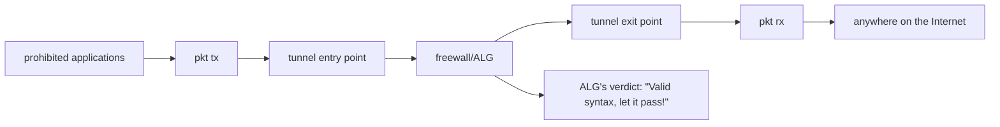
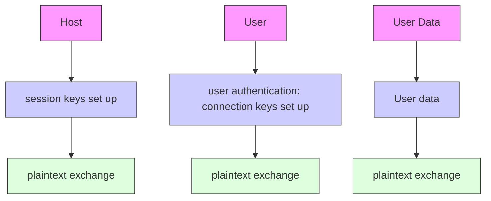

# Detection of Encrypted Tunnels across Network Boundaries

Maurizio Dusi, Manuel Crotti, Francesco Gringoli, Luca Salgarelli

DEA, Universita degli Studi di Brescia, \`

via Branze, 38, 25123 Brescia, Italy

E-mail: <firstname.lastname>@ing.unibs.it

Abstract— The use of covert application-layer tunnels to bypass security gateways has become quite popular in recent years. By encapsulating blocked or controlled protocols such as peerto-peer, chat and e-mail into others allowed by the security policies, such as HTTP, SSH or even DNS, both legitimate and malicious users can effectively neutralize many security restrictions enforced at the network edge. Traditional firewalling techniques, based on Application Layer Gateways and even pattern-matching mechanisms are becoming practically useless as tunneling tools grow more sophisticated.

In this paper we propose an effective solution to this problem based on a statistical traffic classification technique. Our mechanism relies on the creation of a statistical fingerprint of legitimate usage of a given protocol, such as regular remote interactive logins or secure copying activities. Such fingerprint can then be used to detect with high accuracy non-legitimate sessions, i.e., sessions that tunnel other protocols. Results from experiments conducted on a live network suggest that the technique can be very effective, even when the application layer protocol used as a tunnel is encrypted, such as in the case of SSH.

# I. INTRODUCTION

The majority of local area networks today enforce security policies at their boundaries. The policies are usually designed to achieve at least two objectives. On one hand, they try to limit the damages to the network that legitimate clients may cause, for instance by inadvertently downloading virusinfected e-mails or by leaking secret business information to the outside world. On the other hand, network-boundary security policies can limit or sometimes eliminate troubles caused by worms and other types of malware. These network pests, whenever installed inside the LAN, could connect to the Internet and either waste substantial networking resources or, even worse, provide uncontrolled communication channels between the LAN and the attacker’s computers.

Network-boundary security policies are usually implemented by combining two types of devices. A firewall controls that incoming and outgoing traffic passes through an Application Level Gateway (ALG), and enables only traffic using ports allowed by the security policy. ALGs are then responsible for checking that the nature of the traffic crossing the boundaries is conforming to policies, and that it is not malicious.

Firewalls and ALGs can become completely ineffective in at least two cases. On one hand, the tunneling mechanism can be smart enough to fool the ALG into opening the

This work was supported in part by a grant from the Italian Ministry for University and Research (MIUR), under the PRIN project RECIPE. door to malicious traffic by encapsulating it into clear-text payloads. This is the case with HTTP tunneling techniques, which we recently covered in [1]. On the other hand, when the tunneling mechanism is encrypted, any ALG-based technique for filtering tunnels becomes completely ineffective. This is the case with SSH tunnels, which can be activated with any Secure Shell (SSH) [2] implementation.

These tunnels can be configured to protect cryptographically any TCP traffic stream between an SSH client (typically the tunnel entry point) and an SSH server (the exit point), thus making the tunneled connection not detectable by existing payload-based and pattern-matching classifiers employed by ALGs. In this scenario, if network administrators allow SSH to go through the boundary of their network, they lose any control over what the users may port-forward over SSH. On the other hand, completely blocking SSH connections might not be possible, for example when the use of such protocol to protect remote-terminal sessions is essential to the job performed by the users.

In this paper we present a technique based on the statistical analysis of traffic for the enforcement of network-boundary security policies. The key idea is that the information carried by packets at the network layer, such as packet-size and inter-arrival time between consecutive packets, are enough to infer the nature of the application protocol that generated those packets. By characterizing, or fingerprinting, the allowed protocols when used in their native form, we show that it is possible to detect with great accuracy when they are being used to tunnel other protocols. The technique is robust enough to work even when the tunneling mechanism uses encryption to protect the privacy of the traffic itself, such as in the case of SSH. The mechanism we present, called “tunnel hunter”, is empirically derived from a naive Bayes approach. It ¨ follows from our previous work [3] and extends the technique described in [1], to deal with encrypted SSH tunnels, and to prove that it is effective at detecting more types of tunneled traffic, such as peer-to-peer (P2P).

The main research contributions of this paper are:

• the definition of a statistical technique, based on a pattern recognition approach, to detect when a certain encrypted application-layer protocol is being used to tunnel another protocol on top of it;

• the report on a series of experiments carried out on a real network that proves the effectiveness of the technique we

propose here.

The rest of the paper is organized as follows. Section II describes related work. Section III illustrates the SSH tunneling technique we have based our work on. In Sections IV and V we describe our methodology and its application to real traffic on a live network reporting experimental results. Finally, Section VII concludes the paper.

# II. RELATED WORK

The analysis of Internet traffic to detect application-layer protocols has a long history. The use of Deep Payload Inspection (DPI) techniques is today very popular for the classification of network traffic and is implemented in many Network Intrusion Detection Systems such as BRO and Snort [4], [5]. However, the ability to build pattern-matching regular expressions that can effectively classify tunneled traffic has yet to be demonstrated, and it becomes completely ineffective anyway when employed on encrypted tunnels.

A novel kind of approach that could overcome these impairments is based on the analysis of traffic from a statistical point of view as opposed to the deterministic techniques used in DPI-based approaches. Starting with the seminal studies of Paxson such as [6], researchers have proposed several algorithms based on traditional classification techniques such as hierarchical clusterization [7], [8], Nearest Neighbor and Linear Discriminant Analysis [9], and Bayesian Learning Machine [10]. The list of statistical approaches to traffic classification is growing quite long, but to the best of our knowledge, none of these techniques has been yet tested on tunneled traffic with the purpose of strengthening the application of network-boundary policies.

Recently Levine et al. [11] proposed a statistical technique that can violate the privacy of encrypted HTTP streams. Given a web-site, the authors collect the lengths of the packets composing the web request: the mean value of each packet length traces the size profile of the site. In the same way, they derived the time profile from the inter-arrival times of the same packets. They compare the profiles of several websites to a generic web-request trace: by means of a crosscorrelation measure they infer the similarity of such a trace to each given profile and show how it is possible to assess the destination address of the corresponding flow. Liberatore et al. in [12] follow a similar approach, evaluating the technique with a larger data set of web-profiles.

Another work that deals with privacy in encrypted data streams is the one by Wright et al. [13], where it is shown that encrypted IPSec tunnels which carry only a single application protocol leak enough information about the flows in the tunnel to allow to precisely assess their number. The main implication of these works is that encryption is not enough to protect privacy when statistical mechanisms are used to analyze traffic flows.

# III. TUNNEL TECHNIQUES: BASICS

Several mechanisms are available today to build tunnels at the application-layer. From a general point of view, their mode of operation is quite similar, and is depicted in Figure 1.

flowchart

Fig. 1. How tunnels work: high-level scheme.

These tools follow a client-server model: a client host inside the protected network connects to an outside server using an application protocol that is allowed by the networkboundary security policies. Each endpoint then provides the (de)encapsulation of the tunneled protocol and forwards the original data to the actual server or client involved in the communication. Full control of the tunnel endpoints is obviously required, but this is usually not a problem: common setups involve a laptop inside the office and a home computer connected to the Internet through a DSL line, or a computer on any other network connected to the Internet.

At least three protocols can be used to tunnel Internet traffic at the application-layer: DNS, HTTP and SSH.

Tunnels over DNS are very powerful, since the DNS protocol is rarely blocked on the Internet: a good implementation is available at [14]. However, due to its complexity, this technique only allows very low throughput.

Tunnels over HTTP are quite popular since network administrators normally let HTTP traffic pass their network boundaries, even though usually filtering it through an applicationlayer proxy and a firewall. However, both legitimate users and malicious network software (viruses and malware) can violate these policies by using the HTTP protocol to tunnel any other application through the network-boundary, as depicted in Figure 1. In our previous work [1] we tested the open source package htc/hts [15] and we introduced a mechanism that can block all tunneled sessions and detect actual HTTP sessions with an accuracy of over 99%.

# A. SSH tunnels

The SSH protocol is designed to exchange data between two hosts through a secure encrypted connection over an insecure network: run on top of TCP, it provides data confidentiality and integrity. This protocol is typically used for command execution through a secure shell. It also supports secure file copy between peers, and, in addition, tunneling of arbitrary TCP connections. Tunneling over SSH, also known as port forwarding, cryptographically protects otherwise insecure protocols, increasing data and system security.

While in the case of HTTP tunnels advanced ALGs might deeply inspect the payload carried by each flow to deduce some kind of information, in the case of SSH applying well-known signatures to encrypted traffic is completely useless, making tunnels built on SSH very powerful. Networkboundary security policies that allow the use of SSH for remote command execution or secure file copy have no other choice than to accept, with today’s ALGs, that any protocol can be tunneled in and out of the intranet by means of SSH tunnels.

flowchart

Fig. 2. Authentication stage in SSH.

SSH is designed following a client-server model: the server is usually implemented with a daemon running in background and accepting connections to port 22. Data encryption is ensured by the SSH protocol that, before any traffic can be exchanged, requires the peers to negotiate cryptographic credentials [16], [17]. The authentication procedures of SSH impact the way tunnel hunter is implemented. Therefore, we need to go into more details on how they work and how they affect our technique.

# B. The SSH authentication process

An SSH session involves two different authentication phases before client and server can start exchanging data: (i) host authentication and (ii) user authentication. Figure 2 outlines the SSH authentication process.

Host authentication, as reported in [17], provides strong encryption, cryptographic host authentication, and integrity protection. The key exchange method, public key algorithm, symmetric encryption algorithm, message authentication algorithm, and hash algorithm are all negotiated. It is expected that in most environments only two round-trips are needed for full key exchange, server authentication, service request, and acceptance notification of service request: in the worst case, a round-trip more could be required. This authentication phase is transmitted un-encrypted and ends with an SSH MSG NEWKEYS message. All messages sent after this one must use the negotiated keys and algorithms, and are privacy and integrity protected.

User authentication, as reported in [16], is intended to be run over the SSH transport layer protocol, i.e., the encrypted channel derived by the host authentication phase. Public-key is the only mandatory authentication method, although passwords are also accepted. Successful password authentication in SSH requires a single round-trip: the client transmits the password to the server, that replies with an ACK or a NACK. In the last case, the client has other chances to re-send the correct password. The public-key method can either require one or two round-trips: the specifications define an optional initial exchange where the client could send information on its public key to the server before sending a signature with its own private key.

Packets exchanged during the entire SSH authentication process are not useful to a classifier to detect the type of session that the user is opening, i.e., whether the session is tunneling other protocols or is being used for remote command execution or secure file copy. The classifier can easily discard all the packets exchanged up to the client’s SSH MSG NEWKEYS message and the server response, since they are sent in the clear. It is more difficult to detect when user authentication ends, and actual data starts being exchanged, because the second authentication stage is encrypted. In this paper we solve this issue assuming that network administrators are required to choose and allow only one kind of SSH user authentication method to implement tunnel hunter on their networks.

We will discuss this and other aspects related to the way SSH configuration parameters affect our mechanism in Section IV-E.

# IV. TUNNEL HUNTER

The goal of this work is to outline a statistical technique that provides a behavioral characterization of an application layer protocol to detect tunneling activities. It is important to point out that the precision in detecting non-tunneled traffic must be very high. In other words, the system must minimize the number of false-positives, intended as the number of legitimate flows that are incorrectly blocked. Ideally, no legitimate SSH sessions should be stopped by tunnel hunter.

The algorithm we present here has been empirically derived from a naive Bayes approach, presented in our previous ¨ work [3], where it was used to classify different protocols such as POP3, SMTP and HTTP. Here we exploit the same basic classification algorithm to detect SSH tunnels.

We built our model considering only the packets that carry application-layer data: since the technique aims at classifying the application-layer, we do not consider packets without TCP payload, and we simply discard them.

# A. Statistical pattern recognition: basic concepts

Statistical pattern recognition is built on three main definitions: pattern, feature and class [18]. The pattern is an rdimensional data vector $\vec { x } = ( x _ { 1 } , \ldots , x _ { r } )$ of measurements, whose components $x _ { i }$ 1measure the features of an object. The feature represents the variable specified by the investigator and holds a key role in classification. The concept of class is used in discrimination: assuming a set of C classes, named $\omega _ { 1 } , \ldots , \omega _ { C }$ , each pattern x will be associated with a variable 1that denotes its class membership. If the classes are gathered from an a priori training set, that is, the information about how to group the data into classes is known and it is not inferred directly from the data itself, the approach is called supervised, otherwise it is called unsupervised.

Given a set of data and a set of features, the goal of a pattern recognition technique is to represent each element as a pattern, and to assign the pattern to the class that best describes it, according to chosen criteria.

# B. Pattern and features definition

Our technique considers TCP traffic as classification target and it aims at detecting tunnel activities over the SSH application protocols. The technique models a legitimate behavior of an application protocol by extracting basic statistical features from the TCP session that carries it. The features are gathered directly at the IP-level and the pattern is derived straight from the flows composing the TCP session. We define the flow as the unidirectional stream of packets exchanged throughout a TCP session: $F _ { c l i e n t }$ is the flow that goes from the initiator to the responder, while $F _ { s e r v e r }$ is the one going backward. Packets that do not carry TCP payload are discarded: they, in fact, do not introduce any additional information useful for classification.

The features we chose to represent each flow are the packet size s and the inter-arrival time $\Delta t$ between two consecutive packets. Therefore, a session can be represented by two patterns, according to direction:

$$
\vec {x} = \left( \begin{array}{c c c} s _ {1} & \ldots & s _ {r} \\ \Delta t _ {1} & \ldots & \Delta t _ {r} \end{array} \right),
$$

where r corresponds to the number of packets composing the flow excluding the first, since we can start computing the $\Delta t$ after observing the second packet.

The variable s is discrete and, on Ethernet links, it assumes values in the range $[ 4 0 , 1 5 0 0 ]$ bytes. The variable $\Delta t$ instead is quantized with law $q _ { \mathrm { l o g } } ( \cdot )$ and, depending on the clock logresolution of the capture device, spans on a logarithmic scale from $1 0 ^ { - 7 }$ to $1 0 ^ { 3 }$ seconds, with step $1 0 ^ { - 2 }$ .

The choice of these variables is mainly supported by preliminary works of Paxson [6], [19], and by our recent work [3], where the effectiveness in inferring the nature of the application protocol starting from these variables is shown, albeit with the support of preliminary results.

# C. Class definition: the concept of protocol fingerprint

With regards to SSH tunnels, the classifier has to decide whether a certain flow belongs to actual SSH traffic1, rather than using SSH to hide other kinds of application protocols. As a consequence, the design of the classifier has to provide the characterization of only one class $\omega _ { 1 }$ , the SSH one. In the 1rest of the paper we will generically refer to $\omega _ { 1 }$ as the protocol class to characterize.

We gather the class description by means of a supervised approach: we collect a set of flows, i.e., a training set, that we previously certified as belonging to real $\omega _ { 1 }$ traffic. We 1then convert each flow composing the training set into its equivalent pattern representation and we use it to provide 1i.e., used for remote command execution or for copying files.

a non-parametric density estimation of the class. Since we dispose of the samples, we adopt the histogram method. This method partitions the r-dimensional space of the class into a number of equally-sized cells and estimates the density at a point x as follows:

$$
\hat {p} (\vec {x}) = \frac {n _ {j}}{\sum_ {j \in N} n _ {j} d V},
$$

where $n _ { j }$ is the number of samples in the cell of volume $d V$ that straddles the point x, N represents cells and $d V$ is the volume of the cell. If the pattern $\vec { x }$ is r-dimensional, the approach requires $N ^ { r }$ cells. According to our features definition, N is a matrix of 1461x1001 elements, replicated for all the considered r pairs. Although we can act on the free parameter r for reducing the complexity, we opt for not estimating the class-conditional density, finally getting a complexity of $r \cdot N$ cells. In making this choice, we assume that consecutive pairs of $( s , \Delta t )$ variables are independent. We will see that this assumption not only greatly reduces the mechanism’s complexity, but also leads to excellent results. We also fixed the maximum size of the pattern to L elements: each flow of the training set then gives a contribution to estimate the first min(r, L) densities, where r is the dimension of the pattern associated to the flow, i.e., the length of the sequence composed of all the $( s , \Delta t )$ pairs.

There is a problem that affects the histogram method: since it provides a discontinuous description of the sample distribution, the value of each cell in the matrix can abruptly fall to zero at the boundaries of any populated region. This may mislead the description of the protocol and, even worse, does not takes into account “noise” factors such as network congestion: a variation of the round trip time could introduce noise in the measurements of ∆t and one of the packets of the flow could fall in a zero-valued cell of the matrix even if the surrounding cells are populated with non zero values. To solve this issue, we introduce a Gaussian filtering: in literature, this approach is known as kernel method or, equivalently, as Parzen method. Since we prefer to deal with density estimation even after the filtering operation, matrices are rescaled so they still sum up to 1.

We apply this procedure separately to a training set of $F _ { c l i e n t }$ and $F _ { s e r v e r }$ flows, finally getting two different descriptions of the traffic class under observation. Each description composes what we call the fingerprint of the “legitimate” use2 of the SSH protocol, which we indicate with M .

# D. Tunnel detection algorithm

In its general form, given a set of classes, our classifier assigns a pattern to the class that minimizes what we called the anomaly score:

$$
S (\vec {x} | \omega_ {j}) = \sum_ {i = 1} ^ {\min (r, L)} \frac {\varepsilon}{p (x _ {i} | \omega_ {j}) \cdot \min (r , L)}, \tag {1}
$$

2i.e., when used not to tunnel other protocols.

where $p ( x _ { i } | \omega _ { j } )$ represents the probability that the i-th element of the flow pattern belongs to class $\omega _ { j }$ , that is the value $M _ { j } ( s _ { i } , \Delta t _ { i } )$ . Since the denominator must be non-zero, we define $p ( x _ { i } | \omega _ { j } )$ as max $( \varepsilon , M _ { j } ( s _ { i } , \Delta t _ { i } ) )$ , where ε is an arbitrarily small quantity that we fixed at 10−12. As a consequence, a single pair falling out from the fingerprint (class) does not make the whole sum go to infinity. By construction, the anomaly score can assume values in the range [0, 1].

The classification algorithm has to decide whether an unknown flow F is conforming to the legitimate class $\omega _ { 1 } :$ this task can be accomplished after the so called class $\omega _ { 0 } .$ , or rejected region, has been defined. This region is the complementary part of the acceptance region and we expect that all the flows not belonging to $\omega _ { 1 }$ will fall into this class. We 1limit the acceptance region by introducing a threshold T in the classification process and a simple decision rule as follows:

$$
\vec {x} \in \left\{ \begin{array}{l l} \omega_ {1} & \text { if } S (\vec {x} | \omega_ {1}) <   T, \\ \text { UNKNOWN } & \text { otherwise }. \end{array} \right.
$$

In general, we do not need to wait the end of the flow to emit a classification verdict, but limit our observation to $L + 1$ packets. As we explain in Section V, we tune the threshold considering that each $( s , \Delta t )$ pair gives a contribution in the range $[ 0 , 1 / \operatorname* { m i n } ( r , L ) ]$ : the number of pairs that we let fall in a zero-valued cell of the fingerprint dictates the threshold bound.

# E. Dealing with SSH authentication

The algorithm we described above is designed for classifying a flow by considering its first packets. In the case of SSH tunnels, this choice could be counterproductive: as depicted in Section III-A, the SSH protocol provides an initial, twophase authentication stage that is independent on the use of the connection – remote command execution, secure copy or port forwarding.

Therefore, to eliminate the contribution of the whole authentication stage and apply tunnel hunter to SSH traffic, we introduce the concept of “shifted window”: in this way we can explicitly specify the pairs $( s , \Delta t )$ that will be considered by the classification algorithm to compute the anomaly score. The intent is to have the anomaly score calculated only on the packets that represent actual data exchange, excluding the ones that carry authentication information.

To this end, we modify Equation 1 as follows:

$$
S _ {[ n _ {0} \rightarrow n ]} (\vec {x} | \omega_ {1}) = \sum_ {i = n _ {0}} ^ {n} \frac {\varepsilon}{p (x _ {i} | \omega_ {1}) \cdot (n - n _ {0})}, \tag {2}
$$

where $n _ { 0 }$ is the index of the first considered pair, and should 0point to the first packet that carries actual user traffic in each SSH session.

Fixing $n _ { 0 } ~ \mathrm { \bf ~ t o ~ }$ the correct value requires making a few 0assumptions. In fact, depending on the type of user authentication, such as password or public-key, or on whether there are errors during the authentication process, e.g., wrong password, errors during the public-key exchange, etc., $n _ { 0 }$ should point to different packet indexes.

In this work we solve this issue with a simplification: we assume that all legitimate, non-tunneling SSH sessions use a uniform, two-round-trip user authentication phase. This makes the classifier select the third $F _ { c l i e n t }$ packet after it sees the SSH MSG NEWKEYS message as the n pair. Any client based on OpenSSH will generate a two-round-trip user authentication phase when using public-keys as credentials, as many other SSH implementations would, so this choice was reasonable at least in our environment. Clearly, other network administrators might want to fix $n _ { 0 }$ to other values, depending 0on the type of SSH user authentication they need to support.

Having to fix an a-priori value for $n _ { 0 }$ has an implication 0on the behavior of tunnel hunter that needs to be pointed out. In case of authentication errors, a further attempt will result in a connection that, deviating from the pre-set statistical behavior, is going to be blocked by the classifier. However, this should not be a major problem: simply, if the user is entitled to connect, they will try again.

# V. EXPERIMENTAL RESULTS

In this Section we report experimental results that show the effectiveness of tunnel hunter at detecting tunnel activities over SSH. The aim of tunnel hunter is to detect (block) SSH sessions that are being used to tunnel other application-layer protocols: SSH sessions used for remote command execution and secure copy, instead, must pass through. We refer to non-tunneling SSH sessions as “legitimate”. We think this is a common scenario with enterprise network manager: on one hand, they need their users to be able to access remote computers to run interactive tasks, or to copy files. On the other hand, they do not want users to violate security policies by tunneling other protocols on top of SSH.

We ran all the experiments on the 100Base-TX link that connects the edge router of our campus network to the Internet. This network serves around one thousand users and it is composed of several 1000Base-TX layer-2 segments.

In order to recognize tunneled traffic, an initial training phase is needed to build the protocol fingerprints, as described in Section IV-C. We started by collecting a large number of non-tunneled sessions for SSH, by running Tcpdump [20] on the edge gateway of our campus network. This is a crucial part of the process since it gathers the training set: only legitimate traffic has to be collected and all tunneling sessions must be filtered out.

After an appropriate fingerprint has been installed, as a new flow comes, its anomaly score versus the fingerprint is calculated packet by packet. At any time, starting from the $n _ { 0 } \ –$ 0th pair, the score can be compared to the threshold. We will see in the following what packet number is best in our scenario for detecting tunneled traffic, while guaranteeing a low rate of flows incorrectly classified as non-conforming. Moreover, we will discuss about the use of the shifted window in the classification process of SSH tunnels.

We collected traces of legitimate SSH sessions by running Tcpdump on the campus edge gateway while several colleagues helped us realizing interactive sessions and securely copying files to same remote servers located inside the network of the Engineering faculty of the University of Rome Tor Vergata, in the network of the University of Trento, on a data center in Utah (USA), and finally on a home PC connected to Internet through a fast, 8Mb/s DSL line. The SSH clients used in this phase were run on a mix of different operating systems such as Mac OS X, Linux and various versions of Microsoft Windows.

We configured all the clients to respect the assumptions described in Section IV-E: public-key as the user-authentication method, public-key verification enabled. We also disabled compression on both SSH clients and servers. Users not conforming to these policies would see their legitimate SSH traffic blocked by tunnel hunter, which once again seems like a reasonable restriction that a network administrator could set.

During a three-week period, we collected the training set, i.e., around four thousand legitimate SSH sessions, from which we derived the SSH/SCP fingerprint. It is worth noting that we gathered the fingerprint without considering the hostauthentication stage, since we discard it during the feature extraction process by looking for the SSH MSG NEWKEYS message.

<table><tr><td>Protocols</td><td>Hit ratio</td><td># sessions</td></tr><tr><td>SSH</td><td>98.95%</td><td>600</td></tr><tr><td>SCP</td><td>99.69%</td><td>1700</td></tr><tr><td>POP3 over SSH</td><td>87.89%</td><td>2360</td></tr><tr><td>SMTP over SSH</td><td>99.93%</td><td>4300</td></tr><tr><td>CHAT over SSH</td><td>88.31%</td><td>2100</td></tr><tr><td>P2P over SSH</td><td>88.77%</td><td>1600</td></tr></table>

TABLE I SSH SESSIONS CORRECTLY CLASSIFIED (OPTIMAL PARAMETERS) AND CARDINALITY OF THE EVALUATION SET.

We then collected traffic for the evaluation set. We started running a SSH tunnel, using the package available at [21]. We run one end of the tunnel on a Mac OS X workstation inside the campus network. The other end was in turn located on the same server used to collect actual SSH traffic.

In order to be able to tunnel P2P traffic as well, we setup an additional tool at the tunnel entry point. In fact, since peerto-peer protocols such as BitTorrent are designed to simultaneously open a large number of connections towards other peers, the actual destination “server” continuously changes in this case. To make sure to convey all peer-to-peer connections through the SSH tunnel, we implemented a gateway on a Linux workstation inside the campus network. We then configured a few machines, dedicated to P2P activities, to use it as default gateway: their outgoing traffic was then encapsulated by this gateway inside the tunnel. The tunnel exit point provided traffic de-encapsulation and masquerading through Iptables [22] so that backward traffic was also crossing the tunnel.

After several weeks, we recorded about another six hundred interactive sessions and about one thousand and seven hundred bulk-transfer sessions. We also recorded encrypted flows tunneling Chat, POP3, SMTP and P2P (BitTorrent) protocols. This was simple to do since we knew a priori the addresses of the tunnel exit points. Once again, we excluded the host authentication phase from every session: this let us filter out from the evaluation set all the spurious sessions that did not complete host authentication. Table I reports the number of sessions that finally composed the SSH evaluation set.

As discussed above, the application of tunnel hunter to SSH requires the use of the shifted window optimization, as described in Section IV-E. We studied the performance of the technique varying the size and the starting packet of the window. The best results are shown in Table I and were achieved configuring the algorithm to work on $F _ { c l i e n t }$ flows, setting the threshold $T = 3 / 8$ , and computing the anomaly score in the window [6  13]. The optimization of these parameters is discussed later in Section VI.

As the results suggest, tunnel hunter can detect legitimate SSH/SCP sessions with more than 98% accuracy3. In other words, the system can indeed be configured to minimize falsepositives: all legitimate SSH sessions and the vast majority of SCP sessions are not blocked by the classifier. At the same time, the technique is quite effective at blocking tunnel activities. Even the worst blocking rate is very close to 90%.

Naturally, one could even think of improving the blocking rate of tunneled protocols, at the expense of increasing the false-positives. However, even wanting to minimize the falsepositive rate as we did in this case, the precision with which other tunneled protocols are detected is already very promising.

# VI. OPTIMIZING CONFIGURATION PARAMETERS

Finding the optimal values for the threshold T and the initial “shifted window” value $n _ { 0 }$ (see Section IV-E) is necessary in 0order for tunnel hunter to perform properly.

Both parameters can be optimized by running the algorithm on a subset of SSH and SCP $F _ { c l i e n t }$ flows used neither for fingerprinting nor for evaluating, and fixing the accuracy of detection to the desired value. In our case, we chose to optimize the parameters so that tunnel hunter would have a maximum of 1% false positives, i.e., would correctly classify at least 99% of legitimate SSH and SCP traffic.

By varying the threshold’s $T$ in the range [0 : 1], and $n _ { 0 }$ 0in the range [1 : 10] and requiring the algorithm to perform with 99% accuracy as explained above, we found the optimal value for $T = 3 / 8 ,$ , which corresponds to accepting that three out of eight packets fall out of the fingerprint’s description. Parameter $\boldsymbol { n _ { 0 } } \mathrm { \Delta } ^ { \prime } \mathbf { s }$ optimal value came out to be the sixth pair.

0This type of optimization procedure would need to be applied by any network manager that wanted to implement our technique. Depending on the type of tunneled traffic, on the network architecture, and on the target rate of false positives, the optimal value in their case might differ from ours.

# VII. CONCLUSIONS AND FUTURE WORK

In this paper we have presented a statistical mechanism called tunnel hunter that can successfully recognize whenever a generic application protocol is tunneled on top of SSH. Tunnel hunter is an application of the concept of protocol fingerprint [3], which provides a behavioral description of an application protocol by considering three simple properties of IP packets: their size, inter-arrival time and arrival order. The main idea exploited by this paper is that the fingerprint can be derived by training the system on legitimate, non-tunneling SSH usage, and later used to detect application-layer tunnels that are run on top of a Secure Shell. The system provides parameters that can be configured to obtain any pre-set goal with respect to the desired false-positive ratio.

The experimental results we obtained are very promising. First and foremost, virtually no legitimate traffic is blocked by our mechanism, since over 99% of valid SSH and SCP sessions are correctly recognized as legitimate by tunnel hunter. Second, and equally important, the vast majority of tunneled traffic is blocked by the mechanism.

These results, together with the ones presented in [1] for HTTP tunnels, suggest that this technique can be used to complement existing ALGs in two different ways. On one hand, it can augment their ability to recognize outgoing tunneled traffic, even if encrypted, therefore improving the effectiveness of security policies against non-complying users. On the other hand, it can help anti-virus and anti-spyware tools in detecting outgoing tunneled traffic generated by robots and compromised machines. Although this paper reports only results related to the first class of applications, we plan on continuing our tests to verify the applicability of this technique to the second class.

The next natural step is to improve the model, first by adapting the “shifted window” mechanism described in Section IV-E to make it dynamic. This should allow the system to counter attacks where tunnels would be opened after a few packets of a legitimate session were exchanged.

Furthermore, at this time tunnel hunter can only signal that an SSH session is being used not to perform secure copy or interactive remote logins, but cannot discriminate which protocol (POP3, HTTP, SMTP, etc.) is actually being tunneled. Adding this capability to our technique will require further research.

# REFERENCES

[1] M. Crotti, M. Dusi, F. Gringoli, and L. Salgarelli, “Detecting HTTP Tunnels with Statistical Mechanisms,” in Proceedings of the 42th IEEE International Conference on Communications (ICC 2007), (Glasgow, Scotland), pp. 6162–6168, June 2007.   
[2] T. Ylonen and C. Lonvick, “The Secure Shell (SSH) Protocol Architecture,” RFC 4251, IETF, Jan. 2006.   
[3] M. Crotti, M. Dusi, F. Gringoli, and L. Salgarelli, “Traffic Classification through Simple Statistical Fingerprinting,” ACM SIGCOMM Computer Communication Review, vol. 37, pp. 5–16, Jan. 2007.   
[4] V. Paxson, “Bro: a system for detecting network intruders in real-time,” Computer Networks, vol. 31, no. 23–24, pp. 2435–2463, 1999.   
[5] M. Roesch, “SNORT: Lightweight Intrusion Detection for Networks,” in LISA ’99: Proceedings of the 13th USENIX Conference on Systems Administration, (Seattle, WA, USA), pp. 229–238, Nov. 1999.   
[6] V. Paxson, “Empirically derived analytic models of wide-area TCP connections,” IEEE/ACM Transactions on Networking, vol. 2, no. 4, pp. 316–336, 1994.   
[7] F. Hernandez-Campos, F. D. Smith, K. Jeffay, and A. B. Nobel, “Sta- ´ tistical Clustering of Internet Communications Patterns,” in Computing Science and Statistics, vol. 35, July 2003.   
[8] A. McGregor, M. Hall, P. Lorier, and J. Brunskill, “Flow Clustering Using Machine Learning Techniques,” in Proceedings of the 5th Passive and Active Measurement Workshop (PAM 2004), (Antibes Juan-les-Pins, France), pp. 205–214, Mar. 2004.   
[9] M. Roughan, S. Sen, O. Spatscheck, and N. Duffield, “Class-of-service mapping for QoS: a statistical signature-based approach to IP traffic classification,” in IMC ’04: Proceedings of the 4th ACM SIGCOMM conference on Internet measurement, (Taormina, Sicily, Italy), pp. 135– 148, Oct. 2004.   
[10] A. W. Moore and D. Zuev, “Internet traffic classification using bayesian analysis techniques,” in SIGMETRICS ’05: Proceedings of the 2005 ACM SIGMETRICS International Conference on Measurement and Modeling of Computer Systems, (Banff, Alberta, Canada), pp. 50–60, June 2005.   
[11] G. Bissias, M. Liberatore, D. Jensen, and B. N. Levine, “Privacy Vulnerabilities in Encrypted HTTP Streams,” in Proc. Privacy Enhancing Technologies Workshop (PET 2005), (Dubrovnik, Croatia), May 2005.   
[12] M. Liberatore and B. N. Levine, “Inferring the source of encrypted http connections,” in CCS ’06: Proceedings of the 13th ACM conference on Computer and Communications Security, (Alexandria, Virginia, USA), pp. 255–263, 2006.   
[13] C. V. Wright, F. Monrose, and G. M. Masson, “On Inferring Application Protocol Behaviors in Encrypted Network Traffic,” Journal of Machine Learning Research, vol. 7, pp. 2745–2769, Dec. 2006.   
[14] F. Heinz and J. Oster, “DNS tunnel.” http://nstx.dereference.de/nstx.   
[15] L. Brinkhoff, “GNU httptunnel.” http://www.nocrew.org/software/httptunnel.html.   
[16] T. Ylonen and C. Lonvick, “The Secure Shell (SSH) Authentication Protocol,” RFC 4252, IETF, Jan. 2006.   
[17] T. Ylonen and C. Lonvick, “The Secure Shell (SSH) Transport Layer Protocol,” RFC 4253, IETF, Jan. 2006.   
[18] A. Webb, Statistical Pattern Recognition. Wiley, 2nd ed., 2002. ISBN 0-470-84514-7.   
[19] V. Paxson and S. Floyd, “Wide area traffic: the failure of Poisson modeling,” IEEE/ACM Transactions on Networking, vol. 3, no. 3, pp. 226–244, 1995.   
[20] “Tcpdump/Libpcap.” http://www.tcpdump.org.   
[21] “OpenSSH.” http://www.openssh.org.   
[22] N. C. Team, “netfilter/iptables.” http://www.netfilter.org.