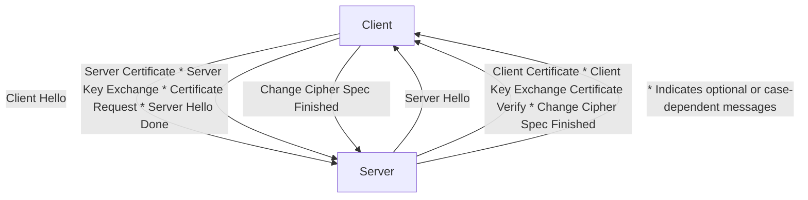
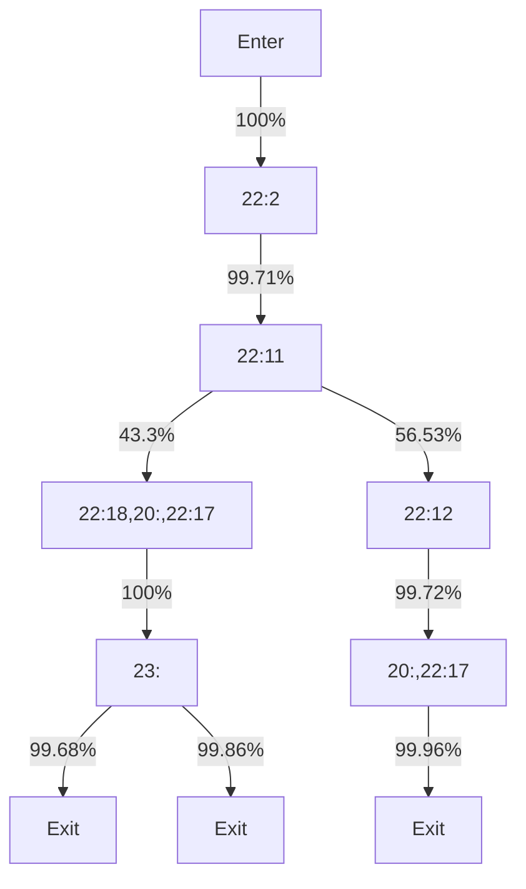
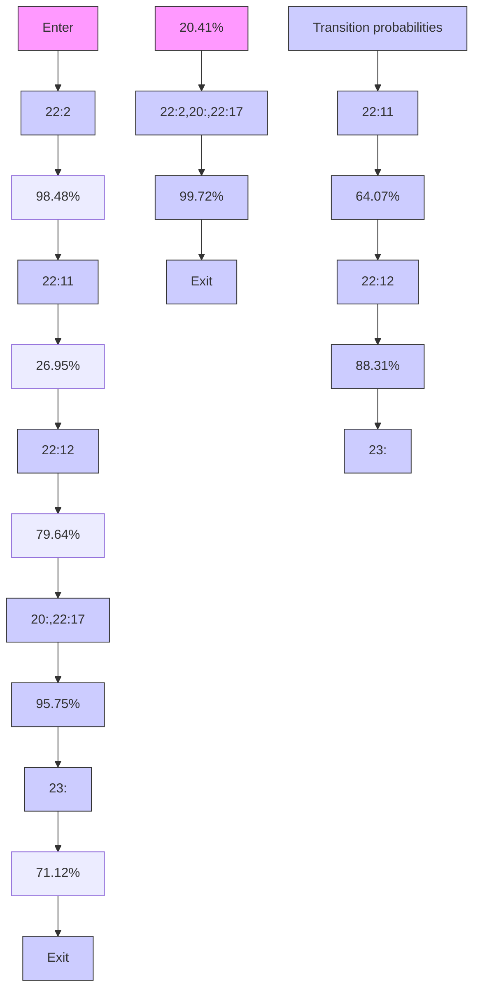
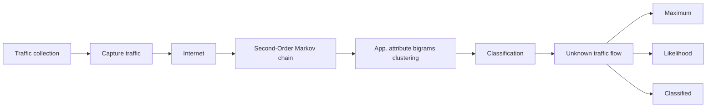
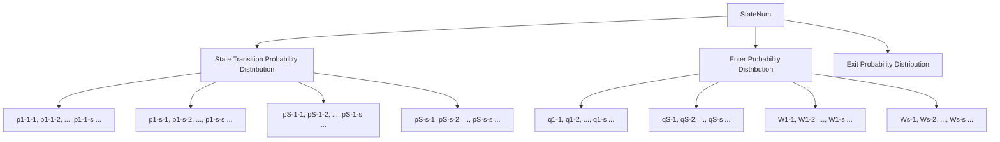
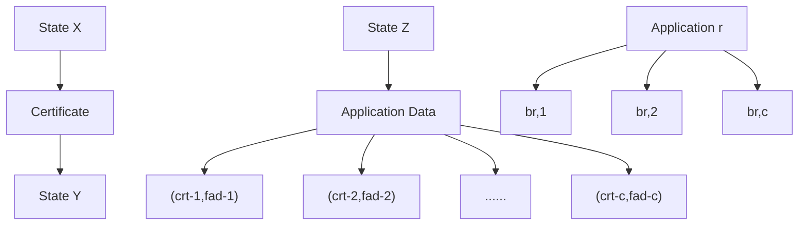

# Classification of Encrypted Traffic With Second-Order Markov Chains and Application Attribute Bigrams

Meng Shen, Member, IEEE, Mingwei Wei, Liehuang Zhu, Member, IEEE, and Mingzhong Wang, Member, IEEE

Abstract— With a profusion of network applications, traffic classification plays a crucial role in network management and policy-based security control. The widely used encryption transmission protocols, such as the secure socket layer/transport layer security (SSL/TLS) protocols, lead to the failure of traditional payload-based classification methods. Existing methods for encrypted traffic classification cannot achieve high discrimination accuracy for applications with similar fingerprints. In this paper, we propose an attribute-aware encrypted traffic classification method based on the second-order Markov Chains. We start by exploring approaches that can further improve the performance of existing methods in terms of discrimination accuracy, and make promising observations that the application attribute bigram, which consists of the certificate packet length and the first application data size in SSL/TLS sessions, contributes to application discrimination. To increase the diversity of application fingerprints, we develop a new method by incorporating the attribute bigrams into the second-order homogeneous Markov chains. Extensive evaluation results show that the proposed method can improve the classification accuracy by 29% on the average compared with the state-of-the-art Markov-based method.

Index Terms— Encrypted traffic classification, second-order Markov chain, SSL/TLS, certificate, application data.

# I. INTRODUCTION

N ETWORK traffic is composed of packets carrying databelonging to a variety of applications. Classification of belonging to a variety of applications. Classification of traffic helps network operators to identify specific applications and protocols that exist in a network, which can be useful for many different purposes [19], [32], [33], such as network planning, application prioritization for QoS guarantees, and

Manuscript received September 11, 2016; revised February 11, 2017 and March 31, 2017; accepted April 4, 2017. Date of publication April 12, 2017; date of current version May 8, 2017. This work was supported in part by the National Science Foundation of China under Grant 61602039, in part by the Beijing Natural Science Foundation under Grant 4164098, and in part by the China National Key Research and Development Program under Grant 2016YFB0800301. The associate editor coordinating the review of this manuscript and approving it for publication was Dr. Tansu Alpcan. (Corresponding author: Liehuang Zhu.)

M. Shen, M. Wei, and L. Zhu are with the Beijing Engineering Research Center of High Volume Language Information Processing and Cloud Computing Applications, School of Computer Science, Beijing Institute of Technology, Beijing 100081, China (e-mail: shenmeng@bit.edu.cn; weimingwei@ bit.edu.cn; liehuangz@bit.edu.cn).

M. Wang is with the Faculty of Arts, Business and Law, University of the Sunshine Coast, Sippy Downs, QLD 4556, Australia (e-mail: mwang@usc.edu.au).

Color versions of one or more of the figures in this paper are available online at http://ieeexplore.ieee.org.

Digital Object Identifier 10.1109/TIFS.2017.2692682

policy deployment for security control. For instance, a network operator might want to assign traffic from known popular applications with a higher priority for better user experience, and an enterprise network operator might block traffic from a given application by means of application-level firewalls.

Traditional traffic classification techniques are often designed based on the analysis of packet contents, such as the port-based methods and the payload-based methods. In recent years we have seen a dramatic growth in the usage of encryption protocols, such as the SSL/TLS protocols [13], [16]. Since packet payloads are encrypted, these methods can no longer fulfil efficient recognition. Therefore, it is desirable to develop classification methods for encrypted traffic [12]. Korczynski and Duda proposed such a method by using the first-order homogeneous Markov chains [19], which is the state-of-the-art Markov-based method for encrypted traffic classification. They take advantage of a sequence of message types in the SSL/TLS headers of a given application, which appears in a single-direction flow from a server to a client, to build the first-order homogeneous Markov chain as a statistical fingerprint for that application.

Information embedded in SSL/TLS sessions naturally forms a sequence with time-varying message types, which is analogous to the state transitions in the Markov chain. Therefore, it is reasonable to apply the Markov chain to the construction of application fingerprints. In addition, compared with other machine learning methods, such as neural networks [31], the Markov chain leads to less computational complexity during the training and classification processes.

Although computationally efficient, the precondition to achieve a high classification accuracy with the Markov chain relies on the assumption that the fingerprint of each application should be distinctive enough. Unfortunately, it is quite difficult to get distinctive fingerprints based merely on the first-order Markov chain, since the number of states in SSL/TLS sessions for modeling are very limited. When similar state transitions appear in multiple application fingerprints, an unknown traffic flow is always categorized as the application with the maximum likelihood. In other words, traffic flows corresponding to a Markov chain with a low probability of occurring are prone to be misclassified. For instance, we have created the first-order Markov chain fingerprint for Instagram based on collected datasets: more than 75% of the SSL/TLS sessions fall into the same state transition chain while the rest of Instagram chain instances with low probabilities are usually misclassified as other applications (cf. Table V). Similar results are also observed for Amazon EC2 flows [19].

To address these problems, we propose a new method to classify encrypted traffic. The basic idea is to increase the diversity of application fingerprints. We leverage the secondorder homogeneous Markov chain, instead of the first-order Markov chain [19], which strikes a better balance between modeling complexity and veracity. We take advantage of consecutive 3 states to build state transition when modeling the second-order Markov chain, which captures more distinctive features of a given application. We also explore the contribution of some common message types in SSL/TLS sessions to the discrimination of fingerprints. Our analysis reveals that Certificate packet length and the size of the first Application Data emerged in an SSL/TLS session can be regarded as critical features for traffic classification. Thus, we build more distinctive fingerprints for given applications, by incorporating clusters of the aforementioned attribute bigram into the second-order Markov chain.

We briefly summarize our main contributions as follows.

• Using real-world encrypted traffic, we make observations on cases where the first-order Markov chians are prone to misclassification of certain applications.   
• We propose a new method to build application fingerprints by incorporating attribute bigrams into the secondorder homogeneous Markov chains. We also devise a simple but effective criterion to measure the clustering accuracy, with no need of retraining a classifier.   
• We verify the effectiveness of the proposed method by real traffic datasets. The evaluation results show a good accuracy of about 90% for traffic classification, and a 29% improvement on an average compared with the state-ofthe-art Markov-based method [19].

Compared with our previous work [29], we extend the application fingerprints by leveraging a new application attribute (i.e., the first Application Data in an SSL/TLS session), propose a clustering algorithm of application bigrams, and conduct more performance evaluation in this paper.

To the best of our knowledge, this is the first paper that introduces the application attribute bigram in encrypted traffic classification. The rest of this paper is organized as follows. We summarize the related work and describe our motivation in Section II and Section III, respectively. The modeling process of our method for encrypted traffic classification is presented in Section IV, which is followed by the design details of application attribute bigram clustering in Section V. Section VI exhibits the evaluation results. After a brief discussion in Section VII, we conclude this paper in Section VIII.

# II. RELATED WORK

# A. SSL/TLS Background

The Secure Sockets Layer [16] and Transport Layer Security [13] protocols provide communication security and data integrity over the Internet. Therefore, SSL/TLS protocols are primarily used to encrypt confidential data sent over an insecure network. SSL/TLS are composed of two layers [13], [16]. One is the Handshake Protocol with the function of negotiating parameters of an SSL/TLS session. The other is called the Record Protocol, with the function of transferring encrypted data under secure parameters generated from the Handshake Protocol. In our study, we extract effective features mainly from the Handshake Protocol.

flowchart

Fig. 1. Interactions in SSL/TLS handshake protocol.

Figure 1 illustrates an example scenario of interactions in the SSL/TLS Handshake Protocol. Initially, the client sends to the server a request for encrypted communication labeled as Client Hello, which includes five attributes: Protocol Version, Random Number-1, Session ID, Cipher Suite and Compression Method. Then, the server replies with Server Hello, which includes: Protocol Version confirmed, Random Number-2, Session ID, Cipher Suite confirmed and Compression Method confirmed. If the server is to be authenticated, the server sends its certificate immediately following the server hello message. Next, the client replies with Random Number-3, Change Cipher Spec and client-side Finished message if the server certificate passes validation. The two sides share three random numbers so far and use them as parameters to generate the same session key with methods negotiated above. Ultimately, the server responses with Change Cipher Spec and the server-side Finished message. Now the Handshake Protocol stage is over, and the following communication is protected by the encryption and compression methods negotiated between the two parties.

In consideration of specific configurations on the clientside, such as the SSL/TLS protocol settings in different web browsers, we expect differences in the client-side models, whereas the server-side configuration model should be coincident across multiple sessions. So in this paper, we consider only the server-side message types of an SSL/TLS session for modeling. We also adopt the same notations as in the literature [19] to represent message types during an SSL/TLS session (cf. Table I). For instance, we denote Server Hello by 22:2 and Application Data by 23:.

# B. Summary of Traffic Classification Methods

We briefly summarize the traffic classification methods in unencrypted and encrypted network environments in Table II.

1) Methods in Unencrypted Network Traffic Environment: The basic idea of these methods is to obtain useful information from packet contents. The port-based method implemented traffic classification by checking the TCP/UDP port number at the transport layer [25]. Unfortunately, the port hopping techniques make the port-based methods inefficient. Yao et al. [27], [33] designed systematic frameworks for classifying network traffic generated by mobile applications at a perflow granularity. They leveraged the persistent lexical context in the HTTP headers generated by mobile applications and thus achieved a high classification accuracy for HTTP flows. The typical approach of the payload-based methods [15] is to compare the contents in traffic payloads with a predefined feature set, and then mark matching results as the basis of classification. The precision and efficiency of the payload-based methods are influenced by the feature matching algorithm. However, such approaches cannot be applied to the encrypted traffic as the payloads are encrypted.

TABLE I NOTATIONS AND THEIR CORRESPONDING SSL/TLS MESSAGE TYPES 

<table><tr><td>Notation</td><td>SSL/TLS Message Type</td></tr><tr><td>20:</td><td>Change Cipher Spec</td></tr><tr><td>21:</td><td>Alert</td></tr><tr><td>22:0</td><td>Hello Request</td></tr><tr><td>22:2</td><td>Server Hello</td></tr><tr><td>22:11</td><td>Certificate</td></tr><tr><td>22:12</td><td>Server Key Exchange</td></tr><tr><td>22:13</td><td>Certificate Request</td></tr><tr><td>22:14</td><td>Server Hello Done</td></tr><tr><td>22:15</td><td>Certificate Verify</td></tr><tr><td>22:17</td><td>Encrypted Handshake Message</td></tr><tr><td>22:18</td><td>New Session Ticket</td></tr><tr><td>22:20</td><td>Finished</td></tr><tr><td>23:</td><td>Application Data</td></tr><tr><td>23:11</td><td>Continuation Data</td></tr></table>

TABLE II SUMMARY OF EXISTING TRAFFIC CLASSIFICATION METHODS 

<table><tr><td>Category</td><td>Methods</td></tr><tr><td>Plaintext Traffic</td><td>Port-Based [5, 25]Header-Based [27, 33]Payload-Based [15, 24, 35]</td></tr><tr><td>Encrypted Traffic</td><td>Website Fingerprints [17, 22, 23, 26]Smartphone Fingerprinting [30]Application Identification [6–8, 18, 19, 27, 32–34]User Action Recognition [9–11]</td></tr></table>

2) Methods in Encrypted Network Traffic Environment: Existing studies on web fingerprints [17], [22], [23], [26] attempt to uncover the identity of the requested sites in the encrypted tunnels such as OpenSSH and anonymous networks (e.g., Tor). Herrmann et al. [17] applied the text mining techniques to the normalised frequency distribution of observable IP packet sizes and achieved better results than the previously known methods like Naive Bayes. Panchenko et al. [26] leveraged the support vector machines with the carefully selected traffic features (e.g., the volume, time and direction of the traffic) for website fingerprinting. Stober et al. [30] used the network traffic generated from popular applications, such as Facebook, Skype and Dropbox, to reliably identify a smartphone. Conti et al. [9], [10] employed machine learning techniques, such as dynamic time warping, hierarchical clustering and random forest classifier, to identify specific actions that users perform on their mobile applications.

In the field of application identification, Korczynski and Duda [18] developed an accurate method for classifying SSL encrypted TCP flows belonging to Skype, which is a typical application relying on Peer-to-Peer infrastructure [7]. Bernaille et al. [6] proposed a method to identify multiple applications from encrypted traffic by excavating flow features, including the IP address, the source/destination ports, the packet size of the first 4 packets in TCP connection. The quality of classification may be degraded due to frequent changes of ports. Zhang et al. [34] presented a nearest neighbor-based method but they could not obtain fine-grained classification at the application granularity.

Our work is closely related to the study conducted by Korczynski and Duda [19]. They proposed stochastic fingerprints for application traffic flows conveyed in SSL/TLS session, which showed promising results of applying the Markov chains in application discrimination. However, in some cases where applications have similar fingerprints, their method fails to achieve a high classification accuracy (cf. Section VI).

Compared with the previous work [29], we further enrich the state transitions in the Markov chain and construct more distinctive application fingerprints. Specifically, we explore more application attributes to form the attribute bigram, the clusters of which are then incorporated into the second-order Markov chain. Both the first-order Markov chain [19] and our method can be categorized as the combination of the payloadbased and statistical approaches. On one hand, we leverage the statistical probabilities of state transitions; on the other hand, we need to extract information from the TCP payload, more precisely from each SSL/TLS header.

# III. MOTIVATION

The first-order homogeneous Markov chain has shown its utility in encrypted traffic classification [19]. In this section, we briefly describe its modeling process and analyze its limitations that motivate us to carry out further studies.

Let a sequence of states $X = \{ X _ { t } \} ( t \in [ 1 , T ] )$ represents a chain of server-side message types in an SSL/TLS session, where $X _ { t }$ is a discrete-time random variable. The value of $X _ { t }$ is denoted by $i _ { t } ,$ , which is either an SSL/TLS message type (e.g., 22:11) or a series of SSL/TLS message types transmitted in one TCP segment (e.g., 22:2,20:). Homogeneous means that a state transition from time t − 1 to t is invariant. The probability of each state transition is defined as

$$
P \left(X _ {t} = i _ {t} \mid X _ {t - 1} = i _ {t - 1}\right) = P \left(X _ {t} = j \mid X _ {t - 1} = i\right) = p _ {i - j} \tag {1}
$$

In addition, define $q _ { i _ { 1 } }$ as ENter Probability Distribution (ENPD), which represents the probability of $i _ { 1 }$ being the entering state of the Markov chain. Similarly, define $w _ { i _ { T } }$ as EXit Probability Distribution (EXPD), which represents the probability of $i _ { T }$ being the exit state of the Markov chain.

The probability that an unknown flow with the state sequence $X _ { 1 } , . . . , X _ { T }$ being an application i is calculated as

$$
P \left(\{X _ {1}, \dots , X _ {T} \}\right) = q _ {i _ {1}} \times \prod_ {t = 2} ^ {T} p _ {i _ {t - 1} - i _ {t}} \times w _ {i _ {T}} \tag {2}
$$

flowchart

Fig. 2. Parameters of the fingerprint for LinkedIn

flowchart

Fig. 3. Parameters of the Fingerprint for Evernote.

The maximum likelihood criterion is used to decide which application the unknown flow belongs to, i.e., the unknown flow is classified as the application having the largest probability.

In order to build and validate fingerprints based on the first-order Markov chain [19], we have collected real-world encrypted traffic datasets from a campus network (Section VI for more details). The validation results show that such fingerprints may result in misclassification in certain cases.

Example 1: Figures 2 and 3 illustrate the fingerprints for LinkedIn and Evernote, respectively. For clarity, the diagrams contain only states with meaningful probabilities to be simplified. In fact, full Markov chain fingerprints are generally complex for including lots of states. A sequence of SSL/TLS message types $2 2 : 2 \ - \ 2 2 : 1 1 \ - \ 2 2 : 1 2 \ - \ 2 0 : , 2 2 : 1 7$ - 23 is an Evernote flow, which is known as the ground truth. Plugging this sequence into the above two fingerprints (the calculation details are omitted here), we find that the probability of being a LinkedIn flow is 0.5611, whereas that of being an Evernote flow is 0.1146. According to the maximum likelihood criterion, we incorrectly mark this sequence as a LinkedIn flow given its higher probability, which reduces the true positive rate (TPR) of Evernote and increases the false positive rate (FPR) of LinkedIn (cf. Table V).

The above misclassification is not rare but prevalent in other fingerprints, such as Instagram and Twitter. After an in-depth study, we find two limitations of the current fingerprints built based on the first-order Markov chains.

First, the state transition in the first-order Markov chain considers only two neighboring states, which is not discriminative enough in flow classification. For instance, state transitions in an unknown flow sequence of SSL/TLS message types may appear in fingerprints of multiple applications. As a result, the flow sequence is likely to be misclassified due to the maximum likelihood criterion.

flowchart

Fig. 4. System Overview.

Second, states used for modeling are merely derived from message types of SSL/TLS sessions. Since the message types are very limited as shown in Table I, applications are far more numerous than the available states for modeling. Therefore, the resulting state transition graphs for different applications are similar, which further increases false positives in classification.

# IV. BUILDING APPLICATION FINGERPRINTS

In this section, we describe the modeling process to build application fingerprints.

# A. Solution Overview

The overall workflow of our solution is depicted in Figure 4. In the first step, SSL/TLS flows of applications concerned are extracted from the real-world network traces, which are fed to the modeling process of application fingerprints.

In the modeling process, we use the second-order Markov chains, instead of the first-order Markov chains, to determine state transition probabilities. By such a replacement, we can make more predecessor states count in building the state transition model, which captures more distinctive features of a given application. We also introduce the application attribute bigram into the modeling process, which improves the state diversity in the second-order Markov Chains. By carefully analyzing on the message types that contain a server certificate (i.e., Certificate) and the first application data (i.e., Application Data) in SSL/TLS sessions, we have found that the lengths of the Certificate and the first Application Data packets can be regarded as an attribute bigram for improving traffic classification accuracy.

The resulting application fingerprints can be applied to traffic classification. For an unknown flow, the probability with the hypothesis of belonging to each of the known applications is calculated respectively. The unknown flow is classified as the application with the maximum likelihood.

# B. Second-Order Homogeneous Markov Chains

We propose a method based on the second-order homogeneous Markov chains to model message type transitions in SSL/TLS sessions for each specific application.

Suppose that the discrete-time state variable $X _ { t }$ for any $t \in [ 1 , T ]$ and the corresponding value $i _ { t } \in \{ 1 , . . . , s \}$ , where $i _ { t }$ represents a message type (e.g., 22:11) in an SSL/TLS session or a sequence of message types transmitted in one TCP segment (e.g., 22:2,20:).

For formalization, we assume that $X \ = \ \{ X _ { t } \}$ represents a second-order Markov chain [28], i.e., considering preceding two states to estimate the current state, as shown in Eq. (3),

$$
\begin{array}{l} P \left(X _ {t} = i _ {t} | X _ {t - 1} = i _ {t - 1}, X _ {t - 2} = i _ {t - 2}, \dots , X _ {1} = i _ {1}\right) \\ = P \left(X _ {t} = i _ {t} | X _ {t - 1} = i _ {t - 1}, X _ {t - 2} = i _ {t - 2}\right), \quad t \geq 3 \tag {3} \\ \end{array}
$$

Moreover, we assume the second-order Markov chain is homogeneous, i.e., a state transition from time t − 2 to time t − 1 and further to time t is invariant, as shown in Eq. (4),

$$
\begin{array}{l} P \left(X _ {t} = i _ {t} | X _ {t - 1} = i _ {t - 1}, X _ {t - 2} = i _ {t - 2}\right) \\ = P \left(X _ {t} = k \mid X _ {t - 1} = j, X _ {t - 2} = i\right) = p _ {i - j - k} \tag {4} \\ \end{array}
$$

with the state transition matrix listed as follows

$$
P = \left[ \begin{array}{c c c c} p _ {1 - 1 - 1} & p _ {1 - 1 - 2} & \dots & p _ {1 - 1 - s} \\ \vdots & \vdots & \ddots & \vdots \\ p _ {1 - s - 1} & p _ {1 - s - 2} & \dots & p _ {1 - s - s} \\ \vdots & \vdots & \ddots & \vdots \\ p _ {s - 1 - 1} & p _ {s - 1 - 2} & \dots & p _ {s - 1 - s} \\ \vdots & \vdots & \ddots & \vdots \\ p _ {s - s - 1} & p _ {s - s - 2} & \dots & p _ {s - s - s} \end{array} \right] \tag {5}
$$

where $\begin{array} { r } { \sum _ { k = 1 } ^ { s } p _ { i - j - k } = 1 } \end{array}$

Specifically, we denote the ENter Probability Distribution (ENPD) [19] as the probability to enter the second-order Markov chain with the first two states, as defined in Eq. (6),

$$
Q = \left[ q _ {1 - 1}, \dots , q _ {1 - s}, q _ {2 - 1}, \dots , q _ {2 - s}, \dots , q _ {s - 1}, \dots , q _ {s - s} \right] \tag {6}
$$

where $q _ { i - j } = P ( X _ { t + 1 } = j , X _ { t } = i )$ at time t = 1. Similarly, we define the EXit Probability Distribution (EXPD) as the probability to exit Markov chain with the last two states, which is defined in Eq. (7),

$$
W = \left[ w _ {1 - 1}, \dots , w _ {1 - s}, w _ {2 - 1}, \dots , w _ {2 - s}, \dots , w _ {s - 1}, \dots , w _ {s - s} \right] \tag {7}
$$

where $w _ { i - j } = P ( X _ { t } = j , X _ { t - 1 } = i )$ at time t = T .

Based on the above definitions, the probability that a sequence of states $X _ { 1 } , \ldots , X _ { T }$ representing an SSL/TLS session flow can be calculated as follows,

$$
P \left(\left\{X _ {1}, \dots , X _ {T} \right\}\right) = q _ {i _ {1} - i _ {2}} \times \prod_ {t = 3} ^ {T} p _ {i _ {t - 2} - i _ {t - 1} - i _ {t}} \times w _ {i _ {T - 1} - i _ {T}} \tag {8}
$$

It is difficult to present fingerprints by state transition plane graph similar to Figures 2 and 3, as application fingerprints based on the second-order Markov chain are three-dimensional and more complex. Therefore, we have designed a specific format to represent an application fingerprint as shown in Figure 5. The first line represents the total number of states (i.e., s) in the Markov chains, and the second line displays all the state names. The following s × s lines represent the state transition matrix. The next s lines represent the ENPD matrix and the last s lines represent the EXPD matrix.

For better description of the generation process of application fingerprint, we take the Evernote application as an example and illustrate it with several sequences of message types observed in server-side SSL/TLS sessions.

flowchart

Fig. 5. Fingerprint format of the second-order Markov chain.

$$
\begin{array}{l} 2 2: 2 - 2 2: 1 1 - 2 0:, 2 2: 1 7 - 2 3: \\ 2 2: 2 - 2 2: 1 1 - 2 0:, 2 2: 1 7 - 2 3: - 2 3: - 2 3: - 2 1: \\ 2 2: 2, 2 0:, 2 2: 1 7 - 2 3: - 2 3: \\ \end{array}
$$

The ENPD, EXPD and probabilities of state transition can be achieved based on frequencies observed in the above sequences. From the statistics on the appearance of each state transition, we get results as follows. The ENPD vector contains two elements, i.e., $P _ { 2 2 : - 2 2 : 1 1 } = 2 / 3$ and $P _ { 2 2 : 2 , 2 0 : , 2 2 : 1 7 - 2 3 : } =$ $1 / 3 .$ The EXPD vector contains three elements, including $P _ { 2 0 ; , 2 2 : 1 7 - 2 3 } = 1 / 3 , P _ { 2 3 : - 2 1 : } = 1 / 3$ and $P _ { 2 3 : - 2 3 : } = 1 / 3$ . The probability of each state transition is $P _ { 2 2 : 2 - 2 2 : 1 1 - 2 0 : , 2 2 : 1 7 } = 1$ , $P _ { 2 0 ; 2 2 ; 1 7 - 2 3 ; - 2 3 ; } = 1 , P _ { 2 3 ; - 2 3 ; - 2 3 ; } = 1 / 2 , P _ { 2 3 ; - 2 3 ; - 2 1 ; } = 1 / 2 ,$ , $P _ { 2 2 ; 1 1 - 2 0 ; , 2 2 ; 1 7 - 2 3 ; } = 1 \mathrm { ~ a n d ~ } P _ { 2 2 ; 2 , 2 0 ; , 2 2 ; 1 7 - 2 3 ; - 2 3 ; } = 1 .$ .

In order to show the superiority of the second-order Markov model, we also calculate the corresponding probabilities under the first-order Markov chain model. The ENPD vector contains two elements, $P _ { 2 2 : 2 } = 2 / 3$ and $P _ { 2 2 : 2 , 2 0 : , 2 2 : 1 7 } = 1 / 3$ . The EXPD vector contains two elements, $P _ { 2 3 ; \mathrm { ~ } } = \ 2 / 3$ and $P _ { 2 1 : } = 1 / 3$ . The probability of each state transition is $\begin{array} { r l r } { P _ { 2 2 ; 2 - 2 2 ; 1 1 } } & { { } = } & { 1 , ~ P _ { 2 2 ; 1 1 - 2 0 ; , 2 2 ; 1 7 } ~ = ~ 1 } \end{array}$ , $P _ { 2 0 ; 2 2 ; 1 7 - 2 3 ; \mathrm { ~ = ~ 1 , ~ } P _ { 2 3 ; - 2 3 ; \mathrm { ~ = ~ 3 / 4 , ~ } P _ { 2 3 ; - 2 1 ; \mathrm { ~ = ~ 1 / 4 ~ } } } }$ and $P _ { 2 2 : 2 , 2 0 : , 2 2 : 1 7 - 2 3 : } = 1$ .

Given a flow sequence to be classified, we can calculate the probability of this flow being an Evernote flow according to Eqs. (2) and (8) under the first- and second-order Markov model, respectively. In practice, we observe a kind of SSL/TLS session message type sequence

$$
2 2: 2 - 2 2: 1 1 - 2 0:, 2 2: 1 7 - 2 3: - 2 1:
$$

which is not an Evernote flow with ground truth. Based on the above ENPD, EXPD and state transition probabilities, however, the sequence being an Evernote flow under the first-order Markov model is $P ( \{ X _ { 1 } , \ldots , X _ { 5 } \} ) = 2 / 3 \times 1 \times 1 \times 1 \times 1 / 4 \times$ $1 / 3 = 0 . 0 5 5 6$ , while the probability under the second-order Markov chain is $P ( \{ X _ { 1 } , . . . , X _ { 5 } \} ) = 1 / 3 \times 1 \times 1 \times 0 \times 1 / 3 = 0 .$ . With the maximum likelihood classification metric, the firstorder Markov chain is prone to misclassification, while the second-order Markov chain helps to improve discrimination accuracy by eliminating infeasible results.

# C. Consideration of Application Attribute Bigram

In the previous work [29], we built the second-order Markov chains with the consideration of the certificate packet length.

scatter

| Certificate Packet Length (Bytes) | First Application Data Size (Bytes) | Platform   |
| --------------------------------- | ----------------------------------- | ---------- |
| 0                                 | 0                                   | Twitter    |
| 0                                 | 200                                 | Yirendai   |
| 0                                 | 400                                 | Instagram  |
| 0                                 | 600                                 | Allipay    |
| 200                               | 0                                   | Twitter    |
| 200                               | 200                                 | Yirendai   |
| 200                               | 400                                 | Instagram  |
| 200                               | 600                                 | Allipay    |
| 400                               | 0                                   | Twitter    |
| 400                               | 200                                 | Yirendai   |
| 400                               | 400                                 | Instagram  |
| 400                               | 600                                 | Allipay    |
| 600                               | 0                                   | Twitter    |
| 600                               | 200                                 | Yirendai   |
| 600                               | 400                                 | Instagram  |
| 600                               | 600                                 | Allipay    |
| 800                               | 0                                   | Twitter    |
| 800                               | 200                                 | Yirendai   |
| 800                               | 400                                 | Instagram  |
| 800                               | 600                                 | Allipay    |
| 1000                              | 0                                   | Twitter    |
| 1000                              | 200                                 | Yirendai   |
| 1000                              | 400                                 | Instagram  |
| 1000                              | 600                                 | Allipay    |
| 1200                              | 0                                   | Twitter    |
| 1200                              | 200                                 | Yirendai   |
| 1200                              | 400                                 | Instagram  |
| 1200                              | 600                                 | Allipay    |
| 1400                              | 0                                   | Twitter    |
| 1400                              | 200                                 | Yirendai   |
| 1400                              | 400                                 | Instagram  |
| 1400                              | 600                                 | Allipay    |

Fig. 6. Distributions of certificate packet length and the first application data size for four applications.

However, we have found that this approach remains inadequate in some cases.

The first typical scenario appears when the Certificate packet is omitted in an SSL/TLS session. This is mostly due to the resumed session mechanism in SSL/TLS protocols [13], [16], which avoids full handshake process between a client and a server. When a new connection is to be established between the same client and server, the session ID in the Client Hello message can be non-empty if the client wishes to reuse their security parameters. The session ID may be from an earlier connection, this connection, or another currently active connection [16]. If the server finds the corresponding session ID in its cache and agrees to resume the specified session, it will respond with the same value as was supplied by the client. This dictates that the parties must proceed directly to the finished messages, with no need of transferring the Certificate message. Since we regard the Client Hello message as the beginning flag of individual sessions, we encounter a number of sessions without the Certificate message.

Another typical scenario happens when flows of multiple applications have similar certificate packet length, which makes it difficult to discriminate these applications. Take the Evernote and Yirendai flows for example, a large number of flows belonging to these applications share the same pattern of state transition, as well as the similar distributions of the certificate packet length centered at 1480 bytes.

To deal with the above cases, we resort to more application attributes. For each SSL/TLS session of a specific application, the handshake process is followed by an uncertain number of Application Data packets with varied packet sizes. Observations show a certain regularity on the size distribution of the first Application Data packet after the handshake process, which is inapparent when considering more succeeding packets. This simply raises a question: Can we consider both of the two attributes to enrich the message types in the Markov chains?

To answer this question, we first depict the certificate packet length and the first Application Data packet size for four selected applications in Figure 6. We can find that there is no obvious linear correlation between these two attributes, which means that one attribute cannot be represented by another. Meanwhile, it is inappropriate to consider them separately due to their correlations (i.e., regional aggregation of markers for each application). Therefore, we regard them as the attribute

flowchart

Fig. 7. Process of incorporating bigram clustering into Markov chain

bigram and attempt to build more distinctive fingerprints by incorporating the attribute bigram into the second-order Markov chains.

We denote the attribute bigram of an application as $a p a r =$ (cr t, f ad), where cr t and f ad represent the lengths of the Certificate and the first Application Data packets, respectively. We use the typical Euclidean formula to measure the distance between two bigrams apari and $a p a r _ { j }$ as follows

$$
d i s \left(a p a r _ {i}, a p a r _ {j}\right) = \sqrt {\left(c r t _ {i} - c r t _ {j}\right) ^ {2} + \left(f a d _ {i} - f a d _ {j}\right) ^ {2}} \tag {9}
$$

We aim to incorporate the application attribute bigram into the original second-order Markov chains, as shown in Figure 7. We regard Certificate as the normal Markov state and defer the state division until Application Data appears in the same session for the first time. In the state transition graph, we can abstract multiple independent states for the attribute bigram, each of which has a certain transition probability from the predecessor state (i.e., Application Data) as shown in the dashed box.

Suppose that we get c bigram clusters by clustering bigrams of all applications in the training dataset. The cluster center set is defined as $C ^ { b } = \{ c e n t _ { 1 } ^ { b } , . . . , c e n t _ { c } ^ { b } \}$ , where $c e n t _ { i } ^ { b }$ represents the center of the i -th bigram cluster.

The cluster cˆ that a bigram apar belongs to is the one whose center is the nearest to apar , as is defined in Eq. (10)

$$
\hat {c} = \underset {\text { cent } _ {i} ^ {b}} {\arg \min} \text { dis } \left(\text { apar }, \text { cent } _ {i} ^ {b}\right), \quad i \in \{1, \dots , c \} \tag {10}
$$

Then, it is easy to calculate the bigram probability distribution matrix for each application,

$$
B = \left[ \begin{array}{c c c} b _ {1, 1} & \dots & b _ {1, c} \\ \vdots & \dots & \vdots \\ b _ {r, 1} & \dots & b _ {r, c} \end{array} \right] \tag {11}
$$

where $\textstyle \sum _ { j = 1 } ^ { c } b _ { i , j } = 1 , i \in \{ 1 , . . . , r \}$ , r indicates the application and $b _ { i , j }$ indicates the probability that the bigram of a given application i belongs to cluster j .

Therefore, the probability that an unknown sequence of SSL/TLS session message types being a specific application flow is defined as:

$$
M (\{X _ {1}, \dots , X _ {T} \}) = P (\{X _ {1}, \dots , X _ {T} \}) \times B _ {\text { app,clut }} \tag {12}
$$

where app and clut represent a specific application and its corresponding cluster, respectively. Classification remains determined by the maximum likelihood criterion.

# V. APPLICATION ATTRIBUTE BIGRAM CLUSTERING

In the previous section, we have described how we combine clusters of application attribute bigram with the second-order Markov chain. In this section, we explore the clustering method of application attribute bigrams.

# A. Overview of Attribute Bigram Clustering

We refer to clustering application attribute bigram, which is built by the Certificate packet length and the first Application Data packet size, as the basis to enrich states in the original second-order Markov chain.

Existing typical clustering algorithms generally require the number of clusters k as their input parameter, and then generate the vector of all cluster centers as the output. In fact, however, we are unable to determine an appropriate value of k in advance, because attribute bigrams of different applications are highly overlapped in terms of their packet lengths. To solve this dilemma, we have designed the attribute bigram clustering algorithm as exhibited in Algorithm 1.

The basic idea behind this algorithm is that, given all application attribute bigrams, we enumerate k from 2 to a relatively large number (i.e. max K ) and calculate the vector of cluster centers for each specific k using existing clustering methods. The parameter θ is used to control the maximum number of iterations in a single clustering process $~ ( \theta ~ = ~ 1 0 0 0$ in implementation). To make a comparison among all candidate values of k, we develop a metric of clustering accuracy (line 4 and detailed in Section V-C). Finally, k that achieves the best accuracy is selected as appropriate k and the corresponding vector of cluster centers is returned as an output.

Algorithm 1 Application Attribute Bigram Clustering   
Require: $Bi = \{bigram_{1}, \ldots, bigram_{n}\}, \theta$ Ensure: $C = \{cent_{1}, \ldots, cent_{k}\}$ 1: Initialize $k \leftarrow 2$ and max K
2: for $2 \leq k \leq max K$ do
3: $C \leftarrow AttributeClustering(Bi, k, \theta)$ 4: $PSS(C) \leftarrow AssessK(k, C, Bi)$ 5: end for
6: $C = \arg\max_{C} PSS(C)$

# B. Selection of a Clustering Algorithm

Given a set of attribute bigrams of all applications and the number of clusters, we should partition these observations into k clusters, as shown in line 3 in Algorithm 1. There are many typical clustering algorithms that can fulfill our requirement. In the previous study [29], we chose the K-Means algorithm for its simplicity, however, at the price of inefficiency. In this paper, we upgrade the attribute clustering algorithm from the K-Means to the Bisecting K-Means, which gains simplicity and computational efficiency simultaneously [20].

Algorithm 2 exhibits the process of clustering using the Bisecting K-Means method. In the initialization phase, it forms one single cluster containing all bigrams (cluster s in line 1). In each outer iteration, it gradually increases the number of clusters $( \mathrm { i } . \mathrm { e } . , c u r )$ by dividing a selected cluster in cluster s into two, until the total number of clusters reaches k. Since there are |cur | candidate clusters for partition when $c u r > 1$ , it chooses the cluster which can furthest reduce the value of a clustering cost function defined in Eq. (13).

Algorithm 2 Attribute Clustering   
Require: $Bi = \{bigram_{1}, \ldots, bigram_{n}\}, k, \theta$ Ensure: $C = \{cent_{1}, \ldots, cent_{k}\}$ 1: Initialize $cur \leftarrow 1$ , clusters $\leftarrow Bi, C \leftarrow cent_{Bi}$ 2: for cur < k do
3:    for all $clu \in clusters$ do
4: $\{rcent_{j}\} \leftarrow \text{Bisec. K-Means}(clu, 2, \theta)$ 5: $SSE_{clu} \leftarrow \sum_{i=1}^{n} \|bigram_{i} - rcent_{\Omega_{i}}\|^{2}$ 6:    end for
7:    Select clu with the minimum SSE for real partition
8:    Update(C)
9: $cur \leftarrow cur + 1$ 10: end for

$$
S S E = \sum_ {i = 1} ^ {n} \left\| b i g r a m _ {i} - r c e n t _ {\Omega_ {i}} \right\| ^ {2} \tag {13}
$$

where $\Omega _ { i }$ represents the cluster that $b i g r a m _ { i }$ is subjected to, and the cluster centers rcent $_ j ( 1 \leq j \leq c u r + 1 )$ are the output of the Bisecting K-Means method (line 4).

Here we use the Sum of Squared Error (SSE) as the cost function, which is commonly used in the literature. SSE measures the overall distance between each application attribute bigram observation and its corresponding cluster center [21]. This makes all bigram observations to group tightly around the cluster centers after partition.

# C. Selection of k

As described in Algorithm 1, we enumerate k from 2 to max K and select the best value of k that achieves the most accurate classification when incorporating the resulting bigram clusters into the second-order Markov chains.

Given a specific value of k, a straightforward way to assess the classification accuracy is applying the corresponding Markov chains to the training datasets. Although simple, this method would result in high computational overhead, especially when the search space of k and the volume of training datasets is large. Therefore, to improve the efficiency of selecting best k, we should find an alternative way to efficiently assess the clustering accuracy.

Since attribute bigrams from different applications are overlapped in their packet sizes, there might exist a many-tomany mapping from attribute bigrams to the resulting clusters. In another word, attribute bigram observations from the same application may spread across multiple clusters, meanwhile a cluster may consist of attribute bigram observations from multiple application. Therefore, an accurate clustering result should help us to simplify the mapping and improve the discrimination among applications.

We start from the perspective of an individual application and explore the mapping from an application to multiple clusters. We expect a quite uneven probability distribution of its attribute bigrams over the resulting clusters. Assume that attribute bigrams of an application are uniformly distributed over all clusters, then clustering would have a very limited contribution to application discrimination. Thus, we propose Sum of Probability Variance in Applications (SPVA) as a criterion measuring effectiveness of the k clusters from the view of applications, which is defined in Eq. (14)

$$
S P V A = \sum_ {i = 1} ^ {r} w _ {i} \sum_ {j = 1} ^ {k} \left(b _ {i, j} - \bar {b} _ {i, j}\right) ^ {2} \tag {14}
$$

where $w _ { i }$ represents the weight of application i and $b _ { i , j }$ is defined in Eq. (11). In practice, $w _ { i }$ can be calculated as the percentage of attribute bigram observations of application i in the total bigram observations of all applications.

Now, we focus on the reverse direction of the mapping, i.e., from the application attribute bigram to clusters. From the perspective of an individual cluster, it is expected that only one dominant application, compared with all the other applications, is located in this cluster with a standout probability. In this situation, the cluster mainly contains bigrams of the dominant application, which helps to highlight the significance of this application and reduce the penalty of misclassifying other applications in this cluster as the dominant application. Thus, we propose Sum of Probability Variance in Clusters (SPVC) as a criterion measuring effectiveness of the k clusters from the view of individual clusters, which is defined in Eq. (15)

$$
S P V C = \sum_ {j = 1} ^ {k} \sum_ {i = 1} ^ {r} \left(\max \left(b _ {i, j}\right) - b _ {i, j}\right) \tag {15}
$$

where max $\left( b _ { i , j } \right)$ is the probability of the domain application in cluster j , i.e., the maximum value of probabilities of all applications in cluster j .

The ultimate criterion should take into consideration both aspects. We refer to the Product of SPVA and SPVC (PSS) as the ultimate criterion for clustering accuracy measurement, which is defined in Eq. (16)

$$
\begin{array}{l} P S S = S P V A \times S P V C \\ = \sum_ {i = 1} ^ {r} w _ {i} \sum_ {j = 1} ^ {k} \left(b _ {i, j} - \bar {b} _ {i, j}\right) ^ {2} \times \sum_ {j = 1} ^ {k} \sum_ {i = 1} ^ {r} \left(\max \left(b _ {i, j}\right) - b _ {i, j}\right) \tag {16} \\ \end{array}
$$

where PSS is returned by the Assess K function in Algorithm 1. Note that we leverage the product rather than summation (or weighted summation) of SPVA and SPVC, in case that they are of different order of magnitude. PSS is derived from insights into the attribute bigram distribution and is qualified for measuring clustering accuracy.

# VI. EVALUATION

This section evaluates the performance of the proposed method, including the effectiveness of the cluster criterion in Section VI-B, the comparison of classification accuracy in Section VI-C, and the time complexity of the training and validation stages in Section VI-D.

TABLE III STRINGS IN DOMAIN NAMES TO IDENTIFY APPLICATIONS 

<table><tr><td>Application</td><td>Strings in Domain Names</td></tr><tr><td>Alipay</td><td>*.alipay.com</td></tr><tr><td>Baidu</td><td>*.baidu, *.bdstatic</td></tr><tr><td>Ele [1]</td><td>*.ele.me</td></tr><tr><td>Evernote</td><td>*.evernote, *.yinxiang</td></tr><tr><td>Facebook</td><td>*.facebook.*, *.fb*</td></tr><tr><td>Github</td><td>*.github</td></tr><tr><td>Instagram</td><td>*.instagram, *.igcdn, *.igsonar</td></tr><tr><td>LinkedIn</td><td>linkedin.*</td></tr><tr><td>NeteaseMusic [2]</td><td>music.163.*</td></tr><tr><td>Twitter</td><td>*.twitter.com</td></tr><tr><td>Weibo [3]</td><td>*.weibo.com</td></tr><tr><td>Yirendai [4]</td><td>*.yirendai</td></tr></table>

# A. Preliminary

1) Methods to Compare: We refer to the method proposed in this paper as the Second-Order Markov chain fingerprints with application attribute Bigram (SOB). In order to present a comprehensive understanding on the contribution of each component, we leverage three other methods for comparison.

• First-Order Markov chain fingerprint (FOM), which is analogous to the state-of-the-art method for encrypted traffic classification [19] and serves as the baseline.   
• Second-Order Markov chain fingerprint (SOM), which replaces the first-order Markov chain in FOM with the second-order Markov chain.   
• Second-Order Markov chain fingerprint considering certificate packet length (SOCRT), which enriches the modeling states in SOM by considering only the certificate packet length as described in the previous work [29].

Motivated by the recent progress in application identification [32], we implement another machine-learning-based method RanF for comparison,1 which is a classifier using the random forest algorithm with 18 selected statistic flow features. Since we consider only the server-side message types (i.e., the incoming flows from a server to a client), RanF is an approximate but not exact implementation of the method in the literature [32].

2) Datasets and Ground Truth: We use two kinds of datasets, which are referred to as Campus and AppScanner.

The Campus dataset consists of two subsets, Campus1 and Campus2, which are collected from two routers located in different labs in a same campus. Both subsets contain 24-hour traces on November 10, 2015. Similar to the process described by Korczynski et al. [19], the ground truth is derived in two steps. First, we find the domain name by parsing IP address of a flow using an open web service Whois [14]. Then we extract and analyze some particular strings as shown in Table III so that we can confirm which application the flow belongs to.

The above approach has two constraints: 1) recognizable strings do not always exist in every application and we might not obtain all instances of signatures for a particular application, and 2) Whois may fail in resolving domain names for certain IP addresses. To overcome these limitations, we have selected the applications, as listed in Table IV, whose IP addresses can be resolved and the corresponding identifiable strings are straightforward and unambiguous.

TABLE IV FLOWS AND PACKETS OF APPLICATIONS 

<table><tr><td></td><td colspan="2">Campus1</td><td colspan="2">Campus2</td></tr><tr><td>Applications</td><td>Flows</td><td>Packets</td><td>Flows</td><td>Packets</td></tr><tr><td>Airbnb</td><td>2211</td><td>15640</td><td>2255</td><td>15689</td></tr><tr><td>Alipay</td><td>5173</td><td>42706</td><td>6030</td><td>35661</td></tr><tr><td>Baidu</td><td>2208</td><td>24904</td><td>2617</td><td>23929</td></tr><tr><td>Blued</td><td>6185</td><td>32050</td><td>6194</td><td>32012</td></tr><tr><td>Ele</td><td>2906</td><td>15835</td><td>2898</td><td>15846</td></tr><tr><td>Evernote</td><td>5069</td><td>27581</td><td>5537</td><td>24873</td></tr><tr><td>Facebook</td><td>3604</td><td>192135</td><td>3794</td><td>189229</td></tr><tr><td>Github</td><td>2315</td><td>21894</td><td>2247</td><td>21953</td></tr><tr><td>Instagram</td><td>4066</td><td>21796</td><td>4250</td><td>21237</td></tr><tr><td>LinkedIn</td><td>5547</td><td>55626</td><td>4964</td><td>54580</td></tr><tr><td>NeteaseMusic</td><td>3519</td><td>27084</td><td>3494</td><td>27440</td></tr><tr><td>Twitter</td><td>4055</td><td>41089</td><td>3808</td><td>40778</td></tr><tr><td>Weibo</td><td>4359</td><td>23277</td><td>5496</td><td>29982</td></tr><tr><td>Yirendai</td><td>2964</td><td>27410</td><td>3066</td><td>27403</td></tr></table>

In order to consider the applications which use a same content delivery network (CDN), we select two popular applications, i.e., Airbnb and Blued, as typical examples. Simulated clients interact with the given application servers through a dedicated router connected to a campus network. We capture traffic flows through router and execute additional operations (e.g., wiping out background application traffic) to generate the flow traces for each of the two applications. These traces are then merged with the Campus1 and Campus2 datasets by a random partition. The number of flows and packets for each application is summarized in Table IV.

The AppScanner dataset is a subset of the original dataset created by Taylor et al. [32]. Since only partial applications in the original dataset generate encrypted traffic, and not all traffic generated by such an application is encrypted, we select 14 applications 2 with a relatively high fraction of encrypted traffic, and filter out their unencrypted traffic to create the AppScanner dataset.

3) Cross-Validation: To validate application fingerprints created by different methods, we divide each dataset into the training dataset and the validation dataset, e.g., Campus1 acts as the test dataset when Campus2 is the training dataset.

In order to mitigate the impact of dataset partitioning on classification performance, we respectively consider the Campus or AppScanner datasets as a whole and repeat the partitioning process ten times. Each time we perform a random sampling of each application to roughly select 50% of the traces to create the training set, and use the remaining 50% for validation.

4) Criteria of Cross-Validation: The fundamental goal of traffic classification is to be accurate, i.e., recognizing more application flows in the ground truth and avoid misclassification. We consider two metrics to measure the classification accuracy for each application, namely True Positive

scatter

| Number of Clusters | PSS  |
| ------------------ | ---- |
| 0                  | 0    |
| 5                  | 10   |
| 10                 | 20   |
| 15                 | 25   |
| 20                 | 30   |
| 25                 | 35   |
| 30                 | 40   |
| 35                 | 45   |
| 40                 | 50   |
| 45                 | 55   |
| 50                 | 55   |
| 55                 | 55   |
| 60                 | 55   |
| 65                 | 50   |
| 70                 | 50   |
| 75                 | 50   |
| 80                 | 50   |

Fig. 8. Varying trend of PSS value

Rate (TPR) and False Positive Rate (FPR). TPR means the percentage of flows belonging to app i in the ground truth that are correctly classified as app i under a certain method. FPR means the ratio of the flows misclassified as app i over the total flows that are classified as app i under a certain method. In order to reflect the overall accuracy across all applications under each method, we use Fractional combination of TPR and FPR (FTF) as a tidy criteria in Eq. (17).

$$
F T F = \sum_ {i = 1} ^ {r} w _ {i} \frac {T P R _ {i}}{1 + F P R _ {i}}, \tag {17}
$$

where r represents the number of applications (r = 14), and wi means the weight of application i .

# B. Evaluation of Clustering Criterion

Before conducting comparison with other methods, we first evaluate the effectiveness of the clustering criterion proposed in Section V. The evaluation uses Campus1 as the training dataset and Campus2 as the validation dataset.

The evaluation methodology is as follows: On the one hand, we calculate the best k according to PSS on Campus1 and get the resulting fingerprints. On the other hand, we select a set of k values and construct the corresponding fingerprints on Campus1. Finally, the accuracy of all fingerprints are validated and compared using Campus2.

We enumerate k from 2 to 80 and calculate the corresponding PSS value as defined in Eq. (16). The varying trend of PSS is exhibited in Figure 8. The value of PSS gradually increases with the number of clusters when k < 45, then reaches a stable stage during the interval of [45, 65], and finally fluctuates to a relatively lower stage as k continues increasing. Therefore, we can choose a number in the circular region as an appropriate number of clusters. In this case, k is 46. Next, we select typical values of k (i.e., from 10 to 80 with a step of 10, and 46) and construct SOB fingerprints using Campus1. The validation results using Campus2 for different values of k are presented in Figure 9. We can see that when k is 46, TPR and FTF reach the peak and FPR reaches the bottom. When k is less than 40 or larger than 60, the classification results are unsatisfactory due to poor accuracy.

We also evaluate the training time for each k as shown in Figure 10. We can see that, the run time becomes longer as the cluster number increases. Although a smaller k (e.g., when k ≤ 20) leads to faster execution, the classification accuracy is far from acceptable. By combining Figures 9 and 10, we can see that k = 46 achieves a good balance between the time

2They are Airbnb, Amazon, Avast, Booking, CNN, Facebook, Instagram, ITV player, Lazyswipe, Outlook, Soundcloud, Twitter, Viber, and Kik.

line

| Number of Clusters | TPR   | FTF   |
| ------------------ | ----- | ----- |
| 10                 | 0.83  | 0.74  |
| 20                 | 0.86  | 0.79  |
| 30                 | 0.87  | 0.79  |
| 40                 | 0.89  | 0.82  |
| 50                 | 0.92  | 0.87  |
| 60                 | 0.91  | 0.86  |
| 70                 | 0.91  | 0.85  |
| 80                 | 0.92  | 0.86  |

line

| Number of Clusters | FPR    |
| ------------------ | ------ |
| 10                 | 0.135  |
| 20                 | 0.095  |
| 30                 | 0.110  |
| 40                 | 0.098  |
| 50                 | 0.068  |
| 60                 | 0.070  |
| 70                 | 0.075  |
| 80                 | 0.068  |

Fig. 9. Classification results for different values of k. (a) Trend of TPR and FTF. (b) Trend of FPR.

bar

| Number of Clusters | Time (Typical Samples) | Time (46) |
| ------------------ | ---------------------- | --------- |
| 10                 | 480                    | -         |
| 20                 | 580                    | -         |
| 30                 | 680                    | -         |
| 40                 | 760                    | -         |
| 50                 | 880                    | 820       |
| 60                 | 980                    | -         |
| 70                 | 1040                   | -         |
| 80                 | 1140                   | -         |

Fig. 10. Run time of the training stage with different cluster numbers

TABLE V COMPARISON OF FOM AND SOM. TRAINING DATASET: CAMPUS2, VALIDATION DATASET: CAMPUS1 

<table><tr><td></td><td colspan="2">FOM</td><td colspan="2">SOM</td></tr><tr><td>Applications</td><td>TPR</td><td>FPR</td><td>TPR</td><td>FPR</td></tr><tr><td>Airbnb</td><td>0.7354</td><td>0.6492</td><td>0.7788</td><td>0.6278</td></tr><tr><td>Alipay</td><td>0.2871</td><td>0.4293</td><td>0.8320</td><td>0.3834</td></tr><tr><td>Baidu</td><td>0.7761</td><td>0.1604</td><td>0.8173</td><td>0.1615</td></tr><tr><td>Blued</td><td>0.6999</td><td>0.1924</td><td>0.8092</td><td>0.1767</td></tr><tr><td>Ele</td><td>0.8496</td><td>0.5947</td><td>0.3819</td><td>0.1418</td></tr><tr><td>Evernote</td><td>0.1806</td><td>0.5256</td><td>0.1831</td><td>0.1756</td></tr><tr><td>Facebook</td><td>0.8851</td><td>0.0607</td><td>0.8856</td><td>0.01437</td></tr><tr><td>Github</td><td>0.9065</td><td>0.0</td><td>0.9444</td><td>0.0066</td></tr><tr><td>Instagram</td><td>0.7242</td><td>0.3149</td><td>0.8007</td><td>0.0108</td></tr><tr><td>LinkedIn</td><td>0.5606</td><td>0.3438</td><td>0.9799</td><td>0.2616</td></tr><tr><td>NeteaseMusic</td><td>0.9943</td><td>0.0142</td><td>0.9937</td><td>0.0122</td></tr><tr><td>Twitter</td><td>0.5938</td><td>0.6804</td><td>0.8283</td><td>0.1936</td></tr><tr><td>Weibo</td><td>0.7005</td><td>0.3077</td><td>0.8328</td><td>0.3012</td></tr><tr><td>Yirendai</td><td>0.4869</td><td>0.3789</td><td>0.6872</td><td>0.2867</td></tr><tr><td>Weighted Mean</td><td>0.6275</td><td>0.3363</td><td>0.7609</td><td>0.2001</td></tr></table>

complexity and accuracy. Therefore, PSS is an efficient and effective metric in selecting an appropriate number of clusters.

# C. Evaluation of Classification Accuracy

In this subsection, we focus on efficacy of different methods.

1) Effect of the Second-Order Markov Chains: Table V presents the comparison results of FOM and SOM. The cross-validation results are omitted here due to limited space. In comparison with FOM, SOM results in better effect, where the weighted TPR increases by about 14% while the weighted FPR roughly reduces by 13%.

Take Alipay as an example, its FOM fingerprint consists of multiple state transition chains without a main chain. Therefore, flow sequences that are consistent with these small-probability chains are prone to be falsely classified as other applications. This fact results in low TPR of Alipay and high FPR of other applications. Under the circumstances of the second-order Markov chain, the misclassification is mitigated. For instance, a Alipay sequence 22:2- 22: 11-22:18,20:,22:17-23: is always classified as LinkedIn in FOM, our study finds that the similar flow in LinkedIn is $2 2 : 2 - 2 2 : 1 1 - 2 2 : 1 8 , 2 0 : , 2 2 : 1 7 - 2 3 : ^ { + } ,$ where 23:+ means there are more than one 23: in state transition, such as 23:-23: and 23:-23:-23:. Obviously, compared to FOM, SOM can easily distinguish these two types of flows and thereby achieves higher accuracy.

In Table V, we can see that SOM outperforms FOM for most application. However, an interesting change that attracts us is that TPR of Ele falls sharply but TPR of LinkedIn rises drastically from FOM to SOM. The analysis shows that Ele and LinkedIn share many same sequences of message types with close occurrence probability, which makes it hard to distinguish the two applications no matter if based on FOM or SOM. Under FOM, the occurrence probability of these sequences in Ele is slightly higher than that of LinkedIn, thus most real Ele flows are correctly recognized as Ele while many real LinkedIn flows are misclassified as Ele. As a result, both TPR and FPR are high for Ele under FOM. Similarly, TPR and FPR are high for LinkedIn under SOM, because the occurrence probability of these sequences in LinkedIn is slightly higher.

The results in Table V remind us that upgrading to the second-order Markov chains only leads to limited improvement, which is far from satisfaction.

2) Effect of Combining the Second-Order Markov Chain With Certificate Packet Length: Table VI presents the comparison results between FOM and SOCRT. The cross-validation results are omitted here due to limited space. We can see that under SOCRT, the weighted TPR is 22% better and the weighted FPR falls by about 21%.

We can see that SOCRT improves the classification effect especially for Ele, Evernote and LinkedIn. In order to show that certificate clustering plays an important role, let us focus on the cases of Ele and LinkedIn, which are difficult to be classified under FOM and SOM. The certificates of Ele and LinkedIn are located in different clusters which represent distinguishing state transitions in fingerprints, thus SOCRT can easily differentiate these two applications. SOCRT takes advantage of integrating the attribute of certificate packet length with the Markov chains.

We notice that SOCRT results in misclassification in some cases. For instance, there is a primary message type sequence in Yirendai, 22:2- 22:11- 22:12,20:,22:17-23, which happens to be the main kind of Evernote flows. Since the probability computed with the hypothesis of Yirendai fingerprint is lower than that of Evernote, and the certificate packet lengths of Yirendai and Evernote are subject to the same cluster, SOCRT misclassifies these Yirendai flows as Evernote under the maximum likelihood criterion.

3) Effect of Combining the Second-Order Markov Chain With Application Attribute Bigram: Tables VII and VIII present the cross-validation results of comparison of SOCRT and SOB. In comparison with the methods above, SOB results in the best effect, where the weighted TPR is nearly 4% higher and the weighted FPR is about 3% lower than SOCRT. Compared with the state-of-the-art method (i.e., FOM), the overall improvement of weighted TPR is about 29% and the weighted FPR falls by about 25%.

TABLE VI COMPARISON OF FOM AND SOCRT. TRAINING DATASET: CAMPUS2, VALIDATION DATASET: CAMPUS1 

<table><tr><td></td><td colspan="2">FOM</td><td colspan="2">SOCRT</td></tr><tr><td>Applications</td><td>TPR</td><td>FPR</td><td>TPR</td><td>FPR</td></tr><tr><td>Airbnb</td><td>0.7354</td><td>0.6492</td><td>0.7869</td><td>0.6349</td></tr><tr><td>Alipay</td><td>0.2871</td><td>0.4293</td><td>0.8791</td><td>0.1453</td></tr><tr><td>Baidu</td><td>0.7761</td><td>0.1604</td><td>0.8241</td><td>0.0440</td></tr><tr><td>Blued</td><td>0.6999</td><td>0.1924</td><td>0.8101</td><td>0.1721</td></tr><tr><td>Ele</td><td>0.8496</td><td>0.5947</td><td>0.8985</td><td>0.0216</td></tr><tr><td>Evernote</td><td>0.1806</td><td>0.5256</td><td>0.7374</td><td>0.1535</td></tr><tr><td>Facebook</td><td>0.8851</td><td>0.0607</td><td>0.9559</td><td>0.0063</td></tr><tr><td>Github</td><td>0.9065</td><td>0.0</td><td>0.9499</td><td>0.0056</td></tr><tr><td>Instagram</td><td>0.7242</td><td>0.3149</td><td>0.9315</td><td>0.0074</td></tr><tr><td>LinkedIn</td><td>0.5606</td><td>0.3438</td><td>0.9166</td><td>0.04812</td></tr><tr><td>NeteaseMusic</td><td>0.9943</td><td>0.0142</td><td>0.9977</td><td>0.0091</td></tr><tr><td>Twitter</td><td>0.5938</td><td>0.6804</td><td>0.9618</td><td>0.0318</td></tr><tr><td>Weibo</td><td>0.7005</td><td>0.3077</td><td>0.8390</td><td>0.1334</td></tr><tr><td>Yirendai</td><td>0.4869</td><td>0.3789</td><td>0.7027</td><td>0.1390</td></tr><tr><td>Weighte Mean</td><td>0.6458</td><td>0.3136</td><td>0.8674</td><td>0.1052</td></tr></table>

TABLE VII COMPARISON OF SOCRT AND SOB. TRAINING DATASET: CAMPUS1, VALIDATION DATASET: CAMPUS2 

<table><tr><td></td><td colspan="2">SOCRT</td><td colspan="2">SOB</td></tr><tr><td>Applications</td><td>TPR</td><td>FPR</td><td>TPR</td><td>FPR</td></tr><tr><td>Airbnb</td><td>0.7895</td><td>0.6383</td><td>0.8691</td><td>0.5479</td></tr><tr><td>Alipay</td><td>0.8670</td><td>0.1259</td><td>0.9051</td><td>0.1510</td></tr><tr><td>Baidu</td><td>0.8407</td><td>0.0239</td><td>0.8529</td><td>0.0539</td></tr><tr><td>Blued</td><td>0.7961</td><td>0.1930</td><td>0.9081</td><td>0.0875</td></tr><tr><td>Ele</td><td>0.8887</td><td>0.0051</td><td>0.8883</td><td>0.0019</td></tr><tr><td>Evernote</td><td>0.7193</td><td>0.1629</td><td>0.7528</td><td>0.0086</td></tr><tr><td>Facebook</td><td>0.9703</td><td>0.0088</td><td>0.9780</td><td>0.0850</td></tr><tr><td>Github</td><td>0.9924</td><td>0.0106</td><td>0.9951</td><td>0.0079</td></tr><tr><td>Instagram</td><td>0.9043</td><td>0.0084</td><td>0.9780</td><td>0.0942</td></tr><tr><td>LinkedIn</td><td>0.9825</td><td>0.0307</td><td>0.9982</td><td>0.0039</td></tr><tr><td>NeteaseMusic</td><td>0.9965</td><td>0.0</td><td>0.9965</td><td>0.0003</td></tr><tr><td>Twitter</td><td>0.9585</td><td>0.0278</td><td>0.8790</td><td>0.0155</td></tr><tr><td>Weibo</td><td>0.8634</td><td>0.1101</td><td>0.8223</td><td>0.0815</td></tr><tr><td>Yirendai</td><td>0.6762</td><td>0.0786</td><td>0.9087</td><td>0.0045</td></tr><tr><td>Weighted Mean</td><td>0.8729</td><td>0.0980</td><td>0.9043</td><td>0.0721</td></tr></table>

TABLE VIII COMPARISON OF SOCRT AND SOB. TRAINING DATASET: CAMPUS2, VALIDATION DATASET: CAMPUS1 

<table><tr><td></td><td colspan="2">SOCRT</td><td colspan="2">SOB</td></tr><tr><td>Applications</td><td>TPR</td><td>FPR</td><td>TPR</td><td>FPR</td></tr><tr><td>Airbnb</td><td>0.7869</td><td>0.6349</td><td>0.8434</td><td>0.4281</td></tr><tr><td>Alipay</td><td>0.8791</td><td>0.1453</td><td>0.8774</td><td>0.1164</td></tr><tr><td>Baidu</td><td>0.8241</td><td>0.0440</td><td>0.8427</td><td>0.0481</td></tr><tr><td>Blued</td><td>0.8101</td><td>0.1721</td><td>0.9063</td><td>0.0758</td></tr><tr><td>Ele</td><td>0.8985</td><td>0.0216</td><td>0.8906</td><td>0.0087</td></tr><tr><td>Evernote</td><td>0.7374</td><td>0.1535</td><td>0.9134</td><td>0.0742</td></tr><tr><td>Facebook</td><td>0.9559</td><td>0.0063</td><td>0.9549</td><td>0.0792</td></tr><tr><td>Github</td><td>0.9499</td><td>0.0056</td><td>0.9625</td><td>0.0</td></tr><tr><td>Instagram</td><td>0.9314</td><td>0.0074</td><td>0.9866</td><td>0.0979</td></tr><tr><td>LinkedIn</td><td>0.9165</td><td>0.0482</td><td>0.9795</td><td>0.0033</td></tr><tr><td>NeteaseMusic</td><td>0.9977</td><td>0.0091</td><td>0.9974</td><td>0.0091</td></tr><tr><td>Twitter</td><td>0.9618</td><td>0.0318</td><td>0.8765</td><td>0.0241</td></tr><tr><td>Weibo</td><td>0.8390</td><td>0.1334</td><td>0.8164</td><td>0.1317</td></tr><tr><td>Yirendai</td><td>0.7027</td><td>0.1390</td><td>0.9349</td><td>0.0085</td></tr><tr><td>Weighted Mean</td><td>0.8674</td><td>0.1052</td><td>0.9122</td><td>0.0757</td></tr></table>

Compared with SOCRT, SOB introduces the size of first Application Data in a session, in addition to the consideration of the Certificate packet length, to build more

bar

| Model | SOCRT (%) | SOB (%) |
| :--- | :--- | :--- |
| Yirendai | 0.7027 | 0.9349 |
| Evernote | 0.2267 | 0.0000 |
| Blued | 0.0235 | 0.0401 |
| Airbnb | 0.0388 | 0.0215 |
| None | 0.0083 | 0.0035 |

Fig. 11. Percentage of Yirendai flows classified as each application (Training: Campus2, validation: Campus1).

bar

|        | TPR   | FPR   | FTF   |
| ------ | ----- | ----- | ----- |
| FOM    | 0.62  | 0.33  | 0.50  |
| SOM    | 0.76  | 0.19  | 0.64  |
| SOCRT  | 0.87  | 0.10  | 0.80  |
| SOB    | 0.91  | 0.07  | 0.86  |
| RanF   | 0.83  | 0.14  | 0.76  |

Fig. 12. Comparison of different methods using Campus dataset

distinctive application fingerprints. SOB obtains better classification effect, such as the cases of Airbnb, Blued, Yirendai.

In particular, SOB makes a perfect distinction of Evernote and Yirendai, which fails in SOCRT. To have a better insight into the effectiveness of SOB, we exhibit the classification details of Yirendai flows under two different models in Figure 11. Under SOCRT, almost 70% of Yirendai flows are classified accurately. Applications due to misclassification includes Evernote, Blued, and Airbnb, while Evernote accounts for the main part (about 22.67%). There are also a small number of flows matching none of these applications and thereby are classified into none. For SOB, the classification accuracy of Yirendai reaches about 93.49%, while few flows are subjected to omission judgement and erroneous judgement.

Based on the above results, we can conclude that SOB results in the highest accuracy of encrypted traffic classification among all the methods in comparison.

4) Comparison With Other Classifiers: Figures 12 and 13 present classification results with different methods using the Campus and AppScanner datasets, respectively. From a global view of all applications, we use the weighted mean TPR and FPR, as well as the FTF, as the accuracy metrics. As we repeat this evaluation ten times, the maximum, minimum and mean values of each metric are depicted using the error bars.

SOB outperforms the other methods in terms of the mean values of three metrics, which confirms the effectiveness by introducing the attribute bigram into the second-order Markov chains. RanF can also achieve a relatively high classification accuracy. In particular, the FTF value of RanF can approach 100% in some cases while fall below 80% in other cases.

bar

|        | TPR   | FPR   | FTF   |
| ------ | ----- | ----- | ----- |
| FOM    | 0.43  | 0.39  | 0.33  |
| SOM    | 0.51  | 0.25  | 0.40  |
| SOCRT  | 0.84  | 0.11  | 0.77  |
| SOB    | 0.94  | 0.03  | 0.91  |
| RanF   | 0.92  | 0.07  | 0.87  |

Fig. 13. Comparison of different methods using AppScanner dataset

bar

| Method   | Average Time (min) |
| -------- | ------------------ |
| FOM      | 6.83               |
| SOM      | 5.12               |
| SOCRT    | 103.11             |
| SOCRT+   | 19.35              |
| SOB      | 88.32              |
| RanF     | 27.87              |

Fig. 14. Run time under different methods in the training stage

# D. Evaluation of Time Complexity

Now we focus on the Campus dataset and evaluate the time complexity of each method in the training and validation stages. Here we use SOCRT+ (i.e., upgrading the clustering algorithm in SOCRT by the Bisecting K-Means) to explore the separate time complexity introduced by either the clustering algorithm or the modeling upgrade.

1) Training Stage: The average training time of ten experiments for each method is shown in Figure 14. We can find that SOB results in the second longest training time.

FOM and SOM only require the Markov chain construction in their modeling processes, thereby they have a similar and relatively short training time. For SOCRT, SOCRT+ and SOB, their training time contains two parts, namely the attribute clustering time and the Markov chain construction time. The process of Markov chain construction under the three methods is almost the same, which is similar to that under SOM. Therefore, the dominant component in determining the run time of the training stage is the attribute clustering.

By comparing SOCRT with SOCRT+, we can know that the Bisecting K-Means algorithm helps SOCRT+ to reduce the training time significantly. SOCRT+ and SOB are both based on Bisecting K-Means. The difference lies in that clustering elements of SOB are 2-dimension attribute bigrams consisting of the Certificate packet length and the first Application Data size. The appropriate number of clusters in SOB is larger than that in SOCRT+, which increases the modeling complexity. Therefore, SOB suffers from a longer run time.

2) Validation Stage: The average validation time per flow of ten experiments for each method is shown in Figure 15.

bar

| Method   | Average Time (ms) |
| -------- | ----------------- |
| FOM      | 10.69             |
| SOM      | 12.76             |
| SOCRT    | 12.37             |
| SOCRT+   | 12.35             |
| SOB      | 14.23             |
| RanF     | 31.01             |

Fig. 15. Run time under different methods in the validation stage

FOM has the shortest execution time because of its simplicity. SOCRT and SOCRT+ have a similar execution time, because they only consider a single kind of application attribute and thereby result in a similar number of clusters regardless of the clustering algorithms. Compared with these two methods, the number of clusters in SOB greatly increases due to the 2-dimensional attribute bigram. In consequence, SOB takes a longer time to ascertain the corresponding cluster according to application attributes.

Compared with the Markov-based methods, RanF requires a longer validation time. That is because given an unknown flow, the Markov-based methods can abstract its message type sequence by a sequential scanning of its packets, while RanF spends more time on calculating the features of this flow.

# VII. DISCUSSION

Korczynski et al. [19] first showed the utility of the Markov chain in encrypted traffic classification. Encouraged by their work, we carry on a further study, which leverages the application attribute bigram to enrich the diversity of application fingerprints and achieves a better discrimination accuracy.

There are two limitations in our approach. The first limitation is that the fingerprint may degrade with time, because features considered in fingerprints may vary when applications update their interactions or implementations of an SSL/TLS session. A possible solution is to periodically update application fingerprints offline, which feeds the online application recognition process with the up-to-date fingerprints. The second limitation is that, as a fingerprint-based solution, our method may fail to recognize applications which do not appear in the training stage. To address this problem, fingerprints of new applications should be built according to the procedure shown in Figure 4. In practice, this procedure requires resource consuming analysis of TCP payloads, namely SSL/TLS headers, and also results in a relatively high per-flow classification run time as exhibited in Figure 15.

# VIII. CONCLUSION

In this paper, we have presented an efficient approach to the classification of encrypted traffic. We observe that the application attribute bigram, consisting of the Certificate packet length and the first Application Data size in SSL/TLS sessions, contributes to application discrimination. To increase the diversity of application fingerprints, we develop a new method, SOB, by incorporating the attribute bigrams into the second-order homogeneous Markov chains. We conduct extensive experiments to compare SOB with the existing methods. The evaluation results show that the proposed method outperforms the other methods in terms of classification accuracy. In the future work, we plan to investigate efficient techniques that enable the fingerprints to keep pace with the time evolution of applications.

# ACKNOWLEDGMENTS

The authors would like to thank Vincent Taylor and Ivan Martinovic for sharing with us their AppScanner dataset.

# REFERENCES

[1] Ele, accessed on Jan. 10, 2017. [Online]. Available: https://www.ele.me/   
[2] Neteasemusic, accessed on Jan. 10, 2017. [Online]. Available: http://music.163.com/   
[3] Weibo, accessed on Jan. 10, 2017. [Online]. Available: http://weibo.com/   
[4] Yirendai. P2P Network Loan Platform, accessed on Jan. 10, 2017. [Online]. Available: https://www.yirendai.com/   
[5] G. Aceto, A. Dainotti, W. De Donato, and A. Pescape, “Portload: Taking the best of two worlds in traffic classification,” in Proc. IEEE Conf. Comput. Commun. Workshops (INFOCOM), Mar. 2010, pp. 1–5.   
[6] L. Bernaille and R. Teixeira, “Early recognition of encrypted applications,” in Passive and Active Network Measurement. Louvain-la-neuve, Belgium: Springer, Apr. 2007, pp. 165–175.   
[7] D. Bonfiglio, M. Mellia, M. Meo, D. Rossi, and P. Tofanelli, “Revealing skype traffic: When randomness plays with you,” SIGCOMM Comput. Commun. Rev., vol. 37, no. 4, pp. 37–48, Aug. 2007.   
[8] T. Bujlow, T. Riaz, and J. M. Pedersen, “A method for classification of network traffic based on C5.0 machine learning algorithm,” in Proc. Int. Conf. Comput. Netw. Commun. (ICNC), Feb. 2012, pp. 237–241.   
[9] M. Conti, L. V. Mancini, R. Spolaor, and N. V. Verde, “Can’t you hear me knocking: Identification of user actions on Android apps via traffic analysis,” in Proc. 5th ACM Conf. Data Appl. Secur. Privacy, Mar. 2015, pp. 297–304.   
[10] M. Conti, L. V. Mancini, R. Spolaor, and N. V. Verde, “Analyzing Android encrypted network traffic to identify user actions,” IEEE Trans. Inf. Forensics Security, vol. 11, no. 1, pp. 114–125, Jan. 2016.   
[11] S. E. Coull and K. P. Dyer, “Traffic analysis of encrypted messaging services: Apple imessage and beyond,” ACM SIGCOMM Comput. Commun. Rev., vol. 44, no. 5, pp. 5–11, Oct. 2014.   
[12] A. Dainotti, A. Pescape, and K. C. Claffy, “Issues and future directions in traffic classification,” IEEE Netw., vol. 26, no. 1, pp. 35–40, Feb. 2012.   
[13] T. Dierks and E. Rescorla, The Transport Layer Security (TLS) Protocol, document RFC 5246, The Internet Engineering Task Force, 2008.   
[14] P. T. Endo and D. F. H. Sadok, “Whois based geolocation: A strategy to geolocate Internet hosts,” in Proc. IEEE Int. Conf. Adv. Inf. Netw. Appl. (AINA), Apr. 2010, pp. 408–413.   
[15] M. Finsterbusch, C. Richter, E. Rocha, J.-A. Muller, and K. Hanssgen, “A survey of payload-based traffic classification approaches,” IEEE Commun. Surveys Tuts., vol. 16, no. 2, pp. 1135–1156, 2nd Quart., 2014.   
[16] A. Freier, P. Karlton, and P. Kocher, The Secure Sockets Layer (SSL) Protocol Version 3.0, document RFC 6101, 2011.   
[17] D. Herrmann, R. Wendolsky, and H. Federrath, “Website fingerprinting: Attacking popular privacy enhancing technologies with the multinomial Naïve-Bayes classifier,” in Proc. ACM Workshop Cloud Comput. Secur., New York, NY, USA, Nov. 2009, pp. 31–42.   
[18] M. Korczy´nski and A. Duda, “Classifying service flows in the encrypted skype traffic,” in Proc. IEEE Int. Conf. Commun. (ICC), Jun. 2012, pp. 1064–1068.   
[19] M. Korczy´nski and A. Duda, “Markov chain fingerprinting to classify encrypted traffic,” in Proc. INFOCOM, May 2014, pp. 781–789.   
[20] E. V. Kovaleva and B. G. Mirkin, “Bisecting k-means and 1D projection divisive clustering: A unified framework and experimental comparison,” J. Classification, vol. 32, no. 3, pp. 414–442, Oct. 2015.   
[21] L. I. Kuncheva and D. P. Vetrov, “Evaluation of stability of k-means cluster ensembles with respect to random initialization,” IEEE Trans. Pattern Anal. Mach. Intell., vol. 28, no. 11, pp. 1798–1808, Nov. 2006.   
[22] M. Liberatore and B. N. Levine, “Inferring the source of encrypted HTTP connections,” in Proc. 13th ACM Conf. Comput. Commun. Secur., Oct. 2006, pp. 255–263.

[23] L. Lu, E.-C. Chang, and M. C. Chan, “Website fingerprinting and identification using ordered feature sequences,” in European Symposium on Research in Computer Security. Athens, Greece: Springer, 2010, pp. 199–214.   
[24] J. Ma, K. Levchenko, C. Kreibich, S. Savage, and G. M. Voelker, “Unexpected means of protocol inference,” in Proc. ACM SIGCOMM Conf. Internet Meas., Oct. 2006, pp. 313–326.   
[25] J. McPherson, K.-L. Ma, P. Krystosk, T. Bartoletti, and M. Christensen, “Portvis: A tool for port-based detection of security events,” in Proc. ACM Workshop Vis. Data Mining Comput. Secur., Oct. 2004, pp. 73–81.   
[26] A. Panchenko, L. Niessen, A. Zinnen, and T. Engel, “Website fingerprinting in onion routing based anonymization networks,” in Proc. 10th Annu. ACM Workshop Privacy Electron. Soc., New York, NY, USA, Oct. 2011, pp. 103–114.   
[27] G. Ranjan, A. Tongaonkar, and R. Torres, “Approximate matching of persistent LExicon using search-engines for classifying mobile app traffic,” in Proc. 35th Annu. IEEE Int. Conf. Comput. Commun. (INFOCOM), Apr. 2016, pp. 1–9.   
[28] A. Shamshad, M. A. Bawadi, W. M. A. W. Hussin, T. A. Majid, and S. A. M. Sanusi, “First and second order Markov chain models for synthetic generation of wind speed time series,” Energy, vol. 30, no. 5, pp. 693–708, 2005.   
[29] M. Shen, M. Wei, L. Zhu, M. Wang, and F. Li, “Certificate-aware encrypted traffic classification using second-order Markov chain,” in Proc. IEEE/ACM 24th Int. Symp. Quality Service (IWQoS), Jun. 2016, pp. 1–10.   
[30] T. Stöber, M. Frank, J. Schmitt, and I. Martinovic, “Who do you sync you are?: Smartphone fingerprinting via application behaviour,” in Proc. 6th ACM Conf. Secur. Privacy Wireless Mobile Netw., New York, NY, USA, Apr. 2013, pp. 7–12.   
[31] D. Tang, B. Qin, T. Liu, and Y. Yang, “User modeling with neural network for review rating prediction,” in Proc. Int. Conf. Artif. Intell., Jul. 2015, pp. 1340–1346.   
[32] V. F. Taylor, R. Spolaor, M. Conti, and I. Martinovic, “AppScanner: Automatic fingerprinting of smartphone apps from encrypted network traffic,” in Proc. IEEE Eur. Symp. Secur. Privacy, Mar. 2016, pp. 439–454.   
[33] H. Yao, G. Ranjan, A. Tongaonkar, Y. Liao, and Z. M. Mao, “Samples: Self adaptive mining of persistent lexical snippets for classifying mobile application traffic,” in Proc. 21st Annu. Int. Conf. Mobile Comput. Netw. (MobiCom), New York, NY, USA, Sep. 2015, pp. 439–451.   
[34] J. Zhang, Y. Xiang, Y. Wang, W. Zhou, Y. Xiang, and Y. Guan, “Network traffic classification using correlation information,” IEEE Trans. Parallel Distrib. Syst., vol. 24, no. 1, pp. 104–117, Jan. 2013.   
[35] J. Zhang, Y. Xiang, W. Zhou, and Y. Wang, “Unsupervised traffic classification using flow statistical properties and IP packet payload,” J. Comput. Syst. Sci., vol. 79, no. 5, pp. 573–585, Aug. 2013.

natural_image

Portrait of a young man wearing glasses and a plaid shirt (no text or symbols visible)

Meng Shen (M’14) received the B.Eng. degree in computer science from Shandong University, Jinan, China, in 2009, and the Ph.D. degree in computer science from Tsinghua University, Beijing, China, in 2014. He is currently an Assistant Professor with the Beijing Institute of Technology, Beijing, China. His current research interests include traffic engineering and network security.

natural_image

Portrait photo of a man in formal attire (no text or symbols visible)

Mingwei Wei received the B.Eng. degree in computer science from the Beijing Institute of Technology, Beijing, China, in 2014, where he is currently pursuing the M.S. degree with the Department of Computer Science. His current research interests include network traffic classification and identification.

natural_image

Portrait of a man wearing glasses and a striped polo shirt (no text or symbols visible)

Liehuang Zhu (M’08) is currently a Professor with the Department of Computer Science, Beijing Institute of Technology. He was selected into the Program for New Century Excellent Talents in University from the Ministry of Education, China. His research interests include Internet of Things, cloud computing security, Internet, and mobile security.

natural_image

Portrait of a man wearing glasses and a collared shirt (no text or symbols visible)

Mingzhong Wang (M’10) received the Ph.D. degree in computer science from the University of Melbourne. He was a Lecturer with the Beijing Institute of Technology, China. He is currently a Lecturer with the Faculty of Arts, Business and Law, University of the Sunshine Coast, Australia. His current research interests include parallel and distributed processing, massive data processing, and information security.