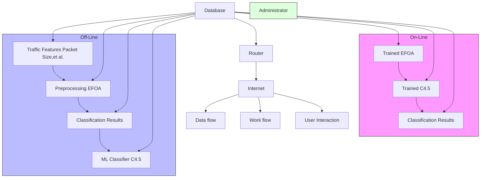
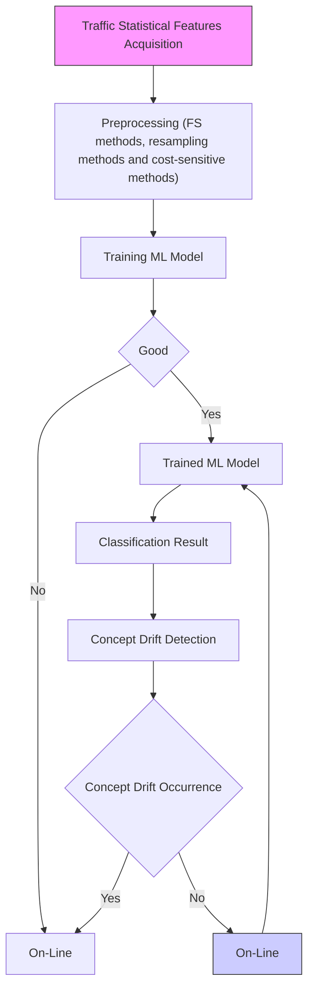
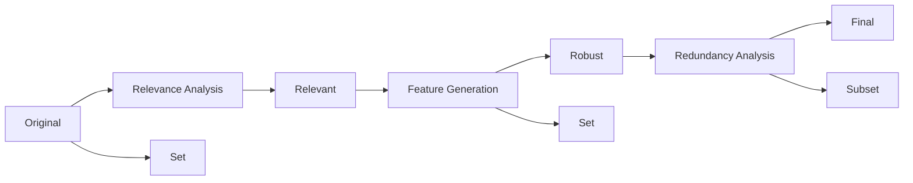

# An efficient feature generation approach based on deep learning and feature selection techniques for traffic classification


Hongtao Shi a,b , Hongping Li b,∗ , Dan Zhang b , Chaqiu Cheng b , Xuanxuan Cao b

a Network Management Center, Qingdao Agricultural University, Qingdao 266109, PR China

b College of Information Science and Engineering, Ocean University of China, Qingdao 266100, PR China

# a r t i c l e i n f o

Article history:

Received 27 February 2017

Revised 1 November 2017

Accepted 9 January 2018

Available online 10 January 2018

Keywords:

Feature selection

Deep learning

Multi-class imbalance

Concept drift

Machine learning

Traffic classification

# a b s t r a c t

Substantial recent efforts have been made on the application of Machine Learning (ML) techniques to flow statistical features for traffic classification. However, the classification performance of ML techniques is severely degraded due to the high dimensionality and redundancy of flow statistical features, the imbalance in the number of traffic flows and concept drift of Internet traffic. With the aim of comprehensively solving these problems, this paper proposes a new feature optimization approach based on deep learning and Feature Selection (FS) techniques to provide the optimal and robust features for traffic classification. Firstly, symmetric uncertainty is exploited to remove the irrelevant features in network traffic data sets, then a feature generation model based on deep learning is applied to these relevant features for dimensionality reduction and feature generation, finally Weighted Symmetric Uncertainty (WSU) is exploited to select the optimal features by removing the redundant ones. Based on real traffic traces, experimental results show that the proposed approach can not only efficiently reduce the dimension of feature space, but also overcome the negative impacts of multi-class imbalance and concept drift problems on ML techniques. Furthermore, compared with the approaches used in the previous works, the proposed approach achieves the best classification performance and relatively higher runtime performance.

© 2018 Elsevier B.V. All rights reserved.

# 1. Introduction

Accurate classification of Internet traffic is the basis of many network management tasks [1,2], including Quality of Service (QoS) control, intrusion detection and diagnostic monitoring. Traditional traffic classification approaches are based on examining the 16-bit port numbers in transport layer header or investigating the signature information in the packet payloads [3]. These approaches proved to be inefficient as they encounter many problems such as dynamic port numbers, data encryption and user privacy protection.

Due to the limitations of traditional traffic classification approaches, many research papers [4–11] have been dedicated to conduct traffic classification by applying ML techniques to flow statistical features. Although they made significant achievements, classifying Internet traffic by using ML techniques is still a daunting task, as the high redundancy of flow statistical features greatly degrades the accuracy and efficiency of the ML classifiers [12]. With the aim of solving this problem, FS techniques [13] can play an effective role in reducing the dimensionality (of flow statistical features) and removing irrelevant and redundant features. However, despite a vast number FS methods proposed in the literature [1,14–16], searching for the optimal features by FS methods remains a challenge because: (1) FS techniques conduct the search for an optimal subset using different evaluation criteria, which may make the optimal subset be local optima; (2) most FS techniques have been developed for improving classification accuracy by removing the redundant features, but neglect the stability of optimal subset for variations in the traffic data; (3) FS techniques cannot capture the complex dependency across all flow statistical features, which have a great impact on traffic classification. Thus, one of the key challenges is to provide the optimal and robust features for traffic classification.

Another key challenge for traffic classification is the multi-class imbalance problem, which leads to the situation where ML algorithms suffer from low recall for the minority classes. Many research efforts have been proposed to address this problem, which can be mainly divided into two categories: resampling approaches and cost-sensitive approaches. The resampling approaches balance the class distribution of data set by under-sampling the majority classes or by over-sampling the minority classes. Since these approaches would change the original class distributions, they have been criticized by some literatures [18,19]. Cost-sensitive approaches address the multi-class imbalance problem by adjusting the costs that are associated with misclassification. However, obtaining the accurate misclassification cost is a difficult task, and the different misclassification cost might result in different induction results. Furthermore, Chen and Wasikowski [20] presented that the multi-class problem can hardly be addressed very well by resampling approaches and cost-sensitive approaches if the feature space is high dimensional. In recent years, FS techniques have been concerned for handling multi-class imbalance problem [21–23]. Nevertheless, most of them did not consider the relation between features and class distributions.


<details>
<summary>flowchart</summary>


</details>

Fig. 1. The implementation of EFOA for traffic classification.

Concept drift of Internet traffic is the third key challenge for traffic classification, which also has a great impact on traffic classification. Due to the evolution of network techniques and changes in user activities and management strategies, the Internet traffic and its underlying class distribution dynamically changes with time. For example, the percentage of P2P traffic in the night is always higher than that in the day. Furthermore, the emergence of some new P2P applications leads to changes in flow statistical features. In order to retain high traffic classification performance, the ML classifier should be periodically updated with the latest traffic data. This problem, known as concept drift, is inevitable for ML based traffic classification [25]. Although many methods [25,35– 37] were proposed to handle dynamic nature of Internet traffic, it is hard to precisely determine the time period or to promptly detect the occurrence of concept drifts, especially when the traffic data are multi-class imbalanced. Furthermore, these methods increase the computational complexity and time cost of classification system. Therefore, it is necessary to find the robust features from original flow statistical features to overcome concept drift. However, unfortunately, most of existing FS techniques neglects the insensitivity of the output to variations in the flow statistical features.

In order to comprehensively solve the three challenges mentioned above, we propose an Efficient Feature Optimization Approach (EFOA) based on deep learning and FS techniques. Fig. 1 provides an overview of the implementation of EFOA for traffic classification in practice. The significant contributions of this paper are the follows:

1. A novel feature optimization approach called EFOA is proposed to provide optimal and robust features for Internet traffic classification. With this object, deep learning and FS techniques are respectively exploited in this approach to generate the robust and discriminative features and search the optimal features. EFOA proceeds in three phases. First phase evaluates the correlation of the original flow statistical features with the class and removes the irrelevant features. The correlation measure is based on symmetric uncertainty. In the second phase, the retained relevant features are passed to a feature generation model to generate robust and discriminative features by capturing the dependency among the features, and the new generated features have smaller dimension. The model is based on Deep Belief Networks (DBNs) and it can be constructed by unsupervised learning and fine tuning. The third phase searches for the optimal features by removing the redundant features. WSU is exploited in this phase to select the features that are conducive to classifying the minority classes. Thus, the feature set outputted by EFOA not only has smaller dimension but also can handle multi-class imbalance and concept drift problems. Based on our extensive research, this is the first time that feature optimization approach is successfully used to handle the high redundancy of flow statistical features, multi-class imbalance and concept drift problems comprehensively in traffic classification.

2. A series of experiments are conducted on Cambridge and UNIBS traffic data sets to evaluate the classification performance and runtime performance of the proposed approach. We compare the proposed approach with six different approaches (i.e., Weighted Symmetric Uncertainty Area Under roc Curve (WSU\_AUC) [19], Global Optimization Approach (GOA) [24], model of random over-sampling [26], model of random under-sampling [26], cost sensitive learning based on MetaCost [26] and Per Concept Drift Detection (PCDD) [25]) proposed in the recent literatures. Flow Overall Accuracy (OA), Byte OA, flow g-mean and byte g-mean are exploited as metrics to evaluate the classification performance of each approach. Experimental results show that on Cambridge data sets, EFOA achieves relatively high flow OA (very close to the best one) and the best byte OA and flow g-mean, and on UNIBS data sets, EFOA achieves the best flow OA, byte OA and flow g-mean. However, the byte g-mean achieved by EFOA on both Cambridge and UNIBS data sets are relatively low. These results demonstrate that, on one hand, EFOA achieves better performance improvements for traffic classification compared to other approaches, but on the other hand, EFOA does not adequately consider the byte information of traffic flows. On runtime performance, EFOA consumes much more time of preprocessing, but relative less time of training and testing. This suggests that EFOA can effectively reduce the dimension of original feature sets to decrease the time consumption of training and testing. In conclusion, the experimental results demonstrate that EFOA achieves the relatively higher classification performance and runtime performance.


<details>
<summary>flowchart</summary>


</details>

Fig. 2. Overview of ML based traffic classification system.

This paper is organized as follows. Section 2 reviews the related works on traffic classification. In Section 3, we present our feature optimization approach. Section 4 details the traffic data sets and the evaluation metrics. Section 5 evaluates the performance of our approach by comparing with existing approaches in traffic classification. Finally, Section 5 makes our concluding remarks for our paper.

# 2. Related work

Many methods, such as FS methods [11,13,24,27], resampling methods [18,30,31], cost-sensitive methods [26,32,33] and concept drift detection methods [25,36,37], have been proposed to handle feature redundancy, multi-class imbalance and concept drift problems. In order to intuitively describe the role of these methods in traffic classification, Fig. 2 presents a flow diagram that illustrates the implement of these methods in ML based traffic classification system. The system consists of two parts: an off-line procedure and an on-line procedure. In off-line procedure, FS methods, resampling methods and cost-sensitive methods can help ML classifier improve classification performance, and in on-line procedure, concept drift detection methods can promptly detect the occurrence of concept drift and inform the system to update the ML classifier. In the following, these methods will be introduced in detail.

# 2.1. FS methods

FS method is usually used as a preprocessing method to improve the accuracy and efficiency of ML algorithms by reducing the size of feature set and removing the irrelevant and redundant features. At present, FS methods can be grouped into three categories: wrapper, filter and hybrid methods. Wrapper method uses the classification accuracy of a pre-determined ML algorithm (e.g. Bayesian Neural Network (BNN) [1] and Support Vector Machine (SVM) [16]) to judge the goodness of the selected features. However, such a method is very computationally intensive because it trains a new ML classifier for each candidate feature subset. Besides, wrapper method tends to inherit bias toward the pre-determined ML algorithm because the selection of the optimal features depends on the predictive results of the ML algorithm.

Filter method uses different measures of the ordinary properties of the data (e.g. consistency, dependency and distance) to select features and the selected features are independent of any ML algorithm. Some classical filter methods, such as Correlation-based Feature Selection (CFS) [27], information gain [13], Gain Ratio (GR) [13], symmetric uncertainty [28] and Chi-square [29], have been extensively used for traffic classification. The empirical results illustrated that these methods can effectively improve the performance of traffic classification by identifying a small number of highly predictive features from the high dimensional feature set.

Hybrid method integrates the benefits of wrapper and filter methods to select the optimal feature subset. Wang et al. [11] proposed a hybrid FS methods based on Fast Correlation-Based Filter (FCBF) and Naïve Bayes. In this method, FCBF is exploited to eliminate the irrelevant and redundant features, and then Naïve Bayes is exploited to evaluate the classification accuracy for searching final optimal features. Recently, Zhang et al. [19] proposed a novel FS method called WSU\_AUC to address the multi-class imbalance problem. This method utilizes WSU to select the initial features, and then it searches the optimal features by evaluating the AUC of each initial feature for a specific ML classifier. Finally, the outputted features are obtained by selecting the high frequency features from the optimal features obtained by WSU\_AUC on different traffic data sets. Moreover, aiming at the problem that many existing FS methods only concentrate on the improvement of the classification performance but neglect the stability of the selected feature subset to the variations in the traffic data, Fahad et al. [24] proposed a novel FS method called GOA. The method respectively utilizes five well-known FS algorithms to search feature subsets, and then SFS algorithm is exploited to search the optimal features with the highest goodness based on the five feature subset.

# 2.2. Resampling and cost-sensitive methods

Resampling method is one of the most popular methods for handling the multi-class imbalance problem [18]. Chawla et al. [30] proposed an over-sampling method named SMOTE, which over-samples the minority class by creating “synthetic” samples between existing samples rather than by duplicating original samples . They suggested that multi-class imbalance problem can be solved more effectively by combining over-sampling method and under-sampling method. Zhong et al. [31] compared the performance of three different resampling methods (i.e. SMOTE, random over-sampling and random under-sampling) on addressing two-class imbalance problem of P2P traffic. The comparison results show that all of the three resampling methods are stable and effective, and random over-sampling is the best choice for identifying P2P traffic when taking into account the time complexity and classification performance simultaneously. Jin et al. [8] proposed a weighted threshold sampling mechanism to handle the multi-class imbalance problems in traffic classification. This mechanism creates a smaller training set by performing random under-sampling on traffic data of a class when the data size of the class is more than threshold k. The k can be determined by the class distribution of data set. However, only under-sampling was studied in this literature.


<details>
<summary>flowchart</summary>


</details>

Fig. 3. Flowchart of feature optimization.

Apart from the resampling method, cost-sensitive method is another popular method that has been extensively used to handle the multi-class imbalance problem. Ting [32] developed an instanceweighting method to induce cost-sensitive trees, which proved to be more effective and simpler than the original algorithm with total misclassification costs. He et al. [33] effectively improved the flow and byte accuracy on a multi-class imbalanced traffic data set by combining cost-sensitive learning with ensemble classification algorithm. However, this method cannot achieve high classification accuracy for the flows of the minority classes, such as Windows Live Messenger (an instant messaging software produced by Microsoft Corporation) and QQ Game (an online game produced by Tencent Corporation). Weiss et al. [34] compared the results of cost-sensitive and resampling methods generally for multi-class imbalance data and found that the cost-sensitive methods perform as well as resampling methods. Recently, Liu and Liu [26] proposed two new models of random over-sampling and random undersampling and a new cost-sensitive learning algorithm based on MetaCost for multi-class imbalanced traffic classification. The empirical comparison of effectiveness shows that cost-sensitive learning algorithm is considered to be the best choice if the data size is sufficient, but resampling method is more effective in the other cases.

# 2.3. Methods for handling concept drift

Several methods have been proposed to address concept drift in machine learning, and fall mainly into two categories: (1) the classifier is updated at a fixed interval; and (2) the classifier is updated when concept drift is detected. The aim of the first category is to select samples that are relevant to the current concept. Raahemi et al. [35] developed a window based Tri-Training method according to dynamic nature of Internet traffic, in which traffic data is divided into many fixed size windows of flows and different models are built on these windows for traffic classification. A key limitation of this method is the difficulty in locating the appropriate window size. The second category first detects the occurrence of concept drift, and the learner is adapted to the drift. The Drift Detection Method (DDM) [36] and Early Drift Detection Method (EDDM) [37] are commonly used to detect the concept drift. Both perform detection in light of the variation in the classification error rate. However, in respect of imbalanced traffic data, these methods cannot perceive the moment that significant increases in the error rates of the minority classes occur, because their error rate contributes slightly to the overall error rate. Recently, Wang et al. [25] proposed a concept drift detection approach named PCDD. They suggested that the proposed approach can promptly detect concept drift for each class and improve the recall of the minority classes while maintaining high overall accuracy.

# 2.4. Summary of the previous works

All methods mentioned above can hardly handle the high redundancy of flow statistical features, multi-class imbalance and concept drift very well simultaneously due to the lack of comprehensive consideration of these problems. First, FS techniques can effectively remove irrelevant and redundant features to improve the performance of traffic classification. However, most of the existing FS techniques failed to consider the multi-class imbalance and concept drift problems in traffic classification. Although two recent studies [19,24] on FS techniques take into account these two problems and alleviate their impact on traffic classification, handling these problems by using FS techniques is still a challenge, as they can hardly capture the complex interactions across all features and generate robust and discriminative features. Second, resampling and cost-sensitive methods can effectively solve the multi-class imbalance problems and they have been extensively used in traffic classification. However, these methods cannot handle the high redundancy of flow statistical features and concept drift problems. Therefore, the overall accuracy of traffic classification can hardly be improved by using these methods, although the classification accuracy of some minority classes can be improved. Furthermore, high dimensional features apace can seriously degrade the effectiveness of these methods. Third, existing methods for handling concept drift can retain classification accuracy by constantly updating classifier. However, these methods can hardly improve classification performance, as the presence of irrelevant and redundant features can degrade the overall accuracy and efficiency of ML classifier. On the other hand, as most of these methods failed to consider the multi-class imbalance in traffic classification, the traffic flows of minority classes can hardly be identified. Furthermore, constantly updating classifier increases computational cost in traffic classification.

In fact, it can be found from previous studies [19,24] that the three problems have strong interaction with each other. For example, the high redundancy of flow statistical features can seriously aggravate the impact of multi-class imbalance and concept drift on traffic classification. Thus, redundancy elimination is the key to solving these problems. Furthermore, the selection of the minority class-related features can alleviate the impact of multi-class imbalance and this solution does not alter the original class distributions. Robust and stable features can effectively handle concept drift in traffic classification so that constantly updating classifier can be avoided. Therefore, this paper focuses on handling the three problems discussed above by feature optimization.

# 3. Methodology

In this section, we propose a new feature optimization approach, called EFOA, which not only efficiently removes the irrelevant and redundant features but also provides optimal and robust features to overcome the multi-class imbalance and concept drift problems. Fig. 3 presents the schematic diagram of the proposed approach, which composed of three phases: First, relevance analysis phase selects the subset of relevant features using FS method; Second, feature generation phase exploits a feature generation model to capture the complex interaction among the relevant features and generates the robust and discriminative features to overcome the concept drift problem; And third, redundancy analysis phase selects optimal features with a weighted evaluation criterion to handle multi-class imbalance problem.

# 3.1. Relevance analysis

Correlation measures are widely used in statistics and machine learning for relevance analysis. Comparing with the linear correlation measures, symmetric uncertainty [28], which is based on information entropy, has the advantages of capturing the non-linear correlation and processing non-numerical features. Symmetric uncertainty can be defined as Eq. (1). $I G ( V _ { 1 } | V _ { 2 } )$ represents information gain of a variable $V _ { 1 }$ given another variable $V _ { 2 } ,$ which is defined as Eq. (2). $H ( V _ { 1 } )$ and $H ( V _ { 1 } | V _ { 2 } )$ respectively represent entropy of $V _ { 1 }$ and conditional entropy of $V _ { 1 }$ given $V _ { 2 } ,$ , which are defined as Eqs. (3) and (4). $P ( \nu _ { 1 , i } )$ and $P ( \nu _ { 1 , i } | \nu _ { 2 , j } )$ are the prior probabilities of the ith value of $V _ { 1 }$ and the posterior probabilities of the ith value of $V _ { 1 }$ given the jth value of $V _ { 2 } ,$ respectively. Since symmetric uncertainty compensates for the bias of information gain toward variables with more values, it is a desirable measure for correlation calculation between variables.

$$
S U (V _ {1}, V _ {2}) = 2 \left[ \frac {I G (V _ {1} | V _ {2})}{H (V _ {1}) + H (V _ {2})} \right] \tag {1}
$$

$$
I G (V _ {1} \mid V _ {2}) = H (V _ {1}) - H (V _ {1} \mid V _ {2}) \tag {2}
$$

$$
H (V _ {1}) = - \sum_ {i} P (\nu_ {1, i}) \log_ {2} (P (\nu_ {1, i})) \tag {3}
$$

$$
H (V _ {1} | V _ {2}) = - \sum_ {j} P (\nu_ {2, j}) \sum_ {i} P (\nu_ {1, i} | \nu_ {2, j}) \log_ {2} (P (\nu_ {1, i} | \nu_ {2, j})) \tag {4}
$$

In this study, we differentiate two types of correlation: featurefeature correlation and feature-class correlation. The former indicates the correlation between two features while the latter represents how much a feature is correlated to the class. In this phase, we use symmetric uncertainty as the correlation measure to calculate feature-class correlation for each original flow statistical feature, and all the features with feature-class correlation value larger than zero are selected as relevant features (including highly relevant and weakly relevant features) to be sent to feature generation phase.

# 3.2. Feature generation

To generate the robust feature set that can retain the relevant information among the relevant features and have smaller dimensions than relevant subset, we propose a Robust Feature Generation Model (RFGM) based on the representative deep architecture DBNs. DBNs are constructed layer by layer using restricted Boltzmann machine (RBM), a two-layer recurrent neural network in which stochastic binary inputs are connected to stochastic binary outputs using symmetrically weighted connections [38]. The advantages of RBM are that they are able to construct a multilayer generative model to simulate human vision system, in which topdown connections can be exploited to generate low-level features of images from high-level representations, and bottom-up connections can be exploited to infer the high-level representations by the generated low-level features.

In this study, Gaussian–Bernoulli RBM is exploited to construct the first layer of RFGM, in which the input values follow standard normal distribution. Furthermore, Bernoulli–Bernoulli RBM is exploited to construct deeper layers of RFGM. Fig. 4 shows the architecture of RFGM, a fully interconnected directed belief nets with one input layer $\mathbf { h } ^ { 0 } ,$ , N hidden layers $\mathbf { h } ^ { 1 } , \ \mathbf { h } ^ { 2 } , . . . , \mathbf { h } ^ { N }$ , and one label layer at the top. The input layer $\mathbf { h } ^ { 0 }$ has D units, equal to the number of the relevant features. The label layer has C units, equal to the number of labels. The variables $x _ { i } ( 0 < i \leq D )$ and $y _ { j } ( 0 < j \leq C )$ in Fig. 4 represent the relevant features and the corresponding labels, respectively. The numbers of units for hidden layers are predefined according to the experience or intuition, and the parameter space W for the deep architecture can be calculated by training RFGM with the relevant features and their classes. For Gaussian-Bernoulli RBM, the energy of the state $( \mathbf { h } ^ { 0 } , \mathbf { h } ^ { 1 } )$ can be defined as


<details>
<summary>flowchart</summary>

```mermaid
graph TD
    subgraph Input Layer
        y1["y₁"] --> A1["○"]
        y2["y₂"] --> A2["○"]
        yC["y_C"] --> A3["○"]
    end

    subgraph Function Layer
        f["f(h^N(x),y)"]
        A1 --> C1["●"]
        A2 --> C2["●"]
        A3 --> C3["●"]
    end

    subgraph Output Layer
        hN["h^N"] --> h2["h²"]
        h1["h¹"] --> h0["h⁰"]
        x1["x₁"] --> x2["x₂"]
        x2 --> xD["x_D"]
    end

    y1 --> A1
    y2 --> A2
    yC --> A3
    hN --> C1
    hN --> C2
    hN --> C3
    h1 --> C1
    h1 --> C2
    h1 --> C3
    x0 --> C1
    x0 --> C2
    x0 --> C3
    xD --> C1
    xD --> C2
    xD --> C3

    note right of A1: Minimize Cost
    note right of C1: RBM
    note right of C2: RBM
    note right of C3: RBM
```
</details>

Fig. 4. The deep architecture of RFGM.

$$
E \left(\mathbf {h} ^ {0}, \mathbf {h} ^ {1}; \theta\right) = \frac {1}{2} \sum_ {s = 1} ^ {D _ {0}} (h _ {s} ^ {0}) ^ {2} - \left(\sum_ {s = 1} ^ {D _ {0}} c _ {s} h _ {s} ^ {0} + \sum_ {t = 1} ^ {D _ {1}} b _ {t} h _ {t} ^ {1} + \sum_ {s = 1} ^ {D _ {0}} \sum_ {t = 1} ^ {D _ {1}} w _ {s t} ^ {1} h _ {s} ^ {0} h _ {t} ^ {1}\right) \tag {5}
$$

where $\boldsymbol { \theta } = ( \mathbf { w } , \mathbf { c } , \mathbf { b } )$ are the model parameters: $w _ { s t } ^ { k }$ is the symmetrical interaction term between unit s in the layer $\mathbf { \dot { h } } ^ { 0 }$ and unit t in the layer $\pmb { \mathrm { h } } ^ { 1 } , k = 1 , . . . , N - 1 . \ c _ { s }$ is the sth bias of layer $\mathbf { h } ^ { 0 }$ and $b _ { t }$ is the tth bias of layer $\mathbf { h } ^ { 1 } . ~ D _ { k }$ is the number of unit in the kth layer. The probability that the model assigns to a $\mathbf { h } ^ { 0 }$ is

$$
P \big (\mathbf {h} ^ {0}; \theta \big) = \frac {1}{Z (\theta)} \sum_ {\mathbf {h} ^ {1}} \exp \big (- E \big (\mathbf {h} ^ {0}, \mathbf {h} ^ {1}; \theta \big) \big) \tag {6}
$$

where $Z ( \theta )$ denotes the normalizing constant.

$$
Z (\theta) = \sum_ {\mathbf {h} ^ {0}} \sum_ {\mathbf {h} ^ {1}} \exp \left(- E \left(\mathbf {h} ^ {0}, \mathbf {h} ^ {k}; \theta\right)\right) \tag {7}
$$

The conditional probability distributions of unit t is:

$$
P \left(h _ {t} ^ {1} \mid \mathbf {h} ^ {0}\right) = \operatorname{sigm} \left(b _ {t} + \sum_ {s} w _ {s t} ^ {1} h _ {s} ^ {0}\right) \tag {9}
$$

And, the conditional probability distributions of unit s is:

$$
P \left(h _ {s} ^ {0} \mid \mathbf {h} ^ {1}\right) = c _ {s} + \sum_ {t} w _ {s t} ^ {1} h _ {t} ^ {1} \tag {10}
$$

The parameters of $\boldsymbol { \theta } = ( \mathbf { w } , \mathbf { c } , \mathbf { b } )$ can be learned using Contrastive Divergence (CD) method as in [39].

The training of RFGM can be divided into two stages: unsupervised learning and supervised learning. In the first stage, the samples in relevant subset should be normalized by mean-variation method at first, and then the new samples are inputted one by one to layer $\mathbf { h } ^ { 0 } .$ . The deep architecture is constructed layer by layer from bottom to top, and each time, the parameter space $\mathbf { w } ^ { k }$ is trained by the calculated data in the k 1th layer. In the second stage, both the new samples and their class labels are used to refine the parameter space W for better discriminative ability. As demonstrated in study [40], gradient-descent algorithm and exponential cost function are used through the whole RFGM to refine the weight space. After training, the discriminative features can be generated by returning the hidden units activation values in last hidden layer, which can be calculated as following when a sample vector f inputs from layer $\mathbf { h } ^ { 0 } ;$ :

$$
h _ {t} ^ {k} (\mathbf {f}) = \operatorname{sigm} \left(c _ {s} ^ {k} + \sum_ {t = 1} ^ {D _ {k - 1}} w _ {s t} ^ {k} h _ {t} ^ {k - 1} (\mathbf {f})\right) \tag {11}
$$

As generated by extracting the interaction among all features, the discriminative features are very stable and robust.

# 3.3. Redundancy analysis

To further improve the classification performance, redundancy analysis need to find an optimal feature set to overcomes the multi-class imbalance problem. Therefore, WSU [19] is exploited to measure the discriminative power of each feature. WSU is calculated based on weighted entropy, which can be defined as Eq. (12). $I G _ { w } ( V _ { 1 } | V _ { 2 } )$ represents the weighted information gain of a variable $V _ { 1 }$ given another variable $V _ { 2 } ,$ , which is defined as Eq. (13). $H _ { w } ( V _ { 1 } )$ and $H _ { w } ( V _ { 1 } | V _ { 2 } )$ respectively represent weighted entropy of $V _ { 1 }$ and weighted conditional entropy of $V _ { 1 }$ given $V _ { 2 } ,$ , which are defined as Eqs. (3) and (4). $w _ { i }$ is the weight value of the ith value $\nu _ { 1 , i }$ of $V _ { 1 }$ , which is defined as Eq. (16). $n _ { i }$ is the number of samples assigned to the value $\nu _ { 1 , }$ i .

$$
S U _ {w} \left(V _ {1} \mid V _ {2}\right) = 2 \left[ \frac {I G _ {w} \left(V _ {1} \mid V _ {2}\right)}{H _ {w} \left(V _ {1}\right) + H _ {w} \left(V _ {2}\right)} \right] \tag {12}
$$

$$
I G _ {w} (V _ {1} | V _ {2}) = H _ {w} (V _ {1}) - H _ {w} (V _ {1} | V _ {2}) \tag {13}
$$

$$
H _ {w} (V _ {1}) = - \sum_ {i} \sum_ {j} w _ {i} P (\nu_ {1, i}, \nu_ {2, j}) \log_ {2} (P (\nu_ {2, j})) \tag {14}
$$

$$
H _ {w} (V _ {1} | V _ {2}) = - \sum_ {j} P (\nu_ {2, j}) \sum_ {i} w _ {i} P (\nu_ {1, i} | \nu_ {2, j}) \log_ {2} (P (\nu_ {1, i} | \nu_ {2, j})) \tag {15}
$$

$$
w _ {i} = 1 - \frac {n _ {i}}{N} \tag {16}
$$

According to Eq. (16), the weight values for the minority classes are larger than that for the majority ones. Therefore, using WSU as evaluation criterion can efficiently handle multi-class imbalance problem.

Since a feature with a larger feature-class correlation value contains by itself more information about the class than a feature with a smaller feature-class correlation value, the existence of redundant information between a pair of correlated features $F _ { i }$ and $F _ { j }$ can be determined by their feature-feature correlation $S U _ { w } ( F _ { i } , \ F _ { j } )$ 号 as follow: for two relevant features $F _ { i }$ and $F _ { j } ( i \neq j ) , F _ { j }$ can be determined as redundant features if $S U _ { w } ( F _ { i } , \ C ) \stackrel { \cdot } { \geq } S U _ { w } ( F _ { j } , \ ^ { \cdot } C )$ and $S U _ { w } ( F _ { i } ,$ $F _ { j } ) { \geq } S U _ { w } ( F _ { j } , ~ C )$ . Therefore, redundancy analysis in this phase consists of (1) selecting a predominant feature $F _ { i } , ( 2 )$ removing all features for that its correlation with the predominate feature is larger than its correlation with the class, and (3) iterating phases (1) and (2) until no more predominate features can be selected. Finally, the optimal subset can therefore be approximated by a set of predominant features. Algorithm 1 details the pseudo-codes of redundancy analysis.

Algorithm 1 Feature selection algorithm.   
Input: $D(F_{1}, F_{2}, \ldots, F_{N}, C)$ //A training data set, C
//is the class
Output: feature[] //selected feature set
1. begin
2.    for i = 1 to N
3.    calculate $SU(F_{i}, C)$ ;
4.    insert $F_{i}$ into list in descending $SU(F_{i}, C)$ value;
5.    end for
6. $F_{p} = \text{FIRSTFeature(list)}$ ;
7.    do begin
8. $F_{q} = \text{getNextFeature(list}, F_{p})$ ;
9.    if ( $F_{q} < > NULL$ )
10.    do begin
11.    calculate $SU(F_{p}, F_{q})$ value;
12.    if ( $SU(F_{p}, F_{q}) > SU(F_{q}, C)$ )
13.    remove $F_{q}$ from list;
14. $F_{q} = \text{getNextFeature(list}, F_{q})$ ;
15.    end if
16.    end until ( $F_{q} == NULL$ );
17.    end if
18. $F_{p} = \text{getNextFeature(list}, F_{p})$ ;
19.    end until ( $F_{p} == NULL$ );
20.    feature = list;
21.    end;

# 4. Experimental data sets and performance evaluation metrics

# 4.1. Network traffic data sets

To provide a quantitative performance evaluation, two real world traffic traces (Cambridge and UNIBS) are used in our experiments. Cambridge traffic traces are published by the computer laboratory in the University of Cambridge [42]. They are the extensively acceptable traffic traces for evaluation and comparison of traffic classification methods. Cambridge traffic traces were collected on the Genome Campus network in August 2003. These traffic traces have ten separate data sets and each of them is collected from a different period of the 24-hour day [43]. Each flow sample in these data sets has 248 features, which are derived from the transportation layer header by using tcptrace [44]. As described in [42], all flows are correctly labeled by content-based or manual identification. Table 1 shows the number of flows of each class in each data set, and Table 2 shows the traffic classes and corresponding applications. It is clear that the WWW flows are significantly more than other types of flows. Thus, the traffic data is typical multi-class imbalanced. To better evaluate the performance of EFOA, we train the classifier using one of the data sets and test it against the rest 9 data sets, and this process is repeated once for each data set to obtain the final classification results.

UNIBS traffic traces are published by the telecommunication networks group in University of Brescia [45]. Two data sets were collected through running Tcpdump [46] on the Faculty’s router in September and October 2009, respectively. The router has a dedicated 100 Mbps uplink connected to Internet. 96 features were extracted from the first six packets of each flow for traffic classification, including transport layer protocol, source port number, destination port number, number of bytes etc. The statistics of flows and corresponding applications of each class in each data set are detailed in Table 3. In traffic classificaiton experiments, UNIBS01 is used as training set and UNIBS02 is as testing set.

# 4.2. Performance evaluation metrics

To demonstrate the effectiveness of our approach, we use three different metrics in the experiments. These metrics include OA, Fmeasure and g-mean, which are commonly used in information classification and retrieval [47]. Suppose that TP represents true positives, TN represents true negatives, FP represents false positives and FN represents false negatives.

Table 1 The number of flows in Cambridge data set. 

<table><tr><td>Flow classes</td><td>Data set 1</td><td>Data set 2</td><td>Data set 3</td><td>Data set 4</td><td>Data set 5</td><td>Data set 6</td><td>Data set 7</td><td>Data set 8</td><td>Data set 9</td><td>Data set 10</td></tr><tr><td>WWW</td><td>18,211</td><td>18,559</td><td>18,065</td><td>19,641</td><td>18,618</td><td>16,892</td><td>51,982</td><td>51,695</td><td>59,993</td><td>54,436</td></tr><tr><td>MAIL</td><td>4146</td><td>2726</td><td>1448</td><td>1429</td><td>1651</td><td>1618</td><td>2771</td><td>2508</td><td>3678</td><td>6592</td></tr><tr><td>FTP-CONTROL</td><td>149</td><td>100</td><td>1861</td><td>94</td><td>500</td><td>48</td><td>83</td><td>63</td><td>75</td><td>81</td></tr><tr><td>FTP-PASV</td><td>43</td><td>344</td><td>125</td><td>22</td><td>180</td><td>109</td><td>94</td><td>102</td><td>1412</td><td>257</td></tr><tr><td>ATTACK</td><td>122</td><td>19</td><td>41</td><td>324</td><td>122</td><td>134</td><td>89</td><td>129</td><td>367</td><td>446</td></tr><tr><td>P2P</td><td>339</td><td>94</td><td>100</td><td>114</td><td>75</td><td>94</td><td>116</td><td>289</td><td>249</td><td>624</td></tr><tr><td>DATABASE</td><td>238</td><td>329</td><td>206</td><td>8</td><td>0</td><td>0</td><td>36</td><td>43</td><td>15</td><td>1773</td></tr><tr><td>FTP-DATA</td><td>1319</td><td>1257</td><td>750</td><td>484</td><td>248</td><td>364</td><td>307</td><td>386</td><td>90</td><td>592</td></tr><tr><td>MULTIMEDIA</td><td>87</td><td>150</td><td>136</td><td>54</td><td>38</td><td>42</td><td>36</td><td>33</td><td>0</td><td>0</td></tr><tr><td>SERVICES</td><td>206</td><td>220</td><td>200</td><td>113</td><td>216</td><td>82</td><td>293</td><td>220</td><td>337</td><td>212</td></tr></table>

Table 2 The traffic classes and corresponding applications. 

<table><tr><td>Flow classes</td><td>Applications</td></tr><tr><td>WWW</td><td>http, https</td></tr><tr><td>MAIL</td><td>imap, pop2/3, smtp</td></tr><tr><td>FTP-CONTROL</td><td>ftp control</td></tr><tr><td>FTP-PASV</td><td>ftp passive mode</td></tr><tr><td>ATTACK</td><td>Internet worm and virus attacks</td></tr><tr><td>P2P</td><td>KaZaA, BitTorrent, GnuTella</td></tr><tr><td>DATABASE</td><td>Postgres, sqlnet oracle, ingres</td></tr><tr><td>FTP-DATA</td><td>ftp data</td></tr><tr><td>MULTIMEDIA</td><td>Windows Media Player, Real</td></tr><tr><td>SERVICES</td><td>X11, dns, ident, Idap, ntp</td></tr></table>

Table 3 The statistics of flows and corresponding applications in UNIBS data sets. 

<table><tr><td>Flow classes</td><td>UNIBS01</td><td>UNIBS02</td><td>Applications</td></tr><tr><td>WWW</td><td>16,140</td><td>18,235</td><td>http, https</td></tr><tr><td>P2P</td><td>9746</td><td>2027</td><td>BitTorrent, Edonkey</td></tr><tr><td>CHAT</td><td>6343</td><td>9763</td><td>Skype</td></tr><tr><td>MAIL</td><td>1920</td><td>2140</td><td>imap4, pop3, smtp</td></tr><tr><td>SSH</td><td>46</td><td>31</td><td>ssh</td></tr><tr><td>OTHER</td><td>113</td><td>475</td><td>ftp, ssl, etc.</td></tr></table>

OA is the percentage of correctly classified instances over the total instances, which can be defined as Eq. (17).

$$
\mathrm{OA} = \frac {\mathrm{TP} + \mathrm{TN}}{\mathrm{TP} + \mathrm{TN} + \mathrm{FP} + \mathrm{FN}} \tag {17}
$$

F-measure is the harmonic mean of recall R and precision P, which is defined as Eq. (18).

$$
\mathrm{F-measure} = \frac {2 R P}{R + P} \tag {18}
$$

where R is the percentage of correctly classified instances of the class i over all instance from the class i, which is defined as Eq. (19).

$$
R = \frac {\mathrm{TP}}{\mathrm{TP} + \mathrm{FN}} \tag {19}
$$

And P is the percentage of correctly classified instances of the class i over all instances classified into the class i, which is defined as Eq. (20).

$$
P = \frac {\mathrm{TP}}{\mathrm{TP} + \mathrm{FP}} \tag {20}
$$

G-mean is geometry mean of the product of the recalls of all classes [48], which can be defined as Eq. (21).

$$
g - \text { mean } = \left(\prod_ {i = 0} ^ {n - 1} R _ {i}\right) ^ {\frac {1}{n}} \tag {21}
$$

In this study, all evaluation metrics will be calculated with respect to flows and bytes to evaluate the performance of the proposed approach. It is notable that the number of bytes that are correctly classified can be obtained by calculating the number of all bytes contained in the correctly classified flows. For example, if a p2p flow is correctly classified, all bytes contained in the p2p flow is correctly classified. Thus, all byte metrics can be calculated according to this method.

# 5. Experimental results

The main purpose of this section is to demonstrate the effectiveness of EFOA by comparing with the previous works. Our experiments are preceded in two phases. Firstly, we evaluate the performance of EFOA in traffic classification on Cambridge data sets. Especially, we systemically and comprehensively examine the ability of EFOA to handle feature redundancy, multi-class imbalance and concept drift problems. Secondly, we validate the effectiveness of EFOA on UNIBS data sets and demonstrate the robustness of EFOA to the variations of traffic data.

# 5.1. Performation evaluation on Cambridege data sets

# 5.1.1. Selection of different ML algorithms

This section aims to discuss the classification performance of EFOA on Cambridge data sets when using different ML algorithms, including C4.5 Decision Trees (C4.5), Support Vector Machine (SVM) and Naïve Bayes Kernel (NBK). The RFGM structure in EFOA is first set to 226–200–200–20, where 226 is number of features selected by relevant analysis from 249 original features. This structure is an empirical setting for RFGM in our experiments. The classification results are shown in Table 4. It can be observed that the best flow g-mean and byte g-mean are achieved by C4.5. This demonstrates that C4.5 is more stable for multi-class imbalanced data sets than other ML algorithms and it is suitable for classifying imbalanced traffic data sets. Furthermore, SVM achieves better flow OA and byte OA but lower flow g-mean and byte g-mean. This implies that SVM tend to be biased towards discriminating the majority classes and elephant flows. Moreover, NBK obtains the worst classification performance in most cases. Overall, we believe that C4.5 achieves better classification performance than others. Thereby, C4.5 is chosen to evaluate the classification performance in following sections.

Table 4 Overall classification performance of EFOA using different ML techniques. 

<table><tr><td>ML algorithms</td><td>Flow OA</td><td>Byte OA</td><td>Flow g-mean</td><td>Byte g-mean</td></tr><tr><td>C4.5</td><td>0.978 ± 0.009</td><td>0.887 ± 0.098</td><td>0.601 ± 0.134</td><td>0.391 ± 0.266</td></tr><tr><td>SVM</td><td>0.984 ± 0.005</td><td>0.920 ± 0.039</td><td>0.511 ± 0.139</td><td>0.120 ± 0.097</td></tr><tr><td>NBK</td><td>0.943 ± 0.006</td><td>0.838 ± 0.075</td><td>0.407 ± 0.204</td><td>0.327 ± 0.271</td></tr></table>

Table 5 Overall classification performance of the proposed approach on 10 data set index using C4.5. 

<table><tr><td rowspan="2">Evaluation criteria</td><td colspan="10">Data set index</td></tr><tr><td> $D_1$ </td><td> $D_2$ </td><td> $D_3$ </td><td> $D_4$ </td><td> $D_5$ </td><td> $D_6$ </td><td> $D_7$ </td><td> $D_8$ </td><td> $D_9$ </td><td> $D_{10}$ </td></tr><tr><td>Flow OA(%)</td><td>0.983</td><td>0.981</td><td>0.966</td><td>0.973</td><td>0.968</td><td>0.971</td><td>0.971</td><td>0.987</td><td>0.989</td><td>0.985</td></tr><tr><td>Byte OA(%)</td><td>0.948</td><td>0.943</td><td>0.957</td><td>0.881</td><td>0.922</td><td>0.720</td><td>0.696</td><td>0.950</td><td>0.952</td><td>0.905</td></tr><tr><td>Flow g-mean(%)</td><td>0.819</td><td>0.534</td><td>0.645</td><td>0.525</td><td>0.508</td><td>0.478</td><td>0.470</td><td>0.845</td><td>0.618</td><td>0.566</td></tr><tr><td>Byte g-mean(%)</td><td>0.819</td><td>0.249</td><td>0.645</td><td>0.227</td><td>0.220</td><td>0.207</td><td>0.219</td><td>0.845</td><td>0.253</td><td>0.231</td></tr></table>

# 5.1.2. Classification performance of EFOA

In this section, we concentrate on the classification performance of the proposed approach. Table 5 gives the overall classification results by using C4.5. As can be seen from Table 5, EFOA achieves relatively good and stable flow OA and byte OA on almost all data set index, but the flow g-mean and byte g-mean obtained by EFOA vary largely with different data set index. This suggests that different training data sets (especially the imbalance ratio) have great influences on flow g-mean and byte g-mean of EFOA.

5.1.2.1. Impact of RFGM structure. In this part, a group of experiments were conducted to analyze the relation between classification performance and deep structure scale of RFGM. In these experiments, we keep deepening the structure of RFGM by increasing the number of hidden layers. The structure of RFGM is initially set as 226–200–20, which represents the number of layers of RFGM and the corresponding number of units. Then, we begin with this structure and keep inserting hidden layers with 200 units to the deep networks until the depth of RFGM is equal to 10. In this process, the total number of units in RFGM varies from 446 to 1846. Fig. 5 shows the average flow OA and byte OA on ten data set indexes with various scales of RFGM, respectively. Fig. 6 shows the training time of RFGM with different scales.

From Fig. 5, it can be found the fact that both the best average flow accuracy and byte accuracy appear when the depth is equal to 4. Moreover, we also find that the classification performance for both flows and bytes decreases when the structure is deeper than 4 layers. In fact, the structure of RFGM becomes larger and more complex as the number of the hidden layers increases. In particular, when the structure is deeper than 4 layers, the gradient-descent algorithm can hardly achieve the optimal solution for RFGM, which results in an increase of predictive error rate. From Fig. 6 it can be seen that the training time monotonically increases with increase of hidden units.

5.1.2.2. Performance comparison with original features. As one motivation of EFOA is to help ML algorithms improve the classification performance of traffic classification. In this part, we compare the classification performances of the features outputted by EFOA and the original features by using C4.5. Fig. 7 shows the overall classification results. As Fig. 7 shown, EFOA performs better than original features, especially on flow g-mean and byte g-mean, which respectively increases by about 7.1% and 5.3%. This demonstrates that the features outputted by EFOA are more conducive to handling class imbalance and concept drift problems. For example, Fig. 8 shows the flow and byte F-measure of the minority class P2P. From Fig. 8 it can be found that EFOA performs better on most date set indexes. It is proved that EFOA significantly improves flow Fmeasure and byte F-measure of minority classes.

5.1.2.3. Discussion on the effectiveness of each phase. EFOA includes three phases. The first phase selects a relevant feature subset using the measure of symmetric uncertainty. The second phase generates the robust feature set and reduces the dimension of the feature set. The third phase selects optimal feature set using WSU. Table 6 analyzes the overall classification results. “ FirstPhase”, “ SecondPhase” and “ ThirdPhase” represent the results without performing the first phase, the second phase and the third phase, respectively.

Comparing the classification results, the best byte OA and Flow g-mean are achieved by EFOA. This suggests that the features outputted by EFOA benefit to discriminate large elephant flows and they could improve the flow accuracy of minority classes. However, FirstPhase achieves the best byte g-mean. This implies that the byte information of traffic data sets may not be considered in the first phase, which lead to that the features conducive to improving byte g-mean are removed. Furthermore, SecondPhase achieves the best flow OA. This is because that the features generated by the second phase bias towards discriminating minority classes, which result in a slight decrease in flow OA. Moreover, ThirdPhase achieves worse classification performance for all metrics than EFOA. This suggests that the features selected by WSU in the third phase can effectively improve the classification performance.

5.1.2.4. Comparison between EFOA and DBNs. EFOA is a feature optimal approach based on deep architecture of DBNs and FS techniques. It belongs to the feature level approach on improving the performance in traffic classification. DBNs are probabilistic generative models with multiple layers RBM. It is a popular algorithm in machine learning, which can achieve very high classification accuracy. In this section, the classical DBNs (whose structure is set 266-200-200-20) are directly applied to traffic data sets and will be compared with EFOA.

Fig. 9 shows the overall classification results. The C4.5 classifier with EFOA achieves better performance than DBNs with respect to the four evaluation metrics. Furthermore, it can be found that DBNs obtain much worse byte OA, flow g-mean and byte gmean. Although DBNs can generate a good classification model by unsupervised learning and fine tuning, many irrelevant features may decrease the classification performance of the model, and the mulit-class imbalance problem can seriously influence the accuracy of minority classes obtained by DBNs. Therefore, EFOA is more conducive to improving classification performance than DBNs.

# 5.1.3. Performance comparison with the previous works

To further prove the effectiveness of the proposed approach, this section provides a performance comparison between EFOA and the previous works reviewed in Section 2.


<details>
<summary>line</summary>

| Number of hidden layers | Average flow OA |
| ----------------------- | --------------- |
| 3                       | 0.97            |
| 4                       | 0.98            |
| 5                       | 0.975           |
| 6                       | 0.965           |
| 7                       | 0.967           |
| 8                       | 0.93            |
| 9                       | 0.92            |
| 10                      | 0.935           |
</details>

(a)   


<details>
<summary>line</summary>

| Number of hidden layers | Average byte OA |
| ----------------------- | --------------- |
| 3                       | 0.83            |
| 4                       | 0.89            |
| 5                       | 0.86            |
| 6                       | 0.84            |
| 7                       | 0.81            |
| 8                       | 0.79            |
| 9                       | 0.59            |
| 10                      | 0.79            |
</details>

(b)

Fig. 5. Average flow and byte OA for different scales of RFGM. (a) Average flow OA for different scales of RFGM (b) Average byte OA for different scales of RFGM.   


<details>
<summary>line</summary>

| Number of hidden layers | training time (s) |
| ----------------------- | ----------------- |
| 3                       | 300               |
| 4                       | 450               |
| 5                       | 750               |
| 6                       | 850               |
| 7                       | 1100              |
| 8                       | 1200              |
| 9                       | 1500              |
| 10                      | 1800              |
</details>

Fig. 6. Average training time for different scales of RFGM.


<details>
<summary>bar</summary>

| Overall classificationi performance | EFOA | Original Features |
|---|---|---|
| Flow OA | 0.98 | 0.97 |
| Byte OA | 0.89 | 0.84 |
| Flow g-mean | 0.60 | 0.53 |
| Byte g-mean | 0.39 | 0.34 |
</details>

Fig. 7. Comparison of overall classification performance between the features outputted by EFOA and original features.


<details>
<summary>line</summary>

| Data Set Index | EFOA  | Original |
| -------------- | ----- | -------- |
| 1              | 0.56  | 0.53     |
| 2              | 0.45  | 0.46     |
| 3              | 0.70  | 0.61     |
| 4              | 0.72  | 0.20     |
| 5              | 0.64  | 0.46     |
| 6              | 0.62  | 0.26     |
| 7              | 0.73  | 0.57     |
| 8              | 0.69  | 0.43     |
| 9              | 0.67  | 0.40     |
| 10             | 0.60  | 0.53     |
</details>

(a)   


<details>
<summary>line</summary>

| Data Set Index | EFOA  | Original |
| -------------- | ----- | -------- |
| 1              | 0.16  | 0.05     |
| 2              | 0.51  | 0.07     |
| 3              | 0.35  | 0.07     |
| 4              | 0.16  | 0.02     |
| 5              | 0.47  | 0.46     |
| 6              | 0.57  | 0.27     |
| 7              | 0.25  | 0.05     |
| 8              | 0.46  | 0.04     |
| 9              | 0.18  | 0.25     |
| 10             | 0.11  | 0.15     |
</details>

Fig. 8. Comparison of flow and byte F-measure of P2P between the features outputted by EFOA and original features on ten data set index. (a) Comparison of Flow F-measure of P2P. (b) Comparison of Flow F-measure of P2P.

Table 6 Contribution of each phase in our approach to overall classification performance. 

<table><tr><td>Features</td><td>Flow OA</td><td>Byte OA</td><td>Flow g-mean</td><td>Byte g-mean</td></tr><tr><td>EFOA</td><td>0.978 ± 0.009</td><td>0.887 ± 0.098</td><td>0.601 ± 0.134</td><td>0.391 ± 0.266</td></tr><tr><td>~FirstPhase</td><td>0.976 ± 0.006</td><td>0.872 ± 0.064</td><td>0.562 ± 0.168</td><td>0.423 ± 0.287</td></tr><tr><td>~SecondPhase</td><td>0.980 ± 0.007</td><td>0.871 ± 0.085</td><td>0.545 ± 0.156</td><td>0.352 ± 0.275</td></tr><tr><td>~ThirdPhase</td><td>0.971 ± 0.008</td><td>0.819 ± 0.044</td><td>0.524 ± 0.124</td><td>0.366 ± 0.254</td></tr></table>


<details>
<summary>bar</summary>

| Overall classificationi performance | EFOA | Original Features |
|---|---|---|
| Flow OA | 0.98 | 0.94 |
| Byte OA | 0.91 | 0.67 |
| Flow g-mean | 0.56 | 0.27 |
| Byte g-mean | 0.36 | 0.08 |
</details>

Fig. 9. Comparison of overall classification performance between EFOA and DBNs.

Table 7 Overall classification performance of EFOA and FS methods. 

<table><tr><td>Approach</td><td>Flow OA</td><td>Byte OA</td><td>Flow g-mean</td><td>Byte g-mean</td></tr><tr><td>EFOA</td><td>0.978 ± 0.009</td><td>0.887 ± 0.098</td><td>0.601 ± 0.134</td><td>0.391 ± 0.266</td></tr><tr><td>WSU_AUC</td><td>0.980 ± 0.005</td><td>0.838 ± 0.066</td><td>0.501 ± 0.156</td><td>0.237 ± 0.225</td></tr><tr><td>GOA</td><td>0.979 ± 0.005</td><td>0.832 ± 0.068</td><td>0.484 ± 0.150</td><td>0.230 ± 0.225</td></tr></table>

5.1.3.1. Compare EFOA against FS methods. In this section, the classification performance of EFOA is compared with that of WSU\_AUC and GOA. Table 7 shows the classification results. It can be observed that EFOA achieves better flow g-mean and byte g-mean, which implies that EFOA performances better for multi-class imbalanced data sets. Furthermore, EFOA achieved the best byte OA, which suggests that the features outputted by EFOA are more conducive to classifying large elephant flows than the features selected by WSU\_AUC and GOA. Moreover, WSU\_AUC and GOA achieve better flow OA than EFOA. The possible reason is that the features selected by WSU\_AUC and GOA are more biased towards discriminating majority classes which has a large impact on flow OA. Comparing the results in Table 7, we can find that although EFOA obtains slightly lower flow OA, EFOA achieves better overall classification performance than WSU\_AUC and GOA as EFOA achieves higher classification performance for minority classes.

To better evaluate the proposed approach, Table 8 compares the flow F-measure of EFOA with that of WSU\_AUC and GOA. The flow F-measure for the majority classes (i.e., WWW and MAIL) achieved by EFOA are slightly lower than by WSU\_AUC and GOA. But on P2P, DATABASE, FTP-PASV and FTP-Data classes, the flow Fmeasure achieved by EFOA is significantly higher. Furthermore, the flow F-measure of FTP-CONTROL ATTACK, MULTIMEDIA and SER-VICES achieved by EFOA are relatively lower. With respect to the average flow F-measure shown in the last row, it can be found that EFOA achieves the best performance over the FS methods.

Table 8 Flow F-measure of EFOA and FS methods. 

<table><tr><td rowspan="2">Classes</td><td colspan="3">Flow F-measure</td></tr><tr><td>EFOA</td><td>WSU_AUC</td><td>GOA</td></tr><tr><td>WWW</td><td>0.994 ± 0.003</td><td>0.996 ± 0.001</td><td>0.996 ± 0.001</td></tr><tr><td>MAIL</td><td>0.972 ± 0.019</td><td>0.988 ± 0.006</td><td>0.987 ± 0.010</td></tr><tr><td>FTP-CONTROL</td><td>0.859 ± 0.147</td><td>0.962 ± 0.054</td><td>0.957 ± 0.052</td></tr><tr><td>FTP-PASV</td><td>0.777 ± 0.137</td><td>0.602 ± 0.241</td><td>0.587 ± 0.231</td></tr><tr><td>ATTACK</td><td>0.456 ± 0.312</td><td>0.517 ± 0.354</td><td>0.504 ± 0.356</td></tr><tr><td>P2P</td><td>0.634 ± 0.083</td><td>0.476 ± 0.111</td><td>0.486 ± 0.126</td></tr><tr><td>DATABASE</td><td>0.484 ± 0.373</td><td>0.335 ± 0.409</td><td>0.252 ± 0.363</td></tr><tr><td>FTP-DATA</td><td>0.850 ± 0.128</td><td>0.828 ± 0.066</td><td>0.818 ± 0.069</td></tr><tr><td>MULTIMEDIA</td><td>0.449 ± 0.231</td><td>0.475 ± 0.349</td><td>0.435 ± 0.339</td></tr><tr><td>SERVICES</td><td>0.813 ± 0.135</td><td>0.911 ± 0.069</td><td>0.927 ± 0.049</td></tr><tr><td>Avg.</td><td>0.729 ± 0.271</td><td>0.709 ± 0.322</td><td>0.695 ± 0.330</td></tr></table>

Table 9 Byte F-measure of EFOA and FS methods. 

<table><tr><td rowspan="2">Classes</td><td colspan="3">Byte F-measure</td></tr><tr><td>EFOA</td><td>WSU_AUC</td><td>GOA</td></tr><tr><td>WWW</td><td>0.950 ± 0.088</td><td>0.972 ± 0.033</td><td>0.960 ± 0.046</td></tr><tr><td>MAIL</td><td>0.903 ± 0.172</td><td>0.975 ± 0.030</td><td>0.986 ± 0.013</td></tr><tr><td>FTP-CONTROL</td><td>0.667 ± 0.233</td><td>0.868 ± 0.237</td><td>0.823 ± 0.252</td></tr><tr><td>FTP-PASV</td><td>0.883 ± 0.085</td><td>0.663 ± 0.255</td><td>0.646 ± 0.247</td></tr><tr><td>ATTACK</td><td>0.282 ± 0.165</td><td>0.395 ± 0.310</td><td>0.382 ± 0.314</td></tr><tr><td>P2P</td><td>0.322 ± 0.168</td><td>0.240 ± 0.187</td><td>0.266 ± 0.178</td></tr><tr><td>DATABASE</td><td>0.253 ± 0.268</td><td>0.189 ± 0.262</td><td>0.243 ± 0.362</td></tr><tr><td>FTP-DATA</td><td>0.899 ± 0.122</td><td>0.866 ± 0.050</td><td>0.862 ± 0.051</td></tr><tr><td>MULTIMEDIA</td><td>0.336 ± 0.250</td><td>0.150 ± 0.234</td><td>0.090 ± 0.099</td></tr><tr><td>SERVICES</td><td>0.869 ± 0.240</td><td>0.944 ± 0.031</td><td>0.947 ± 0.027</td></tr><tr><td>Avg.</td><td>0.636 ± 0.348</td><td>0.626 ± 0.379</td><td>0.620 ± 0.379</td></tr></table>

Furthermore, Table 9 compares the byte F-measure of EFOA with that of WSU\_AUC and GOA. EFOA does not achieve the best byte F-measure for all classes, but it achieves significant higher byte F-measure for the minority classes containing large elephant flows, such as FTP-PASV, FTP-DATA, MULTIMEDIA and P2P, than by WSU\_AUC and GOA. This is the reason that EFOA can achieve higher byte OA than the FS methods. With respect to the average byte F-measure shown in the last row, it also can be found that EFOA performs the best.

Table 10 Overall classification performance of EFOA, resampling and cost-sensitive methods. 

<table><tr><td>Approach</td><td>Flow OA</td><td>Byte OA</td><td>Flow g-mean</td><td>Byte g-mean</td></tr><tr><td>EFOA</td><td>0.978 ± 0.009</td><td>0.887 ± 0.098</td><td>0.601 ± 0.134</td><td>0.391 ± 0.266</td></tr><tr><td>MROS</td><td>0.970 ± 0.011</td><td>0.831 ± 0.143</td><td>0.559 ± 0.190</td><td>0.438 ± 0.302</td></tr><tr><td>MRUS</td><td>0.963 ± 0.012</td><td>0.874 ± 0.100</td><td>0.570 ± 0.191</td><td>0.424 ± 0.312</td></tr><tr><td>COST</td><td>0.958 ± 0.016</td><td>0.860 ± 0.094</td><td>0.545 ± 0.160</td><td>0.407 ± 0.226</td></tr></table>

Comparing the results in Tables 7–9, it can be found that EFOA achieves better classification performance than existing FS methods for multi-class imbalanced data sets. Furthermore, EFOA performs better with respect to concept drift problems, as it achieves higher and more stable average flow and byte F-measure. Generally, FS methods can improve classification performance by removing irrelevant and redundant features. But they cannot capture the complex dependency among the features, which may lost some important discriminative information in feature selection. The information negatively influences the performance on classifying traffic data sets. Whereas, EFOA can exploit deep learning method to capture the complex dependency among the features and generate robust and discriminative features. These features can achieve better classification perform than the features selected by FS methods.

5.1.3.2. Compare EFOA against resampling and cost-sensitive methods. In this section, the classification performance of EFOA is compared with that of model of random over-sampling, model of random under-sampling and cost-sensitive learning based on MetaCost. The classification results are shown in Table 10. For convenience, we use abbreviation to represent the name of every approach, i.e. MROS represents model of random over-sampling, MRUS represents model of random under-sampling and COST represents costsensitive learning based on MetaCost. It can be observed that EFOA achieved the best flow OA and byte OA. This implies that EFOA can effectively remove the irrelevant and redundant features to improve the classification performance. By contrast, resampling methods tend to degrade the classification accuracy as they would change the class distribution of original data sets. Furthermore, although cost-sensitive methods do not change the class distribution, they assign an error cost to the classifier for each class. Thereby, the classification accuracy achieved by cost-sensitive methods tends to be degraded. Moreover, EFOA achieved the best flow g-mean but relatively lower byte g-mean. The reason is that the resampling and cost-sensitive methods achieve higher classification recall for the minority classes containing large elephant flows. However, EFOA does not adequately consider the byte information of flows in all classes. Comparing the results in Table 10, we can find that although EFOA obtains relatively lower byte gmean, it achieves better classification performance as it achieves higher flow OA, byte OA and flow g-mean.

To better evaluate the proposed approach, Table 11 compares the flow F-measure results achieved by EFOA against by the resampling and cost-sensitive methods. The flow F-measure of most classes (except ATTACK and FTP-DATA) obtained by EFOA are higher than by other approaches. But on ATTACK and FTP-DATA classes, the flow F-measure obtained by EFOA is close to the best one. With respect to the average flow F-measure shown in the last row, EFOA achieves the best performance over all methods.

Furthermore, in respect of byte F-measure (Table 12), EFOA achieved higher byte F-measure for most of the classes containing large elephant flows, such as FTP-PASV FTP-DATA, MULTIMEDIA and P2P, than by other approaches. With respect to the average byte F-measure shown in the last row, EFOA performs the best.

Comparing the results in Tables 10–12, it can be found that EFOA can perform as well as existing resampling and cost-sensitive methods for multi-class imbalanced data sets. Furthermore, EFOA achieves better and more stable flow OA and byte OA. In general, resampling methods would alter the class distribution of original data and thus degrade the accuracy of the majority classes. Costsensitive methods can adjust the error costs that are associated with misclassification, but obtaining the accurate misclassification cost is a difficult task. Furthermore, high dimension of feature set and concept drift problem also have a big influence on the effectiveness of these two types of methods in traffic classification. By contrast, EFOA can reduce the dimension of feature set by generate new robust features and it can select the features bias towards the minority classes. Therefore, EFOA is a more promising approach than resampling and cost-sensitive methods for handling multi-class imbalance and concept drift problems.

5.1.3.3. Compare EFOA against PCDD. In this section, the classification performance of EFOA is compared with that of PCDD. PCDD is an effectively method that can handle multi-class imbalance and concept drift problems by continuously detecting the concept drift of each class and updating the classification model. The classification results are shown in Table 13. It can be observed that EFOA achieved higher flow OA and byte OA. This implies that EFOA are more conducive to improve the classification accuracy than PCDD. Although PCDD can continuously retrain the classifier to maintain the classification accuracy, the irrelevant and redundant features in original features can degrade the performance of classifier. By contrast, EFOA can achieve higher classification performance by optimizing traffic features. Furthermore, EFOA achieves better flow gmean, but the byte g-mean achieved by EFOA is significant lower than by PCDD. This suggests that EFOA can better handle multiclass imbalance problem with respect to flow classification, but it does not adequately consider the byte information of flows in all classes. Moreover, we find that the standard deviation of the four metrics obtained by PCDD is relatively low. This implies that the classification performance of PCDD is not restricted to the initial training set and thus it is relatively stable.

Table 11 Flow F-measure of EFOA, resampling and cost-sensitive methods. 

<table><tr><td rowspan="2">Classes</td><td colspan="4">Flow F-measure</td></tr><tr><td>EFOA</td><td>MROS</td><td>MRUS</td><td>COST</td></tr><tr><td>WWW</td><td>0.994 ± 0.003</td><td>0.991 ± 0.005</td><td>0.988 ± 0.005</td><td>0.985 ± 0.005</td></tr><tr><td>MAIL</td><td>0.972 ± 0.019</td><td>0.942 ± 0.035</td><td>0.938 ± 0.081</td><td>0.939 ± 0.041</td></tr><tr><td>FTP-CONTROL</td><td>0.859 ± 0.147</td><td>0.849 ± 0.183</td><td>0.683 ± 0.290</td><td>0.763 ± 0.174</td></tr><tr><td>FTP-PASV</td><td>0.777 ± 0.137</td><td>0.626 ± 0.211</td><td>0.640 ± 0.229</td><td>0.611 ± 0.178</td></tr><tr><td>ATTACK</td><td>0.456 ± 0.312</td><td>0.488 ± 0.266</td><td>0.440 ± 0.238</td><td>0.438 ± 0.263</td></tr><tr><td>P2P</td><td>0.634 ± 0.083</td><td>0.468 ± 0.110</td><td>0.398 ± 0.142</td><td>0.412 ± 0.121</td></tr><tr><td>DATABASE</td><td>0.484 ± 0.373</td><td>0.393 ± 0.412</td><td>0.367 ± 0.370</td><td>0.374 ± 0.397</td></tr><tr><td>FTP-DATA</td><td>0.850 ± 0.128</td><td>0.851 ± 0.287</td><td>0.878 ± 0.144</td><td>0.861 ± 0.127</td></tr><tr><td>MULTIMEDIA</td><td>0.449 ± 0.231</td><td>0.346 ± 0.210</td><td>0.321 ± 0.264</td><td>0.337 ± 0.194</td></tr><tr><td>SERVICES</td><td>0.813 ± 0.135</td><td>0.740 ± 0.324</td><td>0.852 ± 0.105</td><td>0.797 ± 0.189</td></tr><tr><td>Avg.</td><td>0.729 ± 0.271</td><td>0.669 ± 0.320</td><td>0.650 ± 0.318</td><td>0.652 ± 0.297</td></tr></table>

Table 12 Byte F-measure of EFOA, resampling and cost-sensitive methods. 

<table><tr><td rowspan="2">Classes</td><td colspan="4">Byte F-measure</td></tr><tr><td>EFOA</td><td>MROS</td><td>MRUS</td><td>COST</td></tr><tr><td>WWW</td><td>0.950 ± 0.088</td><td>0.902 ± 0.172</td><td>0.932 ± 0.090</td><td>0.919 ± 0.131</td></tr><tr><td>MAIL</td><td>0.903 ± 0.172</td><td>0.960 ± 0.030</td><td>0.959 ± 0.086</td><td>0.961 ± 0.058</td></tr><tr><td>FTP-CONTROL</td><td>0.667 ± 0.233</td><td>0.752 ± 0.301</td><td>0.596 ± 0.341</td><td>0.673 ± 0.321</td></tr><tr><td>FTP-PASV</td><td>0.883 ± 0.085</td><td>0.683 ± 0.236</td><td>0.758 ± 0.175</td><td>0.722 ± 0.206</td></tr><tr><td>ATTACK</td><td>0.282 ± 0.165</td><td>0.284 ± 0.261</td><td>0.231 ± 0.232</td><td>0.253 ± 0.247</td></tr><tr><td>P2P</td><td>0.322 ± 0.168</td><td>0.215 ± 0.160</td><td>0.309 ± 0.208</td><td>0.261 ± 0.184</td></tr><tr><td>DATABASE</td><td>0.253 ± 0.268</td><td>0.291 ± 0.360</td><td>0.284 ± 0.345</td><td>0.288 ± 0.353</td></tr><tr><td>FTP-DATA</td><td>0.899 ± 0.122</td><td>0.859 ± 0.287</td><td>0.926 ± 0.126</td><td>0.893 ± 0.207</td></tr><tr><td>MULTIMEDIA</td><td>0.336 ± 0.250</td><td>0.149 ± 0.204</td><td>0.142 ± 0.215</td><td>0.147 ± 0.210</td></tr><tr><td>SERVICES</td><td>0.869 ± 0.240</td><td>0.853 ± 0.268</td><td>0.883 ± 0.156</td><td>0.871 ± 0.212</td></tr><tr><td>Avg.</td><td>0.636 ± 0.348</td><td>0.595 ± 0.385</td><td>0.602 ± 0.376</td><td>0.599 ± 0.381</td></tr></table>

Table 13 Overall classification performance of EFOA and PCDD. 

<table><tr><td>Approach</td><td>Flow OA</td><td>Byte OA</td><td>Flow g-mean</td><td>Byte g-mean</td></tr><tr><td>EFOA</td><td>0.978 ± 0.009</td><td>0.887 ± 0.098</td><td>0.601 ± 0.134</td><td>0.391 ± 0.266</td></tr><tr><td>PCDD</td><td>0.967 ± 0.005</td><td>0.748 ± 0.040</td><td>0.578 ± 0.046</td><td>0.525 ± 0.074</td></tr></table>

To further analyze the classification performance of the two methods, Fig. 10 shows the average flow OA and byte OA that are achieved by EFOA and PCDD with the increase of flow instances. From Fig. 10 it can be seen that PCDD obtains relatively higher average flow OA and byte OA in the beginning, but with the increase of flow instances, the average flow OA and byte OA start to decline, and finally, the average flow OA and byte OA achieved by PCDD are lower than that achieved by EFOA when the number of flow instances is larger than 210,000 and 25,000, respectively. This demonstrates that EFOA performs better than PCDD in dealing with concept drift problem as it achieve higher classification OA with respect to the variation of traffic data. Comparing Table 13 and Fig. 10 we can find that EFOA achieves better overall classification performance than PCDD, although EFOA obtains lower byte g-mean.

To better evaluate the proposed approach, Table 14 compares the flow F-measure results of EFOA with that of PCDD. The flow F-measure of most classes (except FTP-CONTROL, FTP-DATA and MULTIMEDIA) obtained by EFOA are significant higher than by PCDD. On FTP-CONTROL, FTP-DATA and MULTIMEDIA classes, the flow F-measure obtained by EFOA is close to the one obtained by PCDD. With respect to the average flow F-measure shown in the last row, EFOA achieves better performance over PCDD.

Furthermore, in respect of byte F-measure shown in Table 15, EFOA achieved higher byte F-measure for most of classes containing large elephant flows, such as FTP-PASV FTP-DATA, MULTIME-DIA and P2P, than by PCDD. With respect to the average byte Fmeasure shown in the last row, EFOA performs significant higher than PCDD.

Overall, it can be found from Tables 11–13 that the proposed approach achieves better classification performance than PCDD for most conditions. PCDD can promptly detect the decline in the classification accuracy of each class and thus update the classification model. However, original features would degrade the performance of classifier, and this problem cannot be overcome by retraining classifier using latest traffic data. Therefore, the classification performance of PCDD degrades with time going (shown in Fig. 10). By contrast, EFOA can generate robust features and these features can achieve better classification performance over a longer period of time. This proved that EFOA perform better than PCDD with respect to concept drift problem. Furthermore, EFOA achieves better flow g-mean but worse byte g-mean. This reflects the drawback of EFOA with respect to byte classification. Moreover, although PCDD is not restricted by initial training data set and thus its classification performance is relatively stable, constantly updating classifier increases computational cost in traffic classification. Therefore, EFOA performs better than PCDD for traffic classification.

# 5.1.4. Runtime performance comparison

This section concentrates to evaluate the time consumption of preprocessing, training and classifying when using EFOA, WSU\_AUC, GOA, model of random over-sampling, model of random under-sampling, cost sensitive learning based on MetaCost and PCDD on a Core i7 3.6 GHz Intel processor machine with 8 GB of RAM. Fig. 11 shows the results, which are the average of 10 independent runs. EFOA, WSU\_AUC and GOA consume much more time of preprocessing than other approaches. This is mainly because that EFOA exploits deep learning technique, which needs much time to train and fine-tune DBN model. WSU\_AUC is a hybrid FS method, which uses wrapper algorithm to search the optimal features from the initial feature set obtained by filter FS methods. GOA utilizes five filter FS methods before wrapper search, so that it has much high computation overhead. Comparing to feature level approaches, data level approaches (model of random over-sampling and model of random under-sampling) and algorithm level approach (cost sensitive learning based on MetaCost) achieve lower time consumption of preprocessing. Furthermore, it is noteworthy that PCDD has no preprocessing process.

In respect of training, the classifier with feature sets processed by model of random oversampling consumes much more time than others. This is because that the number of samples is significantly increased by model of random over-sampling. Furthermore, the classifiers with feature sets obtained by EFOA, WSU\_AUC and GOA consume less time. This is mainly because that these features sets have less feature dimension.

In respect of classifying, PCDD is the most time-consuming approach, as it continually updates the classifiers to retain the high accuracy. By contrast, WSU\_AUC and GOA achieve the lowest time consumption, as the dimension of feature sets using in the classifying is very small. Furthermore, comparing to WSU\_AUC and GOA, the time consumed by EFOA is relatively higher. This is because that EFOA need to output new features for each original flow statistical feature before traffic classification.

According to the structure of ML based traffic classification system shown in Fig. 2, it can be found that preprocessing and training belong to off-line process and they are usually executed a very limited number of times to obtain the best classification performance. By contrast, classifying is an on-line process and its efficiency determines the effectiveness of real-time traffic classification. Thereby, the classifying efficiency is more critical to the runtime performance of a ML based traffic classification system. Comparing the runtime performance of all approaches, feature level approaches need more time to preprocess data sets, but data level and algorithm level approaches need more time to train classifiers. PCDD does not need preprocessing, but it need much more time to classify traffic data sets. Therefore, we believe that PCDD is the worst approach for real-time traffic classification as it classifying efficiency is much lower than others. Furthermore, although feature level approaches need much more time to preprocess the traffic data, we believe that they are better than data level and algorithm level approaches as they achieve smaller feature dimension and better classification efficiency in the classification process. Finally, by comparing the classification performance discussed in Section 5.1.3, we believe that EFOA is the best approach for traffic classification, as it achieves the best classification performance and relatively better runtime performance of training and classifying.


<details>
<summary>line</summary>

| Flow instances | EFOA  | PCDD  |
| -------------- | ----- | ----- |
| 0              | 1.000 | 1.000 |
| 25000          | 0.965 | 0.978 |
| 50000          | 0.964 | 0.983 |
| 75000          | 0.966 | 0.984 |
| 100000         | 0.970 | 0.984 |
| 125000         | 0.973 | 0.983 |
| 150000         | 0.976 | 0.982 |
| 175000         | 0.978 | 0.982 |
| 200000         | 0.980 | 0.981 |
| 225000         | 0.981 | 0.979 |
| 250000         | 0.982 | 0.978 |
| 275000         | 0.981 | 0.976 |
| 300000         | 0.981 | 0.973 |
</details>

(a)   


<details>
<summary>line</summary>

| Flow instances | EFOA  | PCDD  |
| -------------- | ----- | ----- |
| 0              | 1.000 | 1.000 |
| 25000          | 0.790 | 0.920 |
| 50000          | 0.780 | 0.950 |
| 75000          | 0.790 | 0.945 |
| 100000         | 0.800 | 0.945 |
| 125000         | 0.810 | 0.945 |
| 150000         | 0.820 | 0.945 |
| 175000         | 0.825 | 0.935 |
| 200000         | 0.830 | 0.925 |
| 225000         | 0.835 | 0.895 |
| 250000         | 0.840 | 0.865 |
| 275000         | 0.835 | 0.795 |
| 300000         | 0.845 | 0.775 |
</details>

(b)   
Fig. 10. Average flow OA and byte OA achieved by EFOA and PCDD with the increase of flow instances. (a) Average flow OA achieved by EFOA and PCDD. (b) Average byte OA achieved by EFOA and PCDD.

Table 14 Flow F-measure of EFOA and PCDD. 

<table><tr><td rowspan="2">Classes</td><td colspan="2">Flow F-measure</td></tr><tr><td>EFOA</td><td>PCDD</td></tr><tr><td>WWW</td><td>0.994 ± 0.003</td><td>0.989 ± 0.002</td></tr><tr><td>MAIL</td><td>0.972 ± 0.019</td><td>0.954 ± 0.012</td></tr><tr><td>FTP-CONTROL</td><td>0.859 ± 0.147</td><td>0.910 ± 0.066</td></tr><tr><td>FTP-PASV</td><td>0.777 ± 0.137</td><td>0.450 ± 0.116</td></tr><tr><td>ATTACK</td><td>0.456 ± 0.312</td><td>0.263 ± 0.070</td></tr><tr><td>P2P</td><td>0.634 ± 0.083</td><td>0.267 ± 0.095</td></tr><tr><td>DATABASE</td><td>0.484 ± 0.373</td><td>0.365 ± 0.116</td></tr><tr><td>FTP-DATA</td><td>0.850 ± 0.128</td><td>0.876 ± 0.038</td></tr><tr><td>MULTIMEDIA</td><td>0.449 ± 0.231</td><td>0.591 ± 0.055</td></tr><tr><td>SERVICES</td><td>0.813 ± 0.135</td><td>0.764 ± 0.083</td></tr><tr><td>Avg.</td><td>0.729 ± 0.271</td><td>0.643 ± 0.286</td></tr></table>

Table 15 Byte F-measure of EFOA and PCDD. 

<table><tr><td rowspan="2">Classes</td><td colspan="2">Byte F-measure</td></tr><tr><td>EFOA</td><td>PCDD</td></tr><tr><td>WWW</td><td>0.950 ± 0.088</td><td>0.816 ± 0.07</td></tr><tr><td>MAIL</td><td>0.903 ± 0.172</td><td>0.908 ± 0.05</td></tr><tr><td>FTP-CONTROL</td><td>0.667 ± 0.233</td><td>0.550 ± 0.193</td></tr><tr><td>FTP-PASV</td><td>0.883 ± 0.085</td><td>0.507 ± 0.142</td></tr><tr><td>ATTACK</td><td>0.282 ± 0.165</td><td>0.144 ± 0.078</td></tr><tr><td>P2P</td><td>0.322 ± 0.168</td><td>0.047 ± 0.027</td></tr><tr><td>DATABASE</td><td>0.253 ± 0.268</td><td>0.093 ± 0.049</td></tr><tr><td>FTP-DATA</td><td>0.899 ± 0.122</td><td>0.882 ± 0.037</td></tr><tr><td>MULTIMEDIA</td><td>0.336 ± 0.250</td><td>0.127 ± 0.051</td></tr><tr><td>SERVICES</td><td>0.869 ± 0.240</td><td>0.72 ± 0.081</td></tr><tr><td>Avg.</td><td>0.636 ± 0.348</td><td>0.479 ± 0.344</td></tr></table>


<details>
<summary>bar</summary>

| Approaches | Time (s) |
|---|---|
| EFOA | 470 |
| WSU_AUC | 160 |
| GOA | 680 |
| MROS | 20 |
| MRUS | 15 |
| COST | 8 |
| PCDD | 1 |
</details>

（a)  


<details>
<summary>bar</summary>

| Approaches | Time (S) |
| ---------- | -------- |
| EFOA       | 8        |
| WSU_AUC    | 2        |
| GOA        | 5        |
| MROS       | 46       |
| MRUS       | 10       |
| COST       | 15       |
| PCDD       | 13       |
</details>

(b)   


<details>
<summary>bar</summary>

| Approaches | Time (S) |
| ---------- | -------- |
| EFOA       | 2        |
| WSU_AUC    | 1        |
| GOA        | 2        |
| MROS       | 3        |
| MRUS       | 3        |
| COST       | 4        |
| PCDD       | 40       |
</details>

（c)  
Fig. 11. Comparison of time consumption between different candidate approaches for preprocessing, training and classifying. (a) Comparison of time consumption for preprocessing. (b) Comparison of time consumption for training. (c) Comparison of time consumption for classifying.

Table 16 Overall classification performance of different approaches. 

<table><tr><td>Approach</td><td>Flow OA</td><td>Byte OA</td><td>Flow g-mean</td><td>Byte g-mean</td></tr><tr><td>EFOA</td><td>0.953</td><td>0.949</td><td>0.587</td><td>0.517</td></tr><tr><td>FWSU_AUC</td><td>0.921</td><td>0.895</td><td>0.549</td><td>0.497</td></tr><tr><td>FGOA</td><td>0.934</td><td>0.918</td><td>0.511</td><td>0.483</td></tr><tr><td>MROS</td><td>0.917</td><td>0.921</td><td>0.581</td><td>0.541</td></tr><tr><td>MRUS</td><td>0.908</td><td>0.917</td><td>0.579</td><td>0.539</td></tr><tr><td>COST</td><td>0.911</td><td>0.911</td><td>0.577</td><td>0.535</td></tr><tr><td>PCDD</td><td>0.937</td><td>0.931</td><td>0.537</td><td>0.531</td></tr></table>

# 5.2. Perfromace evaluation on UNIBS data sets

To further evaluate the performance of EFOA, this section compares the performance of EFOA with the previous works on UNIBS data sets. In these experiments, C4.5 is still exploited as the classification algorithm because of its advantages discussed in Section 5.1.1. The optimal RFGM structure in EFOA is set to 87– 100–100–200–50–10. Table 16 shows the overall classification results achieved by different approaches. First, it can be observed that EFOA achieves the best flow OA and byte OA. This fully demonstrates the advantages of EFOA in improving the classification accuracy of flow and byte. The main reason is that EFOA can output the optimal and robust features, which can not only improve the classification performance of ML algorithms but also effectively deal with concept drift problem. Second, EFOA achieves the best flow g-mean, but the byte g-mean achieved by EFOA is relatively lower than by MROS, MRUS, COST and PCDD. This implies that for flow classification, EFOA can handle multi-class imbalance problem better than other approaches, but it does not adequately consider the byte information of flows. However, EFOA is more promising than MROS, MRUS and COST, because EFOA does not alter the original data and it is independent of any ML algorithms. Furthermore, PCDD increases the computational complexity of traffic classification, thus the runtime performance is greatly reduced. Therefore, EFOA has more advantages than other approaches in dealing with multi-class imbalance problem. In summary, on UNIBS data sets, EFOA achieves better traffic classification performance than the previous approaches.

In addition, compared with Cambridge data collected in 2003, UNIBS data collected in 2009 have undergone significant changes in traffic features and class distribution. The classification results in Table 16 further demonstrate that the performance of EFOA is robust to the variations of traffic data.

# 6. Conclusion

In this study, we comprehensively examined the negative impacts of high redundancy of flow statistical features, multi-class imbalance and concept drift problems on ML based traffic classification and proposed a new feature optimization approach, called EFOA, based on deep learning and FS techniques to handle the three problems. The proposed approach involves (1) removing irrelevant features by using symmetric uncertainty to measure feature-class correlation, (2) applying RFGM to generate robust and discriminative features while reducing the dimension of features, and (3) selecting the optimal features by WSU to overcome multiclass imbalance problem. As combining the abstraction ability of deep learning and the optimization ability of FS techniques, EFOA make up for the drawback of FS techniques, which cannot extract the complex dependency among all the features to generate robust and discriminative features.

To evaluate the classification performance of the proposed approach, C4.5 classifier was exploited to evaluate the classification performance on Cambridge and UNIBS traffic data sets. Experimental results shown that EFOA can not only efficiently remove redundant and irrelevant features from original features but also overcome the multi-class imbalance and concept drift problems of Internet traffic. Furthermore, the optimal structure was obtained by studying the impact of deep scale of RFGM on classification performance. The effectiveness of each phase and the impact of different ML algorithms was also discussed in this paper. Moreover, we compared the classification performance between EFOA and classical DBNs, and the results shown that EFOA was more conducive to classifying traffic data than DBNs.

In order to further evaluate the performance of EFOA, we compared the EFOA with six different approaches used in previous works. From the comparison results it can be found that EFOA achieved better flow OA, byte OA and flow g-mean than most other approaches, but the byte g-mean achieved by EFOA was relative lower. This demonstrates that EFOA has a better effect in improving classification performance and handling multi-class imbalance and concept drift problems, but it does not adequately consider the byte information of traffic flows. In respect of runtime performance, EFOA consumed much more time for preprocessing, but relative less time for training and testing. This suggested that EFOA can effectively reduce the dimension of feature set and improve the speed of traffic classification. In conclusion, we believed that EFOA is the best approach for traffic classification, as it has better classification performance than most other approaches and is more suitable for real time traffic classification.

# References

[1] T. Auld, A. Moore, S. Gull, Bayesian neural networks for Internet traffic classification, IEEE Trans. Neural Netw. 18 (1) (2007) 223–239.   
[2] F. Hao, M. Kodialam, T. Lakshman, H. Song, Fast dynamic multiple-set membership testing using combinatorial bloom filters, IEEE/ACM Trans. Netw. (TON) 99 (2012) 295–304.   
[3] A. Moore, K. Papagiannaki, Toward the accurate identification of network applications, in: Passive and Active Network Measurement, 2005, pp. 41–54.   
[4] H. Kim, K. Claffy, M. Fomenkov, D. Barman, M. Faloutsos, K. Lee, Internet traffic classification demystified: myths, caveats, and the best practices, in: Proceedings of the Fourth ACM International Conference on Emerging Networking Experiments and Technologies (CoNEXT 2008), Madrid, Spain, 2008, pp. 1–12.   
[5] T.T.T. Nguyen, G. Armitage, A survey of techniques for internet traffic classification using machine learning, IEEE Commun. Surv. Tutor. 10 (2008) 56–76.   
[6] M. Soysal, E.G. Schmidt, Machine learning algorithms for accurate flow-based network traffic classification: evaluation and comparison, Perform. Eval. 67 (2010) 451–467.   
[7] P. Bermolen, M. Mellia, M. Meo, D. Rossi, S. Valenti, Abacus: accurate behavioral classification of P2P-TV traffic, Comput. Netw. 55 (2011) 1394–1411.   
[8] Y. Jin, N. Duffield, J. Erman, P. Haffner, S. Sen, Z.L. Zhang, A modular machine learning system for flow-level traffic classification in large networks, ACM Trans. Knowl. Discov. Data 6 (2012) 1–34.   
[9] J. Zhang, C. Chen, Y. Xiang, W. Zhou, Internet traffic classification by aggregating correlated naive bayes predictions, IEEE Trans. Inf. Forensics Secur. 8 (1) (2013) 5–15.   
[10] J. Zhang, Y. Xiang, W. Zhou, Y. Wang, Unsupervised traffic classification using flow statistical properties and IP packet payload, J. Comput. Syst. Sci. 79 (2013) 573–585.   
[11] Y. Wang, Y. Xiang, J. Zhang, W. Zhou, B. Xie, Internet traffic clustering with side information, J. Comput. Syst. Sci. 80 (2014) 1021–1036.   
[12] H. Liu, H. Motoda, L. Yu, A selective sampling approach to active feature selection, Artif. Intell. 159 (1) (2004) 49–74.   
[13] J. Han, M. Kamber, Data Mining, Concepts and Techniques, Morgan Kaufmann, 2006.   
[14] A.W. Moore, D. Zuev, Internet traffic classification using Bayesian analysis techniques, in: Proceedings of the ACM SIGMETRICS International Conference on Measurement and Modeling of Computer Systems, Banff, Alberta, Canada, 2005, pp. 50–60.   
[15] N. Williams, S. Zander, G. Armitage, A preliminary performance comparison of five machine learning algorithms for practical IP traffic flow classification, ACM SIGCOMM Comput. Commun. Rev. 36 (5) (2006) 5–16.   
[16] R. Yuan, Z. Li, X. Guan, L. Xu, An SVM-based machine learning method for accurate internet traffic classification, Inf. Syst. Front. 12 (2) (2010) 149–156.

[18] Z. Sun, Q. Song, X. Zhu, H. Sun, B. Xu, Y. Zhou, A novel ensemble method for classifying imbalanced data, Pattern Recognit. 48 (2015) 1623–1637.   
[19] H. Zhang, G. Lu, M.T. Qassrawi, Y. Zhang, X. Yu, Feature selection for optimizing traffic classification, Comput. Commun. 35 (2012) 1457–1471.   
[20] X. Chen, M. Wasikowski, FAST: a ROC-based feature selection metric for small samples and imbalanced data classification problems, in: Proceedings of the Fourteenth ACM SIGKDD International Conference on Knowledge Discovery and Data Mining, New York, USA, 2008, pp. 124–133.   
[21] Y. Lim, H. Kim, J. Jeong, C. Kim, T. Kwon, Y. Choi, Internet traffic classification demystified: on the sources of the discriminative power, in: Proceedings of the Sixth International Conference (Co-NEXT ‘10), ACM, New York, USA, 2010.   
[22] A.H.M. Kamal, X. Zhu, A. Pandya, S. Hsu, Feature selection with biased sample distribution, in: Proceedings of the IEEE International conference on Information Reuse & Integration, Las Vegas, USA, 2009.   
[23] M. Wasikowski, X. Chen, Combating the small sample class imbalance problem using feature selection, IEEE Trans. Knowl. Data Eng 22 (2010) 1388–1400.   
[24] A. Fahad, Z. Tari, I. Khalil, A. Almalawi, An optimal and stable feature selection approach for traffic classification based on multi-criterion fusion, Future Gener. Comput. Syst. 36 (2014) 156–169.   
[25] R. Wang, L. Zhang, Z. Liu, Classifying imbalanced Internet traffic based PCDD: a per concept drift detection method, Smart Comput. Rev. 3 (2) (2013) 112–122.   
[26] Q. Liu, Z. Liu, A comparison of improving multi-class imbalance for internet traffic classification, Inf. Syst. Front 16 (2014) 509–521.   
[27] L. Yu, H. Liu, Feature selection for high-dimensional data: a fast correlation-based filter solution, in: Proceedings of the International Conference on Machine Learning, 20, 2003, p. 856.   
[28] W.H. Press, S.A. Teukolsky, W.T. Vetterling, B.P. Flannery, Numerical Recipes in C, Cambridge University Press, Cambridge, 1988.   
[29] C. Su, J. Hsu, An extended chi2 algorithm for discretization of real value attributes, IEEE Trans. Knowl. Data Eng. 17 (3) (2005) 437–441.   
[30] N.V. Chawla, K.W. Bowyer, L.O. Hall, W.P. Kegelmeyer, Smote: synthetic minority over-sampling technique, J. Artif. Intell. Res. 16 (2002) 321–357.   
[31] W.C. Zhong, B. Raahemi, J. Liu, Learning on class imbalanced data to classify Peer-to-Peer applications in IP traffic using resampling techniques, in: Proceedings of the International Joint Conference on Neural Networks, 2009, pp. 1573–1579.   
[32] K. Ting, An instance-weighting method to induce cost-sensitive trees, IEEE Trans. Knowl. Data Eng. 14 (2002) 659–665.

[33] H.T. He, C.H. Che, F.T. Ma, X.N. Luo, J.M. Wang, Improve flow accuracy and byte accuracy in network traffic classification, in: Proceedings of the Fourth International Conference on Intelligent Computing, 2008, pp. 449–458.   
[34] G. Weiss, K. McCarthy, B. Zabar, Cost-sensitive learning vs. sampling: which is best for handling unbalanced classes with unequal error costs, in: Proceedings of the International Conference on Data Mining, 2007, pp. 35–41.   
[35] B. Raahemi, W. Zhong, J. Liu, Exploiting unlabeled data to improve peer– to-peer traffic classification using incremental tri-training method, J. Peer– to-Peer Netw. Appl. 2 (2) (2009) 87–97.   
[36] J. Gama, P. Medas, G. Castillo, P. Rodrigues, Learning with drift detection, Lect. Notes Comput. Sci. 3171 (2004) 286–295 Article (CrossRef Link).   
[37] M. Baena-Garcia, J. Campo-Avila, R. Fidalgo, Early drift detection method, in: Proceedings of the Workshop on Knowledge Discovery from Data Streams, 2006.   
[38] G.E. Hinton, S. Osindero, Y.-W. Teh, A fast learning algorithm for deep belief nets, Neural Comput. 18 (2006) 1527–1554.   
[39] V. Nair, G.E. Hinton, 3D Object recognition with deep belief nets, in: Proceedings of the NIPS, 2009, pp. 1339–1347.   
[40] Yan Liu, Shusen Zhou, Qingcai Chen, Discriminative deep belief networks for visual data classification, Pattern Recognit. 44 (2011) 2287–2296.   
[42] A. Moore, D. Zuev, M. Crogan, Discriminators for use in flow-based classification, Technical report: RR-05-13, Computer Laboratory, University of Cambridge, 2005.   
[43] Weka tools Available (2017.8.17). http://www.cs.waikato.ac.nz/ml/weka/.   
[44] tcptrace – Official Homepage. Available (2017.8.17): http://www.tcptrace.org/.   
[45] F. Gringoli, L. Salgarelli, M. Dusi, N. Cascarano, F. Risso, K.C. Claffy, GT: picking up the truth from the ground for internet traffic, ACM SIGCOMM Comput. Commun. Rev. 39 (5) (2009) 13–18.   
[46] H.L. Zhang, G. Lu, M.T. Qassrawi, Y. Zhang, X.Z. Yu, Feature selection for optimizing traffic classification, Comput. Commun. 35 (12) (2012) 1457–1471.   
[47] R.P. Espíndola, N.F.F. Ebecken, On extending f-measure and g-mean metrics to multi-class problems[J], in: Data Mining VI Data Mining Text Mining & Their Business Applications, 2014.   
[48] Q. Liu, Z. Liu, R.Y. Wang, et al., Large traffic flows classification method, in: Proceedings of IEEE ICC Workshop on QoE-Centric Network and Application Management, Sydney, Australia, 2014, pp. 569–574.


<details>
<summary>natural_image</summary>

Portrait of a man wearing glasses and a blue shirt (no text or symbols visible)
</details>

Hongtao Shi is currently a Ph.D. candidate in College of Information Science and Engineering at Ocean University of China. He received his B.S. in Computer Sciences from Chang’an University, and his M.S. in Computer Application from Ocean University of China. His research interests include feature selection, deep learning and network security.


<details>
<summary>natural_image</summary>

Portrait of a man wearing a plaid shirt (no text or symbols visible)
</details>

Hongping Li is currently a professor in College of Information Science and Engineering at Ocean University of China. He received his Ph.D. in Computer Sciences from University of Oklahoma. His research interests include machine learning, feature selection, traffic management.


<details>
<summary>natural_image</summary>

Portrait photo of a person with long dark hair and bangs (no text or symbols visible)
</details>

Dan Zhang is currently a graduate student in College of Information Science and Engineering at Ocean University of China. Her research interests include data mining, machine learning and big data.


<details>
<summary>natural_image</summary>

Portrait of a young man with short dark hair, wearing a patterned shirt (no text or symbols visible)
</details>

Chaqiu Cheng is currently a graduate student in College of Information Science and Engineering at Ocean University of China. His research interests include data mining, statistical analysis and machine learning.


<details>
<summary>natural_image</summary>

Portrait photo of a woman in business attire (no visible text or symbols)
</details>

Xuanxuan Cao is currently a graduate student in College of Information Science and Engineering at Ocean University of China. His research interests include network engineering, statistical analysis and traffic classification.