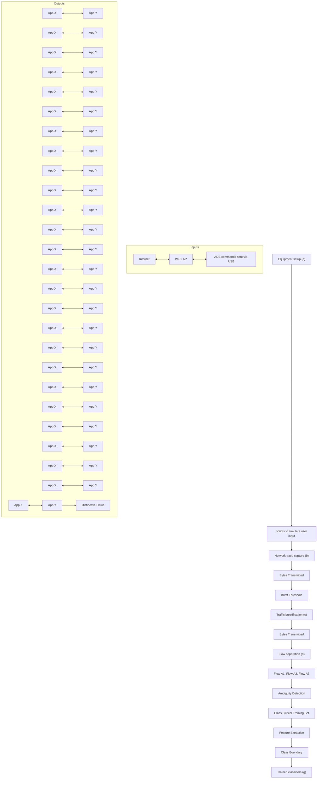
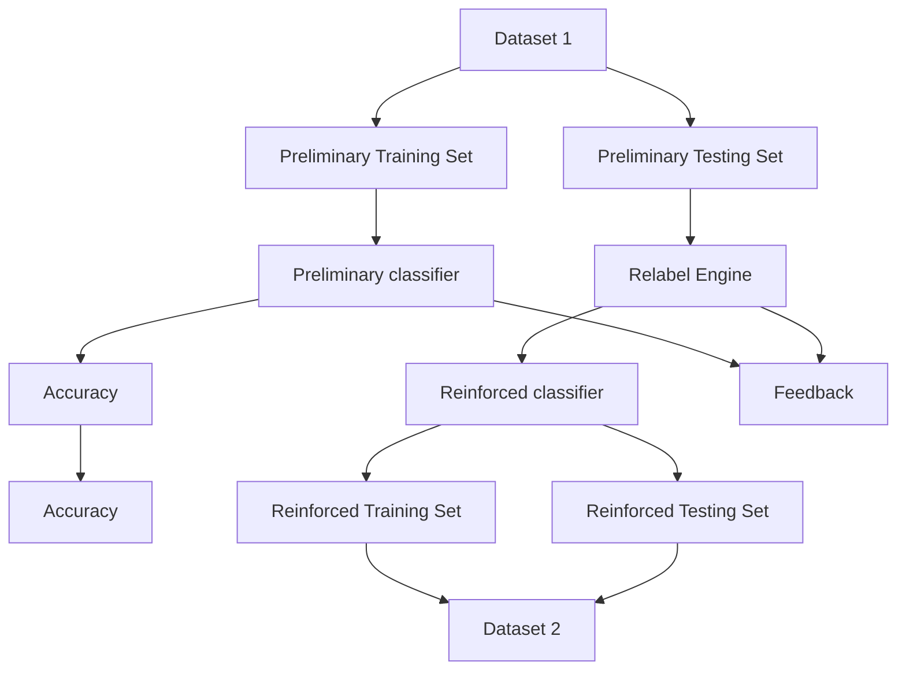

# Robust Smartphone App Identification via Encrypted Network Traffic Analysis

Vincent F. Taylor, Riccardo Spolaor, Mauro Conti, Senior Member, IEEE, and Ivan Martinovic

Abstract— The apps installed on a smartphone can reveal much information about a user, such as their medical conditions, sexual orientation, or religious beliefs. In addition, the presence or absence of particular apps on a smartphone can inform an adversary, who is intent on attacking the device. In this paper, we show that a passive eavesdropper can feasibly identify smartphone apps by fingerprinting the network traffic that they send. Although SSL/TLS hides the payload of packets, sidechannel data, such as packet size and direction is still leaked from encrypted connections. We use machine learning techniques to identify smartphone apps from this side-channel data. In addition to merely fingerprinting and identifying smartphone apps, we investigate how app fingerprints change over time, across devices, and across different versions of apps. In addition, we introduce strategies that enable our app classification system to identify and mitigate the effect of ambiguous traffic, i.e., traffic in common among apps, such as advertisement traffic. We fully implemented a framework to fingerprint apps and ran a thorough set of experiments to assess its performance. We fingerprinted 110 of the most popular apps in the Google Play Store and were able to identify them six months later with up to 96% accuracy. Additionally, we show that app fingerprints persist to varying extents across devices and app versions.

Index Terms— Cellular phones, information security, privacy.

# I. INTRODUCTION

2 MARTPHONE usage continues to increase dramatically ? as devices become more affordable and feature-rich. Apps are the main driver of this growth as they provide convenient access to attractive extra functionality. Many apps usually leverage internet access to provide this extra functionality and thus many apps generate network traffic. The combination of increased app usage coupled with app-generated network traffic makes the smartphone an attractive target for anyone seeking to uncover people’s app usage habits.

Smartphone users typically install and use apps that are in line with their interests. Apps provide a broad spectrum of functionality including medical, finance, entertainment, and lifestyle services. As a result, the apps installed on typical

Manuscript received April 10, 2017; revised June 28, 2017; accepted July 23, 2017. Date of publication August 9, 2017; date of current version November 20, 2017. The associate editor coordinating the review of this manuscript and approving it for publication was Dr. Vrizlynn L. L. Thing. (Corresponding author: Vincent F. Taylor.)

V. F. Taylor and I. Martinovic are with the Department of Computer Science, University of Oxford, Oxford OX1 3QD, U.K. (e-mail: vincent.taylor@cs.ox.ac.uk; ivan.martinovic@cs.ox.ac.uk).

R. Spolaor and M. Conti are with the Department of Mathematics, University of Padova, 35122 Padua, Italy (e-mail: rspolaor@math.unipd.it; conti@math.unipd.it).

Color versions of one or more of the figures in this paper are available online at http://ieeexplore.ieee.org.

Digital Object Identifier 10.1109/TIFS.2017.2737970

smartphones may reveal sensitive information about a user [1]. This may include a user’s medical conditions, hobbies, and sexual/religious preferences. An adversary could also infer who a user banks with, what airline they usually fly on, and which company provides them insurance. This information may be particularly useful in “spear phishing” attacks. In addition to uncovering the aforementioned sensitive information, an adversary can also use app identification to enumerate and exploit potentially vulnerable apps in an attempt to gain privileges on a smartphone.

Network traffic fingerprinting is not a new area of research, and indeed the literature exemplifies techniques for network traffic classification on traditional computers [2]. On smartphones, however, app fingerprinting and identification is frustrated in several ways. Port-based fingerprinting fails because apps deliver their data predominantly using HTTP/HTTPS. Typical web page fingerprinting fails since apps usually send data back and forth using text formats such as XML and JSON, thus removing rich information (such as the number of files and file sizes) that aid web page classification. Additionally, many apps use content delivery networks (CDNs) and thirdparty services, thus eliminating domain name resolution or IP address lookup as a viable strategy. Observing domain name resolution or TLS handshakes also proves less useful due to the use of CDNs. Moreover, DNS and TLS exchanges may not be observed at all due to the use of client-side caching, or simply due to the mobile nature (i.e., transient connectivity) of smartphones.

In this paper, we focus on understanding the extent to which smartphone apps can be fingerprinted and later identified by analysing the encrypted network traffic coming from them. We exploit the fact that while SSL/TLS protects the payload of a network connection, it fails to hide other coarse information such as packet lengths and direction. Additionally, we evaluate the robustness of our app fingerprinting framework by measuring how it is affected by different devices, different app versions, or the mere passage of time.

App fingerprinting may be useful in a variety of scenarios:

1) An adversary in possession of exploits for particular apps may use app fingerprinting to identify these vulnerable apps on a network to narrow their list of target devices.

2) An adversary on the same Wi-Fi network as the victim could surreptitiously monitor the victim’s network traffic to identify what apps are installed on a device for the purposes of blackmail.

3) App fingerprinting in the current era of bring-your-owndevice (BYOD) can provide valuable data about the types of apps and usage patterns of these apps within an organisation.

4) App fingerprinting can aid market research since app usage can be measured within a target population.

In this paper we extend AppScanner, first presented by Taylor et al. [3], along several important dimensions. App-Scanner is a highly-scalable and extensible framework for the fingerprinting and identification of apps from their network traffic. The framework is encryption-agnostic, and only analyses side-channel data, thus making it perform well whether the network traffic is encrypted. We make the following additional contributions beyond the original paper:

1) An analysis of the robustness of app fingerprinting across different devices and app versions. We also analyse the time invariability of app fingerprints, by measuring how performance is affected when attempting to identify apps using fingerprints generated six months earlier.   
2) Design and full implementation1 of an app classification system incorporating a novel machine learning strategy to identify ambiguous network traffic, i.e., traffic that is similar across apps.   
3) Evidence that app fingerprints are time, app version, and device invariant to varying extents. This lends support to the idea that app classification can be useful in realworld settings.

The rest of the paper is organised as follows: Section II does a survey of related work; Section III overviews how our system works at a high-level and explains key terminology; Section IV outlines our approach to identifying ambiguous traffic; Section V overviews the datasets that were collected; Section VI comprehensively evaluates system performance; Section VII discusses ways of improving classifier accuracy using post-processing strategies; Section VIII discusses our results; and finally Section IX concludes the paper.

# II. RELATED WORK

Much work has been done on analysing traffic from workstations and web browsers [4]. At first glance, fingerprinting smartphone apps may seem to be a simple translation of existing work. While there are some similarities, there are nuances in the type of traffic sent by smartphones and the way in which it is sent that makes traffic analysis on smartphones distinct from traffic analysis on traditional workstations [5]–[8]. We outline related work by first enumerating traffic analysis approaches on workstations (Section II-A), and then focusing on traffic analysis on smartphones (Section II-B).

# A. Traditional Traffic Analysis on Workstations

Traditional analysis approaches have relied on artefacts of the HTTP protocol to make fingerprinting easier. For example, when requesting a web page, a browser will usually fetch the HTML document and all corresponding resources identified by the HTML code such as images, JavaScript and style-sheets.

This simplifies the task of fingerprinting a web page since the attacker has a corpus of information (IP addresses, sizes of files, number of files) about the various resources attached to an individual document. If traffic is unencrypted, deep packet inspection (DPI) can be useful for traffic classification. Bujlow et al. [9] do an independent comparison of traffic classification tools that leverage deep packet inspection (DPI). The authors found that a commercial tool gave the best performance, although open-source tools also gave high accuracy. However, DPI fails in the face of encryption and different approaches need to be taken when classifying encrypted traffic.

Many apps, for scalability, build their APIs on top of CDNs such as Akamai or Amazon AWS [10]. This reduces (on average) the number of endpoints that apps communicate with. In the past, it may have been useful to look at the destination IP address of some traffic and infer the app that was sending the traffic. With the advent of CDNs and standard web service APIs, more apps are sending their traffic to similar endpoints, and this frustrates attempts to fingerprint app traffic based on destination IP address only.

Several works considered strong adversaries (e.g., governments) that may leverage traffic analysis to monitor user activity. Those adversaries are able to capture the network traffic flowing through communication links [11]. A pioneering work by Liberatore and Levine in [12] showed the feasibility of web-page identification via encrypted HTTP traffic analysis. Subsequently, Hermann et al. [13] outperformed the aforementioned work by Liberatore and Levine [12] by presenting a method that relies on common text mining techniques performed over the normalized frequency distribution of observable IP packet sizes. This method correctly classified some 97% of HTTP requests. Panchenko et al. [14] proposed a system based on Support Vector Machines (SVMs) that correctly identified web pages despite the use of onion routing anonymisation (e.g., Tor). More recently, Cai et al. [15] and Dyer et al. [16] presented web-page fingerprinting attacks and discussed their effectiveness despite traffic analysis countermeasures (e.g., HTTPOS). In particular, Dyer et al. [16] aimed to elude traffic analysis countermeasures based on packet padding, proposing a technique that relies on perdirection bandwidth and duration of flows.

More recently still, Panchenko et al. [17] present a website fingerprinting attack on Tor that outperforms related work (including their own earlier proposal) while requiring less computational resources. Using SVMs as the classifiers, they proposed a feature extraction technique that samples features starting from a cumulative representation of a webpage’s network flow. Muehlstein et al. [18] show that HTTPS traffic can be used to identify operating system, browser, and application. Similar to our work, the authors generate features using the concept of an encrypted network traffic flow. Miller et al. [19] use traffic analysis to identify individual web pages within websites with approximately 90% accuracy. However, the authors make two assumptions: (i) they rely on feature extraction using whole network bursts (multiple flows), assuming all the flows in the same burst belong to the same webpage; and (ii) they can also rely on multiple bursts to build a website graph through an Hidden Markov Model (HMM).

These assumptions, while reasonable for webpage fingerprinting, fail for mobile app fingerprinting. On smartphones, multiple apps can concurrently send network traffic and so a single burst could contain flows generated by different apps. During classifier training it is possible to identify which app generated a network flow (even in the concurrent apps scenario) using techniques we later describe (Section III-B), but such flow labelling is not possible during a real-world attack.

# B. Traffic Analysis on Smartphones

In early work on the topic, Dai et al. [20] propose NetworkProfiler, an automated approach to profiling and identifying Android apps using dynamic methods. They use user-interface fuzzing (UI fuzzing) to automatically explore different activities and functions within an app, while capturing and logging the resulting network traffic. The authors inspect HTTP payloads in their analysis and thus this technique only works with unencrypted traffic. The authors did not have the full ground truth of the traffic traces they were analysing, so it is difficult to systematically quantify how accurate NetworkProfiler was in terms of precision, recall, and overall accuracy.

Qazi et al. [21] present Atlas, a framework for identifying apps using network flows. Atlas uses crowdsourcing to obtain ground truth. The authors tested their system on 40 Android applications and achieved an average performance of 94%. It however remains unclear whether Atlas maintains good performance as the number of apps to be classified increases. Le et al. [22] propose AntMonitor, a system that also uses crowdsourcing but for the fine-grained collection of network data from Android devices. In contrast, AppScanner does not leverage crowdsourcing approaches. Indeed, AppScanner is able to obtain perfect ground truth and does so in a scalable way using UI fuzzing (Section III-B).

Stöber et al. [23] propose a scheme for identifying a mobile device using the characteristic traffic patterns it produces. The authors posit that 3G transmissions can be realistically intercepted and demodulated to obtain side channel information such as the amount of data and timing information. The authors leverage network bursts from which they extract features since they cannot analyse the TCP payload directly. Using supervised learning, the authors build a model of the background traffic coming from devices. With their system, using approximately 15 minutes of captured traffic can result in a classification accuracy of over 90%. A major drawback with this work is that the system needs six hours of training and 15 minutes of monitoring to achieve reliable fingerprint matching.

Mongkolluksamee et al. [24] [25] use packet size distribution and communication patterns for identifying mobile app traffic. The authors achieve an F-score of approximately 95%. Unfortunately, they only consider five apps so it remains unclear how scalable their approach is. The authors also fail to collect perfect ground truth because their methodology calls for running one app at a time on a device to reduce noise instead of more robust approaches (see Section III-B). Alan and Kaur [26] use TCP/IP headers for identifying apps. The authors identified apps with up to 88% accuracy using packet size information from the first 64 packets generated upon app launch. The authors found that performance decreases when training and testing devices are different. They also found that performance decreases only slightly when several days have passed between training and testing. Complementary to this, we investigate the problem using all network traffic coming from apps. By collecting data over a period of six months instead of several days, we show that traffic classification is more severely impacted by time and that additional strategies to improve performance need to be employed.

Wang et al. [27] propose a system for identifying smartphone apps from encrypted 802.11 frames. They collect data from target apps by running them dynamically and training classifiers with features from Layer 2 frames. The authors test 13 arbitrarily chosen apps from eight distinct app store categories and collect network traces for five minutes. By taking into account a larger set of apps, we show that increasing the number of apps negatively impacts classifier accuracy. Wang et al. [27] also fail to collect perfect ground truth. Indeed, our methodology minimises noise by running a single app at a time, and we still had to filter 13% of the traffic collected because it was background traffic from other apps. AppScanner solves the aforementioned problems by using a larger sample of apps from a wider set of categories and collecting network traffic for substantially more time.

Conti et al. [28] and Saltaformaggio et al. [29] identify specific actions that users are performing within their smartphone apps. Due to similarity, we briefly describe the approach of Conti et al. The authors identify specific actions through flow classification and supervised machine learning. Their system works in the presence of encrypted connections since the authors only leverage coarse flow information such as packet direction and size. AppScanner also leverages packet direction and size, but more robust statistical features are derived from this raw packet data as shown in Section III-B. Conti et al. achieved more than 95% accuracy for most of the considered actions. Their work, however, suffers from its specificity in identifying discrete actions. By choosing specific actions within a limited group of apps, Conti et al. may benefit from the more distinctive flows that are generated. Their system also does not scale well since a manual approach was taken when choosing and fingerprinting actions. Indeed, the authors chose a small set of apps and a small subset of actions within those apps to analyse.

Our prior work [3] improves on the weaknesses of the systems described above. First, by leveraging only sidechannel information, we are able to classify apps in the face of encrypted network traffic. Additionally, our system is trained and tested on 110 apps with traffic collected from each app for 30 minutes. Due to the nature of our framework, apps can also be trained automatically, removing the need for human intervention. Our prior work is however limited in handling ambiguous traffic. Ambiguous traffic, i.e., traffic that is common among more than one apps, would negatively affect our previous system and cause poorer performance. Our prior work also does not provide an understanding of the variability and longevity of app fingerprints. In this paper, we measure how different devices, app versions, or the passage of time affects app fingerprinting.

# III. SYSTEM OVERVIEW

As an overview, AppScanner fingerprints smartphone apps by using machine learning to understand the network traffic that has been generated by them. Patterns in app-generated traffic, when later seen, are used to identify apps.

Unfortunately, apps sometimes have common traffic patterns because they share libraries, such as ad libraries, that generate similar traffic2 across distinct apps. This can frustrate attempts at app classification using traffic analysis, since it may generate false positives. Thus, a strategy is needed to first identify traffic that is shared among apps, so that it can be appropriately labelled before being passed to classifiers. We call traffic shared among apps ambiguous traffic and the remaining traffic distinctive traffic.

In what follows, we introduce the concepts of burst and flow, which are central to our fingerprinting methodology:

Burst: A burst is the group of all network packets (irrespective of source or destination address) occurring together that satisfies the condition that the most recent packet occurs within a threshold of time, the burst threshold, of the previous packet. In other words, packets are grouped temporally and a new group is created only when no new packet has arrived within the amount of time set as the burst threshold. This is visually depicted as Traffic burstification in Fig. 1(c), where we can see Burst A and Burst B separated by the burst threshold. We use the concept of a burst to logically divide the network traffic into discrete, manageable portions, which can then be further processed.

Flow: A flow is a sequence of packets (within a burst) with the same remote IP address. That is, within a flow, all packets will either be going to (or coming from) the same remote IP address. A flow is not to be confused with a TCP session. A flow ends at the end of a burst, while a TCP session can span multiple bursts. Thus, flows typically last for a few seconds, while TCP sessions can continue indefinitely. AppScanner leverages flows instead of TCP sessions to achieve real-time/near-to-real-time classification. From Flow separation in Fig. 1(d), it can be seen that a burst may contain one or more flows. Flows may overlap in a burst if a single app, App X, initiates TCP sessions in quick succession or if another app (e.g., App Y ), happens to initiate a TCP session at the same time as App X.

Our app identification framework first elicits network traffic from an app, generates features from that traffic, trains classifiers using these features, and finally identifies apps when the classifiers are later presented with unknown traffic.

# A. Equipment Setup

The setup used to collect network traces from apps is depicted as Equipment setup in Fig. 1(a). The workstation

2Traffic generated by third-party libraries will typically be common among apps using that particular library.


<details>
<summary>flowchart</summary>


</details>

Fig. 1. High-level representation of classifier training, and a visualisation of bursts and flows within network traffic. (a) Equipment setup. (b) Network trace capture. (c) Traffic burstification. (d) Flow separation. (e) Ambiguity detection. (f) Classifier training. (g) Trained classifiers.

was configured to forward traffic between the Wi-Fi access point (AP) and the Internet. To generate traffic from which to capture our training/testing data, we used scripts that communicated with the target smartphone via USB using the


<details>
<summary>flowchart</summary>

```mermaid
graph LR
    A["SOURCE_IP 192.168.137.2"] --> B["DEST_IP 23.23.162.140"]
    B --> C["PROTO 74"]
    C --> D["Flow Pre-processor"]
    D --> E["Variable Length Feature Vectors"]
    E --> F["[74, -74, 66, 287, -66, -1078, ..., -796"]]
    F --> G["Statistical Feature Extraction"]
    G --> H["Constant Length Feature Vectors"]
    H --> I["Vectors comprised of statistical features generated from flows"]
```
</details>

Fig. 2. Generating features from flows for classifier training.

Android Debug Bridge (ADB). These scripts were used to simulate user actions within apps and thus elicit network flows from the apps. This technique is called UI fuzzing.

The traffic generated by the smartphone was captured and exported as network traffic dumps containing details of captured packets. We collected packet details such as time, source address, destination address, source port, destination port, packet size, protocol and TCP/IP flags. The payload for each packet was also collected but was not used to provide features since it may or may not be encrypted. Although physical hardware was used for network traffic generation and capturing, this process can be massively automated and parallelised by running apps within Android emulators on virtual machines.

# B. Fingerprint Making

There are several stages in the fingerprint making process as follows:

1) Network Trace Capture: Network traffic from apps was elicited automatically using UI fuzzing. UI fuzzing involves using scripts on a workstation to interact with the target device through the Android Debug Bridge (ADB). User interface events such as button presses, swipes, and keypresses are sent to apps in an automated fashion. These touchscreen input events cause the logic within apps to execute, thus generating network traffic.

We performed UI fuzzing on one app at a time to minimise ‘noise’ (i.e., traffic generated simultaneously by other apps) in the network traces. Traffic from other apps or the Android operating system itself could interfere with and taint the fingerprint making process. To combat the problem of noise, the Network Log tool [30] was used to identify the app responsible for each network flow. Using data from Network Log combined with a ‘demultiplexing’ script, all traffic that did not originate from the target app was removed from the traffic dump for that app. In this way, and in contrast to related work, we obtained perfect ground truth of what flows came from what app.

After data collection, the network traffic dumps were filtered to include only TCP traffic that was error free. For example, we filtered to remove packet retransmissions that were as a result of network errors.

2) Traffic Burstification and Flow Separation: The next step was to parse the network dumps to obtain network traffic bursts. Traffic was first discretized into bursts to obtain ephemeral chunks of network traffic that could be sent immediately to the next stage of AppScanner for processing. This allows us to meet the design objective of real-time or near real-time classification of network traffic. Falaki et al. [31] observed that 95% of packets on smartphones “are received or transmitted within 4.5 seconds of the previous packet”. During our tests, we observed that setting the burst threshold to one second instead of 4.5 seconds only slightly increased the number of bursts seen in the network traces. This suggests that network performance (in terms of bandwidth and latency) has improved since the original study. For this reason, we opted to use a burst threshold of one second to favour more overall bursts and nearer-toreal-time performance. Bursts were separated into individual flows (as defined at the beginning of this section and depicted in Fig. 2) using remote IP address. We enforced a maximum flow length that would be considered by the system. This is simply to ensure that abnormal traffic can be safely ignored in the real-world.

It is important to note that while remote IP addresses were used for flow separation, they were not leveraged to assist with app identification. We also opted not to use information gleaned from DNS queries or flows with unencrypted payloads. We took this design decision to avoid the reliance on domain-specific knowledge that frequently changes, thus making our framework useful in the long term.

3) Ambiguity Detection: As mentioned at the beginning of this section, many apps have third-party libraries in common (especially ad libraries) and these libraries themselves generate network traffic. Unfortunately, it is not possible to discriminate traffic coming from libraries (as opposed to the app that embeds the library) in a scalable way, i.e., without an intrusive approach such as reverse-engineering or modifying apps. Indeed, as far as the operating system is concerned, apps and their bundled libraries are one entity within the same process. Since network traffic generated by common libraries across apps is similar, this will frustrate the fingerprinting process because classifiers will be given contradictory training examples. This problem of ambiguous flows poses a challenge to naive machine learning approaches. To mitigate negative effects, we introduce Ambiguity Detection as detailed in Section IV. Ambiguity detection uses simple reinforcement learning techniques to identify similar flows coming from different apps. In the training phase, ambiguous flows are detected and relabelled as belonging to the “ambiguous” class, so that the system is later able to properly identify and handle them.


<details>
<summary>flowchart</summary>


</details>

Fig. 3. Using reinforcement learning to obtain robustness against ambiguous flows.

4) Classifier Training: Statistical features were generated from flows and used to train classifiers. Statistical feature extraction involves deriving 54 statistical features from each flow as shown in Fig. 2. For each flow, three vectors are considered: size of incoming packets only, size of outgoing packets only, and size of both incoming and outgoing packets. For each vector (3 in total), the following values were computed: minimum, maximum, mean, median absolute deviation, standard deviation, variance, skew, kurtosis, percentiles (from 10% to 90%), and the number of elements in the series (18 in total). These statistical features are computed using the Python pandas [32] library. Thus, arbitrary length flows are converted to feature vectors of length 54. These feature vectors and their corresponding ground truth are used as training examples.

# C. App Identification

Unknown flows are passed to the trained classifiers. Ambiguous flows are identified and labelled as such, since the classifiers were trained to understand ambiguous flows. Flows that are not labelled by the classifiers as ambiguous next go through classification validation as described in Section VII-B. The classification validation stage is crucial for one primary reason. Machine learning algorithms will always attempt to place an unlabelled example into the class it most closely resembles, even if the match is not very good. Given that our classifiers will never be trained with the universe of flows from apps, it follows that there will be some flows presented to AppScanner which are simply unknown or never-beforeseen. If left unchecked, this can cause an undesirable increase in the false positive (FP) rate.

To counteract these problems, we leverage the prediction probability metric (available in many classifiers) to understand how certain the classifier is about each of its classifications. For example, if the classifier labelled an unknown sample as com.facebook.katana, we would check its prediction probability value for that classification to determine the classifier’s confidence. If this value is below the classification validation threshold, AppScanner will not make a pronouncement. However, if this value exceeds the threshold, AppScanner would report it as a match for that particular app. In Section VII, we discuss how varying this threshold impacts the precision, recall, and overall accuracy of AppScanner, as well as how this affects the percentage of total flows that the classifiers are confident enough to classify.

# IV. AMBIGUITY DETECTION

The ambiguity detection phase aims to identify and relabel ambiguous flows. This phase involves a reinforcement learning strategy that is leveraged during classifier training. As outlined in Fig. 3, classifier training is divided into two stages: the preliminary classifier stage, and the reinforced classifier stage.

The main training set considered in the analysis is first randomly shuffled and divided into halves: the preliminary training set and the preliminary testing set. The preliminary training set is used to train the preliminary classifier. The preliminary testing set is used to measure the accuracy of the preliminary classifier, and as a basis for generating the training set for the reinforced classifier. In this way, we can first identify which flows are incorrectly classified by the preliminary classifier. We validated that these incorrectly labelled flows are to a large extent library traffic, as expected.

The Relabel Engine leverages feedback on the accuracy of the preliminary classifier to identify ambiguous flows. Flows in the preliminary testing set that are incorrectly classified are re-labelled as “ambiguous” by the Relabel Engine. On the other hand, flows that are correctly classified by the preliminary classifier keep their original label (i.e., the app that generated them). This relabelled dataset is now used as the reinforced training set and is passed to the reinforced classifier. The reinforced classifier is thus equipped to identify ambiguous flows since it is trained with examples of ambiguous flows.

We emphasise to the reader that no flows from the preliminary training set are used in the reinforced training set. The preliminary classifier and the preliminary training set are only used as a means of identifying ambiguous flows so that additional knowledge can be provided to the reinforced classifier.

# V. DATASET COLLECTION

To test the performance of AppScanner, we considered a random 110 of the 200 most popular free apps as listed by the Google Play Store. We chose the most popular apps because they form a large part of the install-base of apps across the world. Additionally, we chose free apps because free apps tend to be ad-supported and thus use ad libraries. There is a small set of major ad libraries and thus ad libraries tend to be shared across apps. This suggests that free apps will be more likely to generate ambiguous flows than paid apps. Being able to properly fingerprint and identify free apps thus implies that AppScanner is robust enough to handle paid apps as well.

TABLE I DESCRIPTIONS OF THE DEVICES, OPERATING SYSTEMS, NUMBER OF APPS, APP VERSIONS, AND TIME OF DATA COLLECTION FOR EACH DATASET USED 

<table><tr><td>Name</td><td>Device</td><td>Operating System</td><td>Number of apps</td><td>App versions</td><td>Time of data collection</td></tr><tr><td>Dataset-1</td><td>Motorola XT1039</td><td>Android 4.4.4</td><td>110</td><td>Latest versions as at  $T_0$ </td><td> $T_0$ </td></tr><tr><td>Dataset-1a</td><td>Motorola XT1039</td><td>Android 4.4.4</td><td>65</td><td>Latest versions as at  $T_0$ </td><td> $T_0$ </td></tr><tr><td>Dataset-2</td><td>Motorola XT1039</td><td>Android 4.4.4</td><td>65</td><td>Latest versions as at  $T_0$ </td><td> $T_0 + 6$  months</td></tr><tr><td>Dataset-3</td><td>LG E960</td><td>Android 5.1.1</td><td>65</td><td>Latest versions as at  $T_0$ </td><td> $T_0 + 6$  months</td></tr><tr><td>Dataset-4</td><td>Motorola XT1039</td><td>Android 4.4.4</td><td>110</td><td>Latest versions as at  $T_0 + 6$  months</td><td> $T_0 + 6$  months</td></tr><tr><td>Dataset-4a</td><td>Motorola XT1039</td><td>Android 4.4.4</td><td>65</td><td>Latest versions as at  $T_0 + 6$  months</td><td> $T_0 + 6$  months</td></tr><tr><td>Dataset-5</td><td>LG E960</td><td>Android 5.1.1</td><td>110</td><td>Latest versions as at  $T_0 + 6$  months</td><td> $T_0 + 6$  months</td></tr><tr><td>Dataset-5a</td><td>LG E960</td><td>Android 5.1.1</td><td>65</td><td>Latest versions as at  $T_0 + 6$  months</td><td> $T_0 + 6$  months</td></tr></table>

Smartphones in our testbed were connected to the internet via a Linksys E1700 Wi-Fi router/AP that had its internet connection routed through a workstation. UI fuzzing was performed on each app for 30 minutes using the MonkeyRunner tool from the Android SDK. UI fuzzing simulated user actions by invoking UI events such as touches, swipes, and button presses. These UI events were generated randomly and sent to apps. It is worth noting that some apps presented login screens upon first launch. In such cases, we first manually created accounts for those apps before logging in. We did this to ensure that traffic generation using UI fuzzing was not hindered by a login screen. Greater coverage of all the network flows in an app may theoretically be obtained by using advanced UI fuzzing techniques provided by frameworks such as Dynodroid [33], or by recruiting human participants. However, we consider these approaches to be out of the scope of our research.

A major contribution of this work is to understand how app fingerprinting is affected by time, the device used, app versions, and combinations of these variables. For this reason, we collected several datasets as outlined in Table I. In what follows, we describe these datasets in detail.

The dataset we consider as our baseline is Dataset-1, which was collected using Device-A, a Motorola XT1039 running Android version 4.4.4. This dataset contains network traffic from 110 apps using the latest version of each app at the time of initial data collection. We refer to this time of initial data collection as $T _ { 0 } .$ . All other main datasets (Dataset-2 to Dataset-5) were collected six months after T0, i.e., at time T0 + 6 months.

Dataset-2 differs from Dataset-1 only by the time of data collection. Dataset-2 contains data from only 65 apps (instead of 110), because the remaining 45 apps refused to run without being updated. We hereafter refer to the 65 apps in Dataset-2 that ran without being updated as the run-without-update subset.

Dataset-3 was collected using Device-B, an LG E960 running Android version 5.1.1. Dataset-3 also used the run-without-update subset.

Dataset-4 and Dataset-5 were obtained by collecting network traffic from the latest versions (at the time of data collection six months after initial data collection) of the original 110 apps and were collected using Device-A and Device-B respectively.


<details>
<summary>line</summary>

| Number of flows per app | Dataset-1 | Dataset-2 | Dataset-3 | Dataset-4 | Dataset-5 |
| ----------------------- | --------- | --------- | --------- | --------- | --------- |
| 0                       | 0.0       | 0.0       | 0.0       | 0.0       | 0.0       |
| 500                     | 0.2       | 0.4       | 0.4       | 0.6       | 0.5       |
| 1000                    | 0.5       | 0.7       | 0.7       | 0.8       | 0.8       |
| 1500                    | 0.7       | 0.9       | 0.9       | 0.95      | 0.95      |
| 2000                    | 0.8       | 0.95      | 0.95      | 0.98      | 0.98      |
| 2500                    | 0.9       | 0.98      | 0.98      | 0.99      | 0.99      |
| 3000                    | 1.0       | 1.0       | 1.0       | 1.0       | 1.0       |
</details>

Fig. 4. CDF plot showing the number of flows per app in each dataset.

Additionally, we consider variants of the datasets that had 110 apps. These variants consider only apps in the run-without-update subset. We denote these dataset variants as Dataset-1a, Dataset-4a, and Dataset-5a for Dataset-1, Dataset-4 and Dataset-5, respectively. These datasets were generated in order to offer a balanced analysis in the presence of datasets with less than 110 apps (i.e., Dataset-2 and Dataset-3).

Fig. 4 shows a cumulative distribution function (CDF) of the number of flows per app in each of the five main datasets. Using Dataset-1 as an example, an average of 1132 flows were collected per app during UI fuzzing. In the same dataset, approximately 80% of apps had 500 or more flows. Other datasets contained fewer flows per app on average. Nonetheless, recall that AppScanner identifies individual flows. Thus, even one flow is sufficient to successfully identify an app, if that flow is distinctive for that app.

# VI. EVALUATION

In evaluating our system, we followed a two-step procedure. First, we report the results of a baseline evaluation of system performance using training and testing sets derived from single datasets. Second, to obtain a more representative measurement of system performance, we performed a comprehensive suite of tests (as outlined in Table III) using completely independent training and testing sets. Measurements were taken to understand how factors such as time, device (including operating system), app version, and a combination of device and app version affected performance.

We leveraged the scikit-learn [34] machine learning libraries to implement the classifiers in our framework. All classifiers were set to use default parameters. Random forest classifiers were chosen since they gave superior performance over support vector machines (SVMs) in our previous work. Random forest classifiers use aggregated decision trees which in turn reduce bias. Additionally, these classifiers are intrinsically multi-class classifiers, making them suitable for tasks such as app classification. Moreover, random forest classifiers natively give the probability of belonging to a class, a feature we use in classification validation (Section VII-B). Although SVMs can handle multi-class problems and output the probability of belonging to a class, these features are not native to SVMs.

TABLE II BASELINE PERFORMANCE OF APP CLASSIFICATION FOR EACH DATASET WITHOUT ANY POST-PROCESSING TECHNIQUES APPLIED 

<table><tr><td>Dataset</td><td>Precision(%)</td><td>Recall(%)</td><td>F1(%)</td><td>Accuracy (%)</td></tr><tr><td>Dataset-1</td><td>74.5</td><td>72.8</td><td>73.1</td><td>73.1</td></tr><tr><td>Dataset-1a</td><td>74.4</td><td>73.2</td><td>73.4</td><td>73.7</td></tr><tr><td>Dataset-2</td><td>68.8</td><td>67.6</td><td>67.7</td><td>65.5</td></tr><tr><td>Dataset-3</td><td>71.3</td><td>69.5</td><td>69.8</td><td>70.4</td></tr><tr><td>Dataset-4</td><td>68.6</td><td>66.6</td><td>66.9</td><td>67.4</td></tr><tr><td>Dataset-4a</td><td>68.5</td><td>66.8</td><td>67.1</td><td>66.9</td></tr><tr><td>Dataset-5</td><td>69.7</td><td>68.1</td><td>68.3</td><td>69.6</td></tr><tr><td>Dataset-5a</td><td>67.7</td><td>65.5</td><td>66.0</td><td>67.5</td></tr></table>

We highlight to the reader that any results reported in this section should be considered as lower bounds of system performance. Indeed, the results presented in this section show the performance of the system before any performanceenhancers, such as ambiguity detection and classification validation (Section VII), have been applied. The tests performed in this section are merely to assess default system performance before post-processing is applied.

For our baseline results, we split each dataset into a training set (75% of flows) and a testing set (25% of flows) and used them to train classifiers as detailed in Section III. Each test was run 50 times with randomly shuffled datasets and the results were averaged. We report the performance of our system in Table II. Accuracy within datasets fell between 65.5% and 73.7%. These results are fairly good but may overestimate the performance of the system. This is because the training and testing sets in each case were generated from one original dataset.

In what follows, we do more robust measurements by using completely independent datasets for training and testing to make a more real-world assessment of system performance. Each test was run 50 times with randomly shuffled datasets and the results averaged. The results in each case are summarised in Table III.

# A. Effect of Time

To measure the effect of time on classification performance, we trained a classifier with Dataset-1a and tested with Dataset-2. This combination of training and testing sets assessed the effect of keeping device and app versions constant, but causing six months to pass between collection of data for training and testing. The overall accuracy for this test, called the TIME test, was 40.9% and was the highest performance of our tests that used completely separate training and testing sets.

The TIME test giving the highest performance is not surprising, since the app versions and device (including operating system version) were constant. The logic (app and operating system) that generates traffic seems to generate the same traffic even after some amount of time (in this case six months) has elapsed. Since the underlying logic does not change, it would be reasonable to expect app fingerprints to also remain constant.

# B. Effect of a Different Device

To assess the impact of a different device on app classification we did three tests: D-110, D-110A, and D-65. D-110 used Dataset-4 as a training set and Dataset-5 as a testing set. That is, we trained with 110 apps on one device and tested with the same 110 apps on a different device. The overall accuracy for D-110 was 37.6%. D-110A used the run-without-update subsets of the datasets used in D-110 and had an overall accuracy of 37.7%. D-65 was conducted with a training set of Dataset-2 and testing set of Dataset-3. That is, we trained with 65 apps on one device and tested with 65 apps on another device. The overall accuracy for this test was 39.6%. We note that this test, with 65 apps, gives performance comparable to the TIME test, which also had 65 apps. This insight suggests that device model and operating system version does not have a significant effect on app fingerprinting performance.

# C. Effect of Different App Versions

We carried out two tests to understand the impact that different app versions had on app fingerprinting. V-LG involved training with Dataset-3 and testing with Dataset-5a. For this test, the same device was used but with different versions of the same apps. The overall accuracy of this test was 30.3%. V-MG used a training set of Dataset-2 and testing set of Dataset-4a. The overall accuracy for this test was 32.7%. We note that the accuracy for both of these tests were fairly similar but markedly lower than the TIME, D-110 or D-110A or D-65 tests. This insight suggests that changes in app versions affects the reliability of app fingerprinting. We believe that this phenomenon could be due to changes in app code or logic that has direct consequences on the way that an app generates network flows. Thus there is a need to keep app fingerprint databases up-to-date as app developers release new app versions.

# D. Effect of a Different Device and Different App Versions

A final two tests were conducted to measure the impact of changing both device and app versions. The first test, DV-110, used a training set of Dataset-1 and a testing set of Dataset-5, i.e., using a total of 110 apps. The second test, DV-65, used a training set of Dataset-1a and testing set of Dataset-5a. These tests yielded overall accuracies of 19.2% and 19.5% respectively. As expected from the results of our previous tests, changing both device and app versions together more severely impacted classification performance. It is interesting to note, however, that the number of apps in training and testing sets did not seem to impact overall classification accuracy in a negative way under these adverse conditions. This result lends support to the idea that app fingerprinting can be a scalable endeavour. We note that despite DV-110 and DV-65 having approximately half the accuracy of the TIME test, they still perform approximately 20 times better than pure random guessing.

TABLE III SUMMARY OF THE COMPREHENSIVE SUITE OF TESTS USED TO MEASURE THE PERFORMANCE OF THE APP CLASSIFICATION SYSTEM. ALL TRAINING AND TESTING SETS WERE COMPLETELY INDEPENDENT OF EACH OTHER. THE INDEPENDENT VARIABLES FOR EACH TEST ARE IDENTIFIED 

<table><tr><td>Test Name</td><td>Training Set</td><td>Testing Set</td><td>Precision (%)</td><td>Recall (%)</td><td>F1 (%)</td><td>Accuracy (%)</td><td>Independent Variable</td><td>Apps</td></tr><tr><td>TIME</td><td>Dataset-1a</td><td>Dataset-2</td><td>44.5</td><td>43.1</td><td>42.6</td><td>40.9</td><td>Time</td><td>65</td></tr><tr><td>D-110</td><td>Dataset-4</td><td>Dataset-5</td><td>40.9</td><td>36.6</td><td>36.3</td><td>37.6</td><td>Device</td><td>110</td></tr><tr><td>D-110A</td><td>Dataset-4a</td><td>Dataset-5a</td><td>38.4</td><td>35.2</td><td>35.1</td><td>37.7</td><td>Device</td><td>65</td></tr><tr><td>D-65</td><td>Dataset-2</td><td>Dataset-3</td><td>43.5</td><td>38.3</td><td>39.0</td><td>39.6</td><td>Device</td><td>65</td></tr><tr><td>V-LG</td><td>Dataset-3</td><td>Dataset-5a</td><td>33.0</td><td>31.0</td><td>30.0</td><td>30.3</td><td>App versions</td><td>65</td></tr><tr><td>V-MG</td><td>Dataset-2</td><td>Dataset-4a</td><td>34.8</td><td>32.1</td><td>32.1</td><td>32.7</td><td>App versions</td><td>65</td></tr><tr><td>DV-110</td><td>Dataset-1</td><td>Dataset-5</td><td>23.3</td><td>19.5</td><td>19.3</td><td>19.2</td><td>Device &amp; App versions</td><td>110</td></tr><tr><td>DV-65</td><td>Dataset-1a</td><td>Dataset-5a</td><td>22.3</td><td>19.7</td><td>19.3</td><td>19.5</td><td>Device &amp; App versions</td><td>65</td></tr></table>

# VII. IMPROVING ACCURACY

Our results so far show the performance of AppScanner without any post-processing applied. Additionally, these results simulate laboratory conditions since they are taken from datasets that have been filtered of noise (using NetworkLog as described in Section III-B). In this section, we look at two post-processing strategies that have proven effective in improving the accuracy of the system: ambiguity detection and classification validation. Ambiguity detection is detailed in Section IV/VII-A and classification validation is discussed in Section VII-B. In general, both of these strategies aim to identify network flows that are not reliable for app fingerprinting.

Also in the section, we analyse the impact of noise on classification accuracy. Noise was filtered in our previous tests. While an attacker can easily filter noise during training, they are unable to filter noise during testing. Thus, we examine the impact of noise using three (one laboratory and two realworld) experimental settings:

1) The noise-filtered setting removes all noise from training and testing sets using NetworkLog. This gives the performance of the system assuming that devices do not have any network traffic being generated from nonapp sources (such as the operating system).   
2) The noise-ignored setting removes noise from the training sets, but leaves noise in the testing sets. This gives a realistic estimation of performance that might be expected in a real-world attack scenario. This is because the attacker can remove noise from their training sets but is unable to remove noise during an attack.   
3) The noise-managed setting goes a step further by actually identifying and labelling noise in both training and testing sets. This allows the classifiers to understand what network traffic coming from the Android operating

system itself looks like. Thus, classifiers are better able to identify noise in the real-world, which further improves accuracy.

Unless otherwise stated, subsequent results are generated using the noise-managed experimental setting.

# A. Ambiguity Detection

As mentioned in Section IV, many apps have traffic in common and this can hinder app classification if left unhandled. Our reinforcement learning approach identifies and relabels ambiguous flows so that the classifiers have a model to identify them. When measuring performance with ambiguity detection in use, unknown flows that are labelled as ambiguous are omitted from calculations of classifier performance. That is, ambiguous flows are identified and ignored, and thus do not affect the measurement of the performance of our system.

In what follows, we report on the improvements that can be made by using our reinforcement learning approach to identify ambiguous traffic flows. Table IV shows the improvement in performance obtained by applying ambiguity detection as outlined in Fig. 3. Additionally, the table shows the number of flows in each testing set and the percentage of flows that were considered ambiguous. Each test used the training and testing sets described in Table III but with varying noise handling to provide results for each of the noise-filtered, noise-ignored, and noise-managed experimental settings. For these tests, reinforced classifiers are used so that ambiguous traffic can be managed. Ambiguity detection was applied to the training sets of these reinforced classifiers as detailed in Section IV. Each test was run 50 times with randomly shuffled data and the results were averaged.

Reinforced classifiers received an approximately twofold boost in overall accuracy. The most challenging tests, DV-110 and DV-65 (using different physical devices, Android versions, and app versions between training and testing sets), had the greatest percentage increases in performance and saw accuracy more than double when using reinforced classifiers. For example, in DV-110, accuracy was increased from 19.2% to 41.0-46.3% using ambiguity detection. Improving performance using reinforced classifiers highlights the prevalence of ambiguous flows in app traffic and reiterates the need for systems that can address them.

Ambiguity detection improves accuracy at the expense of the number of flows that are classified by the system. In the worst case, many apps would have all flows considered as ambiguous, and thus could not be classified by the system if ambiguity detection is used. Fig. 5 shows the number of flows per app that were considered to not be ambiguous flows. For clarity, we show results from only the noise-managed experimental setting in this plot. Other settings gave similar plots. For additional clarity, we omit D-110A and DV-65 since they are scaled-down versions of D-110 and DV-110 respectively. For all tests except DV-110, all apps had some flows that were unambiguous, i.e., there were some flows remaining for every app after ambiguity detection.

TABLE IV HOW THE REINFORCEMENT LEARNING STRATEGY IMPROVED CLASSIFIER PERFORMANCE FOR EACH OF THE TESTS THAT WERE CONDUCTED 

<table><tr><td rowspan="2">Test Name</td><td colspan="4">Noise filtered</td><td colspan="4">Noise ignored</td><td colspan="4">Noise managed</td><td colspan="2">Testing Set Details</td></tr><tr><td>P(%)</td><td>R(%)</td><td>F1(%)</td><td>A(%)</td><td>P(%)</td><td>R(%)</td><td>F1(%)</td><td>A(%)</td><td>P(%)</td><td>R(%)</td><td>F1(%)</td><td>A(%)</td><td>#Flows</td><td>%Ambiguous</td></tr><tr><td>TIME</td><td>66.9</td><td>66.4</td><td>65.7</td><td>72.9</td><td>61.4</td><td>65.3</td><td>61.9</td><td>64.5</td><td>66.4</td><td>65.3</td><td>64.6</td><td>74.8</td><td>54240</td><td>58.3</td></tr><tr><td>D-110</td><td>62.2</td><td>57.2</td><td>56.3</td><td>66.2</td><td>56.1</td><td>56.9</td><td>53.0</td><td>55.4</td><td>59.5</td><td>53.5</td><td>53.0</td><td>64.7</td><td>73811</td><td>59.6</td></tr><tr><td>D-110A</td><td>60.5</td><td>55.9</td><td>55.6</td><td>65.9</td><td>53.7</td><td>55.0</td><td>51.6</td><td>54.5</td><td>57.3</td><td>54.0</td><td>53.1</td><td>63.4</td><td>51995</td><td>60.4</td></tr><tr><td>D-65</td><td>64.4</td><td>59.8</td><td>59.4</td><td>67.5</td><td>59.4</td><td>59.0</td><td>56.0</td><td>59.0</td><td>63.8</td><td>58.8</td><td>58.5</td><td>68.1</td><td>47018</td><td>58.6</td></tr><tr><td>V-LG</td><td>47.8</td><td>47.3</td><td>44.6</td><td>52.8</td><td>41.4</td><td>46.6</td><td>41.4</td><td>43.9</td><td>44.7</td><td>45.6</td><td>42.5</td><td>54.5</td><td>51995</td><td>61.9</td></tr><tr><td>V-MG</td><td>52.4</td><td>50.6</td><td>49.5</td><td>58.1</td><td>48.9</td><td>50.0</td><td>47.2</td><td>50.2</td><td>52.8</td><td>50.3</td><td>49.3</td><td>62.4</td><td>51731</td><td>61.8</td></tr><tr><td>DV-110</td><td>37.0</td><td>35.0</td><td>33.2</td><td>41.0</td><td>32.8</td><td>34.8</td><td>31.0</td><td>32.4</td><td>35.0</td><td>33.7</td><td>32.0</td><td>46.3</td><td>73811</td><td>67.5</td></tr><tr><td>DV-65</td><td>35.8</td><td>34.8</td><td>32.9</td><td>39.8</td><td>30.9</td><td>34.0</td><td>30.2</td><td>31.3</td><td>33.8</td><td>33.8</td><td>31.5</td><td>44.0</td><td>51995</td><td>67.2</td></tr></table>


<details>
<summary>line</summary>

| Flows remaining after ambiguity detection | TIME CDF | D-110 CDF | D-65 CDF | V-LG CDF | V-MG CDF | DV-110 CDF |
| ------------------------------------------ | -------- | --------- | -------- | -------- | -------- | ---------- |
| 0                                          | 0.0      | 0.0       | 0.0      | 0.0      | 0.0      | 0.0        |
| 200                                        | 0.4      | 0.5       | 0.5      | 0.5      | 0.5      | 0.6        |
| 400                                        | 0.7      | 0.8       | 0.8      | 0.8      | 0.8      | 0.9        |
| 600                                        | 0.9      | 0.95      | 0.95     | 0.95     | 0.95     | 0.98       |
| 800                                        | 1.0      | 1.0       | 1.0      | 1.0      | 1.0      | 1.0        |
| 1000                                       | 1.0      | 1.0       | 1.0      | 1.0      | 1.0      | 1.0        |
| 1200                                       | 1.0      | 1.0       | 1.0      | 1.0      | 1.0      | 1.0        |
</details>

Fig. 5. CDF plot showing the number of flows remaining per test after ambiguity detection was applied.

For test DV-110, there was one app that did not have unambiguous flows. In order to identify this app, ambiguity detection would have to be abandoned (at the expense of system accuracy), or the app would have to be re-fingerprinted in an attempt to obtain additional flows that may be unambiguous. There also remains the possibility that some apps simply cannot be identified by AppScanner because they do not generate unambiguous network flows at all. This is a limitation of app identification using network traffic analysis.

# B. Classification Validation

Classification validation is another effective strategy that can be leveraged to improve app classification performance. Classifiers can be made to output their confidence when labelling and unknown example. In simple terms, a classifier may be very confident about a classification if the class boundaries within its models are distinct, i.e., with sufficient separation between classes. In other cases, this distinction may be less clear.

By assessing the confidence that a classifier reports with its classification, a judgement can be made as to whether the classification will be considered as valid by the system. We call the cut-off for what is considered a valid classification the prediction probability threshold (PPT). A higher PPT will lead to more conservative predictions, and thus higher accuracy, at the expense of the number of flows with classifications considered as valid. On the other hand, a lower PPT reduces accuracy but maximises the number of flows with classifications considered as valid. For a system concerned with accurate identification of apps, false positives are usually undesirable and thus higher PPTs are likely to be suitable.

Classification validation reduces the number of flows that are considered as being “correctly” classified, but it is important to note that there is no inherent requirement to label all unknown flows. Apps typically send tens or hundreds of flows per minute when they are being used, so there remains significant opportunity to identify apps from their more distinctive flows. Thus, classification validation can be an effective technique for improving app classification performance while incurring negligible drawback. In what follows, we report on the improvements provided by applying classification validation to our previously described reinforced classifiers.

Fig. 6 shows the improvement provided by classification validation for the TIME, D-110, D-110A, and D-65 tests. We highlight some results by considering a PPT of 0.9. Fig. 6a shows that the TIME test had a preliminary accuracy of 74.8% which was improved to 96.5% using classification validation. The results for the D-110 and D110-A tests are shown in Fig. 6b and 6c respectively. Overall accuracy was improved from 64.7% to 85.9% for test D-110 and from 63.4% to 85.5% for D-110A. The final test in this group, D-65 saw accuracy go from 68.1% to 89.9% when using classification validation.

Fig. 7 shows the improvement provided by classification validation for the V-LG, V-MG, DV-110, and DV-65 tests. Once again, we report our results considering a PPT of 0.9. Fig. 7a shows that classification validation improved accuracy for the V-LG test from 54.5% to 83.9%. Fig. 7b shows the results for the V-MG test, which is similar to V-LG but with a different device. Classification validation improved accuracy from 62.4% to 85.5% in this case.

Fig. 7c and 7d show the results for our most challenging tests: DV-110 and DV-65. Classification validation was able to increase the accuracy of DV-110 from 46.3% to 76.7%. Likewise, for test DV-65, accuracy was increased from 44.0% to 73.5%. This demonstrates that classification validation can be a useful tool to improve system performance under difficult conditions.


<details>
<summary>line</summary>

| Prediction Probability Threshold | Precision | Recall | Accuracy | Flows classified |
| -------------------------------- | --------- | ------ | -------- | ---------------- |
| 0.0                              | 65        | 65     | 75       | 100              |
| 0.2                              | 65        | 65     | 75       | 100              |
| 0.4                              | 70        | 70     | 80       | 90               |
| 0.6                              | 75        | 75     | 85       | 65               |
| 0.8                              | 80        | 80     | 90       | 45               |
| 1.0                              | 85        | 85     | 95       | 35               |
</details>

(a)


<details>
<summary>line</summary>

| Prediction Probability Threshold | Precision | Recall | Accuracy | Flows classified |
| -------------------------------- | --------- | ------ | -------- | ---------------- |
| 0.0                              | 60        | 55     | 65       | 100              |
| 0.2                              | 62        | 54     | 66       | 98               |
| 0.4                              | 65        | 56     | 68       | 90               |
| 0.6                              | 70        | 62     | 78       | 65               |
| 0.8                              | 75        | 65     | 82       | 42               |
| 1.0                              | 72        | 66     | 85       | 32               |
</details>

(b)


<details>
<summary>line</summary>

| Prediction Probability Threshold | Precision | Recall | Accuracy | Flows classified |
| -------------------------------- | --------- | ------ | -------- | ---------------- |
| 0.0                              | 55        | 53     | 63       | 100              |
| 0.2                              | 56        | 54     | 64       | 99               |
| 0.4                              | 60        | 57     | 67       | 90               |
| 0.6                              | 67        | 62     | 73       | 65               |
| 0.8                              | 72        | 67     | 82       | 40               |
| 1.0                              | 75        | 69     | 85       | 30               |
</details>

（c）


<details>
<summary>line</summary>

| Prediction Probability Threshold | Precision | Recall | Accuracy | Flows classified |
| -------------------------------- | --------- | ------ | -------- | ----------------- |
| 0.0                              | 62        | 58     | 68       | 100               |
| 0.2                              | 63        | 59     | 69       | 100               |
| 0.4                              | 67        | 61     | 72       | 90                |
| 0.6                              | 75        | 68     | 80       | 65                |
| 0.8                              | 78        | 71     | 85       | 43                |
| 1.0                              | 80        | 73     | 88       | 33                |
</details>

Fig. 6. Performance of the reinforced classifiers on the TIME, D-110, D-110A, and D-65 tests. (a) Performance for the TIME test. (b) Performance for the D-110 test. (c) Performance for the D-110A test. (d) Performance for the D-65 test.

# C. Considerations for Parameter Tuning

Given that classification validation disregards some classifier predictions if the classifier is not confident enough, it is possible that setting the PPT too high will result in the system being no longer able to classify flows from a particular app. We measure the effect of classification validation and PPTs on the number of apps the system is able to classify. For brevity, we show results for our tests with the best and worst baseline performance, i.e., TIME and DV-110 respectively. Additionally, we show the different PPTs of 0.5, 0.7, and 0.9. These results are summarised in the CDF plots of Fig. 8.

In general, higher thresholds for PPT reduced the number of flows that remained (and were correctly classified) after classification validation. Indeed, setting the PPT too high resulted in the system no longer being able to positively identify some apps. At the extreme end, setting the PPT to 0.9 for the DV-110 test resulted in the system not being confident enough to classify approximately half of the apps. We remind the reader, however, that DV-110 does not represent a real-world attack scenario since the test uses outdated app signatures for some apps. The test more representative of a real-world scenario, TIME, failed to identify 6 apps at a PPT of 0.9 and only 2 apps at a PPT of 0.5. Thus classification validation, while useful, must be tuned only after understanding how the system performs for particular apps of interest.

As a further breakdown, Table V in the Appendix outlines the number of flows remaining (and correctly classified) at each stage of classification for the D-110 and DV-110 tests. We show D-110 (instead of TIME as we have done so far) because it has all 110 apps like DV-110 does and gives similar performance to TIME. From the table, some apps such as air.com.puffballsunited.escapingtheprison pose a challenge for classification with our system, while others such as air.uk.co.bbc.android.mediaplayer are easily and accurately identified.

There is a trade-off between the number of apps that the system is able to classify and the overall accuracy that the system can identify apps with. Experimental settings should be tuned according to the usage scenario of AppScanner. More apps can be detected with less accuracy, or less apps can be detected with higher accuracy. An attacker can also tune her system using knowledge of how her apps of interest behave in the AppScanner system.

# VIII. DISCUSSION

Smartphone app fingerprinting is challenging because of a variety of variables that are likely to change between fingerprint building and final deployment. Such variables include device, operating system version, app version, and time. Any mismatch between variables during app fingerprinting and app identification has the potential to reduce the performance of our app classification system. To this end, we assessed how the aforementioned variables affected system performance. Apps were fingerprinted and later re-identified under a thorough suite of experimental settings.


<details>
<summary>line</summary>

| Prediction Probability Threshold | Precision | Recall | Accuracy | Flows classified |
| -------------------------------- | --------- | ------ | -------- | ---------------- |
| 0.0                              | 45        | 45     | 55       | 100              |
| 0.2                              | 45        | 45     | 55       | 100              |
| 0.4                              | 48        | 48     | 60       | 90               |
| 0.6                              | 55        | 55     | 70       | 60               |
| 0.8                              | 60        | 60     | 80       | 40               |
| 1.0                              | 62        | 62     | 85       | 35               |
</details>

(a)


<details>
<summary>line</summary>

| Prediction Probability Threshold | Precision | Recall | Accuracy | Flows classified |
| -------------------------------- | --------- | ------ | -------- | ---------------- |
| 0.0                              | 50        | 50     | 62       | 100              |
| 0.2                              | 52        | 51     | 63       | 98               |
| 0.4                              | 55        | 53     | 67       | 90               |
| 0.6                              | 60        | 58     | 72       | 65               |
| 0.8                              | 68        | 63     | 80       | 45               |
| 1.0                              | 70        | 65     | 85       | 38               |
</details>


<details>
<summary>line</summary>

| Prediction Probability Threshold | Precision | Recall | Accuracy | Flows classified |
| -------------------------------- | --------- | ------ | -------- | ---------------- |
| 0.0                              | 35        | 35     | 45       | 100              |
| 0.2                              | 35        | 35     | 45       | 100              |
| 0.4                              | 40        | 38     | 50       | 95               |
| 0.6                              | 45        | 40     | 65       | 50               |
| 0.8                              | 48        | 40     | 75       | 35               |
| 1.0                              | 45        | 38     | 78       | 25               |
</details>

（c）


<details>
<summary>line</summary>

| Prediction Probability Threshold | Precision | Recall | Accuracy | Flows classified |
| -------------------------------- | --------- | ------ | -------- | ---------------- |
| 0.0                              | 35        | 35     | 45       | 100              |
| 0.2                              | 38        | 35     | 45       | 100              |
| 0.4                              | 40        | 38     | 50       | 95               |
| 0.6                              | 45        | 40     | 60       | 50               |
| 0.8                              | 48        | 38     | 70       | 35               |
| 1.0                              | 45        | 35     | 75       | 25               |
</details>

Fig. 7. Performance of the reinforced classifiers on the V-LG, V-MG, DV-110, and DV-65 tests. (a) Performance for the V-LG test. (b) Performance for the V-MG test. (c) Performance for the DV-110 test. (d) Performance for the DV-65 test.


<details>
<summary>line</summary>

| Flows after ambiguity detection and classification validation | TIME (PPT=0.5) CDF | TIME (PPT=0.7) CDF | TIME (PPT=0.9) CDF |
| --- | --- | --- | --- |
| 0 | 0.0 | 0.0 | 0.0 |
| 100 | 0.3 | 0.4 | 0.6 |
| 200 | 0.5 | 0.6 | 0.8 |
| 300 | 0.7 | 0.8 | 0.9 |
| 400 | 0.8 | 0.9 | 0.95 |
| 500 | 0.9 | 0.95 | 0.98 |
| 600 | 0.95 | 0.98 | 0.99 |
| 700 | 0.98 | 0.99 | 0.995 |
| 800 | 1.0 | 1.0 | 1.0 |
</details>


<details>
<summary>line</summary>

| Flows after ambiguity detection and classification validation | DV-110 (PPT=0.5) CDF | DV-110 (PPT=0.7) CDF | DV-110 (PPT=0.9) CDF |
| --- | --- | --- | --- |
| 0 | 0.3 | 0.4 | 0.5 |
| 50 | 0.6 | 0.7 | 0.8 |
| 100 | 0.8 | 0.85 | 0.9 |
| 150 | 0.9 | 0.9 | 0.95 |
| 200 | 0.95 | 0.95 | 0.98 |
| 250 | 0.98 | 0.98 | 0.99 |
| 300 | 0.99 | 0.99 | 0.995 |
| 350 | 0.995 | 0.995 | 0.998 |
| 400 | 0.998 | 0.998 | 0.999 |
| 450 | 1.0 | 1.0 | 1.0 |
</details>

(b)   
Fig. 8. CDF plots showing the number of flows correctly classified per app after ambiguity detection and classification validation. (a) TIME test. (b) DV-110 test.

In Table II, we report app classification performance when training and testing sets are generated from the same dataset. In the other tests, we used completely independent datasets for training and testing. System performance when using independent sets was seen to be notably lower than the baseline experiments. This highlights the need for completely independent training and testing sets if one wants to get a more accurate estimate of the performance of an app fingerprinting system.

Training with specific app versions and device with six months between the collection of training and testing data had the highest baseline accuracy. This suggests that time (at the six month timescale) introduces the least variance in app fingerprints. This insight suggests that although the content returned by the app’s servers may have changed, our models are fairly resilient to those changes and still give good performance. Our analysis on datasets collected using different devices (and operating system version) gave performance slightly lower than the previous test. This suggests that device or operating system characteristics of different devices can introduce some additional noise that affects classification performance to a small extent. Such reduction in performance is expected, since apps are known to change their behaviour depending on the version of Android operating system that they are run on. Additionally, differences in the operating system itself may also contribute additional noise that affects classifier performance.

Fingerprinting a set of apps and identifying new versions of the same apps incurred a further performance penalty. This phenomenon is not unexpected, since apps routinely receive changes to their logic during updates [35], which may cause changes in their network traffic flows. However, our classification system shows that it is able to cope with such changes to an extent. This, however, motivates the need to re-fingerprint apps whenever they are updated, but suggests that old fingerprints may be useful, although presumably less so as apps receive more updates. Changing both device and app versions (and time) provided the greatest performance penalty for our classification system. This is an expected penalty since time, device, operating system version, and app versions have all changed between training and testing. Even under these most severe of constraints, our classifier was able to achieve a baseline performance 20 times that of pure random guessing.

The majority of the performance hit appears to come from so-called ambiguous flows. These flows are traffic that is similar across apps and typically comes from third-party libraries that are in common among apps. Such ambiguous traffic frustrates naive machine learning approaches, since the classifiers are given effectively the same training examples with different labels. Using a novel two-stage classification strategy with reinforcement learning, we were able to approximately double the baseline performance of our classifiers. Using the additional post-processing technique of classification validation, further accuracy could be extracted from the system, but at the expense of the number of flows that the classifiers were able to give a confident enough prediction. We remind the reader here that in app classification there is no inherent requirement to label all network flows, but rather to positively identify apps with high accuracy.

# A. Comparison With Related Work

AppScanner works in the domain of fingerprinting network traffic from smartphones and so a direct comparison to website fingerprinting cannot be made. However, to motivate why different approaches such as AppScanner need to be taken when fingerprint app traffic, we show how existing work on website fingerprinting has reduced accuracy when run on app traffic. For a comprehensive comparison, we used our best and worst performing datasets: TIME and DV-110.

In general, all approaches performed better in the TIME test (Fig. 9a) than in the DV-110 test (Fig. 9b). Panchenko et al. [14] performed best with F-measures of 36.9% and 11.4% respectively. AppScanner with no ambiguity detection outperformed this work with 42.6% and 19.2% respectively. Adding ambiguity detection and classification validation further improved the performance of AppScanner over related work.

# B. Limitations

App identification is frustrated by a number of factors such as “flow coverage”, changing app behaviour and ambiguous flows. Flow coverage refers to the fraction of the number flows that are actually triggered during UI fuzzing to the total number of flows that can be made by an app. Indeed, UI fuzzing may not elicit all flows from an app. Getting complete code coverage is a challenging task and even human participants were seen to only obtain 60% code coverage [33] in apps through manual interaction.

Apps may also have different behaviour if they are run at a different time. This may be because the apps themselves have been updated and now have a change in logic or the apps download (dynamic) configuration parameters from a server at runtime. Either of these possibilities may cause apps to have different behaviour between training and testing. To mitigate this, repeated and continuous profiling of apps is necessary. Fortunately, profiling can be automated using virtual devices and UI fuzzing, obviating the need for physical hardware or manual intervention.


<details>
<summary>bar</summary>

| Category | AppScanner (%) | Webpage fingerprinting (%) |
| :--- | :--- | :--- |
| AppScanner - no AD | 42.6 | |
| AppScanner - AD PPT=0.0 | 64.6 | |
| AppScanner - AD PPT=0.5 | 72.1 | |
| Panchenko (2016) | 3.8 | |
| Panchenko (2011) | 36.9 | |
| Dyer - VNG++ (2012) | 0.9 | |
| Herrmann - TF (2009) | 2.7 | |
| Herrmann - Cos (2009) | 11.5 | |
| Herrmann - Pure (2009) | 3.8 | |
| Liberatore - Jaccard (2006) | 4.3 | |
| Liberatore - NB (2006) | 15.1 | |
</details>

(a)


<details>
<summary>bar</summary>

| Category | AppScanner (%) | Webpage fingerprinting (%) |
| :--- | :--- | :--- |
| AppScanner - no AD | 19.3 | |
| AppScanner - AD PPT=0.0 | 32.0 | |
| AppScanner - AD PPT=0.5 | 38.4 | |
| Panchenko (2016) | 2.2 | |
| Panchenko (2011) | 11.4 | |
| Dyer - VNG++ (2012) | 0.6 | |
| Herrmann - TF (2009) | 0.3 | |
| Herrmann - Cos (2009) | 1.9 | |
| Herrmann - Pure (2009) | 0.5 | |
| Liberatore - Jaccard (2006) | 2.1 | |
| Liberatore - NB (2006) | 2.9 | |
</details>

(b)   
Fig. 9. Comparison with related work for the TIME and DV-110 tests. AD = Ambiguity Detection and PPT = Prediction Probability Threshold. (a) Performance for the TIME test. (b) Performance for the DV-110 test.

Ambiguous traffic also poses a problem for app identification. It degrades classifier performance since classifiers may be trained with conflicting data. Additionally, since there are finitely many flows that an app can generate, it is conceivable that more than one app will generate similar flows. Thus, an ambiguity detection scheme is critical to identify the nonambiguous, distinctive flows coming from apps. It may also be the case that some apps simply do not generate non-ambiguous flows. In this case, other approaches will need to be taken for identifying those apps as this is a fundamental limitation of app classification using network traffic analysis.

# C. Countermeasures

Mitigating app identification through traffic analysis is a complicated task. AppScanner uses coarse side-channel data from network traffic flows for feature generation. Thus, feasible countermeasures will likely involve padding network flows sufficiently so that one app is no longer distinguishable from another. In theory, this approach can be useful for frustrating app fingerprinting. In practice however, as argued by Dyer et al. [16], it is unlikely that bandwidth-efficient, general purpose mitigation strategies can provide the requisite protection. Moreover, this problem is complicated on smartphones (and other mobile devices) where battery power, bandwidth, and data usage are bottlenecks. Indeed, these added bottlenecks on smartphones makes efficient traffic analysis countermeasures an open research problem.

TABLE V TABLE GIVING DETAILS OF THE NUMBER OF FLOWS AT VARIOUS POINTS DURING APP CLASSIFICATION FOR THE D-110 AND DV-110 TESTS. FT = NUMBER OF FLOWS IN THE TESTING SET FOR EACH APP, $F _ { A } = \mathrm { N } \mathfrak { u }$ UMBER OF FLOWS AFTER AMBIGUITY DETECTION, F5 = NUMBER OF FLOWS CORRECTLY CLASSIFIED AT A PPT OF 0.5. FOR BREVITY, WE SHOW A PPT OF 0.5 SINCE IT IS AT THE HALFWAY POINT OF THE RANGE OF PPTs 

<table><tr><td rowspan="2">App package name</td><td colspan="3">D-110</td><td colspan="3">DV-110</td></tr><tr><td> $F_T$ </td><td> $F_A$ </td><td> $F_5$ </td><td> $F_T$ </td><td> $F_A$ </td><td> $F_5$ </td></tr><tr><td>air.com.puffballsunited.escapingtheprison</td><td>6</td><td>1</td><td>0</td><td>6</td><td>0</td><td>0</td></tr><tr><td>air.ITVMobilePlayer</td><td>999</td><td>555</td><td>410</td><td>999</td><td>522</td><td>201</td></tr><tr><td>air.uk.co.bbc.android.mediaplayer</td><td>140</td><td>140</td><td>140</td><td>140</td><td>140</td><td>140</td></tr><tr><td>bbc.iplayer.android</td><td>695</td><td>135</td><td>17</td><td>695</td><td>329</td><td>35</td></tr><tr><td>bbc.mobile.weather</td><td>572</td><td>219</td><td>109</td><td>572</td><td>512</td><td>0</td></tr><tr><td>com.adobe.air</td><td>207</td><td>95</td><td>57</td><td>207</td><td>80</td><td>45</td></tr><tr><td>com.airbnb.android</td><td>323</td><td>93</td><td>41</td><td>323</td><td>95</td><td>0</td></tr><tr><td>com.amazon.kindle</td><td>790</td><td>335</td><td>142</td><td>790</td><td>373</td><td>198</td></tr><tr><td>com.amazon.mShop.android(shopping</td><td>767</td><td>366</td><td>274</td><td>767</td><td>347</td><td>104</td></tr><tr><td>com.avast.android.mobilesecurity</td><td>387</td><td>41</td><td>0</td><td>387</td><td>111</td><td>0</td></tr><tr><td>com.badoo.mobile</td><td>380</td><td>114</td><td>71</td><td>380</td><td>121</td><td>22</td></tr><tr><td>com.bigkraken.thelastwar</td><td>176</td><td>108</td><td>16</td><td>176</td><td>33</td><td>0</td></tr><tr><td>com.BitofGame.MiniGolfRetro</td><td>119</td><td>111</td><td>111</td><td>119</td><td>114</td><td>111</td></tr><tr><td>com.booking</td><td>308</td><td>85</td><td>1</td><td>308</td><td>93</td><td>46</td></tr><tr><td>com.boombit.RunningCircles</td><td>995</td><td>472</td><td>59</td><td>995</td><td>241</td><td>66</td></tr><tr><td>com.boombit.Spider</td><td>861</td><td>207</td><td>116</td><td>861</td><td>219</td><td>0</td></tr><tr><td>com.bskyb.skygo</td><td>575</td><td>156</td><td>81</td><td>575</td><td>158</td><td>15</td></tr><tr><td>com.chatous.pointblank</td><td>82</td><td>23</td><td>4</td><td>82</td><td>21</td><td>0</td></tr><tr><td>com.ciegames.RacingRivals</td><td>726</td><td>324</td><td>233</td><td>726</td><td>171</td><td>22</td></tr><tr><td>com.cleanmaster.mguard</td><td>878</td><td>233</td><td>102</td><td>878</td><td>251</td><td>24</td></tr><tr><td>com.cnn.mobile.android.phone</td><td>1277</td><td>508</td><td>251</td><td>1277</td><td>402</td><td>186</td></tr><tr><td>com.contextlogic.wish</td><td>251</td><td>66</td><td>42</td><td>251</td><td>65</td><td>30</td></tr><tr><td>com.dictionary</td><td>1393</td><td>382</td><td>225</td><td>1393</td><td>237</td><td>6</td></tr><tr><td>com.digidust.elokence.akinator.freemium</td><td>996</td><td>223</td><td>60</td><td>996</td><td>197</td><td>0</td></tr><tr><td>com.dropbox.android</td><td>261</td><td>80</td><td>51</td><td>261</td><td>54</td><td>18</td></tr><tr><td>com.ebay.mobile</td><td>643</td><td>131</td><td>50</td><td>643</td><td>187</td><td>45</td></tr><tr><td>com.facebook.katana</td><td>357</td><td>125</td><td>35</td><td>357</td><td>106</td><td>37</td></tr><tr><td>com.facebook.orca</td><td>192</td><td>70</td><td>25</td><td>192</td><td>43</td><td>0</td></tr><tr><td>com.fivestargames.slots</td><td>269</td><td>118</td><td>94</td><td>269</td><td>83</td><td>0</td></tr><tr><td>com.fungames.flightpilot</td><td>737</td><td>401</td><td>346</td><td>737</td><td>352</td><td>127</td></tr><tr><td>com.gameloft.android.ANMP.GloftDMHM</td><td>366</td><td>115</td><td>57</td><td>366</td><td>99</td><td>63</td></tr><tr><td>com.google.android.apps.inbox</td><td>356</td><td>46</td><td>9</td><td>356</td><td>39</td><td>0</td></tr><tr><td>com.google.android.apps.maps</td><td>403</td><td>53</td><td>13</td><td>403</td><td>51</td><td>4</td></tr><tr><td>com.google.android.apps.photos</td><td>146</td><td>78</td><td>64</td><td>146</td><td>32</td><td>0</td></tr><tr><td>com.google.android.apps.plus</td><td>184</td><td>12</td><td>1</td><td>184</td><td>10</td><td>0</td></tr><tr><td>com.google.android.gm</td><td>172</td><td>25</td><td>2</td><td>172</td><td>13</td><td>0</td></tr><tr><td>com.google.android.youtube</td><td>450</td><td>54</td><td>0</td><td>450</td><td>82</td><td>17</td></tr><tr><td>com.google.earth</td><td>394</td><td>139</td><td>104</td><td>394</td><td>158</td><td>101</td></tr><tr><td>com.groupon</td><td>530</td><td>180</td><td>57</td><td>530</td><td>76</td><td>0</td></tr><tr><td>com.gumtree.android</td><td>535</td><td>159</td><td>91</td><td>535</td><td>122</td><td>37</td></tr><tr><td>com.halfbrick.fruitninjafree</td><td>553</td><td>162</td><td>75</td><td>553</td><td>100</td><td>1</td></tr><tr><td>com.hcg.cok.gp</td><td>796</td><td>360</td><td>180</td><td>796</td><td>275</td><td>123</td></tr><tr><td>com.iconology comics</td><td>274</td><td>29</td><td>0</td><td>274</td><td>57</td><td>0</td></tr><tr><td>com.igg.android.finalfable</td><td>558</td><td>351</td><td>233</td><td>558</td><td>243</td><td>183</td></tr><tr><td>com.imangi.templerun2</td><td>211</td><td>53</td><td>7</td><td>211</td><td>45</td><td>18</td></tr><tr><td>com.imdb.mobile</td><td>418</td><td>280</td><td>227</td><td>418</td><td>244</td><td>162</td></tr><tr><td>com.imo.android.imoim</td><td>169</td><td>36</td><td>10</td><td>169</td><td>46</td><td>12</td></tr><tr><td>com.instagram.android</td><td>391</td><td>161</td><td>116</td><td>391</td><td>111</td><td>57</td></tr><tr><td>com.instagram.layout</td><td>40</td><td>36</td><td>0</td><td>40</td><td>1</td><td>0</td></tr><tr><td>com.itv.loveislandapp</td><td>692</td><td>338</td><td>286</td><td>692</td><td>227</td><td>76</td></tr><tr><td>com.jellybtn.cashkingmobile</td><td>1019</td><td>479</td><td>306</td><td>1019</td><td>316</td><td>170</td></tr><tr><td>com.joelapenna.foursquared</td><td>858</td><td>232</td><td>73</td><td>858</td><td>174</td><td>3</td></tr><tr><td>com.joycity.warshipbattle</td><td>638</td><td>333</td><td>88</td><td>638</td><td>333</td><td>202</td></tr><tr><td>com.justeat.app.uk</td><td>385</td><td>135</td><td>27</td><td>385</td><td>83</td><td>0</td></tr><tr><td>com.kiloo.subwaysurf</td><td>884</td><td>217</td><td>111</td><td>884</td><td>241</td><td>44</td></tr></table>

# IX. CONCLUSION

In this paper, we extended AppScanner, a robust and scalable framework for the identification of smartphone apps from their network traffic. We thoroughly evaluated the feasibility of fingerprinting smartphone apps along several dimensions. We collected several datasets of app-generated traffic at different times (six months apart) using different devices (and Android operating systems) and different app versions. We demonstrated that the passage of time is the variable that affects app fingerprinting the least. We also showed that app fingerprints are not significantly more affected by the device that the app is installed on. Our results show that updates to apps will reduce the accuracy of fingerprints. This is unsurprising since new app versions will likely have additional features, which can affect the fingerprint recognition process. We showed that even if app fingerprints are generated on a particular device, they can be identified six months later on a different device running different versions of the same apps with a baseline accuracy that is 20 times better than random guessing. Using the techniques of ambiguity detection and classification validation, we obtained noteworthy increases in system performance. We were able to fingerprint and later re-identify apps with up to 96% accuracy in the best case, and up to 73% accuracy in the worst case. These results suggest that app fingerprinting and identification is indeed feasible in the real-world. App fingerprinting unlocks a variety of new challenges as it relates to user security and privacy. By continuing research in this area, we aim to better understand these challenges, so that appropriate responses can be engineered to keep users safe now and into the future.

<table><tr><td rowspan="2">App package name</td><td colspan="3">D-110</td><td colspan="3">DV-110</td></tr><tr><td> $F_T$ </td><td> $F_A$ </td><td> $F_5$ </td><td> $F_T$ </td><td> $F_A$ </td><td> $F_5$ </td></tr><tr><td>com.king.alphabettysaga</td><td>370</td><td>155</td><td>109</td><td>370</td><td>132</td><td>48</td></tr><tr><td>com.king.candycrushsaga</td><td>342</td><td>212</td><td>173</td><td>342</td><td>68</td><td>25</td></tr><tr><td>com.king.candycrushsodasaga</td><td>576</td><td>502</td><td>366</td><td>576</td><td>345</td><td>290</td></tr><tr><td>com.king.farmheroessaga</td><td>101</td><td>17</td><td>0</td><td>101</td><td>34</td><td>0</td></tr><tr><td>com.lazyswipe</td><td>158</td><td>47</td><td>9</td><td>158</td><td>14</td><td>1</td></tr><tr><td>com.leftover.CoinDozer</td><td>1809</td><td>447</td><td>118</td><td>1809</td><td>349</td><td>3</td></tr><tr><td>com.machinezone.gow</td><td>429</td><td>195</td><td>109</td><td>429</td><td>176</td><td>29</td></tr><tr><td>com.meetup</td><td>376</td><td>82</td><td>0</td><td>376</td><td>92</td><td>6</td></tr><tr><td>com.microsoft.office.outlook</td><td>526</td><td>234</td><td>86</td><td>526</td><td>121</td><td>26</td></tr><tr><td>com.miniclip.agar.io</td><td>1299</td><td>791</td><td>635</td><td>1299</td><td>723</td><td>372</td></tr><tr><td>com.miniclip.eightballpool</td><td>407</td><td>165</td><td>47</td><td>407</td><td>131</td><td>28</td></tr><tr><td>com.mixradio.droid</td><td>183</td><td>76</td><td>36</td><td>183</td><td>1</td><td>0</td></tr><tr><td>com.mobilemotion.dubsmash</td><td>436</td><td>266</td><td>184</td><td>436</td><td>137</td><td>5</td></tr><tr><td>com.mobilityware.solitaire</td><td>534</td><td>231</td><td>11</td><td>534</td><td>100</td><td>2</td></tr><tr><td>com.myfitnesspal.android</td><td>1204</td><td>302</td><td>167</td><td>1204</td><td>222</td><td>25</td></tr><tr><td>com.netflix.mediaclient</td><td>321</td><td>193</td><td>172</td><td>321</td><td>130</td><td>16</td></tr><tr><td>com.nordcurrent.canteenhd</td><td>680</td><td>304</td><td>175</td><td>680</td><td>329</td><td>47</td></tr><tr><td>com.northpark.drinkwater</td><td>948</td><td>323</td><td>224</td><td>948</td><td>402</td><td>223</td></tr><tr><td>com.outfit7.mytalkingtomfree</td><td>1272</td><td>339</td><td>133</td><td>1272</td><td>453</td><td>251</td></tr><tr><td>com.outplayentertainment.bubbleblaze</td><td>1405</td><td>1147</td><td>920</td><td>1405</td><td>661</td><td>330</td></tr><tr><td>com.pinterest</td><td>2076</td><td>403</td><td>136</td><td>2076</td><td>265</td><td>7</td></tr><tr><td>com.playfirst.cookingdashx</td><td>503</td><td>356</td><td>216</td><td>503</td><td>282</td><td>153</td></tr><tr><td>com.prettysimple.crriminalcaseandroid</td><td>297</td><td>194</td><td>70</td><td>297</td><td>112</td><td>52</td></tr><tr><td>com.qihoo.security</td><td>783</td><td>162</td><td>38</td><td>783</td><td>131</td><td>0</td></tr><tr><td>com.robtopx.geometryjumplite</td><td>361</td><td>57</td><td>31</td><td>361</td><td>75</td><td>21</td></tr><tr><td>com.rovio.angrybirds</td><td>283</td><td>105</td><td>34</td><td>283</td><td>140</td><td>111</td></tr><tr><td>com.runtastic.android</td><td>866</td><td>172</td><td>39</td><td>866</td><td>136</td><td>15</td></tr><tr><td>com.shazam.android</td><td>1169</td><td>288</td><td>93</td><td>1169</td><td>260</td><td>54</td></tr><tr><td>com.shpock.android</td><td>552</td><td>114</td><td>47</td><td>552</td><td>61</td><td>5</td></tr><tr><td>com.skype.raider</td><td>740</td><td>423</td><td>353</td><td>740</td><td>222</td><td>157</td></tr><tr><td>com.snapchat.android</td><td>271</td><td>36</td><td>26</td><td>271</td><td>128</td><td>65</td></tr><tr><td>com.soundcloud.android</td><td>439</td><td>100</td><td>27</td><td>439</td><td>80</td><td>7</td></tr><tr><td>com.spotify.music</td><td>632</td><td>255</td><td>181</td><td>632</td><td>177</td><td>77</td></tr><tr><td>com.supercell.boombeach</td><td>372</td><td>229</td><td>91</td><td>372</td><td>43</td><td>1</td></tr><tr><td>com.supercell.clashofclans</td><td>265</td><td>203</td><td>124</td><td>265</td><td>44</td><td>21</td></tr><tr><td>com.surpax.ledflashlight.panel</td><td>527</td><td>92</td><td>29</td><td>527</td><td>89</td><td>9</td></tr><tr><td>com.tayu.tau.pedometer</td><td>578</td><td>364</td><td>0</td><td>578</td><td>44</td><td>0</td></tr><tr><td>com.thetrainline</td><td>430</td><td>185</td><td>113</td><td>430</td><td>87</td><td>20</td></tr><tr><td>com.tinder</td><td>10</td><td>1</td><td>0</td><td>10</td><td>3</td><td>0</td></tr><tr><td>com.tripadvisor.tripadvisor</td><td>16</td><td>4</td><td>0</td><td>16</td><td>3</td><td>0</td></tr><tr><td>com.twitter.android</td><td>206</td><td>23</td><td>0</td><td>206</td><td>32</td><td>8</td></tr><tr><td>com.umonistudio.tile</td><td>738</td><td>513</td><td>462</td><td>738</td><td>422</td><td>137</td></tr><tr><td>com.viber.voip</td><td>202</td><td>98</td><td>62</td><td>202</td><td>70</td><td>19</td></tr><tr><td>com.whatsapp</td><td>98</td><td>61</td><td>25</td><td>98</td><td>25</td><td>0</td></tr><tr><td>com.yahoo.mobile.client.android.mail</td><td>521</td><td>116</td><td>83</td><td>521</td><td>83</td><td>20</td></tr><tr><td>com.yodo1.crossyroad</td><td>1008</td><td>519</td><td>232</td><td>1008</td><td>370</td><td>58</td></tr><tr><td>com.zentertain.photoeditor</td><td>532</td><td>182</td><td>21</td><td>532</td><td>103</td><td>0</td></tr><tr><td>hu.tonuzaba.android</td><td>393</td><td>180</td><td>68</td><td>393</td><td>86</td><td>66</td></tr><tr><td>info.androidz.horoscope</td><td>374</td><td>115</td><td>15</td><td>374</td><td>81</td><td>14</td></tr><tr><td>kik.android</td><td>290</td><td>35</td><td>5</td><td>290</td><td>66</td><td>0</td></tr><tr><td>me.pou.app</td><td>214</td><td>67</td><td>29</td><td>214</td><td>34</td><td>7</td></tr><tr><td>net.zedge.android</td><td>1159</td><td>210</td><td>61</td><td>1159</td><td>210</td><td>18</td></tr><tr><td>tv twitch.android.app</td><td>1109</td><td>610</td><td>471</td><td>1109</td><td>534</td><td>259</td></tr><tr><td>uk.co.dominos.android</td><td>512</td><td>184</td><td>95</td><td>512</td><td>161</td><td>105</td></tr><tr><td>uk.co.nationalrail.google</td><td>643</td><td>172</td><td>79</td><td>643</td><td>142</td><td>73</td></tr></table>

# APPENDIX

# See Table V.

# REFERENCES

[1] S. Seneviratne, A. Seneviratne, P. Mohapatra, and A. Mahanti, “Predicting user traits from a snapshot of apps installed on a smartphone,” ACM SIGMOBILE Mobile Comput. Commun. Rev., vol. 18, no. 2, pp. 1–8, 2014.   
[2] T. T. T. Nguyen and G. Armitage, “A survey of techniques for Internet traffic classification using machine learning,” IEEE Commun. Surv. Tuts., vol. 10, no. 4, pp. 56–76, 4th Quart., 2008.   
[3] V. F. Taylor, R. Spolaor, M. Conti, and I. Martinovic, “AppScanner: Automatic fingerprinting of smartphone apps from encrypted network traffic,” in Proc. IEEE Eur. Symp. Secur. Privacy (Euro S&P), Mar. 2016, pp. 439–454.   
[4] A. Hintz, “Fingerprinting websites using traffic analysis,” in Privacy Enhancing Technologies. Berlin, Germany: Springer, 2003, pp. 171–178.   
[5] H.-S. Ham and M.-J. Choi, “Applicaion-level traffic analysis of smartphone users using embedded agents,” in Proc. 14th Asia–Pacific Netw. Oper. Manage. Symp. (APNOMS), 2012, pp. 1–4.   
[6] J. Yang, S. Zhang, X. Zhang, J. Liu, and G. Cheng, “Analysis of smartphone traffic with MapReduce,” in Proc. 22nd Wireless Opt. Commun. Conf. (WOCC), May 2013, pp. 394–398.   
[7] S.-W. Lee, J.-S. Park, H.-S. Lee, and M.-S. Kim, “A study on smartphone traffic analysis,” in Proc. 13th Asia–Pacific Netw. Oper. Manage. Symp. (APNOMS), Sep. 2011, pp. 1–7.   
[8] S. Feghhi and D. J. Leith, “A Web traffic analysis attack using only timing information,” IEEE Trans. Inf. Forensics Security, vol. 11, no. 8, pp. 1747–1759, Aug. 2016. [Online]. Available: http://dx.doi.org/10.1109/TIFS.2016.2551203   
[9] T. Bujlow, V. Carela-Español, and P. Barlet-Ros, “Independent comparison of popular DPI tools for traffic classification,” Comput. Netw., vol. 76, pp. 75–89, Jan. 2015. [Online]. Available: http://www.sciencedirect.com/science/article/pii/S1389128614003909   
[10] (Mar. 2015). H. Bacic. Are You Using A Content Delivery Network For Your Website Yet? You Should Be. [Online]. Available: http://www.forbes.com/sites/allbusiness/2015/03/16/are-youusing-a-content-delivery-network-for-your-website-yet-you-should-be/   
[11] J.-F. Raymond, “Traffic analysis: Protocols, attacks, design issues, and open problems,” in Designing Privacy Enhancing Technologies. Berlin, Germany: Springer, 2001.   
[12] M. Liberatore and B. N. Levine, “Inferring the source of encrypted HTTP connections,” in Proc. ACM CCS, 2006, pp. 255–263.   
[13] D. Herrmann, R. Wendolsky, and H. Federrath, “Website fingerprinting: Attacking popular privacy enhancing technologies with the multinomial naïve-Bayes classifier,” in Proc. ACM CCSW, 2009, pp. 31–42.   
[14] A. Panchenko, L. Niessen, A. Zinnen, and T. Engel, “Website fingerprinting in onion routing based anonymization networks,” in Proc. ACM WPES, 2011, pp. 103–114.   
[15] X. Cai, X. C. Zhang, B. Joshi, and R. Johnson, “Touching from a distance: Website fingerprinting attacks and defenses,” in Proc. ACM Conf. Comput. Commun. Secur., 2012, pp. 605–616.   
[16] K. P. Dyer, S. E. Coull, T. Ristenpart, and T. Shrimpton, “Peek-a-boo, I still see you: Why efficient traffic analysis countermeasures fail,” in Proc. IEEE SP, May 2012, pp. 332–346.   
[17] A. Panchenko et al., “Website fingerprinting at Internet scale,” in Proc. NDSS, 2016, pp. 1–23.   
[18] J. Muehlstein et al. (Mar. 2016). “Analyzing HTTPS encrypted traffic to identify user operating system, browser and application.” [Online]. Available: https://arxiv.org/abs/1603.04865   
[19] B. Miller, L. Huang, A. D. Joseph, and J. D. Tygar, I Know Why You Went to the Clinic: Risks and Realization of HTTPS Traffic Analysis. Cham, Germany: Springer, 2014, pp. 143–163 http://dx.doi.org/10.1007/978-3- 319-08506-7\_8   
[20] S. Dai, A. Tongaonkar, X. Wang, A. Nucci, and D. Song, “NetworkProfiler: Towards automatic fingerprinting of Android apps,” in Proc. IEEE INFOCOM, Apr. 2013, pp. 809–817. [Online]. Available: http://ieeexplore.ieee.org/lpdocs/epic03/wrapper.htm?arnumber= 6566868

[21] Z. A. Qazi, J. Lee, T. Jin, G. Bellala, M. Arndt, and G. Noubir, “Application-awareness in SDN,” in Proc. ACM SIGCOMM, New York, NY, USA, 2013, pp. 487–488. [Online]. Available: http://doi.acm.org/10.1145/2486001.2491700   
[22] A. Le, J. Varmarken, S. Langhoff, A. Shuba, M. Gjoka, and A. Markopoulou, “AntMonitor: A system for monitoring from mobile devices,” in Proc. ACM SIGCOMM Workshop Crowdsourcing Crowdsharing Big (Internet) Data, New York, NY, USA, 2015, pp. 15–20. [Online]. Available: http://doi.acm.org/10.1145/2787394.2787396   
[23] T. Stöber, M. Frank, J. Schmitt, and I. Martinovic, “Who do you sync you are?: Smartphone fingerprinting via application behaviour,” in Proc. 6th ACM Conf. Secur. Privacy Wireless Mobile Netw. (WiSec), New York, NY, USA, Apr. 2013, pp. 7–12. [Online]. Available: http://dl.acm.org/citation.cfm?id=2462096.2462099   
[24] S. Mongkolluksamee, V. Visoottiviseth, and K. Fukuda, “Combining communication patterns & traffic patterns to enhance mobile traffic identification performance,” J. Inf. Process., vol. 24, no. 2, pp. 247–254, 2016.   
[25] S. Mongkolluksamee, V. Visoottiviseth, and K. Fukuda, “Enhancing the performance of mobile traffic identification with communication patterns,” in Proc. 39th Annu. Comput. Softw. Appl. Conf., vol. 2. 2015, pp. 336–345.   
[26] H. F. Alan and J. Kaur, “Can Android applications be identified using only TCP/IP headers of their launch time traffic?” in Proc. 9th ACM Conf. Secur. Privacy Wireless Mobile Netw. (WiSec), New York, NY, USA, 2016, pp. 61–66. [Online]. Available: http://doi.acm.org/10.1145/2939918.2939929   
[27] Q. Wang, A. Yahyavi, M. Kemme, and W. He, “I know what you did on your smartphone: Inferring app usage over encrypted data traffic,” in Proc. IEEE Conf. Commun. Netw. Secur. (CNS), Sep. 2015, pp. 433–441.   
[28] M. Conti, L. V. Mancini, R. Spolaor, and N. V. Verde, “Analyzing Android encrypted network traffic to identify user actions,” IEEE Trans. Inf. Forensics Security, vol. 11, no. 1, pp. 114–125, Jan. 2016.   
[29] B. Saltaformaggio et al., “Eavesdropping on fine-grained user activities within smartphone apps over encrypted network traffic,” in Proc. 10th USENIX Workshop Offensive Technol. (WOOT), Austin, TX, USA, Aug. 2016, pp. 1–10. [Online]. Available: https://www.usenix.org/conference/woot16/workshop-program/ presentation/saltaformaggio   
[30] (Apr. 2014). P. Software. Network Log. [Online]. Available: https://play.google.com/store/apps/details?id=com.googlecode. networklog   
[31] H. Falaki, D. Lymberopoulos, R. Mahajan, S. Kandula, and D. Estrin, “A first look at traffic on smartphones,” in Proc. 10th ACM SIGCOMM Conf. Internet Meas., 2010, pp. 281–287.   
[32] W. McKinney, “Data structures for statistical computing in python,” in Proc. 9th Python Sci. Conf., 2010, pp. 51–56.   
[33] A. Machiry, R. Tahiliani, and D. M. Naik, “Dynodroid: An input generation system for Android apps,” in Proc. 9th Joint Meet. Found. Softw. Eng., 2013, pp. 224–234.   
[34] L. Buitinck et al., “API design for machine learning software: Experiences from the scikit-learn project,” in Proc. ECML PKDD Workshop, Lang. Data Mining Mach. Learn., 2013, pp. 108–122.   
[35] V. F. Taylor and I. Martinovic, “To update or not to update: Insights from a two-year study of Android app evolution,” in Proc. ACM Asia Conf. Comput. Commun. Secur. (ACM), 2017, pp. 45–57. [Online]. Available: http://doi.acm.org/10.1145/3052973.3052990


<details>
<summary>natural_image</summary>

Portrait of a man with short hair and beard, wearing a dark shirt (no text or symbols visible)
</details>

Vincent F. Taylor is currently pursuing the Ph.D. degree with the Department of Computer Science, University of Oxford, U.K., under the supervision of Prof. I. Martinovic. He was a Visiting Ph.D. Student with the University of Padova in 2015 and the University of Cambridge in 2016 and 2017. His main research interests include improving the security and privacy impact of smartphone apps. To this end, he has done several large-scale studies of app markets and smartphone app traffic to transparently identify apps with security/privacy risks and

suggest alternatives to make end-users safer. He is a Rhodes Scholar (Jamaica and Magdalen, 2013). He holds Cisco CCENT/CCNA/CCNP certifications in Routing and Switching.


<details>
<summary>natural_image</summary>

Portrait of a man with beard and short hair, wearing a collared shirt (no text or symbols visible)
</details>

Riccardo Spolaor received the master’s degree in computer science from the University of Padova, Italy, in 2014, where he is currently pursuing the Ph.D. degree in brain, mind, and computer science. His master’s thesis was on smartphone privacy attack inferring user actions via traffic analysis. He was a Visiting Ph.D. Student with Radboud University in 2015, Ruhr-Universität Bochum in 2016, and the University of Oxford in 2016 and 2017. His main research interests are privacy and security issues on mobile devices. In particular, he applies machine learning techniques to infer user information relying on side-channel analysis. Most of the research that he carried out up to now is about the application of machine learning classifiers to network traffic and energy consumption traces.


<details>
<summary>natural_image</summary>

Portrait of a smiling man wearing a polo shirt with '123 Golden Bull' badge (no visible text or symbols on subject)
</details>

Mauro Conti (SM’14) received the Ph.D. degree from Sapienza University of Rome, Italy, in 2009. He was a Post-Doctoral Researcher with Vrije Universiteit Amsterdam, The Netherlands. In 2011, he joined the University of Padova, Italy, as Assistant Professor, where he became Associate Professor in 2015. He has been a Visiting Researcher with GMU in 2008 and 2016, UCLA in 2010, UCI in 2012, 2013, 2014, and 2017, TU Darmstadt in 2013, UF in 2015, and FIU in 2015 and 2016. His main research interests include security and privacy. In this area, he has authored or co-authored over 200 papers in topmost international peer-reviewed journals and conferences. He received a Marie Curie Fellowship by the European Commission in 2012 and a Fellowship by the German DAAD in 2013. In 2017, he received the National Habilitation as a Full Professor of computer science and computer engineering. He is an Associate Editor for several journals, including the IEEE COMMUNICATIONS SURVEYS & TUTORIALS and the IEEE TRANSACTIONS ON INFORMATION FORENSICS AND SECURITY. He was the Program Chair of TRUST 2015, ICISS 2016, and WiSec 2017, and the General Chair of SecureComm 2012 and ACM SACMAT 2013.


<details>
<summary>natural_image</summary>

Portrait of a man wearing a checkered shirt (no text or symbols visible)
</details>

Ivan Martinovic received the M.Sc. degree from TU Darmstadt, Germany, and the Ph.D. degree from TU Kaiserslautern, Germany, under the supervision of Prof. J. B. Schmitt. He was a Post-Doctoral Researcher with the Security Research Laboratory, UC Berkeley, and with the Secure Computing and Networking Center, UC Irvine. He was an Associate Lecturer with TU Kaiserslautern from 2009 to 2011. He is currently an Associate Professor with the Department of Computer Science, University of Oxford. From 2009 to 2011, he enjoyed a Carl-Zeiss Foundation Fellowship and he was an Associate Lecturer at TU Kaiserslautern. Most of his research interests include cyber-physical system security and network security. Some of his concrete research topics include authentication and intrusion detection using physical-layer information, traffic analysis, and the analysis of tradeoffs between system/network security and performance. In this respect, he works with various technologies, such as software-defined radios, wireless sensors, and NFC/RFIDs. As another incarnation of cyberphysical security, he is also interested in behavioral biometrics and their applications, such as continuous authentication using physiological signals captured by, e.g., eye-tracking and EEG devices. He is also involved in other nonfunctional aspects of distributed systems, such as network performance (network calculus), resource management, and decentralized coordination in wireless networks.