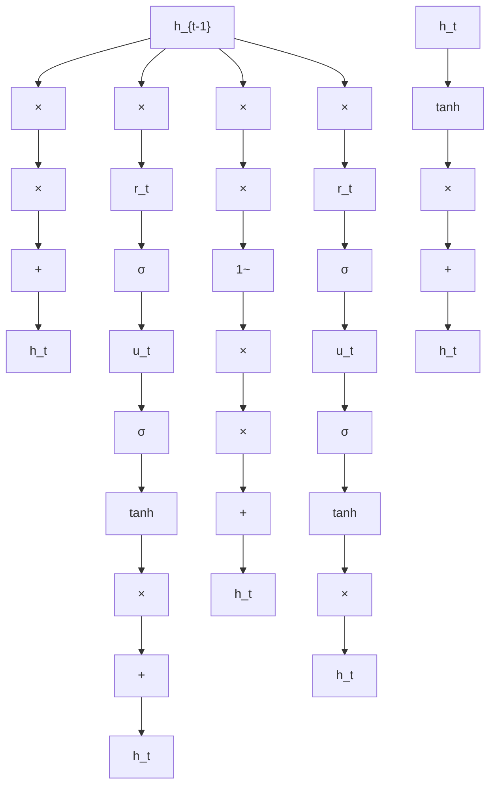
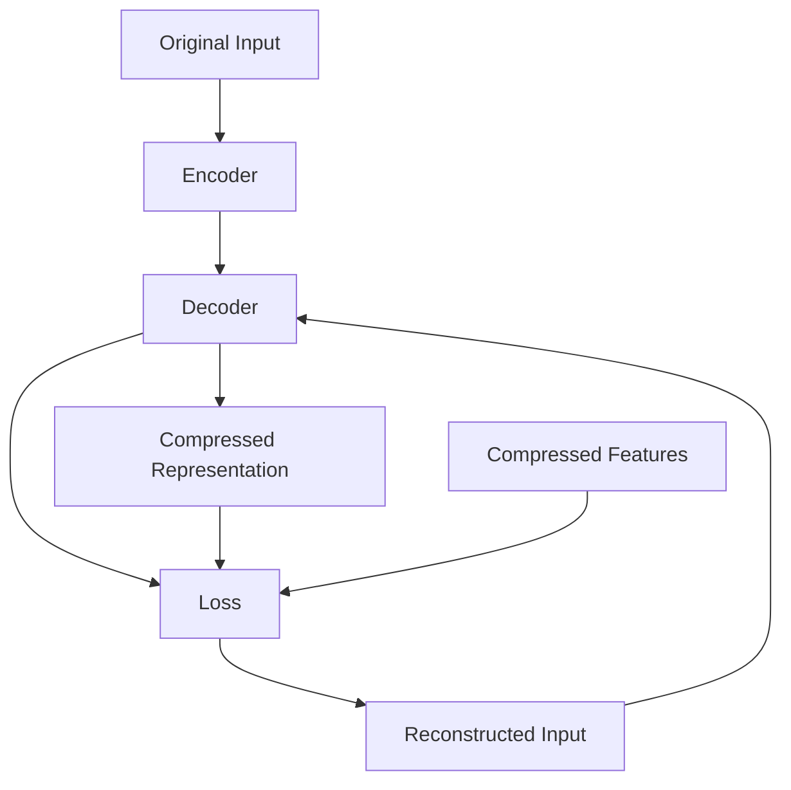

# FS-Net: A Flow Sequence Network For Encrypted Traffic Classification

Chang Liu $^{1,2}$ , Longtao He $^{3}$ , Gang Xiong $^{1,2}$ , Zigang Cao $^{1,2}$ , Zhen Li $^{1,2}$

1. Institute of Information Engineering, Chinese Academy of Sciences

2. School of Cyber Security, University of Chinese Academy of Sciences

3. National Computer Network Emergency Response Technical Team/Coordination Center of China

Abstract—With more attention paid to user privacy and communication security, the volume of encrypted traffic rises sharply, which brings a huge challenge to traditional rule-based traffic classification methods. Combining machine learning algorithms and manual-design features has become the mainstream methods to solve this problem. However, these features depend on professional experience heavily, which needs lots of human effort. And these methods divide the encrypted traffic classification problem into piece-wise sub-problems, which could not guarantee the optimal solution. In this paper, we apply the recurrent neural network to the encrypted traffic classification problem and propose the Flow Sequence Network (FS-Net). The FS-Net is an end-to-end classification model that learns representative features from the raw flows, and then classifies them in a unified framework. Moreover, we adopt a multi-layer encoder-decoder structure which can mine the potential sequential characteristics of flows deeply, and import the reconstruction mechanism which can enhance the effectiveness of features. Our comprehensive experiments on the real-world dataset covering 18 applications indicate that FS-Net achieves an excellent performance (99.14% TPR, 0.05% FPR and 0.9906 FTF) and outperforms the state-of-the-art methods.

Index Terms—Encrypted Traffic Classification, Recurrent Neural Network, Reconstruction Mechanism

# I. INTRODUCTION

Network traffic classification is a vital task in the network management and cyberspace security [1], [2]. In the network management, the traffic needs to be classified based on different priority strategies to guarantee the quality of service (QoS) of networks. In cyberspace security, the malware traffic needs to be identified from benign traffic for the network anomaly detection. Nowadays, as the extensive use of encryption techniques for protecting user privacy, encrypted traffic rises sharply and takes a large share of network traffic [3]. However, encrypted traffic classification is a huge challenge to traditional rule-based methods, due to the fact that all the communication contents are randomized after encryption [4]. Therefore, encrypted traffic classification becomes a focus issue and attracts the widespread attention of industries and academia [5]–[12].

Combining machine learning algorithms and statistical characteristics extracted artificially from raw traffic flows becomes the mainstream method for encrypted traffic classification. The general procedures include feature engineering and model training [5]–[8], [13]. The feature engineering is to select effective features for the encrypted traffic classification, such as maximum packet length, average packet length and byte distribution. This procedure depends on professional experience heavily, and the effectiveness of manually designed features needs to be further verified. The model training is to feed the selected features into a specific classification model, e.g. the logistic regression classifier. However, the classification models are also needed to be carefully selected to generate convincing results. Obviously, this kind method decomposes the encrypted traffic classification problem into two sub-problems, and the result of each sub-problem will directly affect the final classification performance. An alternative idea is to design an end-to-end model, i.e., combining the feature engineering and model training into a unified model. This end-to-end model can learn features from the raw input directly, and the learned features are guided by the real labels to boost performance. Therefore, it can save human effort for designing and verifying features.

In this paper, we purpose an end-to-end model named Flow Sequence Network (FS-Net) for encrypted traffic classification. The FS-Net learns representative features from the raw flow sequences rather than manually designed features. The major structure of the FS-Net model includes an encoder to generate the features, a decoder with reconstruction layer to restore the input sequences and a softmax classifier to recognize applications. Both the encoder and decoder are the multi-layer bi-directional recurrent neural networks to handle the input sequences with different flow lengths. The features for classification are learned automatically from the raw flow sequences by the encoder and are boosted by the decoder and reconstruction mechanism. Moreover, the decoder also learns features to enhance the discrimination of flows. The encoder, decoder and classifier are jointly trained with the raw flow sequences and application labels. The flexible architecture increases the generalization of the FS-Net.

# Our contributions can be briefly summarized as follows:

\- We purpose an end-to-end FS-Net model for the encrypted traffic classification. The FS-Net jointly learns features from the raw flow sequences and makes classification to identify flows, and consists of an encoder, a decoder, a classifier and a reconstruction layer.

\- The reconstruction mechanism is used to boost the feature learning. By keeping reconstructed sequences and raw flow sequences as similar as possible, the generated features can contain more discriminative information, which improves the classification performance.

\- Our FS-Net achieves excellent results on the real-world network traffic data for the encrypted traffic classification, and outperforms several state-of-the-art methods.

The rest of the paper is organized as follows. Section II summarizes the related work. The preliminaries are described in Section III, and the detailed system architecture is proposed in Section IV. Section V presents the comparison experiments. Finally, we conclude this paper in Section VI.

# II. RELATED WORK

Researches on traffic classification emerge in an endless stream, and in this section, we introduce conventional traffic classification, encrypted traffic classification and deep learning models in this field.

# A. Conventional Traffic Classification

Port-based method $[14]$ is used to identify the application type with a given port list provided by the Internet Assigned Numbers Authority (IANA). However, this method is failed in the situations with port dynamic allocation $[15]$ and common communication protocol port $[16]$ . Payload-based method $[17]$ uses the specific signature strings in the payload for matching. Keralapura et al. (2009) provided a self-learning traffic classifier to identify the P2P traffic in high-speed networks with application payload signatures $[18]$ , while Roughan et al. (2004) used statistical signatures to classify P2P application traffic $[19]$ . However, both port-based and payload-based methods lose their efficiency in encrypted traffic classification, because it is impossible to get signatures from payloads after encryption.

# B. Encrypted Traffic Classification

With the appearance of machine learning techniques, researchers mainly work on the feature engineering, i.e., consider how to construct enough effective features rather than extract the signatures from payload contents. There are two kinds of features commonly used in the encrypted traffic classification: statistical features and sequential features.

1) Statistical Features: Statistical features are proposed to solve encrypted traffic classification problem combined with various traditional machine learning algorithms, e.g. logistic regression, random forest and support vector machine. Liu et al. (2012) designed packet-level statistical features which include maximum, minimum and mean of sent and received bytes, and proposed a composite feature-based semi-supervised method for encrypted traffic classification [20]. Anderson et al. (2016) preferred to flow-level features and took flow metadata, packet length distributions, time distributions, byte distributions and unencrypted TLS header information as joint features to identify malware encrypted traffic with the logistic regression algorithm [21]. A robust application identification method with the concept of the burst and flow statistical features was proposed by work [5]. And Shi et al. (2018) built a deep learning framework to select and combine the statistical features to enhance the performances of traffic classification [1]. However, these methods are mainly based on the rich experiences, professional knowledge and lots of human effort. An alternative way is to learn representative features from the raw flow data directly.

2) Sequential Features: Sequential features are learned from the raw flow sequences. The mainstream methods learn the generation probabilities of flows which are determined by each packet of flows. Korczyński et al. (2014) first proposed to represent the traffic flow sequence by Markov transformation matrix [22]. They used message type sequences of encrypted traffic to build first-order Markov model with the maximum generation probability to classify encrypted traffic. Based on this method, Shen et al. clustered the certificate length and the first packet length to improve the classification performances under second-order Markov model [6], [23]. Chang et al. (2017) integrated both message type sequences and length block sequences to build Markov models, and all the generation probabilities are fed into classifiers to make decisions [11]. Moreover, Fu et al. (2016) segmented encrypted traffic flows into sessions in a hierarchical way and extracted packet length and time delay sequences to build hidden Markov models (HMM) [9], which can identify service usages and the end-user in-app behaviors. In addition, work [24] considered the sub-flows during the HTTPS handshake process and the following data transmission period, and combined Markov and HMM models with optimal emission probability to classify encrypted traffic. However, these methods cannot handle the long-term relationship due to the small order (e.g., 1 or 2) of Markov model. These methods also split the feature learning and classification procedures, i.e., the application labels cannot guide the feature representation.

# C. Deep Learning Based Methods

Deep learning (DL) has been well applied to the image processing and natural language processing, but it is still a new research idea for encrypted traffic classification. There are several attempts to apply DL to it. Lotfollahi et al. (2017) adopted the stacked autoencoder and one-dimensional convolution neural network to extract features from encrypted traffic payloads automatically $[25]$ . Rui et al. (2018) provided a byte segment neural network for traffic classification where the segments of payloads are put into the attention encoder to get the features, and then the softmax classifier is used for classification $[26]$ . However, they only use the encrypted payloads of flows to classify behaviors and do not consider other flow information, which can fail in some encrypted traffic classification problems, like application-level classification. In this paper, we attempt to design a new DL network structure which is fit for flow sequence characteristic, and adopt the reconstruction mechanism to enhance the performances of both the feature representation and classification.

# III. PRELIMINARIES

In this section, we first give the definition of the encrypted traffic classification problem. Then, the recurrent neural network, gated recurrent unit and autoencoder framework are introduced briefly.

# A. Problem Definition

The encrypted traffic classification problem in this paper is to classify the encrypted traffic into specific applications with the flow sequences as the only raw traffic information. A raw flow can be represented as several sequences with the same flow length and different types (e.g. message type sequences and packet length sequences). In general, we consider one kind of sequences as the flow sequences, and other sequences can be used in the same way. Assume that there are N samples and C applications in total. Let the sequence of the p-th sample be $x_{p} = [L_{1}^{(p)}, L_{2}^{(p)}, ..., L_{n_{p}}^{(p)}]$ , where $n_{p}$ is the length of $x_{p}$ and $L_{i}^{(p)}$ is the packet value at time step i. The application label of $x_{p}$ is denoted as $A_{p}, 1 \leq A_{p} \leq C$ . We aim to build an end-to-end model $\psi(x_{p})$ to predict a label $\hat{A}_{p}$ that is exactly the real label $A_{p}$ .

# B. RNN model

The Recurrent Neural Network (RNN) [27] is one of the most popular neural networks to model sequences. RNN can infer the current state based on the previous state and the current input, and the previous state encodes the past information. Therefore, RNN can remember the past information, which is naturally suitable for sequence modeling.

Specifically, given the input $l_{t} \in R^{m}$ at time step t, the hidden state $h_{t} \in R^{n}$ of the vanilla RNN is calculated as follows:

$$
h _ {t} = \tanh (W [ h _ {t - 1}, l _ {t} ] + b) \tag {1}
$$

where $h_t$ encodes the input of $l_t$ and $h_{t-1}$ with the historical information (i.e., the previous $l_1, \ldots l_{t-1}$ are kept in the $h_{t-1}$ ). $W$ and $b$ are the parameters needed to be learned in the training process. And [, ] is the concatenation operation.

# C. Gated Recurrent Unit

The main weak point of the vanilla RNN in Eq. (1) is the vanishing gradient problem which cannot retain the long-term information [28], [29]. The Gated Recurrent Unit (GRU) cell [30] adds the gating mechanism to control the information transformation between the hidden states, and tracks the states of the input sequences without using separate memory cells.


<details>
<summary>flowchart</summary>


</details>

(a)


<details>
<summary>flowchart</summary>


</details>

(b)   
Fig. 1. 1(a) shows the architecture of gated recurrent unit, and 1(b) shows the basic structure of autoencoder.

As shown in Figure 1(a), the GRU cell contains a reset gate and an update gate. The output of the reset gate (the orange square) at time step t is as follows,

$$
r _ {t} = \sigma \left(W _ {r} [ l _ {t}, h _ {t - 1} ] + b _ {r}\right) \tag {2}
$$

where $W_{r}$ and $b_{r}$ are trainable variables and $\sigma(x) = \frac{1}{1 + \exp(-x)}$ is the sigmoid function. Similarly, the update gate (the purple square) is computed by

$$
u _ {t} = \sigma \left(W _ {u} [ l _ {t}, h _ {t - 1} ] + b _ {u}\right) \tag {3}
$$

where $W_{u}$ and $b_{u}$ are weight matrix and bias to be learned. Therefore, the hidden state $h_t$ can be updated as follows,

$$
h _ {t} = u _ {t} \odot h _ {t - 1} + (1 - u _ {t}) \odot \hat {h} _ {t} \tag {4}
$$

where $\odot$ is the element-wise product and $\hat{h}_t$ is the new memory as shown below,

$$
\hat {h} _ {t} = \tanh \left(W _ {h} [ l _ {t}, r _ {t} \odot h _ {t - 1} ] + b _ {h}\right) \tag {5}
$$

where $W_{h}$ and $b_{h}$ are also learnable parameters.

From Eq. (2) to Eq. (5), we can update the state $h_{t}$ of the GRU. The reset gate $r_{t}$ decides how much the past state information contributes to the current state, and drops the irrelevant and useless information. When the reset gate is 0, the new memory will forget the previous hidden state and reset with the current input. On the other hand, the update gate $u_{t}$ controls how much information from the previous hidden state is saved and how much new information is added. The update gate controls both the forget and update of the hidden state and helps the GRU cell to remember the long-term information. Moreover, the new state $h_{t}$ is the linear interpolation between the previous hidden state $h_{t-1}$ and the new candidate state $\hat{h}_{t}$ , which can avoid the vanishing gradient problem [30] and model the long-term dependency.

In the rest of the paper, we take the following equation to describe the update of GRU hidden state briefly, i.e.,

$$
h _ {t} = \operatorname{GRU} (h _ {t - 1}, l _ {t}) \tag {6}
$$

Note that the state $h_t$ is also the output of the GRU cell at time step $t$ .

# D. Autoencoder

Autoencoder compresses the raw input and learns features that can represent the main points of the raw input under the reconstruction mechanism [30]. In order to achieve this recurrence, autoencoder needs to capture the most important factors as the representative features of the input data.

The architecture of autoencoder is shown in Figure 1(b). Encoder, decoder and loss function are three elements of autoencoder. Encoder layer codes the original input x into compressed representation y as the abstract features of x. And the feature vector y is used by decoder to generate the reconstructed sample $\hat{x}$ . Finally, the loss function computes the difference between the reconstructed sample $\hat{x}$ and original input x. During the training procedure, the autoencoder jointly learns the parameters in both encoder and decoder by minimizing loss function, and can obtain the compressed expressive features to represent the sample $x$ .

Autoencoder is an unsupervised method that learns representative features from the raw data, and we take the reconstruction mechanism of autoencoder to enhance the feature learning in our end-to-end method.

# IV. THE FLOW SEQUENCE NETWORK

Our end-to-end Flow Sequence Network (FS-Net) is a hierarchical model and consists of 7 layers as shown in Figure 2. The FS-Net considers both feature learning and classification together. The supervised signals from the application labels will guide the feature representation to be more differentiated. And the self-learning behind the reconstruction mechanism can also enhance the representation. FS-Net enjoys the advantages of both supervised and unsupervised learning. In the following of this section, we will present each layer in detail. In order to express simplicity in the latter, the subscript p of the sample $x_{p}$ is omitted.

# A. Embedding Layer

Learning from word embedding [31] in natural language processing, we embed each element (i.e., one aspect of the packet) in the flow sequence to a vector via embedding layer.

Given the element set E with the size of K and dimension d of element embedding vectors, the total embedding can be viewed as a matrix $E \in R^{K \times d}$ . Note that the E is trainable and will be learned in the training process. The embedding layer is a lookup table essentially. Given a specific element B and the embedding matrix E, the corresponding embedding vector of B is the B-th row of E, i.e., $E_{B}$ . Similarly, given a flow sequence with n elements $x = [L_{1}, L_{2}, ..., L_{n}]$ , each element $L_{i}, i \in [1, n]$ needs to be converted into a d-dimension vector $E_{L_{i}}$ . Finally, we can obtain the embedding sequence $[e_{1}, e_{2}, \cdots, e_{n}]$ where $e_{i} = E_{L_{i}}$ .

There are several advantages to take the embedding vectors. 1) With the embedding vectors, some non-numeric values (e.g. message type) can be easily represented into numeric values for computing. 2) The vector representation enriches the information saved in each element of one sequence. Each dimension of the embedding vector is a latent feature that influences the generation of the flow. The same element in different sequences may have different meanings and aspects. For example, various certificate packets may have the same length, but they have different meanings. The mixture information behind the specific length can be captured by an embedding vector (imagining a one-hot vector whose each dimension is a specific certificate). 3) With the trainable setting of the embedding vectors, our model can learn the task-oriented representation of the embedding vector of each element, which can boost the classification performance.

# B. Encoder Layer

The encoder layer takes the embedding vectors of a flow as input, and generates the compressed features. The encoder layer consists of stacked bidirectional GRUs (bi-GRU). The bi-GRU [30] is adopted to incorporate contextual information of the embedding sequence by summarizing sequential information from both directions. Given an embedding sequence $S_{i} = [e_{1}, e_{2}, \cdots, e_{n}]$ , the bi-GRU contains a forward GRU network GRU which reads $S_{i}$ from $e_{1}$ to $e_{n}$ and a backward GRU network GRU which reads $S_{i}$ from $e_{n}$ to $e_{1}$ :

$$
\overrightarrow {h} _ {t} = \overrightarrow {\mathrm{GRU}} \left(\overrightarrow {h} _ {t - 1}, e _ {t}\right), t \in [ 1, n ] \tag {7}
$$

$$
\overleftarrow {h} _ {t} = \overleftarrow {\mathrm{GRU}} \left(\overleftarrow {h} _ {t + 1}, e _ {t}\right), t \in [ 1, n ] \tag {8}
$$

where $\overrightarrow{h}_{t}$ and $\overleftarrow{h}_{t}$ are the forward and backward hidden states respectively, and the initial hidden state vectors $\overrightarrow{h}_{0}$ and $\overleftarrow{h}_{n+1}$ are both zero vectors. Note that $\overrightarrow{h}_{t}$ summarizes the information before $e_{t}$ and $\overleftarrow{h}_{t}$ summarizes that behind $e_{t}$ . Therefore, we concatenate the forward hidden state $\overrightarrow{h}_{t}$ and the backward hidden state $\overleftarrow{h}_{t}$ to obtain the summarization of the whole flow at time step t, i.e., $o_{t} = \left[\overrightarrow{h}_{t}, \overleftarrow{h}_{t}\right]$ .

To further improve the representation of the encoder, we stack the multi-layer bi-GRUs in our model. The low-level expressions learn the local features, while the high-level expressions are composed of combinations of low-level expressions to obtain global features. Formally, the input of the i-th layer at time step t is the output $o_{t}^{(i-1)}$ of the (i-1)-th layer at time step t. That is

$$
\overrightarrow {h} _ {t} ^ {(i)} = \overrightarrow {\mathrm{GRU}} \left(\overrightarrow {h} _ {t - 1} ^ {(i)}, o _ {t} ^ {(i - 1)}\right), t \in [ 1, n ], i > 0 \tag {9}
$$

$$
\overleftarrow {h} _ {t} ^ {(i)} = \overleftarrow {\mathrm{GRU}} \left(\overleftarrow {h} _ {t + 1} ^ {(i)}, o _ {t} ^ {(i - 1)}\right), t \in [ 1, n ], i > 0 \tag {10}
$$

We concatenate the final hidden states of both forward and backward directions of all the layers to obtain the encoder-based feature vector $z_{e}$ of the input flow x as follows:

$$
z _ {e} = \left[ \overrightarrow {h} _ {n} ^ {(1)}, \overleftarrow {h} _ {1} ^ {(1)}, \dots , \overrightarrow {h} _ {n} ^ {(J)}, \overleftarrow {h} _ {1} ^ {(J)} \right] \tag {11}
$$

where J is the number of layers of bi-GRUs in encoder. With this setting, $z_{e}$ contains bidirectional contextual information of the whole flow sequence.

# C. Decoder Layer

The decoder layer adopts another stacked bi-GRU network similar to the encoder layer. Learning from the architecture of autoencoder, the encoder-based feature vector $z_{e}$ is input into the decoder at each time step t, i.e.,

$$
\overrightarrow {s} _ {t} = \overrightarrow {\mathrm{GRU}} \left(\overrightarrow {s} _ {t - 1}, z _ {e}\right), t \in [ 1, n ] \tag {12}
$$

$$
\overleftarrow {s} _ {t} = \overleftarrow {\mathrm{GRU}} \left(\overleftarrow {s} _ {t + 1}, z _ {e}\right), t \in [ 1, n ] \tag {13}
$$

where $\overrightarrow{s}_{t}$ and $\overleftarrow{s}_{t}$ are the forward and backward hidden states of decoder respectively. And we also take the stacked multilayer bi-GRUs similar to Eq. (9) and (10), and the number of layers is also J.

The output of decoder consists of two parts. The first part is the flow reconstruction vector at each time step t, and we can obtain the decoder output sequence $D = \{d_{1}, d_{2}, ..., d_{n}\}$ where $d_{t}$ (similar to $o_{t}$ in encoder layer) is the concatenation of the forward and backward hidden states of all J bi-GRU layers at time step t. The decoder sequence will be used in the reconstruction layer to recover the original input sequence. The second part is the decoder-based feature vector $z_{d}$ of input flow x, which is the concatenation of all the final hidden states of both directions of all J bi-GRU layers.


<details>
<summary>flowchart</summary>

```mermaid
graph TD
    subgraph_Encoder_Layer["Encoder Layer"]
        L1 --> e1
        L2 --> e2
        L3 --> e3
        ..., Ln-1 --> en-1
        Ln --> en
    end

    subgraph_Decoder_Layer["Decoder Layer"]
        L1 --> i1
        L2 --> i2
        L3 --> i3
        ..., Ln-1 --> en-1
    end

    subgraph_Reconstruction_Layer["Reconstruction Layer"]
        L1 --> l11
        L2 --> l21
        L3 --> l31
        ..., Ln-1 --> ln-1
        Ln --> ln
    end

    subgraph_Loss_Layer["Loss"]
        L1 --> L12
        L2 --> L22
        L3 --> L32
        ..., Ln-1 --> Ln-1
        Ln --> Ln

    L11 --> i12
    i12 --> i22
    i22 --> i32
    i32 --> i42
    i42 --> i52
    i52 --> i62
    i62 --> i72

    subgraph_Dense_Layer["Defense Layer"]
        DenseLayer --> ClassificationLayer["Classification Layer"]
        ClassificationLayer --> Loss["Loss"]

    L11 --> i13
    i13 --> i23
    i23 --> i33
    i33 --> i43
    i43 --> i53

    ClassificationLayer -.-> l1p
    ClassificationLayer -.-> l2p
    ClassificationLayer -.-> l3p

    knot["knot"] --> nnot["&quot; "]
    nnot --> nnot1["?"]
    nnot1 --> nnot2["="]
    nnot2 --> nnot3["="]
    nnot3 --> nnot4["="]
    nnot4 --> nnot5["="]
    nnot5 --> nnot6["="]
    nnot6 --> nnot7["="]
    nnot7 --> nnot8["="]
    nnot8 --> nnot9["="]
    nnot9 --> nnot10["="]
    nnot10 --> nnot11["="]
    nnot11 --> nnot12["="]
    nnot12 --> nnot13["="]
    nnot13 --> nnot14["="]
    nnot14 --> nnot15["="]
    nnot15 --> nnot16["="]
    nnot16 --> nnot17["="]
    nnot17 --> nnot18["="]
    nnot18 --> nnot19["="]
    nnot19 --> nnot20["="]
    
    classDef layer fill:#f9f9f9,stroke-dasharray: 5 5;
    class Nnot layer::node
    class knot layer::node
```
</details>

Fig. 2. The system overview of the FS-Net.

$$
z _ {d} = \left[ \overrightarrow {s} _ {n} ^ {(1)}, \overleftarrow {s} _ {1} ^ {(1)}, \dots , \overrightarrow {s} _ {n} ^ {(J)}, \overleftarrow {s} _ {1} ^ {(J)} \right] \tag {14}
$$

Compared with $z_{e}$ which maintains the main components of the flow, $z_{d}$ shows the flow features from the fine-grained perspective. The decoder extracts the information saved in $z_{e}$ at each time step and generates the essential signals to reconstruct the original input sequence. The hidden states of the decoder are the remaining fine-grained features behind the flow sequence. These features may be helpful for the classification problem.

# D. Reconstruction Layer

The decoder sequence D is input into the reconstruction layer to generate the probability distribution over the element set E. Specifically, softmax classifier is used to generate the distribution:

$$
p _ {t} (i) = \frac {\exp (\theta_ {i} ^ {T} x + b _ {i})}{\sum_ {k = 1} ^ {K} \exp (\theta_ {k} ^ {T} x + b _ {k})} \tag {15}
$$

where $p_{t}(i)$ is the probability of the element i at time step t, and $\theta_{k}, 1 \leq k \leq K$ are the trainable parameters. With the distribution, we can recover the t-th packet information $\hat{L}_{t}$ which is the element with the maximum probability in the distribution $p_{t}$ .

# E. Dense Layer

The dense layer first combines the encoder-based feature vector $z_{e}$ and the decoder-based feature vector $z_{d}$ as a compound feature vector z, and then compresses z by choosing more advantageous local features for better classification results.

To enrich the classification features, we take the following as the compound feature vector z of the flow sequence:

$$
z = \left[ z _ {e}, z _ {d}, z _ {e} \odot z _ {d}, \left| z _ {e} - z _ {d} \right| \right] \tag {16}
$$

where $\odot$ is the element-wise product and $|\cdot|$ is the element-wise absolute value. $z_{e} \odot z_{d}$ measures the consistency of $z_{e}$ and $z_{d}$ , while $|z_{e} - z_{d}|$ gives the difference between these two vectors. However, the dimension of $z$ is very high, which is under the risk of over-fitting. Therefore, we take a two-layer perceptron with Selu activation function [32] to compress it:

$$
z _ {c} = \text { Selu } \left(W _ {2} \text { Selu } \left(W _ {1} z + b _ {1}\right) + b _ {2}\right) \tag {17}
$$

where $W_{1}, W_{2}, b_{1}$ and $b_{2}$ are the parameters needed to learn.

The combination of encoder-based and decoder-based feature vectors increases the non-linearity of the classification features. Moreover, the feature compression of the two-layer perceptron avoids over-fitting effectively. Therefore, the dense layer can improve the representation of the FS-Net.

# F. Classification Layer

The compressed feature vector $z_{c}$ is sent to another softmax classifier similar to Eq. (15) to obtain the distribution $q$ over different applications. And we take the application with the maximum probability as the prediction label $\hat{A}$ .

# G. Loss

The loss function of FS-Net consists of two parts with $\alpha$ as the trade-off:

$$
L = L _ {C} + \alpha L _ {R} \tag {18}
$$

where $L_{C}$ is the loss of classification and $L_{R}$ is the loss of reconstruction.

Given the distribution $q_{p}$ over applications for the sample $x_{p}$ , the classification loss is the cross entropy as follows,

$$
L _ {C} = - \frac {1}{N} \sum_ {p} ^ {N} \sum_ {c = 1} ^ {C} I (A _ {p} = c) \log q _ {p} (c) \tag {19}
$$

where $I(A_{p}=c)=1$ if $A_{p}$ is c, else 0, and $q_{p}(c)$ is the probability of application c for the sample $x_{p}$ . The classification loss will guide the learning direction of the trainable parameters in the FS-Net (i.e., embedding, encoder, decoder and dense layers) to generate the representative features which are suitable for the classification task.

The reconstruction loss is another cross entropy loss,

$$
L _ {R} = - \frac {1}{N} \sum_ {p} ^ {N} \frac {1}{n _ {p}} \sum_ {t = 1} ^ {n _ {p}} \sum_ {e = 1} ^ {K} I \left(L _ {t} ^ {(p)} = e\right) \log p _ {t} ^ {p} (e) \tag {20}
$$

The reconstruction loss is the average loss of all the packets of all the samples. This loss can guide the FS-Net (i.e., embedding, encoder, decoder layers) to learn boosted features of flows that can represent the flows.

With the joint learning architecture, the classification and reconstruction share most of trainable parameters of the FS-Net. The balance of these two losses can learn distinguishing features which are beneficial for the final classification.

# V. EVALUATION

In this section, we present the dataset, experimental setting, comparison results and sensitivity analysis.

# A. Dataset

We use the dataset of $[11]$ which is captured from a real-world campus network environment to test and verify our method FS-Net. The dataset was collected for 7 days long and consists of 956+ thousand encrypted traffic flows referring to 18 popular applications after packet recombination and flow reduction techniques. The statistical information of dataset is shown in Table I. We adopt 5-fold cross validation to enhance the reliability of our experiments.

# B. Experimental Setting

1) Comparison Methods: Some state-of-the-art methods are summarized as comparison methods as follows:

- FoSM [22] uses message type sequences to build first-order Markov model and takes the application with the maximum probability as the classification result.   
- SOCRT [23] combines the certificate packet length and the second-order Markov model to classify applications. The certificate clustering number is taken as 5.   
- SOB [6] imports the first communication packet length based on SOCRT to decide the final classification results. We take 40 as the number of bi-gram clustering.   
- FoLM is a variant of FoSM, which replaces the message type sequences with the packet length sequences.   
- SOB-L is a variant of SOB, which replaces the message type sequences with the packet length sequences. 40 is taken as the number of bi-gram clustering.

TABLE I
THE STATISTICAL INFORMATION OF 18 APPLICATIONS 

<table><tr><td>ID</td><td>Apps</td><td>Flows</td><td>ID</td><td>Apps</td><td>Flows</td></tr><tr><td>1</td><td>Alicdn</td><td>16,560</td><td>2</td><td>Alipay</td><td>20,299</td></tr><tr><td>3</td><td>Apple</td><td>111,471</td><td>4</td><td>Baidu</td><td>373,177</td></tr><tr><td>5</td><td>Github</td><td>7,488</td><td>6</td><td>Gmail</td><td>100,339</td></tr><tr><td>7</td><td>iCloud</td><td>22,993</td><td>8</td><td>JD</td><td>48,146</td></tr><tr><td>9</td><td>Kaipanla</td><td>12,168</td><td>10</td><td>Mozilla</td><td>4,265</td></tr><tr><td>11</td><td>NeCmusic $^{1}$ </td><td>9,001</td><td>12</td><td>OneNote</td><td>6,486</td></tr><tr><td>13</td><td>QQ</td><td>114,985</td><td>14</td><td>Sogou</td><td>4,498</td></tr><tr><td>15</td><td>Taobao</td><td>17,267</td><td>16</td><td>Weibo</td><td>24,289</td></tr><tr><td>17</td><td>Youdao</td><td>46,545</td><td>18</td><td>Zhihu</td><td>16,318</td></tr></table>

1. NeCmusic means Netease Cloud Music.

\- MaMPF [11] uses the output probabilities of the message type and the length block Markov models as features to classify encrypted traffic with the random forest classifier. The number of trees is set as 50.

2) Setting of the FS-Net: We take the packet length sequences as the input of the FS-Net, and experiments on other sequences can be found in Section V-C2. The dimension of the packet length embedding vector is set as 128. We set the dimension of hidden states of each GRU as 128, and take the 2-layer bi-GRU network in both encoder and decoder layers. The hyper-parameter $\alpha$ is set as 1. Moreover, we take dropout [33] with 0.3 ratio to avoid over-fitting, and the Adam optimizer [34] with learning rate 0.0005 is used. Our model FS-Net is implemented with TensorFlow.

3) Metrics: We evaluate all the methods based on the True Positive Rate (TPR), False Positive Rate (FPR) and FTF referring to [6], [11]. We also use $TPR_{AVE}$ (the ratio between all the rightly classified flows and the total flows), $FPR_{AVE}$ (the ratio between all the wrongly classified flows and the total flows) to measure the overall performance. The definitions are as follows:

$$
T P R _ {A V E} = \frac {1}{N} \sum_ {i = 0} ^ {C} T P R _ {i} * F l N _ {i} \tag {21}
$$

$$
F P R _ {A V E} = \frac {1}{N} \sum_ {i = 0} ^ {C} F P R _ {i} * F l N _ {i} \tag {22}
$$

$$
F T F = \sum_ {i = 0} ^ {C} w _ {i} \frac {T P R _ {i}}{1 + F P R _ {i}} \tag {23}
$$

where $FlN_{i}$ is the flow number of application i and $w_{i}$ is the ratio between $FlN_{i}$ and the total flow number N, i.e., $w_{i} = \frac{FlN_{i}}{N}$ .

# C. Experiments

1) Comparison experiments: The comparison results are shown in Table II. We can obtain the following conclusions:

1. FS-Net achieves the best performance, and outperforms all the other methods. From Table II, the FS-Net obtains the best TPR performances on 17 of 18 applications except OneNote, but its FPR is the best, 0, which means there are no any false traffic samples classified as OneNote. And our FS-Net can obtain the best performance on all the overall metrics (i.e., $TPR_{AVE}$ , $FPR_{AVE}$ and FTF), because it enjoys the advantages of the end-to-end learning architecture (i.e., joint learning of the feature representation and classification) and the reconstruction mechanism.

TABLE II EXPERIMENTAL RESULTS ON TPR, FPR AND FTF (THE BEST RESULTS ARE IN BOLD) 

<table><tr><td rowspan="2">ID</td><td rowspan="2">APP</td><td colspan="2">FoSM</td><td colspan="2">SOCRT</td><td colspan="2">SOB</td><td colspan="2">FoLM</td><td colspan="2">SOB-L</td><td colspan="2">MaMPF</td><td colspan="2">FS-Net</td></tr><tr><td>TPR</td><td>FPR</td><td>TPR</td><td>FPR</td><td>TPR</td><td>FPR</td><td>TPR</td><td>FPR</td><td>TPR</td><td>FPR</td><td>TPR</td><td>FPR</td><td>TPR</td><td>FPR</td></tr><tr><td>1</td><td>Alicdn</td><td>0.5158</td><td>0.0054</td><td>0.6171</td><td>0.0250</td><td>0.7650</td><td>0.0224</td><td>0.7894</td><td>0.0006</td><td>0.7218</td><td>0.0004</td><td>0.8237</td><td>0.0007</td><td>0.9715</td><td>0.0006</td></tr><tr><td>2</td><td>Alipay</td><td>0.5277</td><td>0.0190</td><td>0.5786</td><td>0.0255</td><td>0.5433</td><td>0.0098</td><td>0.7820</td><td>0.0031</td><td>0.9243</td><td>0.0006</td><td>0.8592</td><td>0.0006</td><td>0.9868</td><td>0.0004</td></tr><tr><td>3</td><td>Apple</td><td>0.6421</td><td>0.0024</td><td>0.6493</td><td>0.0024</td><td>0.7018</td><td>0.0034</td><td>0.8395</td><td>0.0025</td><td>0.9397</td><td>0.0008</td><td>0.9561</td><td>0.0042</td><td>0.9899</td><td>0.0016</td></tr><tr><td>4</td><td>Baidu</td><td>0.7488</td><td>0.0002</td><td>0.7954</td><td>0.0048</td><td>0.8227</td><td>0.0051</td><td>0.8871</td><td>0.0004</td><td>0.9519</td><td>0.0002</td><td>0.9909</td><td>0.0121</td><td>0.9976</td><td>0.0008</td></tr><tr><td>5</td><td>Github</td><td>0.4600</td><td>0.0097</td><td>0.4546</td><td>0.0037</td><td>0.4964</td><td>0.0040</td><td>0.7747</td><td>0.0041</td><td>0.8073</td><td>0.0002</td><td>0.8507</td><td>0.0005</td><td>0.9867</td><td>0.0001</td></tr><tr><td>6</td><td>Gmail</td><td>0.9984</td><td>0.0076</td><td>0.9993</td><td>0.0043</td><td>0.9994</td><td>0.0044</td><td>0.9994</td><td>0.0051</td><td>1.0000</td><td>0.0536</td><td>0.9993</td><td>0.0001</td><td>1.0000</td><td>0.0000</td></tr><tr><td>7</td><td>iCloud</td><td>0.6408</td><td>0.0281</td><td>0.7290</td><td>0.0138</td><td>0.7351</td><td>0.0059</td><td>0.8134</td><td>0.0015</td><td>0.8744</td><td>0.0001</td><td>0.9668</td><td>0.0004</td><td>0.9948</td><td>0.0001</td></tr><tr><td>8</td><td>JD</td><td>0.0294</td><td>0.0007</td><td>0.0483</td><td>0.0036</td><td>0.0863</td><td>0.0076</td><td>0.6564</td><td>0.0039</td><td>0.9053</td><td>0.0010</td><td>0.9083</td><td>0.0037</td><td>0.9560</td><td>0.0017</td></tr><tr><td>9</td><td>Kaipanla</td><td>0.5219</td><td>0.0098</td><td>0.1089</td><td>0.0046</td><td>0.9392</td><td>0.0126</td><td>0.7762</td><td>0.0029</td><td>0.6302</td><td>0.0001</td><td>0.9789</td><td>0.0004</td><td>0.9996</td><td>0.0001</td></tr><tr><td>10</td><td>Mozilla</td><td>0.7852</td><td>0.0063</td><td>0.7951</td><td>0.0030</td><td>0.7993</td><td>0.0030</td><td>0.9003</td><td>0.0058</td><td>0.9274</td><td>0.0000</td><td>0.9114</td><td>0.0002</td><td>0.9941</td><td>0.0000</td></tr><tr><td>11</td><td>NeCmusic</td><td>0.8294</td><td>0.0332</td><td>0.8329</td><td>0.0324</td><td>0.8401</td><td>0.0334</td><td>0.9822</td><td>0.0186</td><td>0.9816</td><td>0.0002</td><td>0.9552</td><td>0.0005</td><td>0.9950</td><td>0.0001</td></tr><tr><td>12</td><td>OneNote</td><td>0.9820</td><td>0.0053</td><td>0.9734</td><td>0.0032</td><td>0.9827</td><td>0.0139</td><td>0.9953</td><td>0.0069</td><td>0.9962</td><td>0.0000</td><td>0.9906</td><td>0.0001</td><td>0.9961</td><td>0.0000</td></tr><tr><td>13</td><td>QQ</td><td>0.0979</td><td>0.0149</td><td>0.1168</td><td>0.0139</td><td>0.2689</td><td>0.0256</td><td>0.8231</td><td>0.0015</td><td>0.9395</td><td>0.0006</td><td>0.9622</td><td>0.0100</td><td>0.9921</td><td>0.0013</td></tr><tr><td>14</td><td>Sogou</td><td>0.7536</td><td>0.0478</td><td>0.7514</td><td>0.0370</td><td>0.7656</td><td>0.0150</td><td>0.8923</td><td>0.0020</td><td>0.8158</td><td>0.0001</td><td>0.8724</td><td>0.0002</td><td>0.9877</td><td>0.0000</td></tr><tr><td>15</td><td>Taobao</td><td>0.0635</td><td>0.0096</td><td>0.2848</td><td>0.0170</td><td>0.3906</td><td>0.0124</td><td>0.7134</td><td>0.0015</td><td>0.7981</td><td>0.0020</td><td>0.7798</td><td>0.0010</td><td>0.9365</td><td>0.0007</td></tr><tr><td>16</td><td>Weibo</td><td>0.4925</td><td>0.0065</td><td>0.8226</td><td>0.0183</td><td>0.5969</td><td>0.0030</td><td>0.8781</td><td>0.0129</td><td>0.9129</td><td>0.0009</td><td>0.9155</td><td>0.0008</td><td>0.9704</td><td>0.0007</td></tr><tr><td>17</td><td>Youdao</td><td>0.8545</td><td>0.1434</td><td>0.8368</td><td>0.1212</td><td>0.8577</td><td>0.1146</td><td>0.9695</td><td>0.0282</td><td>0.9885</td><td>0.0001</td><td>0.9641</td><td>0.0009</td><td>0.9973</td><td>0.0002</td></tr><tr><td>18</td><td>Zhihu</td><td>0.7472</td><td>0.0302</td><td>0.7914</td><td>0.0123</td><td>0.7829</td><td>0.0017</td><td>0.9803</td><td>0.0286</td><td>0.9858</td><td>0.0004</td><td>0.9333</td><td>0.0006</td><td>0.9947</td><td>0.0002</td></tr><tr><td>-</td><td>AVE</td><td>0.6199</td><td>0.0211</td><td>0.6543</td><td>0.0192</td><td>0.7023</td><td>0.0165</td><td>0.8699</td><td>0.0072</td><td>0.9385</td><td>0.0034</td><td>0.9632</td><td>0.0020</td><td>0.9914</td><td>0.0005</td></tr><tr><td>-</td><td>FTF</td><td colspan="2">0.6117</td><td colspan="2">0.6457</td><td colspan="2">0.6935</td><td colspan="2">0.8662</td><td colspan="2">0.9328</td><td colspan="2">0.9567</td><td colspan="2">0.9906</td></tr></table>

2. The FS-Net can better model the flow sequences than the Markov models. The FoLM, SOB-L and FS-Net all take the packet length sequences as input, and our proposed FS-Net outperforms the other two methods according to Table II. Traditional Markov-based methods can only capture one or two order information of adjacent packets in one flow, while the FS-Net uses the bi-GRU network to model the sequence with the advantage of keeping the contextual information of the whole flow. The FS-Net is more consistent with the generative context mechanism of flows in the real world.   
3. The end-to-end framework leads the FS-Net to achieve a better performance than other piece-wise models. Our FS-Net outperforms the MaMPF, although only packet length sequences are taken as its input while MaMPF combines the packet length sequences and message type sequences to classify encrypted traffic. Moreover, MaMPF takes the well-performed random forest classifier which usually obtains better results than the pure softmax classifier. However, MaMPF is a piece-wise model, and the classifier cannot direct the features built from Markov models. By contraries, our FS-Net can make up for this shortcoming, benefited from the end-to-end framework. The feature learning can be guided by the classification task and the reconstruction mechanism. Therefore, the features are more distinguishable for the encrypted traffic classification.   
4. The packet length is more representative than the message type in the encrypted traffic classification task. Comparing FoSM, FoLM, SOB and SOB-L, the performances of FoLM and SOB-L are vastly better than the other two methods. The main reason might be the high overlapping of the message type sequences of different applications discovered by [11]. There are more elements in the packet length set than

TABLE III COMPARISON EXPERIMENTS BETWEEN THE FS-NET AND ITS VARIANTS 

<table><tr><td>Methods</td><td> $TPR_{AVE}$ </td><td> $FPR_{AVE}$ </td><td>FTF</td></tr><tr><td>FS-Net</td><td>0.9914</td><td>0.0005</td><td>0.9906</td></tr><tr><td>FS-ND</td><td>0.9805</td><td>0.0007</td><td>0.9798</td></tr><tr><td>FS-Net-S</td><td>0.7353</td><td>0.0145</td><td>0.7248</td></tr><tr><td>FS-ND-S</td><td>0.7347</td><td>0.0147</td><td>0.7152</td></tr><tr><td>FS-Net-SL</td><td>0.9919</td><td>0.0005</td><td>0.9911</td></tr><tr><td>FS-ND-SL</td><td>0.9807</td><td>0.0007</td><td>0.9800</td></tr></table>

the message type set, which increases the discrimination of flows. Comparing SOCRT and SOB, the first communication packet length can indeed improve the classification results, but the improvement is limited.

2) Analysis on FS-Net: We analyze several properties of the proposed FS-Net.

- The reconstruction mechanism can enhance the feature representation and discrimination by recovering the input sequence. To verify it, we design a variant of our model which abandons the decoder layer, reconstruction layer and the reconstruction loss in Figure 2, i.e., only the encoder-based feature vector $z_{e}$ is passed to the dense layer for classification. The variant is termed as FS-ND. The packet length sequences are the default choice for the FS-Net and FS-ND as the input.   
- The message type sequences are used as the input of traditional message type Markov based methods (i.e., FoSM, SOCRT and SOB). For ease of comparison, the FS-Net and FS-ND are all under test combined with message type sequences, and the corresponding methods are denoted as FS-Net-S and FS-ND-S.   
- Multi-attribute sequences (i.e., message type and packet length sequences) are united to enhance the performance. We double the feature learning layers, and concatenate the encoder-based and decoder-based features from two different networks as the input of dense


<details>
<summary>bar_line</summary>

| The number of hidden states | FTF | TPR | FPR |
|---|---|---|---|
| 4 | 0.9772 | 0.979 | 0.0012 |
| 8 | 0.9836 | 0.9851 | 0.0008 |
| 16 | 0.9871 | 0.9882 | 0.0007 |
| 32 | 0.9885 | 0.9895 | 0.0006 |
| 64 | 0.9888 | 0.9898 | 0.0006 |
| 128 | 0.9902 | 0.9911 | 0.0005 |
| 256 | 0.9909 | 0.9917 | 0.0005 |
| 512 | 0.9912 | 0.992 | 0.0004 |
</details>

Fig. 3. Results of FS-Net with different dimensions of hidden states. TPR and FPR in this figure means the metric $TPR_{AVE}$ and $FPR_{AVE}$

layer. With this strategy, the FS-Net can be extended with multi-attribute sequences. The strategy can also be applied on the FS-ND. And these two variant models are termed as FS-Net-SL and FS-ND-SL.

The experimental results of FS-Net and its five variants are shown in Table III, and we can draw some conclusions.

1. The reconstruction mechanism can indeed enhance the feature representation and improve the classification performance. Comparing them with different sequences, the FS-Net always outperforms the FS-ND with about 0.01 improvement in FTF. With reconstruction mechanism, the features learned from the encoder are guided to store richer information. Moreover, the distinctiveness of decoder-based features is also strengthened for encrypted traffic classification task.   
2. Our variant model FS-ND is also better than the state-of-the-art models, and the performance gap between FS-Net and FS-ND is not large. However, the FS-ND model takes less layers than the FS-Net, which can be trained faster. The FS-ND can be regarded as a distilled version of our model.   
3. The end-to-end structure performs better than piecewise framework. Although using the same input (i.e., message type sequences), the FS-Net-S and FS-ND-S outperform the FoSM, SOCRT and SOB in Table II, because the classification results can guide the feature representation. Therefore, our model can learn more distinguishable features.   
4. The information of message type sequences is almost incorporated into that of packet length sequences. The improvement from FS-Net to FS-Net-SL is not significant (e.g., 0.0005 in FTF). Similar phenomenon happens between FS-ND and FS-ND-SL. Moreover, the results of FS-Net and FS-Net-S also demonstrate that the information in packet length sequences is richer than that of message type sequences.

# D. Sensitivity Analysis

1) The dimension of hidden states: Hidden states of the encoder and decoder in the FS-Net is to extract and store the latent information of the flow sequences, and each dimension is an aspect to represent the latent information. The dimension of hidden states directly affects the performance of the FS-Net. Small value results in a bad performance due to the weak ability to capture the latent information, while large value can lead to over-fitting because our model might learn some useless information from the noise data.


<details>
<summary>bar_line</summary>

| α | FTF | TPR | FPR |
|---|---|---|---|
| 0.125 | 0.9904 | 0.9913 | 0.0005 |
| 0.25 | 0.9899 | 0.9908 | 0.0005 |
| 0.5 | 0.9903 | 0.9911 | 0.0005 |
| 1 | 0.9903 | 0.9912 | 0.0005 |
| 2 | 0.9902 | 0.9911 | 0.0005 |
| 4 | 0.9887 | 0.9897 | 0.0006 |
| 8 | 0.9899 | 0.9907 | 0.0005 |
| 16 | 0.9892 | 0.9902 | 0.0005 |
| 32 | 0.9885 | 0.9896 | 0.0006 |
| 64 | 0.9867 | 0.988 | 0.0007 |
| 128 | 0.9872 | 0.9884 | 0.0006 |
| 256 | 0.9854 | 0.9868 | 0.0007 |
</details>

Fig. 4. Comparison results of FS-Net with different $\alpha$ . TPR and FPR in this figure means the metric $TPR_{AVE}$ and $FPR_{AVE}$

Therefore, we train the FS-Net with different dimensions of hidden states (i.e., 4, 8, 16, 32, 64, 128, 256, 512) and show the results in Figure 3. Obviously, as the dimensions of hidden states increase, the $TPR_{AVE}$ and FTF rise while the $FPR_{AVE}$ decreases. It is worthy to note that the FS-Net can outperform the state-of-the-art models even the dimension of hidden state is very small (e.g. 4). However, the improvement tends to be gentle with the exponential growth of the dimension of hidden states. From 128 to 512 dimensions, $TPR_{AVE}$ and FTF increase less than $0.1\%$ between any two adjacent tested values. The training time of the FS-Net is nearly linear with the dimension of hidden states, i.e., the model with small dimensions of hidden states can be trained fast. Moreover, the model will face a high risk of over-fitting even if dropout is applied when the dimension of hidden states is very large. Therefore, the dimension of hidden states should be set according to the actual demand.

Considering the balance of performance and training time, we choose 128 as the dimension in this paper.

2) Parameter $\alpha$ : The benefit of reconstruction mechanism in the FS-Net has been verified in Table III, which can improve the final classification performance.

The parameter $\alpha$ controls the contributions of the reconstruction loss $L_{R}$ . Different values of $\alpha$ (i.e., 0.125, 0.25, 0.5, 1, 2, 4, 8, 16, 32, 64, 128, 256) are set and the results are shown in Figure 4. The best performance (99.13% $TPR_{AVE}$ , 0.05% $FPR_{AVE}$ and 0.9904 FTF) happens in $\alpha = 0.125$ while the worst (98.68% $TPR_{AVE}$ , 0.07% $FPR_{AVE}$ and 0.9854 FTF) happens in $\alpha = 256$ . From the overall trend, the metrics become worse as $\alpha$ increases. However, the results are relatively stable when $\alpha$ is between 0.125 and 2. The difference amplitude of $TPR_{AVE}$ and FTF is no more than 0.0005, and $FPR_{AVE}$ do not change. Therefore, it is recommended to set $\alpha$ with values in [0.125, 2].

# VI. CONCLUSIONS

In this paper, we design an end-to-end encrypted traffic classification model named FS-Net. It jointly learns the representative features from the raw flow sequences and classifies these flows together. The FS-Net takes a multi-layer bi-GRU encoder to learn the representation of the flow sequence, and reconstructs the original sequence with a multi-layer bi-GRU decoder. The features learned from the encoder and decoder are combined for classification. The end-to-end framework makes the FS-Net learn representative information from data and saves human effort to design features, while the reconstruction mechanism enhances the representability of features and improves the performance of classification. Moreover, the FS-Net can be easily extended with multi-attribute sequences as the input. We validate the effectiveness of the FS-Net on the real-world network traffic dataset, and the experimental results demonstrate that the FS-Net can achieve an excellent classification performance and outperform the state-of-the-art methods on encrypted traffic classification.

# ACKNOWLEDGMENT

This work is supported by The National Key Research and Development Program of China (No.2016QY05X1000 and No.2016YFB0801200) and The National Natural Science Foundation of China (No.61602472, No.U1636217). Zhen Li is the corresponding author.

# REFERENCES

[1] H. Shi, H. Li, D. Zhang, C. Cheng, and X. Cao, “An efficient feature generation approach based on deep learning and feature selection techniques for traffic classification,” Computer Networks, vol. 132, pp. 81–98, 2018.   
[2] T. Bujlow, V. Carela-Español, and P. Barlet-Ros, “Independent comparison of popular dpi tools for traffic classification,” Computer Networks, vol. 76, pp. 75–89, 2015.   
[3] J. Liu, Y. Fu, J. Ming, Y. Ren, L. Sun, and H. Xiong, “Effective and real-time in-app activity analysis in encrypted internet traffic streams,” in Proceedings of the 23rd ACM SIGKDD International Conference on Knowledge Discovery and Data Mining. ACM, 2017, pp. 335–344.   
[4] P. Velan, M. Čermák, P. Čeleda, and M. Drašar, “A survey of methods for encrypted traffic classification and analysis,” International Journal of Network Management, vol. 25, no. 5, pp. 355–374, 2015.   
[5] V. F. Taylor, R. Spolaor, M. Conti, and I. Martinovic, “Robust smartphone app identification via encrypted network traffic analysis,” IEEE Transactions on Information Forensics and Security, vol. 13, no. 1, pp. 63–78, 2018.   
[6] M. Shen, M. Wei, L. Zhu, and M. Wang, “Classification of encrypted traffic with second-order markov chains and application attribute bigrams,” IEEE Transactions on Information Forensics and Security, vol. 12, no. 8, pp. 1830–1843, 2017.   
[7] B. Anderson and D. McGrew, “Machine learning for encrypted malware traffic classification: accounting for noisy labels and non-stationarity,” in Proceedings of the 23rd ACM SIGKDD International Conference on Knowledge Discovery and Data Mining. ACM, 2017, pp. 1723–1732.   
[8] V. F. Taylor, R. Spolaor, M. Conti, and I. Martinovic, “Appscanner: Automatic fingerprinting of smartphone apps from encrypted network traffic,” in Security and Privacy (EuroS&P), 2016 IEEE European Symposium on. IEEE, 2016, pp. 439–454.   
[9] Y. Fu, H. Xiong, X. Lu, J. Yang, and C. Chen, “Service usage classification with encrypted internet traffic in mobile messaging apps,” IEEE Transactions on Mobile Computing, vol. 15, no. 11, pp. 2851–2864, 2016.   
[10] M. Conti, L. V. Mancini, R. Spolaor, and N. V. Verde, “Analyzing android encrypted network traffic to identify user actions,” IEEE Transactions on Information Forensics and Security, vol. 11, no. 1, pp. 114–125, 2016.   
[11] L. Chang, C. Zigang, X. Gang, G. Gaopeng, Y. Siu-Ming, and H. Longtao, “Mampf: Encrypted traffic classification based on multi-attribute markov probability fingerprints,” in Quality of Service (IWQoS), 2018 IEEE/ACM 24th International Symposium on. IEEE, 2018.   
[12] B. Anderson and D. McGrew, “Identifying encrypted malware traffic with contextual flow data,” in Proceedings of the 2016 ACM Workshop on Artificial Intelligence and Security. ACM, 2016, pp. 35–46.

[13] C. Liu, Z. Cao, Z. Li, and G. Xiong, “Lafft: Length-aware fft based fingerprinting for encrypted network traffic classification,” in 2018 IEEE Symposium on Computers and Communications (ISCC). IEEE, 2018, pp. 1–6.   
[14] Y. Qi, L. Xu, B. Yang, Y. Xue, and J. Li, “Packet classification algorithms: From theory to practice,” in INFOCOM 2009, IEEE. IEEE, 2009, pp. 648–656.   
[15] F. Constantinou and P. Mavrommatis, “Identifying known and unknown peer-to-peer traffic,” in Network Computing and Applications, 2006. NCA 2006. Fifth IEEE International Symposium on. IEEE, 2006, pp. 93–102.   
[16] J. Erman, A. Mahanti, M. Arlitt, and C. Williamson, “Identifying and discriminating between web and peer-to-peer traffic in the network core,” in Proceedings of the 16th international conference on World Wide Web. ACM, 2007, pp. 883–892.   
[17] M. Finsterbusch, C. Richter, E. Rocha, J.-A. Muller, and K. Hanssgen, "A survey of payload-based traffic classification approaches," IEEE Communications Surveys & Tutorials, vol. 16, no. 2, pp. 1135–1156, 2014.   
[18] R. Keralapura, A. Nucci, and C.-N. Chuah, “Self-learning peer-to-peer traffic classifier,” in Computer Communications and Networks, 2009. ICCCN 2009. Proceedings of 18th International Conference on. IEEE, 2009, pp. 1–8.   
[19] M. Roughan, S. Sen, O. Spatscheck, and N. Duffield, “Class-of-service mapping for qos: a statistical signature-based approach to ip traffic classification,” in Proceedings of the 4th ACM SIGCOMM conference on Internet measurement. ACM, 2004, pp. 135–148.   
[20] H. Liu, Z. Wang, and Y. Wang, “Semi-supervised encrypted traffic classification using composite features set,” Journal of Networks, vol. 7, no. 8, p. 1195, 2012.   
[21] B. Anderson, S. Paul, and D. McGrew, “Deciphering malwares use of tls (without decryption),” Journal of Computer Virology and Hacking Techniques, pp. 1–17, 2016.   
[22] M. Korczyński and A. Duda, “Markov chain fingerprinting to classify encrypted traffic,” in Infocom, 2014 Proceedings IEEE. IEEE, 2014, pp. 781–789.   
[23] M. Shen, M. Wei, L. Zhu, M. Wang, and F. Li, “Certificate-aware encrypted traffic classification using second-order markov chain,” in Quality of Service (IWQoS), 2016 IEEE/ACM 24th International Symposium on. IEEE, 2016, pp. 1–10.   
[24] W. Pan, G. Cheng, and Y. Tang, “Wenc: Https encrypted traffic classification using weighted ensemble learning and markov chain,” in Trustcom/BigDataSE/ICESS, 2017 IEEE. IEEE, 2017, pp. 50–57.   
[25] M. Lotfollahi, R. Shirali, M. J. Siavoshani, and M. Saberian, “Deep packet: A novel approach for encrypted traffic classification using deep learning,” arXiv preprint arXiv:1709.02656, 2017.   
[26] L. Rui, X. Xi, N. Shiguang, Z. Haitao, and X. Shutao, “Byte segment neural network for network traffic classification,” in IEEE/ACM International symposium on Quality of Service. IEEE, 2018.   
[27] D. P. Mandic and J. Chambers, Recurrent neural networks for prediction: learning algorithms, architectures and stability. John Wiley & Sons, Inc., 2001.   
[28] K. Kawakami, “Supervised sequence labelling with recurrent neural networks,” Ph.D. dissertation, PhD thesis. Ph.D. thesis, Technical University of Munich, 2008.   
[29] Y. Bengio, P. Simard, and P. Frasconi, “Learning long-term dependencies with gradient descent is difficult,” IEEE transactions on neural networks, vol. 5, no. 2, pp. 157–166, 1994.   
[30] K. Cho, B. Van Merriënboer, C. Gulcehre, D. Bahdanau, F. Bougares, H. Schwenk, and Y. Bengio, “Learning phrase representations using rnn encoder-decoder for statistical machine translation,” arXiv preprint arXiv:1406.1078, 2014.   
[31] T. Mikolov, I. Sutskever, K. Chen, G. S. Corrado, and J. Dean, "Distributed representations of words and phrases and their compositionality," in Advances in neural information processing systems, 2013, pp. 3111-3119.   
[32] G. Klambauer, T. Unterthiner, A. Mayr, and S. Hochreiter, “Self-normalizing neural networks,” in Advances in Neural Information Processing Systems, 2017, pp. 971–980.   
[33] G. E. Hinton, N. Srivastava, A. Krizhevsky, I. Sutskever, and R. Salakhutdinov, “Improving neural networks by preventing co-adaptation of feature detectors,” CoRR, vol. abs/1207.0580, 2012.   
[34] D. P. Kingma and J. Ba, “Adam: A method for stochastic optimization,” CoRR, vol. abs/1412.6980, 2014.