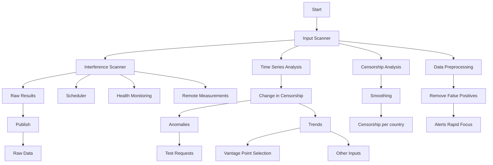

# Censored Planet: An Internet-wide, Longitudinal Censorship Observatory

Ram Sundara Raman, Prerana Shenoy, Katharina Kohls∗, Roya Ensafi

University of Michigan, ∗Ruhr University Bochum

{ramaks, pbshenoy, ensafi}@umich.edu,∗katharina.kohls@rub.de

## ABSTRACT

Remote censorship measurement techniques offer capabilities for monitoring Internet reachability around the world. However, operating these techniques continuously is labor-intensive and requires specialized knowledge and synchronization, leading to limited adoption. In this paper, we introduce Censored Planet, an online censorship measurement platform that collects and analyzes measurements from ongoing deployments of four remote measurement techniques (Augur, Satellite/Iris, Quack, and Hyperquack). Censored Planet adopts a modular design that supports synchronized baseline measurements on six Internet protocols as well as customized measurements that target specific countries and websites. Censored Planet has already collected and published more than 21.8 billion data points of longitudinal network observations over 20 months of operation. Censored Planet complements existing censorship measurement platforms such as OONI and ICLab by offering increased scale, coverage, and continuity. We introduce a new representative censorship metric and show how time series analysis can be applied to Censored Planet’s longitudinal measurements to detect 15 prominent censorship events, two-thirds of which have not been reported previously. Using trend analysis, we find increasing censorship activity in more than 100 countries, and we identify 11 categories of websites facing increasing censorship, including provocative attire, human rights issues, and news media. We hope that the continued publication of Censored Planet data helps counter the proliferation of growing restrictions to online freedom.

## CCS CONCEPTS

• General and reference → Measurement; • Social and professional topics → Technology and censorship.

## KEYWORDS

Empirical Security, Measurement, Censorship, Availability

## ACM Reference Format:

Ram Sundara Raman, Prerana Shenoy, Katharina Kohls, Roya Ensafi. 2020. Censored Planet: An Internet-wide, Longitudinal Censorship Observatory. In Proceedings of the 2020 ACM SIGSAC Conference on Computer and Communications Security (CCS ’20), November 9–13, 2020, Virtual Event, USA. ACM, New York, NY, USA, 18 pages. https://doi.org/10.1145/3372297.3417883

This work is licensed under a Creative Commons Attribution International 4.0 License.

CCS ’20, November 9–13, 2020, Virtual Event, USA

© 2020 Copyright held by the owner/author(s).

ACM ISBN 978-1-4503-7089-9/20/11.

https://doi.org/10.1145/3372297.3417883

## 1 INTRODUCTION

The Internet Freedom community’s understanding of the current state and global scope of censorship remains limited: most work has focused on the practices of particular countries, or on the reachability of limited sets of online services from a small number of volunteers. Creating a global, data-driven view of censorship is a challenging proposition, since practices are intentionally opaque, censorship mechanisms may vary, and there are numerous locations where disruptions can occur. Moreover, the behavior of the network can vary depending on who is requesting content from which location.

Established efforts to measure censorship globally utilize distributed deployments or volunteer networks of end-user devices [7, 104]. These offer direct access to some networks and can be used to conduct detailed experiments from those locations, but because of the need to recruit volunteers (and keep them safe) or the minuscule number of accessible endpoints in many regions of interest, they suffer from three key challenges: scale, coverage, and continuity. Consequently, the resulting data tends to be sparse and ill-suited for discovering events and trends among countries or across time.

Recent work has introduced an entirely different approach that offers a safer and more scalable means of measuring global censorship. This family of measurement techniques, including Augur, Quack, Satellite, Iris, and Hyperquack, use network side-channels to efficiently and remotely detect network anomalies from tens of thousands of vantage points without relying on dedicated probing infrastructure in the field [77, 78, 93, 100, 106]. Despite overcoming the traditional limitations of vantage point and participant selection and providing an unprecedented breadth of coverage, these techniques have some shortcomings. Each technique only focuses on one particular type of blocking, and hence does not provide a complete view of global censorship. Thus far, the techniques have only been evaluated on measurements conducted over a limited period of time, and hence did not grapple with the complexities of continuous, longitudinal data collection and analysis. None of the techniques are designed to differentiate between localized censorship by a vantage point operator and ISP- or country-wide censorship policies. Moreover, they do not have mechanisms to verify censorship and hence may suffer from false positives.

To overcome these challenges, we introduce Censored Planet, a global and longitudinal censorship measurement platform that collects censorship data using multiple remote measurement techniques and analyzes the data to create a more complete view of global censorship. Censored Planet’s modular design synchronizes vantage point and test list selection processes, and schedules censorship measurements on six Internet protocols. Censored Planet captures a continuous baseline of reachability data for 2,000 domains and IP addresses each week from more than 95,000 vantage points in 221 countries and territories, selected for their geographical diversity and the safety of remote operators. In addition, Censored Planet’s design offers rapid focus capabilities that allow us to quickly and agilely conduct more intensive measurements of particular countries or content in response to world events. We make data from Censored Planet available to the public in the form of up-to-date snapshots and historical data sets1.

Since its launch in August 2018, Censored Planet has collected and published more than 21.8 billion data points of baseline longitudinal network observations. Complementing previous work such as OONI (web connectivity tests) and ICLab, Censored Planet offers widespread coverage by running measurements in 66 (42%)–173 (360%) more countries with a median increase of 4–7 Autonomous Systems (AS) per country. The platform’s rapid focus capability has helped provide insights into important events such as the recent large-scale HTTPS interception in Kazakhstan that has helped inform policy changes by two major web browsers [64, 98, 99].

Censored Planet processes censorship measurement data to enhance detection accuracy by removing false positives using clustering techniques [100] and obtains a novel representative measure for censorship within a country through smoothing using an optimization model. We introduce techniques for analyzing the observatory data by modeling it as a time series and applying a Bitmap-based anomaly detection technique for finding censorship events. Additionally, we use the Mann-Kendall test for detecting trends over time. We show how these techniques, when applied on our longitudinal measurements, enable Censored Planet to detect 15 prominent censorship events during its 20-month period of measurement, twothirds of which have not been reported previously. Investigation into public OONI and ICLab data further reveals that the limitations of traditional volunteer-based measurement (sparse data due to low continuity and limited scale) result in the absence of data related to most events detected by Censored Planet. These events reveal heightened censorship in many countries, including some (such as Japan and Norway) that have previously been regarded as having strong Internet freedom [46]. Using trend analysis, we find increasing censorship activity in more than 100 countries, particularly using DNS and HTTPS blocking methods. We also find 11 categories of websites that are being censored increasingly, including provocative attire, human rights issues, and news media.

Censored Planet’s contribution is not limited to public longitudi nal measurement data and analysis techniques; we have been using Censored Planet’s rapid focus capabilities to accommodate requests for measurements from the censorship community and investigate important events in detail. In this paper, we highlight an instance of the use of rapid focus measurement into investigating the sudden blocking of Cloudflare IPs by Turkmenistan.

Our results demonstrate Censored Planet’s ability to create a more complete picture of global censorship that is complementary to both existing platforms such as OONI and ICLab [7], as well as qualitative reports, such as the annual Freedom on the Net Report by Freedom House [46]. We show through data-driven analysis that qualitative reports often cover only a small number of countries and that there are significant increasing trends in censorship in countries considered as “Free”. The continued publication of

Censored Planet data will allow researchers to continuously monitor the deployment of network interference technologies, track policy changes in censoring nations, and better understand the targets of interference. Ultimately, we hope that making opaque censorship practices more transparent at a global scale counters the proliferation of these growing restrictions to online freedom.

## 2 BACKGROUND

Two decades of research on Internet censorship has illustrated it to be both pervasive and diverse across methods, targets, regions, and timing.

Censorship Methods. The most commonly used censorship methods are shutdowns, DNS manipulation, IP-based blocking, and HTTP-layer interference. In case of Internet shutdowns, the censor restricts access to the Internet completely (not to a specific website) [31, 112]. DNS manipulation describes cases where the user receives incorrect DNS replies. These can include non-routable IP addresses, the address of a censor-controlled server hosting a blockpage, or no reply at all [8]. IP or TCP layer disruption occurs when network-level connections to specific destination IPs or IP:Port tuples are dropped or reset. This method has been specifically used to block circumvention proxies, and is how China prevents access to the Tor network [5]. In HTTP(S) blocking, web traffic is disrupted when specific keywords, like a domain, are observed in the application payload. When detected, censoring systems may drop the traffic, reset the connection, or show a blockpage [32, 57, 100]. When HTTP traffic is sent over a TLS encrypted channel, the requested domain continues to be sent in the initial unencrypted message, providing a selector for censorship (i.e. the SNI extension of a valid TLS ClientHello message).

To understand the true scale and nuanced evolution of Internet censorship and how it affects global Internet communication, multiple projects have built platforms to continuously collect measurement data. The Open Observatory of Network Inference (OONI) [43, 104] collects measurements from end users who download, update, and run client software. The ICLab [7, 51] project uses a set of VPN providers to probe from a diverse set of networks. These platforms benefit from direct access to vantage points in residential networks and the ability to customize measurements, and they have proven invaluable in measuring censorship. However, they are challenging to scale, have coverage and continuity limitations, and the data they collect tends to be sparse and unsuitable for discovering finer censorship trends among countries or across time. Moreover, maintaining a distributed network involves pushing updates and new measurements to all vantage points or volunteers which may lead to delays in detection of new types of censorship.

In recent years, remote measurement techniques have shown that it is possible to leverage side channels in existing Internet protocols for interacting with remote systems, and inferring whether the connection is disrupted from their responses.

Remote Detection of TCP/IP Blocking. Spooky scan employed a side channel for determining the state of TCP/IP reachability between two remote network hosts [37], regardless of where these two remote systems (e.g., site and client) are located. In the experimental setup, the measurement machine needed to be able to spoof packets, one of the remote hosts needed to have a single SYN backlog (i.e., no load balancers and no anycasting), and the other remote host needed to have a single, shared, incrementing counter for generating IP identifier values. By monitoring the progression of this counter over time, while attempting to perturb it from other locations on the Internet, the method detects when connections succeed between pairs of Internet endpoints.

The technique was extended by Augur [77], demonstrating how this channel can be used for broad, continuous blocking detection. Augur adds a host selection subsystem to ensure that it performs measurements from Internet infrastructure, only considering routers located two or more traceroute hops upstream from end hosts and follows the ethical guidelines set out in the Menlo and Belmont reports [34, 68]. Augur also makes use of statistical hypothesis testing to limit false detection when run at scale.

Remote Detection of DNS Manipulation. There have been many studies that explored DNS manipulation using open DNS resolvers, most notably Satellite and Iris [78, 93]. Satellite scans for IPv4 resolvers that have been active for more than a month, uses clustering techniques to detect CDN deployments, and detects incorrect DNS responses from this information. Iris is a scalable and ethical system that identifies DNS manipulation which restricts user access to content (not just natural inconsistencies). To achieve high detection accuracy, Iris performs both test measurements to open DNS resolvers and control measurements to trusted resolvers and compares the responses using several heuristics including matching the resolved IP, HTTP content hashes, TLS certificates, AS number and AS name, and checking whether the TLS certificate is browsertrusted. Iris has a higher standard for minimizing risk to operators of DNS resolvers by only choosing name servers using their DNS PTR records. Our adopted technique is a synthesis of Satellite and Iris, built on Satellite’s engineering efforts. For simplicity, instead of Satellite/Iris, we just use “Satellite”.

Remote Detection of HTTP(S) Blocking. Quack uses servers that support the TCP Echo protocol (open port 7) as vantage points to detect application-layer blocking triggered on HTTP and TLS headers [106]. Quack detects interference based on whether the server successfully echoes back (over several trials) a packet containing a sensitive keyword. Quack uses control measurements both before and after test measurements to ensure that interference is caused by the keyword tested, and not due to the inconsistencies of the network. Quack also uses Echo’s sibling Discard protocol to learn the directionality of interference. Quack makes use of more than 50,000 available echo servers in different countries and follows ethical norms by running Nmap OS-detection scans and selecting only infrastructural Echo servers in restrictive countries [46].

Hyperquack extends Quack by measuring HTTP and HTTPS blocking on port 80 and port 443 in a scalable, longitudinal, and safe way [100]. Hyperquack detects interference on HTTP(S) traffic by making use of publicly accessible web servers with consistent behavior as vantage points. Hyperquack first builds a template of a public web server’s typical response by requesting bogus domains that are not hosted on the server. It then sends requests with the HTTP "Host" header or TLS SNI extension set to a domain of interest. If there is a censor blocking the domain on the path between the measurement machine and the public web server, the measurement machine will receive a TCP RST, a blockpage, or experience a connection timeout that does not match the web server’s typical response. Hyperquack selects infrastructural servers operated by ISPs as vantage points using data from PeeringDB [79].

flowchart

Figure 1: Censored Planet Design.

To continuously monitor censorship and accurately derive insights using these complex remote measurement techniques, we need a new scalable, efficient and extensible platform. In this paper, we introduce Censored Planet, a global and longitudinal censorship measurement platform that collects censorship data using multiple remote measurement techniques and analyzes the data to create a more complete view of global censorship.

## 3 CENSORED PLANET DESIGN

To succeed as a global, longitudinal censorship measurement platform and perform synchronized measurements on 6 different Internet protocols (IP, DNS, HTTP, HTTPS, Echo and Discard) amidst the volatility and spatiotemporal variability of Internet censorship and the risk associated with measuring it, Censored Planet should be: scalable, continuous, synchronized, sound, extensible, and ethical. Censored Planet must scale to cover many vantage points, as we know that censorship changes across countries and even within regions [2, 9, 19, 85, 118]. Censorship also changes across time, so Censored Planet must be able to run repeated measurements regularly to capture censorship events and observe changes quickly [7, 38, 100]. Censored Planet must synchronize input lists and measurements between different measurement techniques in order to achieve completeness and comparability. Censored Planet’s measurement and analysis methods should aim to avoid false positives and obtain an accurate representation of censorship [100]. Finally, Censored Planet’s design and measurements must satisfy the ethical principles that we explain further in §3.1.

With these design goals in mind, we opt for a modular design for Censored Planet that aids in collecting and analyzing large-scale measurements (cf. Figure 1):

• Test Requests. First, scan configurations are set based on requests from the community (e.g. customized list of domains from journalists for rapid focus testing) or triggers from previous Censored Planet scans in response to anomalous event alerts.  
• Input Scanner. We implement an input-selection subsystem that chooses a list of domains to test, a list of vantage points, and other inputs required for Censored Planet’s operation. We build this module to be flexible enough to produce input for both longitudinal, continuous measurements, and for directed, exploratory measurements (§4.1).  
• Interference Scanner. This module is the core of Censored Planet’s remote measurements. It performs and monitors Internet-wide scans for detecting the interference of test domains, ensuring scale and coverage (§4.2).  
• Data Pre-processing. To ensure accuracy, we remove false positives from Censored Planet data, utilizing recently introduced clustering techniques [100] (§5.1).  
• Censorship Analysis. Since censorship policies can vary within countries and regions, we build an optimization model for Censored Planet data that smooths diverging countrylevel results and obtains a representative metric for censorship in a country (§5.2).  
• Time Series Analysis. We analyze the longitudinal data collected by Censored Planet to automatically detect censorship events and trends (§5.3).

The modular design allows easy additions to Censored Planet, such as adding new measurement techniques or performing new kinds of analysis, an essential component of a longitudinal measurement platform. Moreover, some components act as a feedback loop to others; for instance, the results from our data processing module inform the vantage point selection for the next round. Before explaining each of the components of our modular design in detail, we provide an elaborate discussion on the ethics of our measurements.

## 3.1 Ethics

Most censorship measurement studies involve prompting hosts in censored countries to transmit data to trigger the censor. This carries at least a hypothetical risk that local authorities might retaliate against the operators of some hosts. The measurement research community has considered these risks at length at many workshops, panel discussions, and program committee meetings [1, 29, 56, 66, 76, 119]. Part of the outcome of these discussions is an emerging consensus that remote measurement techniques can be applied ethically if there are suitable protections in place, including technical practices to minimize risk to individuals, as well as thoughtful application of the principles in the Belmont and Menlo reports [34, 68]. This community-driven approach has been necessary in part because institutional review boards (including at our institution) typically consider network measurement studies to be outside of their purview when they do not involve human subjects or their personally identifiable data.

In the design and implementation of Censored Planet, we carefully followed the risk-minimization practices proposed in the studies that introduced each remote measurement technique. Chief among these is the use of hosts in Internet infrastructure (e.g., routers two traceroute hops away from the end user (Augur), nameserver resolvers (Iris), infrastructural echo servers (Quack), infrastructural web servers (Hyperquack)) rather than typical edge hosts, with the rationale that in the “unlikely case that authorities decided to track down these hosts, it would be obvious that users were not running browsers on them” [106], and “because these administrators are likely to have more skills and resources to understand the traffic sent to their servers, the risk posed to them by these methods is lower than the risk posed to end users” [100]. Although this restriction significantly reduces the pool of hosts, there are still adequately many to achieve broad global coverage.

Additionally, we are careful to minimize the burden on remote hosts by limiting the rate at which we conduct measurements. For Internet-wide scans, we follow the ethical scanning guidelines developed by the ZMap [36]. We closely coordinate with our network administrators and our upstream ISP. All our machines have WHOIS records and a web page served from port 80 that indicates that measurements are part of a censorship research project and offer the option to opt-out. Over the past 20 months of performing measurements, we received an average of one abuse complaint per month, some of them being automated responses generated by network monitoring tools. So far, no complaints indicated that our probes caused technical or legal problems, and one ISP administrator even helped us diagnose a problem by providing a detailed view of what they observed.

## 4 DATA COLLECTION

Once we receive test requests with scan configurations, our Input Scanner and Interference Scanner perform the tasks for measurement data collection.

## 4.1 Input Scanner

Our modularized design allows custom inputs for both longitudinal measurements and more focused custom measurements based on the configuration. The Input Scanner performs the crucial role of synchronizing test lists across measurement techniques, ensuring continuity in vantage points, and updating important dependencies.

4.1.1 Vantage Point Selection. The Input Scanner follows the rigorous ethical standards introduced in §3.1 to select infrastructural vantage points for each measurement technique:

• Augur. Infrastructural routers which are two ICMP hops away from the end-user and have a sequentially incrementing IP ID value (from CAIDA ARK data [22]).  
• Satellite. Open DNS resolvers which are name servers (from Internet-wide scans).  
• Quack. Infrastructural servers with TCP port 7 (Echo) or Port 9 (Discard) open (from Internet-wide scans).  
• Hyperquack. Web servers that have valid EV (Extended Validation) certificates (from Censys [35]).

The Input Scanner applies several additional constraints to ensure the quality of vantage points. For example, Augur only uses routers whose IP ID increment is less than five to reduce noise.

For our longitudinal measurements, the Input Scanner updates the list of vantage points every week. We find currently active vantage points by either scanning the IPv4 address space (in case of Quack and Satellite) or obtaining the latest data from other sources (for Hyperquack and Augur). For techniques in which we have to select a subset of available vantage points due to resource constraints, we select vantage points from different countries in a round-robin manner, prioritizing vantage points from the “Not Free” and “Partly Free” countries from the 2019 Freedom on the Net report [46]. We also try to select vantage points from different /24 networks to ensure a representative distribution inside the country.

While updating the list of vantage points, the Input Scanner tries to select the same vantage points as in the previous week of measurements to ensure continuity, and replaces any vantage points that are no longer active. This is an important step as time series analysis of censorship data requires data collected from the same source. This is because censorship may vary between different vantage points inside a country, as we show in §6.3. We evaluate the continuity in vantage point selection in §6.1. For rapid focus measurements, the Input Scanner selects vantage points at higher scale in specific countries. For example, we selected 34 Augur vantage points for our rapid focus study in Turkmenistan that we do not use in our longitudinal measurements (§7.3).

4.1.2 Test List Selection. The Input Scanner selects different domains for testing in longitudinal measurements and rapid focus measurements. For longitudinal measurements, we follow the test list selection process of previous studies [7, 78, 100, 106] and select all the domains from the Citizen Lab Global Test List (CLTL) [27]. CLTL is a curated list of websites that have either previously been reported unavailable or are of interest from a political or human rights perspective. At the time of writing, the list has around 1,400 domains. We complement this list by including the top domains from the Alexa list of popular domains to test for blocking of major services. Totally, we test 2,000 domains per week. The Input Scanner updates both of these lists weekly, and performs liveness checks in order to ensure the domains are active. Synchronizing test lists among different measurement techniques is an essential step in introducing comparability between them. Note that Augur only performs tests for domains from the CLTL because of time and resource constraints. For rapid focus, our Input Scanner selects domains based on the specific event being investigated. For example, we selected many IPs of DNS-over-HTTPS services and Cloudflare for our rapid focus study in Turkmenistan (§7.3).

4.1.3 Other Inputs. Our Input Scanner also generates other inputs for specific techniques. For instance, the scanner tests whether the test domains are anycasted by performing measurements from geographically-distributed machines, as this information is required by Augur to detect certain kinds of blocking [77]. The Input Scanner also verifies that all the dependencies required by the measurement techniques such as the ZMap blacklist [36] are up to date.

## 4.2 Interference Scanner

The Interference Scanner first ensures that our machines are ready to perform measurements. This includes verifying spoofing capability and ensuring the absence of firewalls. Our measurement scheduler maintains a global vantage point work state and manages synchronization of measurements so that vantage points are not overloaded and there is no noise introduced in measurement. This is important since techniques like Quack use overlapping vantage points for Echo and Discard measurements.

For our longitudinal measurements, the scheduler performs reachability scans twice a week for Hyperquack, Quack and Satellite, and once a week for Augur. Note that Augur measurements were started in November 2019. While performing scans, our health monitoring submodule logs any measurement or vantage point errors appropriately and ensures that overall scan statistics are as expected. For instance, the health monitoring ensures that there is enough hard disk space to store measurement data. When preprocessing our data (§5.1), we use these errors and statistics to eliminate failed measurements. We also mark vantage points frequently failing control tests for removal in the Input Scanner. For rapid focus measurements, the Interference Scanner performs more in-depth scans, such as increasing the number of trials in Augur, or checking for particular certificate patterns in Hyperquack.

We employ the same technique for measurements as described in §2, with some improvements. We add the capacity for testing reachability to custom ports (not only on Port 80) for Augur, and remove the browser-trusted TLS certificate heuristic from Satellite as we discovered this heuristic introducing some false negatives.

## 5 DATA PROCESSING

Accurately deriving observations about censorship from raw measurement data involves several important steps that have often been overlooked by previous studies [7, 77, 78, 106]. Our analysis process includes the sanitization of raw data in a pre-processing step, followed by a censorship and time series analysis. We demonstrate in §6 how such comprehensive analysis steps are crucial to deriving accurate observations.

The analysis steps of Censored Planet is shown in the bottom half of Figure 1. In the pre-processing step, we aggregate the raw measurement results to a common schema and use recently introduced clustering techniques [100] to remove false positives. This eventually provides us with confirmed instances of censorship (§5.1). In the next step, we apply optimized weights to vantage points to ensure they are representative for the state of censorship in a particular country, after which we obtain a measure of censorship per country (§5.2). Finally, we perform time series analysis to find anomalies and trends (§5.3).

## 5.1 Pre-Processing

5.1.1 Initial Sanitization. As an initial sanitization step, we remove all measurements that failed due to technical issues, such as loss of measurement machine connectivity and file system failures using health monitoring information from the Interference Scanner (§4.2).

5.1.2 Aggregating to Common Schema. Censored Planet collects synchronized censorship measurement data on six Internet protocols which enables unified analysis of global Internet censorship. Since each measurement technique collects different measurement data (such as resolved IP in case of Satellite and HTML response in case of Hyperquack), we need to design a common aggregated schema to introduce comparability and interoperability for the results. We attribute all measurements performed in a week to the start of the week (Sunday) and model our common schema as:

id | protocol | date | vp | domain | blocked

Based on the vantage point (vp) and the domain tested, we also collect and add metadata such as the country and the AS of the vantage point, and the topic category of the website hosted at the domain. We obtain country information from Maxmind [62] and combine data from Maxmind, the Routeviews project [91], and Censys [35] for obtaining AS information. Country information was available for 99.96 % and AS information for 99.86 % of vantage points. For the domains, we refer to the pre-defined categories of CLTL [27], and use the Fortiguard URL classification service [45] for the remaining Alexa domains. Our category information spans 33 topics and covers 99.3 % of the test domains.

5.1.3 Removing False Positives. Although we perform control measurements for all of our techniques (§2), some benign responses may still get classified as censorship. For instance, Cloudflare endpoints frequently perform bot checks on measurements, which introduces discrepancies between the test and control measurements. Such issues can affect both remote and direct measurements [100, 104].

We use the clustering approach introduced by Sundara Raman et al. [100] to identify and filter out false positives in the measurement results of Quack, Hyperquack, and Satellite. Specifically, we use a two-step clustering technique to identify confirmed instances of censorship (blockpages) and false positives. The iterative classification step first identifies large groups of identical HTML responses. The image clustering step then uses the DBSCAN algorithm [39] to cluster dynamic HTML pages. Each cluster is then labeled as either a false positive or blockpage, achieving complete coverage.

In our dataset, we extract all the responses marked as blocked from Quack and Hyperquack data; for Satellite, we fetch the resolved IP for blocked responses and then fetch the webpages of the resolved IP. We then use existing blockpage clusters from previous work [100] and extend them by creating new clusters using iterative classification and image clustering. From our data, we form 457 new clusters of responses, out of which 308 are blockpages, and 149 are potential false positives. Note that we follow an extremely conservative approach in confirming a blockpage, and only do so when there is clear evidence of blocking on the webpage (such as “<title>¡Página Web Bloqueada!</title>”). We consider all cases of TCP resets and connection timeouts as true cases of blocking, since they are confirmed through the control measurements.

This step involves manual effort in labelling each new cluster as either a blockpage or a false positive. Fortunately, our synchronized measurement and analysis process reduces this effort since a blockpage or false positive instance found in one technique’s measurements can avoid redundant effort in identifying it with others. Moreover, since each cluster is manually verified, we generate high confidence in identifying censored measurements. For avoiding false positives in Augur data, we use hypothesis testing at high confidence levels $( \alpha = 1 0 ^ { - 5 } ) [ 7 7 ]$ .

5.1.4 Confirmed Results. In the time from August 2018–March 2020, we conducted 21.8 billion measurements. After the initial pre-processing, we remove 1.2 billion measurements (5.9 %) from the raw data set, and of this we mark around 1.5 billion (7 %) as blocked. The false positive filtering removes around 500 million measurements from the this set, which leaves around 1 billion confirmed blocked measurements. After this stage we consider only the confirmed cases of blocking as censorship.

## 5.2 Censorship Analysis

Censorship policies and methods can vary in different networks inside the country [85, 118], complicating the analysis process. For example, ISPs in Russia use various methods and policies to enact censorship, and thus users experience differences when they connect to distinct networks [85]. Organizational policies further exacerbate the issue, causing a wide range of blocking patterns in measurements from different vantage points inside the country [100]. We provide a thorough evaluation of heterogeneity in blocking within a country in §6.3. To ensure a representative measure of censorship within a country, i.e., avoiding the effects of outlier vantage points subject to a harsher or more lenient policy compared to the rest of the country, we build an optimization model that levels out contributions from outlier vantage points.

5.2.1 Censorship Metric. Before performing the optimization, we first need to define a metric for censorship. At the lowest granularity of an individual vantage point vp, we define the censorship in week t as a percentage value:

$$
\text { Cens } _ {\mathrm{vp}, \mathrm{t}} = \frac {\# \text { Domains   blocked }}{\# \text { Domains   tested }} \cdot 1 0 0 \tag {1}
$$

For a more focused view of the types of content that is blocked, we drill down $\mathrm { C e n s } _ { \mathrm { v p , t } }$ by domain categories.

To find an initial estimate of censorship in a country cc with n vantage points, we aggregate Equation 1 as:

$$
\operatorname{Cens} _ {\mathrm{cc}, \mathrm{t}} (\text { Raw }) = \frac {\sum_ {i = 1} ^ {n} \operatorname{Cens} _ {\mathrm{vp} _ {i}} , \mathrm{t}}{n} \tag {2}
$$

We use Equation 2 as a raw metric for censorship in a country, and it serves as the input to our optimization model.

5.2.2 Optimization. To obtain a representative measure of censorship within a country that is not affected by anomalous vantage points, we build a numerical optimization model to derive weights for measurement points that allow to smooth the censorship results. To perform the optimization, we assign individual weights $\omega _ { j }$ for each autonomous system $\mathsf { A S } _ { j }$ in the data set. As an $_ { \mathrm { A S } }$ can contribute to multiple different measurements, we first gather all available results of ${ \mathrm { A } } S _ { j }$ in country cc, which results in a vector of measurements for the same AS and country at different points in time $( \mathrm { A S } _ { \mathrm { c c } , j , \mathrm { t } } )$ . In the second step, we extend the vector by the target values $( \mathrm { C e n s } _ { \mathrm { c c , t } } ( R a w ) )$ for each scan in cc :

$$
\left( \begin{array}{c} A S _ {\mathrm{cc}, j, 1}, C \mathrm{ens} _ {\mathrm{cc}, 1} (\text { Raw }) \\ A S _ {\mathrm{cc}, j, 2}, C \mathrm{ens} _ {\mathrm{cc}, 2} (\text { Raw }) \\ \vdots \\ A S _ {\mathrm{cc}, j, t}, C \mathrm{ens} _ {\mathrm{cc}, t} (\text { Raw }) \end{array} \right) \tag {3}
$$

Given the subset of results for a specific $\mathsf { A S } _ { j } ,$ we optimize a weight factor $\omega _ { j }$ that minimizes the discrepancies between the individual measurement results and the target value. The optimization relies on the assumption that the overall blocking percentage of a country at a specific scan date should be representative. Therefore, we apply a Nelder-Mead optimization that uses an error function to derive the best fitting weight factor:

line chart

| Month   | Smoothed | Raw    |
|---------|----------|--------|
| Aug '18 | 0.0000   | 0.0150 |
| Sep '18 | 0.0000   | 0.0150 |
| Oct '18 | 0.0000   | 0.0050 |
| Nov '18 | 0.0000   | 0.0050 |
| Dec '18 | 0.0500   | 0.1750 |
| Jan '19 | 0.0150   | 0.0150 |
| Feb '19 | 0.0150   | 0.0150 |
| Mar '19 | 0.0150   | 0.0300 |
| Apr '19 | 0.0150   | 0.0150 |
| May '19 | 0.0150   | 0.0150 |

Figure 2: Smoothing Effects–An example of the raw and smoothed censorship metrics for Discard censorship in Pakistan.

$$
\underset {\omega_ {j}} {\arg \min} \sqrt {\frac {\sum_ {t = 1} ^ {n} \left(\mathrm{AS} _ {\mathrm{cc} , j , \mathrm{t}} \cdot \omega_ {j} - \text { Cens } _ {\mathrm{cc} , \mathrm{t}} (\text { Raw })\right) ^ {2}}{n}} \tag {4}
$$

More precisely, we use the root-mean-square error as the error function that measures the delta between an individual result and the target value and try to minimize this error by finding a weighting factor $\omega _ { j }$ that levels out the differences.

As an output of this step, we receive the weighting factor ?? ?? that is specific for each ${ \mathrm { A } } S _ { j }$ in the data set. We apply this weight to all vantage points inside that AS, i.e., for each vantage point $\mathrm { v p } _ { j }$ belonging to ${ \mathrm { A } } S _ { j }$ and associated weight ?? ?? , we modify Equation 2 to obtain:

$$
\operatorname{Cens} _ {\mathrm{cc}, \mathrm{t}} (\text { Smooth }) = \frac {\sum_ {j = 1} ^ {n} \operatorname{Cens} _ {\mathrm{vp} _ {j} , \mathrm{t}} \cdot \omega_ {j}}{\sum_ {j = 1} ^ {n} \omega_ {j}} \tag {5}
$$

for a country cc with ?? vantage points.

We observed that the smoothing process removes effects that are caused by only a handful of vantage points while preserving the effects of a widespread censorship increase. Figure 2 shows an example of raw (Equation 2) and smoothed (Equation 5) censorship metrics for Discard censorship in Pakistan, where censorship methods are heterogeneous [71]. We observe that widespread censorship increases (such as that in November 2018) are preserved while those caused by rogue vantage points (such as September 2018 and March 2019) are smoothed out. We provide further evaluation of the smoothed censorship metric in Appendix A.2 and use it to report all country-level results in our findings (§7).

## 5.3 Time Series Analysis

Continuously collecting and analyzing censorship data is a big challenge that has not been explored in previous remote measurement work [77, 78, 106]. Censored Planet’s longitudinal data collection allows us to develop methods to automatically detect events and trends in 20 months of longitudinal measurements.

5.3.1 Change in Censorship. As a first step in the time series analysis, we analyze the change in censorship over time. We consider changes at the lowest granularity (vp) to avoid the effects of adding and changing vantage points. Thus, we define the absolute change in censorship between two weeks $( \mathrm { t } _ { a } , \mathrm { t } _ { b } ; \mathrm { t } _ { a } < \mathrm { t } _ { b } )$ as:

$$
\Delta \left(\operatorname{Cens} _ {\mathrm{vp}, \mathrm{t} _ {a} - \mathrm{t} _ {b}}\right) = \operatorname{Cens} _ {\mathrm{vp}, \mathrm{t} _ {b}} - \operatorname{Cens} _ {\mathrm{vp}, \mathrm{t} _ {a}} \tag {6}
$$

5.3.2 Anomaly Detection in Censorship Time Series. We build our anomaly detection models based on the absolute change in censorship (cf. Equation 6). $\mathrm { C e n s } _ { \mathrm { v p , t } }$ is highly auto-correlated (Kendall’s correlation coefficient $\tau = 0 . 9 3 ,$ 95 % confidence level) and hence, an extremely high absolute change in censorship is a very good indicator of incidents. Since we want to find anomalies at the country level, we take the weighted average of Equation 6 for all vantage points within a country cc to calculate the change in censorship:

$$
\Delta \left(\operatorname{Cens} _ {\mathrm{cc}, \mathrm{t} _ {a} - \mathrm{t} _ {b}} (\text { Smooth })\right) = \frac {\sum_ {j = 1} ^ {n} \omega_ {j} \cdot \Delta \left(\operatorname{Cens} _ {\mathrm{vp} _ {j} , \mathrm{t} _ {a} - \mathrm{t} _ {b}}\right)}{\sum_ {j = 1} ^ {n} \omega_ {j}} \tag {7}
$$

Next, we test different anomaly detection techniques regarding their fit for censorship measurement data. Specifically, we test employing speed constraints (such as the Median Average Deviation (MAD) [97]), likelihood models [120], exponentially weighted moving average models [24], and bitmap-based models [109] for anomaly detection. We find that the bitmap-based detection technique works best for our data, and we provide a comparative evaluation with other techniques in Appendix A.1.

We follow the procedure in Wei et al. [109] and the implementation by [59] to construct a Bitmap-like representation of our data after discretizing it [58]. The distance between two Bitmaps BA and BB of size ?? × ?? is then given by:

$$
\operatorname{Dist} (\mathrm{BA}, \mathrm{BB}) = \sum_ {p = 1} ^ {n} \sum_ {q = 1} ^ {n} ((\mathrm{BA} _ {p, q} - \mathrm{BB} _ {p, q}) ^ {2}) \tag {8}
$$

We use an alphabet size of 4, and a lead and lag window size of 2 % of the length of the time series for calculating the distance between two Bitmaps sliding along the time series. The distance acts as the anomaly score. We explore the events with the highest anomaly score in our findings (§7).

5.3.3 Trend Detection. Our trend analysis provides insights on the methods and contents that are increasingly represented in censorship. For the trend evaluation of Censored Planet results, we use the modified Mann-Kendall test [48, 50] that identifies linear trends while being robust to gaps and length differences of time series.

The Mann-Kendall test uses hypothesis testing to find upward or downward (or either) trends (99 % significance level). Since it is important to consider the absolute change for trend analysis (to avoid effects due to changing vantage points), we use Equation 7 to construct the time series for trend detection. To obtain an estimate of the magnitude of the trend, we use the Thiel-Sen regression estimator [94] to calculate the slope of the trend line from the start of our measurements until the end.

## 6 EVALUATION

We first evaluate the scale, coverage, and continuity of Censored Planet, highlighting the advantages Censored Planet offers over existing state of the art censorship measurement platforms. Then, we show why scale is important especially for obtaining a representative measure of censorship within a country.

line chart

| Month | Augur | Quack Echo | Quack Discard | Hyperquack HTTPS | Hyperquack HTTP | Satellite |
| --- | --- | --- | --- | --- | --- | --- |
| Jul '18 |  |  |  |  |  |  |
| Aug '18 |  |  |  |  |  |  |
| Sep '18 |  |  |  |  |  |  |
| Oct '18 |  |  |  |  |  |  |
| Nov '18 |  |  |  |  |  |  |
| Dec '18 |  |  |  |  |  |  |
| Jan '19 |  |  |  |  |  |  |
| Feb '19 |  |  |  |  |  |  |
| Mar '19 |  |  |  |  |  |  |
| Apr '19 |  |  |  |  |  |  |
| May '19 |  |  |  |  |  |  |
| Jun '19 |  |  |  |  |  |  |
| Jul '19 |  |  |  |  |  |  |
| Aug '19 |  |  |  |  |  |  |
| Sep '19 |  |  |  |  |  |  |
| Oct '19 |  |  |  |  |  |  |
| Nov '19 |  |  |  |  |  |  |
| Dec '19 |  |  |  |  |  |  |
| Jan '20 |  |  |  |  |  |  |
| Feb '20 |  |  |  |  |  |  |
| Mar '20 |  |  |  |  |  |  |
| Apr '20 |  |  |  |  |  |  |
| May '20 |  |  |  |  |  |  |
| Jun '20 |  |  |  |  |  |  |
| Jul '20 |  |  |  |  |  |  |
| Aug '20 |  |  |  |  |  |  |
| Sep '20 |  |  |  |  |  |  |
| Oct '20 |  |  |  |  |  |  |
| Nov '20 |  |  |  |  |  |  |
| Dec '20 |  |  |  |  |  |  |
| Jan '21 |  |  |  |  |  |  |
| Feb '21 |  |  |  |  |  |  |
| Mar '21 |  |  |  |  |  |  |
| Apr '21 |  |  |  |  |  |  |
| May '21 |  |  |  |  |  |  |
| Jun '21 |  |  |  |  |  |  |
| Jul '21 |  |  |  |  |  |  |
| Aug '21 |  |  |  |  |  |  |
| Sep '21 |  |  |  |  |  |  |
| Oct '21 |  |  |  |  |  |  |
| Nov '21 |  |  |  |  |  |  |
| Dec '21 |  |  |  |  |  |  |
| Jan '22 |  |  |  |  |  |  |
| Feb '22 |  |  |  |  |  |  |
| Mar '22 |  |  |  |  |  |  |
| Apr '22 |  |  |  |  |  |  |
| May '22 |  |  |  |  |  |  |
| Jun '22 |  |  |  |  |  |  |
| Jul '22 |  |  |  |  |  |  |
| Aug '22 |  |  |  |  |  |  |
| Sep '22 |  |  |  |  |  |  |
| Oct '22 |  |  |  |  |  |  |
| Nov '22 |  |  |  |  |  |  |
| Dec '22 |  |  |  |  |  |  |
| Jan '23 |  |  |  |  |  |  |
| Feb '23 |  |  |  |  |  |  |
| Mar '23 |  |  |  |  |  |  |
| Apr '23 |  |  |  |  |  |  |
| May '23 |  |  |  |  |  |  |
| Jun '23 |  |  |  |  |  |  |
| Jul '23 |  |  |  |  |  |  |

Figure 3: Number of Vantage Points Over Time–The error bars indicate the number of /24 subnets in which we do not discover vantage points from the previous scan.

## 6.1 Evaluation of Scale, Coverage & Continuity

Censored Planet achieves global coverage with more than 95,000 vantage points performing weekly scans (cf. Figure 3). Across the different measurement techniques, we use 50,000 to 60,000 vantage points for Quack, and an initial set of 10,000 PeeringDB web servers for Hyperquack, which we later extend to 25,000 web servers with EV certificates. For Satellite, we use 15,000 to 35,000 resolvers selected under ethical constraints, and time and resource limitations force us to use only 500 to 1,000 vantage points for Augur.

Continuity in measurement data is important for Censored Planet to establish a baseline that is comparable over time. To estimate the continuity of our measurements, we analyze the range of /24 subnets in which we were not able to discover the vantage points from the previous week of scans. Overall, we find a continuity of 93 %, which means we are able to select vantage points in the same network with significantly high probability. The slightly smaller continuity of 89 % in Quack data is caused by the variance in ZMap scans [36]. We measure the /24 continuity between two different scans since measuring the continuity at the vantage point level can be biased by DHCP policies. At the other end, the AS continuity between scans is extremely high (99.01 %). The high continuity assures that our time series analysis can reliably detect changes in censorship, and allow us to analyze trends over time accurately.

One of the primary contributions of Censored Planet is the widespread coverage of vantage points and ASes in different countries. On average, more than 80 % of countries have more than one vantage point in each measurement technique, and around 50 % of countries have more than ten vantage points. In March 2020, Censored Planet selected a median of 39 vantage points per country and a maximum of 29,072 vantage points (in China) with a $7 5 ^ { \mathrm { t h } }$ percentile value of 305. There is a long tail with countries with many Internet-connected devices such as China, South Korea and the United States having several thousands of vantage points. Considering the number of ASes per country with at least one vantage point selected, the median value is 8, the $7 5 ^ { \mathrm { t h } }$ percentile value is 33 and the maximum value is 1,427 (in the United States).

bar chart

| Category     | Num. ASes per country |
| ------------ | --------------------- |
| ICLab        | 48                    |
| OONI         | 156                   |
| Satellite    | 175                   |
| Quack        | 166                   |
| HQ           | 191                   |
| Augur        | 140                   |
| CP           | 221                   |
| CP Pot.      | 222                   |

Figure 4: Coverage of Platforms–ICLab data is from September 2018 and OONI (web connectivity) and Censored Planet data is from March 2020. Outliers have been removed for comparison.

## 6.2 Complementing other Platforms

Censored Planet extends the global coverage, continuity, and scale of censorship events, but it is also highly complementary to established censorship measurement platforms such as ICLab and OONI. For instance, Censored Planet can detect a new instance or pattern of censorship using its diverse and extensive coverage. OONI data can then be used for on-the-ground confirmation as it contains precise measurements from end-users. ICLab’s ability to run flexible, powerful probes such as performing traceroutes can be used to determine technical details subject to the existence of a VPN vantage point. This flexibility and power of running client software is out of reach for remote measurements.

To emphasize the relevance of Censored Planet’s key unique features, we compare our data set characteristics with ICLab’s publicly available dataset and OONI’s web connectivity dataset, both of which meet the current state of the art and are comparable to Censored Planet’s dataset (cf. Figure 4, HQ: Hyperquack, CP: Censored Planet). To create comparability, we pick data for a full month (ICLab: 09/2018 [51], latest available data; OONI (web connectivity test data): 03/2020 [104]; Censored Planet: 03/2020). CP Potential shows the availability of vantage points and ASes that could be selected without resource constraints.

Countries. In comparison to ICLab (41) and OONI (156), Censored Planet covers 221 countries in 03/2020, which gives us the ability to measure censorship in countries other platforms cannot reach due to lack of volunteers or ethical risks. Considering the Freedom on the Net Report 2019 [46], Censored Planet and OONI cover data from all 21 countries considered “Not Free”, whereas ICLab can only reach four countries in this critical category.

AS Coverage. Censored Planet achieves a median coverage of eight ASes per country, where OONI has four, and ICLab has one AS per country. In the month of comparison, OONI gathered measurements from 1,915 ASes while Censored Planet achieved an overall coverage of 9,014 ASes. The total number of ASes covered by Censored Planet can potentially go up to 13,569.

Continuity. The varying granularity of data collection among different platforms makes it difficult to directly compare continuity.

line chart

| Country | IP    | Discard | Echo  | HTTP  | HTTPS | DNS   |
|---------|-------|---------|-------|-------|-------|-------|
| China   | 0.0   | 0.0     | 0.0   | 0.0   | 0.0   | 0.0   |
| Iran    | 0.2   | 0.1     | 0.1   | 0.1   | 0.1   | 0.1   |
| India   | 0.4   | 0.3     | 0.3   | 0.3   | 0.3   | 0.3   |
| Russia  | 0.6   | 0.5     | 0.5   | 0.5   | 0.5   | 0.5   |
| Italy   | 0.8   | 0.7     | 0.7   | 0.7   | 0.7   | 0.7   |
| Italy   | 1.0   | 0.9     | 0.9   | 0.9   | 0.9   | 0.9   |

Figure 5: Coefficient of Variation Across Countries–The CDF shows the coefficient of variation in ???????? (??????) for vantage points within a country for all the censorship methods tested by Censored Planet; the annotated countries show HTTPS blocking patterns.

We report an estimate of the continuity of measurements by aggregating OONI and ICLab’s data to a weekly granularity to match Censored Planet. In our measurements, we have a median AS continuity of 96 % for the comparison month. In this period, ICLab achieves only 64 % continuity in ASes, which might be caused by a large number of reported outages through VPN configuration changes [7]. Since OONI is dependent on volunteers running measurements, OONI data has an even lower AS continuity of 36 %. This emphasizes the need for a continuous measurement system like Censored Planet that collects repetitive measurements, since volunteer-based data collection may be extremely sporadic.

So far, our results demonstrate that the strengths provided by Censored Planet’s high coverage and continuity complements the powerful detection capabilities of ICLab and OONI. In the next step, we further emphasize the importance of large-scale measurements to accurately represent censorship in a country.

## 6.3 The Importance of Scale and Coverage

Censorship policies not only vary between countries, but can also introduce differences within a country [78, 81, 82, 85, 118]. Consequently, it is crucial to achieve sufficient coverage for an accurate representation of censorship inside a country.

As a measure of variation, we calculate the coefficient of variation of Cens(Raw) (Equation 2) in the latest scan within countries with five or more vantage points. Our results (cf. Figure 5) show that some countries such as Iran and China with centralized censorship policies apply consistent blocking (lower left) [9, 38]. In contrast, candidates like Russia and Italy provide heterogeneous results due to a decentralized implementation of censorship [85]. Especially in these heterogeneous countries, it is important to use multiple vantage points and smooth outliers in the results (§5.2).

To underline this conclusion, we randomly sample 1–4 Satellite vantage points in each country and calculate the relative difference from the baseline Cens(Raw) (Equation 2). Figure 6 shows that we can significantly decrease this relative difference by using a higher number of vantage points, hence, covering more individual networks within a country.

line chart

| Relative difference from baseline | 1 VP | 2 VP | 3 VP | 4 VP |
| ---------------------------------- | ---- | ---- | ---- | ---- |
| -0.8                               | 0.0  | 0.0  | 0.0  | 0.0  |
| -0.6                               | 0.5  | 0.5  | 0.0  | 0.0  |
| -0.4                               | 1.0  | 1.0  | 0.5  | 0.5  |
| -0.2                               | 1.5  | 1.5  | 2.0  | 2.0  |
| 0.0                                | 2.0  | 2.5  | 3.5  | 3.5  |
| 0.2                                | 0.0  | 0.0  | 0.0  | 0.0  |

Figure 6: Sampling Vantage Points– Relative difference from the baseline when sampling 1-4 Satellite vantage points in each country. Only the interquartile range is considered for best comparison.

## 7 FINDINGS

Using Censored Planet, we gathered more than 20 billion measurements across 95,000 vantage points, covering a period of 20 months, and measured censorship on six different Internet protocols. Our data processing pipeline uses robust pre-processing, censorship, and time series analysis techniques that introduce transparency to an otherwise extremely opaque field. In this section, we focus on unexplored censorship phenomena beyond previous studies [7, 104] to emphasize the value of Censored Planet’s novel capabilities such as scale and continuous repetitive measurements. We refer to the Appendix B.3 for a general overview of results.

## 7.1 Censorship Events

One of the primary contributions of Censored Planet is the ability to collect and analyze longitudinal baseline measurement data and automatically detect censorship events using our anomaly detection technique. To showcase this ability, we first collect a list of important political, economic, and lifestyle changes that occurred in different countries during our measurement period from news media and reports from other platforms such as OONI [104] and AccessNow [3]. We then use the results from our time series anomaly detection to uncover new events or extend known events.

Table 1 shows a summary of key censorship events detected by Censored Planet. The first section of the table has events that have been reported previously at a limited scale. The second section contains newly discovered events for which we were able to find a correlation with a political event. The third section contains key events detected using our anomaly detection technique (§5.3.2). Table 1 also includes results from a preliminary investigation into whether the events found by Censored Planet were present in OONI’s public web connectivity dataset [104]. We find that most New events did not cause a censorship increase in OONI data, mostly due to the low number of measurements (e.g. Cameroon–only 46 successful measurements collected from 2018-11-15 to 2018-12- 15) or volunteers not running measurements continuously (e.g. Sudan–http://facebook.com was only tested on one day - 2019-04- 08). This shows the value of a platform like Censored Planet that can run measurements repetitively and scalably to detect censorship increases. We also investigated ICLab’s published data [51], but the timeframe of ICLab measurements overlaps with only the first two months of Censored Planet measurements. Only one event (India–6 September 2018) in Table 1 falls under this timeframe, and we did not find evidence of any DNS blocking in India in ICLab data during that time. We next describe two events from Table 1 in detail.

Table 1: Key Censorship Events Detected by Censored Planet. Key: —Confirmed increase in blocking of at least one domain tested by OONI, —Unconfirmed incease in blocking of at least one domain tested by OONI, —Unconfirmed blocking (but no clear censorship increase) of at least one domain tested by OONI, —No presence of related blocking in OONI data.

<table><tr><td>Country</td><td>Period</td><td>Method</td><td>Anomaly Score</td><td>Category or Domain blocked</td><td>Event</td><td>Other Reports</td><td>Presence in OONI</td></tr><tr><td>Egypt</td><td>26 Sep 2019</td><td>HTTP, HTTPS</td><td>2.74</td><td>News Media</td><td>Protests [14]</td><td>OONI [86]</td><td>●</td></tr><tr><td>Iran</td><td>Mar 2020</td><td>HTTP, Echo</td><td>-</td><td>wikimedia.com, wikia.com</td><td>Policy [69]</td><td>OONI [44]</td><td>●</td></tr><tr><td>Sri Lanka</td><td>21 Apr–12 May 2019</td><td>HTTP, HTTPS</td><td>3.29</td><td>Social Networking</td><td>Terrorism [16]</td><td>AccessNow, Net-blocks [70, 101]</td><td>○</td></tr><tr><td>Venezuela</td><td>12–29 Jan 2019</td><td>HTTP, HTTPS</td><td>3.13</td><td>Social Networking, wikipedia.org</td><td>Unrest [10, 103]</td><td>OONI [11]</td><td>●</td></tr><tr><td>Zimbabwe</td><td>20 Jan 2019</td><td>HTTP, HTTPS</td><td>3.3</td><td>Social Networking</td><td>Protests [17]</td><td>OONI [117]</td><td>●</td></tr><tr><td>Ecuador</td><td>8 Oct 2019</td><td>DNS</td><td>3</td><td>Social Networking</td><td>Protests [102]</td><td>New</td><td>○</td></tr><tr><td>India</td><td>6 Sep 2018</td><td>DNS</td><td>3.14</td><td>Online Dating</td><td>Law [54]</td><td>New</td><td>○</td></tr><tr><td>Israel</td><td>May 2019–Jun 2019</td><td>DNS</td><td>-</td><td>Foreign Relations and Military</td><td>Conflict [111]</td><td>New</td><td>○</td></tr><tr><td>Japan</td><td>28 Jun 2019</td><td>DNS, Echo</td><td>3.25</td><td>News Media</td><td>Summit [21]</td><td>New</td><td>○</td></tr><tr><td>Poland</td><td>22 Jul 2019</td><td>DNS, HTTP, HTTPS</td><td>3.2</td><td>Govt., News Media, Human Rights</td><td>Unrest [90]</td><td>New</td><td>○</td></tr><tr><td>Sudan</td><td>11 Apr 2019</td><td>HTTP, HTTPS</td><td>3.29</td><td>Social Networking</td><td>Unrest [15]</td><td>New</td><td>○</td></tr><tr><td>Cameroon</td><td>25 Nov 2018</td><td>HTTP</td><td>3.44</td><td>Gambling</td><td>Unknown</td><td>New</td><td>○</td></tr><tr><td>India</td><td>Feb–Mar 2020</td><td>Echo, HTTPS</td><td>3.29</td><td>Illegal</td><td>Unknown</td><td>New</td><td>○</td></tr><tr><td>Italy</td><td>22 Dec 2019</td><td>Discard</td><td>3.44</td><td>Human Rights</td><td>Unknown</td><td>New</td><td>○</td></tr><tr><td>Norway</td><td>Dec 2019–Mar 2020</td><td>DNS</td><td>3.45</td><td>Multiple</td><td>Unknown</td><td>New</td><td>○</td></tr></table>

line chart

| Month   | HTTP  | HTTPS |
|---------|-------|-------|
| Feb '19 | 0.0   | 0.1   |
| Mar '19 | 0.0   | 0.1   |
| Apr '19 | 0.0   | 0.1   |
| May '19 | 2.5   | 0.3   |
| Jun '19 | 0.0   | 0.4   |
| Jul '19 | 0.0   | 0.0   |

Figure 7: Social Networking Censorship in Sri Lanka.

7.1.1 Extending Events: Social Media Blocking in Sri Lanka. On April 21, 2019, several bomb blasts targeting churches and hotels resulted in the death of more than 250 people in Sri Lanka [16, 55]. In response to these deadly attacks, the government declared a state of emergency, enforced curfews, and blocked access to popular social media, allegedly to prevent the spread of misinformation and panic [55, 101]. NetBlocks and AccessNow found seven social media websites including Facebook, WhatsApp, and Instagram to be blocked [70, 101].

Censored Planet detected a large increase in HTTP(S) censorship (from 0.1 % to 2 %) first on the week of April 21, 2019 (the day of the attack) for social media content (cf. Figure 7). We observed 22 domains (compared to 7 reported previously) being blocked, including domains like twitter.com that were not reported. Five out of these 22 domains were only from the Alexa test list, showing that variety in test lists is important. After the initial peak, HTTPS censorship remained unusually high through April, and then spiked again in the week of May 12, 2019. This contrasts most reports claiming that the social media ban was lifted by May 1st [3, 70]. Our observations stress the importance of continuous and repetitive longitudinal measurements.

7.1.2 Uncovering New Events: DNS Blocking in Norway. Norway is ranked #1 (Most Free) in the Reporters Without Border Press Freedom Index [88]. However, recent laws passed in the country encourage the blocking of websites featuring gambling and pornography [23, 40], which led ISPs to start performing DNS blocking [23, 60]. Our anomaly detection alerted us to high scores in DNS blocking starting from December 2019 until March 2020 (cf. Table 1). We therefore analyze Satellite data during that period.

Censored Planet data reveals extremely aggressive DNS blocking of many domains in Norway, with many blocks being consistent in all of our vantage points. During the four month period of increased censorship, 25 ASes observed blocking of more than 10 domains in at least six categories. We observed the most rigorous activity in AS 2116 (CATCHCOM), where more than 50 domains were blocked. The large number of categories being targeted shows that ISPs in Norway are not only restricting pornography and gambling websites, as previously thought. Indeed, the most blocked domains included search engines (163.com), online dating sites (match.com), and the website of the Human Rights Watch (hrw.org). The DNS blocking in Norway also shows a highly increasing trend from the beginning of our measurements. Our observations show the importance of measurements in countries previously thought as free.

## 7.2 Trend Analysis

In this section, we discuss some primary findings from our trend analysis of censorship data.

7.2.1 Trends in Methods. First, we consider the trends in censorship methods. Our key findings are as follows (cf. Figure 8):

scatterplot

| Category     | Value  |
| ------------ | ------ |
| Discard      | 43,16  |
| Echo         | 20,24  |
| HTTP         | 41,41  |
| HTTPS        | 61,46  |
| DNS          | 123,24 |

Figure 8: Trends in Censorship Methods– X-axis parentheses shows (number of countries with upward trend, number of countries with downward trend). Countries with no statistically significant trend are excluded. DNS censorship slope for China is not included, as the value is extremely high (0.93).

• DNS censorship is heavily used in countries like Iran (Figure 8 trend line slope - 0.048), China (slope - 0.93), and Russia (slope - 0.003) because of the ease of blocking [8, 9, 38, 41, 78, 85]. Recent reports suggest the export of their censorship models to more than 100 countries [108] including countries like Turkmenistan (slope - 0.15), and hence we observe an overall increase in DNS censorship in 123 countries in total.  
• HTTPS censorship also observed an increasing trend. Fully encrypted traffic has been cited as the reason for decreasing censorship in the past [7], but new methods for blocking fully encrypted traffic leads to an increasing number of countries with higher blocking [100]. The country with the most increasing HTTPS censorship is Uzbekistan (slope - 0.041).  
• Discard measures censorship in one direction (Measurement machine → Vantage Point). An increase in the observed rates indicate blocking independent from the direction of measurement [100, 106]. Countries like Portugal have shown a high increase in Discard censorship (slope - 0.045).

The increasing trend in multiple censorship methods encourages diverse measurements and highlights the importance of a unified platform measuring censorship on multiple protocols synchronously.

7.2.2 Trends in Domains. We analyze trends in the categories of domains blocked to find whether some type of content is more increasingly blocked than others.

• News media censorship shows a surprising upward trend. The countries with the highest increase in news censorship include Pakistan and Albania.  
• Benign categories such as gaming, media sharing, and hosting and blogging platforms also experience an upward trend in addition to sensitive topics like provocative attire and human rights issues.

The increasing trend in blocking of benign categories highlights the importance of repetitively testing all types of content for a comprehensive picture of global censorship.

box plot chart

| Category | Not Free | Partly Free | Free | NC |
| --- | --- | --- | --- | --- |
| -------- | -------- | ----------- | ---- | -- |
| Discard | 0.7 | 0.1 | 2.3 | 0.1 |
| Echo | 0.8 | 0.1 | 0.2 | 0.1 |
| HTTP | 0.5 | 0.2 | 2.5 | 0.2 |
| HTTPS | 0.6 | 0.2 | 0.3 | 0.2 |
| DNS | 1.9 | 0.4 | 0.5 | 0.4 |

Figure 9: Average Censorship in Freedom on the Net 2019 Categories–The boxplots show the range of values in different weeks across our measurement period. NC–Not Considered.

7.2.3 Freedom on the Net Report. The annual Freedom on the Net Report provides a qualitative ranking of countries in three categories (Free, Partly Free, Not Free) [46]. The annual reports have been used by numerous studies in the past as an authoritative source to select countries for measurement and to compare results [7, 78, 95, 100, 106]. However, the reports are qualitative and often cover only a small number of countries. The quantitative results of Censored Planet extend the insights of this report by significantly increasing the number of countries covered, and by providing concrete results on the extent of access limitations. For example, the 2019 Freedom on the Net report covers only 65 countries which is around 28 % of the countries tested by Censored Planet. We apply our trend and censorship analysis to the Freedom House categories (cf. Figure 9):

• Not Free countries have the highest censorship rates, mainly caused by the restrictive policies of Iran and China [9, 38]. Our results confirm the qualitative assessment.  
• Free countries show an upward trend in censorship. Examples of this are Australia and the United Kingdom [12, 63].  
• Not Considered countries also show a non-negligible amount of censorship and a comparatively more upward trend, which suggests that the scale of Censored Planet can complement manually-compiled reports significantly.

## 7.3 Case Study: Turkmenistan

Turkmenistan, a country that has been ramping up its censorship at an alarming rate, is ranked second-to-worst in the 2019 Reporters without Borders Press Freedom Index [89], and was recently in the limelight for censoring media regarding the COVID-19 pandemic [72, 87]. In mid-April 2020, we received requests from a major circumvention tool to investigate suspected IP blocking of DNSover-HTTPS (DoH) servers used by its system in Turkmenistan. One of these DoH servers was operated by Cloudflare and since any Cloudflare IP allows users to reach its DoH service, we suspected that all Cloudflare IP addresses were being blocked which would restrict access to a wide range of services. We used Censored Planet’s rapid focus capabilities to run custom Augur measurements in Turkmenistan on April 17 2020, where we tested the reachability to 15 IPs (including the DoH services and Cloudflare IPs [28]) from 34 vantage points. Our results confirm that all tested Cloudflare IPs were blocked in at least 18 vantage points. We found interference in both directions of communication (inbound on anycasted IPs, outbound on non-anycasted IPs), which primarily took place in the state-owned AS 20661 (TURKMENTELECOM-AS). This affects more than 90 % of the public IP address space in Turkmenistan [35]. In addition to the Cloudflare IPs, the DoH server hosted by Snopyta, a non-profit service provider was also blocked. This rapid focus case study shows the ability of Censored Planet to run custom measurements or increase scale when investigating censorship events.

## 8 RELATED WORK

An abundance of work in censorship has focused on exploring censorship policies in specific countries, either using volunteers or accessible vantage points inside the country. The Great Firewall of China and Iran’s censorship regime are two of the most studied censorship phenomena [8, 9, 13, 26, 30, 38, 61, 113, 116, 121]. Recent increases in censorship in other countries have also prompted focused studies, such as in Russia [84, 85], Thailand [47], India [118] and others [6, 25, 52, 65, 81]. There has also been a long line of work on measuring Internet shutdowns, which have been increasing in many countries [31, 53, 96, 112].

Censorship measurement platforms that focus on coverage in multiple countries have also been proposed. In addition to ICLab [7] and OONI [104], there are other platforms that have been active in the past, but few are still active and collect longitudinal data. Encore [20] induced web clients around the world to perform crossorigin requests when users visit certain websites, and the approach has spurred a long line of discussion on the ethics of censorship measurement [34, 56, 76, 106]. The OpenNet Initiative (ONI) [73] published several reports on Internet censorship in different countries before becoming defunct in 2011 [74, 75]. UBICA [4] and CensMon [95] used distributed PlanetLab nodes [80] and volunteer deployments to perform censorship measurements in different countries, but have not been used longitudinally.

An important component of these censorship measurement studies is the test list of URLs and several studies have focused on generating an optimal list of domains for testing [27, 92, 110]. The literature on censorship circumvention is also rich with work on both long-standing systems such as Tor [33], and newer systems using packet manipulation strategies [18, 83, 107], crowdsourcing [67], and strategies to disguise the destination [42, 49, 114, 115].

## 9 LIMITATIONS AND FUTURE WORK

Like the remote measurement techniques on which our data is based, Censored Planet has a few inherent limitations. Even with our large global coverage, our vantage points are not fine-grained enough to measure every local instance of censorship, especially those applied very close to end-users, such as in schools or workplaces. Some of the remote measurement techniques have more specific technical limitations: some cannot detect unidirectional blocking (Hyperquack, Quack-Discard) or blocking of domains that normally are anycasted (Augur), though we note that recent studies have claimed that it is challenging for censors to block network traffic in a specific direction, especially at the national level [77, 100, 106]. Finally, like all previous work [77, 78, 104, 106], we use off-the-shelf geolocation databases that are known to sometimes be inaccurate. We have used independent data sources to confirm location accuracy in particularly critical case studies.

We are aware that a sophisticated censor might attempt to block or evade our techniques, maybe by detecting and dropping traffic from our machines, or by poisoning probe responses with misleading data. Due to our control measurements (e.g., testing for benign domains, and tracking changes in each network’s behavior over time and across multiple vantage points), Censored Planet can avoid some of these countermeasures, but not all of them. So far, we have no reason to believe that any country or network has engaged in active evasion of Censored Planet measurements in order to hide censorship, although a few small network prefixes have blacklisted our probe traffic.

While Censored Planet provides a powerful platform for understanding censorship phenomena, fully leveraging the data will require much additional work, including collaboration with incountry experts and researchers from the social and political sciences and other domains. Further application of methods such as machine learning and data visualization will undoubtedly expose more insights from the data. All of these represent opportunities for future collaboration, both inside and outside computer science, and are exciting avenues to explore. Our roadmap includes several features that we hope will facilitate such collaborations. We are building a Censored Planet search interface and API that provides interactive queries and integration with other platforms.

## 10 CONCLUSION

In this paper, we introduced Censored Planet, a global censorship observatory that overcomes the scale, coverage, and continuity limitations of existing platforms. Using multiple remote measurement techniques, Censored Planet has collected more than 21 billion data points over 20 months of operation. We built representative metrics and time series analysis techniques to discover 15 key censorship events and analyze trends in censorship methods and censored content, and we used Censored Planet’s rapid focus capabilities for case studies of particular censorship events. We hope that Censored Planet can enhance Internet freedom by helping to bring transparency to censorship practices and supporting research, tool development, and advocacy that seeks to protect the human rights of Internet users around the world.

## ACKNOWLEDGMENTS

We thank the shepherd Nicolas Christin and the anonymous reviewers for their helpful feedback. Censored Planet’s operation is possible because of the help and support of the exceptional sysadmins at University of Michigan and Michalis Kallitsis at Merit Network. We thank Reethika Ramesh, Adrian Stoll, and Victor Ongkowijaya for their contribution in building the platform, and David Fifield and J. Alex Halderman for insightful discussions. We also thank Vinicius Fortuna, Sarah Laplante and the Jigsaw team for alerting us to censorship events and help with Google cloud infrastructure. Katharina Kohls was supported by DFG EXC 2092 CaSa – 39078197. This work was supported in part by the U.S. National Science Foundation Award CNS-1755841.

## REFERENCES

[1] NS Ethics ’15: Proceedings of the 2015 ACM SIGCOMM Workshop on Ethics in Networked Systems Research, 2015.  
[2] N. Aase, J. R. Crandall, A. Diaz, J. Knockel, J. O. Molinero, J. Saia, D. S. Wallach, and T. Zhu. Whiskey, weed, and wukan on the world wide web: On measuring censors’ resources and motivations. In FOCI, 2012.  
[3] AccessNow. We defend and extend the digital rights of users at risk around the world. https://www.accessnow.org/.  
[4] G. Aceto, A. Botta, A. Pescapè, N. Feamster, M. F. Awan, T. Ahmad, and S. Qaisar. Monitoring Internet censorship with UBICA. In International Workshop on Traffic Monitoring and Analysis. Springer, 2015.  
[5] S. Afroz and D. Fifield. Timeline of Tor censorship, 2007. http://www1.icsi. berkeley.edu/\~sadia/tor\_timeline.pdf.  
[6] Y. Akdeniz. Internet content regulation: UK government and the control of Internet content. Computer Law & Security Review, 2001.  
[7] A. Akhavan Niaki, S. Cho, Z. Weinberg, N. P. Hoang, A. Razaghpanah, N. Christin, and P. Gill. ICLab: A Global, Longitudinal Internet Censorship Measurement Platform. In IEEE Symposium on Security and Privacy (SP), 2020.  
[8] Anonymous. Towards a comprehensive picture of the Great Firewall’s DNS censorship. In 4th USENIX Workshop on Free and Open Communications on the Internet (FOCI 14), 2014.  
[9] S. Aryan, H. Aryan, and J. A. Halderman. Internet censorship in Iran: A first look. In 3rd USENIX Workshop on Free and Open Communications on the Internet (FOCI 13), 2013.  
[10] A. Azpúrua. Wikipedia bloqueada en CANTV desde el 12 de Enero., 2019. https://vesinfiltro.com/noticias/wikipedia\_2019-01/.  
[11] A. Azpúrua, M. Chirinos, A. Filastò, M. Xynou, S. Basso, and K. Karan. From the blocking of Wikipedia to Social Media: Venezuela’s Political Crisis, 2019.  
[12] D. E. Bambauer. Filtering in Oz: Australia’s foray into Internet censorship. U. Pa. J. Int’l L., 2009.  
[13] D. Bamman, B. O’Connor, and N. Smith. Censorship and deletion practices in chinese social media. First Monday, 2012.  
[14] BBC. Egypt: Protests and clashes enter second day, 2019. https://www.bbc.com/ news/world-middle-east-49786367.  
[15] BBC. Omar al-Bashir: Sudan military coup topples ruler after protests, 2019. https://www.bbc.com/news/world-africa-47891470.  
[16] BBC. Sri Lanka attacks: More than 200 killed as churches and hotels targeted, 2019. https://www.bbc.com/news/world-asia-48001720.  
[17] BBC. Zimbabwe protests: Crackdown is just a ’taste of things to come’, 2019. https://www.bbc.com/news/world-africa-46938679.  
[18] K. Bock, G. Hughey, X. Qiang, and D. Levin. Geneva: Evolving censorship evasion strategies. In Proceedings of the 2019 ACM SIGSAC Conference on Computer and Communications Security, 2019.  
[19] S. Burnett and N. Feamster. Making sense of Internet censorship: a new frontier for Internet measurement, 2013.  
[20] S. Burnett and N. Feamster. Encore: Lightweight measurement of web censorship with cross-origin requests. In ACM SIGCOMM Conference, 2015.  
[21] Businesswire. Japan Welcomes World Leaders to Its First-ever G20 Summit in Osaka, 2019. https://www.businesswire.com/news/home/20190630005053/en/ Japan-Welcomes-World-Leaders-First-ever-G20-Summit.  
[22] CAIDA. Archipelago (Ark) Measurement Infrastructure. http://www.caida.org/ projects/ark/.  
[23] CalvinAyre. Gambling operators scoff as Norway approves DNS-blocking, 2018. https://calvinayre.com/2018/05/10/business/norway-approves-gamblingrestrictions/.  
[24] K. M. Carter and W. W. Streilein. Probabilistic reasoning for streaming anomaly detection. In 2012 IEEE Statistical Signal Processing Workshop (SSP). IEEE, 2012.  
[25] A. Chaabane, T. Chen, M. Cunche, E. D. Cristofaro, A. Friedman, and M. A. Kaafar. Censorship in the wild: Analyzing Internet filtering in Syria. In Internet Measurement Conference (IMC). ACM, 2014.  
[26] C. Chiu, C. Ip, and A. Silverman. Understanding social media in china. McKinsey Quarterly, 2012.  
[27] Citizen Lab. Block test list. https://github.com/citizenlab/test-lists.  
[28] Cloudflare. IP Ranges, 2019. https://www.cloudflare.com/ips/.  
[29] J. R. Crandall, M. Crete-Nishihata, and J. Knockel. Forgive us our syns: Technical and ethical considerations for measuring internet filtering. In NS Ethics@ SIGCOMM, 2015.  
[30] J. R. Crandall, D. Zinn, M. Byrd, E. T. Barr, and R. East. ConceptDoppler: A weather tracker for Internet censorship. In Proceedings of the 2007 ACM SIGSAC Conference on Computer and Communications Security, 2007.  
[31] A. L. Dahir. Internet shutdowns are costing African governments more than we thought. https://qz.com/1089749/internet-shutdowns-are-increasingly-takinga-toll-on-africas-economies/, 2017.  
[32] J. Dalek, B. Haselton, H. Noman, A. Senft, M. Crete-Nishihata, P. Gill, and R. J. Deibert. A method for identifying and confirming the use of URL filtering products for censorship. In Internet Measurement Conference (IMC). ACM, 2013.  
[33] R. Dingledine, N. Mathewson, and P. Syverson. Tor: The second-generation onion router. Technical report, Naval Research Lab Washington DC, 2004.  
[34] D. Dittrich and E. Kenneally. The Menlo Report: Ethical principles guiding information and communication technology research. Technical report, U.S. Department of Homeland Security, 2012.  
[35] Z. Durumeric, D. Adrian, A. Mirian, M. Bailey, and J. A. Halderman. A search engine backed by Internet-wide scanning. In Proceedings of the 2015 ACM SIGSAC Conference on Computer and Communications Security, 2015.  
[36] Z. Durumeric, E. Wustrow, and J. A. Halderman. ZMap: Fast internet-wide scanning and its security applications. In 22nd USENIX Security Symposium, 2013.  
[37] R. Ensafi, J. Knockel, G. Alexander, and J. R. Crandall. Detecting intentional packet drops on the Internet via TCP/IP side channels. In International Conference on Passive and Active Network Measurement, 2014.  
[38] R. Ensafi, P. Winter, A. Mueen, and J. R. Crandall. Analyzing the Great Firewall of China over space and time. Proceedings on Privacy Enhancing Technologies, 2015.  
[39] M. Ester, H.-P. Kriegel, J. Sander, X. Xu, et al. A density-based algorithm for discovering clusters in large spatial databases with noise. In KDD, 1996.  
[40] R. Falkvinge. Norwegian politicians want to censor the Internet, because Rule 34 (“because all the pornography”), 2016. https://www.privateinternetaccess.com/ blog/norwegian-politicians-want-censor-internet-rule-34-pornography/.  
[41] O. Farnan, A. Darer, and J. Wright. Poisoning the well: Exploring the great firewall’s poisoned dns responses. In Proceedings of the 2016 ACM on Workshop on Privacy in the Electronic Society, 2016.  
[42] D. Fifield, C. Lan, R. Hynes, P. Wegmann, and V. Paxson. Blocking-resistant communication through domain fronting. Proceedings on Privacy Enhancing Technologies, 2015.  
[43] A. Filastò and J. Appelbaum. OONI: Open Observatory of Network Interference. In 2nd USENIX Workshop on Free and Open Communications on the Internet (FOCI 12), 2012.  
[44] A. Filastò, M. Xynou, and N. Fatemi. Iran temporarily blocks the Farsi lan guage edition of Wikipedia, 2019. https://ooni.org/post/2020-iran-blocks-farsiwikipedia/.  
[45] FortiNet. Fortiguard labs web filter. https://fortiguard.com/webfilter.  
[46] Freedom House. Freedom on the net report 2019. https://freedomhouse.org/ countries/freedom-world/scores, 2019.  
[47] G. Gebhart and T. Kohno. Internet censorship in Thailand: User practices and potential threats. In IEEE European Symposium on Security and Privacy (EuroS&P), 2017.  
[48] K. H. Hamed and A. R. Rao. A modified mann-kendall trend test for autocorrelated data. Journal of hydrology, 1998.  
[49] A. Houmansadr, G. T. Nguyen, M. Caesar, and N. Borisov. Cirripede: Circumvention infrastructure using router redirection with plausible deniability. In Proceedings of the 2011 ACM SIGSAC Conference on Computer and Communications Security, 2011.  
[50] M. Hussain and I. Mahmud. pymannkendall: a python package for non parametric mann kendall family of trend tests. Journal of Open Source Software, 2019.  
[51] ICLAB. ICLAB: Internet Censorship Lab. https://iclab.org.  
[52] Indonesia introduces new internet censorship system. https://www.arabnews. com/node/1218011/world.  
[53] Internet Outage Detection and Analysis. https://ioda.caida.org/ioda/dashboard.  
[54] A. Jazeera. India decriminalises gay sex in landmark verdict, 2018. https://www.aljazeera.com/news/2018/09/india-decriminalises-gay-sexlandmark-verdict-180906051219637.html.  
[55] A. Jazeera. Sri Lanka bombings, 2019. https://www.aljazeera.com/news/2019/ 04/sri-lanka-bombings-latest-updates-190421092621543.html.  
[56] B. Jones, R. Ensafi, N. Feamster, V. Paxson, and N. Weaver. Ethical concerns for censorship measurement. In ACM SIGCOMM Conference, 2015.  
[57] B. Jones, T.-W. Lee, N. Feamster, and P. Gill. Automated detection and fingerprinting of censorship block pages. In Internet Measurement Conference (IMC). ACM, 2014.  
[58] J. Lin, E. Keogh, S. Lonardi, and B. Chiu. A symbolic representation of time series, with implications for streaming algorithms. In Proceedings of the 8th ACM SIGMOD workshop on Research issues in data mining and knowledge discovery, 2003.  
[59] LinkedIn. Luminol: Anomaly Detection and Correlation library. https://github. com/linkedin/luminol.  
[60] N. Macedo. Norway plots DNS blocking and further restrictions on payments, 2018. https://egr.global/intel/news/norway-plots-dns-blocking-and-furtherrestrictions-on-payments/.  
[61] R. MacKinnon. China’s censorship 2.0: How companies censor bloggers. First Monday, 2009.  
[62] MaxMind. https://www.maxmind.com/.  
[63] T. McIntyre. Internet censorship in the united kingdom: National schemes and european norms. Law, Policy and the Internet (Hart Publishing, 2018 Forthcoming), 2018.  
[64] Mozilla. Mozilla takes action to protect users in Kazakhstan. The Mozilla Blog, August 21, 2019. https://blog.mozilla.org/blog/2019/08/21/mozilla-takes-actionto-protect-users-in-kazakhstan/.  
[65] Z. Nabi. The Anatomy of Web Censorship in Pakistan. In 3rd USENIX Workshop on Free and Open Communications on the Internet (FOCI 13), 2013.  
[66] A. Narayanan and B. Zevenbergen. No encore for Encore? Ethical questions for web-based censorship measurement. Ethical Questions for Web-Based Censorship Measurement (September 24, 2015), 2015.  
[67] M. Nasr, H. Zolfaghar, A. Houmansadr, and A. Ghafari. Massbrowser: Unblocking the censored web for the masses, by the masses. In Proceedings of the Network and Distributed System Security Symposium, NDSS 2020, San Diego, California, USA, 2020.  
[68] National Commission for the Protection of Human Subjects of Biomedical and Behavioral Research. The Belmont Report: Ethical Principles and Guidelines for the Protection of Human Subjects of Research. National Commission for the Protection of Human Subjects of Biomedical and Behavioral Research, 1978.  
[69] N. Nazeri and C. Anderson. Citation filtered: Iran’s censorship of wikipedia. CGCS Research, 2013.  
[70] NetBlocks. Social media blocked in Sri Lanka following church and hotel bombings, 2019. https://netblocks.org/reports/social-media-blocked-in-srilanka-following-church-and-hotel-bombings-XaAwlQBM.  
[71] A. Nisar, A. Kashaf, I. A. Qazi, and Z. A. Uzmi. Incentivizing censorship measurements via circumvention. In SIGCOMM. ACM, 2018.  
[72] NPR. Turkmenistan Has Banned Use Of The Word ’Coronavirus’, 2020. https://www.npr.org/sections/coronavirus-live-updates/2020/03/31/ 824611607/turkmenistan-has-banned-use-of-the-word-coronavirus.  
[73] OpenNet Initiative. OpenNet Initiative. https://opennet.net/.  
[74] OpenNet Initiative. Jordan, August 2009. https://opennet.net/research/profiles/ jordan.  
[75] OpenNet Initiative. South Korea, August 2012. https://opennet.net/research/ profiles/south-korea.  
[76] C. Partridge and M. Allman. Addressing ethical considerations in network measurement papers. In Workshop on Ethics in Networked Systems Research (NS Ethics@ SIGCOMM), 2015.  
[77] P. Pearce, R. Ensafi, F. Li, N. Feamster, and V. Paxson. Augur: Internet-wide detection of connectivity disruptions. In IEEE Symposium on Security and Privacy, May 2017.  
[78] P. Pearce, B. Jones, F. Li, R. Ensafi, N. Feamster, N. Weaver, and V. Paxson. Global measurement of DNS manipulation. In 26th USENIX Security Symposium, 2017.  
[79] PeeringDB. Peeringdb, 2018. https://www.peeringdb.com/.  
[80] PlanetLab. https://www.planet-lab.org/.  
[81] Portuguese ISPs given 40 days to comply with EU net neutrality rules. https://edri.org/portuguese-isps-given-40-days-to-comply-with-eu-netneutrality-rules/.  
[82] List of websites/domains blocked by ISP’s in Portugal, 2019. https://tofran. github.io/PortugalWebBlocking/.  
[83] Psiphon. Psiphon: Beyond Borders, 2020. https://psiphon3.com/en/index.html.  
[84] R. Ramesh, L. Evdokimov, and R. Ensafi. Censorship in Russia, 2019. https: //censoredplanet.org/russia.  
[85] R. Ramesh, R. Sundara Raman, M. Bernhard, V. Ongkowijaya, L. Evdokimov, A. Edmundson, S. Sprecher, M. Ikram, and R. Ensafi. Decentralized Control: A Case Study of Russia. In Proceedings of the Network and Distributed System Security Symposium, NDSS 2020, San Diego, California, USA, 2020.  
[86] R. Raoof, M. El-Taher, M. Tita, A. Filastò, and M. Xynou. Egypt blocks BBC and Alhurra: Expanding media censorship amid political unrest, 2019. https: //ooni.org/post/venezuela-blocking-wikipedia-and-social-media-2019/.  
[87] Reporters without Borders. Coronavirus off limits in Turkmenistan, 2020. https: //rsf.org/en/news/coronavirus-limits-turkmenistan.  
[88] Reporters without Borders. Norway: Clouds in sight, 2020. https://rsf.org/en/ norway.  
[89] Reporters without Borders. Turkmenistan: Ever-expanding news “black hole”, 2020. https://rsf.org/en/turkmenistan.  
[90] Reuters. Polish police detain 25 after attacks on equality march, 2019. https: //www.reuters.com/article/us-poland-lgbt-idUSKCN1UG0GH.  
[91] University of Oregon Route Views Project. www.routeviews.org.  
[92] Q. Scheitle, O. Hohlfeld, J. Gamba, J. Jelten, T. Zimmermann, S. D. Strowes, and N. Vallina-Rodriguez. A long way to the top: Significance, structure, and stability of internet top lists. In Internet Measurement Conference (IMC). ACM, 2018.  
[93] W. Scott, T. Anderson, T. Kohno, and A. Krishnamurthy. Satellite: Joint analysis of CDNs and network-level interference. In USENIX Annual Technical Conference (ATC), 2016.  
[94] P. K. Sen. Estimates of the regression coefficient based on Kendall’s tau. Journal of the American statistical association, 1968.  
[95] A. Sfakianakis, E. Athanasopoulos, and S. Ioannidis. Censmon: A web censorship monitor. In USENIX Workshop on Free and Open Communications on the Internet (FOCI 11), 2011.  
[96] R. Shandler. Measuring the Political and Social Implications of Government-Initiated Cyber Shutdowns. In 8th USENIX Workshop on Free and Open Communications on the Internet (FOCI 18), 2018.  
[97] S. Song, A. Zhang, J. Wang, and P. S. Yu. Screen: Stream data cleaning under speed constraints. In Proceedings of the 2015 ACM SIGMOD International Conference on Management of Data, 2015.  
[98] R. Sundara Raman, L. Evdokimov, E. Wustrow, A. Halderman, and R. Ensafi. Kazakhstan’s HTTPS Interception, 2019. https://censoredplanet.org/kazakhstan.  
[99] R. Sundara Raman, L. Evdokimov, E. Wustrow, A. Halderman, and R. Ensafi. Investigating Large Scale HTTPS Interception in Kazakhstan. In Internet Measurement Conference (IMC). ACM, 2020.  
[100] R. Sundara Raman, A. Stoll, J. Dalek, A. Sarabi, R. Ramesh, W. Scott, and R. Ensafi. Measuring the Deployment of Network Censorship Filters at Global Scale. In Proceedings of the Network and Distributed System Security Symposium, NDSS 2020, San Diego, California, USA, 2020.  
[101] B. Taye. Sri Lanka: shutting down social media to fight rumors hurts victims, 2019. https://www.accessnow.org/sri-lanka-shutting-down-social-media-tofight-rumors-hurts-victims/.  
[102] The Guardian. Army deployed in Ecuador as protests descend into violence , 2019. https://www.theguardian.com/world/2019/oct/13/army-deployed-inecuador-as-protests-descend-into-violence.  
[103] The Guardian. Venezuela protests: thousands march as military faces call to abandon Maduro , 2019. https://www.theguardian.com/world/2019/jan/23/venezuelaprotests-thousands-march-against-maduro-as-opposition-sees-chance-forchange.  
[104] The Tor Project. OONI: Open observatory of network interference. https: //ooni.torproject.org/.  
[105] Tor. Tor Browser’s default bridges, 2020. https://trac.torproject.org/projects/ tor/wiki/doc/TorBrowser/DefaultBridges.  
[106] B. VanderSloot, A. McDonald, W. Scott, J. A. Halderman, and R. Ensafi. Quack: Scalable remote measurement of application-layer censorship. In 27th USENIX Security Symposium, 2018.  
[107] Z. Wang, S. Zhu, Y. Cao, Z. Qian, C. Song, S. V. Krishnamurthy, K. S. Chan, and T. D. Braun. SYMTCP: Eluding Stateful Deep Packet Inspection with Automated Discrepancy Discovery. In Proceedings of the Network and Distributed System Security Symposium, NDSS 2020, San Diego, California, USA, 2020.  
[108] V. Weber. The worldwide web of Chinese and Russian information controls, 2019.  
[109] L. Wei, N. Kumar, V. N. Lolla, E. J. Keogh, S. Lonardi, and C. A. Ratanamahatana. Assumption-free anomaly detection in time series. In SSDBM, 2005.  
[110] Z. Weinberg, M. Sharif, J. Szurdi, and N. Christin. Topics of controversy: An empirical analysis of web censorship lists. Proceedings on Privacy Enhancing Technologies, 2017.  
[111] Wikipedia. Gaza–Israel clashes (May 2019), 2019. https://en.wikipedia.org/wiki/ Gaza%E2%80%93Israel\_clashes\_(May\_2019).  
[112] C. Williams. How Egypt shut down the internet. https://www.telegraph.co. uk/news/worldnews/africaandindianocean/egypt/8288163/How-Egypt-shutdown-the-internet.html, 2011.  
[113] P. Winter and S. Lindskog. How the Great Firewall of China is blocking Tor. In 2nd USENIX Workshop on Free and Open Communications on the Internet (FOCI 12), 2012.  
[114] E. Wustrow, C. M. Swanson, and J. A. Halderman. Tapdance: End-to-middle anticensorship without flow blocking. In 23rd USENIX Security Symposium, 2014.  
[115] E. Wustrow, S. Wolchok, I. Goldberg, and J. A. Halderman. Telex: Anticensorship in the network infrastructure. In 20th USENIX Security Symposium, 2011.  
[116] Xu, Xueyang and Mao, Z. Morley and Halderman, J. Alex. Internet censorship in china: Where does the filtering occur? In International Conference on Passive and Active Network Measurement, 2011.  
[117] M. Xynou, F. Arturo, M. Tawanda, and M. Natasha. Zimbabwe protests: Social media blocking and internet blackouts, 2019. https://ooni.org/post/zimbabweprotests-social-media-blocking-2019/.  
[118] T. K. Yadav, A. Sinha, D. Gosain, P. K. Sharma, and S. Chakravarty. Where The Light Gets In: Analyzing Web Censorship Mechanisms in India. In Internet Measurement Conference (IMC). ACM, 2018.  
[119] B. Zevenbergen, B. Mittelstadt, C. Véliz, C. Detweiler, C. Cath, J. Savulescu, and M. Whittaker. Philosophy meets Internet engineering: Ethics in networked systems research. In (GTC Workshop Outcomes Paper) (September 29, 2015), 2015.  
[120] A. Zhang, S. Song, and J. Wang. Sequential data cleaning: a statistical approach. In Proceedings of the 2016 International Conference on Management of Data, 2016.  
[121] J. Zittrain and B. Edelman. Internet filtering in China. IEEE Internet Computing, 2003.  
[122] ZwNews. BREAKING: Internet shut down illegal. . . Zimbabwe High Court rules, 2019. https://zwnews.com/breaking-internet-shut-down-illegal-zimbabwehigh-court-rules/.

## A APPENDIX: EVALUATION

In this appendix, we provide an evaluation of the different anomaly detection techniques and the censorship smoothing. We also provide some additional details on comparison between different censorship measurement platforms.

## A.1 Anomaly Detection Evaluation

We perform different trials with varying thresholds for various anomaly detection techniques (§5.3.2). The MAD technique uses the deviation from the median as an anomaly score, while the likelihood model uses the likelihood of an element’s probability in a particular distribution. The exponentially weighted moving average model calculates a weighted moving average over a sliding window and uses the deviation from the mean to assign anomaly scores. The Bitmap-based model discretizes the data into bitmaps and calculates the distance between two bitmaps as anomaly scores.

Our goal is to minimize the percentage of anomalies while maximizing the amount of useful censorship events detected. This is difficult since there is little censorship ground truth to compare. Therefore, we manually compile a list of ten key censorship events we identified from Censored Planet data manually (described in §7.1) and observe how many of the events can be detected automatically at different thresholds for each technique.

Our evaluation is shown in Table 2. We report anomaly percentages for a time series that is drilled down to a per-category and per-country level, for which the raw number of observations is in the order of 106 and the raw number of anomalies is in the order of 104 at the optimum level. While all of the detection techniques perform comparatively well, the Likelihood-based and MAD-based techniques consistently found a larger number of anomalies, probably because the techniques detect smaller events in periods of minimal change. The Exponentially Weighted Moving Average and the Bitmap-based anomaly detection techniques detect comparatively lower number of anomalies. The Bitmap method performs slightly better, especially at finding most of the known censorship events. Therefore, we report the top four events found using the Bitmap technique in Table 1.

Additionally, we observed an average overlap of 58.97 % between comparable thresholds of the MAD, Bitmap and EWMA techniques, indicating that a voting scheme may be used in the future to detect the most important anomalies. The anomaly detection process is online and completely automated, although there is effort involved in exploring causes for censorship change once the top anomalies have been identified.

## A.2 Censorship Smoothing Evaluation

In §6.3, we evaluated the high variation in raw censorship values in countries with heterogeneous censorship policies, highlighting the importance of the smoothed representative censorship measure we introduced in §5.2. In Figure 10, we show that the smoothed censorship metric is effective in reducing the volatility of the raw censorship metric in each of our different time series. We also observe that this reduction in volatility caused by rogue vantage points helps in obtaining a more clear signal when nationwide censorship events do occur. Applying our anomaly detection techniques on the raw censorship metric consistently finds lower number of useful events. For example, the Bitmap detection technique applied to the raw censorship metric at threshold 3.1 only identifies 5 censorship events (compared to the 7 in Table 2 when applied to the smoothed metric).

bar chart

|        | Raw   | Smoothed |
| ------ | ----- | -------- |
| Discard | 0.15  | 0.08     |
| Echo   | 0.08  | 0.03     |
| HTTP   | 0.25  | 0.04     |
| HTTPS  | 0.33  | 0.11     |
| DNS    | 0.29  | 0.18     |

Figure 10: Standard deviation in raw and smoothed censorship metrics–The smoothed metric is much less volatile compared to the raw censorship metric. IP censorship has similar results, but is not shown here due to high variation in scale.

## A.3 Detailed Comparison

Table 3 provides more detail on our comparison of Censored Planet (03/2020) with ICLab (09/2018), OONI’s web connectivity dataset (03/2020) and the individual remote measurement techniques (03/2020) (§6.2). As seen from the table, not only does Censored Planet have more coverage in terms of total number of countries, it also has vantage points in all the countries in the “Not Free” category and all but one in the “Partly Free” category of the Freedom on the Net 2019 report. Censored Planet also has more coverage in terms of raw number of ASes.

## B APPENDIX: RESULTS

In this Appendix, we document results on measuring the blocking of Tor Bridges and describe some censorship case studies other than the ones in §7.1. We also describe some general results.

## B.1 Blocking of Tor Bridges

Upon request from Tor, we have been running custom rapid focus measurements testing IP reachability to Tor default bridges since January 2020. The default Tor bridges are hardcoded into the Tor browser and act as a valuable indicator of Tor censorship. Using a custom extension to Augur that allows testing connections on different TCP ports, we tested reachability to 12 Tor bridges [105]. Four of these bridges were offline during the period of our measurements. The remaining eight Tor bridges are blocked in China in all of our measurements [38]. Tor bridges are also blocked aggressively in Tanzania (seven bridges blocked), Venezuela (five bridges blocked) and Ukraine (five bridges blocked). Our continued testing of reachability to Tor IPs will help discover Tor blocking patterns and trends in different countries.

## B.2 Other Censorship Case Studies

In this section, we provide details on a few more key censorship events described in Table 1.

Table 2: Evaluation of Anomaly Detection techniques–The percentage of anomalies and number of events detected (out of 10).

<table><tr><td colspan="3">MAD</td><td colspan="3">Bitmap</td><td colspan="3">EWMA</td><td colspan="3">Likelihood</td></tr><tr><td>Threshold</td><td>% anomalies</td><td># events</td><td>Threshold</td><td>% anomalies</td><td># events</td><td>Threshold</td><td>% anomalies</td><td># events</td><td>Threshold</td><td>% anomalies</td><td># events</td></tr><tr><td>1</td><td>11.97</td><td>7</td><td>2.8</td><td>11.67</td><td>9</td><td>2.2</td><td>9.7</td><td>8</td><td>-1</td><td>17.89</td><td>8</td></tr><tr><td>2</td><td>9.05</td><td>6</td><td>2.9</td><td>10.38</td><td>8</td><td>2.3</td><td>8.59</td><td>6</td><td>-1.05</td><td>15.85</td><td>7</td></tr><tr><td>3</td><td>7.43</td><td>5</td><td>3</td><td>8.92</td><td>8</td><td>2.4</td><td>7.32</td><td>6</td><td>-1.1</td><td>14.53</td><td>5</td></tr><tr><td>4</td><td>6.42</td><td>4</td><td>3.1</td><td>4.79</td><td>7</td><td>2.5</td><td>3.52</td><td>5</td><td>-1.15</td><td>13.6</td><td>4</td></tr><tr><td>5</td><td>5.7</td><td>4</td><td>3.2</td><td>2.94</td><td>5</td><td>2.6</td><td>3</td><td>5</td><td>-1.2</td><td>12.83</td><td>4</td></tr></table>

Table 3: Comparison of scale with other censorship measurement platforms– Note: Censored Planet Pot. : Censored Planet potential. OONI: OONI web connectivity dataset.

<table><tr><td>Platforms</td><td>#AS</td><td>#Country</td><td>Not Free (21)</td><td>Partly Free (29)</td><td>Median #ASes / country</td><td>Maximum #ASes / country</td></tr><tr><td>ICLab</td><td>56</td><td>48</td><td>4</td><td>10</td><td>1</td><td>22</td></tr><tr><td>OONI</td><td>1,915</td><td>155</td><td>21</td><td>26</td><td>4</td><td>347</td></tr><tr><td>Satellite</td><td>4,713</td><td>175</td><td>21</td><td>28</td><td>5</td><td>1,067</td></tr><tr><td>Quack</td><td>2,801</td><td>166</td><td>19</td><td>28</td><td>3</td><td>471</td></tr><tr><td>Hyperquack</td><td>3,872</td><td>191</td><td>19</td><td>27</td><td>7</td><td>217</td></tr><tr><td>Augur</td><td>314</td><td>140</td><td>17</td><td>25</td><td>2</td><td>6</td></tr><tr><td>Censored Planet</td><td>9,014</td><td>221</td><td>21</td><td>28</td><td>8</td><td>1,427</td></tr><tr><td>Censored Planet Pot.</td><td>13,569</td><td>222</td><td>21</td><td>28</td><td>8</td><td>3,685</td></tr></table>

line chart

| Month    | Echo       | HTTPS      | HTTP       | DNS        |
| -------- | ---------- | ---------- | ---------- | ---------- |
| Dec '18  |            |            |            |            |
| Jan '19  |            | 0.3        | 0.01       |            |
| Feb '19  |            | 0.3        |            |            |
| Mar '19  |            | 0.1        |            |            |
| Apr '19  |            |            |            |            |
| May '19  |            |            | 0.01       |            |
| Jun '19  |            |            |            |            |
| Jul '19  |            |            |            |            |
| Aug '19  |            |            |            |            |
| Sep '19  |            |            |            | 1.0        |
| Oct '19  |            |            |            | 0.5        |
| Nov '19  |            |            |            | 10.0       |
| Dec '19  |            |            |            | 1.0        |
| Jan '20  |            |            |            | 1.0        |
| Feb '20  | 0.1        |            |            | 1.0        |
| Mar '20  | 1.0        |            |            | 0.01       |
| Apr '20  | 0.1        |            |            |            |

Figure 11: Social Networking Censorship in Zimbabwe– Censored Planet observed an increase in HTTP(S) blocking of Social Networking domains in Zimbabwe in January 2019. Censored Planet also detected blocking of popular Social Networking domains in late 2019 and 2020 using DNS and Echo measurements.

B.2.1 Blocking of Social Media in Zimbabwe. In January 2019, protests erupted in Zimbabwe in response to skyrocketing fuel prices [17]. During the third week of January 2019, 12 people were reportedly killed and many more protesters were wounded or arrested by the police. In response to the protests, the government resorted to censorship of social media, and an entire Internet shutdown in some cases [117]. As reported by OONI, five social media websites (Facebook, WhatsApp, Twitter, Instagram, and YouTube) were intermittently blocked by multiple ISPs between January 14th and January 21st 2019. The report suggests blocking of HTTP connections to these websites.

Censored Planet also detects a large increase in censorship of domains belonging to the social networking category. Figure 11 shows the value of Cens(Smooth) (Equation 5) over time for the social networking category in Zimbabwe. A large increase in HTTP(S) blocking in the week of January 20 indicates the use of the SNI field for blocking specific domains. In addition to the five social media domains discovered to be blocked by OONI, Censored Planet found eight other domains being blocked during this period - linkedin.com, weibo.com, vk.com, myspace.com, foursquare.com, twimg.com, ok.ru and www.pinterest.com. These additional findings demonstrate the importance of testing domains on more vantage points, and indicates the complementary insights Censored Planet can provide to existing platforms.

Although Zimbabwe’s High Court ruled on January 21st 2019 that Internet blackouts were illegal [122], we observed later instances of intermittent blocking of social media websites (Figure 11) and high censorship in general. In late 2019, we observed extremely aggressive but intermittent DNS blocking of Facebook and Instagram by AS 328235 (Zimbabwe Internet Exchange). In February and March 2020, our Quack Echo measurements observed the blocking of 17 Social Networking websites, including Twitter, Google, and Instagram in AS 37184 (Powertel Communications). We did not have vantage points in AS 37184 before February 2020. Our analysis of Zimbabwe’s continued blocking of social media domains further illustrates the power of the longitudinal data collection and processing of Censored Planet.

B.2.2 Blocking of News Media in Japan. In June 2019, Japan hosted the G20 Conference for the first time [21]. The G20 conference is a forum where 19 countries and the EU meet to discuss the global economy and set financial regulations. Japan is noted by Freedom House to be a free country, which has resulted in many censorship studies overlooking measurements in Japan. In fact, ICLab noticed high rates of blocking of domains in the news and media category in Japan, but considered it as a possible false positive or localized observation since Japan is generally thought of as a free country [7].

During the G20 period, we observed increased blocking of domains in the news media and E-commerce category in Japan. DNS blocking was observed in both categories while Echo blocking was seen in the E-commerce category to a smaller extent. The domains being blocked during this time period included popular news domains such as online.wsj.com and washingtonpost.com under the news media category and kickstarter.com and marketwatch.com under the E-commerce umbrella. We observed DNS blocking in 47 ASes (out of 51) during this week showing that the blocking is country-wide and is not localized. The highest increase in blocking was in AS 45688 (UT-NSRG). Again, we find that Censored Planet’s large scale and data processing robustness helps us uncover censorship events in countries generally regarded as free.

Table 4: Censorship of Different Categories.

<table><tr><td>Category</td><td>Cens(Smooth)</td></tr><tr><td>Anonymization and circumvention tools</td><td>2.19</td></tr><tr><td>Foreign relations and military</td><td>1.71</td></tr><tr><td>Pornography</td><td>1.67</td></tr><tr><td>Search Engines</td><td>1.66</td></tr><tr><td>History, arts and literature</td><td>1.36</td></tr><tr><td>Media sharing</td><td>1.2</td></tr><tr><td>Social Networking</td><td>1.06</td></tr><tr><td>File-sharing</td><td>1.0</td></tr><tr><td>News Media</td><td>0.95</td></tr><tr><td>Human Rights Issues</td><td>0.72</td></tr><tr><td>Gambling</td><td>0.65</td></tr><tr><td>Communication Tools</td><td>0.64</td></tr><tr><td>Hosting and Blogging Platforms</td><td>0.63</td></tr><tr><td>Gaming</td><td>0.45</td></tr><tr><td>Economics</td><td>0.44</td></tr><tr><td>Sex Education</td><td>0.44</td></tr><tr><td>Provocative Attire</td><td>0.42</td></tr><tr><td>E-commerce</td><td>0.39</td></tr><tr><td>Online Dating</td><td>0.35</td></tr><tr><td>Illegal</td><td>0.33</td></tr><tr><td>Intergovernmental Organizations</td><td>0.29</td></tr><tr><td>Hacking Tools</td><td>0.28</td></tr><tr><td>Religion</td><td>0.24</td></tr><tr><td>Culture</td><td>0.24</td></tr><tr><td>Terrorism and Militants</td><td>0.18</td></tr><tr><td>LGBT</td><td>0.17</td></tr><tr><td>Political Criticism</td><td>0.17</td></tr><tr><td>Government</td><td>0.13</td></tr><tr><td>Hate Speech</td><td>0.11</td></tr><tr><td>Alcohol &amp; Drugs</td><td>0.1</td></tr><tr><td>Miscellaneous content</td><td>0.1</td></tr><tr><td>Public Health</td><td>0.09</td></tr><tr><td>Environment</td><td>0.02</td></tr></table>

## B.3 General Results

Table 4 shows the categories of domains and their overall average Cens(Smooth) (Equation 5). Anonymization tools are at the top of the list, suggesting that censors are actively trying to prevent their users from access content through any means necessary, and provides further motivation for testing reachability to circumvention system using Censored Planet’s rapid focus capabilities. Websites related to foreign military and pornography follow.

Table 5 showcases the top 5 countries and the top 3 categories in each country having the highest Cens(Smooth) (Equation 5) in each censorship method measured by Censored Planet. Our results agree with observations from other censorship measurement platforms [7, 104] but some unexpected countries (Vatican City, Oman) enter the list because of the improved scale of Censored Planet. China, Iran and Turkmenistan still dominate the list, with pornography and anonymization tools being highly blocked in all of these countries.

Table 5: General results– The top five countries with the highest Cens(Smooth) (Equation 5) in each censorship method measured by Censored Planet, and the top 3 categories blocked in each country.

<table><tr><td></td><td colspan="2">Discard</td><td></td><td colspan="2">Echo</td><td></td><td colspan="2">IP</td></tr><tr><td>Country</td><td>Category</td><td>Eq 5</td><td>Country</td><td>Category</td><td>Eq 5</td><td>Country</td><td>Category</td><td>Eq 5</td></tr><tr><td rowspan="4">Turkmenistan</td><td>File-sharing</td><td>40.21</td><td rowspan="4">Fiji</td><td>Alcohol &amp; Drugs</td><td>6.81</td><td rowspan="4">Cayman Islands</td><td>Illegal</td><td>40.0</td></tr><tr><td>Media sharing</td><td>35.79</td><td>Gaming</td><td>6.69</td><td>Terrorism &amp; Militants</td><td>37.5</td></tr><tr><td>Anonymization tools</td><td>31.35</td><td>Religion</td><td>6.66</td><td>Culture</td><td>22.94</td></tr><tr><td>Overall</td><td>11.18</td><td>Overall</td><td>6.22</td><td>Overall</td><td>11.85</td></tr><tr><td rowspan="4">China</td><td>Anonymization tools</td><td>44.8</td><td rowspan="4">Turkmenistan</td><td>Anonymization tools</td><td>12.33</td><td rowspan="4">Bhutan</td><td>Illegal</td><td>37.5</td></tr><tr><td>Pornography</td><td>38.89</td><td>Social Networking</td><td>9.81</td><td>Terrorism &amp; Militants</td><td>25.0</td></tr><tr><td>Terrorism &amp; Militants</td><td>31.83</td><td>Communication tools</td><td>9.59</td><td>Culture</td><td>21.86</td></tr><tr><td>Overall</td><td>6.65</td><td>Overall</td><td>5.92</td><td>Overall</td><td>11.76</td></tr><tr><td rowspan="4">Oman</td><td>Pornography</td><td>72.45</td><td rowspan="4">Oman</td><td>Pornography</td><td>15.75</td><td rowspan="4">Guinea-Bissau</td><td>Terrorism &amp; Militants</td><td>50.0</td></tr><tr><td>Anonymization tools</td><td>58.73</td><td>Anonymization tools</td><td>14.55</td><td>Illegal</td><td>40.0</td></tr><tr><td>Terrorism &amp; Militants</td><td>27.46</td><td>Terrorism and Militants</td><td>9.8</td><td>Hate Speech</td><td>22.51</td></tr><tr><td>Overall</td><td>5.08</td><td>Overall</td><td>3.96</td><td>Overall</td><td>11.25</td></tr><tr><td rowspan="4">Qatar</td><td>Pornography</td><td>60.53</td><td rowspan="4">China</td><td>Anonymization tools</td><td>6.66</td><td rowspan="4">Niger</td><td>Terrorism &amp; Militants</td><td>49.8</td></tr><tr><td>Anonymization tools</td><td>56.16</td><td>Search Engines</td><td>6.05</td><td>Illegal</td><td>33.33</td></tr><tr><td>Online Dating</td><td>9.35</td><td>Pornography</td><td>5.79</td><td>Culture</td><td>18.75</td></tr><tr><td>Overall</td><td>3.0</td><td>Overall</td><td>3.77</td><td>Overall</td><td>11.17</td></tr><tr><td rowspan="4">Iran</td><td>Pornography</td><td>4.17</td><td rowspan="4">Qatar</td><td>Pornography</td><td>9.67</td><td rowspan="4">Guernsey</td><td>Terrorism &amp; Militants</td><td>49.8</td></tr><tr><td>Provocative Attire</td><td>3.95</td><td>Anonymization tools</td><td>9.07</td><td>Illegal</td><td>49.8</td></tr><tr><td>History, arts &amp; literature</td><td>3.74</td><td>Online Dating</td><td>4.38</td><td>Hate Speech</td><td>22.85</td></tr><tr><td>Overall</td><td>1.72</td><td>Overall</td><td>2.7</td><td>Overall</td><td>8.76</td></tr><tr><td></td><td colspan="2">HTTP</td><td></td><td colspan="2">HTTPS</td><td></td><td colspan="2">DNS</td></tr><tr><td>Country</td><td>Category</td><td>Eq 5</td><td>Country</td><td>Category</td><td>Eq 5</td><td>Country</td><td>Category</td><td>Eq 5</td></tr><tr><td rowspan="4">Turkmenistan</td><td>Anonymization tools</td><td>12.83</td><td rowspan="4">Vatican City</td><td>Pornography</td><td>16.36</td><td rowspan="4">China</td><td>Foreign relations &amp; Military</td><td>49.53</td></tr><tr><td>File-sharing</td><td>11.26</td><td>Provocative Attire</td><td>16.3</td><td>Anonymization tools</td><td>47.72</td></tr><tr><td>Media sharing</td><td>10.82</td><td>Hate Speech</td><td>14.25</td><td>History, arts and literature</td><td>38.45</td></tr><tr><td>Overall</td><td>5.74</td><td>Overall</td><td>5.0</td><td>Overall</td><td>16.32</td></tr><tr><td rowspan="4">Comoros</td><td>Gambling</td><td>10.84</td><td rowspan="4">Oman</td><td>Pornography</td><td>12.8</td><td rowspan="4">Turkmenistan</td><td>Anonymization tools</td><td>61.12</td></tr><tr><td>Pornography</td><td>10.19</td><td>Anonymization Tools</td><td>12.26</td><td>Pornography</td><td>52.35</td></tr><tr><td>Alcohol &amp; Drugs</td><td>8.71</td><td>Online Dating</td><td>6.27</td><td>Media sharing</td><td>36.45</td></tr><tr><td>Overall</td><td>4.95</td><td>Overall</td><td>4.12</td><td>Overall</td><td>15.58</td></tr><tr><td rowspan="4">Oman</td><td>Pornography</td><td>13.24</td><td rowspan="4">China</td><td>File-sharing</td><td>7.53</td><td rowspan="4">Iran</td><td>Pornography</td><td>45.75</td></tr><tr><td>Anonymization tools</td><td>12.21</td><td>News Media</td><td>6.91</td><td>Anonymization tools</td><td>44.67</td></tr><tr><td>Online Dating</td><td>7.4</td><td>Media sharing</td><td>6.41</td><td>Provocative Attire</td><td>29.68</td></tr><tr><td>Overall</td><td>4.56</td><td>Overall</td><td>3.39</td><td>Overall</td><td>14.3</td></tr><tr><td rowspan="4">Vatican City</td><td>Pornography</td><td>15.12</td><td rowspan="4">Uzbekistan</td><td>Gambling</td><td>8.44</td><td rowspan="4">Afghanistan</td><td>Pornography</td><td>28.73</td></tr><tr><td>Provocative Attire</td><td>15.06</td><td>Terrorism &amp; Militants</td><td>8.23</td><td>Anonymization tools</td><td>27.95</td></tr><tr><td>Hate Speech</td><td>12.99</td><td>Pornography</td><td>8.0</td><td>Provocative Attire</td><td>13.7</td></tr><tr><td>Overall</td><td>4.4</td><td>Overall</td><td>2.62</td><td>Overall</td><td>3.7</td></tr><tr><td rowspan="4">Uzbekistan</td><td>Gambling</td><td>10.13</td><td rowspan="4">Turkmenistan</td><td>Social Networking</td><td>8.41</td><td rowspan="4">Burkina Faso</td><td>Provocative Attire</td><td>15.06</td></tr><tr><td>Terrorism &amp; Militants</td><td>9.61</td><td>Communication tools</td><td>7.2</td><td>Online Dating</td><td>14.69</td></tr><tr><td>Pornography</td><td>9.41</td><td>Media sharing</td><td>6.37</td><td>Pornography</td><td>14.2</td></tr><tr><td>Overall</td><td>3.14</td><td>Overall</td><td>2.58</td><td>Overall</td><td>2.48</td></tr></table>