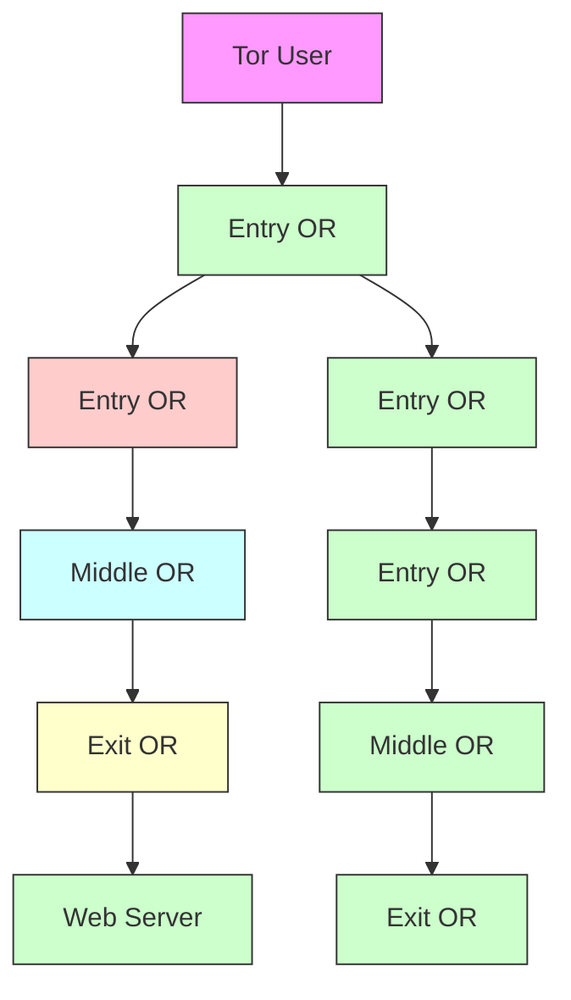
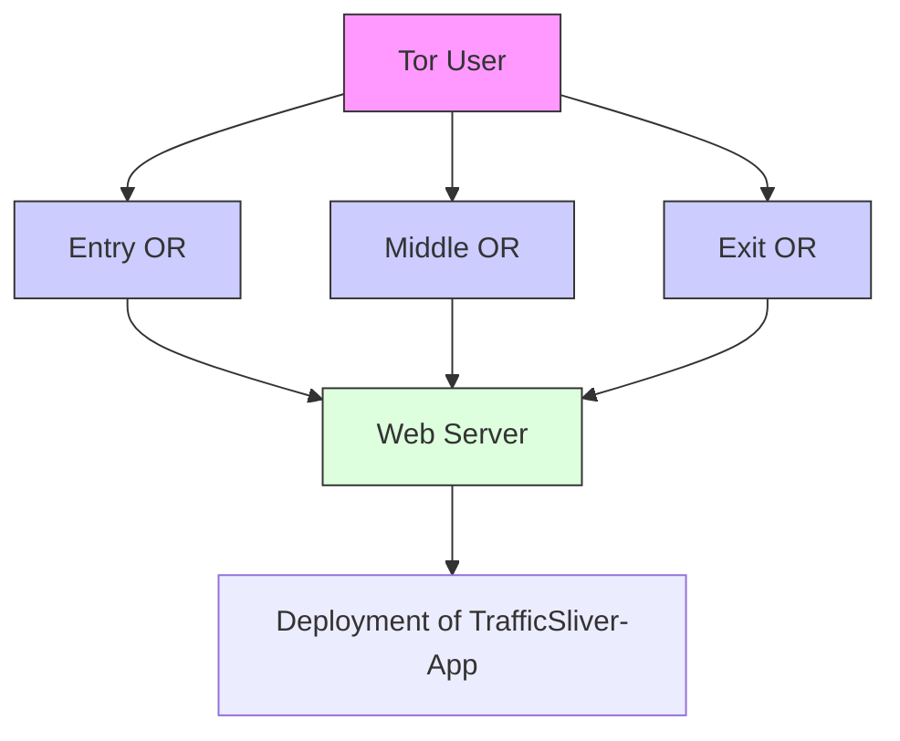

# TrafficSliver: Fighting Website Fingerprinting Attacks with Traffic Splitting

Wladimir De la Cadena∗

University of Luxembourg

wladimir.delacadena@uni.lu

Jan Pennekamp

RWTH Aachen University

jan.pk@comsys.rwth-aachen.de

Thomas Engel

University of Luxembourg

thomas.engel@uni.lu

Asya Mitseva∗

Brandenburg Technical University

asya.mitseva@b-tu.de

Sebastian Reuter

RWTH Aachen University

reuter@comsys.rwth-aachen.de

Klaus Wehrle

RWTH Aachen University

wehrle@comsys.rwth-aachen.de

Jens Hiller

RWTH Aachen University

hiller@comsys.rwth-aachen.de

Julian Filter

RWTH Aachen University

julian.filter@rwth-aachen.de

Andriy Panchenko

Brandenburg Technical University

andriy.panchenko@b-tu.de

## ABSTRACT

Website fingerprinting (WFP) aims to infer information about the content of encrypted and anonymized connections by observing patterns of data flows based on the size and direction of packets. By collecting traffic traces at a malicious Tor entry node — one of the weakest adversaries in the attacker model of Tor — a passive eavesdropper can leverage the captured meta-data to reveal the websites visited by a Tor user. As recently shown, WFP is significantly more effective and realistic than assumed. Concurrently, former WFP defenses are either infeasible for deployment in real-world settings or defend against specific WFP attacks only.

To limit the exposure of Tor users to WFP, we propose novel lightweight WFP defenses, TrafficSliver, which successfully counter today’s WFP classifiers with reasonable bandwidth and latency overheads and, thus, make them attractive candidates for adoption in Tor. Through user-controlled splitting of traffic over multiple Tor entry nodes, TrafficSliver limits the data a single entry node can observe and distorts repeatable traffic patterns exploited by WFP attacks. We first propose a network-layer defense, in which we apply the concept of multipathing entirely within the Tor network. We show that our network-layer defense reduces the accuracy from more than 98% to less than 16% for all state-of-the-art WFP attacks without adding any artificial delays or dummy traffic. We further suggest an elegant client-side application-layer defense, which is independent of the underlying anonymization network. By sending single HTTP requests for different web objects over distinct Tor entry nodes, our application-layer defense reduces the detection rate of WFP classifiers by almost 50 percentage points. Although it offers lower protection than our network-layer defense, it provides

∗Both are first authors, supervised by Andriy Panchenko. Further details in Appendix C.

Permission to make digital or hard copies of all or part of this work for personal or classroom use is granted without fee provided that copies are not made or distributed for profit or commercial advantage and that copies bear this notice and the full citation on the first page. Copyrights for components of this work owned by others than the author(s) must be honored. Abstracting with credit is permitted. To copy otherwise, or republish, to post on servers or to redistribute to lists, requires prior specific permission and/or a fee. Request permissions from permissions@acm.org.

CCS ’20, November 9–13, 2020, Virtual Event, USA

© 2020 Copyright held by the owner/author(s). Publication rights licensed to ACM.

ACM ISBN 978-1-4503-7089-9/20/11. . . \$15.00

https://doi.org/10.1145/3372297.3423351

a security boost at the cost of a very low implementation overhead and is fully compatible with today’s Tor network.

## CCS CONCEPTS

• Security and privacy → Pseudonymity, anonymity and untraceability; • Networks → Network privacy and anonymity.

## KEYWORDS

Traffic Analysis; Website Fingerprinting; Privacy; Anonymous Communication; Onion Routing; Web Privacy

## ACM Reference Format:

Wladimir De la Cadena, Asya Mitseva, Jens Hiller, Jan Pennekamp, Sebastian Reuter, Julian Filter, Thomas Engel, Klaus Wehrle, and Andriy Panchenko. 2020. TrafficSliver: Fighting Website Fingerprinting Attacks with Traffic Splitting. In Proceedings of the 2020 ACM SIGSAC Conference on Computer and Communications Security (CCS ’20), November 9–13, 2020, Virtual Event, USA. ACM, New York, NY, USA, 15 pages. https://doi.org/10.1145/3372297.3423351

## 1 INTRODUCTION

Nowadays, mass surveillance and Internet censorship have become extremely alarming as billions of people rely on the Internet as their primary source of information. Several methods for anonymous communication have been designed and developed to improve online privacy and enable users to retain control over their data [24, 46]. The main goals of these tools are to hide the identity (i.e., IP address) of Internet users, and to prevent third parties from linking communicating partners. However, as real-world adoption of such systems requires acceptable performance to handle modern real-time applications, only a few of these tools have reached widespread deployment. Currently, Tor [11, 12] is the most popular anonymization network [40], designed particularly for low-latency applications, e.g., web browsing. To hide its identity, each Tor user runs onion proxy (OP) software, and creates a virtual tunnel, circuit, to its destination through a chain of three volunteer nodes, called onion relays (ORs). Based on their position in the circuit, the ORs are known as entry, middle, and exit, and each of these knows its predecessor and its successor only. The user data is then encrypted in multiple layers (where each of the ORs can remove only a single layer of encryption) and encapsulated in chunks of a fixed size, called cells. Thus, Tor ensures that none of the ORs in the circuit knows the user and its destination at the same time [11].

Due to its popularity, Tor has become an attractive target for attacks. Although Tor promises to hide the relationship between the user and its communication partner from a local passive observer, e.g., a malicious entry OR — one of the weakest adversaries in the attacker model of Tor [12] — Tor cannot conceal the number, direction, and timing of transmitted packets. An attacker can exploit this leakage to conduct website fingerprinting (WFP) [5, 19, 34, 44, 47]. WFP is a special type of traffic analysis attack, which aims to identify the content (i.e., the visited website) of anonymized user connections by passively observing patterns of data flows. Over the years, multiple studies have systematically shown the continuously improved effectiveness of WFP attacks [19, 34, 44, 47] and their applicability in real-world settings [42, 45]. In response, a major line of research has focused on designing defenses against WFP attacks [6, 7, 23, 50]. Nevertheless, none of these has been adopted in Tor due to their unacceptably high bandwidth and latency overhead [6, 7, 13] or proven inefficiency against state-of-the-art WFP attacks [26, 44].

The growing number of powerful WFP attacks and the lack of effective and feasible WFP defenses highlight the need to design easily-deployable and efficient countermeasures against WFP. In this paper, we propose two novel lightweight WFP defenses, called TrafficSliver, which successfully counter today’s WFP classifiers with reasonable bandwidth and latency overheads and, thus, make them attractive candidates for adoption in Tor. In contrast to former WFP defenses that rely mainly on padding and delaying user traffic, our TrafficSliver defenses are based on user-controlled splitting of traffic over multiple entry ORs without inserting any artificial delays or dummy traffic. Our main goals are to limit the data a single entry node can observe, and to destroy repeatable traffic patterns exploited by state-of-the-art WFP attacks. We first introduce our network-layer defense, in which we apply the concept of multipathing entirely within Tor, i.e., the user traffic is sent via several Tor paths containing distinct entry ORs. We implement our network-layer defense in the existing Tor software and show its feasibility and possible incremental deployment in practice. Second, we suggest our elegant client-side application-layer defense that works completely independently of the underlying anonymization network. We demonstrate that it supports two modes of operation by (??) sending single HTTP requests for different web objects over distinct Tor entry ORs or (????) requesting different fractions of a single web object via different Tor paths. To achieve the latter mode of operation, we exploit the range option in the HTTP protocol to create multiple outgoing HTTP requests for a single resource.

Alongside fulfilling the requirements of being easy deployable and efficient in terms of bandwidth and latency overhead, another main challenge to be addressed by our defenses is the selection of an effective traffic-splitting strategy. The latter ensures that a single malicious entry OR can observe only a limited portion of user traffic, which is not sufficient to perform WFP. As shown in [25], a basic splitting scheme, such as round robin, does not provide an adequate level of security against WFP. Thus, we explore the resistance of advanced traffic-splitting strategies against WFP.

The contributions of our paper are as follows:

(1) We design two novel lightweight WFP defenses, TrafficSliver, based on the idea of traffic splitting over multiple entry ORs.

While our network-layer defense realizes the concept of multipathing entirely within Tor, our application-layer defense distributes (fragments of) single HTTP requests over several Tor paths. Both defenses insert neither artificial delays nor dummy traffic and, thus, are efficient in practice.

(2) We explore several traffic-splitting strategies, which can serve as candidates for adoption in our defenses. In particular, we analyze the efficiency of these strategies against modern WFP attacks by conducting simulative and real-world evaluations with four state-of-the-art WFP classifiers.

(3) We conduct an extensive analysis to prove the effectiveness of our TrafficSliver defenses. We show that our networklayer defense provides better protection than prior WFP defenses on a state-of-the-art dataset by achieving a classification accuracy below 16% while being significantly more efficient with respect to bandwidth and latency overhead. We further show that our elegant application-layer defense outperforms WTF-PAD (the former most favored low-overhead defense) in terms of the attacker’s performance while dramatically reducing implementation overhead.

## 2 THREAT MODEL

Despite the encapsulation of user data in cells of equal size, Tor still cannot conceal meta-data such as number, direction, and timing of transmitted packets. An adversary can passively exploit this sidechannel leakage and mount website fingerprinting [5, 19, 34, 44, 47]. WFP usually corresponds to a supervised machine learning (ML) problem, in which the adversary (1) defines a set of websites to be detected and (2) collects traces of multiple page loads for each of them. The adversary (3) analyses the collected traces to extract possibly expressive patterns, i.e., features, used to create a fingerprint for each website. Then, (4) ML is applied to train a classifier with the fingerprints in order to create a classification model, i.e., a representation that is able to map an unknown fingerprint to a previously-predefined class of fingerprints. Finally, the adversary (5) uses the generated model to identify the visited website, corresponding to an unknown trace of a real user.

A WFP attack is typically analyzed in two threat models, closed and open world. In a closed-world scenario, the user is allowed to visit a limited set of websites and the attacker has patterns for all these websites. Although this scenario is not realistic, it is appropriate for comparing and analyzing the performance of different WFP classifiers. The open-world scenario reflects a more realistic threat model, in which the attacker has fingerprints for websites of interest only (foreground) and the user can visit an unlimited set of websites (background). Like related work [19, 44, 47], we assume that the adversary can detect the start and the end of each page load and each site in our analysis is represented by its index page.

In this work, we assume the attacker to be a passive observer that does not decrypt, modify, or interrupt transmitted packets. The attacker has a limited view of the Tor network by controlling a restricted number of entry ORs. Thus, he can monitor traffic exchanged with a Tor user and is aware of the user’s identity, but does not know which website the user is visiting. Moreover, we assume that the adversary has sufficient computational power to train several fingerprinting techniques on large training datasets.

## 3 RELATED WORK

We briefly review previously proposed WFP attacks and defenses.

WFP Attacks. In 2011, Panchenko et al. [35] are the first to show the feasibility of WFP to deanonymize Tor users. They achieve an accuracy of almost 55% by using a novel set of features based on volume, time, and direction of transmitted packets and applying a Support Vector Machine (SVM) classifier. The authors are also the first to explore the scalability of WFP in an open-world scenario and achieve a true positive rate (TPR) of up to 73% and a false positive rate (FPR) of 0.05%. Thus, the work prompted a significant amount of further research in the field of WFP [8, 13, 48].

In 2014, Wang et al. [47] suggest a new k-Nearest Neighbor (k-NN) classifier, which achieves an accuracy of 91% (100 pages, closed world) and a TPR of 85% for a FPR of 0.6% using more than 5,000 background pages in open world. Juarez et al. [22] criticize several unrealistic assumptions made by previous works and show the negative impact of multitab browsing, constantly changing web content, and the use of different Tor Browser [39] versions for training and testing on the accuracy of WFP attacks. Wang and Goldberg [49] revisit some of these assumptions and show how the attacker can efficiently keep the training data up to date.

In 2016, Panchenko et al. [34] collect the first comprehensive dataset to evaluate WFP at Internet scale. They propose a new classifier, CUMUL, which outperforms existing methods both in terms of recognition rate and computational complexity. The authors show that while no existing WFP attack scales when applied in realistic settings, fingerprinting websites, i.e., a set of pages served under the same domain, scales significantly better than webpage fingerprinting. Another concurrent WFP classifier, k-FP [19], relies on a random decision forest to create fingerprints of pages, and k-NN for the classification itself. The accuracy achieved by k-FP is similar to that obtained by CUMUL. Other works [7, 19, 52] analyze different methods to rank WFP features by their importance.

Recently, several works have applied deep learning (DL) methods. Contrary to the traditional classifiers described above, these do not require manual feature engineering. Rimmer et al. [43] show that automatically created features are more robust in the face of constantly changing web content. Sirinam et al. [45] focus on other DL methods to deal with changing content. Other works [2, 5, 33] further explore the applicability of DL for WFP. Sirinam et al. [44] present the most powerful WFP attack, deep fingerprinting (DF), which is an improved design of the Convolutional Neural Networks (CNN) classifier. DF achieves an accuracy of more than 95% for both the closed-world (95 URLs) and the open-world (20,000 URLs) scenarios while requiring a relatively small set of training traces.

WFP Defenses. Existing WFP countermeasures can be categorized into network-layer and application-layer defenses [6].

Network-layer Defenses. Liberatone and Levine [27] explore different padding schemes on a per-packet level as a basic WFP defense. Wright et al. [51] use traffic morphing to mimic the trace of another page. However, neither padding nor traffic morphing defend against WFP [13, 19]. Buffered Fixed-Length Obfuscation (BuFLO) [13] obfuscates page transmissions by sending packets of a fixed size at a fixed interval for a certain period of time. Thus, the traffic generated by different websites has a similar continuous data flow. However, besides its high latency and bandwidth overhead, BuFLO cannot respond to congestion and may even reveal the total transmission size [6, 8]. Thus, Cai et al. [6] propose Congestion-Sensitive BuFLO (CS-BuFLO) that varies the rate of packet transmissions. Tamaraw [7] uses smaller fixed packet sizes and treats incoming and outgoing packets differently to avoid unnecessary padding and dummy traffic. However, the large overhead created by these defenses hinders their real-world adoption.

WTF-PAD [23] further reduces the latency and bandwidth overhead created by the prior defenses. It relies on predefined histograms of packet inter-arrival times to detect time gaps between packets and covers them by adding dummy packets. To obscure traffic bursts, it adds statistically-unlikely delays between packets. Due to its low overhead, WFP-PAD is the most favored defense for adoption in Tor [17, 31]. However, Sirinam et al. [44] showed the inefficiency of WFP-PAD against their DF classifier by achieving over 90% accuracy. Li et al. [26] also confirm the high information leakage of WFP-PAD. DynaFlow [29] morphs packets into fixed bursts, pads the total number of bursts, and dynamically changes packet inter-arrival times. In contrast to CS-BuFLO and Tamaraw, DynaFlow tunes the amount of overhead introduced and, thus, provides a better trade-off between security and efficiency. FRONT and GLUE have been recently suggested [18]. While FRONT creates random noise at the beginning of a page load, GLUE adds dummy packets between consecutive page loads to obscure separation of different page loads. However, the accuracy of today’s WFP attacks remains comparably high, even if both defenses are applied.

Based on traffic morphing, Glove [32] creates clusters of similar web pages and inserts only a small amount of cover traffic to make the pages within a cluster indistinguishable. Supersequence [47] is a similar defense that clusters traces of different sites to create a group of anonymity sets and extracts the shortest common supersequence. Walkie Talkie [50] forces the browser to communicate in a half-duplex mode. Thus, packets in one direction can be buffered and sent in bursts, together with dummy traffic. This, in turn, makes it easier and more efficient to create supersequences based on burst sequences. However, the main limitation of these methods remains their dependence on a priori knowledge about each site. It is especially challenging for sites with dynamic content.

Recently, Henri et al. [20] have proposed splitting traffic exchanged between the user and its entry OR over two different, unrelated network connections (e.g., DSL, Wi-Fi, or cellular networks) to protect against a malicious ISP. However, this design decision fails to defend against a malicious entry OR — a weaker attacker (than an ISP) that is cheaper and easier for deployment. Even if this defense notably reduces the accuracy of state-of-the-art WFP attacks on a single network connection, a malicious entry OR could still observe the user’s identity and the complete data flow and, thus, perform WFP. In contrast, our defenses distribute the user traffic over multiple entry ORs and limit the data a single OR can observe. Also, the authors of [20] do not analyze the influence of the number of used network connections on the accuracy of WFP attacks — one of the main contributions in our work.

Application-layer Defenses. Panchenko et al. [35] suggest a browser plug-in that adds noise by loading another random page in parallel. However, this is not sufficient to defend against WFP if the bandwidth overhead is to be kept reasonable [47]. The Tor project proposed to randomize the pipeline size (i.e., the number of requests processed in parallel) and the order of requests for embedded website content [38]. HTTP Obfuscation (HTTPOS) [30] modifies packet sizes, web object sizes, and timing by manipulating HTTP requests and basic TCP features. HTTPOS can also modify and reorder HTTP headers and insert dummy HTTP requests, but still sends them over one TCP connection in contrast to our defenses. Neither randomized pipelining nor HTTPOS are as effective as assumed against WFP [8, 47]. Even worse, randomized pipelining might lead to improved classification accuracy in some scenarios. Cherubin et al. [9] propose client- and server-side defenses, LLaMA and ALPaCA. LLaMA reorders outgoing HTTP requests by randomly delaying them and adds dummy HTTP requests. ALPaCA applies morphing by padding the web objects of a page and inserting invisible dummy web objects. Through they achieve similar protection, they are applicable for Tor onion services only.

flowchart

Figure 1: Design overview of our network-layer defense.

To sum up, none of the former WFP defenses is as effective as assumed, which highlights the need for a new efficient defense.

## 4 TRAFFICSLIVER AT NETWORK LAYER

The core idea of our network-layer defense, TrafficSliver-Net, is to distribute TCP traffic across multiple circuits built over several unique entries but shared middle and exit ORs [37]. We implement the concept of multipathing entirely within Tor. Thus, we achieve transparency to user applications and independence from third parties, e.g., web servers. Our main goal is to defend against a malicious entry OR performing WFP. Therefore, the tasks of splitting and merging are performed around (before and after) the entry OR in a circuit. In particular, we deploy our defense on the user’s OP and the middle OR, which, in turn, implement mechanisms to distribute and reassemble user traffic from multiple entry ORs. We prefer to merge and split traffic at middle ORs as exit ORs have the lowest amount of bandwidth and quantity in Tor [21]. In contrast to the resource-scarce and outnumbered exit ORs, Tor contains an excessive number of middle ORs (i.e., each OR can act as a middle node by default), and their position in the circuit is not sensitive (i.e., neither the origin nor the destination are visible by the middle OR). By introducing new types of Tor cells, our defense ensures that the construction of several circuits (consisting of distinct entry ORs and common middle and exit ORs) and the splitting of traffic sent back to the user are fully controlled by the user’s OP.

Multipath Tunnel Creation. Figure 1 illustrates the operation of our defense. To transmit data over a number ?? of unique entry ORs, the user’s OP creates multiple individual circuits, subcircuits, along each of these entry ORs to a common middle OR.

Each sub-circuit constitutes one path of our multipath transmission scheme. The user’s OP first establishes an initial three-hop subcircuit through one of the entry ORs by reusing the existing Tor circuit creation concept [11] (step 1). Next, it creates ?? − 1 two-hop sub-circuits starting at one of the entry ORs, that has not been selected yet, and ending at the same middle OR used in the initial three-hop circuit (step 2). Once these sub-circuits are built, a joining process informs the middle OR about the relationship between the ?? − 1 two-hop sub-circuits and the initial three-hop sub-circuit. To this end, we employ a cookie-based authentication mechanism whose operation is controlled and verified by the user (step 3).

The operation of our cookie mechanism is inspired by the rendezvous cookie applied in Tor onion services to establish a connection between the user and an onion service [41]. Similarly to the rendezvous cookie, the cookie in our defense consists of a 20-byte cryptographic nonce chosen randomly by the user. To authenticate the relationship between the individual sub-circuits, the user first sends the generated cookie along the initially-created three-hop sub-circuit to the middle OR. To do this, we introduce two new Tor cells, SET\_COOKIE and COOKIE\_SET. While SET\_COOKIE is utilized by the user to initially send the newly-created cookie to the middle OR, COOKIE\_SET is transmitted by the middle OR to acknowledge the (successful) receipt of the cookie. Then, the user joins the remaining two-hop sub-circuits by transmitting the same cookie in another newly-introduced Tor cell, JOIN, through these sub-circuits to the middle OR (step 4). Upon a successful match of the received cookie with a stored cookie of an already-existing three-hop subcircuit, the middle OR acknowledges the joining process with a new Tor cell, JOINED. This completes the connection establishment.

Splitting and Merging Traffic. We use a bidirectional circuitlevel cell splitting to achieve multipath user connections (step 6). To execute the actual splitting, the user’s OP (or the middle OR, depending on the direction) sends each cell containing user traffic through an individually determined sub-circuit. Then, the respective merging point receives the cells on the separate sub-circuits and reassembles them to a complete data flow for further forwarding or processing. Importantly, Tor can process cells only if they are delivered in order. However, cells sent over different sub-circuits might be delayed or received quicker due to network fluctuations. Therefore, cell reordering at the merging point is necessary. As Tor cells do not contain any sequencing information [11], we introduce a new control cell INFO, in which the user periodically announces the order of transmitted cells and their sub-circuit assignment to the middle OR (step 5). If the delivery of a cell is delayed, the respective merging point buffers all subsequent cells until the missing cell arrives. Then, all obtained cells are processed in order. Besides enabling correct cell ordering, we also introduce the concept of splitting instructions. Based on the chosen splitting scheme (see Section 6), the user regularly sends Tor INSTRUCTION cells to the middle OR to instruct it how to split backward-directed user traffic to the sub-circuits. Thus, traffic splitting at the middle OR is under the control of the user, who accepts backward-directed traffic only in the expected order. To ensure correct decryption (or encryption, depending on the direction) of cells at the exit OR, the user’s OP reuses the cryptographic key negotiated with the exit OR (threehop sub-circuit setup, step 1) for all two-hop sub-circuits. Thus, TrafficSliver-Net still encrypts all cells in three onion layers.

Implementation. We implemented TrafficSliver-Net in Tor version 0.4.1.6. Our modifications primarily focus on the handling of circuits and Tor cells. Moreover, we introduced a new split module that maintains the sub-circuits and provides functionality for the generation and management of authentication cookies, splitting instructions, and splitting strategies.

## 5 TRAFFICSLIVER AT APPLICATION LAYER

Our application-layer defense, TrafficSliver-App, works completely independently of the underlying anonymization network. Contrary to TrafficSliver-Net, here, we do not require any modifications in Tor and, thus, ensure ease of deployment in practice. TrafficSliver-App acts as a local proxy between the user’s browser and the user’s OP. It first creates a number ?? of separate Tor circuits, each of which contains a unique entry OR. To do this, we launch multiple user’s OP instances, each maintaining a single three-hop circuit. While these circuits are established using the existing Tor circuit creation concept [11], we ensure that none of them employs the same entry OR. Our proxy also uses multiple persistent connections via each of the circuits to request different objects in parallel (similar to ordinary browsers). It then accepts HTTP requests coming from the user’s browser, modifies them as needed, and sends them over one or more of the built circuits. In particular, our proxy supports two modes of operation: (??) it sends separate full HTTP requests for distinct web objects belonging to the same website over different entry ORs, or (????) it requests different fractions of a single web object via different circuits. In Section 8.2, we show that sending full HTTP requests over different entry ORs is already sufficient to protect against today’s WFP attacks. However, we argue that the support of the second mode of operation by TrafficSliver-App might become an important strategy to enhance our defense in view of attacker advancements. Therefore, we describe the second mode of operation of our defense in more detail.

When browsing the Web, the user typically sends a sequence of HTTP GET requests to fetch all web objects needed to display a site. The HTTP/1.1 protocol provides an additional feature for GET requests, the range option, which enables downloading a portion of a web object (originally used, e.g., for resuming fetching of large objects [14]). TrafficSliver-App exploits this range option to split each outgoing GET request into several partial requests asking for different fractions of a single web object. The splitting of every request is based on a preselected splitting strategy (see Section 6). Then, the proxy transmits each newly generated partial request to the web server over one of the circuits already built by the user’s OP. An important requirement to be fulfilled here is to ensure that multiple fractions of partial requests belonging to a single full GET request do not traverse the same circuit and, thus, reveal repeatable traffic patterns. The web server, in turn, processes each partial request separately and sends the corresponding fraction of a web object back to our proxy. Finally, the proxy merges all obtained portions of each resource and returns that resource in a single HTTP response to the user’s browser.

Splitting and Merging HTTP Traffic. Figure 2 illustrates the distribution of partial requests over multiple Tor paths, performed by TrafficSliver-App. Every time the user’s browser sends a GET request, our defense first determines whether this request can be split into multiple partial requests. By default, an HTTP GET request contains neither the size of the requested web object nor information as to whether the range option is supported for it. Therefore, for each resource requested by the user, our proxy sends an initial partial GET request asking for a small fraction of that resource (step 1). The main goal is to determine whether the range option is supported for that resource and to identify the size of the resource. While a small content length given in the partial request increases the number of resources that can be split (as, with a high probability, only a part of an object is requested), it also increases the number of packets transmitted via Tor and, thus, the bandwidth overhead created by the defense. Based on empirical analysis, we established a content length of an initial partial request for each resource of 50 bytes as a reasonable trade-off between privacy and performance. If the web server does not support the range option, it directly returns the complete resource. In this case, no further request is needed to be sent to fetch that resource. If the size of the resource is not present in the header of the server response, i.e., it remains unknown, only a single additional request is sent by our defense to fetch the rest of the resource. Moreover, if the size of the resource is smaller than the fraction requested in the initial request, then the server sends the complete resource back and no further request is required to be sent either. Please note that the inability to split a web object will not endanger the user’s privacy as the distribution of full HTTP requests and responses over distinct entry ORs is already sufficient to protect against the today’s WFP attacks, as shown in Section 8.2. Otherwise, our defense can create multiple partial requests based on a preselected splitting strategy to fetch the remaining portions of that resource (see Appendix B).

flowchart

Figure 2: Distributing partial requests by TrafficSliver-App.

Implementation. TrafficSliver-App is developed as an HTTP(S) proxy, written in the Node.js JavaScript framework [16]. We have one instance of our defense that performs the splitting on nonencrypted HTTP traffic. In the case of encrypted web traffic, our proxy performs a man-in-the-middle attack to arbitrarily observe and modify the HTTP traffic. It intercepts TLS handshakes initiated by the user and performs them on behalf of the web browser (using its certification authority list or pinning). After splitting the original HTTP GET request, it again encrypts the traffic intended to the web server using TLS. Our proxy can be easily integrated into the Tor Browser and, thus, avoid any deployment overhead for the users.

## 6 OUR TRAFFIC SPLITTING STRATEGIES

Regardless of whether we implement multipathing at the network or application layer, the main challenge for our TrafficSliver defenses is to provide an efficient traffic-splitting strategy against

WFP attacks. In other words, the target splitting scheme should produce highly diverse traffic distributions among different loads of the same page and, thus, hinders an adversarial entry OR in identifying (repeatable) patterns. To find such a strategy, we analyze the influence of (??) the number of distinct entry ORs used to establish multiple paths through Tor, and (????) the percentage and diversity of traffic observed at each of the entry ORs.

Number of Entry ORs Used for Traffic Distribution. To use our TrafficSliver defenses, we first need to define the number ?? of distinct entry ORs utilized by the Tor user for a multipath communication. While a large number of entry ORs decreases the amount of information available to each entry OR, it also increases the likelihood of selecting a malicious entry OR for a circuit belonging to a single multipath user connection [10]. Thus, we explore how ?? influences the user’s protection against WFP attacks and propose a trade-off between privacy protection and performance overhead.

Distribution of Traffic over Multiple Circuits. Once the number of entry ORs is selected, we need to define how to distribute the web traffic via them. Here, we have to consider the individual properties of our defenses due to the level of their implementation. These properties, in turn, do not enable the deployment of every splitting scheme in both defenses. While TrafficSliver-App relies on knowledge about the size of each web object but can neither directly manage the transmission of separate Tor cells nor directly influence the selection of a circuit for incoming traffic, TrafficSliver-Net is not aware of the web objects exchanged through it but can handle every cell sent or received by the user. Thus, splitting schemes that particularly aim to distribute separate Tor cells cannot be applied at the application layer and, vice versa, splitting schemes operating on GET requests cannot be used at the network layer.

Distribution of Traffic at Network Layer. Here, our most basic splitting strategy is round robin. When applied in TrafficSliver-Net, we switch to the next circuit for each Tor cell. Our goal is to analyze the level of security provided by such a simple splitting scheme and assess whether only the multipathing or the use of a sophisticated splitting strategy is more important to build an efficient WFP defense. We also analyze random splitting, in which we randomly select a circuit for each Tor cell. We compare these strategies to traffic splitting by direction, i.e., we use one circuit for incoming and another circuit for outgoing Tor cells. To increase the diversity of the traffic distribution for repeated page loads of a common website, we also evaluate a weighted random (WR) scheme. In WR, for each page load, we create a separate vector ??® consisting of ?? probabilities for each splitting point, which, in turn, are computed from a ??-dimensional Dirichlet distribution. We use these probabilities to weight the selection of an entry OR for each cell transmitted between the user’s OP and the middle OR. The Dirichlet distribution is a common way to model random probability mass functions for finite sets. As required by our strategies, it outputs directly ?? random positive values that add up to one. Finally, we consider a batched weighted random (BWR) splitting strategy. Contrary to WR, here, the vector ??® is utilized to weight the choice of an entry OR for a batch of ?? Tor cells. As we do not insert any dummy traffic and constant-size batches, traveling across distinct circuits may still reveal useful traffic patterns for WFP. Thus, we update ?? constantly during a single page load, i.e., after each batch. While a small ?? converges BWR to the WR strategy, a large ?? may not produce a sufficient level of traffic randomness, e.g., for small websites, as the splitting of traffic will be limited or even may not occur at all. Based on our empirical analysis (see Appendix A), we adjusted ?? to be uniformly sampled from the interval ?? ∈ [50, 70].

Distribution of Traffic at Application Layer. As introduced in Section 5, TrafficSliver-App operates in two modes. For the first mode of operation where our defense sends full GET requests for distinct web objects over different entry ORs, we analyze the multi-path splitting strategy. Here, our proxy randomly selects a circuit for each request coming from the user’s browser without splitting it into multiple partial requests. The goal is to explore the extent to which the level of traffic randomness introduced only by the use of multiple paths is sufficient to protect against WFP. For the second mode of operation where TrafficSliver-App requests different fractions of a single web object via different Tor paths, our most basic splitting scheme is round robin, where we request an equal portion of a single web object via each Tor circuit. We further consider an exp weighted random strategy. For each page load, we create a vector ??® of fractions, which, in turn, are computed from the probability density function of the exponential distribution by using the following formula: $f ( x , \lambda ) = 1 - e ^ { - \lambda x } , x \geq 0 , \mathrm { o r } f ( x , \lambda ) = 0 \mathrm { f o r } x < 0$ The exponential distribution generates sets of random numbers independent from each other over time. The values of ?? are selected arbitrarily at random every time to ensure the unpredictability of the created fractions for each page load. The vector ??® is then used to split each resource of a website into several portions. In addition, we discard generated vectors that contain fractions below a given threshold. Through experimental analysis, we established 0.001 of the total size of a web object as a reasonable threshold. Once the vector ??® of fractions is generated, it is applied to split all resources necessary to load a given page. The vector ??® is also used to weight the selection of an entry OR for each partial request transmitted between the user and the web server. Finally, to increase the diversity of the traffic distribution for repeated loads of the same website, we apply a varying exp weighted random scheme. Contrary to the previous strategy, here, we randomly select a separate subset ?? of entry ORs from the interval $r \in [ 2 , m - 1 ]$ used for the download of each resource on a website. Based on the chosen number of entry ORs, we create a separate vector ??® of fractions for each resource.

## 7 EXPERIMENTAL SETUP

To allow for verifiable results, we next present our evaluation setup.

Simulated Dataset. To initially evaluate the efficiency of our traffic-splitting schemes integrated in TrafficSliver-Net, we developed a simulator that artificially splits real-world traffic traces based on the selected scheme. We refer to the order of all cells that are assigned to the same sub-circuit after splitting as a subtrace. In total, our simulator creates ?? subtraces for a single page load. It also takes the latency of the different circuits between the user and the middle OR into account when employing our multipath transmission scheme. To this end, we measured the round-trip time (RTT) of several circuits consisting of the same middle and exit ORs but different entry ORs in the real Tor network. As in previous work [36], we measured the RTTs by sending a relay connect cell to localhost and triggering the reply time. We gathered RTTs for 4,073 successfully built circuits, which we integrated into our simulator.

Real-World Datasets. For the closed-world analysis of our TrafficSliver defenses, we rely on a dataset consisting of the 100 most popular sites [3]. First, we collected 100 traces for each website without applying our defenses and refer to this non-defended dataset as ALEXA-NODEF. Next, we collected traces protected by each defense. For TrafficSliver-Net, we selected our best traffic-splitting strategy (based on evaluation results obtained from the simulation of multipathing) to collect 100 traces for each website. We call this dataset ALEXA-NET-DEF. For each splitting scheme in TrafficSliver-App, we gathered 100 traces for each website in the real Tor network. Finally, we visited once each of the 11,307 Alexa most popular websites, excluding the first 100 sites used to build our closed-world dataset, ALEXA-NODEF-BG, without applying our defenses and used them as background for our open-world evaluation.

During crawling of our datasets, as in related work [34, 43, 44], we excluded websites that deny user traffic coming from Tor, show a CAPTCHA, have no content, or redirect to other sites that are already present in our dataset. We also removed page loads indicating a client or server error as the attacker is not interested in fingerprinting broken page loads. We applied the automated approach presented in [34] to collect all traces. For each page load, we recorded meta-data such as the size and direction of the transmitted TCP packets by using a toolbox containing the Tor Browser 9.0.1 and tcpdump and then reconstructed the Tor cells by applying a previously-used data extraction method [34]. For our evaluation, we focus only on Tor cells, as the different layers for data extraction (e.g., TCP packets, TLS records, or cells) only have a marginal influence on the classification results [34]. Hence, our results are comparable for other extraction formats. Moreover, we launched several middle ORs in the real Tor network that were used by our deployed Tor clients to perform traffic splitting and merging, as required by TrafficSliver-Net. Our middle ORs supported multipath user connections and regular one-path circuits, simultaneously.

Classifiers and Evaluation Setup. For our evaluation, we considered four state-of-the-art WFP attacks: k-NN [47], CUMUL [34], k-FP [19], and DF [44]. For details about these WFP classifiers, we refer the reader to the original papers. For all following experiments in this paper where we do not explicitly mention a different methodology, we apply 10-fold cross-validation with respect to the total number of collected page loads, i.e., the data is split into 10 evenly large parts, i.e., folds. Then, the entire process of training and testing is repeated 10 times, using one of the 10 folds as test data and the remaining nine folds as training data in turn.

## 8 EVALUATION AND DISCUSSION

In this section, we evaluate our novel defenses against state-ofthe-art WFP attacks. We assume that the attacker controls one or several malicious entry ORs in victim’s multipath connections. For all experiments, the adversary is aware of the applied defense and its splitting scheme. We further assume that the attacker has enough resources to collect a representative training dataset. Although we executed experiments where the attacker trains the WFP classifiers with non-defended traces, we achieved very poor classification accuracy for all WFP attacks and omitted this evaluation as we propose better training strategies for the adversary. In particular, the best strategy for the attacker is to use all collected subtraces of each page load. The adversary represents these subtraces as separate input vectors belonging to the same class and generates features for these vectors to train the WFP classifiers. We also ensure that all subtraces of the same page load are used either for testing or for training only. Using only single, randomly-chosen subtraces from each page load leads to lower accuracy and will not be the dominant strategy of the adversary. We believe to have addressed the logical advancements for the attacker in the learning phase and deem it unlikely that further improvements can be made without extensive efforts (which would also require enhancements to today’s WFP classifiers). For our closed-world analysis, we computed the accuracy, i.e., the probability of a correct prediction (either true positive or true negative). Similarly to related work [19, 47], we calculated the TPR, i.e., the fraction of accesses to foreground pages that were detected, and the FPR, i.e., the probability of false alarms, for our open-world experiments.

In Section 8.1, we focus on our network-layer defense. We first identify the proper number of used entry ORs and the optimal traffic splitting scheme through simulations and, then, confirm the efficiency of our defense in real-world settings. We show that TrafficSliver-Net can reduce the accuracy from more than 98% to less than 16% for all state-of-the-art WFP attacks without adding any artificial delays or dummy traffic. In Section 8.2, we provide insights into the effectiveness of our application-layer defense. We show that by sending single full HTTP requests for different web objects over distinct entry ORs, TrafficSliver-App reduces the detection rate of WFP attacks by almost 50 percent points. Although it offers lower protection than TrafficSliver-Net, it provides a security boost at the cost of a very low implementation overhead and does not require any changes in the underlying anonymization network.

## 8.1 Analysis of Our Network-layer Defense

8.1.1 Determination of Optimal Splitting Scheme. To identify a good traffic splitting scheme for TrafficSliver-Net, we use the simulator presented in Section 7 to artificially split the non-defended traffic traces in ALEXA-NODEF. For each traffic splitting scheme (see Section 6), we generated a separate dataset containing artificially created defended traces. Table 1 details the accuracy of each WFP classifier in a closed-world scenario without defense (column “Undefended”) and against our evaluated splitting strategies for varying numbers ?? of entry ORs, where the attacker controls one of them.

Number of Entry ORs Used. First, we analyze how the number of entry ORs used influences the accuracy of WFP attacks, as summarized in Table 1. Independent of the chosen strategy, we observe that all WFP attacks become less effective when the user utilizes a larger constant number of entry ORs to fetch a website. We further notice a slight decrease of the classification accuracy for a variable number of entry ORs (columns “ 2,5 ”) and a constant ?? ≥ 4 regardless of the splitting strategy. In case of a variable number of entry ORs, the adversary is challenged by the uncertainty of the applied splitting strategy as website-specific patterns are less deterministic. Additionally, our most effective scheme, BWR, drops the accuracy of all classifiers to less than 14% when a constant number of five entry ORs is utilized. Therefore, we consider ?? = 5 as a good choice and argue that this choice neither significantly increases circuit establishment times (current versions of

Table 1: Accuracy (in %) of state-of-the-art WFP attacks in scenarios without defense and against our splitting strategies, where ?? indicates the number of entry ORs used in user connections.

<table><tr><td></td><td></td><td colspan="22">Our Splitting Strategies</td></tr><tr><td></td><td>Undefended</td><td colspan="5">Round Robin</td><td colspan="5">Random</td><td colspan="2">By Direction</td><td colspan="5">Weighted Random</td><td colspan="5">Batched Weighted Random</td></tr><tr><td>m</td><td>1</td><td>2</td><td>3</td><td>4</td><td>5</td><td>[2,5]</td><td>2</td><td>3</td><td>4</td><td>5</td><td>[2,5]</td><td>In</td><td>Out</td><td>2</td><td>3</td><td>4</td><td>5</td><td>[2,5]</td><td>2</td><td>3</td><td>4</td><td>5</td><td>[2,5]</td></tr><tr><td>k-NN</td><td>98.20</td><td>91.29</td><td>89.52</td><td>87.25</td><td>86.59</td><td>75.54</td><td>87.74</td><td>82.51</td><td>78.09</td><td>72.09</td><td>62.28</td><td>37.05</td><td>32.45</td><td>16.14</td><td>9.66</td><td>4.32</td><td>4.38</td><td>4.57</td><td>6.89</td><td>4.49</td><td>3.62</td><td>3.15</td><td>3.22</td></tr><tr><td>CUMUL</td><td>98.50</td><td>96.30</td><td>86.88</td><td>85.04</td><td>82.21</td><td>80.07</td><td>95.51</td><td>92.64</td><td>89.71</td><td>87.02</td><td>79.34</td><td>37.43</td><td>26.71</td><td>63.05</td><td>53.16</td><td>47.90</td><td>41.62</td><td>47.92</td><td>21.22</td><td>9.11</td><td>4.76</td><td>4.63</td><td>8.60</td></tr><tr><td>k-FP</td><td>98.40</td><td>96.73</td><td>94.83</td><td>93.21</td><td>92.22</td><td>83.66</td><td>94.48</td><td>91.51</td><td>89.13</td><td>86.41</td><td>76.59</td><td>59.07</td><td>56.17</td><td>55.01</td><td>45.76</td><td>42.74</td><td>40.55</td><td>41.31</td><td>33.37</td><td>21.33</td><td>16.48</td><td>13.46</td><td>18.24</td></tr><tr><td>DF</td><td>98.75</td><td>97.56</td><td>95.91</td><td>94.64</td><td>93.01</td><td>90.25</td><td>96.01</td><td>94.77</td><td>93.43</td><td>90.31</td><td>84.05</td><td>29.99</td><td>26.15</td><td>65.94</td><td>54.21</td><td>47.77</td><td>42.33</td><td>47.79</td><td>31.82</td><td>14.74</td><td>6.91</td><td>6.58</td><td>11.44</td></tr></table>

line chart

| False positive rate | True positive rate (k-FP) | True positive rate (k-NN) | True positive rate (CUMUL) | True positive rate (DF) | True positive rate (Random guess) |
| ------------------- | ------------------------- | ------------------------- | -------------------------- | ----------------------- | ---------------------------------- |
| 0.0                 | 0.0                       | 0.0                       | 0.0                        | 0.0                     | 0.0                                |
| 0.2                 | 0.4                       | 0.6                       | 0.7                        | 0.5                     | 0.3                                |
| 0.4                 | 0.6                       | 0.8                       | 0.9                        | 0.7                     | 0.5                                |
| 0.6                 | 0.8                       | 0.9                       | 0.95                       | 0.8                     | 0.7                                |
| 0.8                 | 0.9                       | 0.95                      | 0.98                       | 0.9                     | 0.8                                |
| 1.0                 | 1.0                       | 1.0                       | 1.0                        | 1.0                     | 1.0                                |

Figure 3: ROC curves for today’s WFP attacks in open world.

Tor already build three circuits preemptively [11]) nor dramatically increases the probability of selecting a malicious entry OR [10] (see Section 8.5). Our experiments confirm our initial intuition that the data observed on a single client-to-entry sub-circuit by a malicious entry OR is not sufficient to perform WFP attacks.

Efficiency of Different Splitting Schemes. To find the most suitable splitting method, we explore the efficiency of each strategy, as summarized in Table 1.

Round Robin & Random. Overall, we notice a slow decrease in accuracy with the round robin strategy as the number of entry ORs used increases. We observe a similar trend with a steeper decline for the random strategy. Still, the accuracies of CUMUL and DF remain comparably high, corresponding to the correct identification of most page loads. A reason is that both strategies produce subtraces of similar size for different page load traces belonging to the same website when used in a setting with a constant ??. Moreover, round robin cannot completely hide the total size of a given website — one of the most important features for WFP attacks [19] — even when observing only a fraction of the page load. Both round robin and random schemes create traffic diversity in a setting with a variable number of entry ORs, resulting in accuracy drops of more than 10%. However, this drop is insufficient for a practical deployment.

By Direction. A simple scheme, which only splits the traffic by direction, already delivers a significant decrease in accuracy for all WFP attacks. Even though the number of transferred cells per direction remains unaltered, most classifiers only recognize a third of the page loads. This drop might be caused by the classifiers’ inability to retrieve information about the relationship between incoming and outgoing cells. However, despite the absence of this characteristic, k-FP profits from other features that use available information on timing and data rate per direction, contributing to a comparably high classification rate for this attack.

Weighted Random & Batched Weighted Random. When applying a WR circuit selection, we observe a significant decrease in the accuracy compared to the previous schemes. All evaluated WFP attacks achieve less than 43% accuracy. In case of BWR, we further reduce the accuracy of all WFP attacks down to 14%. In particular, the accuracies of CUMUL and DF cannot achieve a detection rate higher than 7%. For the worst-performing classifier, k-NN, the rate of reliably-detectable page loads drops below 4%. We believe that the significant difference in the accuracies between WR and BWR is caused by the fact that WR cannot fully destroy consecutive sequences of Tor cells within a given traffic trace, often exploited by WFP attacks to extract features (see Appendix A). Another reason for the significant accuracy decrease achieved by BWR is the diversity in total size among the different subtraces of a single website. A notable observation is that a variable number of entry ORs does not improve the efficiency of both splitting schemes, WR and BWR, as these schemes already introduce a sufficient diversity by design.

line chart

| Minimum R | Defended classifier Accuracy [%] | Number of predictions |
| --------- | -------------------------------- | --------------------- |
| 0.0       | 15                               | 100                   |
| 0.2       | 25                               | 90                    |
| 0.4       | 30                               | 80                    |
| 0.6       | 35                               | 70                    |
| 0.8       | 50                               | 60                    |
| 1.0       | 55                               | 100                   |

Figure 4: Accuracy achieved by both classifiers, one trained on defended subtraces and another trained on non-defended traces, when detecting only subtraces whose length is at least ?? of the complete page load. The number of evaluated predictions ♦ is referenced to the right log-scaled y-axis.

To sum up, based on our simulation results in Table 1, we showed that BWR with a constant number of five entry ORs generates subtraces with highly diverse characteristics and, thus, serves as our most effective splitting scheme used in the rest of the paper. We also believe that the protection of the other splitting schemes and other combinations of ?? will be worse in case of advanced attacker scenarios as they already achieve lower protection in our simulation and will omit this evaluation due to space constraints.

8.1.2 Open-world Evaluation. Next, we evaluate the efficiency of TrafficSliver-Net using BWR with five entry ORs in an open-world scenario. In particular, we focus on a scenario where the adversary aims to detect whether a single (sub-)trace of a testing page belongs to the foreground set or not, without trying to identify the exact foreground website. If we are able to reduce the success of the WFP classifiers in this setting, then their performance will be even worse in the scenario when the adversary aims to detect the exact foreground website. As a baseline, we first used the non-defended datasets ALEXA-NODEF as a foreground set and ALEXA-NODEF-BG as our background set and computed the receiving operating characteristic (ROC) curve for each classifier. We then applied the simulator from Section 7 to artificially split the non-defended traces in ALEXA-NODEF, i.e., our foreground set, and the non-defended traces in ALEXA-NODEF-BG — our background set — using BWR with five entry ORs. Analogously, we calculated the ROC curve for each classifier using these defended traces. As shown in Figure 3, we observe a clear proximity of the curves of all WFP classifiers to the random guess (black line), when TrafficSliver-Net is applied. While the area under the curve (AUC) indicating the detection of non-defended traces using all WFP attacks lies between 0.87 and 0.97 (AUC is one in case of a perfect classifier), the best-performing classifier, k-FP, reaches an AUC of only 0.60 when applying our defended dataset. Moreover, DF, ??-NN, and CUMUL achieve a marginal higher AUC than random guessing (i.e., AUC = 0.5). Hence, the adversary is not able to conduct a successful WFP attack in an open-world scenario.

Table 2: Accuracy (in %) of WFP attacks for multiple malicious entry ORs during a single page load.  
(a) Two malicious entry ORs.

<table><tr><td></td><td colspan="5">Defended</td></tr><tr><td>Training strategy</td><td> $S_1$ </td><td> $S_2$ </td><td> $S_3$ </td><td> $S_4$ </td><td> $S_5$ </td></tr><tr><td>k-FP</td><td>5.85</td><td>25.23</td><td>30.16</td><td>28.14</td><td>35.90</td></tr><tr><td>DF</td><td>6.82</td><td>14.01</td><td>27.75</td><td>19.24</td><td>35.71</td></tr><tr><td>CUMUL</td><td>7.95</td><td>9.11</td><td>16.68</td><td>12.75</td><td>19.47</td></tr><tr><td>k-NN</td><td>5.78</td><td>6.56</td><td>8.39</td><td>13.47</td><td>9.11</td></tr></table>

8.1.3 Effectiveness of TrafficSliver-Net in the Real Tor Network. Once we had identified the best traffic-splitting scheme and the optimal number of entry ORs, we deployed this strategy in the real Tor network and collected a real-world dataset (ALEXA-NET-DEF). We then computed the accuracies of all WFP attacks by using these defended traces as well as non-defended traces in ALEXA-NODEF, which we use as a baseline. Table 4 summarizes the accuracy of each WFP classifier in a closed-world scenario. As we can see, the classification results obtained by using the defended traces gathered from the real Tor network are analogous to those results achieved by using simulated defended traces. In particular, we observe a dramatic reduction of the detection rate from more than 98% to less than 16% for all state-of-the-art WFP classifiers. Simultaneously, TrafficSliver-Net does not introduce any artificial delays or dummy traffic to counter these WFP attacks. Thus, we can conclude the effectiveness of our network-layer defense in real-world settings.

8.1.4 Security against More Advanced Adversary. We further explore the performance of TrafficSliver-Net against an unrealistically strong attacker that is even aware of the portion of traffic of a complete page load that is transmitted over an observed client-to-entry connection. To analyze the level of danger for the users in this scenario, we assume that the attacker possesses two classifiers: one trained on non-defended traces and another trained on defended subtraces whose length represents a certain minimum ratio ?? from the corresponding complete page load. Then, we compute the accuracy achieved by these classifiers when the attacker tries to detect only subtraces whose lengths are at least a given mimimum ?? from the respective complete page loads. We executed this experiment by using both datasets ALEXA-NET-DEF and ALEXA-NODEF and k-FP — the best-performing WFP attack against our defense. Figure 4 shows the results obtained for a closed-world scenario. While the accuracy achieved by our classifier trained on defended subtraces is almost constant and remains below 25% for a minimum $R \leq 0 . 6 ,$ , the recognition rate of the other classifier trained on non-defended traces is close to zero for the same range of ??. Hence, we can conclude that our traffic-splitting-based defense achieves good protection against WFP attacks as long as each client-to-entry user connection contains less than 60% of the total length of a given page load. In contrast, high detection rates are achieved only for subtraces comprising more than 80% of a complete page load.

(b) ?? malicious entry ORs.

<table><tr><td></td><td colspan="4">Defended</td><td>Undefended</td></tr><tr><td>n</td><td>2</td><td>3</td><td>4</td><td>5</td><td>-</td></tr><tr><td>k-FP</td><td>35.90</td><td>55.92</td><td>80.62</td><td>96.52</td><td>98.40</td></tr><tr><td>DF</td><td>35.71</td><td>65.62</td><td>86.92</td><td>97.40</td><td>98.75</td></tr><tr><td>CUMUL</td><td>19.47</td><td>43.52</td><td>72.86</td><td>96.56</td><td>98.50</td></tr><tr><td>k-NN</td><td>13.47</td><td>29.94</td><td>52.11</td><td>94.29</td><td>98.20</td></tr></table>

8.1.5 Security against Multiple Malicious Entry ORs. Finally, we consider an even more-powerful adversary controlling ?? $, 2 \leq n \leq 5 ,$ malicious entry ORs in real victim multipath user connections and, thus, observing multiple client-to-entry connections utilized to load a single page. In this scenario, the attacker gains additional knowledge about the complete page load by merging the sequences of Tor cells that are transmitted through the compromised client-to-entry connections into a single subtrace. However, in order to achieve high recognition rate, the adversary needs to also adjust the training strategy applied for the classifier. To find the best training strategy in case of multiple malicious ORs, we explore several alternatives that the adversary can use for the training process. In our first training strategy, $S _ { 1 } ,$ we assume that the adversarial classifier is trained on non-defended (i.e., non-split) traces. As in the previous sections, in the second strategy, $S _ { 2 } ,$ , we assume that the attacker uses all subtraces belonging to a single training page load as separate inputs for training the classifier. In the third strategy, $S _ { 3 } ,$ the traces for training consist of the ordered sequences of Tor cells that were transmitted through ?? consecutive client-to-entry connections (e.g., if the total number of entry ORs used by a user is four and the number of malicious entry ORs is two for a given page load, a single training trace is the union of two subtraces traversing the first and the second entry OR). We further study another strategy, $S _ { 4 }$ , where the adversary builds training traces by merging ?? randomly-chosen subtraces. In our last strategy, $S _ { 5 }$ , the adversary creates all possible combinations of training traces that consist of ?? merged subtraces (i.e., $\binom { m } { n }$ training traces in total). For all experiments, the testing traces consist of ?? randomly-chosen, merged subtraces (this represents what an attacker would observe in reality). First, we evaluated these strategies by using our defended traces in ALEXA-NET-DEF against ?? = 2 malicious entry ORs. Table 2a shows the classification results obtained for a closed-world scenario. In case of DF, k-FP, and CUMUL, the best strategy for the attacker is to use all possible combinations of two merged subtraces for training (??5) and, thus, cover all potential variations of testing subtraces. Although the adversary achieves a slightly higher recognition rate for ??-NN when using $S _ { 4 } ,$ the difference in the accuracies between $S _ { 4 }$ and $S _ { 5 }$ is neglectable and might be caused by the use of a specific dataset. Thus, we conclude that $S _ { 5 }$ serves as our most effective training strategy in case of multiple malicious entry ORs. Notably, as ?? gets closer to ??, the training dataset contains fewer combinations of subtraces. The attacker can fully reconstruct the page load, i ${ \dot { \mathbf { \theta } } } _ { n } = m .$

Table 3: Accuracy (in %) of state-of-the-art WFP attacks against our application-layer splitting strategies.

<table><tr><td></td><td>k-NN</td><td>CUMUL</td><td>k-FP</td><td>DF</td></tr><tr><td>Undefended</td><td>98.20</td><td>98.50</td><td>98.40</td><td>98.75</td></tr><tr><td>Exp weighted random</td><td>50.32</td><td>60.41</td><td>60.98</td><td>76.28</td></tr><tr><td>Varying exp weighted random</td><td>25.20</td><td>38.20</td><td>46.08</td><td>71.70</td></tr><tr><td>Multi-path</td><td>14.93</td><td>24.13</td><td>28.72</td><td>57.34</td></tr></table>

line chart

| Feature rank | Timing information (undefended) | Size information (undefended) | Timing information (TrafficSliver-Net) | Size information (TrafficSliver-Net) | Timing information (TrafficSliver-App) | Size information (TrafficSliver-App) |
| ------------ | -------------------------------- | ------------------------------ | ------------------------------------- | ----------------------------------- | ------------------------------------ | ----------------------------------- |
| 1            | 0.04                             | 0.04                           | 0.02                                  | 0.02                                | 0.01                                 | 0.01                                |
| 5            | 0.035                            | 0.035                          | 0.02                                  | 0.02                                | 0.01                                 | 0.01                                |
| 10           | 0.03                             | 0.03                           | 0.02                                  | 0.02                                | 0.01                                 | 0.01                                |
| 15           | 0.025                            | 0.025                          | 0.02                                  | 0.02                                | 0.01                                 | 0.01                                |
| 20           | 0.02                             | 0.02                           | 0.02                                  | 0.02                                | 0.01                                 | 0.01                                |
| 25           | 0.015                            | 0.015                          | 0.02                                  | 0.02                                | 0.01                                 | 0.01                                |
| 30           | 0.01                             | 0.01                           | 0.02                                  | 0.02                                | 0.01                                 | 0.01                                |
| 35           | 0.008                            | 0.008                          | 0.02                                  | 0.02                                | 0.01                                 | 0.01                                |
| 40           | 0.006                            | 0.006                          | 0.02                                  | 0.02                                | 0.01                                 | 0.01                                |
| 45           | 0.005                            | 0.005                          | 0.02                                  | 0.02                                | 0.01                                 | 0.01                                |
| 50           | 0.004                            | 0.004                          | 0.02                                  | 0.02                                | 0.01                                 | 0.01                                |

Figure 5: Feature importance score of the first 50 bestranked features for defended and non-defended traces.

We further analyze the susceptibility of our defense against WFP attacks for an increasing number of malicious entry ORs by applying ??5 for training. Table 2b shows the classification results obtained for a closed-world scenario and malicious entry ORs varying from two to five. As expected, the more traffic is observed, the higher accuracy the adversary achieves. Nevertheless, the accuracies of all classifiers remain below 36% in case of two malicious entry ORs. Although the detection rate increases dramatically (especially for DF) when three or more entry ORs are compromised, the probability to select an excessive number of malicious entry ORs belonging to a single adversary is statistically not feasible in the real Tor network. Moreover, when the attacker controls more entry ORs, DF outperforms the best-performing classifier, k-FP. Finally, the accuracy achieved in case of five malicious entry ORs converges to that of non-defended traces (see Section 8.5 for countermeasures).

## 8.2 Analysis of Our Application-layer Defense

This section provides insights into the efficiency of our applicationlayer defense. Based on our preliminary knowledge gained from the simulation results in Section 8.1.1, we established a variable random number ??, $2 \leq m \leq 7 ,$ of entry ORs used for each page load. We then collected a separate dataset for each of our applicationlayer splitting schemes (see Section 6) in the real Tor network as described in Section 7 and compared the accuracies. In Table 3, we detail the accuracy of each WFP classifier in a closed-world for one malicious OR without defense and against our application-layer splitting strategies and discuss the results below.

Table 4: Accuracy (in %) of state-of-the-art WFP attacks against our TrafficSliver defenses and other prior defenses.

<table><tr><td></td><td>k-NN</td><td>CUMUL</td><td>k-FP</td><td>DF</td></tr><tr><td>Undefended</td><td>98.20</td><td>98.50</td><td>98.40</td><td>98.75</td></tr><tr><td>TrafficSliver-Net</td><td>5.02</td><td>5.18</td><td>15.44</td><td>8.07</td></tr><tr><td>TrafficSliver-App</td><td>14.93</td><td>24.13</td><td>28.72</td><td>57.34</td></tr><tr><td>Tamaraw</td><td>4.86</td><td>6.86</td><td>5.50</td><td>4.11</td></tr><tr><td>CS-BuFLO</td><td>10.40</td><td>15.49</td><td>21.45</td><td>11.88</td></tr><tr><td>WTF-PAD</td><td>35.23</td><td>75.73</td><td>67.50</td><td>85.62</td></tr></table>

Multi-path. We first focus on the splitting scheme where the defense does not require any additional cooperation by web servers but simply sends full HTTP requests for different web objects over distinct randomly-chosen entry ORs. Surprisingly, we observe here the highest decline in accuracy compared to all application-layer splitting strategies. In particular, ??-NN, and CUMUL achieve less than 25% accuracy, and k-FP, less than 29%. For the best-performing classifier, DF, our defense reduces the detection rate by almost 50 percent points. We believe that this decrease is caused by the diversity of split traces that is implicitly generated through the transmission of different resources over distinct paths.

Exp Weighted Random & Varying Exp Weighted Random. Next, we analyze splitting schemes that rely on the support of the range option by web servers. As the fraction of resources within a website for which the range option is enabled may influence the effectiveness of our splitting strategies, we evaluated the success of these schemes by using the Alexa Top 100 most popular sites as well as the first Alexa 100 most popular websites, which contain only splittable web objects. Appendix B presents detailed information about the splittability of websites. However, as we do not observe any significant difference in the accuracies, we focus only on those classification results related to the Alexa Top 100 most popular sites and, thus, enable a comparison with the other results. We also omit the results for our round robin scheme, since they are similar to those obtained for our network-layer defense. Overall, we observe a steep decrease in accuracy with the exp weighted random strategy. Nonetheless, the detection rate of DF still remains comparatively high, corresponding to the correct identification of most page loads. A reason for this might be that TrafficSliver-App cannot hide the relationship between incoming and outgoing cells sent over a single client-to-entry connection.

To sum up, we showed that our simple multi-path splitting scheme creates subtraces with diverse characteristics and, thus, serves as our most effective application-layer splitting strategy. However, we believe that — in future work — the level of security provided by TrafficSliver-App can be further optimized.

## 8.3 Obfuscation of Most Informative Features

When designing a WFP countermeasure, it is important to ensure that this defense can obfuscate all discriminating features used by WFP classifiers. Therefore, to better understand the influence of our TrafficSliver defenses on the features used in state-of-the-art WFP attacks, we computed the feature importance score of non-defended traces and traces defended by our TrafficSliver defenses by using an exiting approach presented in [19]. To do this, we categorized all generated features in two main groups: (??) features which are extracted based on information about packet sizes and ordering, and (????) features that involve timing information. Figure 5 shows the importance score of the first 50 best-ranked features for defended and non-defended traces. Non-defended traces are correctly detected since classifiers typically rely on features based on packet sizes and ordering. On the other side, the level of importance of size-related features reduces significantly when considering defended traces. In case of TrafficSliver-Net, we obfuscate not only the size-related features but also the order of transmitting consecutive packets (due to the use of two splitting points for incoming and outgoing traffic and the weighted selection of an individual circuit for a batch of Tor cells). This, in turn, explains the success of our defense over classifiers such as CUMUL and DF, which mainly rely on packet sizes and ordering to recognize websites. However, as TrafficSliver-Net does not add any packet delays or dummy traffic, it cannot fully obfuscate features involving timing information and, thus, such features gain a higher importance score. This explains the better performance of k-FP, which also considers timing information.

line chart

| Number of Tor cells | TrafficSliver-Net | TrafficSliver-App | Tamaraw | WTF-PAD | CS-BuFLO | Undefended |
| ------------------- | ----------------- | ----------------- | ------- | ------- | -------- | ---------- |
| 10^1                | 0.0               | 0.0               | 0.0     | 0.0     | 0.0      | 0.0        |
| 10^2                | 0.0               | 0.0               | 0.0     | 0.0     | 0.0      | 0.0        |
| 10^3                | 0.2               | 0.2               | 0.2     | 0.2     | 0.2      | 0.2        |
| 10^4                | 0.8               | 0.8               | 0.8     | 0.8     | 0.8      | 0.8        |
| 10^5                | 1.0               | 1.0               | 1.0     | 1.0     | 1.0      | 1.0        |

(a) Bandwidth overhead.

line chart

| Total page load time [s] | TrafficSliver-Net | TrafficSliver-App | Tamaraw | WTF-PAD | CS-BuFLO | Undeftended |
| ------------------------- | ----------------- | ----------------- | ------- | ------- | -------- | ----------- |
| 1                         | 0.0               | 0.0               | 0.0     | 0.0     | 0.0      | 0.0         |
| 10                        | 0.8               | 0.7               | 0.2     | 0.9     | 0.3      | 0.9         |
| 100                       | 0.95              | 0.9               | 0.6     | 0.98    | 0.6      | 0.98        |
| 1000                      | 1.0               | 1.0               | 1.0     | 1.0     | 1.0      | 1.0         |

(b) Latency overhead.

Figure 6: Cumulative distribution function (CDF) of bandwidth and latency overhead created by WFP defenses.  

bar chart

| Category | Forward (MBit/sec) | Backward (MBit/sec) |
| :--- | :--- | :--- |
| Tor | 10.7 | 11.8 |
| TrafficSliver-Net | 9.1 | 10.0 |

(a) Throughput.

bar chart

| Method          | Forward | Backward |
| --------------- | ------- | -------- |
| Tor             | 1.5     | 1.45     |
| TrafficSliver-Net | 1.65    | 1.5      |

(b) Load on middle OR.

bar chart

| System          | Forward Inter-arrival Time [ms] | Backward Inter-arrival Time [ms] |
| --------------- | -------------------------------- | --------------------------------- |
| Tor             | ~7                               | ~5                                |
| TrafficSliver-Net | ~4                               | ~10                               |

(c) Packet inter-arrival time.  
Figure 7: Performance evaluation of our network-layer defense.

Unlike TrafficSliver-Net, TrafficSliver-App cannot obfuscate all features related to packet sizes and ordering. A reason might be that we do not have any proactive splitting for incoming traffic. However, overall we observe that our defense flattens the importance score of all features to a notably lower value (i.e., less than 0.02) and, thus, forces WFP attacks to rely on highly fluctuating characteristics such as data rate, page loading time, or inter-packet timing.

## 8.4 Overhead & Comparison to Prior Defenses

Finally, we compare the level of security and the amount of overhead created by the most popular prior WFP defenses CS-BuFLO [6], Tamaraw [7], and WTF-PAD [23] to our TrafficSliver defenses (using our most optimal splitting scheme: BWR with five entry ORs and multi-path). We generated defended traces for the prior defenses by using our dataset ALEXA-NODEF and their public implementations.

Security against State-of-the-art WFP Attacks. Table 4 shows the classification results obtained in a closed-world scenario for a malicious entry OR. TrafficSliver-Net clearly outperforms CS-BuFLO and WTF-PAD. Although TrafficSliver-Net and Tamarraw achieve similar accuracies in case of ??-NN and CUMUL, Tamarraw is significantly robuster against k-FP and DF compared to TrafficSliver-Net. However, this is achieved at the price of bandwidth and latency overheads that are several orders of magnitude higher than those of TrafficSliver-Net (see Figure 6). Moreover, we observe that our lightweight TrafficSliver-App defense reduces the detection rate of the state-of-the-art WFP classifiers, though it does not achieve the level of protection offered by CS-BuFLO and Tamaraw. Finally, we observe that TrafficSliver-App outperforms WTF-PAD — the only one application-layer defense in our comparison — by multiple factor for all WFP attacks. We conclude that our defenses achieve higher accuracy declines for all WFP attacks than the most former defenses.

Performance Overhead. An acceptable performance overhead is important for the real-world deployment of defenses. Therefore, we measure the bandwidth and latency overhead created by our defenses and compare it with the overheads generated by the prior WFP defenses. As shown in Figure 6, both TrafficSliver defenses produce only a tiny bandwidth overhead in contrast to all former WFP defenses. In terms of latency, the created overhead is more conspicuous. However, it is still lower by several orders of magnitude compared to CS-BuFLO and Tamaraw. Although WTF-PAD does not introduce any time delays, it does not provide a sufficient level of security against WFP attacks as we showed above. We conclude that our TrafficSliver defenses produce only a small overhead in terms of latency and a negligible one in terms of bandwidth consumption and outperform all former WFP defenses.

Finally, we analyze the overhead created by TrafficSliver-Net due to the splitting and merging of traffic at the middle OR. To this end, we deployed TrafficSliver-Net in the real Tor network and measured the processing times per Tor cell and the throughput for traffic going from the user to the middle OR (forward traffic) and from the middle OR to the user (backward traffic). We repeated each measurement at least 1,000 times. First, as shown in Figure 7a, we observe a slight decrease in the throughput by approximately 20%. We believe that this decrease will not notably affect the web browsing experience of the user. Second, as shown in Figure 7b, we find that the processing overhead of TrafficSliver-Net for middle ORs is neglectable. Third, as multi-path negatively influences jitter, we compare the packet inter-arrival times of our defense to those of original Tor. As shown in Figure 7c, while the packet inter-arrival time decreases in case of TrafficSliver-Net due to the use of multiple connections, the number of outliers increases. A reason for this might be fluctuating characteristics such as different data rates over the different connections.

To sum up, we showed the effectiveness of our defenses against today’s WFP attacks and argue that they serve as suitable candidates for adoption in Tor due to their moderate performance overhead.

## 8.5 Discussion and Limitations

In contrast to former WFP defenses that aim at protecting against a malicious ISP and a malicious entry OR, our TrafficSliver defenses provide protection against malicious entry ORs only. To defend also against eavesdroppers on the link between a Tor user and an entry OR, i.e., the case of a malicious ISP, the user can utilize different access links (e.g., using distinct ISPs via DSL, Wi-Fi or cellular networks) to connect to the entry ORs, as proposed by Henri et al. [20]. However, it is worth noting that while it is hard to become a user’s ISP, it is easier (and, thus, more dangerous for the user) to become an entry OR by launching multiple ORs in Tor.

From another perspective, the use of multiple entry ORs by TrafficSliver may increase the chances for an attacker to become one of these entry ORs. Thus, despite that TrafficSliver can deal even with several malicious entry ORs (see Section 8.1.5), we propose to apply the already existing guard concept of Tor [28] for the selection of entry ORs. This idea was already discussed and suggested for adoption in the scope of multipath extensions of Tor for performance improvements [28]. According to the current guard specification, a Tor user selects a set of entry ORs for its guard list and sticks to using them for a certain time period. If the user selects a malicious entry OR as its guard in Tor, it is completely exposed to the WFP attack at the entry OR. Contrary, in TrafficSliver, selecting one or even several malicious guards, as our evaluation shows, does not lead to successful mounting of WFP. Therefore, we believe that the adoption of TrafficSliver will not worsen the user’s situation with respect to path compromises, though further research is needed to ultimately clarify this question.

TrafficSliver-Net can be used for arbitrary TCP traffic. Though independent of the underlying anonymization network, TrafficSliver-App is an HTTP(S)-specific defense. As end-connections to the destinations are made from different exit ORs, TrafficSliver-App could experience issues while dealing with user sessions (for the web server it looks like the same user makes connections from different IP addresses). This needs further research and could be mitigated by using the same exit OR for all sub-circuits.

We are the first to use multipath for thwarting attacks in Tor, though there exist approaches such as Conflux [4] and mTor [53] to improve the performance. Both of them perform merging and splitting at the exit OR (see discussion below) and do not allow any protection-specific options for splitting. An interested reader would also wonder about the opportunity to apply multipath TCP (MPTCP) instead of TrafficSliver-Net. However, we argue that this is not an alternative in Tor. Between each pair of ORs, especially for privacy reasons, Tor uses a single TCP connection for all circuits (i.e., TCP terminates at the next OR). Cells of one circuit travel over multiple TCP connections, one for each OR (hop-by-hop). Hence, Tor already uses a tailored approach for client-to-server congestion control (rather than counting on hop-by-hop TCP RTT estimators or dup ACKs). Even more, ORs cannot use TCP options to forward circuit-specific MPTCP options: (??) This would deanonymize the user and (????) ORs multiplex different circuits over the same TCP connection to the next OR. Also, tunneling MPTCP options within the cell — such that exit ORs can apply them to the server-facing TCP connection — is undesirable as it requires adapting the resourcescarce and outnumbered exit ORs [21] and would limit the defense to MPTCP-supporting web servers. In TrafficSliver-Net, we further prefer to split and merge traffic at the middle OR as exit ORs have the lowest bandwidth and quantity in Tor [21]. However, our defense supports both cell splitting and merging at middle or exit, independent of the circuit length and number of sub-circuits.

## 9 CONCLUSION

We proposed novel lightweight TrafficSliver defenses at network and application layer, respectively, to protect against WFP performed by malicious entry ORs. TrafficSliver is based on usercontrolled traffic splitting via multiple Tor paths. We also analyzed the effectiveness of different splitting schemes that can be integrated in our defenses. We show that our network-layer defense is able to reduce the accuracy from more than 98% to less than 16% for all state-of-the-art WFP attacks without adding any artificial delays or dummy traffic. While TrafficSliver-Net drastically decreases the accuracy of all state-of-the-art attacks, TrafficSliver-App reduces accuracy by light modifications on the client side only and, thus, does not require any changes in the underlying anonymization network. Through an extensive evaluation, we identified system parameters and traffic-splitting strategies that effectively hamper WFP attacks. Besides the compatibility with the current Tor network, our defenses do not insert noticeable bandwidth overhead and incur only minimal latency overhead. Thus, they serve as suitable candidates for deployment in Tor.

The source code of our TrafficSliver defenses is available at [1].

Acknowledgements. Parts of this work have been funded by the Luxembourg National Research Fund (FNR) within the CORE Junior Track project PETIT, the EU and state Brandenburg EFRE StaF project INSPIRE, and the German Federal Ministry of Education and Research (BMBF) under the projects KISS\_KI and WAIKIKI. We thank Daniel Forster for the initial prototype of TrafficSliver-Net.

## REFERENCES

[1] 2020. https://github.com/TrafficSliver.  
[2] Kota Abe and Shigeki Goto. 2016. Fingerprinting Attack on Tor Anonymity using Deep Learning. In Proceedings of the Asia Pacific Advanced Network Workshop (APAN).  
[3] Alexa. 2020. Alexa Tor 100 most popular websites. https://www.alexa.com/. (Accessed: September 2018).  
[4] Mashael AlSabah, Kevin Bauer, Tariq Elahi, and Ian Goldberg. 2013. The Path Less Travelled: Overcoming Tor’s Bottlenecks with Traffic Splitting. In Proceedings on Privacy Enhancing Technologies (PoPETS). Springer, Bloomington, IND, USA.  
[5] Sanjit Bhat, David Lu, Albert Kwon, and Srinivas Devadas. 2019. Var-CNN: A Data-Efficient Website Fingerprinting Attack Based on Deep Learning. In Proceedings on Privacy Enhancing Technologies (PoPETS). Sciendo, Stockolm, Sweden.  
[6] Xiang Cai, Rishab Nithyanand, and Rob Johnson. 2014. CS-BuFLO: A Congestion Sensitive Website Fingerprinting Defense. In Proceedings of the 13th Workshop on Privacy in the Electronic Society (WPES). ACM, Scottsdale, AZ, USA.  
[7] Xiang Cai, Rishab Nithyanand, Tao Wang, Rob Johnson, and Ian Goldberg. 2014. A Systematic Approach to Developing and Evaluating Website Fingerprinting Defenses. In Proceedings of the 21st ACM SIGSAC Conference on Computer and Communications Security (CCS). ACM, Scottsdale, Arizona, USA.  
[8] Xiang Cai, Xin Cheng Zhang, Brijesh Joshi, and Rob Johnson. 2012. Touching from a distance: website fingerprinting attacks and defenses. In 19th Conference on Computer and communications security (CCS). ACM, Raleigh, NC, USA, 605–616.  
[9] Giovanni Cherubin, Jamie Hayes, and Marc Juarez. 2017. Website Fingerprinting Defenses at the Application Layer. In 17th Privacy Enhancing Technologies Symposium (PETS). DE GRUYTER, Minneapolis, USA, 186–203.  
[10] Wladimir De la Cadena, Daniel Kaiser, Asya Mitseva, Andriy Panchenko, and Thomas Engel. 2019. Analysis of Multi-path Onion Routing-Based Anonymization Networks. In Proceedings of the 33rd Anual IFIP Conference on Data and Applications Security and Privacy (DBSec). Springer, Charleston, SC, USA.  
[11] Roger Dingledine and Nick Mathewson. 2019. Tor Protocol Specification. https: //gitweb.torproject.org/torspec.git/tree/tor-spec.txt. (Accessed: January 2020).  
[12] Roger Dingledine, Nick Mathewson, and Paul Syverson. 2004. Tor: The Second-Generation Onion Router. In 13th Conference on USENIX Security Symposium. USENIX Association, San Diego, CA, USA, 303–320.  
[13] Kevin Dyer, Scott Coull, Thomas Ristenpart, and Thomas Shrimpton. 2012. Peeka-Boo, I Still See You: Why Efficient Traffic Analysis Countermeasures Fail. In Proceedings of the 33rd IEEE Symposium on Security and Privacy (S&P). IEEE, San Francisco, CA, USA.  
[14] Roy T. Fielding, Yves Lafon, and Julian F. Reschke. 2014. Hypertext Transfer Protocol (HTTP/1.1): Range Requests. https://tools.ietf.org/html/rfc7233.  
[15] Roy T. Fielding and Julian F. Reschke. 2014. Hypertext Transfer Protocol (HTTP/1.1): Semantics and Content. https://tools.ietf.org/html/rfc7231.  
[16] OpenJS Foundation. 2020. Node.js. https://nodejs.org/en/. (Accessed: March 2020).  
[17] Ian Goldberg. 2019. Network-Based Website Fingerprinting. https://tools.ietf. org/html/draft-wood-privsec-wfattacks-00. (Accessed: August 2019).  
[18] Jiajun Gong and Tao Wang. 2020. Zero-delay Lightweight Defenses against Website Fingerprinting. In 29th USENIX Security Symposium. USENIX Association, Boston, MA, USA.  
[19] Jamie Hayes and George Danezis. 2016. k-fingerprinting: A Robust Scalable Website Fingerprinting Technique. In Proceedings of the 25th USENIX conference on Security Symposium. USENIX Association, Austin, TX, USA.  
[20] Sébastien Henri, Ginés García-Avilés, Pablo Serrano, Albert Banchs, and Patrick Thiran. 2020. Protecting against Website Fingerprinting with Multihoming. In Proceedings on Privacy Enhancing Technologies (PoPETS). Sciendo, Montreal, Canada.  
[21] Rob Jansen, Tavish Vaidya, and Micah Sherr. 2019. Point Break: A Study of Bandwidth Denial-of-Service Attacks against Tor. In Proceedings of the 28th USENIX conference on Security Symposium. USENIX Association, Santa Clara, CA.  
[22] Marc Juarez, Sadia Afroz, Gunes Acar, Claudia Diaz, and Rachel Greenstadt. 2014. A Critical Evaluation of Website Fingerprinting Attacks. In Proceedings of the 21st ACM SIGSAC Conference on Computer and Communications Security (CCS). ACM, Scottsdale, AZ, USA.  
[23] Marc Juarez, Mohsen Imani, Mike Perry, Claudia Diaz, and Matthew Wright. 2016. Toward an Efficient Website Fingerprinting Defense. In Proceedings of the 21st European Symposium on Research in Computer Security (ESORICS). Springer, Heraklion, Greece.  
[24] Sheharbano Khattak, Taria Elahi, Laurent Simon, Colleen M. Swanson, Steven J. Murdoch, and Ian Goldberg. 2016. SoK: Making Sense of Censorship Resistance Systems. In 16th Privacy Enhancing Technologies Symposium (PETS). DE GRUYTER, Darmstadt, Germany, 37–61.  
[25] Wladimir De la Cadena, Asya Mitseva, Jan Pennekamp, Jens Hiller, Fabian Lanze, Thomas Engel, Klaus Wehrle, and Andriy Panchenko. 2019. POSTER: Traffic Splitting to Counter Website Fingerprinting. In 26th Conference on Computer and Communications Security (CCS). ACM, London, UK, 2533–2535.  
[26] Shuai Li, Huajun Guo, and Nicholas Hopper. 2018. Measuring Information Leakage in Website Fingerprinting Attacks and Defenses. In 25th Conference on Computer and Communications Security (CCS). ACM, Toronto, Canada, 1977– 1992.  
[27] Marc Liberatore and Brian Levine. 2006. Inferring the Source of Encrypted HTTP Connections. In Proceedings of the 13th ACM Conference on Computer and Communications Security (CCS). ACM, Alexandria, VA, USA.  
[28] Isis Lovecruft, George Kadianakis, Ola Bini, and Nick Mathewson. 2019. Tor Guard Specification. https://gitweb.torproject.org/torspec.git/tree/guard-spec.txt. (Accessed: January 2020).  
[29] David Lu, Sanjit Bhat, Albert Kwon, and Srinivas Devadas. 2018. DynaFlow: An Efficient Website Fingerprinting Defense Based on Dynamically-Adjusting Flows. In 17th Workshop on Privacy in the Electronic Society (WPES). ACM, Toronto, Canada, 109–113.  
[30] Xiapu Luo, Peng Zhou, Edmond W. W. Chan, Wenke Lee, Rocky K. C. Chang, and Roberto Perdisci. 2011. HTTPOS: Sealing information leaks with browser-side obfuscation of encrypted flows. In Proceedings of the 18th Anual Network and Distributed System Security Symposium (NDSS). Internet Society, San Diego, CA, USA.  
[31] Nick Mathewson. 2019. New Release: Tor 0.4.0.5. https://blog.torproject.org/newrelease-tor-0405. (Accessed: January 2020).  
[32] Rishab Nithyanand, Xiang Cai, and Rob Johnson. 2014. Glove: A Bespoke Website Fingerprinting Defense. In Proceedings of the 13th Workshop on Privacy in the Electronic Society (WPES). ACM, Scottsdale, Arizona, USA.  
[33] Se Eun Oh, Saikrishna Sunkam, and Nicholas Hopper. 2019. ??1-FP: Extraction, Classification, and Prediction of Website Fingerprints with Deep Learning. In 19th Privacy Enhancing Technologies Symposium (PETS). DE GRUYTER, Stockholm, Sweden, 191–209.  
[34] Andriy Panchenko, Fabian Lanze, Andreas Zinnen, Martin Henze, Jan Pennekamp, Klaus Wehrle, and Thomas Engel. 2016. Website Fingerprinting at Internet Scale. In 23rd Annual Network and Distributed System Security Symposium (NDSS). Internet Society, San Diego, CA, USA.  
[35] Andriy Panchenko, Lukas Niessen, Andreas Zinnen, and Thomas Engel. 2011. Website Fingerprinting in Onion Routing Based Anonymization Networks. In Proceedings of the 10th Annual ACM Workshop on Privacy in the Electronic Society (WPES) (Chicago, Illinois, USA). ACM.  
[36] Andriy Panchenko and Johannes Renner. 2009. Path Selection Metrics for Performance-Improved Onion Routing. In Proceedings of the 9th IEEE/IPSJ Symposium on Applications and the Internet (SAINT). IEEE, Seattle, Washington, USA.  
[37] Jan Pennekamp, Jens Hiller, Sebastian Reuter, Wladimir De la Cadena, Asya Mitseva, Martin Henze, Thomas Engel, Klaus Wehrle, and Andriy Panchenko. 2019. Multipathing Traffic to Reduce Entry Node Exposure in Onion Routing. In Proceedings of the 27th annual IEEE International Conference on Network Protocols (ICNP). IEEE, Chicago, IL, USA.  
[38] Mike Perry. 2011. Experimental Defense for Website Traffic Fingerprinting. https: //blog.torproject.org/experimental-defense-website-traffic-fingerprinting. (Accessed: January 2020).  
[39] The Tor Project. 2020. Tor Browser. https://www.torproject.org/projects/ torbrowser.html.en. (Accessed: March 2020).  
[40] The Tor Project. 2020. Tor Metrics. https://metrics.torproject.org/. (Accessed: March 2020).  
[41] The Tor Project. 2020. Tor Rendezvous Specification – Version 3. https://gitweb. torproject.org/torspec.git/tree/rend-spec-v3.txt.  
[42] Tobias Pulls and Rasmus Dahlberg. 2020. Website Fingerprinting with Website Oracles. In Proceedings on Privacy Enhancing Technologies (PoPETS). Sciendo, Montreal, Canada.  
[43] Vera Rimmer, Davy Preuveneers, Marc Juárez, Tom van Goethem, and Wouter Joosen. 2018. Automated Website Fingerprinting through Deep Learning. In Proceedings of the 25th Network and Distributed System Security Symposium (NDSS). Internet Society, San Diego, CA, USA.  
[44] Payap Sirinam, Mohsen Imani, Marc Juarez, and Matthew Wright. 2018. Deep Fingerprinting: Undermining Website Fingerprinting Defenses with Deep Learning. In Proceedings of the 25th ACM SIGSAC Conference on Computer and Communications Security (CCS). ACM, Toronto, ON, Canada.  
[45] Payap Sirinam, Nate Mathews, Mohammad Saidur Rahman, and Matthew Wright. 2019. Triplet Fingerprinting: More Practical and Portable Website Fingerprinting with N-Shot Learning. In Proceedings of the 26th ACM SIGSAC Conference on Computer and Communications Security (CCS). ACM, London, United Kingdom.  
[46] Michael Carl Tschantz, Sadia Afroz, Anonymous, and Vern Paxson. 2016. SoK: Towards Grounding Censorship Circumvention in Empiricism. In Symposium on Security and Privacy (S&P). IEEE, San Jose, CA, USA, 914–933.  
[47] Tao Wang, Xiang Cai, Rishab Nithyanand, Rob Johnson, and Ian Goldberg. 2014. Effective Attacks and Provable Defenses for Website Fingerprinting. In Proceedings of the 24th USENIX conference on Security Symposium. USENIX Association, San Diego, CA, USA.  
[48] Tao Wang and Ian Goldberg. 2013. Improved Website Fingerprinting on Tor. In Proceedings of the 12th ACM Workshop on Workshop on Privacy in the Electronic  
Society (WPES). ACM, Berlin, Germany.  
[49] Tao Wang and Ian Goldberg. 2015. On Realistically Attacking Tor with Website Fingerprinting. In Proceedings on Privacy Enhancing Technologies (PoPETs). Philadelphia, PA, USA.  
[50] Tao Wang and Ian Goldberg. 2017. Walkie-Talkie: An Efficient Defense Against Passive Website Fingerprinting Attacks. In Proceedings of the 26th USENIX conference on Security Symposium. USENIX Association, Vancouver, BC, Canada.  
[51] Charles Wright, Scott Coull, and Fabian Monrose. 2009. Traffic Morphing: An Efficient Defense Against Statistical Traffic Analysis. In Proceedings of the 16th Anual Network and Distributed System Security Symposium (NDSS). Internet Society, San Diego, CA, USA.  
[52] Junhua Yan and Jasleen Kaur. 2018. Feature Selection for Website Fingerprinting. In 18th Privacy Enhancing Technologies Symposium (PETS). DE GRUYTER, Barcelona, Spain, 200–219.  
[53] L. Yang and F. Li. 2015. mTor: A Multipath Tor Routing Beyond Bandwidth Throttling. In IEEE Conference on Communications and Network Security (CNS). IEEE, Florence, Italy.

## A OPTIMIZING BATCHED WEIGHTED RANDOM STRATEGY

An important design choice for our novel splitting scheme BWR is the size of each batch. Since some state-of-the-art WFP attacks rely on features extracted from consecutive sequences of 30 to 40 Tor cells within a given traffic trace [19, 47], we argue that the number ?? of cells in a single batch should lie around those values in order to disturb useful features. Based on this, we investigated different intervals for ?? by using five entry ORs for each user’s multipath connection and summarize the classification accuracy obtained for each of these intervals in a closed-world scenario in Table 5.

Table 5: Accuracy (in %) for different intervals of the batch size ?? needed in our BWR strategy.

<table><tr><td>Batch size n</td><td>[30, 40]</td><td>[30, 90]</td><td>[50, 70]</td><td>[60, 80]</td><td>[90, 120]</td></tr><tr><td>k-FP</td><td>16.05</td><td>17.98</td><td>13.46</td><td>18.00</td><td>17.76</td></tr><tr><td>DF</td><td>8.36</td><td>7.95</td><td>6.58</td><td>8.20</td><td>6.70</td></tr><tr><td>CUMUL</td><td>6.70</td><td>6.50</td><td>4.63</td><td>8.44</td><td>7.31</td></tr><tr><td>k-NN</td><td>4.75</td><td>4.50</td><td>3.15</td><td>5.20</td><td>4.80</td></tr></table>

We present the experimental results for four state-of-the-art classifiers, k-FP, CUMUL, k-NN, and DF. As we can see, the most promising results were obtained when uniformly sampling ?? from the interval ?? ∈ [50, 70]. Hence, we consider this interval as a good choice and use it for all experiments in our work.

## B SUPPORT OF HTTP RANGE OPTION

In its second mode of operation, TrafficSliver-App first needs to determine whether an HTTP request can be decomposed into multiple partial requests by verifying several conditions. To this end, the response corresponding to a given request should possess a nonempty body. This does not apply, for instance, for an HTTP HEAD request and, thus, such requests cannot be split by our defense. Next, the request should be idempotent, i.e., if the same request is sent multiple times, this does not result in different responses [15]. Otherwise, consecutive partial requests might not correctly fetch parts of the same object. An HTTP POST method is an example of a non-idempotent request and, thus, does not support the range option. Although an HTTP PUT request is idempotent and the response corresponding to it can have a body, the range option is not supported for this type of request. A reason for this is that the body constitutes a confirmation of data uploaded or modified on the server side only, i.e., it does not contain any resource download. Thus, the range option is applicable only for HTTP GET requests and is supported for them only. Furthermore, the web server needs to support the range option requested via an HTTP GET method. Many web servers do not support the range option as it is only beneficial for the user. On the server side, the use of the range option produces additional overhead as it increases the number of requests to be handled for the same amount of data. Moreover, the server should not enforce a compression for the given resource. Due to the incompatibility of the range option with compression, our defense disables a potential compression for each requested resource. Nevertheless, some web servers ignore this and still compress the data. Finally, the size of each requested resource should be known to correctly apply one of our splitting strategies (see Section 6). Otherwise, our defense is not able to create multiple partial requests.

Table 6: HTTP methods whose resources are not splittable.

<table><tr><td>HTTP method</td><td>Number of requests</td><td>Fraction of non-splittable resources [%]</td></tr><tr><td>HEAD</td><td>379</td><td>0.038</td></tr><tr><td>GET</td><td>942,134</td><td>23.89</td></tr><tr><td>PATCH</td><td>4</td><td>0.0004</td></tr><tr><td>PUT</td><td>154</td><td>0.016</td></tr><tr><td>POST</td><td>41,327</td><td>4.1742</td></tr><tr><td>OPTIONS</td><td>6,050</td><td>0.6111</td></tr><tr><td>DELETE</td><td>3</td><td>0.0003</td></tr></table>

In the following, we evaluate the extent to which the range option is adopted on the Web. To do this, we considered Alexa Top list of the 100,000 most popular sites. We used the same experimental setup presented in Section 7 to automatically visit the index pages of these websites. We kept track of the HTTP requests and responses exchanged during each page load and used them to retrieve information about the size, the type, and the location of the requested resources as well as the status codes indicating the accessibility and splittability of each resource. We excluded web objects whose HTTP responses indicated either a redirection or a client or server error. In total, we collected 3,943,239 unique web resources after visiting 60,054 accessible sites. In particular, 2,953,188 (74.89%) from the collected web resources supported the HTTP range option.

Since our defense is able to split only those resources that are requested via HTTP GET method, we further examined the type of methods of those requests whose resources are not splittable. Table 6 summarizes the obtained results. Based on the statistics presented in the table, we observe that non-GET requests represent only 1.22% of all sent requests. This, in turn, indicates the high degree of applicability of our defense. On the other hand, still 23.89% of all GET requests point to a non-splittable resource.

Unlike HTTPOS [30], the second mode of operation of our defense depends mainly on the percentage of splittable web objects within a singe website. Therefore, we further measured the support of the HTTP range option for requests within a single website. To do this, we computed the support rate either by taking into account all resources needed to load a given website or by considering only those resources which belong to the website. Websites often share a significant part of their external embedded content. Therefore, even if external resources within a website cannot be split, they may not reveal any specific patterns for this website as the same resources need to be fetched for many other websites. We computed the support rate either by counting the number of splittable (internal) resources and dividing it by the total number of (internal) resources needed to load a given website or by summing the sizes of the splittable (internal) resources and dividing it by the total size of all (internal) resources of a website. Both metrics are equally relevant to evaluate the feasibility of our defense in practice. Even if the support of HTTP range requests with respect to the number of splittable resources is limited, the size of the splittable resources may represent a significant part of the whole website. This, in turn, means that even if we have a large number of non-splittable resources, they are too small and may be transmitted through a single Tor cell without a need to be split.

line chart

| Fraction of splittable resources [%] | Number of resources (internal + external) | Number of resources (internal only) | Resource sizes (internal + external) | Resource sizes (internal only) |
| ------------------------------------- | ------------------------------------------ | ------------------------------------ | ------------------------------------- | ------------------------------- |
| 0                                     | 100                                        | 100                                  | 100                                   | 100                             |
| 10                                    | 95                                         | 92                                   | 98                                    | 96                              |
| 20                                    | 90                                         | 88                                   | 96                                    | 94                              |
| 30                                    | 85                                         | 85                                   | 94                                    | 92                              |
| 40                                    | 80                                         | 82                                   | 92                                    | 90                              |
| 50                                    | 75                                         | 78                                   | 90                                    | 88                              |
| 60                                    | 70                                         | 75                                   | 88                                    | 86                              |
| 70                                    | 65                                         | 72                                   | 86                                    | 84                              |
| 80                                    | 60                                         | 70                                   | 84                                    | 82                              |
| 90                                    | 55                                         | 65                                   | 82                                    | 80                              |
| 100                                   | 50                                         | 60                                   | 80                                    | 78                              |

Figure 8: Complementary cumulative distribution function (CCDF) for the fraction of splittable resources.

Figure 8 shows the minimum support rate of the HTTP range option when considering all resources within a website and only those resources belonging to a given website. Here, we observe that the support rate in terms of resource sizes is significantly higher than the support rate in terms of the number of resources. While 50% of the websites contain at least 80% splittable resources, 80% of the websites have splittable resources representing at least 80% of the total website size. On the other hand, we need to consider the fact that we do not always have a size information for each collected resource. Overall, we observed 242,899 (6.16%) from all collected web resources for which we did not obtain any data about their size. When we consider only the resources belonging to a given website, we see that 60% of the websites contain at least 90% splittable internal resources. In terms of resources sizes, 80% of the websites have splittable resources representing at least 90% of the total website size. This indicates the higher percentage of splittable resources, which contain unique patterns for a given website.

## C AUTHORS’ CONTRIBUTIONS

Both TrafficSliver defenses were proposed and designed by Andriy Panchenko. The former version of TrafficSliver-Net was implemented by Daniel Forster under guidance of Andriy Panchenko. Further design details for TrafficSliver-Net were provided by Jens Hiller, Jan Pennekamp, Wladimir De la Cadena, and Asya Mitseva. The current version of TrafficSliver-Net was reimplemented by Sebastian Reuter under guidance of Jens Hiller. Bandwidth and latency performance evaluation of both TrafficSliver defenses and comparison with related work was performed by Wladimir De la Cadena with the support of Asya Mitseva. Complementary network performance of TrafficSliver-Net was evaluated by Sebastian Reuter under guidance of Jens Hiller. The traffic-splitting strategies for TrafficSliver-Net were designed and implemented by Wladimir De la Cadena in consultation with Andriy Panchenko and Asya Mitseva. The training strategies for multiple malicious entry ORs were suggested by Wladimir De la Cadena in consultation with Andriy Panchenko, Asya Mitseva, Jens Hiller, and Jan Pennekamp. TrafficSliver-App was implemented by Julian Filter under guidance of Andriy Panchenko and Asya Mitseva and further extended by Asya Mitseva. All traffic traces necessary for the evaluation were collected by Asya Mitseva. The experiments with WFP classifiers were conducted by Wladimir De la Cadena. The manuscript was written by Asya Mitseva and Andriy Panchenko. It was further reviewed by most and approved by all authors.