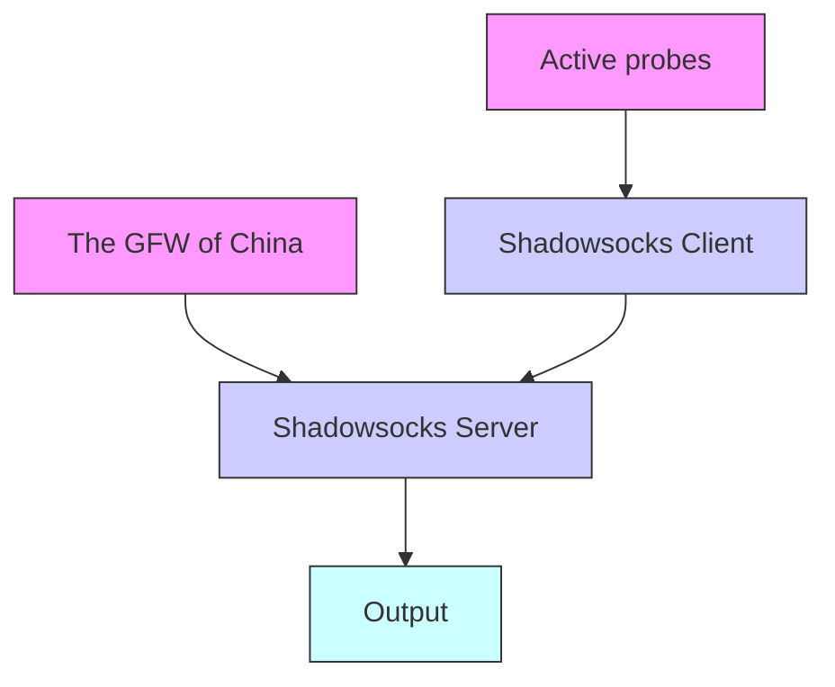

# How China Detects and Blocks Shadowsocks

Alice

GFW Report

gfw.report+alice@protonmail.com

Bob

GFW Report

gfw.report+bob@protonmail.com

Carol

GFW Report

gfw.report+carol@protonmail.com

Jan Beznazwy

Independent consultant

beznazwy@bamsoftware.com

Amir Houmansadr

University of Massachusetts Amherst

amir@cs.umass.edu

## ABSTRACT

Shadowsocks is one of the most popular circumvention tools in China. Since May 2019, there have been numerous anecdotal reports of the blocking of Shadowsocks from Chinese users. In this study, we reveal how the Great Firewall of China (GFW) detects and blocks Shadowsocks and its variants. Using measurement experiments, we find that the GFW uses the length and entropy of the first data packet in each connection to identify probable Shadowsocks traffic, then sends seven different types of active probes, in different stages, to the corresponding servers to test whether its guess is correct.

We developed a prober simulator to analyze the effect of different types of probes on various Shadowsocks implementations, and used it to infer what vulnerabilities are exploited by the censor. We fingerprinted the probers and found differences relative to previous work on active probing. A network-level side channel reveals that the probers, which use thousands of IP addresses, are likely controlled by a set of centralized structures.

Based on our gained understanding, we present a temporary workaround that successfully mitigates the traffic analysis attack by the GFW. We further discuss essential strategies to defend against active probing. We responsibly disclosed our findings and suggestions to Shadowsocks developers, which has led to more censorshipresistant tools.

## CCS CONCEPTS

• Social and professional topics → Censoring filters.

## KEYWORDS

Shadowsocks, Great Firewall of China, active probing, censorship circumvention

## ACM Reference Format:

Alice, Bob, Carol, Jan Beznazwy, and Amir Houmansadr. 2020. How China Detects and Blocks Shadowsocks. In ACM Internet Measurement Conference (IMC ’20), October 27–29, 2020, Virtual Event, USA. ACM, New York, NY, USA, 14 pages. https://doi.org/10.1145/3419394.3423644

Permission to make digital or hard copies of all or part of this work for personal or classroom use is granted without fee provided that copies are not made or distributed for profit or commercial advantage and that copies bear this notice and the full citation on the first page. Copyrights for components of this work owned by others than the author(s) must be honored. Abstracting with credit is permitted. To copy otherwise, or republish, to post on servers or to redistribute to lists, requires prior specific permission and/or a fee. Request permissions from permissions@acm.org.

IMC ’20, October 27–29, 2020, Virtual Event, USA

© 2020 Copyright held by the owner/author(s). Publication rights licensed to ACM.

ACM ISBN 978-1-4503-8138-3/20/10. . . \$15.00

https://doi.org/10.1145/3419394.3423644

flowchart

Figure 1: How active probing works. A genuine Shadowsocks client connects to a Shadowsocks server; Once the GFW passively determines that the connection may be Shadowsocks, it directs its active probers to confirm this guess.

## 1 INTRODUCTION

Shadowsocks is a protocol for Internet censorship circumvention, especially popular in China. According to a research survey in July 2015, of 371 faculty members and students from Tsinghua University, 21% used Shadowsocks to bypass censorship in China [29, §4.1]. The popularity of Shadowsocks stems from its simplicity. Its lightweight design imposes minimal overhead on proxied traffic and makes it easy to implement on a variety of platforms. A large, profit-incentivized proxy reseller market, as well as numerous tutorials and one-click installation scripts, have reduced the difficulty of installing and using Shadowsocks, and made it popular even among non-technical users.

Since as early as October 2017, users in China have reported their Shadowsocks servers becoming unreliable or being blocked by the Great Firewall (GFW), especially during politically sensitive times [21]. The most recent such event happened in mid-September 2019, with Shadowsocks users reporting a sudden increase in blocking [17]. Section 2.2 summarizes past blocking events. Despite the anecdotal evidence that the GFW is capable of detecting and blocking Shadowsocks servers, little is known about how the GFW actually does it. The importance of Shadowsocks in censorship circumvention, and the mysterious behavior of the GFW, motivate us to explore and understand the underlying mechanisms of detection and blocking.

Our systematic study finds that the GFW has started to identify Shadowsocks servers using a combination of passive traffic analysis and active probing. Figure 1 illustrates the general notion: the GFW first detects suspected Shadowsocks traffic, using features like the size and entropy of the first data packet in each connection. Once a server falls under suspicion, the GFW sends active probes to it, in different stages, to confirm whether the server really is Shadowsocks. The probes are partial replays of past legitimate connections, and random probes of varied lengths. We suspect that the probes are designed to attack detection vulnerabilities in different implementations of Shadowsocks. The GFW has been known to use active probing against various circumvention tools since as long ago as 2011 [14], but the techniques now in use against Shadowsocks are new and more sophisticated than what has previously been reported.

In summary, our work makes the following contributions:

• We reveal and systematically study the GFW’s latest secret weapon against Shadowsocks.  
• We identify and fingerprint different types of active probes, and infer the probable intention behind them.  
• We derive a more realistic adversary model of replay attacks.  
• We introduce a temporary but effective mitigation against the detection, and provide suggestions for defending against active probing.  
• We have collaborated with the developers of different Shadowsocks implementations to make Shadowsocks more resistant to active-detection attacks.

## 2 BACKGROUND ON SHADOWSOCKS

Shadowsocks is an encrypted proxy protocol. It attempts to avoid detection not by imitating some other protocol, but by using encryption to appear as a uniformly random byte stream. There are two components: client and server. The server is typically installed on some network outside the censor’s control. The client sends an encrypted target specification to the server. The server then connects to the target and begins proxying traffic for the client. All traffic between the client and the server is encrypted.

It will be important to know a few details of how Shadowsocks encryption works, in order to appreciate the construction of the probes described in Section 3.2. Shadowsocks specifies two main classes of cryptographic constructions, known in the context of the protocol as “stream ciphers” and “AEAD ciphers” [46]. The stream cipher construction is cryptographically weak—it provides only confidentiality, not integrity or authentication, and for that reason is deprecated. The AEAD cipher construction (authenticated encryption with associated data) was developed to fix the flaws of the stream cipher construction, and provides confidentiality, integrity, and authentication. Both constructions are keyed by a master password that client and server share, and both intend to require the client to demonstrate knowledge of the shared password before using the proxy server (though as we will see, with stream ciphers the requirement is loose).

With stream ciphers, the network stream in both directions is one long ciphertext, preceded by a random initialization vector:

$[ \mathsf { v a r i a b l e - l e n g t h ~ I V } ] [ \mathsf { e n c r y p t e d ~ p a y l o a d . . . } ]$

Table 1: Timeline of all major experiments. The three set of experiments span weeks and months. Shadowsocks, Sink and Brdgrd refer to the experiments in Section 3.1, Section 4.1 and Section 7.1 respectively.

<table><tr><td>Experiment</td><td>Time span</td></tr><tr><td>Shadowsocks</td><td>Sept 29, 2019 – Jan 21, 2020 (4 months)</td></tr><tr><td>Sink</td><td>May 16 – 31, 2020 (2 weeks)</td></tr><tr><td>Brdgrd</td><td>Nov 2 – 19, 2019 (403 hours)</td></tr></table>

Client and server use the same encryption key, but different initialization vectors. The length of the initialization vector may be 8, 12, or 16 bytes, depending on what cipher is configured.

With AEAD ciphers, the network stream is a sequence of lengthprefixed chunks, each encrypted and authenticated with an AEAD tag. To avoid introducing any plaintext for the censor to match on, the length prefixes are themselves encrypted and tagged.

[variable-length salt]

[2-byte encrypted length][16-byte length tag]

[encrypted payload][16-byte payload tag]

[2-byte encrypted length][16-byte length tag]

[encrypted payload][16-byte payload tag]

The entire stream is preceded by a salt, which is combined with the shared secret password to produce a session key for each direction. The salt may be 16, 24, or 32 bytes.

In both constructions, the first piece of data the client sends through the tunnel is a host:port target specification, whose structure is borrowed from the SOCKS proxy protocol. The first byte is an address type that indicates the format of the bytes that follow. The three address types are:

[0x01][4-byte IPv4 address][2-byte port]

[0x03][1-byte length][hostname][2-byte port]

[0x04][16-byte IPv6 address][2-byte port]

There are many implementations of Shadowsocks [22, 25, 41, 44, 45, 47], and they differ in what features they support. Not every implementation supports every possible cryptographic construction; for example, OutlineVPN [25] supports AEAD ciphers only, not stream ciphers. Some implementations take steps to mitigate replay attacks, and some do not. This means that a probing adversary may encounter different reactions to probes, depending on what implementation of Shadowsocks is in use. In this work, we focus on two of the more popular implementations, Shadowsocks-libev [45] and OutlineVPN [25], but the vulnerabilities we describe may also apply to other implementations.

## 2.1 Historical Vulnerabilities and Defenses

In August 2015, BreakWa11 discovered an active-probing vulnerability in Shadowsocks stream ciphers, resulting from their lack of integrity protection [8, 15]. An attacker can make many connections to a suspected Shadowsocks server, and take advantage of ciphertext malleability to try every possible value of the byte that corresponds to the address type in the target specification. Because only 0x01, 0x03, and 0x04 are valid address types, a known fraction of connections will time out differently from the rest. Shadowsocks developers mitigated the vulnerability by having the server not immediately terminate a connection when a target specification contains an unknown address type [30].

Shadowsocks developers attempted to further mitigate the problem by introducing a “one time auth” mode, in which each chunk of data would carry its own authenticator. But a lack of integrity protection in chunk length prefixes led to another active probing vulnerability [15, 37]. In February 2017, AEAD ciphers became part of the protocol specification, fixing this authentication problem.

In February 2020, Zhiniang Peng disclosed a devastating vulnerability in Shadowsocks stream ciphers [16, 36]. Using the Shadowsocks server as a decryption oracle, an attacker, without knowledge of the shared master password, can get full decryption of recorded Shadowsocks connections.

## 2.2 Past Blocking of Shadowsocks

Since as early as October 2017, Internet users in China have reported their Shadowsocks servers being blocked, by port or IP address [21, 38, 42]. Notable blocking events were reported in October 2017 and January 2018, at the same time as two important political congresses in China [21]. After the two congresses, many users reported their servers got unblocked. Contrary evidence comes from Wiley et al., who during those times were testing Shadowsocks reachability every day from locations around the world, but reported not having seen any evidence of Shadowsocks blocking anywhere [53].

The reported large-scale blockings mostly happened during politically sensitive times, including during the 30th anniversary of the 1989 Tiananmen Square protests, the 70th anniversary of the People’s Republic of China, and the 4th Plenary Session of the 19th Central Committee of the Communist Party of China. The most recent spate of reports began around September 16, 2019 [17].

## 3 CHARACTERIZATION OF PROBES AND THE PROBING INFRASTRUCTURE

Here we describe the experiments we conducted to collect and understand the GFW’s active probes. Based on a collection of 51,837 active probes observed in a number of experiments, we answer the following questions:

• What types of probes are observed, and under what conditions?  
• Where do the probes come from?  
• Do the probes have any “fingerprints” that reveal information about the underlying probing infrastructure?  
• How long is the delay between a legitimate connection and the probes that react to it?

## 3.1 Shadowsocks Server Experiment

We set up our own Shadowsocks servers and attempted to provoke the GFW into probing them. To do this, we connected to our servers using Shadowsocks clients, and sent HTTP and HTTPS traffic through the encrypted proxy tunnel, using web browsers and curl as automated drivers. We captured packets at both ends for analysis. We used unmodified clients and servers in all our experiments, did not create any special firewall rules, and did not install any obfuscation plugins. As summarized in Table 1, the experiments were conducted over four months, from September 29, 2019 to January 21, 2020.

bar chart

| Probe length (bytes) | Count |
| --------------------- | ----- |
| 8                     | 35    |
| 12                    | 45    |
| 16                    | 38    |
| 22                    | 37    |
| 33                    | 38    |
| 41                    | 36    |
| 49                    | 40    |
| 221                   | 2300  |

Figure 2: Number of occurrences of random probes (type NR1 and type NR2) by length. Note the two different vertical axes. The lengths of type NR1 probes are evenly distributed in trios (?? − 1, ??, ?? + 1) for ?? = 8, 12, 16, 22, 33, 41, 49. Type NR2 probes have length 221 and are roughly three times as common as all the NR1 probes together.

Because we could not know in advance what features the GFW might use to identify Shadowsocks, we maximized our coverage by using different Shadowsocks implementations and versions, and by selecting different encryption algorithms. The two implementations we used were Shadowsocks-libev [45] and OutlineVPN [25].

Shadowsocks-libev. We installed Shadowsocks-libev clients on five VPSes in a Tencent Cloud Beijing datacenter, and Shadowsockslibev servers on five VPSes in a Digital Ocean UK datacenter. Each client was configured to connect to only one of the servers. Two pairs of the clients and servers used v3.1.3 of Shadowsocks-libev, and the other three pairs used v3.3.1. As a control, we set up an additional VPS within the same UK datacenter and never connected to it, only capturing all incoming traffic.

We generated client traffic using curl. Through the Shadowsocks proxy, we constantly fetched one of the websites at a given frequency: https://www.wikipedia.org, http://example.com, and https://gfw.report.

OutlineVPN. We installed an OutlineVPN v1.0.7 server in a US university network. The OutlineVPN client we used was the latest as of October 2019. The client was in a residential network in China. Client traffic was provided by an instance of Firefox, configured to automatically browse a subset of the Alexa top 1 million sites that is censored in China.

Limitations. The locations of our vantage points lack some diversity, making us less likely to observe any potential inconsistencies in the probing system caused by geolocation.

## 3.2 Probe Types

We analyzed all connections to the server port running Shadowsocks, and used the traffic received by the control host to verify that the probes we observed were triggered by our own connections, and not the result of “background radiation” Internet scans. We observed a total of 51,837 active probes across all experiments. We arrange the probes into two main categories, replay-based and seemingly random, with a further distinction of probe types within each category. The first category of probes, replay-based, have a payload that is derived from the first data-carrying packet of some previously recorded legitimate connection. We assign the probe types in this category names beginning with ‘R’, for “replay”:

line chart

| Number of probes sent from one IP address | Count of IP addresses |
| ----------------------------------------- | --------------------- |
| 0                                         | 0                     |
| 1                                         | 2500                  |
| 2                                         | 5000                  |
| 3                                         | 7500                  |
| 4                                         | 9000                  |
| 5                                         | 10000                 |
| 6                                         | 11000                 |
| 7                                         | 11500                 |
| 8                                         | 12000                 |
| 9                                         | 12200                 |
| 10                                        | 12300                 |
| 15                                        | 12300                 |
| 20                                        | 12300                 |
| 25                                        | 12300                 |
| 30                                        | 12300                 |
| 35                                        | 12300                 |
| 40                                        | 12300                 |
| 45                                        | 12300                 |

Figure 3: Cumulative number of probes per prober IP address.

Type R1 Identical replay.

Type R2 Replay with byte 0 changed.

Type R3 Replay with bytes 0–7 and 62–63 changed.

Type R4 Replay with byte 16 changed.

Type R5 Replay with bytes 6 and 16 changed.

Probe types R3, R4, and R5 were received only in the OutlineVPN experiment, not in the Shadowsocks-libev one. Only two type R5 probes were received in our experiments.

The other category of probes, seemingly random, have varying lengths. Their contents that do not resemble a prior legitimate connection in any way we can identify. We give probe types in this category names starting with ‘NR’, for “non-replay”:

Type NR1 Probes of length 7–9, 11–13, 15–17, 21–23,

32–24, 40–42, or 48–50 bytes.

Type NR2 Probes of length exactly 221 bytes.

Figure 2 illustrates the distribution of type NR1 and NR2 probes. The lengths of NR1 probes are distributed in trios centered on 8, 12, 16, 22, 33, 41, and 49 bytes. We will have more to say about this distribution in Section 5.2.

## 3.3 Origin of the Probers

A simple idea to defend against active probing is to discover the IP addresses of probers, and ban them. Below, we show it may be challenging to implement such a defense, because the GFW probes from a large and diverse pool of IP addresses, with high churn.

IP addresses. The 51,837 active probes were sent from 12,300 unique source IP addresses, all located in China. Figure 3 shows the distribution of the number of probes sent per unique IP address. In contrast to previous work, which found that “95% of the addresses appear only once” [14, §5.3], in our tests more than 75% of addresses sent more than one probe. The most common prober IP addresses are summarized Table 2.

Table 2: The most common prober IP addresses and their number of occurrences.

<table><tr><td>Prober IP address</td><td>Count</td></tr><tr><td>175.42.1.21</td><td>44</td></tr><tr><td>223.166.74.207</td><td>38</td></tr><tr><td>124.235.138.113</td><td>36</td></tr><tr><td>113.128.105.20</td><td>36</td></tr><tr><td>221.213.75.88</td><td>33</td></tr><tr><td>112.80.138.231</td><td>32</td></tr><tr><td>116.252.2.39</td><td>32</td></tr><tr><td>124.235.138.231</td><td>32</td></tr><tr><td>221.213.75.126</td><td>32</td></tr><tr><td>223.166.74.110</td><td>31</td></tr></table>

venn diagram

| Category | Count |
| -------- | ----- |
| Shadowsocks active probes | 12128 |
| Tor active probes (Dunna et al.) | 895 |
| Active probes (Ensafi et al.) | 21721 |
| Intersection (Total) | 5 |
| Intersection (Total) | 34 |
| Intersection (Total) | 167 |

Figure 4: Overlap in prober source IP addresses across independently collected datasets.

Table 3: Counts of unique prober IP addresses per autonomous system, across all experiments.

<table><tr><td>AS4837</td><td>6262</td><td>AS58563</td><td>44</td></tr><tr><td>AS4134</td><td>5188</td><td>AS17638</td><td>17</td></tr><tr><td>AS17622</td><td>315</td><td>AS9808</td><td>2</td></tr><tr><td>AS17621</td><td>263</td><td>AS4812</td><td>1</td></tr><tr><td>AS17816</td><td>104</td><td>AS24400</td><td>1</td></tr><tr><td>AS4847</td><td>101</td><td>AS56046</td><td>1</td></tr><tr><td></td><td></td><td>AS56047</td><td>1</td></tr></table>

We compared our list of prober IP addresses against 934 that were observed to send active probes to Tor servers in 2018 by Dunna et al. [13], and 22,000 that were observed to send various types of active probes between 2010 and 2015 by Ensafi et al. [14]. Figure 4 shows that three sets overlap only slightly. We note the IP address 202.108.181.70, which was responsible for an inordinate number of probes in previous work [14, §5.3], does not appear in our data. The small overlap is not unexpected, given that past work has observed high churn in prober IP addresses.

line chart

| TCP source port of prober SYN packets | Percentage |
| ------------------------------------- | ---------- |
| Lowest observed: 1212                 | 0%         |
| Highest observed: 65237              | 100%       |
| Common Linux source ports           | 32768–60999 |

Figure 5: CDF of TCP source port numbers of probes in one experiment, including 1,576 probes.

Autonomous systems. The autonomous system (AS) distribution of probers is shown in Table 3. The two ASes that account for the most Shadowsocks probes are AS4837 (CHINA169-BACKBONE CNCGROUP China169 Backbone) and AS4134 (CHINANET-BACK-BONE No.31, Jin-rong Street). These two were the most common in previous work [14, 56] as well. Other ASes that overlap with previous work are AS17816, AS9808, AS56046, AS17638, AS56047, and AS17622. AS17622 (CNCGROUP-GZ China Unicom Guangzhou network) accounts for a much larger fraction of probes than in previous work [14, Figure 7]. Other previously attested ASes do not appear in our data, including AS7497 (CSTNET-AS-AP Computer Network Information Center), which was the third most common source of probes seen by Ensafi et al [14]. There are also ASes in our dataset that have not been previously documented as being a source of active probes.

## 3.4 Fingerprinting the Probes

As in previous work, we fingerprint the packet-level features of active probes. At the IP layer, we examine the ID and TTL fields. At the TCP layer, we look at source ports and timestamps.

IP ID and TTL. We fingerprint the IP ID and TTL of PSH/ACK packets sent by the probers. As in Ensafi et al. [14, §5.5], we find no clear pattern in the IP ID sequences, and that TTLs remain within the range 46–50.

TCP source ports. Around 90% of probes came from source ports in the range 32768–60999. This range, highlighted in Figure 5, happens to be the default source port range of many Linux kernels. Probes never used a source port below 1024 (the precise minimum we saw in one experiment was 1212). These result differ from those of previous work [14, §5.5], which observed all ports being used, and no range of ports being more common than any other.

TCP timestamp (TSval). The TCP timestamp is a 32-bit counter that increases at a fixed rate, attached to every non-RST TCP segment [7, §3]. It is not an absolute timestamp, but is relative to how and when the counter was initialized, and its rate of increase varies across operating systems. Figure 6 shows the timestamp value attached to the SYN segment of each probe. The figure shows that although the probers use thousands of source IP addresses, they cannot be fully independent, because they share a small number of TCP timestamp sequences. In this case, there are at least seven different physical systems or processes, with one of the seven accounting for the great majority of probes. We say “at least” seven because we would not be able to distinguish two processes whose TSvals sequences are very close (which could happen, for example, if both processes were restarted at about the same time). We measured the slope of the linear sequences to be almost exactly 250 Hz, with the exception of one small cluster of 22 closely spaced points whose slope is closer to 1000 Hz. There are two cases where a sequence reached the maximum value of $2 ^ { 3 2 } - 1$ and wrapped around to 0. Compare Figure 6 to Figure 11(c) of Ensafi et al. [14], which also shows 250 Hz and 1000 Hz sequences.

line chart

| Date     | Identical replay (R1) | Byte-changed replay (R2-R5) | Non-replay (NR1-NR2) |
| -------- | --------------------- | --------------------------- | --------------------- |
| Oct 27   | ~2^31                 | ~2^31                       | ~2^31                 |
| Nov 03   | ~2^31                 | ~2^31                       | ~2^31                 |
| Nov 10   | ~2^31                 | ~2^31                       | ~2^31                 |
| Nov 17   | ~2^31                 | ~2^31                       | ~2^31                 |

Figure 6: Non-independent processes revealed by common TCP timestamp sequences. The labeled marker lines have slopes of precisely 250 Hz and 1000 Hz. The small cluster of 22 non-replay probes on the 1000 Hz line locally have a slope of 1009 Hz, but here the measurement is less certain because they span only about 3.5 s. The 1000 Hz line does not become 250 Hz, even if connected to one of the sparse non-replay data points at the left edge of the figure.

## 3.5 Delay of Replay Attacks

The GFW may record the first data-carrying packet of a genuine client connection and replay it later, possibly with modifications, as an active probe. Figure 7 shows the variability in delay between when a legitimate connection is made and when the GFW sends replay-based probes derived from that connection. Because probe payloads may be replayed more than once (up to 47 times, in one case), we present two distributions, with and without repeated payloads. The orange line represents the delay of the first occurrence of each replay-based probe payload, while the blue line shows the delay of all replay-based probes, including repeated payloads. The total number of probes is 3,269 for first occurrences and 11,137 for all occurrences.

More than 20% of first replays arrived within one second; more than 50% within one minute; and more than 75% within 15 minutes. Replay-based probes may be sent almost immediately, or may be stored for a surprisingly long time before being sent. The shortest delay we observed was 0.28 seconds and the longest was 570 hours.

line chart

| Delay until replay of legitimate connection (seconds) | First replay | All replays |
| ----------------------------------------------------- | ------------ | ----------- |
| 1 second                                             | ~25%         | ~5%         |
| 1 minute                                             | ~50%         | ~20%        |
| 15 minutes                                           | ~70%         | ~40%        |
| 1 hour                                               | ~100%        | ~80%        |
| 10 hours                                             | ~100%        | ~95%        |
| Maximum delay: 569.55 h                     | ~100%        | ~100%       |

Figure 7: CDF of the delay of replay-based probes. Note the logarithmic ??-axis.

## 4 WHAT TRIGGERS ACTIVE PROBING

There are alternative hypotheses for how the GFW might go about discovering Shadowsocks servers. One is large-scale, proactive port scanning; another is reactive probing triggered by legitimate connections. The fact that the unused control host in the previous section did not receive any active probes leads us to discard the proactive scanning hypothesis. Instead, we assume that probes are sent only when the probing system sees a suspected Shadowsocks connection.

What, then, constitutes a suspected Shadowsocks connection, from the GFW’s point of view? In this section, we deal with the following questions:

• How much traffic is required to trigger active probes?  
• Why were type R3, type R4 and type R5 probes sent only to the OutlineVPN server, not the Shadowsocks-libev server?  
• Does the GFW consider the length of packets?  
• Does the GFW consider the entropy of packet payloads?  
• Do outside-to-inside connections (with the client outside China and the server inside) result in as much active probing as inside-to-outside connections?

## 4.1 Experiments

A convincing way to show what features the GFW uses for traffic analysis is to outline a minimal, reproducible set of conditions that trigger active probing. Accomplishing this is, unsurprisingly, the most challenging part of this work, as it requires us to isolate a small number of features that the GFW really uses, from countless possibilities.

We are aided by two observations. First, the byte streams sent between Shadowsocks clients and servers are, by design, indistinguishable from random. This means that it may not be necessary to use a real client Shadowsocks implementation; we may be able trigger active probes by sending random data. Second, as described in Section 3.5, replay probes may be sent as soon as 0.28 seconds after a legitimate data packet. The GFW could have seen only the very beginning of a client-to-server flow, before deciding that the traffic was suspicious.

Table 4: Summary of random-data experiments. [??, ??] means the value is uniformly and randomly sampled from a range, independently for each connection. In Exp 1, the server was switched from sink mode to responding mode after 310 hours; we label the two subexperiments 1.a and 1.b.

<table><tr><td rowspan="2">Exp #</td><td colspan="2">Client</td><td rowspan="2">Server Mode</td></tr><tr><td>Length (bytes)</td><td>Entropy</td></tr><tr><td>1.a</td><td>[1, 1000]</td><td>&gt;7</td><td>sink</td></tr><tr><td>1.b</td><td>[1, 1000]</td><td>&gt;7</td><td>responding</td></tr><tr><td>2</td><td>[1, 1000]</td><td>&lt;2</td><td>sink</td></tr><tr><td>3</td><td>[1, 2000]</td><td>[0, 8]</td><td>sink</td></tr></table>

Guided by these two observations, we implemented a TCP client that connects to a TCP server and sends one data packet, with a specified length and Shannon entropy. We implemented a server with two operating modes: sink mode and responding mode. In sink mode, the server accepts TCP connections, but does not respond with any data, and closes connections after 30 seconds. In responding mode, the server responds to probers—but not our own clients—with between 1 and 1000 bytes of random data.

Table 4 summarizes the design of the random-data experiments. Table 1 shows the time span of the experiment. Clients ran on different VPSes within the same Tencent datacenter in Beijing. All servers ran in the same Digital Ocean datacenter in the US. Client and server IP addresses were not reused across experiments.

## 4.2 Experiment Results and Analysis

Little traffic is required to trigger active probes. Our sink server, despite not being a real Shadowsocks server and never sending data, received many of the same types of probes as in the Shadowsocks server experiment of Section 3.1. After a TCP handshake, a single data packet from client to server suffices to trigger active probes.

Only certain lengths are replayed. Although our clients sent data packets with lengths of between 1 and 2000 bytes, virtually all probes that were determined to be replays had a payload length of between 160 and 700 bytes, with the maximum length being 999 bytes. Figure 8 shows the distribution of probe lengths in Exp 1.a. The distribution of lengths exhibits a stair-step pattern, reflecting the fact that certain lengths are more likely to be replayed. Namely, the lengths of replay probes tend to have certain remainders when divided by 16. Considering type R1 probes (type R2 is similar), of the 376 probes whose length is in the interval 168–263 bytes, 72% have a length whose remainder when divided by 16 is 9; of 1,558 in the interval 384–687, 96% have a length whose remainder is 2; and of 749 in the middle interval 264–383, there is a mix of remainders 9 (37%) and 2 (32%). The results suggest that the GFW considers packet lengths in classifying Shadowsocks traffic. Packet length is a reasonable feature to use, because Shadowsocks does not pad the contents of the tunnel, only incidentally changing the underlying packet length distribution by adding an address header prefix (see Section 2) and, with AEAD ciphers, length prefixes and tags. The payload length distribution of the Shadowsocks traffic therefore resembles that of the underlying traffic, which is often HTTP or TLS.

line chart

| Payload length (bytes) | Trigger connections | Identical replay (R1) | Byte-changed replay (R2-R5) | Non-replay (NR1-NR2) |
| ---------------------- | ------------------- | --------------------- | --------------------------- | --------------------- |
| 0                      | 0%                  | 0%                    | 0%                          | 0%                    |
| 200                    | 25%                 | 25%                   | 25%                         | 100%                  |
| 400                    | 50%                 | 50%                   | 50%                         | 50%                   |
| 600                    | 75%                 | 75%                   | 75%                         | 75%                   |
| 800                    | 90%                 | 90%                   | 90%                         | 90%                   |
| 1000                   | 100%                | 100%                  | 100%                        | 100%                  |

Figure 8: CDF of the payload lengths of replay-based probes over the 310 hours of Exp 1.a. The lengths of replay probes exhibit a stair-step pattern.

bar chart

| Shannon entropy of PSH/ACK packets | Identical replay (R1) | Byte-changed replay (R2-R5) |
| ----------------------------------- | --------------------- | -------------------------- |
| 0                                   | 0.07%                 | 0.04%                      |
| 1                                   | 0.08%                 | 0.07%                      |
| 2                                   | 0.05%                 | 0.03%                      |
| 3                                   | 0.04%                 | 0.02%                      |
| 4                                   | 0.10%                 | 0.06%                      |
| 5                                   | 0.09%                 | 0.04%                      |
| 6                                   | 0.12%                 | 0.05%                      |
| 7                                   | 0.22%                 | 0.11%                      |
| 8                                   | 0.18%                 | 0.08%                      |

Figure 9: Rate of replay-based probes per legitimate connection in Exp 3, according to per-byte entropy of the legitimate connection.

High-entropy packets are more likely to be replayed. Two pieces of evidence support this conclusion. First, Figure 9 shows that while packets of all entropies may be replayed, one with a high per-byte entropy of 7.2 is almost four times as likely to be replayed as one with a low entropy of 3.0. Second, Exp 1.a and Exp 2 differ only in the entropy of packets, and over the same period of time, the server in Exp 1.a received significantly more probes than the one in Exp 2.

Probes of type R3 and R4 are not sent unless the server has previously responded to probes of type R1 and R2. The thousands of probes received in Exp 1.a, Exp 2, and Exp 3 could all be classified as type R1, R2, or NR2. In other words, we were not able to trigger probes of types R3, R4, R5 or NR1 in these experiments. This result reminded us of the fact that in the experiment of Section 3.1, type R3, R4 and R5 probes were only ever received by OutlineVPN servers, and not by Shadowsocks-libev servers.

As will be expanded on in Section 5.3, one major difference between Shadowsocks-libev and the version of OutlineVPN we used is that Shadowsocks-libev has a filter to defend against replay attacks, and OutlineVPN does not. (At least in the version we used— OutlineVPN has since added replay protection [26].) For this reason, Shadowsocks-libev servers does not respond to exact replays of earlier connections, while OutlineVPN servers do.

We therefore hypothesize that the GFW does not send probes of type R3, R4, and R5 unless the server has already responded to probes of type R1 and R2. We switched the server in Exp 1.a to responding mode after 310 hours of operating in sink mode. Soon after the server started responding to type R1 and type R2 probes, it began to receive a large number of type R3 and type R4 probes. The server continued to receive type R1 and R2 probes as well.

These results suggest that the active probing system operates in stages. It does not move on to the next stage until a certain condition is observed. This implementation detail suggests that the censor may have designed its active probing system with not only Shadowsocks in mind. Other, similarly behaving protocols may also be targeted.

We do not know why type R5 and type NR1 probes did not appear in any of our four random-data experiments.

New probe types observed. The sink/responding servers received probes that did not match the probe types seen in our earlier experiment with Shadowsocks-libev and OutlineVPN. In Exp 1.b, we saw 11 replay-based probes that had bytes from 16 to 32 changed. We additionally saw many non-replay probes across all four experiments. In total, there were 9 probes of 53 bytes, 5 probes of 56 bytes, 3 probes of 169 bytes, 1 probe of 180 bytes, and 1 probe of 402 bytes.

The GFW does not distinguish traffic directionality. We set up a Shadowsocks server inside China and made connections to it from outside. The traffic proxied was generated by automatically browsing a subset of Alexa top 1 million websites. The server received a large amount of active probing. This result indicates that the GFW probes suspected servers regardless of whether the server is inside or outside China. This bidirectional triggering behavior differs from Winter and Lindskog’s [56, §4.4] observation that outside-to-inside Tor connections did not trigger active probing. On the other hand, the GFW is known not to distinguish traffic directionality for many protocols, including DNS [1, §2], HTTP [11, §3] and TLS [9, §3.1]. The GFW’s sensitivity to directionality has even been known to change over time, as in the case of TLS ESNI blocking, which was bidirectional for two weeks before becoming unidirectional [6].

## 5 INTENTION BEHIND THE PROBES

As discussed in Section 3.2, we discovered seven distinct types of active probes to our Shadowsocks servers. A natural question is: what information can the GFW get from these probes? Unlike in previous work [14, 56], for us this question cannot be answered by a simple glance at the probes. We conjecture that if the probes elicit reactions from a Shadowsocks server that differ from the reactions of non-Shadowsocks servers, the GFW can be confident in classifying the server as Shadowsocks.

Therefore, understanding the effects of those probes on Shadowsocks servers is key. We developed our own prober simulator to observe how Shadowsocks servers react to probes like those sent by the GFW. We further checked the source code of Shadowsocks implementations to understand their internal logic. Based on this analysis, we formed conjectures regarding what distinguishable server reactions may be exploited for classification.

## 5.1 Prober Simulator Experiment

We developed a prober simulator that can send all seven types of probes to Shadowsocks servers, and record their reactions. The prober simulator allows us to test a wide range of Shadowsocks implementations, with different configurations, efficiently and lo cally. In addition, the prober simulator lets us cover implementation corner cases and reveal some fingerprintable features that may have not been exploited by the GFW.

Replay-based probes. To simulate replay-based probes, the simulator records the first data-carrying packet in a connection between a Shadowsocks client and server, then sends the data to the server in a separate connection. To send byte-changed probes, the simulator randomly changes certain bytes of the payload to different values.

Non-replay probes. To simulate non-replay probes, the simulator simply sends a specific number of random bytes. The justification here is that the servers’ reactions to the GFW’s non-replay probes are no different from their reaction to random probes. For comprehensiveness, we let the simulator send random probes with lengths of between 1 and 99 bytes, as well as probes of 221 bytes.

Choice of servers. We chose a set of Shadowsocks implementations that has significant coverage over the Shadowsocks circumvention ecosystem. Specifically, we tested the Shadowsocks implementations that met any of the following conditions: 1) is available in a repository of a major Linux distribution; 2) is available in the pip repository; 3) is the latest version; 4) is widely used by any popular one-click script; 5) has a recent fix to any distinguishable reactions as the result of a preliminary report on these attacks; or 6) was recommended to us by developers. Using this selection process, we chose Shadowsocks-libev (v3.0.8, v3.1.3, v3.2.5, v3.3.1, and v3.3.3) and OutlineVPN (v1.0.6, v1.0.7, and v1.0.8).

## 5.2 Intention Behind Random Probes

5.2.1 Servers’ reactions to random probes. Figure 10 summarizes the reactions of different Shadowsocks implementations to random probes of various lengths. For each implementation, we group their available encryption methods first by stream ciphers versus AEAD ciphers, then by the size of their initialization vector (IV) or salt. For example, among the stream ciphers supported by Shadowsockslibev are “aes-128-ctr” and “aes-256-cfb”. Both of these have a 16- byte IV, so we group them in the “16 bytes” row. Refer to Section 2 for the meaning of IV and salt in the context of Shadowsocks protocols.

Server reactions in Figure 10 are represented by the codes “TIME-OUT”, “RST”, and “FIN/ACK”. TIMEOUT means that the server waits for more data, until either it or the prober reaches a timeout. The GFW usually times out in less than 10 seconds, while the default timeout value for many Shadowsocks implementations is

60 seconds. Therefore, TIMEOUT typically means that the prober, and not the server, is the first to send a FIN/ACK to close the connection. FIN/ACK and RST mean that the server sends either a FIN/ACK or a RST immediately. The choice of FIN/ACK or RST may depend on OS-level socket handling. Frolov et al. showed [19, §IV.C] that when closing a socket on Linux, a FIN/ACK will be sent if the application has read all the data from its kernel socket buffer; otherwise a RST will be sent.

Figure 10 demonstrates that different implementations using different forms of encryption have fingerprintable reactions to probes of varying lengths. Below we discuss how the GFW may exploit these reactions in each Shadowsocks implementation.

Shadowsocks-libev v3.0.8–v3.2.5 with stream ciphers. Take the first row in Figure 10a as an example. Shadowsocks-libev v3.0.8–v3.2.5 servers with an 8-byte IV exhibit three reactions, depending on the length of the random probe. When the length of a probe is 1–8 bytes, the server always times out. This is because the server has only received a (partial) IV and is awaiting a target specification.

When the length of a probe is 9–14 bytes, the server usually sends an immediate RST, because it has not received a complete target specification. The shortest random probe likely to decrypt to a meaningful specification is 15 bytes, which meets the minimal length requirement of a complete IPv4 specification (see Section 2). A hostname specification could be slightly shorter than 15 bytes, but only if the 1-byte hostname length field happens to decrypt to the value 1 or 2.

When the length of a probe is 15 or more bytes, the server may have any of the three possible reactions: RST, TIMEOUT or FIN/ACK. The reaction depends on whether the random payload decrypts to a meaningful target specification. The first requirement for a meaningful target specification is that the address type must be one of the values 0x01, 0x03, or 0x04; any other value results in an immediate RST. Because the address type is a 1-byte field, we might expect to see an immediate RST in a $\textstyle 1 - { \frac { 3 } { 2 5 6 } }$ fraction of tests. What we actually see is a fraction closer to $1 - { \frac { 3 } { 1 6 } }$ . The reason for this is that Shadowsocks-libev masks out the upper 4 bits of the field (an artifact of the “one time auth” scheme mentioned in Section 2.1). The probability of a RST reaction decreases with longer probes, because longer probes are more likely to contain a complete IPv6 address specification, or a hostname length that is consistent with the packet length.

Upon receiving a complete target specification, the Shadowsocks server tries to connect to the given target. Specifically, when the address type field decrypts to 0x04, the server tries to resolve the hostname; when the address type is 0x01 or 0x03, the server sends a SYN packet to the target’s IP address and port. Since this behavior is a connection to an essentially random IP address or hostname, the connections almost always fail; and when that happens, the server sends a FIN/ACK to the client to close the connection. If the remote connection does not fail immediately (for instance, if the remote host does not respond and the Shadowsocks server spends time retransmitting SYN packets), the GFW’s probers will be the first to close the connection with a FIN/ACK.

Shadowsocks-libev v3.0.8–v3.2.5 with AEAD ciphers. With AEAD ciphers, servers have a different set of fingerprintable reactions. The first row in Figure 10b represents an AEAD cipher with a 16-byte salt. When the probe length is less than or equal to 50 bytes, the server times out waiting for more data. It wants there to be at least enough data for the salt (16 bytes), encrypted length prefix (2 bytes), encrypted length tag (16 bytes), and another tag (16 bytes) for the first encrypted data payload. Once 51 bytes or more are received, the server tries to decrypt the data received, which invariably fails with an authentication error. (Unlike with stream ciphers, where random data may by chance decrypt to something meaningful, with AEAD ciphers, the probability of that happening is negligible.) The server sends out an immediate RST because of the authentication error.

bar chart

<fcel>Implementation<fcel>Salt Length (Bytes)<fcel>Probe Length (Bytes)<lcel><lcel><lcel><lcel><lcel><lcel><lcel><lcel><lcel><lcel><lcel><lcel><lcel><lcel><lcel><lcel><lcel><lcel><lcel><lcel><lcel><lcel><lcel><lcel><lcel><lcel><lcel><lcel><lcel><lcel><lcel><lcel><lcel><lcel><lcel><nl><ucel><ucel><fcel>1<fcel>...<fcel>6<fcel>7<fcel>8<fcel>9<fcel>10<fcel>11<fcel>12<fcel>13<fcel>14<fcel>15<fcel>16<fcel>17<fcel>18<fcel>19<fcel>20<fcel>21<fcel>22<fcel>23<fcel>24<fcel>...<fcel>31<fcel>32<fcel>33<fcel>34<fcel>35<fcel>...<fcel>39<fcel>40<fcel>41<fcel>42<fcel>43<fcel>...<fcel>47<fcel>48<fcel>49<fcel>50<fcel>51<fcel>...<fcel>221<nl><fcel>SS-libev v3.0.8-v3.2.5<fcel>8<fcel>TIMEOUT<lcel><lcel><lcel><lcel><fcel>RST<lcel><lcel><lcel><lcel><lcel><ecel><lcel><lcel><lcel><lcel><lcel><lcel><lcel><lcel><lcel><lcel><fcel>RST (above 13/16) or TIMEOUT (below 3/16) or FIN/ACK (below 3/16)<lcel><lcel><lcel><lcel><lcel><lcel><lcel><lcel><lcel><lcel><lcel><lcel><nl><ucel><fcel>12<fcel>TIMEOUT<lcel><lcel><lcel><lcel><lcel><lcel><lcel><lcel><fcel>RST<lcel><lcel><lcel><lcel><ecel><lcel><lcel><lcel><lcel><lcel><lcel><lcel><fcel>RST (above 13/16) or TIMEOUT (below 3/16) or FIN/ACK (below 3/16)<lcel><lcel><lcel><lcel><lcel><lcel><lcel><lcel><lcel><lcel><lcel><nl><ucel><fcel>16<fcel>TIMEOUT<lcel><lcel><lcel><lcel><lcel><lcel><lcel><lcel><lcel><lcel><ecel><ecel><ecel><ecel><ecel><ecel><ecel><ecel><ecel><ecel><ecel><ecel><ecel><ecel><ecel><ecel><ecel><ecel><ecel><ecel><ecel><ecel><ecel><ecel><ecel><nl><fcel>SS-libev v3.3.1-v3.3.3<fcel>8<fcel>TIMEOUT<lcel><lcel><lcel><lcel><lcel><lcel><lcel><lcel><ecel><ecel><ecel><ecel><ecel><ecel><ecel><ecel><ecel><ecel><ecel><ecel><ecel><ecel><ecel><ecel><ecel><ecel><ecel><ecel><ecel><ecel><ecel><ecel><ecel><ecel><ecel><nl><ucel><fcel>12<fcel>TIMEOUT<lcel><lcel><lcel><lcel><lcel><lcel><lcel><lcel><ecel><ecel><ecel><ecel><ecel><ecel><ecel><ecel><ecel><ecel><ecel><ecel><ecel><ecel><ecel><ecel><ecel><ecel><ecel><ecel><ecel><ecel><ecel><ecel><ecel><ecel><ecel><nl><ucel><fcel>16<fcel>TIMEOUT<lcel><lcel><lcel><lcel><lcel><lcel><lcel><lcel><ecel><ecel><ecel><ecel><ecel><ecel><ecel><ecel><ecel><ecel><ecel><ecel><ecel><ecel><ecel><ecel><ecel><ecel><ecel><ecel><ecel><ecel><ecel><ecel><ecel><ecel><ecel><nl>

(a) Stream ciphers  

table

Implementation
| Implementation | Salt Length (Bytes) | Probe Length (Bytes)<lcel><lcel><lcel><lcel><lcel><lcel><lcel><lcel><lcel><lcel><lcel><lcel><lcel><lcel><lcel><lcel><lcel><lcel><lcel><lcel><lcel><lcel><lcel><lcel><lcel><lcel><lcel><lcel><nl><ucel><ucel><fcel>1<fcel>...<fcel>47<fcel>48<fcel>49<fcel>50<fcel>51<fcel>52<fcel>53<fcel>54<fcel>55<fcel>56<fcel>57<fcel>58<fcel>59<fcel>60<fcel>61<fcel>62<fcel>63<fcel>64<fcel>65<fcel>66<fcel>67<fcel>68<fcel>69<fcel>70<fcel>71<fcel>72<fcel>73<fcel>...<fcel>221<nl><fcel>SS-libev v3.0.8-v3.2.5<fcel>16<fcel>TIMEOUT<lcel><lcel><lcel><lcel><lcel><fcel>RST<lcel><lcel><lcel><lcel><lcel><lcel><lcel><lcel><lcel><lcel><lcel><lcel><lcel><lcel><lcel><lcel><lcel><lcel><lcel><lcel><lcel><lcel><lcel><nl><ucel><fcel>24<fcel>TIMEOUT<lcel><lcel><lcel><lcel><lcel><lcel><lcel><lcel><lcel><lcel><lcel><lcel><fcel>RST<lcel><lcel><lcel><lcel><lcel><lcel><lcel><lcel><lcel><lcel><lcel><lcel><lcel><lcel><lcel><nl><ucel><fcel>32<fcel>TIMEOUT<lcel><lcel><lcel><lcel><lcel><lcel><lcel><lcel><lcel><lcel><lcel><lcel><lcel><lcel><lcel><lcel><lcel><fcel>RST<lcel><lcel><lcel><lcel><lcel><lcel><lcel><lcel><lcel><nl><fcel>SS-libev v3.3.1-v3.3.3<fcel>16,24, or 32<fcel>TIMEOUT<lcel><lcel><lcel><lcel><lcel><lcel><lcel><lcel><lcel><lcel><lcel><lcel><lcel><lcel><lcel><lcel><lcel><lcel><lcel><lcel><lcel><lcel><lcel><lcel><lcel><lcel><nl><fcel>OutlineVPN v1.0.6<fcel>32<fcel>TIMEOUT<fcel>FIN/ACK<ecel><ecel><ecel><ecel><ecel><ecel><ecel><ecel><ecel><ecel><ecel><ecel><ecel><ecel><ecel><ecel><ecel><ecel><ecel><ecel><ecel><ecel><ecel><ecel><ecel><ecel><ecel><nl><fcel>OutlineVPN v1.0.7-v1.0.8<fcel>32<fcel>TIMEOUT<ecel><ecel><ecel><ecel><ecel><ecel><ecel><ecel><ecel><ecel><ecel><ecel><ecel><ecel><ecel><ecel><ecel><ecel><ecel><ecel><ecel><ecel><ecel><ecel><ecel><ecel><ecel><ecel><nl>

(b) AEAD ciphers  
Figure 10: Reactions of Shadowsocks servers to synthetic random probes with different lengths. Figure 10a is for servers using the stream ciphers construction and Figure 10b is for the AEAD ciphers construction. Payload lengths that the GFW has been observed to send are marked in red. “TIMEOUT” means the server waits until the prober or itself times out. “RST” means the server sends an immediate TCP RST. “FIN/ACK” means the server will be the first to send a FIN/ACK to close the connection.

Changes in Shadowsocks-libev v3.3.1–v3.3.3. The parsing logic for Shadowsocks-libev v3.3.1–v3.3.3 is very similar to what we just described above for Shadowsocks-libev v3.0.8–v3.2.5. The only difference, as shown in Figure 10b, is that the server always times out instead of sometimes sending an immediate RST [32].

OutlineVPN v1.0.6. OutlineVPN exclusively uses the AEAD cipher construction of Shadowsocks, and only with the “chacha20- ietf-poly1305” method, which has a 32-byte salt. In OutlineVPN v1.0.6, when the probe length is less than 50 bytes, the server times out. The server wants 50 bytes in order to parse the following structure:

[32-byte salt]

[2-byte encrypted length][16-byte length tag]

Unlike Shadowsocks-libev, the OutlineVPN server does not additionally wait for enough data for there to be a second tag. More uniquely, the OutlineVPN server sends a FIN/ACK immediately when it receives a probe of exactly 50 bytes. When the probe length is greater than 50 bytes, the server sends an immediate RST due to an authentication failure.

OutlineVPN v1.0.7–v1.0.8. Starting in OutlineVPN v1.0.7, the developers fixed the server’s distinguishable reactions [19, 48]. Like the newer versions of Shadowsocks-libev using AEAD ciphers, the server always times out, regardless of probe length.

5.2.2 How an attacker might use the information from random probes. We use the general term “attacker” instead of “GFW” in this section for two reasons. First, attacks may be performed not only by the GFW, but by any censor capable of observing Shadowsocks traffic. Second, due to the black-box nature of the GFW, we can only guess at its internal logic and cannot confirm our suspicions.

An attacker can identify a Shadowsocks server with high confidence using statistical analysis of its reactions to random probes. Specifically, an attacker can send a set of probes with varying lengths to the server and record its reactions. After collecting enough reactions, the attacker may perform a statistical analysis. A server whose reactions fit into one row of Figure 10 is then very likely to be a Shadowsocks server. The fact that the GFW needs only a single probe to detect and block a Tor server [56], but a set of several probes before blocking a Shadowsocks server, suggests that the GFW does some statistical analysis of this kind to detect Shadowsocks.

The attacker may even be able to infer the length of the IV in older Shadowsocks implementations. Furthermore, when the IV is inferred to be 12 bytes long, the attacker knows that the cipher used is “chacha20-ietf”, because that is the only supported cipher with a 12-byte IV [46, § Stream Cipher].

By similar reasoning, an attacker may be able to infer which Shadowsocks implementation is in use, and its approximate version. For example, whether an authentication error results in a RST or a TIMEOUT can be used to determine if the server is running an older or newer implementation [19]. Whether the probability of RST is

$\textstyle 1 - { \frac { 3 } { 2 5 6 } } \ \mathrm { o r } \ 1 - { \frac { 3 } { 1 6 } }$ determines whether the Shadowsocks implementation applies a mask to the address type field.

In practice, the GFW is observed to send a set of type NR1 and NR2 probes to the same server. Instead of sending the probes all at once, the GFW sends a few of them in each hour. We conjecture that the GFW does this in order to make the probes less noticeable and harder to fingerprint. A design like this also allows the GFW to use resources in a more balanced and efficient way.

The probe lengths that the GFW sends, marked in red in Figure 10, coincide with thresholds at which reactions change in certain Shadowsocks implementations. For example, a server that uses ciphers with 8-byte IVs will time out 8-byte probes, and immediately RST 9-byte probes. The GFW covers this transition point by sending probes of length 7, 8, and 9 bytes. However it is worth noting that type NR1 probes of length 32–34 bytes and 40–41 bytes, as well as type NR2 probes of length 221 bytes, do not coincide with any server thresholds. However, they may still be useful to identify Shadowsocks servers. Depending on implementation, these probes may be used to calculate the empirical probability for a server to send a RST. If the possibility is close to $1 - { \frac { 3 } { 2 5 6 } } \ \mathrm { o r } \ 1 - { \frac { 3 } { 1 6 } }$ , the attacker may infer that the Shadowsocks server uses stream ciphers.

## 5.3 Intention Behind Replay-based Probes

Servers’ reactions to replay-based probes. Table 5 summarizes various servers’ reactions to replay-based probes. This table only covers the case where replays are long enough to contain a complete target specification, because, in the absence of external traffic shaping, the genuine payloads on which the replays are based are always long enough to contain that information.

Implementations without a replay defense mechanism. The reaction of a server to type R1 identical replays depends on whether it has a replay defense mechanism or not. Servers without a replay defense mechanism, such as OutlineVPN v1.0.6–v1.0.8, respond to identical replay with a stream of data in one or many packets. As soon as a prober receives data, it ACKs the data and sends FIN/ACK to close the connection.

An adversary might even guess what protocol is being proxied, by checking if the length of the server’s responses are always the same for a given replayed payload. Although the responses of the Shadowsocks servers are encrypted, a consistent response length may suggest that the underlying message is an HTTP response or TLS ServerHello, for example.

A key observation is that the offsets of the bytes that change in probe types R2, R3 and R5 contain the IV or salt. This means that a Shadowsocks server’s reactions to these probes are no different from the random probes discussed in Section 5.2. Type R4 probes may be a chosen ciphertext attack, targeting Shadowsocks servers that use stream ciphers with a 16-byte IV. Comparing to probes of type R2, R3 and R5, which are also essentially chosen cipher attacks, type R4 is more fine-grained, because a censor can get the exact probability of each reaction by enumerating all 255 altered byte values.

Implementations with a replay defense mechanism. Even with a replay defense mechanism, the behaviors of a Shadowsocks implementation may be distinguishable. For example, Shadowsocks-libev implements its replay defense using a Bloom filter that remembers what IVs and salts have already been received [40].

Table 5: Servers’ reactions to identical replays (type R1) and byte-changed replays (types R2–R5) differ depending on replay detection and stream/AEAD ciphers. R: Reset, T: Timeout, F: FIN/ACK, D: Sending Data. Here we assume all replays are long enough to contain a complete IV and target specification.

<table><tr><td>Implementations</td><td>Encryption Mode</td><td>Identical Replay</td><td>Byte-changed Replay</td></tr><tr><td>Shadowsocks-libev</td><td>Stream</td><td>R</td><td>R/T/F</td></tr><tr><td>v3.0.8-v3.2.5</td><td>AEAD</td><td>R</td><td>R</td></tr><tr><td>Shadowsocks-libev</td><td>Stream</td><td>T</td><td>T/F</td></tr><tr><td>v3.3.1, v3.3.3</td><td>AEAD</td><td>T</td><td>T</td></tr><tr><td>OutlineVPN</td><td>AEAD</td><td>D</td><td>T</td></tr></table>

As shown in Table 5, when AEAD ciphers are used, servers’ reactions to identical and byte-changed replays are consistent. However, when stream ciphers are used, the servers’ reactions to identical and byte-changed replays are inconsistent. For identical replays, Shadowsocks-libev v3.0.8–v3.2.5 is guaranteed to send a RST immediately; while the same server receiving byte-changed replays will have one of three different reactions: Reset, Timeout, or FIN/ACK.

Furthermore, with stream ciphers, an attacker can detect whether a replay filter exists. For example, the attacker can send the same random probe to the server twice. If the first probe happens to cause an outgoing connection to some remote server, while the second probe is blocked by the replay filter, the difference in the timing of responses will tell the attacker that a replay filter is in place. Although we cannot confirm that this is the exact logic used by the GFW, we did observe that around 10% of type NR2 probes were sent to the same server more than once.

## 6 GFW’S BLOCKING MODULE

Since July 2019, we have been running experiments on 63 vantage points in China, the US, the UK, the Netherlands, and Singapore. Each vantage point was used either as a server or a client. We used various Shadowsocks implementations [25, 44, 45, 47] and settings. Interestingly, although many of our VPSes have been under intensive active probing, only three have been blocked. In this section, we analyze and speculate on the nature of the blocking and unblocking mechanism used by the GFW.

Block by port, or by IP address? The three blocked servers were not all blocked in the same way. Some were blocked by dropping all traffic from a specific server port (block by port), and some by dropping traffic from all ports (block by IP address). In either case, only the server-to-client direction was blocked. This method of unidirectional packet dropping, or null routing, is similar to the way GFW blocks Tor servers, as shown in previous work [56].

It may be reasonable, from the censor’s point of view, to block an entire IP address. The servers running Shadowsocks are usually dedicated solely to circumvention, and do not host other services that the censor cares to keep accessible, so there is little harm to the censor in blocking the server entirely.

When to unblock? GFW is known to probe blocked Tor servers every 12 hours, and unblock them when Tor no longer appears to be running [56]. In contrast, in our experiments, we saw no regular checks to see whether blocked servers were still running Shadowsocks. One of our servers became unblocked more than a week after being blocked. The server had continued to run Shadowsocks even after being blocked, and we observed no probes to the server before the GFW unblocked it. This may be because, as explained in Section 5.2, it takes more probes to confirm Shadowsocks than it does Tor, making post-block checks more expensive.

Why were our servers rarely blocked? While the fact that active probing happens is clear, it is still unclear to us how active probing relates to the blocking of Shadowsocks servers. Few of the servers that received probes were blocked. One of the servers that was blocked had operated for only around 15 minutes, and had not received nearly as many probes as other servers that did not get blocked.

We have two hypotheses attempting to explain this phenomenon. One is that the blocking of Shadowsocks is controlled by human factors. That is, the GFW may maintain a list of detected or suspected Shadowsocks servers, and it is up to a human decision whether the servers on the list should be blocked or not. This hypothesis would partially explain why more blocking has been reported during politically sensitive periods of time [17, 21].

Another hypothesis is that active probing is ineffective against the particular Shadowsocks implementations and versions that we used in most of our experiments. Indeed, all three servers that got blocked were running ShadowsocksR [47] or Shadowsockspython [44], which differ from the Shadowsocks-libev [45] and OutlineVPN [25] implementations we used in most of the experiments. However, numerous user reports suggest that Shadowsockslibev and OutlineVPN are not immune to being blocked, in general.

## 7 CIRCUMVENTION

The detection of Shadowsocks happens in two stages: 1) passive identification of suspected Shadowsocks connections, then 2) active probing of the server. Therefore, to avoid blocking, one can 1) evade the passive detector, or 2) respond to active probes in a way that does not result in blocking. Below, we introduce and discuss these two circumvention strategies. We have shared our findings and proposed defenses with the developers of Shadowsocks-libev and OutlineVPN, which has led to improvements to those tools (see Section 11).

## 7.1 Defense Against Traffic Analysis

Changing payload lengths in the client-to-server stream is effective. In Section 4.2, we showed that the GFW considers the length of the first data packet in a connection to identify Shadowsocks traffic. This finding suggests that we can mitigate the GFW’s traffic analysis attack by altering packet lengths.

Brdgrd [54] (bridge guard) is software that can be run on a Shadowsocks server that causes the client to break its Shadowsocks handshake into several smaller packets. Brdgrd was originally intended to disrupt the detection of Tor bridges by forcing the GFW to do complicated TCP reassembly [56], but here we take advantage of its ability to shape client packet sizes.

bar chart

| Relative time (hours) | Prober SYNs per hour |
| --------------------- | -------------------- |
| 0                     | 6                    |
| 10                    | 12                   |
| 20                    | 7                    |
| 30                    | 13                   |
| 40                    | 4                    |
| 50                    | 19                   |
| 60                    | 16                   |
| 70                    | 27                   |
| 80                    | 15                   |
| 90                    | 13                   |
| 100                   | 20                   |
| 110                   | 14                   |
| 120                   | 13                   |
| 130                   | 9                    |
| 140                   | 13                   |
| 150                   | 3                    |
| 160                   | 10                   |
| 170                   | 2                    |
| 180                   | 1                    |
| 190                   | 4                    |
| 200                   | 2                    |
| 210                   | 3                    |
| 220                   | 2                    |
| 230                   | 1                    |
| 240                   | 2                    |
| 250                   | 1                    |
| 260                   | 2                    |
| 270                   | 1                    |
| 280                   | 1                    |
| 290                   | 1                    |
| 300                   | 1                    |
| 310                   | 2                    |
| 320                   | 1                    |
| 330                   | 1                    |
| 340                   | 1                    |
| 350                   | 1                    |
| 360                   | 1                    |
| 370                   | 1                    |
| 380                   | 2                    |
| 390                   | 1                    |
| 400                   | 1                    |

Figure 11: The intensity of active probing diminishes when brdgrd is active.

As a test, we set up a Shadowsocks server and let a Shadowsocks client make 16 connections to it every 5 minutes. We enabled and disabled brdgrd at random times, and measured the rate of active probing under both conditions. Table 1 summarizes the time span of the experiment.

Figure 11 shows the number of probes received by the Shadowsocks server over time. It shows probing going to zero within a few hours of activating brdgrd. As soon as we disabled brdgrd again, active probing resumed. The second time we enabled brdgrd, probing completely stopped for around 40 hours, but later a few more probes arrived. Note that receiving a few active probes does not necessarily mean that changing packet sizes is ineffective, because the server still received a small number of probes even 50 hours after we deactivated the client. The reduction in probing while brdgrd was active is not just a coincidence, because no significant change in the number of active probes was observed in a control server that did not have brdgrd installed.

We also set up a server that had brdgrd enabled from the beginning, before any Shadowsocks client had connected to it. Although the same number of connections were made to both servers, this server received even fewer probes than the server that had not enabled brdgrd until after starting.

These observations further confirm that the traffic analysis module of the GFW considers the TCP segment size of traffic from client to server when detecting Shadowsocks traffic. Modifying packet sizes can significantly mitigate active probing by disrupting the first step in classification.

Limitations on Brdgrd. While brdgrd can effectively reduce active probing for the time being, it cannot be regarded as a permanent solution to Shadowsocks blocking for the following reasons.

First, to make brdgrd less fingerprintable, the TCP window size is designed to be randomly picked from a range. However, having inconsistent TCP window size announcements may itself be a fingerprintable feature. This issue may be mitigated by sticking to a fixed TCP window size for a certain amount of time.

Second, brdgrd will have to announce a TCP window size that is uncommonly small, unlike that of any real TCP implementation.

Third, brdgrd can result in connection failure for some Shadowsocks implementations. As shown in Figure 10, some Shadowsocks implementations will immediately RST the connection when the first data-carrying packet is not long enough to contain a complete target specification. It is not rare for brdgrd to chop the packets into such small pieces, triggering an immediate RST.

We conclude that a more thoughtful traffic shaping mechanism is required to defend against the traffic analysis while preserving usability and efficiency.

## 7.2 Defense Against Active Probing

Even with perfect traffic shaping—meaning the adversary cannot passively distinguish Shadowsocks circumvention traffic from legitimate traffic at all—it is important to defend against active probing. This is because a well-resourced adversary could skip the traffic analysis step and probe all IP–port pairs that are observed to receive connections. Here we summarize and discuss strategies for defending against replay-based probes and random probes.

Proper authentication. As introduced in Section 5, the lack of authentication in Shadowsocks stream ciphers permits probing attacks that exploit ciphertext malleability. This design flaw has been the cause of many vulnerabilities in Shadowsocks [8, 15, 15, 16, 36, 37] as well as other circumvention tools like V2Ray [2, 35]. We therefore suggest that users use AEAD ciphers exclusively, and encourage circumvention tool developers to deprecate unauthenticated cryptographic constructions entirely.

Replay filtering based on both nonces and timing. We have shown in Section 3.5 that a realistic adversary model of active probing should permit the censor to perform replay attacks after an arbitrarily long delay. Such a model reveals an asymmetry between attack and defense for purely nonce-based replay defense mechanism. While it does not cost much in terms of resources for the GFW to record a few legitimate payloads and replay them after a fairly long delay, it is costly and complicated for Shadowsocks servers to remember the nonces of all authenticated connections forever, or until the master password is changed. The Shadowsocks server must remember those nonces even after being restarted; otherwise, the replay filter will be ineffective against replays that span a restart. Fortunately, this unfair game can be inverted by the addition of a timing-based defense mechanism: the server only responds to authenticated connections that are not replays and whose timestamp is within an expiration time, similar to what VMess servers do [2]. This way, the server does not need to remember nonces forever, but only for a limited time.

Being consistent in servers’ reactions. As discussed in Section 5, circumvention protocols should react consistently not only in normal operation, but also when an error occurs. Censors may intentionally trigger protocol edge cases in an attempt to fingerprint servers. Using inconsistencies similar to what we found in Shadowsocks-libev and OutlineVPN, Frolov et al. [19] demonstrated that various proxy servers, including Shadowsocks-python and OutlineVPN, can be identified using TCP flags and timing metadata after the servers close a connection. They suggest that proxy servers should read forever when errors occur, rather than terminating the connection. Doing so not only avoids revealing a specific timeout value, but also lets the server close the connection with consistent TCP flags in the non-error case.

## 8 RELATED WORK

There has been much work on the traffic analysis of Shadowsocks [4, 12, 28, 57–59]. Some works assume a more powerful adversary than what we observed in practice. For example, Zeng et al. assume that the adversary considers the DNS behavior of hosts when building its detection model [57]. Many proof-of-concept tools to detect Shadowsocks traffic have been developed. Zhixin Wang proposed an attack based on the high entropy of the first few packets [23]. Madeye used the distribution of packet lengths to identify Shadowsocks and ShadowsocksR traffic [31]. In addition, Wang et al. [51, §5] demonstrated that entropy-based traffic analysis could accurately identify circumvention protocols like obfs3, obfs4, and FTE.

Many studies and reports empirically show that the GFW deploys active probing techniques to discover censorship circumvention tools. The known targeted protocols include Tor [13, 52, 56], obfs2 [55], VPN Gate [34], and other VPN services [24]. Winter et al. [56] studied how GFW discovered Tor relays by active probing as early as 2012. Dunna et al. [13] revisited active probing against Tor in 2018. Ensafi et al. [14] fingerprinted the GFW’s probes targeting different protocols and inferred the underlying infrastructure of the probing machines. The developers of V2Ray reported that V2Ray servers have experienced replay attacks since as early as 2017 [39]. To the best of our knowledge, the earliest documentation of active probing being used against Shadowsocks was in June 2019 [5].

Many theoretical active-probing attacks and defenses have been proposed [2, 8, 10, 15, 33, 35–37]. Most notably, Frolov et al. [19] identified various proxy servers using TCP flags and timing information when a server closes a connection. Frolov and Wustrow [20] demonstrate a promising direction against active probing, namely hiding proxies behind popular applications. This concept, known as application fronting, has been adopted in many popular circumvention tools [27, 43, 49, 50].

## 9 FUTURE WORK

In this work, we focused on the GFW’s active probing against Shadowsocks specifically. However, several pieces of evidence from our observations suggest that the GFW targets active probing against other, unknown circumvention protocols. First, as introduced in Section 4.1, we were able to trigger active probes using random data. Since other circumvention protocols, like VMess for example, also fully encrypts their traffic, they are likely to be detected, too. Second, as introduced in Section 4.2, we have discovered new types of probes that were not received by our Shadowsocks and OutlineVPN servers. If these probes are not directed towards Shadowsocks, what are they directed towards? Third, in June 2020, VMess was discovered to be vulnerable to active probing [2, 33, 35]. We want to test if this vulnerability has actually been exploited by the GFW.

## 10 ETHICS

Censorship measurement research carries an element of risk, which can range from having a sensitive request being logged, to legal repercussions. We took steps to minimize risk while conducting our measurement experiments. First, this work does not involve human subjects. All network traffic was generated automatically by programs under our control. Second, although it may be low risk to have sensitive queries observed by the censor, we tried to limit the number of these sensitive queries. Specifically, in only one of our experiments did we use a host in China as a Shadowsocks server. In that experiment, we initially had the server proxy the browsing traffic of a subset of Alexa top 1 million websites. After running the experiment for 45 hours, we decided to remove censored websites from the browsing list, so that the host in China would not make connections to sensitive websites outside the firewall. Third, we minimized the potential collateral damage of blocking by using dedicated IP addresses for our circumvention servers. We rented our non-censoring network hosts from a VPS provider that permits Shadowsocks and OutlineVPN, and in fact even offers automatic installation of OutlineVPN.

## 11 CONCLUSION

In this study, we revealed and systematically studied the GFW’s latest weapon against Shadowsocks. We found that the GFW detects potential Shadowsocks traffic using the size and entropy of the first data packet in each connection; it then sends active probes, in different stages, to the suspected servers. The active probes consist of replay-based probes and random probes with varied lengths. They are essentially different types of attacks that target vulnerabilities in different Shadowsocks implementations. We fingerprinted the probers and found differences relative to previous work on active probing. A network-level side channel reveals that the probes sent by thousands of IP addresses are very likely controlled by a set of centralized structures.

Finally, based on our gained understanding, we presented a temporary workaround that mitigates the GFW’s traffic analysis attack. We further discussed the essential strategies to defend against active probing. We closely collaborated with developers to make Shadowsocks and related tools more resistant to blocking.

## RESPONSIBLE DISCLOSURE

We shared our findings and suggestions to the Shadowsocks-libev and OutlineVPN developers. OutlineVPN released v1.1.0 in February 2020, providing an option to defend against replay of client data [26]. OutlineVPN further provided defense against replay of server data in September 2020. In July 2020, OutlineVPN developers merged the header and initial data into one packet, making the size of the first packet in each connection variable [18]. The OutlineVPN developers reported at the beginning of September 2020 that their servers had not been blocked since these changes were made, although they had still been intensively probed. We also shared our preliminary findings publicly [3], which potentially led to the replay defense feature in Shadowsocks-rust v1.8.5 [60].

## ACKNOWLEDGMENTS

The authors express their thanks to Shadowsocks-libev developers; Vinicius Fortuna and other OutlineVPN developers at Jigsaw; and Eric Wustrow and other researchers at the University of Colorado. They are also thankful to Dave Levin for serving as the shepherd of this paper. The work was supported in part by the NSF CAREER grant CNS-1553301.

## AVAILABILITY

To maintain reproducibility and stimulate future work, we have released our data and source code to the maximum extent that does not harm our anonymity: https://gfw.report/publications/imc20/en.

## REFERENCES

[1] Anonymous. 2014. Towards a Comprehensive Picture of the Great Firewall’s DNS Censorship. In Free and Open Communications on the Internet. USENIX. https://www.usenix.org/system/files/conference/foci14/foci14-anonymous.pdf  
[2] Anonymous. 2020. Summary on Recently Discovered V2Ray Weaknesses. Retrieved September 2020 from https://gfw.report/blog/v2ray\_weaknesses/en/  
[3] Anonymous, Anonymous, Anonymous, David Fifield, and Amir Houmansadr. 2019. How China Detects and Blocks Shadowsocks. Retrieved September 2020 from https://gfw.report/blog/gfw\_shadowsocks  
[4] Matthieu Baerts and Quentin De Coninck. 2015. Multipath TCP with real Smartphone applications. Master’s thesis. Université catholique de Louvain. https://dial.uclouvain.be/memoire/ucl/object/thesis:366  
[5] bluesky. 2019. 6.4期间翻墙观察. Retrieved February 2020 from https://pincong. rocks/article/2019  
[6] Kevin Bock, iyouport, Anonymous, Louis-Henri Merino, David Fifield, Amir Houmansadr, and Dave Levin. 2020. Exposing and Circumventing China’s Censorship of ESNI. Retrieved September 2020 from https://github.com/net4people/ bbs/issues/43#issuecomment-673322409  
[7] David Borman, Bob Braden, Van Jacobson, and Richard Scheffenegger. 2014. TCP Extensions for High Performance. RFC 7323. RFC Editor. https://tools.ietf.org/ html/rfc7323  
[8] BreakWa11. 2015. Shadowsocks协 议 的 点 分 析 和 改 进. Retrieved Au-弱gust 2019 from https://web.archive.org/web/20160829052958/https://github.com/ breakwa11/shadowsocks-rss/issues/38  
[9] Zimo Chai, Amirhossein Ghafari, and Amir Houmansadr. 2019. On the Importance of Encrypted-SNI (ESNI) to Censorship Circumvention. In Free and Open Communications on the Internet. USENIX. https://www.usenix.org/system/files/ foci19-paper\_chai\_update.pdf  
[10] Jiaxing Cheng, Ying Li, Cheng Huang, Ailing Yu, and Tao Zhang. 2020. ACER: detecting Shadowsocks server based on active probe technology. Journal of Computer Virology and Hacking Techniques 16, 3 (2020), 217–227. https://link. springer.com/article/10.1007/s11416-020-00353-z  
[11] Richard Clayton, Steven J. Murdoch, and Robert N. M. Watson. 2006. Ignoring the Great Firewall of China. In Privacy Enhancing Technologies. Springer, 20–35. https://www.cl.cam.ac.uk/\~rnc1/ignoring.pdf  
[12] Ziye Deng, Zihan Liu, Zhouguo Chen, and Yubin Guo. 2017. The Random Forest based Detection of Shadowsock’s Traffic. In Intelligent Human-Machine Systems and Cybernetics. IEEE. https://www.directory-root.com/wp-content/uploads/ 2018/02/Shadowsocks-Sniffing.pdf  
[13] Arun Dunna, Ciarán O’Brien, and Phillipa Gill. 2018. Analyzing China’s Blocking of Unpublished Tor Bridges. In Free and Open Communications on the Internet. USENIX. https://www.usenix.org/system/files/conference/foci18/foci18-paperdunna.pdf  
[14] Roya Ensafi, David Fifield, Philipp Winter, Nick Feamster, Nicholas Weaver, and Vern Paxson. 2015. Examining How the Great Firewall Discovers Hidden Circumvention Servers. In Internet Measurement Conference. ACM. http: //conferences2.sigcomm.org/imc/2015/papers/p445.pdf  
[15] David Fifield. 2017. Shadowsocks active-probing attacks and defenses. Retrieved February 2020 from https://groups.google.com/d/msg/traffic-obf/CWO0peBJLGc/ Py-clLSTBwAJ  
[16] David Fifield. 2019. Decryption vulnerability in Shadowsocks stream ciphers. Retrieved June 2020 from https://github.com/net4people/bbs/issues/24  
[17] David Fifield. 2019. Intensive Shadowsocks blocking in China since mid-September. Retrieved February 2020 from https://github.com/net4people/bbs/issues/16  
[18] Vinicius Fortuna. 2020. Outline changes since the prelinimary report. https: //github.com/net4people/bbs/issues/22#issuecomment-670781627  
[19] Sergey Frolov, Jack Wampler, and Eric Wustrow. 2020. Detecting Probe-resistant Proxies. In Network and Distributed System Security. The Internet Society. https: //www.ndss-symposium.org/wp-content/uploads/2020/02/23087.pdf  
[20] Sergey Frolov and Eric Wustrow. 2020. HTTPT: A Probe-Resistant Proxy. In Free and Open Communications on the Internet. USENIX. https://www.usenix.org/ system/files/foci20-paper-frolov.pdf  
[21] ghost (unnamed user). 2017. How did GFW block circumvention tools during the 19th people’s congress? Retrieved February 2020 from https://github.com/ net4people/bbs/issues/1  
[22] go Shadowsocks2 developers. [n.d.]. go-Shadowsocks2. https://github.com/ shadowsocks/go-shadowsocks2  
[23] isofew. 2017. sssniff. https://github.com/isofew/sssniff  
[24] Andrew Jacobs. 2015. China further tightens grip on the Internet. The New York Times (Jan. 2015). Retrieved February 2020 from https://www.nytimes.com/2015/ 01/30/world/asia/china-clamps-down-still-harder-on-internet-access.html  
[25] Jigsaw. [n.d.]. Outline. https://getoutline.org/  
[26] Jigsaw. [n.d.]. Outline v1.1.0. https://github.com/Jigsaw-Code/outline-ss-server/ releases/tag/v1.1.0  
[27] klzgrad. [n.d.]. NaïveProxy. https://github.com/klzgrad/naiveproxy  
[28] Xiaolei Liu, Zhongliu Zhuo, Xiaojiang Du, Xiaosong Zhang, Qingxin Zhu, and Mohsen Guizani. 2019. Adversarial attacks against profile HMM website fingerprinting detection model. Cognitive Systems Research 54 (2019), 83–89. https://doi.org/10.1016/j.cogsys.2018.12.005  
[29] Zhen Lu, Zhenhua Li, Jian Yang, Tianyin Xu, Ennan Zhai, Yao Liu, and Christo Wilson. 2017. Accessing Google Scholar under Extreme Internet Censorship: A Legal Avenue. In Middleware. ACM. https://censorbib.nymity.ch/pdf/Lu2017a.pdf  
[30] madeye. 2016. Changes between shadowsocks-libev v2.5.4 and v2.5.5. https: //github.com/shadowsocks/shadowsocks-libev/compare/v2.5.4...v2.5.5  
[31] madeye. 2017. sssniff. https://github.com/madeye/sssniff  
[32] madeye. 2019. Simplify the server auto blocking mechanism. Retrieved September 2020 from https://github.com/shadowsocks/shadowsocks-libev/commit/ a99c39c7dd314939082348d96d06727570b514a8  
[33] nametoolong. 2020. Some extra ways of active probing. Retrieved September 2020 from https://github.com/v2ray/v2ray-core/issues/2539  
[34] Daiyuu Nobori and Yasushi Shinjo. 2014. VPN Gate: A Volunteer-Organized Public VPN Relay System with Blocking Resistance for Bypassing Government Censorship Firewalls. In Networked Systems Design and Implementation. USENIX. https://www.usenix.org/system/files/conference/nsdi14/nsdi14-papernobori.pdf  
[35] p4gefau1t, studentmain, et al. 2020. vmess协议设计和实现缺陷可导 服务 致器遭到主动探测 识别(附PoC). Retrieved September 2020 from https: 特征//github.com/v2ray/v2ray-core/issues/2523  
[36] Zhiniang Peng. 2020. Redirect attack on Shadowsocks stream ciphers. Retrieved June 2020 from https://github.com/edwardz246003/shadowsocks  
[37] printempw. 2017. 为何shadowsocks 要 一 性 证(OTA). Retrieved Febru-弃用 次 验ary 2020 from https://web.archive.org/web/20191002190325/https://printempw.github.io/why-do-shadowsocks-deprecate-ota/  
[38] Program Think. 2017. 2017年10月翻墙 （兼 I2P 破 锁）. Retrieved 快报 谈用 突 封February 2019 from https://program-think.blogspot.com/2017/10/gfw-news.html  
[39] projectv2ray. 2017. Replay attack monitored by V2Ray. Retrieved February 2020 from https://github.com/shadowsocks/shadowsocks-org/issues/44# issuecomment-282525358 (originally from https://twitter.com/projectv2ray/ status/833959357423448064).  
[40] riobard, madeye, Mygod, et al. 2017. Defend against replay attack. Retrieved February 2020 from https://github.com/shadowsocks/shadowsocks-org/issues/44  
[41] Shadowsocks rust developers. [n.d.]. Shadowsocks-rust. https://github.com/ shadowsocks/shadowsocks-rust  
[42] Will Scott. 2017. Reports of China disrupting shadowsocks. Retrieved February 2019 from https://groups.google.com/d/msg/traffic-obf/dqw6CQLR944/1Icd4691AQAJ  
[43] Sergey Frolov and others. [n.d.]. forwardproxy. https://github.com/caddyserver/ forwardproxy  
[44] Shadowsocks developers. [n.d.]. Shadowsocks. https://github.com/shadowsocks/ shadowsocks/tree/master  
[45] Shadowsocks developers. [n.d.]. Shadowsocks-libev. https://github.com/ shadowsocks/shadowsocks-libev  
[46] Shadowsocks developers. 2019. Shadowsocks whitepaper. Retrieved February 2020 from https://github.com/shadowsocks/shadowsocks-org/blob/master/ whitepaper/whitepaper.md  
[47] shadowsocksr-csharp developers. [n.d.]. shadowsocksr-csharp. https://github. com/shadowsocksrr/shadowsocksr-csharp  
[48] tatianab, alalamav, et al. 2019. Probing resistance via timeout. Retrieved September 2020 from https://github.com/Jigsaw-Code/outline-ss-server/commit/ c70d512e78525eba36bb1e6ad7a0868593166cf9  
[49] trojan developers. [n.d.]. trojan. https://github.com/trojan-gfw/trojan  
[50] V2Ray developers. [n.d.]. V2Ray. https://github.com/v2fly/v2ray-core  
[51] Liang Wang, Kevin P. Dyer, Aditya Akella, Thomas Ristenpart, and Thomas Shrimpton. 2015. Seeing through Network-Protocol Obfuscation. In Computer and Communications Security. ACM. http://pages.cs.wisc.edu/\~liangw/pub/ccsfp653- wangA.pdf  
[52] Tim Wilde. 2012. GFW actively probes obfs2bridges. Retrieved February 2020 from https://blog.torproject.org/blog/knock-knock-knockin-bridges-doors  
[53] Brandon Wiley. 2017. Re: Reports of China disrupting shadowsocks. Retrieved July 2019 from https://groups.google.com/d/msg/traffic-obf/dqw6CQLR944/V5\_ 61SVTBAAJ  
[54] Philipp Winter. 2010. brdgrd. https://github.com/NullHypothesis/brdgrd  
[55] Philipp Winter. 2013. GFW actively probes obfs2bridges. Retrieved February 2020 from https://bugs.torproject.org/8591  
[56] Philipp Winter and Stefan Lindskog. 2012. How the Great Firewall of China is Blocking Tor. In Free and Open Communications on the Internet. USENIX. https://www.usenix.org/system/files/conference/foci12/foci12-final2.pdf  
[57] Xuemei Zeng, Xingshu Chen, Guolin Shao, Tao He, Zhenhui Han, Yi Wen, and Qixu Wang. 2019. Flow Context and Host Behavior Based Shadowsocks’s Traffic Identification. IEEE Access 7 (2019), 41017–41032. https://doi.org/10.1109/ ACCESS.2019.2907149  
[58] Yankang Zhao, Xiaobo Ma, Jianfeng Li, Shui Yu, and Wei Li. 2018. Revisiting Website Fingerprinting Attacks in Real-World Scenarios: A Case Study of Shadowsocks. In International Conference on Network and System Security. Springer, 319–336.  
[59] Zhongliu Zhuo, Yang Zhang, Zhi li Zhang, Xiaosong Zhang, and Jingzhong Zhang. 2018. Website Fingerprinting Attack on Anonymity Networks Based on Profile Hidden Markov Model. IEEE Transactions on Information Forensics and Security 13, 5 (May 2018), 1081–1095. https://doi.org/10.1109/TIFS.2017.2762825  
[60] zonyitoo. [n.d.]. Shadowsocks-rust v1.8.5. https://github.com/shadowsocks/ shadowsocks-rust/releases/tag/v1.8.5