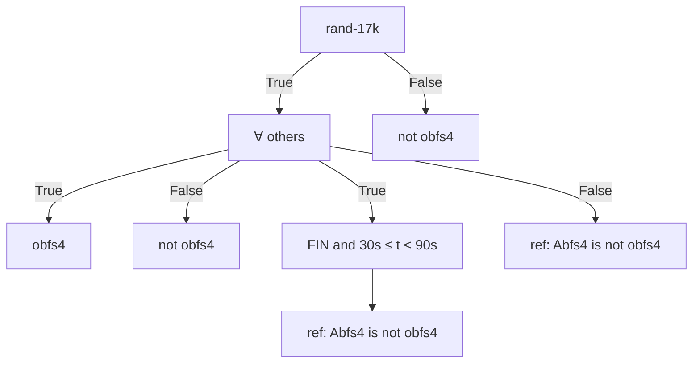
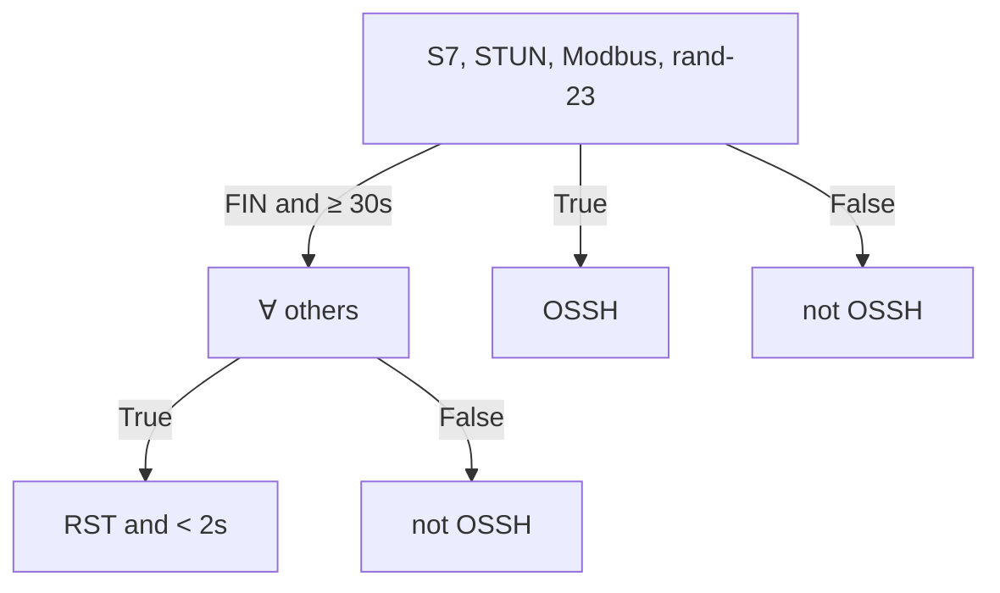
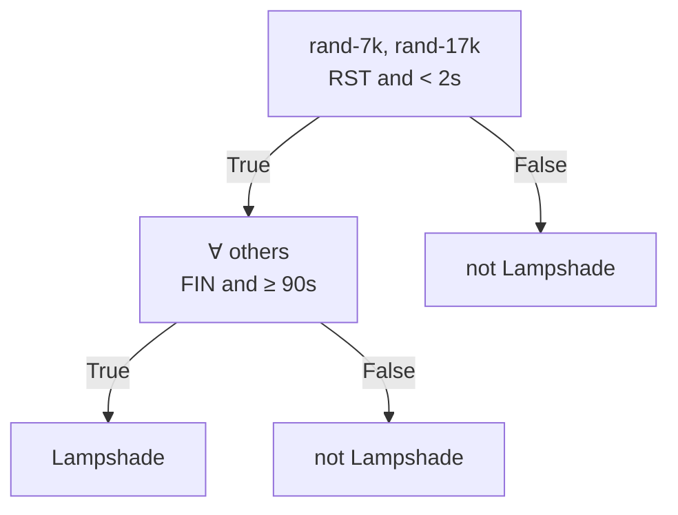
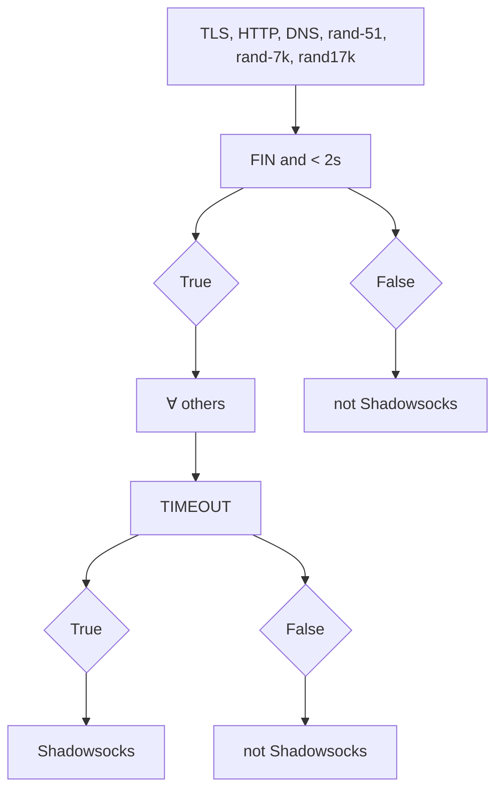
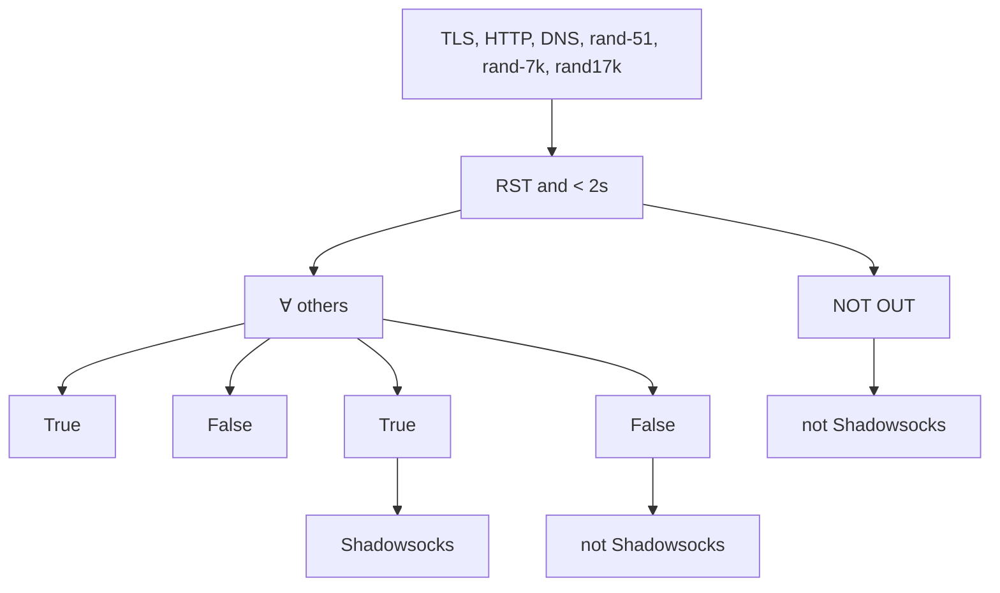
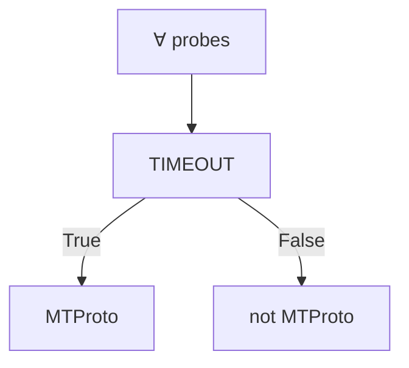

# Detecting Probe-resistant Proxies

Sergey Frolov University of Colorado Boulder sergey.frolov@colorado.edu

Jack Wampler University of Colorado Boulder jack.wampler@colorado.edu

Eric Wustrow University of Colorado Boulder ewust@colorado.edu

Abstract—Censorship circumvention proxies have to resist active probing attempts, where censors connect to suspected servers and attempt to communicate using known proxy protocols. If the server responds in a way that reveals it is a proxy, the censor can block it with minimal collateral risk to other non-proxy services. Censors such as the Great Firewall of China have previously been observed using basic forms of this technique to find and block proxy servers as soon as they are used. In response, circumventors have created new “probe-resistant” proxy protocols, including obfs4, shadowsocks, and Lampshade, that attempt to prevent censors from discovering them. These proxies require knowledge of a secret in order to use, and the servers remain silent when probed by a censor that doesn’t have the secret in an attempt to make it more difficult for censors to detect them.

In this paper, we identify ways that censors can still distinguish such probe-resistant proxies from other innocuous hosts on the Internet, despite their design. We discover unique TCP behaviors of five probe-resistant protocols used in popular circumvention software that could allow censors to effectively confirm suspected proxies with minimal false positives. We evaluate and analyze our attacks on hundreds of thousands of servers collected from a 10 Gbps university ISP vantage point over several days as well as active scanning using ZMap. We find that our attacks are able to efficiently identify proxy servers with only a handful of probing connections, with negligible false positives. Using our datasets, we also suggest defenses to these attacks that make it harder for censors to distinguish proxies from other common servers, and we work with proxy developers to implement these changes in several popular circumvention tools.

## I. INTRODUCTION

Internet censorship continues to be a pervasive problem online, with users and censors engaging in an ongoing cat-andmouse game. Users attempt to circumvent censorship using proxies, while censors try to find and block new proxies to prevent their use.

This arms race has led to an evolution in circumvention strategies as toolmakers have developed new ways to hide proxies from censors while still being accessible to users. In recent years, censors have learned to identify and block common proxy protocols using deep packet inspection (DPI), prompting circumventors to create new protocols such as obfsproxy [15] and Scramblesuit [47] that encrypt traffic to be indistinguishable from random. These protocols are designed to have no discernible fingerprints or header fields, making them difficult for censors to passively detect. However, censors such as the Great Firewall of China (GFW) have started actively probing suspected proxies by connecting to them and attempting to communicate using their custom protocols [18]. If a suspected server responds to a known circumvention protocol, the censor can block them as confirmed proxies. Active probing can be especially effective at detecting suspected proxies, because censors can discover new servers as they are used. Previous work has shown that China employs an extensive active probing architecture that is successful in blocking older circumvention protocols like vanilla Tor, obfs2 and obfs3 [18], [4], [45].

In response to this technique, circumventors have developed probe-resistant proxy protocols, such as obfs4 [6], Shadowsocks [2], and Lampshade [26], that try to prevent censors from using active probing to discover proxies. These protocols generally require that clients prove knowledge of a secret before the server will respond. The secret is distributed along with the server address out-of-band, for example through Tor’s BridgeDB [38] or by email, and is unknown to the censor. Without the secret, censors will not be able to get the server to respond to their own active probes, making it difficult for the censor to confirm what protocol the server speaks.

In this paper, we investigate several popular probe-resistant proxy protocols in use today. Despite being designed to be probe-resistant, we discover new attacks that allow a censor to positively identify proxy servers using only a handful of specially-crafted probes. We compare how known proxy servers respond to our probes with the responses from legitimate servers on the Internet (collected from a passive network tap and active scanning), and find that we can easily distinguish between the two with negligible false positives in our dataset.

We analyze five popular proxy protocols: obfs4 [6] used by Tor, Lampshade [26] used in Lantern, Shadowsocks [2], MTProto [11] used in Telegram, and Obfuscated SSH [27] used in Psiphon. For each of these protocols, we find ways to actively probe servers of these protocols, and distinguish them from non-proxy hosts with a low false positive rate.

Our attacks center around the observation that never responding with data is unusual behavior on the Internet. By sending probes comprised of popular protocols as well as random data, we can elicit responses from nearly all endpoints (94%) in our Tap dataset of over 400k IP/port pairs. For endpoints that do not respond, we find TCP behavior such as timeouts and data thresholds that are unique to the proxies compared to other servers, which provide a viable attack for identifying all existing probe-resistant proxy implementations.

We use our dataset to discover the most common responses

Network and Distributed Systems Security (NDSS) Symposium 2020 23-26 February 2020, San Diego, CA, USA ISBN 1-891562-61-4 https://dx.doi.org/10.14722/ndss.2020.23087 www.ndss-symposium.org

and TCP behavior of servers online, and use this data to inform how probe-resistant proxies can better blend in with other services, making them harder to block. We work with several proxy developers including Psiphon, Lantern, obfs4, and Outline Shadowsocks to deploy our suggested changes.

## II. BACKGROUND

In this section, we describe the censor threat model, and provide background on the probe-resistant circumvention protocols we study, focusing on how each prevents censors from probing.

## A. Censor Threat Model

We assume that censors can observe network traffic and can perform follow-up probes to servers they see other clients connecting to. The censor can also perform large active network scans (e.g. using ZMap [16]). We assume the censor knows and understands the circumvention protocols and can run local instances of the servers themselves, or can discover subsets of (but not all) real proxy servers through legitimate use of the proxy system.

In this paper, we focus on identifying potential proxies via active probing. Although censors may have other techniques for discovering and blocking proxies (e.g. passive analysis [42] or distribution system enumeration [14]), these attacks are beyond the scope of this paper. While successful circumvention systems must protect against these and other attacks, it is also necessary for the proxies to be resistant to active probes, which is the focus of our paper.

We assume that the censor does not know the secrets distributed out-of-band for every proxy server. Although the censor can use the distribution system to learn small subsets of proxies (and their secrets) and block them, full enumeration of the distribution system is out of scope.

## B. Probe-resistant Protocols

Circumvention protocols must avoid two main threats to avoid being easily blocked by censors: passive detection, and active probing. If a censor can passively detect a protocol and distinguish it from legitimate ones, the protocol can be blocked with minimal collateral damage. Circumvention protocols attempt to avoid passive identification by trying to blend in with other protocols or implementations [17], [32], [15], [22], or by creating randomized protocols with no discernible fingerprints [6], [26], [2], [47].

Alternatively, censors can identify or confirm suspected proxies by actively probing them. The Great Firewall of China (GFW) has previously been observed sending followup probes to suspected Tor bridges [41], [45], [18], [4]. These probes were designed to confirm if a proxy is a Tor bridge (by attempting to use it to access Tor), and block the IP if it is.

To combat this style of active identification, circumvention protocols now attempt to be probe-resistant. For instance, in obfs4, clients are given a secret key that allows them to connect to the provided server. Without this key, active probing censors cannot complete the initial handshake, and the obfs4 server will close the connection after a brief timeout.

We now describe each of the five proxy protocols we study. An overview of how each protocol attempts to thwart active probing is seen in Table I.

1) obfs4: obfs4 [6] is a generic protocol obfuscation layer, frequently used as a Pluggable Transport [39] for Tor bridges. obfs4 proxies are distributed to users along with a corresponding 20-byte node ID and Curve25519 public key. Upon connecting to an obfs4 server, the client generates their own ephemeral Curve25519 key pair, and sends an initial message containing the client public key, random padding, and an HMAC over the server’s public key, node ID, and client public key (encoded using Elligator [10] to be indistinguishable from random), with a second HMAC including a timestamp. The server only responds if the HMACs are valid. Since computing the HMACs requires knowledge of the (secret) server public key and node ID, censors cannot elicit a response from the obfs4 server. If a client sends invalid HMACs (e.g. a probing censor), the server closes the connection after a server-specific random delay.

2) Lampshade: Lampshade [26] is a protocol used by the Lantern censorship circumvention system, and uses RSA to encrypt an initial message from the client. Clients are given the server’s RSA public key out of band, and clients use it to encrypt the initial plaintext message containing a 256- bit random seed, the protocol versions, and ciphers that the client supports. Subsequent messages are encrypted/decrypted using the specified cipher (usually AES-GCM) and the clientchosen seed, with prepended payload lengths encrypted using ChaCha20. Since the censor does not know a server’s RSA public key, they will be unable to send a valid initial message with a known seed, and any subsequent messages will be ignored. If the server fails to decrypt the expected 256-byte ciphertext (based on an expected magic value in the plaintext), it will close the connection.

3) Shadowsocks: Shadowsocks is a popular protocol developed and used in China, and has many different interoperable implementations available [25], [50], [13]. Shadowsocks does not host or distribute servers themselves. Instead, users must launch their own private proxy instances on cloud providers, and configure it with a user-chosen password and timeout. Users can then tunnel their traffic to their private proxy using the Shadowsocks protocol. Shadowsocks clients generate a key from a secret password and random salt, and then sends the random salt and encrypted payload using an authenticated (AEAD) cipher to the server. A censor without the secret password will not be able to generate valid authenticated ciphertexts, and their invalid ciphertexts will be ignored by the server.

There are numerous implementations of the Shadowsocks protocol [2]; our analysis covers two: the event driven Shadowsocks implementation in Python [13], and Jigsaw’s Outline [25]. We refer to these as shadowsocks-python and shadowsocks-outline respectively. In the AEAD-mode, both server implementations wait to receive 50 bytes from the client, and if the AEAD tag is invalid, the server closes the connection.

4) MTProto: MTProto [1] is a proprietary protocol designed and used by the Telegram [3] secure messaging app. In countries that block the service, Telegram employs the

<table><tr><td>Protocol</td><td>Client&#x27;s first message</td><td>Server Behavior</td></tr><tr><td>obfs4 [6]</td><td> $K = server\_pubkey | NODEID$  $M = client\_pubkey | padding | HMAC_{K}(client\_pubkey)$ send:  $M | HMAC_{K}(M | timestamp)$ </td><td>Reads8192bytes (max handshake padding length)If no valid HMAC is found, server reads a random0-8192additional bytes, thenclosesthe connection.</td></tr><tr><td>Lampshade [26]</td><td>send:  $RSA_{encrypt}(server\_pubkey,... | seed)$ </td><td>Reads256bytes (corresponding to RSA ciphertext length) and attempts to decrypt. If it fails, the serverclosesthe connection.</td></tr><tr><td>Shadowsocks [2]</td><td> $K = HKDF (\text{password}, \text{salt}, “ss - subkey”)$ send:  $salt | AEAD_{K}(\text{payload}_len) | AEAD_{K}(\text{payload})$ </td><td>Reads50bytes (corresponding to salt, 2-byte length, and AEAD tag)If the tag is invalid, serverclosesthe connection.</td></tr><tr><td>MTProto Proxy [1]</td><td> $K = sha256 (\text{seed} | secret)$ send:  $seed | IV | E_{K} (\text{magic})$ </td><td>Does not close the connection on invalid handshake.</td></tr><tr><td>OSSH [27]</td><td> $K = SHA1^{1000} (\text{seed} | secret)$ send:  $seed | E_{K} (\text{magic} | payload)$ </td><td>Reads24bytes, andclosesthe connection if the expected magic value is not decrypted.</td></tr></table>

TABLE I: Probe-resistant Protocols — In this table we list the first message sent by the client in the probe-resistant proxy protocols we study, and the server’s corresponding parsing behavior. Blue text denotes secrets distributed to the client out-ofband. Servers typically close the connection after they receive an invalid handshake message; however, precisely when a server closes a failed connection can reveal a unique fingerprint that could be used to distinguish them from other services.

MTProto Proxy protocol, which only adds obfuscation, and will be referred to as simply MTProto for the remainder of the paper. MTProto derives a secret key from the hash of a random seed and a secret distributed out-of-band. The key is then used to encrypt a 4-byte magic value using AES-CTR. If the server does not decrypt the client’s first message to the expected magic value, it will not respond. Since the censor does not know the secret, they will be unable to construct a ciphertext that decrypts to the proper 4-byte value. Upon handshake failure, the server keeps the connection open forever but does not respond.

There are many unofficial implementations of MTProto servers, including versions in Python [11], Golang [36], and NodeJS [20], but we only investigate servers included with the Telegram Android application by default, which are more likely to be an official implementation.

5) Obfuscated SSH: Obfsucated SSH [27] (OSSH) is a simple protocol that wraps the SSH protocol in a layer of encryption, obfuscating its easily-identified headers. Clients send a 16-byte seed, which is hashed along with a secret keyword thousands of times using SHA-1 to derive a key. The key is used to encrypt a 4-byte magic value along with any payload data (i.e. SSH traffic) using RC4. The server re-derives the key from the seed and secret keyword and decrypts to verify the magic value. We specifically looked at Psiphon’s OSSH implementation [35], which uses a 32- byte secret keyword distributed to clients. Without knowing the keyword, censors cannot create valid ciphertext1. If an OSSH server receives an invalid first message, it closes the connection.

## III. PROBE DESIGN

To detect probe-resistant proxy servers, we consider what each protocol has in common. Specifically, each protocol requires knowledge of a secret that is proven cryptographically. If the client does not know the secret, the server will simply not respond, and eventually close the connection. We start with the intuition that such non-response is uncommon on the Internet, especially to a large corpus of probes in popular protocols. For instance, it’s trivial to distinguish between all HTTP servers and probe-resistant proxies, as HTTP servers will respond to HTTP requests while the proxies will not.

Following this intuition, we create several protocol-specific probes for well-known protocols unrelated to censorship circumvention, and send them to a large sample of Internet hosts to see how they respond. If most or all of the hosts respond, or otherwise close the connection in a way distinguishable from the proxy servers we study, then a censor could use this as an effective strategy for identifying proxy servers and distinguishing them from legitimate hosts.

## A. Basic Probes

Our probes are data that we send to a server after connecting over TCP. We limit our probes to TCP as all of the proxy protocols we study use TCP, though our techniques could be expanded to UDP. We started with 6 basic probes: HTTP, TLS, MODBUS, S7, random bytes, and an empty probe that sends no data after connecting. For each probe, we record how a server responds in terms of the data (if any) it replies with, the time that it closes the connection (if it does), and how it closes the connection (TCP FIN or RST). We briefly describe each of our initial probes.

a) HTTP: For HTTP, we send a simple HTTP/1.1 GET request with a host header of example.com. As HTTP remains one of the most popular protocols on the Internet, we expect many servers will respond with HTTP responses, redirects, or error pages. We note that like any protocol-specific probe, even servers that are not HTTP may respond to this probe with an error message native to their protocol.  
b) TLS: We send a TLS Client Hello message that is typically generated by the Chromium version 71 browser. This includes popular cipher suites and extensions, though we note that even if there is no mutual support between an actual TLS server and our Client Hello, the server should respond with a TLS Alert message, allowing us to distinguish it from silent proxy servers.  
c) Modbus: Modbus is commonly used by programmable logic controllers (PLC) and other embedded devices in supervisory control and data acquisition (SCADA) environments. We used a probe defined in ZGrab [51] that sends a 3-byte command that requests a device info descriptor from the remote host.

d) S7: S7 is a proprietary protocol used by Siemens PLC devices. We again used the probe defined in ZGrab [51] which sends a request for device identifier over the COTP/S7 protocol.  
e) Random bytes: We also send several probes with differing amounts of random bytes, with the hope that servers that attempt to parse this data will fail and respond with an error message or close the connection in a way that distinguishes them from proxy servers.  
f) Empty probe: We also have a specific “probe” that sends no data after connecting. Some protocols (such as SSH) have the server communicate first (or simultaneously) with the client. For other protocols, implementations may have different timeouts for when the client has sent some initial data compared to when no data is sent.

We initially probed a small sample of about 50,000 server endpoints collected from our passive tap (see Section III-B) with these initial 6 probes, and compared how they responded (data, connection close type and timing) with how instances of our proxy servers responded. With only these probes, there were still hundreds of servers that responded identical to the obfs4 servers we probed. After manual analysis of these servers, we added two additional probes based on the types of servers we identified:

g) DNS AXFR: Although DNS requests are typically done over UDP, DNS zone transfers are carried out over TCP. We identified several hosts in our initial sample that appeared to be DNS servers based on our manual probing using nmap [29]. To detect these using our probes, we crafted a DNS AXFR (zone transfer) query probe based on the DNS specification [31].

h) STUN: We discovered several endpoints on TCP port 5004 that we were unable to directly identify. We found many of the hosts also had port 443 open and responded with TLS self-signed certificates that suggested they were Cisco WebEx devices. While this confirmed these were unlikely to be proxy servers, we were also able to find a more direct way to identify these hosts. We used our passive network tap to look at data sent over TCP port 5004, and used the data we collected to help us identify what protocol these devices support and how to generate a probe for them. Although an uncommon port (we only saw 4 data-carrying packets over several days of collection on a 10 Gbps tap), we were able to identify this port as supporting Session Traversal Utilities for NAT (STUN) protocols based on a magic cookie value included in the data. With this knowledge, we implemented a STUN probe based on the ZGrab Golang library, which we confirmed elicits responses from these remaining hosts, allowing us to directly distinguish them from proxies.

## B. Comparison Dataset

We create a dataset comprised of known proxy endpoints (IP/port pairs) and common (non-proxy) endpoints. For each proxy we investigate, we collect a sample set of active endpoints from their respective proxy distribution system (e.g. BridgeDB), contacting the developers, or by running our own instance. We collect over 20 obfs4 proxy endpoints from Tor’s BridgeDB, and receive 3 Lampshade proxies from Lantern developers. We obtain 3 OSSH proxy endpoints from Psiphon developers, and discover 3 endpoints of MTProto by using the Telegram application. As Shadowsocks is designed for users to run their own proxies, we set up our own shadowsockspython instance (configured using the chacha20-ietf-poly1305 cipher) and received an address of shadowsocks-outline from developers.

Gathering a realistic “common” (non-proxy) endpoints dataset is trickier. Ideally, we want a large set of endpoints that contains a diverse set of non-proxy hosts. We could potentially create our own set of endpoints by running known implementations of non-proxy services ourselves, such as popular web servers, mail servers, and other network services. But this would fail to capture proprietary servers as well as the long-tail of obscure servers that are present in the real world.

Instead, we collect likely non-proxy endpoints from two sources: active network scans using ZMap [16], and passive collection of netflow data. We use ZMap to send a SYN packet to 20,000 hosts on every TCP port (0-65535) for a total of 1.3 billion probes. We discover 1.5 million endpoints that responded with SYN-ACKs, which we label as our ZMap dataset.

For our passive dataset, we collect endpoints by sampling netflow data from a 10 Gbps router at the University of Colorado. Our intuition is that due to its network position in a country that does not censor its Internet, the vast majority of traffic seen from this vantage point will not contain proxies. This ISP’s users have little motivation to use censorship circumvention proxies, so endpoints collected here are likely to be predominantly other services. Moreover, these hosts are more representative of useful services, as opposed to endpoints in the ZMap scan that may not have any actual clients connect to them beside our scanner.

Over a 3-day timespan, we collected over 550,000 unique server IP/port endpoints from our ISP that we observed sending data, and sent follow-up connections from our scanning server. Of these, 433,286 (79%) hosts accepted our connection (responded with a TCP SYN-ACK), with the remaining majority simply timing out during the attempted connection. We believe this response rate can be explained by two reasons. First, our follow-up scans occurred up to several days after the connections were observed, and some servers could have moved IPs or been taken offline in the meantime. Second, servers might be configured with firewalls that only allow access from certain IPs, potentially blocking our ZMap scanning host. Nonetheless, we are still able to capture over 400,000 unique endpoints in this dataset that we know are servers that have been observed sending data.

Both datasets might still contain some amount of actual proxy endpoints in them, which we investigate further in Section V-D. Nonetheless, these two datasets provide a diverse list of common endpoints for us to compare with our limited proxies.

## IV. IDENTIFYING PROXIES

A censor’s goal is to find ways to differentiate proxy servers from other benign servers on the Internet, in order to block proxies without blocking other services. In this section, we discuss techniques for differentiating servers from one another for the purpose of uniquely identifying proxy servers.

At a high level, our goal is to identify ways to evoke unique responses from proxy servers in comparison to non-proxy servers. If we are able to get a proxy server implementation to respond in a distinct way from every other server on the Internet, censors could use their unique responses to identify and block proxies. We identify three critical features in the ways that servers respond to probes that can be used to fingerprint modern proxies: response data, connection timeouts, and close thresholds, which we detail next.

## A. Response Data

Most servers will respond with some kind of data when sent a probe. For instance, HTTP servers will respond to our HTTP probe, but many other protocols will respond with error messages or information when they receive application layer data that they do not understand. On the flip side, we observe that none of our proxy servers respond with any data for any of the probes. This is due to the proxy strategy of remaining silent unless the client proves knowledge of the secret, which a probing censor is unable to do. However, if the censor has a set of probes that can coax at least one response from all hosts that aren’t proxies, then non-response could inform a censor that the host is a proxy and safe to block.

Proxies might try to provide some form of response, though this likely commits the proxy to a particular protocol, which has been shown to be a difficult strategy to employ correctly [24]. Modern probe-resistant proxies never respond with data to any of our probes, so we can easily mark any servers that respond with data to any of our probes as a nonproxy endpoint.

## B. Timeouts

Even if a server does not reply with any data, they might still close the connection in unique ways. For example, some servers have an application-specified timeout, after which they will close a connection. Timeouts might also be different depending on the state that a server is in. For instance, a server might timeout a connection after 10 seconds if it hasn’t received any data, but timeout after 60 seconds if it has received some initial data from the client.

Servers might also differ in the way that they close the connection after the timeout. TCP sessions end after either a TCP FIN or TCP RST packet is sent as determined by the interactions with the application and the underlying operating system.

## C. Buffer Thresholds

Finally, we discover another implementation-specific behavior that can distinguish endpoints even if they have identical timeouts and never respond with data. Consider a server that reads N bytes from the client, and attempts to parse it as a protocol header. If the parsing fails (e.g. invalid fields, checksums or MACs), the server may simply close the connection. However, if the client sends only N − 1 bytes, the server might keep the connection open and wait for additional data before it attempts to parse.


<details>
<summary>text_image</summary>

RST threshold
close threshold
recv buffer
FIN
RST
Bytes received →
</details>

Fig. 1: TCP Threshold — Many TCP server applications close the connection after receiving a certain threshold of bytes from the client (e.g. protocol headers or expected payload chunks) when they fail to parse them. Servers that close a connection after a threshold will send a FIN packet. However, if the application has not read (by calling recv) all of the data from the OS’s connection buffer when it calls close, the server will send a RST instead. These thresholds can be learned remotely (via binary search using random/invalid data) and used as a way to identify or fingerprint server implementations.

We term such a data limit the close threshold of a server. If a client (or probing censor) sends less than this number of bytes, the server will wait, even if those bytes are random and non-protocol compliant. However, as soon as the client sends data beyond the threshold limit, the server will attempt to parse the data (and likely fail in the case of random data), and close the connection with either FIN or RST.

Not every server implementation has a close threshold. Some implementations may instead read from the connection forever after an error is encountered, or only close the connection after a data-independent timeout. Nonetheless, servers that do have a threshold provide an additional way for censors to identify and distinguish them from other servers and implementations.

We also discover a second type of identifying threshold for some servers that close the connection after reading a threshold number of bytes, which we confirmed happens in a typical Linux application. When a program closes a TCP connection, the operating system normally sends a FIN packet and completes a 4-way closing handshake with the remote end. However, in certain cases the connection will be closed with a RST packet instead. On Linux, we find if there is any unread data in the connection buffer, the operating system will send a RST packet. We define FIN threshold and RST threshold as the amount of bytes needed to be sent to a server in order to specifically trigger the FIN or RST, while close threshold refers to whichever occurs first (lower number of bytes).

Figure 1 illustrates the FIN and RST thresholds and how they commonly relate. Data sent up to the FIN threshold will cause the server to keep the connection open, while data sent beyond that will cause the server to close the connection with a FIN. If enough data is sent to exceed the RST threshold, the server will close with a RST.

These limits are due to application-specific behavior. While prior work has demonstrated ways to measure TCP behavior of the underlying OS (e.g. via congestion control [34]), to the best of our knowledge, we are the first to identify and measure these application-specific thresholds in TCP programs.

<table><tr><td></td><td>Connection Timeout</td><td>FIN Threshold</td><td>RST Threshold</td></tr><tr><td>obfs4</td><td>60-180s</td><td>8-16 KB</td><td>next mod 1448</td></tr><tr><td>Lampshade</td><td>90 / 135s</td><td>256 bytes</td><td>257 bytes</td></tr><tr><td>shadowsocks-python</td><td>configurable</td><td>50 bytes</td><td>-</td></tr><tr><td>shadowsocks-outline</td><td>configurable</td><td>50 bytes</td><td>51 bytes</td></tr><tr><td>MTProto</td><td>-</td><td>-</td><td>-</td></tr><tr><td>OSSH</td><td>30s</td><td>24 bytes</td><td>25 bytes</td></tr></table>

TABLE II: Proxy timeouts and thresholds — We measured how long each probe-resistant proxy lets a connection stay open before it times out and closes it (Connection Timeout), and how many bytes we can send to a proxy before it immediately closes the connection with a FIN or RST. obfs4’s RST Threshold is the next value after the FIN threshold that is divisible by 1448.

As an example, obfs4 has a randomized close threshold between 8192 and 16384 bytes. Since the obfs4 handshake can be up to 8192 bytes in length, the server reads this many bytes before determining the client is invalid, and entering a closeAfterDelay function. This function either closes the connection after a random delay (30-90 seconds) or after the server has read an additional N bytes, for N chosen randomly between 0 and 8192 at server startup. However, each of these reads is done using a 1448-byte buffer. This means that obfs4 servers will send a FIN if they are sent 8192 + N bytes, and send a RST if they are sent $8 1 9 2 + N - ( ( 8 1 9 2 + N )$ mod 1448) + 1448 bytes, a behavior that appears to be unique to obfs4. Table II shows the timeouts and thresholds for the probe-resistant proxies we study.

1) Threshold Detector: We developed a tool to binary search for the close and RST threshold for a given endpoint. Our tool starts by connecting and sending 4,096 bytes of random data, and seeing if the connection is closed (FIN or RST) within 3 seconds. If it is, we make subsequent connections, halving the number of bytes we send until we reach a value that the server does not close the connection within a second. If even the original 4,096 byte probe does not result in a close, we reconnect and send twice the amount of data (up to 1 MB) until we find a close. Once we have identified an upper and lower bound for a given server, we binary search between these bounds to obtain the exact value of the close threshold. Once a close threshold is found, we reconfirm using two follow up probes: one immediately below and one immediately above the found threshold. We use 3 different seeds to generate the random data in those confirmation probes. If the behavior is identical with all 3 seeds, we mark it as having a stable close threshold. Otherwise, we mark the endpoint as unstable and ignore the threshold value.

## V. EVALUATION

To evaluate our competency at distinguishing proxies from other servers, we sent our probes to over 1.9 million endpoints contained in our “common servers” dataset, and observed the ways in which their responses differ from those of known proxies. As a reminder, this dataset contains over 500,000 endpoints observed at our passive ISP tap, and approximately

<table><tr><td>Probe</td><td>Tap</td><td>ZMap</td></tr><tr><td>TLS</td><td>87.8%</td><td>0.90%</td></tr><tr><td>HTTP</td><td>64.6%</td><td>0.95%</td></tr><tr><td>STUN</td><td>52.5%</td><td>0.56%</td></tr><tr><td>Empty</td><td>8.4%</td><td>0.23%</td></tr><tr><td>S7</td><td>56.9%</td><td>0.66%</td></tr><tr><td>Modbus</td><td>51.4%</td><td>0.54%</td></tr><tr><td>DNS-AXFR</td><td>58.8%</td><td>0.67%</td></tr><tr><td>Any</td><td>94.0%</td><td>1.16%</td></tr></table>

TABLE III: Percent of endpoints responding with data — For both our ISP passive (Tap) and active (ZMap) datasets, we report the percent of endpoints that respond to each of our probes, as well as the percent that responded to at least one (Any).


<details>
<summary>line chart</summary>

| Unique Responses | ZMap CDF | Tap CDF |
| ---------------- | -------- | ------- |
| 1                | 0.45     | 0.03    |
| 10               | 0.82     | 0.12    |
| 100              | 0.90     | 0.25    |
| 1000             | 0.93     | 0.45    |
| 10000            | 0.96     | 0.65    |
| 100000           | 0.98     | 0.85    |
| 1000000          | 1.00     | 1.00    |
</details>

Fig. 2: Response set CDF — We group endpoints based on how they respond to our 7 non-random probes, capturing the number of bytes the endpoint replies with, how long it keeps the connection open (binned to seconds), and how it closed the connection. Over 42% of endpoints respond the same (timeout after 300 seconds) in our ZMap dataset, which we identify as a common firewall behavior. Despite being smaller, the Tap dataset is much more diverse (129k vs 31k unique response sets).

1.5 million endpoints collected using ZMap on random IPs and ports. We send 13 probes to each endpoint (our 7 probes from Section III-A and 6 probes with random data ranging from 23 bytes to over 17KB) and record if and when the server responds with data or closes the connection. If the server closes, we record if it used a FIN or RST. If the server does not respond or close the connection, we timeout after 300 seconds and mark the result as a TIMEOUT. In addition to sending probes, we also use our threshold detector on each endpoint, recording their close thresholds.

Table III shows each of our (non-random) probes, and the percent of endpoints in each of our two “common endpoints” datasets that respond to the probes with data. Since proberesistant proxies never respond with data, we can immediately discard endpoints that reply to any of our probes as nonproxies. In our passive Tap dataset, this rules out 94% of hosts, leaving only 26,021 potential proxies. On the other hand, in our ZMap dataset, the overwhelming majority of hosts do not respond with data to any probes, allowing us to discard only 1.2% of endpoints based solely on response data.

We find a significant reason for this discrepancy is that ZMap identifies a large number of firewalls that employ common “chaff” strategies, where they respond to every SYN they receive on all ports and IPs in their particular subnet [48]. We observe over 42% of endpoints in our ZMap dataset behave identically by never sending data and never closing the connection (up to our 300 second timeout) to our probes2. To understand the diversity of responses, we clustered responses from endpoints by constructing response sets that captures the response type (FIN, RST, timeout), number of bytes they respond with (possibly 0), and the time of connection close or timeout (binned to integer seconds) for each non-random probe we send. If two endpoints have identical response sets (for instance they both respond to probe-A with a FIN after 3 seconds and a 10-byte response, and probe-B with a RST after 9 seconds with no data, etc), we say they are in the same response group. In this clustering, we ignore any actual content and only compare lengths if any response data is sent.

The most popular response group in our Tap dataset comprises only 3.0% of endpoints, and appears to be TLS servers (99.9% are on endpoints with port 443) in Cloudflare’s network. These hosts respond to our TLS probe with a handshake alert, due to the lack of Server Name Indication (SNI) in our client hello probe. Figure 2 shows a CDF of unique response sets (sorted by popularity) for our ZMap and Tap dataset, and illustrates the larger diversity in our Tap dataset. The top 10 response sets comprise over 80% of endpoints in the ZMap dataset, but only 13% of endpoints collected at our Tap.

## A. Designing a decision tree

We now turn to distinguishing proxies from the remaining set of common non-proxy endpoints that did not respond with any data.

A natural choice for distinguishing proxies from common hosts is to use machine learning to automate the synthesis of a classifier model. We evaluated using automatically-generated decision trees in Appendix A, but did not find them to provide higher accuracy, and found they require more manual labor than the decision trees we build manually. In this section we instead focus on manually creating a decision tree that can distinguish proxies from common endpoints, as the resulting trees are easier to interpret and are as effective compared to the automatically-generated ones.

For each proxy protocol, we manually created a decision tree from analysis of the proxy’s source code and observed behavior to our probes. Since none of the proxies send data responses for any of our probes, the first decision layer is to mark endpoints that respond with any data as non-proxies. As shown in Table III, this eliminates 94% of endpoints in our Tap dataset, but only 1.2% of endpoints in our ZMap dataset.

The next layers of each decision tree are protocol specific, and we describe each in Figures 3-8. In each of these figures, each box lists at the top a set of probes, and at the bottom the expected response. Each expected response is in the form of a close type (FIN, RST, or TIMEOUT) and a time bound (in integer seconds). For example, Figure 3 shows the decision tree for obfs4, which first looks at the response to the rand-17k probe that sends 17 KB of random data to the endpoint. If the endpoint responds with a RST in under 2 seconds, the next layer in the tree is checked. Otherwise, the endpoint is labeled as not obfs4. In the next layer, every other probe’s response is checked to be a FIN between 30 and 90 seconds. If they all are, the endpoint is labeled as obfs4, otherwise it is not.


<details>
<summary>flowchart</summary>


</details>

Fig. 3: obfs4 Decision Tree — Each box represents a list of probes (top) and the expected response (close type (FIN, RST, TIMEOUT)) and the time bound. For instance, rand-17k represents a 17KB random probe, which obfs4 servers respond to with an immediate RST due it exceeding obfs4’s RST threshold. All other probes in our set are below the close thresholds, and cause obfs4 proxies to produce a FIN between 30 and 90 seconds. Responses that do not satisfy all of these criteria are labelled not obfs4.


<details>
<summary>flowchart</summary>


</details>

Fig. 4: OSSH Decision Tree — OSSH’s FIN threshold is 24 bytes, with a RST threshold of 25. Thus, any probes less than 24 bytes in length (S7, STUN, Modbus, and rand-23) cause OSSH servers to send a FIN after 30 seconds. All our other probes are beyond OSSH’s RST threshold, causing it to send an immediate RST.

We note that since all proxies have mutually exclusive decision trees, it is possible to compose a multi-class classifier by checking conditions for each proxy label in any order, and classifying the unmatched samples as not proxies.

## B. Timeouts

We measure the distribution of the duration an endpoint will keep a connection open before closing it. Figure 9 shows the distribution of timeouts (binned to seconds) over our Tap dataset, when we send nothing (Empty) and when we send a single random byte (1 byte). The distribution shows clear modes at 10, 15, 20, 30, 60, and beyond 300 seconds3. The different probes have slightly different distributions, meaning that many endpoints have different timeouts based on the amount of data they receive. Still, we find that 71% of endpoints in the Tap dataset have the same timeout for the empty and 1-byte probes.


<details>
<summary>flowchart</summary>


</details>

Fig. 5: Lampshade Decision Tree — Lampshade’s RST threshold is 257 bytes. Only two of our probes (our 7KB and 17KB random probes) exceed this, and cause Lampshade servers to RST immediately. Otherwise, Lampshade servers timeout after 90 seconds. Despite not having Lampshadespecific probes (meaning our data will likely over-find potential Lampshade servers), we do not see any servers that meet even this liberal criteria in our Tap dataset.


<details>
<summary>flowchart</summary>


</details>

Fig. 6: Shadowsocks-python Decision Tree — Shadowsockspython has a FIN threshold of 50 bytes, and no RST threshold (likely owing to the event driven socket buffering, which is unlikely to leave data in the socket between events). Thus, all probes larger than 50 bytes will cause Shadowsocks to immediately close with a FIN, while probes less than 50 bytes cause it to timeout.

This distribution suggests that the popular strategy of using random timeouts is far from ideal: 82% of endpoints timeout at one of the top ten timeout values. For instance, timing out at a random value such as 74 seconds puts such a hypothetical proxy in a group with only 0.02% of endpoints, making it easier for censors to block without worry of blocking legitimate services. We note this analysis is over all endpoints in our Tap dataset, and many of those endpoints may have other distinguishing features, such as sending response data or having unique close thresholds. We further analyze timeout values that probe-resistant proxies could use in Section VI.


<details>
<summary>flowchart</summary>


</details>

Fig. 7: Shadowsocks-outline Decision Tree — Shadowsocksoutline has a FIN threshold of 50 bytes, and a RST threshold of 51. Thus, all probes with size less of 50 bytes will cause it to timeout, while probes of size 51 and above would cause shadowsocks-outline to immediately close with a RST. A 50 byte probe would cause the server to immediately close with FIN, but we did not use such a probe while collecting the data.


<details>
<summary>flowchart</summary>


</details>

Fig. 8: MTProto Decision Tree — MTProto does not appear to have a close threshold, and does not have any unique timeout (appears to leave the connection open forever). Thus, we label endpoints that timeout for all our probes as MTProto.

Our measurement tool marks a connection as TIMEOUT if it doesn’t close or send data for over 300 seconds. However, it is possible that some servers timeout at values much higher than that, so we performed a follow-up experiment to determine if 300 seconds was a reasonable value to TIMEOUT, or if we were missing distinguishable features by not waiting longer. We made a followup connection to the 8500 endpoints that were marked as a 300+ second TIMEOUT in our previous probes (from both Tap and ZMap datasets), and waited up to 2.5 hours (9000 seconds) to see if they would close the connection after 300 seconds. Figure 10 shows our results, showing that most servers (97.5%) that previously would be marked as a TIMEOUT at 300 seconds would have also been marked as a TIMEOUT at 9000 seconds. Only an additional 2.5% would have possibly be labelled differently if we had waited longer, suggesting 300 seconds is a reasonable cutoff for a timeout.

This experiment also revealed a bug in our original probing tool, where a server may be marked as TIMEOUT if it never acknowledges (with a TCP ACK) the data we sent. In this case, we will continue to retransmit the data and our prober’s kernel will close the connection before our 300 second timeout, but since no FIN or RST is received, we will mark the connection as a TIMEOUT at less than 300 seconds. We note this is nonstandard TCP behavior for servers, and happens in about 1.3% of connections. We label these as retries in Figure 10. The bug is only triggered by the small fraction of hosts that (counter to the TCP specification) do not send ACKs for received data. We do not see this kind of behavior in any of the proxies we investigated, and do not believe this bug impacts our results.


<details>
<summary>bar chart</summary>

| Time (s) | Empty | 1 byte |
| -------- | ----- | ------ |
| 0        | 0     | 0      |
| 15       | 0     | 8      |
| 30       | 4     | 7      |
| 60       | 2     | 25     |
| 90       | 0     | 0      |
| 120      | 0     | 2      |
| 180      | 0     | 0      |
| 300+     | 0     | 13     |
</details>

Fig. 9: Server timeouts — We measure how long servers in our dataset will allow a connection to stay open if we send it no data (Empty) or 1 byte. Unsurprisingly, we find servers timeout at expected modes in multiples or fractions of minutes.

## C. Thresholds

In addition to timeouts, we measure the distribution of close thresholds (the number of bytes that an endpoint closes a connection after receiving) for endpoints in our Tap dataset. Figure 11 shows the histogram of close threshold values. The most popular threshold values are 11 and 5 bytes, which we identify is commonly used in TLS server implementations: 5 bytes corresponds to the size of the outer TLS record header, and 11 bytes corresponds to the minimum size of the outer plus inner handshake header. Many TLS implementations naturally read these headers, and close the connection if they fail to parse them. The next most common close threshold is beyond the 1MB limit of our probing tool, likely indicating a non-existent close threshold. We label the proxy server close thresholds on the graph, showing that most are unique, sharing their threshold with less than 0.05% of endpoints in our dataset. An exception is MTProto, which has no observable threshold, behavior shared by about 9% of endpoints in our Tap dataset.

We also investigate whether endpoints follow our expected understanding of FIN/RST thresholds: that servers will close with a FIN after receiving certain number of bytes, and potentially close with a RST after receiving a higher number of bytes. For the endpoints that we used our threshold detector on, we looked at the order of FIN, RST, and TIMEOUT responses as we increase the number of bytes sent to them. For example, if a server sends a FIN after 80 bytes, and a RST after 100, we mark it as “FIN before RST”. Figure 12 shows the breakdown of FIN/RST orderings. We find that the vast majority of endpoints (85%) are observed sending either only a FIN or a FIN before a RST, which conforms with our expected understanding of the close threshold described in Figure 1. Endpoints that send only FIN (and never a RST) are caused either by our detector not sending enough bytes to trigger a RST, or by the application always emptying the socket buffer on every read (common in event-driven applications that use select or poll). We do observe a minority (5.9%) of servers that only send a RST, and never send a FIN. Many of these servers appear to be previous versions of Microsoft Windows servers that use RST to close connections. A small fraction (0.4%) interleave RSTs and FINs, meaning there appears to be no single threshold for either. However, we find no endpoints that consistently close connections with a RST for lower thresholds and FIN for higher ones (RST before FIN).

## D. Identified Proxies

Table IV shows the results of applying our decision trees to both the Tap and ZMap datasets. Despite dozens to hundreds of endpoints having similar close thresholds as each of our proxies, our decision tree is able to cut down to only a handful of proxies that are possibly proxy servers (excepting MTProto). We note that our decision tree only uses the responses from our probes, and we use the close thresholds as additional evidence to help confirm potential proxies.

obfs4 - For obfs4, the 2 servers we identify from our Tap dataset both have a RST threshold of 10241 bytes with no FIN threshold, behavior that we observe to be inconsistent with obfs4 implementations. Both servers are in China, and one serves a TLS certificate valid for several subdomains of baofeng.com. We are unable to confirm whether these endpoints are running obfs4 servers, but conclude that it is unlikely given the RST threshold results and their location inside a censored country, where they are unlikely to be useful for censorship circumvention.

Lampshade - For Lampshade, only one endpoint was identified in our ZMap dataset. This endpoint did not have a stable close threshold, and is therefore not a Lampshade instance. This endpoint is running on a host that also serves a Traccar login page, an open source tool for interfacing with GPS trackers.

Shadowsocks - Our decision tree identifies 8 endpoints in our ZMap dataset as shadowsocks-python, all of which have a 50 byte FIN threshold, suggestive of the proxy. We performed manual follow up scans, and found all but one of these endpoints also run SSH on the same host, with the same version banner. These hosts are scattered around the world in various hosting networks, though none in censored countries. We cannot conclude for certain that these are all shadowsocks servers, but given the threshold results, and their similarity and network locations, we believe they likely are. If we extrapolate from our small ZMap scan to the rest of the Internet, we would estimate that there are on the order of 1 million shadowsockspython endpoints running worldwide. Upon further investigation of the identified shadowsocks endpoints, 5 are in the same hosting provider (xTom) and each has a distinct set of 700 sequential TCP ports open that all exhibit identical behavior consistent with shadowsocks. For example, one IP has TCP ports 30000–30699 open, all seemingly identical behavior. If 5 out of every 8 shadowsocks-python servers had 700 ports open in this manner (and the others had only a single port), our 1 million shadowsocks-python endpoints would extrapolate to about 2285 shadowsocks servers (unique IPs) worldwide.


<details>
<summary>bar chart</summary>

| Connection duration (s) | Number of Connections |
| ----------------------- | --------------------- |
| 0                       | ~100                  |
| 500                     | ~5                    |
| 1000                    | ~10                   |
| 1500                    | ~1                    |
| 2000                    | ~1                    |
| 2500                    | ~1                    |
| 3000                    | ~1                    |
| 3500                    | ~1                    |
| 4000                    | ~1                    |
| 4500                    | ~1                    |
| 5000                    | ~1                    |
| 5500                    | ~1                    |
| 6000                    | ~1                    |
| 6500                    | ~1                    |
| 7000                    | ~1                    |
| 7500                    | ~1                    |
| 8000                    | ~1                    |
| 8500                    | ~1                    |
| 9000                    | ~1                    |
| 9500                    | ~1                    |
| 10000                   | ~1                    |
</details>

Fig. 10: Connection Timeouts — For the subset of servers that never responded to any probe within 300s we performed a followup scan allowing the connection to stay open for an extended period of time to identify a fair representative of an infinite timeout. The results after 300s are dominated by client timeout suggesting that this is a reasonable approximation of unlimited timeout. The strategy employed by MTProto to never respond and wait for clients to timeout is well represented in common server behavior.


<details>
<summary>bar chart</summary>

| close threshold (bytes) | Percent endpoints (logscale) |
| ----------------------- | ---------------------------- |
| 1                       | 0.001                        |
| 5                       | 10                           |
| 11                      | 10                           |
| 100                     | 0.01                         |
| 1KB                     | 0.01                         |
| 8-16KB                  | 0.01                         |
| 100KB                   | 0.01                         |
| 1MB+                    | 5                            |
</details>

Fig. 11: Close Thresholds — We measured the close threshold of over 400,000 server endpoints observed at our ISP. With the exception of MTProto, most proxy thresholds are relatively unique. We show the thresholds for OSSH (24), Shadowsocks (50), Lampshade (256), obfs4 (8-16KB), and MTProto (above 1MB).

Our decision tree also identifies 7 endpoints in the ZMap dataset as shadowsocks-outline. 6 of those endpoints are in Netropy IP blocks in South Korea, with the remaining in Cogent’s network. By the time we performed manual analysis on these endpoints, they were no longer up, preventing followup analysis.

MTProto - Over 3,000 endpoints were classified as MT-Proto in our datasets, though likely few (if any) of these are truly MTProto servers. This over-count is due to the simple decision tree used to classify MTProto: many endpoints simply never timeout and do not have any close thresholds, making them difficult to distinguish from one another. These endpoints represent 0.56% and 0.02% of our Tap and ZMap datasets respectively. This suggests that MTProto’s strategy of camouflage is effective at evading active probing, because these endpoints offer truly no response, even at the TCP level.


<details>
<summary>pie chart</summary>

| Category | Value |
|---|---|
| FIN before RST | 40 |
| FIN only | 85 |
| RST only | 15 |
| TIMEOUT only | 20 |
| INTERLEAVED FIN/RST | 0 |
</details>

Fig. 12: Types of close — We measured the threshold behavior of each of over 400,000 server endpoints. As expected, most servers close the connection with a FIN, and then if additional data is sent, a RST (data left in the buffer) (FIN before RST). The majority of servers send only a FIN, meaning our test did not send enough data to elicit a RST or the server never sends a RST. Less commonly, we find (standard non-conforming) servers that only close with a RST, or servers that interleave use of RST and FIN.

We provide in-depth discussion of effective defense strategies in section VI.

OSSH - We classify 8 endpoints in our Tap dataset as OSSH. We followed up with Psiphon, a popular circumvention tool that commonly uses OSSH servers, and identified that 7 of these were their own servers, confirming they were indeed OSSH endpoints. The remaining was hosted in Linode’s network on port 443, but we cannot confirm if it is running OSSH or an unrelated service.

<table><tr><td rowspan="2">Proxy</td><td colspan="2">Endpoints w/ Threshold</td><td colspan="2">Decision Tree Labeled</td></tr><tr><td>Tap</td><td>ZMap</td><td>Tap</td><td>ZMap</td></tr><tr><td>obfs4</td><td>355</td><td>65</td><td>2</td><td>0</td></tr><tr><td>Lampshade</td><td>2</td><td>1</td><td>0</td><td>1</td></tr><tr><td>Shadowsocks</td><td>30</td><td>18</td><td>0</td><td>8</td></tr><tr><td>MTProto</td><td>13k</td><td>106k</td><td>3144</td><td>296</td></tr><tr><td>OSSH</td><td>70</td><td>5</td><td>8</td><td>0</td></tr></table>

TABLE IV: Decision Tree Results — We applied our manually-created decision trees to both the Tap (433k endpoints) and ZMap (1.5M endpoints) datasets. We expect the decision trees to label very few or no endpoints as proxies. Indeed, with the exception of MTProto, our decision tree finds very few or no proxies. In some instances, such as OSSH, 7 of the 8 endpoints found in our Tap dataset were confirmed to be actual OSSH servers by their developers. We also present the number of endpoints that have the same close threshold as the proxies we study, with the data showing that thresholds alone are not as discerning as timeouts for identifying proxies.

a) Summary: Our manually-crafted decision tree is generally effective at distinguishing proxy servers from common hosts in both our Tap and ZMap datasets (with the exception of MTProto). In some cases, the handful of endpoints that were classified as proxies turned out to be discovered proxies, which we confirmed through private conversation with their developers. In other cases, such as Shadowsocks, we have circumstantial evidence that supports the claim that these endpoints are proxies, but no definitive way to confirm. Despite our low false-positive rate (conservatively, less than 0.001% for all protocols beside MTProto), we note that the base rate of proxies as compared to common endpoints is an important consideration for would-be censors: even seemingly negligible false positive rates can be too high for censors to suffer [42]. We also observe that MTProto demonstrates an effective behavior that makes it more difficult to distinguish from a small but non-negligible fraction of non-proxy endpoints (0.56% and 0.02% of Tap and ZMap datasets), offering a potential defense to other proxies, which we further investigate in Section VI.

## VI. DEFENSE EVALUATION

Given the result that most of the probe-resistant proxies can be identified with a handful of probes, we now turn to discuss how to improve these protocols to protect them from such threats: How should probe-resistant proxies respond to best camouflage themselves in with the most servers?

To answer this, we look in our datasets for the most common responses to our probes. If proxies respond the same way as thousands of other endpoints, they will better blend in with common hosts on the Internet, making them harder for censors to identify and block.

We note that proxies should not attempt to directly mimic common data-carrying responses to our probes. Sending any response data commits a proxy to a particular protocol, which introduces significant challenges in faithfully mimicking the protocol [24], [22]. Thus, despite TLS errors being the most common response to our probes, we rule out these and other endpoints that respond to our probes with data.

Ruling out the endpoints that respond with data eliminates 407k (94%) endpoints from our tap dataset, and nearly 9k (1.1%) endpoints from our ZMap dataset. However, many of the remaining servers still close the connection at different timeouts depending on the probe we send. For example, servers that have a close threshold will close the connection with FIN or RST at varying times, depending on the length of probe we send. It is possible that other probes beyond our own could elicit other timeouts or even data responses from these servers. We thus only consider servers that are probe-indifferent, in that they respond to all of our probes with the same response type (FIN or RST) at a similar time (within 500 milliseconds of their other responses, to allow for network jitter). We exclude the empty probe (where we do not send data) response times from our probe-indifferent endpoints as these servers are still waiting for data and might timeout at a different time.


<details>
<summary>bar chart</summary>

| Response Time(s) | FIN   | RST   | TIMEOUT |
| ---------------- | ----- | ----- | ------- |
| 0                | 10^5  | 10^5  | 10^5    |
| 10               | 10^4  | 10^4  | 10^4    |
| 20               | 10^3  | 10^3  | 10^3    |
| 30               | 10^2  | 10^2  | 10^2    |
| 40               | 10^1  | 10^1  | 10^1    |
| 50               | 10^0  | 10^0  | 10^0    |
| 60               | 10^0  | 10^0  | 10^0    |
| 70               | 10^0  | 10^0  | 10^0    |
| 80               | 10^0  | 10^0  | 10^0    |
| 90               | 10^0  | 10^0  | 10^0    |
| 100              | 10^0  | 10^0  | 10^0    |
| 110              | 10^0  | 10^0  | 10^0    |
| 120              | 10^0  | 10^0  | 10^0    |
| 130              | 10^0  | 10^0  | 10^0    |
| 140              | 10^0  | 10^0  | 10^0    |
| 150              | 10^0  | 10^0  | 10^0    |
| 160              | 10^0  | 10^0  | 10^0    |
| 170              | 10^0  | 10^0  | 10^0    |
| 180              | 10^0  | 10^0  | 10^0    |
| 190              | 10^0  | 10^0  | 10^0    |
| 200              | 10^0  | 10^0  | 10^0    |
| 210              | 10^0  | 10^0  | 10^0    |
| 220              | 10^0  | 10^0  | 10^0    |
| 230              | 10^0  | 10^0  | 10^0    |
| 240              | 10^0  | 10^0  | 10^0    |
| 250              | 10^0  | 10^0  | 10^0    |
| 260              | 10^0  | 10^0  | 10^0    |
| 270              | 10^0  | 10^0  | 10^0    |
| 280              | 10^0  | 10^0  | 10^0    |
| 290              | 10^0  | 10^0  | 10^0    |
| 300              | -     | -     | -       |
</details>

Fig. 13: Probe-indifferent Server Timeouts — We define an endpoint as probe-indifferent if it responds to all of our probes in the same way (i.e. with only one of FIN, RST, or TIMEOUT at (approximately) the same time). We compare the probe-indifferent timeouts for our Tap dataset (a) and our ZMap dataset (b). The most popular behavior, shared by both datasets, is to never respond to any of our probes, as shown by our 300+ second TIMEOUT in grey.

Figure 13 shows the response type and timeout of the 6,956 probe-indifferent endpoints in our tap dataset (568,121 in ZMap). In both datasets, the overwhelmingly popular response type is timeout, which indicates the endpoint did not respond within the 5 minute limit for our scanner. As measured in Figure 10, these endpoints predominantly never timeout, and instead read from the connection forever without responding. Over 0.7% of our tap dataset endpoints (42% of ZMap)

exhibit such “infinite timeout” behavior. Due to this relative ubiquity, we recommend proxy developers implement unlimited timeouts for failed client handshakes, keeping the connection open rather than closing it. This strategy is already employed by MTProto servers we probed, and we have made recommendations to other probe-resistant proxy developers to implement this as well.

However, not all proxies may be willing to keep unused or failed connections open forever. In addition, it may be beneficial for circumvention tools to employ multiple strategies, such as selecting between no timeouts and other popular finite timeouts on a per-server basis. For proxies that must timeout, a naive strategy would be to look at common (finite) response times in Figure 13, which shows the distribution of probeindifferent timeouts (i.e. how long a server waited to timeout for all our probes). However, many popular response times are shared by groups of servers that share other important characteristics that could be difficult for proxies to mimic. For example, many probe-indifferent endpoints responded with a FIN to all our probes after 90 seconds, but manual investigation reveals that all of these endpoints are in the same /16 and running on the same port (9933). In addition, each of the servers have the same additional port open (9443) that return identical HTTP 503 errors carrying the name of a Canadian video game developer. If probe-resistant proxies attempted to mimic these endpoints by only responding to all failed handshakes with a FIN after 90 seconds, an observant censor could distinguish them from the other common endpoints. Another example popular response is responding with a FIN 3 seconds after our probe, but we observe almost all of these hosts appear to be infrastructure associated with the Chandra X-ray Observatory [5].

One response exhibited by a heterogeneous mix of IP subnets and ports in both datasets is to close the connection with either a RST4 or FIN at 0 seconds, meaning these servers closed the connection right away after our probes. While intuitive, applications must be careful to ensure they only send FINs or only send RSTs on invalid handshakes, regardless of client probe size. In addition, proxy applications must choose how long to wait if no data is sent when a connection is opened. We find that for endpoints in our tap dataset that send FINs right away to our data probes, the most common timeouts for empty probes (where we send no data) is to close the connection with a FIN after 120, 2, or 60 seconds. We caution that our manual analysis of these endpoints is not exhaustive: there may be other probes that allow censors to distinguish between proxies and common endpoints, and we recommend proxies choose no timeout over a specific finite one. However, if proxies must choose finite timeouts, these values may provide the best cover, provided the proxy also sends FINs right away for any data received.

## VII. RELATED WORK

Several prior works have identified ways to passively identify proxy protocols, allowing censors to differentiate proxy traffic from other network traffic. For example, Wang et al. [42] use entropy tests to distinguish obfs4 flows (and other proxies)

from common network traffic, observing that it is unusual for normal traffic to have high entropy, particularly early on in the connection. Since even encrypted protocols like SSH and TLS have low-entropy headers, the high-entropy bytes in obfs4 connections is an effective signal. Previously, Wiley [46] used Bayesian models to identify OSSH from other traffic. Finally, Shahbar et al. [37] use a classifier over several traffic features (e.g. packet size, timings, etc) to identify several proxies, including obfs3, a previous version from obfs4 that is not probe-resistant.

Our active probing attack complements these existing passive detectors for two reasons. First, because the base rate of “normal” (non-proxy) traffic is significantly higher than proxy traffic, even with low false positive rates, the majority of flows identified as proxies by a censor may actually be false positives [42]. Thus, our active approach could help censors confirm suspected proxies found using passive techniques. Second, proxies can thwart such passive analysis by adding random timing and/or padding to their traffic [12]. However, even with such defenses, existing proxies could still be vulnerable to active probing. Therefore, we argue that both passive and active attacks must be addressed, and focus on the active attack in this paper.

One of the main motivations for probe-resistant protocols to use randomized streams is from Houmansadr et al. [24] (“The Parrot is Dead”). This work argued that mimicry of existing protocols such as Skype or HTTP—employed by proxies at the time—is difficult to do correctly, as even small implementation subtleties can reveal differences between true clients and proxies that attempt to mimic them. The authors reveal several active and passive attacks to identify SkypeMorph [32], StegoTorus [44], and CensorSpoofer [43] from protocols (e.g. Skype, HTTP) they attempt to use or mimic.

Finally, there are circumvention tools that do not require endpoints to remain hidden from censors. For example, meek (domain fronting) [19] and TapDance (Refraction Networking) [49], [21] both have users connect to “decoy” sites that are not complicit in the circumvention system, and use network infrastructure (i.e. load balancers or ISP taps) to act as proxies that redirect traffic to their intended destination. Even if a censor discovers the decoy sites (which are public), they cannot block them without also blocking legitimate access to those sites as well. Flashproxies [33], and more recently Snowflake [40], create short-lived proxies in web browsers of users that visit particular websites. These websites serve JavaScript or WebRTC-based proxies that run in the visitor’s browser, and can transit traffic for censored users for as long as the visitor remains on the page. These short-lived proxies can still be blocked by censors, but doing so reliably is difficult due to their ephemeral nature.

## VIII. DISCUSSION

## A. Responsible disclosure

We shared our findings with developers of the proberesistant proxies we studied, who acknowledged and in most instances made changes to address the issue. Specifically, we reached out to developers of Psiphon for OSSH (who pushed a fix on May 13, 2019), obfs4 (fixed June 21, 2019, version 0.0.11), Shadowsocks Outline (fixed September 4,

2019, version 1.0.7), and Lantern’s Lampshade (fixed October 31, 2019). Psiphon’s fix for OSSH is to read forever after an initial handshake failure, while the others read until data is not sent for a certain period of time, after which the connection is closed. All of these fixes remove the close threshold behavior from these probe-resistant proxies, though may still be observable due to their timeout behavior.

## B. Future Work

Looking forward we believe that there are several avenues for extending this work to strengthen both the attack and defenses.

First, enriching the set of probes that we use could help to elicit responses from more non-proxy endpoints, ultimately improving our attack. To discover or even automatically create new probes, we could extract data from live connections in our ISP tap. Watching what data is sent in connections could allow us to infer the protocols being used, allowing us to synthesize additional probes for those protocols. Doing so requires overcoming privacy challenges, ensuring that private information is not inadvertently collected and then sent in probes to other endpoints.

As another improvement to active attacks, future work could investigate the other ports that are open on a suspected proxy host. For instance, many hosts in our ZMap dataset responded as open on all TCP ports when scanned using nmap, a common firewall behavior that is intended to thwart active scanning. However, our detector could be extended to collect and use this data as additional information in identifying proxies.

## C. Long-term defenses

Section VI details and evaluates immediate small changes that existing probe-resistant proxies can make to help address our immediate attacks. However, solving this problem fully in the long term may require rethinking the overall design of probe-resistant proxies.

Wang et al. [42] categorize circumvention techniques into three categories: Randomizing, Protocol Mimicry and Tunnelling.

Randomizing transports attempt to hide the applicationlayer fingerprints and essentially have “no fingerprint” by sending messages of randomized size that are encrypted to be indistinguishable from random bytes. All probe-resistant transports we cover in this paper fall into this category. These transports detect probing by testing the client’s knowledge of a secret, and do not respond if it fails. As we show, not responding to any probes is rare and a fingerprint itself, that probing censors could use to block such transports.

Both Protocol Mimicry and Tunnelling approaches attempt to make traffic look like it belongs to a certain protocol or an application, but with an important distinction: Mimicry involves implementing a look-alike version of the protocol, while Tunnelling leverages an existing popular implementation of a protocol or application and tunnels circumvention traffic over it. Prior work [24] has shown that Protocol Mimicry is difficult, due to the complexity of features in popular implementations. Protocol Mimicry transports like SkypeMorph [32] attempt to respond to censor probes with realistic common responses, but minor differences with a target protocol or popular implementation can yield unique fingerprints that censors can use to block [24], [23]. Thus, Protocol Mimicry transports are difficult to use in probe-resistant proxies.

On the other hand, Tunnelling protocols like DeltaShaper [8], Facet [28], and CovertCast [30] tunnel circumvention traffic over existing implementations and services. Censors that probe these servers receive responses from legitimate implementations, making them difficult to distinguish from benign (non-proxy) services. There have been several Tunnelling protocols proposed in the literature [8], [28], [30] and deployed in practice [19] demonstrating their strong potential. Tunnelling transports can defend against active probing by looking like legitimate services, even evading censors that whitelist popular protocols [7]. While recent work has demonstrated the feasibility of detecting Tunnelling transports using machine learning [9], to the best of our knowledge, these techniques have yet to be employed by censors, possibly due to the challenging combination of false positive rates of the detection algorithms and base rates of legitimate traffic [42].

## IX. ACKNOWLEDGEMENTS

We wish to thank the many people that helped make this work possible, especially the University of Colorado IT Security and Network Operations for providing us access to the network tap used in this paper, and J. Alex Halderman for providing ZMap data. We also thank the many proxy developers we discussed this paper with and for providing proxies to test against, including Ox Cart at Lantern, Michael Goldberger and Rod Hynes at Psiphon, and Vinicius Fortuna and Ben Schwartz from Google Jigsaw (Outline). We are also grateful to Prasanth Prahladan for his initial discussion and participation on this work, and we thank David Fifield for his valuable comments, feedback, and suggestions on the paper in several drafts.

## X. CONCLUSION

Probe resistance is necessary for modern proxy implementations to avoid being blocked by censors. In this work, we demonstrate that existing probe-resistant strategies are generally insufficient to stop censors from identifying proxies via active probes. We identify several low-level choices that proxy developers make that leave them vulnerable to active probing attacks. In particular, proxy servers reveal developer choices about when connections are closed in terms of timing or bytes read, allowing censors to fingerprint and differentiate them from other non-proxy servers.

We evaluate the effectiveness of identifying proxies by probing endpoints collected from both passive tap observations and active ZMap scans, and find that our attacks are able to identify most proxies with negligible false positive rates that make these attacks practical for a censor to use today. Leveraging our datasets, we make recommendations to existing circumvention projects to defend against these potential attacks.

## REFERENCES

[1] “Mtproto mobile protocol: Detailed description,” https://core.telegram.org/mtproto/description.  
[2] “Shadowsocks: A secure socks5 proxy,” https://shadowsocks.org/assets/whitepaper.pdf.  
[3] “Telegram: a new era of messaging,” https://telegram.org/.  
[4] “How the great firewall of china is blocking tor,” in Presented as part of the 2nd USENIX Workshop on Free and Open Communications on the Internet. Bellevue, WA: USENIX, 2012. [Online]. Available: https://www.usenix.org/conference/foci12/workshopprogram/presentation/Winter  
[5] “Chandra X-ray Observatory,” Oct. 2019. [Online]. Available: http://cxc.harvard.edu  
[6] Y. Angel, “obfs4 (The obfourscator) specification,” https://gitlab.com/yawning/obfs4/blob/master/doc/obfs4-spec.txt.  
[7] S. Aryan, H. Aryan, and J. A. Halderman, “Internet censorship in Iran: A first look,” in 3rd USENIX Workshop on Free and Open Communications on the Internet, Washington, D.C., 2013.  
[8] D. Barradas, N. Santos, and L. Rodrigues, “DeltaShaper: Enabling unobservable censorship-resistant TCP tunneling over videoconferencing streams,” Proceedings on Privacy Enhancing Technologies, vol. 2017, no. 4, pp. 5–22, 2017.  
[9] —, “Effective detection of multimedia protocol tunneling using machine learning,” in 27th USENIX Security Symposium. USENIX Association, 2018.  
[10] D. J. Bernstein, M. Hamburg, A. Krasnova, and T. Lange, “Elligator: Elliptic-curve points indistinguishable from uniform random strings,” in Proceedings of the 2013 ACM SIGSAC conference on Computer & communications security. ACM, 2013, pp. 967–980.  
[11] A. Bersenev, “Async MTProto proxy for Telegram in Python,” https://github.com/alexbers/mtprotoproxy.  
[12] X. Cai, R. Nithyanand, and R. Johnson, “CS-BuFLO: A congestion sensitive website fingerprinting defense,” in Proceedings of the 13th Workshop on Privacy in the Electronic Society. ACM, 2014, pp. 121– 130.  
[13] clowwindy, “shadowsocks (python),” https://github.com/shadowsocks/shadowsocks, Jun 2019.  
[14] R. Dingledine, “Strategies for getting more bridge addresses,” https://blog.torproject.org/strategies-getting-more-bridge-addresses, 2011.  
[15] “Obfsproxy: the next step in the censorship arms race,” https://blog.torproject.org/obfsproxy-next-step-censorship-arms-race, 2012.  
[16] Z. Durumeric, E. Wustrow, and J. A. Halderman, “ZMap: Fast internetwide scanning and its security applications,” in 22nd USENIX Security Symposium (USENIX Security ’13), 2013, pp. 605–620.  
[17] K. P. Dyer, S. E. Coull, T. Ristenpart, and T. Shrimpton, “Protocol misidentification made easy with format-transforming encryption,” in Proceedings of the 2013 ACM SIGSAC conference on Computer & communications security. ACM, 2013, pp. 61–72.  
[18] R. Ensafi, D. Fifield, P. Winter, N. Feamster, N. Weaver, and V. Paxson, “Examining how the great firewall discovers hidden circumvention servers,” in Proceedings of the 2015 Internet Measurement Conference. ACM, 2015, pp. 445–458.  
[19] D. Fifield, C. Lan, R. Hynes, P. Wegmann, and V. Paxson, “Blockingresistant communication through domain fronting,” Proceedings on Privacy Enhancing Technologies, vol. 2015, no. 2, pp. 46–64, 2015.  
[20] FreedomPrevails, “High Performance NodeJS MTProto Proxy,” https://github.com/FreedomPrevails/JSMTProxy.  
[21] S. Frolov, F. Douglas, W. Scott, A. McDonald, B. VanderSloot, R. Hynes, A. Kruger, M. Kallitsis, D. G. Robinson, S. Schultze et al., “An ISP-scale deployment of TapDance,” in 7th USENIX Workshop on Free and Open Communications on the Internet (FOCI ’17), 2017.  
[22] S. Frolov and E. Wustrow, “The use of TLS in censorship circumvention,” in Proc. Network and Distributed System Security Symposium (NDSS), 2019.  
[23] J. Geddes, M. Schuchard, and N. Hopper, “Cover your ACKs: Pitfalls of covert channel censorship circumvention,” in Proceedings of the 2013  
ACM SIGSAC conference on Computer & communications security. ACM, 2013, pp. 361–372.  
[24] A. Houmansadr, C. Brubaker, and V. Shmatikov, “The parrot is dead: Observing unobservable network communications,” in Security and Privacy (SP), 2013 IEEE Symposium on. IEEE, 2013, pp. 65–79.  
[25] Jigsaw Operations LLC, “Outline VPN.” [Online]. Available: https://www.getoutline.org/en/home  
[26] Lantern Project, “Lampshade: a transport between Lantern clients and proxies,” https://godoc.org/github.com/getlantern/lampshade.  
[27] B. Leidl, “Obfuscated OpenSSH,” https://github.com/brl/obfuscatedopenssh/blob/master/README.obfuscation.  
[28] S. Li, M. Schliep, and N. Hopper, “Facet: Streaming over videoconferencing for censorship circumvention,” in Proceedings of the 13th Workshop on Privacy in the Electronic Society. ACM, 2014, pp. 163– 172.  
[29] G. F. Lyon, Nmap network scanning: The official Nmap project guide to network discovery and security scanning. Insecure, 2009.  
[30] R. McPherson, A. Houmansadr, and V. Shmatikov, “CovertCast: Using live streaming to evade internet censorship,” Proceedings on Privacy Enhancing Technologies, vol. 2016, no. 3, pp. 212–225, 2016.  
[31] P. Mockapetris, “Domain names implementation and specification,” IETF, RFC 1035, Nov. 1987. [Online]. Available: http://tools.ietf.org/rfc/rfc1035.txt  
[32] H. Mohajeri Moghaddam, B. Li, M. Derakhshani, and I. Goldberg, “SkypeMorph: Protocol obfuscation for Tor bridges,” in Proceedings of the 2012 ACM conference on Computer and communications security. ACM, 2012, pp. 97–108.  
[33] A. Moshchuk, S. D. Gribble, and H. M. Levy, “Flashproxy: transparently enabling rich web content via remote execution,” in Proceedings of the 6th international conference on Mobile systems, applications, and services. ACM, 2008, pp. 81–93.  
[34] J. Pahdye and S. Floyd, “On inferring TCP behavior,” ACM SIGCOMM Computer Communication Review, vol. 31, no. 4, pp. 287–298, 2001.  
[35] Psiphon Inc, “Psiphon tunnel core,” https://github.com/Psiphon-Labs/psiphon-tunnel-core, 2019.  
[36] Sergey Arkhipov, “MTProto proxy for Telegram in Golang,” https://github.com/9seconds/mtg.  
[37] K. Shahbar and A. N. Zincir-Heywood, “An analysis of Tor pluggable transports under adversarial conditions,” in 2017 IEEE Symposium Series on Computational Intelligence (SSCI). IEEE, 2017, pp. 1–7.  
[38] Tor Project, “Bridgedb,” https://bridges.torproject.org/.  
[39] “Tor: Pluggable Transports,” https://www.torproject.org/docs/pluggable-transports.html.  
[40] , “Snowflake: pluggable transport that proxies traffic through temporary proxies using webrtc.” https://trac.torproject.org/projects/tor/wiki/doc/Snowflake, 2018.  
[41] twilde, “Knock Knock Knockin’ on Bridges’ Doors,” https://blog.torproject.org/knock-knock-knockin-bridges-doors , 2012.  
[42] L. Wang, K. P. Dyer, A. Akella, T. Ristenpart, and T. Shrimpton, “Seeing through network-protocol obfuscation,” in Proceedings of the 22nd ACM SIGSAC Conference on Computer and Communications Security. ACM, 2015, pp. 57–69.  
[43] Q. Wang, X. Gong, G. T. Nguyen, A. Houmansadr, and N. Borisov, “Censorspoofer: asymmetric communication using IP spoofing for censorship-resistant web browsing,” in Proceedings of the 2012 ACM conference on Computer and communications security. ACM, 2012, pp. 121–132.  
[44] Z. Weinberg, J. Wang, V. Yegneswaran, L. Briesemeister, S. Cheung, F. Wang, and D. Boneh, “StegoTorus: a camouflage proxy for the tor anonymity system,” in Proceedings of the 2012 ACM conference on Computer and communications security. ACM, 2012, pp. 109–120.  
[45] T. Wilde, “Great firewall Tor probing circa 09 DEC 2011,” https://gist.github.com/da3c7a9af01d74cd7de7, 2011.  
[46] B. Wiley, “Blocking-resistant protocol classification using bayesian model selection,” Technical report, University of Texas at Austin, Tech. Rep., 2011.  
[47] P. Winter, T. Pulls, and J. Fuss, “ScrambleSuit: A polymorphic network protocol to circumvent censorship,” in Proceedings of the 12th ACM  
workshop on Workshop on privacy in the electronic society. ACM, 2013, pp. 213–224.  
[48] R. Wright and A. Wick, “CyberChaff: Confounding and detecting adversaries,” https://galois.com/project/cyberchaff/, 2019.  
[49] E. Wustrow, C. Swanson, and J. A. Halderman, “TapDance: End-tomiddle anticensorship without flow blocking.” in 23rd USENIX Security Symposium, Aug. 2014.  
[50] L. Yang, M. Lv, and C. Windy, “Shadowsocks-libev libev port of shadowsocks,” https://github.com/shadowsocks/shadowsocks-libev, 2014.  
[51] ZMap project, “ZGrab: Application layer scanner that operates with ZMap,” https://github.com/zmap/zgrab.

## APPENDIX A AUTOMATED PROXY CLASSIFICATION

While we used manually-crafted decision trees to distinguish proxies from common (non-proxy) endpoints, we also created automatically-generated decision trees. In this section, we present the challenges in using machine learning in this context, and compare the results to our manual approach.

We start by filtering our Tap and ZMap datasets to exclude endpoint samples that respond with data to our probes, as they are trivial to classify as non-proxy results, even without knowing any details of probe-resistant proxy protocols. This leaves 25k samples from our Tap dataset (776k from ZMap) that we use for training and testing our automated classifier.

Even after removing these trivially classified samples, our datasets remain extremely unbalanced as we have only a handful of positive proxy samples (compared to tens or hundreds of thousands of non-proxy samples). To address this imbalance, we synthesize proxy samples based on our understanding from manual inspection of their source code. To simulate network measurement, we add a random 20–500 milliseconds of latency to the timeouts specified by the proxy’s server timeout code. We emphasize that while necessary to balance our datasets, understanding proxy behavior at this level of detail is already sufficient to create the manual decision trees.

We must be careful about the data imbalance in our dataset, as we synthesize the samples. If we synthesize too many, proxies will be a large cluster in an otherwise heterogeneous population. Otherwise, if we synthesize too few, the tree will overfit to the small sample of proxies and not generalize. We chose to generate the amount of proxy samples equal to 1% of the amount of not-proxy samples. As a result, for each proxy label we generate a total of 258 samples for Tap dataset, and 7767 samples for ZMap dataset. This helps to balance the dataset while still conveying that proxies are relatively uncommon on the Internet.

We then trained and tested an automated multi-class decision tree on our ZMap and Tap datasets, including in each the synthetic samples we generated to balance the datasets. We also build a manual multi-class classifier based on the conditions from Figures 3-8 for each proxy label, and classify any unmatched samples as not proxies. Since all proxies have mutually exclusive trees, we can check them in any order. The resulting accuracy for our automated decision tree is shown in Table V. To evaluate our automated decision tree on datasets it has not seen before, we train on one dataset (Tap or ZMap), and test on the other (ZMap or Tap). We also use 5-fold crossvalidation when we train and test using subsets of the same


<details>
<summary>flowchart</summary>

```mermaid
graph TD
  A["tls abort time <= 0.338\ngini = 0.001\nsamples = 6599\nvalue = [3, 0, 0, 0, 0, 6596"]\nclass = ss-libev] --> B["True"]
  A --> C["False"]
  B --> D["tls abort time <= 0.336\ngini = 0.002\nsamples = 3923\nvalue = [3, 0, 0, 0, 0, 3920"]\nclass = ss-libev]
  C --> E["rand-17410 abort time <= 0.255\ngini = 0.001\nsamples = 3891\nvalue = [1, 0, 0, 0, 0, 3890"]\nclass = ss-libev]
  D --> F["tls abort time <= 0.24\ngini = 0.002\nsamples = 1262\nvalue = [1, 0, 0, 0, 0, 1261"]\nclass = ss-libev]
  E --> G["rand-17410 abort time <= 0.338\ngini = 0.117\nsamples = 32\nsay = [2, 0, 0, 0, 0, 30"]\nclass = ss-libev]
  F --> H["dns-axfr abort time <= 0.254\ngini = 0.32\nsamples = 5\nsay = [1, 0, 0, 0, 0, 4"]\nclass = ss-libev]
  G --> I["rand-17410 abort time <= 0.334\ngini = 0.245\nsamples = 16\nsay = [2, 0, 0, 0, 0, 12"]\nclass = ss-libev]
  H --> J["dns-axfr abort time <= 0.343\ngini = 0.5\nsay = 4\nsay = [2, 0, 0, 0, 0, 2"]\nclass = not-proxy]
  I --> K["gini = 0.0\nsamples = 1\nsay = [2, 0, 0, 0, 0, 0"]\nclass = not-proxy]
  J --> L["gini = 0.0\nsamples = 2\nsay = [2, 0, 0, 0, 0, 2"]\nclass = ss-libev]
  K --> M["..."]
  L --> N["..."]
  M --> O["..."]
  N --> P["..."]
```
</details>

Fig. 14: Overfit subtree — Our automated decision tree (trained on our ZMap dataset with synthetic samples) shows evidence of overfitting. At the root node of this subtree, there are 1171 shadowsocks and 4 non-proxy samples left to classify. Rather than deciding on something inherent to the shadowsocks protocol, the classifier divides samples based on extrinsic response latency differences to the TLS probe (TLS abort time). Parts of the tree divide samples into endpoints that responded to our TLS probe between 336 and 338 milliseconds, and to our rand-17410 probe between 334 and 338 milliseconds. We confirmed none of these times are intrinsic to the shadowsocks implementations.

<table><tr><td rowspan="2">Trained on</td><td colspan="2">Evaluated on</td></tr><tr><td>ZMap</td><td>Tap</td></tr><tr><td>ZMap</td><td>0.99959</td><td>0.88180</td></tr><tr><td>Tap</td><td>0.99017</td><td>0.98910</td></tr><tr><td>manual</td><td>0.99962</td><td>0.88386</td></tr></table>

TABLE V: Accuracy of decision trees — We evaluated accuracy of our manual and automated decision trees, trained on our ZMap and Tap datasets (including synthetic samples). We excluded endpoints that respond with data to any of our probes, yielding 25k samples from our Tap dataset and 776k from the ZMap dataset. We used 5-fold cross-validation to train and test the automated decision trees when training and evaluating on the same dataset. The majority of inaccuracies for both automated and manual decision trees stem from misclassifications of MTProto.

dataset, partitioning the set into distinct subsets for training and testing.

There are 3233 (12.5%) non-proxy endpoints in our Tap learning dataset that never close the connection5. This behavior is shared by MTProto, and the decision whether or not to classify those endpoints as MTProto affects accuracy the most for the Tap datasets. The manual decision tree and automated classifier learned on ZMap data both classify these endpoints as MTProto, while the automated decision tree learned on Tap data classified them as not-proxies. The high number of MTProto-like samples in the non-proxy Tap dataset and the Tap-trained tree’s decision to classify them as non-proxies explains the higher accuracy of the decision tree that was trained and 5-fold cross-validated on Tap data. To provide a full summary of both correct and incorrect predictions that our manual and automated decision trees made, we include their Confusion Matrices in Table VI. Nonetheless, in all other cases, our manual decision tree slightly out-performs the automated decision tree. We present our automated multi-class decision tree trained on our Tap (and synthetic data) dataset in Figure 15.

<table><tr><td rowspan="2">Predicted as</td><td colspan="6">Actual label</td></tr><tr><td>not-proxy</td><td>lampshade</td><td>mtproto</td><td>obfs4</td><td>ossh</td><td>ss-python</td></tr><tr><td>not-proxy</td><td>776421</td><td>0</td><td>0</td><td>0</td><td>0</td><td>0</td></tr><tr><td>Lampshade</td><td>1</td><td>7767</td><td>0</td><td>0</td><td>0</td><td>0</td></tr><tr><td>MTProto</td><td>296</td><td>0</td><td>7767</td><td>0</td><td>0</td><td>0</td></tr><tr><td>obfs4</td><td>0</td><td>0</td><td>0</td><td>7767</td><td>0</td><td>0</td></tr><tr><td>OSSH</td><td>0</td><td>0</td><td>0</td><td>0</td><td>7767</td><td>0</td></tr><tr><td>ss-python</td><td>8</td><td>0</td><td>0</td><td>0</td><td>0</td><td>7767</td></tr></table>

(a) manual, tested on ZMap dataset

<table><tr><td rowspan="2">Predicted as</td><td colspan="6">Actual label</td></tr><tr><td>not-proxy</td><td>Lampshade</td><td>MTProto</td><td>obfs4</td><td>OSSH</td><td>ss-python</td></tr><tr><td>not-proxy</td><td>22721</td><td>0</td><td>0</td><td>0</td><td>0</td><td>0</td></tr><tr><td>Lampshade</td><td>0</td><td>258</td><td>0</td><td>0</td><td>0</td><td>0</td></tr><tr><td>MTProto</td><td>3145</td><td>0</td><td>258</td><td>0</td><td>0</td><td>0</td></tr><tr><td>obfs4</td><td>2</td><td>0</td><td>0</td><td>258</td><td>0</td><td>0</td></tr><tr><td>OSSH</td><td>8</td><td>0</td><td>0</td><td>0</td><td>258</td><td>0</td></tr><tr><td>ss-python</td><td>0</td><td>0</td><td>0</td><td>0</td><td>0</td><td>258</td></tr></table>

(b) manual, tested on Tap dataset

<table><tr><td rowspan="2">Predicted as</td><td colspan="6">Actual label</td></tr><tr><td>not-proxy</td><td>Lampshade</td><td>MTProto</td><td>obfs4</td><td>OSSH</td><td>ss-python</td></tr><tr><td>not-proxy</td><td>22665</td><td>0</td><td>0</td><td>0</td><td>0</td><td>0</td></tr><tr><td>Lampshade</td><td>2</td><td>258</td><td>0</td><td>0</td><td>0</td><td>0</td></tr><tr><td>MTProto</td><td>3182</td><td>0</td><td>258</td><td>0</td><td>0</td><td>0</td></tr><tr><td>obfs4</td><td>19</td><td>0</td><td>0</td><td>258</td><td>0</td><td>0</td></tr><tr><td>OSSH</td><td>8</td><td>0</td><td>0</td><td>0</td><td>258</td><td>0</td></tr><tr><td>ss-python</td><td>0</td><td>0</td><td>0</td><td>0</td><td>0</td><td>258</td></tr></table>

(c) automated, trained on ZMap, tested on Tap

<table><tr><td rowspan="2">Predicted as</td><td colspan="6">Actual label</td></tr><tr><td>not-proxy</td><td>Lampshade</td><td>MTProt</td><td>obfs4</td><td>OSSH</td><td>ss-python</td></tr><tr><td>not-proxy</td><td>776663</td><td>8</td><td>7767</td><td>24</td><td>122</td><td>31</td></tr><tr><td>Lampshade</td><td>11</td><td>7759</td><td>0</td><td>0</td><td>0</td><td>0</td></tr><tr><td>MTProt</td><td>0</td><td>0</td><td>0</td><td>0</td><td>0</td><td>0</td></tr><tr><td>obfs4</td><td>25</td><td>0</td><td>0</td><td>7743</td><td>0</td><td>0</td></tr><tr><td>OSSH</td><td>6</td><td>0</td><td>0</td><td>0</td><td>7645</td><td>0</td></tr><tr><td>ss-python</td><td>21</td><td>0</td><td>0</td><td>0</td><td>0</td><td>7736</td></tr></table>

(d) automated, trained on Tap, tested on ZMap  
TABLE VI: Confusion Matrices — Confusion matrices for our manual and automatically-generated decision trees for both our Tap and ZMap datasets. We see good performance overall for identifying proxies, though note all classifiers struggle to distinguish MTProto, due to the ubiquity of endpoints that have no connection timeout.

We conclude that automated decision trees may be a viable way to allow proxy developers to quickly test if their servers have responses that stand out, but are no more accurate than our manually created decision trees, while requiring no less manual labor. We note our manually created trees have the advantage that they were built using only domain knowledge of the specific proxies; any updates to proxies can be directly encoded. On the other hand, our “automated” decision trees will need to be provided both updated domain knowledge (for synthetic samples), and also retrained if even unrelated nonproxy traffic changes; the “automated” decision tree also needs to be retrained if only one of the proxies change behavior.


<details>
<summary>flowchart</summary>

```mermaid
graph TD
  A["Start"] --> B{Input: 0.125x + 0.0675 + 0.0438 + 0.0312}
  B -->|Yes| C["Process Step 1: Data Input (0.125x + 0.0675 + 0.0438 + 0.0312)"]
  B -->|No| D["Process Step 2: Data Output (0.125x + 0.0675 + 0.0438 + 0.0312)"]
  C --> E{Decision: Data Input (0.125x + 0.0675 + 0.0438 + 0.0312)]
  C -->|Yes| F["Process Step 3: Data Output (0.125x + 0.0675 + 0.0438 + 0.0312)"]
  C -->|No| G["End"]
  D --> H{Decision: Data Input (0.125x + 0.0675 + 0.0438 + 0.0312)]
  E --> I{Decision: Data Output (0.125x + 0.0675 + 0.0438 + 0.0312)]
  F --> J["Output: 1.125x + 0.0675 + 0.0438 + 0.0312"]
  G --> K["End"]
  I --> L["Final Output"]
  J --> M["Final Output"]
  K --> N["Final Output"]
```
</details>

Fig. 15: Automated Decision Tree — We trained a multi-class decision tree classifier on the 25k endpoints in our Tap dataset (and 1k synthetically-generated proxy samples). Each node contains an array of the number of samples yet to be classified at that point in the tree: [not proxy, lampshade, mtproto, obfs4, ossh, shadowsocks-python]. Nodes are labeled with the current classification, and colored according to how confident a decision could be made at that point.