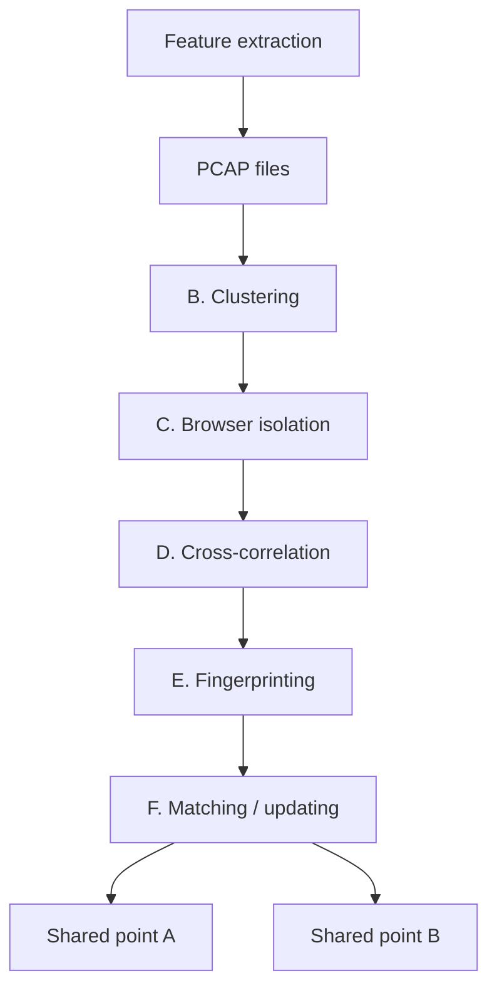

# FLOWPRINT: Semi-Supervised Mobile-App Fingerprinting on Encrypted Network Traffic

Thijs van Ede1, Riccardo Bortolameotti2, Andrea Continella3, Jingjing Ren4, Daniel J. Dubois4, Martina Lindorfer5, David Choffnes4, Maarten van Steen1, and Andreas Peter1

1University of Twente, 2Bitdefender, 3UC Santa Barbara, 4Northeastern University, 5TU Wien

{t.s.vanede, m.r.vansteen, a.peter}@utwente.nl, rbortolameotti@bitdefender.com,

{acontinella, mlindorfer}@iseclab.org, {renjj, d.dubois, choffnes}@ccs.neu.edu

Abstract—Mobile-application fingerprinting of network traffic is valuable for many security solutions as it provides insights into the apps active on a network. Unfortunately, existing techniques require prior knowledge of apps to be able to recognize them. However, mobile environments are constantly evolving, i.e., apps are regularly installed, updated, and uninstalled. Therefore, it is infeasible for existing fingerprinting approaches to cover all apps that may appear on a network. Moreover, most mobile traffic is encrypted, shows similarities with other apps, e.g., due to common libraries or the use of content delivery networks, and depends on user input, further complicating the fingerprinting process.

As a solution, we propose FLOWPRINT, a semi-supervised approach for fingerprinting mobile apps from (encrypted) network traffic. We automatically find temporal correlations among destination-related features of network traffic and use these correlations to generate app fingerprints. Our approach is able to fingerprint previously unseen apps, something that existing techniques fail to achieve. We evaluate our approach for both Android and iOS in the setting of app recognition, where we achieve an accuracy of 89.2%, significantly outperforming stateof-the-art solutions. In addition, we show that our approach can detect previously unseen apps with a precision of 93.5%, detecting 72.3% of apps within the first five minutes of communication.

# I. INTRODUCTION

Security solutions aim at preventing potentially harmful or vulnerable applications from damaging the IT infrastructure or leaking confidential information. In large enterprise networks, this is traditionally achieved by installing monitoring agents that protect each individual device [67]. However, for mobile devices security operators do not have direct control over the apps installed on each device in their infrastructure, especially when new devices enter networks under bring-your-own-device (BYOD) policies on a regular basis and with the ease by which apps are installed, updated, and uninstalled. In order to still retain detection capabilities for apps that are active in the network, operators rely on observing the network traffic of mobile devices. This naturally introduces the challenge of detecting apps in encrypted network traffic, which represents the majority of mobile traffic—80% of all Android apps, and 90% of apps targeting Android 9 or higher, adopt Transport Layer Security (TLS) [31].

However, recognizing mobile apps can be a double-edged sword: On the one hand, network flow analysis provides a nonintrusive central view of apps on the network without requiring host access. On the other hand, app detection can be used for censoring and invades users’ privacy. As we show in this work, active apps on a network can not only be reliably fingerprinted for security purposes, but also in an adversarial setting, despite traffic encryption. Thus, privacy-conscious users need to be aware of the amount of information that encrypted traffic is still revealing about their app usage, and should consider additional safeguards, such as VPNs, in certain settings.

The idea of network-based app detection has already been extensively explored in both industry and academia [2, 4, 5, 17, 25]. Snort for example offers AppID [21], a system for creating network intrusion detection rules for specified apps, while Andromaly [57] attempts to detect unknown software through anomaly detection by comparing its network behavior to that of known apps. Other approaches specifically focus on detecting apps containing known vulnerabilities [62], and others identify devices across networks based on the list of apps installed on a device [61]. All these approaches have in common that they require prior knowledge of apps before being able to distinguish them. However, new apps are easily installed, updated and uninstalled, with almost 2.5 million apps to choose from in the Google Play Store alone [60], not to mention a number of alternative markets. Furthermore, recent work has shown that even the set of pre-installed apps on Android varies greatly per device [30]. Thus, especially when companies adopt BYOD policies, it is infeasible to know in advance which apps will appear on the network. As a consequence, unknown apps are either misclassified or bundled into a big class of unknown apps. In a real-world setting, a security operator would need to inspect the unknown traffic and decide which app it belongs to, limiting the applicability of existing approaches in practice.

Unlike existing solutions, we assume no prior knowledge about the apps running in the network. We aim at generating fingerprints that act as markers, and that can be used to both recognize known apps and automatically detect and isolate previously unseen apps. From this, a security operator can update whitelists, blacklists or conduct targeted investigations on per-app groupings of network traffic.

There are several challenges that make such fingerprinting non-trivial. This is because mobile network traffic is particularly homogeneous, highly dynamic, and constantly evolving:

Homogeneous. Mobile network traffic is homogeneous because many apps share common libraries for authentication, advertisements or analytics [11]. In addition, the vast majority of traffic uses the same application-level protocol HTTP in various forms (HTTP(S)/QUIC) [50]. Furthermore, part of the content is often served through content delivery networks (CDNs) or hosted by cloud providers. Consequently, different apps share many network traffic characteristics. Our work tackles homogeneous traffic by leveraging the difference in network destinations that apps communicate with. We show that despite the large overlap in destinations, our approach is still able to extract unique patterns in the network traffic.

Dynamic. Mobile network traffic is often dynamic as data that apps generate may depend on the behavior of the users, e.g., their navigation through an app. Such dynamism may already be observed in synthetic datasets that randomly browse through an app’s functionality. Various fingerprinting approaches rely on repetitive behavior in network traffic [1, 28]. Despite good results of these methods in smart-home environments and industrial control systems, dynamic traffic could complicate fingerprinting of mobile apps. Hence, our work aims to create fingerprints that are robust against user interactions by leveraging information about network destinations on which the user has limited influence. We show that our approach achieves similar results on both automated and user-generated datasets.

Evolving. Mobile network traffic is constantly evolving as app markets offer effortless installation, update, and uninstallation of a vast array of apps. Studies have shown that apps are regularly updated with new versions, as frequently as once a month on average [11, 22]. This is a challenge for existing fingerprinting mechanisms that require prior knowledge of an app in order to generate fingerprints. When new or updated apps are introduced into the network, these fingerprinting systems become less accurate, similarly to what Vastel et al. observed in the setting of browser fingerprinting [65]. Moreover, the fraction of apps covered by these systems dramatically decreases over time if fingerprints are not regularly updated. Our solution counters this by basing its fingerprints on pattern discovery in network traffic instead of training on labeled data. Doing so, our approach produces fingerprints that automatically evolve together with the changing network traffic. We show that our approach is able to correctly recognize updated apps and can even detect and fingerprint previously unseen apps.

To address these challenges, we introduce a semisupervised approach to generate fingerprints for mobile apps. Our key observation is that mobile apps are composed of different modules that often communicate with a static set of destinations. We leverage this property to discover patterns in the network traffic corresponding to these different modules. On a high level, we group together (encrypted) TCP/UDP flows based on their destination and find correlations in destinations frequently accessed together. We then combine these patterns into fingerprints, which may, among other use cases, be used for app recognition and unseen app detection.

While our approach does not require prior knowledge to generate fingerprints, and could, thus, be considered unsupervised, the applications of our approach are semi-supervised. In fact, our approach creates “anonymous” labels that uniquely identify mobile apps. However, app recognition uses known labels to assign app names to the matched fingerprints. For example, having knowledge about the Google Maps app, allows us to rename unknown\_app\_X to google\_maps. Similarly, unseen app detection requires a training phase on a set of known apps to identify unknown ones.

In summary, we make the following contributions:

We introduce an approach for semi-supervised fingerprinting by combining destination-based clustering, browser isolation and pattern recognition.   
We implement this approach in our prototype FLOW-PRINT, the first real-time system for constructing mobile app fingerprints capable of dealing with unseen apps, without requiring prior knowledge.   
We show that, for both Android and iOS apps, our approach detects known apps with an accuracy of 89.2%, significantly outperforming the state-of-the-art supervised app recognition system AppScanner [62]. Moreover, our approach is able to deal with app updates and is capable of detecting previously unseen apps with a precision of 93.5%.

In the spirit of open science, we make both our prototype and datasets available at https://github.com/Thijsvanede/FlowPrint.

# II. PRELIMINARY ANALYSIS

To study mobile network traffic and identify strong indicators that can be used to recognize mobile apps, we performed a preliminary analysis on a small dataset. As indicated in the introduction, our fingerprinting method should be able to distinguish mobile apps despite their homogeneous, dynamic and evolving behavior. Hence, in our preliminary analysis we explored features that may be used to fingerprint apps.

# A. Dataset

In order to perform our analyses, we use datasets of encrypted network traffic labeled per app (see Table I). These datasets allow us to evaluate our method in various conditions as they contain a mix of both synthetic and user-generated data; Android and iOS apps; benign and potentially harmful apps; different app stores; and different versions of the same app. We collected three of the datasets as part of our prior work [40, 51, 52, 53]. We collected the last set specifically for this work with the purpose of representing browser traffic, which is lacking in most available datasets. For this preliminary analysis, we only used a small fraction of the available data in order to prevent bias in the final evaluation.

ReCon. The ReCon AppVersions dataset [52, 53] consists of labeled network traces of 512 Android apps from the Google Play Store, including multiple version releases over a period of eight years. The traces were generated through a combination of automated and scripted interactions on five different Android devices. The apps were chosen among the 600 most popular free apps on the Google Play Store ranking within the top 50 in each category. In addition, this dataset contains extended traces of five apps, including multiple version releases. The network traffic of each of these five apps was captured daily over a two-week period. In this work, we refer the AppVersions dataset as ReCon and to the extended dataset as ReCon extended.

TABLE I. DATASET OVERVIEW. ✓ INDICATES A DATASET CONTAINS HOMOGENEOUS (H), DYNAMIC (D), OR EVOLVING (E) TRAFFIC. 

<table><tr><td>Dataset</td><td>No. Apps</td><td>No. Flows</td><td>% TLS Flows</td><td>Start Date</td><td>End Date</td><td>Avg. Duration</td><td>H D E</td></tr><tr><td>ReCon [52, 53]</td><td>512</td><td>28.7K</td><td>65.9%</td><td>2017-01-24</td><td>2017-05-06</td><td>189.2s</td><td>√ √</td></tr><tr><td>ReCon extended [52, 53]</td><td>5</td><td>141.2K</td><td>54.0%</td><td>2017-04-21</td><td>2017-05-06</td><td>4h 16m</td><td>√ √</td></tr><tr><td>Cross Platform (Android) [51]</td><td>215</td><td>67.4K</td><td>35.6%</td><td>2017-09-11</td><td>2017-11-20</td><td>333.0s</td><td>√ √</td></tr><tr><td>Cross Platform (iOS) [51]</td><td>196</td><td>34.8K</td><td>74.2%</td><td>2017-08-28</td><td>2017-11-13</td><td>339.4s</td><td>√ √</td></tr><tr><td>Cross Platform (All) [51]</td><td>411</td><td>102.2K</td><td>49.6%</td><td>2017-08-28</td><td>2017-11-20</td><td>336.0s</td><td>√ √</td></tr><tr><td>Andrubis [40]</td><td>1.03M</td><td>41.3M</td><td>24.7%</td><td>2012-06-13</td><td>2016-03-25</td><td>210.7s</td><td>√</td></tr><tr><td>Browser</td><td>4</td><td>204.5K</td><td>90.5%</td><td>2018-12-17</td><td>2019-03-01</td><td>3h 34m</td><td>√</td></tr></table>

Cross Platform. The Cross Platform dataset [51] consists of user-generated data for 215 Android and 196 iOS apps. The iOS apps were gathered from the top 100 apps in the App Store in the US, China and India. The Android apps originate from the top 100 apps in Google Play Store in the US and India, plus from the top 100 apps of the Tencent MyApps and 360 Mobile Assistant stores, as Google Play is not available in China. Each app was executed between three and ten minutes while receiving real user inputs. Procedures to install, interact, and uninstall the apps were given to student researchers who followed them to complete the experiments while collecting data. We use this dataset to evaluate both the performance of our method with user-generated data and the performance between different operating systems.

Andrubis. The Andrubis dataset [40] contains labeled data of 1.03 million Android apps from the Google Play Store and 15 alternative market places. This dataset contains both benign and potentially harmful apps, as classified by VirusTotal. Each trace in this dataset was generated by running the app for four minutes in a sandbox environment emulating an Android device. The app was exercised by automatically invoking app activities and registered broadcast receivers, and simulating user interactions through the Android Application Exerciser Monkey. We use the Andrubis dataset for experiments requiring large traffic volume and to assess the performance of our method on both benign and potentially harmful apps.

Browser. We created the Browser dataset because the existing datasets contain a limited amount of browser traffic, which may produce a significant portion of traffic in mobile environments. Even though a browser is not a dedicated app, but rather a platform on which various web content is rendered, executed and displayed, a fingerprinting method with the purpose of detecting apps should also be able to detect the browser as a single app. To this end, we collect an additional dataset of browser traffic by scraping the top 1,000 Alexa websites on a Samsung Galaxy Note 4 running Android 6.0.1 with Chrome, Firefox, Samsung Internet and UC Browser, which cover 90.9% of browser traffic [59], if we exclude Safari, which is not available for Android. Each website visit lasts for 15 seconds, while the Application Exerciser Monkey simulates a series of random movements and touches.

# B. Feature Exploration

Previous work on app fingerprinting usually tackles the problem in a supervised setting. In this work however, we propose an approach with the aim of automatically detecting unknown apps, without requiring prior knowledge. This requires a re-evaluation of the network features commonly used in app fingerprinting. Therefore, we first identify possible features from the network traffic. The TLS-encrypted traffic limits the available features to temporal and size-based features, as well as the header values of unencrypted layers and the handshake performed to establish a TLS connection. The data-link layer header provides only information about the linked devices, not about the app itself and is therefore not useful for our purposes. We further analyze the layers between the data-link and application layer, as we expect the latter to be encrypted. From these layers, we extract all header values controlled by the communicating app as well as the sizes and inter-arrival times of packets. In addition, for the size and time related features we compute the statistical properties: minimum, maximum, mean, standard deviation, mean absolute deviation, and 10-th through 90-th percentile values.

# C. Feature Ranking

We score all features according to the Adjusted Mutual Information (AMI) [66], a metric for scoring features in unsupervised learning. We favor the AMI over other methods, such as information gain, as the latter is biased towards features that can take on random values. Such randomness is undesirable in an unsupervised or semi-supervised setting, as we do not have any prior expectation of feature values. The AMI defines the relative amount of entropy gained by knowing a feature with respect to the class, in our case the app. To this end, we first compute the mutual information between a feature and its app as described in Equation 1. Here Y is the list of classes of each sample and X is the list of features corresponding to the samples. Function p(x, y) defines the joint probability of value x and label y, whereas p(x) and p(y) are the individual probabilities of features x and y occurring respectively.

$$
M I (X, Y) = \sum_ {y \in Y} \sum_ {x \in X} p (x, y) \log \left(\frac {p (x , y)}{p (x) p (y)}\right) \tag {1}
$$

To counter that the mutual information is biased toward features that have many different values, the AMI removes any bias by normalizing for the expected gain in entropy. As a result, the AMI score ranges from 0 (completely uncorrelated) to 1 (observing feature X fully maps to knowing app label Y). Equation 2 shows the definition of the AMI, where E[X] is the expected value of X and H(X) is the entropy of X. We use the AMI to rank features based on how much information they contain about an app, and thereby get an indication of their usefulness in a fingerprint.

$$
A M I (X, Y) = \frac {M I (X , Y) - E [ M I (X , Y) ]}{\max (H (X) , H (Y)) - E [ M I (X , Y) ]} \tag {2}
$$

# D. Feature Evaluation

Using the AMI, we analyze and rank the features available in TLS-encrypted traffic of the ReCon dataset. The evaluation of our fingerprinting approach in Section V demonstrates that these features also generalize to other datasets. After extracting all features, we divide them into categorical and continuous values. As the AMI can be compared only for categorical values, we divided each continuous value into 20 equally sized bins spanning the full range of each feature. Then, we computed the AMI of each feature with respect to the app label. Table II shows the ten highest ranked features, we provide all the analyzed features together with their AMI scores at https://github.com/Thijsvanede/FlowPrint.

TABLE II. AMI OF TEN HIGHEST SCORING FEATURES. 

<table><tr><td>Feature</td><td>Category</td><td>AMI</td></tr><tr><td>Inter-flow timing</td><td>Temporal</td><td>0.493</td></tr><tr><td>IP address - source</td><td>Device</td><td>0.434</td></tr><tr><td>TLS certificate - validity after</td><td>Destination</td><td>0.369</td></tr><tr><td>TLS certificate - validity before</td><td>Destination</td><td>0.356</td></tr><tr><td>TLS certificate - serial number</td><td>Destination</td><td>0.342</td></tr><tr><td>IP address - destination</td><td>Destination</td><td>0.246</td></tr><tr><td>TLS certificate - extension set</td><td>Destination</td><td>0.235</td></tr><tr><td>Packet size (incoming) - std</td><td>Size</td><td>0.235</td></tr><tr><td>Packet size (outgoing) - std</td><td>Size</td><td>0.232</td></tr><tr><td>Packet inter-arrival time (incoming) - std</td><td>Temporal</td><td>0.218</td></tr></table>

From Table II we first observe that there are no features with an AMI close to 1. Hence, a fingerprint should combine multiple features in order to create a reliable app marker. In addition, we deduce four important categories that can be leveraged when creating app fingerprints. We note that these categories are not new to app fingerprinting, but give insights into how an approach may benefit from leveraging these features. While only using a small part of the dataset for our preliminary feature evaluation, our results in Section V show that the features are generic and also perform well on larger datasets.

Temporal features. The Inter-flow timing and Packet interarrival time (incoming) stress the importance of timing in network traffic. Most apps primarily communicate when active, and early studies suggested a limited number of apps are active simultaneously [14, 26]. As temporal features may be affected by latency and network congestion on a small-time scale, our work uses time on a more course-grained level. We leverage the time between flows to correlate traffic occurring at the same time interval. In addition to our semi-supervised setting, supervised fingerprinting methods such as BIND [4] also use temporal features.

Device features. The IP address - source feature is the IP address of the monitored device. This feature demonstrates that the device producing network traffic reveals information about the app. Intuitively, different devices may run different app suites. Our work does not use the IP source address as a feature, but instead create app fingerprints separately per device. We reason that identifying apps on a per-device basis assists in limiting the amount of dynamic behavior. Furthermore, a related study [5] observed that different devices in terms of vendor and/or OS version may exhibit significant variations in traffic features. Therefore, our approach handles traffic on a per-device basis and constructs separate fingerprints for each device.

Destination features. The high AMI of the IP address - destination, i.e., the IP address of the server, and various TLS certificate features indicate that apps may be discriminated based on the destinations with which they communicate. Intuitively, each app is composed of a unique set of different modules that all provide parts of the app’s functionality. Each module communicates with a set of servers resulting in a unique set of network destinations that differentiate apps. Destination features may even be enriched by domains extracted from DNS traffic. However, this data is not always available due to DNS caches. Hence, to work in a more general setting our approach does not use the domain as a feature. Even though network destinations may change over time, we show in Section V that our approach is able to deal with these changes. Size features. Both incoming and outgoing Packet size features show a high AMI. This implies that the amount of data being sent and received per flow is a good indicator of which app is active. However, all other packet size features yielded an AMI score of 0.07 or lower, i.e., making up two thirds of the bottom 50% of ranked features. Therefore, we do not incorporate packet sizes in our approach. This does not mean size features are unsuited for fingerprinting per se, as can be observed from supervised approaches using size-based features [2, 5, 62]. However, the size features yield little information for fingerprinting in a semi-supervised setting.

# III. THREAT MODEL

Our work focuses on creating fingerprints for mobile apps and we assume the perspective of a security monitor who can (1) trace back flows to the device despite NAT or changing IP addresses, (2) distinguish mobile from non-mobile devices, and (3) only monitor its own network (e.g., the WiFi network of an enterprise)—traffic sent over other networks cannot be used to generate fingerprints. Our assumptions match the scenario of enterprise networks, where security operators have full network visibility and access to the DHCP server.

Even without a priori knowledge about device types, security operators could still isolate network traffic from mobile devices based on MAC addresses and orthogonal OS fingerprinting approaches: for example, related work has shown that DHCP messages [46], TCP/IP headers [18], and OS-specific destinations [36] (e.g., update servers and mobile app markets), can be used to identify mobile devices, and even tethering.

Finally, we focus on single app fingerprints, i.e., we assume that mobile apps are executed one at the time. In practice, there is often a separation between the execution of multiple apps, with the exception of background services, which, however, produce fewer and more recognizable traffic patterns. Nonetheless, we acknowledge the possibility that multiple apps are executed simultaneously on a single device causing composite fingerprints. We believe our approach is an excellent start to investigate the creation and behavior of such composite fingerprints. However, as we will discuss in Section VI, we consider this out of scope for the current work as existing solutions already suffer from limitations such as identifying previously unseen apps.

# IV. APPROACH

We aim to fingerprint mobile apps in a semi-supervised and real-time fashion on the base of their (encrypted) network traffic. We build our approach on the observation that mobile apps are composed of different modules that each communicate with a relatively invariable set of network destinations. Our focus lies on discovering these distinctive communication patterns without requiring any knowledge of the specific active apps. To this end, we create fingerprints based on temporal correlations among network flows between monitored devices and the destinations they interact with. As a result, our fingerprints are capable of dealing with evolving app suites, and are agnostic to the homogeneous and dynamic nature of mobile traffic.

Figure 1 shows an overview of our approach: We periodically take network traffic of mobile devices as input and generate fingerprints that map to apps. To do so, we isolate

flowchart

Fig. 1. Overview of the creation and matching of app fingerprints. (A) We extract features from the network traces. (B) We cluster the flows from each device per network destination. (C) We detect and isolate browsers. (D) We discover correlations between network destinations. (E) We create fingerprints based on strong correlations. (F) We match newly found fingerprints against previously generated fingerprints and update them accordingly.

TCP/UDP flows from the network traces for each device, and extract the required features. Subsequently, for each individual device we cluster all flows according to their destination. This clustering allows the discovery of common communication patterns later on. Before generating app fingerprints, our approach first pays special attention to browsers as they behave like a platform accessing web content rather than a dedicated app. Thereafter, we correlate remaining clusters based on temporally close network activity to generate app fingerprints. When clusters show a strong correlation, we group their flows together in a fingerprint. Finally, we match the generated fingerprints against a database of known fingerprints to recognize apps or detect previously unseen apps. By combining correlation and clustering techniques, our approach discovers temporal access patterns between network destinations without requiring any prior knowledge.

# A. Feature Extraction

The first step for generating fingerprints extracts features from the network traffic, where we separately look at the TCP and UDP flows of each mobile device. Per device, we extract the destination IP and port number, timestamp (used to compute the timing between flows), size and direction of all packets in the flow and, if applicable, the TLS certificate for that flow. From these features, we use the destination IP and port number as well as the TLS certificate in the clustering phase. Browser isolation additionally requires information about the amount of data that is sent over the network. Finally, the correlation step uses the timestamps of packets to determine to what extent different flows are temporally correlated.

# B. Clustering

Since our approach runs periodically over input data of each device, we first split the input data is into batches of a given timing interval $\tau _ { \mathrm { b a t c h } }$ . After extracting the features for each batch, we cluster together TCP/UDP flows based on their network destination. We consider flows to go to the same network destination if they satisfy any of the following criteria: (1) The flows contain the same (destination IP address, destination port)-tuple. (2) The flows contain the same TLS certificate.

The clustering approach for app fingerprinting raises some concerns about the consistency of destination clusters. After all, web services may use multiple IP addresses for a single destination for load balancing and reducing the server response time, or even change their IP address completely. Our approach tackles this problem by clustering destinations based on similarity of either the (IP, port)-tuple or the TLS certificate. As discussed previously, one may even enrich the clustering features by including DNS traffic of flows as well if this information is available. Our evaluation in Section V shows that this method is robust against inconsistencies in network destinations.

Figure 2 shows an example of the resulting clusters, in which the destination clusters are scattered randomly. The size of each cluster is proportionate to the amount of flows assigned to it. Note that some of the clusters are generated by multiple apps, which we refer to as shared clusters. Further inspection reveals that these shared clusters correspond to third-party services such as crash analytics, mobile advertisement (ad) networks, social networks, and CDNs. These services are often embedded through libraries that are used by many apps: e.g., googleads.g.doubleclick.net, lh4.googleusercontent.com and android.clients.- google.com are shared clusters that provide these services. We discuss the extent to which shared clusters influence fingerprinting in our analysis on homogeneity in Section V-E. In addition to shared clusters, apps frequently produce clusters unique to that specific app, e.g., the s.yimg.com and infoc2.duba.net clusters only occur in the traffic of the com.rhmsoft.fm app. These app-specific clusters often point to destinations of the app developer, i.e., the first party, or smaller providers of the aforementioned cross-app services. Finally, note that the obtained clusters consist of flows from the entire input batch. However, the monitored device will only sporadically communicate with each destination. Therefore, we refer to clusters as active when a message is sent to or received from the destination represented by the cluster, and inactive otherwise.

# C. Browser Isolation

As previously discussed, browsers are different from other apps in that they are not dedicated apps. This means that behavioral patterns in browsers are more difficult to detect as the user may navigate to any website at will. To account for this, we introduce a separate technique to detect and isolate browser traffic into a single app.

Features. From the perspective of destination clustering, we expect browsers to show many new clusters. After all, modern websites distribute their content along CDNs, display advertisement, and load auxiliary scripts and images. These are stored at various destinations and therefore show up as new clusters. In addition, content downloaded to be displayed in browsers often contains much more data than is uploaded in browser requests. We expect that for other mobile apps, this communication is much more balanced and the number of clusters active simultaneously is smaller. To account for the fact that multiple apps may be active and thereby show browser-like behavior, we focus only on the relative changes. Therefore, our browser detector uses the following features: (1) Relative change in active clusters; (2) Relative change in bytes uploaded; (3) Relative change in bytes downloaded; (4) Relative change in upload/download ratio.

Browser detector. To detect browsers, we train a Random Forest Classifier [34] with labeled browser and non-browser data.1 When the classifier detects a TCP/UDP stream originating from a browser at time t, we isolate all connections active within an empirically set timeframe of $[ t - 1 0 , t + 1 0 ]$ seconds. This means that we label the connections as browser and do not consider them for further analysis. Therefore, after detection, these streams are removed from the destination clusters. Our rationale for removing all connections within a specific timeframe is that, when a browser is detected, it probably caused more network activity around that time. While this approach might be considered aggressive in detecting browsers, we argue that other apps should show persistent behavior. As a result, clusters that have been removed because all their connections were incorrectly isolated are still expected to resurface when the app is active without an interfering browser. We evaluate the performance of the browser isolation component in Section V-D.

# D. Cluster Correlation

Now that browsers are isolated, we leverage the remaining clusters for app fingerprinting. However, using only destination clusters is insufficient for fingerprinting apps as network destinations are shared among apps and may change between different executions of an app [62, 63]. A small-scale experiment on our datasets shows that an increasing number of apps leads to a rapid decline in app-specific clusters. When randomly selecting 100 apps from all our dataset over ten Monte Carlo cross validations, only 58% of apps show at least one app-specific destination cluster. In the same experiment, when selecting 1,000 apps, this number drops to 38%. Therefore, to fingerprint apps we also leverage the temporal correlations between active destination clusters. Our rationale here is that apps persistently communicate with the same network destinations. We hypothesize that the combination of active destination clusters at each point in time is unique and relatively stable for each app. This means that over time one should be able to observe stronger correlations for destinations that belong to the same app. Our experiments in Section V demonstrate that this method of fingerprint generation can be used for both app recognition and detection of previously unseen apps.

Correlation graph. To measure the temporal correlation between clusters, we compute the cross-correlation [49] between the activity of all cluster pairs as defined in Equation 3. Even though this has a theoretical time complexity of $O ( n ^ { 2 } )$ , we show in Section V-G that in practice it is still easily scalable. We compute this cross-correlation by splitting the input batch into slices of $\tau _ { \mathrm { w i n d o w } }$ seconds (see Section V-A). We consider a cluster $c _ { i }$ active at time slice t if it sends or receives at least one message to or from the destination cluster during that window. Its activity is modeled as $c _ { i } [ t ] = 1$ if it is active or $c _ { i } [ t ] = 0$ if it is inactive.

$$
(c _ {i} \star c _ {j}) = \sum_ {t = 0} ^ {T} c _ {i} [ t ] \cdot c _ {j} [ t ] \tag {3}
$$

The cross-correlation is naturally higher for clusters with a lot of activity. To counter this, we normalize the cross-correlation

bubble

| Category | Label | Size |
|---|---|---|
| first | googleads.g.doubleclick.net | 10 |
| CDN | lh4.googleusercontent.com | 5 |
| ads | play.googleapis.com | 3 |
| social | android.clients.google.com | 2 |
| infoc2.duba.net | infoc2.duba.net | 10 |

Fig. 2. Example of destination clusters for three apps: com.rhmsoft.fm, com.steam.photoeditor, and au.com.penguinapps.android.babyfeeding.client.- android. The size of each cluster is proportionate to the amount of flows assigned to it. We labeled first- and third-party destinations based on the methodology of Ren et al. [52], and distinguished for the latter between CDNs, advertisement networks (ads), and social networks (social).

natural_image

Two abstract network diagrams with interconnected nodes and colored clusters (green, blue, red) — no text or symbols present.

Fig. 3. Example correlation graph for three apps as generated by our approach (left) and when labeled per app (right). The apps include com.rhmsoft.fm (blue), com.steam.photoeditor (green) and au.com.penguinapps.android.babyfeeding.client.android (red) or shared destination clusters (black). Larger nodes indicate the more flows to that destination cluster. The thickness of each edge depends on the cross correlation.

for the total amount of activity in both clusters as specified in Equation 4.

$$
(c _ {i} \star c _ {j}) _ {\text {norm}} = \frac {\sum_ {t = 0} ^ {T} c _ {i} [ t ] \cdot c _ {j} [ t ]}{\sum_ {t = 0} ^ {T} \max (c _ {i} [ t ] , c _ {j} [ t ])} \tag {4}
$$

Using the cross-correlation metric between each cluster, we construct a correlation graph with each node in this graph representing a cluster. Clusters are connected through weighted edges where the weight of each edge defines the crosscorrelation between two clusters. Figure 3 shows the correlation graph of three selected apps as an example. We see that clusters belonging to the same app demonstrate a strong crosscorrelation. In addition, shared clusters show weak correlation between all apps and most of the unique clusters are not correlated at all.

# E. App Fingerprints

To construct app fingerprints we identify maximal cliques, $\mathrm { i . e . , }$ complete subgraphs, of strongly correlated clusters in the correlation graph. To discover such cliques, we first remove all edges with a weak cross-correlation. A cross-correlation is considered weak if it is lower than a threshold $\tau _ { \mathrm { c o r r e l a t i o n } } .$ , which in our approach is empirically set to 0.1 (see Section V-A). This leaves us with a correlation graph containing only the strongly correlated clusters. We then extract all maximal cliques from this graph and transform each clique into a fingerprint. As all maximal cliques are complete subgraphs, the edges in the clique do not add any additional information. This means we can transform cliques into sets of network destinations by extracting all (destination IP, destination port)-tuples and TLS-certificates from every node in a clique and combine them into a set. By performing this transformation for each clique, we obtain all of our fingerprints. In short, we define an app fingerprint as the set of network destinations that form a maximal clique in the correlation graph.

As graph edges in the correlation graph depend on the activity of a destination with other clusters, some of the nodes are completely disconnected from the rest of the graph. This is often the case for destinations that are shared among many apps. Figure 3 shows an example where the shared (black) nodes only have low cross correlations that fall under the threshold. As these 1-cliques often correspond to multiple apps, treating them as fingerprints yields little added value. However, they will most likely originate from the same app for which we are able to produce fingerprints during the batch processing. Therefore, we assign flows from 1-cliques to the fingerprint that is closest in time, or, if two fingerprints are equally close, to the fingerprint containing the most flows.

# F. Fingerprint Comparison

The benefit of using a fingerprint to represent traffic from an app is that it can be computed from the features of the network traffic itself without any prior knowledge. Moreover, we want to compare fingerprints with each other to track app activity over time. Unfortunately, apps communicate with various sets of destinations at different times, either because traffic is based on user interaction, which is dynamic, or because apps produce distinct traffic for different functionalities. Consequently, fingerprints of the same app can diverge to various degrees. To account for this fact, we do not compare fingerprints as an exact match, but instead base their comparison on the Jaccard similarity [35]. Since our fingerprints are sets, the Jaccard similarity is a natural metric to use. To test whether two fingerprints are similar, we compute the Jaccard similarity between two fingerprints $F _ { a }$ and $F _ { b }$ (displayed in Equation 5) and check whether it is larger then a threshold τsimilarity. If this is the case, we consider the two fingerprints to be the same.

$$
J (F _ {a}, F _ {b}) = \frac {| F _ {a} \cap F _ {b} |}{| F _ {a} \cup F _ {b} |} \tag {5}
$$

By comparing fingerprints in this way, we are able to track the activity of apps between different input batches and executions of the our approach. In addition, it automatically solves the problem when we observe a fingerprint where one edge of the clique is missing because it did not make the threshold cutoff. Especially when cliques become larger, the possibility of a clique missing an edge increases. In such cases, our approach would output multiple fingerprints for the same app. If these fingerprints are similar, they can even be merged by taking the union of fingerprints. In addition, this comparison based on the Jaccard similarity allows our approach to treat similar fingerprints as equivalent.

# V. EVALUATION

We implemented a prototype of our approach, called FLOWPRINT, in Python using the Scikit-learn [47] and NetworkX [33] libraries for machine learning and graph computation. The first experiment in our evaluation determines the optimal parameters for our approach. Then, we analyze to what extent the fingerprints generated by our approach can be used to precisely identify apps. Here, we compare our approach against AppScanner [62], a supervised state-of-theart technique to recognize apps in network traffic. Thereafter, we evaluate how well our approach deals with previously unseen apps, either through updates or newly installed apps. We then detail specific aspects of our approach such as the performance of the browser detector, the confidence level of our fingerprints, and the number of fingerprints produced per app. We further investigate how well our approach can deal with the homogeneous, dynamic, and evolving nature of mobile network traffic. Finally, we discuss the impact of the number of apps installed on the device and demonstrate that our method is able to run in real-time by assessing the execution time of FLOWPRINT.

Experimental setup. Our evaluation requires ground truth labels, which for mobile apps can be acquired by installing an intrusive monitoring agent on a real device, or by running controlled experiments. Due to privacy concerns and to ensure repeatability of our experiments, we evaluate FLOWPRINT on the datasets described in Section II-A, which closely approach an open world setting, containing encrypted data, user-generated data, both Android and iOS apps, and different app versions. As explained in Section IV, our approach does not require any prior knowledge to generate fingerprints, and we leverage ground truth labels only to evaluate our prototype (i.e., to assign app names to matched fingerprints).

We split the traffic of each app in our datasets 50:50 into training and testing sets, without any overlap. For each experiment, we build our database from the training data of 100 randomly chosen apps for each dataset. This leads to an average of 2.0 fingerprints per app for ReCon and Andrubis, and 6.2 for the Cross Platform dataset. For the unseen app detection, we additionally introduce traffic from 20 randomly chosen apps that are not present in the training set.

# A. Parameter Selection

As detailed in the previous section, our approach requires four configurable parameters to create fingerprints:

$\tau _ { \mathrm { b a t c h } }$ sets the amount of time of each batch in a network capture to process in each run of our approach.   
τwindow specifies the time window for destination clusters to be considered active simultaneously.   
τcorrelation describes the minimum amount of correlation $( c _ { i } \star c _ { j } ) _ { n o r m }$ between two destination clusters to have an edge in the correlation graph.   
$\tau _ { \mathrm { s i m i l a r i t y } }$ indicates the minimum required Jaccard similarity between fingerprints to be treated as equivalent.

Optimization metric. We optimize each parameter with respect to the F1-score that our approach achieves when recognizing apps. This metric computes the harmonic mean between precision and recall and is often used to evaluate security solutions. As we output fingerprints, we need to map them to app labels in order to evaluate our approach. Each fingerprint consists of flows which, in our dataset, are labeled. Hence, we label each fingerprint with the flow label that is most commonly assigned to that fingerprint. To illustrate this, suppose fingerprint $\breve { F }$ contains 10 flows of app A and 2 flows of app B, all 12 flows of that fingerprint will be assigned the label A. While this approach can generate multiple fingerprints per app (see Section V-D), many security applications (e.g., firewalls) use a mapping on top of fingerprinting and allow multiple fingerprints for the same app.

TABLE III. SUMMARY OF TESTED PARAMETER OPTIMIZATION VALUES. THE FIRST ROW SHOWS THE DEFAULT PARAMETERS AND EACH SUBSEQUENT ROW HIGHLIGHTS THE OPTIMAL VALUES FOUND FOR EACH INDIVIDUAL PARAMETER. 

<table><tr><td> $\tau_{\text{batch}}$ </td><td> $\tau_{\text{window}}$ </td><td> $\tau_{\text{correlation}}$ </td><td> $\tau_{\text{similarity}}$ </td><td>F1-score</td></tr><tr><td>3600</td><td>5</td><td>0.3</td><td>0.5</td><td>0.8164</td></tr><tr><td>300</td><td>5</td><td>0.3</td><td>0.5</td><td>0.8294</td></tr><tr><td>300</td><td>30</td><td>0.3</td><td>0.5</td><td>0.8367</td></tr><tr><td>300</td><td>30</td><td>0.1</td><td>0.5</td><td>0.8543</td></tr><tr><td>300</td><td>30</td><td>0.1</td><td>0.9</td><td>0.9190</td></tr></table>

Parameter selection. To optimize our parameters, we refine them individually to reach an optimal F1-score. We choose our parameters from the following set of possible values:

$\tau _ { \mathrm { b a t c h } } \colon$ 1m, 5m, 10m, 30m, 1h, 3h, 6h, and 12h.   
$\tau _ { \mathrm { w i n d o w } } \mathrm { : }$ 1s, 5s, 10s, 30s, 1m, 5m, 10m, and 30m.   
$\tau _ { \mathrm { c o r r e l a t i o n } }$ : 0.1 to 1.0 in steps of 0.1.   
$\tau _ { \mathrm { s i m i l a r i t y } } \mathrm { : }$ 0.1 to 1.0 in steps of 0.1.

The batch size thresholds vary between 1 minute, a scenario where apps can be detected while they are still running, and 12 hours, representing a post-incident analysis. The window thresholds vary between 1 second and 30 minutes, where smaller values may miss flow correlations and larger values may correlate flows that were accidentally active around the same time period. Both correlation and similarity thresholds are evenly spread out between 0.1 and 1.0, the first and max values that trigger the corresponding fingerprint mechanism.

For each parameter we vary the value by iterating over the test set of possible values while keeping the other parameters as their default value. Once we find an optimal value for a parameter, it is set as the new default for optimizing the other parameters. This way of iterating through the values allows us to capture dependencies between the parameters. To get an average result, we perform a 10-fold cross validation analysis for each setting on held-out validation data from the Andrubis dataset. This held-out data is not used in the remainder of the evaluation to remove bias from this optimization step. We opt to optimize the parameters using only the Andrubis dataset to ensure all datasets contain enough testing data to evaluate our approach. While this may bias the optimal parameters to a specific dataset, our results in the remainder of this section show that the parameters also generalize well to other datasets. During the experiment, we assume that each device has 100 apps installed, which resembles a realistic setting [10]. We also performed the same evaluation with 200 apps per device, which resulted in the same optimal parameters.

As shown in Table III, we find optimal values for $\tau _ { \mathrm { b a t c h } } =$ 300 seconds, $\tau _ { \mathrm { w i n d o w } } ~ = ~ 3 0$ seconds, $\tau _ { \mathrm { c o r r e l a t i o n } } ~ = ~ 0 . 1$ and $\tau _ { \mathrm { s i m i l a r i t y } } = 0 . 9$ from this analysis.2 One interesting observation is that the optimal value for $\tau _ { \mathrm { b a t c h } }$ is found at 300 seconds. This means that it may take up to five minutes before a flow is assigned to a fingerprint. In settings that require faster fingerprint generation, operators can of course set a lower τbatch value, however at the cost of a lower performance.

# B. App Recognition

Many security solutions use a fingerprinting method for the purpose of app recognition [15, 57, 62]. To evaluate the extent to which our approach recognizes apps within network traffic, we create fingerprints of labeled training data. Then, we label each fingerprint with the app label most commonly assigned to flows within the fingerprint, i.e., we perform a majority vote. After obtaining the labeled fingerprints we run our approach with the test data. We then compare the resulting test fingerprints with the labeled training fingerprints using the Jaccard similarity, as detailed in Section IV-F. Subsequently, each test fingerprint, and by inference each flow belonging to that test fingerprint, receives the same label as the training fingerprint that is most similar to it.

We compare our approach with the state-of-the-art tool AppScanner [62, 63]. However, the authors of AppScanner only released precomputed length statistics about the flows in their dataset and the code for running the classification phase on such preprocessed statistics. Therefore, to be able compare both approaches on the same datasets, we faithfully reimplemented the AppScanner feature extraction strategy, which reads PCAP files and feeds the feature values to the classifier.3 To do so, we followed the description in the AppScanner paper for computing feature statistics, using the standard NumPy [45] and Pandas [43] libraries. AppScanner has different settings, it can either work with a Support Vector Classifier or a Random Forest Classifier. We evaluate AppScanner with a single large Random Forest Classifier, which achieved the highest performance in AppScanner’s evaluation. In addition, AppScanner requires a parameter that sets the minimum confidence level for recognition. The optimal confidence level according to the original paper is 0.7, hence this is what we used in our evaluation. Lowering this threshold increases the recall and decreases the precision of AppScanner.

Comparison with AppScanner. We evaluate FLOWPRINT against AppScanner by running a 10-fold cross validation on the same datasets discussed in Section II-A. Additionally, we measure to what extent the performance of our approach is affected by the number of flows produced per app. As apps in the Andrubis dataset produce a varying amount of data, we evaluated the performance considering only apps having a minimum of x flows. This resulted in five evaluations for x = 1, i.e., all apps, $x \ = \ 1 0 , \ x \ = \ 1 0 0 , \ x \ = \ 5 0 0 .$ , and x = 1000. We refer to these evaluations as Andrubis ≥ x flow(s) for each respective value of x. All experiments assumed a maximum of 100 active apps per device in accordance with recent statistics [10].

TABLE IV. PERFORMANCE OF OUR APPROACH COMPARED TO APPSCANNER IN THE APP RECOGNITION EXPERIMENT. THE NUMBER OF FLOWS SHOWN FOR THE ANDRUBIS DATASET INDICATE THE MINIMUM NUMBER OF REQUIRED FLOWS AN APP HAD TO PRODUCE TO BE INCLUDED IN THE EXPERIMENT. 

<table><tr><td rowspan="2">Dataset</td><td colspan="4">FLOWPRINT</td><td colspan="4">AppScanner (Single Large Random Forest)</td></tr><tr><td>Precision</td><td>Recall</td><td>F1-score</td><td>Accuracy</td><td>Precision</td><td>Recall</td><td>F1-score</td><td>Accuracy</td></tr><tr><td>ReCon</td><td>0.9470</td><td>0.9447</td><td>0.9458</td><td>0.9447</td><td>0.8960</td><td>0.4284</td><td>0.5797</td><td>0.4284</td></tr><tr><td>ReCon extended</td><td>0.8984</td><td>0.8922</td><td>0.8953</td><td>0.8922</td><td>0.9365</td><td>0.2534</td><td>0.3989</td><td>0.2534</td></tr><tr><td>Cross Platform (Android)</td><td>0.9007</td><td>0.8698</td><td>0.8702</td><td>0.8698</td><td>0.9108</td><td>0.8867</td><td>0.8693</td><td>0.8867</td></tr><tr><td>Cross Platform (iOS)</td><td>0.9438</td><td>0.9254</td><td>0.9260</td><td>0.9254</td><td>0.8538</td><td>0.1484</td><td>0.2430</td><td>0.1484</td></tr><tr><td>Cross Platform (Average)</td><td>0.9191</td><td>0.8923</td><td>0.8917</td><td>0.8923</td><td>0.8791</td><td>0.5028</td><td>0.5757</td><td>0.5028</td></tr><tr><td>Andrubis (≥ 1 flow)</td><td>0.5842</td><td>0.5871</td><td>0.5856</td><td>0.5871</td><td>0.6270</td><td>0.1956</td><td>0.2982</td><td>0.1956</td></tr><tr><td>Andrubis (≥ 10 flows)</td><td>0.5439</td><td>0.5031</td><td>0.5227</td><td>0.5031</td><td>0.6069</td><td>0.1501</td><td>0.2407</td><td>0.1501</td></tr><tr><td>Andrubis (≥ 100 flows)</td><td>0.7617</td><td>0.6852</td><td>0.7214</td><td>0.6852</td><td>0.8520</td><td>0.5048</td><td>0.6340</td><td>0.5048</td></tr><tr><td>Andrubis (≥ 500 flows)</td><td>0.7389</td><td>0.7413</td><td>0.7401</td><td>0.7413</td><td>0.8663</td><td>0.5386</td><td>0.6642</td><td>0.5386</td></tr><tr><td>Andrubis (≥ 1000 flows)</td><td>0.8021</td><td>0.8111</td><td>0.8066</td><td>0.8111</td><td>0.9141</td><td>0.6005</td><td>0.7248</td><td>0.6005</td></tr></table>

Table IV shows the performance of both FLOWPRINT and AppScanner. We note that the accuracy and recall levels are the same, which is due to computing the micro-average metrics for the individual apps. This is often regarded as a more precise metric for computing the precision, recall and F1-score and has the side effect that the accuracy equals the recall [32]. Despite competing with a supervised learning method, we see that both AppScanner and our approach have similar levels of precision, meaning they are able to correctly classify network flows to their corresponding app. However, we outperform AppScanner greatly on the recall, meaning that our approach is much better at classifying all types of traffic, whereas AppScanner provides a sufficient certainty level for only a small fraction of apps. We note that in our experiments, AppScanner has a lower performance than reported in the original paper, especially for the recall. The cause is twofold: First, most apps in our datasets are captured over shorter periods of time, making it more difficult to recognize apps. Second, the AppScanner paper reported only on flows for which they have a confidence level $\ge ~ 0 . 7 .$ , which in their dataset was 79.4% of flows. This means that unclassified flows are not taken into account. As unrecognized flows reveal much about the recognition approach, our work reports the performance over all flows, where unrecognized flows cause lower recall rates.

Dataset independence. Our evaluation shows that FLOW-PRINT performs well on both synthetic (ReCon and Andrubis) and human-generated (Cross Platform) traffic. Furthermore, the results from the Cross Platform dataset show that our approach can be used to generate fingerprints for both iOS and Android apps. However, this does not necessarily mean that a fingerprint generated for an iOS app can be used to detect the corresponding Android version or vice versa. In the Andrubis dataset, we observed no significant difference between recognizing benign and potentially harmful apps. Moreover, the flow experiment (see Table IV) shows that apps generating a small amount of flows are more difficult to detect. As a result, our approach has to find correlations between traffic in a limited timeframe resulting in a lower precision. This is a known limitation of network-based approaches and also affects related tools such as AppScanner.

# C. Detection of Previously Unseen Apps

In addition to app recognition, we evaluate the capabilities of our fingerprinting approach to detect previously unseen apps. Here, we want FLOWPRINT to be able to correctly isolate an unseen app as a new app, instead of classifying it as an existing one. This isolation allows also us to distinguish between different unseen apps. Subsequently, when FLOWPRINT detects a previously unseen app, the security operator can choose to include the new fingerprints in the database. From that point forward, the new app will be classified as known and can be recognized as in Section V-B. For this setting, we create fingerprints for the apps that are present on the device. Subsequently, we add previously unseen apps to the evaluation and generate fingerprints for all the apps present during this testing phase. Our work uses the same parameters from Section V-A for detecting unseen apps. However, in order to decide whether a fingerprint originates from a new or existing app, we introduce a different threshold $\tau _ { \mathrm { n e w } } .$ . This threshold indicates the maximum Jaccard similarity between a tested fingerprint and all training fingerprints to be considered a new app. Note that the lower this threshold, the more conservative we are in flagging fingerprints as originating from new apps. The rationale for introducing this additional threshold is that fingerprints remain the same for the entire approach, but are interpreted differently depending on the use case. When detecting unseen apps, we suggest the use of a threshold of 0.1, meaning that only fingerprints that have an overlap of less than 0.1 with all existing fingerprints are considered new apps. Comparing fingerprinting approaches for detecting unseen apps is difficult because, as far as we are aware, the only network-based approaches for detecting unseen apps are DECANTeR [15] and HeadPrint [16]. Unfortunately, both detectors only handle unencrypted data, thus they cannot be applied on encrypted data like ours. Hence, we are unable to compare our approach with related work in this setting.

As in previous experiments, we assume each device has 100 apps installed, and introduce 20 new apps. We evaluate our detector by running a 10-fold cross validation using $\tau _ { \mathrm { n e w } } = 0 . 1$ . A low $\tau _ { \mathrm { n e w } }$ threshold ensures that known apps are not detected as new despite the dynamic nature of apps. As a trade-off, the detector does not correctly classify all flows of previously unseen apps. However, we argue that correctly classifying all flows of unseen apps is infeasible as large parts of many apps are shared in the form of common libraries. This means that it is preferable to aim for a high precision in flows flagged as new apps rather than a high recall as long as previously unseen apps can be detected at some point.

Table V shows the results of our experiment. We see that the precision is reasonably high and 97.8% of flows are correctly flagged as unseen for ReCon and 99.5% for ReCon extended. This also means that existing apps are rarely marked as unseen, reducing the load on any manual checking of alert messages. On the Cross Platform dataset, we achieve 93.5% precision on average indicating that, while slightly more difficult, our approach is still capable of detecting new apps without raising too many false alerts. For Andrubis, the rate of false positives is higher with 14.8% for apps producing at least 100 flows. This is due to the relatively short time span in which traffic of this dataset was produced, i.e., 240 seconds.

TABLE V. PERFORMANCE OF OUR APPROACH WHEN DETECTING UNSEEN APPS. TRUE POSITIVES = CORRECTLY IDENTIFIED NEW APPS; TRUE NEGATIVES = CORRECTLY IDENTIFIED KNOWN APPS; FALSE POSITIVES = KNOWN APPS CLASSIFIED AS NEW; FALSE NEGATIVES = NEW APPS CLASSIFIED AS KNOWN. 

<table><tr><td>Dataset</td><td>Precision</td><td>Recall</td><td>F1-score</td><td>Accuracy</td></tr><tr><td>ReCon</td><td>0.9777</td><td>0.7098</td><td>0.8225</td><td>0.8550</td></tr><tr><td>ReCon extended</td><td>0.9948</td><td>0.2032</td><td>0.3375</td><td>0.5494</td></tr><tr><td>Cross Platform (Android)</td><td>0.9106</td><td>0.4318</td><td>0.5858</td><td>0.6634</td></tr><tr><td>Cross Platform (iOS)</td><td>0.9637</td><td>0.7744</td><td>0.8588</td><td>0.8527</td></tr><tr><td>Cross Platform (Average)</td><td>0.9352</td><td>0.5449</td><td>0.6886</td><td>0.7253</td></tr><tr><td>Andrubis (≥ 1 flow)</td><td>0.4757</td><td>0.2090</td><td>0.2904</td><td>0.5100</td></tr><tr><td>Andrubis (≥ 10 flows)</td><td>0.5703</td><td>0.2552</td><td>0.3526</td><td>0.4965</td></tr><tr><td>Andrubis (≥ 100 flows)</td><td>0.8405</td><td>0.4760</td><td>0.6078</td><td>0.6386</td></tr><tr><td>Andrubis (≥ 500 flows)</td><td>0.7722</td><td>0.3121</td><td>0.4446</td><td>0.5915</td></tr><tr><td>Andrubis (≥ 1000 flows)</td><td>0.7939</td><td>0.3444</td><td>0.4804</td><td>0.6177</td></tr></table>

Recall. We see that the recall is significantly lower than the precision, only reaching 20.3% for the ReCon extended dataset. This is caused by homogeneous behavior of mobile apps, i.e., the network traffic of these apps overlaps due to the use of common libraries and services. In the experiments of Table V we found that unknown apps showed similar advertisement traffic to known apps. When the similarity ot the unknown app results in a higher matching score than τnew, it will be misclassified as known. This is less of a problem in the app recognition scenario where FLOWPRINT searches for a best match. Multiple training fingerprints can have a similarity score $> \tau _ { \mathrm { n e w } } ,$ but the actual app likely produces the highest score due to most overlapping destinations, leading to a correct match. We elaborate on the effects of homogeneous traffic in Section V-E. As stated before, low recall is not necessarily problematic as long as the unseen app is detected at some point. In our experiment, we already detect 72.3% of apps in the first batch (five minutes) in which they appear. We discuss further limitations of app fingerprinting in Section VI.

# D. Fingerprinting Insights

In the previous experiments we demonstrated that our approach works for both recognizing already seen apps, as well as detecting unseen apps. In this section, we evaluate specific parts of our fingerprinting approach to give insights into possible other use cases.

Browser isolation. We first highlight the performance of the browser detector component within our approach. In this experiment we use both the browser dataset and the Andrubis dataset as discussed in Section II-A. As the browser detector is supervised, it performs better when trained with a large set of applications, hence the Andrubis dataset is a natural choice for this evaluation. To this end, we randomly selected 5,000 non-browser apps from the Andrubis dataset to represent non-browser data. Of these apps, we used an 80:20 split for training and testing our detector respectively. Recall that when we detect a browser, all flows within a surrounding 20 second window are marked as browser traffic. This window was empirically optimized to achieve high recall rates. To ensure that wrong detections are properly penalized in our experiment, we interleave the browser and non-browser traffic by shifting all timestamps such that each trace starts at the same time.

TABLE VI. PERFORMANCE OF THE BROWSER DETECTOR BASED ON THE NUMBER OF DETECTED TCP/UDP STREAMS. 

<table><tr><td></td><td>Actual Browser</td><td>Actual non-Browser</td></tr><tr><td>Predicted Browser</td><td>21,987 (TP)</td><td>5,574 (FP)</td></tr><tr><td>Predicted non-Browser</td><td>363 (FN)</td><td>28,4125 (TN)</td></tr></table>

Note that, while there exist apps that embed a “browser window” (e.g., Android WebView), we do not consider these apps as browsers because of their confined access to a limited set of network destinations. In contrast, real browsers navigate to many different websites, producing a bigger relative change of active clusters—one of the features of our browser isolation. In fact, our datasets contain several HTML5 apps, which we correctly detected as regular apps.

Table VI shows the average performance of the browser detector using ten Monte Carlo cross validations. Our detector achieves, on average, an accuracy of 98.1% and detects browser flows with a recall of 98.3%. Unfortunately, with a precision of 79.8% the number of wrongly isolated streams is rather high due to the aggressive detection. This in turn leads to 1.8K of 25.8K non-browser clusters being incorrectly removed at some point. Fortunately, 75.7% of these clusters resurfaced after the initial removal without being mistakenly detected as a browser. This means they are still used for fingerprinting their corresponding non-browser apps. In total only 1.7% of non-browser clusters were permanently removed.

Confidence. FLOWPRINT assigns unlabeled fingerprints to each flow passing through. To gain more insights into how these fingerprints are represented we assign a confidence level to each fingerprint that measures how certain we are that each flow within a fingerprint belongs to the same app. In order to measure confidence, we look at the amount of information gained by knowing to which fingerprint a flow belongs to with respect to the app label of that flow. That is, we measure by what fraction the entropy of app labels is reduced if we know the fingerprint of each flow. Equation 6 shows the formula for computing the confidence of our fingerprints. Here, $H ( A | F )$ is the entropy of app labels for each flow, given that we know its fingerprint. H(A) is the entropy of the labels without knowing the fingerprints. When all fingerprints only consist of flows of a single app knowing that fingerprint automatically leads to knowing the label. Therefore, ${ \bf \bar { \cal H } } ( A | F ) = 0$ gives a confidence level of 1. In case knowing the fingerprint does not provide additional information regarding the app label of a flow $H ( A | F ) = H ( A )$ and therefore, the confidence level is 0. In clustering, this is referred to as homogeneity [54].

$$
\text { Confidence } = 1 - \frac {H (A | F)}{H (A)} \tag {6}
$$

Table VII shows the confidence level of fingerprints produced by our approach for each dataset. We see that for each dataset we achieve confidence levels close to 1 meaning that the majority of our fingerprints contain only flows of a single app.

TABLE VII. CONFIDENCE LEVELS OF OUR FINGERPRINTS. A SCORE OF 1 INDICATES FINGERPRINTS ONLY CONTAIN FLOWS OF A SINGLE APP. 

<table><tr><td>Dataset</td><td>Confidence</td></tr><tr><td>ReCon</td><td>0.9857</td></tr><tr><td>ReCon extended</td><td>0.9670</td></tr><tr><td>Cross Platform (Android)</td><td>0.9740</td></tr><tr><td>Cross Platform (iOS)</td><td>0.9887</td></tr><tr><td>Cross Platform (Total)</td><td>0.9864</td></tr><tr><td>Andrubis</td><td>0.9939</td></tr></table>

Cardinality. Each app is ideally represented by a single fingerprint. This would make it possible to automatically separate the network traffic into bins of different apps. However, this might be infeasible as mobile apps offer different functionalities which may result in multiple fingerprints. Therefore, we also investigate the number of fingerprints our approach generates for each app. We recall that an app can be viewed as a combination of individual modules, including third-party libraries, that each account for part of the app’s functionality. This naturally leads to apps presenting multiple fingerprints. We refer to the number of fingerprints generated per app as the cardinality of each app.

Figure 4 displays the cardinality of apps in our datasets and shows that the majority of apps in all datasets have multiple fingerprints. Our previous evaluations have shown that this is not a problem for the app recognition and unseen app detection settings. However, the cardinality of apps in our work should be taken into account in case a new app is detected. Here, security operators should be aware that there will likely emerge multiple fingerprints for that new app. We note that the ReCon extended dataset is not shown in this graph since all apps in that dataset had more than 20 fingerprints. This is in large part due to the fact that apps in the ReCon extended dataset contain more versions, which introduce additional fingerprints (also see Section V-E). On average, each version in the ReCon extended dataset contained 18 fingerprints. This number of fingerprints per version is still higher than the other datasets because each app was exercised longer, leading to more app functionality being tested, which in turn led to more fingerprints. Finally, Figure 4 shows that apps in the Cross Platform dataset have a higher average cardinality than the other datasets. This suggests that user interaction leads to more fingerprints describing individual app functionalities rather than the entire app itself.

# E. Mobile Network Traffic Challenges

We evaluate the effect of the three properties (Section I) of the mobile network traffic that pose challenges for our approach: its homogeneous, dynamic and evolving nature.

(1) Homogeneous traffic. The first challenge is that mobile traffic is homogeneous because traffic is encrypted and many apps share the same network destinations, for example due to shared third-party libraries, or the use of CDNs and common cloud providers. In this experiment, we analyze to what extent the homogeneity caused by shared network destinations affects the performance of our approach. We analyzed the ReCon dataset, which includes DNS information for each flow, as well as a classification of each DNS address as a first-party or third-party destination for each app, allowing us to investigate

  
Fig. 4. Number of fingerprints (cardinality) generated per app.

the cause of homogeneity. In detail, this classification maps domains, and by extension flows, to one of the following categories based on properties of the app’s description in the Google Play Store and WHOIS information [52]: (1) firstparty, i.e., app-specific traffic, and third-party traffic. For the latter we further distinguish between (2) CDN traffic, (3) advertisement traffic, and (4) social network traffic, based on publicly available adblocker lists, extended by manual labeling. In turn, we classify each cluster according to a majority vote of the flows within that cluster.

Our experiment found a total of 2,028 distinct clusters, of which 281 clusters are shared between more than one app. At first sight, the homogeneity of traffic seems quite low with only 13.9% of all clusters being shared. However, these shared clusters account for 56.9% of all flows in the dataset. By looking at the categories, we find that advertisement networks account for 60.6% of traffic spread over 184 different shared destination clusters. As apps often use standard libraries for displaying advertisement it is unsurprising that many flows are homogeneous with respect to their network destination. Social networks account for 30.4% of traffic to shared clusters. Similar to advertisements, the support for social services is often provided by commonly used libraries such as the Facebook SDK4 or Firebase SDK5. Finally, we find that 6.0% and 2.9% of shared cluster traffic originates from app-specific network destinations and CDNs respectively.

Then, we evaluate how our approach reacts under higher levels of homogeneity. To this end, we removed all flows that are not shared between apps from the ReCon dataset, leaving only shared clusters. When running our approach for recognizing apps, the F1-score drops from 94.6% to 93.0% and accuracy drops from 94.5% to 93.3%. Despite the small drop in performance, we are still able to accurately distinguish apps because the different correlation patterns of these shared clusters can still be uniquely identified. Therefore, our approach shows robustness against homogeneous network traffic.

(2) Dynamic traffic. The second challenge is the dynamic nature of the traffic generated by users as they interact with apps by using different functionalities at different times. In contrast, automatically generated datasets often aim to cover as much functionality as possible in a short amount of time. This difference between datasets may lead to a different quality of the fingerprints. To evaluate whether our approach is influenced by dynamic traffic, we look at the performance difference of our approach between the user-generated Cross Platform dataset and the other datasets. Although these datasets are not directly comparable due to the different apps they contain, we do not find a significant difference in the detection capabilities of our approach (see Tables IV and V). We attribute this in part to the amount of network traffic produced by apps without requiring any user interaction. These include connections to, for example, advertisement and social networks, as well as loading content when launching an app. The high performance for both recognizing apps and detecting unseen apps from usergenerated traffic suggests that dynamic traffic does not impose any restrictions on our approach.

(3) Evolving traffic. The final challenge concerns the evolving nature of apps. Besides detecting previously unseen apps (Section V-C), we evaluate our approach when dealing with new versions of an existing app, and we perform a longitudinal analysis to assess how FLOWPRINT performs when the values of our features change over time.

(3a) App updates. We use the ReCon and ReCon extended datasets as they contain apps of different versions released over 8 years. On average, the datasets contain 18 different versions per app, where new versions were released once every 47.8 days on average. As the traffic of these different versions was captured over a period of two and a half months, changes in IP addresses and certificates might cause a slight bias in the dataset. In the next subsection, we describe the results of our longitudinal analysis, which provides a more in depth analysis regarding this influence. Nevertheless, we demonstrate that new app functionality introduced by updates does not necessarily cause an issue with our fingerprints if caught early. For this experiment, we train the unseen app detector with a specific version of the app as described in Section V-C. In turn, for each newer version of the app, we run the unseen app detector to predict whether the fingerprints of this new version match the training version. We perform this experiment by increasing the amount of versions between the training data and the version to predict. This simulates a security operator lagging behind in updating the models and thus missing intermediate versions.

Figure 5 shows the results of this experiment. Here, the x-axis shows the amount of versions between the training app and predicted app. The y-axis shows the relative number of fingerprints from the newer app versions that FLOWPRINT correctly recognizes. As we know the average amount of time it takes for an app to be updated (47.8 days), we show the decline in performance not only in terms of versions, but also over time, by the vertical dashed lines in the plot. We found that on average FLOWPRINT recognizes 95.6% of the fingerprints if FLOWPRINT is updated immediately when a subsequent version is released. When we do not update immediately, but wait a certain amount of time, the detection rate slowly drops, which is more evident in the ReCon dataset. The difference between the two datasets is due to (1) more traffic per app in the ReCon Extended dataset, which makes fingerprinting more accurate, and (2) a larger set of apps in the ReCon dataset, which makes recognition more difficult. The average result shows the analysis for the combined datasets and gives the most realistic performance, which shows that FLOWPRINT can recognize 90.2% of the new fingerprints even when operators do not update the models for one year. Interestingly, 45.5% of the apps in our datasets released multiple new versions on the same day. However, FLOWPRINT showed nearly identical performance for these same-day updates, leading us to believe that quick version releases do not introduce major app fingerprint changes.

line

| Version difference between training and testing | ReCon | ReCon Extended | Average |
| --- | --- | --- | --- |
| 0 | 0.85 | 1.0 | 0.95 |
| 3 months | 0.78 | 1.0 | 0.92 |
| 4 | 0.75 | 1.0 | 0.91 |
| 6 months | 0.72 | 1.0 | 0.90 |
| 8 | 0.68 | 1.0 | 0.88 |
| 1 year | 0.65 | 1.0 | 0.85 |
| 12 | 0.62 | 1.0 | 0.82 |
| 16 | 0.55 | 0.98 | 0.75 |
| 2 years | 0.50 | 0.95 | 0.65 |
| 20 | 0.48 | 0.85 | 0.58 |

Fig. 5. Recognition performance of FLOWPRINT between versions. The x-axis shows the number of different versions, including the average time apps take to receive so many version updates. The y-axis shows the fraction of matching fingerprints between training and testing data.

(3b) Longitudinal analysis. Over time, the destination features (IP address, port) and the TLS certificate may change because of server replication/migration or certificate renewals. To measure how FLOWPRINT’s performance changes over extended periods of time, we evaluate how feature changes affect our approach. To do this, we train FLOWPRINT using the original training data and consistently change a percentage of random IP addresses and TLS certificates in the testing data. As TLS certificates are domain-based and not IP-based, random selection gives a good approximation of FLOWPRINT’s performance. We performed a 10-fold cross validation changing 0 to 100% of such features in steps of 10% points.

Figures 6 and 7 show the performance of FLOWPRINT, in the case of app recognition and unseen app detection respectively, for an increasing amount of changes in our features. As with the app updates, we indicate the expected amount of changed features after given periods of time by the vertical dashed lines. These expected changes are computed from the average lifetime of certificates in our dataset and DNS-nameto-IP changes according to the Farsight DNSDB database [56]. For the case of app recognition, the number of changed features initially has limited effect because changing only one of the two destination features still allows our clustering approach to detect the same network destination. Once we change approximately 80% of the features, the decline becomes a lot steeper because at this point both features are changed simultaneously. When changing 100% of IP addresses and certificates we are unable to detect anything. Interestingly, the Andrubis performance of the dataset declines almost linearly. That is because only 24.7% of Andrubis flows contain a TLS certificate. Hence, the certificate cannot counteract changes in the IP address, leading to a steeper decline. This also underlines the importance of using both the IP and TLS certificate as destination features. We recall from Section IV-B that destination features may be enriched by domains from DNS traffic. As domains are generally more stable than IP addresses, they will have a positive effect on the performance over time. For the case of unseen app detection, an increase in changed features leads to an increase in the recall. After all, if traffic of a previously unseen app differs more from the training data, the app will be flagged as previously unseen. For the same reason, the detection precision declines as known apps increasingly differ from their training dataset.

Subsequently, we performed a real-world experiment by collecting and analyzing data from the current versions of 31 apps in the Cross Platform dataset more than 2 years (26 months) after the original capture. When FLOWPRINT trains on the original dataset and performs recognition on the recollected flows it achieved a precision of 36.7%, recall of 33.6% and F1-score of 35.1%. This translated to being able to recognize 12 out of 31 apps. Interestingly, if we only look at the apps that we were able to recognize, FLOWPRINT performs with a precision of 76.1%, a recall of 62.2% and an F1-score of 68.4%. The expected decline in performance after 2+ years that we found in our two previous analyses is in line with the results from this real-world experiment.

In conclusion, while, as expected, FLOWPRINT’s performance degrades when a large amount of destination-based features change (i.e., after one year), our approach can cope with a significant amount of variations without drastic performance degradations. We believe this gives operators enough time to update FLOWPRINT’s models to maintain high performance, making our approach practical.

# F. Training Size

So far we assumed each device in the network to have 100 apps installed, however FLOWPRINT may perform better or worse in case this number differs. To evaluate the effect of the number of installed apps, we train FLOWPRINT by varying the number of apps N in the training data. Recall that our approach builds its model on a per-device basis. Hence, while our database may contain millions of fingerprints, FLOWPRINT only matches fingerprints against apps installed on the monitored device. We train FLOWPRINT with N apps, ranging from 1 to 200 for the ReCon and Cross Platform datasets, which is already much higher than the average number of installed apps on a device [10]. For the Andrubis dataset, we range N from 1 to 1,000 to evaluate the extreme scenario. We first analyze the performance of our approach in app recognition on the testing data of the same apps. In the second experiment, for each N we introduce 20% previously unseen apps, which FLOWPRINT has to correctly detect. All experiments use 10- fold cross validation.

line

| Fraction of changed features | F1-score (1 month) | F1-score (3 months) | F1-score (6 months) | Precision (1 month) | Precision (3 months) | Precision (6 months) | Recall (1 month) | Recall (3 months) | Recall (6 months) |
| ---------------------------- | ------------------- | ------------------- | ------------------- | ------------------- | ------------------- | ------------------- | ---------------- | ----------------- | ----------------- |
| 0.0                          | 0.95                | 0.95                | 0.95                | 0.95                | 0.95                | 0.95                | 0.75             | 0.75              | 0.75              |
| 0.2                          | 0.90                | 0.88                | 0.85                | 0.88                | 0.85                | 0.82                | 0.65             | 0.62              | 0.60              |
| 0.4                          | 0.85                | 0.82                | 0.78                | 0.82                | 0.78                | 0.75                | 0.55             | 0.52              | 0.50              |
| 0.6                          | 0.75                | 0.72                | 0.70                | 0.75                | 0.72                | 0.70                | 0.45             | 0.42              | 0.40              |
| 0.8                          | 0.65                | 0.62                | 0.60                | 0.68                | 0.65                | 0.62                | 0.35             | 0.32              | 0.30              |
| 1.0                          | 0.0                 | 0.0                 | 0.0                 | 0.0                 | 0.0                 | 0.0                 | 0.0              | 0.0               | 0.0               |

Fig. 6. App recognition performance vs changes in both IP and certificate features. The x-axis denotes the % of changed features. Where the expected amount of change over time is denoted by the dashed vertical lines.

line

| Fraction of changed features | ReCon F1-score | ReCon Precision | ReCon Recall | Cross Platform F1-score | Cross Platform Precision | Cross Platform Recall | Andrubis F1-score | Andrubis Precision | Andrubis Recall |
| ---------------------------- | -------------- | --------------- | ------------ | ----------------------- | ------------------------ | --------------------- | ----------------- | ------------------- | ---------------- |
| 0                            | 0.8            | 1.0             | 0.7          | 0.8                     | 0.9                      | 0.5                   | 0.2               | 0.6                 | 0.4              |
| 0.2                          | 0.85           | 0.9             | 0.8          | 0.85                    | 0.85                     | 0.6                   | 0.5               | 0.65                | 0.5              |
| 0.4                          | 0.8            | 0.8             | 0.9          | 0.8                     | 0.8                      | 0.65                  | 0.6               | 0.6                 | 0.6              |
| 0.6                          | 0.75           | 0.7             | 0.95         | 0.75                    | 0.75                     | 0.7                   | 0.65              | 0.6                 | 0.7              |
| 0.8                          | 0.7            | 0.65            | 0.98         | 0.7                     | 0.7                      | 0.75                  | 0.65              | 0.55                | 0.75             |
| 1                            | 0.7            | 0.6             | 1.0          | 0.7                     | 0.7                      | 1.0                   | 0.7               | 0.5                 | 1.0              |

Fig. 7. Unseen app detection performance vs changes in both features. The x-axis denotes the % of changed features. Where the expected amount of change over time is denoted by the dashed vertical lines.

Figure 8 shows the performance of the different datasets in app recognition. Here we see that for all datasets, the performance of all metrics initially decreases, but stabilizes after a certain point (note that the y-axis starts from 0.85). Even up to the tested scenario of 1,000 apps, for the Andrubis dataset, the F-1 score remains constant at 0.9. This indicates that FLOWPRINT easily discerns between relatively few apps, because it can still rely on network destinations to differentiate between apps. However, once apps start to share network destinations, the performance drops slightly and quickly stabilizes. Once stabilized, FLOWPRINT leverages temporal correlations in network destinations found by our correlation-graph, which provide a much more robust way of recognizing apps. We see the same mechanism, although to a lesser degree, for the unseen app detection scenario in Figure 9. Here the recall is initially affected because FLOWPRINT only detects an app as previously unseen if its fingerprint differs enough from the existing ones. When the training data includes more shared destinations, the probability that a new app overlaps with the original dataset becomes larger, and therefore the detection rate, initially, slightly decreases. Once the training data contains a sufficient amount of shared destinations the performance becomes more consistent. The fluctuations are due to apps producing traffic to shared clusters, which occasionally produce incorrect matches with known apps. Finally, we note that the Andrubis dataset performs notably worse than the other datasets because it contains apps that produce relatively few flows. This is in accordance with the results found in Table V.

line

| Number of training apps | F1-score | Precision | Recall |
| ----------------------- | -------- | --------- | ------ |
| 0                       | 1.0      | 1.0       | 1.0    |
| 40                      | 0.95     | 0.96      | 0.94   |
| 80                      | 0.93     | 0.94      | 0.92   |
| 120                     | 0.92     | 0.93      | 0.91   |
| 160                     | 0.91     | 0.92      | 0.90   |
| 200                     | 0.90     | 0.91      | 0.89   |

Fig. 8. App recognition performance vs training size.

line

| Number of training apps | Cross Platform F1-score | Cross Platform Precision | Cross Platform Recall | ReCon F1-score | ReCon Precision | ReCon Recall | Andrubis F1-score | Andrubis Precision | Andrubis Recall |
| ----------------------- | ------------------------ | ------------------------- | ---------------------- | -------------- | --------------- | ------------ | ----------------- | ------------------- | ---------------- |
| 0                       | 0.95                     | 0.98                      | 0.92                   | 0.85           | 0.96            | 0.88         | 0.35              | 0.45                | 0.30             |
| 40                      | 0.85                     | 0.97                      | 0.80                   | 0.78           | 0.95            | 0.75         | 0.38              | 0.52                | 0.25             |
| 80                      | 0.82                     | 0.96                      | 0.75                   | 0.75           | 0.94            | 0.72         | 0.32              | 0.48                | 0.22             |
| 120                     | 0.80                     | 0.95                      | 0.72                   | 0.73           | 0.93            | 0.70         | 0.30              | 0.45                | 0.20             |
| 160                     | 0.78                     | 0.94                      | 0.70                   | 0.71           | 0.92            | 0.68         | 0.28              | 0.43                | 0.18             |
| 200                     | 0.75                     | 0.93                      | 0.68                   | 0.69           | 0.91            | 0.65         | 0.25              | 0.41                | 0.15             |

Fig. 9. Unseen app detection performance vs training size.

# G. Assessment of Execution Time

In addition to the aforementioned metrics, the effectiveness of our approach in a real environment also depends on its execution time. As we employ some seemingly high-cost operations, such as clustering and clique discovery, we also assess the individual components of our approach to better understand the actual time complexity involved. We note that, due to the setup of our approach, its complexity depends on the number of network flows rather than the amount of communicated bytes. In order for our approach to run smoothly, it should be able to process all received flows within each batch time τbatch, which in our prototype is set to five minutes. We assessed the execution time of FLOWPRINT by running it on a single core of an HP Elitebook laptop containing an Intel Core i5-5200U CPU 2.20GHz processor.

line

| Flows | Fingerprinting | Clustering |
|-------|----------------|----------|
| 10    | 0.001          | 0.0001   |
| 100   | 0.01           | 0.001    |
| 1k    | 0.1            | 0.1      |
| 10k   | 1              | 1        |
| 100k  | 10             | 10       |
| 1m    | 100            | 100      |

Fig. 10. Average execution time of FLOWPRINT when fingerprinting n flows in a single batch. The fingerprint generation time includes clustering.

Figure 10 shows the average performance over 10 runs of FLOWPRINT when generating fingerprints. Here we find that our prototype is able to process roughly 400k flows within the time window of five minutes. To put this number into perspective, the ReCon and Andrubis datasets contain an average of 117 and 22 flows and a maximum of 845 and 1,810 flows per five-minute interval respectively. This means that at peak communication activity FLOWPRINT is able to handle 221 devices simultaneously on a mid-range laptop, making our approach feasible to run in practice. Both the clustering and cross-correlation have a theoretical time complexity of $\bar { O ( n ^ { 2 } ) }$ , however, from Figure 10 we see that in our approach these components act almost linearly. For the clustering, each flow is clustered together with flows containing the same destination (IP, port)-tuple or the same TLS certificate. Our prototype implements these checks using a hashmap giving the clustering a linear time complexity. For the cross-correlation we note that flows that have the same activity pattern c[0]...c[T ] have a mutual cross-correlation of 1 and the same correlation with respect to other flows. Hence, they only need to be computed once, reducing the time complexity.

Generated fingerprints need to be matched against a database of known fingerprints. We consider two scenarios: (1) finding the closest matching fingerprint (for app recognition), and (2) checking for any match (in case of unseen app detection). Figure 11 shows the average performance over 10 runs for matching 1,000 generated fingerprints against a database of size n. The complexity of matching fingerprints grows both with the database size and the amount of fingerprints matched against this database. Figure 11 shows that even for databases containing one million fingerprints, the required time to match is 73 seconds, which is well beneath the five-minute mark of $\tau _ { \mathrm { b a t c h } } .$ . Assuming an average of 100 apps per device and a high cardinality of 20 fingerprints per app (see Section V-D), a database containing one million fingerprints would be able to deal with 500 devices simultaneously on a mid-range laptop. These results suggest the feasibility of our approach in highvolume traffic scenarios as well.

line

| Size DB | Find closest fingerprint | Check for unseen apps |
| ------- | ------------------------ | --------------------- |
| 10      | 0.01                     | 0.02                  |
| 100     | 0.1                      | 0.05                  |
| 1k      | 0.5                      | 0.1                   |
| 10k     | 1.5                      | 1.0                   |
| 100k    | 5.0                      | 8.0                   |
| 1m      | 50.0                     | 50.0                  |

Fig. 11. Average execution time of FLOWPRINT when matching 1,000 fingerprints against a database containing n fingerprints.

# VI. DISCUSSION

We have shown that our approach succeeds in creating semi-supervised fingerprints for mobile apps, and that such fingerprints can be used for both app recognition and detecting previously unseen apps. Nevertheless, there are some aspects of our approach that should be addressed in future work.

Potential for evasion. We construct our fingerprints based on the set of network destinations, and the timing of communication with such destinations. In order for authors of an adversarial app to evade detection by our approach, they have two options. First, they may redirect all traffic of their app using a VPN or proxy. When doing this only for their app and not system-wide, its single destination would still show up as a fingerprint, thus that specific app can still be detected. Setting a system-wide proxy or VPN connection for all apps on the device (1) requires manual confirmation by the user; and (2) would be recognizable as unusual device behavior as our approach would detect all device traffic as originating from a single app. Hence, with this evasion technique our approach would still be able to detect the presence of an unknown app but it will have trouble identifying the specific app. The second option is to either avoid producing network traffic (limiting the damage of potentially harmful apps), or to try to simulate the traffic patterns of a genuine app. We expect that being restricted to use the same set of destinations and timing of an existing genuine app severely limits the potential for an attack, especially if the attacker does not have control over such destinations.

Low-traffic apps. During our evaluation, we observed cases of apps that cannot be reliably fingerprinted using our approach. This includes, in particular, apps that only communicate with widely used services, e.g. advertisement networks and CDNs, which may be difficult to fingerprint. After all, our fingerprints rely on patterns shown in network destinations. If the pattern generated by an app is common to many other apps, we cannot discern said specific app. We mainly observed this behavior in apps that do not require any form of server for their main functionality, but that still communicate with advertisement and analytics services, probably as a way for monetization. Unfortunately, we expect most network-based monitoring approaches to suffer from the same limitation due to the generic nature of advertisement and analytics communication.

Simultaneously active apps. A limitation of a semi-supervised approach is that it has difficulty distinguishing multiple apps that are running at the same time. Android allows apps to exchange network traffic in the background, although this behavior is typically found only in a limited set of apps (i.e., music streaming apps, and apps to make phone calls). In addition, since Android 7, two apps can be in the foreground at the time by splitting the screen of the device. Furthermore, Android 10 allows those apps also to be active simultaneously [58]. We expect this heavy multi-app scenario to create challenges for our fingerprinting approach, and therefore, future work needs to investigate the fingerprint generation for multiple simultaneously active apps.

Repackaged apps. While one of our datasets, the Andrubis dataset, also contains flows from potentially harmful and malicious apps, we did not specifically investigate the effect of repackaged apps on our fingerprinting. As malware authors frequently repackage benign apps with their malicious payload [38], it would be interesting for future work to investigate whether the additional fingerprints introduced by this payload could be used to detect this type of malware.

Fingerprint coverage. Our evaluation has shown an app may have multiple fingerprints. When detecting new apps, it takes some time for our approach to converge to a state where a sufficient number of fingerprints has been created to accurately characterize the network traffic of an app. Continella et al. [24] already observed this as a limitation when dealing with unknown traffic. Future work could explore approaches similar to theirs to automatically decide when enough network traffic has been fingerprinted to sufficiently cover the network behavior of an app. Furthermore, while the fingerprints of previously unseen apps can be immediately used to recognize the same apps later on, if an unseen app produces multiple fingerprints, FLOWPRINT recognizes each fingerprint as a separate app. Future work could explore approaches to automatically determine whether a burst of new fingerprints belong to the same previously unseen app.

AppScanner reimplementation. While we faithfully reimplemented AppScanner following the approach described in the original paper, our implementation might still slightly differ from the original tool. Therefore, it is possible that the two implementations have slightly different performances. However, we expect this difference to be minimal, if present.

Privacy implications. One of the advantages of our work is that it works on encrypted traffic. One can argue that in enterprise networks, TLS can be decrypted by deploying manin-the-middle TLS proxies and therefore other approaches are still applicable. However, traffic decryption weakens the overall security [27] and violates users’ privacy, thus we believe it should be avoided. At the same time, our approach shows the high precision with which apps can be identified despite traffic encryption. From a privacy perspective, the use of certain apps can reveal information about medical conditions, religion, sexual orientation, or attitude towards the government of users. Identifying individual apps from the network traffic alone also opens the door for censorship and traffic differentiation [37]. Furthermore, individuals may be identified and tracked to a certain degree based on the unique set of apps they are using [3]. Since devices from different vendors and carriers often introduce a unique set of pre-installed apps [30], it should at least be feasible to identify a specific device manufacturer or type, which we leave for future work.

# VII. RELATED WORK

Related work already explored the use of network fingerprints for both mobile and desktop devices. However, related approaches are either supervised, i.e., require prior training on labeled apps, or only work on unencrypted network traffic.

App recognition. App recognition, also referred to as traffic classification, is closely related to app fingerprinting as both approaches attempt to map traffic to the app that produced it. Related work suggested the use of deep packet inspection (DPI) for this purpose. Some approaches attempt to automatically identify clear-text snippets in network traffic that are unique to an app [64, 68]. Other classifiers focus specifically on HTTP headers in combination with traditional machine learning [44] or deep learning approaches [19]. Choi et al. [20] even suggested automatically learning the optimal classifier for each app. As app recognition can only be used for apps for which a fingerprint exists, several approaches extended HTTPbased fingerprints by automating the process of fingerprint creation [17, 25]. However, all these approaches rely on DPI, meaning that they cannot be used on encrypted traffic. Given that 80%–90% of Android apps nowadays communicate over HTTPS, i.e., use TLS [31, 50], any fingerprinting solution should be able to deal with TLS-encrypted traffic.

AppScanner [62] uses statistical features of packet sizes in TCP streams to train Support Vector and Random Forest Classifiers for recognizing known apps. This system is able to re-identify the top 110 most popular apps in the Google Play Store apps 99% accuracy. However, to achieve these results, AppScanner only makes a prediction on traffic for which its confidence is high enough. This results in the system only being able to classify 72% of all TCP streams. BIND [4], like AppScanner, creates supervised app fingerprints based on statistical features of TCP streams. BIND also uses temporal features to better capture app behavior and reaches an average accuracy of 92.6%. However, the authors observed a decay in performance over time, and suggest to retrain the system periodically if lower performance is observed.

Concurrent to our work, Petagna et al. [48] demonstrated that individual apps can also be recognized in traffic that is anonymized through Tor. Their supervised approach uses timing, size, packet direction and burst features of TCP flows. Similar to our work, the authors observed web browsers posing a particular challenge, since each visited website might produce different patterns.

Other approaches include the use of Na¨ıve Bayes classifiers in combination with incoming and outgoing byte distributions [39], the use of statistical flow features in combination with decision trees [12] and the possibility of combining existing classifiers [2]. Alan et al. [5] train a classifier on the packet sizes of the launch-time traffic of apps. However, as the authors acknowledge, detecting the launch of an app in real-world traffic is challenging, and and app might already be launched when a phone enters a network.

Finally, several techniques attempt to identify not the apps themselves, but rather user activity within apps [23, 55]. These methods are able to detect even more subtle differences within app usage which can subsequently be linked to the original app. Unfortunately, none of these approaches address the inherent flaw of app recognition, namely the inability to recognize previously unseen apps.

Real-time fingerprint generation. Related approaches on real-time fingerprint generation for the detection of apps either require decrypted network traffic, or focus on detecting the application-layer instead of the mobile app itself. Bernaille et al. [13] stressed the importance of fast recognition of apps in network traffic and suggested the clustering of TCP flows based on their first five messages. Their approach recognizes the application-layer protocol, which might be sufficient for detecting desktop apps. In contrast, since mobile apps mostly communicate over either HTTPS or QUIC, this method is insufficient in our setting. DECANTeR [15] builds desktop app fingerprints from the headers of HTTP messages without requiring prior knowledge of apps. However, this approach also relies on decrypted traffic for fingerprint generation.

TLS fingerprinting. In addition to app fingerprinting, TLS fingerprinting techniques are often used to track communicating processes [6, 8, 41, 42]. These techniques leverage the diversity of fields in ClientHello messages generated by different TLS implementations to create fingerprints. However, they do not work well in the homogeneous mobile setting where many apps use the same SSL/TLS implementation provided by the underlying OS. Consequently, different apps produce the same TLS fingerprints making impractical to recognize apps or discover previously unseen apps. This property is even exploited by tools [29] to bypass censorship systems. TLS fingerprinting may also be applied on the ServerHello message as done by JA3S [6]. In this setting, it is not the app that is fingerprinted but rather the destination communicating with the app. This technique can potentially be used to improve our destination clustering step, but is not directly applicable to fingerprinting mobile apps. In general, destination-based TLS fingerprinting techniques that focus on desktop applications do not work well when directly applied to mobile apps because, as shown in Section V-E, mobile apps often share destinationbased clusters (e.g., advertisement networks).

Malware detection. We showed the value of our approach in the setting of unseen app detection, where we treat new apps as potentially malicious. This decision can be made by complementing techniques that focus specifically on classifying malicious traffic [7, 9]. These approaches are not capable of discriminating between individual apps, but rather make a decision on whether traffic contains malicious patterns. Hence, our approach complements these techniques by providing more insights into the individual apps active on the network.

# VIII. CONCLUSION

In this work we proposed FLOWPRINT, a novel approach for creating real-time app fingerprints from the encrypted network traffic of mobile devices. Unlike existing approaches, our approach does not rely on any prior knowledge about apps that are active in a certain network. Therefore, the strength of FLOWPRINT lies in its ability to detect previously unseen apps in encrypted network traffic. This allows us to deal with evolving sets of apps, opening many security applications for which fingerprinting was previously unsuitable.

In our evaluation, FLOWPRINT achieved an accuracy of 89.2% for recognizing apps, outperforming the supervised state-of-the-art approach. Furthermore, we showed that our approach is able to detect previously unseen apps with a precision of 93.5%. These results demonstrate the capabilities of semi-supervised approaches when dealing with evolving systems, such as mobile apps, even in the presence of largely homogeneous traffic due to third-party libraries and services.

# ACKNOWLEDGEMENTS

We would like to thank our reviewers for their valuable comments, which significantly improved our paper. This work was partially supported by the Netherlands Organisation for Scientific Research (NWO) in the context of the SeReNity project and grants from DHS S&T (contract FA8750-17-2- 0145), NSF award CNS-1909020, the Data Transparency Lab, and Comcast Innovation Fund. Some of the analysis in the work was also supported by a Farsight Research Grant. The research leading to these results has further received funding from SBA Research (SBA-K1), which is funded within the framework of COMET – Competence Centers for Excellent Technologies by BMVIT, BMDW, and the federal state of Vienna, managed by the FFG. The financial support by the Christian Doppler Research Association, the Austrian Federal Ministry for Digital and Economic Affairs and the National Foundation for Research, Technology and Development is also gratefully acknowledged.

# REFERENCES

[1] Abbas Acar, Hossein Fereidooni, Tigist Abera, Amit Kumar Sikder, Markus Miettinen, Hidayet Aksu, Mauro Conti, Ahmad-Reza Sadeghi, and A. Selcuk Uluagac. Peek-a-Boo: I see your smart home activities, even encrypted! arXiv preprint arXiv:1808.02741, 2018.   
[2] Giuseppe Aceto, Domenico Ciuonzo, Antonio Montieri, and Antonio Pescape. Multi-Classification Approaches for Classifying Mobile App ´ Traffic. Journal of Network and Computer Applications, 2018.   
[3] Jagdish Prasad Achara, Gergely Acs, and Claude Castelluccia. On the Unicity of Smartphone Applications. In Proc. of the ACM Workshop on Privacy in the Electronic Society (WPES), 2015.   
[4] Khaled Al-Naami, Swarup Chandra, Ahmad Mustafa, Latifur Khan, Zhiqiang Lin, Kevin Hamlen, and Bhavani Thuraisingham. Adaptive Encrypted Traffic Fingerprinting With Bi-Directional Dependence. In Proc. of the Annual Computer Security Applications Conference (AC-SAC), 2016.   
[5] Hasan Faik Alan and Jasleen Kaur. Can Android Applications Be Identified Using Only TCP/IP Headers of Their Launch Time Traffic? In Proc. of the ACM Conference on Security & Privacy in Wireless and Mobile Networks (WiSec), 2016.   
[6] John B. Althouse, Jeff Atkinson, and Josh Atkins. JA3 - A method for profiling SSL/TLS Clients. https://github.com/salesforce/ja3, June 2017.   
[7] Blake Anderson and David McGrew. Identifying Encrypted Malware Traffic with Contextual Flow Data. In Proc. of the ACM Workshop on Artificial Intelligence and Security (AISec), 2016.   
[8] Blake Anderson and David McGrew. TLS Beyond the Browser: Combining End Host and Network Data to Understand Application Behavior. In Proc. of the ACM Internet Measurement Conference (IMC), 2019.   
[9] Blake Anderson, Subharthi Paul, and David McGrew. Deciphering Malware’s use of TLS (without Decryption). Journal of Computer Virology and Hacking Techniques, 2018.

[10] AppAnnie. The State of Mobile in 2019. https://www.appannie.com/ de/insights/market-data/the-state-of-mobile-2019/, January 2019.   
[11] Michael Backes, Sven Bugiel, and Erik Derr. Reliable Third-Party Library Detection in Android and its Security Applications. In Proc. of the ACM Conference on Computer and Communications Security (CCS), 2016.   
[12] Taimur Bakhshi and Bogdan Ghita. On Internet Traffic Classification: A Two-Phased Machine Learning Approach. Journal of Computer Networks and Communications, 2016.   
[13] Laurent Bernaille, Renata Teixeira, Ismael Akodkenou, Augustin Soule, and Kave Salamatian. Traffic Classification On The Fly. ACM SIGCOMM Computer Communication Review, 2006.   
[14] Matthias Bohmer, Brent Hecht, Johannes Sch ¨ oning, Antonio Kr ¨ uger, ¨ and Gernot Bauer. Falling Asleep with Angry Birds, Facebook and Kindle – A Large Scale Study on Mobile Application Usage. In Proc. of the International Conference on Human-Computer Interaction with Mobile Devices and Services (MobileHCI), 2011.   
[15] Riccardo Bortolameotti, Thijs van Ede, Marco Caselli, Maarten H Everts, Pieter Hartel, Rick Hofstede, Willem Jonker, and Andreas Peter. DECANTeR: DEteCtion of Anomalous outbouNd HTTP TRaffic by Passive Application Fingerprinting. In Proc. of the Annual Computer Security Applications Conference (ACSAC), 2017.   
[16] Riccardo Bortolameotti, Thijs van Ede, Andrea Continella, Thomas Hupperich, Maarten Everts, Reza Rafati, Willem Jonker, Pieter Hartel, and Andreas Peter. HeadPrint: Detecting Anomalous Communications through Header-based Application Fingerprinting. In Proc. of the ACM Symposium on Applied Computing (SAC), 2020.   
[17] Yi Chen, Wei You, Yeonjoon Lee, Kai Chen, XiaoFeng Wang, and Wei Zou. Mass Discovery of Android Traffic Imprints through Instantiated Partial Execution. In Proc. of the ACM Conference on Computer and Communications Security (CCS), 2017.   
[18] Yi-Chao Chen, Yong Liao, Mario Baldi, Sung-Ju Lee, and Lili Qiu. OS Fingerprinting and Tethering Detection in Mobile Networks. In Proc. of the ACM Internet Measurement Conference (IMC), 2014.   
[19] Zhengyang Chen, Bowen Yu, Yu Zhang, Jianzhong Zhang, and Jingdong Xu. Automatic Mobile Application Traffic Identification by Convolutional Neural Networks. In Proc. of IEEE Trustcom/BigDataSE/ISPA, 2016.   
[20] Yeongrak Choi, Jae Yoon Chung, Byungchul Park, and James Won-Ki Hong. Automated classifier generation for application- level mobile traffic identification. In Proc. of the IEEE/IFIP Network Operations and Management Symposium (NOMS), 2012.   
[21] Cisco. SNORT Users Manual. https://www.snort.org/documents/snortusers-manual, 2018.   
[22] Stefano Comino, Fabio M. Manenti, and Franco Mariuzzo. Updates Management in Mobile Applications. iTunes vs Google Play. Journal of Economics & Management Strategy, 2018.   
[23] Mauro Conti, Luigi V. Mancini, Riccardo Spolaor, and Nino Vincenzo Verde. Can’t You Hear Me Knocking: Identification of User Actions on Android Apps via Traffic Analysis. In Proc. of the ACM Conference on Data and Application Security and Privacy (CODASPY), 2015.   
[24] Andrea Continella, Yanick Fratantonio, Martina Lindorfer, Alessandro Puccetti, Ali Zand, Christopher Kruegel, and Giovanni Vigna. Obfuscation-Resilient Privacy Leak Detection for Mobile Apps Through Differential Analysis. In Proc. of the ISOC Network and Distributed System Security Symposium (NDSS), 2017.   
[25] Shuaifu Dai, Alok Tongaonkar, Xiaoyin Wang, Antonio Nucci, and Dawn Song. NetworkProfiler: Towards Automatic Fingerprinting of Android Apps. In Proc. of the IEEE International Conference on Computer Communications (INFOCOM), 2013.   
[26] Trinh Minh Tri Do and Daniel Gatica-Perez. Where and What: Using Smartphones to Predict Next Locations and Applications in Daily Life. Pervasive and Mobile Computing, 2014.   
[27] Zakir Durumeric, Zane Ma, Drew Springall, Richard Barnes, Nick Sullivan, Elie Bursztein, Michael Bailey, J Alex Halderman, and Vern Paxson. The Security Impact of HTTPS Interception. In Proc. of the ISOC Network and Distributed System Security Symposium (NDSS), 2017.   
[28] David Formby, Preethi Srinivasan, Andrew Leonard, Jonathan Rogers, and Raheem Beyah. Who’s in Control of Your Control System? Device

Fingerprinting for Cyber-Physical Systems. In Proc. of the ISOC Network and Distributed System Security Symposium (NDSS), 2016.   
[29] Frolov, Sergey and Wustrow, Eric. The use of TLS in Censorship Circumvention. In Proc. of the ISOC Network and Distributed System Security Symposium (NDSS), 2019.   
[30] Julien Gamba, Mohammed Rashed, Abbas Razaghpanah, Juan Tapiador, and Narseo Vallina-Rodriguez. An Analysis of Pre-installed Android Software. In Proc. of the IEEE Symposium on Security and Privacy (S&P), 2020.   
[31] Google. An Update on Android TLS Adoption. https://security.googleblog.com/2019/12/an-update-on-android-tlsadoption.html, December 2019.   
[32] Cyril Goutte and Eric Gaussier. A Probabilistic Interpretation of Precision, Recall and F-Score, with Implication for Evaluation. In Proc. of the European Conference on Information Retrieval (ECIR), 2005.   
[33] Aric Hagberg, Daniel Schult, and Pieter Swart. Exploring Network Structure, Dynamics, and Function using NetworkX. In Proc. of the Python in Science Conference (SciPy), 2008.   
[34] Tin Kam Ho. Random Decision Forests. In Proc. of IEEE International Conference on Document Analysis and Recognition (ICDAR), 1995.   
[35] Paul Jaccard. The Distribution of the Flora of the Alpine Zone. New Phytologist, 1912.   
[36] Martin Lastovicka, Tomas Jirsik, Pavel Celeda, Stanislav Spacek, and Daniel Filakovsky. Passive OS Fingerprinting Methods in the Jungle of Wireless Networks. In Proc. of the IEEE/IFIP Network Operations and Management Symposium (NOMS), 2018.   
[37] Fangfan Li, Arian Akhavan Niaki, David Choffnes, Phillipa Gill, and Alan Mislove. A Large-Scale Analysis of Deployed Traffic Differentiation Practices. In Proc. of the ACM Special Interest Group on Data Communication (SIGCOMM), 2019.   
[38] Li Li, Daoyuan Li, Tegawende F. Bissyand ´ e, Jacques Klein, Yves Le ´ Traon, David Lo, and Lorenzo Cavallaro. Understanding Android App Piggybacking: A Systematic Study of Malicious Code Grafting. IEEE Transactions on Information Forensics and Security, 2017.   
[39] Marc Liberatore and Brian Neil Levine. Inferring the Source of Encrypted HTTP Connections. In Proc. of the ACM Conference on Computer and Communications Security (CCS), 2006.   
[40] Martina Lindorfer, Matthias Neugschwandtner, Lukas Weichselbaum, Yanick Fratantonio, Victor Van Der Veen, and Christian Platzer. Andrubis - 1,000,000 Apps Later: A View on Current Android Malware Behaviors. In Proc. of the IEEE International Workshop on Building Analysis Datasets and Gathering Experience Returns for Security (BADGERS), 2014.   
[41] David McGrew, Blake Anderson, Philip Perricone, and Bill Hudson. JOY. https://github.com/cisco/joy/, February 2017.   
[42] David McGrew, Brandon Enright, Blake Anderson, Shekhar Acharya, and Adam Weller. Mercury. https://github.com/cisco/mercury, August 2019.   
[43] Wes McKinney et al. Data Structures for Statistical Computing in Python. In Proc. of the Python in Science Conference (SciPy), 2010.   
[44] Stanislav Miskovic, Gene Moo Lee, Yong Liao, and Mario Baldi. AppPrint: Automatic Fingerprinting of Mobile Applications in Network Traffic. In Proc. of the International Conference on Passive and Active Network Measurement (PAM), 2015.   
[45] Travis E. Oliphant. A Guide to NumPy. Trelgol Publishing, 2006.   
[46] Ioannis Papapanagiotou, Erich M Nahum, and Vasileios Pappas. Configuring DHCP Leases in the Smartphone Era. In Proc. of the ACM Internet Measurement Conference (IMC), 2012.   
[47] Fabian Pedregosa et al. Scikit-learn: Machine Learning in Python. Journal of Machine Learning Research, 2011.   
[48] Emanuele Petagna, Giuseppe Laurenza, Claudio Ciccotelli, and Leonardo Querzoni. Peel the Onion: Recognition of Android Apps Behind the Tor Network. In Proc. of the International Conference on Information Security Practice and Experience (ISPEC), 2019.   
[49] Lawrence R. Rabiner and Bernard Gold. Theory and Application of Digital Signal Processing. Prentice Hall, 1975.   
[50] Abbas Razaghpanah, Arian Akhavan Niaki, Narseo Vallina-Rodriguez, Srikanth Sundaresan, Johanna Amann, and Phillipa Gill. Studying TLS Usage in Android Apps. In Proc. of the ACM International Conference

on emerging Networking EXperiments and Technologies (CoNEXT), 2017.   
[51] Jingjing Ren, Daniel J. Dubois, and David Choffnes. An International View of Privacy Risks for Mobile Apps, 2019.   
[52] Jingjing Ren, Martina Lindorfer, Daniel Dubois, Ashwin Rao, David Choffnes, and Narseo Vallina-Rodriguez. Bug Fixes, Improvements, ... and Privacy Leaks – A Longitudinal Study of PII Leaks Across Android App Versions. In Proc. of the ISOC Network and Distributed System Security Symposium (NDSS), 2018.   
[53] Jingjing Ren, Ashwin Rao, Martina Lindorfer, Arnaud Legout, and David Choffnes. ReCon: Revealing and Controlling PII Leaks in Mobile Network Traffic. In Proc. of the International Conference on Mobile Systems, Applications and Services (MobiSys), 2016.   
[54] Andrew Rosenberg and Julia Hirschberg. V-Measure: A Conditional Entropy-Based External Cluster Evaluation Measure. In Proc. of the Joint Conference on Empirical Methods in Natural Language Processing and Computational Natural Language Learning (EMNLP-CoNLL), 2007.   
[55] Brendan Saltaformaggio, Hongjun Choi, Kristen Johnson, Yonghwi Kwon, Qi Zhang, Xiangyu Zhang, Dongyan Xu, and John Qian. Eavesdropping on Fine-Grained User Activities Within Smartphone Apps Over Encrypted Network Traffic. In Proc. of the USENIX Workshop on Offensive Technologies (WOOT), 2016.   
[56] Farsight Security. Newly Observed Domains. https://www. farsightsecurity.com, January 2020.   
[57] Asaf Shabtai, Uri Kanonov, Yuval Elovici, Chanan Glezer, and Yael Weiss. “Andromaly”: a behavioral malware detection framework for Android devices. Journal of Intelligent Information Systems, 2012.   
[58] Ravi Sharma. Android Q will let you run multiple apps simultaneously with Multi Resume feature. https://www.91mobiles.com/hub/androidq-multi-resume-feature-how-to-use-2-android-apps-at-same-time, November 2018.   
[59] Statcounter. Mobile Browser Market Share Worldwide. https:// gs.statcounter.com/browser-market-share/mobile/worldwide. Accessed: February 2019.   
[60] Statista. Number of Apps Available in Leading App Stores as of 2nd Quarter 2019. https://www.statista.com/statistics/276623/numberof-apps-available-in-leading-app-stores/, August 2019.   
[61] Tim Stober, Mario Frank, Jens Schmitt, and Ivan Martinovic. Who ¨ do you sync you are? Smartphone Fingerprinting via Application Behaviour. In Proc. of the ACM Conference on Security and Privacy in Wireless and Mobile Networks (WiSec), 2013.   
[62] Vincent F. Taylor, Riccardo Spolaor, Mauro Conti, and Ivan Martinovic. AppScanner: Automatic Fingerprinting of Smartphone Apps from Encrypted Network Traffic. In Proc. of the IEEE European Symposium on Security and Privacy (EuroS&P), 2016.   
[63] Vincent F Taylor, Riccardo Spolaor, Mauro Conti, and Ivan Martinovic. Robust Smartphone App Identification via Encrypted Network Traffic Analysis. IEEE Transactions on Information Forensics and Security, 2018.   
[64] Eline Vanrykel, Gunes Acar, Michael Herrmann, and Claudia Diaz. Leaky Birds: Exploiting Mobile Application Traffic for Surveillance. In Proc. of the International Conference on Financial Cryptography and Data Security (FC), 2016.   
[65] Antoine Vastel, Pierre Laperdrix, Walter Rudametkin, and Romain Rouvoy. FP-STALKER: Tracking Browser Fingerprint Evolutions. In Proc. of the IEEE Symposium on Security and Privacy (S&P), 2018.   
[66] Nguyen Xuan Vinh, Julien Epps, and James Bailey. Information Theoretic Measures for Clusterings Comparison: Variants, Properties, Normalization and Correction for Chance. Journal of Machine Learning Research, 2010.   
[67] Yong Wang, Jinpeng Wei, and Karthik Vangury. Bring Your Own Device Security Issues and Challenges. In Proc. of the IEEE Consumer Communications and Networking Conference (CCNC), 2014.   
[68] Hongyi Yao, Gyan Ranjan, Alok Tongaonkar, Yong Liao, and Zhuoqing Morley Mao. SAMPLES: Self Adaptive Mining of Persistent LExical Snippets for Classifying Mobile Application Traffic. In Proc. of the ACM Annual International Conference on Mobile Computing and Networking (MobiCom), 2015.