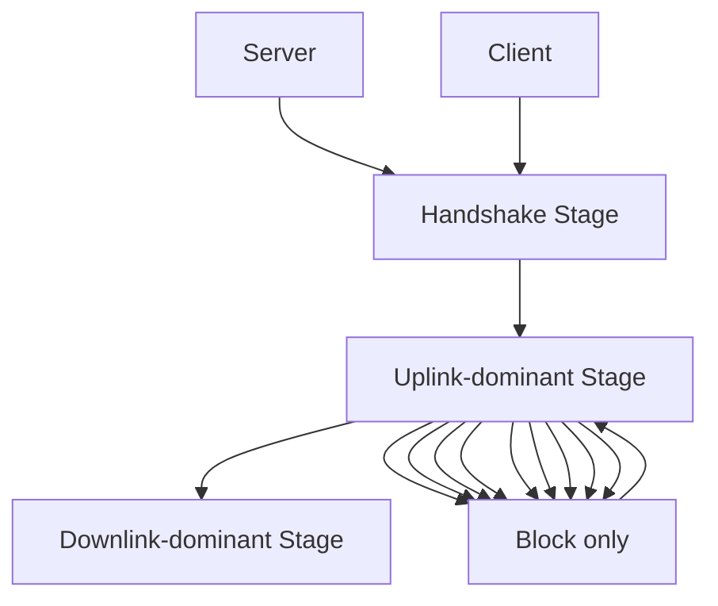
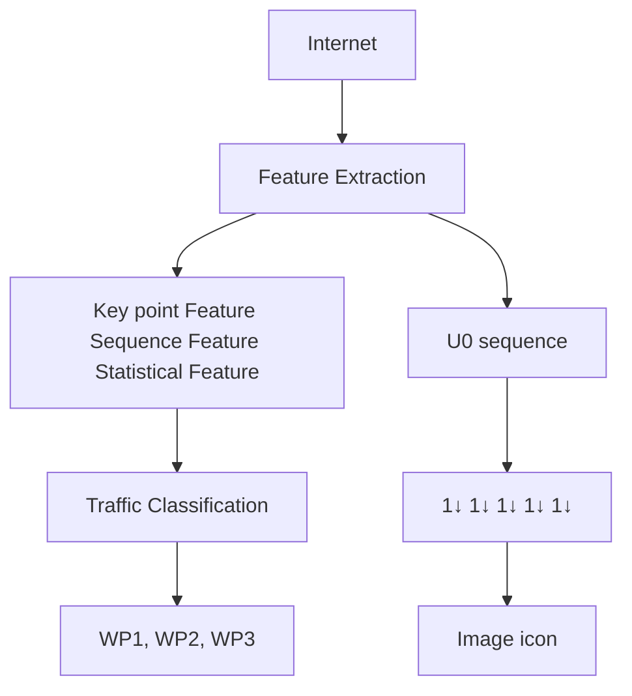

# Fine-Grained Webpage Fingerprinting Using Only Packet Length Information of Encrypted Traffic

Meng Shen , Member, IEEE, Yiting Liu, Liehuang Zhu , Member, IEEE, Xiaojiang Du , Fellow, IEEE, and Jiankun Hu , Senior Member, IEEE

Abstract— Encrypted web traffic can reveal sensitive information of users, such as their browsing behaviors. Existing studies on encrypted traffic analysis focus on website fingerprinting. We claim that fine-grained webpage fingerprinting, which speculates specific webpages on a same website visited by a victim, allows exploiting more user private information, e.g., shopping interests in an online shopping mall. Since webpages from the same website usually have very similar traffic traces that make them indistinguishable, existing solutions may end up with low accuracy. In this paper, we propose FineWP, a novel fine-grained webpage fingerprinting method. We make an observation that the length information of packets in bidirectional client-server interactions can be distinctive features for webpage fingerprinting. The extracted features are then fed into traditional machine learning models to train classifiers, which achieve both high accuracy and low training overhead. We collect two real-world traffic datasets and construct closed- and open-world evaluations to verify the effectiveness of FineWP. The experimental results demonstrate that FineWP is superior to the state-of-the-art methods in terms of accuracy, time complexity and stability.

Index Terms— Webpage fingerprinting, encrypted traffic classification, machine learning, convolutional neural networks.

# I. INTRODUCTION

W ITH the growth in usage of end-to-end encryption pro-tocols (e.g., SSL/TLS [7], [13]), website fingerprinting tocols (e.g.,SSL/TLS [7], [13]), website fingerprinting has attracted extensive attention in recent years. It is a kind of traffic analysis attack where the adversary attempts to identify the websites visited by victims, by observing specific patterns of encrypted traffic [21]. Considering that a single website

Manuscript received June 15, 2020; revised October 7, 2020; accepted December 9, 2020. Date of publication December 23, 2020; date of current version February 1, 2021. This work was supported in part by the National Key Research and Development Program of China under Grant 2020YFB1006101; in part by the Beijing Nova Program under Grant Z201100006820006; in part by the NSFC Projects under Grant 61972039 and 61872041; in part by the Beijing Natural Science Foundation under Grant 4192050; in part by the Zhejiang Lab Open Fund under Grant 2020AA3AB04; and in part by the ARC Funds under Grant DP190103660, Grant DP200103207, and Grant LP180100663. The associate editor coordinating the review of this manuscript and approving it for publication was Dr. Tomas Pevny. (Corresponding authors: Meng Shen; Liehuang Zhu.)

Meng Shen is with the School of Cyberspace Security, Beijing Institute of Technology, Beijing 100081, China, and also with the Cyberspace Security Research Center, Peng Cheng Laboratory (PCL), Shenzhen 518066, China (e-mail: shenmeng@bit.edu.cn).

Yiting Liu was with the School of Computer Science, Beijing Institute of Technology, Beijing 100081, China. She is now with the School of Computer Science, Fudan University, Shanghai 200433, China (e-mail: liuyitingbit@foxmail.com).

Liehuang Zhu is with the School of Cyberspace Security, Beijing Institute of Technology, Beijing 100081, China (e-mail: liehuangz@bit.edu.cn).

Xiaojiang Du is with the Department of Computer and Information Sciences, Temple University, Philadelphia, PA 19122 USA (e-mail: dxj@ieee.org).

Jiankun Hu is with the School of Engineering and IT, University of New South Wales, Canberra, ACT 2610, Australia (e-mail: J.Hu@adfa.edu.au).

Digital Object Identifier 10.1109/TIFS.2020.3046876

usually consists of multiple webpages, existing studies simply refer to website homepages as their representative webpages. In this paper, we focus on fine-grained webpage fingerprinting, which aims to recognize encrypted traffic patterns from specific webpages within a given website.

Webpage fingerprinting is capable of exploiting more valuable and private information from encrypted network traffic. For instance, local eavesdroppers are able to identify user browsing behaviors in an online shopping mall and further speculate on users’ preferences; they can also recognize specific webpages that a user has visited in a news website, which can be used to analyze her political inclination.

Recent studies have proposed a number of methods for encrypted traffic analysis. Traffic features, such as uplink timing information [11], cumulative packet length [21], and state transition patterns [19], can be extracted from encrypted traffic and then fed to traditional machine learning models (e.g., random forest, k-Nearest Neighbors) to construct classifiers. Deep learning methods such as convolutional neural networks (CNNs) [33] are also applied to improve the accuracy of encrypted traffic analysis. All these schemes, however, aim to construct fingerprints at the granularity of websites or mobile applications, instead of webpages.

It is a challenging task to carry out webpage fingerprinting in an accurate and efficient way. First, webpages in the same website usually have similar page layouts and adopt the same encryption protocol version (as well as the corresponding parameters), which makes the resulting traffic of different webpages extremely similar, in terms of traffic volume and client-server interaction patterns. As a result, the fingerprints constructed using traffic features exploited in existing literatures, such as cumulative packet length or state transition patterns, are prone to make misclassification (cf. Section VI-B.3). Second, webpage fingerprinting requires low computational complexity and quick response time in practical usage [27]. Some intricate methods result in heavy time consumption on either feature extraction [11] or classifier training [33].

In this paper, we propose FineWP, a fine-grained webpage fingerprinting approach using only packet length information. In general, packet length and packet time are typically two types of features that can be obtained from encrypted traffic. However, packet time is prone to be affected by network conditions and thus is not as stable as packet length. In addition, existing studies using packet time as features usually employ dynamic time warping to align different time sequences [11], resulting in extremely heavy time overhead in feature extraction. Thus, features based on packet length information are more suitable to build fingerprinting methods.

In order to extract discriminative features from encrypted traffic of similar webpages, we take a deep look at the traffic characteristics of bidirectional client-server interaction while loading webpages. A valuable observation is that the entire traffic sequence can be divided into three stages, where the second stage named uplink-dominant stage exhibits distinctive patterns across different webpages. Accordingly, we extract three types of features during this stage, i.e., block features, sequence features, and statistical features. These easy-to-obtain features are then incorporated into traditional machine learning models to construct an accurate and efficient classifier.

We conduct extensive experiments using real-world datasets to evaluate the performance of FineWP. In particular, to make a comprehensive comparison with existing methods, we also build CNNs for webpage fingerprinting following the description in the literature [33]. The experimental results show that FineWP is superior to the state-of-the-art methods. In addition, FineWP is 30× faster than the CNNs-based approach in terms of training time.

Compared with our previous work [26], we enlarge the experimental dataset, extend the webpage fingerprints by utilizing adequate characteristics, and conduct more performance evaluation in this paper. The additional contributions beyond the original paper are as follows:

1) We build two real-world webpage traffic datasets named JD Dataset and YH Dataset, where JD dataset contains 13,530 webpages with a total of 26,356 sequences and YH dataset contains 283 webpages under 12 labels with a total of 11,023 sequences. Based on these datasets, we conduct extensive experiments to verify the effectiveness of FineWP.   
2) Based on the three-stage bidirectional client-server interaction, we extract three types of distinctive features only leveraging packet length information and combine them with traditional machine learning models to build FineWP, which enables accurate and computationally efficient webpage fingerprinting.   
3) We demonstrate the accuracy and efficiency of FineWP through closed-world and open-world experiments. Compared with the state-of-the-art methods, FineWP enables up to 20% improvement on JD dataset and 10% improvement on YH dataset, in terms of classification accuracy. We also observe that FineWP performs comparably to the CNNs-based approach in accuracy, while significantly reducing training time.

The rest of the paper is organized as follows. We first review the related work in Section II. Then, we make an anatomy of webpage fetching interaction in Section III and present the fine-grained webpage fingerprinting method in Section IV. Next, we describe the dataset collection process in Section V and evaluate the performance of FineWP through a comprehensive comparison with existing methods in Section VI. We discuss the limitations of the proposed method as well as future research opportunities in Section VII and conclude this paper in Section VIII.

# II. RELATED WORK

Many researchers have proposed a rich number of encrypted traffic analysis methods, such as website fingerprinting, mobileAuthorized licensed use limited to: SICHUAN UNIVERSITY. Downloaded on June 02,2026 at 08:27:25 UTC from IEEE Xplore. Restrictions apply. generated from multiple webpages on the same website. trafic aAahbsiedmeehseduseuiahtetstoyslesiteAfingeveristingDwabibe

TABLE I SUMMARY OF EXISTING TRAFFIC CLASSIFICATION METHODS 

<table><tr><td>Category</td><td>Features</td></tr><tr><td>WebsiteFingerprinting</td><td>Cumulative packet length [21]Packet timing information [11]Packet length sequences and time series [34] [33]Distance between packet sequences [37]</td></tr><tr><td>Mobile AppFingerprinting</td><td>Statistical features of packet length [35]Characteristics of SSL/TLS session [19] [29] [28]Combination of multi-dimensional features [32]</td></tr><tr><td>VideoFingerprinting</td><td>Total number of bits in a peak [9]Statistical features of packet length and time [8]Round-trip-time [30]</td></tr></table>

applications fingerprinting, video traffic classification. We make a brief summary of existing methods on encrypted traffic analysis in Table I.

# A. Website Fingerprinting Methods

Panchenko et al. [21] used cumulated sum of packet size to represent traffic traces, and extracted a fixed number of discriminative features from the traces. However, this method cannot effectively distinguish specific webpage traffic, especially from the same website. Several recent studies applied CNNs to website fingerprinting [24], [25], [33]. The CNNs-based classifiers usually require large-scale training data as well as long training time, thus making this kind of methods complicated and time-consuming.

# B. Mobile Application Classification Methods

With the prosperity of smartphones, many recent studies focus on identifying mobile applications via classifying the encrypted traffic generated by these applications [14], [15], [17], [23]. Taylor et al. [34] proposed a method called App-Scanner that extracts 54 statistic features from incoming flows, outgoing flows and complete flows. Shen et al. [28], [29] extended the Markov model [19] by using second-order Markov chains and application attribute bigrams. However, the Markov-based fingerprints are not discriminative enough to accurately identify traffic from webpages of the same website, as evidenced by the experimental results in Section VI.

# C. Video Traffic Classification Methods

Dubin et al. [9] constructed SVM and nearest neighbor classifiers to match encrypted video traffic with the corresponding video titles. Dong et al. [8] proposed a fine-grained classification method for video traffic based on k-Nearest Neighbor algorithm. Shen et al. [30] proposed a deep learning approach to infer user quality of experience (QoE) from encrypted video traffic. Videos from the same content provider (e.g., YouTube) usually differ greatly in terms of duration and resolution, resulting in more discriminative features of encrypted traffic.

# D. The Novelty of This Paper

Existing studies on website fingerprinting usually select a single representative webpage (e.g., homepage) for each website. In this paper, we focus on developing an efficient webpage fingerprinting method, which can differentiate encrypted traffic

Webpage fingerprinting is a more challenging task, as the webpages usually have similar or even the same layout, thus resulting similar encrypted traffic patterns. To tackle this problem, we present FineWP that uses only the packet length information. More specifically, it utilizes the features of the bidirectional client-server interactions. The evaluation results demonstrate its superiority in terms of computational complexity and classification accuracy.

# III. FINGERPRINTING FOUNDATION: WEBPAGE FETCHING INTERACTIONS

Webpage fingerprinting attempts to associate traffic features with the corresponding webpages from which the traffic is generated. In this section, we first describe the threat model, which determines the way that webpage fingerprinting attacks are conducted by potential adversaries. Then, we briefly introduce typical encryption protocols that are employed by websites to protect traffic contents between clients and servers. Finally, we pay special attention to the client-server interactions when a webpage is loading, which serves as the basis for building effective webpage fingerprints.

# A. Threat Model

In this paper, we assume a local and passive adversary, which is a common assumption in the literature [33]. Specifically, local means that the adversary is located in the local network of the victim, and passive means that the attacker is able to monitor the victim’s network traffic but cannot modify or decrypt the traffic. Potential adversaries can be a campus network administrator or a residential Internet Service Providers (ISP). In this scenario, an adversary obtains the bidirectional (i.e., incoming and outgoing) traffic when a victim is visiting certain webpages, and attempts to infer the corresponding webpages by exploiting distinctive patterns in network traffic.

The adversary who conducts webpage fingerprinting attacks first collects traffic traces by initiating a number of visits from the victim’s network, covering the webpages he is interested in identification (i.e., monitored webpages). Then, the collected dataset is used by the adversary to extract discriminative features for individual webpages. These features can be used to train a supervised classifier that associates traffic features with the corresponding webpages. Finally, the adversary can collect new traffic traces from the victim’s visits and use the classifier to identify the corresponding webpages.

# B. Traffic Encryption Protocols

In recent years, we have seen a dramatic growth in the usage of encryption protocols, such as Secure Sockets Layer (SSL) [7] and Transport Layer Security (TLS) [13]. These protocols provide communication security and data integrity over the Internet. They are composed of two layers: the HandShake layer and the Record layer. The former layer establishes a connection between a client and a server and negotiates a session key, while the latter transfers encrypted data using the generated session key.

The latest TLS v1.3 was released in August 2018. Compared with previous versions, it accelerates encrypted connection and load time through TLS error start-up and zero round-trip time (0-RTT). It also removes obsolete and unsafe functions from TLS v1.2, such as SHA-1, RC4, and DES. These security and performance enhancements make the encrypted connections more secure and faster than ever.

flowchart

Fig. 1. Typical client-server interactions in webpage loading in terms of uplink and downlink packet sequences.

With SSL/TLS protocols, the content of data transmission can be protected. However, packet number and packet length information of data transmission can still be obtained by potential attackers for further analysis.

# C. Webpage Fetching Process

In order to investigate the differences of traffic traces generated from different webpages, we have a careful look at the bidirectional interactions between a pair of client and server during webpage loading.

When a TCP connection is established between a client and a server, it may be reused by the client to request multiple resources (HTML, scripts, and images [6]) from the server so as to reduce connection overhead. At the request sending stage, uplink packets are the mainly transmitted packets. For different webpages, the start time of this stage and the number of uplink packets transmitted at this stage may vary greatly. Fig. 1 illustrates the typical interactions between the uplink and downlink packets 1 during the webpage loading process. Note that the server in this figure logically represents all servers that are involved in loading the contents of a webpage.

The interaction can be divided into three stages:

1) Handshake Stage: This stage transmits the uplink and downlink packets alternately, which mainly aims for the handshake process between the client and the server. For the traffic generated by the same website, the number, length, type and direction of most packets in this stage are extremely similar, as they leverage the same SSL/TLS protocol and adopt the same parameters, e.g., for key negotiation.

2) Uplink-Dominant Stage: This stage mainly transmits uplink packets, which is the key stage for webpage fingerprinting. To improve the efficiency of data transmission, a long-lived and high-throughput TCP connection is established by the client to request multiple resources from the server.

At the stage, we can observe one or multiple uplink-only blocks, where only uplink packets are transmitted in each block. In practice, we label an uplink-only block only if at least 4 uplink packets are transmitted consecutively, as continuous transmission of less than 4 uplink packets is often caused by unstable network conditions such as packet retransmission.

flowchart

Fig. 2. Overview of FineWP.

Since different webpages have inherent diversities in terms of web element types (e.g., texts, images and other media contents) and element request order, the number of uplink-only blocks as well as the starting and ending positions of each uplink-only block vary among different webpages.

3) Downlink-Dominant Stage: This stage alternates the transmission of uplink and downlink packets, while the downlink packets are dominant. That is because the server starts preparing and transmitting the contents required by the client, including HTML header, embedded images, etc.

# IV. THE PROPOSED FINEWP

In this section, we present the construction process of the proposed webpage fingerprinting method FineWP. We start with the description of the overall workflow of FineWP. Then, we elaborate on the packet length accumulation process, which facilitates packet sequence abstraction and feature extraction. Finally, we present the construction algorithm of FineWP.

# A. Solution Overview

The overall workflow of our solution is depicted in Fig. 2. In the first step, real-world packet sequences are collected by visiting specific webpages.

We observe that features discriminating different pages within the same website exist in the client-server bidirectional interactions, especially in the uplink-dominant stage. The discovery of these features requires an insightful analysis and a novel abstraction of data transmission pattern, which is also the major contribution of this paper.

In the feature extraction process, we accumulate the packet length of original packet sequences and extract three types of features: block features, sequence features, and statistical features. The sequence and block features can fully represent the characteristics of uplink-dominant stage in bidirectional client-server interaction as shown in Fig. 1. In order to further investigate discriminative features, we also employ statistical features with significant contribution to classification accuracy.

Finally, all these features are fed to machine learning algorithms (e.g., random forest, decision tree, and k-nearest neighbors) to build webpage fingerprints. The resulting webpage fingerprints can be applied to classification of unknown traffic traces.

# B. Packet Length Accumulation

According to the aforementioned assumption, when a victim visits a certain webpage, the adversary can observe the resulting traffic trace. Inspired by the three stages illustrated in Fig. 1, we further investigate the diversity of traffic traces in terms of packet length in the uplink-dominant stage.

TABLE II LIST OF NOTATIONS 

<table><tr><td>Notation</td><td>Meaning</td></tr><tr><td> $\mathcal{D}$ </td><td>A traffic dataset</td></tr><tr><td> $\mathcal{U}$ </td><td>U0 sequence set of  $\mathcal{D}$ </td></tr><tr><td> $P$ </td><td>A packet length sequence in  $\mathcal{D}$ </td></tr><tr><td> $U$ </td><td>A U0 sequence in  $\mathcal{U}$ </td></tr><tr><td> $K$ </td><td>The number of uplink-only blocks</td></tr><tr><td> $a$ </td><td>The cumulative packet length in an uplink-only block</td></tr><tr><td> $s$ </td><td>The order of packet entering an uplink-only block</td></tr><tr><td> $e$ </td><td>The order of packet ending an uplink-only block</td></tr><tr><td> $b$ </td><td>Starting position of the sequence feature</td></tr><tr><td> $d$ </td><td>Ending position of the sequence feature</td></tr><tr><td> $CS$ </td><td>The contribution score of features</td></tr></table>

TABLE IIIA REAL-WORLD EXAMPLE ILLUSTRATING THREETYPES OF PACKET LENGTH SEQUENCES

<table><tr><td>Type</td><td>Packet Length Sequence</td></tr><tr><td>OriginalSequence</td><td>[-66, 66, -54, -571, 60, 1514, 1514, 948, -54, -180, -147, -820, 312, 123, ...]</td></tr><tr><td>ProcessedSequence</td><td>[0, 66, 0, 0, 60, 1514, 1514, 948, 0, 0, 0, 0, 312, 123, ...]</td></tr><tr><td>U0 Sequence</td><td>[0, 66, 66, 66, 126, 1640, 3154, 4102, 4102, 4102, 4102, 4102, 4414, 4537, ...]</td></tr></table>

We start with representing the original trace of packet lengths by $P = ( p _ { 1 } , . . . , p _ { N } )$ , where $p _ { i } ~ > ~ 0$ indicates an incoming packet and $p _ { i } ~ < ~ 0$ an outgoing packet [21]. The notations used in this paper are summarized in Table II.

For ease of identifying the appearance of uplink-only blocks in P, we set the length of all outgoing packets as 0 and keep the length of all incoming packets as is. More precisely, $p _ { i } > 0$ for all incoming packets and $p _ { i } = 0$ for all outgoing packets.

$\mathrm { N e x t , }$ we accumulate the packet lengths to obtain an uplink-zero sequence (U0 sequence for short), which can be represented by $U = ( u _ { 1 } , . . . , u _ { N } )$ , where $u _ { i }$ is obtained in Eq. (1).

$$
u _ {i} = \left\{ \begin{array}{l l} p _ {i}, & \text { if   } i = 1 \\ u _ {i - 1} + p _ {i}, & \text { if   } 1 <   i \leq N \end{array} \right. \tag {1}
$$

Based on the analysis of webpage traffic interaction, we envision step-growth of the U0 sequence in the uplinkdominant stage, where the cumulative packet length would remain the same for each uplink-only block. Since different webpage traffic have discriminations in the uplink-dominant stage, which has been explained in Section III, U0 sequence can extract such differences.

Table III presents an example illustrating the the original sequence, processed sequence (i.e., by setting $p _ { i } = 0$ for all outgoing packets), and U0 sequence.

line

| Number of Packets | item.jd.com/3924103.html | item.jd.com/3343730.html | item.jd.com/3343742.html | item.jd.com/3343744.html |
| ----------------- | ------------------------ | ------------------------ | ------------------------ | ------------------------ |
| 0                 | 15                       | 15                       | 15                       | 15                       |
| 40                | 35                       | 35                       | 35                       | 35                       |
| 60                | 50                       | 50                       | 50                       | 50                       |
| 80                | 70                       | 70                       | 70                       | 70                       |
| 100               | 90                       | 90                       | 90                       | 90                       |

(a) UO sequences of 5 different webpages in JD dataset

line

| Number of Packets | news.yahoo.com | finance.yahoo.com | sports.yahoo.com | shopping.yahoo.com |
| ----------------- | -------------- | ----------------- | ---------------- | ------------------ |
| 0                 | 0              | 0                 | 0                | 0                  |
| 20                | 5              | 5                 | 10               | 10                 |
| 40                | 10             | 10                | 15               | 15                 |
| 60                | 15             | 15                | 25               | 25                 |
| 80                | 25             | 25                | 30               | 30                 |
| 100               | 35             | 35                | 35               | 35                 |

(b) UO sequences of 4 different webpages in YH dataset   
Fig. 3. U0 sequence samples for different webpages in JD and YH datasets.

line

| Number of Packets | Cumulative Packet Length(KBytes) |
| ----------------- | -------------------------------- |
| 0                 | 20                               |
| 20                | 40                               |
| 40                | 60                               |
| 60                | 80                               |
| 80                | 90                               |
| 100               | 100                              |

(a) UO sequences of a webpage in JD dataset

line

| Number of Packets | sports.yahoo.com-1 | sports.yahoo.com-2 | sports.yahoo.com-3 | sports.yahoo.com-4 | sports.yahoo.com-5 |
| ----------------- | ------------------ | ------------------ | ------------------ | ------------------ | ------------------ |
| 0                 | 0                  | 0                  | 0                  | 0                  | 0                  |
| 20                | 10                 | 10                 | 10                 | 10                 | 10                 |
| 40                | 20                 | 20                 | 20                 | 20                 | 20                 |
| 60                | 25                 | 25                 | 25                 | 25                 | 25                 |
| 80                | 30                 | 30                 | 30                 | 30                 | 30                 |
| 100               | 40                 | 40                 | 40                 | 40                 | 40                 |

(b) UO sequences of a webpage in YHdataset   
Fig. 4. U0 sequences samples for the same webpage in JD and YH datasets.

To have an intuitive sense of how U0 sequences extract differences among webpages within the same website, we randomly select 4 samples from JD and YH datasets respectively and visualize their U0 sequences in Fig. 3. The 4 webpages exhibit the same type of products with different brands and 4 webpages from YH dataset with different labels. The details of the datasets will be described in Section V. We also exhibit the U0 sequences generated by 5 different visits of the same webpages in Fig. 4.

We can see that in the uplink-dominant stage (i.e., between the 45th and 70th packets in JD dataset and between the 20th and 85th packets in YH dataset), the traffic sequences from different webpages become apparently distinguishable, while the U0 sequences are almost consistent over consecutive downloads of the same webpage.

A transmission-level implication of these differences lies in that different webpages have inherent diversities in terms of web element types (e.g., texts, images and other media contents) and element request order. This result strongly confirms that U0 sequence could express the client-server interaction and contribute to distinguishable webpage fingerprints.

As a result, finding the cumulative packet length as well as the starting and ending positions of packets corresponding to the uplink-dominant stage based on U0 sequence should be an effective way to construct discriminative fingerprints for different webpages.

# C. Sequence Abstraction and Feature Extraction

Our key observation above clearly indicates that U0 sequence can express webpage differences in terms of packet-level interactions. To characterize the common pattern of concrete U0 sequences, we propose a U0 sequence abstraction.

The U0 sequence abstraction in Fig. 5 captures the common trend in U0 sequences with one or multiple uplink-only blocks. Formally, it has the format of $< K , B _ { 1 } , \ldots , B _ { K } >$ , where K is the total amount of uplink-only blocks and the i -th block $B _ { i } = ( s _ { i } , e _ { i } , a _ { i } )$ . As illustrated in Fig. 5, $s _ { i }$ and $e _ { i }$ indicate the orders of the packets starting and ending the i -th block, and $a _ { i }$ represents the corresponding cumulative packet length. Such an abstraction can flexibly define different U0 sequences by setting appropriate parameters.

The U0 sequence abstraction enables us to extract critical features for building efficient webpage fingerprints, including block features, sequence features, and statistical features.

1) Block Features: They are the representative features for uplink-only blocks in U0 sequences. More precisely, we refer to $B _ { i } ( i \mathrm { ~ \in ~ } [ 1 , K ] )$ as the block features. These features are the most crucial features among all types of features, as they concisely describe the number of uplink-only blocks and their appearance positions, as well as the transition of cumulative packet length among consecutive uplink-only blocks.

2) Sequence Features: This type of features refer to the packet length subsequence in the duration of the uplink-dominant stage. They are crucial to build webpage fingerprints, as packet sequences of different webpages in the uplink-dominant stage are distinguishable.

For a specific U0 sequence with K uplink-only blocks as shown in Fig. 5, the starting and ending positions of the uplink-dominant stage can be easily defined by $s _ { 1 }$ and $e _ { K }$ . However, these positions of U0 sequences can be different for multiple visits of the same webpage and vary even more significantly for different webpages. In order to make sure that the sequence feature has the same dimension for different U0 sequences, we should determine the unified starting and ending positions of the uplink-dominant stage for all sequences in a dataset.

Since there is usually a high volume of traffic sequences in a dataset, taking an intersection or union of $s _ { 1 }$ and $e _ { K }$ across all sequences will make the resulting range too small or too large, thus weakening the effectiveness of the features. Therefore, we calculate the mean values of $s _ { 1 }$ and $e _ { K }$ of all samples, respectively, as the range of the uplink-dominant stage [b, d], which is defined in $\operatorname { E q . } ( 2 )$ ,

$$
b = \frac {1}{| \mathcal {D} |} \sum_ {i = 1} ^ {| \mathcal {D} |} s _ {1} ^ {i}, \quad d = \frac {1}{| \mathcal {D} |} \sum_ {i = 1} ^ {| \mathcal {D} |} e _ {K} ^ {i} \tag {2}
$$

line

| Packet Number | Cumulative Packet Length |
| ------------- | ------------------------ |
| s1            | a1                       |
| e1            | a2                       |
| s2            | a2                       |
| e2            | a2                       |

Fig. 5. The sketches of uplink-only block, block feature and sequence feature.

Thus, the sequence features can be defined as $\begin{array} { r l } { S F } & { { } = } \end{array}$ $[ u _ { b } , u _ { b + 1 } , \ldots , u _ { d } ]$ .

3) Statistical Features: They are extracted from the original packet length sequence. For each sequence $P \in \mathcal { P }$ , we divide it into three series: uplink packet length series, downlink packet length series, and complete packet length series (i.e., the combination of uplink and downlink packets). Motivated by the literature [34], we calculate the following statistical features for each series: minimum, maximum, mean, median absolute deviation, standard deviation, variance, skew, kurtosis, percentiles (from 10% to 90%), and the number of packets.

We utilize the Random Forest (RF) classifier implemented in scikit-learn to get the Gini impurity index, which is computed during estimator building to evaluate the contribution of statistical features [20]. The contribution of each individual feature is quantified by its contribution score (C S). In practice, to reduce the feature dimension while ensuring the accuracy, we only reserve the statistical features with a C S over a certain threshold. We will justify this strategy in Section VI-B.3.

4) Remarks: We provide an insightful analysis why these features discriminate different webpages within the same website. According to the webpage fetching process in Fig. 1, the block features can roughly reflect the characteristics of element requests in a visit to a webpage, such as the number of element requests, and the packet subsequence and cumulative packet length for each request. The sequence features can extract the starting and ending positions of the uplink-dominant stage for multiple visits to the same webpage. The statistical features consider the webpage diversity (e.g., contents and layout) and provide valuable summaries of the packet-level information throughout the webpage fetching process.

# D. Construction of FineWP

With the features described above, we now detail the construction of FineWP. For ease of illustration, let  denote a dataset (e.g., JD) consisting of packet traces from multiple webpages. According to the aforementioned description of U0 sequences, we can obtain the U0 sequence set $\mathcal { U } = \{ U _ { 1 } , \dotsc , U _ { | \mathcal { D } | } \}$ , where the i-th sequence is denoted by $U _ { i } = ( u _ { 1 } ^ { i } , \ldots , u _ { N } ^ { i } )$ .

The construction of FineWP is depicted in Algorithm 1. We first preprocess the original traffic (as shown in Section V-B) and utilize U0 sequence $U ~ = ~ ( u _ { 1 } , \ldots , u _ { N } )$ to describe the webpage loading process (lines 1-2). Next, to obtain all features, we define $A = \{ u : c \}$ , where u is an element of U and c represents the count of u with the same value. Note that we record the data into A only when $c \geq 4 ,$ because it meets the requirement of uplink-only block. Define $S = \{ u : s \}$ , where s represents the order of the packet entering the uplink-only block. Define $E = \{ u : e \}$ , where e represents the order of the packet ending the uplink-only block (line 3).

Algorithm 1 Construction of FineW P   
Input: A packet length sequence $P = (p_{1}, \ldots, p_{N})$ resulting from a webpage loading process
Output: Webpage fingerprinting model FineWP
1: Set the uplink packet length to 0
2: Accumulate the packet length to obtain U0 sequence $U = (u_{1}, \ldots, u_{N})$ 3: Initialize $A = \{u : c\}$ , $S = \{u : s\}$ and $E = \{u : e\}$ 4: for $u_{i} \in U$ do
5: if $u_{i} = u_{i+1}$ then
6: if A find $u_{i}$ then
7: $A[u_{i}] + 1$ 8: else
9: $S[u_{i}] \leftarrow i$ 10: if A find $u_{i}$ and $u_{i}! = u_{i+1}$ then
11: $E[u_{i}] \leftarrow i$ 12: Sort A, S and E according to c and get block feature $B = \{(s_{1}, e_{1}, u_{1}), \ldots, (s_{K}, e_{K}, u_{K})\}$ 13: Calculate b and d according to Eq. (2)
14: Obtain the sequence feature $SF = \{u_{b}, u_{b} + 1, \ldots, u_{d}\}$ 15: Calculate statistical features ST of P
16: Reserve elements of ST with a CS larger than a threshold
17: Obtain the final feature set feature = {B, SF, ST}
18: kNN, RF, DTree ← feature
19: return Webpage fingerprinting model

More specifically, we extract all distinctive features by going through U and recording the data in A, S and E (lines 4-11). With regard to the sequence feature, we record s1 and eK for each U and leverage the mean values of them as the unified starting and ending positions (lines 13-14). The final starting position b and ending position d can be obtained according to Eq. (2). Then, the sequence feature can be denoted as $S F =$ $( u _ { b } , u _ { b + 1 } , \ldots , u _ { d } )$ , where $u \in U$ and $b < d$ .

Finally, we utilize random forest to measure the contribution of statistical features. Conveniently, random forests implemented in scikit-learn have already collected information about the feature contribution for us. After fitting Random Forest Classifier, we can get the C S according to feature contributions. We add statistical features with C S higher than a certain threshold to the feature set (lines 15-16).

We use three typical supervised machine learning methods as our classifiers: k-Nearest Neighbor (kNN) [35], Random Forest (RF) [20] and Decision Tree (DTree) [22]. We feed these webpage features into the classifiers to construct webpage fingerprints (lines 18-19). The optimal choice of machine learning classifiers will be discussed in Section VI-B.

# V. DATASET COLLECTION

In this section, we describe the dataset that is used for evaluating the performance of FineWP.

TABLE IV DATASETS 

<table><tr><td>Datasets</td><td># webpages</td><td># labels</td><td># sequences</td><td>Size</td></tr><tr><td>JD</td><td>330(Monitored)13200(Unmonitored)</td><td>N/A</td><td>13,156(Monitored)13,200(Unmonitored)</td><td>26.4 GB</td></tr><tr><td>YH</td><td>283</td><td>12</td><td>11,023</td><td>19.9 GB</td></tr></table>

# A. Data Description

Since there is no publicly-available webpage traffic dataset, we collect real-world webpage traffic datasets using 4 Ali cloud ECS servers [1] located in different regions in China. The cloud servers are used as clients to simulate users’ browsing behaviors. Two cloud servers are equipped with Windows 8 and the rest are equipped with Windows 10. To emulate the diversity of browsers, we employ Chrome, Mozilla Firefox, Internet Explorer, and 360 Browser in data collection. We consider the resulting traffic as a whole to make the trained classifiers applicable to variations of operating systems and browsers.

All traffic traces are captured using Wireshark, i.e., we employ tshark scripts to automatically capture the traffic generated by visiting a specific webpage for 60 seconds. This duration can guarantee that all elements in a webpage are successfully loaded by the browser in general cases. The scripts empty the caches each time visiting a certain webpage and close the browser when each visit is completed. The data collection is conducted within a period of two months.

JD represents one of the largest online shopping malls, Jingdong [2], in China. Each commodity is exhibited on a unique webpage, and the templates of different webpages are very similar. To construct the dataset for closed-world evaluation, we randomly select 330 webpages on JD as the monitored webpages, each of which has 40 individual visits. To construct the dataset for open-world evaluation, we randomly select 13,200 webpages as the unmonitored webpages, which are different from the monitored ones.

Our choice follows the common rules to construct open-world dataset in the literature [21], [33]. In a more realistic open-world scenario, our goal is to investigate to what extend a fingerprinting method can recognize a small number of monitored webpages from a much larger amount of unknown, randomly-accessed webpages that the classifier has never seen before. In other words, the classifier can train on the monitored webpages but cannot train on the unmonitored webpages.

YH represents Yahoo! [5], which is one of the most popular websites in the world [4]. We randomly select a total number of 300 webpages from 12 categories (also referred to as labels2), and each webpage has 40 individual visits.

We select these representative websites because: 1) they have a large number of daily visitors, and 2) the browsing behaviors on online shopping and portal sites provide an opportunity for an adversary to infer personal preferences.

# B. Traffic Preprocessing

Each packet contains the following information: source and destination IP addresses, source and destination port numbers, communication protocol, timestamp, packet length and packet flags (e.g., SYN, ACK).

In order to select the packets generated from the two websites of interest, we resort to the server name indication (SNI) field [3] in a TLS Client Hello message.3 That is, if “jd.com” or “yahoo.com” or “yimg.com” (indicating image loading of Yahoo webpages) exists in SNI, we record the corresponding IP addresses as the server addresses (i.e., source IP addresses in downlink packets and destination IP addresses in uplink packets). Since a website usually involves multiple servers with different IP addresses, the collection of server IP addresses enables us to reserve the desirable packets.

It should be noted that the packets corresponding to advertisements on webpages are discarded, as the advertisements on the same webpage usually dynamically change for different visits. In addition, we remove from our datasets those webpages that fail to load due to poor network conditions. This is conducted by comparing their screenshots with a blank page, an access denied page, or a timeout-error page.

With the aforementioned preprocessing, we obtain an original packet sequence for each webpage visit, which composes of a series of IP packets sorted by their timestamp marked with Wireshark. The refined datasets are summarized in Table IV. The JD dataset contains a total of 13,156 sequences from 330 monitored webpages and 13,200 sequences from 13,200 unmonitored webpages. The YH dataset consists of a total of 11,023 sequences from 283 webpages with 12 labels, and each label has 23 different webpages on average.

# VI. PERFORMANCE EVALUATION

In this section, we are dedicated to evaluate the performance of FineWP. We first introduce the experiment setting and parameter setting. After that, we thoroughly compare FineWP with the state-of-the-art methods in terms of classification accuracy and time complexity in the closed-world and open-world settings.

# A. Experiment Setting

1) Methods to Compare: In order to have a comprehensive understanding of the performance of FineWP, we leverage 4 existing methods for comparison.

• WFCNN is a CNNs-based classifier that follows the construction details in [33]. The classifier takes as the input the sequences of tuples (timestamp, packet\_length), where the sign of packet length indicates the direction of the packet: positive means downlink packets and, negative, uplink packets. We conduct an extensive search through hyperparameter space to make the classifier achieve its best performance. The selected hyperparameters for two datasets are shown in Table V.   
• CUMUL is a website fingerprinting approach based on the feature of cumulative packet lengths [21]. The uplink

TABLE V HYPERPARAMETERS SELECTION FOR WFCNN 

<table><tr><td>Hyperparameters</td><td>Search Range</td><td>Values on JD</td><td>Values on YH</td></tr><tr><td>Input Dimension</td><td>[500...7000]</td><td>4000</td><td>2000</td></tr><tr><td>Optimizer</td><td>[Adam, Adamax, RMSProp, SGD]</td><td>Adamax</td><td>Adamax</td></tr><tr><td>Learning Rate</td><td>[0.001...0.01]</td><td>0.002</td><td>0.002</td></tr><tr><td>Training Epochs</td><td>[10...100]</td><td>50</td><td>30</td></tr><tr><td>Batch Size</td><td>[16...256]</td><td>32</td><td>64</td></tr><tr><td>Activation Functions</td><td>[Tanh,ReLU,ELU]</td><td>ELU,ReLU</td><td>ELU,ReLU</td></tr><tr><td># of Block1 [Conv1]</td><td>[8...64]</td><td>32</td><td>32</td></tr><tr><td># of Block2 [Conv2]</td><td>[32...128]</td><td>64</td><td>64</td></tr><tr><td>Pooling Layers</td><td>[Average,Max]</td><td>Max</td><td>Max</td></tr><tr><td># of FC Layers</td><td>[1...4]</td><td>2</td><td>2</td></tr><tr><td>Hidden units</td><td>[64...2048]</td><td>256</td><td>128</td></tr><tr><td>Dropout [Pooling, FC1, FC2]</td><td>[0.1...0.8]</td><td>[0.1,0.7,0.5]</td><td>[0.1,0.7,0.5]</td></tr></table>

packet length is set to negative and the downlink packet length is set to positive. Then, the accumulative packet length sequence is used to represent traffic traces. The resulting feature set contains the first 100 cumulative packet lengths as well as the total number of uplink, downlink and complete packets.

• WPF is our previous work [26], which leverages a 2-dimensional characteristics. We set the uplink packet length to 0 and accumulate the packet length sequences. The feature set is the cumulative packet length and the count of packets in the uplink-dominant stage.   
• AppS is a random forest classifier to identify smartphone applications from encrypted traffic [34]. It uses 54 statistics features of uplink flow, downlink flow, and complete flow as the feature set. This method is also widely used in website fingerprinting.

2) Cross-Validation: To validate webpage fingerprints created by different methods, we divide each dataset into the training set and the testing set. To mitigate the impact of dataset partitioning on classification performance, we apply 10-fold cross-validation. We consider a dataset as a whole and divide it into 10 equal parts. Then, we use one part as the testing set and the rest as the training set. After 10 rounds of tests, we record the average of results.

To avoid learning on artifacts specific for individual users, we also adopt another cross-validation strategy: the traffic traces collected on 3 cloud servers are used for training while those collected on the 4th server are used for testing. The evaluation results will be described in Section VI-E.

3) Performance Metrics: The fundamental goal of webpage fingerprinting is to be accurate, i.e., identifying more encrypted traffic traces correctly and avoid misclassification.

In the closed-world setting, we consider accuracy as the performance metric for a multi-class classifier, which is defined as the total number of correct classifications (T C) divided by the total number of classifications (Sum), i.e., $A c c = T C / S u m .$ .

In the open-world setting, the classification is usually treated as a binary classification problem. Thus, we utilize precision

bar

| Number of blocks | YH Dataset (%) | JD Dataset (%) |
|---|---|---|
| 0 | 1 | 2 |
| 1 | 8 | 79 |
| 2 | 12 | 15 |
| 3 | 63 | 4 |
| 4 | 13 | 1 |
| 5 | 2 | 0 |
| 6 | 0 | 0 |

Fig. 6. Number of uplink-only blocks for YH and JD datasets.

scatter

| X Value | Cumulative Packet Length (KBytes) | Packet Type     |
|---------|----------------------------------|-----------------|
| 30      | 35                               | Start Packet    |
| 35      | 38                               | Start Packet    |
| 40      | 40                               | Start Packet    |
| 45      | 42                               | Start Packet    |
| 50      | 45                               | End Packet      |
| 55      | 48                               | End Packet      |
| 60      | 50                               | End Packet      |
| 65      | 50                               | End Packet      |

scatter

| Packet Type   | Cumulative Packet Length (KBytes) |
| ------------- | --------------------------------- |
| Start Packet  | 10                                |
| Start Packet  | 20                                |
| Start Packet  | 30                                |
| Start Packet  | 40                                |
| Start Packet  | 50                                |
| Start Packet  | 60                                |
| Start Packet  | 70                                |
| Start Packet  | 80                                |
| Start Packet  | 90                                |
| Start Packet  | 100                               |
| End Packet    | 10                                |
| End Packet    | 20                                |
| End Packet    | 30                                |
| End Packet    | 40                                |
| End Packet    | 50                                |
| End Packet    | 60                                |
| End Packet    | 70                                |
| End Packet    | 80                                |
| End Packet    | 90                                |
| End Packet    | 100                               |

Fig. 7. The range of sequence features for JD dataset (a) and YH dataset (b).

and recall as performance metrics of the classifiers [33]. These metrics are defined on 4 basic concepts that are commonly used in the literature [16], namely True Positive (TP), False Positive (FP), True Negative (TN) and False Negative (FN). Then, precision and recall can be calculated $\begin{array} { r l } { P r e } & { { } = } \end{array}$ $T P / ( T P + F P )$ and $R e c = T P / ( T P + F N )$ , respectively.

# B. Parameter Optimization of FineWP

The selection of parameters directly affects the performance of FineWP. In this section, we introduce the selection strategies of feature parameters and classifies.

1) The Number of Uplink-Only Blocks: In order to extract block features, we need to determine the number of uplink-only blocks K for both JD and YH datasets. We only consider the packets between 20 and 100, since the first 20 packets usually belong to the handshake stage. In practice, a subsequence with more than 4 continuous uplink packets is regarded as an uplink-only block. Fig. 6 presents the proportion of the number of blocks in JD and YH datasets. According to the results, K is set as 1 and 3 for JD and YH datasets, respectively.

2) The Range of Sequence Features: In order to make sure that the sequence feature has the same dimension for different U0 sequences, we should determine the unified starting and ending positions of the uplink-dominant stage for all sequences in each dataset. Fig. 7 exhibits the start and ending positions of the uplink-dominant stage for each U0 sequence in JD and YH datasets. We can find that the range of the uplink-dominant stage varies a lot among different sequences.

In our experiment, we apply mean value calculation to extract the range of sequence features for each dataset. For JD dataset, we intercept the 46th to 55th packets of U0 sequence as the sequence features. While for YH dataset, we extract the subsequence between 25 and 83 as the sequence features.

bar

| Category | Value |
|---|---|
| alen | 0.090 |
| dlen | 0.072 |
| ulen | 0.057 |
| ukurt | 0.047 |
| uvar | 0.035 |
| upper9 | 0.030 |
| umax | 0.028 |
| upper8 | 0.027 |
| umad | 0.025 |
| dmad | 0.024 |

bar

| Category | Value |
|---|---|
| alen | 0.092 |
| ulen | 0.065 |
| ustd | 0.060 |
| dlen | 0.049 |
| umax | 0.048 |
| uvar | 0.047 |
| umad | 0.034 |
| ukurt | 0.033 |
| dper3 | 0.032 |
| uper9 | 0.031 |

Fig. 8. Ranked contributions of individual statistical features on JD dataset (a) and YH dataset (b).

line

| statistical features with top-k contribution | YH dataset | JD dataset |
| --------------------------------------------- | ---------- | ---------- |
| 1                                             | 88.0       | 75.0       |
| 2                                             | 90.0       | 79.0       |
| 3                                             | 91.0       | 80.5       |
| 4                                             | 91.5       | 82.0       |
| 5                                             | 92.0       | 82.0       |
| 6                                             | 92.5       | 82.0       |
| 7                                             | 92.5       | 82.0       |
| 8                                             | 92.5       | 82.0       |
| 9                                             | 92.5       | 82.0       |
| 10                                            | 92.5       | 82.0       |

Fig. 9. Effect of statistical features on classification accuracy.

3) Statistical Features: For each traffic sequence, three packet series are considered: uplink-only packet series (u-), downlink-only packet series (d-) and complete packet series (a-). Motivated by [34], we calculate 18 statistical features (a total of 54 features) for each series: minimum (mi n), maximum (max), mean (mean), median absolute deviation (mad), standard deviation (std), variance (var ), skew (skew), kurtosis (kur t), percentiles (from 10% to 90%) ( per 1- per 9) and the number of elements (len) in the series. The statistical features can be represented by the combination of series type and feature type, e.g., alen represents the number of elements in the complete packet series. Then, we calculate the feature contributions based on the method introduced in Section IV-C.

Fig. 8 exhibits the top 10 features that contribute most to the classification for JD and YH datasets. We can see that the scores of statistical features are relatively low (i.e., less than 0.1), which indicates that these features have limited contribution to classification. It is because the page layouts of webpages on the same website is similar, resulting in very similar traffic generated from the client-server interactions.

According to the contribution ranking, we add these statistical features into the feature set successively and obtain the classification accuracy, as shown in Fig. 9. We can see that the features with a C S less than 0.04 contribute trivially to accuracy improvement. Thus, the threshold in Algorithm 1 is set as 0.04. For JD dataset, 4 statistical features meet the requirement, including alen, dlen, ulen and ukurt. And for YH dataset, 6 statistical features are involved, including alen, ulen, ustd, dlen, umax and uvar.

4) Machine Learning Classifier Selection: As stated in Fig. 2, FineWP is built by incorporating traffic features into traditional machine learning classifier. RF, DTree and k-NN are chosen as candidate classifiers, because they are particularly suitable for predicting classes (i.e., webpages in

TABLE VI HYPER-PARAMETERS OF ML ALGORITHMS 

<table><tr><td>Classifiers</td><td>Parameters</td></tr><tr><td>k-NN</td><td>k=1 (JD), k=5 (YH)</td></tr><tr><td>RF</td><td>max_features=None, n_estimators=10, min_samples_leaf=1, max_depth=None</td></tr><tr><td>DTree</td><td>max_depth=None, criterion=&#x27;gini&#x27;, min_samples_split=2</td></tr></table>

bar

| Model | YH Dataset | JD Dataset |
| :--- | :--- | :--- |
| RF | 0.924 | 0.817 |
| DTree | 0.866 | 0.778 |
| k-NN | 0.791 | 0.523 |

Fig. 10. Classification results with different ML classifiers.

our case) when trained with the preselected features described above.

Since the webpage fingerprints is not high-dimensional, we apply the default hyper-parameters of RF and DTree in scikit-learn for classification. As the effect of k-NN is sensitive to the value of k, we adjust k to get its best performance. The details of the hyper-parameters are shown in Table VI.

Fig. 10 exhibits the classification accuracy with three classifiers. RF performs the best on both datasets, slightly better than DTree. That is because RF consists of multiple decision trees, and the final prediction results are voted by all the decision trees. k-NN has the worst performance among the three classifiers. The reason lies in that k-NN has pass-through effect, that is, if the abnormal traffic in the training dataset is just next to the traffic sequences we need to classify, it will directly lead to inaccurate prediction data. According to the experiment results, we select RF as our classifier.

# C. Closed-World Evaluation

In this section, we evaluate the performance of FineWP in the closed-world setting with JD and YH datasets. In this scenario, we assume that only the monitored webpages can be visited by users, and webpage fingerprinting thus turns into a multi-class classification problem. Although this scenario is not realistic, it is suitable for comparing the classification performance of different classifiers [21].

In order to present a comprehensive understanding of the contribution of FineWP, we leverage the other four methods for comparison: WPCNN, CUMUL [21], WPF [26] and AppS [34]. Note that we apply RF as the classifier of CUMUL instead of SVM as described in their work [21], because CUMUL using RF performs better on our datasets.

1) Classification Accuracy: Fig. 11 presents the performance of different methods on JD and YH datasets, respectively. From the results, we can see that FineWP performs much better than the other methods on JD dataset. While on YH dataset, the accuracy of both FineWP and WFCNN is over 90%, higher than the rest methods.

bar

| Model | YH Dataset | JD Dataset |
| :--- | :--- | :--- |
| FineWP | 0.924 | 0.819 |
| WPCNN | 0.921 | 0.379 |
| CUMUL | 0.828 | 0.501 |
| WPF | 0.739 | 0.666 |
| AppS | 0.790 | 0.624 |

Fig. 11. Closed-world: Accuracy of different methods.

bar

| Model | YH Dataset (s) | JD Dataset (s) |
| :--- | :--- | :--- |
| FineWP | 12.95 | 15.38 |
| WFCNN | 412.10 | 452.39 |
| CUMUL | 11.79 | 14.94 |
| WPF | 2.80 | 4.86 |
| AppS | 92.66 | 163.60 |

Fig. 12. Run time of different methods in training stage.

We further analyze the reasons for the performance disparity of WFCNN on two datasets. For YH dataset, we apply a label-level classification. There are 12 labels, with an average of 20 pages per label and 40 visits per page. Therefore, each label has around 800 instances. However, in JD dataset, each webpage only has 40 instances. In order to mitigate the problem of data insufficiency in training stage, we randomly select 20 webpages in JD dataset and visit each page 800 times. Following the method presented in Section V-B, we process the data and retrained the WFCNN classifier. As a result, its classification accuracy increases to 71.3%, which is still around 10% lower than that of FineWP.

In terms of CUMUL, it merely achieves an accuracy of 50.1% on JD dataset, but performs well on YH dataset with an accuracy of 82.8%. Now, we have a deep look at the the reason why CUMUL performs differently on two datasets. The feature set of CUMUL mainly contains the first 100 cumulative packet length. According to the results of extracting sequence features in Section VI-B, the traffic sequences between 25 and 83 packets are discriminative on YH dataset, while on JD dataset, distinguishable packet sequences are from 46 to 55. The feature set of CUMUL has a high coincidence with the sequence feature of YH dataset, which is the main reason of its effectiveness on YH dataset. This result also confirms the validity of sequence features proposed in this paper.

In terms of WPF, the inadequate features directly lead to its ineffectiveness. As for AppS, the reason for its poor performance is that the contributions of statistical features on both datasets are relatively low (less than 0.1), which has been confirmed in Section VI-B).

The closed-world experimental results confirm the effectiveness of FineWP in fine-grained webpage fingerprinting.

2) Time Complexity: Fig. 12 and Fig. 13 exhibit the training time and the validation time of the five methods on JD and YH datasets, respectively.

bar

| Model | YH Dataset (ms) | JD Dataset (ms) |
| :--- | :--- | :--- |
| FineWP | 0.19 | 0.13 |
| WFCNN | 0.14 | 0.10 |
| CUMUL | 0.16 | 0.21 |
| WPF | 0.11 | 0.09 |
| AppS | 0.30 | 0.25 |

Fig. 13. Run time of different methods in validation stage.

TABLE VII THE IMPACT OF INSTANCE SCALE ON ACCURACY 

<table><tr><td rowspan="2">Dataset</td><td rowspan="2">Methods</td><td colspan="4">Number of Instances</td></tr><tr><td>15</td><td>25</td><td>35</td><td>MAX</td></tr><tr><td rowspan="5">JD Dataset</td><td>FineWP</td><td>0.76</td><td>0.80</td><td>0.81</td><td>0.82</td></tr><tr><td>WFCNN</td><td>0.15</td><td>0.21</td><td>0.35</td><td>0.38</td></tr><tr><td>CUMUL</td><td>0.40</td><td>0.45</td><td>0.49</td><td>0.50</td></tr><tr><td>WPF</td><td>0.52</td><td>0.59</td><td>0.62</td><td>0.66</td></tr><tr><td>AppS</td><td>0.57</td><td>0.58</td><td>0.60</td><td>0.62</td></tr><tr><td rowspan="5">YH Dataset</td><td>FineWP</td><td>0.86</td><td>0.89</td><td>0.91</td><td>0.92</td></tr><tr><td>WFCNN</td><td>0.76</td><td>0.81</td><td>0.89</td><td>0.92</td></tr><tr><td>CUMUL</td><td>0.75</td><td>0.77</td><td>0.80</td><td>0.82</td></tr><tr><td>WPF</td><td>0.68</td><td>0.70</td><td>0.72</td><td>0.74</td></tr><tr><td>AppS</td><td>0.72</td><td>0.74</td><td>0.78</td><td>0.79</td></tr></table>

The run time of these methods in the training stage includes the total time of feature extraction and training. We can see that the run time of WFCNN is the longest among the five methods. That is because during the training stage of CNN, a large number of computations are required through the convolution layer, pooling layer, etc, thus leading to a high time complexity. On the contrary, the feature dimensions of FineWP, CUMUL and WPF are low and the calculations of these features are simple. Therefore, compared with WFCNN, these methods cost much less time in the training stage.

As for the validation stage, the run time in the y-axis is averaged by the number of sequences. There is slightly difference in the running time of the five methods. Note that we take the final prediction process as the validation time of WFCNN. Although this stage does not take long time, WFCNN is still the most time-consuming method considering the total run time spent on training and validation.

To sum up, with the highest accuracy, the time complexity of training FineWP is also relatively low. With a joint consideration of accuracy and time complexity on both datasets, we can conclude that FineWP is superior to its counterparts.

3) Learning Capability: We investigate the learning capability of these methods with varying training dataset scales, including the number of instances of each webpage and the number of webpages in the training datasets.   
a) Performance with a varying number of instances: As mentioned the previous section, an instance of a webpage represents a packet sequence generated by visiting this webpage, e.g., 30 instances of a webpage can be collected

TABLE VIII THE IMPACT OF INSTANCE SCALE ON RUN TIME 

<table><tr><td rowspan="2">Dataset</td><td rowspan="2">Methods</td><td colspan="4">Number of Instances</td></tr><tr><td>15</td><td>25</td><td>35</td><td>MAX</td></tr><tr><td rowspan="5">JD Dataset</td><td>FineWP</td><td>10.76s</td><td>12.18s</td><td>14.01s</td><td>15.38s</td></tr><tr><td>WFCNN</td><td>376.11s</td><td>405.80s</td><td>431.76s</td><td>452.39s</td></tr><tr><td>CUMUL</td><td>9.06s</td><td>10.77s</td><td>12.98s</td><td>14.97s</td></tr><tr><td>WPF</td><td>2.14s</td><td>3.29s</td><td>4.01s</td><td>4.86s</td></tr><tr><td>AppS</td><td>116.28s</td><td>129.79s</td><td>152.50s</td><td>163.60s</td></tr><tr><td rowspan="5">YH Dataset</td><td>FineWP</td><td>9.07s</td><td>10.94s</td><td>12.03s</td><td>12.95s</td></tr><tr><td>WFCNN</td><td>361.51s</td><td>385.79s</td><td>400.22s</td><td>412.10s</td></tr><tr><td>CUMUL</td><td>7.00s</td><td>8.25s</td><td>10.69s</td><td>11.79s</td></tr><tr><td>WPF</td><td>1.20s</td><td>1.74s</td><td>2.59s</td><td>2.80s</td></tr><tr><td>AppS</td><td>62.13s</td><td>78.88s</td><td>89.90s</td><td>92.66s</td></tr></table>

if this webpage is visited 30 times successfully. By varying the number of instances for training, we can investigate the data requirements of each method to achieve its desirable performance.

There are 40 instances of each webpage in the original dataset of JD and YH, but the number of instances in each webpage is different after filtering out the abnormally loaded webpages through data processing. Therefore, we set the number of instances of each webpage in turn to be 15, 25, 35 and Max (representing all instances of each webpage) and calculate the accuracy and run time of different methods on JD and YH datasets, respectively. Note that the run time refers to the total time spent by the classifiers on the training stage.

Table VII presents the impact of the number of instances on the classification accuracy. The experimental results show that FineWP is superior to the state-of-the-art methods no matter how many instances there are. When the number of instances reaches 25, the accuracy of FineWP can reach more than 80%. As for WFCNN, its performance is greatly affected by data volume. With the number of instances decreases, the accuracy of WFCNN drops rapidly. The results demonstrate that FineWP has the ability to effectively classify webpages with limited training data.

Table VIII shows the impact of the number of instances on the run time. Note that the run time refers to the total time spent by the classifier in the training stage. From the results we can see that, compared with WFCNN, FineWP can speed up the training process by around 30×. More importantly, the training time of FineWP does not grow significantly with the increase of the number of instances.

b) Performance with a varying number of webpages: By analyzing the impact of the number of webpages on the classifiers, we could identify whether a classifier can cope with the condition that the number of classification categories greatly increase. For YH dataset, the classification granularity is label, i.e., only 12 types of labels are involved for classification. Thus, the YH dataset is not very suitable for this evaluation purpose and we only analyze the performance of different classifiers on JD dataset.

Fig. 14 and Table IX respectively show the impact of webpage scale on accuracy and run time of the five classifiers.

line

| Webpage Number | FineWP | FineWP | CUMUL | WPF | AppS |
| -------------- | ------ | ------ | ----- | --- | ---- |
| 50             | 0.9    | 0.45   | 0.9   | 0.9 | 0.8  |
| 100            | 0.9    | 0.42   | 0.85  | 0.85| 0.75 |
| 150            | 0.88   | 0.4    | 0.7   | 0.8 | 0.7  |
| 200            | 0.85   | 0.38   | 0.6   | 0.75| 0.65 |
| 250            | 0.83   | 0.37   | 0.55  | 0.7 | 0.63 |
| 300            | 0.8    | 0.36   | 0.5   | 0.65| 0.62 |
| MAX            | 0.8    | 0.35   | 0.48  | 0.65| 0.6  |

Fig. 14. The impact of webpage scale on accuracy.

TABLE IX THE IMPACT OF WEBPAGE SCALE ON RUN TIME 

<table><tr><td rowspan="2">Methods</td><td colspan="7">Number of Webpages</td></tr><tr><td>50</td><td>100</td><td>150</td><td>200</td><td>250</td><td>300</td><td>MAX</td></tr><tr><td>FineWP</td><td>9.8s</td><td>10.7s</td><td>11.5s</td><td>12.4s</td><td>12.9s</td><td>14.1s</td><td>15.4s</td></tr><tr><td>WFCNN</td><td>328.7s</td><td>351.2s</td><td>360.8s</td><td>379.0s</td><td>411.2s</td><td>439.7s</td><td>452.4s</td></tr><tr><td>CUMUL</td><td>6.9s</td><td>8.1s</td><td>9.8s</td><td>11.0s</td><td>12.2s</td><td>14.1s</td><td>15.0s</td></tr><tr><td>WPF</td><td>1.3s</td><td>1.8s</td><td>2.0s</td><td>2.9s</td><td>3.6s</td><td>4.2s</td><td>4.9s</td></tr><tr><td>AppS</td><td>101.0s</td><td>119.9s</td><td>123.4s</td><td>130.6s</td><td>144.7s</td><td>155.5s</td><td>163.6s</td></tr></table>

The run time represents the total time spent by the classifiers in the training stage. It can be seen from the experimental results that with the increase of the number of webpages, the accuracy of the five methods gradually reduces while the time consumption increases, where WFCNN shows the lowest accuracy and the longest time consumption. Compared with the other three methods except WFCNN, the accuracy of FineWP declines slowest and the increase of run time is relatively slow. This result strongly proves that FineWP has the ability to deal with the situation where the number of webpages to be classified greatly increases.

To sum up, FineWP does not need much training data and has low time cost, so it is effective and stable enough to be leveraged in webpage fingerprinting.

# D. Open-World Evaluation

In order to compare the performance of classifiers in a more realistic scenario, we leverage the complete JD dataset, i.e., traces from 330 monitored pages and 13,200 unmonitored pages, to evaluate all the methods.

In the open-world setting, the foreground data is referred to as a set of monitored webpage traces, and the background data is a set of unmonitored webpage traces. The attacker attempts to identify whether the webpage visited by a victim is monitored or not. Therefore, in the open-world setting, traffic analysis is a binary classification problem. Following the metrics commonly used in the literature [33], we leverage precision and recall to evaluate the performance of classifiers, as they can avoid the base rate fallacy.

Figs. 15 and 16 illustrate the classification results of the five methods with varying numbers of background webpages. It can be seen from the figure that, except WFCNN, the precision and recall of all classifiers decrease with the increase of the size of background webpages, and FineWP has the best classification effect compared with the other three methods. Moreover, with the increase of background webpages, precision and recall of FineWP decrease the least.

line

| Background Traffic Size | FineWP | WFCNN | CUMUL | WPF | AppS |
| ----------------------- | ------ | ----- | ----- | --- | ---- |
| 1000                    | 0.9    | 0.85  | 0.6   | 0.65 | 0.65 |
| 4000                    | 0.85   | 0.85  | 0.55  | 0.55 | 0.6  |
| 7000                    | 0.8    | 0.85  | 0.5   | 0.5 | 0.55 |
| 10000                   | 0.8    | 0.85  | 0.45  | 0.45 | 0.5  |
| 13200                   | 0.8    | 0.85  | 0.4   | 0.4 | 0.45 |

Fig. 15. Open-world: Precision of different methods with varying background traffic size.

line

| Background Traffic Size | FineWP | WFCNN | CUMUL | WPF | AppS |
| ----------------------- | ------ | ----- | ----- | --- | ---- |
| 1000                    | 0.9    | 0.85  | 0.6   | 0.6 | 0.6  |
| 4000                    | 0.9    | 0.85  | 0.55  | 0.5 | 0.55 |
| 7000                    | 0.9    | 0.85  | 0.5   | 0.45| 0.5  |
| 10000                   | 0.9    | 0.85  | 0.45  | 0.4 | 0.45 |
| 13200                   | 0.9    | 0.85  | 0.4   | 0.35| 0.4  |

Fig. 16. Open-world: Recall of different methods with varying background traffic size.

TABLE X OPEN-WORLD: TIME COST OF DIFFERENT METHODS 

<table><tr><td rowspan="2">Method</td><td colspan="5">Number of background pages</td></tr><tr><td>1000</td><td>4000</td><td>7000</td><td>10000</td><td>13200</td></tr><tr><td>FineWP</td><td>16.6s</td><td>17.8s</td><td>20.7s</td><td>22.2s</td><td>26.5s</td></tr><tr><td>WFCNN</td><td>463.3s</td><td>545.5s</td><td>669.0s</td><td>722.4s</td><td>871.2s</td></tr><tr><td>CUMUL</td><td>16.1s</td><td>18.2s</td><td>21.0s</td><td>24.9s</td><td>29.3s</td></tr><tr><td>WPF</td><td>5.0s</td><td>6.7s</td><td>7.3s</td><td>8.8s</td><td>10.3s</td></tr><tr><td>AppS</td><td>165.9s</td><td>185.8s</td><td>219.0s</td><td>242.2s</td><td>288.9s</td></tr></table>

In terms of WFCNN, it classifies traffic based on CNNs, and thus its performance greatly relies on the size of data, i.e., the larger the size of data, the more accurate the CNNs-based classifier. With the increase of background traffic, WFCNN gradually shows its advantages, and the classification precision and recall eventually surpass FineWP by about 4%. However, the improvement of classification accuracy of WFCNN is at the expense of training time. Table X shows the training time of the 5 methods in the open-world scenario. We can see that WFCNN takes nearly 30 times longer than other methods. Therefore, in the open-world scenario, FineWP can achieve near optimal precision and recall and has a much faster training process than WFCNN.

# E. Evaluation on Robustness of FineWP

In this subsection, we are dedicated to investigating how potential influencing factors affect the performance of FineWP.

1) Network Environment: To verify whether FineWP is robust to different network conditions, we conduct experiments in which the testing data comes from an entirely different network. As mentioned in Section V, the traces shown in Table IV are collected on 4 Ali cloud servers that are located in different regions in China. Thus, these servers have different network conditions.

We use the traces from one server as the testing data while the rest traces as the training data, and record the accuracy of the 4 rounds of tests covering all possible combinations of training and testing datasets, which are 91.1%, 91.6%, 92.0%, and 91.5% for YH dataset, and 81.1%, 82.0%, 81.2%, and 81.3% for JD dataset. For JD and YH traffic, no matter which dataset is used for testing, the accuracy keeps relatively stable. The average accuracy is 91.6% and 81.4% for YH and JD datasets, respectively, which are almost the same as the 10-fold cross-validation results shown in Fig. 11. The results confirm that FineWP is robust to network differences.

In the data collection process, we use cloud servers to simulate web fetching behaviors of individual users. As mentioned in Section VI-A, by using the server-level cross-validation, we can ensure that there is no overlap between users in the training and testing data to avoid learning on artifacts specific for individual users. The experimental results above confirm that FineWP can be generalized to different users.

2) Time-Varying Webpage Changes: To evaluate the effectiveness of FineWP in dealing with webpage content updates, we collect more traces of JD and YH for testing. For JD, we randomly select 55 webpages from the 330 monitored webpages in Table IV, each of which has 60 visits, and collect 3,300 webpage traces. For YH, we collect 800 traces from 20 randomly selected webpages that cover 10 categories.

In the following experiments, we use the dataset in Table IV to train FineWP in advance, and then use the newly collected traces for testing. The time difference between the training and testing data is over 10 months.

For JD, the classification accuracy is up to 80.2%, which is only slightly lower than the result (81.9%) in Fig. 11. The result confirms that the traffic generated from the same webpages on JD keep stable over time, and FineWP can accurately predict the webpage traces over a long-time span.

For YH, the classification accuracy is only 16.8%. It is because the contents of the webpages for testing have been changed greatly, thus making the values of the features used in FineWP change a lot. However, we use the 10-fold cross-validation to retrain FineWP with the newly collected traces and obtain an average accuracy of 90.0%, which approximates the result in Fig. 11. By comparing the updated FineWP with the previous one, we find the parameters they have in common: the number of uplink-only blocks (i.e., K = 3), the range of sequence features (between 25 and 83), and the 6 statistical features (i.e., alen, ulen, ust d, dlen, umax and uvar), as mentioned in Section VI-B. The only difference between them is the values of features, including block features, sequence features and statistical features. The reason lies in that the traffic pattern still follows the three-stage transmission rule and we only need to update the feature values of FineWP to achieve desirable accuracy. The frequency of classifier retraining will be discussed in Section VII.

3) Webpage Fingerprinting Defenses: Packet padding has been proposed as an effective defense against traffic analysis [18], which makes all packet lengths become the same. To investigate how packet padding affects the effectiveness of FineWP, we leverage the JD and YH traces in Table IV and pad each packet with the maximum length of all packets (1514 Bytes). The accuracy of FineWP reduces from 81.9% to 61.8% on JD dataset and from 92.4% to 79.2% on YH dataset. The results above demonstrate that packet padding can render FineWP less effective. However, FineWP can still work, as the three-stage transmission pattern exists in the defended traffic.

# VII. DISCUSSION

The observation in our experiments naturally raises a question: Why the CNNs-based classifier has poor performance on webpage fingerprinting? As we know that the maximum length of packets is determined by the Maximum Transmission Unit (MTU). In the process of client-server interaction, a number of packets will be fully loaded with the maximum packet length to transmit webpage contents, and many ACK packets with a fixed packet length will be sent to confirm whether the communication correspondent has received certain packets. Therefore, packet length sequence has a limited diversity and makes the CNNs-based classifier have relatively low accuracy.

We further discuss how MTU influences FineWP. Take the webpage fetching for example, a smaller MTU will lead to more packets in the generated traffic sequence, as the valid data in each packet is reduced. If MTU changes, FineWP still works, as the traffic generated by visiting webpages always follow the three-stage pattern as shown in Fig. 1. To achieve high accuracy, however, we should update the values of features used in FineWP, as mentioned in Section VI-B.

Next, we discuss the limitations of the proposed FineWP.

The first one is that webpage contents (e.g., pictures and texts) would change over time, leading to changes in the resulting traffic. Therefore, we need to retrain the classifier periodically. FineWP is built on the characteristics in client-server interaction. We have demonstrated in previous section that these characteristics are relatively stable over time but their specific values may change. In practice, one can keep on collecting test samples and use the trained classifier for prediction: if the testing accuracy falls below a user-specific threshold, it indicates the classifier needs to be retrained.

The second limitation is that the impact of TLS library on FineWP is not well evaluated in this paper. The underlying TLS library can influence the way information is structured across TCP segments, thus leading to pattern variations in the resulting traffic. Therefore, it may impact the performance of FineWP and more investigation is needed.

Third, FineWP has limited capabilities in dealing with traffic analysis defenses [10], [12], [18], such as packet padding and IP address masking. As demonstrated in Section VI-E, packet padding will degrade the performance of FineWP, and can further reduce its accuracy when dummy packets are inserted into the original sequences. IP address masking techniques (e.g., Tor) make it difficult to remove advertisement packets in traffic preprocessing, thus resulting in unstable traffic patterns when advertisements change frequently. To address this problem, we need to explore more distinguishable feature representations and powerful classifiers.

We will leave these attempts for designing more powerful attacks as the future work.

# VIII. CONCLUSION

In this paper, we proposed an efficient fine-grained webpage fingerprinting named FineWP using only packet length information. Instead of just utilizing website homepages as the representative webpages, we analyzed multiple webpages within a given websites. Based on the traffic features of bidirectional interaction between clients and servers, we constructed the U0 sequence and extracted three types of features to build webpage fingerprints. Experimental results shown that the accuracy of FineWP achieved more than 20% improvement on JD dataset and more than 10% improvement on YH dataset over the state-of-the-art methods. Additionally, FineWP was 30× faster than the CNNs-based method in terms of training time. In the future work, we plan to further expand the dataset and consider applying deep learning to webpage fingerprinting in a more accurate and efficient way.

# REFERENCES

[1] Ali Cloud. Accessed: Oct. 1, 2018. [Online]. Available: https://www. aliyun.com/product/ecs   
[2] Jingdong. Accessed: Oct. 1, 2018. [Online]. Available: https://www. jd.com   
[3] SNI. Accessed: Oct. 1, 2018. [Online]. Available: https://en.wikipedia. org/wiki/Server\_Name\_Indication   
[4] Website Ranking. Accessed: Oct. 1, 2018. [Online]. Available: https://en. wikipedia.org/wiki/List\_of\_most\_popular\_websites   
[5] Yahoo!. Accessed: Oct. 1, 2018. [Online]. Available: https://www. yahoo.com   
[6] Y. Chen, R. Mahajan, B. Sridharan, and Z.-L. Zhang, “A provider-side view of Web search response time,” ACM SIGCOMM Comput. Commun. Rev., vol. 43, no. 4, pp. 243–254, Sep. 2013.   
[7] T. Dierks and E. Rescorla, The Transport Layer Security (TLS) Protocol Version 1.2, RFC document 5246, 2008. [Online]. Available: https://tools.ietf.org/html/rfc5246   
[8] Y.-N. Dong, J.-J. Zhao, and J. Jin, “Novel feature selection and classification of Internet video traffic based on a hierarchical scheme,” Comput. Netw., vol. 119, pp. 102–111, Jun. 2017.   
[9] R. Dubin, A. Dvir, O. Pele, and O. Hadar, “I know what you saw last minute—Encrypted HTTP adaptive video streaming title classification,” IEEE Trans. Inf. Forensics Security, vol. 12, no. 12, pp. 3039–3049, Dec. 2017.   
[10] K. P. Dyer, S. E. Coull, T. Ristenpart, and T. Shrimpton, “Peek-a-boo, i still see you: Why efficient traffic analysis countermeasures fail,” in Proc. IEEE Symp. Secur. Privacy, May 2012, pp. 332–346.   
[11] S. Feghhi and D. J. Leith, “A Web traffic analysis attack using only timing information,” IEEE Trans. Inf. Forensics Security, vol. 11, no. 8, pp. 1747–1759, Aug. 2016.   
[12] S. Feghhi and D. J. Leith, “An efficient Web traffic defence against timing-analysis attacks,” IEEE Trans. Inf. Forensics Security, vol. 14, no. 2, pp. 525–540, Feb. 2019.   
[13] A. Freier, P. Karlton, and P. Kocher, The Secure Sockets Layer (SSL) Protocol Version 3.0, RFC document 6101, Aug. 2011.   
[14] Y. Fu et al., “Service usage analysis in mobile messaging apps: A multilabel multi-view perspective,” in Proc. IEEE 16th Int. Conf. Data Mining (ICDM), Dec. 2016, pp. 877–882.   
[15] Y. Fu, H. Xiong, X. Lu, J. Yang, and C. Chen, “Service usage classification with encrypted Internet traffic in mobile messaging apps,” IEEE Trans. Mobile Comput., vol. 15, no. 11, pp. 2851–2864, Nov. 2016.   
[16] J. Gong and T. Wang, “Zero-delay lightweight defenses against Website fingerprinting,” in Proc. 29th USENIX Secur. Symp., 2020, pp. 1–18.   
[17] E. Grolman et al., “Transfer learning for user action identication in mobile apps via encrypted trafc analysis,” IEEE Intell. Syst., vol. 33, no. 2, pp. 40–53, Mar. 2018.   
[18] G. Kadianakis, “Packet size pluggable transport and traffic morphing,” Tor Project, Seattle, WA, USA, Tech. Rep. 2012-03-004, 2012.

[19] M. Korczynski and A. Duda, “Markov chain fingerprinting to classify encrypted traffic,” in Proc. IEEE Conf. Comput. Commun. (INFOCOM), Apr. 2014, pp. 781–789.   
[20] L. Breiman, “Random forests,” Mach. Learn., vol. 45, no. 1, pp. 5–32, 2001.   
[21] A. Panchenko et al., “Website fingerprinting at Internet scale,” in Proc. Netw. Distrib. Syst. Secur. Symp., 2016, pp. 1–15.   
[22] D. V. Patil and R. S. Bichkar, “A hybrid evolutionary approach to construct optimal decision trees with large data sets,” in Proc. IEEE Int. Conf. Ind. Technol., Dec. 2006, pp. 429–433.   
[23] G. Ranjan, A. Tongaonkar, and R. Torres, “Approximate matching of persistent lexicon using search-engines for classifying mobile app traffic,” in Proc. 35th Annu. IEEE Int. Conf. Comput. Commun., Apr. 2016, pp. 1–9.   
[24] S. Rezaei and X. Liu, “Deep learning for encrypted traffic classification: An overview,” IEEE Commun. Mag., vol. 57, no. 5, pp. 76–81, May 2019.   
[25] V. Rimmer, D. Preuveneers, M. Juarez, T. V. Goethem, and W. Joosen, “Automated website fingerprinting through deep learning,” in Proc. Netw. Distrib. Syst. Secur. Symp., San Diego, CA, USA, 2018, pp. 1–15.   
[26] M. Shen, Y. Liu, S. Chen, L. Zhu, and Y. Zhang, “Webpage fingerprinting using only packet length information,” in Proc. IEEE Int. Conf. Commun. (ICC), May 2019, pp. 1–6.   
[27] M. Shen, Y. Liu, L. Zhu, K. Xu, X. Du, and N. Guizani, “Optimizing feature selection for efficient encrypted traffic classification: A systematic approach,” IEEE Netw., vol. 34, no. 4, pp. 20–27, Jul. 2020.   
[28] M. Shen, M. Wei, L. Zhu, and M. Wang, “Classification of encrypted traffic with second-order Markov chains and application attribute bigrams,” IEEE Trans. Inf. Forensics Security, vol. 12, no. 8, pp. 1830–1843, Aug. 2017.   
[29] M. Shen, M. Wei, L. Zhu, M. Wang, and F. Li, “Certificate-aware encrypted traffic classification using second-order Markov chain,” in Proc. IEEE/ACM 24th Int. Symp. Qual. Service (IWQoS), Beijing, China, Jun. 2016, pp. 1–10.   
[30] M. Shen, J. Zhang, K. Xu, L. Zhu, J. Liu, and X. Du, “DeepQoE: Real-time measurement of video QoE from encrypted traffic with deep learning,” in Proc. IEEE/ACM 28th Int. Symp. Qual. Service (IWQoS), Hangzhou, China, Jun. 2020, pp. 1–10.   
[31] M. Shen, J. Zhang, L. Zhu, K. Xu, X. Du, and Y. Liu, “Encrypted traffic classification of decentralized applications on ethereum using feature fusion,” in Proc. Int. Symp. Qual. Service, Phoenix, AZ, USA, Jun. 2019, p. 18.   
[32] K. Simonyan and A. Zisserman, “Very deep convolutional networks for large-scale image recognition,” 2014, arXiv:1409.1556. Accessed: Oct. 1, 2018. [Online]. Available: https://arxiv.org/abs/1409. 1556   
[33] P. Sirinam, M. Imani, M. Juarez, and M. Wright, “Deep fingerprinting: Undermining website fingerprinting defenses with deep learning,” in Proc. 2018 Conf. Comput. Commun. Secur. (CCS), 2018, pp. 1928–1943.   
[34] V. F. Taylor, R. Spolaor, M. Conti, and I. Martinovic, “Robust smartphone app identification via encrypted network traffic analysis,” IEEE Trans. Inf. Forensics Security, vol. 13, no. 1, pp. 63–78, Jan. 2018.   
[35] Y. Udovychenko, A. Popov, and I. Chaikovsky, “Ischemic heart disease recognition by k-NN classification of current density distribution maps,” in Proc. IEEE 35th Int. Conf. Electron. Nanotechnol. (ELNANO), Apr. 2015, pp. 402–405.   
[36] T. Wang, X. Cai, R. Nithyanand, R. Johnson, and I. Goldberg, “Effective attacks and provable defenses for Website fingerprinting,” in Proc. 23rd Usenix Conf. Secur. Symp., 2014, pp. 143–157.

natural_image

Portrait photo of a man in a gray shirt (no text or symbols visible)

Meng Shen (Member, IEEE) received the B.Eng. degree in computer science from Shandong University, Jinan, China, in 2009, and the Ph.D. degree in computer science from Tsinghua University, Beijing, China, in 2014. He is currently with the Beijing Institute of Technology, Beijing as an Associate Professor. His research interests include privacy protection for cloud and IoT, blockchain applications, and encrypted traffic classification. He received the Best Paper Runner-Up Award at IEEE IPCCC 2014.

natural_image

Portrait photo of a woman in formal attire (no visible text or symbols)

Yiting Liu received the B.Eng. degree in computer science from Northwest A&F University, Shanxi, China in 2017, and the master’s degree in computer science from the Beijing Institute of Technology, Beijing, China, in 2020. She is currently pursuing the Ph.D. degree with the School of Computer Science, Fudan University, Shanghai, China. Her research interests include cybersecurity and artificial intelligence.

natural_image

Portrait of a man wearing glasses and a striped polo shirt against a blue background (no text or symbols visible)

Liehuang Zhu (Member, IEEE) is currently a Professor with the Department of Computer Science, Beijing Institute of Technology. He is selected into the Program for New Century Excellent Talents in University from Ministry of Education, China. His research interests include Internet of Things, cloud computing security, and Internet and mobile security.

natural_image

Portrait of a man wearing glasses and a checkered shirt (no text or symbols visible)

Xiaojiang Du (Fellow, IEEE) received the B.S. and M.S. degrees in electrical engineering from Tsinghua University, Beijing, China, in 1996 and 1998, respectively, and the M.S. and Ph.D. degrees in electrical engineering from the University of Maryland College Park in 2002 and 2003, respectively. He is currently a tenured Professor with the Department of Computer and Information Sciences, Temple University, Philadelphia, USA. He has been awarded more than U.S. \$5 million research grants from the U.S. National Science Foundation (NSF), Army

Research Office, Air Force, NASA, the State of Pennsylvania, and Amazon. He has authored over 400 journal and conference papers in these areas, as well as a book published by Springer. His research interests are wireless communications, wireless networks, security, and systems. He received the Best Paper Award at IEEE GLOBECOM 2014 and the Best Poster Runner-Up Award at the ACM MobiHoc 2014. He serves on the editorial board of three international journals. He is a Life Member of ACM.

natural_image

Portrait of a man in formal attire (no visible text or symbols)

Jiankun Hu (Senior Member, IEEE) is currently a Professor with the School of Engineering and IT, University of New South Wales, Canberra, Australia. He is an invited expert of the Australia Attorney-General’s Office assisting the draft of Australia National Identity Management Policy. He has many publications in top venues, including IEEE TRANS-ACTIONS ON PATTERN ANALYS IS AND MACHINE INTELLIGENCE, IEEE TRANSACTIONS ON COM-PUTERS, IEEE TRANSACTIONS ON PARALLEL AND DISTRIBUTED SYSTEMS, IEEE TRANSAC-

TIONS ON INFORMATION FORENSICS AND SECURITY, Pattern Recognition, and IEEE TRANSACTIONS ON INDUSTRIAL INFORMATICS. His research interest is in the field of cybersecurity covering intrusion detection, sensor key management, and biometrics authentication. He has served at the Panel on Mathematics, Information and Computing Sciences, Australian Research Council ERA (The Excellence in Research for Australia) Evaluation Committee in 2012. He is an Associate Editor of IEEE TRANSACTIONS ON INFORMATION FORENSICS AND SECURITY.