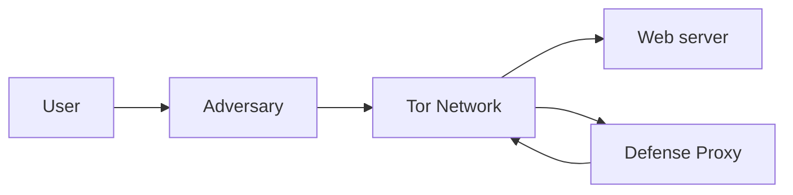
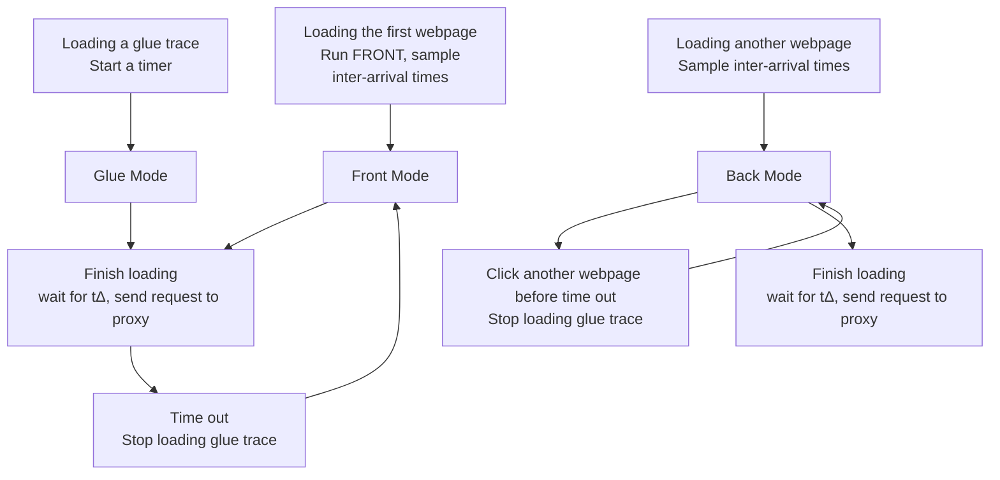

# Zero-delay Lightweight Defenses against Website Fingerprinting

Jiajun Gong and Tao Wang, Hong Kong University of Science and Technology

https://www.usenix.org/conference/usenixsecurity20/presentation/gong

This paper is included in the Proceedings of the 29th USENIX Security Symposium.

August 12–14, 2020

978-1-939133-17-5

Open access to the Proceedings of the 29th USENIX Security Symposium is sponsored by USENIX.

# Zero-delay Lightweight Defenses against Website Fingerprinting

Jiajun Gong, Tao Wang

Department of Computer Science and Engineering

Hong Kong University of Science and Technology

{jgongac, taow}@cse.ust.hk

## Abstract

Website Fingerprinting (WF) attacks threaten user privacy on anonymity networks because they can be used by network surveillants to identify the webpage being visited by extracting features from network traffic. A number of defenses have been put forward to mitigate the threat of WF, but they are flawed: some have been defeated by stronger WF attacks, some are too expensive in overhead, while others are impractical to deploy.

In this work, we propose two novel zero-delay lightweight defenses, FRONT and GLUE. We find that WF attacks rely on the feature-rich trace front, so FRONT focuses on obfuscating the trace front with dummy packets. It also randomizes the number and distribution of dummy packets for traceto-trace randomness to impede the attacker’s learning process. GLUE adds dummy packets between separate traces so that they appear to the attacker as a long consecutive trace, rendering the attacker unable to find their start or end points, let alone classify them. Our experiments show that with 33% data overhead, FRONT outperforms the best known lightweight defense, WTF-PAD, which has a similar data overhead. With around 22%–44% data overhead, GLUE can lower the accuracy and precision of the best WF attacks to a degree comparable with the best heavyweight defenses. Both defenses have no latency overhead.

## 1 Introduction

As people increasingly use the Internet for work and entertainment, network surveillance has correspondingly grown to become a pervasive threat against people’s privacy. Tor, an anonymity network based on onion routing [21], has become one of the most popular privacy enhancing technologies by defending web-browsing users from network eavesdroppers. To do so, it forwards user packets across multiple volunteer proxies, so that network surveillants cannot see both the true source and destination of the packets.

In the last decade, multiple studies [1, 7, 16, 17, 18, 20, 24, 25, 26, 29, 30] have shown that Tor is vulnerable to Website

Fingerprinting (WF), a kind of traffic analysis attack where a local attacker passively eavesdrops on network traffic to find out which webpage a client is visiting. WF attackers succeed by observing packet patterns such as the number of outgoing and incoming packets, packet rates, packet timing, and the ordering of packets. (WF attacks do not need to break encryption.) What makes WF attacks especially threatening is that the local passive eavesdropper (which could be the client’s ISP) is virtually impossible to detect.

To counter WF attacks, a number of defenses [2, 6, 11, 17, 19, 24, 27, 28] have been proposed over the years, but none have been adopted by Tor or any other privacy enhancing technology. This is because their data overhead may be too high; they may delay packets too much, hurting user experience; they may be too hard to implement realistically, relying on extra infrastructure that cannot be provided; or they may simply be ineffective against the best attacks. A defense against the WF problem grows increasingly urgent as more powerful attacks are found.

Our work makes the following contributions:

1. Emphasizing costlessness, practicality and usability, we design two new defenses that can defeat the best WF attacks: FRONT and GLUE. We call them zero-delay lightweight defenses, meaning they do not delay the client’s packets and they only add a small number of dummy packets to real traffic.

• FRONT obfuscates the feature-rich front portion of traces, which is crucial to the attacker’s success. It does so using randomized amounts of dummy packets, disrupting the attacker’s training process.  
• GLUE adds dummy packets between traces to make it seem as if the client is visiting pages consecutively without pause. This forces the attacker to solve difficult splitting problems, which previous work finds that even the best attacks fail to do [10].

2. We conduct extensive experiments to show the effectiveness of our defenses. We show that FRONT is able to outperform WTF-PAD (the previous best zero-delay defense) with the same data overhead (33%) in terms of attackers’ performance as well as information leakage analysis, while GLUE can reduce the TPR and precision of the best WF attacks down to single digits with 22%–44% data overhead (overhead depending on user behavior).

3. As GLUE relies on the difficulty of the splitting problem, we improve known solutions to splitting with a new framework, CDSB, to evaluate GLUE fairly. To the best of our knowledge, this is the first work that presents the performance of WF attacks when more than two webpages are visited consecutively.

We organize the rest of the paper as follows. We first discuss the related work in Section 2, and then we give some preliminaries in Section 3. We present FRONT and its evaluation in Sections 4 and 5 respectively, and we present GLUE and its evaluation in Sections 6 and 7 respectively. Finally we summarize our work in Section 8.

## 2 Related Work

Website Fingerprinting Attacks. WF attacks date back to 2002, when Hintz showed preliminary success in fingerprinting webpages by the number of bytes received in each connection [9]. Later, more studies successfully applied attacks against single-hop systems (Stunnel, OpenSSH, CiscoVPN and OpenVPN) in the closed-world scenario [8, 13]. (We will define the closed-world scenario and the more realistic open-world scenario in Section 3.) These attacks failed to defeat Tor because of Tor’s cell-level padding [8]. In 2011, Panchenko et al. [17] showed success against Tor (73% accuracy) with the use of a support vector machine (SVM) using expert features; it was effective in a preliminary open-world scenario as well. Further works [1, 4, 7, 16, 18, 20, 24, 25] have been proposed since then that pushed accuracy higher and false positive rate lower.

We pick four of the best, most recent attacks to evaluate, all of which are highly effective in the open-world scenario:

• kNN [24]: Proposed by Wang et al. in 2014, this attack uses a k-nearest neighbors classifier based on automatically learning weights of different features. It is designed to break WF defenses, as it adjusts to defensive feature scrambling by lowering the weights of bad features.  
• CUMUL [16]: Panchenko et al. proposed this SVM classifier that exploits the “cumulative representation” of a trace in 2016. It is more accurate than kNN, and has an excellent computation time.  
• kFP [7]: In 2016, Hayes and Danezis proposed this attack that jointly uses random forests and k-nearest neighbors. It has high precision in the open-world scenario.

• DF [20]: DF is a recent attack using a deep Convolutional Neural Network. It outperforms other deep learning attacks [1, 18], achieving high precision and recall. It is the first attack shown to be effective against WTF-PAD, a lightweight WF defense [11].

Website Fingerprinting Defenses. To defend against local, passive WF attackers, WF defenses can be deployed on an anonymity network to modify how the client talks to the network’s proxies. This is generally done by adding dummy packets or delaying real packets according to some strategy; the attacker cannot distinguish between dummy packets and real packets. No modification to the web server is required. Over the years, researchers have put forward a number of defenses to protect privacy-sensitive clients against WF attacks. We classify the strategies they use to defeat WF attacks into three categories, roughly in order of overhead: obfuscation, confusion, and regularization.

Obfuscation defenses seek to obfuscate specific features WF attacks rely on. A number of early defenses obfuscate packet lengths to defeat older WF attacks. These include Traffic Morphing by Wright et al. [28], which pads and splits packets, and HTTPOS [14], which does the same on specific HTTP requests and responses. These two defenses are ineffective on Tor, where packet lengths already leak no information because of constant-size cell-level padding. In 2016, Juarez et al. [11] introduced WTF-PAD, which uses a sophisticated token system to generate dummy packets and fill up abnormal trace gaps.

Some defenses aim to achieve confusion: they make it difficult for an attacker to determine which of a certain set of given traces is loaded. Panchenko et al. suggested simply loading a Decoy page for every true page load [17], so the attacker does not know which is the real page. Wang et al. proposed confusing the attacker by sending two or more traces under a Supersequence [24] that is created by adding dummy packets at the right places and delaying user packets.

Much work has been done on regularization defenses recently, which restrict how clients can send and receive packets in order to strictly limit the feature space available to the attacker. Some of these defenses enforce a fixed packet rate, with regular sequence end times, on the client: these include BuFLO (Buffered Fixed-Length Obfuscation) by Dyer et al. [6], CS-BuFLO (Congestion-Sensitive BuFLO) by Cai et al. [2], and the overhead-optimized Tamaraw by Cai et al. [3]. Fixing the packet rate delays user traffic significantly. In 2017, Wang and Goldberg [27] introduced Walkie-Talkie, which forces the browser to communicate in halfduplex mode to limit features. It achieves regularization at a lower overhead if we can assume that the client has some knowledge of webpage sizes.

Surveying the extensive work done on confusion and regularization defenses, we find that almost all of them have either a high data overhead (requiring many dummy packets) or cause significant delays to user traffic; sometimes both. These factors have stymied the adoption of all of these defenses; Tor developers would not want to harm user experience of their anonymity network. Therefore, to create zero-delay lightweight defenses, we decided to avoid confusion and regularization defenses. Among our new defenses, FRONT is an obfuscation defense, while GLUE is in its own category as it forces the WF attacker to solve a different, much more difficult problem.

Table 1: Comparison of known WF defenses. For overhead, Low is a non-zero overhead up to 35%, Medium is roughly 35–70%, High is roughly 70-100%, and Very High is above 100%.

<table><tr><td>Category</td><td>Defense</td><td>Latency overhead</td><td>Data overhead</td><td>Requires additional infrastructure</td><td>Defeated by known attacks</td></tr><tr><td rowspan="4">Obfuscation</td><td>Traffic morphing [28]</td><td>None</td><td>Low</td><td>None</td><td>Yes</td></tr><tr><td>HTTPS [14]</td><td>None</td><td>Low</td><td>None</td><td>Yes</td></tr><tr><td>WTF-PAD [11]</td><td>None</td><td>Low</td><td>None</td><td>Yes</td></tr><tr><td>FRONT (this work)</td><td>None</td><td>Low</td><td>None</td><td>No</td></tr><tr><td rowspan="3">Confusion</td><td>Decoy [17]</td><td>None</td><td>High</td><td>None</td><td>No</td></tr><tr><td>Walkie-talkie [27]</td><td>Medium</td><td>Low</td><td>Knowledge of pages, half-duplex</td><td>No</td></tr><tr><td>Supersequence [24]</td><td>High</td><td>Very High</td><td>Knowledge of pages</td><td>No</td></tr><tr><td rowspan="3">Regularization</td><td>BuFLO [6]</td><td>Very High</td><td>Very High</td><td>Fixed-rate network transfer</td><td>No</td></tr><tr><td>CS-BuFLO [2]</td><td>Very High</td><td>Very High</td><td>Fixed-rate network transfer</td><td>No</td></tr><tr><td>Tamaraw [3]</td><td>High</td><td>High</td><td>Fixed-rate network transfer</td><td>No</td></tr><tr><td></td><td>GLUE (this work)</td><td>None</td><td>Low</td><td>None</td><td>No</td></tr></table>

Some other defenses also require extra infrastructure to support, which is detrimental to their deployability. Supersequence and Walkie-Talkie both assume that the client knows some information about the webpage they are about to visit. This is generally impractical. The BuFLO-series of defenses mandate fixed packet rates, which may require some modification to the network stack because otherwise network delays could still reveal information. Walkie-Talkie requires modification to how the browser loads webpages. Our objective is to create defenses that can be deployed as painlessly and quickly as possible against the present threat of network surveillance, so we do not use any extra infrastructure.

We summarize the above in Table 1. Our defenses share the category of zero-delay lightweight defenses with only WTF-PAD. Noting that WTF-PAD is defeated by DF [20], we compare our work with theirs to show that our defenses are effective against DF.

## 3 Preliminaries

## 3.1 Threat Model

Like previous works in WF, we consider a passive adversary who is local to the user. Figure 1 illustrates the attack model. The adversary sits between the user and the entry node of the Tor network, eavesdropping on the network traffic over the encrypted channel. The adversary will not delay, modify or drop any packets.

We aim to deploy our defenses on Tor nodes to protect its clients against WF. There are three nodes in a typical Tor circuit: entry, middle, and exit. The middle node would serve as the cooperating proxy enacting the defense with the client. We use the middle node because the entry node is a possible WF attacker. Exit nodes and web servers would be entirely unaffected by our defense, as the middle node would drop dummy packets.

flowchart

Figure 1: The threat model for WF. The adversary sits between the user and the Tor network. The middle node of Tor network will be a cooperating proxy to deploy our defense.

## 3.2 Classification

From the attacker’s perspective, WF can be regarded as a classification problem. During webpage loading, a WF attacker records network traffic traces (also known as packet sequences). The attacker visits a certain set of monitored pages in advance and trains a machine learning model on these traces. Each webpage is a class, and a particular trace belonging to this class is called an instance. Then, when observing the client’s traces, the attacker predicts which webpage the trace belongs to, based on the trained model.

WF attacks may be evaluated in either the closed-world or the open-world scenario. In the closed-world scenario, we assume a user only visits a specific set of webpages, also called monitored webpages. In the open-world scenario, the client can also visit non-monitored webpages, so the attacker must predict whether a trace is a monitored one or a non-monitored one. If it is monitored, the attacker has to further answer which one. The attacker never trains on the same webpage the client visits; therefore, the attacker has zero prior knowledge of the client’s behavior. We focus on the more realistic open-world scenario.

While it is more difficult than the closed-world scenario, a large number of attacks have recently shown open-world success [7, 16, 17, 18, 24, 25, 30].

In the closed-world scenario, the attacker must achieve high accuracy (true positive rate), while in the open-world scenario, the attacker must achieve both high accuracy and precision. Therefore, to prove the efficacy of our defense against open-world attackers, we need to ensure that the attacker has both low accuracy and low precision. We specifically define precision in open-world WF below.

## 3.3 Precision

The precision of a classifier is defined as the proportion of positive (i.e. monitored) classifications that are correct. Researchers have pointed out that the base rate (the proportion of monitored webpages visited by the client) has been erroneously ignored in previous WF works when calculating precision [23]. This may lead to the base rate fallacy: an attack that seems to be accurate (high true positive rate) is actually highly imprecise when the base rate is low. If it is imprecise, its classifications are useless to the attacker. The definition of precision is somewhat atypical for WF because it is not a two-class problem, so we explicitly define it as follows:

Definition 3.1. Positives. If the WF attacker classifies a trace as belonging to a monitored webpage, it is a positive. If the classification is correct, it is a true positive. If the classification is incorrect and the sequence actually belongs to a different monitored webpage, it is a wrong positive. If the classification is incorrect and the sequence actually belongs to a non-monitored webpage, it is a false positive.

Definition 3.2. Precision. In an experiment, let $N _ { P }$ and $N _ { N }$ denote the number of positives and negatives respectively. Let T PR and W PR denote the proportion of true positives and wrong positives to $N _ { P }$ . Let FPR denote the proportion of false positives to $N _ { N }$ . Then the precision is:

$$
\pi = \frac {T P R}{T P R + W P R + r \cdot F P R},
$$

In the above, r is the ratio between how often the client visits non-monitored webpages to how often the client visits monitored webpages. A higher r lowers precision, and makes the open-world classification problem harder; previous attacks have shown success against clients up to $r =$ 1000 [23]. We want to prove that our defense is effective even for low-r clients that visit monitored webpages frequently. Therefore, in our paper, we set r = 10, representing a client that visits one monitored webpage for every ten non-monitored webpages. Hereafter we evaluate precision for such a client.

We also present the $F _ { 1 }$ score, the harmonic mean of TPR and precision, as a single combined metric for comparison between different attacks.

## 3.4 Overhead

We define the overhead of defending a trace as follows.

Definition 3.3. Trace. A trace is a sequence of packets collected during a page loading process, denoted as $P =$ $\langle ( t _ { 1 } , L _ { 1 } ) , ( t _ { 2 } , L _ { 2 } ) , \cdots , ( t _ { | P | } , L _ { | P | } ) \rangle$ where $| P |$ is the total number of cells in the trace. $t _ { i }$ is the timestamp of the i-th packet. $L _ { i }$ shows the direction and length of the i-th packet. Tor uses its own datagrams called cells which are all padded to the same length. Since Tor cells are of the same length, we simply use $L _ { i } = + 1$ to represent a cell coming from the client and −1 to represent a cell coming from the server. (We use packets to refer to both types of datagram.)

Definition 3.4. \`-trace. An \`-trace comprises traces of consecutive visits to \` webpages, denoted as $P = P _ { 1 } | | P _ { 2 } | | \cdots | | P _ { \ell }$ .

Let P denote the original trace and $P ^ { \prime }$ denote the trace after implementing some defense D. We define latency and data overhead on this trace as follows, which are the costs of implementing the defense D:

Definition 3.5. Latency overhead. The latency overhead $T ( D )$ of defense D on $P$ is the extra time taken to transmit real packets, divided by the original transmission time. Denote the last real packet in $P ^ { \prime }$ as $t _ { k } .$ , then we have:

$$
T (D) = \frac {t _ {k} - t _ {| P |}}{t _ {| P |}}
$$

Definition 3.6. Data overhead. The data overhead $O ( D )$ of defense D on $P$ is the total amount of dummy data divided by the total amount of real data:

$$
O (D) = \frac {| P ^ {\prime} | - | P |}{| P |}
$$

Generally, latency overhead affects users’ browsing experience while data overhead shows the extra burden laid on the network. They should be considered together when evaluating a defense. Following previous works [3, 11, 24, 27], we define these two metrics to be independent of each other, to simplify the analysis and to more easily highlight how defenses change each overhead. When bandwidth is a concern, for example, increasing the bandwidth overhead will likely delay page loading but will not change the time overhead.

Note that Definition 3.5 does not include the whole trace $P ^ { \prime } ,$ only the sequence up to the last real packet. That is because the client’s page would have fully loaded upon reception of the last real packet; extra dummy packets sent or received after that point have no effect on the client’s experience. Our defenses, FRONT and GLUE, have zero latency overhead (zero-delay) and little data overhead (lightweight).

## 4 FRONT

In this section, we first introduce the high-level idea behind FRONT by pointing out our observations and intuition in Section 4.1. In Section 4.2, we describe its design in detail. Finally, in Section 4.3, we analyze the features of our defense. We will evaluate FRONT in Section 5.

## 4.1 Overview

Learning from previous failures to implement WF defenses on anonymity technologies like Tor, we believe three properties are necessary to achieve deployability: zero-delay (no latency overhead), lightweight (small data overhead), and easy implementation. This respectively ensures that the defense has no effect on user experience, its extra data can be easily borne by the anonymity network, and its codebase will be easy to understand and maintain. Seeing the failure of confusion and regularization strategies to achieve these properties in previous work, we turn to obfuscation, and create FRONT (Front Randomized Obfuscation of Network Traffic).

The only known defense that shares these properties with FRONT is WTF-PAD [11]. In WTF-PAD, the client and server separately maintain two histograms where they sample inter-arrival time to generate dummy packets. To achieve the best performance, they also suggest tuning the parameters by sampling inter-arrival time from the real dataset. However, the tuning process is not user friendly and the construction and maintenance of these histograms are nontrivial. Pulls [22] also points out that the token mechanism in WTF-PAD is unnecessary and should be abandoned.

By contrast, FRONT is much simpler, uses less data overhead, and achieves better performance against the best attacks. It relies on two key intuitions:

• Obfuscating feature-rich trace fronts. The first few seconds of each trace, which we call the trace front, leaks the most useful features for WF classification. Some of the best attacks explicitly use the trace front for classification [7, 24]. We dedicate most of our data budget to obfuscating the trace front, instead of spreading them evenly over the trace.  
• Trace-to-trace randomness. FRONT adds dummy packets in a highly random manner, ensuring different traces of the same webpage look different to each other in total length, packet ordering, and packet directions. To do so, it randomizes the data budget and the region where we inject dummy packets. Since we must allow the attacker to train on defended traces instead of original traces, traceto-trace randomness hurts the attacker’s ability to find any meaningful patterns for a webpage class. Most regularization defenses suffer from trace-to-trace consistency.

Table 2: Defense parameters and variables in FRONT. Defense parameters set the overhead and behavior of FRONT, while trace variables are drawn from corresponding defense parameters for each trace separately to ensure trace-to-trace randomness.

<table><tr><td></td><td>Notation</td><td>Parameter</td></tr><tr><td rowspan="4">Parameters</td><td> $N_c$ </td><td>Client&#x27;s padding budget</td></tr><tr><td> $N_s$ </td><td>Proxy&#x27;s padding budget</td></tr><tr><td> $W_{min}$ </td><td>Minimum padding time</td></tr><tr><td> $W_{max}$ </td><td>Maximum padding time</td></tr><tr><td rowspan="4">Variables</td><td> $n_c \leftarrow \bar{U}(1, N_c)$ </td><td>Number of outgoing dummy packets</td></tr><tr><td> $n_s \leftarrow \bar{U}(1, N_s)$ </td><td>Number of incoming dummy packets</td></tr><tr><td> $w_c \leftarrow U(W_{min}, W_{max})$ </td><td>Client&#x27;s padding window</td></tr><tr><td> $w_s \leftarrow U(W_{min}, W_{max})$ </td><td>Proxy&#x27;s padding window</td></tr></table>

## 4.2 Defense Design

There are three steps in using FRONT to defend a trace: sample a number of dummy packets, sample a padding window size and schedule dummy packets. Its parameters are summarized in Table 2.

Sample a number of dummy packets $N _ { c }$ and $N _ { s }$ are two parameters determining the data overhead of FRONT, respectively representing the client’s padding budget and the proxy’s padding budget. For each trace, the client samples $n _ { c }$ from the discretized uniform distribution between 1 and $N _ { c }$ , denoted as $\bar { U } ( 1 , N _ { c } )$ ; the proxy samples $n _ { s }$ from $\bar { U } ( 1 , N _ { s } )$ . $n _ { c }$ and $n _ { s }$ are the actual number of dummy packets they will inject into that trace.

Sample a padding window FRONT spends most of its budget obfuscating trace fronts. To do so, both client and proxy will first generate a padding window, controlling where most dummy packets are expected to be injected into the original trace. For each trace, the client samples $w _ { c }$ from the uniform distribution between $W _ { m i n }$ and $W _ { m a x } ,$ , denoted as $U ( W _ { m i n } , W _ { m a x } )$ ; the proxy samples $w _ { s }$ from the same distribution. The reason we set a lower bound $W _ { m i n }$ , instead of $0 ,$ is to ensure that the generated padding window size is not too small; if it is too small, the defense may require an extreme bandwidth rate to support.

Schedule dummy packets After sampling the above variables, the client and proxy generate separate timetables to schedule when their respective $n _ { c }$ and $n _ { s }$ dummy packets will be sent. They generate the timestamps by sampling $n _ { c }$ and $n _ { s }$ times from a Rayleigh Distribution. Its probability density function is:

$$
f (t; w) = \left\{ \begin{array}{l l} \frac {t}{w ^ {2}} e ^ {- t ^ {2} / 2 w ^ {2}} & t \geq 0 \\ 0 & t <   0 \end{array} \right.,
$$

where w is $w _ { c }$ for the client and $w _ { s }$ for the proxy. True packets will be sent with no delays and dummy packets will be sent according to the timetables. When webpage loading finishes, the client will notify the relay with a packet and any unsent packets left in the timetable are simply dropped.

line chart

| t    | Value |
| ---- | ----- |
| 0    | 0     |
| w    | Peak  |
| >w   | Decreasing |

Figure 2: PDF of Rayleigh Distribution.

## 4.3 Defense Analysis

FRONT makes use of a Rayleigh Distribution. The corresponding PDF $f ( t ; w )$ is shown in Figure 2. The curve first increases quickly, peaks at w and then gradually decreases. This results in a burst of dummy packets at the start of a trace, in accordance with our first intuition. Though our dummy packet window has a nominal length of w, the window is “soft”; we expect 40% of the dummy packets to lie in the time interval [0, w]:

$$
\int_ {0} ^ {w} \frac {t}{w ^ {2}} e ^ {- t ^ {2} / 2 w ^ {2}} \mathrm{d} t \approx 0. 4 0
$$

We sample the number of dummy packets and padding window size so that they are different each time we load a webpage, even if it is the same webpage. This eliminates possible patterns that could be leveraged by an attacker, as suggested by our second intuition.

In FRONT, the latency overhead is always 0 since it never delays any real packets whereas the data overhead is proportional to $N _ { c } + N _ { s }$ . The number of dummy packets in each trace will be $\bar { U } ( 1 , N _ { s } ) + \bar { U } ( 1 , N _ { c } )$ (unless they are cut off by the end of a real trace), with a mean of $( N _ { s } + N _ { c } ) / 2 + 1$ .

## 5 Evaluation of FRONT

In this section, we evaluate FRONT in several aspects. After presenting our experimental setup, we evaluate FRONT against the best attacks to show that it is able to defeat them, and do so more efficiently than the state-of-the-art defenses. We follow up with an analysis of our design decisions to show why FRONT succeeds.

## 5.1 Experimental Setup

To conduct our experiments, we collect a new dataset (denoted as DS-19) between February and April 2019 with Tor Browser 8.5a7 on Tor 0.4.0.1-alpha, driven by command-line calls to Tor Browser. We visited the homepages of Alexa top 100 websites 100 times each as our monitored webpages and

Table 3: Defense settings and corresponding overheads.

<table><tr><td rowspan="2">Defense</td><td rowspan="2">Parameters</td><td colspan="2">Overhead (%)</td></tr><tr><td>Latency</td><td>Data</td></tr><tr><td>No defense</td><td>-</td><td>0</td><td>0</td></tr><tr><td>Tamaraw [3]</td><td> $\rho_{out} = 0.04, \rho_{in} = 0.012, L = 50$ </td><td>78.43</td><td>162.93</td></tr><tr><td>WTF-PAD [11]</td><td>Normal rcv</td><td>0</td><td>32.71</td></tr><tr><td>FT-1</td><td> $N_s = N_c = 1700, W_{min} = 1s, W_{max} = 14s$ </td><td>0</td><td>33.01</td></tr><tr><td>FT-2</td><td> $N_s = N_c = 2500, W_{min} = 1s, W_{max} = 14s$ </td><td>0</td><td>48.80</td></tr></table>

10000 other webpages as our non-monitored webpages, filtering out pages that did not load (such as those inaccessible through Tor). In doing so, we used a single machine connected to a university network. Since all traces are collected from an automated browser and none of them are from real users, there are no ethical concerns regarding the dataset and the following experiments.

We choose two defenses, WTF-PAD [11] and Tamaraw [3], as competitors to our defense representing two extremes in design philosophy: WTF-PAD is a lightweight obfuscation defense, while Tamaraw is a heavyweight regularization defense with high latency and data overhead. Other obfuscation defenses have been broken by known attacks, while most confusion and regularization defenses are either more expensive than Tamaraw, or impractical to implement.

We use kNN [24], CUMUL [16], kFP [7] and DF [20] as benchmarks to evaluate the defenses. We use suggested parameters in their papers for kNN, kFP and DF with one exception: for DF, we set the maximum length of the traces to 10000 (instead of 5000 suggested by Sirinam et al. [20]) to accommodate our dummy packets. CUMUL uses an SVM, which is heavily dependent on choosing the correct parameters, so we first follow the paper to perform parameter tuning on the candidate parameters and find the optimal parameters.

All the experiments are conducted in open-world setting. For each attack, we apply 10-fold cross validation on the dataset. We count true positives, wrong positives and false positives on each fold and add them up together. Then we calculate their corresponding TPR, WPR, FPR and precision.

## 5.2 Evaluation against Other Defenses

We start by showing that FRONT dominates WTF-PAD in terms of effectiveness against the best attacks. We also evaluate Tamaraw, a heavyweight defense, for comparison. The overhead of each defense is shown in Table 3. We choose two sets of parameters for FRONT: FT-1 representing a lightweight defense which has similar data overhead as WTF-PAD and FT-2 representing a defense with slightly higher overhead but greater effectiveness. $N _ { s } + N _ { c }$ determines the data overhead while $W _ { m i n }$ and $W _ { m a x }$ decide the padding window size. We put a more detailed discussion about how to set these parameters in Appendix A.

Table 4: Defense performances on DS-19. A lower F1 score represents a better defense.

<table><tr><td rowspan="2">Defense</td><td colspan="4">TPR (%)</td><td colspan="4">Precision (%)</td><td colspan="4"> $F_1$ </td></tr><tr><td>kNN</td><td>CUMUL</td><td>kFP</td><td>DF</td><td>kNN</td><td>CUMUL</td><td>kFP</td><td>DF</td><td>kNN</td><td>CUMUL</td><td>kFP</td><td>DF</td></tr><tr><td>No defense</td><td>89.09</td><td>94.44</td><td>91.85</td><td>96.40</td><td>83.18</td><td>64.22</td><td>94.38</td><td>91.12</td><td>0.86</td><td>0.76</td><td>0.93</td><td>0.94</td></tr><tr><td>Tamaraw [3]</td><td>3.41</td><td>3.85</td><td>2.08</td><td>0.58</td><td>2.33</td><td>8.13</td><td>23.16</td><td>6.78</td><td>0.028</td><td>0.052</td><td>0.038</td><td>0.11</td></tr><tr><td>WTF-PAD [11]</td><td>9.35</td><td>55.55</td><td>52.97</td><td>81.99</td><td>51.52</td><td>18.53</td><td>70.69</td><td>60.92</td><td>0.16</td><td>0.28</td><td>0.61</td><td>0.70</td></tr><tr><td>FT-1 (This work)</td><td>2.56</td><td>36.08</td><td>43.03</td><td>70.82</td><td>41.22</td><td>11.97</td><td>71.19</td><td>34.88</td><td>0.048</td><td>0.18</td><td>0.54</td><td>0.47</td></tr><tr><td>FT-2 (This work)</td><td>0.83</td><td>26.19</td><td>34.31</td><td>58.95</td><td>37.22</td><td>8.52</td><td>68.33</td><td>30.59</td><td>0.016</td><td>0.13</td><td>0.46</td><td>0.40</td></tr></table>

FRONT performance on DS-19 Table 4 shows how well WF attacks perform against our evaluated defenses. We present TPR, precision and $F _ { 1 }$ score of each attack under different defenses.

When no defense is implemented, all attacks achieve over 89% TPR. kFP and DF become the strongest attacks since $F _ { 1 }$ is over 90% for both of them. Even though CUMUL’s TPR is quite high (94%), it has the lowest precision (64%), resulting in its low $F _ { 1 }$ . All attacks achieve a low $F _ { 1 }$ score against Tamaraw, but Tamaraw comes with a very high price in terms of overhead. WTF-PAD is much cheaper at 32% data overhead, and it defends against kNN and CUMUL well. However, kFP and DF remain effective against WTF-PAD, achieving 0.61 and 0.70 $F _ { 1 }$ score.

FT-1 outperforms WTF-PAD in defending against every attack, especially kNN and DF. With nearly the same data overhead as WTF-PAD, kNN performs just as poorly against FT-1 as against Tamaraw, and DF performs half as well as before (by $F _ { 1 }$ score). FT-2 further decreases $F _ { 1 }$ of the strongest attacks, kFP and DF, with only 48% data overhead.

We find that FRONT is especially effective against kNN, even approaching Tamaraw’s performance. It is also effective at defeating DF, the strongest attack on the undefended dataset: the precision of DF drops significantly against FRONT, more so than kFP.

To explain why FRONT outperforms WTF-PAD, we evaluate how it embodies our two key intuitions (in Section 4.1) compared to WTF-PAD. First, to show its obfuscation of trace fronts, we calculate how much data budget FRONT and WTF-PAD use in each portion of the trace. WTF-PAD distributes its budget evenly: it spends 24% of its budget in the first quarter of the trace and 49% in the first half. In contrast, FRONT uses 40% of its budget in the first quarter and 69% in the first half. Second, to show trace-to-trace randomness, we evaluate the coefficient of variation of dummy packets injected in each webpage class. We find that FRONT has a median coefficient of variation of 42% compared to 36% for WTF-PAD over our dataset.

TPR on different websites We further investigate FRONT’s webpage-to-webpage performance on DS-19. We equally divide the monitored webpages into 4 groups based on their webpage sizes, denoted as $G _ { 1 } , G _ { 2 } , G _ { 3 }$ and $G _ { 4 } ,$ where $G _ { 1 }$ is the smallest quartile of webpages and $G _ { 4 }$ is the largest quartile of webpages. The number of packets of each webpage in those groups is up to 2039, 4368, 6611 and 28199, respectively. We can see that the sizes of webpages vary greatly, especially for $G _ { 4 }$ .

We choose the most precise attack, kFP, and compute the recall. The recall on each group is 24%, 24%, 35% and 54%. The performance of FRONT does not change much on first three groups. The webpages in $G _ { 4 }$ are 10 times larger than $G _ { 1 }$ , and the recall rate increases by 30%.

FRONT performance on DS-14 We did a supplementary experiment on Wang’s dataset [24] collected in 2014 (denoted as DS-14) which consists of 9000 monitored webpages and 9000 non-monitored ones. The mean number of packets is 2163 in DS-14 and 4444 in DS-19. Therefore, the web pages of DS-14 are significantly smaller. The intent of this experiment is to verify that FRONT works on different websites. With 41% data overhead, FRONT greatly outperforms over WTF-PAD (which has 44% data overhead) in all metrics, no matter which attack is used.

For the strongest two attacks, kFP and DF, FRONT reduces their $F _ { 1 }$ score to 0.30 and 0.41, compared with 0.48 and 0.63 against WTF-PAD. The most significant case is kNN which relies greatly on trace FRONT information. Its $F _ { 1 }$ is reduced to only 0.03 while WTF-PAD reduces it to 0.26. We also find that all the attacks perform better on DS-19 than DS-14. The observation that larger websites are easier to identify was also made by Overdorf et al. [15].

## 5.3 Information Leakage Analysis

Some recent works [5, 12] have pointed out that empirically evaluating a defense against state-of-art attacks may not show the real security level of such a defense. WeFDE, proposed by [12], quantifies the amount of information leakage for 3043 features, chosen from those exploited by known state-of-the-art attacks. We use WeFDE to measure the information leaked on undefended traces, WTF-PAD and FRONT. The detailed methodology of WeFDE and the introduction of feature set can be found in [12].

We plot the empirical cumulative distribution function (ECDF) of information leakage for all features in Figure 3. Generally speaking, the curve for FRONT increases much faster than that for WTF-PAD and undefended Tor, indicating that most features leak less information under FRONT. Specifically, no feature leaks more than 3.6 bits of information on undefended Tor, 3.5 bits for WTF-PAD, 2.3 bits for FT-1 and 2 bits for FT-2.

line chart

| Information Leakage (bit) | Undefended | WTF-PAD | FT-1 | FT-2 |
| ------------------------- | ---------- | ------- | ---- | ---- |
| 0                         | 0.0        | 0.0     | 0.0  | 0.0  |
| 1                         | 0.8        | 0.9     | 0.7  | 0.95 |
| 2                         | 0.9        | 0.95    | 0.85 | 0.98 |
| 3                         | 0.95       | 0.98    | 0.9  | 0.99 |
| 4                         | 0.98       | 0.99    | 0.95 | 1.0  |

Figure 3: ECDF of information leakage on different datasets. The 100th percentile points are marked.

The information leakage analysis confirms again that FRONT achieves a higher security level than WTF-PAD. We include the full information leakage result in Appendix D.

## 5.4 Choosing Where to Pad

FRONT is built on the intuition that it helps to obfuscate the trace front for defense effectiveness. We validate this intuition here by delaying all dummy packets from 0 s to 10 s and measure the change in TPR and precision of each attack. We set $W _ { m i n } = 1 \mathrm { s } , W _ { m a x } = 1 4 \mathrm { s } , N _ { c } = 1 0 0 0$ and $N _ { s } = 1 0 0 0$ based on FT-2. Figure 4 shows the results. The larger the delay, the less we will obfuscate the trace front (the same padding budget is instead spent on the middle or the end).

We can see that for all attacks, both TPR and precision grow as we increase the delay, thus leaking more of the trace front. All attacks’ TPR increase by 5–30%, among which DF always achieves the highest TPR, increasing from 59% to 71%. kFP’s TPR nearly doubles from 34% to 62%. In terms of precision, there are some ups and downs due to its sensitivity to false positives. But still, all attacks become 6– 15% more precise as we reveal the trace front by shifting dummy packets later. This experiment indicates that trace fronts do leak a lot of information.

## 5.5 Impact of Randomness

In FRONT, the client and proxy will sample the number of dummy packets and the padding window from a range instead of fixing them. We do two experiments to validate the effectiveness of this design decision.

In the first experiment, we gradually shrink the range of choices for the number of dummy packets and observe the change of TPR and precision for each attack. As before, we have $W _ { m i n } = 1 \mathrm { s } , W _ { m a x } = 1 4 \mathrm { s } , N _ { c } = N _ { s } = 2 5 0 0$ based on FT-2. Unlike previous experiments, here we sample $n _ { c }$ from $\hat { U } ( \beta \cdot N _ { c } , N _ { c } )$ and $n _ { s }$ from $\bar { U } ( \beta \cdot N _ { s } , N _ { s } )$ . We vary $\beta$ , which controls the degree of randomization, from 0 to 1 (0 being maximal randomization).

line chart

| Delay (s) | kNN TPR (%) | CUMUL TPR (%) | kFP TPR (%) | DF TPR (%) | kNN Precision (%) | CUMUL Precision (%) | kFP Precision (%) | DF Precision (%) |
| --------- | ----------- | ------------- | ----------- | ---------- | ----------------- | ------------------- | ----------------- | ---------------- |
| 1         | ~5          | ~60           | ~35         | ~28        | ~35               | ~30                 | ~70               | ~10              |
| 2         | ~5          | ~58           | ~40         | ~30        | ~32               | ~32                 | ~72               | ~10              |
| 3         | ~5          | ~58           | ~45         | ~32        | ~30               | ~35                 | ~75               | ~10              |
| 4         | ~5          | ~60           | ~50         | ~35        | ~38               | ~30                 | ~70               | ~10              |
| 5         | ~5          | ~62           | ~55         | ~38        | ~40               | ~35                 | ~75               | ~10              |
| 6         | ~5          | ~65           | ~60         | ~40        | ~45               | ~40                 | ~78               | ~12              |
| 7         | ~5          | ~68           | ~62         | ~42        | ~42               | ~45                 | ~79               | ~15              |
| 8         | ~5          | ~70           | ~63         | ~45        | ~40               | ~48                 | ~79               | ~18              |
| 9         | ~5          | ~72           | ~64         | ~48        | ~45               | ~50                 | ~79               | ~20              |
| 10        | ~5          | ~75           | ~65         | ~50        | ~50               | ~52                 | ~79               | ~22              |

Figure $4 { : }$ Change in performance of WF attacks when all dummy packets are delayed by 1 to 10 seconds.

As $\beta$ increases, trace-to-trace randomness in the number of dummy packets decreases. Figure 5 shows the results. We see that increasing $\beta$ weakens the defense, as all attacks except DF increase in TPR, especially when $\beta > 0 . 8$ . As for DF, its TPR remains around 60%: increasing trace-to-trace randomness does not weaken its attack ability. Note that increasing $\beta$ also increases data overhead linearly, doubling the data overhead at $\beta = 1$ .

We perform a similar experiment on randomizing padding window size, using the same settings as the above experiment. We keep $W _ { m a x } = 1 4 \mathrm { s }$ and set $W _ { m i n } = \boldsymbol { \beta } \cdot \boldsymbol { W } _ { m a x } .$ . We gradually increase $\beta$ from 0 to 1. Figure 6 shows the results. Just as before, when we decrease the randomness in padding window size, TPR increases, especially for CUMUL and DF.

## 5.6 Evaluation of Data Overhead

In this part, we want to measure how an increase in the overhead budget affects the attacker’s effectiveness. We focus on kFP here because the extensive experiments in Section 5.2 to Section 5.5 show us that kFP is the strongest attack by $F _ { 1 }$ score; DF is accurate but imprecise against FRONT, so its $F _ { 1 }$ score is lower. Setting $W _ { m i n } = 1$ s and $W _ { m a x } = 1 4 \mathrm { s } .$ we vary $N _ { s } + N _ { c }$ from 0 to 7200 packets in intervals of 200 packets. We show TPR and $F _ { 1 }$ of kFP in Figure 7.

Without FRONT, kFP can achieve 92% TPR. Its TPR decreases quickly as we initially increase the size overhead. With only 25% data overhead, its TPR is already lower than 50%. On the other hand, its $F _ { 1 }$ score decreases from 93% to 38% as we increase the data overhead from 0% to 70%.

line chart

| β    | TPR (%) - kNN | TPR (%) - CUMUL | TPR (%) - kFP | TPR (%) - DF | Data overhead (%) - kNN | Data overhead (%) - CUMUL | Data overhead (%) - kFP | Data overhead (%) - DF |
|------|---------------|-----------------|---------------|--------------|-------------------------|---------------------------|-------------------------|------------------------|
| 0.2  | ~0            | ~60             | ~35           | ~60          | ~50                     | ~60                       | ~50                     | ~60                    |
| 0.4  | ~0            | ~65             | ~38           | ~65          | ~60                     | ~65                       | ~65                     | ~65                    |
| 0.6  | ~0            | ~62             | ~40           | ~62          | ~70                     | ~70                       | ~70                     | ~70                    |
| 0.8  | ~0            | ~60             | ~45           | ~60          | ~80                     | ~80                       | ~80                     | ~80                    |
| 1.0  | ~10           | ~65             | ~50           | ~65          | ~95                     | ~95                       | ~95                     | ~95                    |

Figure 5: TPR and data overhead while varying $\beta$ to change the lower bound of padding budget.  

line chart

| β    | kNN  | CUMUL | kFP  | DF   |
| ---- | ---- | ----- | ---- | ---- |
| 0.2  | ~0   | ~60   | ~35  | ~25  |
| 0.4  | ~0   | ~70   | ~40  | ~35  |
| 0.6  | ~0   | ~80   | ~45  | ~45  |
| 0.8  | ~0   | ~85   | ~50  | ~55  |
| 1.0  | ~0   | ~90   | ~55  | ~60  |

Figure 6: TPR while varying β to change the lower bound of padding window size. Data overhead remains constant.

line chart

| Data overhead (%) | TPR (%) | F1    |
| ----------------- | ------- | ----- |
| 35                | 45      | 0.55  |
| 50                | 35      | 0.48  |

Figure 7: kFP’s TPR and precision on protected traces given different data overhead budgets. We mark with a cross the data overheads of FT-1 and FT-2 on the figure.

## 6 GLUE

Our second proposed defense, GLUE, exploits an entirely new facet of website fingerprinting to achieve even greater success than FRONT against known attacks. We start by presenting the big picture of what GLUE exploits and how it achieves success. Due to the novelty of GLUE, we carefully elaborate our threat model and defense design.

## 6.1 Overview

Many WF attacks have been published in recent years, all of them relying on the same assumption: that every trace the attacker must classify corresponds to exactly one webpage. We call these traces singleton traces. This is satisfied if the client dwells on pages for some time before visiting the next page; the attacker will notice the obvious time gap and split the trace at that point. Even a second of inactivity will be enough. Conversely, when the client visits $\ell \geq 2$ pages consecutively without an obvious time gap — for example, by clicking a link before the page has fully loaded — all known WF attacks cannot succeed in classifying the \`-trace thus generated, even if they are properly trained and aware of such a possibility [10, 30].

Since known WF attacks can only classify singleton traces $( \ell = 1 )$ , there are two difficult problems the attacker must solve to classify \`-traces correctly for $\ell \geq 2 .$ First, the attacker must correctly determine $\ell ;$ we call this the split decision problem. Secondly, the attacker must find $\ell - 1$ points to split the \`-trace into \` separate singleton traces; we call this the split finding problem. Then, the classifier can input these singleton traces into a powerful WF attack. There are some works suggesting that the latter problem could be solved for \` = 2 [26, 29], but no solution is known in general; the former problem has never been solved.

We leverage the difficulty of solving these problems to create a new defense, GLUE. Whenever the client is dwelling on a webpage, GLUE adds dummy packets to make it seem as if the client is visiting new pages consecutively. GLUE will stop sending dummy packets when the client loads a new page, thus hiding the true start of the next page. In other words, GLUE tries to glue together singleton traces into \`- traces for large values of \`. Unable to solve either the split decision or finding problem, attacks are very likely to fail if they split traces wrongly. This is especially true if the resultant singleton traces have extra packets in the trace front, which is critical for correct classification.

flowchart

Figure 8: Client’s state machine. Starting from Front Mode, it will switch between Glue Mode and Back Mode until dwell time becomes too long. “Glue traces” are padded in Glue Mode. The client keeps sampling inter-arrival times in both Front and Back Mode.

## 6.2 Defense Design

Suppose a client visits \` webpages in a time period and then stops. GLUE tries to make sure that the attacker will see a seemingly consecutive \`-trace $P = P _ { 1 } | | P _ { 2 } | | \cdots | | P _ { \ell }$ . Without GLUE, they may have dwell time gaps between them, allowing the attacker to split them trivially.

Denote the dwell time on $P _ { i }$ as $d _ { i }$ . GLUE pads for a maximum duration $d _ { m a x }$ . For GLUE to create an \`-trace, let us suppose $d _ { i } \leq d _ { m a x }$ for $i = 1 , \ldots , \ell - 1$ and $d _ { \ell } > d _ { m a x }$ . While the client dwells on webpages, the client and the proxy will send each other dummy packets. Figure 8 gives the state machine of a client, and the proxy’s state machine is similar. GLUE also uses FRONT noise to defend the first of \`-traces.

Front Mode Starting in Front Mode, our defense waits for the client to visit a webpage. When the client does so, we will add dummy packets according to our FRONT defense, as described in previous sections. We will also sample those inter-arrival times between incoming packets and outgoing packets to obtain some distribution I. After the client finishes visiting the webpage, we sample $t _ { \Delta }$ according to I (described below), wait for time $t _ { \Delta } .$ , then switch to Glue Mode.

Glue Mode In Glue Mode, the client and proxy send each other dummy packets in such a way that it looks as if the client decided to visit a new, random webpage. (The person behind the client is actually dwelling on the previous webpage.) They will do so for at most time $d _ { m a x }$ . They immediately stop doing so if the client actually decides to visit a webpage before $d _ { m a x }$ has passed: the client will notify the proxy to terminate Glue Mode as well. If the client dwells on the webpage for longer than $d _ { m a x } .$ , the algorithm will consider the client inactive and return to Front Mode. Otherwise, it will go to Back Mode. We call the dummy packets added here “glue traces”.

Back Mode In Back Mode, the client is visiting another webpage. This is like Front Mode, except we add zero dummy packets. We still sample packet inter-arrival times and switch back to Glue Mode after waiting for $t _ { \Delta }$ .

GLUE incorporates FRONT in Front Mode, ensuring that the first trace of any \`-trace will be padded with FRONT. This is because we found that GLUE alone does not protect the first trace well (shown in Section 7.6), but achieves excellent protection of all other traces. We need to add a bit of overhead to protect the first trace.

In the above, I is the inter-arrival time distribution only with those time gaps between an incoming and an outgoing packet. $t _ { \Delta }$ is the sampled inter arrival time. We choose $t _ { \Delta } \in U ( I _ { \bar { 2 0 } } , I _ { \bar { 8 0 } } )$ where $I _ { \bar { 2 } 0 }$ and $I _ { \bar { 8 0 } }$ are the 20 percentile and 80 percentile of the inter-arrival time distribution I respectively. We intentionally create such a small gap to simulate a time interval when the client sends out some request after receiving data from the server during a webpage loading. By doing so we connect real traces with glue traces together naturally without any abnormal gaps in between. We also randomize $d _ { m a x }$ by sampling from a uniform distribution so that the attacker could not trivially remove the noise on the tail.

We illustrate how GLUE works with Figure 9. Suppose a client visits three webpages with real traces $P _ { 1 } , P _ { 2 }$ , and $P _ { 3 } ,$ then stops, with time gaps $d _ { 1 } , d _ { 2 } < d _ { m a x }$ after the first two pages respectively. The attacker will collect a 3-trace, $P ^ { \prime } =$ $P _ { 1 } ^ { \prime } | | P _ { 2 } ^ { \prime } | | P _ { 3 } ^ { \prime } . ~ P _ { 1 } ^ { \prime }$ contains $P _ { 1 }$ with FRONT noise, followed by a glue trace of duration $d _ { 1 }$ . $P _ { 2 } ^ { \prime }$ contains $P _ { 2 }$ followed by a glue trace of duration d2. $P _ { 3 } ^ { \prime }$ contains $P _ { 3 }$ followed by a glue trace of duration $d _ { m a x }$ . Of course, the attacker cannot know where each trace starts or ends. In fact, the attacker will not even know how many traces there are. If the attacker tries to split the combined trace incorrectly, some or all of the split traces will be contaminated by dummy packets in their beginning or end, which greatly affects WF attack performance.

## 6.3 Distributing Glue Traces

To make sure glue traces look like real traces, the client needs to have a database which contains real webpage loads. We propose that the client will retrieve such a database along with the list of Tor nodes at Tor startup from Tor directory servers. Then the client will ask for more after some certain period of time. During Glue Mode, the client instructs the proxy when to send a dummy packet.

text_image

Original trace P
P₁
d₁
P₂
d₂
P₃
dₘₐₓ
Defended trace P′
P′₁
P′₂
P′₃

Figure 9: A toy example of what traffic looks like with GLUE. The white boxes are real traces while the grey boxes are glue traces (made with dummy packets). Glue traces remove time gaps between real traces to exploit the difficulty of the split decision and finding problems.

Note that glue traces contain no real data, only timestamps of when dummy packets are sent and received. Therefore, we do not expect the traces to cause much extra data overhead. We estimate the data overhead for distributing glue traces as follows. On average a trace has 4441 packets in our dataset. Therefore, the average web page size is 2.3 MB. Suppose a timestamp takes up 2 bytes, then one glue trace takes up 4441 × 2 = 0.008 MB. Hence, on client side, the data overhead in the long run will be 0.008/2.3 ≈ 0.003 if the number of glue traces downloaded is the same as the number of web pages visited; and it will be 0.03 if the client downloads 10 times more glue traces than actually needed ones.

On the directory server side, we estimate the distribution cost as follows. Taking statistics from November 2018 to November 20191, we found that the average bandwidth spent on answering directory requests is 172 MB/s and the average number of Tor users is 2.1 million per day. If the average user downloads 200 glue traces per day, the average bandwidth for distributing glue traces is about 39 MB/s. Therefore, the directory server is expected to have about 39/172 ≈ 23% data overhead. To obfuscate user activity, we can require users to download a randomized number of glue traces regularly even if they do not need to, using padding to hide the number of glue traces downloaded from an eavesdropper.

## 6.4 Solving Split Decision and Split Finding

To break down an \`-trace, the attacker pursues the following strategy: determine \` (split decision problem) and then find \` − 1 points to split the \`-trace (split finding problem). To the best of our knowledge, there is no prior work on split decision, and only two studies looking into split finding for 2-traces. Wang and Goldberg [26] put forward a split finding algorithm using kNN with a score system. Xu et al. [29] suggested using XGBoost to output the outgoing packet with the highest probability to be the split. They show that their algorithm could achieve better performance than kNN. Neither work considers \`-traces for \` ≥ 3.

Since GLUE relies on these problems being difficult, we want to make a sincere best effort at solving both problems for general \` so that future work will not be likely to break

GLUE. To do so, we put forward a new framework: Coarse-Decided Score-Based (CDSB). CDSB performs better than both previous algorithms for any general \`.

Split decision We use a Random Forest classifier with 511 features extracted by expert knowledge to decide how many splits there are. Intuitively, the more webpages we visit, the longer an \`-trace’s transmission time will be. Since splits are time-sensitive, we include rich time information in our feature set. We also exploit volume information such as the number of packets and the number of outgoing packets in our feature set. Refer to Appendix B for a detailed feature list.

Split finding We extend Xu et al.’s XGBoost to score each outgoing packet in the trace; a higher-scoring packet is more likely to be the true split. However, the algorithm does not simply choose all the highest-scoring packets. Because usually all the packets around a true split score highly, but only one of them is the true split. If we chose all of them, we would have many false positives. Instead, we choose the highest-scoring packet as a split in each round, and we eliminate nearby packets from consideration as splits for future rounds. By this score decoding processing, we generate predicted splits. We put the pseudocode in Appendix C.

## 7 Evaluation of GLUE

In this section, we evaluate the performance of GLUE. We first present the experimental setup. GLUE creates \`-traces, but the exact value of \` is determined by client behavior; therefore, we evaluate GLUE on a range of values of \`, from 2 to 16. Finally, we investigate the overhead of GLUE, which is dependent on how long clients dwell on webpages.

## 7.1 Experimental Setup

We use DS-19 to evaluate GLUE. We divide it into three parts: ATTACKTRAIN (9000 instances), SPLITTRAIN (2000 instances) and EVALUATION (9000 instances). We use AT-TACKTRAIN to generate training data for WF attacks and split decision; SPLITTRAIN to generate training data for split finding; and EVALUATION to generate test data.

Due to its novelty, GLUE requires a new methodology to evaluate. The split decision problem is entirely unexplored, and although we make a good-faith attempt to solve it, we want to show that GLUE is still effective even if the attacker “cheats” by being given \` directly. While \`-traces are much harder to classify for large \`, the exact value of \` is dependent on user behavior. We want to show GLUE is powerful even for the minimal $\ell = 2 . ^ { 2 }$ The split finding problem has been explored more and GLUE relies on its difficulty. Therefore, our evaluation is divided into two cases:

• \`-traces without split decision. We evaluate for $\ell \in [ 2 , 1 6 ]$ , and the attacker is told the value of \`.  
• \`-traces with split decision. We evaluate for $\ell \in [ 2 , 1 6 ]$ , and the attacker must find \`.

## 7.2 \`-traces without Split Decision

We start with an investigation of \`-traces without split decision: the client visits \` pages with a moderately short dwell time between them. We tell the attacker what \` is, allowing the attacker to cheat by skipping the split decision problem. We use a lightweight setting for FRONT noise $( N _ { s } = N _ { c } = 1 1 0 0 )$ ). We sample $d _ { m a x } ,$ , the maximum duration of glue traces, from $U ( 1 0 \mathrm { s } , 1 5 \mathrm { s } )$ . We assume the client’s dwell time between webpages is a uniform distribution between 1 s and 10 s. The client visits ten times more nonmonitored webpages than monitored webpages.

We randomly generate 4000 split points and 4000 nonsplit points from SPLITTRAIN as split training data. We randomly generate $\lfloor 9 9 0 0 / \ell \rfloor$ \`-traces for $\ell \in [ 2 , 1 6 ]$ from EVAL-UATION as test data so that we have 900 monitored webpages and 9000 non-monitored webpages in each test dataset.

The attacker will find \` − 1 split points, split a \`-trace into \` singleton traces, and use a standard WF attack on each trace. Alternatively, the attacker could also find $2 ( \ell - 1 )$ splits and discard all packets between all odd and even splits, thus removing glue traces; however, we found that this strategy performs extremely poorly since it forces the attacker to find more traces accurately, so we do not present this strategy. Note that since the first singleton trace has some FRONT noise, the attacker should train two WF models: one “noisy model” trained on traces with FRONT noise to classify the first singleton trace; the other “clean model” trained without FRONT noise to classify the other singleton traces.

Figure 10 shows the performance of WF attacks after implementing GLUE. Increasing \` decreases both TPR and precision. In terms of TPR, DF performs the best at first (54% TPR at \` = 2), but when more and more traces are glued together, it weakens quickly. When \` = 16, all attacks achieve less than 5% TPR. We can see that despite being told \` and using our improved split finding procedure, the best WF attacks still cannot defeat GLUE.

## 7.3 \`-traces with Split Decision

In this experiment we tackle a more realistic scenario: the attacker does not know how many splits are in an \`-trace and thus needs to do split decision first. The client and the datasets are the same as in Section 7.2. We also generate 9000 \`-traces for $\ell \in [ 2 , 1 6 ]$ using ATTACKTRAIN to train for the split decision problem.

To evaluate the performance of WF attacks correctly, if the attacker guesses more than \` times for an \`-trace (due to incorrect split decision), we discard all the extra guesses and use only the first \` guesses.

Figure 11 shows the results. We can see that with split decision, WF attacks perform even worse, and their performance decreases more drastically with larger \`. When \` increases to 16, all WF attacks have less than 1% precision.

## 7.4 Undefended \`-traces

To show how attackers’ performance are degraded by GLUE, we also test attack performance on the undefended dataset. We find that the best WF attack is kFP and it achieves 96% TPR at $\ell = 2$ down to 82% TPR at \` = 16. It achieves 97% precision at \` = 2 and 82% at \` = 16. Split finding procedure has nearly no effect on kFP when \` is small and only a slight effect when \` is large. This is due to the high accuracy $( > 9 2 \% )$ of our split finding algorithm. Even if split decision is required, kFP still achieves 45%–75% TPR and 41%–77% precision. We put the detailed experiment results in Appendix E.

## 7.5 Analysis of Data Overhead

GLUE’s data overhead consists of three parts: $O _ { F }$ incurred by FRONT noise, $O _ { G }$ incurred by glue traces except the last one and $O _ { L }$ incurred by the tail, i.e. the last glue trace. To estimate GLUE’s data overhead, let the mean time taken to load a webpage be $d _ { P } .$ . We take the average over user dwell times that are short enough to be glued, and denote it as $d _ { G }$ . The mean time of the tail is $d _ { L } > d _ { G } . ~ ( d _ { L }$ is the mean of the distribution from which we sample $d _ { m a x } . )$ For simplicity, we can assume that real and glue traffic have the same uniform packet rate b. Then,

$$
\begin{array}{l} O (\text { GLUE }) = O _ {F} + O _ {G} + O _ {L} \\ = \frac {1}{\ell b d _ {P}} \left[ \frac {N _ {s} + N _ {c} + 2}{2} + (\ell - 1) b d _ {G} + b d _ {L} \right] \\ = \underbrace {\frac {N _ {s} + N _ {c} + 2}{2 \ell b d _ {P}}} _ {\text { FRONT   noise }} + \underbrace {\frac {(\ell - 1) d _ {G}}{\ell d _ {P}}} _ {\text { Glue   trace }} + \underbrace {\frac {d _ {L}}{\ell d _ {P}}} _ {\text { Tail }}. \\ \end{array}
$$

We can see that the O(GLUE) increases with users’ dwell time and the duration of the tail while it decreases with \`, the number of pages glued together. Note that we only add FRONT noise for the first trace and the cost for that is shared by all the traces in an \`-trace, thus $O _ { F }$ is inversely proportion to \`. This is also the case for $O _ { L }$ . Since \` has little impact on $O _ { G }$ when it is large, we can reduce GLUE’s data overhead with a large \`.

With $N _ { s } = 1 1 0 0 , N _ { c } = 1 1 0 0$ , the FRONT noise in our dataset has a mean of 24%. We also calculate the mean time to load a page based on our dataset and get $d _ { P } = 2 7 . 3 0 \mathrm { s }$ . Thus, the data overhead of GLUE is

line chart

| ℓ  | TPR (%) - kNN | TPR (%) - CUMUL | TPR (%) - kFP | TPR (%) - DF | Precision (%) - kNN | Precision (%) - CUMUL | Precision (%) - kFP | Precision (%) - DF |
|----|---------------|-----------------|---------------|--------------|---------------------|------------------------|---------------------|--------------------|
| 2  | ~15           | ~28             | ~14           | ~58          | ~20                 | ~13                    | ~12                 | ~6                 |
| 4  | ~12           | ~22             | ~12           | ~45          | ~10                 | ~8                     | ~7                  | ~4                 |
| 6  | ~10           | ~18             | ~10           | ~35          | ~6                  | ~5                     | ~6                  | ~3                 |
| 8  | ~8            | ~15             | ~8            | ~25          | ~4                  | ~3                     | ~4                  | ~2                 |
| 10 | ~6            | ~12             | ~6            | ~20          | ~2                  | ~2                     | ~3                  | ~1                 |
| 12 | ~5            | ~10             | ~5            | ~15          | ~1                  | ~1                     | ~2                  | ~0.5               |
| 14 | ~4            | ~8              | ~4            | ~12          | ~0.5                | ~0.5                   | ~1                  | ~0.3               |
| 16 | ~3            | ~6              | ~3            | ~10          | ~0.3                | ~0.3                   | ~0.5                | ~0.2               |

Figure 10: WF attack performance without split decision against GLUE on \`-traces.  

line chart

| ℓ | d_G=10, d_L=20 | d_G=5.5, d_L=12.5 | d_G=2.5, d_L=5 |
| --- | --- | --- | --- |
| 2 | 50 | 45 | 18 |
| 4 | 45 | 35 | 12 |
| 6 | 40 | 28 | 8 |
| 8 | 38 | 26 | 6 |
| 10 | 37 | 24 | 5 |
| 12 | 36 | 23 | 4 |
| 14 | 35 | 22 | 3 |
| 16 | 34 | 21 | 2 |

Figure 12: Data overhead with respect to different $\ell , d _ { G }$ and $d _ { L }$ . Data overhead increases when $d _ { G }$ and $d _ { L }$ are larger.

$$
O (\mathrm{GLUE}) = \frac {0 . 2 4}{\ell} + \frac {\ell - 1}{2 7 . 3 0 \ell} \cdot d _ {G} + \frac {1}{2 7 . 3 0 \ell} \cdot d _ {L}. \tag {1}
$$

We use three different settings to represent different client behaviors: $d _ { G } = 2 . 5 \mathrm { s } , d _ { L } = 5 \mathrm { s }$ as a strict version of GLUE, $d _ { G } = 5 . 5 \mathrm { s } , d _ { L } = 1 2 . 5 \mathrm { s }$ as normal GLUE and $d _ { G } = 1 0 \mathrm { s } , d _ { L } =$ 20 s as lenient GLUE.

We apply these settings to our real datasets and show the results in Figure 12. The data overhead is 3% to 13% for strict GLUE, 22% to 44% for the normal GLUE, and 35% to 53% for lenient GLUE. The actual value within this range is dependent on \`, where larger \` reduces the overhead; we cannot determine \` because it depends entirely on client behavior. The values we found in Figure 12 are about 5–10% lower than equation (1) because most glue traces have uneven bandwidth density in reality.

line chart

| ℓ  | TPR (%) - kNN | TPR (%) - CUMUL | TPR (%) - kFP | TPR (%) - DF | Precision (%) - kNN | Precision (%) - CUMUL | Precision (%) - kFP | Precision (%) - DF |
|----|---------------|-----------------|---------------|--------------|---------------------|------------------------|---------------------|--------------------|
| 2  | ~15           | ~45             | ~15           | ~20          | ~17                 | ~16                    | ~12                 | ~10                |
| 4  | ~10           | ~30             | ~10           | ~15          | ~10                 | ~8                     | ~5                  | ~3                 |
| 6  | ~5            | ~20             | ~5            | ~7           | ~5                  | ~3                     | ~2                  | ~1                 |
| 8  | ~2            | ~15             | ~2            | ~5           | ~2                  | ~1                     | ~1                  | ~0.5               |
| 10 | ~1            | ~10             | ~1            | ~3           | ~1                  | ~0.5                   | ~0.5                | ~0.2               |
| 12 | ~0.5          | ~5              | ~0.5          | ~2           | ~0.5                | ~0.2                   | ~0.2                | ~0.1               |
| 14 | ~0.2          | ~2              | ~0.2          | ~1           | ~0.2                | ~0.1                   | ~0.1                | ~0.05              |
| 16 | ~0.1          | ~1              | ~0.1          | ~0.5         | ~0.1                | ~0.05                  | ~0.05               | ~0.02              |

Figure 11: WF attack performance with split decision against GLUE on \`-traces.

## 7.6 Impact of FRONT Noise

In our defense design, we introduced some FRONT noise in the beginning. We evaluate FRONT noise separately here to show how it helps GLUE.

We use the same experiment setting as in Section 7.2 (WF attack on 2-traces to 16-traces without split decision), except that this time we do not add FRONT noise. We calculate TPR for only the first traces of \`-traces, and plot the results in Figure 13. Where there is no FRONT noise, all attacks could achieve 40%–80% TPR on the first traces; with little FRONT noise added, their TPR drops to 20%–60%.

Our observation is consistent with our discussion in Section 4. Even if the split for the first webpage is wrongly determined, the front portion is clean, leaking useful information to the attacker. Thus, it is necessary to protect the trace front.

## 8 Conclusion and Future Work

In this paper, we present two novel zero-delay lightweight defenses that are effective against the best WF attacks and easy to deploy on anonymity networks like Tor.

The first defense, FRONT, utilizes highly random noise to obfuscate traces. Instead of spreading dummy packets evenly, it focuses on obfuscating trace fronts. We also randomly sample the number of dummy packets and the packet padding window to ensure trace-to-trace randomness. With similar data overhead, it beats the best known lightweight defense, WTF-PAD, using a much simpler scheme.

We tested FRONT on two datasets collected five years apart, and on subsets defined by page sizes, and found that

  
Figure 13: TPR on classifying the first page of \`-traces before and after adding FRONT noise. We use broken lines to show the result with no FRONT noise and full lines with FRONT noise.

FRONT’s performance was generally not sensitive to either condition except that it performed worse on very large web pages. It could be true, however, that FRONT’s performance may be affected if the client has poor network conditions (such that their own network serves as a bottleneck compared to Tor). We did not explore this situation; making FRONT automatically self-adjusting to poor network conditions is a potential future direction in this work.

The second defense, GLUE, forces WF attacks to confront two difficult problems, split decision and split finding, by gluing singleton traces into \`-traces. At large enough \`, GLUE can even outperform heavyweight defenses like Tamaraw. The overhead of GLUE varies, in the range of 3%–53%, depending on client behavior.

A web-browsing client is able to enlarge \` by simply increasing the maximum padding time. In fact, with a large enough maximum padding time, the client can consecutively visit webpages non-stop, and all the current best attacks will fail completely. Alternatively, we could implement a timer in the browser UI to remind the client not to dwell too long on a webpage: particularly privacy-sensitive clients could benefit from such a feature.

We propose that Tor’s directory servers should maintain large databases of glue traces, and clients should load glue traces from them when necessary. We think it is a feasible scheme by showing that the extra distribution cost is quite low. It is worth investigating whether the client can generate glue traces “on the fly” that look like real web page traffic to eliminate this extra overhead and to ensure that the attacker cannot see the same traces as the client.

In this paper, we allow the attacker to know the entire database of glue traces. There are several reasons our attacker currently cannot pursue a strategy of simply identifying glue traces in the client’s traffic. First, congestion and latency will perturb the glue trace, so that its instructions on when to send packets will not be exactly realized in the network trace, thwarting a simple matching attack. Second, glue traces are expected to be stopped prematurely by the client. Third, glue traces look like real web page loads, and the directory servers should maintain a large database of them; in other words, glue traces would look like real web page visits. As we cannot prove the impossibility of identifying glue traces in traffic, we leave the question open as future work; better counter-measures against it (such as limiting the attacker’s knowledge of glue traces) are also possible.

Some other defenses can promise a certain level of guaranteed success against any WF attack, even future ones: among the practically deployable ones, Tamaraw has the lowest overhead, though it delays packets by 78% and almost doubles the bandwidth consumed. Considering the seemingly unavoidable overhead required, we did not design our defenses to guarantee future success. For example, we cannot prove that split decision and split finding are unsolvable, difficult as they are even with our improved CDSB. Many other practical defenses also cannot guarantee future success, including WTF-PAD and Tor Browser’s randomized pipelining (which has recently been disabled). It remains to be seen whether future developments in the theory of traffic analysis can show what degree of guaranteed success FRONT and GLUE can achieve.

## Acknowledgments

This work was partly funded by the Hong Kong Research Grants Council ECS Project Number 26203218.

## Availability

We publish the simulation code used in this paper, including WF attacks we used and WF defenses we propose and evaluate in this paper. We also provide code used in split decision and finding. All the code and datasets are available via

https://github.com/websitefingerprinting/ WebsiteFingerprinting/

## References

[1] ABE, K., AND GOTO, S. Fingerprinting Attack on Tor Anonymity Using Deep Learning. Proceedings of the Asia-Pacific Advanced Network (2016).  
[2] CAI, X., NITHYANAND, R., AND JOHNSON, R. CS-BuFLO: A Congestion Sensitive Website Fingerprinting Defense. In Proceedings of the 13th Workshop on Privacy in the Electronic Society (2014), ACM.  
[3] CAI, X., NITHYANAND, R., WANG, T., JOHNSON, R., AND GOLD-BERG, I. A Systematic Approach to Developing and Evaluating Website Fingerprinting Defenses. In Proceedings of the 21st ACM SIGSAC Conference on Computer and Communications Security (2014), ACM.  
[4] CAI, X., ZHANG, X. C., JOSHI, B., AND JOHNSON, R. Touching from a Distance: Website Fingerprinting Attacks and Defenses. In Proceedings of the 19th ACM Conference on Computer and Communications Security (2012), ACM.  
[5] CHERUBIN, G. Bayes, not Naive: Security Bounds on Website Fingerprinting Defenses. Proceedings on Privacy Enhancing Technologies (2017).  
[6] DYER, K. P., COULL, S. E., RISTENPART, T., AND SHRIMPTON, T. Peek-a-boo, I Still See You: Why Efficient Traffic Analysis Countermeasures Fail. In 33rd IEEE Symposium on Security and Privacy (2012), IEEE.  
[7] HAYES, J., AND DANEZIS, G. k-fingerprinting: A Robust Scalable Website Fingerprinting Technique. In USENIX Security Symposium (2016).  
[8] HERRMANN, D., WENDOLSKY, R., AND FEDERRATH, H. Website Fingerprinting: Attacking Popular Privacy Enhancing Technologies with the Multinomial Na¨ıve-Bayes Classifier. In Proceedings of the 16th ACM Workshop on Cloud Computing Security (2009), ACM.  
[9] HINTZ, A. Fingerprinting Websites Using Traffic Analysis. In International Workshop on Privacy Enhancing Technologies (2002), Springer.  
[10] JUAREZ, M., AFROZ, S., ACAR, G., DIAZ, C., AND GREENSTADT, R. A Critical Evaluation of Website Fingerprinting Attacks. In Proceedings of the 21st ACM SIGSAC Conference on Computer and Communications Security (2014), ACM.  
[11] JUAREZ, M., IMANI, M., PERRY, M., DIAZ, C., AND WRIGHT, M. Toward an Efficient Website Fingerprinting Defense. In European Symposium on Research in Computer Security (2016), Springer.  
[12] LI, S., GUO, H., AND HOPPER, N. Measuring Information Leakage in Website Fingerprinting Attacks and Defenses. In Proceedings of the 25th ACM SIGSAC Conference on Computer and Communications Security (2018), ACM.  
[13] LIBERATORE, M., AND LEVINE, B. N. Inferring the Source of Encrypted HTTP Connections. In Proceedings of the 13th ACM Conference on Computer and Communications Security (2006), ACM.  
[14] LUO, X., ZHOU, P., CHAN, E. W., LEE, W., CHANG, R. K., AND PERDISCI, R. HTTPOS: Sealing Information Leaks with Browserside Obfuscation of Encrypted Flows. In Network & Distributed System Security Symposium (NDSS) (2011), Citeseer.  
[15] OVERDORF, R., JUAREZ, M., ACAR, G., GREENSTADT, R., AND DIAZ, C. How Unique is Your. onion?: An Analysis of the Fingerprintability of Tor Onion Services. In Proceedings of the 24th ACM SIGSAC Conference on Computer and Communications Security (2017), ACM.  
[16] PANCHENKO, A., LANZE, F., PENNEKAMP, J., ENGEL, T., ZIN-NEN, A., HENZE, M., AND WEHRLE, K. Website Fingerprinting at Internet Scale. In Network & Distributed System Security Symposium (NDSS) (2016), Citeseer.  
[17] PANCHENKO, A., NIESSEN, L., ZINNEN, A., AND ENGEL, T. Website Fingerprinting in Onion Routing Based Anonymization Networks. In Proceedings of the 10th Annual ACM Workshop on Privacy in the Electronic Society (2011), ACM.  
[18] RIMMER, V., PREUVENEERS, D., JUAREZ, M., VAN GOETHEM, T., AND JOOSEN, W. Automated Website Fingerprinting through Deep Learning. In Network & Distributed System Security Symposium (NDSS) (2018), Citeseer.  
[19] SHMATIKOV, V., AND WANG, M.-H. Timing Analysis in Lowlatency Mix Networks: Attacks and Defenses. In European Symposium on Research in Computer Security (2006), Springer.  
[20] SIRINAM, P., IMANI, M., JUAREZ, M., AND WRIGHT, M. Deep Fingerprinting: Undermining Website Fingerprinting Defenses with Deep Learning. In Proceedings of the 25th ACM SIGSAC Conference on Computer and Communications Security (2018), ACM.  
[21] SYVERSON, P., DINGLEDINE, R., AND MATHEWSON, N. Tor: The Second Generation Onion Router. In USENIX Security Symposium (2004).  
[22] TOBIAS PULLS. Adaptive Padding Early (APE). https:// www.cs.kau.se/pulls/hot/thebasketcase-ape/, 2016. [Online; accessed 25-August-2018].  
[23] WANG, T. Optimizing Precision for Open-World Website Fingerprinting. arXiv preprint arXiv:1802.05409 (2018).  
[24] WANG, T., CAI, X., NITHYANAND, R., JOHNSON, R., AND GOLD-BERG, I. Effective Attacks and Provable Defenses for Website Fingerprinting. In USENIX Security Symposium (2014).  
[25] WANG, T., AND GOLDBERG, I. Improved Website Fingerprinting on Tor. In Proceedings of the 12th ACM Workshop on Privacy in the Electronic Society (2013), ACM.  
[26] WANG, T., AND GOLDBERG, I. On Realistically Attacking Tor with Website Fingerprinting. Proceedings on Privacy Enhancing Technologies (2016).  
[27] WANG, T., AND GOLDBERG, I. Walkie-Talkie: An Efficient Defense against Passive Website Fingerprinting Attacks. In USENIX Security Symposium (2017).  
[28] WRIGHT, C. V., COULL, S. E., AND MONROSE, F. Traffic Morphing: An Efficient Defense Against Statistical Traffic Analysis. In Network & Distributed System Security Symposium (NDSS) (2009), Citeseer.  
[29] XU, Y., WANG, T., LI, Q., GONG, Q., CHEN, Y., AND JIANG, Y. A Multi-tab Website Fingerprinting Attack. In Proceedings of the 34th Annual Computer Security Applications Conference (2018), ACM.  
[30] ZHUO, Z., ZHANG, Y., ZHANG, Z.-L., ZHANG, X., AND ZHANG, J. Website Fingerprinting Attack on Anonymity Networks Based on Profile Hidden Markov Model. IEEE Transactions on Information Forensics and Security (2018).

## A How to Set FRONT Parameters

There are four main parameters in FRONT, namely, $N _ { c } , N _ { s } ,$ $W _ { m i n }$ and $W _ { m a x }$ . Obviously, $N _ { c } + N _ { s }$ determines the data overhead. It is worth considering how to set the ratio between them two, given a fixed data overhead. We also investigate how to set $W _ { m i n }$ and $W _ { m a x }$ in the following.

## A.1 Impact of Padding Budget Ratio

We want to investigate the optimal ratio between $N _ { c }$ and $N _ { s }$ given a fixed total data overhead. We define a padding budget ratio $\alpha = N _ { c } / ( N _ { c } + N _ { s } )$ , which is the proportion of total padding used by the client. We set $W _ { m i n } = 1 \mathrm { s } , W _ { m a x } = 1 4 \mathrm { s }$ and $N _ { s } + N _ { c } = 5 0 0 0$ based on FT-2. This results in a data overhead of 49%.

Figure 14 shows attack performances with different α. In the figure, each line represents an attack. Each attack’s performance has an inflection point as we increase $\alpha ;$ we mark the optimal α using a black dot, i.e. the value at which each attack is least effective.

The upper figure shows how TPR changes for the three attacks based on α. The TPR achieved by each attack greatly decreases under FRONT, especially for kNN and CUMUL. We found that the optimal α values are 0.32, 0.32, 0.5 and 0.24 in terms of TPR for the three attacks. The lower figure shows the change of precision. Precision curves exhibit greater fluctuation. The optimal α values are still around 0.5 except for kFP. Combining these results, we find that the optimal α is around 0.25–0.5. This suggests that we should set $N _ { s }$ to be equal to or a bit smaller than $N _ { c }$ .

line chart

| Client's padding ratio α | TPR (%) - kNN | TPR (%) - CUMUL | TPR (%) - kFP | TPR (%) - DF | Precision (%) - kNN | Precision (%) - CUMUL | Precision (%) - kFP | Precision (%) - DF |
| ------------------------ | ------------- | --------------- | ------------- | ------------ | ------------------- | --------------------- | ------------------- | ------------------ |
| 0.2                      | ~5            | ~60             | ~45           | ~65          | ~30                 | ~35                   | ~75                 | ~50                |
| 0.4                      | ~5            | ~55             | ~35           | ~60          | ~20                 | ~25                   | ~70                 | ~25                |
| 0.8                      | ~5            | ~60             | ~40           | ~65          | ~25                 | ~30                   | ~70                 | ~70                |
| 1.0                      | ~5            | ~65             | ~45           | ~70          | ~30                 | ~35                   | ~75                 | ~45                |

Figure 14: Three WF attacks’ performances with different α. The upper figure shows attack results in terms of their TPR. The lower figure shows precision. We point out the optimal ratio for our defense using a black dot in each subfigure.

line chart

| t  | ALL  | SMALL |
|----|------|-------|
| 1  | 35   | 5     |
| 2  | 36   | 10    |
| 3  | 37   | 15    |
| 4  | 38   | 20    |
| 5  | 40   | 25    |
| 6  | 42   | 30    |
| 7  | 45   | 35    |
| 8  | 48   | 40    |
| 9  | 50   | 42    |
| 10 | 52   | 43    |
| 11 | 55   | 45    |

Figure 15: TPR of kFP with different t. The full line shows TPR on the full dataset while the dotted line shows TPR on small webpages with mean loading time less than 20 s.

line chart

| Wmax | ALL  | SMALL |
|------|------|-------|
| 8    | 45   | 5     |
| 12   | 40   | 5     |
| 16   | 35   | 10    |
| 20   | 35   | 15    |
| 24   | 35   | 20    |
| 28   | 35   | 25    |
| 32   | 40   | 30    |
| 36   | 40   | 25    |

Figure 16: TPR of kFP with different $W _ { m a x }$ . The full line shows TPR on the full dataset while the dotted line shows TPR on small webpages with loading time less than 20 s.

## A.2 Set the Padding Window Parameters

In our design, the padding windows for both client and server are sampled from $U ( W _ { m i n } , W _ { m a x } )$ . We introduce $W _ { m i n }$ to ensure that the real padding window is not too small to satisfy the network bandwidth. So how do we set $W _ { m a x } ?$ Intuitively, with a larger $W _ { m a x } .$ , the range of possible padding window size is larger, resulting in more randomness. However, this may also cause a “long tail” of Rayleigh distribution — more dummy packets are scheduled to the end of the trace or even dropped due to FRONT design. This may reduce the security level of FRONT, especially for small webpages. We did two experiments to validate this.

Enlarge $W _ { m i n }$ and $W _ { m a x }$ In this experiment, we try to investigate the impact of enlarging padding window size. We set $N _ { s } = N _ { c } = 2 5 0 0$ based on FT-2. Varying t from 1 s to 11 s, we set $W _ { m i n } = t$ and $W _ { m a x } = 1 3 + t$ . This means that we are enlarging the expected window size under the same randomness since the maximum change of sampled padding window size is always within $W _ { m a x } - W _ { m i n } = 1 3 \mathrm { s }$ . We use kFP as the attacker since it consistently achieves the best performance against FRONT, as is shown in Section 5. We show TPR on the full dataset as well as on small webpages whose mean loading time is less than 20 s. The small webpages account for 16% in our dataset and the mean loading time on the whole dataset is 27 s. Figure 15 shows the result. Both lines keep increasing when the expected window size is enlarged. This again validates our intuition that it is better to have more packet padded in the trace front as well as avoid packet dropping in the trace end.

Table 5: Feature set of split decision.

<table><tr><td>No.</td><td>Feature description</td></tr><tr><td>1</td><td>Transmission size</td></tr><tr><td>2</td><td>Transmission time</td></tr><tr><td>3</td><td>Number of outgoing packets</td></tr><tr><td>4–5</td><td>Mean, std of inter-arrival times</td></tr><tr><td>6–105</td><td>Top 100 inter-arrival times</td></tr><tr><td>106–107</td><td>Mean, std of top 100 inter-arrival times</td></tr><tr><td>108–111</td><td>25, 50, 75 and 100 percentile of top 100 inter-arrival times</td></tr></table>

Enlarge $W _ { m a x }$ only In the second experiment, we try to find out how to set $W _ { m a x }$ after we decide $W _ { m i n }$ . We fix $W _ { m i n } = 1 \mathrm { s }$ but vary $W _ { m a x }$ from 14 s to 36 s. Figure 16 shows the result. On the full dataset, TPR decreases from 45% to 33% at 15 s and then bounce back to 40%. However, TPR on small webpages keeps increasing from 8% to 30%. This indicates that for small webpages, most dummy packets are left unused in the end since their timestamps are too large, resulting in the increase in TPR. As for other webpages, the randomness accounts for the decrease first while the drop of dummy packets dominates the randomness after $W _ { m a x } > 1 5 \mathrm { s }$ , leading to the increase in TPR.

To conclude, we should set $W _ { m a x }$ reasonably large to achieve good randomness. But we can not make $W _ { m a x }$ too large to avoid dropped dummy packets. For simplicity of our design, we set a global $W _ { m a x }$ for all webpages. (Therefore, we set $W _ { m a x } = 1 4 \mathrm { s }$ in our experiments.) But if we are allowed to have some information about webpages, it will be better to have a dynamic $W _ { m a x }$ .

## B Split Decision Features

Features used in split decision. Feature 1 and 3 are volume information while the others are time information of a trace. The first 3 features help us determine how many webpages in an \`-trace by the length of the trace. Feature 4–111 extract information from large gaps in an \`-trace. They help determine how many splits are in the trace.

## C Score Decoding Algorithm

Algorithm 1 shows the pseudocode of score decoding process. The inputs are scores for all outgoing packets, the number of splits to be found and a parameter neighborhood r. We find one split in each round by picking out the highest score while masking all outgoing packets in the “neighborhood”. In other words, neighbor packets will not be considered in the following rounds. We set $r = 4 0$ in our experiments.

Algorithm 1 Score Decoding  
Input:
A list containing each outgoing packet's location and score;
A parameter: Neighborhood r;
The number of splits n;
Output:
Set of predicted splits L;
1: $L \leftarrow \{\}$ ;
2: for i = 1 to n do
3: Find the packet p with highest score and add it into L;
4: Set p.score $\leftarrow -\infty$ ;
5: for every other packet q do
6: if $|q.loc - p.loc| < r$ then
7: q.score $\leftarrow -\infty$ ;
8: end if
9: end for
10: end for
11: return L;

## D Information Leakage Analysis Result

In Section 5.3, we show the ECDF of information leakage. Here we present the detailed result of information leakage analysis. We estimate information leakage for 3043 features on both undefended and defended traces. These features are grouped into 14 different categories and they have covered all the features WF attacks use in the literature [12]. Figure 17 shows the information leakage for each feature on our datasets in the open-world scenario.

FRONT results in less information leakage in most of the categories compared to WTF-PAD, especially for features like Pkt. Count, Time, NGRAM, Pkt. Distribution and CU-MUL. WTF-PAD outperforms FRONT in category Interval-I, II and III. This result makes sense since WTF-PAD is based on obfuscating time features while FRONT focuses mainly on obfuscating volume features as well as bringing in more randomness.

## E Evaluation on Undefended \`-traces

Figure 18 and 19 shows the attack TPR and precision on undefended \`-traces, without and with split decision, respectively. When \` is known (i.e., without split decision), all attacks achieve similar TPR under all the \` values. But precision varies. kFP has the highest precision all four attacks all the time, ranging from 82% to 97%. When \` is unknown (i.e., with split decision), TPR and precision of all attacks except kNN drop by 20–30%, but still share the same trend as when without split decision. kNN’s performance is greatly affected by split decision when $\ell \geq 9$ .

  
Figure 17: Information leakage for individual features.

  
kNN CUMUL -kFP ---- DF

Figure 18: WF attack performance without split decision on clean \`-traces.  
  
KNN ---- CUMUL -kFP -- DF

Figure 19: WF attack performance with split decision on clean \`-traces.