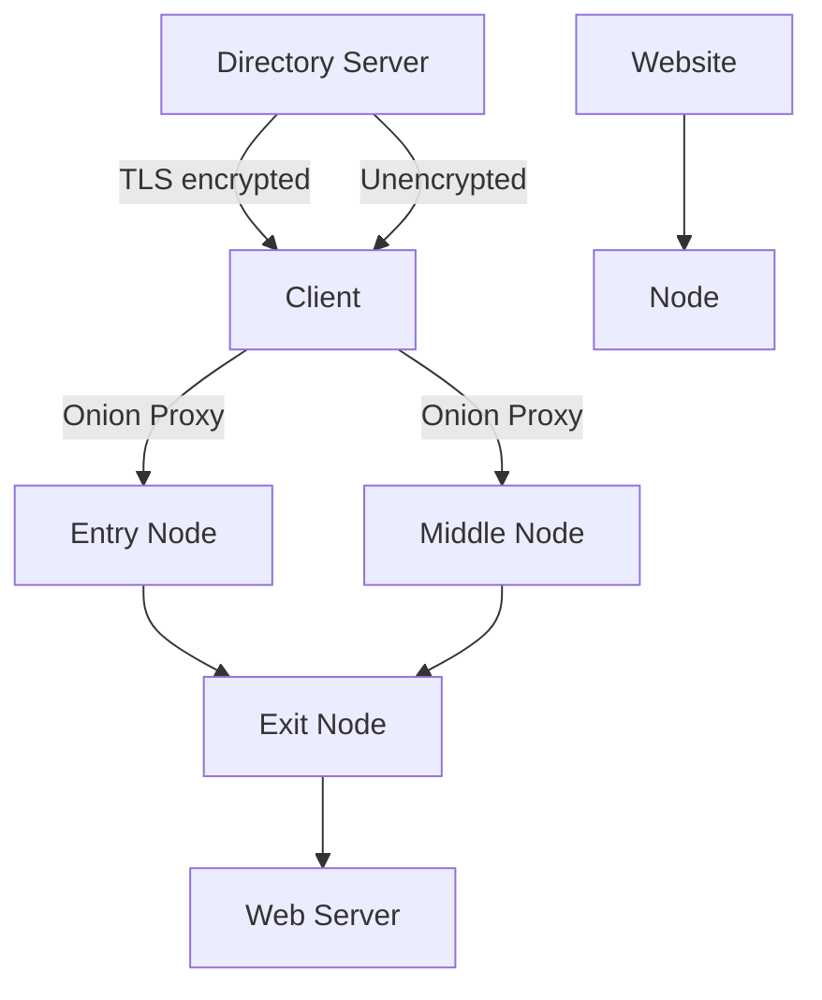
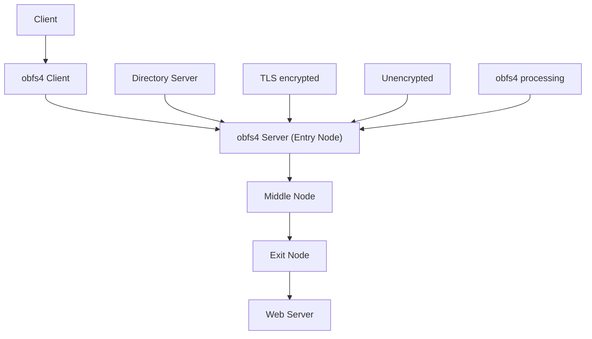
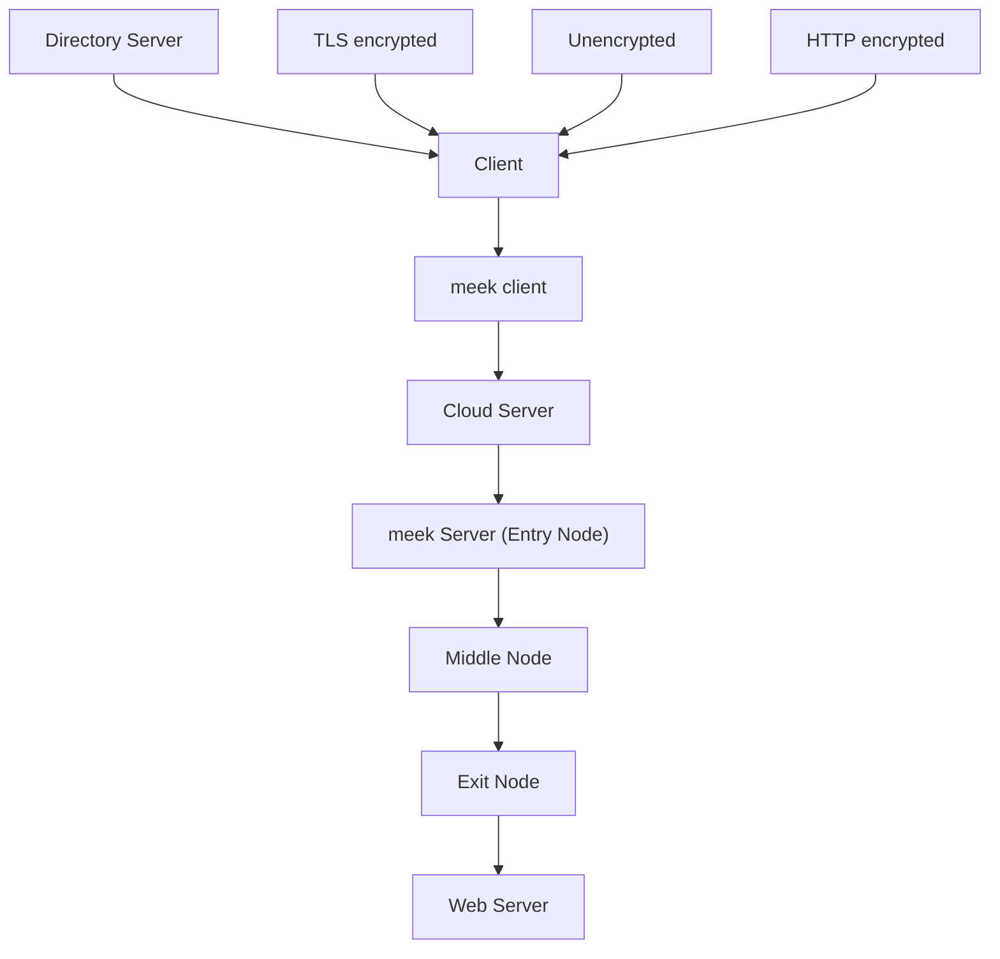
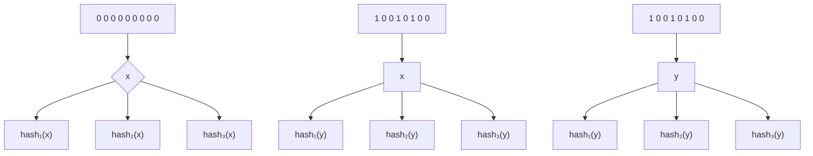
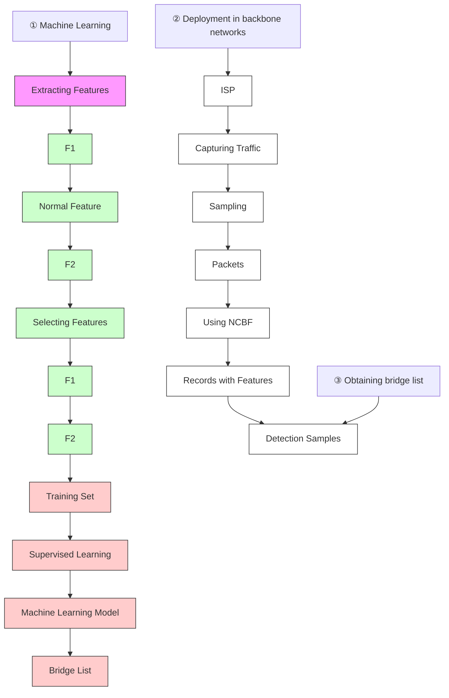
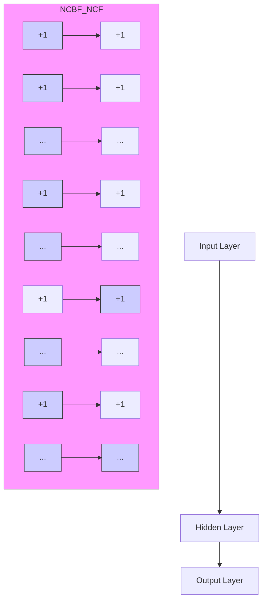

# Detecting Tor Bridge from Sampled Traffic in Backbone Networks

Hua Wu∗†‡, Shuyi Guo∗†, Guang Cheng∗†, Xiaoyan Hu∗†

∗School of Cyber Science & Engineering, Southeast University, Nanjing, China

†Key Laboratory of Computer Network and Information Integration (Southeast University), Ministry of Education, Jiangsu Nanjing

‡Purple Mountain Laboratories for Network and Communication Security (Nanjing, Jiangsu)

Email: hwu@seu.edu.cn, shuyguo@seu.edu.cn, gcheng@njnet.edu.cn, xyhu@njnet.edu.cn

Abstract—Due to the concealment of the dark web, many criminal activities choose to be conducted on it. The use of Tor bridges further obfuscates the traffic and enhances the concealment. Current researches on Tor bridge detection have used a small amount of complete traffic, which makes their methods not very practical in the backbone network. In this paper, we proposed a method for the detection of obfs4 bridge in backbone networks. To solve current limitations, we sample traffic to reduce the amount of data and put forward the Nested Count Bloom Filter structure to process the sampled network traffic. Besides, we extract features that can be used for bridge detection after traffic sampling. The experiment uses real backbone network traffic mixed with Tor traffic for verification. The experimental result shows that when Tor traffic accounts for only 0.15% and the sampling ratio is 64:1, the F1 score of the detection result is maintained at about 0.9.

## I. INTRODUCTION

In recent years, the expansion of the network scale has led to an increasing number of threats in the network. Network managers need to identify and deal with threats on time. Among the many cyber threats, the crimes that occur on the dark web undoubtedly cause great harm to the network and even society.

An important part of dark web crimes is illegal transactions. Criminals trade in guns, drugs, and other illegal goods on the dark web. According to the <The Chainalysis 2021 Crypto Crime Report> [1] published by Chainalysis, the total amount of transaction on the dark web in 2020 is already more than \$900 million, and there were still 37 active darknet markets in November. Unlike commonly used networks, the dark web requires the use of anonymous communication tools to access. Therefore, it is more difficult for network managers to trace the criminals on the dark web.

As the most widely used and convenient anonymous communication system, Tor has more than 2.5 million daily active users as of November 2020[2]. To further enhance the anonymity of communications, Tor provides bridges and obfuscation protocols to disguise traffic accessing the dark web as normal traffic. The bridge is used in conjunction with the obfuscation protocol. Commonly used obfuscation protocols include meek and obfs4, so there are obfs4 bridge and meek bridge. When the user connects to the dark web through the bridge, the traffic is first processed by the obfuscation protocol and then enters the dark web via the bridge.

Although the bridges and obfuscation protocols are used only to enhance Tor’s anonymity, such functions are also exploited by cybercriminals. In order to identify anomalous behavior in networks that use bridge to access, it is first necessary to detect the bridges to flag suspicious connections.

The biggest problem faced when performing detections in real networks is how to handle large-scale network traffic. In the field of network management such as intrusion detection and software-defined networks (SDN) measurement, traffic sampling has been widely used. Due to the large scale of traffic in the backbone network, we need to study how to detect Tor bridges after traffic sampling.

The current research on Tor traffic is mainly focused on traffic identification, and there is a small part of research on Tor bridge detection. However, these researches have used a small amount of complete traffic for experiments, which is collected in chronological order. They did not consider the large-scale traffic and the low proportion of Tor traffic in the actual network. These reasons make their method not very applicable in the real network.

Since the IP address of the meek bridge cannot be obtained directly from the traffic, we propose a method for the detection of obfs4 bridges in backbone networks in this paper. To handle large-scale traffic, we implement a sampling operation on the traffic to reduce the amount of data to be processed. To achieve efficient storing of packet statistics, we design the Nest Count Bloom Filter (NCBF) structure based on Count Bloom Filter (CBF). Besides, we extract features that can be obtained from the sampled traffic. Through experiments, we verify the usability of this method in backbone networks.

Our contributions here include the following three points:

(1) We design the NCBF structure to store the statistics of the sampled packets in the backbone network. This structure is based on CBF, which enables fast and efficient record of packet statistics in backbone networks.

(2) We extract 14 features that are still available in the post-sampling traffic that can be used for Tor bridge detection.

(3) We mix the Tor traffic with real backbone network traffic in different ratios in our experiments to validate the usability of our method.

The rest of this article is organized as follows. Section II describes the related work. In Section III, we introduce the background information, including information about Tor, the feasibility of Sampling, and Bloom Filter. Section IV describes the main parts of the method we use. Section V introduces the experiment and analyses the results. In Section VI, we compare our method with others’ and express the limitations and future work. Finally, Section VII is the conclusion.

## II. RELATED WORK

This section presents three types of researches related to the background knowledge mentioned in this paper.

## A. Tor

The widely used Tor [3] is the second-generation onion routing technology that can be used to anonymize TCP-based applications and has a large number of users worldwide. The use of bridge and obfuscation protocols makes the features of Tor traffic similar to normal traffic, such as the length of packet. It enhances the anonymity of communication.

## B. Research on Tor traffic

Among the existing researches based on Tor traffic, the researchers mainly focus on traffic identification. Lashkari A H et al.[4] used up to 67834 packets for Tor traffic identification and extracted a total of 23 features such as the minimum flow inter arrival time. Kim M et al.[5] used the ISCXTor 2016 data set for their experiments, parsing the first 54 bytes of each packet as a feature. Lingyu J et al.[6] conducted experiments on an 18G backbone traffic data set with four features based on the length and time of packets, they also improved the decision tree algorithm. Rao Z et al. [7] extracted time-dependent features of the packets and used them on 23292 mixed flows to validate their improved clustering algorithm.

Since bridges and obfuscation protocols are used together, there have been some researches in the identification of these protocols. Soleimani M H M et al.[8] were able to achieve 99% accuracy for each obfuscation protocol with machine learning approach, but did not go further to detect bridges. He Y et al.[9] used a randomness detection algorithm to identify the Tor traffic hiding under obfs4 protocol.

Although the experiments of these researches prove that these identification methods for Tor traffic and obfuscation protocols can achieve high accuracy, they do not use backbone network traffic or do not take into account the low ratio of Tor traffic in the backbone network. Moreover, the experimental data sets they used are complete traffic and the extracted features are related to the continuity of the traffic. The volume of traffic in the backbone network is too large to perform complete traffic processing.

The above research is only for the identification of Tor traffic and traffic using obfuscation protocol. While M Yang et al.[10] conducted research on the detection of Tor bridges. They suggested that there existed high correlations among the subscribed tuple of three bridges, so it is possible to expand the bridge set to get all bridges. However, in the validation experiments, the online detection of this method can only get about 86% accuracy.

Similar to the shortcomings of Tor traffic identification researches, this method processed complete traffic when detecting a bridge. When dealing with large-scale traffic, this method consumed a lot of resources, which makes it difficult to apply to backbone networks.

Research [8][9] and [10] are partially related to our research, so we compare their methods with ours.

## C. Traffic Sampling

With the growth of network size, sampling has been widely used in the field of network management. As early as 1993, research[11] has used packet sampling techniques in network traffic. In 1996, Cisco proposed that NetFlow[12] techniques could be used for anomaly traffic detection. In 2003, sFlow[13] was proposed by InMon. Both techniques can sample traffic and output flow information for network monitoring.

Traffic sampling is also widely used in the field of network measurement and network security. In the field of network security, traffic sampling is the technology that most intrusion detection systems are equipped with. Mahmood A N et al.[14] proposed a new two-stage sampling technique, which makes it possible to avoid wasting too much sampling resources on the elephant flows when the network is under large-scale traffic attacks. In the research [15], the focus of the research is to improve the efficiency of trust computation in a large-scale network, so the researchers only used systematic sampling and Random n-out-of-N Sampling techniques.

In the field of network measurement, SDN also uses traffic sampling technology due to its special architecture. In SDN, the controller is responsible for measuring traffic. Due to the limited memory of the controller, in research [16], L Huo et al. proposed a lightweight measurement architecture that can run in the controller. In this architecture, they used a pull-based sampling method to measure the flow rate, so that only a small amount of measurement values are stored in the controller to achieve coarse-grained measurement.

In addition, a new network measurement framework using sampling is proposed by R Jang[17]. He designed a new sampling scheme to handle the bad tradeoff caused by the standard simple random sampling. The sampling scheme chooses to sample each flow separately to obtain the most accurate information of each flow after sampling.

Although traffic sampling has been applied in many aspects of network management, it has not been studied to use it for Tor bridge detection in backbone networks. In fact, the detection of Tor bridges is helpful for network management, and it is a reasonable choice to sample traffic when conducting this research.

## III. BACKGROUND

In this section, we first introduce the basic architecture of the Tor network and the architecture after using bridges, followed by knowledge of probability theory to demonstrate the feasibility of sampling. Finally, Bloom Filter and Count Bloom

Filter structures are introduced to provide basic information for the design of NCBF.

## A. Tor network

Compared with other anonymous communication systems, Tor[3] is the most widely used because of its long development time, good integration, and the ease with which even nonexperts can use the Tor Browser to access the dark web. Figure 1 shows the basic architecture of the Tor network.

flowchart

Fig. 1: Tor network

When a client needs network access via Tor, it first runs an onion proxy on the client side which makes a request to the directory server, then chooses three onion routers as relay nodes to establish a communication link in which the clientserver communication is encrypted. Each onion router in the link can only get the information of the two routers before and after, and the client can only get the information of the onion router connected to it.

To further enhance the anonymity of communication, Tor was developed to include optional functions such as bridges and obfuscation protocols. A bridge serves a similar purpose as a relay node, except the address of the bridge is not store publicly in the directory server, but is obtained via https or email. Obfuscation protocols such as obfs4 and meek are used to encrypt or obfuscate Tor traffic so that it appears similar to normal traffic. Bridge and obfuscation protocols are often used simultaneously.

According to the official website[18], there are more than 6000 normal relay nodes and about 1500 bridges running in the Tor system every day, and the average number of bridge users is more than 40000 per day. At the same time, since any third-party user can configure his client as a bridge, the network manager can’t get all the bridge addresses in advance. Therefore, using these functions can effectively improve the anonymity when accessing the network via Tor.

## B. Tor bridge

Since the relay nodes used in building the basic architecture of the Tor network are public in the directory server, it is easy for network managers to obtain all these addresses. To avoid this, the use of bridges in conjunction with obfuscation protocols has the effect of enhancing the concealment of communication at multiple levels.

The two common obfuscation protocols used with the bridge are obfs4[19] and meek[20]. When obfs4 is used for traffic obfuscation, the client first obtains a bridge by either applying for it via https and email or by choosing a built-in bridge in Tor. Then the network traffic is sent to the obfs4 server after obfuscation.

Unlike the obfs4 protocol, which requires a bridge application, meek chooses to send Tor traffic to a cloud server first, and then forward it through the cloud server to a meek bridge to access the Tor network. By this obfuscation method, the Tor bridge is hidden under the cloud service provider’s address, making it more difficult to detect. For network managers, under the premise that they monitor the traffic sent and received by the client, they cannot get the address of the meek bridge, and can only identify the Tor traffic that uses the bridge in the traffic interacting with the cloud server.

The Tor network structure is shown in Figure 2 when bridges are used.

Network managers typically analyze network traffic on the client side when user targeting is required. For Tor bridge detection, the address of the obfs4 bridge can be obtained visually in the traffic data as source/destination address, so we only need to detect the obfuscated Tor traffic using the obfs4 protocol to further obtain the bridge’s address. While the address of the meek bridge is not directly available, and by analyzing the traffic, we can only identify the Tor traffic that uses the bridge among a large amount of traffic interacting with the cloud server.

Therefore, the bridge detection method presented in this paper is mainly for the obfs4 bridge, and the Tor traffic mentioned below represents the obfuscated Tor traffic using obfs4.

## C. Sampling theory

The bandwidth of the backbone network is usually about 10Gbps, so the collection and analysis methods of complete traffic cannot handle such a large amount of data. In order to reduce the amount of data to be processed, traffic sampling technology is widely used in the management of the backbone network.

In actual networks, the volume of traffic is extremely large and there are mouse flows and elephant flows [21]. Mouse flows are small, containing few data packets but the amount is very large. On the contrary, the amount of elephant flows is small but each flow contains much more packets.

Tor traffic accounts for only a small portion of the network and consists mainly of mouse flows. When using Tor for a long time, the number of the packets of the same quintuple increases, and some of the mouse flows will shift to elephant flows.

Probability theory has proved that the sampled traffic can be used for the detection. According to the central limit theorem, when we randomly sample n samples from a population with overall mean µ and standard deviation σ, the mean of the distribution of the sample mean equals to $\mu ,$ and the standard

flowchart

flowchart

Fig. 2: Tor network architecture with bridge

${ \frac { \sigma } { \sqrt { n } } } . { \mathrm { ~ A s ~ } } n  \infty$ to normal distribution.

In the case of a large sample size, the sampling distribution of the sample proportion $\hat { p }$ also approximately conforms to normal distribution. Assuming that the population proportion is p, then Formula 1 can be used to calculate the confidence interval for a population proportion.

$$
\hat {p} - z \sqrt {\frac {\hat {p} (1 - \hat {p})}{n}} \leq p \leq \hat {p} + z \sqrt {\frac {\hat {p} (1 - \hat {p})}{n}} \tag {1}
$$

Where n represents the sample size, z is the z-score for the confidence level α you want.

When we want the difference between the overall proportion and the sample proportion to be no more than k%, we can use Formula 2 for calculation.

$$
n \geq \left\lceil p (1 - p) \frac {z ^ {2}}{(0 . 0 1 \times k \times p) ^ {2}} \right\rceil \tag {2}
$$

In the actual network, the proportion of Tor traffic is very small, that means the value of p is small, and when the confidence level is set to 95% and the difference is limited to about 10%, the sample size n can be calculated. Sampling the traffic according to n ensures the sample proportion of Tor traffic.

Based on the theorems mentioned above, we can know that the sampled traffic can represent the overall traffic.

The packets obtained after sampling are mainly derived from elephant flows. Although the number of packets in the mouse flow is much smaller than that of the elephant flow, it is still possible to sample packets from the mouse flow by adjusting the sampling rate in the actual network.

Actually, the sampled packets are not directly used to calculate the eigenvalues. To ensure the consistency of the eigenvalue calculation, a threshold value needs to be specified, and when the number of packets with the same quintuple reaches the threshold, the stored statistics are then used for calculation.

Since the number of packets originating from the mouse flow in the sample is small, the packets of these quintuples may not reach the threshold to calculate the eigenvalue. The calculation of eigenvalues relies heavily on elephant flows.

## D. Bloom Filter

To store the statistics of sampled traffic, we propose the NCBF structure based on Count Bloom Filter (CBF). And CBF was designed based on Bloom Filter (BF).

BF[22] is a stochastic storage structure that uses vector space to represent a set and this structure favors the efficiency of queries to quickly determine whether an element belongs to the set.

As shown in Figure 3, the BF structure requires the use of k hash functions $h _ { 1 } , h _ { 2 } , \ldots , h _ { k }$ to perform insertion and query operations. In its initial state, BF is an m-bit array, and each bit is set to 0. Supposing the set $S = \{ x _ { 1 } , x _ { 2 } , . . . , x _ { r } \}$ is inserted, k independent hash functions will map elements of the set to the $1 , 2 , \ldots , m$ bit. For any element $^ { x , k }$ hash functions will map it to the $h a s h _ { i } ( x ) , i \in { 1 , 2 , \dots , k }$ bit of the array and set the bit to 1. If one bit is mapped more than once, only the first mapping will result in a set to 1.

flowchart

Fig. 3: Bloom Filter

When performing a query, the queried element is processed using hash functions to map it to the corresponding bits. If each bit mapped to has been set to 1, it is assumed that this element has been recorded in the BF. In the query operation shown in

Figure 3, the $h a s h _ { 2 } ( y )$ bit is not set to 1, which means y is not an element in the set.

BF also has shortcomings. It may misjudge elements that not in the set as elements in the set. In other words, the newly input element may be mapped to the bit of an existing element, causing a hash collision. The probability of misjudgment is called the false positive rate (FPR). This probability is shown in Formula 3.

$$
\varepsilon = (1 - (1 - \frac {1}{m}) ^ {k r}) ^ {k} \approx (1 - e ^ {\frac {- k r}{m}}) ^ {k} \tag {3}
$$

Where m indicates the number of bits. r indicates the number of elements. And k indicates the number of hash functions.

The classic BF is a simple storage structure that supports only insertion and query operations, but not deletion operations, and cannot record the existence of a changed set.

To address the shortcomings of the classic BF, Fan L et al.[23] proposed the concept of Count Bloom Filter (CBF). CBF expands every bit to a counting cell. During the insertion operation, when any element x of the set is mapped to the $\bar { h a s h { _ i } } ( x ) , i \ \in \ 1 , 2 , . . . , k$ cell, the counting value increases by 1. If other elements are mapped to the same cell, the counting value continues to increase, so that CBF can support the deletion of elements. When the element x is deleted from CBF, if the counting value in the cells to which it is mapped is greater than 0, all are reduced by 1. CBF can therefore implement the three operations of insertion, query, and deletion.

However, it is not appropriate to use only BF or CBF when storing traffic statistics. A data packet contains a variety of statistics. Using BF can only determine whether the data packet or specific statistic exists, and CBF can only store one statistic of data packets. If multiple CBFs are used for storing, then each CBF needs to perform hash functions. And this will increase the memory and time consumption of the calculation.

## IV. METHODOLOGY

In this section, we introduce the detection method. The architecture of this method is shown in Figure 4.

First, we perform feature engineering to filter out the features that can be obtained in the sampled traffic that can be used for bridge detection. This is followed by the training of the machine learning model used for detection.

Next, we perform a traffic sampling operation on the backbone network and use NCBF to record the statistics of the sampled packets. Then we calculate the eigenvalues.

Finally, we use the training model to make the detection, get the list of bridge addresses, and complete the bridge detection.

## A. Feature engineering

To implement Tor bridge detection in backbone networks, we sample the traffic to reduce the amount of data to be processed, as in large-scale network management. So we need to choose stable features that can be used for detection after traffic sampling. The detailed process of feature engineering is provided in Appendix A. Finally, we chose 14 features and 12 statistics that needed to be stored.

When traffic is sampled in backbone networks, a huge number of packets still exist after sampling. Although each packet only needs to record 12 statistics, due to the huge number, it still requires many resources to record the statistics, so we need to choose a suitable traffic sampling technique and use an efficient storage structure.

## B. Traffic sampling

In the large-scale backbone network, processing the complete traffic is difficult and will consume a lot of resources. So traffic sampling has been used in many aspects of network management.

Traffic sampling is widely used in the field of intrusion detection[14][15] and SDN measurement[16]. And the sampling techniques can be classified into two types, including packet-based sampling and flow-based sampling. Three basic packet-based sampling techniques are mentioned in the research [24], including Systematic Sampling, Random n-out-of-N Sampling and Uniform Probabilistic Sampling. And Figure 5 illustrates these methods.

Compared with the other two sampling techniques, the systematic sampling technique has the smaller time and memory overhead. Therefore, we use the systematic sampling technique when conducting Tor bridge detection. The usability of this technique will be demonstrated in the following experiments.

Since we use systematic sampling, when inputting data packets, it is only necessary to store data packets according to the sampling interval.

## C. Nested Count Bloom Filter

Although CBF achieves an increase in the counting value of the same counting cell, it cannot complete the recording of elements that contain more than one statistic.

Therefore, in this paper, we put forward the NCBF structure. It is used to implement the recording of packet statistics for computing the eigenvectors. The structure is shown in Figure 6.

Based on CBF, NCBF expands each counting cell to a counting block. Each counting block is one CBF.

In the initial state, NCBF is a structure containing m empty CBFs. During the insertion process, each x in set $S = \mathbf { \bar { \{ } }  x _ { 1 } , x _ { 2 } , \dots , x _ { r } \mathbf  \bar { \} }$ contains more than one statistic, which means $x = \{ I _ { 1 } , I _ { 2 } , \ldots , I _ { q } \}$ , we use part of the statistics as the input of k independent hash functions. The hash functions can map x to k different counting blocks, then the statistics of x is recorded in these blocks by increasing the value of counting cells.

The query process is similar to the classic BF. If the queried element y is processed by hash functions, and each block it mapped to has recorded statistics, then y is considered to be in NCBF.

Compared with CBF, if we need to store multiple statistcs of a packet, we only need to perform the hash function once.

flowchart

Fig. 4: The architecture of the detection method

text_image

Systematic Sampling
...
λ
Random n-out-of-N Sampling
...
N
N
Uniform Probabilistic Sampling

Fig. 5: Schematic figure of the basic sampling methods

flowchart

Fig. 6: The architecture of NCBF

Like Bloom Filter, NCBF also has false positive probability, that is, a hash collision occurs and the element is mapped to the wrong counting block.

The formula for calculating the false positive rate of NCBF is consistent with Formula 3. The difference lies in the meaning of the parameters. In NCBF, m represents the number of counting blocks, and r represents the number of different tuples entered.

Because the memory occupied by NCBF is limited, we cannot store elements in it without limitation. Once there are too many elements input, hash collisions may occur, resulting in a decrease in the storage efficiency and accuracy of the entire structure. Therefore, we need to determine the memory of NCBF through the above parameters.

When we storing the packet statistics using NCBF, the arriving packet’s quintuple is used as the input of hash functions. Then the corresponding packet will be mapped to k different counting blocks and the statistics are stored in each block.

The ultimate purpose of using NCBF is to get the Record and calculate corresponding eigenvectors. Because there are so many packets with the same quintuple in the real network, we cannot classify all packets of the same quintuples into one Record. If we group all the packets of the same quintuple into one Record, we need to extract a lot of statistics when calculating the eigenvectors, which will consume a lot of memory of NCBF. That’s why we set a threshold to get Records. This threshold is judged based on the value of a certain counting cell in the counting block. Because of hash collisions, we choose the minimum value of this certain counting cell. Then we use the statistics stored in the corresponding block to calculate the eigenvectors.

To improve the accuracy of eigenvectors calculation, we need to set a proper memory for the NCBF used for processing traffic to minimize the impact of hash collisions on the result of the calculation.

Considering the low ratio of Tor traffic in backbone networks, we need an NCBF structure that can process traffic for a long time to ensure that the statistics of Tor traffic packets stored in NCBF can reach the threshold and the Record can be extracted. At the same time, FPR of NCBF is also considered to prevent excessive hash collisions of the elephant flow and cause NCBF to be cleared. This means that we need to allocate a reasonable amount of memory to NCBF and get the traffic duration that can be processed by NCBF before being emptied. The NCBF parameters we need to consider include the number of counting blocks m, a reasonable value of FPR, and the number of hash functions k. The value of these parameters is related to the data scale and hardware environment, so we give the details of parameter setting in section V.

## V. EXPERIMENT & RESULTS

In this section, we describe how to adjust the parameters before the validation experiment, and the exact procedures of the validation experiment. Finally we analyze the sampling results and the detection results separately.

## A. Parameter adjustment before validation

In the validation experiment, we use two types of parameters, one is the adjustable sampling ratio, and the other is the relevant parameters of NCBF structure. Both can be adjusted through the same preparation experiment.

We use the 15-minute backbone traffic collected by the MAWI working group[25] (https://mawi.wide.ad.jp/mawi/ditl/ditl2019- G/201904090000.html) as a large-scale data set for calculating the parameters.

When performing NCBF processing, we use SHA1 as the hash function, which outputs a 20 byte (160 bit) hash value. Supposing there are 2n counting blocks in NCBF, n bits are needed to store the serial number of the counting block. k is the number of hash functions, so we need to calculate k hash values, each is n-bit. The method for obtaining the hash value of NCBF is to sequentially split the 160-bit hash value into k parts. If the value of k is large, the hash value of one output of SHA1 may not be enough to divide.

When we employ 4 hash functions, the hash value output by one SHA1 can obtain 4 hash values. At this time, the corresponding NCBF has 240 counting blocks. According to the later experiment, 240 counting blocks takes up enough memory.

Next, we obtain different numbers of quintuples by changing the sampling ratio, the quintuples are all obtained based on the 15-min backbone network traffic. And we use NQP to represent the Number of Quintuples from the Public traffic data set.

Compared with other traffic in the public traffic data set, Tor traffic mainly consists of mouse flows, which are more difficult to make hash collisions. So what we need to pay attention to is the hash collision that occurs when recording the elephant flow. In other words, we need to consider the FPR of the NCBF structure. Based on Formula 3, we can obtain the relationship between FPR and NQDM (the maximum Number of Quintuples that can be inserted when FPR is less than the threshold under Different Memories) when the number of counting blocks is different. As shown in Formula 4.

$$
F P R \approx (1 - e ^ {\frac {- k * N Q D M}{m}}) ^ {k} \tag {4}
$$

Where m indicates the number of counting blocks. k indicates the number of hash functions.

In the NCBF structure, k is generally a fixed value greater than 1, and will not be discussed here. In the case of the same memory, when NQDM increases, FPR will increase. When the FPR increases to a certain extent, the packets with the same quintuple input to NCBF will be mapped to the wrong counting block with probability, causing errors in the recording of packet statistics, and further affecting the calculation of eigenvectors. When using NCBF to process elephant flow, NQDM will increase, and FPR will increase accordingly. Therefore, we need to allocate appropriate memory for the NCBF structure during the design stage to keep FPR within a reasonable range and reduce the impact of hash collisions on eigenvectors calculations.

When we set the value of FPR to 1/100, it means that when 100 different quintuples in the traffic have been inserted in NCBF, there may already be packet statistics in the block where the next packet from different quintuples should be mapped to. In this case, hash collisions have almost no effect on the result.

TABLE I: NQP with different sampling ratios

<table><tr><td>Sampling ratio</td><td>NQP</td></tr><tr><td>16:1</td><td>450344</td></tr><tr><td>64:1</td><td>178930</td></tr><tr><td>256:1</td><td>71204</td></tr></table>

What’s more, based on Table III in Appendix A, we only need 12 counting cells for each block. So we set the memory of each block to 12 bytes to calculate the total memory NCBF occupies. The memory of NCBF can be calculated by Formula 5.

$$
M e = m * 1 2 \text { bytes } \tag {5}
$$

Where Me indicates the memory of NCBF.

By changing the sampling ratio, we get different NQP. When the sampling ratio is different, the number of packets we extract from the public traffic data set is different, which causes some quintuples to not be in the sampling results and NQP will change. The results calculated using the public data set are shown in Table I.

Based on the above preparation, we can use Formula 6 to get the traffic duration that can be processed by NCBF before being emptied under different memory conditions.

$$
T \approx \frac {N Q D M}{N Q P} * 1 5 \text { min } \tag {6}
$$

Where T indicates the time NCBF required to be cleared. NQDM indicates the maximum number of quintuples that can be inserted when FPR is less than the threshold under different memories. And NQP indicates the number of quintuples that can be obtained from the public traffic data set.

However, these NQPs are all obtained from the same public traffic data set, so the value does not change. We adjust the value of m, to get different Me and T under different memory of NCBF. The results are shown in Table II.

TABLE II: Traffic duration that can be processed by NCBF

<table><tr><td>Sampling ratio</td><td>m</td><td>Me</td><td>NQDM</td><td>T</td></tr><tr><td rowspan="5">16:1</td><td> $2^{20}$ </td><td>12.0MB</td><td>1.00e+05</td><td>3.32min</td></tr><tr><td> $2^{22}$ </td><td>48.0MB</td><td>4.00e+05</td><td>13.28min</td></tr><tr><td> $2^{25}$ </td><td>384.0MB</td><td>3.00e+06</td><td>1.77hr</td></tr><tr><td> $2^{28}$ </td><td>3072.0MB</td><td>3.00e+07</td><td>14.16hr</td></tr><tr><td> $2^{30}$ </td><td>12288.0MB</td><td>1.00e+08</td><td>2.36d</td></tr><tr><td rowspan="5">64:1</td><td> $2^{20}$ </td><td>12.0MB</td><td>1.00e+05</td><td>8.35min</td></tr><tr><td> $2^{22}$ </td><td>48.0MB</td><td>4.00e+05</td><td>33.41min</td></tr><tr><td> $2^{25}$ </td><td>384.0MB</td><td>3.00e+06</td><td>4.46hr</td></tr><tr><td> $2^{28}$ </td><td>3072.0MB</td><td>3.00e+07</td><td>1.49d</td></tr><tr><td> $2^{30}$ </td><td>12288.0MB</td><td>1.00e+08</td><td>5.94d</td></tr><tr><td rowspan="5">256:1</td><td> $2^{20}$ </td><td>12.0MB</td><td>1.00e+05</td><td>20.99min</td></tr><tr><td> $2^{22}$ </td><td>48.0MB</td><td>4.00e+05</td><td>1.40hr</td></tr><tr><td> $2^{25}$ </td><td>384.0MB</td><td>3.00e+06</td><td>11.20hr</td></tr><tr><td> $2^{28}$ </td><td>3072.0MB</td><td>3.00e+07</td><td>3.73d</td></tr><tr><td> $2^{30}$ </td><td>12288.0MB</td><td>1.00e+08</td><td>14.93d</td></tr></table>

From the table, we can know that when the sampling ratio is 16:1, we set the memory of the NCBF to about 12288MB.

The NCBF can handle the backbone network traffic for 2 days, which means it is cleared every 2 days. After NCBF has continuously processed network traffic for 2 days, the probability of hash collision will increase. The next input data packet is more likely to be mapped to the wrong counting block, resulting in inaccurate statistical information. When the sampling ratio increases, NCBF of the same memory can be cleared for a longer time.

And during the 2 days of data collection, some Tor bridge may generate normal traffic, we can judge whether the traffic is normal based on features. The normal traffic won’t affect the detection results.

Taking into account the actual traffic situation in the backbone network and the needs of network management, we need to establish NCBF with suitable memory for the detection of the Tor bridge.

## B. Procedures of the validation experiment

In order to verify the method’s usability in backbone networks, the validation experiment is divided into four main steps:1) collecting traffic data, 2) changing the ratio of Tor traffic to normal traffic, 3) sampling the traffic and using NCBF, 4) detecting and obtaining Tor bridge addresses.

(1) Collecting traffic data: Some Tor users use Tor bridge to access the network, disguising the Tor traffic as normal traffic. In the existing research, it is not mentioned whether bridges are used in the Tor traffic data set collected during the experiment.

Therefore, our experiments are conducted using a mixture of large public traffic datasets and self-gathered Tor traffic from known bridges.

We use the same traffic data set in sction V-A as the public traffic data set. The 15-minute backbone traffic was collected by the MAWI working group[25] at samplepoint-G on April 9, 2019. This data set contains more than 100 million packets and 72.93% of the packets are tcp packets. And samplepoint-G is one of the samplepoints monitored by WIDE. It monitors the 10Gbps link to an experimental IX in Tokyo.

When collecting Tor traffic, the bridges are applied via https and email. We use Wireshark to collect the traffic. The topology for Tor traffic collection is shown in Figure 7.

flowchart

Fig. 7: Topology of Tor traffic collection

(2) Changing the ratio of Tor traffic to normal traffic: Since the percentage of Tor traffic in the actual network is very low, we change the ratio of Tor traffic to normal traffic during the experiment to verify that the method can still detect Tor bridge in the actual network environment where the percentage of Tor traffic is very low. The ratios are shown in Table III.

After adjusting the ratio, we used a random function to modify the time starting point of Tor traffic and inserted each

TABLE III: Different ratio of Tor traffic

<table><tr><td>Tor packets</td><td>Public data set packets</td><td>Ratio</td></tr><tr><td>17613</td><td>1418227476</td><td>0.01%</td></tr><tr><td>70197</td><td>1418227476</td><td>0.05%</td></tr><tr><td>140784</td><td>1418227476</td><td>0.10%</td></tr><tr><td>217314</td><td>1418227476</td><td>0.15%</td></tr><tr><td>282564</td><td>1418227476</td><td>0.20%</td></tr><tr><td>350600</td><td>1418227476</td><td>0.25%</td></tr><tr><td>425874</td><td>1418227476</td><td>0.30%</td></tr></table>

Tor traffic file into the different time points in the public traffic file.

(3) Sampling traffic and using NCBF: When a ratio of mixed traffic data is selected, the traffic needs to be sampled. We use systematic sampling techniques to obtain packets from the traffic, and change the number of samples by adjusting the value of λ. Then we use NCBF to process these packets to get Records and corresponding eigenvectors for detection.  
(4) Detecting and obtaining the detection results: After the model outputs the detection results, the evaluation criteria related to the results can be calculated since the experiment is conducted under the premise of known bridges.

## C. Analysis of results

Before proceeding to analyze the detection results, the sampling results are first analyzed. To reduce the storage size, we sample the complete traffic. Once the scale of Tor traffic is too small, the number of packets obtained after sampling is not enough to constitute Records. By adjusting the sampling ratio and traffic ratio, the numbers of Records in the detection sample are shown in Figure 8.

bar chart

| Tor Traffic Ratio | Sampling Ratio 8:1 | Sampling Ratio 16:1 | Sampling Ratio 32:1 | Sampling Ratio 64:1 |
| ----------------- | ------------------ | ------------------- | ------------------- | ------------------- |
| 0.01%             | 12                 | 6                   | 3                   | 1                   |
| 0.05%             | 47                 | 21                  | 9                   | 4                   |
| 0.10%             | 105                | 51                  | 25                  | 12                  |
| 0.15%             | 153                | 73                  | 35                  | 17                  |
| 0.20%             | 203                | 99                  | 47                  | 21                  |
| 0.25%             | 225                | 107                 | 51                  | 22                  |
| 0.30%             | 264                | 123                 | 56                  | 23                  |

Fig. 8: The number of Records with different ratios

When Tor traffic only accounts for 0.01%, after sampling with a ratio of 8:1 and sending the data packet to NCBF for processing, 12 Records for detection can still be obtained. And the number of Records increases as the traffic ratio increases. This demonstrates that NCBF can process the sampled packets to obtain the Records in large-scale traffic environments with low Tor traffic ratios.

After the analysis of the sampling results, the detected results were evaluated using precision, recall and F1 score.

TABLE IV: Tor bridge detection results

<table><tr><td>Tor traffic ratio</td><td>Sampling ratio</td><td>Precision</td><td>Recall</td><td>F1 Score</td></tr><tr><td rowspan="4">0.01%</td><td>8:1</td><td>25%</td><td>100%</td><td>0.4</td></tr><tr><td>16:1</td><td>23.08%</td><td>100%</td><td>0.375</td></tr><tr><td>32:1</td><td>50%</td><td>100%</td><td>0.6667</td></tr><tr><td>64:1</td><td>25%</td><td>100%</td><td>0.4</td></tr><tr><td rowspan="4">0.05%</td><td>8:1</td><td>57.32%</td><td>100%</td><td>0.7287</td></tr><tr><td>16:1</td><td>54.05%</td><td>95.24%</td><td>0.6897</td></tr><tr><td>32:1</td><td>50%</td><td>100%</td><td>0.6667</td></tr><tr><td>64:1</td><td>33.33%</td><td>100%</td><td>0.5</td></tr><tr><td rowspan="4">0.10%</td><td>8:1</td><td>74.24%</td><td>93.33%</td><td>0.827</td></tr><tr><td>16:1</td><td>75.38%</td><td>96.08%</td><td>0.8448</td></tr><tr><td>32:1</td><td>73.33%</td><td>88%</td><td>0.8</td></tr><tr><td>64:1</td><td>78.57%</td><td>91.67%</td><td>0.8462</td></tr><tr><td rowspan="4">0.15%</td><td>8:1</td><td>84.88%</td><td>95.42%</td><td>0.8985</td></tr><tr><td>16:1</td><td>87.50%</td><td>95.89%</td><td>0.915</td></tr><tr><td>32:1</td><td>89.19%</td><td>94.29%</td><td>0.9167</td></tr><tr><td>64:1</td><td>93.75%</td><td>88.24%</td><td>0.9091</td></tr><tr><td rowspan="4">0.20%</td><td>8:1</td><td>84.48%</td><td>96.55%</td><td>0.9011</td></tr><tr><td>16:1</td><td>82.30%</td><td>93.94%</td><td>0.8774</td></tr><tr><td>32:1</td><td>85.19%</td><td>97.87%</td><td>0.9109</td></tr><tr><td>64:1</td><td>91.30%</td><td>100%</td><td>0.9545</td></tr><tr><td rowspan="4">0.25%</td><td>8:1</td><td>86.48%</td><td>93.78%</td><td>0.8998</td></tr><tr><td>16:1</td><td>84.43%</td><td>96.26%</td><td>0.8996</td></tr><tr><td>32:1</td><td>87.72%</td><td>98.04%</td><td>0.9259</td></tr><tr><td>64:1</td><td>75.86%</td><td>100%</td><td>0.8627</td></tr><tr><td rowspan="4">0.30%</td><td>8:1</td><td>86.69%</td><td>96.21%</td><td>0.912</td></tr><tr><td>16:1</td><td>82.31%</td><td>98.37%</td><td>0.8963</td></tr><tr><td>32:1</td><td>85.07%</td><td>98.28%</td><td>0.912</td></tr><tr><td>64:1</td><td>81.48%</td><td>95.65%</td><td>0.88</td></tr></table>

Since the bridge addresses used in the experiment are in a known state, the precision, recall, and F1 score for Tor bridge detection with different traffic ratios and sampling ratios can be calculated, as shown in Table IV.

From the table, it can be seen that as the ratio of Tor traffic increases, the precision rate has increased significantly, and the recall rate has stabilized above 95%. When Tor traffic accounts for only 0.15%, the F1 score of the detection result stabilized at about 0.9. When the ratio of Tor traffic increased from 0.20% to 0.30%, the precision rate shows a downward trend. After analysis, we consider that it might be because when adjusting the ratio, Tor packets are randomly selected, resulting in the occurrence of deviations.

For network managers, what is needed is to detect as many correct Tor bridge addresses as possible. High recall rate means that the number of the real bridges which identified as bridge accounts for a high proportion of the number of the real bridge, which means that the detection results are relatively complete, and the real bridges are almost in the detection results. Therefore, when the detection is performed in the actual network, it is only necessary to perform a second identification based on the first detection result.

## VI. DISCUSSION

In this section, we first compare the advantages and disadvantages of our method with existing Tor bridge detection methods. Then we discuss the limitations of our method and possible countermeasures. Finally we suggest aspects that can be improved in future work.

## A. Comparison

Compared with the Tor bridge detection method proposed by M. Yang et al.[10], our method is more practical. They suggested that there existed high correlations among the subscribed tuple of three bridges, so it is possible to expand the bridge set to get all bridges. This means that their approach requires constantly expanding the set of bridges, putting a lot of pressure on storage and computational resources. And to extract such correlations, their experiments must use complete traffic.

They run Tor bridges in the campus network environment and conduct experiments. They detect the bridge by analyzing the traffic between the campus network and the Internet, which is complete traffic.

Our method is mainly applied in backbone networks, so traffic sampling is performed first, breaking the continuity and correlation between flows. And we consider the low ratio of Tor traffic in the real network environment, so we conducted experiments under different Tor traffic ratios to prove the availability of this method in backbone networks with a low Tor traffic ratio.

In order to achieve Tor bridge detection in the backbone network, it is difficult to use the method based on the correlation between bridge tuples. Processing each flow in the massive traffic consumes a lot of resources. Therefore, our method has better adaptability.

In research[9], they used randomness and timing sequence detection to roughly distinguish the obfs4 traffic. The timingsequence based detection method has strict requirements for the integrity and continuity of the traffic. This means that when using this method for obfs4 traffic detection, the traffic processed must be sequential. As the method in the study [10], this method is less usable in actual network.

We also compare our detection method with research[8]. Since we used random forest in our research and performed a 70-30 percentage split on the data set, we used random forest and the parameter settings are consistent with the research. The results of comparison experiment is shown in Table V.

The detection result shows that for the very low ratio of Tor traffic (0.01%, 0.05%), the method proposed by Soleimani et al.[8] cannot achieve the detection purpose, which may be because the low ratio was not considered in their experiment. In other ratios of Tor traffic, Soleimani’s method achieves high precision rate, but the recall rate is not high compared with precision. Therefore, we can refer to their method in future research and adjust the parameters of the machine learning model to obtain better detection performance.

## B. Limitations and Countermeasures

We did not use the latest version of Tor Browser when collecting Tor traffic. We collected traffic mainly around July 2020, and once the obfuscation protocol changed within six months, we needed to re-screen the features for our method.

TABLE V: The results of comparison experiment

<table><tr><td rowspan="2">Tor traffic ratio</td><td rowspan="2">Sampling ratio</td><td colspan="3">Soleimani et al</td><td colspan="3">Our paper</td></tr><tr><td>Precision</td><td>Recall</td><td>F1 Score</td><td>Precision</td><td>Recall</td><td>F1 Score</td></tr><tr><td rowspan="4">0.01%</td><td>8:1</td><td>null</td><td>0</td><td>null</td><td>25%</td><td>100%</td><td>0.4</td></tr><tr><td>16:1</td><td>null</td><td>0</td><td>null</td><td>23.08%</td><td>100%</td><td>0.375</td></tr><tr><td>32:1</td><td>null</td><td>0</td><td>null</td><td>50%</td><td>100%</td><td>0.6667</td></tr><tr><td>64:1</td><td>null</td><td>null</td><td>null</td><td>25%</td><td>100%</td><td>0.4</td></tr><tr><td rowspan="4">0.05%</td><td>8:1</td><td>100%</td><td>91.70%</td><td>95.70%</td><td>57.32%</td><td>100%</td><td>0.7287</td></tr><tr><td>16:1</td><td>100%</td><td>50%</td><td>0.667</td><td>54.05%</td><td>95.24%</td><td>0.6897</td></tr><tr><td>32:1</td><td>null</td><td>0</td><td>null</td><td>50%</td><td>100%</td><td>0.6667</td></tr><tr><td>64:1</td><td>null</td><td>null</td><td>null</td><td>33.33%</td><td>100%</td><td>0.5</td></tr><tr><td rowspan="4">0.10%</td><td>8:1</td><td>100%</td><td>83.30%</td><td>0.909</td><td>74.24%</td><td>93.33%</td><td>0.827</td></tr><tr><td>16:1</td><td>100%</td><td>68.80%</td><td>0.815</td><td>75.38%</td><td>96.08%</td><td>0.8448</td></tr><tr><td>32:1</td><td>75%</td><td>54.50%</td><td>0.632</td><td>73.33%</td><td>88%</td><td>0.8</td></tr><tr><td>64:1</td><td>100%</td><td>25%</td><td>0.4</td><td>78.57%</td><td>91.67%</td><td>0.8462</td></tr><tr><td rowspan="4">0.15%</td><td>8:1</td><td>100%</td><td>93.80%</td><td>0.968</td><td>84.88%</td><td>95.42%</td><td>0.8985</td></tr><tr><td>16:1</td><td>100%</td><td>76.90%</td><td>0.87</td><td>87.50%</td><td>95.89%</td><td>0.915</td></tr><tr><td>32:1</td><td>85.70%</td><td>54.50%</td><td>0.667</td><td>89.19%</td><td>94.29%</td><td>0.9167</td></tr><tr><td>64:1</td><td>100%</td><td>60%</td><td>0.75</td><td>93.75%</td><td>88.24%</td><td>0.9091</td></tr><tr><td rowspan="4">0.20%</td><td>8:1</td><td>94.50%</td><td>88.10%</td><td>0.912</td><td>84.48%</td><td>96.55%</td><td>0.9011</td></tr><tr><td>16:1</td><td>100%</td><td>64.90%</td><td>0.787</td><td>82.30%</td><td>93.94%</td><td>0.8774</td></tr><tr><td>32:1</td><td>100%</td><td>100%</td><td>1</td><td>85.19%</td><td>97.87%</td><td>0.9109</td></tr><tr><td>64:1</td><td>100%</td><td>25%</td><td>0.4</td><td>91.30%</td><td>100%</td><td>0.9545</td></tr><tr><td rowspan="4">0.25%</td><td>8:1</td><td>98.50%</td><td>91.70%</td><td>0.95</td><td>86.48%</td><td>93.78%</td><td>0.8998</td></tr><tr><td>16:1</td><td>96.60%</td><td>93.30%</td><td>0.949</td><td>84.43%</td><td>96.26%</td><td>0.8996</td></tr><tr><td>32:1</td><td>100%</td><td>84.20%</td><td>0.914</td><td>87.72%</td><td>98.04%</td><td>0.9259</td></tr><tr><td>64:1</td><td>100%</td><td>57.10%</td><td>0.727</td><td>75.86%</td><td>100%</td><td>0.8627</td></tr><tr><td rowspan="4">0.30%</td><td>8:1</td><td>98.80%</td><td>97.60%</td><td>0.982</td><td>86.69%</td><td>96.21%</td><td>0.912</td></tr><tr><td>16:1</td><td>97.20%</td><td>97.20%</td><td>0.972</td><td>82.31%</td><td>98.37%</td><td>0.8963</td></tr><tr><td>32:1</td><td>100%</td><td>94.70%</td><td>0.973</td><td>85.07%</td><td>98.28%</td><td>0.912</td></tr><tr><td>64:1</td><td>87.50%</td><td>100%</td><td>0.933</td><td>81.48%</td><td>95.65%</td><td>0.88</td></tr></table>

In order to prevent detection, the obfuscation protocol can be improved based on the features proposed in this method. The features we extracted are most related to the length of packets. Once the obfuscation protocol has updated for obfuscating packet lengths, such as adding padding in the information control part, shielding ultra-small data packets, our method needs to be updated accordingly.

## C. Future work

In this paper, we propose a method to detect Tor bridges in backbone networks. While the experimental results prove the feasibility of the method, the method still has some limitations mentioned above. In future work, we need to follow the update of the obfuscation protocol promptly, re-screen the features, and design a secondary detection method to maintain the practicability of this method.

## VII. CONCLUSION

While the initial design purpose of the anonymous communication systems are only to enhance anonymity, the darknet market based on it has caused major hidden dangers to the network and even social security.

The use of bridges further obfuscates traffic and makes Tor traffic analysis more difficult. In order to exclude normal users using the bridge and identify criminals, the traffic passing through the bridge needs to be analyzed to identify the behavior. Therefore the use of bridges needs to be detected first.

In this paper, we have proposed a method to detect Tor bridges in backbone networks. Compared with other methods, our method samples the traffic to reduce the amount of data that needs to be processed and designs a new storage structure called NCBF for packet statistics recording. Taking into account the low ratio of Tor traffic in backbone networks, we mix the public backbone network traffic data set with different ratios of Tor traffic in experiments to verify the availability of this method in backbone networks. When Tor traffic accounts for only 0.15%, the F1 score of the detection result is maintained at about 0.9. And the recall rate stabilized above 95% all the time.

In future research, we will study how to design a secondary detection method, determine the new features and maintain the usability of the method when the obfuscation protocol update causes the old features to be unavailable.

Our research on bridge detection demonstrates to some extent that there is still room for improvement in Tor, and we believe there are other ways to defend against such attacks and strengthen anti-censorship capabilities besides the countermeasures briefly mentioned in this paper.

## ACKNOWLEDGMENT

This work was supported by the National R&D Program of China (2020YFB1807503)

## REFERENCES

[1] The chainalysis 2021 crypto crime report. [Online]. Available: https://go.chainalysis.com/2021-Crypto-Crime-Report.html  
[2] Users. [Online]. Available: https://metrics.torproject.org/ userstats-relay-country.html  
[3] R. Dingledine, N. Mathewson, and P. Syverson, “Tor: The secondgeneration onion router,” Naval Research Lab Washington DC, Tech. Rep., 2004.  
[4] A. H. Lashkari, G. Draper-Gil, M. S. I. Mamun, and A. A. Ghorbani, “Characterization of tor traffic using time based features.” in ICISSp, 2017, pp. 253–262.  
[5] M. Kim and A. Anpalagan, “Tor traffic classification from raw packet header using convolutional neural network,” in 2018 1st IEEE International Conference on Knowledge Innovation and Invention (ICKII). IEEE, 2018, pp. 187–190.  
[6] J. Lingyu, L. Yang, W. Bailing, L. Hongri, and X. Guodong, “A hierarchical classification approach for tor anonymous traffic,” in 2017 IEEE 9th International Conference on Communication Software and Networks (ICCSN). IEEE, 2017, pp. 239–243.  
[7] Z. Rao, W. Niu, X. Zhang, and H. Li, “Tor anonymous traffic identification based on gravitational clustering,” Peer-to-Peer Networking and Applications, vol. 11, no. 3, pp. 592–601, 2018.  
[8] M. H. M. Soleimani, M. Mansoorizadeh, and M. Nassiri, “Real-time identification of three tor pluggable transports using machine learning techniques,” The Journal of Supercomputing, vol. 74, no. 10, pp. 4910– 4927, 2018.  
[9] Y. He, L. Hu, and R. Gao, “Detection of tor traffic hiding under obfs4 protocol based on two-level filtering,” in 2019 2nd International Conference on Data Intelligence and Security (ICDIS). IEEE, 2019, pp. 195–200.  
[10] M. Yang, J. Luo, L. Zhang, X. Wang, and X. Fu, “How to block tor’s hidden bridges: detecting methods and countermeasures,” The Journal of Supercomputing, vol. 66, no. 3, pp. 1285–1305, 2013.  
[11] K. C. Claffy, G. C. Polyzos, and H.-W. Braun, “Application of sampling methodologies to network traffic characterization,” in Conference proceedings on Communications architectures, protocols and applications, 1993, pp. 194–203.  
[12] B. Claise, G. Sadasivan, V. Valluri, and M. Djernaes, “Cisco systems netflow services export version 9,” 2004.  
[13] P. Phaal, S. Panchen, and N. McKee, “Inmon corporation’s sflow: A method for monitoring traffic in switched and routed networks,” 2001.  
[14] A. N. Mahmood, J. Hu, Z. Tari, and C. Leckie, “Critical infrastructure protection: Resource efficient sampling to improve detection of less frequent patterns in network traffic,” Journal of Network and Computer Applications, vol. 33, no. 4, pp. 491–502, 2010.  
[15] W. Meng, W. Li, C. Su, J. Zhou, and R. Lu, “Enhancing trust management for wireless intrusion detection via traffic sampling in the era of big data,” Ieee Access, vol. 6, pp. 7234–7243, 2017.  
[16] L. Huo, D. Jiang, and Z. Lv, “A software-defined networks-based measurement method of network traffic for 6g technologies,” Transactions on Emerging Telecommunications Technologies, p. e4172, 2020.  
[17] R. Jang, “Towards scalable network traffic measurement with sketches,” 2020.  
[18] Servers. [Online]. Available: https://metrics.torproject.org/networksize. html  
[19] Yawning/obfs4. [Online]. Available: https://github.com/Yawning/obfs4  
[20] meek · wiki · legacy / trac. [Online]. Available: https://gitlab.torproject. org/legacy/trac/-/wikis/doc/meek  
[21] T. Yang, J. Jiang, P. Liu, Q. Huang, J. Gong, Y. Zhou, R. Miao, X. Li, and S. Uhlig, “Elastic sketch: adaptive and fast network-wide measurements,” 08 2018, pp. 561–575.  
[22] B. H. Bloom, “Space/time trade-offs in hash coding with allowable errors,” Communications of the ACM, vol. 13, no. 7, pp. 422–426, 1970.  
[23] L. Fan, P. Cao, J. Almeida, and A. Z. Broder, “Summary cache: a scalable wide-area web cache sharing protocol,” IEEE/ACM transactions on networking, vol. 8, no. 3, pp. 281–293, 2000.  
[24] G. Androulidakis, V. Chatzigiannakis, S. Papavassiliou, M. Grammatikou, and V. Maglaris, “Understanding and evaluating the impact  
of sampling on anomaly detection techniques,” in MILCOM 2006-2006 IEEE Military Communications conference. IEEE, 2006, pp. 1–7.  
[25] C. Sony and K. Cho, “Traffic data repository at the wide project,” in Proceedings of USENIX 2000 Annual Technical Conference: FREENIX Track, 2000, pp. 263–270.

## APPENDIX A FEATURE ENGINEERING

After capturing traffic from the backbone network, packets with the same quintuple (source address, source port, destination address, destination port, communication protocol) can be grouped into the same flow.

The first step is to extract the features from the complete traffic. Based on the existing research[6][7][9] and our observations on traffic, we extract five types of features that can be used for Tor traffic identification, which is shown in Table I.

TABLE I: Type and quantity of initial features

<table><tr><td>Type No.</td><td>Type of features</td><td>Number</td></tr><tr><td>1</td><td>the proportion of packets with different directions</td><td>6</td></tr><tr><td>2</td><td>the proportion of packets with different lengths</td><td>14</td></tr><tr><td>3</td><td>the proportion of packets with different intervals</td><td>5</td></tr><tr><td>4</td><td>the proportion of special packets</td><td>3</td></tr><tr><td>5</td><td>the related logarithmic calculation results</td><td>4</td></tr><tr><td colspan="2">Total</td><td>32</td></tr></table>

Some of these features have been used in other Tor traffic identification researches, such as 600-byte packet frequency[6], and the usability of these features has been validated in the complete traffic.

To handle the backbone network traffic, the traffic will be sampled and only a portion of the packets can be obtained from each flow. A fixed number of packets of the same quintuple are called Record in the later feature statistics. Depending on the sampling ratio, the number of packets that can be extracted from a flow varies, resulting in a different number of Records. The packets that make up these Records are not timedependent, so the proportion of packets with different intervals cannot be used as a post-sampling feature. The associated logarithm calculation results are also discarded for the same reason. The time-dependent packets do not affect the solution, because the features used in this method can also be extracted from such packets.

After the first filtering step, the remaining features are all proportional features, and the eigenvalues need further computation. In order to reduce the storage and computation consumption, as few packet statistics as possible need to be used. At the same time, these features also need to be of some importance to be useful in model training. Therefore, in this paper, the importance of features is evaluated using the Giniindex based method in the random forest algorithm. The final selection of features are shown in Table II.

TABLE II: The meaning and importance of features

<table><tr><td>Feature</td><td>Meaning</td><td>Significance score</td></tr><tr><td> $Ca_{1}/C_{d}$ </td><td>The percentage of packets with a length of 0 to 61 to the total number of no-empty packets sent by the client</td><td>0.206592</td></tr><tr><td> $Ca_{4}/C_{d}$ </td><td>The percentage of packets with a length greater than 1050 to the total number of no-empty packets sent by the client</td><td>0.15457</td></tr><tr><td> $C_{d}/C_{p}$ </td><td>The ratio of non-empty packets to the total number of packets sent by the client</td><td>0.095711</td></tr><tr><td> $C_{psh}/C_{d}$ </td><td>The percentage of PSH packets out of the total number of non-empty packets sent by the client</td><td>0.082727</td></tr><tr><td> $Sa_{4}/S_{d}$ </td><td>The percentage of packets with a length greater than 1050 to the total number of no-empty packets sent by the server</td><td>0.07791</td></tr><tr><td> $Ca_{2}/C_{d}$ </td><td>The percentage of packets with a length of 61 to 465 to the total number of no-empty packets sent by the client</td><td>0.07743</td></tr><tr><td> $S_{psh}/S_{d}$ </td><td>The percentage of PSH packets out of the total number of non-empty packets sent by the server</td><td>0.073635</td></tr><tr><td> $C_{0}/S_{d}$ </td><td>The ratio of empty packets sent by the client to non-empty packets sent by the server</td><td>0.050955</td></tr><tr><td>timestamp</td><td>Whether more than half of the packets have timestamp</td><td>0.044416</td></tr><tr><td> $C_{d}/D_{p}$ </td><td>The ratio of non-empty packets sent by the client to the total number of bidirectional packets</td><td>0.03741</td></tr><tr><td> $S_{d}/D_{p}$ </td><td>The ratio of non-empty packets sent by the server to the total number of bidirectional packets</td><td>0.033841</td></tr><tr><td> $S_{d}/S_{p}$ </td><td>The ratio of non-empty packets to the total number of packets sent by the server</td><td>0.030836</td></tr><tr><td> $Sa_{2}/S_{d}$ </td><td>The percentage of packets with a length of 61 to 465 to the total number of no-empty packets sent by the server</td><td>0.026115</td></tr><tr><td> $S_{0}/C_{d}$ </td><td>The ratio of empty packets sent by the server to non-empty packets sent by the client</td><td>0.007852</td></tr></table>

TABLE III: Statistics to be recorded

<table><tr><td>Counter</td><td>Statistics recorded</td><td>Counter</td><td>Statistics recorded</td></tr><tr><td> $C_1$ </td><td>The number of packets sent by the client</td><td> $C_7$ </td><td>The number of client packets between 0 and 61 in length</td></tr><tr><td> $C_2$ </td><td>The number of non-empty packets sent by the client</td><td> $C_8$ </td><td>The number of packets between 61 and 465 in length sent by the client</td></tr><tr><td> $C_3$ </td><td>The number of packets sent by the server</td><td> $C_9$ </td><td>The number of packets longer than 1050 sent by the client</td></tr><tr><td> $C_4$ </td><td>The number of non-empty packets sent by the server</td><td> $C_{10}$ </td><td>The number of packets between 61 and 465 in length sent by the server</td></tr><tr><td> $C_5$ </td><td>The number of PSH packets sent by the client</td><td> $C_{11}$ </td><td>The number of packets longer than 1050 sent by the server</td></tr><tr><td> $C_6$ </td><td>The number of PSH packets sent by the server</td><td> $C_{12}$ </td><td>The number of packets with timestamp</td></tr></table>