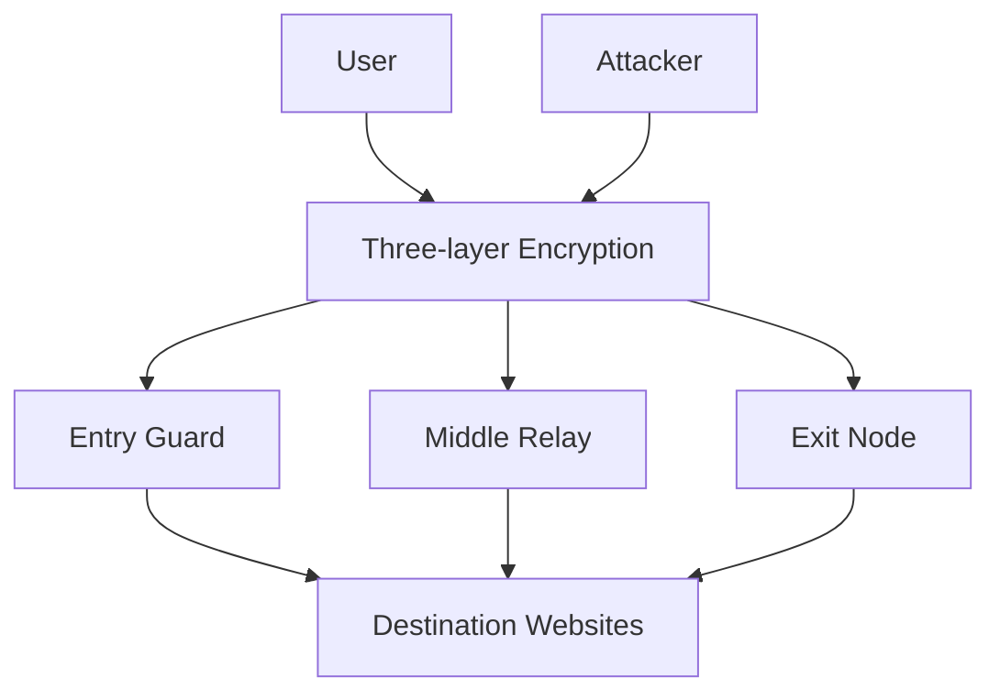
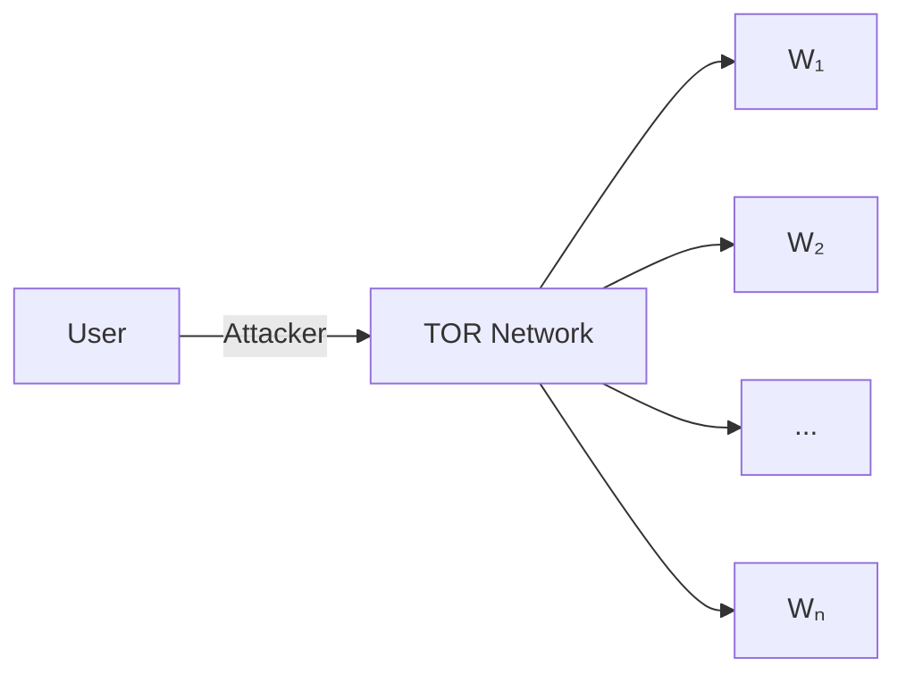
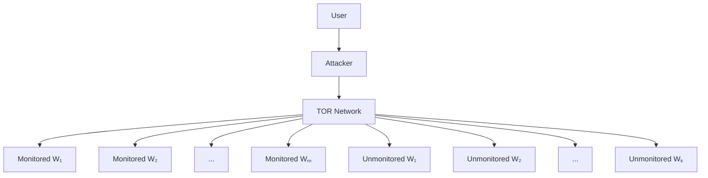
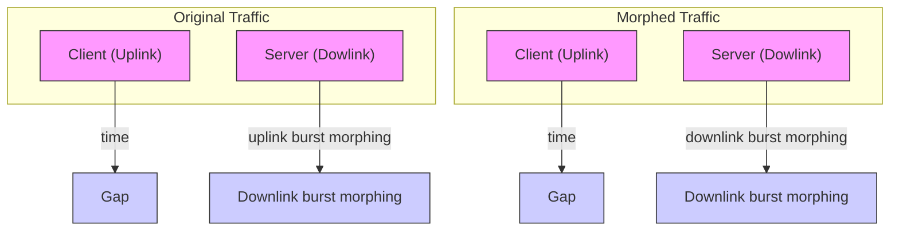
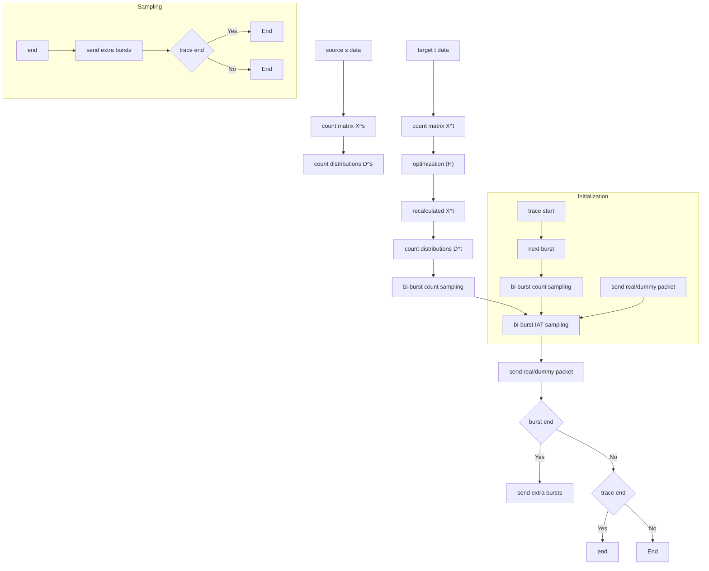
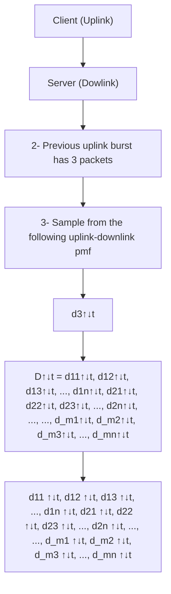

# BiMorphing: A Bi-Directional Bursting Defense against Website Fingerprinting Attacks

Khaled Al-Naami, , Amir El-Ghamry , Md Shihabul Islam , Member, IEEELatifur Khan,   , Bhavani Thuraisingham,  , Kevin W. Hamlen, Member, IEEE Fellow, IMohammed Alrahmawy , and Magdi Z. Rashad

Abstract—Network traffic analysis has been increasingly used in various applications to either protect or threaten people, information, and systems. Website fingerprinting is a passive traffic analysis attack which threatens web navigation privacy. It is a set of techniques used to discover patterns from a sequence of network packets generated while a user accesses different websites. Internet users (such as online activists or journalists) may wish to hide their identity and online activity to protect their privacy. Typically, an anonymity network is utilized for this purpose. These anonymity networks such as Tor (The Onion Router) provide layers of data encryption which poses a challenge to the traffic analysis techniques. Although various defenses have been proposed to counteract this passive attack, they have been penetrated by new attacks that proved the ineffectiveness and/or impracticality of such defenses. In this work, we introduce a novel defense algorithm to counteract the website fingerprinting attacks. The proposed defense obfuscates original website traffic patterns through the use of double sampling and mathematical optimization techniques to deform packet sequences and destroy traffic flow dependency characteristics used by attackers to identify websites. We evaluate our defense against state-of-the-art studies and show its effectiveness with minimal overhead and zero-delay transmission to the real traffic.

Index Terms—Traffic analysis, website fingerprinting defenses

## 1 INTRODUCTION

USER privacy on the web has been a critical aspect ofmany studies in the past decade [1]. With a surge in the number of applications and ways to access information, security and privacy technologies are increasingly used to protect users’ identity. These technologies include SSH, SSL/TLS, VPN and IPSec [2]. One particular facet of web privacy is the ability of an attacker to identify the web pages visited by a user. Private browsing and proxy tunnelling are often used to protect the accessed content. However, network identity may not be adequately protected. A user (e.g., an activist, or journalist) may wish to be anonymous or overcome active internet regulations that curtail one’s freedom.

Recently, studies have revealed that these privacy defenses can be weakened by passive traffic analysis of network packets while the user accesses a website [3], [4], [5], [6], [7], [8], [9], [10]. This is known as the Website

Fingerprinting attack, which is mostly used in attack settings by a passive adversary who is assumed to have access to the victim’s network.

In an attack scenario, an adversary aims to identify the web browsing activity of a client by passively listening to the network traffic between the client and a server. Traffic analysis is performed, using various statistical methods, to identify or predict the website accessed by the client. In order to eliminate deterministic identification characteristics such as destination IP and webpage content, clients often use proxies or low-latency anonymity network services such as Tor (The Onion Router) [11]. These services disguise and encrypt network packets bound for a particular destination. Attackers employ machine learning techniques to learn the parameters of statistical models using network traffic from various websites. Such models can be used to classify an observation of network traffic.

To counteract the website fingerprinting attack, various defenses have been proposed in the literature [7], [12], [13], [14], [15]. The competition between attackers and defenders has been continually evolving. On the one hand, the attacker gathers the encrypted packets transmitted between the client and server, extracts patterns and features, and performs traffic analysis through machine learning techniques in an attempt to infer the destination website an Internet user is trying to access. On the other hand, defenders (such as Tor) have been developing various means to thwart such attempts by disguising and morphing network packets bound for a particular website.

Existing defenses in literature try to thwart such attacks by morphing the (source) website distribution to make it appear to come from another (target) website distribution with the objective of confusing the machine learning classifier. Such defenses focus on changing characteristics like packet length, time, and consecutive sequences of packets in a specific direction (i.e., client to server and vice versa) [6], [7], [12], [13], [14], [15].

In this paper, we introduce BIMORPHING, a novel website fingerprinting defense that thwarts the fingerprinting attacks by considering bi-directional dependence between consecutive sequences of packets in opposite directions. The proposed defense algorithm obfuscates website patterns through the use of bi-directional statistical sampling and optimization techniques to achieve minimal bandwidth overhead and zero-delay transmission to actual traffic. To the best of our knowledge, this is the first study that utilizes a size and time (double) concurrent sampling approach.

In short, the main contributions of this paper are summarized as follows.

We introduce a novel traffic fingerprinting defense, called BIMORPHING, to thwart the fingerprinting cyber attack. Specifically, BIMORPHING considers dependence between consecutive sequences of packets in opposite directions.  
We propose a new defense algorithm that leverages dependency sampling and zero latency traffic transmission.  
We show how this defense achieves minimum bandwidth overhead through the use of mathematical optimization techniques.  
We implement and evaluate our approach against a Tor dataset and show how the proposed methodology outperforms the state-of-the-art studies.

The rest of the paper is organized as follows. In Section 2, we present relevant background information and related studies about website fingerprinting attack, then we discuss our attack methodology. In Section 3, we present relevant background information and related studies about website fingerprinting defense; then we discuss our defense methodology. The model is evaluated in Section 4. The assumptions and consequences of the new defense are discussed in Section 5. Finally, we conclude our paper in Section 6.

## 2 WEBSITE FINGERPRINTING ATTACK

Data encryption of network packets provides user privacy by hiding plain-text content while transmitting data between two devices within a network. Protocols such as HTTPS support the required security layer. However, this does not hide the user’s identity since it reveals the source and destination IPs [16]. Typically, a proxy server is used to route internet traffic to mask the IP address [17]. In this case, the network traffic appears to be sourced from the proxy server rather than the user’s machine. A combination of encryption and proxy server hides the user’s identity deterministically. Further, anonymity networks make it harder to identify the destination IP as such networks use multiple proxies between the user and the destination server. In particular, anonymity networks such as Tor [11] hide information of its users by providing a low latency anonymization and pipeline randomization.


<details>
<summary>flowchart</summary>


</details>

Fig. 1. A Tor anonymity network example showing a user connecting to the Internet via three Tor nodes. The website fingerprinting passive attack occurs between the user and the Tor entry guard.

The problem of website fingerprinting is to identify the website browsed by a client through encrypted and anonymized network connections by using meta information of encrypted packets transmitted between the user and an anonymity network. Fig. 1 illustrates an example of a client (or user) connecting to a server via the Tor network. In this paper, we use the term “website” and “webpage” interchangeably.

A dataset consists of a set of data instances with features. Each data instance is assumed to be generated from an unknown distribution. The goal of learning is to estimate this probability distribution to answer queries, such as classification, given evidence. A distinct set of training and testing data instances are used to construct and evaluate the model. In the case of website fingerprinting, the data instances are network packets exchanged between the server and a client. An Attacker captures these encrypted packets in order to predict the website they may belong to. A sequence of packets required to load a website onto the user’s browser is called a trace. A set of statistical properties can be extracted from a trace to represent it as a vector of features for classification. A set of traces having these features form the training and test datasets.

The website fingerprinting scenario, generally perceived as an attack against user’s privacy, employs a statistical model to predict the website name associated with a given trace. Whereas, a defense mechanism explores methodologies to reduce the effectiveness of such models capable of performing an attack.

## 2.1 Attack Background

Numerous studies [3], [4], [5], [6], [7], [8], [9], [10] have proposed techniques to perform website fingerprinting. Essentially, a supervised learning technique is employed where a set of features are collected from traffic flow at the user’s end. These include packet length, direction (i.e., uplink from client to server or downlink from server to client), and time [3]. In [18], besides using packet length histograms, the authors combine consecutive packets, in the same direction, to form features called bursts. In addition, more features such as number of unique packet sizes, percentage of incoming and outgoing packets, and bursts with variable n-gram features [12] have been used.

Training data has distinct traffic traces (sequence of packets) for each website. A classification algorithm such as


<details>
<summary>flowchart</summary>


</details>

(a) Closed World attack scenario.


<details>
<summary>flowchart</summary>


</details>

(b) Open World attack scenario.  
Fig. 2. In the Closed World scenario (a), the user visits one page among those monitored by the attacker. In Open World (b), the user is allowed to visit unmonitored pages.

Naive Bayes, SVM, Decision trees, and k-NN predicts the class of each test trace with the same set of features, where the class is the website name. In order to train a classification model (or a classifier), a sufficient number of traces from every website is required. However, it is impractical to obtain traces for all websites. In a closed-world scenario, a classifier is trained using traces from a finite set of websites. Therefore, a test trace will have a class label prediction belonging to one of these websites as shown in Fig. 2a. On the other hand, the classification problem in an open-world scenario is to determine if a test trace belongs to a “monitored” or “non-monitored” website set as shown in Fig. 2b. The techniques developed to address the openworld problem design a binary classifier that requires traces from both the finite monitored set and an infinitely large (rest of the universe) set of non-monitored websites.

Wang et al. [6]. use monitored website traces to learn weights of features while the k-NN model utilizes traces from both monitored and non-monitored websites for classification. They use k-NN classification with weighted L1 distance to conduct website fingerprinting attacks. A page is classified as belonging to particular class only if all k neighbors belong to this class. We used the same training parameters as in Wang et al.’s work [6] with our feature vectors to compare classifier performance.

TABLE 1 Best 20 Features According to the Recent Feature Analysis by Hayes and Danezis [8]

<table><tr><td>Rank</td><td>Feature Computation</td></tr><tr><td>1</td><td>Counting the # of downlink packets</td></tr><tr><td>2</td><td>Counting the # uplink packets (fraction of total count of packets)</td></tr><tr><td>3</td><td>Counting the # downlink packets (fraction of total count of packets)</td></tr><tr><td>4</td><td>Calculating the Standard deviation of uplink packet ordering List</td></tr><tr><td>5</td><td>Counting the # uplink packets</td></tr><tr><td>6</td><td>Summing the items in the alternative concentration feature list</td></tr><tr><td>7</td><td>Calculating the average of uplink packet ordering list</td></tr><tr><td>8</td><td>Summing the incoming packets, the uplink packets and the total # packets</td></tr><tr><td>9</td><td>Summing the alternative # packets per second</td></tr><tr><td>10</td><td>Calculating the total # packets</td></tr><tr><td>11-18</td><td>Packet concentration and ordering feature list</td></tr><tr><td>19</td><td>Counting the downlink packets stats in first 30 packets</td></tr><tr><td>20</td><td>Counting the uplink packets stats in first 30 packets</td></tr></table>

Cai et al. [5]. utilize cumulative sum of packet sizes at a given time in each direction for the feature generation process. In this attack traces are converted into strings, then Damerau-Levenshtein distance is applied to compare between traces. After that, the packets are ordered so that information about the size of objects referenced in a page and the order in which the browser requests them can be extracted, then Hidden Markov Models are used to extend web page classifier to a web site classifier.

Hayes et al. [8]. implement an attack against webpages and Tor hidden services using random decision forests. They applied a systematic analysis of the features proposed by previous research. The importance of different features was evaluated regarding k-Nearest Neighbor classifier; the 20 most important features are shown in Table 1. The selected features are transformed using Random Forest (RF) by extracting feature values from the original feature set. Then, leaves are generated by applying RF to these values; leaves are then used as feature values for classification process that used a custom modification of the k-Nearest Neighbors classifier that was used for the k-NN attack.

Panchenko et al. [10]. introduce recently an attack that is based on an SVM with a Radial Basis Function (RBF) kernel. The attack is called CUMUL. It abstracts the loading process of a webpage by generating a cumulative behavioral representation of its trace and derives n features by sampling the piecewise linear interpolant of the representation at n equidistant points. The cumulative features are computed by adding the lengths of outgoing packets and subtracting the lengths of incoming packets. These implicitly cover characteristics of the traffic that other classifiers have to explicitly consider, e.g., packet ordering or burst behavior. We adopt such features with n = 100 to compare classifier performance.

Juarez et al. [19] observe and evaluate various assumptions made in studies regarding website fingerprinting. These include page load parsing by an adversary, background noise, sequential browsing behavior of a user, and replicability due to staleness in training data with time, among others. While recent studies [20], [21] have addressed each of these issues by relaxing appropriate assumptions, the issue of replicability still remains an open challenge.


<details>
<summary>flowchart</summary>

```mermaid
graph TD
    subgraph Up_Burst[Up Uni-Burst]
  a["a"] --> s1["s = 200, t = 0"]
  a --> s2["s = 300, t = 10"]
    end
    subgraph Bi_Burst[Bi-Burst or Dn-Up-Burst]
  b["b"] --> s3["s = 600, t = 35"]
  b --> s4["s = 200, t = 50"]
  b --> s5["s = 1500, t = 55"]
  c["c"] --> s6["s = 200, t = 100"]
  c --> s7["s = 200, t = 105"]
    end
    subgraph Server[Server (Dn)]
  d["d"] --> s8["s = 1500, t = 120"]
  d --> s9["s = 800, t = 125"]
  e["e"] --> s10["s = 400, t = 150"]
  e --> s11["s = 100, t = 160"]
  f["f"] --> s12["s = 200, t = 205"]
  f --> s13["s = 1500, t = 220"]
  g["g"] --> s14["s = 600, t = 225"]
    end
  A --> B --> C --> D --> E --> F --> G
    style Up_Burst fill:#f9f,stroke:#333
    style Bi_Burst fill:#bbf,stroke:#333
    style Server fill:#dfd,stroke:#333
```
</details>

Fig. 3. An example illustrating BIND Features [9].

## 2.2 Our Attack Methodology

We recently proposed a study [9] in which the main idea is to extract features from traces by capturing dependencies between bi-bursts (two consecutive bursts in opposite directions). The attack was called BIND (fingerprinting with BI-directioNal Dependence). In this attack, features are extracted from individual packets, single bursts (called unibursts), and from adjacent uni-bursts in opposite directions (called bi-bursts). As shown in Fig. 3, a burst can be directed from a user/client to the server (uplink uni-burst) (e.g., burst a), or directed from server to the user (downlink uniburst) (e.g., burst b). Similar to packets, a uni-burst has features such as size (or length), time, and direction. Uni-burst size is computed by summing the lengths of all its packets. Uni-burst time is computed by subtracting the last packet’s timestamp from the first packet’s timestamp within a burst, i.e., the time taken to transmit all packets of a burst in a specific direction. Fig. 3 shows an example of how features are extracted from a uni-burst (e.g., burst a) whose size is 500, computed by adding packet sizes s = 200 and s = 300 that form the burst. Its time is computed as 10, which is the absolute time difference between the last packet (t = 10) and the first packet (t = 0) in the burst.

The features extracted from Bi-Bursts include four categories as follows. The first category is Dn-Up-Burst size features which is a set of tuples formed by downlink (Dn)—uplink (Up) consecutive bursts such that unique tuples are formed according to the corresponding uni-burst lengths where each tuple forms a new feature. The second category is Dn-Up-Burst time features which considers unique consecutive uni-burst time tuples between adjacent Dn uni-burst and Up uni-burst sequences. The third category is Up-Dn-Burst size features which are similar to Dn-Up-Burst size features, these features consider burst length tuples of adjacent Up uni-burst and Dn uni-burst sequences. The fourth category is Up-Dn-Burst time features which are similar to Dn-Up-Burst time features, this set of features considers burst time tuples formed by adjacent Up uniburst and Dn uni-burst sequences.

TABLE 2 Features of BIND from Packets, Uni-Bursts, and Bi-Bursts [9]

<table><tr><td>Category</td><td>Feature</td></tr><tr><td>Packet (Up/Dn)</td><td>Packet length</td></tr><tr><td>Uni-Burst (Up/Dn)</td><td>Uni-Burst sizeUni-Burst timeUni-Burst count</td></tr><tr><td>Bi-Burst (Up-Dn/Dn-Up)</td><td>Bi-Burst sizeBi-Burst time</td></tr></table>

Table 2 illustrates the complete set of features used by this attack. Fig. 3 shows an example of how features are extracted from a Bi-burst (e.g., formed with a combination of bursts b and c) which is denoted as Dn-Up-Burst. In this case, the Bi-Burst tuple using the burst size (i.e., Dn-Up-Burst size) is represented as (DnUp-2300-400), where 2300 is the burst size of b, and 400 is the burst size of c. We count the number of such unique tuples in the trace. In this case, the count for DnUp-2300-400 is 1.

After that, in each trace, these unique tuples are counted to generate a set of features. Then a quantization process is applied to overcome dimensionality issues associated with burst sizes. For the learning process, we used the BIND features to train a support vector machine (SVM) classifier in the closed-world and open-world settings. SVM applies convex optimization and maps non-linearly separated data to a higher dimensional linearly separated feature space. We compare our defense against this attack in our evaluation as one of the most recent works in the website fingerprinting domain.

## 3 WEBSITE FINGERPRINTING DEFENSE

In this section, we present relevant background in website fingerprinting defenses and discuss our defense methodology.

## 3.1 Defense Background

As a successful website fingerprinting attack counts on collecting useful features from encrypted packets to train a model, defenses against this attack are designed with the aim of obfuscating the patterns of the encrypted packets of the loaded website. Defending website fingerprinting attacks has been an active area of research and many defenses have been introduced in literature [7], [12], [13], [14], [15]. These defenses vary from morphing the website packet length distribution (called source) to make it appear to come from another website distribution (called target) [12] to deforming the time required for packets to get exchanged between client and server.


<details>
<summary>flowchart</summary>


</details>

Fig. 4. BIMORPHING example.

Packet Padding. Padding refers to a technique that hides website distributions by increasing packets length (size). One of the basic and effective padding defenses is Pad-to-MTU which pads each individual packet to the maximum transmission unit in the TCP connection [12]. As all packet sizes become equal when applying this defense, obtaining useful patterns by attackers might be less effective. This approach tries to thwart the classifier’s ability to extract meaningful features using packet size histograms from different websites since all packets are of equal size. Although this method may not be appreciated in practice as it may increase the bandwidth overhead, early studies [3] showed that a considerable success can be achieved when applying defenses such as this packet padding.

To overcome the bandwidth overhead burden, more practical distribution-based techniques have been introduced to the website fingerprinting defense domain. Specifically, Direct Target Sampling and Traffic Morphing (TM) are distribution-based padding defenses that use statistical sampling techniques [13]. Using random sampling, DTS morphs the packet length distribution of a source webpage to make appear similar to that of a predetermined target webpage. Wright et al. [13] introduced the TM defense which advances DTS by using a convex optimization approach to further lower the padding overhead.

Packet Padding and Time Obfuscation. Beside padding, packet arrival/departure time, observed at client by an adversary, may reveal distinguishing factors about visited websites. Dyer et al. [12] presented Buffered Fixed Length Obfuscator (BuFLO) as a combination of packet padding and time change defenses. BuFLO sends fixed-length packets in fixed intervals for a fixed amount of time. Cai et al. [7] improved BuFLO by introducing a lighter defense named TAMARAW. Instead of setting a minimum duration of padding, TAMARAW stops padding when the number of packets sent in both directions are multiples of a certain padding parameter. This approach groups webpages in anonymity sets, with the amount of padding generated being dependent on the webpage’s total size. Also, incoming and outgoing traffic are treated independently, using different packet sizes and padding at different rates because of the asymmetry of web browsing traffic. It still sends a fixed count of packets for each trace as in BuFLO. Time deforming defenses incur a delay overhead which is not preferred in practice. Juarez et al. [14] presented an improved adaptive padding defense called Website Traffic Fingerprinting Protection with Adaptive Defense (WTF-PAD) that leverages packet time sampling approaches to send dummy packets in gaps of real packets without delaying actual traffic.

Burst Deforming. As explained earlier in this section, a powerful distinguishing factor in website fingerprinting is the use of burst features (i.e., aggregated packets in a specific direction) and bi-bursts (i.e., consecutive bursts in opposite directions). A recent study done by Wang et al. [15] proposed a one-to-one burst molding defense that fuses bursts of source and target websites by taking the maximum of the two bursts (in order). We compare our defense against this approach as one of latest defenses introduced in literature. Our introduced BIMORPHING defense leverages padding and time deforming defenses and morphs bi-bursts using sampling and optimization techniques for a minimum bandwidth overhead and zero delay packet transmission.

## 3.2 Our Defense Methodology

In order to defeat traffic fingerprinting attacks, it is not adequate to morph the packet sequences by just using size padding techniques or even more sophisticated time delay methods. The bursting nature of website traffic makes it easy to classify a website even when such defenses are applied. In addition, website fingerprinting attacks that leverage bi-directional bursting characteristics have been shown to be effective website fingerprinting attacks even with the presence of defenses that try to disguise packet sequences and make a source website distribution look like it is coming from a different target website distribution.

In this section, we introduce a new approach, called BIMORPHING, as a novel defense against website fingerprinting attacks. The proposed defense morphs the bi-bursting patterns (uplink to downlink or downlink to uplink) and makes sure there is no time delay to the actual packets exchanged between client and server. Fig. 4 presents an example of morphing two bursts (uplink and downlink). For the uplink burst, BIMORPHING samples and injects a dummy packet in the gap between the first and second real packets without any delay (i.e., the first two packets in the uplink burst get transmitted on time). Similarly, for the downlink burst, the approach samples and sends two dummy packets in gaps of real packets.

As attackers exploit the bi-bursting size and time nature of encrypted packet sequences to extract useful features, to counteract such attacks, we implement a defense mechanism that hides these characteristics by applying bi-burst sampling techniques to a source website and make it appear as coming from a target website.

BIMORPHING’s architecture, depicted in Fig. 5, embodies this approach through the use of optimization and double sampling techniques. The architecture shows the two phases of BIMORPHING. The initialization phase (top half) is responsible for building distributions that will be used in the double sampling phase (bottom half). The architecture will be explained in detail in the following sections.


<details>
<summary>flowchart</summary>


</details>

Fig. 5. BIMORPHING architecture.

BIMORPHING consists of three main components, bi-bursting count sampling, an optimization technique to lower the padding overhead, and bi-bursting inter-arrival time (IAT) sampling. We now explain the three components in detail.

## 3.2.1Bi-Bursting Count Sampling

3.2.1 Bi-Bursting Count SamplingAs discussed earlier in this section, an effective defense should change the bi-bursting nature of a website as bidirectional dependence between consecutive bursts reveal characteristics about traffic. Toward this end, the first component of our BIMORPHING defense morphs bursts taking into consideration the dependence nature between uplinkdownlink and downlink-uplink bursts. BIMORPHING is a distribution-based defense with the objective of morphing biburst patterns such that these bi-bursts appear to come from a pre-determined target distribution.

Count Distribution Matrices. First we define some notations that we use in our figures (such as Fig. 5) and throughout the paper. Let s and t be the source and target websites, respectively. Let $X ^ { t } = [ x _ { 1 } , x _ { 2 } , . . . , x _ { n } ] \in \mathbb { N } ^ { m \times n }$ be the uplinkdownlink (up-dn) or downlink-uplink (dn-up) bi-burst cooccurrence matrix built from the target website, where $x _ { i } = [ x _ { 1 i } , x _ { 2 i } , . . . , x _ { m i } ] ^ { T }$ is a column vector and each entry $x _ { j i }$ tabulates the number of times a burst of count i (i.e., the number of packets) in a specific direction is followed by a burst of count $j$ in the opposite direction. Similarly, $X ^ { s }$ is the bi-burst co-occurrence matrix built from the source website. In this work, every individual packet is padded to the maximum transmission unit.

As depicted in Fig. 5, from $X ^ { s }$ and $X ^ { t } .$ , BIMORPHING starts by building matrices of probability distributions $D ^ { s }$ and $D ^ { t }$ over bi-directional bursting counts from s and $t ,$ respectively. $D ^ { \uparrow \downarrow }$ is the uplink-downlink distribution matrix while $D ^ { \downarrow \uparrow }$ is the downlink-uplink distribution matrix. For instance, as depicted in Fig. $7 , ^ { \bullet } D ^ { \uparrow \downarrow t } = [ d _ { 1 } ^ { \uparrow \downarrow t } , d _ { 2 } ^ { \uparrow \downarrow t } , \dots , d _ { n } ^ { \uparrow \downarrow t } ]$ is an $m \times n$ matrix that denotes the target uplink-donwlink distribution where n is the number of all possible uplink burst packet counts and $m$ is the number of all possible downlink burst packet counts. The column vector $d _ { i } ^ { \uparrow \downarrow t } = [ d _ { 1 i } ^ { \uparrow \downarrow t } , d _ { 2 i } ^ { \uparrow \downarrow t } , . . . ,$ $d _ { m i } ^ { \uparrow \downarrow t } ] ^ { T }$ uplink burst count i with all possible downlink burst packet counts $( \mathrm { i . e . , 1 }$ to m). We build similar distribution matrices for the opposite direction of the target website $( \mathrm { i } . \mathrm { e } . , D ^ { \downarrow \uparrow t } )$ ) as well as for the source website $( \mathrm { i } . \mathrm { e } . , \breve { D ^ { \uparrow \downarrow s } }$ and $D ^ { \downarrow \uparrow s } )$ . The distributions are shown in Fig. 5. Notice that, we don’t show the arrows in Fig. 5 for simplicity but for each case, we generate distributions for both directions (uplink to downlink and downlink to uplilnk) as depicted in Fig. 6.

Bi-Burst Count Sampling. In BIMORPHING, we start by sending the first burst from the source website s as is. Then, for each burst of count i from $s ,$ we sample a burst of count $j$ from the $t ^ { \prime } \mathrm { s }$ distribution matrix $D ^ { t }$ depending on the previous burst. The sampling process is illustrated in Fig. 7. As an example, let $b _ { i } ^ { s }$ be the current source downlink burst with count i. As this is a downlink burst, we sample based on the previous burst direction $( \mathrm { i . e . } _ { }$ , uplink) and count $( \mathrm { i . e . , }$ we sample from the column vector $d _ { k } ^ { \uparrow \downarrow t }$ assuming the previous uplink burst has k packets). Form this pmf, we build its corresponding Cumulative Distribution Function (CDF) and uniformally sample a burst. Let $b _ { i } ^ { t }$ be the sampled burst with count $j . \mathrm { ~ I f ~ } j > i ,$ we add $( j - { \dot { i } } )$ fake packets to the

$$
\begin{array}{r l r} & {X ^ {\uparrow \downarrow t} = \left[ \begin{array}{l l l} x _ {1 1} ^ {\uparrow \downarrow t} & \dots & x _ {1 n} ^ {\uparrow \downarrow t} \\ x _ {2 1} ^ {\uparrow \downarrow t} & \dots & x _ {2 n} ^ {\uparrow \downarrow t} \\ \vdots & \ddots & \vdots \\ x _ {m 1} ^ {\uparrow \downarrow t} & \dots & x _ {m n} ^ {\uparrow \downarrow t} \end{array} \right]} & {X ^ {\uparrow \downarrow s} = \left[ \begin{array}{l l l} x _ {1 1} ^ {\uparrow \downarrow s} & \dots & x _ {1 n} ^ {\uparrow \downarrow s} \\ x _ {2 1} ^ {\uparrow \downarrow s} & \dots & x _ {2 n} ^ {\uparrow \downarrow s} \\ \vdots & \ddots & \vdots \\ x _ {m 1} ^ {\uparrow \downarrow s} & \dots & x _ {m n} ^ {\uparrow \downarrow s} \end{array} \right]} \\ & {D ^ {\uparrow \downarrow t} = \left[ \begin{array}{l l l} d _ {1 1} ^ {\uparrow \downarrow t} & \dots & d _ {1 n} ^ {\uparrow \downarrow t} \\ d _ {2 1} ^ {\uparrow \downarrow t} & \dots & d _ {2 n} ^ {\uparrow \downarrow t} \\ \vdots & \ddots & \vdots \\ d _ {m 1} ^ {\uparrow \downarrow t} & \dots & d _ {m n} ^ {\uparrow \downarrow t} \end{array} \right]} & {D ^ {\uparrow \downarrow s} = \left[ \begin{array}{l l l} d _ {1 1} ^ {\uparrow \downarrow s} & \dots & d _ {1 n} ^ {\uparrow \downarrow s} \\ d _ {2 1} ^ {\uparrow \downarrow s} & \dots & d _ {2 n} ^ {\uparrow \downarrow s} \\ \vdots & \ddots & \vdots \\ d _ {m 1} ^ {\uparrow \downarrow s} & \dots & d _ {m n} ^ {\uparrow \downarrow s} \end{array} \right]} \end{array}
$$

D\* ∈Rmxn: probability distributions built from X\*

Each column vector. $d _ { i } ^ { \uparrow \downarrow } = [ d _ { 1 i } ^ { \uparrow \downarrow } , d _ { 2 i } ^ { \uparrow \downarrow } , \dots , d _ { m i } ^ { \uparrow \downarrow } ] ^ { T }$ ERrepresents the probabilty mass function (pmf) of the uplink burst count iwith allpossible subsequent downlink burst packet counts (i.e.,1 to m).

-For each column i, $\begin{array} { r } { \sum _ { j = 1 } ^ { m } d _ { j i } = 1 } \end{array}$ Similarly, we build $X ^ { \downarrow \uparrow t } , X ^ { \downarrow \uparrow s } , D ^ { \downarrow \uparrow t }$ ,and $D ^ { \downarrow \uparrow s }$ (notice arrows)

Fig. 6. Count distribution matrices.

original burst from s and send. Otherwise, we send the original burst and continue sampling until all source bursts are consumed. We interleave these fake packets with the original real packets from s using an algorithm that ensures zero delay for the original real packets as will be explained shortly. Finally, if the total number of bursts in target is larger than the total number of bursts in source, we add the extra target bursts to the source. This ensures small website patterns are not revealed to the attacker.

## 3.2.2Learning Optimal Target Co-Occurence Learning Op

The bi-bursting sampling proposed above may introduce a sampling bias in the target distribution. This bias comes from the fact that most of the bi-burst packet counts are small. Hence, this leads to a sampling bias towards these small bursts which may result in a misrepresentation of the target in the new generated distribution. In addition, adding fake packets during sampling may incur a high overhead to the bandwidth. Toward dealing with these two challenges (sampling bias and bandwidth overhead), we propose a balancing solution through the use of mathematical optimization as depicted in Fig. 5. BIMORPHING introduces two objective functions, one for the uplink-downlink distributions $( H _ { \uparrow \downarrow } )$ and the other one for the downlink-uplink distributions $( H _ { \downarrow \uparrow } )$ . Equation (1) shows the objective function minimizing $H _ { \uparrow \downarrow }$ .

$$
\min _ {W \in \mathbb {R} ^ {m \times n}} H _ {\uparrow \downarrow} = \sum_ {i = 1} ^ {n} \sum_ {j = 1} ^ {m} p _ {i j} f (x _ {i j}) [ w _ {i j} (| b _ {j} ^ {t} | - | b _ {i} ^ {s} |) ] ^ {2}, \tag {1}
$$

Here, n and m are the number of all possible uplink burst counts and all possible downlink burst counts, respectively. $p _ { i j }$ is the probability from the pmf of the source website while $x _ { i j }$ is the number of times an uplink burst of count i is followed by a downlink burst of count j in the target cooccurrence matrix $X ^ { t }$ . Equation (2) explains $f ( x _ { i j } )$ which is the same weighting function introduced in [22] with the same model parameters (i.e., $x _ { m a x } = 1 0 0$ and $\alpha = 3 / 4 )$ . $f ( x _ { i j } )$ ais a weighting function designed to eliminate noise between co-occurrences of consecutive words (bi-bursts in our case). It deals with rare co-occurrences as well as frequent co-occurrences of bi-bursts.

$$
f (x _ {i j}) = \left\{ \begin{array}{l l} (\frac {x _ {i j}}{x _ {\text { max }}}) ^ {\alpha}, & \text { if   } x _ {i j} <   x _ {\text { max }} \\ 1, & \text { otherwise. } \end{array} \right. \tag {2}
$$


<details>
<summary>flowchart</summary>


</details>

Fig. 7. Bi-Burst count sampling.

The weights w0 s are the parameters to learn. The overhead to be minimized is $( | \bar { b } _ { j } ^ { t } | - | b _ { i } ^ { s } | )$ which denotes burst count difference between target and source. After learning the optimal $w ^ { \prime } s ,$ , we recalculate Xt using the Hadamard entrywise matrix product $X ^ { t } = X ^ { t } \circ$  W where $x _ { i j } = x _ { i j } \ w _ { i j }$ .

The partial derivative of Equation (1) with respect to each weight $w _ { i j }$ is as follows.

$$
\frac {\partial H _ {\uparrow \downarrow}}{\partial w _ {i j}} = p _ {i j} f (x _ {i j}) 2 \left[ w _ {i j} \left(| b _ {j} ^ {t} | - | b _ {i} ^ {s} |\right) \right] \frac {\partial \left[ w _ {i j} \left(| b _ {j} ^ {t} | - | b _ {i} ^ {s} |\right) \right]}{\partial w _ {i j}}
$$

$$
\frac {\partial H _ {\uparrow \downarrow}}{\partial w _ {i j}} = p _ {i j} f (x _ {i j}) 2 \left[ w _ {i j} \left(| b _ {j} ^ {t} | - | b _ {i} ^ {s} |\right) \right] \left(| b _ {j} ^ {t} | - | b _ {i} ^ {s} |\right) \tag {3}
$$

$$
\frac {\partial H _ {\uparrow \downarrow}}{\partial w _ {i j}} = 2 p _ {i j} f (x _ {i j}) (| b _ {j} ^ {t} | - | b _ {i} ^ {s} |) ^ {2} w _ {i j}.
$$

Accordingly, each iteration in gradient descent modifies each parameter $w _ { i j }$ as follows.

$$
w _ {i j} = w _ {i j} - \gamma . \frac {\partial H _ {\uparrow \downarrow}}{\partial w _ {i j}}, \tag {4}
$$

where $\gamma$ is the step size. Equation (5) shows the downlinkguplink objective function minimizing $H _ { \downarrow \uparrow }$ which is similar to the one in Equation 1 with flipping the directions of uplink and downlink and observing the downlink-uplink distribution values. Similarly, the partial derivative of $H _ { \downarrow \uparrow }$ with respect to $w _ { i j }$ is similar to Equation (3) but with the values coming form the downlink-uplink distributions.

$$
\min _ {W \in \mathbb {R} ^ {m \times n}} H _ {\downarrow \uparrow} = \sum_ {i = 1} ^ {n} \sum_ {j = 1} ^ {m} p _ {i j} f (x _ {i j}) [ w _ {i j} (| b _ {j} ^ {t} | - | b _ {i} ^ {s} |) ] ^ {2}, \tag {5}
$$

This optimization technique ensures that co-occurring bibursts are not weighed equally (i.e., frequent co-occurrences are not overweighed and noisy rare co-occurrences do not carry more than deserving weights). It also minimizes the overhead of sampling from the target distribution which is crucial for any efficient defense mechanism.

## 3.2.3Bi-Burst Inter-Arrival Time (IAT) Sampling

Although the above sampling methodology achieves the purpose of bi-burst morphing, a main drawback is that fake packets incur a time delay overhead as they are sent with original real packets. This leads to a delay to the actual

$$
A ^ {\uparrow \downarrow t} = \left[ \begin{array}{c c c} a _ {1 1} ^ {\uparrow \downarrow t} & \dots & a _ {1 n} ^ {\uparrow \downarrow t} \\ a _ {2 1} ^ {\uparrow \downarrow t} & \dots & a _ {2 n} ^ {\uparrow \downarrow t} \\ \vdots & \ddots & \vdots \\ a _ {m 1} ^ {\uparrow \downarrow t} & \dots & a _ {m n} ^ {\uparrow \downarrow t} \end{array} \right]
$$

$A ^ { \uparrow \downarrow t } \in \mathbb { R } ^ { m \times n } ;$ ：probabilitydistributions built from target websitet

$A ^ { \uparrow \downarrow t } = [ a _ { 1 } ^ { \uparrow \downarrow } , a _ { 2 } ^ { \uparrow \downarrow } , . . . , a _ { n } ^ { \uparrow \downarrow } ] \in \mathbb { R } ^ { m \times n }$  
-Each column vector, $\boldsymbol { a } _ { i } ^ { \uparrow \downarrow } = [ \boldsymbol { a } _ { 1 i } ^ { \uparrow \downarrow } , \boldsymbol { a } _ { 2 i } ^ { \uparrow \downarrow } , \ldots , \boldsymbol { a } _ { m i } ^ { \uparrow \downarrow } ] ^ { T } \in \mathbb { R } ^ { m }$ represents the probability mass function (pmf) of the uplink burst count i with all possible subsequent downlink burst inter-arrival times (i.e., 1 to m).  
-For each column i, $\begin{array} { r } { \sum _ { j = 1 } ^ { m } a _ { j i } = 1 } \end{array}$

Similarly,we build $A ^ { \updownarrow \uparrow t }$ (downlink-uplink distributions)

Fig. 8. IAT distribution matrices.

traffic exchanged between client and server. To tackle this issue, we introduce a zero delay algorithm that is a modified and simplified version of the Adaptive Padding algorithm introduced in [14], [23]. The algorithm sends fake packets in gaps of real packets without delaying the actual traffic. Our approach combines bi-burst count sampling and bi-burst time sampling together which not only hides trace size characteristics but also disguise timing leak that may be used by attackers to accurately fingerprint websites.

IAT Distribution Matrices. The departure/arrival (uplink/ downlink) time difference between observations of two consecutive packets is the inter-arrival time. We first start by building the IAT distributions from the target website t. In a similar fashion to the bi-burst count distributions, the approach builds two inter-arrival time distributions from bi-bursts, one for uplink-downlink $( A ^ { \uparrow \downarrow t } )$ and the other for downlink-uplink $( \bar { \boldsymbol { A } } ^ { \uparrow \downarrow t } )$ . For the uplink-downlink case, $A ^ { \uparrow \downarrow t } = [ a _ { 1 } ^ { \uparrow \downarrow t } , a _ { 2 } ^ { \uparrow \downarrow t } , . . . , a _ { n } ^ { \uparrow \downarrow t } ] \in \mathbb { R } ^ { m \times n }$ denotes the target uplinkdonwlink IAT distributions where $n$ is the number of all possible uplink burst packet counts and m is the number of all possible downlink inter-arrival times. The column vector $a _ { i } ^ { \uparrow \downarrow \hat { t } } = [ a _ { 1 i } ^ { \uparrow \downarrow t } , a _ { 2 i } ^ { \uparrow \downarrow t } , . . . , a _ { m i } ^ { \uparrow \downarrow t } ] ^ { T }$ a"i ½a"#1i ; a"#2i ; :::; t a"#mi  represents the probability mass function of the uplink burst count i with all possible next-burst downlink inter-arrival times (i.e., 1 to m). As before, we build a similar matrix of the opposite direction for the target website $\rangle ( \mathrm { i . e . , } A ^ { \downarrow \uparrow t } )$ ). These matrices are shown in Fig. 8.

Bi-Burst IAT Sampling. Bi-burst IAT sampling runs simultaneously with bi-burst count sampling introduced above (double sampling) to ensure sending fake packets in gaps between real packets without delaying the actual traffic. The process is shown in Fig. 5. Whenever a real packet is ready to be sent, and depending on the previous burst direction and count, BIMORPHING samples an inter-arrival time from the corresponding distribution. For example, if the source current burst is a downlink burst $b _ { i } ^ { s } ,$ , we sample based on the previous burst direction which is uplink $( \mathrm { i . e . , }$ $a _ { k } ^ { \uparrow \downarrow t }$ assuming the previous burst has a count of k packets). Similarly, if the current burst is uplink, we sample from the pre-$a _ { k } ^ { \downarrow \uparrow t }$

## 3.2.4Zero Delay Packet Interleaving

As mentioned earlier, the BIMORPHING defense runs bi-burst count sampling and bi-burst IAT sampling concurrently. The algorithm is depicted in Fig. 9 using a finite state machine. Let’s assume bi-burst count sampling gives us a pool of f fake packets to interleave with real burst packets (sample f from $D ^ { \uparrow \downarrow t }$ t, as coming from a downlink current burst, $b ^ { \downarrow s } )$ . Whenever a real packet is ready to be sent, BIMORPHING sends it without delay (send p ), samples a new inter-arrival time, and starts a timer r (sample r from $A ^ { \uparrow \downarrow t } )$ . If r expires before another real packet comes, then BIMORPHING sends a fake (dummy) packet (send d ) from the pool $f$ and starts over by resampling another inter-arrival time. If a real packet arrives before r expires, we send the real packet (without sending any fake packets) and resample an inter-arrival time.

The process continues until all current burst (uplink or downlink) real packets have been sent. If the pool $\bar { \boldsymbol { f } }$ is not exhausted yet at the end of the current burst, we continue sending these residuals using the IAT sampling process until receiving a packet from the other party (next burst). We continue a similar process with the next burst. At the end of trace (fin), we send extra tail bursts from target if the total number of bursts of target is greater than the total number of bursts in source (extra).


<details>
<summary>flowchart</summary>

```mermaid
graph TD
  start --> bS["b↑s"]
  bS -->|next burst| bS2["b↓s"]
  bS2 -->|sample f| DT["D↑↓t"]
  DT -->|sample r| AT["A↑↓t"]
  AT -->|fin| extra
  AT -->|sample r| AT2["A↓↑t"]
  AT2 -->|sample f| bS
  BS["B↑s"] -->|next burst| dT["d↓↑t"]
  dT -->|sample f| bS
    style b↑s fill:#fff,stroke:#000
    style b↓s fill:#fff,stroke:#000
    style D↑↓t fill:#fff,stroke:#000
    style A↑↓t fill:#fff,stroke:#000
    style A↓↑t fill:#fff,stroke:#000
    style b↑s fill:#fff,stroke:#000
    style d↓↑t fill:#fff,stroke:#000
    style b↓s fill:#fff,stroke:#000
    style D↑↓t fill:#fff,stroke:#000
    style A↑↓t fill:#fff,stroke:#000
    style A↓↑t fill:#fff,stroke:#000
    note1["r expires & f != 0 : send(d), f--"]
    note2["r expires & f != 0 : send(d), f--"]
```
</details>

Fig. 9. Finite state machine to illustrate the BIMORPHING algorithm. send p denotes sending a real packet instantly. send d denotes sending a dummy packet. f is the bi-burst count sampling pool. r is the countdown timer after sampling the bi-burst IAT. fin refers to end of trace. extra denotes sending extra bursts from target if any.  
Authorized licensed use limited to: SICHUAN UNIVERSITY. Downloaded on June 18,2026 at 09:32:42 UTC from IEEE Xplore. Restrictions apply.

TABLE 3 The TOR Dataset

<table><tr><td>Dataset</td><td colspan="2"># of websites</td><td># of traces per website</td><td>Closed-world</td><td>Open-world</td></tr><tr><td rowspan="2">TOR[6]</td><td>Monitored</td><td>100</td><td>90</td><td>√</td><td>√</td></tr><tr><td>Non-Monitored</td><td>5000</td><td>1</td><td>×</td><td>√</td></tr></table>

## 4 EVALUATION

In this section, we demonstrate the effectiveness of the proposed traffic fingerprinting defense. We evaluate BIMORPH-ING against a Tor dataset (denoted as TOR) using the methodology described in Section 3.2. We examine the closed-world and open-world scenarios when no defense is applied and when there is a defense mechanism.

## 4.1 Dataset and Experimental Setup

The TOR dataset we use to validate our approach with was collected by capturing encrypted packets generated from a browser connected to the Tor anonymity network. The dataset is described in detail in [6]. As described in Table 3, the dataset consists of two groups of collections. The first one is a group of 100 websites with 90 traces (page loads) each. These websites were collected from a list of blocked websites by three censoring countries. We use these 100 websites for the closed-world experiments. The second collection consists of 5000 websites where each website has one trace. These websites were selected from the Amazon Alexa’s top websites [24]. In the open-world setting, we consider the first group of 100 websites as the monitored set and the second group of 5000 website and the non-monitored set.

Closed-world. We consider the first collection of websites for evaluating BIMORPHING, i.e., the 100 blocked websites with 90 traces each. We perform a 10-fold cross validation with these 9000 instances for training and testing the classifier and take the average accuracy for assessment. We use in total three state-of-the-art website fingerprinting attacks: BIND [9], CUMUL [10], and k-NN [6] explained in Section 2 to evaluate our defense. BIND and CUMUL use a support vector machine classifier and k-NN uses a k-nearest neighbor classifier. SVM is a large margin classifier that finds the best margin of separation between labeled training data. This margin can be used to predict the label of a test data appropriately. Non-linear margins can be found by transforming the computational space to a higher dimension using a kernel. For BIND, we use SVM with a Radial Basis Function kernel having the parameters $C o s t = 1 . 3 \times 1 0 ^ { 5 }$ and $\gamma = 1 . 9 \times 1 0 ^ { - 6 }$ [18]. For CUMUL, we use SVM with a RBF gkernel having the parameters $C o s t = 2 \times 1 0 ^ { 1 1 }$ and $\gamma = 2 . 0$ . gk-NN (k-Nearest Neighbors) algorithm is used where majority class voting is performed among k neighbors of a test entity to determine its class label. We use the weighted k-NN mechanism proposed in [6]. In this approach, feature weights are initially computed using a subset of monitored entities. Specifically, we use k 2 since it is shown to produce the best results on the TOR dataset in [6]. In our experiments, we use a publicly available library called Scikitlearn [25]. The results of the closed-world evaluation are measured by computing the average accuracy of classifying the correct class for all test traces.

Open-World. For evaluating BIMORPHING in the openworld scenario, we use the whole T dataset. The monitored set consists of the 9000 instances of the 100 blocked websites in the first collection while the non-monitored set consists of the second collection websites (i.e., 5000 websites with one instance each). The classification becomes a binary classification problem with each monitored website as a positive point and each non-monitored website as a negative point. Similar to the closed-world setting, BIND [9] and CUMUL [10] attacks are used for evaluation. We apply a 10- fold cross validation as well. Furthermore, as the openworld scenario is a binary classification problem (monitored or non-monitored), we measure the true positive rate (TPR) and false positive rate (FPR). These are defined as follows: $\begin{array} { r } { T P R = \frac { \hat { T P } } { T P + F N } } \end{array}$ and $\begin{array} { r } { F P R = \frac { F P } { F P + T N } . } \end{array}$ . Here, $T P$ (True Positive) is þ þthe number of traces which are monitored, and predicted as monitored by the classifier. $F P$ (False Positive) is the number of traces which are non-monitored, but predicted as monitored. TN (True Negative) is the number of traces which are non-monitored and predicted as non-monitored. FN (False Negative) is the number of traces which are monitored, but predicted as non-monitored. In addition, we measure the F1 score, also known as the F-measure. F1 score is a measure of a test’s accuracy and defined as F 1 ¼ 2TPTP FP FN. $\begin{array} { r } { F 1 = \frac { 2 T P } { 2 T P + F P + F N } . } \end{array}$ þ þIt is the weighted average of the precision and recall, where an F1 score reaches its best value at 1 and worst value at 0.

Optimization. For learning the optimal target bi-burst cooccurrence weights explained in Section 3.2.2, we use the gradient descent algorithm. The number of iterations we use is 100 with the step size $\gamma = 0 . 0 0 1$ . We initialize the values of each parameter $w _ { i j }$ gto one. As mentioned in Section 3.2.2, the optimal learned weights are then used to recalculate the distributions of the target website to correct any sampling bias to frequent bi-burst counts and ensure minimum bi-burst sampling overhead.

Comparison. In order to evaluate the performance of BIMORPHING, we consider running it against the BIND [9] as one of the most recent attacks that uses bi-directional bursting features and show how our defense decreases the attack accuracy. Also, we test our defense against other popular website fingerprinting attacks such as CUMUL [10] and k-NN [6]. Furthermore, we compare the BIMORPHING defense against the most recent state-of-the-art defenses (B M ING) introduced in [15] and (TAMARAW) introduced in [7]. BURSTMOLDING morphs individual bursts of a source website to look like the target website bursts. Unlike our approach, BURSTMOLDING is a one-to-one burst molding defense that merges uni-bursts of source and target websites by taking the maximum burst count of each source burst and its correspondent target burst, in order. Unfortunately, BURSTMOLD-ING does not implement any approach to ensure zero delay of traffic transmission. Our defense BIMORPHING not only modifies individual bursts, but also considers the dependency between bi-bursts and uses optimized sampling techniques with zero delay traffic transmission.

TABLE 4 Accuracy (%) of Known Attacks in the Closed-World Setting against Normal and Morphed TOR Data

<table><tr><td rowspan="2">Defense</td><td colspan="3">Attack Accuracy (%)</td><td rowspan="2">Avg Accuracy (%)</td></tr><tr><td>BIND</td><td>CUMUL</td><td>k-NN</td></tr><tr><td>No Defense</td><td>80.04</td><td>91.02</td><td>83.85</td><td>84.97</td></tr><tr><td>BiMORPHING</td><td>15.57</td><td>19.64</td><td>12.93</td><td>16.05</td></tr><tr><td>BURSTMOLDING</td><td>27.74</td><td>33.75</td><td>18.33</td><td>26.61</td></tr><tr><td>TAMARAW</td><td>3.65</td><td>7.03</td><td>3.33</td><td>4.67</td></tr></table>

TABLE 5 Accuracy (%) of BIND in the Open-World Setting against Normal and Morphed TOR Data

<table><tr><td colspan="6">BIND Attack</td></tr><tr><td>Defense</td><td>TPR (%)</td><td>FPR (%)</td><td>#TP</td><td>#FP</td><td>F1 (%)</td></tr><tr><td>No Defense</td><td>99.80</td><td>3.40</td><td>8982</td><td>170</td><td>98.96</td></tr><tr><td>BURSTMOLDING Defense</td><td>92.72</td><td>17.86</td><td>8345</td><td>893</td><td>91.5</td></tr><tr><td>BiMORPHING Defense</td><td>88.33</td><td>29.26</td><td>7950</td><td>1463</td><td>86.35</td></tr></table>

## 4.2 Results

Using the TOR dataset, we evaluate the BIMORPHING approach in the closed-world and open-world settings. We show the results when no morphing is applied (normal traffic) and compare them to the morphed data (when packets are morphed).

BIMORPHING in Closed-World. Table 4 presents the closedworld results using the original and defended (morphed) data. As shown in the table, after classifying the 100 websites the accuracy of the data when no defense is applied is pretty high. When defenses are applied to traffic, the accuracy drops.

It can be seen that for all three BIND, CUMUL and k-NN attacks, BIMORPHING achieves less accuracy than BURSTMOLD-ING [15]. The lower the accuracy, the more effective the defense is. This shows the effectiveness of the proposed BIMORPHING defense which considers a zero delay optimized bi-burst sampling technique. Not only does BIMORPHING disguise the bi-directional bursting patterns via the bi-burst count sampling, but it also protects against the inter-packet arrival time leak through the IAT sampling technique. From Table 4, it can be seen that TAMARAW [7] performs better than BIMORPHING regarding accuracy. However, we later explain why TAMARAW is not a practical defense strategy to apply in website fingerprinting.

BIMORPHING in Open-world. The results of the open-world scenario are illustrated in Table 5and Table 6. Table 5 shows the results when the BIND attack is used and Table 6 presents the results when applying the CUMUL attack. We show the results when no defense is considered as well as when applying the defenses techniques.

An effective defense must decrease the classifier TPR while increasing its FPR value. From Table 5 we see that the TPR value drops from 99.80 percent (no defense) to the values of 92.72 and 88.33 percent for the BURSTMOLDING and BIMORPHING defenses, respectively when the BIND attack is used. In addition, we see that the FPR of each defense increases significantly when applying the defenses with the highest value achieved by BIMORPHING (29.26 percent) which results in high false alarms leading to uncertainty in attacker’s decisions of classifying monitored websites. Similarly, for the case of the CUMUL attack, it can be seen from Table 6 that the TPR value decreases from 96.6 (no defense) to 86.91 percent for BIMORPHING and to 95.31 for the BURST-MOLDING defense. On the contrary, the FPR value increases from 6.48 percent (no defense) to 19.64 percent for BIMORPH-ING and to 11.14 percent for the BURSTMOLDING defense. Along with the TPR and FPR ratios, the tables also show the number of true and false positive instances classified by each approach as well as the F1 score.

TABLE 6 Accuracy (%) of CUMUL in the Open-World Setting against Normal and Morphed TOR Data

<table><tr><td colspan="6">CUMUL Attack</td></tr><tr><td>Defense</td><td>TPR (%)</td><td>FPR (%)</td><td>#TP</td><td>#FP</td><td>F1 (%)</td></tr><tr><td>No Defense</td><td>96.6</td><td>6.48</td><td>8700</td><td>324</td><td>96.5</td></tr><tr><td>BURSTMOLDING Defense</td><td>95.31</td><td>11.14</td><td>8578</td><td>557</td><td>94.6</td></tr><tr><td>BiMORPHING Defense</td><td>86.91</td><td>19.64</td><td>7822</td><td>1570</td><td>85.06</td></tr></table>

TABLE 7 Bandwidth and Delay Overhead of Various Defenses in the Closed-World Setting

<table><tr><td>Defense</td><td>BW Overhead (%)</td><td>Delay Overhead</td></tr><tr><td>BURSTMOLDING</td><td>86.90</td><td>Yes</td></tr><tr><td>BiMORPHING</td><td>56.40</td><td>No</td></tr><tr><td>TAMARAW</td><td>&gt;500</td><td>Yes</td></tr></table>

Defense Overhead. When a defense adds extra packets to morph burst sequences and confuse the adversary, it creates some inevitable overheads, namely bandwidth overhead and time overhead. The bandwidth overhead of a defense is defined as the number of extra packets added in the morphed data, divided by the number of packets in the original packet sequence. The time overhead of a defense is defined as the extra time needed to load the packet sequence in the morphed data, divided by the original time required in the original packet sequence. An effective defense algorithm must minimize these overheads while achieving the desired goal of hiding the characteristics of the destination website. BIMORPHING uses an optimization technique to get the bandwidth overhead to its lowest. On the other hand, if not dealt with properly by the algorithm, morphing can come with a possible time delay to the actual traffic. In reality, unlike bandwidth overhead, any delay overhead becomes a concern in low-latency networks like TOR. Most of the existing traffic fingerprinting defenses are imperfect when dealing with delay overhead. As discussed in Section 3.2.3, BIMORPHING introduces a zero delay algorithm that sends the extra sampled packets in gaps of real packets in a way that ensures real packets arrive on time.

In this section, we show the bandwidth and delay overhead. We see from Table 7 that BIMORPHING achieves a lower bandwidth (BW) overhead than the other competing algorithms (BURSTMOLDING and TAMARAW). Fig. 10 presents the trade-off between the BIMORPHING defense effectiveness and bandwidth overhead. For the delay overhead, as shown in Table 7, BIMORPHING scores a zero delay overhead to the actual traffic whereas BURSTMOLDING and TAMARAW can not avoid it. The overhead measure shown in this section does not consider the extra burst traffic sent after the real traffic gets transmitted. This is because when the last packet gets exchanged, control messages between client and server flag end of real data. The following data is full dummy and need not be considered in the measurements.


<details>
<summary>line chart</summary>

| Bandwidth Overhead (%) | Accuracy (%) |
| ---------------------- | ------------ |
| 0                      | 80           |
| 10                     | 65           |
| 45                     | 40           |
| 55                     | 15           |
</details>

Fig. 10. Accuracy and bandwidth overhead.

Non-Practical Defenses. The first defense that used the strategy of adding dummy packets and/or delay packets to make the client’s traffic indistinguishable against website fingerprinting was BuFLO [12], proposed by Dyer et al., whose strategy was to modify packets and make them sent at constant rates and thus remove packet-specific features. However, coarse features such as total volume, size, and time were hard to conceal without incurring high bandwidth overheads [12].

TAMARAW [7] tried to solve this problem by grouping sites that are similar in size and padding all the sites in a group to the greatest size in that group. Even so, TAMARAW based padding mode comes with substantial bandwidth overhead and a reduction in protocol obfuscation, although results in lower accuracy for most of the attacks. The cause of this is the greater amount of padding after the transmission has finished in TAMARAW compared to other defense techniques. For instance, in the closed-world setting, the experiments in Table 4 show that under the T defense, BIND, CUMUL, and k-NN attacks achieve only 3.65, 7.03 and 3.33 percent accuracies respectively. However, these experiments reveal that TAMARAW comes with an enormous bandwidth overhead cost, which is roughly more than 500 percent as shown in Table 7. On the other hand, BIMORPH-ING and BURSTMOLDING achieve 56.40 and 86.90 percent bandwidth overhead respectively, which is insignificant compared to the bandwidth overhead of TAMARAW. This leads to the conclusion that defenses like TAMARAW are not practical approaches to deploy as website fingerprinting defenses in TOR compared to other defenses that achieve much lower bandwidth overheads.


<details>
<summary>line chart</summary>

| Number of target websites | Accuracy (%) |
| ------------------------- | ------------ |
| 2                         | 40           |
| 4                         | 42           |
| 6                         | 43           |
| 8                         | 44           |
| 10                        | 45           |
</details>

Fig. 11. Increasing the number of target websites effect.

TABLE 8 Optimization Effect of BIMORPHING Defense in Closed-World Setting

<table><tr><td rowspan="2">Attacks</td><td colspan="2">BiMORPHING Accuracy (%)</td></tr><tr><td>with optimization</td><td>without optimization</td></tr><tr><td>BIND</td><td>15.57</td><td>18.23</td></tr><tr><td>CUMUL</td><td>19.64</td><td>27.72</td></tr></table>

Pool of Target Websites. BIMORPHING deforms the bursting nature of a source website by making its distribution resemble a predetermined target distribution (i.e., one target website). In this experiment, we morph the source website to resemble a pool of target websites. We do that by increasing the number of target websites and derive the distributions and run the optimization explained in Section 3.2 against the combined co-occurrence matrices. The results are presented in Fig. 11. Apparently, increasing the number of target websites results in affecting the defense negatively (i.e., attack accuracy gets higher). For instance, having a pool of two target websites results in an accuracy of 39.01 percent while a ten-target-website pool increases the accuracy to 44.97 percent.

Optimization. The optimization in Section 3.2.2 was introduced to help BIMORPHING learn optimal distributions. Using the same settings in Table 4, we evaluate BIMORPHING against BIND and CUMUL without using this optimization technique. The accuracy increases to 18.23 percent for BIND and to 27.72 percent for CUMUL as represented in Table 8. This shows the effectiveness of optimization in the BIMORPH-ING defense.

## 5 DISCUSSION

Methodology. In this work, we proposed BIMORPHING, a new defense to thwart the traffic fingerprinting passive attack. One of the challenges that any defense mechanism faces is the design of an effective defense that prevents attackers from extracting knowledge from encrypted traffic taking into account minimizing the bandwidth and time overhead. BIMORPHING introduces optimized size and time sampling with bi-directional dependence that ensures the lowest bandwidth overhead possible. The defense achieves a zero delay packet transmission as it sends the extra dummy packets in gaps of real packets that get to be sent without any delay.

Target Distributions. In order for the algorithm to achieve its best, and as the approach leverages sampling from target distributions, the choice of target should be made carefully. On the one hand, the bi-burst co-occurrence distributions may become sparse if the target does not have large sequences. This definitely affects the overall performance of the algorithm. On the other hand, if one chooses a target that has very large sequences, the approach may result in a higher-than-desired bandwidth overhead. Thus, there is a trade-off between the two cases.

Bi-Burst Morphing. The introduced defense morphs bibursts in both directions (uplink to downlink and downlink to uplink). It may be trivial to think of obfuscating downlink bursts only as this is the data coming from the destination server and there is no need to obfuscate uplink bursts. However, uplink traffic carries distinguishing features that can be used by attackers to accurately extract patterns. BIMORPH-ING is applied in both sides (client and server). Client (Tor browser) and server (i.e., Tor entry guard) exchange control messages consisting of uplink-downlink and downlinkuplink distributions to be used by both sides for sending dummy packets in gaps of the to-be-sent real packets. Both sides also discard dummy packets and keep the real ones. BIMORPHINGComputational Overhead. We discuss the computational overhead of BIMORPHING at run time. Generating random numbers to sample from the distributions is a light process and should incur negligible delay as evaluated in [13] as well as in this work.

On the other hand, generating matrices and optimization in the initialization step depicted in Fig. 5 is expensive. However, this step can be performed offline before the BIMORPHING algorithm shown in Fig. 9 is used. Introducing distributed system models like Spark [26] can be a future work to speed up generating matrices and performing convex optimization with parallel computations of gradient descent.

Dataset. This work was evaluated against the TOR dataset [6]. The dataset has been widely used in the Website Fingerprinting research community. Collaborating with the TOR community [27] to collect more and diverse datasets for possible enhancements of BIMORPHING is an avenue of future work.

Zero-Delay. The zero-delay algorithm introduced in Section 3.2.3 was inspired by the Adaptive Padding algorithm [23], [14]. The assumption is that injecting dummy packets in gaps between real packets is done in a bridge node located between client and the entry node of the TOR network.

This ensures that morphing happens for both uplink and downlink bursts (i.e., client to server and server to client traffic). Expanding this mechanism to study the effect of other factors that may threaten this delay-safe model such as network congestion is a possible avenue of future work.

## 6 CONCLUSION

To defeat encrypted traffic fingerprinting attacks, we proposed the BIMORPHING defense which combines size and time sampling with bi-directional dependence, ensures low bandwidth overhead through the use of mathematical optimization, and incurs zero delay for real packets exchanged between client and server. We proved the effectiveness of the proposed approach empirically by examining the defense against passive attacks and comparing it with stateof-the-art methods. The promising results, low bandwidth overhead, and real packets zero latency give a new perspective for a more practical website fingerprinting defense.

## ACKNOWLEDGMENT

This material is based upon work supported by NSF under Award No. 1054629, AFOSR under Awards No. FA9550-12- 1-0077 and No. FA9550-14-1-0173, and NSA under Award No. H98230-15-1-0271.

## REFERENCES

[1] E. Zheleva and L. Getoor, “To join or not to join: the illusion of privacy in social networks with mixed public and private user profiles,” in Proc. 18th Int. Conf. World Wide Web, 2009, pp. 531–540.  
[2] C. R. Davis, IPSec: Securing VPNs. New York, NY, USA: McGraw-Hill Professional, 2001.  
[3] M. Liberatore and B. N. Levine, “Inferring the source of encrypted http connections,” in Proc. 13th ACM Conf. Comput. Commun. Secur., 2006, pp. 255–263.  
[4] D. Herrmann, R. Wendolsky, and H. Federrath, “Website fingerprinting: Attacking popular privacy enhancing technologies with the multinomial na€ıve-bayes classifier,” in Proc. ACM Workshop Cloud Comput. Secur., 2009, pp. 31–42.  
[5] X. Cai, X. C. Zhang, B. Joshi, and R. Johnson, “Touching from a distance: Website fingerprinting attacks and defenses,” in Proc. ACM Conf. Comput. Commun. Secur., 2012, pp. 605–616.  
[6] T. Wang, X. Cai, R. Nithyanand, R. Johnson, and I. Goldberg, “Effective attacks and provable defenses for website fingerprinting,” in Proc. 23th USENIX Secur. Symp., 2014, pp. 143–157.  
[7] X. Cai, R. Nithyanand, T. Wang, R. Johnson, and I. Goldberg, “A systematic approach to developing and evaluating website fingerprinting defenses,” in Proc. ACM SIGSAC Conf. Comput. Commun. Secur., 2014, pp. 227–238.  
[8] J. Hayes and G. Danezis, “k-fingerprinting: A robust scalable website fingerprinting technique,” in Proc. 25th USENIX Secur. Symp., 2016, pp. 1187–1203. [Online]. Available: https://www.usenix.org/ conference/usenixsecurity16/technical-sessions/presentation/hayes  
[9] K. Al-Naami, S. Chandra, A. Mustafa, L. Khan, Z. Lin, K. Hamlen, and B. Thuraisingham, “Adaptive encrypted traffic fingerprinting with bi-directional dependence,” in Proc. 32Nd Annu. Conf. Comput. Secur. Appl., 2016, pp. 177–188. [Online]. Available: http:// doi.acm.org/10.1145/2991079.2991123  
[10] A. Panchenko, F. Lanze, A. Zinnen, M. Henze, J. Pennekamp, K. Wehrle, and T. Engel, “Website fingerprinting at internet scale,” in Proc. 23rd Internet Soc. Netw. Distrib. Syst. Secur. Symp., (NDSS 2016), 2016. [Online]. Available: http://dx.doi.org/10.14722/ndss.2016.23477.  
[11] R. Dingledine, N. Mathewson, and P. Syverson, “Tor: The secondgeneration onion router,” In Proc. 13th USENIX Secur. Symp., 2004.  
[12] K. P. Dyer, S. E. Coull, T. Ristenpart, and T. Shrimpton, “Peek-aboo, i still see you: Why efficient traffic analysis countermeasures fail,” in Proc. IEEE Symp. Secur. Privacy, 2012, pp. 332–346.  
[13] C. V. Wright, S. E. Coull, and F. Monrose, “Traffic morphing: An efficient defense against statistical traffic analysis,” in Proc. 16th Netw. Distrib. Secur. Symp., 2009, pp. 237–250.  
[14] M. Juarez, M. Imani, M. Perry, C. Diaz, and M. Wright, Toward an Efficient Website Fingerprinting Defense. Cham, Switzerland: Springer International Publishing, 2016, pp. 27–46.  
[15] T. Wang and I. Goldberg, “Walkie-talkie: An efficient defense against passive website fingerprinting attacks,” in Proc. 26th USENIX Secur. Symp., 2017, pp. 1375–1390. [Online]. Available: https://www.usenix.org/conference/usenixsecurity17/ technical-sessions/p resentation/wang-tao  
[16] Q. Sun, D. R. Simon, Y.-M. Wang, W. Russell, V. N. Padmanabhan, and L. Qiu, “Statistical identification of encrypted web browsing traffic,” in Proc. IEEE Symp. Secur. Privacy, 2002, pp. 19–30.  
[17] A. Hintz, “Fingerprinting websites using traffic analysis,” in Privacy Enhancing Technologies. New York, NY, USA: Springer, 2003, pp. 171–178.  
[18] A. Panchenko, L. Niessen, A. Zinnen, and T. Engel, “Website fingerprinting in onion routing based anonymization networks,” in Proc. 10th Annu. ACM Workshop Privacy Electron. Soc., 2011, pp. 103–114.  
[19] M. Juarez, S. Afroz, G. Acar, C. Diaz, and R. Greenstadt, “A critical evaluation of website fingerprinting attacks,” in Proc. ACM SIGSAC Conf. Comput. Commun. Secur., 2014, pp. 263–274.  
[20] T. Wang and I. Goldberg, “On realistically attacking tor with website fingerprinting,” in Proc. Privacy Enhancing Technologies, vol. 2016, no. 4, pp. 21–36, 2016. [Online]. Available: https://content.sciendo. com/view/journals/popets/2016/4/article-p21.xml  
[21] X. Gu, M. Yang, and J. Luo, “A novel website fingerprinting attack against multi-tab browsing behavior,” in Proc. IEEE 19th Int. Conf. Comput. Supported Cooperative Work Des, 2015, pp. 234–239.  
[22] J. Pennington, R. Socher, and C. Manning, “Glove: Global vectors for word representation,” in Proc. Conf. Empirical Methods Natural Lang. Process., Oct. 2014, pp. 1532–1543.  
[23] V. Shmatikov and M.-H. Wang, Timing Analysis in Low-Latency Mix Networks: Attacks and Defenses. Berlin, Germany: Springer, 2006, pp. 18–33. [Online]. Available: https://doi.org/10.1007/11863908\_2  
[24] Alexa, “The top visited sites on the web,” https://www.alexa. com/, Accessed on: Feb 8, 2019.  
[25] F. Pedregosa, G. Varoquaux, A. Gramfort, V. Michel, B. Thirion, O. Grisel, M. Blondel, P. Prettenhofer, R. Weiss, V. Dubourg, et al., “Scikit-learn: Machine learning in python,” J. Mach. Learn. Res., vol. 12, pp. 2825–2830, 2011.  
[26] Apache Spark. [Online]. Available: http://spark.apache.org/, Accessed on: Feb 8, 2019.  
[27] Tor, “The Onion Router.” [Online]. Available: https://www. torproject.org/, Accessed on: Feb 8, 2019.


<details>
<summary>natural_image</summary>

Portrait of a man with mustache wearing a collared shirt (no visible text or symbols)
</details>

Khaled Al-Naami received the BS degree in telecommunications and electronics engineering from Sana’a University, and the PhD and MS degrees in computer science from The University of Texas at Dallas. His research interests include machine learning in cyber security, author attribution in stream mining, and applying distributed systems to improve massive datasets spatial queries. He is a member of the IEEE.


<details>
<summary>natural_image</summary>

Black-and-white portrait of a man outdoors, wearing a collared shirt and jacket (no visible text or symbols)
</details>

Amir El-Ghamry received the BSc degree in computer science and information science from the University of Mansoura, Egypt, in 2006, and the MSc degree in rough neural network from Mansoura University, in 2012. In 2007, he joined, as a demonstrator with the Department of Computer Science, Mansoura University, and in 2012 he became an assistant teacher with the same department. He is currently a visiting scholar for PhD degree in the Computer Science department at the University of Texas at Dallas. His PhD research interest include IOT middleware.


<details>
<summary>natural_image</summary>

Portrait of a man wearing glasses and a checkered shirt (no text or symbols visible)
</details>

Md Shihabul Islam received the BSc degree in computer science and engineering from the Bangladesh University of Engineering and Technology (BUET). He is currently working toward the MS degree in the Computer Science Department, University of Texas at Dallas (UTD). His research interests include machine learning, privacy and security issues in big data analytics.


<details>
<summary>natural_image</summary>

Portrait of a man wearing glasses and a collared shirt (no text or symbols visible)
</details>

Mohammed Alrahmawy received the BE degree in electronics engineering from the University of Mansoura, Egypt, in 1997, the MSc degree in automatic control engineering from Mansoura University, in 2001, and the PhD degree in computer science from The University of York, United Kingdom, in 2011. In 2005, he joined the Realtime Systems Research Group, The University of York, United Kingdom as a PhD research student. In 2011, he joined, as a lecturer with the Department of Computer Science, Mansoura

University, and in 2017 he became an associate professor with the same department. He was the receptionist of the best MSc thesis award from Mansoura University in 2003.


<details>
<summary>natural_image</summary>

Portrait of a man in a collared shirt (no text or symbols visible)
</details>

Latifur Khan received the MS and PhD degrees in computer science from the University of Southern California, in December 1996 and August 2000, respectively. He is currently a full professor (tenured) with the Computer Science Department, University of Texas at Dallas where he has been teaching and conducting research since September 2000. He has received prestigious awards including the IEEE Technical Achievement Award for Intelligence and Security Informatics. He has published more than 170 papers in 40 jour-

nals, in peer reviewed conference proceedings, and in three books. His research areas cover data mining, big data management, and analytics. He is an ACM Distinguished Scientist and a senior member of the IEEE.


<details>
<summary>natural_image</summary>

Portrait of a smiling woman with shoulder-length dark hair (no text or symbols visible)
</details>

Bhavani Thuraisingham is the Louis A. Beecherl, Jr. distinguished professor of computer science and the executive director of the Cyber Security Research and Education Institute (CSI), The University of Texas at Dallas. She is the reciepient of the IEEE CS 1997 Technical Achievement Award, the 2010 Research Leadership Award presented by IEEE ITS and IEEE SMC and the 2010 ACM SIGSAC Outstanding Contributions Award. She is a fellow of the IEEE, the AAAS, the British Computer Society, and the SPDS (Society for Design and Process Science).


<details>
<summary>natural_image</summary>

Portrait of a man with glasses and beard, wearing a collared shirt (no text or symbols visible)
</details>

Kevin W. Hamlen received the BS degree in computer science and mathematics from Carnegie Mellon University, in 1998, and the MS and PhD degrees in computer science from Cornell University, in 2002 and 2006, respectively. He is an assistant professor with the Computer Science Department, University of Texas at Dallas. His research applies and extends compiler theory, functional and logic programming, and automated program analysis technologies toward the development of scientifically rigorous software security systems.


<details>
<summary>natural_image</summary>

Portrait of a man wearing glasses and formal attire (no text or symbols visible)
</details>

Magdi Z. Rashad is currently a professor of computer science, faculty of Computers and Information-Mansoura University and vice dean for Community and Environmental Development. He has published more than 200 papers in many journals and in peer reviewed conference proceedings. His current research interests include cloud computing, quantum computing, expert systems, data mining, DNA sequence, network, IOT and security in cloud computing and in quantum computing.

" For more information on this or any other computing topic, please visit our Digital Library at www.computer.org/csdl.