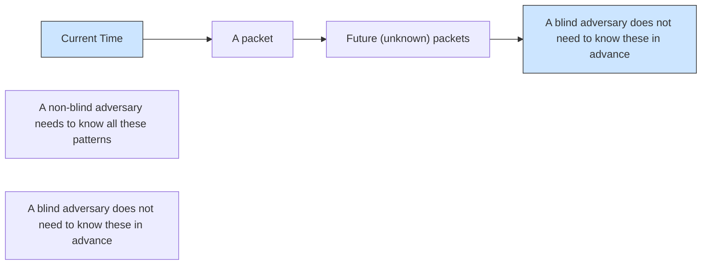
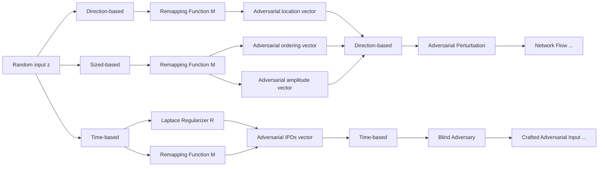
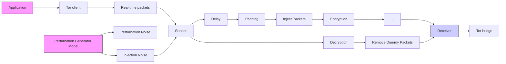

## Defeating DNN-Based Traffic Analysis Systems in Real-Time With Blind Adversarial Perturbations

Milad Nasr, Alireza Bahramali, and Amir Houmansadr, University of Massachusetts Amherst

https://www.usenix.org/conference/usenixsecurity21/presentation/nasr

This paper is included in the Proceedings of the 30th USENIX Security Symposium.

August 11–13, 2021

978-1-939133-24-3

Open access to the Proceedings of the 30th USENIX Security Symposium is sponsored by USENIX.

# Defeating DNN-Based Traffic Analysis Systems in Real-Time With Blind Adversarial Perturbations

Milad Nasr

Alireza Bahramali

Amir Houmansadr

University of Massachusetts Amherst

{milad, abahramali, amir}@cs.umass.edu

## Abstract

Deep neural networks (DNNs) are commonly used for various traffic analysis problems, such as website fingerprinting and flow correlation, as they outperform traditional (e.g., statistical) techniques by large margins. However, deep neural networks are known to be vulnerable to adversarial examples: adversarial inputs to the model that get labeled incorrectly by the model due to small adversarial perturbations. In this paper, for the first time, we show that an adversary can defeat DNN-based traffic analysis techniques by applying adversarial perturbations on the patterns of live network traffic.

Applying adversarial perturbations (examples) on traffic analysis classifiers faces two major challenges. First, the perturbing party (i.e., the adversary) should be able to apply the adversarial network perturbations on live traffic, with no need to buffering traffic or having some prior knowledge about upcoming network packets. We design a systematic approach to create adversarial perturbations that are independent of their target network connections, and therefore can be applied in real-time on live traffic. We therefore call such adversarial perturbations blind.

Second, unlike image classification applications, perturbing traffic features is not straight-forward as this needs to be done while preserving the correctness of dependent traffic features. We address this challenge by introducing remapping functions that we use to enforce different network constraints while creating blind adversarial perturbations.

Our blind adversarial perturbations algorithm is generic and can be applied on various types of traffic classifiers. We demonstrate this by implementing a Tor pluggable transport that applies adversarial perturbations on live Tor connections to defeat DNN-based website fingerprinting and flow correlation techniques, the two most-studied types of traffic analysis. We show that our blind adversarial perturbations are even transferable between different models and architectures, so they can be applied by blackbox adversaries. Finally, we show that existing countermeasures perform poorly against blind adversarial perturbations, therefore, we introduce a tailored countermeasure.

## 1 Introduction

Traffic analysis is the art of inferring sensitive information from the patterns of network traffic (as opposed to packet contents), in particular, packet timings and sizes. Traffic analysis is useful in scenarios where network traffic is encrypted, since encryption does not significantly modify traffic patterns. In particular, previous work has studied traffic analysis algorithms that either compromise the privacy of encrypted traffic (e.g., by linking anonymous communications [37, 50]) or enhance its security by fingerprinting malicious, obfuscated connections (e.g., stepping stone attacks [23, 37, 63]).

Recent advances in traffic analysis leverage deep neural networks (DNNs) to design classifiers that are significantly (in some cases, orders of magnitude) more efficient and more reliable than traditional traffic analysis techniques. In particular, the recent website fingerprinting work of Deep Fingerprinting [50] outperforms all prior fingerprinting techniques in classifying webpages, and the DeepCorr [37] flow correlation technique is able to link anonymized traffic flows with accuracies two orders of magnitude superior to prior flow correlation techniques. Given the increasing use of DNNs in traffic analysis applications, we ask ourselves the following question: can DNN-based traffic analysis techniques get defeated through adversarially perturbing —live—traffic patterns?

Note that adversarial perturbations is an active area of research in various image processing applications [10, 14, 18, 22, 31, 35, 36, 45, 54] (referred to as adversarial examples). However, applying adversarial perturbations on network traffic is not trivial, as it faces two major challenges. First, the perturbing entity, i.e., the adversary,1 should be able to apply his adversarial perturbations on live network traffic, without buffering the target traffic or knowing the patterns of upcoming network packets. This is because in most traffic analysis applications, as will be introduced, the adversary can not influence the generation of target traffic, but he can only intercept the packets of the target traffic and perturb them on the fly.

In this paper, we are the first to design techniques that adversarially perturb live network traffic to defeat DNN-based traffic classifiers; we call our approach blind adversarial perturbations. Our technique applies adversarial perturbations on live packets as they appear on the wire. The key idea of our adversarial perturbations algorithm is that it generates “blind” perturbations that are independent of the target inputs2 by solving specific optimization problems. We design adversarial perturbation mechanisms for the key features commonly used in traffic analysis applications: our adversarial perturbations include changing the timings and sizes of packets, as well as inserting dummy network packets.

The second challenge to applying adversarial perturbations on traffic analysis applications is that, any perturbation mechanism on network traffic should preserve various constraints of traffic patterns, e.g., the dependencies between different traffic features, the statistical distribution of timings/sizes expected from the underlying protocol, etc. This is unlike traditional adversarial example studies (in the context of image processing) that modify image pixel values individually. Therefore, one can not simply borrow techniques from traditional adversarial examples. We consequently design various remapping functions and regularizers, that we incorporate into our optimization problem to enforce such network constraints. As will be shown, in most scenarios the constraints are not differentiable, and therefore we carefully craft custom gradient functions to approximate their gradients.

Evaluations: Our blind adversarial perturbations algorithm is generic and can be applied to various types of traffic classifiers. We demonstrate this by implementing our techniques as a Tor pluggable transport [46], called BLANKET, and evaluating it on state-of-the-art website fingerprinting [3, 50] and flow correlation [37] techniques, the two most-studied types of traffic analysis. Our evaluations show that our adversarial perturbations can effectively defeat DNN-based traffic analysis techniques through small, live adversarial perturbations. For instance, our perturbations can reduce the accuracy of state-of-the-art website fingerprinting [3, 50] works by 90% by only adding 10% bandwidth overhead. Also, our adversarial perturbations can reduce the true positive rate of stateof-the-art flow correlation techniques [37] from 0.9 to 0.3 by applying tiny delays with a 50ms jitter standard deviation.

We also show that our blind adversarial perturbations are transferable between different models and architectures, which signifies their practical importance as they can be implemented by blackbox adversaries.

Countermeasures: We conclude by studying various countermeasures against our adversarial perturbations. We start by leveraging existing defenses against adversarial examples from the image classification literature and adapting them to the traffic analysis scenario. We show that such adapted defenses are not effective against our network adversarial perturbations as they do not take into account the specific constraints of traffic features. Motivated by this, we design a tailored countermeasure for our network adversarial perturbations, which we demonstrate to be more effective than the adapted defenses. The key idea of our countermeasure is performing adversarial training, and using our attack as a regularizer to train robust traffic analysis models.

## 2 Preliminaries

## 2.1 Problem Statement

Traffic analysis is to infer sensitive information from the patterns of network traffic, i.e., packet timings and sizes. Therefore, many works have investigated the use of traffic analysis in various scenarios where traffic contents are encrypted. In particular, traffic analysis has been used to compromise anonymity in anonymous communications systems through various types of attacks, specifically, website fingerprinting [3, 6, 19, 27, 40, 41, 47, 50, 51, 57–60], and flow correlation [12,23,24,33,37,38,38,49,53,64]. Traffic analysis has also been used to trace back cybercriminals who obfuscate their identifies through stepping stone relays [23, 24, 37, 63].

Our problem: Defeating DNN-based traffic analysis algorithms. The state-of-the-art traffic analysis techniques use deep neural networks to offer much higher performances than prior techniques. For instance, DeepCorr [37] provides a flow correlation accuracy of 96% compared to 4% of statisticalbased systems like RAPTOR [53] (in a given setting). Also, Var-CNN [3] leverages deep learning techniques to perform a website fingerprinting attack which achieves 98% accuracy in a closed-world setting. However, deep learning models are infamous for being susceptible to various adversarial attacks where the adversary adds small perturbations to the inputs to mislead the deep learning model. Such techniques are known as adversarial examples in the context of image processing, but have not been investigated in the traffic analysis domain. In this work, we study the possibility of defeating DNN-based traffic analysis techniques through adversarial perturbations.

In our setting, some traffic analysis parties use DNNbased traffic analysis techniques for various purposes, such as breaking Tor’s anonymity or detecting cybercriminals. On the other hand, the traffic analysis adversary(ies) aim at interfering with the traffic analysis process through adversarially perturbing traffic patterns of the connections they intercept. To do so, the traffic analysis adversary(ies) perturb the traffic patterns of the intercepted flows to reduce the accuracy of the DNN-based classifiers used by the traffic analysis parties. To further clarify the distinction between the players, in the flow correlation setting, the traffic analysis “party” can be a malicious ISP who aims at deanonymizing Tor users by analyzing their Tor connections; however, the traffic analysis “adversary”

can be some (benign) Tor relays who perturb traffic patterns of their connections to defeat potential traffic analysis attacks.

Challenges: Note that our problem resembles the setting of adversarial examples for image classification. However, applying adversarial perturbations on network traffic presents two major challenges. First, the adversaries should be able to apply adversarial perturbations on live network connections where the patterns of upcoming network packets are unknown to the adversaries. This is because in traffic analysis applications, the adversary is not in charge of generating traffic patterns. For instance, in the flow correlation scenario, the traffic analysis adversary is a benign Tor relay who intercepts and (slightly) perturbs the traffic generated by Tor users. The second challenge to applying network adversarial perturbations is that they should preserve the various constraints of network traffic, e.g., the dependencies of different traffic features.

Sketch of our approach: In this work, we design blind adversarial perturbations, a set of techniques to perform adversarial network perturbations that overcome the two mentioned challenges. To address the first challenge (applying on live traffic), we design blind perturbation vectors that are independent of their target connections, therefore, they can be applied on any (unknown) network flows. Figure 1 shows what is needed by our blind adversary compared to traditional (nonblind) perturbation techniques. Note that, the blind adversary may still need to know some generic information about its target network protocol (like the typical noise model, the distribution of typical packet sizes, etc.) as well as flow samples from the same underlying distribution (e.g., sample Tor flows), but she does not need to know the actual traffic packets that will arrive on the target connection to be perturbed. We generate such blind adversarial perturbations by solving a specific optimization problem. We address the second challenge (enforcing network constraints) by using various remapping functions and regularizers that adjust perturbed traffic features to follow the required constraints. Depending on the application, our perturbation technique may need to be deployed on multiple end-points, e.g., our BLANKET technique (Section 6.5) needs to be run on a Tor client and its corresponding Tor bridge, which use an out-of-band channel to exchange some parameters needed to collaboratively generate perturbations.

## 2.2 Threat Model

Our use of adversarial perturbations aim at defending “DNNbased” traffic analysis mechanisms only; therefore, non-DNN traffic analysis techniques, e.g., flow watermarks [23–25] and volume-based traffic classifiers [4], are out of our scope. Future work can look into combining our defense with defenses against such non-DNN mechanisms. Also, our work only considers DNN-based traffic analysis techniques that use traffic patterns (i.e., packet timing, sizes, and directions) for classification, but not those that use packet contents. Such pattern-based traffic analysis techniques (which are commonly [3,6,37,53,60,61] referred to as just traffic analysis) are increasingly popular and relevant as they work on encrypted network traffic. Therefore, malware classifiers that use packet content signatures are out of our scope Our adversarial perturbation techniques can be applied to any (pattern-based) traffic analysis technique that uses raw traffic features for its analysis, e.g., packet timings, inter-packet delays, directions, traffic volumes, packet counts, etc. This includes the majority of pattern-based traffic analysis systems [2,3,6,37,38,53,60,61]. On the other hand, our techniques may not be trivially applied on traffic analysis algorithms that use non-differentiable and irreversible functions of traffic features, like the hash of timings or entropy of packet contents; his represents a very small class of traffic analysis algorithms. Applying our techniques to such systems requires one to come up with specific remapping functions or approximated gradient functions.

flowchart

Figure 1: Unlike traditional adversarial perturbation techniques, our blind perturbation approach does not need to know the features of upcoming packets.

## 2.3 Adversary Model

Adversary’s knowledge of the target traffic. We assume the adversary has no prior knowledge about the patterns of upcoming network packets of the target connections to be perturbed. However, the adversary may need to know some generic statistical information about its target network protocol (e.g., the distribution of jitter), as well as the specifications of the target protocol (e.g., the format of Tor packets); such information is needed to ensure the applied perturbations are statistically and semantically undetectable.

Adversary’s knowledge of the model. We start with an adversary who has a white-box access to the target model to be defeated, i.e., he knows the target DNN model’s architecture and parameters (Section 4). Then, in Section 9 we extend our attack to a blackbox setting where the adversary has no knowledge of the target model’s architecture or parameters, by leveraging the transferability of our technique.

Adversary’s knowledge of the training data. We assume the adversary knows a set of samples from the same distribution as the training dataset of the target model. For example, in the website fingerprinting application the adversary can browse the target websites to be misclassified to obtain such training samples.

Attack’s target. We consider four types of attacks, i.e., ST-DT, ST-DU, SU-DT, and SU-DU, based on the adversary’s source and destination targets as defined below:

a) Destination-targeted/untargeted (DT/DU): We call the attack destination-targeted (DT) if the goal of the adversary is to make the model misclassify arbitrary inputs into a specific, target output class. On the other hand, we call the attack destination-untargeted (DU) if the goal is to misclassify inputs into arbitrary (incorrect) output classes.  
b) Source-targeted/untargeted (ST/SU): A source-targeted (ST) adversary is one whose goal is to have inputs from a specific input class misclassified by the traffic analysis model. By contrast, a source-untargeted (SU) adversary is one who aims at causing arbitrary inputs classes to get misclassified.

## 3 Background

## 3.1 Deep Learning

A deep neural network consists of a series of linear and nonlinear functions, known as layers. Each layer has a weight matrix $w _ { i }$ and an activation function. For a given input x, we denote the output of a DNN model by:

$$
f (\boldsymbol {x}) = f _ {n} ^ {w _ {n}} (f _ {n - 1} ^ {w _ {n - 1}} (\dots f _ {1} ^ {w _ {1}} (x 1 \boldsymbol {x}))) \dots)
$$

where $f _ { i } ^ { w _ { i } }$ is the i−th layer of the deep neural network (note that we use bold letters to represent vectors as in x). We focus on supervised learning, where we have a set of labeled training data. Let X be a set of data points in the target d-dimensional space, where each dimension represents one attribute of the input data points. We assume there is an oracle O which maps the data points to their labels. For the sake of simplicity, we only focus on classification tasks.

The goal of training is to find a classification model f that maps each point in X to its correct class in the set of classes, $Y .$ . To obtain $f ,$ one needs to define a lower-bounded, real-valued loss function $l ( f ( { \pmb x } ) , O ( { \pmb x } ) )$ that for each data point x measures the difference between $O ( { \pmb x } )$ and the model’s prediction $f ( { \pmb x } )$ .

Therefore, the loss function for f can be defined as:

$$
\mathrm{L} (f) = \underset {(\boldsymbol {x}, y) \sim \operatorname * {P r} (X, Y)} {\mathbb {E}} [ l (f (\boldsymbol {x}), y) ] \tag {1}
$$

and the objective of training is to find an f that minimizes this loss function. Since $\operatorname* { P r } ( X , Y )$ is not entirely available to the training entities, in practice, a set of samples from it, called the training set $D ^ { t r a i n } \subset X \times Y$ , is used to train the model [56]. Therefore, instead of minimizing (1), machine learning algorithms minimize the expected empirical loss of the model over its training set D:

$$
\mathrm{L} _ {D ^ {\text { train }}} (f) = \frac {1}{| D ^ {\text { train }} |} \sum_ {(\boldsymbol {x}, y) \in D ^ {\text { train }}} l (f (\boldsymbol {x}), y) \tag {2}
$$

Therefore, a deep neural network f is trained by tuning its weight parameters to minimize its empirical loss function over a (large) set of known input-output pairs $( x , y )$ . This is commonly performed using a variation of the gradient descent algorithm, e.g., back propagation [16].

## 3.2 Adversarial Examples

An adversarial example is an adversarially crafted input that fools a target classifier or regression model into making incorrect classifications or predictions. The adversary’s goal is to generate adversarial examples by adding minimal perturbations to the input data attributes. Therefore, an adversarial example $\pmb { x } ^ { * }$ can be crafted by solving the following optimization problem:

$$
\boldsymbol {x} ^ {*} = \boldsymbol {x} + \arg \min \{\boldsymbol {z}: O (\boldsymbol {x} + \boldsymbol {z}) \neq O (\boldsymbol {x}) \} = \boldsymbol {x} + \boldsymbol {\delta} _ {x} \tag {3}
$$

where x is a non-adversarial input sample,

${ \pmb { \delta } } _ { x }$ is the adversarial perturbation added to it, and $O ( \cdot )$ represents the true label of its input, as defined in the previous section. The adversary’s objective is to add a minimal perturbation ${ \pmb { \delta } } _ { x }$ to force the target model to misclassify the input x. Adversarial examples are commonly studied in image classification applications, where a constraint in finding adversarial examples is that the added noise should be imperceptible to the human eyes.

In this paper, we will investigate the application of adversarial examples on network connections with different imperceptibility constraints.

Previous works [14, 18, 32, 35] have suggested several ways to generate adversarial examples. The Fast Gradient Sign Method (FGSM) [18] algorithm generates an adversarial sample by calculating the following perturbation for a given model f and a loss function l:

$$
\boldsymbol {\delta} _ {x} = \varepsilon \times \operatorname{Sign} (\nabla_ {\boldsymbol {x}} l (f (\boldsymbol {x}), y)) \tag {4}
$$

where $\nabla _ { \pmb { x } } l ( f ( \pmb { x } ) , y )$ is the model’s loss gradient w.r.t. the input $x ,$ and the y is the input’s label. Therefore, the adversarial perturbation is the sign of the model’s loss gradient w.r.t. the input x and label y. Also, ε is a coefficient controlling the amplitude of the perturbation. Therefore, the adversarial perturbation in FGSM is the sign of model’s gradient. The adversary adds the perturbation to x to craft an adversarial example. Kurakin et al. [32] proposed a targeted version of FGSM, where the adversary’s goal is to fool the model to classify inputs as a desired target class (as opposed to any class in FGSM). Kurakin et al. also introduced an iterative method to improve the success rate of the generated examples. Dong et al. [14] showed that using the momentum approach can improve Kurkain et al.’s iterative method. Also, Carlini and Wagner [9] designed a set of attacks that can craft adversarial examples when the adversary has various norm constraints $( \mathrm { e . g . , } l _ { 0 } , l _ { 1 } , l _ { \infty } )$ . Other variations of adversarial examples [15, 52] have been introduced to craft adversarial examples that consider different sets of constraints or improve the adversary’s success rate. Moosavi-Dezfooli et al. [35] introduced universal adversarial perturbations where the adversary generates adversarial examples that are independent of the inputs.

## 3.3 Traffic Analysis Techniques

We overview the two major classes of traffic analysis techniques, which we will use to demonstrate our network adversarial perturbations.

Flow correlation: Flow correlation aims at linking obfuscated network flows by correlating their traffic characteristics, i.e., packet timings and sizes [2, 23, 37, 38]. In particular, the Tor anonymity system has been the target of flow correlation attacks, where an adversary aims at linking ingress and egress segments of a Tor connection by correlating traffic characteristics. Traditional flow correlation techniques mainly use standard statistical correlation metrics to correlate the vectors of flow timings and sizes across flows, in particular mutual information [12, 64], Pearson correlation [33, 49], cosine similarity [24, 38], and Spearman correlation [53]. More recently, Nasr et al. [37] design a DNN-based approach for flow correlation, called DeepCorr. They show that DeepCorr outperforms statistical flow correlation techniques by large margins.

Website Fingerprinting: Website fingerprinting (WF) aims at detecting the websites visited over encrypted channels like VPNs, Tor, and other proxies [3, 6, 19, 27, 40, 41, 47, 50, 51, 57–60]. The attack is performed by a passive adversary who monitors the victim’s encrypted network traffic, e.g., a malicious ISP or a surveillance agency. The adversary compares the victim’s observed traffic flow against a set of prerecorded webpage traces, to identify the webpage being browsed. Website fingerprinting differs from flow correlation in that the adversary only observes one end of the connection, e.g., the connection between a client and a Tor relay. Website fingerprinting has been widely studied in the context of Tor traffic analysis [3, 6, 19, 27, 40, 41, 47, 50, 51, 57, 59].

Various machine learning classifiers have been used for $\mathrm { W F , e . g . }$ ., using KNN [58], SVM [40], and random forest [19]. However, the state-of-the-art WF algorithms use Convolutional Neural Networks to perform website fingerprinting, i.e., Sirinam et al. [50], Rimmer et al. [47], and Bhat et al. [3].

Defenses: Note that our blind adversarial perturbations technique serves as a defense mechanism against traffic analysis classifiers (as it aims at fooling the underlying classifiers). The literature has proposed other defenses against website fingerprinting and flow correlation attacks [5, 11, 28, 61]. Similar to our work, such defenses work by manipulating traffic features, i.e., packet timings, sizes, and directions.

In Section 7.5, we compare the performance of our blind adversarial perturbations with state-of-the-art defenses, showing that our technique outperforms all of these techniques in defeating traffic analysis.

Also, note that some recent works have considered using adversarial perturbations as a defense against traffic analysis. In particular, Mockingbird [26] generates adversarial perturbations to defeat website fingerprinting, and Zhang et al. [62] apply adversarial examples to defeat video classification using traffic analysis. However, both of these works are non-blind, i.e., the adversary needs to know the patterns of the target flows in advance; therefore, we consider them to be unusable in typical traffic analysis scenarios. By contrast, our blind perturbation technique modifies live network connections.

## 4 Blind Adversarial Perturbations

In this section, we present the key formulation and algorithms for generating blind adversarial perturbations.

## 4.1 The General Formulation

We formulate the blind adversarial perturbations problem as the following optimization problem:

$$
\arg \min _ {\boldsymbol {\delta}} \forall \boldsymbol {x} \in D ^ {S}: f (\boldsymbol {x} + \boldsymbol {\delta}) \neq f (\boldsymbol {x}) \tag {5}
$$

where the objective is to find a (blind) perturbation vector, $\begin{array} { r } { \pmb { \delta } , } \end{array}$ such that when added to an arbitrary input from a target input domain $D ^ { S } .$ , it will cause the underlying DNN model $f ( . )$ to misclassify. In a source-targeted (ST) attack (see definitions in Section 2.3), $D ^ { S }$ contains inputs from a target class to be misclassified, whereas in a source-untargeted (SU) attack $D ^ { S }$ will be a large set of inputs from different classes.

Note that one cannot find a closed-form solution for this optimization problem since the target model $f ( . )$ is a nonconvex ML model, i.e., a deep neural network. Therefore, (5) can be formulated as follows to numerically solve the problem using empirical approximation techniques:

$$
\arg \max _ {\boldsymbol {\delta}} \sum_ {\boldsymbol {x} \in \mathcal {D} ^ {S}} l (f (\boldsymbol {x} + \boldsymbol {\delta}), f (\boldsymbol {x})) \tag {6}
$$

where l is the target model’s loss function and $\mathcal { D } ^ { S } \subset D ^ { S }$ is the adversary’s network training dataset.

Note that prior work by Moosavi-Dezfooli et al. [35] has studied the generation of universal adversarial perturbations for image recognition applications. We, however, take a different direction in generating blind perturbations: in contrast to finding a perturbation vector δ that maximizes the loss function in [35], we aim to find a perturbation generator model G. This generator model G will generate adversarial perturbation vectors when provided with a random trigger parameter z (we denote the corresponding adversarial perturbation as $\pmb { \delta } _ { z } = G ( z ) )$ ), i.e., we are able to generate different perturbations on different random $z ' \mathbf { s } .$ . Therefore, the goal of our optimization problem is to optimize the parameters of the perturbation generator model G (as opposed to optimizing a perturbation vector $\pmb { \delta }$ in [35]). Using a generator model increases the attack performance, as shown previously [1, 20] and validated through our experiments. Hence, we formulate our optimization problem as:

$$
\arg \max _ {G} \underset {z \sim \text { uniform } (0, 1)} {\mathbb {E}} \left[ \sum_ {\boldsymbol {x} \in \mathcal {D} ^ {S}} l (f (\boldsymbol {x} + G (z)), f (\boldsymbol {x})) \right] \tag {7}
$$

We can use existing optimization techniques (we have used Adam [29]) to solve this problem. In each iteration of training, our algorithm selects a batch from the training dataset and a random trigger z, then computes the objective function.

## 4.2 Incorporating Traffic Constraints

Studies of adversarial examples for image recognition applications [14, 18, 32, 35] simply modify image pixel values individually. However, applying adversarial perturbations on network traffic is much more challenging due to the various constraints of network traffic that should be preserved while applying the perturbations. In particular, inter-packet delays should have non-negative values; the target network protocol may need to follow specific packet size/timing distributions; packets should not be removed from a connection; and, packet numbers should get adjusted after injecting new packets.

One can add other network constraints depending on the underlying network protocol. We use remapping and regularization functions to enforce these domain constraints while creating blind adversarial perturbations. A remapping function adjusts the perturbed traffic patterns so they comply with some domain constraints. For example, when an adversary adds a packet to a traffic flow at position i, the remapping function should shift the indices of all consecutive packets.

We therefore reformulate our optimization problem by including the remapping function M :

$$
\arg \max _ {G} \underset {z \sim \text { uniform } (0, 1)} {\mathbb {E}} \left[ \sum_ {\boldsymbol {x} \in \mathcal {D} ^ {S}} l (f (\mathcal {M} (\boldsymbol {x}, G (z))), f (\boldsymbol {x})) \right] \tag {8}
$$

Moreover, we add a regularization term to the loss function so that the adversary can enforce additional constraints, as will be discussed. Therefore, the following is our complete optimization problem:

$$
\arg \max _ {G} \underset {z \sim \text { uniform } (0, 1)} {\mathbb {E}} [ (\sum_ {\boldsymbol {x} \in \mathcal {D} ^ {S}} l (f (\mathcal {M} (\boldsymbol {x}, G (z))), f (\boldsymbol {x}))) + \mathcal {R} (G (z)) ] \tag {9}
$$

We adjust (9) for a destination-targeted (DT) attack by replacing $l ( f ( \mathcal { M } ( \pmb { x } , G ( z ) ) ) , f ( \pmb { x } ) )$ with $- l ( f ( \mathcal { M } ( \pmb { x } , G ( z ) ) ) , O _ { T } )$ , where $O _ { T }$ is the target output class. Also, recall that for source-targeted attacks, $\mathbf { \bar { \boldsymbol { \mathbf { \phi } } } } _ { \mathcal { D } } \mathbf { \boldsymbol { s } }$ contains samples only from the target classes.

## 4.3 Overview of The Algorithm

Algorithm 1 summarizes our approach to generate blind adversarial perturbations (Figure 2 illustrates the main components of our algorithm). In each iteration, Algorithm 1 computes the gradient of the objective function w.r.t. the blind perturbation for given inputs, and optimizes it by moving in the direction of the gradient. The algorithm enforces domain constraints using various remapping and regularization functions. We use the iterative mini-batch stochastic gradient ascent [16] technique.

Algorithm 1 Generating Blind Adversarial Perturbations  
$\mathcal{D}^{S} \leftarrow$ adversary training data $f \leftarrow$ target model $\mathcal{L}_{f} \leftarrow$ target model loss function $\mathcal{M} \leftarrow$ domain remapping function $\mathcal{R} \leftarrow$ domain regularizations function $G(z) \leftarrow$ initialize the blind adversarial perturbation model parameters ( $\theta_{G}$ ) $T \leftarrow$ epochs
DT $\leftarrow$ the destination target class or false o.w.
ST $\leftarrow$ the source target classes or false o.w.
for epoch $t \in \{1 \cdots T\}$ do
    for all mini-batch $b_{i}$ in $\mathcal{D}^{S}$ do
    if ST then $b_{i} \leftarrow$ select instances only with the ST class label
    end if $z \sim$ Uniform
    if DT then $J = -(\frac{1}{|b_{i}|}\sum_{x\in b_{i}}l(f(\mathcal{M}(x,G(z))),f(x))) + \mathcal{R}(G(z))$ else $J = (\frac{1}{|b_{i}|}\sum_{x\in b_{i}},l(f(\mathcal{M}(x,G(z))),\mathrm{DT})) + \mathcal{R}(G(z))$ end if
    Update $G$ to minimize $J$ end for
end for
return $G$

## 5 Perturbation Techniques

The (pattern-based) traffic analysis literature uses three main features for building traffic analysis classifiers: 1) packet timings [3, 37], 2) packet sizes [37], and 3) packet directions [3, 47, 50, 58]. Our blind adversarial perturbation technique leverages these features to adversarially perturb traffic. These features can be modified either by delaying packets, resizing packets, or injecting new (dummy) packets (dropping packets is not an option as it will break the underlying applications). We describe how we perform such perturbations.

## 5.1 Manipulating Existing Packets

The adversary can modify the timings and sizes (but not the directions) of existing packets of a target network connection. We present a network connection as a vector of features: $\pmb { F } = [ f _ { 1 } , f _ { 2 } , \cdots , f _ { n } ]$ , where $f _ { i }$ can represent the size, timing, direction, or a combination of these features for the ith packet. The adversary designs a blind adversarial perturbation model $G ,$ as introduced in Section 4, such that it outputs a perturbation vector $G ( z ) = [ g _ { 1 } , g _ { 2 } , \cdots , g _ { n } ]$ with the same size as F .

flowchart

Figure 2: The block diagram of our blind adversarial perturbation technique

The adversary adds $G ( z )$ to the original traffic patterns as packets arrive, so $\pmb { F } ^ { p } = \pmb { F } + G ( z ) = [ f _ { 1 } + g _ { 1 } , f _ { 2 } + g _ { 2 } , \cdots , f _ { 1 } + g _ { n } ]$ is the patterns of the perturbed connection. The main challenge is that the perturbed traffic features, $\pmb { F } ^ { p }$ , should not violate the domain constraints of the target network application.

Perturbing timings: We first introduce how the timing features can be perturbed. We use inter-packet delays (IPDs) to represent the timing information of packets. An important constraint on the timing features is that the adversary should not introduce excessive delays on the packets as excessive delays will either interfere with the underlying application $( \mathrm { e . g . }$ , Tor relays are not willing to introduce large latencies) or give away the adversary. We control the amount of delay added by the adversary by using a remapping function $\mathcal { M } ^ { T }$ as follows:

$$
\mathcal {M} ^ {T} (\boldsymbol {x}, G (z), \mu , \sigma) = \boldsymbol {x} +
$$

$$
\frac {G (z) - \max (\overline {{{{G (z)}}}} - \mu , 0) - \min (\overline {{{{G (z)}}}} + \mu , 0)}{\operatorname{std} (G (z))} \min (\operatorname{std} (G (z)), \sigma) \tag {10}
$$

where $\overline { { G ( z ) } }$ is the mean of perturbation $G ( z )$ , and $\mu$ and σ are the maximum allowed average and standard deviation of the delays, respectively. Using this remapping function, we can govern the amount of latency added to the packets.

A second constraint on timing features is that the perturbed timings should follow the statistical distributions expected from the target protocol. Towards this, we leverage a regularizer $\mathcal { R }$ to enforce the desired statistical behavior on the blind perturbations. Our regularizer enforces a Laplacian distribution for network jitters, as suggested by prior work [38], but it can enforce arbitrary distributions. To do this, we use a generative adversarial network (GAN) [17]: we design a discriminator model $D ( G ( x ) )$ ) which tries to distinguish the generated perturbations from a Laplace distribution. Then, we use this discriminator as our regularizer function to make the distribution of the crafted perturbations similar to a Laplace distribution. We simultaneously train the blind perturbation model and the discriminator model. This is summarized in Algorithm 2.

Algorithm 2 GAN-based timing regularizer  
$\mathcal{D}^{S} \leftarrow$ adversary training data $f \leftarrow$ target model $G \leftarrow$ blind adversarial perturbation model $D \leftarrow$ discrimination model $\mu, b \leftarrow$ target desired Laplace distribution parameters
for $t \in \{1, 2, \cdots, T\}$ do $z' \sim \text{Lapace}(\mu, b)$ $z \sim \text{Uniform}()$ train $D$ on $G(z)$ with label 1 and $z'$ with label 0
    train $G$ on $\mathcal{D}^{S}$ using regularizer $D$ end for
return $z$

Algorithm 3 Size remapping function  
$a \leftarrow G(z)$ $\boldsymbol{x} \leftarrow$ training input $N \leftarrow$ maximum sum of added sizes $n \leftarrow$ maximum added size to each packet $s \leftarrow$ cell sizes
for $i$ in argsort(-a) do
    if $N \leq 0$ then
    break
    end if $\delta = \lfloor \min(s \frac{a[i]}{s}, n, N) \rfloor$ $N = N - \delta$ $\boldsymbol{x}[i] = \boldsymbol{x}[i] + \delta$ end for
return $\boldsymbol{x}$

Perturbing sizes: An adversary can perturb packet sizes by increasing packets sizes (through appending dummy bits). However, modified packet sizes should not violate the expected maximum packet size of the underlying protocol as well as the expected statistical distribution of the sizes. For instance, Tor packets are expected to have certain packet sizes.

We use the remapping function $\mathcal { M } ^ { S } .$ , as shown in Algorithm 3, to adjust the amplitude of size modifications as well as to enforce the desired statistical distributions. The input to Algorithm 3 is the blind adversarial perturbation $( G ( z ) )$ , the desired maximum bytes of added traffic (N), the desired maximum added bytes to a single packet (n), and the expected packet size distribution of the underlying network protocol (s) (if the network protocol does not have any specific size constraints, then $s = 1 )$ . Algorithm 3 starts by selecting the highest values from the output of the adversarial perturbations and adds them to the traffic flows up to N bytes. Since Algorithm 3 is not differentiable, we cannot simply use Algorithm 1. Instead, we define a custom gradient function for Algorithm 3 which allows us to train the blind adversarial perturbation model. Given the gradient of the target model’s loss w.r.t. the output of Algorithm 3 (i.e., $\nabla _ { \pmb { x } } \mathcal { M } ^ { S } ( \pmb { x } , G ( z ) ) ,$ ), we modify the perturbation model’s gradient as:

Algorithm 4 Packet insertion remapping function  
$l \leftarrow G(z)$ $x \leftarrow$ training input $n \leftarrow$ number of added packets

p = position of top n absolute values of l

for i in p do

    insert +1 if $l[i] > 0$ , otherwise -1 to x at position i and shift other features

end for

return x

$$
\nabla_ {G (z)} = \sum_ {\boldsymbol {x} \in b _ {i}} \nabla_ {\boldsymbol {x}} \mathcal {M} ^ {S} (\boldsymbol {x}, G (z)) \tag {11}
$$

where $b _ { i }$ is the selected training batch. We do not need regularization for packet sizes.

## 5.2 Injecting Adversarial Packets

In addition to perturbing the features of existing packets, the adversary can also inject dummy packets with specific sizes and at specific times into the target connection to be perturbed (note that a dummy packet is created by injecting random data into the application layer of TCP, which will be encrypted by the transport layer). The goal of our adversary is to identify the most adversarial timing and size values for the injected packets. We design a remapping function $\mathcal { M } ^ { I }$ (Algorithm 4) that obtains the ordering of injected packets as well as their feature values. Similar to the previous attack, Algorithm 4 is not differentiable and we cannot simply use it for Algorithm 1. Instead, we use a custom gradient function for Algorithm 4 which allows us to train our blind adversarial perturbation model. We define the gradient function for different types of features as described in the following.

Injecting adversarial directions: While an adversary cannot change the directions of existing packets, she can inject adversarial directions by adding packets. A connection’s packet directions can be represented as a series of -1 (downstream) and +1 (upstream) values. However, generating adversarial perturbations with binary values is not straightforward.

Algorithm 5 Value Vector Gradient  
$l, a \leftarrow G(z)$ $\nabla \mathcal{M}(\boldsymbol{x}, G(z)) \leftarrow \text{gradient w.r.t. } \mathcal{M}(\boldsymbol{x}, G(z))$ $\nabla G(z) \leftarrow \overrightarrow{\mathbf{0}}$ $n \leftarrow \text{number of added packets}$ $p = \text{position of top } n \text{ values of } l$ $\textbf{for } i \text{ in } p \textbf{ do}$ $\nabla G(z)[i] = \nabla \mathcal{M}(x, G(z))[i]$ $\textbf{end for}$ $\textbf{return } \nabla G(z)$

We generate a perturbation vector $G ( z )$ with the same size as the target connection. Each element of this vector shows the effect of inserting a packet at that specific position (i.e., l in Algorithm 4). We select positions with largest absolute values for packet injection; the sign of the selected position determines the direction of the injected packet. Finally, we modify the perturbation model’s gradient as:

$$
\nabla_ {G (z)} = \sum_ {\boldsymbol {x} \in b _ {i}} \nabla_ {\boldsymbol {x}} \mathcal {M} ^ {I} (\boldsymbol {x}, G (z)) \tag {12}
$$

Injecting adversarial timings/sizes: Unlike packet directions, for the timing and size features, we need to learn both the positions and the values of the added packets simultaneously. We design the perturbation generation model to output two vectors for the locations and the values of the added packets, where the value vector represents the selected feature (timing or sizes). We use the gradient function defined in (12) for the position of the inserted packets. We use Algorithm 5 to compute the gradients for the values of the inserted packets.

Injecting multiple adversarial features: To inject packets that simultaneously perturb several features, we modify the perturbation generation model G to output one vector for the position of the injected packets and one for each feature set to be perturbed. We use Algorithm 5 to compute the gradient of each vector. Moreover, we cannot use (12) to compute the gradient for the position vector, therefore, we take the average between the gradient of all different input feature vectors.

## 6 Experimental Setup

Here we discuss the setting of our experiments as well as the design of a Tor pluggable transport that implements our techniques. Our DNN techniques are implemented using Py-Torch [44] and our pluggable transport is implemented in Python.

## 6.1 Metrics

For a given blind adversarial perturbation generator $G ( \cdot )$ and test dataset $\mathcal { D } _ { t e s t }$ , we define the attack success metric as:

$$
\mathcal {A} = \left\{ \begin{array}{l l} \frac {1}{| \mathcal {D} _ {\text { test }} |} \sum_ {(\boldsymbol {x}, y) \in \mathcal {D} _ {\text { test }}} \mathbb {1} [ f (\boldsymbol {x} + G (z)) \neq y ] & \quad \mathrm{DU} \\ \frac {1}{| \mathcal {D} _ {\text { test }} |} \sum_ {(\boldsymbol {x}, y) \in \mathcal {D} _ {\text { test }}} \mathbb {1} [ f (\boldsymbol {x} + G (z)) = t ] & \quad \mathrm{DT} \end{array} \right. \tag {13}
$$

where DU and DT represent destination-untargeted and targeted attack scenarios, respectively (as defined in Section 2.3). For source-targeted (ST) cases, $\mathcal { D } _ { t e s t }$ contains instances only from the target source class. Also, in our evaluations of the targeted attacks (ST and DT), we only report the results for target classes with minimum and maximum attack accuracies. For example, “Max ST-DT” indicates the best results for the source and destination targeted attacks, and we present the target classes using the TargetDest ← TargetSrc notation, which means class TargetDest is the targeted destination class and TargetSrc is the targeted source class. The maximum accuracy shows the worst case scenario for the target model and the minimum accuracy shows the lower bound on the adversary’s success rate. If there are multiple classes that lead to a max/min accuracy, we only mention one of them.

Note that while we can use A to evaluate attack success in various settings, for the flow correlation experiments we use a more specific metric (as there are only two output classes for a flow correlation classifier). Specifically, we use the reduction in true positive and false positive rates of the target flow correlation algorithm to evaluate the success of our attack.

## 6.2 Target Systems

We demonstrate our attack on three state-of-the-art DNNbased traffic analysis systems.

DeepCorr: DeepCorr [37] is the state-of-the-art flow correlation system, which uses deep learning to learn flow correlation functions for specific network settings like that of Tor. Deep-Corr uses inter-packet delays (IPDs) and sizes of the packets as the features. DeepCorr uses Convolutional neural networks to extract complex features from the raw timing and size information, and it outperforms the conventional statistical flow correlation techniques by significant margins. Since Deep-Corr uses both timings and sizes of packets as the features, we apply the time-based and size-based attacks on DeepCorr.

As mentioned earlier, non-blind adversarial perturbations [26, 62] are useless in the flow correlation setting, as the adversary does not know the features of the upcoming packets in a target connection. Hence, our blind perturbations are applicable in this setting.

Var-CNN: Var-CNN [3] is a deep learning-based website fingerprinting (WF) system that uses both manual and automated feature extraction techniques to be able to work with even small amounts of training data. Var-CNN uses ResNets [21] with dilated casual convolutions, the state-of-the-art convolutional neural network, as its base structure. Furthermore, Var-CNN shows that in contrast to previous WF attacks, combining packet timing information (IPDs) and direction information can improve the performance of the WF adversary. In addition to packet IPDs and directions, Var-CNN uses cumulative statistical information for features of network flows. Therefore, Var-CNN combines three different models, two ResNet models for timing and direction information, and one fully connected model for metadata statistical information as the final structure. Var-CNN considers both closed-world and open-world scenarios.

Similar to the setting of flow correlation, a WF adversary will not be able to use traditional (non-blind) adversarial perturbations [26, 62], as she will not have knowledge on the patterns of upcoming packets in a targeted connection. Therefore, WF is a trivial application for blind perturbations. Since Var-CNN uses both IPD and packet direction features for fingerprinting, we use both timing-based and direction-based techniques to generate our adversarial perturbations.

Deep Fingerprinting (DF): Deep Fingerprinting (DF) [50] is a deep learning based WF attack which uses CNNs to perform WF attacks on Tor. DF deploys automated feature extraction, and uses the direction information for training. In contrast to Var-CNN, DF does not require handcrafted features of packet sequences. Similar to Var-CNN, DF considers both closed-world and open-world scenarios. Sirinam et al. [50] show that DF outperforms prior WF systems in defeating WF defenses of WTF-PAD [28] and W-T [61].

Codes. As we perform our attack in PyTorch, we use the original code of DeepCorr, DF, and Var-CNN models and convert them from TensorFlow to PyTorch. We then train these models using the datasets of those papers.

## 6.3 Adversary Setup and Models

While our technique can be applied to any traffic analysis setting, we present our setup for the popular Tor application.

Adversary’s Interception Points Our adversary has the same placement as traditional Tor traffic analysis works [47, 50, 59–61]. For the WF scenario, we assume the adversary is manipulating the traffic between a Tor client and the first Tor hop, i.e., a Tor bridge [13] or a Tor guard relay. Therefore, our blind adversarial perturbation can be implemented as a Tor pluggable transport [46], in which case the blind perturbations are applied by both the Tor client software and the Tor bridge. In the flow correlation setting, similar to the literature, traffic manipulations are performed by Tor entry and exit relays (since flow correlation attackers intercept both egress and ingress Tor connections). In our evaluations, we show that even applying our blind adversarial perturbations on only ingress flows is enough to defeat flow correlation attacks, i.e., the same adversary placement as the WF setting.

Adversarial Perturbation Models As mentioned in Section 4, we design a deep learning model to generate blind adversarial noises. For each type of perturbation, the adversarial model is a fully connected model with one hidden layer of size 500 and a ReLu activation function. The parameters of the adversarial model are presented in Table 1. The input and output sizes of the adversarial model are equal to the length of features in the target flow. In the forward function, the adversarial model takes in a given input, manipulates it based on the attack method, and output a crafted version of the input. In each iteration of training, we update the parameters of the adversarial model based on the loss functions introduced in Section 4. We use Adam optimizer to learn the blind noise with a learning rate of 0.001.

Table 1: Tuned parameters of the adversarial models and discriminator model

<table><tr><td>Model</td><td># H-layers</td><td>Size</td><td>Optimizer</td><td>LR</td><td>Activation</td></tr><tr><td>Direction-based</td><td>1</td><td>[500]</td><td>Adam</td><td> $10^{-3}$ </td><td>ReLU</td></tr><tr><td>Time-based</td><td>1</td><td>[500]</td><td>Adam</td><td> $10^{-3}$ </td><td>ReLU</td></tr><tr><td>Size-based (ordering)</td><td>1</td><td>[500]</td><td>Adam</td><td> $10^{-3}$ </td><td>ReLU</td></tr><tr><td>Size-based (amplitude)</td><td>1</td><td>[500]</td><td>Adam</td><td> $10^{-3}$ </td><td>ReLU</td></tr><tr><td>Discriminator</td><td>2</td><td>[1000, 1]</td><td>Adam</td><td> $10^{-4}$ </td><td>ReLU</td></tr></table>

Discriminator Model As mentioned in Section 4, we use a GAN model to enforce the time constraints of our modified network flows. To do so, we design a fully-connected discriminator model containing two hidden FC layers of size 1000. The parameters of the discriminator model are presented in Table 1. The input and output sizes of this model are equal to the sizes of the blind adversarial noise. In the training process, we use Adam optimizer with a learning rate of 0.0001 to learn the discriminator model.

## 6.4 Datasets

We use the following datasets to create network flows for our experiments; these are the largest publicly available datasets for our target applications.

Tor Flow Correlation Dataset For flow correlation experiments, we use the publicly available dataset of DeepCorr [37], which contains 7000 flows for training and 500 flows for testing. These flows are captured Tor flows of top Alexa’s websites and contain timings and sizes of each of them. These flows are then used to create a large set of flow pairs including associated flow pairs (flows belonging to the same Tor connection) and non-associated flow pairs (flows belonging to arbitrary Tor connections). Each associated flow pair is labeled with 1, and each non-associated flow pair with 0.

Tor Website Fingerprinting Datasets Var-CNN uses a dataset of 900 monitored sites each with 2,500 traces. These sites were compiled from the Alexa list of most popular websites. Var-CNN is fed in with different sets of features representing a given trace; the direction-based ResNet model takes a set of 1’s and -1’s as the direction of each packet such that 1 shows an outgoing packet and -1 represents an incoming packet. The time-based ResNet uses the IPDs of the traces as features. The metadata model takes in seven float numbers as the statistical information of the traces. To be consistent with previous WF attacks [47, 50, 59, 60], we use the first 5000 values of a given trace for both direction and time features.

DF uses a different dataset than Var-CNN. For the closedworld setting, they collected the traces of 95 top Alexa websites with 1000 visits for each. DF uses the same representation as Var-CNN for direction information of the packets. Since CNNs only take in a fixed length input, DF considers the first 5000 values of each flow.

## 6.5 The BLANKET Tor Pluggable Transport

To demonstrate the deployability of our techniques, we apply our adversarial perturbations on live Tor Traffic. Specifically, we have implemented our adversarial perturbation techniques as a Tor pluggable transport [46], which we call BLANKET.3 We use BLANKET to perturb Tor connections generated using the datasets introduced above for different target systems. To enforce its timing indistinguishability constraint, BLAN-KET needs to measure the jitter of its client. The goal of BLANKET is to defeat DNN-based traffic analysis attacks (particularly, website fingerprinting and flow correlation) on Tor connections by applying adversarial perturbations on live Tor connections. We have implemented our pluggable transport in Python using the Twisted framework, which is available at https://github.com/SPIN-UMass/BLANKET. BLANKET has two phases of operation.

Session initialization: Like other pluggable transports, BLANKET needs to be installed both by a Tor client and the Tor bridge she is connected to it. At the beginning of each session, the client and the bridge will negotiate a set of adversarial noise vectors (created using the generator function G by the client) that they will use for traffic perturbation (the noise vector includes the timing and the sizes of the packets needed for perturbation), as well as a pair of AES keys to encrypt traffic (similar to other pluggable transports). This negotiation can be integrated into Tor’s regular client-bridge handshaking, or alternatively exchanged through out-of-band channels (e.g., email, a domain-fronted server, etc.). The current implementation of BLANKET negotiates out of band.

Traffic perturbation: Figure 3 shows how BLANKET modifies live Tor connections to apply our our adversarial perturbations introduced in Section 4. Specifically, BLANKET applies two types of perturbations: it perturbs the timings/sizes of existing packets (on-the-fly) or injects new (dummy) packets into the flow. To inject dummy packets, BLANKET simply adds the new packets with their specific timing/sizes in the transport layer; this keeps the underlying protocols (TCP/IP) unmodified and semantically correct. On the receiver side of our pluggable transport, the transport layer will remove the injected dummy packets before passing them to the upstream application (e.g., the next Tor relay); as a result the upstream packets will also remain unmodified and semantically correct. To perturb an existing packet on-the-fly, BLANKET changes the timing and sizes of the packets as follows: to change the size of a packet, the sender’s BLANKET will pad that packet with random bytes, which are removed by the receiver’s BLANKET (note that both the sender and the receiver know the exact index of the padded and dummy packets as the perturbation vectors are shared between them during the initialization process). Similar to padding, manipulating packet sizes does not impact the correctness of the underlying and higher protocols as this is performed at the transport layer.

flowchart

Figure 3: Overview of our BLANKET Tor pluggable transport, which applies blind adversarial perturbations on live Tor connections (the figure only shows the client-to-bridge operations; bridge-to-client operations work similarly).

Note that, similar to state-of-the-art pluggable transports like obfs [39], all packet contents are encrypted using the AES keys negotiated during initialization; therefore, as long as the encryption protocol is secure, it is not possible to distinguish BLANKET’s dummy or padded packets from benign Tor.

Finally, packet timings are modified by delaying the packets by the sender’s BLANKET. Our timing perturbations do not affect the correctness of the underlying/upstream protocols, since the perturbations are in the order of milliseconds, significantly smaller than the timeout values in both TCP/IP and HTTP/S (or Tor) protocols (in the order of seconds).

## 7 Experiment Results

We use BLANKET to evaluate our blind adversarial perturbations against the target systems of Section 6.2 using each of the three key traffic features and their combinations. We also compare our attack with traditional attacks.

Computation costs: Our perturbation model, G, is trained offline and before being used to perturb live connections; therefore, training the perturbation model does not introduce any runtime overheads. Also, note that G only needs to be generated once for each installation; it takes 5 hours to train G on our NVIDIA TITAN X GPU.

## 7.1 Adversarially Perturbing Directions

As explained in Section 4, an adversary cannot change the directions of existing packets, but he can insert packets with adversarial directions. We evaluated our attack for different adversary settings and strengths against Var-CNN [3] and DF [50] (which use direction features). We used 10 epochs and Adam optimizer to train the blind adversarial perturbations model with a learning rate of 0.001. Tables 2 and 3 show the success of our attack (using A in (13)) on DF and Var-CNN, respectively, when they only use packet directions as their features. As can be seen, both DF and Var-CNN are highly vulnerable to adversarial perturbation attacks when the adversary only injects a small number of packets. Specifically, we were able to generate targeted perturbations that misclassify every input into a target class with only 25% bandwidth overhead.

## 7.2 Adversarially Perturbing Timings

We consider two scenarios for generating adversarial timing perturbations: with and without an invisibility constraint. In both scenarios, we limited the adversaries’ power such that the added noise to the timings of the packets has a maximum mean and standard deviation as explained in Section 4. For the invisibility constraint, we force the added noise to have the same distribution as natural network jitter, which follows a Laplace distribution [37]. The detailed parameters of our model are presented in Table 1.

Figure 4 shows the performance of our attack against Deep-Corr when the adversary only manipulates the timings of packets. As expected, Figures 4a and 4b show that increasing the strength (mean or standard deviation) of our blind noise results in better performance of the attack, but even a perturbation with average 0 and a tiny standard deviation of 50ms significantly reduces the true positive of DeepCorr from 95% to 55%.

Also, we can create effective adversarial perturbations with high invisibility: Figure 5 shows the histogram of the generated timing perturbations, with parameters $\mu = 0 , \sigma =$ 30ms, learned under an invisibility constraint forcing it to follow a Laplace distribution. For this invisible noise, Figure 4c compares the performance of timing perturbations on Deep-Corr with different attack strengths; it also shows the impact of arbitrary Laplace distributed perturbations on DeepCorr.

We also apply our timing perturbations on Var-CNN. Table 4 shows our attack success (A) with and without an invisibility constraint. We realize that timing perturbations have much larger impacts on Var-CNN than direction perturbations. Moreover, as expected, in the untargeted scenario (SU-DU) and for different bandwidth overheads, our attack has better performance without the invisibility constraint. However, even with an invisibility constraint, our attack reduces the accuracy of Var-CNN drastically, i.e., a blind timing perturbation with an average 0 and a tiny standard deviation of 20ms reduces the accuracy of Var-CNN by 89.6%.

Table 2: Direction perturbation attack on DeepFingerprinting [50] WF scheme (92% WF accuracy)

<table><tr><td> $\alpha$ </td><td>Bandwith Overhead (%)</td><td>SU-DU (%)</td><td>Max ST-DU (#, %)</td><td>Min ST-DU (#, %)</td><td>Max SU-DT (#, %)</td><td>Min SU-DT (#, %)</td><td>Max ST-DT (#←#, %)</td><td>Min ST-DT (#←#, %)</td></tr><tr><td>20</td><td>0.04</td><td>24.2</td><td>-,100.0</td><td>-,0.0</td><td>77,31.9</td><td>4,0.1</td><td>-,100.0</td><td>-,0.0</td></tr><tr><td>100</td><td>2.04</td><td>49.6</td><td>-,100.0</td><td>47,0.0</td><td>34,77.6</td><td>89,13.2</td><td>-,100.0</td><td>-,0.0</td></tr><tr><td>500</td><td>11.11</td><td>91.8</td><td>-,100.0</td><td>49,4.0</td><td>92,97.1</td><td>82,47.8</td><td>-,100.0</td><td>23 ← 69,0.1</td></tr><tr><td>1000</td><td>25.0</td><td>95.7</td><td>-,100.0</td><td>21,29.0</td><td>-,100.0</td><td>10,67.0</td><td>-,100.0</td><td>72 ← 47,4.4</td></tr><tr><td>2000</td><td>66.66</td><td>97.7</td><td>-,100.0</td><td>48,94.7</td><td>-,100.0</td><td>37,89.4</td><td>-,100.0</td><td>78 ← 60,35.4</td></tr></table>

Table 3: Direction perturbation attack on Var-CNN [3] WF scheme (93% WF accuracy)

<table><tr><td> $\alpha$ </td><td>Bandwidth Overhead (%)</td><td> $\mathcal{A}$ :</td><td>SU-DU (%)</td><td>Max ST-DU (#, %)</td><td>Min ST-DU (#, %)</td><td>Max SU-DT (#, %)</td><td>Min SU-DT (#, %)</td><td>Max ST-DT (#←#, %)</td><td>Min ST-DT (#←#, %)</td></tr><tr><td>20</td><td>0.04</td><td></td><td>76.1</td><td>-, 100.0</td><td>-, 0.0</td><td>2,68.3</td><td>8,53.2</td><td>-, 100.0</td><td>-, 0.0</td></tr><tr><td>100</td><td>2.04</td><td></td><td>80.3</td><td>-, 100.0</td><td>-, 100.0</td><td>4,76.5</td><td>2,66.8</td><td>-, 100.0</td><td>-, 0.0</td></tr><tr><td>500</td><td>11.11</td><td></td><td>96.8</td><td>-, 100.0</td><td>-, 100.0</td><td>3,98.9</td><td>9,81.7</td><td>-, 100.0</td><td>-, 10.0</td></tr><tr><td>1000</td><td>25.0</td><td></td><td>98.2</td><td>-, 100.0</td><td>-, 100.0</td><td>-, 100.0</td><td>0,96.6</td><td>-, 100.0</td><td>-, 20.0</td></tr><tr><td>2000</td><td>66.66</td><td></td><td>99.0</td><td>-, 100.0</td><td>-, 100.0</td><td>-, 100.0</td><td>8,97.6</td><td>-, 100.0</td><td>-, 30.0</td></tr></table>

## 7.3 Adversarially Perturbing Sizes

We evaluate our size perturbation attack on DeepCorr, which is the only system (among the three we studied) that uses packet sizes for traffic analysis. As DeepCorr is mainly studied in the context of Tor, our perturbation algorithm enforces the size distribution of Tor on the generated size perturbations. Figure 6 shows the results when the adversary only manipulates packet sizes. As can be seen, size perturbations are less impactful on DeepCorr than timing perturbations, suggesting that DeepCorr is more sensitive to the timings of packets.

## 7.4 Perturbing Multiple Features

In this section, we evaluate the performance of our adversarial perturbations when we perturb multiple features simultaneously. Var-CNN uses both packet timing and directions to fingerprint websites. Table 5 shows the impact of adversarially perturbing both of these features on Var-CNN; we see that combining perturbation attacks increases the impact of the attack, e.g., in the untargeted scenario (SU-DU), the combination of both attacks with parameters α = 100,µ = $0 , \sigma = 1 0 m s$ results in an attack success of $\mathcal { A } = 8 3 . 9 \%$ while the time-based and direction-based perturbations alone result in $\mathcal { A } = 6 8 . 1 \%$ and $\mathcal { A } = 8 0 . 3 \%$ , respectively. Similarly, in Figure 7, we see that by combining time and size perturbations, the accuracy of DeepCorr drops from 95% to 59% (with $F P = 1 0 ^ { - 3 } )$ by injecting only 20 packets, while using only time perturbations the accuracy drops to 78%.

## 7.5 Comparison With Traditional Attacks

There exist traditional attacks on DNN-based traffic analysis systems that use techniques other than adversarial perturbations. In this section, we compare our adversarial perturbation attacks with such traditional approaches.

Packet insertion techniques: Several WF countermeasures work by adding new packets. We show that our adversarial perturbations are significantly more effective with similar overheads. WTF-PAD [28] is a state-of-the-art technique which adaptively adds dummy packets to Tor traffic to evade website fingerprinting systems. Using WTF-PAD on the DF dataset reduces the WF accuracy to 3% at the cost of a 64% bandwidth overhead. Similarly, the state-of-the-art Walkie-Talkie [61] reduces DF’s accuracy to 5% with a 31% bandwidth overhead and a 36% latency overhead [50]. On the other hand, our injection-based targeted blind adversarial attack reduces the detection accuracy to 1% (close to random guess) with only a 25% bandwidth overhead and no added latency (using the exact same datasets). To compare existing WF countermeasures with our results while using Var-CNN model, we refer to their paper [3] where WTF-PAD can decrease the accuracy of Var-CNN by 0.4% (from 89.2% to 88.8%) with 27% bandwidth overhead. However, according to Table 3, with a similar bandwidth overhead (1000 inserted packets and 25% overhead), our attack reduces the accuracy by 91.6% which significantly outperforms WTF-PAD. Our results suggest that, our blind adversarial perturbation technique drastically outperforms traditional defenses against deep learning based website fingerprinting systems.

Time perturbation techniques: Figure 4c compares our technique with a naive countermeasure of adding random Laplacian noise to packet timings. We see that by adding a Laplace noise with zero mean and 20ms standard deviation, the accuracy of DeepCorr drops from 0.88 TP (for $1 0 ^ { - 3 }$ FP) to 0.78 TP, but using our adversarial perturbation technique with the same mean and standard deviation, the accuracy drops to 0.68 and 0.71 without and with invisibility, respectively.

line chart

| False Positive | σ = 10 ms | σ = 20 ms | σ = 50 ms | no noise |
| -------------- | --------- | --------- | --------- | -------- |
| 10⁻⁴           | 0.6       | 0.4       | 0.3       | 0.8      |
| 10⁻³           | 0.8       | 0.7       | 0.5       | 0.9      |
| 10⁻²           | 0.95      | 0.9       | 0.8       | 0.95     |
| 10⁻¹           | 0.98      | 0.95      | 0.9       | 0.98     |
| 10⁰            | 1.0       | 1.0       | 1.0       | 1.0      |

(a) µ = 0ms

line chart

| False Positive | True Positive (μ = 0 ms) | True Positive (μ = 20 ms) | True Positive (μ = 50 ms) | True Positive (no noise) |
| -------------- | ------------------------ | ------------------------- | ------------------------- | ------------------------ |
| 10⁻⁴           | 0.4                      | 0.3                       | 0.15                      | 0.8                      |
| 10⁻³           | 0.6                      | 0.5                       | 0.25                      | 0.9                      |
| 10⁻²           | 0.8                      | 0.7                       | 0.4                       | 0.95                     |
| 10⁻¹           | 0.9                      | 0.85                      | 0.6                       | 0.98                     |
| 10⁰            | 1.0                      | 1.0                       | 1.0                       | 1.0                      |

(b) σ = 20ms

line chart

| False Positive | True Positive (σ = 10 ms) | True Positive (σ = 20 ms) | True Positive (Laplace σ = 10 ms) | True Positive (Laplace σ = 20 ms) | True Positive (no noise) |
| -------------- | ------------------------- | ------------------------- | --------------------------------- | --------------------------------- | ------------------------ |
| 10⁻⁴           | 0.7                       | 0.4                       | 0.7                               | 0.4                               | 0.8                      |
| 10⁻³           | 0.9                       | 0.6                       | 0.9                               | 0.6                               | 0.9                      |
| 10⁻²           | 0.95                      | 0.8                       | 0.95                              | 0.8                               | 0.95                     |
| 10⁻¹           | 0.98                      | 0.9                       | 0.98                              | 0.9                               | 0.98                     |
| 10⁰            | 1.0                       | 1.0                       | 1.0                               | 1.0                               | 1.0                      |

(c) µ = 0ms with invisibility constraint

Figure 4: Timing perturbations on DeepCorr for different attack strengths, with/without an invisibility constraint.  

bar-line hybrid chart

| Delay (seconds) | Blind adversarial noise | Laplace distribution |
| --------------- | ----------------------- | -------------------- |
| -0.10           | 0.000                   | 0.000                |
| -0.08           | 0.001                   | 0.001                |
| -0.06           | 0.003                   | 0.002                |
| -0.04           | 0.010                   | 0.015                |
| -0.02           | 0.030                   | 0.045                |
| 0.00            | 0.050                   | 0.055                |
| 0.02            | 0.035                   | 0.038                |
| 0.04            | 0.015                   | 0.018                |
| 0.06            | 0.005                   | 0.006                |
| 0.08            | 0.002                   | 0.003                |
| 0.10            | 0.001                   | 0.001                |

Figure 5: Blind timing perturbations generated to follow a Laplace distribution with $\mu = 0 , \sigma = 3 0 m s$ .

line chart

| False Positive | True Positive (N = 20 KB) | True Positive (N = 40 KB) | True Positive (N = 100 KB) | True Positive (no noise) |
| -------------- | ------------------------- | ------------------------- | -------------------------- | ------------------------ |
| 10⁻⁴           | 0.75                      | 0.60                      | 0.35                       | 0.80                     |
| 10⁻³           | 0.85                      | 0.75                      | 0.55                       | 0.90                     |
| 10⁻²           | 0.95                      | 0.90                      | 0.75                       | 0.95                     |
| 10⁻¹           | 0.98                      | 0.95                      | 0.85                       | 0.98                     |
| 10⁰            | 1.00                      | 1.00                      | 1.00                       | 1.00                     |

Figure 6: Size perturbations on DeepCorr for different attack strengths

line chart

| False Positive | True Positive (N = 0) | True Positive (N = 20) | True Positive (N = 50) | True Positive (no noise) |
| -------------- | --------------------- | ---------------------- | ---------------------- | ------------------------ |
| 10⁻⁴           | 0.4                   | 0.3                    | 0.2                    | 0.8                      |
| 10⁻³           | 0.6                   | 0.5                    | 0.4                    | 0.9                      |
| 10⁻²           | 0.8                   | 0.7                    | 0.6                    | 0.95                     |
| 10⁻¹           | 0.9                   | 0.85                   | 0.75                   | 0.98                     |
| 10⁰            | 1.0                   | 1.0                    | 1.0                    | 1.0                      |

Figure 7: Hybrid size/timing perturbations on DeepCorr for different attack strengths

Non-blind adversarial perturbations: Two recent works [26, 62] use “non-blind” adversarial perturbations to defeat traffic analysis classifiers. As discussed earlier, we consider these techniques unusable in regular traffic analysis applications, as they can not be applied on live connections. Nevertheless, we show that our technique even outperforms these non-blind techniques; for instance, when DF is the target system, Mockingbird [26] reduces the accuracy of DF by 59.8% with a 56.5% bandwidth overhead (in full-duplex mode), while our direction-based blind perturbation technique reduces the accuracy of DF by much higher 91.8% and with a much lower bandwidth overhead of 11.11%.

## 8 Countermeasures

In this section, we evaluate defenses against our blind adversarial perturbations. We start by showing why our perturbations are hard to counter. We will then borrow three countermeasure techniques from the image classification domain, and show that they perform poorly against blind adversarial perturbations. Finally, we will design a tailored, more efficient defense on blind adversarial perturbations.

Uniqueness of Our Adversarial Perturbations: A key property that impacts countering adversarial perturbations is the uniqueness of adversarial perturbations: if there is only one (few) possible adversarial perturbations, the defender can identify them and train her model to be robust against the known perturbations. As explained before, our adversarial perturbations are not unique: our algorithm derives a perturbation generator (G(z)) that for random zs can create different perturbation vectors. To demonstrate the non-uniqueness of our perturbations, we created 5,000 adversarial perturbations for the applications studied in this paper (we stopped at 5,000 only due to limited GPU memory). Figure 9 shows the histogram of the l2 distance between the different adversarial perturbations that we generated for DeepCorr. We can say that the generated perturbations are not unique, and, the adversary cannot easily detect them. These different perturbations however cause similar adversarial impacts on their target model, as shown in Figure 8.

Adapting Existing Defenses: Many defenses have been designed for adversarial examples in image classification applications, particularly, adversarial training [32,34,55], gradient masking [43, 48], and region-based classification [7]. In Appendix A, we discuss how we deploy these defenses.

Our Tailored Defense: We use the adversarial training approach in which the defender uses adversarial perturbations crafted by our attack to make the target model robust against the attacks. We assume the defender knows the objective function and its parameters. We evaluate our defense when the defender does not know if the attack is targeted or untargeted (for both source and destination). The defender trains the model for one epoch, and then generates blind adversarial perturbations from all possible settings using Algorithm 1. Then, he extends the training dataset by including all of the

Table 4: Timing perturbation attack on Var-CNN [3] WF scheme (93% WF accuracy)

<table><tr><td rowspan="2">μ,σ</td><td rowspan="2">A:</td><td colspan="4">Limited Noise</td><td colspan="4">Stealthy Noise</td></tr><tr><td>SU-DU (%)</td><td>Max ST-DU (#, %)</td><td>Max SU-DT (#, %)</td><td>Max ST-DT (#←#, %)</td><td>SU-DU (%)</td><td>Max ST-DU (#, %)</td><td>Max SU-DT (#, %)</td><td>Max ST-DT (#←#, %)</td></tr><tr><td>0,5</td><td></td><td>37.7</td><td>100.0</td><td>17,38.3</td><td>-,100.0</td><td>22.0</td><td>100.0</td><td>17,40.3</td><td>-,100.0</td></tr><tr><td>0,10</td><td></td><td>66.2</td><td>100.0</td><td>53,83.4</td><td>-,100.0</td><td>38.2</td><td>100.0</td><td>53,83.4</td><td>-,100.0</td></tr><tr><td>0,20</td><td></td><td>96.0</td><td>100.0</td><td>80,94.8</td><td>-,100.0</td><td>89.2</td><td>100.0</td><td>80,95.8</td><td>-,100.0</td></tr><tr><td>0,30</td><td></td><td>94.0</td><td>100.0</td><td>80,99.1</td><td>-,100.0</td><td>90.4</td><td>100.0</td><td>80,99.7</td><td>-,100.0</td></tr><tr><td>0,50</td><td></td><td>98.7</td><td>100.0</td><td>80,100.0</td><td>-,100.0</td><td>97.9</td><td>100.0</td><td>80,100.0</td><td>-,100.0</td></tr></table>

Table 5: Hybrid time/direction perturbations on Var-CNN [3].

<table><tr><td> $\alpha, \mu, \sigma,$ </td><td>BW Overhead (%)</td><td> $\mathcal{A}$ :</td><td>SU-DU (%)</td><td>Max ST-DU (#, %)</td><td>Min ST-DU (#, %)</td><td>Max SU-DT (#, %)</td><td>Min SU-DT (#, %)</td><td>Max ST-DT (#←#, %)</td><td>Min ST-DT (#←#, %)</td></tr><tr><td>20, 0, 5</td><td>0.04</td><td></td><td>79.0</td><td>-,100.0</td><td>4,30.0</td><td>2,69.4</td><td>6,40.3</td><td>-,100.0</td><td>-,0</td></tr><tr><td>100, 0, 10</td><td>2.04</td><td></td><td>83.9</td><td>-,100.0</td><td>-,100.0</td><td>2,92.8</td><td>3,72.3</td><td>-,100.0</td><td>-,10.0</td></tr><tr><td>500, 0, 20</td><td>11.11</td><td></td><td>97.0</td><td>-,100.0</td><td>-,100.0</td><td>3,99.9</td><td>4,92.6</td><td>-,100.0</td><td>-,20.0</td></tr><tr><td>1000, 0, 30</td><td>25.0</td><td></td><td>98.6</td><td>-,100.0</td><td>-,100.0</td><td>-,100.0</td><td>0,96.7</td><td>-,100.0</td><td>-,30.0</td></tr><tr><td>2000, 0, 50</td><td>66.66</td><td></td><td>99.0</td><td>-,100.0</td><td>-,100.0</td><td>-,100.0</td><td>9,97.7</td><td>-,100.0</td><td>-,30.0</td></tr></table>

histogram

| True positive | Fraction |
| ------------- | -------- |
| 0.50          | 0.08     |
| 0.51          | 0.06     |
| 0.52          | 0.04     |
| 0.53          | 0.02     |
| 0.54          | 0.01     |
| 0.55          | 0.005    |
| 0.56          | 0.002    |
| 0.57          | 0.001    |
| 0.58          | 0.0005   |
| 0.59          | 0.0002   |
| 0.60          | 0.0001   |
| 0.61          | 0.00005  |
| 0.62          | 0.00001  |

Figure 8: The accuracy of DeepCorr with different blind adversarial noises

histogram

| I₂ distance | Count |
| ----------- | ----- |
| 0-100       | 50    |
| 100-200     | 450   |
| 200-300     | 500   |
| 300-400     | 350   |
| 400-500     | 250   |
| 500-600     | 150   |
| 600-700     | 100   |
| 700-800     | 50    |
| 800-900     | 25    |
| 900-1000    | 10    |
| 1000-1100   | 5     |

Figure 9: The $l _ { 2 }$ distance between DeepCorr’s different adversarial noises

Table 6: Evaluating various defenses against blind adversarial perturbations (website fingerprinting application)

<table><tr><td>Adversary Strength</td><td>Original</td><td>No Def</td><td>Madry et al. [34]</td><td>IGR [48]</td><td>RC [7]</td><td>Our Defense</td></tr><tr><td> $\alpha = 20$ </td><td>92%</td><td>60%</td><td>84%</td><td>62%</td><td>54%</td><td>84%</td></tr><tr><td> $\alpha = 100$ </td><td>92%</td><td>28%</td><td>48%</td><td>23%</td><td>23%</td><td>60%</td></tr><tr><td> $\alpha = 500$ </td><td>92%</td><td>8%</td><td>19%</td><td>2%</td><td>7%</td><td>24%</td></tr></table>

Table 7: Evaluating various defenses against blind adversarial perturbations (flow correlation application). $\mathrm { F P = } 1 0 ^ { - 4 }$ .

<table><tr><td>Adversary Strength</td><td>Original</td><td>No Def</td><td>Madry et al. [34]</td><td>IGR [48]</td><td>RC [7]</td><td>Our Defense</td></tr><tr><td> $\mu = 0, \sigma = 10$ </td><td>79%</td><td>63%</td><td>70%</td><td>62%</td><td>63%</td><td>74%</td></tr><tr><td> $\mu = 0, \sigma = 50$ </td><td>79%</td><td>21%</td><td>25%</td><td>23%</td><td>22%</td><td>32%</td></tr><tr><td> $\mu = 0, \sigma = 100$ </td><td>79%</td><td>13%</td><td>18%</td><td>13%</td><td>14%</td><td>23%</td></tr></table>

## Algorithm 6 Our tailored adversarial defense

Randomly initialize network N

$\mathcal { L } _ { f }$ ← target model loss function

M ← domain remapping function

R ← domain regularizations function

$G ( z ) ~ \cdot$ ← initialize the blind adversarial perturbation model parameters $( \theta _ { G } )$

T ← epochs

$Z \gets [ ]$ // List of adversarial perturbations

for epoch $t \in \{ 1 \cdots T \}$ do

Train the model N for one epoch on training dataset $\mathcal { D } ^ { t r }$

$Z $ generate adversarial perturbations using Algorithm 1 from all possible targets and focus classes

end for

$\mathcal { D } ^ { t r }$ .extend $( \mathcal { D } ^ { t r } + Z )$

return N

adversarial samples generated by the adversary and trains the target model on the augmented train dataset. Algorithm 6 sketches our defense algorithm.

Comparing our defense vs. prior defenses: We compare our defense with previous defenses borrowed from the image classification literature. Tables 6 and 7 compare the performances of different defenses on DF and DeepCorr scenarios, respectively. As we see, none of the prior defenses for adversarial examples are robust against our blind adversarial attacks, and in some cases, utilizing them even improves the accuracy of the attack. However, the results show that our tailored defense is more robust than prior defenses. Since the attacker knows the exact attack mechanism, all defense methods cannot perform well when the adversary uses higher strengths in crafting adversarial perturbations. While our defense is more robust against blind adversarial attacks, it increases the training time of the target model by orders of magnitude which makes it not scalable for larger models. Therefore, designing efficient defenses against blind adversarial perturbations is an important future work.

Table 8: Transferability of directionbased perturbations (surrogate model: DF [50], original model: [47])

<table><tr><td>Adversary Strength</td><td>Transferability (%)</td></tr><tr><td>α = 100</td><td>30.65</td></tr><tr><td>α = 500</td><td>85.90</td></tr><tr><td>α = 1000</td><td>96.53</td></tr></table>

Table 9: Transferability of timing perturbations (surrogate model: AlexNet, original model: DeepCorr [37])

<table><tr><td>Adversary Strength</td><td>Transferability (%)</td></tr><tr><td>μ=0,σ=20</td><td>46.24</td></tr><tr><td>μ=20,σ=20</td><td>76.14</td></tr><tr><td>μ=50,σ=20</td><td>88.51</td></tr></table>

Table 10: Transferability of size perturbations: (surrogate model: AlexNet, original model: DeepCorr [37])

<table><tr><td>Adversary Strength</td><td>Transferability (%)</td></tr><tr><td>N = 10</td><td>75.32</td></tr><tr><td>N = 20</td><td>83.11</td></tr><tr><td>N = 50</td><td>90.24</td></tr></table>

## 9 Transferability

An adversarial perturbation scheme is called transferable if the perturbations it creates for a target model can evade other models as well. A transferable perturbation algorithm is much more practical, as the adversary will not need to have a whitebox access to its target model; instead, the adversary will be able to use a surrogate (whitebox) model to craft its adversarial perturbations, and then apply them to the original blackbox target model.

In this section, we evaluate the transferability of our blind adversarial perturbation technique. First, we train a surrogate model for our traffic analysis application. Note that, the original and surrogate models do not need to have the same architecture, but they are trained for the same task (likely with difference classification accuracies). Next, we create a perturbation generation function G(z) for our surrogate model (as described before). We use this G(z) to generate perturbations, and apply these perturbations on some sample flows. Finally, we feed the resulted perturbed flows as inputs to the original model (i.e., the target blackbox model) of the traffic analysis application. We measure transferability using a common metric from [42]: we identify the input flows that are correctly classified by both original and surrogate models before applying the blind adversarial perturbation; then, among these samples, we return the ratio of samples misclassified by the original model over the samples misclassified by the surrogate model as our transferability metric.

Direction-based technique To evaluate the transferability of our direction-based perturbations, we use the DF system [50] as the surrogate model and the WF system of Rimmer et al. [47] as the original model. Note that the model proposed by Rimmer et al. uses CNNs, however, it has a completely different structure than DF. We train both models on DF’s dataset [50], and generate blind adversarial perturbations for the surrogate DF model. Then we test the original model using these perturbations. Table 8 shows the transferability of our direction-based attack with different noise strengths. As can be seen, our direction-based attack is highly transferable.

Time-based technique For the transferability of the timebased attack, we use DeepCorr [37] as the original model. We use AlexNet [30] as the surrogate model, which has a completely different architecture. We train AlexNet on the same dataset used by DeepCorr. Since the main task of AlexNet is image classification, we modify its hyper-parameters slightly to make it compatible with the DeepCorr dataset. To calculate transferability, we fix the false positive rates of both surrogate and original models to the same values (by choosing the right flow correlation thresholds). Table 9 shows high degrees of transferability for the time-based attack with different blind noise strengths (for a constant false positive rate of $1 0 ^ { - 4 } )$ .

Size-based technique To evaluate the transferability of the size-based perturbations, we use DeepCorr as the original model and AlexNet as the surrogate model, and calculate transferability as before. Table 10 shows the transferability of the size-based technique with different blind noise strengths for a false positive rate of $1 0 ^ { - 4 }$ .

To summarize, we show that blind adversarial perturbations are highly transferable between different model architectures, enabling their use by blackbox adversaries.

## 10 Limitations and Future Directions

As mentioned earlier, this work is focused on defeating DNNbased traffic analysis techniques that use raw traffic features, e.g., packet timing, sizes, and directions; this includes a large corpora of prior traffic analysis techniques implemented for different scenarios [2, 3, 6, 37, 38, 53, 60, 60, 61]. However, our attack can not be directly applied to content-based traffic analysis techniques (e.g., signature-based malware detection algorithms), nor can it be applied trivially on traffic analysis techniques that use non-differentiable, irreversible functions of traffic features, e.g., hashes of the timestamps. Future work can extend blind adversarial perturbations to such traffic analysis techniques by fabricating tailored remapping functions or approximating gradient functions.

Additionally, note that our use of adversarial perturbations aim at defending “DNN-based” traffic analysis mechanisms only. Non-DNN traffic analysis techniques, in particular flow watermarking techniques [23–25] and volume-based traffic classifiers [4], can not be protected by our defense. Future work can look into combining defenses against such non-DNN mechanisms with our defense.

To keep our adversarial perturbation process hidden from the adversary, our perturbation generator function enforces various constraints to make the perturbed connections semantically and statistically indistinguishable from benign connections. To enforce semantic indistinguishability, the perturber needs to be aware of the semantics of the underlying network protocol, e.g., it needs to know the format of Tor packets. To enforce statistical indistinguishability, the perturber needs to measure some statistical properties of the target traffic, e.g., the network jitter of Tor traffic. The lack of such information to the perturbation entity will reduce the performance of our technique (note that this is not an issue in the applications evaluated in our work).

## 11 Conclusions

In this paper, we introduced blind adversarial perturbations, a mechanism to defeat DNN-based traffic analysis classifiers which works by perturbing the features of live network connections. We presented a systematic approach to generate blind adversarial perturbations through solving specific optimization problems tailored to traffic analysis applications. Our blind adversarial perturbations algorithm is generic and can be applied on various types of traffic classifiers with different network constraints.

We evaluated our attack against state-of-the-art traffic analysis systems, showing that our attack outperforms traditional techniques in defeating traffic analysis. We also showed that our blind adversarial perturbations are even transferable between different models and architectures, so they can be applied by blackbox adversaries. Finally, we showed that existing defenses against adversarial examples perform poorly against blind adversarial perturbations, therefore we designed a tailored countermeasure against blind perturbations.

## Acknowledgements

We thank our shepherd Esfandiar Mohammadi and anonymous reviewers for their feedback. The work was supported by the NSF CAREER grant CNS-1553301, and by DARPA and NIWC under contract N66001-15-C-4067. The U.S. Government is authorized to reproduce and distribute reprints for Governmental purposes notwithstanding any copyright notation thereon. The views, opinions, and/or findings expressed are those of the author(s) and should not be interpreted as representing the official views or policies of the Department of Defense or the U.S. Government. Milad Nasr was supported by a Google PhD Fellowship in Security and Privacy.

## References

[1] S. Abdoli, L. Hafemann, J. Rony, I. Ayed, P. Cardinal, and A. Koerich. Universal Adversarial Audio Perturbations. arXiv preprint arXiv:1908.03173, 2019.  
[2] A. Bahramali, R. Soltani, A. Houmansadr, D. Goeckel, and D. Towsley. Practical Traffic Analysis Attacks on Secure Messaging Applications. In NDSS, 2020.  
[3] S. Bhat, D. Lu, A. Kwon, and S. Devadas. Var-CNN and DynaFlow: Improved Attacks and Defenses for Website Fingerprinting. CoRR, 2018.  
[4] Avrim Blum, Dawn Song, and Shobha Venkataraman. Detection of interactive stepping stones: Algorithms and confidence bounds. In RAID, 2004.  
[5] X. Cai, R. Nithyanand, and R. Johnson. Cs-buflo: A congestion sensitive website fingerprinting defense. In WPES, 2014.  
[6] X. Cai, X. Zhang, B. Joshi, and R. Johnson. Touching from a distance: Website fingerprinting attacks and defenses. In ACM CCS, 2012.  
[7] X. Cao and N. Gong. Mitigating evasion attacks to deep neural networks via region-based classification. In ACSAC, 2017.  
[8] N. Carlini and D. Wagner. Adversarial examples are not easily detected: Bypassing ten detection methods. In ACM Workshop on AISec, 2017.  
[9] N. Carlini and D. Wagner. Towards evaluating the robustness of neural networks. In IEEE S&P, 2017.  
[10] P. Chen, Y. Sharma, H. Zhang, J. Yi, and C. Hsieh. EAD: Elastic-Net Attacks to Deep Neural Networks via Adversarial Examples. In AAAI, 2017.  
[11] G. Cherubin, J. Hayes, and M. Juarez. Website fingerprinting defenses at the application layer. In PETS, 2017.  
[12] T. Chothia and A. Guha. A statistical test for information leaks using continuous mutual information. In CSF, 2011.  
[13] R. Dingledine and N. Mathewson. Design of a Blocking-Resistant Anonymity System. https://svn.torproject.org/svn/projects/ design-paper/blocking.html.  
[14] Y. Dong, F. Liao, T. Pang, H. Su, J. Zhu, X. Hu, and J. Li. Boosting adversarial attacks with momentum. In CVPR, 2018.  
[15] K. Eykholt, I. Evtimov, E. Fernandes, B. Li, A. Rahmati, C. Xiao, A. Prakash, T. Kohno, and D. Song. Robust physical-world attacks on deep learning visual classification. In CVPR, 2018.  
[16] I. Goodfellow, Y. Bengio, and A. Courville. Deep learning. MIT press Cambridge, 2016.  
[17] I. Goodfellow, J. Pouget-Abadie, M. Mirza, B. Xu, D. Warde-Farley, S. Ozair, A. Courville, and Y. Bengio. Generative Adversarial Nets. In NIPS. 2014.  
[18] I. Goodfellow, J. Shlens, and C. Szegedy. Explaining and Harnessing Adversarial Examples. In ICLR, 2015.  
[19] J. Hayes and G. Danezis. k-fingerprinting: A robust scalable website fingerprinting technique. In USENIX Security, 2016.  
[20] J. Hayes and G. Danezis. Learning Universal Adversarial Perturbations with Generative Models. In IEEE S&P Workshops, 2018.  
[21] K. He, X. Zhang, S. Ren, and J. Sun. Deep Residual Learning for Image Recognition. In CVPR, 2016.  
[22] W. He, B. Li, and D. Song. Decision Boundary Analysis of Adversarial Examples. In ICLR, 2018.  
[23] A. Houmansadr, N. Kiyavash, and N. Borisov. RAIN-BOW: A Robust And Invisible Non-Blind Watermark for Network Flows. In NDSS, 2009.  
[24] A. Houmansadr, N. Kiyavash, and N. Borisov. Nonblind watermarking of network flows. IEEE/ACM TON, 2014.  
[25] Amir Houmansadr and Nikita Borisov. SWIRL: A Scalable Watermark to Detect Correlated Network Flows. In NDSS, 2011.  
[26] M. Imani, M. Rahman, N. Mathews, A. Joshi, and M. Wright. Mockingbird: Defending Against Deep-Learning-Based Website Fingerprinting Attacks with Adversarial Traces. CoRR, 2019.  
[27] R. Jansen, M. Juarez, R. Galvez, T. Elahi, and C. Diaz. Inside Job: Applying Traffic Analysis to Measure Tor from Within. In NDSS, 2018.  
[28] M. Juarez, M. Imani, M. Perry, C. Diaz, and M. Wright. Toward an efficient website fingerprinting defense. In ESORICS, 2016.  
[29] D. Kingma and J. Ba. Adam: A Method for Stochastic Optimization. ICLR, 2014.  
[30] A. Krizhevsky, I. Sutskever, and G. Hinton. Imagenet classification with deep convolutional neural networks. In NIPS, 2012.  
[31] A. Kurakin, I. Goodfellow, and S. Bengio. Adversarial examples in the physical world. arXiv preprint arXiv:1607.02533, 2016.  
[32] A. Kurakin, I. Goodfellow, and S. Bengio. Adversarial machine learning at scale. arXiv preprint arXiv:1611.01236, 2016.  
[33] B. Levine, M. Reiter, C. Wang, and M. Wright. Timing attacks in low-latency mix systems. In FC, 2004.  
[34] A. Madry, A. Makelov, L. Schmidt, D. Tsipras, and A. Vladu. Towards deep learning models resistant to adversarial attacks. arXiv preprint arXiv:1706.06083, 2017.  
[35] S. Moosavi-Dezfooli, A. Fawzi, O. Fawzi, and P. Frossard. Universal adversarial perturbations. In CVPR, 2017.  
[36] S. Moosavi-Dezfooli, A. Fawzi, and P. Frossard. Deep-Fool: A Simple and Accurate Method to Fool Deep Neural Networks. In CVPR, 2016.  
[37] M. Nasr, A. Bahramali, and A. Houmansadr. Deepcorr: strong flow correlation attacks on tor using deep learning. In ACM CCS, 2018.  
[38] M. Nasr, A. Houmansadr, and A. Mazumdar. Compressive Traffic Analysis: A New Paradigm for Scalable Traffic Analysis. In ACM CCS, 2017.  
[39] A Simple Obfuscating Proxy. https://www. torproject.org/projects/obfsproxy.html.en.  
[40] A. Panchenko, F. Lanze, J. Pennekamp, T. Engel, A. Zinnen, M. Henze, and K. Wehrle. Website Fingerprinting at Internet Scale. In NDSS, 2016.  
[41] A. Panchenko, L. Niessen, A. Zinnen, and T. Engel. Website fingerprinting in onion routing based anonymization networks. In WPES, 2011.  
[42] N. Papernot, P. McDaniel, and I. Goodfellow. Transferability in Machine Learning: from Phenomena to Black-Box Attacks using Adversarial Samples. arXiv preprint arXiv:1605.07277, 2016.  
[43] N. Papernot, P. McDaniel, X. Wu, S. Jha, and A. Swami. Distillation as a defense to adversarial perturbations against deep neural networks. In IEEE S&P, 2016.  
[44] A. Paszke, S. Gross, S. Chintala, G. Chanan, E. Yang, Z. DeVito, Z. Lin, A. Desmaison, L. Antiga, and A. Lerer. Automatic Differentiation in PyTorch. In NIPS Autodiff Workshop, 2017.  
[45] F. Pierazzi, F. Pendlebury, J. Cortellazzi, and L. Cavallaro. Intriguing properties of adversarial ML attacks in the problem space. In IEEE S&P, 2020.  
[46] Tor: Pluggable transports. https://www.torproject. org/docs/pluggable-transports.html.en.  
[47] V. Rimmer, D. Preuveneers, M. Juarez, T. Van, and W. Joosen. Automated website fingerprinting through deep learning. In NDSS, 2018.  
[48] A. Ross and F. Doshi-Velez. Improving the adversarial robustness and interpretability of deep neural networks by regularizing their input gradients. In AAAI, 2018.  
[49] V. Shmatikov and M. Wang. Timing analysis in lowlatency mix networks: Attacks and defenses. In ES-ORICS, 2006.  
[50] P. Sirinam, M. Imani, M. Juarez, and M. Wright. Deep fingerprinting: Undermining website fingerprinting defenses with deep learning. In ACM CCS, 2018.  
[51] P. Sirinam, N. Mathews, M. Rahman, and M. Wright. Triplet Fingerprinting: More Practical and Portable Website Fingerprinting with N-shot Learning. In ACM CCS, 2019.  
[52] J. Su, D. Vargas, and K. Sakurai. One Pixel Attack for Fooling Deep Neural Networks. IEEE TEVC, 2017.  
[53] Y. Sun, A. Edmundson, L. Vanbever, O. Li, J. Rexford, M. Chiang, and P. Mittal. RAPTOR: routing attacks on privacy in tor. In USENIX Security, 2015.  
[54] C. Szegedy, W. Zaremba, I. Sutskever, J. Bruna, D. Erhan, I. Goodfellow, and R. Fergus. Intriguing properties of neural networks. arXiv preprint arXiv:1312.6199, 2013.  
[55] F. Tramèr, A. Kurakin, N. Papernot, I. Goodfellow, D. Boneh, and P. McDaniel. Ensemble adversarial training: Attacks and defenses. arXiv preprint arXiv:1705.07204, 2017.  
[56] V. Vapnik. The nature of statistical learning theory. Springer science & business media, 2013.  
[57] T. Wang. High Precision Open-World Website Fingerprinting. In IEEE S&P, 2020.  
[58] T. Wang, X. Cai, R. Nithyanand, R. Johnson, and I. Goldberg. Effective Attacks and Provable Defenses for Website Fingerprinting. In USENIX Security, 2014.  
[59] T. Wang and I. Goldberg. Improved website fingerprinting on tor. In WPES, 2013.  
[60] T. Wang and I. Goldberg. On realistically attacking tor with website fingerprinting. PETS, 2016.  
[61] T. Wang and I. Goldberg. Walkie-talkie: An efficient defense against passive website fingerprinting attacks. In USENIX Security, 2017.  
[62] X. Zhang, J. Hamm, M. K Reiter, and Y. Zhang. Statistical privacy for streaming traffic. In NDSS, 2019.  
[63] Y. Zhang and V. Paxson. Detecting Stepping Stones. In USENIX Security, 2000.  
[64] Y. Zhu, X. Fu, B. Graham, R. Bettati, and W. Zhao. On flow correlation attacks and countermeasures in mix networks. In WPES, 2004.

## A Adapting Traditional Defenses to Adversarial Examples

Madry et al. [34] presented a scalable adversarial training approach to increase the robustness of deep learning models to adversarial examples. In each iteration of training, this method generates a set of adversarial examples and uses them in the training phase. Madry et al.’s defense is the most robust defense among the adversarial training based defenses [8]. We cannot use this method as is, since in the image recognition applications, pixels can take real values, while in directionbased traffic analysis methods, features take only two values (-1, +1). Therefore, we modify this defense to our setting. To generate a set of adversarial examples in the training process, we randomly choose a number of packets and flip their directions from -1 to +1 and vice versa. Similarly, for the packet timings and sizes we enforced all of application constraints for generating the adversarial examples.

From the gradient mask approach, we used the input gradient regularization (IGR) technique of Ross and Doshi-Velez [48]. IGR is more robust against adversarial attacks compared to its previous work [43]. Their defense trains a model to have smooth input gradients with fewer extreme values which becomes more resistant to adversarial examples. We utilize this approach to train a robust model using DF structure. We evaluated the direction-based attack against this defense with parameter λ = 10.

While the previous defenses train a robust model against adversarial attacks, Cao and Gong [7] designed a defense method which does not change the training process. They proposed a region-based classification (RC) method which creates a hypercube centered at the input to predict its label. Then, the method samples a set of data points from the crafted hypercube and uses an existing trained model to produce predicted label for each sampled data point; Finally, it uses majority voting to generate the final class label for the given input. We need to make changes to the region-based classification defense. In contrast to images, we cannot create a hypercube centered at the input by just adding random real values to the packet direction sequences which have values -1, 1. Instead, for each input, we create the hypercube by randomly choosing a number of packets in the sequence and flipping their directions. To apply region-based classification in the test phase of the direction-based method while adding blind perturbations, we randomly choose 125 packets and change their directions to form the hypercube. Similar to Cao and Gong, we call this number as the radius of the hypercube. We choose this value for the radius because 125 is the maximum number of packets we can use to form the hypercube while the accuracy of the region-based method does not go below the accuracy of the original DF model. Using radius of 125 for hypercubes, we apply the region-based classification against our attack. For time and size based methods, we use the strength of the adversary to generate the hypercubes.