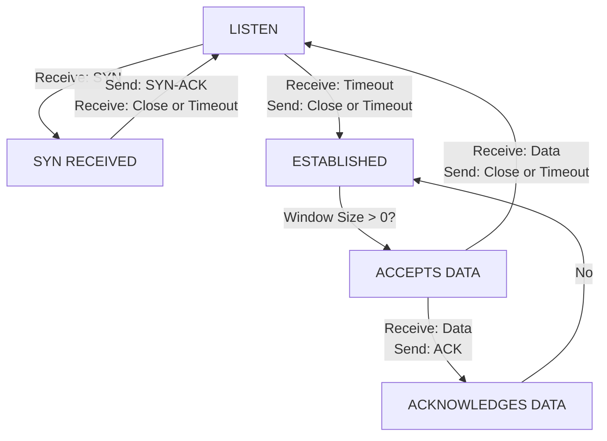

## LZR: Identifying Unexpected Internet Services

Liz Izhikevich, Stanford University; Renata Teixeira, Inria; Zakir Durumeric, Stanford University

https://www.usenix.org/conference/usenixsecurity21/presentation/izhikevich

## This paper is included in the Proceedings of the 30th USENIX Security Symposium.

August 11–13, 2021

978-1-939133-24-3

Open access to the Proceedings of the 30th USENIX Security Symposium is sponsored by USENIX.

# LZR: Identifying Unexpected Internet Services

Liz Izhikevich Stanford University

Renata Teixeira Inria, Paris∗

Zakir Durumeric Stanford University

## Abstract

Internet-wide scanning is a commonly used research technique that has helped uncover real-world attacks, find cryptographic weaknesses, and understand both operator and miscreant behavior. Studies that employ scanning have largely assumed that services are hosted on their IANA-assigned ports, overlooking the study of services on unusual ports. In this work, we investigate where Internet services are deployed in practice and evaluate the security posture of services on unexpected ports. We show protocol deployment is more diffuse than previously believed and that protocols run on many additional ports beyond their primary IANA-assigned port. For example, only 3% of HTTP and 6% of TLS services run on ports 80 and 443, respectively. Services on non-standard ports are more likely to be insecure, which results in studies dramatically underestimating the security posture of Internet hosts. Building on our observations, we introduce LZR (“Laser”), a system that identifies 99% of identifiable unexpected services in five handshakes and dramatically reduces the time needed to perform application-layer scans on ports with few responsive expected services (e.g., 5500% speedup on 27017/MongoDB). We conclude with recommendations for future studies.

## 1 Introduction

Internet-wide scanning — the process of connecting to every public IPv4 address on a targeted port — is a standard research technique for understanding real-world service configuration and deployment. Leveraging tools like ZMap [26] and Masscan [29], more than 300 papers have used Internetwide scanning to discover weaknesses in TLS, SSH, and the Web PKI [6,9,11,13,15,17,24,36–38], to uncover real-world attacks [22, 50, 60], and to better understand botnets [10, 46], ICS/IoT deployment [19, 51, 67], censorship [42, 52, 53], and operator behavior [23, 25, 47].

Past scanning studies have largely assumed that services are hosted on their IANA-assigned ports (e.g., HTTPS on TCP/443) and have overlooked scanning additional ports for unexpected services. Yet, many of these same studies have also observed that a non-negligible fraction of the hosts that respond to a SYN scan never complete the expected applicationlayer handshake [21, 24, 26, 36, 51, 67]. It is unclear whether operators hide services on unexpected ports, whether scanners fail to account for protocol inconsistencies or server-side implementation errors, or whether firewalls detect scanning and block further interaction. In this work, we investigate where Internet services are deployed in practice, and we evaluate the security posture of services hosted in unexpected places.

We start by investigating services that do not appear to speak the expected IANA-assigned protocol. We confirm that up to 96% of services (by port) do not complete the expected application-layer (L7) handshake on 37 popular ports (Section 2). We introduce a heuristic that infers server-side TCP state, which we use to show that 28% of initially-responsive services do not allow any L7 data exchange. Rather, 12% immediately tear down the connection, 5% prevent an L7 handshake by specifying a zero TCP window, 0.6% are blocked from receiving our ACK, and 11% “shun” our IP between the discovery and application-layer scan phases. We trace these behaviors to middleboxes and firewalls, and we evaluate their efficacy at enabling scan evasion.

While network defenses account for most L7 unresponsive services, a significant number of services are TCP compliant, but fail the expected L7 handshake (e.g., 14% on TCP/80 and 96% on TCP/102). We show that this is due to services running on unexpected ports, protocol handshakes that require pre-established secrets, and network-based protections that acknowledge data on every port but speak no detectable protocol (Sections 3–4). Notably, protocol deployment is exceptionally diffuse. For example, only 3.0% of HTTP and 6.4% of TLS services run on ports 80 and 443, respectively. Achieving 90% coverage of TLS-based services requires scanning 40K ports. Worryingly, services deployed on unexpected ports have worse security postures, which we trace back to IoT devices that host insecure services on non-standard ports.

To enable researchers to more comprehensively find Internet services, we introduce LZR (“Laser”), a system that efficiently filters hosts that do not speak any L7 protocol and identifies unexpected services (Section 5). LZR can fingerprint 88% of identifiable services with a single packet and 99% of identifiable unexpected services with five handshakes. LZR also speeds up scans by quickly filtering the bulk of seemingly-responsive hosts that SYN-ACK but cannot complete an application layer handshake. For example, on port 27017, LZR filters out 80% of hosts that SYN-ACK, decreasing the time to complete scans of MongoDB by 55 times, while still identifying 99.6% of MongoDB services and identifying an additional 23K hosts running unexpected protocols (a 31% coverage increase for the port).

Our work concludes with recommendations for future studies. We hope that by shedding light on the ecosystem of unexpected services, and by releasing LZR as an open-source tool, we enable security researchers to more accurately understand Internet services.

## 2 Identifying Real TCP Services

Fast research scans of the Internet are typically conducted in two phases today [21, 26, 36, 38]. In the first stage, a scanner like ZMap [26] statelessly sends SYN packets to public IPv4 addresses. Then, in a second process, a stateful scanner like ZGrab [21] performs complex follow-up handshakes using the kernel TCP/IP stack. The two-phased nature of Internet scanning is largely attributable to ZMap’s architecture, which uses a stateless network stack to efficiently probe services, but is unable to complete handshakes that require maintaining local state. The biases and unintended consequences from scanning in two phases have not been investigated, and worryingly, prior studies have repeatedly noted that more than half of the IPv4 hosts that respond to a SYN scan never complete a follow-up application-layer handshake (e.g., [24, 26, 36, 51, 67]).

In this section, we investigate this discrepancy. We show that TCP liveness does not accurately indicate the presence of an application-layer service due to several common security protections, including middleboxes and user-space firewalls. Guided by TCP’s design [54], we uncover five defensive behaviors that degrade the signal provided by L4 responsiveness. We quantify the deployment of these defenses, and we evaluate their efficacy at protecting against DDoS attacks and evading Internet scans. We then go on to develop a better L4 heuristic to approximate application-layer liveness, which we use to better understand service deployment in Section 3.

## 2.1 Layer 4 versus Layer 7 Liveness

We start our investigation by confirming whether TCPresponsive hosts (i.e., hosts that reply with a SYN-ACK packet) complete the IANA assigned [39] application-layer handshake. Mimicking prior Internet scans (e.g., [6, 9, 16, 36, 72]), we perform a two-phase scan in which we send a SYN packet to a random 1% sample of public IPv4 addresses using ZMap [26] and immediately attempt a follow-up application handshake using ZGrab [21]. We scan all IANA-assigned ports with available ZGrab scanners (i.e., 37 ports in Appendix A) on November 12–14, 2019. We follow the best practices set forth by Durumeric et al. [26] to minimize scan impact, and we exclude networks that have previously contacted us. We receive no complaints, but note that we have used our network in the past for other experiments and exclude operators who previously requested removal.

Consistent with prior studies [24,26,36,51,67], we find that a considerable fraction of TCP-responsive hosts never complete the expected L7 handshake (Figure 1). The raw number of L7-unresponsive hosts varies from 21K unresponsive hosts on 502/Modbus to 201K hosts on 443/HTTPS $( \mu = 5 4 , 5 4 2$ , $\sigma ^ { 2 } = 3 1 , 0 0 2 )$ . We see this heavy-tail distribution throughout our investigation and we present our results for both popular and unpopular ports. We split ports into the two categories using Grubbs’s test for outliers [30] with a 99.9% confidence interval based on the total number SYN-ACKs and the presence of an expected service. Our popular set contains ports 80, 443, 7547, 22, 21, and 25; the unpopular set contains the remaining 31 ports. Popular protocols are most likely to complete the expected L7 handshake:1 86% and 80% of TCP-responsive hosts on ports 80 and 443 complete an HTTP(S) handshake while only 9% and 4% of hosts on ports 502 and 102 speak Modbus and Siemens S7 (two SCADA protocols).

In the following section we start our investigation of L7- unresponsivess by analyzing the changing state of services between the two phases of scanning.

## 2.2 Connection Shunning

About 1.6% of services on popular ports and 5% of services on unpopular ports do not respond with a SYN-ACK during our follow-up ZGrab TCP handshake. This could be due to DHCP churn, transient network failure, or the destination host blocking the scanner between handshakes (“connection shunning”). To determine whether hosts “shun” scanners, we connect to TCP-responsive hosts found by ZMap from two IP addresses: the original IP address used by ZMap to identify the host and a fresh IP that has not previously contacted the host. We scan a random ephemeral port, 48302, because we see the largest fraction of disappearing hosts on unpopular ports. We find that 70% of IPs that do not respond a second time on the used IP do respond to the fresh IP, indicating that most hosts that go missing between scan stages are typically not lost due to churn or network failure.


<details>
<summary>stacked bar chart</summary>

| Port/Service | SYN-ACK only | L7 Handshake |
|---|---|---|
| 80/HTTP | 8 | 7 |
| 443/TLS | 6 | 5 |
| 7547/HTTP | 4 | 2 |
| 22/SSH | 2 | 1 |
| 21/FTP | 1 | 1 |
| 25/SMTP | 1 | 1 |
| 8080/HTTP | 1 | 1 |
| 4567/HTTP | 1 | 1 |
| 53/DNS | 1 | 1 |
| 110/POP3 | 1 | 1 |
| 3306/MYSQL | 1 | 1 |
| 143/IMAP | 1 | 1 |
| 3389/RDP | 1 | 1 |
| 587/SMTP | 1 | 1 |
| 993/IMAPS | 1 | 1 |
| 995/POP3S | 1 | 1 |
| 465/SMTP | 1 | 1 |
| 23/TELNET | 1 | 1 |
| 8443/TLS | 1 | 1 |
| 1723/PPTP | 1 | 1 |
| 5432/POSTGRES | 1 | 1 |
| 1883/MQTT | 1 | 1 |
| 5672/AMQP | 1 | 1 |
| 8883/MOTT | 1 | 1 |
| 1521/Oracle | 1 | 1 |
| 6379/redis | 1 | 1 |
| 5900/VNC | 1 | 1 |
| 20000/DNP3 | 1 | 1 |
| 1433/MSSQL | 1 | 1 |
| 445/SMB | 1 | 1 |
| 631/IPP | 1 | 1 |
| 6443/Kubernetes | 1 | 1 |
| 623/IPMI | 1 | 1 |
| 27017/Mongodb | 1 | 1 |
| 502/Modbus | 1 | 1 |
| 102/Siemens | 1 | 1 |
| 11211/memcached | 1 | 1 |
</details>

Figure 1: L4 vs. L7 Responsiveness — A significant fraction of hosts that respond with a SYN-ACK packet never complete the expected application-layer handshake. The difference varies dramatically across ports by both percent difference (14–96%) and raw count (21,050–200,902).

In the case that the fresh IP receives a SYN-ACK, we observe two types of responses from the previously-used IP: no response (93%) and RST packet (7%). This blocking occurs at the IP granularity: once a scanner has been blocked by a host, the host will not respond with a SYN-ACK on any port. We further confirm that connection shunning is not a defensive reaction — triggered by failing to complete an application layer handshake — by running a 1% IPv4 scan of all popular ports using ZGrab for the initial host discovery. The same fraction of connections are shunned as when ZMap is used.

We find that connection shunning is deployed at both the host and network granularity by computing the largest blocks of consecutive TCP-Responsive IPs that show shunning behavior on a random ephemeral port: 40% of networks that shun scanners are /32s (i.e., individual hosts) and 10% of IPs block in groups larger than a /24 (Figure 4). The largest network to deploy connection shunning is a /20 owned by Alestra Net (ASN 11172), a Mexican ISP.

Both network hardware (e.g., Cisco IOS-based routers [34]) and host software (e.g., Snort [59]) document connection shunning and dynamic blocking as features where connections are blocked after an IP is classified as malicious. Connection shunning prevents clients from using a single source-IP to scan the network and forces scanners to use multiple source IPs to reach the end-host, thereby dramatically increasing the cost for an attacker. We compare the number of legitimate services found when using both single and multiple source-IPs during scanning and find no evidence that any hosts that shun connections host legitimate services. We thereby conclude that they can be safely ignored in security studies if they can be efficiently filtered.

## 2.3 Do TCP-Responsive Hosts Speak TCP?

The vast majority of services (average of 96% across ports) that do not complete an application-layer handshake respond with a SYN-ACK during the second (ZGrab) handshake. In the remainder of the section, we explore whether these hosts reach a state where they can exchange application-layer data or simply stop responding after sending a SYN-ACK. In Figure 2, we provide a modified TCP state diagram based on RFC 793 [54] that captures what a scanner can infer about a server’s TCP state, which we use to guide our investigation. For a TCP connection to enter the ESTABLISHED state, the server sends only a single packet (SYN-ACK). Once the client has sent an ACK, it can normally send data — the amount specified by the server window size in the SYN-ACK packet.

We note that TCP has an edge case in which the server can respond with a zero-sized window in its SYN-ACK [54]. In this situation, the client is expected to send follow-up ACK packets to probe when the server is ready to accept data. We add a new ACCEPTS DATA state in Figure 2 to capture whether a server is ready for data. Once the server has reached the ACCEPTS DATA state, it is expected to keep the TCP connection open long enough to receive data and to acknowledge receipt. We define ACKNOWLEDGES DATA as the server allowing the client to send data and acknowledging client data.


<details>
<summary>flowchart</summary>


</details>

Figure 2: Client Perspective of Server TCP State — We investigate L7 service liveness based on a modified version of the TCP state machine in RFC 793 [54]. We introduce two new states: “accepts data” and “acknowledges data” because an established connection cannot necessarily exchange data.

To test how far into a TCP session servers reach, we develop a new scanner based on ZGrab [5] that establishes a TCP connection, sends two newlines, and deduces the server TCP state (Algorithm 1). We scan random 1% samples of IPv4 addresses on a random 2,000 ports as well as the 37 IANA assigned ports that host protocols with ZGrab scanners (Appendix A). An average 16% of services on popular ports and 40% of services on unpopular ports fail to acknowledge data (Figure 3a). We detail why in the remainder of this section.


<details>
<summary>stacked bar chart</summary>

| Responsive IPs | SYN-ACK | Acknowledge Data |
| --- | --- | --- |
| 80 | 1 | 100000 |
| 443 | 1 | 100000 |
| 7547 | 1 | 100000 |
| 22 | 1 | 100000 |
| 30005 | 1 | 100000 |
| 5060 | 1 | 100000 |
| 21 | 1 | 100000 |
| 25 | 1 | 100000 |
| 2000 | 1 | 100000 |
| 8080 | 1 | 100000 |
| 50805 | 1 | 100000 |
| 4567 | 1 | 100000 |
| 53 | 1 | 100000 |
| 49154 | 1 | 100000 |
| 49152 | 1 | 100000 |
| 8081 | 1 | 100000 |
| 8089 | 1 | 100000 |
| 110 | 1 | 100000 |
| 3306 | 1 | 100000 |
| 8085 | 1 | 100000 |
| 8000 | 1 | 100000 |
| 143 | 1 | 100000 |
| 51005 | 1 | 100000 |
| 3389 | 1 | 100000 |
| 587 | 1 | 100000 |
| 58000 | 1 | 100000 |
| 993 | 1 | 100000 |
| 995 | 1 | 100000 |
| 465 | 1 | 100000 |
| 23 | 1 | 100000 |
| 8443 | 1 | 100000 |
| 1723 | 1 | 100000 |
| 179 | 1 | 100000 |
| 5432 | 1 | 100000 |
| 5432 | 1 | 155555 |
| 5432 | 1 | 255555 |
| 5432 | 1 | 375555 |
| 5432 | 1 | 475555 |
| 5432 | 1 | 675555 |
| 5432 | 1 | 775555 |
| 5432 | 1 | 875555 |
| 5432 | 1 | 975555 |
| 5432 | 1 | 975555 |
| 5432 | 1 | 975555 |
| 5432 | 1 | 975555 |
| 5432 | 1 | 975555 |
| 5432 | - | - |
| 6379 | - | - |
| 6379 | - | - |
| 6379 | - | - |
| 6379 | - | - |
| 6379 | - | - |
| 6379 | - | - |
| 6379 | - | - |
</details>

(a) Portion of TCP-responsive hosts that fail to acknowledge data  


<details>
<summary>stacked bar chart</summary>

| Port Number | Connection Shunning (# 1000s) | Dropping Connections Mid-Handshake (# 1000s) | Zero Window (# 1000s) | Reset Connection (# 1000s) | Dynamic Blocking (Handshake) (# 1000s) | Leftover Non-ACK Hosts (# 1000s) |
| --- | --- | --- | --- | --- | --- | --- |
| 80 | 50 | 2 | 1 | 1 | 1 | 1 |
| 443 | 50 | 2 | 1 | 1 | 1 | 1 |
| 7547 | 100 | 2 | 1 | 1 | 1 | 1 |
| 22 | 50 | 2 | 1 | 1 | 1 | 1 |
| 30005 | 50 | 2 | 1 | 1 | 1 | 1 |
| 5060 | 50 | 2 | 1 | 1 | 1 | 1 |
| 21 | 50 | 2 | 1 | 1 | 1 | 1 |
| 25 | 50 | 2 | 1 | 1 | 1 | 1 |
| 2000 | 50 | 2 | 1 | 1 | 1 | 1 |
| 8080 | 50 | 2 | 1 | 1 | 1 | 1 |
| 50805 | 50 | 2 | 1 | 1 | 1 | 1 |
| 4567 | 50 | 2 | 1 | 1 | 1 | 1 |
| 53 | 50 | 2 | 1 | 1 | 1 | 1 |
| 49154 | 50 | 2 | 1 | 1 | 1 | 1 |
| 49152 | 50 | 2 | 1 | 1 | 1 | 1 |
| 8081 | 50 | 2 | 1 | 1 | 1 | 1 |
| 8089 | 50 | 2 | 1 | 1 | 1 | 1 |
| 110 | 50 | 2 | 1 | 1 | 1 | 1 |
| 3306 | 50 | 2 | 1 | 1 | 1 | 1 |
| 8085 | 50 | 2 | 1 | 1 | 1 | 1 |
| 8000 | 50 | 2 | 1 | 1 | 1 | 1 |
| 143 | 50 | 2 | 1 | 1 | 1 | 1 |
| 51005 | 50 | 2 | 1 | 1 | 1 | 1 |
| 3389 | 50 | 2 | 1 | 1 | 1 | 1 |
| 587 | 50 | 2 | 1 | 1 | 1 | 1 |
| 58000 | 50 | 2 | 1 | 1 | 1 | 1 |
| 993 | 50 | 2 | 1 | 1 | 1 | 1 |
| 995 | 50 | 2 | 1 | 1 | 1 | 1 |
| 465 | 50 | 2 | 1 | 1 | 1 | 1 |
| 23 | 50 | 2 | 1 | 1 | 1 | 1 |
| 8443 | 50 | 2 | 1 | 1 | 1 | 1 |
| 1723 | 50 | 2 | 1 | 1 | 1 | 1 |
</details>

(b) Reasons SYN-ACK-only hosts fail to acknowledge data  
Figure 3: Unexpected TCP Behavior of IPv4 Hosts — An average 16% of services on popular ports and 40% of services on unpopular ports that respond to a TCP SYN scan with a SYN-ACK packet do not fully speak TCP. Here, we show the portion of hosts by port that do not acknowledge client data and the breakdown of reasons why.

Algorithm 1: Deducing Server TCP State  
Send SYN
if receive RST or FIN or Timeout then
    return NO_ACK_HOST
end
// checking for zero window sizes
Print syn-ack.window_size
// sending protocol-agnostic data
Send "\n\n"
// Time for 8 re-transmissions (RFC 1122 rec.)
while timeout < 100 seconds do
    if received ACK then
    return ACK_HOST
    end
    if received RST or FIN then
    return NO_ACK_HOST
    end
end
return NO_ACK_HOST // host has timed out

## 2.4 Zero Window DDoS Protections

Of the services that never acknowledge data, 13% of services on popular ports and 26% on unpopular ports actively prevent clients from sending data by specifying a zero-sized TCP window and never increasing it. Across all scanned ports, at least 99.94% of hosts with a zero window never increase it; 90% do not respond to secondary probes and 10% reset the connection. The behavior appears to be network- or hostbased rather than service-based: 99% of hosts that respond with a zero-window on one port will send a zero-sized window on all ports. Offhand, this behavior appears self-defeating. Hosts that respond and never increase window size might as well never respond. However, we find the feature in a Juniper networks patent [66] and used in Juniper’s Secure Service Gateway Proxy [41] to prevent DDoS attacks through network-based SYN cookies. The protection responds to all SYN packets with a zero-window SYN-ACK. Once the client completes the three-way handshake by sending an ACK, the firewall sends a SYN packet to the backend server to establish the connection. By maintaining a zero-sized TCP window with the client, the middlebox prevents the client from sending data it cannot yet forward to the backend server.


<details>
<summary>line chart</summary>

| Subnetwork Size | Connection Reset | Leftover Non-ACK Hosts | Dynamic Blocking (Handshake) | Connection Shunning | Zero Window |
| --- | --- | --- | --- | --- | --- |
| /32 | 0.1 | 0.05 | 0.05 | 0.4 | 0.0 |
| /30 | 0.2 | 0.1 | 0.1 | 0.6 | 0.0 |
| /28 | 0.3 | 0.2 | 0.2 | 0.7 | 0.0 |
| /26 | 0.4 | 0.3 | 0.3 | 0.8 | 0.0 |
| /24 | 0.5 | 0.4 | 0.4 | 0.9 | 0.0 |
| /22 | 0.6 | 0.5 | 0.5 | 1.0 | 0.1 |
| /20 | 0.7 | 0.6 | 0.6 | 1.0 | 0.2 |
| /18 | 0.8 | 0.7 | 0.7 | 1.0 | 0.3 |
| /16 | 0.9 | 0.8 | 0.8 | 1.0 | 0.4 |
| /14 | 1.0 | 0.9 | 0.9 | 1.0 | 0.5 |
| /12 | 1.0 | 1.0 | 1.0 | 1.0 | 0.6 |
| /10 | 1.0 | 1.0 | 1.0 | 1.0 | 0.7 |
| /8 | 1.0 | 1.0 | 1.0 | 1.0 | 0.8 |
| /6 | 1.0 | 1.0 | 1.0 | 1.0 | 0.9 |
| /4 | 1.0 | 1.0 | 1.0 | 1.0 | 1.0 |
| /2 | 1.0 | 1.0 | 1.0 | 1.0 | 1.0 |
| /0 | 1.0 | 1.0 | 1.0 | 1.0 | 1.0 |
| /2 | 1.0 | 1.0 | 1.0 | 1.0 | 1.0 |
| /4 | 1.0 | 1.0 | 1.0 | 1.0 | 1.0 |
| /6 | 1.0 | 1.0 | 1.0 | 1.0 | 1.0 |
| /8 | 1.0 | 1.0 | 1.0 | 1.0 | 1.0 |
| /10 | 1.0 | 1.0 | 1.0 | 1.0 | 1.0 |
| /12 | 1.0 | 1.0 | 1.0 | 1.0 | 1.0 |
| /14 | 1.0 | 1.0 | 1.0 | 1.0 | 1.0 |
| /16 | 1.0 | 1.0 | 1.0 | 1.0 | 1.0 |
| /18 | 1.0 | 1.0 | 1.0 | 1.0 | 1.0 |
| /2 | 1.0 | 1.0 | 1.0 | 1.0 | 1.0 |
| /4 | 1.0 | 1.0 | 1.0 | 1.0 | 1.0 |
| /6 | 1.0 | 1.0 | 1.0 | 1.0 | 1.0 |
| /8 | 1.0 | 1.0 | 1.0 | 1.0 | 1.0 |
| /10 | 1.0 | 1.0 | 1.0 | 1.0 | 1.0 |
| /12 | 1.0 | 1.0 | 1.0 | 1.0 | 1.0 |
| /14 | 1.0 | 1.0 | 1.0 | 1.0 | 1.0 |
| /16 | 1.0 | 1.0 | 1.0 | 1.0 | 1.0 |
| /18 | 1.0 | 1.0 | 1.0 | 1.0 | 1.0 |
| /2 | 1.5 | 2.5 | - | - | - |
| /4 | - | - | - | - | - |
| /6 | - | - | - | - | - |
| /8 | - | - | - | - | - |
| /10 | - | - | - | - | - |
| /12 | - | - | - | - | - |
| /14 | - | - | - | - | - |
| /16 | - | - | - | - | - |
| /18 | - | - | - | - | - |
| /2 | - | - | - | - | - |
| /4 | - | - | - | - | - |
| /6 | - | - | - | - | - |
| /8 | - | - | - | - | - |
| /10 | - | - | - | - | - |
</details>

Figure 4: Network Granularity of TCP Blocking— Some protections appear to be host-based while others are more prevalent on large networks. Zero Window DDoS protections are most likely to appear at a large network granularity, while connection shunning is more likely a host-level behavior.

Zero-window SYN-ACKs are deployed across entire subnetworks: 90% of IPs that SYN-ACK with a zero window do so in a network larger than a /24 (Figure 4). The largest network, the State of Florida Department of Management Services (ASN 8103), is responsible for 16% of all zero-windows Internet-wide and accounts for around 3% of all SYN-ACKs on a random port. The TTL for SYN-ACK is consistently one hop closer than the later RST, further confirming a network appliance is responsible.

## 2.5 Dropping Connections Mid-Handshake

Beyond specifying a zero window, an average 2% of the hosts per port that never acknowledge data do not appear to complete a three-way handshake, despite the client sending an ACK (Figure 3b). We infer that the server never reaches the ESTABLISHED state based on a continual stream of SYN-ACK packets (average 7.8 SYN-ACK re-transmissions). Hosts do not simply have broken TCP stacks; in the case of MCI Communication Services, for example, IPs that re-transmit SYN-ACKs on port 4567 have compliant behavior on other ports (e.g., RDP on TCP/3389). Real services respond with a TTL over twice as large as the TTL value which re-transmits the SYN-ACK, suggesting that a middlebox selectively drops packets. Dropping connections mid-handshake is a defensive behavior exhibited primarily by ISPs protecting consumer premise equipment: CenturyLink (AS 209), Frontier Communications (AS 5650), and MCI Communications Services (AS 701) all drop inbound traffic to port 4567/TRAM post-SYN (accounting for 96% of dropped connections). Korea Telecom (AS 4766) and Axtel (AS 6503) — accounting for 73%—interrupt connections on 7547/CWMP. The behavior is rare on common ports (e.g., only 5% of TCP-responsive hosts that do not acknowledge data drop connections midhandshake on port 80).

## 2.6 Reset Connections

An average 73% of services on popular ports and 34% of services on unpopular ports that do not acknowledge data reach the ESTABLISHED state but will immediately reset the connection after the client completes the three-way handshake (Figure 3b). Per RFC 793 [54], if a server does not want to communicate with a client (e.g., due to mismatches in “security clearances”), the server should close the TCP connection after the client acknowledges the SYN-ACK. This is also how user-space firewalls like DenyHosts [63] appear to scanners. While we cannot detect what software closes a connection, we note that networks that RST on port 22 are 10 times more likely to do so in block-sizes of /32 than port 80, implying that blocking happens more often on hosts running SSH compared to HTTP, consistent with Wan et al.’s findings [69]. Networklevel behavior looks to be caused by DDoS protections similar to the networks that send zero-window SYN-ACKs. To protect against SYN-flooding, middleboxes send a SYN-ACK on behalf of the server and later establish a connection with the server after the client has finished the three-way handshake. If the server refuses the connection, the middlebox terminates the client connection. This functionality is available in Cisco IOS-based routers as a part of their threat detection logic [58].

The behavior is visible in prominent networks, with more than 40% of such IPs located in Korea Telecom, Vodaphone Australia, OVH, and Akamai. Hosts are 20% more likely to close a connection on popular ports because Google load balancers in AS 19527 come with a standard firewall policy that accept traffic on these ports by default — in order to be able to perform service health checks — and rely on the backend virtual machine to reset connections if the port is closed [1, 2].

## 2.7 Dynamic Blocking after Handshake

Not all hosts that fail to acknowledge data send RSTs or continually re-transmit SYN-ACKs. Many simply never acknowledge any data. An average of 10% services on popular ports and 18% of services on unpopular ports do not acknowledge client data (Figure 3b). These hosts frequently do not respond to later follow-up handshakes either. This “shunning” behavior is similar — but not identical — to the behavior we found in Section 2.2 and has previously been documented in the Great Firewall of China [18] where it is used to stop future connections, triggered only when data is sent.

To differentiate between hosts that shun the scanner after a handshake from those that simply never acknowledge data, we simultaneously attempt an L7 handshake with initiallyresponsive hosts that did not acknowledge data from two IP addresses, one that matches the initial connection and one that differs. Of the initially unresponsive IPs, 98% respond to the fresh IP, indicating the behavior is not likely due to transient network failure, but rather explicit blocking of incoming connections. In total, post-handshake dynamic blocking accounts for 6% and 12% of the remaining hosts that do not acknowledge data for common port and uncommon port hosts respectively. Note that this behavior only occurs after a three-way handshake, thereby differing from connection shunning (Section 2.2). The largest network to dynamically block after a handshake is Coming ABCDE HK (AS 133201), which accounts for 48% of all IPs that block after a handshake. We also discover a similar TTL phenomenon as described in Section 2.4 implying a middlebox-based protection.

We deduce that the rest of the hosts that fail to acknowledge data are not performing dynamic blocking because though they will not respond to anything after the actual handshake, they do consistently respond to all scans (no matter the source IP). Vodaphone (AS 133612) and Webclassit (AS 34358) have this behavior across all scanned ports and make up 66% of all IPs with such a behavior. We find similar evidence of mismatching TTL values, which indicate a middlebox.

## 2.8 Efficacy of Middlebox Protections

Identifiable middlebox protections are common. About 16% of the services on popular and 40% of the services on unpopular ports that respond to a SYN packet — but do not speak any identifiable L7 protocol — are artifacts of DDoS and scanning protections; 40% of routed ASes contain at least one such protection. Reset connections after a handshake — a behavior found in software like DenyHosts [63] — is by far the most common behavior by both IP and AS, and is present in 34% of ASes. Middleboxes employing connection shunning or dynamic blocking are each used by 6% of networks, and Juniper’s patented zero-window DDoS protection appears in 2% of networks. These protections prevent clients from directly connecting to servers — at least initially — and all middleboxes succeed at doing so, even if the protection is identifiable. However, with the use of more than one source IP address, an adversary can bypass connection shunning and dynamic blocking and still solicit SYN-ACKs from the endhost, albeit rate-limited by the number of scanner addresses.

Beyond actively preventing DDoS attacks and some scanning, each protection inadvertently slows down the discovery of new services through Internet scanning and can slow down the spread of malware. Dynamic blocking (completing the handshake without acknowledging data) is the most effective at doing so. The technique slows scans by up to 55 times as in the case of host discovery on 27017/MongoDB (Section 5), by forcing the scanner to timeout upon not receiving an ACK for each scanned host. Though zero window SYN-ACKs also cause a scanner to eventually timeout, zero-sized windows are easy to filter. Immediately closing the connection after the handshake causes only a negligible slowdown, bounded only by the time it takes to complete a handshake (about 100 ms). Connection shunning is the least effective at slowing down stateless scanners but slows down stateful scanners at the same rate as dynamic blocking.

## 2.9 Summary

Our results establish that SYN-ACKs are a poor indicator for the presence of a service. In the worst case, SYN-ACKs overestimate the hosts that acknowledge data by 533% on port 11211 (memcached). We also discover that an average 16% of services on popular ports and 40% of services on unpopular ports fail to acknowledge data, which is a likely indicator for the presence of a middlebox protection. We investigate why hosts that appear to fully speak TCP do not always complete L7 handshakes in the next section.

## 3 Application-Layer Service Deployment

In the last section, we investigated L4-responsive services that do not appear to speak any L7 service and are artifacts of DoS and scanning protections. After excluding the 28% of pseudoservices, we discover 27% of services on popular ports and 63% services on unpopular ports that acknowledge data do not run the expected application-layer protocol (Figure 5). In this section, we analyze services that complete unexpected application-layer handshakes or acknowledge data but do not speak any identifiable application-layer protocol. We show that while IANA-assigned services are prominent on popular ports, unexpected but identifiable services dominate other ports. Moreover, assigned ports only host a tiny fraction of the services that run popular protocols. For example, only 6.4% of TLS services run on TCP/443. Services on unexpected ports are commonly hosted by IoT devices and have weaker security postures, which suggests the need for the security community to study the services on unassigned ports.


<details>
<summary>bar chart</summary>

| Port/Service | SYN-ACK only | ACK Data | L7 Handshake |
| --- | --- | --- | --- |
| 80/HTTP | 8 | 1 | 7 |
| 443/TLS | 6 | 1 | 5 |
| 7547/HTTP | 4 | 1 | 3 |
| 22/SSH | 2 | 1 | 2 |
| 21/FTP | 1 | 1 | 1 |
| 25/SMTP | 1 | 1 | 1 |
| 8080/HTTP | 1 | 1 | 1 |
| 4567/HYTP | 1 | 1 | 1 |
| 53/DNS | 1 | 1 | 1 |
| 110/POP3 | 1 | 1 | 1 |
| 3306/MYSQL | 1 | 1 | 1 |
| 143/IMAP | 1 | 1 | 1 |
| 3389/RDP | 1 | 1 | 1 |
| 587/SMTP | 1 | 1 | 1 |
| 993/IMAPS | 1 | 1 | 1 |
| 995/SPMS | 1 | 1 | 1 |
| 465/SMPT | 1 | 1 | 1 |
| 23/TELNET | 1 | 1 | 1 |
| 8443/TLS | 1 | 1 | 1 |
| 1723/PPTP | 1 | 1 | 1 |
| 5432/POSTGRES | 1 | 1 | 1 |
| 1883/MOTT | 1 | 1 | 1 |
| 5672/AMQP | 1 | 1 | 1 |
| 8883/MOTT | 1 | 1 | 1 |
| 1521/Oracle | 1 | 1 | 1 |
| 6379/redis | 1 | 1 | 1 |
| 5990/VNC | 1 | 1 | 1 |
| 20000/DNP3 | 1 | 1 | 1 |
| 1433/MSSOL | 1 | 1 | 1 |
| 445/SMB | 1 | 1 | 1 |
| 631/IPP | 1 | 1 | 1 |
| Kubernetes | 1 | 1 | 1 |
| 623/IPMI | 1 | 1 | 1 |
| 27017/Mongodb | 1 | 1 | 1 |
| 502/Modbus | 1 | 1 | 1 |
| Siemens | 1 | 1 | 1 |
| 102/Siemens | 1 | 1 | 1 |
| Memcached | 1 | 1 | 1 |
| Memcached | ~0.5 | ~0.5 | ~0.5 |
| Memcached | ~0.5 | ~0.5 | ~0.5 |
| Memcached | ~0.5 | ~0.5 | ~0.5 |
| Memcached | ~0.5 | ~0.5 | ~0.5 |
| Memcached | ~0.5 | ~0.5 | ~0.5 |
| Memcached | ~7 | ~7 | ~7 |
| Memcached | ~7 | ~7 | ~7 |
| Memcached | ~7 | ~7 | ~7 |
| Memcached | ~7 | ~7 | ~7 |
| Memcached | ~7 | ~7 | ~7 |
| Memcached | ~7 | ~7 | ~7 |
</details>

Figure 5: SYN-ACK vs. Ack. Data vs. L7 Handshake— There are up to three orders of magnitude fewer IPs that acknowledge data than respond with a SYN-ACK packet.

## 3.1 Finding Unexpected Services

To determine the extent to which unexpected services coreside on ports with assigned services, we scan 1% random samples of the IPv4 address space on the set of ports from Section 2.3 (37 ports with an expected service and 18 ports without an unexpected service or implemented scanner). For each responsive service, we first attempt to complete an L7 handshake using the expected protocol, if one exists. Upon failure, we attempt follow-up handshakes using the 30 protocol scanners — the total number of unique protocol scanners — implemented in ZGrab (Appendix A) with default parameters.

Ethical considerations. Prior studies have primarily performed Internet scans that target only expected protocols; to minimize the potential impact of our experiment, we scan only 1% of the IPv4 address space. We received zero abuse complaints, requests to be blocked from future scans, or questions from operators from this set of experiments.

Data acknowledging firewalls. The number of data- acknowledging services per IP follows a bi-modal distribution: 98% of IPs serve fewer than four unidentifiable services and 2% of IPs host unidentifiable services on over 60K ports. About 75% of all unidentifiable services on unpopular ports are hosted by IPs with unidentifiable services on nearly every port (“Unknown Service - across ports” in Figure 6). Hosts have unidentifiable services on most but not all ports because some networks drop all traffic to security-sensitive ports. For example, out of the top 50 networks that send back the most SYN-ACK responses across all ports, 28% drop all traffic to port 445 (SMB) and 10% drop port 23 (Telnet). Hosts with unidentifiable services on nearly every port are concentrated in a small number of networks; five ASes belonging to the Canadian government (74, 25689, 818, 2680, and 806) account for 77% of all IPs that host unidentifiable services on nearly every port.

We trace this behavior to the F5 Big-IP Firewall based on a RST fingerprint [3] that contains the words “BIG-IP System.” An F5 DevCentral blog post [4] speculates that IPs respond on every port due to the accidental use of a wildcard when configuring the firewall or an overload of the firewall’s SYN-cookie cache. We identify and exclude these hosts, to avoid biasing our analysis, by checking whether hosts acknowledge data on five random ephemeral ports, which effectively filters out 99.9% of such hosts. Nonetheless, an average of 10% of popular and 25% of unpopular services remain unidentifiable (i.e., do not respond to any of the 30 handshakes) after filtering.

## 3.2 Characterizing Unexpected Services

After filtering out hosts with unknown services on nearly all ports, we investigate unexpected services on assigned ports and services on ports without any assigned service. We summarize our results in Figure 6 and describe them here.

Unexpected services. Services on popular ports typically run the expected protocol: 93% of hosts that acknowledge data on port 80 respond to an HTTP GET request and 89% on port 443 complete an HTTPS handshake (Figure 6). Only 1.6% of the services on port 80 and 4.25% of services on port 443 respond to one of the other 30 unqiue handshakes. The majority (75%) of unexpected services on port 80 are TLS-based and nearly all on port 443 are HTTP-based (Figure 7). This implies that operator recommendations to run services on ports 80 or 443 to bypass firewall restrictions [49] are not widespread. As ports decrease in popularity, the fraction of IPs that speak the expected service approaches zero. For example, on port 623, only 1% of services that acknowledge data speak IPMI and 18.9% speak other identifiable protocols. Consequently, the number of additionally identifiable services diminishes after the first few protocols and appears to converge at 96% (Figure 8). Each port contains its own long-tail of unexpected services, but for many ports, this number plateaus quickly — just not at 100%.

The number of identifiable services on ports without an assigned service varies between 2–97% based on port. Among random ephemeral ports, our 30 handshakes identify the protocol for an average 21% of services that acknowledge data and an average of 10 unique protocols per port. Across all scanned ports, nearly 65% of unexpected, but identifiable, services speak HTTP and 30% speak TLS. IoT devices are a prominent culprit behind unexpected services; unexpected TLS services are 5 times more likely and unexpected SSH 2 times more likely to belong to an IoT device than 443/TLS and 22/SSH services, respectively. We also find evidence of operators attempting to hide services. For example, 70% of hosts serving TLS on the random ephemeral ports 49227, 47808, and 49152 are issued certificates by BBIN International Limited, a Philippine offshore online gambling platform [56]. We further detail the types of services hosted on unassigned ports in Sections 3.3.

Long tail of ports by protocol. Our results suggest that protocols run on many additional ports beyond their primary IANA-assigned port. To quantify how many ports researchers need to scan to achieve coverage of a protocol, we conduct a new scan targeting 0.1% of the IPv4 address space on 10 popular protocols on all 65,535 ports and compute the fraction of hosts running a given service across multiple ports (Figure 9). We find that port 80 contains only 3.0% of hosts running HTTP; another 1.2% of HTTP hosts run on port 7547 and 0.7% on port 30005. To cover approximately 90% of HTTP, one must scan 25,000 ports. Only 5.5% of Telnet resides on TCP/23, with the assigned alternative port TCP/2323 being only the 10th most popular; other unexpected ports dominate the top-10 ports with the most Telnet services (Table 1). Previous work tracking botnet behavior [10, 44] has primarily studied assigned Telnet ports (i.e., 23, 2323); our findings imply that the attack surface and number of potentially vulnerable devices is potentially over 15 times worse than previously shown.

Some protocols are still relatively clustered around their assigned ports. For example, 83.1% of all AMQP is on port 5672 and an additional 3.1% is on port 5673. HTTP and TLS are the only two protocols which appear on every port in our 0.1% IPv4 scan. The set of most popular ports also varies per protocol and is often not correlated with the popularity of ports that send data (i.e., across all protocols), as most services are drowned out by the overwhelming popularity of HTTP and TLS. For example, 7 of the top 10 ports most likely to host Telnet are ranked above 12,000 in overall popularity. As a result, when choosing which popular ports to study for a specific protocol, we recommend researchers conduct a lightweight sub-sampled scan across all ports.

## 3.3 Security of Unexpected Services

Services on unexpected ports are more likely to be insecure than services on assigned ports. We use the results from our experiment in Section 3.1 (scanning 30 protocols on 55 ports) to show four examples of how unexpected services affect the results of previous and future security studies.


<details>
<summary>stacked bar chart</summary>

| Port Number | Expected Service | Unexpected Service | Unknown Service - across ports | Unknown Service |
| --- | --- | --- | --- | --- |
| 80 | 1.0 | 0.0 | 0.0 | 0.0 |
| 443 | 1.0 | 0.0 | 0.0 | 0.0 |
| 7547 | 1.0 | 0.0 | 0.0 | 0.0 |
| 22 | 1.0 | 0.0 | 0.0 | 0.0 |
| 21 | 1.0 | 0.0 | 0.0 | 0.0 |
| 25 | 0.6 | 0.0 | 0.2 | 0.2 |
| 8080 | 1.0 | 0.0 | 0.0 | 0.0 |
| 4567 | 1.0 | 0.0 | 0.0 | 0.0 |
| 53 | 1.0 | 0.0 | 0.1 | 0.1 |
| 110 | 1.0 | 0.0 | 0.1 | 0.1 |
| 8443 | 1.0 | 0.1 | 0.1 | 0.1 |
| 143 | 1.0 | 0.1 | 0.1 | 0.1 |
| 1723 | 1.0 | 0.1 | 0.1 | 0.1 |
| 587 | 1.0 | 0.1 | 0.1 | 0.1 |
| 995 | 1.0 | 0.1 | 0.1 | 0.1 |
| 993 | 1.0 | 0.1 | 0.1 | 0.1 |
| 3389 | 0.4 | 0.2 | 0.1 | 0.1 |
| 465 | 1.0 | 0.1 | 0.1 | 0.1 |
| 23 | 0.6 | 0.2 | 0.1 | 0.1 |
| 3306 | 1.0 | 0.1 | 0.1 | 0.1 |
| 445 | 1.0 | 0.1 | 0.1 | 0.1 |
| 20000 | 1.0 | 0.1 | 0.1 | 0.1 |
| 8883 | 1.0 | 0.2 | 0.1 | 0.1 |
| 161 | 1.0 | 0.2 | 0.1 | 0.1 |
| 5432 | 1.0 | 0.2 | 0.1 | 0.1 |
| 1883 | 0.2 | 0.2 | 0.2 | 0.2 |
| 6443 | 1.5 | 0.2 | 0.2 | 0.2 |
| 1433 | 1.5 | 0.2 | 0.2 | 0.2 |
| 631 | 0.2 | 0.2 | 0.2 | 0.2 |
| 5672 | 1.5 | 0.2 | 0.2 | 0.2 |
| 5900 | 1.5 | 0.2 | 0.2 | 0.2 |
| 6379 | 1.5 | 0.2 | 0.2 | 0.2 |
| 1521 | 1.5 | 0.2 | 0.2 | 0.2 |
| 623 | 1.5 | 0.2 | 0.2 | 0.2 |
| 11211 | 1.5 | 0.2 | 0.2 | 0.2 |
| 27017 | 1.5 | 0.2 | 0.2 | 0.2 |
| 502 | 1.5 | 0.2 | 0.2 | 0.2 |
| 102 | 1.5 | 0.2 | 0.2 | 0.2 |
</details>

Figure 6: Distribution of Types of Services — A smaller fraction of services run the assigned protocol on less popular ports. For example, only 4% of services on TCP/102 speak the assigned S7 protocol. The fraction of services that can be identified on unassigned ports (on the right hand side) varies widely.


<details>
<summary>stacked bar chart</summary>

| Port | IP Type | Fraction (%) |
| :--- | :--- | :--- |
| 80 | TLS | 75 |
| 80 | SMTP | 2 |
| 80 | SSL | 1 |
| 443 | HTTP | 90 |
| 7547 | TLS | 30 |
| 7547 | SSH | 25 |
| 7547 | REDIS | 55 |
| 7547 | MQTT | 15 |
| 7547 | TELNET | 15 |
| 22 | HTTP | 60 |
| 22 | TLS | 50 |
| 22 | VNC | 20 |
| 22 | FTP | 30 |
| 21 | HTTP | 40 |
| 21 | TLS | 40 |
| 21 | SSH | 10 |
| all | HTTP | 60 |
| all | TLS | 40 |
| all | SMTP | 2 |
| all | SSL | 10 |
</details>

Figure 7: Distribution of Unexpected Services — HTTP and TLS are the most popular unexpected services, with 65% of unexpected services speaking HTTP and 30% speaking TLS.

IoT devices. IoT devices are frequent targets due to their consistently weak security designs [28, 48, 70]. While passive measurement has shown that a significant number of IoT devices inhabit non-standard ports [45], active measurement of IoT devices has largely studied only standard ports [14, 20, 27, 55, 62, 71]. By manually identifying server certificates belonging to an IoT manufacturer, we find IoT interfaces on unexpected ports are widespread; 50% of TLS server certificates on unexpected ports belong to IoT devices and unexpected TLS is 5 times more likely to belong to an IoT device than on port 443. For example, 35% of 8000/TLS are icctv devices (i.e., surveillance cameras) in Korea Telecom and 38% of 80/TLS are Huawei network nodes spread across 1% of all international networks. About 5% of TLS on port 8443 belongs to Android TVs in Korean networks and at least 20% belongs to routers. Unassigned ports also contain more TCP/UPnP devices. For example, there are 12 times more TCP/UPnP devices on port 49152 (primarily in Latin America and Asian Telecoms) and 2 times as many on ports 58000 and 30005 than on port 80.

Vulnerable TLS. TLS services on unassigned ports are 1.17 times more likely to have a certificate with a known private key than on assigned ports. When scanning unassigned ports, we find over twice as many certificates have a known private key than reported in prior work [32, 36]. For example, 40.2% of TLS hosts on port 8081 are DOCSIS 3.1 Wireless Gateways in Telecom Argentina (AS 10481 and 10318) using the same OpenSSL Test Certificate with a known private key and 39% of TLS hosts on port 58000 are Qno wireless devices with the same self-signed certificate with a known private key. Across 23% of scanned ports, public keys are more likely — up to 1.7 times more — to be shared than those on port 443 (e.g., 80/TLS is 1.5 times more likely). Nonetheless, previous work studying cryptographic keys on the Internet [26, 32, 36] has limited analysis to 443/HTTPS, 22/SSH, 995/POP3S, 993/IMAPS, and 25/SMTPS.


<details>
<summary>line chart</summary>

| Number of Protocols | All   | 80    | 49227 | 80, no HTTP |
| ------------------- | ----- | ----- | ----- | ----------- |
| 0                   | 0.6   | 0.95  | 0.3   | 0.6         |
| 5                   | 0.9   | 0.95  | 0.4   | 0.8         |
| 10                  | 0.95  | 0.95  | 0.4   | 0.85        |
| 15                  | 0.95  | 0.95  | 0.4   | 0.85        |
| 20                  | 0.95  | 0.95  | 0.4   | 0.85        |
| 25                  | 0.95  | 0.95  | 0.4   | 0.85        |
| 30                  | 0.95  | 0.95  | 0.4   | 0.85        |
| 35                  | 0.95  | 0.95  | 0.4   | 0.85        |
| 40                  | 0.95  | 0.95  | 0.4   | 0.85        |
</details>

Figure 8: Protocol Coverage Convergence — The marginal gain of scanning additional protocols is negligible beyond the top 10 protocols. Still, for most ephemeral ports (e.g., port 49227) the majority of services remain unknown.

Login pages. Over half of unexpected ports scanned host a higher fraction of public-facing login pages (i.e., HTML containing a login, username, or password field) than 80/HTTP and 443/HTTPS. Though the total number of HTTP login pages is greatest on port 80, a page on 8080/HTTP is 2.4 times more likely to be a login page, thus offering an additional 25% of such pages compared to port 80. Furthermore, all the aforementioned IoT devices (e.g., icctv, routers) hosting TLS also serve a login HTTPS page on their respective ports.


<details>
<summary>line chart</summary>

| Number of Ports | ftp   | redis | http   | amqp  | mysql | vnc   | smtp  | ssh   | tls   | telnet |
| --------------- | ----- | ----- | ------ | ----- | ----- | ----- | ----- | ----- | ----- | ------ |
| 1               | 0.75  | 0.45  | 0.05   | 0.85  | 0.5   | 0.05  | 0.6   | 0.7   | 0.05  | 0.05   |
| 10              | 0.75  | 0.5   | 0.05   | 0.9   | 0.5   | 0.1   | 0.65  | 0.75  | 0.1   | 0.05   |
| 100             | 0.75  | 0.6   | 0.1    | 0.95  | 0.5   | 0.2   | 0.7   | 0.8   | 0.2   | 0.1    |
| 1000            | 0.75  | 0.8   | 0.3    | 1.0   | 0.6   | 0.4   | 0.75  | 0.85  | 0.4   | 0.2    |
| 10000           | 0.75  | 1.0   | 1.0    | 1.0   | 1.0   | 1.0   | 1.0   | 1.0   | 0.6   | 1.0    |
| 100000          | 1.0   | 1.0   | 1.0    | 1.0   | 1.0   | 1.0   | 1.0   | 1.0   | 1.0   | 1.0    |
</details>

Figure 9: Protocol Coverage Across Ports — Only 3.0% of HTTP services are served on port 80. Researchers must scan 25K ports to achieve 90% coverage of HTTP services. On the other hand, 83.1% of AMQP services are on port 5672.

<table><tr><td>Port</td><td>Hosts</td><td>Top AS</td><td>% of Hosts in Top AS</td></tr><tr><td>23</td><td>2,606</td><td>Telecom Argentina (10318)</td><td>8.7%</td></tr><tr><td>5523</td><td>521</td><td>Claro S.A (28573)</td><td>87%</td></tr><tr><td>9002</td><td>396</td><td>Fastweb Italia (12874)</td><td>4%</td></tr><tr><td>6002</td><td>232</td><td>Fastweb Italia (12874)</td><td>6%</td></tr><tr><td>8000</td><td>158</td><td>Powercomm KR (17858)</td><td>89%</td></tr></table>

Table 1: Top 5 Ports Hosting Telnet — While Telnet is most often seen on its assigned port (TCP/23), the majority of Telnet services are served on unassigned ports. Unexpected Telnet devices are sometimes spread across a large number of ASes (e.g., port 9002) and are therefore likely not due to a single operator decision.

SSH hygiene. Unexpected ports hosting SSH are 15% more likely to allow non-public key authentication methods (e.g., password, host-based, challenge-response) than 22/SSH and 2.4 times less likely to be using only public key authentication (11% vs. 26%). 60% of scanned ports are on average 2 times more likely (9% vs. 18%) to be running a software implementation of SSH that is likely to be on an IoT device (e.g., Dropbear, Cisco, Huawei).

## 3.4 Summary and Implications

Most services that acknowledge data on popular IANAassigned ports run the expected L7 protocol, but this drops to nearly zero for less popular protocols with assigned ports. The majority of services that speak popular protocols (e.g., TLS, Telnet, HTTP) are spread across all 65K ports rather than on their assigned port(s). For example, only 3% of HTTP services listen on port 80. Many of the services listening on random ports belong to IoT devices and/or have a weak security posture, and it behooves the security community to consider these services when quantifying risk.

## 4 Efficiently Identifying Services

L7 scanning is more challenging when there is no assigned protocol for a port or when the expected L7 handshake fails. Though Section 3.3 demonstrates the importance of scanning for unexpected services, the naive method we used tests 30 unique L7 handshakes and is too intrusive and slow for large-scale experiments. In this section, we explore how to most efficiently detect unexpected L7 services. Encouragingly, only five handshake messages are needed to uncover 99% of unexpected services running identifiable protocols.

## 4.1 Protocol Discovery

We investigate two directions for accelerating protocol discovery: (1) methods that trigger protocol-identifying responses on a large number of protocols and (2) attempting handshakes in an order that optimizes for efficient service discovery.

Wait and fingerprint. The most efficient first step for detecting the protocol on a port is to simply wait to send any handshake message and to see what the server sends first. A total of 8 of the 30 protocols implemented in ZGrab — POP3, IMAP, MySQL, FTP, VNC, SSH, Telnet, and SMTP— are “server-first” protocols: after a TCP handshake concludes, the server will send a banner to the client, which allows the client to parse and identify the actual service. For example, 99.99% of hosts which complete an SSH handshake have the keyword ssh in the SSH banner, 90% of SMTP banners contains smtp, 72% of Telnet contains login or user, and 100% of VNC responses contain RFB. We are able to identify banner signatures for all implemented binary and ASCII-based protocols.

We also find that many protocols respond to incorrect handshake messages, including HTTP and TLS. Through 1% scans of the IPv4 space, we find that 16 of 30 protocols respond to an HTTP GET request or two newline characters for at least 50% of public services that speak the protocol (Figure 10). In general, most services that respond to the wrong handshake respond to both a GET request and TLS Client Hello, but MongoDB, and Redis do not send data in response to a TLS handshake. Though sending two newline characters is protocol-compliant for many ASCII protocols, doing so discovers fewer services than TLS and HTTP. We discover a similar phenomenon when sending 50 newline characters, thereby implying that the contents of the newline message — rather than the length — causes the lack of responses.

A total of 75% of binary (i.e., non-ASCII) services, including MQTT, Postgres, PPTP, Oracle DB, Microsoft SQL, Siemens S7, DNS, and SMB, send no data back unless we scan with their specific protocol. We note that our selection of tested protocols are biased towards ASCII protocols, and that it is likely that many binary protocols do not respond to these handshake messages. However, as discussed in Section 3.2, the long tail of binary protocols on the Internet are less spread out across a large number of ports compared to common protocols like HTTP.

<table><tr><td rowspan="2">Scan Order</td><td colspan="2">IANA-Assigned Ports</td><td colspan="2">Ephemeral Ports</td></tr><tr><td>Protocol</td><td>Δ Coverage</td><td>Protocol</td><td>Δ Coverage</td></tr><tr><td>1</td><td>wait</td><td>51.3%</td><td>wait</td><td>66.3%</td></tr><tr><td>2</td><td>TLS</td><td>29.0%</td><td>HTTP</td><td>17.1%</td></tr><tr><td>3</td><td>HTTP</td><td>13.6%</td><td>TLS</td><td>15.9%</td></tr><tr><td>4</td><td>DNS</td><td>3.4%</td><td>Oracle DB</td><td>0.23%</td></tr><tr><td>5</td><td>PPTP</td><td>1.8%</td><td>PPTP</td><td>0.14%</td></tr></table>

Table 2: Optimal Handshake Order — For IANA-assigned ports, waiting and then sending a TLS Client Hello discovers 80.3% of unexpected services. Five handshakes can identify over 99% of identifiable unexpected services.


<details>
<summary>heatmap</summary>

| True L7 | tls | \n\n | http | wait |
| :--- | :--- | :--- | :--- | :--- |
| ipmi | 0.86 | 0.86 | 0.86 | 0 |
| amqp | 0.95 | 0.95 | 0.94 | 0 |
| kubernetes | 0.98 | 0.83 | 0.98 | 0 |
| smtp | 0.99 | 1 | 1 | 0.79 |
| ssh | 0.93 | 0.96 | 0.96 | 0.98 |
| telnet | 0.98 | 0.97 | 0.97 | 0.97 |
| vnc | 0.98 | 0.99 | 0.98 | 0.96 |
| ftp | 0.97 | 0.99 | 0.99 | 0.99 |
| pop3 | 1 | 1 | 0.99 | 0.99 |
| imap | 1 | 0.99 | 0.99 | 1 |
| mysql | 0.99 | 0.99 | 0.99 | 1 |
| http | 0.67 | 0.21 | 1 | 0 |
| ipp | 0.29 | 0.02 | 0.96 | 0 |
| mongodb | 0.01 | 0 | 0.9 | 0 |
| redis | 0.09 | 0 | 0.76 | 0 |
| mqtt | 0.03 | 0 | 0 | 0 |
| postgres | 0.01 | 0.01 | 0.01 | 0 |
| smb | 0 | 0 | 0 | 0 |
| siemens | 0 | 0 | 0 | 0 |
| pptp | 0 | 0 | 0 | 0 |
| oracle | 0 | 0 | 0 | 0 |
| mssql | 0 | 0 | 0 | 0 |
| modbus | 0 | 0 | 0 | 0 |
| dnp3 | 0 | 0 | 0 | 0 |
| dns | 0 | 0 | 0 | 0 |
| memcached | 0.53 | 0.53 | 0.3 | 0 |
| rdp | 0.98 | 0 | 0 | 0 |
| tls | 1 | 0.04 | 0.41 | 0 |
L7 Handshake
</details>

Figure 10: Scanning L7 With Different Handshakes— Sending an HTTP handshake (i.e., a GET Request) prompts the most number of services to send back data. The data can then be used to fingerprint the actual service running.

Optimal handshake order. We compute the optimal order of L7 handshakes that maximize the chances of identifying the service running on a port using a greedy approach across two sets of ports: (1) all IANA-assigned ports and (2) five random ephemeral ports (62220, 53194, 49227, 47808, and 65535). Of the 30 protocols with ZGrab scanners that we can identify, we find that five handshake messages elicit responses from over 99% of identifiable unexpected services on both sets of ports. We show the top-five L7 handshakes that discover the most unexpected services for the two sets of ports, excluding the expected services in Table 2. Across both IANA-assigned and ephemeral ports, merely opening a connection to the client (i.e., waiting) can immediately fingerprint more than half of unexpected services. For IANA-assigned ports, waiting and then sending a TLS Client Hello discovers 80.3% of unexpected services. For ephemeral ports, waiting and HTTP discover 83.4% of services. It is not surprising that DNS and PPTP provide the 4th and 5th most additional coverage for IANA-assigned ports, as these are relatively popular protocols that do not answer to other handshakes (e.g., HTTP GET).

## 4.2 Impact of L7 Filtering

One reason that we may not be able to identify all services is that even if our protocol guess is correct, our selected handshake parameters might be rejected. For example, in SNMP, servers may reject requests that do not specify the correct community string in the first packet by first acknowledging the data, but then sending a TCP RST. To estimate whether L7 filtering decisions cause a service to not send any data back to the client, thereby hindering fingerprinting efforts, we run two sets of scans, each with different handshake options, for each of the following ports and protocols: 8081/HTTP, 443/TLS, and 1723/PPTP.

For HTTP, in one scan we send a GET request and in another we specify the OPTIONS request. For TLS, in one scan we advertise the insecure cipher suite TLS\_RSA\_EXPORT\_WITH\_RC4\_40\_MD5 and in the other we advertise modern Chrome cipher suites. For PPTP, in one scan the first message is crafted to contain the specified “Magic Cookie” value (a specific constant used to synchronize the TCP datastream) according to RFC 2637 [31], 0x1A2B3C4D, and in another we specify the Magic Cookie to be 0x11111111. RFC 2637 states that “Loss of synchronization must result in immediate closing of the control connection’s TCP session;” we thus expect that fewer IPs will send data to the client if the magic cookie is incorrect and use this as a “control” experiment.

<table><tr><td>Port (Service)</td><td>Handshake Option</td><td>IPs that send data</td></tr><tr><td rowspan="3">8081 (HTTP)</td><td>Only GET Request</td><td>27%</td></tr><tr><td>Only OPTIONS Request</td><td>7.3%</td></tr><tr><td>Both</td><td>65.7%</td></tr><tr><td rowspan="3">1723 (PPTP)</td><td>Only Good Cookie</td><td>67.1%</td></tr><tr><td>Only Bad Cookie</td><td>0.001%</td></tr><tr><td>Both</td><td>32.8%</td></tr><tr><td rowspan="3">443 (TLS)</td><td>Only Secure Cipher</td><td>2.65%</td></tr><tr><td>Only Insecure Cipher</td><td>0.05%</td></tr><tr><td>Both</td><td>97.3%</td></tr></table>

Table 3: Impact of Handshake Options — Handshake parameters influence the services that send back identifiable data. For example, an HTTP OPTIONS request on port 8081 results in 7.3% more IPs to respond with data than an HTTP GET request. 65.7% of IPs will respond to both types of requests on port 8081.

An HTTP OPTIONS request discovers an additional 7.3% IPs that speak HTTP compared to a GET request on port 8081. Responsive IPs will acknowledge data and close the connection after receiving a GET request, hindering a scanner’s ability to fingerprint the service as HTTP. However, by sending an OPTIONS request, 72% of IPs will respond with a 501 status (method not implemented) and 17% will respond with a 405 status (method not allowed), thereby confirming they do speak HTTP. IPs that exclusively respond to an OPTIONS request are not constrained to a particular network and are present across 5.3% of ASes. The discrepancy is less pronounced on port 80 where only 0.02% of IPs will respond to an OPTIONS request but not GET and only 1.1% of IPs will respond to GET but not an OPTIONS request.

For TLS, per RFC 8446 [57], a handshake failure should generate an error message and notify the application before closing the connection. However, 2.65% of IPs will simply close the connection without any application-layer error when an incompatible cipher is given. As expected for PPTP, specifying an incorrect magic cookie results in 67.1% of IPs failing to respond (Table 3). Hosts practicing their own Layer 7 filtering depending upon certain handshake options — and thereby not sending any data to the client — presents an unavoidable challenge for any L7 scanner to guess the perfect parameters to speak the appropriate Layer 7 with every single host. In Figure 6, we estimate all unknown services to be due to not having the expected handshake options.

## 4.3 Consequences of Handshake Order

Similar to how handshake options might prevent a server from responding, trying repeated incorrect handshakes prior to the correct one might also prevent the identification of services. We evaluate whether hosts filter or refuse connections after receiving incorrect L7 messages by (1) sending successive HTTP GET and TLS Client Hello messages to all IANAassigned ports for 1% of the IPv4 space and (2) comparing the number of hosts that successfully complete a follow-up handshake when being sent the expected L7 data to the number of hosts that successfully complete a follow-up handshake when being sent unexpected L7 data.

Depending on the protocol, we find that sending unexpected L7 data causes up to 30% of follow-up handshakes to fail compared to the hosts found when directly scanning for the protocol (Figure 11). For example, sending non-Telnet data to Telnet servers causes 17% to fail a follow-up handshake; 65% send a TCP RST and 35% do not SYN-ACK to a follow up TCP handshake. Sending an HTTP GET request to TLS servers causes 29% of follow-up TLS handshakes to fail. We find this behavior to be similar to a Cisco IOS feature, Login Block, which allows administrators to temporarily block connections to L7 services after unsuccessful login attempts [33]. Surprisingly, this phenomenon only affects hosts after they send protocol-identifying data — likely because this is when they first store server-side application-layer state about the connection. As such, this blocking does not prevent any servers from being fingerprinted. It only prevents a follow-up handshake after identifying data has been sent back to the scanner. Failure is generally temporary: 75% of hosts will successfully complete the L7 handshake within 5 seconds and 99% of hosts will take less than 2 minutes. Nonetheless, waiting between fingerprinting and completing the follow-up handshake can reduce this filtering effect.

  
Figure 11: Impact of Sending Incorrect Handshakes — Sending unexpected data to hosts causes some services to fail the follow-up expected handshake even when fingerprinting was successful. For example, only 71% of TLS hosts successfully complete a handshake when initially being sent an HTTP handshake message. We provide the fraction of total hosts successfully fingerprinted in the third column.

## 4.4 Summary and Implications

One fundamental limitation of L7 scanning is that services may require specific handshake options to respond. Nonetheless, our results indicate that the vast majority of identifiable Internet services can be easily identified during scans. Many hosts respond to the “wrong” L7 handshake and send data that help fingerprint the service: 16 of 30 protocols can be detected with a single HTTP GET request and 99% of unexpected services can be identified with five handshakes. We use these optimizations to build a scanner (LZR) dedicated to accurate and efficient unexpected service discovery.

## 5 LZR: A System for Identifying Services

In this section, we introduce LZR, a scanner that accurately and efficiently identifies Internet services based on the lessons learned from Sections 2–4. LZR can be used with ZMap to quickly identify protocols running on a port, or as a shim between ZMap and an application-layer scanner like ZGrab, to instruct the scanner what follow-up handshake to perform. LZR’s novelty and performance gain is primarily due to its “fail-fast” approach to scanning and “fingerprint everything” approach to identifying protocols. It builds on two main ideas:

Ignore non-acknowledging hosts. About 40% of services that send a SYN-ACK never acknowledge data. None of these services can complete an L7 handshake and can be safely ignored during Internet scans. Quickly identifying and ignoring these services can significantly reduce costs because non-acknowledging services force stateful scanners to open an OS socket and wait for the full timeout period to elapse, which typically takes much longer than completing a normal handshake. Non-acknowledging hosts can be filtered out by sending a single packet — an ACK with data — similar to how ZMap statelessly SYN scans.

Listen more. Up to 96% of services per port run unexpected protocols. In 8 of the 30 protocols we scanned, the server sends data first, and 10 protocols send fingerprint-able data when sent an incorrect L7 handshake. By always waiting and then fingerprinting invalid server responses, we can identify up to 16 of the 30 protocols by sending a single packet. A scanner only needs to perform minimal computation to fingerprint a service: the first packet from a server identifies the running protocol, which does not require a full TCP/IP stack.

## 5.1 Scan Algorithm

We outline LZR’s logic in Figure 12. LZR accepts a stream of SYN-ACK packets from ZMap or tuples of (IP, port) to scan. In the case that LZR has full connection details from ZMap, LZR will start by filtering hosts that send SYN-ACKs with a zero window. Otherwise, it will initiate a new connection. For non-zero windows, LZR will continue the connection by sending an ACK packet containing the expected protocol’s first-packet handshake data. If LZR receives any type of data in response from the host, it will fingerprint the data and close the connection. If a host neither acknowledges the data nor closes the connection, LZR re-transmits the data with the PUSH flag (further discussed in Section 5.3). If a host does not acknowledge the data (e.g., never responds or RSTs the connection without an acknowledgement), LZR fingerprints the host as likely not hosting a real service and does not proceed with further connection attempts. Otherwise, if a host acknowledges the data but does not send any data in response (i.e., server is unresponsive or closes the connection immediately afterwards), LZR proceeds to close the connection, start a new connection, and send the next handshake. The process continues until LZR identifies the running protocol or runs out of additional handshakes to try. LZR can also optionally filter IPs that respond on nearly every port (Section 3.1) by simultaneously sending SYN packets to a user-specified number of random ephemeral ports and checking for a SYN-ACK.

## 5.2 Architecture

LZR is written in 3.5K lines of Go and implements all unique protocols (i.e., handshakes) in Appendix A. Similar to ZMap, LZR uses libpcap [68] to send and receive raw Ethernet packets rather than rely on the OS TCP/IP stack. This allows LZR to efficiently fingerprint services because a single socket can be used for the duration of a scan and it allows LZR to adopt and continue connections initiated by a stateless scanner like ZMap. Because LZR only needs to send and receive a single packet to fingerprint services, a full TCP stack is not needed.

LZR takes as input a command-line argument list of protocols to test and a stream of SYN-ACKs from ZMap or IP/ports to scan. Internally, a small pool of Go routines send followup ACK packets containing handshake messages and fingerprint their responses. Adding new protocols/handshakes to LZR is easy; each handshake implements a Handshake interface that specifies (1) the data to attach to the ACK packet and (2) what to search for in a response packet to fingerprint the protocol. Once LZR receives data to fingerprint, LZR first checks if the data matches the fingerprint (specified using the Handshake interface) of the protocol being attempted. If not, LZR checks all the remaining fingerprints for a match. We note that because ZMap sends probes using a raw Ethernet socket, LZR users need to install an iptables rule to prevent the Linux kernel from sending RST packets in response to the SYN-ACKs it receives. Otherwise, LZR cannot adopt and continue these connections. We have released LZR under the Apache 2.0 license at https://github.com/stanford-esrg/lzr.

## 5.3 Evaluation

We evaluate both the accuracy and performance of LZR by comparing protocol-specific ZGrab handshakes with four LZR configurations. The first two are the expected use cases:

1. ZMap/LZR: We use LZR with ZMap to identify the service running on a port that ZMap finds.  
2. ZMap/LZR + ZGrab: We use LZR as a shim between ZMap and ZGrab to instruct ZGrab what full L7 handshake to complete for hosts that ZMap finds.

During experiments with these configurations at 1gbE, we find that LZR is able to filter hosts much faster than ZMap is able to find hosts — especially on ephemeral ports with low hitrates. ZMap artificially limits how fast LZR and ZGrab operate. As such, we introduce two additional metrics that approximate LZR’s performance under the premise of ZMap finding hosts infinitely quickly. This allows us to compute how quickly LZR can find hosts as scan speeds increase and how much time ZGrab can save in an environment where there are many hosts to scan because the researcher is investigating multiple ports simultaneously.

3. Offline ZMap/LZR + ZGrab: We perform scans in two phases. In the first, we use ZMap and LZR to identify


<details>
<summary>flowchart</summary>

```mermaid
graph TD
  A["Send SYN on eph_limit # of random ephemeral ports"] -->|Yes| B{Filter Unknown Service Across Ports?}
  B -->|No| C["Send RST"]
  B -->|Yes| D{i == 1}
  D -->|Yes| E["i++"]
  D -->|No| F["End"]
  C -->|Yes| G{More handshakes given at runtime?}
  E -->|Yes| G
  E -->|No| H["End"]
  G -->|Yes| I["Receive RST?"]
  G -->|No| J["End"]
  I --> K{Receive ACK?}
  K -->|Yes| L{Receive Data?}
  K -->|No| M["End"]
  L -->|Yes| N{Max retransmits reached?}
  L -->|No| O["End"]
  M --> P["Send Ack w/ PSH w/ Handshake[i"]]
  N --> Q{num_received >= eph_limit?}
  Q -->|Yes| R["End"]
  Q -->|No| S["ZMap"]
  R --> T["S/A"]
  T --> U{Window 0?}
  U -->|Yes| V["End"]
  U -->|No| W["End"]
  V --> X["End"]
  X --> Y{Return Random Ephemeral Port?}
  Y -->|Yes| Z{Number received >= eph_limit?}
  Z -->|Yes| AA["End"]
  Z -->|No| AB["End"]
  AA --> AC{Send Syn on eph_limit # of random ephemeral ports}
  AB --> AD{Receive S/A?}
  AD -->|No| AE["End"]
  AD -->|Yes| AF["End"]
  AF --> AG{Max retransmits reached?}
  AG -->|Yes| AH["End"]
  AG -->|No| AI["End"]
  AH --> AJ["Send Ack w/ PSH w/ Handshake[i"]]
  AI --> AK["End"]
```
</details>

Figure 12: LZR Algorithm — LZR efficiently identifies real Internet services by sending application-layer data with the ACK of a TCP handshake to filter out non-acknowledging hosts and fingerprint the responding protocol.

Internet hosts that speak a known protocol and exclude this phase from our benchmarking. Then, in a second phase, we allow ZGrab to process services at full speed.

4. Offline ZMap + LZR: We perform scans in two phases. In the first, we find candidate services with ZMap, and exclude this phase from our benchmarking. In the second phase, we benchmark how quickly LZR can fingerprint services operating at full speed.

We report L4 and L7 behavior breakdown, CPU time, and bandwidth savings of LZR from 100% scans of the IPv4 address space completed during June 2020 in Table 4. We calculate runtime performance using CPU cycles per second for ZGrab and LZR as both tools are CPU bound: ZGrab’s completion of a full handshake (e.g., encryption/decryption for TLS) and LZR’s fingerprinting (e.g., pattern matching) create the biggest performance bottlenecks for each. When benchmarking LZR, we receive complaints from seven different organizations, but there is no indication that the complaints are the result of a particular LZR optimization; we followup with all responsive network operators and learn that the complaints are simply due to the 100% coverage of the scans.

How many additional services does LZR find? One of LZR’s key features is that it can identify additional services, while filtering out unresponsive ones by analyzing the response to the data included in the ACK packet. Using the keyword-fingerprinting strategy, LZR identifies an average of 12 additional unique protocols across ports in our experiment by using only the expected 1–2 handshakes; for example, 1.3 million IPs hosting an additional 16 protocols on port 443 and 238,000 IPs hosting an additional 18 protocols on port 80 are found with just the single expected handshake. Furthermore, LZR finds over 2 times more unexpected than expected services when sending a single AMQP handshake to 5672/AMQP. The breakdown of the unexpected services is, unsurprisingly, nearly identical to the distribution in Figure 6 (i.e., HTTP and TLS dominate). Across all ports in Appendix A, LZR identifies 88% of all identifiable services with just a single HTTP handshake message. The exact signatures LZR uses for fingerprinting services can be found at https://github.com/stanford-esrg/lzr/ tree/master/handshakes.

Does LZR filter out appropriate hosts? LZR does not find a statistically significantly different set of hosts than scanning with just ZMap and ZGrab (Table 4). The Kolmogorov–Smirnov (KS) test [40] finds $p > 0 . 0 5 ,$ , rejecting the hypothesis that the approaches find a different number of services for all tested ports. We also verify that sending data with an ACK during the handshake does not produce a statistically significant difference in the total number of hosts that acknowledge data or the total number of IPs that send back data across three trials of 1% IPv4 samples for 80/HTTP, 443/TLS and 27017/MongoDB. However, we do find that an additional average of 0.18% of hosts respond when setting the PUSH flag during the retransmission. Though the addition of the PUSH flag causes the follow-up packet to not qualify as an exact TCP retransmission per RFC 793 [54], we confirm that there is no increase in the number of closed connections when re-transmitting with a PUSH flag compared to an identical retransmission. We do not set the PUSH flag immediately during the handshake as that causes about 0.6% of IPs to close the connection.

How much faster is L7 scanning with LZR? ZMap/LZR performance is always faster than ZGrab due to LZR’s ability to identify service presence without completing an L7 handshake, which often requires a large number of CPU cycles for expensive operations (e.g., cryptographic functions in TLS). At minimum, LZR is 1.9 times faster than ZGrab when scanning 5672/AMQP and, at maximum, 6.3 times faster when scanning 443/TLS+HTTP— equivalent to a 40 CPU hour speed-up of a 100% scan of IPv4 when using ZGrab’s default number of senders (1,000) and scanning at ZMap’s calculated sending rate that minimizes ZGrab’s packet loss (50K pps). The performance of LZR as ZGrab’s shim (i.e., ZMap/LZR + ZGrab) varies based on a port’s service makeup. When a port contains a large raw number of hosts that do not consistently establish a TCP connection (e.g., zero window), there is substantial performance improvement: ZMap/LZR + ZGrab is 2.6 times faster than ZGrab when scanning 62220/HTTP. On the contrary, since the relative number of hosts that do not consistently establish a TCP connection on port 443 is small, there is little improvement (1.1 times).

<table><tr><td>Port</td><td>80</td><td>443</td><td>21</td><td>23</td><td>5672</td><td>5900</td><td>27017</td><td>62220</td><td>80</td><td>443</td><td>47808</td></tr><tr><td>Protocol(s)</td><td>HTTP</td><td>TLS</td><td>FTP</td><td>TEL</td><td>AMQP</td><td>VNC</td><td>Mongo</td><td>HTTP</td><td>HTTP</td><td>TLS</td><td>HTTP</td></tr><tr><td>(Consecutively Scanned)</td><td></td><td></td><td></td><td></td><td></td><td></td><td></td><td></td><td>TLS</td><td>HTTP</td><td>TLS</td></tr><tr><td colspan="12">Number of Hosts Found</td></tr><tr><td>SYN-ACK</td><td>62.6M</td><td>51.8M</td><td>14M</td><td>6.4M</td><td>3.5M</td><td>3.5M</td><td>2.4M</td><td>2.6M</td><td>63M</td><td>51.6M</td><td>2.8M</td></tr><tr><td>Zero Window</td><td>1.3M</td><td>2.1M</td><td>1.7M</td><td>1M</td><td>899K</td><td>1.2M</td><td>695K</td><td>737K</td><td>1.2M</td><td>1.8M</td><td>742K</td></tr><tr><td>RST</td><td>1.7M</td><td>2.3M</td><td>1.1M</td><td>673K</td><td>502K</td><td>730K</td><td>166K</td><td>349K</td><td>1.3M</td><td>1.9M</td><td>31K</td></tr><tr><td>ACKs Data</td><td>55M</td><td>45M</td><td>9.5M</td><td>4.6M</td><td>1.4M</td><td>1.4M</td><td>505K</td><td>628K</td><td>56.3M</td><td>45M</td><td>1.1M</td></tr><tr><td colspan="12">L7 Handshake</td></tr><tr><td>Expected (LZR)</td><td>54.66M</td><td>43.7M</td><td>9.2M</td><td>2.71M</td><td>123K</td><td>277K</td><td>73.3K</td><td>38K</td><td>56M</td><td>44.3M</td><td>22.6K</td></tr><tr><td>Expected (ZGrab)</td><td>54.63M</td><td>43.7M</td><td>9.3M</td><td>2.73M</td><td>123K</td><td>277K</td><td>73.6K</td><td>36K</td><td>56M</td><td>44.4M</td><td>22.7K</td></tr><tr><td>Unexpected (LZR)</td><td>238K</td><td>1.3M</td><td>113K</td><td>230K</td><td>260K</td><td>56K</td><td>23K</td><td>23K</td><td>207K</td><td>758K</td><td>26.5K</td></tr><tr><td>Unique Unexpected</td><td>18</td><td>16</td><td>10</td><td>10</td><td>11</td><td>8</td><td>14</td><td>12</td><td>18</td><td>16</td><td>14</td></tr><tr><td colspan="12">Speed Up (Time)</td></tr><tr><td>ZMap/LZR</td><td>3.3×</td><td>4.7×</td><td>2.8×</td><td>3.9×</td><td>1.9×</td><td>2×</td><td>1.6×</td><td>2.7×</td><td>3.3×</td><td>6.3×</td><td>2×</td></tr><tr><td>ZMap/LZR + ZGrab</td><td>1.2×</td><td>1.1×</td><td>1.2×</td><td>2.5×</td><td>1.8×</td><td>1.9×</td><td>1.4×</td><td>2.6×</td><td>1.1×</td><td>0.95×</td><td>2×</td></tr><tr><td>Offline ZMap/LZR + ZGrab</td><td>1.1×</td><td>1.1×</td><td>2.1×</td><td>1.6×</td><td>3.3×</td><td>4×</td><td>7×</td><td>5.4×</td><td>1.1×</td><td>1.1×</td><td>2.5×</td></tr><tr><td>Offline ZMap + LZR</td><td>4.1×</td><td>4.1×</td><td>5×</td><td>10.7×</td><td>11.4×</td><td>13.3×</td><td>55×</td><td>25.3×</td><td>5.6×</td><td>3.4×</td><td>29×</td></tr><tr><td colspan="12">Bandwidth Savings</td></tr><tr><td>ZMap/LZR</td><td>60%</td><td>75%</td><td>67%</td><td>78%</td><td>70%</td><td>79%</td><td>66%</td><td>68%</td><td>79%</td><td>84%</td><td>87%</td></tr><tr><td>ZMap/LZR + ZGrab</td><td>-28%</td><td>-16%</td><td>3%</td><td>3%</td><td>41%</td><td>46%</td><td>46%</td><td>54%</td><td>-16%</td><td>-9%</td><td>75%</td></tr><tr><td>Offline ZMap/LZR + ZGrab</td><td>12%</td><td>10%</td><td>36%</td><td>67%</td><td>72%</td><td>68%</td><td>81%</td><td>79%</td><td>5%</td><td>7%</td><td>98%</td></tr><tr><td>Offline ZMap + LZR</td><td>49%</td><td>60%</td><td>56%</td><td>69%</td><td>75%</td><td>78%</td><td>87%</td><td>85%</td><td>58%</td><td>68%</td><td>99%</td></tr></table>

Table 4: LZR Performance — Filtering for IPs that acknowledge data increases service fingerprinting speed by up to 55 times while finding up to 30% more unexpected services. All relative performance numbers are compared to ZGrab and measured at a 1 Gb/s scanning rate.

When a significant fraction of candidate services do not acknowledge data, there is significant improvement when using LZR to filter hosts offline (i.e., when ZGrab can run at full speed). On a 100% IPv4 scan of 27017/MongoDB, only 21% of hosts that SYN-ACK acknowledge data and an additional 30% of hosts send a zero window, which allows LZR to increase ZGrab performance by 7 times and a LZR scan by 55 times. Unpopular ports are expected to have the same performance improvement as 62220/HTTP (e.g., a 25 times speed-up) because IPs on the majority of ports are more likely to not acknowledge data when sending a SYN-ACK.

How much bandwidth does LZR save? Using LZR alone to fingerprint services always saves bandwidth (up to 87% on 47808/HTTP+TLS) when the reasonably-expected data is sent during the initial handshake, as (1) LZR does not attempt to re-transmit ACKs to zero-window hosts to check for an increase in window size, and (2) LZR does not need to complete full L7 handshakes. However, when using LZR alongside ZGrab when scanning a port where the majority of TCP-responsive hosts serve the expected protocol, there exists an overhead in the number of total packets sent — even when there is a speed-up in time — due to LZR sending at least one extra ACK to fingerprint before re-attempting the actual handshake (e.g., LZR + ZGrab together send 28% more packets than ZMap+ZGrab for 80/HTTP even though LZR + ZGrab run 1.2 times faster than ZMap+ZGrab).

## 6 Related Work

Fast Internet-wide scanning has been used in hundreds of academic papers in the past seven years. While we cannot enumerate every paper that has used the technique, we emphasize that scanning is now common in the security, networking, and Internet measurement communities. Data collected through Internet-wide scans has been used to understand censorship [42, 52, 53], botnet behavior [10, 46], patching behavior [23, 25, 47] as well as to uncover vulnerabilities in IoT and SCADA devices [19, 51, 67], cryptographic protocols like TLS [9, 11, 13, 17, 37], SSH [6, 36], and SMTP [22], and the Web PKI [25]. Multiple tools have emerged in the space, most notably ZMap [26] and Masscan [29]. As of 2020, more than 300 papers used ZMap and in 2014, Durumeric et al. found that a significant fraction of all Internet scanning uses ZMap [23]. Prior to the development of these tools in 2013, groups performed smaller-scale studies to measure a multitude of Internet dynamics (e.g., [35]).

Despite the growing popularity of the technique, there has been relatively little work specifically investigating the dynamics of Internet-wide scanning. Several works have noted the large discrepancy between L4 and L7 responses [21, 24, 26, 36, 51, 67]. Clayton et al. [18] find evidence of dynamic blocking within the Great Firewall of China — but do not formally quantify how wide-spread the behavior is — and Wan et al. [69] find evidence of dynamic blocking within SSH.

Alt et al. introduced degreaser [8] to locate “tarpits” — fake services that attempt to trick network scanners; tarpits may use some of the same techniques we see middleboxes use at the start of a connection. In a similar vein to our work, in 2018, Bano et al. [12] studied the notion of host liveness. As part of their taxonomy, they considered the relationship between live services on different points, showing that the responses on popular ports are correlated with one another. In 2014, Durumeric et al. investigated server blacklisting and how operators respond to Internet-wide scanning; at the time they found that blacklisting behavior was negligible [12]. Rüth et al. considered the ICMP responses received in response to ZMap IPv4 SYN scans [61].

One contribution of our work is the introduction of LZR, which reduces the time needed to scan less populous ports. Prior work has similarly attempted to reduce the time required to complete Internet-wide scans, though through starkly different approaches. Klick et al. [43] show that much of the IP address space does not need to be continually scanned by services like Censys [21]. Adrian et al. introduce a faster version of ZMap that operates at 10gbE [7]. LZR solves a different problem and can be used in coordination with these other performance improvements. Similar to how we use a single packet to identify services, several works have focused on single-packet fingerprinting to identify operator systems [64, 65].

## 7 Recommendations and Conclusion

We began our analysis by investigating the troubling observation that a significant fraction of hosts on the Internet that respond to a SYN scan never complete an application-layer handshake [21, 24, 26, 36, 51, 67]. We found that middleboxes are responsible for the majority of responses with no real services. We also showed that a significant fraction of services are also located on unexpected ports. For example, 97% of HTTP and 93% of TLS services are not located on ports 80 and 443, respectively. Worryingly, unexpected services often have weaker security postures than those on standard ports.

Building on these observations, we introduced LZR, a scanner that dramatically reduces the time required to perform an application-layer scan on ports with few expected services (e.g., 5500% speedup on 27017/MongoDB) while simultaneously identifying many unexpected services running on the port. LZR can identify 16 protocols and 88% of identifiable services with one packet and 99% of identifiable unexpected services with 5 handshakes. Nonetheless, there are two additional challenges to scanning unassigned ports: (1) scanning 100% of all 65,535 ports is not feasible, and (2) it is not clear which subset of ports is worth scanning (e.g., contain a significant fraction of the particular behavior being studied). We therefore recommend that researchers conduct lightweight sub-sampled (e.g., 0.1%) application-layer scans across all ports to detect the prevalence of targeted protocols. We emphasize that merely using the top n most popular ports is not sufficient to evaluate which ports are most likely to host particular services, as most protocols are drowned out by the overwhelming popularity of HTTP and TLS. We hope that researchers find LZR helpful in accurately and efficiently identifying services in Internet-wide scans.

## Acknowledgements

The authors thank Tatyana Izhikevich, Katherine Izhikevich, Kimberly Ruth, Deepak Kumar, David Adrian, Deepti Raghavan, Jeff Cody, members of the Stanford University and UC San Diego security and networking groups, and the anonymous reviewers for providing insightful discussion and comments on various versions of this work. We further thank Sadjad Fouladi and Katherine Izhikevich for using their artistic talent to greatly improve the visual graphics in this work. This work was supported in part by the National Science Foundation under award CNS-1823192, Cisco Systems, Inc., Google., Inc., the NSF Graduate Fellowship DGE-1656518 and a Stanford Graduate Fellowship.

## References

[1] External HTTP(S) load balancing overview. https://cloud.google. com/load-balancing/docs/https/#firewall\_rules.  
[2] Is there any way to block ports of a loadbalancer on GKE? https://stackoverflow.com/questions/54757395/is-thereany-way-to-block-ports-of-a-loadbalancer-on-gke.  
[3] TCP RST from remote system error in F5. https:// devcentral.f5.com/s/question/0D51T00006i7iWK/ tcp-rst-from-remote-system-error-in-f5.  
[4] Vulnerability scan lists all IP’s and port as open. https:// devcentral.f5.com/s/question/0D51T00006i7iKu/ vulnerability-scan-lists-all-ips-and-port-as-open.  
[5] ZGrab 2.0. https://github.com/zmap/zgrab2.  
[6] D. Adrian, K. Bhargavan, Z. Durumeric, P. Gaudry, M. Green, J. A. Halderman, N. Heninger, D. Springall, E. Thomé, L. Valenta, et al. Imperfect forward secrecy: How Diffie-Hellman fails in practice. In 22nd ACM Conf. on Computer and Communications Security, 2015.  
[7] D. Adrian, Z. Durumeric, G. Singh, and J. A. Halderman. Zippier ZMap: Internet-wide scanning at 10 gbps. In USENIX Workshop on Offensive Technologies, 2014.  
[8] L. Alt, R. Beverly, and A. Dainotti. Uncovering network tarpits with degreaser. In 30th Annual Computer Security Applications Conf., 2014.  
[9] J. Amann, O. Gasser, Q. Scheitle, L. Brent, G. Carle, and R. Holz. Mission accomplished? HTTPS security after DigiNotar. In ACM Internet Measurement Conference, 2017.  
[10] M. Antonakakis, T. April, M. Bailey, M. Bernhard, E. Bursztein, J. Cochran, Z. Durumeric, et al. Understanding the Mirai botnet. In 26th USENIX Security Symposium, 2017.  
[11] N. Aviram, S. Schinzel, J. Somorovsky, N. Heninger, M. Dankel, J. Steube, L. Valenta, D. Adrian, J. A. Halderman, V. Dukhovni, et al. DROWN: Breaking TLS using SSLv2. In 25th USENIX Security Symposium, 2016.  
[12] S. Bano, P. Richter, M. Javed, S. Sundaresan, Z. Durumeric, S. J. Murdoch, R. Mortier, and V. Paxson. Scanning the Internet for liveness. ACM SIGCOMM Computer Communication Review, 2018.  
[13] B. Beurdouche, K. Bhargavan, A. Delignat-Lavaud, C. Fournet, M. Kohlweiss, A. Pironti, P.-Y. Strub, and J. K. Zinzindohoue. A messy state of the union: Taming the composite state machines of TLS. In IEEE Symposium on Security and Privacy, 2015.  
[14] R. Bhagwan, T. Das, S. Eswaran, V. N. Padmanabhan, and G. M. Voelker. Netprints: Diagnosing home network misconfigurations using shared knowledge. 2009.  
[15] C. Brubaker, S. Jana, B. Ray, S. Khurshid, and V. Shmatikov. Using frankencerts for automated adversarial testing of certificate validation in SSL/TLS implementations. In 2014 IEEE Symposium on Security and Privacy.  
[16] S. Checkoway, J. Maskiewicz, C. Garman, J. Fried, S. Cohney, M. Green, N. Heninger, R.-P. Weinmann, E. Rescorla, and H. Shacham. A systematic analysis of the Juniper dual EC incident. In ACM Conference on Computer and Communications Security, 2016.  
[17] S. Checkoway, R. Niederhagen, A. Everspaugh, M. Green, T. Lange, T. Ristenpart, D. J. Bernstein, J. Maskiewicz, H. Shacham, and M. Fredrikson. On the practical exploitability of dual EC in TLS implementations. In 23rd USENIX Security Symposium, 2014.  
[18] R. Clayton, S. J. Murdoch, and R. N. M. Watson. Ignoring the great firewall of China. In Conf. on Privacy Enhancing Technologies, 2006.  
[19] A. Costin, J. Zaddach, A. Francillon, and D. Balzarotti. A large-scale analysis of the security of embedded firmwares. In 23rd USENIX Security Symposium, 2014.  
[20] A. Cui and S. J. Stolfo. A quantitative analysis of the insecurity of embedded network devices: results of a wide-area scan. In Proceedings of the 26th Annual Computer Security Applications Conference, 2010.  
[21] Z. Durumeric, D. Adrian, A. Mirian, M. Bailey, and J. A. Halderman. A search engine backed by Internet-wide scanning. In ACM Conference on Computer and Communications Security, 2015.  
[22] Z. Durumeric, D. Adrian, A. Mirian, J. Kasten, E. Bursztein, N. Lidzborski, K. Thomas, V. Eranti, M. Bailey, and J. A. Halderman. Neither snow nor rain nor MITM... an empirical analysis of email delivery security. In ACM Internet Measurement Conference, 2015.  
[23] Z. Durumeric, M. Bailey, and J. A. Halderman. An Internet-wide view of Internet-wide scanning. In 23rd USENIX Security Symposium, 2014.  
[24] Z. Durumeric, J. Kasten, M. Bailey, and J. A. Halderman. Analysis of the HTTPS certificate ecosystem. In ACM Internet Measurement Conference, 2013.  
[25] Z. Durumeric, F. Li, J. Kasten, J. Amann, J. Beekman, M. Payer, N. Weaver, D. Adrian, V. Paxson, M. Bailey, et al. The matter of heartbleed. In ACM Internet Measurement Conference, 2014.  
[26] Z. Durumeric, E. Wustrow, and J. A. Halderman. ZMap: Fast Internetwide scanning and its security applications. In 22nd USENIX Security Symposium, 2013.  
[27] X. Feng, Q. Li, H. Wang, and L. Sun. Acquisitional rule-based engine for discovering Internet-of-Things devices. In 27th USENIX Security Symposium, 2018.  
[28] M. Frustaci, P. Pace, G. Aloi, and G. Fortino. Evaluating critical security issues of the IoT world: Present and future challenges. IEEE Internet of Things, 2018.  
[29] R. D. Graham. Masscan: Mass IP port scanner, 2014. https:// github.com/robertdavidgraham/masscan.  
[30] F. E. Grubbs et al. Sample criteria for testing outlying observations. The Annals of Mathematical Statistics, 21(1):27–58, 1950.  
[31] Hamzeh et al. RFC 2637: Point-to-point tunneling protocol, 1999.  
[32] M. Hastings, J. Fried, and N. Heninger. Weak keys remain widespread in network devices. In ACM Internet Measurement Conference, 2016.  
[33] C. Headquarters. Cisco IOS login enhancements-login block.  
[34] C. Headquarters. Security configuration guide: Zone-based policy firewall Cisco IOS release 15.0. 2012.  
[35] J. Heidemann, Y. Pradkin, R. Govindan, C. Papadopoulos, G. Bartlett, and J. Bannister. Census and survey of the visible Internet. In ACM Internet Measurement Conference, 2008.  
[36] N. Heninger, Z. Durumeric, E. Wustrow, and J. A. Halderman. Mining your Ps and Qs: Detection of widespread weak keys in network devices. In 21st USENIX Security Symposium, 2012.  
[37] R. Holz, J. Amann, O. Mehani, M. Wachs, and M. A. Kaafar. TLS in the wild: An Internet-wide analysis of TLS-based protocols for electronic communication. arXiv preprint arXiv:1511.00341, 2015.  
[38] R. Holz, L. Braun, N. Kammenhuber, and G. Carle. The SSL landscape: a thorough analysis of the X.509 PKI using active and passive measurements. In ACM Internet Measurement Conference, 2011.  
[39] IANA. Protocol numbers. https://www.iana.org/assignments/ protocol-numbers/protocol-numbers.xhtml.  
[40] F. J. M. Jr. The kolmogorov-smirnov test for goodness of fit. Journal of the American Statistical Association, 46(253), 1951.  
[41] Juniper Networks. TCP proxy behavior for three-way handshake. https://kb.juniper.net/InfoCenter/index?page= content&id=KB21780&actp=METADATA.  
[42] S. Khattak, D. Fifield, S. Afroz, M. Javed, S. Sundaresan, V. Paxson, S. J. Murdoch, and D. McCoy. Do you see what I see? Differential treatment of anonymous users. In Network and Distributed System Security Symposium, 2016.  
[43] J. Klick, S. Lau, M. Wählisch, and V. Roth. Towards better Internet citizenship: Reducing the footprint of Internet-wide scans by topology aware prefix selection. In ACM Internet Measurement Conf., 2016.  
[44] A. Kumar and T. J. Lim. Early detection of Mirai-like IoT bots in large-scale networks through sub-sampled packet traffic analysis. In Future of Information and Communication Conference, 2019.  
[45] D. Kumar, K. Shen, B. Case, D. Garg, G. Alperovich, D. Kuznetsov, R. Gupta, and Z. Durumeric. All things considered: An analysis of IoT devices on home networks. In USENIX Security Symposium, 2019.  
[46] R. Lawshae. Hunting botnets with ZMap. http:// h30499.www3.hp.com/t5/HP-Security-Research-Blog/ Hunting-Botnets-with-ZMap/ba-p/6320865#.UvzzgkJdXw1.  
[47] F. Li, Z. Durumeric, J. Czyz, M. Karami, M. Bailey, D. McCoy, S. Savage, and V. Paxson. You’ve got vulnerability: Exploring effective vulnerability notifications. In 25th USENIX Security Symposium, 2016.  
[48] J. Lin, W. Yu, N. Zhang, X. Yang, H. Zhang, and W. Zhao. A survey on Internet of things: Architecture, enabling technologies, security and privacy, and applications. IEEE Internet of Things, 2017.  
[49] Linux School Online. SSH reverse port forwarding or how firewalls can be bypassed. https://www.linuxschoolonline.com/ ssh-reverse-port-forwarding-or-how-firewalls-can-bebypassed/.  
[50] W. R. Marczak, J. Scott-Railton, M. Marquis-Boire, and V. Paxson. When governments hack opponents: A look at actors and technology. In 23rd USENIX Security Symposium, 2014.  
[51] A. Mirian, Z. Ma, D. Adrian, M. Tischer, T. Chuenchujit, T. Yardley, R. Berthier, J. Mason, Z. Durumeric, J. A. Halderman, et al. An Internet-wide view of ICS devices. In 14th IEEE Conference on Privacy, Security and Trust, 2016.  
[52] P. Pearce, R. Ensafi, F. Li, N. Feamster, and V. Paxson. Augur: Internetwide detection of connectivity disruptions. In IEEE Symposium on Security and Privacy, 2017.  
[53] P. Pearce, B. Jones, F. Li, R. Ensafi, N. Feamster, N. Weaver, and V. Paxson. Global measurement of DNS manipulation. In 26th USENIX Security Symposium, 2017.  
[54] J. Postel et al. RFC 793: Transmission control protocol, 1981.  
[55] M. S. Pour, A. Mangino, K. Friday, M. Rathbun, E. Bou-Harb, F. Iqbal, S. Samtani, J. Crichigno, and N. Ghani. On data-driven curation, learning, and analysis for inferring evolving Internet-of-Things (IoT) botnets in the wild. Computers & Security, 2020.  
[56] Qurium Media Foundation. What is hosted at the suniway network? https://www.qurium.org/alerts/philippines/whatis-hosted-at-suniway-network/.  
[57] E. Rescorla. RFC 8446: The transport layer security (tls) protocol version 1.3. Internet Engineering Task Force (IETF), 2018.  
[58] M. Robertson. ASA threat detection functionality and configuration. 2015. https://www.cisco.com/c/en/us/support/docs/ security/asa-5500-x-series-next-generation-firewalls/ 113685-asa-threat-detection.html.  
[59] M. Roesch and C. Green. Snort users manual snort release: 1.9. 0, 2002. http://www.snort.org/docs/writing\_rules.  
[60] C. Rossow. Amplification hell: Revisiting network protocols for DDoS abuse. In NDSS, 2014.  
[61] J. Rüth, T. Zimmermann, and O. Hohlfeld. Hidden treasures–recycling large-scale Internet measurements to study the internet’s control plane. In Conference on Passive and Active Network Measurement, 2019.  
[62] N. Samarasinghe and M. Mannan. Another look at TLS ecosystems in networked devices vs. web servers. Computers & Security, 80, 2019.  
[63] P. Schwartz. Denyhosts. https://github.com/denyhosts.  
[64] Z. Shamsi, D. B. Cline, and D. Loguinov. Faulds: A non-parametric iterative classifier for Internet-wide OS fingerprinting. In ACM SIGSAC Conference on Computer and Communications Security, 2017.  
[65] Z. Shamsi, A. Nandwani, D. Leonard, and D. Loguinov. Hershel: single-packet OS fingerprinting. ACM SIGMETRICS, 2014.  
[66] N. G. Shetty, C. K. Ojha, R. Katsuri, V. S. Rajaram, G. Krishna, and V. B. Ramachandra. TCP proxying of network sessions mid-flow, U.S. Patent 9 438 699 B1, Sept. 2016.  
[67] D. Springall, Z. Durumeric, and J. A. Halderman. FTP: The forgotten cloud. In 46th Conf. on Dependable Systems and Networks, 2016.  
[68] The Tcpdump Group. Man page of PCAP. https://www.tcpdump. org/manpages/pcap.3pcap.html/.  
[69] G. Wan, L. Izhikevich, D. Adrian, K. Yoshioka, R. Holz, C. Rossow, and Z. Durumeric. On the origin of scanning: The impact of location on Internet-wide scans. In ACM Internet Measurement Conference, 2020.  
[70] Y. Yang, L. Wu, G. Yin, L. Li, and H. Zhao. A survey on security and privacy issues in Internet-of-Things. IEEE Internet of Things, 2017.  
[71] T. Yu, V. Sekar, S. Seshan, Y. Agarwal, and C. Xu. Handling a trillion (unfixable) flaws on a billion devices: Rethinking network security for the Internet-of-Things. In 14th ACM HOTNETS Workshop, 2015.  
[72] J. Zhang, Z. Durumeric, M. Bailey, M. Liu, and M. Karir. On the mismanagement and maliciousness of networks. In NDSS, 2014.

otocols Scann A

<table><tr><td>Top 30</td><td>Port</td><td>Expected Protocol</td><td>IANA-Assigned</td><td>Scanner</td><td>Top 30</td><td>Port</td><td>Expected Protocol</td><td>IANA-Assigned</td><td>Scanner</td></tr><tr><td>x</td><td>80</td><td>HTTP</td><td>HTTP</td><td>HTTP</td><td>x</td><td>465</td><td>SMTP</td><td>SMTP</td><td>SMTP</td></tr><tr><td>x</td><td>443</td><td>HTTPS</td><td>HTTPS</td><td>TLS</td><td>x</td><td>23</td><td>Telnet</td><td>Telnet</td><td>Telnet</td></tr><tr><td>x</td><td>7547</td><td>CWMP (HTTP)</td><td>CWMP (HTTP)</td><td>HTTP</td><td></td><td>8443</td><td>HTTPS</td><td>pcsync-https</td><td>TLS</td></tr><tr><td>x</td><td>22</td><td>SSH</td><td>SSH</td><td>SSH</td><td></td><td>1723</td><td>PPTP</td><td>PPTP</td><td>PPTP</td></tr><tr><td>x</td><td>30005</td><td>-</td><td>-</td><td>-</td><td></td><td>179</td><td>BGP</td><td>BGP</td><td>-</td></tr><tr><td>x</td><td>5060</td><td>SIP</td><td>SIP</td><td>-</td><td></td><td>5432</td><td>Postgres</td><td>Postgres</td><td>Postgres</td></tr><tr><td>x</td><td>21</td><td>FTP</td><td>FTP</td><td>FTP</td><td></td><td>1883</td><td>MQTT</td><td>MQTT</td><td>MQTT</td></tr><tr><td>x</td><td>25</td><td>SMTP</td><td>SMTP</td><td>SMTP</td><td></td><td>5672</td><td>AMQP</td><td>AMQP</td><td>AMQP</td></tr><tr><td>x</td><td>2000</td><td>sccp</td><td>cisco-sccp</td><td>-</td><td></td><td>8883</td><td>mqtt</td><td>secure-mqtt</td><td>mqtt</td></tr><tr><td>x</td><td>8080</td><td>HTTP</td><td>HTTP</td><td>HTTP</td><td></td><td>1521</td><td>Oracle DB</td><td>Oracle DB</td><td>Oracle DB</td></tr><tr><td>x</td><td>50805</td><td>-</td><td>-</td><td>-</td><td></td><td>53194</td><td>-</td><td>-</td><td>-</td></tr><tr><td>x</td><td>4567</td><td>HTTP</td><td>tram</td><td>HTTP</td><td></td><td>62220</td><td>-</td><td>-</td><td>-</td></tr><tr><td>x</td><td>53</td><td>DNS</td><td>DNS</td><td>DNS (TCP)</td><td></td><td>49227</td><td>-</td><td>-</td><td>-</td></tr><tr><td>x</td><td>49154</td><td>-</td><td>-</td><td>-</td><td></td><td>6379</td><td>redis</td><td>redis</td><td>redis</td></tr><tr><td>x</td><td>49152</td><td>-</td><td>-</td><td>-</td><td></td><td>5900</td><td>VNC</td><td>VNC</td><td>VNC</td></tr><tr><td>x</td><td>8081</td><td>-</td><td>sunproxyadmin</td><td>-</td><td></td><td>20000</td><td>DNP3</td><td>DNP3</td><td>DNP3</td></tr><tr><td>x</td><td>8089</td><td>-</td><td>-</td><td>-</td><td></td><td>65535</td><td>-</td><td>-</td><td>-</td></tr><tr><td>x</td><td>110</td><td>POP3</td><td>POP3</td><td>POP3</td><td></td><td>1433</td><td>mssql</td><td>mssql</td><td>mssql</td></tr><tr><td>x</td><td>3306</td><td>MYSQL</td><td>MYSQL</td><td>MYSQL</td><td></td><td>445</td><td>SMB</td><td>SMB</td><td>SMB</td></tr><tr><td>x</td><td>8085</td><td>-</td><td>-</td><td>-</td><td></td><td>631</td><td>IPP</td><td>IPP</td><td>IPP</td></tr><tr><td>x</td><td>8000</td><td>-</td><td>irdmi</td><td>-</td><td></td><td>6443</td><td>Kubernetes</td><td>sun-sr-https</td><td>Kubernetes</td></tr><tr><td>x</td><td>143</td><td>IMAP</td><td>IMAP</td><td>IMAP</td><td></td><td>623</td><td>IPMI</td><td>IPMI</td><td>IPMI</td></tr><tr><td>x</td><td>51005</td><td>-</td><td>-</td><td>-</td><td></td><td>47808</td><td>-</td><td>Bacnet</td><td>-</td></tr><tr><td>x</td><td>3389</td><td>RDP</td><td>RDP</td><td>RDP</td><td></td><td>27017</td><td>Mongodb</td><td>Mongodb</td><td>Mongodb</td></tr><tr><td>x</td><td>587</td><td>SMTP</td><td>submission</td><td>SMTP</td><td></td><td>502</td><td>Modbus</td><td>Modbus</td><td>Modbus</td></tr><tr><td>x</td><td>58000</td><td>-</td><td>-</td><td>-</td><td></td><td>102</td><td>Siemens S7</td><td>iso-tsap</td><td>Siemens S7</td></tr><tr><td>x</td><td>993</td><td>IMAPS</td><td>IMAPS</td><td>IMAPS</td><td></td><td>11211</td><td>memcached</td><td>memcached</td><td>memcached</td></tr><tr><td>x</td><td>995</td><td>POP3S</td><td>POP3S</td><td>POP3S</td><td></td><td></td><td></td><td></td><td></td></tr></table>

service being hosted on the port, as well as the IANA-assigned service. Note that each of these categories contain overlapping ports. (2) Ports for which a ZGrab-scanner exists (i.e., to be able to complete the full L7 handshake). (3) A random selection of 5 ephemeral ports. We label the expected Figure 13: Port Selection—Three categories of ports are scanned: (1) The top 30 ports determined by a SYN-ACK scan conducted across all 65K ports of 1% of IPv4.