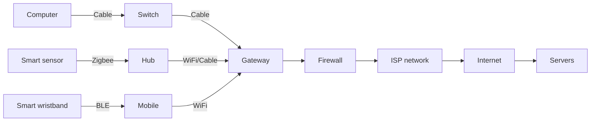
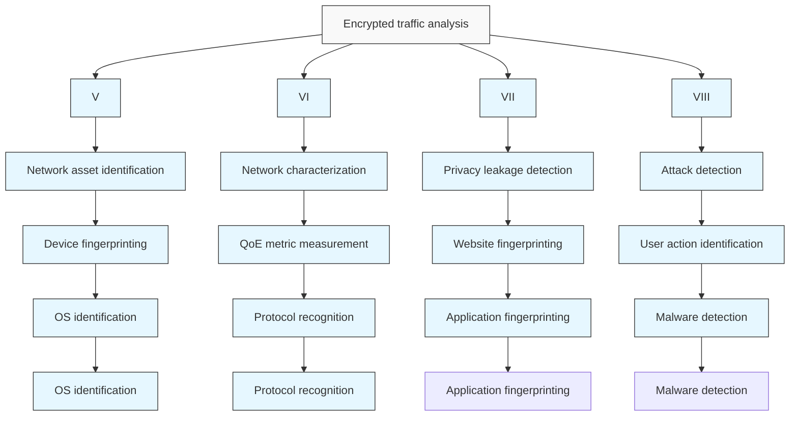
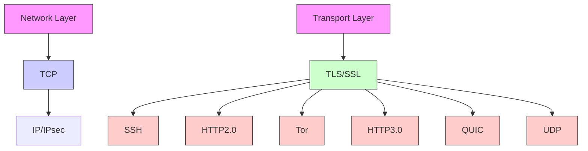
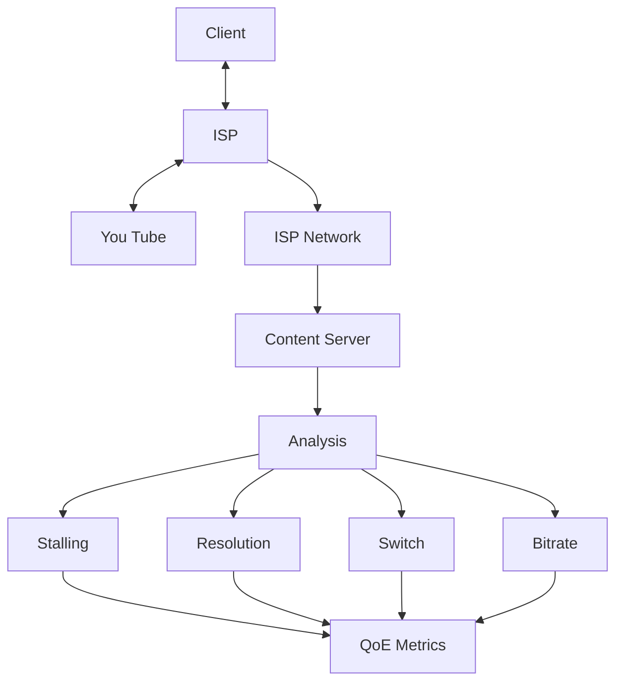
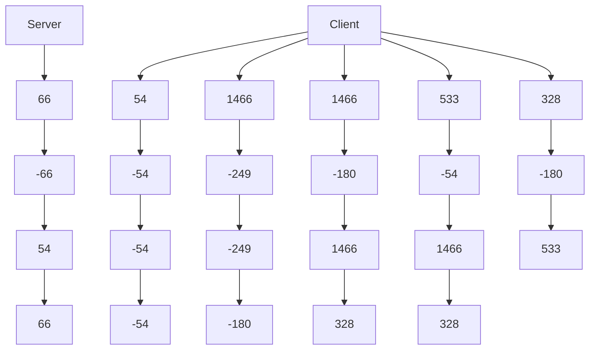
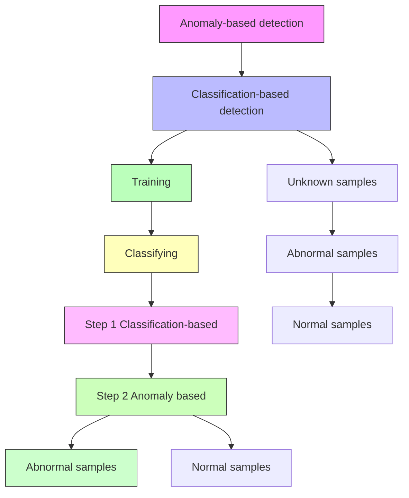

# Machine Learning-Powered Encrypted Network Traffic Analysis: A Comprehensive Survey

Meng Shen , Member, IEEE, Ke Ye, Xingtong Liu, Liehuang Zhu , Senior Member, IEEE, Jiawen Kang , Member, IEEE, Shui Yu , Senior Member, IEEE, Qi Li , Senior Member, IEEE, and Ke Xu , Senior Member, IEEE

Abstract—Traffic analysis is the process of monitoring network activities, discovering specific patterns, and gleaning valuable information from network traffic. It can be applied in various fields such as network assert probing and anomaly detection. With the advent of network traffic encryption, however, traffic analysis becomes an arduous task. Due to the invisibility of packet payload, traditional traffic analysis methods relying on capturing valuable information from plaintext payload are likely to lose efficacy. Machine learning has been emerging as a powerful tool to extract informative features without getting access to payload, and thus is widely employed in encrypted traffic analysis. In this paper, we present a comprehensive survey on recent achievements in machine learning-powered encrypted traffic analysis. To begin with, we review the literature in this area and summarize the analysis goals that serve as the basis for literature classification. Then, we abstract the workflow of encrypted traffic analysis with machine learning tools, including traffic collection, traffic representation, traffic analysis method, and performance evaluation. For the surveyed studies, the requirements of classification granularity and information timeliness may vary a lot for different analysis goals. Hence, in terms of the goal of traffic analysis, we present a comprehensive review on existing studies according to four categories: network asset identification, network characterization, privacy leakage detection, and anomaly detection. Finally, we discuss the challenges and directions for future research on encrypted traffic analysis.

Index Terms—Encrypted traffic analysis, traffic classification, machine learning, deep learning, anomaly detection.

Manuscript received 20 January 2022; revised 23 May 2022 and 28 July 2022; accepted 16 September 2022. Date of publication 20 September 2022; date of current version 24 February 2023. This work was supported in part by the National Key Research and Development Program of China under Grant 2020YFB1006101; in part by NSFC Projects under Grant 62222201, Grant 62102099, Grant 62132011, Grant 61972039, and Grant 61932016; in part by the Beijing Nova Program under Grant Z201100006820006; in part by the China National Funds for Distinguished Young Scientists under Grant 61825204; and in part by the Beijing Outstanding Young Scientist Program under Grant BJJWZYJH01201910003011. (Corresponding author: Meng Shen.)

Meng Shen, Xingtong Liu, and Liehuang Zhu are with the School of Cyberspace Science and Technology, Beijing Institute of Technology, Beijing 100081, China (e-mail: shenmeng@bit.edu.cn; liuxingtong@bit.edu.cn; liehuangz@bit.edu.cn).

Ke Ye is with the School of Computer Science, Beijing Institute of Technology, Beijing 100081, China (e-mail: yeke@bit.edu.cn).

Jiawen Kang is with the School of Automation, Guangdong University of Technology, Guangzhou 510006, China (e-mail: kavinkang@gdut.edu.cn).

Shui Yu is with the School of Computer Science, University of Technology Sydney, Sydney, NSW 2007, Australia (e-mail: shui.yu@uts.edu.au).

Qi Li is with the Institute for Network Sciences and Cyberspace, Tsinghua University, Beijing 100084, China (e-mail: qli01@tsinghua.edu.cn).

Ke Xu is with the Department of Computer Science, Tsinghua University, Beijing 100084, China (e-mail: xuke@tsinghua.edu.cn).

Digital Object Identifier 10.1109/COMST.2022.3208196

# I. INTRODUCTION

W ITH the rapid increase of Internet traffic, the secu- rity of network connections becomes significantly crucial, as a large amount of user sensitive information is transmitted on the Internet, such as bank accounts and payment records. To ensure security and privacy, data encryption technologies, e.g., Secure Socket Layer/Transport Layer Security (SSL/TLS) [1], have been widely used to protect network connections. According to the Google Transparency Report [2], more than 95% of services provided by Google have applied encryption protocols to protect their connections, so that the resulting data packets are transmitted in a more secure way and can only be decrypted by legitimate receivers.

The ever-growing encrypted traffic, however, brings new challenges to network traffic analysis, which is a useful tool for administrators in network management and network anomaly detection. Traditional traffic analysis methods usually rely on valuable information from plaintext payload [11]. They are likely to lose efficacy for encrypted traffic, as payload information is no longer available. For instance, many attackers take advantage of encryption protocols to hide malicious contents and evade anomaly detection. It becomes more difficult for network administrators to find suspicious patterns in encrypted traffic. As another example, internet service providers (ISPs) usually measure delivery quality (e.g., video resolution, stall frequency) of video streams by analyzing contents in HTTP request header [12], [13] and then take actions accordingly. However, end-to-end encryption adopted by content providers sets a new barrier for ISPs to measure video delivery quality.

From the perspective of end users, traffic encryption also poses new threats to user privacy. In general, traffic encryption protocols (e.g., TLS) can protect Internet users from eavesdroppers that attempt to decipher or modify the content in their network connections. However, the privacy of end users is still threatened by advanced side-channel attacks. For instance, an eavesdropper can record their encrypted traffic and learn sensitive information, such as the websites a user is visiting and the actions taken by a user in mobile applications [14], [15], [16]. Encrypted traffic analysis provides us with a useful tool to get more insights into the information leakage from network connections, and then defenses can be designed and implemented accordingly.

TABLE I THE DIFFERENCES BETWEEN OTHER EXISTING WORKS AND OUR SURVEY 

<table><tr><td></td><td>Survey Paper</td><td>Year</td><td>Description</td></tr><tr><td rowspan="4">Uncrypted</td><td>Buczak et. al. [3]</td><td>2016</td><td>Introducing data mining and machine learning methods used for cyber security intrusion detection</td></tr><tr><td>Jing et. al. [4]</td><td>2018</td><td>Summarizing the security data and data analysis methods for DDoS and Worm attack detection</td></tr><tr><td>Fernandes et.al. [5]</td><td>2019</td><td>Overviewing the network data types and methods for network anomaly detection</td></tr><tr><td>Kwon et.al. [6]</td><td>2017</td><td>Surveying the deep learning methods used in network anomaly detection</td></tr><tr><td rowspan="5">Encrypted</td><td>Velan et.al. [7]</td><td>2015</td><td>Summarizing approaches for encrypted traffic analysis, mainly focusing on traditional machine learning methods</td></tr><tr><td>Rezaei et.al. [8]</td><td>2019</td><td>Overviewing the deep learning technique for encrypted traffic classification</td></tr><tr><td>Conti et.al. [9]</td><td>2018</td><td>Review the studies that contributed to network traffic analysis targeting mobile devices</td></tr><tr><td>Pacheco et.al. [10]</td><td>2018</td><td>Introducing machine learning solutions in network traffic classification</td></tr><tr><td>Our Survey</td><td>2021</td><td>Providing a survey of machine learning-powered encrypted traffic analysis methods categorized by analysis goals, including network asset identification, network characterization, privacy leakage detection and anomaly detection</td></tr></table>

bar

| Year | Number of published studies |
| :--- | :--- |
| Before 2010 | 3 |
| 2010-2011 | 5 |
| 2012-2013 | 2 |
| 2014-2015 | 15 |
| 2016-2017 | 32 |
| 2018-2019 | 33 |
| 2020-2021 | 18 |

Fig. 1. Number of investigated papers on encrypted traffic analysis sorted by published year.

To deal with these new challenges caused by traffic encryption, machine learning techniques have been employed to extract useful information from encrypted traffic, with no need for access to packet payloads. The machine learningpowered encrypted traffic analysis leverages statistical features or behavioral features of encrypted traffic, which are less affected when encryption protocols are adopted. These methods show great capabilities in dealing with extremely large amounts of data, which is suitable for building classification models without being specifically programmed. Moreover, as the branch of machine learning, deep learning obviates the process of manual feature extraction, which makes it a desirable approach for encrypted traffic analysis, especially in dealing with the constantly varying traffic patterns.

There are a fruitful number of studies on encrypted traffic analysis during the past decade. We investigated 108 papers that were published between 2007 and 2021, as depicted in Fig. 1. Among the literature investigated, machine learning techniques play an important role in encrypted traffic analysis. Therefore, it is quite necessary to conduct a comprehensive survey that summarizes the recent achievements in machine learning-powered encrypted traffic analysis and sheds a new light on future research directions.

vision [18], [19], Internet of Things (IoT) [20], economics and econometrics [21]. For instance, Bkassiny et al. [17] discuss the role of various machine learning models in cognitive radios, which is defined as radio devices that can adapt to the environment automatically. Wang et al. [18] provide an overview of generative adversarial networks applied in computer vision, including high-quality image generation, diverse image generation and stabilizing training. Different from these surveys, this survey focuses on the applications of machine learning in encrypted traffic analysis.

There are several surveys on traffic analysis, which are summarized in Table I. Buczak and Guven [3] conduct a survey of machine learning and data mining methods applied for intrusion detection. Jing et al. [4] focus on the Distributed Denial of Service (DDoS) and Worm attack detection. Fernandes et al. [5] and Kwon et al. [6] investigate traffic analysis methods for network anomaly detection. These surveys are not comprehensive enough, as they only concern about malicious behavior detection, where most studies focus on unencrypted network traffic. Due to the invisibility of packet payload, methods for unencrypted traffic relying on plaintext payload signatures are likely to lose efficacy for encrypted traffic.

Several recent surveys pay attention to traffic analysis methods applicable in the encrypted scenario [7], [8], [9], [10]. Among these studies, Conti et al. [9] review the applications of traffic analysis targeting mobile devices, and Pacheco et al. [10] review the application of machine learning in traffic analysis, including both unencrypted and encrypted traffic. Numerous recent studies in this field show two research trends: 1) encrypted traffic analysis can find its applications in a wider range of scenarios in both fixed and mobile networks, from network asset recognition to network anomaly detection, and 2) deep learning techniques are increasingly employed to demonstrate their superiority over traditional machine learning models in encrypted traffic analysis. Therefore, compared with the existing surveys, we cover an extensive range of applications of encrypted traffic analysis based on the advanced machine learning techniques.

# A. Differences From Existing Surveys

With the rapid development of machine learning algorithms, there are many surveys on applications of machine learning in various scenarios, including cognitive radios [17], computer

# B. Contributions

The popularity of encrypted communication makes a survey dedicated to encrypted traffic analysis necessary. Compared with surveys that have been published on network traffic classification, we systematically introduce the encryption protocols and pay more attention to the complete workflow of encrypted traffic analysis. Moreover, we focus on machine learning techniques that are widely employed for a variety of analysis goals. The main contributions of this survey are summarized as follows:

flowchart

Fig. 2. System model of encrypted traffic analysis.

1) We abstract the workflow of encrypted traffic analysis from a great amount of concrete traffic analysis approaches, which presents an overview that helps readers grasp the general process on traffic analysis, including traffic collection, traffic representation, traffic analysis method design, and performance evaluation.   
2) To the best of our knowledge, we are the first to survey existing studies that employ machine learning techniques in encrypted traffic analysis. We present a systematic classification of the state-of-the-art methods according to analysis goals, including network asset identification, network characterization, privacy leakage detection and anomaly detection. This type of organization allows us to exhibit the variety of classification granularity and information timeliness among different analysis goals.   
3) We provide further insights into the defects of existing studies, and discuss in detail the future research challenges and directions on encrypted traffic analysis, which provides readers with possible directions for developing innovative solutions.

# C. Survey Organization

We commence with an overview on the application scenarios of encrypted traffic analysis in Section II-B, which depicts a whole picture according to their analysis goals. In Section III-C, we introduce the background of machine learning techniques that are commonly used in encrypted traffic analysis. Then, we present a description of the general framework of encrypted traffic analysis in Section IV, which serves as a guideline to review and compare the studies with specific analysis goals.

Sections V-VIII introduce recent studies on encrypted traffic analysis according to the 4 types of analysis goals. In each section, we attempt to extract the information of each literature following the stages of the general framework in Section IV. By this way, we can observe that the similarities and differences thoroughly among the existing studies.

Next, Section IX elaborates on the challenges and future research directions of encrypted traffic analysis. We still follow the steps in the general framework of encrypted traffic analysis and state the research challenges and opportunities in traffic dataset construction, traffic representation, analysis model building, and proposed countermeasures.

Finally, Section X concludes this survey. We summarize the achievements made by state-of-the-art on encrypted traffic analysis to highlight the valuable information that can be excavated in traffic encryption scenarios. We also point out potential research directions that require further investigations.

# II. OVERVIEW OF ENCRYPTED TRAFFIC ANALYSIS

In this section, we first introduce a general system model of encrypted traffic analysis, and then propose a criterion, according to which we can classify existing papers using a layered structure. The list of common abbreviations and explanations are summarized in Table II.

# A. System Model

The system model of encrypted traffic analysis is shown in Fig. 2. Encrypted traffic generated by different kinds of end devices, e.g., computers, IoT devices, and mobile phones, is sent to remote servers, which may pass through the gateway, firewall, local ISP networks and the Internet. Traffic monitors can collect traffic at different points along this path and then conduct traffic analysis according to their goals. For example, a network administrator may monitor whether the network is under attack by analyzing the traffic passing by the firewall; an attacker can refer from an end user’s traffic which website or application the user is visiting. Moreover, ISPs can measure network service quality perceived by end users based on the traffic traversing their networks.

# B. Taxonomy of Encrypted Traffic Analysis

Considering that a fruitful of papers have been published during the last decade, it is challenging to classify these papers according to appropriate criteria. Structuring the literature in a comprehensive and clear way is non-trivial, as we would end up with completely different categories according to various classification criteria.

The requirements of classification granularity and information timeliness may vary between different analysis goals for the surveyed studies. For instance, network attack detection is generally regarded as a binary classification problem (i.e., whether the traffic is malicious) while website fingerprinting is regarded as a multi-class problem (i.e., which website the user is visiting). Compared with website fingerprinting, QoE metric measurement has a higher requirement for real-time performance, since an ISP needs to adjust the quality of content transmission according to the actual situation. Accordingly, encrypted traffic analysis methods highly depend on the analysis goals, including traffic feature extraction and machine learning model selection. The researchers attempt to optimize their analysis methods to meet the requirements of a specific application scenario. Thus, we group the existing studies by the analysis goals, as illustrated in the hierarchical structure in Fig. 3. At the top level, we identify four macro-goals that correspond to different application domains, including network asset identification, network characterization, privacy leakage detection, and anomaly detection. At the lower level, several micro-goals are summarized within each application domain, corresponding to the specific targets.

TABLE II COMMON ABBREVIATIONS AND EXPLANATIONS USED IN THIS PAPER 

<table><tr><td>Abbreviation</td><td>Explanation</td><td>Abbreviation</td><td>Explanation</td><td>Abbreviation</td><td>Explanation</td></tr><tr><td>AF</td><td>Application Fingerprinting</td><td>CNN</td><td>Convolutional Neural Network</td><td>DDoS</td><td>Distributed Denial-of-Service</td></tr><tr><td>DT</td><td>Decision Tree</td><td>GNN</td><td>Graph Neural Network</td><td>IoT</td><td>Internet of Things</td></tr><tr><td>IPSec</td><td>Internet Protocol Security</td><td>ISP</td><td>Internet Service Provider</td><td>k-NN</td><td>k Nearest Neighbor</td></tr><tr><td>LSTM</td><td>Long Short-Term Memory</td><td>OS</td><td>Operating System</td><td>QoE</td><td>Quality of Experience</td></tr><tr><td>QoS</td><td>Quality of Service</td><td>QUIC</td><td>Quick UDP Internet Connection</td><td>R2L</td><td>Remote to Local</td></tr><tr><td>RF</td><td>Random Forest</td><td>SDN</td><td>Software Defined Network</td><td>SSH</td><td>Secure Shell</td></tr><tr><td>SSL</td><td>Secure Socket Layer</td><td>SVM</td><td>Support Vector Machine</td><td>TLS</td><td>Transport Layer Security</td></tr><tr><td>Tor</td><td>The Onion Router</td><td>U2R</td><td>User to Root</td><td>WF</td><td>Website Fingerprinting</td></tr></table>

flowchart

Fig. 3. Classification of existing studies on encrypted traffic analysis according to their analysis goals.

• Network asset identification targets identifying physical network equipment and the operating system (OS). On the one hand, with an increasing number of network devices connected to the Internet, it becomes more difficult for network administrators to fully understand the network assets under their control. On the other hand,

malicious attackers can accurately grasp the vulnerabilities of devices by identifying which version it is. As different types of network devices and OS versions may lead to various characteristics in communication traffic, we can perform network asset identification based on traffic analysis even if the traffic is encrypted. Coupled with the above two aspects, we shall introduce a variety of analysis methods as well as traffic representation methods.

Network characterization is to have an understanding of service delivery quality and related protocols by analyzing the corresponding traffic. Video streaming traffic shows a trend of rapid growth, where the demands for high bandwidth and low latency increase accordingly. The control of transmission quality by service providers is inseparable from the perception of user experience. However, with the adoption of encrypted protocols, such as SSL/TLS and QUIC, video streaming services produce an increasing amount of encrypted traffic, leaving limited features for network characterization. To solve this issue, a lot of studies focus on measuring and characterizing the video-based service delivery quality from encrypted traffic, e.g., the QoE perceived by end users. These characteristics can help network providers to figure out the long-term or short-term quality of their network service and optimize their routing strategies.

Privacy leakage detection focuses on the analysis of information that may be leaked by encrypted traffic. Although the encryption protocols are proposed to protect the content of traffic packet, there are still differences in the traffic of different websites or applications, which provides a possible way for privacy leakage, such as what website or application a victim is visiting, as well as the in-app actions during the visits (e.g., sending an email in Gmail [22]). This difference may be reflected in features such as packet length, peak packet numbers, etc. With this target, we review three categories of privacy leakage, i.e., Website Fingerprinting (WF), Application Fingerprinting (AF), and user action identification.

• Attack detection mainly aims to detect diverse malware and network anomaly. Recently, we have witnessed a rapid growth of malware targeting PCs, mobile phones and IoT devices, such as WannaCry and Petya. There are also an increasing number of network attacks on various platforms, such as enterprise networks, campus networks, IoT networks and blockchain networks [23], [24], [25]. The adoption of encryption techniques makes payload-based anomaly detection methods ineffective, as the traditional detection methods commonly scan packet contents to figure out malicious patterns based on the signature library. However, the traffic generated by abnormal behaviors is still different from that of legitimate behaviors, making it possible to distinguish abnormal traffic from benign traffic even in an encrypted scenario.

# III. BACKGROUND OF MACHINE LEARNING

As this survey mainly focuses on the application of machine learning in encrypted traffic analysis, in this section, we briefly introduce the background of machine learning and review several commonly-used algorithms.

Machine learning aims to build models that can improve the future performance of a target through learning from the past experiences [26], [27], [28], [29], [30]. It is a highly interdisciplinary field based on other fields such as statistics and optimization theory [31], which serves multiple tasks in different scenarios, e.g., medical industry [32], IoT [20] and financial industry [21]. Machine learning also plays an important role in encrypted traffic classification, which can be demonstrated by the fact that almost 85% of the studies investigated employ machine learning methods for various analysis goals.

# A. Categories of Machine Learning Methods

From the aspect of whether labels are required, machine learning can be classified as supervised learning, unsupervised learning, semi-supervised learning and reinforcement learning. As for supervised learning, the input data has a pre-determined label, e.g., the type of traffic. The model is trained to achieve a higher level of classification accuracy. For unsupervised learning, there is no label for training dataset, the model is designed by deducing existing patterns of samples [26]. Semisupervised learning is used for the dateset with both labeled and unlabeled samples, typically most of them are unlabeled as unlabeled data is less expensive [33]. Reinforcement learning is trained to decide actions yield the most rewards by the trial and error, which is based on the interactions with environments and past experiences of learning [34].

Taking supervised learning as an example, we introduce a general model of machine learning. Supervised learning uses a training dataset to train a model, which is leveraged for the prediction of the test dataset. For a training dataset $D = \{ ( x _ { i } , y _ { i } ) \} , i = 1 , 2 , \ldots , N$ , where $x _ { i } \in \mathbb { X }$ denotes an input sample (e.g., an extracted feature vector), and $y _ { i } \in \mathbb { Y }$ denotes an output sample (e.g., a specific label for classification problems). In the training phase, a decision model ${ \hat { Y } } \ = f ( X )$ is obtained, which maps the inputs to outputs. Through the training algorithm, the decision model tries to minimize the differences between the predicted value $\hat { y } _ { i }$ and the real value y based on a loss function $L ( y _ { i } , f ( x _ { i } ) )$ . The model that minimizes the loss function is taken as the final decision model $f ^ { * } ( X )$ . In the testing phase, for each sample in the test dataset, the model gives the corresponding prediction value.

Inspired by the existing surveys [35], [36], we also consider model complexity as another criterion to categorize machine learning methods. According to this criterion, machine learning can be roughly divided into two categories, namely traditional machine learning methods and deep learning methods. The main difference of them is that most deep learning methods leverage cascades of neural network layers, which contain nonlinear processing units for feature extraction [37]. In contrast, traditional machine learning methods without nonlinear processing units usually require more feature engineering [38].

For traffic analysis, feature extraction is a crucial part. To improve the accuracy of traffic classification, many studies focus on how to extract effective semantic information from byte stream to fed into traditional machine learning models. However, with the advent of deep learning, feature engineering is no longer the only concern. The combination of raw information and neural network models becomes another way to achieve high accuracy. We observed that feature engineering combined with traditional machine learning, and raw information combined with deep learning are the two common types of approaches for traffic analysis. The former focuses more on the extraction of effective features, while the latter focuses more on the construction of models with strong feature extraction capability. Due to this reason, we will mainly introduce machine learning according to this criterion.

# B. Traditional Machine Learning Methods

Typical examples of traditional machine learning methods include Naïve Bayes, Markov Model, k-Nearest Neighbor (k-NN), Support Vector Machine (SVM), Decision Tree (DT), Random Forest (RF), and clustering, which are briefly described as follows.

Naïve Bayes [39] method is a classification method based on Bayes’ theorem and condition independence. It is called naïve because it assumes that the features are independent of each other. It can make probabilistic inferences for classification and decision-making problems.

```mermaid
graph TD
    A["Traffic Collection"] --> B["Traffic Representation"]
    B --> C["Traffic Analysis"]
    C --> D["Performance Evaluation"]

    subgraph Traffic Collection
        E["Internet"] --> F["Mobile Device"]
        F --> G["Encryption"]
        G --> H["Protocols/Tools"]
        H --> I["Internet Devices"]
    end

    subgraph Traffic Representation
        J["Flow-Level"] --> K["Session-Level"]
        K --> L["Feature Extraction"]
        L --> M["Packet Time/Length/Count"]
        M --> N["Sequence/Graph/Image"]
    end

    subgraph Traffic Analysis
        O["Machine Learning Method"] --> P["Naïve Bayes Markov Model"]
        P --> Q["k-NN SVM DT RF K-Means"]
        Q --> R["CNN GNN LSTM"]
        R --> S["Deep Learning Method"]
        S --> T["Expert System"]
        T --> U["Knowledge-based Method"]
    end

    subgraph Performance Evaluation
        V["Effectiveness"] --> W["TPR FPR Pree"]
        W --> X["Acc F1 ROC"]
        X --> Y["Time Overload"]
        Y --> Z["Training and Verification Time"]
        Z --> AA["Time Complexity"]
        AA --> AB["Robustness"]
        AB --> AC["Newly needed packets"]
        AC --> AD["Trained Model"]
    end
```

flowchart

Fig. 4. A general workflow of encrypted traffic analysis.

• Markov Model [40] is a stochastic model, which gives the probabilities of random state changing. It composes of state, state transition probability, and the initial probability distribution. The first-order Markov model assumes that the current state depends only on the last state and is irrelevant to the earlier states.   
• k-NN [41] is a commonly used supervised learning method. Given the target sample, it finds out the nearest k samples, and predicts the information according to these neighborhoods. The distant calculation methods include Euclidean distance, Manhattan distance, etc.   
• SVM [42] is a flexible supervised algorithm for both classification and regression. In order to solve the complex classification problems, SVM uses a kernel function to map the features of low dimensional space to the higher one. Common kernel functions include linear kernel, polynomial kernel, Gaussian kernel and Sigmoid kernel.   
• DT [43] is composed of directed edges and nodes which include the root node, internal nodes and leaf nodes. The path from the root node to each leaf node corresponds to a decision sequence. The commonly used algorithms for DT are ID3, C4.5 and CART.   
• RF [44]is a collection of traditional DTs. Given the shortcoming that DT is easy to overfit, RF adopts the voting mechanism based on multiple DTs for improvement. To be specific, each tree in RF is trained by a sub dataset sampled from the original dataset and then the final result is obtained through the voting of all DTs.   
k-Means [45] is a commonly used clustering algorithm. It assigns each object to the nearest cluster based on the distances from cluster centers, and then recalculates the centers. This process is repeated until convergence and finally all objects are divided into k clusters.

# C. Deep Learning Methods

Traditional machine learning technologies are essentially shallow learning, which has some limitations in terms of accuracy for classification tasks. In particular, their generalization abilities are restricted when dealing with complex problems. Hence, deep learning is introduced to address these limitations. We mainly introduce three typical deep learning methods that are widely employed in encrypted traffic analysis.

Convolutional Neural Network (CNN) [46] is a kind of neural network with convolution operation added, which can weaken local features and enhance generalization. The special thing about CNN is that this method has the convolutional layer, which uses the convolution operation to filter the input features. Normally, the convolutional layer and the pooling layer appear alternately. After the combination of several sets of convolutional and pooling layers, a fully connected layer will be added at the end.   
• Graph Neural Network (GNN) [47] is a deep learning method that processes the data represented in the graph domain [47]. As an effective graph analysis method, GNN is widely used in social network and physics system analysis, which leverage graphs as the denotation of the relationships underlying data.   
• Long Short-Term Memory (LSTM) [48] is a special kind of Recurrent Neural Network (RNN) used to process sequences, which has achieved excellent performances in the field of natural language processing. LSTM has the ability to selectively remember the previous output results and superimpose them on different positions of the current cell to achieve the purpose of data analysis.

# IV. A GENERAL FRAMEWORK OF ENCRYPTED TRAFFIC ANALYSIS

In this section, we summarize the general framework of encrypted traffic analysis. We present the framework overview and then elaborate on each component in the section.

The overview of the general framework of encrypted traffic analysis is illustrated in Fig. 4, where four components are evolved, namely traffic collection, traffic representation, traffic analysis method, and performance evaluation.

# A. Traffic Encryption Mechanisms

We summarize the encryption protocols and anonymity mechanisms currently used for secure communication before introducing each individual component in Fig. 4. Without traffic encryption, sensitive information transmitted in cleartext would be effortlessly sniffed by malicious eavesdroppers who have access to network interfaces. Moreover, cleartext communication provides convenience for intentional attackers inserting false information, which makes communication unreliable. Therefore, traffic encryption mechanisms have been implemented for communication security guarantees.

flowchart

Fig. 5. Mechanisms in the network model.

The interaction process of an encryption protocol usually includes two parts: a secure connection establishment phase and an encrypted data transmission phase. The secure connection establishment phase mainly includes handshake, authentication and encryption algorithm negotiation, which is the preparation for encrypted data transmission. The encrypted data transmission phase ensures safe transmission with the use of the encryption algorithm negotiated in the previous phase.

Next, we introduce mainly used encryption protocols including Internet Protocol Security (IPSec) on the network layer, SSL/TLS and Quick UDP Internet Connections (QUIC) between the transport layer and application layer, Secure Shell (SSH) and HTTP over Secure Socket Layer (HTTPS) on the application layer as well as anonymity mechanisms such as The Onion Router (Tor) in detail. The encryption protocols and anonymity mechanisms are organized according to their positions in the network structure as Fig. 5.

• IPSec [49].IPSec is a set of network transmission protocols for network layer communication security, which is utilized for the authentication of communication parties as well as the confidentiality and integrity of the data [50]. IPSec mainly includes Security Association (SA), Internet Key Exchange (IKE), Authentication header (AH) and Encapsulated Security Payload (ESP).   
SSL/TLS [1]. SSL locates between a reliable connectionoriented network layer protocol and an application layer protocol. It creates an encryption channel between the communication parties to ensure the confidentiality of communication, preventing malicious attackers acquiring and modifying any information, which may contain sensitive data. TLS is a standard proposed by Internet Engineering Task Force (IETF) in 1999 as the successor of SSL, providing transport layer security directly on top of the TCP protocol [7]. The recent version of TLS is TLS 1.3 [51] defined in 2018. TLS consists of three

components including handshake protocol, alert protocol and record protocol. Handshake protocol is mainly used for encryption algorithm negotiation, key generation and identity authentication. Alert protocol is exploited for warning message notification once one of the parties discovers the exception. Record protocol is responsible for data translation between communication parties. The data is divided into multiple shorter fragments and each fragment is compressed separately. Thereafter, the compressed fragment will be added with a message authentication code which is used to ensure the integrity and perform data authentication. Finally, the compressed fragment with the message authentication code will be encrypted together with a symmetric password.

• SSH [52]. SSH is a security protocol based on the application layer, which is designed to provide security for the connection and interaction between the client and remote host, preventing information leakage during remote access. SSH establishes an encrypted channel between the communicating parties to ensure the confidentiality of the transmitted information and uses a key exchange algorithm to ensure the security of the key itself. It mainly consists of three parts including the transport layer protocol (SSH-TRANS), user authentication protocol (SSH-USERAUTH) and the connection protocol (SSH-CONNECT).

• HTTPS [53]. HTTPS is the extension of HTTP by wrapping it inside the SSL/TLS protocol, which is used for safety communication over the network. Compared with HTTP, HTTPS can be utilized for encrypted transmission, identity authentication and data integrity protection. For this reason, HTTPS plays an important role in online activities such as shopping, payment and website browsing.

• QUIC [54]. QUIC is a new generation of low-latency network transport layer protocol based on user datagram protocol (UDP), which is similar to TLS implemented on TCP. HTTP and several extended protocols are based on TCP protocol. However, the TCP protocol requires three times of handshakes before establishing a connection. The purpose of QUIC is to reduce network latency while ensuring reliability. QUIC needs to complete the confirmation of packet transmission by itself because it is built on UDP which is unreliable. Besides, QUIC realizes multiplexing without head-of-line blocking and can be used for applications or services with real-time requirements.

• Tor [55]. Tor is an open-source and free anonymous communication software. It is widely used because it can provide low-latency and low-overhead anonymous access services. Due to the similarity between the structure of the Tor network and onion, it is called the onion routing. Tor can help users deal with some malicious attacks effectively. As the Tor client starts, it will first run an onion agent locally and then get in touch with the directory server which stores global relay node information. After the onion agent obtains the relay node information, it will select three nodes according to the routing algorithm to form an anonymous communication link. The onion agent will shake hands with each node using the Diffie-Hellman (DH) handshake protocol to negotiate a session key. Only when the link is confirmed to be established, users’ access information begins to be delivered. In this process, each node cannot discover the source and destination of the information. Tor randomly selects forwarding nodes and keeps updating. At the same time, it encrypts the packet contents with the negotiated keys to ensure confidentiality.

• Nested encryption [56]. National Security Agency (NSA) delivers the multi-site connectivity capability package to meet the demands of data transmission across networks with different security levels. It needs two independent encryption tunnels (i.e., inner encryption component and outer encryption component), which can use either IPSec or Media Access Control Security (MACsec). According to the times of encryption, the network is classified into the red network that consists of unencrypted data, the gray network that consists of data that has been encrypted once, and the black network that consists of data that has been encrypted twice. When a packet is sent to the black network, it is encrypted by the two encryption components in turn. Similarly, at the destination, the received packet is unencrypted twice.

Encryption technologies are used to protect user privacy and communication security emerges endlessly. Although these encryption protocols or anonymity mechanisms protect the security of communication to a certain extent, it is still possible for the attacker to obtain some sensitive information by analyzing the encrypted traffic.

# B. Traffic Collection

Traffic data collection is an important step in the field of encrypted traffic analysis, as a data set is the foundation of experiments. Therefore, data collection often acts as the starting point of encrypted traffic analysis.

As shown in Fig. 2, traffic can be captured at various nodes in a network, such as switches, routers, and gateways. In recent years, several network simulation techniques, such as NS3 [57], have been proposed to simulate network traffic. Software-Defined Network (SDN) [58], [59], which has a special network structure, can also facilitate traffic data collection. In this section, we are dedicated to introducing typical traffic collection tools that are commonly used for traffic capture.

• Libpcap [60]. It is a well-known network packet capture library based on C/C++, which sits at the data link layer and can display TCP/IP and other packets transmitted over the network. Libpcap defines pcap as the storage form of captured packets, which is widely used in traffic capture tools. Many other traffic capture tools, such as Tcpdump and Wireshark, are based on this library.   
• TCPdump [61]. It is a packet analysis tool that runs on Linux systems, which is based on Libpcap. TCPdump offers the ability to capture network packets and record those packets in pcap files. It also enables users to filter network packets using regular expressions. Since

TCPdump is based on the command line, users can set parameters to meet different requirements, such as limiting the number of captured packages.

Wireshark [62]. It is a traffic collection tool that runs on Windows, which is known as the user interface version of tshark [63]. Similar to TCPdump, it enables user specific requirements on packet capture. It can display traffic information more visually through the user interface, such as displaying different protocol information in different colors. Compared with TCPdump, Wireshark shows a better user experience but consumes more power and memory [61].   
• Netflow [64]. It is a network monitoring technique proposed by Cisco, which can be deployed on routers and gateways. Unlike the above three tools, Netflow provides a flow-level view of network traffic, recording the information on each flow, rather than providing the packet-level information as Wireshark and TCPdump do. In NetFlow, a flow is uniquely defined by the five tuples, namely the source IP address or port, the destination IP address or port, and the transport protocol. For enterprise users, a flow-level display of traffic can be more useful, manageable and readable than the packet-level display.   
• Hardware Probe [65]. It is a network tool that can capture and analyze network packets at the physical layer. The hardware probe can provide more timely information, including physical layer data, without consuming network resources. While compared with software-based tools, the strategy based on hardware is expensive and inflexible.

# C. Traffic Representations

The representation of traffic is essential for traffic analysis. For different application scenarios, the traffic representations may be diverse. A superior traffic representation can improve the effectiveness and reduce the overhead.

1) Representation Level: We introduce two mainly used traffic representation levels according to classification granularity including flow-level and session-level.

• Flow-Level. The flow is a collection of data packets with the specific common attributes. Generally, common attributes refer to the source or destination IP, source or destination port and protocol [66]. Moreover, in [67], a group of packets with specific common attributes collected in a pre-defined time interval are regarded as the basic unit of analysis, which is also considered as flow-level representation in this survey. From the flowlevel representation, multiple statistical features such as an average packet count, maximum packet length, or minimum interval time can be extracted.   
• Session-Level. The session is a collection of packets generated during the complete interaction between the client and server, e.g., packets generated by a complete website visit process from session-level traffic [68]. The packets in a session may have different attributes such as destination IP, therefore, a session may contain several flows. Especially, there is no limitation on the size of the flow,

e.g., a flow may contain only one packet. However, a session must include a completely interactive process, so it includes at least two packets related to the establishment of the interactive process. Meanwhile, the statistical features extracted from flow-level representation are also suitable for session-level representation as the essence of a session is still a collection of packets. In addition, other features such as the count of flows or the average duration of flows can be extracted as session-level features.

2) The Forms of Representations: The traffic representation corresponds to the input of classifiers. To be specific, multiple features such as packet-based features and statistical features can be used as the input of traditional machine learning classifiers. Besides, raw representations of traffic such as sequences [68] or graphs [69] may be used as the input of deep learning models. Different forms of traffic representations for encrypted traffic analysis are introduced as follows.

• Packet-Based Features: The basic packet-based features are the information of packet header captured directly. Generally, the five-tuple of IP packets, including source and destination IP addresses, source and destination ports and protocol types, are the most commonly leveraged packet-based features. Moreover, the Time-To-Live of the IP header, the initial window size of the TCP header can also be extracted as features. These are the simplest features obtained directly from the packet.

Statistical Features: Statistical features are defined as features extracted from a group of packets through abstraction or computation. The statistic values include expectations, deviations, average, minimum, maximum, medians, accumulation, etc. Combining these statistics with traffic attributes, such as packet size, inter-arrival time, packet count, results in a large number of statistical features, e.g., average of cumulative packet sizes, quartile of inter-arrival time and burst packet count.

• Raw Traffic Representation: In addition to selecting network traffic features manually, researchers can also use frameworks or models like deep learning algorithms to extract features automatically. Artificial feature extraction is based on experience, however, the raw representation transfers the offload of feature selection to the models. Several studies encode traffic into sequences [68], graphs [69] or images [70] for classification. For example, the traffic can be abstracted into graphs. The structure of the graph can be regarded as a set of interconnected nodes, each of which is treated as a packet. This is similar to the graph definition in data structure and can be augmented with directions, weights, etc.

# D. Encrypted Traffic Analysis Methods

With the traffic representation obtained in Section IV-C, traffic analysis methods are applied according to different task requirements. The investigated encrypted traffic analysis methods are summarized in Table III. As a necessary supplementary, apart from machine learning methods, we also introduce knowledge-based methods, which are selected in certain scenarios.

1) Machine Learning Method: As shown in Table III, we can divide these methods into two categories, namely traditional machine learning and deep learning. In encrypted traffic analysis, the major difference between the two categories is that the former requires manually-crafted features as input, which needs complex feature engineering processes, while the latter enables end-to-end traffic classification. The process of feature extraction requires much prior knowledge about the task, e.g., the most contributing features for distinguishing target traffic from background traffic.

Traditional machine learning technologies are essentially shallow learning, which has some limitations in the accuracies for classification tasks. In particular, their generalization abilities are restricted when dealing with complex problems. In contrast, deep learning methods are introduced to address these limitations. Benefitting from the feature learning ability of deep learning, it enables raw traffic representation as input. For example, several studies represent traffic with sequences, e.g., packet direction sequences [68], and use a CNN as the classifier. Also, the CNN can be combined with a triplet network as the feature extractor [140]. Moreover, network traffic can also be represented by a graph structure, which digs out the hidden information [69], and is combined with GNNs for traffic classification. In addition, as there are correlations between the packets at the current moment and those in the previous period of time, LSTMs can be used to capture timing features of packet sequences [147].

The rapid development of machine learning, especially deep learning, provides a large number of analytical methods for encrypted traffic analysis. Unsupervised learning has even the ability to identify unknown targets, which provides more possibilities for abnormal traffic detection.

2) Knowledge-Based Method: It is used for traffic analysis based on prior knowledge. The knowledge-based method is generally composed of two parts, i.e., the knowledge base and the inference engine. The knowledge base is used to store facts, such as specific patterns and logical assertions. The inference engine is used to analyze the problem and match the content in the knowledge base. In encrypted traffic analysis, several studies extract features of traffic and match them using similarity analysis [71] or pre-established rules [72] to achieve the purpose of classification. However, the accuracy of knowledge-based detection greatly depends on the completeness of the knowledge base. Therefore, knowledgebased methods are not widely used in traffic analysis. With the types of network devices, applications and attack methods increasing, the knowledge base needs to be updated dynamically. Hence, most studies tend to leverage machine learning methods for encrypted traffic analysis.

# E. Performance Evaluation Metrics

In order to verify the effectiveness of encrypted traffic analysis methods, several effective validation methods and evaluation metrics are proposed.

The validation method is used to confirm that the analytical method is suitable for its intended use. In machine learning, there are two commonly used datasets, training set and test set, which are utilized for model building and model validating.

TABLE III SUMMARY OF EXISTING TRAFFIC ANALYSIS METHODS 

<table><tr><td></td><td>Classifier</td><td>Related works</td><td>Applications</td><td>Advantages</td><td>Disadvantages</td></tr><tr><td>Knowledge-based</td><td>-</td><td>[71], [72], [73], [74],[75], [76], [77], [78],[79], [80], [81], [82]</td><td>1. It classifies traffic through stacking simple rules.2. Deal with tasks where the feature of target traffic is obvious, such as OS identification (Section V-B).</td><td>Traffic can be identified by matching specific features, which has high interpretability.</td><td>Depend on the effectiveness of the constructed knowledge library.</td></tr><tr><td rowspan="7">Supervised ML</td><td>Bayes classifier</td><td>[83], [84], [85], [86],[87], [88], [84], [89]</td><td rowspan="6">1. It is applied in scenarios where historical traffic labels are known.2. Deal with classification tasks where traffic can be obtained ahead of time, such as IoT device fingerprinting (Section V-A).</td><td rowspan="8">1. Through learning from historical traffic datasets, it provides reliable and repeatable decisions.2. Utilize highly interpretable algorithms, which makes it easy to explain the reasons for decision.3. Take relatively little time for model training, usually only seconds to hours [38].</td><td rowspan="8">1. Require artificial feature extraction based on prior knowledge such as discrimination of different categories.2. It is shallow learning, which performs pool in feature extraction.3. It is less capable of dealing with time drift, especially when considering a long period, as the applications, malware, may be updated [92].</td></tr><tr><td>Markov model</td><td>[16], [90], [91]</td></tr><tr><td>K-NN</td><td>[93], [94], [95], [96],[97], [98], [99], [100],[101]</td></tr><tr><td>SVM</td><td>[102], [66], [103], [104],[105], [106], [107], [108],[22]</td></tr><tr><td>DT</td><td>[109], [110], [111], [112],[113], [114], [115]</td></tr><tr><td>RF</td><td>[116], [117], [118], [119],[120], [121], [122], [123],[124], [125], [126], [127],[128], [129], [130], [131],[132], [133], [134]</td></tr><tr><td rowspan="2">K-Means</td><td rowspan="2">[135], [136]</td><td rowspan="2">1. It is applied for traffic samples that have no historical labels.2. Deal with classification of unknown traffic categories, such as unknown malware detection (Section VIII).</td></tr><tr><td>Unsupervised ML</td></tr><tr><td rowspan="3">DL</td><td>CNN</td><td>[137], [138], [139], [68],[140], [141], [142], [143],[144], [145]</td><td rowspan="3">1. It nests a cascade of hidden layers with nonlinear processing units for feature extraction.2. Deal with scenarios where there is few prior knowledge, as it allows to be fed with raw representation, such as the packet direction vector (Section VII).</td><td rowspan="3">1. The multilayer architecture of deep learning helps map the traffic to higher level representation [146].2. Perform well in scenarios where there are large and high dimensional data.3. Enable end-to-end traffic analysis, as few complex feature engineering is required [143].</td><td rowspan="3">1. Require significant volumes of data that should be updated regularly.2. Demand generous computing resources, which is expensive [38]. [146].3. Deep network is a black box, which makes it difficult to interpret as the complex hyperparameters and network structures</td></tr><tr><td>GNN</td><td>[69]</td></tr><tr><td>LSTM</td><td>[147], [148], [149], [150]</td></tr></table>

Different partition methods are used for dividing the two datasets. Common partition methods are k-fold cross validation, hold-out, and bootstrapping. Among them, the k-fold cross validation is the most frequently used validation method. In practice, 10-fold (i.e., k = 10) cross validation it is commonly used to evaluate to divide the data into 10 blocks in encrypted traffic analysis methods validation [84], [151], [152], which means k = 10. We first 10-fold cross validation divides a complete dataset into an average of 10 mutually exclusive subsets. Then, one of the subsets is used as the test set in turns, and the union of the remaining 9 subsets is used as the training set. In the end, each subsetblock of data is used for training and testing, which maximizes the use of the dataset and the final validation result does not depend on the random choice of the training set.

At the same time, according to the coverage of the training set to the test set, we can divide the validation method into closed-world validation and open-world validation. In a closed-world, we assume that the training set contains all classes of samples in the test set, which means there is no unknown sample in the test set. However, the open-world corresponds to a more realistic scenario, in which the test set contains samples belonging to unknown classes. In the field of encrypted traffic analysis, unknown samples can represent new network devices [119], OS types [153], malware [152], network attacks [134], etc. Compared with the closed-world validation, the open-world validation generally has higher requirements for classification models.

TABLE IV CONFUSION MATRIX OF CLASSIFICATION RESULT 

<table><tr><td rowspan="2">Predicted class</td><td colspan="2">Actual class</td></tr><tr><td>Condition positive</td><td>Condition negative</td></tr><tr><td>Condition positive</td><td>TP</td><td>FP</td></tr><tr><td>Condition negative</td><td>FN</td><td>TN</td></tr></table>

After the selection of validation methods, multiple evaluation metrics are proposed. According to the different requirements of the classification on the accuracy, time and generalization, we can divide the evaluation metrics into effectiveness, time overhead and robustness.

1) Effectiveness: For both binary classification and multiclassification tasks, two metrics, accuracy and error rate, are commonly used. Accuracy is defined as the ratio of the number of samples labeled correctly over the total number of samples, while Error rate is defined as the percentage of samples classified incorrectly in the total samples.

In particular, for binary classification, we can obtain a confusion matrix, as shown in Table IV. The confusion matrix includes four elements: true positive (TP), false positive (FP), true negative (TN), and false negative (FN). Among them, TP stands for positive samples predicted to be positive by the model, FP stands for negative samples predicted to be positive by the model, FN stands for positive samples predicted to be negative by the model, and TN stands for negative samples predicted to be negative by the model. Based on these four elements, the commonly-used evaluation metrics for effectiveness can be calculated.

TPR (Recall) is the ratio between the number of positive samples correctly classified and the number of actual positive samples, ranging between 0 and 1.   
• FPR is the ratio between the number of negative samples incorrectly classified and the number of actual negative samples, ranging between 0 and 1.   
Precision (Prec) is the ratio between the number of positive samples correctly classified and the number of samples classified as positive, ranging between 0 and 1.

Moreover, some metrics that consider two of the above metrics comprehensively are proposed.

• F1 considers both Prec and Recall, which is represented as the harmonic mean of Prec and Recall.   
Receiver Operating Characteristic (ROC) curve is constituted by TPR and FPR, with TPR as the vertical axis and FPR as the horizontal axis. When we compare the performance of two models, if the ROC curve of the first model can completely ‘cover’ the second one’s, we can consider the performance of the first one is better.

• Area Under ROC Curve (AUC) is the area under the ROC curve. If the ROC curves of the two comparison models cross, we can choose AUC as the evaluation metric.   
• Precision-Recall Curve (P-R Curve) is constituted by Prec and Recall, with Prec as the vertical axis and Recall as the horizontal axis. When it comes to the imbalance dataset, P-R Curve is used to evaluate the performance of the model as an alternative to ROC Curve [68].

In addition, customized metrics are introduced into encrypted traffic analysis to evaluate the amount of leaked information [100]. Mutual information, which measures the mutual dependence between two variables, can be used as the feature engineering process for WF. The mutual information is defined as Formula 1:

$$
I (F; W) = H (W) - H (W | F) \tag {1}
$$

where F denotes the fingerprints of traffic, W denotes the website information, I(F; W) means the amount of information can be attained from F about W, H (·) is the entropy.

2) Time Overhead: Several encrypted traffic application scenarios have time requirements for methods, such as network attack detection and network device identification. For these scenarios, time overhead is another issue affecting the practicability of the model. In the encrypted traffic analysis field, time overhead evaluation metrics mainly include training time, validation time and time complexity.

• Training and validation time. They are important indicators commonly used for experimentally evaluating time overheads. Training time refers to the time required to train a traffic analysis model with a given set of training samples, while validation time refers to the time used to analyze the test set using the pre-trained model. To make a fair comparison among different analysis methods, the evaluation on training and validation time should be conducted on the same dataset [154], [155], [156].   
• Time complexity. It provides a theoretical estimate of time overhead to run a certain traffic analysis method. Different from training and validation time, time complexity focuses on computational complexity, rather than concrete analysis time spent on specific datasets.

3) Generalization: As the traffic in the network changes dynamically over time, the previously constructed model may not be suitable after the traffic features change. It requires that the constructed model is capable of generalization, which means that the classifier is supposed to be robust to the data mismatch problem. It may occur due to the staleness of training data or structure difference between training and test set. Here, we introduce a metric to evaluate the generalization which is defined as the number of samples needed for retraining the previously trained model [140]. For example, in the field of website fingerprinting, it is impossible for an attacker to use all website traffic for model training. If the training set comes from website a, while the attacker is expected to monitor website b, there are different structures between training and test sets. Due to this issue, the previously trained model is no longer applicable to the current test set. Therefore, we are supposed to use new samples which have the same structures as the test set to retrain the model. If the model retrained by only a few samples performs well, it is considered to have strong generalization and transferability.

TABLE V A CONCLUSION FOR STUDIES RELATED TO NETWORK ASSET IDENTIFICATION 

<table><tr><td rowspan="2"></td><td colspan="2">Analysis</td><td colspan="2">Dataset</td><td colspan="8">Feature1</td><td colspan="4">Method2</td><td colspan="4">Evaluation3</td></tr><tr><td>Ref</td><td>Year</td><td>Platform</td><td>Species</td><td>Level</td><td>Style</td><td>PH</td><td>PC</td><td>PL</td><td>PT</td><td>PD</td><td>Others</td><td>Category</td><td>Classifier</td><td>Train</td><td>Predict</td><td>OW</td><td>CW</td><td>ET</td><td>TO</td></tr><tr><td rowspan="13">Device Fingerprinting</td><td>[71]</td><td>2010</td><td>Access point</td><td>6</td><td>Flow</td><td>SF</td><td></td><td></td><td></td><td>✓</td><td></td><td></td><td>KB</td><td>-</td><td>Off</td><td>Off</td><td></td><td>✓</td><td>✓</td><td></td></tr><tr><td>[83]</td><td>2018</td><td>Mobile/IoT</td><td>34</td><td>Session</td><td>SF</td><td>✓</td><td></td><td></td><td></td><td></td><td></td><td>ST</td><td>Bayes</td><td>On</td><td>On</td><td>✓</td><td></td><td>✓</td><td></td></tr><tr><td>[102]</td><td>2017</td><td>Mobile/IoT</td><td>22</td><td>-</td><td>SF</td><td></td><td></td><td></td><td></td><td></td><td>Link-layer</td><td>ML</td><td>RF/CART/SVM</td><td>Off</td><td>Off</td><td>✓</td><td>✓</td><td>✓</td><td></td></tr><tr><td>[157]</td><td>2018</td><td>IoT</td><td>14</td><td>Session</td><td>SF</td><td>✓</td><td></td><td>✓</td><td></td><td></td><td>Entropy</td><td>ML</td><td>Gradient boosting</td><td>Off</td><td>Off</td><td></td><td>✓</td><td>✓</td><td></td></tr><tr><td>[93]</td><td>2018</td><td>IoT</td><td>22</td><td>Flow</td><td>SF</td><td></td><td></td><td>✓</td><td>✓</td><td></td><td></td><td>ML</td><td>k-NN</td><td>Off</td><td>Off</td><td></td><td>✓</td><td>✓</td><td></td></tr><tr><td>[116]</td><td>2017</td><td>IoT</td><td>21</td><td>Flow</td><td>SF</td><td>✓</td><td></td><td>✓</td><td>✓</td><td></td><td></td><td>ML</td><td>RF</td><td>Off</td><td>Off</td><td></td><td>✓</td><td>✓</td><td></td></tr><tr><td>[154]</td><td>2019</td><td>IoT</td><td>21</td><td>Flow</td><td>SF</td><td>✓</td><td></td><td></td><td></td><td></td><td></td><td>ML</td><td>AdaBoost</td><td>Off</td><td>Off</td><td></td><td>✓</td><td>✓</td><td></td></tr><tr><td>[66]</td><td>2017</td><td>IoT</td><td>9</td><td>Flow</td><td>SF</td><td></td><td>✓</td><td>✓</td><td>✓</td><td></td><td></td><td>ML</td><td>SVM</td><td>Off</td><td>On</td><td></td><td>✓</td><td>✓</td><td></td></tr><tr><td>[117]</td><td>2017</td><td>IoT</td><td>27</td><td>Flow</td><td>SF</td><td>✓</td><td></td><td></td><td></td><td></td><td></td><td>ML</td><td>RF</td><td>Off</td><td>On</td><td></td><td></td><td>✓</td><td>✓</td></tr><tr><td>[118]</td><td>2019</td><td>IoT</td><td>4</td><td>Flow</td><td>SF</td><td></td><td></td><td>✓</td><td>✓</td><td>✓</td><td></td><td>ML/DL</td><td>RF/ANN</td><td>Off</td><td>On</td><td></td><td>✓</td><td>✓</td><td></td></tr><tr><td>[158]</td><td>2018</td><td>Mobile</td><td>2</td><td>Flow</td><td>SQ</td><td></td><td></td><td></td><td>✓</td><td></td><td></td><td>DL</td><td>CNN</td><td>Off</td><td>Off</td><td></td><td>✓</td><td>✓</td><td></td></tr><tr><td>[119]</td><td>2020</td><td>IoT</td><td>10</td><td>Flow</td><td>SF</td><td>✓</td><td></td><td>✓</td><td></td><td></td><td></td><td>ML/DL</td><td>RF/Autoencoder</td><td>Off</td><td>Off</td><td>✓</td><td></td><td>✓</td><td></td></tr><tr><td>[159]</td><td>2015</td><td>Mobile/IoT</td><td>37</td><td>Flow</td><td>SF</td><td></td><td></td><td></td><td>✓</td><td></td><td></td><td>DL</td><td>ANN</td><td>Off</td><td>Off</td><td>✓</td><td></td><td>✓</td><td>✓</td></tr><tr><td rowspan="8">OS Identification</td><td>[72]</td><td>2016</td><td>Computer</td><td>-</td><td>Session</td><td>SF</td><td>✓</td><td></td><td></td><td></td><td></td><td></td><td>KB</td><td>-</td><td>Off</td><td>Off</td><td></td><td>✓</td><td></td><td></td></tr><tr><td>[73]</td><td>2016</td><td>Mobile</td><td>4</td><td>Flow</td><td>SF</td><td></td><td></td><td></td><td></td><td></td><td>Spectrum</td><td>KB</td><td>-</td><td>Off</td><td>On</td><td></td><td>✓</td><td>✓</td><td>✓</td></tr><tr><td>[84]</td><td>2014</td><td>Mobile</td><td>2</td><td>Flow</td><td>SF</td><td></td><td></td><td>✓</td><td></td><td>✓</td><td></td><td>ST</td><td>Bayes</td><td>Off</td><td>Off</td><td></td><td>✓</td><td>✓</td><td></td></tr><tr><td>[85]</td><td>2014</td><td>Computer/Mobile</td><td>3</td><td>Flow</td><td>SF</td><td>✓</td><td></td><td></td><td>✓</td><td></td><td></td><td>ST</td><td>Bayes</td><td>Off</td><td>Off</td><td></td><td>✓</td><td>✓</td><td></td></tr><tr><td>[109]</td><td>2014</td><td>Computer/Mobile</td><td>4</td><td>Flow</td><td>SF</td><td>✓</td><td></td><td></td><td></td><td></td><td></td><td>ML</td><td>DT</td><td>Off</td><td>Off</td><td></td><td>✓</td><td>✓</td><td></td></tr><tr><td>[120]</td><td>2017</td><td>Computer/Mobile</td><td>4</td><td>Session</td><td>SF</td><td>✓</td><td></td><td></td><td></td><td></td><td></td><td>ML</td><td>RF</td><td>Off</td><td>Off</td><td></td><td>✓</td><td>✓</td><td></td></tr><tr><td>[151]</td><td>2019</td><td>Computer/Mobile</td><td>5</td><td>Session</td><td>SF</td><td>✓</td><td>✓</td><td>✓</td><td></td><td></td><td></td><td>ML</td><td>Gradient boosting</td><td>Off</td><td>Off</td><td></td><td>✓</td><td>✓</td><td></td></tr><tr><td>[103]</td><td>2017</td><td>Computer</td><td>-</td><td>Session</td><td>SF</td><td>✓</td><td>✓</td><td>✓</td><td>✓</td><td>✓</td><td>Burst</td><td>ML</td><td>SVM</td><td>Off</td><td>Off</td><td></td><td>✓</td><td>✓</td><td></td></tr></table>

content, PL is packet length,PT is packet timing,PD is packet direction.   
2 Inthe Method columns,Train isonline trainingoroflne training,Predict isonline predictingoroflie predicting.   
3In the Evaluation columns,OW is open world,CW is closed world,ETis effectiveness,TO is time overhead.

# V. NETWORK ASSET IDENTIFICATION

Network assets refer to valuable resources in computer networks, which vary from physical network equipment (e.g., servers, routers, switches, firewalls, and printers) to software assets such as operating system (OS). Currently, there are several search engines (e.g., Shodan [160], FOFA [161] and Zoomeye [162]) that provide information retrieval services of worldwide network assets connected to the Internet.

Traffic analysis methods are largely used in network asset probing process. On one hand, network administrators can keep themselves updated with the online status of their network assets, and can also find assets with potential security risks in time. On the other hand, malicious attackers can also accurately grasp vulnerabilities of devices (e.g., probing devices with stale protections) and carry out targeted attacks.

Traffic encryption has a significant impact on network asset identification, as traditional analysis methods on unencrypted traffic depend on inspecting certain fields in packet payload. For instance, the device type can be toilless attained from the non-encrypted traffic (e.g., the names and version numbers of standard libraries used by devices can be extracted at the HTTP packet header [163]), and the OS type is also clearly shown in the HTTP packet header (e.g., the user-agent field). All the information used above has been masked in encrypted traffic. Therefore, in the traffic encrypted scenario, it is non-trivial to identify network assets accurately without getting access to packet content. In this section, we will introduce the applications of encrypted traffic analysis in network asset identification from device fingerprinting to OS identification, which are summarized in Table V.

# A. Device Fingerprinting

With the aim of network security, when a device gets connected to a network, the network administrator is supposed to authenticate this device and allocate it basic communication permissions according to the device type. Due to the numerous quantity and frequent alternation of network devices, authentication manually is unpractical, which makes it necessary to identify the device type automatically. However, the abnormal behaviors of several untrusted devices challenge the identification. For example, malicious devices may respond to queries with fake identities [157], or deviate from their expected behaviors, e.g., a temperature sensor tries to read information from a network camera. These problems motivate researchers to find effective and robust fingerprints that can be used to identify device type accurately.

Traditional Machine Learning Methods: Machine learning methods are widely used in device probing, performing well in terms of device classification. Numerous studies compare the effectiveness and overhead of different algorithms for device fingerprinting, such as SVM, random forest and decision tree. Most of the studies investigated focus on IoT devices, as the amount and types of IoT devices keep on increasing. Hence, we will mainly introduce the application of machine learning methods in IoT device identification.

The growing smart home IoT market introduces new challenges for network management. Although IoT devices bring us convenience, they become potential targets for adversaries, such as smart watches, network cameras and even sweeping robots. Notably, attacks involving IoT devices account for more than 25% of attack events in enterprises by 2020 [164]. Most IoT devices generate less traffic and are lower diversity, which makes it difficult for traffic-based identification [117].

To construct effective device fingerprints using transitional machine learning models, traffic representation is of great importance. Several studies try to make use of protocol header information, such as the link layer, network layer and application layer, for traffic representation.

Maiti et al. [102] make an observation that link layer features can be used for traffic representation. A set of consecutive link layer frames are combined together as a block, which is the basic unit for fingerprint construction. Traffic features can be extracted from blocks, including temporal properties, payload sizes and header information, and then fed to a random forest classifier. While feature extraction requires a block size of 30K frames, which may take up to days of traffic collection for a standby IoT device. It indicates that only link layer features are insufficient for efficient device fingerprinting.

To improve the efficiency on feature extraction, statistical features are explored in the following studies [93], [116]. Sivanathan et al. [116] propose a method to distinguish IoT traffic from non-IoT traffic and then identify specific IoT device types. Firstly, the number of different Internet servers contacted and unique DNS requests can be used to distinguish whether it is an IoT device. Further, they observe that 12 features (e.g., DNS interval, sleep time) are effective for distinguishing one IoT device from another. The extracted features are fed into a RF classifier, which has the viability of identifying IoT devices. However, this method splits the traffic by fixed-length windows, i.e., regard traffic in a fixed period of time as a sample, which may lead to the traffic generated by an activity to be split up, thus hindering classification results.

Msadek et al. [154] overcomes the shortcoming of manual parameter selection in earlier studies [116], by adding sliding windows for traffic splitting automatically. The basic idea is that, instead of shifting by a specific length, it moves traffic with the next unrelated activity, which ensures the relevant traffic in the same window. To construct device fingerprints, they combine the basic features based on dominant protocol analysis (e.g., types of protocols, port intervals) with derived features based on statistical distributions (e.g., maximum and minimum packet sizes). The feature fusion process can obtain more discriminative information for device fingerprints.

The methods described above have a common limitation that they cannot extract features until the completion of traffic transmission and thereby are not suitable for early identification. In practice, however, network administrators wish to know device types as soon as the devices join the network. To meet the needs of real-time device identification, several studies propose more time efficient methods, e.g., obtaining traffic representations using the first n packets in a connection.

IoT sentinel [117] extracts 23 features (e.g., IP options) from the protocol header from packets generated in the device setup process to meet the demands. For each newly joined device, the features of the first 12 packets are recorded by gateway to form device fingerprints. Based on the fingerprints provided by the gateway, the remote server identifies the type using RF and returns an isolation level, which is leveraged for restricting the communication behavior of the device. The extracted features are all related to specific fields in packet header, without taking into consideration the behavior features of devices.

Deep Learning Methods: We notice that transitional machine learning methods have two significant defects: 1) they all rely on artificial feature selection, which requires prior domain knowledge, and 2) they are tightly bounded with a specific task and cannot be easily transferred to different tasks. To overcome these limitations, deep learning techniques have been employed in recent studies [119], [158], [159].

Radhakrishnan et al. [159] propose a mobile device classification method, which employs packet inter-arrival time as traffic representation and build a classifier using Artificial Neural Networks (ANNs). They test 14 devices in an isolated testbed and 23 devices (e.g., iPads, iPhones) in campus network. As is known that packet timing is largely affected by network fluctuation, such as packet loss and network jitters, these methods are difficult to maintain high-level performance in terms of accuracy. Similar to the previous work, packet inter-arrival time is also exploited by Aneja et al. [158]. To achieve better performance, they reshape the sequences of packet inter-arrival into a two-dimensional image, which is used to train a CNN classifier. Thus, the device recognition problem has turned into an image classification problem. However, they only consider two devices in their experiments, which is far less than the amount of devices in practice. Moreover, there is an unsolved issue of model retraining, i.e., the single multi-class classifier requires full model retraining when new types join, which requires further investigation.

Knowledge-Based Methods: These methods can be leveraged in routing device probing. Different Access Point (AP) types have specific internal architectures, which affects the speed of packet processing. Hence, the packet inter-arrival time is a distinguishing feature for routing devices. Gao et al. [71] extract distinct patterns of traffic by applying wavelet transform to the sequence of packet inter-arrival time. The wavelet analysis is used to reveal discriminative attributes of wireless devices. Through measuring similarities of the current pattern and the patterns in database, they can determine which type of AP the traffic belongs to. This method is restricted in real applications, because it largely relies on prior knowledge of specific architectures.

# B. Operating System Identification

Operating System (OS) identification can find its applications in various scenarios. It enables network administrators to obtain the information of end devices connected to the network and ensure timely OS upgrades. From the perspective of malicious attackers, OS identification is leveraged as a powerful tool to learn vulnerabilities of the target system or tailor attacks on a certain stale OS. Therefore, the study on accurate and rapid OS identification is of great significance to network security.

Machine Learning Methods: In recent years, a large number of machine learning methods have been proposed for OS recognition. Multiple protocol header features are extracted, such as the Time-to-Live of the IP header, the initial window size and max segment size of the TCP header [120], as TCP/IP header can still be attained even if the traffic is encrypted. For example, p0f [165], a passive OS fingerprinting tool, relies on configuration differences of various network stack implementations reflecting in the packet header.

Al-Shehari and Shahzad [109] extend p0f feature set by adding the features extracted from the header of FIN packets (FIN packets are TCP packets required to close connections). They utilize the C4.5 algorithm to identify the OS that does not have an exact match in the p0f signature database. However, only the older versions of OS are considered in feature selection, which leads to the newer OS can not be classified at the version level.

To classify the OS more accurately based on encrypted traffic, several statistical features are applied, such as mean and extreme value. In addition to TCP/IP and TLS header features, Fan et al. [151] extract several flow statistics features (e.g., mean packet throughput). They use light gradient boosting machine algorithm to identify the host OS information. This method can identify not only types but also OS versions. Muehlstein et al. [103] propose a method to identify the OS, browser, and application. They leverage both base features which are used in most traffic classification methods (e.g., packet inter-arrival time) and new features which are based on a comprehensive network traffic analysis (e.g., bursty behaviors). About 50 features are exploited in this work including both header features and statistical features. The feature selection is crucial, which affects the accuracy of the model directly. However, the statistical features are sensitive to OS upgrade, even a small magnitude of changes may reduce the effectiveness of the model, which makes robust feature extraction an important research direction.

Knowledge-Based Methods: These methods mainly leverage fingerprint libraries and pre-defined rules to identify the OS types [72]. However, this method will fail if there are multiple OS types corresponding to one key. To find more effective fingerprints, Ruffing et al. [73] present a method that extracts features of traffic in the frequency domain. To filter out the frequency component that is not helpful for OS identification, the genetic algorithm is applied to decide which one should be kept. By calculating the correlation between the features of the target traffic and the samples in fingerprint libraries, they can identify which type of OS the traffic belongs to. While the classification of minor OS versions is not solved by the proposed method.

# C. Summary and Lessons Learned

In this section, we review existing studies that focus on encrypted traffic analysis applied in network asset identification, including device fingerprinting and OS identification. Due to the differences in protocols used between devices, the packet header information (e.g., TCP/IP fingerprints) is one of the mostly used features extracted from traffic, as these features can be attained even if the traffic is encrypted. In addition, the statistical features (e.g., mean packet size) are widely used to represent the uniqueness of traffic generated from different devices, achieving effective identification performances.

Our investigation depicts several remaining challenges in network asset identification. First, network devices, especially IoT devices, are well known for the huge scale deployment. Thus, continuous traffic collection and processing are required, which lead to significant improvement for both feature extraction methods and classification frameworks. Second, the huge scale is reflected in not only the generated traffic volume, but also the multiple asset types. In practical applications, there are types of devices that the model has not known before, which requires the methods to be able to handle more complex cases in the open-world scene. Finally, traffic source is a crucial part of the effectiveness evaluation. However, due to the lack of valid public dataset, most of current studies resort to the traffic generated in the lab environment. Therefore, a large-scale and real-world dataset is essential for network asset identification.

# VI. NETWORK CHARACTERIZATION

As numerous network services keep on emerging, the improvement on user experience and service quality becomes crucial to service providers. In this paper, we refer to network characterization as the process of traffic monitoring and analysis to learn network characteristics that are closely related to service quality. More specifically, we focus on two aspects of network characteristics, namely QoE metric measurement and protocol recognition.

The rapid growth of video streaming traffic asserts significant pressure on mobile network operators [166]. QoE metric measurement aims to extract critical QoE indicators (e.g., video bitrate, resolution, and stalling) from network traffic, which can provide network operators with more insights into the video delivery quality perceived by end users. Network protocol recognition is also of great importance to network operators, as it can provide a deep understanding of all kinds of protocols in the traffic traversing their networks.

While traffic encryption benefits user privacy protection, it has a negative impact on monitoring network characteristics. In unencrypted traffic, QoE measurement and protocol recognition are usually based on high performance DPI engines that carefully inspects packet contents. For instance, the string related to specific requests can be extracted from the HTTP header to indicate the delay aroused at the beginning of video sessions [12]. However, this information is hidden by the encryption of packet contents. Moreover, several private protocols mask their identities through encryption for evading censorship [167], increasing the difficulty of protocol recognition. In this section, we review and summarize existing studies on encrypted traffic analysis with the goals of QoE metric measurement and protocol recognition.

TABLE VI A CONCLUSION FOR STUDIES RELATED TO QOE METRICS MEASUREMENT 

<table><tr><td colspan="2">Analysis</td><td colspan="4">Analysis Goals</td><td colspan="2">Dataset</td><td colspan="7"> $Representation^1$ </td><td colspan="4"> $Method^2$ </td><td colspan="2"> $Evaluation^3$ </td></tr><tr><td>Name</td><td>Year</td><td>Stalling</td><td>Resolution</td><td>Switch</td><td>BR</td><td>Scale</td><td>EM</td><td>Level</td><td>Style</td><td>PC</td><td>PL</td><td>PT</td><td>PD</td><td>Others</td><td>Category</td><td>Classifier</td><td>Train</td><td>Predict</td><td>ET</td><td>TO</td></tr><tr><td>[168]</td><td>2017</td><td></td><td>✓</td><td></td><td>✓</td><td>2 databases</td><td>HTTPS</td><td>Flow</td><td>SF</td><td></td><td></td><td>✓</td><td></td><td></td><td>ST</td><td>-</td><td>Off</td><td>Off</td><td>✓</td><td></td></tr><tr><td>[169]</td><td>2018</td><td></td><td>✓</td><td></td><td>✓</td><td>-</td><td>-</td><td>Flow</td><td>SF</td><td></td><td>✓</td><td>✓</td><td></td><td></td><td>ST</td><td>-</td><td>Off</td><td>On</td><td>✓</td><td></td></tr><tr><td>[121]</td><td>2016</td><td>✓</td><td>✓</td><td>✓</td><td></td><td>390k sessions</td><td>HTTPS</td><td>Session</td><td>SF</td><td></td><td>✓</td><td>✓</td><td></td><td>✓</td><td>ML</td><td>RF</td><td>Off</td><td>Off</td><td>✓</td><td></td></tr><tr><td>[124]</td><td>2016</td><td>✓</td><td>✓</td><td></td><td></td><td>1060 traces</td><td>HTTPS</td><td>Session</td><td>SF</td><td>✓</td><td>✓</td><td>✓</td><td></td><td>✓</td><td>ML</td><td>RF</td><td>Off</td><td>Off</td><td>✓</td><td></td></tr><tr><td>[122]</td><td>2018</td><td>✓</td><td>✓</td><td></td><td>✓</td><td>1000+ videos</td><td>QUIC</td><td>Flow</td><td>SF</td><td></td><td>✓</td><td>✓</td><td></td><td></td><td>ML</td><td>RF</td><td>Off</td><td>Off</td><td>✓</td><td></td></tr><tr><td>[123]</td><td>2016</td><td>✓</td><td>✓</td><td></td><td>✓</td><td>-</td><td>HTTPS</td><td>Flow</td><td>SF</td><td>✓</td><td>✓</td><td>✓</td><td></td><td>✓</td><td>ML</td><td>RF</td><td>Off</td><td>On</td><td>✓</td><td></td></tr><tr><td>[94]</td><td>2017</td><td></td><td></td><td></td><td></td><td>360 flows</td><td>-</td><td>Flow</td><td>SF</td><td></td><td>✓</td><td>✓</td><td>✓</td><td></td><td>ML</td><td>k-NN</td><td>Off</td><td>Off</td><td>✓</td><td>✓</td></tr><tr><td>[125]</td><td>2019</td><td>✓</td><td></td><td></td><td></td><td>3879 sessions</td><td>QUIC</td><td>Session</td><td>SF</td><td>✓</td><td>✓</td><td>✓</td><td>✓</td><td></td><td>ML</td><td>RF</td><td>Off</td><td>On</td><td>✓</td><td></td></tr><tr><td>[137]</td><td>2020</td><td>✓</td><td>✓</td><td></td><td></td><td>2 databases</td><td>HTTPS</td><td>Flow</td><td>SF</td><td></td><td></td><td></td><td></td><td>✓</td><td>DL</td><td>CNN</td><td>Off</td><td>On</td><td>✓</td><td>✓</td></tr></table>

PD is packet direction.   
2 Inthe Method columns,Train isonline training orofine training,Predict isonline predicting orofine predicting   
3 In the Evaluation columns,ET is efectiveness,TO is time overhead.

flowchart

Fig. 6. QoE Metric Measurement Model.

# A. QoE Metric Measurement

With the exponential increase in multimedia services, QoE measurement is increasingly crucial to the optimization or development of corresponding services [170]. To measure QoE reliably and accurately, several researchers develop objective quality prediction models through traffic collection and analysis. The factors which influence quality (e.g., stalling event, resolution and bitrate) or overall QoE which takes all factors aforementioned into account are measurement metrics concerned by the current QoE-related studies. We list several metrics and show the model of QoE metric measurement in Fig. 6. Selection of metrics describing QoE, collection and prediction of traffic, especially real-time monitoring, are three key points in QoE metric measurement. The current studies of QoE metric measurement are summarized in Table VI.

Traditional Machine Learning Methods: These methods utilize observable network features (e.g., packet length and packet time) and machine learning classifiers to predict QoE. Several studies choose different features and use multiple statistical models for accurate QoE metric measurement through analyzing encrypted traffic. The parameters and their weights of models are momentous for accurate prediction. Therefore, distinct weights are assigned to factors usually according to their contributions to the overall QoE to obtain an objective statistical model [168], [169]. The proliferation of smart vehicular terminals imposes serious challenges to vehicular networks [171]. Oche et al. [168] observe that the key factors impacting the QoE in a vehicular environment are frame rate, bit rate, packet loss, throughput and delay, which may lead to blocking, blurriness or blackouts of videos. They propose a QoE estimation function based on the multivariate statistical approach and ordinal regression analysis. The overall QoE is estimated as a weighted sum of the QoE influencing factors. Due to the convenience of predicting the overall QoE according to the evaluation function, it is suitable for real-time QoE prediction. However, the function requires regular parameter updates to meet the dynamic changes of services.

In addition to using the overall QoE aforementioned, several studies employ specific indicators (e.g., stall occurrence, resolution, and bitrate) to describe different levels of QoE. Dimopoulos et al. [121] propose a predictive model for measuring QoE degradation levels caused by three key factors, i.e., stalling, video resolution and quality variations. To obtain these factors from encrypted traffic, they extract 10 features from chunk size and packet inter-arrival time (e.g., the percentiles of chunk size), which are fed into RF for QoE prediction. While the approach extracts features after obtaining the traffic of an entire video session, which makes it unsuitable for real-time measurement.

Traffic collection is a crucial part of the classification process. Data diversity is important for creating robust and effective models. Specifically, in order to collect more realistic data, a variety of network conditions are supposed to be taken into consideration. To this end, Orsolic et al. [124] collect the YouTube video traffic under 39 different bandwidth scenarios

TABLE VII A CONCLUSION FOR STUDIES RELATED TO PROTOCOL RECOGNITION 

<table><tr><td colspan="2">Analysis</td><td colspan="2">Dataset</td><td colspan="7">Traffic Representation $^{1}$ </td><td colspan="4">Method $^{2}$ </td><td colspan="4">Evaluation $^{3}$ </td></tr><tr><td>Name</td><td>Year</td><td>Scale</td><td>EM</td><td>Level</td><td>Style</td><td>PC</td><td>PL</td><td>PT</td><td>PD</td><td>Others</td><td>Category</td><td>Classifier</td><td>Train</td><td>Predict</td><td>CW</td><td>OW</td><td>Efficiency</td><td>Overhead</td></tr><tr><td>[75]</td><td>2011</td><td>4 Protocols</td><td>-</td><td>Flow</td><td>SF</td><td></td><td>√</td><td></td><td></td><td>√</td><td>KB</td><td>-</td><td>Offline</td><td>Offline</td><td>√</td><td></td><td>√</td><td></td></tr><tr><td>[76]</td><td>2014</td><td>30+ Protocols</td><td>TLS</td><td>Flow</td><td>SF</td><td></td><td></td><td></td><td></td><td>√</td><td>KB</td><td>-</td><td>Offline</td><td>Offline/Online</td><td>√</td><td>√</td><td>√</td><td>√</td></tr><tr><td>[135]</td><td>2009</td><td>SSH Protocol</td><td>SSH</td><td>Flow</td><td>SF</td><td></td><td>√</td><td>√</td><td>√</td><td></td><td>ML</td><td>k-Means</td><td>Offline</td><td>Online</td><td>√</td><td></td><td>√</td><td></td></tr><tr><td>[172]</td><td>2017</td><td>Tor Service</td><td>Tor</td><td>Flow</td><td>SF</td><td></td><td>√</td><td>√</td><td></td><td></td><td>ML</td><td>Clustering</td><td>Offline</td><td>Offline</td><td>√</td><td></td><td>√</td><td></td></tr><tr><td>[138]</td><td>2017</td><td>108 Services</td><td>-</td><td>Flow</td><td>GP</td><td></td><td>√</td><td>√</td><td>√</td><td>√</td><td>DL</td><td>CNN/RNN</td><td>Offline</td><td>Offline</td><td>√</td><td></td><td>√</td><td></td></tr><tr><td>[139]</td><td>2019</td><td>5 Protocols</td><td>SSH</td><td>Flow</td><td>IM</td><td></td><td>√</td><td>√</td><td>√</td><td></td><td>DL</td><td>CNN</td><td>Offline</td><td>Online</td><td>√</td><td></td><td>√</td><td></td></tr></table>

packet timing,PD is packet direction.

2Inthe Method columns,Trainisonline training oroffline training,Predict isonline predicting oroflie predicting.

3 In the Evaluation columns,OW is open world,CW is closed world.

to estimate the QoE of end users when watching videos. The bandwidth envelopes range from 0.3 to 7 Mbps to cover a large number of different scenarios, which differ in QoE metrics, e.g., stalling number. To be specific, they extract 17 statistical features corresponding to packet length, packet time, packet count and throughput as the input of 5 machine learning models, e.g., RF and Naïve Bayes. However, it is not clear whether the approach can obtain a superior performance when transferred to other platforms, as the features are extracted for YouTube traffic.

Similar to the aforementioned issues, the traffic generated by software running on different platforms or network environments may be various in the terms of element loading orders or packet sizes. In order to conduct a more complete study of video streaming, Pan et al. [123] collect their data from different networks, e.g., WiFi and 4G, or different areas, e.g., Hong Kong and Shanghai for evaluating the quality of video. Among them, the bitrate is regarded as the key factor influencing user experience. Thus the main goal is to acquire bitrate information. To be specific, multiple machine learning algorithms such as RF are used as classifiers in the method. However, in addition to quantifiable factors, more user subjective feelings should be considered to the scope of evaluation models, for instance, although high resolution is provided, it is not user-friendly if stalling occurs due to the poor network condition.

Deep Learning Methods: Traditional machine learning methods require the input of interpretable features, while deep learning can utilize raw traffic data to avoid hand-crafted feature selection. Shen et al. [137] design a CNN-based model for measuring fine-grained video QoE metrics, including startup delay, rebuffering, and video resolution. To achieve the goal of inferring QoE metrics in a real-time manner, only the Round-Trip Time (RTT) of upstream packets are used as a crucial feature. Real-world datasets collected from two large-scale content providers (i.e., YouTube and Bilibili) are utilized to demonstrate the effectiveness of the approach. While it will be invalid in video streaming based on UDP protocol, as there are no RTT features in UDP traffic.

# B. Protocol Recognition

Protocol recognition is an important foundation for network service providers and network administrators to provide differentiated Quality of Service (QoS) or carry out malware and intrusion detection. Traditionally, protocols are identified by ports which are assigned for the majority of standard protocols (e.g., HTTP, FTP and TELNET) by the Internet Assigned Numbers Authority (IANA). While port-based identification methods are less effective, as many applications allow users to customize the ports for communication [173]. Therefore, several approaches have been proposed to deal with this problem, which are summarised in Table VII.

Traditional Machine Learning Methods: These methods have been widely used in protocol recognition, which is useful for network management and resource allocation. The extracted features, e.g., mean packet size, packet inter-arrival time, standard deviation in packet lengths and absolute deviation of packet sizes, rely on information that can be obtained from packet headers or the entire flow/session. For instance, Rao et al. [172] propose a method for Tor anonymous traffic identification based on cluster algorithm. Observing that the duration time between onion proxy and entry node of Tor network is usually fixed and long, the flow duration time is extracted as features. Moreover, the large number of fixedlength packets in the process of communication in Tor network is considered as another typical feature. Combined with the above features, they utilize the gravitational clustering algorithm as a classifier to realize the Tor traffic identification. However, the approach results in poor performance in classifying Tor and Http traffic, as the former is usually hidden behind the latter, which leads to similarity between them.

Deep Learning Methods: In addition to traditional machine learning methods, these methods are widely utilized to identify security protocols. Lopez-Martin et al. [138] present a new technique based on a combination of CNN and RNN that can be applied on IoT traffic to recognize the used services. In terms of feature extraction, they only consider the first 20 packets that are exchanged in a flow lifetime. 6 features are extracted from each packet header, i.e., source port, destination port, packet direction, bytes in payload, inter-arrival time and window size. They observe that compared with pure RNN model, RNN combined with a previous CNN model can achieve higher accuracy, as the location invariant patterns from the reshaped traffic can be extracted by CNNs.

Knowledge-Based Methods: These methods are used to identify protocols based on specific rules. The DPI method appears to obtain more accuracy in protocol recognition, which is used to check the contents of the entire packet involving packet header and payload, and then match some pre-defined special strings to determine the specific application. For example, L7-filter [174], Libprotoident [175] and nDPI [76] are built based on DPI, where nDPI has the ability to process encryption protocols. It applies a decoder for SSL that extracts the host name, which can be leveraged for specific application identification.

# C. Summary and Lessons Learned

In this section, we review existing studies that focus on encrypted traffic analysis applied in QoE metric measurement and protocol identification from the perspective of user experience. As shown in Table VI, 4 types of key factors affecting QoE are concluded, i.e., stalling, resolution, switch and bitrate. To measureg these factors, several statistical features are extracted from encrypted traffic, where the packet timing is the most commonly used feature, as it can reflect the speed of data transmission directly.

However, there are also several challenges related to network characterization. Firstly, as the requirements for real-time resource allocation and optimization mechanisms increase, such as the emergence of live broadcast applications, online deployment and updates of QoE prediction models are demanded. Secondly, the majority of aforementioned studies choose a subset of protocols in order to examine the effectiveness of approaches, which leads to potential scalability and adaptability issues. Moreover, since efficient data collection is significant, we suggest automating the process of data collection and processing, which enables the running of more massive measurement assignments and thus increases the robustness of prediction models.

# VII. PRIVACY LEAKAGE DETECTION

With the development of the Internet, large amounts of data are created and disseminated, which may contain personal private information. The user activities can be inferred from non-encrypted traffic effortlessly. Take Web browsing for example, the website being visited can be confirmed through the HTTP packet header (e.g., host). While with the widespread encryption protocol, the packets are usually encrypted by TLS, making the HTTP header invisible. However, attackers can still obtain sensitive information from the encrypted traffic. In other words, despite the existence of encryption technologies, there is still a risk of privacy leakage through the channel of encrypted traffic analysis.

In this section, we will introduce three aspects of privacy leakage detection, which are website fingerprinting, application fingerprinting, and user action identification, respectively. Website fingerprinting is a kind of traffic analysis that attempts to learn about which website or webpage users are browsing. Similarly, application fingerprinting can be used to identify which application users are using. User action identification focuses on inferring the behaviors of users, e.g., sending an email on smartphones. A summary of approaches pertaining to privacy leakage detection are presented in Table VIII.

flowchart

Fig. 7. Threat Model of Website Fingerprinting.

It is worth mentioning that, from the aspect of defense, it helps administrators discover if there is a risk of privacy leakage, so they can protect user data by adding artificial noise [176]. However, from the aspect of the attack, the machine learning techniques for leakage detection might be repurposed as an adversarial tool to launch privacy attacks, e.g., re-identification attacks, inference and linkage attacks [177], [178], [179], [180], which puts users at risk of privacy breaches even when only browsing on the Internet.

# A. Website Fingerprinting

The popularity of the Internet has aroused people’s attention to potential privacy threats associated with Web browsing. Although encryption mechanisms like SSL/TLS or HTTPS establish encrypted tunnels to preserve communication contents, they are still endangered by website fingerprinting (WF) attacks, which leverage specific features of encrypted traffic, e.g., packet sizes, time and directions, to identify a website or webpage. Through the features, inadequate information about user identities, behaviors and preferences may be leaked.

The threat model of WF is shown in Fig. 7. First, the attacker utilizes sniffing tools such as Wireshark to monitor encrypted traffic generated by the victim. Then, the obtained traffic is segmented into flows or sessions, from which multiple features are extracted. After that, the attacker leverages classification techniques, e.g., machine learning algorithms, to identify from which website the traffic is generated. In this way, the Web browsing information of the victim is leaked.

Traditional Machine Learning Methods: The traditional machine learning classifiers, such as k-NN [98], SVM [104] and RF [126], are widely used in website fingerprinting. The effectiveness of different methods is usually evaluated in two scenarios, namely closed-world and open-world scenarios. In the closed-world assumption, users are assumed to access a small number of known websites, which simplifies the attack process. However, in practice, users can visit a larger amount of websites, thus it is unrealistic for the attacker to collect samples of all possible websites. The open-world assumption is more realistic, where only a fixed set of websites are assumed to be monitored by the attacker.

The popularity of Tor with anonymity urges researchers to propose novel WF attacks. Though Tor claims to provide anonymous browsing services for users through encryption, it cannot conceal the behavioral information of traffic, e.g., packet directions and packet inter-arrival time. Al-Naami et al. [96] propose a WF attack by extracting features related to data dependencies occurring over sequential transmissions of packets, e.g., bursts, packet sizes and timestamp. To mitigate the impact of drifts between the current data and previously training data, the model needs to be re-trained periodically according to whether the accuracy drops below a certain threshold. Hence, there is an open issue of model fine tuning to overcome the data drift problem.

TABLE VIII A CONCLUSION FOR STUDIES RELATED TO WEBSITE AND APPLICATION FINGERPRINTING AND USER ACTION IDENTIFICATION 

<table><tr><td rowspan="2"></td><td colspan="2">Analysis</td><td colspan="2">Dataset</td><td colspan="7">Traffic Representation1</td><td colspan="4">Method2</td><td colspan="4">Evaluation3</td></tr><tr><td>Name</td><td>Year</td><td>Scale</td><td>EM</td><td>Level</td><td>Style</td><td>PC</td><td>PL</td><td>PT</td><td>PD</td><td>Others</td><td>Category</td><td>Classifier</td><td>Train</td><td>Predict</td><td>CW</td><td>OW</td><td>ET</td><td>TO</td></tr><tr><td rowspan="15">Website Fingerprinting</td><td>[77]</td><td>2010</td><td>2000 sites</td><td>OpenVPN/SSH</td><td>Session</td><td>SQ</td><td></td><td></td><td></td><td></td><td>✓</td><td>KB</td><td>-</td><td>Off</td><td>Off</td><td>✓</td><td>✓</td><td>✓</td><td></td></tr><tr><td>[87]</td><td>2014</td><td>11+ sites</td><td>VPN</td><td>Flow</td><td>SF</td><td></td><td>✓</td><td>✓</td><td></td><td>✓</td><td>ST</td><td>BayesNet</td><td>Off</td><td>Off</td><td>✓</td><td></td><td>✓</td><td></td></tr><tr><td>[104]</td><td>2011</td><td>1M pages</td><td>Tor/JAP</td><td>Session</td><td>SF</td><td>✓</td><td>✓</td><td>✓</td><td>✓</td><td></td><td>ML</td><td>SVM</td><td>Off</td><td>Off</td><td>✓</td><td>✓</td><td>✓</td><td>✓</td></tr><tr><td>[105]</td><td>2016</td><td>300k pages</td><td>Tor</td><td>Session</td><td>SF</td><td></td><td>✓</td><td></td><td>✓</td><td>✓</td><td>ML</td><td>SVM</td><td>Off</td><td>Off</td><td>✓</td><td>✓</td><td>✓</td><td>✓</td></tr><tr><td>[96]</td><td>2016</td><td>1000+ pages</td><td>Tor/HTTPS</td><td>Session</td><td>SF</td><td>✓</td><td>✓</td><td>✓</td><td></td><td>✓</td><td>ML</td><td>SVM/k-NN/RF</td><td>On</td><td>On</td><td>✓</td><td>✓</td><td>✓</td><td>✓</td></tr><tr><td>[101]</td><td>2020</td><td>80k pages</td><td>Tor</td><td>Session</td><td>SF</td><td></td><td>✓</td><td>✓</td><td>✓</td><td></td><td>ML</td><td>SVM/k-NN</td><td>Off</td><td>Off</td><td>✓</td><td>✓</td><td>✓</td><td></td></tr><tr><td>[106]</td><td>2013</td><td>1000 sites</td><td>Tor</td><td>Session</td><td>SQ</td><td>✓</td><td>✓</td><td></td><td>✓</td><td>✓</td><td>ML</td><td>SVM</td><td>Off</td><td>Off</td><td>✓</td><td>✓</td><td>✓</td><td></td></tr><tr><td>[95]</td><td>2014</td><td>100 pages</td><td>Tor</td><td>Session</td><td>SF</td><td>✓</td><td>✓</td><td>✓</td><td>✓</td><td>✓</td><td>ML</td><td>k-NN</td><td>Off</td><td>Off</td><td>✓</td><td>✓</td><td>✓</td><td>✓</td></tr><tr><td>[126]</td><td>2016</td><td>100k+ sites</td><td>Tor</td><td>Session</td><td>SF</td><td>✓</td><td></td><td>✓</td><td></td><td>✓</td><td>ML</td><td>RF/k-NN</td><td>Off</td><td>Off</td><td>✓</td><td>✓</td><td>✓</td><td>✓</td></tr><tr><td>[99]</td><td>2017</td><td>33k+ traces</td><td>Tor</td><td>Session</td><td>SQ</td><td></td><td>✓</td><td>✓</td><td>✓</td><td></td><td>ML</td><td>k-NN</td><td>Off</td><td>Off</td><td>✓</td><td>✓</td><td>✓</td><td></td></tr><tr><td>[100]</td><td>2018</td><td>55k pages</td><td>Tor</td><td>Session</td><td>SF</td><td>✓</td><td>✓</td><td>✓</td><td>✓</td><td>✓</td><td>ML</td><td>k-NN</td><td>Off</td><td>Off</td><td>✓</td><td>✓</td><td>✓</td><td></td></tr><tr><td>[98]</td><td>2019</td><td>6k flows</td><td>SSL/TLS</td><td>Flow</td><td>SQ</td><td></td><td>✓</td><td></td><td></td><td></td><td>ML</td><td>k-NN</td><td>Off</td><td>On</td><td>✓</td><td></td><td>✓</td><td>✓</td></tr><tr><td>[111]</td><td>2020</td><td>37k traces</td><td>SSL/TLS</td><td>Flow</td><td>SF</td><td>✓</td><td>✓</td><td></td><td></td><td></td><td>ML</td><td>k-NN/RF/DT</td><td>Off</td><td>Off</td><td>✓</td><td>✓</td><td>✓</td><td>✓</td></tr><tr><td>[68]</td><td>2018</td><td>20k+ sites</td><td>Tor</td><td>Session</td><td>SQ</td><td></td><td></td><td></td><td>✓</td><td></td><td>DL</td><td>CNN</td><td>Off</td><td>Off</td><td>✓</td><td>✓</td><td>✓</td><td>✓</td></tr><tr><td>[140]</td><td>2019</td><td>3 datasets</td><td>Tor</td><td>Session</td><td>SQ</td><td></td><td></td><td></td><td>✓</td><td></td><td>DL</td><td>CNN</td><td>Off</td><td>Off</td><td>✓</td><td>✓</td><td>✓</td><td></td></tr><tr><td rowspan="10">Application Fingerprinting</td><td>[181]</td><td>2016</td><td>12 apps</td><td>SSL/TLS</td><td>Session</td><td>SF</td><td></td><td>✓</td><td></td><td></td><td></td><td>ST</td><td>Markov</td><td>Off</td><td>Off</td><td>✓</td><td></td><td>✓</td><td></td></tr><tr><td>[16]</td><td>2017</td><td>14 apps</td><td>SSL/TLS</td><td>Session</td><td>SF</td><td></td><td>✓</td><td></td><td></td><td></td><td>ST</td><td>Markov</td><td>Off</td><td>Off</td><td>✓</td><td></td><td>✓</td><td>✓</td></tr><tr><td>[90]</td><td>2018</td><td>18 apps</td><td>SSL/TLS</td><td>Flow</td><td>SF</td><td></td><td>✓</td><td>✓</td><td></td><td></td><td>ST</td><td>Markov</td><td>Off</td><td>Off</td><td>✓</td><td></td><td>✓</td><td></td></tr><tr><td>[88]</td><td>2016</td><td>1595 apps</td><td>HTTPS</td><td>Session</td><td>SQ</td><td></td><td>✓</td><td></td><td></td><td></td><td>ST</td><td>Bayes</td><td>Off</td><td>On</td><td>✓</td><td></td><td>✓</td><td></td></tr><tr><td>[127]</td><td>2015</td><td>13 apps</td><td>WPA2</td><td>Flow</td><td>SF</td><td></td><td>✓</td><td>✓</td><td>✓</td><td></td><td>ML</td><td>RF</td><td>Off</td><td>On</td><td>✓</td><td></td><td>✓</td><td></td></tr><tr><td>[107]</td><td>2016</td><td>5 apps</td><td>HTTPS</td><td>Flow</td><td>SF</td><td></td><td>✓</td><td></td><td></td><td>✓</td><td>ML</td><td>RF</td><td>Off</td><td>Off</td><td>✓</td><td></td><td>✓</td><td></td></tr><tr><td>[128]</td><td>2018</td><td>110 apps</td><td>SSL/TLS</td><td>Flow</td><td>SF</td><td>✓</td><td>✓</td><td>✓</td><td>✓</td><td></td><td>ML</td><td>RF</td><td>Off</td><td>Off</td><td>✓</td><td></td><td>✓</td><td></td></tr><tr><td>[112]</td><td>2013</td><td>40 apps</td><td>HTTPS</td><td>Flow</td><td>SQ</td><td></td><td>✓</td><td></td><td></td><td></td><td>ML</td><td>DT</td><td>Off</td><td>Off</td><td>✓</td><td></td><td>✓</td><td></td></tr><tr><td>[69]</td><td>2021</td><td>1300 Dapps</td><td>SSL/TLS</td><td>Flow</td><td>GR</td><td></td><td>✓</td><td></td><td>✓</td><td>✓</td><td>DL</td><td>GNN</td><td>Off</td><td>Off</td><td>✓</td><td>✓</td><td>✓</td><td>✓</td></tr><tr><td>[141]</td><td>2018</td><td>15 apps</td><td>HTTPS/SSH/SSL</td><td>Flow</td><td>SQ</td><td></td><td></td><td>✓</td><td></td><td>✓</td><td>DL</td><td>MLP/SAE/CNN</td><td>Off</td><td>On</td><td>✓</td><td></td><td>✓</td><td>✓</td></tr><tr><td rowspan="12">User Action Identification</td><td>[79]</td><td>2007</td><td>21 languages</td><td>SSL</td><td>Session</td><td>SF</td><td></td><td>✓</td><td></td><td></td><td></td><td>KB</td><td>-</td><td>Off</td><td>Off</td><td>✓</td><td></td><td>✓</td><td>✓</td></tr><tr><td>[78]</td><td>2010</td><td>-</td><td>SSL</td><td>Flow</td><td>SQ</td><td></td><td>✓</td><td>✓</td><td></td><td></td><td>KB</td><td>-</td><td>Off</td><td>Off</td><td>✓</td><td></td><td>✓</td><td></td></tr><tr><td>[91]</td><td>2008</td><td>122 sentences</td><td>SSL</td><td>Flow</td><td>SQ</td><td></td><td>✓</td><td></td><td></td><td></td><td>ST</td><td>Markov</td><td>Off</td><td>Off</td><td>✓</td><td></td><td>✓</td><td></td></tr><tr><td>[84]</td><td>2014</td><td>-</td><td>SSH/HTTPS</td><td>Flow</td><td>SQ</td><td></td><td>✓</td><td></td><td></td><td></td><td>ST</td><td>Bayes</td><td>Off</td><td>Off</td><td>✓</td><td></td><td>✓</td><td></td></tr><tr><td>[130]</td><td>2015</td><td>3 apps</td><td>SSL/TLS</td><td>Flow</td><td>SF</td><td></td><td>✓</td><td>✓</td><td>✓</td><td>✓</td><td>ML</td><td>RF</td><td>Off</td><td>Off</td><td>✓</td><td></td><td>✓</td><td></td></tr><tr><td>[22]</td><td>2016</td><td>35 activities</td><td>SSL/TLS</td><td>Session</td><td>SF</td><td>✓</td><td>✓</td><td>✓</td><td>✓</td><td></td><td>ML</td><td>SVM</td><td>Off</td><td>Off</td><td>✓</td><td></td><td>✓</td><td></td></tr><tr><td>[182]</td><td>2017</td><td>7 usages</td><td>SSL/TLS</td><td>Flow</td><td>SF</td><td></td><td>✓</td><td>✓</td><td></td><td></td><td>ML</td><td>MVML</td><td>Off</td><td>Off</td><td>✓</td><td></td><td>✓</td><td></td></tr><tr><td>[131]</td><td>2018</td><td>16 actions</td><td>SSL/TLS</td><td>Flow</td><td>SF</td><td>✓</td><td>✓</td><td>✓</td><td>✓</td><td>✓</td><td>ML</td><td>RF</td><td>Off</td><td>Off</td><td>✓</td><td></td><td>✓</td><td>✓</td></tr><tr><td>[108]</td><td>2017</td><td>2100 titles</td><td>HTTPS</td><td>Flow</td><td>SF</td><td></td><td>✓</td><td></td><td></td><td></td><td>ML</td><td>SVM</td><td>Off</td><td>Off</td><td>✓</td><td>✓</td><td>✓</td><td></td></tr><tr><td>[129]</td><td>2018</td><td>780 files</td><td>-</td><td>Flow</td><td>SF</td><td>✓</td><td>✓</td><td>✓</td><td>✓</td><td></td><td>ML</td><td>RF</td><td>Off</td><td>Off</td><td>✓</td><td></td><td>✓</td><td></td></tr><tr><td>[147]</td><td>2018</td><td>10 videos</td><td>HTTP</td><td>Flow</td><td>SF</td><td>✓</td><td>✓</td><td></td><td>✓</td><td></td><td>DL</td><td>CNN/LSTM/MLP</td><td>Off</td><td>On</td><td>✓</td><td></td><td>✓</td><td></td></tr><tr><td>[148]</td><td>2018</td><td>100 traces</td><td>WPA/WPA2-PSK</td><td>Flow</td><td>SQ</td><td></td><td>✓</td><td></td><td></td><td></td><td>DL</td><td>LSTM</td><td>Off</td><td>Off</td><td>✓</td><td></td><td>✓</td><td></td></tr></table>

content, PL is packet length,PT is packet timing,PD is packet direction.   
2In the Methodcolumns,Trainisonline trainingoroflie training,Predict isonlinepredictingoroflinepredicting   
3 In the Evaluation columns,CW is closed world,OW is open world,ETis effectivenes,TO is time overhead.

A superior representation of traffic plays a momentous role in WF. Wang and Goldberg [106] propose a data collection scheme that uses the more fundamental Tor cells, which are data in units of 512 bytes, instead of TCP/IP packets as the meta-data. Since then, Tor cell has been certified and utilized in WF. Wang et al. [95] improve the effectiveness of the former in the open-world scenario by using k-NN. The fingerprints are constructed based on the features including bursts, packet sizes and packet ordering. However, it needs manually analysis to extract features that may contain significant information, to overcome this shortcoming, Panchenko et al. [105] propose a WF attack named CUMUL based on cumulated packet sizes and an SVM classifier. They leverage the cumulated sum of packet sizes as the traffic representation, from which a fixed number of features are derived. Specifically, they extract the features by sampling the piece-wise linear interpolant of the cumulated packet size sequence at n equidistant points. The feature sets proposed in [105] and [95] have proven to perform well on website fingerprinting while they are less effective on webpage classification.

Webpage fingerprinting is a fine-grained variation of WF, where the attackers attempt to identify specific webpages belonging to the same website. The analysis of webpages is meaningful for privacy leakage detection due to the reason that the fine-grained analysis may reveal more sensitive information. For instance, the attacker can acquire information about which type of videos the victim prefers. However, the SSL/TLS traffic parameters of different webpages on the same websites are basically the same, making the classification methods based on SSL/TLS fingerprints less effective.

To achieve fine-grained WF, Shen et al. [98] focus on the classification of webpages from the same website. The cumulative length of a packet sequence is selected as the feature, which distinguishes between webpages. Only features extracted from the first 100 packets of a webpage loading trace are input into the k-NN classifier, balancing the accuracy and time complexity. As the cumulative packet length in bidirectional interaction between clients and servers describes the differences in the content transmitted on webpages, it is effective for fine-grained webpage fingerprinting. The authors in [111] extend the study in [98] by utilizing more distinguishing features and enlarging the experimental dataset. The regular patterns of the first few packets in the interaction process are leveraged to identify the webpages. They grasp distinctive features of webpages related to packet length in the uplink-dominant stage, including block features, sequence features and statistical features. Both high accuracy and low time overhead are achieved using the extracted features.

The selected features play an important role in WF, hence, there are several studies focusing on how to choose the distinctive features. For instance, Li et al. [100] select 3043 features used in the state-of-the-art WF attacks and empirically confirm that Tor leaks information about client connections. The mutual information is exploited to measure the amount of information that can be obtained through encrypted traffic, which illustrates that anonymous networks are still faced with eavesdropping. The above work quantifies the extent of information leakage, which brings inspiration in the aspect of feature selection.

Deep Learning Methods: Compared with traditional machine learning, deep learning requires more complex calculations and larger consumption, e.g., storage resources and time costs. As the input of the deep learning model, the samples classified need to be expressed in a regular form, e.g., a sequence of fixed lengths. Generally, deep learning methods weaken the interpretability of features, as feature extraction is done automatically by the model.

To protect the communication from encrypted traffic analysis, there are two defense strategies against WF attacks, which are WTF-PAD [183] and Walkie-Talkie [184], respectively. WTF-PAD is a defense method using adaptive padding that can increase padding when channel utilization is low. Walkietalkie makes the network connection work in a half duplex mode as well as adds dummy packets and delays to mask the features of communications.

After that, robust WF methods have been proposed to maintain their performance on defended traffic. Sirinam et al. [68] propose a method named DeepFingerprinting based on CNNs. To be specific, the traffic is represented as sequences of packet directions (e.g., 1 for incoming packets and −1 for outgoing packets), which is used for automatic feature extraction by the CNN classifier. Even though the traffic statistical features are partly obscured by dummy packets, the remaining sequence features can still be learned by the CNN model. Gong and Wang [185] observe that the front of traffic leaks the largest amount of information. They propose a WF defense method, named Front, to add dummy packets to the front of traffic according to Rayleigh distribution. The experiments show that it can reduce the effectiveness of DF [68].

To further improve the transferability of WF methods in different scenarios, the authors in [68] propose Triplet Fingerprinting [140], which is built on a machine learning technique named N-shot learning that requires a few training samples to identify a given class. While they do not address the problem of multi-tab Web browsing [186], i.e., the users visit multiple websites continuously, where the traces of the websites may overlap. It remains an open issue of multi-trace splitting and classification.

In addition for WF attacks, deep learning, e.g., the generative adversarial net (GAN), also has applications in the privacy protection [177] to prevent attackers from inferring sensitive information from user browsing traffic. For example, as deep neural networks are vulnerable to adversarial examples, Nasr et al. [187] leverage adversarial perturbation to disturb the original traffic patterns. They design an adversarial network and a dummy packet inserting approach to create adversarial perturbations on live traffic, which is effective for againsting Var-CNN [188] and DF [68].

Recently, the one-page setting, a standard for evaluating WF defenses, is proposed by Wang [189]. The author argues that the evaluation of WF defense should not be set in a scenario where there are a large number of websites in the open world, which strongly favors the defender. He proposes that WF defense should be evaluated with only one monitored website and one non-monitored website. The experiment results show that under one-page setting, Decoy [104], Front [185] and Tamaraw [190] failed to defend against WF.

Knowledge-Based Methods: These methods are utilized in WF because of their convenience and efficiency. Specifically, calculating the similarities between samples to be classified and samples of known categories is one of the commonly used methods. Lu et al. [77] consider information about packet sizes and propose an approach to analyze the similarity between fingerprints using Levenshtein distance, which is effective for WF in the case of encryption and proxy channels. Considering that the Maximum Transmission Unit (MTU) downloading packets contain less information, only the size of the last packet transferring the remaining data in each data chunk is extracted as the fingerprint. The proposed method can guarantee the effectiveness of defending strategies such as traffic morphing and padding. While the extracted features depend heavily on packet size information, which is not available for Tor network.

# B. Application Fingerprinting

With the profusion of mobile applications, the resulting network traffic increases dramatically. The existing studies usually regard the process of identifying applications through traffic analysis as application fingerprinting (AF). On the one hand, AF helps network administrators identify the applications that are visited by users in their networks, which can be used for network management. For example, through encrypted traffic analysis, the administrator can block access to forbidden applications for security control. On the other hand, AF leaks the users privacy such as their commonly used applications. For example, the usage of sensitive applications such as job-hunting and health testing applications may cause privacy exposure. In addition, grasping the information on sensitive applications visited by potential victims, attackers may provide them with false information and commit fraud such as phishing attacks.

Due to the widely used encryption mechanisms, traditional methods such as payload-based classification are no longer feasible. Multiple machine learning methods (e.g., RF [127]), deep learning methods (e.g., CNN [141]) and statistical methods (e.g., Markov model [16]) have been proposed for AF.

Traditional Machine Learning Methods: Behavioral features such as sizes, lengths and directions are used in these methods, as alternatives to packet contents, which is invisible in encrypted traffic. Wang et al. [127] leverage the frame interarrival time, size and direction during bursts, which contain several frames aggregated densely within a period of time, as traffic features to categorize iOS and Android applications. Shen et al. [181] combine certificate packet length with second-order Markov Chain to identify applications. However, there are several occasions where the probability computed with the fingerprint of correct application is lower than that of the wrong application, as certificate packet lengths of the two applications are subject to the same cluster. To solve the issue, they extend the leveraged information to two types, i.e., the first application data length, and the certificate packet size in [16]. However, there are conditions that produce SSL/TLS flows without the certificate packets. To solve the problem, Liu et al. [90] leverage both message type sequences and packet length sequences as features, as there are overlaps in message type sequences between different applications. However, this method needs to load the entire flow before performing feature generation, weakening their capabilities for timely classification.

Capturing the traffic of specific targets contrapuntally has been the most commonly-employed strategy in practice. Nevertheless, it is not simple to distinguish and filter background traffic completely. Moreover, the mixture of target traffic and background traffic may weaken the effectiveness of the classification model. To solve the issue, Mongkolluksamee et al. [107] filter short-lived flows according to flow duration constraint to remove background traffic. Specifically, they construct graphlet consisting of five-tuple information and then utilize 59-dimension features extracted from graphlet and packet size distribution to classify monitored applications. However, it is not clear how scalable and robust their approach is since they consider only five applications. Moreover, the application fingerprints may be influenced by different devices, versions or time, which corresponds to the robustness and the stability of analysis methods. To investigate how to identify apps or how app fingerprints change, Taylor et al. [128] utilize a total of 54 statistical features to construct burst vectors, e.g., the variance, skew and kurtosis of packet sizes, and train the ambiguity detection classifier which involves a reinforcement learning strategy. They evaluate the robustness of their approach across various app versions, devices or changing time, the last of which is the least influential factor.

flowchart

Fig. 8. Traffic Interaction Graph [69].

Deep Learning Methods: Deep learning automatically extracts and selects features, reducing the cost of manual feature extraction greatly. For example, decentralized applications (DApps) are increasingly developed and deployed on blockchain platforms [69], [191]. However, DApps deployed on the same platforms may share similar encryption settings, which reduces the discrimination of the generated traffic. To identify DApp accurately, Shen et al. [69] propose GraphDApp to extract traffic interaction graph using the method shown in Fig. 8 and utilize GNN for identifying decentralized applications that users visit. The traffic interaction graph reserves several dimensional features like packet length, direction and so on. Furthermore, their method is verified in classification of traditional applications and is applicable. While it needs to be updated regularly as the applications change.

# C. User Action Identification

Apart from websites and applications, identifying finegrained user actions from encrypted traffic is essential for network management. Various service providers research user behaviors or request types in order to manage services and improve QoS better. In addition, several studies analyze the specific traffic of applications, e.g., voice call, to detect the leakage of user privacy.

Traditional Machine Learning Methods: These methods are widely used in user action identification. Despite the use of SSL/TLS, the traffic analysis approach is still an effective tool that an eavesdropper can leverage to undermine the privacy of mobile users. Conti et al. [130] propose a user action identification method based on clustering and RF. Packet header information (e.g., ports), packet sizes and packet directions are considered as features. The method takes advantage of the most distinctive flows belonging to a particular user action for classification. However, there are only 3 applications and a subset of actions related to those applications are analyzed. Thereafter, Saltaformaggio et al. [22] expand the application data set and propose a method to detect 35 types of behaviors in iOS and Android applications, such as reading news. Instead of extracting the fingerprints of an activity directly, they cut the traffic into segments, which represent the traffic’s behaviors in a time window. Whether the traffic contains specific behaviors is considered as the fingerprints to classify activities. While the method is vulnerable to imitation attacks, i.e., replaying traffic that belongs to other applications to confuse the classifier.

Watching videos online by multiple users will generate a large amount of traffic, which may leak users privacy such as religious faith and sexual orientation. Encrypted traffic analysis is applied to video identification to prove the information leakage from video streaming. The packet size features extracted for other purposes, such as audio content analysis, are not reliable for video classification, as the payload size in video streaming is often set to be the maximum size. Ran et al. [108] propose a method to classify the video titles on YouTube from encrypted traffic. They observe that the total number of bits at a peak, which is defined as a section of traffic where there is silence before and after, is an informative feature. Therefore, they construct a feature vector containing the bits of every peak in a video stream and make classification based on the similarity between a given sample and the known classes. Specifically, during the experiments, the noise traffic, e.g., non-YouTube packets and TCP re-transmission packets are filtered out at the state of preprocessing. While in a real network environment, the re-transmission event may change the feature distribution and even hinder accurate classification.

The widespread use of smart IoT devices gives rise to rampant concerns on user privacy. Smart devices such as Amazon Echo, which can interact with users via voice commands, may leak sensitive information such as contents spoken from traffic transmitting between the cloud service and itself. Jackson and Camp [129] focus on the information leaked by smart speakers such as Amazon Echo. They collect the encrypted traffic sent from the cloud service to the Echo device, which associates with the response to the user request. Several statistical features extracted from TCP packets, such as the histogram of packet inter-arrival time, are exploited to identify the type of user requests, e.g., requests for weather and directions. It demonstrates the information leakage of user request type in smart speakers, but its generalizability across different networks, users, and devices still needs further investigation.

Deep Learning Methods: These methods are useful for identifying video contents or user actions. Li et al. [147] develop RNNs requiring less computational power and time than state-of-the-art classifiers to identify YouTube videos. It does not require complete TCP/IP flow information, which makes it suitable for online video identification. Nevertheless, the authors consider only 10 videos so it is unclear whether the method is effective in unveiling more videos.

To detect the existence of wireless cameras and infer user presence status, Ji et al. [148] utilize packet lengths and LSTM to identify whether there is a wireless camera in the target area. Furthermore, the count or size of video and audio frames of wireless camera may change with motions and voices of users, resulting in different bitrate. As such, they infer user presence by detecting the bitrate changes caused by human motions. However, slight movements of users may not change the state of camera, resulting in failure recognition, which makes the method less effective.

Knowledge-Based Methods: Various communication applications are arising to provide convenience to users. However, an encrypted VoIP conversation does not prevent attackers from eavesdropping completely. Knowledge-based methods can be leveraged to discover the sensitive information, e.g., language used [79], which leaks users privacy in the communication process. Burschka et al. [78] focus on recognizing the specific sentence during the conversation using Skype, which is a widely used VoIP application. The packet sizes are used as features to achieve isolated phoneme classification. Through manually separating sentences, the dynamic time warping (DTW) algorithm is used to calculate whether each sentence is the specific sentence previously set. However, due to the variety of sentences in natural language, it is impossible to build a DTW model for each sentence.

# D. Summary and Lessons Learned

In this section, we review three types of encrypted traffic analysis related to privacy leakage detection, i.e., website fingerprinting, application fingerprinting, and user action identification. Discriminative feature extraction and appropriate classifier selection are two key points in privacy leakage detection, affecting the effectiveness of models significantly. Packet length and packet direction are two widely used features in disclosing traffic private information. From coarse-grained WF to fine-grained action analysis, more discriminative traffic representations, e.g., burst features, and more complex network structures, e.g., GNN, are used to dig out leaks.

Based on the limitations of existing approaches, several issues should be further investigated. First, the variety of dataset should be taken into consideration. For instance, the traffic used for WF is supposed to be collected from multiple Web browsers (e.g., Firefox, Chrome and Internet Explorer) and multiple platforms (e.g., Windows, Linux and iOS), which can be leveraged to validate the generality of models. Second, in response to these privacy attacks, practical defenses have been proposed by adding dummy packets or delays into the traffic to mask the original features. Those countermeasures hinder the effectiveness of privacy attacks, which requires exploring traffic features surviving under these defenses.

TABLE IX A CONCLUSION FOR STUDIES RELATED TO ANOMALY DETECTION 

<table><tr><td rowspan="2"></td><td colspan="2">Analysis</td><td colspan="2">Dataset</td><td colspan="8">Feature $^{1}$ </td><td colspan="4">Method $^{2}$ </td><td colspan="3">Evaluation $^{3}$ </td></tr><tr><td>Ref</td><td>Year</td><td>Platform</td><td>Collection point/Dataset</td><td>Level</td><td>Style</td><td>PH</td><td>PC</td><td>PL</td><td>PT</td><td>PD</td><td>Others</td><td>Category</td><td>Classifier</td><td>Train</td><td>Predict</td><td>Uk</td><td>ET</td><td>TO</td></tr><tr><td rowspan="13">Malware detection</td><td>[80]</td><td>2014</td><td>Mobile</td><td>Gateway</td><td>Flow</td><td>SF</td><td></td><td>✓</td><td>✓</td><td>✓</td><td>✓</td><td></td><td>KB</td><td>-</td><td>Off</td><td>Off</td><td></td><td>✓</td><td></td></tr><tr><td>[81]</td><td>2018</td><td>IoT</td><td>Between device and hub</td><td>Flow</td><td>SF</td><td></td><td></td><td>✓</td><td></td><td>✓</td><td></td><td>KB</td><td>-</td><td>Off</td><td>On</td><td></td><td>✓</td><td></td></tr><tr><td>[113]</td><td>2017</td><td>Mobile</td><td>Gateway</td><td>Flow</td><td>SF</td><td>✓</td><td>✓</td><td>✓</td><td>✓</td><td>✓</td><td></td><td>ST/ML</td><td>DT/k-NN/Bayes</td><td>Off</td><td>Off</td><td>✓</td><td>✓</td><td>✓</td></tr><tr><td>[152]</td><td>2015</td><td>Mobile</td><td>-</td><td>Session</td><td>SF</td><td>✓</td><td>✓</td><td>✓</td><td>✓</td><td>✓</td><td></td><td>ST/ML</td><td>Bayes/DT/RF/</td><td>Off</td><td>Off</td><td>✓</td><td>✓</td><td></td></tr><tr><td>[192]</td><td>2017</td><td>Mobile</td><td>Gateway</td><td>Flow</td><td>SF</td><td></td><td>✓</td><td></td><td>✓</td><td>✓</td><td></td><td>ML</td><td>RF/k-NN/DT</td><td>Off</td><td>Off</td><td></td><td>✓</td><td></td></tr><tr><td>[155]</td><td>2019</td><td>Mobile</td><td>Host/Gateway</td><td>Flow</td><td>SF</td><td></td><td>✓</td><td>✓</td><td>✓</td><td>✓</td><td></td><td>ML</td><td>XGBoost</td><td>Off</td><td>Off</td><td></td><td>✓</td><td>✓</td></tr><tr><td>[114]</td><td>2018</td><td>Mobile</td><td>Gateway</td><td>Session</td><td>SF</td><td></td><td>✓</td><td>✓</td><td></td><td>✓</td><td></td><td>ML</td><td>DT</td><td>Off</td><td>Off</td><td></td><td>✓</td><td></td></tr><tr><td>[89]</td><td>2017</td><td>Mobile</td><td>-</td><td>Flow</td><td>SF</td><td></td><td>✓</td><td>✓</td><td>✓</td><td>✓</td><td></td><td>ML</td><td>Bayes</td><td>Off</td><td>Off</td><td>✓</td><td>✓</td><td>✓</td></tr><tr><td>[132]</td><td>2020</td><td>IoT</td><td>Between device and hub</td><td>Flow</td><td>SF</td><td>✓</td><td></td><td>✓</td><td>✓</td><td>✓</td><td></td><td>ML</td><td>RF</td><td>Off</td><td>Off</td><td></td><td>✓</td><td></td></tr><tr><td>[142]</td><td>2018</td><td>Mobile</td><td>Stratosphere IPS project</td><td>Flow</td><td>SF</td><td></td><td>✓</td><td>✓</td><td>✓</td><td>✓</td><td></td><td>ML/DL</td><td>RF/CNN</td><td>Off</td><td>Off</td><td></td><td>✓</td><td></td></tr><tr><td>[149]</td><td>2017</td><td>Mobile</td><td>Cloud firewall</td><td>Flow</td><td>SF</td><td>✓</td><td></td><td>✓</td><td></td><td></td><td></td><td>DL</td><td>LSTM</td><td>Off</td><td>Off</td><td></td><td>✓</td><td>✓</td></tr><tr><td>[143]</td><td>2020</td><td>Mobile</td><td>CICAndMal2017</td><td>Flow</td><td>SQ</td><td></td><td></td><td></td><td></td><td></td><td></td><td>DL</td><td>Autoencoder/CNN</td><td>Off</td><td>Off</td><td></td><td>✓</td><td></td></tr><tr><td>[144]</td><td>2020</td><td>Mobile</td><td>CICAndMal2017</td><td>Flow</td><td>SQ</td><td></td><td></td><td></td><td></td><td></td><td></td><td>DL</td><td>CNN</td><td>Off</td><td>Off</td><td></td><td>✓</td><td></td></tr><tr><td rowspan="10">HPT</td><td>[82]</td><td>2015</td><td>-</td><td>CAIDA 2007</td><td>Session</td><td>SF</td><td>✓</td><td></td><td></td><td></td><td></td><td>Entropy</td><td>KB</td><td>-</td><td>Off</td><td>Off</td><td></td><td>✓</td><td></td></tr><tr><td>[136]</td><td>2015</td><td>Simulation network</td><td>MIT-DARPA 1999</td><td>Flow</td><td>SF</td><td>✓</td><td></td><td>✓</td><td></td><td></td><td>Entropy</td><td>ML</td><td>k-Means</td><td>On</td><td>On</td><td>✓</td><td>✓</td><td></td></tr><tr><td>[193]</td><td>2015</td><td>Isolated network</td><td>RGCE</td><td>Flow</td><td>SF</td><td>✓</td><td>✓</td><td>✓</td><td>✓</td><td>✓</td><td></td><td>ML</td><td>DBSCAN</td><td>On</td><td>On</td><td>✓</td><td>✓</td><td></td></tr><tr><td>[115]</td><td>2018</td><td>Simulation network</td><td>UNSW-NB15</td><td>Flow</td><td>SF</td><td>✓</td><td>✓</td><td>✓</td><td>✓</td><td>✓</td><td></td><td>ML/DL</td><td>RF/DT/SVM/MLP</td><td>Off</td><td>Off</td><td></td><td>✓</td><td>✓</td></tr><tr><td>[156]</td><td>2017</td><td>SDN</td><td>-</td><td>Flow</td><td>SF</td><td>✓</td><td>✓</td><td></td><td>✓</td><td></td><td></td><td>ML</td><td>Bagged Trees</td><td>Off</td><td>Off</td><td></td><td>✓</td><td>✓</td></tr><tr><td>[133]</td><td>2020</td><td>Blockchain</td><td>-</td><td>Flow</td><td>SF</td><td></td><td></td><td>✓</td><td>✓</td><td>✓</td><td>Entropy</td><td>ML</td><td>RF</td><td>Off</td><td>Off</td><td></td><td>✓</td><td></td></tr><tr><td>[134]</td><td>2020</td><td>IoT</td><td>Gateway</td><td>Flow</td><td>SF</td><td>✓</td><td>✓</td><td></td><td></td><td></td><td></td><td>ML</td><td>RF</td><td>Off</td><td>On</td><td>✓</td><td>✓</td><td></td></tr><tr><td>[67]</td><td>2016</td><td>Isolated network</td><td>RGCE</td><td>Flow</td><td>SF</td><td>✓</td><td>✓</td><td>✓</td><td></td><td></td><td>Duration</td><td>ML/DL</td><td>SOM/SAE</td><td>Off</td><td>Off</td><td>✓</td><td>✓</td><td></td></tr><tr><td>[194]</td><td>2020</td><td>Campus network</td><td>CTU-13</td><td>Flow</td><td>SF</td><td>✓</td><td>✓</td><td>✓</td><td>✓</td><td>✓</td><td>Duration</td><td>DL</td><td>ANN</td><td>Off</td><td>Off</td><td></td><td>✓</td><td></td></tr><tr><td>[150]</td><td>2019</td><td>Simulation network</td><td>ISCX</td><td>Flow</td><td>SQ</td><td></td><td></td><td></td><td></td><td></td><td></td><td>DL</td><td>CNN/LSTM/SAE</td><td>Off</td><td>Off</td><td></td><td>✓</td><td></td></tr></table>

PL is packet length,PT is packet timing,PD is packet direction.   
2 In the Method columns,Train isonline training orofline training,Predict isonline predictingoroffine predicting.   
3 In the Evaluation columns, Uk is unknown attack,ET is effectiveness,TO is time overhead.

# VIII. ATTACK DETECTION

With the rapid evolution of the Internet, the complexity of network topology and the scale of devices has increased accordingly, which brings an outbreak trend of anomalous behaviors. The increasing popularity of mobile phones and IoT devices attracts malware developers who earn profit from the malicious applications implanted into victims’ devices. Moreover, there are numerous network attacks on various platforms, e.g., campus networks, enterprise networks, IoT networks and blockchain networks. Given the significant growth of anomalous behaviors, there is a pressing need for timely and effective anomaly detection.

The traditional anomaly detection methods commonly scan packet contents to find malicious patterns based on the pre-determined signatures, e.g., the unique part of the malware which is unlikely found in any benign traffic [195]. However, due to traffic encryption, payload-based anomaly detection methods are less effective. Thus, novel traffic representations and anomaly detection methods suitable for encryption traffic need to be proposed. As described in Table IX, we mainly focus on the applications of encrypted traffic analysis in malware detection and network anomaly detection.

# A. Malware Detection

Malware is software designed to damage devices or networks. After being implanted in the target device, the malware will run executable code or scripts to damage it. For example, malware like WannaCry and Petya disrupted business operations by exposing vulnerabilities in software, which leads to immense financial loss. The rampant malware makes it necessary for intelligent intrusion detection systems.

Traffic analysis methods are largely used in malware detection, which attempts to leverage unique features reflected in traffic to detect the behavior of the target software during execution. While the encryption leveraged in malware communication hinders payload-based feature extraction, which motivates researchers to find effective fingerprints that can be used for encryption traffic.

Traditional Machine Learning Methods: Machine learning has become the most commonly used intelligent data analysis technology. A large amount of studies apply machine learning techniques to malware detection. We divide these studies into the application of machine learning methods in mobile malware detection and IoT malware detection.

With the development of wireless communication technology [180], [196], smartphones have become indispensable, which are closely related to sensitive information exchange. However, the software installed on mobile phones may bring potential dangers to users. Smartphones store a large amount of private information, thereby, they are the main targets of cyber-attacks [197], which makes it urgent to build an efficient malware detection system to protect privacy.

Lashkari et al. [192] propose an Android malware detection model to protect mobile device users from malicious applications. They leverage 3 feature selection algorithms, i.e., information gain [198], cfs subset evaluation [199], and SVM, to select the common features from the feature set. Finally, the selected features, e.g., maximum and minimum packet length, are extracted from traffic and then are fed into 5 classifiers, e.g., k-NN and DT. They compare the precision, recall, accuracy and false positive of the 5 classifiers and observe that the DT model performs well in two tasks, i.e., distinguishing malware from benign applications and classifying malware into general malware and adware (software that generates revenue by generating advertisements automatically). To improve the performance of a single machine learning model, ensemble learning is used in malware detection. Rahmat et al. [155] apply bagging and boosting algorithms to create ensemble models. They divide the dataset into smaller subsets and each of the subsets is then provided to train a base learner. The outputs obtained by these learners are voted to obtain the final result. They compare 5 ensemble learners (e.g., AdaBoost, XGBoost) as well as 4 single learners (e.g., Naïve Bayes, SVM) and observe that the XGBoost model achieves the highest accuracy.

The above methods require a large number of resources for feature calculation and classifier training. However, mobile phones have limited computing power and storage, which necessitates a lighter detection method to improve user experience. Offloading the calculations from mobile to remote servers can be used to solve the challenge. Following this idea, Wang et al. [114] utilize a mirror technology to transfer traffic to the server, which is used for traffic filtering, analyzing and detecting. To detect malware, they train a DT model with 6 statistical features including uploading or downloading bytes, uploading or downloading packet number and average byte of uploading or downloading packets. However, this method performs poorly in unknown types of malware detection, as it relies on existing features, which may not appear in unknown malware.

Given the various types of malware, there is a pressing demand to propose methods to detect the malware family that is not included in the training set, which requires extracting the features that are prevalent in malware traffic. Garg et al. [113] extract representative malware features, e.g., time properties and packet numbers, then feed them into machine learning classifiers. They compare 5 classifiers including DT, logistic regression, k-NN, Bayes as well as RF, and observe that the k-NN and RF achieve the highest and stablest accuracy. To examine the ability of unknown malware detection, the leaveone-out method is used, i.e., a type of malware is left out as the test set and the model is trained with the rest of the malware traffic. The results show that if there is similar malware in the training set, the detection of unknown malware is effective. However, it has low identification rates when there is no similar malware available in the trained model. Therefore, it is an open issue of unknown malware detection.

In addition to mobile phones, smart home IoT devices are also vulnerable to malware. With the popularity of smart home platforms supporting third-party application development, people pay more and more attention to the security and privacy loopholes of smart home IoT devices. Intrinsic design flaws of Samsung-owned SmartThings that lead to significant over privilege in SmartApps are discovered [200], which promotes the development of IoT malware detection.

Malware that controls IoT devices may behave inconsistently with its declared working patterns. Gu et al. [132] propose an IoT malware detection method by analyzing the sequence of traffic packets to discover whether the state of the IoT device is consistent with the state declared by the software. They extract IoT context using natural language processing (NLP) to represent the actions the user expected and generate wireless context inferred from the wireless communication traffic to describe the actual actions. By comparing the differences of the contexts, malware can be identified. However, the detection process is time consuming due to the process of NLP analysis, which limits its ability to detect malware in a real-time manner.

Moreover, the fabricated ad request is another malicious traffic, which leads to losses for advertisers. “Click farm” is one of the most common ways to fabricate the visits (e.g., the number of times an app has been downloaded), which leverages multiple mobile devices to simulate normal user operations. To discover these bot devices, Sun et al. [201] propose a mobile ad fraud detection method based on invalid traffic analysis. Firstly, they develop a classifier to distinguish bot devices from the normal user by leveraging 11 features, e.g., the entropy of ad slot IDs. Secondly, devices are clustered based on app usage patterns. Finally, the devices in a cluster are related by majority voting of all devices in the same cluster.

Deep Learning Methods: As the diversity and variability of traffic features, Malware detection is considered as a complex problem, which is difficult to be solved by traditional machine learning methods. Therefore, deep learning methods are introduced to solve two problems, i.e., automatic feature extraction and effective feature learning.

Compared with traditional machine learning methods which require a lot of prior knowledge to select input features, deep learning methods can automatically extract them from raw traffic. Feng et al. [143] propose a two-layer deep learning model for Android malware detection. The traffic analysis is based on a cascaded model of CNN and AutoEncoder, which takes the 2-D images as input. Thus the malware detection problem is translated to image classification problem. This method achieves high accuracy in binary classification (2- label) and category classification (4-label), while it will lead to low accuracy for malicious family classification, as the images are similar between malicious families in the same category.

flowchart

Fig. 9. Three types of network anomaly detection methods based on machine learning.

As the structure of deep neural network makes it has a stronger ability to fit complex functions, it is more suitable to learn traffic features comprehensively. For example, traffic is composed of sequential packets and adjacent packets are usually closely related to each other, which makes LSTM suitable for the traffic analysis, as its ability of handling sequential input and dealing with long-term dependencies. Following this idea, Prasse et al. [149] propose a client malware detection method based on the LSTM network. Compared with RF classifier, the method they proposed performs better.

# B. Network Anomaly Detection

As the Internet has become the primary universal communication infrastructure, it is also subject to a variety and an increasing number of attacks. Network attacks such as Denial of Service (DoS), User to Root (U2R), Remote to Local (R2L) and Probing Attack increase rapidly, which pushes cyberspace security becoming an important topic. Traffic analysis methods are widely used to build intrusion detection systems, while encryption technology block accesses to the contents of data packets, which brings challenges to attack detection. Therefor, the Internet needs more effective protection measures suitable for encrypted traffic. As summarized in Table IX, in this section, we mainly introduce the encrypted traffic analysis used in network anomaly detection.

Traditional Machine Learning Methods: Machine learning methods are largely used in the network anomaly detection. As shown in Fig. 9 , we can further divide the network anomaly detection based on machine learning methods into anomalybased detection, classification-based detection and hybrid detection according to the prior knowledge. For anomalybased detection, only normal traffic is leveraged in model building, which is usually constructed with unsupervised learning methods. For classification-based detection, both normal and abnormal traffic are leveraged to build a classifier with supervised learning methods. For hybrid detection, it is the combination of anomaly-based and classification-based methods.

Anomaly-based detection methods construct models of normal user behaviors leveraging features extracted from them. On the basis of the models, behaviors that deviate from the normal patterns are classified as abnormal.

Qin et al. [136] leverage the entropy of destination addresses, destination ports, source addresses, packet sizes and flow durations to model normal users’ patterns using k-means algorithm. Through detecting deviations from the built models, they can judge whether a DDoS attack has occurred. Similarly, Zolotukhin et al. [193] build a normal user behavior model using DBSCAN algorithm with 9 features, e.g., inter-arrival time, extracted from traffic. If the target traffic deviates from the normal model by greater than the threshold, it is judged as a DoS attack traffic. The main difference between the above methods is that the former builds several normal user behavior models, which considers multiple types of user behaviors, while the latter builds only one, which regards all outliers as abnormal values.

Anomaly-based methods are usually realized by clustering algorithms, which have the advantages of updating the built models online. Moreover, This type of method augments the ability to detect unknown anomalies. However, if the attacker can mimic the behavior of a normal human user, traffic related to the attack may be clustered into the normal class.

The modeling process of the anomaly-based method rarely considers anomalous traffic, but it may contain key discriminative information. Due to this reason, several studies consider the problem of network anomaly detection as a classification problem [115]. They combine normal and abnormal traffic to train a classifier to determine whether the target object is network anomaly traffic.

In order to build the detection system suited to SDN, Ajaeiya et al. [156] propose a method which leverages the built-in statistics collected by the OpenFlow switch at 1-second interval to detect network attacks. The statistics are aggregated to 9 features, e.g., standard deviation of packets and standard deviation of bytes, which are used to build a classifier using bagged trees. The system runs over the control plan and is therefore transparent to users, which is an advantage of SDN. In general, the special structure of SDN introduces the ability of traffic collection, which brings convenience for network attack detection system construction.

In blockchain networks, special types of network attack detection can be regarded as a binary classification problem [202]. As an emerging infrastructure, blockchain has been applied in many fields such as healthcare, IoT, energy and manufacturing [203]. However, it still has many security problems, which threaten network security. Eclipse attack is an attack that may cause serious consequences to the blockchain network, which isolates the victimized blockchain node from the normal network by occupying the routing table of it. To detect the eclipse attack in Ethereum, Xu et al. [133] leverage encrypted traffic analysis to detect whether the target node is being attacked. They utilize information entropy, packet size, packet frequency and connection time to describe the eclipse attack features and use RF as the classifier.

However, the classification-based detection method has an inherent limitation that it is difficult to deal with unknown types of attacks, as the classification process is based on features extracted from existing malicious behaviors, which may be changed as the malware evolves.

To further improve the ability of network anomaly detection, Hybrid detection methods which combine anomaly-based detection and classification-based detection are proposed. Generally, the hybrid detection method is shown as a two-step method. The first step is classification-based detection and the second step is anomaly-based detection. Samples classified as "normal" in step 1 will be input into the model in step 2 for abnormal or outlier detection. IoTArgos [134] combines supervised and unsupervised learning algorithms to discover suspicious behaviors. They make the observation that the 11 features, e.g., remote ports and packets per 5 min, are effective for network detection. To be specific, supervised machine learning algorithm is used for filtering a subset of attack traffic, while unsupervised machine learning algorithm is exploited for discovering samples misclassified as ’normal’ at the previous step.

Compared with the anomaly-based detection and classification-based detection, the hybrid detection method achieves both high classification accuracy of known attacks and detection capability of unknown attacks.

Deep Learning Methods: Due to the strong feature extraction ability, it is applied in network anomaly detection.

On the one hand, deep learning methods are able to extract features from raw traffic. Zeng et al. [150] propose an end-to-end intrusion detection framework based on deep learning. Three deep learning models including CNN, LSTM and SAE are used for anomaly detection. Compared with traditional machine learning methods, the deep learning algorithm requires less manual intervention, which provides greater automation.

On the other hand, the multi-layer neural network has the ability to combine shallow features to form higher-level features that are more complex and abstract, which is suitable to discover the covert attack behavior. Following this idea, Zolotukhin et al. [67] combine both clustering algorithm and SAE algorithm to build a DDoS attack detection model. For each time interval, 8 types of features, e.g., percentage of packets with different TCP flags, are extracted as the input of clustering and SAE model. A normal user behavior model is built using clustering algorithm, which divides the behavior deviated from it as DoS attack. SAE is used to detect the attack that is able to mimic the browsing behavior of a regular human user, which cannot be discovered by the clustering algorithm.

Knowledge-Based Methods: Generally, these methods depend on artificial rules to determine whether it is network attack traffic. The rules are usually based on ports, protocol headers and artificial features. David and Thomas [82] calculate the fast entropy of flow count for each connection as the fingerprint, which needs only packet header information. They build a rule with an adaptive threshold for DDoS attack detection. However, the proposed detection method relies on flow count, which makes it less effective for classifying flash crowds (massive legitimate packets arrive in a short time) [4] and DDoS attacks.

# C. Summary and Lessons Learned

In this section, we introduce existing studies that focus on encrypted traffic analysis applied in anomaly detection, including malware detection and network anomaly detection. The traffic patterns are distinctive between normal and abnormal user behaviors, e.g., DDoS attack generates more illegal connections compared with normal actions, from which the anomaly can be detected. As for unknown types, the clustering algorithm is introduced to solve the problem, where the traffic deviating from the normal cluster is classified as abnormal. However, its performance largely relies on the effectiveness of the extracted features, which makes it difficult to detect malicious behaviors that mimic normal users.

We summarize that high overhead, self-adaptive and zeroday attack discoveries are three main dilemmas of anomaly detection based on encrypted traffic analysis. Firstly, for the purpose of protecting resources, malicious behaviors are expected to be detected as soon as possible, which requires timely feature extraction approaches and efficient classification models. Secondly, due to the dynamics and diversity of malware and network anomaly, the detection models are expected to update the strategies (e.g., extracted features and decision thresholds) as illegitimate traffic changes mask in a short while. Moreover, new malware and network anomaly are surging. Detection systems that are appropriate for zeroday attack discovering, e.g., anomaly-based methods, are more suitable for the realistic network environments in terms of unknown malicious behavior detecting.

# IX. CHALLENGES AND FUTURE RESEARCH DIRECTIONS

Although researchers have made substantial achievements in developing encrypted traffic analysis methods, there remain significant challenges around dataset construction, traffic representation, analysis model building, and potential countermeasures. At the same time, unprecedented study opportunities are also provided to develop innovative approaches to tackle these challenges.

# A. Traffic Dataset Construction

Network traffic dataset is a crucial component for traffic analysis, as high-quality datasets can play an important role in training, e.g., helping to train accurate and robust classifiers for supervised learning, and in validation, e.g., helping to evaluate the performance of traffic analysis methods, no matter whatever technique is used. The requirements in constructing high-quality encrypted traffic datasets are two-fold.

First, datasets should provide a good amount of variety to cover diverse scenarios in reality. For instance, in supervised learning, to construct accurate website fingerprinting classifiers, an ideal dataset for training should consist of instances generated by visiting numerous websites through diverse Web browsers (e.g., Chrome, Firefox, IE, Safari) on various types of devices (e.g., laptops, PCs, smartphones, and pads) that are equipped with all major OS types (e.g., Windows, Linux, iOS, Android) and get access to the Internet via different approaches (e.g., fixed network, 3G/4G/5G, and WiFi). Without adequate training data, even the classifier with the best performance would be rendered useless. Second, to quantitatively measure the effectiveness of a certain traffic analysis method, such as checking the correctness of the results from machine learning classifiers, we should be able to obtain factual data as ascertainable through direct observation, which is known as the ground truth.

TABLE X SUMMARY OF CHALLENGES AND FUTURE RESEARCH DIRECTIONS 

<table><tr><td>Challenge</td><td>Details</td><td>Future directions</td></tr><tr><td>Traffic Dataset Construction</td><td>·Diversification·Ground truth</td><td>·Snowball method·Gold panning method</td></tr><tr><td>Traffic Representation</td><td>·Effectiveness·Robustness·Time efficiency·Interpretability</td><td>·Diging into the interaction process·Stream representations·Representation construction and number of packets required·Interpretable machine learning</td></tr><tr><td>Analysis Model Building</td><td>·Effectiveness·Generalizability·Transferability</td><td>·Considering the open-world and defended scenarios·Networking heterogeneity, parameter variations and temporal drift·Dataset transferability and task transferability</td></tr><tr><td>Countermeasures</td><td>·Effectiveness·Overhead</td><td>·Generative adversarial networks</td></tr></table>

It is quite challenging to obtain datasets with sufficient diversity and undisputed ground truth. We refer to a straightforward way that is commonly used in the literature as snowball method. The basic idea of this method is to simulate a vasty of user actions, such as simulating Web visiting behaviors of real users, and then collect the resulting traffic traces. It usually starts with a small set of user actions, and then enlarges the set to cover a variety of combinations of software, hardware, and environmental variations. It can obtain data samples with accurate ground truth, but requires significant manual efforts. An alternative way is referred to as gold panning method, which collects traffic from network devices in real-world environments, e.g., recording traffic traversing through the egress router of a campus network, as real-world traffic has sufficient diversity. Since the target traffic traces are usually mixed with a much larger amount of background traces, time-consuming efforts are needed to filter out untargeted traces, like the gold panning process that separates gold from other materials. A major obstacle to this approach is the lack of ground truth for most encrypted traffic traces.

To break through the dilemma between accuracy and diversity, auto-labeling tools are highly desirable to automatically collect accurate and adequate data samples for a given analysis purpose. Since ensuring sufficient diversity can be time-consuming and costly in terms of human efforts, crowdsourcing emerges as a promising approach to reduce the complexity, where multiple users or volunteers are involved to complete the same data collection and labeling tasks together. There are several issues to be further addressed, such as operational standards to measure data quality, incentives to attract more participants, and privacy protection strategies to secure participants sensitive information. Additional efforts can also be put on benchmark datasets in different research domains, which can greatly facilitate a fair and comprehensive comparison of different approaches.

# B. Traffic Representation

Traffic representation can be of great importance to extract multi-dimensional information from encrypted traffic. Informative representations can extract the most distinctive features, which helps improve the accuracy of both supervised and unsupervised machine learning models. Existing studies have proposed several representations at different levels of granularity. For flow-level representation, statistic features [66] are usually fed into traditional machine learning classifiers, while the sequence of directional packets, image-based abstraction [150], graph-based abstraction [69], frequency domain [204] are proposed to work with deep learning classifiers. For session-level representation, the sequences of packet direction or timing [68] are used. Recently, raw bitmap representation [205] combined with automated machine learning is proposed to reduce reliance upon feature selection, hence it is suitable for multiple traffic analysis tasks.

It is still a challenging task to propose an appropriate representation of encrypted traffic. To achieve this goal, several issues should be carefully considered and addressed.

Effectiveness: To facilitate the classification or clustering of different classes of encrypted traffic, an effective representation should be discriminative enough to make each class easily separated from one another. More specifically, a powerful representation should make a traffic instance similar to those in the same class while distinctive from those in a different class. Existing representations usually abstract encrypted traffic from one or multiple aspects, such as packet order, timing, direction and frequency [73]. Except for abstracting these superficial features, future studies can dig into the interaction process between a pair of communication components (e.g., client-server interactions) and attach the traffic with more semantic knowledge of the application-layer data in transmission. This can provide us with more insights into the fundamental reasons that lead to traffic differences among different classes. In addition, appropriate evaluation metrics are needed to quantitatively measure the effectiveness of different representations.

Robustness: Traffic representation should have the ability to resist change of encrypted traffic without significantly adapting its initial construction. Potential changes can take many forms, such as protocol upgrading, content updates, and network condition changes. Statistical representations are usually sensitive to these changes, as a small magnitude of changes would render the original representations inefficient. This can be demonstrated by the quantitative measure of information leakage of different statistical features, where the features contribute mostly to website fingerprinting vary greatly when the traffic is perturbed. In contrast, the stream representations are more robust to such changes, as they construct traffic abstractions from the original packet streams and thereby are not severely affected by potential changes. The current forms of stream representation (e.g., sequence, graph, and image) usually borrow ideas from other research domains, such as speech signal processing, natural language processing, and computer vision. More powerful and robust representations are expected to be proposed to reflect the inherent characteristics of encrypted network traffic.

Time Efficiency: It is desirable to construct traffic representation in a time-efficient manner so as to accelerate the model training process or make decisions rapidly for on-the-fly traffic instances. Time efficiency can be explained in two aspects. The first one, which is commonly employed in the literature, is time consumption on construing representation for a batch of encrypted traffic instances. Statistical representations usually require complex computation of multi-dimensional features, such as entropy and frequency spectrum. Stream representations vary a lot in terms of time consumption, depending on the specific form of a representation. For instance, sequencebased and graph-based representations are quite easy to obtain from the original encrypted traffic, whereas image-based representation can result in a dramatic increase of time overhead for reforming packet sequence information into the image-like structure. The second aspect is usually ignored in existing studies, which can be roughly interpreted as the number of packets required for representation construction. Since packets are arrived at a monitoring point in sequence, the smaller the number of packets used, the less the time spent on representation construction. Several statistical features are able to be extracted by the end of the session, which cost a lot of time [118]. Therefore, the number of packets used is crucial for online training or testing. Statistical representations require complete flows or packet sequences, thus resulting in poor time efficiency, while typical stream representations (e.g., sequenceor graph-based ones) can be obtained with a flexible number of packets. Improving time efficiency of representation construction is an interesting topic. The challenge is carefully balance the trade-offs between effectiveness and time efficiency, i.e., achieving discriminative representation using as few features and packets as possible.

Interpretability: As the machine learning methods, especially deep learning techniques, have been widely used for encrypted traffic analysis, interpretability becomes a challenging issue, which means the degree to which a human can understand the cause of a decision. The need for interpretability arises from an eagerness to know why a machine learning method ends with such predictions. In other words, getting correct predictions only partially solves the problem. For instance, in a QoE metric estimation task, besides accurate predication of a well-trained machine learning method, network operators are also eager to know the major reasons that result in poor QoE metrics (e.g., low video resolution on user side), which can be interpreted from typical network quality indicators (e.g., RTT, packet loss rate, and inter-packet gap). With these indicators, the operators can launch certain optimization strategies on network devices so as to improve QoE perceived by end users. Statistical representations owe the advantage of interpretability, because the features can be used to reason the prediction of classifiers. While stream representations are not interpretable enough as the features are automatically extracted and learned as in a black-box scenario. Recent advances in interpretable machine learning can be employed to improve the interpretability of encrypted traffic analysis methods.

# C. Analysis Model Building

Traffic encryption uncovers payload segments of packets, which reduce the information that can be exploited for analysis significantly. Thus, most existing work resorts to machine learning techniques to build analysis models. As mentioned above, the traffic analysis problem is usually treated as a supervised or unsupervised classification problem, where the classifiers can be roughly grouped into two categories.

In the first category, the classifiers usually leverage traditional machine learning models (e.g., k-NN, SVM, RF, and DT), which are carefully trained with empirically crafted features. The classifiers in the second category employ deep learning models (e.g., CNN, MLP, and LSTM) that can automatically learn effective features from raw input data and thus avoid the complicated feature engineering process. An emerging trend appears to combine deep learning models and traditional machine learning techniques together, e.g., effective features are first extracted using deep learning models and then used to train traditional machine learning classifiers.

In order to improve the performance of a classifier, several challenging issues should be well addressed.

Effectiveness: The fundamental goal of a classifier is to achieve high effectiveness, which can be measured by a series of metrics, such as accuracy, precision, recall, etc. Most existing work focuses on evaluating the effectiveness of a classifier in the closed-world setting [98], where the traffic is assumed to be generated from a limited number of targeted sources (e.g., websites). A classifier with high accuracy in the closed-world scenario, however, loses efficacy in the more realistic openworld scenario, as the encrypted traffic can be generated from a much larger number of untargeted sources than the targeted ones. In other words, the targeted traffic may take only a small fraction of the total amount of traffic in the open-world setting, and the classifier should also be able to distinguish between the targeted and untargeted traffic.

In order to evade traffic analysis tools, several defenses have been proposed to reduce the information leaked out from the encrypted traffic. Defenses negatively affect the effectiveness of classifiers, as less discriminative features can be extracted from defended traffic. Existing studies have confirmed that the accuracy of classifiers drops significantly on defended traffic. An interesting problem is to investigate how to maintain the effectiveness of classifiers in distinguishing between the targeted and untargeted traffic when all the traffic is protected.

Generalizability: A robust classifier should remain effective under different networks and environmental conditions.

Many existing studies assume that the pre-trained classifiers are applied in scenarios having similar or even the same conditions as in the training process. This assumption gives the classifier an unrealistic advantage for making predictions, as the conditions for testing would be different from those for training. We summarize the differences as following:

• Networking heterogeneity. Network encrypted traffic can be generated from users or devices with heterogeneous network conditions, including fixed network and wireless network (e.g., WiFi and 3G/4/G/5G). The locations where network traffic is collected can also be different, e.g., at the locations near to end users (e.g., the access point), both upstream and downstream traffic can be collected, whereas at the locations far away from end users (e.g., the backbone routers) only unidirectional traffic can be collected due to routing asymmetry in the real world.   
• Parameter variations. Network encrypted traffic can be generated with different hardware and software parameters. The range of hardware covers PCs, laptops, smartphones, IoT devices, wearable devices, network servers and devices, while the range of software parameters covers OS types, browser brands and versions, protocol versions (e.g., TLS and Tor-browser-bundle).   
• Temporal drift. The sources for generating encrypted traffic would change over time, e.g., the layout and content of a webpage can vary frequently, or the upgrade of data transmission protocols such as Dynamic Adaptive Streaming over HTTP (DASH), making the accuracy of a well-trained classifier decay after a certain period.

Transferability: In order to reduce the complexity and resource consumption on frequently re-training a classifier, it is highly desirable that the classifier can be flexibly transferred to different datasets and tasks. Currently, most supervised classifiers are trained with a fixed number of labels, where the classifiers attempt to learn the optimal mapping from labelled samples (traffic traces or features) to their corresponding labels. Then, in the prediction phase, the classifier outputs the probability vector for a given unlabeled sample. In practice, more flexibility is needed to design an out-of-the-box classifier.

• Dataset transferability. The label set in the training dataset would change dynamically. For instance, the adversary conducting website fingerprinting attacks may wish to enlarge or shrink the set of targeted websites by adding or removing the corresponding labels. Another example can be found in the estimation of video resolutions, where a coarse-grained label set (e.g., high, medium, and low resolutions) is replaced by a fine-grained label set consisting of specific resolutions (e.g., 144P, 360P, 480P, 720P, and 1080P).

• Task transferability. Most classifiers are trained for a specific task, which results in poor transferability among tasks. For instance, when the classifiers for application recognition are directly applied for user action recognition, the accuracy would drop significantly, as the features of different tasks vary a lot. As a result, the shift of traffic analysis goals inevitably leads to classifier re-training.

The current advances in transfer learning provide promising opportunities to improve the transferability of classifiers, which can also ameliorate the generalization issues.

# D. Countermeasures

In order to protect against traffic analysis methods, many countermeasures have been proposed over the years. Existing solutions mainly focus on two aspects: 1) protecting userside information leakage against fingerprinting attacks, and 2) obfuscating malicious traffic to evade anomaly traffic detectors. Next, we briefly describe the achievements of current solutions and discuss the challenges.

Website Fingerprinting Defenses: To defend against passive WF attacks, several methods have been proposed to make the targeted traffic traces less discriminative. To achieve this goal, they typically employ two approaches: inserting dummy packets, and/or deferring the sending of certain packets. Gong and Wang [185] classify existing defenses into three types: traffic obfuscation, confusion, and regularization. For ease of understanding, we can roughly summarize the basic ideas behind these defenses into two categories.

The first category aims at making traffic traces as similar as possible, by inserting dummy packets or enlarging interpacket delays. The defended traffic traces from a targeted site become indistinguishable from those from another one (e.g., Walkie-talkie [184] or Decoy [104]) or multiple sites (e.g., Supersequence). This idea is analogue to the k-anonymity strategy in protecting sensitive location information. The second category aims to make traffic traces as stochastic as possible, by inserting dummy packets following a certain distribution (e.g., a fixed rate distribution in WTF-PAD [183], or the Rayleigh distribution in Front [185]). With the adoption of such defenses, the resulting traffic traces from the same site become apparently different, making the attackers difficult to extract consistent and discriminative features.

Anomaly Detection Escape: To evade anomaly traffic detection, several methods have been proposed to mislead the classifiers by traffic obfuscation. The basic idea behind these methods is to disguise malicious traffic as normal traffic, by changing the features of malicious traffic. Such as intermediate DDoS attack, bots generate random browser-like requests to make the attack behavior can not be distinguished from the regular human traffic [67].

Next, we discuss the challenges to design efficient and effective countermeasures.

The effectiveness and overhead should be taken into consideration when designing countermeasures. The effectiveness is usually measured as the accuracy of a specific classifier on traffic traces when the countermeasures are applied. Since the goal of changing traffic features is usually achieved by adding dummy packets or deferring packet delivery, the overhead is commonly measured by the bandwidth overhead and time overhead, where the former denotes the fraction of bandwidth increase compared with the original traffic traces, while the latter denotes the fraction of time extension for completing the packet transmission.

There usually exists a conflict between these two factors. For instance, to reduce the overhead introduced by potential countermeasures, dummy packets should be added as little as possible, and at the same time, packets should maintain their original delivery timetables. This, however, would have limited impacts on changing the original traffic features, resulting in a poor defense effect on classifiers. Thus, to design appropriate countermeasures for traffic analysis models, a better balance should be achieved between effectiveness and overhead.

The recent advances in GANs can be helpful to improve the effectiveness of defenses. GANs have proved to be effective in many fields such as face recognition and acoustical signal processing. By crafting adversarial examples, the perturbed samples can successfully cheat a deep learning classifier. It is not straightforward to apply GAN techniques in the domain of encrypted traffic analysis, due to the following barriers:

• Unforeseeable traffic traces. The traffic traces are generated in a real-time manner, the defender can hardly learn the whole traces in advance. To address this problem, historical traces can be used to learn a relatively constant pattern as a basic prediction of unforeseeable traces. Since many factors have influences on traces, the gap between real and predicted traces can always exist and would negatively impact the effectiveness of defenses.   
Limited manipulation methods. Unlike the diversified ways to craft adversarial images, the methods to manipulate traffic traces are limited to adding dummy packets or deferring packet delivery. In other words, the defender cannot delete or speed up packets in the original traffic traces, which narrows the space to craft effective adversarial traffic traces.   
Limited prior knowledge of classifiers. Most classifiers conduct traffic analysis in a passive manner, where the victim knows little prior knowledge of these classifiers. As a result, the defenses are blinded to the features that can be employed by potential attacks. In such a scenario, the specific classifiers can be treated as a black-box and the defenses are expected to have good defense effects no matter which classifier is used.

# X. CONCLUSION

This paper surveys significant studies in the field of multi-target and multi-method encrypted traffic analysis. Before starting the introduction of the specific studies, we review the network encryption technologies and introduce the goals of encrypted traffic analysis. In particular, we summarize the workflow including traffic collection, traffic representation, traffic analysis method, and performance evaluation.

In terms of classification goals, we review four application scenarios including network asset identification, network characterization, privacy leakage detection and anomaly detection. Network asset identification section focuses studies of device fingerprinting and OS identification. By probing network assets, administrators can keep abreast of the dynamic changes, which provides connivance for device management. Then, we review the studies on privacy leakage detection including WF, AF and fine-grained user action identification. By detecting sensitive information leaked from website browsing and application using, malicious eavesdroppers may commit criminal activities such as financial fraud. Next, the network characterization section focuses on QoE metric measurement and protocol recognition, which helps service providers to grasp the network environment and adjust service strategies timely. As for the anomaly detection section, we introduce two types of malicious behaviors, which are malware and network attacks, respectively. Novel representations and detection methods for encrypted traffic are introduced. Finally, we discuss challenges and future directions, which provide new ideas for developing innovative approaches.

In conclusion, encrypted traffic analysis plays an essential role in the field of network security protection and personalized service guarantee. However, the analysis is a mixed blessing which breaks the security of the network and probes user privacy to a certain extent. Hence, there are also several studies contributing to countermeasures against encrypted traffic analysis. Due to this reason, determining how to properly use encrypted traffic analysis is a problem worthy of consideration. To conclude, with the rapid development of the network and related technologies, encrypted traffic analysis will be a vibrant field and continue to flourish.

# REFERENCES

[1] E. Rescorla, SSL and TLS: Designing and Building Secure Systems, vol. 1. Reading, MA, USA: Addison-Wesley, 2001.   
[2] “Transparencyreport.” 2022. [Online]. Available: https:// transparencyreport.google.com/https/overview   
[3] A. L. Buczak and E. Guven, “A survey of data mining and machine learning methods for cyber security intrusion detection,” IEEE Commun. Surveys Tuts., vol. 18, no. 2, pp. 1153–1176, 2nd Quart., 2016.   
[4] X. Jing, Z. Yan, and W. Pedrycz, “Security data collection and data analytics in the Internet: A survey,” IEEE Commun. Surveys Tuts., vol. 21, no. 1, pp. 586–618, 1st Quart., 2018.   
[5] G. Fernandes, J. J. P. C. Rodrigues, L. F. Carvalho, J. F. Al-Muhtadi, and M. L. Proença, “A comprehensive survey on network anomaly detection,” Telecommun. Syst., vol. 70, no. 3, pp. 447–489, 2019.   
[6] D. Kwon, H. Kim, J. Kim, S. C. Suh, I. Kim, and K. J. Kim, “A survey of deep learning-based network anomaly detection,” Cluster Comput., vol. 22, no. 1, pp. 949–961, 2019.   
[7] P. Velan, M. Cermák, P. ˇ Celeda, and M. Drašar, “A survey of methods ˇ for encrypted traffic classification and analysis,” Int. J. Netw. Manag., vol. 25, no. 5, pp. 355–374, 2015.   
[8] S. Rezaei and X. Liu, “Deep learning for encrypted traffic classification: An overview,” IEEE Commun. Mag., vol. 57, no. 5, pp. 76–81, May 2019.   
[9] M. Conti, Q. Q. Li, A. Maragno, and R. Spolaor, “The dark side (-channel) of mobile devices: A survey on network traffic analysis,” IEEE Commun. Surveys Tuts., vol. 20, no. 4, pp. 2658–2713, 4th Quart., 2018.   
[10] F. Pacheco, E. Exposito, M. Gineste, C. Baudoin, and J. Aguilar, “Towards the deployment of machine learning solutions in network traffic classification: A systematic survey,” IEEE Commun. Surveys Tuts., vol. 21, no. 2, pp. 1988–2014, 2nd Quart., 2018.   
[11] A. Bremler-Barr, Y. Harchol, D. Hay, and Y. Koral, “Deep packet inspection as a service,” in Proc. 10th ACM Int. Conf. Emerg. Netw. Exp. Technol., 2014, pp. 271–282.   
[12] G. Dimopoulos, P. Barlet-Ros, and J. Sanjuas-Cuxart, “Analysis of youtube user experience from passive measurements,” in Proc. 9th Int. Conf. Netw. Service Manag. (CNSM), 2013, pp. 260–267.

[13] R. Schatz, T. Hoßfeld, and P. Casas, “Passive YouTube QoE monitoring for ISPs,” in Proc. IEEE 6th Int. Conf. Innov. Mobile Internet Services Comput., 2012, pp. 358–364.   
[14] M. Shen, J. Zhang, S. Chen, Y. Liu, and L. Zhu, “Machine learning classification on traffic of secondary encryption,” in Proc. IEEE Global Commun. Conf. (GLOBECOM), 2019, pp. 1–6.   
[15] M. Shen, Y. Liu, L. Zhu, K. Xu, X. Du, and N. Guizani, “Optimizing feature selection for efficient encrypted traffic classification: A systematic approach,” IEEE Netw., vol. 34, no. 4, pp. 20–27, Jul./Aug. 2020.   
[16] M. Shen, M. Wei, L. Zhu, and M. Wang, “Classification of encrypted traffic with second-order Markov chains and application attribute bigrams,” IEEE Trans. Inf. Forensics Security, vol. 12, no. 8, pp. 1830–1843, Aug. 2017.   
[17] M. Bkassiny, Y. Li, and S. K. Jayaweera, “A survey on machinelearning techniques in cognitive radios,” IEEE Commun. Surveys Tuts., vol. 15, no. 3, pp. 1136–1159, 3rd Quart., 2012.   
[18] Z. Wang, Q. She, and T. E. Ward, “Generative adversarial networks in computer vision: A survey and taxonomy,” ACM Comput. Surveys, vol. 54, no. 2, pp. 1–38, 2021.   
[19] Q. Wu, Y. Liu, Q. Li, S. Jin, and F. Li, “The application of deep learning in computer vision,” in Proc. IEEE Chin. Autom. Congr. (CAC), 2017, pp. 6522–6527.   
[20] L. Cui, S. Yang, F. Chen, Z. Ming, N. Lu, and J. Qin, “A survey on application of machine learning for Internet of Things,” Int. J. Mach. Learn. Cybern., vol. 9, no. 8, pp. 1399–1417, 2018.   
[21] S. Athey and G. W. Imbens, “Machine learning methods that economists should know about,’ Annu. Rev. Econ., vol. 11, no. 1, pp. 685–725, 2019.   
[22] B. Saltaformaggio et al., “Eavesdropping on fine-grained user activities within smartphone apps over encrypted network traffic,” in Proc. 10th USENIX Workshop Offensive Technol. (WOOT), Austin, TX, USA, Aug. 2016, pp. 69–78.   
[23] W. Zhang, D. Yang, Y. Xu, X. Huang, J. Zhang, and M. Gidlund, “DeepHealth: A self-attention based method for instant intelligent predictive maintenance in Industrial Internet of Things,” IEEE Trans. Ind. Informat., vol. 17, no. 8, pp. 5461–5473, Aug. 2021.   
[24] J. Zhang, H. Du, Q. Sun, B. Ai, and D. W. K. Ng, “Physical layer security enhancement with reconfigurable intelligent surface-aided networks,” IEEE Trans. Inf. Forensics Security, vol. 16, pp. 3480–3495, 2021.   
[25] M. Shen, H. Lu, F. Wang, H. Liu, and L. Zhu, “Secure and efficient blockchain-assisted authentication for edge-integrated Internetof-Vehicles,” IEEE Trans. Veh. Technol., early access, Jul. 27, 2022, doi: 10.1109/TVT.2022.3194008.   
[26] K. Das and R. N. Behera, “A survey on machine learning: Concept, algorithms and applications,” Int. J. Innov. Res. Comput. Commun. Eng., vol. 5, no. 2, pp. 1301–1309, 2017.   
[27] Y. Qu et al., “Empowering edge intelligence by air-ground integrated federated learning,” IEEE Netw., vol. 35, no. 5, pp. 34–41, Sep./Oct. 2021.   
[28] Z. Xiong, Y. Zhang, D. Niyato, R. Deng, P. Wang, and L.-C. Wang, “Deep reinforcement learning for mobile 5G and beyond: Fundamentals, applications, and challenges,” IEEE Veh. Technol. Mag., vol. 14, no. 2, pp. 44–52, Jun. 2019.   
[29] Y. Liu, X. Yuan, Z. Xiong, J. Kang, X. Wang, and D. Niyato, “Federated learning for 6G communications: Challenges, methods, and future directions,” China Commun., vol. 17, no. 9, pp. 105–118, 2020.   
[30] M. Xu et al., “Multi-agent federated reinforcement learning for secure incentive mechanism in intelligent cyber-physical systems,” IEEE Internet Things J., early access, May 18, 2021, doi: 10.1109/JIOT.2021.3081626.   
[31] J. Qiu, Q. Wu, G. Ding, Y. Xu, and S. Feng, “A survey of machine learning for big data processing,” EURASIP J. Adv. Signal Process., vol. 2016, no. 1, pp. 1–16, 2016.   
[32] M. N. Wernick, Y. Yang, J. G. Brankov, G. Yourganov, and S. C. Strother, “Machine learning in medical imaging,” IEEE Signal Process. Mag., vol. 27, no. 4, pp. 25–38, Mar./Apr. 2017.   
[33] P. Ongsulee, “Artificial intelligence, machine learning and deep learning,” in Proc. IEEE 15th Int. Conf. ICT Knowl. Eng. (ICT&KE), 2017, pp. 1–6.   
[34] J. Alzubi, A. Nayyar, and A. Kumar, “Machine learning from theory to algorithms: An overview,” J. Phys. Conf., vol. 1142, Jan. 2018, Art. no. 012012.   
[35] M. A. Al-Garadi, A. Mohamed, A. K. Al-Ali, X. Du, I. Ali, and M. Guizani, “A survey of machine and deep learning methods for Internet of Things (IoT) security,” IEEE Commun. Surveys Tuts., vol. 22, no. 3, pp. 1646–1685, 3rd Quart., 2020.

[36] T. Kotsiopoulos, P. Sarigiannidis, D. Ioannidis, and D. Tzovaras, “Machine learning and deep learning in smart manufacturing: The smart grid paradigm,” Comput. Sci. Rev., vol. 40, May 2021, Art. no. 100341.   
[37] P. P. Shinde and S. Shah, “A review of machine learning and deep learning applications,” in Proc. IEEE 4th Int. Conf. Comput. Commun. Control Autom. (ICCUBEA), 2018, pp. 1–6.   
[38] Y. Xin et al., “Machine learning and deep learning methods for cybersecurity,” IEEE Access, vol. 6, pp. 35365–35381, 2018.   
[39] I. Rish et al., “An empirical study of the Naive Bayes classifier,” in Proc. IJCAI Workshop Empirical Methods Artif. Intell., vol. 3, 2001, pp. 41–46.   
[40] J. G. Kemeny and J. L. Snell, Markov Chains with Stationary Transition Probabilities, vol. 6. Berlin, Germany: Springer-Verlag, 1976.   
[41] T. Cover and P. Hart, “Nearest neighbor pattern classification,” IEEE Trans. Inf. Theory, vol. IT-13, no. 1, pp. 21–27, Jan. 1967.   
[42] W. S. Noble, “What is a support vector machine?” Nat. Biotechnol., vol. 24, no. 12, pp. 1565–1567, 2006.   
[43] S. R. Safavian and D. Landgrebe, “A survey of decision tree classifier methodology,” IEEE Trans. Syst., Man, Cybern., Syst., vol. 21, no. 3, pp. 660–674, May/Jun. 1991.   
[44] G. Biau and E. Scornet, “A random forest guided tour,” Test, vol. 25, no. 2, pp. 197–227, 2016.   
[45] R. Xu and D. Wunsch, “Survey of clustering algorithms,” IEEE Trans. Neural Netw., vol. 16, no. 3, pp. 645–678, May 2005.   
[46] Y. LeCun, L. Bottou, Y. Bengio, and P. Haffner, “Gradient-based learning applied to document recognition,” Proc. IEEE, vol. 86, no. 11, pp. 2278–2324, Nov. 1998.   
[47] F. Scarselli, M. Gori, A. C. Tsoi, M. Hagenbuchner, and G. Monfardini, “The graph neural network model,” IEEE Trans. Neural Netw., vol. 20, no. 1, pp. 61–80, Jan. 2009.   
[48] S. Hochreiter and J. Schmidhuber, “Long short-term memory,” Neural Comput., vol. 9, no. 8, pp. 1735–1780, 1997.   
[49] S. Frankel, Demystifying the IPsec Puzzle. London, U.K.: Artech House, 2001.   
[50] S. Frankel, K. Kent, R. Lewkowski, A. D. Orebaugh, R. W. Ritchey, and S. R. Sharma, Guide to ipSEC VPNs, document NIST SP 800-77, NIST, Gaithersburg, MD, USA, 2005.   
[51] The Transport Layer Security (TLS) Protocol Version 1.3, Eric Res., Palo Alto, CA, USA, 2018.   
[52] T. Ylonen et al., “The secure shell (SSH) protocol architecture,” IETF, RFC 4251, 2006.   
[53] M. S. Bhiogade, “Secure socket layer,” in Proc. Comput. Sci. Inf. Technol. Educ. Conf., 2002, pp. 85–90.   
[54] A. Langley et al., “The quick transport protocol: Design and Internetscale deployment,” in Proc. Conf. ACM Special Interest Group Data Commun., 2017, pp. 183–196.   
[55] R. Dingledine, N. Mathewson, and P. Syverson, “ToR: The secondgeneration onion router,” Naval Res. Lab., Washington, DC, USA, Rep. TR-2004, 2004.   
[56] “Multi-Site Connectivity Capability Package V1.1.” Accessed: May 16, 2021. [Online]. Available: https://www.nsa.gov/Resources/ Commercial-Solutions-for-Classified-Program/Capability-Packages/   
[57] R. S. Panwar and K. M. Sivalingam, “Implementation of wrap around mechanism for system level simulation of LTE cellular networks in NS3,” in Proc. IEEE 18th Int. Symp. World Wireless Mobile Multimedia Netw. (WoWMoM), 2017, pp. 1–9.   
[58] J. H. Cox et al., “Advancing software-defined networks: A survey,” IEEE Access, vol. 5, pp. 25487–25526, 2017.   
[59] L. Cui, F. R. Yu, and Q. Yan, “When big data meets software-defined networking: SDN for big data and big data for SDN,” IEEE Netw., vol. 30, no. 1, pp. 58–65, Feb. 2016.   
[60] M. P. Karpowicz and P. Arabas, “Preliminary results on the Linux libpcap model identification,” in Proc. IEEE 20th Int. Conf. Methods Models Autom. Robot. (MMAR), 2015, pp. 1056–1061.   
[61] P. Goyal and A. Goyal, “Comparative study of two most popular packet sniffing tools-Tcpdump and wireshark,” in Proc. IEEE 9th Int. Conf. Comput. Intell. Commun. Netw. (CICN), 2017, pp. 77–81.   
[62] L. Chappell, Wireshark Network Analysis. PODBOOKS, Reading, U.K., 2012.   
[63] B. Merino, Instant Traffic Analysis With Tshark How-To. London, U.K.: Packt, 2013.   
[64] R. Hofstede et al., “Flow monitoring explained: From packet capture to data analysis with NetFlow and IPFIX,” IEEE Commun. Surveys Tuts., vol. 16, no. 4, pp. 2037–2064, 4th Quart., 2014.

[65] N. Bonelli, A. DiPietro, S. Giordano, G. Procissi, and F. Vitucci, “Towards smarter probes: In-network traffic capturing and processing,” in Trustworthy Internet. Milan, Italy: Springer, 2011, pp. 289–301.   
[66] H. Kawai, S. Ata, N. Nakamura, and I. Oka, “Identification of communication devices from analysis of traffic patterns,” in Proc. IEEE 13th Int. Conf. Netw. Service Manag. (CNSM), 2017, pp. 1–5.   
[67] M. Zolotukhin, T. Hämäläinen, T. Kokkonen, and J. Siltanen, “Increasing Web service availability by detecting application-layer DDoS attacks in encrypted traffic,” in Proc. IEEE 23rd Int. Conf. Telecommun. (ICT), 2016, pp. 1–6.   
[68] P. Sirinam, M. Imani, M. Juarez, and M. Wright, “Deep fingerprinting: Undermining website fingerprinting defenses with deep learning,” in Proc. ACM SIGSAC Conf. Comput. Commun. Security, 2018, pp. 1928–1943.   
[69] M. Shen, J. Zhang, L. Zhu, K. Xu, and X. Du, “Accurate decentralized application identification via encrypted traffic analysis using graph neural networks,” IEEE Trans. Inf. Forensics Security, vol. 16, pp. 2367–2380, 2021.   
[70] T. Shapira and Y. Shavitt, “FlowPic: A generic representation for encrypted traffic classification and applications identification,” IEEE Trans. Netw. Service Manag., vol. 18, no. 2, pp. 1218–1232, Jun. 2021.   
[71] K. Gao, C. Corbett, and R. Beyah, “A passive approach to wireless device fingerprinting,” in Proc. IEEE/IFIP Int. Conf. Depend. Syst. Netw. (DSN), 2010, pp. 383–392.   
[72] M. Husák, M. Cermák, T. Jirsík, and P.ˇ Celeda, “HTTPs traffic anal-ˇ ysis and client identification using passive SSL/TLS fingerprinting,” EURASIP J. Inf. Security, vol. 2016, no. 1, p. 6, 2016.   
[73] N. Ruffing, Y. Zhu, R. Libertini, Y. Guan, and R. Bettati, “Smartphone reconnaissance: Operating system identification,” in Proc. 13th IEEE Annu. Consum. Commun. Netw. Conf. (CCNC), 2016, pp. 1086–1091.   
[74] J. Gu, J. Wang, Z. Yu, and K. Shen, “Walls have ears: Traffic-based side-channel attack in video streaming,” in Proc. IEEE INFOCOM Conf. Comput. Commun., 2018, pp. 1538–1546.   
[75] G. Cheng and S. Wang, “Traffic classification based on port connection pattern,” in Proc. IEEE Int. Conf. Comput. Sci. Service Syst. (CSSS), 2011, pp. 914–917.   
[76] L. Deri, M. Martinelli, T. Bujlow, and A. Cardigliano, “NDPI: Opensource high-speed deep packet inspection,” in Proc. IEEE Int. Wireless Commun. Mobile Comput. Conf. (IWCMC), 2014, pp. 617–622.   
[77] L. Lu, E.-C. Chang, and M. C. Chan, “Website fingerprinting and identification using ordered feature sequences,” in Proc. Eur. Symp. Res. Comput. Security, 2010, pp. 199–214.   
[78] S. Burschka, K. Mclaughlin, and S. Sezer, “Analysis of information leakage from encrypted Skype conversations,” Int. J. Inf. Security, vol. 9, no. 5, pp. 313–325, 2010.   
[79] C. V. Wright, L. Ballard, F. Monrose, and G. M. Masson, “Language identification of encrypted voip traffic: Alejandra Y Roberto or Alice and Bob?” in Proc. USENIX Security Symp., vol. 3, 2007, pp. 43–54.   
[80] A. Arora, S. Garg, and S. K. Peddoju, “Malware detection using network traffic analysis in Android based mobile devices,” in Proc. 8th Int. Conf. Next Gener. Mobile Apps Services Technol., 2014, pp. 66–71.   
[81] W. Zhang, Y. Meng, Y. Liu, X. Zhang, Y. Zhang, and H. Zhu, “HoMonit: Monitoring smart home apps from encrypted traffic,” in Proc. ACM SIGSAC Conf. Comput. Commun. Security, 2018, pp. 1074–1088.   
[82] J. David and C. Thomas, “DDoS attack detection using fast entropy approach on flow-based network traffic,” Procedia Comput. Sci., vol. 50, pp. 30–36, 2015.   
[83] L. Yu, T. Liu, Z. Zhou, Y. Zhu, Q. Liu, and J. Tan, “WDMTI: Wireless device manufacturer and type identification using hierarchical Dirichlet process,” in Proc. IEEE 15th Int. Conf. Mobile Ad Hoc Sensor Syst. (MASS), 2018, pp. 19–27.   
[84] S. E. Coull and K. P. Dyer, “Traffic analysis of encrypted messaging services: Apple iMessage and beyond,” ACM SIGCOMM Comput. Commun. Rev., vol. 44, no. 5, pp. 5–11, 2014.   
[85] Y.-C. Chen, Y. Liao, M. Baldi, S.-J. Lee, and L. Qiu, “OS fingerprinting and tethering detection in mobile networks,” in Proc. Conf. Internet Meas., 2014, pp. 173–180.   
[86] M. AlSabah, K. Bauer, and I. Goldberg, “Enhancing Tor’s performance using real-time traffic classification,” in Proc. ACM Conf. Comput. Commun. Security, 2012, pp. 73–84.   
[87] Y. Shi and S. Biswas, “Website fingerprinting using traffic analysis of dynamic webpages,” in Proc. IEEE Global Commun. Conf., 2014, pp. 557–563.   
[88] H. F. Alan and J. Kaur, “Can Android applications be identified using only TCP/IP headers of their launch time traffic?” in Proc. ACM Conf. Security Privacy Wireless Mobile Netw., 2016, pp. 61–66.

[89] A. Arora and S. K. Peddoju, “Minimizing network traffic features for Android mobile malware detection,” in Proc. 18th Int. Conf. Distrib. Comput. Netw., 2017, pp. 1–10.   
[90] C. Liu, Z. Cao, G. Xiong, G. Gou, S.-M. Yiu, and L. He, “MaMPF: Encrypted traffic classification based on multi-attribute Markov probability fingerprints,” in Proc. IEEE/ACM 26th Int. Symp. Qual. Service (IWQoS), 2018, pp. 1–10.   
[91] C. V. Wright, L. Ballard, S. E. Coull, F. Monrose, and G. M. Masson, “Spot me if you can: Uncovering spoken phrases in encrypted VoIP conversations,” in Proc. SP, 2008, pp. 35–49.   
[92] A. Shahraki, M. Abbasi, A. Taherkordi, and A. D. Jurcut, “A comparative study on online machine learning techniques for network traffic streams analysis,” Comput. Netw., vol. 207, Apr. 2022, Art. no. 108836.   
[93] A. Acar et al., “Peek-a-boo: I see your smart home activities, even encrypted!” in Proc. 13th ACM Conf. Security Privacy Wireless Mobile Netw., 2020, pp. 207–218.   
[94] Y. N. Dong, J. J. Zhao, and J. Jin, “Novel feature selection and classification of Internet video traffic based on a hierarchical scheme,” Comput. Netw., vol. 119, pp. 102–111, Jan. 2017.   
[95] T. Wang, X. Cai, R. Nithyanand, R. Johnson, and I. Goldberg, “Effective attacks and provable defenses for website fingerprinting,” in Proc. USENIX Assoc., 2014, pp. 143–157.   
[96] K. Al-Naami et al., “Adaptive encrypted traffic fingerprinting with bidirectional dependence,” in Proc. Conf. Comput. Security Appl., 2016, pp. 177–188.   
[97] X. Gong, N. Kiyavash, and N. Borisov, “Fingerprinting websites using remote traffic analysis,” in Proc. 17th ACM Conf. Comput. Commun. Security, 2010, pp. 684–686.   
[98] M. Shen, Y. Liu, S. Chen, L. Zhu, and Y. Zhang, “Webpage fingerprinting using only packet length information,” in Proc. IEEE Int. Conf. Commun. (ICC), 2019, pp. 1–6.   
[99] R. Overdorf, M. Juarez, G. Acar, R. Greenstadt, and C. Diaz, “How unique is your. Onion? An analysis of the fingerprintability of ToR onion services,” in Proc. ACM SIGSAC Conf. Comput. Commun. Security, 2017, pp. 2021–2036.   
[100] S. Li, H. Guo, and N. Hopper, “Measuring information leakage in website fingerprinting attacks and defenses,” in Proc. ACM SIGSAC Conf. Comput. Commun. Security, 2018, pp. 1977–1992.   
[101] T. Wang, “High precision open-world website fingerprinting,” in Proc. IEEE Symp. Security Privacy (SP), 2020, pp. 152–167.   
[102] R. R. Maiti, S. Siby, R. Sridharan, and N. O. Tippenhauer, “Link-layer device type classification on encrypted wireless traffic with cots radios,” in Proc. Eur. Symp. Res. Comput. Security, 2017, pp. 247–264.   
[103] J. Muehlstein et al., “Analyzing https encrypted traffic to identify user’s operating system, browser and application,” in Proc. 14th IEEE Annu. Consum. Commun. Netw. Conf. (CCNC), 2017, pp. 1–6.   
[104] A. Panchenko, L. Niessen, A. Zinnen, and T. Engel, “Website fingerprinting in onion routing based anonymization networks,” in Proc. ACM Workshop Privacy Electron. Soc., 2011, pp. 103–114.   
[105] A. Panchenko et al., “Website fingerprinting at Internet scale,” in Proc. NDSS, 2016, pp. 1–7.   
[106] T. Wang and I. Goldberg, “Improved website fingerprinting on ToR,” in Proc. 12th ACM Workshop Privacy Electron. Soc., 2013, pp. 201–212.   
[107] S. Mongkolluksamee, V. Visoottiviseth, and K. Fukuda, “Combining communication patterns & traffic patterns to enhance mobile traffic identification performance,” J. Inf. Process., vol. 24, no. 2, pp. 247–254, 2016.   
[108] D. Ran, A. Dvir, O. Pele, and O. Hadar, “I know what you saw last minute—Encrypted HTTP adaptive video streaming title classification,” IEEE Trans. Inf. Forensics Security, vol. 12, no. 12, pp. 3039–3049, Dec. 2017.   
[109] T. Al-Shehari and F. Shahzad, “Improving operating system fingerprinting using machine learning techniques,” Int. J. Comput. Theory Eng., vol. 6, no. 1, p. 57, 2014.   
[110] D. Barradas, N. Santos, and L. Rodrigues, “Effective detection of multimedia protocol tunneling using machine learning,” in Proc. USENIX Security Symp., 2018, pp. 169–185,.   
[111] M. Shen, Y. Liu, L. Zhu, X. Du, and J. Hu, “Fine-grained webpage fingerprinting using only packet length information of encrypted traffic,” IEEE Trans. Inf. Forensics Security, vol. 16, pp. 2046–2059, 2021.   
[112] Z. A. Qazi, J. Lee, T. Jin, G. Bellala, M. R. Arndt, and G. Noubir, “Application-awareness in SDN,” ACM Special Interest Group Data Commun., vol. 43, no. 4, pp. 487–488, 2013.   
[113] S. Garg, S. K. Peddoju, and A. K. Sarje, “Network-based detection of Android malicious apps,” Int. J. Inf. Security, vol. 16, no. 4, pp. 385–400, 2017.

[114] S. Wang, Z. Chen, Q. Yan, B. Yang, L. Peng, and Z. Jia, “A mobile malware detection method using behavior features in network traffic,” J. Netw. Comput. Appl., vol. 133, pp. 15–25, May 2019.   
[115] F. Meghdouri, T. Zseby, and F. Iglesias, “Analysis of lightweight feature vectors for attack detection in network traffic,” Appl. Sci., vol. 8, no. 11, p. 2196, 2018.   
[116] A. Sivanathan et al., “Characterizing and classifying IoT traffic in smart cities and campuses,” in Proc. IEEE Conf. Comput. Commun. Workshops (INFOCOM WKSHPS), 2017, pp. 559–564.   
[117] M. Miettinen, S. Marchal, I. Hafeez, N. Asokan, A.-R. Sadeghi, and S. Tarkoma, “IoT sentinel: Automated device-type identification for security enforcement in IoT,” in Proc. IEEE 37th Int. Conf. Distrib. Comput. Syst. (ICDCS), 2017, pp. 2177–2184.   
[118] M. R. Shahid, G. Blanc, Z. Zhang, and H. Debar, “IoT devices recognition through network traffic analysis,” in Proc. IEEE Int. Conf. Big Data (Big Data), 2018, pp. 5187–5192.   
[119] J. Bao, B. Hamdaoui, and W.-K. Wong, “IoT device type identification using hybrid deep learning approach for increased IoT security,” in Proc. Int. Wireless Commun. Mobile Comput. (IWCMC), 2020, pp. 565–570.   
[120] B. Anderson and D. McGrew, “OS fingerprinting: New techniques and a study of information gain and obfuscation,” in Proc. IEEE Conf. Commun. Netw. Security (CNS), 2017, pp. 1–9.   
[121] G. Dimopoulos, I. Leontiadis, P. Barlet-Ros, and K. Papagiannaki, “Measuring video QoE from encrypted traffic,” in Proc. Internet Meas. Conf., 2016, pp. 513–526.   
[122] I. Oršolic, P. Rebernjak, M. Sužnjevi ´ c, and L. Skorin-Kapov, “In- ´ network QoE and KPI monitoring of mobile YouTube traffic: Insights for encrypted IoS flows,” in Proc. IEEE 14th Int. Conf. Netw. Service Manag. (CNSM), 2018, pp. 233–239.   
[123] W. Pan, G. Cheng, H. Wu, and Y. Tang, “Towards QoE assessment of encrypted YouTube adaptive video streaming in mobile networks,” in Proc. IEEE/ACM 24th Int. Symp. Qual. Service (IWQoS), 2016, pp. 1–6.   
[124] I. Orsolic, D. Pevec, M. Suznjevic, and L. Skorin-Kapov, “YouTube QoE estimation based on the analysis of encrypted network traffic using machine learning,” in Proc. IEEE Globecom Workshops (GC Wkshps), 2016, pp. 1–6.   
[125] M. Seufert, P. Casas, N. Wehner, L. Gang, and K. Li, “Stream-based machine learning for real-time QoE analysis of encrypted video streaming traffic,” in Proc. 22nd Conf. Innov. Clouds Internet Netw. Workshops (ICIN), 2019, pp. 76–81.   
[126] J. Hayes and G. Danezis, “k-fingerprinting: A robust scalable website fingerprinting technique,” in Proc. USENIX Security Symp., 2016, pp. 1187–1203.   
[127] Q. Wang, A. Yahyavi, B. Kemme, and W. He, “I know what you did on your smartphone: Inferring app usage over encrypted data traffic,” in Proc. IEEE Conf. Commun. Netw. Security (CNS), 2015, pp. 433–441.   
[128] V. F. Taylor, R. Spolaor, M. Conti, and I. Martinovic, “Robust smartphone app identification via encrypted network traffic analysis,” IEEE Trans. Inf. Forensics Security, vol. 13, no. 1, pp. 63–78, Jan. 2018.   
[129] R. B. Jackson and T. Camp, “Amazon echo security: Machine learning to classify encrypted traffic,” in Proc. IEEE 27th Int. Conf. Comput. Commun. Netw. (ICCCN), 2018, pp. 1–10.   
[130] M. Conti, L. V. Mancini, R. Spolaor, and N. V. Verde, “Can’t you hear me knocking: Identification of user actions on android apps via traffic analysis,” in Proc. ACM Conf. Data Appl. Security Privacy, 2015, pp. 297–304.   
[131] F. Yan et al., “Identifying WeChat red packets and fund transfers via analyzing encrypted network traffic,” in Proc. 17th IEEE Int. Conf. Trust Security Privacy Comput. Commun. 12th IEEE Int. Conf. Big Data Sci. Eng. (TrustCom/BigDataSE), 2018, pp. 1426–1432.   
[132] T. Gu, Z. Fang, A. Abhishek, H. Fu, P. Hu, and P. Mohapatra, “IoTGaze: IoT security enforcement via wireless context analysis,” in Proc. IEEE INFOCOM Conf. Comput. Commun., 2020, pp. 884–893.   
[133] G. Xu et al., “Am I eclipsed? A smart detector of Eclipse attacks for ethereum,” Comput. Security, vol. 88, Jan. 2020, Art. no. 101604.   
[134] Y. Wan, K. Xu, G. Xue, and F. Wang, “IoTargos: A multi-layer security monitoring system for Internet-of-Things in smart homes,” in Proc. IEEE INFOCOM Conf. Comput. Commun., 2020, pp. 874–883.   
[135] G. Maiolini, A. Baiocchi, A. Iacovazzi, and A. Rizzi, “Real time identification of SSH encrypted application flows by using cluster analysis techniques,” in Proc. Int. Conf. Res. Netw., 2009, pp. 182–194.   
[136] X. Qin, T. Xu, and C. Wang, “DDoS attack detection using flow entropy and clustering technique,” in Proc. 11th Int. Conf. Comput. Intell. Security (CIS), 2015, pp. 412–415.

[137] M. Shen, J. Zhang, K. Xu, L. Zhu, J. Liu, and X. Du, “DeepQoE: Real-time measurement of video QoE from encrypted traffic with deep learning,” in Proc. IEEE/ACM 28th Int. Symp. Qual. Service (IWQoS), 2020, pp. 1–10.   
[138] M. Lopez-Martin, B. Carro, A. Sanchez-Esguevillas, and J. Lloret, “Network traffic classifier with convolutional and recurrent neural networks for Internet of Things,” IEEE Access, vol. 5, pp. 18042–18050, 2017.   
[139] Z. Chen, K. He, J. Li, and Y. Geng, “Seq2img: A sequence-to-image based approach towards IP traffic classification using convolutional neural networks,” in Proc. IEEE Int. Conf. Big Data (Big Data), 2017, pp. 1271–1276.   
[140] P. Sirinam, N. Mathews, M. S. Rahman, and M. Wright, “Triplet fingerprinting: More practical and portable website fingerprinting with n-shot learning,” in Proc. ACM SIGSAC Conf. Comput. Commun. Security, 2019, pp. 1131–1148.   
[141] P. Wang, F. Ye, X. Chen, and Y. Qian, “DataNet: Deep learning based encrypted network traffic classification in SDN home gateway,” IEEE Access, vol. 6, pp. 55380–55391, 2018.   
[142] M. Yeo et al., “Flow-based malware detection using convolutional neural network,” in Proc. Int. Conf. Inf. Netw. (ICOIN), 2018, pp. 910–913.   
[143] J. Feng, L. Shen, Z. Chen, Y. Wang, and H. Li, “A two-layer deep learning method for Android malware detection using network traffic,” IEEE Access, vol. 8, pp. 125786–125796, 2020.   
[144] P. Yujie, N. Weina, Z. Xiaosong, Z. Jie, H. Wu, and C. Ruidong, “Endto-end android malware classification based on pure traffic images,” in Proc. 17th Int. Comput. Conf. Wavelet Active Media Technol. Inf. Process. (ICCWAMTIP), 2020, pp. 240–245.   
[145] M. Shen, Z. Gao, L. Zhu, and K. Xu, “Efficient fine-grained website fingerprinting via encrypted traffic analysis with deep learning,” in Proc. IEEE/ACM 29th Int. Symp. Qual. Service (IWQOS), 2021, pp. 1–10.   
[146] S. Dargan, M. Kumar, M. R. Ayyagari, and G. Kumar, “A survey of deep learning and its applications: A new paradigm to machine learning,” Archives Comput. Methods Eng., vol. 27, no. 4, pp. 1071–1092, 2020.   
[147] Y. Li et al., “Deep content: Unveiling video streaming content from encrypted WiFi traffic,” in Proc. IEEE 17th Int. Symp. Netw. Comput. Appl. (NCA), 2018, pp. 1–8.   
[148] X. Ji, Y. Cheng, W. Xu, and X. Zhou, “User presence inference via encrypted traffic of wireless camera in smart homes,” Security Commun. Netw., vol. 2018, pp. 1–10, Sep. 2018.   
[149] P. Prasse et al., “Malware detection by analysing network traffic with neural networks,” in Proc. IEEE Security Privacy Workshops (SPW), 2017, pp. 205–210.   
[150] Y. Zeng, H. Gu, W. Wei, and Y. Guo, “Deep-full-range: A deep learning based network encrypted traffic classification and intrusion detection framework,” IEEE Access, vol. 7, pp. 45182–45190, 2019.   
[151] X. Fan, G. Gou, C. Kang, J. Shi, and G. Xiong, “Identify OS from encrypted traffic with TCP/IP stack fingerprinting,” in Proc. IEEE 38th Int. Perform. Comput. Commun. Conf. (IPCCC), 2019, pp. 1–7.   
[152] D. Bekerman, B. Shapira, L. Rokach, and A. Bar, “Unknown malware detection using network traffic classification,” in Proc. IEEE Conf. Commun. Netw. Security (CNS), 2015, pp. 134–142.   
[153] P. Matoušek, O. Ryšavy, M. Grégr, and M. Vymlátil, “Towards identi- \` fication of operating systems from the Internet traffic: IPfix monitoring with fingerprinting and clustering,” in Proc. IEEE 5th Int. Conf. Data Commun. Netw. (DCNET), 2014, pp. 1–7.   
[154] N. Msadek, R. Soua, and T. Engel, “IoT device fingerprinting: Machine learning based encrypted traffic analysis,” in Proc. IEEE Wireless Commun. Netw. Conf. (WCNC), 2019, pp. 1–8.   
[155] S. Rahmat, Q. Niyaz, A. Mathur, W. Sun, and A. Y. Javaid, “Network traffic-based hybrid malware detection for smartphone and traditional networked systems,” in Proc. IEEE 10th Annu. Ubiquitous Comput. Electron. Mobile Commun. Conf. (UEMCON), 2019, pp. 322–328.   
[156] G. A. Ajaeiya, N. Adalian, I. H. Elhajj, A. Kayssi, and A. Chehab, “Flow-based intrusion detection system for SDN,” in Proc. IEEE Symp. Comput. Commun. (ISCC), 2017, pp. 787–793.   
[157] B. Bezawada, M. Bachani, J. Peterson, H. Shirazi, I. Ray, and I. Ray, Behavioral Fingerprinting of IoT Devices. New York, NY, USA: Assoc. Comput. Mach., 2018.   
[158] S. Aneja, N. Aneja, and M. S. Islam, “IoT device fingerprint using deep learning,” in Proc. IEEE Int. Conf. Internet Things Intell. Syst. (IOTAIS), 2018, pp. 174–179.

[159] S. V. Radhakrishnan, A. S. Uluagac, and R. Beyah, “GTID: A technique for physical device and device type fingerprinting,” IEEE Trans. Depend. Secure Comput., vol. 12, no. 5, pp. 519–532, Sep./Oct. 2015.   
[160] “Shodan Search Engine.” 2021. Accessed: May 16, 2021. [Online]. Available: https://www.shodan.io/   
[161] “FOFA.” 2021. Accessed: May 16, 2021. [Online]. Available: https://fofa.so/   
[162] “ZoomEye—Cyberspace Search Engine.” 2021. Accessed: May 16, 2021. [Online]. Available: https://www.zoomeye.org/   
[163] G. Maier, F. Schneider, and A. Feldmann, “A first look at mobile handheld device traffic,” in Proc. Int. Conf. Passive Active Netw. Meas., 2010, pp. 161–170.   
[164] Y. Song, Q. Huang, J. Yang, M. Fan, A. Hu, and Y. Jiang, “IoT device fingerprinting for relieving pressure in the access control,” in Proc. ACM Turing Celebration Conf. China, 2019, pp. 1–8.   
[165] “P0F V3.” Accessed: May 16, 2021. [Online]. Available: https://lcamtuf.coredump.cx/p0f3/   
[166] J. Du, F. R. Yu, G. Lu, J. Wang, J. Jiang, and X. Chu, “MEC-assisted immersive vr. video streaming over terahertz wireless networks: A deep reinforcement learning approach,” IEEE Internet Things J., vol. 7, no. 10, pp. 9517–9529, Oct. 2020.   
[167] J. Beznazwy and A. Houmansadr, “How China detects and blocks shadowsocks,” in Proc. ACM Internet Meas. Conf., 2020, pp. 111–124.   
[168] M. Oche, R. M. Noor, and C. Chembe, “Multivariate statistical approach for estimating QoE of real-time multimedia applications in vehicular its network,” Comput. Commun., vol. 104, pp. 88–107, May 2017.   
[169] J. Nightingale, P. Salva-Garcia, J. M. A. Calero, and Q. Wang, “5G-QoE: QoE modelling for ultra-HD video streaming in 5G networks,” IEEE Trans. Broadcast., vol. 64, no. 2, pp. 621–634, Jun. 2018.   
[170] H. Wu, X. Li, G. Cheng, and X. Hu, “Monitoring video resolution of adaptive encrypted video traffic based on HTTP/2 features,” in Proc. IEEE INFOCOM Conf. Comput. Commun. Workshops (INFOCOM WKSHPS), 2021, pp. 1–6.   
[171] J. Du, F. R. Yu, X. Chu, J. Feng, and G. Lu, “Computation offloading and resource allocation in vehicular networks based on dualside cost minimization,” IEEE Trans. Veh. Technol., vol. 68, no. 2, pp. 1079–1092, Feb. 2019.   
[172] Z. Rao, W. Niu, X. S. Zhang, and H. Li, “Tor anonymous traffic identification based on gravitational clustering,” Peer-to-Peer Netw. Appl., vol. 11, no. 3, pp. 592–601, 2018.   
[173] W. Feng, Z. Hong, L. Wu, M. Fu, Y. Li, and P. Lin, “Network protocol recognition based on convolutional neural network,” China Commun., vol. 17, no. 4, pp. 125–139, 2020.   
[174] T. Bujlow, T. Riaz, and J. M. Pedersen, “A method for classification of network traffic based on C5.0 machine learning algorithm,” in Proc. IEEE Int. Conf. Comput. Netw. Commun. (ICNC), 2012, pp. 237–241.   
[175] S. Alcock and R. Nelson, “Libprotoident: Traffic classification using lightweight packet inspection,” WAND Netw. Res. Group, Hamilton, New Zealand, Rep., Aug. 2012. Accessed: May 16, 2021. [Online]. Available: http://www.wand.net.nz/publications/lpireport   
[176] K. Wei et al., “Federated learning with differential privacy: Algorithms and performance analysis,” IEEE Trans. Inf. Forensics Security, vol. 15, pp. 3454–3469, 2020.   
[177] B. Liu, M. Ding, S. Shaham, W. Rahayu, F. Farokhi, and Z. Lin, “When machine learning meets privacy: A survey and outlook,” ACM Comput. Surveys, vol. 54, no. 2, pp. 1–36, 2021.   
[178] E. De Cristofaro, “A critical overview of privacy in machine learning,” IEEE Security Privacy, vol. 19, no. 4, pp. 19–27, Jul./Aug. 2021.   
[179] H. C. Tanuwidjaja, R. Choi, and K. Kim, “A survey on deep learning techniques for privacy-preserving,” in Proc. Int. Conf. Mach. Learn. Cyber Security, 2019, pp. 29–46.   
[180] H. Dong, C. Hua, L. Liu, and W. Xu, “Towards integrated terrestrialsatellite network via intelligent reflecting surface,” in Proc. IEEE Int. Conf. Commun. (ICC), 2021, pp. 1–6.   
[181] M. Shen, M. Wei, L. Zhu, M. Wang, and F. Li, “Certificate-aware encrypted traffic classification using second-order Markov chain,” in Proc. IEEE/ACM 24th Int. Symp. Qual. Service (IWQoS), 2016, pp. 1–10.   
[182] Y. Fu et al., “Service usage analysis in mobile messaging apps: A multi-label multi-view perspective,” in Proc. IEEE Int. Conf. Data Min., 2017, pp. 877–882.   
[183] M. Juarez, M. Imani, M. Perry, C. Diaz, and M. K. Wright, “Toward an efficient website fingerprinting defense,” in Proc. Eur. Symp. Res. Comput. Security, 2016, pp. 27–46.

[184] T. Wang and I. Goldberg, “Walkie–talkie: An efficient defense against passive website fingerprinting attacks,” in Proc. USENIX Security Symp. (USENIX Security), 2017, pp. 1375–1390.   
[185] J. Gong and T. Wang, “Zero-delay lightweight defenses against website fingerprinting,” in Proc. USENIX Security Symp. (USENIX Security), 2020, pp. 717–734.   
[186] Q. Yin et al., “Automated multi-tab website fingerprinting attack,” IEEE Trans. Depend. Secure Comput., early access, Aug. 16, 2021, doi: 10.1109/TDSC.2021.3104869.   
[187] M. Nasr, A. Bahramali, and A. Houmansadr, “Defeating DNN-based traffic analysis systems in real-time with blind adversarial perturbations,” in Proc. 30th USENIX Security Symp. USENIX Security, Aug. 2021, pp. 2705–2722.   
[188] S. Bhat, D. Lu, A. Kwon, and S. Devadas, “VAR-CNN and dynaflow: Improved attacks and defenses for website fingerprinting,” 2018, arxiv.abs/1802.10215.   
[189] T. Wang, “The one-page setting: A higher standard for evaluating website fingerprinting defenses,” in Proc. ACM SIGSAC Conf. Comput. Commun. Security (CCS), 2021, pp. 2794–2806.   
[190] X. Cai, R. Nithyanand, T. Wang, R. Johnson, and I. Goldberg, “A systematic approach to developing and evaluating website fingerprinting defenses,” in Proc. ACM SIGSAC Conf. Comput. Commun. Security, Scottsdale, AZ, USA, Nov. 2014, pp. 227–238.   
[191] M. Shen, J. Zhang, L. Zhu, K. Xu, X. Du, and Y. Liu, “Encrypted traffic classification of decentralized applications on Ethereum using feature fusion,” in Proc. IEEE/ACM 27th Int. Symp. Qual. Service (IWQoS), 2019, pp. 1–10.   
[192] A. H. Lashkari, A. F. A. Kadir, H. Gonzalez, K. F. Mbah, and A. A. Ghorbani, “Towards a network-based framework for android malware detection and characterization,” in Proc. IEEE 15th Annu. Conf. Privacy Security Trust (PST), 2017, pp. 233–23309.   
[193] M. Zolotukhin, T. Hämäläinen, T. Kokkonen, A. Niemelä, and J. Siltanen, “Data mining approach for detection of DDoS attacks utilizing SSL/TLS protocol,” in Proc. Internet Things Smart Spaces Next Gener. Netw. Syst., 2015, pp. 274–285.   
[194] A. A. Ahmed, W. A. Jabbar, A. S. Sadiq, and H. Patel, “Deep learningbased classification model for botnet attack detection,” J. Ambient Intell. Humanized Comput., to be published.   
[195] G. Hu and D. Venugopal, “A malware signature extraction and detection method applied to mobile networks,” in Proc. IEEE Int. Perform. Comput. Commun. Conf., 2007, pp. 19–26.   
[196] Y. He et al., “Deep-reinforcement-learning-based optimization for cache-enabled opportunistic interference alignment wireless networks,” IEEE Trans. Veh. Technol., vol. 66, no. 11, pp. 10433–10445, Nov. 2017.   
[197] Y. Mirsky, A. Shabtai, B. Shapira, Y. Elovici, and L. Rokach, “Anomaly detection for smartphone data streams,” Pervasive Mobile Comput., vol. 35, pp. 83–107, Feb. 2017.   
[198] “Infogainattributeeval.” Accessed: May 16, 2021. [Online]. Available: https://weka.sourceforge.io/doc.dev/weka/attributeSelection/ InfoGainAttributeEval.html   
[199] “Cfssubseteval.” Accessed: May 16, 2021. [Online]. Available: https:// weka.sourceforge.io/doc.dev/weka/attributeSelection/CfsSubsetEval. html   
[200] E. Fernandes, J. Jung, and A. Prakash, “Security analysis of emerging smart home applications,” in Proc. IEEE Symp. Security Privacy (SP), 2016, pp. 636–654.   
[201] S. Sun et al., “Understanding and detecting mobile ad fraud through the lens of invalid traffic,” in Proc. ACM SIGSAC Conf. Comput. Commun. Security Virtual Event (CCS), Nov. 2021, pp. 287–303.   
[202] K. Ye, M. Shen, Z. Gao, and L. Zhu, “Real-time detection of cryptocurrency mining behavior,” in Proc. Int. Conf. Blockchain Trustworthy Syst., 2022, pp. 1–9.   
[203] Y. Liu, F. R. Yu, X. Li, H. Ji, and V. C. M. Leung, “Blockchain and machine learning for communications and networking systems,” IEEE Commun. Surveys Tuts., vol. 22, no. 2, pp. 1392–1431, 2nd Quart., 2020.   
[204] C. Fu, Q. Li, M. Shen, and K. Xu, “Realtime robust malicious traffic detection via frequency domain analysis,” in Proc. ACM SIGSAC Conf. Comput. Commun. Security, 2021, pp. 3431–3446.   
[205] J. Holland, P. Schmitt, N. Feamster, and P. Mittal, “New directions in automated traffic analysis,” in Proc. ACM SIGSAC Conf. Comput. Commun. Security, 2021, pp. 3366–3383.

natural_image

Portrait photo of a man in a gray shirt (no text or symbols visible)

Meng Shen (Member, IEEE) received the B.Eng. degree in computer science from Shandong University, Jinan, China, in 2009, and the Ph.D. degree in computer science from Tsinghua University, Beijing, China, in 2014. He is a Professor with the Beijing Institute of Technology, Beijing. He has authored over 50 papers in top-level journals and conferences, such as ACM SIGCOMM, IEEE JOURNAL ON SELECTED AREAS IN COMMUNICATIONS, and IEEE TRANSACTIONS ON INFORMATION FORENSICS AND SECURITY. He has guest edited special issues on emerging technologies for data security and privacy in IEEE NETWORK and IEEE INTERNET OF THINGS JOURNAL. His research interests include data privacy and security, blockchain applications, and encrypted traffic classification. He received the Best Paper Runner-Up Award at IEEE IPCCC 2014 and IEEE/ACM IWQoS 2020. He was selected by the Beijing Nova Program 2020 and was the winner of the ACM SIGCOMM China Rising Star Award 2019.

natural_image

Portrait photo of a woman in formal attire (no visible text or symbols)

Ke Ye received the B.Eng. degree in software engineering from Shandong University, Weihai, China, in 2020. She is currently pursuing the master’s degree with the Department of Computer Science, Beijing Institute of Technology. Her research interests include anonymity networks and traffic analysis.

natural_image

Portrait photo of a young man wearing glasses and a polo shirt against a blue background (no text or symbols visible)

Jiawen Kang (Member, IEEE) received the Ph.D. degree from the Guangdong University of Technology, China, in 2018. He was a Postdoctoral Fellow with Nanyang Technological University, Singapore, from 2018 to 2021. He currently a Professor with the Guangdong University of Technology, China. His research interests mainly focus on blockchain, security, and privacy protection in wireless communications and networking.

natural_image

Portrait of a man wearing glasses and a suit (no text or symbols visible)

Shui Yu (Senior Member, IEEE) received the Ph.D. degree from Deakin University, Australia, in 2004. He is currently a Professor with the School of Computer Science, University of Technology Sydney, Australia. He has published four monographs and edited two books, more than 400 technical papers, including top journals and top conferences, such as IEEE TRANSACTIONS ON PARALLEL AND DISTRIBUTED SYSTEMS, IEEE TRANSACTIONS ON COMPUTERS, IEEE TRANSACTIONS ON INFORMATION FORENSICS AND SECURITY, IEEE TRANSACTIONS ON MOBILE COMPUTING, IEEE TRANSACTIONS ON KNOWLEDGE AND DATA ENGINEERING, IEEE TRANSACTIONS ON EMERGING TOPICS IN COMPUTING, IEEE/ACM TRANSACTIONS ON NETWORKING, and INFOCOM. His h-index is 66. He initiated the research field of networking for big data in 2013, and his research outputs have been widely adopted by industrial systems, such as Amazon cloud security. His research interest includes big data, security and privacy, networking, and mathematical modeling. He is currently serving a number of prestigious editorial boards, including IEEE COMMUNICATIONS SURVEYS AND TUTORIALS (Area Editor), IEEE Communications Magazine, and IEEE INTERNET OF THINGS JOURNAL. He served as a Distinguished Lecturer of IEEE Communications Society from 2018 to 2021. He is a Distinguished Visitor of IEEE Computer Society, a Voting Member of IEEE ComSoc Educational Services Board, and an Elected Member of Board of Governor of IEEE Vehicular Technology Society.

natural_image

Portrait photo of a woman in formal attire against a blue background (no text or symbols visible)

Xingtong Liu received the B.Eng. degree in information security from Hunan University, Changsha, China, in 2020. She is currently pursuing the master’s degree with the Department of Computer Science, Beijing Institute of Technology. Her research interests include anonymity networks and traffic analysis.

natural_image

Portrait photo of a man in formal attire (no text or symbols visible)

Qi Li (Senior Member, IEEE) received the Ph.D. degree from Tsinghua University, where he is currently an Associate Professor with the Institute for Network Sciences and Cyberspace. He has worked with ETH Zurich and the University of Texas at San Antonio. His research interests include network and system security, particularly in Internet and cloud security, mobile security, and big data security. He is currently an Editorial Board Member of the IEEE TRANSACTIONS ON DEPENDABLE AND SECURE COMPUTING and ACM Digital Threats: Research and Practice.

natural_image

Portrait of a man in formal suit and tie (no text or symbols visible)

Liehuang Zhu (Senior Member, IEEE) is a Professor with the Department of Computer Science, Beijing Institute of Technology. He is selected into the Program for New Century Excellent Talents in University from Ministry of Education, China. His research interests include Internet of Things, cloud computing security, Internet, and mobile security.

natural_image

Portrait of a man wearing glasses and a suit (no text or symbols visible)

Ke Xu (Senior Member, IEEE) received the Ph.D. degree from the Department of Computer Science and Technology, Tsinghua University, Beijing, China, where he serves as a Full Professor. He has published more than 200 technical papers and holds 11 U.S. patents in the research areas of nextgeneration Internet, blockchain systems, Internet of Things, and network security. He has guest-edited several special issues in IEEE and Springer Journals. He is an Editor of IEEE INTERNET OF THINGS JOURNAL. He is also the Steering Committee Chair

of IEEE/ACM IWQoS. He is a member of ACM.