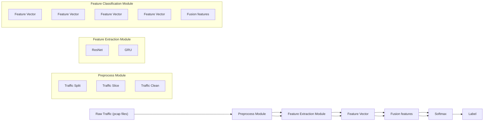

# An encrypted traffic classification model based on the raw traffic and spatiotemporal characteristics

Guanglong Zhao

Department of Electronic

Engineering, Heilongjiang University, Harbin

Chinalatermvp@163.com

Zhen Wang

Department of Electronic

Engineering, Heilongjiang University, Harbin

China1134936466@qq.com

Ziheng Yang†

Department of Electronic

Engineering, Heilongjiang University, Harbin China†Corresponding author:

yzh@hlju.edu.com

# ABSTRACT

Deep learning techniques are frequently utilized and produce effective results in the classification of encrypted traffic. In the current encryption traffic classification process, the network traffic characteristics are not sufficiently extracted, which is a concern. An encrypted traffic classification model based on raw network traffic and its spatiotemporal characteristics is proposed in this paper. The raw network traffic is divided into sessions, and the packets inside each session are then split into 784-byte slices, and the traffic is then described using the slice data. The time feature vector and the spatial feature vector are then created by combining ResNet and GRU models to generate features from raw network data in parallel. The traffic is then classified using the combined features. According to experimental findings, the proposed model’s recognition accuracy on the ISCX-NonVPN-VPN2016 dataset reached 99.36%, which is an improvement over other approaches currently in use.

# CCS CONCEPTS

• Networks → Network properties; Network security.

# KEYWORDS

Encrypted traffic classification, Deep learning, ResNet, GRU

# ACM Reference Format:

Guanglong Zhao, Zhen Wang, and Ziheng Yang†. 2022. An encrypted traffic classification model based on the raw traffic and spatiotemporal characteristics. In 2022 6th International Conference on Electronic Information Technology and Computer Engineering (EITCE 2022), October 21–23, 2022, Xiamen, China. ACM, New York, NY, USA, 6 pages. https://doi.org/10.1145/ 3573428.3573644

# 1 INTRODUCTION

Network analysis, network management, and network intrusion detection all depend on the classification of network traffic, which serves as the foundation for studying network activity [1]. To prevent data from being interrupted, intercepted, tampered with, or faked during the flow of data, the usage of encrypted traffic for

Permission to make digital or hard copies of all or part of this work for personal or classroom use is granted without fee provided that copies are not made or distributed for profit or commercial advantage and that copies bear this notice and the full citation on the first page. Copyrights for components of this work owned by others than ACM must be honored. Abstracting with credit is permitted. To copy otherwise, or republish, to post on servers or to redistribute to lists, requires prior specific permission and/or a fee. Request permissions from permissions@acm.org.

EITCE 2022, October 21–23, 2022, Xiamen, China

© 2022 Association for Computing Machinery.

ACM ISBN 978-1-4503-9714-8/22/10. . . \$15.00

https://doi.org/10.1145/3573428.3573644

data transfer has become commonplace in the digital era [2]. At present, the current traffic transmitted in the Internet is more than 90% of the encrypted traffic. Malware and applications can hide the characteristics of attack traffic by encrypting traffic, making their behavior even more hidden. Thus, evading traditional intrusion detection and network protection mechanisms. This creates new challenges for network traffic classification. The secret to modern network defense is learning how to identify encrypted data swiftly and accurately.

Traditional traffic classification uses manually designed features, most of which are statistics on traffic. Then, for traffic classification, these features are fed into machine learning algorithms. Then, for traffic classification, these features are fed into machine learning algorithms. Artificially constructed features are often related to the class of traffic, and when new traffic needs to be classified, it may be necessary to reconstruct the characteristics, otherwise the performance of identifying new traffic scenarios may be degraded. Moreover, artificial design features also have the problem of insufficient characterization of the raw flow. Gil et al. used time-based features, such as flow duration, flow size per unit time, and arrival time of two-way flow, to detect the validity of VPN traffic. The accuracy of the features was tested using C4.5 and KNN, demonstrating that time-based features are good for encrypting traffic signatures [3]. B. Yamansavascular et al. classified traffic using 111 features of traffic and evaluated them using four machine learning methods: J48, random forest, KNN, and Bayesian networks. Among others. KNN achieved the best results on the UNB ISCX dataset with an accuracy rate of 93.94% [4]. Habibi Lashkari, A et al. used 23 human-designed temporal features to experiment on Tor-nonTor data using a random forest algorithm (RF), and the traffic classification accuracy was achieved at 83% [5]. Based on the experiments of Habibi Lashkari, A et al., and E. Hodo et al., They used an artificial neural network and a support vector machine (SVM) instead of the random forest algorithm. Both algorithms could detect nonTor traffic on the UNB-CIC Tor network traffic dataset. among which the artificial neural network performs better, with an accuracy rate of 99.1%, and after feature selection, the accuracy rate can reach 99.8% [6].

As deep learning methods are applied to traffic classification, Automatic feature information extraction from unprocessed network data and classification identification are performed using deep learning models. Raw network traffic can be divided into streams and sessions in quintuples. But because the length of the stream or session is not fixed, the input data of the deep learning algorithm is fixed. Therefore, it is essential to intercept the fixed byte length of the flow or session when utilizing deep learning methods for traffic classification in order to describe the traffic data. For example, the first N bytes of an intercepted stream or session are put into a deep learning model for recognition and classification. A deep packet system that combines traffic feature extraction and categorization into one system is proposed by M. Lotfollahi and coworkers. The model input for the framework is extracted from the first 1500 bytes of a package using a stacked autoencoder (SAE) and 1D-CNN. This solution can complete both the application identification task and the traffic classification task. The method was tested on the UNB ISCX VPN-NonVPN dataset, and the recall rate of program identification tasks reached 0.98 and the recall rate of traffic classification tasks reached 0.94. However, this scheme ignores the time series characteristics of the stream [7]. Wang takes the first 784 bytes of each stream or session as input and classifies it using a onedimensional convolutional neural network model. They achieved an encrypted traffic classification accuracy rate of 85.8% on the ISCX VPN-NonVPN dataset [8]. ZhuangZou uses a combination of 2D-CNN and LSTM. Enter the 784 bytes of the first three packets of the stream into the CNN for feature extraction. The features got by the 2D-CNN are then sent to the LSTM, and the time series’ implicit characteristics are extracted using the LSTM. The method was tested using the ISXC dataset with better accuracy and recall rates than 1D-CNN, which can be achieved in the secondary classification of 99% [9]. Wang Maonan proposes a CENTIME framework that uses ResNet to extract raw traffic features, autoencoders (SAEs) to compress manually extracted statistical features, and then uses a combination of the two features for encrypted traffic classification [10].

flowchart

Figure 1: Framework of encrypted traffic classification model based on raw traffic and its spatiotemporal characteristics

# 2 METHOD

This research proposes a spatiotemporal classification model for encrypted traffic based on the raw network traffic. In the encryption traffic classification task, the raw network traffic information cannot be fully utilized by using the manually extracted features, and the data preprocessing process is complex. This article uses raw network traffic as an input to the encrypted traffic classification model. Aiming at the problem of insufficient traffic information extraction, based on ResNet and GRU deep learning algorithms, this paper extracts the spatial and temporal characteristics of the raw network traffic respectively. Then the two types of features are fused, and finally the fusion features are put into softmax for traffic classification.

The model framework of this paper is shown in Figure 1, and the model is split into three sections: a module for data preprocessing, one for extracting spatiotemporal features, and one for recognition and classification.

# 2.1 Data preprocessing module

Using the raw network traffic information, no manual feature extraction is required for the traffic. Instead, the raw network traffic is directly sliced according to certain rules, and the deep learning algorithm is used to automatically extract the feature information in the raw network traffic. The data preprocessing process is shown in Figure 2.

Before the network traffic is fed into the encrypted traffic classification model for feature extraction, the raw network traffic needs to be preprocessed. It mainly includes three steps: raw traffic segmentation, traffic cleaning, and traffic slicing.

1) Raw traffic split: The actual network traffic is a continuous stream of Ethernet packets, and the data set usually uses a pcap file to store the raw network traffic. Each Ethernet packet is stored in the pcap file in capture chronological order. Each Ethernet packet contains five-tuple information, where the five-tuple refers to the source IP, destination IP, source port, destination port, and transport layer protocol [11]. Divide the raw network traffic into sessions based on a five-tuple. This results in the discretization of the continuous raw network flow into session units. The split session is stored in a new file in pcap.

2) Traffic cleaning: After the above steps, the discrete raw traffic information is obtained. Next, the traffic is cleaned up, mainly to remove duplicate traffic. Then replace the MAC address and IP address information with 0x00. Because during the construction of the data set, the MAC address and IP address of each host in its network environment are fixed. This fixed information can cause bias when training the encrypted traffic classification model, resulting in the model being classified more by MAC address and IP address, and overfitting. Using the replaced data can make the traffic classification model more generic.

```mermaid
graph TD
    A["Raw traffic"] --> B["Traffic Split"]
    B --> C["Sessions"]
    C --> D["IP Address"]
    D --> E["Sessions"]
    E --> F["n Bytes"]
    F --> G["Traffic Slice"]
    G --> H["n-N Bytes"]
    H --> I["N Bytes"]
    I --> J["0x00"]
    J --> K["n-N Bytes"]
    K --> L["n-N Bytes"]
    L --> M["n-N Bytes"]
    M --> N["n-N Bytes"]
    N --> O["n-N Bytes"]
    O --> P["n-N Bytes"]
    P --> Q["n-N Bytes"]
    Q --> R["n-N Bytes"]
    R --> S["n-N Bytes"]
    S --> T["n-N Bytes"]
    T --> U["n-N Bytes"]
    U --> V["n-N Bytes"]
    V --> W["n-N Bytes"]
    W --> X["n-N Bytes"]
    X --> Y["n-N Bytes"]
    Y --> Z["n-N Bytes"]
    Z --> AA["n-N Bytes"]
    AA --> AB["n-N Bytes"]
    AB --> AC["n-N Bytes"]
    AC --> AD["n-N Bytes"]
    AD --> AE["n-N Bytes"]
    AE --> AF["n-N Bytes"]
    AF --> AG["n-N Bytes"]
    AG --> AH["n-N Bytes"]
    AH --> AI["n-N Bytes"]
    AI --> AJ["n-N Bytes"]
    AJ --> AK["n-N Bytes"]
    AK --> AL["n-N Bytes"]
    AL --> AM["n-N Bytes"]
    AM --> AN["n-N Bytes"]
    AN --> AO["n-N Bytes"]
    AO --> AP["n-N Bytes"]
    AP --> AQ["n-N Bytes"]
    AQ --> AR["n-N Bytes"]
    AR --> AS["n-N Bytes"]
    AS --> AT["n-N Bytes"]
    AT --> AU["n-N Bytes"]
    AU --> AV["n-N Bytes"]
    AV --> AW["n-N Bytes"]
    AW --> AX["n-N Bytes"]
    AX --> AY["n-N Bytes"]
    AY --> AZ["n-N Bytes"]
    AZ --> BA["n-N Bytes"]
    BA --> BB["n-N Bytes"]
    BB --> BC["n-N Bytes"]
    BC --> BD["n-N Bytes"]
    BD --> BE["n-N Bytes"]
    BE --> BF["n-N Bytes"]
    BF --> BG["n-N Bytes"]
    BG --> BH["n-N Bytes"]
    BH --> BI["n-N Bytes"]
    BI --> BJ["n-N Bytes"]
    BJ --> BK["n-N Bytes"]
    BK --> BL["n-N Bytes"]
    BL --> BM["n-N Bytes"]
    BM --> BN["n-N Bytes"]
    BN --> BO["n-N Bytes"]
    BO --> BP["n-N Bytes"]
    BP --> BQ["n-N Bytes"]
    BQ --> BR["n-N Bytes"]
    BR --> BS["n-N Bytes"]
    BS --> BT["n-N Bytes"]
    BT --> BU["n-N Bytes"]
    BU --> BV["n-N Bytes"]
    BV --> BW["n-N Bytes"]
    BW --> BX["n-N Bytes"]
    BX --> BY["n-N Bytes"]
```

flowchart

Figure 2: Data pre-processing steps

3) Traffic slicing: Traffic slicing refers to intercepting the protocol layer data information of each packet in the traffic, and then intercepting its first N bytes. If the traffic byte length is less than N, then 0x00 is used for completion. If the traffic byte is greater than N, the data after the N byte of the traffic is truncated. This article refers to the experiment [12], and N is selected as 784 bytes. It should be noted that because the valid data is the traffic data behind the header information of the pcap file, the header information of the pcap file should be removed before slicing.

# 2.2 Spatiotemporal feature extraction module

To make the most of the raw traffic information, feature extraction is performed using ResNet and GRU networks. ResNet networks use residual structures that can increase the network to a certain depth and avoid the problem of gradient explosions. The spatial characteristics of the raw traffic can be more fully extracted. The ResNet network in this article uses the resnet18 structure, which has a total of four ResLayers, each of which consists of two ResBlock structures. The output is a 256-dimensional spatial feature vector. The GRU is an improvement of the LSTM. The structure is simpler, and it’s only the update door and the reset door. Compared with

the reduction of LSTM model parameters, the training speed of the model is improved. Because GRU has memory characteristics, it is better at handling problems with temporal characteristics and is suitable for extracting the timing characteristics implicit in network traffic. The GRU network used in this paper has a total of 64 hidden layers, 1 GRU structure, and the output is a 64-dimensional temporal feature vector. Construct a new ResNet-GRU parallel fusion model to extract the spatial and timing characteristics of the raw traffic.

# 2.3 Identify classification module

Through the ResNet-GRU network, traffic characteristic information can be extracted in parallel. The spatial characteristics of traffic can be extracted through the ResNet network, and the timing characteristics of traffic can be extracted through the GRU network. The features extracted by ResNet and GRU are fused into the fully connected layer, and this fusion feature vector contains the spatial feature vector and the time feature vector. The fusion features of the output of the fully connected layer are then fed into the classifier for identification and classification. The entire model is updated with all parameters through backpropagation. After passing through the fully connected layer, the ResNet and GRU networks are back-propagated, respectively. Table 1 shows the structure and parameters of the model.

Table 1: Model structure parameters 

<table><tr><td></td><td>Layer</td><td>Output Shape</td><td>Param</td></tr><tr><td rowspan="7">ResNet</td><td>Conv1d</td><td>[32,784]</td><td>288</td></tr><tr><td>BatchNorm1d</td><td>[32,784]</td><td>64</td></tr><tr><td>ResLayer1</td><td>[32,784]</td><td>6272</td></tr><tr><td>ResLayer2</td><td>[64,392]</td><td>24832</td></tr><tr><td>ResLayer3</td><td>[128,196]</td><td>98816</td></tr><tr><td>ResLayer4</td><td>[256,98]</td><td>394240</td></tr><tr><td>AvgPooling</td><td>[256,1]</td><td>-</td></tr><tr><td rowspan="2">GRU</td><td>Dropout</td><td>[1,784]</td><td>-</td></tr><tr><td>GRU</td><td>[1,64]</td><td>163200</td></tr><tr><td rowspan="3">FC</td><td>FullConnect1</td><td>[100]</td><td>32100</td></tr><tr><td>FullConnect2</td><td>[30]</td><td>3030</td></tr><tr><td>FullConnect3</td><td>[12]</td><td>372</td></tr></table>

Table 2: VPN 2016 dataset after removing fuzzy labels 

<table><tr><td>Traffic class</td><td>Traffic content</td><td>File size</td></tr><tr><td>Email</td><td>Email, Gmail</td><td>13MB</td></tr><tr><td>VPN-Email</td><td></td><td>7.8MB</td></tr><tr><td>Chat</td><td>ICQ, AIM, Skype,</td><td>29.5MB</td></tr><tr><td>VPN-Chat</td><td>Facebook, Hangouts</td><td>27.6MB</td></tr><tr><td>Streaming</td><td>Vimeo, Youtube,</td><td>1.53GB</td></tr><tr><td>VPN-Streaming</td><td>Netflix, Spotify</td><td>1.37GB</td></tr><tr><td>File_transfer</td><td>Skype, FTPS, SFTP</td><td>17.3GB</td></tr><tr><td>VPN-File_transfer</td><td></td><td>279MB</td></tr><tr><td>VoIP</td><td>Facebook, Skype,</td><td>4.48GB</td></tr><tr><td>VPN-VoIP</td><td>Hangouts, Voipbuster</td><td>360MB</td></tr><tr><td>P2P</td><td>inTorrent, Bittorrent</td><td>96.8MB</td></tr><tr><td>VPN-P2P</td><td></td><td>358MB</td></tr></table>

# 3 EXPERIMENTS AND ANALYSIS OF RESULTS

# 3.1 Experimental environment and data set

All experiments in this article were developed locally and then tested on the Google Colab shared GPU platform. The GPU used in the experiment is the Tesla T4, with 14G of video memory and 12G of allocated virtual machine RAM. The Python environment used in the experiment was Python37, and the Pytorch framework was used to develop programs, and the Pytorch version was 1.12.1+cu113. When training, set the batch size to 128, epoch to 150, the learning rate to 0.001, the loss function is the cross-entropy function, and Adam as the optimizer.

The experimental dataset used the ISCX-VPN-NonVPN2016 public traffic dataset (hereinafter referred to as the VPN 2016 dataset) [3]. VPN datasets generate 14 types of traffic using different applications, including seven different types of regular encrypted traffic and seven different types of protocol encapsulation trafficThe VPN dataset contains both calculated statistical characteristics and raw traffic information. This article uses the raw traffic data in pcap or pcapng format provided by the dataset. In the pcap/pcapng file of the raw traffic provided by the VPN dataset, there are some traffic labels that are unclear. For example, Facebook\_video and

Table 3: Confusion matrix 

<table><tr><td></td><td>predicted positive</td><td>predicted negative</td></tr><tr><td>actually positive</td><td>TP</td><td>FN</td></tr><tr><td>actually negative</td><td>FP</td><td>TN</td></tr></table>

other documents cannot be determined as the Browser category or the Streaming category, so these traffic categories with ambiguous labels are excluded [8]. There are 12 types of traffic data in the final VPN dataset, including 6 types of non-VPN traffic and 6 types of VPN traffic. Table 2 displays the raw traffic data.

# 3.2 Evaluation indicators

In this chapter, four indicators were selected for accuracy (Acc), precision (Pr), recall (Re), and F1-score (F1) to evaluate the performance of the model.

The binary classification confusion matrix is shown in Table 3, and TP indicates that the predicted value is positive, and the actual value is also positive. TN indicates that the predicted value is negative and the actual value is also negative. FP indicates that the predicted value is positive and the actual value is negative. FN indicates that the predicted value is negative and the actual value is positive.

According to the confusion matrix, the formula for the four evaluation indicators is as follows.

The accuracy is the proportion of the correctly classified traffic sample to the total traffic sample:

$$
A c c u r a c y = \frac {T P + T N}{T P + T N + F P + F N}
$$

The precision is defined as the proportion of correctly classified traffic samples in relation to the total number of samples classified as this type of traffic:

$$
P r e c i s i o n = \frac {T P}{T P + F P}
$$

The recall is the proportion of all samples of this class that are correctly classified as this type of sample:

$$
R e c a l l = \frac {T P}{T P + F N}
$$

The F1-score is the harmonic average of the integration accuracy and recall:

$$
F 1 - S c o r e = \frac {2 * R e c a l l * P r e c i s i o n}{R e c a l l + P r e c i s i o n}
$$

# 3.3 Analysis of experimental results

The confusion matrix of this paper model using the test set classification is shown in Figure 3, the abscissa of the confusion matrix is the predicted traffic category, and the ordinate is the actual traffic category. Through the confusion matrix, you can intuitively observe that all kinds of traffic in the test set are classified by the model. Through the confusion matrix, it can be seen that the model was more accurate in most of the 12 types of traffic, and the recognition accuracy of each type of traffic was greater than 93%, which can meet the requirements of practical applications.

Normalized confusion matrix   

heatmap

| Predicted label | True label | Value |
| :--- | :--- | :--- |
| 0 | 0 | 0.98 |
| 1 | 1 | 1.00 |
| 2 | 2 | 1.00 |
| 3 | 3 | 1.00 |
| 4 | 4 | 0.93 |
| 5 | 5 | 1.00 |
| 6 | 6 | 0.97 |
| 7 | 7 | 1.00 |
| 8 | 8 | 1.00 |
| 9 | 9 | 1.00 |
| 10 | 10 | 0.98 |
| 11 | 11 | 0.99 |
| 0 | 0 | 0.01 |
| 1 | 1 | 0.01 |
| 2 | 2 | 0.00 |
| 3 | 3 | 0.00 |
| 4 | 4 | 0.01 |
| 5 | 5 | 0.06 |
| 6 | 6 | 0.02 |
| 7 | 7 | 0.03 |
| 8 | 8 | 0.03 |
| 9 | 9 | 0.03 |
| 10 | 10 | 0.03 |
| 11 | 11 | 0.99 |
The values in the matrix are not explicitly labeled as they are estimated based on the provided code.

Figure 3: The confusion matrix for the model

Table 4: Performance comparison between the model in this article and the benchmark model 

<table><tr><td>Method</td><td>Acc</td><td>Pr</td><td>Re</td><td>F1</td></tr><tr><td>ResNet</td><td>0.9904</td><td>0.9904</td><td>0.9904</td><td>0.9904</td></tr><tr><td>GRU</td><td>0.7615</td><td>0.7544</td><td>0.7615</td><td>0.7278</td></tr><tr><td>ResNet_GRU</td><td>0.9936</td><td>0.9937</td><td>0.9936</td><td>0.9936</td></tr></table>

The experiment compared the performance of the benchmark model and the model in this article. The experimental comparison results are shown in Table 4. Compared with the ResNet datum model and the GRU datum model, the ResNet model extracted the spatial characteristics of the raw traffic and classifies it, and the classification accuracy rate could reach 99.04%. The GRU model extracted the timing characteristics of the raw traffic and classified them, and the classification accuracy could reach 86.15%. In this paper, the model used ResNet and GRU networks to feature extraction of the raw traffic in parallel, and then integrated and classified the extracted features, and the four indicators were improved over the baseline model. Compared to the ResNet model, the accuracy rate was improved by 0.32%, and compared to the GRU model, the accuracy rate was improved by 23.21%. This paper shows that the model could extract the spatial characteristics and time series characteristics of the raw traffic at the same time, and the feature extraction of the raw traffic was sufficient, which could improve the classification performance of the model.

To further illustrated the performance of the model in this paper, three encryption traffic classification methods were selected to compare in this article. The experiments for each method were implemented in the same environment, and the VPN 2016 dataset

bar

| Metric | CNN1D[8] | CNN+LSTM[9] | CENTIME[10] | This Paper |
| :--- | :--- | :--- | :--- | :--- |
| F1 | 0.9618 | 0.993 | 0.9918 | 0.9936 |
| Re | 0.9617 | 0.9931 | 0.9918 | 0.9936 |
| Pr | 0.962 | 0.993 | 0.9918 | 0.9937 |
| Acc | 0.9617 | 0.9931 | 0.9918 | 0.9936 |

Figure 4: Classification comparison results

was used for experimental verification. In Figure 4, the outcomes of the comparative experiment are displayed.

The evaluation and comparison of the outcomes of the experiments make it evident. The model proposed in this paper is better than other methods on the VPN2016 dataset. The effectiveness of the methods presented in this paper has been demonstrated. The reason for the improvement of analysis performance: The CNN1D method only extracts the spatial characteristics of the traffic, and the feature extraction for the raw traffic is relatively single. The CENTIME approach compresses statistical features that were manually created using autoencoders in addition to ResNet to extract the spatial properties of traffic. However, the statistical characteristics characterize the flow rate more one-sidedly. The input to the LSTM in the CNN\_LSTM serial method is the spatial feature vector extracted by the CNN, which is the feature extracted by the CNN again, rather than using the raw traffic information. In this paper, the spatial feature vector and the timing feature vector are extracted from the raw traffic at the same time. The raw traffic is learned more comprehensively, and the extracted features can better characterize the raw flow.

# 4 CONCLUSION

In this paper, we propose an encrypted traffic classification model based on the raw network traffic and its spatiotemporal characteristics to identify classified encrypted traffic. In this paper, the method is based on the identification and classification of the raw network traffic, and the spatial feature vector and the time series feature vector of the raw traffic are extracted in parallel by ResNet and GRU networks, and then the extracted spatiotemporal feature vectors are fused and classified to identify the encrypted traffic. This method was experimentally verified using the VPN2016 dataset. Experimental results show that the proposed method can extract the raw network traffic characteristics more fully than the basic ResNet model and the GRU model. The classification accuracy rate reaches 99.36%, which can satisfy the needs of practical applications.

The method’s accuracy of classification is increased at the same time by comparison to other current methods.

# ACKNOWLEDGMENTS

Thanks for the GPU resources provided by Google Colab, and thanks for Mr. Yang Ziheng’s guidance and suggestions.

# REFERENCES

[1] F. Pacheco, E. Exposito, M. Gineste, C. Baudoin and J. Aguilar, "Towards the Deployment of Machine Learning Solutions in Network Traffic Classification: A Systematic Survey," in IEEE Communications Surveys & Tutorials, vol. 21, no. 2, pp. 1988-2014, Secondquarter, 2019, doi: 10.1109/COMST.2018.2883147.   
[2] H. Yao, C. Liu, P. Zhang, S. Wu, C. Jiang and S. Yu, "Identification of Encrypted Traffic Through Attention Mechanism Based Long Short Term Memory," in IEEE Transactions on Big Data, vol. 8, no. 1, pp. 241-252, 1 Feb. 2022, doi: 10.1109/TB-DATA.2019.2940675.   
[3] Draper-Gil, G.; Lashkari, A.; Mamun, M. and A. Ghorbani, A. 2016. Characterization of Encrypted and VPN Traffic using Time-related Features. In Proceedings of the 2nd International Conference on Information Systems Security and Privacy - ICISSP, ISBN 978-989-758-167-0; ISSN 2184-4356, pages 407-414. DOI: 10.5220/0005740704070414.   
[4] B. Yamansavascilar, M. A. Guvensan, A. G. Yavuz and M. E. Karsligil, "Application identification via network traffic classification," 2017 International Conference on Computing, Networking and Communications (ICNC), 2017, pp. 843-848, doi: 10.1109/ICCNC.2017.7876241.   
[5] Habibi Lashkari, A.; Draper Gil, G.; Mamun, M. and Ghorbani, A. 2017. Characterization of Tor Traffic using Time based Features. In Proceedings of

the 3rd International Conference on Information Systems Security and Privacy - ICISSP, ISBN 978-989-758-209-7; ISSN 2184-4356, pages 253-262. DOI: 10.5220/0006105602530262.   
[6] E. Hodo, X. Bellekens, E. Iorkyase, A. Hamilton, C. Tachtatzis, and R. Atkinson, “Machine learning approach for detection of nontor traffic,” in the Proc. of the 12th International Conference on Availability, Reliability and Security, New York, NY, USA: ACM, 2017.   
[7] Lotfollahi, M., Jafari Siavoshani, M., Shirali Hossein Zade, R. et al. Deep packet: a novel approach for encrypted traffic classification using deep learning. Soft Comput 24, 1999–2012, 2020. https://doi.org/10.1007/s00500-019-04030-2.   
[8] W. Wang, M. Zhu, J. Wang, X. Zeng and Z. Yang, "End-to-end encrypted traffic classification with one-dimensional convolution neural networks," 2017 IEEE International Conference on Intelligence and Security Informatics (ISI), 2017, pp. 43-48, doi: 10.1109/ISI.2017.8004872.   
[9] Z. Zou, J. Ge, H. Zheng, Y. Wu, C. Han and Z. Yao, "Encrypted Traffic Classification with a Convolutional Long Short-Term Memory Neural Network," 2018 IEEE 20th International Conference on High Performance Computing and Communications; IEEE 16th International Conference on Smart City; IEEE 4th International Conference on Data Science and Systems (HPCC/SmartCity/DSS), 2018, pp. 329-334, doi: 10.1109/HPCC/SmartCity/DSS.2018.00074.   
[10] M. Wang, K. Zheng, D. Luo, Y. Yang and X. Wang, "An Encrypted Traffic Classification Framework Based on Convolutional Neural Networks and Stacked Autoencoders," 2020 IEEE 6th International Conference on Computer and Communications (ICCC), 2020, pp. 634-641, doi: 10.1109/ICCC51575.2020.9344978.   
[11] A. Dainotti, A. Pescape and K. C. Claffy, "Issues and future directions in traffic classification," in IEEE Network, vol. 26, no. 1, pp. 35-40, January-February, 2012, doi: 10.1109/MNET.2012.6135854.   
[12] Wei W, Ming Z, Zeng X, et al. Malware traffic classification using convolutional neural network for representation learning[C]// 2017 International Conference on Information Networking (ICOIN). IEEE, 2017.