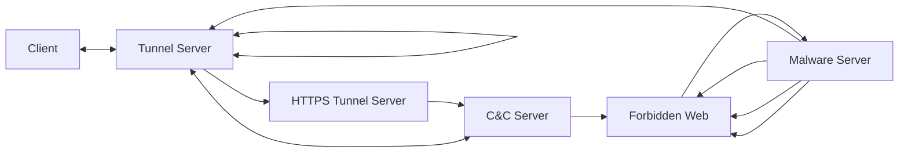
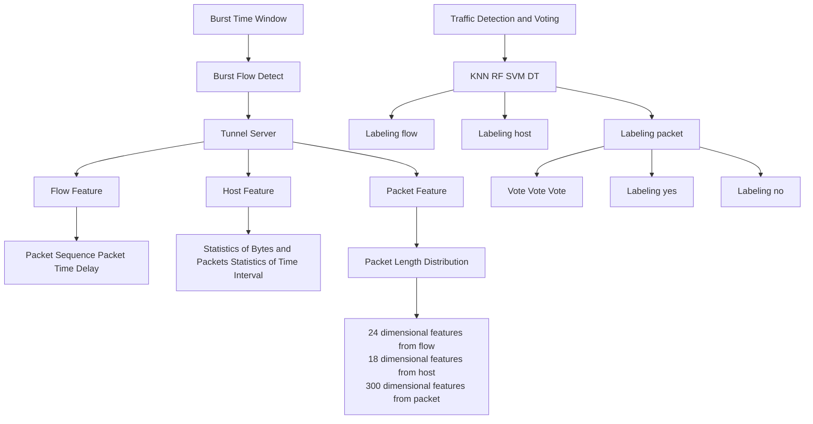
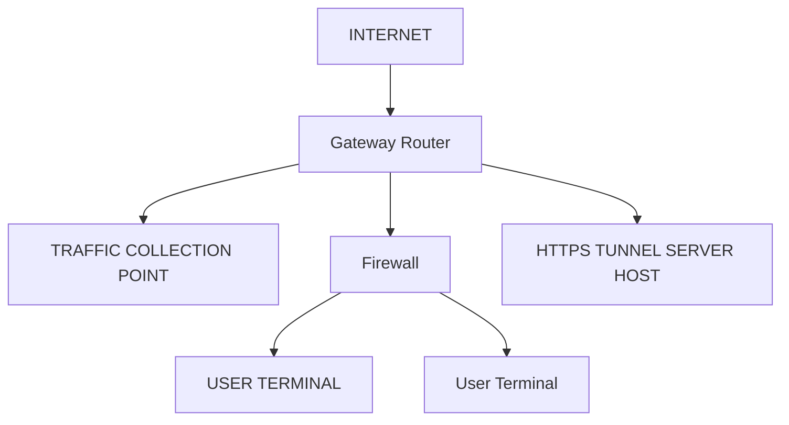

# MTBD: HTTPS Tunnel Detection Based on Multi-dimension Traffic Behaviors Decision

Bingxu Wang $^{*†}$ , Yangyang Guan $^{*†}$ , Gaopeng Gou $^{*†}$ , Peipei Fu $^{*†}$ , Zhen Li $^{*†}$ , Qingya Yang $^{*†}$ , Chang Liu $^{*†}$

$^{*}$ Institute of Information Engineering, Chinese Academy of Sciences, Beijing, China

$^{\dagger}$ School of Cyber Security, University of Chinese Academy of Sciences, Beijing, China

{wangbingxu, guanyangyang, gougaopeng,fupeipei,lizhen,yangqingya,liuchang}@iie.ac.cn

Abstract—HTTPS protocol is one of the most important protocols on the Internet. Network firewalls generally do not block the HTTPS protocol, so a large number of malwares use HTTPS protocol as transmission tunnel for data leakage. It is difficult to detect HTTPS tunnel accurately using conventional handshake fingerprint and sequence detection methods. In this paper, we propose the MTBD method, which is a multi-stage detection method based on multidimension traffic behaviors. Firstly, we design a traffic burst detection algorithm to filter out 85% normal traffic. Then, in order to avoid the limitations of single dimensional features, we extract core heterogeneous features on flow, host and packet levels. Finally, we use machine learning methods to build models from above three dimensions separately, and vote to decide final results. Meanwhile, we build HTTPS tunnel services and collect datasets to verify effectiveness of MTBD method. The experimental results demonstrate that MTBD method achieves up to 99% precision and recall that is superior to state-of-the-art method.

Index Terms—HTTPS tunnel, multi-dimension traffic behaviors decision, traffic burst

# I. INTRODUCTION

Internet technology is developing rapidly, there are large amounts of malwares, which bring great risks to our work and life. How to accurately identify malicious traffic from network traffic is an important topic. Some researchers have done some progress on this field. However, malicious tools usually use all kinds of confusion ways to avoid detection. Among confusion technologies, tunneling technology is one of the most widely used ways. It encapsulates data packets in other network protocols to avoid detection.

In many tunnel protocols, HTTPS tunnel is often used by malicious tools. For example, the meterpreter HTTPS [1] of the famous tool Metasploit encapsulates the communication data in the HTTPS protocol to avoid detection. Meek method [12] in Tor network transmits data based on HTTPS protocol, and server forwards the encapsulated content to the real destination. In addition to the tunnel provided by malicious tools, HTTPS tunnel can be built based on HTTP CONNECT proxy function with TLS service and can be used for malicious transmission, C&C communication, data leakage, etc. We mainly study this kind of tunnel in this paper.

HTTPS tunnel is one of the most difficult protocols to detect. Firstly, the encryption characteristics make it impossible for network managers to effectively identify by deep packet detection. Secondly, web service is one of the most used network services on the Internet and it mainly communicates through HTTPS protocol. Normal HTTPS traffic carrying web services and HTTPS tunnel traffic carrying malicious information is very similar, so it is difficult for network managers to distinguish them accurately and effectively.

At present, there are mainly two methods for HTTPS tunnel detection: deep packet detection based on handshake fingerprint method and machine learning method. Above two methods have own disadvantages: firstly, TLS handshake fingerprint method cannot guarantee accuracy in open environment. Many browsers and apps use the same TLS fingerprint library at the same time. Secondly, in the real world, the generalization ability of machine learning model is insufficient. Many research extract conventional features on specific data sets, and then use machine learning methods to get higher detection indicators, but the detection effect will decline significantly after changing the network scene.

The essential reason for the poor detection effect of HTTPS tunnel is the use of single dimension features, because there are a large number of similar traffic on the Internet, which lead to a large number of false detection. Therefore, this paper detects HTTPS tunnel from multiple stages and dimensions.

In this paper, we propose MTBD method which identify HTTPS tunnel based on multi-dimension traffic behaviors decision. Specifically, we filter out normal HTTP traffic that is significantly different from HTTPS tunnel. Then, we design machine learning algorithms to create models from the perspectives of flow, host and packet, and integrate multi-dimensional information to achieve accurate decision. Our contributions can be briefly summarized as follows:

1. We propose MTBD method based on multi-dimension traffic behaviors decision from multi-stage and realize the initial traffic filtraion: Multi-stage and multi-dimensional method is used to enhance the detection ability of the models. The first stage of MTBD method completes the preliminary cleaning of initial traffic. Through long-term observation of traffic, we find that HTTPS tunnel traffic has typical traffic burst characteristics, which is different from normal services. Based on this discriminative behavior, we filter out more than 85% of the normal HTTPS traffic.

2. We propose a voting decision mechanism based on multi-dimension heterogeneous features: This is the core stage of the MTBD method, which complete the final detection of HTTPS tunnel. We design machine learning algorithms to model the difference between HTTPS tunnel and normal traffic from the perspectives of flow, host and packet, and integrate the multi-dimension results to achieve HTTPS tunnel traffic decision accurately.   
3. Our MTBD method produces excellent performance on real-world dataset, outperforming state-of-the-art methods: In real-world environment, we build HTTPS tunnel based on HTTP CONNECT proxy function and a total of 973937 HTTPS flows are collected, including 26841 HTTPS tunnel flows. Comprehensive experiments results show that our proposed MTBD method achieves up to 99% precision and recall rate.

The rest of the paper is organized as follows. We first introduce the background and related work of HTTPS tunnel detection in Section II. ThenI, we systematically introduce the MTBD method of HTTPS tunnel detection. In Section IV, we conduct experiments and analyze results in various dimensions. Finally, we conclude this paper in last section.

# II. BACKGROUND AND RELATED WORK

# A. HTTPS Tunnel Background

Tunnel transmission technology encapsulates the data packets of the original protocol into another protocol for transmission. When we observe the traffic, we can only see the characteristics of the transmission protocol, and the original protocol will be hidden. Due to the behaviors of tunnel protocol, many malwares hide communication data in common network protocols to break through the detection of network managers.

At present, HTTPS is the most widely used protocol on the Internet and malicious software uses HTTPS tunnels to hide its own traffic. Network managers can only see the content of TLS handshake stage, and other contents are encrypted, which poses great difficulties for detection.

HTTPS tunnel technology is widely used by malwares. There are a large number of open-source tools in the industry, such as shadowsocksr TLS mode [2], which mainly uses TLS confusion to avoid detection. Many remote control malicious programs also use HTTPS tunnel as communication channel, such as CobaltStrike [17].

flowchart

Fig. 1. HTTPS Tunnel Communication Process

Another implementation of HTTPS tunnel is to use TLS protocol and HTTP proxy. This paper mainly analyzes the traffic generated by this way. Figure 1 shows its working principle: the HTTP client requests the tunnel agent to create a TCP connection to any destination server and port through the CONNECT method, and forwards the subsequent data between the client and the server. The whole process can be encrypted by the TLS protocol.

In order to improve the ability to resist censorship, the evasion system uses traffic obfuscation technology to hide abnormal traffic in normal traffic. There are three main current traffic obfuscation methods: randomizer, mimicry, tunneling [20], [21]. For randomization methods, some researchers have proposed to use randomization methods to hide the data such as DUST [22], OBFS [23], [24]. The passive identification of randomized traffic mainly relies on the entropy of the message as the filtering method [25]. Protocol mimicry technology makes the traffic to be hidden have the format and fingerprint of normal traffic protocol. Traffic tunneling technology is a more covert traffic obfuscation technology, which hides malicious traffic into normal protocol traffic, such as HTTP, HTTPS and other normal protocols. Common obfuscation protocols, such as Meek [20], [21], users use Tor browser to access restricted websites, Meek client uses domain name preposition technology to place the obfuscated domain name In the SNI field of the TLS protocol, the domain name of the real Meek server is placed in the HTTP Host Header field. In the HTTPS traffic, the network censor can only see the SNI field, but not the HTTP Host header, so this traffic is regarded as The normal flow rate is thus selected for release. Tan proposed an measurement method for anonymous communication systems and proposed a method for identifying obfuscated traffic based on relative entropy. From the relative entropy of the message interval distribution and the length distribution, it was found that there was a clear difference between ordinary HTTPS traffic and Meek traffic [26].

# B. HTTPS Tunnel Detection Related Work

HTTPS confusion tunnel traffic detection technology can be divided into four methods: deep packet detection method, machine learning method, deep learning method, behavior detection method.

Based on deep packet detection, TLS handshake fingerprint characteristics are analyzed. He et al. [3] proposed to use TLS fingerprint and packet length to identify Tor, and achieved a false positive rate of less than 0.01. However, Tor can easily change fingerprint features to avoid fingerprint identification. Sergey frolov et al. [4] evaluated the TLS handshake encryption suite and the extended list to identify the TLS fingerprint of the client. Anderson et al. [5] extracted the TLS version number, encryption suite and extended list in the handshake stage of TLS protocol as fingerprint to identify network applications. Salesforce et al. [6] formed a fingerprint for the negotiation process between the client and the server, and used the MD5 hash value to generate a 32 character ja3 fingerprint. The main problem of traffic detection from the perspective of TLS handshake fingerprint is that different tools use the same fingerprint feature and result in low accuracy.

Machine learning method mainly extracts traffic sequence and statistical characteristics, and uses machine learning model to identify traffic. Wang et al. [7] aimed to extract flow features to detect meek traffic based on HTTPS tunnel and got 98% accuracy. Lashkari et al. [8] extracted 32 flow features based on time and achieved 92% accuracy using KNN. Feghhi et al. [9] only used time features to detect encrypted HTTPS traffic and obtained good detection effects. The method based on machine learning has great advantages in recall rate, but the models trained in closed data set are difficult to play good effects in open network scene.

Deep learning method automatically selects features through training to reduce the complexity of evaluating data set features. Wang et al. [10] proposed an encrypted network traffic representation method of one-dimensional CNN based on deep learning. This method can input the original bytes of traffic directly into the neural network without feature extraction. He et al. [11] used traffic classification algorithm based on deep learning to identify applications in tunnel traffic.

Behavior detection method is used to detect tunnel traffic from the perspective of host. Karagiannis et al. [16] proposed traffic identification method BLINC that based on host behavior, which identified unknown traffic through the connection on the host.

# III. METHOD

In this section, we introduce the framework of our proposed MTBD method firstly, and then detail the implementation of each part of the framework.

# A. MTBD Method Framework Overview

The overview of our proposed MTBD method is depicted in Fig.2, which includes three stages: burst traffic filtering, heterogeneous features extraction, traffic detection and voting.

In the stage of burst traffic filtering, HTTPS traffic is captured by traffic probes. Because the HTTPS tunnel server proxy all request traffic from client, the client establishes multiple TCP flows to the tunnel server and the number of flows is significantly larger than the normal HTTPS service in certain time window. Using the burst characteristics of tunnel traffic, suspicious tunnel traffic is detected and most of normal HTTPS traffic is filtered out.

In the heterogeneous features extraction stage, we extract HTTPS tunnel traffic features from three aspects: flow, host and packet. Flow features mainly refer to pakcet sequence features from four-tuple (server IP, server PORT, client IP, client PORT), which show a significant difference between normal traffic and HTTPS tunnel traffic. Host features include traffic behavior features from same three-tuple (server IP, server PORT and client IP), HTTPS tunnel traffic has obvious traffic burst characteristics. In terms of packet features, we create 300 dimension vector and count the probability distribution of different packet lengths from same three-tuple.

In the stage of traffic detection and voting, the features of the three dimensions are trained to generate three different classifiers. On this basis, the results of each classifier are voted to produce the final decision result.

# B. HTTPS Tunnel Burst Traffic Filtering

The core purpose of HTTPS tunnel burst traffic filtering is to find the core differences between tunnel traffic and normal traffic. As shown in Fig.3, when a visitor normally accesses HTTPS services such as webpages, videos, emails, traffic will be distributed to various destination IP servers. While users or malwares use the HTTPS tunnel to communicate with other services, traffic will be aggregated to the same tunnel server in shot time window. For this, we establish traffic burst model to detect HTTPS tunnel traffic.

Flow Burst Model: The function of the Flow Burst Model is to form a subset of neighbor flows from same three-tuple (server IP, server PORT and client IP) with short time interval. We set time interval as T and maximum time interval between flows as Tmax. The flow burst time window (Twin) is constructed by neighbor flows and its start time is the first flow's establishment time, and the last flow is defined as its neighbor time is larger than Tmax. We count the number of consecutive flows as Mflow, the average interval time between flows as Tavg and average packet number per flow as Lavgpkt in this time window. If Mflow, Tavg and Lavgpkt reach certain threshold, this window is determined as flow burst window and this three-tuple is identified as suspicious tunnel traffic.

flowchart

Fig. 2. The Framework of MTBD

```mermaid
graph LR
    subgraph Server
        A1["Same IP"] --> B1["Tmax"]
        A2["Same IP"] --> B2["Tmax"]
        B1 <--> C1["Twin"]
        B2 <--> C2["Twin"]
    end
    subgraph Client
        D1["Tunnel Traffic"] --> E1["Twin"]
        D2["Tunnel Traffic"] --> E2["Twin"]
    end
    subgraph Normal Traffic
        F1["Normal Traffic"] --> G1["IPA"]
        F2["Normal Traffic"] --> G2["IPB"]
        F3["Normal Traffic"] --> G3["IPC"]
        F4["Normal Traffic"] --> G4["IPD"]
    end
    A1 <--> B1
    B1 <--> C1
    B2 <--> C2
    B2 <--> C3
    B3 <--> C4
    B3 <--> C5
    B4 <--> C6
    B4 <--> C7
    B5 <--> C8
    B5 <--> C9
    B6 <--> C10
    B6 <--> C11
    B7 <--> C12
    B7 <--> C13
    B8 <--> C14
    B8 <--> C15
    B9 <--> C16
    B9 <--> C17
    B10 <--> C18
    B10 <--> C19
    B11 <--> C20
    B11 <--> C21
    B12 <--> C22
    B12 <--> C23
    B13 <--> C24
    B13 <--> C25
    B14 <--> C26
    B14 <--> C27
    B15 <--> C28
    B15 <--> C29
    B16 <--> C30
    B16 <--> C31
    B17 <--> C32
    B17 <--> C33
    B18 <--> C34
    B18 <--> C35
    B19 <--> C36
    B19 <--> C37
    B20 <--> C38
    B20 <--> C39
    B21 <--> C40
    B21 <--> C41
    B22 <--> C42
    B22 <--> C43
    B23 <--> C44
    B23 <--> C45
    B24 <--> C46
    B24 <--> C47
    B25 <--> C48
    B25 <--> C49
    B26 <--> C50
    B26 <--> C51
    B27 <--> C52
    B27 <--> C53
    B28 <--> C54
    B28 <--> C55
    B29 <--> C56
    B29 <--> C57
    B30 <--> C58
    B30 <--> C59
    B31 <--> C60
    B31 <--> C61
    B32 <--> C62
    B32 <--> C63
    B33 <--> C64
    B33 <--> C65
    B34 <--> C66
    B34 <--> C67
    B35 <--> C68
    B35 <--> C69
    B36 <--> C70
    B36 <--> C71
    B37 <--> C72
    B37 <--> C73
    B38 <--> C74
    B38 <--> C75
    B39 <--> C76
    B39 <--> C77
    B40 <--> C78
    B40 <--> C79
    B41 <--> C80
    B41 <--> C81
    B42 <--> C82
    B42 <--> C83
    B43 <--> C84
    B43 <--> C85
    B44 <--> C86
    B44 <--> C87
    B45 <--> C88
    B45 <--> C89
    B46 <--> C90
```

flowchart

Fig. 3. HTTPS Tunnel Flow Burst Model

$$
T \max = \max (T 1, T 2..... T n | T w i n) \tag {1}
$$

$$
T a v g = \frac {1}{M f l o w} \sum_ {i = 1} ^ {M f l o w} T i (T i <   T m a x) \tag {2}
$$

TABLE I
FLOW BURST MODEL PARAMETERS. 

<table><tr><td>Notation</td><td>Meaning</td><td>Defaults</td></tr><tr><td>Mflow</td><td>Consecutive flow numbers</td><td>5</td></tr><tr><td>Tavg</td><td>Average interval time of flows</td><td>600ms</td></tr><tr><td>Tmax</td><td>Max interval time of flows</td><td>900ms</td></tr><tr><td>Lavgpkt</td><td>Average packet number per flow</td><td>8</td></tr></table>

Through in-depth observation and measurement of more than 50G bytes HTTPS tunnel traffic, the notations used in this paper are summarized in Table I. The value of Tmax is set to 900ms, when Mflow is larger than 5, Tavg less than 600ms and Lavgpkt larger than 8, the three-tuple traffic of this time window is identified as suspicious HTTPS tunnel traffic. Through experimental measurement, using this flow burst model, more than

85% of normal HTTPS traffic are filtered out and only 1.9% of HTTPS tunnel traffic loss. In the next section, we explain how to select these thresholds in detail.

# C. Heterogeneous Features Extraction

In this section, we extract the features from the three aspects: flow, host, packet. These features are extracted in flow burst time window Twin mentioned above.

# 1) Flow Feature Extraction

From the perspective of flow, we mainly analyze the packet sequence features and statistical features. A total of 24 dimensional features are extracted.

For packet sequence features of flow, they mainly include the packet length, time interval and direction. From this point of view, there are distinct differences between HTTPS tunnel traffic and normal HTTPS traffic. As shown in table II, we show the packet sequence information of HTTPS tunnel and normal website. For TLS protocol, there are generally no obvious differences in handshake stage. However, there are great differences in the data transmission stage after the TLS handshake. For HTTPS tunnel, the length of first two packets after TLS handshake is generally less than 300 bytes. However, for normal HTTPS service, after TLS handshake, the length of HTTP request and response is generally greater than 1000 bytes.

In addition to packet sequences information, we also analyze core statistical information based on flow, such as the average and variance value of packet length of each flow, total packets and bytes, etc.

# 2) Host Features Extraction

Host features refer to behaviors based on same three-tuple (server IP, server PORT, client IP) in flow burst time window Twin. As shown in table III, 18 features are mainly extracted.

Flow statistical features based on host. We regard the flow as the basic statistical unit based on the host. We not only count the total number of flows, but also the number of packets and bytes of each flow in the time window and calculate their average. We also count the distribution variance of packets and bytes between different flows, which significantly affect the distinction between tunnel service and normal service.

TABLE II
FLOW SEQUENCE INFORMATION. 

<table><tr><td>Type</td><td>Packet length sequence</td></tr><tr><td>HTTPS tunnel</td><td>TLS handshake: [452, -392, 64]CONNECT handshake: [208, -151]Data communication: [716, -271, 716, 148, -624]</td></tr><tr><td>Normal HTTPS</td><td>TLS handshake: [517, -96, 30, -45, 51]Data communication: [1452, 1452, 1001, -1452]</td></tr></table>

Time interval statistical features. As mentioned above, tunnel traffic has flow burst behavior, and the time interval between neighbor flows in burst time window is the most obvious feature. We sort the neighbor flows according to the flow start time in the time window, and record their interval time. On this basis, we count their maximum, minimum, average, skewness and kurtosis as the core features. Skewness is a feature that describes the symmetry of time distribution and kurtosis is a descriptor of the shape of a probability distribution. The detailed formulas are as follows.

$$
T s e k = \frac {\frac {1}{n} \sum_ {i = 1} ^ {n} (t - \bar {t}) ^ {3}}{(\frac {1}{n - 1} \sum_ {i = 1} ^ {n} (t - \bar {t}) ^ {2}) ^ {\frac {3}{2}}} \tag {3}
$$

$$
T k u r = \frac {\frac {1}{n} \sum_ {i = 1} ^ {n} (t - \bar {t}) ^ {4}}{(\frac {1}{n} \sum_ {i = 1} ^ {n} (t - \bar {t}) ^ {2}) ^ {2}} - 3 \tag {4}
$$

TABLE III FEATURES BASED ON HOST. 

<table><tr><td>Features</td><td>Description</td></tr><tr><td>c2s/s2c_pkt/byte_sum</td><td>all bytes and packets</td></tr><tr><td>c2s/s2c_pkt/byte_avg</td><td>average of bytes and packets</td></tr><tr><td>c2s/s2c_pkt/byte_var</td><td>variance of bytes and packets</td></tr><tr><td>all_flow_num</td><td>number of all flows</td></tr><tr><td>flow_time_inter_avg</td><td>average of flow time interval</td></tr><tr><td>flow_time_inter_min</td><td>min of flow time interval</td></tr><tr><td>flow_time_inter_max</td><td>max of flow time interval</td></tr><tr><td>flow_time_inter_skew</td><td>skewness of flow time interval</td></tr><tr><td>flow_time_inter_kur</td><td>kurtosis of flow time interval</td></tr></table>

# 3) Package Feature Extraction

In this paper, we count the packet length distribution of the HTTPS tunnel in flow burst time window. Generally speaking, different applications have different packet volume distributions because of their different functions. For HTTPS tunnel, when carrying different services, the packet distribution is different.

We set 10-bytes packet length interval and count the number falling in every interval on unidirectional flow. Considering that the packet length with one direction ranges from 1 byte to 1500 bytes, the packet length distribution is a 300 dimensions probability distribution vector. Each dimension value is the packet length probability distribution falling into this range.

$$
\text { vector } = \left\{\text { count } (- 1 5 0 0, - 1 4 9 0)... \text { count } (1 4 9 0, 1 5 0 0) \right\}
$$

# D. Traffic Detection and Voting

In the above, we extract the core features of the HTTPS service from flow, host, packet. Next, we select the machine learning algorithms to train the model. Because different machine learning models have different effects on data sets. In this paper, we try to cover the main algorithm categories in the current machine learning classification field, including Random Forest, SVM, KNN and Decision Tree.

Because the three dimensional features are heterogeneous data and have different characteristics, we do not directly adopt the conventional way of coding these features and inputting them into the ensemble learning classifier. We build corresponding classifiers according to each dimensional features and vote with their classification results. The final classification result is determined by the majority votes.

# E. Construction of MTBD Method

With the features and method described above, we now detail the construction of MTBD method. The construction of MTBD is depicted in Algorithm 1. We first preprocess the real-time traffic and judge whether it can be formed flow burst window(lines 1-4). Next, to obtain all features from flow, host and packet(lines 5-7). Finally, we train machine learning models and input the features of each dimension into them, and use the decision-making method to vote to obtain the final HTTPS tunnel service(lines 8-16).

# IV. EXPERIMENT AND RESULT ANALYSIS

This section mainly introduces the experimental environment and ground truth. The experimental results produced by MTBD method are compared and analyzed.

# A. Ground Truth Collection

The logical topology of the experimental environment is shown in Fig 4. We get the representative HTTPS tunnel data set from two sources. Firstly, we use Caddy technology [15] to build HTTPS tunnel services based on HTTP CONNECT function on virtual private server. Secondly, we use the famous malware CobaltStrike [17] tool to get HTTPS C&C tunnel data.

Algorithm 1 Construction of MTBD Method   
Input: Real time network traffic
Output: HTTPS tunnel information
1: Capture real-time traffic;
2: if "Mflow ≥ 5 and Tavg ≤ 600ms and Tmax ≤ 900ms and Lavgpkt ≥ 8" then "Flow burst window create"
3: else "Not create flow burst window; Return"
4: end if
5: Get flow features Fflow, Fhost and Fpacket;
6: Init voting parameter T = 0;
7: Training machine learning model: KNN RF SVM DT;
8: if "Fflow detected as tunnel traffic" then T = T + 1
9: end if
10: if "Fhost detected as tunnel traffic" then T = T + 1
11: end if
12: if "Fpacket detected as tunnel traffic" then T = T + 1
13: end if
14: if "T ≥ 2" then "Determined as tunnel traffic"
15: else "Determined as normal traffic"
16: end if

Passive traffic probes are deployed at the gateway routers of laboratories in research institute. Table IV shows the relevant parameters. When visitors in this network environment use computers to access the Internet, the traffic is captured and saved. If the server IP and PORT hit the server IP and PORT of the HTTPS tunnel, the traffic is marked as HTTPS tunnel label. When the SNI(Server Name Indication) in TLS handshake hits the alexa list [18], the traffic is marked as normal label.

We use Cisco's open source traffic analysis tool JOY [13] to analyze traffic and get features. We capture HTTPS traffic of three days on the lab gateway that includes 973,937 normal HTTPS flows and 26,841 HTTPS tunnel flows. Among these data, $60\%$ are used as training set and $40\%$ as testing set. These data does not contain private information such as domain name and payload content, so our research does not raise any privacy issues.

# B. Evaluation Index

In order to evaluate the effect of the HTTPS tunnel classifier, we define TP, FP, FN and TN, which represent true positive, false positive, false negative, and true negative. We use precision (P), recall (R) and F1 score (F1) as the evaluation indicators for the HTTPS tunnel detection effect. The formula is as follows: The recall rate (R) represents the inspection of the positive case, the precision rate (P) represents the precision rate of the

flowchart

Fig. 4. Experimental Topology

model, and F1 is a comprehensive expression of the recall rate and the precision rate.

$$
P = \frac {T P}{T P + F P} \tag {5}
$$

$$
R = \frac {T P}{T P + F N} \tag {6}
$$

$$
F 1 = \frac {2 * P * R}{P + R} \tag {7}
$$

TABLE IV
GROUND TRUTH INTRODUCTION. 

<table><tr><td>Data dimension</td><td>Description</td></tr><tr><td>Tunnel traffic set</td><td>HTTP CONNECT with Caddy toolCobaltStrike malware tool</td></tr><tr><td>Normal traffic set</td><td>HTTPS traffic in alexa list</td></tr><tr><td>Testing set numbers</td><td>584362 normal flows16105 HTTPS tunnl flows</td></tr><tr><td>Training set numbers</td><td>389575 normal flows10736 HTTPS tunnl flows</td></tr></table>

# C. Burst Flow Sensitivity Analysis Experiment

We conduct experiment to study related parameters (Mflow, Tavg, Tmax, Tavgpkt) in table I that affect flow burst behavior. We choose 249828 normal HTTPS flows and 10384 HTTPS tunnel flows to analyze the thresholds of these parameters. Through the analysis of tunnel traffic, the time interval between flows is almost less than 900ms, so we set the maximum value (Tmax) between flows as 900ms. In addition, the average value of the flow time interval (Tavg) we calculated is about 300ms. In order to ensure the high recall rate of tunnel traffic, we set the threshold to 600ms. If the average flow time interval in the window is greater than this value, traffic will be filtered out. Using the same method, we formulate the threshold of the average number of packets (Lavgpkt) as 8.

TABLE V EFFECTIVEMESS COMPARISON OF DIFFERENT DIMENSIONS. 

<table><tr><td rowspan="2">Dimension</td><td colspan="3">RF</td><td colspan="3">SVM</td><td colspan="3">KNN</td><td colspan="3">DT</td></tr><tr><td>P</td><td>R</td><td>F1</td><td>P</td><td>R</td><td>F1</td><td>P</td><td>R</td><td>F1</td><td>P</td><td>R</td><td>F1</td></tr><tr><td>Flow</td><td>89.31</td><td>93.91</td><td>91.55</td><td>86.42</td><td>91.45</td><td>88.86</td><td>87.03</td><td>92.64</td><td>89.74</td><td>89.13</td><td>88.54</td><td>88.98</td></tr><tr><td>Host</td><td>87.14</td><td>92.77</td><td>89.86</td><td>85.67</td><td>91.97</td><td>88.70</td><td>87.15</td><td>92.67</td><td>89.81</td><td>85.98</td><td>91.84</td><td>88.81</td></tr><tr><td>Packet</td><td>82.81</td><td>84.94</td><td>83.86</td><td>82.19</td><td>84.31</td><td>83.23</td><td>81.38</td><td>83.97</td><td>82.65</td><td>81.57</td><td>83.24</td><td>82.39</td></tr><tr><td>MTBD</td><td>98.94</td><td>99.08</td><td>99.01</td><td>95.22</td><td>96.21</td><td>95.71</td><td>96.93</td><td>97.31</td><td>97.12</td><td>95.88</td><td>96.75</td><td>96.31</td></tr></table>

The most important parameter is Mflow, which represents the number of flows in time window. We want to ensure high detection recall rate and filter out non HTTPS tunnel traffic as much as possible. Results show that in Fig 5: If Mflow is 5, 85.7% of normal HTTPS traffic is filtered out and 98.1% HTTPS tunnel traffic is detected (1.9% tunnel traffic loss). If Mflow is 6, although the filtered normal HTTPS traffic reaches 87.5%, 7.8% of tunnel traffic loss, which is unacceptable for recall rate of tunnel traffic. When Mflow is less than 5, the filtered normal HTTPS traffic decrease significantly. Finally, we set the threshold of Mflow to 5.

bar

| Flow Numbers of Burst Window | Nomal Traffic Filter Ratio | HTTPS Tunnel Recall Ratio |
|---|---|---|
| 3 | 71.4 | 99.1 |
| 4 | 76.2 | 98.4 |
| 5 | 85.7 | 98.1 |
| 6 | 87.5 | 92.2 |
| 7 | 89.6 | 86.6 |

Fig. 5. Flow Numbers Selection of Burst Window

D. Effectiveness Analysis in Different Models and Dimensions

We analyze the detection effects of various dimensions and different models. In this paper, Random Forest, Decision Tree, SVM, and KNN are used as classifiers, and we use K-fold cross-validation method to test recall and precision. In this paper, we use scikit-learn [19] tool to carry out machine learning experiment

The table V shows the precision, recall and F1 value of various classifiers (Random Forest, SVM, KNN and DT) in flow, host, packet and voting dimension. From

TABLE VI
COMPARISON WITH OTHER METHODS. 

<table><tr><td>Method</td><td>P</td><td>R</td><td>F1</td></tr><tr><td>DMT</td><td>97.24%</td><td>98.14%</td><td>97.68%</td></tr><tr><td>FS-NET</td><td>97.07%</td><td>98.03%</td><td>97.54%</td></tr><tr><td>MTBD</td><td>98.94%</td><td>99.08%</td><td>99.01%</td></tr></table>

the perspective of the classifier, the Random Forest is better than other classifiers. Comparing with various dimensions, the MTBD method (98.94% accuracy and 99.08% recall) perform best, which is obviously better than just using flow, host or packet dimension.

# E. Comparison with Other Methods

In order to verify the validity of the MTBD method, we compare it with the state-of-the-art methods.

1) DMT, is a famous method on TLS malicious traffic detection that uses 600 multi-dimensional features from four levels and logistic regression algorithm to identify the TLS encrypted traffic [13].   
2) FS-NET, which uses the gated recurrent unit in RNN to build a model and deeply excavates the sequence features to realize the accurate classification of encryption application traffic [14].

In order to verify the validity of the MTBD method, we run DMT and FS-NET methods using flow features on our data sets in filtered flow burst window. For the same server IP and port, when more than half of the flows are detected as tunnel flows, this service is considered as tunnel service. The experimental results are shown in table VI and the MTBD method is better than the above two methods.

# V. CONCLUSION

Facing the challenge that HTTPS tunnel is difficult to detect, we propose the MTBD method, which is a multi-stage detection method based on multi-dimension traffic behaviors. Firstly, MTBD filters out 82% of normal traffic using tunnel traffic burst behavior. Then, three different dimension features combined with machine learning methods vote to the final result. The results show that the precision and recall of HTTPS tunnel traffic are reached to 98.94% and 99.08%, that is better than the state-of-the-art methods. However, different malicious tools have their unique HTTPS tunnel implementation methods. The method in this paper may not be applicable to all malicious HTTPS detection, which needs to be studied in the future.

# ACKNOWLEDGMENT

This work is supported by The National Key Research and Development Program of China (No. 2020YFE0200500 and No.2016QY05X1000)

# REFERENCES

[1] Skape Meterpreter Windows Reverse HTTPS Stager[OL]. https://www.rapid7.com/db/modules/payload/windows/meterpreter   
[2] Max Lv. Simple-obfs[OL]. https://github.com/shadowsocks/simple-obfs. [2019-03-25]   
[3] He G, Yang M, Gu X, et al. A novel active website fingerprinting attack against Tor anonymous system[C]//Proceedings of the 2014 IEEE 18th international conference on computer supported cooperative work in design (CSCWD). IEEE, 2014: 112-117.   
[4] Frolov S, Wustrow E. The use of TLS in Censorship Circumvention[C]//NDSS. 2019.   
[5] Anderson B, McGrew D. TLS beyond the browser: Combining end host and network data to understand application behavior[C]//Proceedings of the Internet Measurement Conference. 2019: 379-392.   
[6] John B. Althouse, Jeffff Atkinson, and Josh Atkins. Open sourcing JA3 - salesforce engineering[Z]. https://github.com/salesforce/ja3.2017.   
[7] Wang L, Dyer K P, Akella A, et al. Seeing through network-protocol obfuscation[C]//Proceedings of the 22nd ACM SIGSAC Conference on Computer and Communications Security. 2015: 57-69.   
[8] Lashkari A H, Draper-Gil G, Mamun M S I, et al. Characterization of tor traffic using time based features[C]//ICISSp. 2017: 253-262.   
[9] Feghhi S, Leith D J. A web traffic analysis attack using only timing information[J]. IEEE Transactions on Information Forensics and Security, 2016, 11(8): 1747-1759.   
[10] Wang W, Zhu M, Wang J, et al. End-to-end encrypted traffic classification with one-dimensional convolution neural networks[C]//2017 IEEE international conference on intelligence and security informatics (ISI). IEEE, 2017: 43-48.   
[11] He L, Shi Y. Identification of SSH applications based on convolutional neural network[C]//Proceedings of the 2018 International Conference on Internet and e-Business. 2018: 198-201.   
[12] Li X. Research and implementation of identification for Tor anonymous communication based on meek [MS. Thesis][J]. Beijing: Beijing Jiaotong University, 2016.   
[13] BAnderson B, Paul S, McGrew D. Deciphering malware's use of TLS (without decryption)[J]. Journal of Computer Virology and Hacking Techniques, 2018, 14(3): 195-211.   
[14] Liu C, He L, Xiong G, et al. Fs-net: A flow sequence network for encrypted traffic classification[C]//IEEE INFOCOM 2019-IEEE Conference On Computer Communications. IEEE, 2019: 1171-1179.   
[15] https://caddyserver.com/v2   
[16] Karagiannis T, Papagiannaki K, Faloutsos M. BLINC: multilevel traffic classification in the dark[C]//Proceedings of the 2005 conference on Applications, technologies, architectures, and protocols for computer communications. 2005: 229-240.   
[17] https://www.cobaltstrike.com/   
[18] https://www.alexa.com/   
[19] https://scikit-learn.org/stable/

[20] Wang L, Dyer KP, Akella A, et al. Seeing through network-protocol obfuscation. In: Proc. of the ACM SIGSAC Conf. ACM, 2015. 57–69. [doi: 10.1145/2810103.2813715]   
[21] Li X. Research and implementation of identification for Tor anonymous communication based on meek [MS. Thesis]. Beijing: Beijing Jiaotong University, 2016 (in Chinese with English abstract).   
[22] Wiley B. Dust: A blocking-resistant internet transport protocol. Technical Report, 2011. http://blanu.net/Dust.pdf   
[23] Kadianakis G, Mathewson G. Obfs2 (the twobfuscator). 2011. https://gitweb.torproject.org/pluggabletransports/obfsproxy.git/tree/doc/obfs2/obfs2-protocolspec.txt   
[24] Kadianakis G, Mathewson G. obfs3 (the threebfuscator). 2013. https://gitweb.torproject.org/pluggabletransports/obfs proxy.git/   
[25] Wang L, Dyer KP, Akella A, et al. Seeing through network-protocol obfuscation. In: Proc. of the ACM SIGSAC Conf. ACM, 2015. 57–69. [doi: 10.1145/2810103.2813715]   
[26] Tan Q, Shi J, Fang B, et al. Towards measuring unobservability in anonymous communication systems. Journal of Computer Research and Development, 2015,52 (in Chinese with English abstract). [doi: 10.7544/issn1000-1239.2015.20150562]