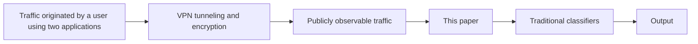
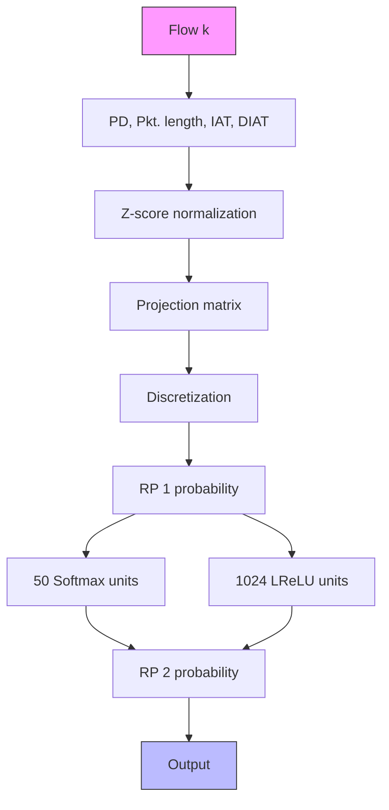

# Separating Flows in Encrypted Tunnel Traffic

Alexander Hartl

Institute of Telecommunications

TU Wien

alexander.hartl@tuwien.ac.at

Joachim Fabini

Institute of Telecommunications

TU Wien

joachim.fabini@tuwien.ac.at

Tanja Zseby

Institute of Telecommunications

TU Wien

tanja.zseby@tuwien.ac.at

Abstract—In many scenarios like wireless Internet access or encrypted VPN tunnels, encryption is performed on a per-packet basis. While this encryption approach effectively protects the confidentiality of the transmitted payload, it leaves traffic patterns involving inter-arrival times and packet lengths observable, e.g., to eavesdroppers on the air interface. It is a widespread belief that by only observing interleaved packets of different parallel flows, analysis and classification of the corresponding traffic by an eavesdropper is very difficult or close to impossible.

In this paper, we show that it is indeed possible to separate packets belonging to different flows purely from patterns observed in the interleaved packet sequence. We devise a novel deep recurrent neural network architecture that allows us to detect individual anomalous packets in a flow. Based on this anomaly detector, we develop an algorithm to find a separation into flows that minimizes the anomaly score indicated by our model. Our experimental results obtained with synthetically crafted flows and real-world network traces indicate that our approach is indeed able to separate flows successfully with high accuracy.

Being able to recover a flow’s packet sequence from multiple interleaved flows, we show with this paper that the common packetlevel encryption might be insufficient in scenarios where high levels of privacy have to be achieved. On the defender’s side, our approach constitutes a valuable tool in encrypted traffic analysis, but also contributes a novel neural network architecture in the field of network intrusion detection in general.

Index Terms—tunnel encryption, encrypted traffic analysis, deanonymization, deep learning

# I. INTRODUCTION

Data encryption forms an important pillar of modern secure network communication. A frequent encryption paradigm, we will refer to as tunnel encryption in this paper, involves interleaving and encrypting packets from distinct applications for transmission over a common link. For instance, for Virtual Private Network (VPN) connections, packets from several applications or even users are transmitted over a shared link. Another example concerns wireless Internet access. It is common for companies and private households to perform Internet access using a wireless network implemented using the IEEE 802.11 [1, 2, 3, 4, 5] family of standards. Since wireless 802.11 networks have no real barriers of physical access, strong encryption is crucial for protecting both the users’ sensible information and their privacy, e.g., regarding application usage behavior. But is strong frame-level encryption sufficient for protecting the users’ invaluable privacy from prying eyes? As we will show in this paper, privacy is still at risk.

In network intrusion detection, packets are commonly divided into flows, where a flow is a sequence of packets that share certain properties [6]. Flows aim to reflect fundamental functional building blocks of network communication like TCP connections, UDP streams or the communication with a certain remote destination. Since individual packets do not provide enough information, it is possible to perform classification of network traffic only by dividing observed traffic into flows. Treating the entirety of observed traffic as one flow therefore might shatter the success of traffic classification, but at least shadow low-bandwidth communication in front of high-bandwidth communication.

Encryption on a frame level implies as a fundamental limitation that transmission patterns of generated traffic, like packet lengths or inter-arrival times (IATs) between packets, are openly accessible by anyone monitoring, e.g., the air interface. While it has been shown previously that these patterns are sufficient for classifying encrypted traffic if obtained from a single application flow, the problem remained that in real traffic packets from various flows arrive in an interleaved fashion due to mixing packets from multiple applications, impeding an in-depth traffic analysis.

The key to powerful analysis of encrypted network traffic is thus the ability to assemble observed frames to their respective flows, which then can be analyzed using established machine learning methods. This is a non-trivial task, since features that are typically used for this purpose, like port numbers and IP addresses, are not available if traffic is encrypted on a lower layer. In this paper, we approach this task by building an LSTM-based neural network (NN) model of individual packets’ features in network communication. In a second step, we then devise an algorithm for finding a separation into flows that maximizes the likelihood for flows to be genuine.

The problem studied in this paper is not limited to the analysis of encrypted wireless traffic and VPN tunnels, but addresses a general encryption paradigm that we subsume under the term tunnel encryption. In many cases, such techniques are used for the very purpose of providing better privacy to the user, which highlights the impact of any method that is able to extract information about the used applications. Even when stacking such encryption techniques the requirements we postulate in this work in many cases remain valid, reinforcing the relevance of the studied problem.

With this paper, we make several contributions:

• We introduce the problem setting of separating encrypted tunnel traffic into individual flows and devise appropriate evaluation metrics.

• We show that, under certain common conditions it is theoretically possible to assign individual packets in encrypted tunnel traffic to network flows, allowing to apply traditional methods for classifying flows as illustrated in Fig. 1. This finding weakens an inherent widespread belief that tunnel encryption is able to provide strong privacy properties. We aim to raise awareness for this problem in particular in environments where security and privacy are of major importance.

flowchart

Fig. 1. Separating flows in encrypted tunnel traffic.

• We implement our proposed approach, evaluate it on several publicly available real-world network traces and carefully analyze its abilities based on synthetically crafted network flows. We thus show that packets from interleaved flows can indeed be separated into their respective flows with good accuracy.   
• By providing an approach for analyzing encrypted tunnel traffic, we lay the groundwork for implementing intrusion detection on encrypted tunnel traffic. The identification of unwanted traffic in VPN tunnels despite the presence of benign traffic can be a crucial tool in early attack detection.

After highlighting related research efforts in Section II, we show in Section III under what circumstances encrypted traffic shows patterns that allow profound analysis. In Section IV, we construct our method for separating encrypted packets belonging to different flows. In Section V, we then show based on experimental results the feasibility of our proposed approach. Finally, Section VI discusses defense strategies to enhance the security of network communication.

To enable reproducibility and encourage experimentation, we make our code available at https://gitlab.tuwien.ac.at/e389-cnpub/ separatingflows/.

# II. RELATED WORK

Analysis and classification of network traffic is a well-known research area. A substantial body of research exists on the analysis of encrypted traffic (e.g., [7, 8, 9]). We refer to survey papers [10, 11] on this subject for a comprehensive overview. While these papers demonstrate that classification of encrypted flows is possible even when only meta information like packet sizes and IATs is known, it is common to the majority of existing research to assume that the separation into flows has been done in advance. This is a reasonable assumption when encryption is done only on the transport layer, but this approach is unable to handle more comprehensive encryption techniques that we target in this paper.

Some research has been conducted on deanonymization of VPN traffic. Appelbaum et al. [12] outline several strategies an attacker might use to deanonymize a victim’s VPN traffic, distinguishing attackers in several positions and with several capabilities. Unlike targeting the patterns of the encrypted traffic itself, the paper reveals several scenarios for how an attacker can make use of leaking information. Similarly, Bui et al. [13] highlight shortcomings in the client configuration of commercial VPN providers that might allow to attack the VPN’s encryption.

Of particular interest to the research community are deanonymization attacks on the Tor network, since Tor aims to achieve the very purpose of providing strong anonymity. The papers [14, 15] provide a recent overview of approaches to deanonymize Tor traffic. Besides attacks that are based on leaking information through side channels and attacks that are based on actively exploiting shortcomings of client applications, also several passive attacks on Tor have been proposed. However, these passive attacks are usually based on associating the exit nodes’ connections with the users’ connections by leveraging attacker-controlled Tor nodes. This scenario is very different from our setting.

Unlike previous research, in this paper we base our analysis on observed encrypted traffic directly, even if it consists of packets from multiple interleaved flows. A related research effort has been conducted by Meghdouri et al. [16], who showed that by using a deep NN, it is possible to accurately identify the number of flows contained in an encrypted VPN tunnel, hence disclosing information about the encrypted traffic. In this paper, we go one step further and focus on the problem of separating packets in encrypted tunnel traffic into their respective flows. To the best of our knowledge, this problem has not been investigated before.

# III. TUNNEL ENCRYPTION TECHNIQUES

In several network traffic encryption techniques, packets from distinct flows are interleaved when being transmitted over an encrypted link. In this paper, we designate such techniques as tunnel encryption techniques, derived from the most apparent scenario of VPN tunnel encryption.

We show an illustrative example in Fig. 1. In Fig. 1, a user uses two applications that originate one network flow each. Instead of transmitting them directly over the Internet, he uses a VPN tunnel for secure transmission to a remote destination. An attacker on the path therefore can capture the packets, but can neither decrypt the packets’ contents nor does he know which flows the packets belong to. Hence, before analyzing individual flows, it is necessary to associate individual packets to their flows, which is the task we explore in this paper. In Fig. 1, the attacker then leverages the found separation to perform classification and detect the type of applications that are used. This procedure might constitute steps in a larger attack chain, e.g., if the knowledge of used applications is used for launching a known-plaintext attack on the used cipher.

Our method for separating flows is based on a NN model trained in advance on non-interleaved network flows showing patterns as present in the analyzed packet sequence. If the potentially used applications and services are known, it is a viable assumption that training data can be acquired by capturing traffic of the respective applications beforehand. An advantage compared to many other scenarios of machine learning in the context of network data is that only benign traffic is needed and no expensive labeling needs to be done.

flowchart

Fig. 2. The architecture of our deep learning model.

To be able to perform the actual separation procedure, we require that an upper bound for the number of flows in the analyzed packet sequence is known. It has been shown that the number of flows in encrypted tunnel traffic can be estimated using machine learning methods [16]. Additionally, we postulate three requirements for the encrypted traffic:

• Individual packets are distinguishable in encrypted traffic.   
• Packet lengths can be deduced from encrypted traffic.   
• Packet IATs can be deduced from encrypted traffic.

From a general viewpoint, it is surprisingly likely that these requirements are satisfied for traffic encryption in today’s packet switched networks. Reasons for this are that (1) protocol designers are usually interested in avoiding unnecessary latency in packet forwarding and (2) protocol designers additionally are usually interested in saving link capacity. In the light of (1), to reduce latency, implementations in many cases perform encryption on a per-packet basis and process and forward a packet as soon as it is received. Hence, IATs of encrypted packets can be used as very good estimate of the IATs of unencrypted packets. Also aggregation of several packets might introduce additional latency and therefore is not frequently used. Considering (2), it is also unlikely that random padding of substantial length is added to a packet, since this would increase the required link capacity. Hence, the size of an unencrypted packet can be deduced from an encrypted packet by simply subtracting encryption overhead.

We have verified that the requirements discussed above are satisfied for practical security protocols. In particular, the requirements are satisfied in many common use cases of VPN tunnels implemented using IPsec [17] or WireGuard [18], or for encryption of wireless 802.11 networks. Even when stacking multiple encryption techniques, the necessary patterns in many cases remain available to an eavesdropper.

# IV. ENCRYPTED FLOW SEPARATION

We approach the task of separating encrypted traffic in two steps. First, we develop an anomaly detector that is able to identify individual anomalous packets in a flow, allowing to detect if packets from different flows have been shuffled in a provided sequence. Second, we then search for the separation of flows that minimizes the total anomalousness of observed packets. We now discuss both problems in detail.

# A. Packet-based Anomaly Detection

For separating packets into flows, we first develop a method to assess whether a flow looks normal or shows unusual patterns that might be the result of mixing packets of distinct flows. For this, we build a packet-based anomaly detector that is loosely based on Loda [19], a well-known method for on-line anomaly detection in data streams. In Loda, k Random Projections (RPs) are generated from the feature space and a histogram is built from the data for each RP to establish a model of normality. $\operatorname { I f } p _ { i } ( \cdot ) , i \in \{ 1 , \ldots , k \}$ denote the built histograms, wi denote projection vectors and x denotes the feature vector, Loda uses the anomaly score

$$
s (\boldsymbol {x}) = - \frac {1}{k} \sum_ {i = 1} ^ {k} \ln p _ {i} (\boldsymbol {x} ^ {T} \boldsymbol {w} _ {i}), \tag {1}
$$

which is shown to coincide with the logarithmic joint probability density of projected features under the assumption that projected features are stochastically independent. The set of histograms of RPs, hence, constitutes an ensemble of weak learners, which is shown to provide a strong detector of anomalies [19].

For our intended scenario, we cannot use Loda in a straightforward way, since we require assessing anomalousness on a per-packet basis, thus incorporating the position in the packet’s flow. Depending on the packets seen previously in the flow, the model’s histograms have to be updated to reflect observing different packet feature values depending on the type of flow and depending on feature values seen previously in the flow. To account for these requirements, instead of static histograms, we use a deep NN to compute histograms that are used for assessing anomalousness of packets.

Fig. 2 shows our network architecture. We use a deep architecture alternatingly deploying 4 fully connected leaky ReLu (LReLu) layers and 3 LSTM layers for extracting information from the sequence of packets. For each dimension of the kdimensional projected feature vector, we connect one softmax layer to the $\bar { 4 } ^ { \mathrm { t h } }$ LReLu layer. Considering these NN outputs, we consider the feature vector values of the respective next packet in the flow and perform RPs $\tilde { \pmb { x } } ^ { T } \pmb { w } _ { i }$ with $i = 1 , \ldots , k$ from the z-score normalized feature vector x˜ of the next packet. Normalization parameters for scaling are obtained from training data and elements of projection vectors ${ \pmb w } _ { i }$ are chosen independently at random from $\mathcal { N } ( 0 , 1 )$ . For each histogram, i.e.

each dimension of the projected feature vector, the value is then discretized into 50 bins to form a one-hot encoded label the NN is trained on using categorical cross entropy loss. We used Adam as optimizer for NN training and trained the network to a minimum of validation loss.

Although NN calibration has recently been questioned [20], NNs are generally understood as probabilistic classifiers, so that the learned output of softmax layers can be interpreted as to indicate probability for observing a certain discretized projection value, and, hence, can be pictured as extension of Loda’s static histograms to our setting, where we require a probabilistic model of the next packet’s feature values.

1) Features: With the assumptions made in the previous Section III, the observed network trace consists of a sequence of packets, where for each packet the time of arrival, its length and the direction of transmission (received/sent) is observed.

Each packet i is represented by a feature vector of the form

$$
\boldsymbol {x} ^ {(i)} = \left(\mathrm{PD}, \ln \frac {\text { Pkt.   length }}{1 \text { Byte }}, \ln \frac {\mathrm{IAT} + 1 \mu \mathrm{s}}{1 \mathrm{ms}}, \ln \frac {\mathrm{DIAT} + 1 \mu \mathrm{s}}{1 \mathrm{ms}}\right) ^ {T}. \tag {2}
$$

Here, packet direction (PD) is 0 if the packet was received and 1 if it was sent. With IAT we specify the difference in arrival time of packet i to the flow’s previous packet independent of packet direction. In addition to the IAT, we use the directional IAT (DIAT), which specifies the time difference to the flow’s previous packet travelling in the same direction. While the plain IAT can provide additional information about traffic patterns by including server response times, the DIAT might provide more accurate models of traffic patterns, since it avoids the influence of round-trip latency to the remote destination.

We note that when observing only encrypted traffic, the feature vector in equation 2 cannot be computed in advance, since the association of packets to flows has to be known to be able to compute IATs. Hence, as we will discuss later, our algorithm forms $\pmb { x } ^ { ( i ) }$ on-the-fly during algorithm execution.

For packet lengths and IATs, we consider relative differences of feature values to yield more information than absolute differences. This assertion holds particularly for IATs and DIATs, which frequently range from fractions of a second to time spans of more than an hour. As shown in equation 2, we therefore process packet lengths and IATs in logarithmic scale to be able to cover a wide range of feature values and to transform relative differences to absolute differences, which eventually are relevant when discretizing values into histograms as described above.

2) Sequential Dependence: For being able to reassemble packets into their flows based on an anomaly score, the major requirement for the anomaly score is to detect an unusual sequence of packet feature values. Hence, instead of just assessing whether the combination of the individual packet’s feature values is reasonable, it is more important to assess whether these feature values are expected based on packets seen previously in the flow. Mechanisms leveraged by our proposed method for achieving this goal are threefold:

1) Our NN directly predicts the probability distribution of packet features observed in the next packet. In this probability

Algorithm 1 Solving for packet associations a.   
1: Set $\mathcal{A} \leftarrow \{()\}$ , $P_{()} \leftarrow 0$ .
2: Set $S_{(),f} \leftarrow \mathbf{0}$ , $H_{(),f}(\cdot) = 1 \forall f \in \{1, \ldots, F\}$ .
3: for each packet $i = 1, \ldots, n$ do
4:    for each $\boldsymbol{a} \in \mathcal{A}$ and each flow $f = 1, \ldots, F$ do
5:    Set $\tilde{\boldsymbol{a}} \leftarrow \begin{pmatrix} \boldsymbol{a} \\ f \end{pmatrix}$ and add $\tilde{\boldsymbol{a}}$ to $\mathcal{A}$ .
6:    Set $P_{\tilde{\boldsymbol{a}}} \leftarrow P_{\boldsymbol{a}} - \frac{1}{k} \sum_{j=1}^{k} \ln H_{\boldsymbol{a},f}(\boldsymbol{x}^{(i)^T} \boldsymbol{w}_j)$ 7:    Evaluate the NN with state $S_{\boldsymbol{a},f}$ and features $\boldsymbol{x}^{(i)}$ , resulting in new state $\hat{S}$ and histograms $\hat{H}(\cdot)$ .
8:    Set $H_{\tilde{\boldsymbol{a}},\tilde{f}}, S_{\tilde{\boldsymbol{a}},\tilde{f}} \leftarrow \begin{cases} \hat{H}, \hat{S}, & \text{if } \tilde{f} = f \\ H_{\boldsymbol{a},\tilde{f}}, S_{\boldsymbol{a},\tilde{f}}, & \text{otherwise} \end{cases}$ 9:    end for
10:    Truncate $\mathcal{A}$ to $R$ combinations $\boldsymbol{a}$ with highest $P_{\boldsymbol{a}}$ .
11:    Remove entries $P_{\boldsymbol{a}}, H_{\boldsymbol{a},f}, S_{\boldsymbol{a},f}$ if $\boldsymbol{a} \notin \mathcal{A}$ .
12:    end for
13:    Output $\hat{\boldsymbol{a}} = \arg \max_{\boldsymbol{a} \in \mathcal{A}} P_{\boldsymbol{a}}$ .

distribution, an unexpected packet will be assigned a low probability and, hence, a high anomalousness.

2) Since the NN is composed of recurrent units, feeding a wrong sequence of packet features as input is likely to impair the NN’s prediction. This principle is related to anomaly detection based on autoencoders. Autoencoders fail to reconstruct the input well unless it corresponds to patterns observed in training data.   
3) As variants of our method, we consider predicting packet features of the next two packets and of just the next packet. Probability distributions predicted by our NN are able to express stochastic dependency of used features. If features are composed of two consecutive packets, a high joint probability indicates that a two-packet sequence is correct. In other words, even if our NN was not able to make any sense of input features and only learned a constant probability distribution as output, maximizing the joint probability of two consecutive packets’ features would still provide some information about genuine packet sequences.

# B. Solving for Packet Associations

Being able to assess anomalousness of packets in a flow, the second step is to find a separation of packets into flows that minimizes total anomalousness. We use maximum likelihood estimation based on an algorithm similar to the Viterbi algorithm [21]. To this end, let $F \in$ N denote an upper bound for the number of flows in the processed traffic and $n \in \mathbb N$ the total number of observed packets. We define an Association Vector $( \mathbf { A V } ) \mathbf { \alpha } \mathbf { a } \in \{ 1 , \ldots , F \} ^ { n }$ , which expresses the unknown information of which packet belongs to which flow, i.e. $a _ { i }$ indicates the flow $1 , \ldots , F$ packet i belongs to. We are interested in finding the most likely AV based on observed packet features $\begin{array} { r } { \pmb { x } ^ { ( i ) } , \hat { \pmb { a } } = \arg \operatorname* { m a x } _ { \pmb { a } } P \left( \pmb { a } | \pmb { x } ^ { ( 1 ) } , \dots , \pmb { x } ^ { ( n ) } \right) } \end{array}$ . Assuming uniform a-priori probability and, hence, performing maximum likelihood estimation, aˆ can be written

$$
\hat {\boldsymbol {a}} = \arg \max _ {\boldsymbol {a}} \sum_ {i = 1} ^ {n} \ln P \left(\boldsymbol {x} ^ {(i)} \mid \boldsymbol {x} ^ {(1)}, \dots , \boldsymbol {x} ^ {(i - 1)}, \boldsymbol {a}\right). \tag {3}
$$

$P \left( \pmb { x } ^ { ( i ) } | \pmb { x } ^ { ( 1 ) } , \dots , \pmb { x } ^ { ( i - 1 ) } , \pmb { a } \right)$ can be evaluated from the histograms generated by our NN as indicated by equation 1. Hence, while equation 3 theoretically specifies how to compute aˆ based on our NN model, it requires on the order of $F ^ { n }$ NN evaluations, which in practical scenarios is infeasible due to the exponential increase with n. To solve for aˆ, we thus use an algorithm that approximates the exhaustive search through $\{ 1 , \ldots , F \} ^ { n }$ by truncating the set of considered combinations to the best $R \in \mathbb N$ combinations after each processed packet with, e.g., R = 1000. This approach is similar to the Viterbi algorithm [21], where the main difference is that we use a continuous state space in this paper. Algorithm 1 shows the algorithm used for finding the aˆ that maximizes $P \left( \mathbf { a } | \mathbf { x } ^ { ( 1 ) } , \ldots , \bar { \mathbf { x } ^ { ( n ) } } \right)$ .

1) Space and Time Complexity: Time complexity can be analyzed based on Algorithm 1. In Algorithm 1, time complexity is clearly dominated by NN evaluations in line 7. Since A is pruned to R AVs in line 10, each packet involves at most RF loop iterations. Hence, NN evaluations incur a time complexity of O(RnF ). An important aspect is, however, that the two inner loops can be easily executed in parallel. In more detail, NN evaluations can be combined into a single batch and be computed highly efficiently by leveraging GPU computing capabilities. Considering space complexity, during algorithm execution we need to store NN states and one histogram per projection dimension for F flows for |A| AVs, which involves a complexity of $O ( R F )$ . Since additionally the AVs themselves need to be stored, we obtain a total space complexity of $O ( R F ) + O ( R n )$ .

# V. EXPERIMENTS

# A. Datasets

We base our experimental evaluation on both, a synthetically created dataset and real-world network data. As pointed out in Section III, many tunnel encryption techniques allow to deduce unencrypted packet lengths and IATs from observed tunnel traffic. For our experimental evaluation, it is therefore not necessary to use actual encrypted tunnel traffic, but flows can be artificially interleaved for testing the approach. Our experiments are thus agnostic to the used encryption technique.

1) Synthetic data: The benefit of synthetically created flows is allowing us to closely analyze performance with respect to patterns in the data. For creating the synthetic dataset, we used pyvirtnet [22] to set up a simulated network consisting of two hosts connected over one router, where the one-way-delay between both hosts has a value of 20ms with a standard deviation of 2ms. Using this simulated network, we created three types of flows:

• A steady stream consisting of UDP packets transmitted with a constant inter-packet interval of 50ms. We used packet sizes of 60B, 100B, 150B or 200B, where packet sizes are constant throughout a flow. Due to the distinctive traffic pattern we expect this traffic type to deliver best results. However, due to the simulated jitter also this traffic type is no trivial scenario. In practice, this type of traffic can be observed when streaming audio or video data.   
• A bursty UDP stream consisting of blocks of data. Again, we transmitted packets with a inter-packet interval of 50ms and packet sizes of 60B, 100B, 150B or 200B, but every 15

packets we added an additional random inter-burst interval between 1.5s and 2.5s. This type of traffic can similarly be observed for multimedia traffic, depending on the used compression schemes.

• TCP traffic following a request-response pattern. From a client application we sent requests with sizes of 2500B, resulting in a server’s application response with 10kiB. We sequentially sent multiple requests on each TCP connection with a random delay between 3s and 30s. We consider this scenario to reflect traffic observed during web browsing, but also many other protocols based on TCP.

We used the RDM client [23] for generating UDP streams. We captured the generated traffic on the server side of the simulated network and used go-flows [24] to extract packet features for the flows in the captured traces based on the popular bidirectional 5-tuple flow key. All flows in the synthetic dataset consist of approximately 100 packets, avoiding bias of evaluation metrics described in Section V-B.

2) Real-world data: In addition to synthetically generated data, we used captured real-world network traces. To this end, we used the CIC-IDS-2017 [25] and UNSW-NB15 [26] datasets, but only selected benign traffic samples, since we consider only benign traffic to be representative for4 traffic a normal user would generate.

Additionally, we created a dataset from network traces from the MAWI traffic archive [27]. We obtained traces from samplepoint F, which yields the most recent captures and used a timespan from June 2021 to July 2021. Since traces in MAWI are obtained from a major Japanese backbone, they are highly diverse. Hence, using the entirety of flows is likely to fail. Furthermore, for a first evaluation we aim to avoid performing evaluation on traffic with unknown patterns and, instead, are interested in performing evaluation on traffic from which we expect a certain regularity. For this reason, we selected UDP traffic with ports 8801, 3480 and 9000, belonging to the videoconferencing tools Zoom, Microsoft Teams and Cisco Webex, respectively. To obtain realistic TCP traffic meeting the same constraint, we additionally captured traffic in a charging infrastructure for electric vehicles and added it to the MAWI traces. The predominant protocol in this case is the HTTP-based OCPP [28] protocol. Due to the high amount of machine-to-machine communication, we on the one hand expect this traffic to exhibit distinct patterns, but on the other hand we expect a certain amount of randomness due to randomness of the charging station’s uplink and interaction with other network participants, making these network traces a good candidate for benchmarking our method.

# B. Performance Metrics

Intuitively, we are interested in the percentage of packets of a flow in the ground truth that are correctly assigned to the respective flow. However, as long as all the flow’s packets (and no further packets) are assigned to the same flow, we do not care which flow it is. Hence, for evaluating accuracy we ignore permutations of flows, i.e.

$$
\text { Accuracy } = \max _ {\alpha \in S _ {F}} \frac {1}{N} \left| \left\{i: a _ {i} = \alpha (\hat {a} _ {i}) \right\} \right|, \tag {4}
$$

where N denotes the sequence’s length and $S _ { F }$ denotes the set of permutations of length F . Furthermore, a and aˆ denote the ground truth AV and the predicted AV, respectively.

A scenario that will lead to a particularly bad accuracy score is a prediction where two otherwise correctly predicted flows are swapped in the middle of the flows. In this case, a single incorrect transition between flows might lead to a worst possible accuracy of 0.5. Since we are interested in the prevalence of this problem, we use a second metric that is less susceptible to this problem. To this end, let $\mathcal { T } _ { i } ( v )$ denote the lowest index j with $j > i ,$ , where $v _ { i } = v _ { j } \ \mathbf { o r } - 1$ if no such index exists. We define as transition accuracy

$$
\text { TrAccuracy } = \frac {1}{N} \left| \left\{i: \mathcal {I} _ {i} (\boldsymbol {a}) = \mathcal {I} _ {i} (\hat {\boldsymbol {a}}) \right\} \right|, \tag {5}
$$

the ratio of packets for which the flow’s next packet is correctly predicted. While swapped flows affect TrAccuracy to a lesser extent, single packets that are assigned to the wrong flow affect TrAccuracy more than accuracy, as they lead to two wrong transitions.

We can also adopt methods from the evaluation of clusterings in our setting. When clustering, we are interested in to what extent a clustering algorithm’s outcome agrees with the ground truth, ignoring permutations of clusters. This question is similar to evaluating to what extent a separation into flows agrees with the ground truth. A well-known metric for evaluating the agreement of two clusterings is the Adjusted Rand Index (ARI) [29]. The ARI measures the ratio of pairs of elements that are assigned either to the same cluster in both clusterings or to different clusters in both clusterings.

If flows that should be separated have different lengths, accuracy and TrAccuracy are biased in the sense that random guessing can achieve high metric readings. For ARI, adjustment for chance is applied, ensuring that random labelings are assigned an ARI close to zero.

# C. Evaluations and Results

For evaluating our presented method, we used 90% of the respective dataset for NN training. To craft a packet sequence for testing separation, we randomly selected 2, 3, 4 or 5 flows in the remaining 10%. We sequentially added each of the flows to the sequence by uniformly randomly selecting the flow’s start time within the existing sequence’s duration, leaving the flow’s IATs unchanged. Reported results are obtained by averaging over 500 sequences, and, if not otherwise stated, the sequences’ results are weighted with their packet count for averaging. We evaluate several variants of our method:

• While the DIAT in many cases exhibits strong patterns and is therefore a valuable information, the plain IAT between bidirectionally transmitted packets is more noisy, depends on the location on the transmission path where capturing is performed and might not yield important information if client and server operate to a large extent independently. To evaluate whether this feature adds more noise than providing usable information, we evaluate whether accuracy can be increased by omitting IAT both from NN input features and from input feature to RPs.

line

| Interleaved flows | IAT omitted | No 2-packet proj. | With reverse model |
| ----------------- | ----------- | ----------------- | ------------------ |
| 2                 | 0.98        | 0.97              | 0.96               |
| 3                 | 0.97        | 0.95              | 0.94               |
| 4                 | 0.96        | 0.93              | 0.91               |
| 5                 | 0.95        | 0.91              | 0.89               |

Fig. 3. Performance results for our synthetically generated dataset.

• As outlined in Section IV, using features from the next two packets for RPs might help enforcing a reasonable sequence of packet features. However, it might also add noise to the process if the next two packets are hard to predict. To evaluate whether basing RPs on the next two packets increases performance, we additionally perform evaluations with only histograms based on the next packet.   
• It is an interesting question whether multiple models can be combined to obtain superior performance. To approach this question, we additionally created a backward model, i.e. we trained a model on the reversed flows. Based on both models we then ran Algorithm 1 three times consecutively, using a-posteriori probabilities from run r as a-priori probabilities for run r + 1. For each of the runs we respectively used the forward model, the backward model, and again the forward model.

Fig. 3 shows our obtained performance results. Among all variants we have tested, no clear differences in performance can be observed, suggesting that all variants are able to learn patterns in data sufficiently well, while wrong associations are common to all studied variants. A possible explanation for this behavior is that wrong associations arise from situations when correct separation into flows is theoretically impossible like, e.g., if packets of the same size are transmitted at the exact same point in time. Particularly for TrAccuracy, obtained performance is surprisingly good. However, also when considering entire flows, performance exceeds random labeling substantially, as shown by ARI and accuracy. ARI shows to be a good proxy for accuracy, allowing the use of ARI for a less computationally demanding evaluation if a high number of interleaved flows is used.

As expected, performance plummets when increasing interleaved flow count. Interestingly, TrAccuracy results are consistently markedly better than accuracy. TrAccuracy plummets only slightly with the number of interleaved flows. As remarked above, such behavior might hint at flows being swapped in the middle of a flow but being otherwise correctly predicted. Hence, according to Fig. 3, a useful extension might be to increase longterm dependencies either with respect to input features of the NN or of the predicted packet features. In some practical situations, however, such behavior seems unpreventable if the flows are of an equal type and, hence, show identical patterns.

The number of retained configurations after each time step, $R ,$ is a parameter that severely affects runtime of Algorithm 1. To provide guidance on how R has to be selected, we tracked the ground truth solution’s rank in the $P _ { \pmb { a } }$ -sorted ${ \mathcal { A } } ,$ i.e. we determined $\rho ^ { ( i ) } = 1 + | \{ \tilde { a } \in \mathcal { A } : P _ { \tilde { a } } < P _ { a } \}$ |, after processing each packet i throughout the execution of Algorithm 1. After processing of the entire sequence we determined the maximum encountered rank $\bar { \rho } = \mathrm { m a x } _ { i = 1 , \ldots , n } \rho ^ { ( i ) }$ . As soon as $\rho ^ { ( i ) }$ exceeds the $R ^ { \mathrm { t h } }$ position, the ground truth solution is pruned from A in line 10 of Algorithm 1 and can thus no longer be output as aˆ, establishing the relevance of this value.

line

| Interleaved flows | 95th percentile | 90th percentile | 3rd quartile | Median |
| ----------------- | --------------- | --------------- | ------------ | ------ |
| 2                 | ~10^1           | ~10^1           | ~10^0        | ~10^0  |
| 3                 | ~10^2           | ~10^2           | ~10^1        | ~10^0  |
| 4                 | ~10^3           | ~10^3           | ~10^2        | ~10^1  |
| 5                 | ~10^4           | ~10^4           | ~10^3        | ~10^2  |

Fig. 4. Maximum rank of the ground truth solution in the $P _ { \pmb { a } }$ -sorted A.

In Fig. 4, we show the prevalence of high values of ρ¯ among all test sequences we have evaluated. Also in this case, we observed no clear differences among tested variants. The figure shows a severe dependence of ρ¯ with the number of interleaved flows, prompting the use of similarly high values of R to achieve good performance. Due to the exponential increase of possible combinations with the number of interleaved flows, this behavior is to a certain extent expected. Fig. 4 shows that for many sequences flows can already be separated with a relatively small R even when separating 5 interleaved flows. On the other hand, the figure hints at an exponential increase of R with the number of interleaved flows. An exponential increase of R makes separation prohibitive when too many flows need to be separated.

Aiming to provide more insight into which patterns and characteristics govern the obtained accuracy and investigate whether observed performance meets expectations, as a next step we selected flows created as steady UDP stream as described in Section V-A for closer analysis. In Fig. 5, we show the distributions of per-sequence accuracies when separating 2, 3 or 4 steady flows, when all interleaved flows have equal packet sizes. Hence, while the majority of sequences achieves perfect separation accuracy, the obtained total accuracy is impacted by just a few sequences, for which accuracy drops substantially. When separating steady flows with distinct packet sizes, we obtain perfect accuracy of 100% in all cases with 2, 3 and 4 interleaved flows. Fig. 6 depicts obtained performance when separating two interleaved steady flows with equal packet sizes in more detail. In Fig. 6, we show the time offset between the transmission of two packets of the two different flows on the abscissa. Hence, perfect separation performance can be achieved if either the two involved flows use different packet sizes or if the time offset is sufficiently high. Different packet sizes in the two respective flows allow a simple separation by packet size. Thus, good performance in these cases is expected. On the other hand, for equally sized packets separation is theoretically only possible if the time offset between both flows is high enough to obtain significant differences in the expected arrival time of the next packet. Behavior observed in Fig. 6 thus meets our expectations, since with our simulated network IATs of received packets have a mean of 50ms and standard deviation of $2 \sqrt { 2 } \mathrm { m s }$ .

histogram

| Accuracy Range | Relative Frequency (Blue) | Relative Frequency (Orange) |
|----------------|----------------------------|-----------------------------|
| 0.4 - 0.5      | 0.0                        | 0.0                         |
| 0.5 - 0.6      | 0.1                        | 0.0                         |
| 0.6 - 0.7      | 0.0                        | 0.0                         |
| 0.7 - 0.8      | 0.1                        | 0.0                         |
| 0.8 - 0.9      | 0.1                        | 0.1                         |
| 0.9 - 1.0      | 0.7                        | 0.7                         |

Fig. 5. Distribution of per-flow accuracies (left) and transition accuracies (right) when separating 2 flows (top), 3 flows (center) and 4 flows (bottom) with equal packet sizes.

TABLE I PERFORMANCE RESULTS FOR REAL-WORLD DATA. 

<table><tr><td rowspan="2"></td><td colspan="4">Pkt. averaging</td><td colspan="3">Seq. averaging</td></tr><tr><td>Flows</td><td>Acc.</td><td>TrAcc.</td><td>ARI</td><td>Acc.</td><td>TrAcc.</td><td>ARI</td></tr><tr><td rowspan="4">MAWI</td><td>2</td><td>0.983</td><td>0.977</td><td>0.945</td><td>0.990</td><td>0.986</td><td>0.966</td></tr><tr><td>3</td><td>0.957</td><td>0.950</td><td>0.910</td><td>0.970</td><td>0.968</td><td>0.934</td></tr><tr><td>4</td><td>0.945</td><td>0.938</td><td>0.897</td><td>0.957</td><td>0.954</td><td>0.916</td></tr><tr><td>5</td><td>0.932</td><td>0.926</td><td>0.884</td><td>0.945</td><td>0.944</td><td>0.902</td></tr><tr><td rowspan="4">CIC-IDS-2017</td><td>2</td><td>0.996</td><td>0.996</td><td>0.987</td><td>0.997</td><td>0.997</td><td>0.990</td></tr><tr><td>3</td><td>0.993</td><td>0.992</td><td>0.981</td><td>0.994</td><td>0.993</td><td>0.983</td></tr><tr><td>4</td><td>0.987</td><td>0.987</td><td>0.971</td><td>0.989</td><td>0.989</td><td>0.976</td></tr><tr><td>5</td><td>0.981</td><td>0.984</td><td>0.963</td><td>0.984</td><td>0.985</td><td>0.969</td></tr><tr><td rowspan="4">UNSW-NB15</td><td>2</td><td>0.998</td><td>0.998</td><td>0.993</td><td>0.998</td><td>0.998</td><td>0.994</td></tr><tr><td>3</td><td>0.996</td><td>0.994</td><td>0.988</td><td>0.996</td><td>0.994</td><td>0.988</td></tr><tr><td>4</td><td>0.995</td><td>0.994</td><td>0.987</td><td>0.994</td><td>0.993</td><td>0.986</td></tr><tr><td>5</td><td>0.991</td><td>0.989</td><td>0.979</td><td>0.991</td><td>0.990</td><td>0.980</td></tr></table>

Table I depicts our performance results obtained for our real-world datasets. Unlike the synthetic dataset, flows in this case are not of constant length. For this reason, we perform in Table I averaging based on both packets and sequences. Hence, accuracies observed for long sequences have a stronger effect on packet-averaged results than on sequence-averaged results. Performances reported in Table I are on the same level as performance observed for synthetic datasets and in some cases even slightly better. We conclude that flows contained in our real-world datasets contain enough structure and patterns for successful separation. It is also interesting that in contrast to our synthetic data, transition accuracies are slightly lower than accuracies. This behavior might hint at misassociations of single packets being a more prevalent problem than swapped flows for these datasets. Our real-world datasets contain substantially more flows of short length than the synthetic dataset, which further supports this assumption.

line

| Time difference (ms) | Equal pkt. sizes | Distinct pkt. sizes | Accuracy ARI |
| ------------------- | ---------------- | -------------------- | ------------ |
| -20                 | 1.0              | 1.0                  | 1.0          |
| -10                 | 1.0              | 1.0                  | 1.0          |
| 0                   | 0.8              | 0.9                  | 0.4          |
| 10                  | 1.0              | 1.0                  | 1.0          |
| 20                  | 1.0              | 1.0                  | 1.0          |

Fig. 6. Obtained performance when separating steady synthetic flows with different time offsets.

# VI. DEFENSES

Our experimental evaluation shows that with an increasing number of flows both computational requirements increase substantially and achieved accuracy drops. For this reason, encrypted traffic from multiple applications from one individual user is more susceptible for allowing to be analyzed than siteto-site VPN traffic combining a multitude of flows. For the secure design of network protocols, it is hence beneficial to avoid leaking a packet’s source and receiver in unencrypted data, which, e.g., is contrary to addressing in current 802.11 wireless networks. Packet aggregation and packet fragmentation can also prevent flow separation as outlined in this paper under the condition that it is no longer possible to deduce packet lengths of unencrypted packets. IP-TFS [30] is a proposed extension of IPsec that allows fragmentation and aggregation and obscures observable traffic patterns at the expense of consumed bandwidth.

In general, such defense mechanisms can harm network performance by introducing additional latency or occupying more link capacity than necessary. However, if resources are not severely limited, we recommend adopting such strategies by default to enhance protocol security and privacy.

# VII. CONCLUSIONS

Tunnel encryption techniques are a prevalent technique for protecting data transmission on the Internet. In this paper, we showed that their security and privacy properties are not as strong as they are frequently believed to be. We have designed a NN, which is able to pinpoint anomalous packets in a flow. Based on this anomaly detector, we have then devised an algorithm that is able to separate observed encrypted traffic into their original flows without requiring the ability to decrypt packets. Our experimental evaluation encompasses both synthetic data with well-known patterns, and publicly available real-world network traces, showing that high separation performance can be obtained in both cases. In particular in cases where individual flows show distinct patterns that are different from each other, separation of encrypted traffic works remarkably well.

Encryption techniques as highlighted and discussed in this paper form an important pillar of the protection of modern communication networks. However, as we have shown, more information can be recovered from interleaved encrypted flows than commonly believed, which can form an entry point for indepth traffic analysis and deanonymization attacks. It is advisable to harden the security and privacy of used encryption techniques using defenses we have reviewed in this paper.

# ACKNOWLEDGMENTS

This work was supported by the project MALware cOmmunication in cRitical Infrastructures (MALORI), funded by the Austrian security research program KIRAS of the Federal Ministry for Agriculture, Regions and Tourism (BMLRT) under grant no. 873511.

# REFERENCES

[1] IEEE Std. 802.11a-1999, 1999.   
[2] IEEE Std. 802.11b-1999, 1999.   
[3] IEEE Std. 802.11g-2003, 2003.   
[4] IEEE Std. 802.11n-2009, 2009.   
[5] IEEE Std. 802.11ac-2013, 2013.   
[6] A. Hartl, M. Bachl, J. Fabini, and T. Zseby, “Explainability and Adversarial Robustness for RNNs,” in 2020 IEEE Sixth Int. Conf. on Big Data Computing Service and Applications, Aug. 2020, pp. 148–156.   
[7] S. Rezaei and X. Liu, “Deep learning for encrypted traffic classification: An overview,” IEEE comm. magazine, vol. 57, no. 5, pp. 76–81, 2019.   
[8] R. Alshammari and A. N. Zincir-Heywood, “Machine learning based encrypted traffic classification: Identifying ssh and skype,” in 2009 IEEE symposium on computational intelligence for security and defense applications. IEEE, 2009, pp. 1–8.   
[9] D. J. Arndt and A. N. Zincir-Heywood, “A comparison of three machine learning techniques for encrypted network traffic analysis,” in 2011 IEEE Symposium on Computational Intelligence for Security and Defense Applications (CISDA). IEEE, 2011, pp. 107–114.   
[10] P. Velan, M. Cerm ˇ ak, P. ´ Celeda, and M. Dra ˇ sar, “A survey of methods ˇ for encrypted traffic classification and analysis,” Int. Journal of Network Management, vol. 25, no. 5, pp. 355–374, 2015.   
[11] Z. Cao, G. Xiong, Y. Zhao, Z. Li, and L. Guo, “A survey on encrypted traffic classification,” in Int. Conf. on Applications and Techniques in Information Security. Springer, 2014, pp. 73–81.   
[12] J. Appelbaum, M. Ray, K. Koscher, and I. Finder, “vpwns: Virtual pwned networks,” in 2nd USENIX Workshop on Free and Open Communications on the Internet. USENIX Association, 2012.   
[13] T. Bui, S. Rao, M. Antikainen, and T. Aura, “Client-side vulnerabilities in commercial vpns,” in Nordic Conference on Secure IT Systems. Springer, 2019, pp. 103–119.   
[14] I. Karunanayake, N. Ahmed, R. Malaney, R. Islam, and S. K. Jha, “Deanonymisation attacks on tor: A survey,” IEEE Communications Surveys & Tutorials, vol. 23, no. 4, pp. 2324–2350, 2021.   
[15] L. Basyoni, N. Fetais, A. Erbad, A. Mohamed, and M. Guizani, “Traffic analysis attacks on tor: a survey,” in 2020 IEEE Int. Conf. on Informatics, IoT, and Enabling Technologies (ICIoT). IEEE, 2020, pp. 183–188.   
[16] F. Meghdouri, F. I. Vazquez, and T. Zseby, “Shedding light in the tunnel: ´ Counting flows in encrypted network traffic,” in 2021 Int. Conf. on Data Mining Workshops (ICDMW). IEEE, 2021, pp. 798–804.   
[17] S. Frankel and S. Krishnan, “IP Security (IPsec) and Internet Key Exchange (IKE) Document Roadmap,” RFC Editor, RFC 6071, Feb. 2011. [Online]. Available: http://www.rfc-editor.org/rfc/rfc6071   
[18] J. A. Donenfeld, “Wireguard: next generation kernel network tunnel.” in NDSS, 2017, pp. 1–12.   
[19] T. Pevny, “Loda: Lightweight on-line detector of anomalies,” ´ Machine Learning, vol. 102, no. 2, pp. 275–304, Feb. 2016.   
[20] M. Minderer, J. Djolonga, R. Romijnders, F. Hubis, X. Zhai, N. Houlsby, D. Tran, and M. Lucic, “Revisiting the calibration of modern neural networks,” Advances in Neural Inf. Processing Systems, vol. 34, 2021.   
[21] A. J. Viterbi, “A personal history of the viterbi algorithm,” IEEE Signal Processing Magazine, vol. 23, no. 4, pp. 120–142, 2006.   
[22] G. Vormayr, “py-virtnet,” GitHub repository. [Online]. Available: https://github.com/CN-TU/py-virtnet   
[23] J. Fabini, T. Zseby, and M. Hirschbichler, “Representative delay measurements (rdm): Facing the challenge of modern networks,” EAI Endorsed Transactions on Creative Technologies, vol. 2, no. 6, 2015.   
[24] G. Vormayr, J. Fabini, and T. Zseby, “Why are my flows different? a tutorial on flow exporters,” IEEE Communications Surveys & Tutorials, vol. 22, no. 3, pp. 2064–2103, 2020.   
[25] I. Sharafaldin, A. Habibi Lashkari, and A. A. Ghorbani, “Toward Generating a New Intrusion Detection Dataset and Intrusion Traffic Characterization,” in Proc. of the 4th ICISSP. SciTePress, 2018, pp. 108–116.   
[26] N. Moustafa and J. Slay, “UNSW-NB15: a comprehensive data set for network intrusion detection systems,” in MilCIS, Nov. 2015, pp. 1–6.   
[27] K. Cho, K. Mitsuya, and A. Kato, “Traffic data repository at the WIDE project,” in 2000 USENIX Annual Technical Conference, 2000.   
[28] Open Charge Alliance, “Open charge point protocol,” https://www. openchargealliance.org/protocols/, 2015.   
[29] L. Hubert and P. Arabie, “Comparing partitions,” Journal of classification, vol. 2, no. 1, pp. 193–218, 1985.   
[30] C. Hopps, “IP-TFS: Aggregation and fragmentation mode for ESP and its use for IP traffic flow security,” IETF, Internet-Draft, June 2022. [Online]. Available: https://tools.ietf.org/html/draft-ietf-ipsecme-iptfs-19