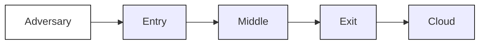
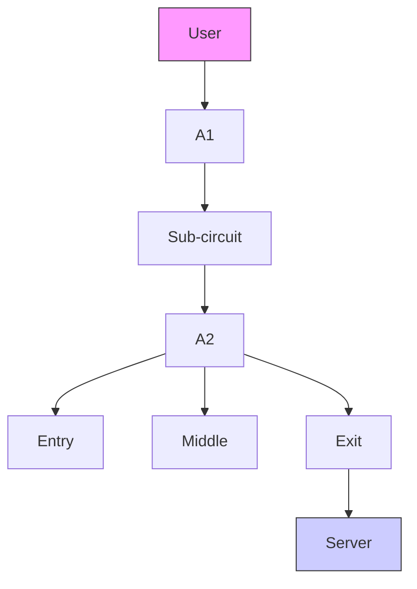
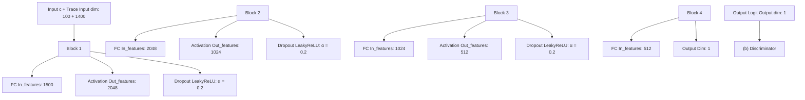

# Surakav: Generating Realistic Traces for a Strong Website Fingerprinting Defense

Jiajun Gong\*, Wuqi Zhang\*, Charles Zhang\*, Tao Wang†

\*The Hong Kong University of Science and Technology

†Simon Fraser University

{jgongac, wzhangcb, charlesz}@cse.ust.hk, taowang@sfu.ca

Abstract—Website Fingerprinting (WF) attacks utilize size and timing information of encrypted network traffic to infer the user’s browsing activity, posing a great threat to privacy-enhancing technologies like Tor; nevertheless, Tor has not adopted any defense because existing defenses are not convincing enough to show their effectiveness. Some defenses have been overcome by newer attacks; other defenses are never implemented and tested in the real open-world scenario.

In this paper, we propose Surakav, a tunable and practical defense that is effective against WF attacks with reasonable overhead. Surakav makes use of a Generative Adversarial Network (GAN) to generate realistic sending patterns and regulates buffered data according to the sampled patterns. We implement Surakav and evaluate it on the live Tor network. Experiments show that Surakav is able to reduce the attacker’s true positive rate by 57% with 55% data overhead and 16% time overhead, saving 42% data overhead compared to FRONT. In the heavyweight setting, Surakav outperforms the strongest known defense, Tamaraw, requiring 50% less overhead in data and time to lower the attacker’s true positive rate to only 8%. We also show that two existing defenses, Walkie-Talkie and TrafficSliver, can be fortified with our GAN-based trace generator.

Index Terms—Tor; privacy; website fingerprinting; traffic analysis; generative adversarial network

## I. INTRODUCTION

More and more people have been turning to privacyenhancing communication tools like Tor to access the internet, so that they may be protected from an increasing threat of network surveillance and censorship. Tor protects user privacy by establishing a three-node path between the user and the server where fixed-sized packets (also known as cells) are encrypted and transmitted [1]. Any single node on this path cannot simultaneously learn the identity of the user and the server. However, a local eavesdropper can launch a traffic analysis attack, known as Website Fingerprinting (WF), to deanonymize the user. They train a classifier that exploits size and timing information of network traces to guess which page the user is visiting. WF attacks have shown increasingly high success rates on attacking Tor [2]–[7].

Designing a usable defense is rather challenging. Defenses solely relying on adding random noise are not sufficiently strong against the best WF attacks [8], [9]. The highlyeffective ones, however, either require unreasonable assumptions or incur high overhead, significantly impeding their adoption. Specifically, they use predefined patterns to send packets that have the following limitations:

• Prior knowledge on webpages. Some defenses require knowledge of how each page is loaded so that they can compute a uniform sending pattern for a group of pages [2], [10]. This assumption makes their deployability questionable since most websites are updated frequently. Moreover, maintaining and distributing a database of real sending patterns could greatly burden the Tor network.

• A fixed pattern for all pages. These defenses force all pages to use the same pattern, sending packets in a constant rate [11]–[13]. They ignore the different characteristics of loading different pages, making it hard to lower their overhead.

To solve these limitations, we propose a novel defense Surakav that sends packets through various self-generated sending patterns. 1 Surakav is practical to use in that it does not require any prior knowledge on the webpages to be loaded. It makes use of a generator that can output infinite non-repeated sending patterns. We achieve this by training a well-designed Generative Adversarial Network (GAN) to mimic realistic traffic patterns of different webpages. To effectively reduce the overhead, instead of using fixed sending patterns, we dynamically adjust the patterns based on the size of buffered data during a loading process. Our generated sending patterns are highly realistic, such that they can be recognized as the intended class with 90% accuracy. The diversity of sending patterns and the randomness of real-time modifications make each load appear different, even for the same webpage, largely contributing to the effectiveness of our defense.

To show that our defense is fully deployable, we implement it and test it on the live Tor network. Our results show that for the first time, we are able to outperform the strongest known defense, Tamaraw [13], but with much less overhead: we require 50% less overhead in data and time to reduce the true positive rate of DF [5] to 8% while Tamaraw only reduces it to 13%. If we tune down the overhead of our defense further, we outperform the state-of-the-art lightweight defense, FRONT [9], with 42% less dummy data and a similar protection rate.

We summarize the contributions of our paper as follows:


<details>
<summary>flowchart</summary>


</details>

Fig. 1: The WF threat model.

• We propose a GAN-based novel WF defense, Surakav, based on trace generation. Surakav can be easily tuned for different security levels.  
• We conduct a full implementation evaluation for our defense as well as the state-of-the-art defenses in the real world. Results show that our defense outperforms the other defenses in the open-world scenario. Our defense also leaks less information than any other defense.  
• We find that trace generation can also be used to fortify other defenses, including TrafficSliver [14] and Walkie-Talkie [10].

We organize the rest of the paper as follows. We introduce background and related work in Section II and the preliminaries in Section III. We propose our new defense in Section IV. We evaluate our defense extensively in Section V. We further explore how our defense could help fortify other defenses in Section VI. Finally, we discuss relevant issues in Section VII and conclude our work in Section VIII.

## II. BACKGROUND AND RELATED WORK

## A. Threat Model

When a client uses Tor to load a webpage, each cell will traverse three different nodes (Entry, Middle, and Exit) before reaching the destination. As shown in Figure 1, we consider a local attacker between the client and the entry node who tries to infer the user’s browsing history. The attacker eavesdrops on the wire and observes the traffic pattern. We assume the attacker does not try to compromise the encryption of Tor or modify any packets. We further assume that the client visits one page at a time so that the attacker knows the start and end of a page load. This creates a harder scenario for a defense since attacking under a multi-tab browsing scenario is considered to be difficult [9], [15].

To launch a WF attack, the attacker first trains a classifier based on labeled network traces. Then, the attacker obtains the user’s traces and queries the classifier. The attacker’s performance can be evaluated in two different scenarios.

1) Closed-World Scenario: In this scenario, we assume the client only visits webpages from a monitored list determined by the attacker. The attacker’s goal is to classify the traces into the correct webpages. Here, “accuracy” refers to the proportion of correctly classified instances.  
2) Open-World Scenario: In the open-world scenario, the client visits not only monitored webpages, but also nonmonitored pages that the attacker may not have seen before. The attacker tries to find out which specific monitored page

the client is visiting if any. The attacker’s success rate is measured in True Positive Rate (TPR) and False Positive Rate (FPR). TPR is defined as the percentage of correctly classified monitored traces over the total number of monitored traces. FPR is defined as the percentage of the non-monitored traces that are misclassified as monitored ones.

## B. WF Attacks

Early WF attacks used machine learning models with handcrafted features as input [2]–[4], [16]–[18]. Later, deep learning models with various architectures were proposed. They take raw traces as input without doing feature engineering [5]– [7], [19], [20]. We pick the four most effective attacks as our benchmark in this paper:

• k-fingerprinting (kFP) [4]: kFP uses random forests to generate a fingerprint for each trace. It compares distances between fingerprints and selects the k closest fingerprints to decide the test instance’s label together. Its k Nearest Neighbor mechanism helps achieve low FPR.  
• CUMUL [3]: Panchenko et al. proposed to use a Support Vector Machine (SVM) with the cumulative summation of bytes from each direction as input features.  
• Deep Fingerprinting (DF) [5]: DF is a deep Convolutional Neural Network specially designed for website fingerprinting. It takes raw cell sequences as input where “+1” represents an outgoing cell and “-1” represents an incoming cell. It is able to achieve higher accuracy than any previous attack.  
• Tik-Tok [7]: Tik-Tok improves upon DF by incorporating time information into training. It uses directional timestamps to represent a trace: a positive real number represents the timestamp of an outgoing cell, and a negative real number represents that of an incoming cell. It is currently the state-of-the-art attack.

## C. WF Defenses

Existing works can be roughly categorized into three main classes: Randomization, Regularization, and Adversarial Trace Crafting. They either function at the network layer or the application layer.

1) Randomization Defenses: These defenses emphasize the use of randomness so that different traces from one webpage do not have the same pattern [21]–[23]. They focus on obfuscating (reordering, reshaping, and delaying) HTTP requests and responses. The most effective defense, ALPaCa, requires the web server’s cooperation [23], which may hamper its deployability.

WTF-PAD [8] and FRONT [9] are two lightweight defenses that introduce no delays to page loads. WTF-PAD tries to hide distinctive time gaps in traces. It samples time gaps from several pre-configured distributions and inserts dummy packets at those time gaps if no real packets are in the buffer. However, it was broken by DF [5] before it was ready to be deployed on Tor. FRONT randomizes the shape of distributions used for sampling the timing and number of dummy packets added, and the dummy packets are concentrated near the front of a trace. It only achieves partial effectiveness against DF [5] and Tik-Tok [7] attack.

Since those defenses do not delay any real packets, their ability to obfuscate time features is limited. By contrast, Surakav samples a random time gap for every burst of data, greatly restricting the time information leakage.

2) Regularization Defenses: This class of defenses aims at fitting traces into deterministic patterns so that they can be provably secure under certain assumptions. For example, the BuFLO family of defenses [11]–[13] suggests using a fixed sending rate on both sides and maintaining transmission for some extra time after a page load finishes. Among them, Tamaraw [13] achieves a good balance between overhead and security. Their use of a uniform pattern for all webpages causes high overhead. Compared to those defenses, Surakav makes use of diverse sending patterns that are flexibly adjusted in real time to reduce the overhead.

Two other defenses, Glove [24] and Supersequence [2], proposed to group webpages into clusters and compute a super-trace for each group so that visiting a page in this group will always yield the same trace. But they both require prior knowledge of the pages to be visited and are too expensive to use. Walkie-Talkie [10] greatly optimized the overhead by modifying the browser to talk in half-duplex mode. Still, it assumes that we can know the burst patterns of each page in advance, which is hard to achieve in reality. By comparison, Surakav does not require any prior knowledge of the webpages to be loaded, making it more realistic to deploy.

3) Adversarial Defenses: Adversarial traces represent a new direction for WF defense design. These defenses are based on the fact that deep learning models can be fooled using small, carefully-crafted perturbations upon the original inputs [25]–[27]. Mockingbird [28] used an optimization problem to find adversarial perturbations to the network traces. Hou et al. proposed a GAN model to generate adversarial traces [29]. However, both works require pre-knowledge of the full trace to compute noise, which again leads to deployment issues. Nasr et al. [30] proposed a new method to search for perturbations without knowing the whole trace. They assumed that the attack model was trained on undefended traces and tested on defended traces, which does not fit our model; a realistic attacker should be able to train on defended traces. To show their inapplicability, we conducted a brief simulation experiment in the open-world scenario using the same methodology as our other experiments described in Section V. We found their defense effectively reduced the TPR of the attacker by over 94% if the attack model was only trained on undefended traces, but the attacker’s TPR was reduced by only 4% if it was trained on defended traces.

Note that our defense does not fall into this category. Surakav does not try to find adversarial perturbations that can fool a trained classifier. Instead, it tunnels traffic through various sending patterns generated from a GAN.

4) Other Defenses: Decoy covers each page by randomly loading another page in the background [16]. Recent research shows that its overhead is too high (100%) while its security is not guaranteed due to variant base rates [31]. TrafficSliver [14] proposed to split traffic over several “sub-circuits” in a highly random manner. It is meant to defend against a malicious entry node, which is slightly different from our threat model. Any local attacker (e.g., someone under the same network) is still able to see the complete traces, weakening the defense. We will show how TrafficSliver can be augmented by our defense in Section VI.

## D. Trace Generation

Rigaki and Garcia showed the possibility to make malware traffic undetectable by mimicking normal traffic with a GAN [32]. FlowGAN [33] trained a GAN to learn six typical features of normal network traffic. Then, it dynamically adjusted traffic to approach the feature patterns of normal traffic generated by the GAN to resist censorship. GAN Tunnel [34] similarly used a GAN to reshape the traffic of an application by learning the traffic features of a decoy application. However, they need to train a separate GAN for each decoy application, which is not scalable for our scenario.

We observed that these works all served the purpose of evading censorship by changing general traffic features, such as packet length, packet inter-arrival time, etc. Compared to our work, none of those works generates burst sequences directly. To the best of our knowledge, we are the first to show that GANs can be used to create an effective defense against website fingerprinting attacks.

## III. PRELIMINARIES

## A. Generative Adversarial Network

A Generative Adversarial Network (GAN) refers to a framework in which two neural networks compete against each other [35]. In this framework, one player G (Generator) tries to generate synthesized data to fool its opponent, while the opponent D (Discriminator) tries to distinguish between real and synthesized data. Through this adversarial process, G enhances its ability to generate realistic-looking data using feedback from an improving D.

Vanilla GAN has several issues in training: the process is usually unstable, and its loss function does not function well as a stop condition [36]. Wasserstein GAN (WGAN) was proposed to solve these limitations [37]–[39]. WGAN-div is the state-of-the-art variant in the WGAN family and shown to be stable in training [39]. WGAN-div formulates the model as a min-max problem

$$
\begin{array}{l} \min _ {\mathcal {G}} \max _ {\mathcal {D}} \mathbb {E} _ {x \sim \mathbb {P} _ {r}} [ \mathcal {D} (x) ] - \mathbb {E} _ {\mathcal {G} (z) \sim \mathbb {P} _ {f}} [ \mathcal {D} (\mathcal {G} (z)) ] \tag {1} \\ - k \mathbb {E} _ {\hat {x} \sim \mathbb {P} _ {u}} [ | | \nabla_ {\hat {x}} \mathcal {D} (\hat {x}) | | ^ {p} ], \\ \end{array}
$$

where $\mathbb { P } _ { f }$ is the distribution of fake data, Pr is the distribution of real data, and xˆ is a linear interpolation of real and fake data points (the corresponding distribution is denoted as $\mathbb { P } _ { u } )$ [39]. The output of D is the logit of the probability that the input is real, assigned by the discriminator, which we refer to as the logit probability. The first two terms of (1) show that the discriminator attempts to maximize the difference of the logit probability between real and fake samples for each potential generator, who attempts to minimize the same. The third term of (1) is a regularization term to ensure that D satisfies the Lipschitz constraint [39]. They show that $k \ = \ 2$ and $p = 6$ yield the best results. We also use these values in our implementation.


<details>
<summary>text_image</summary>

Outgoing
Burst
Incoming
Burst
Time
Outgoing cell
Incoming cell
t_{o→o}
</details>

Fig. 2: Visualization of a burst sequence.

From (1), we can derive the loss functions of $\mathcal { D }$ and $\mathcal { G }$ to minimize as follows,

$$
\begin{array}{l} \mathcal {L} _ {\mathcal {D}} = - \mathbb {E} _ {x \sim \mathbb {P} _ {r}} [ \mathcal {D} (x) ] + \mathbb {E} _ {\mathcal {G} (z) \sim \mathbb {P} _ {f}} [ \mathcal {D} (\mathcal {G} (z)) ] \tag {2} \\ + k \mathbb {E} _ {\hat {x} \sim \mathbb {P} _ {u}} [ | | \nabla_ {\hat {x}} \mathcal {D} (\hat {x}) | | ^ {p} ], \\ \end{array}
$$

$$
\mathcal {L} _ {\mathcal {G}} = \mathbb {E} _ {x \sim \mathbb {P} _ {r}} [ \mathcal {D} (x) ] - \mathbb {E} _ {\mathcal {G} (z) \sim \mathbb {P} _ {f}} [ \mathcal {D} (\mathcal {G} (z)) ]. \tag {3}
$$

Equation (3) is also known as the estimated Wasserstein distance between $\mathbb { P } _ { f }$ and $\mathbb { P } _ { r }$ , providing a good indicator of when training should stop.

In this work, we build a GAN based on the methodology of WGAN-div. We train such a generator to generate burst sequences that look like normal traces and use them to create a WF defense. We will provide the details of the design in Section IV.

## B. Trace Representation

A trace is usually represented as a sequence of +1’s and -1’s since a Tor cell is of fixed length [1] and we only need to use the sign to indicate the direction of the cell. To facilitate the training of a generator, we transform such cell sequences into burst sequences. As shown in Figure 2, several consecutive cells from the same direction form a burst. Then a trace can be represented as $x = ( b _ { 1 } , \cdot \cdot \cdot , b _ { \ell } )$ , where $b _ { i }$ represents the i-th burst of cells. When i is an odd number, $b _ { i }$ represents an outgoing burst; otherwise, it is an incoming burst. $b _ { 1 }$ is always an outgoing burst since a loading process is always initiated by a client request. We use $| b _ { i } |$ to denote the size of burst $b _ { i } .$ We denote the time gap between two consecutive outgoing bursts as $t _ { o \to o } ,$ defined as the time gap between the first cells of these two bursts. A “trace” refers to a “burst sequence” in the rest of the paper, unless otherwise stated.

## IV. A NEW DEFENSE: SURAKAV

In this section, we introduce our new defense Surakav. We first discuss the motivation and intuition behind the defense. Then we give an overview of the workflow. Finally, we describe the design for each component of Surakav in detail.

## A. Motivation and Intuition

The failure of WTF-PAD [8] against DF [5] indicates that it is hard for a defense to beat a strong attack with only dummy packets and no packet delays. Regularization defenses, on the other hand, provide a simple intuition on why they work: to load webpages in their predefined sending patterns. Consider Tamaraw [13], a regularization defense: it constructs a simple sending pattern for all webpages, making the client and the server send packets at different constant rates and stop sending cells when the trace length is a multiple of a predefined integer. However, since real packets are unevenly distributed during the loading process, a constant sending strategy cannot fully utilize the overhead budget. Moreover, Tamaraw users can only choose to have either fewer delays or less dummy data, at the cost of increasing the other.

Surakav reduces overhead while maintaining effectiveness by tunneling packets through different sending patterns rather than a constant pattern. These patterns capture the general characteristics of a normal page load (e.g., more incoming packets than outgoing ones). A naive way to create sending patterns is to directly use pre-collected real traces. However, maintaining and distributing real traces will again burden the Tor network. Instead, we can use a generative model to synthesize traces for us as sending patterns and distribute the trained model directly to users. To distribute a model, we only need to transfer several megabytes of data, which are the trained weights of the model.

We choose to use a Generative Adversarial Network (GAN) for trace generation since it has shown great success in synthesizing graphics [35], [37], [39]. We design a GAN to generate realistic sending patterns from various webpages. We refer to these patterns as “reference traces”. When loading a webpage, we randomly generate reference traces from the trained generator and send packets based on them. We wait for a randomly sampled time gap each time we are about to send out a burst of data. The size of the defended burst is determined together by the amount of data currently in the buffer and the burst size suggested by the reference trace.

Our design leaks minimal time information and allows us to control how much size information we are willing to sacrifice to lower overhead. By using reference traces derived from a generator, we ensure the patterns are never repeated, even if the attacker uses the same generator as the victim.

## B. Overview of Surakav

The main components of Surakav are a generator $\mathcal { G }$ that generates reference traces (Section IV-C) and a regulator R that uses reference traces to decide when and how many packets should be sent onto the circuit based on two randomized mechanisms (Section IV-D). The workflow of Surakav is illustrated in Figure 3.

Surakav first uses a GAN to train G on a dataset and samples reference traces from G. The reference trace is a sequence of bursts defined in Section III-B. Then, in each round, the regulator R consumes two bursts from a sampled reference trace, one for the client and another for the proxy server.

  
Fig. 3: Workflow of Surakav. The defense has two phases: (a) we first train a generator that is able to generate various reference traces; (b) we sample reference traces from the trained generator and send bursts of data based on the reference traces.


<details>
<summary>flowchart</summary>


</details>

Fig. 4: The architecture of the Generator and the Discriminator. (FC: fully-connected layer, BN: batch normalization, c: class label, \`: trace length, z: sampled noise vector.)

R learns the time gap distribution of outgoing bursts from the dataset, and samples a time gap $t _ { o \to o }$ from the learned distribution in each round. After sleeping for time $t _ { o \to o } ,$ R sends an outgoing burst whose size is based on both the real data in the buffer and the reference burst size. A message packet is attached to this burst instructing the proxy on how much data to respond with. Client and proxy send bursts of data in such a back-and-forth way until the page is loaded. During the process, R may re-sample a new reference trace if the previous one is used up. Burst sizes are reduced by holding data in the buffer until the next round of sending, and they are increased by adding dummy packets.

## C. Training Trace Generator

We propose a novel GAN architecture for the purpose of generating burst sequences.

1) Architecture: There are three components in the GAN, that is, a generator G, a discriminator D, and an observer O. We present the architecture of our GAN in Figure 4. Detailed parameters of each layer in the GAN are shown in Appendix A.

Generator. The generator G is a Multilayer Perceptron (MLP). It takes a label c (in the one-hot representation) and a noise vector z as input and outputs a vector representing a generated burst sequence and a trace length \`. The input vector is normalized into [0,1] to facilitate the training process. The key to being able to generate traces of different webpages is that we include the label information in the input. This is a trick used by conditional GANs to generate instances of different classes [40]. Note that the size of different webpages could vary a lot, leading to different trace lengths, while the output of the generator is a fixed-length vector. Therefore, we truncate the output trace in post-processing: we cut the fixed-length vector at length \` (i.e., the learnt trace length for this class) to get the final burst sequence. This helps us avoid having a lot of empty bursts (i.e., 0’s) at the tail.

Discriminator. The discriminator D is also an MLP. Both real traces and fake traces are fed into D. The output of D is the logit of the probability that the input is a real trace according to the discriminator’s belief. Similar to G, the discriminator also includes labels as input.

Observer. We introduce a novel observer into our model to improve the quality of fake traces. The observer O is a pretrained model that further provides feedback for G. It takes in those fake traces that successfully fool the discriminator (i.e., predicted to be real traces) and determines which webpage they come from. The observer uses a modified DF model [5] that has the same architecture as the original DF and takes in burst sequences (instead of cell sequences) since DF is shown to be one of the strongest attacks.

In our model, we introduce an observer to check whether a fake trace would be correctly classified into the expected class. In original GAN, G gets limited binary information from D, that is, whether the trace is fake or real. As network traces are information-dense, the observer gives us more feedback to capture the difference between traces from different classes. We do not train the observer along with G and D from scratch, as training a GAN is much harder than training a single model since it involves adversity. As a preliminary experiment to test whether the traces we generated with the observer were realistic, we asked a DF classifier trained on real traces to classify our fake traces as if their target websites were their true labels. This led to a 90% accuracy on DF, compared to 13% without an observer.

2) Training Algorithm: Here we describe how we train the generator and the discriminator. We extend the idea of WGAN-div [39] and design a new loss function $\mathcal { L } _ { \mathcal { G } } ^ { * }$ for our generator G:

$$
\text { minimize } \mathcal {L} _ {\mathcal {G}} ^ {*} = \mathcal {L} _ {\mathcal {G}} + \alpha \mathcal {L} _ {\mathcal {O}}, \tag {4}
$$

where $\mathcal { L } _ { \mathcal { G } }$ is the original loss of WGAN-div described in (3) and $\mathcal { L } _ { \mathcal { O } }$ is the cross entropy loss of our observer $\mathcal { O }$ on the selected fake traces. We introduce a hyperparameter α to adjust the weight of $\mathcal { L } _ { \mathcal { G } }$ and $\mathcal { L } _ { \mathcal { O } }$ since their magnitude could be different. The first term in (5) minimizes the Wasserstein distance between fake and real data, and the second term minimizes the cross entropy loss so as to increase the confidence of fake traces being accepted as the expected class. The loss function of D is exactly the same as (2):

$$
\text { minimize } \mathcal {L} _ {\mathcal {D}} ^ {*} = \mathcal {L} _ {\mathcal {D}}, \tag {5}
$$

except that the original input to D and $\mathcal { G }$ should be concatenated with label c.

We summarize the training process in Algorithm 1. In each iteration, we sample a batch of real traces from the dataset and generate a batch of fake traces. We update the weights of $\mathcal { G }$ and $\mathcal { D }$ according to (4) and (5). In the training process, D is trained for $n _ { c r i t i c }$ iterations each time G is trained for one iteration (See Line 10-14), since WGANs require the discriminator to be trained more often than the generator [38]. 2

Algorithm 1 Algorithm for GAN training  
Input: Batch size m, critic iteration $n_{critic}$ , burst sequence length d, discriminator D, generator G, observer O and other hyperparameters  
Output: a trained $\mathcal { G }$

1: $i \leftarrow 0$ 2: while training has not converged do
3: $i \leftarrow i + 1$ 4:    Sample real data $(x_{1}, c_{1}), \cdots, (x_{m}, c_{m})$ from $P_{r}$ 5:    Sample noise $z_{1}, \cdots, z_{m}$ from $\mathcal{N}(0, 1)$ 6:    Generate fake traces $\widetilde{x}_{j}, \ell_{j} \leftarrow \mathcal{G}(z_{j} || c_{j})$ 7:    Mask the tail of $\widetilde{x}_{j}$ by zeroing the last $d - \ell_{j}$ elements
8:    Generate interpolate points $\hat{x}_{j} \leftarrow \frac{1}{2}(x_{j} + \widetilde{x}_{j})$ 9:    Update the weights of D to minimize $L_{D}^{*}$ (Eq. (5))
10:    if i mod $n_{critic} = 0$ then
11:    Pick $\{(\widetilde{x}_{k}, c_{k})\}_{k}$ where $\mathcal{D}(\widetilde{x}_{k} || c_{k}) > 0$ 12:    Compute $L_{O} \leftarrow CrossEntropyLoss(\{\widetilde{x}_{k}, c_{k}\}_{k})$ 13:    Update the weights of G to minimize $L_{G}^{*}$ (Eq. (4))
14:    end if
15: end while
16: return G

## D. Regulating Packets

We design a regulator R that is responsible for instructing packet sending for both the client and the server with the help of the trained generator. We list the necessary parameters for configuring our regulator R in Table I.

2In a WGAN, the discriminator is also called a critic.

TABLE I: The parameters for regulator configuration.

<table><tr><td>Notation</td><td>Description</td></tr><tr><td>ρ</td><td>Maximum time gap between two outgoing bursts</td></tr><tr><td>δ</td><td>Tolerance for burst size adjustment</td></tr><tr><td>q</td><td>The probability of skipping a dummy burst</td></tr></table>

R first learns the distribution of $t _ { o \circ o } ,$ the time gap between two outgoing bursts defined in Section III-B. We use Kernel Density Estimation (KDE), a common method used for probability estimation, to estimate such a distribution from a dataset. To defend a trace, R samples a new time gap $t _ { \Delta }$ , sleeps for min $( t _ { \Delta } , \rho )$ , and sends out a burst of data. $\rho$ is a parameter for our defense that limits the maximum time gap allowed between two outgoing bursts. When the proxy receives a burst from the client, it immediately responds with a burst of data. Therefore, the timing of the whole process is decided by R.

The burst size on each side is based on the output of the GAN model. On top of that, we introduce two mechanisms to provide a trade-off between overhead and security as well as to add more randomness into the defense.

1) Burst Adjustment: When we are about to send a burst of data $b _ { c }$ on the client side, R first consumes two reference bursts $b _ { c } ^ { f a k e }$ and $b _ { s } ^ { f a k e }$ from a sampled reference trace. Then the size of $b _ { c }$ is

$$
\left| b _ {c} \right| = \left\{ \begin{array}{l l} \max (1, \perp), & \left| b _ {c} ^ {\text { real }} \right| <   \perp , \\ \left| b _ {c} ^ {\text { real }} \right|, & \perp \leq \left| b _ {c} ^ {\text { real }} \right| \leq \top , \\ \top , & \left| b _ {c} ^ {\text { real }} \right| > \top , \end{array} \right. \tag {6}
$$

where

$$
\begin{array}{l} \bot = \left\lfloor (1 - \delta) \cdot | b _ {c} ^ {f a k e} | \right\rfloor , \\ \top = \left\lfloor (1 + \delta) \cdot | b _ {c} ^ {f a k e} | \right\rfloor , \\ \end{array}
$$

$b _ { c } ^ { r e a l }$ $\delta$ is a parameter in our defense. Equation (7) defines soft boundaries on how much we can change the burst based on the sampled reference burst $b _ { c } ^ { f a k e }$ . If the current burst size is within the range (⊥, >), then we directly send the real burst without modification since the current burst size is close to the fake one. Otherwise, we have to modify the burst (delay or add packets) to snap the burst size towards one of the boundaries based on (6). The proxy follows the same method to determine $\left| b _ { s } \right|$ according to the buffered real data $b _ { s } ^ { r e a l }$ and the reference burst $b _ { s } ^ { f a k e }$ .

The Burst Adjustment mechanism provides an intuitive way to control the amount of information leakage so that our defense is able to tune between a lightweight setting and a heavyweight setting.

2) Random Response: The Burst Adjustment mechanism alone is not sufficient to ensure low data overhead. The overhead could be high when a very large $b _ { s } ^ { f a k e }$ is required by the generated trace while there is no real data in the buffer. Therefore, we introduce the Random Response mechanism in which the proxy is allowed to skip sending a burst with probability q when $b _ { s } ^ { r e a l } = 0 \ ( \mathrm { i . e . }$ ., no data in the buffer) at the time of receiving a client burst. We randomly sample a new q value from a uniform distribution of range (0,1) for each page load to add more randomness. Note that we do not apply Random Response when there are any real packets to send $( b _ { s } ^ { r e a l } > 0 )$ because that would cause these packets to be delayed, and we try to minimize delays.

TABLE II: Search space for hyperparameter tuning and the final values we choose. Each training process is conducted over a dataset of $1 0 0 \times 1 0 0 0$ instances.

<table><tr><td>Hyperparameter</td><td>Search Space</td><td>Final</td></tr><tr><td>Epoch num</td><td>[20...1000]</td><td>600</td></tr><tr><td>Trace length</td><td>[500...10000]</td><td>1400</td></tr><tr><td>Optimizer</td><td>[Adam, Adamax, RMSProp]</td><td>RMSProp</td></tr><tr><td>Learning Rate</td><td>[0.0001...0.001]</td><td>0.0002</td></tr><tr><td>Batch Size</td><td>[16...256]</td><td>64</td></tr><tr><td>z dim</td><td>[50...1000]</td><td>500</td></tr><tr><td>G layer num</td><td>[3...5]</td><td>4</td></tr><tr><td>D layer num</td><td>[3...5]</td><td>4</td></tr><tr><td>Dropout</td><td>[0.2...0.9]</td><td>0.2</td></tr><tr><td>Activation functions</td><td>[ReLU, LeakyReLU, ELU]</td><td>LeakyReLU</td></tr><tr><td>α</td><td>[0.01...1.0]</td><td>0.02</td></tr><tr><td>ncritic</td><td>[1...10]</td><td>3</td></tr></table>

Random Response provides a way to reduce the data overhead while limiting information leakage by skipping sending in a random manner. We will further discuss the impact of $q$ in Section V-D.

## E. Defense Initialization

There are two things we need to prepare before Surakav is deployed: a generator G to generate traces and a distribution $t _ { o \to o }$ to generate time gaps between bursts. In this section, we show our hyperparameter tuning process for the former and how we model the time gap distribution for the latter.

1) Hyperparameter Tuning for the GAN: How well the GAN is trained depends a lot on the hyperparameters. We perform a search for the hyperparameters by trying out different combinations of hyperparameter values. We observe the change of $\mathcal { L } _ { \mathcal { G } }$ , the estimated Wasserstein distance between real and fake data, as well as the accuracy of the observer O. A good-enough set of hyperparameters should make $\mathcal { L } _ { \mathcal { G } }$ smoothly decrease to near zero.

Dataset. We build our dataset $\mathsf { D } S _ { \mathsf { g a n } }$ for GAN training based on Rimmer’s dataset [20], the largest known WF dataset collected in 2018. The dataset has 900 classes, each with 2500 instances. We randomly pick 100 classes as our morphing targets, and for each class, we only use 1000 instances to reduce the training cost.

Tuning Results. Table II shows the search space and the final values we choose for the model. The length of both input and output burst sequences is fixed at 1400 since most of the burst sequences have a length below this value in $\mathsf { D } S _ { \mathsf { g a n } }$ . The learning rate for our model is fixed at 0.0002. A small learning rate (e.g., 0.0001) fails to reduce $\mathcal { L } _ { \mathcal { G } }$ (i.e., the estimated Wasserstein distance) to less than 0.1 even after more than 1000 epochs. A large learning rate, on the other hand, could make the training unstable where the loss curves for $\mathcal { L } _ { \mathcal { G } } ^ { * }$ and $\mathcal { L } _ { \mathcal { D } } ^ { * }$ fluctuate wildly over epochs. α helps balance the weights of the two losses in $\mathcal { L } _ { \mathcal { G } } ^ { \ast } .$ . In our case, we should set α to a relatively small value since we observe that the magnitude of $\mathcal { L } _ { \mathcal { G } }$ is much smaller than $\mathcal { L } _ { \mathcal { O } }$ . We only apply dropouts and activation functions to $\mathcal { D }$ to avoid overfitting problems. On the generator side, we find that adding batch normalization in each hidden layer improves the performance. $n _ { c r i t i c }$ adjusts the update frequency of D relative to that of G. We find that $n _ { c r i t i c } = 3$ yields the best results. The best generator we get can lead to an estimated Wasserstein distance of 0.016 and a 90% accuracy on the observer; higher accuracy indicates that the fake traces are convincing.


<details>
<summary>line chart</summary>

| Burst Index | Real Mean Burst Size | Fake Mean Burst Size |
|-------------|----------------------|----------------------|
| 0           | ~0                   | ~0                   |
| 100         | ~-40                 | ~-20                 |
| 200         | ~-10                 | ~-5                  |
| 300         | ~0                   | ~0                   |
| 400         | ~0                   | ~0                   |
</details>

Fig. 5: Visualization of real and fake center traces. We only show the first 400 outgoing and incoming bursts since the sizes of the last 300 bursts are all close to 0. Incoming bursts are represented in negative values.

Visualization. Besides observing a low Wasserstein distance, we want to confirm that our trained generators are effective using visualization to show the similarity between trained and generated traces. To do so, we compare the center traces of the same webpage for real and fake data. A center trace is computed by taking the mean of each burst in the trace over a group of traces. The center trace for this class should be relatively stable since it reveals the sizes of objects in the webpage. Using center traces rather than single traces for visualization better reflects generator quality because individual traces even of the same webpage can be very different from each other due to network and page randomness.

We randomly pick four classes (webpages indexing 80, 84, 33, and 81 in our dataset) for illustration. Their center traces are shown in Figure 5. We use positive values to represent outgoing bursts and negative values to represent incoming bursts. We only show the first 400 outgoing and incoming bursts since the sizes of the last 300 bursts are all close to 0. As we can see, in each class, the real and fake center traces are shown to be quite close to each other, indicating that our generator successfully learns the unique features.

Fitting Other Datasets. To show that our GAN can easily adapt to mimicking different webpages, we train a new generator with another widely-used dataset $\mathrm { D } S _ { 9 5 }$ collected by Sirinam et al. [5]. The dataset has 95 classes, each with 1000 instances. The large number of instances for each class guarantees fast convergence for our trace generation task. We use the same hyperparameters in Table II to train the model. We find that the model converges after only 253 epochs on $\mathrm { D } S _ { 9 5 } ,$ , leading to an estimated Wasserstein distance of 0.023 and a 90% accuracy on the observer. We also investigate the center traces for real and fake data and find that they are all very close to each other, showing that the generator is welltrained. We include some examples to show the quality of generated traces in Appendix B.


<details>
<summary>histogram</summary>

| Time Gap (seconds, in log scale) | Frequency |
| -------------------------------- | --------- |
| -4.0                             | 0.00      |
| -3.8                             | 0.00      |
| -3.6                             | 0.00      |
| -3.4                             | 0.00      |
| -3.2                             | 0.00      |
| -3.0                             | 0.00      |
| -2.8                             | 0.00      |
| -2.6                             | 0.00      |
| -2.4                             | 0.00      |
| -2.2                             | 0.00      |
| -2.0                             | 0.00      |
| -1.8                             | 0.00      |
| -1.6                             | 0.00      |
| -1.4                             | 0.00      |
| -1.2                             | 0.00      |
| -1.0                             | 0.00      |
| -0.8                             | 0.00      |
| -0.6                             | 0.00      |
| -0.4                             | 0.00      |
| -0.2                             | 0.00      |
| 0.0                              | 0.00      |
| 0.2                              | 0.00      |
| 0.4                              | 0.00      |
| 0.6                              | 0.00      |
| 0.8                              | 0.00      |
| 1.0                              | 0.00      |
| 1.2                              | 0.00      |
| 1.4                              | 0.00      |
| 1.6                              | 0.00      |
| 1.8                              | 0.00      |
| 2.0                              | 0.00      |
</details>

Fig. 6: Probability Density Function of $t _ { o \to o } .$

2) Time Gap Modeling: In our defense, we let R sample time gaps $( \mathrm { i } . \mathrm { e } . , \ t _ { o \to o } )$ from a time gap distribution between bursts. To correctly capture the characteristics of $t _ { o \circ } ,$ we learn such a distribution from real data. We collect over 25,000,000 time gaps from $\mathsf { D } S _ { \mathsf { g a n } }$ and estimate the data distribution using FFTKDE which is one of the fastest implementations of KDE. To avoid sampling a negative $t _ { o \to o } ,$ we instead model the distribution of log $t _ { o \to o } .$ . Figure 6 shows the distribution we learnt from $\mathsf { D } S _ { \mathsf { g a n } }$ . We observe that log $t _ { o \to o }$ roughly follows a normal distribution. The mean gap sampled from this distribution is about 42 ms.

## V. DEFENSE EVALUATION

In this section, we evaluate Surakav in several aspects. We first describe the experiment setup and the datasets we collected. Then we compare Surakav with the state-of-theart defenses to show its effectiveness. We also analyze the overhead required to deploy our defense onto the Tor network. Lastly, we explore the impact of setting different parameter values on Surakav.

## A. Experiment Setup

We evaluate Surakav using implementation instead of simulation because implementation is more accurate than simulation in evaluating the effectiveness of a defense. Many of the mechanisms in Surakav cannot be accurately simulated with current methods. We compare our defense with two state-ofthe-art defenses of two different categories, Tamaraw [13] and FRONT [9], using real defended traces.

1) Implementation Overview: We extended WFDef-Proxy [41], a framework for WF defense evaluation, and implemented Surakav as a pluggable transport (PT). Gong et al.

have already successfully implemented several WF defenses such as FRONT [9], Tamaraw [13] and Random-WT [10] (a variation of Walkie-Talkie) in the framework. Each defense serves as a PT that obfuscates the traffic between the client and the entry node according to the defense protocol. The implementation excludes the entry node as a potential WF attacker; we will discuss this limitation in Section VII.

2) Deployment Details: We rent three servers on Microsoft Azure to conduct the experiments. One server is used as our private bridge (i.e., the entry node) on which we deploy the defenses. On the other two servers, we create in total ten docker containers acting as ten independent clients to visit webpages in parallel. They will all connect to our private bridge as the first node of their circuits. The client servers and the bridge server are placed in two different areas in the world; the exact locations are scrubbed for blind review.

The bridge is configured to have 1 CPU core (2.3 GHz) and 2 GB of memory. The Tor version running on the bridge is 0.4.4.5 in Debian 9.11. The client servers are configured to have 4 CPU cores (2.3 GHz) and 16 GB memory, running on Ubuntu 18.04.4 LTS, to support multiple client processes. For each client, we use a customized Tor Browser to visit webpages. It is based on version 10.0.15 and incorporates three WF defense PTs. It has an initial user profile to avoid being detected as a bot by web servers. To visit a webpage, every client will launch a new instance of this Tor Browser so that no browser caches are kept. Each trace is collected over a different circuit. Each visit is given at most a 80 s session to load the page, and we wait for an extra 5 s on the page after a loading process finishes, and then terminate the browser.

To allow Tor Browser to run on Azure servers, we set the variable MOZ\_HEADLESS to True, so that Tor Browser runs in headless mode while still rendering the webpage. Since Azure servers could have unlimited bandwidth and may not correctly represent a normal Tor user at home, we further limit the connection bandwidth for each client at 120 Mbits, according to the global average bandwidth estimated by Speedtest in July 2021 [42].

3) Dataset: We collected open-world and close-world datasets. Each open-world dataset contains in total 70,000 instances with 100 monitored sites (each loaded 100 times) and 60,000 non-monitored sites (each loaded once). Each closedworld dataset only contains 10,000 monitored instances. To compare different defenses, we directly evaluate the defenses with open-world datasets (Section V-B). We use closed-world datasets instead of open-world datasets for parameter tuning to reduce the otherwise prohibitive amount of time to collect datasets (Section V-D) as each parameter setting requires a new dataset. In total, we had 15 closed-world datasets and 5 open-world datasets.

We collect data on the Tranco top 1 million [43] sites. The list was generated on 21st January 2021. Duplicated URLs directing to the same page or related to website localization are removed in advance. The first 100 URLs in the list are the monitored sites. The 60,000 URLs starting from the 201st are the non-monitored sites. We crawl the monitored sites in

TABLE III: Attack results on the implemented defenses in the open-world scenario. Each dataset $( 1 0 0 \times 1 0 0 + 6 0 , 0 0 0 )$ i s collected in the live Tor network. All values are in percentages.

<table><tr><td rowspan="2">Defense</td><td colspan="2">Overhead</td><td colspan="2">kFP</td><td colspan="2">CUMUL</td><td colspan="2">DF</td><td colspan="2">Tik-Tok</td></tr><tr><td>Data</td><td>Time</td><td>TPR</td><td>FPR</td><td>TPR</td><td>FPR</td><td>TPR</td><td>FPR</td><td>TPR</td><td>FPR</td></tr><tr><td>None</td><td>0</td><td>0</td><td>73.62</td><td>0.18</td><td>74.23</td><td>3.50</td><td>96.24</td><td>0.54</td><td>96.68</td><td>0.70</td></tr><tr><td>FRONT [9]</td><td>97</td><td>0</td><td>0.92</td><td>0.01</td><td>3.78</td><td>9.55</td><td>43.00</td><td>4.66</td><td>42.63</td><td>3.02</td></tr><tr><td>Tamaraw [13]</td><td>121</td><td>26</td><td>0.36</td><td>0.03</td><td>1.91</td><td>8.99</td><td>15.21</td><td>1.17</td><td>12.99</td><td>0.53</td></tr><tr><td>Surakav-light</td><td>55</td><td>16</td><td>0.85</td><td>0.02</td><td>11.24</td><td>8.79</td><td>39.40</td><td>5.81</td><td>39.68</td><td>4.41</td></tr><tr><td>Surakav-heavy</td><td>81</td><td>17</td><td>0.01</td><td>0</td><td>2.74</td><td>7.63</td><td>8.14</td><td>2.70</td><td>6.28</td><td>1.04</td></tr></table>

a Round-Robin fashion as prior works do [5], [18], [41]. Data collection lasted for over two months.

4) Ethical Considerations: Since large-scale data collection may have some impact on the Tor network, we try to mitigate the adverse effects on the Tor network. Firstly, the bridge we run is private, and we do not accept any connections from real users. Secondly, we only add dummy packets and time delays between our own clients and the bridge, so the other entities in the network remain unaffected. We also limit the number of clients in parallel (10 in our setting) to minimize the burden on Tor and the web servers.

We use the command line to directly drive the Tor Browsers, so none of those visits come from real users. We only keep the minimal information (i.e., the timestamp and size of each packet) that is necessary for our experiments.

## B. Defense Performance

We first present the performance of four state-of-the-art attacks in the open-world scenario. For each dataset, we perform 10-fold cross validation.

1) Defense Configuration: For Tamaraw, we set $\rho _ { c } =$ 14 ms, $\rho _ { s } = 4 \mathrm { m s }$ , and $L = 1 0 0$ , as suggested by the original paper [13]. 3 For FRONT [9], we set $N _ { c } = N _ { s } = 6 0 0 0 .$ , $W _ { m i n } \ = \ 1 \mathrm { s } ,$ , and $W _ { m a x } \ = \ 1 4 \mathrm { s } .$ . We slightly increase the strength and overhead of FRONT to make a better comparison with Surakav. For Surakav, we present two different settings, denoted as Surakav-light $( \delta = 0 . 6 )$ and Surakav-heavy $( \delta =$ 0.4). The parameter $\rho$ is fixed at 100 ms by default.

2) Overhead Metrics: Following the methodology of previous works [2], [9], [10], [13], we evaluate the overhead of defense by data overhead and time overhead. The data overhead is measured as the total number of dummy packets divided by the total number of real packets over the whole dataset. The time overhead is measured as the total extra time divided by the total loading time in the undefended case over the whole dataset.

3) Attack Results: Table III shows the results. When there is no defense applied, two deep learning attacks, DF and Tik-Tok, achieve over 96% TPR at a low level of FPR $( <$ < 0.7%). kFP and CUMUL achieve a 74% TPR. kFP has the lowest FPR (0.18%) among all the attacks due to its k-Nearest Neighbor mechanism. The results indicate, as seen in previous

$^ 3 \rho _ { c }$ and $\rho _ { s }$ are adjusted since the payload size is 750 bytes in the original paper while the payload size in our case is 514 bytes (a Tor cell size).


<details>
<summary>line chart</summary>

| Information Leakage (Bit) | Undefended | FRONT | Tamaraw | Surakav-light | Surakav-heavy |
| ------------------------- | ---------- | ----- | ------- | ------------- | ------------- |
| 0.8                       | 0.0        | 0.0   | 0.0     | 0.0           | 0.0           |
| 1.2                       | 0.0        | 0.4   | 0.3     | 0.5           | 0.6           |
| 1.6                       | 0.0        | 0.8   | 0.7     | 0.9           | 1.0           |
| 2.0                       | 0.2        | 1.0   | 1.0     | 1.0           | 1.0           |
| 2.4                       | 0.8        | 1.0   | 1.0     | 1.0           | 1.0           |
| 2.8                       | 1.0        | 1.0   | 1.0     | 1.0           | 1.0           |
| 3.2                       | 1.0        | 1.0   | 1.0     | 1.0           | 1.0           |
| 3.6                       | 1.0        | 1.0   | 1.0     | 1.0           | 1.0           |
</details>

Fig. 7: Empirical Cumulative Distribution Function (ECDF) of top 100 informative features for each dataset. Surakav leaks the least amount of information.

work, that WF attacks are highly effective when no defense is implemented, even in a large open-world scenario.

FRONT is highly effective against kFP and CUMUL. With 97% data overhead, the TPR of kFP is reduced to less than 1%. The FPR of CUMUL is increased to 10%. However, DF and Tik-Tok still achieve 43% TPR with an FPR at 3-5%. By contrast, Surakav-light, with 42% less data overhead and 16% more time overhead, achieves a slightly better protection rate against the strongest attacks. It reduces the TPR of both DF and Tik-Tok to 40% and further increases the FPR of both attacks by 1%.

In the strong defense category, Tamaraw can degrade the performance of kFP and CUMUL close to random guessing. DF achieves the highest TPR (15%) at a 1% FPR among all the attacks. However, Tamaraw also requires the highest overhead in both data (121%) and time (26%) among all the defenses. In comparison, Surakav-heavy incurs 40% less data overhead and 9% less time overhead than Tamaraw, but offers an even stronger protection rate. The TPR of DF is sharply reduced from 96% to only 8% with a 3% FPR. The TPR of Tik-Tok is only 6%. For kFP and CUMUL, they perform as poorly as against Tamaraw. If we compare Surakav-heavy with FRONT, they have similar overhead in total. However, the TPRs of the strongest attacks (DF and Tik-Tok) are both further reduced by more than 35%.

4) Information Leakage Analysis: We have shown that Surakav can effectively defend against modern WF attacks. In this section, we show that Surakav is also the most effective defense from the perspective of information leakage. We make use of the WeFDE framework [44] to conduct an information leakage analysis for each defense. The idea of WeFDE is to estimate the amount of information learnt from a specific feature f about a webpage w by computing the mutual information of w and f. Following their methodology, we compute the information leakage for all the features used in the WF literature (in total 3043 features). We exclude all the redundant features that share the same information with any other features. Then we pick the top non-redundant 100 features that leak the most bits of information. The results are shown in Figure 7.

TABLE IV: Defense performance against kFP attack under the one-page setting. Surakav-heavy outperforms all the other defenses. All values are in percentages.

<table><tr><td rowspan="2">Defense</td><td colspan="2">Overhead</td><td rowspan="2">TPR</td><td rowspan="2">FPR</td></tr><tr><td>Data</td><td>Time</td></tr><tr><td>None</td><td>0</td><td>0</td><td>98.29 ± 1.91</td><td>1.48 ± 1.63</td></tr><tr><td>FRONT [9]</td><td>97</td><td>0</td><td>85.20 ± 6.83</td><td>14.41 ± 7.07</td></tr><tr><td>Tamaraw [13]</td><td>121</td><td>26</td><td>87.07 ± 5.12</td><td>13.24 ± 5.05</td></tr><tr><td>Surakav-light</td><td>55</td><td>16</td><td>86.11 ± 7.27</td><td>12.88 ± 5.90</td></tr><tr><td>Surakav-heavy</td><td>81</td><td>17</td><td>82.77 ± 7.27</td><td>19.43 ± 7.35</td></tr></table>

As a baseline, the most informative feature leaks 2.85 bits of information on the undefended dataset. Tamaraw and FRONT leak at most 1.78 bits and 1.83 bits of information. Surakav leaks the least information, that is, 1.65 bits in the lightweight setting and 1.59 bits in the heavyweight setting, respectively. We find that the median leakage for Surakavheavy is only 1.09 bits. The median leakage for Surakavlight and FRONT is both 1.22 bits. Surprisingly, the median leakage for Tamaraw is the highest among all the defenses (1.41 bits). This matches our above analysis that Surakavheavy is stronger than Tamaraw.

Surakav successfully reduces the information leakage by sending data at random time gaps so that little information is leaked by the timings. Most of its information leakage comes from the burst sizes, which is controlled by δ.

5) One-page Setting Analysis: Wang suggested that defenses should be evaluated under a harder setting where the attacker only monitors a single webpage [31]. In such a one-page setting, all the defenses were shown to be more vulnerable to the kFP attack than expected. To show the effectiveness of our defense, we conduct the same analysis on our datasets. For each dataset, we repeatedly label instances from one monitored page as positive and the rest (including non-monitored instances) as negative and perform the binary classification with kFP. Then we compute the mean and the standard deviation of TPR and FPR over all the webpages (in total 100 pages). Table IV shows the results.

On the undefended dataset, kFP achieves over 98% TPR with only 1.5% FPR on average, showing it is highly effective in identifying single pages. Tamaraw does not outperform FRONT, even though it incurs much more overhead both in data and time than FRONT. This is because the padding mechanism of Tamaraw fails to group negative instances and positive instances into the same anonymity sets [31]. FRONT performs slightly better than Surakav-light by further reducing


<details>
<summary>line chart</summary>

| Update Frequency (days) | 0.64M | 1.28M | 2.56M | 5.12M |
| ----------------------- | ----- | ----- | ----- | ----- |
| 10                      | 1.0   | 2.0   | 4.0   | 8.0   |
| 30                      | 0.5   | 1.0   | 2.0   | 4.0   |
| 50                      | 0.3   | 0.7   | 1.2   | 2.5   |
| 70                      | 0.2   | 0.5   | 0.8   | 1.8   |
| 90                      | 0.1   | 0.3   | 0.5   | 1.2   |
| 110                     | 0.1   | 0.2   | 0.3   | 0.8   |
</details>

Fig. 8: The distribution cost for updating the generator under different update frequencies. The percentage is calculated over the current bandwidth consumed by directory servers. Each line represents a different number of users (in millions).

TPR by 1% and increasing FPR by 1.5%. However, as we have shown before, FRONT incurs 42% more data overhead than Surakav-light. Surakav-heavy is the most effective defense. At a similar level of overhead as FRONT, Surakav-heavy further reduces kFP’s TPR by 15% (98% → 83%) while increasing kFP’s FPR by 18% (1.5% → 19.5%).

## C. Training and Distribution Cost Analysis

Since Surakav requires a generator to launch the defense, besides the data and time overhead incurred during the defense, we also need to consider the training and distribution cost of the generator. As a reference, it takes 6 hours to train the GAN on a GeForce RTX 2080 Ti with 100,000 instances. The training set is around 78 MB. The training process took on average 39% GPU and 1.9 GB out of 11.6 GB memory. We tested the CPU and memory usage of trace generation on a MacBook Pro (Intel i9 2.4 GHz, 2019). We sampled one million traces from the generator and found that it took 5 ms to generate one trace, using 2.5 ms CPU time and 95 KB RAM on average. This should be affordable for a normal client.

We propose that Tor directory servers help train and distribute the generator since they are semi-trusted entities in the Tor network. The clients will retrieve the model parameters at Tor startup and update the model from time to time. We estimate the distribution cost as follows.

To reduce the cost of distributing the generator, we performed model quantization [45], which converts model weights from floating-point values to integers. This reduced the generator’s size from 23 MB to 3.4 MB. We compared several generated traces from the quantized model and the original model by fixing the random seeds and found no difference in them. According to the statistics from October 2020 to October 2021 [46], the directory servers spent 245 MB/s bandwidth on average answering queries. We define the distribution cost as the bandwidth for transferring the generator to clients, divided by the average bandwidth consumed by the directory servers.

As shown in Figure 8, the distribution cost grows with more clients downloading the generator. It decreases if the generator gets updated less frequently. For example, Surakav incurs only 4% distribution cost when there are 2.56 million users who update $\mathcal { G }$ every ten days. This cost is hyperbolically reduced to 1.3% if they choose to update $\mathcal { G }$ every 30 days. Note that Surakav scales better than Tor itself, as the directory consensus file will increase in size with a larger network while the generator will not.

TABLE V: Surakav performance with different ρ. We choose ρ = 100 ms for our defense by default (marked in bold font).

<table><tr><td rowspan="2">ρ (ms)</td><td colspan="2">Overhead (%)</td><td colspan="2">Attack Accuracy (%)</td></tr><tr><td>Data</td><td>Time</td><td>DF</td><td>Tik-Tok</td></tr><tr><td>120</td><td>65</td><td>30</td><td>28.74</td><td>31.05</td></tr><tr><td>100</td><td>67</td><td>27</td><td>28.82</td><td>31.15</td></tr><tr><td>80</td><td>79</td><td>23</td><td>28.14</td><td>29.5</td></tr><tr><td>60</td><td>92</td><td>23</td><td>26.80</td><td>28.45</td></tr></table>

  
Fig. 9: Surakav performance with different δ. With a larger $\delta ,$ both the time overhead and data overhead are reduced while attack accuracy is increased.

## D. Parameter Tuning

We discuss the effect of each parameter in this section. To reduce data collection time, we use closed-world datasets for the experiments. We present the attack accuracy of the two strongest attacks, DF [5] and Tik-Tok [7].

1) Choosing a Suitable $\rho \colon \rho$ defines the maximum possible time gap in our defense to avoid sampling an unreasonably large time gap. We increase $\rho$ from 60 ms to 120 ms. δ is fixed at 0.4 and $q$ is randomly sampled from (0,1) for each load. As shown in Table ${ \mathrm { V } } ,$ , the time overhead is reduced by only 7% when we decrease $\rho$ from 120 ms to 60 ms. However, the data overhead increases by 27%. There is a sharp increase in data overhead (+25%) when we adjust $\rho$ from 100 ms to 60 ms. The increase in overhead does not bring much benefit, though; the accuracy of Tik-Tok only drops by 3% (31% → 28%), and the time overhead is only reduced by 4%. Therefore, we set $\rho = 1 0 0$ ms by default since it achieves the best balance between overhead and attack accuracy.

TABLE VI: Surakav performance with different q. Our default setting (Random) is close to the result of setting q at 0.5.

<table><tr><td rowspan="2">q</td><td colspan="2">Overhead (%)</td><td colspan="2">Attack Accuracy (%)</td></tr><tr><td>Data</td><td>Time</td><td>DF</td><td>Tik-Tok</td></tr><tr><td>0.1</td><td>98</td><td>28</td><td>21.20</td><td>22.66</td></tr><tr><td>0.3</td><td>84</td><td>28</td><td>29.14</td><td>28.24</td></tr><tr><td>0.5</td><td>73</td><td>30</td><td>28.80</td><td>30.02</td></tr><tr><td>0.7</td><td>55</td><td>29</td><td>34.45</td><td>36.79</td></tr><tr><td>0.9</td><td>42</td><td>30</td><td>52.63</td><td>53.26</td></tr><tr><td>Random</td><td>67</td><td>27</td><td>28.82</td><td>31.15</td></tr></table>

2) Varying δ: δ limits the maximum change the regulator can make on the required burst size based on the real burst size. The heavy and light settings for Surakav differ only by their choice of $\delta$ (0.4 and 0.6 respectively). We further investigate how other δ values would affect the performance by varying δ from 0 to 1. Figure 9 shows the results. As before, $\rho$ is fixed at 100 ms and $q$ is random. When δ is reduced from 1 to $0 ,$ the time overhead gradually increases from 20% to 36%. The data overhead is more sensitive to the change of $\delta ,$ increasing from 8% to 120%. On the other hand, lowering $\delta$ means stricter control on burst size modification, which increases the fidelity of the regulator to the generated trace; we see that Surakav shows a high protection rate when $\delta \ : < \ : 0 . 4$ . The strongest attack, Tik-Tok, only achieves 13% accuracy against Surakav when $\delta = 0 . 2$ . By comparison, it still achieves 22% accuracy against Tamaraw with even a slightly higher overhead (99% in data and 42% in time) in the same setting.

We can also tune Surakav for a better user experience. When $\delta$ is between 0.6 and 0.8, the accuracy of DF and Tik-Tok is within 56% to 76%. Accordingly, the data overhead ranges from 21% to 44%. It is not recommended to choose a $\delta > 0 . 8$ since it almost allows no modification on burst sizes. As a result, the attack accuracy for DF and Tik-Tok only drops by 2% when $\delta = 1$ .

3) Impact of $\mathbfit { q } \colon \ q$ is the probability of skipping a fake burst on the proxy side. To figure out how different values for $q$ could affect the defense, we fix $q$ at different values and analyze the overhead and attack accuracy. Table VI shows the results. $\rho$ is fixed at 100 ms and $\delta$ is fixed at 0.4 for this experiment. “Random” represents the default setting where we sample a new $q$ from (0,1) each time we load a new webpage. The time overhead remains around 28%, while the data overhead decreases when we increase $q$ from 0.1 to 0.9. This is because the probability of skipping a fake burst is increased with a larger $q .$ Accordingly, the accuracy values of both attacks also increase. We find there is a big jump in attack accuracy when $q > 0 . 7 ,$ , so it is not recommended.

The expected value of $q$ is 0.5 when we randomly sample it from a uniform distribution between 0 and 1. Therefore, the performance of Surakav when $q$ is random should be close to that when $q$ is 0.5. This is validated by our results; both cases yield similar data overhead and attack accuracy. To simplify the configuration, we choose to set q at random and let only δ decide how much overhead budget we want to use.

## VI. FORTIFYING OTHER DEFENSES

Using a generator, we can obtain realistic traces without performing large-scale traffic crawling. In this section, we show that the trace generator not only brings about a new strong defense in Surakav, but also strengthens the existing ones. We study two defenses, Walkie-Talkie [10] and Traffic-Sliver [14], their limitations, and how we improve them with a trace generator.

## A. Walkie-Talkie

Walkie-Talkie [10] proposes to mold two traces into a super-trace so that it yields the same traffic pattern whichever webpage is visited. Walkie-Talkie requires two parties to talk in half-duplex mode. Therefore, a defended trace will be a sequence of large bursts. Walkie-Talkie is able to guarantee a maximum attack accuracy of 50% for any attack with moderate overhead (31% data overhead and 34% time overhead on their dataset). However, this result is built upon two prerequisites that are hard to meet. Firstly, communicating in half-duplex mode requires modifications on both the application layer (to change browser behavior) and the network layer (to add dummy packets). Cross-layer communication is necessary for the modified browser to tell Tor when a burst ends. Such a design increases the deployment complexity. Secondly, it assumes the burst sequences of webpages are known in advance. However, webpages change quickly, and it is very hard to maintain and update such a database of burst sequences.

We can fix the first problem by enforcing a half-duplex mode on the network layer: we buffer data from the application layer for at most $t _ { t a l k i e }$ time before releasing the burst onto the wire and force both parties to take turns to send bursts so that the defense is fully deployed on the network layer. We set $t _ { t a l k i e } = 5 0 0$ ms in our experiments. For the second problem, we train a new generator $\mathcal { G } _ { w t }$ that can generate burst sequences that look like real ones collected in half-duplex mode. When we load a page, we randomly sample a burst sequence from $\mathcal { G } _ { w t }$ and mold the sequence with the real one. This creates a new version of Walkie-Talkie that is more realistic to deploy, which we call GAN-WT.

1) Training $\mathcal { G } _ { w t }$ : To train a $\mathcal { G } _ { w t }$ , we collect a new closedworld dataset in half-duplex mode that contains 100 monitored pages (each 500 instances). Since traces collected in halfduplex mode are shorter than those collected in full-duplex mode, we reduce trace length from 1400 to 1000 (95% percentile for our training set). In addition, we adjust the learning rate to 0.0003, α to 0.1, and the dimension of the noise z to 100 since they yield the best generator. The other hyperparameters remain unchanged as presented in Table II.

2) Evaluation: To evaluate GAN-WT, we collect another undefended dataset in half-duplex mode and simulate the defense on it. The dataset is of the same size (70,000 instances) as those in Section V. The results are shown in Table VII. With 86% data overhead and 22% time overhead, GAN-WT reduces the TPR of both DF and Tik-Tok from 97% to 38%. The FPR of Tik-Tok is increased from 0.7% to 2.7%.

TABLE VII: Evaluation of GAN-WT in the open-world scenario. It greatly outperforms Random-WT, a variant of Walkie-Talkie. All values are in percentages.

<table><tr><td rowspan="2">Defense</td><td colspan="2">Overhead</td><td colspan="2">DF</td><td colspan="2">Tik-Tok</td></tr><tr><td>Data</td><td>Time</td><td>TPR</td><td>FPR</td><td>TPR</td><td>FPR</td></tr><tr><td>None</td><td>0</td><td>0</td><td>96.24</td><td>0.54</td><td>96.68</td><td>0.70</td></tr><tr><td>GAN-WT</td><td>86</td><td>22</td><td>38.37</td><td>4.12</td><td>37.93</td><td>2.66</td></tr><tr><td>Random-WT*</td><td>88</td><td>23</td><td>83.41</td><td>2.81</td><td>-</td><td>-</td></tr></table>

∗The results for Random-WT are taken from [41].

We also include the results for Random-WT for comparison. Random-WT [10] is a variant of Walkie-Talkie that requires no prior knowledge of burst sequences. It works by adding a random number of dummy packets to each burst and inserting fake bursts randomly. Gong et al. [41] gave the first implementation evaluation for Random-WT in the open-world scenario. Since we use the same web list, we directly take their results for reference. With a similar overhead, Random-WT is far less effective than GAN-WT. It reduces the TPR of DF by only 13%, while GAN-WT is able to reduce that by 58%. However, Surakav is still far more efficient than GAN-WT. With slightly lower overhead (81% in data and 17% in time), Surakav is able to reduce the TPR of DF by 88% (96% → 8%) (see Table III).

The results indicate that Random-WT wastes a lot of overhead budget, and the random padding fails to make the original pattern of bursts less distinguishable. By contrast, GAN-WT successfully implements the original idea of molding traces from one class with another class by generating realistic decoy traces. Although it leads to a higher data overhead compared with vanilla Walkie-Talkie, GAN-WT bypasses the two assumptions of Walkie-Talkie and is fully deployable.

## B. TrafficSliver

TrafficSliver [14] is designed to defend against malicious entry nodes. The main idea is to route network traffic onto several sub-circuits between the client and the middle node so that any malicious entry node will fail to fingerprint the client since it only sees part of the trace. 4 To further limit the information leakage by any sub-trace on a sub-circuit, Traffic-Sliver uses a “batched weighted random (BWR)” split strategy that randomly dispatches data onto the sub-circuits in small batches. TrafficSliver is effective against single malicious entry nodes and uses little overhead, especially when we open up as many sub-circuits as possible. However, the protection of TrafficSliver would be weakened if the attacker controls more than one entry node along all the sub-circuits [14]. In the worst case where the attacker controls all the entry nodes, there will be nearly no accuracy loss in fingerprinting the webpages. Similarly, TrafficSliver will fail against a local attacker who is able to see the complete traffic before splitting.

To fix the vulnerability, we can combine Surakav with TrafficSliver to create a hybrid WF defense, which we call


<details>
<summary>flowchart</summary>


</details>

Fig. 10: Threat model for TrafficSliver. We consider two different attackers: $\boldsymbol { \mathcal { A } } _ { 1 }$ is an attacker under the same local network with the victim that can see the complete trace; $\boldsymbol { A } _ { 2 }$ is a malicious entry node who only sees one of the sub-traces.

TABLE VIII: Performances of GAN-TS with different security levels against two attackers in the open-world scenario. “None” represents the original TrafficSliver. All values are in percentages.

<table><tr><td rowspan="3">Strength</td><td colspan="4">Attacker  $\mathcal{A}_1$ </td><td colspan="4">Attacker  $\mathcal{A}_2$ </td></tr><tr><td colspan="2">DF</td><td colspan="2">Tik-Tok</td><td colspan="2">DF</td><td colspan="2">Tik-Tok</td></tr><tr><td>TPR</td><td>FPR</td><td>TPR</td><td>FPR</td><td>TPR</td><td>FPR</td><td>TPR</td><td>FPR</td></tr><tr><td>None</td><td>96.05</td><td>0.76</td><td>96.37</td><td>0.70</td><td>11.57</td><td>1.39</td><td>22.81</td><td>1.97</td></tr><tr><td> $\delta = 0.6$ </td><td>26.17</td><td>4.37</td><td>27.47</td><td>3.55</td><td>2.97</td><td>4.66</td><td>5.31</td><td>3.17</td></tr><tr><td> $\delta = 0.4$ </td><td>2.28</td><td>1.18</td><td>1.46</td><td>0.27</td><td>0.33</td><td>1.01</td><td>0.65</td><td>0.44</td></tr></table>

GAN-TS. GAN-TS utilizes Surakav to obfuscate the traffic while splitting it with the BWR split strategy. The splitting itself incurs no data overhead and little time overhead, so the overhead of GAN-TS is close to that of Surakav.

1) Evaluation Setup: To evaluate GAN-TS, we consider two types of attackers in the open-world scenario, as shown in Figure 10. $\boldsymbol { A } _ { 1 }$ is a local attacker under the same local network with the client trying to monitor the client’s activities. Since $\boldsymbol { A } _ { 1 }$ is able to see the complete trace before the packets are dispatched onto the sub-circuits, he launches the attack following the conventional methodology. $\boldsymbol { A } _ { 2 }$ is a single malicious entry node that is chosen by the client. $\boldsymbol { A } _ { 2 }$ can only see packets that come across their own sub-circuit. To increase the attack success rate, $\boldsymbol { A } _ { 2 }$ will act like a normal client to collect all the sub-traces over multiple sub-circuits as a training set. Then $\boldsymbol { A } _ { 2 }$ will use the trained classifier for WF. The Tor Project has already made a proposal to split traffic into two sub-circuits [47]. Therefore, we evaluate TrafficSliver under only two sub-circuits since this is the most likely case for its deployment. We simulate the BWR splitting strategy on our collected datasets.

2) Results: Table VIII shows the results in the open-world scenario. As we can see, when the attacker is $\mathcal { A } _ { 1 }$ , DF and Tik-Tok can still achieve a TPR of over 96% with a 0.7% FPR. This is not surprising, as the attacker is able to see the complete trace. The TPR of the attacks quickly drops to around 27% if a lightweight version of Surakav $( \delta = 0 . 6 )$ is applied. The FPR of DF is increased to 4% while that of Tik-Tok is 3.6%. When we incorporate TrafficSliver with Surakav in the heavyweight setting $( \delta = 0 . 4 )$ , the performance of GAN-TS is even better. The attacker’s best TPR is only 2%, which is

close to random guessing.

On the other hand, $\boldsymbol { A } _ { 2 }$ achieves 12% TPR and 1.4% FPR with DF. However, Tik-Tok greatly outperforms DF in this case, doubling the TPR value $( 1 2 \%  2 3 \% )$ with a similar FPR (2%). One possible reason for the difference in performance is that the timestamps used by Tik-Tok may be more informative than the packet sizes in this data-limited attack scenario. GAN-TS is shown to be rather effective against $A _ { 2 } .$ . When it is in the lightweight setting (i.e., $\delta = 0 . 6 )$ , the best TPR of $\boldsymbol { A } _ { 2 }$ is only 5% using Tik-Tok. When $\delta$ is set to 0.4, the TPR of both attacks is lower than 1%. The split strategy used by GAN-TS significantly limits the information $\boldsymbol { A } _ { 2 }$ can learn from the sub-traces. The use of Surakav further reduces the time information leaked on each sub-circuit.

To counter an attacker like $\boldsymbol { A } _ { 2 } .$ , we only need to use a lightweight setting to save some overhead. If we want to defend against any potential attacker between the client and the middle node, then we can choose to use a heavyweight setting by decreasing δ.

## VII. DISCUSSION AND LIMITATIONS

## Simulation or implementation to evaluate a defense?

Simulation allows us to quickly evaluate a defense, while implementation requires the collection of a new dataset for every setting, including comparison with other defenses. However, previous work has shown that simulation can be inaccurate [41]. Assumptions made for simulation can significantly affect evaluation results. Therefore, we decided to evaluate fully implemented defenses, including our defense and its competitors.

Ideally, we should deploy the defenses on the middle node since the entry could be a potential WF attacker. However, we have to modify Tor’s source code and change its protocols to do so. Currently, Tor is not in favor of delaying real packets due to the potential risk of out-of-memory errors on relays [48]. Due to this technical limitation, we instead deploy defenses on the entry node. Using WFDefProxy [41], we are able to implement most existing defenses as pluggable transports, leaving Tor unaffected. We believe that placing Surakav onto the middle node will not worsen Surakav’s performance compared to what it achieves on the entry node.

In our experiments, we use a private bridge as our cooperating proxy and let a fixed number of ten clients connect to it in parallel to speed up the crawling process. In the real-world scenario, the number of clients connecting to a Tor relay could vary over time, causing variable amounts of congestion which affects packet scheduling and thus the resultant defended traces. Our overhead values should be considered representative of a low congestion setup and further work would be needed to investigate other setups.

## Trace generation for website fingerprinting defenses.

Trace patterns are commonly used in WF defenses. Walkie-Talkie [10] and Supersequence [2] assume that trace patterns are known in advance, while Tamaraw [13] uses a fixed pattern for all the webpages. In this work, we try to provide a new solution to obtain flexible trace patterns: synthesizing traces with a GAN. To the best of our knowledge, we are the first to use a GAN to generate traces for a WF defense. There are several benefits for having such a generator. Firstly, distributing a generator is much cheaper than distributing traces directly. Secondly, we can generate as many traces as we want without worrying about creating duplicates.

Surakav chooses to generate a trace of a randomly selected webpage, no matter which webpage the client is visiting. It is possible to further reduce the overhead by using a more sophisticated strategy. For example, we can give the generator some prior knowledge on the page the client is going to visit so that it may compute an optimal decoy page and return a fake trace of that page. The strategy must be well-designed so that the correlation between the real page and the decoy page is weak. We leave this as future work.

## VIII. CONCLUSION

In this paper, we presented Surakav — a tunable, practical defense that is effective against the best website fingerprinting attacks. Surakav makes use of a Generative Adversarial Network (GAN) to generate sending patterns and regulates buffered data according to the generated patterns. The architecture of the GAN is specially designed for our trace generation task. We also introduce two mechanisms to dynamically adjust the sending patterns in real time in order to achieve a balance between security and overhead. Surakav succeeds by using random time gaps to send bursts and limiting the burst size information with randomly-generated trace patterns.

To show the effectiveness of our defense, we implemented and analyzed our defense on the live Tor network. We compared our defense with the state-of-the-art defenses extensively under both the multi-page setting and the harder one-page setting. We showed that Surakav outperformed FRONT against the strongest attacks with 42% less data overhead. At a similar overhead as FRONT, the TPR of the strongest attack was further reduced by 35%. In the strong defense category, Surakav required 50% less overhead in total than Tamaraw to defeat all the attacks, showing that it is highly effective in thwarting website fingerprinting attacks. We also showed that we can fortify existing defenses with the trace generator; both Walkie-Talkie and TrafficSliver were strengthened with the help of trace generators.

## ACKNOWLEDGMENT

This work is supported by grant ITS/440/18FP from the Hong Kong Innovation and Technology Commission and research grants from Huawei.

## AVAILABILITY

We publish our code used in this paper as follows:

• Source code to train the generator can be found at https://github.com/websitefingerprinting/wfd-gan.  
• Source code for the modified WFDefProxy which implements Surakav and other defenses can be found at https://github.com/websitefingerprinting/surakav-imp.

## REFERENCES

[1] R. Dingledine, N. Mathewson, and P. F. Syverson, “Tor: The secondgeneration onion router,” in Proceedings of the 13th USENIX Security Symposium. USENIX Association, 2004, pp. 303–320.  
[2] T. Wang, X. Cai, R. Nithyanand, R. Johnson, and I. Goldberg, “Effective attacks and provable defenses for website fingerprinting,” in Proceedings of the 23rd USENIX Security Symposium. USENIX Association, 2014, pp. 143–157.  
[3] A. Panchenko, F. Lanze, J. Pennekamp, T. Engel, A. Zinnen, M. Henze, and K. Wehrle, “Website fingerprinting at internet scale,” in Proceedings of the 23rd Annual Network and Distributed System Security Symposium. The Internet Society, 2016.  
[4] J. Hayes and G. Danezis, “k-fingerprinting: A robust scalable website fingerprinting technique,” in Proceedings of the 25th USENIX Security Symposium. USENIX Association, 2016, pp. 1187–1203.  
[5] P. Sirinam, M. Imani, M. Juarez, and M. Wright, “Deep fingerprinting: ´ Undermining website fingerprinting defenses with deep learning,” in Proceedings of the 25th ACM SIGSAC Conference on Computer and Communications Security. ACM, 2018, pp. 1928–1943.  
[6] S. Bhat, D. Lu, A. Kwon, and S. Devadas, “Var-CNN: A data-efficient website fingerprinting attack based on deep learning,” Proceedings on Privacy Enhancing Technologies, vol. 2019, no. 4, pp. 292–310, 2019.  
[7] M. S. Rahman, P. Sirinam, N. Mathews, K. G. Gangadhara, and M. Wright, “Tik-Tok: The utility of packet timing in website fingerprinting attacks,” Proceedings on Privacy Enhancing Technologies, vol. 2020, no. 3, pp. 5–24, 2020.  
[8] M. Juarez, M. Imani, M. Perry, C. D ´ ´ıaz, and M. Wright, “Toward an efficient website fingerprinting defense,” in European Symposium on Research in Computer Security, vol. 9878. Springer, 2016, pp. 27–46.  
[9] J. GONG and T. Wang, “Zero-delay lightweight defenses against website fingerprinting,” in Proceedings of the 29th USENIX Security Symposium. USENIX Association, 2020, pp. 717–734.  
[10] T. Wang and I. Goldberg, “Walkie-Talkie: An efficient defense against passive website fingerprinting attacks,” in Proceedings of the 26th USENIX Security Symposium. USENIX Association, 2017, pp. 1375– 1390.  
[11] K. P. Dyer, S. E. Coull, T. Ristenpart, and T. Shrimpton, “Peek-a-boo, I still see you: Why efficient traffic analysis countermeasures fail,” in IEEE Symposium on Security and Privacy. IEEE Computer Society, 2012, pp. 332–346.  
[12] X. Cai, R. Nithyanand, and R. Johnson, “CS-BuFLO: A congestion sensitive website fingerprinting defense,” in Proceedings of the 13th Workshop on Privacy in the Electronic Society. ACM, 2014, pp. 121– 130.  
[13] X. Cai, R. Nithyanand, T. Wang, R. Johnson, and I. Goldberg, “A systematic approach to developing and evaluating website fingerprinting defenses,” in Proceedings of the 21st ACM SIGSAC Conference on Computer and Communications Security. ACM, 2014, pp. 227–238.  
[14] W. D. la Cadena, A. Mitseva, J. Hiller, J. Pennekamp, S. Reuter, J. Filter, T. Engel, K. Wehrle, and A. Panchenko, “TrafficSliver: Fighting website fingerprinting attacks with traffic splitting,” in Proceedings of the 27th ACM SIGSAC Conference on Computer and Communications Security. ACM, 2020, pp. 1971–1985.  
[15] T. Wang and I. Goldberg, “On realistically attacking tor with website fingerprinting,” Proceedings on Privacy Enhancing Technologies, vol. 2016, no. 4, pp. 21–36, 2016.  
[16] A. Panchenko, L. Niessen, A. Zinnen, and T. Engel, “Website fingerprinting in onion routing based anonymization networks,” in Proceedings of the 10th Workshop on Privacy in the Electronic Society. ACM, 2011, pp. 103–114.  
[17] X. Cai, X. C. Zhang, B. Joshi, and R. Johnson, “Touching from a distance: Website fingerprinting attacks and defenses,” in Proceedings of the 19th ACM SIGSAC Conference on Computer and Communications Security. ACM, 2012, pp. 605–616.  
[18] T. Wang and I. Goldberg, “Improved website fingerprinting on tor,” in Proceedings of the 12th Workshop on Privacy in the Electronic Society. ACM, 2013, pp. 201–212.  
[19] K. Abe and S. Goto, “Fingerprinting attack on tor anonymity using deep learning,” Proceedings of the Asia-Pacific Advanced Network, vol. 42, pp. 15–20, 2016.  
[20] V. Rimmer, D. Preuveneers, M. Juarez, T. V. Goethem, and W. Joosen, ´ “Automated website fingerprinting through deep learning,” in Proceed-  
ings of the 25th Network and Distributed System Security Symposium. The Internet Society, 2018.  
[21] M. Perry. (2011, Oct.) Experimental defense for website traffic fingerprinting. https://blog.torproject. org/experimental-defense-website-traffic-fingerprinting.  
[22] X. Luo, P. Zhou, E. W. W. Chan, W. Lee, R. K. C. Chang, and R. Perdisci, “HTTPOS: Sealing information leaks with browser-side obfuscation of encrypted flows,” in Proceedings of the 18th Network and Distributed System Security Symposium. The Internet Society, 2011.  
[23] G. Cherubin, J. Hayes, and M. Juarez, “Website fingerprinting defenses ´ at the application layer,” Proceedings on Privacy Enhancing Technologies, vol. 2017, no. 2, pp. 186–203, 2017.  
[24] R. Nithyanand, X. Cai, and R. Johnson, “Glove: A bespoke website fingerprinting defense,” in Proceedings of the 13th Workshop on Privacy in the Electronic Society. ACM, 2014, pp. 131–134.  
[25] C. Szegedy, W. Zaremba, I. Sutskever, J. Bruna, D. Erhan, I. J. Goodfellow, and R. Fergus, “Intriguing properties of neural networks,” in Proceedings of the 2nd International Conference on Learning Representations, 2014.  
[26] I. J. Goodfellow, J. Shlens, and C. Szegedy, “Explaining and harnessing adversarial examples,” in Proceedings of the 3rd International Conference on Learning Representations, 2015.  
[27] N. Carlini and D. Wagner, “Towards evaluating the robustness of neural networks,” in IEEE Symposium on Security and Privacy. IEEE Computer Society, 2017, pp. 39–57.  
[28] M. S. Rahman, M. Imani, N. Mathews, and M. Wright, “Mockingbird: Defending against deep-learning-based website fingerprinting attacks with adversarial traces,” IEEE Transactions on Information Forensics and Security, vol. 16, pp. 1594–1609, 2021.  
[29] C. Hou, G. Gou, J. Shi, P. Fu, and G. Xiong, “WF-GAN: Fighting back against website fingerprinting attack using adversarial learning,” in Proceedings of the 25th IEEE Symposium on Computers and Communications. IEEE, 2020, pp. 1–7.  
[30] M. Nasr, A. Bahramali, and A. Houmansadr, “Defeating DNN-based traffic analysis systems in real-time with blind adversarial perturbations,” in Proceedings of the 30th USENIX Security Symposium. USENIX Association, 2021, pp. 2705–2722.  
[31] T. Wang, “The one-page setting: A higher standard for evaluating website fingerprinting defenses,” in Proceedings of the 28th ACM SIGSAC Conference on Computer and Communications Security. ACM, 2021, pp. 2794–2806.  
[32] M. Rigaki and S. Garcia, “Bringing a GAN to a knife-fight: Adapting malware communication to avoid detection,” in Proceedings of the 39th IEEE Security and Privacy Workshops. IEEE Computer Society, 2018, pp. 70–75.  
[33] J. Li, L. Zhou, H. Li, L. Yan, and H. Zhu, “Dynamic traffic feature camouflaging via generative adversarial networks,” in Proceedings of the 7th IEEE Conference on Communications and Network Security. IEEE, 2019, pp. 268–276.  
[34] S. F. Kazerooni and R. Rojas-Cessa, “GAN tunnel: Network traffic steganography by using GANs to counter internet traffic classifiers,” IEEE Access, vol. 8, pp. 125 345–125 359, 2020.  
[35] I. J. Goodfellow, J. Pouget-Abadie, M. Mirza, B. Xu, D. Warde-Farley, S. Ozair, A. C. Courville, and Y. Bengio, “Generative adversarial nets,” in Advances in Neural Information Processing Systems, 2014, pp. 2672– 2680.  
[36] M. Arjovsky and L. Bottou, “Towards principled methods for training generative adversarial networks,” in Proceedings of the 5th International Conference on Learning Representations, 2017.  
[37] M. Arjovsky, S. Chintala, and L. Bottou, “Wasserstein generative adversarial networks,” in Proceedings of the 34th International Conference on Machine Learning, vol. 70. PMLR, 2017, pp. 214–223.  
[38] I. Gulrajani, F. Ahmed, M. Arjovsky, V. Dumoulin, and A. C. Courville, “Improved training of wasserstein GANs,” in Advances in Neural Information Processing Systems, 2017, pp. 5767–5777.  
[39] J. Wu, Z. Huang, J. Thoma, D. Acharya, and L. V. Gool, “Wasserstein divergence for GANs,” in Proceedings of the 15th European Conference on Computer Vision, vol. 11209. Springer, 2018, pp. 673–688.  
[40] M. Mirza and S. Osindero, “Conditional generative adversarial nets,” CoRR, vol. abs/1411.1784, 2014. [Online]. Available: https: //arxiv.org/abs/1411.1784  
[41] J. Gong, W. Zhang, C. Zhang, and T. Wang, “Wfdefproxy: Modularly implementing and empirically evaluating website fingerprinting  
defenses,” CoRR, vol. abs/2111.12629, 2021. [Online]. Available: https://arxiv.org/abs/2111.12629  
[42] Speedtest Intelligence. (2021, Jul.) Speedtest global index. https://www. speedtest.net/global-index.  
[43] V. L. Pochat, T. V. Goethem, S. Tajalizadehkhoob, M. Korczynski, and ´ W. Joosen, “Tranco: A research-oriented top sites ranking hardened against manipulation,” in Proceedings of the 26th Annual Network and Distributed System Security Symposium. The Internet Society, 2019.  
[44] S. Li, H. Guo, and N. Hopper, “Measuring information leakage in website fingerprinting attacks and defenses,” in Proceedings of the 25th ACM SIGSAC Conference on Computer and Communications Security. ACM, 2018, pp. 1977–1992.  
[45] Pytorch. (2021, Nov.) Quantization recipe. https://pytorch.org/tutorials/ recipes/quantization.html.  
[46] The Tor Project. (2021, Oct.) Tor metrics. https://metrics.torproject.org/ dirbytes.html.  
[47] D. Goulet and M. Perry. (2020, Nov.) Overcoming Tor’s bottlenecks with traffic splitting. https://gitlab.torproject.org/mikeperry/torspec/-/ blob/ticket40202 01/proposals/329-traffic-splitting.txt.  
[48] N. Mathewson, M. Perry, and D. Goulet. (2019, Dec.) Circuit padding developer documentation. https://github.com/torproject/tor/blob/ main/doc/HACKING/CircuitPaddingDevelopment.md.

## APPENDIX A DESIGN DETAILS FOR OUR GAN

In this section, we present the detailed design for the generator and the discriminator in our generative adversarial network.

Generator. The generator is a Multilayer Perception (MLP) that takes in the random noise and the label of the webpage we want to generate. It outputs a fake burst sequence together with \`, the real trace length used for truncating the output trace. It has four blocks, as shown in Figure 11a. The first block consists of a fully-connected layer and an activation function to transform the input into a hidden space whose dimension is 512. The activation function we use for the generator is the ReLU function since it yields the best results in our parameter tuning process. The second and the third block consist of a fully-connected layer, a batch normalization layer, and an activation function. The dimension of the feature vector doubles each time it is fed into a block. After the third block, the dimension of the feature is 2048. The last block transforms the feature vector into the final output with a fully-connected layer. To ensure the final output values are within the range of (0,1), we use a Sigmoid function as the activation function.

Discriminator. The discriminator is an MLP that takes in a trace together with its label and outputs one single value as the logit of its confidence that the input trace is real. It has four blocks, as shown in Figure 11b. The first three blocks all consist of three layers: a fully-connected layer, an activation function layer, and a dropout layer to avoid the overfitting problem. Each block halves the dimension of the feature vector except the first block which transforms the input of size 1500 into a feature vector of size 2048. The activation function we use for each block is LeakyReLU, which outperforms ReLU in our experiments. After the fourth block, we get a single value that is the logit of predicting the input as a real trace. Note that WGANs are different from vanilla GANs here since they directly use this value to compute the discriminator loss without adding another Sigmoid layer.


<details>
<summary>flowchart</summary>

```mermaid
graph TD
  A["Input"] --> B["Block 1"]
  B --> C["Block 2"]
  C --> D["Block 3"]
  D --> E["Block 4"]
  E --> F["Output"]
    
    subgraph Block 1
  B1["FC"] --> B2["Activation"]
    end
    
    subgraph Block 2
  C1["FC"] --> C2["BN"]
  C2 --> C3["Activation"]
    end
    
    subgraph Block 3
  D1["FC"] --> D2["BN"]
  D2 --> D3["Activation"]
    end
    
    subgraph Block 4
  E1["FC"] --> E2["Sigmoid"]
    end
    
  A --> B --> C --> D --> E --> F
    
    style A fill:#f9f,stroke:#333
    style B fill:#ccf,stroke:#333
    style C fill:#cfc,stroke:#333
    style D fill:#fcc,stroke:#333
    style E fill:#cff,stroke:#333
    style F fill:#ffc,stroke:#333
    
    note right of A Input dim: 100 + 500
    note right of B Input dim: 600
    note right of C Input dim: 512
    note right of D Input dim: 1024
    note right of E Input dim: 2048
    note right of F Input dim: 1+1400
    
    Note right of G (a) Generator
```
</details>


<details>
<summary>flowchart</summary>


</details>

Fig. 11: The architecture of our generator and discriminator. (FC: fully-connected layer, BN: batch normalization, c: class label, \`: trace length, z:sampled noise vector.)


<details>
<summary>line chart</summary>

| Burst Index | Real Mean Burst Size | Fake Mean Burst Size |
|-------------|----------------------|----------------------|
| 0           | ~0                   | ~0                   |
| 100         | ~-20                 | ~-15                 |
| 200         | ~-10                 | ~-5                  |
| 300         | ~0                   | ~0                   |
| 400         | ~0                   | ~0                   |
</details>

Fig. 12: Visualization of real and fake center traces. We only show the first 400 outgoing and incoming bursts since the sizes of the last 300 bursts are all close to 0. Incoming bursts are represented in negative values.

## APPENDIX B TRACE VISUALIZATION

In this section, we visualize the generated traces from G trained on Sirinam’s dataset $\mathsf { D S } _ { 9 5 }$ . We randomly sample four classes (webpages indexing 80, 84, 33, and 81 in the dataset) and plot the center traces for real and fake data as described in Section IV-E. As shown in Figure 12, the center traces for each class are close to each other, showing that our generator learns the patterns of these webpages well.