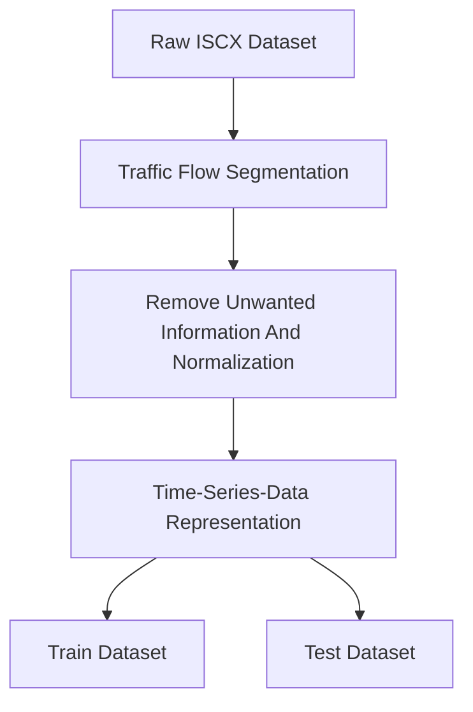
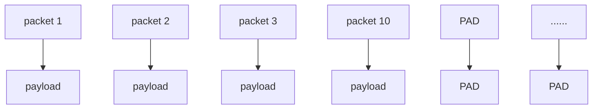
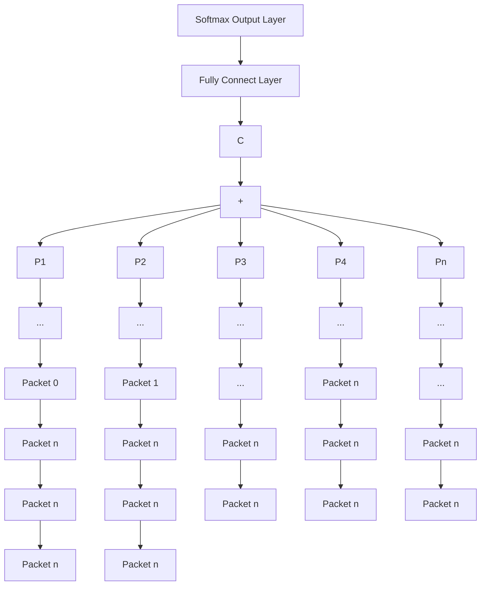

# Identification of Encrypted Traffic Through Attention Mechanism Based Long Short Term Memory

Haipeng Yao , Member, IEEE, Chong Liu, Peiying Zhang , Sheng Wu , Member, IEEE, Chunxiao Jiang , Senior Member, IEEE, and Shui Yu , Senior Member, IEEE

Abstract—Network traffic classification has become an important part of network management, which is beneficial for achieving intelligent network operation and maintenance, enhancing the network quality of service (QoS), and for network security. Given the rapid development of various applications and protocols, more and more encrypted traffic has emerged in networks. Traditional traffic classification methods exhibited the unsatisfied performance since the encrypted traffic is no longer in plain text. In this work, we modeled the time-series network traffic by the recurrent neural network (RNN). Moreover, the attention mechanism was introduced for assisting network traffic classification in the form of the following two models, the attention aided long short term memory (LSTM) as well as the hierarchical attention network (HAN). Finally, relying on the ISCX VPN-NonVPN dataset, extensive experiments were conducted, showing that the proposed methods achieved 91.2 percent in accuracy while the highest accuracy of other methods was 89.8 percent relying on the same dataset.

Index Terms—Network traffic classification, encrypted traffic, LSTM, attention mechanism

# 1 INTRODUCTION

NETWORK traffic classification plays a critical role in next-generation communication networks, which aims at classifying network traffic based on both the type of protocols, such as HTTP, FTP, and the type of applications, such as Facebook, Skype, etc. Meanwhile, network traffic classification is beneficial in terms of understanding the distribution of traffic flows, improving the utilization efficiency of network resources, enhancing quality of service (QoS) and guaranteeing network security. In addition, as network traffic becomes larger and larger, operators tend to adopt big data tools for stable storage and fast processing, such as Hadoop and Spark. Besides, distributed computing methods are also used in this task because of the high requirements for real-time calculation.

Recently, with the extensive demands for protecting both data transmission and user privacy, protocols and

H. Yao and C. Liu are with State Key Laboratory of Networking and Switching Technology, Beijing University of Posts and Telecommunications, Beijing 100876, China. E-mail: yaohaipeng@bupt.edu.cn, 254557889@qq.com.   
P. Zhang is with the College of Computer & Communication Engineering, China University of Petroleum (East China), Qingdao 266580, China. E-mail: 25640521@qq.com.   
S. Wu is with the School of Information and Communication Engineering, Beijing University of Posts and Telecommunications, Beijing 100876, China. E-mail: thuraya@bupt.edu.cn.   
C. Jiang is with Tsinghua Space Center, Tsinghua University, Beijing 100084, China. E-mail: jchx@tsinghua.edu.cn.   
S. Yu is with School of Software, University of Technology Sydney, Ultimo, NSW 2007, Australia. E-mail: shui.yu@uts.edu.au.

Manuscript received 10 Mar. 2019; revised 29 Aug. 2019; accepted 6 Sept. 2019. Date of publication 20 Sept. 2019; date of current version 14 Jan. 2022. (Corresponding author: Sheng Wu.) Recommended for acceptance by Y. Wen. Digital Object Identifier no. 10.1109/TBDATA.2019.2940675

applications prefer to adopting encryption methods. Under such a circumstance, the amount of the encrypted traffic has grown extensively in current communication networks. A variety of encryption mechanisms have been employed [1], such as SSH, VPN, SSL, encrypted P2P, VoIP etc. These encryption algorithms are different from each other, since some encrypted data packets locate in the transport layer, while others locate in the application layer, which make the classification of encrypted traffic difficult and hence impose a huge challenge on the network traffic classification [2]. Moreover, even if the same encryption algorithm is utilized, the encrypted traffic can exhibit different data distributions because of the different distributions of the original traffic.

Traditional port-based traffic identification methods have unsatisfied performance on the classification of encrypted traffic, since they utilized the official standards defined by the Internet assigned numbers authority (IANA) to identity the type of applications. However, some protocols did not follow those standards, such as P2P protocol utilized the random port, and HTTP protocol used the 80 port for disguising. Moreover, some deep packet inspection (DPI) based methods conducted the traffic classification by regular expression for matching the payload data, while the payload of the encrypted packet was changed relying on the encryption algorithm. Consequently, the DPI based methods could only identify those coarse-grained protocols such as SSL, but completely failed to identify the encrypted traffic. In addition, most of the machine learning aided traffic classification methods [3], [4], [5] were based on manual extraction of data packets or their statistical features at the data flow level to train the classifier, such as the duration of a flow, the total number of packets, the length of a packet, the number of the bytes contained in a flow, as well as the interval of the packet arrival. Since these characteristics require prior knowledge and experience, the extraction of them would also be time-consuming. More importantly, it cannot be guaranteed that these features are really helpful in improving the performance of classification. Therefore, to the best of our knowledge, all of these aforementioned methods cannot achieve preferable results on the encrypted traffic classification problem.

Recently, deep learning has rapidly developed and has witnessed its great success in a variety of areas, such as computer vision (CV), speech recognition, natural language processing (NLP), etc. Meanwhile, deep learning methods have been widely used in the scenario of communication networks. Network traffic classification can be regarded as a common classification problem in the field of machine learning, and some papers [6], [7], [8], [9], [10] have proposed the application of deep learning methods in solving such a problem. Nevertheless, most of them utilized CNN to extract the features from the traffic flow without considering the timing features among different packets. In this paper, we propose to utilize LSTM for network traffic classification tasks, which can not only omit the complex feature engineering, but also automatically learn the temporal relationship between traffic flows. The specific contributions of this paper can be summarized as follows.

We treat the network traffic flow as time-series and analyze it as text data with the aid of LSTM model. Experimental results yield the best representation of the network traffic, where each flow contains 10 packets and each packet contains 1,500 bytes.   
Two models are proposed for encrypted traffic classification, i.e., attention based LSTM and hierarchical attention network (HAN). The attention based LSTM focuses more on important data packets in the traffic flow, while HAN is capable of distinguishing the role of different bytes in each packet during the process of classification.   
Simulation results demonstrate that the classification accuracy rate of our proposed model can achieve 91.2 percent, which outperforms traditional machine learning based methods.

The organization of our paper is as follows. Section 2 discusses the related works. The methodology of traffic classification system is investigated in Section 3. Moreover, we propose the attention aided LSTM and HAN architecture in Section 4. In Section 5, we show the experimental results, followed by our conclusions and future work in Section 6.

# 2 RELATED WORK

Network traffic classification has become a research hotspot in both academic and industrial fields in recent years [2], [11], [12], [13]. With the rapid growth of encrypted traffic in the network, traditional traffic classification methods based on both ports and deep packet inspection are unable to meet current requirement. Machine learning assisted traffic classification has been widely investigated for the identification and classification of encrypted traffic. Because network traffic datasets are often hundreds of GB or TB, the usage of big data has also attracted more and more attention. Algorithms combine with big data and distributed computing to solve the problems of large amount of training data and time-consuming calculation. Some people [14] use hadoop as a tool for data storage and preprocessing to help reduce dimensionality and extract features. The processed data is then used as input to the model. In addition, the Hadoop-based distributed machine learning model has also been widely used. Quoc et al. [15] and Yuan et al. [16] respectively proposed distributed SVM and C4.5 algorithms with Hadoop to reduce the training time. Recently, Aceto et al. [17] proposed a method which combined the benefits of deep learning and big data to solve network traffic classification.

# 2.1 Machine Learning Based Encrypted Traffic Classification

The machine learning based encryption traffic classification method mainly includes two parts: feature extraction and model construction. We will introduce the relevant work of the two parts separately.

In the state-of-the-art, Cao et al. [2] introduced the recent researches on encrypted traffic identification and summarized the cons and pros of common methods. In [3], Alshammari et al. investigated two common methods for encrypted traffic identification, i.e., expert driven system and data driven system, and concluded that the data driven system outperforms the expert driven system in terms of both detection accuracy rate and false positive rate. Moreover, Bacquet et al. [18] compared the classification performance of both C4.5 and MOGA relying on different SSH protocol dataset, and showed that C4.5 had better robustness while MOGA yielded higher classification accuracy. Furthermore, Dusi et al. [5] used Gaussian mixture model (GMM) and support vector machine (SVM) based method for SSH encrypted traffic classification. Zhang et al. [19] proposed an improved clustering algorithm to identify the encrypted network traffic, and it had better performance in comparison to the k-Means method. Moreover, in [20], Lashkari et al. proposed the ISCX Tor-NonTor dataset, which used the C4.5 and k-nearest neighbors (KNN) as the classifier and achieved an accuracy rate of 70 percent. In [21], Sun et al. conducted encrypted traffic classification relying on the combination of the statistic-based and signaturebased method, which achieved 94.52 percent in F1 score. In [22], Shahbar et al. used the method of Bayes net, Naive Bayes, C4.5, Random Forest to conduct a comparative test on the Anon17 dataset which focused on Tor and I2P traffic. In this dataset, each sample contains 97 dimensional features and a label. In [23], Taylor et al. proposed the AppScanner that used the support vector classifier and random forest classifier to automatic identify mobile Apps. In [24], Aceto et al. proposed a framework where any classifier may be readily plugged-in/out to improve performance further.

As for feature selection, some people extract statistical features from the traffic flow. Alshammari et al. [4] extracted 22 stream features instead of using IP addresses and port numbers for distinguishing the SSH and Skype protocols, and found that C4.5 and RIPPER algorithm had better classification performance. Scherrer et al. [25] used non-Gaussian method and long memory statistical features to classify traffic. Meanwhile, others treated the network traffic as time-series data and designed classifiers relying on the timing features of the network traffic. In [26], Santos et al. proposed a time-series analysis method for classifying HTTP protocol. Lashkari et al. [27] proposed the ISCX VPN-NonVPN dataset by using C4.5 decision tree to train the classifier, which had an accuracy rate of 88 percent in the case of only using the time features, such as duration, forward inter-arrival, backward inter-arrival, flow interarrival, etc. In [28], a KNN based algorithm was proposed relying on the dataset in [27], which extracted 111 features, and finally obtained an accuracy rate of 93 percent. In a nutshell, these feature selection methods need to manually extract features for each category. This process requires a comprehensive prior knowledge of the field so that we may lose the most important features during this process. This method is difficult to migrate quickly when encountering a new scene.

# 2.2 Deep-Learning Based Encrypted Traffic Classification

With the development of deep learning, the related algorithms have been applied to a range of fields. Recently, Rezaei et al. briefly summarized the application of deep learning in encrypted traffic classification in [29]. Deep learning based traffic classification can be traced back to 2015 [6], where Wang et al. used only a simple SAE automatic encoder. Later, Lotfollahi et al. [7] proposed the SAE and two layers convolutional neural network (CNN) model, which achieved the performance of 95 percent in F1 score in the context of application classification, as well as of 93percent in F1 score in the context of protocol classification. The CNN based model was also used in [30], where Wang et al. used representation learning method for network anomaly detection and intrusion detection system. In [8], an one-dimensional CNN was proposed to represent traffic flows as pictures, which yielded the F1 score of 86.6 percent for the application classification. Furthermore, Lopez et al. [9] integrated the CNN and recurrent neural network (RNN) model for traffic classification. It represented one flow as 20 packets, and each packet extracted 6-dimensional features and finally obtained the F1 score of 95 percent. Then Aceto et al. used 1D-CNN, 2D-CNN, and LSTM proposed in [8], [9] for mobile encrypted traffic classification in [31]. In addition, Wang et al. [10] designed a hierarchical spatial-temporal feature-based model for the intrusion detection system. In [32], Rui et al. proposed the byte segment neural network(BSNN) which use attention encoder for protocol classification. It gains 95.8 percent F1 score on realworld data.

In this paper, we employ LSTM to model the timing features by viewing the network traffic as the time-series data, and introduce the attention mechanism to improve the longterm memory ability of LSTM. The closest work to our model is the BSNN proposed by Rui et al. in [32]. From the perspective of model structure, the BSNN is similar to the HAN, since they are both composed of two layers of attention encoder. But the input in our model is the entire traffic flow which is padded to a same dimension matrix and is normalized in the range of [0, 1]. While the input of BSNN is a packet which is divided into different segments and each byte is transformed to a one-hot vector in 256-dimension.

However, it is difficult to determine which method is more effective, since the dataset they have utilized are different from each other. In addition, their classification performances are based on the specific data and specific protocols, which may be difficult to extend to a more general encrypted traffic classification scenario. However we can find that [7], [8], [27] all use the ISCX VPN-NonVPN dataset, and the results among them are easy to compare.

# 3 METHODOLOGY

# 3.1 Dataset

As aforementioned, the dataset and evaluation criteria are not consistent in the network traffic classification. In such a case, the models and algorithms proposed in existing works cannot be compared with each other in terms of a common benchmark. In this paper, we focus on the ISCX VPN-NonVPN dataset [27], which contains two levels of traffic classification tasks. The first level is identification of protocol types (chat, email, etc.), while the second level is the identification of application types (facebook, skype, etc). We classify them from the perspective of the protocol type in this paper which contains 6 kinds of non-VPN data and 6 kinds of VPN data. The dataset is saved in the form of pcap file, where the name of each file is specified by protocol. In addition, those two kinds of data, i.e., VPN and NonVPN, allow us to train the classifier for the encrypted packets. The original data set is about 35G, so we execute the data preprocessing process on Hadoop platform, and the data after processing is about 1G. In addition, since we need to perform multiple sets of comparison experiments to select the best hyper-parameters, so our algorithms are distributed based on tensorflow to reduce training time.

# 3.2 Data Preprocessing

In order to facilitate the training model, we need to store the original packets in the form of pcap format according to three structures, i.e., category, flow and packet. Data preprocessing consists of the following four stages: traffic flow segmentation, unwanted field removal and data normalization, time-series data representation, and the segmentation of training set and test set. The process of data preprocessing is shown in Fig. 1.

# 3.2.1 Traffic Flow Segmentation

Let us take each network traffic flow $F _ { i } , \ i = 1 , 2 , 3 , \ldots , N$ ¼ 1 2 3 . . .for example, which consists of multiple data packets $P _ { j } , j = 1 , \bar { 2 } , 3 , \dots , M .$ . We utilize a five-tuple including the ¼ 1 2 3 . . .source IP, destination IP, source port, destination port, transport layer protocol such as TCP and UDP, to identify a traffic flow. Packets having the same five-tuple belong to the same traffic flow. In particular, we put the source-to-target and target-to-source packets together to form bidirectional flows. In such a case, we can use the SplitCap tool to split the original pcap files into many bi-flows. Then, we saved each bi-flow as a small file in the form of pcap file, and label the data with the corresponding file name. The number of flows that each class contains is shown in Fig. 2. In such a case, we can use the SplitCap tool to split the original pcap files with the aid of the above-mentioned fivetuple. Then, we save the data of each flow as a small file in the form of pcap file, and label the data with the corresponding file name. The number of flows that each class contains is shown in Fig. 2.

flowchart

Fig. 1. The flow diagram of data preprocessing.

As we can see from Fig. 2, there is a distinct difference between the data with different category, which is extremely unbalanced. Therefore, we use cost-sensitive learning method to reduce the impact of unbalanced dataset. Furthermore, some files may generate a large amount of flows after segmentation, and thus we are able to choose a portion of the flows and abandon the rest. However, because of the difference of preprocessing methods used, the final data sets may be very different.

# 3.2.2 Unwanted Field Removal and Data Normalization

Each packet consists of multiple protocol layers, so we can use all data or just the application layer (L7) data for classification. We will verify which is better in Section 5. In attention, because the dataset was collected by several fixed IP addresses where each IP address is responsible for collecting data of a certain protocol type, it can mingle external information so that the experimental results are greatly biased when using all data. Therefore, we chose to delete the data link layer information and IP address [7]. As for data normalization, considering the packets consisting of binary strings, each byte consists of 8 bits and can be represented as a decimal number in the range of . The ½0  255input of neural network needs to be normalized, so we normalize each byte in the range of   .

# 3.2.3 Time-Series-Data Representation

In order to use the traffic flow as an input to the model, we need to represent it as an N\*M-dimensional matrix, where N means the number of packets in a traffic flow and M means the number of bytes in a packet. If a packet contains less than M bytes, we need to pad 0 after its data until its

bar

| Category | number |
| :--- | :--- |
| chat | 2300 |
| email | 1000 |
| file | 12200 |
| streaming | 1800 |
| torrent | 800 |
| voip | 8600 |
| vpn_chat | 4000 |
| vpn_email | 300 |
| vpn_file | 900 |
| vpn_streaming | 2200 |
| vpn_torrent | 500 |
| vpn_volp | 10300 |

Fig. 2. The distribution of different classes of data.

length reaches M. While if the packet length is larger than M, it needs to be truncated to retain only the first M bytes. The same method will also be used to N. This method can solve the problem of variable length sequences. Moreover, we use 0 as the padding value, which does not bring any additional information and bias to the classification result, because if the input of neural network is 0 then the output is also 0. To determine the best values for N and M, we first visualize the data distribution as shown in Fig. 3.

From Fig. 3, we can conclude that most of the data consists of only two data packets, because the dataset contains many domain name system (DNS) protocol packets. We will construct a comparison experiment in Section 5 to verify the impact of the DNS flows. In order to determine the optimal length of traffic flow N, we take experiments with the length of N , N and $N = 2 0$ to determine the ¼ 5 ¼ 10hyper-parameter, respectively.

Moreover, in Fig. 3, the number of bytes contained in the packet $P _ { j }$ is mainly distributed at both ends. In order to determine the optimal length of package $M ,$ contrast experiments with $M = 5 0 0 , \ M = 1 0 0 0$ and $M = 1 5 0 0$ are con-¼ 500 ¼ 1000 ¼ 1500ducted. Once the best choices for N and M are determined, a traffic flow can be represented as a matrix of $N \times M ,$ , and the value of each element in the matrix is between 0 and 1, i.e., each traffic flow is represented as a matrix of $N \times M$ as an input sample of LSTM. Fig. 4 portrays the representation of each traffic flow.

line

| flow_length | Count  |
| ----------- | ------ |
| 1.0         | 1000   |
| 2.0         | 33000  |
| 3.0         | 1000   |
| 4.0         | 1500   |
| 5.0         | 500    |
| 6.0         | 1000   |
| 7.0         | 500    |
| 8.0         | 500    |
| 9.0         | 500    |
| 10.0        | 500    |
| 11.0        | 500    |
| 12.0        | 500    |
| 13.0        | 500    |
| 14.0        | 500    |
| 15.0        | 500    |
| 16.0        | 500    |
| 17.0        | 500    |
| 18.0        | 500    |
| 19.0        | 500    |
| 20.0        | 500    |

histogram

| byte_length | Count |
| ----------- | ----- |
| 0-50        | 22000 |
| 50-100      | 13000 |
| 100-150     | 11000 |
| 150-200     | 2000  |
| 200-250     | 1500  |
| 250-300     | 1000  |
| 300-350     | 800   |
| 350-400     | 300   |
| 400-450     | 200   |
| 450-500     | 100   |
| 500-550     | 50    |
| 550-600     | 30    |
| 600-650     | 20    |
| 650-700     | 15    |
| 700-750     | 10    |
| 750-800     | 8     |
| 800-850     | 5     |
| 850-900     | 3     |
| 900-950     | 2     |
| 950-1000    | 1     |
| 1000-1050   | 1     |
| 1050-1100   | 1     |
| 1100-1150   | 1     |
| 1150-1200   | 1     |
| 1200-1250   | 1     |
| 1250-1300   | 1     |
| 1300-1350   | 3     |
| 1350-1400   | 5     |
| 1400-1450   | 2     |
| 1450-1500   | 2     |

Fig. 3. The distribution of the length of traffic flow and the length of packet.

flowchart

Fig. 4. The matrix representation of traffic flow.

# 3.2.4 Dataset Segmentation

In the stage of dataset segmentation, in order to ensure the generalization ability of the model and the credibility of the experimental results, we adopt the 10-fold cross-validation method. The dataset is randomly divided into 10 parts. Next, the training-validation-test sets are randomly selected in the manner of 8-1-1 for 10 times, and the final result is averaged. Specifically, the validation set is used to determine the hyper parameters in the experiment, while the test set is conceived for representing the final model effect. Finally, the statistical information of dataset is shown in Table 1.

# 4 ATTENTION BASED LSTM AND HAN ARCHITECTURE

Considering the network traffic as time-series data, we used the improved RNN for modeling it in this section. Because the sequence of traffic data is very long, for example, there are 1,500 bytes per packet in our dataset, so we use LSTM [33] instead of the original RNN. The reason is that LSTM can remove or add information to the hidden state vector with the aid of the gate function. This means that LSTM can retain important information in hidden layer vectors.

There are three gate functions, i.e., the forget gate, the input gate and the output gate. The forget gate is used to control how much information in $C _ { t - 1 }$ is retained in the process of calculating $C _ { t } .$ 1. The forget vector $f _ { t }$ can be given by

$$
f _ {t} = \sigma (W _ {f} \cdot [ h _ {t - 1}, x _ {t} ] + b _ {f}), \tag {1}
$$

where $W _ { f } ,$ and $b _ { f }$ are the parameters of forget gate, $x _ { t }$ is the input vector in step $t ,$ and $h _ { t - 1 }$ is the hidden state vector in step t .

 1Moreover, the input gate decides how much information of $x _ { t }$ is added to $C _ { t } ,$ which can be express as

$$
i _ {t} = \sigma (W _ {i} \cdot [ h _ {t - 1}, x _ {t} ] + b _ {i}), \tag {2}
$$

TABLE 1 The Statistical Information of Dataset 

<table><tr><td></td><td>VPN</td><td>Non-VPN</td></tr><tr><td>Training set</td><td>15,545</td><td>22,706</td></tr><tr><td>Validation set</td><td>1,943</td><td>2,838</td></tr><tr><td>Test set</td><td>1,943</td><td>2,838</td></tr></table>

where $W _ { i } , b _ { i }$ are the parameters of input gate, and hence $C _ { t }$ can be calculated relying on forget gate vector $f _ { t }$ as well as on the input gate vector $i _ { t } ,$ i.e.,

$$
C _ {t} = f _ {t} \cdot C _ {t - 1} + i _ {t} \cdot \widetilde {C _ {t}}, \tag {3}
$$

where $\widetilde { C _ { t } } = \operatorname { t a n h } ( W _ { C } \cdot [ h _ { t - 1 } , x _ { t } ] + b _ { C } )$ denotes the informa-¼ tanhð  ½ 1  þ Þtion represented in the hidden layer vector.

The output gate controls the output in $C _ { t } ,$ , and we have

$$
o _ {t} = \sigma (W _ {o} \cdot [ h _ {t - 1}, x _ {t} ] + b _ {o}), \tag {4}
$$

$$
h _ {t} = o _ {t} \cdot \tanh (C _ {t}),
$$

where $W _ { C } , W _ { o } , b _ { C } ,$ , and $b _ { o }$ are the parameters of output gate, and $C _ { t }$ is the internal state in step t. However, the length of the packet is large so that the LSTM model cannot memorize all of the information. Besides, the long sequence may also produce gradient explosions and gradient vanishing during the training process.

To address the long-term dependence of time-series data, in [34], Bahdanau et al. utilized the attention mechanism to the seq2seq model, which was used to calculate the weight of all hidden vectors, as shown in the following.

$$
u _ {i} = \tanh (W _ {p} h _ {i} + b _ {p}), \tag {5}
$$

$$
\alpha_ {i} = \frac {\exp (u _ {i} ^ {T} u _ {s})}{\Sigma_ {j} \exp (u _ {j} ^ {T} u _ {s})}, \tag {6}
$$

$$
c = \sum_ {i} \alpha_ {i} h _ {i}, \tag {7}
$$

where $W _ { p } , \ b _ { p }$ and $u _ { s }$ are all parameters that need to be trained, while $u _ { i }$ is the importance score of each packet, and $\alpha _ { i }$ is the normalized weight. We have $\Sigma _ { i } \alpha _ { i } = 1$ . In fact, the ¼ 1above calculations are equivalent to using a fully connected neural network to calculate the weight of each vector, and then weighting each hidden layer vector with the weighted value to obtain the intermediate vector c. Based on this attention mechanism, in the following, we propose the attention based LSTM and HAN [35] for network traffic classification.

# 4.1 Attention Based LSTM

The attention-based LSTM neural network structure diagram is shown in Fig. 5, where each packet $P _ { i }$ is encoded into an input vector by a Bi-LSTM model. The hidden layer vectors $\overrightarrow { h _ { i } }$ and $\overline { { h _ { i } } }$ are connected to form the context vector $h _ { i } = [ \overrightarrow { h _ { i } } , \overleftarrow { h _ { i } } ]$ , where $h _ { i }$ represents the encoding vector of each packet and it contains the information of the preceding and following packets. Then the attention mechanism is used to calculate the weight of $h _ { i }$ . As shown in Eq. $( 7 )$ , we multiply each vector by their weight and add them up. Finally, we obtain the encoder vector c of the traffic flow.

flowchart

Fig. 5. The architecture diagram of the attention based LSTM model.

The pseudo-code of Algorithm 1 is shown in Algorithm 1.

Attention based LSTM 

<table><tr><td>1:</td><td>Input: Network flow data F = {Pi|i = 0,1,2,...,N}</td></tr><tr><td>2:</td><td>Output: The predict label predict of F</td></tr><tr><td>3:</td><td>for Pi in F:</td></tr><tr><td>4:</td><td> $\overrightarrow{h_i} = LSTM_1(P_i)$ </td></tr><tr><td>5:</td><td> $\overleftarrow{h_i} = LSTM_2(P_i)$ </td></tr><tr><td>6:</td><td> $h_i = [\overrightarrow{h_i},\overleftarrow{h_i}]$ </td></tr><tr><td>7:</td><td>end for</td></tr><tr><td>8:</td><td>c = ∑i αih(Eqs. (5), (6), and (7))</td></tr><tr><td>9:</td><td>predict = softmax(fullyConnect(c))</td></tr></table>

# 4.2 HAN Architecture

The HAN architecture is a kind of neural network structure proposed by [35] in the scenario of text classification. It is similar to attention-based LSTM except that two layers of LSTM networks are used to encode each packet and flow, separately. The architecture diagram is shown in Fig. 6.

The first layer of the LSTM network uses each byte $b _ { j }$ in the packet as input, and processes only one byte and encodes it at each time. Therefore, the rolled step of the LSTM is as large as the length of packet. Each $b _ { j }$ is encoded as a hidden vector $h _ { j } = [ \overrightarrow { h _ { j } } , \overleftarrow { \tilde { h _ { j } } } ]$ . Then, it uses the attention mechanism to calculate the weight of each byte and performs a weighted summation for getting the vector $p _ { i }$ , which represents the information in each packet. The second layer of the LSTM network is used to exactor the encoder vector of the whole flow $F ,$ where $p _ { i }$ is encoded as the input of the second LSTM layer at each time, and the attention

```mermaid
graph TD
    A["Softmax Output Layer"] --> B["Fully Connect Layer"]
    B --> C["Attention Layer"]
    C --> D["BiLSTM Layer"]
    D --> E["Attention"]
    E --> F["BiLSTM"]
    F --> G["..."]
    G --> H["BiLSTM"]
    H --> I["..."]
    I --> J["BiLSTM"]
    J --> K["..."]
    K --> L["BiLSTM"]
    L --> M["..."]
    M --> N["BiLSTM"]
    N --> O["..."]
    O --> P["BiLSTM"]
    P --> Q["..."]
    Q --> R["BiLSTM"]
    R --> S["..."]
    S --> T["BiLSTM"]
    T --> U["..."]
    U --> V["BiLSTM"]
    V --> W["..."]
    W --> X["BiLSTM"]
    X --> Y["..."]
    Y --> Z["BiLSTM"]
    Z --> AA["..."]
    AA --> AB["BiLSTM"]
    AB --> AC["..."]
    AC --> AD["BiLSTM"]
    AD --> AE["..."]
    AE --> AF["BiLSTM"]
    AF --> AG["..."]
    AG --> AH["BiLSTM"]
    AH --> AI["..."]
    AI --> AJ["BiLSTM"]
    AJ --> AK["..."]
    AK --> AL["BiLSTM"]
    AL --> AM["..."]
    AM --> AN["BiLSTM"]
    AN --> AO["..."]
    AO --> AP["BiLSTM"]
    AP --> AQ["..."]
    AQ --> AR["BiLSTM"]
    AR --> AS["..."]
    AS --> AT["BiLSTM"]
    AT --> AU["..."]
    AU --> AV["BiLSTM"]
    AV --> AW["..."]
    AW --> AX["BiLSTM"]
    AX --> AY["..."]
    AY --> AZ["BiLSTM"]
    AZ --> BA["..."]
    BA --> BB["BiLSTM"]
    BB --> BC["..."]
    BC --> BD["BiLSTM"]
    BD --> BE["..."]
    BE --> BF["BiLSTM"]
    BF --> BG["..."]
    BG --> BH["BiLSTM"]
    BH --> BI["..."]
    BI --> BJ["BiLSTM"]
    BJ --> BK["..."]
    BK --> BL["BiLSTM"]
    BL --> BM["..."]
    BM --> BN["BiLSTM"]
    BN --> BO["..."]
    BO --> BP["BiLSTM"]
    BP --> BQ["..."]
    BQ --> BR["BiLSTM"]
    BR --> BS["..."]
    BS --> BT["BiLSTM"]
    BT --> BU["..."]
    BU --> BV["BiLSTM"]
    BV --> BW["..."]
    BW --> BX["BiLSTM"]
    BX --> BY["..."]
    BY --> BZ["BiLSTM"]
    BZ --> CA["..."]
    CA --> CB["BiLSTM"]
    CB --> CC["..."]
    CC --> CD["BiLSTM"]
    CD --> CE["..."]
    CE --> CF["BiLSTM"]
    CF --> CG["..."]
    CG --> CH["BiLSTM"]
    CH --> CI["..."]
    CI --> CJ["BiLSTM"]
    CJ --> CK["..."]
    CK --> CR["BiLSTM"]
    CR --> CS["..."]
    CS --> CT["BiLSTM"]
    CT --> CU["..."]
    CU --> CV["BiLSTM"]
    CV --> CW["..."]
    CW --> CX["BiLSTM"]
    CX --> CY["..."]
    CY --> CZ["BiLSTM"]
```

flowchart

Fig. 6. The architecture diagram of HAN model.

mechanism is also used to calculate the importance score of each data packet. Moreover, weighted summation is performed to get the representation vector F of the traffic flow. The pseudo-code of Algorithm 2 is shown in Algorithm 2.

HAN Architecture 

<table><tr><td colspan="2">Input: Network flow data  $F = \{P_i | i = 0,1,2,\dots,N\}$ </td></tr><tr><td colspan="2">2: Output: The predict labelpredictof $F$ for  $P_i$  in  $F$ :</td></tr><tr><td>4:</td><td>for $b_j$ in $P_i$ : $\overrightarrow{h(b_j)} = LSTM_1(b_j)$ </td></tr><tr><td>6:</td><td> $\overleftarrow{h(b_j)} = LSTM_2(b_j)$  $h(b_j) = [\overrightarrow{h(b_j)}, \overleftarrow{h(b_j)}]$ </td></tr><tr><td>8:</td><td>end for $c_i = \sum_j \alpha_j h(b_j)$ (Eqs. (5), (6), and (7))</td></tr><tr><td>10:</td><td> $\overrightarrow{h_i} = LSTM_1(c_i)$  $\overleftarrow{h_i} = LSTM_2(c_i)$ </td></tr><tr><td>12:</td><td> $h_i = [\overrightarrow{h_i}, \overleftarrow{h_i}]$ end for</td></tr><tr><td>14:</td><td> $c = \sum_i \alpha_i h_i$ (Eqs. (5), (6), and (7))predict = softmax(fullyConnect(c))</td></tr></table>

# 4.3 Output Layer and Objective Function

We can choose one of the above-mentioned two methods to encode the traffic flow into the vector $c ,$ which is the input of the full-connection layer. The processed result is then sent to the softmax layer for obtaining the probability ${ \hat { y } } _ { i } .$ . We ^utilize a dropout in the full-connection layer for the sake of increasing the generalization ability of the model, and keep the probability of the dropout as 0.8.

Cost-sensitive learning is used because of the serious class imbalance problem in the training data. Cost-sensitive learning means that the cost of mis-classification in different class is varying, so we introduce a cost vector $c _ { n } \in \left[ 0 , \infty \right) ^ { K }$ for each 2 ½0 1Þsample where each dimension means the cost of classifying the sample as kth class. The loss function proposed in [36] is used to calculate the loss of each sample as follows.

$$
\delta_ {n, k} = l n (1 + e x p (z _ {n, k} \cdot (r _ {k} (x _ {n}) - c _ {n} [ k ]))). \tag {8}
$$

Where $\delta _ { n , k }$ represents the loss of classifying the nth sample as kth class, $r _ { k } ( x _ { n } )$ represents the kth dimension of the neural ð Þnetwork output vector, and $c _ { n } [ k ]$ represents the kth dimension of the cost vector, $z _ { n , k }$ ½ indicates whether the nth sample is kth class, and its calculation formula is $z _ { n , k } = 2 [ c _ { n } [ k ] = \hat { c _ { n } } [ y _ { n } ] ] - 1$ . ¼ 2½ ½  ¼ ½   1The advantage of this loss function is smooth and differentiable so that it can be used as the objective function of the neural network to perform the back propagation directly. Therefore, the objective function is as follows.

$$
L (\theta) = \sum_ {n = 1} ^ {N} \sum_ {k = 1} ^ {K} \delta_ {n, k}. \tag {9}
$$

In order to get prediction label of the model, the following formula can be used.

$$
\hat {y} _ {n} = \underset {1 \leq k \leq K} {\arg \min} r _ {k} (x). \tag {10}
$$

# 5 EXPERIMENTS AND RESULT ANALYSIS

# 5.1 Experimental Environment

The experimental environment is listed as follows: Ubuntu 14.04 OS, TensorFlow 1.4.0, python2.7, NVIDIA 1080Ti graphics and 16G memory. In order to prevent the overfitting phenomenon, the dropout technique is utilized and its probability is set as 0.8 during the training process. As for the optimization method, Adam optimization is employed and the initial learning rate is set as 0.001. Meanwhile, we have used Relu as the activation function. Moreover, the batch size is 64 and the program is trained for 30 epochs. The major parameters in both models include the lstm size of LSTM cell, the hidden size of the fully connected layer, and the out size of the output layer which is selected according to the number of output classes. The lstm size and hidden size are both the dimension of vector which encoded the information of the flow. Because the shape of a flow is similar to the shape of an article, so we can refer to the hyper-parameter setting in the text classification task [35]. A vector of approximately 100 dimensions is sufficient to solve this problem. Specially, in the Attention based LSTM model, we set lstm size as 100 and hidden size as 128; while in HAN, the first layer is used to encode the packet which is a long sequence, and the second layer is used to encode the entire flow, so we set lstm size in both LSTM layers as 128 and hidden size as 128. As for the input shape of the model, it is selected according to the following experiment.

# 5.2 Evaluation Metrics

In order to evaluate the experimental result, we use four evaluation criteria, i.e., accuracy (acc), precision (P ), recall (R), and F1 score (F ). Because encrypted traffic classifica-1tion is a multi-category task, we need separately calculate

TABLE 2 The Description of Contrastive Experiments 

<table><tr><td></td><td>Description</td><td>class num</td></tr><tr><td>1</td><td>Protocol encapsulated traffic identification</td><td>2-classes</td></tr><tr><td>2</td><td>Regular Encrypted traffic classification</td><td>6-classes</td></tr><tr><td>3</td><td>Protocol Encapsulated traffic classification</td><td>6-classes</td></tr><tr><td>4</td><td>Encrypted traffic classification</td><td>12-classes</td></tr></table>

the above indicators for each category. Specially, we use N as the total number of training samples; TPc to indicate the quantity that originally belongs to category $c ,$ and is predicted by the model as $c ; \ F P _ { c }$ indicates the quantity that originally does not belong to category $c ,$ but is predicted by the model as $c ; ~ T N _ { c }$ indicates the quantity that does not belong to category $c ,$ and is not predicted to be class $c ; F N _ { c }$ indicates the quantity that it belongs to class $c ,$ but is misclassified to other class. Hence, the definition of aforementioned four evaluation metrics can be given by

$$
P _ {c} = \frac {T P _ {c}}{T P _ {c} + F P _ {c}}, R _ {c} = \frac {T P _ {c}}{T P _ {c} + F N _ {c}}, F 1 _ {c} = \frac {2 P _ {c} R _ {c}}{P _ {c} + R _ {c}}, \tag {11}
$$

$$
a c c = \frac {\sum_ {c = 1} ^ {C} T P _ {c}}{N}. \tag {12}
$$

# 5.3 Experimental Result Analysis

In this subsection, we perform three experiments for evaluating our proposed model. Specifically, the first experiment is conducted for determining the best representation of the traffic flow. The second experiment aims for evaluating the classification performance of each model through four experimental scenarios in comparison with the-state-of-art models. The third experiment is mainly for the visualization of attention mechanism, which shows the importance of each data packet in different categories.

# 5.3.1 Traffic Representation Evaluation

In order to test the performance of the proposed model, four experimental scenarios in [8], [27] are used in this paper. The first task is the protocol encapsulated traffic identification, which is a two-category problem. Moreover, the second task is the regular encrypted traffic classification, which is a six-category problem. The third one is the protocol encapsulated traffic classification, which is also a sixcategory problem. The difference between second and third task is the datasets used. To elaborate, the second task uses the VPN dateset, while the third task relies on NonVPN dateset. Finally, the last task is the encrypted traffic classification, which the most difficult task, because it is a twelve-category problem. The details of aforementioned experiments are detailed in Table 2.

Table 3 shows the results with Attention based LSTM for different dataset processing methods. There are two main variables, whether to remove the DNS flows and whether to use all data or only L7 data. All data means the data after removing data link layer and IP address. The results show that it is better to retain the DNS flows. The reason is that DNS is used for hostname resolution, which is closely related to the host. They are easier to identify than other encrypted flows and bring some bias in the results. So we should remove the DNS flows from the dataset. In addition, the accuracy of using all data is 2-3 percent higher than only using L7 data which is similar with [8]. This is because all data contains the transport layer and part of the network layer information, such as the port number and packet length, which are helpful for classification. Therefore, we will use all data to represent the traffic flow and remove the DNS flows.

TABLE 3 The Accuracy of Different Processing Methods 

<table><tr><td rowspan="2">With DNS packet data</td><td colspan="2">Yes</td><td colspan="2">No</td></tr><tr><td>all data</td><td>L7 data</td><td>all data</td><td>L7 data</td></tr><tr><td>Exp 1</td><td>1.000</td><td>0.964</td><td>0.997</td><td>0.951</td></tr><tr><td>Exp 2</td><td>0.898</td><td>0.859</td><td>0.893</td><td>0.844</td></tr><tr><td>Exp 3</td><td>0.970</td><td>0.934</td><td>0.948</td><td>0.920</td></tr><tr><td>Exp 4</td><td>0.936</td><td>0.905</td><td>0.912</td><td>0.886</td></tr></table>

In order to find the best network traffic flow representation method, we perform a grid search on both the length of the traffic flow N and the length of the data packet M. The value range of N is [5, 10, 20], and that of M is [500, 1000, 1500]. The grid search performs 9 sets of experiments based on a combination of different values of N and M, while the other parameters remain unchanged. The experimental results are shown in the Table 4.

In the Table 4, when N and M , the classifica-¼ 10 ¼ 1500tion accuracy is highest so that we chose it as the hyperparameters. In order to show the effect of the model in different categories in detail, we drawn Fig. 7 based on the F1 value. After analyzing the F1 score for each category considered, we can conclude that the F1 scores of NonVPN’s chat and NonVPN’s email protocol are very small, because some relatively short traffic flows may involve more frequent interactions. The distribution difference between traffic flows is relatively large, which leads to a poor performance of the classification. Therefore, we can conclude that when N and M , the classification of the chat class is ¼ 10 ¼ 1500better. We need to use a larger amount of data to learn this type of protocol with a large difference in data distribution.

# 5.3.2 Performance Comparison with the State-of-the-Art

We choose N and M as hyper-parameters, and ¼ 10 ¼ 1500use the attention-based LSTM and HAN models to perform traffic classification tasks in the above-mentioned four experimental scenarios. The experimental results are shown in Table 5, followed by more details in Appendix B, which can be found on the Computer Society Digital Library at http://doi.ieeecomputersociety.org/10.1109/TBDATA. 2019.2940675.

  
Fig. 7. The F1 score of different length of flow and packet.

From Table 5, we can conclude that the models can handle the two-category classification problem correctly. As described in the introduction, the traffic is encrypted to exhibit a completely different distribution, such that the model can easily distinguish them. In addition to the C4.5 decision tree proposed in [27], all other methods work better on the VPN dataset than the Non-VPN dataset. As shown in [8], each protocol has different distributions after encryption, which can contribute to the distinction. The deep learning method can learn and extract the distribution features of encrypted traffic, thereby more accurately distinguishing the encrypted traffic.

In the scenarios 1, 3 and 4, the attention-based LSTM model achieves the best experimental results and has a significant performance improvement compared with Deep Packet [7], one-dim CNN [8], decision tree [27] and XGBoost models. The accuracy of the two-category classification is directly improved up to 0.997. The most significant improvement is the twelve-category classification in comparison to one-dim CNN, which increases by 5 percent, to NonVPN, which increases by nearly 7 percent. The overall performance of HAN is not as good as that of attentionbased LSTM, while it is still much better than that of onedim CNN and decision tree models in the scenarios 1 and 4. But the performance of HAN in two six-category classification problem is poorer than that of the one-dim CNN. The results of the Deep packet model are the closest to Attention based LSTM but better than the HAN model. The Deep Packet model classifies traffic flow using two layers CNN and seven fully connected layers. It’s a little complicated so that the speed of Deep Packet is slower. In terms of processing speed, XGBoost is the fastest, then one-dim CNN, Attention based LSTM, Deep Packet, HAN. The training runtime of these models are shown in Table 6. We can see that the time consumption of HAN is very large, mainly because the length of its first LSTM is too long, while other models are relatively faster.

TABLE 4 The Accuracy Result of Different Length of Flow and Packet 

<table><tr><td>parameter</td><td>5,500</td><td>5,1000</td><td>5,1500</td><td>10,500</td><td>10,1000</td><td>10,1500</td><td>20,500</td><td>20,1000</td><td>20,1500</td></tr><tr><td>acc</td><td>0.891</td><td>0.897</td><td>0.891</td><td>0.904</td><td>0.908</td><td>0.912</td><td>0.899</td><td>0.906</td><td>0.902</td></tr></table>

TABLE 5 The Accuracy of Five Models in Four Experimental Scenarios 

<table><tr><td></td><td>Attention Based LSTM</td><td>HAN</td><td>Deep Packet</td><td>One-dim CNN</td><td>C4.5 Decision Tree</td><td>XGBoost</td></tr><tr><td>Exp 1</td><td>0.997</td><td>0.995</td><td>0.992</td><td>0.990</td><td>0.900</td><td>0.991</td></tr><tr><td>Exp 2</td><td>0.893</td><td>0.851</td><td>0.868</td><td>0.818</td><td>0.890</td><td>0.841</td></tr><tr><td>Exp 3</td><td>0.948</td><td>0.929</td><td>0.923</td><td>0.986</td><td>0.870</td><td>0.918</td></tr><tr><td>Exp 4</td><td>0.912</td><td>0.895</td><td>0.898</td><td>0.866</td><td>0.800</td><td>0.864</td></tr></table>

TABLE 6 The Training Runtime of Five Models in Experimental 4 

<table><tr><td></td><td>Attention Based LSTM</td><td>HAN</td><td>Deep Packet</td><td>One-dim CNN</td><td>XGBoost</td></tr><tr><td>one batch</td><td>0.05s</td><td>1.48s</td><td>0.1s</td><td>0.02s</td><td>-</td></tr><tr><td>total</td><td>1783.6s</td><td>53149s</td><td>3600s</td><td>720s</td><td>300s</td></tr></table>

line

|        | Attention based LSTM | HAN  | Deep Packet | One-dim CNN | C4.5 | XGBoost |
| ------ | ------------------- | ---- | ----------- | ----------- | ---- | ------- |
| chat   | 88                  | 83   | 86          | 72          | 74   | 89      |
| email  | 80                  | 68   | 84          | 70          | 70   | 70      |
| file   | 90                  | 90   | 90          | 80          | 80   | 92      |
| streaming | 85                 | 78   | 85          | 88          | 88   | 85      |
| torrent | 84                  | 72   | 82          | 95          | 78   | 84      |
| voip   | 82                  | 80   | 72          | 95          | 98   | 82      |
| vpn_chat | 95                  | 95   | 95          | 95          | 65   | 95      |
| vpn_email | 100                | 100  | 100         | 80          | 75   | 100     |
| vpn_file | 90                  | 95   | 95          | 90          | 75   | 90      |
| vpn_streaming | 100              | 100  | 100         | 90          | 65   | 100     |
| vpn_torrent | 95               | 95   | 95          | 90          | 85   | 100     |
| vpi_voiP | 100                | 86   | 95          | 95          | 95   | 95      |

Fig. 8. The precision of all four experiments.

In order to analyze the experiment results in detail, we show in Fig. 8 the precision of a model in different categories. It can be seen that the Attention based LSTM performs the best. However, its precision in the streaming and VoIP categories is lower than ond-dim CNN. This is because the traffic in these two categories is too huge for LSTM to learn the long-term relationship.

In addition, the overall performance of the proposed two models has a relatively high improvement compared with the previous models with the following two reasons.

First, we treat the network traffic as time-series data and use the LSTM for processing. In compared to the CNN model, RNN is capable of learning the relationship between adjacent packets, where each hidden layer state records relevant information of all previous packets in order to learn its long-term dependency;   
Second, we use the attention mechanism to improve the accuracy of the LSTM classification. The weighted

bar

| Category | Attention based LSTM | HAN |
|---|---|---|
| vpn_chat | 0.94 | 0.93 |
| vpn_email1 | 1.00 | 0.87 |
| vpn_file | 0.84 | 0.84 |
| vpn_streaming | 1.00 | 1.00 |
| vpn_torrent | 0.97 | 1.00 |
| vpn_volp | 0.91 | 0.92 |

(a) The F1 score of each class in scenario 2

bar

| Category | Attention based LSTM | HAN |
| :--- | :--- | :--- |
| chat | 0.79 | 0.76 |
| email | 0.72 | 0.71 |
| file | 0.94 | 0.91 |
| streaming | 0.90 | 0.85 |
| torrent | 0.85 | 0.65 |
| voip | 0.87 | 0.79 |

(b) The F1 score of each class in scenario 3

bar

| Category | Attention based LSTM | HAN |
| :--- | :--- | :--- |
| chat | 0.81 | 0.79 |
| email | 0.71 | 0.73 |
| file | 0.93 | 0.90 |
| streaming | 0.84 | 0.82 |
| torrent | 0.80 | 0.56 |
| voip | 0.85 | 0.79 |
| vpn_chat | 0.94 | 0.93 |
| vpn_email | 0.93 | 0.93 |
| vpn_file | 0.93 | 0.89 |
| vpn_streaming | 0.99 | 0.96 |
| vpn_torrent | 0.97 | 0.99 |
| vpn_voip | 0.95 | 0.86 |

(c) The F1 score of each class in scenario 4   
Fig. 9. The F1 score of each class, where the red bar represents F1 score of attention-based LSTM model, while the blue bar represents that of HAN model.

summation of all historical state information is used as the final coding vector. Compared with the use of the latest hidden layer vector, more historical information is included.

In order to clearly show the classification effect of attention-based LSTM and HAN, we transform the F1 scores of each class in the scenario 2,3 and 4 into bar graphs, which are shown in Fig. 9.

line

| packet_num | chat  | email | file  | streaming | torrent | voip  |
| ---------- | ----- | ----- | ----- | --------- | ------- | ----- |
| 1          | 0.22  | 0.64  | 0.10  | 0.39      | 0.50    | 0.20  |
| 2          | 0.62  | 0.10  | 0.77  | 0.30      | 0.10    | 0.60  |
| 3          | 0.05  | 0.15  | 0.08  | 0.00      | 0.28    | 0.08  |
| 4          | 0.00  | 0.00  | 0.00  | 0.00      | 0.00    | 0.00  |
| 5          | 0.00  | 0.00  | 0.00  | 0.00      | 0.00    | 0.00  |
| 6          | 0.00  | 0.00  | 0.00  | 0.00      | 0.00    | 0.00  |
| 7          | 0.00  | 0.00  | 0.00  | 0.00      | 0.00    | 0.00  |
| 8          | 0.00  | 0.00  | 0.00  | 0.00      | 0.00    | 0.00  |
| 9          | 0.00  | 0.00  | 0.00  | 0.00      | 0.00    | 0.00  |
| 10         | 0.00  | 0.00  | 0.00  | 0.00      | 0.00    | 0.00  |
| 11         | 0.00  | 0.00  | 0.00  | 0.00      | 0.00    | 0.00  |
| 12         | 0.00  | 0.00  | 0.00  | 0.00      | 0.00    | 0.00  |
| 13         | 0.00  | 0.00  | 0.00  | 0.00      | 0.00    | 0.00  |
| 14         | 0.00  | 0.00  | 0.00  | 0.00      | 0.00    | 0.00  |
| 15         | 0.00  | 0.00  | 0.00  | 0.00      | 0.00    | 0.00  |
| 16         | 0.00  | 0.00  | 0.00  | 0.00      | 0.00    | 0.00  |
| 17         | 0.00  | 0.00  | 0.00  | 0.00      | 0.00    | 0.00  |
| 18         | 0.00  | 0.00  | 0.00  | 0.00      | 0.00    | 0.00  |
| 19         | 0.00  | 0.64  | 87%   | -         | -       | -     |
| 2o         | -     | -     | -     | -         | -       | -     |
| Note: The actual values for email, file, email, file, email, email, email, email, email, email, email, email, email, email, email, email, email, email, email, email, email, email, email, email, email, email, email, email, email, email, email, email, email, email, email, email, email, email, email, email, email, email, email, email, email, email, email, email, email, email, email, email, email, email, etc.

(a）The weight distribution of different packets in NonVPN dataset.   

line

| packet_num | vpn_chat | vpn_email | vpn_file | vpn_streaming | vpn_torrent | vpn_voip |
| ---------- | -------- | --------- | -------- | ------------- | ----------- | -------- |
| 0          | 0.0      | 0.0       | 0.1      | 0.0           | 0.2         | 0.0      |
| 1          | 0.95     | 0.0       | 0.6      | 0.7           | 0.3         | 0.9      |
| 2          | 0.0      | 0.25      | 0.0      | 0.1           | 0.2         | 0.0      |
| 3          | 0.0      | 0.2       | 0.0      | 0.0           | 0.2         | 0.0      |
| 4          | 0.0      | 0.1       | 0.0      | 0.0           | 0.2         | 0.0      |
| 5          | 0.0      | 0.0       | 0.0      | 0.0           | 0.0         | 0.0      |
| 6          | 0.0      | 0.0       | 0.0      | 0.0           | 0.0         | 0.0      |
| 7          | 0.0      | 0.0       | 0.0      | 0.0           | 0.0         | 0.0      |
| 8          | 0.0      | 0.0       | 0.0      | 0.0           | 0.0         | 0.0      |
| 9          | 0.0      | 0.0       | 0.0      | 0.0           | 0.0         | 0.0      |
| 10         | 0.0      | 0.0       | 0.0      | 0.0           | 0.0         | 0.0      |
| 11         | 0.0      | 0.0       | 0.0      | 0.0           | 0.0         | 0.0      |
| 12         | 0.0      | 0.0       | 0.0      | 0.0           | 0.0         | 0.0      |
| 13         | 0.0      | 0.0       | 0.0      | 0.0           | 0.0         | 0.0      |
| 14         | 0.0      | 0.0       | 0.0      | 0.0           | 0.0         | 0.0      |
| 15         | 0.0      | 0.0       | 0.0      | 0.0           | 0.0         | 0.0      |
| 16         | 0.0      | 0.0       | 0.0      | 0.0           | 0.0         | 0.0      |
| 17         | 0.0      | 0.0       | 0.0      | 0.0           | 0.0         | 0.0      |
| 18         | 0.0      | 0.0       | 0.0      | 0.0           | 0.0         | 0.0      |
| 19         | 0.0      | 0.0       | 0.0      | 0.0           | 0.0         | 0.0      |
| 20         | 0.0      | 0.0       | 0.0      | 0.0           | 0.0         | 0.0      |

(b) The weight distribution of different packets in VPN dataset.   
Fig. 10. The weight distribution of different packets.

# 5.3.3 Packet Importance Distribution

For the sake of exploring the importance of each packet in the final classification, we need to visualize the weight value $\alpha _ { i }$ of each packet. The result is shown in Fig. 10. The test set is divided according to the category, and the attention vector c is calculated to obtain the average attention vector of the entire data set. Each category has a different attention vector, which represents the contribution of each packet imposed on different categories. The basic focus is on the first four data packets, because the packets at the end of the traffic flow hardly contribute features except those belong to protocols, such as streaming, torrent and file. As we all know, the first few packets carry more protocol-related information in the transmission of the traffic, such as the three-way handshake of the TCP protocol. In other words, our model does learn this important feature and increase the weight of the first few packets. In addition, we also analyze the importance of different bytes of data. Similar to the distribution of packets, important bytes are concentrated in the header of the data. This is because the bytes that contain category information are often located at the header of each packet in traffic.

# 6 SUMMARY AND FUTURE WORKS

In this paper, the traffic flow was considered as time-series and stored in the form of a matrix, which facilitated the use of deep learning models for classification. Moreover, attention-based LSTM and HAN neural network architectures were constructed for traffic classification, and both of them outperformed the machine learning based method proposed in [27] and the one-dim CNN method proposed in [8]. In addition, the attention mechanism can also facilitate the visualization of training results for further analyzing the importance of each data packet in the presence of different protocol types.

In the future, we will improve our work from the following three perspectives. First, the current model only used RNN, while we hope to build more complex models, such as CNN and RNN fusion models, where CNN is used to extract traffic features, and RNN is used to learn timing features. Second, we will try different attention mechanisms including the hard attention and the local attention. Finally, we are also intended to propose new data sets that are more suitable for using deep learning methods.

# ACKNOWLEDGMENTS

This work was supported in part by the Shandong Provincial Natural Science Foundation, China (Grant No. ZR2014FQ018), in part by the BUPT-SICE Excellent Graduate Students Innovation Fund, in part by the National Natural Science Foundation of China (Grant No. 61471056), and in part by the China research project on key technology strategy of infrastructure security for information network development.

# REFERENCES

[1] K. Gai, M. Qiu, and H. Zhao, “Privacy-preserving data encryption strategy for big data in mobile cloud computing,” IEEE Trans. Big Data, 2018, doi: 10.1109/TBDATA.2018.2705807.   
[2] Z. Cao, G. Xiong, Y. Zhao, Z. Li, and L. Guo, “A survey on encrypted traffic classification,” in Proc. Int. Conf. Appl. Techn. Inf. Secur., 2014, pp. 73–81.   
[3] R. Alshammari and A. N. Zincir-Heywood, “Investigating two different approaches for encrypted traffic classification,” in Proc. 6th Annu. Conf. Privacy Secur. Trust, Oct. 2008, pp. 156–166.   
[4] R. Alshammari and A. N. Zincir-Heywood, “Machine learning based encrypted traffic classification: Identifying SSH and skype,” in Proc. IEEE Symp. Comput. Intell. Secur. Defense Appl., Jul. 2009, pp. 1–8.   
[5] M. Dusi, A. Este, F. Gringoli, and L. Salgarelli, “Using GMM and SVM-based techniques for the classification of SSH-encrypted traffic,” in Proc. IEEE Int. Conf. Commun., Jun. 2009, pp. 1–6.   
[6] Z. Wang, “The applications of deep learning on traffic identification,” BlackHat, USA, vol. 24, 2015.   
[7] M. Lotfollahi, M. J. Siavoshani, R. S. H. Zade, and M. Saberian, “Deep packet: A novel approach for encrypted traffic classification using deep learning,” Soft Comput., Springer, pp. 1–14, 2017.   
[8] W. Wang, M. Zhu, J. Wang, X. Zeng, and Z. Yang, “End-to-end encrypted traffic classification with one-dimensional convolution neural networks,” in Proc. IEEE Int. Conf. Intell. Secur. Informat., Jul. 2017, pp. 43–48.   
[9] M. Lopez-Martin, B. Carro, A. Sanchez-Esguevillas, and J. Lloret, “Network traffic classifier with convolutional and recurrent neural networks for Internet of Things,” IEEE Access, vol. 5, pp. 18042–18050, 2017.   
[10] W. Wang, Y. Sheng, J. Wang, X. Zeng, X. Ye, Y. Huang, and M. Zhu, “HAST-IDS: Learning hierarchical spatial-temporal features using deep neural networks to improve intrusion detection,” IEEE Access, vol. 6, pp. 1792–1806, 2018.

[11] P. Velan, M. Cerm ak, P. Celeda, and M. Dra sar, “A survey of -  - -methods for encrypted traffic classification and analysis,” Int. J. Netw. Manage., vol. 25, pp. 355–374, Sep. 2015.   
[12] A. Vladutu, D. Com¸ aneci, and C. Dobre, “Internet traffic classifi- cation based on flows’ statistical properties with machine learning,” Int. J. Netw. Manage., vol. 27, May 2017, Art. no. e1929.   
[13] T. T. T. Nguyen and G. Armitage, “A survey of techniques for internet traffic classification using machine learning,” IEEE Commun. Surv. Tut., vol. 10, no. 4, pp. 56–76, Oct.–Dec. 2008.   
[14] P. Casas, A. D’Alconzo, T. Zseby, and M. Mellia, “Big-DAMA: Big data analytics for network traffic monitoring and analysis,” in Proc. Workshop Fostering Latin-Amer. Res. Data Commun. Netw., 2016, pp. 1–3.   
[15] D. L. Quoc, V. D’Alessandro, B. Park, L. Romano, and C. Fetzer, “Scalable network traffic classification using distributed support vector machines,” in Proc. IEEE Int. Conf. Cloud Comput., 2015, pp. 1008–1012.   
[16] Z. Yuan and C. Wang, “An improved network traffic classification algorithm based on hadoop decision tree,” in Proc. IEEE Int. Conf. Online Anal. Comput. Sci., 2016, pp. 53–56.   
[17] G. Aceto, D. Ciuonzo, A. Montieri, V. Persico, and A. Pescape, “Know your big data trade-offs when classifying encrypted mobile traffic with deep learning,” in Proc. Netw. Traffic Meas. Anal. Conf., 2019, pp. 121–128,   
[18] C. Bacquet, K. Gumus, D. Tizer, A. N. Zincir-Heywood, and M. I. Heywood, “A comparison of unsupervised learning techniques for encrypted traffic identification,” J. Inf. Assurance Secur., vol. 5, pp. 464–472, Sep. 2010.   
[19] M. Zhang, H. Zhang, B. Zhang, and G. Lu, “Encrypted traffic classification based on an improved clustering algorithm,” Commun. Comput. Inf. Sci., vol. 320, pp. 124–131, 2012.   
[20] A. H. Lashkari, G. D. Gil, M. S. I. Mamun, and A. A. Ghorbani, “Characterization of tor traffic using time based features,” in Proc. Int. Conf. Inf. Syst. Secur. Privacy, 2017, pp. 253–262.   
[21] G. Sun, Y. Xue, Y. Dong, D. Wang, and C. Li, “An novel hybrid method for effectively classifying encrypted traffic,” in Proc. IEEE Global Telecommun. Conf., Dec. 2010, pp. 1–5.   
[22] K. Shahbar and A. N. Zincir-Heywood, “How far can we push flow analysis to identify encrypted anonymity network traffic?” in Proc. IEEE/IFIP Netw. Oper. Manage. Symp., Apr. 2018, pp. 1–6.   
[23] V. F. Taylor, R. Spolaor, M. Conti, and I. Martinovic, “AppScanner: Automatic fingerprinting of smartphone apps from encrypted network traffic,” in Proc. IEEE Eur. Symp. Security Privacy, Mar. 2016, pp. 439–454.   
[24] G. Aceto, D. Ciuonzo, A. Montieri, and A. Pescape, “Multi-classifi-cation approaches for classifying mobile app traffic,” J. Netw. Comput. Appl., vol. 103, pp. 131–145, 2018.   
[25] A. Scherrer, N. Larrieu, P. Owezarski, P. Borgnat, and P. Abry, “Non-gaussian and long memory statistical characterizations for internet traffic with anomalies,” IEEE Trans. Depend. Sec. Comput., vol. 4, no. 1, pp. 56–70, Jan.–Mar. 2007.   
[26] A. F. Santos, “Network traffic characterization based on time series analysis and computational intelligence,” J. Comput. Interdisciplinary Sci., vol. 2, no. 3, pp. 197–205, 2011.   
[27] A. H. Lashkari, G. Draper-Gil, M. S. I. Mamun, and A. A. Ghorbani, “Characterization of encrypted and VPN traffic using time-related features,” in Proc. 2nd Int. Conf. Inf. Syst. Security Privacy, 2016, pp. 407–414.   
[28] B. Yamansavascilar, M. A. Guvensan, A. G. Yavuz, and M. E. Karsligil, “Application identification via network traffic classification,” in Proc. Int. Conf. Comput. Netw. Commun., Jan. 2017, pp. 843–848.   
[29] S. Rezaei and X. Liu, “Deep learning for encrypted traffic classification: An overview,” IEEE Commun. Mag., vol. 57, no. 5, pp. 76–81, May 2019.   
[30] W. Wang, M. Zhu, X. Zeng, X. Ye, and Y. Sheng, “Malware traffic classification using convolutional neural network for representation learning,” in Proc. Int. Conf. Inf. Netw., Jan. 2017, pp. 712–717.   
[31] G. Aceto, D. Ciuonzo, A. Montieri, and A. Pescape, “Mobile encrypted traffic classification using deep learning,” in Proc. Netw. Traffic Meas. Anal. Conf., Jun. 2018, pp. 1–8.   
[32] R. Li, X. Xiao, S. Ni, H. Zheng, and S. Xia, “Byte segment neural network for network traffic classification,” in Proc. IEEE/ACM 26th Int. Symp. Quality Serv., Jun. 2018, pp. 1–10.   
[33] A. Graves, Long Short-Term Memory. Berlin, Germany: Springer, 2012, pp. 37–45.

[34] D. Bahdanau, K. Cho, and Y. Bengio, “Neural machine translation by jointly learning to align and translate,” arXiv preprint arXiv:1409.0473, 2014.   
[35] Z. Yang, D. Yang, C. Dyer, X. He, A. Smola, and E. Hovy, “Hierarchical attention networks for document classification,” in Proc. Conf. North Amer. Chapter Assoc. Comput. Linguistics: Human Lang. Technol., Jun. 2016, pp. 1480–1489.   
[36] Y.-A. Chung, H.-T. Lin, and S.-W. Yang, “Cost-aware pre-training for multiclass cost-sensitive deep learning,” in Proc. 25th Int. Joint Conf. Artif. Intell., 2016, pp. 1411–1417.

natural_image

Portrait of a man wearing glasses and a suit (no text or symbols visible)

Haipeng Yao (M’16) received the PhD degree from the Department of Telecommunication Engineering, University of Beijing University of Posts and Telecommunications, in 2011. He is an associate professor in Beijing University of Posts and Telecommunications. He has been engaged in research on future internet architecture, network AI, Big Data, cognitive radio networks, and optimization of protocols and architectures for broadband wireless networks. He has published more than 80 papers in prestigious peer-reviewed journals and conferences. He is a member of the IEEE.

natural_image

Portrait of a young man wearing a hoodie (no text or symbols visible)

Chong Liu received the bachelor’s degree from the School of Information and Communication Engineering, Beijing University of Posts and Telecommunications, in 2016. He is working toward the master’s degree in the School of Information and Communication Engineering, Beijing University of Posts and Telecommunications. His research interests include deep learning, network AI and big data for networking.

natural_image

Portrait of a man in a hoodie (no text or symbols visible)

Peiying Zhang received the master’s degree from the College of Computer & Communication Engineering, China University of Petroleum (East China), in 2006, and the PhD degree from the School of Information and Communication Engineering, Beijing University of Posts and Telecommunications. He is currently an associate professor with the College of Computer & Communication Engineering, China University of Petroleum (East China). His research interests include semantic computing, network artificial intelligence, network virtualization and future network architecture.

natural_image

Portrait of a man wearing glasses and a collared shirt (no text or symbols visible)

Sheng Wu (S’13-M’14) received the BE and ME degrees from the Beijing University of Posts and Telecommunications, Beijing, China, in 2004 and 2007, respectively, and the PhD degree in electronic engineering from Tsinghua University, Beijing, China, in 2014. He was a post-doctoral researcher with the Tsinghua Space Center, Tsinghua University, Beijing, China. He is currently a lecturer with the Beijing University of Posts and Telecommunications, Beijing, China. His research interests are mainly in iterative detection

and decoding, channel estimation, massive MIMO, and satellite communications. He is a member of the IEEE.

natural_image

Portrait of a man wearing glasses and a collared shirt (no text or symbols visible)

Chunxiao Jiang (S’09-M’13-SM’15) received the BS degree in information engineering from Beihang University, in Jun. 2008 and the PhD degree in electronic engineering from Tsinghua University, in Jan. 2013, both with the highest honors. From Feb. 2013 - Jun.2016, he was a postdoc with the Department of Electronic Engineering, Tsinghua University, during which he visited University of Maryland College Park and University of Southampton. He is a recipient of the IEEE Globecom Best Paper Award, in 2013, the IEEE GlobalSIP Best Student Paper. He is a senior member of the IEEE.

natural_image

Portrait of a man wearing glasses and a collared shirt (no visible text or symbols)

Shui Yu is currently a full professor of School of Software, University of Technology Sydney, Australia. His research interest includes security and privacy, networking, big data, and mathematical modelling. He has published two monographs and edited two books, more than 200 technical papers, including top journals and top conferences, such as the IEEE Transactions on Parallel & Distributed Systems, the IEEE Transactions on Computers, the IEEE Transactions on Information Forensics and Security, the IEEE Transac-

tions on Mobile Computing, the IEEE Transactions on Knowledge & Data Engineering, the IEEE Transactions on Emerging Topics in Computing, the IEEE/ACM Transactions on Networking, and INFOCOM. He initiated the research field of networking for big data in 2013. His h-index is 32. He actively serves his research communities in various roles. He is currently serving the editorial boards of the IEEE Communications Surveys and Tutorials, the IEEE Communications Magazine, the IEEE Internet of Things Journal, the IEEE Communications Letters, the IEEE Access, and the IEEE Transactions on Computational Social Systems. He has served more than 70 international conferences as a member of organizing committee, such as publication chair for IEEE Globecom 2015, IEEE INFOCOM 2016 and 2017, TPC chair for IEEE BigDataService 2015, and general chair for ACSW 2017. He is a senior member of the IEEE, a member of AAAS and ACM, the vice chair of Technical Committee on Big Data of IEEE Communication Society, and a distinguished lecturer of IEEE Communication Society.

" For more information on this or any other computing topic, please visit our Digital Library at www.computer.org/csdl.