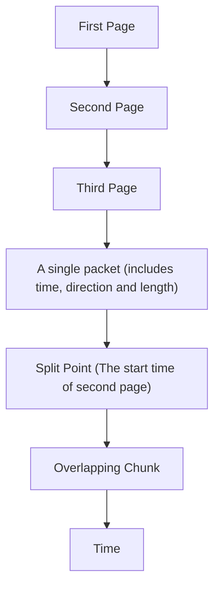

# An Automated Multi-Tab Website Fingerprinting Attack

Qilei Yin , Zhuotao Liu , Qi Li , Senior Member, IEEE, Tao Wang, Qian Wang , Senior Member, IEEE, Chao Shen , Senior Member, IEEE, and Yixiao Xu

Abstract—In Website Fingerprinting (WF) attack, a local passive eavesdropper utilizes network flow information to identify which web pages a user is browsing. Previous researchers have demonstrated the feasibility and effectiveness of WF attacks under a strong Single Page Assumption: the network flow extracted by the adversary belongs to a single web page. In reality, the assumption may not hold because users tend to open multiple tabs simultaneously (or within a short period of time) so that their network traffic is mixed. In this article, we propose an automated multi-tab Website Fingerprinting attack that is able to accurately classify websites regardless of the number of simultaneously opened pages. Our design is powered by two innovative designs. First, we develop a split point classification method to dynamically identify the split point between the first page and its subsequent pages. As a result, the network traffic before the split point is solely generated for the first page. Then, we propose a new chunk-based WF classifier to infer the websites based on the initial chunk of clean traffic. For both classifiers, we apply automated feature selection to select a concise yet representative feature set. We implement a prototype of our design and perform extensive evaluations using SSH and Tor-based datasets to demonstrate the effectiveness of both our system components individually and the integrated system as a whole.

Index Terms—Website fingerprinting attack, machine learning, feature selection, traffic analysis

## 1 INTRODUCTION

the website destinations are exposed to the on-path routers. Organizations owning the routers may try to collect the destinations and clients information for economic benefits, regulations, censorship, etc. Although privacy enhancing technologies, such as Tor, can mitigate those threats by encrypting client network traffic and hiding the real source and destination, an adversary, by observing the encrypted network traffic patterns and utilizing the Website Fingerprinting (WF) technique, is still able to identify the websites browsed by the client.

Website Fingerprinting is a technique used to uniquely identify a website. In general, the fingerprint of a website is a combination of networking traffic patterns, such as packet sequences, sizes, intervals, and directions of the traffic, when accessing the website. When applied by an adversary, WF could be used to deanonymize normal users. Yet, it could also be used to assist crime tracking on the dark web. Recently, several studies have demonstrated the effectiveness of WF attacks [2], [3], [4] under common network scenarios. However, Juarez et al. [5] highlighted a critical assumption in these works, which we refer to as the Single Page Assumption: “The attacker knows when each web page starts loading and when it ends.” Unfortunately, the assumption does not always hold in practice [5], [6], [7] because users tend to simultaneously (or within a very short period of time) open multiple browsing tabs, for instance, in order to pre-fetch a list of pages on a single website or multiple websites. As a result, Juarez et al. [5] questioned the effectiveness of the WF attacks as they showed that the traditional WF attacks become ineffective without the Single Page Assumption.

In this paper, we propose a new WF attack that relaxes the Single Page Assumption. Our key observation is that the multiple pages of a website (or multiple websites) opened in different tabs are loaded sequentially. As illustrated in Fig. 1, regardless of how many pages are opened by a client, until the time point when the second page starts to load, all network packets are solely generated for the first page. We refer to this crucial time point as a split point. Based on this observation, our attack is deployed in two phases. In the first phase, we accurately locate the split point of a multitab web browsing session to extract the initial clean chunk of the network packets for the first page. In the second phase, we perform website classification only based on the initial chunk of data, bypassing the complexity of analyzing or distinguishing the mixed network traffic generated for different pages or websites. Besides designing classifiers to locate the split points and fingerprint websites using initial data chunks, we further propose a feature selection method to automatically obtain the most representative features for different scenarios, yielding a wide range of advantages for our attack over existing schemes. Note that, the goal of our new WF attack is to accurately identify the first webpage visited by the client from a multi-tab browsing session, as the traffic of the following webpages is mixed and indistinguishable.


<details>
<summary>flowchart</summary>


</details>

Fig. 1. The illustration of the sequential multi-tab web browsing. The grey circles are the initial chunk of network packets solely generated for the first page. Other circles are network packets generated for different pages when at least two pages are loading simultaneously.

Concretely, we make the following major contributions in this paper.

1) We propose an automated multi-tab fingerprinting attack that allows an attacker to classify websites opened with multi-tabs. This is a stronger, yet more realistic, threat model than the Single Page Assumption adopted by prior literature. At the highest level, our design is powered by two innovative designs: a split point finding method to extract the clean and non-mixed network traffic from a multi-tab browsing session, and a website classification mechanism to classify websites only using a small portion of the network packets, rather than the complete packet flow generated during the session.  
2) We propose an accurate split point finding method to dynamically identify the split point of the first page and its subsequent pages. We apply a feature selection method to automatically extract a brief yet useful feature set for split point profiling, and then develop a BalanceCascade-XGBoost method to detect the split points under imbalance data scenarios.  
3) We come up with a new WF classifier to classify websites only based on the initial network data chunks of each website. Our WF classifier also uses the feature selection method to automatically obtain a small and representative feature set, improving both the efficiency and flexibility of our attack.  
4) We implement a prototype of our design and evaluate both our system components individually and the system as a whole. The experimental results show that our split point finding method can identify the split points with high accuracy, and meanwhile demonstrate the performance advantage of our chunk-based classifier over several baseline classifiers. Finally, our integrated multi-tab WF attack can achieve the best TPR of about 0.97 and 0.9 on the SSH and Tor-based two-tab datasets, respectively. The achieved classification accuracy is comparable with the attacks launched for a single webpage, demonstrating the feasibility of multi-tab WF attacks in practice.

The rest of the paper is organized as follows. In Section 2, we present the threat model and introduce related work. We present the framework of our new WF attack in Section 3. We present our BalanceCascade-XGBoost method to split pages in Section 4 and classify pages in Section 5. We evaluate the effectiveness of our attack in Section 6. In Section 7, we discuss the real-world implications and limitations of our attack. Finally, Section 8 concludes our work.

## 2 PROBLEM STATEMENT AND RELATED WORK

## 2.1 Multi-Tab Threat Model

In the WF threat model, the adversary records the encrypted network traffic between the victim and the proxy. To determine whether the encrypted network traffic is generated by a certain website, the adversary constructs a fingerprint database by extracting various network traffic features of the targeted website, such as the directions and sizes of packets. Then, the adversary eavesdrops on the victim’s network links and classifies the victim’s network traffic using a classifier trained on the fingerprint database.

Typical WF attacks are evaluated under the Single Page Assumption: only one page of the website is visited at a time and no background network traffic is generated. However, this assumption is unrealistic because network traffic generated by the same client is mixed, especially when the client opens multiple tabs simultaneously (or within a short period of time) [5], [6], [7]. As attackers are unable to accurately distinguish the network traffic generated for different pages, current WF attacks become ineffective when classifying websites based on mixed network traffic [5]. Hence, we relax this assumption and extend the threat model to a realistic setting. In the extended threat model, the client can sequentially open multiple pages from a website within a short period of time. As a result, if the first page does not finish loading before the subsequent pages start, their network traffic will be mixed. Under the sequential multi-tab threat model, only the initial chunk of network packets for the first page is clean and therefore faithfully represents the features of the webpage. Thus, in the design of our multitab attack, we first accurately identify the clean traffic for the first page, and then classify websites only based on the initial clean traffic rather than the complete (mixed) network flow. For clear presentation, we use the two-tab scenario for illustration. In Section 6.2, we demonstrate the effectiveness of our attack when there are more than two sequential pages.

## 2.2 Related Work

Single Page Website Fingerprinting Attack. Single-page website fingerprinting attacks identify websites visited by clients by analyzing the network traffic patterns [2], [8], [9], [10], [11], [12], [13], [14], [15], [16], [17], [18], [19]. Based on more than 3,000 features extracted from network flows, Wang et al. [20] presented a k-Nearest Neighbors (kNN) classifier with weight adjustment, which achieves TPR of 0.85 and FPR of 0.006 on Tor. Panchenko et al. [4] later presented a new approach, CUMUL, which uses SVM with only 104 features. They showed that CUMUL achieves better results than kNN. Hayes et al. [3] created the K-FP attack that utilizes random forests to extract fingerprints for each network flow and then trains a kNN classifier by the fingerprints. This attack shows better results under defenses compared with Wang’s kNN attack and Panchenko’s CUMUL attack. Rimmer et al. [21] proposed an automatic Website Fingerprinting attack based on Deep Learning methods. They evaluated three different Deep Learning models including Stacked Denoising Autoencoder, Convolutional Neural Network, and Long Short-Term Memory. Unfortunately, these attacks cannot effectively identify pages under the multi-tab model.


<details>
<summary>flowchart</summary>

```mermaid
graph LR
  A["Training Data"] --> B["Feature Vectors"]
  C["Testing Data"] --> D["False Split True Split Points"]
  E["Client"] --> F["Encrypted Channel"]
  F --> G["Internet"]
  B --> H["BalanceCascade"]
  D --> H
  H --> I["Feature Vectors"]
  I --> J["Website 1"]
  I --> K["Website 2"]
  I --> L["Website 3"]
  I --> M["Website 4"]
  I --> N["Website 1"]
  I --> O["Website 2"]
  I --> P["Website 3"]
  I --> Q["Website 4"]
  H --> R["XGBoost"]
  R --> S["Training Subsets"]
  S --> T["Feature Vectors"]
  T --> U["XGBoost"]
  U --> V["Attack Result"]
    
    subgraph Phase_I_Dynamic_Page_Split["Phase_I: Dynamic Page Split"]
  B --> H
  D --> H
  F --> H
  G --> H
  H --> I
  I --> J
  J --> K
  J --> L
  J --> M
  J --> N
  J --> O
  J --> P
    end
    
    subgraph Phase_II_Chunk_Based_Page_Classification["Phase_II: Chunk-Based Page Classification"]
  H --> I
  I --> J
  I --> K
  I --> L
  I --> M
  I --> N
  I --> O
  I --> P
    end
    
    subgraph Testing
  H --> R
  R --> S
  S --> T
  T --> U
  U --> V
  V --> W
  W --> X
  X --> Y
  Y --> Z
  Z --> AA
  AA --> AB
  AB --> AC
  AC --> AD
  AD --> AE
    end
    
    subgraph Training
  H --> R
  R --> S
  S --> T
  T --> U
  U --> V
  V --> W
  W --> X
  X --> Y
  Y --> Z
  Z --> AA
  AA --> AB
  AB --> AC
  AC --> AD
    end
    
    subgraph Testing
  H --> R
  R --> S
  S --> T
  T --> U
  U --> V
  V --> W
  W --> X
  X --> Y
  Y --> Z
  Z --> AA
  AA --> AB
  AB --> AC
  AC --> AD
  AD --> AE
    end
    
    subgraph AttackResult
  AE --> AF["Attack Result"]
```
</details>

Fig. 2. The overview of our multi-tab website fingerprinting attack.

Multi-Tab Website Fingerprinting Attack. Juarez et al. [5] showed that known WF attacks cannot identify two pages that are loaded simultaneously. Two major works have attempted to address this issue. Gu et al. [22] relaxed the assumption about browsing behavior and presented a WF attack on the multi-tab scenario. Using the same extended threat model as ours, they selected fine-grained features such as packet order to identify the first page and utilized coarse features to identify the second page. With a delay of two seconds between two pages, when accessing the top 50 websites using SSH, according to Alexa, their attack can classify the first page with 75.9 percent TPR, and the second page with 40.5 percent TPR in the closed-world setting where all the pages are monitored. Compared with this work, our new attack achieves better performance by finding the accurate split points of two pages and selecting a more suitable feature set for website classification.

The work of Wang and Goldberg [7] is most closely related to our approach. They attempted to separate network flows based on noticeable time gaps or a time-based KNN split point finding algorithm. Then, they classified the pages that have been split using the kNN algorithm from [20]. In this work, we make multiple improvements, including proposing an automated feature selection mechanism to select a concise yet representative feature set from a wide range of features to profile the complex and mixed network traffic and an XGBoost based website classifier that excels at classifying websites only based on the initial packet chunks. We have qualitatively demonstrated the superiority of our new design over [7] based on extensive experiments. For instance, our method improves the accuracy of identifying split points on Tor-based multi-tab datasets by up to 32.3 percent.

## 3 OVERVIEW OF MULTI-TAB ATTACKS

The Single Page Assumption is widely used in the existing proposals on WF attacks. However, this assumption is unrealistic as users tend to open multiple pages simultaneously.

In this work, we relax this assumption to propose a more realistic WF attack. The key observation of our design is that if clients open a website with multi-tab pages or multiple websites within a short period of time, they typically open the second page (and subsequent pages) after some delay, i.e., multi-tab pages are loaded sequentially. For instance, a client may spend some time on reading the contents of the first page before selecting subsequent pages [6]. Therefore, if our attack was able to accurately locate the point where the second page starts to load, we could use the initial networks packets before the split point as the clean data to classify the website, without handling the complexity of analyzing and separating mixed network traffic generated for different websites.

Based on this observation, our multi-tab attack is designed with two major phases, as illustrated in Fig. 2. The first phase is to dynamically split the clients’ multi-tab web page browsing traffic into two parts so as to obtain the initial clean network data chunks. The second phase is in charge of classifying the initial chunks to infer the categories (websites) of the first web page browsed by clients.

At a very high level, both phases are classification problems and we use machine learning based algorithm to solve them. First, considering the large amount of potential split points and dynamic network conditions, we propose a richer feature set to accurately profile each packet and then utilize a feature selection method to automatically obtain a smaller but useful feature set under different scenarios. Second, we develop a classification method improved by ensemble undersampling approach to effectively handle the class imbalance problem among split points. Finally, we review a large set of website fingerprinting features to pick the ones applicable to initial packet chunks, and we also use feature selection method to automatically obtain a concise yet representative feature set so that the cost of feature extraction and classifier training time will be reduced significantly.

Note that our design is not limited by the number of tabs opened during a multi-tab web browsing because we only need to find the split point of the first web page and its subsequent web pages. We have experimentally demonstrated the applicability of our attack against different numbers of sequential tabs in Section 6.2.

## 4 DYNAMIC PAGE SPLIT

## 4.1 Challenges in Identifying True Split Points

In this section, we highlight several challenges for dynamic and accurate split point identification in sequential multitab web browsing. Since a client often needs to send an outgoing packet to request a new page from the web server, we could identify an outgoing packet as the split point in one multi-tab browsing session. In our preliminary work [1], we characterize each outgoing packet to exhibit the difference between the start point and other outgoing packets based on the features proposed by [7]. However, such a static feature set has two drawbacks. First, given the complexity and unpredictability of networking conditions, using a fixed set of features may not yield consistently good performance across different browsing sessions. Second, considering the vast amount of network packets that an attacker may observe, being able to reduce the number of required features for classification would further improve the efficiency and flexibility of our attack. Therefore, to overcome these two drawbacks of our preliminary work [1], we propose a dynamic feature generation method to generate a new set containing 110 features and apply an automated feature selection method to obtain a concise yet representative feature set, for ensuring a good performance across different browsing scenarios and improving the efficiency as well as flexibility of our attack.

The second challenge we face is the classical data imbalance issue because there is only one “true split” and potentially many “false splits” in one instance of network flow data. For example, according to our original study [1], the proportion of “true splits” instances size and “false splits” instances can reach 1:461. As a result, even though a dumb classifier predicts all the testing instances as “false splits”, it can still achieve an accuracy rate as high as 99.78 percent, yet such a classifier is completely useless. Therefore, how to train a classifier for split point identification under very imbalanced data sources is another technical challenge.

## 4.2 Dynamic Feature Generation and Selection

To automatically obtain a smaller yet useful feature set for the split point identification, we first enrich the original features in [7] to acquire a more comprehensive and detailed characterization of each outgoing packet. Then, we adopt a feature selection method to filter out the redundant or less effective features while keeping the most significant ones.

Our feature enrichment design works as follows. For each original feature studied in [7], we abstract one feature generation method with a specific parameter. For instance, for the feature ‘the five inter-packet times around the candidate packet’,1 ‘the number of inter-packet times’ is a feature generation method, and ‘five‘ is a parameter for the method. Then we expand the values of the parameters in each feature generation method to obtain a wider range of features than the original feature set. Thus, instead of adding unjustified new features, our feature enrichment design does preserve the original features that have demonstrated reasonably good performance in [1] and meanwhile transform the originally fixed set into a dynamic feature set through parameterization. We determine the parameter ranges based on two considerations: 1) Compared with a single value, a wider range represents a more detailed characterization of each outgoing packet. 2) The packets far away apart (e.g., the 1st and 100th packets in one session) are typically less correlated since they may attribute to different HTML elements in one webpage. Therefore, it is unnecessary to characterize a packet with the distant ones (i.e., we do not need to increase the parameter ranges monotonically).

Specifically, for each kind of feature, we start from a small range around the parameter value given in [7], take our method to enrich new features, select representative features, and then identify split points. Next, we increase the parameter range for another iteration. We stop this procedure when we observe a stable performance and then use the corresponding parameter range. After feature enriching, we extract the following features for each outgoing packet:

1) 20 inter-packet times around the current packet. (20 total features)  
2) The mean, standard deviation, and maximum interpacket times for the 50, 45, 40, 35, 30, 25, 20, 15, 10, and 5 packets before and after the current packet, and the times between the current packet and the packets 50, 45, 40, 35, 30, 25, 20, 15, 10, and 5 packets before the current packet. (3\*10 1\*10 total features)  
þ3) The time between the current packet and the next 1st, 2nd, 3rd, 4th, and 5th incoming packet. (5 total features)  
4) The time interval between the packet two packets after the current packet and the packet two packets before the current packet; the packet four packets after and four packets before; and so on, up to 50 packets. (25 total features)  
5) The number of incoming and outgoing packets in the 5, 10, 15, 20, 25, 30, 35, 40, 45, and 50 packets before and after the current packet, respectively. (2\*10 total features)

In total, we extract 110 features for each outgoing packet, a 4x increase compared with the original 23 features used in [7]. Next, we apply the Recursive Feature Elimination [23] (RFE) technique to select the most significant features such that a smaller number of features are utilized for split point identification. RFE takes a recursive step to eliminate the minor features. Given a training set and a specific estimator, RFE initially utilizes all features to build a classification model, evaluates its performance, ranks each feature based on the current result, removes the least significant feature (s), and then uses the remaining features to start the next loop. However, in the basic version of RFE, it is challenging to decide the right time to stop the iteration in RFE. Thus, we use an improved version of RFE named RFECV, which applies the cross-validation method to automatically determine the number of final features. For the estimator, we choose the Decision Tree algorithm due to its high efficiency and applicability to nonlinear data. Finally, considering that the imbalance of our split point dataset may have a negative effect on the optimal feature number determination of RFECV, we use the AUC metric to assess the estimator performances under different number of features, as its effectiveness has been justified in Chen et al. [24].

## 4.3 BalanceCascade-XGBoost Method

To address the dataset imbalance challenge, we develop a split finding method, named BalanceCascade-XGBoost, which is a binary classifier consisting of the BalanceCascade method [25] and the XGBoost algorithm [26].

Balanced Training Data Generation. BalanceCascade is an ensemble undersampling method that is able to incrementally construct a series of adjusted training subsets from the original dataset. Denoting the original training dataset extracted from all the training network traffic as $D ,$ the subset of true-splits instances in D as $P ,$ , the subset for false-splits points as $N$ and the ratio of $| N |$ to $| P |$ as $b { : } 1 ,$ , in the ith round j j j jof BalanceCascade, it randomly selects $N _ { i }$ instances from $N$ to create a training subset $D _ { i }$ including $N _ { i }$ and $P ,$ where $\left| N _ { i } \right| = \left| P \right|$ . Then, it trains a kNN classifier [27] with default j j ¼ j jparameter $k = 1$ using $D _ { i }$ and removes the instances in $N$ ¼which can be correctly classified by this kNN classifier.2 In the next round, BalanceCascade continues to create another training subset $D _ { j }$ from the updated N and $P .$ In the end, we obtain a collection of $\bar { D _ { i } } , i = 1 \ldots n$ training subsets, $D _ { i } = \{ ( x _ { j } , y _ { j } ) \} ( | D _ { i } | = 2 | P | , x _ { j } \in R ^ { m } , y _ { j } \in \{ 0 , 1 \} )$ , where $x _ { j }$ is a ¼ fð Þgðj j ¼ j j 2 2 f gÞfeature vector extracted from its corresponding outgoing packet, $y _ { j } = 0$ for the false-splits class, 1 for the true-splits ¼class, and m is the dimension of the feature vector.

Typically, the number of outgoing packets in the falsesplits class is much higher than that of the true-splits class. As a result, when generating D during attack preparation, we take random sampling in advance to change its b value, and we will evaluate the performance of our method under varying b values in Section 6.2. Then, we can utilize D and the BalanceCascade method to generate a collection of training subsets $D _ { i } , i = 1 \ldots n$ for split point classifier training.

¼XGBoost-Based Classifier. Moreover, we utilize the XGBoost classifier [26] to classify websites. XGBoost is a massive parallel boosted tree classifier, which is a widely used machine learning algorithm and is much faster than other methods. The hypothesis function of XGBoost is an ensemble of regression trees [28], whose leaf nodes store class values representing the average values of each leaf node’s instances. The ensemble of regression trees will output a real number value and then XGBoost uses the Sigmoid function to convert it to be a value between 0 or 1, where 0 is the probability of belonging to the false-splits class while 1 is the probability of being in the true-splits class. The XGBoost classifier is able to collect the statistics of each feature in parallel to find the split of regression tree [26]. In particular, for each training subset $D _ { i } ,$ we build an individual weak XGBoost classifier $f _ { i }$ and then combine all the weak classifiers to compose the final classifier $F ( x )$ . The hypothesis function of our final classifier can be ð Þcomputed as follows.

$$
F (x) = \frac {1}{n} \sum_ {i = 1} ^ {n} f _ {i} (x). \tag {1}
$$

In the testing phase, our classifier checks each outgoing packet from the client and calculates the probabilities for them to be true split points. Finally, our classifier assigns the outgoing packet with the highest probability to be the actual true split point. Note that only the network dataset used for training is sampled and processed by the BalanceCascade

2. As the kNN classifier performs better in our study, we use it in our method to replace the AdaBoost classifier proposed by original BalanceCascade method.

method. All the outgoing packets in the testing dataset are processed by our classifier.

## 5 CHUNK-BASED WEBSITE CLASSIFICATION

In this section, we elaborate on the second phase of our multi-tab WF attack: classifying websites based only on the initial network packets collected before the split point.

## 5.1 Automated Feature Selection

Because the number of packets in the initial chunk is much smaller than those of the entire network flow, it is necessary to profile them through a rich feature set so as to reveal the subtle uniqueness of the initial chunks from different websites. However, employing a rich feature set comes at a cost. On the one hand, extracting a large number of features from a vast number of packets in high-speed networks is expensive. On the other hand, due to the dynamic changes in websites, an attacker may need to periodically add new training instances, and adjust or even re-train the classifier to retain its accuracy. Thus, we propose an automated feature selection method to obtain a concise yet representative feature set for the chunk-based website classification, improving training agility without sacrificing accuracy.

Specifically, we choose 302 features from prior WF works as the initial feature set based on two principles. 1) Since previous works [3], [4], [20] have demonstrated the significance of data size, intervals, transmission speed, and the number of packets in website fingerprinting, we choose the features relevant to these patterns. 2) For each pattern, we choose different kinds of features to enrich its representation ability. Then we also apply the RFECV method discussed in Section 4 to automatically select a concise and useful feature subset for chunk-based classification.

Compared with our preliminary work [1], there are two significant improvements in this paper. First, we exclude the similarity-based features $( \mathrm { e . g . }$ , the Fast Levenshtein-like distance (FLLD) [29] and the Jacquard similarity with unique packet length) from our initial feature set. Similarity-based features are computed by measuring the distance between pairs of instances from the training and testing dataset. As a result, their computation is more heavyweight than features that can be directly computed based on the testing instances themselves $( \mathrm { e . g . }$ , the statistics of packets). Furthermore, they lack transferability as a change in training data will cause the regeneration of these features for all testing data. Second, we replace the original feature selection method in [1] as the feature independence of Naı¨ve Bayes classifiers is unlikely to be true in a complex and practical problem, e.g., website fingerprinting in an encrypted channel. Meanwhile, applying our automated feature selection method in two different tasks further demonstrates the effectiveness and applicability of its design. Eventually, all the features selected during our evaluations are listed as follows.

First Request Content Size and RTT. We consider the delay between the first outgoing packet and the first incoming packet as RTT. And we compute the First Request Content Size by counting the size of incoming packets between the first outgoing packet and follow-up outgoing packets [16].

Statistics of packets size and number. The outgoing packets sizes. The ratios of incoming and outgoing packets sizes to total packets sizes respectively. The incoming, outgoing and total packet numbers. The ratios of incoming and outgoing packets numbers to total packets numbers.

The number of incoming, outgoing packets, the fraction of the number of incoming packets, and the fraction of the number of outgoing packets in the first 20 packets of the network flows.

We generate two lists by recording the number of packets before every incoming and outgoing packet. Then we compute the average and standard deviation values of these two lists respectively.

Statistics of packet inter-arrival time. We extract three lists of inter-arrival times between two packets of the network flow for total packets, incoming packets, and outgoing packets. We collect the statistics: maximum, minimum, average, standard deviation, and the third quartile features from each list. Note that, the maximum, minimum, average and standard deviation of inter-arrival times of incoming packets, the minimum, average and the standard deviation of inter-arrival times of outgoing packets, the maximum, average and the standard deviation of inter-arrival times of total packets are selected.

Statistics of transmission time. We extract all three quartiles from the total, incoming and outgoing packet time sequences. Among them, the first, second and third quartiles of incoming sequence, the first and second quartiles of the outgoing sequence, the first and third quartiles of the total sequence, and the last time in outgoing sequence are selected.

The quantity and the transmission speed of incoming, outgoing and total packets sequences. For instance, for a packets sequence, we extract a list using 1 to divide each inter-arrival time, and then sample the list to generate 20 features. The 14th sampled features of incoming packets sequence. And the 1-6th, 8th and 11th sampled features of outgoing packets sequence are selected.

The quantity and the transmission size speed of incoming, outgoing and total packets sequences. For instance, for a packets sequence, we extract a list using each packet size to divide each corresponding inter-arrival time, and then sample the list to generate 20 features. The 1st sampled feature of incoming packets sequence, and the 2-5th, 8th, 13th sampled feature of outgoing packets sequence are selected.

The cumulative size of packets (CSOP) [4]. We sample 100 CSOP features as recommended by [4]. Note that, the 2-5th, 8th, 15-16th, 37-39th, 43rd, 52st, 56th, 65th, 98-99th CSOP features are selected in the feature subset.

Burst sizes and quantity. In [20], they defined burst as a sequence of outgoing packets, which is triggered by one incoming packet. We sample 20 bursts. We select the size sequence of 20 bursts as the bursts’ size features (BSF) and the quantity sequence of 20 bursts as the bursts’ quantity features (BQF). Note that, the

Authorized licensed use limited to: SICHUAN UNIVERSITY. Downloaded on June 18,2026 at 09:31:45 UTC from IEEE Xplore. Restrictions apply.

1-6th, 9th BQF and the 1-4th BSF are included in the feature subset.

## 5.2 Classifier Design

With the selected features, we build our classifier based on the XGBoost algorithm since it is an implementation of gradient boosting and incorporates multiple techniques to improve its performance, e.g., the column (feature) subsampling used in Random Forest to prevent overfitting. We replace the original Random Forest classifier in [1] with XGBoost due to the reason that we also want to demonstrate the effectiveness and applicability of XGBoost in two different tasks (i.e., split point identification and chunk-based classification). Unlike the XGBoost classifier used in the split point identification, there are multiple classes (websites) in our training and testing dataset so that we change the objective function of current XGBoost classifier into softmax [30]. Besides, in the preparation stage of website fingerprinting attack, we can collect roughly the same number of training instances (network flows) for each website to create a balanced training set. Therefore, it is sufficient for our chunkbased website fingerprinting attack to utilize a single multiclass XGBoost classifier to infer which website the victim is browsing.

## 6 EVALUATION

In this section, we present our experimental results. Our evaluation centers around the following questions.

In a multi-tab browsing session, can we accurately locate the split points between the first web page and the subsequent web pages started with arbitrary delays? According to our experiments in Section 6.2, we find that our split point finding method achieves the best accuracy of about 0.902 and 0.959 on SSH and Tor-based two-tab datasets, respectively, outperforming the kNN based approach [7] by non-trivial margins (up to about 32 percent improvement over TPR). Meanwhile, we achieve almost identical identification accuracy to our preliminary work [1] while we use much fewer features due to our automated feature selection design. Finally, we demonstrate that our method is not limited by the number of simultaneously opened pages: even for the dataset with five tabs opened, our method still delivers identification accuracy higher than 0.74 for both SSH and Tor-based datasets.

Is it possible to classify web pages only based on the initial chunks containing a relatively small number of network packets? Based on our evaluation in Section 6.3, we observe that our new chunk-based website classifier automatically chooses a concise yet representative feature set and acquires the best TPRs of about 0.957 and 0.843 on SSH and Tor-based single-tab datasets, respectively. Even when the duration of the initial chunk is only around two seconds, the TPRs on SSH and Tor-based single-tab datasets are 0.955 and 0.721, respectively.

With our integrated multi-tab fingerprinting attack design including dynamic page splitting and chunkbased website classification, is it possible to precisely infer the first website visited by clients based on the dynamically identified split points? In Section 6.4, we demonstrate that our multi-tab WF attack gains the best TPRs of about 0.97 and 0.9 on SSH and Torbased two-tab datasets, outperforming existing WF attacks (up to about 167.2 percent improvement over TPR).

## 6.1 Experimental Setup

Single-Tab Datasets. We collect two datasets: SSH\_normal, and Tor\_normal. Each data instance is a network flow collected when fetching one website. We select websites based on Alexa,3 a popular website collecting the most visited URLs across the globe, which is widely used in WF studies. The SSH\_normal dataset consists of 50 monitored web pages over SSH with 50 training instances and 50 testing instances for each page. There are a total of 100 instances for each page without any background network flow. The SSH\_normal data also contains 2,500 non-monitored pages chosen from Alexa’s top 5,000 websites. We collect the SSH\_normal dataset using a headless browser, PhantomJS,4 and use tcpdump to record the network traffic when accessing these websites. Similar to [29], pages are retrieved without caching and all the processes that may generate background traffic are stopped at first. Then we perform the following steps to collect each instance: (i) start the tcpdump; (ii) open the browser and visit the chosen webpage (i.e., URL); (iii) close the browser and related processes after the webpage has been loaded and the loading time is greater than our maximum chunk size in Section 6.3; (iv) close the tcpdump and regard the recorded pcap file as one single-tab instance for the chosen webpage (i.e., label this instance according to the accessed URL); (v) wait for 2 seconds and then start the next loop. By adding a time gap between two consecutive sessions and enforcing check rules (e.g., all flows in the prior session are terminated), we ensure that each collected instance is related to single webpage browsing.

The Tor\_normal dataset is collected by programmatically visiting pages using Tor Browser 6.5.1.5 To collect Tor\_normal, we apply the same collection steps used by SSH\_normal dataset. We close the browser and related processes at the end of one instance collection, label this instance based on the accessed URL, wait for 2s and then start another iteration. The remaining packets of the last instance will also be removed by checking whether they belong to the flows in the new browsing session. Besides, Tor\_normal contains the same set of websites as the SSH\_normal. Specifically, it consists of three subsets of web pages: (i) about 50 instances from each of 50 monitored web pages without background noise as training subset, (ii) another 50 instances from each of 50 monitored web pages without background noise as testing subset, and (iii) 2,500 instances for non-monitored web pages.

Two-Tab Datasets. We collect two datasets, SSH\_two and Tor\_two, where each data instance contains the network traffic for loading two pages instead of one. In each instance, we visit two pages sequentially and the second website, randomly selected from the monitored websites, is requested after a predefined gap after the first page starts to load.

Since delays of most page retrieval are larger than two seconds [6], we set the minimal gap time as two seconds. In addition, based on our previous observation [1], six seconds’ worth of network data is sufficient. Therefore, we choose five different time gaps (two, three, four, five and six seconds) to create in total ten different two-tab datasets (five for SSH and five for Tor). Moreover, as our multi-tab website fingerprinting attack is designed to dynamically identify the split point rather than depending on a static initial chunk size, we add a random delay (0-1s) to the pre-selected time gap to all the instances of the two-tab datasets. For example, when creating the SSH\_two dataset with a predefined two-second gap (referred to as SSH\_two\_2s), the actual gap of each instance is a random value between two and three seconds. Note that, the random delay for each instance in a two-tab dataset is different. Since the actual gap of each two-tab instance is a specific time gap value (2,3,4,5 or 6s) added with a random delay between 0-1s, we can divide the two-tab instances into 5 categories whose time gaps are in the range of 2-3s, 3-4s, 4- 5s, 5-6s and 6-7s, respectively.

For each two-tab dataset with a specific initial gap, we randomly choose 50 monitored web pages, collect 50 instances for each of them so that in total the number of two-tab instances is 2500. Since our multi-tab WF attack is designed to identify the first webpage visited by client, we label each two-tab instance based on the first accessed URL. And we also use the method applied in time-kNN [7] to label the “true” and “false” split points. In particular, for each two-tab instance, we modify PhantomJS and Tor to output the exact time when the request for the second webpage is sent, and then mark the first outgoing packet at or after this time as the start of the second webpage, i.e., the “true” split point in this instance.

Data Preprocessing. The essence of the WF attack is a page classification problem, and the effectiveness of the attack is affected by noise. Thus, we perform several operations to remove some of the identifiable noise generated by the underlying networking protocols. In the SSH dataset, if a flow has fewer than 20 packets before the second page loads, we treat it as failed page loading and throw away the instance. In addition, we exclude packets with the lengths of 100, 44, 52, or 36, because these are likely to be SSH control packets. We also exclude TCP ACK packets whose lengths are 0. As for the Tor dataset, we throw away instances with fewer than 75 Tor cells. In practice, an adversary can easily perform similar data preprocessing to reduce noises so that our preprocessing is not an unrealistic enhancement of the adversary’s power.

Performance Metrics. In this paper, we use true positive rate (TPR) and false positive rate (FPR) to measure the effectiveness of our attack. TPR measures how often monitored instances are correctly classified and FPR measures how often non-monitored instances are incorrectly classified as monitored ones.

## 6.2 Evaluation of Dynamic Page Split

Now we evaluate the performance of our dynamic split point finding method (RFECV+BalanceCascade-XGBoost) under different situations. We compare it with our preliminary

Authorized licensed use limited to: SICHUAN UNIVERSITY. Downloaded on June 18,2026 at 09:31:45 UTC from IEEE Xplore. Restrictions apply.


<details>
<summary>line chart</summary>

| Imbalance Metric b | RFECV+BalanceCascade-XGBoost | BalanceCascade-XGBoost | time-kNN |
| ------------------ | ---------------------------- | ---------------------- | -------- |
| 1                  | 0.80                         | 0.80                   | 0.72     |
| 10                 | 0.81                         | 0.81                   | 0.74     |
| 20                 | 0.80                         | 0.80                   | 0.68     |
| 30                 | 0.80                         | 0.80                   | 0.64     |
| 40                 | 0.80                         | 0.80                   | 0.60     |
| 50                 | 0.79                         | 0.79                   | 0.56     |
| 60                 | 0.79                         | 0.79                   | 0.52     |
| 70                 | 0.78                         | 0.78                   | 0.44     |
| 80                 | 0.77                         | 0.77                   | 0.44     |
| 90                 | 0.76                         | 0.76                   | 0.34     |
| 100                | 0.68                         | 0.76                   | 0.32     |
</details>

Fig. 3. The split accuracy under various imbalance metrics. Our method achieves similar performance with BalanceCascade-XGBoost while using fewer features, and meanwhile outperforms time-kNN by non-trivial margins.

work [1] (BalanceCascade-XGBoost) and the time-kNN method used in [7] on each two-tab dataset to demonstrate the advantages of our new method. For each two-tab dataset, we randomly choose half of the instances as the training dataset and the rest as testing dataset. We keep three decimal places for all our numerical results. We also utilize the dataset published in [7] to show the generality of our new method.

Accuracy Evaluation With Varying Imbalance Metrics. As we discussed in Section 4.1, the binary classification needs to handle the imbalance between the sizes of the true-splits and false-splits classes. The BalanceCascade method used in our split point finding method resolves this issue by balancing the quantity of two classes in an ensemble under-sampling method. In Section 4, we define an imbalance metric b to measure the ratio of the false-splits class size and true-splits class size in training set D. As D is generated by a given b from the original training network traffic, we evaluate how this imbalance metric may affect the split accuracy at first.

We use the split accuracy proposed in time-kNN [7], i.e., if the predicted split point is within the 25 packets before and after the true split point, it is considered as correct. In [7], the authors have demonstrated that extra or fewer packets within this range (i.e., 25) do not significantly influence the following webpage classification. Hence, they used this accuracy in [7]. We choose it for two reasons: 1) We also observe, in our own experiments, that a few missing or extraneous packets around the true split points do not significantly affect the following chunk-based classification. 2) We want to make the performance of our work comparable with time-kNN. Specifically, we evaluate the split accuracy under varying b values on SSH\_two\_2s and the result is shown in Fig. 3.

According to the result above, we can conclude that for each imbalance metric b, the split accuracy of our method is better and much more stable than that of time-kNN. In general, the accuracy of time-kNN decreases as imbalance metric increases, indicating performance degradation for unbalanced datasets. Furthermore, our new method achieves almost the same accuracy as the method used in our preliminary work [1], except for a slightly noticeable degradation when b is 100. However, our new method uses less features: for most imbalance metrics, our new method automatically selects and uses only 5 to 10 representative features, while the number of features used in [1] is 23. Therefore, in the case where the number of network packets is large, our new method has better efficiency.

TABLE 1 Accuracy of Dynamic Split Point Identification of Five Methods on SSH-Based Datasets

<table><tr><td>Dataset</td><td>RFECV+BX</td><td>BX</td><td>RU+XG</td><td>XG</td><td>time-kNN</td></tr><tr><td>SSH_two_2s</td><td>0.805</td><td>0.810</td><td>0.785</td><td>0.792</td><td>0.748</td></tr><tr><td>SSH_two_3s</td><td>0.818</td><td>0.815</td><td>0.758</td><td>0.793</td><td>0.750</td></tr><tr><td>SSH_two_4s</td><td>0.832</td><td>0.833</td><td>0.794</td><td>0.826</td><td>0.778</td></tr><tr><td>SSH_two_5s</td><td>0.873</td><td>0.869</td><td>0.850</td><td>0.866</td><td>0.810</td></tr><tr><td>SSH_two_6s</td><td>0.902</td><td>0.913</td><td>0.879</td><td>0.889</td><td>0.841</td></tr></table>

(BX, RU and XG are the abbreviations for BalanceCascade-XGBoost, Random Undersampling and XGBoost, respectively).

Fig. 3 also shows the trend of accuracy with regards to imbalance metrics. We notice that a very small b may result in reduced accuracy due to the lack of sufficient false-splits instances. Meanwhile, continuously enlarging b does not result in further performance while adding more training latency. Thus, we select b 10 as a proper value for the rest of experiments.

Page Split Accuracy With Different Datasets. With the selected b value, we conduct more comprehensive evaluations on all of our two-tab datasets. We list the page split accuracy of our new method, our original method in [1], a combination of Random Undersampling and XGBoost, XGBoost, and time-kNN on five SSH-based two-tab datasets in Table 1, and the results on five Tor-based two-tab datasets are shown in Table 2.

From the results, we can see that the time-kNN method achieves the lowest accuracy for all datasets. Our new method can improve the page split accuracy by about 6.9 to 9.1 percent on SSH-based datasets and about 22.4 to 32.3 percent on Tor-based datasets. Besides, our new method outperforms the combination of Random Undersampling and XGBoost (by about 2.5 to 8.7 percent), and XGBoost (by about 0.2 to 3.2 percent) on all SSH-based datasets and 4 Tor-based datasets. Further, compared with our original work in [1], our method in this paper achieves the best results in two SSH-based datasets and all the Tor-based datasets, while in the other three SSH-based results, its accuracy is slightly lower than that of BalanceCascade-XGBoost. However, the number of features used in our method is much smaller, as shown in Tables 3 and 4. This is because our automated feature selection design is able to retain the most representative features from a rich original feature set (much larger than the feature set used in [1]).

TABLE 2 Accuracy of Dynamic Split Point Identification of Five Methods on Tor-Based Datasets

<table><tr><td>Dataset</td><td>RFECV+BX</td><td>BX</td><td>RU+XG</td><td>XG</td><td>time-kNN</td></tr><tr><td>Tor_two_2s</td><td>0.959</td><td>0.958</td><td>0.882</td><td>0.956</td><td>0.751</td></tr><tr><td>Tor_two_3s</td><td>0.930</td><td>0.926</td><td>0.887</td><td>0.924</td><td>0.757</td></tr><tr><td>Tor_two_4s</td><td>0.880</td><td>0.874</td><td>0.830</td><td>0.872</td><td>0.718</td></tr><tr><td>Tor_two_5s</td><td>0.880</td><td>0.879</td><td>0.838</td><td>0.878</td><td>0.665</td></tr><tr><td>Tor_two_6s</td><td>0.846</td><td>0.842</td><td>0.797</td><td>0.849</td><td>0.691</td></tr></table>

(BX, RU and XG are the abbreviations for BalanceCascade-XGBoost, Random Undersampling and XGBoost, respectively).  
Authorized licensed use limited to: SICHUAN UNIVERSITY. Downloaded on June 18,2026 at 09:31:45 UTC from IEEE Xplore. Restrictions apply.

TABLE 3 The Number of Features Selected/Used by Our Work on SSH-Based Datasets

<table><tr><td>Dataset</td><td>RFECV+ BalanceCascade-XGBoost</td><td>BalanceCascade-XGBoost</td></tr><tr><td>SSH_two_2s</td><td>6</td><td>23</td></tr><tr><td>SSH_two_3s</td><td>6</td><td>23</td></tr><tr><td>SSh_two_4s</td><td>6</td><td>23</td></tr><tr><td>SSH_two_5s</td><td>11</td><td>23</td></tr><tr><td>SSH_two_6s</td><td>5</td><td>23</td></tr></table>

TABLE 4 The Number of Features Selected/Used by Our Work on Tor-Based Datasets

<table><tr><td>Dataset</td><td>RFECV+ BalanceCascade-XGBoost</td><td>BalanceCascade-XGBoost</td></tr><tr><td>Tor_two_2s</td><td>5</td><td>23</td></tr><tr><td>Tor_two_3s</td><td>10</td><td>23</td></tr><tr><td>Tor_two_4s</td><td>18</td><td>23</td></tr><tr><td>Tor_two_5s</td><td>4</td><td>23</td></tr><tr><td>Tor_two_6s</td><td>5</td><td>23</td></tr></table>

Besides, our smaller feature set can save the training time of BalanceCascade-XGBoost (e.g., on SSH\_two\_2s, its training time based on the original 23 features and our selected 6 features are about 10s and 5s, respectively). Although RFECV consumes more time of feature selection (about 85s on SSH\_two\_2s), note that it ensures the effectiveness of selected features and the adversary only needs to perform it when the training set is significantly changed, which is not a frequent operation. Hence, the additional time cost of RFECV is acceptable in practice. Besides, for all the split point identification experiments, we list all the features selected by our RFECV method in Appendix A, which can be found on the Computer Society Digital Library at http:// doi.ieeecomputersociety.org/10.1109/TDSC.2021.3104869.

To further demonstrate the generality of our method, we apply our new method on the dataset used in [7] and the results are shown in Fig. 4. In this dataset, the two-page instances are in three classes (Class 1: Positive-time separated, Class 2: Zero-time separated and Class 3: Negativetime separated). The third class is the most difficult one as there is neither a noticeable gap nor a clear pattern of packets indicating the split point [7]. In these classes, our method consistently outperforms time-kNN. Even in the most difficult Class 3 instances, our method still achieves an accuracy of about 0.695.

Evaluation on Datasets With Over Two Tabs. When the client opens more than 2 webpages sequentially, there will be a split point between each webpage and its subsequent webpages. However, recall that the goal of our multi-tab attack is to accurately identify the first webpage visited by client so that it always has to locate the first split point, i.e., the start of the second webpage, no matter how many tabs exist in one instance. To demonstrate the effectiveness of our new split point finding method in those scenarios, we collect datasets with more than two tabs. The collection procedure is similar to that of SSH\_two and Tor\_two datasets. To create a multi-tab instance, we load the first page, wait for a specific initial time gap plus a random delay, start to load the second page, wait for another random delay, and start to load the third page and so on. In total, we collect 6 different datasets named SSH\_three\_2s, SSH\_four\_2s, SSH\_five\_2s, Tor\_three\_2s, Tor\_four\_2s, and Tor\_five\_2s, where SSH\_three\_2s means three tabs with an initial gap of 2 seconds (similar meanings applied for other datasets). For each dataset, we randomly select half of the instances as the training set and test on the second half. Note that only the start point of the second web page is in the true-splits class and all of the other outgoing packets are in the false-splits class, even for the start points of the third, fourth and fifth web page. We list the page split accuracy results in Table 5. Although the split accuracy slightly decreases as the number of loaded web pages increases, our method still achieves decent accuracy of about 0.743 and 0.781 for SSH\_five\_2s and Tor\_five\_2s, respectively.


<details>
<summary>bar chart</summary>

| Classification Data Type | RFECV+BalanceCascade-XGBoost | time-kNN |
| :--- | :--- | :--- |
| Class 1 | 0.975 | 0.929 |
| Class 2 | 0.787 | 0.732 |
| Class 3 | 0.695 | 0.554 |
</details>

Fig. 4. The split accuracy of our method compared to time-kNN on [7] dataset.

TABLE 5 The Split Accuracy on Multi-Tab Datasets

<table><tr><td>Dataset</td><td>Split Accuracy</td></tr><tr><td>SSH_three_2s</td><td>0.785</td></tr><tr><td>SSH_four_2s</td><td>0.759</td></tr><tr><td>SSH_five_2s</td><td>0.743</td></tr><tr><td>Tor_three_2s</td><td>0.86</td></tr><tr><td>Tor_four_2s</td><td>0.846</td></tr><tr><td>Tor_five_2s</td><td>0.781</td></tr></table>

## 6.3 Evaluation of Chunk-Based Classification

In this section, we evaluate the performance of our new chunk-based WF classifier that only uses the initial and clean network packet streams before the split point. For each dataset, we evaluate five different initial chunk sizes (or durations) ranging from two seconds to six seconds. Furthermore, we perform experiments under the closed-world and open-world scenarios. In the closed-world setting, we test our WF classifier with the dataset where all web pages are monitored, while in the open-world setting, the dataset consists of both monitored and non-monitored web pages. Finally, we compare the performance of our classifier with multiple prior proposals. For a fair comparison, all classifiers are trained and tested using the same data.

Website Classification Under the Closed-World Scenario. We compare our new WF classifier with k-FP [3], CUMUL [4], Deep Fingerprinting (DF) [21] and the WF classifier in our preliminary work [1] on the single-tab datasets: SSH\_normal, and Tor\_normal. Note that, DF is a new benchmark classifier not compared in our previous work [1]. We clarify that whether the datasets are single-tab or multi-tab does not make a difference in this section because we only use the initial data chunk for classification. The integrated WF attacks, with both dynamic page splitting and chunk-based website classification, are evaluated in Section 6.4. We randomly split each dataset into two halves as the training set and testing set. We faithfully implement the k-FP, CUMUL and DF attacks referring to their published codes,6 as well as the description in their papers. Since the DF attack has three different deep learning models, we evaluate all of them in each experiment and record their best result as the performance of the DF attack.


<details>
<summary>line chart</summary>

| x | Ours new | Ours original | DF | k-FP | CUMUL |
| --- | --- | --- | --- | --- | --- |
| 2 | 0.95 | 0.92 | 0.85 | 0.87 | 0.68 |
| 3 | 0.94 | 0.89 | 0.86 | 0.85 | 0.67 |
| 4 | 0.93 | 0.88 | 0.87 | 0.86 | 0.65 |
| 5 | 0.94 | 0.87 | 0.88 | 0.87 | 0.67 |
| 6 | 0.94 | 0.86 | 0.88 | 0.87 | 0.75 |
</details>


<details>
<summary>line chart</summary>

| Initial Chunk Size (seconds) | Ours new | Ours original | DF   | k-FP | CUMUL |
| ---------------------------- | -------- | ------------- | ---- | ---- | ----- |
| 2                            | 0.7      | 0.7           | 0.6  | 0.6  | 0.6   |
| 3                            | 0.8      | 0.8           | 0.8  | 0.7  | 0.6   |
| 4                            | 0.8      | 0.8           | 0.8  | 0.6  | 0.6   |
| 5                            | 0.7      | 0.7           | 0.7  | 0.5  | 0.4   |
| 6                            | 0.8      | 0.7           | 0.7  | 0.5  | 0.4   |
</details>

Fig. 5. TPRs of all five evaluated classifiers on five SSH\_normal datasets and five Tor\_normal datasets.

The TPRs for all classifiers over ten different experiments are given in Fig. 5. It is clear that our new WF classifier achieves the best TPR in most cases. Specifically, on all five experiments on SSH\_normal dataset, our new WF classifier outperforms all other classifiers and achieves the overall best TPR (over 0.957) when the initial chunk size is five seconds. On the Tor\_normal dataset, our new WF classifier obtains the best TPRs on four chunk sizes and only slightly falls behind the classifier in our preliminary work [1] for one size (5 seconds). Also, it is clear that Tor-based web pages are more difficult to be classified since the TPRs for all classifiers drop when classifying Tor\_normal dataset. Previous work [16] has also indicated that Tor is more difficult than SSH because all Tor packets have the same size. Further, we observe that increasing the size of the initial chunk does not necessarily result in higher TPRs, e.g, the TPRs of all classifiers drop on the Tor\_normal dataset when the initial chunk size increases to five seconds. This may be due to the underlying characteristics of the Tor\_normal dataset, underpinned by Tor’s Orion routing protocol.

TABLE 6 The Number of Selected Features for Chunk-Based Classification Based on Our Current RFECV Method and the IWSSembeddedNB Method in Our Preliminary Work [1]

<table><tr><td rowspan="2" colspan="2">Dataset &amp; Feature Selection Method</td><td colspan="5">Initial Chunk Size</td></tr><tr><td>2s</td><td>3s</td><td>4s</td><td>5s</td><td>6s</td></tr><tr><td rowspan="2">SSH_normal</td><td>RFECV</td><td>11</td><td>11</td><td>15</td><td>17</td><td>7</td></tr><tr><td>IWSSembeddedNB</td><td>58</td><td>47</td><td>40</td><td>35</td><td>44</td></tr><tr><td rowspan="2">Tor_normal</td><td>RFECV</td><td>12</td><td>17</td><td>22</td><td>10</td><td>11</td></tr><tr><td>IWSSembeddedNB</td><td>27</td><td>47</td><td>32</td><td>36</td><td>38</td></tr></table>

Classification With Open-World Datasets. We further compare our new WF classifier with other classifiers in the more realistic open-world setting using 10-fold cross-validation. We vary the number of the non-monitored pages from 500 to 2,500 on SSH\_normal training subset and Tor\_normal training subset while the initial chunk size also varies from two to six seconds. As shown in Table 9, when the amount of nonmonitored pages is 2,500, the TPRs of our new WF classifier on SSH\_normal dataset are between about 0.934 to 0.941 while the FPR is in the range of 0.011 to 0.018. We observe that the FPRs of all classifiers decrease as the number of nonmonitored pages increase. Compared with other classifiers, our method achieves much higher TPRs and only slightly falls behind the K-FP method in FPR. For Tor\_normal dataset (shown in Table 10), our new WF classifier achieves TPRs of about 0.799 to 0.897 and FPRs are no greater than 0.002 when the number of non-monitored pages is 2,500. Although the Tor\_normal dataset is in general more difficult, our WF classifier outperforms all other methods in both the TPR and FPR metrics.

Evaluation of Automated Feature Selection. Besides the classification accuracy, we newly compare the number of selected features by our current RFECV method and our original IWSSembeddedNB method [1] in Table 6. Clearly, our RFECV method always selects a smaller feature set, which represents a faster training time for our classifier. More importantly, our automated feature reduction does not negate the accuracy. We demonstrate this by comparing the performance of our XGBoost classifier before and after feature selection in Table 7. At the cost of a marginal accuracy degradation, our feature selection design significantly reduces the training time of our classifier by 10x.

Another issue worth analyzing is the time cost of feature selection. In our RFECV method, there are two major parameters directly related to its run time: the number of features to be removed at each iteration (step) and the number of folds for cross-validation (cv). Hence, we test six different combinations of the two parameters to obtain their feature selection times,the numbers of selected features and the TPRs on the SSH\_normal dataset with initial chunk size as two seconds. The results are shown in Table 8. Typically, with smaller step and larger cv values, our RFECV method is able to perform fine-grained analysis on each feature so that we are able to obtain a more concise feature set, without sacrificing TPR. The selection cost, however, is also higher. We clarify that a fine-grained analysis may not necessarily result in more heavyweight attack preparation over time, since the adversary does not have to repeat the feature selection process for minor or moderate training set adjustments. Also, an attacker can either choose a more concise feature set or less training time, or make a balance between them.

TABLE 7 The TPR and Training Time of XGBoost Classifier Before and After Our Feature Selection (TPR,Training Time)

<table><tr><td rowspan="2" colspan="2">Dataset</td><td colspan="5">Initial Chunk Size</td></tr><tr><td>2s</td><td>3s</td><td>4s</td><td>5s</td><td>6s</td></tr><tr><td rowspan="2">SSH_normal</td><td>Before</td><td>0.965/207.9s</td><td>0.957/212.1s</td><td>0.947/230.4s</td><td>0.956/234.0s</td><td>0.960/250.4s</td></tr><tr><td>After</td><td>0.955/21.5s</td><td>0.955/18.6s</td><td>0.946/23.5s</td><td>0.958/29.2s</td><td>0.951/22.9s</td></tr><tr><td rowspan="2">Tor_normal</td><td>Before</td><td>0.733/139.6s</td><td>0.850/185.3s</td><td>0.838/205.1s</td><td>0.749/235.4s</td><td>0.794/245.3s</td></tr><tr><td>After</td><td>0.721/15.5s</td><td>0.828/19.6s</td><td>0.843/28.2s</td><td>0.720/24.8s</td><td>0.774/23.4s</td></tr></table>

Attack Against Defenses. Finally, we stress test the performance of our new WF classifier against defense techniques that may be deployed by clients in the real world. Towards this end, we create SSH\_normal and Tor\_normal datasets that are modified based on four defense mechanisms described below.7

HTTPOS split [31], which utilizes HTTP range requests to obfuscate the sizes of small outgoing and incoming packets, splitting them into random sizes.  
Traffic morphing [32], which alters the packet sizes of the client’s traffic according to the packet distribution of a target web page, is used as a decoy for the real web page.  
Decoy page [16], which loads a decoy page whenever the client opens a new web page.  
BuFLO [13], which sends packets at a constant size and at regular intervals in both directions.

Table 11 shows the evaluation results. Overall, our method shows improved performance over all other classifiers. However, the performance of all classifiers dramatically decreases when the decoy page defense technique is applied, especially for the Tor\_normal dataset. The reason behind this is that the packets in Tor traffic have the same size and the loaded decoy page further damages the temporal and direction patterns that are used for classification. The BuFlo seems to be the most effective defense method against all classifiers: our work can only have the TPR of 0.112 on the SSH\_normal dataset and the TPR of 0.02 on the Tor\_normal dataset, indicating a totally random class prediction (50 classes and probability 0.02 for each). We list the features selected during defenses deployment in Appendix B, available in the online supplemental material.

## 6.4 Evaluation of the Integrated Multi-Tab WF Attacks

In this section, we evaluate the integrated multi-tab WF attack with dynamic split point identification and chunkbased classification.

The Multi-Tab Attack Performance. For each two-tab dataset, half of the instances are used as the training set for our split point classifier, and the remaining half instances are used as the testing set. The detected initial chunks of the testing instances will be further classified by our chunk-based classifier trained on the single-tab dataset with the same initial chunk size as the current two-tab dataset. For instance, when experimenting with the SSH\_two\_2s dataset, the chunk-based classifier is trained by the SSH\_normal dataset with the chunk size as two seconds. We use the initial chunks of our single-tab datasets to train chunk-based classifiers because each single-tab instance contains only the network traffic generated for one website. For a fair comparison, we use the same training datasets and testing datasets for all benchmark WF classifiers. We plot the TPRs for all classifiers in Fig. 6 on all ten two-tab datasets. Clearly, our method outperforms all other benchmark classifiers by large margins (up to about 167.2 percent). Even compared with our preliminary design in [1], our new design delivers improved TPRs over nine datasets (by up to about 22.8 percent) except for the Tor\_two\_2s dataset where our new method has slight (less than 1 percent) performance degradation.

We do realize that all benchmark classifiers (except for our original classifier in [1]) are designed based on the single page assumption. Thus, it is seemingly unfair to feed them the two-tab test datasets with mixed network traffic generated for multiple pages. This, however, is not unfairness. Rather, it demonstrates that these classifiers become ineffective when classifying the multi-tab, arguably more realistic, network traffic. For completeness, we set up a new evaluation where the three benchmark WF classifiers make their classification on the initial chunks detected by our split point finding method, i.e., we combine our split point method with these three WF classifiers as three new multitab WF attacks. We also compare them with our new WF classifier and our original classifier in [1] in Fig. 7. Clearly, even enhancing the benchmark classifiers with our split point identification, our new WF classifier still has the optimal overall TPRs across different datasets.

TABLE 8 The Performance of Our RFECV Method Under Different Parameters

<table><tr><td rowspan="2">Metric</td><td colspan="6">Parameter Combination (step,cv)</td></tr><tr><td>(1,5)</td><td>(1,2)</td><td>(5,2)</td><td>(10,2)</td><td>(15,2)</td><td>(20,2)</td></tr><tr><td>Feature Count</td><td>11</td><td>12</td><td>12</td><td>32</td><td>47</td><td>62</td></tr><tr><td>Selection Time</td><td>667.0s</td><td>263.7s</td><td>54.3s</td><td>23.8s</td><td>16.3s</td><td>12.6s</td></tr><tr><td>TPR</td><td>0.955</td><td>0.948</td><td>0.955</td><td>0.964</td><td>0.964</td><td>0.964</td></tr></table>

TABLE 9 The Performance of Our New WF Classifier Compared to K-FP, CUMUL, DF and Our Original WF Classifier While Varying Initial Chunk Sizes and Non-Monitored Page Numbers on the SSH\_normal Dataset

<table><tr><td rowspan="2">Page Number</td><td rowspan="2" colspan="2">Method Metric</td><td colspan="5">Chunk Size</td></tr><tr><td>2s</td><td>3s</td><td>4s</td><td>5s</td><td>6s</td></tr><tr><td rowspan="10">500</td><td rowspan="2">Ours New</td><td>TPR</td><td>0.947</td><td>0.947</td><td>0.939</td><td>0.949</td><td>0.946</td></tr><tr><td>FPR</td><td>0.074</td><td>0.090</td><td>0.080</td><td>0.062</td><td>0.082</td></tr><tr><td rowspan="2">Ours Original</td><td>TPR</td><td>0.926</td><td>0.913</td><td>0.906</td><td>0.909</td><td>0.905</td></tr><tr><td>FPR</td><td>0.204</td><td>0.218</td><td>0.168</td><td>0.162</td><td>0.208</td></tr><tr><td rowspan="2">K-FP</td><td>TPR</td><td>0.880</td><td>0.867</td><td>0.859</td><td>0.871</td><td>0.878</td></tr><tr><td>FPR</td><td>0.074</td><td>0.076</td><td>0.058</td><td>0.056</td><td>0.080</td></tr><tr><td rowspan="2">CUMUL</td><td>TPR</td><td>0.661</td><td>0.618</td><td>0.629</td><td>0.644</td><td>0.685</td></tr><tr><td>FPR</td><td>0.236</td><td>0.184</td><td>0.196</td><td>0.196</td><td>0.260</td></tr><tr><td rowspan="2">DF</td><td>TPR</td><td>0.832</td><td>0.853</td><td>0.857</td><td>0.874</td><td>0.873</td></tr><tr><td>FPR</td><td>0.346</td><td>0.356</td><td>0.436</td><td>0.414</td><td>0.352</td></tr><tr><td rowspan="10">1500</td><td rowspan="2">Ours New</td><td>TPR</td><td>0.946</td><td>0.942</td><td>0.939</td><td>0.938</td><td>0.941</td></tr><tr><td>FPR</td><td>0.026</td><td>0.025</td><td>0.027</td><td>0.031</td><td>0.029</td></tr><tr><td rowspan="2">Ours Original</td><td>TPR</td><td>0.912</td><td>0.897</td><td>0.890</td><td>0.896</td><td>0.890</td></tr><tr><td>FPR</td><td>0.089</td><td>0.083</td><td>0.087</td><td>0.077</td><td>0.089</td></tr><tr><td rowspan="2">K-FP</td><td>TPR</td><td>0.863</td><td>0.853</td><td>0.842</td><td>0.853</td><td>0.865</td></tr><tr><td>FPR</td><td>0.023</td><td>0.023</td><td>0.011</td><td>0.009</td><td>0.014</td></tr><tr><td rowspan="2">CUMUL</td><td>TPR</td><td>0.550</td><td>0.516</td><td>0.497</td><td>0.496</td><td>0.541</td></tr><tr><td>FPR</td><td>0.070</td><td>0.057</td><td>0.067</td><td>0.061</td><td>0.059</td></tr><tr><td rowspan="2">DF</td><td>TPR</td><td>0.803</td><td>0.818</td><td>0.812</td><td>0.839</td><td>0.841</td></tr><tr><td>FPR</td><td>0.184</td><td>0.175</td><td>0.195</td><td>0.196</td><td>0.197</td></tr><tr><td rowspan="10">2500</td><td rowspan="2">Ours New</td><td>TPR</td><td>0.941</td><td>0.936</td><td>0.938</td><td>0.937</td><td>0.934</td></tr><tr><td>FPR</td><td>0.014</td><td>0.011</td><td>0.014</td><td>0.018</td><td>0.015</td></tr><tr><td rowspan="2">Ours Original</td><td>TPR</td><td>0.874</td><td>0.867</td><td>0.872</td><td>0.879</td><td>0.875</td></tr><tr><td>FPR</td><td>0.070</td><td>0.057</td><td>0.058</td><td>0.053</td><td>0.054</td></tr><tr><td rowspan="2">K-FP</td><td>TPR</td><td>0.855</td><td>0.844</td><td>0.831</td><td>0.839</td><td>0.853</td></tr><tr><td>FPR</td><td>0.010</td><td>0.011</td><td>0.005</td><td>0.007</td><td>0.004</td></tr><tr><td rowspan="2">CUMUL</td><td>TPR</td><td>0.480</td><td>0.449</td><td>0.398</td><td>0.408</td><td>0.451</td></tr><tr><td>FPR</td><td>0.042</td><td>0.029</td><td>0.024</td><td>0.017</td><td>0.022</td></tr><tr><td rowspan="2">DF</td><td>TPR</td><td>0.786</td><td>0.797</td><td>0.786</td><td>0.825</td><td>0.811</td></tr><tr><td>FPR</td><td>0.132</td><td>0.112</td><td>0.128</td><td>0.123</td><td>0.129</td></tr></table>

Additionally, we show the average testing time (in milliseconds) for each instance of SSH\_two\_2s and Tor\_two\_2s in Table 12. Since both our new and original WF attacks contain split point identification and chunk-based classification, they take more testing time than the benchmark classifiers designed for single page identification. However, we clarify that real-time deanonymization is not a must for website fingerprinting attack. Typically, the adversary collects the encrypted traffic of clients by mirroring the user traffic and performs deanonymization offline, since the goal of WF attack is not to disrupt user browsing sessions. Further, our average testing time is fairly small compared with the typical delays for most webpage retrieval, i.e., 2 seconds [6].

Mismatch Between the Initial Chunk Sizes of the Training and Testing Datasets. So far, in all our experiments, we have used the similar initial chunk size for both training and testing datasets. For instance, when experimenting with the SSH\_two\_2s dataset, the chunk-based classifier is also trained by the SSH\_normal dataset with the chunk size as two seconds. In this section, we study the performance of our attacks when the initial chunk sizes for training and testing datasets are different. Towards this end, we apply a chunk-based classifier trained on single-tab Tor\_normal datasets with initial chunk size ranging from two to six seconds (in total five classifiers) to classify the Tor\_two\_3s and Tor\_two\_5s datasets. The results are plotted in Fig. 8. We observe that when the initial chunk sizes for the training dataset are close to that of the testing dataset, our chunkbased classifier tends to achieve better TPRs.

Real-World Multi-Tab Attacks. However, in reality, due to heterogeneity of client behavior across different web browsing sessions, the split points of these sessions are unknown a priori. Our previous work [1] did not point out how to avoid the mismatch pitfall we just evaluated in practice. To handle this challenge, the adversary can prepare a list of chunk-based classifiers trained on different initial chunk sizes so that it can dynamically select the proper website classifier based on the split point identified by our split point classifier. Thus, by assembling a single split point classifier and multiple chunkbased website classifiers, our multi-tab attack can effectively adapt the network dynamics in real-world deployment.

TABLE 10 The Performance of Our New WF Classifier Compared to K-FP, CUMUL, DF and Our Original WF Classifier While Varying the Initial Chunk Size and Unmonitored Page Number on the Tor\_normal Dataset

<table><tr><td rowspan="2">Page Number</td><td rowspan="2" colspan="2">Method Metric</td><td colspan="5">Chunk Size</td></tr><tr><td>2s</td><td>3s</td><td>4s</td><td>5s</td><td>6s</td></tr><tr><td rowspan="10">500</td><td rowspan="2">Ours New</td><td>TPR</td><td>0.797</td><td>0.897</td><td>0.886</td><td>0.786</td><td>0.837</td></tr><tr><td>FPR</td><td>0.004</td><td>0.0</td><td>0.004</td><td>0.004</td><td>0.006</td></tr><tr><td rowspan="2">Ours Original</td><td>TPR</td><td>0.775</td><td>0.884</td><td>0.864</td><td>0.769</td><td>0.803</td></tr><tr><td>FPR</td><td>0.006</td><td>0.0</td><td>0.006</td><td>0.004</td><td>0.016</td></tr><tr><td rowspan="2">K-FP</td><td>TPR</td><td>0.666</td><td>0.739</td><td>0.726</td><td>0.617</td><td>0.630</td></tr><tr><td>FPR</td><td>0.016</td><td>0.024</td><td>0.062</td><td>0.056</td><td>0.078</td></tr><tr><td rowspan="2">CUMUL</td><td>TPR</td><td>0.615</td><td>0.651</td><td>0.556</td><td>0.440</td><td>0.396</td></tr><tr><td>FPR</td><td>0.038</td><td>0.070</td><td>0.09</td><td>0.226</td><td>0.196</td></tr><tr><td rowspan="2">DF</td><td>TPR</td><td>0.674</td><td>0.821</td><td>0.827</td><td>0.728</td><td>0.705</td></tr><tr><td>FPR</td><td>0.008</td><td>0.032</td><td>0.062</td><td>0.2</td><td>0.262</td></tr><tr><td rowspan="10">1500</td><td rowspan="2">Ours New</td><td>TPR</td><td>0.802</td><td>0.898</td><td>0.889</td><td>0.792</td><td>0.843</td></tr><tr><td>FPR</td><td>0.001</td><td>0.002</td><td>0.002</td><td>0.001</td><td>0.001</td></tr><tr><td rowspan="2">Ours Original</td><td>TPR</td><td>0.780</td><td>0.889</td><td>0.860</td><td>0.760</td><td>0.800</td></tr><tr><td>FPR</td><td>0.002</td><td>0.001</td><td>0.003</td><td>0.0</td><td>0.001</td></tr><tr><td rowspan="2">K-FP</td><td>TPR</td><td>0.664</td><td>0.733</td><td>0.717</td><td>0.603</td><td>0.615</td></tr><tr><td>FPR</td><td>0.005</td><td>0.007</td><td>0.017</td><td>0.013</td><td>0.016</td></tr><tr><td rowspan="2">CUMUL</td><td>TPR</td><td>0.585</td><td>0.571</td><td>0.460</td><td>0.283</td><td>0.248</td></tr><tr><td>FPR</td><td>0.016</td><td>0.018</td><td>0.023</td><td>0.017</td><td>0.016</td></tr><tr><td rowspan="2">DF</td><td>TPR</td><td>0.670</td><td>0.819</td><td>0.828</td><td>0.719</td><td>0.706</td></tr><tr><td>FPR</td><td>0.002</td><td>0.008</td><td>0.015</td><td>0.106</td><td>0.116</td></tr><tr><td rowspan="10">2500</td><td rowspan="2">Ours New</td><td>TPR</td><td>0.799</td><td>0.897</td><td>0.890</td><td>0.788</td><td>0.846</td></tr><tr><td>FPR</td><td>0.0</td><td>0.002</td><td>0.0</td><td>0.0</td><td>0.001</td></tr><tr><td rowspan="2">Ours Original</td><td>TPR</td><td>0.782</td><td>0.888</td><td>0.858</td><td>0.767</td><td>0.803</td></tr><tr><td>FPR</td><td>0.002</td><td>0.0</td><td>0.001</td><td>0.0</td><td>0.001</td></tr><tr><td rowspan="2">K-FP</td><td>TPR</td><td>0.657</td><td>0.730</td><td>0.711</td><td>0.596</td><td>0.608</td></tr><tr><td>FPR</td><td>0.004</td><td>0.005</td><td>0.008</td><td>0.008</td><td>0.005</td></tr><tr><td rowspan="2">CUMUL</td><td>TPR</td><td>0.559</td><td>0.531</td><td>0.423</td><td>0.246</td><td>0.188</td></tr><tr><td>FPR</td><td>0.015</td><td>0.008</td><td>0.006</td><td>0.004</td><td>0.005</td></tr><tr><td rowspan="2">DF</td><td>TPR</td><td>0.677</td><td>0.820</td><td>0.829</td><td>0.711</td><td>0.691</td></tr><tr><td>FPR</td><td>0.003</td><td>0.005</td><td>0.010</td><td>0.072</td><td>0.083</td></tr></table>

## 7 DISCUSSION

In this section, we discuss the real-world implications and limitations of our website fingerprinting mechanism.

TABLE 11 Comparison of the TPR of Our New WF Classifier With Other Methods Against Various Defenses When the Initial Chunk Size is Two Seconds

<table><tr><td>Dataset</td><td>Method</td><td>HTTPOS Split</td><td>Traffic morphing</td><td>Decoy pages</td><td>BUFLO</td></tr><tr><td rowspan="5">SSH_Normal(2 seconds)</td><td>Ours New</td><td>0.961</td><td>0.831</td><td>0.822</td><td>0.112</td></tr><tr><td>Ours Original</td><td>0.929</td><td>0.789</td><td>0.712</td><td>0.108</td></tr><tr><td>K-FP</td><td>0.842</td><td>0.712</td><td>0.693</td><td>0.112</td></tr><tr><td>CUMUL</td><td>0.733</td><td>0.605</td><td>0.459</td><td>0.071</td></tr><tr><td>DF</td><td>0.815</td><td>0.721</td><td>0.598</td><td>0.067</td></tr><tr><td rowspan="5">Tor_Normal(2 seconds)</td><td>Ours New</td><td>0.678</td><td>0.709</td><td>0.159</td><td>0.02</td></tr><tr><td>Ours Original</td><td>0.678</td><td>0.716</td><td>0.099</td><td>0.02</td></tr><tr><td>K-FP</td><td>0.570</td><td>0.630</td><td>0.115</td><td>0.02</td></tr><tr><td>CUMUL</td><td>0.591</td><td>0.601</td><td>0.091</td><td>0.02</td></tr><tr><td>DF</td><td>0.577</td><td>0.589</td><td>0.061</td><td>0.02</td></tr></table>


<details>
<summary>bar chart</summary>

SSH-based Two-tab Datasets
| Dataset Name | Ours New | Ours Original | K-FP | CUMUL | DF |
|---|---|---|---|---|---|
| SSH_two_2s | 0.862 | 0.702 | 0.222 | 0.126 | 0.333 |
| SSH_two_3s | 0.909 | 0.762 | 0.222 | 0.132 | 0.324 |
| SSH_two_4s | 0.954 | 0.831 | 0.206 | 0.123 | 0.361 |
| SSH_two_5s | 0.946 | 0.867 | 0.19 | 0.117 | 0.371 |
| SSH_two_6s | 0.97 | 0.892 | 0.219 | 0.125 | 0.363 |
| Tor-based Two-tab Datasets
| Ours New | Ours Original | K-FP | CUMUL | DF |
| Tor_two_2s | 0.728 | 0.735 | 0.307 | 0.317 | 0.37 |
| Tor_two_3s | 0.806 | 0.726 | 0.198 | 0.168 | 0.342 |
| Tor_two_4s | 0.874 | 0.842 | 0.171 | 0.15 | 0.421 |
| Tor_two_5s | 0.9 | 0.866 | 0.156 | 0.15 | 0.422 |
| Tor_two_6s | 0.895 | 0.874 | 0.156 | 0.137 | 0.475 |
</details>

Fig. 6. The multi-tab attack performance for all classifiers.


<details>
<summary>bar chart</summary>

| Dataset Name | Ours New | Ours Original | K-FP | CUMUL | DF |
|---|---|---|---|---|---|
| SSH_two_2s | 0.862 | 0.702 | 0.694 | 0.526 | 0.826 |
| SSH_two_3s | 0.909 | 0.762 | 0.734 | 0.553 | 0.832 |
| SSH_two_4s | 0.954 | 0.831 | 0.826 | 0.647 | 0.86 |
| SSH_two_5s | 0.946 | 0.867 | 0.857 | 0.726 | 0.886 |
| SSH_two_6s | 0.97 | 0.892 | 0.875 | 0.784 | 0.906 |
| Tor-based Two-tab Datasets | Ours New | Ours Original | K-FP | CUMUL | DF |
| Tor_two_2s | 0.728 | 0.735 | 0.439 | 0.332 | 0.624 |
| Tor_two_3s | 0.806 | 0.726 | 0.534 | 0.424 | 0.69 |
| Tor_two_4s | 0.874 | 0.842 | 0.496 | 0.406 | 0.808 |
| Tor_two_5s | 0.9 | 0.866 | 0.567 | 0.425 | 0.851 |
| Tor_two_6s | 0.895 | 0.874 | 0.59 | 0.472 | 0.874 |
</details>

Fig. 7. The multi-tab attack performance for all classifiers. The three classifiers designed based on the single page assumption are enhanced by our split point identification design.

Real-World Implications. At a very high level, the design of our website fingerprinting mechanism may have positive effects in the following two areas. First, the normal clients can utilize our attack to assess the effectiveness of their anonymous network proxies (e.g., Tor) using more realistic multi-tab browsing settings. Considering the heterogeneity of client network conditions, it is more preferable to perform individual assessments rather than relying on a common third-party evaluation report, which is typically outdated due to the evolution of both anonymous network proxies and defenses. Second, dark web cybercrime is on the rise8 and imposes a great threat (e.g., terrorism9 and illegal weapon sales10) to our cyberspace. They often deploy various anonymization techniques (e.g., using Tor) to hide their identities. With our website fingerprinting mechanism, the judiciary authorities have enhanced capability to track criminals on the dark web.

TABLE 12 The Average Testing Time (in milliseconds) for Each Instance of SSH\_two\_2s and Tor\_two\_2s

<table><tr><td>Dataset</td><td>Ours New</td><td>Ours Original</td><td>K-FP</td><td>CUMUL</td><td>DF</td></tr><tr><td>SSH_two_2s</td><td>19.149</td><td>20.839</td><td>0.131</td><td>0.342</td><td>0.328</td></tr><tr><td>Tor_two_3s</td><td>17.909</td><td>21.601</td><td>0.126</td><td>0.049</td><td>0.247</td></tr></table>


<details>
<summary>line chart</summary>

| Training Initial Chunk Size (seconds) | Tor_two_3s | Tor_two_5s |
|---|---|---|
| 2 | 0.56 | 0.37 |
| 3 | 0.81 | 0.44 |
| 4 | 0.86 | 0.73 |
| 5 | 0.76 | 0.91 |
| 6 | 0.58 | 0.92 |
</details>

Fig. 8. The effect of training initial chunk in different sizes on both Tor\_two\_3s and Tor\_two\_5s datasets.

Limitations. Specific countermeasures would reduce the effectiveness of our mechanism. For instance, eliminating the explicit traffic patterns may make the statistical features of different websites indistinguishable. However, a recent study [17] shows that the advanced neural network model is still able to extract implicit yet useful features for WF attacks even under the deployment of these defenses. Hence, incorporating new neural network models into our work would be an interesting future work. Another factor that may limit the effectiveness of our mechanism is streaming data, e.g., video, music and torrent, which acts as a background webpage with a long duration so that we can not locate the clean chunks of other webpages. However, we recognize two caveats. First, large file transfers are discouraged on anonymous network proxies like Tor [20] due to limited bandwidth. Second, many torrent applications may leak the client’s real IP address and chosen port,11 which seriously undermines the anonymity of network proxies in the first place. Further, prior work has shown that multi-label learning is able to fingerprint SDN applications in totally mixed encryption traffic [33]. We will evaluate its effectiveness for website fingerprinting in our future work.

8. UNODC report https://www.unodc.org/southeastasiaandpacific/ en/2021/02/darknet-cybercrime-southeast-asia/story.html  
9. https://www.jstor.org/stable/26297596  
10. https://www.vice.com/en/article/j5qnbg/dark-web-gun-tradestudy-rand  
11. Bittorrent over Tor isn’t a good idea https://blog.torproject.org/ bittorrent-over-tor-isnt-good-idea

## 8 CONCLUSION

In this paper, we describe an automated multi-tab website fingerprinting attack, which relaxes the Single Page Assumption that current WF attacks rely on. Our attack has two phases. In the first phase, we develop a method to find the split point between the first page and its subsequent web pages, extracting the initial chunk of clean network traffic for the first web page. In the second phase, we classify websites based on our chunk-based classifier. The experimental results demonstrate that our page splitting method is able to accurately identify the split points, even under imbalance data scenarios, using a small number of features, which significantly outperforms existing page splitting methods. Moreover, we compare our new chunk-based classifier with other website fingerprinting attacks under close and open-world scenarios and achieve the best fingerprinting performance. For instance, even when the split initial chunk size is only 2 seconds, our WF classifier achieves TPR of about 0.955 and 0.721 on SSH and Tor-based single-tab datasets, respectively. Finally, we show that our integrated attack, with dynamic split point identification and chunk-based classifiers, achieves the best TPR of about 0.97 and 0.9 on SSH and Tor-based multi-tab datasets, respectively, yielding non-trivial accuracy improvement over existing attack methods including the one proposed in our preliminary work [1].

## ACKNOWLEDGMENTS

This work was supported in part by the National Key R&D Program of China under Grant 2018YFB1800304, in part by NSFC under Grants 62132011, 61572278, U20B2049, 61822207, 61822309, 61773310, and U1736205, in part by BNRist under Grant BNR2020RC0101, and in part by Huawei. A preliminary version of this manuscript has been published in the proceedings of the 34th Annual Computer Security Applications Conference. 2018: 327-341 [1].

## REFERENCES

[1] Y. Xu, T. Wang, Q. Li, Q. Gong, Y. Chen, and Y. Jiang, “A multitab website fingerprinting attack,” in Proc. 34th Annu. Comput. Secur. Appl. Conf., 2018, pp. 327–341.  
[2] X. Cai, X. C. Zhang, B. Joshi, and R. Johnson, “Touching from a distance: Website fingerprinting attacks and defenses,” in Proc. ACM Conf. Comput. Commun. Secur., 2012, pp. 605–616.  
[3] J. Hayes and G. Danezis, “k-fingerprinting: A robust scalable website fingerprinting technique,” in Proc. USENIX Secur. Symp., 2016, pp. 1187–1203.  
[4] A. Panchenko et al., “Website fingerprinting at internet scale,” in Proc. Netw. Distrib. Syst. Secur. Symp., 2016.  
[5] M. Juarez, S. Afroz, G. Acar, C. Diaz, and R. Greenstadt, “A critical evaluation of website fingerprinting attacks,” in Proc. ACM Conf. Comput. Commun. Secur., 2014, pp. 263–274.  
[6] F. D. Smith, F. H. Campos, K. Jeffay, and D. Ott, “What TCP/IP protocol headers can tell us about the web,” in Proc. Int. Conf. Measur. Model. Comput. Syst., 2001, pp. 245–256.  
[7] T. Wang and I. Goldberg, “On realistically attacking TOR with website fingerprinting,” Proc. Privacy Enhancing Technol., vol. 2016, no. 4, pp. 21–36, 2016.  
[8] Q. Sun, D. R. Simon, Y.-M. Wang, W. Russell, V. N. Padmanabhan, and L. Qiu, “Statistical identification of encrypted web browsing traffic,” in Proc. IEEE Symp. Secur. Privacy., 2002, pp. 19–30.  
[9] A. Hintz, “Fingerprinting websites using traffic analysis,” in Proc. Int. Workshop Privacy Enhancing Technol., 2002, pp. 171–178.  
[10] M. Liberatore and B. N. Levine, “Inferring the source of encrypted HTTP connections,” in Proc. 13th ACM Conf. Comput. Commun. Secur., 2006, pp. 255–263.  
[11] G. D. Bissias, M. Liberatore, D. Jensen, and B. N. Levine, “Privacy vulnerabilities in encrypted HTTP streams,” in Proc. Int. Workshop Privacy Enhancing Technol., 2005, pp. 1–11.  
[12] X. Cai, R. Nithyanand, T. Wang, R. Johnson, and I. Goldberg, “A systematic approach to developing and evaluating website fingerprinting defenses,” in Proc. ACM SIGSAC Conf. Comput. Commun. Secur., 2014, pp. 227–238.  
[13] K. P. Dyer, S. E. Coull, T. Ristenpart, and T. Shrimpton, “Peek-a-Boo, I still see you: Why efficient traffic analysis countermeasures fail,” in Proc. IEEE Symp. Secur. Privacy., 2012, pp. 332–346.  
[14] D. Herrmann, R. Wendolsky, and H. Federrath, “Website fingerprinting: Attacking popular privacy enhancing technologies with the multinomial naı¨ve-bayes classifier,” in Proc. ACM Workshop Cloud Comput. Secur., 2009, pp. 31–42.  
[15] L. Lu, E.-C. Chang, and M. Chan, “Website fingerprinting and identification using ordered feature sequences,” in Proc. Eur. Symp. Res. Comput. Secur., 2010, pp. 199–214.  
[16] A. Panchenko, L. Niessen, A. Zinnen, and T. Engel, “Website fingerprinting in onion routing based anonymization networks,” in Proc.10th Annu. ACM Workshop Privacy Electron. Soc., 2011, pp. 103–114.  
[17] P. Sirinam, M. Imani, M. Juarez, and M. Wright, “Deep fingerprinting: Undermining website fingerprinting defenses with deep learning,” in Proc. ACM SIGSAC Conf. Comput. Commun. Secur., 2018, pp. 1928–1943.  
[18] P. Sirinam, N. Mathews, M. S. Rahman, and M. Wright, “Triplet fingerprinting: More practical and portable website fingerprinting with N-shot learning,” in Proc. ACM SIGSAC Conf. Comput. Commun. Secur., 2019, pp. 1131–1148.  
[19] A. Shusterman et al., “Robust website fingerprinting through the cache occupancy channel,” in Proc. 28th USENIX Conf. Secur. Symp., 2019, pp. 639–656.  
[20] T. Wang, X. Cai, R. Nithyanand, R. Johnson, and I. Goldberg, “Effective attacks and provable defenses for website fingerprinting,” in Proc. USENIX Secur. Symp., 2014, pp. 143–157.  
[21] V. Rimmer, D. Preuveneers, M. Juarez, T. Van Goethem, and W. Joosen, “Automated website fingerprinting through deep learning,” in Proc. Netw. Distrib. Syst. Secur. Symp., 2018.  
[22] X. Gu, M. Yang, and J. Luo, “A novel website fingerprinting attack against multi-tab browsing behavior,” in Proc. IEEE 19th Int. Conf. Comput. Supported Cooperative Work Des., 2015, pp. 234–239.  
[23] P. M. Granitto, C. Furlanello, F. Biasioli, and F. Gasperi, “Recursive feature elimination with random forest for PTR-MS analysis of agroindustrial products,” Chemometrics Intell. Lab. Syst., vol. 83, no. 2, pp. 83–90, 2006.  
[24] X.-W. Chen and M. Wasikowski, “Fast: A roc-based feature selection metric for small samples and imbalanced data classification problems,” in Proc. 14th ACM SIGKDD Int. Conf. Knowl. Discov. Data Mining, 2008, pp. 124–132.  
[25] X.-Y. Liu, J. Wu, and Z.-H. Zhou, “Exploratory undersampling for class-imbalance learning,” IEEE Trans. Syst., Man, aCybern., Part B, vol. 39, no. 2, pp. 539–550, Apr. 2009.  
[26] T. Chen and C. Guestrin, “XGBoost: A scalable tree boosting system,” in Proc. 22nd ACM SIGKDD Int. Conf. Knowl. Discov. Data Mining., 2016, pp. 785–794.  
[27] T. Cover and P. Hart, “Nearest neighbor pattern classification,” IEEE Trans. Inform. Theory, vol. 13, no. 1, pp. 21–27, Jan. 1967.  
[28] L. Breiman, J. Friedman, C. J. Stone, and R. A. Olshen, Classification and Regression Trees. Boca Raton, FL, USA: CRC Press, 1984.  
[29] T. Wang and I. Goldberg, “Improved website fingerprinting on tor,” in Proc. 12th Annu. ACM Workshop Privacy Electron. Soc., 2013, pp. 201–212.  
[30] A. Krizhevsky, I. Sutskever, and G. Hinton, “Imagenet classification with deep convolutional neural networks,” in Proc. Conf. Neural Inf. Process. Syst, 2012, pp. 1097–1105.  
[31] X. Luo, P. Zhou, E. W. Chan, W. Lee, R. K. Chang, and R. Perdisci, “HTTPOS: Sealing information leaks with browser-side obfuscation of encrypted flows,” in Proc. Netw. Distrib. Syst. Secur. Symp., 2011.  
[32] C. V. Wright, S. E. Coull, and F. Monrose, “Traffic morphing: An efficient defense against statistical traffic analysis,” in Proc. Netw. Distrib. Syst. Secur. Symp., 2009.  
[33] J. Cao, Z. Yang, K. Sun, Q. Li, M. Xu, and P. Han, “Fingerprinting SDN applications via encrypted control traffic,” in Proc. 22nd Int. Symp. Res. Attacks, Intrusions Defenses, 2019, pp. 501–515.

Qilei Yin received the master’s degree in computer science and technology from Sichuan University in 2015 and the PhD degree in information security from the University of Chinese Academy of Sciences in 2020. He is currently a postdoctoral with the Institute for Network Sciences and Cyberspace, Tsinghua University. His research interests include networking security and mainly focus on malicious traffic detection.

Zhuotao Liu received the BS degree in electrical engineering from Shanghai Jiao Tong University in 2012 and the PhD degree in computer engineer from the University of Illinois at Urbana-Champaign in 2017. He is currently an assistant professor with the Institute for Network Sciences and Cyberspace, Tsinghua University. He was a technical lead with Google, managing Google’s private Wide Area Network that hyper-connects Google’s massive-scale Datacenters across the globe. His research interests include systems and networking, with special interest in blockchain infrastructure, next-generation network architecture, privacy-preserving computation, systems security, and datacenter networking.

Qi Li (Senior Member, IEEE) received the PhD degree from Tsinghua University. He is currently an associate professor with the Institute for Network Sciences and Cyberspace, Tsinghua University. He was with ETH Zurich and The University of Texas at San Antonio. His research interests include network and system security, particularly in Internet and cloud security, mobile security, and big data security. He is currently an editorial board member of the IEEE Transactions on Dependable and Secure Computing and ACM Digital Threats: Research and Practice and on the technical program committee of numerous prestigious conferences, including IEEE S&P, USENIX Security, ACM CCS, and ISOC NDSS.

Tao Wang received the BSc degree from the Hong Kong University of Science and Technology in 2010 and the MMath and PhD degrees from the University of Waterloo in 2012 and 2016, respectively. He is currently an assistant professor with the School of Computer Science, Simon Fraser University. His research focuses on privacy and security, with a special focus on anonymity networks.

Qian Wang (Senior Member, IEEE) received the PhD degree from the Illinois Institute of Technology, USA. He is curently a professor with the School of Cyber Science and Engineering, Wuhan University. In 2018, he received the National Science Fund for Excellent Young Scholars of China. He is also an expert under National, 1000 Young Talents Program of China. His research interests include AI security, data storage, search and computation outsourcing security and privacy, wireless systems security, big data security and privacy, and applied cryptography. He is an associate editor for the IEEE Transactions on Dependable and Secure Computing, IEEE Transactions on Information Forensics and Security, and the IEEE Internet of Things Journal. He was the recipient of 2018 IEEE TCSC Award for Excellence in Scalable Computing (Early Career Researcher), 2016 IEEE Asia-Pacific Outstanding Young Researcher Award, and several Best Paper and best student paper awards from IEEE DSC’19, IEEE ICDCS’17, IEEE TrustCom’16, WAIM’14, and IEEE ICNP’11.

Chao Shen (Senior Member, IEEE) received the BS degree in automatic control and the PhD degree in system engineering from Xi’an Jiaotong University, Xi’an, China, in 2007 and 2014, respectively. He is currently a professor with the faculty of Electronic and Information Engineering, Xi’an Jiaotong University of China. From 2011 to 2013, he was a Joint PhD Student with Machine Learning of Carnegie Mellon University. His research interests mainly include deep learning, data mining, AI security, and their applications for vision, big data, system security, and smart city. He is currently an associate editor for a number of journals, including the IEEE Transactions on Dependable Secure Computing and Journal of Franklin Institute, and TPC of conferences, including ACM CCS, NDSS, and ICDCS.

Yixiao Xu received the master’s degree from Tsinghua University. His research interests include network security, particular security, and privacy in anonymity networks.

" For more information on this or any other computing topic, please visit our Digital Library at www.computer.org/csdl.