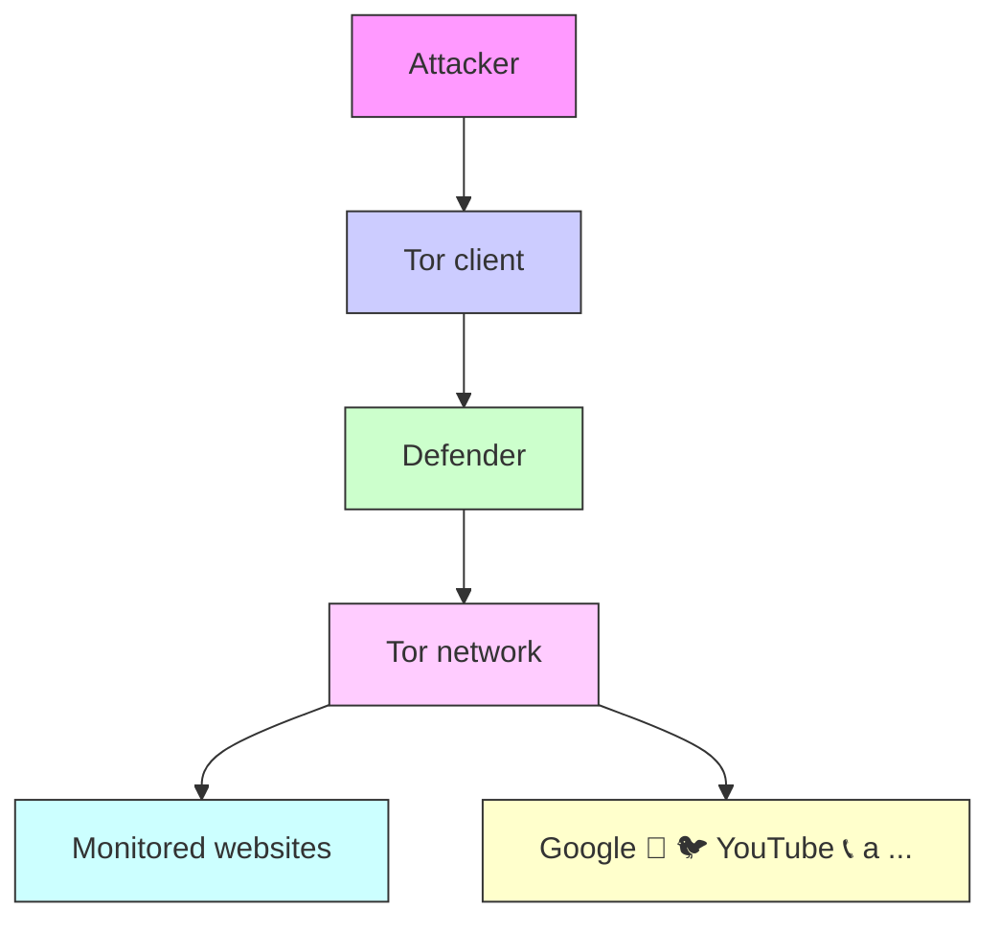
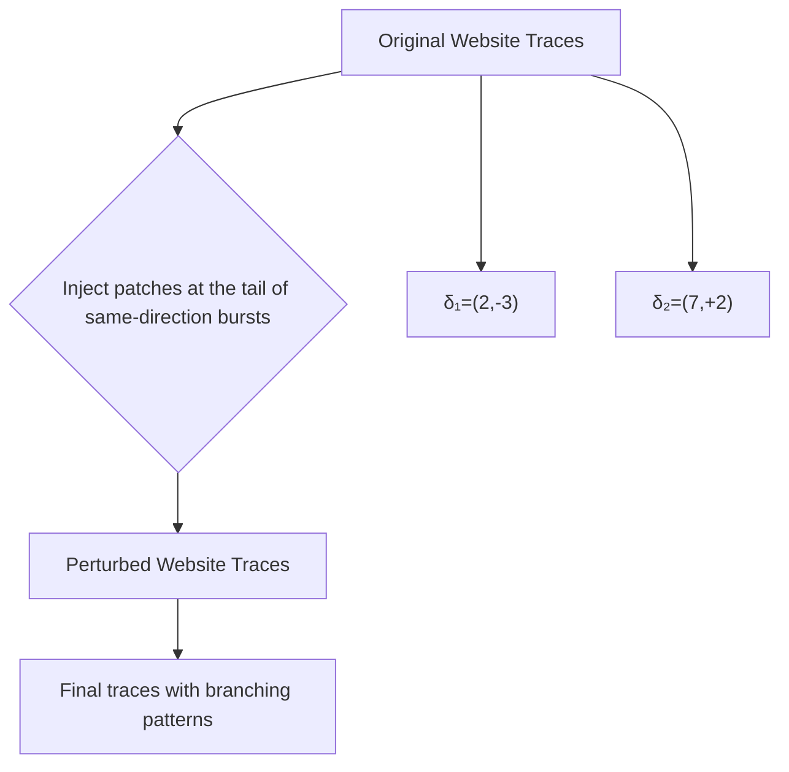
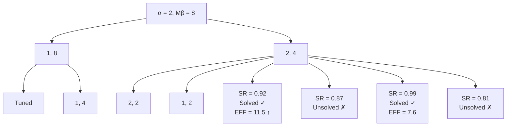

# Minipatch: Undermining DNN-Based Website Fingerprinting With Adversarial Patches

Ding Li , Yuefei Zhu , Minghao Chen, and Jue Wang

Abstract— Website Fingerprinting (WF) enables a local passive attacker to infer which website a user is visiting over an encrypted connection. Classifiers utilizing deep neural networks (DNNs) automatically extract reliable features and have achieved up to 98% accuracy even against Tor. Since DNNs are known to be vulnerable to adversarial examples, several recent studies have exploited adversarial perturbations to defeat WF attacks. These defenses, however, require a high bandwidth overhead that typically exceeds 20% of the original traffic, prohibiting them from real-world deployment. Moreover, many studies on WF defense have been criticized for unrealistic assumptions such as full access to the target model and operating on the entire website trace. In this paper, we leverage adversarial patches—a special type of adversarial example that perturbs only local parts of the input—to control the overhead and enable blackbox perturbation. In particular, we propose a new WF defense called Minipatch that injects extremely few dummy packets in real-time traffic to evade the attacker’s classifier. Experimental results demonstrate that Minipatch provides over 97% protection success rate with less than 5% bandwidth overhead, much lower than existing defenses. Moreover, we show that our adversarial patches remain effective in challenging settings, e.g., where dummy packets are injected only on the client-side and where perturbations are applied almost two months later. Finally, we also analyze several potential countermeasures and suggest ways to preserve perturbation effectiveness during deployment.

Index Terms— Traffic analysis, deep neural networks, adversarial machine learning, adversarial example.

## I. INTRODUCTION

information from communication patterns, which can be used to breach the anonymity of anonymous systems such as virtual private networks (VPNs) and the onion router (Tor). Although the network traffic is encrypted, a local passive attacker can access side-channel information, i.e., packet timings, directions, and sizes. Such information can be exploited to construct unique fingerprints and distinguish content differences. In particular, Website Fingerprinting (WF) is a traffic analysis technique that enables the attacker to recognize the patterns of visited websites, posing a serious threat to the anonymity of the users’ browsing activities. State-of-the-art

Manuscript received 20 January 2022; revised 25 April 2022; accepted 6 June 2022. Date of publication 27 June 2022; date of current version 5 July 2022. This work was supported by the National Key Research and Development Program of China under Grant 2019QY1300. The associate editor coordinating the review of this manuscript and approving it for publication was Dr. Chunyi Peng. (Corresponding author: Yuefei Zhu.)

The authors are with the State Key Laboratory of Mathematical Engineering and Advanced Computing, Zhengzhou 450001, China (e-mail: liding17@outlook.com; yfzhu17@sina.com; 1069304038@qq.com; eleva980427@sina.com).

Digital Object Identifier 10.1109/TIFS.2022.3186743

WF attacks [1]–[4] leverage deep neural networks (DNNs) to design classifiers that automatically extract features from raw website traces, outperforming traditional techniques [5]–[10] relying on hand-crafted features in terms of accuracy and robustness to defenses.

Despite the unique advantages of DNN-based techniques, a large body of research [11]–[18] has shown that they are vulnerable to adversarial examples: carefully crafted inputs with small adversarial perturbations that lead to misclassification of classifiers. Moreover, several studies [19]–[23] have investigated the feasibility of adversarial examples in defending against DNN-based WF attacks. One straightforward approach is to morph the traces of one website to look like another [19], [22]. However, this mimicking strategy depends on the selected target websites and can cause an unacceptable bandwidth overhead exceeding 60%. Some recent studies [21], [23] focus on generating perturbations that can be applied to network traffic in real-time, but such methods do not preserve the user data priority and still cause an unpractical overhead of around 30%. In particular, the study [23] first attempts to perturb traffic using adversarial patches, but the generated patches are not adaptable to various website traces and induce numerous traffic bursts, resulting in an increase in bandwidth and time overhead. Moreover, these approaches require whitebox access to the target model, i.e., loss gradients [21] and feature space parameters [23]. Overall, adversarial-based defenses need to be investigated further focusing on perturbation efficiency, practicality, and model dependency.

To the best of our knowledge, this paper reveals for the first time that DNN-based WF attacks can be undermined by injecting extremely few dummy packets into the network traffic (Fig. 1). Specifically, we propose Minipatch, a WF defense scheme that uses adversarial patches to perturb the website trace. Minipatch involves a patch injection function to preserve the traffic pattern constraints, a patch generation approach that requires only black-box feedback of the target model, and an overhead tuning strategy to find the optimal patch length for each website. The generated adversarial patches are websiteoriented and, therefore, can be pre-computed and applied to real-time traffic. More importantly, our defense reduces the overhead required for adequate protection to a practical range (<5%). The lightweight nature of Minipatch makes it applicable to resist countermeasures such as frequency analysis and adversarial training that an attacker might take.

To summarize, the main contributions of this work include:

• A patch injection technique that can adapt to various network traces of the same website. We improve the robustness of adversarial patches by injecting them into the same-direction burst closest to the vulnerable location. This approach enables real-time traffic injection independent of the subsequent packet patterns while preserving the integrity and earliest delivery of the transmitted data.

  
Fig. 1. Minipatch perturbations that successfully evade three DNN-based website fingerprinting attacks. Upward/downward bars mark the packet directions (out/in) and taller bars mark the injected adversarial patches. The original class labels are bold, while the predicted labels and corresponding confidence probabilities are presented below.

• An algorithm for generating adversarial network patches that require only black-box feedback of the target model. We define an optimization problem with the objective to minimize the probability labels of the correctly classified website. The problem is solved through dual annealing (DA), a metaheuristic algorithm that requires no gradient information or model structures. Under specific bound constraints, our algorithm generates websiteoriented adversarial perturbations that apply to real-time traffic.  
• An adaptive tuning strategy for bandwidth overhead. We generalize the binary search algorithm to the problem of finding the optimal bound constraints of the optimization problem. The search process terminates when the solution with the highest perturbation efficiency is determined. The tuned optimization constraints enable our defense to protect a website with minimal bandwidth overhead.  
• A comprehensive evaluation of our Minipatch defense in a variety of challenging settings. Experimental results show that Minipatch outperforms current WF defenses in the critical metric of perturbation efficiency. Moreover, our defense is resistant to concept drift and maintains high performance under one-way client-side perturbation. The generated adversarial patches are even transferable between different models and thus can be applied to unknown attacks. We also evaluate potential countermeasures against Minipatch and suggest directions for enhancing the defense robustness.

The remainder of the paper is organized as follows. In Section II, we describe the background and preliminaries of the investigated problem. We also review previous studies on WF attacks and defenses that motivate our work. In Section III, we introduce our adversarial WF defense named Minipatch, while in Section IV, we describe our experimental setup and report our evaluation results. Section V discusses countermeasures against Minipatch and deployment issues of our defense, and finally, in Section VI, we conclude the paper.

## II. PRELIMINARIES

## A. Problem Background

This paper considers the problem of defeating DNN-based website fingerprinting (WF) attacks. WF is the process of deducing the website visited by a user from its network traffic patterns (rather than packet contents). Recent advances in WF achieve more accurate recognition using DNN classifiers that automatically learn the patterns of website traces. Nevertheless, substantial work in computer vision has shown that DNNs are vulnerable to small input perturbations. Considering the network traffic properties and constraints, we adopt the idea of adversarial patches to craft perturbations that are efficient and suitable for real-time communications. Next, a brief introduction to DNNs and adversarial patches is presented for completeness and a better understanding of the problem background.

1) Deep Neural Networks: A deep neural network (DNN) is a multi-layer function that accepts an input x and produces an output f (x). A typical DNN with a linear structure can be denoted as

$$
f (\boldsymbol {x}) = f ^ {(k)} \left(\dots f ^ {(2)} \left(f ^ {(1)} (\boldsymbol {x})\right)\right) \tag {1}
$$

where $\boldsymbol { f } ^ { ( i ) }$ is the i -th network layer, $i = 1 , \ldots , k$ . Each layer comprises of a series of neurons that assign weights and biases to the input from the previous layer and transmit the activated outcome to the next layer, denoted as

$$
f ^ {(i)} (\boldsymbol {x}) = \sigma \left(\boldsymbol {w} ^ {(i)} \odot \boldsymbol {x} + \boldsymbol {b} ^ {(i)}\right) \tag {2}
$$

where w and b are weights and biases that store information for a trained network, - defines the operation on the input, which could be multiplication for a fully-connected layer and convolution for a convolutional layer, and σ defines the activation function (e.g., tanh, ReLU, and ELU), which is not necessary for some sampling layers such as the pooling layer. Specifically, for an m-class classification task, the last layer $\hat { f } ^ { ( k ) }$ is always activated by the softmax function that outputs the probability distribution of m classes.

In the WF context, DNNs are used for supervised classification tasks, i.e., a deep neural network $f$ is trained to fit a large set of training samples $D \subset X \times Y$ . The objective of the training process is to minimize the loss function that describes the difference between the model’s prediction $f ( x )$ and the ground truth y:

$$
\boldsymbol {\theta} _ {D} = \arg \min _ {\boldsymbol {\theta}} \frac {1}{| D |} \sum_ {(x, y) \in D} \text { loss } (f (\boldsymbol {x}), y) \tag {3}
$$

where θ is the set of the network’s trainable parameters, i.e., w and b in each layer of $f .$ . Training is commonly performed utilizing the gradient descent algorithm (e.g., SGD, Adam, and RMSProp), with the gradient of the loss function computed through backpropagation.

2) Adversarial Patches: Although DNNs have achieved great success in classification tasks, existing studies demonstrate that DNNs are vulnerable to adversarial examples [11]–[18]. An adversary can mislead a DNN by adding a small amount of well-tuned perturbations to the correctly classified input. Specifically, for a given input x and a trained classifier $f ,$ the additive perturbation can be crafted by solving the following optimization problem:

$$
\delta_ {x} = \arg \min _ {\delta} [ f (x + \delta) \neq f (x) ]
$$

$\mathrm { s u b j e c t ~ t o ~ } \| \delta \| _ { 2 } < \epsilon$ (4)

where $\epsilon$ is a small constant that bounds the $l _ { 2 }$ norm distance between the original and the perturbed inputs. Common solutions to the optimization problem are based on loss functions [11], [12], [16], model logits [15], or sample distances [13], [14]. Such adversarial perturbations impose the DNN to misclassify the input to either a chosen class (target examples) or any class different from the ground truth (untargeted examples). Since our defense goal is to protect website traces from being identified by WF attacks, we do not consider targeted examples in this paper.

Adversarial patches [24]–[27] are a special adversarial type that perturbs only an input’s local part. In particular, for a given input $x ,$ patch $\delta ,$ and location $p ,$ a patch application operator $A [ x , \delta , p ]$ applies the patch to the input at the specific location. The perturbation patches are then optimized to minimize the probability of x belonging to the class of the ground truth $y \colon$

$$
\delta_ {x} = \arg \min _ {\delta} f _ {y} (A [ x, \delta , p ])
$$

$\mathrm { s u b j e c t ~ t o ~ } \| \delta \| _ { 0 } < \epsilon$ (5)

where the $l _ { 0 }$ norm distance constraints the maximum size or number of adversarial patches. Specifically, Brown et al. [24] fixed the size of circular patches and employed gradient descent for optimization. Yang et al. [25] fixed the size of square patches and used reinforcement learning to optimize the patch location and filling texture. Su et al. [26] fixed the patch cardinality and utilized differential evolution for optimization, while Modas et al. [27] approximated the $l _ { 0 }$ solution with the $l _ { 1 }$ norm distance.

Compared to traditional adversarial examples, adversarial patches are more suitable for WF defense because perturbing network traffic is not as trivial as modifying image pixels. In computer vision, subtle pixel modifications are not perceptible to human eyes. However, network traffic perturbations must preserve the correctness of the transmitted data, and this constraint only allows the defender to inject redundant patches into the original packet sequence. Moreover, adversarial patches in images can be inserted at any location with any pixel, while injecting patches in network traffic is constrained by location and packet direction. For example, injecting reverse packets will introduce new bursts in the original website trace, which increase the time to load the website because extra round-trip time (RTT) is required to shape the desired burst sequence. Therefore, applying adversarial patches in network traffic should consider additional constraints on traffic patterns.

flowchart

Fig. 2. The threat and adversary models of WF attacks.

## B. Threat and Adversary Models

This work adopts the same threat and adversary models of the existing WF attacks and defenses [1]–[4], [19]–[23], [28], [29] (see Fig. 2). We assume that a user visits websites under the protection of an anonymous system such as Tor. A local passive attacker inspects the user’s network connection and detects which website the user is visiting by feeding the collected website traces into a trained DNN model. To defeat such attacks, a defender seeks to inject dummy packets into real-time network traffic, such that the perturbed website traces will cause the DNN model to misclassify.

1) Attacker Capabilities: Specifically, we make the following assumptions about the attacker’s capabilities:

• The attacker is positioned somewhere between the Tor client and the Tor bridge relay (the entry node of the Tor network). The attacker is passive, meaning that he can only record the user’s network traffic but cannot drop, modify, inject, or decrypt any packets in the connections.

• The attacker has prior knowledge of the set of websites that the user may visit, i.e., monitored websites. This setting is known as the closed-world in WF attacks, which is strictly more advantageous to the attacker than the open-world setting where the user can visit any website on the Internet.

• The attacker uses only packet direction sequences as input to the DNN model. Previous studies [4], [29] have demonstrated that other information, such as inter-packet timing, does not significantly improve the WF attack performance.

2) Defender Capabilities: Correspondingly, we assume the defender has the following capabilities:

• The defender can inject dummy packets into the user’s connection. We start by injecting bidirectional packets with the cooperation of both the Tor client and the bridge relay. Then, in Section IV-B.3 we demonstrate that high protection performance can be achieved solely utilizing one-way client-side perturbation.  
• The defender has prior knowledge of the website that the user is visiting. However, he does not know the pattern of upcoming packets to be perturbed. The defender can

collect sufficient website traces on the user’s connection in advance to generate adversarial patches.

• The defender has black-box access to the target model to be defeated, which means he can get the model’s output probability on a particular input, but does not know its architecture or parameters. Therefore, the defender cannot use the gradient information of the loss function for optimization.

## C. Related Work

1) DNN-Based WF Attacks: WF attacks leverage traffic patterns to infer the user’s visit history, but WF is not trivial because it targets end-to-end encrypted systems where the user’s network activity is encapsulated in a single connection. A passive observer cannot obtain plaintext information, such as the server name indicator (SNI) in the TLS handshake packet. In the past, several WF attacks [7]–[10] have been proposed involving manually selected features and traditional machine learning classifiers that maintained an accuracy exceeding 90%. Nevertheless, current practices with DNN models have further improved recognition performance while eliminating the need for selecting and fine-tuning features by hand. Since our defense aims to defeat DNN-based WF attacks, non-DNN techniques based on hand-crafted features are out of scope.

SDAE [28]: Abe and Goto explored Stacked Denoising Autoencoder (SDAE) in WF attacks. Although their classifier does not exceed the state-of-the-art, it achieves a promising 88% accuracy with only a small dataset. More importantly, they proposed to operate on the packet direction sequence for the first time, with +1 and −1 representing outgoing and incoming packets, respectively. Subsequent WF attacks and defenses have widely adopted this data representation.

AWF [1]: Rimmer et al. proposed the Automated Website Fingerprinting (AWF) attack that uses DNNs to automate the WF feature engineering process. They comprehensively compared the feature extraction capabilities of basic SDAE, CNN, and LSTM models and found that CNN performed the best. After training on 2500 traces per website, AWF achieves over 96% accuracy in the closed-world setting.

DF [2]: Inspired by identifying encrypted video streams [30], Sirinam et al. developed Deep Fingerprinting (DF), a more sophisticated variant of CNN than AWF with more convolutional layers for feature extraction and more fully-connected layers for classification. DF achieves over 98% accuracy in the closed-world setting can effectively undermines traditional WF defenses such as WTD-PAD [31] and Walkie-Talkie [32].

TF [3]: Inspired by triplet networks in face recognition [33], Sirinam et al. proposed Triplet Fingerprinting (TF) to reduce the effort of collecting training data. Specifically, TF adopts DF as the base model of the triplet network and replaces the last softmax layer with a new fully-connected layer to produce the input vector for the k-NN classifier. Although TF requires only a few training samples to identify a given class, it does not improve the performance of DF.

Var-CNN [4]: Bhat et al. developed Var-CNN that employs the complex ResNet-18 structure used in computer vision. The model contains up to 20 convolutional layers and achieves a closed-world accuracy of nearly 99%. Although Var-CNN outperforms current WF attacks regarding classification accuracy, Section IV-B reveals that it is more vulnerable to adversarialbased defenses than DF.

2) Adversarial-Based WF Defenses: To defend against WF attacks, researchers have proposed numerous approaches [31], [32], [34] that hide website traffic patterns by injecting dummy packets and/or delaying packets. However, these empirical defense methods require a significant bandwidth overhead and thus might be unaffordable for practical deployment. As discussed earlier, DNN models are vulnerable to adversarial examples that involve small perturbations. Indeed, several works in the WF domain have explored adversarial-based approaches to balance the trade-off between the WF defense overhead and the efficacy against WF attacks.

Mockingbird [19]: Rahman et al. were the first to employ adversarial examples to defend against WF attacks. Their approach confuses the classifier by mimicking the target website trace with the closest $l _ { 2 }$ distance, achieving 97% protection against DF but imposing over 50% bandwidth overhead. The main problem with Mockingbird is its reliance on burst features—one cannot obtain the complete burst sequence beforehand to generate perturbations in real-time traffic—which renders the approach unrealistic to deploy in practice.

WF-GAN [20]: Inspired by the computer vision technique AdvGAN [17], Hou et al. developed a GAN-based model to generate adversarial examples against WF attacks. Specifically, they feed the generator with burst sequences of website traces to obtain burst-oriented perturbations and use a loss functionbased discriminator to guide the generator. Although WF-GAN achieves a 90% success rate against DF, it has the same burst reliance problem as Mockingbird, making it unsuitable for network traffic.

Blind [21]: To address the limitation of burst-oriented approaches, Nasr et al. designed a generator to create adversarial perturbations independent of the website traces (blind). Their approach can undermine the DF attack with a success rate of 91% at 11% bandwidth overhead and 95% at 25% bandwidth overhead. However, the generator’s training requires calculating the gradient of the loss function, which is almost unrealistic when the target model is not accessible.

AWA [22]: Inspired by the above works, Sadeghzadeh et al. proposed the Adversarial Website Adaptation (AWA), a GAN-based defense that trains a generator to adapt the burst sequence of a website trace to the distribution of another website. AWA creates a unique transformer for each website and generates universal perturbations applicable to all traces of a given website. The defense reduces the accuracy of the DF attack to 19.5% with 22.3% bandwidth overhead.

Dolos [23]: Shan et al. recently proposed Dolos to evade WF attacks by injecting adversarial patches into real-time network traffic. Instead of measuring the distance between website traces, they operate on the l2 distance in the DNN’s feature space, which requires white-box access to the target model. Dolos splits patches containing bidirectional packets into equal segments and injects them at specific trace locations.

This significantly increases the time overhead as each pair of bursts takes an extra RTT to transmit. Moreover, Dolos needs to empirically set the patch length for each website, potentially causing a waste of bandwidth on some susceptible websites. Although Dolos achieves a 96% success rate against DF, it requires a 30% bandwidth overhead.

## III. METHODOLOGY

This section presents the design of Minipatch, starting with an overview that elucidates the optimization problem of generating adversarial perturbations and followed by detailed descriptions of its three key components: patch injection, patch generation, and overhead tuning.

## A. Minipatch Overview

Generating adversarial perturbations can be formalized as a constrainted optimization problem. Following the previous WF attacks and defenses, we model the website trace as a vector in which each element represents a packet’s direction, i.e., +1 for an outgoing packet and −1 for an incoming packet. To meet the requirement of fixed-length input for DNN models, we pad shorter traces by appending zeros and truncate longer traces exceeding the input length.

Let f be the target classifier, i.e., the trained DNN model, which receives n-dimensional inputs, with $\pmb { x } = ( x _ { 1 } , \ldots , x _ { n } )$ the website trace correctly classified as website w, i.e., $f ( \pmb { x } ) =$ w. The probability (model confidence) of x belonging to the website w is therefore $f _ { w } ( { \pmb x } )$ . We define $\pmb { \delta } = ( \delta _ { 1 } , \ldots , \delta _ { \alpha } )$ as the adversarial perturbation vector with α mini-patches. Each mini-patch $\delta _ { i } = \langle p _ { i } , \beta _ { i } \rangle$ has $| \beta _ { i } |$ packets of direction sign(βi ) that will be injected somewhere after location $p _ { i }$ of x. The goal of the defender is to find the optimized solution δ for the following problem:

$$
\delta_ {x} = \arg \min _ {\delta} f _ {w} (\Phi [ x, \delta ])
$$

$$
\text { subject   to } \left\{ \begin{array}{l l} 1 \leq \alpha \leq M _ {\alpha} \\ 0 \leq p _ {i} \leq N & (i = 1, \dots , \alpha) \\ - M _ {\beta} \leq \beta_ {i} \leq M _ {\beta} & (i = 1, \dots , \alpha) \end{array} \right. \tag {6}
$$

where $M _ { \alpha }$ is the maximum number of adversarial patches (patch bound), $M _ { \beta }$ denotes the maximum patch length, i.e., the maximum number of packets in each patch (packet bound), and N is the range of the injection locations (injection bound). If the actual length of the website trace is $m _ { x }$ , then we have $N = \operatorname* { m i n } ( m _ { x } , n )$ . Finally, $\Phi [ { \pmb x } , { \pmb \delta } ]$ defines the patch injection function that applies adversarial patches δ on trace x. In the optimization process, any δ that drives x out of its original class, i.e., $f ( \Phi [ { \pmb x } , { \pmb \delta } ] ) \neq f ( { \pmb x } )$ , is a successful solution.

Note that the above optimization problem is trace-oriented, and thus perturbations generated from one trace may be less effective for other traces due to network traffic changes of the same website. As a result, the defender cannot apply these perturbations in live traffic because the pattern of upcoming network packets is unknown. To generate perturbation vectors applicable to real-time traffic, we modify the optimization problem and transform it into a website-oriented one:

$$
\boldsymbol {\delta} _ {w} = \arg \min _ {\boldsymbol {\delta}} \frac {1}{| X _ {w} ^ {f} |} \sum_ {\boldsymbol {x} \in X _ {w} ^ {f}} f _ {w} (\Phi [ \boldsymbol {x}, \boldsymbol {\delta} ]) \tag {7}
$$

Algorithm 1 Patch Injection Function  
Input : x - website trace
    δ - perturbation vector
Output: $x'$ - perturbed (adversarial) trace
1 for patch index i in $(1, \ldots, \alpha)$ do
2 $p_{i}' \leftarrow$ nearest burst tail in x of direction sign( $\beta_{i}$ )
3 if injection location $p_{i}'$ in $(p_{1}', \ldots, p_{\alpha}')$ then
4 remove duplicated patch $\delta_{i}$ from $\delta$ 5 $x' \leftarrow x$ 6 sort $\delta$ by $p_{i}'$ in reverse order
7 for patch $\langle p_{i}, \beta_{i} \rangle$ in $\delta$ do
8 shift packets $(x_{p_{i}}', \ldots, x_{n-|\beta_{i}|}')$ to location $p_{i}' + |\beta_{i}|$ 9 inject $|\beta_{i}|$ dummy packets of direction sign( $\beta_{i}$ ) to $x'$ 10 return $x'$

where $X _ { w } ^ { f }$ defines a set of traces correctly classified by f as website $w ,$ which is strictly smaller in size than $X _ { w } .$ In addition, the actual trace length $m _ { x }$ in the optimization $\ b { x } \in X _ { \ b { w } } ^ { f }$ When solving the problem, we define a success threshold τ to control the optimization degree, and the criterion of a successful solution becomes

$$
\sum_ {\boldsymbol {x} \in X _ {w} ^ {f}} \mathbb {1} [ f (\Phi [ \boldsymbol {x}, \boldsymbol {\delta} ]) \neq f (\boldsymbol {x}) ] \geq | X _ {w} ^ {f} | \times \tau \tag {8}
$$

Note that τ is directly related to the perturbation performance. Without considering the execution efficiency, for $\tau = 1$ the highest success rate is obtained.

## B. Patch Injection

The patch injection function applies adversarial patches to a website trace and has two design goals: 1) packetoriented injection to achieve real-time traffic perturbation, and 2) adaptive injection location to accommodate the website trace variety and thereby narrow the solution space of the optimization problem.

Many WF defenses [19], [20], [31], [32] are burst-oriented: the basic perturbation unit is a sequence of consecutive packets in the same direction. Such a method allows better exploitation of data flow characteristics, considering that the burst length is related to the amount of data interacted. However, a vital drawback of these defenses is that they need to obtain the complete website trace a priori, which is unrealistic for real-time network traffic. Instead, our perturbation method is packetoriented, i.e., the dummy packets in the adversarial vector δ are injected directly into the website trace x. This allows applying perturbations on live network connections, affording a practical, real-world solution.

The patch injection functions of existing WF defenses [21], [23] are location-specific: they simply inject dummy packets at a given trace location. This breaks the transmitted data integrity and priority, e.g., a burst split by dummy packets in the opposite direction. Moreover, these functions reduce the effectiveness of the generated perturbations due to the website trace variety. We consequently design the adaptive injection scheme illustrated in Fig. 3. Each perturbation patch in the adversarial vector δ is injected at the tail of the same-direction burst, allowing the optimized perturbation to adapt well to different traces of the same website while minimizing the real data’s latency. In our scheme, perturbations do not induce new bursts in the original website trace because all dummy packets are injected into the existing bursts. The defender does not need to artificially delay dummy packets to simulate the RTT in the network nor utilize specific distributions such as Rayleigh [34] or Laplace [21] to simulate natural network jitter. The dummy packets are sent together with the original burst packets and thus have a similar distribution of interpacket delay (IPD). This makes it difficult for an attacker to detect the dummy packets by distinguishable IPDs.

flowchart

Fig. 3. Illustration of the Minipatch perturbation and how the adversarial patches are injected into website traces.

An additional benefit of our adaptive scheme is significantly reducing the solution space of the optimization problem. When the original injection location is within an opposite-direction burst, the injection function does not introduce new reverse bursts to the original trace, as the actual injection location is moved to the nearest same-direction burst. Algorithm 1 describes in detail the patch injection function.

## C. Patch Generation

The patch generation follows the optimization problem defined by Eq. (7) and the solution criterion defined by Eq. (8). Unlike previous studies that focus on the model’s loss function [20], [21] or feature’s l2 norm distance [19], [23], Minipatch aims to minimize the confidence probability of the correct classification class. Minipatch requires only black-box feedback of the probability labels and no internal information of the target DNN model, such as network structure and the gradient of the loss function.

To this end, we solve the optimization problem by adopting dual annealing (DA), a metaheuristic for approximating the global optimum. DA does not require the objective function to be differentiable and thus enables optimization on probability labels. Moreover, DA is relatively less subject to local optima than gradient descent algorithms and is based on Generalized Simulated Annealing (GSA) [35] that generalizes Classical Simulated Annealing (CSA) [36] and Fast Simulated Annealing (FSA) [37]. It was shown that GSA converges faster than traditional annealing algorithms and reduces the energy fluctuation drastically [38]. GSA is a stochastic approach where a candidate solution is modified randomly during the cooling process, and the new solution is accepted probabilistically. The modification’s magnitude and the probability of accepting a worse solution decrease with a lower temperature, avoiding trapping in a local optimum at high temperatures. For any finite problem, the probability of the annealing process terminating with a global optimum approaches 1 as the annealing schedule extends [39]. In addition to the global search performed by GSA, DA also couples the strategy for applying a local search on accepted solutions, which has the potential to find successful solutions faster.

Algorithm 2 Generating Minipatch Perturbation  
Input : $X_{w}^{f}$ – traces correctly classified by f as w
    f – target classifier
    α – number of patches
    N, $M_{\beta}$ – injection and packet bounds
    Φ – patch injection function $T_{0}$ – initial temperature $q_{v}, q_{a}$ – visiting and acceptance parameters
    Π – point visiting function
    τ – success threshold $M_{t}$ – maximum number of iterations

Output: $\delta_{w}$ – perturbation applied to website w

1 random starting point $\overline{\delta}, \overline{\delta}_{b}$ constrained by α, N, $M_{\beta}$ 2 initial energy E, $E_{b} \leftarrow \frac{1}{|X_{w}^{f}|} \sum_{x \in X_{w}^{f}} f_{w}(\Phi[x, \delta])$ 3 for iteration t in $(1, \ldots, M_{t})$ do

4 current temperature $T \leftarrow T_{0} \times \frac{2^{q_{v}-1}-1}{(t+1)^{q_{v}-1}-1}$ 5 for visit step i in $(1, \ldots, 2|\overline{\delta}|)$ do

6 neighbouring point $\overline{\delta}' \leftarrow \overline{\delta}$ 7 if $i \leq |\overline{\delta}|$ then $\overline{\delta}' \leftarrow \overline{\delta}' + \Pi[q_{v}, T, |\overline{\delta}|]$ 8 else $\overline{\delta'}_{i-|\overline{\delta}|} \leftarrow \overline{\delta'}_{i-|\overline{\delta}|} + \Pi[q_{v}, T, 1]$ 9 new energy $E' \leftarrow \frac{1}{|X_{w}^{f}|} \sum_{x \in X_{w}^{f}} f_{w}(\Phi[x, \delta'])$ 10 if $E' < E$ then

11 accept $\overline{\delta}'$ as $\overline{\delta}$ , current energy $E \leftarrow E'$ 12 if $E' < E_{b}$ then $\overline{\delta}_{b} \leftarrow \overline{\delta}', E_{b} \leftarrow E'$ 13 if $\sum 1[f(\Phi[x, \delta]) \neq f(x)] \geq |X_{w}^{f}| \times \tau$ then
14 return $\delta_{b}$ 15 else if $E' - E \leq T/t(1 - q_{a})$ then
16 if $(1 - \frac{t(1-q_{a})(E'-E)}{T})^{\frac{1}{1-q_{a}}} \geq rand(1)$ then
17 local search from $\overline{\delta}_{b}$ to $\overline{\delta}'$ and repeat 9~13
18 return $\delta_{w} \leftarrow optimal perturbation vector \delta_{b}$

To accommodate DA’s fixed-length 1D solution vector, we fix the number of patches α and encode perturbation $\delta \ = \ ( \langle p _ { 1 } , \beta _ { 1 } \rangle , \ldots , \langle p _ { \alpha } , \beta _ { \alpha } \rangle )$ into a flattened array ${ \begin{array} { r l } { { \overline { { \delta } } } } & { { } = } \end{array} }$ $( p 1 , \beta 1 , \dots , p _ { \alpha } , \beta _ { \alpha } )$ . The variables in $\overline { { \delta } }$ are constrained by $0 ~ \le ~ p _ { i } ~ \le ~ N$ and $- M _ { \beta } \leq \beta _ { i } \leq M _ { \beta }$ . The energy E of a candidate solution δ is defined as the optimization objective in Eq. (7). During the annealing process, the temperature T (t)

is controlled by

$$
T (t) = T _ {0} \times \frac {2 ^ {q _ {v} - 1} - 1}{(t + 1) ^ {q _ {v} - 1} - 1} \tag {9}
$$

where $q _ { v }$ is a visiting parameter for generating new solutions in GSA. In the global search phase, GSA modifies the candidate solution based on a distorted Cauchy-Lorentz visiting distribution, with its shape controlled by $q _ { \upsilon } ~ \in ~ ( 0 , 3 ]$ . The higher the visiting parameter, the heavier the distribution tail, making the algorithm jump to a more distant region. In this work, we apply the $\mathrm { \nabla } \mathrm { i } \mathrm { s } \mathrm { i }$ ta function $\Pi ( q _ { \upsilon } , T , d )$ proposed by Tsallis and Stariolo [35] to generate a d-dimensional neighboring point with the simulated visiting distribution. For each new solution $\overline { { \delta } } ^ { \prime }$ with energy $E ^ { \prime } { } _ { \mathrm { i } }$ , we use the generalized Metropolis criterion as the acceptance probability, i.e.,

$$
\operatorname * {P r} (t) = \left\{ \begin{array}{l l} 1, & \Delta E <   0 \\ (1 - \frac {t (1 - q _ {a}) \Delta E}{T (t)}) ^ {\frac {1}{1 - q _ {a}}}, & 0 \leq \Delta E \leq \frac {T (t)}{t (1 - q _ {a})} \\ 0, & \Delta E > \frac {T (t)}{t (1 - q _ {a})} \end{array} \right. \tag {10}
$$

where $\Delta E = E ^ { \prime } - E$ is the change in energy and $q _ { a }$ is an acceptance parameter with empirical range $( - 1 0 ^ { 4 } , - 5 ]$ . The lower the acceptance parameter, the smaller the acceptance probability. We use the L-BFGS-B algorithm for the local search phase. L-BFGS-B is characterized by the use of Limited memory and the support of Bound constraints (consistent with GSA). Algorithm 2 presents the complete process of generating Minipatch perturbation.

## D. Overhead Tuning

So far, we have obtained the optimized Minipatch at fixed α and $M _ { \beta } .$ . A trade-off between the perturbation success rate and bandwidth overhead is necessary to determine these bound constraints. Lax bounds tend to yield higher success rates but unacceptable bandwidth overhead, while tight bounds can effectively reduce bandwidth overhead at the cost of lower success rates. If the constraints are too stringent, the optimization time can increase significantly due to not finding a feasible solution.

To this end, we design an adaptive tuning process based on distorted binary search illustrated in Fig. 4. Let the given patch and packet bounds $\langle M _ { \alpha } , M _ { \beta } \rangle$ be the root of a binary tree. Then we iteratively add the left child $\langle M _ { \alpha } / 2 , M _ { \beta } \rangle$ and the right child $\langle M _ { \alpha } , M _ { \beta } / 2 \rangle$ to the set of next layer nodes. If the bound constraints are too strict to produce a successful solution, the corresponding node is removed from the layer set. The iteration stops when the layer set is empty, and the optimal bounds are given by the successful solution with the highest perturbation efficiency, i.e.,

$$
\boldsymbol {\delta} _ {w} = \arg \max _ {\boldsymbol {\delta}} \frac {\sum_ {\boldsymbol {x} \in X _ {w} ^ {f}} \mathbb {1} [ f (\Phi [ \boldsymbol {x} , \boldsymbol {\delta} ]) \neq f (\boldsymbol {x}) ]}{\sum_ {i \in [ 1 , a ]} | \beta_ {i} |} \tag {11}
$$

The tree-based search reduces the number of combinations to be traversed and avoids fruitless attempts on problems with too strict bounds. Considering that the time required by annealing algorithms to solve unsolvable problems may even exceed the time required by a brute-force search, our adaptive tuning strategy is of great practical interest. The pseudo-code of the adaptive bound tuning process is described in Algorithm 3.

flowchart

Fig. 4. Illustration of adaptive bound tuning with $M _ { \alpha } = 2 , M _ { \beta } = 8$ . The process is based on the success rate (SR) and efficiency (EFF), with a success threshold $\tau = 0 . 9$ .

Algorithm 3 Adaptive Bound Tuning  
Input : $X_{w}^{f}$ – traces correctly classified by f as w
    f – target classifier $M_{\alpha}$ , $M_{\beta}$ – patch and packet bounds $\Phi$ – patch injection function $\tau$ – success threshold

Output: $\delta_{w}$ – tuned perturbation for website w

1 empty set of (successful) perturbations V, $V_{s}$ 2 set of current layer nodes $L \leftarrow \{\langle M_{\alpha}, M_{\beta} \rangle\}$ 3 while $|L| > 0$ do
4    for node $\langle \alpha, M_{\beta} \rangle$ in L do
5 $\delta_{w} \leftarrow \text{Minipatch constrained by } \alpha, M_{\beta}$ 6    add $\delta_{w}$ to the set V
7    if $\frac{1}{|X_{w}^{f}|} \sum_{x \in X_{w}^{f}} \mathbb{1}[f(\Phi[x, \delta_{w}]) \neq f(x)] \geq \tau$ then
8    add $\delta_{w}$ to the successful set $V_{s}$ 9    else remove childless node $\langle \alpha, M_{\beta} \rangle$ from L
10    empty set of child nodes C
11    for node $\langle \alpha, M_{\beta} \rangle$ in L do
12    if $\alpha > 1$ then uniquely add $\langle \alpha/2, M_{\beta} \rangle$ to C
13    if $M_{\beta} > 1$ then uniquely add $\langle \alpha, M_{\beta}/2 \rangle$ to C
14    next layer nodes $L \leftarrow C$ 15    if $|V_{s}| > 0$ then
16    return $\arg\max_{\delta_{w} \in V_{s}} \frac{\sum_{x \in X_{w}^{f}} \mathbb{1}[f(\Phi[x, \delta_{w}]) \neq f(x)]}{\sum_{i \in [1,\alpha]} |\beta_i|}$ 17    else
18    return $\arg\max_{\delta_{w} \in V} \sum_{x \in X_{w}^{f}} \mathbb{1}[f(\Phi[x, \delta_{w}]) \neq f(x)]$

## IV. EVALUATION

In this section, we perform a comprehensive evaluation of Minipatch. We demonstrate the protection performance by defending against state-of-the-art DNN-based WF attacks. Several experiments, including a comparison against prior adversarial-based WF defenses, demonstrate that Minipatch can undermine DNN-based WF attacks with significant efficiency while providing strong robustness and transferability.

TABLE I STRUCTURE, COMPLEXITY, AND TEST ACCURACY OF TARGET DNN MODELS

<table><tr><td rowspan="2">Model</td><td rowspan="2">Input size</td><td colspan="2">Main layers</td><td rowspan="2">Trainable parameters</td><td rowspan="2">Complexity (FLOPs)</td><td rowspan="2">Sirinam</td><td rowspan="2">Accuracy Rimmer100 / 200 / 500 / 900</td></tr><tr><td>Conv</td><td>Dense</td></tr><tr><td>AWF</td><td>3 k</td><td>3</td><td>1</td><td>147 k</td><td>11 M</td><td>95.3%</td><td>97.8% / 97.3% / 94.8% / 92.0%</td></tr><tr><td>DF</td><td>5 k</td><td>8</td><td>3</td><td>3,979 k</td><td>463 M</td><td>98.1%</td><td>99.6% / 99.5% / 99.0% / 98.2%</td></tr><tr><td>Var-CNN</td><td>5 k</td><td>20</td><td>1</td><td>3,893 k</td><td>1,728 M</td><td>98.4%</td><td>99.7% / 99.6% / 99.3% / 98.8%</td></tr></table>

TABLE II WF DATASETS USED BY OUR EXPERIMENTS

<table><tr><td rowspan="2">Dataset</td><td rowspan="2">Number of websites ( $N_w$ )</td><td colspan="3">Traces per website</td></tr><tr><td>Train</td><td>Valid</td><td>Test</td></tr><tr><td>Sirinam</td><td>95</td><td>800</td><td>100</td><td>100</td></tr><tr><td>Rimmer $N_w$ </td><td>100/200/500/900</td><td>2250</td><td>125</td><td>125</td></tr><tr><td>Rimmer+T</td><td>200</td><td>-</td><td>-</td><td>100×5</td></tr></table>

## A. Experimental Setup

Here we discuss our experimental setup, including the WF datasets, the target DNN models to be fooled, the Minipatch configurations, and the evaluation metrics.

1) WF Datasets: Our experiments utilize the publicly available Sirinam et al.’s dataset [2] and several datasets provided by Rimmer et al. [1], which are commonly used in previous work to evaluate WF attacks and defenses [4], [20], [21], [23], [29]. The datasets contain well-labeled Tor users’ website traces, of which Sirinam only provides class numbers rather than website domains. The Sirinam dataset splits traces into three exclusive sets of training, validation, and testing with a ratio of $8 ~ : ~ 1 ~ : ~ 1$ . To keep the data consistent, in our experiments, we analogously split the traces in the Rimmer datasets in the suggested ratio of $9 : 0 . 5 : 0 . 5$ .

Table II shows the statistical information of the datasets. Based on the trained DNN models, we generate the Minipatch perturbations using the testing data and verify the protection performance with the non-overlapping validation data. Neither part of the data is involved in model training. To be consistent with prior works, we encode a given website trace into the direction sequence with +1 or −1. We fix the sequence length to 5000, with longer traces truncated and shorter traces padded with zeros.

2) Target DNN Models: We challenge the protection performance of Minitpatch against three state-of-the-art DNN-based WF attacks: AWF [1], DF [2], and Var-CNN [4] (described in Section II-C.1). Although these models mainly comprise convolutional (Conv) layers and fully-connected (Dense) layers, they differ significantly in complexity. As shown in Table I, DF and Var-CNN have about 26x the number of trainable parameters of AWF, while Var-CNN’s computational complexity (measured in floating-point operations) is 3.7x higher than DF.

We adopt an early stopping strategy and a sufficient maximum number of training epochs to adequately train the model. The training process terminates only when the validation loss does not decrease for a specific number of epochs (5 for AWF and DF, 10 for Var-CNN), and the final model is derived from the epoch with the lowest loss. This strategy helps avoid overfitting due to excessive training and accommodates the convergence speed on different datasets. The remaining training hyper-parameters (optimizer, learning rate, etc.) follow the originally proposed values. Table I reports the classification accuracy for each model-dataset pair. The most complex Var-CNN model achieves a maximum accuracy of 99.7%, while the overall improvement compared to DF is small. Even the simplest AWF achieves a minimum accuracy of 92.0%.

3) Minipatch Configuration: Based on the trained DNN models, we generate website-oriented perturbations using Minipatch. To find the optimal bound constraints, we set the initial bounds $M _ { \alpha } = 8 , M _ { \beta } = 6 4$ and apply the adaptive bound tuning process for each website, i.e., the perturbation for a website contains a maximum of 512 $( 8 ~ \times ~ 6 4 )$ and a minimum of 1 (1 × 1) packet. We take the quantile $q = 0 . 5$ o f the actual length of website traces $X _ { w } ^ { f }$ as the injection location bound. When optimizing with dual annealing, we set the initial temperature $T _ { 0 } = 5 2 3 0 $ , the visiting parameter $q _ { v } = 2 . 6 2$ , and the acceptance parameter $q _ { a } = - 1 0 ^ { 3 }$ , as suggested by prior works [35], [38]. We also experiment with different annealing parameters and find that their impact on the protection performance is insignificant. Finally, we set the success threshold τ = 1 to obtain the best performance and set the maximum number of annealing iterations $M _ { t } = 3 0$ to avoid spending too much time on unsolvable problems, although a larger $M _ { t }$ is more likely to find a solution for difficult problems.

4) Evaluation Metrics: Since perturbed website traces can cause DNN models to misclassify, the protection performance of Minipatch can be reflected by the decrease in accuracy [19]. However, an accuracy change is not intuitive because the accuracy prior to perturbation can vary significantly under different model-dataset settings. To this end, we use the normalized perturbation success rate as the evaluation metric. For a given DNN model f and test dataset X, we define the metric as

$$
\mathrm{SR} = \frac {1}{| X ^ {f} |} \sum_ {\boldsymbol {x} \in X ^ {f}} \mathbb {1} [ f (\Phi [ \boldsymbol {x}, \delta_ {\boldsymbol {x}} ]) \neq f (\boldsymbol {x}) ] \tag {12}
$$

where $X ^ { f }$ is the set of traces correctly classified by f , which is strictly smaller in size than X , and $\delta _ { x }$ is the perturbation vector applied to trace x, for Minipatch the same for all traces belonging to a website. The success rate varies between zero, for no accuracy decrease, and one, for an accuracy drop to zero. Note that the success rate defined here differs from previous works [21], [23], which define it as the misclassification rate, i.e., 1 − accuracy. Such a metric is debatable because it is greater than zero, even without any perturbation.

We also examine the bandwidth overhead, which is the ratio of the patch length to the original trace length. For Minipatch,

TABLE III Minipatch PROTECTION PERFORMANCE AGAINST DIFFERENT DNN MODELS

<table><tr><td rowspan="2">Dataset</td><td rowspan="2"> $M_{\alpha}$ </td><td rowspan="2"> $M_{\beta}$ </td><td colspan="3">Number of patches</td><td colspan="3">Patch length</td><td colspan="3">Bandwidth overhead</td><td colspan="3">Success rate</td></tr><tr><td>AWF</td><td>DF</td><td>Var-CNN</td><td>AWF</td><td>DF</td><td>Var-CNN</td><td>AWF</td><td>DF</td><td>Var-CNN</td><td>AWF</td><td>DF</td><td>Var-CNN</td></tr><tr><td rowspan="4">Sirinam</td><td>1</td><td>8</td><td>1.0</td><td>1.0</td><td>1.0</td><td>7.7</td><td>7.9</td><td>7.7</td><td>0.5%</td><td>0.4%</td><td>0.4%</td><td>23.4%</td><td>10.1%</td><td>13.5%</td></tr><tr><td>2</td><td>16</td><td>1.9</td><td>2.0</td><td>2.0</td><td>14.4</td><td>14.9</td><td>14.8</td><td>1.7%</td><td>1.6%</td><td>1.6%</td><td>83.6%</td><td>60.9%</td><td>70.5%</td></tr><tr><td>4</td><td>32</td><td>2.5</td><td>3.2</td><td>3.1</td><td>19.7</td><td>23.9</td><td>21.8</td><td>2.9%</td><td>4.1%</td><td>3.5%</td><td>98.5%</td><td>93.9%</td><td>95.1%</td></tr><tr><td>8</td><td>64</td><td>2.9</td><td>4.3</td><td>4.0</td><td>18.0</td><td>24.9</td><td>23.3</td><td>3.2%</td><td>5.7%</td><td>4.8%</td><td>99.8%</td><td>99.4%</td><td>99.3%</td></tr><tr><td rowspan="4">Rimmer100</td><td>1</td><td>8</td><td>1.0</td><td>1.0</td><td>1.0</td><td>7.4</td><td>7.6</td><td>7.3</td><td>0.3%</td><td>0.2%</td><td>0.2%</td><td>9.3%</td><td>3.2%</td><td>4.6%</td></tr><tr><td>2</td><td>16</td><td>2.0</td><td>2.0</td><td>2.0</td><td>14.4</td><td>14.5</td><td>14.3</td><td>1.2%</td><td>0.9%</td><td>0.9%</td><td>47.9%</td><td>31.0%</td><td>35.8%</td></tr><tr><td>4</td><td>32</td><td>3.9</td><td>4.0</td><td>3.8</td><td>21.6</td><td>24.6</td><td>23.5</td><td>3.5%</td><td>3.0%</td><td>2.8%</td><td>93.8%</td><td>85.1%</td><td>88.4%</td></tr><tr><td>8</td><td>64</td><td>6.8</td><td>6.9</td><td>6.5</td><td>14.7</td><td>22.5</td><td>22.6</td><td>4.0%</td><td>4.9%</td><td>4.6%</td><td>99.7%</td><td>99.1%</td><td>99.2%</td></tr></table>

line chart

| Perturbation bound (Mα × Mβ) | Rimmer100 | Rimmer200 | Rimmer500 | Rimmer900 |
| ---------------------------- | --------- | --------- | --------- | --------- |
| 8                            | 5         | 7         | 8         | 12        |
| 32                           | 32        | 44        | 64        | 68        |
| 128                          | 86        | 92        | 98        | 100       |
| 512                          | 100       | 100       | 100       | 100       |

Fig. 5. Perturbation success rate vs. the number of monitored websites.

line chart

| Perturbation bound (Mα × Mβ) | Success rate (%) | Throughput over. (Duplex) | Throughput over. (Outgoing) | Throughput over. (Incoming) | Throughput overhead (%) |
| ---------------------------- | ---------------- | -------------------------- | --------------------------- | --------------------------- | ----------------------- |
| 8                            | 0                | 0                          | 0                           | 0                           | 0                       |
| 32                           | 30               | 35                         | 35                          | 5                           | 2                       |
| 128                          | 85               | 85                         | 85                          | 30                          | 6                       |
| 512                          | 100              | 100                        | 100                         | 120                         | 14                      |

Fig. 6. Protection performance with different adversarial patch directions.

we define the metric as

$$
\mathrm{BWO} = \frac {\sum_ {x \in X ^ {f}} \sum_ {\langle p , \beta \rangle \in \delta_ {x}} | \beta |}{\sum_ {x \in X ^ {f}} \min (m _ {x} , n)} \tag {13}
$$

Note that the bandwidth overhead here is strictly higher than that used in existing works [19], [21], where min(m x, n) is replaced by either $m _ { x }$ (actual trace length) or n (model input length). We will show that Minipatch achieves a fairly high success rate with an extremely low bandwidth overhead even with our stricter definition.

## B. Experimental Results

Next, we report the protection performance of Minipatch and the results and implications of our various experiments.

1) Overall Performance: We first evaluate the protection performance of Minipatch against each target DNN model on the Sirinam and Rimmer100 datasets. Both datasets involve a similar number of websites, while Rimmer100 has about 3x the number of training instances than Sirinam. For each website that needs to be protected, Minipatch generates the optimal perturbation vector based on the adaptive bound tuning algorithm (as described in Algorithm 3). We set four patch and packet bound groups, limiting the injection at a maximum of 8, 32, 128, and 512 packets, respectively. Note that the actual perturbation can be small for a given website, even with large perturbation bounds. In other words, loose initial bounds are only valid for website traces that require significant perturbation to cause misclassification.

Table III presents the perturbation results, highlighting that each target model is highly vulnerable to Minipatch perturbations with very few dummy packets injected. For instance, with an average of only two patches of length 15, Minipatch achieves an 83.6%, 60.9%, and 70.5% perturbation success rate against AWF, DF, and Var-CNN models, respectively. Furthermore, the proposed method generates perturbations that misclassify almost all website traces with less than 5% bandwidth overhead. Comparing the results of all three target models, we observe that DF and Var-CNN are more resistant to our defense than AWF. Surprisingly, Var-CNN is more fragile than DF despite the more complex structure and higher classification accuracy (as illustrated in Table I). The experimental results conclude that more complex DNN models do not necessarily afford better resistance to adversarial perturbations. Moreover, comparing the results between the two datasets, we find that it is harder to generate perturbations for DNNs trained with more samples (Rimmer100), indicating that more training instances per class enhance the DNN model’s robustness.

2) Effects of Monitored Website Number: Next, we examine the interplay between the number of monitored websites and the protection performance of Minipatch. Intuitively, the more monitored websites, the closer the distance between different websites in the DNN feature space, leading to a decrease in classification performance (as demonstrated in Table I) and the easier the adversarial perturbation generation. To validate our idea, we utilize the four Rimmer datasets with different numbers of websites. It should be noted that these datasets include only 94 shared websites, i.e., six websites from the

line chart

| Maximum number of queries | AWF Success rate (%) | AWF Bandwidth overhead (%) | DF Success rate (%) | DF Bandwidth overhead (%) | Var-CNN Success rate (%) | Var-CNN Bandwidth overhead (%) |
| ------------------------- | -------------------- | -------------------------- | ------------------- | ------------------------- | ------------------------ | ------------------------------ |
| 10                        | 94.2                 | 9.8                        | 85.5                | 100.0                     | 87.5                     | 9.8                            |
| 100                       | 98.0                 | 6.5                        | 93.5                | 7.0                       | 94.0                     | 6.5                            |
| 1000                      | 99.5                 | 3.0                        | 98.5                | 5.5                       | 98.0                     | 4.5                            |
| 10000                     | 99.8                 | 3.0                        | 99.0                | 5.5                       | 98.5                     | 4.5                            |

Fig. 7. Protection performance vs. the maximum number of queries to the target DNN model.

Rimmer100 dataset do not appear in the other datasets. For fairness, we only consider these 94 websites for Minipatch generation during the protection performance comparisons.

The corresponding perturbation results against the most robust DF attack are presented in Fig. 5. As expected, a larger number of monitored websites lead to higher success rates within the same perturbation bounds. For instance, by injecting a maximum of 32 dummy packets, Minipatch achieves a success rate of 68.0% on the Rimmer900 dataset, which is over 2x than the Rimmer100 dataset at 31.5%. Nevertheless, the vertical performance gap narrows as the perturbation bound increases, indicating that Minipatch effectively defends against custom DNN models that monitor a few specific websites.

3) Effects of Patch Direction: The above experiments consider injecting bidirectional traffic, i.e., duplex mode, where Minipatch requires the participation of the Tor client and the Tor bridge. However, the duplex mode may pose privacy issues, as some users may not wish the Tor bridge to access their browsing history directly. Considering that Minipatch needs to know which website to protect, the perturbation vector should not contain patches for incoming packets. To address this potential concern, we reevaluate Minipatch in both outgoing and incoming modes. Specifically, we modify the patch length constraint of the optimization problem to $0 \leq \beta _ { i } \leq M _ { \beta }$ for the outgoing mode and $- M _ { \beta } \leq \beta _ { i } \leq 0$ for the incoming mode, restricting the generated perturbations to contain only unidirectional packets.

Fig. 6 illustrates the perturbation results against the DF attack on the Rimmer100 dataset. This figure highlights that the outgoing mode achieves almost the same performance as the duplex mode, reaching a 97.8% perturbation success rate with a bandwidth overhead of 5.3%, indicating that one-way client-side deployment of Minipatch is sufficient to achieve the best protection performance. Interestingly, the incoming mode performs much poorer than the outgoing mode, achieving only an 82.3% success rate with more than 13.7% bandwidth overhead. This comparison provides strong evidence that outgoing packet features have greater weights in DNNs and are more easily protected by perturbation.

4) Effects of Query Number: Next, we investigate the relationship between the number of queries accessing the model and the protection performance of Minipatch. The number of queries is an important indicator because the more queries, the longer it takes to generate adversarial perturbations, and the higher the cost in practical scenarios where the target model is a Machine Learning as a Service (MLaaS) platform [40], [41]. To examine the effect of this factor, we restrict the maximum number of queries to the target model during Minipatch generation, i.e., the total execution count of Step 9 in Algorithm 2, and the regenerate adversarial patches against different DNN models.

line chart

| Time gap (days) | AWF Accuracy (%) | AWF Success rate (%) | DF Accuracy (%) | DF Success rate (%) | Var-CNN Accuracy (%) | Var-CNN Success rate (%) |
| --------------- | ---------------- | -------------------- | --------------- | ------------------- | -------------------- | ------------------------ |
| 3               | 99.5             | 99.8                 | 99.8            | 99.8                | 99.8                 | 99.8                     |
| 10              | 95.0             | 99.5                 | 98.5            | 98.5                | 98.5                 | 98.5                     |
| 28              | 88.0             | 99.0                 | 96.0            | 96.0                | 96.0                 | 96.0                     |
| 42              | 82.0             | 99.0                 | 94.0            | 94.0                | 94.0                 | 94.0                     |
| 56              | 79.0             | 99.0                 | 92.0            | 92.0                | 92.0                 | 92.0                     |

Fig. 8. Effects of concept drift on both DNN classification accuracy and Minipatch protection performance.

Fig. 7 reports Minipatch’s performance on the Sirinam dataset for an increased maximum number of queries. As can be seen, when the number grows within a specific range, the perturbation success rate increases and the tuned bandwidth overhead decreases, indicating that more queries to the model tend to find successful solutions under tighter bound constraints. As the maximum number exceeds 1000, Minipatch gradually converges to the best performance shown in Table III, suggesting that the defender needs only a few hundred queries on average to provide efficient protection for almost all websites. Surprisingly, it takes less than 10 queries to achieve over 94% success rate against AWF, highlighting the computational advantage of the DA algorithm over populationbased evolutionary algorithms [42], [43], which require a minimum number of queries equal to the population size.

5) Effects of Concept Drift: Concept drift is a phenomenon where the data patterns of the target class change over time in unforeseen ways. This phenomenon occurs in various fields involving machine learning, such as target movement in computer vision, environment change in speech recognition, and wording evolution in natural language processing [44]–[46], leading to a decrease in classification performance with the time gap between training and testing. This time-related effect is also common in WF, as some websites constantly change their content. Previous studies [1], [47] have demonstrated that concept drift can drastically reduce the WF attacks’ accuracy.

To examine the robustness of Minipatch to concept drift, we apply the generated perturbation patches to the website traces periodically collected over two months. Specifically, our experiment employs the Rimmer200 dataset to generate perturbation patches for each website and applies them to the traces of the Rimmer+T datasets, which are re-collected after

T = 3 days, 10 days, four weeks, six weeks, and eight weeks, respectively. Although these datasets claim to have been gathered on the same set of monitored websites, we examine the data labels and find that only 190 websites from Rimmer200 appear in the Rimmer+T datasets. As a result, the trained DNN models do not learn the extra 10 websites in the concept drift datasets. To this end, we remove the excluded websites in the Rimmer+T datasets and take the remaining 190 shared websites as the perturbation objects.

The classification accuracy of DNNs before applying adversarial patches and the perturbation success rate after injecting the patches are depicted in Fig. 8. The figure reveals that Minipatch is well resistant to concept drift on each target model. Although DNNs become less accurate over time, the protection performance of Minipatch remains remarkably high, reaching a perturbation success rate of 99% against AWF after six weeks. Our interpretation is that changes in the website content are essentially perturbations, which are superimposed to the adversarial patches, pushing the website trace further away from its original location in the DNN feature space. In other words, there is a low probability concept drift counteracting the effect of Minipatch perturbations.

6) Perturbation Transferability: Transferability refers to the ability of adversarial perturbations created for a target model to be effective against a different, potentially unknown model. Previous works [15], [48], [49] have shown that an adversarial perturbation computed for a given DNN model will transfer across models. This property is essential for WF defense because we will use a white-box model to create its adversarial perturbations, and then apply them to an unknown blackbox model. In our evaluation, we assess the transferability of Minipatch by showing the success rate of cross-model perturbations. Specifically, we first generate perturbation patches for each DNN model and apply them to the traces separately. Then, we use the perturbed traces to evaluate the success rate against each target model.

Fig. 9 illustrates the results in the form of a heat-map matrix together with a separate column presenting the average transfer rate. The results reveal that the perturbations created for each DNN model have a considerable degree of transferability. Comparing the three DNN models, we observe that the perturbations generated against DF have the highest transfer rate, achieving 89.7% and 91.1% success rates, respectively, against AWF and Var-CNN on the Sirinam dataset. In contrast, the perturbations computed for AWF are much less transferable between the models, indicating that simple structured DNNs are not applicable as white-boxes for Minipatch generation. Combined with the previous results, we conclude that DF performs better than other DNN models in resisting adversarial patches and generating reliable perturbations.

7) Comparison With Other Defenses: In the subsequent trials, we challenge Minipatch against four state-of-the-art adversarial-based WF defenses: Mockingbird [19], Blind [21], AWA [22], and Dolos [23]. As mentioned earlier, Mockingbird has a critical drawback as it operates on the burst sequence and thus requires the entire website trace, prohibiting its operation from real-time traffic. This practical obstacle is also evident for AWA. While Blind and Dolos enable perturbation on realtime traffic, they introduce significant bandwidth overhead affecting the real-world user experience. We evaluate the protection performance of these defenses against the three DNN models on the Sirinam and Rimmer100 datasets. Since AWA and Dolos were not open-source at the time of writing, we reproduce their results under the same experimental setup. Specifically, to enable patch-based Dolos as a blackbox defense, we operate on model confidence labels instead of hidden layer features and replace the gradient-based SGD algorithm with DA. For AWA, we follow its original GAN structure and loss function to generate perturbations.

heatmap

| Model | Trans. rate |
| :--- | :--- |
| AWF | 99.8 |
| DF | 46.6 |
| Var-CNN | 51.8 |
| AWF | 99.4 |
| DF | 91.1 |
| Var-CNN | 99.3 |
| Trans. rate | 66.1 |
| Trans. rate | 93.4 |
| Trans. rate | 80.9 |
The values in the table represent the normalized scores for each model and metric. The chart is a heatmap with color intensity indicating the magnitude of the metric.

(a) Sirinam

heatmap

| Model | Trans. rate |
|---|---|
| AWF | 99.7 |
| DF | 48.0 |
| Var-CNN | 53.0 |
| | 66.9 |
| | 85.9 |
| | 78.8 |
| | 99.2 |

(b）Rimmer100  
Fig. 9. Transferability of Minipatch perturbations across different models. The rows indicate the model for which the perturbations are generated, and the columns indicate the model for which the success rate is reported.

TABLE IVCOMPARISON OF Minipatch PROTECTION PERFORMANCE AGAINSTADVERSARIAL-BASED WF DEFENSES

<table><tr><td rowspan="2">Dataset</td><td rowspan="2">Defense</td><td rowspan="2">BWO</td><td colspan="3">Success rate</td></tr><tr><td>AWF</td><td>DF</td><td>Var-CNN</td></tr><tr><td rowspan="5">Sirinam</td><td>Mockingbird [19]</td><td>54.7%</td><td>99.7%</td><td>98.4%</td><td>99.1%</td></tr><tr><td>Blind [21]</td><td>25.0%</td><td>98.2%</td><td>96.2%</td><td>97.8%</td></tr><tr><td>AWA [22]</td><td>23.6%</td><td>97.6%</td><td>94.8%</td><td>96.5%</td></tr><tr><td>Dolos [23]</td><td>30.0%</td><td>98.3%</td><td>95.2%</td><td>97.1%</td></tr><tr><td>Minipatch</td><td>4.8%</td><td>99.9%</td><td>97.3%</td><td>99.3%</td></tr><tr><td rowspan="5">Rimmer100</td><td>Mockingbird [19]</td><td>56.2%</td><td>99.5%</td><td>97.8%</td><td>98.9%</td></tr><tr><td>Blind [21]</td><td>25.0%</td><td>99.1%</td><td>95.7%</td><td>98.1%</td></tr><tr><td>AWA [22]</td><td>22.1%</td><td>98.0%</td><td>94.1%</td><td>95.6%</td></tr><tr><td>Dolos [23]</td><td>30.0%</td><td>98.4%</td><td>94.9%</td><td>96.4%</td></tr><tr><td>Minipatch</td><td>4.6%</td><td>99.8%</td><td>98.5%</td><td>99.2%</td></tr></table>

Table IV compares the performance of the WF defenses. Although Mockingbird achieves high success rates, it introduces a bandwidth overhead of more than 50%. GAN-based AWA introduces reasonable overheads but struggles to provide effective protection. Dolos injects patches at specific trace locations and thus cannot adapt to various website traces, causing the overhead to remain high. The results in the table highlight that Minipatch outperforms other adversarial-based WF defenses regarding bandwidth overhead and perturbation success rate. More importantly, our adversarial defense technique requires less than one-fifth of the bandwidth overhead (<5%) to provide higher protection. This is of great interest for real-world deployment, as users do not want to experience significant delays in accessing website content due to applied perturbations.

## V. DISCUSSION

## A. Countermeasures

Next, we explore potential countermeasures an attacker could take with prior knowledge of Minipatch. In this scenario, the attacker is clear about the defense mechanism and can collect protected website traces by deploying Minipatch. However, he does not know the exact number and locations of the injected patches in real-time network traffic. Unless otherwise stated, experiments are conducted against the DF attack on the Sirinam dataset.

1) Frequency Analysis: Although Minipatch’s adversarial patches are not injected at fixed locations, the same patch may partially overlap when applied to multiple website traces. Thus, an attacker who observes more than one visit to the same website by the same user might identify the injected patches using frequency analysis. To evaluate the feasibility of this countermeasure, we use the overlap rate metric to quantify the overlap degree of perturbed website traces and adversarial patches. Specifically, for a given perturbation vector δ and a set of perturbed website traces $X ^ { \prime }$ , we define the patch overlap rate according to the inclusion–exclusion principle, denoted as

$$
\mathrm{OR} _ {P} = \frac {\left| X ^ {\prime} \right| \sum_ {\langle p , \beta \rangle \in \delta} | \beta | - \left| \bigcup_ {\boldsymbol {x} \in X ^ {\prime}} \Omega (\boldsymbol {x} , \delta) \right|}{\left(\left| X ^ {\prime} \right| - 1\right) \sum_ {\langle p , \beta \rangle \in \delta} | \beta |} \tag {14}
$$

where  is the coverage area of the adversarial patches in the perturbed trace, formalized as $\begin{array} { r } { \Omega ( x , \delta ) = \bigcup _ { \langle p , \beta \rangle \in \delta } \{ p _ { x } ^ { \prime } + i \vert i = } \end{array}$ $0 , \ldots , | \beta | - 1 \}$ , with $p _ { x } ^ { \prime }$ being the actual injection location of the patch. In addition, we define the trace overlap rate as the similarity of packet directions at each location, denoted as

$$
\mathrm{OR} _ {T} = \frac {\sum_ {i = 1} ^ {n} \max \left(\sum_ {\boldsymbol {x} \in X ^ {\prime}} \mathbb {1} [ x _ {i} <   0 ] , \sum_ {\boldsymbol {x} \in X ^ {\prime}} \mathbb {1} [ x _ {i} > 0 ]\right)}{\sum_ {\boldsymbol {x} \in X ^ {\prime}} \min (m _ {\boldsymbol {x}} , n)} \tag {15}
$$

For a passive attacker, detecting the presence of Minipatch is only possible when the patch overlap rate is significantly higher than the trace overlap rate.

The results for the two overlap rates are depicted in Fig 10, demonstrating that the patch overlap rate increases with the number of observed samples, while the trace overlap rate is inherently high, maintaining around 86%. Considering the limited number of user visits to the same website and the misclassification caused by adversarial patches, we conclude that the attacker cannot easily detect Minipatch using frequency analysis in practice. In particular, our defense is relatively robust to frequency analysis with less than 20 observed samples but becomes identifiable when more than 32 samples are collected.

2) Adversarial Training: In addition to detecting the presence of adversarial patches, attackers can develop more robust DNN models using adversarial training [12]. Adversarial training is a practical countermeasure where a model is retrained by adding adversarial examples into the training data. An attacker with full knowledge of Minipatch, i.e., with source code access, can craft perturbations with the collected website traces to improve the robustness of the DNN model against our defense.

On the attacker side, we generate new adversarial patches for each website using the same parameters as the defender, then retrain the DF model with a combined training set of both perturbed and original training data. As a result, the adversarially trained classifier reduces the Minipatch’s protection success rate to 25.9% while maintaining 98.0% accuracy on the testing data. Our interpretation is that the optimization goal of minimizing the bandwidth overhead sacrifices part of the randomization property of adversarial patches. A simple way to enhance the robustness of our defense is to increase the number of patches while controlling their size.

line chart

| Number of samples | Trace overlap rate | Patch overlap rate |
| ----------------- | ------------------ | ------------------ |
| 2                 | 90.0               | 60.0               |
| 4                 | 88.0               | 70.0               |
| 8                 | 87.0               | 80.0               |
| 16                | 86.0               | 85.0               |
| 32                | 86.0               | 90.0               |
| 64                | 86.0               | 94.0               |

Fig. 10. Overlap rate of website traces and adversarial patches for a growing number of observed samples.

On the defender side, we further test Minipatch’s ability to defeat adversarially trained classifiers. We generate adversarial patches for each website using the retrained DF model and test the perturbed traces against the new classifier. Surprisingly, we obtained a fully restored protection success rate of 98.9%, indicating that although adversarial training can effectively improve the robustness of WF attacks, the adversarially trained DNN models are still vulnerable to regenerated adversarial patches. This observation also inspires us to design an update mechanism to guide patch generation during deployment.

## B. Deployment

Minipatch has the virtue of low bandwidth overhead barely perceptible to users. Moreover, it requires no additional computation at run-time, making it more practical than traceoriented defenses [19], [20] that require a few seconds to generate perturbations before each visit. To deploy Minipatch in the real world, we need to address the following issues.

1) End-to-End Cooperation: Like other WF defenses, Minipatch injects dummy packets into real-time traffic and requires cooperation from both sides of the network connection (for Tor, the client and the entry node). The sender marks the dummy packets with custom flags or zero-padding, and the receiver accordingly removes these packets before passing data to the upstream application. Since Minipatch’s perturbations are generated a priori and do not rely on the entire website trace, the sender only needs prior knowledge of the website the user is visiting and the adversarial patches for the website. More importantly, in outgoing mode (shown to perform close to the duplex mode in Section IV-B.3), Minipatch only perturbs traffic on the client-side, making it more practical in cases where the entry node is overloaded.

The patch injection function of Minipatch requires changing the length of bursts in real-time traffic. For this purpose, Wang et al. [32] modified browser communication to halfduplex mode to inject dummy packets to the end of the burst. However, this strategy causes significant delays for users accessing the website. Considering that the receiver can recognize the dummy packets, a more realistic approach for Minipatch is to relax the location constraint and inject patches as early as possible. Precisely, the defender injects a samedirection patch at the current location and an inverse patch at the beginning of the subsequent burst.

2) Time Overhead: The time overhead of the defense is the ratio of the time taken to transmit dummy packets to the original transmission time. It is equal to the time delay of the last original packet, divided by its time relative to the first packet. A large time overhead deteriorates the user experience, as the client needs to wait longer to load the website. Existing WF defenses [21], [23] inject dummy packets with inconsistent directions, resulting in many new bursts in the original website trace. The defender needs to artificially delay the packets to generate desired burst patterns, where the extra RTT significantly increases the time overhead. In contrast, Minipatch injects dummy packets into existing same-direction bursts, thus avoiding the additional RTTs. Previous studies have shown that dummy packets in bursts add almost negligible time overhead [32], suggesting that our defense has the advantage of low time overhead.

To better understand the lightweight nature of Minipatch, we estimate its time overhead in practical deployment. In an ideal half-duplex communication mode, the time between two requests from a client can be divided into four parts: sending time $t _ { S } ,$ , waiting time $t _ { w } .$ , receiving time $t _ { r } ,$ , and processing time $t _ { p } ,$ where $t _ { s }$ and $t _ { r }$ mainly depend on the network bandwidth, $t _ { w }$ on the RTT, and $t _ { p }$ on the computing power. After deploying Minipatch, $t _ { w }$ does not increase because perturbations do not induce new bursts. $t _ { s }$ and $t _ { r }$ increase by about $( t _ { s } + t _ { r } ) \times \mathbf { B } \mathbf { W } \mathbf { O }$ as the dummy packets are sent together with the original packets. $t _ { p }$ barely increases because it is trivial for the client to identify and remove dummy packets. Overall, the time overhead has the following relationship to the bandwidth overhead:

$$
\mathrm{TO} \approx \frac {\left(t _ {s} + t _ {r}\right) \times \mathrm{BWO}}{t _ {s} + t _ {w} + t _ {r} + t _ {p}} <   \mathrm{BWO} \tag {16}
$$

Consider two extreme cases: 1) when $t _ { w } + t _ { p }$ is much less than $t _ { s } + t _ { r }$ , the x-axis in Fig. 1 approximates the timeline, and the time overhead is close to the bandwidth overhead, and 2) when $t _ { w } + t _ { p }$ is much larger than $t _ { s } + t _ { r }$ , the delay between bursts becomes significant and the time overhead is close to zero. In the actual full-duplex communication mode, the time except $t _ { p }$ in Eq. (16) is compressed, and the time overhead is still less than the bandwidth overhead. Since Minipatch introduces a very low bandwidth overhead (<5%), the increased time delay is barely noticeable to the user.

3) Dual Update Mechanism: As shown in Section IV-B.5, Minipatch can resist concept drift and remain highly effective over time. However, as discussed earlier, an attacker with sufficient perturbed traces might identify the presence of adversarial patches using frequency analysis or degrade Minipatch’s protection performance through adversarial training. To prevent these potential countermeasures, we propose a dual update mechanism. The partial update periodically generates multiple new perturbation vectors for each protected website and randomly selects one to apply to real-time traffic. This leverages heuristic algorithms that efficiently find different global solutions in the search space. Minipatch can generate adversarial patches for a website with 100 sample traces in around 6 seconds. In addition, the full update performs adaptive bound tuning with a longer period, assuming the target classifier has been adversarially trained. As demonstrated in Section V-A, the regenerated perturbations can adapt to potential enhanced DNN models.

## C. Limitations and Future Work

As mentioned earlier, Minipatch requires the defender to know a priori which website the user is visiting. This assumption is common in previous WF defenses that focus on adversarial examples requiring specific website trace patterns [22], [23], [32]. However, the set of monitored websites may differ in geographically distant locations. That is why some other WF defenses mainly focus on making perturbations more general rather than specific [21], [31], [34], albeit at the cost of higher bandwidth overhead. Therefore, future work could investigate ways to reduce the reliance on visited websites and improve the generality of adversarial patches.

While most state-of-the-art WF attacks operate on packet direction sequences, some recent works [4], [29] have shown that comparable classification performance can be achieved using packet timing information. Our defense in its current form cannot be directly applied to WF attacks that use timing features. Extensions to such attacks would require modification of the perturbation vector, e.g., optimizing the sending time of adversarial patches or increasing the delay of original packets, such that the perturbed website trace can evade the target classifier. The joint optimization of adversarial patches and timing features shall be investigated in future works.

Additionally, this paper considers only untargeted perturbations that lead to misclassification of the target model. In practice, some users may wish to implement targeted perturbations that result in visits to any website being identified as a particular website. One straightforward technique is modifying the optimization objective of Eq. (7) to maximize the confidence probability of a chosen class. However, this change could lead to unsolvable optimization problems for some classes due to the excessive variation between websites. Possible directions to address the issue include introducing more significant perturbations and injecting patterns of the target website.

Finally, Minipatch focuses on defeating DNN-based WF attacks that use raw traffic patterns. Non-DNN traffic analysis techniques that use statistical features (e.g., packet counts, traffic volumes, and connection duration) cannot be protected by our defense. However, this does not exclude the possibility of combining defenses against such non-DNN techniques with our defense. The engineering challenge of developing an inclusive defense mechanism is left for future work.

## VI. CONCLUSION

This paper introduces Minipatch, a lightweight defense against DNN-based WF attacks, which perturbs the patterns of real-time network traffic with extremely few dummy packets. Minipatch uses a novel mechanism to generate adversarial perturbations accommodating the variety of website traces and requiring only black-box feedback of the target model. By adaptively tuning the optimization constraints, our approach creates the most efficient adversarial perturbations for each protected website.

Minipatch is challenged against state-of-the-art WF attacks, demonstrating that our defense provides highly efficient protection with less than 5% bandwidth overhead, better than all previous defenses. We also prove that Minipatch is resistant to concept drift and supports one-way client-side perturbation. Moreover, one can even transfer the generated adversarial perturbations to defeat another unknown attack. Finally, we show that Minipatch is relatively robust to frequency analysis and can undermine adversarially trained models. Therefore, we propose a dual update mechanism to enhance the robustness of our defense.

To ensure the scientific correctness and reproducibility of our work, we publish the code for Minipatch at https://github.com/website-fingerprinting/minipatch.

## ACKNOWLEDGMENT

The authors would like to thank all the anonymous reviewers for their valuable reviews and feedback on this work. The authors also thank Bin Lu, Wei Wu, and Kaijie Zhu for their insightful comments on an early draft.

## REFERENCES

[1] V. Rimmer, D. Preuveneers, M. Juarez, T. V. Goethem, and W. Joosen, “Automated website fingerprinting through deep learning,” in Proc. Netw. Distrib. Syst. Secur. Symp. Reston, VA, USA: The Internet Society, 2018, pp. 1–15.  
[2] P. Sirinam, M. Imani, M. Juárez, and M. Wright, “Deep fingerprinting: Undermining website fingerprinting defenses with deep learning,” in Proc. ACM SIGSAC Conf. Comput. Commun. Secur., Oct. 2018, pp. 1928–1943.  
[3] P. Sirinam, N. Mathews, M. S. Rahman, and M. Wright, “Triplet fingerprinting: More practical and portable website fingerprinting with N-shot learning,” in Proc. ACM SIGSAC Conf. Comput. Commun. Secur., Nov. 2019, pp. 1131–1148.  
[4] S. Bhat, D. Lu, A. Kwon, and S. Devadas, “Var-CNN: A data-efficient website fingerprinting attack based on deep learning,” Proc. Privacy Enhancing Technol., vol. 2019, no. 4, pp. 292–310, Oct. 2019.  
[5] A. Panchenko, L. Niessen, A. Zinnen, and T. Engel, “Website fingerprinting in onion routing based anonymization networks,” in Proc. 10th Annu. ACM Workshop Privacy Electron. Soc., 2011, pp. 103–114.  
[6] X. Cai, X. C. Zhang, B. Joshi, and R. Johnson, “Touching from a distance: Website fingerprinting attacks and defenses,” in Proc. ACM Conf. Comput. Commun. Secur., 2012, pp. 605–616.  
[7] T. Wang and I. Goldberg, “Improved website fingerprinting on tor,” in Proc. 12th ACM Workshop Privacy Electron. Soc., Nov. 2013, pp. 201–212.  
[8] T. Wang, X. Cai, R. Nithyanand, R. Johnson, and I. Goldberg, “Effective attacks and provable defenses for website fingerprinting,” in Proc. 23rd USENIX Secur. Symp. Berkeley, CA, USA: USENIX Association, 2014, pp. 143–157.  
[9] A. Panchenko et al., “Website fingerprinting at internet scale,” in Proc. Netw. Distrib. Syst. Secur. Symp. Reston, VA, USA: The Internet Society, 2016, pp. 1–15.  
[10] J. Hayes and G. Danezis, “k-fingerprinting: A robust scalable website fingerprinting technique,” in Proc. 25th USENIX Secur. Symp. Berkeley, CA, USA: USENIX Association, 2016, pp. 1187–1203.  
[11] C. Szegedy et al., “Intriguing properties of neural networks,” in Proc. 2nd Int. Conf. Learn. Represent., 2014, pp. 1–10.  
[12] I. J. Goodfellow, J. Shlens, and C. Szegedy, “Explaining and harnessing adversarial examples,” in Proc. 3rd Int. Conf. Learn. Represent., 2015, pp. 1–11.  
[13] S.-M. Moosavi-Dezfooli, A. Fawzi, and P. Frossard, “DeepFool: A simple and accurate method to fool deep neural networks,” in Proc. IEEE Conf. Comput. Vis. Pattern Recognit. (CVPR), Jun. 2016, pp. 2574–2582.  
[14] S.-M. Moosavi-Dezfooli, A. Fawzi, O. Fawzi, and P. Frossard, “Universal adversarial perturbations,” in Proc. IEEE Conf. Comput. Vis. Pattern Recognit. (CVPR), Jul. 2017, pp. 86–94.  
[15] N. Carlini and D. Wagner, “Towards evaluating the robustness of neural networks,” in Proc. IEEE Symp. Secur. Privacy (SP), May 2017, pp. 39–57.  
[16] Y. Dong et al., “Boosting adversarial attacks with momentum,” in Proc. IEEE/CVF Conf. Comput. Vis. Pattern Recognit., Jun. 2018, pp. 9185–9193.  
[17] C. Xiao, B. Li, J.-Y. Zhu, W. He, M. Liu, and D. Song, “Generating adversarial examples with adversarial networks,” in Proc. 27th Int. Joint Conf. Artif. Intell., Jul. 2018, pp. 3905–3911.  
[18] X. Yuan, P. He, Q. Zhu, and X. Li, “Adversarial examples: Attacks and defenses for deep learning,” IEEE Trans. Neural Netw. Learn. Syst., vol. 30, no. 9, pp. 2805–2824, Sep. 2019.  
[19] M. S. Rahman, M. Imani, N. Mathews, and M. Wright, “Mockingbird: Defending against deep-learning-based website fingerprinting attacks with adversarial traces,” IEEE Trans. Inf. Forensics Security, vol. 16, pp. 1594–1609, 2021.  
[20] C. Hou, G. Gou, J. Shi, P. Fu, and G. Xiong, “WF-GAN: Fighting back against website fingerprinting attack using adversarial learning,” in Proc. IEEE Symp. Comput. Commun. (ISCC), Jul. 2020, pp. 1–7.  
[21] M. Nasr, A. Bahramali, and A. Houmansadr, “Defeating DNN-based traffic analysis systems in real-time with blind adversarial perturbations,” in Proc. 30th USENIX Secur. Symp. Berkeley, CA, USA: USENIX Association, 2021, pp. 2705–2722.  
[22] A. M. Sadeghzadeh, B. Tajali, and R. Jalili, “AWA: Adversarial website adaptation,” IEEE Trans. Inf. Forensics Security, vol. 16, pp. 3109–3122, 2021.  
[23] S. Shan, A. N. Bhagoji, H. Zheng, and B. Y. Zhao, “Patch-based defenses against web fingerprinting attacks,” in Proc. 14th ACM Workshop Artif. Intell. Secur., Nov. 2021, pp. 97–109.  
[24] T. B. Brown, D. Mané, A. Roy, M. Abadi, and J. Gilmer, “Adversarial patch,” 2017, arXiv:1712.09665.  
[25] C. Yang, A. Kortylewski, C. Xie, Y. Cao, and A. L. Yuille, “PatchAttack: A black-box texture-based attack with reinforcement learning,” in Proc. 16th Eur. Conf. Comput. Vis., vol. 12371. Glasgow, U.K.: Springer, 2020, pp. 681–698.  
[26] J. Su, D. Vargas, and K. Sakurai, “One pixel attack for fooling deep neural networks,” IEEE Trans. Evol. Comput., vol. 23, no. 5, pp. 828–841, Oct. 2019.  
[27] A. Modas, S.-M. Moosavi-Dezfooli, and P. Frossard, “SparseFool: A few pixels make a big difference,” in Proc. IEEE/CVF Conf. Comput. Vis. Pattern Recognit. (CVPR), Jun. 2019, pp. 9087–9096.  
[28] K. Abe and S. Goto, “Fingerprinting attack on Tor anonymity using deep learning,” Proc. Asia–Pacific Adv. Netw., vol. 42, pp. 15–20, Aug. 2016.  
[29] M. S. Rahman, P. Sirinam, N. Matthews, K. G. Gangadhara, and M. Wright, “Tik-Tok: The utility of packet timing in website fingerprinting attacks,” Proc. Privacy Enhancing Technol., vol. 2020, no. 3, pp. 5–24, 2020.  
[30] R. Schuster, V. Shmatikov, and E. Tromer, “Beauty and the Burst: Remote identification of encrypted video streams,” in Proc. 26th USENIX Secur. Symp. Berkeley, CA, USA: USENIX Association, 2017, pp. 1357–1374.  
[31] M. Juárez, M. Imani, M. Perry, C. Díaz, and M. Wright, “Toward an efficient website fingerprinting defense,” in Proc. 21st Eur. Symp. Res. Comput. Secur., vol. 9878. Heraklion, Greece: Springer, 2016, pp. 27–46.  
[32] T. Wang and I. Goldberg, “Walkie-Talkie: An efficient defense against passive website fingerprinting attacks,” in Proc. 26th USENIX Secur. Symp. Berkeley, CA, USA: USENIX Association, 2017, pp. 1375–1390.  
[33] F. Schroff, D. Kalenichenko, and J. Philbin, “FaceNet: A unified embedding for face recognition and clustering,” in Proc. IEEE Conf. Comput. Vis. Pattern Recognit. (CVPR), Jun. 2015, pp. 815–823.  
[34] J. Gong and T. Wang, “Zero-delay lightweight defenses against website fingerprinting,” in 29th USENIX Secur. Symp. Berkeley, CA, USA: USENIX Association, 2020, pp. 717–734.  
[35] C. Tsallis and D. A. Stariolo, “Generalized simulated annealing,” Phys. A, Stat. Mech. Appl., vol. 233, no. 1, pp. 395–406, 1996.  
[36] S. Kirkpatrick, C. D. Gelatt, and M. P. Vecchi, “Optimization by simulated annealing,” Science, vol. 220, no. 4598, pp. 671–680, 1983.  
[37] H. Szu and R. Hartley, “Fast simulated annealing,” Phys. Lett. A, vol. 122, nos. 3–4, pp. 157–162, Jun. 1987.  
[38] Y. Xiang, D. Y. Sun, W. Fan, and X. G. Gong, “Generalized simulated annealing algorithm and its application to the Thomson model,” Phys. Lett. A, vol. 233, no. 3, pp. 216–220, Aug. 1997.  
[39] V. Granvillem, M. Krivánek, and J.-P. Rasson, “Simulated annealing: A proof of convergence,” IEEE Trans. Pattern Anal. Mach. Intell., vol. 16, no. 6, pp. 652–656, Jun. 1994.  
[40] V. Chandrasekaran, K. Chaudhuri, I. Giacomelli, S. Jha, and S. Yan, “Exploring connections between active learning and model extraction,” in Proc. 29th USENIX Secur. Symp. Berkeley, CA, USA: USENIX Association, 2020, pp. 1309–1326.  
[41] H. Yu, K. Yang, T. Zhang, Y.-Y. Tsai, T.-Y. Ho, and Y. Jin, “CloudLeak: Large-scale deep learning models stealing through adversarial examples,” in Proc. 27th Netw. Distrib. Syst. Secur. Symp. Reston, VA, USA: The Internet Society, 2020, pp. 1–16.  
[42] D. Wierstra, T. Schaul, T. Glasmachers, Y. Sun, J. Peters, and J. Schmidhuber, “Natural evolution strategies,” J. Mach. Learn. Res., vol. 15, no. 1, pp. 949–980, Mar. 2014.  
[43] Y. Dong et al., “Efficient decision-based black-box adversarial attacks on face recognition,” in Proc. IEEE/CVF Conf. Comput. Vis. Pattern Recognit. (CVPR), Jun. 2019, pp. 7714–7722.  
[44] P. Nagar, M. Khemka, and C. Arora, “Concept drift detection for multivariate data streams and temporal segmentation of daylong egocentric videos,” in Proc. 28th ACM Int. Conf. Multimedia, Oct. 2020, pp. 1065–1074.  
[45] L. Korycki and B. Krawczyk, “Concept drift detection from multi-class imbalanced data streams,” in Proc. IEEE 37th Int. Conf. Data Eng. (ICDE), Apr. 2021, pp. 1068–1079.  
[46] Y. Gao, S. Chandra, Y. Li, L. Khan, and T. Bhavani, “SACCOS: A semisupervised framework for emerging class detection and concept drift adaption over data streams,” IEEE Trans. Knowl. Data Eng., vol. 34, no. 3, pp. 1416–1426, Mar. 2022.  
[47] M. Juarez, S. Afroz, G. Acar, C. Díaz, and R. Greenstadt, “A critical evaluation of website fingerprinting attacks,” in Proc. ACM SIGSAC Conf. Comput. Commun. Secur., Nov. 2014, pp. 263–274.  
[48] D. Petrov and T. M. Hospedales, “Measuring the transferability of adversarial examples,” 2019, arXiv:1907.06291.  
[49] A. Demontis et al., “Why do adversarial attacks transfer? Explaining transferability of evasion and poisoning attacks,” in Proc. 28th USENIX Secur. Symp. Berkeley, CA, USA: USENIX Association, 2019, pp. 321–338.

natural_image

Portrait of a young man with short black hair and neutral expression (no text or symbols visible)

Ding Li received the B.S. and M.S. degrees from Information Engineering University, China, in 2015 and 2018, respectively, where he is currently pursuing the Ph.D. degree with the State Key Laboratory of Mathematical Engineering and Advanced Computing. He is under the supervision of Prof. Yuefei Zhu. His research topics include networks security, traffic analysis, and adversarial learning.

natural_image

Portrait photo of a man against a blue background (no text or symbols visible)

Yuefei Zhu is a Professor with the State Key Laboratory of Mathematical Engineering and Advanced Computing, Information Engineering University, China. He is the Main Designer of the Elliptic Curve Cryptography (ECC) Public-Key Algorithm SM2. His research topics include information theory, cryptography, and networks protocol and security.

natural_image

Frontal portrait of a young man with short dark hair (no text or symbols visible)

Minghao Chen received the B.S. degree from Tsinghua University, China, in 2018, and the M.S. degree from Information Engineering University, China, in 2021, where he is currently pursuing the Ph.D. degree with the State Key Laboratory of Mathematical Engineering and Advanced Computing. His research topics include networks security, traffic analysis, and machine learning.

natural_image

Portrait photo of a young man against a blue background (no text or symbols visible)

Jue Wang received the B.S. degree in networks engineering from Information Engineering University, China, in 2020, where he is currently pursuing the M.S. degree in cyberspace security. His research topics include machine learning and intrusion detection.