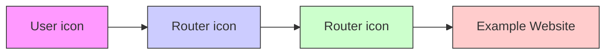
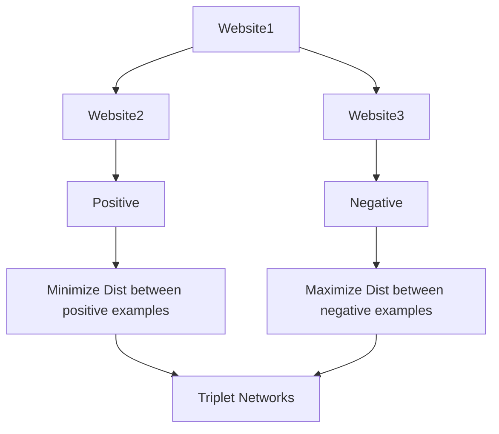
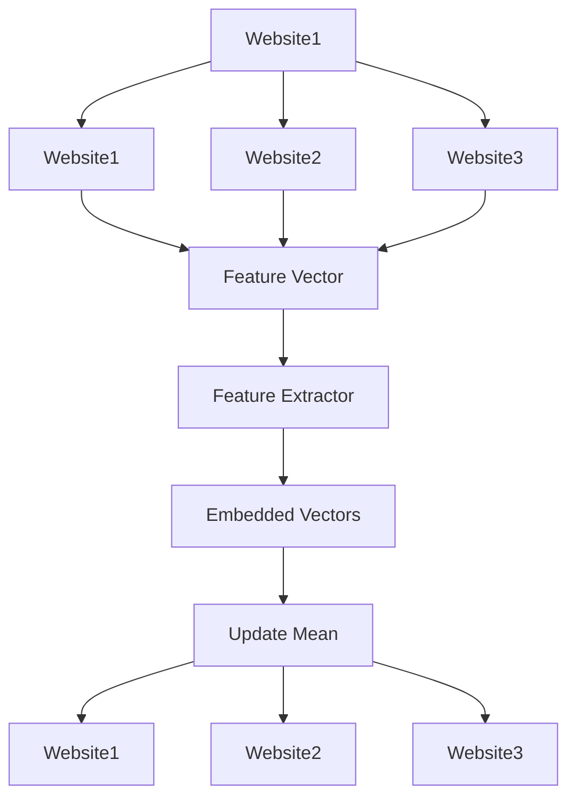
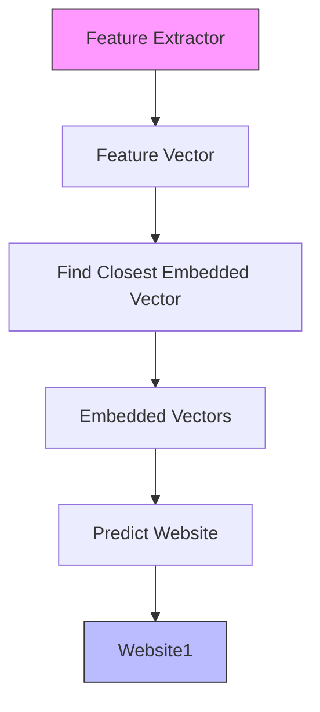

# Online Website Fingerprinting: Evaluating Website Fingerprinting Attacks on Tor in the Real World

Giovanni Cherubin, Alan Turing Institute; Rob Jansen, U.S. Naval Research Laboratory; Carmela Troncoso, EPFL SPRING Lab

https://www.usenix.org/conference/usenixsecurity22/presentation/cherubin

This paper is included in the Proceedings of the 31st USENIX Security Symposium.

August 10–12, 2022 • Boston, MA, USA

978-1-939133-31-1

Open access to the Proceedings of the 31st USENIX Security Symposium is sponsored by USENIX.

# Online Website Fingerprinting: Evaluating Website Fingerprinting Attacks on Tor in the Real World

Giovanni Cherubin Alan Turing Institute gcherubin@turing.ac.uk

Rob Jansen U.S. Naval Research Laboratory rob.g.jansen@nrl.navy.mil

Carmela Troncoso EPFL SPRING Lab carmela.troncoso@epfl.ch

# Abstract

Website fingerprinting (WF) attacks on Tor allow an adversary who can observe the traffic patterns between a victim and the Tor network to predict the website visited by the victim. Existing WF attacks yield extremely high accuracy. However, the conditions under which these attacks are evaluated raises questions about their effectiveness in the real world. We conduct the first evaluation of website fingerprinting using genuine Tor traffic as ground truth and evaluated under a true open world. We achieve this by adapting the state-of-the-art Triplet Fingerprinting attack to an online setting and training the WF models on data safely collected on a Tor exit relay—a setup an adversary can easily deploy in practice. By studying WF under realistic conditions, we demonstrate that an adversary can achieve a WF classification accuracy of above 95% when monitoring a small set of 5 popular websites, but that accuracy quickly degrades to less than 80% when monitoring as few as 25 websites. We conclude that, although WF attacks may be possible, it is likely infeasible to carry them out in the real world while monitoring more than a small set of websites.

# 1 Introduction

Tor [10] is a popular anonymous communication network in which about 6,500 volunteer-operated relays [45] are used to enhance the privacy of two [45] to eight [28] million users daily. Using the Tor browser, users can protect themselves against online tracking and surveillance, resist traffic fingerprinting, and circumvent censorship [46]. Tor clients route their internet communication through a circuit of three proxy relays using a modified form of onion routing [11]. This design prevents any single observation point on the routing path from linking the source and destination of the communication.

The most damaging attacks against the Tor network are those that break unlinkability and enable deanonymization of users. In a Website Fingerprinting (WF) attack, an adversary needs only to observe the Tor entry point in order to break the unlinkability between users and the websites they browse. In contrast, end-to-end correlation attacks require an adversary to observe both the Tor entry and exit points [30].

Early WF studies demonstrate increasingly accurate attacks [3, 4, 13–16, 25, 27, 29, 43, 52, 55], but are criticized for making impractical assumptions [19, 35, 37]. Juarez et al. [19] show that WF attackers experience a significant loss in accuracy when considering: (i) realistic world sizes; (ii) diversity of browser versions and configuration choices; (iii) variation in client browsing behaviors (browsing inner pages and using multiple tabs at once); (iv) the network location of the client; and (v) concept drift (trained models rapidly become stale over time). In response, researchers considered data freshness [53], larger and more diverse sets of websites [34, 37], the base rate problem [51], and other issues [23, 31, 36]. Their results, however, still depend on unrealistic assumptions, which are a consequence of the following limitations in their adversarial model and evaluation methodology:

– Synthetic Traffic Generation: In Tor, a WF adversary positioned at the entry relay cannot collect ground truth about the websites that are visited by Tor users. Thus, adversaries are forced to simulate user behavior by using automated browsers to crawl popular URL lists [21, 44]. Often, these lists are singularly composed of website homepages, and the extent to which home vs. internal pages are visited by real Tor users is unknown [28]. Automatically crawling these lists not only inaccurately represents real Tor user behavior, but also imposes restrictions on the world sizes that can be studied [53]. These conditions lead researchers to significantly overestimate the accuracy of WF attacks [19].   
– Concept Drift: Attacks in the literature are evaluated in a static world using datasets that are collected at a particular point in time. Attack training and evaluation are performed offline on data from the same collection period. This approach cannot capture realistic changes in the traffic patterns that occur naturally over time. Such changes may significantly deteriorate the predictive abilities of the trained models and reduce the accuracy of attacks [19, 37].

Due to these limitations, no public study has conclusively shown that Tor WF attacks can be successful in the real world.

In this work, we contribute the first evaluation of the true threat of WF attacks against Tor users in the real world:

– In § 3 we define a new threat model in which the adversary collects real website traffic samples at an exit relay. This new model enables the adversary to collect representative ground truth measurements while inherently accounting for real world traffic heterogeneity; the adversary will observe the evolution of the true distribution of (i) the websites and webpages that Tor users actually visit, and (ii) the traffic patterns generated by web visits. Our approach enables us to avoid the limitations of prior evaluations.   
– In § 4 and § 5 we describe new methods for safely training on genuine traffic that is observable by Tor exit relays.   
– In § 6 we compare the efficacy of attack models trained on synthetic and genuine data and find that those incorporating genuine data perform significantly better in the real world.   
– In § 6 we provide a first evaluation of the true threat of WF against real Tor users. Our evaluation shows that while attacks can exceed 95% accuracy when monitoring a small set of 5 popular websites, indiscriminate (non-targeted) attacks against sets of 25 and 100 websites fail to exceed an accuracy of 80% and 60%, respectively.

Ethical Considerations: Since our evaluation utilizes data from the real Tor network, user safety was a primary concern during our study. When designing our methodology, we have contacted the Tor Safety Board to discuss the safety precautions we put in place. We provide additional details in § 4. We also sent early drafts of our work to members of the Tor Project to provide responsible disclosure of our findings.

# 2 Background and Motivation

The Tor network consists of a set of relays, i.e., overlay network routers that forward encrypted data on behalf of Tor clients. A primary use-case of the Tor network is browsing the web with Tor Browser. A Tor client, which is embedded in Tor Browser, routes web requests through the Tor network. The Tor client builds a circuit through typically three relays called the entry, middle, and exit relays using a telescoping process. As a user browses the web, the Tor client forwards web requests to the exit relay through a circuit. The exit forwards the requests to the required destination IP addresses (i.e., web servers), and returns the responses via the circuit.

To hinder traffic analysis, Tor repackages all data sent through the circuit (in both directions) into constant-sized cells, which are onion-encrypted once for each relay in the circuit and padded to limit information leakage. The number of forwarded cells and their directionality can be observed by the relays and can be very revealing. We define a collection of cell sequences corresponding to a series of web requests for a particular website w as a matrix c where $c _ { i j } \in \{ + 1 , - 1 , 0 \}$ indicates the direction of the j-th cell in the i-th web request for w; conventionally, +1 represents an outgoing cell sent from a client toward an exit, −1 is an incoming cell sent from an exit toward the client, and 0 represents padding (to handle cell sequences of different lengths). Packet sequences are analogously computed over a series of packets. We refer to these as traffic traces.

Tor clients are not anonymous w.r.t. their entry relay: an entry can associate the observed encrypted traffic patterns to their IPs. Since the traffic is encrypted and the circuit contains multiple hops, the entry cannot identify the clients’ destination. Similarly, the exit makes web requests on behalf of the clients, but it cannot directly observe a client. Therefore, Tor provides unlinkable communication to its users.

# 2.1 Traditional Tor Website Fingerprinting

Tor WF attacks enable an adversary that observes the encrypted traffic from a user to predict which website this user is visiting. The adversary is interested in a subset of the websites visited by users, the monitored sites. The remaining sites are the unmonitored sites. The adversary is free to arbitrarily choose the monitored sites. In a closed world evaluation, users only visit monitored sites; in an open world evaluation, users can also visit unmonitored sites.

To conduct a WF attack, the adversary first trains a machine learning classification model and later deploys this model against users’ traffic (see Figure 1). During the training phase, the adversary collects a cell sequence matrix (as defined in the previous section) for each website in a list of l websites, where each matrix is labeled with the name of the corresponding website w. This labeled dataset, which contains only monitored websites, is used as a training set for a classification model to recognize websites.

During the deployment phase, the adversary collects unlabeled traffic traces produced by Tor users. For each observed trace, the adversary queries the trained model to: (i) decide whether the trace corresponds to a monitored or to an unmonitored site; and (ii) if the site is classified as monitored, predict the website w. The adversary classifies the traffic trace into one of the following labels: $\{ w _ { 1 } , . . . , w _ { \ell } , \perp \}$ , where wi represent the elements of the monitored set, and  indicates the website is unmonitored.

# 2.2 Limitations of Traditional Tor WF

In the traditional WF adversary model, it is assumed that the adversary can observe a user’s traffic if: (i) it is running a Tor entry relay that the user selected as its entry into the network; or (ii) it runs or controls some part of the network path between the user and its entry relay. This traffic is encrypted, but the adversary can observe the associated meta-data (packet sizes, timing, and directionality). If running an entry relay, the adversary can observe additional meta-data about Tor protocol-level control and data cells.


<details>
<summary>flowchart</summary>


</details>

(a) Training Phase   


<details>
<summary>flowchart</summary>


</details>

(b) Deployment Phase   
Figure 1: The traditional WF adversary model. (a) The adversary uses an automated browser (e.g., Selenium [47]) to collect a series of traffic traces via the Tor network for each website in the monitored set, and uses the labeled traces to train a machine learning prediction model. (b) The adversary observes unlabeled user traffic traces and uses the trained model to predict the label (i.e., the visited website). The observations can be made at any point between the client and entry that the adversary controls (e.g., wifi or cellular access point, internet routers or exchange points, or the Tor entry relay itself).

Motivated by the assumed position of the adversary, research on WF generally considers an adversary that uses an entry-side vantage point both for the training and the deployment phases (as in Figure 1). However, the protection provided by Tor’s encryption and routing prevents researchers (and, in fact, any adversary in this position) from collecting ground truth information (website labels) on the encrypted traffic traces (as in Figure 1b).

To overcome this problem, researchers typically generate synthetic traffic traces for which they know the ground truth label, and use them for training and evaluation purposes. Researchers synthetically generate traffic traces by crawling popular webpages through Tor using an automated browser under their control, and collect these traces in the path between the client and the entry relay (typically locally on the client’s machine, as in Figure 1a). Using synthetic traffic seriously limits the attempts of researchers (and adversaries) to understand the effectiveness of WF attacks against Tor users. The main problem is that this traffic is significantly less diverse than the traffic that would be observed in the wild. The main reasons for the lack of data diversity include:

Automated Browser: Automated browser crawlers, like Selenium [47], are generally used with a fixed (or near fixed) browser configuration (e.g., version, language) and network configuration (e.g., geolocation, provider). Thus, these crawlers cannot represent the diversity of browser and network configurations that are observed in the real world [19].

Synthetic User Behavior: There exists no realistic model of Tor user browsing behavior. Most previous work serially (in a single tab) fetches (only) the homepage of the sites in their open world list (e.g., google.com). The traffic produced by this synthetic browsing behavior is unrepresentative of the real user behavior that an adversary would observe in practice, which will be significantly more complex and diverse.

Synthetic Destinations: Researchers have a limited understanding of the websites that Tor users access and the pages (and subpages) they visit [28]. As a result, they unrealistically assume that the open world consists of a limited number of website homepages that are generally chosen from the Alexa top sites list [44]. They also assume that users only visit a subset of these pages. These assumptions simplify the WF problem to homepage or webpage fingerprinting rather than true website fingerprinting.

Concept Drift: Researchers collect and label webpages from a static world, which is not only unrepresentative of the scale of the real world, but also quickly becomes outdated as websites are updated. This is known as concept drift: as websites change over time, a trained classification model will become increasingly inaccurate in its predictions. Static evaluations that do not consider concept drift may over-estimate the expected accuracy of WF attacks. To limit the deterioration of attack accuracy due to concept drift, a realistic adversary would need to continuously re-fetch the latest pages and retrain its classification models [19, 53].

These synthetic traffic limitations simplify the learning problem, and raise doubts about the true effectiveness of WF attacks developed under the traditional adversarial model [19].

# 3 Online Website Fingerprinting

The primary limitations of the traditional adversary model described in § 2 relate to unrealistic user modeling and synthetic data. Rather than trying to collect larger synthetic data sets or improve browsing models [34, 37, 53], we consider a new adversarial model that allows us to evaluate the effectiveness of WF in the real world without needing to model user behavior.

# 3.1 Adversary Model

Genuine Exit Traffic: We consider an adversary that runs an exit relay and uses it to collect genuine Tor traffic traces that are used for a WF attack. We build on the observation that the adversary is not limited to observe and collect data on an entry-side link [18]. Collecting genuine data from an exit relay allows us to overcome all of the synthetic traffic generation limitations described in § 2.2, and offers several advantages for deploying and evaluating WF attacks under realistic conditions.

First, exit relay observations allow the adversary to accurately label encrypted traffic of regular anonymous users by extracting the destination domain they visit. The domain being accessed by the user can be observed through DNS lookups performed by the exit on the circuit before requesting server resources. We assume that the connection between the exit and the web server is protected with TLS and therefore the exit relay can observe the domain but not the full webpage URL (i.e., it can observe example.com but not example.com/page.html). An important consequence of the use of TLS is that multiple subpages will map to the same domain, which may complicate the WF learning task depending on how users interact with sites over time.


<details>
<summary>flowchart</summary>

```mermaid
graph TD
    A["Router"] --> B["Router"]
    B --> C["Router"]
    C --> D["Router"]
    D --> E["Router"]
    E --> F["Example Website"]
    style A fill:#f9f,stroke:#333
    style B fill:#ccf,stroke:#333
    style C fill:#cfc,stroke:#333
    style D fill:#fcc,stroke:#333
    style E fill:#cff,stroke:#333
    style F fill:#ffc,stroke:#333
    note right of E: example.com
```
</details>

Figure 2: Our adversary model replaces the training phase in the traditional model (Figure 1a) with a new online training phase that uses observations of genuine Tor traffic collected from an exit relay (or relays) to continuously update the classification model over time.

Second, an exit relay allows the adversary to collect traffic traces for genuine, user-generated website visits. Even if the website data is encrypted under TLS, the meta-data required for WF (packet sizes, timing, and directionality) can be observed by the exit. Using an exit as an observation point provides several benefits: (i) exit traffic captures a true open world where users may visit every webpage accessible in the real world (include homepages and subpages); (ii) exit traffic is a representative sample of Tor users because an exit will eventually be used by every Tor client (Tor’s default path selection algorithm selects a new exit for every circuit); (iii) exit traffic captures the genuine diversity of user characteristics such as the properties of users’ networks, versions and con figurations of users’ browsers, and users’ browsing behavior including the use of multiple tabs, the wait time between page loads, the concurrent loading of pages, the subpage first visited on a site, the subpage browsing order, etc.; and (iv) exits can differentiate Tor control traffic from website traffic and thus traces have less “noise” than the traditional WF model. Training and Deployment: An adversary that is able to collect and label genuine traffic traces from an exit relay (or a set of geographically distributed exit relays, e.g., to increase diversity with respect to caching and localization) can then use this data to train a WF classification model as shown in Figure 2. This exit-based training phase replaces the entrybased training phase from the traditional model (Figure 1a). The observations from the exit relay are used to continuously update the WF model the adversary uses to carry out an online attack during the deployment phase (see § 3.2).

The deployment phase in our adversary model is identical to that of the traditional model (as shown in Figure 1b). Under deployment, the adversary controls an entry-side observation point (a Tor entry relay or network-level vantage point). This observation point is provided access to the WF model that is continuously trained from the exit observations. The adversary uses this model for classification. Exit relay observations arguably provide the most realistic source of Tor traffic for a WF attack and enable us to considerably improves upon synthetic evaluation methods. However, training and deploying in different positions may impact performance. First, if the model is deployed on a network-level vantage point, the adversary will observe a single TLS connection between the client and the entry relay that multiplexes traffic for multiple circuits and TCP streams. While previous work has addressed the problem of splitting TLS traffic into multiple page loads [53], the adversary can avoid the problem completely if they run an entry relay to gain access to Tor circuit meta-data. Second, network effects (e.g., network latency) may cause a website to produce a different trace on an entry than on an exit. We evaluate the effect of latency on traffic traces in § 6.4.

# 3.2 Online Learning

An adversary that runs exit relays as described in § 3.1 has access to a continuous stream of labeled traffic traces. This stream permits the training of a WF classification model while mitigating the negative effects of concept drift. Continuous online training must be implemented in such a way that the model can: (i) quickly adapt to changes in the traffic patterns of websites over time; and (ii) capture traffic traces for websites that have never before been observed. The model should also precisely label examples that occur infrequently in order to mitigate the effects of a low base rate for monitored sites of interest across Tor users [51].

We consider an adversary that uses Triplet Fingerprinting [40] as it is well-suited to our online learning requirements: it was designed to work well on limited training data and to be accurate when predicting websites that were not originally observed during training. Since Triplet Fingerprinting is not a contribution of our work, we provide only a succinct description. See Appendix A for more details.

Triplet Fingerprinting Background: Triplet Fingerprinting is composed of two models that are independently trained: (i) a feature extractor; and (ii) a classification model.

The feature extractor is trained from traffic traces using a triplet of deep embedded convolutional neural networks [38]. The feature extractor learns to convert traffic traces into feature vectors such that the cosine distance between positive examples of the same website is minimized, while the cosine distance between the feature vectors of distinct websites is maximized. Once trained, a feature extractor can remain effective for long periods of time (e.g., years) [40].

The classification model is trained using labeled feature vectors from the feature extractor. The training procedure is based on N-shot learning [24, 49] and computes the Mean Embedded Vector (MEV) for each website using the most recently observed N examples of that website [40, § 6.4]. Given a new, unlabeled feature vector, a nearest-neighbor (k-NN) algorithm is applied that predicts the label of the website whose MEV is closest to the unlabeled vector.

Adapting to Online Learning: We minimally adapt the Ntraining procedure of Sirinam et al. [40] by computing the MEV over all available website vectors rather than only the last N examples. This is a safety precaution: our MEV can be computed and updated without storing vectors for individual website visits (see § 4). Our adaptation of the WF attack to online training proceeds as follows: (i) extract a feature vector from an observed traffic trace using the already trained feature extractor; (ii) compute the cosine distance from the extracted feature vector to the stored MEV; and (iii) update the MEV with the new vector. The recomputed distance is then used to predict the website label. Websites without any visits will never be predicted by the model, allowing the adversary to dynamically update its monitored set without retraining. Future work may consider an exponentially weighted MEV or other algorithms [22].

# 4 Safe and Ethical Data Processing

A primary goal in our work is to evaluate the real world effectiveness of WF without endangering the safety and privacy of Tor users. Although the adversary model described in § 3 enables us to conduct this evaluation safely, doing so does involve collecting real world observations from a Tor exit relay. In this section, we describe: (i) how we safely collect and process Tor relay data; (ii) our risks and benefits analysis; and (iii) our interaction with the Tor Research Safety Board [48]. We provide concrete details about our safe implementation and a summary of our safety precautions in Appendix B.

Extracting Relay Observations: To facilitate the processing of genuine traffic traces, we run entry and exit relays using a custom version of Tor v0.4.3.5 which we modified (637 LoC changed) to extract cell traces and website labels for circuits. Our modifications were developed and tested using simulation [17] to prevent unintentional data leaks.

We use non-reversible pseudonyms (i.e., hashes) as website labels to avoid leaking information about the actual destinations accessed by Tor users to our WF scripts. The pseudonym of a website w is a string $H ( w , k )$ generated by a deterministic pseudonym-producing algorithm H with key k. The algorithm is such that: (i) for any $w _ { i } \neq w _ { j }$ the corresponding pseudonyms are different, i.e., $H ( w _ { i } , k ) \neq H ( w _ { j } , k )$ ; and (ii) without knowledge of the key k, it is computationally hard to recover w given the pseudonym $H ( w , k )$ . We use the keyed HMAC based on sha3-256 that is already built into Tor to generate website pseudonyms.

We also added a new opt-in feature to Tor that facilitates private synthetic webpage crawls. After creating an opt-in circuit through our relays, our crawler sends a special cell known only to our relays that contains the ground truth pseudonym for the website accessed by the crawler. This feature enables our relays to identify which of their observed circuits were created with clients that we control, and enables our entry relay to associate our pseudonyms with its circuits. With our modifications, a relay can export meta-data about each circuit and cell that it observes through a new control port event that is emitted when a circuit closes. For each observed exit circuit or opt-in entry circuit, a relay exports the circuit creation time and the pseudonym of the first domain that was resolved on the circuit using a key k that is known only to the relay. We destroy k as soon as we complete our measurements (so that the pseudonyms can no longer be linked to real websites). The relay also exports the timestamp and directionality of the first n cells that were transferred on the circuit. Consistent with previous work [40], we use $n = 5 { , } 0 0 0$ in our experiments.

Processing Relay Data: We use stem [42], a Python controller for Tor, to transfer data from our relays through a local UNIX socket to our WF scripts to avoid persistently storing the data or transferring it over a network.

Our WF scripts are used to train WF models solely using exit relay data to which linking Tor users is infeasible (due to the anonymity protections that Tor provides). As described in § 5.2, entry relay observations are only used to predict the website label on opt-in circuits generated by our own crawler clients, thus ensuring that we are never able to link traffic traces to users.

Recall from § 3.2 that we use Triplet Fingerprinting [40] for online learning, which involves feature extraction and classification models. First, the neural network feature extractor is trained using statistics about the traffic traces as features. Second, the k-NN classifier is trained using the mean embedded vectors over all previously extracted vectors, which can be updated as new traces arrive by storing only the previous mean and the count. Therefore, we need not (and do not) persistently store any raw traces or individual feature vectors; they are freed from memory immediately following the online update process (which takes on the order of a few seconds). In order to evaluate the performance of the k-NN classifier, we compute and store for each traffic trace the cosine distance from its extracted feature vector and the mean vectors. We train and evaluate the WF models on the same machine that runs the relays; we never transfer the attack models over the network, and we destroy the models and distances upon completion of our evaluation.

Risks & Benefits Analysis: Our safety precautions do not protect from an attacker that would have access to our machine while the trained models are stored. Such an attacker could use the models to perform a WF attack. This risk is an unavoidable when conducting WF research: the model must be accessible in order to perform an evaluation. To limit the risk, we secured the machine running the entry and exit relays following best practices, and we destroyed all classification models upon completion. A negative consequence of destroying the models is that we prevent reproducibility of our results. Eliminating all data and models that we could share with others will make it more difficult to build upon our work. Yet, we believe that this measure reduces some risk to Tor users and websites.

Another safety precaution with impact in our results is our self-limitation to only extract entry traffic for opt-in circuits generated by clients we control, a limitation a real adversary does not have. Thus, our experiments on entry data are less realistic than those on exit data. We believe sacrificing realism in this case is necessary to eliminate any chance to deanonymize real Tor users. We describe our evaluation methodology considering this constraint in § 5.2.

Despite these limitations, we believe that our approach enables us to obtain a reasonable estimate of the true threat of real world WF attacks, and that our results will help Tor developers appropriately prioritize their efforts to develop WF countermeasures. Given that exit relay observation is the only way to capture the diversity of traffic generated by real users, we believe that the benefits of our study—which quantifies for the first time the effectiveness of a realistic WF attack using real Tor data—outweigh the small risks remaining after our safety precautions are in place.

Tor Research Safety Board: We contacted the Tor Research Safety Board [48] prior to measurement, soliciting feedback on how to make our measurement safer. The reviewers agreed that “collecting data from the live Tor network, as proposed in this study, could give novel insights into how effective Website Fingerprinting is in practice,” that the “risk mitigation mechanisms look reasonable,” and that the risk is “small” (an adversary would need to compromise the machine during the experiment in order to extract models as they are trained).

The reviewers also raised concerns. A primary concern was that we could learn about sensitive websites that users visit on Tor. This concern is addressed by our safety precautions involving non-reversible pseudonyms, which ensure that it is not possible for us (or anyone) to recover the original domains. We reiterate that we never record traces nor their features; they are directly integrated into the WF models.

Another concern involved the collection of genuine circuit meta-data. Suggestions for further reducing risk were to extract ground truth labels from a set of volunteers, and to either combine those labels with the associated traffic traces or use those labels in a follow-up synthetic experiment. After discussion with the reviewers we decided not to pursue this approach because volunteer data would not allow us to sufficiently capture diversity in the main dimensions we aim to study: Tor user browser behavior, Tor users client diversity, and organic evolution of websites and webpages over time.

# 5 Safe Evaluation Methodology

In § 3 we explained that an adversary may collect traces from an exit relay and use them to train a WF classification attack model that is deployed on an entry relay. In this section, we describe how we can safely quantify such a real world WF threat without actually classifying any real Tor users’ entry traffic for safety reasons (see § 4),

# 5.1 Selection of Monitored Sites

Recall from § 2.1 that an adversary is typically interested in identifying visits to one of a monitored set of websites that it deems important for political, societal, or other reasons. When evaluating WF attacks and defenses, researchers generally use a monitored set that is composed of the homepages of the most popular internet websites according to the Alexa top sites list [44]. Although recent work indicates that popular internet websites also tend to be popular on Tor [28], considering only homepages and ignoring internal pages fails to capture the full diversity of Tor traffic and simplifies the WF problem.

We improve the realism in our evaluation relative to prior work by constructing sets of monitored sites from websites that are genuinely visited through our exit relay (see Appendix B for relay details). Doing so ensures that our model training captures the heterogeneity of traffic in the Tor network, and that our evaluation accounts for the practical effects of real world traffic diversity on WF performance. In our evaluation we use the following three sets of monitored websites: top-100: Our first set is inspired by previous work that uses the Alexa top sites list [44]. Let T (x) be the set of the top 100 most frequently visited sites observed by our exit relay during a 24 hour period starting on day x: on day x we count the number of visits to each website pseudonym, and we store the pseudonyms of the 100 sites with the highest counts.

We measure T (0) on 2020-07-03. To understand the stability of this top-100 set, we repeat this measurement for 14 additional consecutive days (2 weeks). For each day x, 0 < x 14, we compute the cardinality of the intersection between the first and x-th day measurements: |T (0) ∩ T (x)|. We plot the result in Figure 3a, where each bar is the number of sites in common with the list on day 0 in subsequent days. We observe that the top list for each day contains at least 76 of the most visited sites from our initial measurement on 2020-07-03. We conclude that our top-100 set was stable over the period during which we conduct our evaluation.

sampled-1000: The top-100 sites represent the most popular sites visited through our relay. Because these sites are popular, the adversary can collect many traces of visits to them. However, in practice, the adversary may be interested in monitoring sites that are much less popular and for which it will take longer to observe a meaningful number of traces.

To evaluate the classification accuracy when training on sites of varying popularity, we construct the sampled-1000 sites set as follows. We conduct a 24 hour measurement on 2020-07-11, during which we store the counts for all website pseudonyms observed by our exit relay. We observe 114,112 pseudonyms, with the visits approximately following a power law distribution (Figure 3b). During our measurement, 91,468 sites (80%) were visited only once, 10,591 sites (9.3%) were visited twice, and 3,263 sites (2.9%) were visited 10 times.

Let L be a list of the top 100k sites observed on 2020-07-11, sorted by the observed frequency (i.e., rank). We split L into k = 1,000 bins of equal size $j = 1 0 0$ and choose a random element from each bin, i.e., $c h o i c e ( \{ L _ { i \cdot j } , \ldots , L _ { i \cdot j + j } \} )$ for i ∈ [0, 1000). The resulting set of sites forms our sampled-1000 monitored set, which captures an adversary interested in monitoring websites with varying degrees of popularity.

  
(a) Stability of the top 100 most frequently observed sites.


<details>
<summary>line</summary>

| Absolute Rank | Frequency |
| ------------- | --------- |
| 1             | 10000     |
| 10            | 5000      |
| 100           | 1000      |
| 1000          | 100       |
| 10000         | 10        |
| 100000        | 1         |
</details>

(b) Frequency distribution of sites observed by our exit.   
Figure 3: Measurements from which we construct our monitored sets. (a) $\left| T ( 0 ) \cap T ( x ) \right|$ | is the cardinality of the intersection of the top 100 most frequently visited sites observed by our exit during 2020-07-03 and the xth day. Every day we observed ≥76 of the sites from our initial measurement on 2020-07-03. (b) A log-log plot of the frequency distribution for all 114,112 genuine sites observed by our exit on 2020-07-11. 91,468 sites were visited once, 10,591 sites were visited twice, while 3,263 sites were visited ≥10 times.

synthetic: To complete our evaluation we need to be able to generate synthetic website visits to: (i) safely evaluate the effectiveness of WF models deployed at an entry relay (see § 4), and (ii) compare the effectiveness of WF in our adversary model (§ 3) and the traditional model (§ 2.1). When generating synthetic visits, we avoid selecting just homepages to improve diversity. We use a more realistic list of 144,337 internet URLs from previous research that including news sites, social media posts, video content, and other URLs beyond the homepage of the respective sites [34]. We randomly sample 1,000 URLs from the list and crawl them using our opt-in circuit feature described in § 4. Our exit observed 1,074 unique domains that were consistently accessed successfully during the crawl; this set of pseudonyms composes our synthetic monitored set.

# 5.2 Phases of Evaluation

Phase I: Feature Extractor Training (Exit Relay): In the previous sections we described how to safely extract circuit observations from our Tor relays. We use these observations to train the feature extractor models (see § 3.2). We follow the training process from previous work on Triplet Fingerprinting [40], using the top-100 monitored sites set during the 24 hour training process (see § 6.1). We use the resulting trained feature extraction models throughout our evaluation.

Phase II: Synthetic vs. Genuine: Previous work that evaluates the effectiveness of WF in the traditional adversary model (see § 2.1) suggests that WF attacks are highly effective when trained using synthetic traffic generated from automated browsers. Although the assumptions considered in previous work are slightly varied, previous attacks were exclusively studied using synthetically generated traffic.

To better understand the practical value of training using real world Tor traffic, we compare the effectiveness of models trained using both genuine traffic observations from our exit relay and synthetic traffic generated from an automated browser. We carry out the evaluation using Triplet Fingerprinting, which has been shown to excel when trained using synthetic data [40], and the feature extraction models which are trained as described in § 6.1. We train three website classification models: (i) one trained exclusively on synthetic traffic (as in the traditional WF model); (ii) one trained on synthetic traffic but updated online using genuine exit relay traffic; and (iii) one trained exclusively on genuine exit relay traffic (as in our online WF model).

To produce synthetic traffic for this evaluation, we use Tor Browser Selenium [47] to repeatedly crawl the list of 1,000 URLs that were sampled for the synthetic monitored set described in § 5.1. We crawl the list 10 times using our private opt-in circuit feature described in § 4 to help us capture our synthetically generated traffic at our exit relay. Genuine traffic is extracted from our exit relay during an online evaluation, additional details and results for which are provided in § 6.2.

Phase III: Train at Exit, Deploy at Exit: We use the data collected at the exit relay for both training and testing of a WF classifier (see § 3.2) that will be used to evaluate the performance of our online WF model under different conditions. To avoid using traces included in training during the testing phase, we perform the prediction of the pseudonym corresponding to an observed traffic trace before this trace is included in the online training process.

While a real adversary would not use a classifier for website predictions on an exit relay, evaluating this configuration has two advantages. First, it provides a noise-free scenario for our evaluation: the test traces do not contain any noise that could be introduced when deploying the model in a different circuit position than that in which it was trained. In Phase IV, we compare the distance between traffic collected at entry and exit relays and find that the difference is low (see § 6.4). Second, it allows us to safely evaluate the attack against genuine Tor traffic, which means that: (i) the traffic may come from different browsers; (ii) the traffic represents a diversity of user behaviors; and (iii) websites are visited according to their natural distribution. We note that Tor users always remain anonymous to the exit relay, and that our evaluation in this scenario (in § 6.3) uses information about a destination that the exit could already directly observe before.

Phase IV: Train at Exit, Deploy at Entry: In a real world attack, an adversary would use their WF attack model, which is continuously updated with the traces collected at the exit, to analyze traffic captured at an entry-side vantage point. We are not only unable to deploy an attack model on real users’ traffic at an entry for safety reasons (see § 4), but we also would be unable to evaluate how well the attack performs because we do not have access to ground truth.

To evaluate the WF performance of models trained at an exit but deployed at an entry, we utilize our private opt-in circuit feature described in § 4 to ensure that we collect at the entry the meta-data for only those circuits created by a client under our control. We again crawl the list of 1,000 URLs that were sampled for the synthetic monitored set using Tor Browser Selenium [47] as we did in Phase II. The entry relay classifies website traces generated by our crawler in a closed-world evaluation described in § 6.4.

The use of a synthetic crawler reduces the realism of this particular experiment, but it is needed in order to: (i) protect Tor users; and (ii) have ground truth for the predictions being made by the entry. We stress that the experiment is carried out using models that are trained with genuine Tor data from a different distribution than our synthetic data.

# 6 Evaluation Results

In this section we present the results we obtained in our evaluation phases using the monitored sets described in § 4.

# 6.1 Phase I: Feature Extractor Training

We train the feature extractor, using the Triplet Fingerprinting methodology described in § 3.2. Following the indication by Sirinam et al. that the websites used for feature extraction can be independent of those monitored in the attack deployment, we train our feature extractor by using the top-100 monitored set, and use it to evaluate attacks against the top-100, sampled-1000, and synthetic websites.

Collection and Training: We collected exit traffic traces in July 2020 for 24 hours, recording in memory the traces belonging to the top-100 monitored websites. With our hardware resources (see Appendix B), we could not afford to train the feature model on the entire data. Instead, we trained four feature extractors, by subsampling 25, 50, 75, and 100 traces per website. Each extractor required between 12 hours (25 traces per website) and 2 days (100 traces per website) for training.

Feature Extractors Evaluation: We compare the predictive power of the trained feature extractors. We employ each feature extractor as the basis for the attack detailed in § 6.3, and measure its accuracy over 1 week of traffic. Table 1 summarizes the results. Unsurprisingly, the top-100 feature extractor performance improves as we increase the number of traces we have per website. However, the best sampled-1000 feature extractor is obtained when training with 75 traces. We suspect this could be a local minimum, and that better performance can be achieved with a larger number of traces.

Table 1: Feature Extractor Evaluation Results? 

<table><tr><td>Monitored set</td><td> $25^{\dagger}$ </td><td> $50^{\dagger}$ </td><td> $75^{\dagger}$ </td><td> $100^{\dagger}$ </td></tr><tr><td>top-100</td><td>30.0%</td><td>54.1%</td><td>57.5%</td><td>58.5%</td></tr><tr><td>sampled-1000</td><td>18.1%</td><td>49.2%</td><td>54.7%</td><td>51.1%</td></tr></table>

? the accuracy of an attacker using the respective extractors’ features † the number of example traces per website used to train the extractor

Throughout the rest of our experiments, we use the feature extractor trained on 100 traces per website for the attacks against the top-100 websites, and the one trained on 75 traces per websites for attacks against the sampled-1000 websites.

# 6.2 Phase II: Synthetic vs. Genuine

To understand the value of genuine data for WF, we compare the effectiveness of WF classifiers trained on traffic traces that result from synthetically crawling a list of webpages (as is done in the traditional adversary model) and classifiers trained on genuine traffic traces observed at an exit relay (as in our adversary model). For this evaluation, we used the top-100 feature extractor that was trained as described in § 6.1, and evaluate the ability of the classifiers to predict the pseudonyms of the websites in the synthetic monitored set.

We evaluate three website classifiers by: (i) training one model only on synthetic traffic (the Triplet Fingerprinting strategy [40]); (ii) training one model on synthetic traffic but update online using genuine exit relay traffic (a hybrid strategy); and (iii) training one model only on genuine exit relay traffic (our online strategy).

We deployed the classifiers on our exit relay during 1 week in April 2021 in a combined online training and evaluation experiment. The online evaluation emulates a real-world deployment in which the adversary would predict at the entry relay with a classifier that is continuously updated at the exit. During the experiment, we first predict the label of a trace (as the adversary would do at the entry), and then use the ground truth to improve the classifier model (as the adversary would do at the exit). During the 1 week measurement we observed 1,178,862 total traffic traces, among which we observed only 183 of the 1,074 domains in the synthetic set.

In this evaluation, we consider a “monitored vs. unmonitored” setting where the attacker tries to predict if an observed trace belongs to the monitored set or not. We consider small monitored sets of 5 webpages with at least 100 visits, an advantageous scenario for the adversary as we explain in § 6.3.

Training on Synthetic vs. Genuine Traces: Figure 4a shows precision-recall curves for the three classifiers when evaluated against genuine traffic traces. Here, we consider as the monitored set the 5-site set for which the classifiers yield the best average precision (see the next paragraph). We observe that


<details>
<summary>line</summary>

| Recall | Real Precision | Synthetic + Real Precision | Synthetic Precision |
| ------ | -------------- | -------------------------- | ------------------- |
| 0.0    | 1.0            | 1.0                        | 0.0                 |
| 0.2    | 1.0            | 1.0                        | 0.0                 |
| 0.4    | 0.9            | 0.9                        | 0.0                 |
| 0.6    | 0.4            | 0.4                        | 0.0                 |
| 0.8    | 0.1            | 0.1                        | 0.0                 |
| 1.0    | 0.0            | 0.0                        | 0.0                 |
</details>

(a) Comparison of classifiers


<details>
<summary>line</summary>

| Recall | Precision (0.52) | Precision (0.42) | Precision (0.41) | Precision (0.11) | Precision (0.05) | Precision (0.02) |
| ------ | ---------------- | ---------------- | ---------------- | ---------------- | ---------------- | ---------------- |
| 0.0    | 1.0              | 1.0              | 1.0              | 1.0              | 1.0              | 1.0              |
| 0.2    | 1.0              | 1.0              | 1.0              | 0.6              | 0.6              | 0.6              |
| 0.4    | 1.0              | 1.0              | 1.0              | 0.6              | 0.6              | 0.6              |
| 0.6    | 0.8              | 0.8              | 0.8              | 0.6              | 0.6              | 0.6              |
| 0.8    | 0.4              | 0.4              | 0.4              | 0.6              | 0.6              | 0.6              |
| 1.0    | 0.2              | 0.2              | 0.2              | 0.6              | 0.6              | 0.6              |
</details>

(b) Variance across monitored sets   
Figure 4: Precision-recall curves for the attack models; curves are obtained by varying the classifier’s threshold determining whether a traces is monitored or unmonitored (binary classification setting). (a) Compares a model trained on synthetic data (traditional approach), a model that learns only from real data (our approach), and a model trained on synthetic that is updated on real data. (b) Compares the performance of our classifier trained online on real data on various monitored sets of the same size; the high variance indicates that monitored sites selection is crucial for successful WF.

Triplet Fingerprinting trained on synthetic data (green line) performs poorly, achieving an average precision of only 0.03; this is a significant difference with respect to the performance measured by the authors on synthetic data [40], for a much larger monitored set. However, by training the attack on real data (blue line), the performance improves substantially. Interestingly, training the attack on synthetic traffic and then updating it on real traffic (orange line) greatly improves the performance with respect to the traditional synthetically-trained model. Yet, it does not improve over training exclusively with real data, thus supporting our hypothesis that synthetic data does not reflect the real traffic’s heterogeneity: the classifier’s performance against real traffic will be poor unless real traffic is used to inform the model.

On the Feasibility of Real World WF: We consider the effect of the monitored set on the performance of our attack. We evaluate our attack against ten monitored sets of five sites each, where the sites are chosen uniformly at random among those observed. Figure 4b shows the results for the six monitored sets exhibiting the highest average precision. We see a very large variance in performance, that can range from 0.02 to 0.52 average precision. We conclude that one of the main factors influencing WF’s performance is the choice of monitored websites: some websites are easier to fingerprint than others. This indicates that WF may be a concern in the real world, but only: (i) for certain websites; and (ii) assuming the adversary is only interested in a small subset of them. This finding is further corroborated by our evaluation in § 6.3.

In these experiments, we used a feature model trained on top-100 because Sirinam et al. [40] argued that the performance of Triplet Fingerprinting does not depend substantially on the extractor’s training set. In Appendix D, we repeat this analysis for a feature model targeted specifically at the synthetic monitored set. We observe a slight improvement in performance, but our conclusions remain the same.

Takeaways: These experiments demonstrate three important aspects. First, there is a substantial difference between evaluating a model on synthetically generated traffic and deploying it on genuine, open world, and heterogeneous data. The state-of-the-art Triplet Fingerprinting attack achieved a high precision-recall in a fully synthetic evaluation [40] but performs poorly against real data. Second, training a model on genuine traffic leads to far better performance than training on synthetically generated traffic (i.e., the traditional approach). Third, WF is a concern but only for certain websites; it is therefore possible that simpler WF defenses may work in real world settings, contrary to common belief.

# 6.3 Phase III: Train at Exit, Deploy at Exit

Because we cannot obtain ground truth for traffic collected at an entry relay, we perform the bulk of our evaluation on the exit relay. In § 6.4, we study the extent to which the results from this evaluation can be extrapolated to the case in which the adversary can observe entry relay traffic.

We train classifiers using the top-100 and sampled-1000 monitored sets exclusively using traffic traces from an exit relay; training on genuine traffic is the best performing strategy as shown in § 6.2. We evaluate the attack in an online manner: when a new trace is observed, we first use the classifier to make a prediction; and then update the classification model based on the trace and its true label. We run this measurement for 1 week in July 2020, during which we observed 3.9M traces from 671,149 unique websites.

Performance across Websites: We first measure the average performance of the attack across all of the websites. The attacker can either guess one of the monitored websites or predict “unmonitored” if the adversary believes that the observed trace does not correspond to any of the monitored websites. Note that this is a more difficult problem than the “monitored vs. unmonitored” setting that we considered in § 6.2.

To measure the evolution of the model’s performance over time, we use instant accuracy as a metric. We define instant accuracy as the accuracy over a sliding window, i.e., the number of correct guesses in a window divided by the number of total guesses in that window. We define the window in terms of number of websites added to the model because the evolution of the model depends on the amount of websites that are observed and not on the amount of time that passes. In our experiments, we empirically chose a sliding window of 10K traces as it reduces the variance of the accuracy measurement.

Figure 5 shows the results of this experiment. Since the classification task becomes harder as more websites are observed and added to the monitored set, we include a reference baseline denoting the probability of guessing a webpage by predicting uniformly at random among the set of websites that have appeared so far in the training data. The decrease in baseline accuracy is pronounced in the beginning, but it stabilizes near zero after a few thousands websites are observed.


<details>
<summary>line</summary>

| Network traces (x10^6) | Attack accuracy | Baseline |
| ---------------------- | --------------- | -------- |
| 0                      | 0.6             | 0.0      |
| 500                    | 0.7             | 0.0      |
| 1000                   | 0.7             | 0.0      |
</details>


<details>
<summary>line</summary>

| Network traces (×10⁶) | Instant accuracy |
| --------------------- | ---------------- |
| 0                     | 0.0              |
| 500                   | 0.8              |
| 1000                  | 0.9              |
</details>

Figure 5: Instant accuracy for top-100 and sampled-1000 monitored sets. For reference, we report the likelihood of guessing a website uniformly at random among the monitored websites that have been observed up to a certain point (dashed line). The plots on the left are zoomed-in representations of the first 1k traces.

We observe the opposite effect in our attack. In the beginning, when the models have incorporated few samples per website and the adversary mostly observes new labels, their error is large. This error decreases rapidly as the adversary gathers enough samples for the monitored websites. Once the models have incorporated enough traces and become stable, the instant accuracies are consistently around 60%.

Per-website Performance: Average accuracy provides a first degree of intuition about the protection that websites enjoy overall. However, it is not representative of the protection for individual websites [33]. We quantify this protection for each website w as the number of traces from w that the adversary misclassifies; we obtain a false negative rate (FNR) for w by normalizing this count by the number of times w is observed.

The histogram in Figure 6 represents the distribution of FNR across individual websites. For the top-100 dataset, the adversary has an FNR of less than 25% for 45 websites. Yet, for 6 out of the 100 websites the FNR is very large: >90%. This confirms the results by Overdorf et al. that some websites are more at risk than others [33], and reinforces the belief that defenses should treat websites differently (e.g., adding different amounts of padding to each [8]).

We observe substantially different results when considering the sampled-1000 monitored set. In this case, the attacker incorrectly predicts most of the websites (the FNR is greater than 75% for 262 websites). This may seem to contradict the good average accuracy results shown in Figure 5, and reinforce the need for individual web performance analysis when evaluating WF attacks. The discrepancy is due to a few websites that are both (i) very frequently visited, and (ii) easy for the attacker to predict; these websites largely inflate the accuracy on average. We discuss other performance metrics that avoid this bias in the results in Appendix C.


<details>
<summary>bar</summary>

| FNR Range | Number of Websites |
| --------- | ------------------ |
| 0.00-0.25 | 45                 |
| 0.25-0.50 | 29                 |
| 0.50-0.75 | 10                 |
| 0.75-1.00 | 11                 |
</details>


<details>
<summary>bar</summary>

| FNR Range | Number of Websites |
| --------- | ------------------ |
| 0.00-0.25 | 12                 |
| 0.25-0.50 | 18                 |
| 0.50-0.75 | 15                 |
| 0.75-1.00 | 262                |
</details>

Figure 6: The histograms represent the number of websites for which a certain level of FNR is attained; websites are limited to the ones we observed in our evaluation from the top-100 and sampled-1000 sets (total count: 95 and 307 respectively).


<details>
<summary>scatter</summary>

| Number of traces | FNR  |
| ---------------- | ---- |
| 0                | 0.95 |
| 5000             | 0.85 |
| 10000            | 0.75 |
| 15000            | 0.65 |
| 20000            | 0.55 |
| 25000            | 0.45 |
| 30000            | 0.35 |
| 35000            | 0.25 |
| 40000            | 0.15 |
| 45000            | 0.05 |
| 50000            | 0.95 |
| 55000            | 0.85 |
| 60000            | 0.75 |
| 65000            | 0.65 |
| 70000            | 0.55 |
| 75000            | 0.45 |
| 80000            | 0.35 |
| 85000            | 0.25 |
| 90000            | 0.15 |
| 95000            | 0.05 |
| 100000           | 0.95 |
</details>


<details>
<summary>scatter</summary>

| Number of traces | FNR   |
| ---------------- | ----- |
| 0                | 1.0   |
| 1000             | 0.9   |
| 2000             | 0.8   |
| 3000             | 0.4   |
| 4000             | 0.3   |
| 5000             | 0.2   |
| 6000             | 0.1   |
| 7000             | 0.1   |
| 8000             | 0.1   |
| 9000             | 0.1   |
| 10000            | 0.1   |
| 11000            | 0.1   |
| 12000            | 0.1   |
| 13000            | 0.1   |
| 14000            | 0.1   |
| 15000            | 0.1   |
</details>

Figure 7: Influence of number of traces (x-axis) on FNR (y-axis). While having a significant number of samples results on better performance, the adversary can obtain good results even with few traces.

Dependence on the Number of Training Traces: We now study whether the success rate of our attack against a website is determined by the frequency with which traces of that website are observed.

Figure 7 plots the FNR per website according to the number of available traces of the site. Unsurprisingly, having a large number of samples for a website results in less error (lower FNR). However, even when the attacker has few traces, they can achieve a low FNR for certain websites. This is consistent with the evaluation by Sirinam et al. [40], which showed that the Triplet model learns with few examples.

The results in Figure 7 also confirm our hypothesis for the perceived discrepancy between average accuracy and the adversary’s error distribution for the sampled-1000 dataset. We observe an outlier pertaining to sampled-1000: there is one website which has more than 15k traces and for which we observe an almost perfect success (0% FPR). This outlier by itself boosts the average accuracy. We suspect this website is related to periodic Tor Browser update checks, but we are unable to confirm due to our safety precautions (see § 4).


<details>
<summary>line</summary>

| Network traces (×10⁶) | 1     | 5     | 25    | 50    | 75    | 95    |
| --------------------- | ----- | ----- | ----- | ----- | ----- | ----- |
| 0                     | 1.0   | 1.0   | 0.9   | 0.8   | 0.7   | 0.6   |
| 500                   | 1.0   | 1.0   | 0.9   | 0.8   | 0.7   | 0.7   |
| 1000                  | 1.0   | 1.0   | 0.9   | 0.8   | 0.7   | 0.7   |
| 1.5                   | 1.0   | 1.0   | 0.9   | 0.8   | 0.7   | 0.7   |
| 2.0                   | 1.0   | 1.0   | 0.9   | 0.8   | 0.7   | 0.7   |
| 2.5                   | 1.0   | 1.0   | 0.9   | 0.8   | 0.7   | 0.7   |
| 3.0                   | 1.0   | 1.0   | 0.9   | 0.8   | 0.7   | 0.7   |
| 3.5                   | 1.0   | 1.0   | 0.9   | 0.8   | 0.7   | 0.7   |
| >3.5                  | ~1.0  | ~1.0  | ~0.9  | ~0.8  | ~0.7  | ~0.7  |
</details>


<details>
<summary>line</summary>

| Network traces (×10⁶) | Instant accuracy (1) | Instant accuracy (5) | Instant accuracy (25) | Instant accuracy (50) | Instant accuracy (75) | Instant accuracy (307) |
| --------------------- | -------------------- | -------------------- | --------------------- | --------------------- | --------------------- | ---------------------- |
| 0                     | 1.0                  | 1.0                  | 1.0                   | 1.0                   | 1.0                   | 1.0                    |
| 500                   | ~0.98                | ~0.97                | ~0.95                 | ~0.94                 | ~0.93                 | ~0.92                  |
| 1000                  | ~0.97                | ~0.96                | ~0.94                 | ~0.93                 | ~0.92                 | ~0.91                  |
| 1.5                   | ~0.96                | ~0.95                | ~0.93                 | ~0.92                 | ~0.91                 | ~0.90                  |
| 2.0                   | ~0.95                | ~0.94                | ~0.92                 | ~0.91                 | ~0.90                 | ~0.89                  |
| 2.5                   | ~0.94                | ~0.93                | ~0.91                 | ~0.90                 | ~0.89                 | ~0.88                  |
| 3.0                   | ~0.93                | ~0.92                | ~0.90                 | ~0.89                 | ~0.88                 | ~0.87                  |
| 3.5                   | ~0.92                | ~0.91                | ~0.89                 | ~0.88                 | ~0.87                 | ~0.86                  |
| 4.0                   | ~0.91                | ~0.90                | ~0.88                 | ~0.87                 | ~0.86                 | ~0.85                  |
| 4.5                   | ~0.90                | ~0.89                | ~0.87                 | ~0.86                 | ~0.85                 | ~0.84                  |
| 5.0                   | ~0.89                | ~0.88                | ~0.86                 | ~0.85                 | ~0.84                 | ~0.83                  |
| 5.5                   | ~0.88                | ~0.87                | ~0.85                 | ~0.84                 | ~0.83                 | ~0.82                  |
| 6.0                   | ~0.87                | ~0.86                | ~0.84                 | ~0.83                 | ~0.82                 | ~0.81                  |
| 6.5                   | ~0.86                | ~0.85                | ~0.83                 | ~0.82                 | ~0.81                 | ~0.80                  |
| 7.0                   | ~0.85                | ~0.84                | ~0.82                 | ~0.81                 | ~0.80                 | ~0.79                  |
| 7.5                   | ~0.84                | ~0.83                | ~0.81                 | ~0.80                 | ~0.79                 | ~0.78                  |
| 8.0                   | ~0.83                | ~0.82                | ~0.80                 | ~0.79                 | ~0.78                 | ~0.77                  |
| 8.5                   | ~0.82                | ~0.81                | ~0.79                 | ~0.78                 | ~0.77                 | ~0.76                  |
| 9.0                   | ~0.81                | ~0.80                | ~0.78                 | ~0.77                 | ~0.76                 | ~0.75                  |
| 9.5                   | ~0.80                | ~0.79                | ~0.77                 | ~0.76                 | ~0.75                 | ~0.74                  |
| 10.0                  | ~0.79                | ~0.78                | ~0.76                 | ~0.75                 | ~0.74                 | ~0.73                  |
| 11.5                  | ~0.78                | ~0.77                | ~0.75                 | ~0.74                 | ~0.73                 | ~0.72                  |
| 12.5                  | ~0.77                | ~0.76                | ~0.74                 | ~0.73                 | ~0.72                 | ~0.71                  |
| 13.5                  | ~0.76                | ~0.75                | ~0.73                 | ~0.72                 | ~0.71                 | ~0.70                  |
| 14.5                  | ~0.75                | ~0.74                | ~0.72                 | ~0.71                 | ~0.70                 | ~0.69                  |
| 15.5                  | ~0.74                | ~0.73                | ~0.71                 | ~0.70                 | ~0.69                 | ~0.68                  |
| 16.5                  | ~0.73                | ~0.72                | ~0.70                 | ~0.69                 | ~0.68                 | ~0.67                  |
| 17.5                  | ~0.72                | ~0.71                | ~0.69                 | ~0.68                 | ~0.67                 | ~0.66                  |
| 18.5                  | ~0.71                | ~0.70                | ~0.68                 | ~0.67                 | ~0.66                 | ~0.65                  |
| 19.5                  | ~0.70                | ~0.69                | ~0.67                 | ~0.66                 | ~0.65                 | ~0.64                  |
| 21                    | -                    | -                    | -                     | -                     | -                     | -                      |
| 22                    | -                    | -                    | -                     | -                     | -                     | -                      |
| 23                    | -                    | -                    | -                     | -                     | -                     | -                      |
| 24                    | -                    | -                    | -                     | -                     | -                     | -                      |
| 25                    | -                    | -                    | -                     | -                     | -                     | -                      |
| 26                    | -                    | -                    | -                     | -                     | -                     | -                      |
| 27                    | -                    | -                    | -                     | -                     | -                     | -                      |
| 28                    | -                    | -                    | -                     | -                     | -                     | -                      |
| 29                    | -                    | -                    | -                     | -                     | -                     | -                      |
| 3             | -                    | -                    | -                     | -                     | -                     | -                      |
| 31                    | -                    | -                    | -                     | -                     | -                     | -                      |
| 32                    | -                    | -                    | -                     | -                     | -                     | -                      |
| 33                    | -                    | -                    | -                     | -                     | -                     | -                      |
| 34                    | -                    | -                    | -                     | -                     | -                     | -                      |
| 35                    | -                    | -                    | -                     | -                     | -                     | -                      |
| 36                    | -                    | -                    | -                     | -                     | -                     | -                      |
| 37                    | -                    | -                    | -                     | -                     | -                     | -                      |
| 38                    | -                    | -                    | -                     | -                     | -                     | -                      |
| 39                    | -                    | -                    | -                     | -                     | -                     | -                      |
| 4             | -                    | -                    | -                     | -                     | -                     | -                      |
| 41                   | -                    | -                    | -                     | -                     | -                     | -                      |
| 42                   | -                    | -                    | -                     | -                     | -                     | -                      |
| 43                   | -                    | -                    | -                     | -                     | -                     | -                      |
| 44                   | -                    | -                    | -                     | -                     | -                     | -                      |
| 45                   | -                    | -                    | -                     | -                     | -                     | -                      |
| 46                   | -                    | -                    | -                     | -                     | -                     | -                      |
| 47                   | -                    | -                    | -                     | -                     | -                     | -                      |
| 48                   | -                    | -                    | -                     | -                     | -                     | -                      |
| 49                   | -                    | -                    | -                     | -                     | -                     | -                      |
| 5             + 1              + 2        + 3        + 4        + 5        + 6        + 7        + 8        + 9        + 1             + 11       + 12       + 13       + 14       + 15       + 16       + 17       + 18       + 19       + 2               + 3            + 4            + 5            + 6            + 7            + 8            + 9            + 1              + 11           + 12           + 13           + 14           + 15           + 16           + 17           + 18           + 19           + 2              + 3            + 4            + 5            + 6            + 7           + 8            + 9            + 1              + 12           + 13           + 14           + 15           + 16           + 17           + 18           + 19           +         +          |
| Note: The data is presented in the original format and displayed on the screen graph as shown in the code above the code list names and names below the chart.
</details>

Figure 8: Instant accuracy for the top-100 and sampled-1000 monitored sites, shown for different sizes of the monitored set. Set sizes range between 1 and the number of individual websites observed in our experiments for top-100 and sampled-1000.

Dependence on Monitored Set Size: The previous analysis shows that the choice of the websites to monitor strongly affects the attack’s performance. We now investigate how the attack’s performance is influenced by the monitored sets’ size.

We evaluate the attack for various sizes of monitored set by subsampling websites uniformly at random from the original sets (top-100 or sampled-1000); we measure the performance considering the selected websites as monitored and the remaining ones as unmonitored.

We show the results in Figure 8. As expected, the attack’s performance is heavily impacted by the size of the monitored set. When the set is small, the adversary has great performance, up to 80% for a monitored set of 25 websites and almost perfect when the adversary is only interested in 1-5 websites. We conjecture that this is because when the set is small, the chance that other websites in the open world would look similar decreases. As the monitored set grows and becomes heterogeneous, the probability that unmonitored traces look like one of the monitored websites increases, resulting in a higher error rate.

Monitored vs. Unmonitored: So far we have considered a setting where the attacker is interested in predicting which monitored website a trace belongs to among the traces classified as monitored. However, the attacker may only be interested in whether a network trace represents a monitored site or not. As we did in Phase II (§ 6.2), we adapt the attack to the monitored vs. unmonitored setting; this attack predicts “monitored” every time a website from the monitored set is predicted, and “unmonitored” otherwise.


<details>
<summary>line</summary>

| Recall | Precision (1) | Precision (5) | Precision (25) | Precision (50) | Precision (75) | Precision (95) |
| ------ | ------------- | ------------- | -------------- | -------------- | -------------- | -------------- |
| 0.0    | 0.8           | 0.9           | 0.9            | 0.6            | 0.7            | 0.8            |
| 0.2    | 0.85          | 0.95          | 0.95           | 0.7            | 0.8            | 0.85           |
| 0.4    | 0.8           | 0.9           | 0.9            | 0.75           | 0.8            | 0.8            |
| 0.6    | 0.7           | 0.8           | 0.8            | 0.7            | 0.7            | 0.7            |
| 0.8    | 0.5           | 0.6           | 0.6            | 0.6            | 0.6            | 0.6            |
| 1.0    | 0.3           | 0.4           | 0.4            | 0.4            | 0.4            | 0.4            |
</details>


<details>
<summary>line</summary>

| Recall | Precision (Line 1) | Precision (Line 5) | Precision (Line 25) | Precision (Line 50) | Precision (Line 75) | Precision (Line 307) |
|--------|--------------------|--------------------|---------------------|---------------------|---------------------|----------------------|
| 0.0    | 1.0                | 1.0                | 1.0                 | 1.0                 | 1.0                 | 1.0                  |
| 0.2    | ~0.1               | ~0.1               | ~0.1                | ~0.1                | ~0.1                | ~0.1                 |
| 0.4    | ~0.0               | ~0.0               | ~0.0                | ~0.0                | ~0.0                | ~0.0                 |
| 0.6    | ~0.0               | ~0.0               | ~0.0                | ~0.0                | ~0.0                | ~0.0                 |
| 0.8    | ~0.0               | ~0.0               | ~0.2                | ~0.2                | ~0.1                | ~0.1                 |
| 1.0    | ~0.0               | ~0.0               | ~0.2                | ~0.2                | ~0.1                | ~0.1                 |
</details>

Figure 9: Precision-recall curves for both the top-100 and the sampled-1000 monitored sites, in a monitored vs. unmonitored scenario. We vary the size of the monitored set, making sure that smaller sets are subsets of the larger ones.

We evaluate the attack’s performance with respect to various monitored set sizes. To avoid penalizing the measurements done for some monitored set, we create nested subsets of monitored sets; for example, the monitored set of size 5 is a subset of the monitored set of size 25, which is a subset of the monitored set of size 50, and so on.

Figure 9 shows the precision-recall curves for the attack. We observe that the attack is reasonably effective against the top-100 set; for example, the average precision reaches 0.83 for 1 monitored website and 0.82 for a set of 5 monitored sites. However, it quickly drops for larger monitored sets. Interestingly, we observe that the attack’s performance does not decrease monotonically w.r.t. the number of monitored websites. The reason is that if a highly fingerprintable website is added to the list, then it will help improve the performance. When repeating this analysis for various same-sized monitored sets in preliminary experiments, we also observed a great variability; we therefore suspect, as we observed in § 6.2, that the choice of the websites to monitor is the determining factor in WF attacks.

When we consider the sampled-1000 set, the results again change significantly: the attack barely achieves a 0.1 average precision and would be largely uninformative to an adversary. As explained in the previous sections, the main reason of discrepancy of performance against top-100 and sampled-1000 may be the fingerprintability of the websites in sampled-1000; indeed, it was shown that some websites are more fingerprintable than others [33], which may be the root cause of good/poor performance of any attack. Another partial explanation may be that we used a feature model trained on top-100, even for the attack against sampled-1000; in Appendix D, we show that this may have a marginal impact on the attack’s performance.

Takeaways: Our evaluation results confirm that WF may not be practical for large monitored sets (e.g., >5 websites), even in a monitored vs. unmonitored setting. Our results further indicate a strong dependency between WF success and fingerprintability of websites: some websites are inherently easier to fingerprint than others.


<details>
<summary>line</summary>

| Crawled Domain | Mean Levenshtein Distance (Exit to Exit) | Mean Levenshtein Distance (Entry to Exit) |
| -------------- | ---------------------------------------- | ----------------------------------------- |
| 0              | 0                                        | 0                                         |
| 200            | ~10                                      | ~5                                        |
| 400            | ~50                                      | ~100                                      |
| 600            | ~150                                     | ~200                                      |
| 800            | ~300                                     | ~400                                      |
| 900            | ~750                                     | ~750                                      |
</details>

Figure 10: The distance between two traces of the same website from the same exit is similar to the distance between the same website trace observed at the exit and entry. The shaded area represents the standard deviation.

Note that due to the privacy requirements in our experimental design, we cannot study which characteristics make a website more or less fingerprintable; previous work covered some of them [33], and we encourage future work to run a comprehensive analysis of website fingerprintability aspects within our threat model.

# 6.4 Phase IV: Train at Exit, Deploy at Entry

Because of the lack of ground truth, our previous experiments considered an attacker who both trains and predicts using traces observed at an exit relay. In this section, we quantify the extent to which the results of our previous evaluation on the exit relay can be extrapolated to our threat model in which a real-world attacker trains their classification model at an exit relay and then deploys it at an entry (see § 3.1).

As described in § 5.2, we crawl the pages in the synthetic monitored set 10 times each (pinning our entry and exit relays as the first and last circuit hops). Our crawl results in 922 websites for which we have 10 observed traces. For each website, we record the resulting traces observed by our entry and exit relays. We use the recorded traces to train website classifiers, and consider an attack using the feature extractor trained at our exit relay on the top-100 monitored set traces.

Trace Distortion from Entry to Exit: To ensure that the results in the previous section hold when the attack is deployed at the entry, the traces at the exit and the entry should have the same characteristics. In other words, distortion of the traffic traces when traversing the Tor network should be minimal. This way a page load observed at the entry relay would not differ substantially from the same load observed at the exit.

To capture this distortion, we measure the distance between traces collected at the entry and at the exit relay. We expect that most of the distortion will be the result of queuing at different Tor relays that would cause a relative reordering of the traffic sequences observed by the relays. Thus, we choose the Levenshtein distance to measure the distortion between traces after truncating them to have the same length. This distance metric measures the minimum number of edits required to change one trace into the other, and thus can capture cell re-ordering. For each website, we measure: (i) the distance between a trace seen at the entry and the one seen at the exit relay, and (ii) the distance between traces belonging to the same website as seen at the exit relay. Ideally, we would like the former distance to be smaller than the latter; that is, we want that traveling through the network changes traces less than their natural variability across multiple downloads of the same website. The results in Figure 10 show that the trace distortion between entry and exit is small.


<details>
<summary>line</summary>

| n   | Exit-Exit | Entry-Entry | Entry-Exit | Exit-Entry |
| --- | --------- | ----------- | ---------- | ---------- |
| 5   | 0.9       | 0.85        | 0.8        | 0.75       |
| 10  | 0.75      | 0.65        | 0.6        | 0.55       |
| 20  | 0.65      | 0.55        | 0.5        | 0.45       |
| 30  | 0.6       | 0.5         | 0.45       | 0.4        |
| 40  | 0.55      | 0.45        | 0.4        | 0.35       |
| 50  | 0.5       | 0.4         | 0.35       | 0.3        |
| 60  | 0.45      | 0.35        | 0.3        | 0.25       |
| 70  | 0.4       | 0.3         | 0.25       | 0.2        |
| 80  | 0.35      | 0.25        | 0.2        | 0.15       |
| 90  | 0.3       | 0.2         | 0.15       | 0.1        |
| 100 | 0.25      | 0.15        | 0.1        | 0.05       |
</details>

Figure 11: Performance comparison of the attack trained at exit and deployed at exit (Exit-Exit), trained at exit and deployed at entry (Exit-Entry), trained and deployed at entry (Entry-Entry), and trained at entry and deployed at exit (Entry-Exit).

Attack Deployment: While distortion is small, it may be that the distance is enough to reduce the accuracy of the attack from the Exit-Exit attacker that we evaluate in § 6.3 to the Exit-Entry attacker that would operate in the real world. As we are only interested in the difference in accuracy, we consider the simple case: a closed world batch classification setting in which the model is trained on 50% of the traces we collected, and is evaluated on the remaining 50%.

Figure 11 shows the accuracy achieved by the Exit-Exit and Exit-Entry attackers, measured for a varying number of monitored websites. For a small monitored set, the performance of the attacks is relatively similar; e.g., with 50 monitored websites the performance degrades from 76.2% (Exit-Exit) to 65.1% (Exit-Entry), and with 5 websites it decreases from 91.2% to 86.4%. As the monitored set size increases, the discrepancy becomes larger but the difference seems to stabilize after the monitored set size reaches 600. With 750 monitored sites the accuracy decreases from 52.2% to 34.1%, providing further evidence that real-world attackers are limited in the number of websites they can monitor effectively.

We also show in Figure 11 the effectiveness of a hypothetical attacker who trains and deploys at an entry relay (Entry-Entry) using synthetic traffic traces. While the Exit-Exit attacker is strictly better than Entry-Entry attacker, the latter has better performance than an adversary who trains at an exit and deploys at an entry (as in our adversary model). This experiment, however, offers ideal conditions for the Entry-Entry adversary, as the synthetic traffic is not as heterogenous as genuine traffic would be. In § 6.2 we conduct an experiment on real traffic whose results indicate that training at an entry relay using synthetic traffic is not advantageous since it does not capture the heterogeneity of genuine traffic.

Takeaways: Our analysis shows that network effects may distort traces from the exit to the entry. Thus, there can be a loss in accuracy when deploying on the entry a model that was trained using traffic collected at an exit. These results indicate that training at an exit and deploying at an entry is a good adversarial strategy, especially given the advantages it brings: accounting for diversity and concept drift. We also note that we did not tune our attack to reduce distortion. Future work may be able to reduce or eliminate the effects of distortion on WF attacks by incorporating information about the differences between entries and exits.

Overall, our experiments throughout § 6 confirm that the practicality of WF attacks depends on the choice and number of monitored sites. A primary conclusion is that an attacker wishing to monitor more than a few websites (5 to 25, according to our results) is unlikely to succeed.

# 7 Related Work

Related Attacks: Following the critiques of the unrealistic methodologies used in early WF work [19, 35], WF attack papers have attempted to improve evaluation methods: overcoming data staleness [53], using large-scale datasets with varied URLs [34], or increasing the monitored set size [37].

Previous work applied deep learning to WF to increase the accuracy [1, 2, 32, 37, 39]. The practicality of these methods in an online environment is unclear, as they require a lot of training data that must be updated regularly [39]. Triplet Fingerprinting reduced the data needed for training [40], which is why we used it as the basis for our online attack.

Our online attack using real data operates under a new adversary model. All previous WF attacks were evaluated under the traditional WF adversary model that we describe in § 2.1 and are evaluated using synthetic datasets. Therefore, a direct comparison between our results and the results from previous work would not be meaningful.

Recent work brings new insights on the applicability of WF in the real world. Wang argued that WF attacks should be optimized for precision and should incorporate the base rate into the precision metric to avoid success overestimation [51]. Pulls and Dahlberg explored the concept of a website oracle that could inform the adversary whether or not a website was visited at a specific time [36]. They found this is possible to achieve in Tor due to the DNS lookups that are performed by exit relays, which we also take advantage of in our work. Our work is the first to apply WF to regular sites in a true open world and the first to use genuine Tor traffic as ground truth. Countermeasures: There exist numerous defenses against WF in the literature [5, 6, 12, 20, 26, 54]. However, given our adversary model and evaluation using real Tor traffic and online learning, it is infeasible for us to test those defenses. Defenses should already be deployed in Tor for us to be able to collect the data. Any attempt at deploying the defenses on our own clients would be subject to the same synthetic traffic limitations described in § 2.2.

Another challenge in realistically evaluating WF defenses is that, in the traditional adversary model, researchers do not have access to ground truth unless they produce the traces themselves. In our work, we considered an alternative to the traditional adversary model that provides us with ground truth in a true open world data source; this could be further used as a building block for evaluating WF defenses in the future.

Although it is currently infeasible for us to evaluate defenses in the real world, some form of padding between the client and middle relay [20] could be an effective defense strategy against the adversary model we present in § 3.1. In particular, incorporating padding between a client and middle relay would cause confusion in models that are trained on one side of a circuit (exit) and deployed on the other (entry). However, such defenses come with increased bandwidth cost [5, 6] and possibly degraded network performance for Tor users, so they will have to be considered carefully [7, 8, 12, 26].

# 8 Conclusion

An open question in the WF literature is whether WF results evaluated in a lab setting are realistic. We argue that this question need not be answered by demonstrating the effectiveness of realistic WF attacks in the real world. We present a new WF adversary model and online attack that enables us to directly study adversarial conditions in the wild by using genuine traffic from Tor relays, and hence capturing real traffic variability across webpages, users, and over time.

We introduced a novel measurement and evaluation methodology that enabled us to safely use Tor traffic in the first real-world WF evaluation in the open world. Our comparison between static and online models show that there is an advantage in training on heterogenous, dynamic traffic when the goal is to fingerprint websites in the wild.

The results of our real-world evaluation demonstrate that WF attacks can only be successful in the wild if the adversary aims to identify websites within a small set. In other words, untargetted adversaries that aim to generally monitor users’ website visits will fail, but focused adversaries that target one particular client configuration and website may succeed.

We find that the website classifier that we trained online yields stable classification performance across a 1 week evaluation period, indicating that the classifier models are able to dynamically adapt to the changes in website traffic distributions over time. While we did not evaluate periods longer than 1 week, we remark that it is feasible for an adversary to retrain both the feature extractor and the website classifier on a weekly basis. Therefore, we conclude that online learning on genuine traffic mitigates the negative impacts on classification performance due to concept drift.

Limitations and Future Work: In our work we focused on Tor exit traffic. This brings two implications. First, our study does not cover .onion sites, but our conclusions are aligned with existing studies on the fingerprintability of onion sites [33]. Second, we can only use domains as labels (as subpage paths are usually encrypted under TLS). Thus, we cannot target individual webpages as previous work does. Our results, however, are aligned with webpage-focused works [34] and confirm that WF in the true open world is very challenging.

Our attack works on the circuit level; if several domains are visited over the same circuit, we would only make a prediction for the first one (§ 3.1). Tor Browser already separates visits to unique top-level domains displayed in the browser URL bar onto different circuits, and we do not solve the problem of further splitting traffic by stream. However, the splitting problem should be considered (i) if distinguishing between multiple streams on the same circuit is desirable, and (ii) by a network-level adversary without access to the entry relay used by their victim (meaning all Tor traffic must be split into separate visits). Although our work could be extended to consider this network traffic splitting problem [9, 53], we believe that splitting will reduce performance (due to inaccurate splits) and thus it should not affect our general conclusions about the infeasibility of WF in the real world.

Our research was restricted by our commitment to keep users safe during our experiments. In practice, an adversary would not have the same limitations and therefore could do more to optimize the accuracy of their online attack. For example, the adversary may store the complete traffic traces for a longer period of time. Access to such an archive would enable the use of additional machine learning approaches that were not possible in our study. The development of privacypreserving real world WF analysis systems could be helpful to tackle this problem without endangering users.

Future work should also consider methods that reduce the loss in accuracy that results from training a classification model on an exit relay and deploying on the entry-side. Training classifiers using data from geographically diverse exit relays could help to build more robust models. Emerging techniques such as conformal prediction [50] could also help to produce more informative models that further increase WF accuracy in an online setting.

Acknowledgments: We thank Martin Fontanet, Jamie Hayes, Eric Jollès, Bogdan Kulynych, Rebekah Overdorf, Ryan Wails, and the anonymous reviewers for their valuable feedback. This work was partially supported by the Office of Naval Research (ONR), the Defense Advanced Research Projects Agency (DARPA), and the Swiss National Science Foundation (grant 200021-188824). Giovanni Cherubin’s work was partially funded by an EcoCloud Post-Doctoral Fellowship.

# References

[1] K. Abe and S. Goto. Fingerprinting attack on Tor anonymity using deep learning. Proceedings of the Asia-Pacific Advanced Network, 42:15–20, 2016.   
[2] S. Bhat, D. Lu, A. Kwon, and S. Devadas. Var-CNN: A dataefficient website fingerprinting attack based on deep learning. Proceedings on Privacy Enhancing Technologies (PoPETs), 2019(4), 2019.   
[3] G. D. Bissias and M. Liberatore. Privacy Vulnerabilities in Encrypted HTTP Streams. In Privacy Enhancing Technologies Symposium (PETS), 2006.   
[4] X. Cai, X. C. Zhang, B. Joshi, and R. Johnson. Touching from a Distance: Website Fingerprinting Attacks and Defenses. In ACM Conference on Computer and Communications Security (CCS), 2012.   
[5] X. Cai, R. Nithyanand, and R. Johnson. CS-BuFLO: A congestion sensitive website fingerprinting defense. In ACM Workshop on Privacy in the Electronic Society (WPES), 2014.   
[6] X. Cai, R. Nithyanand, T. Wang, R. Johnson, and I. Goldberg. A systematic approach to developing and evaluating website fingerprinting defenses. In ACM Conference on Computer and Communications Security (CCS), 2014.   
[7] G. Cherubin. Bayes, not naïve: Security bounds on website fingerprinting defenses. Proceedings on Privacy Enhancing Technologies (PoPETs), 2017(4), 2017.   
[8] G. Cherubin, J. Hayes, and M. Juarez. Website fingerprinting defenses at the application layer. Proceedings on Privacy Enhancing Technologies (PoPETs), 2017(2):186–203, 2017.   
[9] W. Cui, T. Chen, C. Fields, J. Chen, A. Sierra, and E. Chan-Tin. Revisiting assumptions for website fingerprinting attacks. In ACM Asia Conference on Computer and Communications Security (AsiaCCS), 2019.   
[10] R. Dingledine, N. Mathewson, and P. Syverson. Tor: The second-generation onion router. In USENIX Security Symposium, 2004.   
[11] D. M. Goldschlag, M. G. Reed, and P. F. Syverson. Hiding routing information. In Proceedings of the First International Workshop on Information Hiding, 1996.   
[12] J. Gong and T. Wang. Zero-delay lightweight defenses against website fingerprinting. In USENIX Security Symposium, 2020.   
[13] J. Hayes and G. Danezis. k-fingerprinting: a Robust Scalable Website Fingerprinting Technique. In USENIX Security Symposium, 2016.   
[14] G. He, M. Yang, X. Gu, J. Luo, and Y. Ma. A novel active website fingerprinting attack against tor anonymous system. In IEEE International Conference on Computer Supported Cooperative Work in Design (CSCWD), 2014.   
[15] D. Herrmann, R. Wendolsky, and H. Federrath. Website Fingerprinting: Attacking Popular Privacy Enhancing Technologies with the Multinomial Naïve-Bayes Classifier. In Workshop on Cloud Computing Security, 2009.   
[16] A. Hintz. Fingerprinting Websites Using Traffic Analysis. In Privacy Enhancing Technologies Symposium (PETS), 2003.

[17] R. Jansen and N. Hopper. Shadow: Running Tor in a box for accurate and efficient experimentation. In Network and Distributed System Security Symposium (NDSS), 2012. See also: https://shadow.github.io.   
[18] R. Jansen, M. Juarez, R. Galvez, T. Elahi, and C. Diaz. Inside Job: Applying traffic analysis to measure Tor from within. In Network and Distributed System Security Symposium (NDSS), 2018.   
[19] M. Juarez, S. Afroz, G. Acar, C. Diaz, and R. Greenstadt. A critical evaluation of website fingerprinting attacks. In ACM Conference on Computer and Communications Security (CCS), 2014.   
[20] M. Juarez, M. Imani, M. Perry, C. Diaz, and M. Wright. Toward an efficient website fingerprinting defense. In European Symposium on Research in Computer Security (ESORICS), 2016.   
[21] C. Lab and Others. Url testing lists intended for discovering website censorship, 2014. URL https://github.com/citizenlab/ test-lists. https://github.com/citizenlab/test-lists.   
[22] Y.-N. Law and C. Zaniolo. An adaptive nearest neighbor classification algorithm for data streams. In European Conference on Principles of Data Mining and Knowledge Discovery, 2005.   
[23] S. Li, H. Guo, and N. Hopper. Measuring information leakage in website fingerprinting attacks and defenses. In ACM Conference on Computer and Communications Security (CCS), 2018.   
[24] Li Fei-Fei, R. Fergus, and P. Perona. One-shot learning of object categories. IEEE Transactions on Pattern Analysis and Machine Intelligence, 28(4):594–611, 2006.   
[25] M. Liberatore and B. N. Levine. Inferring the Source of Encrypted HTTP Connections. In ACM Conference on Computer and Communications Security (CCS), 2006.   
[26] D. Lu, S. Bhat, A. Kwon, and S. Devadas. Dynaflow: An efficient website fingerprinting defense based on dynamicallyadjusting flows. In ACM Workshop on Privacy in the Electronic Society (WPES), 2018.   
[27] L. Lu, E. Chang, and M. Chan. Website Fingerprinting and Identification Using Ordered Feature Sequences. In European Symposium on Research in Computer Security (ESORICS), 2010.   
[28] A. Mani, T. Wilson-Brown, R. Jansen, A. Johnson, and M. Sherr. Understanding Tor Usage with Privacy-Preserving Measurement. In ACM SIGCOMM Conference on Internet Measurement (IMC), 2018. See also https://torusageimc2018.github.io.   
[29] B. Miller, L. Huang, A. D. Joseph, and J. D. Tygar. I know why you went to the clinic: Risks and realization of https traffic analysis. In Privacy Enhancing Technologies Symposium (PETS), 2014.   
[30] M. Nasr, A. Bahramali, and A. Houmansadr. Deepcorr: Strong flow correlation attacks on Tor using deep learning. In ACM Conference on Computer and Communications Security (CCS), 2018.   
[31] S. E. Oh, S. Li, and N. Hopper. Fingerprinting past the front page: Identifying keywords in search engine queries over tor.

Proceedings on Privacy Enhancing Technologies (PoPETs), 2017(4), 2017.   
[32] S. E. Oh, S. Sunkam, and N. Hopper. p-FP: Extraction, classification, and prediction of website fingerprints with deep learning. Proceedings on Privacy Enhancing Technologies (PoPETs), 2019(3), 2019.   
[33] R. Overdorf, M. Juarez, G. Acar, R. Greenstadt, and C. Diaz. How unique is your .onion? an analysis of the fingerprintability of tor onion services. In ACM Conference on Computer and Communications Security (CCS), 2017.   
[34] A. Panchenko, F. Lanze, A. Zinnen, M. Henze, J. Pennekamp, K. Wehrle, and T. Engel. Website Fingerprinting at Internet Scale. In Network and Distributed System Security Symposium (NDSS), 2016.   
[35] M. Perry. A Critique of Website Traffic Fingerprinting Attacks. Tor project Blog. "https://blog.torproject.org/blog/critiquewebsite-traffic-fingerprinting-attacks", 2013. (accessed: December 15, 2013).   
[36] T. Pulls and R. Dahlberg. Website fingerprinting with website oracles. Proceedings on Privacy Enhancing Technologies (PoPETs), 2020(1), 2020.   
[37] V. Rimmer, D. Preuveneers, M. Juarez, T. V. Goethem, and W. Joosen. Automated website fingerprinting through deep learning. In Network and Distributed System Security Symposium (NDSS), 2018.   
[38] F. Schroff, D. Kalenichenko, and J. Philbin. Facenet: A unified embedding for face recognition and clustering. In Proceedings of the IEEE conference on computer vision and pattern recognition, 2015.   
[39] P. Sirinam, M. Imani, M. Juarez, and M. Wright. Deep fingerprinting: Undermining website fingerprinting defenses with deep learning. In ACM Conference on Computer and Communications Security (CCS), 2018.   
[40] P. Sirinam, N. Mathews, M. S. Rahman, and M. Wright. Triplet fingerprinting: More practical and portable website fingerprinting with n-shot learning. In ACM Conference on Computer and Communications Security (CCS), 2019.   
[41] M. Sokolova and G. Lapalme. A systematic analysis of performance measures for classification tasks. Information processing & management, 45(4):427–437, 2009.   
[42] Stem: a Python controller library for Tor. https://stem. torproject.org, December 2019.   
[43] Q. Sun, D. R. Simon, and Y. M. Wang. Statistical Identification of Encrypted Web Browsing Traffic. In IEEE Symposium on Security and Privacy (S&P), 2002.   
[44] The top 500 sites on the web. http://www.alexa.com/topsites, 2020.   
[45] The Tor Project. Tor Metrics Portal. https://metrics.torproject. org, July 2020.   
[46] The Tor Project. https://www.torproject.org, July 2020.   
[47] Tor Browser Selenium. https://github.com/webfp/tor-browserselenium, July 2020.   
[48] Tor Research Safety Board. https://research.torproject.org/ safetyboard, 2020.

[49] O. Vinyals, C. Blundell, T. Lillicrap, D. Wierstra, et al. Matching networks for one shot learning. Advances in Neural Information Processing Systems, 29:3630–3638, 2016.   
[50] V. Vovk, A. Gammerman, and G. Shafer. Algorithmic learning in a random world. Springer Science & Business Media, 2005.   
[51] T. Wang. High precision open-world website fingerprinting. In IEEE Symposium on Security and Privacy (S&P), 2020.   
[52] T. Wang and I. Goldberg. Improved Website Fingerprinting on Tor. In ACM Workshop on Privacy in the Electronic Society (WPES), 2013.   
[53] T. Wang and I. Goldberg. On realistically attacking tor with website fingerprinting. Proceedings on Privacy Enhancing Technologies (PoPETs), 2016(4):21–36, 2016.   
[54] T. Wang and I. Goldberg. Walkie-talkie: An efficient defense against passive website fingerprinting attacks. In USENIX Security Symposium, 2017.   
[55] T. Wang, X. Cai, R. Nithyanand, R. Johnson, and I. Goldberg. Effective Attacks and Provable Defenses for Website Fingerprinting. In USENIX Security Symposium, 2014.

# A Triplet Fingerprinting Background

We build our evaluation upon the foundations set out in previous work on Triplet Fingerprinting [40], which describes a WF attack based on N-shot learning [24, 49]. Previous work has shown that such models trained and tested with data collected multiple years apart and on different networks still yield an attack accuracy of 85% [40], which make N-shot learning-based models good candidates for inclusion in an online attack.

Feature Extractor: When trained for WF, a triplet fingerprinting [40] model will learn how to distinguish different websites from one another (i.e., it will learn the features that are the easiest to distinguish) independent of the particular websites used to train it. Therefore, the model is called a feature extractor, and it is used to generate a feature vector from a given packet sequence.

The feature extractor is trained with a triplet of deep embedded convolutional neural networks [38]: the anchor, the positive, and the negative network (Figure 12a). Using an anchor network, the training process seeks to minimize the distance between positive examples of the same website, and maximize the distance between positive examples of a website and negative examples of other websites. The output of the training process is a neural network that can produce distinguishable feature vectors from traffic traces and which will be used in subsequent online training and classification tasks. This feature extractor need not be continuously retrained as it will remain effective for long periods of time (e.g., years) [40].

Online Training: A trained feature extractor will produce feature vectors from traffic traces, but will not predict website labels. In order to be able to conduct website classification, we train an online attack model as shown in Figure 12b. In our online model, each monitored website is represented by the average of the feature vectors extracted by the feature extractor over all traffic traces previously observed for the website; we refer to this average vector as the embedded vector. As we observe additional labeled traffic traces for monitored websites, we used the trained feature extractor to extract a new feature vector and then update the embedded vector associated with the website label by recomputing the mean. (Note that recomputing the mean requires only the previous mean and the count of traces observed so far.)


<details>
<summary>flowchart</summary>


</details>

(a) We train a feature extractor model using triplet networks to recognize the features that are best able to distinguish traffic patterns from different websites, following an approach from previous work [40].


<details>
<summary>flowchart</summary>


</details>

(b) We use the trained feature extractor to produce a feature vector from an observed traffic sequence, and use the observed website label to train an online attack model that keeps as embedded vectors the mean feature vector over the vectors of each website.


<details>
<summary>flowchart</summary>


</details>

(c) In an entry relay deployment, we extract a feature vector from an unlabeled packet sequence, and use a nearest neighbor procedure to predict the domain label with the closest associated embedded vector to the unlabeled feature vector.   
Figure 12: Our online WF attack involves: (a) online training of a feature extractor model; (b) online training of a classification model to learn a website label from traffic features; and (c) online deployment of the trained classification model to predict websites.

Online Classification: Deployment on an entry relay is shown in Figure 12c. Under deployment, the adversary will not have access to the website label and will query the trained attack model to predict it. When a new unlabeled packet sequence is observed, the feature extractor is first used to extract a feature vector. Then, a website label is predicted via a nearest neighbor procedure by choosing the website whose embedded vector is the closest to the unlabeled feature vector. If the distance to the closest vector is larger than a certain threshold, the model classifies the website as “unmonitored”.

To make best use of the available data, the adversary continuously runs some number of exit relays that feed observations into the online training process (i.e., Figure 12b). Additionally, the entry-side observation point that is deploying the classifier (i.e., Figure 12c) is given direct access to the model being trained by the exit observations so that every prediction that is made uses the most recent model available.

Tuning: Our experiments utilize the Triplet Fingerprinting code, which is implemented using Keras as the front-end and Tensorflow as the back-end and released on GitHub by the Triplet Fingerprinting authors.1 The hyperparameters for the triplet networks (feature extractors) that we use in our evaluation are tuned according to experiments conducted in previous work [40, Table 3 and Appendix D]. In particular, a convolutional neural network (CNN) based on the deep fingerprinting model [39] is used as the triplet sub-network. Cosine distance is used as a similarity metric to determine the distance between website examples in the positive, negative, and anchor networks, since it has meaningful semantics that relate to finding bursts of traffic. The Semi-Hard-Negative mining strategy is used as the best strategy to identify triplets to use to train the feature extractor, consistent with prior work [38]. The margin used for the learning process (the radius around the embedded vector) is set to 0.1, while SGD is the chosen optimizer used to measure and update the weights w.r.t. the loss model. Finally, the embedded vector size in the last dense layer in each sub-network of the triplet networks is set to 64 to limit the training time without losing model accuracy.

# B Measurement Details

Measurement Infrastructure: We run relays in the real Tor network in order to facilitate our WF evaluation. Because we run our evaluation during two distinct periods, we set up two separate pairs of Tor relays.

We start the first entry2 and exit3 relays on 2020-06-26 and run them for two months. These relays run on a dedicated server rented from Hetzner, an internet hosting company and data center operator located in Germany. Hetzner advertised our dedicated server as offering 1 Gbit/s of bandwidth; the server also had 64 GiB of RAM, a 4-core Intel Core i7-7700 CPU (8 hyper-threads) running at 3.60 GHz, and an nVidia GeForce GTX 1080 graphics card with 8 GiB of memory and 2,560 CUDA cores. These relays were used for the top-100 and sampled-1000 measurements in § 5.1, and for the evaluation conducted in § 6.1, § 6.3, and § 6.4. We start the second entry4 and exit5 relays on 2021-04-08 and run them for two months. These relays run on a dedicated server from The Calyx Institute, a research organization located in the United States. Calyx advertised our dedicated server as offering 1 Gbit/s of bandwidth; the server also had 128 GiB of RAM, 2 12-core Intel Xeon e5-2695 CPUs (48 hyper-threads) running at 2.40 GHz, and an nVidia Tesla K80 graphics card with 24 GiB of memory and 4,992 CUDA cores. These relays were used for the synthetic measurements in § 5.1, for the evaluation conducted in § 6.2.

All synthetic webpage crawling using Tor Browser Selenium [47] was conducted from a machine hosted in the US with 32 GiB of RAM and a 6-core (12 hyper-thread) Intel Core i7-5820K CPU (3.30GHz). This machine was used for crawling webpage lists as described in § 5.1 (for the synthetic measurements), § 6.2, and § 6.4.

Safety Precautions: § 4 describes how we safely implemented our data processing framework. Here we summarize the safety precautions that we implemented to minimize data collection and retention:

– We never store website labels. Instead, we use nonreversible pseudonyms when labeling our ground truth (see § 4). We destroy the key used to create the pseudonyms as soon as we completed our measurements (so that the pseudonyms can no longer be linked to real websites).   
– We use an online learning classifier, which can be updated on new traces without having to store the old ones. Hence, we do not store circuit information longer than an exit relay normally would (circuits last for 10 minutes by default).   
– We use triplet fingerprinting [40] as basis for our classifier. As this classifier uses statistics about the traces as features, we do not store the traces for training.   
– We run our entry and exit relays on the same machine to never transfer attack models over the network.   
– Whenever we are in a position to observe the user (i.e., when we observe circuits in the entry position) we never perform website predictions on real users’ traffic. From the entry position, we only predict the website label on circuits that we created with clients that we control.   
– We only store aggregated evaluation results and nothing about individual circuits. We destroy all classification models once we have completed our evaluation.   
– We use simulation [17] during the development and testing of the modifications we made to Tor to support our measurement (which is described in § 4).

# C Generalized Precision and Recall

In our evaluation (§ 6) we considered two scenarios: (i) a monitored vs unmonitored (MvU) scenario, where the attacker answers the binary question “was this trace generated by a monitored website?”; and (ii) a multiclass (MC) scenario, where the attacker tries to guess which monitored page the user is visiting or guesses unmonitored.


<details>
<summary>line</summary>

| Network traces (×10⁶) | Generalized recall | Generalized precision |
| ---------------------- | ------------------ | --------------------- |
| 0                      | 0.0                | 0.0                   |
| 500                    | 0.6                | 0.5                   |
| 1000                   | 0.65               | 0.55                  |
</details>


<details>
<summary>line</summary>

| Network traces (×10⁶) | Instant accuracy (Generalized recall) | Instant accuracy (Generalized precision) |
| --------------------- | -------------------------------------- | ------------------------------------------ |
| 0                     | 0.8                                    | 0.0                                        |
| 500                   | 0.65                                   | 0.05                                       |
| 1000                  | 0.68                                   | 0.05                                       |
</details>

Figure 13: Generalized precision and recall for the setting considered in subsection 6.3. Compare with Figure 5.

The well-established metrics for evaluating an MvU attack are precision and recall. For an MC attack, however, the standard metric is the attack’s average accuracy. However, it is well known that this metric can overestimate performance in unbalanced scenarios where the negative samples are dominant (see § 6).

We propose two alternative metrics to measure the success of an MC attacker: generalized precision and recall. Consider a set of network traces ti associated with their respective website label, $\mathcal { T } = \{ ( t _ { i } , w _ { i } ) \} _ { i = 1 } ^ { n }$ ; we use $w _ { i } = \perp$ to indicate an unmonitored page. We denote as A(t) the attacker’s prediction upon observing trace t.

Generalized Precision (GP): measures the accuracy of the attacker on the traces that the attack classifies as monitored:

$$
\frac {\left| \left\{\mathcal {A} (t) = w \mid (t , w) \in \mathcal {T} , \mathcal {A} (t) \neq \bot \right\} \right|}{\left| \left\{(t , w) \in \mathcal {T} , \mathcal {A} (t) \neq \bot \right\} \right|}.
$$

GP captures how reliable the adversary’s prediction is when it identifies a page as monitored.

Generalized Recall (GR): measures the accuracy of the attacker on the monitored traces:

$$
\frac {| \{\mathcal {A} (t) = w \mid (t , w) \in \mathcal {T} , w \neq \bot \} |}{| \{(t , w) \in \mathcal {T} , w \neq \bot \} |}.
$$

GR captures the coverage of the adversary’s correct predictions with respect to monitored pages.


<details>
<summary>line</summary>

| Recall | Precision (0.52) | Precision (0.42) | Precision (0.41) | Precision (0.11) | Precision (0.05) | Precision (0.02) |
| ------ | ---------------- | ---------------- | ---------------- | ---------------- | ---------------- | ---------------- |
| 0.0    | 1.0              | 1.0              | 1.0              | 1.0              | 1.0              | 1.0              |
| 0.2    | 1.0              | 1.0              | 1.0              | 0.6              | 0.4              | 0.0              |
| 0.4    | 1.0              | 0.8              | 0.9              | 0.3              | 0.2              | 0.0              |
| 0.6    | 0.8              | 0.6              | 0.7              | 0.2              | 0.1              | 0.0              |
| 0.8    | 0.6              | 0.4              | 0.5              | 0.1              | 0.05             | 0.0              |
| 1.0    | 0.4              | 0.2              | 0.3              | 0.1              | 0.05             | 0.0              |
</details>

(a) top-100


<details>
<summary>line</summary>

| Recall | Precision (0.63) | Precision (0.50) | Precision (0.41) | Precision (0.11) | Precision (0.07) |
| ------ | ---------------- | ---------------- | ---------------- | ---------------- | ---------------- |
| 0.0    | 1.0              | 1.0              | 1.0              | 1.0              | 1.0              |
| 0.2    | 1.0              | 1.0              | 0.8              | 0.6              | 0.2              |
| 0.4    | 1.0              | 1.0              | 0.8              | 0.4              | 0.1              |
| 0.6    | 1.0              | 1.0              | 0.6              | 0.2              | 0.05             |
| 0.8    | 0.9              | 0.8              | 0.4              | 0.1              | 0.02             |
| 1.0    | 0.0              | 0.0              | 0.0              | 0.0              | 0.0              |
</details>

(b) synthetic   
Figure 14: Precision-recall curves for the models deployed in the open world.

These metrics enable us to measure the attack success without the bias associated with having a large majority of unmonitored traces in the dataset. They can be seen as instances of precision and recall for a subclass in a hierarchical classification problem, as discussed by Sokolova et al. [41, Table 5]. GP and GR are designed for settings where the monitored set contains more than one page; if the monitored set only contains one page, they correspond to precision and recall.

Evaluation: Figure 13 reports GP and GR for the evaluation conducted in § 6.3 (Figure 5). As discussed throughout our analysis, we observe relatively good performance for the top-100 monitored set; in particular, the attack is quite accurate when classifying monitored traces (> 70% GR) and it has 50% GP. However, for sampled-1000, we observe very poor GP; this indicates that the attack is not reliable when it outputs a label belonging to the monitored set. The accuracy measurements (Figure 5) did not provide the same insights; indeed, according to accuracy the attack success was comparable to that obtained on the monitored set.

# D Is the feature model important in TFP?

Sirinam et al. [40] argue that the feature model should be independent of the monitored set: if the feature model is trained on a different set of labels than the ones an attacker targets, they should only pay a small performance price.

In parallel to our experiments in subsection 6.2, we evaluated the same models by using the feature set based on the top-100 list. Figure 14 compares the performance of the attack trained only on real data, (a) top-100-based features. (b) synthetic-based features. (The former is identical to Figure 4, brought here to facilitate comparison.) Note that the two are compared on the same monitored sets and on the same observed traces.

We observe that the feature model does affect the model’s performance: in general, it is always better to train the feature model on the monitored websites. However, as observed by Sirinam et al. [40], this discrepancy is not substantial.