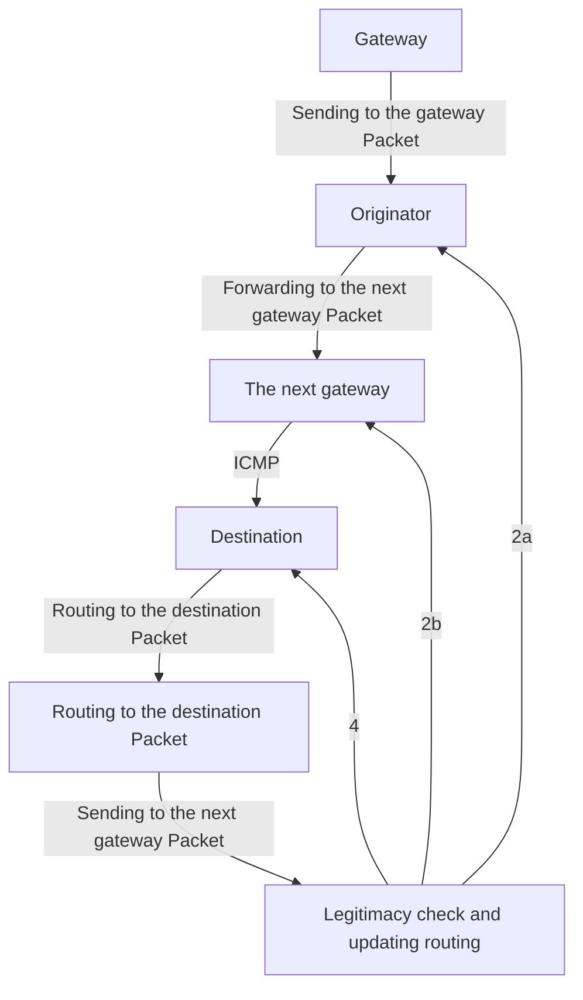
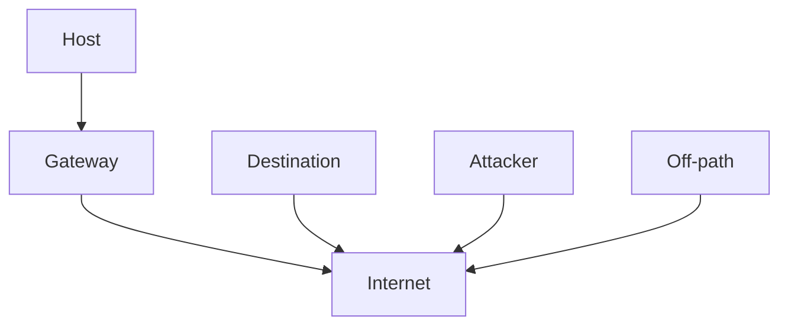
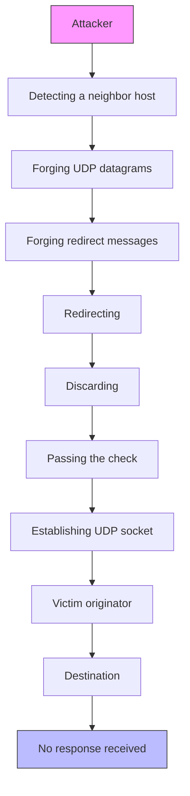
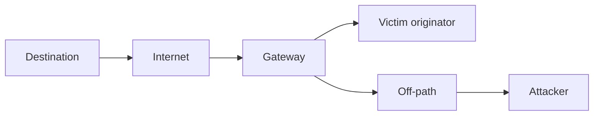

# Off-Path Network Traffic Manipulation via Revitalized ICMP Redirect Attacks

Xuewei Feng, Department of Computer Science and Technology & BNRist, Tsinghua University; Qi Li, Institute for Network Sciences and Cyberspace & BNRist, Tsinghua University and Zhongguancun Lab; Kun Sun, Department of Information Sciences and Technology & CSIS, George Mason University; Zhiyun Qian, UC Riverside; Gang Zhao, Department of Computer Science and Technology & BNRist, Tsinghua University; Xiaohui Kuang, Beijing University of Posts and Telecommunications; Chuanpu Fu, Department of Computer Science and Technology & BNRist, Tsinghua University; Ke Xu, Department of Computer Science and Technology & BNRist, Tsinghua University and Zhongguancun Lab

https://www.usenix.org/conference/usenixsecurity22/presentation/feng

# This paper is included in the Proceedings of the 31st USENIX Security Symposium.

August 10–12, 2022 • Boston, MA, USA

978-1-939133-31-1

Open access to the Proceedings of the 31st USENIX Security Symposium is sponsored by USENIX.

# Off-Path Network Traffic Manipulation via Revitalized ICMP Redirect Attacks

Xuewei Feng1, Qi Li2,5, Kun Sun3, Zhiyun Qian4, Gang Zhao1, Xiaohui Kuang6 Chuanpu Fu1, and Ke Xu1,5\*

1Department of Computer Science and Technology & BNRist, Tsinghua University 2Institute for Network Sciences and Cyberspace & BNRist, Tsinghua University 3Department of Information Sciences and Technology & CSIS, George Mason University 4UC Riverside 5Zhongguancun Lab 6Beijing University of Posts and Telecommunications

# Abstract

ICMP redirect is a mechanism that allows an end host to dynamically update its routing decisions for particular destinations. Previous studies show that ICMP redirect may be exploited by attackers to manipulate the routing of victim traffic. However, it is widely believed that ICMP redirect attacks are not a real-world threat since they can only occur under specific network topologies (e.g., LAN). In this paper, we conduct a systematic study on the legitimacy check mechanism of ICMP and uncover a fundamental gap between the check mechanism and stateless protocols, resulting in a wide range of vulnerabilities. In particular, we find that off-path attackers can utilize a suite of stateless protocols (e.g., UDP, ICMP, GRE, IPIP and SIT) to easily craft evasive ICMP error messages, thus revitalizing ICMP redirect attacks to cause serious damage in the real world, particularly, on the wide-area network. First, we show that off-path attackers can conduct a stealthy DoS attack by tricking various public servers on the Internet into mis-redirecting their traffic into black holes with a single forged ICMP redirect message. For example, we reveal that more than 43K popular websites on the Internet are vulnerable to this DoS attack. In addition, we identify 54.47K open DNS resolvers and 186 Tor nodes on the Internet are vulnerable as well. Second, we show that, by leveraging ICMP redirect attacks against NATed networks, off-path attackers in the same NATed network can perform a man-in-the-middle (MITM) attack to intercept the victim traffic. Finally, we develop countermeasures to throttle these attacks.

# 1 Introduction

The ICMP redirect mechanism is designed to minimize the number of route hops that a particular traffic flow has to traverse on its way to the destination, thus optimizing the forwarding path and reducing traffic volume that has to be handled by each individual router [18,67]. Once a better route is identified, the router will issue an ICMP redirect message to inform the alternative route to the originator. After receiving the message and successfully validating its legitimacy, the originator will update its routing table by setting the Gateway Internet Address field in the message as its new next hop to the destination. ICMP redirect mechanism is supported by almost all major operating systems.

In principle, ICMP redirect messages should only be sent by routers for reporting packet processing errors [2, 12, 67]. However, due to a lack of verifying the forwarding path of packets in the current Internet [42, 87, 88], any host can impersonate a router to forge ICMP error messages [26]. As a result, an attacker may redirect traffic from an originator to a specific host via sending forged ICMP redirect messages to the victim originator. To solve this problem, ICMP specifications [6, 12, 31, 67] enforce a legitimacy check mechanism on the ICMP error messages received by the originator, namely, ICMP error messages should embed at least 28 octets (i.e., 20 octets of the IP header plus at least the first 8 octets) of the original packet’s data that triggered the error message.

Therefore, it is a key issue to evade the legitimacy check for an ICMP redirect attack. In previous broadcast networks where hosts are linked by hubs, attackers can eavesdrop data sent from the originator and then embed the data into a crafted ICMP redirect message to evade the originator’s check, thus misleading the originator’s traffic [8, 9, 48, 56, 63, 86]. Nowadays, with the wide deployment of switched networks where hosts are linked by switches or routers, off-path attackers can no longer eavesdrop network traffic of other hosts to easily forge an acceptable ICMP redirect. Hence, previous ICMP redirect attacks [8, 9, 48, 56, 63, 86] always fail in modern network topologies.

Historically, several technical blogs and talks have discussed the method of performing malicious ICMP redirects by off-path attackers [5, 22, 37, 41, 83]. For example, Linux systems before kernel version 2.6.20 do not check ICMP error messages embedded with UDP data, hence it is possible to forge an acceptable ICMP redirect message embedded with UDP data to perform off-path ICMP redirect attacks. However, modern OSes will check the existence of the embedded

UDP socket, thus most prior methods will fail [5,22,37,83]. In Kulas’s talk [41], ICMP echo messages are exploited to forge redirect messages and evade the originator’s check mechanism. However, the proposed ICMP redirect attack can only succeed on local networks. Besides, in the real world, originators may disable ICMP echoes for performance and security considerations [79], thus foiling the attack. In general, it is widely believed that ICMP redirect attacks are not a realworld threat since they can happen only in a limited network topology [8, 9].

In this paper, we demonstrate that ICMP redirect attacks can be revitalized to cause serious damages in the real world without the limitation of network topologies [8, 9]. In particular, we discover that it is in fact widely applicable on the wide-area networks. We reveal that due to the gap between the legitimacy check mechanism of ICMP and a suite of stateless protocols (e.g., ICMP, UDP, GRE [25], IPIP [64] and SIT [61]), victim originators are inherently unable to check the legitimacy of ICMP error messages embedded with this type of protocol data. As a result, the victims may accept a forged ICMP redirect message issued from off-path attackers incorrectly, which incurs mis-redirecting their traffic obediently. This vulnerability affects a wide range of major OSes, including Linux 2.6.20 and beyond, FreeBSD 8.2 and beyond, Android 4.3 and beyond, and Mac OS 10.11 and beyond1.

In modern switched networks, off-path attackers cannot eavesdrop the traffic of other hosts to craft ICMP redirect messages. However, we discover that the ambiguities in the legitimacy check mechanism of ICMP can be exploited by off-path attackers to craft an evasive ICMP error message. Since stateless protocols cannot remember the data that has been sent earlier, if the attacker can force a victim originator to eject stateless protocol data and then forge ICMP error messages embedded with this type of protocol data, it is difficult for the originator to accurately check the legitimacy of the message. Modern OSes may perform some simple checks, e.g., if UDP data is embedded in the received ICMP error messages, Linux systems since kernel version 2.6.20 will check the existence of the corresponding UDP socket. However, off-path attackers can trick the originator into establishing a predictable UDP socket in advance, and then they forge ICMP errors embedded with this known UDP socket data, the check enforced by the victim originator will be easily evaded. Due to the memorylessness of UDP, the originator cannot perform further check and will accept the forged message ultimately. This inherent gap between the legitimacy check mechanism of ICMP and stateless protocols allows off-path attackers to easily forge evasive ICMP errors. In this paper, we use a forged ICMP redirect message to falsely update a victim’s routing and then mis-redirect its subsequent traffic to a specified host.

We demonstrate that our revitalized ICMP redirect attacks can cause serious damages in the real world. First, an off-path attacker can force a remote vulnerable target on the Internet to route its traffic into black holes (hosts forwarding-disabled by default) by issuing one forged ICMP redirect message, resulting in a stealthy DoS attack. Our experiments show that more than 43,000 popular websites on the Internet are vulnerable. Moreover, we demonstrate that our DoS attack can even be performed to shut down the entire operation of a back-end service such as DNS and Tor when the communication between the originator and the destination is cut off, thus resulting in a wider range of impact. We identify that 54,470 open DNS resolvers and 186 Tor nodes on the Internet are vulnerable to our attack. Second, when the attacker and the victim reside in the same network, we show that off-path attackers can evolve to man-in-the-middle (MITM) and then perform various hijacking attacks, e.g., hijacking DNS requests in NAT (Network Address Translation) [81] networks.

Finally, we develop different countermeasures against the attacks and systematically measure their effectiveness. First, we propose to change network settings to block spoofed ICMP redirect messages on the Internet, which can prevent the remote DoS attack under the deployment of the filtering mechanism in ISPs. Second, we evaluate the possibility of adopting protocol changes to improve the legitimacy check mechanism for ICMP messages, e.g., embedding secrets in UDP to authenticate the communications. Finally, we propose to strictly distinguish between stateless protocols and stateful protocols and disable ICMP redirect mechanism on stateless protocols. This countermeasure can effectively defeat both the DoS attack and the MITM attack above. Moreover, this countermeasure can be easily deployed since it only needs to make changes at specific hosts that are worried about ICMP redirect attacks. We implement a prototype and evaluate this countermeasure in our real-world network. The experimental results demonstrate that it can effectively prevent the attacks with a small side effect on the network performance.

# Contributions. Our main contributions are as follows:

• We uncover a fundamental gap between the legitimacy check mechanism of ICMP and stateless protocols, and we reveal that the gap may lead to vulnerabilities in a wide range of major OSes, including Linux 2.6.20 and beyond, FreeBSD 8.2 and beyond, Android 4.3 and beyond, Mac OS 10.11 and beyond.   
• We demonstrate that ICMP redirect attacks can be performed on the Internet, thus causing serious damages in the real world. We identify more than 43,000 popular websites, 54,470 open DNS resolvers, and 186 Tor relay nodes on the Internet are vulnerable to our attacks.

• We analyze the root cause and propose an enhanced ICMP legitimacy check mechanism to prevent the attacks. A prototype validates the effectiveness of our countermeasures.

Ethical considerations. In this paper, we conduct two types of real-world experiments to validate the feasibility and impacts of the identified attacks, i.e., discovering public servers vulnerable to DoS on the Internet (see §5) and hijacking a vulnerable DNS forwarder’s requests in our campus network (see §6). We consider ethics as a top priority when conducting the experiments.

In the experiments of discovering vulnerable public servers on the Internet, we use machines in our own testbed as the destinations of the public servers. By issuing crafted ICMP redirects, we only change the routing of the server’s packets towards our own machines and thus our experiments do not affect the normal users’ visiting of the servers. Besides, one ICMP redirect message incurs negligible loads on the servers. After the experiments, we restore the routing change of the server via issuing a curative ICMP redirect message (i.e., specifying the server’s default gateway as the next hop to our machines). We also confirm the effectiveness of the curative ICMP redirect message.

Before conducting the experiments of hijacking DNS requests in our campus network, we explain the details of our attacks and the potential risks to the network administrators. We obtain their approval to conduct the experiments only for the research purpose. With the help of the administrators, we conduct the experiments at midnight. The administrators confirm that no users access the target network before we perform the experiment, preventing our experiments from incurring potential privacy risks over normal users. Moreover, to minimize the impacts on the forwarder’s DNS cache, we only intercept the forwarder’s DNS queries for a specific website (i.e., the target website of “www.yahoo.com” in our experiment). Once the experiments finish, the network administrators reset the DNS forwarder to the normal state.

# 2 Background

# 2.1 ICMP Redirect for Network Traffic

As a standard in RFC 792 since 1981 [67], the ICMP redirect mechanism is utilized by routers to inform an originator of a more optimal path from the originator to its destination. It reduces the amount of hops that have to be travelled through to reach the destination. Figure 1 shows the basic procedure of ICMP redirects. When the gateway of the originator receives an IP packet, the gateway will check its routing table to determine the address of the next gateway. If the next gateway and the originator that is identified by the source IP address of the packet are on the same network, an ICMP redirect message will be sent to the originator from the gateway. The generated ICMP redirect message advises the originator to send its traffic for the destination network directly to the next gateway, instead of the current gateway, since forwarding through the next gateway directly is a shorter path to the destination.

Once the originator receives the ICMP redirect message and the message passes its check, the originator sets the next gateway as its next hop of the route to the destination. In the ICMP specification [67], the Type field of the ICMP redirect message is specified as 5, and the Code field can be specified to 0, 1, 2, and 3, which means redirecting packets for the network, redirecting packets for the host, redirecting packets for the type of service and network, and redirecting packets for the type of service and host, respectively. The next gateway is specified in the Gateway Internet Address field of the ICMP redirect message.

The ICMP redirect mechanism is useful to reduce route hops and enable load balance among routers. If the redirect mechanism is disabled, the originator will not be aware of the most optimal route to the destination. As a result, the ICMP redirect mechanism is enabled by default in IP implementations of a wide range of major OSes, e.g., Linux 2.6.20 and beyond, FreeBSD 8.2 and beyond. The originators equipped with these OSes accept ICMP redirect messages by default and redirect their traffic to the specified Gateway Internet Address (i.e., the next gateway) once the message passes the check mechanism.


<details>
<summary>flowchart</summary>


</details>

Figure 1: Optimizing the routing path via ICMP redirects.

# 2.2 Legitimacy Checks over ICMP Errors

The ICMP redirect mechanism may also be exploited by attackers to manipulate network traffic. An attacker can send a forged ICMP redirect message to the originator, which indicates that all future traffic for the destination must be redirected to a specific system as the shorter route for the destination.

In order to prevent the abusing of ICMP redirects, when an ICMP redirect message is received, the originator performs two checks [6, 12, 67]. First, the originator checks if the message was sent by its default gateway, i.e., the source IP address of the ICMP redirect message should be specified as the default gateway’s IP address. Second, ICMP error messages should carry at least 28 octets (i.e., 20 octets of the IP header plus at least the first 8 octets) of the original packet that triggered the error message. These 28 octets data will be used by the originator to match the message to the corresponding process and check the legitimacy of the message. Moreover, according to the newer standard RFC 1812 [6], ICMP error messages should carry the most content of the triggering packet, but not exceeding 576 octets.

# 2.3 Existing Evasions of the Checks

Unfortunately, even when the legitimacy checks over ICMP redirects are implemented, attackers may still evade the checks to perform ICMP redirect attacks. The first check can be easily evaded due to the vulnerability of IP address spoofing on the Internet. An off-path attacker can impersonate the gateway of a victim originator to issue a spoofed ICMP redirect message. According to prior studies [44, 49], about a quarter of the Autonomous Systems (ASes) on the Internet do not filter packets with spoofed source IP address leaving their networks. In this paper, we identify that more than 5,100 ASes on the Internet do not enforce effective ingress filtering [7, 28]. As a result, ICMP redirect messages with spoofed source IP address of gateways within these ASes can pass the whole routing path and be forwarded to the victim originators (detailed later in §4).

The second check over the embedded payload in the ICMP redirect message is more difficult to evade for off-path attackers, even if the originator only enforces the weaker check mechanism defined in RFC 792 (i.e., checking the first 28 octets of the original packet). As shown in Figure 2, when the originator uses TCP as the higher level protocol to communicate with others, the attacker has to guess the four-tuple that identifies a TCP connection and a sequence number in the originator’s send window to craft an evasive ICMP redirect message. In particular, it is hard for off-path attackers to guess these values as the source port and sequence number are randomly generated2 in modern operating systems [32].


<details>
<summary>text_image</summary>

Type = 5
Code
ICMP Checksum
Gateway Internet Address
IP Header
Source Port
Destination Port
Sequence Number
28 octets
</details>

Figure 2: ICMP redirect message embedded with TCP.

In this paper, we show that the second check can be bypassed, regardless of whether 28 octets or 576 octets are checked. This is due to the gap between ICMP’s legitimacy check mechanism and stateless protocols, which ultimately leads to real-world ICMP redirect attacks described next.

# 3 Vulnerability of Checking ICMP Errors

# 3.1 Gap in ICMP Legitimacy Check

Unlike TCP, stateless protocols cannot remember the data that has been sent earlier. Hence, if an off-path attacker forges ICMP error messages embedded with this type of protocol data, it is difficult for the originator to accurately check the legitimacy of the embedded data. As a result, the victim may accept the forged messages. Once a forged ICMP redirect message is accepted, the victim will falsely update its routing according to the new gateway specified in the message. Consequently, the entire traffic undertaken by IP will be affected and cross attacked. In practice, it is reasonable to redirect all subsequent traffic when the victim finds a better next hop, since traffic routing occurs at the IP layer regardless of the upper protocols. However, the complexity of interactions between different protocols poses many challenges to the current network principles [26].

Current ICMP implementations may perform some checks on the received ICMP error messages embedded with stateless protocol data. For example, when a message embedded with UDP datagram is received, Linux kernel version 2.6.20 and beyond will check whether a UDP socket exists between it and the destination. This check prevents previous ICMP redirect attacks [22, 37, 83]. However, we discover that due to the inherent gap in the legitimacy check mechanism of ICMP, this check can be easily evaded.

In practice, modern OSes open several publicly known UDP ports by default for lightweight services (e.g., NTP, SNMP, DHCP, DNS and TFTP)3, and hence attackers can first probe such an open UDP port on the victim and then trick the victim into generating a predictable UDP socket for the remote destination on the probed open port. After that, the attacker forges an ICMP redirect message to the victim, which is embedded with the known UDP socket and some arbitrary padding data. The padding data cannot be checked accurately due to the statelessness of UDP. As a result, the forged ICMP redirect message will evade the security check and be accepted incorrectly, i.e., a successful off-path ICMP redirect attack against the victim. Besides UDP, we identify that stateless protocols of ICMP, GRE [25], IPIP [64] and SIT [61] can also be exploited by off-path attackers to evade the ICMP legitimacy check mechanism. In our attacks, we take UDP as a sample to elaborate and exploit the vulnerability. Note that the method of using stateless protocols to trigger the gap in the ICMP legitimacy check mechanism is generic. Off-path attackers can exploit stateless protocols to forge all types of ICMP error messages (not only ICMP redirect messages) to evade the check.

# 3.2 Vulnerable Implementations

The identified gap affects a wide range of implementations, i.e., Linux 2.6.20 (released in February 2007) and beyond, FreeBSD 8.2 (released in February 2011) and beyond, Android 4.3 (released in June 2012) and beyond, Mac OS 10.11 (released in September 2015) and beyond. The mechanism of ICMP redirect is enabled by default in Linux systems, FreeBSD systems, Android systems before kernel version 6.0, and Mac OSes before kernel version 10.11.6. In Android systems, it is difficult for normal users to disable the ICMP redirect mechanism manually once the mechanism is enabled in the kernel, since the operation of disabling requires root privileges [1], and only about 7.6% users of Android systems in the world root their devices [3]. For Mac OSes after kernel version 10.11.6, once the ICMP redirect mechanism is enabled via the parameter of sysctl, Mac OSes become vulnerable too.

We also review the source code of Linux systems and FreeBSD systems to confirm that they are indeed vulnerable to our attacks. For example, Figure 3 illustrates the code that handles ICMP error messages embedded with a UDP datagram since Linux kernel version 2.6.204. It can be seen that Linux will check the existence of the socket first (in line 106). Due to the statelessness and memorylessness of UDP, Linux cannot perform a further check on the embedded UDP data (unlike TCP which will be further checked to confirm that the carried sequence number is within its send window). Therefore, as long as the socket to the remote destination exists, Linux will redirect the outgoing traffic for the destination (in line 113). However, as we described before in §3.1, attackers can easily craft a UDP socket to evade this check, thus tricking the victim into redirecting its traffic obediently.

```c
100 void __udp4_lib_err ()
101 {
102    ......
103    const int type = icmp_hdr(skb)->type;
104    const int code = icmp_hdr(skb)->code;
105    struct sock *sk;
106    sk = _udp4_lib_lookup( );
107    if (!sk) {
108    _ICMP_INC_STATS(net, ICMP_MIB_INERRORS);
109    return; /* No socket for error */ 
110    }
111    switch (type) {
112    case ICMP_REDIRECT:
113    ipv4_sk_redirect( );
114    }
115    ......
116 } 
```  
Figure 3: Handling ICMP errors embedded with UDP.

# 3.3 Crafting Evasive ICMP Redirects

Figure 4 illustrates the structure of a forged ICMP redirect message embedded with a known UDP datagram, which can be used to evade the check mechanism in ICMP specifications. In IP header, the Protocol filed is specified as ICMP, source IP address and destination IP address are specified as the gateway’s IP address and the victim originator’s IP address, separately. Then in ICMP header, the Type field is specified as 5, indicating that this is an ICMP redirect message. The value of the Code field is not unique, and the attacker can choose any one of the four values (i.e., 0, 1, 2 or 3) to redirect the victim originator’s network traffic for the destination that is specified in the next embedded UDP datagram. The Gateway Internet Address field specifies the new gateway of the originator on the way to the destination.

Our forged ICMP redirect message can work regardless of whether the checks defined in RFC 792 and RFC 1812 are implemented, since the check mechanism is by design not effective in stateless protocols (i.e., UDP in our demonstration). Furthermore, we discover that RFC 1812 (i.e., checking as much of the triggering packet as possible but not exceeding 576 octets) has not been implemented strictly in the vulnerable OSes that we list in §3.2. As a result, in practice, the attacker only needs to craft the first 28 octets data of the UDP datagram in Figure 4 to evade the check mechanism and then perform our attack successfully.


<details>
<summary>text_image</summary>

V4 | IHL = 20 | TOS | Total Length
IPID | X|DF|MF | Frag Offset
TTL | Protocol = ICMP | IP Header Checksum
Source address = Gateway
Destination address = Originator
Type = 5 | Code = 0/1/2/3 | ICMP Checksum
Gateway Internet Address
V4 | IHL = 20 | TOS | Total Length
IPID | X|DF|MF | Frag Offset
TTL | Protocol = UDP | IP Header Checksum
Source address = Originator
Destination address = Destination
Source port | Destination port
Length | Checksum
'AAAAAAAAAAAAAAAAAAAAAAAAAAAAAAAAAAAAAAAAAAAAA'
576 octets
</details>

Figure 4: Forged ICMP redirect embedded with UDP.

By crafting such an evasive ICMP redirect message, attackers can manipulate victims’ traffic to construct off-path attacks, i.e., (i) performing a stealthy remote DoS attack against vulnerable servers on the Internet when the attacker does not reside in the same network with the servers, or (ii) hijacking a victim’s traffic to construct MITM attacks if the attacker is a normal user residing in the same network with the victim.

# 4 Forging ICMP Redirects on the Internet

A requisite for our remote DoS attack is that the malicious ICMP redirect messages crafted by off-path attackers can be forwarded to remote victims. In this section, we conduct measurement studies on the feasibility of sending crafted ICMP redirect messages to remote victims.

Table 1: Forwarding ICMP redirect messages on the Internet. 

<table><tr><td rowspan="2" colspan="2">AS crossed Sender\Receiver</td><td colspan="5">Asia</td><td colspan="3">America</td><td colspan="2">Europe</td></tr><tr><td>Beijing159.226.*.202</td><td>Tokyo124.156.*.135</td><td>Bombay119.28.*.146</td><td>Singapore150.109.*.233</td><td>Hong Kong43.129.*.233</td><td>California170.106.*.100</td><td>Toronto49.51.*.40</td><td>Virginia170.106.*.40</td><td>Frankfurt162.62.*.44</td><td>Moscow162.62.*.197</td></tr><tr><td rowspan="2">America</td><td>California47.88.*.24</td><td>AS7497AS174AS2914</td><td>AS2914</td><td>AS6453</td><td>AS7473AS4766</td><td>AS6453AS9304</td><td>AS8003</td><td>AS3356AS2914</td><td>AS2914AS3356</td><td>AS1299AS2914</td><td>AS6762AS2914AS31133</td></tr><tr><td>Virginia47.90.*.227</td><td>AS7497AS174</td><td>AS2516AS3356</td><td>AS174AS9498</td><td>AS6453AS3356</td><td>AS3491AS174</td><td>AS3356</td><td>AS3356</td><td>AS32098</td><td>AS3356</td><td>AS3356</td></tr><tr><td>Europe</td><td>London8.208.*.114</td><td>AS7497AS174AS3356AS45102</td><td>AS2516AS3356AS45102</td><td>AS9498AS45102</td><td>AS7473AS1299AS45102</td><td>AS6453AS3491AS3356AS45102</td><td>AS3356AS45102</td><td>AS3356AS45102</td><td>AS3356AS45102</td><td>AS1299AS45102</td><td>AS6939AS209141AS45102</td></tr><tr><td>Australia</td><td>Sydney47.74.*.68</td><td>AS7497AS7474AS3491AS45102AS7473</td><td>AS2914AS7474AS7473AS45102</td><td>AS7473AS7474AS9498AS45102</td><td>AS7473AS7474AS45102</td><td>AS7474AS7473AS45102AS9304</td><td>AS6453AS7474AS7473AS45102AS45102</td><td>AS6453AS7474AS45102AS7473</td><td>AS7474AS6461AS45102AS7473</td><td>AS1299AS7474AS45102AS7473</td><td>AS6939AS45102AS15412AS209141</td></tr><tr><td rowspan="5">Asia</td><td>Jakarta147.139.*.126</td><td>AS7497AS3491AS10217AS2914</td><td>AS2914AS10217</td><td>AS7473AS9498AS135391</td><td>AS135391</td><td>AS3491AS10217AS2914</td><td>AS6453AS2914AS10217</td><td>AS6453AS2914AS10217</td><td>AS3356AS10217AS2914</td><td>AS1299AS3356AS10217AS2914</td><td>AS2914AS10217AS3356</td></tr><tr><td>Qingdao118.190.*.74</td><td>AS7497AS37963</td><td>AS4837AS45102AS2914</td><td>AS4837AS37963AS6453AS4755</td><td>AS7473AS58541AS45102AS4134AS4809</td><td>AS37963AS58541AS4134AS4809</td><td>AS4134AS45102AS58541</td><td>AS6453AS4837AS45102</td><td>AS7018AS4837AS37963</td><td>AS4837AS1299AS37963AS45102</td><td>AS4837AS12389AS45102</td></tr><tr><td>Dubai47.91.*.206</td><td>AS7497AS3491AS6762AS45102AS15802</td><td>AS2914AS45102AS15802</td><td>AS45102AS9498</td><td>AS8003</td><td>AS9304AS45102AS15802</td><td>AS3356</td><td>AS3356AS45102</td><td>AS3356AS45102AS15802</td><td>AS45102</td><td>AS31133AS45102</td></tr><tr><td>Beijing183.173.*.12</td><td>AS7497AS3491AS2914</td><td>AS2914AS4134</td><td>AS4637AS9498</td><td>AS4134AS4809</td><td>AS4134AS4809</td><td>AS4134</td><td>AS6453AS4637</td><td>AS4134AS3356</td><td>AS4134AS3356</td><td>AS4134AS31133</td></tr><tr><td>Kuala Lumpur47.250.*.16</td><td>AS7497AS3491AS2914</td><td>AS2914</td><td>AS9930AS9498</td><td>AS9930</td><td>AS3491AS2914</td><td>AS6453AS2914</td><td>AS6453AS2914</td><td>AS2914AS3356</td><td>AS2914AS3356</td><td>AS2914AS3356</td></tr></table>

# 4.1 Forwarding Redirects on the Internet

According to ICMP specifications [12, 67], ICMP redirect messages should only be issued by the current first-hop gateway to the attached hosts, which means ICMP redirect messages should not be forwarded across networks on the Internet. As a result, if ICMP redirect messages appear on the Internet, they should be silently discarded by filtering mechanisms [7, 28, 39] that only allow legitimate traffic to flow through the network. However, through extensive measurement studies on the Internet, we reveal that crafted ICMP redirect messages are still allowed to traverse across a considerable number of ASes, thus successfully being forwarded on the Internet.

Experimental Setup. We deploy 19 vantage points in 4 continents around the world to test the feasibility of forwarding crafted ICMP redirect messages across different ASes on the Internet. We craft ICMP redirects from 9 of the vantage points and then send the crafted messages to the rest 10 points (see Table 1 for more details about the locations of our vantage points that are evenly distributed around the world). Note that we do not perform any IP spoofing in this experiment as the goal is to see whether redirect messages themselves can be forwarded successfully on the Internet.

Experimental Results. Table 1 shows our experimental results. We find that in our 90 measurements, the crafted message can always be forwarded to the receiver without any restrictions on the Internet, even though the forwarding of the messages crosses several ASes and the specified source IP address of the message is obviously illegal, i.e., the source IP address of the message is the sender that cannot be the gateway of the receiver at all.

# 4.2 Receiving Spoofed Redirects in Target AS

Besides forwarding ICMP redirect messages on the Internet, our remote DoS attack also requires that the target AS where the victim originator resides will not discard forged ICMP redirect messages with spoofed source IP address of the victim’s gateway within the AS.

In our empirical studies on the Internet, we find that a large number of vulnerable ASes allow spoofed ICMP redirect messages (with source IP address of gateways within these ASes) to enter. The spoofed messages will be successfully forwarded to victim originators attached to the gateways, thus manipulating the victim’s network traffic (see §5.2 for details about the detection for victim originators and the corresponding vulnerable AS on the Internet).

We totally detect 5,184 vulnerable target ASes (located in 185 countries around the world) that do not filter spoofed ICMP redirect messages. It is not a surprise, considering that about a quarter of ASes on the Internet have not yet implemented effective filtering mechanisms to block spoofed packets [44, 49]. Table 2 presents the detailed information of 30 of the vulnerable ASes. For example, As shown in the first line, a gateway with IP address of 154.54.x.157 is in AS 174 which is located in the United States and belongs to Cogent

Communications. We forge an ICMP redirect message with the spoofed source IP address of this gateway and send the message to the victim (a vulnerable web server we detected in Alexa top 1 million websites list, see §5.3 for more details) attached to this gateway. Finally, the spoofed ICMP redirect message is successfully forwarded to the victim.

Table 2: Vulnerable ASes allowing spoofed redirect messages. 

<table><tr><td>Gateway</td><td>AS No.</td><td>Organization</td><td>Location</td></tr><tr><td>154.54.x.157</td><td>AS174</td><td>Cogent Comm.</td><td>US</td></tr><tr><td>64.86.x.66</td><td>AS6453</td><td>TATA Comm. (AMERICA)</td><td>US</td></tr><tr><td>45.79.x.5</td><td>AS63949</td><td>Linode, LLC</td><td>US</td></tr><tr><td>204.93.x.159</td><td>AS23352</td><td>Server Central Network</td><td>US</td></tr><tr><td>72.29.x.133</td><td>AS7393</td><td>CYBERCON, INC.</td><td>US</td></tr><tr><td>148.163.x.24</td><td>AS53755</td><td>Input Output Flood LLC</td><td>US</td></tr><tr><td>64.74.x.198</td><td>AS63410</td><td>PrivateSystems Networks</td><td>US</td></tr><tr><td>209.58.x.15</td><td>AS394380</td><td>Leaseweb USA</td><td>US</td></tr><tr><td>188.170.x.58</td><td>AS31133</td><td>PJSC MegaFon</td><td>RU</td></tr><tr><td>92.53.x.34</td><td>AS49505</td><td>OOO Network</td><td>RU</td></tr><tr><td>109.234.x.250</td><td>AS50340</td><td>OOO Network</td><td>RU</td></tr><tr><td>62.67.x.186</td><td>AS3356</td><td>Level3, LLC</td><td>DE</td></tr><tr><td>213.239.x.230</td><td>AS24940</td><td>Hetzner Online GmbH</td><td>DE</td></tr><tr><td>198.27.x.92</td><td>AS16276</td><td>OVH SAS</td><td>FR</td></tr><tr><td>89.30.x.146</td><td>AS31216</td><td>BSOCOM</td><td>FR</td></tr><tr><td>185.17.x.66</td><td>AS42831</td><td>UK Dedicated Servers</td><td>GB</td></tr><tr><td>87.245.x.221</td><td>AS9002</td><td>RETN Limited</td><td>GB</td></tr><tr><td>125.22.x.166</td><td>AS9498</td><td>BHARTI Airtel</td><td>IN</td></tr><tr><td>183.83.x.29</td><td>AS18209</td><td>Atria Convergence</td><td>IN</td></tr><tr><td>218.145.x.26</td><td>AS4766</td><td>Korea Telecom</td><td>KR</td></tr><tr><td>58.159.x.178</td><td>AS17506</td><td>ARTERIA Networks</td><td>JP</td></tr><tr><td>159.226.x.203</td><td>AS7497</td><td>Computer Network</td><td>CN</td></tr><tr><td>195.142.x.162</td><td>AS34984</td><td>TELLCOM ILETISIM</td><td>TR</td></tr><tr><td>80.67.x.207</td><td>AS42708</td><td>GleSYS AB</td><td>SE</td></tr><tr><td>83.137.x.204</td><td>AS47692</td><td>Nessus GmbH</td><td>AT</td></tr><tr><td>103.245.x.150</td><td>AS17660</td><td>DrukNet ISP</td><td>BT</td></tr><tr><td>103.252.x.129</td><td>AS45638</td><td>SYNERGY WHOLESALE</td><td>AU</td></tr><tr><td>118.98.x.254</td><td>AS18051</td><td>Pustekkom</td><td>ID</td></tr><tr><td>113.21.x.217</td><td>AS38082</td><td>True Internet</td><td>TH</td></tr><tr><td>45.138.x.1</td><td>AS207640</td><td>Expert Solutions</td><td>GE</td></tr></table>

# 5 Stealthy Remote DoS Attacks

In this section, we present a stealthy DoS attack that can be launched remotely to cut off the communication between a pair of IP addresses exploiting the weak ICMP legitimacy check mechanism. It can be targeted at not only individual users, e.g., preventing one from visiting a website, but also server-to-server communication, e.g., shutting down a DNS resolver from contacting a particular authoritative name server to resolve certain domains names. It is even possible to shut down an entire operation of a service such as Tor when the communication between Tor nodes is broken down. We first present the threat model and the design of our attack. Then, we perform empirical studies to identify vulnerable public servers on the Internet. We uncover that 43,081 popular websites, 54,470 open DNS resolvers and 186 Tor relay nodes that are residing in 5,184 ASes and 185 countries are vulnerable to our DoS attack.

# 5.1 Threat Model

Figure 5 illustrates the threat model of our off-path DoS attack. The model consists of four hosts: 1) a victim originator (in different attack scenarios, the victim originator may be a web server, an open DNS resolver or a Tor relay node), 2) a neighboring host attached to the same gateway with the victim originator, 3) a victim destination (correspondingly, in different attack scenarios, the victim destination may be a web client, an authoritative name server or a next-hop Tor relay node), 4) an off-path attacker. The off-path attacker aims to pretend to be the gateway and forges an ICMP redirect message to the originator, thus redirecting the originator’s network traffic for the destination to the neighboring host maliciously. Since hosts are forwarding-disabled by default, they will act as black holes and discard the originator’s traffic, which means the off-path attacker performs a successful DoS attack against the victim originator. In order to complete the DoS attack, the following requirements need to be fulfilled.

Victim originator   


<details>
<summary>flowchart</summary>


</details>

Figure 5: Threat model of DoS attacks.

Traceable Gateway. IP address of the gateway is known to the attacker, since the attacker needs to impersonate the gateway to craft ICMP redirect messages. Once the originator’s IP address is determined, IP address of its gateway may be observed through traceroute [46].

IP Spoofing. The off-path attacker is capable of sending spoofed packets with the IP address of the gateway. Prior studies show that about a quarter of ASes on the Internet do not filter packets with spoofed source addresses leaving their networks [44, 49], and it is trivial to rent such a machine from a bullet-proof-hosting node [50]. Moreover, a recent study [20] uncovers that 69.8% of ASes on the Internet do not enforce ingress filtering to block spoofed packets, which further demonstrates the seriousness of IP spoofing.

Vulnerable Target. The victim originator whose outgoing traffic for the destination will be misled has to be equipped with the vulnerable OSes listed in §3.2. Hence, the crafted ICMP redirect messages can evade the originator’s check to poison the originator’s routing.

Live Neighboring Host. In current ICMP implementations, the originator will check the availability of the host when it updates its routing to use the host as its next hop. The attacker can probe the network where the originator resides and then detect a live neighboring host of the originator by leveraging ICMP echoes5.

# 5.2 DoS Attack Design

Figure 6 presents the steps of our DoS attack via malicious ICMP redirects. In the beginning, the victim originator and the destination can communicate normally. In our attack, the originator may be a web server, an open DNS resolver, or a Tor relay node. Correspondingly, the destination may be a web client, an authoritative name server, or a next-hop Tor relay node, respectively. An off-path attacker aims to cut off the communication between the originator and the destination.

The attack consists of eight main steps. 1 The off-path attacker probes neighboring hosts of the victim originator by leveraging ICMP echoes. 2 The attacker impersonates the destination via IP address spoofing and forges UDP datagrams to one of the listening UDP ports of the victim originator. 3 The victim originator is tricked into establishing a UDP socket that is predictable to the attacker, since the four-tuple of the socket, i.e., source IP address, destination IP address, source port (listening UDP port) and destination port (source port of the previous forged UDP datagram specified by the attacker), is known to the attacker. 4 The attacker pretends to be the gateway (via IP address spoofing) of the victim originator that can be observed through traceroute and then forges an ICMP redirect message embedded with the known UDP socket information. 5 The forged ICMP redirect message passes the originator’s check. 6 The originator updates its routing cache and redirects subsequent network traffic (all types of network traffic undertaken by IP) to the neighboring host obediently. 7 The redirected traffic is discarded by the forwarding-disabled neighboring host. 8 The destination cannot receive any responses from the originator, which means only one forged ICMP error message causes a DoS of the originator. When all eight steps succeed, the AS where the victim originator resides is also considered vulnerable, i.e., receiving the spoofed ICMP redirects as stated in §4.2.

# 5.3 Case Study on Popular Websites

Experimental Setup. 4 kinds of hosts are involved. 1) Target web servers (i.e., victim originators in our attack design as shown in Figure 6) whose outgoing traffic may be manipulated by forged ICMP redirects. We use the servers of Alexa top 1 million websites as the targets in this measurement study. 2) Neighboring hosts of the target servers that reside in the same network with the servers. These hosts can be detected through ICMP echo requests and replies. 3) Web clients (i.e., destinations) that can access the target servers and receive responses originally. Due to ethical considerations, all the clients are under our control. To comprehensively evaluate the impact of this attack in the real world, we deploy 6 controlled clients (vantage points) in different locations around the world, i.e., Frankfurt, Singapore, California, Tokyo, Shanghai, and Toronto. 4) A malicious attacker located in Russia who can spoof source IP address and aims to mislead the target server’s network traffic (sending to our controlled clients) into the detected neighboring hosts (i.e., routing black holes) via crafting ICMP redirect messages. If the DoS attack succeeds, the clients will not be able to receive responses from the vulnerable server.


<details>
<summary>flowchart</summary>


</details>

Figure 6: Overview of DoS attacks.

Experimental Results. Figure 7 shows the details of our DoS attack measurement results. Due to different network conditions, the number of vulnerable websites observed from different vantage points varies greatly. For example, in Frankfurt, we detect 28,604 vulnerable websites, while in Shanghai, we can only detect 19,603 vulnerable websites. We unite the sets of the vulnerable websites detected from our six vantage points together (deleting duplicates detected in different vantage points), then we totally discover that 43,081 popular websites located in 2,872 ASes and 130 countries are vulnerable to our DoS attack. Hence, the overall proportion of vulnerable websites in Alexa top 1 million is about 4.3%6. Interestingly, after counting the number of vulnerable websites in the nearest 10k websites we detected, we identify that the lower rank of the website, the more likely it can be compromised, which is also consistent with common intuitions.

We elaborate the reasons why our DoS attack may fail, as shown in Figure 7. On average, there are 17.73% websites in the list that cannot be reached from our vantage points, mainly due to two reasons. First, our clients cannot successfully receive a DNS reply for the request websites (in different vantage points, the proportion varies between 6.47% and 9.38%). Second, our clients cannot connect to the target websites (in different vantage points, the proportion varies between 8.86% and 16.19%). These two inaccessible situations are mainly caused by censorship [71, 82] and ISP filter rules [66]. When calculating the success rate of our attacks, we do not consider these inaccessible websites. Silent gateways cause 16.69% of the failures, i.e., gateways of the detected web servers do not respond to our probing. These gateways do not disclose their IP addresses, and thus the attacker cannot impersonate the gateway to send malicious ICMP redirect messages to the target server. 63.06% of the failures result from gateway filtering (e.g., ingress filtering [28]) or invulnerable OSes (e.g., ICMP error messages throttling). Figure 8 presents the geographical distribution of the vulnerable websites we detected.

  
Figure 7: DoS measurement study against popular websites.


<details>
<summary>heatmap</summary>

| Country | Value |
|---|---|
| United States | 14,894 |
| Germany | 7,350 |
| Canada | 2,434 |
| Netherlands | 1,762 |
| Britain | 1,158 |
| Denmark | 952 |
| Australia | 867 |
| Finland | 602 |
| China | 568 |
| Brazil | 227 |
| Spain | 193 |
| Estonia | 45 |
| Bangladesh | 13 |
| Luxembourg | 12 |
| Uruguay | 3 |
| Libya | 1 |
</details>

Figure 8: Geographical distribution of vulnerable websites.

# 5.4 Additional Attack Scenarios

Besides targeting individual users (i.e., preventing one from visiting a website), an off-path attacker can even cut off the back-end server-to-server communications by exploiting the vulnerability in ICMP legitimacy checks, e.g., the communications between DNS resolver and the downstream authoritative name servers and the communications between Tor relay nodes. Our DoS attack against back-end server-to-server communications will result in a more serious damage to the real world. For example, if we can prevent a DNS resolver from contacting its downstream authoritative name servers to resolve certain domains names, all users attached to the vulnerable DNS resolver will be prevented from accessing these domain names.

In our DoS attack measurement studies against DNS and Tor, the public DNS resolvers and Tor relay nodes replace the web servers in §5.3 (i.e., the victim originator in Figure 6 whose outgoing traffic may be mis-redirected into black holes). Correspondingly, our controlled downstream authoritative name server and Tor relay node replace the victim web clients (i.e., the destination in Figure 6).

Table 3: Comparisons of the DoS attack measurement results. 

<table><tr><td>Target</td><td>Quantity</td><td>Inaccessible</td><td>Silent gateway</td><td>Invulnerable OS or filtering</td><td>Qty of Vuls.</td></tr><tr><td>DNS resolver</td><td>1,951,381</td><td>39.69%</td><td>15.74%</td><td>41.78%</td><td>54,470 (4.63%)</td></tr><tr><td>Tor relay node</td><td>6,518</td><td>18.52%</td><td>26.22%</td><td>52.41%</td><td>186 (3.50%)</td></tr><tr><td>Website</td><td>Alexa top 1 million</td><td>17.73%</td><td>16.69%</td><td>63.06%</td><td>25,350 (3.07%)</td></tr></table>

Table 3 shows the comparisons of our DoS attack measurement results under different network scenarios. Comparing with the average measurement results on popular websites, we uncover that 54,470 open DNS resolvers (4.63% of the 1,951,381 targets obtained from Censys [23]) and 186 Tor relay nodes (3.50% of the 6,518 targets obtained from Dan [21]) on the Internet are vulnerable to our DoS attack, which means network traffic of these public servers can be manipulated remotely. Note that when calculating the vulnerable proportions, we do not consider the inaccessible targets from our deployed authoritative name server and Tor relay node in California. The reasons for not being vulnerable to our DoS attack are also presented in Table 3.

# 6 Network Traffic Hijacking Attacks

# 6.1 Threat Model

Figure 9 illustrates our threat model of the network traffic hijacking attack via malicious ICMP redirect. Being different from the threat model of the DoS attack, in this model the attacker and the victim originator whose network traffic will be maliciously manipulated reside in the same network. The gateway to which the attacker and the originator are attached may be varied, e.g., NAT devices bundling clients behind a single public IP address, routers of enterprise or home networks, SDN controllers generating and deploying flow rules [13]. Note that although the attacker and the victim originator reside in the same network, the off-path attacker cannot eavesdrop the originator’s traffic, since the originator and the attacker are linked to the gateway through switched networks (instead of the broadcast link networks). The attacker aims to redirect the originator’s traffic for the destination to itself and act as the new gateway of the originator, thus hijacking the originator’s traffic and evolving to MITM.


<details>
<summary>flowchart</summary>


</details>

Figure 9: Threat model of hijacking attacks.

Compared to the DoS attack, IP spoofing is possible when the attacker and the victim originator reside in the same network7. Because the security features that block spoofed packets are often deployed at gateways (higher layers of aggregation) to filter the network traffic flowing through [28], ICMP redirects spoofed internally do not pass through the gateway and thus are not subject to blocking. Besides, since the attacker is a live neighboring host of the victim originator, it has no difficulty on satisfying the last requirement and becoming the new gateway (see §5.1).

# 6.2 Case Study of DNS Requests Hijacking

Our attack can be conducted under various scenarios to compromise the network. We perform a case study in a real campus network to show that our attack can cause serious damages to NAT networks. Due to IP address space exhaustion, NAT is proposed as a standard to allow the expansion of the Internet to continue without moving to IPv6 [81]. Nowadays, NAT is ubiquitous especially at the edge of campus networks, enterprise networks, and residential networks [47]. In NAT networks, local DNS resolvers [36, 54] or DNS forwarders [36, 72] are fairly prevalent [40, 72, 73], since they are locally accessible to reduce network latency and avoid being exposed directly to Internet attackers [35]. In this attack, we show that an off-path attacker can hijack queries from a local DNS forwarder and then poison the local DNS cache of the NAT network. As a result, the off-path attacker can manipulate DNS requests of all users under the same network stealthily. We implement this attack in our real campus network and show its seriousness ethically.

Experimental Setup. 5 types of devices are involved in this attack. 1) A HUAWEI NAT gateway bundling 120 clients behind a single public IP address. 2) A vulnerable DNS forwarder deployed in the NAT network, which is equipped with Linux kernel version 5.5 and BIND 9.16.8. The DNS forwarder receives DNS requests from users in the NAT network and then forwards the queries. 3) A remote downstream DNS server that receives queries from the forwarder and returns answers to the forwarder. In our test, we set Google’s popular DNS services of 8.8.8.8 as the downstream DNS server. 4) victim users in the NAT network who access the local DNS forwarder to acquire the IP addresses of domain names they queried. 5) An off-path attacker located in the same NAT network. The attacker is incapable of eavesdropping on other’s traffic, and it aims to redirect the DNS forwarder’s traffic to itself via malicious ICMP redirect. As a result, the attacker can hijack the DNS requests and then poison the DNS cache of the whole NAT network.


<details>
<summary>flowchart</summary>

```mermaid
graph TD
    A["Attacker"] -->|Forging UDP datagrams| B["DNS resolver/forwarder"]
    B -->|Establishing UDP socket| C["Users"]
    C -->|Normal DNS behaviors| D["Downstream DNS server"]
    D -->|Forging redirect messages| E["DNS resolver/forwarder"]
    E -->|Redirect traffic inappropriately| F["User"]
    F -->|www.example.com| G["Lower bound"]
    G -->|www.example.com/6.6.6.6| H["Lower bound"]
    H -->|www.example.com| I["Lower bound"]
    I -->|www.example.com| J["Lower bound"]
    J -->|www.example.com/6.6.6.6| K["Lower bound"]
    K -->|www.example.com| L["Lower bound"]
    L -->|www.example.com/6.6.6.6| M["Lower bound"]
    M -->|www.example.com/6.6.6.6| N["Lower bound"]
    N -->|www.example.com/6.6.6.6| O["Lower bound"]
    O -->|www.example.com/6.6.6.6| P["Lower bound"]
    P -->|www.example.com/6.6.6.6| Q["Lower bound"]
    Q -->|www.example.com/6.6.6.6| R["Lower bound"]
    R -->|www.example.com/6.6.6.6| S["Lower bound"]
    S -->|www.example.com/6.6.6.6| T["Lower bound"]
    T -->|www.example.com/6.6.6.6| U["Lower bound"]
    U -->|www.example.com/6.6.6.6| V["Lower bound"]
    V -->|www.example.com/6.6.6.6| W["Lower bound"]
    W -->|www.example.com/6.6.6.6| X["Lower bound"]
    X -->|www.example.com/6.6.6.6| Y["Lower bound"]
    Y -->|www.example.com/6.6.6.6| Z["Lower bound"]
    Z -->|www.example.com/6.6.6.6| AA["Lower bound"]
    AA -->|www.example.com/6.6.6.6| AB["Lower bound"]
    AB -->|www.example.com/6.6.6.6| AC["Lower bound"]
    AC -->|www.example.com/6.6.6.6| AD["Lower bound"]
    AD -->|www.example.com/6.6.6.6| AE["Lower bound"]
    AE -->|www.example.com/6.6.6.6| AF["Lower bound"]
    AF -->|www.example.com/6.6.6.6| AG["Lower bound"]
    AG -->|www.example.com/6.6.6.6| AH["Lower bound"]
    AH -->|www.example.com/6.6.6.6| AI["Lower bound"]
    AI -->|www.example.com/6.6.6.6| AJ["Lower bound"]
    AJ -->|www.example.com/6.6.6.6| AK["Lower bound"]
    AK -->|www.example.com/6.6.6.6| AL["Lower bound"]
    AL -->|www.example.com/6.6.6.6| AM["Lower bound"]
    AM -->|www.example.com/6.6.6.6| AN["Lower bound"]
    AN -->|www.example.com/6.6.6.6| AO["Lower bound"]
    AO -->|www.example.com/6.6.6.6| AP["Lower bound"]
    AP -->|www.example.com/6.6.6.6| AQ["Lower bound"]
    AQ -->|www.example.com/6.6.6.6| AR["Lower bound"]
    AR -->|www.example.com/6.6.6.6| AS["Lower bound"]
    AS -->|www.example.com/6.6.6.6| AT["Lower bound"]
    AT -->|www.example.com/6.6.6.6| AU["Lower bound"]
    AU -->|www.example.com/6.6.6.6| AV["Lower bound"]
    AV -->|www.example.com/6.6.6.6| AW["Lower bound"]
    AW -->|www.example.com/6.6.6.6| AX["Lower bound"]
    AX -->|www.example.com/6.6.6.6| AY["Lower bound"]
    AY -->|www.example.com/6.6.6.6| AZ["Lower bound"]
    AZ -->|www.example.com/6.6.6.6| BA["Lower bound"]
    BA -->|www.example.com/6.6.6.6| BB["Lower bound"]
    BB -->|www.example.com/6.6.6.6| BC["Lower bound"]
    BC -->|www.example.com/6.6.6.6| BD["Lower bound"]
    BD -->|www.example.com/6.6.6.6| BE["Lower bound"]
    BE -->|www.example.com/6.6.6.6| BF["Lower bound"]
    BF -->|www.example.com/6.6.6.6| BG["Lower bound"]
    BG -->|www.example.com/6.6.6.6| BH["Lower bound"]
    BH -->|www.example.com/6.6.6.6| BI["Lower bound"]
    BI -->|www.example.com/6.6.6.6| BJ["Lower bound"]
    BJ -->|www.example.com/6.6.6.6| BK["Lower bound"]
    BK -->|www.example.com/6.6.6.6| BL["Lower bound"]
    BL -->|www.example.com/6.0
1
2
3
4
5
7
8
9
10
11
12
13
14
15
16
17
18
19
20
21
22
23
24
25
26
27
28
29
30
31
32
33
34
35
36
37
38
39
40
41
42
43
44
45
46
47
48
49
50
51
52
53
54
55
56
57
58
59
50
51
52
53
54
55
56
57
58
59
50
51
52
53
54
55
57
58
59
50
51
52
53
54
55
57
58
59
50
51
52
53
54
57
58
59
50
51
52
53
54
57
58
59
50
51
52
53
54
57
58
59
50
51
52
53
54
57
58
59
50
51
52
53
54
57)
58: www.example.com/   www.example.com/  www.example.com/  www.example.com/  www.example.com/  www.example.com/  www.example.com/  www.example.com/  www.example.com/  www.example.com/  www.example.com/  www.example.com/  www.example.com/  www.example.com/  www.example.com/  www.example.com/
```
</details>

Figure 10: Off-path DNS requests hijacking in NAT networks.

Experimental Workflow. Figure 10 presents the workflow of how to conduct an off-path DNS requests hijacking in NAT networks via malicious ICMP redirect. Under normal conditions, DNS behaviors are quite straightforward. Users send DNS queries to the forwarder (or the resolver). The forwarder and the remote server complete the mapping of domain names to IP addresses, then the query results are fed back to users and cached in the forwarder. In our attacks, the attacker first impersonates the server to send UDP datagram to the forwarder’s listening port of 5353, since we observe that the multicast DNS service is always available in the target forwarder. The forwarder will be tricked into establishing a predictable UDP socket, allowing the attacker to forge acceptable ICMP redirect messages and specify the attack machine as the new gateway of the forwarder. After the forwarder’s traffic for the downstream DNS server is redirected successfully, user’s DNS queries to the forwarder that are not cached will be mis-forwarded to the attacker. Then the off-path attacker discards the original DNS query and impersonates the DNS server to send forged answers to the forwarder. Finally, the forwarder replies users with a bogus IP address which will also be cached in the forwarder. As a result, due to cache poisoning all users in the NAT network will be affected stealthily.


<details>
<summary>text_image</summary>

root@BIND:/# ip route get 8.8.8.8
8.8.8.8 via 192.168.3.1 dev ens33 src 192.168.3.111 uid 0
cache
root@BIND:/# 
root@BIND:/# 
root@BIND:/# ip route get 8.8.8.8
8.8.8.8 via 192.168.3.6 dev ens33 src 192.168.3.111 uid 0
cache <redirected> expires 292sec
root@BIND:/#
</details>

Figure 11: Poisoned routing cache of the DNS resolver.

Experimental Results. Figure 11 shows the results of the poisoned routing cache of the vulnerable local DNS forwarder (whose IP address is 192.168.3.111). The DNS forwarder’s original gateway to the server 8.8.8.8 is 192.168.3.1. However, once the attacker performs our hijacking attack, the DNS forwarder’s next hop to 8.8.8.8 is rewritten to the attack machine, i.e., 192.168.3.6. As a result, the attacker can intercept the forwarder’s queries and then impersonate the downstream server to reply the forwarder with bogus answers.

After the local DNS cache is poisoned, all users in the NAT network will be affected, i.e., the off-path attacker can manipulate the user’s network requests arbitrarily. Figure 12 shows that the request of a user (a client host under our control due to ethical considerations) to the website of “www.yahoo.com” is hijacked to a fake one as a result of the bogus IP address of the domain name that the user received from the poisoned DNS forwarder. The hijacking attack is stealthy due to the low attack traffic (actually only one ICMP redirect packet), which means the cost is also negligible.


<details>
<summary>text_image</summary>

www.yahoo.com
Not secure | yahoo.com
Hijacked...
</details>

Figure 12: Snapshot of DNS requests hijacking.

# 7 Discussion

Responsible Disclosure. We reported the vulnerability and our PoC to the communities of Linux, FreeBSD and AOSP (Android Open Source Project). Android has confirmed the vulnerability and is currently discussing the countermeasure with us. We have several rounds of discussions with Linux and FreeBSD, but have not been informed of any decisions. Besides, we contact 16 affected vendors on the Internet to disclose the vulnerability but have yet to hear back.

# 7.1 Comparison with Existing Attacks

The ICMP redirect attack was considered previously for only an alternative to the existing manipulation attack of ARP poisoning in LAN [77, 89]. However, we demonstrate that the attacks developed in this paper are quite different. Firstly, via exploiting the vulnerability in ICMP legitimacy checks, we can craft an acceptable ICMP redirect message remotely to rewrite the victim’s routing for particular destinations, instead of the ARP table. As a consequence, our attacks can be performed on the Internet without the limitation of network topology. Second, our attacks are more stealthy, since the attacker only needs to send one forged ICMP redirect message to the vulnerable target, instead of broadcasting forged packets (i.e., ARP reply packets in ARP poisoning attacks which may cause the IDS logs to be filled up with suspicious traffic records). Besides, countermeasures of MAC-IP bindings [59,69] and unsolicited ARP reply discarding [45,51,78] have been proposed to prevent ARP poisoning attacks. By contrast, our attacks are difficult to be prevented through these countermeasures, since the behavior is normal at layer two.

# 7.2 Impact from Routing Cache

Attack Scale with Routing Cache Size. Once an attacker succeeds to mislead a victim originator’s network traffic for a particular destination, the victim will replace the routing entry for the destination with a new one in its routing cache. As a result, how many destinations’ traffic can be manipulated concurrently (i.e., the attack scale) is decided by the routing cache size of the victim originator. In practice, we observe that the routing cache is dynamically allocated on modern OSes, and its size is different in various implementations. For example, in our experiments against vulnerable servers equipped with Linux kernel version 3.9.10 and 5.4.0, we can force the servers to lose connections up to 10,240 clients concurrently via sending forged ICMP redirect messages to the server in parallel (specifying that the traffic to different clients needs to be redirected). By contrast, for a vulnerable server equipped with FreeBSD kernel version 12.2, we can force the server to lose connections up to 55,000 clients concurrently. The impact of the routing cache size on our DoS attacks varies under different network scenarios. For example, in our attacks against the websites and against the open DNS resolvers, the routing cache size of the victim means how many front-end web users may be lost at the same time for the former, while it means how many back-end domain names may be lost at the same time for the latter.

Attack Expiration due to Time Limit of Routing Entries. In our experiments, we identify that the poisoned routing (i.e., the false routing entry in the routing cache resulted from a crafted ICMP redirect message) in Linux systems with kernel version 3.9.10 and beyond will be cached for only 300 seconds. After the time limit of 300 seconds, the original routing entry that specifies the default gateway as the next hop of the victim will be restored automatically. Hence, if a victim is equipped with Linux kernel version 3.9.10 and beyond, our attack may expire in 300 seconds. In practice, in order to permanently poison the target’s routing, attackers can keep sending one forged ICMP redirect message per 300 seconds to prevent the automatic recovery of the original routing.

# 7.3 Attacks in IPv6 Networks

In IPv6 networks, ICMPv6 messages with type=137 and code=0 are used by the current first-hop router to inform the originator hosts that a better first-hop router is on the path to a specific destination or to inform the originators that the destination is in fact a neighbor [60]. We discover that the gap between ICMPv6’s legitimacy check mechanism and the stateless protocols still exists. As stated in ICMPv6 specifications [19, 60], ICMPv6 redirect messages should embed as much of the triggering packet as possible, without making the redirect message exceed the minimum IPv6 MTU (i.e., 1280 octets). However, IPv6 enabled victims cannot perform precise validations against ICMPv6 messages embedded with stateless protocol data either, except for some simple checks (e.g., the presence of UDP sockets) that can be easily evaded. As a result, our attacks can be easily extended to IPv6 networks to manipulate a victim originator’s network traffic.

# 8 Countermeasures

Network Changes. At the network level, ISPs can make network changes to block ICMP redirects. Firstly, ingress filtering [28] should be applied to block spoofed packets on the Internet in general, including spoofed ICMP messages. In addition, an effective ICMP redirect message must spoof the IP address of a victim’s gateway IP address. This means that it is even easier for a network to recognize and block spoofed incoming ICMP redirect messages, as packets coming from outside of the network should not have a source IP of an internal node. We do note that this defense does not necessarily apply to LAN attackers. Second, ICMP redirect messages are supposed to be issued by a local gateway and therefore should not appear on the Internet by design [67]. However, this policy again does not help against LAN attackers.

Protocols Changes. Another possible countermeasure is to make protocol changes to improve the legitimacy check mechanism in ICMP. For example, UDP can be redesigned with an extension (i.e., header) to embed an additional secret exchanged in the beginning of a session — similar to the MD5 option in TCP. In such a design, an off-path attacker would have no knowledge about the secret and therefore unable to craft a legitimate ICMP message embedding the correct value in the UDP header. Nevertheless, this change is substantial as it requires fundamental changes to UDP and any other stateless protocols that may be exploited by the attacker. Therefore, it is a significant challenge to deploy this countermeasure in the real world.

Host Changes. Given the limitations of the previous countermeasures, we propose another defense which can be deployed at a victim host alone to stop the attack. Specifically, we propose individual hosts concerned about the ICMP redirect attack to disable the ICMP redirect mechanism for stateless protocols. According to ICMP specifications [6,67], disabling the ICMP redirect mechanism at the originator will cause the usage of sub-optimal routing path to the destination, incurring an additional link latency due to traversing the extra node (i.e., the original gateway); however, it does not affect the connectivity of the network. As a result, the incurred additional link latency (i.e., the increased RTT) is the only side effect of this countermeasure. Note that this side effect does not apply to TCP, since we still allow ICMP redirect messages embedding TCP packets. We prototype our countermeasure in the real world and evaluate it in different network scenarios, particularly the incurred performance loss for two widely used UDP-based applications, i.e., TFTP and QUIC.

First, we evaluate our countermeasure under the scenario of files downloading via TFTP. We set up a real testbed with a vulnerable UDP server inside AS4538 (with 10 Gbps bandwidth) and a client inside AS7494 (with 10Mbps downlink bandwidth). The server has two gateways. One of the two gateways is worse than the other with an additional link, and we measure the impact of our countermeasure with three different link latency, i.e., 3.39 milliseconds, 6.71 milliseconds, and 9.21 milliseconds, respectively. Initially, we set up the server to use the sub-optimal gateway. When the ICMP redirect mechanism is enabled for the server’s UDP traffic, the server dynamically updates its routing to use the optimal gateway. In contrast, when the ICMP redirect is disabled by our countermeasure, the server always uses its default and sub-optimal gateway.

We are able to confirm that the server protected by our countermeasure will ignore ICMP redirect messages embedding a UDP datagram, thus successfully defending the attacks. To estimate the incurred performance degradation due to using the sub-optimal paths, we download video files from the server to the client via TFTP and compare the downloading time with and without enabling our countermeasure. Figure 13(a) shows the time of downloading files of different sizes. It can be seen that different link latency (i.e., 3.39 milliseconds, 6.71 milliseconds, and 9.21 milliseconds) induced due to our countermeasure affects the downloading time, especially when the file size is smaller than 100KB. The greater the link latency is, the more time it takes to download the files. As shown in Figure 13(b), the extra download time introduced by our countermeasure percentage-wise is significant for small files. This is because link latency (i.e., the RTT) usually accounts for the majority of the time when downloading small files, and thus the increased link latency in our countermeasure matters significantly. However, when the files are small (100KB or less), the absolute time needed to download the files (see Figure 13(a)) is insignificant, much less than one second. When the file exceeds 1MB, we see the performance loss percentagewise reducing quickly to 17% (or <1% when the file size is larger than 100MB). This is because large files are insensitive to the additional link latency introduced by our countermeasure, and the incurred delay accounts for the minority of the total time to transfer the files.


<details>
<summary>line</summary>

| File size | Redirect enabled | Redirect disabled with link latency 3.39ms | Redirect disabled with link latency 6.71ms | Redirect disabled with link latency 9.21ms |
| --------- | ---------------- | ------------------------------------------ | ------------------------------------------ | ------------------------------------------ |
| 1KB       | 0.01             | 0.01                                       | 0.01                                       | 0.01                                       |
| 10KB      | 0.01             | 0.01                                       | 0.01                                       | 0.01                                       |
| 100KB     | 0.1              | 0.1                                        | 0.1                                        | 0.1                                        |
| 1MB       | 1                | 1                                          | 1                                          | 1                                          |
| 10MB      | 10               | 10                                         | 10                                         | 10                                         |
| 100MB     | 100              | 100                                        | 100                                        | 100                                        |
| 1GB       | 1000             | 1000                                       | 1000                                       | 1000                                       |
| 4GB       | 10000            | 10000                                      | 10000                                      | 10000                                      |
</details>

(a) Time of downloading files with ICMP redirects enabled or not.


<details>
<summary>line</summary>

| File size | Performance loss with latency 3.39ms | Performance loss with latency 6.71ms | Performance loss with latency 9.21ms |
| --------- | ------------------------------------ | ------------------------------------- | ------------------------------------- |
| 1KB       | 35%                                  | 60%                                   | 75%                                   |
| 10KB      | 20%                                  | 40%                                   | 60%                                   |
| 100KB     | 10%                                  | 15%                                   | 20%                                   |
| 1MB       | 8%                                   | 10%                                   | 15%                                   |
| 10MB      | 5%                                   | 8%                                    | 10%                                   |
| 100MB     | 2%                                   | 3%                                    | 5%                                    |
| 1GB       | 1%                                   | 1%                                    | 2%                                    |
| 4GB       | 0%                                   | 0%                                    | 0%                                    |
</details>

(b) Performance loss with ICMP redirects disabled.   
Figure 13: Evaluation of our countermeasure under the scenario of files downloading via TFTP.

Second, we evaluate the impacts of our countermeasure on the UDP-based protocol of QUIC. The experimental setting is as follows. A vulnerable web client inside AS132203 runs the Chrome browser to access Google’s website. The communication between the client and Google’s web server is undertaken by the UDP-based protocol of QUIC. The client’s bandwidth is 20Mbps, and it has two gateways. At first, we set up the client to use the gateway in the sub-optimal path with an extra link latency of 3.25 milliseconds, 6.36 milliseconds and 9.93 milliseconds, respectively. When the ICMP redirect mechanism is enabled for the client’s UDP traffic, it will dynamically update its routing to use the gateway in the optimal path to access the web server. Instead, when the ICMP redirect is disabled, the client always uses its default and sub-optimal one.

We issue 1,000 requests from the client to the server under different situations (i.e., ICMP redirect enabled and ICMP redirect disabled with the latency of 3.25 milliseconds, 6.36 milliseconds and 9.93 milliseconds respectively) and then compare the time for loading the web page. Figure 14 shows the cumulative distribution function (CDF) of the page loading time under different situations. On average, the performance penalty (extra page loading time) is 4.92 milliseconds (1.38%), 11.81 milliseconds (3.32%), and 26.68 (i.e., 7.51%) milliseconds for the three setups, respectively.

In summary, we propose three different countermeasures (i.e., network changes, protocol changes, and host changes) to mitigate the identified attacks and show the applicable scenarios of each countermeasure. Network operators can choose the suitable one according to their requirements.

# 9 Related Work

ICMP Redirect Abusing. ICMP redirect is proposed as a standard in RFC 792 [67] that is used by gateways to advise hosts of better routes. However, it is also abused by attackers to rewrite the routing of victim hosts. Bellovin proposed to abuse ICMP redirect to rewrite a victim host’s gateway, as a result manipulating the victim’s network traffic [8, 9]. However, it was considered that a redirect message must be tied to an existing connection, and the message cannot be used to make an unsolicited change to the victim’s routing [8]. Moreover, redirects were considered only applicable within a limited topology [8, 9]. Recently, ICMP redirects were leveraged to perform side channel attacks that can infer ephemeral port numbers used in a DNS query, leading to DNS cache poisoning [38]. Zimperium presented “DoubleDirect” which first redirects a victim’s DNS traffic and identifies IPs being accessed by the victim, then it redirects the victim’s traffic sending to these IPs again, thus achieving a full-duplex MITM [89]. However, it was considered that Linux is invulnerable since Linux does not accept ICMP redirect messages. We uncover a gap in ICMP legitimacy mechanism and demonstrate that Linux systems are also severely vulnerable.

In Kulas’s talk, ICMP echoes were exploited to evade the legitimacy check mechanism in Windows 7 and Linux systems excluding kernel version 3.6.x, and then perform ICMP redirect attacks on LANs [41]. Actually, we measure that Windows 7 (Windows 7 professional with SP1, SP2 and SP3) is invulnerable to ICMP redirect messages embedded with ICMP echoes, since Windows systems do not strictly follow the ICMP specifications (Windows enables the ICMP redirect mechanism by default; however, it does not respond to the received ICMP redirect messages even if the messages are legitimate [80]), and we demonstrate that Linux kernel version 3.6.x (i.e., version 3.6.0∼3.6.11) can still be compromised in our attack. Besides, in the real world, ICMP echoes may be blocked due to performance and security considerations [79], resulting in the failure of the previous attack. Different from her work, we reveal the gap in ICMP legitimacy checks and uncover that a suite of stateless protocols is exploitable to evade the checks. Moreover, we extend the attack to the Internet for the first time and uncover a large number of vulnerable public servers in the real world.


<details>
<summary>line</summary>

| Web page loading time (millisecond) | Redirect enabled CDF | Disabled with 3.25 ms CDF |
| ----------------------------------- | --------------------- | -------------------------- |
| 270                                 | 0.0                   | 0.0                        |
| 300                                 | 0.0                   | 0.0                        |
| 330                                 | 0.4                   | 0.2                        |
| 360                                 | 0.8                   | 0.6                        |
| 390                                 | 0.9                   | 0.8                        |
| 420                                 | 0.95                  | 0.9                        |
| 450                                 | 0.98                  | 0.95                       |
| 480                                 | 0.99                  | 0.98                       |
| 510                                 | 1.0                   | 1.0                        |
| 540                                 | 1.0                   | 1.0                        |
</details>

(a) Redirect enabled vs. disabled with 3.25ms.


<details>
<summary>line</summary>

| Web page loading time (millisecond) | Redirect enabled CDF | Disabled with 6.36 ms CDF |
| ----------------------------------- | --------------------- | -------------------------- |
| 270                                 | 0.0                   | 0.0                        |
| 300                                 | 0.0                   | 0.0                        |
| 330                                 | 0.2                   | 0.1                        |
| 360                                 | 0.6                   | 0.5                        |
| 390                                 | 0.9                   | 0.8                        |
| 420                                 | 0.95                  | 0.9                        |
| 450                                 | 0.98                  | 0.95                       |
| 480                                 | 0.99                  | 0.98                       |
| 510                                 | 0.995                 | 0.99                       |
| 540                                 | 1.0                   | 1.0                        |
</details>

(b) Redirect enabled vs. disabled with 6.36ms.


<details>
<summary>line</summary>

| Web page loading time (millisecond) | Redirect enabled CDF | Disabled with 9.93 ms CDF |
| ----------------------------------- | --------------------- | -------------------------- |
| 270                                 | 0.0                   | 0.0                        |
| 300                                 | 0.1                   | 0.1                        |
| 330                                 | 0.4                   | 0.4                        |
| 360                                 | 0.7                   | 0.7                        |
| 390                                 | 0.9                   | 0.9                        |
| 420                                 | 1.0                   | 1.0                        |
| 450                                 | 1.0                   | 1.0                        |
| 480                                 | 1.0                   | 1.0                        |
| 510                                 | 1.0                   | 1.0                        |
| 540                                 | 1.0                   | 1.0                        |
</details>

(c) Redirect enabled vs. disabled with 9.93ms.   
Figure 14: The performance impact of our countermeasure on QUIC application.

Actually, quite a lot of previous studies on ICMP redirect attacks can be searched [48, 56, 63, 85, 86], including those released in technical blogs or textbooks [5,22,37,83]. However, at present, few of these attacks can succeed on the Internet, since they can only be performed in the early broadcast link network [48, 56, 63, 86], or the forged ICMP redirect messages cannot pass the modern OSes’ check [5, 22, 37, 83, 85]. For example, the existence of UDP sockets will be checked, which prevents the acceptance of the previously forged ICMP redirect messages [5, 22, 37, 83].

Off-Path Network Traffic Manipulating. Qian et al. discussed that ICMP error messages of TTL-expired may be exploited to terminate TCP connections, however the embedded sequence number in the message must pass the check mechanism, which is highly unlikely [68]. Facilitated by side channels in the challenge ACK mechanism [70], Cao et al. demonstrated that a pure off-path attacker can terminate or poison a victim TCP connection, thus manipulating the victim TCP traffic maliciously [14, 15]. Chen and Qian showed that a timing side channel that exists in half-duplex IEEE 802.11 or Wi-Fi technology can also be exploited to manipulate TCP traffic by off-path attackers [16]. Man et al. proposed that off-path attackers can exploit the side channel in ICMP rate limit to manipulate UDP traffic, as a result poisoning DNS cache [50]. Feng et al. discovered a side channel in the new mixed IPID assignment which can also be exploited to manipulate TCP traffic by off-path attackers [26, 27]. The targets of these attacks are specific to transport layer network traffic, e.g., TCP and UDP, while the attacks we proposed will compromise all the traffic undertaken by the IP layer. Moreover, most of the previous attacks have been mitigated by security communities [14, 15, 50].

Routing hijacking in control planes (e.g., anomalous BGP announcements [17, 62, 74] and OSPF routing table poisoning [57, 58, 76]) also allows off-path attackers to manipulate network traffic. Fortunately, security mechanisms have been proposed to prevent those attacks [10, 11, 43]. IP fragmentation is also frequently exploited to manipulate network traffic, such as DNS cache poisoning [33, 34], traffic interception [29, 30], or IDS evasion [4, 65, 75]. Several standards have been proposed to discover path MTU, thus preventing the abuse of IP fragmentation [24, 52, 55].

# 10 Conclusion

In this paper, we investigate the vulnerability in ICMP specifications that can be exploited by pure off-path attackers to evade the check mechanism. Facilitated by this vulnerability that appears in a wide range of major OSes, we demonstrate that ICMP redirect attacks can be revitalized to cause serious damages in the real world. In particular, we show that a remote off-path attacker can perform a stealthy DoS attack against public servers on the Internet, and a large number of public servers on the Internet are vulnerable to our attack. We also demonstrate that if the off-path attacker and the victims reside in the same network, the attacker may be able to construct MITM attack via issuing forged ICMP redirect messages. We develop different countermeasures against the attacks. The prototype of an enhanced ICMP redirect mechanism deployed at hosts confirms the effectiveness of our countermeasure with limited side effects on network performance.

# Acknowledgment

We thank the anonymous reviewers for their insightful comments. In particular, we are grateful to our shepherd Alexandra Dmitrienko for her guidance on improving our work. This work was in part supported by China National Funds for Distinguished Young Scientists with No.61825204, National Natural Science Foundation of China with No.61932016 and

No.62132011, Beijing Outstanding Young Scientist Program with No.BJJWZYJH01201910003011. Kun Sun’s work was in part supported by U.S. ONR grants N00014-16-1-3214 and N00014-18-2893, U.S. ARO grant W911NF-17-1-0447.

# References

[1] How to disable icmp redirects? [guide]. https://forum.xda-developers.com/t/how-t o-disable-icmp-redirects-guide.2969627/, Accessed November 2021.   
[2] Kernel security settings. https://wiki.ubuntu.co m/ImprovedNetworking/KernelSecuritySetting s, Accessed November 2021.   
[3] Rooting your android: Advantages, disadvantages, and snags. https://www.kaspersky.com/blog/andro id-root-faq/17135/, Accessed November 2021.   
[4] Antonios Atlasis. Attacking ipv6 implementation using fragmentation. Blackhat europe, pages 14–16, 2012.   
[5] Andrew Ayer. Icmp redirect attacks in the wild. https://www.agwa.name/blog/post/icmp\_redir ect\_attacks\_in\_the\_wild, Accessed November 2021.   
[6] Fred Baker. Requirements for IP Version 4 Routers. RFC 1812, Internet Engineering Task Force, June 1995.   
[7] Fred Baker and Pekka Savola. Ingress Filtering for Multihomed Networks. RFC 3704, Internet Engineering Task Force, March 2004.   
[8] Steven M Bellovin. Security problems in the tcp/ip protocol suite. ACM SIGCOMM Computer Communication Review, 19(2):32–48, 1989.   
[9] Steven M Bellovin. A look back at “security problems in the tcp/ip protocol suite". In 20th Annual Computer Security Applications Conference, pages 229–249. IEEE, 2004.   
[10] Manav Bhatia, Sam Hartman, Dacheng Zhang, and Acee Lindem. Security Extension for OSPFv2 When Using Manual Key Management. RFC 7474, Internet Engineering Task Force, April 2015.   
[11] Manav Bhatia, Vishwas Manral, Matthew J. Fanto, Russ I. White, M. Barnes, Tony Li, and Randall J. Atkinson. OSPFv2 HMAC-SHA Cryptographic Authentication. RFC 5709, Internet Engineering Task Force, October 2009.   
[12] Robert Braden. Requirements for Internet Hosts - Communication Layers. RFC 1122, Internet Engineering Task Force, October 1989.

[13] Jiahao Cao, Qi Li, Renjie Xie, Kun Sun, Guofei Gu, Mingwei Xu, and Yuan Yang. The crosspath attack: Disrupting the SDN control channel via shared links. In 28th USENIX Security Symposium, USENIX Security 2019, Santa Clara, CA, USA, August 14-16, 2019, pages 19–36, 2019.   
[14] Yue Cao, Zhiyun Qian, Zhongjie Wang, Tuan Dao, Srikanth V Krishnamurthy, and Lisa M Marvel. Off-path tcp exploits: Global rate limit considered dangerous. In 25th USENIX Security Symposium (USENIX Security 16), pages 209–225, 2016.   
[15] Yue Cao, Zhiyun Qian, Zhongjie Wang, Tuan Dao, Srikanth V Krishnamurthy, and Lisa M Marvel. Offpath tcp exploits of the challenge ack global rate limit. IEEE/ACM Transactions on Networking, 26(2):765– 778, 2018.   
[16] Weiteng Chen and Zhiyun Qian. Off-path tcp exploit: How wireless routers can jeopardize your secrets. In 27th USENIX Security Symposium (USENIX Security 18), pages 1581–1598, 2018.   
[17] Shinyoung Cho, Romain Fontugne, Kenjiro Cho, Alberto Dainotti, and Phillipa Gill. Bgp hijacking classification. In 2019 Network Traffic Measurement and Analysis Conference (TMA), pages 25–32. IEEE, 2019.   
[18] Cisco. Understanding icmp redirect messages. https: //www.cisco.com/c/en/us/support/docs/ios -nx-os-software/nx-os-software/213841-u nderstanding-icmp-redirect-messages.html, Accessed November 2021.   
[19] Alex Conta, Stephen Deering, and Mukesh Gupta. Internet Control Message Protocol (ICMPv6) for the Internet Protocol Version 6 (IPv6) Specification. RFC 4443, Internet Engineering Task Force, March 2006.   
[20] Tianxiang Dai and Haya Shulman. Smap: Internet-wide scanning for spoofing. In Annual Computer Security Applications Conference, pages 1039–1050, 2021.   
[21] Dan. Tor node list. https://www.dan.me.uk/torn odes, Accessed November 2021.   
[22] Wenliang Du. Computer & Internet Security: A Handson Approach. Wenliang Du, 2019.   
[23] Zakir Durumeric, David Adrian, Ariana Mirian, Michael Bailey, and J Alex Halderman. A search engine backed by internet-wide scanning. In Proceedings of the 22nd ACM SIGSAC Conference on Computer and Communications Security, pages 542–553, 2015.   
[24] Godred Fairhurst, Tom Jones, Michael Tüxen, Irene Rüngeler, and Timo Völker. Packetization layer path mtu

discovery for datagram transports. RFC 8899, Internet Engineering Task Force, September 2020.   
[25] Dino Farinacci, Tony Li, Stan Hanks, David Meyer, and Paul Traina. Generic Routing Encapsulation (GRE). RFC 2784, Internet Engineering Task Force, March 2000.   
[26] Xuewei Feng, Chuanpu Fu, Qi Li, Kun Sun, and Ke Xu. Off-path tcp exploits of the mixed ipid assignment. In Proceedings of the 2020 ACM SIGSAC Conference on Computer and Communications Security, page 1323–1335, 2020.   
[27] Xuewei Feng, Qi Li, Kun Sun, Chuanpu Fu, and Ke Xu. Off-path tcp hijacking attacks via the side channel of downgraded ipid. IEEE/ACM Transactions on Networking, 30(1):409–422, 2022.   
[28] Paul Ferguson and Daniel Senie. Network Ingress Filtering: Defeating Denial of Service Attacks which employ IP Source Address Spoofing. RFC 2827, Internet Engineering Task Force, May 2000.   
[29] Yossi Gilad and Amir Herzberg. Fragmentation considered vulnerable: Blindly intercepting and discarding fragments. In Proceedings of the 5th USENIX conference on Offensive technologies, pages 2–2. USENIX Association, 2011.   
[30] Yossi Gilad and Amir Herzberg. Fragmentation considered vulnerable. ACM Transactions on Information and System Security (TISSEC), 15(4):16, 2013.   
[31] Fernando Gont. ICMP Attacks against TCP. RFC 5927, Internet Engineering Task Force, July 2010.   
[32] Fernando Gont and Steven Bellovin. Defending against Sequence Number Attacks. RFC 6528, Internet Engineering Task Force, February 2012.   
[33] Amir Herzberg and Haya Shulman. Fragmentation considered poisonous, or: One-domain-to-rule-them-all. org. In 2013 IEEE Conference on Communications and Network Security (CNS), pages 224–232. IEEE, 2013.   
[34] Amir Herzberg and Haya Shulman. Towards adoption of dnssec: Availability and security challenges. IACR Cryptology ePrint Archive, 2013:254, 2013.   
[35] Amir Herzberg and Haya Shulman. Vulnerable delegation of dns resolution. In European Symposium on Research in Computer Security, pages 219–236. Springer, 2013.   
[36] Paul Hoffman, Andrew Sullivan, and Kazunori Fujiwara. DNS Terminology. RFC 8499, Internet Engineering Task Force, January 2019.

[37] Ivan. Icmp redirect attacks with scapy. https://ivanitlearning.wordpress.com/2019/ 05/20/icmp-redirect-attacks-with-scapy/, Accessed November 2021.   
[38] Man Keyu, Xin’an Zhou, and Zhiyun Qian. Dns cache poisoning attack: Resurrections with side channels. In Proceedings of the 2021 ACM SIGSAC Conference on Computer and Communications Security, pages 3400– 3414, 2021.   
[39] Tom Killalea. Recommended Internet Service Provider Security Services and Procedures. RFC 3013, Internet Engineering Task Force, November 2000.   
[40] Marc Kührer, Thomas Hupperich, Jonas Bushart, Christian Rossow, and Thorsten Holz. Going wild: Largescale classification of open dns resolvers. In Proceedings of the 2015 Internet Measurement Conference, pages 355–368, 2015.   
[41] Dorota Kulas. Type=5, code=1 (or lady in the middle). https://hackinparis.com/arch ives/2016/#talk-2016-lady-in-the-middle, Accessed November 2021.   
[42] Markus Legner, Tobias Klenze, Marc Wyss, Christoph Sprenger, and Adrian Perrig. Epic: Every packet is checked in the data plane of a path-aware internet. In 29th USENIX Security Symposium (USENIX Security 20), pages 541–558, 2020.   
[43] Matthew Lepinski and Kotikalapudi Sriram. BGPsec Protocol Specification. RFC 8205, Internet Engineering Task Force, September 2017.   
[44] Franziska Lichtblau, Florian Streibelt, Thorben Krüger, Philipp Richter, and Anja Feldmann. Detection, classification, and analysis of inter-domain traffic with spoofed source ip addresses. In Proceedings of the 2017 Internet Measurement Conference, pages 86–99, 2017.   
[45] Linux. Arp spoofing protection for linux kernels. http://burbon04.gmxhome.de/linux/ARP Spoofing.html, Accessed November 2021.   
[46] Linux. Linux manual page. https://man7.or g/linux/man-pages/man8/traceroute.8.html, Accessed November 2021.   
[47] Ioana Livadariu, Karyn Benson, Ahmed Elmokashfi, Amogh Dhamdhere, and Alberto Dainotti. Inferring carrier-grade nat deployment in the wild. In IEEE IN-FOCOM 2018-IEEE Conference on Computer Communications, pages 2249–2257. IEEE, 2018.   
[48] Christopher Low. Icmp attacks illustrated. https://www.sans.org/reading-room/whitepap ers/threats/paper/477, Accessed November 2021.

[49] Matthew Luckie, Robert Beverly, Ryan Koga, Ken Keys, Joshua A Kroll, and k claffy. Network hygiene, incentives, and regulation: Deployment of source address validation in the internet. In Proceedings of the 2019 ACM SIGSAC Conference on Computer and Communications Security, pages 465–480, 2019.   
[50] Keyu Man, Zhiyun Qian, Zhongjie Wang, Xiaofeng Zheng, Youjun Huang, and Haixin Duan. Dns cache poisoning attack reloaded: Revolutions with side channels. In Proceedings of the 2020 ACM SIGSAC Conference on Computer and Communications Security, page 1337–1350, 2020.   
[51] Materialize and DominikTV. csploit. http://www.cs ploit.org/, Accessed November 2021.   
[52] Jack McCann, Steve Deering, and Jeffrey Mogul. Path mtu discovery for ip version 6. RFC 1981, Internet Engineering Task Force, August 1996.   
[53] Robert Merget, Juraj Somorovsky, Nimrod Aviram, Craig Young, Janis Fliegenschmidt, Jörg Schwenk, and Yuval Shavitt. Scalable scanning and automatic classification of TLS padding oracle vulnerabilities. In 28th USENIX Security Symposium, USENIX Security 2019, Santa Clara, CA, USA, August 14-16, 2019, 2019.   
[54] Paul V Mockapetris. Domain names - implementation and specification. RFC 1035, Internet Engineering Task Force, November 1987.   
[55] Jeffrey Mogul and Steve Deering. Path mtu discovery. RFC 1191, Internet Engineering Task Force, November 1990.   
[56] Robbie Myers. Attacks on tcp/ip protocols. https://www.utc.edu/sites/default/files/ 2021-04/course-paper-5620-attacktcpip.pdf, Accessed November 2021.   
[57] Gabi Nakibly, Alex Kirshon, Dima Gonikman, and Dan Boneh. Persistent ospf attacks. In NDSS, 2012.   
[58] Gabi Nakibly, Adi Sosnovich, Eitan Menahem, Ariel Waizel, and Yuval Elovici. Ospf vulnerability to persistent poisoning attacks: a systematic analysis. In Proceedings of the 30th Annual Computer Security Applications Conference, pages 336–345, 2014.   
[59] Seung Yeob Nam, Sirojiddin Jurayev, Seung-Sik Kim, Kwonhue Choi, and Gyu Sang Choi. Mitigating arp poisoning-based man-in-the-middle attacks in wired or wireless lan. EURASIP Journal on Wireless Communications and Networking, 2012(1):89, 2012.   
[60] Thomas Narten, Erik Nordmark, William Simpson, and Hesham Soliman. Neighbor Discovery for IP version

6 (IPv6). RFC 4861, Internet Engineering Task Force, September 2007.   
[61] Erik Nordmark and Robert Gilligan. Basic Transition Mechanisms for IPv6 Hosts and Routers. RFC 4213, Internet Engineering Task Force, October 2005.   
[62] Ola Nordström and Constantinos Dovrolis. Beware of bgp attacks. ACM SIGCOMM Computer Communication Review, 34(2):1–8, 2004.   
[63] Alberto Ornaghi and Marco Valleri. Man in the middle attacks. In Blackhat Conference Europe, volume 1045, 2003.   
[64] Charles Perkins. IP Encapsulation within IP. RFC 2003, Internet Engineering Task Force, October 1996.   
[65] Gibbs Pierce. Intrusion detection evasion techniques and case studies. SANS Institute InfoSec Reading Room, 2017.   
[66] Victor Le Pochat, Tom van Goethem, Samaneh Tajalizadehkhoob, Maciej Korczynski, and Wouter Joosen. Tranco: A research-oriented top sites ranking hardened against manipulation. In 26th Annual Network and Distributed System Security Symposium, NDSS 2019, San Diego, California, USA, February 24-27, 2019, 2019.   
[67] Jon Postel. Internet Control Message Protocol. RFC 792, Internet Engineering Task Force, September 1981.   
[68] Zhiyun Qian and Z Morley Mao. Off-path tcp sequence number inference attack-how firewall middleboxes reduce security. In 2012 IEEE Symposium on Security and Privacy, pages 347–361. IEEE, 2012.   
[69] Md F Abdur Rahman and Parves Kamal. Holistic approach to arp poisoning and countermeasures by using practical examples and paradigm. International Journal of Advancements in Technology, 5(2):82–95, 2014.   
[70] Anantha Ramaiah, R Stewart, and Mitesh Dalal. Improving TCP’s Robustness to Blind In-Window Attacks. RFC 5961, Internet Engineering Task Force, August 2010.   
[71] Ram Sundara Raman, Adrian Stoll, Jakub Dalek, Armin Sarabi, Reethika Ramesh, Will Scott, and Roya Ensafi. Measuring the deployment of network censorship filters at global scale. In Network and Distributed System Security Symposium (NDSS), 2020.   
[72] Kyle Schomp, Tom Callahan, Michael Rabinovich, and Mark Allman. On measuring the client-side dns infrastructure. In Proceedings of the 2013 conference on Internet measurement conference, pages 77–90, 2013.

[73] Kyle Schomp, Tom Callahan, Michael Rabinovich, and Mark Allman. Dns record injection vulnerabilities in home routers. http://www.icir.org/mallman/tal ks/schomp-dns-security-nanog61.pdf, Accessed November 2021.   
[74] Pavlos Sermpezis, Vasileios Kotronis, Alberto Dainotti, and Xenofontas Dimitropoulos. A survey among network operators on bgp prefix hijacking. ACM SIG-COMM Computer Communication Review, 48(1):64–69, 2018.   
[75] Umesh Shankar and Vern Paxson. Active mapping: Resisting nids evasion without altering traffic. In 2003 Symposium on Security and Privacy, pages 44–61. IEEE, 2003.   
[76] Yubo Song, Shang Gao, Aiqun Hu, and Bin Xiao. Novel attacks in ospf networks to poison routing table. In 2017 IEEE International Conference on Communications (ICC), pages 1–6. IEEE, 2017.   
[77] Samuel Sotillo. Ipv6 security issues. Scanning, pages 1–6, 2006.   
[78] Sourceforge. Antidote. http://antidote.sourcef orge.net/, Accessed November 2021.   
[79] Spiceworks. Can i ping your server? yes or no and why? https://community.spiceworks.com/top ic/2197121-can-i-ping-your-server-yes-or-n o-\and-why, Accessed November 2021.   
[80] Spiceworks. Icmp redirects. https://community. spiceworks.com/topic/292861-icmp-redirects, Accessed November 2021.   
[81] Pyda Srisuresh and Borch Egevang Kjeld. Traditional IP Network Address Translator (Traditional NAT). RFC 3022, Internet Engineering Task Force, January 2001.   
[82] Ram Sundara Raman, Prerana Shenoy, Katharina Kohls, and Roya Ensafi. Censored planet: An internet-wide,

longitudinal censorship observatory. In Proceedings of the 2020 ACM SIGSAC Conference on Computer and Communications Security, pages 49–66, 2020.   
[83] Joff Thyer. Better spoofing of icmp host redirect messages with scapy. http://blog.packetheader. net/2010/06/better-spoofing-of-icmp-host-r edirect.html, Accessed November 2021.   
[84] Serge Vaudenay. Security flaws induced by CBC padding - applications to ssl, ipsec, WTLS ... In Advances in Cryptology - EUROCRYPT 2002, International Conference on the Theory and Applications of Cryptographic Techniques, Amsterdam, The Netherlands, April 28 - May 2, 2002, Proceedings, pages 534– 546, 2002.   
[85] Yuri Volobuev. Arp and icmp redirection games. http s://insecure.org/sploits/arp.games.html, Accessed November 2021.   
[86] Saili Waichal and BB Meshram. Router attacksdetection and defense mechanisms. International Journal of Scientific & Technology Research, 2(6), 2013.   
[87] Bo Wu, Ke Xu, Qi Li, Zhuotao Liu, Yih-Chun Hu, Martin J Reed, Meng Shen, and Fan Yang. Enabling efficient source and path verification via probabilistic packet marking. In 2018 IEEE/ACM 26th International Symposium on Quality of Service (IWQoS), pages 1–10. IEEE, 2018.   
[88] Guodong Zhao, Ke Xu, Lei Xu, and Bo Wu. Detecting apt malware infections based on malicious dns and traffic analysis. IEEE access, 3:1132–1142, 2015.   
[89] Zimperium. Doubledirect. https://blog.zimperi um.com/doubledirect-zimperium-discovers-f ull-duplex-icmp-redirect-attacks-in-the-w ild/, Accessed November 2021.