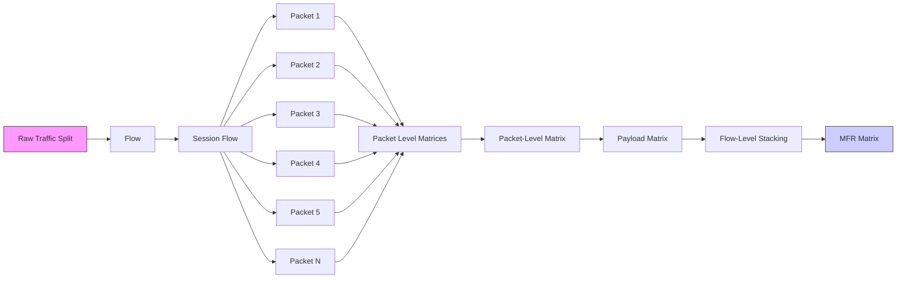

# Yet Another Traffc Classifer: A Masked Autoencoder Based Traffc Transformer with Multi-Level Flow Representation

Ruijie Zhao1\*, Mingwei Zhan1\*, Xianwen Deng1, Yanhao Wang2, Yijun Wang1, Guan Gui3†, Zhi Xue1†

1Shanghai Jiao Tong University, Shanghai, China

2QI-ANXIN, Beijing, China

3NJUPT, Nanjing, China

{ruijiezhao, mw.zhan, 2594306528, ericwyj, zxue}@sjtu.edu.cn; wangyanhao136@gmail.com; guiguan@njupt.edu.cn

# Abstract

Traffc classifcation is a critical task in network security and management. Recent research has demonstrated the effectiveness of the deep learning-based traffc classifcation method. However, the following limitations remain: (1) the traffc representation is simply generated from raw packet bytes, resulting in the absence of important information; (2) the model structure of directly applying deep learning algorithms does not take traffc characteristics into account; and (3) scenariospecifc classifer training usually requires a labor-intensive and time-consuming process to label data. In this paper, we introduce a masked autoencoder (MAE) based traffc transformer with multi-level fow representation to tackle these problems. To model raw traffc data, we design a formatted traffc representation matrix with hierarchical fow information. After that, we develop an effcient Traffc Transformer, in which packet-level and fow-level attention mechanisms implement more effcient feature extraction with lower complexity. At last, we utilize the MAE paradigm to pretrain our classifer with a large amount of unlabeled data, and perform fne-tuning with a few labeled data for a series of traffc classifcation tasks. Experiment fndings reveal that our method outperforms state-of-the-art methods on fve realworld traffc datasets by a large margin. The code is available at https://github.com/NSSL-SJTU/YaTC.

# 1 Introduction

Traffc classifcation is attracting the attention of service providers and equipment vendors as a signifcant solution for solving network management problems. Understanding the content of traffc allows network operators to respond swiftly in support of diverse business goals, enhancing service quality and user experience (Papadogiannaki and Ioannidis 2021). Meanwhile, traffc classifcation is a critical component of the intrusion detection system, which is utilized to detect threats and safeguard system security (Yao et al. 2019). However, the growing usage of encrypted traffc and anonymous network technology makes analyzing complicated traffc diffcult. To construct a sophisticated traffc

flowchart

Figure 1: The schematic illustration of multi-level fow representation (MFR).

analyzer for more accurate traffc classifcation, it is necessary to capture implicit and robust patterns in diverse traffc.

Traditional traffc analysis methods identify different network services based on fundamental traffc features (e.g., communication protocol, port number), which are no longer appropriate owing to the complexity and variability of the current traffc (Taylor et al. 2016). To address this issue, several works use machine learning (ML) algorithms to classify traffc through statistical features. However, these approaches rely on expert experience to select specifc features, and even insignifcant statistical features might impact analysis performance (Shen et al. 2020). Deep learning (DL) techniques, which can automatically extract features from packet bytes of raw traffc, have been used by an increasing number of researchers for more effective traffc analysis in recent years. Unfortunately, once the length of a certain packet is too long, the bytes from that packet can overwhelm important information from other packets. Thus, the lack of representation design in traditional DL-based methods brings instability in performance. Besides, they often need a large amount of labeled traffc data for training. Labeling data is a time-consuming and labor-intensive operation, resulting in high deployment and update costs.

Pre-training methods with massive volumes of unlabeled data have recently demonstrated outstanding performance in computer vision (CV) (He et al. 2022; Caron et al. 2021; Chen, Xie, and He 2021) and natural language processing (NLP) (Devlin et al. 2019; Lan et al. 2020) tasks. When compared to the traditional supervised learning paradigm, the self-supervised learning paradigm pre-training method has two major advantages: (1) more effective representations can reduce the reliance of downstream tasks on the amount of labeled data, and (2) better initialization parameters can speed up convergence and improve classifcation performance. Recent studies (He, Yang, and Chen 2020; Lin et al. 2022) in traffc classifcation directly utilize the BERTbased paradigm (Devlin et al. 2019), a pre-training method created for NLP tasks, and obtain better performance. However, unlike typical words, traffc bytes as input lack explicit high-level semantic units, making it unreasonable to build vocabularies to learn semantic relations. Furthermore, neither method designs a dedicated model structure for traffc classifcation based on traffc characteristics.

To address the challenges mentioned above, we introduce Yet Another Traffc Classifer (YaTC), a novel traffc classifer with self-supervised learning that learns latent representations from large amounts of unlabeled traffc data for more successful classifcation. Specifcally, we frst create a multi-level fow representation (MFR) matrix to model the raw traffc. It is generated from raw packet bytes and contains traffc information at different granularities through a formatted matrix, as illustrated in Figure 1. Then, a novel Traffc Transformer with a packet-level attention module and fow-level attention module is constructed to analyze traffc using the MFR matrix. Finally, we train our classifer based on the masked autoencoder (MAE) paradigm in two stages: pre-training and fne-tuning. In the pre-training stage, we randomly mask some packet bytes in the MFR matrix as input. Next, an autoencoder-based network, which consists of a traffc encoder and a small-scale decoder, reconstructs the original MFR matrix. Our traffc encoder leverages a large amount of unlabeled traffc data to learn latent representations through the reconstruction task. In the fne-tuning stage, we load the parameters of the pre-trained traffc encoder into Traffc Transformer and fne-tune it with a small number of labeled data for traffc classifcation. Our contributions can be briefy summarized as follows:

• We propose an MAE-based Traffc Transformer with MFR, called YaTC, for traffc classifcation. YaTC breaks through the traditional traffc analysis methods in three perspectives: traffc representation, classifer structure, and training strategy.   
• We design an MFR matrix that fully considers the fow hierarchy to represent the raw traffc. To effectively utilize the MFR matrix for traffc analysis, we build a novel Traffc Transformer with packet-level and fow-level attention mechanisms. It can perform more effcient feature extraction with lower complexity and fewer parameters.   
• We apply the MAE-based self-supervised learning paradigm to train our classifer. It frst leverages largescale unlabeled traffc data to learn generic latent representations, and then performs fne-tuning with a small amount of labeled data for a series of traffc classifcation tasks.   
• We evaluate YaTC on fve real-world traffc datasets. Experimental results show that our method outperforms the state-of-the-art methods by a large margin.

# 2 Related Work

# 2.1 Traffc Analysis Methods

Rule-Based Methods. In the early stage, researchers mainly used rule-based methods to accomplish traffc analysis. Through rules designed by security experts, basic attributes such as communication protocol and port number of traffc data are used to discover behaviors that violate security policies (Nguyen and Armitage 2008). However, as network services and environments become more complicated, the fundamental features are insuffcient to fulfll the current traffc analysis requirement (Taylor et al. 2016).

ML-Based Methods. To analyze complicated traffc effectively, ML algorithms are introduced to explore the highdimensional statistical features of traffc. For instance, CU-MUL (Panchenko et al. 2016) selects 104 optimal statistical features through accuracy evaluation, which are then utilized as input for a support vector machine (SVM) to identify website traffc; AppScanner (Taylor et al. 2016) adopts the random forest (RF) to analyze the statistical features generated by the traffc of different applications; isAnon (Cai et al. 2019) designs a hybrid feature selection algorithm to flter out redundant statistical features, and uses the extreme gradient boosting algorithm to detect anonymity network traffc. Although ML-based methods combined with statistical features can analyze complex traffc, they rely on statistical features designed by experts and need to select optimal features for different scenarios (Shen et al. 2020).

DL-Based Methods. DL-based approaches, which analyze traffc based on raw packets rather than humandesigned features, have become the primary tool to automatically extract traffc representations and achieve remarkable performance improvement. In (Wang et al. 2017), a convolutional neural network (CNN) is used to identify traffc images for encrypted traffc classifcation. (Zhang et al. 2020) adopts the improved CNN classifer that leverages multiple channels to enrich feature information and improve analysis effciency. TSCRNN (Lin, Xu, and Gao 2021) combines CNN and recurrent neural network (RNN) to learn the temporal characteristics from time-related packets. However, some existing DL-based methods directly use the packet bytes in the fow to represent the raw traffc, resulting in the bytes of a long packet overwhelming important information from other packets. Besides, they rely on suffcient labeled training data, and it is intractable to collect and manually label suffcient real traffc samples. Thus, we design an MFR matrix to represent multi-level information of the raw traffc through a formatted matrix and develop a novel Traffc Transformer to implement more effcient feature extraction based on these levels. To reduce the dependence on labeled data, we frst leverage large-scale unlabeled data for pre-training, and then fne-tune with a few labeled data for traffc classifcation.

# 2.2 Pre-training Methods

Pre-training methods signifcantly reduce the appetite for labeled training data by self-supervised learning. Besides, unbiased data representations learned from large amounts of unlabeled data further improve performance on downstream tasks. Overall, the pre-training methods frst obtain the pre-trained model with unlabeled data, and then load the model parameters to complete downstream tasks. In NLP tasks, BERT (Devlin et al. 2019) is the most widely used to implement pre-trained models by cloze task and next sentence prediction. Some traffc classifcation studies (He, Yang, and Chen 2020; Lin et al. 2022) consider the bytes of traffc packets as words and introduce BERT for pretraining to achieve better classifcation performance. However, since the input traffc bytes lack explicit high-level semantic units, latent representation extraction of traffc bytes is more suitable as a CV task than an NLP task. In CV tasks, traditional pre-training methods (Chen, Xie, and He 2021; Caron et al. 2021) rely on data augmentation (e.g., cropping, enlarging) to form pairs of positive and negative samples for pre-training via contrastive learning. Obviously, data augmentation on the traffc image generated by the packet bytes will seriously damage the original information, making it diffcult to apply the contrastive learning paradigm to our task. Benefting from the introduction of the MAE (He et al. 2022), we are able to obtain an effective pre-trained model by masking patches for reconstruction training. Since the masking operation does not change other fxed-position packet bytes in the traffc image, it conforms to the design of fxed positions of different levels of packet content in multilevel fow representation.

```mermaid
graph TD
    A["Unlabeled Data"] --> B["MFR Matrix"]
    B --> C["Packet 1"]
    C --> D["Random Mask"]
    D --> E["Visible Patches"]
    E --> F["Masked MFR Matrix"]
    F --> G["Encoder Token"]
    G --> H["Decoder"]
    H --> I["Target"]
    J["Labeled Data"] --> K["MFR Matrix"]
    K --> L["Packet 1 Patches"]
    L --> M["Packet 2 Patches"]
    M --> N["Packet 3 Patches"]
    N --> O["Packet 4 Patches"]
    O --> P["Packet 5 Patches"]
    P --> Q["Packet 1 Patches"]
    Q --> R["Packet 2 Patches"]
    R --> S["Packet 3 Patches"]
    S --> T["Packet 4 Patches"]
    T --> U["Packet 5 Patches"]
    U --> V["Packet 1 Patches"]
    V --> W["Packet 2 Patches"]
    W --> X["Packet 3 Patches"]
    X --> Y["Packet 4 Patches"]
    Y --> Z["Packet 5 Patches"]
    Z --> AA["Packet 1 Patches"]
    AA --> AB["Packet 2 Patches"]
    AB --> AC["Packet 3 Patches"]
    AC --> AD["Packet 4 Patches"]
    AD --> AE["Packet 5 Patches"]
    AE --> AF["Packet 1 Patches"]
    AF --> AG["Packet 2 Patches"]
    AG --> AH["Packet 3 Patches"]
    AH --> AI["Packet 4 Patches"]
    AI --> AJ["Packet 5 Patches"]
    AJ --> AK["Packet 1 Patches"]
    AK --> AL["Packet 2 Patches"]
    AL --> AM["Packet 3 Patches"]
    AM --> AN["Packet 4 Patches"]
    AN --> AO["Packet 5 Patches"]
    AO --> AP["Packet 1 Patches"]
    AP --> AQ["Packet 2 Patches"]
    AQ --> AR["Packet 3 Patches"]
    AR --> AS["Packet 4 Patches"]
    AS --> AT["Packet 5 Patches"]
    AT --> AU["Packet 1 Patches"]
    AU --> AV["Packet 2 Patches"]
    AV --> AW["Packet 3 Patches"]
    AW --> AX["Packet 4 Patches"]
    AX --> AY["Packet 5 Patches"]
    AY --> AZ["Packet 1 Patches"]
    AZ --> BA["Packet 2 Patches"]
    BA --> BB["Packet 3 Patches"]
    BB --> BC["Packet 4 Patches"]
    BC --> BD["Packet 5 Patches"]
    BD --> BE["Packet 1 Patches"]
    BE --> BF["Packet 2 Patches"]
    BF --> BG["Packet 3 Patches"]
    BG --> BH["Packet 4 Patches"]
    BH --> BI["Packet 5 Patches"]
    BI --> BJ["Packet 1 Patches"]
    BJ --> BK["Packet 2 Patches"]
    BK --> BL["Packet 3 Patches"]
    BL --> BM["Packet 4 Patches"]
    BM --> BN["Packet 5 Patches"]
    BN --> BO["Packet 1 Patches"]
    BO --> BP["Packet 2 Patches"]
    BP --> BQ["Packet 3 Patches"]
    BQ --> BR["Packet 4 Patches"]
    BR --> BS["Packet 5 Patches"]
    BS --> BT["Packet 1 Patches"]
    BT --> BU["Packet 2 Patches"]
    BU --> BV["Packet 3 Patches"]
    BV --> BW["Packet 4 Patches"]
    BW --> BX["Packet 5 Patches"]
    BX --> BY["Packet 1 Patches"]
    BY --> BZ["Packet 2 Patches"]
    BZ --> CA["Packet 3 Patches"]
    CA --> CB["Packet 4 Patches"]
    CB --> CC["Packet 5 Patches"]
    CC --> CD["Packet 1 Patches"]
    CD --> CE["Packet 2 Patches"]
    CE --> CF["Packet 3 Patches"]
    CF --> CG["Packet 4 Patches"]
    CG --> CH["Packet 5 Patches"]
    CH --> CI["Packet 1 Patches"]
    CI --> CJ["Packet 2 Patches"]
    CJ --> CK["Packet 3 Patches"]
    CK --> CL["Packet 4 Patches"]
    CL --> CM["Packet 5 Patches"]
    CM --> CN["Packet 1 Patches"]
    CN --> CO["Packet 2 Patches"]
    CO --> CP["Packet 3 Patches"]
    CP --> CQ["Packet 4 Patches"]
    CQ --> CR["Packet 5 Patches"]
    CR --> CS["Packet 1 Patches"]
    CS --> CT["Packet 2 Patches"]
    CT --> CU["Packet 3 Patches"]
    CU --> CV["Packet 4 Patches"]
    CV --> CW["Packet 5 Patches"]
    CW --> CX["Packet 1 Patches"]
    CX --> CY["Packet 2 Patches"]
    CY --> CZ["Packet 3 Patches"]
    CZ --> DA["Packet 4 Patches"]
    DA --> DB["Packet 5 Patches"]
```

flowchart

Figure 2: The schematic illustration of YaTC.

# 3 Methodology

In this section, we introduce our traffc representation method, classifer structure, and training strategy in detail in Section 3.1, Section 3.2, and Section 3.3, respectively. The overview of our YaTC is shown in Figure 2.

# 3.1 Multi-Level Flow Representation

We design a novel method to produce multi-level fow representations from raw traffc data as input for traffc classifcation. Most existing methods directly intercept the preceding fxed number of bytes in the fow to form a two-dimensional matrix, which can be handled as an image and classifed by DL algorithms. However, compared with the header, the size of the payload is usually signifcantly larger and is full of incomprehensible information generated by encrypt operation, resulting in excessive low-level semantic information in the matrix, which affects these models’ effectiveness and effciency. Moreover, in some fows, the frst long packet will occupy the entire matrix, so the matrix cannot include the data in other packets of the traffc fow.

To address the above issues, we propose an MFR matrix with a formatted two-dimensional matrix to represent raw traffc fow, as illustrated in Figure 1. First, we split the raw traffc into fows according to IP address, port number, and protocol type. Then, to avoid introducing biased interference, we remove the Ethernet headers of the fows, set the port numbers to zero, and replace the IPs with random addresses but keep their directions. Finally, the M adjacent packets in the fow are captured and formatted into a twodimensional matrix of size H ∗ W as the representation of this fow. We still use the raw bytes as the initial characteristics of the traffc, i.e., the value of each point in the traffc representation matrix, but with the following particular design for capturing the multi-level information of the raw traffc.

• Byte-level. Each row of the traffc representation matrix includes only one type of traffc bytes, classifed into header row and payload row.   
• Packet-level. Each packet is represented by the header matrix and payload matrix, forming a packet-level matrix of size H/M ∗ W .   
• Flow-level. Since the fow is composed of ordered packets, M adjacent packet-level matrices are stacked in the second dimension to form the fnal MFR matrix.

In this way, the information at each level is fxed, and there will be no overfow at the lower level leading to the loss of information at the higher level. We set our MFR matrix to include 5 packet-level matrices with a total of 40 rows, and each row includes 40 bytes. Each packet’s header is represented by 2 header rows with 80 bytes, with the capability to contain the IP layer header (20 bytes), TCP header (20 bytes) or UDP header (8 bytes), and optional headers. We assign 6 payload rows to accommodate the payload of each packet and perform interception when it exceeds 240 bytes. Note that if the number of valid bytes is insuffcient, it will be padded with 0 bytes to form a fxed-size representation matrix.

# 3.2 Traffc Transformer

According to the characteristics of traffc, we design our Traffc Transformer composed of an embedding module, a packet-level attention module, and a fow-level attention module, to effectively conduct traffc classifcation with the MFR matrix.

Embedding Module. The MFR matrix $x \in \mathcal { R } ^ { H \times W }$ is frst split into non-overlapping 2D patches of size $P \times P$ with a total number of $N = H W / P ^ { 2 }$ , denoted as $x _ { p } \in \mathcal { R } ^ { N \times P ^ { 2 } }$ . The patches are then mapped to D-dimensional vectors by a linear layer as patch embeddings. To maintain the position information, which is crucial in MFR, the position embeddings are added to the patch embeddings as the input of the traffc encoder.

$$
x _ {0} = \left[ x _ {p} ^ {1} E; x _ {p} ^ {2} E; \dots ; x _ {p} ^ {N} E \right] + E _ {\text { pos }}. \tag {1}
$$

Specifcally, we take $D = 1 9 2 , P = 2$ and $N = 2 0 * 2 0 =$ 400, so that all elements of one patch represent the same type of raw bytes, and each packet matrix contains one row of header patches and three rows of payload patches.

Packet-level Attention Module. In the packet-level attention phase, we develop a traffc encoder based on Vision Transformers (Dosovitskiy et al. 2021), which consists of alternating multi-head self-attention layers (MSA) and feedforward layers.

Aiming to preferentially learn the dependencies between header patches or payload patches within the packet, the traffc encoder only performs multi-headed self-attention among patches in the same packet rather than all patches in the MFR matrix. The MSA layer allows patches of the packet to interact with each other effectively according to the degree of relevance by different heads $C o n c a \dot { t } ( h e a d _ { 1 } , \cdot \cdot \cdot \bar { , } h e a d _ { n } )$ , and each head is computed by the attention function:

$$
Q = x _ {l} W ^ {Q}, K = x _ {l} W ^ {K}, V = x _ {l} W ^ {V}, \tag {2}
$$

$$
\operatorname{Attn} (Q, K, V) = \text { softmax } (\frac {Q K ^ {T}}{\sqrt {D _ {k}}}) V, \tag {3}
$$

where $W ^ { Q } , W ^ { K } , W ^ { V } \in \mathcal { R } ^ { D \times D _ { k } }$ are learnable parameters. In this work, we employ $n = 1 6$ parallel attention heads and $L = 4$ alternating layers.

Note that our packet-level attention module focuses on promoting packet-level information interaction at this stage, which is also in line with the traffc characteristics that the information in the packet has a stronger correlation. In other words, it ignores the patch features of other packets and outputs a valid packet-level representation. Furthermore, our method also has lower time complexity compared to global attention $( O ( N ^ { 2 } / M ) \mathrm { v s . } O ( N ^ { 2 } ) \}$ ), which can beneft the effciency of traffc analysis.

Flow-level Attention Module. After packet-level attention, signifcant packet-level features of each patch of the MFR matrix $\boldsymbol { x } _ { p } ^ { \prime } \in \mathcal { R } ^ { N \times D }$ have been output, which provides the basis for further use of the transformer to extract longdistance relational dependencies between different packets on the fow. At the fow level, it is unnecessary to continue with the same fne-grained patch as before, and even simply mean-pooling all the packet-level patch features can yield good performance. To learn inter-packet relationships at a coarser granularity, we employ row pooling (RP), which partially mean-pooling the output patches’ features of the packet-level attention by row to generate row patches:

$$
x _ {r} = \text { Pooling } (x _ {p} ^ {\prime}), \tag {4}
$$

where $x _ { r } \in \mathcal { R } ^ { \sqrt { N } \times D }$ are row patches output of RP. Since each row of input patch features indicates the same type byte of traffc, the outputs of RP also can be divided into header or payload with fxed meaning.

In particular, each packet contains 1 header row patch and 3 payload row patches, representing the partial features within the packet and a MFR matrix has a total of $\sqrt { N }$ row patches. We input all the row patches within an MFR matrix into a traffc encoder, and the MSA layers capture the fowlevel information between the row patches. The fnal output is a column of row patch features $\boldsymbol { x } _ { c } \in \mathcal { R } ^ { \sqrt { N } \times D }$ , which are further performed column pooling (CP) to obtain the fnal representation $\boldsymbol { x } _ { M F R } \in \mathcal { R } ^ { \dot { D } }$ of the entire MFR matrix:

$$
x _ {M F R} = \text { Pooling } (x _ {c}). \tag {5}
$$

Besides, with the coarser granularity, the model also has a lighter weight, the number of row patches is only $\sqrt { N }$ and the time complexity of this stage is only $O ( N )$ .

# 3.3 Training Strategy of YaTC

Pre-training YaTC. As shown in Figure 2, in the pretraining stage, YaTC utilizes MAE (He et al. 2022) paradigm with an asymmetric encoder-decoder architecture to reconstruct the raw bytes in the MFR matrix. A high percentage of the MFR patches are randomly masked, and only a tiny fraction of the patches (i.e. visible unmasked patches) are input to the model. After that, our traffc encoder extracts as many valid features of this fraction of the patches as possible and then outputs the encoder tokens. Finally, a small decoder uses encoder tokens and mask tokens to recover the masked region of the MFR matrix. MAE is trained with a reconstruction loss, i.e., mean squared error (MSE) between the ground-truth pixels $y _ { r e a l }$ and the predicted pixels $y _ { r e c } { \mathrm { : } }$

$$
\mathcal {L} _ {r e c} = M S E (y _ {r e c}, y _ {r e a l}). \tag {6}
$$

After pre-training, the traffc encoder can extract highquality features and is preserved for downstream tasks.

The pre-training does not require costly manual labeling, allowing the use of large amounts of unlabeled data from authentic scenes. Moreover, we fnd that a very high mask ratio (90%) achieves better results on downstream tasks. A high mask ratio also means that only a few patches are visible, resulting in lacking raw information to capture dependencies within and between packets. Thus, we perform global attention instead of packet-level attention and fow-level attention during pre-training. The diffcult pre-training task and global attention would enable the traffc encoder to capture features on packet-level and fow-level together with minimal information.

Fine-tuning YaTC. On the downstream task, the encoder parameters from pre-training are loaded into both the packet-level attention module and fow-level attention module in the traffc transformer and used for feature extraction on packet-level and fow-level. For classifcation, the features of each patch are mean-pooled in two stages (RP and CP) to be used as the classifcation features of the MFR Matrix, which are fattened and input to an MLP to obtain the prediction distribution $\hat { y } \in \mathcal { R } ^ { C }$ , where C is the number of traffc categories. Then classifcation loss is computed according to cross-entropy loss between prediction distribution yˆ and the ground-truth label $y \colon$

$$
\mathcal {L} _ {C E} = H (\hat {y}, y). \tag {7}
$$

To speed up convergence and reduce the model size, inspired by ALBERT (Lan et al. 2020) and CYCLE (Takase and Kiyono 2021), we shared parameters between the two traffc encoders and achieved better performance with half the number of parameters. We argue the reason that both packet-level attention and fow-level attention are essentially performing inter-patch dependency capture, and the information interactions during multi-headed self-attention are similar. Moreover, the data in the same row of patches belong to the same type, i.e., header or payload, and the rowpooling’s mean operation does not change the feature space in which the patches are located. So except for the difference in granularity, the two traffc encoders on the feature space are very similar to the stacking of transformer layers, which provides the conditions for the application of parameter sharing. In the fne-tuning stage, the two traffc encoders cause the double depth of Transformer layers compared to the pre-training stage, but the amount of training data is very limited. Thus, parameter sharing also makes the model easier to train.

# 4 Experiments

# 4.1 Experiment Settings

Data Preparation. Our experiments are conducted on fve public real-world encrypted traffc datasets IS-CXVPN2016 dataset (Habibi Lashkari et al. 2016), ISCX-Tor2016 dataset (Lashkari et al. 2017), USTC-TFC2016 dataset (Wang et al. 2017), CICIoT2022 dataset (Dadkhah et al. 2022), and Cross-Platform dataset (Van Ede et al. 2020), respectively.

To verify the generality of the method, we conduct evaluations on the above fve datasets. The frst four training datasets form a large-scale unlabeled training dataset for pre-training. In the fne-tuning stage, our classifer uses fve training datasets for supervised learning to complete the corresponding traffc classifcation task. Note that a generic pretrained model is obtained in the pre-training stage, while the classifer training in the fne-tuning stage is performed separately. Furthermore, since the training dataset of Cross-Platform is not part of the unlabeled dataset in the pretraining stage, the Cross-Platform dataset is used for transfer learning experiments in Section 4.5.

Implementation Details. In the pre-training phase, the batch size is 512 and the total step is 150,000. We use the linear learning rate scaling rule and the base learning rate is set to $1 \times \mathrm { \overline { { 1 } } 0 ^ { - 3 } }$ with the AdamW optimizer. The masking ratio for randomly masking patches is set to 0.9. Then, we use the AdamW optimizer in fne-tuning for 200 epochs, where the base learning rate is set to $2 \times 1 0 ^ { - 3 }$ and batch size is 64. The impact of different masking ratios is discussed in Section 4.5. The proposed method is implemented using PyTorch 1.9.0 and trained on a server with four NVIDIA GeForce RTX3090 GPUs.

Evaluation Metrics. To measure the classifcation performance of our method, we calculate the number of True Positive $( T _ { p } ) _ { \ l }$ , True Negative $( T _ { n } )$ , False Positive $( F _ { p } )$ , and False Negative $( F _ { n } )$ . Based on the above defnition, Recall, Precision, and $F _ { 1 }$ can be obtained:

$$
\text { Recall } = \frac {T _ {p}}{T _ {p} + F _ {n}}, \quad \text { Precision } = \frac {T _ {p}}{T _ {p} + F _ {p}}, \tag {8}
$$

$$
F _ {1} = 2 \cdot \frac {\text { Precision } \cdot \text { Recall }}{\text { Precision } + \text { Recall }}. \tag {9}
$$

# 4.2 Comparison with State-of-the-Art Methods

To comprehensively evaluate our method, we compare YaTC with a range of baselines and state-of-the-art methods, as listed below:

• FlowPrint (Van Ede et al. 2020) and AppScanner (Taylor et al. 2016) are ML-based methods using statistical features for traffc classifcation.   
• DF (Sirinam et al. 2018), Deeppacket (Lotfollahi et al. 2020), 2D-CNN (Wang et al. 2017), 3D-CNN (Zhang et al. 2020), and FS-Net (Liu et al. 2019) are DL-based traffc analysis methods, which use raw packet information for supervised learning.   
• PERT (He, Yang, and Chen 2020) and ET-BERT (Lin et al. 2022) treat traffc representation extraction as an NLP task for pre-training, and then fne-tune the classifer with limited labeled data.

As is shown in Table 1, the results demonstrate the effectiveness of DL-based methods and the insuffciency of ML-based methods with statistical features. Since only the vector of packets’ directions in the fow is used as input features, the classifcation performance of DF is signifcantly lower than other DL-based methods. Furthermore, we observe that methods without pre-training on the IS-CXTor2016 dataset perform poorly. The reason is that encryption and obfuscation techniques for anonymous traffc make it diffcult to analyze the payload directly. However, pre-training-based methods learn latent representations from a large amount of unlabeled traffc data for more effective classifcation. Additionally, pre-training methods outperform other methods on all datasets except CICIoT2022, illustrating that pre-trained classifers can achieve better performance on downstream traffc classifcation tasks. Benefting from well-designed traffc representation, model structure, and training paradigm, YaTC consistently outperforms all compared methods by a large margin on all datasets. It can be concluded that our method is suitable for traffc analysis in various scenarios as well as has excellent performance.

<table><tr><td rowspan="2">Method</td><td colspan="2">ISCXVPN2016</td><td colspan="2">ISCXTor2016</td><td colspan="2">USTC-TFC2016</td><td colspan="2">CICIoT2022</td></tr><tr><td>Acc.</td><td> $F_1$ </td><td>Acc.</td><td> $F_1$ </td><td>Acc.</td><td> $F_1$ </td><td>Acc.</td><td> $F_1$ </td></tr><tr><td>FlowPrint</td><td>30.29%</td><td>14.09%</td><td>25.27%</td><td>10.19%</td><td>25.30%</td><td>12.47%</td><td>50.46%</td><td>49.14%</td></tr><tr><td>AppScanner</td><td>79.93%</td><td>80.85%</td><td>50.27%</td><td>49.68%</td><td>60.41%</td><td>58.36%</td><td>76.52%</td><td>76.81%</td></tr><tr><td>DF</td><td>62.87%</td><td>25.40%</td><td>33.24%</td><td>7.00%</td><td>58.45%</td><td>49.15%</td><td>60.13%</td><td>46.35%</td></tr><tr><td>Deeppacket</td><td>80.21%</td><td>80.17%</td><td>36.81%</td><td>26.81%</td><td>88.49%</td><td>88.83%</td><td>88.28%</td><td>88.08%</td></tr><tr><td>2D-CNN</td><td>81.26%</td><td>80.64%</td><td>34.62%</td><td>33.66%</td><td>92.26%</td><td>92.05%</td><td>90.07%</td><td>90.00%</td></tr><tr><td>3D-CNN</td><td>81.09%</td><td>80.79%</td><td>34.89%</td><td>33.96%</td><td>91.55%</td><td>91.16%</td><td>89.39%</td><td>89.33%</td></tr><tr><td>FS-Net</td><td>87.64%</td><td>87.30%</td><td>52.03%</td><td>51.64%</td><td>87.05%</td><td>86.02%</td><td>85.37%</td><td>85.30%</td></tr><tr><td>PERT</td><td>88.62%</td><td>88.61%</td><td>80.22%</td><td>79.99%</td><td>96.63%</td><td>96.64%</td><td>90.52%</td><td>90.49%</td></tr><tr><td>ET-BERT</td><td>87.74%</td><td>87.47%</td><td>65.38%</td><td>64.98%</td><td>96.95%</td><td>96.95%</td><td>90.35%</td><td>90.31%</td></tr><tr><td>Ours (YaTC)</td><td>98.07%</td><td>98.04%</td><td>99.72%</td><td>99.72%</td><td>97.86%</td><td>97.86%</td><td>96.58%</td><td>96.58%</td></tr></table>

Table 1: Comparison results on ISCXVPN2016, ISCXTor2016, USTC-TFC2016, and CICIoT2022 datasets.

  
Figure 3: The performance comparison with other models using different labeled sample sizes.

# 4.3 Few-Shot Analysis

To validate the robustness of YaTC in few-shot scenarios, we set the labeled data size to 10%, 50%, and 100% and compare YaTC with other baselines and state-of-the-art methods on four datasets. Experimental results are shown in Figure 3. Experiments show that the three pre-training-based methods, YaTC, ET-BERT, and PERT, generally outperform other supervised methods in few-shot scenarios. Some other methods achieve similar performance to pre-training-based methods in few cases, but none of them could maintain it on all four datasets. The pre-training enables the model to master the ability to extract high-quality representations using unlabeled data, thereby greatly reducing the dependence on labeled data. Besides, YaTC achieves better performance than ET-BERET and PERT at all sizes of labeled data, indicating excellent robustness.

# 4.4 Ablation Study

To further examine the level of beneft that each component of YaTC brings to the performance, an ablation study is performed on four baseline datasets. The evaluation results are reported in Table 2. First, compared with applying global attention, our method not only reduces the complexity (discussed in Section 3.2) but also achieves better results, demonstrating the benefts of packet-level and fowlevel attention mechanisms. Furthermore, removing packetlevel attention leads to signifcant performance degradation under all confgurations, which illustrates the considerable contribution of packet-level feature extraction. We note that fow-level attention without pre-training sometimes leads to performance loss, which would not occur after pretraining. This is because further attention to small data without pre-training is easier to cause over-ftting. The ablations also show that applying parameter sharing during fnetuning brings both lightweight and performance enhancements. Moreover, directly transforming the raw traffc bytes without MFR or removing only the fow-level stacking in MFR also results in weaker performance, obviously for the encrypted traffc tasks.

# 4.5 Discussions

Impact of Masking Ratio. To explore the effect of the masking ratio on the quality of learned representation, we conduct ablation experiments on four datasets with a range of masking ratios. Experimental results are shown in Figure 4. Overall, a higher mask ratio will result in better performance. On the other hand, an excessively high masking ratio makes the reconstruction task too diffcult, and the F1 score decreases rapidly. The $F _ { 1 }$ score reaches the highest when the masking ratio is 90% on most datasets except USTC-TFC2016, which also has a high best masking ratio of 75%. This supports our view of the traffc task as being more similar to images than to words. In the masking strategy of NLP, such as BERT, the optimal masking radio maintains a low value and usually does not exceed 20%, which is the opposite of the CV according to the recent study (He et al. 2022). A high optimal masking rate implies a large information redundancy, and traffc classifcation does not require a thorough understanding of its content, which is also impossible on the encrypted payload. For classifcation tasks, words are high-level and abstract information, but traffc bytes are just sparse features without clear semantic units, similar to pixels. Hence, rather than the BERT-based methods treating raw bytes as words, our image-like MFR matrix is more rational.

<table><tr><td rowspan="2">Method</td><td colspan="2">ISCXVPN2016</td><td colspan="2">ISCXTor2016</td><td colspan="2">USTC-TFC2016</td><td colspan="2">CICIoT2022</td></tr><tr><td>Acc.</td><td> $F_1$ </td><td>Acc.</td><td> $F_1$ </td><td>Acc.</td><td> $F_1$ </td><td>Acc.</td><td> $F_1$ </td></tr><tr><td>Ours (YaTC)</td><td>98.07%</td><td>98.04%</td><td>99.72%</td><td>99.72%</td><td>97.86%</td><td>97.86%</td><td>96.58%</td><td>96.58%</td></tr><tr><td>Ours with GA</td><td>95.27%</td><td>95.14%</td><td>98.63%</td><td>98.62%</td><td>97.86%</td><td>97.86%</td><td>95.64%</td><td>95.61%</td></tr><tr><td>Ours w/o PA</td><td>90.19%</td><td>90.03%</td><td>78.02%</td><td>77.28%</td><td>96.03%</td><td>96.03%</td><td>92.84%</td><td>92.78%</td></tr><tr><td>Ours w/o FA</td><td>95.62%</td><td>95.49%</td><td>99.18%</td><td>99.18%</td><td>97.66%</td><td>97.62%</td><td>95.81%</td><td>95.80%</td></tr><tr><td>Ours w/o FS</td><td>92.47%</td><td>92.35%</td><td>97.80%</td><td>97.77%</td><td>93.48%</td><td>93.48%</td><td>94.58%</td><td>94.57%</td></tr><tr><td>Ours w/o PS</td><td>97.55%</td><td>97.53%</td><td>99.45%</td><td>99.45%</td><td>97.45%</td><td>97.40%</td><td>95.41%</td><td>95.39%</td></tr><tr><td>Ours w/o PT</td><td>87.74%</td><td>87.22%</td><td>92.03%</td><td>91.90%</td><td>95.32%</td><td>95.25%</td><td>92.70%</td><td>92.65%</td></tr><tr><td>Ours w/o PT &amp; PA</td><td>78.63%</td><td>77.58%</td><td>39.84%</td><td>38.58%</td><td>93.28%</td><td>93.22%</td><td>90.88%</td><td>90.79%</td></tr><tr><td>Ours w/o PT &amp; FA</td><td>87.74%</td><td>87.40%</td><td>85.99%</td><td>85.84%</td><td>95.52%</td><td>95.46%</td><td>93.19%</td><td>93.17%</td></tr><tr><td>Ours w/o PT &amp; FS</td><td>81.96%</td><td>81.84%</td><td>83.52%</td><td>83.15%</td><td>91.75%</td><td>91.48%</td><td>91.59%</td><td>91.59%</td></tr><tr><td>Ours w/o PT &amp; MFR</td><td>80.91%</td><td>80.49%</td><td>42.86%</td><td>42.11%</td><td>93.99%</td><td>93.90%</td><td>91.36%</td><td>91.26%</td></tr></table>

Table 2: Ablation study of key components in YaTC on ISCXVPN2016, ISCXTor2016, USTC-TFC2016, and CICIoT2022 datasets. The abbreviations are explained as follows, GA: global attention, PA: packet-level attention, FA: fow-level attention, FS: fow-level stacking, PS: parameter sharing, MFR: multi-level traffc representation, and PT: pre-training.

line

| Masking Ratio (%) | ISCXVPN2016 | ISCXTor2016 | USTC-TFC2016 | CICIoT2022 |
| ----------------- | ----------- | ----------- | ------------ | ---------- |
| 25                | 93.8        | 99.2        | 97.8         | 95.4       |
| 50                | 95.8        | 99.2        | 97.8         | 95.8       |
| 75                | 96.2        | 99.8        | 98.2         | 96.2       |
| 90                | 98.0        | 99.8        | 97.8         | 96.4       |
| 95                | 97.0        | 96.8        | 97.8         | 95.6       |

Figure 4: The impact of masking ratio on the quality of learned representation.

Transfer Learning Experiments. We evaluate transfer learning on the Cross-Platform dataset. Two other pretraining traffc classifcation methods (PERT and ET-BERT) are introduced for comparison. The pre-trained models are all identical to those used in the previous experiments (i.e., pre-trained with the other four datasets). It can be seen from Figure 5 that our YaTC signifcantly improves the $F _ { 1 }$ score from 69.93% to 82.35%, which is 12.42% better than without pre-training. Furthermore, both ET-BERT and PERT

bar

| Model | with pre-training (%) | w/o pre-training (%) |
| :--- | :--- | :--- |
| YaTC | 82.35 | 69.93 |
| ET-BERT | 67.32 | 67.05 |
| PERT | 68.16 | 67.97 |

Figure 5: The performance comparison with the other two pre-training methods on the Cross-Platform dataset.

have weak boosts using pre-training, indicating that their pre-trained models are diffcult to transfer to the new downstream traffc classifcation task.

# 5 Conclusion

In this work, we proposed YaTC, an MAE-based Traffc Transformer with MFR for traffc classifcation. With the MAE-based self-supervised learning paradigm, YaTC frst learns generic latent representations from a large amount of unlabeled traffc data in the pre-training stage, then performs supervised learning with a few labeled data for a series of traffc classifcation tasks in the fne-tuning stage. Our method is evaluated on fve real-world traffc datasets. Experimental results show that our YaTC is ahead of the stateof-the-art methods, even in the case of minimal labeled data. Besides, our pre-trained model exhibits excellent transfer ability for the new downstream traffc classifcation task.

# Acknowledgments

We are grateful to anonymous reviewers for their constructive comments on this work. This work is supported by SJTU-QI’ANXIN Joint Lab of Information System Security.

# References

Cai, Z.; Jiang, B.; Lu, Z.; Liu, J.; and Ma, P. 2019. isAnon: Flow-Based Anonymity Network Traffc Identifcation Using Extreme Gradient Boosting. In International Joint Conference on Neural Networks (IJCNN), 1–8.   
Caron, M.; Touvron, H.; Misra, I.; Jegou, H.; Mairal, J.; ´ Bojanowski, P.; and Joulin, A. 2021. Emerging Properties in Self-Supervised Vision Transformers. In IEEE/CVF International Conference on Computer Visio (ICCV), 9630– 9640.   
Chen, X.; Xie, S.; and He, K. 2021. An Empirical Study of Training Self-Supervised Vision Transformers. In IEEE/CVF International Conference on Computer Visio (ICCV), 9620–9629.   
Dadkhah, S.; Mahdikhani, H.; Danso, P. K.; Zohourian, A.; Truong, K. A.; and Ghorbani, A. A. 2022. Towards the Development of a Realistic Multidimensional IoT Profling Dataset. In International Conference on Privacy, Security & Trust.   
Devlin, J.; Chang, M.; Lee, K.; and Toutanova, K. 2019. BERT: Pre-training of Deep Bidirectional Transformers for Language Understanding. In North American Chapter of the Association for Computational Linguistics: Human Language Technologies (NAACL-HLT), 4171–4186.   
Dosovitskiy, A.; Beyer, L.; Kolesnikov, A.; Weissenborn, D.; Zhai, X.; Unterthiner, T.; Dehghani, M.; Minderer, M.; Heigold, G.; Gelly, S.; Uszkoreit, J.; and Houlsby, N. 2021. An Image is Worth 16x16 Words: Transformers for Image Recognition at Scale. In International Conference on Learning Representations (ICLR).   
Habibi Lashkari, A.; Draper Gil, G.; Mamun, M.; and Ghorbani, A. 2016. Characterization of encrypted and VPN traffc using time-related features. In International Conference on Information Systems Security and Privacy, 407–414.   
He, H.; Yang, Z.; and Chen, X. 2020. PERT: Payload Encoding Representation from Transformer for Encrypted Traffc Classifcation. In 2020 ITU Kaleidoscope: Industry-Driven Digital Transformation, 1–8.   
He, K.; Chen, X.; Xie, S.; Li, Y.; Dollar, P.; and Girshick,´ R. B. 2022. Masked Autoencoders Are Scalable Vision Learners. In IEEE Conference on Computer Vision and Pattern Recognition (CVPR), 1–10.   
Lan, Z.; Chen, M.; Goodman, S.; Gimpel, K.; Sharma, P.; and Soricut, R. 2020. ALBERT: A Lite BERT for Selfsupervised Learning of Language Representations. In International Conference on Learning Representations (ICLR).   
Lashkari, A. H.; Draper-Gil, G.; Mamun, M. S. I.; and Ghorbani, A. A. 2017. Characterization of Tor Traffc Using Time Based Features. In International Conference on Information System Security and Privacy, 253–262.   
Lin, K.; Xu, X.; and Gao, H. 2021. TSCRNN: A novel classifcation scheme of encrypted traffc based on fow spatiotemporal features for effcient management of IIoT. Computer Networks, 190: 107974.   
Lin, X.; Xiong, G.; Gou, G.; Li, Z.; Shi, J.; and Yu, J. 2022. ET-BERT: A Contextualized Datagram Representation with

Pre-training Transformers for Encrypted Traffc Classifcation. In The Web Conference (WWW), 633–642.   
Liu, C.; He, L.; Xiong, G.; Cao, Z.; and Li, Z. 2019. FS-Net: A Flow Sequence Network For Encrypted Traffc Classifcation. In IEEE Conference on Computer Communications (INFOCOM), 1171–1179.   
Lotfollahi, M.; Siavoshani, M. J.; Zade, R. S. H.; and Saberian, M. 2020. Deep packet: a novel approach for encrypted traffc classifcation using deep learning. Soft Comput., 24(3): 1999–2012.   
Nguyen, T. T.; and Armitage, G. 2008. A Survey of Techniques for Internet Traffc Classifcation Using Machine Learning. IEEE Communications Surveys & Tutorials, 10(4): 56–76.   
Panchenko, A.; Lanze, F.; Pennekamp, J.; Engel, T.; Zinnen, A.; Henze, M.; and Wehrle, K. 2016. Website Fingerprinting at Internet Scale. In Network and Distributed System Security Symposium (NDSS), 1–15.   
Papadogiannaki, E.; and Ioannidis, S. 2021. A Survey on Encrypted Network Traffc Analysis Applications, Techniques, and Countermeasures. ACM Computing Surveys, 54(6).   
Shen, M.; Liu, Y.; Zhu, L.; Xu, K.; Du, X.; and Guizani, N. 2020. Optimizing Feature Selection for Effcient Encrypted Traffc Classifcation: A Systematic Approach. IEEE Network, 34(4): 20–27.   
Sirinam, P.; Imani, M.; Juarez, M.; and Wright, M. 2018. ´ Deep Fingerprinting: Undermining Website Fingerprinting Defenses with Deep Learning. In ACM SIGSAC Conference on Computer and Communications Security (CCS), 1928– 1943.   
Takase, S.; and Kiyono, S. 2021. Lessons on Parameter Sharing Across Layers in Transformers. arXiv preprint arXiv:2104.06022.   
Taylor, V. F.; Spolaor, R.; Conti, M.; and Martinovic, I. 2016. AppScanner: Automatic Fingerprinting of Smartphone Apps from Encrypted Network Traffc. In IEEE European Symposium on Security and Privacy (EuroS&P), 439– 454.   
Van Ede, T.; Bortolameotti, R.; Continella, A.; Ren, J.; Dubois, D. J.; Lindorfer, M.; Choffnes, D.; van Steen, M.; and Peter, A. 2020. Flowprint: Semi-supervised mobile-app fngerprinting on encrypted network traffc. In Network and Distributed System Security Symposium (NDSS), volume 27.   
Wang, W.; Zhu, M.; Zeng, X.; Ye, X.; and Sheng, Y. 2017. Malware Traffc Classifcation Using Convolutional Neural Network for Representation Learning. In International Conference on Information Networking, 712–717.   
Yao, H.; Gao, P.; Zhang, P.; Wang, J.; Jiang, C.; and Lu, L. 2019. Hybrid Intrusion Detection System for Edge-Based IIoT Relying on Machine-Learning-Aided Detection. IEEE Network, 33(5): 75–81.   
Zhang, J.; Li, F.; Ye, F.; and Wu, H. 2020. Autonomous Unknown-Application Filtering and Labeling for DL-based Traffc Classifer Update. In IEEE Conference on Computer Communications (INFOCOM), 397–405.