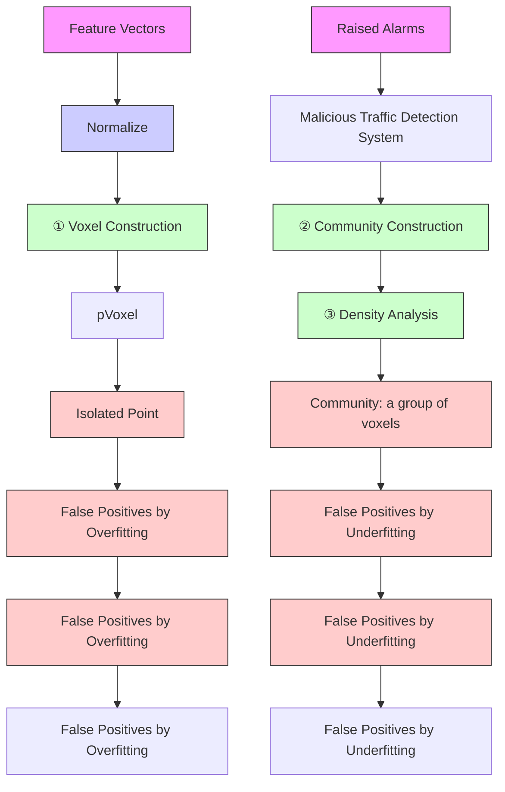

# Point Cloud Analysis for ML-Based Malicious Traffic Detection: Reducing Majorities of False Positive Alarms

Chuanpu Fu

Tsinghua University

Beijing, China

Qi Li

Tsinghua University

Beijing, China

Ke Xu

Tsinghua University

Beijing, China

Jianping Wu

Tsinghua University

Beijing, China

# ABSTRACT

As an emerging security paradigm, machine learning (ML) based malicious traffic detection is an essential part of automatic defense against network attacks. Powered by dedicated traffic features, the ML based methods can detect various sophisticated attacks, in particular capturing zero-day attacks, which cannot be achieved by the traditional non-ML methods. However, false positive alarms raised by these advanced ML methods become the major obstacle to real-world deployment. These methods require experts to manually analyze false positives, which incurs significant labor costs. Thus, it is vital that we can reduce such false positives without heavyweight manual investigations.

In this paper, we propose pVoxel, an unsupervised method that identifies false positives for existing ML based traffic detection systems without requiring any prior knowledge on the alarms. To effectively process each alarm, pVoxel treats the traffic feature vector associated with the alarm as a point in the traffic feature space, and utilizes point cloud analysis to capture the topological features among the points for classifying the alarms. In particular, we aggregate the points into voxels, i.e., high-dimensional cubes, which allows us to develop an unsupervised method to identify the voxels indicating false positives according to their density features. Our experiments with 75 real-world datasets demonstrate that pVoxel can effectively reduce 95.55% false positives for 11 state-of-the-art traffic detection methods under various settings. Meanwhile, pVoxel can handle 201.10 thousand alarms per second, which demonstrates that it can achieve efficient alarm processing.

# CCS CONCEPTS

• Security and privacy → Intrusion detection systems.

# KEYWORDS

Machine learning; malicious traffic detection; point cloud analysis

# ACM Reference Format:

Chuanpu Fu, Qi Li, Ke Xu, and Jianping Wu. 2023. Point Cloud Analysis for ML-Based Malicious Traffic Detection: Reducing Majorities of False Positive Alarms . In Proceedings of the 2023 ACM SIGSAC Conference on Computer and Communications Security (CCS ’23), November 26–30, 2023, Copenhagen, Denmark. ACM, New York, NY, USA, 15 pages. https://doi.org/ 10.1145/3576915.3616631

Permission to make digital or hard copies of part or all of this work for personal or classroom use is granted without fee provided that copies are not made or distributed for profit or commercial advantage and that copies bear this notice and the full citation on the first page. Copyrights for third-party components of this work must be honored. For all other uses, contact the owner/author(s).

CCS ’23, November 26–30, 2023, Copenhagen, Denmark

© 2023 Copyright held by the owner/author(s).

ACM ISBN 979-8-4007-0050-7/23/11.

https://doi.org/10.1145/3576915.3616631

# 1 INTRODUCTION

Machine learning (ML) based malicious traffic detection is an emerging security paradigm, which identifies attack traffic by learning the features of traffic [11]. It is essential for detecting various sophisticated attacks [7, 31, 38, 76, 81, 98] and compensates for the unknown attack (i.e., zero-day attacks [30, 58]) detection capabilities of the traditional rule based detection [79, 90, 93, 96].

However, false positive (FP) alarms [1], i.e., the alarms triggered by benign traffic, significantly plague these ML based detection systems. For example, in a network with terabit-scale traffic [30, 31, 98], millions of benign flows may trigger a huge number of FPs [4]. On the other hand, when cooperating with defense systems [53, 89, 90, 96] to filter out attack traffic, FPs, as high-cost errors, incur collateral impacts on benign traffic [4, 77]. Moreover, existing studies show that FP alarms may reach 99% [1], which has hindered the real-world deployment of ML based detection [46]. Thus, it is vital for ML based detection systems to effectively handle such false positives [77].

The existing studies reduce FPs by applying retraining [23, 24] or whitelists [10, 81]. Table 1 summarizes the drawbacks of these methods. Overall, these methods require a huge effort from human experts to identify majorities of FPs. For example, the retraining methods require manually identifying FPs and including them in the training set to retrain models [23, 24], while the whitelist methods craft fixed rules to exclude similar FPs according to manually identified FPs [81]. However, it is almost impossible to manually identify the FPs [1, 4, 77] due to the high number of alarms [1, 84]. In addition, these methods merely reduce the FP alarms that are similar to the manually identified FP alarms but cannot handle unforeseen FP alarms that cannot be identified by experts.

In this paper, we set out to automatically identify FPs among the massive alarms without requiring human investigations. We capture these FPs by identifying the distinct distribution of the corresponding malicious traffic features in the traffic feature space. Specifically, benign traffic features associated with FPs are generated by diverse benign user behaviors, which are sparsely distributed in the feature space [27]. In contrast, flows generated by attack tools are similar and have densely distributed traffic features, which are associated with true positives (TPs) [31]. Thus, we can utilize the topological features that capture the distinct densities to differentiate FPs and TPs.

We develop pVoxel, a system that aims to automatically identify FPs for ML based traffic detection systems. To achieve this, pVoxel treats the feature vector associated with each alarm as a point in the traffic feature space. Particularly, it leverages point cloud analysis [66] to capture the topological features among the points, and learns the features in an unsupervised manner, which allows pVoxel to identify FPs without any prior knowledge (e.g., manually identified FPs [4]). By this way, pVoxel does not interfere with model training and thus avoids the catastrophic forgetting issue incurred by retraining [24], i.e., models forget how to detect attacks after retraining. Moreover, pVoxel does not rely on the testing set information (e.g., benign IP addresses [81]) that is required by the traditional whitelist methods, because they reduce FPs according to IP addresses instead of traffic features. Besides, point cloud analysis can efficiently extract the topological features [66], which allows pVoxel to handle a large number of alarms with low latency.

Table 1: Comparison with existing FP reduction methods. 

<table><tr><td colspan="2">Properties \ Methods</td><td>Retraining</td><td>Whitelist</td><td>pVoxel</td></tr><tr><td rowspan="5">Required Resources</td><td>Human Experts</td><td>Required</td><td>Required</td><td rowspan="5">Not Required</td></tr><tr><td>Training Datasets</td><td>Required</td><td>Not Req.</td></tr><tr><td>Testing Datasets</td><td>Not Req.</td><td>Required</td></tr><tr><td>Benign IP Lists</td><td>Not Req.</td><td>Required</td></tr><tr><td>ML Models</td><td>Required</td><td>Not Req.</td></tr><tr><td rowspan="2">Known Issues</td><td>Forgetting [24]</td><td>With</td><td>Without</td><td rowspan="2">Without</td></tr><tr><td>Evasion [68]</td><td>Without</td><td>With</td></tr><tr><td rowspan="4">Runtime Performance</td><td>Low Labor Costs</td><td>×</td><td>×</td><td>√</td></tr><tr><td>High Efficiency</td><td>×</td><td>×</td><td>√</td></tr><tr><td>Low Latency</td><td>×</td><td>×</td><td>√</td></tr><tr><td>Unforeseen FPs</td><td>×</td><td>×</td><td>√</td></tr></table>

To efficiently perform the point cloud analysis, we extend tradi tional voxel analysis in the 3D space [33, 52] and design a three-step approach that achieves voxel analysis in the high-dimensional traffic feature space. First, we normalize the feature vectors to construct points and use a voxel to represent the points within a cube in the high-dimensional feature space. Meanwhile, we identify isolated points that denote the FPs triggered by infrequent benign traffic patterns. Notably, a voxel can represent many points and thus significantly reduces the processing overhead. Second, we utilize a community to represent a group of adjacent voxels, which further reduces the overhead. Third, we extract density features for each community and utilize unsupervised learning to detect the communities with significantly high densities that denote TPs triggered by massive attack flows with similar traffic features. The alarms denoted by the rest of the communities are labeled as FPs.

Furthermore, we develop a stochastic geometry model [20, 78] to prove the effectiveness of pVoxel. It models the location of the points in the traffic feature space and aims to obtain the expected density of the points represented by a voxel. We theoretically prove that the features of traffic generated by attack tools exhibit dense distributions, which will be represented by the voxels with high densities. We show that the features of the traffic generated by diverse benign user behaviors illustrate sparse distributions, which are captured by the voxels denoting FPs with low densities. Therefore, pVoxel can effectively classify the alarms into TPs and FPs according to the density features of the voxels. We provide several theoretical bounds on the density for five typical traffic features [7, 10, 30, 76, 98], which lay the foundation of efficient FP reduction.

We prototype pVoxel with NVIDIA’s CUDA parallel computing platform for GPUs [62]. To extensively evaluate the performance of pVoxel, we prototype 11 state-of-the-art traffic detection systems including flow based [7, 76], packet based [38, 58], frequency based [30, 32], and graph based methods [31]. We replay 75 traffic datasets collected from eight different networks on a real-world testbed [16, 17, 30–32, 58, 98] and obtain real FP alarms. The experiment results illustrate that pVoxel can reduce 95.55% FPs on average without any prior knowledge. Meanwhile, the side-effect of TPR decrease is only 2.62%. Moreover, pVoxel is able to increase 14.67% AUC, and significantly improves the performance with regard to seven other widely used accuracy metrics. Our experiments also demonstrate that pVoxel reduces 5.05 times FPs over the traditional retraining methods. In particular, pVoxel is robust to various ML models with many hyper-parameter settings. Furthermore, pVoxel achieves over 201.10 thousand alarms per second processing throughput with an average latency of 0.77s.

line

| Time [s] | RF (0.52%) | SVM (0.19%) |
| -------- | ---------- | ----------- |
| 0        | 0.5        | 0.3         |
| 100      | 0.6        | 0.4         |
| 200      | 0.7        | 0.5         |
| 300      | 0.8        | 0.6         |
| 400      | 0.9        | 0.7         |
| 500      | 1.0        | 0.8         |
| 600      | 1.1        | 0.9         |
| 700      | 1.2        | 1.0         |
| 800      | 1.3        | 1.1         |

(a) False Positive Rate (FPR).

line

| Time [s] | RF (52.57 FP/s) | SVM (17.87 FP/s) |
| -------- | --------------- | ---------------- |
| 0        | ~90             | ~30              |
| 100      | ~150            | ~35              |
| 200      | ~100            | ~30              |
| 300      | ~160            | ~35              |
| 400      | ~150            | ~30              |
| 500      | ~100            | ~35              |
| 600      | ~120            | ~30              |
| 700      | ~130            | ~35              |
| 800      | ~90             | ~30              |

(b) Number of FPs.   
Figure 1: Benchmark FPR and the number of FPs.

In summary, the contributions of our paper are five-fold:

• We propose pVoxel, the first voxel based point cloud analysis that realizes generic FP reduction for traffic detection.   
• We utilize voxels, which are extended from the 3D physical space, to enable point cloud analysis in the high-dimensional traffic feature space for efficient FP processing.   
• We develop a community based density analysis algorithm that represents adjacent voxels as communities and identifies FPs by learning density features.   
• We develop a theoretical analysis framework established by the stochastic geometry to prove the effectiveness of pVoxel.   
• We prototype pVoxel with CUDA and use the extensive experiments with various real-world FPs to validate its accuracy and efficiency.

We release the source code of pVoxel [65]. The rest of the paper is organized as follows: Section 2 presents problem statement and the threat model. Section 3 presents the motivation and the high-level design of pVoxel. In section 4, we describe the detailed designs. In Section 5, we conduct the theoretical analysis. In Section 6, we experimentally evaluate the performances. Section 7 discusses the practicality of pVoxel. Section 8 reviews related works. In Section 9, we conclude this paper.

# 2 PROBLEM STATEMENT & THREAT MODEL

# 2.1 Problem Statement

The goal of the paper is to identify FPs without any prior knowledge, which is different from the existing methods (i.e., retraining [24] and whitelists [81]) that use manually identified FPs to reduce similar foreseeable FPs. In particular, manually identifying even a small portion of FPs raised by traffic detection systems will consume huge manual labor due to the large number of FPs. We establish benchmarks by using Random Forest and SVM to classify the benign traffic in MAWI backbone network traffic datasets [88] (Jan. 2020) and NTP amplification attack traffic [26] according to the extracted CICFlowMeter features [15], which achieve over 99.93% precision and recall. Figure 1 depicts the number of FPs and FPR. We observe that due to the large number of flows (806.43M flows per day [88]), a 0.19% negligible FPR that is lower than state-of-the-art methods [7, 30, 58, 98] will result in 1.54 million FPs per day. It is obvious that a small number of experts cannot cope with such massive FPs.

scatter

| t-SNE Visualization of Traffic Feature Space | FP (1,000) | TP (1,000) |
| ------------------------------------------- | ---------- | ---------- |
| -150                                        | 150        | 150        |
| -100                                        | 100        | 100        |
| -50                                         | 50         | 50         |
| 0                                           | 0          | 0          |
| 50                                          | -50        | -50        |
| 100                                         | -100       | -100       |
| 150                                         | -150       | -150       |

(a) SYN Flooding Attack.

scatter

| t-SNE Visualization of Traffic Feature Space | FP (1,000) | TP (1,000) |
| ------------------------------------------- | ---------- | ---------- |
| -200                                        | -150       | -150       |
| -150                                        | -100       | -100       |
| -100                                        | -50        | -50        |
| -50                                         | 0          | 0          |
| 0                                           | 50         | 50         |
| 50                                          | 100        | 100        |
| 100                                         | 150        | 150        |
| 150                                         | 200        | 200        |
| 200                                         | 150        | 150        |

(b) NTP Amplification Attack.

scatter

| t-SNE Visualization of Traffic Feature Space | Value |
| ------------------------------------------ | ----- |
| -50                                        | 180 FPs |
| -50                                        | 999 TPs |

(c) SQL Injection Attack.

scatter

| t-SNE Visualization of Traffic Feature Space | TPS |
| ------------------------------------------ | --- |
| -50                                        | 999 |
| 100                                        | 63  |

(d) Link Flooding Attack.   
Figure 2: Scatter of TPs and FPs from different datasets.

To achieve practical FP identification for different ML based detection systems in the real world, we develop pVoxel achieving the following goals.

(1) Black-Box Detection. pVoxel should not obtain any information about ML based traffic detection systems, including ML algorithms, model parameters, and training sets, which is a realistic setting for many commercial closed-source security tools, e.g., Cisco ETA [18]. Notably, traditional retraining methods are impractical under this restriction as they add the manually identified FPs into training sets and retrain the ML models based on original parameters [24].   
(2) Unknown Testing Sets. pVoxel should not obtain any prior knowledge on testing sets, for instance, the benign IP addresses. Note that, it is infeasible to apply the traditional whitelist methods under this restriction, which verify if IP addresses that frequently trigger FPs are held by legitimate users (e.g., employees of Apple Inc.) [81] or reputable ASes [10], and then apply IP filtering rules to constrain the FPs. Besides, IP whitelists can be exploited to launch evasion attacks by IP spoofing [28].

In the nutshell, pVoxel should identify FPs only according to the feature vectors associated with the detected traffic and be applicable to various detection methods. Thus, it can identify FPs raised in testing phases without interference with model training though it can be integrated into training pipelines of detection methods. Moreover, pVoxel should realize efficient FP identification with low latency. These issues cannot be addressed by the existing methods [10, 23, 24, 81].

# 2.2 Threat Model

This paper aims to develop an FP identification method for ML based malicious traffic detection (i.e., pVoxel) that can be integrated into the existing Security Information and Event Management (SIEM) systems [3], which are widely deployed in Security Operation Centers (SOCs) to manage and visualize the alarms produced by various security tools [1] (e.g., host and network based IDSes [23, 30, 58]).

Similar to the threat models in the existing traffic detection studies [7, 30, 31, 58], we consider that an SOC operates various ML based malicious traffic detection systems according to the Internet traffic replicated by different routers via port mirroring (e.g., Cisco SPAN [19]). Upon receiving the replicated traffic, these systems extract one traffic feature vector for one flow (e.g., flow completion time [98]) or for one packet (e.g., packet length [38]), and utilize ML models to classify whether the feature vectors denote benign or malicious traffic [10, 38, 98]. Once detection systems classify feature vectors as malicious ones, they send the feature vectors to the SIEM to trigger alarms that may be either TPs or FPs [1, 46].

The FP identification method takes a batch of the alarms as input, for instance, the alarms within 20 seconds, and classifies each alarm as TP or FP according to the associated feature vectors. Finally, it assigns high priority to the TPs through the SIEM that allows SOC operators to instantly respond to attack traffic [84]. Moreover, similar to the existing studies [12, 28, 31], we consider that attackers may launch evasion attacks (e.g., IP spoofing [54, 61]).

# 3 DESIGNS OF PVOXEL

# 3.1 Key Observations

In Section 2.1, we show that it is infeasible for experts to identify FPs by analyzing individual alarms. However, it is still possible to identify the FPs by utilizing the relationship among the alarms. Specifically, we observe that feature vectors associated with TPs exhibit dense distributions, while the ones associated with FPs exhibit sparse distributions. Figure 2 shows the scatter plots corresponding to randomly sampled flow feature vectors associated with equal amounts of FPs and TPs. We observe that FPs are mainly located in the low-density regions that contain sparse clusters and isolated points, since diverse benign user behaviors generate various flows with different flow features. In contrast, TPs are represented by dense clusters in the high-density regions because malicious flows are normally generated by tools [25, 26, 28, 29, 42] that generate many flows with similar flow features [12, 28]. Thus, we can classify alarms into FPs and TPs according to the distinct density features in the traffic feature space.

# 3.2 Overview of pVoxel

In this paper, we propose pVoxel that identifies FPs by utilizing the point cloud analysis methods [66] that analyze the topological features among massive points for various tasks, e.g., 3D object detection [66], rendering [21], and space segmentation [95]. Specifically, given that the numbers of traffic feature vectors (i.e., points) are large, we design an efficient voxel based analysis method [52] that processes the vectors within a high-dimensional cube as a unit (named voxel) to reduce the processing overhead [33]. We extend voxels [33, 52, 66] in the 3D space to the high-dimensional traffic feature space. Thus, we can identify the voxels located in the highdensity regions as TPs and the voxels in the low-density regions are detected as FPs.

Figure 3 shows the architecture of pVoxel. It consists of three modules to achieve the point cloud analysis for identifying FPs, i.e., voxel construction, community construction, and density analysis. Note that, pVoxel can be applied to detection systems built upon different types of features, e.g, flow-level [7, 76] or packets-level [38, 58] features. For simplicity, we describe our design by taking flowlevel traffic features based detection as an example.

flowchart

Figure 3: The overview of pVoxel.

Voxel Construction. pVoxel normalizes flow-level feature vectors associated with alarms and transforms the vectors into the points in a bounded feature space. It represents the points within a highdimensional cube as a voxel. Meanwhile, by excluding the voxels that represent few points, it identifies isolated points in the lowdensity regions, which denote the FPs incurred by overfitting, i.e., the decision boundary is too close to certain types of benign traffic that makes drifted patterns misclassified. Note that, a voxel can represent many points, which ensures high processing efficiency. We will detail how pVoxel constructs voxels in Section 4.1.

Community Construction. pVoxel classifies adjacent voxels into a community to capture the topological features among the voxels. We define two voxels as adjacent ones according to both Manhattan distances and the length of the feature vectors (i.e., the dimension of the feature space) so that pVoxel can be adapted to various methods using different lengths of traffic features [7, 15, 76, 98]. Note that, we analyze the communities instead of the individual voxels to further improve the processing efficiency. We will describe the details of the community construction in Section 4.2.

Density Analysis. Now we extract four density features for each community and utilize unsupervised clustering to detect the communities with significantly high densities that mainly denote TPs. The rest of the communities represent the sparse clusters in the low-density regions that denote the FPs incurred by underfitting, i.e., certain types of benign traffic cannot be correctly classified by ML models. Note that, the unsupervised clustering method does not require any manually identified FPs for training and thus enables detecting unforeseen FP alarms. We will detail the density analysis in Section 4.3.

Note that, pVoxel can identify FPs generated by a broad spectrum of methods using various traffic features. We can process the features other than flow-level features so that pVoxel can be adapted to these methods. The details can be found in Section 4.4.

# 4 DESIGN DETAILS

In this section, we present the design details of pVoxel. For simplicity, we describe our design where we use flow-level traffic features based detection as an instance, which is most commonly used [7, 8, 76, 89, 97, 98], and then present how pVoxel can be adapted to methods with other types of traffic features. We will present a real-world case study in Section 7.3.

# 4.1 Voxel Construction

pVoxel normalizes flow-level features associated with alarms and processes the features as points in the traffic feature space, where points are represented by high-dimensional cubes (i.e., voxels). We extend Bartos et al. [8] to develop a mathematical representation. Let ?? denote the number of feature vectors which equals the number of alarms raised by flow-level feature based methods. We use $\vec { s } _ { i } ~ = ~ [ s _ { i 1 } , . . . , s _ { i M } ] ^ { \mathrm { T } } ( 1 ~ \leq ~ i ~ \leq ~ N )$ and ?? to indicate the feature vector associated with the $i ^ { t h }$ alarm and the length of the feature vector, respectively. Note that, methods using different numbers of flow-level features have different values of ?? [89, 90, 98]. Let matrix $s$ denote the flow-level features of all alarms, where $s _ { i j }$ is defined as the $i ^ { t h }$ alarm’s $j ^ { t h }$ flow-level feature, e.g., the flow completion time (FCT) [15] and the number of packets in a flow [98]:

$$
\mathcal {S} = \left[ \vec {s} _ {1}, \dots , \vec {s} _ {i}, \dots , \vec {s} _ {N} \right] = \left[ \begin{array}{c c c} s _ {1 1} & \dots & s _ {N 1} \\ \vdots & \ddots & \vdots \\ s _ {1 M} & \dots & s _ {N M} \end{array} \right]. \tag {1}
$$

To make the flow-level features to be numerically stable, we perform a logarithmic transformation to reduce the range of the feature and prevent arithmetic overflow during the point cloud analysis. We use $Q \ = \ \log _ { 2 } ( 1 + S )$ to indicate the result. Then, we transform each element of $Q \ = \ [ \mathsf { q } _ { i j } ] \big ( 1 \ \leq \ i \ \leq \ N , 1 \ \leq \ j \ \leq \ M \big )$ to [0, 1] by performing min-max normalization for each of the ?? rows of matrix Q. Now, we obtain normalized feature vectors which are represented by ?? points $\mathcal { P } = [ \vec { p } _ { 1 } , \dots , \vec { p } _ { N } ] ;$

$$
\left\{ \begin{array}{l l} \vec {\alpha} = [ \alpha_ {j} ], & \alpha_ {j} = \min (q _ {1 j}, \dots , q _ {i j}, \dots , q _ {N j}), \\ \vec {\beta} = [ \beta_ {j} ], & \beta_ {j} = \max (q _ {1 j}, \dots , q _ {i j}, \dots , q _ {N j}), \\ 1 \leq j \leq M, & 1 \leq i \leq N, \end{array} \right. \tag {2}
$$

$$
\vec {p} _ {i} = \left[ p _ {i 1}, \dots , p _ {i j}, \dots , p _ {i M} \right] ^ {\mathrm{T}}, \quad p _ {i j} = \frac {q _ {i j} - \alpha_ {j}}{\beta_ {j} - \alpha_ {j}}. \tag {3}
$$

We define a voxel $\mathcal { V } ( \vec { a } )$ as an ??-dimensional small cube with side length ?? in the normalized traffic feature space $\mathfrak { F } = [ 0 , 1 ] ^ { M }$ , where $\vec { a } = [ \mathbf { a } _ { 1 } , \dots , \mathbf { a } _ { M } ] ^ { \mathrm { T } }$ is the index of the voxel. Thus, the space covered by the voxel can be represented by the Cartesian product:

$$
\mathcal {V} (\vec {a}) = [ \epsilon (a _ {1} - 1), \epsilon a _ {1} ] \times \dots \times [ \epsilon (a _ {M} - 1), \epsilon a _ {M} ], \tag {4}
$$

$$
\forall \mathrm{a} _ {j} \in \{1, \dots , \lceil 1 / \epsilon \rceil \}, \quad (1 \leq j \leq M). \tag {5}
$$

Moreover, it is clear that $\mathcal { V } ( \vec { a } ) \in \mathfrak { F }$ holds for ∀®??, and the number of distinct voxels equals $H = \lceil 1 / \epsilon \rceil ^ { M }$ .

We define function $\xi ( i , \vec { a } ; \mathcal { P } )$ that judges if point $\vec { p } _ { i }$ is within the space covered by a voxel $\mathcal { V } ( \vec { a } )$ :

$$
\xi (i, \vec {a}; \mathcal {P}) = \left\{ \begin{array}{l l} \{i \}, & \text { if } \quad \forall 1 \leq j \leq M, \quad p _ {i j} \in [ \epsilon (a _ {j} - 1), \epsilon a _ {j}), \\ \phi , & \text { else }. \end{array} \right. \tag {6}
$$

We aggregate the points $\mathcal { P }$ into voxels that are indexed by the vectors in the universal set of the index vectors $\mathcal { A } = \{ \vec { a } _ { 1 } , \dots , \vec { a } _ { H } \}$ . Then, we define function $\zeta ( \vec { a } ; P )$ that outputs the indices of the points that are within the voxel indexed by ??®:

$$
\zeta (\vec {a}; P) = \bigcup_ {i = 1} ^ {N} \xi (i, \vec {a}; \mathcal {P}). \tag {7}
$$

Moreover, we exclude the voxels that represent lower than ?? points (see Table 7 for all hyper-parameters). We define the indices of retained voxels as $\mathcal { A } ^ { \ast } = [ \vec { a } _ { 1 } ^ { \ast } , \dots , \vec { a } _ { U } ^ { \ast } ]$ , which satisfies $\forall \vec { a } ^ { * } \in \mathcal { A } ^ { * }$ , $| \zeta ( \vec { a } ^ { * } ; P ) | \ge E$ , where ?? is the number of retained voxels.

The reason why we exclude voxels representing few points is that these points are mainly isolated points which denote drifted flow patterns (see Figure 5(a)). Such drifted patterns are easily misclassified as FPs by an overfitted model (see Figure 4). That is, the decision boundary of such a model is too close to the patterns that frequently appear in the training set (e.g., mail traffic), and leads to the misclassification of drifted traffic patterns, for example, the traffic delivering mail with many huge attachments (see the upper left corner of Figure 2(a)).

Note that, isolated points associated with FPs are sparsely distributed, which only have a small number of neighbors (see Figure 2(a)), so that these isolated points can be excluded by applying one threshold on the density of points. By excluding isolated points, we significantly reduce the number of points, which can effectively reduce 94.89% processing latency of pVoxel.

# 4.2 Community Construction

We use communities to represent the retained adjacent voxels. First, we define the function ${ \mathsf { N } } ( \vec { a } _ { i } , \vec { a } _ { j } ; D , M )$ that judges if two voxels indexed by $\vec { a } _ { i }$ and $\vec { a } _ { j }$ are adjacent in the feature space:

$$
\mathrm{N} (\vec {a} _ {i}, \vec {a} _ {j}; D, M) = \left\{ \begin{array}{l l} 1, & \text { if } d _ {\text { Manhattan }} (\vec {a} _ {i}, \vec {a} _ {j}) \leq D M, \\ 0, & \text { else }, \end{array} \right. \tag {8}
$$

where ?? is a predefined hyper-parameter and $d _ { M a n h a t t a n }$ calculates the Manhattan distance between a pair of points. Note that, the adjacency relationship is defined according to both Manhattan distances and the dimension of the feature space (??). Since we aim to adapt pVoxel to various ML based traffic detection systems that use different numbers of features, e.g., NetBeacon [98] uses 13 features $( M = 1 3 )$ , and N3IC [76] uses 17 features (?? = 21).

We use the Floyd-Warshall algorithm to obtain the reachability between $U { \times } U$ pairs of voxels. And we use a community to represent a group of voxels that constitute a strongly connected component, i.e., each voxel is reachable to any other ones. Specifically, we use a set $C = \{ \vec { a } _ { i } , \ldots , \vec { a } _ { | C | } \}$ to indicate a community that contains |C| voxels and satisfies the following two requirements:

$$
| \mathcal {C} | \times | \mathcal {C} | = \sum_ {i = 1} ^ {| \mathcal {C} |} \sum_ {j = 1} ^ {| \mathcal {C} |} \mathrm{N} (\vec {a} _ {i}, \vec {a} _ {j}; D, M), \tag {9}
$$

$$
\forall \vec {a} _ {i}, \vec {a} _ {j} \in \mathcal {A} ^ {*}, (1 \leq i \leq | \mathcal {C} |, 1 \leq j \leq | \mathcal {C} |). \tag {10}
$$

According to the definition of the strongly connected component, $\cap _ { i = 1 } ^ { G } C _ { i } = \phi \mathrm { ~ a n d ~ } \cup _ { i = 1 } ^ { G } C _ { i } = \mathcal { A } ^ { * }$ hold for ?? identified communities, which ensures that each voxel is represented by exactly one community. Note that, pVoxel does not analyze the features of voxels directly. Instead, it analyzes the features of communities to further reduce the overhead and ensure efficient FP identification.

# 4.3 Density Analysis

In this module, we extract features of each constructed communities for the FP community detection. According to Figure 2, the communities denoting FPs are located in the regions with sparsely distributed points. To identify the communities denoting FPs with the low densities, we extract four point density features, i.e., the number of points represented by a community, and the average number of points within the balls centered by the voxels represented by a community. Formally, we use ${ \mathfrak { f } } _ { \mathsf { D } } { } ^ { ( k ) } ( C _ { i } ) , k \in \{ 1 , 2 , { \bar { 3 } } , 4 \}$ to indicate the extracted features for the $i ^ { t h }$ community:

$$
\mathrm{f} _ {\mathrm{D}} ^ {(1)} (\mathcal {C} _ {i}) = \left| \bigcup_ {\vec {a}} ^ {\mathcal {C} _ {i}} \zeta (\vec {a}; \mathcal {P}) \right|. \tag {11}
$$

We define function $\Omega ( \vec { a } , r ; P )$ that outputs the points within the ball centered by voxel $\mathcal { V } ( \vec { a } )$ with radius ?? :

$$
\omega (i, \vec {a}, r; \mathcal {P}) = \left\{ \begin{array}{l l} \{i \}, & \text { if } \quad \left\| \vec {p} _ {i} - \epsilon \vec {a} \right\| _ {2} \leq r, \\ \phi , & \text { else. } \end{array} \right. \tag {12}
$$

$$
\Omega (\vec {a}, r; \mathcal {P}) = \bigcup_ {i = 1} ^ {N} \omega (i, \vec {a}, r; \mathcal {P}). \tag {13}
$$

$$
f _ {D} ^ {(k)} \left(\mathcal {C} _ {i}\right) = \frac {1}{\left| \mathcal {C} _ {i} \right|} \left| \bigcup_ {\vec {a}} ^ {\mathcal {C} _ {i}} \Omega (\vec {a}, r ^ {(k - 1)}; \mathcal {P}) \right| \quad (k \in \{2, 3, 4 \}). \tag {14}
$$

We apply K-Means unsupervised clustering to detect the communities with significantly high densities which denote TPs (see Figure 5(b)); while the rest of the communities are located in the low-density regions which denote FPs. Given that the number of communities is already low, we empirically set the K-value for K-Means to one. Finally, pVoxel outputs the indices of the points which are represented by the communities with low densities:

$$
\mathcal {R} _ {\mathcal {C}} = \{i | \| f _ {\mathrm{D}} (\mathcal {C} _ {i}) - \vec {c} \| _ {2} \leq d _ {\text { Center }}, 1 \leq i \leq G \}, \tag {15}
$$

$$
\mathcal {R} ^ {*} = \bigcup_ {i} ^ {\mathcal {R} _ {C}} \bigcup_ {\vec {a}} ^ {C _ {i}} \zeta (\vec {a}; P), \tag {16}
$$

where ??® is the clustering center, ${ \mathcal { R } } _ { C }$ is the indices of identified communities denoting FPs, and $\mathcal { R } ^ { * }$ is the indices of flow features associated with identified FPs. Note that, these FPs are mainly caused by underfitting, which means certain types of benign traffic cannot be correctly classified. The features of such misclassified benign traffic are represented by sparse clusters in the low-density regions, which can be easily captured by our density analysis.

Figure 4: FPs incurred by overfitting and underfitting.   

line

| Number of Points (log10 Scale) | FP Voxels | TP Voxels |
| ------------------------------ | --------- | --------- |
| 0.0                            | 1.4       | 0.0       |
| 1.0                            | 0.2       | 0.0       |
| 2.0                            | 0.0       | 0.0       |
| 3.0                            | 0.0       | 0.2       |
| 4.0                            | 0.0       | 0.3       |
| 5.0                            | 0.0       | 0.3       |
| 6.0                            | 0.0       | 0.2       |
| 7.0                            | 0.0       | 0.1       |
| 8.0                            | 0.0       | 0.0       |

(a) Num. Points denoted by voxels.

area

| Density of Points [log10 Scale] | TP Communities | FP Communities |
| ------------------------------- | -------------- | -------------- |
| 3.0                             | 0.0            | 1.5            |
| 6.0                             | 0.9            | 0.0            |

(b) Points denoted by communities.   
Figure 5: Points denoted by voxels and communities.

# 4.4 Adapting pVoxel to Various Methods

pVoxel can be adapted to detection methods using features other than flow-level features. We utilize a preprocessing step to process these features:

Packet-Level Features. The packet based methods extract one feature vector for one packet [38, 58], instead of one flow. Consequently, they produce more alarms by raising one alarm for each packet. Therefore, handling the massive per-packet alarms incurs high performance penalty. To tackle this issue, pVoxel converts the per-packet alarms to per-flow ones. Specifically, it merges the alarms triggered by the packets from the same flow into one alarm which is associated with a flow-level features vector calculated according to the packet-level features. For example, the flow size feature [98] can be calculated by accumulating the length of each packet. In practice, we calculate the flow-level features used by N3IC [76].

Frequency Domain Features. The methods utilizing the frequency domain feature [30, 32] extract a feature matrix for a flow instead of a vector. Therefore, we transform each row of the matrix into a scalar by calculating the average of the row, which equals the power of the corresponding frequency component [30]. By this way, we convert the metrics to vectors, and thus pVoxel can handle the FPs using the same way as flow-level features based detection. Graph Based Features. The existing methods utilize graphs to represent the traffic interaction patterns among attackers and victims [31, 72]. These methods use edges to denote flows and learn features of edges for attack detection [31, 45]. pVoxel identifies FPs generated by these methods according to edge feature vectors that denote flows. Specifically, to construct a feature vector for a flow, we extract the in- and out-degree for the source and destination of the corresponding edge associated with the flow. Thereafter, pVoxel processes the feature vectors using the same way as flow-level features.

# 5 THEORETICAL ANALYSIS

In this section, we develop a stochastic geometry model to prove that pVoxel can efficiently identify FPs by detecting the voxels located in the low-density regions, which represent isolated points and sparse clusters. Meanwhile, pVoxel ensures that TPs are accurately parsIdealized retained by detecting voxels located in the high-density regions.  The proofs can be found in the extended version of this paper [65].

# 5.1 Density Modeling for Traffic Feature Space

First, we establish the density model of the traffic feature space, a theoretical analysis framework that aims to analyze the density of traffic feature vectors represented by a voxel, from the perspective of stochastic geometric [20, 78]. In general, our theoretical analysis is based on the following key idea: (i) we model packet sequences (i.e., benign and malicious flows) as random variable sequences; (ii) we model flow feature extraction methods as the functions of the random variables, and obtain the geometric distribution of the points which denote the extracted features; (iii) we calculate the expected density of the points represented by one voxel to prove the effectiveness of pVoxel.

In the framework, we consider ?? flows that are represented by ?? sequences of observable packet-level features (e.g., packet length and arrival interval). Specifically, we use a random variable vector $\vec { s } _ { i } = [ s _ { i 1 } , \dotsc , s _ { i L } ] ^ { \mathrm { T } } ( 1 \leq i \leq N )$ to indicate a sequence, where ?? is a random variable denoting the length of the sequence which equals to the number of packets in a flow. According to existing studies [30, 31], each element in $\vec { s } _ { i }$ obeys normal distribution, i.e, $s _ { i j } \sim { \cal N } ( \mu , \sigma ^ { 2 } )$ holds for $\forall \ 1 \leq \ i \leq \ N$ and $\forall \ 1 \leq \ j \leq L$ . Without loss of generality, we assume that the packet-level features are normalized before extracting the flow-level features, i.e., ?? = 0.

We denote a flow-level feature extraction method as a vectorvalued function $\mathsf { f } _ { \mathsf { E } }$ that transforms a random variable vector $\vec { s } _ { i }$ into a single random variable $v _ { i } ,$ , for example, $\mathsf { f } _ { \mathsf { E } }$ can accumulate the length of each packet to derive the size of a flow [98]. In this paper, we consider five typical feature extraction methods that are widely used [7, 10, 30, 81, 90, 97], including: (i) Sum(·): accumulative features; (ii) Avg(·): average based feature; (iii) Min(·): minimum value based feature; (iv) Range(·): range based feature; (v) Var(·): variance based feature. For simplicity of notation, we analyze one of these flow features each time, which is one dimension of the entire traffic space. Thus, the ?? flow features $\vec { v } = \left[ v _ { 1 } , \dotsc , v _ { N } \right]$ are denoted by the points randomly distributed on an infinite line.

Here, we define the following two geometric features of the points (see Figure 6) which will show the effectiveness of pVoxel:

Definition 5.1. (Range of traffic features.) Let ?? indicate the distance between the points representing the maximum and minimum of the flow features, which means $R = \mathsf { m a x } ( \vec { v } ) - \mathsf { m i n } ( \vec { v } )$ .

Definition 5.2. (Density of traffic features.) Let ?? indicate the density of the points within the range (?? > 0), i.e., $\begin{array} { r } { D = \frac { N } { R } } \end{array}$ .

Given that we analyze a single dimension of the entire traffic feature space, voxels are denoted by the intervals of length ?? on the infinite line with random positions. It implies that the expected density of all the non-empty intervals is equal to the expected density of the whole range ??. Therefore, we can use E[??] to indicate the expected density of the voxels.

# 5.2 Stochastic Geometry Analysis

In this section, we analyze the expected densities for ?? benign flows (FPs) and ?? malicious flows (TPs) which are indicated by E[ $D _ { \mathrm { B } } ]$ and E[??M], respectively. Note that, the variance parameter of benign flows is significantly larger than that of malicious flows, i.e., $\sigma _ { \mathrm { B } } >$ $\sigma _ { \mathrm { M } } .$ since benign flows are triggered by diverse user behaviors with many complex patterns. Similarly, $L _ { \mathrm { B } }$ is larger than $L _ { \mathrm { M } }$ according to the observation that many malicious flows are short flows [27, 31, 47]. Our empirical studies using the same configuration as Figure 2 show that $\sigma _ { \mathrm { B } } / \sigma _ { \mathrm { M } } \approx 3 0 . 2 1$ and $L _ { \mathrm { B } } / L _ { \mathrm { M } } \approx 1 6 0 . 0 3$ . Eventually, we derive the following theorems from the analysis:

Theorem 5.3. (Ratio of densities for accumulative features.) When $\mathsf { f } _ { \mathsf { E } } ( \cdot ) = \mathsf { S u m } ( \cdot )$ , the ratio of the expected point densities associated with the voxels denoting FPs and TPs is:

$$
\frac {\mathrm{E} [ D _ {\mathrm{B}} ]}{\mathrm{E} [ D _ {\mathrm{M}} ]} = \left(\frac {\sigma_ {\mathrm{B}}}{\sigma_ {\mathrm{M}}}\right) ^ {- 1} \left(\frac {\sqrt {L _ {\mathrm{B}}}}{\sqrt {L _ {\mathrm{M}}}}\right) ^ {- 1}. \tag {17}
$$

Theorem 5.4. (Ratio of densities for average based features.) When $\mathsf { f } _ { \mathsf { E } } ( \cdot ) = \mathsf { A v g } ( \cdot )$ and $L _ { \mathrm { B } } / L _ { \mathrm { M } }$ is a constant, the ratio of the expected point densities associated with the voxels denoting FPs and TPs is inversely proportional to $\sigma _ { \mathrm { B } } / \sigma _ { \mathrm { M } }$ .

According to the above theorems and the inequalities of ?? and $L ,$ , we conclude that FPs triggered by benign flows are represented by the voxels with low density features. Thus, pVoxel can effectively exclude FPs by identifying the voxels representing either isolated points (Section 4.1) or sparse clusters (Section 4.3) in the low-density regions. In contrast, TPs triggered by malicious flows will be retained by pVoxel according to the voxels denoting highdensity clusters. In the same way, we can draw similar conclusions for the other traffic features.

Theorem 5.5. (Upper bound of the expected density for range based features.) When $\begin{array} { r } { \mathsf { f } _ { \mathsf { E } } ( \cdot ) = \mathsf { R a n g e } ( \cdot ) } \end{array}$ , an upper bound of the expected point density of the voxels is:

$$
\mathrm{E} [ D ] \leq \frac {N L - 1}{2 \sigma L} \sqrt {W _ {0} \left(\frac {N ^ {2} L ^ {2} - 1}{2 \pi}\right) ^ {- 1}}, \tag {18}
$$

where $W _ { 0 } ( \cdot )$ is the first Lambert ?? function $( i . e . , y = W _ { 0 } ( x )$ iff. $x > - { \frac { 1 } { e } }$ and $y e ^ { y } = x )$ .

Moreover, we prove that the bound is inversely proportional to ?? and the upper bound is monotonically decreasing over the range $L \ge 1$ . Thus, the higher variance $\sigma _ { \mathrm { B } }$ and the larger length $L _ { \mathrm { B } }$ lead to lower bounded densities for the voxels denoting FPs. In addition, the conclusion holds for minimum value based features:

Theorem 5.6. (Upper bound of the expected density for minimum value based features.) When $\mathsf { f } _ { \mathsf { E } } ( \cdot ) = M \mathsf { i n } ( \cdot )$ , a lower bound of the expected range of the features is:

$$
\mathrm{E} [ R ] \geq \frac {2 \sigma N L}{N L - 1} \sqrt {W _ {0} \left(\frac {N ^ {2} L ^ {2} - 1}{2 \pi}\right)} - \frac {2 \sigma L}{L - 1} \sqrt {W _ {0} \left(\frac {L ^ {2} - 1}{2 \pi}\right)} - o (0. 1 2 \sigma), \tag {19}
$$

and an upper bound of the point density can be derived according to Definition 5.2, $i . e . , \operatorname { E } [ D ] = N / \operatorname { E } [ R ]$ .

We can prove a similar theorem for the maximum based features by utilizing the symmetry of the range. Due to the page limits, we omit the proof. Finally, we analyze the density for variance based features under the condition that ?? is large and small, separately.

  
Figure 6: Defined range and density geometric features.

Theorem 5.7. (Lower bound of the expected density for variance based features when flow length is above 50.) When $\mathsf { f } _ { \mathsf { E } } ( \cdot ) = \mathsf { V a r } ( \cdot )$ and $L > 5 0$ , an upper bound of the expected range of the features is:

$$
\mathrm{E} [ R ] \leq \frac {N \sigma^ {2}}{e \sqrt {\pi L}} + \frac {\sigma^ {2}}{2} (1 - \operatorname{erf} (1)), \tag {20}
$$

where erf (·) is the error function: erf $\begin{array} { r } { \dot { \mathbf { \varphi } } ( z ) = \frac { 2 } { \sqrt { \pi } } \int _ { 0 } ^ { z } e ^ { - t ^ { 2 } } \mathrm { d } t } \end{array}$ . Now, we can obtain a lower bound of the density according to Definition 5.2.

Theorem 5.8. (The expected density for variance based features when the flow length equals two.) When $\mathsf { f } _ { \mathsf { E } } ( \cdot ) = \mathsf { V a r } ( \cdot )$ and $L = 2 ,$ the expected range of the flow features is:

$$
\mathrm{E} [ R ] = \frac {N \sigma^ {2}}{N + 1} \sum_ {i = 1} ^ {N + 1} \frac {1}{i} - \frac {\sigma^ {2}}{N}. \tag {21}
$$

Similarly, the expected density can be calculated by $\operatorname { E } [ D ] = N / \operatorname { E } [ R ]$ .

Note that, E[??] is inversely proportional to $\sigma ^ { 2 }$ . It means that TPs triggered by malicious flow with the lower variance ??M are denoted by the voxels with significantly high densities, which can be easily retained by pVoxel.

In summary, for all the types of traffic features, we prove that the points denoting TPs exhibit dense distribution (i.e., higher E[??]), since the attack traffic that triggers the TPs is generated by attack tools [12, 28] which construct many similar short flows (i.e., lower ?? and ??) [43, 47, 69]. Thus, pVoxel can easily detect the points denoting TPs in the high-density regions (see Section 4.3). Meanwhile, we also prove that the points denoting FPs exhibit sparse distribution (i.e., lower E[??]), since diverse benign user behaviors generate many long flows with various flow features (i.e., higher ?? and ??) [27, 31]. Therefore, pVoxel captures such traffic features in the low-density regions by detecting isolated points and communities with low density features. These theoretical analysis conclusions are consistent with our real-world empirical studies (see Section 3.1) which lay the foundations of our effective FP identification.

# 6 EXPERIMENTAL EVALUATION

In this section, we prototype pVoxel and evaluate its performance by identifying FPs raised by 11 state-of-the-art methods under 75 real-world attacks. In particular, the experiments will show that pVoxel is able to:

(1) effectively identify FPs raised by various methods on different datasets while improving many accuracy metrics (Section 6.2).   
(2) be robust to various ML models with different hyper-parameter settings (Section 6.3).   
(3) outperform traditional retraining based methods which require manually identified FPs (Section 6.4).   
(4) achieve high processing throughput with low latency (Section 6.5).   
(5) achieve high robustness under evasion attacks (Section 6.6).

Table 2: Basic properties of detection methods and statistics of datasets. 

<table><tr><td rowspan="3">Methods</td><td rowspan="3">Traffic Feature</td><td rowspan="3">ML Model (Unsupervised)</td><td colspan="9">Number of Raised FPs on Different Datasets (Num. FPs/s)</td><td rowspan="2" colspan="3">Accuracy Metrics $^1$ </td></tr><tr><td colspan="3">HyperVision Datasets</td><td colspan="2">CIC Datasets</td><td rowspan="2">Kitsune</td><td rowspan="2">Whisper</td><td rowspan="2">NetBea.</td><td rowspan="2">All</td></tr><tr><td>Brute</td><td>LowRate</td><td>Advanced</td><td>IDS2017</td><td>DoS2019</td><td>AUC</td><td>ACC.</td><td>FPR</td></tr><tr><td>CICFlowMeter*</td><td>Flow-level</td><td>Random Forest</td><td>242.65</td><td>827.68</td><td>227.78</td><td>148.92</td><td>168.16</td><td>63.42</td><td>228.99</td><td>225.46</td><td>266.63</td><td>0.9809</td><td>0.9844</td><td>0.0378</td></tr><tr><td>FlowLens</td><td>Flow-level</td><td>Decision Tree</td><td>416.77</td><td>887.56</td><td>222.68</td><td>179.50</td><td>403.13</td><td>436.43</td><td>412.56</td><td>216.81</td><td>396.93</td><td>0.9840</td><td>0.9886</td><td>0.0304</td></tr><tr><td>Jaqen*</td><td>Flow-level</td><td>Random Forest</td><td>400.11</td><td>545.89</td><td>75.28</td><td>8.69</td><td>877.24</td><td>43.29</td><td>83.62</td><td>280.82</td><td>289.37</td><td>0.9856</td><td>0.9822</td><td>0.0270</td></tr><tr><td>N3IC</td><td>Flow-level</td><td>Binary Neural Net.</td><td>239.74</td><td>724.22</td><td>21.30</td><td>30.21</td><td>19.51</td><td>38.77</td><td>34.92</td><td>126.79</td><td>154.43</td><td>0.9610</td><td>0.9714</td><td>0.0173</td></tr><tr><td>NetBeacon</td><td>Flow-level</td><td>Decision Tree</td><td>335.13</td><td>855.20</td><td>25.27</td><td>171.49</td><td>0.24</td><td>29.17</td><td>54.36</td><td>186.50</td><td>207.17</td><td>0.9938</td><td>0.9936</td><td>0.0113</td></tr><tr><td>nPrintML</td><td>Packet-level</td><td>AutoML</td><td>52.40</td><td>124.60</td><td>0.77</td><td>4.83</td><td>1.51</td><td>3.52</td><td>25.55</td><td>57.99</td><td>33.90</td><td>0.9958</td><td>0.9990</td><td>0.0005</td></tr><tr><td>HyperVision</td><td>Graph</td><td>K-Means/DBSCAN</td><td>41.36</td><td>5.12</td><td>4.39</td><td>2.00</td><td>4.00</td><td>106.04</td><td>94.67</td><td>0.59</td><td>32.27</td><td>0.9999</td><td>0.9969</td><td>0.0002</td></tr><tr><td>FAE</td><td>Frequency</td><td>Autoencoder</td><td>30.43</td><td>12.34</td><td>18.91</td><td>26.46</td><td>33.18</td><td>10.29</td><td>29.17</td><td>25.36</td><td>23.26</td><td>0.9113</td><td>0.9919</td><td>0.0072</td></tr><tr><td>FSC</td><td>Flow-level</td><td>K-Means</td><td>821.59</td><td>1504.19</td><td>315.19</td><td>555.88</td><td>605.69</td><td>203.96</td><td>467.96</td><td>429.15</td><td>612.95</td><td>0.9151</td><td>0.9293</td><td>0.0798</td></tr><tr><td>Kitsune</td><td>Packet-level</td><td>Autoencoder</td><td>2294.18</td><td>2204.17</td><td>N/A $^2$ </td><td>1024.04</td><td>1223.91</td><td>1142.14</td><td>1092.22</td><td>1785.05</td><td>1537.96</td><td>0.8127</td><td>0.8981</td><td>0.1417</td></tr><tr><td>Whisper</td><td>Frequency</td><td>K-Means</td><td>12.06</td><td>9.17</td><td>76.76</td><td>12.66</td><td>11.82</td><td>7.40</td><td>26.56</td><td>17.40</td><td>21.73</td><td>0.9135</td><td>0.9939</td><td>0.0057</td></tr><tr><td>Average</td><td>/</td><td>/</td><td>444.22</td><td>700.01</td><td>98.83</td><td>196.79</td><td>304.40</td><td>189.49</td><td>231.87</td><td>304.72</td><td>325.15</td><td>0.9503</td><td>0.9754</td><td>0.0326</td></tr></table>

1 The highest accuracy is calculated by using per-flow labels as ground truth. We highlight best • and worst • cases for unsupervised and supervised methods.   
2 Kitsune is not designed to detect the attacks constructed with various encrypted traffic.

# 6.1 Experiment Setup

Implementation. We prototype pVoxel with more than 5,700 Lines of Code (LOC), which is compiled by GCC 9.4.0, NVIDIA CUDA 11.4.48 compiler (nvcc) through ninja 1.10.0 and cmake 3.16.3. Specifically, we use CUDA C++ API [62] to implement the voxel construction module and the Floyd-Warshall algorithm for the community construction module. Moreover, we use mlpack [59] (version 3.4.2) to implement the K-Means for the density analysis module.

Testbed. We deploy pVoxel on a testbed built upon a DELL PowerEdge server with an Intel Xeon E2699 v4 CPU, 4 Tesla V100 GPUs (one is used, driver version 470.103.01), 512GB DDR4 memory (32GB is used), Intel I350 NIC (1Gb/s), and Ubuntu 18.04.6 (Linux 4.15.0) with Docker 20.10.13. Moreover, we connect the server to another similar machine that replays traffic datasets to trigger alarms.

Datasets. In the experiments, we collect alarms raised by 11 stateof-the-art methods under 75 real-world attacks in 8 different networks. We summarize the statistics of the datasets in Table 2. Specifically, these methods extract flow features [7, 15, 30, 53, 76, 98], packet features [38, 58], the frequency domain features [30, 32], and graph features [31, 45] and utilize various ML algorithms with different settings. We deploy the open-source methods [30, 31, 58] without any modification and retrain their ML models. Meanwhile, we implement closed-source methods [32, 53] and the methods relying on specific hardware [76, 98]. Note that, to achieve end-to-end detection, we implement ten ML models to learn CICFlowMeter flow features [15] which is merely a feature set without a specific ML model [15]. We use CICFlowMeter\* to denote random forest (RF) model based detection that achieves the highest accuracy. And the rest nine models are used as benchmarks for robustness analysis in Section 6.3. Besides, we use RFs to learn the traffic features extracted by Jaqen [53] which is originally a fixed rule based method to show that it is potentially feasible for pVoxel to identify FPs raised by traditional rule based detection.

To generate alarms, we deploy these methods to detect attacks in various real-world datasets that cover 75 typical attacks, including: (i) CIC-IDS2017 [17] and CIC-DDoS2019 [17] datasets which collect attack traffic from physical network testbeds; (ii) Kitsune datasets [58], with real-world attacks targeting IoT devices [35]; (iii) NetBeacon datasets [98], which are collected in a private cloud; (iv) Whisper datasets [30], with both volumetric and stealthy attacks [25, 43, 48]; (v) HyperVision datasets [31], which contain both traditional flooding attacks [26, 34, 47, 69] and various advanced attacks [28, 55, 56, 63]. Note that, we do not use the malware and web attack traffic because most of the methods do not consider detecting such advanced attacks. We replay these datasets according to their original packet rates. In addition, we replay the datasets [16, 17, 58] along with MAWI backbone network datasets [88] as the background traffic. Table 2 shows that the number of FPs triggered by the attack traffic is ranging between 21.73 ∼ 1537.96 FPs per second. Notably, unsupervised methods raise more FPs than supervised ones [4, 77], while the frequency and graph based methods raise fewer FPs, since they raise one alarm for the flows with same IP addresses [31, 32].

Hyper-Parameter Selection. We conduct four-fold cross validation for pVoxel to prevent hyper-parameter bias [4]. In specific, the alarms are equally partitioned into four subsets. Each of the subsets is used once as a validation set to tune the hyper-parameters according to empirical studies. And the remaining three subsets are testing sets. Finally, four groups of results are averaged to produce the final results. Table 7 shows all the hyper-parameters.

Metrics. We mainly use reduced false positive rates (R.FPR) and numbers of reduced false positives (R.FPN) to evaluate the effectiveness of pVoxel. Meanwhile, we use reduced true positive rates (R.TPR) to show the collateral damages on TPs which should be low. Additionally, we measure the increase of various accuracy metrics that are widely used to evaluate ML based traffic detection systems [10, 23, 30, 38, 58, 80, 100], including the area under the precision-recall curve (AUPRC) and the receiver operating characteristic curve (AUROC), F1, accuracy (Acc.), precision (Pre.), equal error rate (EER), and Matthews correlation coefficient (MCC).

# 6.2 Accuracy Evaluation

Table 3 summarizes the accuracy of reducing FPs. In general, pVoxel can reduce 95.55% FPR (306.28 FPs/s) for the 11 state-of-the-art methods under the 75 attacks. By reducing FPs, pVoxel significantly improves detection accuracy of various methods.

Table 3: Number and ratio of reduced FPs by pVoxel. 

<table><tr><td rowspan="3">Methods</td><td colspan="6">HyperVision Datasets (46) $^1$ </td><td colspan="4">CIC Datasets (2)</td><td rowspan="2" colspan="2">Kitsune (5)</td><td rowspan="2" colspan="2">Whisper (14)</td><td rowspan="2" colspan="2">NetBeacon (8)</td><td rowspan="2" colspan="2">Overall (75)</td></tr><tr><td colspan="2">Brute</td><td colspan="2">LowRate</td><td colspan="2">Advanced</td><td colspan="2">IDS2017</td><td colspan="2">DoS2019</td></tr><tr><td>R.FPR</td><td>R.FPN</td><td>R.FPR</td><td>R.FPN</td><td>R.FPR</td><td>R.FPN</td><td>R.FPR</td><td>R.FPN</td><td>R.FPR</td><td>R.FPN</td><td>R.FPR</td><td>R.FPN</td><td>R.FPR</td><td>R.FPN</td><td>R.FPR</td><td>R.FPN</td><td>R.FPR</td><td>R.FPN</td></tr><tr><td>CICFlowMeter*</td><td>0.9786</td><td>237.97</td><td>0.9053</td><td>718.72</td><td>0.9473</td><td>214.54</td><td>0.9832</td><td>147.59</td><td>0.9261</td><td>155.73</td><td>0.9582</td><td>58.95</td><td>0.9601</td><td>215.29</td><td>0.9679</td><td>218.43</td><td>0.9533</td><td>245.90</td></tr><tr><td>FlowLens</td><td>0.9786</td><td>408.92</td><td>0.9999</td><td>887.56</td><td>0.9116</td><td>211.96</td><td>0.9909</td><td>179.19</td><td>0.9999</td><td>403.13</td><td>0.9999</td><td>436.43</td><td>0.9266</td><td>241.91</td><td>0.8876</td><td>172.48</td><td>0.9619</td><td>367.70</td></tr><tr><td>Jaqen*</td><td>0.9429</td><td>367.53</td><td>0.9999</td><td>545.89</td><td>0.8966</td><td>60.40</td><td>0.9999</td><td>8.69</td><td>0.9999</td><td>877.24</td><td>0.9990</td><td>43.19</td><td>0.9520</td><td>78.34</td><td>0.9621</td><td>263.42</td><td>0.9691</td><td>280.59</td></tr><tr><td>N3IC</td><td>0.9755</td><td>234.77</td><td>0.9999</td><td>724.22</td><td>0.9065</td><td>14.46</td><td>0.9999</td><td>30.21</td><td>0.9999</td><td>19.51</td><td>0.9987</td><td>38.69</td><td>0.9093</td><td>34.63</td><td>0.9653</td><td>119.76</td><td>0.9694</td><td>152.03</td></tr><tr><td>NetBeacon</td><td>0.9265</td><td>301.51</td><td>0.9999</td><td>855.20</td><td>0.8990</td><td>20.95</td><td>0.9948</td><td>171.33</td><td>0.9999</td><td>0.24</td><td>0.9999</td><td>29.17</td><td>0.9496</td><td>37.20</td><td>0.9735</td><td>178.58</td><td>0.9679</td><td>199.27</td></tr><tr><td>nPrintML</td><td>0.9251</td><td>38.84</td><td>0.9701</td><td>119.16</td><td>0.9333</td><td>0.53</td><td>0.9988</td><td>4.82</td><td>0.9999</td><td>1.51</td><td>0.9890</td><td>3.46</td><td>0.9469</td><td>16.98</td><td>0.8988</td><td>30.09</td><td>0.9578</td><td>26.92</td></tr><tr><td>Hypervision</td><td>0.9999</td><td>41.36</td><td>0.9999</td><td>5.12</td><td>0.9999</td><td>4.39</td><td>0.9999</td><td>2.00</td><td>0.9999</td><td>4.00</td><td>0.9999</td><td>106.04</td><td>0.9999</td><td>94.67</td><td>0.9999</td><td>0.59</td><td>0.9999</td><td>32.27</td></tr><tr><td>FAE</td><td>0.9221</td><td>28.28</td><td>0.9032</td><td>11.70</td><td>0.9071</td><td>17.67</td><td>0.9382</td><td>24.87</td><td>0.9605</td><td>31.87</td><td>0.9298</td><td>9.52</td><td>0.9147</td><td>26.95</td><td>0.9237</td><td>23.60</td><td>0.9249</td><td>21.81</td></tr><tr><td>FSC</td><td>0.8900</td><td>758.51</td><td>0.9480</td><td>1423.81</td><td>0.9146</td><td>286.68</td><td>0.9999</td><td>555.88</td><td>0.9999</td><td>605.69</td><td>0.8895</td><td>158.85</td><td>0.9069</td><td>399.62</td><td>0.9454</td><td>399.94</td><td>0.9368</td><td>573.62</td></tr><tr><td>Kitsune</td><td>0.9413</td><td>2163.95</td><td>0.8957</td><td>1928.37</td><td>N/A</td><td>N/A</td><td>0.9949</td><td>1019.53</td><td>0.9941</td><td>1216.69</td><td>0.9203</td><td>1063.84</td><td>0.8927</td><td>965.19</td><td>0.9999</td><td>1785.05</td><td>0.9484</td><td>1448.95</td></tr><tr><td>Whisper</td><td>0.9341</td><td>11.37</td><td>0.9243</td><td>8.48</td><td>0.9236</td><td>70.43</td><td>0.9295</td><td>11.77</td><td>0.9342</td><td>11.04</td><td>0.9025</td><td>6.68</td><td>0.9196</td><td>24.60</td><td>0.9023</td><td>15.80</td><td>0.9213</td><td>20.02</td></tr><tr><td>Average</td><td>0.9468</td><td>417.54</td><td>0.9588</td><td>657.11</td><td>0.9240</td><td>90.20</td><td>0.9846</td><td>195.99</td><td>0.9832</td><td>302.42</td><td>0.9625</td><td>177.71</td><td>0.9344</td><td>194.13</td><td>0.9479</td><td>291.61</td><td>0.9555</td><td>306.28</td></tr></table>

1 The total number of separate datasets with different attacks.

First, we measure the performance of pVoxel by using R.FPR to show that pVoxel can effectively reduce FPs raised by various methods. From Table 3, we can see that pVoxel reduces 95.33% ∼ 96.94% FPR and 92.13% ∼ 99.99% FPR for supervised and unsupervised methods, respectively. Also, pVoxel can effectively reduce FPs raised by the methods using different traffic features. Specifically, pVoxel reduces 96.19%, 95.78%, 92.49%, and 99.99% FPs for FlowLens, nPrintML, FAE, and HyperVision which analyze flow, packet, frequency, and graph features, respectively. In addition, we also apply pVoxel to reduce FPs raised by EULER [45], i.e., a graph convolutional network based method that detects lateral movement behaviors of APTs [57]. As EULER is originally designed for log based detection, we adapt it into network traffic based detection [13]. We collect triggered FPs on six lateral movement traffic datasets [31]. pVoxel achieves similar performance of FP reduction. It reduces 94.45% ∼ 97.72% FPs.

Note that, we can draw similar conclusions by measuring the number of reduced FPs (R.FPN). Before applying pVoxel to reduce FPs, the 11 methods raise 325.15 FPs/s on average. The massive FPs are almost impossible for human experts to analyze. However, our experiments show that pVoxel can reduce 306.28 FPs/s on average. For instance, pVoxel can reduce 20.02 FPs/s for Whisper which raises 21.73 FPs/s and thus allow human experts to focus on true alarms (TPs). By this way, pVoxel significantly reduces labor costs for deploying ML based detection in real-world environments.

Second, we show that pVoxel can accurately identify FPs among the alarms triggered by the traffic from different datasets. In specific, pVoxel can reduces 94.79% ∼ 98.46% FPs on Kitsune datasets [58], NetBeacon datasets [98], and CIC datasets [16, 17] which mainly contain traditional attacks (e.g., amplification attacks [34] and network scanning [25]). Moreover, pVoxel can reduce 92.40% ∼ 95.88% FPs on HyperVision datasets [31] and Whisper datasets [30] that contain various advanced attacks (e.g., side-channel attacks [12, 28], link flooding attacks [44, 55], and password cracking attacks [9, 42]). Therefore, pVoxel achieves generic FPs identification for different datasets with various attacks.

line

| Precision | Recall |
| --------- | ------ |
| 0.0       | 1.0    |
| 0.2       | 1.0    |
| 0.4       | 1.0    |
| 0.6       | 1.0    |
| 0.8       | 0.8    |
| 1.0       | 0.0    |

(a) CICFlowMeter\*.

line

| Precision | Recall (Imp.) | Recall (AUPRC) |
| --------- | ------------- | -------------- |
| 0.0       | 1.0           | 1.0            |
| 0.2       | 1.0           | 1.0            |
| 0.4       | 1.0           | 1.0            |
| 0.6       | 1.0           | 1.0            |
| 0.8       | 1.0           | 1.0            |
| 1.0       | 1.0           | 1.0            |

(b) FlowLens.

line

| Precision | Recall | Label     |
| --------- | ------ | --------- |
| 0.9927    | 0.9661 | Imp.      |

(c) NetBeacon.

Figure 7: Examples of improved PRC by pVoxel.   

line

| False Positive Rate | True Positive Rate |
| ------------------- | ------------------ |
| 0.0                 | 1.0                |
| 0.2                 | 1.0                |
| 0.4                 | 1.0                |
| 0.6                 | 1.0                |
| 0.8                 | 1.0                |
| 1.0                 | 1.0                |

(a) FSC.

line

| False Positive Rate | True Positive Rate |
| ------------------- | ------------------ |
| 0.0                 | 1.0                |
| 0.2                 | 1.0                |
| 0.4                 | 1.0                |
| 0.6                 | 1.0                |
| 0.8                 | 1.0                |
| 1.0                 | 1.0                |

(b) Kitsune.

line

| False Positive Rate | True Positive Rate |
| ------------------- | ------------------ |
| 0.0                 | 1.0                |
| 0.2                 | 0.8                |
| 0.4                 | 0.6                |
| 0.6                 | 0.4                |
| 0.8                 | 0.2                |
| 1.0                 | 0.0                |

(c) Whisper.   
Figure 8: Examples of improved ROC by pVoxel.

Third, we measure the reduced TPR to show that pVoxel rarely misclassifies TPs as FPs. We present R.TPR which equals decreased recall in the last column of Table 4. We can see that reduced TPR is ranging between 1.58% ∼ 5.11% with an average of 2.62%, which can be bounded by 0.50% on 65% datasets. For instance, pVoxel misclassifies only 41, 72, 6, and 2 true positive alarms, which are raised by CICFlowMeter\* when detecting HTTP probing [69], TLS vulnerability detection [56], host fingerprinting [26], and SQL injection attacks [28], respectively. Notably, the numbers of misclassified TPs are low, since the ratio of attack traffic that triggers TPs is significantly lower than the ratio of benign traffic, e.g., the ratio of malicious traffic is only 2.80% [31]. Besides, for the methods that frequently raise TPs, pVoxel still rarely misclassifies TPs. For example, pVoxel only misclassifies 44 TPs among the entire 107,162 TPs raised by FlowLens on CIC-DDoS2019 datasets.

Finally, pVoxel can significantly improve various accuracy metrics by reducing FPs. We present the PRC and ROC in Figure 7 and Figure 8, where the area of the shadow equals increased AUPRC and AUROC. In particular, the improvements of AUPRC and AUROC over the original detection methods are ranging between 1.27% ∼ 33.66% and 0.43% ∼ 40.45%, respectively. Table 4 illustrates that pVoxel can improve five other accuracy metrics for various detection methods. By reducing FPR (see Table 3), pVoxel improves precision, accuracy, F1, and MCC by 44.72%, 5.73%, 22.85%, and 96.90%, respectively. Moreover, it can reduce 67.40% EER on average.

Table 4: Effects on various detection accuracy metrics. 

<table><tr><td rowspan="2">Methods</td><td colspan="6">Increased Accuracy Metrics</td><td colspan="2">Decreased.</td></tr><tr><td>PRC▲</td><td>ROC▲</td><td>Acc.▲</td><td>Per.▲</td><td>F1▲</td><td>MCC▲</td><td>EER▲</td><td>TPR▼</td></tr><tr><td>CICFlowMeter*</td><td>0.0545</td><td>0.0638</td><td>0.0344</td><td>0.1963</td><td>0.0867</td><td>0.3805</td><td>0.8381</td><td>0.0275</td></tr><tr><td>FlowLens</td><td>0.1031</td><td>0.1066</td><td>0.0831</td><td>0.3055</td><td>0.1327</td><td>0.2872</td><td>0.7901</td><td>0.0263</td></tr><tr><td>Jaqen*</td><td>0.0935</td><td>0.0560</td><td>0.0422</td><td>0.3738</td><td>0.1704</td><td>2.5270</td><td>0.7832</td><td>0.0296</td></tr><tr><td>N3IC</td><td>0.0290</td><td>0.0372</td><td>0.0123</td><td>0.1120</td><td>0.0372</td><td>0.3346</td><td>0.9810</td><td>0.0278</td></tr><tr><td>NetBeacon</td><td>0.0478</td><td>0.0393</td><td>0.0163</td><td>0.4800</td><td>0.2974</td><td>0.2630</td><td>0.7486</td><td>0.0281</td></tr><tr><td>nPrintML</td><td>-0.0022</td><td>0.0043</td><td>-0.0027</td><td>0.0253</td><td>-0.0001</td><td>0.0002</td><td>0.9577</td><td>0.0253</td></tr><tr><td>Hypervision</td><td>0.0127</td><td>0.0034</td><td>0.0064</td><td>0.0971</td><td>0.0417</td><td>0.0336</td><td>0.5468</td><td>0.0158</td></tr><tr><td>FAE</td><td>0.3103</td><td>0.0110</td><td>0.0132</td><td>1.1539</td><td>0.7522</td><td>2.5234</td><td>0.2443</td><td>0.0201</td></tr><tr><td>FSC</td><td>0.3366</td><td>0.4045</td><td>0.1320</td><td>0.8474</td><td>0.3428</td><td>1.4277</td><td>0.7103</td><td>0.0178</td></tr><tr><td>Kitsune</td><td>0.3202</td><td>0.3720</td><td>0.2805</td><td>0.8810</td><td>0.3262</td><td>0.7243</td><td>0.6330</td><td>0.0511</td></tr><tr><td>Whisper</td><td>0.3078</td><td>0.0100</td><td>0.0126</td><td>0.4550</td><td>0.3273</td><td>2.1576</td><td>0.1805</td><td>0.0190</td></tr><tr><td>Overall</td><td>0.1467</td><td>0.1007</td><td>0.0573</td><td>0.4472</td><td>0.2285</td><td>0.9690</td><td>0.6740</td><td>0.0262</td></tr></table>

▲ indicates higher is better and ▼ indicates lower is better. 2 PRC and ROC are short for AUPRC and AUROC.

bar

| Model | Supplased | Avg. Reduced FPR | Avg. Reduced TPR | R.FPR | R.TPR |
|---|---|---|---|---|---|
| Naive Bayes | 0.95 | 0.95 | 0.01 | 0.95 | 0.01 |
| Linear Classifier | 0.95 | 0.95 | 0.01 | 0.95 | 0.05 |
| SVM | 0.95 | 0.95 | 0.01 | 0.95 | 0.03 |
| Logistic Classifier | 0.85 | 0.85 | 0.01 | 0.85 | 0.02 |
| KNN | 0.85 | 0.85 | 0.01 | 0.85 | 0.01 |
| Decision Tree | 0.85 | 0.85 | 0.01 | 0.85 | 0.01 |
| Random Forest | 0.95 | 0.95 | 0.01 | 0.95 | 0.01 |
| Auto Encoder | 0.95 | 0.95 | 0.01 | 0.95 | 0.01 |
| K-Means | 0.95 | 0.95 | 0.01 | 0.95 | 0.04 |
| DBSCAN | 0.95 | 0.95 | 0.01 | 0.95 | 0.01 |
Unsupervised

(a) Reduced FPR with bounded TPR decrease.

bar

| Model             | Avg. Inc. AUROC | Avg. Inc. AUPRC |
| ----------------- | --------------- | --------------- |
| Naive Bayes       | 0.3             | 0.1             |
| Linear Classifier | 0.3             | 0.1             |
| SVM               | 0.3             | 0.1             |
| Logistic Classifier | 0.3           | 0.1             |
| KNN               | 0.3             | 0.1             |
| Decision Tree     | 0.5             | 0.2             |
| Random Forest     | 0.3             | 0.1             |
| Auto Encoder      | 0.2             | 0.1             |
| K-Means           | 0.8             | 0.1             |
| DBSCAN            | 0.6             | 0.2             |

(b) Improvements of AUROC and AUPRC.

bar

| Model | Avg. Inc. Acc. | Avg. Inc. Pre. | Inc. Accuracy | Inc. Precision |
|---|---|---|---|---|
| Naive Bayes | 0.0 | 0.0 | 0.0 | 0.2 |
| Linear Classifier | 0.0 | 0.0 | 0.5 | 0.8 |
| SVM | 0.0 | 0.0 | 0.1 | 0.1 |
| Logistic Classifier | 0.0 | 0.0 | 0.1 | 0.1 |
| KNN | 0.0 | 0.0 | 0.05 | 0.05 |
| Decision Tree | 0.0 | 0.0 | 0.8 | 0.8 |
| Random Forest | 0.0 | 0.0 | 0.05 | 0.2 |
| Auto Encoder | 0.0 | 0.0 | 0.15 | 0.15 |
| K-Means | 0.0 | 0.0 | 0.45 | 0.8 |
| DBSCAN | 0.0 | 0.0 | 0.35 | 0.75 |

(c) Improvements of accuracy and precision.   
Figure 9: Accuracy improvements for various ML models.

The reason why pVoxel can accurately identify FPs and significantly improve the performance of various detection systems is that it analyzes the relationship between alarms (i.e., both FPs and FPs) which is represented by the topological features of points in the traffic feature space. Particularly, pVoxel utilizes voxels to represent massive points and analyzes density features to identify points in the high-density regions which denote FPs triggered by malicious flows. Meanwhile, it identifies FPs in the low-density regions that are triggered by diverse user behaviors. In addition, our FP identification method is unsupervised which allows pVoxel to reduce unforeseen FPs without requiring any prior knowledge,

area

| Ratio of Improved Metrics | AUPRC | AUROC | Accuracy |
| ------------------------- | ----- | ----- | -------- |
| 0.00                      | 0.0   | 0.0   | 0.0      |
| 0.02                      | 0.0   | 0.0   | 0.0      |
| 0.04                      | 0.0   | 0.0   | 0.0      |
| 0.06                      | 0.0   | 100.0 | 50.0     |
| 0.08                      | 50.0  | 0.0   | 0.0      |
| 0.10                      | 45.0  | 0.0   | 0.0      |
| 0.12                      | 35.0  | 0.0   | 0.0      |
| 0.14                      | 25.0  | 0.0   | 0.0      |

(a) Num. of Trees (10-100).

line

| Ratio of Improved Metrics | AUPRC | AUROC | Accuracy |
| ------------------------- | ----- | ----- | -------- |
| 0.00                      | 0.0   | 0.0   | 0.0      |
| 0.02                      | 0.0   | 0.0   | 0.0      |
| 0.04                      | 0.0   | 0.0   | 0.0      |
| 0.06                      | 0.0   | 100.0 | 60.0     |
| 0.08                      | 40.0  | 0.0   | 0.0      |
| 0.10                      | 45.0  | 0.0   | 0.0      |
| 0.12                      | 20.0  | 0.0   | 0.0      |
| 0.14                      | 0.0   | 0.0   | 0.0      |

(b) Depth of Trees (10-100).

Figure 10: Accuracy improvements under various settings.   

line

| Num. of Trees | R.FPR | R.TPR |
| ------------- | ----- | ----- |
| 10            | 0.94  | 0.70  |
| 20            | 0.96  | 0.70  |
| 30            | 0.94  | 0.70  |
| 40            | 0.98  | 0.70  |
| 50            | 0.96  | 0.70  |
| 60            | 0.98  | 0.70  |
| 70            | 0.94  | 0.70  |
| 80            | 0.98  | 0.70  |
| 90            | 0.98  | 0.70  |
| 100           | 0.98  | 0.70  |

(a) CICFlowMeter\*(Num.). (b) CICFlowMeter\*(Depth). CICFlowMeter\*(Depth).   

line

| Depth of Trees | R.FPR | R.TPR |
| -------------- | ----- | ----- |
| 10             | 0.98  | 0.70  |
| 20             | 0.98  | 0.70  |
| 30             | 0.94  | 0.70  |
| 40             | 0.98  | 0.70  |
| 50             | 0.96  | 0.70  |
| 60             | 0.94  | 0.70  |
| 70             | 0.94  | 0.70  |
| 80             | 0.98  | 0.70  |
| 90             | 0.98  | 0.70  |
| 100            | 0.98  | 0.70  |

line

| Value of K | R.FPR | R.TPR |
| ---------- | ----- | ----- |
| 10         | 0.92  | 0.72  |
| 20         | 0.94  | 0.74  |
| 30         | 0.95  | 0.76  |
| 40         | 0.95  | 0.75  |
| 50         | 0.94  | 0.74  |
| 60         | 0.95  | 0.73  |
| 70         | 0.95  | 0.71  |
| 80         | 0.96  | 0.72  |
| 90         | 0.97  | 0.74  |
| 100        | 0.96  | 0.75  |

(c) Whisper (K).

Figure 11: Reduced FPR and TPR under various settings.   
  
(a) Naive Bayes.

  
(b) K-Means.

  
(c) SVM.

  
(d) Linear Classifier.

  
(e) Decision Tree.

  
(f) Logistic Classifier.

  
(g) KNN.

  
(h) DBSCAN.

  
(i) Autoencoder.   
Figure 12: Comparing reduced FPR/TPR with retraining.

e.g., manually labeled FPs [10], original model parameters [24], and benign IP lists [81]. These goals cannot be achieved by existing methods [10, 23, 81].

# 6.3 Robustness Evaluation

To evaluate the robustness of pVoxel, we establish benchmark detection methods by using nine ML models to classify the traffic in HyperVision datasets according to CICFlowMeter features [15]. These models cover a broad spectrum of existing models [30, 31, 58, 98], including both supervised and unsupervised models. The results show that pVoxel achieves robust FP reduction by identifying FPs raised by various ML models under different settings.

First, we validate that pVoxel is robust to various ML models. From Figure 9(a), the FPR reduced by pVoxel is ranging between 87.20% ∼ 99.05%. Meanwhile, the average TPR reduced by pVoxel is only 3.14%. In addition, Figure 9(b) and Figure 9(c) show that, by reducing FPR without significant TPR decrease, pVoxel improves AUPRC by 8.6%, AUROC by 30.86%, accuracy by 24.58%, and precision by 52.68%. Moreover, we observe that the accuracy improvements for unsupervised methods are higher, e.g., the AUROC improvement for the DBSCAN model is 64.37%. Since the FPR of unsupervised methods is normally higher than that of supervised ones, for instance, the FPR of the K-Means model is 3.33 times higher than SVM, and thus reducing such high FPR will significantly improve the performance of detection.

line

| Throughput [Alarms/s in Log10 Scale] | Flow   | Packet | Graph  | Freq.  |
| ----------------------------------- | ------ | ------ | ------ | ------ |
| 3.0                                 | 0.0    | 0.0    | 0.0    | 0.0    |
| 3.5                                 | 0.0    | 0.0    | 0.0    | 0.0    |
| 4.0                                 | 0.0    | 0.0    | 0.0    | 0.0    |
| 4.5                                 | 0.0    | 0.0    | 0.0    | 0.0    |
| 5.0                                 | 1.0    | 1.0    | 1.0    | 1.0    |
| 5.5                                 | 2.0    | 2.0    | 2.0    | 4.0    |
| 6.0                                 | 0.0    | 0.0    | 0.0    | 0.0    |

(a) Throughput for different methods.

histogram

| Throughput [Alarms/s in Log10 Scale] | PDF |
| ----------------------------------- | --- |
| 3.0 - 3.5                           | 0.0 |
| 3.5 - 4.0                           | 0.0 |
| 4.0 - 4.5                           | 0.5 |
| 4.5 - 5.0                           | 1.2 |
| 5.0 - 5.5                           | 1.0 |
| Overall                            | 1.0 |

(b) Overall throughput.

Figure 13: Distribution of processing throughput.   

line

| Latency [s] | Flow  | Packet | Overall |
|-------------|-------|--------|---------|
| 0.0         | 0.55  | 0.30   | 0.58    |
| 0.5         | 0.58  | 0.32   | 0.59    |
| 1.0         | 0.45  | 0.31   | 0.48    |
| 1.5         | 0.30  | 0.28   | 0.35    |
| 2.0         | 0.20  | 0.22   | 0.25    |
| 2.5         | 0.15  | 0.18   | 0.18    |
| 3.0         | 0.10  | 0.12   | 0.12    |
| 3.5         | 0.08  | 0.09   | 0.08    |
| 4.0         | 0.06  | 0.07   | 0.06    |
| 4.5         | 0.04  | 0.05   | 0.04    |
| 5.0         | 0.02  | 0.03   | 0.02    |

(a) Flow and packet based methods.

line

| Latency [x10^-2 s] | Graph PDF | Freq. PDF |
| ------------------ | --------- | --------- |
| 0.0                | 5.0       | 3.0       |
| 0.3                | 1.0       | 1.5       |
| 0.6                | 0.5       | 0.5       |
| 0.9                | 0.2       | 0.2       |
| 1.2                | 0.1       | 0.1       |

(b) Graph and frequency methods.

Figure 14: Distribution of latency for various methods.   

bar

| System | Latency [s] | Throughput [10^9 Alarms/s] |
|---|---|---|
| HyperV. | 1.0 | 5.2 |
| CIC | 1.0 | 5.3 |
| Kitsune | 0.8 | 5.4 |
| NetB. | 0.7 | 5.3 |
| Whisper | 0.8 | 5.5 |

(a) Latency and throughput.

bar_stacked

| Model | Module1 (%) | Module2 (%) | Module3 (%) |
|---|---|---|---|
| HyperVision | 76.3 | 0.0 | 16.9 |
| CT-Dimnet | 49.7 | 0.0 | 0.0 |
| NellBenson | 42.0 | 30.7 | 27.3 |
| Whisper | 62.9 | 15.6 | 21.5 |
| Katsung | 66.7 | 17.3 | 16.0 |

(b) Composition of Latency.

Figure 15: Performance of pVoxel on various datasets.   

line

| Latency [s] | PDF (Module1) | PDF (Module2) | PDF (Module3) |
|-------------|---------------|---------------|---------------|
| 0.0         | 0.66          | 0.20          | 0.17          |

(a) Distribution of latency by modules.

boxplot

| Category          | Min    | Q1     | Median | Q3     | Max    |
| ----------------- | ------ | ------ | ------ | ------ | ------ |
| Total             | -1.5   | 0.5    | -0.5   | 0.8    | 1.0    |
| Voxel Construct   | -1.8   | 0.3    | -0.7   | 0.6    | 0.9    |
| Community Construct | -2.0   | 0.4    | -0.9   | 0.7    | 1.1    |
| Density Analysis  | -1.7   | 0.6    | -1.0   | 0.9    | 1.2    |

(b) Box plot of latency.

Figure 16: Latency incurred by different modules of pVoxel.   

line

| Latency [s] | GPU PDF | CPU PDF |
|-------------|---------|---------|
| 0.0         | 0.5     | 0.1     |
| 5.0         | 0.1     | 0.1     |
| 10.0        | 0.0     | 0.0     |
| 15.0        | 0.0     | 0.0     |
| 20.0        | 0.0     | 0.0     |

(a) Comparison of latency.

line

| Throughput [Alarms/s in Log10 Scale] | GPU Avg | CPU Avg |
| ----------------------------------- | ------- | ------- |
| 2.0                                 | 0.0     | 0.0     |
| 3.0                                 | 0.0     | 0.0     |
| 4.0                                 | 0.0     | 0.0     |
| 5.0                                 | 1.5     | 1.0     |
| 6.0                                 | 0.0     | 0.0     |

(b) Comparison of throughput.   
Figure 17: Comparison of performance on CPU and GPU.

Second, we validate that pVoxel is robust to various settings. For this purpose, we adjust the hyper-parameters of the RF model and the K-Means model, given that these models are widely used [7, 10, 81, 98]. More precisely, we adjust the number of trees and the depth of trees for the RF model from 10 to 100 with a step length of 10. Figure 11(a) and Figure 11(b) illustrate that pVoxel reduces 92.64% ∼ 97.99% FPR for different numbers of trees and 93.2% ∼ 98.28% FPR for different depths of trees with 0.24% and 0.33% TPR decrease, respectively. Similarly, from Figure 11(c), we find that pVoxel reduces 92.13% ∼ 96.19% FPR for different K-values of the K-Means model. Moreover, Figure 10 depicts the distributions of accuracy improvements when adjusting the hyper-parameters of the RF model. We can see that pVoxel improves AUPRC by 8.59%, AUROC by 6.71%, and accuracy by 5.94%, for different numbers of trees. Meanwhile, it improves AUPRC by 8.75%, AUROC by 6.72%, and accuracy by 5.96%, for different depths of trees. Thus, we conclude that pVoxel has high robustness when identifying FPs for various ML models with different settings.

The reason why pVoxel achieves robust FP identification is that pVoxel views different detection systems as black boxes (see Section 2.1 for details). Thus, it does not rely on any prior knowledge on ML models and their hyper-parameter settings. Instead, pVoxel identifies FPs according to the topological characteristics of the traffic feature space which is independent of specific ML models. Therefore, pVoxel is robust to various models with different settings.

# 6.4 Comparative Experiments

In this section, we compare pVoxel with traditional retraining methods when a portion of FPs are manually identified and included in training set to retrain models. First, we show that pVoxel outperforms retraining methods by large margins. Specifically, we randomly select 25%, 50%, and 75% FPs along with the equal ratios of TPs to retrain ML models and repeat the traffic detection using the original testing sets (samples used for retraining are excluded). Figure 12 compares the reduced FPR and TPR. Overall, pVoxel reduces 2.51 times higher FPR with 4.33 times lower TPR decrease than retraining methods. For the linear classifier (see Figure 12(d)), pVoxel reduces 93.19% FPR which is 1.85 times higher than the best performance of retraining. From Figure 12(e) and Figure 12(f), we can see that the retraining methods suffer from the catastrophic forgetting issue [24]. Particularly, the decision tree and the logistic classifier are unable to detect attack traffic after retraining and incur 28.24 and 15.45 times higher TPR decreases than pVoxel, respectively.

We compare pVoxel with the catastrophic forgetting mitigation method [24] that uses a regularization term to penalize a model if it cannot classify patterns due to large deviation of parameters. We use three ?? values [24] as the weights of the term, and retrain the three state-of-the-art DNN based detection (see Table 5). Note that, the method [24] modifies DNN training algorithms and can only be applied to DNN based methods, while pVoxel can be applied to both DNN and non-DNN methods. We observe that pVoxel outperforms the methods and reduces 79.36% ∼ 84.64% higher FPR, which achieves similar TPR. Notably, when the weight is large (e.g., $\lambda = 5 \times 1 0 ^ { 4 } )$ , the model will not update anymore so that retraining cannot reduce more FPs even if TPR does not significantly decrease. Besides, pVoxel achieves 38.98% ∼ 62.93% improvements over the mitigation method, when processing the FPs raised by the autoencoder based method (see Section 6.3).

Table 5: Comparison against the forgetting mitigation. 

<table><tr><td rowspan="2">Methods</td><td colspan="6">Regularization Term [24]</td><td rowspan="2" colspan="2">pVoxel</td></tr><tr><td colspan="2"> $\lambda = 5 \times 10^{2}$ </td><td colspan="2"> $\lambda = 5 \times 10^{3}$ </td><td colspan="2"> $\lambda = 5 \times 10^{4}$ </td></tr><tr><td>Metrics</td><td>R.TPR</td><td>R.FPR</td><td>R.TPR</td><td>R.FPR</td><td>R.TPR</td><td>R.FPR</td><td>R.TPR</td><td>R.FPR</td></tr><tr><td>Kitsune</td><td>0.0428</td><td>0.3837</td><td>0.0419</td><td>0.2862</td><td>0.0004</td><td>0.2805</td><td>0.0342</td><td>0.9413</td></tr><tr><td>FAE</td><td>0.1129</td><td>0.1559</td><td>0.0337</td><td>0.1555</td><td>0.0245</td><td>0.1518</td><td>0.0526</td><td>0.9221</td></tr><tr><td>EULER</td><td>0.0000</td><td>0.0416</td><td>0.0000</td><td>0.0417</td><td>0.0000</td><td>0.0000</td><td>0.0475</td><td>0.9526</td></tr><tr><td>Average</td><td>0.0519</td><td>0.1937</td><td>0.0252</td><td>0.1611</td><td>0.0083</td><td>0.1441</td><td>0.0447</td><td>0.9386</td></tr></table>

The reason why pVoxel outperforms retraining methods is that pVoxel does not interfere with model training. By this way, it avoids the catastrophic forgetting issue [24] caused by model retraining. pVoxel views ML based detection methods as black-box systems and identifies FPs according to the topological relationship in the traffic feature space. Thus, it does not rely on any prior knowledge which is indispensable for model retraining, i.e., manually identified FPs, training datasets, and original parameters of ML models.

In addition, we observe that the traditional whitelist methods [10, 46] can only reduce few FPs. The reason is that, according to the existing study [81], most FPs are not triggered by the traffic generated from addresses owned by reputable organizations, which means that whitelists cannot effectively reduce FPs. Our empirical study also shows that lower than 0.1% FPs are triggered by the traffic of reputable ASes that own Alexa top 100 websites [5]. Besides, pVoxel does not require constructing whitelists, which further prevents exploiting whitelists, e.g., by IP spoofing [28, 54].

# 6.5 Throughput and Latency Evaluation

In this section, we show that pVoxel achieves high processing throughput with low latency when identifying FPs raised by various methods on different datasets. First, we validate that pVoxel achieves high processing throughput. Specifically, we measure the number of alarms processed by pVoxel within one second and plot the results in Figure 13(a). We observe that pVoxel achieves 153.92k, 164.28k, 80.95k and 414.74k alarms per second throughput for the methods that utilize flow-level, packet-level, graph-based, and the frequency features, respectively. The reason why pVoxel achieves higher throughput for the frequency feature based method is that pVoxel compresses the features to reduce the overhead. Figure 13(b) shows the distribution of throughput. pVoxel achieves over 201.10k alarms per second throughput.

Second, we show that pVoxel achieves high throughput with low latency. Figure 14(a) depicts the distribution of latency which illustrates that the average latency of pVoxel is 0.779s. Specifically, when identifying FPs raised by the methods using flow and packet based features, the average latency is only 0.946s and 1.310s, respectively. For graph and the frequency feature based methods (see Figure 14(b)), the average processing latency is significantly lower, i.e., 0.116s and 0.002s, because these methods raise fewer alarms. Moreover, from Figure 15(a), we observe that pVoxel has 0.986s bounded latency on different datasets, while achieving 144.40k ∼ 185.68k alarms per second high processing throughput.

Third, we examine the composition of the latency. We measure the latency incurred by the three modules of pVoxel individually and present the results in Figure 16. We can see that the three modules (i.e., voxel construction, community construction, and density analysis) incur 0.66s, 0.20s, and 0.17s latency, respectively. Similarly, Figure 15(b) shows the proportion of the latency incurred by the modules. From Figure 16(b), we find that the first module consumes most time (64.07%) but it reduces the overhead of the other two modules, i.e., community construction (19.41%) and density analysis (16.50%), by aggregating massive points into voxels.

Finally, we compare the GPU implementation with multi-core CPU paralleled C++ implementation when analyzing the alarms raised by the seven flow feature based methods. Figure 17(a) compares the latency of the two implementations, where the GPU implementation reduces 56.90% latency of the CPU implementation. Also, from Figure 17(b), we observe that the throughput of the GPU implementation is 1.52 times higher than the CPU implementation. Because we offload the computation-intensive operations to GPU, i.e., voxel construction and the Floyd-Warshall algorithm for community construction.

The reason why pVoxel achieves high throughput and low latency is that the point cloud analysis leveraged by pVoxel is naturally able to analyze the topological features of massive points. In particular, pVoxel aggregates the massive points denoting many alarms into voxels, which significantly reduces the overhead. Moreover, pVoxel uses communities to represent adjacent voxels which further reduces the overhead. Eventually, the communities representing massive alarms allow pVoxel to perform the density analysis with low latency. Therefore, even if the traffic detection systems raise massive FPs, pVoxel can still classify each alarm as either TPs or FPs accurately and efficiently.

# 6.6 Evasion Attacks

Now we conduct experiments to show that attackers cannot easily exploit pVoxel to evade detection by simply mimicking benign users. Specifically, we validate the robustness against three evasion techniques according to recent studies [30, 32]: (i) Traffic obfuscation: injecting benign traffic into malicious flows; (ii) Adaptive traffic rates: attackers adjust packet rates to mimic benign flows; (iii) Manipulating flow features: attackers manipulate packet lengths to generate benign traffic patterns. Note that, these adaptive attacks can evade many existing methods [7, 58, 76, 98] that do not raise alarms under the evasions. Thereby, we collect raised alarms by three existing methods and apply pVoxel to analyze these alarms.

Table 6: Ratio of reduced TPs and FPs under evasion attacks. 

<table><tr><td>Evasions</td><td colspan="2">Obfuscation</td><td colspan="2">Adaptive Rates</td><td colspan="2">Faked Lengths</td><td colspan="2">Overall</td></tr><tr><td>Metrics</td><td>R.FPR</td><td>R.TPR</td><td>R.FPR</td><td>R.TPR</td><td>R.FPR</td><td>R.TPR</td><td>R.FPR</td><td>R.TPR</td></tr><tr><td>FAE</td><td>0.9613</td><td>0.0000</td><td>0.9275</td><td>0.0000</td><td>0.9623</td><td>0.0000</td><td>0.9503</td><td>0.0000</td></tr><tr><td>Whisper</td><td>0.9333</td><td>0.0052</td><td>0.9519</td><td>0.0057</td><td>0.9690</td><td>0.0156</td><td>0.9514</td><td>0.0088</td></tr><tr><td>HyperVision</td><td>0.9376</td><td>0.0073</td><td>0.9999</td><td>0.0033</td><td>0.9633</td><td>0.0059</td><td>0.9669</td><td>0.0055</td></tr><tr><td>Average</td><td>0.9440</td><td>0.0041</td><td>0.9597</td><td>0.0030</td><td>0.9648</td><td>0.0071</td><td>0.9561</td><td>0.0047</td></tr></table>

Table 6 shows that pVoxel reduces 94.40% ∼ 96.48% FPs under the evasion attacks. Meanwhile, the incurred TPR decrease is bounded by 1.56%. By reducing the majority of FPs without significant TPR decrease, pVoxel improves 15.65% ∼ 23.93% precision over the existing methods. Therefore, attackers cannot evade detection when pVoxel is applied. The reason is that features of the manipulated traffic generated by the evasion attacks are still in high-density regions. As a result, these high-density regions can still be effectively captured by pVoxel.

# 7 DISCUSSION

In this section, we discuss the practicality of pVoxel and its limitations.

# 7.1 Traffic Detection by Density Based Analysis

pVoxel utilizes density based analysis, which enables accurate and efficient FP detection. However, density based analysis cannot be directly applied to detect malicious traffic because it is difficult to analyze the complex distribution of all flow samples due to the high speed of traffic (e.g., 33.60M flows/h [88]). Our experiment results show that directly applying the analysis will incur low detection accuracy (i.e., AUC ≤ 0.75) and high latency (i.e., over 30 minutes). pVoxel well addresses these issues by only analyzing the distribution of positive samples (i.e., 0.10% ∼ 5.37% flows).

# 7.2 Integrating pVoxel into Training Pipelines

pVoxel can be integrated into training pipelines to facilitate model retraining. Specifically, it can feed FPs identified in testing phases into retraining processes, which can effectively correct misclassified traffic patterns. Thus, we can retrain the SVM, KNN, K-Means, DBSCAN, and the Bayes model (see Section 6.3). We observe that the decreased FPRs of the models range between 19.37% ∼ 51.37%. Thus, integrating pVoxel into training pipelines can effectively boost model performance.

Note that, the threat model in Section 2.2 considers detecting FPs under a realistic setting, i.e., pVoxel identifies FPs raised in testing phases without interfering with training pipelines. Since many commercial traffic detection systems are closed-source (e.g., Cisco ETA [18]), i.e., their training datasets and ML models are not publicly available, and thus FP reduction methods cannot be integrated into their training pipelines. pVoxel addresses this issue by reducing FPs at testing phases without requiring any prior knowledge in training phases, which achieves the effectiveness of FP reduction in practice.

# 7.3 Real-World Case Study

We randomly select 1,000 TPs and 1,000 FPs raised by CICFlowMeter\* on the TLS vulnerability exploiting dataset [31]. CICFlowMeter\* extracts 84 flow features [15] (e.g., the number of packets/bytes, the duration of a flow), and generates alarms when the feature vectors are classified as attack traffic. pVoxel classifies the alarms into TPs and FPs. We use t-SNE to map the high-dimensional features to 2D for visualization and then plot the points and the voxels denoting the alarms in Figure 18 and Figure 19, respectively.

The first module of pVoxel constructs 196 voxels to represent the 2,000 points denoting the alarms. To exclude isolated points, it identifies 38 voxels that represent sparsely distributed points, e.g., a voxel includes less than eight points. Finally, 1,809 retained points are represented by 158 voxels (see Figure 18(b) and Figure 19(a)). Meanwhile, the 191 isolated points are excluded, which consist of 3 TPs and 187 FPs. Note that, the 3 TPs are misclassified because the associated flow duration features are obviously higher. The three points drift from the points denoting other attack flows and thus are labeled as isolated points of FPs. We speculate that these flows are constructed to check the reachability of victim websites, thereby differing from the actual vulnerability exploiting flows.

scatter

| t-SNE Visualization of the Space | t-SNE Visualization of the Space (FP) | t-SNE Visualization of the Space (TP) |
| ------------------------------- | ------------------------------------ | ------------------------------------ |
| -25                             | -10                                  | -10                                  |
| -15                             | 0                                    | -10                                  |
| -5                              | 10                                   | -10                                  |
| 0                               | 15                                   | 0                                    |
| 5                               | 10                                   | 0                                    |
| 10                              | 5                                    | 0                                    |
| 15                              | 0                                    | 0                                    |
| 20                              | -5                                   | 0                                    |
| 25                              | -10                                  | 0                                    |

(a) Positive samples.

scatter

| t-SNE Visualization of the Space | t-SNE Visualization of the Space (FP) | t-SNE Visualization of the Space (TP) |
| ------------------------------- | ------------------------------------ | ------------------------------------ |
| -25                             | -5                                   | -                                  |
| -15                             | 10                                   | -                                  |
| -10                             | 15                                   | -                                  |
| -5                              | 20                                   | 0                                    |
| 0                               | 15                                   | -                                  |
| 5                               | 10                                   | -                                  |
| 10                              | 5                                    | -                                  |
| 15                              | 0                                    | -                                  |
| 20                              | -5                                   | -                                  |
| 25                              | -10                                  | -                                  |

(b) Isolated points removal.(c)

scatter

| Category | Value |
|---|---|
| FP | 74 FPs |
| TP | 997 TPs |

Retained dense clusters.

Figure 18: Point distribution analyzed by each module.   

scatter

| t-SNE Visualization of the Space | FP Voxel | TP Voxel |
| ------------------------------- | -------- | -------- |
| -25                             | -10      | -10      |
| -15                             | -5       | -5       |
| -5                              | 0        | 0        |
| 0                               | 5        | 5        |
| 5                               | 10       | 10       |
| 10                              | 15       | 15       |
| 15                              | 20       | 20       |
| 20                              | 25       | 25       |
| 25                              | 30       | 30       |

(a) Voxel construction.

scatter

| x    | y    |
| ---- | ---- |
| -25  | -5   |
| -15  | 0    |
| -10  | 5    |
| -5   | 10   |
| 0    | 15   |
| 5    | 20   |
| 10   | 15   |
| 15   | 10   |
| 20   | 5    |
| 25   | 0    |

(b) Communities.

scatter

| Community Type | t-SNE Visualization of the Space |
| :--- | :--- |
| FP Communities | -5 |
| TP Communities | -5 |

(c) Retained Communities.   
Figure 19: Voxel distribution analyzed by each module.

The second module merges the voxels into 19 communities that are depicted in Figure 19(b), and the last module identifies 16 communities denoting sparse clusters of FPs with low densities, i.e., 22 ∼ 57 points per community. pVoxel labels the other three communities as TPs that are associated with significantly higher densities, e.g., 908 points per community (see Figure 19(c)). Note that, a small number of FPs are not removed. These FPs are triggered by repetitive DNS queries from a user, which deviate from normal user behaviors (see Figure 18(c)). Finally, pVoxel reduces 92.60% FPR with 0.30% negligible TPR decrease.

# 8 RELATED WORK

ML Based Malicious Traffic Detection. ML based detection achieves higher accuracy than traditional signature based detection [11]. In particular, they can detect unknown attacks [30, 58]. For generic detection, Fu et al. leveraged the frequency domain features to achieve accurate detection [30]. Barradas et al. developed FlowLens to extract distribution features and detected attacks by using Random Forest [7]. Similarly, Zhou et al. [98] developed Net-Beacon to install ML models on programmable switches. Panda et al. [64] built flow based detection upon SmartNICs. Mirsky et al. developed Kitsune to learn per-packet features by using autoencoders [58]. Moreover, HyperVision utilized graphs to detect encrypted malicious traffic [31]. For task specific detection, Nelms et al. [60], Invernizzi et al. [39], and Bilge et al. [10] detected different behaviors of malware campaigns. Bartos et al. [8], Tang et al. [80], and Dodia et al. [22] detected malformed Web traffic. Wichtlhuber et al. [87] and Wagner et al. [85] throttled DDoS traffic at IXP. Dodia et al. [82] and Sharma et al. [71] captured attack traffic targeting IoT devices. Note that, malicious traffic detection is different from traffic classification which classifies whether traffic is generated by a certain application [6, 70, 73, 75, 83, 92].

Reducing FPs for ML Based Malicious Traffic Detection. Most existing studies do not perform FP reduction [7, 31, 38, 98] even if the FPR is unacceptable [4, 77]. In general, existing studies mitigated the high FPR issue by using whitelists and model retraining. For whitelist based methods, Tegeler et al. [81] reduced FPR of malware traffic detection by excluding FPs triggered by IP addresses held by trusted organizations. Similarly, Bilge et al. [10] reduced the issue by constructing IP whitelists according to manually identified FPs and the reputation of ASes. Note that, attackers can utilize IP whitelists to evade detection via IP spoofing [54]. For retraining based methods, Du et al. [23] incrementally retrained the DNN models for traffic log based detection using FPs reported by user feedback and mitigated the catastrophic forgetting issues [24]. These methods merely reduce FPs according to manually identified FPs, which are different from our automatic FPs identification. Similarly, other ML based security applications also suffer from high FPRs. They also utilized model retraining [14, 37, 49, 51, 91, 94] or prior knowledge [2, 41, 50, 67, 74, 99] to reduce FPs.

Analyzing ML Based Security Applications. Arp et al. [4] studied the practical issues of ML based systems for security, showing the high FPR issues of these systems [23, 58]. Recently, Alahmadi et al. [1] showed that deploying ML based systems in SOCs is hindered by the high FPR issue. Moreover, Sommer et al. [77] analyzed the reason why ML based anomaly detection suffers from low usability. Moreover, Han et al. [36], Jacobs et al. [40], and Wei et al. [86] addressed the explainability issue of traffic detection, which is orthogonal to pVoxel.

# 9 CONCLUSION

In this paper, we propose pVoxel, which identifies FPs for ML based traffic detection systems. Specifically, pVoxel treats the traffic feature vector associated with each alarm as a point in the traffic feature space. It utilizes point cloud analysis to capture the topological features among the points and classifies the alarms into TPs and FPs. In particular, we aggregate the points into voxels, i.e, cubes in the high-dimensional traffic feature space, and develop an unsupervised method to identify the voxels denoting FPs according to their density features. Our experiments with 75 real-world attacks demonstrate that pVoxel outperforms retraining based methods by reducing 95.52% FPs for 11 state-of-the-art traffic detection methods under various settings. Meanwhile, pVoxel achieves efficient alarm processing and can process 201.10 thousand alarms per second.

# ACKNOWLEDGMENTS

This work was in part supported by National Key Research and Development Program of China under No.2022YFB3102301, Beijing Outstanding Young Scientist Program under No.BJJWZYJH0120191 0003011, China National Funds for Distinguished Young Scientists under No.61825204, NSFC under No.61932016 and No.62132011. Ke Xu is the corresponding author of this paper.

# REFERENCES

[1] Bushra A. Alahmadi et al. 2022. 99% False Positives: A Qualitative Study of SOC Analysts’ Perspectives on Security Alarms. In Security. USENIX, 2783–2800.   
[2] Abdulellah Alsaheel et al. 2021. ATLAS: A Sequence-based Learning Approach for Attack Investigation. In Security. USENIX, 3005–3022.   
[3] ArcSight. Accessed Sep. 2023. Enterprise Security Manager. https://www. microfocus.com/en-us/cyberres/secops/arcsight-esm.

[4] Daniel Arp et al. 2022. Dos and Don’ts of Machine Learning in Computer Security. In Security. USENIX.   
[5] AWS. accessed Sep. 2023. Alexa Top Websites. https://www.expireddomains. net/alexa-top-websites/.   
[6] Alireza Bahramali et al. 2020. Practical Traffic Analysis Attacks on Secure Messaging Applications. In NDSS. ISOC.   
[7] Diogo Barradas et al. 2021. FlowLens: Enabling Efficient Flow Classification for ML-based Network Security Applications. In NDSS. ISOC.   
[8] Karel Bartos et al. 2016. Optimized Invariant Representation of Network Traffic for Detecting Unseen Malware Variants. In Security. USENIX, 807–822.   
[9] Hugo L. J. Bijmans et al. 2019. Just the Tip of the Iceberg: Internet-Scale Exploitation of Routers for Cryptojacking. In CCS. ACM, 449–464.   
[10] Leyla Bilge et al. 2012. Disclosure: detecting botnet command and control servers through large-scale NetFlow analysis. In ACSAC. ACM, 129–138.   
[11] Anna L. Buczak and Erhan Guven. 2016. A Survey of Data Mining and Machine Learning Methods for Cyber Security Intrusion Detection. IEEE Commun. Surv. Tutorials 18, 2 (2016), 1153–1176.   
[12] Yue Cao et al. 2016. Off-Path TCP Exploits: Global Rate Limit Considered Dangerous. In Security. USENIX, 209–225.   
[13] Evan Caville et al. 2022. Anomal-E: A self-supervised network intrusion detection system based on graph neural networks. Knowl. Based Syst. 258 (2022), 110030.   
[14] Yizheng Chen et al. 2020. On Training Robust PDF Malware Classifiers. In Security. USENIX, 2343–2360.   
[15] CIC. Accessed Sep. 2023. CICFlowMeter: a network traffic flow generator and analyser. https://www.unb.ca/cic/research/applications.html.   
[16] CIC. Accessed Sep. 2023. DDoS Evaluation Datasets (CIC-DDoS2019). https: //www.unb.ca/cic/datasets/ddos-2019.html.   
[17] CIC. Accessed Sep. 2023. Intrusion Detection Evaluation Datasets (CIC-IDS2017). https://www.unb.ca/cic/datasets/ids-2017.html.   
[18] Cisco. Accessed Sep. 2023. Cisco Encrypted Traffic Analytics. https://www.cisco.com/c/en/us/solutionsenterprise-networks/enterprisenetwork-security/eta.html.   
[19] Cisco. Accessed Sep. 2023. Cisco SPAN. https://www.cisco.com/c/en/us/support/ docs/swit-ches/catalyst-6500-series-switches/10570-41.html.   
[20] David Coupier. 2019. Stochastic Geometry Modern Research Frontiers. Vol. 1. Springer.   
[21] Peng Dai et al. 2020. Neural Point Cloud Rendering via Multi-Plane Projection. In CVPR. CVF/IEEE, 7827–7836.   
[22] Priyanka Dodia et al. 2022. Exposing the Rat in the Tunnel: Using Traffic Analysis for Tor-based Malware Detection. In CCS. ACM, 875–889.   
[23] Min Du et al. 2017. DeepLog: Anomaly Detection and Diagnosis from System Logs through Deep Learning. In CCS. ACM, 1285–1298.   
[24] Min Du et al. 2019. Lifelong Anomaly Detection Through Unlearning. In CCS. ACM, 1283–1297.   
[25] Zakir Durumeric et al. 2013. ZMap: Fast Internet-wide Scanning and Its Security Applications. In Security. USENIX, 605–620.   
[26] Zakir Durumeric et al. 2014. An Internet-Wide View of Internet-Wide Scanning. In Security. USENIX, 65–78.   
[27] Cristian Estan and George Varghese. 2003. New directions in traffic measurement and accounting: Focusing on the elephants, ignoring the mice. ACM Trans. Comput. Syst. 21, 3 (2003), 270–313.   
[28] Xuewei Feng et al. 2020. Off-Path TCP Exploits of the Mixed IPID Assignment. In CCS. ACM, 1323–1335.   
[29] Xuewei Feng et al. 2022. Off-Path Network Traffic Manipulation via Revitalized ICMP Redirect Attacks. In Security. USENIX, 2619–2636.   
[30] Chuanpu Fu et al. 2021. Realtime Robust Malicious Traffic Detection via Frequency Domain Analysis. In CCS. ACM, 3431–3446.   
[31] Chuanpu Fu et al. 2023. Detecting Unknown Encrypted Malicious Traffic in Real Time via Flow Interaction Graph Analysis. In NDSS. ISOC.   
[32] Chuanpu Fu et al. 2023. Frequency Domain Feature Based Robust Malicious Traffic Detection. IEEE/ACM Trans. Netw. 31, 1 (2023), 452–467.   
[33] Enrico Gobbetti and Fabio Marton. 2005. Far voxels: a multiresolution framework for interactive rendering of huge complex 3D models on commodity graphics platforms. ACM Trans. Graph. 24, 3 (2005), 878–885.   
[34] Harm Griffioen et al. 2021. Scan, Test, Execute: Adversarial Tactics in Amplification DDoS Attacks. In CCS. ACM, 940–954.   
[35] Harm Griffioen and Christian Doerr. 2020. Examining Mirai’s Battle over the Internet of Things. In CCS. ACM, 743–756.   
[36] Dongqi Han et al. 2021. DeepAID: Interpreting and Improving Deep Learningbased Anomaly Detection in Security Applications. In CCS. ACM, 3197–3217.   
[37] Xueyuan Han et al. 2020. Unicorn: Runtime Provenance-Based Detector for Advanced Persistent Threats. In NDSS. ISOC.   
[38] Jordan Holland et al. 2021. New Directions in Automated Traffic Analysis. In CCS. ACM, 3366–3383.   
[39] Luca Invernizzi et al. 2014. Nazca: Detecting Malware Distribution in Large-Scale Networks. In NDSS. ISOC.

[40] Arthur Selle Jacobs et al. 2022. AI/ML for Network Security: The Emperor has no Clothes. In CCS. ACM, 1537–1551.   
[41] Steve T. K. Jan et al. 2020. Throwing Darts in the Dark? Detecting Bots with Limited Data using Neural Data Augmentation. In SP. IEEE, 1190–1206.   
[42] Mobin Javed and Vern Paxson. 2013. Detecting stealthy, distributed SSH bruteforcing. In CCS. ACM, 85–96.   
[43] Mattijs Jonker et al. 2017. Millions of targets under attack: a macroscopic characterization of the DoS ecosystem. In IMC. ACM, 100–113.   
[44] Min Suk Kang et al. 2013. The Crossfire Attack. In SP. IEEE, 127–141.   
[45] Isaiah J. King and H. Howie Huang. 2022. Euler: Detecting Network Lateral Movement via Scalable Temporal Graph Link Prediction. In NDSS. ISOC.   
[46] Faris Bugra Kokulu et al. 2019. Matched and Mismatched SOCs: A Qualitative Study on Security Operations Center Issues. In CCS. ACM, 1955–1970.   
[47] Daniel Kopp et al. 2019. DDoS Hide & Seek: On the Effectiveness of a Booter Services Takedown. In IMC. ACM, 65–72.   
[48] Aleksandar Kuzmanovic and Edward W. Knightly. 2003. Low-rate TCP-targeted denial of service attacks: the shrew vs. the mice and elephants. In SIGCOMM. ACM, 75–86.   
[49] Qi Li et al. 2022. Dynamic Network Security Function Enforcement via Joint Flow and Function Scheduling. IEEE Trans. Inf. Forensics Secur. 17 (2022), 486–499.   
[50] Zhou Li et al. 2013. Finding the Linchpins of the Dark Web: a Study on Topologically Dedicated Hosts on Malicious Web Infrastructures. In SP. IEEE, 112–126.   
[51] Fucheng Liu et al. 2019. Log2vec: A Heterogeneous Graph Embedding Based Approach for Detecting Cyber Threats within Enterprise. In CCS. ACM, 1777– 1794.   
[52] Lingjie Liu et al. 2020. Neural Sparse Voxel Fields. In NIPS. Curran.   
[53] Zaoxing Liu et al. 2021. Jaqen: A High-Performance Switch-Native Approach for Detecting and Mitigating Volumetric DDoS Attacks with Programmable Switches. In Security. USENIX, 3829–3846.   
[54] Matthew J. Luckie et al. 2019. Network Hygiene, Incentives, and Regulation: Deployment of Source Address Validation in the Internet. In CCS. ACM, 465– 480.   
[55] Xiapu Luo and Rocky K. C. Chang. 2005. On a New Class of Pulsing Denial-of-Service Attacks and the Defense. In NDSS. ISOC.   
[56] Robert Merget et al. 2019. Scalable Scanning and Automatic Classification of TLS Padding Oracle Vulnerabilities. In Security. USENIX, 1029–1046.   
[57] Sadegh Momeni Milajerdi et al. 2019. HOLMES: Real-Time APT Detection through Correlation of Suspicious Information Flows. In SP. IEEE, 1137–1152.   
[58] Yisroel Mirsky et al. 2018. Kitsune: An Ensemble of Autoencoders for Online Network Intrusion Detection. In NDSS. ISOC.   
[59] mlpack. accessed Sep. 2023. An open Source Machine Learning Library. https: //www.mlpack.org/.   
[60] Terry Nelms et al. 2015. WebWitness: Investigating, Categorizing, and Mitigating Malware Download Paths. In Security. USENIX, 1025–1040.   
[61] Arman Noroozian et al. 2019. Platforms in Everything: Analyzing Ground-Truth Data on the Anatomy and Economics of Bullet-Proof Hosting. In Security. USENIX, 1341–1356.   
[62] NVIDIA. Accessed Sep. 2023. CUDA: a parallel computing platform on GPU. https://developer.nvidia.com/cuda-toolkit.   
[63] Adam Oest et al. 2020. Sunrise to Sunset: Analyzing the End-to-end Life Cycle and Effectiveness of Phishing Attacks at Scale. In Security. USENIX, 2039–2056.   
[64] Sourav Panda et al. 2021. SmartWatch: accurate traffic analysis and flow-state tracking for intrusion prevention using SmartNICs. In CoNEXT. ACM, 60–75.   
[65] pVoxel. Accessed Sep. 2023. Code realse and extended version. https://github. com/fuchuanpu/pVoxel.   
[66] Charles Ruizhongtai Qi et al. 2017. PointNet++: Deep Hierarchical Feature Learning on Point Sets in a Metric Space. In NIPS. Curran Associates, 5099– 5108.   
[67] Yuqi Qing et al. 2024. Low-Quality Training Data Only? A Robust Framework for Detecting Encrypted Malicious Network Traffic. In NDSS. ISOC.   
[68] Sivaramakrishnan Ramanathan et al. 2020. BLAG: Improving the Accuracy of Blacklists. In NDSS. ISOC.   
[69] Philipp Richter and Arthur W. Berger. 2019. Scanning the Scanners: Sensing the Internet from a Massively Distributed Network Telescope. In IMC. ACM, 144–157.   
[70] Vera Rimmer et al. 2018. Automated Website Fingerprinting through Deep Learning. In NDSS. ISOC.   
[71] Rahul Anand Sharma et al. 2022. Lumen: a framework for developing and evaluating ML-based IoT network anomaly detection. In CoNEXT. ACM, 59–71.   
[72] Meng Shen et al. 2021. Accurate Decentralized Application Identification via Encrypted Traffic Analysis Using Graph Neural Networks. IEEE Trans. Inf. Forensics Secur. 16 (2021), 2367–2380.   
[73] Meng Shen et al. 2023. Subverting Website Fingerprinting Defenses with Robust Traffic Representation. In Security. USENIX.   
[74] Yun Shen et al. 2022. A Large-scale Temporal Measurement of Android Malicious Apps: Persistence, Migration, and Lessons Learned. In Security. USENIX, 1167– 1184.

[75] Sandra Siby et al. 2020. Encrypted DNS -> Privacy? A Traffic Analysis Perspective. In NDSS. ISOC.   
[76] Giuseppe Siracusano et al. 2022. Re-architecting Traffic Analysis with Neural Network Interface Cards. In NSDI. USENIX, 513–533.   
[77] Robin Sommer and Vern Paxson. 2010. Outside the Closed World: On Using Machine Learning for Network Intrusion Detection. In SP. IEEE, 305–316.   
[78] Dietrich Stoyan et al. 2013. Stochastic Geometry and Its Applications. Vol. 1. WILEY.   
[79] Suricata. Accessed Sep. 2023. An Open Source Threat Detection Engine. https: //suricata-ids.org/.   
[80] Ruming Tang et al. 2020. ZeroWall: Detecting Zero-Day Web Attacks through Encoder-Decoder Recurrent Neural Networks. In INFOCOM. IEEE, 2479–2488.   
[81] Florian Tegeler et al. 2012. BotFinder: finding bots in network traffic without deep packet inspection. In CoNEXT. ACM, 349–360.   
[82] Ege Tekiner et al. 2022. A Lightweight IoT Cryptojacking Detection Mechanism in Heterogeneous Smart Home Networks. In NDSS. ISOC.   
[83] Thijs van Ede et al. 2020. FlowPrint: Semi-Supervised Mobile-App Fingerprinting on Encrypted Network Traffic. In NDSS. ISOC.   
[84] Thijs van Ede et al. 2022. DEEPCASE: Semi-Supervised Contextual Analysis of Security Events. In SP. IEEE, 522–539.   
[85] Daniel Wagner et al. 2021. United We Stand: Collaborative Detection and Mitigation of Amplification DDoS Attacks at Scale. In CCS. ACM, 970–987.   
[86] Feng Wei et al. 2023. XNIDS: Explaining Deep Learning-based Network Intrusion Detection Systems for Active Intrusion Responses. In Security. USENIX, to appear.   
[87] Matthias Wichtlhuber et al. 2022. IXP scrubber: learning from blackholing traffic for ML-driven DDoS detection at scale. In SIGCOMM. ACM, 707–722.   
[88] WIDE. Accessed Sep. 2023. MAWI Working Group Traffic Archive. http://mawi. wide.ad.jp/mawi/.   
[89] Jiarong Xing et al. 2020. NetWarden: Mitigating Network Covert Channels while Preserving Performance. In Security. USENIX, 2039–2056.   
[90] Jiarong Xing et al. 2021. Ripple: A Programmable, Decentralized Link-Flooding Defense Against Adaptive Adversaries. In Security. USENIX, 3865–3880.   
[91] Limin Yang et al. 2021. CADE: Detecting and Explaining Concept Drift Samples for Security Applications. In Security. USENIX, 2327–2344.   
[92] Qilei Yin et al. 2022. An Automated Multi-Tab Website Fingerprinting Attack. IEEE Trans. Dependable Secur. Comput. 19, 6 (2022), 3656–3670.   
[93] Zeek. Accessed Sep. 2023. An Open Source Network Security Monitoring Tool. https://zeek.org/.   
[94] Jun Zeng et al. 2021. WATSON: Abstracting Behaviors from Audit Logs via Aggregation of Contextual Semantics. In NDSS. ISOC.   
[95] Dimitris Zermas et al. 2017. Fast segmentation of 3D point clouds: A paradigm on LiDAR data for autonomous vehicle applications. In ICRA. IEEE, 5067–5073.   
[96] Menghao Zhang et al. 2020. Poseidon: Mitigating Volumetric DDoS Attacks with Programmable Switches. In NDSS. ISOC.   
[97] Jing Zheng et al. 2018. Realtime DDoS Defense Using COTS SDN Switches via Adaptive Correlation Analysis. IEEE Trans. Inf. Forensics Secur. 13, 7 (2018), 1838–1853.   
[98] Guangmeng Zhou et al. 2023. NetBeacon: An Efficient Design of Intelligent Network Data Plane. In Security. USENIX, to appear.   
[99] Shuofei Zhu et al. 2020. Measuring and Modeling the Label Dynamics of Online Anti-Malware Engines. In Security. USENIX, 2361–2378.   
[100] Shitong Zhu et al. 2020. You do (not) belong here: detecting DPI evasion attacks with context learning. In CoNEXT. ACM, 183–197.

# A SUMMARY OF HYPER-PARAMETERS

We summarize the hyper-parameters of pVoxel in Table 7. Note that, we validate different settings by conducting cross validation to eliminate the impact of hyper-parameter bias [4].

Table 7: Hyper-parameter configuration of pVoxel. 

<table><tr><td>Group</td><td>Hyper-Parameter</td><td>Description</td></tr><tr><td>Voxel</td><td> $\epsilon$ </td><td>Edge length of the voxel.</td></tr><tr><td>Construction</td><td> $E$ </td><td>Minimum number of points.</td></tr><tr><td>Community</td><td> $D$ </td><td>Definition of neighborhood.</td></tr><tr><td>Density Analysis</td><td> $r$  $d_{Center}$ </td><td>Radius of the balls.Threshold for clustering.</td></tr></table>