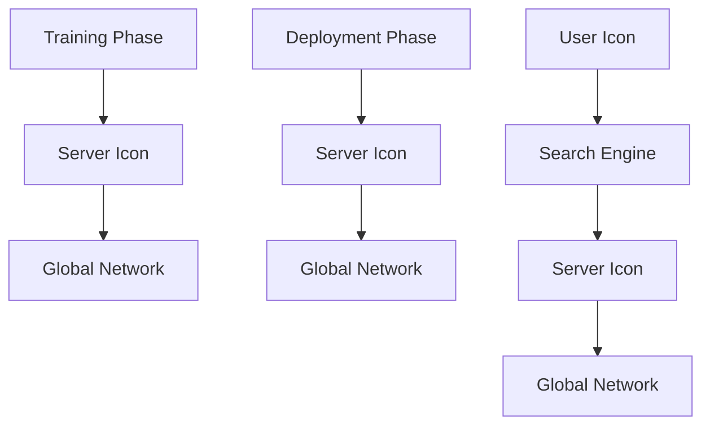
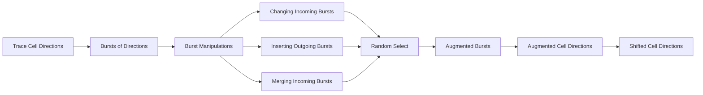
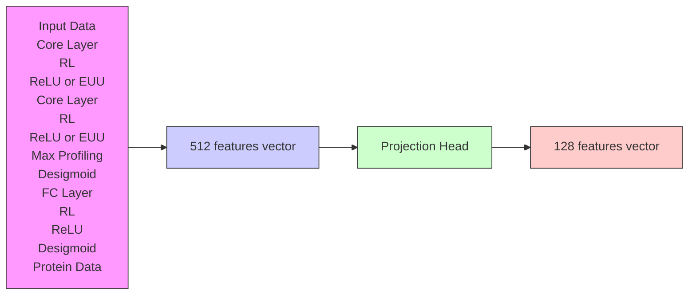
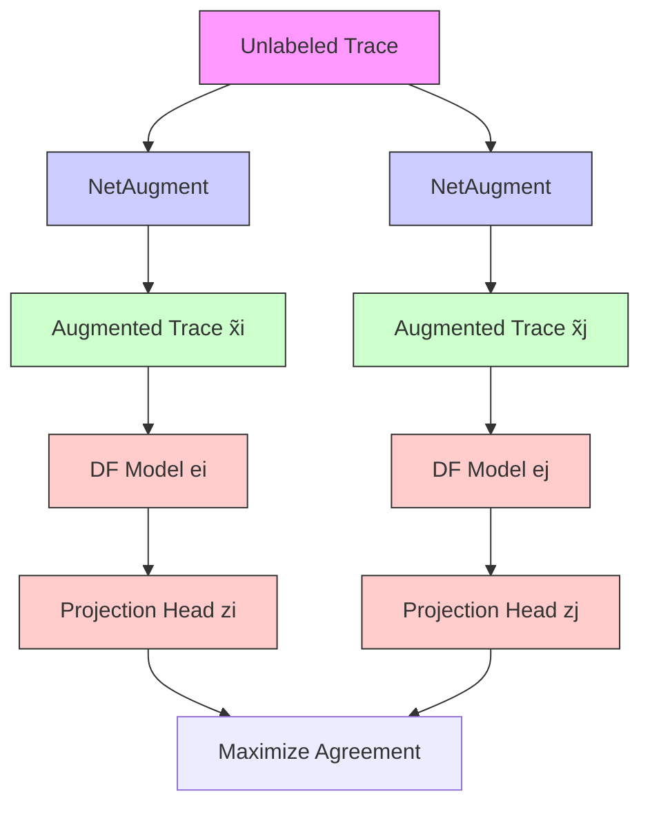

# Realistic Website Fingerprinting By Augmenting Network Traces

Alireza Bahramali

abahramali@cs.umass.edu

University of Massachusetts Amherst

Ardavan Bozorgi

abozorgi@cs.umass.edu

University of Massachusetts Amherst

Amir Houmansadr

amir@cs.umass.edu

University of Massachusetts Amherst

## ABSTRACT

Website Fingerprinting (WF) is considered a major threat to the anonymity of Tor users (and other anonymity systems). While stateof-the-art WF techniques have claimed high attack accuracies, e.g., by leveraging Deep Neural Networks (DNN), several recent works have questioned the practicality of such WF attacks in the real world due to the assumptions made in the design and evaluation of these attacks. In this work1, we argue that such impracticality issues are mainly due to the attacker’s inability in collecting training data in comprehensive network conditions, e.g., a WF classifier may be trained only on high-bandwidth samples collected on specific high-bandwidth network links but deployed on connections with different network conditions. We show that augmenting network traces can enhance the performance of WF classifiers in unobserved network conditions. Specifically, we introduce NetAugment, an augmentation technique tailored to the specifications of Tor traces. We instantiate NetAugment through semi-supervised and self-supervised learning techniques. Our extensive open-world and close-world experiments demonstrate that under practical evaluation settings, our WF attacks provide superior performances compared to the state-of-the-art; this is due to their use of augmented network traces for training, which allows them to learn the features of target traffic in unobserved settings (e.g., unknown bandwidth, Tor circuits, etc.). For instance, with a 5-shot learning in a closed-world scenario, our self-supervised WF attack (named NetCLR) reaches up to 80% accuracy when the traces for evaluation are collected in a setting unobserved by the WF adversary. This is compared to an accuracy of 64.4% achieved by the state-of-the-art Triplet Fingerprinting [34]. We believe that the promising results of our work can encourage the use of network trace augmentation in other types of network traffic analysis.

## CCS CONCEPTS

• Networks → Network privacy and anonymity; • Information systems → Traffic analysis; • Security and privacy → Pseudonymity, anonymity and untraceability; Privacy-preserving protocols.

1An extended version of this paper as well as artifacts are available here [2].

Permission to make digital or hard copies of all or part of this work for personal or classroom use is granted without fee provided that copies are not made or distributed for profit or commercial advantage and that copies bear this notice and the full citation on the first page. Copyrights for components of this work owned by others than the author(s) must be honored. Abstracting with credit is permitted. To copy otherwise, or republish, to post on servers or to redistribute to lists, requires prior specific permission and/or a fee. Request permissions from permissions@acm.org.

CCS ’23, November 26–30, 2023, Copenhagen, Denmark

© 2023 Copyright held by the owner/author(s). Publication rights licensed to ACM.

ACM ISBN 979-8-4007-0050-7/23/11. . . \$15.00

https://doi.org/10.1145/3576915.3616639

## KEYWORDS

Traffic Analysis, Tor, Website Fingerprinting, Flow Correlation Attacks, Anonymous Communications

## ACM Reference Format:

Alireza Bahramali, Ardavan Bozorgi, and Amir Houmansadr. 2023. Realistic Website Fingerprinting By Augmenting Network Traces. In Proceedings of the 2023 ACM SIGSAC Conference on Computer and Communications Security (CCS ’23), November 26–30, 2023, Copenhagen, Denmark. ACM, New York, NY, USA, 15 pages. https://doi.org/10.1145/3576915.3616639

## 1 INTRODUCTION

Anonymous communication systems hide the identities of the Internet end-points (e.g., websites) visited by Internet users, therefore protecting them against online tracking, surveillance, and censorship. Tor [12] is the most popular anonymous communication system in the wild with several million daily users [38]. Tor provides anonymity by relaying clients’ traffic through cascades of proxies, known as relays. A major threat to the anonymity provided by Tor and similar anonymity systems is a class of attacks known as Website Fingerprinting (WF) [33, 34, 7, 8, 21, 27, 24, 5, 44, 23, 13, 45, 22, 4, 43]. WF is performed by a passive adversary who monitors the victim’s network traffic, e.g., a malicious ISP or surveillance agency. The adversary compares the victim’s observed traffic trace against a set of pre-recorded website traces, to identify the webpage being browsed. State-of-the-art (SOTA) WF attacks achieve significantly high accuracies by leveraging deep neural network (DNN) architectures [22, 4, 33, 34, 8, 27, 21], e.g., Deep Fingerprinting [33] claims 98% accuracy in a closed-world scenario.

Critiques of WF Studies: Despite the high accuracies claimed by SOTA WF attacks, several recent works [16, 8, 9, 45, 41] have questioned the relevance of such attacks in practice due to the (unrealistic) threat models assumed in evaluating such attacks. Notably, the following are the major criticisms:

• Resilience to concept drift: Concept drift refers to the phenomenon where the properties that distinguish one website from another can change over time. This can make it more difficult for WF techniques to accurately identify and track individual websites, as the features that were previously used to distinguish them may no longer be reliable. Juarez et al. [16] show that concept drift causes a significant drop in WF accuracy.

• Network condition variations: To collect ground truth data for training a WF classifier, researchers usually generate synthetic network traces via automated browsing of a predefined set of websites. However, when deploying the attack, the WF classifier may encounter traces that are collected in different network conditions (e.g., lower bandwidth).

• Inaccurate user imitation: Automated browser crawlers such as Selenium [32] are used by researchers to collect ground truth traces. The diversity of browser configurations and variations in user behavior such as visiting subpages of a website cannot be replicated by these crawlers.

• Requiring large labeled datasets: Some DNN-based WF techniques require large amounts of labeled data for training to achieve high accuracies.

In response to above criticisms, researchers proposed various heuristic techniques [8, 45, 21, 23, 27, 41, 25] in the design and evaluation of WF attacks. For instance, Wang and Goldberg [45] propose to maintain a fresh training set to make the model robust against concept drift. Furthermore, to improve WF accuracy when limited labeled data is available, GANDaLF [21] and Triplet Fingerprinting (TF) [34] use generative networks and metric learning, respectively. Most recently, Cherubin et al. [8] aim to address the issue of inaccurate user imitation by training a WF classifier on genuine Tor traces collected from exit Tor relays.

Enabling WF under realistic settings: We argue that the (ad hoc) approaches mentioned above either only partially address the issue, or are impractical themselves. For instance, the SOTA works of GANDaLF [21] and Triplet Fingerprinting (TF) [34] only address the issue of data availability, but not concept drift. In this work, we argue that the main reason for these issues with WF techniques is the attacker’s inability to collect training network traces in variable network conditions. That is, the WF party is either not able to collect enough (labeled) training data to represent the diverse and volatile nature of the web traffic over time, or the collected training data only represents a specific threat model, e.g., a specific network condition, a particular Tor circuit, or a specific time frame. For instance, the adversary may collect Tor traces in one setting during training but may encounter traces in a completely different setting during the deployment that have not been previously observed. One potential solution to mitigate this issue is to collect Tor traces in a variety of network settings and scenarios. However, there can be an infinite number of settings and in any practical WF scenario, it is infeasible to collect traces in all possible settings, e.g., to solve the concept drift problem, the attacker needs to re-train the classifier regularly because the contents or even the layout of the websites may change everyday.

In this work, we aim to alleviate the mentioned issues through augmentation of network traces. Augmentation is to modify the existing samples to generate new samples that have the crucial features of the original ones. Our work is inspired by the successful uses of data augmentation in various SOTA machine learning architectures, in particular in various emerging semi-supervised and self-supervised applications. Our intuition is that augmenting network traces (e.g., of website connections) can help enhance the longitudinal perspective of a WF classifier, by enabling it to obtain network data samples that represent unobserved network conditions or settings. However, one can not simply borrow data augmentation techniques designed for classical machine learning tasks like vision. Instead, to get the most out of augmentation, we develop augmentation techniques that are tailored to the specific characteristics of network traffic.

We demonstrate the impact of data augmentation on boosting the performance of WF attacks under realistic settings. We start by evaluating the impact of a naive augmentation approach, i.e., randomly flipping the directions of Tor cells in a Tor trace. We then evaluate our network-tailored augmentation mechanism, NetAugment, which is tailored to specific configurations of Tor traffic. NetAugment replicates the modifications that may happen in unobserved WF settings by manipulating bursts of cells in a Tor trace. In our experiments, we show that NetAugment performs significantly better than a naive (random) augmentation.

Deploying Network Augmentation: Augmented Tor traces can be used in different ways to train a WF classifier. In this work, we instantiate NetAugment through semi-supervised learning (SemiSL) and self-supervised learning (SelfSL). We use SemiSL and SelfSL to reduce the dependency of the model on collecting large amounts of labeled data. After evaluating several deployments of SelfSL and SemiSL techniques, we propose NetCLR, a WF attack based on SelfSL techniques integrated with NetAugment. NetCLR learns useful representations of Tor traces without any requirement of labeled data as a pre-training phase. We then fine-tune the pretrained base model to adjust NetCLR to downstream datasets. To evaluate NetCLR in a realistic scenario, we perform pre-training and fine-tuning using traces collected in one setting, and perform the attack on traces collected in different settings. We split our datasets into two categories: traces collected in consistent network conditions (superior traces), and traces collected in poor and low bandwidth network conditions (inferior traces).

Evaluations: We perform extensive experiments to evaluate Net-CLR in both closed-world and open-world WF scenarios. We show that NetCLR outperforms previous WF techniques when the traces for training and deployment are collected in different settings, e.g., in a closed-world scenario and with only 5 labeled samples, NetCLR has 80% accuracy on inferior traces while Triplet Fingerprinting (TF), the SOTA low-data WF technique, reaches only 64.4% in an exact same setup. Furthermore, our results show that NetCLR shows more resilience to concept drift compared to previous systems, e.g., when evaluating NetCLR on a dataset with a 5-year gap from the dataset used in pre-training, NetCLR reaches 72% accuracy using 20 labeled samples while TF only reaches 51% accuracy. NetCLR is also effective in an open-world scenario, e.g., when using 5 labeled samples, NetCLR reaches 92% precision while Deep Fingerprinting has only 75% precision.

We also evaluate NetCLR against the Blind Adversarial Perturbations (BAP) [20] countermeasure technique which is based on adversarial examples and is shown to be effective in defending WF attacks. Based on our results, NetCLR is more robust compared to existing systems when BAP is active, e.g., the accuracy of Net-CLR reduces by 4.9% when there are 10 labeled samples while the accuracy of DF decreases by 52.3%.

## Summary of contributions:

• We investigate augmentation of network traffic to alleviate realisticness issues of WF techniques that stem from a lack of longitudinal perspective into network traffic; follow-up studies may extend this to other types of traffic analysis.  
• We deploy our network augmentation mechanisms into novel WF techniques that are based on semi-supervised and self-supervised mechanisms.  
• We perform extensive experiments in closed-world and openworld settings, demonstrating the superiority of our WF attacks in realistic settings.

## 2 BACKGROUND

## 2.1 Semi-Supervised Learning

Semi-supervised learning (SemiSL) is an approach to machine learning that combines a small amount of labeled data with a large amount of unlabeled data during training. There is a line of research in SemiSL aiming at producing an artificial label for unlabeled samples and training the model to predict the artificial label when fed unlabeled samples as input [18, 19, 46, 28, 31]. These approaches are called pseudo-labeling. Similarly, consistency regularization [1, 17, 29] obtains an artificial label using the model’s predicted distribution after randomly modifying the input or model function. FixMatch [35] is a recent SemiSL algorithm in computer vision that combines consistency regularization and pseudo-labeling and generates separate weak and strong augmentations when performing consistency regularization. FixMatch produces a pseudo-label based on a weakly-augmented unlabeled sample, which is used as a target label when the model is fed a strongly-augmented version of the same input. Note that in computer vision, augmentation refers to distorting the pixels of an image to generate new samples with the same label. This includes making small changes to images or using deep learning models to generate new data points. In FixMatch, weak augmentation is a standard flip-and-shift augmentation strategy while strong augmentation is based on AutoAugment [10]. See the extended version of this paper [2] for the detailed formulation of FixMatch.

## 2.2 Self-Supervised Learning

Self-supervised (Unsupervised) learning (SelfSL) tries to learn useful embeddings from unlabeled data. Contrastive learning is a subset of unsupervised learning that aims to learn embeddings by enforcing similar elements to be equal and dissimilar elements to be different. SimCLR [6] is a recent framework in computer vision for contrastive learning of visual representations. In particular, SimCLR learns representations (embeddings) of unlabeled data by maximizing agreement between differently augmented views of the same data example via a contrastive loss in the latent space. Note that SimCLR does not use any labeled data to learn the representations of input samples. We overview the detailed formulation of SimCLR in the extended version of this paper [2].

## 2.3 Website Fingerprinting: An Overview

Website Fingerprinting (WF) aims at detecting the websites visited over encrypted channels like VPNs, Tor, and other proxies. [33, 4, 27, 43, 24, 5, 44, 23, 13, 45, 15, 34, 41]. The attack can be performed by a passive adversary who monitors the victim’s encrypted network traffic, e.g., a malicious ISP or a surveillance agency. The adversary attempts to identify the website visited by the victim by observing their encrypted traffic and using various classification techniques. Website fingerprinting has been widely studied in the context of Tor traffic analysis [27, 33, 4, 24, 5, 44, 23, 13, 15, 34, 41].

Various machine learning classifiers have been used for WF, e.g., using KNN [43], SVM [23], and random forest [13]. However,

SOTA WF algorithms use DNNs to perform website fingerprinting [33, 27, 4]. DNN-based WF attacks demonstrate effective performance in both the closed-world setting, where the user is assumed to only browse websites in a monitored set, and the more realistic open-world setting, where the user might browse any website, whether monitored or not. For instance, Deep Fingerprinting (DF) [33] achieves over 98% accuracy in the closed-world setting and over 0.9 for both precision and recall in the open world by using convolutional neural networks (CNN). Similarly, Automated Website Fingerprinting (AWF) [27] is another algorithm based on CNNs that achieves over 96% accuracy in a closed-world scenario. To achieve high accuracies, DF and AWF require large amounts of training data, e.g., DF uses 800 traces per website. Furthermore, both AWF and DF assume the traces for the training and test have the same distribution, while in practice, traces can be collected in different time periods or from different vantage points.

There are recent studies that perform limited-data WF [34, 21, 4], i.e., Sirinam et al. propose Triplet Fingerprinting (TF) [34] where they examine how an attacker can leverage N-shot learning—a machine learning technique requiring just a few training samples to identify a given class—to reduce the amount of data required for training as well as mitigate the adverse effects of dealing with heterogeneous trace distributions. TF leverages triplet networks [30], an image classification method in contrastive learning, to train a feature extractor that maps network traces to fixed-length embeddings. TF uses 25 samples per website and 775 websites to train the feature extractor in the pre-training phase. The embeddings are then used in a fine-tuning phase to ?? -train a K-Nearest Neighbour (KNN) classifier. TF achieves over 92% accuracy using 25 samples per website to train the feature extractor and only 5 samples to train the KNN classifier. Generative Adversarial Network for Data-Limited Fingerprinting (GANDaLF) [21], proposed by Oh et al., is another effective WF attack when few training samples are available. In particular, GANDaLF uses a Generative Adversarial Network (GAN) to generate a large set of "fake" network traces, helping to train a DNN that distinguishes classes of real training data. In the closed-world setting, GANDaLF achieves 87% accuracy using only 20 instances per website (100 sites). Online WF [8] is the most recent WF attack proposed by Cherubin et al. They argue that existing WF techniques lack realistic assumptions making them impractical in real-world scenarios. They show that synthetic traces collected by researchers using automated browsers over entry relays is less diverse than genuine Tor traces. Therefore, Online WF uses genuine Tor traces collected over an exit relay to perform a more realistic WF attack.

## 3 PROBLEM STATEMENT

## 3.1 Critiques of WF Studies

As overviewed in Section 2.3, state-of-the-art DNN-based WF attacks achieve high accuracies even with 25 labeled samples per website. However, several recent works [16, 8, 9, 45, 41] have criticized the relevance of such attacks in practice, as existing WF attacks lack realistic assumptions in their threat model, making them impractical in real-world. The following are the main criticisms:

Resilience to concept drift: Concept Drift is one of the main issues making a WF classifier outdated as the content of many websites is changing everyday. Juarez et al. [16] show that concept drift can cause a significant drop in the accuracy of WF classifiers. To overcome this problem, the attacker needs to re-train the model regularly by fetching updated data [45]. We elaborate on different types of concept drift that impact WF attack in the extended version of this paper [2]

Network condition variations: The network conditions where Tor traces are collected have different characteristics in terms of their bandwidth, latency, congestion, and so forth. A mismatch between the network conditions of traces used for training and the traces the attacker observes in deployment can affect the performance of the WF model significantly. Researchers usually collect traces in stable and consistent network conditions which is not always the case during deployment. Clients in different locations may experience low bandwidth connections or high latency affecting the underlying features of their Tor traces.

Inaccurate user imitation: Researchers often use automated browser crawlers such as Selenium [32] positioned in an entry relay to collect ground truth traces for training WF classifiers. However, these synthetic traces do not reflect actual behavior of a Tor client, such as different browser configurations or visiting subpages of a website, e.g., it is impractical to assume that clients only have one tab open while clients usually visit websites concurrently [40, 47]. Researchers have investigated the effect of multi-tab browsing in WF attacks [16, 45]. Online WF [8] shows that synthetic traces cannot represent genuine Tor traces. They modify the threat model of a conventional WF attack by collecting genuine Tor traces from an exit relay for training the WF classifier.

Requiring large labeled datasets: Despite the high accuracy of DNN-based WF attacks, they often require large amounts of labeled data, e.g., DF [33] uses 800 samples per website to achieve 98% accuracy. Gathering labeled data in any learning-based scenario in general, and in WF attacks in particular require excessive effort making it impractical in real-world. Researchers used different techniques such as contrastive learning [34], GANs [21], and residual networks [4] to mitigate the reliability of WF attacks on labeled data.

Despite the partial success of recent WF studies to ease the challenges of such attacks in real-world scenarios, they still lack practicality when it comes to actual Tor traces. In this work, we aim for the root cause of the mentioned critics: lack of longitudinal perspective into network traffic. As a response, we leverage carefully designed data augmentation tailored to the Tor network to represent the diverse and volatile nature of web traffic. A Tor-tailored augmentation enables the WF model to obtain traces in unobserved settings by replicating the modifications that may happen during the deployment of the attack.

## 3.2 Adversary Model

In this work, we consider a passive and local adversary for Tor. Network administrators, Internet Service Providers (ISP), and Autonomous Systems (AS) are examples of a local adversary having access to the link between the client and the entry relay. The adversary collects TCP packets from which it can extract Tor cells. We assume that the adversary cannot break the encryption provided by Tor. In machine learning-based WF attacks, the adversary first trains a classification model (mostly DNNs in recent works) and then deploys the model against users’ traffic. Figure 1 shows the setting of a machine learning-based WF attack.

flowchart

Figure 1: Setup of a machine learning-based WF attack.

In this work, the attacker has the same interception point as previous WF attacks. The attacker collects traces by running an entry relay and then uses these traces to train a WF classifier. Note that, due to privacy reasons and to keep the anonymity of Tor users, we do not evaluate our system on Tor traces of actual users. Furthermore, an evaluation on genuine Tor traces cannot be shared publicly making it challenging for future reproducibility.

To evaluate the ability of the attacker to generalize for unobserved settings during deployment, we collect traces in different network settings for training and deployment. These traces are synthetic as we need to know the labels to train the model. We assume that the attacker uses traces that are collected in consistent network conditions with high bandwidth and low latency. Hence, the attacker performs all the training phases on superior traces. On the other hand, during deployment, the attacker may encounter traces in various network conditions such as low bandwidth and high latency. So to consider the worst-case scenario, we evaluate the performance of our attack on inferior traces. In Section 6, we elaborate on how we divide the traces of our dataset into inferior and superior traces. We believe that in such a scenario, we evaluate the capability of the model of learning the underlying features of traces in unobserved settings. In Sections 4 and 5 we explain how we achieve this goal by leveraging data augmentation and deploying it through SelfSL and SemiSL algorithms.

## 4 NETAUGMENT: AUGMENTING NETWORK TRACES

As mentioned before, limitations in data collection are one of the main weaknesses of existing WF attacks, questioning the relevance of such attacks in practice. We present augmentation as a potential solution to this problem as it enables the model to train on different variations of website traces which it might later face when it is deployed. These traces can have a distribution different from that of the training data, as there are unpredictable sources of noise causing variations in traffic which might not be present when training data is collected. An augmentation tailored to the domain of network packets and Tor cells enables the adversary to perform classification on traces in a realistic scenario. Augmentation also allows the attacker to extend their training dataset, therefore eliminating the need for large amounts of labeled data. There are numerous works focusing on augmentation techniques applied to images in computer vision. These techniques range from basic image manipulations, such as resizing, flipping, shifting, and cropping, to more complex techniques such as AutoAugment [10], RandAugment [11], and CTAugment [3]. However, augmenting the network traces is more challenging due to the different nature of Tor network traces. Specifically, one cannot simply borrow data augmentation techniques designed for classical machine learning tasks. Instead, to get the most out of augmentation, we develop augmentation techniques that are tailored to the specific characteristics of network traffic. To come up with a data augmentation approach for Tor traces, we started by implementing a naive augmentation called FlipAugment where for each Tor cell, we flip its direction with a probability of $\boldsymbol { p } _ { f l i p }$ . FlipAugment is a simple augmentation that does not necessarily reflect effects of variations that can occur in Tor network conditions.

We then propose NetAugment, a new data augmentation technique tailored to the specific characteristics of Tor network traces. We believe that using a Tor-tailored augmentation is necessary to enable the model to obtain network samples that represent unobserved network conditions and disparate settings. We demonstrate the effectiveness of NetAugment as opposed to FlipAugment through extensive experiments in Section 7. Figure 2 shows the high-level description of NetAugment. NetAugment focuses on bursts of Tor cell directions since the traces fed to the attack models are sequences of cells represented by their direction (incoming or outgoing) (See Section 6.2 for more details on data representation). We define a sequence of consecutive cell directions as a burst if they all have the same direction. The number of cells in each burst is considered the size of that burst. In a Tor trace, incoming bursts consist of cells transmitted from the website to the client and outgoing bursts consist of cells captured in the other direction. For each trace, we first extract the incoming and outgoing bursts, then we apply one of three burst manipulations, and finally, we apply a shift transformation. Each manipulation represents one or several cumulative effects of varying network conditions on traces.

Since the WF literature defines an incoming cell as -1 and an outgoing cell as +1, incoming bursts have negative sizes and outgoing bursts have positive sizes. Note that when applying each burst manipulation on a trace, we do not modify the first 20 cells, as the first cells are often used for the protocol initiation and handshake which means they remain the same among different traces of a particular website. For each trace, NetAugment randomly applies one of the following burst manipulations:

• Modify incoming burst sizes: The content of most websites is changing every day and as a result, the classifier may not be able to capture the unique pattern of each website. The bursts of incoming Tor cells in a trace contain downloaded contents of the websites such as text, images, and other parts of the website. Figure 3 shows the mean and standard deviation of the number of incoming cells in traces of 50 websites randomly chosen from AWF dataset. This figure shows how different traces of the same website can have varied numbers of incoming cells, indicating the dynamic nature of the contents of a website. To replicate this variation in the contents of a website, we randomly modify the size of incoming bursts and generate new network traces for the same website. For traces with less than 1000 Tor cells, we only increase the size of incoming bursts and for traces with more than 4000 Tor cells, we only decrease the size of incoming bursts. For traces with a number of Tor cells between 1000 and 4000, we randomly choose to increase or decrease the size of incoming bursts. The modification of incoming burst sizes happens with rates $r _ { u p s a m p l e }$ and ?????????????????????? which are the hyper-parameters of NetAugment.

• Insert outgoing bursts: Tor sends control cells periodically for flow control and other purposes. SENDME cells are the most common control cells that can affect the traffic analysis algorithm [42]. Different network conditions lead to different circuit bandwidths which affect the number of control cells that are present in each trace, e.g., when a client is connecting to a low bandwidth circuit, there could be more control cells in their network trace. To represent this effect in our augmentation, we randomly split incoming bursts and insert an outgoing burst to generate an augmented network trace. To choose the size of these inserted outgoing bursts, we use the empirical distributions of approximately 198k outgoing burst sizes obtained from 1000 traces of AWF dataset. Figure 4 shows this distribution. Inserting outgoing bursts happens at a rate $r _ { i n s e r t }$ which is a hyper-parameter of NetAugment.  
• Merge incoming bursts: As mentioned previously, higher circuit bandwidths can translate into fewer control cells. Therefore, by merging the incoming bursts, our augmentation represents this variation while maintaining the amount of incoming data which is consistent among most of the traces of a single website. We represent this effect by merging incoming bursts and removing some outgoing bursts randomly. We merge ???????????? number of incoming bursts at a rate ???????????? . ???????????? and $r _ { m e r g e }$ are hyper-parameters of NetAugment.

Once the burst manipulation is applied, the sequence of bursts is converted to a sequence of cells. Then, the last step of NetAugment is to shift the cells. To shift a trace by ?? cells, we drop the last ?? cells of the trace and insert ?? zero-sized cells to its beginning. When deploying the attack, the adversary observing the victim’s traffic may not know which cell is the first cell in a trace. This may cause that particular trace to be shorter than previously observed samples of that website. The intuition behind this shifting step is to represent shorter traces not just by zero-sized ending cells, but also by introducing zero-size leading cells to increase resilience to virtual concept drift (See [2] for details on types of concept drift in WF).

Algorithm 1 summarizes the steps in NetAugment. Furthermore, Algorithms 2, 4, and 3 show the detailed implementation of the burst manipulations in NetAugment. Table 1 shows the optimal values of NetAugment hyperparameters. We select each hyperparameter by searching through a set of candidates. We pick the hyperparameter which leads to the best accuracy.

flowchart

Figure 2: Overview of NetAugment

scatterplot

| Website label | Number of incoming cells |
| ------------- | ------------------------ |
| 0             | 300                      |
| 1             | 1800                     |
| 2             | 4700                     |
| 3             | 1900                     |
| 4             | 1100                     |
| 5             | 800                      |
| 6             | 2900                     |
| 7             | 2600                     |
| 8             | 2500                     |
| 9             | 2200                     |
| 10            | 2100                     |
| 11            | 2600                     |
| 12            | 2500                     |
| 13            | 2300                     |
| 14            | 2200                     |
| 15            | 2100                     |
| 16            | 200                      |
| 17            | 150                      |
| 18            | 1400                     |
| 19            | 1300                     |
| 20            | 1200                     |
| 21            | 1100                     |
| 22            | 1000                     |
| 23            | 900                      |
| 24            | 800                      |
| 25            | 700                      |
| 26            | 600                      |
| 27            | 500                      |
| 28            | 400                      |
| 29            | 300                      |
| 30            | 200                      |
| 31            | 150                      |
| 32            | 100                      |
| 33            | 50                       |
| 34            | 30                       |
| 35            | 20                       |
| 36            | 15                       |
| 37            | 10                       |
| 38            | 5                        |
| 39            | 3                        |
| 40            | 2                        |
| 41            | 1                        |
| 42            | 0                        |
| 43            | -1                       |
| 44            | -2                       |
| 45            | -3                       |
| 46            | -4                       |
| 47            | -5                       |
| 48            | -6                       |
| 49            | -7                       |
| 50            | -8                       |

Figure 3: Mean and standard deviation of the number of incoming Tor cells in traces of 50 websites in the AWF dataset. Different samples of the same websites have a varied number of incoming Tor cells due to their dynamic content.

histogram

| Outgoing burst size | Count |
| ------------------- | ----- |
| 0-5                 | 100000 |
| 5-10                | 50000  |
| 10-15               | 20000  |
| 15-20               | 10000  |
| 20-25               | 5000   |
| 25-30               | 2000   |
| 30-35               | 1000   |
| 35-40               | 500    |
| 40-45               | 200    |
| 45-50               | 100    |
| 50-55               | 50     |
| 55-60               | 20     |
| 60-65               | 10     |
| 65-70               | 5     |
| 70-75               | 2     |
| 75-80               | 1     |
| 80-85               | 1     |
| 85-90               | 1     |
| 90-95               | 1     |
| 95-100              | 1     |
| 100-105             | 1     |
| 105-110             | 1     |
| 110-115             | 1     |
| 115-120             | 1     |
| 120-125             | 1     |

Figure 4: Empirical distribution of outgoing burst sizes from 1000 traces. To insert outgoing bursts we randomly sample from this distribution.

Algorithm 1 NetAugment Algorithm  
$t \leftarrow$ vector of cell directions
SHIFT $\leftarrow$ shift parameter
bursts = extract_bursts(t)
manipulations $\leftarrow$ Modify Incoming Burst Sizes (Algorithm 2),
Merge Incoming Bursts (Algorithm 4),
Insert Outgoing Bursts (Algorithm 3)
} $M \leftarrow$ Randomly pick from manipulations $burst_{augmented} = M(bursts, t)$ $t_{augmented} \leftarrow$ convert_burst_to_cells(bursts $_{augmented}$ )
n = Pick random value from $\{0, \cdots, SHIFT\}$ output = $t_{augmented} >> n$

Algorithm 2 Modifying Incoming Burst Sizes Algorithm  
function MODIFY_SIZE_OF_BURSTS(bursts, t) $r_{upsample} \leftarrow$ The rate of increasing burst size $r_{downsample} \leftarrow$ The rate of reducing burst size
burst_size_threshold $\leftarrow$ Minimum number of non-zero cells in a burst for the manipulation to be applied
if $\text{len}(t \neq 0) <= 1000$ then
    delta = $r_{upsample}$ else if $\text{len}(t \neq 0) > 4000$ then
    delta = $-r_{downsample}$ else
    ▷ Randomly decide to increase or decrease size
    delta = Pick random value from $\{r_{upsample}, -r_{downsample}\}$ for burst_size in bursts do
    ▷ Skipping bursts with less than 10 cells
    if burst_size ≤ -burst_size_threshold then
    burst_size × = (1 + random[0, 1] × delta)
return bursts

## 5 WEBSITE FINGERPRINTING USING AUGMENTED TRACES

As mentioned in the previous section, augmentation can boost the performance of WF attacks under realistic scenarios by enabling the model to obtain traces in unobserved settings and conditions. Augmented Tor traces can be used in different methods to train a

Algorithm 3 Inserting Outgoing Bursts Algorithm  
function INSERT_OUTGOING_BURSTS(bursts) $r_{insert} \leftarrow$ The rate of inserting outgoing bursts $\mathcal{BS} \leftarrow$ Empirical distribution of burst sizes
    for burst_size in bursts do
    if burst_size < 0 then ▷ Ignoring outgoing bursts
    random_prob = random[0, 1]
    if random_prob < $r_{insert}$ then
    size = Sample( $\mathcal{BS}$ )
    position = Pick random value
    from {3, …, burst_size - 3}
    bursts.insert(size=size, position=position)
    return bursts

Algorithm 4 Merging Incoming Bursts Algorithm  
function MERGE_INCOMING_BURSTS(bursts) $n_{merge} \leftarrow$ Number of bursts to merge in each step $r_{merge} \leftarrow$ The rate of merging the bursts
    for burst_size in bursts do
    if burst_size < 0 then ▷ Ignoring outgoing bursts
    random_prob = random[0, 1]
    if random_prob < $r_{merge}$ then
    num_mergedes = Pick random value
    from $\{2, \cdots, n_{merge}\}$ new_burst_size ← Merging num_merge
    consecutive bursts

Table 1: Hyperparameters of NetAugment

<table><tr><td>Parameter</td><td>Search Space</td><td>Choice</td></tr><tr><td>SHIFT</td><td>{5, 10, 20, 50}</td><td>10</td></tr><tr><td> $r_{upsample}$ </td><td>0.1 ~ 1</td><td>1</td></tr><tr><td> $r_{insert}$ </td><td>{0.1, 0.3, 0.5, 0.7}</td><td>0.3</td></tr><tr><td> $r_{downsample}$ </td><td>0.1 ~ 1</td><td>0.5</td></tr><tr><td>burst_size_threshold</td><td>{10, 20}</td><td>10</td></tr><tr><td> $n_{merge}$ </td><td>{3, 4, 5, 6}</td><td>5</td></tr><tr><td> $r_{merge}$ </td><td>{0.05, 0.1, 0.2, 0.3}</td><td>0.1</td></tr></table>

WF classifier. In this section, we explain how we instantiate NetAugment through SelfSL and SemiSL techniques, and then we describe our proposed deployments of augmentation using SelfSL and SemiSL: NetCLR and NetFM. We use SemiSL and SelfSL techniques to remove the requirement of gathering large labeled traces by the adversary.

## 5.1 NetCLR

We propose NetCLR, a WF attack technique that uses contrastive learning and network trace augmentation to learn accurate representations of network traces. NetCLR is based on SelfSL and does not require any labeled data for the pre-training phase. NetCLR adopts the methodology of SimCLR [6] and adjusts its components to the domain of network traces. NetCLR consists of three phases to perform the WF attack.

Pre-Training Phase: In the pre-training phase, we train a SelfSL model that learns to generate lower-dimension representations for website traces. This is similar to what TF [34] does, however, as opposed to TF which needs at least 25 labeled samples for each of its 775 websites, NetCLR does not need any labeled samples to perform the pre-training. Instead, NetAugment helps the model to see different samples of a network trace and generate representations that are sufficiently close to each other for the same website and far from samples of other websites. As suggested by TF [34] and Online WF [8], the base network of NetCLR is the DF neural network proposed by Sirinam et al. [33]. We also add a projection head to the top of DF as it improves the performance of the pre-training [6]. The projection head contains two fully connected layers with a ReLU activation function and a Batch Normalization [14] layer. Figure 5 shows the structure of NetCLR pre-training model. The pre-training of NetCLR learns representations of network traces and converts the traces with 5000 features to representations with a length of 512. The projection head converts the representations to an output of size 128. Figure 6 shows the NetCLR pre-training steps.

flowchart

Figure 5: NetCLR Pre-train Structure

Fine-Tuning Phase: In the fine-tuning phase of NetCLR, the adversary uses different numbers of labeled traces, denoted as ?? , to fine-tune the DF model that is pre-trained on augmented traces. In this phase, we replace the projection head with a simple fully connected layer with probabilities of the input trace belonging to each class. We train the whole base network plus the fully connected layer. This is similar to the semi-supervised evaluation method proposed in [6] where the pre-trained SimCLR is fine-tuned using a small portion of the dataset as the labeled dataset. We consider both the pre-training and fine-tuning phases the training phase.

Deployment Phase: Similar to all WF attacks, in the attack phase, the adversary performs the actual WF attack and uses the fine-tuned model to identify the traces visited by clients.

## 5.2 NetFM

We also instantiate NetAugment through SemiSL techniques. We adopt the implementation of FixMatch [35] and integrate NetAugment into it. We then present NetFM, a WF attack based SemiSL and NetAugment that uses pseudo-labels to generate labels for the unlabeled portion of the dataset. We then train the WF classifier using the augmented traces with generated pseudo-labels. The backbone of NetFM algorithm is also the DF neural network [33] with the same parameters. For weak augmentations, we use FlipAugment with $p _ { f l i p } = 0 . 1$ .

Note that for both NetFM and NetCLR we use the same parameters for DF as the ones used in the original paper [33].

flowchart

Figure 6: NetCLR pre-training steps

## 6 DATA COLLECTION AND SETUP

## 6.1 Network Condition Metric

For evaluating a model in the realistic scenario described in Section 3.2, we need a metric to differentiate superior and inferior traces. We define the network condition metric (NCM) of a trace as the ratio of the total size of downstream Tor cells to the loading time of that trace. We approximate the loading time of each trace by the difference between the timestamps of it first and last cell. We believe this metric can reflect the cumulative effects of changes in bandwidth, latency, loss, and congestion in Tor relays, clients, and servers. For traces in our datasets, we found 40 kBps to be the appropriate threshold for the NCM to partition superior and inferior traces as the performance of existing WF techniques starts to drop for traces with an NCM value below this threshold.

## 6.2 Model Input Representation

We use the same representation shared by recent work in WF [27, 34, 44, 33] for model inputs. Each sample of website traffic trace used for training and testing a model is converted into a sequence of Tor cells represented by +1 and -1 for outgoing and incoming cells, respectively. Since model inputs have a fixed length of 5000, longer sequences are truncated and shorter traces are padded with zeros. For each of the datasets described in Section 6.3, these sequences are processed to filter out some traces before they are used as model inputs. Empty traces are discarded. In the closed world setting, similar to [44], for each trace of a website, if its size is less than 20% of the median trace size of the website, it is discarded. In the open-world setting, all traces with less than 20 cells are discarded.

## 6.3 Dataset Labels and Composition

AWF dataset. This large dataset of non-onion websites dataset was collected by Rimmer et al. [27] in 2017 using Tor browser version 6.5. By contacting the authors, we obtained the full parsed traces of the dataset which included metadata such as packet timestamps. The parsed traces we obtained include up to 3000 traces for the homepage of 1200 monitored websites as well as traces generated by one-time visits to 565947 unmonitored websites. After processing these traces according to the method described in Section 6.2, we categorize them into several different sets for different scenarios. For the traditional WF scenario in the closed world setting where the NCM is not taken into account, we assemble the following:

• AWF1: The set of traces for 100 randomly picked monitored websites.

• AWF2: The set of traces for another 100 randomly picked monitored websites. Note that the set of websites in AWF1 and AWF2 are distinct.

For the scenario in the closed-world setting where the NCM is taken into account for training, we assemble the following:

• AWF-attack: The set of traces for the same 69 monitored websites from the AWF100 dataset in [34] which had enough superior and inferior traces. This dataset is further split into superior and inferior traces denoted by $\mathbf { A W F - A _ { s u p } }$ and $\mathbf { A W F - A _ { i n f } } ,$ respectively.  
• AWF-pre-training: The set of traces for 100 other monitored websites, where the websites are randomly picked. Note that the set of websites in AWF-pre-training and AWFattack are distinct. This dataset is further split into superior and inferior traces denoted by $\mathbf { A W F - P T _ { s u p } }$ and AWF-$\mathbf { P T _ { i n f } } ,$ , respectively. Each website in AWF-pre-training has 500 traces in $\mathsf { A W F - P T \mathrm { { s u p } } }$ and 500 traces in $\mathrm { A W F \mathrm { - P T _ { i n f } } } .$ .

For the open-world setting, we assemble the following:

• AWF-OW10k: The set of traces for 10000 superior and 10000 inferior unmonitored websites.  
• AWF-OW50k, AWF-OW100k, and AWF-OW200k are defined similarly to AWF-OW10k, with 50k, 100k, and 200k traces of both superior and inferior types, respectively.

Drift dataset. We collected this dataset to study the impact of concept drift on our attacks. For the closed world setting, we collected up to 550 traces for visits to each one of 225 non-onion websites. Similar to [27], this list of websites was compiled so as to avoid duplicate entries that only differ in the top-level domain as a means of website localization. The set of these monitored websites is distinct from those in AWF-pre-training. While limiting the guard relays to 18 specific relays located either in North America or Europe, we collected over 100 traces for 112 non-onion websites. The purpose of this set of traces is to investigate the effect of the location of guard relays on WF performance. For the open-world setting, we collected a single instance for each website. We picked 10000 websites from unmonitored websites in the AWF dataset. As a result, the set of these websites is also distinct from those in AWF-pretraining. Note that this dataset was collected more than 5 years after the AWF dataset. After processing these traces according to the method described in Section 6.2, we label the subsets as:

• Drift90: The set of 90 monitored websites, where each site has at least 100 superior and 20 inferior traces. This dataset is further split into superior and inferior traces denoted by Drift90 $\mathbf { s u p }$ and $\mathbf { D r i f t 9 0 _ { i n f } } ,$ respectively.

• Drift-guard: The set of 90 monitored websites is further split into a set of traces collected through 11 guard relays in Europe and a set of traces collected through 7 guard relays in North America.  
• Drift5000: The set of 5000 unmonitored websites.

## 6.4 Creating the Drift Dataset

6.4.1 Data Collection. We collect traces for the Drift dataset on multiple Ubuntu 20.04 virtual machines set up through KVM over the course of three months in multiple batches. We use the Python library tbseleinum version 0.6.3 [37] to automate the Tor browser bundle (TBB) version 11.0.10 and use Stem [36] to interact with the controller interface of TBB’s tor process through Python. As recommended by [44], we set UseEntryGuards to 0 in torrc to disable the set of limited entry guards and disable browser caching. This makes the collected data more realistic. Using asynchronous Tor controllers, we listen for STREAM, STREAM\_BW, and CIRC events. While the main thread of the script is browsing different websites to collect traffic, a separate thread processes the event queue for these three event types. The STREAM\_BW events include the timestamp of when a specific stream was used to send and receive bytes. We listen to CIRC events so that every time a new circuit is created we have its timestamp, id, and path which includes relay IPs and fingerprints. STREAM events show which circuit each stream is attached to, as well as other information such as which website is the target of that stream. The information collected from these events was stored for later use in processing packet capture files.

In each round of collecting traffic, we open a new tab, close the previous one, and then start capturing packets using tcpdump. We wait 5 seconds to ensure the capture has started, then navigate to a website. Once the load event has been fired, we wait for another 15 seconds. We then stop tcpdump and log the consensus bandwidth file if new measurements are available. Once every website is visited, or if there has been an error, we wait until tor would accept a NEWNYM signal and then manually renew Tor circuits by sending this signal. We also restart the Tor browser to make sure that the browser cache is cleared. We also keep a log of any errors so we can discard the corresponding packet capture files when processing the data. If the script is collecting traffic for monitored websites, it is then ready to start another round after the restart at the end of the previous round.

6.4.2 Processing. Since Tor cells are embedded in TLS records, we parse the packet capture files by extracting the TLS records from TCP packets using tshark [39]. The length of a TLS record can be used to approximate the number of embedded Tor cells, as the size of a Tor cell is either 512 or 514 [44]. The stored tor event information described in Section 6.4.1, lets us specify the IP address of the entry relay for each URL. This IP address is then used to find the relevant TLS records, discarding others. Then, the NCM is calculated for all traces before they are converted to the format described in Section 6.2.

## 6.5 Ethical Consideration

During the three-month period, we visited web pages to collect data for the Drift dataset, we used less than 10 clients while the Tor network had over 2 million daily users. As such, our clients should only have had a limited impact on the Tor network. Since we were collecting synthetic traffic on the same machine as the Tor clients, no information related to genuine traces was collected.

## 7 EXPERIMENT RESULTS

## 7.1 Experiment Setup

We perform our experiments using PyTorch 1.12.1 and Python 3.7. We use a single 2080 Ti GPU for all of our experiments. We fetch the code of existing models, DF, TF, and GANDaLF, and re-run their experiments to enable a benchmark for a fair comparison. For the NetFM evaluation, we set $\lambda _ { u } = 1$ and for the weak augmentation, we use $p _ { f l i p } = 0 . 1$ . Refer to the extended version of this paper [2] for the hyperparameters of NetCLR and NetFM.

The following are the existing state-of-the-art techniques that we compare NetCLR to. We give brief explanations for each technique in Section 2. We adopt the original implementations provided by the researchers and convert them to PyTorch implementations. We made a few modifications when necessary for the data loading pipeline and hyperparameter tuning.

• Deep Fingerprinting (DF) [33]: DF uses convolutional neural networks to design a WF classifier that achieves 98% accuracy in a traditional closed-world scenario.  
• Triplet Fingerprinting (TF) [34]: TF adopts triplet networks to design a feature extractor that generates fixed-size embeddings for network traces. It then applied a simple KNN model to generated embeddings when there is a low number of labeled samples. Then, for a small number of labeled samples, the feature extractor generates embeddings which are then used to train a KNN model.  
• GAN for Data-Limited Fingerprinting (GANDaLF) [21]: GANDaLF uses generative adversarial networks to generate "fake" network traces to achieve high accuracies in limited labeled data scenario.

Note that since the code and dataset for Online WF [8] are not publicly available due to privacy reasons, we are not able to compare NetCLR with Online WF.

## 7.2 Closed-World Scenario

We evaluate NetCLR in a closed-world scenario where we assume that the clients only browse the set of monitored websites the adversary is interested in.

Metric: To evaluate the performance in a closed-world scenario, we use Accuracy which is simply the ratio of correct predictions to the total number of traces.

7.2.1 Traditional WF Scenario. First, we evaluate NetCLR and NetAugment in a traditional WF scenario where the attacker uses traces collected in the same settings for both training and evaluation. To perform the experiments, we use AWF2 dataset to pre-train NetCLR and we use AWF1 for the fine-tuning and evaluation data. To have a fair comparison, we use AWF2 for the feature-extraction step of TF and the unlabeled dataset of GANDaLF. There is no pre-training phase in NetFM, hence for NetFM we use the AWF1 dataset for both the labeled and unlabeled samples.

We train each classifier using ?? = {5, 10, 20, 90} training samples per website, randomly sampled from the AWF1 dataset. We set ?? in NetFM to 19 for this experiment, e.g., in the event of 5 labeled samples, we have $1 9 \times 5 = 9 5$ unlabeled samples per each website. Note that this number of unlabeled traces is significantly smaller than 2500 traces used to train GANDaLF. The test traces are chosen from AWF1 dataset and they are mutually exclusive from the samples used for training (AWF2). The test set contains 417 samples per website of the AWF1 dataset. This is consistent with the numbers used in GANDaLF. Table 2 compares NetCLR with other WF techniques for different values of ?? . Since the training examples are chosen randomly, we run each training 5 times and report the average and standard deviation of the accuracies. As illustrated in this table, for all values of ?? , NetCLR has a significantly higher performance than other techniques, e.g., when $N = 5 , \mathrm { T F }$ can only achieve 78% average accuracy while NetCLR have 89.7% average accuracy. These numbers suggest that our tailored augmentation effectively helps the model learn accurate representations of website traces even with only 5 labeled examples. The results show that NetCLR has higher accuracy than existing techniques for different numbers of labeled samples in the traditional WF scenario.

Effect of Augmentation : We also evaluate NetCLR when instead of a NetAugment, we use FlipAugment with $p _ { f l i p } = 0 . 1$ . Table 2 contains the results of FlipAugment compared to NetAugment. As expected, NetAugment performs better than FlipAugment for all the values of ?? indicating that a tailored augmentation is necessary to accurately replicate the unobserved settings of Tor traces. Note that even with FlipAugment, NetCLR performs better than other systems and this is due to the promising performance of the SimCLR algorithm which is the base of the NetCLR. Specifically, even randomly flipping the directions of cells provides a weak representation of unobserved settings of Tor Traces.

7.2.2 Realistic WF Scenarios. In this part, we evaluate NetCLR as well as the existing WF techniques in scenarios where the Tor traces for training and evaluation are collected in different settings. Specifically, we perform experiments in 4 different configurations where the training phase of the WF attack happens in a setting different than the setting in the deployment phase. Note that since NetCLR has a better performance than NetFM, for the rest of the experiments we focus on evaluating NetCLR.

Similar distributions but mutually exclusive datasets: The most resource intensive step in these attacks is when the adversary needs to collect a large dataset to train its model. For NetCLR and TF, it would be the dataset used for pre-training and fine-tuning, and for DF, it would be the labeled training dataset. In this scenario, we assume that the adversary only collects superior traces in this step. This means inferior traces will only be present in the deployment phase. We use the $\mathsf { A W F - P T _ { s u p } }$ dataset for the pre-training phase of both NetCLR and TF. In the fine-tuning phase, we randomly sample ?? labeled traces from the training subset of $\mathsf { A W F - A } _ { \operatorname* { s u p } } .$ Lastly, in the deployment phase, we use the remaining traces in the AWF-attack dataset to generate validation, and test sets with an equal number of samples from AWF- $- \mathrm { A } _ { \mathrm { s u p } }$ and $\mathrm { A W F \mathrm { - } A _ { \mathrm { i n f } } }$ such that there are 50 superior and 50 inferior samples per website in each of the validation and test sets. The validation set is used to tune the model’s hyperparameters. To compare NetCLR with DF, we consider 3 configurations:

• DF is trained only on ?? labeled traces per website.  
• DFaugmented-data is trained on augmented traces using NetAugment. For each value of ?? , we augment the labeled traces such that there are 500 traces per website which is similar to the size of AWF-pre-training dataset that is used in NetCLR. This is due to enabling a benchmark for a fair comparison. In particular, we want to show how much benefit we get just from NetAugment without modifying the training procedure (pre-training and fine-tuning of NetCLR) and network architecture.  
• ${ \mathrm { D F } } _ { \mathrm { s a m e - d a t a } }$ is trained on similar amounts of labeled data as both pre-training and fine-tuning data of NetCLR. To do so, we combine AWF-pre-training and AWF-attack datasets and train DF on them in a supervised manner. For a fair comparison with other models, we only test DF on AWFattack in this configuration.

Table 3 shows the comparison between different techniques when the classifier is trained only on the superior traces. As illustrated in the table, NetCLR outperforms other models significantly when the attack is performed on inferior traces, e.g., with 10 labeled samples for each website, TF can only achieve 64.4% accuracy while NetCLR have 86.1% accuracy on inferior traces. Comparing DF and $\mathrm { D F _ { a u g m e n t e d - d a t a } }$ shows that augmenting the traces using NetAugment improves the performance of DF independent of the sophisticated training procedure used in NetCLR. This indicates that NetAugment is beneficial on its own in that it can extend the dataset and make the DF model perform better on unobserved traces. However, using NetAugment combined with the training procedure of NetCLR, improves the performance of the WF attack even further, particularly on inferior traces.

Furthermore, the results show that NetCLR reaches higher accuracies compared to $\mathrm { D F _ { s a m e - d a t a } }$ on both inferior and superior traces for all values of ?? . Note that another advantage of NetCLR compared to all configurations of DF is that the adversary does not require any labeled traces to perform pre-training as opposed to DF where the adversary needs a huge labeled dataset. In summary, the results show that compared to other techniques, NetCLR is resilient to unobserved settings of Tor traces that may be present during attack deployment, even with a limited number of labeled training samples.

Furthermore, in the extended version of this paper [2], we compare the time required to train ${ \mathrm { D F } } _ { \mathrm { s a m e - d a t a } }$ and NetCLR. The results show that the adversary can train NetCLR faster than $D F _ { s a m e - d a t a }$ by two orders of magnitude.

Comparing the effect of NCM on NetCLR: To investigate the effect of superior traces in the training phases of NetCLR, we only use inferior traces in the pre-training and fine-tuning phases of NetCLR algorithm. We then test the model trained on inferior traces on both inferior and superior traces. We perform the pre-training using $\mathrm { A W F \mathrm { - P T _ { i n f } . } }$ In the fine-tuning phase, we randomly sample $N = \{ 5 , 1 0 , 2 0 \}$ labeled traces from the training subset of $\operatorname { A W F - A } _ { \operatorname* { i n f } } .$ Lastly, in the deployment phase, we use the remaining traces in the AWF-attack dataset to generate validation, and test sets with an equal number of samples from $\mathsf { A W F - A } _ { \mathsf { s u p } }$ and $\mathrm { A W F \mathrm { - } A _ { \mathrm { i n f } } }$ such that there are 30 superior and 30 inferior samples per website in each of the validation and test sets. Table 4 illustrates the comparison of

Table 2: Comparing the performance of NetCLR with DF, TF, GANDaL $\mathbf { \delta } _ { \mathbf { { F } } } ,$ and NetFM with 5-90 labeled traces. We also compare NetCLR with a scenario where NetAugment is replaced with FlipAugment. For all the scenarios, NetCLR outperforms other techniques. All numbers are %. We do not show standard deviations less than 1%.

<table><tr><td>N</td><td>DF [33]</td><td>TF [34]</td><td>GANDaLF [21]</td><td>NetFM</td><td>NetCLR (FlipAugment)</td><td>NetCLR</td></tr><tr><td>5</td><td>60.9 ± 2</td><td>78 ± 1</td><td>70 ± 2</td><td>77.8 ± 1</td><td>80.7 ± 1.2</td><td>89.7</td></tr><tr><td>10</td><td>78.1 ± 1.1</td><td>81.6</td><td>81.1 ± 1</td><td>87.1</td><td>90.5</td><td>94.5</td></tr><tr><td>20</td><td>86.1</td><td>83.1</td><td>87 ± 1</td><td>93.3</td><td>94.4</td><td>96.6</td></tr><tr><td>90</td><td>96</td><td>84.2</td><td>95 ± 1</td><td>97.6</td><td>97.7</td><td>98.5</td></tr></table>

Table 3: Comparing the accuracy of NetCLR with DF and TF over inferior and superior traces in a realistic WF scenario when the distribution on training data and test data are similar. NetCLR outperforms both DF and TF on inferior and superior for different numbers of labeled samples. All numbers are %. We do not show standard deviations less than 1%.

<table><tr><td rowspan="2">N</td><td colspan="2">DF [33]</td><td colspan="2">DF (Trained on augmented traces)</td><td colspan="2">DF (Trained on AWF-pre-training and AWF-attack)</td><td colspan="2">TF [34]</td><td colspan="2">NetCLR</td></tr><tr><td>Inferior</td><td>Superior</td><td>Inferior</td><td>Superior</td><td>Inferior</td><td>Superior</td><td>Inferior</td><td>Superior</td><td>Inferior</td><td>Superior</td></tr><tr><td>5</td><td> $47.7 \pm 4.9$ </td><td> $55.3 \pm 6.2$ </td><td>65.5</td><td>80.2</td><td> $40.4 \pm 1$ </td><td> $55.2 \pm 1.9$ </td><td>64.4</td><td>77.9</td><td>80.2</td><td>90.9</td></tr><tr><td>10</td><td> $64.6 \pm 1.4$ </td><td> $77.8 \pm 2$ </td><td>72.9</td><td>88.3</td><td> $53.5 \pm 1$ </td><td> $71.6 \pm 1.1$ </td><td>69.1</td><td>83.3</td><td> $86.1 \pm 1.2$ </td><td>94.8</td></tr><tr><td>20</td><td>73.6</td><td>86.9</td><td>77.3</td><td>92.6</td><td> $63.6 \pm 1.1$ </td><td>81.7</td><td>73.9</td><td>87.8</td><td>87.1</td><td>96.1</td></tr><tr><td>90</td><td>84.6</td><td>93.8</td><td>83</td><td>95.9</td><td>77.5</td><td>92.5</td><td>79.2</td><td>92.5</td><td>92.6</td><td>98</td></tr><tr><td>150</td><td>86.6</td><td>94.4</td><td>85.1</td><td>96.9</td><td>80.2</td><td>94.5</td><td>79.7</td><td>93.0</td><td>93.7</td><td>98.1</td></tr><tr><td>300</td><td>89.6</td><td>95.0</td><td>87.1</td><td>97.6</td><td>83.2</td><td>96.1</td><td>81.4</td><td>94.1</td><td>94.9</td><td>98.5</td></tr><tr><td>500</td><td>90.5</td><td>95.3</td><td>90.5</td><td>95.3</td><td>85.2</td><td>96.7</td><td>82.8</td><td>94.1</td><td>95.2</td><td>98.6</td></tr></table>

Table 4: Comparing NetCLR when the model is pre-trained on either inferior or superior traces. Training on inferior traces reduces the difference in the performance on inferior and superior traces. All numbers are %.

<table><tr><td rowspan="2">N</td><td colspan="3">Trained on inferior traces</td><td colspan="3">Trained on superior traces</td></tr><tr><td>Inferior</td><td>Superior</td><td>Difference</td><td>Inferior</td><td>Superior</td><td>Difference</td></tr><tr><td>5</td><td>85.4</td><td>81.4</td><td>4</td><td>80.6</td><td>90.1</td><td>9.5</td></tr><tr><td>10</td><td>90.9</td><td>86.2</td><td>4.7</td><td>86.4</td><td>95.1</td><td>8.7</td></tr><tr><td>20</td><td>94.2</td><td>89.1</td><td>5.1</td><td>86.8</td><td>96.7</td><td>9.9</td></tr></table>

NetCLR performance when it is trained on inferior and superior traces. We run each experiment 5 times and report the average and standard deviation of the accuracy. When the model is pre-trained and fine-tuned on inferior traces, the performance of NetCLR is better on inferior traces. However, the difference between the performance on inferior and superior traces is less when the model is trained on inferior traces. For instance, for $N = 1 0$ the inferior trained model has 90.9% average accuracy on inferior traces and 86.2% average accuracy on superior traces with $a \sim 5 \%$ difference in the accuracy. On the other hand, when the model is trained on superior traces, the difference between accuracies i $\sim 9 \%$ . This implies that when trained in the more challenging setting, the model achieves a better ability to infer underlying features of Tor cells in unobserved settings as opposed to the model trained only on superior traces.

Effect of concept drift: In this scenario, we evaluate the robustness of NetCLR against concept drift. We use a dataset with a different distribution from AWF-pre-training to perform fine-tuning and evaluation. In other words, we replace AWF-attack with concept drift. As mentioned previously, we pre-trained NetCLR with

100 websites of the $\mathsf { A W F - P T _ { s u p } }$ dataset collected in 2017. We then evaluate the pre-trained NetCLR against Drift90 dataset. There is a 5-year time gap between AWF and our collected dataset. For the fine-tuning and deployment phases, we use the Drift90 dataset, which consists of both inferior and superior traces, to generate training, validation, and test sets with an equal number of samples from Drift90 $s \mathrm { u p }$ and $\mathrm { D r i f t } 9 0 \ \mathrm { i n f }$ such that there are 20 superior and 20 inferior samples per website in each of the validation and test sets. Table 5 shows the results of NetCLR when fine-tuned with different numbers of labeled samples, ?? , from Drift90. As Table 5 illustrates, NetCLR outperforms the other techniques evaluated on both inferior and superior traces. As expected, the overall results are worse than the previous experiment due to the concept drift effect. However, NetCLR has significantly better performance than other systems in this scenario. The results suggest that using NetAugment makes NetCLR more resilient to concept drift and helps the classifier to perform better against potential modifications that can happen as a result of concept drift in unobserved settings during the attack, e.g., for $N = 2 0$ , NetCLR achieves 72.1% accuracy on inferior traces while TF and DF can only reach to 51% and 45.6% respectively.

Furthermore, in the extended version of this paper [2], we analyze the actual observed concept drift between Drift90 and AWFattack datasets by calculating the difference between their accuracy. The results show that the degradation in accuracy caused due to concept drift is less for NetCLR compared to DF and TF, confirming that NetCLR is more resilient against concept drift.

Effect of guard relay diversity: In this part, we evaluate the performance of NetCLR when the guard relays used to collect traces for fine-tuning and testing are mutually exclusive. To this aim, we use a subset of Drift-guard traces that are collected through

Table 5: Comparing the accuracy of NetCLR with DF and TF over inferior and superior traces in a realistic WF scenario in the presence of concept drift. The distribution of training data and test data is different. NetCLR outperforms both DF and TF on inferior and superior for different numbers of labeled samples. All numbers are %.

<table><tr><td></td><td colspan="2">DF [33]</td><td colspan="2">TF [34]</td><td colspan="2">NetCLR</td></tr><tr><td>N</td><td>Inferior</td><td>Superior</td><td>Inferior</td><td>Superior</td><td>Inferior</td><td>Superior</td></tr><tr><td>5</td><td>25.2 ± 2.3</td><td>40.4 ± 4.8</td><td>41.1</td><td>60.8 ± 1.5</td><td>56.2</td><td>84.4</td></tr><tr><td>10</td><td>36.6 ± 1.5</td><td>56.9 ± 2.0</td><td>47.0 ± 1.4</td><td>68.9</td><td>66.6</td><td>92.7</td></tr><tr><td>20</td><td>45.6</td><td>72.8</td><td>51.0</td><td>75.0</td><td>72.1</td><td>96.0</td></tr><tr><td>90</td><td>61.9</td><td>92.6</td><td>56.2</td><td>84.8</td><td>79.6</td><td>98.3</td></tr></table>

Table 6: Comparing NetCLR with DF and TF when the guard relays used for collecting fine-tuning and testing traces are mutually exclusive. NetCLR outperforms other models when faced with unobserved guard relays. All numbers are %. We do not show standard deviations less than 1%.

<table><tr><td></td><td colspan="2">DF [33]</td><td colspan="2">TF [34]</td><td colspan="2">NetCLR</td></tr><tr><td>N</td><td>Same</td><td>Different</td><td>Same</td><td>Different</td><td>Same</td><td>Different</td></tr><tr><td>5</td><td> $43.5 \pm 2.7$ </td><td> $36.9 \pm 1.3$ </td><td>57.5</td><td> $47.8 \pm 1.1$ </td><td> $71.5 \pm 1$ </td><td> $61.3 \pm 2$ </td></tr><tr><td>10</td><td> $55.5 \pm 1.1$ </td><td> $47.1 \pm 1$ </td><td>63.9</td><td>54.5</td><td>82</td><td>73.4</td></tr><tr><td>20</td><td>67.6</td><td>58.8</td><td>69.7</td><td>59.4</td><td>87.3</td><td>80.6</td></tr><tr><td>90</td><td>83.2</td><td>75.6</td><td>77</td><td>67.1</td><td>93.1</td><td>89.2</td></tr></table>

11 guard relays located in Europe for training. The remaining traces that were collected through guard relays located in North America were used to generate validation and test sets such that there are 65 traces per website in each set.

Table 6 shows the performance of NetCLR as well as DF and TF in this setting. As expected, the performance of all WF techniques is worse when test traces are collected using different guard relays than fine-tuning traces. However, NetCLR still outperforms the other techniques in this setting, $\mathrm { e . g . }$ , when we have 20 labeled traces, TF only achieves 59.4% average accuracy when evaluated on traces with different guard relays while NetCLR has a 80.6% average accuracy. These results confirm that NetCLR is more resilient than TF and DF to varying conditions in the Tor network that were not observed during training.

To provide further evidence that NetCLR is resilient to previously unobserved variations in Tor traces during deployment, we also investigate effect of guard relay bandwidth. The relevant results are included in the extended version of this paper [2].

## 7.3 Open-World Scenario

In the previous parts, we explored the performance of NetCLR in a closed-world scenario where the adversary is interested in a limited set of websites that Tor’s clients are visiting. However, this is not a practical scenario in that websites users browse are not limited and they can visit any website among the huge number of websites on the Internet. In this section, we consider the open-world scenario, a more practical one where the adversary not only classifies traffic traces based on a limited set of monitored websites but must also distinguish whether the trace comes from a monitored set or an unmonitored one. Note that similar to the closed-world scenario, to evaluate NetCLR in a realistic setting we perform both the pretraining and fine-tuning using only superior traces.

For the open-world evaluation, we use the same pre-trained model in the closed-world scenario. For the fine-tuning part, as well as the monitored websites, we use a dataset of unmonitored websites that has an equal size to the monitored websites, e.g., with 10 labeled samples for each website, we have 10 × $6 9 = 6 9 0$ monitored traces. We also evaluate the robustness of NetCLR against the concept drift effect using our own collected dataset.

Metrics: Since there are far more unmonitored websites and this makes the dataset imbalanced, we use Precision (P) and Recall (R) (used in WF literature [27, 33, 34]) to evaluate the performance of NetCLR in the open world scenario. In particular, we use prediction probabilities to compute Precision and Recall. If the input trace is a monitored website trace and the maximum output probability belongs to any monitored site and is greater than a threshold, we consider this a true positive sample. If we select the threshold such that the classifier has high precision we tune the model for precision and, if we choose the threshold for high recall we tune the model for recall. We also evaluate the models using $f _ { 1 }$ score which is a weighted average of the precision and recall. Note that if the trace is determined to be monitored, the adversary can use the multi-class classification to identify the website the user has actually browsed.

Similar distribution but mutually exclusive datasets: In this part, the training and evaluation datasets are from the same distribution, AWF dataset. Here we use AWF-OW10k as the unmonitored dataset and AWF-attack for monitored websites. Tables 7 and 8 compare the open-world performance of NetCLR with TF and DF classifiers with different numbers of labeled examples for the finetuning part (?? ) when the models are tuned for recall and precision respectively. Also, we only present the results against inferior traces as it is the more realistic scenario in a WF attack. As shown in these tables, when the model is tuned for precision, NetCLR outperforms both DF and TF significantly specifically when the attack is performed on inferior traces, e.g., using $N = 1 0$ labeled samples for training the classifier, TF has 48.3% $F _ { 1 }$ score while NetCLR achieves 77.9%. When the model is tuned for recall (Table 7), the results show that DF has a better recall for all the values of $N ;$ however, both DF and TF do not reach reasonable values of precision. On other hand, for all the values of ?? , NetCLR has a higher $F _ { 1 }$ score than the other two techniques, e.g., when $N = 2 0$ , although DF has 88.5% recall compared to 82.5% recall of NetCLR, the $F _ { 1 }$ score for NetCLR is 84.8% while DF has only 63.7% ??1 score. The overall results show that NetCLR outperforms other systems in an open-world scenario while the model is evaluated on unobserved settings.

We also compared NetCLR with both TF and DF with different thresholds using 10K unmonitored samples when the model is fine-tuned using 10 labeled samples per website. Figure 7 shows the precision-recall curves of all three models. As expected, the performance on superior traces is better than inferior since the model has not seen inferior samples during training. NetCLR has significantly higher precision compared to other attacks indicating that our attack rarely identifies an unmonitored site as a monitored one. For smaller thresholds, DF has better recall compared to other attacks but with very low precision. Overall, for all thresholds, NetCLR has a higher ?? 1 score compared to other systems.

Table 7: Comparing precision and recall of NetCLR to TF and DF over inferior and superior traces when all models are tuned for recall. All numbers are %.

<table><tr><td rowspan="2">N</td><td colspan="3">DF [33]</td><td colspan="3">TF [34]</td><td colspan="3">NetCLR</td></tr><tr><td>Precision</td><td>Recall</td><td> $F_1$  score</td><td>Precision</td><td>Recall</td><td> $F_1$  score</td><td>Precision</td><td>Recall</td><td> $F_1$  score</td></tr><tr><td>5</td><td>43.0</td><td>77.1</td><td>55.2</td><td>48.9</td><td>74.8</td><td>59.1</td><td>81.7</td><td>64.6</td><td>72.2</td></tr><tr><td>10</td><td>44.5</td><td>90.4</td><td>59.6</td><td>38.5</td><td>78.3</td><td>51.6</td><td>85.0</td><td>73.6</td><td>78.9</td></tr><tr><td>20</td><td>49.7</td><td>88.5</td><td>63.7</td><td>40.4</td><td>80.3</td><td>53.8</td><td>87.3</td><td>82.5</td><td>84.8</td></tr><tr><td>90</td><td>70.2</td><td>91.8</td><td>79.6</td><td>59.2</td><td>82.7</td><td>69.0</td><td>90.9</td><td>89.3</td><td>90.1</td></tr></table>

Table 8: Comparing precision and recall of NetCLR to TF and DF over inferior and superior traces when all models are tuned for precision. All numbers are %.

<table><tr><td rowspan="2">N</td><td colspan="3">DF [33]</td><td colspan="3">TF [34]</td><td colspan="3">NetCLR</td></tr><tr><td>Precision</td><td>Recall</td><td> $F_1$  score</td><td>Precision</td><td>Recall</td><td> $F_1$  score</td><td>Precision</td><td>Recall</td><td> $F_1$  score</td></tr><tr><td>5</td><td>75.8</td><td>21.8</td><td>33.9</td><td>61.5</td><td>44.5</td><td>51.6</td><td>92.6</td><td>55.3</td><td>72.2</td></tr><tr><td>10</td><td>59.3</td><td>55.6</td><td>57.4</td><td>42.7</td><td>55.5</td><td>48.3</td><td>91.9</td><td>67.6</td><td>77.9</td></tr><tr><td>20</td><td>60.1</td><td>70.1</td><td>64.7</td><td>43.7</td><td>63.4</td><td>51.7</td><td>92.7</td><td>78.1</td><td>84.8</td></tr><tr><td>90</td><td>76.6</td><td>86.8</td><td>81.4</td><td>67.5</td><td>71.1</td><td>69.3</td><td>94.5</td><td>86.7</td><td>90.4</td></tr></table>

line chart

| Trace Type | Method | Precision (Inferior) | Precision (Superior) |
| ---------- | ------ | -------------------- | -------------------- |
| Inferior   | DF     | 0.78                 | 0.90                 |
| Inferior   | TF     | 0.82                 | 0.93                 |
| Inferior   | NetCLR | 0.99                 | 1.00                 |
| Superior   | DF     | 0.78                 | 0.90                 |
| Superior   | TF     | 0.82                 | 0.93                 |
| Superior   | NetCLR | 0.99                 | 1.00                 |

Figure 7: Comparing precision and recall of NetCLR with DF and TF over inferior and superior traces. NetCLR has better $F _ { 1 }$ score comparing to other techniques.

For the previous open-world experiments, we used 10K unmonitored website traces. However, there are millions of active websites on the Internet. We evaluate NetCLR with different numbers of unmonitored website traces when the adversary is performing the attack. Figure 8 shows the precision-recall curve of NetCLR using AWF-OW10k, AWF-OW50k, AWF-OW100k, and AWF-OW200k unmonitored traces. The results show that the performance of NetCLR decreases with increasing the open world size for both inferior and superior traces, e.g., with 200K unmonitored traces, NetCLR has only 25% precision while having 74% recall on inferior traces. For 50K unmonitored traces, NetCLR can still achieve 55% precision while maintaining the 74% recall. For superior traces, even with 100K unmonitored traces, NetCLR has relatively high precision, 75%, with 90% recall.

line chart

| Trace Type | Sample Size | Precision | Recall |
| --- | --- | --- | --- |
| Inferior | 10K | 1.00 | 0.50 |
| Inferior | 10K | 0.98 | 0.60 |
| Inferior | 10K | 0.97 | 0.70 |
| Inferior | 10K | 0.96 | 0.80 |
| Inferior | 10K | 0.95 | 0.90 |
| Inferior | 10K | 0.94 | 0.95 |
| Inferior | 10K | 0.93 | 0.98 |
| Inferior | 10K | 0.92 | 0.99 |
| Inferior | 10K | 0.91 | 0.995 |
| Inferior | 10K | 0.90 | 0.998 |
| Inferior | 50K | 1.00 | 0.50 |
| Inferior | 50K | 0.98 | 0.60 |
| Inferior | 50K | 0.96 | 0.70 |
| Inferior | 50K | 0.94 | 0.80 |
| Inferior | 50K | 0.92 | 0.90 |
| Inferior | 50K | 0.91 | 0.95 |
| Inferior | 50K | 0.90 | 0.98 |
| Inferior | 50K | 0.89 | 0.99 |
| Inferior | 50K | 0.88 | 0.995 |
| Inferior | 50K | 0.87 | 0.998 |
| Inferior | 50K | 0.86 | 0.999 |
| Inferior | 50K | 0.85 | 0.9995 |
| Inferior | 50K | 0.84 | 0.9998 |
| Inferior | 50K | 0.83 | 0.9999 |
| Inferior | 50K | 0.82 | 0.99995 |
| Inferior | 50K | 0.81 | 0.99998 |
| Inferior | 50K | 0.80 | 0.99999 |
| Inferior | 50K | 0.79 | 0.999995 |
| Inferior | 50K | 0.78 | 0.999998 |
| Inferior | 50K | 0.77 | 0.999999 |
| Inferior | 50K | 0.76 | 0.9999995 |
| Inferior | 50K | 0.75 | 0.9999998 |
| Inferior | 50K | 0.74 | 0.9999999 |
| Inferior | 50K | 0.73 | 0.99999995 |
| Inferior | 50K | 0.72 | 0.99999998 |
| Inferior | 50K | 0.71 | 0.99999999 |
| Inferior | 50K | 0.70 | 0.999999995 |
| Inferior | 50K | 0.69 | 0.999999998 |
| Inferior | 50K | 0.68 | 0.999999999 |
| Inferior | 50K | 0.67 | 0.9999999995 |
| Inferior | 50K | 0.66 | 0.9999999998 |
| Inferior | 50K | 0.65 | 0.9999999999 |
| Inferior | 50K | 0.64 | 0.99999999995 |
| Inferior | 50K | 0.63 | 0.99999999998 |
| Inferior | 50K | 0.62 | 0.99999999999 |
| Inferior | 50K | 0.61 | 0.999999999995 |
| Inferior | 50K | 0.60 | 0.999999999998 |
| Inferior | 50K | 0.55 | - |
| Inferior | - | - | - |
| Inferior | - | - | - |
| Inferior | - | - | - |
| Inferior | - | - | - |
| Inferior | - | - | - |
| Inferior | - | - | - |
| Inferior | - | - | - |
| Inferior | - | - | ~ |
| Inferior | - | - | ~ |
| Inferior | - | - | ~ |
| Inferior | - | - | ~ |
| Inferior | - | - | ~ |
| Inferior | - | - | ~ |
| Inferior | - | - | ~ |
| Inferior | - | - | ~ |
| Inferior | - | - | ~ |
| Inferior | - | - | ~ |
| Inferior | - | - | ~ |
| Inferior | - | - | ~ |
| Inferior | - | - | ~ |
| Inferior | - | - | ~ |
| Infor | - | - | - |
| Infor | - | - | - |
| Infor | - | - | - |
| Infor | - | - | - |
| Infor | - | - | - |
| Infor | - | - | - |
| Infor | - | - | - |
| Infor | - | - | - (lower) |
| Infor | - | - | - |
| Infor | - | - | ~ |
| Infor | - | - | ~ |

Figure 8: Precision and recall of NetCLR over inferior and superior traces with larger open world dataset.

Concept Drift Effect: We also perform the same experiment when the distribution of pre-training data is different from the distribution of fine-tuning and test data to evaluate the performance of NetCLR against concept drift. Table 9 compares the precision-recall curve of NetCLR with DF and TF. We used 1000 superior unmonitored traces randomly picked from Drift5000 to perform fine-tuning. For evaluation, we use 4000 of each inferior and superior unmonitored traces from Drift5000. We use Drift90 as the monitored traces. NetCLR has higher precision compared to other attacks. Compared to AWF-OW, NetCLR has lower recall which is expected due to concept drift effect. DF still has a higher recall for lower thresholds indicating its ability to distinguish monitored websites from unmonitored ones. However, NetCLR outperforms both DF and TF when comparing ?? 1 score indicating that NetAugment makes NetCLR more robust against concept drift. The overall results suggest that NetCLR is more resilient against concept drift in an open-world scenario compared to previous attacks while the model is evaluated on traces in unobserved settings.

line chart

| Trace Type | Method | Precision (Inferior) | Precision (Superior) |
| ---------- | ------ | -------------------- | -------------------- |
| Inferior   | DF     | 1.0                  | 1.0                  |
| Inferior   | TF     | 0.95                 | 0.98                 |
| Inferior   | NetCLR | 1.0                  | 1.0                  |
| Superior   | DF     | 1.0                  | 1.0                  |
| Superior   | TF     | 0.95                 | 0.98                 |
| Superior   | NetCLR | 1.0                  | 1.0                  |

Figure 9: Comparing precision and recall of NetCLR with DF and TF over inferior and superior traces in the presence of concept drift. NetCLR has the highest $F _ { 1 }$ score.

## 8 ABLATION STUDY

We perform an ablation study to better understand why NetCLR is able to outperform SOTA. Due to the number of experiments in our study, we focus on AWF dataset and ?? = 10 for all hyperparameters. We perform the study on 5 hyper-parameters that belong to NetAugment and the pre-training phase of NetCLR, as well as the effect of ????????????????\_???????? in the fine-tuning phase. Our experiments show that different configurations of hyperparameters for NetAugment do not cause a great deviation in the accuracy of NetCLR. We include the results of the ablation study in the extended version of this paper [2]. For each hyper-parameter, we pick the value with the best accuracy on inferior traces as this is the main purpose of this work: A WF attack that is able to achieve high accuracy on unobserved traces.

Different values for ????????????????\_????????, however, can affect the performance of NetCLR drastically, e.g., a learning rate of $1 0 ^ { - 5 }$ reduces the accuracy of NetCLR to 77.4% on inferior traces which is significantly smaller than the 86.1% accuracy achieved by a learning rate of $5 \times 1 0 ^ { - 4 }$ .

## 9 DISCUSSION OF COUNTERMEASURES

In this section, we assess the performance of NetCLR against one of the leading WF countermeasure techniques, Blind Adversarial Perturbations (BAP), proposed by Nasr et al. [20]. BAP is a generic approach that applies adversarial perturbations on live Tor traffic. BAP trains a neural network that is able to generate adversarial perturbations independent of the incoming Tor trace. BAP is also implemented as a Tor pluggable transport. In [20], the authors assume that the defender has access to a subset of the training data the original WF classifier is trained on. Furthermore, they show that BAP is transferable and is effective in both white-box and black-box scenarios. Tik-Tok [26] is also another SOTA defense mechanism against WF attacks. Tik-Tok focuses on the performance gains obtained by combining timing and direction information in what they call directional timing. However, the results in Tik-Tok paper show that for undefended traces which is the same scenario as our attack model, there is no performance gain in using directional timing compared to only using directions in DF. Furthermore, Tik-Tok compares using slow and fast circuits as their test set. The authors show that when training undefended traces, the performance gains from using directional timing are insignificant. We also found no evidence that Tik-Tok which focuses on DF outperforms TF which is a limited-data N-shot learning technique. Hence, we only focused on evaluating NetCLR against BAP defense mechanism.

To evaluate NetCLR against BAP, we assume a stronger defender with white-box access to the base-model of NetCLR. We also assume that for all the values of ?? , the defender has access to all the labeled samples giving them the ability to learn more effective adversarial perturbations. Nasr et al. proposed different methods to perturb Tor traces, e.g., adding network jitter to inter-packet delays, inserting dummy packets to modify the sizes of packets, and injecting adversarial directions. BAP by injecting adversarial perturbations is proven to be highly effective in degrading the accuracy of WF classifiers, e.g., they show that using only 2% bandwidth overhead, BAP can reduce the accuracy of DF classifier by 49% which is higher than other countermeasures. Since NetCLR uses cell directions as input representations, we use BAP to inject adversarial directions into the traces. The bandwidth overhead of this method is defined by a parameter ?? which represents the number of adversarial directions BAP injects into the trace.

For this experiment, we consider a closed-world scenario. We use the same pre-trained base model as the previous experiments. We use AWF-attack for both fine-tuning and evaluation. Table 9 shows the performance of NetCLR on both inferior and superior traces of AWF-attack and for different values of ?? when the defender injects adversarial directions. We observe that even with 2% bandwidth overhead (?? = 100), NetCLR still has 70% accuracy on inferior traces when ?? = 10. This is significantly higher than the performance of DF against BAP, e.g., when ?? = 10 and with 2% bandwidth overhead, the accuracy of DF on inferior traces reduces to 12.6%. These results show that NetCLR is more robust against countermeasure techniques which are due to the pre-training phase of NetCLR and the tailored augmentations that help the model perform better when faced with unobserved traces.

## 10 CONCLUSION

In this work, we propose that one of the major limitations of existing website fingerprinting (WF) techniques is their lack of longitudinal perspective into network traffic when training the classifier. To alleviate this problem, we propose the use of data augmentation as a potential solution. Specifically, we introduce NetAugment, an augmentation technique specifically designed for Tor traces, enabling the WF model to classify traces in unobserved settings. We instantiate NetAugment through SemiSL and SelfSL to reduce the reliability of WF attacks on labeled data. We then propose NetCLR, a WF attack based on SelfSL and NetAugment. Through extensive experiments in both closed-world and open-world scenarios, we demonstrate that NetCLR outperforms existing WF techniques in a realistic scenario where the model is trained on traces from one setting and evaluated on traces from a different setting. Our experiments also show that NetCLR is more resilient against concept drift in this realistic scenario.

Table 9: Accuracy of NetCLR against BAP defense technique with different bandwidth overheads over inferior and superior traces. As opposed to DF, injecting adversarial directions do not significantly reduce the performance of NetCLR. All numbers are %.

<table><tr><td></td><td colspan="2">No Defense</td><td colspan="2"> $\alpha = 50$ </td><td colspan="2"> $\alpha = 100$ </td></tr><tr><td>N</td><td>inferior</td><td>superior</td><td>inferior</td><td>superior</td><td>inferior</td><td>superior</td></tr><tr><td>5</td><td>80</td><td>92.1</td><td>73.5</td><td>86.8</td><td>56.6</td><td>70</td></tr><tr><td>10</td><td>84.5</td><td>94.2</td><td>80.3</td><td>91.2</td><td>70.4</td><td>82.7</td></tr><tr><td>20</td><td>88.4</td><td>96.1</td><td>83.7</td><td>93.8</td><td>66.9</td><td>80.1</td></tr><tr><td>90</td><td>93.6</td><td>97.9</td><td>89.2</td><td>96.9</td><td>71.7</td><td>83.7</td></tr></table>

## ACKNOWLEDGMENTS

This work was supported in part by the NSF grant CNS-1953786, and by the Young Faculty Award program of the Defense Advanced Research Projects Agency (DARPA) under the grant DARPA-RA-21- 03-09-YFA9-FP-003. The views, opinions, and/or findings expressed are those of the authors and should not be interpreted as representing the official views or policies of the Department of Defense or the U.S. Government.

## REFERENCES

[1] P. Bachman, O. Alsharif, and D. Precup. 2014. Learning with pseudo-ensembles. In NIPS.  
[2] A. Bahramali, A. Bozorgi, and A. Houmansadr. 2023. Realistic Website Fingerprinting By Augmenting Network Traces. https://github.com/SPIN-UMass/Re alistic-Website-Fingerprinting-By-Augmenting-Network-Traces.  
[3] D. Berthelot, N. Carlini, E Cubuk., K. Kurakin A. Sohn, H. Zhang, and C. Raffel. 2020. ReMixMatch: Semi-Supervised Learning with Distribution Matching and Augmentation Anchoring. In ICLR.  
[4] S. Bhat, D. Lu, A. Kwon, and S. Devadas. 2018. Var-CNN and DynaFlow: Improved Attacks and Defenses for Website Fingerprinting. arXiv preprint arXiv:1802.10215.  
[5] X. Cai, X. Zhang, B. Joshi, and R. Johnson. 2012. Touching from a distance: Website fingerprinting attacks and defenses. In ACM CCS.  
[6] T. Chen, S. Kornblith, M. Norouzi, and G. Hinton. 2020. A simple framework for contrastive learning of visual representations. In ICML.  
[7] G. Cherubin, J. Hayes, and M. Juarez. 2017. Website fingerprinting defenses at the application layer. In PETS.  
[8] G. Cherubin, R. Jansen, and C. Troncoso. 2022. Online Website Fingerprinting: Evaluating Website Fingerprinting Attacks on Tor in the Real World. In USENIX Security.  
[9] M. Perry. 2013. A Critique of Website Fingerprinting Attacks. Tor project Blog. https://blog.torproject.org/blog/critique-website-traf fic-fingerprinting-attac ks.  
[10] E. Cubuk, B. Zoph, D. Mane, V. Vasudevan, and Q. Le. 2019. Autoaugment: Learning augmentation strategies from data. In CVPR.  
[11] E. Cubuk, B. Zoph, J. Shlens, and Q. Le. 2020. Randaugment: Practical automated data augmentation with a reduced search space. In CVPR.  
[12] R. Dingledine, N. Mathewson, and P. Syverson. 2004. Tor: The second-generation onion router. In USENIX Security.  
[13] J. Hayes and G. Danezis. 2016. k-fingerprinting: A robust scalable website fingerprinting technique. In USENIX Security.  
[14] S. Ioffe and C. Szegedy. 2015. Batch normalization: Accelerating deep network training by reducing internal covariate shift. In ICML.  
[15] R. Jansen, M. Juarez, R. Galvez, T. Elahi, and C. Diaz. 2018. Inside Job: Applying Traffic Analysis to Measure Tor from Within. In NDSS.  
[16] M. Juarez, S. Afroz, G. Acar, C. Diaz, and R. Greenstadt. 2014. A critical evaluation of website fingerprinting attacks. In ACM CCS.  
[17] S. Laine and T. Aila. 2016. Temporal ensembling for semi-supervised learning. arXiv preprint arXiv:1610.02242.  
[18] D Lee. 2013. Pseudo-label: The simple and efficient semi-supervised learning method for deep neural networks. In ICML 2013 Workshop: Challenges in Representation Learning (WREPL).  
[19] G. McLachlan. 1975. Iterative reclassification procedure for constructing an asymptotically optimal rule of allocation in discriminant analysis. Journal of the American Statistical Association.  
[20] M. Nasr, A. Bahramali, and A. Houmansadr. 2021. Defeating DNN-Based Traffic Analysis Systems in Real-Time With Blind Adversarial Perturbations. In USENIX Security.  
[21] S. Oh, N. Mathews, M. Rahman, M. Wright, and N. Hopper. 2021. GANDaLF: GAN for Data-Limited Fingerprinting. In PETS.  
[22] S. Oh, S. Sunkam, and N. Hopper. 2019. p1-FP: Extraction, Classification, and Prediction of Website Fingerprints with Deep Learning. In PETS.  
[23] A. Panchenko, F. Lanze, J. Pennekamp, T. Engel, A. Zinnen, M. Henze, and K. Wehrle. 2016. Website Fingerprinting at Internet Scale. In NDSS.  
[24] A. Panchenko, L. Niessen, A. Zinnen, and T. Engel. 2011. Website fingerprinting in onion routing based anonymization networks. In WPES.  
[25] T. Pulls and R. Dahlberg. 2020. Website Fingerprinting with Website Oracles. In PETS.  
[26] M. Rahman, P. Sirinam, N. Mathews, K. Gangadhara, and M. Wright. 2020. Tik-Tok: The utility of packet timing in website fingerprinting attacks. In PETS.  
[27] V. Rimmer, D. Preuveneers, M. Juarez, T. Van, and W. Joosen. 2018. Automated website fingerprinting through deep learning. In NDSS.  
[28] C. Rosenberg, M. Hebert, and H. Schneiderman. 2005. Semi-supervised selftraining of object detection models. In 2005 Seventh IEEE Workshops on Applications of Computer Vision (WACV/MOTION’05) - Volume 1. Vol. 1, 29–36. doi: 10.1109/ACVMOT.2005.107.  
[29] M. Sajjadi, M. Javanmardi, and T. Tasdizen. 2016. Regularization with stochastic transformations and perturbations for deep semi-supervised learning. Advances in neural information processing systems.  
[30] F. Schroff, D. Kalenichenko, and J. Philbin. 2015. Facenet: A unified embedding for face recognition and clustering. In CVPR.  
[31] H. Scudder. 1965. Probability of error of some adaptive pattern-recognition machines. IEEE Transactions on Information Theory, 11, 3, 363–371. doi: 10.110 9/TIT.1965.1053799.  
[32] 2020. Python Language Bindings for Selenium WebDriver. https://pypi.org/pr oject/selenium/.  
[33] P. Sirinam, M. Imani, M. Juarez, and M. Wright. 2018. Deep fingerprinting: Undermining website fingerprinting defenses with deep learning. In ACM CCS.  
[34] P. Sirinam, N. Mathews, M. Rahman, and M. Wright. 2019. Triplet Fingerprinting: More Practical and Portable Website Fingerprinting with N-shot Learning. In ACM CCS.  
[35] K. Sohn, D. Berthelot, NN Carlini, Z. Zhang, H. Zhang, C. Raffel, E. Cubuk, A. Kurakin, and C. Li. 2020. Fixmatch: Simplifying semi-supervised learning with consistency and confidence. In NIPS.  
[36] 2022. Stem. https://pypi.org/project/stem/1.8.1/.  
[37] 2022. Tor-browser-selenium. https://pypi.org/project/tbselenium/0.6.3/.  
[38] 2023. Tor Metrics Portal. https://metrics.torproject.org/.  
[39] 2022. Tshark(1) Manual Page. https://wireshark.org/docs/man-pages/tshark.ht ml.  
[40] C. von der Weth and M. Hauswirth. 2013. Dobbs: Towards a comprehensive dataset to study the browsing behavior of online users. In WI-IAT.  
[41] T. Wang. 2020. High Precision Open-World Website Fingerprinting. In IEEE S&P.  
[42] T. Wang. 2016. Website fingerprinting: Attacks and defenses. Ph.D. Dissertation.  
[43] T. Wang, X. Cai, R. Nithyanand, R. Johnson, and I. Goldberg. 2014. Effective Attacks and Provable Defenses for Website Fingerprinting. In USENIX Security.  
[44] T. Wang and I. Goldberg. 2013. Improved website fingerprinting on tor. In WPES.  
[45] T. Wang and I. Goldberg. 2016. On realistically attacking tor with website fingerprinting. In PETS.  
[46] Q. Xie, M. Luong, E. Hovy, and Q. Le. 2020. Self-training with noisy student improves imagenet classification. In CVPR.  
[47] Y. Xu, T Wang, Q. Li, Q. Gong, Y. Chen, and Y. Jiang. 2018. A multi-tab website fingerprinting attack. In ACSAC.