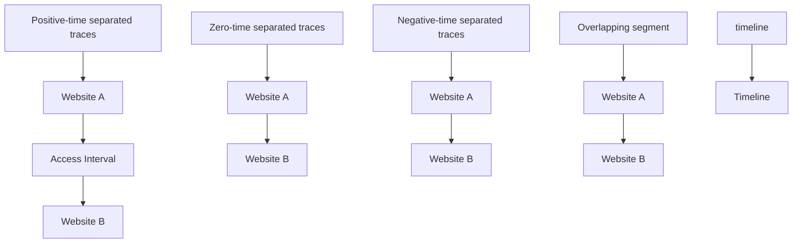
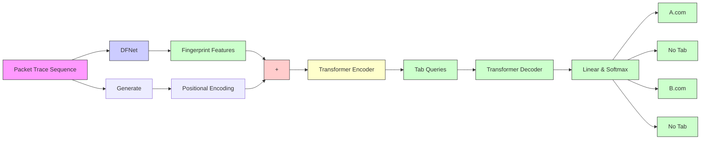
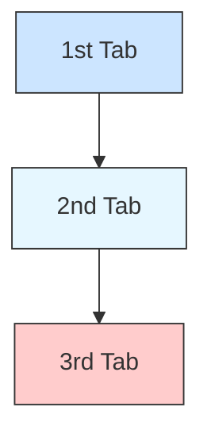

# Transformer-based Model for Multi-tab Website Fingerprinting Attack

Zhaoxin Jin

School of Computer Science (National Pilot Software

Engineering School), Beijing University of Posts and

Telecommunications

Key Laboratory of Trustworthy Distributed Computing and Service (BUPT), Ministry of Education

Beijing, China

jzx3990@bupt.edu.cn

Shuang Luo

School of Computer Science (National Pilot Software

Engineering School), Beijing University of Posts and

Telecommunications

Key Laboratory of Trustworthy Distributed Computing and Service (BUPT), Ministry of Education

Beijing, China

lok@bupt.edu.cn

## ABSTRACT

While the anonymous communication system Tor can protect user privacy, website fingerprinting (WF) attackers can still identify the websites that users access over encrypted network connections by analyzing the metadata generated during network communication. Despite the emergence of new WF attack techniques in recent years, most research in this area has focused on pure traffic traces generated from single-tab browsing behavior. However, multi-tab browsing behavior significantly degrades the performance of WF classification models based on the single-tab assumption. As a result, some research has shifted its focus to multi-tab WF attacks, although most of these works have limited utilization of the mixed information contained in multi-tab traces. In this paper, we propose an end-to-end multi-tab WF attack model, called Transformer-based model for Multi-tab Website Fingerprinting attack (TMWF). Inspired by object detection algorithms in computer vision, we treat multi-tab WF recognition as a problem of predicting ordered sets with a maximum length. By adding enough single-tab queries to the detection model and letting each query extract WF features from different positions in the multi-tab traces, our model’s Transformer architecture capitalizes more fully on trace features. Paired with our new proposed model training approach, we accomplish adaptive recognition of multi-tab traces with varying numbers of

∗Corresponding author: Tianbo Lu

Permission to make digital or hard copies of all or part of this work for personal or classroom use is granted without fee provided that copies are not made or distributed for profit or commercial advantage and that copies bear this notice and the full citation on the first page. Copyrights for components of this work owned by others than the author(s) must be honored. Abstracting with credit is permitted. To copy otherwise, or republish, to post on servers or to redistribute to lists, requires prior specific permission and/or a fee. Request permissions from permissions@acm.org.

CCS ’23, November26–30, 2023, Copenhagen, Denmark

© 2023 Copyright held by the owner/author(s). Publication rights licensed to ACM.

ACM ISBN 979-8-4007-0050-7/23/11. . . \$15.00

https://doi.org/10.1145/3576915.3623107

Tianbo Lu∗

School of Computer Science (National Pilot Software

Engineering School), Beijing University of Posts and

Telecommunications

Key Laboratory of Trustworthy Distributed Computing

and Service (BUPT), Ministry of Education

Beijing, China

lutb@bupt.edu.cn

Jiaze Shang

School of Computer Science (National Pilot Software

Engineering School), Beijing University of Posts and

Telecommunications

Key Laboratory of Trustworthy Distributed Computing

and Service (BUPT), Ministry of Education

Beijing, China

sjz@bupt.edu.cn

web pages. This approach successfully eliminates a strong and unrealistic assumption in the field of multi-tab WF attacks - that the number of tabs contained in a sample belongs to the attacker’s prior knowledge. Experimental results in various scenarios demonstrate that the performance of TMWF is significantly better than existing multi-tab WF attack models. To evaluate model performance in more authentic scenarios, we present a dataset of multi-tab trace data collected from real open-world environments.

## CCS CONCEPTS

• Security and privacy → Pseudonymity, anonymity and untraceability; • Networks → Network privacy and anonymity.

## KEYWORDS

Tor; privacy; multi-tab website fingerprinting; Transformer

## ACM Reference Format:

Zhaoxin Jin, Tianbo Lu, Shuang Luo, and Jiaze Shang. 2023. Transformerbased Model for Multi-tab Website Fingerprinting Attack. In Proceedings of the 2023 ACM SIGSAC Conference on Computer and Communications Security (CCS ’23), November26–30, 2023, Copenhagen, Denmark. ACM, New York, NY, USA, 15 pages. https://doi.org/10.1145/3576915.3623107

## 1 INTRODUCTION

Tor [19] presently stands as the most popular low-latency anonymous communication network. It accomplishes the isolation of user IPs from server IPs by establishing encrypted tunnels across various network nodes, thus creating anonymity. Within the Tor network, user data traverses multiple intermediate nodes, referred to as "relays", for forwarding. Each relay only possesses knowledge of its preceding and succeeding nodes, but not the complete link information. Tor clients forward traffic through long-term encrypted tunnels called "circuits", with each circuit containing a series of three Tor relays: an entry relay, a middle relay, and an exit relay.

While the aforementioned multiple layers of encryption and forwarding can, to some extent, prevent traffic data from being inspected, monitored, and tracked by third parties, adversaries who can observe communication between the Tor client and its entry relay can still launch targeted analysis attacks on encrypted traffic data, such as website fingerprinting (WF) attacks [1, 18]. In addition to being used by malicious attackers to identify the access targets of anonymous users, it can also assist law enforcement in tracking illegal activities on the dark web. By recording the sequence of traffic pattern information generated when visiting a website, such as packet sizes, directions, and timestamps, an attacker can conduct a macro-level analysis of website traffic patterns and obtain a summary of traffic patterns sufficient to uniquely identify the website’s identity. Although WF attacks targeting Tor have achieved excellent performance in laboratory environments, their generalizability is challenged by various factors in real-world scenarios. [10, 31] have criticized some unrealistic assumptions made in research on WF attacks, among which the assumption of "single tab browsing behavior" can greatly impair the performance of WF recognition models in real scenarios.

In traditional WF attacks, researchers typically assume that users browse websites in a single tab, sequentially loading one webpage after another, and evaluate classification models using pure singletab trace. However, this assumption is challenged by factors such as the slow webpage loading speed of the Tor browser [33] and the browsing habits of Tor users [5]. In fact, Tor users are likely to access the internet by opening multiple tabs in parallel.

In this paper, we propose a deep learning detection model called TMWF based on the Transformer [3] architecture for multi-tab browsing behavior. TMWF consists of two parts: DFNet [14] and Transformer. We chose DFNet as the feature extractor because it has achieved good performance in the single-tab website recognition task. As a typical CNN structure, DFNet effectively extracts spatial features from the original trace sequence by local modeling. Transformer is a general architecture for sequence prediction, and its self-attention mechanism can effectively model the global interactions between any elements in the sequence. TMWF uses DFNet to obtain the feature maps of the original trace sequence and inputs them as sequences to the Transformer Module. The module extracts the embedding of every single tab in parallel and maintains the positions of these embeddings relative to the specific tab in the original multi-tab trace. Inspired by object detection algorithms in computer vision such as DETR [12], we use ?? single-tab queries as input to the Transformer decoder to extract single-tab features from the global features of the original traces. This operation enables the model to recognize the corresponding class of N sub-segments from any input sequence.

As an end-to-end multi-tab recognition model, TMWF does not rely on manual-designed features and only requires the use of raw multi-tab traces as input to identify each individual webpage trace from the mixed multi-tab traces. Specifically, the model consistently outputs ?? prediction results, in which we classify all prediction results with unmonitored website classes and redundant predictions as "no-tab", and only retain prediction results with monitored website classes. Ideally, the ?? correct website prediction results generated by the model consist only of the monitored class and redundant no-tab class. It’s worth noting that the alteration in the output pattern, as described above, is facilitated by our new model training approach. The transformative contribution of the Transformer architecture lies in the enhancement of the performance of existing multi-tab WF attacks (such as BAPM [42]) through our proposed training approach.

Our main contributions are as follows:

• We have introduced a new training approach for multi-tab WF attacks, aiming to break the model’s reliance on prior knowledge of the webpage number. For multi-tab WF samples with a randomly varying number of pages within a certain size range, this training approach generates ample prediction results and discards redundant "no-tab" classes. By doing so, the model achieves adaptive recognition of multiple monitored websites within traces.  
• Our deep learning model, TMWF, is end-to-end and utilizes Transformer and learnable position encodings to automatically recognize single-tab WF from mixed multi-tab WF, effectively leveraging overlapping segments within the multitab WF. We use the complete multi-tab WF as input to the model, without requiring any manual adjustments on WF, until the final class prediction results are output.  
• We propose a new set of evaluation metrics tailored to our proposed WF attack model. In the task scenarios that reflect the intentions of WF attackers, our new metrics can more accurately reflect the model’s effectiveness. We compare TMWF with existing end-to-end multi-tab WF attacks on public datasets and our own datasets, and the evaluation results show that TMWF has better performance.  
• We have collected a real open-world multi-tab trace dataset that includes non-monitored website traces. By randomly visiting over 6,900 non-monitored websites and 50 accessible monitored websites, we generated a multi-tab trace dataset under four different page-number settings within the range of 2 to 5.

The structure of this paper is as follows. In Section 2, we describe the threat model of WF attacks. In Section 3, we summarize related work and terminology on WF attacks and briefly introduce object detection techniques that inspired our design approach. In Section 4, we present the model architecture, and in Section 5, we describe the experimental setup and dataset construction. We analyze the experimental results in Section 6. In Section 7, we discuss the limitations of our work. In Section 8, we provide a summary of our work.

The complete version of the paper, including the appendix sections, along with the corresponding code and datasets, are available at: https://github.com/jzx-bupt/TMWF.

## 2 THREAT MODEL

In the Tor network, WF attacks typically occur on the link between the Tor client and the entry node [2], as shown in Figure 1.

The identity of the attacker includes but is not limited to the administrator of the LAN where the user resides, the administrator of the autonomous system or ISP, and the operator of the entrance node. Since traffic is encrypted, attackers cannot directly observe the target website that the user is accessing. However, they can identify the website’s identity by analyzing the metadata of packets in the traffic: the attacker maintains a collection of monitored websites, accesses them in their controlled environment, and collects the resulting traffic traces. Based on these trace metadata, the attacker trains a WF classification model to match traffic traces with website class labels. Subsequently, the attacker captures communication traffic generated by the targeted user when accessing a website and uses the classification model to identify whether the user has accessed websites within the monitored collection.

flowchart

Figure 1: Threat model of Tor WF attack.

Research on WF models is typically evaluated in two scenarios: closed-world and open-world. In the closed-world evaluation, it is assumed that the client never accesses unmonitored websites, and the dataset used for the model only consists of traces from monitored websites. This evaluation is mainly employed for comparisons of scientific approaches in a controlled environment. In the open-world evaluation, unmonitored websites are introduced, and the client can access these websites. The dataset used for the model consists of traces from both the monitored and the unmonitored websites, with the number of unmonitored websites being much larger than the number of monitored websites, to simulate a broader range of websites that victims can access in the real world beyond the monitored websites.

Some research [2, 30, 36, 42] adopt a setup where the number of non-monitored websites is significantly greater than the number of monitored websites, but both have an equal total number of trace samples. This effectively assumes that the probability of a user accessing a monitored webpage is the same as accessing a nonmonitored webpage. While this setup highlights classifier errors and facilitates clearer comparisons [30], it also carries the risk of introducing the base rate fallacy [10, 34]. This means that when the probability of access to the monitored websites is low, the attacker might be overwhelmed by false positive classifications produced by the model. Our experimental results in the paper also reflect this phenomenon.

In open-world evaluation scenarios, existing research often categorizes the model’s task into binary and multi-class classification: both treat all samples from non-monitored websites as one class. However, in binary classification, all samples from monitored websites are also considered as a single class, while in multi-class classification, each domain’s samples from the monitored set are treated as separate classes. Thus, multi-class models in open-world settings can be seen as variants of closed-world classification models, with an additional "non-monitored class" to encompass websites that attackers cannot monitor.

## 3 RELATED WORK

## 3.1 WF attacks

Single-tab WF attacks. Early WF attacks on Tor primarily employed machine learning models that relied on handcrafted features by domain experts, such as SVM [25], kNN [28], and CUMUL [2]. The work by [25] involved the extraction of Tor cells from TCP/IP packets, based on an understanding of the internal workings of Tor. For the first time, they processed packet sequences into directional sequences consisting of ±1 as input to the model.

Recent research in WF attacks has predominantly focused on deep learning methods. [30] demonstrated that deep learning models can implicitly extract features that are more resistant to concept drift. Building on this, [14] proposed DF, a CNN-based WF attack model that achieved excellent performance in both closed-world and open-world evaluations. In an effort to reintroduce some cumulative features into the model input, [21] developed Var-CNN based on a semi-automatic feature extraction process. [15] introduced TF, which applied n-shot learning to reduce the required number of training samples. Additionally, [20] showed that incorporating timing features can enhance the robustness of WF attacks.

To improve the precision of WF attacks at low base rates, [34] proposed three precision optimizers. [16] introduced the concept of a "Website Oracle" (WO), demonstrating that when combined with WF attacks, WO can significantly reduce false positives. Addressing the challenge of limited training samples, [13] introduced GAN-DaLF for performing WF identification. Meanwhile, [24] devised a robust traffic representation method coupled with a CNN-based classifier, achieving superior performance against state-of-the-art WF attack models. However, [4] concluded that simultaneously monitoring a large number of websites is likely impractical in realworld scenarios.

In the context of traffic fingerprinting, [17] proposed a hierarchical deep learning framework that bridges the gap between traffic heterogeneity and consistent neural network inputs. Furthermore, [7] revealed that different network congestion levels significantly affect the false-positive rate. In terms of WF security estimation, [29] presented a framework that generates tighter security estimates while reducing computational resources. [37] demonstrated that deploying padding-only defense methods across the entire network range also leads to increased latency. Finally, [11] critically assessed defense strategies against Tor traffic, specifically evaluating their effectiveness against the latest deep learning-based WF attack methods.

Multi-tab WF attacks. After [10] pointed out that multi-tab browsing behavior significantly degrades the performance of WF models under the single-tab assumption, [26] attempted to transform multi-tab traces into single-tab traces by splitting packet sequences and processing them using existing single-tab WF classifiers. They divided multi-tab traces into positive time intervals, zero time intervals, and negative time intervals according to the order of continuous access and attempted to split 2-tab traces with positive and zero time intervals using a time-based kNN algorithm. We adhere to the categorization of the organization of consecutive webpage traces resulting from multi-tab browsing behavior as outlined in [26]. As depicted in Figure 2, this categorization encompasses factors like the access interval, which denotes the waiting time between consecutive visits to two websites by the user.

flowchart

Figure 2: Illustration of sequential traces’ organizational patterns.

When a user accesses website B through a new tab before website A has fully loaded, it results in overlapping segments within the multi-tab traces generated by the browser.

[40] similarly used the splitting method to handle multi-tab traces. They proposed a BalanceCascade-XGBoost method to identify the boundary between the first and second pages from multi-tab traces, and then use an XGBoost-based website classifier to classify the pure segment of the segmented first-tab traces. Although their work further improved accuracy and expanded the experimental scenario to the open world, the objects that can be recognized are limited to only the first page in multi-tab traces.

[36] utilized a CNN model to differentiate between single-tab and multi-tab traces, and extracted a fixed number of packets from the beginning and end of 2-tab traces. They then used CNN, LSTM, and SDAE models to classify the extracted pure trace segments, further improving the accuracy of WF. However, their approach is still constrained by a limited number of page configurations and relies on multi-tab traces containing sufficiently long and nonoverlapping pure segments.

BAPM [42] is the first end-to-end deep learning model that uses raw multi-tab trace as input and directly outputs the recognition results. It is also the first to utilize overlapping segments in multi-tab traces to assist the model in classification, achieving recognition of multi-tab traces with more than two pages while omitting manual operations. BAPM generates a tab-aware representation from directional sequences and performs block division, and then uses a self-attention mechanism to aggregate blocks with stronger relationships to facilitate website classification, which to some extent avoids the confusion effect caused by overlapping traces. [42] compared BAPM with three other multi-tab WF attacks and found that BAPM has the best and most stable performance.

Although significant progress has been made in multi-tab WF research, it has consistently relied on the "number of pages in input samples" as prior knowledge. Given that the number of pages contained in real-world multi-tab traces is unknown to attackers, models trained specifically for certain page numbers might suffer performance degradation when applied to traces with varying page numbers. To address this limitation, we propose a new training approach, coupled with our deep learning model, TMWF. Building on the achievements of BAPM’s characteristics [42], we eliminate the reliance on "page number" as prior knowledge. Through this training approach, BAPM could achieve the same result as well.

Similar to [42], our research mainly focuses on multi-tab WF targeting overlapping webpage traces, as traces with positive and zero time intervals are easier to process [26]. We choose to utilize the overlapping segments within multi-tab traces in our deep learning model, rather than discarding this potentially valuable data as in some previous works. However, this also means we need to address the confusion effect caused by these overlapping segments on the classification model. In other words, we expect our research on WF deep learning models to extract useful information for distinguishing between two websites from these overlapping segments, rather than being confused by mixed information from multiple pages.

## 3.2 DETR

Object detection technology is an important technique in the field of computer vision. Its task is to detect objects of interest in images or videos and determine their location and category. Object detection technology is widely used in fields such as autonomous driving, security monitoring, and intelligent transportation [8, 12, 23, 41]. DETR [12] is a new and emerging object detection technology that uses a Transformer [3] architecture. It transforms the object detection task into a prediction problem for a set of objects. By using a set of learnable object queries to reason about the relationships between targets and global image context, DETR can directly predict the categories and positions of all targets in the input image without using anchor-based region extraction methods used in traditional object detection techniques. DETR simplifies the object detection process while maintaining good performance and generalization ability, and has a milestone significance in the development of object detection technology.

The inspiration behind our proposed TMWF model for multitab WF attacks comes from DETR. We input the feature sequence outputted by the DFNet framework into a Transformer encoder. By treating the monitored website’s traces in the multi-tab traces as targets, we generate a sufficient number of tab queries, namely ?? learnable position encodings (DETR sets ?? =100 by default, while we set ?? =6), for each sample. During training, the model continually updates the position encodings to learn information about the webpage positions from the features, ultimately enabling the model to recognize WF in multi-tab traces with various page settings (up to ?? pages) in an adaptive manner.

## 4 MODEL ARCHITECTURE

## 4.1 Adaption for Transformer on multi-tab WF recognition

Transformer. Transformer [3] is a model for dealing with sequence problems, consisting of several encoders and decoders, where the encoder converts the input sequence into a series of context-aware representations, and the decoder uses these representations to generate the output sequence. Both the encoder and the decoder consist of the multi-head attention mechanism and the feed-forward neural network. The multi-head attention mechanism encodes the sequence, while the feed-forward neural network processes features at each position in the sequence. Additionally, Transformer introduces several other concepts and techniques, such as Positional Encoding.

Positional Encoding embeds the position of each element in the sequence into a vector space, enabling the model to understand the positional information within the sequence. Benefiting from parallel computation capabilities, the capacity to handle long-range dependencies, and the ability to capture global context, Transformer exhibits remarkable scalability. It has found widespread application in fields like machine translation, text generation, and speech recognition, solidifying its role as a fundamental architecture in the realm of natural language processing.

Implementation method. The realization of TMWF draws inspiration from the logical frameworks of DETR [12] and BAPM [42]. All three rely upon a foundational CNN architecture as the primary module of their model structures. This architecture is employed to extract latent features from the raw input sequences. These features are subsequently processed using other neural network structures to accomplish their respective tasks. Notably, DETR necessitates the recognition of object categories and coordinates for supervised learning. This involves configuring ?? object queries, a number substantially larger than the object number in the ground truth samples. Each object query is designed to focus on specific feature positions. Consequently, DETR produces a fixed quantity ?? of class prediction outcomes, coupled with their corresponding coordinate predictions. These predictions are then matched against the ground truth using a bipartite graph algorithm, thereby computing the loss. Due to the reliance on target coordinate annotations, the training approach of DETR proves challenging for the input sequences utilized by the WF model. In this context, the design concept of BAPM provided inspiration: by assigning fixed label identifiers to each attention head in the multi-head self-attention structure, the model only requires the sequence of page visits as supplementary supervision, enabling it to autonomously discern features among distinct pages.

Consequently, in TMWF, we incorporate learnable positional encodings (termed as "tab queries") to achieve a similar feature exploration capability. Specifically, we assign predefined label-associated feature regions for ?? tab queries, unlike DETR’s random allocation. Furthermore, to adapt TMWF for the multi-tab WF recognition task, we adopt DF’s [14] major network structure as the local modeling backbone instead of ResNet [9] employed by DETR. To a certain extent, the overarching concepts of TMWF and BAPM align. Both models employ a fundamental CNN structure to extract latent features from the raw directional sequences. These features are then processed using other neural network structures, allowing them to generate a fixed number of predictions without relying on segment coordinate annotations within the samples. The performance enhancement of TMWF stems from the fine-grained feature utilization capacity of the Transformer.

## 4.2 TMWF

In this subsection, we will provide an overview of the architecture of TMWF. Additionally, for a more comprehensive understanding of the TMWF model architecture, further details are available in Appendix A of the complete version paper. As depicted in Figure 3, TMWF consists of three main stages. The backbone module is responsible for extracting high-level feature representations from the raw input, which serves as the foundation for subsequent processes. The Transformer architecture is responsible for extracting WF embeddings for multiple pages from the contextual feature sequence, and the classification head then classifies multiple WF embeddings and outputs label predictions.

Although Transformer has shown strong performance in traditional AI applications, its use in the field of encrypted traffic analysis is still limited. In particular, CNN remains the main backbone for building models in WF research. This is because CNN performs well in capturing features between adjacent packets, which allows for effective modeling of local features. While CNN-based single-tab recognition models have shown strong performance in single-tab WF recognition tasks, their performance in multi-tab recognition tasks drops sharply. This is due to CNN’s limited ability to capture long-range dependencies and global features, which makes it difficult to distinguish between features of different pages in more challenging multi-tab website recognition tasks.

The task of multi-tab WF recognition involves identifying the website corresponding to each webpage from the traces formed by the traffic of multiple pages. The ground truth of each multitab trace can be viewed as a set of labels, where the ??-th element represents the website to which the ??-th page trace belongs. Therefore, the multi-tab website recognition task can be treated as a set prediction problem.

Backbone. In TMWF, we utilize DFNet to perform local modeling on the input multi-tab traces. DFNet transforms the input multi-tab traces wf into a sequence of WF features ?? . We denote the major network structure of DF [14], excluding the classification head, as DFNet. Here, ?? and ?? respectively represent the sequence length before and after being processed by DFNet.

$$
F = D F N e t (\mathbf {w f}), \mathbf {w f} \in R ^ {L}, F \in R ^ {l \times d} \tag {1}
$$

Transformer Encoders. We use vanilla Transformer encoders to model the normalized feature sequence ??  to extract the WF context feature sequence ?? . Although the features ?? output by the backbone carries positional relationships, the Transformer lacks inductive bias towards positional information in its design and cannot learn positional information from input features. To compensate for this deficiency, we add learnable positional encoding ?? to the feature sequence outputted by the backbone and use the sum as the input to the Transformer encoders. Assuming that the number of encoders is $N _ { E } ,$ the operation process is as follows:

$$
F ^ {\prime} = \text { LayerNorm } (F W + \mathbf {b}) + P,
$$

$$
F ^ {\prime} \in R ^ {l \times d}, P \in R ^ {l \times d}, W \in R ^ {d \times d}, \mathbf {b} \in R ^ {d} \tag {2}
$$

$$
O _ {i} = \text { TransformerEncoder } (O _ {i - 1}),
$$

$$
O _ {0} = F ^ {\prime}, Z = O _ {N _ {E}}, i = 1 \dots N _ {E} \tag {3}
$$

Tab Queries. Although the Transformer Encoders are effective in global modeling, their output context feature sequence do not separate the features of different pages in multi-tab traces. To this end, we introduce ?? tab queries (corresponding to object queries in DETR) as references for the Transformer decoders to query the fingerprint features of different pages. We use $T _ { Q } \in R ^ { N \times d }$ to denote the tab queries.

flowchart

Figure 3: Workflow of TMWF configured with $N = 4 .$

Transformer Decoders. We use vanilla Transformer decoders to extract the WF features of ?? pages from the contextual feature sequence ?? output by the encoders. The decoders can find a plausible alignment between tab queries and contextual feature sequence so that each tab query finds the fingerprinting feature of the page to which it belongs. We use $E _ { W F }$ to denote the fingerprint features of ?? pages. Assuming that the number of decoders is $N _ { D }$ , the operation process is as follows:

$$
O _ {i} = \text { TransformerDecoder } (O _ {i - 1}, T _ {Q}),
$$

$$
O _ {0} = Z, E _ {W F} = O _ {N _ {D}}, i = 1 \dots N _ {D} \tag {4}
$$

Classification. We use a classification head to classify the WF embeddings of ?? pages extracted by the Transformer decoders. This classification converts each page embedding into a probability distribution over websites, and the website with the highest probability is considered the predicted result of TMWF for that page. Assuming there are ?? websites in total, the above process can be described as:

$$
P r = \text { Softmax } (E _ {W F} W _ {5} + \mathbf {b} _ {5}), W _ {5} \in R ^ {d \times C}, \mathbf {b} _ {5} \in R ^ {C}, P r \in R ^ {N \times C} \tag {5}
$$

The ??-th row of matrix ???? represents the probability distribution over websites for the ??-th page. While TMWF produces ?? website prediction results, we expect that the number of pages in the actual prediction results of the model is typically no more than ?? . For nonmonitored websites and redundant prediction results, we uniformly assign the label "no-tab".

## 5 EXPERIMENT

## 5.1 New training approach

We draw an analogy between monitored websites in WF attacks and recognizable objects in object detection. For multi-tab trace samples with varying numbers of pages, we assign ?? labels to each sample. When the original number of labels is less than ?? , we augment the sample’s label number with "no-tab" class labels. Following this design philosophy, these annotations guide the model during training to learn features conducive to distinguishing between different pages. As depicted in Figure 3, when using the ?? = 4 setting, for a multi-tab trace sample containing traces from two monitored websites, ideally, the first and third predictions among the four generated by the model will capture segments belonging to the monitored websites within the sample. For test set samples, the number of targets it contains is transparent to the model, and the model will always output ?? = 4 predictions. The model’s owner needs only select predictions with predicted classes other than "no-tab" as the final results. This approach thus achieves adaptive recognition for a range of target quantities (from 0 to 4). In essence, the removal of prior knowledge regarding the actual target number in input samples comes at the cost of generating redundant results beyond the actual number of labels.

In theory, the training approach we propose can be applied to multi-tab WF attack models like TMWF and BAPM, which have a fixed number of output predictions. This enables them to achieve adaptive recognition of monitored websites within multi-tab traces with an upper limit of ?? pages. In our research, we practically set $N = 6 .$ . The reason for choosing this number is due to the limitation of our hardware conditions, which restricts us from synthesizing multi-tab WF datasets with more than 6 pages. In real-world scenarios, this number can be set higher to meet the needs of the attacker.

Strictly speaking, models still rely on knowing the maximum number of tabs. In situations where the attacker sets the maximum tab number ?? lower than the actual tabs visited by a user, the model may not recognize all the websites within a complete trace. In such cases, the ?? predictions of model outputs would ideally correspond to the first ?? sub-segments of the trace, each associated with a website. However, we view this as a soft constraint that can be alleviated by setting a sufficiently large value for ?? and employing techniques like sliding windows for sampling. This ensures that the model can accommodate various scenarios effectively.

## 5.2 New evaluation metrics

Previous multi-tab WF research [36, 42] relied on the condition that the number of labels (tabs) in the ground truth matches the number of predicted results. This approach required that all samples in the test set have a fixed number of labels enabling the calculation of scores for each page individually. However, this evaluation method cannot be extended to multi-tab trace test sets containing varying numbers of pages.

Moreover, existing metrics treat all non-monitored traces as a single class, including them in the calculation process. However, considering the attacker’s actual intent to identify monitored websites, and to more accurately evaluate the model’s performance in this task, we follow the evaluation approach used in object detection domains1. We do not incorporate correctly predicted results for non-monitored set pages into the metric calculation process.

This means that for a multi-tab trace consisting of ?? webpages containing ?? unmonitored webpages $( s \geq t ) ,$ we only consider the positive predictions (predicted class belongs to the monitored set) and false negative predictions (predicted class belongs to the monitored set, but the ground truth belongs to non-monitored set) from all model predictions as "valid predictions". These valid predictions are compared against the ground truth of the samples. Otherwise, due to $\mathrm { T M W F } _ { s }$ strong ability to recognize these filled "no-tab" labels (as shown in Figure 6), our model’s evaluation scores would be inflated by these redundant results. We define "redundant results" as correct predictions among the part of multiple predictions output by the classifier that exceeds the actual tab number in the original sample (i.e., manually padded labels). These predictions have a label "no-tab". This definition is only used in the calculation process of our metrics, and the classifier does not need to be aware of whether its predicted results are redundant. We refer to these metrics as Overall Accuracy, Overall Precision, and Overall Recall.

We have categorized our newly proposed metrics into two distinct configurations: lenient, denoted as "Basic", and stringent, referred to as "Advanced". In both of these configurations, we assume that the number of website pages contained within the captured traffic traces, from an attacker’s perspective, remains a priori unknown. We introduced the "Advanced" metrics for a specific reason: essentially, our model’s output predictions possess a sequential order, yet the "Basic" metrics overlook this attribute during computation. While [42] and [36] evaluated the independent performance of the model on each page of the multi-tab traces, even though it wasn’t explicitly covered in our experiments, we aimed for the "Advanced" metrics to reflect the model’s capability to recognize the sequence of sample pages within the predicted results.

Basic metrics. We assume that the attacker is only interested in identifying whether the victim has visited any websites in the monitored set, without considering the order of the identified websites. Both the ground truth and the positive prediction results are transformed into sets of unique labels when calculating the metrics. The relevant formulas for the Basic setting are as follows:

$$
A c c u r a c y _ {B a s i c} = \frac {\sum_ {i = 1} ^ {n} \left| T _ {i} \cap P _ {i} - \{\text {"no - tab"} \} \right|}{\sum_ {i = 1} ^ {n} \max \left(\left| T _ {i} - \{\text {"no - tab"} \} \right| , \left| P _ {i} - \{\text {"no - tab"} \} \right|\right)} (6)
$$

where ?? is the number of samples in the dataset, $T _ { i }$ and $P _ { i }$ are the ground truth set and prediction set for the ??-th sample, respectively, and $" | \cdot | "$ is used to calculate the number of elements in a set.

$$
\text { Precision } _ {\text { Basic }} = \frac {1}{m} \sum_ {j = 1} ^ {m} \frac {T P _ {j}}{T P _ {j} + F P _ {j}} \tag {7}
$$

$$
\text { Recall } _ {\text { Basic }} = \frac {1}{m} \sum_ {j = 1} ^ {m} \frac {T P _ {j}}{T P _ {j} + F N _ {j}} \tag {8}
$$

Where ?? is the total number of classes excluding the "no-tab" class, $T P _ { j }$ and $F P _ { j }$ represent the number of true positives and false positives in class $j ,$ , and $F N _ { j }$ is the number of false negatives in class ?? .

Advanced metrics. Assuming the attacker’s objective is not only to identify the types of websites visited by the victim but also their order of visitation and frequency, the ground truth and positive prediction results will be considered as equally long label lists that can contain duplicate elements (the "no-tab" label will be used to fill in the list if necessary). The following formulas are based on the Advanced setting:

$$
\text { Accuracy } _ {\text { Advanced }} = \frac {\sum_ {i = 1} ^ {n} \sum_ {k = 1} ^ {S} \left[ p _ {i k} = t _ {i k} , t _ {i k} \neq " \text { no - tab }" \right]}{\sum_ {i = 1} ^ {n} \left(S - \sum_ {k = 1} ^ {S} \left[ p _ {i k} = t _ {i k} = " \text { no - tab }" \right]\right)} \tag {9}
$$

Where ?? represents the number of samples in the dataset, ?? represents the length of the label list after filling, and $\mathcal { P } i k$ and $t _ { i k }$ represent predicted labels and true labels, respectively. The symbol $" [ \cdot ] "$ is used to count the number of elements in a list that meet certain conditions. When the expression inside the brackets is true, the result of $" [ \cdot ] "$ is 1, otherwise, it is 0.

$$
P r e c i s i o n _ {A d v a n c e d} = \frac {1}{m} \sum_ {j = 1} ^ {m} \frac {t p _ {j}}{t p _ {j} + f p _ {j}} \tag {10}
$$

$$
\text { Recall } _ {\text { Advanced }} = \frac {1}{m} \sum_ {j = 1} ^ {m} \frac {t p _ {j}}{t p _ {j} + f n _ {j}} \tag {11}
$$

Where ?? represents the total number of classes excluding the $" \mathrm { { n o - t a b } " }$ class. $t p _ { j }$ and $f p _ { j }$ respectively represent the true positive and false positive counts for class $j ,$ while $f n _ { j }$ represents the false negative count for class $j .$

To aid in illustrating the intuition behind our proposed new metrics, we present a simplified hypothetical example of the evaluation process in Appendix B of the complete version paper.

## 5.3 Experiment design

We have selected BAPM as the baseline for evaluation because it is the first end-to-end model for multi-tab WF and outperforms previous works in experimental performance. We then made modifications to the BAPM model to align it with our proposed new training approach. The evaluation was conducted within a more realistic task scenario where the number of pages composing the input sequence for the model is unknown to the attacker. We refer to our modified version as Adaptive-BAPM. Therefore, both Adaptive-BAPM and TMWF possess the capability to recognize multi-tab traces with any number of pages. Adaptive-BAPM achieves this using ?? attention heads, while TMWF employs ?? tab queries.

In the original BAPM, the number of attention heads used by the attacker when creating the model is the same as the number of pages in the input sample. This means that regardless of the number of pages in the input sample, the number of predicted results generated by the model is always equal to the predetermined number of attention heads. As the range of fluctuations in the number of web pages in the input sample increases, the performance of the model further deteriorates. In Adaptive-BAPM, we adjust the number of attention heads used by the model to six in an attempt to improve this flaw. This number exceeds the number of pages contained in any dataset sample we used in the experiment. This means that regardless of the number of pages in the input sample, the model generates six predicted results. Ideally, the portion of labels in the predicted results that exceed the number of pages contained in the sample should be the "no-tab" class. To investigate the performance of our proposed TMWF, we designed the following experiments:

(1) Model design, validation, and exploration of synthetic traces. We deviated from the typical model design and validation approach commonly employed in previous WF studies (parameter tuning on closed-world datasets). Leveraging our new training approach, we directly adjusted certain parameter settings using manually synthesized open-world datasets. Same with BAPM[42], we used the Walkie-Talkie [27] dataset to manually synthesize multitab traces. Consistently, we trained the model on a synthesized 6-tab dataset and fine-tuned TMWF parameters on a corresponding 6-tab test set. In addition, we attempted to introduce timing information as model input and conducted ablation experiments to demonstrate the rationality of our model architecture.

To illustrate the adaptive recognition capacity of both Adaptive-BAPM and TMWF for samples of diverse page numbers, tests were conducted using 2-tab, 4-tab, and 6-tab traces. These evaluations were performed using both conventional metrics and the new metrics proposed by us, allowing for a comprehensive comparison of model performance. Given the temporal gap in data collection for the Walkie-Talkie dataset, we replicated a subset of experiments on our self-collected dataset. Detailed experimental results can be found in Appendix F of the complete version paper.

Due to the potential disparities between traces gathered from real-world environments and manually synthesized traces, we conducted training experiments using both real 2-tab traces and 2-tab traces generated through various synthesis methods. Simultaneously, we altered the size of the synthetic training set. We maintained consistency by evaluating all models on real 2-tab traces to assess the impact of these different traces and training set sizes on model performance. The corresponding experimental process can be seen in the Appendix E of the complete version.

(2) Closed-world Experiments. To demonstrate that our modified Adaptive-BAPM did not exhibit a significant performance decrease, we compared TMWF, the original BAPM, and Adaptive-BAPM on the real-world dataset published by [42].

(3) Open-world Experiments. We collected real multi-tab traffic traces generated by the Chrome browser (similar experiments were conducted using traces from the Tor browser as well, and the corresponding results are provided in Appendix H of the complete version). The set of randomly accessed websites consists of 50 monitored websites and over 6900 non-monitored websites, with page numbers of 2, 3, 4, and 5.

Based on the findings from the impact of multi-tab trace synthesis methods on model performance in (1), we utilized the synthesis method that yielded the most significant improvement in model performance for creating the synthetic multi-tab trace training set. Additionally, we employed various synthesis methods to create synthetic multi-tab trace validation sets. By comparing model performance on multiple synthetic validation sets and real multi-tab trace test sets, we evaluated the differences in performance.

Table 1: Parameter settings for TMWF.

<table><tr><td>Model Part</td><td>Details</td><td>Value</td></tr><tr><td rowspan="4">DFNet-CNN</td><td>Input Dimension</td><td>(30720,1)</td></tr><tr><td>Kernel Number</td><td>[32,64,128,256]</td></tr><tr><td>kernel Size</td><td>[8,8,8,8]</td></tr><tr><td>Pool Size</td><td>[8,8,8,8]</td></tr><tr><td rowspan="7">Transformer</td><td>Input Dimension</td><td>(121,256)</td></tr><tr><td>Encoder Number</td><td>2</td></tr><tr><td>Decoder Number</td><td>2</td></tr><tr><td>Head Number</td><td>8</td></tr><tr><td>Feed-forward Dimension</td><td>1024</td></tr><tr><td>Tab Query Number</td><td>6</td></tr><tr><td>Dropout Rate</td><td>0.1</td></tr></table>

We also attempted an analysis of the model’s prediction results. Moreover, guided by the results of these experiments, we selected a synthesis method that best approximated the results of real multi-tab test sets for creating simulated test sets with varying ratios of monitored and non-monitored traces (considering different base rates for monitored websites). Subsequently, we evaluated the model’s performance under these conditions in Appendix I of the complete version.

For all of our experiments, we maintained the parameter settings used by TMWF as shown in Table 1 (obtained through the parameter tuning process described in Appendix C of the complete version). For the Adaptive-BAPM used in comparisons, we only modified the number of attention heads, the length of a single page, and the block length, while keeping the other parameters the same as in the original paper.

## 5.4 Dataset

In the existing research on multi-tab WF attacks [36, 42], models are trained using manually synthesized multi-tab traces from raw single-tab traces, which we have also followed. This means that by selecting different domain names from the single-tab trace dataset and setting the overlap ratio of the traces, an attacker can obtain simulated multi-tab traces under various conditions. Although intuitively, training the model using traffic data generated from real multi-tab browsing behavior allows the model to learn more implicit representations of real traffic trace features, this comes at a cost of exponentially increasing expenses in collecting multi-tab traces relative to the manual synthesis of multi-tab traces using a small number of single-tab trace samples. Furthermore, as the "length of the trace of each tab" is posterior in collecting traffic, it is difficult for an attacker to precisely control the overlap ratio2 between the collected multi-tab traces [42]. A detailed description of the manual synthesis method can be found in Appendix D of the complete version paper.

We refer to the method of synthesizing multi-tab traces based on the overlap ratio as $" M _ { r a t i o } "$ . Furthermore, we have devised a new synthesis method that aligns with the access patterns used during the collection of real multi-tab traces. This involves introducing varying time delays to multiple single-tab traces (where the added delays accumulate) and then concatenating them to form a complete multi-tab trace. This new synthesis method is termed $" M _ { d e l a y } "$ . It’s important to note that $M _ { d e l a y }$ is primarily designed to simulate the access mode of multi-tab traces as observed in real-world collections. However, it introduces additional uncertainty, such as instances where traces do not overlap or when traces from one page are fully obscured by traces from another page. Therefore, for the purpose of validating and comparing model performance, we continue to use $M _ { r a t i o }$ for synthesizing multi-tab traces. This is done to maintain a consistent working environment as in the existing work [42]. Subsequently, we apply our newly designed $M _ { d e l a y }$ to synthesize multi-tab traces for other scenarios to assess TMWF’s performance. For a more comprehensive exploration of the impact of synthesized traces versus real traces on model performance, please refer to the details provided in Appendix E of the complete version.

Although manually synthesized multi-tab traces are convenient for training models, the distribution of features exhibited by real multi-tab traces may differ, resulting in a degradation of model performance. Some research [36, 42] have noticed this issue and collected additional traffic generated by real multi-tab browsing behavior to evaluate model performance in more realistic scenarios. In our experiments, in addition to using the real multi-tab trace dataset published by [42] to test the performance of our proposed models, we also constructed multiple real open-world datasets with different page numbers and containing non-monitored webpages to investigate the generalization performance of our proposed model, as well as the performance differences between the simulated validation set and the real-world test set.

?????? . To compare the performance of our proposed model with existing multi-tab WF attack models, we used the single-tab trace dataset of Walkie-Talkie [27] to manually synthesize multi-tab trace datasets for the training and evaluation processes of our model, same as [42]. To achieve this, we employed a similar strategy to theirs by selecting 50 websites from the original dataset with the most data packet traces. We used 80% (about 90 traces) of each website’s samples in the monitored set to synthesize the multitab trace training set, while the remaining samples were used to synthesize the testing set. It’s crucial to note our initial partitioning of the original single-tab trace dataset into two subsets, maintaining a 4:1 total ratio proportion while preserving a consistent balance of sample numbers across classes. This two-step process enables us to synthesize both the training and testing sets of multi-tab traces based on the respective subsets of single-tab traces. This approach ensures the isolation of website samples between the training and testing sets, wherein only the domains of monitored websites are recurrent across the training and testing sets.

We employed the $M _ { r a t i o }$ approach to generate overlapping traces, adopting a more randomized methodology for selecting constituent samples in the synthesis process. Specifically, we amalgamated all monitored website samples and non-monitored website samples into a candidate trace list. Subsequently, we employed a completely random selection process from this list to pick multiple single-tab traces. We randomly sampled values within the range of [0.1, 0.2, 0.3, 0.4, 0.5] as the ratio for overlapping regions. To prevent the complete overlay of traces, we set a purity segment threshold of 0.1 for intermediate webpages with webpages both before and after. Additionally, we removed the constraint that "constructed traces must include monitored websites", implying that the synthesized multi-tab traces could include consecutive monitored websites, consecutive non-monitored websites, or both.

We believe that this strategy generates datasets more closely aligned with network traffic patterns an attacker could feasibly monitor. This approach also allows us to increase the scale of the synthetic dataset to five times the size of the original single-tab dataset, resulting in approximately 22,000 samples in the training set and 5,500 samples in the testing set. The trace information within the dataset encompasses not only the direction sequence of data packets but also the timing information sequence.

In the subsequent sections, we employ the notation "page numberdataset usage" to denote the current dataset. For instance, we use notations like $D _ { W T - 6 t a b s - t r a i n }$ and $D _ { W T - 6 t a b s - t e s t }$ to refer to the training and testing sets of 6-tab traces, respectively, synthesized from the single-tab trace dataset provided by [27] using the $M _ { r a t i o }$ approach.

?????????? . We elected to conduct closed-world experiments on the real-world dataset presented by [42], in order to substantiate that our modified Adaptive-BAPM does not exhibit a significant performance degradation. Within this dataset, we performed comparisons among TMWF, the original version of BAPM, and the Adaptive-BAPM. Both the training and testing sets of this dataset were derived from 50 monitored websites. The training set comprises 10,000 traces, with each website contributing 200 traces. The testing set consists of 1,000 2-tab traces, all of which are real multitab traces. The traces are presented in the form of Tor cell direction sequences composed of ±1 values, where 0 signifies padding.

????????. In reference to the data collection methodology outlined in [30, 36, 40, 42], we adopted the following scheme for data acquisition: On three VPS hosts located in the United States, we created a Docker image integrating the Selenium browser automation tool, the Chrome browser, and the Tor proxy service. We used this image to create several docker containers. In each docker container, we started an independent Tor proxy service and used a Selenium script to drive the Chrome browser to automatically visit websites in headless mode. We set the maximum loading time for all websites to 30 seconds. After each visit, we closed the browser and cleared the cookies, and waited for 2 seconds before starting the next capture.

We retrieved the website ranking $\mathrm { l i s t } ^ { 3 }$ [32] on July 18th, and manually selected 50 accessible websites from the top 100 ranked sites for our monitored set. The following 9900 sites were designated as the unmonitored set. Within the monitored set, each website was visited 200 times, while within the unmonitored set, each website was visited only once. Utilizing network namespaces, we captured the traffic generated by the Tor proxy service within each Docker container using tcpdump. Subsequently, employing Wireshark, we extracted TLS packets exceeding 512 bytes. Following the methodology outlined in [25], we extracted the Tor cell direction sequence. Additionally, we also saved the time sequence for generating multi-tab traces.

After collecting traces generated by single-tab visits through the aforementioned method, we identified over 6,900 accessible websites. These websites were utilized as the filtered unmonitored set. We conducted data collection with varying sequences of 2, 3, 4, and 5 consecutive page visits, resulting in the collection of approximately 1000 multi-tab traces for each sequence length. Given the challenges associated with controlling the proportion of overlap between multi-tab traces during real-world data collection, a more practical approach was adopted: introducing a predefined time delay between the sequential visits to two different web pages. For a given dataset of multi-tab traces with ?? pages, the script generates a genuine multi-tab trace as follows: (1) Randomly select ?? websites from the list of all accessible websites. Each monitored website in the list contains multiple duplicate elements, while each unmonitored website contains only one duplicate element so that monitored and unmonitored websites are equally likely to be selected during random selection. (2) Open the browser and visit the first website, followed by a random wait time4 between 2 to 6 seconds. Subsequently, a new tab is opened in a separate thread to access the second website. Another random wait time between 2 to 6 seconds is introduced. If ?? = 2, the browser is closed and cookies are cleared after the second page loads. If ?? >2, an additional wait time of between 2 to 6 seconds follows, then a new tab is opened to access the third website. This process is repeated iteratively for ?? consecutive page visits.

Following the process, the generated multi-tab traces ideally include a pure segment on each page that has not been involved in overlapping with other pages (although exceptions to this scenario can’t be completely ruled out, as mentioned earlier). This is visually depicted in Figure 4. We assume that users typically do not rapidly open multiple tabs in a way that leaves any page within the multitab trace without a pure segment.

flowchart

Figure 4: An ideal illustration of a real multi-tab trace.

We conducted the collection process between July 22, 2023, and August 5, 2023. The collected single-tab traces were used to synthesize multi-tab traces. For monitored websites, we selected 100 traces from each site, with 80 for training and 20 for validation. For non-monitored websites, only traces with more than 50 packets were retained, as shorter traces were insufficient to represent overlapping phenomena.

Consistent with the $D _ { W T }$ approach, we divided traces of all classes into two subsets in a 4:1 ratio. Subsequently, we synthesized training and validation sets based on these subsets to maintain sample separation between the two. As various multi-tab trace synthesis methods may be involved in different task scenarios, we used a naming convention like "page number-synthesis method-dataset usage-sample number" to differentiate the synthesized multi-tab trace datasets5. For example, ????????−6????????−??????????−??????????−40?? represents a training set of 6-tab traces synthesized using the $M _ { r a t i o }$ method from the 4/5 subset of the original Chrome single-tab trace dataset (size 8000, comprising 50 monitored websites with 80 traces each and 4000 non-monitored website traces), with a total sample count of 40000. For real multi-tab trace test sets, we consistently use the notation "page number-real-sample number" to represent these datasets.

Furthermore, based on the finding in Section 6.4 that the model performance using multi-tab traces synthesized with random delay as a validation set may be similar to the real multi-tab trace test set, we attempted to explore TMWF’s recognition capability for monitored websites with different base rates using the $M _ { d e l a y }$ synthesized multi-tab trace test set in Appendix I of the complete version paper. Following [34], we defined ?? as the ratio between the frequency of client visits to non-monitored pages and the frequency of client visits to monitored pages (equivalent to visiting a monitored page once every ?? visits to non-monitored pages). Higher ?? values would lower precision and make the open-world classification problem more challenging. We controlled the ratio of non-monitored to monitored traces to be ?? and evaluated the model’s performance for three cases: $r = 1 , r = 1 0$ , and ?? = 100.

We employed the newly designed $M _ { d e l a y }$ method to synthesize multi-tab traces. During random sampling, the selection probability of non-monitored traces was set to ?? times that of monitored traces. When ?? = 1, we synthesized 500 multi-tab traces for each page number from 2 to 5; when ?? = 10 and $r ~ = ~ 1 0 0$ , we synthesized 5,000 and 50,000 multi-tab traces for each page number respectively. For each ?? value setting, all the synthesized multitab traces were combined into a new multi-tab trace dataset, referred to as $D _ { C H R - m i x e d - d e l a y - r 1 } , D _ { C H R - m i x e d - d e l a y - r 1 0 : }$ and ????????−??????????−??????????−??100.

???? ????. ???? ???? dataset was collected following the same approach as ????????, but using Tor Browser Selenium6 to capture traffic generated by the Tor Browser Bundle (TBB) while browsing websites. We chose to collect this dataset because the Tor browser implements a specific policy - it isolates traffic based on the first-party domain in the URL bar. This means that if a user loads two tabs with different domains, the traffic generated by these two pages will be routed through different circuits7. To explore the impact of differences in traffic between the Chrome and TBB environments on the model, we conducted experiments similar to those described in Section 6.1 and Section 6.4, each detailed in Appendix F and Appendix H of the complete version.

## 6 ANALYSIS

## 6.1 Model performance validation

We used the $D _ { W T - 6 t a b s - t r a i n }$ dataset, which contains approximately 22,000 samples, to train all models. Then, we evaluated the performance of these models on the $D _ { W T - 2 t a b s - t e s t } , D _ { W T - 4 t a b s - t e s t } ,$ and $D _ { W T - 6 t a b s - t e s t }$ datasets, each containing around 5,500 samples. The evaluation results for the same experiments conducted on the ???? ???? dataset are presented in Appendix F of the complete version paper. We evaluated model performance using both the metrics from the existing work [36, 42] and our proposed new metrics. For input samples with less than 6 tabs, we uniformly padded them with a "no-tab" label. The evaluation results for [36, 42] metrics based on accuracy, precision, and recall are referred to as Previous, while our proposed new metrics are named Overall Basic and Overall Advanced. Previous metric results are a series of numbers, where each number represents the model’s score on the corresponding page. Since our models always output 6 prediction results, we manually removed the redundant scores for the 2-tab and 4-tab test sets. The specific results are presented in Table 2.

(1) The evaluation results obtained from Adaptive-BAPM using the old metrics show that the model can recognize the first webpage of multi-tab traces with relatively high accuracy. However, in the evaluation results of the subsequent pages, although accuracy is maintained between 45% and 50%, precision and recall have dropped to an unusable level. We speculate that the reason for this phenomenon is that Adaptive-BAPM still has some ability to distinguish monitored websites from unmonitored websites, but it is powerless to further subdivide the classes within monitored websites. The relatively stable fluctuation range of accuracy is contributed by the correct predictions of the model for unmonitored websites. However, calculating the precision and recall for each page, involves taking the average of the results for each class, and since the evaluation results of the monitored website class, which accounts for the absolute majority, are poor, the overall results are maintained at a low level. Since we used a synthesized 6-tab trace dataset for model training, when evaluating Adaptive-BAPM using the old metrics on the 6-tab test set, it is essentially equivalent to using BAPM for the 6-tab experiment. However, compared to the results presented in the original paper [42] for the 3-tab experiment, our results have significantly degraded performance. After comparing the evaluation results of the original paper’s 2-tab experiment and 3-tab experiment, we believe that this performance gap is not only caused by the increase in the number of pages. We hypothesize that the primary reason behind this phenomenon lies in the substantial confusion effect introduced by the open-world non-monitored websites integrated into our multi-tab dataset. Furthermore, compared to the original work using 10% as the overlap proportion between any adjacent page in the 3-tab experiment, we use random values in [10%, 20%, 30%, 40%, 50%] as the overlap proportion. This setting leads to traces in the middle of the multi-tab trace having shorter pure segments, and pure segments are an important basis for BAPM classification, making it difficult to maintain its original high performance. In contrast, TMWF shows higher robustness in dealing with overlapping traces: the numerical levels of each metric on pages 2 to 5 are not significantly different from those on the first and last pages.

(2) As non-monitored webpages constitute half of the total number of webpages in the multi-tab trace, the prediction results of non-monitored traces have a significant impact on the final evaluation results (especially accuracy). Our proposed new metric more fully reflects the needs of real-world attackers to identify the monitored websites, compared to the traditional metrics that incorporate the correct prediction of non-monitored webpages in the calculation process.

(3) TMWF achieved the highest accuracy on all metrics. Furthermore, the evaluation results on the 2-tab and 4-tab test sets demonstrate TMWF’s excellent generalization ability. TMWF can adaptively identify samples with different numbers of web pages. We observed that for both Adaptive-BAPM and TMWF when using a test set with a different number of pages than the number of pages in the training set, the larger the page number, the greater the decline in the performance of each page represented by the old metrics. This phenomenon is particularly evident in the evaluation results on the 4-tab traces. However, TMWF achieves good performance on the Overall Basic metric, possibly due to the redundant predictions generated by the model containing classes that are identical to those in the ground truth list, leading to only a slight decrease in TMWF’s overall score. Overall, if we focus only on identifying the types of websites that users access, without considering whether the model’s output predictions exactly correspond to the user’s browsing process, TMWF’s high generalization ability and performance on the Overall basic metric demonstrate its ability to successfully perform this task.

(4) Upon careful scrutiny of the results obtained from the Previous metric, it is discernible that, for both Adaptive-BAPM and TMWF, the classifier’s attack performance for tab ?? (?? >1) experiences a decline with the increase in page order (excluding the final page). While intuitively one might anticipate that these page trace segments could possess similar overlapping patterns, and such similarity should not lead to a degradation in model performance, we posit that the fundamental reason for this phenomenon lies in the disparate lengths of traces (directional sequences) from distinct websites. The variance in these lengths engenders a greater dispersion in the positioning distribution of later-traversed traces in the synthesized sequence during multi-tab trace synthesis. Consequently, the challenge is heightened in effectively learning the "shared spatial information representation of the current page from all samples through the corresponding tab query for the ??-th page" (for Adaptive-BAPM, this pertains to inter-relationships among distinct feature blocks). This intricate difficulty ultimately culminates in the decline of attack performance.

## 6.2 Ablation experiment

We consider the Transformer architecture to be the most critical component of TMWF, as it effectively captures dependencies between different positions by performing self-attention calculations on the input features. In addition to the Transformer architecture, we also conducted ablation analysis experiments on the feature extractor and input data in TMWF. Same with Section 6.1, we maintain the uniform use of the $D _ { W T - 6 t a b s - t r a i n }$ dataset for model training. The experimental results of the $D _ { W T - 6 t a b s - t e s t }$ are presented in Table 3. The "Add Timeinfo" experiment indicates our exploration of incorporating timing information sequences as inputs to the model. The "Original model" refers to using only the packet direction sequences as inputs to the complete model. "No DF" indicates that we replaced TMWF’s feature extractor with the CNN-based feature extractor used in BAPM. "No Transformer" indicates that we removed the Transformer architecture from TMWF and imitated the operation of [42] by using sigmoid instead of softmax activation function in DF and using binary entropy loss function instead of the categorical entropy loss function, directly predicting the input samples based on the output feature map of the feature extractor, and obtaining multiple website labels based on the maximum probability value.

Table 2: Evaluation of prediction on $D _ { W T - 2 t a b s - t e s t } , \ D _ { W T - 4 t a b s - t e s t } ,$ and $D _ { W T - 6 t a b s - t e s t }$ based on models trained with ?????? −6????????−??????????. $D _ { W T - 6 t a b s - t r a i n } .$

<table><tr><td>Model</td><td colspan="2">Metrics</td><td> $D_{WT-2tabs-test}$ </td><td> $D_{WT-4tabs-test}$ </td><td> $D_{WT-6tabs-test}$ </td></tr><tr><td rowspan="9">Adaptive-BAPM</td><td rowspan="3">Previous</td><td>Acc</td><td>[68.7, 43.3]</td><td>[78.7, 47.7, 46.0, 46.5]</td><td>[81.0, 49.9, 48.2, 47.2, 48.5, 50.4]</td></tr><tr><td>Pre</td><td>[74.1, 14.0]</td><td>[75.3, 30.0, 8.9, 7.8]</td><td>[78.3, 22.6, 12.3, 6.3, 7.8, 16.8]</td></tr><tr><td>Rec</td><td>[61.4, 5.2]</td><td>[60.0, 8.2, 3.8, 3.1]</td><td>[60.3, 7.8, 4.4, 3.1, 3.1,5.2]</td></tr><tr><td rowspan="3">Overall Basic</td><td>Acc</td><td>21.6</td><td>21.9</td><td>16.7</td></tr><tr><td>Pre</td><td>52.3</td><td>52.1</td><td>57.6</td></tr><tr><td>Rec</td><td>37.6</td><td>23.4</td><td>17.2</td></tr><tr><td rowspan="3">Overall Advanced</td><td>Acc</td><td>15.9</td><td>16.0</td><td>13.1</td></tr><tr><td>Pre</td><td>47.5</td><td>41.0</td><td>47.7</td></tr><tr><td>Rec</td><td>34.1</td><td>19.4</td><td>14.4</td></tr><tr><td rowspan="9">TMWF</td><td rowspan="3">Previous</td><td>Acc</td><td>[92.1, 62.8]</td><td>[95.5, 78.2, 45.5, 33.2]</td><td>[96.5, 89.8, 83.6, 75.9, 74.9, 75.7]</td></tr><tr><td>Pre</td><td>[91.0, 73.0]</td><td>[94.2, 84.7, 27.7, 7.3]</td><td>[93.7, 87.3, 80.8, 71.9, 67.8, 72.3]</td></tr><tr><td>Rec</td><td>[85.5, 41.4]</td><td>[92.3, 63.5, 22.9, 7.0]</td><td>[91.8, 86.5, 75.6, 65.2, 58.3, 62.9]</td></tr><tr><td rowspan="3">Overall Basic</td><td>Acc</td><td>64.2</td><td>74.9</td><td>75.5</td></tr><tr><td>Pre</td><td>80.9</td><td>84.0</td><td>88.9</td></tr><tr><td>Rec</td><td>77.4</td><td>83.9</td><td>78.4</td></tr><tr><td rowspan="3">Overall Advanced</td><td>Acc</td><td>35.0</td><td>29.6</td><td>68.2</td></tr><tr><td>Pre</td><td>49.2</td><td>38.5</td><td>81.6</td></tr><tr><td>Rec</td><td>60.5</td><td>46.7</td><td>74.7</td></tr></table>

Table 3: TMWF ablation experiment results.

<table><tr><td rowspan="2">Model</td><td colspan="3">Overall Basic</td><td colspan="3">Overall Advanced</td></tr><tr><td>Acc</td><td>Pre</td><td>Rec</td><td>Acc</td><td>Pre</td><td>Rec</td></tr><tr><td>Add Timeinfo</td><td>73.8</td><td>89.4</td><td>76.6</td><td>68.7</td><td>84.4</td><td>74.3</td></tr><tr><td>Original Model</td><td>75.5</td><td>88.9</td><td>78.4</td><td>68.2</td><td>81.6</td><td>74.7</td></tr><tr><td>No DF</td><td>69.0</td><td>82.1</td><td>75.1</td><td>60.8</td><td>77.1</td><td>67.9</td></tr><tr><td>No Transformer</td><td>38.1</td><td>45.8</td><td>65.8</td><td>8.0</td><td>11.2</td><td>14.7</td></tr></table>

We have conducted experiments to compare the performance of TMWF with and without the additional input of timing information, where the latter is represented by the "Add time info" condition in Table 3. Surprisingly, we found that timing sequences did little to improve model performance. Moreover, adding new features as input substantially slowed down the training process. Hence, we did not use timing information in subsequent experiments. More details on our exploration of timing information can be found in Appendix G of the complete version paper.

In addition, we observed that the DF feature extractor in TMWF can extract more valuable information from the input sequence than the CNN-based feature extractor used in BAPM, as demonstrated by the performance gap between the "Original model" and "No DF" conditions in Table 3.

The most significant performance drop in Table 3 occurs when the Transformer module is removed from the original TMWF architecture. In this case, TMWF becomes a multi-tab classification model that directly classifies complete traces, including overlapping segments, making it difficult to distinguish specific website traces from mixed features of multiple pages. This phenomenon also indicates that the Transformer enables each tab query to focus on the trace area specific to a particular webpage, allowing the model to identify specific website traces from multi-tab traces. In this process, the Transformer promotes the model’s ability to differentiate between features of different pages through its global modeling capability. Combining the experimental results in Table 2, it can be concluded that, in the same task scenario, the Transformer architecture is more robust to overlapping traces than the combination of the block partitioning module and self-attention module in BAPM.

## 6.3 Closed-world experiment

We conducted an evaluation on the real closed-world 2-tab trace dataset, $D _ { B A P M } $ , as provided by the work in [42]. The same evaluation metrics employed in the original paper were used: accuracy (Acc), precision (Pre), and recall (Rec) were calculated separately for each predicted page. The corresponding results are presented in Table 4.

We directly use the data from the research by [42] for the evaluation of BAPM in the table. It can be observed that Adaptive-BAPM not only does not degrade the performance compared to BAPM but also outperforms the original results in the paper. We attribute this phenomenon to the adoption of more reasonable parameter settings in our approach. Specifically, we adjust the length of each page in the input sequence from the original 4096 to 5120 while maintaining the number of blocks, and correspondingly adjusting the block length from 128 to 160. We chose the value of 5120 because it is closer to the third quartile of the length of all single-tab traces in the current dataset, which enables us to retain more trace information.

Table 4: Evaluation results using Previous metrics based on dataset $D _ { B A P M }$ .

<table><tr><td rowspan="2">Model</td><td colspan="3">1st Page</td><td colspan="3">2nd Page</td></tr><tr><td>Acc</td><td>Pre</td><td>Rec</td><td>Acc</td><td>Pre</td><td>Rec</td></tr><tr><td>BAPM</td><td>93.2</td><td>93.5</td><td>92.9</td><td>82.9</td><td>84.9</td><td>83.2</td></tr><tr><td>Adaptive-BAPM</td><td>95.9</td><td>94.3</td><td>93.9</td><td>93.1</td><td>91.8</td><td>91.2</td></tr><tr><td>TMWF</td><td>97.7</td><td>95.9</td><td>95.7</td><td>97.4</td><td>95.5</td><td>95.5</td></tr></table>

TMWF achieved the best performance in all evaluation metrics, indicating its superior ability to effectively utilize overlapping regions. Thanks to this advantage, TMWF did not suffer significant performance degradation in classifying the second page. This phenomenon suggests that TMWF is more robust to cases where the head of the trace participates in the overlap, as previous research [36, 42] has shown that the head of the trace plays a more important role in classification.

## 6.4 Open-world experiment

In this section, we conduct open-world experiments on our collected ???????? dataset (for results based on $D _ { T B B } ,$ , refer to Appendix H of the complete version paper). Building upon the exploration in Appendix E regarding the discrepancies between different synthesis methods, we opt for $D _ { C H R - 6 t a b s - r a t i o - t r a i n - 4 0 k }$ as the training set. This selection stems from the optimal model performance achieved with $M _ { r a t i o }$ and its corresponding dataset scale for 2-tab traces. These multi-tab traces are synthesized using $M _ { r a t i o }$ from a $\frac { 4 } { 5 }$ subset of our collected Chrome browser single-tab trace dataset.

During the model evaluation phase, predictions are made on validation sets created using different synthesis methods and our collected real multi-tab trace test sets (each multi-tab trace test set with varying page numbers consists of 1000 samples). This approach facilitates a comparison of the disparities in model performance between synthesized traces and real traces. Aligning with the practices of [42] and [14], only packet direction sequences are utilized as the model’s input. The classification results are depicted in Figure 5.

In dataset names, the "mixed" suffix denotes a composite of multi-tab trace datasets with equal page numbers of 2, 3, 4, and 5, respectively. For example, $D _ { C H R - m i x e d - r a t i o - v a l - 4 k }$ signifies the synthesis of 2-tab, 3-tab, 4-tab, and 5-tab traces, each with 1000 instances, generated with $M _ { r a t i o }$ from a $\textstyle { \frac { 1 } { 5 } }$ subset of the Chrome browser single-tab trace dataset, followed by amalgamating these traces.

TMWF’s performance still surpasses that of BAPM. For TMWF, contrasting the first cluster of metric scores in Figure 5-(d) with the others reveals an evident performance gap. Compared to precision, the degradation in accuracy and recall for TMWF is more pronounced, suggesting a higher proportion of false negatives among the model’s erroneous judgments.

line chart

| Real-trace-testset tab numbers | Adaptive-BAPM | TMWF |
| ------------------------------ | ------------- | ---- |
| 2                              | 30            | 35   |
| 3                              | 25            | 40   |
| 4                              | 20            | 45   |
| 5                              | 15            | 48   |

(a) Overall basic accuracy versus testset tab numbers

line chart

| Real-trace-testset tab numbers | Adaptive-BAPM | TMWF |
| ------------------------------ | ------------- | ---- |
| 2                              | 65            | 70   |
| 3                              | 65            | 70   |
| 4                              | 68            | 72   |
| 5                              | 68            | 73   |

(b) Overall basic precision versus testset tab numbers

line chart

| Real-trace-testset tab numbers | Adaptive-BAPM | TMWF |
| ------------------------------ | ------------- | ---- |
| 2                              | 35            | 58   |
| 3                              | 25            | 48   |
| 4                              | 20            | 47   |
| 5                              | 17            | 46   |

(c) Overall basic recall versus testset tab numbers

stacked bar chart

| Datasets | Adaptive-BAPM (%) | TMWF (%) |
|---|---|---|
| CHR-mixed-ratio-val-4k | 32 | 58 |
| CHR-mixed-delay-val-4k | 21 | 40 |
| CHR-mixed-real-4k | 21 | 37 |

(d) Overall basic scores versus testset tab types  
Figure 5: Model classification results on multi-tab trace validation sets and real multi-tab trace test sets using $D _ { C H R - 6 t a b s - r a t i o - t r a i n - 4 0 k }$ for Training.

(a), (b), and (c) depict variations in the evaluation results of the Basic series metrics as the number of real trace tabs increases. (d) showcases the model’s performance across different types of mixed test sets (evaluated using the Basic series metrics).

Regarding the trend of accuracy increasing with the number of multi-tab trace pages in Figure 5-(a), we conjecture that this phenomenon arises from the model’s predicted results. Specifically, the false positive predictions, exceeding the number of pages contained in the ground truth, increase as the number of pages in the multi-tab trace decreases. Consequently, this leads to a decrease in Basic Accuracy. Despite the noticeable fluctuation in Accuracy, we observe relative stability in Basic Precision and Basic Recall in Figure 5-(b), (c).

Even with the insights from the experiments in Appendix E indicating that using $M _ { r a t i o }$ as the synthesis method for training multi-tab traces is already an optimal solution in the absence of real traces, a discernible performance degradation is still evident when comparing the scores of the first cluster in Figure 5-(d) with the other clusters.

Furthermore, in comparison to TMWF’s comprehensive performance on $D _ { C H R - m i x e d - d e l a y - v a l - 4 k } { \mathrm { a n d } } D _ { C H R - m i x e d - r e a l - 4 k } ,$ i t is notable that although the training set generated using the ???????????? $M _ { d e l a y }$ synthesis method does not effectively enhance the model’s generalization ability and robustness (as shown in Appendix E), the model’s performance on validation sets synthesized with this method mirrors the level seen in real multi-tab trace test sets with similar page structures.

In conclusion, we maintain that TMWF still struggles to achieve high accuracy in identifying real multi-tab traces, as the aforementioned performance levels are attained under controlled laboratory conditions. The base rate of popular monitored websites’ homepages fails to reflect the genuinely sensitive pages of concern to potential attackers. Moreover, the results from the experiments in Appendix H demonstrate that the security strategy of the Tor browser implements a higher resistance against WF attacks. Nevertheless, it still poses certain threats to user anonymity under constrained circumstances.

Confusion matrix. To investigate the reasons for classification errors on the real-world dataset, we aggregated all real-world datasets using different page settings into one dataset (referred to as $D _ { C H R - m i x e d - r e a l - 4 k }$ in Figure 5-(d)), and analyzed TMWF’s prediction results on this dataset. We plotted the prediction results of the ten classes with the highest error rates in a confusion matrix, as shown in Figure 6. We also combined the remaining 40 monitored website classes from the 50 monitored websites into one class for display in the matrix, with the "no-tab" class as the last class in the confusion matrix.

heatmap

| True Label | windows | tiktok | twitter | adobe | tumblr | google | paypal | microsoft | vk | youtube | OTHERS | no-tab |
|---|---|---|---|---|---|---|---|---|---|---|---|---|
| windows | 0 | 0 | 0 | 8 | 0 | 1 | 0 | 0 | 2 | 1 | 52 | 78 |
| tiktok | 0 | 10 | 1 | 0 | 0 | 1 | 0 | 0 | 0 | 0 | 36 | 147 |
| twitter | 0 | 0 | 15 | 2 | 0 | 1 | 0 | 2 | 1 | 0 | 31 | 124 |
| adobe | 4 | 0 | 1 | 16 | 0 | 2 | 0 | 1 | 1 | 0 | 76 | 71 |
| tumblr | 1 | 0 | 0 | 11 | 19 | 4 | 0 | 1 | 0 | 1 | 42 | 86 |
| google | 0 | 0 | 0 | 1 | 0 | 20 | 0 | 0 | 0 | 1 | 54 | 96 |
| paypal | 14 | 0 | 0 | 4 | 0 | 0 | 22 | 1 | 0 | 0 | 32 | 94 |
| microsoft | 4 | 0 | 0 | 6 | 0 | 3 | 0 | 22 | 0 | 0 | 39 | 89 |
| vk | 3 | 0 | 2 | 3 | 0 | 0 | 0 | 0 | 28 | 0 | 39 | 124 |
| youtube | 1 | 0 | 0 | 1 | 0 | 2 | 0 | 0 | 0 | 29 | 52 | 99 |
| OTHERS | 25 | 4 | 3 | 83 | 0 | 83 | 5 | 13 | 11 | 8 | 3255 | 3049 |
| no-tab | 111 | 24 | 28 | 112 | 11 | 143 | 46 | 60 | 72 | 75 | 4305 | 10739 |
The color intensity reflects the proportion of each label's true label. The values in the table represent the absolute proportions of the true label for each label. Values are estimated based on the provided data.

Figure 6: Confusion matrix of predictions on the real multitab trace test set ????????−??????????−???????? −4?? . $D _ { C H R - m i x e d - r e a l - 4 k } . $

From Figure 6, it is apparent that the majority of the erroneous predictions classify monitored websites as unmonitored ones (i.e., "no-tab"), with a few predictions misclassifying monitored websites as other unmonitored websites. Additionally, TMWF reports a high accuracy for the no-tab category, which aligns with our expectations.

## 7 DISCUSSION

In this section, we will discuss some of the limitations of TMWF and existing multi-tab WF attacks.

The recognition of WF for completely overlapping trace segments remains an unresolved issue. While our work has improved the effectiveness of feature mining for overlapping segments, our approach still relies mainly on pure segments. When users access multiple web pages simultaneously in a parallel manner, the packet sequences of multiple pages will be completely mixed together. Compared to the assumption of serial access currently used in WF attacks, the completely mixed traffic traces will magnify the confusion effect of their features, thus affecting model performance.

Although this paper does not evaluate TMWF’s performance on traffic traces using WF defense techniques, its performance in this scenario will be greatly compromised. Compared to single-tab WF attack models, it is more difficult for multi-tab WF attack models to extract valuable high-level representations from the raw input. Because WF defense techniques [22, 35, 38] further undermine the integrity of pure segments in multi-tab traces, the performance of multi-tab WF attack models will be more severely impacted. Although our collected real-world multi-tab trace dataset extends the website scope to the open-world, all current real-world multitab trace datasets still cannot fully simulate users’ real browsing behavior. For example, manual operations such as clicking links and filling out forms can affect the generation of real-world traces. Additionally, the real-world multi-tab trace dataset only breaks the single-tab assumption, and it is still limited by a series of assumption conditions, such as webpages under the same domain with different subdomains, Tor version differences, user network environment differences, website base rate, etc.

## 8 CONCLUSION

This paper proposes a deep learning detection model called TMWF based on the Transformer architecture for multi-tab WF attacks with overlapping webpage traces. The model uses DFNet as a feature extractor, utilizes the self-attention mechanism inside the Transformer for global modeling, and employs our proposed new evaluation metric for performance evaluation. The study shows that TMWF outperforms existing methods and does not rely on manually designed features. Equipped with our proposed new training method, it adapts to identifying individual page traces from mixed multi-tab traces. Additionally, this paper collects a real open-world multi-tab trace dataset that includes unmonitored website traces. These contributions provide new ideas for multi-tab WF attacks and have important research significance and application value.

## ACKNOWLEDGMENTS

We thank the anonymous reviewers for their feedback and helpful suggestions to improve the paper. This work is supported by the National Natural Science Foundation of China (No.62162060).

## REFERENCES

[1] Andreas Zinnen Andriy Panchenko, Lukas Niessen. 2011. Fingerprinting Websites Using Traffic Analysis. In Proceedings of the 10th annual ACM workshop on Privacy in the electronic society, WPES 2011, Chicago, IL, USA, October 17, 2011. ACM, 103– 114.  
[2] Jan Pennekamp Andriy Panchenko, Fabian Lanze. 2016. Website Fingerprinting at Internet Scale. In 23rd Annual Network and Distributed System Security Symposium, NDSS 2016, San Diego, California, USA, February 21-24, 2016. The Internet Society.  
[3] Niki Parmar Ashish Vaswani, Noam Shazeer. 2017. Attention is All You Need. In Advances in Neural Information Processing Systems 30: Annual Conference on Neural Information Processing Systems 2017, December 4-9, 2017, Long Beach, CA, USA. 5998–6008.  
[4] Giovanni Cherubin, Rob Jansen, and Carmela Troncoso. 2022. Online website fingerprinting: Evaluating website fingerprinting attacks on Tor in the real world. In 31st USENIX Security Symposium (USENIX Security 22). 753–770.  
[5] Manfred Hauswirth Christian von der Weth. 2013. DOBBS: Towards a Comprehensive Dataset to Study the Browsing Behavior of Online Users. In 2013 IEEE/WIC/ACM International Conferences on Web Intelligence, WI 2013, Atlanta, GA, USA, November 17-20, 2013. IEEE Computer Society, 51–56.  
[6] Guodong Huang, Chuan Ma, Ming Ding, Yuwen Qian, Chunpeng Ge, Liming Fang, and Zhe Liu. 2023. Efficient and Low Overhead Website Fingerprinting Attacks and Defenses Based on TCP/IP Traffic. In Proceedings of the ACM Web Conference  
2023 (Austin, TX, USA) (WWW ’23). Association for Computing Machinery, New York, NY, USA, 1991–1999. https://doi.org/10.1145/3543507.3583200  
[7] Rob Jansen and Ryan Wails. 2023. Data-Explainable Website Fingerprinting with Network Simulation. Proceedings on Privacy Enhancing Technologies 4 (2023), 559–577.  
[8] Ross B. Girshick Joseph Redmon, Santosh Kumar Divvala. 2016. You Only Look Once: Unified, Real-Time Object Detection. In 2016 IEEE Conference on Computer Vision and Pattern Recognition, CVPR 2016, Las Vegas, NV, USA, June 27-30, 2016. IEEE Computer Society, 779–788.  
[9] Shaoqing Ren Kaiming He, Xiangyu Zhang. 2016. Deep Residual Learning for Image Recognition. In 2016 IEEE Conference on Computer Vision and Pattern Recognition, CVPR 2016, Las Vegas, NV, USA, June 27-30, 2016. IEEE Computer Society, 770–778.  
[10] Gunes Acar Marc Juárez, Sadia Afroz. 2014. A Critical Evaluation of Website Fingerprinting Attacks. In Proceedings of the 2014 ACM SIGSAC Conference on Computer and Communications Security, Scottsdale, AZ, USA, November 3-7, 2014. ACM, 263–274.  
[11] Nate Mathews, James K Holland, Se Eun Oh, Mohammad Saidur Rahman, Nicholas Hopper, and Matthew Wright. 2023. SoK: A critical evaluation of efficient website fingerprinting defenses. In 2023 IEEE Symposium on Security and Privacy (SP). IEEE, 969–986.  
[12] Gabriel Synnaeve Nicolas Carion, Francisco Massa. 2020. End-to-End Object Detection with Transformers. In ECCV 2020 - 16th European Conference, Glasgow, UK, August 23-28, 2020, Proceedings, Part I. Springer, 213–229.  
[13] Se Eun Oh, Nate Mathews, Mohammad Saidur Rahman, Matthew Wright, and Nicholas Hopper. 2021. GANDaLF: GAN for data-limited fingerprinting. Proceedings on Privacy Enhancing Technologies 2021, 2 (2021).  
[14] Marc Juárez Payap Sirinam, Mohsen Imani. 2018. Deep Fingerprinting: Undermining Website Fingerprinting Defenses with Deep Learning. In Proceedings of the 2018 ACM SIGSAC Conference on Computer and Communications Security, CCS 2018, Toronto, ON, Canada, October 15-19, 2018. ACM, 1928–1943.  
[15] Mohammad Saidur Rahman Payap Sirinam, Nate Mathews. 2019. Triplet Fingerprinting: More Practical and Portable Website Fingerprinting with N-shot Learning. In Proceedings of the 2019 ACM SIGSAC Conference on Computer and Communications Security, CCS 2019, London, UK, November 11-15, 2019. ACM, 1131–1148.  
[16] Tobias Pulls and Rasmus Dahlberg. 2020. Website Fingerprinting with Website Oracles. Proc. Priv. Enhancing Technol. 2020, 1 (2020), 235–255.  
[17] Jian Qu, Xiaobo Ma, Jianfeng Li, Xiapu Luo, Lei Xue, Junjie Zhang, Zhenhua Li, Li Feng, and Xiaohong Guan. 2023. An Input-Agnostic Hierarchical Deep Learning Framework for Traffic Fingerprinting. In 32nd USENIX Security Symposium (USENIX Security 23). USENIX Association, Anaheim, CA, 589–606. https://www.usenix.org/conference/usenixsecurity23/presentation/qu  
[18] Paul F. Syverson Roger Dingledine. 2002. Fingerprinting Websites Using Traffic Analysis. In Privacy Enhancing Technologies, Second International Workshop, PET 2002, San Francisco, CA, USA, April 14-15, 2002, Revised Papers. Springer, 171–178.  
[19] Paul F. Syverson Roger Dingledine, Nick Mathewson. 2004. Tor: The Second-Generation Onion Router. In Proceedings of the 13th USENIX Security Symposium, August 9-13, 2004, San Diego, CA, USA. USENIX, 303–320.  
[20] Mohammad Saidur Rahman, Payap Sirinam, Nate Mathews, Kantha Girish Gangadhara, and Matthew Wright. 2019. Tik-Tok: The Utility of Packet Timing in Website Fingerprinting Attacks. arXiv e-prints (2019), arXiv–1902.  
[21] Albert Kwon Sanjit Bhat, David Lu. 2019. Var-CNN: A Data-Efficient Website Fingerprinting Attack Based on Deep Learning. Proc. Priv. Enhancing Technol. (2019), 292–310.  
[22] Pablo Serrano Sébastien Henri, Gines Garcia-Aviles. 2020. Protecting against Website Fingerprinting with Multihoming. Proc. Priv. Enhancing Technol. 2020, 2 (2020), 89–110.  
[23] Ross B. Girshick Shaoqing Ren, Kaiming He. 2015. Faster R-CNN: Towards Real-Time Object Detection with Region Proposal Networks. In Advances in Neural Information Processing Systems 28: Annual Conference on Neural Information  
Processing Systems 2015, December 7-12, 2015, Montreal, Quebec, Canada. 91–99.  
[24] Meng Shen, Kexin Ji, Zhenbo Gao, Qi Li, Liehuang Zhu, and Ke Xu. 2023. Subverting Website Fingerprinting Defenses with Robust Traffic Representation. In 32nd USENIX Security Symposium (USENIX Security 23). 607–624.  
[25] Ian Goldberg Tao Wang. 2013. Improved Website Fingerprinting on Tor. In Proceedings of the 12th annual ACM Workshop on Privacy in the Electronic Society, WPES 2013, Berlin, Germany, November 4, 2013. ACM, 201–212.  
[26] Ian Goldberg Tao Wang. 2016. On Realistically Attacking Tor with Website Fingerprinting. In Proc. Priv. Enhancing Technol. 21–36.  
[27] Ian Goldberg Tao Wang. 2017. Walkie-Talkie: An Efficient Defense Against Passive Website Fingerprinting Attacks. In 26th USENIX Security Symposium, USENIX Security 2017, Vancouver, BC, Canada, August 16-18, 2017. USENIX Association, 1375–1390.  
[28] Rishab Nithyanand Tao Wang, Xiang Cai. 2014. Effective Attacks and Provable Defenses for Website Fingerprinting. In Proceedings of the 23rd USENIX Security Symposium, San Diego, CA, USA, August 20-22, 2014. USENIX, 143–157.  
[29] Alexander Veicht, Cedric Renggli, and Diogo Barradas. 2022. DeepSE-WF: Unified Security Estimation for Website Fingerprinting Defenses.  
[30] Marc Juárez Vera Rimmer, Davy Preuveneers. 2018. Automated Website Fingerprinting through Deep Learning. In 25th Annual Network and Distributed System Security Symposium, NDSS 2018, San Diego, California, USA, February 18-21, 2018. The Internet Society.  
[31] Tom van Goethem Vera Rimmer, Theodor Schnitzler. 2022. Trace Oddity: Methodologies for Data-Driven Traffic Analysis on Tor. Proc. Priv. Enhancing Technol. 2022 (2022), 314–335.  
[32] Samaneh Tajalizadehkhoob Victor Le Pochat, Tom van Goethem. 2019. Tranco: A Research-Oriented Top Sites Ranking Hardened Against Manipulation. In 26th Annual Network and Distributed System Security Symposium, NDSS 2019, San Diego, California, USA, February 24-27, 2019. The Internet Society.  
[33] Tao Wang. 2020. Designing a Better Browser for Tor with BLAST.. In NDSS.  
[34] Tao Wang. 2020. High precision open-world website fingerprinting. In 2020 IEEE Symposium on Security and Privacy (SP). IEEE, 152–167.  
[35] Tao Wang. 2021. The One-Page Setting: A Higher Standard for Evaluating Website Fingerprinting Defenses. In CCS ’21: 2021 ACM SIGSAC Conference on Computer and Communications Security, Virtual Event, Republic of Korea, November 15 - 19, 2021. ACM, 2794–2806.  
[36] Eric Chan-Tin Weiqi Cui, Tao Chen. 2020. More Realistic Website Fingerprinting Using Deep Learning. In 40th IEEE International Conference on Distributed Computing Systems, ICDCS 2020, Singapore, November 29 - December 1, 2020. IEEE, 333–343.  
[37] Ethan Witwer, James K Holland, and Nicholas Hopper. 2022. Padding-only defenses add delay in Tor. In Proceedings of the 21st Workshop on Privacy in the Electronic Society. 29–33.  
[38] Jens Hiller Wladimir De la Cadena, Asya Mitseva. 2020. TrafficSliver: Fighting Website Fingerprinting Attacks with Traffic Splitting. In CCS ’20: 2020 ACM SIGSAC Conference on Computer and Communications Security, Virtual Event, USA, November 9-13, 2020. ACM, 1971–1985.  
[39] Zhenhao Guo Yanbin Wang, Haitao Xu. 2022. snWF: Website Fingerprinting Attack by Ensembling the Snapshot of Deep Learning. IEEE Trans. Inf. Forensics Secur. 17 (2022), 1214–1226.  
[40] Qilei Yin, Zhuotao Liu, Qi Li, Tao Wang, Qian Wang, Chao Shen, and Yixiao Xu. 2021. An automated multi-tab website fingerprinting attack. IEEE Transactions on Dependable and Secure Computing 19, 6 (2021), 3656–3670.  
[41] Yue Cao Ze Liu, Yutong Lin. 2021. Swin Transformer: Hierarchical Vision Transformer using Shifted Windows. In 2021 IEEE/CVF International Conference on Computer Vision, ICCV 2021, Montreal, QC, Canada, October 10-17, 2021. IEEE, 9992–10002.  
[42] Gaopeng Gou Zhong Guan, Gang Xiong. 2021. BAPM: Block Attention Profiling Model for Multi-tab Website Fingerprinting Attacks on Tor. In ACSAC ’21: Annual Computer Security Applications Conference, Virtual Event, USA, December 6 - 10, 2021. ACM, 248–259.