# Few-shot encrypted traffic classification via multi-task representation enhanced meta-learning

Chen Yang, Gang Xiong, Qing Zhang, Junzheng Shi, Gaopeng Gou, Zhen Li, Chang Liu ∗

Institute of Information Engineering, Chinese Academy of Sciences, Beijing, China

School of Cyber Security, University of Chinese Academy of Sciences, Beijing, China

# A R T I C L E I N F O

Keywords:

Network management

Encrypted traffic classification

Meta-learning

Deep learning

Unsupervised learning

# A B S T R A C T

Encrypted traffic classification requires identifying the services and programs running behind the contentinvisible traffic data for improving quality of service and providing security assurance. Mainstream solutions achieve reliable performance by training on large-scale datasets. However, with the continuous emergence and development of encryption services, collecting and labeling sufficient amounts of encrypted traffic becomes impractical. Therefore, it is critical to utilize the few labeled data for accurate encrypted traffic classification. In this paper, we propose a Multi-task Representation Enhanced Meta-learning model (MetaMRE) for few-shot encrypted traffic classification. Specifically, we design a flow discrepancy enhancement module that combines supervised learning and clustering-based unsupervised learning to boost the discrepancy of encrypted traffic representations from a few labeled data. Moreover, MetaMRE introduces a multi-task collaborative metalearning module that makes full use of non-target task data to learn the optimal initialization parameters suitable for the encrypted traffic classification, and then only a small amount of labeled encrypted traffic is required to adapt to the target classification task. Extensive evaluations on various real-world datasets show that the MetaMRE outperforms existing state-of-the-art methods and copes well with version updates and cross-domain problems in encrypted traffic classification.

# 1. Introduction

Network traffic classification is an important technique for network management and anomaly detection [1–3]. In recent years, encryption technology has been widely used to protect user privacy, and the proportion of encrypted traffic is growing explosively [4]. Largescale encrypted traffic results in network providers being unable to perform service billing and quality of service optimization based on traffic type. In addition, malware traffic also uses encryption to evade detection, which poses a serious threat to network security. Therefore, the encrypted traffic classification problem has attracted great attention of researchers and enterprises [5–7].

Although the payload of the communication is fully encrypted rendering traditional rule-based methods [1,8] ineffective, numerous studies have shown that using side-channel information (e.g., flow statistical features or sequence information) combined with machine learning algorithms [9–11] or neural networks [12–14] are still able to classify encrypted traffic with high accuracy. These methods achieve great classification results requiring a substantial amount of pure labeled encrypted traffic. However, capturing labeled data is a timeconsuming and labor-intensive task, especially in the encrypted traffic classification field. Moreover, as applications are constantly updated and added, continuously gathering large amounts of up-to-date labeled encrypted traffic data to achieve optimal classification performance is impractical. Therefore, it is necessary to explore techniques for few-shot encrypted traffic classification.

Several recent works [15–18] have begun to explore metric-based methods to solve the few-shot encrypted traffic classification problem. They are devoted to learning a generalized feature space that maps encrypted traffic of different classes to different locations, and then calculating distances to distinguish the classes to which the target flow belongs. However, because it learns exclusively from the encrypted traffic used for training, the feature space may not be adapted to some classes of the target encrypted traffic classification task, which causes poor performance. In addition, another work [19] designed specialized statistical features combined with existing few-shot learning methods for intrusion detection, but it is difficult to transfer to general encrypted traffic classification.

To address these problems, in this paper, we propose a Multi-task Representation Enhanced Meta-learning model (MetaMRE) for general few-shot encrypted traffic classification. MetaMRE aims to learn a well-generalized initialization for quickly adjusting to target encrypted traffic classification task with a few labeled data. Specifically, the raw encrypted traffic is first sent to the traffic representation module to obtain the flow embeddings. Then, the embeddings are delivered to the flow discrepancy enhancement module to enhance the distinguish ability of the flows by combining supervised learning and clusteringbased unsupervised learning. Moreover, the multi-task collaborative meta-learning module is designed in MetaMRE to learn the optimal initialization parameters suitable for encrypted traffic classification from a large number of non-target tasks. Based on the learned optimal parameters, MetaMRE can adapt to the target encrypted traffic classification task quickly by fine-tuning with only a few labeled data. We conduct extensive experiments on four encrypted traffic datasets, and the results show that our model is well applied to few-shot encrypted traffic classification tasks and outperforms existing state-of-the-art methods.

# Our contributions can be briefly summarized as follows:

(1) We propose a multi-task representation enhanced meta-learning model (MetaMRE) for few-shot encrypted traffic classification, which can learn the optimal initialization parameters from extensive non-target tasks and adapt to target tasks well with only a few labeled encrypted traffic.   
(2) We introduce a clustering-based unsupervised learning method to learn to distinguish encrypted flows from the characteristics of the flow data itself, and it performs optimization in combination with true labels to further improve the generalization of MetaMRE.   
(3) Evaluated on four real-world datasets, our model outperforms the state-of-the-art methods. Moreover, in specific scenarios, the improvement effect of MetaMRE can be as high as 10%. In addition, MetaMRE can effectively deal with cross-domain and cross-version problems.

The rest of this paper is organized as follows: Section 2 summarizes related work. Section 3 describes the preliminary knowledge, and Section 4 explains the structure of MetaMRE in detail. Section 5 presents the comparative experiments. Finally, we conclude this paper in Section 6.

# 2. Related work

In this section, we review the existing work on encrypted traffic classification and few-shot learning, respectively.

# 2.1. Encrypted traffic classification

Encrypted traffic classification expects to identify the services running behind the obfuscated traffic to improve network service quality and security assurance. Existing methods can be divided into two main categories: machine learning based methods and deep learning based methods.

Machine Learning Based Methods. The main pattern of machine learning methods for solving encrypted traffic classification problems is to combine manually extracted features and common algorithms to perform classification. Several researches [9–11] used statistical features of packet sizes in TCP flows to train classifiers such as SVM and RF for application recognition. Aceto et al. in [5] considered similar statistical features and proposed combining several different classification algorithms to improve the performance. In addition, Shen et al. in [20] proposed using kernel functions for feature fusion based on statistical features of bidirectional flows, and then combining them with ??-NN, RF and SVM algorithms to perform encrypted traffic classification. Machine learning based methods rely heavily on expert experience to extract and filter features, which limits their generalization and development. Researchers therefore prefer to consider end-to-end deep learning based methods to solve encrypted traffic classification problems.

Deep Learning Based Methods. Deep learning based methods automatically extract features from encrypted traffic and perform classification by designing reasonable neural networks. Wang et al. in [7] proposed to use the first 784 bytes of each flow as input and extract features with convolutional neural networks (CNN). Subsequently, Sirinam et al. in [14] and Bhat et al. in [12] designed several 1D-CNNs with complex architectures and implemented encrypted traffic classification using the sequence of packet direction as input. The FS-Net proposed by [13] uses an encoder and decoder based on Gate Recurrent Unit to extract deep features from the raw flow sequence. This reconstruction mechanism enables the model to learn representative features and obtain excellent performance. Recently, Shen et al. [21] constructed graphs using traffic burst features and proposed a novel encrypted traffic classification method based on Graph Neural Networks. However, these methods rely on large amounts of labeled data to guarantee performance and are difficult to apply to unseen classes that are different from the training. Classifying new encrypted traffic types with limited labeled data becomes a possible solution to these problems, that is, few-shot learning.

# 2.2. Few-shot learning

Few-shot learning aims to learn a model that generalizes well to the novel classes where only a few labeled data are available. Researches on few-shot learning can be divided into three categories: model fine-tuning based methods, data augmentation based methods, and meta-learning based methods. The model fine-tuning based methods [22,23] pre-train the model on large-scale data and then fine-tune a portion of the model on the targeted few-shot dataset. The data augmentation based methods [24,25] expand the data or enhance the features of the original few-shot dataset with the help of auxiliary data or information. The meta-learning based methods advocate to learn the general knowledge on a large number of classification tasks, which can then guide the model to quickly adapt to new tasks. Based on what knowledge wants to be learned, meta-learning methods can be further classified into metric-based and optimization-based methods. The metric-based methods [26–29] learn a feature space and distinguishing classes by distance metric functions (e.g., Euclidean distance, cosine distance). The optimization-based methods [30,31] seek how to adapt the model to few-shot classification tasks by a small number of gradient descent iterations.

Sirinam et al. in [16] first applied the metric-based method to encrypted traffic classification, and they proposed to learn flow features by constructing triples such that samples with the same label are close to each other while samples with different labels are far apart. And then a few labeled data were used to train the ??-NN classifier to distinguish new classes of encrypted traffic. Subsequently, Xu et al. in [17] used a neural network instead of the traditional distance function and achieved better performance. Based on this method, Zheng et al. in [18] proposed to use a data augmentation method to generate additional training samples. In addition, Rong et al. in [15] generated a prototype representation for each class and then classified the test data based on their distance to the prototype. These methods prefer to design different metrics to learn a common feature space on various non-target encrypted traffic classification tasks. However, the feature space cannot be further optimized and adapted to the target task, which makes these methods perform poorly. Feng et al. in [19], on the other hand, used the optimization-based method for traffic classification. They combined Model-Agnostic Meta-Learning [30] with specifically designed statistical features, and showed promising prospects for few-shot intrusion detection.

In this paper, we utilize the optimization-based method and combine it with unsupervised learning to enhance the differences between encrypted flows. Through learning a set of initialization parameters with great generalization abilities, the model can be well adapted to target classification tasks by fine-tuning. In addition, we validate the effectiveness of the proposed method on more general and diverse scenarios.

# 3. Preliminaries

In this section, we provide the definition of few-shot encrypted traffic classification problem and the basic concepts of meta-learning.

# 3.1. Problem definition

A few-shot encrypted traffic classification problem is defined as classifying encrypted traffic into specific applications using only a few labeled data. Assume that there is an encrypted traffic classification task  , where each application has only a few labeled flows. In order to improve the classification performance, we introduce a supervised dataset  for training, which contains a sufficient number of encrypted traffic classes and data. We define ?? to represent the raw encrypted traffic data and ?? to represent the corresponding class. Our goal is to train a target prediction function ?? on dataset $\begin{array} { r } { \boldsymbol { D } , } \end{array}$ which can perform prediction on the target task  using only a few labeled encrypted traffic. It is worth noting that the label spaces of the training and test datasets may be disjoint, as we are attempting to train a model capable of generalization.

# 3.2. Meta-learning

Meta-learning [27,28,30] is an approach to solve few-shot problems, which advocates to learn across tasks and then adapt to new tasks. It aims to learn on the level of tasks instead of data, and learns the task-agnostic learning systems instead of task-specific models [32]. Specifically, the method based on meta-learning processes few-shot classification in two stages: meta-train and meta-test.

In meta-train, the dataset  is divided into multiple datasets $\boldsymbol { D _ { T _ { i } } }$ for specific tasks $\mathcal { T } _ { i } \sim p ( \mathcal { T } )$ , where $p ( \tau )$ defines the task distribution, and all tasks follow the same paradigm, e.g., all tasks are ??-way ??-shot problems (each task contains ?? applications, and each application has very few ?? labeled data). A classification task $\tau _ { i }$ can be described by the task-specific dataset support set ) is used to tr $D _ { T _ { i } } = \left( D _ { T _ { i } } ^ { t r a i n } , D _ { T _ { i } } ^ { t e s t } \right)$ here  (als $D _ { T _ { i } } ^ { t r a i n }$ (also calleded query set ) $\stackrel { \prime } { D } _ { T _ { i } } ^ { t e s t }$ ??is used to evaluate the model. This separation strategy is designed to simulate the small number of labeled data that will be encountered at test. The model ?? is trained on multiple tasks $\tau _ { i }$ to learns how to adapt to future related tasks.

In meta-test, the model is tested on a new task $\mathcal { T } _ { t e s t } \sim p ( \mathcal { T } )$ , where the support set $D _ { T _ { t e s t } } ^ { t r a i n }$ represents the visible few labeled data and the ???????? query set ???????? $D _ { T _ { t e s t } } ^ { t e s t }$ represents the data to be tested. ????????

# 4. The framework of MetaMRE

Our proposed multi-task representation enhanced meta-learning model (MetaMRE) consists of four module: traffic representation, flow discrepancy enhancement, multi-task collaborative meta-learning, and task-adaptive fine-tuning. Fig. 1 illustrates the overall architecture of the MetaMRE. In the following of this section, we will describe each part in detail.

# 4.1. Traffic representation module

The traffic representation module processes the raw encrypted traffic and generates flow embedding representations. It consists of two stages: (1) DPLS-Generator extracts flows and corresponding directed packet length sequences (DPLS) from the raw encrypted traffic to represent an independent network session. (2) DPLS-Embedding uses a neural network to generate flow embedding representations for DPLS features.

Mainstream feature selection for encrypted traffic can be divided into two categories: payload-based methods and packet sequence information-based methods. Payload-based methods [7,33,34] believe that the plaintext features exposed by encryption protocols during the handshake phase are distinguishable enough, but this perception has been challenged by the advent of fully encrypted protocols such as TLS 1.3 and QUIC. Packet sequence information-based methods [12,13,21], on the other hand, typically use sequences of packet lengths, directions, arrival intervals, or a mixture of them. Such approaches classify different network services by mining their data transmission patterns and can be independent of encryption. Since packet arrival interval sequences are susceptible to the network environment, it may have a negative impact on generalizability [6]. Therefore, in this paper, we consider the combination of direction and packet length sequences as the characteristics of encryption services.

DPLS-Generator. Encrypted traffic is first divided into bidirectional flows according to the same IP address, port and protocol, where the direction from the client to the server is upstream and the direction from the server back to the client is downstream. A flow represented with DPLS is a fixed-length vector of signed payload length sequences, where the sign of upstream packets is positive and downstream is negative. In addition, we filter out retransmitted TCP packets or flows that have not yet completed connection establishment, and reorganize the disordered packets.

DPLS-Embedding. The DPLS-Embedding ?? generates embedding representations for DPLS features based on a temporal convolutional neural network [35], which incorporates previous best practice experience [7,12,14] in the field of encrypted traffic classification. It is composed primarily of ?? stacked dilated causal convolutional blocks, the global pooling layer, and the linear layer, where each dilated causal convolutional block contains a certain order of the dilated causal convolutional layer, the rectified linear unit layer, batch normalization, and a residual connection (as in Fig. 1).

Considering that the encrypted traffic is a data structure that arrives sequentially, we use causal convolution to restrict the model to view only previously arrived packets at each timestep. In addition, we also apply a combination of dilated convolution and causal convolution to quickly capture global overview information of the encrypted traffic. It expands the receptive scope by inserting zero values in the convolution kernel, allowing causal convolution to construct representations from longer historical packets. Specifically, for a DPLS feature $\left[ l _ { 0 } , l _ { 1 } , \ldots , l _ { T - 1 } \right]$ ] of length ?? and a convolution kernel $F = \left[ f _ { 0 } , f _ { 1 } , \dots , f _ { k - 1 } \right]$ of length ??, its dilated causal convolution operation at timestep ?? can be expressed as:

$$
F (t) = \sum_ {i = 0} ^ {k - 1} f _ {i} \cdot l _ {t - d (k - i)} \tag {1}
$$

where ?? represents the dilation rate and $t - d ( k - i )$ represents the previously arrived packets involved in the convolution. This design avoids that the convolution kernel ?? is exposed to the packet after timestep $t ,$ which helps to better map the inherent temporal dependencies of the encrypted traffic. And then, the stacking of multiple dilated causal convolutional blocks enables DPLS-Embedding to extract sufficient potential features from encrypted traffic.

The global average pooling layer generates an average value for each feature map in the last layer of the dilated causal convolutional blocks as the input of the next layer. It unifies the output dimension, allowing the model to flexibly handle DPLS of arbitrary length. Finally, the flow embedding representation is output after the linear layer.

```mermaid
graph TD
    A["Network Traffic"] --> B["DPLS-Generator"]
    B --> C["Directed packet length sequence"]
    C --> D["Dilated Causal Conv"]
    D --> E["ReLu"]
    E --> F["Dilated Causal Conv"]
    F --> G["ReLu"]
    G --> H["Add & Norm"]
    H --> I["Global Average Pooling"]
    I --> J["Linear"]
    J --> K["DPLS-Embedding"]
    K --> L["Embeddings"]
    L --> M["Sampling Tasks"]
    M --> N["Flow Discrepancy Enhancement"]
    N --> O["Clustering"]
    O --> P["Pseudo-labels"]
    P --> Q["Flow discrepancy"]
    Q --> R["L_Ti"]
    R --> S["Class discrepancy"]
    S --> T["θ_i'"]
    T --> U["θ'_m"]
    U --> V["θ'_1"]
    V --> W["θ*_Tm"]
    W --> X["T_1 ... T_i ... T_m"]
    X --> Y["f_θ"]
    
    subgraph Multi-task Collaborative Meta-learning
        Z["Optimal initialization parameters θ*"]
        AA["f: DPLS-Embedding"]
        AB["g: Class Discrepancy Miner"]
        AC["h: Flow Discrepancy Miner"]
        AD["Intrusion Detection Apps Classification ......"]
        AE["Perform classification"]
        AF["θ* → θ*_Ttest"]
        AG["Target task T_test"]
    end
    
    subgraph Task-adaptive Fine-tuning
        AH["Task-adaptive Fine-tuning"]
        AI["Flow Discrepancy Enhancement"]
        AJ["Sampling Tasks"]
        AK["T_1 ... T_i ... T_m"]
        AL["T_1 ... T_i ... T_m"]
        AM["T_1 ... T_i ... T_m"]
        AN["T_1 ... T_i ... T_m"]
        AO["T_1 ... T_i ... T_m"]
        AP["T_1 ... T_i ... T_m"]
        AQ["T_1 ... T_i ... T_m"]
        AR["T_1 ... T_i ... T_m"]
        AS["T_1 ... T_i ... T_m"]
        AT["T_1 ... T_i ... T_m"]
        AU["T_1 ... T_i ... T_m"]
        AV["T_1 ... T_i ... T_m"]
        AW["T_1 ... T_i ... T_m"]
        AX["T_1 ... T_i ... T_m"]
        AY["T_1 ... T_i ... T_m"]
        AZ["T_1 ... T_i ... T_m"]
        BA["T_1 ... T_i ... T_m"]
        BB["T_1 ... T_i ... T_m"]
        BC["T_1 ... T_i ... T_m"]
        BD["T_1 ... T_i ... T_m"]
        BE["T_1 ... T_i ... T_m"]
        BF["T_1 ... T_i ... T_m"]
        BG["T_1 ... T_i ... T_m"]
        BH["T_1 ... T_i ... T_m"]
        BI["T_1 ... T_i ... T_m"]
        BJ["T_1 ... T_i ... T_m"]
        BK["T_1 ... T_i ... T_m"]
        BL["T_1 ... T_i ... T_m"]
        BM["T_1 ... T_i ... T_m"]
        BN["T_1 ... T_i ... T_m"]
        BO["T_1 ... T_i ... T_m"]
        BP["T_1 ... T_i ... T_m"]
        BQ["T_1 ... T_i ... T_m"]
        BR["T_1 ... T_i ... T_m"]
        BS["T_1 ... T_i ... T_m"]
        BT["T_1 ... T_i ... T_m"]
        BU["T_1 ... T_i ... T_m"]
        BV["T_1 ... T_i ... T_m"]
        BW["T_1 ... T_i ... T_m"]
        BX["T_1 ... T_i ... T_m"]
        BY["T_1 ... T_i ... T_m"]
        BZ["T_1 ... T_i ... T_m"]
        CA["T_1 ... T_i ... T_m"]
        CB["T_1 ... T_i ... T_m"]
        CC["T_1 ... T_i ... T_m"]
        DD["T_1 ... T_i ... T_m"]
        DE["T_1 ... T_i ... T_m"]
        FD["T_1 ... T_i ... T_m"]
        DG["T_1 ... T_i ... T_m"]
        DH["T_1 ... T_i ... T_m"]
        DI["T_1 ... T_i ... T_m"]
        DJ["T_1 ... T_i ... T_m"]
        DK["T_1 ... T_i ... T_m"]
        DL["T_1 ... T_i ... T_m"]
        DM["T_1 ... T_i ... T_m"]
        DN["T_1 ... T_i ... T_m"]
        DOA["T_1 ...T_i"] --> DOA
    end
```

flowchart

Fig. 1. The whole architecture of the MetaMRE model.

# 4.2. Flow discrepancy enhancement module

The flow discrepancy enhancement module optimizes DPLS-Embedding by combining supervised learning and clustering-based unsupervised learning. Specifically, it consists of two parts: the class discrepancy miner and the flow discrepancy miner. The class discrepancy miner utilizes data labels to learn the differences between classes; while the flow discrepancy miner aims to mine inter-flow differences to generate more generalized encrypted traffic representations.

Class Discrepancy Miner. The class discrepancy miner ?? optimizes DPLS-Embedding by traditional supervised learning. It maps the flow embedding representation to the label space using a linear layer, and then uses the Log-Softmax function to calculate the probability that the encrypted traffic belongs to each class. The overall mapping from input ?? to the label can be written as $g \circ f ( x )$ , where ?? and ?? are learned by minimizing the empirical loss ?? on the training dataset ??. Therefore, the class discrepancy loss can be expressed as:

$$
\mathcal {L} ^ {c} := \sum_ {\left(x _ {i}, y _ {i}\right) \in \mathcal {D}} \ell \left(g \circ f \left(x _ {i}\right), y _ {i}\right) \tag {2}
$$

Optimizing neural networks by true labels is considered a proven way in the field of computer vision because we can confirm whether the labels are correct by observation. Unfortunately, a new challenge is encountered when applied to the field of encrypted traffic classification: some encrypted applications share the same third-party components or advertising APIs, which makes the labels do not fully reflect the characteristics of flows. In this case, learning with only a small number of samples may potentially amplify such mistakes, resulting in limited generalizability achieved by DPLS-Embedding.

Recently, methods for extracting useful representations from the data itself have attracted great attention, and some work [36,37] has attempted to use clustering to generate pseudo-labels for the data to optimize neural networks instead of true labels, and has achieved excellent performance. Subsequently, Hsu et al. in [38] used clustering methods to demonstrate that few-shot learning without labels is feasible. Inspired by these methods, we propose to combine supervised learning and unsupervised learning based on clustering to further improve the performance of few-shot encrypted traffic classification, that is, the flow discrepancy miner.

Flow Discrepancy Miner. The flow discrepancy miner ℎ uses unsupervised learning based on clustering to mine the difference between encrypted traffic for more generalized DPLS-Embedding. Clustering is an algorithm that groups similar samples into the same class, where similarity is generally represented by the metric function and samples that are close to each other are placed together. The samples within the same group have the smallest mutual distance, this means that they are more likely to have the same pattern, which makes it possible to fundamentally discover the differences between the encrypted traffic data itself. Therefore, we consider to enhance the distinguishability of DPLS-Embedding by the clustering algorithm.

Our early experiments found that k-means is a simple and effective clustering algorithm. k-means takes as input the feature vectors generated by DPLS-Embedding and clusters them into different groups according to geometric criteria (e.g., Euclidean distance). Specifically, for a classification task with ?? classes, we assign these data to ??′ clusters. In this paper, we specify $\begin{array} { r } { n \ = \ n ^ { \prime } , } \end{array}$ , the intuition behind this is that these data contain ?? major patterns. In addition, ambiguous samples will be feedback to the optimization process of the model through losses. More precisely, it chooses centroids that minimize the within-cluster sum-of-squares criterion by solving the following problem:

$$
\sum_ {i = 0} ^ {n * k - 1} \min _ {\mu_ {j} \in C} (\| f (x _ {i}) - \mu_ {j} \| ^ {2}) \tag {3}
$$

Algorithm 1 Multi-task representation enhanced meta-learning algorithm   
Input: $p(\mathcal{T})$ : Distribution over tasks; D: dataset; f: DPLS-Embedding; g: class discrepancy miner; h: flow discrepancy miner; e: training epoch; m: meta batch size, namely number of tasks sampled per meta-update; $\alpha, \beta, \lambda$ : hyper-parameters.

Output: Optimal initialization parameters $\theta^{*}$ 1: Initialize parameters $\theta$ ;

2: for j = 0 to e - 1 do

3: Sample batch of m tasks $B = \left\{\mathcal{T}_{i} \sim p(\mathcal{T})\right\}_{i=0}^{m-1}$ ;

4: Construct dataset $D_{\mathcal{T}_{i}} = \left(D_{\mathcal{T}_{i}}^{train}, D_{\mathcal{T}_{i}}^{test}\right)$ for task $T_{i}$ by n-way k-shot sampling;

5: for all $T_{i}$ do

6: Freeze the flow discrepancy miner h;

7: Compute the class discrepancy loss $\mathcal{L}_{D_{T_{i}}^{train}}^{c}(f_{\theta})$ ;

8: Task-update: $\theta_{i}' = \theta - \alpha\nabla_{\theta}\mathcal{L}_{D_{T_{i}}^{train}}^{c}(f_{\theta})$ ;

9: Compute the class discrepancy loss $\mathcal{L}_{D_{T_{i}}^{test}}^{c}(f_{\theta_{i}'} )$ and the flow discrepancy loss $\mathcal{L}_{D_{T_{i}}^{test}}^{f}(f_{\theta_{i}'} )$ on $D_{T_{i}}^{test}$ ;

10: Compute the task loss $\mathcal{L}_{D_{T_{i}}^{test}}(f_{\theta_{i}'} ) = \lambda\mathcal{L}_{D_{T_{i}}^{test}}^{c}(f_{\theta_{i}'} ) + \gamma\mathcal{L}_{D_{T_{i}}^{test}}^{f}(f_{\theta_{i}'} )$ .

11: end for

12: Sum the gradients of all tasks: $\sum_{T_{i} \in B} \nabla_{\theta_{i}'} \mathcal{L}_{D_{T_{i}}^{test}}(f_{\theta_{i}'} )$ 13: Meta-update: $\theta \leftarrow \theta - \beta \sum_{T_{i} \in B} \nabla_{\theta_{i}'} \mathcal{L}_{D_{T_{i}}^{test}}(f_{\theta_{i}'} )$ ;

14: end for

15: Optimal initialization parameters $\theta^{*} = \theta$ .

where $\mu _ { j }$ is the mean vector of the ??th cluster, ?? denotes the $n ^ { \prime }$ disjoint clusters, and $n * k$ denotes the number of samples for a classification task.

Then, we use the cluster number to assign a pseudo-label $\hat { y } _ { i }$ for the flow embedding representation $x _ { i } .$ The traffic representation is sent to a linear layer together with the pseudo-label to perform optimization, and the flow discrepancy loss can be written as:

$$
\mathcal {L} ^ {f} := \sum_ {x _ {i} \in \mathcal {D}} \ell (h \circ f (x _ {i}), \hat {y} _ {i}) \tag {4}
$$

The total loss combines the two: ${ \mathcal L } \quad : = \ \lambda { \mathcal L } ^ { c } + \gamma { \mathcal L } ^ { f } ,$ where the positive hyper-parameter ?? and $\gamma$ controls the importance of the flow discrepancy loss. The loss  contains both the feedback from the true labels and the knowledge of the differences between encrypted traffic by clustering, which allows DPLS-Embedding to generate more generalized embeddings for encrypted traffic. In this paper, we use the negative log-likelihood loss function to perform the loss minimization process. More formally, the loss function $\ell$ can be written as:

$$
\ell (p _ {i}, q _ {i}) = - \sum_ {i = 0} ^ {n * k - 1} \left(p _ {i} \log q _ {i} + (1 - p _ {i}) \log (1 - q _ {i})\right) \tag {5}
$$

where $p _ { i }$ represents the output of the class discrepancy miner or the flow discrepancy miner for the ??th flow, and $q _ { i }$ represents the corresponding true label or the pseudo label obtained by clustering.

# 4.3. Multi-task collaborative meta-learning module

The multi-task collaborative meta-learning module aims to learn optimal initialization parameters suitable for encrypted traffic classification from a large number of non-target tasks. Inspired by Finn et al. [30], we propose to use multiple parallel encrypted traffic classification tasks to collaboratively optimize DPLS-Embedding to find the optimal parameters common among these tasks. It is worth noting that, unlike multi-task learning [39] which sets multiple types of classification targets, we propose to sample multiple encrypted traffic classification tasks with the same paradigm at once and then obtain a model that satisfies one classification target by co-optimizing the feature extractor. Each encrypted traffic classification task inherits the powerful feature mining capabilities of the flow discrepancy enhancement module. After sufficient training, we obtain the optimal initialization parameters for a wider range of tasks.

More formally, let ?? denote the initial parameters of model ??. The goal is to find the optimal initialization parameters $\theta ^ { * } { } _ { i }$ , which can be quickly adapted to the target tasks during testing. This is done in two stages: task-update and meta-update. In the task-update, we hope to find the optimal parameters of each independent task $\tau _ { i } .$ In meta-update, the model parameters are updated through the optimal parameters of multiple tasks. Assume that each round samples a batch of ?? task $B = \left\{ \mathcal T _ { i } \sim p ( \mathcal T ) \right\} _ { i = 1 } ^ { m }$ . Given a task $\boldsymbol { \tau } _ { i } ,$ the parameter update of one gradient step can be expressed as:

$$
\theta_ {i} ^ {\prime} = \theta - \alpha \nabla_ {\theta} \mathcal {L} _ {\mathcal {D} _ {\tau_ {i}} ^ {\text { train }}} ^ {c} (f _ {\theta}) \tag {6}
$$

where $\theta _ { i } ^ { \prime }$ is the optimal parameter of task $\tau _ { i } , \alpha$ is the learning rate of the internal parameter update of the task, and $c _ { { D _ { T . } ^ { t r a i n } } } ^ { c } \left( f _ { \theta } \right)$ ???????????? (???? ) represents  the class discrepancy loss of task $\tau _ { i } .$ ?? It is worth noting that the flow discrepancy miner is frozen in the task-update stage because frequent clustering may cause the model to become unstable, which is contrary to our intention.

Now we calculate the gradient with respect to these optimal parameters $\theta _ { i } ^ { \prime }$ and update the model parameter ?? by validation on $\mathcal { D } _ { T _ { i } } ^ { t e s t }$ . This ??makes the model parameter ?? move to an optimal position, where we do not have to take many gradient steps while training on the next batch of tasks. In the meta-update stage, both the class discrepancy miner and the flow discrepancy miner are involved in training, and the flow discrepancy loss $\mathcal { L } ^ { f }$ assists the parameter ?? in finding a more robust position. More concretely, the meta-objective is as follows:

$$
\min _ {\theta} \sum_ {\mathcal {T} _ {i} \in B} \mathcal {L} _ {\mathcal {D} _ {\mathcal {T} _ {i}} ^ {t e s t}} \left(f _ {\theta_ {i} ^ {\prime}}\right) \tag {7}
$$

where $\mathcal { L } _ { D _ { T _ { i } } ^ { t e s t } } \left( f _ { \theta _ { i } ^ { \prime } } \right)$ denotes the task loss of $\tau _ { i } .$ Eq. (7) contains gradients ??for both task-update and meta-update stages, so when using gradientbased techniques to optimize the meta loss, it takes a lot of time to compute the second-order gradients. We use the first derivative [30] to approximate here, which means that we can extend the task-update stage to multiple gradient steps more effectively.

Therefore, the optimization process of parameter ?? through metaupdate is as follows:

$$
\theta \leftarrow \theta - \beta \sum_ {\mathcal {T} _ {i} \in B} \nabla_ {\theta_ {i} ^ {\prime}} \mathcal {L} _ {\mathcal {D} _ {\mathcal {T} _ {i}} ^ {t e s t}} \left(f _ {\theta_ {i} ^ {\prime}}\right) \tag {8}
$$

where ?? is the learning rate of meta-update.

Table 1 Overview of evaluation datasets. 

<table><tr><td>Dataset</td><td>Capture date</td><td>#Flows</td><td>#Packet</td><td>#Label</td></tr><tr><td>APP60-Origin</td><td>Nov 2020</td><td>449,365</td><td>19,435,945</td><td>60</td></tr><tr><td>APP60-Update</td><td>Dec 2020</td><td>38,244</td><td>1,838,335</td><td>48</td></tr><tr><td>ISCX2012</td><td>Jun 2010</td><td>188,494</td><td>14,641,117</td><td>5</td></tr><tr><td>CICIDS2017</td><td>Jul 2017</td><td>112,840</td><td>3,639,414</td><td>10</td></tr></table>

In summary, the multi-task collaborative meta-learning module includes two loops: the inner-loop (task-update) and the outer-loop (meta-update). In the inner-loop, the goal is to find the optimal parameter ??′ of each task  . And in the outer-loop, update ?? by calculating the gradient of each task relative to the optimal parameters. After sufficient training, we obtain the optimal initialization parameters ??∗ suitable for encrypted traffic classification. The complete multi-task representation enhanced meta-learning algorithm is summarized in Algorithm 1.

# 4.4. Task-adaptive fine-tuning module

The task-adaptive fine-tuning module obtains a classifier suitable for the target classification task by fine-tuning with a few labeled encrypted traffic. When a target task $\tau _ { t e s t }$ and a few labeled data for the target class are available, we first update the parameters $\theta ^ { * }$ with a few gradient iterations, the process can be expressed as follows:

$$
\theta_ {\mathcal {T} _ {t e s t}} ^ {*} = \theta^ {*} - \alpha \nabla_ {\theta^ {*}} \mathcal {L} _ {\mathcal {D} _ {\mathcal {T} _ {t e s t}} ^ {t r a i n}} ^ {c} \left(f _ {\theta^ {*}}\right) \tag {9}
$$

Then, based on this fine-tuned parameter $\theta _ { { \tau } _ { \alpha } } ^ { * }$ , MetaMRE can perform encrypted traffic classification on the target task. ??????

It should be noted that the flow discrepancy miner is only used in the meta-train stage and the test flows obtain prediction labels through the traffic representation module and the class discrepancy miner. This means that the computational complexity of flow prediction using MetaMRE is essentially the same as previous CNN-based encrypted traffic classification methods [7,12,14].

# 5. Evaluation

In this section, we first introduce the datasets and experimental setup, and then compare MetaMRE with existing state-of-the-art methods to demonstrate the superiority of our method.

# 5.1. Datasets

As far as we know, there are no benchmark datasets for few-shot encrypted traffic classification. To this end, several principles should be thoroughly considered in order to satisfy the evaluation requirements:

(1) These datasets should cover multiple scenarios and versions to broadly assess the applicability of the methods.   
(2) The dataset should contain raw traffic data to meet the diverse input format requirements of different methods.   
(3) Each class should have a few labeled data for fine-tuning and calculating metrics.

We finally consider four publicly available datasets to evaluate the proposed method: APP60-Origin [6], APP60-Update [6], ISCX2012 [40] and CICIDS2017 [41]. The former two datasets are among the latest datasets in the field of encrypted mobile applications, which can represent the traffic characteristics of current network technologies, and the latter two are popular intrusion detection datasets. A brief description of each dataset is as follows:

• APP60-Origin includes network traffic from 60 popular mobile applications (e.g., Facebook, Twitter, etc.).   
• APP60-Update covers 48 applications whose versions are updated in the above mobile applications.

Table 2 Hyperparameters selection for MetaMRE. 

<table><tr><td>Hyperparameters</td><td>Values</td></tr><tr><td>Input Dimension</td><td>200</td></tr><tr><td>Conv Block Filters (DPLS-Embedding)</td><td>[64,128,256,512]</td></tr><tr><td>Linear (DPLS-Embedding)</td><td>1024</td></tr><tr><td>Linear (Class Discrepancy Miner)</td><td>1024</td></tr><tr><td>Linear (Flow Discrepancy Miner)</td><td>1024</td></tr><tr><td>Loss Balance Factor  $\lambda$  and  $\gamma$ </td><td>(0.5, 0.5)</td></tr><tr><td>Optimizer</td><td>Adam</td></tr><tr><td>Meta-update Learning Rate</td><td>0.001</td></tr><tr><td>Task-update Learning Rate</td><td>0.01</td></tr><tr><td>Meta Batch Size</td><td>4</td></tr><tr><td>Task-update Steps</td><td>5</td></tr><tr><td>Epochs</td><td>20000</td></tr></table>

• ISCX2012 comprises benign traffic and 4 types of attack traffic (e.g., Infiltration, HTTP DoS, etc.).   
• CICIDS2017 contains benign and more advanced 9 types of attack traffic (e.g., Heartbleed, Web Attack, etc.).

Table 1 summarizes the critical information of each dataset.

# 5.2. Experiment settings

Experimental Environment. The evaluation was performed on a server using two Intel(R) Xeon(R) Gold 6240R CPU @ 2.40 GHz processors, 64 GB of RAM and Ubuntu 20.04. In addition, a NVIDIA Tesla V100S GPU was used to accelerate the computations. The implementation of MetaMRE is based on Python 3.7 and deep learning library Pytorch 1.8.0.

Comparison Methods. We compare the proposed Meta-MRE with several state-of-the-art few-shot encrypted traffic classification methods, including: TF [16], FC-Net [17], RBRN [18], UMVD-FSL [15] and FCAD [19] (the details are described in Section 2).

Evaluation Metrics and Implementation Details. We utilize two metrics to evaluate and compare our model with the methods mentioned above, namely Accuracy and F1-Score. The evaluations are all performed by sampling meta-tasks of ??-way ??-shots, which means that all metrics are balanced. Table 2 lists the default values of the parameters used in our model and experiments. In addition, the early stopping mechanism [42] is also used to accelerate the training of the MetaMRE and prevent overfitting. When the accuracy does not rise after 10 consecutive iterations, the training process is terminated.

# 5.3. Evaluation on unseen classes

To evaluate the performance of MetaMRE and state-of-the-art methods on previously unseen classes with only a few flows, we perform experiments on four datasets separately. For each dataset, we randomly sample half of the classes for training and the rest for testing. It is worth mentioning that the unseen classes are the types of encrypted flows not involved in the meta-train stage (see Section 3.2). Due to the sparse number of available categories of ISCX2012 and CICIDS2017 datasets, we only perform experiments on the classification task with ??=2. In addition, TF is pairwise comparisons by constructing triples, which makes it difficult to scale to large datasets, so we retain at most 2000 flows for each class. All experiments are repeated 10 times. Table 3 and Fig. 2 shows the comparison results for different values of ?? and ??, from which we can obtain the following conclusions:

(1) MetaMRE achieves the best performance on all datasets and outperforms existing state-of-the-art methods. Especially, our model improves the accuracy by 5.7% and 6.7% (when ??=2 and ??=20) over existing methods on the APP60-Origin and APP60-Update datasets, respectively. In addition, compared with the existing best method, the accuracy of MetaMRE is improved by 2.5% and 2.1% on average on the ISCX2012 and CICIDS2017 datasets. This shows that the algorithm we designed is powerful and effective in few-shot unseen classes identification. Benefiting from the design of the flow discrepancy enhancement and the multi-task collaborative meta-learning module, MetaMRE is well adapted to unseen classes.

Table 3 Comparison results evaluated on unseen classes (The maximum standard deviation attained is 0.006). 

<table><tr><td rowspan="3">Method</td><td rowspan="3">(n,k)</td><td colspan="6">APP60-Origin</td><td colspan="6">APP60-Update</td></tr><tr><td colspan="2">n=2</td><td colspan="2">n=5</td><td colspan="2">n=10</td><td colspan="2">n=2</td><td colspan="2">n=5</td><td colspan="2">n=10</td></tr><tr><td>Acc</td><td>F1</td><td>Acc</td><td>F1</td><td>Acc</td><td>F1</td><td>Acc</td><td>F1</td><td>Acc</td><td>F1</td><td>Acc</td><td>F1</td></tr><tr><td>TF</td><td rowspan="6">k=5</td><td>0.565</td><td>0.556</td><td>0.503</td><td>0.490</td><td>0.449</td><td>0.435</td><td>0.562</td><td>0.547</td><td>0.512</td><td>0.497</td><td>0.438</td><td>0.430</td></tr><tr><td>FC-Net</td><td>0.776</td><td>0.765</td><td>0.720</td><td>0.711</td><td>0.680</td><td>0.668</td><td>0.702</td><td>0.692</td><td>0.683</td><td>0.673</td><td>0.630</td><td>0.624</td></tr><tr><td>RBRN</td><td>0.850</td><td>0.831</td><td>0.783</td><td>0.774</td><td>0.701</td><td>0.695</td><td>0.809</td><td>0.804</td><td>0.771</td><td>0.766</td><td>0.701</td><td>0.688</td></tr><tr><td>UMVD-FSL</td><td>0.837</td><td>0.824</td><td>0.802</td><td>0.793</td><td>0.765</td><td>0.751</td><td>0.811</td><td>0.800</td><td>0.790</td><td>0.779</td><td>0.720</td><td>0.715</td></tr><tr><td>FCAD</td><td>0.799</td><td>0.787</td><td>0.739</td><td>0.734</td><td>0.713</td><td>0.700</td><td>0.791</td><td>0.776</td><td>0.759</td><td>0.744</td><td>0.717</td><td>0.700</td></tr><tr><td>MetaMRE</td><td>0.907</td><td>0.890</td><td>0.904</td><td>0.886</td><td>0.814</td><td>0.795</td><td>0.877</td><td>0.870</td><td>0.821</td><td>0.814</td><td>0.739</td><td>0.734</td></tr><tr><td>TF</td><td rowspan="6">k=10</td><td>0.572</td><td>0.584</td><td>0.511</td><td>0.502</td><td>0.463</td><td>0.454</td><td>0.581</td><td>0.588</td><td>0.541</td><td>0.529</td><td>0.442</td><td>0.422</td></tr><tr><td>FC-Net</td><td>0.841</td><td>0.842</td><td>0.748</td><td>0.744</td><td>0.707</td><td>0.689</td><td>0.740</td><td>0.753</td><td>0.700</td><td>0.694</td><td>0.642</td><td>0.623</td></tr><tr><td>RBRN</td><td>0.863</td><td>0.865</td><td>0.800</td><td>0.781</td><td>0.756</td><td>0.744</td><td>0.833</td><td>0.822</td><td>0.790</td><td>0.774</td><td>0.733</td><td>0.719</td></tr><tr><td>UMVD-FSL</td><td>0.871</td><td>0.860</td><td>0.821</td><td>0.803</td><td>0.782</td><td>0.772</td><td>0.847</td><td>0.856</td><td>0.807</td><td>0.792</td><td>0.735</td><td>0.718</td></tr><tr><td>FCAD</td><td>0.824</td><td>0.837</td><td>0.789</td><td>0.780</td><td>0.744</td><td>0.734</td><td>0.810</td><td>0.807</td><td>0.784</td><td>0.771</td><td>0.751</td><td>0.745</td></tr><tr><td>MetaMRE</td><td>0.933</td><td>0.936</td><td>0.918</td><td>0.911</td><td>0.872</td><td>0.861</td><td>0.911</td><td>0.915</td><td>0.846</td><td>0.843</td><td>0.784</td><td>0.772</td></tr><tr><td>TF</td><td rowspan="6">k=20</td><td>0.732</td><td>0.724</td><td>0.590</td><td>0.586</td><td>0.480</td><td>0.463</td><td>0.700</td><td>0.685</td><td>0.575</td><td>0.560</td><td>0.468</td><td>0.454</td></tr><tr><td>FC-Net</td><td>0.855</td><td>0.837</td><td>0.768</td><td>0.761</td><td>0.723</td><td>0.707</td><td>0.767</td><td>0.757</td><td>0.714</td><td>0.704</td><td>0.657</td><td>0.646</td></tr><tr><td>RBRN</td><td>0.872</td><td>0.865</td><td>0.815</td><td>0.800</td><td>0.788</td><td>0.774</td><td>0.841</td><td>0.824</td><td>0.821</td><td>0.804</td><td>0.763</td><td>0.758</td></tr><tr><td>UMVD-FSL</td><td>0.886</td><td>0.875</td><td>0.833</td><td>0.826</td><td>0.842</td><td>0.831</td><td>0.852</td><td>0.837</td><td>0.826</td><td>0.811</td><td>0.781</td><td>0.771</td></tr><tr><td>FCAD</td><td>0.860</td><td>0.842</td><td>0.790</td><td>0.784</td><td>0.796</td><td>0.782</td><td>0.826</td><td>0.808</td><td>0.801</td><td>0.783</td><td>0.777</td><td>0.760</td></tr><tr><td>MetaMRE</td><td>0.943</td><td>0.942</td><td>0.934</td><td>0.928</td><td>0.911</td><td>0.898</td><td>0.919</td><td>0.904</td><td>0.873</td><td>0.871</td><td>0.831</td><td>0.835</td></tr></table>

  
Fig. 2. Comparison results evaluated on unseen classes with 2-way (ISCX2012 and CICIDS2017 datasets).

(2) MetaMRE can be better applied to multi-classification tasks. When the classification task (??-way) gradually increases from 2 to 10, the performance of our proposed method remains accurate and stable, with a performance gap of 3.2% and 8.8% (20-shot) on the APP60- Origin and APP60-Update datasets, respectively, outperforming other existing methods.   
(3) MetaMRE can be well adapted to different encrypted traffic classification tasks. The experimental results on the four datasets show that our model has the smallest performance variance, with a difference of 4.2% (when ??=2 and ??=20) on the CICIDS2017 and APP60-Update datasets. In contrast, the performance difference of TF, RBRN and UMVD-FSL is 11.0%, 9.9% and 8.9% respectively, while that of FC-Net is 16.8%. This demonstrates that the flow discrepancy enhancement module can well mine the differences between encrypted traffic, which enables MetaMRE to maintain a stable performance on more difficult classification tasks.

It should be noted that the results of FC-Net and RBRN are lower than those reported in [17,18], because we use more complete datasets without cropping. Furthermore, FCAD performs better on intrusion detection datasets than mobile application datasets, because its statistical features specifically designed for malicious traffic are able to play a greater role in intrusion detection tasks.

# 5.4. Evaluation on cross-versions

Extensive prior research [6,11] has demonstrated that when welltrained classifiers are used to classify data after application version updates, their performance degrades precipitously, with accuracy approaching that of unknown classes. To evaluate the performance of various methods when facing changes in application versions and network attack patterns, we design several cross-version experiments, in which the training phase is performed on stale datasets (APP60 Origin/ISCX2012), and the testing phase on updated datasets (APP60 Update/CCICIDS2017). In addition, we also compare the performance of performing unseen classes classification on stale datasets. Specifically, we follow the same sampling in Section 5.3 to train uniformly on stale datasets, with the remaining classes of stale datasets as the baseline evaluation and the classes of updated datasets as the crossversion evaluation, which could effectively measure the generalization capability of models and their ability to cope with version changes. The experiments are performed in mobile application classification and intrusion detection scenarios, respectively, and uniformly at ??=2 and ??=10.

The experimental results are shown in Figs. 4 and 5, and baseline results are also presented as ‘‘Base(Acc)’’ and ‘‘Base(F1)’’, respectively. Results show that MetaMRE maintains high accuracy, which is better than other methods. This indicates that it is feasible to train and test separately on cross-version datasets. MetaMRE can train on specific versions of encrypted traffic and fine-tune with only a few labeled data to identify updated versions.

Furthermore, MetaMRE maintains the best and most stable classification performance in cross-version scenario. More surprisingly, our method outperforms the baseline metrics when tested on newer datasets, suggesting that MetaMRE learns general knowledge from a large number of tasks and can well adapt to new tasks through taskadaptive fine-tuning. On the contrary, in Figs. 4 and 5, other methods appear to be unstable compared to the baseline metrics, e.g., FC-Net outperforms the baseline method in mobile application classification, but vice versa in intrusion detection.

Fig. 3. Comparison results of cross-domain evaluation with 2-way 10-shot (A and B represent the APP60-Origin and APP60-Update datasets, respectively; C and D represent the ISCX2012 and CICIDS2017 datasets, respectively).   

boxplot

| Model    | Base(Acc) | Base(F1) | Acc  | F1   |
| -------- | --------- | -------- | ---- | ---- |
| TF       | 0.58      | 0.59     | 0.67 | 0.68 |
| FC-Net   | 0.74      | 0.75     | 0.86 | 0.87 |
| RBRN     | 0.83      | 0.82     | 0.85 | 0.86 |
| UMVD-FSL | 0.84      | 0.85     | 0.87 | 0.86 |
| FCAD     | 0.81      | 0.81     | 0.85 | 0.84 |
| MetaMRE  | 0.91      | 0.91     | 0.93 | 0.94 |

Fig. 4. Comparison results evaluated on different versions with 2-way 10-shot (APP60-Origin → APP60-Update).

# 5.5. Evaluation on cross-domains

To validate the effectiveness and generalizability of MetaMRE in cross-domain scenarios, we conduct crossover experiments on two domains (mobile application classification and intrusion detection). We select a dataset from one of the domains for training, and test the two datasets from the other domain separately, for a total of 8 experiments. For more clarity, we define A and B represent the APP60-Origin and APP60-Update datasets in the mobile application classification domain, respectively; C and D represent the ISCX2012 and CICIDS2017 datasets in the intrusion detection domain, respectively. From the comparison results shown in Fig. 3, we can draw the following conclusions:

bar

| Model     | Base(Acc) | Base(F1) | Acc  | F1   |
|-----------|-----------|----------|------|------|
| TF        | 0.68      | 0.68     | 0.72 | 0.68 |
| FC-Net    | 0.93      | 0.92     | 0.91 | 0.90 |
| RBRN      | 0.94      | 0.93     | 0.92 | 0.90 |
| UMVD-FSL  | 0.93      | 0.92     | 0.92 | 0.94 |
| FCAD      | 0.93      | 0.92     | 0.91 | 0.93 |
| MetaMRE   | 0.96      | 0.94     | 0.96 | 0.97 |

Fig. 5. Comparison results evaluated on different versions with 2-way 10-shot (ISCX2012 → CICIDS2017).

(1) MetaMRE shows great generalization ability in cross-domain scenario. Experimental results show that our method achieves the best results in each combination of experiments. In particular, when migrating from mobile application classification to intrusion detection scenarios $( \mathbf { A } / \mathbf { B } \to \mathbf { C } / \mathbf { D } )$ , our method achieves more than 86% accuracy for all of them. In addition, the model trained on the APP60-Origin(A) dataset has better performance, which indicates that cross-domain with a few encrypted traffic is feasible when a reasonable dataset is selected for training.

(2) Our model performs various cross-domain tasks with greater stability. Although some performance degradation occurs when migrating from the intrusion detection task to the mobile application classification task (C/D → A/B), our model still leads all other methods. This is attributed to two aspects. First, the flow discrepancy enhancement module improves MetaMRE’s ability to distinguish encrypted traffic using an unsupervised auxiliary task. Second, with the optimal initialization parameters learned by the multi-task collaborative metalearning module, MetaMRE is able to better fit cross-domain tasks with task-adaptive fine-tuning.

Table 4 Ablation results of key components in MetaMRE on APP60-Origin dataset with 2-way 10-shot. 

<table><tr><td colspan="2">Method</td><td>Backbones</td><td>CDM</td><td>FDM</td><td>TAF</td><td>Accuracy</td><td>F1-Score</td></tr><tr><td colspan="2">MetaMRE (full model)</td><td>-</td><td>√</td><td>√</td><td>√</td><td>0.933 ± 0.002</td><td>0.920 ± 0.005</td></tr><tr><td>1</td><td rowspan="3">DPLS-Embedding</td><td>DF</td><td>√</td><td>√</td><td>√</td><td>0.891 ± 0.003</td><td>0.892 ± 0.006</td></tr><tr><td>2</td><td>ReNet</td><td>√</td><td>√</td><td>√</td><td>0.889 ± 0.002</td><td>0.890 ± 0.003</td></tr><tr><td>3</td><td>MLP</td><td>√</td><td>√</td><td>√</td><td>0.737 ± 0.004</td><td>0.736 ± 0.005</td></tr><tr><td>4</td><td>w/o Class Discrepancy Miner (CDM)</td><td>-</td><td>×</td><td>√</td><td>√</td><td>0.918 ± 0.003</td><td>0.918 ± 0.005</td></tr><tr><td>5</td><td>w/o Flow Discrepancy Miner (FDM)</td><td>-</td><td>√</td><td>×</td><td>√</td><td>0.873 ± 0.004</td><td>0.874 ± 0.003</td></tr><tr><td>6</td><td>w/o Task-adaptive Fine-tuning (TAF)</td><td>-</td><td>√</td><td>√</td><td>×</td><td>0.609 ± 0.004</td><td>0.610 ± 0.002</td></tr></table>

  
Fig. 6. Sensitivity analysis results of ?? and ?? with 2-way 10-shot.

line

| Gradient update steps | k=5 Accuracy | k=10 Accuracy | k=20 Accuracy | k=5 F1-Score | k=10 F1-Score | k=20 F1-Score |
| --------------------- | ------------ | ------------- | ------------- | ------------ | ------------- | ------------- |
| 0                     | 0.6          | 0.6           | 0.6           | 0.6          | 0.6           | 0.6           |
| 1                     | 0.85         | 0.87          | 0.94          | 0.87         | 0.92          | 0.94          |
| 2                     | 0.9          | 0.92          | 0.95          | 0.9          | 0.93          | 0.95          |
| 3                     | 0.91         | 0.93          | 0.95          | 0.91         | 0.93          | 0.95          |
| 4                     | 0.91         | 0.93          | 0.95          | 0.91         | 0.93          | 0.95          |
| 5                     | 0.91         | 0.93          | 0.95          | 0.91         | 0.93          | 0.95          |
| 6                     | 0.91         | 0.93          | 0.95          | 0.91         | 0.93          | 0.95          |
| 7                     | 0.91         | 0.93          | 0.95          | 0.91         | 0.93          | 0.95          |
| 8                     | 0.91         | 0.93          | 0.95          | 0.91         | 0.93          | 0.95          |
| 9                     | 0.91         | 0.93          | 0.95          | 0.91         | 0.93          | 0.95          |
| 10                    | 0.91         | 0.93          | 0.95          | 0.91         | 0.93          | 0.95          |

Fig. 7. Convergence speed curve with 2-way on the APP60-Origin dataset.

# 5.6. Analysis of MetaMRE

In order to validate the rationality and the ability of MetaMRE to quickly adapt to the target task, we first perform ablation experiments to verify the contribution of each component. Then, we evaluate the impact of different choices of ?? and ?? to further illustrate how the flow discrepancy miner and the class discrepancy miner fit together. Moreover, we demonstrate the practicality of our method by estimating the convergence speed of the task-adaptive fine-tuning module. Experiments are conducted on the APP60-Origin dataset as it has the most diverse set of classes.

In Table 4, models ‘1’ to ‘3’ denote the use of DF [16], ReNet [18], and MLP [19] used in other few-shot encrypted traffic methods as the backbone to replace the default DPLS-Embedding, respectively. The results show that our models are more reasonably designed to extract more effective features from the raw sequences. The two traditional CNN-based models (DF and ReNet) are better than MLP in terms of feature extraction capability, but causal convolution is the superior choice in comparison.

Models ‘4’ to ‘6’ evaluate the effects of the three remaining key components. The performance of models ‘4’ and ‘5’ decreases by 1.3% and 4.2%, respectively, indicating that CDM and FDM provide complementary contributions to improve classification performance. Notably, the contribution of FDM is higher than that of CDM, indicating that the model learns to distinguish classes of different encrypted traffic by learning inter-flow distinctions even without true labels in taskupdate stage. The results of model ‘6’ denote that the model barely works when samples of the new classes are not involved in the taskadaptive fine-tuning phase, which is obvious since we attempt to train a well-generalized initialization rather than an invariant feature space.

Fig. 6 shows the sensitivity analysis results of ?? and ?? gradually increasing from 0 to 1 (with an interval of 0.2), respectively. It can be observed that the performance of MetaMRE gradually closes to the optimum when the loss weights of both the flow discrepancy miner and the class discrepancy miner exceed 0.4. Furthermore, we find that the model outperforms the opposite state when ?? is above ??, which means that the flow discrepancy miner can provide greater help to the generalizability of the model.

Fig. 7 depicts the curve of model accuracy with gradient iterations. Results show that the adequately trained model only requires less than three gradient update steps to converge. In particular, when ?? = 20, MetaMRE reaches stable performance after only one iteration. This means that there is little additional performance overhead for task-adaptive fine-tuning.

# 6. Conclusion

In this paper, we propose a multi-task representation enhanced meta-learning model (MetaMRE) for few-shot encrypted traffic classification, which contains four modules. Specifically, we first obtain flow embedding representations of encrypted traffic through the traffic representation module. Then, the distinguishing ability of the flow embedding representation is enhanced by combining supervised learning and clustering-based unsupervised learning in the flow discrepancy enhancement module. Moreover, the multi-task collaborative metalearning module makes full use of non-target tasks to learn the optimal initialization parameters suitable for encrypted traffic classification. Finally, in the task-adaptive fine-tuning module, we further fine-tune the learned optimal initialization parameters to obtain an encrypted traffic classification model that is proper for the target classification task. We evaluate the performance of MetaMRE and advanced comparison methods on various real-world datasets in multiple scenarios. Results demonstrate the superiority of the proposed model and its advantages when coping with version updates or cross domains in encrypted traffic classification. In the future, we will investigate the ability of MetaMRE to perform few-shot encrypted traffic classification using unlabeled data.

# CRediT authorship contribution statement

Chen Yang: Conceptualization, Methodology, Software, Visualization, Writing – original draft. Gang Xiong: Supervision, Project administration. Qing Zhang: Software, Visualization. Junzheng Shi: Formal analysis, Data curation. Gaopeng Gou: Supervision, Writing – review & editing. Zhen Li: Supervision, Data curation. Chang Liu: Software, Methodology, Validation, Writing – review & editing.

# Declaration of competing interest

The authors declare that they have no known competing financial interests or personal relationships that could have appeared to influence the work reported in this paper.

# Data availability

All data used have been described in the article.

# Acknowledgments

This work is supported by The National Key Research and Development Program of China No. 2021YFB3101400, 2022YFB2702400 and The Strategic Priority Research Program of Chinese Academy of Sciences No. XDC02040400.

# References

[1] J. Erman, A. Mahanti, M.F. Arlitt, C.L. Williamson, Identifying and discriminating between web and peer-to-peer traffic in the network core, in: WWW ’07, 2007.   
[2] P. Prasse, L. Machlica, T. Pevný, J. Havelka, T. Scheffer, Malware detection by analysing encrypted network traffic with neural networks, in: ECML/PKDD, 2017.   
[3] H. Shi, H. Li, D. Zhang, C. Cheng, X. Cao, An efficient feature generation approach based on deep learning and feature selection techniques for traffic classification, Comput. Netw. 132 (2018) 81–98.   
[4] D. Warburton, The 2021 TLS telemetry report, 2021, URL https://www.f5.com/ labs/articles/threat-intelligence/the-2021-tls-telemetry-report.   
[5] G. Aceto, D. Ciuonzo, A. Montieri, A. Pescapé, Multi-classification approaches for classifying mobile app traffic, J. Netw. Comput. Appl. 103 (2018) 131–145.   
[6] J. Shi, C. Yang, Q. Yang, J. Zhang, M. Cui, G. Xiong, SpBiSeq: An earlystage fingerprint generation method with high robustness for encrypted mobile application traffic, in: 2021 IEEE 4th International Conference on Computer and Communication Engineering Technology, CCET, 2021, pp. 185–193.   
[7] W. Wang, M. Zhu, J. Wang, X. Zeng, Z. Yang, End-to-end encrypted traffic classification with one-dimensional convolution neural networks, in: 2017 IEEE International Conference on Intelligence and Security Informatics, ISI, 2017, pp. 43–48.   
[8] Y. Qi, L. Xu, B. Yang, Y. Xue, J. Li, Packet classification algorithms: From theory to practice, in: IEEE INFOCOM 2009, 2009, pp. 648–656.   
[9] K. Al-Naami, S. Chandra, A.M. Mustafa, L. Khan, Z. Lin, K.W. Hamlen, B.M. Thuraisingham, Adaptive encrypted traffic fingerprinting with bi-directional dependence, in: Proceedings of the 32nd Annual Conference on Computer Security Applications, 2016.   
[10] A. Panchenko, F. Lanze, J. Pennekamp, T. Engel, A. Zinnen, M. Henze, K. Wehrle, Website fingerprinting at internet scale, in: NDSS, 2016.   
[11] V.F. Taylor, R. Spolaor, M. Conti, I. Martinovic, AppScanner: Automatic fingerprinting of smartphone apps from encrypted network traffic, in: 2016 IEEE European Symposium on Security and Privacy, EuroS&P, 2016, pp. 439–454.   
[12] S. Bhat, D. Lu, A. Kwon, S. Devadas, Var-CNN: A data-efficient website fingerprinting attack based on deep learning, in: Proceedings on Privacy Enhancing Technologies, Vol. 2019, 2019, pp. 292–310.   
[13] C. Liu, L. He, G. Xiong, Z. Cao, Z. Li, FS-Net: A flow sequence network for encrypted traffic classification, in: IEEE INFOCOM 2019 - IEEE Conference on Computer Communications, 2019, pp. 1171–1179.   
[14] P. Sirinam, M. Imani, M. Juárez, M.K. Wright, Deep fingerprinting: Undermining website fingerprinting defenses with deep learning, in: Proceedings of the 2018 ACM SIGSAC Conference on Computer and Communications Security, 2018.   
[15] C. Rong, G. Gou, C. Hou, Z. Li, G. Xiong, L. Guo, UMVD-FSL: Unseen malware variants detection using few-shot learning, in: 2021 International Joint Conference on Neural Networks, IJCNN, 2021, pp. 1–8.   
[16] P. Sirinam, N. Mathews, M.S. Rahman, M.K. Wright, Triplet fingerprinting: More practical and portable website fingerprinting with N-shot learning, in: Proceedings of the 2019 ACM SIGSAC Conference on Computer and Communications Security, 2019.   
[17] C. Xu, J. zhong Shen, X. Du, A method of few-shot network intrusion detection based on meta-learning framework, IEEE Trans. Inf. Forensics Secur. 15 (2020) 3540–3552.   
[18] W. Zheng, C. Gou, L. Yan, S. Mo, Learning to classify:A flow-based relation network for encrypted traffic classification, 2020.   
[19] T. Feng, Q. Qi, J. Wang, J. Liao, Few-shot class-adaptive anomaly detection with model-agnostic meta-learning, in: 2021 IFIP Networking Conference, IFIP Networking, 2021, pp. 1–9.

[20] M. Shen, J. Zhang, L. Zhu, K. Xu, X. Du, Y. Liu, Encrypted traffic classification of decentralized applications on ethereum using feature fusion, in: 2019 IEEE/ACM 27th International Symposium on Quality of Service, 2019, pp. 1–10.   
[21] M. Shen, J. Zhang, L. Zhu, K. Xu, X. Du, Accurate decentralized application identification via encrypted traffic analysis using graph neural networks, IEEE Trans. Inf. Forensics Secur. 16 (2021) 2367–2380.   
[22] J. Howard, S. Ruder, Universal language model fine-tuning for text classification, in: ACL, 2018.   
[23] Z. Shen, Z. Liu, J. Qin, M. Savvides, K.-T. Cheng, Partial is better than all: Revisiting fine-tuning strategy for few-shot learning, in: AAAI, 2021.   
[24] Z. Chen, Y. Fu, Y.-X. Wang, L. Ma, W. Liu, M. Hebert, Image deformation metanetworks for one-shot learning, in: 2019 IEEE/CVF Conference on Computer Vision and Pattern Recognition, CVPR, 2019, pp. 8672–8681.   
[25] E. Schwartz, L. Karlinsky, J. Shtok, S. Harary, M. Marder, A. Kumar, R.S. Feris, R. Giryes, A.M. Bronstein, Delta-encoder: an effective sample synthesis method for few-shot object recognition, in: NeurIPS, 2018.   
[26] R. Hou, H. Chang, B. Ma, S. Shan, X. Chen, Cross attention network for few-shot classification, Adv. Neural Inf. Process. Syst. 32 (2019).   
[27] J. Snell, K. Swersky, R.S. Zemel, Prototypical networks for few-shot learning, 2017, arXiv:1703.05175.   
[28] F. Sung, Y. Yang, L. Zhang, T. Xiang, P.H.S. Torr, T.M. Hospedales, Learning to compare: Relation network for few-shot learning, in: 2018 IEEE/CVF Conference on Computer Vision and Pattern Recognition, 2018, pp. 1199–1208.   
[29] H.-J. Ye, H. Hu, D.-C. Zhan, F. Sha, Few-shot learning via embedding adaptation with set-to-set functions, in: Proceedings of the IEEE/CVF Conference on Computer Vision and Pattern Recognition, 2020, pp. 8808–8817.   
[30] C. Finn, P. Abbeel, S. Levine, Model-agnostic meta-learning for fast adaptation of deep networks, in: ICML, 2017.   
[31] A. Nichol, J. Achiam, J. Schulman, On first-order meta-learning algorithms, 2018, arXiv:1803.02999.   
[32] J. Lu, P. Gong, J. Ye, C. Zhang, Learning from very few samples: A survey, 2020, arXiv:2009.02653.   
[33] M. Lotfollahi, R.S.H. Zade, M.J. Siavoshani, M. Saberian, Deep packet: a novel approach for encrypted traffic classification using deep learning, Soft Comput. 24 (2020) 1999–2012.   
[34] T. Shapira, Y. Shavitt, FlowPic: Encrypted internet traffic classification is as easy as image recognition, in: IEEE INFOCOM 2019 - IEEE Conference on Computer Communications Workshops, INFOCOM WKSHPS, 2019, pp. 680–687.   
[35] S. Bai, J.Z. Kolter, V. Koltun, An empirical evaluation of generic convolutional and recurrent networks for sequence modeling, 2018, arXiv:1803.01271.   
[36] D. Bo, X. Wang, C. Shi, M. Zhu, E. Lu, P. Cui, Structural deep clustering network, in: Proceedings of the Web Conference 2020, 2020.   
[37] M. Caron, P. Bojanowski, A. Joulin, M. Douze, Deep clustering for unsupervised learning of visual features, in: ECCV, 2018.   
[38] K. Hsu, S. Levine, C. Finn, Unsupervised learning via meta-learning, 2019, arXiv:1810.02334.   
[39] Y. Zhang, Q. Yang, A survey on multi-task learning, 2017, arXiv:1707.08114.   
[40] A. Shiravi, H. Shiravi, M. Tavallaee, A.A. Ghorbani, Toward developing a systematic approach to generate benchmark datasets for intrusion detection, Comput. Secur. 31 (2012) 357–374.   
[41] I. Sharafaldin, A.H. Lashkari, A.A. Ghorbani, Toward generating a new intrusion detection dataset and intrusion traffic characterization, in: ICISSP, 2018.   
[42] L. Prechelt, Early stopping—but when? in: Neural Networks: Tricks of the Trade, Second ed., Springer, 2012, pp. 53–67.

natural_image

Portrait photo of a young man in a white shirt (no text or symbols visible)

natural_image

Portrait photo of a man in formal attire against a blue background (no text or symbols visible)

Chen Yang received the B.Eng. degree from Shanxi University, China, in 2018. He is currently a graduate student studying for a Ph.D. in the Institute of Information Engineering, Chinese Academy of Sciences, China. His research interests include network traffic analysis and intrusion detection.

Gang Xiong is currently a Full Professor and Ph.D. Supervisor with the Institute of Information Engineering, Chinese Academy of Sciences, China. He has authored more than 100 papers in refereed journals and conference proceedings. His research interests include network and information security. He is a member of the 3rd Communication Security Technical Committee of China Institute of Communications.

natural_image

Portrait photo of a young woman with dark hair, wearing a patterned shirt (no text or symbols visible)

Qing Zhang received the M.Eng. degree from Xi’an Jiaotong University, China, in 2021. She is currently a graduate student studying for a Ph.D. in the Institute of Information Engineering, Chinese Academy of Sciences, China. Her research interests include network security and privacy.

natural_image

Portrait photo of a young man wearing a plaid shirt (no text or symbols visible)

Zhen Li received the M.Eng. and Ph.D. degrees from Institute of Computing Technology and Institute of Information Engineering, Chinese Academy of Sciences, China, in 2012 and 2019, respectively. He is currently a Master’s Supervisor with the Institute of Information Engineering, Chinese Academy of Sciences, China. His research interests include intelligent analysis of big data network behavior and network measurement.

natural_image

Portrait photo of a man in a dark shirt (no text or symbols visible)

Junzheng Shi received the M.Eng. degree from Beijing University of Posts and Telecommunications, China in 2013, and the Ph.D. degree from University of Chinese Academy of Sciences in 2021. He is currently a Senior Engineer with the Institute of Information Engineering, Chinese Academy of Sciences, China. His research interests include network measurement and behavior analysis.

natural_image

Portrait photo of a young woman with long dark hair wearing a black collared shirt (no text or symbols visible)

Chang Liu received the B.Eng. degree from Harbin Engineering University, China, in 2015, and the Ph.D. degree from University of Chinese Academy of Sciences in 2020. She is currently an Engineer with the Institute of Information Engineering, Chinese Academy of Sciences, China. Her research interests include network traffic analysis and information security.

natural_image

Portrait of a man wearing glasses and a collared shirt (no text or symbols visible)

Gaopeng Gou received the M.Eng. degree from Beihang University, China, in 2008, and the joint Ph.D. degree from University of Alberta and Beihang University, in 2011 and 2014, respectively. He is currently a Senior Engineer and Assistant Researcher with the Institute of Information Engineering, Chinese Academy of Sciences, China. His research interests include network security and network anomaly detection.