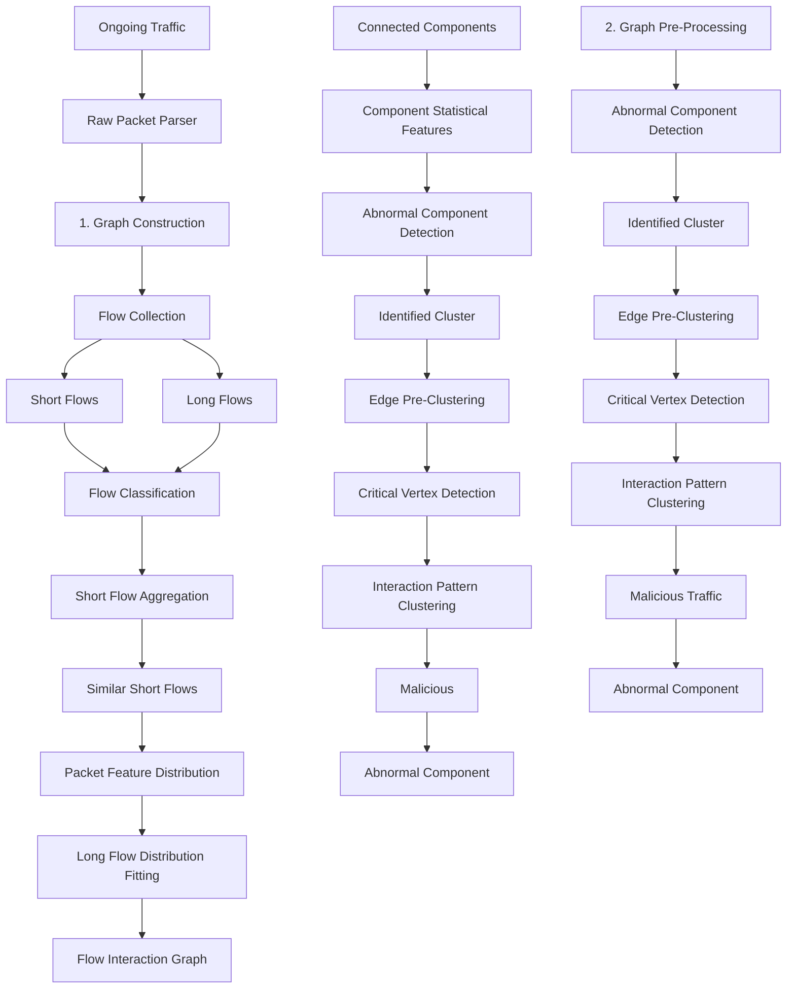
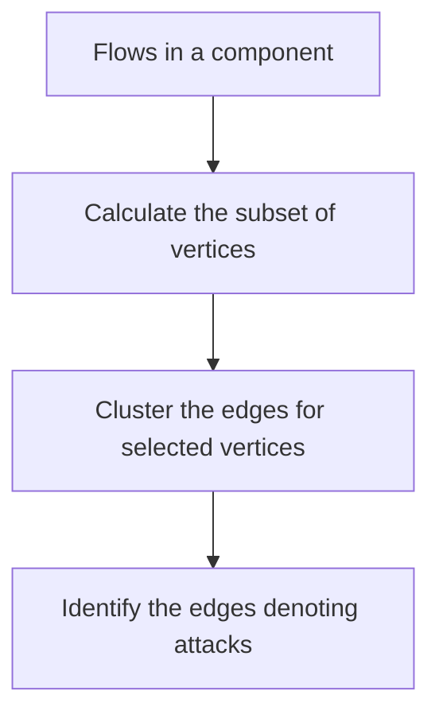

# Detecting Unknown Encrypted Malicious Traffic in Real Time via Flow Interaction Graph Analysis

Chuanpu Fu∗, Qi Li†‡, Ke Xu∗‡

∗Department of Computer Science and Technology, Tsinghua University

†Institute for Network Sciences and Cyberspace, Tsinghua University ‡Zhongguancun Lab

Abstract—Nowadays traffic on the Internet has been widely encrypted to protect its confidentiality and privacy. However, traffic encryption is always abused by attackers to conceal their malicious behaviors. Since the encrypted malicious traffic has similar features to benign flows, it can easily evade traditional detection methods. Particularly, the existing encrypted malicious traffic detection methods are supervised and they rely on the prior knowledge of known attacks (e.g., labeled datasets). Detecting unknown encrypted malicious traffic in real time, which does not require prior domain knowledge, is still an open problem.

In this paper, we propose HyperVision, a realtime unsupervised machine learning (ML) based malicious traffic detection system. Particularly, HyperVision is able to detect unknown patterns of encrypted malicious traffic by utilizing a compact inmemory graph built upon the traffic patterns. The graph captures flow interaction patterns represented by the graph structural features, instead of the features of specific known attacks. We develop an unsupervised graph learning method to detect abnormal interaction patterns by analyzing the connectivity, sparsity, and statistical features of the graph, which allows HyperVision to detect various encrypted attack traffic without requiring any labeled datasets of known attacks. Moreover, we establish an information theory model to demonstrate that the information preserved by the graph approaches the ideal theoretical bound. We show the performance of HyperVision by real-world experiments with 92 datasets including 48 attacks with encrypted malicious traffic. The experimental results illustrate that HyperVision achieves at least 0.92 AUC and 0.86 F1, which significantly outperform the stateof-the-art methods. In particular, more than 50% attacks in our experiments can evade all these methods. Moreover, HyperVision achieves at least 80.6 Gb/s detection throughput with the average detection latency of 0.83s.

# I. INTRODUCTION

Traffic encryption has been widely adopted to protect the information delivered on the Internet. Over 80% websites adopted HTTPS to prevent data breach in 2019 [16], [62]. However, the cipher-suite for such protection is double-edged. In particular, the encrypted traffic also allows attackers to conceal their malicious behaviors, e.g., malware campaigns [2], exploiting vulnerabilities [64], and data exfiltration [77]. The ratio of encrypted malicious traffic on the Internet is growing significantly [2], [3], [76] and exceeds 70% of the entire malicious traffic [16].

However, encrypted malicious traffic detection is not well addressed due to the low-rate and diverse traffic patterns [2], [39], [77]. The traditional signature based methods that leverage deep packet inspection (DPI) are invalid under the attacks with the encrypted payloads [34]. Table I compares the existing malicious traffic detection methods. Different from plain-text malicious traffic, the encrypted traffic has similar features to benign flows and thus can evade existing machine learning (ML) based detection systems as well [2], [3], [62]. Particularly, the existing encrypted traffic detection methods are supervised, i.e., relying on the prior knowledge of known attacks, and can only detect attacks with known traffic patterns. They extract features of specific known attacks and use labeled datasets of known malicious traffic for model training [2], [3], [76]. Thus, they are unable to detect a broad spectrum of attacks with encrypted traffic [39], [41], [64], [77], which are constructed with unknown patterns [22]. Besides, these methods are incapable of detecting both attacks constructed with and without encrypted traffic and unable to achieve generic detection because features of encrypted and nonencrypted attack traffic are significantly different [2], [3].

In a nutshell, the existing methods cannot achieve unsupervised detection and they are unable to detect encrypted malicious traffic with unknown patterns. In particular, the encrypted malicious traffic has stealthy behaviors, which cannot be captured by these methods [2], [76] that detect attacks according to the patterns of a single flow. However, it is still feasible to detect such attack traffic because these attacks involve multiple attack steps with different flow interactions among attackers and victims, which are distinct from benign flow interactions patterns [24], [26], [39], [46], [61]. For example, the encrypted flow interactions between spam bots and SMTP servers are significantly different from the legitimate communications [61] even if the single flow of the attack is similar to the benign one. Thus, this paper explores utilizing interaction patterns among various flows for malicious traffic detection.

To the end, we propose HyperVision, a realtime detection system that aims to capture footprints of encrypted malicious traffic by analyzing interaction patterns among flows. In particular, it can detect encrypted malicious flows with unknown footprints by identifying abnormal flow interactions, i.e., the interaction patterns that are distinct from benign ones. To achieve this, we build a compact graph to capture various flow interaction patterns so that HyperVision can perform detection on various encrypted traffic according to the graph. The graph allows us to detect attacks without accessing packet payloads, while retaining the ability of detecting traditional (known) attacks with plain-text traffic. Therefore, HyperVision can detect the malicious traffic with unknown patterns by learning the graph structural features. Meanwhile, by learning the graph structural features, it realizes unsupervised detection, which does not require model training with labeled datasets.

However, it is challenging to build the graph for realtime detection. We cannot simply use IP addresses as vertices and traditional four-tuple of flows [19], [36] as edges to construct the graph because the resulting dense graph cannot maintain interaction patterns among various flows, e.g., incurring the dependence explosion problem [87]. Inspired by the study of the flow size distribution [25], [84], i.e., most flows on the Internet are short while most packets are associated with long flows, we utilize two strategies to record different sizes of flows, and process the interaction patterns of short and long flows separately in the graph. Specifically, it aggregates the short flows based on the similarity of massive short flows on the Internet, which reduces the density of the graph, and performs distribution fitting for the long flows, which can effectively preserve flow interaction information.

TABLE I. THE COMPARISON WITH THE EXISTING METHODS OF MALICIOUS TRAFFIC DETECTION. 

<table><tr><td rowspan="2">Data Source Categories</td><td rowspan="2">Data Sources</td><td rowspan="2">Typical Methods</td><td colspan="2">Data for Detection</td><td colspan="3">Design Goals</td><td colspan="2">Detection Performance</td></tr><tr><td>Unlabeled Datasets</td><td>Multi-Flow Features</td><td>Generic Detection</td><td>Realtime Detection</td><td>Unknown Attacks</td><td>Low Latency</td><td>High Throughput</td></tr><tr><td rowspan="5">Encrypted Traffic</td><td rowspan="2">Protocol Headers</td><td>TLS Extensions [16]</td><td>×</td><td>×</td><td>×</td><td>×</td><td>×</td><td>×</td><td>√</td></tr><tr><td>HTTPS Headers [3]</td><td>×</td><td>×</td><td>×</td><td>×</td><td>×</td><td>×</td><td>×</td></tr><tr><td rowspan="3">Related Flows</td><td>Time Series [76]</td><td>×</td><td>×</td><td>×</td><td>×</td><td>×</td><td>×</td><td>×</td></tr><tr><td>TLS Handshakes [2]</td><td>×</td><td>×</td><td>×</td><td>×</td><td>×</td><td>×</td><td>×</td></tr><tr><td>Flow Statistics [90]</td><td>√</td><td>×</td><td>×</td><td>√</td><td>×</td><td>×</td><td>√</td></tr><tr><td rowspan="5">Plain-text and Encrypted Traffic</td><td rowspan="2">Network Logs</td><td>Intrusion Events [20]</td><td>√</td><td>×</td><td>×</td><td>×</td><td>√</td><td>×</td><td>×</td></tr><tr><td>Sampled Connections [8]</td><td>√</td><td> $\checkmark^1$ </td><td>×</td><td>√</td><td>×</td><td>×</td><td>√</td></tr><tr><td rowspan="3">Traffic Features</td><td>Per-Packet Features [56]</td><td>√</td><td>×</td><td>×</td><td>×</td><td>√</td><td>√</td><td>×</td></tr><tr><td>Per-Flow Features [5]</td><td>×</td><td>×</td><td>×</td><td>√</td><td>×</td><td>√</td><td>×</td></tr><tr><td>Flow Interaction Graph</td><td>√</td><td>√</td><td>√</td><td>√</td><td>√</td><td>√</td><td>√</td></tr></table>

1 Existing multi-flow features can only represent the features of specific flows, which cannot be used to represent complicated interaction patterns among various flows.

We design a four-step lightweight unsupervised graph learning approach to detect encrypted malicious traffic by utilizing the rich flow interaction information maintained on the graph. First, we analyze the connectivity of the graph by extracting the connected components and identify abnormal components by clustering the high-level statistical features. By excluding the benign components, we also significantly reduce the learning overhead. Second, we pre-cluster the edges according to the observed local adjacency in edge features. The pre-clustering operations significantly reduce the feature processing overhead and ensure realtime detection. Third, we extract critical vertices by solving a vertex cover problem using Z3 SMT solver [55] to minimize the number of clustering. Finally, we cluster each critical vertex according to its connected edges, which are in the centers of the clusters produced by the pre-clustering, and thus obtain the abnormal edges indicating encrypted malicious traffic.

Moreover, to quantify the benefits of the graph based flow recording of HyperVision over the existing approaches, we develop a flow recording entropy model, an information theory based framework that theoretically analyzes the amount of information retained by the existing data sources of malicious traffic detection systems. By using this framework, we show that the existing sampling based and event based traffic data sources (e.g., NetFlow [19] and Zeek [86]) cannot retain highfidelity traffic information. Thus, they are unable to record flow interaction information for the detection. But the graph in HyperVision captures near-optimal traffic information for the graph learning based detection and the amount of the information maintained in the graph approaches the theoretical up-bound of the idealized data source with infinite storage according to the data processing inequality [85]. Also, the analysis results demonstrate that the graph in HyperVision achieves higher information density (i.e., amount of traffic information per unit of storage) than all existing data sources, which is the foundation of the accurate and efficient detection.

We prototype HyperVision1 with Intel’s Data Plane Development Kit (DPDK) [37]. To extensively evaluate the performance of the prototype, we replayed 92 attack datasets including 80 new datasets collected in our virtual private cloud (VPC) with more than 1,500 instances. In the VPC, we collected 48 typical encrypted malicious traffic, including (i) encrypted flooding traffic, e.g., flooding target links [41]; (ii) web attacks, e.g., exploiting web vulnerabilities [64]; (iii) malware campaigns, including connectivity testing, dependency update, and downloading. In the presence of the background traffic by replaying the backbone network traffic [80], Hyper-Vision achieves 13.9% ∼ 36.1% accuracy improvements over five state-of-the-art methods. It detects all encrypted malicious traffic in an unsupervised manner with more than 0.92 AUC, 0.86 F1, where 44 of the real-world stealthy traffic cannot be identified by all the baselines, e.g., an advanced side-channel attack exploiting the CVE-2020-36516 [26] and many newly discovered cryptojacking attacks [7]. Moreover, HyperVision achieves on average more than 100 Gb/s detection throughput with the average detection latency of 0.83s.

In summary, the contributions of our paper are five-fold:

• We propose HyperVision, the first realtime unsupervised detection for encrypted malicious traffic with unknown patterns by utilizing the flow interaction graph.   
• We develop several algorithms to build the in-memory graph that allows us to accurately capture interaction patterns among various flows.   
• We design a lightweight unsupervised graph learning method to detect encrypted traffic via graph features.   
• We develop a theoretical analysis framework established by information theory to show that the graph captures near-optimal traffic interaction information.   
• We prototype HyperVision and use the extensive experiments with various real-world encrypted malicious traffic to validate its accuracy and efficiency.

The rest of the paper is organized as follows: Section II introduces the threat model of HyperVision. Section III presents the high-level design of HyperVision. In section IV, V, and VI, we describe the detailed designs. In Section VII, we conduct the theoretical analysis. In Section VIII, we experimentally evaluate the performances. Section IX reviews related works and Section X concludes this paper. Finally, we present details in Appendix.

flowchart

Fig. 1. The overview of HyperVision.

# II. THREAT MODEL AND DESIGN GOALS

We aim to develop a realtime system (i.e., HyperVision) to detect encrypted malicious traffic. It performs detection according to the traffic replicated by routers through port mirroring [17], which ensures that the system will not interfere with the traffic forwarding. After identifying encrypted malicious traffic, it can cooperate with the existing on-path malicious traffic defenses [48], [49], [88] to throttle the detected traffic. To perform detection on encrypted traffic, we cannot parse and analyze application layer headers and payloads.

In this paper, we focus on detecting active attacks constructed with encrypted traffic. We do not consider passive attacks that do not generate traffic to victims, e.g., traffic eavesdropping [68] and passive traffic analysis [70]. According to the existing studies [10], [24], [29], [40], [46], [81], attackers utilize reconnaissance steps to probe the information of victims, e.g., the password of a victim [39], the TCP sequence number of a TLS connection [26], [27], and the randomized memory layout of a web server [75], which cannot be accessed directly by attackers due to lack of prior knowledge. Note that, these attacks are normally constructed with many addresses owned or faked by attackers.

The design goals of HyperVision are as follows: First, it should be able to achieve generic detection, i.e., detect attacks constructed with encrypted or non-encrypted traffic, which ensures that the attacks cannot evade detection by traffic encryption [2], [77]. Second, it is able to achieve realtime high-speed traffic processing, which means that it can identify whether the passing through encrypted traffic is malicious, while incurring low detection latency. Third, the performed detection by HyperVision is unsupervised, which means that it does not require any prior knowledge of encrypted malicious traffic. That is, it should be able to deal with attacks with unknown patterns, i.e., zero-day attacks, which have not been disclosed [30]. Thus, we do not use any labeled traffic datasets for ML training. These issues cannot be well addressed by the existing detection methods [62].

# III. OVERVIEW OF HYPERVISION

In this section, we develop HyperVision that is an unsupervised detection system to capture malicious traffic in real time, in particular, encrypted malicious traffic. Normally, patterns of each flow in the encrypted malicious traffic, i.e., singleflow patterns, may be similar to benign flows, which allow them to evade the existing detection. However, the malicious behaviors appearing in the interaction patterns between the attackers and victims will be more distinct from the benign ones. Thus, in HyperVision, we construct a compact graph to maintain interaction patterns among various flows and detect abnormal interaction patterns by learning the features of the graph. HyperVision analyzes the graph structural features representing the interaction patterns without prior knowledge of known attack traffic and thus can achieve unsupervised detection against various attacks. It realizes generic detection by analyzing flows regardless of the traffic type and can detect encrypted and non-encrypted malicious traffic. Figure 1 shows three key parts of HyperVision, i.e., graph construction, graph pre-processing, and abnormal interaction detection.

Graph Construction. HyperVision collects network flows for graph construction. Meanwhile, it classifies the flows into short and long ones and records their interaction patterns separately for the purpose of reducing the density of the graph. In the graph, it uses different addresses as vertices that connect the edges associated with short and long flows, respectively. It aggregates the massive similar short flows to construct one edge for a group of short flows, and thus reduces the overhead for maintaining flow interaction patterns. Moreover, it fits the distributions of the packet features in the long flows to construct the edges associated with long flows, which ensures high-fidelity recorded flow interaction patterns, while addressing the issue of coarse-grained flow features in the traditional methods [36]. We will detail how HyperVision maintains the high-fidelity flow interaction patterns in the inmemory graph in Section IV.

Graph Pre-Processing. We pre-process the built interaction graph to reduce the overhead of processing the graph by extracting connected components and cluster the components using high-level statistics. In particular, the clustering can detect the components with only benign interaction patterns accurately and thus filters these benign components to reduce the scale of the graph. Moreover, we perform a pre-clustering and use the generated cluster centers to represent the edges in the identified clusters. We will detail the graph pre-processing in Section V.

line

| Flow Completion Time [log10 Scale] | PDF (All) | PDF (Long) | PDF (Short) |
| ---------------------------------- | --------- | ---------- | ----------- |
| 0.0                                | 5.0       | 5.0        | 5.0         |
| 0.2                                | 1.5       | 1.5        | 1.5         |
| 0.4                                | 0.5       | 0.5        | 0.5         |
| 0.6                                | 0.2       | 0.2        | 0.2         |
| 0.8                                | 0.1       | 0.1        | 0.1         |
| 1.0                                | 0.05      | 0.05       | 0.05        |
| 1.2                                | 0.02      | 0.02       | 0.02        |
| 1.4                                | 0.01      | 0.01       | 0.01        |
| 1.6                                | 0.005     | 0.005      | 0.005       |
| 1.8                                | 0.002     | 0.002      | 0.002       |
| 2.0                                | 0.001     | 0.001      | 0.001       |

(a) FCT distribution.

line

| Flow Length [log10 Scale] | PDF (All) | PDF (Long) | PDF (Short) |
| ------------------------- | --------- | ---------- | ----------- |
| 0.0                       | 0.0       | 0.0        | 0.0         |
| 0.5                       | 5.0       | 0.0        | 2.0         |
| 1.0                       | 0.0       | 0.0        | 0.0         |
| 1.5                       | 0.0       | 0.5        | 0.0         |
| 2.0                       | 0.0       | 0.5        | 0.0         |
| 2.5                       | 0.0       | 0.5        | 0.0         |
| 3.0                       | 0.0       | 0.5        | 0.0         |
| 3.5                       | 0.0       | 0.5        | 0.0         |
| 4.0                       | 0.0       | 0.5        | 0.0         |
| 4.5                       | 0.0       | 0.5        | 0.0         |

(b) Flow length distribution.

Fig. 2. The real-world flow features distribution of short and long flows.   

natural_image

Abstract geometric pattern with blue radial lines and a red center point (no text or symbols)

(a) Traditional flows as edges.

```mermaid
graph TD
    A["Node"] --> B["Node"]
    B --> C["Node"]
    C --> D["Node"]
    D --> E["Node"]
    E --> F["Node"]
    F --> G["Node"]
    G --> H["Node"]
    H --> I["Node"]
    I --> J["Node"]
    J --> K["Node"]
    K --> L["Node"]
    L --> M["Node"]
    M --> N["Node"]
    N --> O["Node"]
    O --> P["Node"]
    P --> Q["Node"]
    Q --> R["Node"]
    R --> S["Node"]
    S --> T["Node"]
    T --> U["Node"]
    U --> V["Node"]
    V --> W["Node"]
    W --> X["Node"]
    X --> Y["Node"]
    Y --> Z["Node"]
```

flowchart

(b) Short flow aggregation.   
Fig. 3. HyperVision aggregates short flows to reduce the dense graph.

Malicious Traffic Detection Based on the Graph. We achieve unsupervised encrypted malicious traffic detection by analyzing the graph features. We identify critical vertices in the graph by solving a vertex cover problem, which ensures that the clustering based graph learning processes all edges with the minimum number of clustering. For each selected vertex, we cluster all connected edges according to their flow features and structural features that represent the flow interaction patterns. HyperVision can identify abnormal edges in real time by computing the loss function of the clustering. We will describe the details of graph learning based detection in Section VI.

# IV. GRAPH CONSTRUCTION

In this section, we present the design details of constructing the flow interaction graph that maintains interaction patterns among various flows. In particular, we classify different flows, i.e., short and long flows, and aggregate short flows, and perform the distribution fitting for long flows, respectively, for efficient graph construction. In Section VII, we will show that the graph retains the near-optimal information for detection.

# A. Flow Classification

In order to efficiently analyze flows captured on the Internet, we need to avoid the dependency explosion among flows during the graph construction. We classify the collected flows into short and long flows, according to the flow size distribution [25] (see Figure 2), and then reduce the density of the graph (shown in Figure 3). Figure 2 shows the distribution of flow completion time (FCT) and flow length of the MAWI Internet traffic dataset [80] in Jan. 2020. For simplicity, we use the first $1 3 \times 1 0 ^ { 6 }$ packets to plot the figure. According to the figure, we observe that only 5.52% flows have FCT > 2.0s. However, 93.70% packets in the dataset are long flows with only 2.36% proportion. Inspired by the observation, we apply different flow collection strategies for the short and long flows.

We poll the per-packet information from a data-plane highspeed packet parsing engine and obtain their source and destination addresses, port numbers, and per-packet features, including protocols, lengths, and arrival intervals. These features can be extracted from both encrypted and plain-text traffic for generic detection. We develop a flow classification algorithm to classify the traffic (see Algorithm 1 in Appendix A). It maintains a timer TIME NOW, a hash table that uses HASH(SRC, DST, SRC PORT, DST PORT) as key and the collected flows indicated by the sequences of their per-packet features as values. It traverses the hash table every JUDGE INTERVAL second according to TIME NOW and judges the flow completion when the last packet arrived before PKT TIMEOUT second of TIME NOW. When the flows are completed, we classify them as long flows if the flows have more than FLOW LINE packets. Otherwise, we classify them as short flows. As shown in Figure 2(b), we can accurately classify short and long flows. The definitions of the hyper-parameters can be found in Table VII (see Appendix A). Note that, we poll the state-less per-packet information from data-plane, while not maintaining flow states (e.g., a state machine [89]) on the data-plane to prevent attackers manipulating the states, e.g., side-channel attack [65] and evading detection [79].

line

| Number of Buckets [10 Bytes] | PDF     |
| ---------------------------- | ------- |
| 0                            | 0.08    |
| 10                           | 0.06    |
| 20                           | 0.03    |
| 30                           | 0.01    |
| 40                           | 0.005   |
| 50                           | 0.002   |
| 60                           | 0.001   |
| 70                           | 0.0005  |
| 80                           | 0.0002  |
| 90                           | 0.0001  |
| 100                          | 0.00005 |

(a) Number of packet length buckets.

line

| Packet Length Bucket Size [log10 Scale] | PDF |
| -------------------------------------- | --- |
| 0.0                                    | 0.0 |
| 0.5                                    | 0.0 |
| 1.0                                    | 0.2 |
| 1.5                                    | 0.4 |
| 2.0                                    | 0.3 |
| 2.5                                    | 0.3 |
| 3.0                                    | 0.2 |
| 3.5                                    | 0.7 |
| 4.0                                    | 0.4 |
| 4.5                                    | 0.1 |
| 5.0                                    | 0.0 |

(b) Maximum bucket size.   
Fig. 4. The number and size of the buckets for feature distribution fitting.

# B. Short Flow Aggregation

We need to reduce the density of the graph for analysis. As shown in Figure 3(a), the graph will be very dense for analysis if we use traditional four-tuple flows as edges, which is similar to the dependency explosion problem in provenance analysis [83], [87]. We observe that most short flows have almost the same per-packet feature sequences. For instance, the encrypted flows of repetitive SSH cracking attempts originated from specific attackers [39]. Thus, we perform the short flow aggregation to represent similar flows using one edge after the classification.

We design an algorithm to aggregate short flows (see Algorithm 2 in Appendix A). A set of flows can be aggregated when all the following requirements are satisfied: (i) the flows have the same source and/or destination addresses, which implies similar behaviors generated from the addresses; (ii) the flows have the same protocol type; (iii) the number of the flows is large enough, i.e., when the number of the short flows reaches the threshold AGG LINE, which ensures that the flows are repetitive enough. Next, we construct an edge for the short flows, which preserves one feature sequence (i.e., protocols, lengths, and arrival intervals) for all the flows, and their four-tuples. As a result, four types of edges associated with short flows exist on the graph, i.e., source address aggregated, destination address aggregated, both addresses aggregated, and without aggregation. Thus, a vertex connected to the edge can denote a group of addresses or a single address.

Figure 3 compares the graph using traditional flows as edges and our aggregated graph by using the real-world backbone traffic dataset, which is same to that used in Figure 2. The diameter of a vertex indicates the number of addresses denoted by the vertex and the depth of the color indicates the repeated edges. In Figure 3(b), we observe that the algorithm reduces 93.94% vertices and 94.04% edges. The edge highlighted in green indicates short flows (i.e., 2.38 Kpps, from PH) exploiting a vulnerability. Note that, the flow aggregation reduces the storage overhead, which makes it feasible to maintain the in-memory graph for realtime detection.

area

| Number of Bytes [log10 Scale] | PDF (Short Flow) | PDF (Long Flow) |
| ----------------------------- | ---------------- | --------------- |
| 0.0                           | 0.0              | 1.5             |
| 1.0                           | 0.0              | 0.0             |
| 2.0                           | 0.6              | 0.0             |
| 3.0                           | 0.4              | 0.0             |
| 4.0                           | 0.3              | 0.0             |
| 5.0                           | 0.2              | 0.0             |
| 6.0                           | 0.1              | 0.0             |
| 7.0                           | 0.0              | 0.0             |

(a) Component size distribution.

scatter

| PCA Decomposed Features | Y Value |
| ----------------------- | ------- |
| -2.0                    | 1.0     |
| 0.0                     | 0.0     |
| 2.0                     | -1.0    |
| 4.0                     | 1.0     |
| 6.0                     | 2.0     |
| 8.0                     | 3.0     |
| 9.0                     | 2.0     |

(b) Scatter of the components.   
Fig. 5. The statistical features of the components.

# C. Feature Distribution Fitting for Long Flows

Now we use histograms to represent the per-packet feature distributions of a long flow which avoid preserving their long per-packet feature sequences, since the features in long flows are centrally distributed. Specifically, we maintain a hash table to construct the histogram for each per-packet feature sequence in each long flow. According to our empirical study, we set the buckets widths for packet-length and arrival interval as 10 bytes and 1 ms, respectively, to trade off between the fitting accuracy and overhead. We calculate the hash code by dividing the per-packet features by the bucket width and increase the counter indexed by the hash code. Finally, we record the hash codes and the associated counters as the histograms. Note that, the coarse-grained flow statistics, e.g., numbers of packets [36], are insufficient for encrypted malicious traffic detection [76], which also lose the flow interaction information [18].

Figure 4 shows the number of the used buckets and the maximum bucket size for the long flows in the same dataset shown in Figure 2. We confirm the centralized feature distribution, i.e., most packets in the long flows have similar packet lengths and arrival intervals. Specifically, in Figure 4(a), we fit the distribution of packet length using only 11 buckets on average, and most of the buckets collect more than 200 packets (see Figure 4(b)), which demonstrate that the histogram based fitting is effective with low storage overhead. Similarly, the fitting for arrival interval uses 121 buckets on average and realizes 71 packets per bucket high utilization. Besides, we use the same method for protocol. We use the mask of protocols as the hash code and use smaller numbers of buckets to realize more efficient fitting due to the limited number of protocol types. Note that, Flowlens [5] used a similar histogram to efficiently utilize hardware flow tables on P4 switches. Instead, we construct the histograms to accurately analyze long flows.

# V. GRAPH PRE-PROCESSING

In this section, we pre-process the flow interaction graph to identify key components and pre-cluster the edges, which can enable realtime graph learning based detection against encrypted malicious traffic with unknown patterns.

# A. Connectivity Analysis

To perform the connectivity analysis of the graph, we obtain the connected components by using depth-first search (DFS) and split the graph by the components. Figure 5(a) presents the size distribution of the identified components of the MAWI traffic dataset [80] collected in Jan. 2020. We observe that most components contain few edges with similar interaction patterns. Thus, we perform a clustering on the highlevel statistics for the connected components to capture the abnormal components that have over one order of magnitude clustering loss than normal components as clustering outliers. Specifically, we extract five features to profile the components, including: (i) the number of long flows; (ii) the number of short flows; (iii) the number of edges denoting short flows; (iv) the number of bytes in long flows; and (v) the number of bytes in short flows. We perform a min-max normalization and acquire the centers using the density based clustering, i.e., DBSCAN [32]. For each component, we calculate the Euclidean distance to its nearest center. We detect an abnormal component when its distance is over the 99th percentile of all the distances based on our empirical study.

scatter

| PCA Decomposed Long Flow Features | Edge Features |
| --------------------------------- | ------------- |
| -1.0                              | 1.5           |
| -0.5                              | 0.5           |
| 0.0                               | 0.0           |
| 0.5                               | -0.5          |
| 1.0                               | -1.0          |

(a) Adjacent long flows.

scatter

| PCA Decomposed Short Flow Features | Value |
| ----------------------------------- | ----- |
| -0.5                                | 1.0   |
| 0.0                                 | 0.0   |
| 0.5                                 | 0.0   |
| 1.0                                 | 0.0   |
| 1.5                                 | 0.0   |
| 2.0                                 | 1.0   |
| 2.5                                 | 2.0   |
| 3.0                                 | 3.0   |

(b) Adjacent short flows.

Fig. 6. The sparsity of edges in the graph feature space.   

flowchart

Fig. 7. Critical vertices identification via solving the vertex cover problem.

Figure 5(b) shows an instance of the clustering, where the diameters indicate the scale of the traffic on the components (in the unit of bytes). We observe that most components are small, and a high ratio of huge components is classified as abnormal. All edges associated with the normal components are labeled as benign traffic, and the edges associated with the abnormal components will be further processed by the following steps.

# B. Edge Pre-Clustering

Now we further need to process and pre-cluster the graph for efficient detection. As shown in Figure 5, the abnormal components in the graph have massive vertices and edges. In particular, we cannot directly apply graph representation learning, e.g., graph neural network (GNN), for realtime detection. Figure 6 shows the edges from the components in the graph structural feature space. We observe that the distribution of the edges is sparse, i.e., most edges are adjacent to massive similar edges in the feature space. To utilize the sparsity, we perform a pre-clustering using DBSCAN [32] that leverages KD-Tree for efficient local search and select the cluster centers of the identified clusters to represent all edges in each cluster to reduce the overhead for graph processing.

Specifically, we extract eight and four graph structural features (see Table V in Appendix A) for the edges associated with short and long flow, respectively, e.g., the in-degree of the source vertex of an edge associated with a long flow.

These degree features of malicious traffic are significantly distinct from the benign ones, e.g., the vertices denoting spam bots have higher out-degrees than benign clients due to their frequent interactions with servers. Then, we perform a min-max normalization for the features, and adopt a small search range ϵ and a large minimum number of points for DBSCAN clustering (see Section VIII-A for the setting of hyper-parameters) to avoid including irrelevant edges in the clusters, which may incur false positives. Moreover, some edges cannot be clustered and should be treated as outliers, which will be processed as clusters with only one edge.

# VI. MALICIOUS TRAFFIC DETECTION

In this section, we detect encrypted malicious traffic by identifying abnormal interaction patterns on the graph. In particular, we cluster edges connected to the same critical vertex and detects outliers as malicious traffic (see Figure 7).

# A. Identifying Critical Vertices

To efficiently learn the interaction patterns of the traffic, we do not perform clustering for all edges directly but cluster edges connected to critical vertices. For each connected component, we select a subset of all vertices in the connected component as the critical vertices according to the following conditions: (i) the source and/or destination vertices of each edge in the component are in the subset, which ensures that all the edges are connected to more than one critical vertices and clustered at least once; and (ii) the number of selected vertices in the subset is minimized, which aims to minimize the number of clustering to reduce the overhead of graph learning. Finding such a subset of vertices is an optimization problem and equivalent to the vertex cover problem [33], which was proved to be NP Complete (NPC). We select all edges and all vertices on each component to solve the problem. And we reformulate the problem to a Satisfiability Modulo Theories (SMT) problem that can be effectively solved by using Z3 SMT solver [55]. Since we pre-cluster the massive edges and reduce the scale of the problem (see Section V-B), the NPC problem can be solved in real time.

# B. Edge Feature Clustering for Detection

Now we cluster the edges connected to each critical vertex to identify abnormal interaction patterns. In this step, we use the structural features in Section V-B, and the flow features extracted from the per-packet feature sequences of short flows or the fitted feature distributions of long flows. All features are shown in Table V (see Appendix A). We use the lightweight K-Means algorithm to cluster the edges associated with short and long flows, respectively, and calculate the clustering loss that indicates the degree of maliciousness for malicious flow detection.

$$
\text { loss } _ {\text { center }} (\text { edge }) = \min _ {C _ {i} \in \{C _ {1}, \dots , C _ {K} \}} | | C _ {i} - f (\text { edge }) | | _ {2}, \tag {1}
$$

$$
\operatorname{loss} _ {\text { cluster }} (\text { edge }) = \text { TimeRange } (\mathcal {C} (\text { edge })), \tag {2}
$$

$$
\operatorname{loss} _ {\text { count }} (\text { edge }) = \log_ {2} (\text { Size } (\mathcal {C} (\text { edge })) + 1), \tag {3}
$$

$$
\text { loss(edge) } = \alpha \text { loss } _ {\text { center }} (\text { edge }) \tag {4}
$$

$$
- \beta \text { loss } _ {\text { cluster }} (\text { edge }) + \gamma \text { loss } _ {\text { count }} (\text { edge }),
$$

where K is the number of obtained cluster centers, $C _ { i }$ is the $i ^ { \mathrm { t h } }$ center, f (edge) is the feature vector, C(edge) contains all edges in the cluster of edge produced by pre-clustering, and TimeRange calculates the time range covered by the flows denoted by the edges.

According to Equation (4), the loss has three parts: (i) $\mathsf { l o s s } _ { \mathrm { c e n t e r } }$ in (1) is the Euclidean distance to the cluster centers which indicates the difference from other edges connected to the critical vertex; (ii) $\mathsf { l o s s } _ { \mathrm { c l u s t e r } }$ in (2) indicates the time range covered by the cluster identified by the pre-clustering in Section V-B which implies long lasting interaction patterns tend to be benign; (iii) $\mathsf { l o s s } _ { \mathrm { c o u n t } }$ in (3) is the number of flows denoted by the edges, which means a burst of massive flows implies malicious behaviors. Moreover, we used weights: $\alpha , \beta , \gamma$ to balance the loss terms. Finally, it detects the associated flows as malicious when the loss function of the edge is larger than a threshold.

# VII. THEORETICAL ANALYSIS

In this section, we develop a theoretical analysis framework, i.e., flow recording entropy model, to analyze the information preserved in the graph of HyperVision for graph learning based detection. The detailed analysis can be found in Appendix C.

# A. Information Entropy Based Analysis

We develop the framework that aims to quantitatively evaluate the information retained by the exiting traffic recording modes, which decide the data representations for malicious traffic detection, by using three metrics: (i) the amount of information, i.e., the average Shannon entropy obtained by recording one packet; (ii) the scale of data, i.e., the space used to store the information; (iii) the density of information, i.e., the amount of information on a unit of storage. By using this framework, we model the graph based traffic recording mode used by HyperVision as well as three typical types of flow recording modes, i.e., (i) idealized mode that records and stores the whole per-packet feature sequence; (ii) event based mode (e.g., Zeek) that records specific events [2], [20]; and (iii) sampling based mode (e.g., NetFlow) that records coarsegrained flow information [8], [51].

We model a flow, i.e., a sequence of per-packet features, as a sequence of random variables represented by an aperiodic irreducible discrete-time Markov chain (DTMC). Let $\mathcal { G } = \{ \nu , \mathcal { E } \}$ denote the state diagram of the DTMC, where V is the set of states (i.e., the values of the variables) and E denotes the edges. We define $s \ = \ | \nu |$ as the number of different states and use $\mathcal { W } = [ w _ { i j } ] _ { s \times s }$ to denote the weight matrix of G. All of the weights are equal and normalized:

$$
\forall 1 \leq i, j, m, n \leq s, (w _ {i j} = w _ {m n}) \vee (w _ {i j} = 0 \vee w _ {m n} = 0),
$$

$$
w _ {i} = \sum_ {j = 1} ^ {s} w _ {i j}, \quad 1 = \sum_ {i = 1} ^ {s} w _ {i}. \tag {5}
$$

The state transition is performed based on the weights, i.e., the transition probability matrix $P = [ P _ { i j } ] , P _ { i j } = \overline { { w _ { i j } } } / { w _ { i } }$ . Therefore, the DTMC has a stationary distribution $\mu { : }$

$$
\left\{ \begin{array}{l} \mu P = \mu , \\ 1 = \sum_ {j = 1} ^ {s} \mu_ {j} \end{array} \right. \Rightarrow \quad \mu_ {j} = w _ {j}, \quad \forall 1 \leq j \leq s. \tag {6}
$$

Assume that the stationary distribution is a binomial distribution with the parameter: $0 . 1 \leq p \leq 0 . 9$ to approach Gaussian distribution with low skewness:

$$
\mu \sim B (s, p) \xrightarrow {A p p .} \mathcal {N} (s p, s p (1 - p)). \tag {7}
$$

Based on the distribution, we obtain the entropy rate of the DTMC which is the expected Shannon entropy increase for each step in the state transition, i.e., the expected Shannon entropy of each random variable in the sequence, (using nat as unit, 1 nat ≈ 1.44 bit):

$$
\begin{array}{l} \mathcal {H} [ \mathcal {G} ] = \sum_ {i = 1} ^ {s} \mu_ {i} \sum_ {j = 1} ^ {s} p _ {i j} \ln \frac {1}{p _ {i j}} = - \sum_ {i = 1} ^ {s} \sum_ {j = 1} ^ {s} w _ {i j} \ln w _ {i j} + \sum_ {j = 1} ^ {s} w _ {j} \ln w _ {j} \\ = \ln | \mathcal {E} | - \frac {1}{2} \ln 2 \pi s e p (1 - p). \tag {8} \\ \end{array}
$$

Moreover, for the real-world flow size distribution, we assume that the length of the sequence of random variables obeys a geometric distribution with high skewness, i.e., $L \sim G ( q )$ with a parameter: $0 . 5 \leq q \leq 0 . 9 .$ H, L, and D denote the expectation of the metrics, i.e., the amount of information, the scale of data, and the density, respectively.

Idealized Recording Mode. The idealized recording mode has infinite storage and captures optimal fidelity traffic information by recording each random variable from the sequence without any processing. Thus, the obtained information entropy of the idealized mode grows at the entropy rate of the DTMC:

$$
\mathcal {H} _ {\text { Ideal }} = \mathrm{E} [ L \mathcal {H} [ G ] ] = \frac {1}{q} \ln | \mathcal {E} | - \frac {1}{2 q} \ln 2 \pi s e p (1 - p). \tag {9}
$$

According to data processing inequality [85], the information retained in the idealized recording mode reaches the optimal value. It implies that processing of the observed perpacket features denoted by the random variables may incur information loss. In the following sections, we will show that the other mode incurs information loss.

We can obtain the scale of data and the density of information for the idealized recording mode as follows:

$$
\mathcal {L} _ {\text { Ideal }} = \mathrm{E} [ L ] = \frac {1}{q}. \tag {10}
$$

$$
\mathcal {D} _ {\text { Ideal }} = \frac {\mathcal {H} _ {\text { Ideal }}}{\mathcal {L} _ {\text { Ideal }}} = \mathcal {H} [ G ]. \tag {11}
$$

Graph Based Recording Mode of HyperVision. HyperVision applies different strategies to process short and long flows for the graph construction. Let K denote the threshold for classifying the flows. When $L < K$ , it collects all random variables from the sequence for short flows. Otherwise, it collects the histogram to fit the distribution for long flows. Then, we can obtain the lower bound to estimate the information entropy in the graph of HyperVision:

$$
\mathcal {H} _ {\mathrm{H.V.}} = \frac {1 - (K q + 1) (1 - q) ^ {K}}{q} \mathcal {H} [ G ] + \frac {1}{4} s (1 - q) ^ {K} \tag {12}
$$

$$
[ (1 + s) \ln p s + 2 \ln 2 \pi e + 2 q \ln K - 2 s (1 + p + \gamma) ].
$$

We can also obtain the expected data scale and the density:

$$
\mathcal {L} _ {\mathrm{H.V.}} = s (1 - q) ^ {K} + \frac {1 - (K q + 1) (1 - q) ^ {K}}{C q}, \tag {13}
$$

where C is the average number of flows denoted by an edge associated with short flows.

$$
\mathcal {D} _ {\mathrm{H.V.}} = \frac {\mathcal {H} _ {\mathrm{H.V.}}}{\mathcal {L} _ {\mathrm{H.V.}}}. \tag {14}
$$

Sampling Based Recording Mode. Similarly, the sampling based mode extracts and records flow statistics for the detection. We analyze the accumulative statistics (e.g. the total number of bytes) that are widely adopted [19], [36]. Let $\langle s _ { 1 } , s _ { 2 } , . . . , s _ { L } \rangle _ { \scriptscriptstyle { + } }$ denote the sequence of random variables, and $\begin{array} { r } { X _ { \mathrm { S a m p . } } = \sum _ { i = 1 } ^ { L } s _ { i } } \end{array}$ indicates the flow statistic to be recorded. We can obtain a tight lower bound as an estimation for the amount of information and the other metrics as follows:

$$
\mathcal {H} _ {\text { Samp. }} = \mathcal {H} [ X _ {\text { Samp. }} ] = \frac {1}{2} \ln 2 \pi e s p (1 - p) + \frac {\ln 2}{2} q (1 - q). \tag {15}
$$

$$
\mathcal {L} _ {\text { Samp. }} = 1. \tag {16}
$$

$$
\mathcal {D} _ {\text { Samp. }} = \mathcal {H} _ {\text { Samp. }} \tag {17}
$$

Event Based Recording Mode. The event based recording mode inspects each random variable in the sequence and records events with a small probability. Since the observation that the event based methods do not generate repetitive events for a long flow with a larger s, for simplicity, we assume that the probability is $p ^ { s } \propto 1 \bar { / } s$ . Then, we can obtain the concise closed-form solution of the amount of information, the scale of data, and the density of information for event based recording mode as follows:

$$
\mathcal {H} _ {\text { Eve. }} = - 2 \theta \ln \theta , \tag {18}
$$

where $\theta = { \textstyle \frac { \zeta } { \eta } } , \zeta = q - q p ^ { s }$ , and $\eta = q - p ^ { s } ( q - 1 )$

$$
\mathcal {L} _ {\text { Eve. }} = - \frac {p ^ {s}}{\eta}. \tag {19}
$$

$$
\mathcal {D} _ {\text { Eve. }} = \frac {2 \zeta}{p ^ {s}} \ln \theta . \tag {20}
$$

# B. Analysis Results

We perform numerical studies to compare the flow recording modes in real-world setting. We select three per-packet features: protocol, length, and the arrival interval (in ms) as the instances of the DTMC, then we measure the parameters of the DTMC, i.e., |E | and |V| according to the first $\mathrm { 1 0 ^ { 6 } }$ packets in the MAWI dataset on Jan. 2020 [80]. We also measure K, C, and estimate the geometric distribution parameter q via the second moment. We have the following three key results.

(1) HyperVision maintains more information using the graph than the existing methods. Figure 8 shows the results on the feasible region $( { \mathcal { F } } = \{ 0 . 1 \ { \overset { \vartriangle } { \leq } } \ p \leq \ 0 . 9 , \ 0 . 5 \ \leq \ q \leq \ 0 . 9 \} )$ . We observe that HyperVision maintains at least 2.37 and 1.34 times information entropy than traditional flow sampling and event based flow recording. Thus, the traditional detection methods cannot retain high-fidelity flow interaction information. Actually, they only analyze the features of a single flow, which can be evaded by encrypted traffic. According to Figure 8(b), HyperVision has 69.69% data scale of the sampling based mode. It implies that the data scale is the key challenge for the existing methods to utilize flow interaction patterns. We well address this issue by using the compact graph for maintaining the interactions among flows.

surface_3d

| Length Param. q | DTMC Param. p | Ideal | H.V. | Samp. | Eve. |
| ---------------- | -------------- | ----- | ---- | ----- | ---- |
| 0.5              | 0.1            | 7.0   | 6.0  | 4.0   | 2.0  |
| 0.6              | 0.3            | 6.5   | 5.5  | 3.5   | 1.5  |
| 0.7              | 0.5            | 6.0   | 5.0  | 3.0   | 1.0  |
| 0.8              | 0.7            | 5.5   | 4.5  | 2.5   | 0.5  |
| 0.9              | 0.9            | 5.0   | 4.0  | 2.0   | 0.0  |

(a) The entropy of the modes.

surface_3d

| Length Param. q | DTMC Param. p | Ideal | H.V. | Samp. | Eve. |
| ---------------- | -------------- | ----- | ---- | ----- | ---- |
| 0.5              | 0.9            | 2.5   | 2.0  | 1.5   | 1.0  |
| 0.6              | 0.8            | 2.4   | 1.9  | 1.4   | 0.9  |
| 0.7              | 0.7            | 2.3   | 1.8  | 1.3   | 0.8  |
| 0.8              | 0.6            | 2.2   | 1.7  | 1.2   | 0.7  |
| 0.9              | 0.5            | 2.1   | 1.6  | 1.1   | 0.6  |

(b) The data scale of the modes.

surface_3d

| Length Param. q | DTMC Param. p | Ideal | H.V. | Samp. | Eve. |
| ---------------- | -------------- | ----- | ---- | ----- | ---- |
| 0.5              | 0.7            | 4.0   | 6.0  | 3.0   | 2.0  |
| 0.6              | 0.8            | 4.5   | 6.5  | 3.5   | 2.5  |
| 0.7              | 0.9            | 5.0   | 7.0  | 4.0   | 3.0  |
| 0.8              | 0.9            | 5.5   | 7.5  | 4.5   | 3.5  |
| 0.9              | 0.9            | 6.0   | 8.0  | 5.0   | 4.0  |

(c) The density of the modes.

surface_3d

| Length Param. q | DTMC Param. p | Density Increase [H.V. - Ideal] |
| --------------- | ------------- | ------------------------------- |
| 0.5             | 0.1           | 0.0                             |
| 0.6             | 0.3           | 0.5                             |
| 0.7             | 0.5           | 1.0                             |
| 0.8             | 0.7           | 1.5                             |
| 0.9             | 0.9           | 2.0                             |

(d) The density improvement.

Fig. 8. The traffic information retained by different recording modes on the feasible region of the parameters.   

line

| DTMC Param. p | HyperVision | Ideal Mode |
| ------------- | ----------- | ---------- |
| 0.1           | 5.7         | 6.0        |
| 0.2           | 5.4         | 5.8        |
| 0.3           | 5.2         | 5.6        |
| 0.4           | 5.1         | 5.4        |
| 0.5           | 5.1         | 5.3        |
| 0.6           | 5.2         | 5.4        |
| 0.7           | 5.4         | 5.6        |
| 0.8           | 5.7         | 5.8        |
| 0.9           | 6.0         | 6.0        |

(a) Fix q and leave p as variable.

line

| Flow Length Param. q | HyperVision | Ideal Mode |
| --------------------- | ----------- | ---------- |
| 0.50                  | 6.0         | 6.5        |
| 0.55                  | 5.8         | 6.2        |
| 0.60                  | 5.5         | 5.8        |
| 0.65                  | 5.2         | 5.4        |
| 0.70                  | 4.9         | 5.0        |
| 0.75                  | 4.6         | 4.6        |
| 0.80                  | 4.3         | 4.2        |
| 0.85                  | 4.0         | 3.9        |
| 0.90                  | 3.7         | 3.6        |

(b) Fix p and leave q as variable.

Fig. 9. HyperVision approaches the idealized flow recording mode on information entropy.   
TABLE II. THE INTEGRAL OF THE DENSITY IN THE FEASIBLE REGION. 

<table><tr><td>Per-Packet Features</td><td>Packet Length</td><td>Time Interval</td><td>Protocol Type</td></tr><tr><td> $\iint_{\mathcal{F}} \mathcal{D}_{\text{Ideal}}(p, q) \text{d} p \text{d} q$ </td><td>1.011▼32.10%</td><td>0.918▼32.00%</td><td>0.795▼32.51%</td></tr><tr><td> $\iint_{\mathcal{F}} \mathcal{D}_{\text{Samp.}}(p, q) \text{d} p \text{d} q$ </td><td>0.965▼35.17%</td><td>0.963▼28.66%</td><td>0.800▼32.08%</td></tr><tr><td> $\iint_{\mathcal{F}} \mathcal{D}_{\text{Eve.}}(p, q) \text{d} p \text{d} q$ </td><td>0.588▼60.51%</td><td>0.588▼56.44%</td><td>0.588▼50.08%</td></tr><tr><td> $\iint_{\mathcal{F}} \mathcal{D}_{\text{H.V.}}(p, q) \text{d} p \text{d} q$ </td><td>1.489▲47.27%</td><td>1.350▲35.51%</td><td>1.178▲48.18%</td></tr></table>

(2) HyperVision maintains near-optimal information using the graph. According to Figure 8(a), we observe that the information maintained by the graph almost equals to the theoretical optimum, with the difference ranging from $4 . 6 \times 1 0 ^ { - 9 }$ to 2.6 nat. When the parameter of the geometric distribution of L approaches 0.9, the flow information loss is larger because of the increasing ratio of long flows that incur more information loss. Figure 9 compares the information in HyperVision and the idealized system when $q = 0 . 5 9$ and $p = 0 . 8$ . We have similar results. The gaps between the graph mode and the optimal mode are only 0.056 and 0.021.   
(3) HyperVision has higher information density than the existing methods. Figure 8(c) shows that HyperVision realizes 1.46, 1.54, and 2.39 times information density than the existing methods, respectively. Although the idealized system realizes the optimal amount of traffic information, the density is only 78.55% of HyperVision in the worst case, as shown in Figure 8(d). From Table II, we find that, for all kinds of perpacket features, HyperVision can increase the density ranging between 35.51% and 47.27% due to the different recording strategies for short and long flows.

In summary, the flow interaction graph provides highfidelity and low-redundancy traffic information with obvious flow interaction patterns, which ensures that HyperVision achieves realtime and unsupervised detection, particularly, detecting encrypted malicious traffic with unknown patterns.

# VIII. EXPERIMENTAL EVALUATION

# A. Experiment Setup

Implementation. We prototype HyperVision with more than 8,000 Line of Code (LOC). The prototype is compiled by gcc 9.3.0 and cmake 3.16.3. We use DPDK [37] version 19.11.9 encapsulated by libpcap++ [63] version 21.05 to implement the high-speed data-plane module. The graph construction module maintains the graph in memory for realtime detection. The graph learning module detects the encrypted malicious traffic on the interaction graph. It uses DBSCAN and K-Means in mlpack [57] (version 3.4.2) for clustering and Z3 SMT Solver [55] (version 4.8) to identify the critical vertices.

Testbed. We deploy HyperVision on a testbed built upon DELL servers (PowerEdge R410, produced in 2012) with two Intel Xeon E5645 CPUs (2 × 12 cores), Ubuntu 20.04.2 (Linux 5.11.0), Docker 20.10.7, 24GB memory, one Intel 82599ES 10 Gb/s NIC, and two Intel 850nm SFP+ laser ports for optical fiber connections. We configure 6GB huge page memory for DPDK (3GB/NUMA Node) and bind 8 threads on 8 physical cores for 16 NIC RX queues to parse the per-packet features from high-speed traffic. We use 8 cores for in-memory graph construction, and 7 cores are used for graph learning, the rest one core is used as DPDK master core.

Datasets. We use real-world backbone network traffic datasets from the vantage-G of WIDE MAWI project [80] in AS2500, Tokyo Japan, Jan. ∼ Jun. 2020 as background traffic. The vantage transits traffic from/to its BGP peers and providers using 10 Gb/s fiber linked to its IXP (DIX-IE), and the traffic is collected using port mirroring, which is consistent with our threat model and the physical testbed described above. We remove the attack traffic with obvious patterns in the background traffic dataset according to the rules defined by the existing studies [22], [43], [66], e.g., traffic will be detected as scanning traffic if it has scanned over 10% IPv4 addresses [22]. We generate the malicious traffic by constructing real attacks or replaying the existing traces in our testbed. Specifically, we collect malicious traffic in our virtual private cloud (VPC) with more than 1,500 instances. We manipulate the instances to perform attacks according to the real-world measurements [22], [24], [40], [42], [43], [54], [66] and the same settings in the existing studies [11], [26], [41], [44]. We classify 80 new datasets used in our experiments (see Table VI for details) into four groups, three of which are encrypted malicious traffic:

• Traditional brute force attack. Although HyperVision focuses on encrypted traffic, we generate 28 kinds of traditional flooding attacks to verify its generic detection and the correctness of baselines including 18 high-rate and 10 low-rate attacks: (i) the brute scanning with the real packet rates [22]; (ii) the source spoofing DDoS with various rates [40]; (iii) the amplification attacks [43]; (iv) probing vulnerable applications [21], [22]. We collected the traffic in our VPC to avoid interference with real services.

TABLE III. THE AVERAGE ACCURACY ON THE GROUPS OF DATASETS. 

<table><tr><td>Method</td><td>Metric</td><td>Traditional Attacks</td><td>Flooding Enc. Traffic</td><td>Enc. Web Attacks</td><td>Malware Traffic</td><td>Overall</td></tr><tr><td rowspan="2">Jaqen</td><td>AUC</td><td>0.913▼7%</td><td>0.782▼19%</td><td>N/A $^{1}$ </td><td>N/A</td><td>0.867▼12%</td></tr><tr><td>F1</td><td>0.819▼16%</td><td>0.495▼46%</td><td>N/A</td><td>N/A</td><td>0.705▼26%</td></tr><tr><td rowspan="2">FlowLens</td><td>AUC</td><td>0.939▼4%</td><td>0.757▼22%</td><td>0.685▼30%</td><td>0.768▼22%</td><td>0.752▼36%</td></tr><tr><td>F1</td><td>0.799▼18%</td><td>0.651▼29%</td><td>0.384▼59%</td><td>0.411▼57%</td><td>0.451▼41%</td></tr><tr><td rowspan="2">Whisper</td><td>AUC</td><td>0.951▼3%</td><td>0.932▼4%</td><td>0.958▼2%</td><td>0.648▼34%</td><td>0.752▼23%</td></tr><tr><td>F1</td><td>0.705▼27%</td><td>0.461▼50%</td><td>0.546▼42%</td><td>0.357▼62%</td><td>0.407▼57%</td></tr><tr><td rowspan="2">Kitsune</td><td>AUC</td><td>0.748▼24%</td><td>-2</td><td>0.759▼22%</td><td>-</td><td>0.751▼23%</td></tr><tr><td>F1</td><td>0.419▼57%</td><td>-</td><td>0.366▼61%</td><td>-</td><td>0.402▼58%</td></tr><tr><td rowspan="2">DeepLog</td><td>AUC</td><td>0.716▼27%</td><td>0.621▼26%</td><td>0.767▼22%</td><td>0.653▼34%</td><td>0.666▼32%</td></tr><tr><td>F1</td><td>0.513▼47%</td><td>0.508▼45%</td><td>0.572▼40%</td><td>0.628▼34%</td><td>0.597▼37%</td></tr><tr><td rowspan="2">H.V.</td><td>AUC</td><td>0.988▲8%</td><td>0.974▲4%</td><td>0.985▲2%</td><td>0.993▲29%</td><td>0.988▲13%</td></tr><tr><td>F1</td><td>0.978▲19%</td><td>0.927▲42%</td><td>0.957▲67%</td><td>0.970▲54%</td><td>0.960▲36%</td></tr></table>

1 The results are N/A because Jaqen is designed for detection of volumetric attacks.   
2 - means that the average AUC is lower than 0.60, which is nearly the result of random guessing.

• Encrypted flooding traffic. Different from the brute force flooding, the encrypted flooding is generated by repetitive attack behaviors which target specific applications: (i) the link flooding generates encrypted low-rate flows, e.g., the low-rate TCP attacks [44], [52] and the Crossfire attack [41], to congest links; (ii) injecting encrypted flows that exploits protocol vulnerabilities by flooding attack traffic and inject packets into the channel [11], [26], [28]; (iii) the password cracking performs slow attempts to hijack the encrypted communication protocols [39], [50]. We perform SSH cracking in the VPC with the scale of SSH servers in the ASes reachable to AS2500.   
• Encrypted web malicious traffic. Web malicious traffic is normally encrypted by HTTPS. We collect the traffic generated by seven widely used web attacks including automatic vulnerabilities discovery (including XSS, CSRF, various injections) [64], SSL vulnerabilities detection [53], and crawlers. We also collect the SMTP-over-TLS spam traffic that lures victims to visit the phishing sites [61].   
• Malware generated encrypted traffic. The traffic of malware campaigns is low-rate and encrypted, e.g., malware component update or delivery [9], command and control (C&C) channel [8], and data exfiltration [77]. We use the malware infection statistics published in 2020 [42] and probed active addresses from the adopted vantage [23], [59] to estimate the number of visible victims. We use the same number of instances to replay public malware traffic datasets [13], [73] to mimic malware campaigns, which is similar to the existing study [58].

The malicious traffic is replayed with the background traffic datasets on the physical testbed simultaneously according to their original packet rates [80] which is the same as the existing studies [30], [47], [51]. Specifically, each dataset contains 12∼15 million packets and the replay lasts 45s and the first 75% time does not contain malicious traffic for collecting flow interactions and training the baselines. Note that, the rates of the encrypted attack flows in our datasets are only 0.01 ∼ 8.79 Kpps which consume only 0.01% ∼ 0.72% bandwidth. We will show that these stealthy attacks evade most baselines.

To eliminate the impact of the dataset bias, we also use 12 existing datasets including the Kitsune datasets [56], the CIC-DDoS2019 datasets [14], and the CIC-IDS2017 datasets [15], which are collected in the real-world. These detailed results can be found in Appendix B2. In particular, the traffic in two CIC datasets [14], [15] lasts 6∼8 hours under multiple attacks, which aims to verify the long-run performances of HyperVision (see Appendix B3). Moreover, we validate the robustness of HyperVision against evasion attacks with obfuscation techniques, which can be found in Appendix B4.

Baselines. We use five state-of-the-art generic malicious traffic detection methods as baselines:

• Jaqen (sampling based recording and signature based detection). Jaqen [51] uses Sketches to obtain flow statistics and applies the threshold based detection. We prototype Jaqen on the testbed, and adjust the signatures for each statistic and each attack to obtain the best accuracy.   
• FlowLens (sampling based recording and ML based detection). FlowLens [5] uses sampled flow distribution and supervised learning, i.e., random forest. We use the hyperparameter setting with the best accuracy used in the paper to retrain the ML model.   
• Whisper (flow-level features and ML based detection). Whisper [30], [31] extracts the frequency domain features of flows and uses clustering to learn the features. We deploy Whisper on the physical testbed without modifications and then retrain the clustering model.   
• Kitsune (packet-level features and DL based detection). Kitsune extracts per-packet features and uses autoencoders to learn the features which is an unsupervised method [56]. We use its default hyper-parameters and retrain the model.   
• DeepLog (event based recording and DL based detection). DeepLog is a general log analyzer using LSTN RNN [20]. We use the logs of connections for detection and its original hyper-parameter setting to achieve the best accuracy.

Note that, in the baselines above, we do not include DPIbased encrypted malicious traffic detection because they are unable to investigate encrypted payloads [34]. Also, we do not compare the task-specific detection methods [3], [76] because they cannot achieve acceptable detection accuracy. Features in FlowLens, Kitsune, and Whisper are similar to them, e.g., flow features [3], packet header features [2], and time-series [76].

Metrics. We mainly use AUC and F1 score because they are most widely used in the literature [8], [20], [30], [35], [56], [75], [91]. Also, we use other six metrics to validate the improvements of HyperVision, including precision, recall, F2, ACC, FPR, and EER.

Hyper-parameter Selection. We conduct four-fold cross validation to avoid overfitting and hyper-parameter bias. Specifically, the datasets are equally partitioned into four subsets. Each subset is used once as a validation set to tune the hyper-parameters via the empirical study and the remaining three subsets are used as testing sets. Finally, four results are averaged to produce final results. Moreover, our ablation study shows that the different threshold settings incur at most 5.2% accuracy loss. Therefore, the hyper-parameter selection has limited impacts on the detection results.

TABLE IV. DETECTION ACCURACY OF HYPERVISION AND THE BASELINES ON TRADITIONAL BRUTE FORCE ATTACKS. 

<table><tr><td rowspan="2">Method</td><td rowspan="2">Metric</td><td colspan="7">Brute Scanning</td><td colspan="7">Amplification Attack</td><td colspan="4">Source Spoofing DDoS</td></tr><tr><td>ICMP</td><td>NTP</td><td>SSH</td><td>SQL</td><td>DNS</td><td>HTTP</td><td>HTTPS</td><td>NTP</td><td>DNS</td><td>CharG.</td><td>SSDP</td><td>RIPv1</td><td>Mem.</td><td>CLDAP</td><td>SYN</td><td>RST</td><td>UDP</td><td>ICMP</td></tr><tr><td rowspan="2">Jaqen</td><td>AUC</td><td>0.9478</td><td>0.9989</td><td>0.9706</td><td>0.9851</td><td>0.9989</td><td>0.9774</td><td>0.9988</td><td>0.9822</td><td>0.9590</td><td>0.9860</td><td>0.9907</td><td>0.9011</td><td>0.9586</td><td>0.9537</td><td>0.9976</td><td>0.9985</td><td>0.9682</td><td>0.9995</td></tr><tr><td>F1</td><td>0.9710</td><td>0.9356</td><td>0.9835</td><td>0.9924</td><td>0.9965</td><td>0.9884</td><td>0.9299</td><td>0.9457</td><td>0.8816</td><td>0.7986</td><td>0.7054</td><td>0.6549</td><td>0.8500</td><td>0.7931</td><td>0.9614</td><td>0.9236</td><td>0.5603</td><td>0.9861</td></tr><tr><td rowspan="2">FlowLens</td><td>AUC</td><td>0.9906</td><td>0.9021</td><td>0.9961</td><td>0.9993</td><td>0.9985</td><td>0.9874</td><td>0.9226</td><td>0.9784</td><td>0.8001</td><td>0.9998</td><td>0.9907</td><td>0.9833</td><td>0.9786</td><td>0.9993</td><td>0.9912</td><td>0.9918</td><td>0.9999</td><td>0.6351</td></tr><tr><td>F1</td><td>0.9181</td><td>0.6528</td><td>0.8899</td><td>0.9996</td><td>0.9992</td><td>0.9936</td><td>0.9572</td><td>0.9794</td><td>0.7127</td><td>0.9991</td><td>0.8918</td><td>0.9889</td><td>0.9691</td><td>0.9986</td><td>0.8638</td><td>0.8173</td><td>0.9990</td><td>0.2632</td></tr><tr><td rowspan="2">Whisper</td><td>AUC</td><td>0.9499</td><td>0.9796</td><td>0.9562</td><td>0.9811</td><td>0.9832</td><td>0.9658</td><td>0.9827</td><td>0.9125</td><td>0.9645</td><td>0.8489</td><td>0.9662</td><td>0.9761</td><td>0.8954</td><td>0.9402</td><td>0.9563</td><td>0.9658</td><td>0.8956</td><td>0.9489</td></tr><tr><td>F1</td><td>0.7004</td><td>0.7585</td><td>0.8869</td><td>0.7022</td><td>0.6748</td><td>0.7182</td><td>0.7489</td><td>0.8248</td><td>0.8435</td><td>0.4686</td><td>0.6195</td><td>0.6396</td><td>0.6956</td><td>0.8620</td><td>0.7587</td><td>0.8778</td><td>0.4857</td><td>0.4192</td></tr><tr><td rowspan="2">Kitsune</td><td>AUC</td><td>0.4522</td><td>0.7252</td><td>-2</td><td>0.7439</td><td>0.7228</td><td>0.7380</td><td>0.9614</td><td>0.7340</td><td>0.9994</td><td>0.9998</td><td>0.9989</td><td>0.4343</td><td>0.3993</td><td>0.7592</td><td>0.6210</td><td>0.4086</td><td>0.8534</td><td>0.7913</td></tr><tr><td>F1</td><td>-1</td><td>0.3459</td><td>-</td><td>0.5033</td><td>0.4923</td><td>0.4798</td><td>0.4878</td><td>0.4461</td><td>0.5031</td><td>0.4609</td><td>0.4360</td><td>-</td><td>-</td><td>0.3838</td><td>0.3361</td><td>-</td><td>0.4539</td><td>0.4153</td></tr><tr><td rowspan="2">DeepLog</td><td>AUC</td><td>0.6717</td><td>0.8232</td><td>0.8377</td><td>0.6518</td><td>0.8261</td><td>0.6617</td><td>0.5545</td><td>0.7475</td><td>0.7428</td><td>0.7462</td><td>0.7458</td><td>0.7487</td><td>0.7480</td><td>0.7483</td><td>0.7564</td><td>0.2470</td><td>0.7012</td><td>0.7521</td></tr><tr><td>F1</td><td>0.3566</td><td>0.4178</td><td>0.5266</td><td>0.2695</td><td>0.4050</td><td>0.2668</td><td>0.3653</td><td>0.5108</td><td>0.7201</td><td>0.5705</td><td>0.4313</td><td>0.3368</td><td>0.3321</td><td>0.3424</td><td>0.6074</td><td>-</td><td>0.4370</td><td>0.3428</td></tr><tr><td rowspan="2">H.V.</td><td>AUC</td><td>0.9999</td><td>0.9999</td><td>0.9999</td><td>0.9999</td><td>0.9999</td><td>0.9999</td><td>0.9999</td><td>0.9999</td><td>0.9999</td><td>0.9998</td><td>0.9989</td><td>0.9998</td><td>0.9969</td><td>0.9999</td><td>0.9999</td><td>0.9999</td><td>0.9996</td><td>0.9928</td></tr><tr><td>F1</td><td>0.9939</td><td>0.9928</td><td>0.9960</td><td>0.9932</td><td>0.9831</td><td>0.9808</td><td>0.9892</td><td>0.9998</td><td>0.9998</td><td>0.9992</td><td>0.9956</td><td>0.9984</td><td>0.9983</td><td>0.9996</td><td>0.9993</td><td>0.9571</td><td>0.9981</td><td>0.9295</td></tr></table>

1 We highlight the best accuracy in • and the worst accuracy in •. We mark - for the F1 when the AUC is lower than 0.50, which is the accuracy of random guessing.   
2 Kitsune did not finish the detection within 90 min (i.e., meaningless for defenses). And H.V. is short for HyperVision.

line

| False Positive Rate | True Positive Rate (Jaqen) | True Positive Rate (FlowLens) | True Positive Rate (Whisper) | True Positive Rate (Kitsune) | True Positive Rate (DeepLog) | True Positive Rate (H.V.) |
| ------------------- | --------------------------- | ----------------------------- | ---------------------------- | ---------------------------- | ---------------------------- | ------------------------- |
| 0.0                 | 1.0                         | 1.0                           | 1.0                          | 1.0                          | 1.0                          | 1.0                       |
| 0.2                 | 1.0                         | 1.0                           | 1.0                          | 1.0                          | 1.0                          | 1.0                       |
| 0.4                 | 1.0                         | 1.0                           | 1.0                          | 1.0                          | 1.0                          | 1.0                       |
| 0.6                 | 1.0                         | 1.0                           | 1.0                          | 1.0                          | 1.0                          | 1.0                       |
| 0.8                 | 1.0                         | 1.0                           | 1.0                          | 1.0                          | 1.0                          | 1.0                       |
| 1.0                 | 1.0                         | 1.0                           | 1.0                          | 1.0                          | 1.0                          | 1.0                       |

(a) ROC of detecting NTP DDoS.

line

| False Positive Rate | True Positive Rate (Jaqen) | True Positive Rate (FlowLens) | True Positive Rate (Knitsune) | True Positive Rate (DeepLog) | True Positive Rate (Whisper) | True Positive Rate (H.V.) |
| ------------------- | --------------------------- | ----------------------------- | ----------------------------- | ---------------------------- | ---------------------------- | ------------------------- |
| 0.0                 | 1.0                         | 1.0                           | 1.0                           | 1.0                          | 1.0                          | 1.0                       |
| 0.2                 | 1.0                         | 1.0                           | 0.5                           | 0.5                          | 0.5                          | 1.0                       |
| 0.4                 | 1.0                         | 1.0                           | 0.6                           | 0.6                          | 0.6                          | 1.0                       |
| 0.6                 | 1.0                         | 1.0                           | 0.7                           | 0.7                          | 0.7                          | 1.0                       |
| 0.8                 | 1.0                         | 1.0                           | 0.8                           | 0.8                          | 0.8                          | 1.0                       |
| 1.0                 | 1.0                         | 1.0                           | 1.0                           | 1.0                          | 1.0                          | 1.0                       |

(b) ROC of detecting HTTP scan.

line

| Precision | Jaqen | FlowLens | Whisper | Kitsune | DeepLog | H.V. |
| --------- | ----- | -------- | ------- | ------- | ------- | ---- |
| 0.2       | 1.0   | 1.0      | 1.0     | 1.0     | 1.0     | 1.0  |
| 0.3       | 1.0   | 1.0      | 1.0     | 1.0     | 1.0     | 1.0  |
| 0.4       | 1.0   | 1.0      | 1.0     | 1.0     | 1.0     | 1.0  |
| 0.5       | 1.0   | 1.0      | 1.0     | 1.0     | 1.0     | 1.0  |
| 0.6       | 1.0   | 1.0      | 1.0     | 1.0     | 1.0     | 1.0  |
| 0.7       | 1.0   | 1.0      | 1.0     | 1.0     | 1.0     | 1.0  |
| 0.8       | 1.0   | 1.0      | 1.0     | 1.0     | 1.0     | 1.0  |
| 0.9       | 1.0   | 1.0      | 1.0     | 1.0     | 1.0     | 1.0  |
| 1.0       | 1.0   | 1.0      | 1.0     | 1.0     | 1.0     | 1.0  |

(c) PRC of detecting NTP DDoS.

line

| Precision | Jaen  | FlowLens | Whisper | Kitsune | DeepLog | H.V.  |
| --------- | ----- | -------- | ------- | ------- | ------- | ----- |
| 0.2       | 1.0   | 1.0      | 1.0     | 1.0     | 1.0     | 1.0   |
| 0.3       | 1.0   | 1.0      | 1.0     | 1.0     | 1.0     | 1.0   |
| 0.4       | 1.0   | 1.0      | 1.0     | 1.0     | 1.0     | 1.0   |
| 0.5       | 1.0   | 1.0      | 1.0     | 1.0     | 1.0     | 1.0   |
| 0.6       | 1.0   | 1.0      | 1.0     | 1.0     | 1.0     | 1.0   |
| 0.7       | 1.0   | 1.0      | 1.0     | 1.0     | 1.0     | 1.0   |
| 0.8       | 1.0   | 1.0      | 1.0     | 1.0     | 1.0     | 1.0   |
| 0.9       | 1.0   | 1.0      | 1.0     | 1.0     | 1.0     | 1.0   |
| 1.0       | 0.0   | 0.0      | 0.0     | 0.0     | 0.0     | 0.0   |

(d) PRC of detecting SYN DDoS.   
Fig. 10. ROC and PRC of HyperVision and all the baselines.

# B. Accuracy Evaluation

Table III summarizes the detection accuracy and the improvements of HyperVision over the existing methods. In general, HyperVision achieves average F1 ranging between 0.927 and 0.978 and average AUC ranging between 0.974 and 0.993 on the 80 datasets, which are 35% and 13% improvements over the best accuracy of the baselines. In 44 datasets, none of the baselines achieves F1 higher than 0.80, which means that they are not effective to detect the attacks. Due to the page limits, we do not show the failed detection results of these baselines.

Traditional Brute Force Attacks. First, we measure the performance of the baselines by using the flooding attacks with short flows. Although HyperVision is designed for encrypted malicious traffic detection, we find that it can also detect traditional attacks accurately. The results are shown in Table IV. HyperVision has 0.992 ∼ 0.999 AUC and 0.929 ∼ 0.999 F1, which achieves at most 13.4% and 1.3% improvement of F1 and AUC over the best performance of the baselines. The ROC and PRC results are illustrated in Figure 10. According to Figure 10(a) and 10(b), we observe that HyperVision has less false positives while achieving similar accuracy. Figure 10(c) and Figure 10(d) show that the PRC of HyperVision is largely better than the baselines, which means that it has a higher precision when all methods reach the same recall.

Second, by comparing HyperVision with Jaqen, we can see that HyperVision can realize higher accuracy (i.e., a 19.4% F1 improvement) than Jaqen with the best threshold set manually. That is, the unsupervised method allows reducing manual design efforts. Moreover, it has 56.3% AUC improvement over the typical supervised ML based method (FlowLens). Note that, we assume that HyperVision cannot acquire labeled datasets for training, which is more realistic. Also, it outperforms Whisper with 11.6% AUC, which is an unsupervised detection in high-speed network. We observe that Kitsune and DeepLog have lower accuracy because they cannot afford highspeed backbone traffic.

Third, we measure the detection accuracy of probing vulnerable applications. As shown in Figure 11, we see that HyperVision can detect the low-rate attacks with 0.920 ∼ 0.994 F1 and 0.916 ∼ 0.999 AUC under $6 \sim 2 6 8$ attackers with $1 7 . 6 \sim 9 7 . 9 $ Kpps total bandwidth. It also achieves at most 46.8% F1 and 27.3% AUC improvements over the baselines that have a more significant accuracy decrease than the high-rate attacks. For example, FlowLens only achieves averagely 0.684 F1, which is only 77% under the high-rate attacks. Although Jaqen can be deployed on programmable switches, its thresholds are invalided by the low-rate attacks. And Whisper is unable to detect the attacks with two datasets. Moreover, Kitsune and DeepLog cannot detect the attacks because of the low rate of malicious packets (≤ 1.2%).

The reason why HyperVision can detect the slow probing while maintaining the similar accuracy to the high-rate attacks is that the graph preserves flow interaction patterns. Although the flows from a single attacker are slow, e.g., at least 244 pps, HyperVision can record and analyze their interaction patterns. Specifically, each flow in the stealthy attack traffic can be represented by an edge in the graph, while the vertices in the graph indicate the addresses generating the traffic. Thus, the traffic can be captured by identifying vertices with large outdegrees (i.e., a large number of edges). Moreover, the brute force attacks validate that our method is effective to capture the DDoS traffic because it utilizes the short flow aggregation to construct the edge associated with short flows and avoids inspecting each short spoofing flow. Besides, the experiment results also show that the critical vertices denote the addresses of major active flows, e.g., web servers, DNS servers, and scanners. Note that, we exclude the results of the baselines that cannot detect encrypted traffic with lower rates in the following sections due to the page limits.

<table><tr><td></td><td>SMTP</td><td>NetBios</td><td>Telnet</td><td>VLC</td><td>SNMP</td><td>RDP</td><td>HTTP</td><td>DNS</td><td>ICMP</td><td>SSH</td></tr><tr><td>Jaqen</td><td>0.9864</td><td>0.8117</td><td>0.6214</td><td>0.8829</td><td>0.9864</td><td>0.6280</td><td>-</td><td>0.9975</td><td>0.9674</td><td>0.7123</td></tr><tr><td>FlowLens</td><td>0.9649</td><td>0.9615</td><td>0.9693</td><td>0.9518</td><td>0.9649</td><td>0.9639</td><td>-</td><td>0.9480</td><td>0.9688</td><td>0.9226</td></tr><tr><td>Whisper</td><td>0.9611</td><td>0.9553</td><td>0.9672</td><td>0.9540</td><td>0.9611</td><td>0.9594</td><td>-</td><td>0.9530</td><td>-</td><td>0.9549</td></tr><tr><td>Kitsune</td><td>0.9484</td><td>0.9363</td><td>0.9410</td><td>0.9309</td><td>0.9484</td><td>-</td><td>0.8526</td><td>0.8539</td><td>0.8959</td><td>-</td></tr><tr><td>DeepLog</td><td>0.6501</td><td>0.6504</td><td>0.6496</td><td>0.8515</td><td>0.6501</td><td>0.6496</td><td>0.6751</td><td>0.8486</td><td>0.6503</td><td>0.8248</td></tr><tr><td>H.V.</td><td>0.9707</td><td>0.9587</td><td>0.9439</td><td>0.9902</td><td>0.9999</td><td>0.9751</td><td>0.9161</td><td>0.9706</td><td>0.9882</td><td>0.9868</td></tr></table>

(a) AUC of detecting probing vulnerable application.

<table><tr><td>Jaqen</td><td>0.8354</td><td>0.5484</td><td>0.4740</td><td>0.5333</td><td>0.8354</td><td>0.4565</td><td>-</td><td>0.9748</td><td>0.9616</td><td>0.4997</td></tr><tr><td>FlowLens</td><td>0.6211</td><td>0.7040</td><td>0.8569</td><td>0.6416</td><td>0.6211</td><td>0.8439</td><td>-</td><td>0.6561</td><td>0.8861</td><td>0.9572</td></tr><tr><td>Whisper</td><td>0.7048</td><td>0.8013</td><td>0.8583</td><td>0.7633</td><td>0.7048</td><td>0.8528</td><td>-</td><td>0.8030</td><td>-</td><td>0.7525</td></tr><tr><td>Kitsune</td><td>0.3232</td><td>0.3724</td><td>0.4601</td><td>0.3710</td><td>0.3232</td><td>-</td><td>0.5236</td><td>0.2406</td><td>0.4909</td><td>-</td></tr><tr><td>DeepLog</td><td>0.3569</td><td>0.6211</td><td>0.7046</td><td>0.8333</td><td>0.3569</td><td>0.7068</td><td>0.7128</td><td>0.8530</td><td>0.7176</td><td>0.6645</td></tr><tr><td>H.V.</td><td>0.9207</td><td>0.9469</td><td>0.9664</td><td>0.9790</td><td>0.9944</td><td>0.9791</td><td>0.9471</td><td>0.9332</td><td>0.9869</td><td>0.9323</td></tr></table>

(b) F1 of detecting probing vulnerable application.

Fig. 11. Heatmap of accuracy for probing vulnerabilities.   

bar

| Category | Flowlens | Whisper | H.V. |
| :--- | :--- | :--- | :--- |
| Size 100 | 0.85 | 0.92 | 0.93 |
| Size 200 | 0.87 | 0.91 | 0.94 |
| Size 500 | 0.86 | 0.91 | 0.94 |
| 0.2s Burst | 0.60 | 0.98 | 0.99 |
| 0.5s Burst | 0.78 | 0.97 | 0.98 |
| 1.0s Burst | 0.73 | 0.97 | 0.98 |
| ACK Inj. | 0.55 | 0.96 | 0.97 |
| IPID Inj. | 0.73 | 0.97 | 0.98 |
| IPID Port | 0.75 | 0.97 | 0.98 |

(a) AUC of detecting encrypted link-flooding and encrypted channel injection.

bar

| Category | Size | F1 |
| :--- | :--- | :--- |
| Crossfire Attack | 100 | 0.8 |
| Crossfire Attack | 200 | 0.9 |
| Crossfire Attack | 500 | 0.9 |
| Low-rate TCP DoS | 0.2s Burst | 0.6 |
| Low-rate TCP DoS | 0.5s Burst | 0.7 |
| Low-rate TCP DoS | 1.0s Burst | 0.8 |
| SSH Conn. Injection | ACK Inj. | 0.5 |
| SSH Conn. Injection | IPID Inj. | 0.9 |
| SSH Conn. Injection | IPID Port | 0.9 |

(b) F1 of detecting encrypted link-flooding and encrypted channel injection.

bar

| Num. Victim | SSH | Telnet |
|---|---|---|
| 35 v. | 0.72 | 0.95 |
| 257 v. | 0.85 | 0.98 |
| 486 v. | 0.87 | 0.99 |
| 19 v. | 0.75 | 0.90 |
| 43 v. | 0.78 | 0.97 |
| 83 v. | 0.88 | 0.92 |

(c) F1 of password cracking.

bar

| Num. Victim | SSH   | Telnet |
| ----------- | ----- | ------ |
| 35 v.       | 0.5   | 0.9    |
| 257 v.      | 0.9   | 0.9    |
| 486 v.      | 0.9   | 1.0    |
| 19 v.       | 0.7   | 0.9    |
| 43 v.       | 0.9   | 1.0    |
| 83 v.       | 0.5   | 0.9    |

(d) AUC of password cracking.   
Fig. 12. Detection accuracy of encrypted flooding traffic.

Encrypted Flooding Traffic. Figure 12 shows the detection accuracy under flooding attacks using encrypted traffic. Generally, HyperVision achieves 0.856 ∼ 0.981 F1 and 0.917 ∼ 0.998 AUC, which are 58.7% and 25.3% accuracy improvements over the baselines that can detect such attacks. Specifically, as shown in Figure 12(a) and 12(b), we observe that HyperVision can accurately detect the link flooding traffic consists of various encrypted traffic with different parameters. For instance, it can detect the Crossfire attack using HTTPS web requests generated by different sizes of botnets [41] with at most 0.939 F1. The massive web traffic generated by bots, which is low-rate (≤ 4Kbps) and encrypted, evades the detection of Whisper and FlowLens $( \mathrm { F 1 } \leq 0 . 8 ) .$ . As shown in Figure 14(a), HyperVision can detect the attack efficiently by splitting the botnet clusters into a single connected component to exclude the interference from the similar benign web traffic, where the inner layer denotes botnets and the outer denotes decoy servers.

Moreover, we find that HyperVision can detect low-rate TCP DoS attacks that use burst encrypted video traffic for at most 0.995 AUC and 0.938 F1. Although Whisper has slightly better AUC in some cases, we find that it cannot achieve high accuracy on all scenarios. As a result, it has only 55.5% AUC in the worse case. Moreover, HyperVision can aggregate the short flows in the SSH connection injection attacks and achieves more than 0.95 F1. The attacks exploiting protocol vulnerabilities realize low-rate packet injection and evade the detection of FlowLens (i.e., $\begin{array} { r } { \mathrm { A U C } \leq 0 . 7 7 4 , } \end{array}$ F1 ≤ 0.513). Figure 12(c) and 12(d) illustrate that HyperVision can identify slow and persisted password attempts for the channels with over 0.881 F1 and 0.917 AUC, which are 1.19 and 1.28 times improvements over FlowLens and Whisper. The reason is that HyperVision maintains the interaction patterns of attackers using the graph, e.g., the massive short flows for login attempts shown as red edges in Figure 14(b).

bar

| Method | Whisper Avg. AUC | H.V. Avg. AUC | Whisper | H.V. |
| :--- | :--- | :--- | :--- | :--- |
| Padding Oracle | 0.95 | 0.98 | 0.99 | 0.97 |
| XSS [Xssniper] | 0.95 | 0.97 | 0.96 | 0.97 |
| SSL Scan [SSL Scan] | 0.95 | 0.98 | 0.97 | 0.98 |
| Param. Inj. [Commix] | 0.95 | 0.98 | 0.98 | 0.98 |
| Cole Inj. [Commix] | 0.94 | 0.98 | 0.97 | 0.98 |
| Agent Inj. [Commix] | 0.95 | 0.97 | 0.96 | 0.98 |
| CVE-2014-6271 | 0.93 | 0.96 | 0.95 | 0.98 |
| CVE-2013-2028 | 0.93 | 0.97 | 0.96 | 0.98 |
| CSRF [Bolt] | 0.94 | 0.97 | 0.95 | 0.98 |
| Crawler [Scrapy] | 0.95 | 0.97 | 0.96 | 0.98 |
| Spam [1 Bott] | 0.94 | 0.95 | 0.94 | 0.98 |
| Spam [50 Bott] | 0.91 | 0.95 | 0.92 | 0.98 |
| Spam [100 Bott] | 0.91 | 0.97 | 0.91 | 0.98 |

(a) AUC of detecting encrypted web attack traffic.

bar

| Method | F1 |
| --- | --- |
| Padding Oracle | 0.80 |
| XSS [Xssniper] | 0.50 |
| SSL Scan [SSLScan] | 0.60 |
| Param. Init. [Connix] | 0.95 |
| Code Init. [Connix] | 0.60 |
| Agent Init. [Connix] | 0.95 |
| CVE-2014-6271 | 0.95 |
| CVE-2013-2028 | 0.95 |
| CSRF [Bolt] | 0.90 |
| Crawler [Scrapy] | 0.90 |
| Spam [1 Bot] | 0.65 |
| Spam [50 Bots] | 0.85 |
| Spam [100 Bots] | 0.90 |

(b) F1 of detecting encrypted web attack traffic.

Fig. 13. Accuracy of encrypted web attack traffic detection.   

natural_image

Abstract geometric pattern with intersecting blue lines radiating from a central red point (no text or symbols)

(a) Crossfire.

natural_image

Abstract diagram of radiating lines with red and blue dots at endpoints (no text or symbols)

(b) SSH cracking.

natural_image

Abstract diagram with radiating lines and colored dots (no text or symbols)

(c) XSS detection.

```mermaid
graph TD
    A["Red Node"] --> B["Blue Arrow"]
    C["Red Node"] --> D["Blue Arrow"]
    E["Red Node"] --> F["Blue Arrow"]
    G["Red Node"] --> H["Blue Arrow"]
    I["Red Node"] --> J["Blue Arrow"]
    K["Red Node"] --> L["Blue Arrow"]
    M["Red Node"] --> N["Blue Arrow"]
    O["Red Node"] --> P["Blue Arrow"]
    Q["Red Node"] --> R["Blue Arrow"]
    S["Red Node"] --> T["Blue Arrow"]
    U["Red Node"] --> V["Blue Arrow"]
    W["Red Node"] --> X["Blue Arrow"]
    Y["Red Node"] --> Z["Blue Arrow"]
    AA["Red Node"] --> AB["Blue Arrow"]
    AC["Red Node"] --> AD["Blue Arrow"]
    AE["Red Node"] --> AF["Blue Arrow"]
    AG["Red Node"] --> AH["Blue Arrow"]
    AI["Red Node"] --> AJ["Blue Arrow"]
    AK["Red Node"] --> AL["Blue Arrow"]
    AM["Red Node"] --> AN["Blue Arrow"]
    AO["Red Node"] --> AP["Blue Arrow"]
    AQ["Red Node"] --> AR["Blue Arrow"]
    AS["Red Node"] --> AT["Blue Arrow"]
    AU["Red Node"] --> AV["Blue Arrow"]
    AW["Red Node"] --> AX["Blue Arrow"]
```

flowchart

(d) P2P botnet.   
Fig. 14. Subgraph with various encrypted malicious traffic.

Encrypted Web Malicious Traffic. Figure 13 presents the detection accuracy of the encrypted traffic generated by various web vulnerabilities discovery. HyperVision achieves 0.985 average AUC and 0.957 average F1 (i.e., 2.8% and 75.2% increase compared to Whisper). The flow based ML detection cannot detect web encrypted malicious traffic because the traffic has single-flow patterns that are almost same to benign web access flows. HyperVision can accurately detect the encrypted web malicious traffic, because, as shown in Figure 14(c), it captures the traffic from the frequent interactions as the edges associated with long flows, and identifies the malicious traffic (denoted by red edges) generated by the attacker (denoted by the green vertex) by clustering the edges associated with benign web traffic that are connected to the same critical vertex (denoted by the red solid vertex).

bar

| Category | AUC | Avg. AUC | F1 |
| :--- | :--- | :--- | :--- |
| Magic Trickster | 0.99 | 0.99 | 0.98 |
| Plankton Penetho | 0.99 | 0.99 | 0.94 |
| Zsone CCleaner | 0.99 | 0.99 | 0.98 |
| Feiwo Mobidash | 0.99 | 0.99 | 0.97 |
| Adload WebComp | 0.99 | 0.99 | 0.93 |
| Koler Svpeng | 0.99 | 0.99 | 0.98 |
| Ransombo Ransombo | 0.99 | 0.99 | 0.95 |
| Wannalocker Dridex | 0.99 | 0.99 | 0.98 |
| BitCoinM TrojanM CoinMiner | 0.96 | 0.96 | 0.93 |
| THBot Emotet | 0.98 | 0.98 | 0.97 |
| Snojan Trickbot Sality Mazarbot | 0.98 | 0.98 | 0.96 |
| Sality Mazarbot | 0.98 | 0.98 | 0.97 |
| Botware Emotet | 0.98 | 0.98 | 0.98 |
| Botware TroidM | 0.98 | 0.98 | 0.98 |
| Botware ImoM | 0.98 | 0.98 | 0.98 |
| Botware ImoN | 0.98 | 0.98 | 0.98 |
| Botware ImoM (Avg F1) | 0.98 | 0.98 | 0.98 |
The chart displays a grouped bar chart comparing the average AUC and F1 scores for each malware type in the Spyware and Adware categories, respectively. The average AUC values are shown on the left axis and the F1 values on the right axis.

Fig. 15. HyperVision can detect various encrypted malware traffic.

histogram

| Throughput [Gb/s] | PDF    |
| ----------------- | ------ |
| 20                | 0.03   |
| 25                | 0.08   |
| 30                | 0.04   |
| 35                | 0.03   |
| 40                | 0.02   |
| 45                | 0.01   |
| 50                | 0.00   |

(a) Graph construction throughput.

line

| Maximum Throughput [Gb/s] | Jan.  | Feb.  | Apr.  | Jun.  |
| ------------------------- | ----- | ----- | ----- | ----- |
| 10                        | 0.00  | 0.00  | 0.00  | 0.00  |
| 20                        | 0.05  | 0.04  | 0.03  | 0.02  |
| 30                        | 0.06  | 0.05  | 0.04  | 0.03  |
| 40                        | 0.05  | 0.04  | 0.03  | 0.05  |
| 50                        | 0.03  | 0.02  | 0.03  | 0.04  |
| 60                        | 0.01  | 0.01  | 0.02  | 0.02  |
| 70                        | 0.00  | 0.00  | 0.01  | 0.01  |

(b) Max construction throughput.

histogram

| Throughput [Gb/s] | PDF [×10⁻²] |
| ----------------- | ----------- |
| 0                 | 0.00        |
| 50                | 0.30        |
| 100               | 0.80        |
| 150               | 1.00        |
| 200               | 0.20        |
| 250               | 0.05        |
| 300               | 0.00        |

(c) Graph detection throughput.

line

| Stable Throughput [Gb/s] | Jan.  | Feb.  | Apr.  | Jun.  |
| ------------------------ | ----- | ----- | ----- | ----- |
| 0                        | 0.000 | 0.000 | 0.000 | 0.000 |
| 25                       | 0.000 | 0.000 | 0.000 | 0.000 |
| 50                       | 0.000 | 0.000 | 0.000 | 0.000 |
| 75                       | 0.010 | 0.015 | 0.045 | 0.035 |
| 100                      | 0.015 | 0.018 | 0.035 | 0.038 |
| 125                      | 0.012 | 0.016 | 0.025 | 0.028 |
| 150                      | 0.010 | 0.014 | 0.018 | 0.022 |
| 175                      | 0.008 | 0.012 | 0.015 | 0.018 |
| 200                      | 0.005 | 0.010 | 0.012 | 0.015 |

(d) Stable detection throughput.

Fig. 16. Throughput of graph construction and detection.   

line

| Latency [s] | Jan. 2020 | Jun. 2020 |
| ----------- | --------- | --------- |
| 0.00        | 0.0       | 0.0       |
| 0.25        | 0.0       | 0.0       |
| 0.50        | 0.0       | 0.0       |
| 0.75        | 2.8       | 2.9       |
| 1.00        | 2.5       | 2.6       |
| 1.25        | 1.8       | 2.0       |
| 1.50        | 1.5       | 1.7       |
| 1.75        | 0.5       | 0.3       |
| 2.00        | 0.0       | 0.0       |

(a) Graph construction latency.

bar

| Category       | Jan. 2020 | Jun. 2020 |
| -------------- | --------- | --------- |
| Flow Class.    | 0.6       | 0.5       |
| Proc. Long.    | 0.4       | 0.4       |
| Proc. Short    | 0.2       | 0.1       |

(b) Construct latency composition.

line

| Latency [s] | PDF     |
| ----------- | ------- |
| 0.0         | 0.0     |
| 1.0         | 0.7     |
| 4.0         | 0.0     |
| 5.0         | 0.0     |

(c) Graph detection latency.

boxplot

| Category        | Min    | Q1     | Median | Q3     | Max    |
| --------------- | ------ | ------ | ------ | ------ | ------ |
| Total           | -1.0   | -0.5   | -0.2   | 0.0    | 0.5    |
| Comp. Identify  | -2.0   | -1.5   | -1.8   | -1.2   | -0.5   |
| Pre Cluster.    | -2.5   | -1.8   | -2.2   | -1.5   | -0.8   |
| Critical Vertex | -2.8   | -2.2   | -2.6   | -1.9   | -1.0   |
| Cluster.        | -3.0   | -2.5   | -2.9   | -2.2   | -0.7   |

(d) Detection latency composition.

Fig. 17. Latency of graph construction and detection.   

line

| Time [s] | Overall | Graph |
| -------- | ------- | ----- |
| 0        | 6.5     | 6.5   |
| 10       | 7.5     | 6.8   |
| 20       | 8.2     | 7.0   |
| 30       | 8.5     | 7.2   |
| 40       | 8.7     | 7.4   |
| 50       | 8.8     | 7.5   |
| 60       | 9.0     | 7.6   |
| 70       | 9.2     | 7.7   |
| 80       | 9.3     | 7.8   |
| 90       | 9.4     | 7.9   |
| 100      | 9.5     | 8.0   |

(a) Runtime memory usages.

bar

| Category | Jan. 2020 Benign (Storage Usage 10^6 MB) | Jun. 2020 RST DoS (Storage Usage 10^6 MB) |
| :--- | :--- | :--- |
| Head | 3.0 | 3.0 |
| Suri. Zeek | 1.4 | 3.0 |
| H.V. | 1.4 | 1.5 |

(b) Graph storage usages.   
Fig. 18. Hardware resource usages of HyperVision.

Encrypted Malware Traffic. We show the detection accuracy of encrypted malware traffic in Figure 15. Note that, the encrypted malware traffic is hard to detect for the baselines because it is slow and persistent. However, HyperVision accurately detects the malware campaigns with at least 0.964 AUC and 0.891 F1. Specifically, it captures the C&C servers of spyware for exfiltration as abnormal critical vertices that are connected by massive infected hosts in the graph. As a result, it detects the encrypted malicious traffic of the malware with at least 0.942 F1. For example, to detect Sality P2P botnet shown in Figure 14(d), HyperVision collects the interactions among similar P2P bots, aggregates the encrypted short flows as edges, and finally clusters the edges with higher loss than benign interaction patterns. Similarly, it can capture the static servers of adware, malware component delivery servers, the infected miner pools as abnormal vertices. Note that, the low-rate malicious flows (at least 0.814 pps) are represented as the edges associated with short flows connected to critical vertices. Meanwhile, the massive long flows with almost 100% encrypted packet proportion are represented as the edges associated with long flows to the vertices. Therefore, a critical vertex connected with the edges indicates the malware campaign that is significantly different from benign vertices with large degrees, e.g., benign websites.

# C. Performance Results

Throughput. We truncate the packets to the first 200 bytes on the physical testbed and increase the sending rates until the graph construction module reaches maximum throughput. Figure 16 shows the throughput of the graph construction and the detection. Figure 16(a) presents the distribution of average throughput within a 1.0s time window. We observe that HyperVision constructs the graph for 28.21 Gb traffic per second. Figure 16(b) presents the maximum throughput in each time window with all the backbone traffic datasets used in the experiments. HyperVision achieves 32.43 ∼ 39.71 peak throughput on average. Moreover, we measure the throughput of the graph learning module, which inspects flow interactions. According to Figure 16(c), we observe that it can analyze 121.14 Gb traffic per second on average. Note that, the detection throughput is 4.2 times higher than the construction so that the detection can analyze the recorded traffic iteratively to consider the past interaction information. We observe that the average throughput exhibits a bimodal distribution. The peak of low throughput (around 75 Gb/s) is caused by lacking the information on the graph for analyzing during cold start stages. Figure 16(d) illustrates the throughput when the performance of the system is stable. We observe that it achieves 80.6 ∼ 148.9 Gb/s throughput. Note that, the throughput on Apr. and Jun. 2020 datasets is lower because of their low original traffic volume.

Latency. We measure the latency caused by graph construction and detection. Figure 17(a) presents the PDF of the maximum latency for constructing each edge within a 1.0s window. We observe that HyperVision has 1.09s ∼ 1.04s average construction latency with an upper bound of 1.93s. The distribution is a significant bimodal one because the receive side scaling (RSS) on the Intel NIC is unbalanced on the threads. The light-load threads have only 0.75s latency. We analyze the composition of the latency in Figure 17(b) (where the error bar is 10th and 90th percentile) and find that the flow classification, short flow aggregation, and long flow distribution fitting share 50.95%, 35.03%, and 14.0% latency, respectively. We measure the average detection latency. Figure 17(c) shows that the learning module has a 0.83s latency on average with a $9 9 ^ { \mathrm { t h } }$ percentile of 4.48s. We also analyze the latency in each step (see Figure 17(d)). We see that 75.8% of the latency comes from pre-clustering (i.e., 0.66s on average). However, the pre-clustering step reduces the processing overhead of the subsequent processing, i.e., selecting critical vertex and clustering, for $5 . 5 \times 1 0 ^ { - 3 } \mathrm { s }$ (0.64%) and 3.4 × 10−3s (0.40%).

Resource Consumption. Figure 18(a) presents the memory usage of HyperVision. Note that, the DPDK huge pages require 6GB memory and thus we measure the consumption when the usage reaches 6GB. We observe that the increasing rate of memory for maintaining the graph is only 13.1 MB/s. Finally, HyperVision utilizes 1.78 GB memory to maintain the flow interaction patterns extracted from 2.82 TB ongoing traffic. HyperVision incurs low memory consumption because the feature distribution fitting for long flow and short flow aggregation make the in-memory graph compact which ensures low-latency detection and long-term recording. Moreover, the memory consumption of the learning algorithm is 1.452 ∼ 1.619 GB. HyperVision can export the graph to disk for forensic analysis. Figure 18(b) shows the storage used for recording the first 45s traffic of the MAWI dataset by different methods, i.e., HyperVision, event based network monitors (i.e., Suricata [74] and Zeek [86]), and raw packet headers. We observe that HyperVision achieves 8.99%, 55.7%, 98.1% storage reduction over the baselines, respectively. Meanwhile, our analysis shows that HyperVision retains more traffic information than the existing tools (see Section VII). Thus, the graph based analysis is more efficient than these existing tools.

# IX. RELATED WORK

Graph Based Anomaly Detection. Graph based structures have been used for task-specific traffic detection. These methods heavily rely on DPI and thus cannot be applied to detect encrypted traffic [76]. Kwon et al. analyzed the download relationship graph to identify malware downloading [45], which is similar to WebWitness [60]. Eshete et al. constructed HTTP interaction graphs to detect malware static resources [24], and Invernizzi et al. used a graph constructed from plaintext traffic to identify malware infrastructures [38]. Different from these works, HyperVision constructs the interaction graph without parsing specific application layer headers and thus achieves task-agnostic encrypted traffic detection. Note that, the provenance graph based attack forensic analysis [83], [87] is orthogonal to our traffic detection.

DTMC Based Anomaly Detection. Discrete-Time Markov Chain (DTMC) has been used to model the behaviors of users/devices [1], [71], [72]. These methods aim to predict behaviors of users and devices by utilizing DTMC. For instance, Peek-a-Boo predicted user activities [1], Aegis predicted user behaviors for abnormal event detection [72], and 6thSense predicted sensor behaviors for detecting sensor-based attacks [71]. Different to these methods, our work utilizes DTMC to quantify the benefits of building the compact graph for detecting various unknown attacks.

ML Based Malicious Traffic Detection. ML based detection can detect zero-day attacks [12] and achieve higher accuracy than the traditional signature based methods [89]. For example, Fu et al. leveraged frequency domain features to realize realtime detection [30]. Barradas et al. developed Flowlens to extract flow distribution features on data-plane and detect attacks by applying random forest [5]. Stealthwatch detected attacks by analyzing flow features extracted from NetFlow [16]. Mirsky et al. developed Kitsune to learn the per-packet features by adopting auto-encoders [56]. For taskspecific methods, Nelms et al. [60], Invernizzi et al. [38], and Bilge et al. [8] detected traffic in the different stages of malware campaigns by using statistical ML. Bartos et al. [6] and Tang et al. [75] detect malformed HTTP request traffic. Holland et al. [35] developed an automatic pipeline for traffic detection. All these methods cannot effectively detect attacks based on encrypted traffic.

Task-Specific Encrypted Traffic Detection. The existing encrypted traffic detection relies on domain knowledge for short-term flow-level features [2], [16], [62]. For example, Zheng et al. leveraged SDN to achieve crossfire attack detection [90], and Xing et al. designed the primitives for the programmable switch to detect link flooding attacks [82]. For encrypted malware traffic, Bilge et al. [8] leveraged the traffic history to detect C&C server, and Tegeler et al. developed supervised learning using time-scale flow features extracted from malware binaries [76]. Anderson et al. studies the feasibility of detecting malware encrypted communication via malformed TLS headers [3]. To the best of our knowledge, our HyperVision is the first system that enables unsupervised detection for the encrypted traffic with unknown patterns.

Encrypted Traffic Classification. HyperVision aims to identify the malicious behaviors according to encrypted traffic. It is different from encrypted traffic classifications that decide if the traffic is generated by certain applications or users [69]. For instance, Rimmer et al. leveraged DL for web fingerprint, which de-anonymizes Tor traffic by classifying encrypted web traffic [67]. Siby et al. showed that classifying encrypted DNS traffic can jeopardize the user privacy [70]. Similarly, Bahramali et al. classified the encrypted traffic of instant messaging applications [4]. Ede et al. designed semi-supervised learning for mobile applications fingerprinting [78]. All these classifications are orthogonal to HyperVision.

# X. CONCLUSION

In this paper, we present HyperVision, an ML based realtime detection system for encrypted malicious traffic with unknown patterns. HyperVision utilizes a compact in-memory graph to retain flow interaction patterns, while not requiring prior knowledge on the traffic. Specifically, HyperVision uses two different strategies to represent the interaction patterns generated by short and long flows and aggregates the information of these flows. We develop an unsupervised graph learning method to detect the traffic by utilizing the connectivity, sparsity, and statistical features in the graph. Moreover, we establish an information theory based analysis framework to demonstrate that HyperVision preserves near-optimal information of flows for effective detection. The experiments with 92 real-world attack traffic datasets demonstrate that HyperVision achieves at least 0.86 F1 and 0.92 AUC with over 80.6 Gb/s detection throughput and average detection latency of 0.83s.

In particular, 44 out of the attacks can evade all five stateof-the-art methods, which demonstrate the effectiveness of HyperVision.

# ACKNOWLEDGMENT

We are grateful to our shepherd Taegyu Kim for his guidance on improving our work. We thank the anonymous reviewers for their insightful comments. This work was in part supported by Beijing Outstanding Young Scientist Program under No.BJJWZYJH01201910003011, China National Funds for Distinguished Young Scientists under No.61825204, NSFC under No.61932016 and No.62132011. Ke Xu is the corresponding author of this paper.

# REFERENCES

[1] A. Acar et al., “Peek-a-boo: i see your smart home activities, even encrypted!” in WiSec. ACM, 2020, pp. 207–218.   
[2] B. Anderson and D. A. McGrew, “Identifying encrypted malware traffic with contextual flow data,” in AISec. ACM, 2016, pp. 35–46.   
[3] —, “Machine learning for encrypted malware traffic classification: Accounting for noisy labels and non-stationarity,” in SIGKDD. ACM, 2017, pp. 1723–1732.   
[4] A. Bahramali et al., “Practical traffic analysis attacks on secure messaging applications,” in NDSS. ISOC, 2020.   
[5] D. Barradas et al., “Flowlens: Enabling efficient flow classification for ml-based network security applications,” in NDSS. ISOC, 2021.   
[6] K. Bartos et al., “Optimized invariant representation of network traffic for detecting unseen malware variants,” in Security. USENIX, 2016, pp. 807–822.   
[7] H. L. J. Bijmans et al., “Just the tip of the iceberg: Internet-scale exploitation of routers for cryptojacking,” in CCS. ACM, 2019, pp. 449–464.   
[8] L. Bilge et al., “Disclosure: detecting botnet command and control servers through large-scale netflow analysis,” in ACSAC. ACM, 2012, pp. 129–138.   
[9] J. Caballero et al., “Measuring pay-per-install: The commoditization of malware distribution,” in Security. USENIX, 2011.   
[10] J. Cao et al., “The loft attack: Overflowing sdn flow tables at a low rate,” IEEE/ACM Trans. Netw., to appear.   
[11] Y. Cao et al., “Off-path TCP exploits: Global rate limit considered dangerous,” in Security. USENIX, 2016, pp. 209–225.   
[12] V. Chandola et al., “Anomaly detection: A survey,” ACM Comput. Surv., vol. 41, no. 3, Jul. 2009.   
[13] CIC, “Canadian Institute for Cybersecurity Datasets.” https://www. unb.ca/cic/datasets/index.html, Accessed May 2022.   
[14] “DDoS Evaluation Datasets (CIC-DDoS2019),” https:// www.unb.ca/cic/datasets/ddos-2019.html, Accessed May 2022.   
[15] “Intrusion Detection Evaluation Datasets (CIC-IDS2017),” https://www.unb.ca/ cic/datasets/ids-2017.html, Accessed May 2022.   
[16] Cisco, “Cisco Encrypted Traffic Analytics,” https://www.cisco.com /c/en/us/solutionsenterprise-networks/enterprise-network-security/eta. html, Accessed May 2022.   
[17] ——, “Cisco SPAN.” https://www.cisco.com/c/en/us/support/docs/switches/catalyst-6500-series-switches/10570-41.html, Accessed May 2022.   
[18] , “Network as a Security Sensor Threat Defense with Full Net-Flow,” https://www.cisco.com/c/en/us/solutions/collateral/enterprisenetworks/enterprise-network-security/white-paper-c11-736595.pdf, Accessed May 2022.   
[19] —, “RFC 3954, Cisco Systems NetFlow Services Export Version 9,” https://doi.org/10.17487/RFC3954, Accessed May 2022.   
[20] M. Du et al., “Deeplog: Anomaly detection and diagnosis from system logs through deep learning,” in CCS. ACM, 2017, pp. 1285–1298.   
[21] Z. Durumeric et al., “Zmap: Fast internet-wide scanning and its security applications,” in Security. USENIX, 2013, pp. 605–620.

[22] —, “An internet-wide view of internet-wide scanning,” in Security. USENIX, 2014, pp. 65–78.   
[23] H. Electric, “Internet Backbone and Colocation Provider.” http://he.net/, Accessed May 2022.   
[24] B. Eshete and V. N. Venkatakrishnan, “Dynaminer: Leveraging offline infection analytics for on-the-wire malware detection,” in DSN. IEEE, 2017, pp. 463–474.   
[25] C. Estan and G. Varghese, “New directions in traffic measurement and accounting: Focusing on the elephants, ignoring the mice,” ACM Trans. Comput. Syst., vol. 21, no. 3, pp. 270–313, 2003.   
[26] X. Feng et al., “Off-path TCP exploits of the mixed IPID assignment,” in CCS. ACM, 2020, pp. 1323–1335.   
[27] ——, “Off-path network traffic manipulation via revitalized icmp redirect attacks,” in Security. USENIX, 2022.   
[28] —, “Off-path TCP hijacking attacks via the side channel of downgraded IPID,” IEEE/ACM Trans. Netw., vol. 30, no. 1, pp. 409–422, 2022.   
[29] ——, “Pmtud is not panacea: Revisiting ip fragmentation attacks against tcp,” in NDSS. ISOC, 2022.   
[30] C. Fu et al., “Realtime robust malicious traffic detection via frequency domain analysis,” in CCS. ACM, 2021, pp. 3431–3446.   
[31] —, “Frequency domain feature based robust malicious traffic detection,” IEEE/ACM Trans. Netw., to appear.   
[32] J. Gan and Y. Tao, “DBSCAN revisited: Mis-claim, un-fixability, and approximation,” in SIGMOD. ACM, 2015, pp. 519–530.   
[33] M. R. Garey et al., “Some simplified np-complete problems,” in STOC. ACM, 1974, pp. 47–63.   
[34] G. Gu et al., “Botsniffer: Detecting botnet command and control channels in network traffic,” in NDSS. ISOC, 2008.   
[35] J. Holland et al., “New directions in automated traffic analysis,” in CCS. ACM, 2021, pp. 3366–3383.   
[36] IETF, “RFC 7011, Specification of the IP Flow Information Export (IP-FIX) Protocol,” https://www.rfc-editor.org/info/rfc7011, Accessed May 2022.   
[37] Intel, “Data Plane Development Kit,” https://www.dpdk.org/, Accessed May 2022.   
[38] L. Invernizzi et al., “Nazca: Detecting malware distribution in largescale networks,” in NDSS. ISOC, 2014.   
[39] M. Javed and V. Paxson, “Detecting stealthy, distributed SSH bruteforcing,” in CCS. ACM, 2013, pp. 85–96.   
[40] M. Jonker et al., “Millions of targets under attack: a macroscopic characterization of the dos ecosystem,” in IMC. ACM, 2017, pp. 100–113.   
[41] M. S. Kang et al., “The crossfire attack,” in SP. IEEE, 2013, pp. 127–141.   
[42] Kaspersky, “Kaspersky Security Bulletin 2020. Statistics,” https://go. kaspersky.com/rs/802-IJN-240/images/KSB statistics 2020 en.pdf, Accessed May 2022.   
[43] D. Kopp et al., “Ddos hide & seek: On the effectiveness of a booter services takedown,” in IMC. ACM, 2019, pp. 65–72.   
[44] A. Kuzmanovic and E. W. Knightly, “Low-rate tcp-targeted denial of service attacks: the shrew vs. the mice and elephants,” in SIGCOMM. ACM, 2003, pp. 75–86.   
[45] B. J. Kwon et al., “The dropper effect: Insights into malware distribution with downloader graph analytics,” in CCS. ACM, 2015, pp. 1118– 1129.   
[46] C. Lever et al., “A lustrum of malware network communication: Evolution and insights,” in SP. IEEE, 2017, pp. 788–804.   
[47] G. Li et al., “Enabling performant, flexible and cost-efficient ddos defense with programmable switches,” IEEE/ACM Trans. Netw., vol. 29, no. 4, pp. 1509–1526, 2021.   
[48] Q. Li et al., “Dynamic network function enforcement via joint flow and function scheduling,” IEEE Trans. Inf. Forensics Secur., vol. 17, pp. 486–499, 2022.   
[49] —, “Efficient forwarding anomaly detection in software-defined networks,” IEEE Trans. Parallel Distributed Syst., vol. 11, pp. 2676– 2690, 32.

[50] E. Liu et al., “Reasoning analytically about password-cracking software,” in SP. IEEE, 2019, pp. 380–397.   
[51] Z. Liu et al., “Jaqen: A high-performance switch-native approach for detecting and mitigating volumetric ddos attacks with programmable switches,” in Security. USENIX, 2021, pp. 3829–3846.   
[52] X. Luo and R. K. C. Chang, “On a new class of pulsing denial-ofservice attacks and the defense,” in NDSS. ISOC, 2005.   
[53] R. Merget et al., “Scalable scanning and automatic classification of TLS padding oracle vulnerabilities,” in Security. USENIX, 2019, pp. 1029–1046.   
[54] R. Miao et al., “The dark menace: Characterizing network-based attacks in the cloud,” in IMC. ACM, 2015, pp. 169–182.   
[55] Microsoft, “A Theorem Prover from Microsoft Research.” https://github. com/Z3Prover/z3, Accessed May 2022.   
[56] Y. Mirsky et al., “Kitsune: An ensemble of autoencoders for online network intrusion detection,” in NDSS. ISOC, 2018.   
[57] mlpack, “Mlpack: Open source machine learning library,” https://www. mlpack.org/, accessed May 2022.   
[58] A. Nappa et al., “Cyberprobe: Towards internet-scale active detection of malicious servers,” in NDSS. ISOC, 2014.   
[59] R. NCC, “the RIPE NCC is building the largest Internet measurement network ever made.” https://atlas.ripe.net/, Accessed May 2022.   
[60] T. Nelms et al., “Webwitness: Investigating, categorizing, and mitigating malware download paths,” in Security. USENIX, 2015, pp. 1025–1040.   
[61] A. Oest et al., “Sunrise to sunset: Analyzing the end-to-end life cycle and effectiveness of phishing attacks at scale,” in Security. USENIX, 2020, pp. 2039–2056.   
[62] E. Papadogiannaki and S. Ioannidis, “A survey on encrypted network traffic analysis applications, techniques, and countermeasures,” ACM Comput. Surv., vol. 54, no. 6, pp. 123:1–123:35, 2021.   
[63] PcapPlusPlus, “A C++ Library for Capturing, Parsing and Crafting of Network Packets,” https://pcapplusplus.github.io/, Accessed May 2022.   
[64] G. Pellegrino et al., “Deemon: Detecting CSRF with dynamic analysis and property graphs,” in CCS. ACM, 2017, pp. 1757–1771.   
[65] Z. Qian and Z. M. Mao, “Off-path TCP sequence number inference attack - how firewall middleboxes reduce security,” in SP. IEEE, 2012, pp. 347–361.   
[66] P. Richter and A. W. Berger, “Scanning the scanners: Sensing the internet from a massively distributed network telescope,” in IMC. ACM, 2019, pp. 144–157.   
[67] V. Rimmer et al., “Automated website fingerprinting through deep learning,” in NDSS. ISOC, 2018.   
[68] D. Rupprecht et al., “Call me maybe: Eavesdropping encrypted LTE calls with revolte,” in Security. USENIX, 2020, pp. 73–88.   
[69] M. Shen et al., “Accurate decentralized application identification via encrypted traffic analysis using graph neural networks,” IEEE Trans. Inf. Forensics Secur., vol. 16, pp. 2367–2380, 2021.   
[70] S. Siby et al., “Encrypted DNS -> privacy? A traffic analysis perspective,” in NDSS. ISOC, 2020.   
[71] A. K. Sikder et al., “6thsense: A context-aware sensor-based attack detector for smart devices,” in Security. USENIX, 2017, pp. 397–414.   
[72] ——, “Aegis: a context-aware security framework for smart home systems,” in ACSAC. ACM, 2019, pp. 28–41.   
[73] Stratosphere, “Real Malware Traffic Captures.” https://www.stratosphereips.org/datasets-overview, Accessed May 2022.   
[74] Suricata, “An Open Source Threat Detection Engine,” https://suricataids.org/, Accessed May 2022.   
[75] R. Tang et al., “Zerowall: Detecting zero-day web attacks through encoder-decoder recurrent neural networks,” in INFOCOM. IEEE, 2020, pp. 2479–2488.   
[76] F. Tegeler et al., “Botfinder: finding bots in network traffic without deep packet inspection,” in CoNEXT. ACM, 2012, pp. 349–360.   
[77] K. Thomas et al., “Data breaches, phishing, or malware?: Understanding the risks of stolen credentials,” in CCS. ACM, 2017, pp. 1421–1434.   
[78] T. van Ede et al., “Flowprint: Semi-supervised mobile-app fingerprinting on encrypted network traffic,” in NDSS. ISOC, 2020.

[79] Z. Wang et al., “Symtcp: Eluding stateful deep packet inspection with automated discrepancy discovery,” in NDSS. ISOC, 2020.   
[80] WIDE, “MAWI Working Group Traffic Archive,” http://mawi.wide. ad.jp/mawi/, Accessed May 2022.   
[81] R. Xie et al., “Disrupting the sdn control channel via shared links: Attacks and countermeasures,” IEEE/ACM Trans. Netw., to appear.   
[82] J. Xing et al., “Ripple: A programmable, decentralized link-flooding defense against adaptive adversaries,” in Security. USENIX, 2021, pp. 3865–3880.   
[83] R. Yang et al., “Uiscope: Accurate, instrumentation-free, and visible attack investigation for GUI applications,” in NDSS. ISOC, 2020.   
[84] T. Yang et al., “Elastic sketch: adaptive and fast network-wide measurements,” in SIGCOMM. ACM, 2018, pp. 561–575.   
[85] R. Zamir, “A proof of the fisher information inequality via a data processing argument,” IEEE Trans. Inf. Theory, vol. 44, no. 3, pp. 1246– 1250, 1998.   
[86] Zeek, “An Open Source Network Security Monitoring Tool,” https://zeek.org/, Accessed May 2022.   
[87] J. Zeng et al., “WATSON: abstracting behaviors from audit logs via aggregation of contextual semantics,” in NDSS. ISOC, 2021.   
[88] M. Zhang et al., “Poseidon: Mitigating volumetric ddos attacks with programmable switches,” in NDSS. ISOC, 2020.   
[89] Z. Zhao et al., “Achieving 100gbps intrusion prevention on a single server,” in OSDI. USENIX, 2020, pp. 1083–1100.   
[90] J. Zheng et al., “Realtime ddos defense using cots sdn switches via adaptive correlation analysis,” IEEE Trans. Inf. Forensics Secur., vol. 13, no. 7, pp. 1838–1853, 2018.   
[91] S. Zhu et al., “You do (not) belong here: detecting DPI evasion attacks with context learning,” in CoNEXT. ACM, 2020, pp. 183–197.

# APPENDIX

# A. Details of Implementations

We present the details of the flow classification and short flow aggregation algorithm in Algorithm 1 and 2, respectively. The features used for edge pre-clustering and clustering are shown in Table V. And Table VII shows the hyper-parameters used in HyperVision and the recommended values.

TABLE V. THE FEATURES OF EDGES USED IN HYPERVISION. 

<table><tr><td>Edge</td><td>Group</td><td>Data</td><td>Description</td></tr><tr><td rowspan="13">Edge Denoting Short Flows</td><td rowspan="8">structural</td><td>bool</td><td>Denoting short flows with the same source address.</td></tr><tr><td>bool</td><td>Denoting short flows with the same source port.</td></tr><tr><td>bool</td><td>Denoting short flows with the same destination address.</td></tr><tr><td>bool</td><td>Denoting show flows with the same destination port.</td></tr><tr><td>int</td><td>The in-degree of the connected source vertex.</td></tr><tr><td>int</td><td>The out-degree of the connected source vertex.</td></tr><tr><td>int</td><td>The in-degree of the connected destination vertex.</td></tr><tr><td>int</td><td>The out-degree of the connected destination vertex.</td></tr><tr><td rowspan="5">statistical</td><td>int</td><td>The number of flows denoted by the edge.</td></tr><tr><td>int</td><td>The length of the feature sequence associated with the edge.</td></tr><tr><td>int</td><td>The sum of packet lengths in the feature sequence.</td></tr><tr><td>int</td><td>The mask of protocols in the feature sequence.</td></tr><tr><td>float</td><td>The mean of arrival intervals in the feature sequence.</td></tr><tr><td rowspan="11">Edge Denoting Long Flows</td><td rowspan="4">structural</td><td>int</td><td>The in-degree of the connected source vertex.</td></tr><tr><td>int</td><td>The out-degree of the connected source vertex.</td></tr><tr><td>int</td><td>The in-degree of the connected destination vertex.</td></tr><tr><td>int</td><td>The out-degree of the connected destination vertex.</td></tr><tr><td rowspan="7">statistical</td><td>float</td><td>The flow completion time of the denoted long flow.</td></tr><tr><td>float</td><td>The packet rate of the denoted long flow.</td></tr><tr><td>int</td><td>The number of packets in the denoted long flow.</td></tr><tr><td>int</td><td>The maximum bin size for fitting packet length distribution.</td></tr><tr><td>int</td><td>The length associated with the maximum bin size.</td></tr><tr><td>int</td><td>The maximum bin size for fitting protocol distribution.</td></tr><tr><td>int</td><td>The protocol associated with the maximum bin size.</td></tr></table>

TABLE VI. DETAILS OF MALICIOUS TRAFFIC DATASETS. 

<table><tr><td colspan="2">Class</td><td>Dataset Label</td><td>Description</td><td>Att.1</td><td>Vic.</td><td>B.W.2</td><td>Enc. Ratio</td></tr><tr><td rowspan="24">Malware Related Encrypted Traffic</td><td rowspan="6">Spyware</td><td>Magic.</td><td>Magic Hound spyware.</td><td>2</td><td>479</td><td>0.34</td><td>0.13%</td></tr><tr><td>Trickster</td><td>Encrypted C&amp;C connections.</td><td>2</td><td>793</td><td>0.63</td><td>10.0%</td></tr><tr><td>Plankton</td><td>Pulling components from CDN.</td><td>3</td><td>579</td><td>59.2</td><td>23.8%</td></tr><tr><td>Penetho</td><td>Wifi cracking APK spyware.</td><td>1</td><td>516</td><td>3.57</td><td>100%</td></tr><tr><td>Zsone</td><td>Multi-round encrypted uploads.</td><td>1</td><td>479</td><td>5.98</td><td>93.0%</td></tr><tr><td>CCleaner</td><td>Unwanted software downloads.</td><td>4</td><td>466</td><td>28.1</td><td>4.09%</td></tr><tr><td rowspan="4">Adware</td><td>Feiwo</td><td>Encrypted ad API calls.</td><td>3</td><td>1.00K</td><td>19.8</td><td>100%</td></tr><tr><td>Mobidash</td><td>Periodical statistic ad updates.</td><td>3</td><td>624</td><td>6.08</td><td>100%</td></tr><tr><td>WebComp.</td><td>WebCompanion click tricker.</td><td>3</td><td>281</td><td>8.38</td><td>55.2%</td></tr><tr><td>Adload</td><td>Static resources for PPI adware.</td><td>1</td><td>280</td><td>1.04</td><td>1.09%</td></tr><tr><td rowspan="5">Ransomware</td><td>Svpeng</td><td>Periodical C&amp;C interactions (10s).</td><td>2</td><td>403</td><td>1.21</td><td>1.26%</td></tr><tr><td>Koler</td><td>Invalid TLS connections.</td><td>3</td><td>333</td><td>2.22</td><td>100%</td></tr><tr><td>Ransombo</td><td>Executable malware downloads.</td><td>5</td><td>369</td><td>58.6</td><td>42.7%</td></tr><tr><td>WannaL.</td><td>Wannalocker delivers components.</td><td>2</td><td>275</td><td>7.49</td><td>30.3%</td></tr><tr><td>Dridex</td><td>Victim locations uploading.</td><td>1</td><td>429</td><td>4.10</td><td>100%</td></tr><tr><td rowspan="3">Miner</td><td>BitCoinM.</td><td>Abnormal encrypted channels.</td><td>1</td><td>1.54K</td><td>0.79</td><td>100%</td></tr><tr><td>TrojanM.</td><td>Long SSL connections to C&amp;C.</td><td>3</td><td>1.37K</td><td>2.39</td><td>89.4%</td></tr><tr><td>CoinM.</td><td>Periodical connections to pool.</td><td>1</td><td>1.40K</td><td>0.21</td><td>100%</td></tr><tr><td rowspan="6">Botware</td><td>THBot</td><td>Getting C&amp;C server addresses.</td><td>4</td><td>103</td><td>1.72</td><td>2.71%</td></tr><tr><td>Emotet</td><td>Communication to C&amp;C servers.</td><td>6</td><td>1.17K</td><td>1.43</td><td>68.6%</td></tr><tr><td>Snojan</td><td>PPI malware downloading.</td><td>3</td><td>326</td><td>8.94</td><td>100%</td></tr><tr><td>Trickbot</td><td>Connecting to alternative C&amp;C.</td><td>4</td><td>347</td><td>0.57</td><td>100%</td></tr><tr><td>Mazarbot</td><td>Long C&amp;C connections to cloud.</td><td>3</td><td>409</td><td>6.13</td><td>30.9%</td></tr><tr><td>Sality</td><td>A P2P botware.</td><td>20</td><td>247</td><td>2.19</td><td>100%</td></tr><tr><td rowspan="15">Encrypted Flooding Traffic</td><td rowspan="6">Link Flooding</td><td>CrossfireS.</td><td rowspan="3">We use the botnet cluster sizes and the ratio of decoy servers (HTTPS) in [41].</td><td>100</td><td>313</td><td>197</td><td>100%</td></tr><tr><td>CrossfireM.</td><td>200</td><td>313</td><td>278</td><td>100%</td></tr><tr><td>CrossfireL.</td><td>500</td><td>313</td><td>503</td><td>100%</td></tr><tr><td>LrDoS 0.2</td><td rowspan="3">We use the traffic of an encrypted video application and the settings in WAN experiments [44]</td><td>1</td><td>1</td><td>5.57</td><td>100%</td></tr><tr><td>LrDoS 0.5</td><td>1</td><td>1</td><td>3.25</td><td>100%</td></tr><tr><td>LrDoS 1.0</td><td>1</td><td>1</td><td>1.90</td><td>100%</td></tr><tr><td rowspan="3">SSH Inject</td><td>ACK Inj.</td><td>SSH injection via ACK rate-limits.</td><td>1</td><td>2</td><td>1.78</td><td>-</td></tr><tr><td>IPID Inj.</td><td>SSH injection via IPID counters.</td><td>1</td><td>2</td><td>0.28</td><td>-</td></tr><tr><td>IPID Port</td><td>Requires of the SSH injection.</td><td>1</td><td>1</td><td>1.83</td><td>-</td></tr><tr><td rowspan="6">Password Cracking</td><td>Telnet S.</td><td>Telnet servers in AS38635.</td><td>1</td><td>19</td><td>0.63</td><td>100%</td></tr><tr><td>Telnet M.</td><td>Telnet servers in AS2501.</td><td>1</td><td>43</td><td>1.70</td><td>100%</td></tr><tr><td>Telnet L.</td><td>Telnet servers in AS2500.</td><td>1</td><td>83</td><td>2.76</td><td>100%</td></tr><tr><td>SSH S.</td><td>SSH servers in AS9376.</td><td>1</td><td>35</td><td>1.39</td><td>100%</td></tr><tr><td>SSH M.</td><td>SSH servers in AS2500.</td><td>1</td><td>257</td><td>2.49</td><td>100%</td></tr><tr><td>SSH L.</td><td>SSH servers in AS2501.</td><td>1</td><td>486</td><td>5.53</td><td>100%</td></tr><tr><td rowspan="13">Encrypted Web Traffic</td><td rowspan="10">Web Attacks</td><td>Oracle</td><td>TLS padding Oracle.</td><td>1</td><td>1</td><td>3.99</td><td>100%</td></tr><tr><td>XSS</td><td>Xsssniper XSS detection.</td><td>1</td><td>1</td><td>31.8</td><td>100%</td></tr><tr><td>SSLScan</td><td>SSL vulnerabilities detection.</td><td>1</td><td>1</td><td>15.0</td><td>100%</td></tr><tr><td>Param.Inj.</td><td>Commix parameter injection.</td><td>1</td><td>1</td><td>17.1</td><td>100%</td></tr><tr><td>Cookie.Inj.</td><td>Commix cookie injection.</td><td>1</td><td>1</td><td>39.6</td><td>100%</td></tr><tr><td>Agent.Inj.</td><td>Commix agent-based injection.</td><td>1</td><td>1</td><td>19.7</td><td>100%</td></tr><tr><td>WebCVE</td><td>Exploiting CVE-2013-2028.</td><td>1</td><td>1</td><td>2.30</td><td>100%</td></tr><tr><td>WebShell</td><td>Exploiting CVE-2014-6271.</td><td>1</td><td>1</td><td>11.2</td><td>100%</td></tr><tr><td>CSRF</td><td>Bolt CSRF detection.</td><td>1</td><td>1</td><td>7.73</td><td>100%</td></tr><tr><td>Crawl</td><td>A crawler using scrapy.</td><td>1</td><td>1</td><td>29.7</td><td>100%</td></tr><tr><td rowspan="3">SMTP SSL</td><td>Spam1</td><td>Spam using SMTP-over-SSL.</td><td>1</td><td>1</td><td>36.2</td><td>100%</td></tr><tr><td>Spam50</td><td>Encrypted spam with 50 bots.</td><td>50</td><td>1</td><td>61.7</td><td>100%</td></tr><tr><td>Spam100</td><td>Brute spam using 100 bots.</td><td>100</td><td>1</td><td>88.9</td><td>100%</td></tr><tr><td rowspan="28">Traditional Brute Force Attack</td><td rowspan="7">Brute Scanning</td><td>ICMP</td><td rowspan="7">We use the brute force scanning rates identified by darknet in [22]. We reproduce the scan using Zmap which targets the peers and customers of AS 2500.</td><td>1</td><td>211K</td><td>5.61</td><td>-</td></tr><tr><td>NTP</td><td>1</td><td>99.3K</td><td>3.87</td><td>-</td></tr><tr><td>SSH</td><td>1</td><td>205K</td><td>5.79</td><td>-</td></tr><tr><td>SQL</td><td>1</td><td>112K</td><td>3.04</td><td>-</td></tr><tr><td>DNS</td><td>1</td><td>198K</td><td>6.61</td><td>-</td></tr><tr><td>HTTP</td><td>1</td><td>93.7K</td><td>2.68</td><td>-</td></tr><tr><td>HTTPS</td><td>1</td><td>209K</td><td>4.89</td><td>-</td></tr><tr><td rowspan="4">Source Spoof</td><td>SYN</td><td></td><td>6.50K</td><td>1</td><td>11.41</td><td>-</td></tr><tr><td>RST</td><td rowspan="3">We use the protocol types and the packet rates in [40].</td><td>32.5K</td><td>1</td><td>5.79</td><td>-</td></tr><tr><td>UDP</td><td>6.50K</td><td>1</td><td>54.3</td><td>-</td></tr><tr><td>ICMP</td><td>3.20K</td><td>1</td><td>0.13</td><td>-</td></tr><tr><td rowspan="7">Amplification Attack</td><td>NTP</td><td></td><td>650</td><td>1</td><td>95.8</td><td>-</td></tr><tr><td>DNS</td><td rowspan="3">We use the packet rates and the vulnerable protocols observed in [40].</td><td>200</td><td>1</td><td>82.7</td><td>-</td></tr><tr><td>CharGen</td><td>200</td><td>1</td><td>175</td><td>-</td></tr><tr><td>SSDP</td><td>1.30K</td><td>1</td><td>7.23</td><td>-</td></tr><tr><td>RIPv1</td><td rowspan="3">And we use the number of the reflectors in [43].</td><td>500</td><td>1</td><td>7.04</td><td>-</td></tr><tr><td>Memcache</td><td>1.60K</td><td>1</td><td>63.5</td><td>-</td></tr><tr><td>CLDAP</td><td>1.30K</td><td>1</td><td>36.8</td><td>-</td></tr><tr><td rowspan="10">Probing Vulnerable Application</td><td>Lr. SMTP</td><td></td><td>11</td><td>158K</td><td>7.97</td><td>-</td></tr><tr><td>Lr.NetBios</td><td rowspan="2">We use the sending rates of vulnerable application discovery</td><td>28</td><td>444K</td><td>17.3</td><td>-</td></tr><tr><td>Lr.Telnet</td><td>156</td><td>1.23M</td><td>49.0</td><td>-</td></tr><tr><td>Lr.VLC</td><td rowspan="7">disclosed by a darknet [22]. We estimate the number of scanners by the number of visible active addresses from the vantage (i.e., realword measurements) and the size of the darknet.</td><td>22</td><td>352K</td><td>20.5</td><td>-</td></tr><tr><td>Lr.SNMP</td><td>6</td><td>110K</td><td>6.51</td><td>-</td></tr><tr><td>Lr.RDP</td><td>172</td><td>1.30M</td><td>53.0</td><td>-</td></tr><tr><td>Lr.HTTP</td><td>94</td><td>640K</td><td>38.0</td><td>-</td></tr><tr><td>Lr.DNS</td><td>28</td><td>428K</td><td>25.0</td><td>-</td></tr><tr><td>Lr.ICMP</td><td>268</td><td>1.82M</td><td>63.3</td><td>-</td></tr><tr><td>Lr.SSH</td><td>72</td><td>994K</td><td>5.63</td><td>-</td></tr></table>

1 Att. and Vic. indicate the number of attackers and victims.   
2 B.W. is short for total bandwidth in the unit of Mb/s.

TABLE VII. RECOMMENDED HYPER-PARAMETER CONFIGURATION. 

<table><tr><td>Group</td><td>Hyper-Parameter</td><td>Description</td><td>Value</td></tr><tr><td rowspan="3">Graph Construction</td><td>PKT_TIMEOUT</td><td>Flow completion time threshold.</td><td>10.0s</td></tr><tr><td>FLOW_LINE</td><td>Flow classification threshold.</td><td>15</td></tr><tr><td>AGG_LINE</td><td>Flow aggregation threshold.</td><td>20</td></tr><tr><td rowspan="2">Graph Pre-Processing</td><td> $\epsilon$ </td><td rowspan="2">DBSCAN hyper-parameters for clustering components and edges.</td><td> $4 \times 10^{-3}$ </td></tr><tr><td>minPoint</td><td>40</td></tr><tr><td rowspan="5">Traffic Detection</td><td> $K$ </td><td>K-means hyper-parameter.</td><td>10</td></tr><tr><td> $T$ </td><td>Loss threshold for malicious traffic.</td><td>10.0</td></tr><tr><td> $\alpha$ </td><td rowspan="3">Balancing the terms in the loss function.</td><td>0.1</td></tr><tr><td> $\beta$ </td><td>0.5</td></tr><tr><td> $\gamma$ </td><td>1.7</td></tr></table>

# Algorithm 1: Secure flow classification.

text_image

Input: Per-packet features: PktInfo, the hash table for flow collecting:
FlowHashTable.
Output: Classified flows: ShortFlow and LongFlow.
time_now := PktInfo[0].time, last_check := time_now.
for pkt in PktInfo do
    // Aggregate packets into flows.
    if Hash(pkt) not in FlowHashTable then
    _ FlowHashTable adds an entry for pkt.
    FlowHashTable[Hash(pkt)] appends pkt.
    if time_now - last_check > JUDGE_INTERVAL then
    for flow in FlowHashTable do
        // Judge the completion of flows.
        if time_now - flow[-1].time > PKT_TIMEOUT then
            // Classify the flow via the number of packets
            if flow.size > FLOW_LINE then
                _ ShortFlow adds flow.
            else
                _ LongFlow adds flow.
            FlowHashTable clears the states of flow.
    last_check ← time_now. // Record the time of checking.
    time_now ← pkt.time. // Update the timer.

# Algorithm 2: Short flow aggregation.

text_image

Input: Short flows: ShortFlow.
Output: Constructed edges: ShortEdge.

1 Initialize ProtoHashTable as an empty table.
// Select candidate protocols for the aggregation.

2 for flow in ShortFlow do
    // Calculate the protocol mask of a short flow.
3    flow_proto := (flow[0].proto|...|...|flow[-1].proto).
4    if Hash(flow_proto) not in ProtoHashTable then
5    ProtoHashTable adds an entry for flow_proto.
6    Append flow to ProtoHashTable[Hash(flow_proto)].

// Perform the source aggregation.

7 for flows in ProtoHashTable with same protocols do
8    SrcAddrTable collects the flows with same sources in flows.
9    for sflow in SrcAddrTable do
10    // The flows can be aggregated and denoted by one edge.
11    if sflow.size > AGG_LINE then
12    edge.features := sflow[0].features.
13    edge.source := sflow[0].source.
14    if an unique destination in sflow then
15    // Source and destination aggregation.
16    edge.destination saves the unique destination.
17    else
18    // Source aggregation only.
19    Record each destination in sflow.
20    Add the constructed edge to ShortEdge.
21    SrcAddrTable evicts sflow.

19    DstAddrTable collects flows with same destinations.
20    Inspect the flows with the same destinations similarly.
21    // Process short flows which cannot be aggregated.
22    ShortEdge adds flows in SrcAddrTable and DstAddrTable.

# B. Details of Experiments

1) Details of Datasets: We present the detailed properties of the 80 newly collected datasets in Table VI, including the number of attackers and victims, the packet rates of attack flows, and the ratios of encrypted traffic. All the datasets are collected and labeled using the same method as MAWI datasets [80] and CIC datasets [14], [15].   
2) Detection Accuracy of Other Datasets: We use 12 existing datasets to eliminate the impact of dataset bias. Overall, HyperVision achieves 7.8%, 11.0%, 5.1% F1 improvements over the best accuracy of the baselines on Kitsune datasets [56], CIC-IDS2017 datasets [15], and CIC-DDoS2019 datasets [14], respectively. From the Kitsune datasets, we validate the correctness of the deployed baselines.   
3) Long-run Performances: By using the CIC datasets [14], [15], we validate the long-run performances of HyperVision. Specifically, the experiments show that HyperVision achieves over 0.95 F1 and 0.99 AUC in long-run detection (6∼8 hours). The results also verify that the accumulation of detection errors cannot interfere with HyperVision, and HyperVision can detect multiple attacks simultaneously even in the presence of attacks with changed addresses. Moreover, the memory consumption of the compact graph is bounded by 15.6 GB.   
4) Robustness Against Obfuscation Techniques: We validate our method under evasion attacks with different obfuscation techniques according to a recent study [30], i.e., injecting three kinds of benign traffic. The results demonstrate that the accuracy decrease incurred by the obfuscation is bounded by 4.3% F1. Specifically, when benign TLS traffic, UDP video traffic, and normal ICMP traffic is injected into brute force attack traffic, the average F1 decreases by 1.7%, 0.9%, and 2.4%, respectively.

The reason why the obfuscation techniques incur negligible accuracy decrease is that they only manipulate patterns of a single flow. HyperVision can still detect the evasion attacks by learning the interaction patterns among various flows.

# C. Details of Theoretical Analysis

1) Analysis of Event based Mode: Let random variable $\operatorname { I } _ { \mathrm { E v e . } }$ . indicate if the event based mode records an event for a flow denoted by a random variable sequence, $\langle s _ { 1 } , s _ { 2 } , \ldots , s _ { L } \rangle$ , $L \sim G ( q )$ . And we assume that the mode can merge repetitive events. First, we obtain the probability distribution of the random variable $\operatorname { I } _ { \mathrm { E v e . } }$ :

$$
\begin{array}{l} \mathbb {P} [ \mathrm{I} _ {\mathrm{Eve.}} = 1 ] = 1 - \mathbb {P} [ \mathrm{I} _ {\mathrm{Eve.}} = 0 ], \\ \mathbb {P} \left[ \mathrm{I} _ {\text { Eve. }} = 0 \right] = \sum_ {l = 1} ^ {\infty} \mathbb {P} [ L = l ] \cdot \mathbb {P} \left[ \mathrm{I} _ {\text { Eve. }} = 0 \mid L = l \right] \\ = \sum_ {l = 1} ^ {\infty} (1 - q) ^ {l - 1} \cdot q \cdot (1 - p ^ {s}) ^ {l} \tag {21} \\ = \frac {q (1 - p ^ {s})}{1 - (1 - q) (1 - p ^ {s})}. \\ \end{array}
$$

Then, we obtain the entropy of the random variable $\operatorname { I } _ { \mathrm { E v e , } }$ . :

$$
\mathcal {H} _ {\text { Eve. }} = \mathcal {H} [ \mathrm{I} _ {\text { Eve. }} ] =
$$

$$
- \mathbb {P} [ \mathrm{I} _ {\text {Eve.}} = 0 ] \ln \mathbb {P} [ \mathrm{I} _ {\text {Eve.}} = 0 ] - \mathbb {P} [ \mathrm{I} _ {\text {Eve.}} = 1 ] \ln \mathbb {P} [ \mathrm{I} _ {\text {Eve.}} = 1 ]. \tag {22}
$$

We observe that ∂H[IEve.] ≈ 0 when q > 0.5. Thus, we use $\frac { \partial \mathcal { H } [ \mathrm { I _ { E v e . } } ] } { \partial q } \approx 0$ $q > 0 . 5$ ∂q the second-order taylor series of q to approach ${ \mathcal { H } } _ { \mathrm { E v e . } }$ :

$$
\mathcal {H} _ {\text { Eve. }} = \frac {2 q (1 - p ^ {s}) \ln [ \frac {(p ^ {s} - 1) q}{p ^ {s} (q - 1) - q} ]}{p ^ {s} (q - 1) - q} = - 2 \theta \ln \theta , \tag {23}
$$

where $\begin{array} { r } { \theta = \frac { \zeta } { n } , \zeta = q - q p ^ { s } } \end{array}$ , and $\eta = q - p ^ { s } ( q - 1 )$ . Similarly, we obtain the expected data scale $\mathcal { L } _ { \mathrm { E v e } }$ . and the information density $\mathcal { D } _ { \mathrm { E v e . } }$ :

$$
\mathcal {L} _ {\text {Eve.}} = \mathbb {P} [ \mathrm{I} _ {\text {Eve.}} = 1 ] = \frac {p ^ {s}}{p ^ {s} (1 - q) + q} = - \frac {p ^ {s}}{\eta}, \tag {24}
$$

$$
\mathcal {D} _ {\mathrm{Eve.}} = \frac {\mathcal {H} _ {\mathrm{Eve.}}}{\mathcal {L} _ {\mathrm{Eve.}}} = \frac {2 \zeta}{p ^ {s}} \cdot \ln \theta .
$$

Here, we complete the analysis for the event based mode.

2) Analysis of Sampling based Mode: We use $X _ { \mathrm { S a m p . } }$ . to denote the random variable to be recorded as the flow information in the sampling based mode which is the sum of the observed per-packet features denoted by the random variable sequence. We can obtain the distribution of $X _ { \mathrm { S a m p . } }$ . as follows:

$$
X _ {\text { Samp. }} = \sum_ {i = 1} ^ {L} s _ {i}, \quad s _ {i} \sim B (s, p) \Rightarrow X _ {\text { Samp. }} \sim B (L s, p). \tag {25}
$$

The amount of the information recorded by the sampling based mode is the Shannon entropy of $X _ { \mathrm { S a m p } }$ .. We decompose the entropy as conditional entropy and mutual information:

$$
\mathcal {H} _ {\text {Samp.}} = \mathcal {H} [ X _ {\text {Samp.}} ] \quad \mathcal {A} ^ {[ X _ {\text {Samp.}} | I ]} + \mathcal {T} (X _ {\text {Samp.}} | I) \tag {26}
$$

$$
= \mathcal {H} [ X _ {\mathrm{Samp.}} | L ] + \mathcal {I} (X _ {\mathrm{Samp.}}; L).
$$

We assume that the mutual information between the sequence length L and the accumulative statistic $X _ { \mathrm { S a m p } }$ . is close to zero. It implies the impossibility of inferring the statistic from the length of the packet sequence. Then we obtain a lower bound of the entropy as an estimation which is verified to be a tight bound via numerical analysis:

$$
\begin{array}{l} \left\{ \begin{array}{r l} \mathcal {H} _ {\text {Samp.}} = \mathcal {H} [ X _ {\text {Samp.}} | L ] & = \sum_ {l = 1} ^ {\infty} \mathbb {P} [ L = l ] \cdot \mathcal {H} [ X _ {\text {Samp.}} | L = l ] \\ \mathcal {H} [ X _ {\text {Samp.}} | L = l ] & = \frac {1}{2} \ln 2 \pi e l s p (1 - p), \end{array} \right. \\ \Rightarrow \mathcal {H} _ {\text { Samp. }} = \frac {1}{2} \ln 2 \pi e s p (1 - p) + \frac {q}{2} \sum_ {l = 1} ^ {\infty} (1 - q) ^ {l - 1} \ln l. \tag {27} \\ \end{array}
$$

We observed that the second-order taylor series can accurately approach the second term of the entropy:

$$
\mathcal {H} _ {\text { Samp. }} = \frac {1}{2} \ln 2 \pi e s p (1 - p) + \frac {\ln 2}{2} q (1 - q). \tag {28}
$$

Finally, we obtain the expected data scale and the information density similar to the analysis for the event based mode and complete the analysis for the sampling based mode.

3) Analysis of Graph based Mode in HyperVision: Hyper-Vision applies different recording strategies for short and long flows, i.e., when $L > K$ it extracts the histogram for long flow feature distribution fitting, and when $L \leq K$ it records detailed per-packet features and aggregates short flows. Let $\mathcal { X } _ { \mathrm { H . V } }$ . denote the random set of the recorded information. For short flows, all the random variables are collected in $\mathcal { X } _ { \mathrm { H . V . } }$ . . For long flows, $\mathcal { X } _ { \mathrm { H . V . } }$ . collects s counters of the histogram for each state on the state diagram of the DTMC. First, we decompose the entropy of the graph based recording mode as the terms for short and long flows:

$$
\mathcal {H} _ {\mathrm{H.V.}} = \mathcal {H} [ \mathcal {X} _ {\mathrm{H.V.}} | L ] = \sum_ {l = 1} ^ {\infty} \mathbb {P} [ L = l ] \cdot \mathcal {H} [ \mathcal {X} _ {\mathrm{H.V.}} | L = l ] \tag {29}
$$

$$
= \mathcal {H} [ \mathcal {X} _ {\mathrm{H.V.}} ^ {\mathrm{S}} | L ] + \mathcal {H} [ \mathcal {X} _ {\mathrm{H.V.}} ^ {\mathrm{L}} | L ]
$$

$$
\left\{ \begin{array}{l l} \mathcal {H} [ \mathcal {X} _ {\mathrm{H.V.}} ^ {\mathrm{S}} | L ] & = \sum_ {l = 1} ^ {K} \mathbb {P} [ L = l ] \cdot \mathcal {H} [ \mathcal {X} _ {\mathrm{H.V.}} | L = l ] \\ \mathcal {H} [ \mathcal {X} _ {\mathrm{H.V.}} ^ {\mathrm{L}} | L ] & = \sum_ {l = K + 1} ^ {\infty} \mathbb {P} [ L = l ] \cdot \mathcal {H} [ \mathcal {X} _ {\mathrm{H.V.}} | L = l ]. \end{array} \right.
$$

Short Flow Information. HyperVision records detailed perpacket feature sequences for short flows which is the same as the brute recording in the idealized mode. Thus, the increasing rate of information equals the entropy rate of the DTMC:

$$
\mathcal {H} [ \mathcal {X} _ {\mathrm{H.V.}} | L = l ] = l \cdot \mathcal {H} [ \mathcal {G} ], \tag {30}
$$

$$
\mathcal {H} [ \mathcal {X} _ {\mathrm{H.V.}} ^ {\mathrm{S}} | L ] = \sum_ {l = 1} ^ {K} \mathbb {P} [ L = l ] \cdot l \cdot \mathcal {H} [ \mathcal {G} ]
$$

$$
= q \cdot \mathcal {H} [ \mathcal {G} ] \cdot \sum_ {l = 1} ^ {K} (1 - q) ^ {l - 1} \cdot l \tag {31}
$$

$$
= \frac {1 - (K q + 1) (1 - q) ^ {K}}{q} \cdot \mathcal {H} [ \mathcal {G} ].
$$

Long Flow Information. When $L \ > \ K ,$ , the random set collects the counters for distribution fitting. When the DTMC has s states, the histogram has s counters $v _ { 1 } , v _ { 2 } , \ldots , v _ { s } ,$ i.e., ${ \mathcal { X } } _ { \mathrm { H . V . } } = \{ v _ { 1 } , v _ { 2 } , \ldots , v _ { s } \}$ . We assume that the counters are independent:

$$
v _ {i} = \sum_ {j = 1} ^ {L} \delta_ {j}, \quad \delta_ {j} = \left\{ \begin{array}{l l} 1, & \text { if   } s _ {j} \text {   is   the   } i ^ {\text { th }} \text {   state } \\ 0, & \text { else. } \end{array} \right. \tag {32}
$$

We observe that $\langle v _ { 1 } , v _ { 2 } , \ldots , v _ { s } \rangle$ is a binomial process:

$$
v _ {i} \sim B (L, \mathbb {P} [ s _ {i} = i ])
$$

$$
\sim B (L, C _ {s} ^ {i} p ^ {i} (1 - p) ^ {s - i}). \tag {35}
$$

To obtain the closed-form solution, we use (sp)ie−sp $\frac { ( s p ) ^ { i } e ^ { - s p } } { i ! }$ as an estimation of $C _ { s } ^ { i } p ^ { i } ( 1 - p ) ^ { s - i }$ . Moreover, the length of the perpacket feature sequence of a long flow is relatively large which implies $v _ { i }$ approaches a Poisson distribution:

$$
v _ {i} \sim \pi (L \cdot \mathbb {P} [ s _ {i} = i ])
$$

$$
\sim \pi (\lambda_ {i}), \quad \lambda_ {i} = \frac {(s p) ^ {i} e ^ {- s p}}{i !}. \tag {34}
$$

Basing on the distribution of the collected counters, we obtain the entropy of the random set:

$$
\left\{ \begin{array}{l l} \mathcal {H} [ v _ {i} | L = l ] & = \frac {1}{2} \ln 2 \pi e l \frac {(s p) ^ {i} e ^ {- s p}}{i !} \\ \mathcal {H} [ \mathcal {X} _ {\mathrm{H.V.}} ^ {\mathrm{L}} | L = l ] & = \sum_ {i = 1} ^ {s} \mathcal {H} [ v _ {i} | L = l ], \end{array} \right. \tag {35}
$$

$$
\mathcal {H} \left[ \mathcal {X} _ {\mathrm{H.V.}} ^ {\mathrm{L}} | L \right] = \sum_ {l = K + 1} ^ {\infty} \mathbb {P} [ L = l ] \cdot \mathcal {H} \left[ \mathcal {X} _ {\mathrm{H.V.}} ^ {\mathrm{L}} | L = l \right]
$$

$$
= \sum_ {l = K + 1} ^ {\infty} q (1 - q) ^ {l - 1} \cdot \sum_ {i = 1} ^ {s} \frac {1}{2} \ln 2 \pi e l \frac {(s p) ^ {i} e ^ {- s p}}{i !}
$$

$$
= \frac {(1 - q) ^ {K}}{2} [ s \ln 2 \pi e + \frac {s (s + 1)}{2} \ln s p
$$

$$
- s p ^ {2} - \sum_ {i = 1} ^ {s} \ln i! ] + \frac {q s}{2} [ \sum_ {l = K + 1} ^ {\infty} (1 - q) ^ {l - 1} \ln l ].
$$

The assumption of $q > 0 . 5$ implies $K ^ { \mathrm { t h } }$ order taylor series can accurately approach the last term in (35). Moreover, we utilize the quadric term of s in the taylor series of $\textstyle \sum _ { i = 1 } ^ { s }$ ln i! to approach the entropy of long flows (γ is Euler–Mascheroni constant):

$$
\mathcal {H} \left[ \mathcal {X} _ {\mathrm{H.V.}} ^ {\mathrm{L}} | L \right] = \frac {1}{4} s (1 - q) ^ {K} [ (1 + s) \ln p s + \tag {36}
$$

$$
\left. 2 \ln 2 \pi e + 2 q \ln K - 2 s (1 + p + \gamma) \right].
$$

Finally, we take (31) and (36) in (29) and complete the analysis for the entropy of the graph based recording mode. Similarly, we obtain the expected data scale by analyzing the conditions of short and long flows separately:

$$
\mathcal {L} _ {\mathrm{H.V.}} = \mathrm{E} [ \mathcal {L} _ {\mathrm{H.V.}} ^ {\mathrm{S}} | L ] + \mathrm{E} [ \mathcal {L} _ {\mathrm{H.V.}} ^ {\mathrm{L}} | L ]
$$

$$
= \sum_ {l = 1} ^ {K} \mathbb {P} [ L = l ] \cdot \frac {L}{C} + \sum_ {l = K + 1} ^ {\infty} s \cdot \mathbb {P} [ L = l ] \tag {37}
$$

$$
= s (1 - q) ^ {K} + \frac {1 - (K q + 1) (1 - q) ^ {K}}{C q},
$$

where C is the average number of flows denoted by an edge associated with short flows. Also, we obtain the expected information density by its definition: ${ \mathcal { D } } _ { \mathrm { H . V . } } = { \mathcal { H } } _ { \mathrm { H . V . } } { \bar { / } } { \mathcal { L } } _ { \mathrm { H . V } }$ . and complete the analysis for the graph based recording mode used by HyperVision.