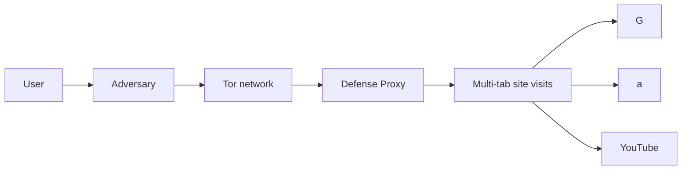
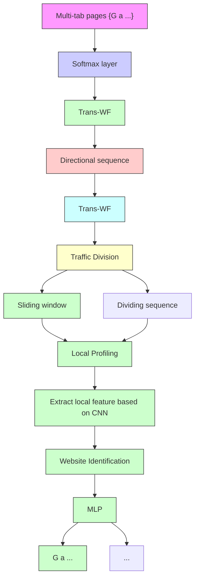
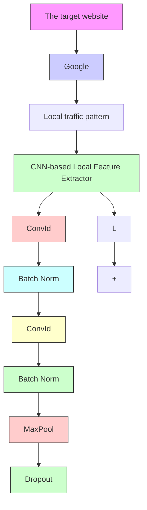

# Robust Multi-tab Website Fingerprinting Attacks in the Wild

Xinhao Deng∗, Qilei Yin†, Zhuotao Liu∗†, Xiyuan Zhao∗, Qi Li∗†, Mingwei Xu∗†, Ke Xu∗†, Jianping Wu∗†

∗Institute for Network Sciences and Cyberspace, Tsinghua University, Beijing, China

†Zhongguancun Laboratory, Beijing, China

{dxh20,zhaoxiyu18}@mails.tsinghua.edu.cn, {zhuotaoliu,qli01,xuke}@tsinghua.edu.cn

{xmw,jianping}@cernet.edu.cn, yinql@zgclab.edu.cn

Abstract—Website fingerprinting enables an eavesdropper to determine which websites a user is visiting over an encrypted connection. State-of-the-art website fingerprinting (WF) attacks have demonstrated effectiveness even against Tor-protected network traffic. However, existing WF attacks have critical limitations on accurately identifying websites in multi-tab browsing sessions, where the holistic pattern of individual websites is no longer preserved, and the number of tabs opened by a client is unknown a priori. In this paper, we propose ARES, a novel WF framework natively designed for multi-tab WF attacks. ARES formulates the multi-tab attack as a multi-label classification problem and solves it using a multi-classifier framework. Each classifier, designed based on a novel transformer model, identifies a specific website using its local patterns extracted from multiple traffic segments. We implement a prototype of ARES and extensively evaluate its effectiveness using our large-scale dataset collected over multiple months (by far the largest multi-tab WF dataset studied in academic papers.) The experimental results illustrate that ARES effectively achieves the multi-tab WF attack with the best F1- score of 0.907. Further, ARES remains robust even against various WF defenses.

# I. INTRODUCTION

Anonymous communication techniques are designed to prevent the content and metadata of network communications from being leaked and/or tampered by malicious activities, such as eavesdropping and man-in-the-middle attack. With millions of daily users [1], the Onion Router (Tor) is one of the most popular anonymous communication tools used to protect web browsing privacy. Tor hides user activities by establishing browsing sessions through Tor circuits with randomly selected Tor relays, where data communication in each Tor circuit is encrypted via ephemeral keys and forwarded in fix-sized cells [2].

Although Tor mitigates the privacy threat to some extent, an adversary can still observe the encrypted traffic of a Tor browsing session and utilize its network traffic patterns (e.g., the packet size and interval statistics) to infer the websites visited by the Tor client. This technique is referred to as the Website Fingerprinting (WF) attack. The rationale behind the WF attack is that the content of each website results in a unique traffic pattern distinguishable from other websites. Prior works [3], [4], [5], [6], [7], [8] demonstrated the effectiveness of WF attack, with best attack accuracy exceeding 95%. In general, these works formulate the WF attack as a classification problem and solve it based on machine learning or deep learning algorithms, such as Support Vector Machine (SVM), Random Forest, and Convolutional Neural Networks (CNN).

The effectiveness of existing WF attacks relies on a common yet unrealistic assumption. In particular, they assume that the client only visits a single web page in one browsing session [9], [10], [11]. This Single Page Assumption does not always hold in practice since normal clients often open multiple browser tabs simultaneously (or within a very short period) [9], [10], [12]. A multi-tab browsing session contains the network traffic generated by different web pages such that their patterns are mixed and become more difficult to be identified. Prior work [9] shows that the performance of the traditional WF attacks decreases drastically on multi-tab browsing scenarios. To relax this assumption, a series of multi-tab WF attacks have been proposed [10], [11], [13], [14], [15].

Most existing multi-tab WF attacks (e.g., [10], [11], [13], [14]) share a similar design architecture: they first divide the whole browsing sessions into multiple clean traffic chunks, where each chunk only contains the traffic of a single website, and then infer the visited websites based on each chunk. However, this architecture has three critical drawbacks. (i) They require prior knowledge of how many tabs are opened by clients. Existing multi-tab WF models are trained given a fixed number of tabs, e.g., 2 tabs in [11]. Yet, their models are not generic enough to handle other tab numbers. Consequently, these methods often yield very limited accuracy in practice when the number of opened tabs is dynamic and unknown a priori. (ii) Even in such a restricted setting, these methods are not resilient to the WF defense mechanisms. WF defenses are designed to perturb the original network traffic patterns by either delaying packet transmissions or padding dummy packets. Prior work [14] shows that lightweight WF defenses [16], [17] can significantly limit the effectiveness of existing multi-tab WF attacks. (iii) Further, their effectiveness further decreases as clients open more browser tabs. The capability of existing multi-tab WF attacks depends on the quality of clean traffic chunks, such as the number of clean chunks and the amount of clean traffic in these chunks. As clients open more browser tabs, it is more difficult to extract clean chunks from a browsing session. A recent art [15] explores WF attacks without explicitly dividing the obfuscated traffic into individual chunks, yet it still requires prior knowledge of

the number of tabs.

Our Work. To address these limitations, we propose a new multi-tab website fingerprinting attack mechanism, ARES. The core idea of ARES is formulating the multi-tab WF attack as a multi-label classification problem to fundamentally relax the required prior knowledge on the number of tabs opened in a browsing session. Towards this end, we design ARES based on a novel multi-tab WF attack framework containing multiple classifiers. Different from the existing end-to-end WF attacks, we transform the complex multi-label classification problems into the multiple binary classification problem, where each classifier is responsible for calculating the possibility that whether a specific monitored website is visited. Afterwards, ARES regularizes and ranks these possibilities, and then outputs the complete label set for all monitored websites based on a pre-determined threshold. Besides the architectural innovation, we also develop a new transformer model, Trans-WF, as the robust individual classifier used in ARES, as described below.

The key observation for designing Trans-WF is that although a website’s clean and holistic traffic pattern is no longer preserved in multi-tab browsing sessions (or simply due to the dummy packets padded by WF defenses), it is still possible to extract multiple local patterns for the website from multiple short traffic segments. Thus, Trans-WF can build signatures for different websites by analyzing the relevance among these local traffic patterns. In its design, Trans-WF uses a traffic division module to divide a browsing session into multiple traffic segments while preserving the integrity of local patterns, and a local profiling module to accurately extract the local patterns from each traffic segment. Moreover, Trans-WF designs an improved attention mechanism to further reduce the impact of noises on calculating the relevance among local patterns.

We extensively evaluate ARES based on a large-scale dataset from over 500 thousand multi-tab Tor browsing sessions collected from May 2021 to December 2021 and from June 2022 to November 2022. In addition to multi-tab browsing, we consider various real-world complexities in WF attacks, including (i) multiple Tor versions co-exist, (ii) clients may visit sub-pages beyond the main page in each website, (iii) the vantage points for collecting traffic could vary (not just at client-side), and (iv) network traffic is generated by real Tor users. To the best of our knowledge, our datasets are by far the largest multi-tab WF datasets.

The contributions of our work are four-fold:

• We develop ARES, a novel WF attack mechanism specifically designed for the generic multi-tab browsing setting where the number of open tabs is dynamic and unknown a priori.   
• ARES employs a one-vs-all framework containing parallel classifiers to formulate the multi-tab WF attack as a multilabel classification problem. At its core, each classifier is powered by a novel Trans-WF design that can accurately identify a specific website without depending on a clean and holistic traffic pattern from the website.

• We release the first real large-scale multi-tab browsing dataset1 that contains more than 500 thousand instances, which is the largest publicly available multi-tab browsing dataset. Crucially, we considered the aforementioned critical WF attack complexities while collecting these data.   
• We implement a prototype of ARES and extensively evaluate it on our large-scale multi-tab browsing dataset. The experimental results illustrate that ARES effectively achieves the best F1-score of 0.907. Even when clients open 5 tabs, on average, ARES can still achieve the F1-score of 0.805 and 260.4% improvements over the baselines. In addition, ARES is more resilient against defenses than existing WF attacks.

# II. BACKGROUND

# A. WF Attacks and Defenses

In general, the fingerprint of a website is a combination of network traffic patterns, such as the statistics of packet sizes and intervals when accessing this website. The Website Fingerprinting (WF) attack is a technique that can identify the websites accessed by a client only by analyzing the client’s browsing traffic, even in encrypted form. When applied by adversaries, the WF attack could compromise normal users’ online privacy. Yet WF could also assist in crime tracking on the dark web.

Technically, the WF attack is formulated as a classification problem solvable using machine learning (ML) algorithms. The existing researches have developed various types of features, e.g., the data volume and packet intervals, to profile the encrypted traffic. A series of ML-based classifiers (e.g., SVM and Random Forest) are used to perform WF attack [3], [4], [5], [10], [18]. In particular, with the emergence of deep learning (DL), DL-based WF attacks achieve automatic feature extraction and higher accuracy [7], [8]. Further, a study [8] shows DL-based WF attacks can effectively bypass the existing WTF-PAD defense [16]. However, DL-based WF attacks require a large amount of training data. Sirinam et al. [19] proposed the triple networks based WF attack to solve this problem. Still, the above WF attacks assume the client’s browsing traffic is purely generated by a single website. The recent multi-tab attacks [10], [11], [13], [14], [15] relaxed this assumption. They propose to divide the network traffic to obtain clean traffic chunks to facilitate website fingerprinting. Yet, they need to know a priori the number of opened tabs, which is challenging in practice. Moreover, they are not resilient to the WF defense.

Website fingerprinting defenses are designed as countermeasures against WF attacks. Existing WF defenses mainly fall into three categories: padding-based, mimicry and regularization defense. Padding-based defenses (such as WTF-PAD [16] and Front [17]) disorder the original traffic pattern by randomly adding dummy packets. Mimicry defenses confuse the traffic pattern, causing the classifiers of WF attacks to falsely identify a website as another one [20], [21]. For example,

flowchart

Fig. 1: The threat model of ARES. Users open multiple tabs to visit different websites, and the middle nodes of the Tor network may be a defense proxy.

Decoy [21] loads a decoy website along with the real website. Regularization defenses make the traffic pattern of all websites fixed by adding dummy packets and delaying packets [22], [23], yet these defenses typically impose high overhead.

# B. Multi-Class and Multi-Label Classification

In machine learning, the Multi-Class classification means that the total number of class labels is greater than two [24] (otherwise, it is a Binary classification). For example, an adversary has a monitoring set with 100 different websites (i.e., class labels) and tries to classify a client’s browsing session (i.e., an instance) into one of these websites.

Regardless of the number of class labels, the Single-Label classification [25] only assigns one class label to an instance, e.g., classifying the species of an animal. By contrast, the Multi-Label classification [26] may assign one or more class labels to one instance simultaneously. Thus, it is more suitable for the multi-tab web browsing scenario, where each encrypted session contains multiple websites.

# III. THREAT MODEL

In our threat model, clients access websites using privacyenhancing techniques like Tor to hide their online activities. Each client could open several browser tabs to load multiple pages from different websites simultaneously (or within a short period of time). As a result, a client’s browsing session may contain encrypted network packets from multiple websites. Further, the client’s browser or on-path Tor relay nodes could have deployed some WF defense mechanisms, such that the traffic patterns of individual websites are no longer preserved. Figure 1 illustrates our threat model.

We consider a privacy-hungry adversary that primarily focuses on de-anonymizing a client’s online activities by inferring the websites visited by the client through website fingerprinting. Therefore, the adversary could deploy multiple traffic mirroring points to record the client’s encrypted network traffic, even before the traffic enters the entry node of the Tor network. Yet, actively delaying or even discarding the client’s network traffic is out of the scope of our threat model.

Compared with the original multi-tab WF threat models [10], [11], [13], [14], [15], our model is more realistic, yet more challenging, for the following three reasons. (i) We consider that the client could have deployed existing WF defenses. As a result, the traffic pattern of individual websites aGenericity represents that the attack can be achieved when the number of opened tabs is dynamic and unknown a priori.

TABLE I: The comparison with the existing methods. 

<table><tr><td>Methods</td><td>Multi-tab</td><td> $Genericity^a$ </td><td> $Robustness^b$ </td><td> $Practicality^c$ </td></tr><tr><td>k-FP [5]</td><td>X</td><td>X</td><td>X</td><td>X</td></tr><tr><td>CUMUL [27]</td><td>X</td><td>X</td><td>X</td><td>X</td></tr><tr><td>AWF [7]</td><td>X</td><td>X</td><td>X</td><td>X</td></tr><tr><td>DF [8]</td><td>X</td><td>X</td><td>√</td><td>X</td></tr><tr><td>Tik-tok [28]</td><td>X</td><td>X</td><td>√</td><td>X</td></tr><tr><td>MWF [14]</td><td>√</td><td>X</td><td>X</td><td>X</td></tr><tr><td>CWF [13]</td><td>√</td><td>X</td><td>X</td><td>X</td></tr><tr><td>BAPM [15]</td><td>√</td><td>X</td><td>X</td><td>X</td></tr><tr><td>ARES</td><td>√</td><td>√</td><td>√</td><td>√</td></tr></table>

bRobustness means that the attack is more resilient against defenses, quantified as performance degradation measured in Table IV.

cPracticality means that the attack considers critical real-world complexities.

could have been perturbed by these anti-WF techniques. (ii) We consider that the number of tabs opened by the client is dynamic and unknown a priori. Prior WF mechanisms assume that the clients always open a fixed number of tabs (e.g., two tabs in [14]) since their models have to be trained and tested under the same specific setting. This is restrictive and unrealistic. (iii) We consider critical real-world complexities in WF attacks. Existing WF attacks [5], [7], [8], [19], [29] are evaluated using over-simplified scenarios, where clients use the same version of Tor Browser, clients only browse the homepage of websites, and network traffic is collectible at the client-side, etc. These assumptions are largely incorrect in practice. Therefore, our design considers a more practical threat model, where multiple versions of Tor Browsers can coexist, clients can visit the sub-pages of websites, and different vantage points for traffic collection other than at the client side are evaluated. We summarize the critical model difference in Table I.

Similar to existing arts [5], [7], [8], [19], our model contains two attack scenarios: closed-world and open-world. The closed-world scenario assumes that clients will only visit a small set of websites (e.g., the Alexa Top 100 websites). In this case, the adversary has the resources to collect data from all these websites (referred to as monitored websites). In the open-world scenario, clients can visit arbitrary websites, and therefore the adversary may only possess training data for a subset of the websites.

# IV. DESIGN OF ARES

In this section, we present the design detail of ARES. We start with an overview of ARES before delving into its individual components.

# A. Overview

As discussed in Section I, prior multi-tab WF attacks require prior knowledge of the number of tabs opened in a browsing session. To fundamentally relax this limitation, ARES regards the multi-tab attack as a multi-label classification problem.

flowchart

Fig. 2: The overview of our generic robust WF attack ARES. ARES is based on multi-tab WF architecture with multiple Trans-WF, and each Trans-WF identifies a specific website. Trans-WF consists of three module: traffic division module, local profiling module and website identification module.

It is challenging to solve the multi-label classification problem because the traffic from different websites is mixed together and the number of visited websites is unknown and dynamic. In particular, due to the high-dimensional features, mixed website traffic, and noises generated by WF defenses, it is difficult to train one classifier for the multi-tab WF attack. Therefore, ARES builds a multi-tab WF attack framework with multiple classifiers, and each classifier is utilized to calculate the possibility of whether a specific website is accessed. Then, ARES integrates the results of individual classifiers to generate the complete label set for all monitored websites without prior knowledge of the number of tabs. Moreover, we develop a novel transformer [30] model called Transformer for Website Fingerprinting (Trans-WF), as the classifier used in ARES. The design of Trans-WF is based on a key observation that a website’s local patterns are still extractable from multiple short traffic segments, even when the entire traffic pattern is no longer preserved in a multi-tab browsing session and under defenses. Thus, Trans-WF can build robust signatures for different websites based on these local patterns.

We plot the architecture of ARES in Figure 2. At a high level, ARES consists of N Trans-WF, where N is the number of monitored websites and the i-th Trans-WF is used to identify the i-th monitored website. ARES combines all Trans-WFs with a softmax layer, and then outputs a label set for all monitored websites. The Trans-WF model consists of a traffic division module (see Section IV-B), a local profiling module (see Section IV-C), and a website identification module (see Section IV-D). A typical WF attack using ARES proceeds as follows. First, ARES extracts the direction sequence to represent outgoing packets via +1 and incoming packets via -1. Second, the traffic division module utilizes multiple sliding windows, to divide the direction sequence into multiple segments while preserving the integrity of local patterns. Third, the local profiling module accurately extracts the key local features representing the local traffic patterns of these segments based on a Convolutional Neural Network (CNN). Afterwards, the website identification module calculates the relevance among the extracted local features via an improved self-attention mechanism as the identification result for one website. Finally, ARES regularizes and ranks these results to output the label set for this browsing session based on a predefined threshold.

The architecture of ARES has two advantages in practical deployment. First, unlike prior WF attacks that rely on a single holistic multi-class classifier, each individual classifier in ARES is only responsible for a simpler problem (i.e., whether a specific website is visited). Thus, different classifiers can be trained and inferred in parallel. Second, the WF attack is not a one-time effort. It needs to be updated regularly because the set of monitored websites may change, and the network patterns of existing websites also change over time. To handle such dynamics, ARES only needs to update the corresponding classifiers, whereas the prior design requires retraining a holistic new model.

# B. Dividing Traffic

The traffic division module is responsible for dividing the whole browsing session (i.e., the direction sequence) into multiple traffic segments to facilitate local pattern extraction. Generally, the local patterns of a website page are correlated with the page’s HTML elements. The packets related to an element tend to concentrate in a small traffic segment, forming a local traffic pattern. However, due to the heterogeneity of these local patterns, the straightforward way of dividing the whole direction sequence into equal-sized non-overlapping segments is inappropriate, since it may break certain local patterns. Further, simply increasing the segment sizes cannot guarantee good performance as it reduces the number of segments, i.e., the number of profiled local patterns.

To preserve the integrity of local patterns, we utilize multiple sliding windows with different start positions in this module. As a result, even if a local pattern is broken by one particular sliding window, it is still possible that its intact pattern is instead captured by some other windows. In particular, let $( \mathbf { d } , \mathbf { y } )$ denotes a client’s browsing session instance, where d is its direction sequence of length ℓ, and y is its label indicator vector. If this instance contains the i-th monitored website, then $\mathbf y _ { i } = 1$ . Otherwise, $\mathbf { y } _ { i } = 0 .$ . We also define w, n as the size of the sliding window and the number of sliding windows, respectively, and the starting point of the ith sliding window is the i-th position of the sequence d. Then, as shown in Equation (1), we can obtain the set S containing all the segments acquired by n sliding windows.

flowchart

Fig. 3: Profiling the traffic pattern generated from each website. The local traffic pattern is correlated with the key elements in a website, which can be extracted by CNN due to its invariant translation.

$$
S = \{W _ {1}, \dots , W _ {n} \}, \tag {1}
$$

where $W _ { i } = \{ { \bf d } [ i + j w : i + j w + w ] \} , \forall j \in [ 0 , [ l / w ] -$ 1] is the set of non-overlapping segments produced by the ith sliding window. Note that we replicate the sequence and splice it together with the original sequence before dividing it, ensuring that the loop division and all the segments are the same lengths. The segments produced by different sliding windows can overlap.

# C. Profiling Local Patterns

The local profiling module is applied to profile the local patterns of a monitored website by extracting the local feature vectors from S. This is challenging for the following two reasons: (i) the locations of the packet sequences representing different local patterns are not fixed; (ii) the irreverent packets in the same segment generated from other websites or WF defenses create non-trivial noises. To overcome this challenge, we design our local profiling module based on Convolutional Neural Networks (CNN). CNN has the characteristic of invariant translation [31], i.e., it can profile the input data into the same embedding vectors regardless of how the input data is shifted. Moreover, prior WF attacks have demonstrated that CNN is more resilient against noises [8], [28].

As shown in Figure 3, the local profiling module contains L blocks and each block consists of two one-dimensional convolution layers (Conv1d), two batch normalization layers (BN) with the ReLU activation function (ReLU) and a maxpooling layer. Besides, we introduce two additional regularization techniques to further enhance our module. (i) Residual connection. It propagates the intermediate output of lower layers to higher layers through skip connections to prevent gradient vanishing. (ii) Dropout. It randomly drops some units (along with their connections) from the neural network during training to alleviate over-fitting.

The input to the first block in our module is a segment s in S, where $s \in \{ - 1 , 1 \} ^ { w }$ . Then, the output of this block is the input of the second block, and so on. In each block, the input is first fed into two convolution layers and two batch normalization layers, to extract the local features. These local feature vectors (i.e., the output of the last batch normalization layer) are connected with their original input via the residual connection, and then they will be fed into the max-pooling layer, for the purpose of retaining the most representative features while progressively reducing their sizes. Thus, the small perturbations in the input traffic segments can be filtered by the max-pooling layer.

# D. Identifying Websites

The website identification module is in charge of analyzing the relevance among local patterns to identify whether a monitored website is visited in the multi-tab browsing session. The self-attention mechanism proposed in the transformer model [30] is a reasonable choice for this goal. The selfattention mechanism is widely applied in natural language processing and computer vision [30], [32], [33], [34], which can capture the dependencies within a sequence. Therefore, the self-attention mechanism can effectively analyze the dependencies of multiple local patterns, and thus identify the target website. Since the number of tabs opened by the client is dynamic, we use a multi-headed self-attention mechanism to capture the information of the target website under the different numbers of tabs. Furthermore, we design the Top-m attention, an improved self-attention mechanism, to enhance the model robustness under WF defenses.

The attention mechanism is a function that computes the relevance between a query and a set of key-value pairs, where the query, key, and value are all vectors projected from the input data individually [30]. In particular, the attention function first calculates the weight of each value using a compatibility function of the query and its corresponding key, and then produces a weighted sum of all values as the output that represents the relevance between the query and key-value pairs. When we apply this mechanism to correlate different segments of the same sequence, namely the self-attention [30], it can convert the sequence into a new representation that reveals its internal relevance. Thus, we can take the local feature vectors as the input of the self-attention function, and utilize the corresponding output as the fingerprint of a monitored website. We present the details of the vanilla selfattention mechanism in Appendix A.

However, when identifying a monitored website under multi-tab browsing scenarios, the vanilla self-attention mechanism has a severe shortcoming in that it is not resilient to the traffic noises generated by other websites and WF defenses. In particular, this mechanism contains a fully-connected attention layer such that the output vector for an input vector (i.e., a local feature vector) depends on the relevance between this input with all other inputs (i.e., all other local feature vectors). As a result, the local features extracted from noisy traffic inevitably reduce the accuracy of the output.

To handle this issue, we design an improved attention layer, namely Top-m Attention, based on [35]. This layer calculates the output for an input vector based on the Topm weight values computed by its corresponding query and all keys, rather than all weight values. In general, the traffic of the monitored website is less correlated with the traffic generated by other websites or WF defenses than itself. This means that the monitored website’s local features and the local features from other websites tend to have smaller attentionbased weight values. Thus, we can filter out the interference from the traffic noises via the Top-m selection strategy. Let Q, K, and V donate the query, key, and value matrices, respectively. We formally describe this new attention layer design in Equation (2):

```mermaid
graph TD
    A["Local features from n divisions"] --> B["Concat"]
    B --> C["Multi-head"]
    C --> D["Top-m Attention"]
    D --> E["Linear"]
    E --> F["Att"]
    F --> G["Att"]
    G --> H["..."]
    H --> I["Att"]
    I --> J["Att"]
    J --> K["..."]
    K --> L["Att"]
    L --> M["Att"]
    M --> N["..."]
    N --> O["Att"]
    O --> P["Att"]
    P --> Q["..."]
    Q --> R["Att"]
    R --> S["Att"]
    S --> T["..."]
    T --> U["Att"]
    U --> V["Att"]
    V --> W["..."]
    W --> X["Att"]
    X --> Y["Att"]
    Y --> Z["..."]
    Z --> AA["Att"]
    AA --> AB["Att"]
    AB --> AC["..."]
    AC --> AD["Att"]
    AD --> AE["Att"]
    AE --> AF["..."]
    AF --> AG["Att"]
    AG --> AH["Att"]
    AH --> AI["..."]
    AI --> AJ["Att"]
    AJ --> AK["Att"]
    AK --> AL["..."]
    AL --> AM["Att"]
    AM --> AN["Att"]
    AN --> AO["..."]
    AO --> AP["Att"]
    AP --> AQ["Att"]
    AQ --> AR["..."]
    AR --> AS["Att"]
    AS --> AT["Att"]
    AT --> AU["..."]
    AU --> AV["Att"]
    AV --> AW["Att"]
    AW --> AX["..."]
    AX --> AY["Att"]
    AY --> AZ["Att"]
    AZ --> BA["..."]
    BA --> BB["Att"]
    BB --> BC["Att"]
    BC --> BD["..."]
    BD --> BE["Att"]
    BE --> BF["Att"]
    BF --> BG["..."]
    BG --> BH["Att"]
    BH --> BI["Att"]
    BI --> BJ["..."]
    BJ --> BK["Att"]
    BK --> BL["Att"]
    BL --> BM["..."]
    BM --> BN["Att"]
    BN --> BO["Att"]
    BO --> BP["..."]
    BP --> BQ["Att"]
    BQ --> BR["Att"]
    BR --> BS["..."]
    BS --> BT["Att"]
    BT --> BU["Att"]
    BU --> BV["..."]
    BV --> BW["Att"]
    BW --> BX["Att"]
    BX --> BY["..."]
    BY --> BZ["Att"]
    BZ --> CA["Att"]
    CA --> CB["..."]
    CB --> CC["Att"]
    CC --> CD["Att"]
    CD --> CE["..."]
    CE --> CF["Att"]
    CF --> CG["Att"]
    CG --> CH["..."]
    CH --> CI["Att"]
    CI --> CJ["Att"]
    CJ --> CK["..."]
    CK --> CL["Att"]
    CL --> CM["Att"]
    CM --> CN["..."]
    CN --> CO["Att"]
    CO --> CP["Att"]
    CP --> CQ["..."]
    CQ --> CR["Att"]
    CR --> CS["Att"]
    CS --> CT["..."]
    CT --> CU["Att"]
    CU --> CV["Att"]
    CV --> CW["..."]
    CW --> CX["Att"]
    CX --> CY["Att"]
    CY --> CZ["..."]
    CZ --> DA["Att"]
```

flowchart

Fig. 4: The multi-head top-m attention method correlates local traffic patterns for website fingerprinting even in the presence of noise interference. Different from the full connection of the original Transformer, Trans-WF keeps only the top-m attention.

$$
A t t e n t i o n ^ {T o p - m} (\boldsymbol {Q}, \boldsymbol {K}, \boldsymbol {V}) = s o f t m a x (\Gamma (\frac {\boldsymbol {Q} \boldsymbol {K} ^ {T}}{\sqrt {d}})) \boldsymbol {V}, (2)
$$

$$
[ \Gamma (A) ] _ {i j} = \left\{ \begin{array}{l l} A _ {i j}, & A _ {i j} \text {   is   the   top- } m \text {   largest   elements   in   row   } j, \\ \epsilon , & \text { otherwise }, \end{array} \right. \tag {3}
$$

where Γ(·) defines a row-wise top-m selection operation and ϵ is a small enough constant. In our website identification module, we replace the vanilla attention layer with our new design.

As the number of tabs opened by the client is unknown and dynamic, the correlation between local patterns varies with the number of tabs. Therefore, we parallel multiple Top-m attention layers to compose a multi-head Top-m attention layer. As shown in Figure 4, it allows Trans-WF to jointly capture the relevance among the local features even in the dynamic number of tabs , such that the relevance representations can be enriched to achieve even more accurate website identifications. For the i-th head, its output is computed via Equation (4):

$$
h e a d _ {i} = \text { Attention } ^ {\text { Top - m }} (\boldsymbol {Q} \boldsymbol {W} _ {i} ^ {Q}, \boldsymbol {K} \boldsymbol {W} _ {i} ^ {K}, \boldsymbol {V} \boldsymbol {W} _ {i} ^ {V}), \tag {4}
$$

where ${ \pmb W } _ { i } ^ { Q } , { \pmb W } _ { i } ^ { K } , { \pmb W } _ { i } ^ { V } \ \in \ \mathbb { R } ^ { d \times d _ { h } }$ are the weight matrices specific to this head, where $d _ { h }$ is the dimension of the output vector of each head. Let h denotes the number of heads, and we set $d _ { h } \ = \ d / h$ . Note that each head performs its own task individually. Then, the results of each head will be concatenated and transformed by a linear projection. Let Λ(X) denotes the output of our multi-head Top-m attention layer. Finally, we can produce Λ(X) via Equation (5).

$$
\Lambda (\boldsymbol {X}) = \operatorname{Concat} (h e a d _ {1}, \dots , h e a d _ {h}) \boldsymbol {W} ^ {O}, \tag {5}
$$

where $W ^ { O } \in \mathbb { R } ^ { h d _ { h } \times d }$ is the weight matrix. With the output of the attention layer, we utilize a batch normalization layer and a Multilayer perceptron (MLP) to identify the existence of a target website. Also, we apply the techniques of residual connection and dropout to avoid the problems of gradient vanishing and over-fitting, respectively. The identification result Φ(X) of a target website can be computed as follows:

$$
\Phi (\boldsymbol {X}) = \boldsymbol {M L P} (\boldsymbol {L N} (\boldsymbol {X} + D r o p o u t (\Lambda (\boldsymbol {X})))), \tag {6}
$$

$$
\boldsymbol {L} \boldsymbol {N} (\boldsymbol {X}) = \frac {\boldsymbol {g}}{\sqrt {\sigma^ {2} + \epsilon}} \odot (\boldsymbol {X} - \mu) + \boldsymbol {b}, \tag {7}
$$

where LN is the layer normalization, g, b are the gain and bias parameters, µ, σ are the mean and the variance of X, ⊙ is the element-wise multiplication between two vectors, and ϵ is a small constant to prevent division by zero. The MLP utilizes the common softmax function.

To mitigate the potential over-fitting of Trans-WF, we thus use Droppath [36] in Trans-WF. The Droppath randomly drops some training instances in the residual connection during training, causing these instances to skip part of the training. In particular, the Droppath achieves differential model training, which can alleviate the over-fitting.

# V. EVALUATION

In this section, we evaluate the effectiveness of ARES with real-world multi-tab datasets. We also compare the performance of our work with the state-of-the-art WF attacks.

# A. Experimental Setup

Implementation. We prototype ARES using PyTorch with more than 1,500 lines of code. We show the default parameter values in Table VII and we further study the impacts of parameter choices in Appendix B. We use 10-fold crossvalidation and calculate the average values as the experimental results.

Dataset. We collect and release the first real-world largescale multi-tab browsing datasets. Our datasets encompass 8 categories of data.

• Multi-tab datasets: We collect multi-tab instances of Alexatop websites in the closed-world scenario and the openworld scenario, respectively. The number of tabs varies from 2 to 5.   
• Datasets with WF defense in place: We deploy 4 types of defense mechanisms (i.e., Random, WTF-PAD [16], Front [17], and Tamaraw [22]) in Tor via WFDefProxy [37], and then collect the 2-tab defense datasets.   
• Datasets for dynamic settings: We randomly sample the traffic instances from the multi-tab and defense datasets under different settings and mix them together.   
• Datasets for websites beyond Alexa-top 100 collection: we collect a 5-tab dataset containing 10 websites on darkweb (Tor is often abused to access darkweb) and 90 websites outside the Alexa-top 100 collection.

• Datasets for multiple Tor Browser versions: we consider the scenario where multiple Tor browser versions coexist. We collect a 5-tab dataset from five versions of Tor Browser, including version 10.0.15, 10.5, 11.0.3, 11.0.10, and 11.5.   
• Datasets for subpage browsing: We consider the case where the clients can visit subpages of a website beyond the homepage. We collect a 5-tab dataset based on 1000 subpages of 100 websites.   
• Datasets for different vantage points: We collect a 5-tab dataset for exploring the effect of vantage points where the adversary can collect network traffic.   
• Datasets generated by real users: We collect a dataset using the network traffic generated based on the browsing behavior of 50 volunteers.

Details of dataset construction are given in Appendix C.

Baseline. We use seven representative WF attacks as our baseline methods, divided into three categories.

• Single-tab WF attacks: We select three classical single-tab WF attacks: CUMUL [27], k-FP [5] and AWF [7]. CUMUL and k-FP utilize carefully selected features and machine learning algorithms. AWF applies deep learning models to generate the website fingerprints automatically.   
• WF attacks resilient to defenses: We select two state-ofthe-art (SOTA) single-tab WF attacks that are resilient to WF defenses: DF [8] and Tik-tok [28]. To bypass WF defense, DF utilizes deep learning models and Tik-tok introduces the timing-based features.   
• Multi-tab WF attacks: We choose three state-of-the-art (SOTA) multi-tab WF attacks: MWF [14], CWF [13] and BAPM [15]. MWF is an extended version of SWF [11]. It performs the WF attack by locating the clean traffic chunk generated by the first website and can only output a single label (i.e., the first website’s category). CWF divides the whole session traffic into segments and classifies each one separately. It can achieve multiple labels for different websites based on the voting results. BAPM is an end-to-end WP attack built upon the mulit-head attention mechanism, where one attention head calculates the probability of visiting one specific website.

Among all these baselines, only CWF and BAPM output multiple website labels in multi-tab WF attack scenarios. Therefore, we extend the deep learning-based baselines, i.e., AWF, DF, and Tik-tok, so that they can output multiple website labels for multi-tab WF attacks. We further tune the designs of these attacks to achieve the best performance under multi-tab settings. We discuss the details of the extension in Appendix D.

Metrics. We use six metrics in two categories in evaluations:

• Multi-Label Metrics: We use three widely-used multi-label classification metrics: AUC [38], P@K and MAP@K [39]. These metrics evaluate the predicted label set of each instance individually so that we can calculate the average results for all testing instances. Recall that y is the true label vector for an instance x and if x browses the i-th website,

line

| The number of tabs | ARES AUC | ARES MAP@k | BAPM AUC | BAPM MAP@k | DF AUC | DF MAP@k | AWF AUC | AWF MAP@k | CWF AUC | CWF MAP@k |
| ------------------- | -------- | ---------- | -------- | ---------- | ------ | -------- | ------- | --------- | ------- | --------- |
| 2                   | 0.90     | 0.88       | 0.75     | 0.73       | 0.78   | 0.76     | 0.45    | 0.43      | 0.70    | 0.68      |
| 3                   | 0.88     | 0.85       | 0.72     | 0.70       | 0.75   | 0.73     | 0.42    | 0.40      | 0.68    | 0.65      |
| 4                   | 0.85     | 0.82       | 0.68     | 0.66       | 0.72   | 0.70     | 0.40    | 0.38      | 0.65    | 0.62      |
| 5                   | 0.82     | 0.79       | 0.65     | 0.63       | 0.69   | 0.67     | 0.38    | 0.36      | 0.62    | 0.59      |

Fig. 5: The AUC and MAP@k of multi-tab WF attacks with different numbers of tabs

then $\mathbf { y } _ { i } ~ = ~ 1$ . Otherwise, $\mathbf { y } _ { i } ~ = ~ 0 .$ . For x, yˆ indicates the predicted label vector (i.e., the probability of each website). P@K and MAP@K are two metrics for measuring the k websites with top-k highest probabilities in ${ \hat { y } } ,$ while AUC is a metric for measuring all websites. In particular, P@K measures how many browsed websites existed in the top-k predicted websites.

We calculate P@K for x via Equation (8), where $r _ { k } ( \hat { y } )$ is the set of websites with top-k highest probabilities in yˆ.

$$
\mathrm{P} @ \mathrm{k} = \frac {1}{k} \sum_ {l \in r _ {k} (\hat {y})} \mathbf {y} _ {l}. \tag {8}
$$

The MAP@K metric extends P@K, to further evaluate whether the browsed websites have higher probabilities than the non-browsed websites in the top-k prediction result. Since a MAP@K score integrates the P@K scores with different k values, it is not necessary to change the k value for a specific tab setting. We can compute MAP@K as follows: according to Equation (9).

$$
\operatorname{MAP} @ \mathrm{k} = \frac {\sum_ {i = 1} ^ {k} P @ i}{k}. \tag {9}
$$

• Single-Label Metrics: Since existing single-tab WF attacks [27], [5] can only output a single label, we use three single-label metrics, i.e., Precision, Recall, and F1- score, for fair comparisons. These metrics evaluate the prediction results of all instances for each website individually. Based on instances’ prediction results, we can calculate the numbers of true positive instances (TP), false positive instances (FP), true negative instances (TN), and false negative instances (FN) for each website, respectively. These three metrics for each website can be computed as: $\begin{array} { r } { \mathsf { P r e c i s i o n } = \frac { T P } { T P + F P } , \mathsf { R e c a l l } = \frac { T P } { T P + F N } } \end{array}$ T PT P+F N , and F1-Score = 2×Precision×Recall . We can compute the average results for Precision+Recall all websites.

# B. Multi-tab WF Attacks in the Closed-World.

We first evaluate ARES in the closed-world scenario. We compare ARES with AWF, DF, Tik-tok, and CWF using the multi-label metrics. Then we compare ARES with all baselines using the single-label metrics.

  
Fig. 6: Comparison with existing multi-tab WF attacks in the multi-label classification evaluation, where P@K is the precision at top k.

Multi-Label Evaluation Results. Figure 5 shows the AUC and MAP@k results. ARES achieves higher AUC scores than the baselines under different tab settings. In particular, ARES achieves an AUC score of around 0.903 under the 2-tab setting, while the scores for Tik-tok, DF, AWF and CWF are about 0.801, 0.802, 0.712, and 0.708, respectively. On average, ARES has around 20% improvements over these baselines. Even under the most challenging 5-tab setting, ARES achieves an AUC score of about 0.708. Compared with the effective baseline multi-tab WF attack, i.e., CWF, ARES still achieves more than 28.6% improvement. Note that, we do not include BAPM here since it is infeasible to compute AUC for BAPM. In particular, when the number of tabs is k, BAPM only outputs the rank of the top k websites that are most likely to be visited. However, the AUC needs to be calculated based on the rank of all websites.

Figure 5 also illustrates the MAP@K results. We set the k value as the number of tabs, e.g., we use MAP@2 to assess the results of 2-tab instances. We see that the MAP@K performance of ARES is always better than other WF attacks. Specifically, the MAP@K average improvements of ARES over BAPM, Tik-tok, DF, AWF and CWF are about 33.4%, 46.6%, 53.4%, 187.5%, 206.7%, respectively. It demonstrates that, even in the top-k prediction results, ARES can still obtain much higher probabilities on the browsed websites than the non-browsed ones. Thus, ARES can identify the browsed websites more accurately than all state-of-the-art WF attacks.

We further evaluate the top-k predicted websites of different attacks using the P@K metric. In particular, P@K measures how many browsed websites existed in the top-k predicted websites. As shown in Figure 6, ARES outperforms the other WF attacks under different tab settings. For instance, ARES achieves the best P@2 score (around 0.779) under the 2-tab setting, while the P@2 scores of other methods are all lower than 0.65. Similarly, under the 3 and 4-tab settings, ARES can still achieve P@2 scores higher than 0.71, while the other WF attacks achieve less than 0.58 P@2 scores. These results demonstrate that the adversary can identify a greater number of websites that are actually browsed by the client using the top-k predictions given by ARES. Note that the P@K score slightly decreases as k increases. This, however, does not indicate significant effectiveness degradation of ARES. According to Equation (8), k is independent of the prediction result in yˆ. The P@K decrease is mainly caused by the increase of the denominator (i.e., k) in Equation (8). Similar to AUC, we cannot calculate P@k of BAPM when k is greater than the number of tabs. Therefore, we do not include BAPM in Figure 6.

Single-Label Evaluation Results. As shown in Table II, we can see that ARES always achieves the best performance for all single-label metrics. For instance, the F1-score of ARES is as high as 0.907 under the 2-tab setting, while the highest F1-score achieved by any baseline is lower than 0.740. On average, ARES improves the F1-scores of the baselines by 132.6%. More importantly, the performance of ARES is relatively stable as the clients open more tabs. Even under the 5-tab setting, ARES still achieves a F1-score of 0.805, while the F1-scores of all baselines are lower than 0.530. On average, ARES shows an average 260.4% F1- score improvement over all baselines in this setting. Such significant gains are because under the 5-tab setting, it is extremely difficult to identify the clean traffic chunks of a specific web page, resulting in very low WF accuracies by these baseline methods. Further, as shown in Table II, we notice that the performance of ARES slightly declines with more tabs (roughly 3.8% reduction on average per additional tab). Thus, ARES predictably achieves reasonably effective WF attacks even when the number of tabs exceeds five.

Remark. Overall, the above evaluation results demonstrate that ARES can accurately identify the browsed websites in multi-tab scenarios. Moreover, it validates the performance advantage of our work over all existing WF attacks, especially when clients open more tabs. The main reason is that ARES can build robust signatures for different websites only based on the local features extracted from multiple traffic segments.

# C. Multi-tab WF Attack in the Open-World

Now we evaluate the performance of ARES in the openworld scenario. Recall that the open-world experiments regard all non-monitored websites as one website category, while each monitored website is viewed as an individual category. As a result, the number of instances in the non-monitored website category is much larger than that of each monitored category. To avoid the data imbalance problem, we follow the settings in the prior arts [7], [8] that mix all closed and open-world instances collected from the same tab setting in our evaluation. For instance, we combine the 2-tab closed and open-world instances to run the 2-tab open-world experiment.

TABLE II: Comparisons with prior arts with different tabs in the closed-world single-label classification evaluation. 

<table><tr><td rowspan="2">Attacks</td><td colspan="3">2-tab</td><td colspan="3">3-tab</td><td colspan="3">4-tab</td><td colspan="3">5-tab</td></tr><tr><td>Precision</td><td>Recall</td><td>F1-score</td><td>Precision</td><td>Recall</td><td>F1-score</td><td>Precision</td><td>Recall</td><td>F1-score</td><td>Precision</td><td>Recall</td><td>F1-score</td></tr><tr><td>CUMUL</td><td>0.328</td><td>0.327</td><td>0.315</td><td>0.219</td><td>0.230</td><td>0.215</td><td>0.201</td><td>0.208</td><td>0.196</td><td>0.160</td><td>0.170</td><td>0.158</td></tr><tr><td>k-FP</td><td>0.668</td><td>0.626</td><td>0.633</td><td>0.589</td><td>0.553</td><td>0.567</td><td>0.563</td><td>0.513</td><td>0.519</td><td>0.486</td><td>0.419</td><td>0.423</td></tr><tr><td>MWF</td><td>0.187</td><td>0.171</td><td>0.170</td><td>0.135</td><td>0.130</td><td>0.128</td><td>0.133</td><td>0.129</td><td>0.127</td><td>0.101</td><td>0.098</td><td>0.095</td></tr><tr><td>AWF</td><td>0.414</td><td>0.470</td><td>0.419</td><td>0.286</td><td>0.354</td><td>0.287</td><td>0.203</td><td>0.304</td><td>0.219</td><td>0.225</td><td>0.287</td><td>0.210</td></tr><tr><td>DF</td><td>0.701</td><td>0.729</td><td>0.710</td><td>0.660</td><td>0.740</td><td>0.688</td><td>0.550</td><td>0.675</td><td>0.596</td><td>0.503</td><td>0.601</td><td>0.529</td></tr><tr><td>Tik-tok</td><td>0.689</td><td>0.722</td><td>0.701</td><td>0.425</td><td>0.496</td><td>0.452</td><td>0.316</td><td>0.414</td><td>0.349</td><td>0.263</td><td>0.356</td><td>0.288</td></tr><tr><td>CWF</td><td>0.417</td><td>0.297</td><td>0.304</td><td>0.348</td><td>0.256</td><td>0.240</td><td>0.288</td><td>0.364</td><td>0.268</td><td>0.315</td><td>0.277</td><td>0.224</td></tr><tr><td>BAPM</td><td>0.748</td><td>0.732</td><td>0.731</td><td>0.665</td><td>0.651</td><td>0.649</td><td>0.631</td><td>0.616</td><td>0.615</td><td>0.522</td><td>0.502</td><td>0.498</td></tr><tr><td>ARES</td><td>0.913</td><td>0.906</td><td>0.907</td><td>0.913</td><td>0.904</td><td>0.905</td><td>0.902</td><td>0.896</td><td>0.894</td><td>0.818</td><td>0.815</td><td>0.805</td></tr></table>

Fig. 7: Comparison of AUC of monitored websites $\mathsf { A U C } _ { M }$ and non-monitored websites $\mathsf { A U C } _ { N }$ with different tab settings in the open-world scenario.   
TABLE III: Comparison with the existing multi-tab WF attacks in the open-world scenario. 

<table><tr><td># of tabs</td><td>Metrics</td><td>CWF</td><td>AWF</td><td>DF</td><td>Tik-tok</td><td>BAPM</td><td>ARES</td></tr><tr><td rowspan="2">2-tab</td><td>P@2</td><td>0.206</td><td>0.288</td><td>0.488</td><td>0.490</td><td>0.631</td><td>0.752</td></tr><tr><td>MAP@2</td><td>0.229</td><td>0.375</td><td>0.656</td><td>0.658</td><td>0.671</td><td>0.827</td></tr><tr><td rowspan="2">3-tab</td><td>P@3</td><td>0.196</td><td>0.193</td><td>0.318</td><td>0.338</td><td>0.496</td><td>0.587</td></tr><tr><td>MAP@3</td><td>0.241</td><td>0.271</td><td>0.496</td><td>0.518</td><td>0.581</td><td>0.747</td></tr><tr><td rowspan="2">4-tab</td><td>P@4</td><td>0.160</td><td>0.155</td><td>0.247</td><td>0.272</td><td>0.432</td><td>0.528</td></tr><tr><td>MAP@4</td><td>0.210</td><td>0.225</td><td>0.413</td><td>0.440</td><td>0.521</td><td>0.713</td></tr><tr><td rowspan="2">5-tab</td><td>P@5</td><td>0.147</td><td>0.138</td><td>0.205</td><td>0.221</td><td>0.338</td><td>0.438</td></tr><tr><td>MAP@5</td><td>0.208</td><td>0.198</td><td>0.345</td><td>0.368</td><td>0.418</td><td>0.604</td></tr></table>

We first measure the AUC scores for monitored and nonmonitored websites individually, indicated by $\mathsf { A U C } _ { M }$ and $\mathsf { A U C } _ { N }$ . Figure 7 shows that ARES achieves the best performance among all tab settings. For instance, under the 2-tab setting, ARES achieves the best $\mathsf { A U C } _ { M }$ score of about 0.886 and its improvements over the baselines Tik-tok, DF, AWF, and CWF are about 11.2%, 11.4%, 23.2%, and 25.7%, respectively. We notice that the $\mathsf { A U C } _ { N }$ score of ARES is slightly lower than its $\mathsf { A U C } _ { M }$ score under the same tab settings. Recall that each open-world instance visits one unique non-monitored website, whereas the total number of non-monitored websites is huge. Thus, this slight decrease mainly attributes to the traffic pattern difference between the training and testing set of the classifier regarding the non-monitored website category. Further, Table III lists the P@K and MAP@K scores, where k is the number of opened tabs. We can see that ARES achieves the best P@2 and MAP@2 of 0.752 and 0.827 in the 2- tab setting. Under the most complicated 5-tab setting, the MAP@5 of ARES remains above 0.60 and its improvements over the baselines are non-trivial, ranging from 44.5% to 205.1%.

Remark. The experimental results in the open-world scenarios demonstrate that ARES is able to accurately identify the websites browsed by the clients even if the complete set of potentially visited websites is unknown a priori.

# D. Multi-tab WF Attack under Defenses

Next, we evaluate the attack performance under WF defenses. Table IV lists the experimental results. ARES achieves robust WF attack performance in the majority of the scenarios and outperforms all baselines. In particular, under the random defense, ARES achieves the best AUC score of about 0.881, while the AUC scores of other WF attacks are less than 0.770. Under the WTF-PAD defense, the AUC score of ARES is 0.843 and its improvements over the existing WF attacks DF and Tik-tok are about 19.7% and 18.4%, respectively. When facing the SOTA lightweight WF defense Front, ARES achieves the best AUC score of 0.761. We observe that all WF attacks have obvious performance degradation against the Tamaraw defense. Note that Tamaraw is a heavyweight defense with high latency and data overheads. Thus, it is difficult to deploy Tamaraw in the real Tor network [17]. Even against this defense, ARES still outperforms all baselines with nontrivial margins. For instance, compared with the SOTA robust WF attack Tik-tok, ARES increases the AUC, Precision and MAP@2 by 11.9%, 44.6% and 43.0%, respectively.

Remark. To sum up, these experimental results demonstrate that ARES can perform accurate multi-tab WF attacks even when various WF defenses are present. Compared with the SOTA robust WF attacks, ARES is more resilient against WF defenses. The robustness of ARES is attributed to our Trans-WF model. It builds robust website fingerprints based on local traffic patterns with less noises and proposes several designs to offset the impacts of noises.

# E. Multi-tab Attack under Dynamic Settings

Moreover, we evaluate the effectiveness of ARES in the following dynamic settings. (i) Dynamic multi-tab setting: the adversary cannot know the number of tabs opened by the client in advance. (ii) Dynamic defense setting: the adversary has no prior knowledge about the deployed WF defense. We use AUC, Precision, and MAP@k to evaluate the performance of multi-tab WF attacks in this section.

TABLE IV: AUC, Precision (Pre) and MAP@k of WF attacks on four representative defenses in the 2-tab setting. 

<table><tr><td rowspan="2">Attacks</td><td colspan="3">Random</td><td colspan="3">WTF-PAD</td><td colspan="3">Front</td><td colspan="3">Tamaraw</td></tr><tr><td>AUC</td><td>Pre</td><td>MAP@2</td><td>AUC</td><td>Pre</td><td>MAP@2</td><td>AUC</td><td>Pre</td><td>MAP@2</td><td>AUC</td><td>Pre</td><td>MAP@2</td></tr><tr><td>CWF</td><td>0.610</td><td>0.501</td><td>0.248</td><td>0.575</td><td>0.431</td><td>0.229</td><td>0.542</td><td>0.355</td><td>0.187</td><td>0.520</td><td>0.296</td><td>0.085</td></tr><tr><td>AWF</td><td>0.625</td><td>0.529</td><td>0.309</td><td>0.583</td><td>0.462</td><td>0.275</td><td>0.556</td><td>0.392</td><td>0.212</td><td>0.529</td><td>0.305</td><td>0.123</td></tr><tr><td>DF</td><td>0.743</td><td>0.748</td><td>0.537</td><td>0.704</td><td>0.649</td><td>0.509</td><td>0.592</td><td>0.526</td><td>0.341</td><td>0.542</td><td>0.447</td><td>0.207</td></tr><tr><td>Tik-tok</td><td>0.768</td><td>0.756</td><td>0.651</td><td>0.712</td><td>0.654</td><td>0.546</td><td>0.628</td><td>0.551</td><td>0.380</td><td>0.548</td><td>0.469</td><td>0.228</td></tr><tr><td>BAPM</td><td>-</td><td>0.772</td><td>0.672</td><td>-</td><td>0.686</td><td>0.568</td><td>-</td><td>0.607</td><td>0.435</td><td>-</td><td>0.406</td><td>0.160</td></tr><tr><td>ARES</td><td>0.881</td><td>0.892</td><td>0.810</td><td>0.843</td><td>0.868</td><td>0.712</td><td>0.761</td><td>0.792</td><td>0.627</td><td>0.613</td><td>0.678</td><td>0.326</td></tr></table>

TABLE V: AUC, Precision (Pre) and MAP@k of WF attacks under dynamic settings. 

<table><tr><td rowspan="2">Attacks</td><td colspan="3">Multi-tab</td><td colspan="3">Defense</td></tr><tr><td>AUC</td><td>Pre</td><td>MAP@5</td><td>AUC</td><td>Pre</td><td>MAP@2</td></tr><tr><td>CWF</td><td>0.608</td><td>0.437</td><td>0.247</td><td>0.538</td><td>0.341</td><td>0.135</td></tr><tr><td>AWF</td><td>0.605</td><td>0.359</td><td>0.219</td><td>0.543</td><td>0.368</td><td>0.146</td></tr><tr><td>DF</td><td>0.651</td><td>0.686</td><td>0.388</td><td>0.556</td><td>0.503</td><td>0.232</td></tr><tr><td>Tik-tok</td><td>0.661</td><td>0.693</td><td>0.393</td><td>0.591</td><td>0.529</td><td>0.287</td></tr><tr><td>BAPM</td><td>-</td><td>0.712</td><td>0.429</td><td>-</td><td>0.575</td><td>0.304</td></tr><tr><td>ARES</td><td>0.738</td><td>0.825</td><td>0.557</td><td>0.708</td><td>0.774</td><td>0.521</td></tr></table>

TABLE VI: Further evaluation of ARES under dynamic settings. Entry in row X, column Y corresponds to the AUC and Precision (Pre) obtained by training with X-tab instances and testing with Y-tab instances. 

<table><tr><td rowspan="2"># of tabs</td><td colspan="2">3-tab (Test)</td><td colspan="2">4-tab (Test)</td><td colspan="2">5-tab (Test)</td></tr><tr><td>AUC</td><td>Pre</td><td>AUC</td><td>Pre</td><td>AUC</td><td>Pre</td></tr><tr><td>3-tab (Train)</td><td>0.855</td><td>0.908</td><td>0.766</td><td>0.824</td><td>0.713</td><td>0.758</td></tr><tr><td>4-tab (Train)</td><td>0.813</td><td>0.828</td><td>0.834</td><td>0.896</td><td>0.715</td><td>0.747</td></tr><tr><td>5-tab (Train)</td><td>0.790</td><td>0.796</td><td>0.750</td><td>0.775</td><td>0.747</td><td>0.816</td></tr></table>

As listed in Table V, the performance of ARES is superior to all baselines under the dynamic settings. For instance, the AUC scores of ARES are 0.738 and 0.708 in the dynamic multi-tab and dynamic defense setting, respectively, and the average improvements over all baselines are 17.1% and 27.3%, respectively. Similarly, under the dynamic multi-tab setting, ARES achieves an average MAP@5 improvement of 79.0% over all baselines. Meanwhile, ARES’s average MAP@2 improvement under the dynamic defense setting is 164.1%.

In Table VI, we show the further evaluation of ARES under dynamic settings. We train ARES with 3-tab, 4-tab, and 5-tab instances separately, and then test ARES with additional 3- tab, 4-tab, and 5-tab instances, respectively. We find that the attacks perform of ARES best when trained and tested using instances from the same number of tabs. When the number of tabs in the training and testing instances is different, ARES can still achieve an effective WF attack. For example, when we train ARES with 5-tab training instances, ARES achieves the precision of 0.796, 0.775, and 0.816 with 3-tab, 4-tab, and 5-tab testing instances, respectively. Compared to the attack performance with the 5-tab testing instances, ARES is only 2.45% and 5.02% degraded in Precision with 3-tab and 4-tab testing instances, respectively.

line

| Cosine distance | Day 10 | Day 20 | Day 30 | Day 60 |
| --------------- | ------ | ------ | ------ | ------ |
| 0.0             | 100    | 100    | 100    | 100    |
| 0.1             | 100    | 100    | 100    | 50     |
| 0.2             | 100    | 100    | 100    | 75     |
| 0.3             | 100    | 100    | 100    | 100    |

(a) Concept drift of websites

line

| Time gap (days) | ARES  | DF    | CWF   | Tik-tok | AWF   |
| --------------- | ----- | ----- | ----- | ------- | ----- |
| 0               | 0.90  | 0.85  | 0.72  | 0.70    | 0.70  |
| 10              | 0.88  | 0.83  | 0.71  | 0.69    | 0.69  |
| 20              | 0.85  | 0.81  | 0.70  | 0.68    | 0.68  |
| 30              | 0.82  | 0.79  | 0.69  | 0.67    | 0.67  |
| 60              | 0.70  | 0.65  | 0.64  | 0.64    | 0.64  |

(b) Comparison of WF attacks   
Fig. 8: Evaluation of concept drift. (a) We use the cosine distance of traffic features to measure the degree of concept drift of websites for different time gaps. We show a cumulative distribution of the number of websites. (b) The comparison of WF attacks under the impact of concept drift.

Remark. The significant performance improvements above demonstrate the applicability of ARES in practical deployment. This attributes to our novel architecture of ARES that can effectively learn the patterns of various websites simultaneously. Unlike the prior WF attacks that apply a single holistic multi-class classifier, each classifier in ARES only checks the existence of one specific website under different settings. Thus, ARES achieves more robust website fingerprints regardless of how many tabs are opened or what type of defenses is deployed.

# F. Evaluating Concept Drift

When a website’s contents (e.g., texts, images, and ads) are updated, its traffic patterns also change accordingly. Therefore, the difference between the training and testing website data will be enlarged over time. This phenomenon referred to as concept drift [40], [41], can result in significant performance degradation of WF attacks. In this section, we first measure the concept drift of websites at different time gaps, and then we evaluate the robustness of ARES in the presence of concept drift. In particular, we only train ARES using the 2- tab instances collected before August 1st, 2022 and evaluate its performance on testing the instances collected after some time (i.e., 0 days, 10 days, 20 days, 30 days, and 60 days). Furthermore, We also compare ARES with other attacks.

  
Fig. 9: The AUC and Precision of multi-tab WF attacks with Alexa-top websites and websites beyond Alexa-top 100.

Existing works [42], [43], [44] show that cosine distance can be used to effectively measure and detect concept drift. In our case, we first extract the features of all instances of the website over a period of time for a monitored website and then calculate the average feature of the website, i.e., the average of features in each dimension. Afterwards, we calculate the cosine distance of the average features between two time periods as the drift. In Figure 8(a), we plot the cumulative distribution of concept drift of monitored websites over time. Clearly, as time goes by, more monitored websites experience concept drift. For example, after 30 days, the average drift value of the monitored websites is 0.04, but after 60 days the average drift value increases to 0.14. Both the number of websites experiencing concept drift and the drift value increase significantly over time.

In Figure 8(b), we show the performance comparison of different WF attacks using AUC. We observe that ARES delivers the highest attack performance in all testing cases. For instance, ARES has the best AUC scores of 0.868 on the testing instances collected after 10 days. On the testing set collected after 60 days, ARES still achieves the best AUC scores of 0.672. Overall, ARES has the 18.2% average improvement on AUC over all the baseline results.

Remark. These results demonstrate that ARES can maintain good attack performance over time in real deployment because ARES can learn non-temporal and stable features. In fact, even if the classifiers in ARES experiences obvious performance degradation over time, an adversary only needs to update the corresponding classifiers, rather than re-training a holistic new model. Note that, we observe that when the interval is 30 days, the performance of ARES drops by 14.9%. Thus, we recommend retraining ARES once a month.

# G. Beyond Alexa-top 100 Websites

We further evaluate WF attacks on the websites beyond the Alexa-top ones. In Figure 9, we plot the AUC and precision of multi-tab WF attacks against both the Alexa-top websites and these new websites. ARES achieves 0.772 AUC and 0.901 Precision on the new websites, outperforming the baselines by 26.5% (AUC) and 70.1% (Precision), respectively, on average. We also notice that all WF attacks achieve slightly better performance on the new dataset than Alexa-top websites. The reason is that the Alexa-top websites are somewhat homogeneous as they are ranked by the number of visits. For instance, many Alexa-top websites are regarding search, social networking and video streaming. As a result, websites in the same category may exhibit close traffic patterns.

  
Fig. 10: The evaluation of multi-tab WF attacks where the clients use different versions of Tor Browser.

Remark. In summary, ARES achieves effective multi-tab WF attacks on websites beyond Alexa-top 100, which justifies the generalizability of ARES. Meanwhile, ARES outperforms other WF attacks on these new websites.

# H. Considering Real-world Complexities

Existing methods [5], [7], [8], [19], [27], [28] are not evaluated under real-world complexities. In this segment, we consider three critical complexities in WF attacks: (i) clients can adopt different versions of Tor Browsers, (ii) clients can access subpages of a website, and (iii) the vantage point for collecting traffic varies.

Multiple Tor Browser Versions. In this part, we evaluate five different Tor Browser versions where each client uses a randomly selected version. In Figure 10(a), we plot the overall attack performance for ARES and other multi-tab WF attacks. ARES achieves the best MAP@2 of 0.692, while the MAP@2 of CWF, AWF, DF, Tik-tok, BAPM are 0.296, 0.221, 0.452, 0.507, and 0.562, respectively. We further present the breakdown results for each individual Tor Browser version in In Figure 10(b). ARES achieves an attack precision of [0.749,0.802] for different browser versions. We notice that the more recent Tor Browsers are more resilient against WF attacks, due to the anti-traffic analysis mechanisms released in these versions. For example, compared to the traffic collected by the Tor Browser in version 10.0.15, the precision of ARES attacks on traffic collected from the Tor Browser in version 11.5 decreased by 6.61%.

Subpage Browsing. In this part, when a client visits a website, instead of main page, it randomly view a subpage of this website. In Figure 11(a), we plot the overall attack performance for ARES and other multi-tab WF attacks. ARES achieves the best MAP@2 of 0.740, and improves MAP@2 of existing attacks by an average of 69.8%. In Figure 11(b), we present the head-to-head comparison between homepage-based and subpage-based WF attacks. Although we observe slight performance decline when identifying websites using their subpages, the overall attack performance is decent: ARES achieves the AUC of 0.731 and the Precision of 0.854, respectively, in subpage-based WF attacks.

line

| The value of k | ARES  | Tik-tok | AWF   | BAPM  | DF    | CWF   |
| -------------- | ----- | ------- | ----- | ----- | ----- | ----- |
| 2              | 0.78  | 0.52    | 0.28  | 0.50  | 0.55  | 0.35  |
| 3              | 0.70  | 0.48    | 0.26  | 0.45  | 0.48  | 0.32  |
| 4              | 0.65  | 0.45    | 0.24  | 0.42  | 0.45  | 0.30  |
| 5              | 0.58  | 0.42    | 0.22  | 0.40  | 0.42  | 0.28  |

(a) Comparison of all attacks

bar

| Metrics | Homepage | Subpage |
| :--- | :--- | :--- |
| AUC | 0.75 | 0.72 |
| Precision | 0.90 | 0.85 |
| MAP@5 | 0.60 | 0.55 |

(b) Evaluation of ARES

Fig. 11: The evaluation of multi-tab WF attacks in the setting where clients visit the subpages of a website (instead of the homepage).   

line

| The value of k | ARES  | BAPM  | Tik   |
| -------------- | ----- | ----- | ----- |
| 2              | 0.75  | 0.50  | 0.45  |
| 3              | 0.65  | 0.45  | 0.40  |
| 4              | 0.60  | 0.40  | 0.35  |
| 5              | 0.55  | 0.35  | 0.30  |

(a) MAP@k of WF attacks

bar

| Model | AUC |
|---|---|
| ARES | 0.71 |
| TikTok | 0.61 |
| DF | 0.58 |
| AWF | 0.54 |
| CWF | 0.56 |

(b) AUC of WF attacks   
Fig. 12: The evaluation of multi-tab WF attacks in the setting where the vantage points for collecting traffic vary.

Vantage Points. We further explore the effect of vantage points for collecting traffic. We set our clients to randomly selected bridges and then collect network traffic on the bridge side. In Figure 12(a), we plot the overall attack performance for ARES and other multi-tab WF attacks in this setting. Compared to other attacks, ARES achieves the best MAP@2 of 0.708, and improves MAP@2 of other attacks by, on average, 93%. In Figure 12(b), we further evaluate the AUC of different attacks. Compared to other attacks, ARES achieves the best AUC of 0.717. The reason is that the m-attention mechanism of ARES can effectively eliminate the noise brought by different vantage points.

Remark. This set of experiments demonstrates that ARES is effective even considering various real-world WF complexities, and significantly outperforms prior art.

# I. Traffic Generated by Real Users

In this segment, we evaluate WF attacks using the network traffic generated by real users. In particular, we train the model using the simulated 2-5 tab dataset and test the model against the network traffic generated by these 50 volunteers as they participate in our study. We show the WF attack results for ARES and prior art in Figure 13. ARES achieves the best attack performance, with an average Precision of 0.795 per website, and outperforms existing methods by non-trivial margins.

bar

| Method  | Precision |
| ------- | --------- |
| ARES    | 0.8       |
| BAPM    | 0.7       |
| Tik-tok | 0.65      |
| DF      | 0.7       |
| AWF     | 0.4       |
| CWF     | 0.5       |

(a) Precision of WF attacks

bar

| Model   | AUC  |
| ------- | ---- |
| ARES    | 0.78 |
| Tik-tok | 0.59 |
| DF      | 0.61 |
| AWF     | 0.56 |
| CWF     | 0.58 |

(b) AUC of WF attacks   
Fig. 13: Comparing with existing attacks using network traffic generated by real users.

Remark. We notice the effective attack performance when evaluating ARES using real user traffic. Thus, ARES is not limited to only simulated network traces.

# VI. DISCUSSION

Handling Extreme Multi-label Classification. Similar to the existing attacks [8], [19], [27], our attack considers fingerprinting roughly hundreds of monitored websites. If the number of monitored sites increases to tens of thousands or even millions, the multi-tab WF attack problem studied in the paper becomes an extreme multi-label classification (XMLC) problem [45]. The existing WF attack methods are unable to solve this problem due to the difficulty of training a holistic model to accurately identify millions of categories. The label tree architecture [46], [47] may potentially solve this problem since it can hierarchically divide the significantly large label space into smaller subspaces. Currently, we do not apply the label tree learning in ARES because its native form cannot well handle the pattern dynamics of different websites. We leave this to our future work.

Improving Training Performance. ARES requires a relatively large time to train classifiers. For example, we need around 30 minutes to train one Trans-WF with NVIDIA RTX 2080Ti. Fortunately, the community has studied the Transformer training optimization in both natural language processing and computer vision domains [48], [49] We can directly apply existing tools, such as Lightseq [49] and TurboTransformers [48], to accelerate training in ARES. Furthermore, since different Trans-WF in ARES are independent, we can further reduce the overall training time by training different Trans-WF in parallel.

Effectiveness against Adversarial Defenses. Adversarial training has been applied to design new WF defenses recently [50], [51], [20]. However, these defenses [50], [51] require prior knowledge about the traffic patterns in order to perform adversarial learning, which might be difficult in the real world. In addition, the WF adversary can train their models using the network traces that already include the packets generated by the defense proxies [20]. This will offset the effectiveness of these WF defense designs based on adversarial learning. We leave the detailed study of adversarial learning based WF defenses in our future work.

Countermeasures against ARES. The key to reduce the effectiveness of ARES is to reduce the relevance among the website’s local patterns. One possible design is as follows. When the Tor exit node loads the page of a website, it first computes the relevance among different HTML elements in the page (e.g., by applying Transformer), chooses the elements that are most relevant to others, regularizes them (e.g., add dummy data to make them into the same size), and then sends the page’s modified traffic to the Tor relay node. Regularizing the most relevant elements blurs the signatures that can be used by ARES. Moreover, it imposes less overhead than regularizing the whole traffic. We leave in-depth exploration of this design to future work.

# VII. RELATED WORK

Traditional WF Attacks. Website fingerprinting (WF) attacks that identify websites visited by clients according to encrypted channels have been extensively studied. Traditional WF attacks can be classified into two categories: manual feature engineering [3], [4], [5], [18], [28], [52] and automated traffic profiling [6], [7], [8], [53]. The first category utilizes carefully chosen features and traditional machine learning algorithms. For example, Wang et al. [3] utilized more than 3,000 features to perform the WF attack via the k-Nearest Neighbors (k-NN) classifier. The CUMUL approach [4] utilized 104 features and an SVM-based classifier to perform the Internet-scale WF attack. The k-FP attack [5] applied the random forest algorithm to achieve better attack performance than either kNN or CUMUL approach. The attacks in the second category apply deep learning technologies to construct attacks. For instance, Abe and Goto [6] proposed a Stacked Denoising Autoencoder (SDAE) based WF attack, and Rimmer et al. [7] utilized both Convolutional Neural Network (CNN) and Long Short-Term Memory (LSTM) to perform WF attacks. All these existing attacks are unable to accurately fingerprint websites if the monitored traffic includes noises generated by multi-tab browsing or WF defenses.

WF Defenses. WF defenses aim to eliminate traffic patterns associated with specific websites to defend against WF attacks. For instance, BuFLO [23] manipulated the transmission rate of packets to interfere with the attacks. Yet other features such as the total data volumes and the amounts of outgoing or incoming packets are still available for fingerprinting. Tamaraw [54] and CS-BuFLO [55] aggregated the traffic having similar sizes and padded dummy packets in one group. However, they incurred significant latency in loading web pages [23], [54], [55]. Recently, several lightweight defenses [16], [17], [56] have been developed to overcome these limitations. For instance, WTF-PAD [16] used the adaptive padding mechanism [57] that only pads dummy packets under the low channel usage to reduce the defense overhead. Front [17] injected dummy packets into early packets in the packet sequence.

Sophisticated WF Attacks. Recently a series of WF attacks [3], [8], [10], [28], [56], [58] have been proposed to improve the robustness of WF attacks. For example, Sirinam et al. [8] utilized a CNN network to realize robust attacks under the existing defenses, e.g., WTF-PAD [16]. Rahman et al. [28] proposed Tik-tok that leveraged the features related to the time interval to defeat the defenses. These methods require a strong assumption that all monitored traffic is a single tab. In order to relax this assumption, several multi-tab fingerprinting attacks [11], [14], [58] have been developed. They divided the monitored traffic into chunks and fingerprinted the traffic by analyzing the clean chunks without noise. BAPM [15] is proposed to further improve the performance of the multitab WF attack, which identifies websites in obfuscated traffic based on the self-attention mechanism. Unfortunately, they assume that the attacker has prior knowledge about the traffic, e.g., the number of tabs in the traffic, which is not practical. ARES well addresses these issues, and achieves effective WF attacks in the wild, while being robust to various defenses.

# VIII. CONCLUSION

In this paper, we propose ARES, a novel WF attack specifically designed for multi-tab browsing sessions. To fundamentally relax the limitations of existing arts that require prior knowledge on the number of tabs opened in a browsing session, ARES formulates the multi-tab WF attack as a multilabel classification problem. To solve this problem, ARES builds a multi-classifier framework where each classifier is responsible for identifying one specific monitored website. The classifier is designed based on a novel transformer model that can accurately identify a website using local patterns extracted from multiple traffic segments. We implemented a prototype of ARES and extensively evaluated it using large-scale datasets. The experimental results demonstrate that ARES improves the F1-score of existing attacks by an average of 132.6%, and remains robust even against various WF defenses.

# ACKNOWLEDGEMENTS

We thank our anonymous reviewers for their helpful suggestions and comments. The research is supported in part by the National Key R&D Project of China under Grant 2021ZD0110502, NSFC under Grant 62132011 and 62221003, the Beijing Outstanding Young Scientist Program under Grant BJJWZYJH01201910003011, and China National Funds for Distinguished Young Scientists under Grant 61825204. Qi Li is the corresponding author of this paper.

# REFERENCES

[1] A. Mani, T. Wilson-Brown, R. Jansen, A. Johnson, and M. Sherr, “Understanding tor usage with privacy-preserving measurement,” in Proceedings of the Internet Measurement Conference 2018, 2018, pp. 175–187.   
[2] R. Dingledine, N. Mathewson, and P. Syverson, “Tor: The secondgeneration onion router,” Naval Research Lab Washington DC, Tech. Rep., 2004.   
[3] T. Wang, X. Cai, R. Nithyanand, R. Johnson, and I. Goldberg, “Effective attacks and provable defenses for website fingerprinting,” in 23rd USENIX Security Symposium, 2014, pp. 143–157.   
[4] A. Panchenko, F. Lanze, J. Pennekamp, T. Engel, A. Zinnen, M. Henze, and K. Wehrle, “Website fingerprinting at internet scale.” in NDSS, 2016.   
[5] J. Hayes and G. Danezis, “k-fingerprinting: A robust scalable website fingerprinting technique,” in 25th USENIX Security Symposium, 2016, pp. 1187–1203.   
[6] K. Abe and S. Goto, “Fingerprinting attack on tor anonymity using deep learning,” Proceedings of the Asia-Pacific Advanced Network, vol. 42, pp. 15–20, 2016.

[7] V. Rimmer, D. Preuveneers, M. Juarez, T. Van Goethem, and W. Joosen, “Automated website fingerprinting through deep learning,” in NDSS, 2018.   
[8] P. Sirinam, M. Imani, M. Juarez, and M. Wright, “Deep fingerprinting: Undermining website fingerprinting defenses with deep learning,” in Proceedings of the 2018 ACM SIGSAC Conference on Computer and Communications Security, 2018, pp. 1928–1943.   
[9] M. Juarez, S. Afroz, G. Acar, C. Diaz, and R. Greenstadt, “A critical evaluation of website fingerprinting attacks,” in Proceedings of the 2014 ACM SIGSAC Conference on Computer and Communications Security, 2014, pp. 263–274.   
[10] T. Wang and I. Goldberg, “On Realistically Attacking Tor with Website Fingerprinting,” Proceedings on Privacy Enhancing Technologies, vol. 2016, no. 4, pp. 21–36, 2016.   
[11] Y. Xu, T. Wang, Q. Li, Q. Gong, Y. Chen, and Y. Jiang, “A multitab website fingerprinting attack,” in Proceedings of the 34th Annual Computer Security Applications Conference, 2018, pp. 327–341.   
[12] F. D. Smith, F. H. Campos, K. Jeffay, and D. Ott, “What tcp/ip protocol headers can tell us about the web,” in Proceedings of the 2001 ACM SIGMETRICS international conference on Measurement and modeling of computer systems, 2001, pp. 245–256.   
[13] W. Cui, T. Chen, C. Fields, J. Chen, A. Sierra, and E. Chan-Tin, “Revisiting assumptions for website fingerprinting attacks,” in Proceedings of the 2019 ACM Asia Conference on Computer and Communications Security, 2019, pp. 328–339.   
[14] Q. Yin, Z. Liu, Q. Li, T. Wang, Q. Wang, C. Shen, and Y. Xu, “An automated multi-tab website fingerprinting attack,” IEEE Transactions on Dependable and Secure Computing, vol. 19, no. 6, pp. 3656–3670, 2022.   
[15] Z. Guan, G. Xiong, G. Gou, Z. Li, M. Cui, and C. Liu, “Bapm: Block attention profiling model for multi-tab website fingerprinting attacks on tor,” in Annual Computer Security Applications Conference, 2021, pp. 248–259.   
[16] M. Juarez, M. Imani, M. Perry, C. Dıaz, and M. Wright, “Wtf- ´ pad: toward an efficient website fingerprinting defense for tor,” CoRR, abs/1512.00524, 2015.   
[17] J. Gong and T. Wang, “Zero-delay lightweight defenses against website fingerprinting,” in 29th USENIX Security Symposium, 2020, pp. 717– 734.   
[18] D. Herrmann, R. Wendolsky, and H. Federrath, “Website fingerprinting: attacking popular privacy enhancing technologies with the multinomial na¨ıve-bayes classifier,” in Proceedings of the 2009 ACM workshop on Cloud computing security, 2009, pp. 31–42.   
[19] P. Sirinam, N. Mathews, M. S. Rahman, and M. Wright, “Triplet fingerprinting: More practical and portable website fingerprinting with n-shot learning,” in Proceedings of the 2019 ACM SIGSAC Conference on Computer and Communications Security, 2019, pp. 1131–1148.   
[20] M. Nasr, A. Bahramali, and A. Houmansadr, “Defeating dnn-based traffic analysis systems in real-time with blind adversarial perturbations,” in 30th USENIX Security Symposium, 2021.   
[21] A. Panchenko, L. Niessen, A. Zinnen, and T. Engel, “Website fingerprinting in onion routing based anonymization networks,” in Proceedings of the 10th annual ACM workshop on Privacy in the electronic society, 2011, pp. 103–114.   
[22] X. Cai, R. Nithyanand, T. Wang, R. Johnson, and I. Goldberg, “A systematic approach to developing and evaluating website fingerprinting defenses,” in Proceedings of the 2014 ACM SIGSAC Conference on Computer and Communications Security, 2014, pp. 227–238.   
[23] K. P. Dyer, S. E. Coull, T. Ristenpart, and T. Shrimpton, “Peek-a-boo, i still see you: Why efficient traffic analysis countermeasures fail,” in 2012 IEEE symposium on security and privacy. IEEE, 2012, pp. 332–346.   
[24] T.-F. Wu, C.-J. Lin, and R. C. Weng, “Probability estimates for multiclass classification by pairwise coupling,” Journal of Machine Learning Research, vol. 5, no. Aug, pp. 975–1005, 2004.   
[25] N. Ghamrawi and A. McCallum, “Collective multi-label classification,” in Proceedings of the 14th ACM international conference on Information and knowledge management, 2005, pp. 195–200.   
[26] G. Tsoumakas and I. Katakis, “Multi-label classification: An overview,” International Journal of Data Warehousing and Mining (IJDWM), vol. 3, no. 3, pp. 1–13, 2007.   
[27] A. Panchenko, F. Lanze, J. Pennekamp, T. Engel, A. Zinnen, M. Henze, and K. Wehrle, “Website fingerprinting at internet scale.” in NDSS, 2016.   
[28] M. S. Rahman, P. Sirinam, N. Mathews, K. G. Gangadhara, and M. Wright, “Tik-tok: The utility of packet timing in website finger-

printing attacks,” Proceedings on Privacy Enhancing Technologies, vol. 3, pp. 5–24, 2020.   
[29] T. Wang, “High precision open-world website fingerprinting,” in 2020 IEEE Symposium on Security and Privacy (SP). IEEE, 2020, pp. 152– 167.   
[30] A. Vaswani, N. Shazeer, N. Parmar, J. Uszkoreit, L. Jones, A. N. Gomez, Ł. Kaiser, and I. Polosukhin, “Attention is all you need,” in Advances in neural information processing systems, 2017, pp. 5998–6008.   
[31] O. S. Kayhan and J. C. v. Gemert, “On translation invariance in cnns: Convolutional layers can exploit absolute spatial location,” in Proceedings of the IEEE/CVF Conference on Computer Vision and Pattern Recognition, 2020, pp. 14 274–14 285.   
[32] K. Han, A. Xiao, E. Wu, J. Guo, C. Xu, and Y. Wang, “Transformer in transformer,” arXiv preprint arXiv:2103.00112, 2021.   
[33] W. Wang, E. Xie, X. Li, D.-P. Fan, K. Song, D. Liang, T. Lu, P. Luo, and L. Shao, “Pyramid vision transformer: A versatile backbone for dense prediction without convolutions,” arXiv preprint arXiv:2102.12122, 2021.   
[34] Z. Liu, Y. Lin, Y. Cao, H. Hu, Y. Wei, Z. Zhang, S. Lin, and B. Guo, “Swin transformer: Hierarchical vision transformer using shifted windows,” arXiv preprint arXiv:2103.14030, 2021.   
[35] P. Wang, X. Wang, F. Wang, M. Lin, S. Chang, W. Xie, H. Li, and R. Jin, “Kvt: k-nn attention for boosting vision transformers,” arXiv preprint arXiv:2106.00515, 2021.   
[36] G. Huang, Y. Sun, Z. Liu, D. Sedra, and K. Q. Weinberger, “Deep networks with stochastic depth,” in European conference on computer vision. Springer, 2016, pp. 646–661.   
[37] J. Gong, W. Zhang, C. Zhang, and T. Wang, “Wfdefproxy: Modularly implementing and empirically evaluating website fingerprinting defenses,” arXiv preprint arXiv:2111.12629, 2021.   
[38] C. X. Ling, J. Huang, H. Zhang et al., “Auc: a statistically consistent and more discriminating measure than accuracy,” in Ijcai, vol. 3, 2003, pp. 519–524.   
[39] J. Liu, W.-C. Chang, Y. Wu, and Y. Yang, “Deep learning for extreme multi-label text classification,” in Proceedings of the 40th international ACM SIGIR conference on research and development in information retrieval, 2017, pp. 115–124.   
[40] J. Gama, I. Zliobaitˇ e, A. Bifet, M. Pechenizkiy, and A. Bouchachia, “A˙ survey on concept drift adaptation,” ACM computing surveys (CSUR), vol. 46, no. 4, pp. 1–37, 2014.   
[41] A. Tsymbal, “The problem of concept drift: definitions and related work,” Computer Science Department, Trinity College Dublin, vol. 106, no. 2, p. 58, 2004.   
[42] D. K. Antwi, H. L. Viktor, and N. Japkowicz, “The perfsim algorithm for concept drift detection in imbalanced data,” in 2012 IEEE 12th International Conference on Data Mining Workshops. IEEE, 2012, pp. 619–628.   
[43] O. Becher, L. Hollink, and D. Elliott, “Exploring concept representations for concept drift detection.” in SEMANTiCS Workshops, 2017.   
[44] J. I. G. Hidalgo, L. M. P. Marino, and R. S. M. d. Barros, “Cosine ˜ similarity drift detector,” in International Conference on Artificial Neural Networks. Springer, 2019, pp. 669–685.   
[45] W. Liu, H. Wang, X. Shen, and I. Tsang, “The emerging trends of multilabel learning,” IEEE Transactions on Pattern Analysis and Machine Intelligence, 2021.   
[46] Q. Wu, M. Tan, H. Song, J. Chen, and M. K. Ng, “Ml-forest: A multi-label tree ensemble method for multi-label classification,” IEEE transactions on knowledge and data engineering, vol. 28, no. 10, pp. 2665–2680, 2016.   
[47] R. You, Z. Zhang, Z. Wang, S. Dai, H. Mamitsuka, and S. Zhu, “Attentionxml: Label tree-based attention-aware deep model for highperformance extreme multi-label text classification,” arXiv preprint arXiv:1811.01727, 2018.   
[48] J. Fang, Y. Yu, C. Zhao, and J. Zhou, “Turbotransformers: an efficient gpu serving system for transformer models,” in Proceedings of the 26th ACM SIGPLAN Symposium on Principles and Practice of Parallel Programming, 2021, pp. 389–402.   
[49] X. Wang, Y. Xiong, Y. Wei, M. Wang, and L. Li, “LightSeq: A high performance inference library for transformers,” in Proceedings of the 2021 Conference of the North American Chapter of the Association for Computational Linguistics: Human Language Technologies: Industry Papers (NAACL-HLT). Association for Computational Linguistics, Jun. 2021, pp. 113–120.

[50] M. S. Rahman, M. Imani, N. Mathews, and M. Wright, “Mockingbird: Defending against deep-learning-based website fingerprinting attacks with adversarial traces,” IEEE Transactions on Information Forensics and Security, vol. 16, pp. 1594–1609, 2020.   
[51] C. Hou, G. Gou, J. Shi, P. Fu, and G. Xiong, “Wf-gan: Fighting back against website fingerprinting attack using adversarial learning,” in 2020 IEEE Symposium on Computers and Communications (ISCC). IEEE, 2020, pp. 1–7.   
[52] S. E. Oh, S. Sunkam, and N. Hopper, “p1-fp: Extraction, classification, and prediction of website fingerprints with deep learning,” Proceedings on Privacy Enhancing Technologies, vol. 2019, no. 3, 2019.   
[53] S. Bhat, D. Lu, A. H. Kwon, and S. Devadas, “Var-cnn: A data-efficient website fingerprinting attack based on deep learning,” 2019.   
[54] X. Cai, R. Nithyanand, T. Wang, R. Johnson, and I. Goldberg, “A systematic approach to developing and evaluating website fingerprinting defenses,” in Proceedings of the 2014 ACM SIGSAC Conference on Computer and Communications Security, 2014, pp. 227–238.   
[55] X. Cai, R. Nithyanand, and R. Johnson, “Cs-buflo: A congestion sensitive website fingerprinting defense,” in Proceedings of the 13th Workshop on Privacy in the Electronic Society, 2014, pp. 121–130.   
[56] T. Wang and I. Goldberg, “Walkie-talkie: An efficient defense against passive website fingerprinting attacks,” in 26th USENIX Security Symposium, 2017, pp. 1375–1390.   
[57] V. Shmatikov and M.-H. Wang, “Timing analysis in low-latency mix networks: Attacks and defenses,” in European Symposium on Research in Computer Security. Springer, 2006, pp. 18–33.   
[58] X. Gu, M. Yang, and J. Luo, “A novel Website Fingerprinting attack against multi-tab browsing behavior,” in Computer Supported Cooperative Work in Design (CSCWD), 2015 IEEE 19th International Conference on. IEEE, 2015, pp. 234–239.   
[59] J. Bergstra and Y. Bengio, “Random search for hyper-parameter optimization.” Journal of machine learning research, vol. 13, no. 2, 2012.   
[60] “Selenium: a browser automation framework and ecosystem.” 2021. [Online]. Available: https://github.com/SeleniumHQ/selenium   
[61] T. Wang and I. Goldberg, “Improved website fingerprinting on tor,” in Proceedings of the 12th ACM workshop on Workshop on privacy in the electronic society, 2013, pp. 201–212.   
[62] “Tor metrics,” 2021. [Online]. Available: https://metrics.torproject.org/   
[63] “Support tech for freedom and human rights.” 2019. [Online]. Available: https://blog.torproject.org/giving-tuesday-supporttech-freedom-and-human-rights/   
[64] “Release of tor 0.4.5.6,” 2021. [Online]. Available: https://blog.torproject.org/new-release-tor-0456/   
[65] C.-K. Yeh, W.-C. Wu, W.-J. Ko, and Y.-C. F. Wang, “Learning deep latent space for multi-label classification,” in Thirty-first AAAI conference on artificial intelligence, 2017.   
[66] K. Wang, M. Yang, W. Yang, and Y. Yin, “Deep correlation structure preserved label space embedding for multi-label classification,” in Asian Conference on Machine Learning. PMLR, 2018, pp. 1–16.   
[67] C. Chen, H. Wang, W. Liu, X. Zhao, T. Hu, and G. Chen, “Twostage label embedding via neural factorization machine for multi-label classification,” in Proceedings of the AAAI Conference on Artificial Intelligence, vol. 33, no. 01, 2019, pp. 3304–3311.   
[68] H. Fei, Y. Zhang, Y. Ren, and D. Ji, “Latent emotion memory for multilabel emotion classification,” in Proceedings of the AAAI conference on artificial intelligence, vol. 34, no. 05, 2020, pp. 7692–7699.   
[69] H. Guo, K. Zheng, X. Fan, H. Yu, and S. Wang, “Visual attention consistency under image transforms for multi-label image classification,” in Proceedings of the IEEE/CVF conference on computer vision and pattern recognition, 2019, pp. 729–739.   
[70] J. Nam, J. Kim, E. Loza Menc´ıa, I. Gurevych, and J. Furnkranz, “Large- ¨ scale multi-label text classification—revisiting neural networks,” in Joint european conference on machine learning and knowledge discovery in databases. Springer, 2014, pp. 437–452.   
[71] M. R. Rezaei-Dastjerdehei, A. Mijani, and E. Fatemizadeh, “Addressing imbalance in multi-label classification using weighted cross entropy loss function,” in 2020 27th National and 5th International Iranian Conference on Biomedical Engineering (ICBME). IEEE, 2020, pp. 333–338.   
[72] T. Wu, Q. Huang, Z. Liu, Y. Wang, and D. Lin, “Distribution-balanced loss for multi-label classification in long-tailed datasets,” in European Conference on Computer Vision. Springer, 2020, pp. 162–178.   
[73] T. Ridnik, E. Ben-Baruch, N. Zamir, A. Noy, I. Friedman, M. Protter, and L. Zelnik-Manor, “Asymmetric loss for multi-label classification,”

TABLE VII: Parameter settings in our evaluation 

<table><tr><td>Module Part</td><td>Design Details</td><td>Value</td></tr><tr><td rowspan="3">Sequence Division</td><td>Input dimension</td><td>10000</td></tr><tr><td>Number of windows</td><td>10</td></tr><tr><td>Size of windows</td><td>2500</td></tr><tr><td rowspan="5">Local Profiling</td><td>Number of blocks</td><td>3</td></tr><tr><td>Number of filters</td><td>[64, 128, 256]</td></tr><tr><td>Kernel size</td><td>[8, 8, 8]</td></tr><tr><td>Pool size</td><td>[8, 8, 8]</td></tr><tr><td>Output dimension</td><td>256</td></tr><tr><td rowspan="5">Website Identification</td><td>Number of heads</td><td>2</td></tr><tr><td>Dimension of head</td><td>64</td></tr><tr><td>Dimension of MLP</td><td>512</td></tr><tr><td>Top-m attention</td><td>2</td></tr><tr><td>Output dimension</td><td>2</td></tr></table>

in Proceedings of the IEEE/CVF International Conference on Computer Vision, 2021, pp. 82–91.

# APPENDIX A SELF-ATTENTION MECHANISM

We illustrate this procedure using the vanilla attention mechanism [30] at first. Let Q, K, and V donate the query, key, and value matrices, respectively. As shown in Equation (10), these matrices can be achieved via linear projections of a batch of input data X (i.e., the local feature vectors), where $\pmb { X } \in \mathbb { R } ^ { b \times d _ { m } }$ , b is the number of local features $( i . e .$ , batch size) and $d _ { m }$ represents the dimension of a local feature:

$$
Q = X W ^ {Q}, K = X W ^ {K}, V = X W ^ {V}, \tag {10}
$$

where $W ^ { Q } , W ^ { K } , W ^ { V } \in \mathbb { R } ^ { d _ { m } \times d }$ are the matrices for projections and d is the dimension of an output vector. Note that these projection matrices will be learned during model training. Then, the output of this attention function can be computed via Equation (11):

$$
\text { Attention } (Q, K, V) = \text { softmax } (\frac {Q K ^ {T}}{\sqrt {d}}) V. \tag {11}
$$

In general, this equation computes the dot products of each√ query with all keys, scales these results by dividing ${ \sqrt { d } } ,$ and applies a softmax function to obtain the weights of each value.

# APPENDIX B PARAMETER SETTINGS AND ANALYSIS

To set the parameters of ARES, we utilize the gridsearch technique [59] and choose the parameters with the best performance. The Settings of parameter values are shown in Table VII.

We further analyze the impacts of different parameter choices on ARES with respect to the attack performance and the attack time. Specifically, we select four critical parameters including the sliding window size $w ,$ the number of sliding windows $n ,$ the number of blocks in the local profiling module $L ,$ and the Top-m attention mechanism. Since the individual Trans-WF models in ARES can be trained and tested in parallel, we evaluate the impacts of the parameters using a single Trans-WF model. For simplicity, we perform the evaluation on the 5-tab open-world scenario. Besides, since each Trans-WF only checks one website, we use the Accuracy metric to assess the attack performance. For the attack time, we measure the average attack time of Trans-WF for each instance. We fix the other parameters to their default values when experimenting with one parameter.

line

| The value of w | Accuracy (Red Line) | Accuracy (Blue Line) |
| -------------- | ------------------- | -------------------- |
| 0.5k           | 0.9                 | 0.4                  |
| 1k             | 0.95                | 0.4                  |
| 2k             | 0.95                | 0.4                  |
| 2.5k           | 0.95                | 0.4                  |
| 5k             | 0.95                | 0.4                  |

(a) Size of windows w

line

| The value of n | Accuracy | Other |
| -------------- | -------- | ----- |
| 1              | 0.9      | 0.2   |
| 5              | 0.9      | 0.25  |
| 8              | 0.9      | 0.3   |
| 10             | 0.9      | 0.35  |
| 15             | 0.85     | 0.45  |

(b) Number of windows n

line

| The value of L | Attack time |
| -------------- | ----------- |
| 1              | 0.2         |
| 2              | 0.3         |
| 3              | 0.4         |
| 4              | 0.5         |
| 5              | 0.6         |

(c) Number of blocks L

line

| The value of m | Attack time (s) |
| -------------- | --------------- |
| 1              | 0.3             |
| 2              | 0.3             |
| 3              | 0.3             |
| 4              | 0.3             |

(d) The m of top-m attention   
Fig. 14: Parameter analysis of ARES. We select two, one and one key parameters from traffic division module, local profiling module and website identification module, respectively. We demonstrate the impacts of different parameter settings on classification accuracy and attack time overhead.

As illustrated in Figure 14, we can see that the attack performance is not sensitive to the parameter choices in most cases. For instance, the Accuracy score only varies in the range of 0.864 to 0.933 when the window size w raises from 500 to 5000. Meanwhile, Accuracy under different n, L and m values ranges between 0.938 and 0.889, between 0.935 and 0.902, and between 0.927 and 0.870. The difference is only 0.049, 0.033, 0.057, respectively. In general, these results demonstrate that the good WF attack performance of ARES is attributed to our designs, rather than carefully crafted parameters.

The average attack time per instance of Trans-WF is between 0.26 s and 0.42 s for all combinations of parameters, which indicates that ARES can guarantee effective attack performance and small time overhead. We observe that a small n value or a small L value can reduce the attack time of Trans-WF. The reason behind this is that a small value of n reduces the number of extracted local features. Also, a smaller value of L further reduces the complexity of the Trans-WF model. Therefore, an adversary can choose either these specific parameter values for a faster multi-tab WF attack at the expense of a slight performance decrease, or moderate parameter values to achieve better attack performance.

Remark. In general, the performance of ARES is not sensitive to parameter choices. ARES ensures the effective multi-tab WF attack with a low time overhead. Moreover, the adversary can find specific parameter values to reduce the attack time, while retaining high attack performance.

# APPENDIX C DATA COLLECTION

To the best of our knowledge, there are no publicly available multi-tab website fingerprint datasets. Most prior WF studies collected their datasets under the unrealistic single-tab browsing settings [7], [8]. To accurately evaluate the effectiveness of ARES in the real world, we collect our Tor browsing datasets under the real multi-tab scenario. In particular, we develop an automatic Tor browsing tool based on the Tor browser and the Selenium framework [60] by using over 1,000 lines of code (LOC). We deploy our tool on 40 different cloud servers located in different regions to simulate Tor clients located across the globe. Our data collection is divided into two phases from May 2021 to December 2021 and from June 2022 to November 2022. Similar to the existing study [61], the Tor browser is set to visit websites without caching. To avoid noise interference, we stop all other processes running on the cloud servers to prevent generating background traffic.

In general, our data collection tool takes the following steps to repeatedly collect each multi-tab Tor browsing session: (i) Start the tcpdump tool for network traffic collection and open the Tor browser; (ii) Open multiple browser tabs sequentially to visit different websites; (iii) We use the tcpdump tool to collect the entire stream of packets generated while visiting the websites and record them into a pcap file; (iv) Close the Tor browser and its relevant processes to clean the browser’s profile information after a pre-defined browsing time; (v) Close the tcpdump tool and regard the collected pcap file as the traffic instance of this session; (vi) Wait for 15 seconds, check all flows of this session are terminated, and then start a new iteration. By applying the steps above, we can ensure that a pcap file associated with a session only contains the traffic of websites browsed in this session. Afterward, we extract the direction sequence of packets from each pcap file as the feature vector used for WF attacks. A traffic segment means a subsequence of the entire direction sequence. Specifically, we collect various sessions by opening different numbers of browser tabs in closed and open-world scenarios. The number of browser tabs is set from two to five. Also, the interval between loading two consecutive websites in one session is randomly selected between 3 and 10 seconds. Note that, prior art [17] shows that the front packets contain most websitespecific information and are sufficient to construct WF attacks. Thus, we set the browsing time of each session as 240 seconds which, according to our measurement study, is long enough to load the entire pages for most websites.

Note that, our data collection does not incur negative impacts on the real-world Tor network or other Tor clients. We only launch and collect about 1,500 browsing sessions per day, a tiny fraction of all the sessions created by millions of real Tor clients each day [62]. Further, we only collect the browsing sessions launched by ourselves locally such that our datasets do not contain other Tor clients’ data.

Multi-tab Datasets. We collect multi-tab datasets in closed and open-world scenarios. In the closed-world scenario, clients will only visit a small set of monitored websites. For a fair comparison, we use the same settings as prior arts [7], [8], i.e., we choose Alexa’s top 100 websites as the set of monitored websites. Under the closed-world k-tab setting, we randomly select k websites from this monitored set as website combinations. For each website combination, our tool visits the homepage of the websites in the combination sequentially with random intervals. Meanwhile, our tool collects the website traffic as an instance of this combination. Since the total number of website combinations becomes extremely large as k increases, e.g., there are over 76 million 5-tab combinations for 100 monitored websites, we only randomly generate thousands of website combinations for each k-tab setting and each combination will be collected for 20 times, i.e., a combination has 20 instances.

In the open-world scenario, clients can visit other websites outside the monitored websites set. Therefore, we build a nonmonitored website set from Alexa’s top 20,000, excluding the first 100 websites used in the closed-world scenario. Under the open-world k-tab setting, we randomly select k-1 websites from the monitored websites set and one website from the non-monitored set as the website combinations. Note that, in the open-world scenario, each monitored website is associated with one specific label, and all non-monitored websites are associated with same single label different from all monitored websites. Thus, we only have to select one non-monitored website for each k-tab open-world website combination. Besides, each website in the non-monitored set will be selected only once. Thus, the open-world website combinations under a specific tab setting will have different non-monitored websites. Then, our tool uses the same procedures for closed-world scenarios to collect the traffic instances for these combinations. Due to the significant number of open-world website combinations, each combination will only be collected once.

We further check all collected instances to ensure the quality of our datasets. First, we examine the relevant Selenium logs, to remove the generated error instances, e.g., website server timeouts or Selenium crashes. Second, at the end of one browsing session, our tool saves a screenshot for each browsed website such that we can easily filter out the instances containing failed website browsing. After these two steps, we only keep the closed-world website combinations having at least 10 instances.

Defense datasets. Since most heavyweight WF defenses cannot be applied to the real-world Tor network due to their high latency overheads2 [17], in our experiments, we choose two representative lightweight defenses, i.e., WTF-PAD [16] and Front [17], and a heavyweight defense, i.e., Tamaraw [22]. WTF-PAD and Front only inject packets in the traffic (i.e., incurring data overheads) and will not delay data packets. Tamaraw introduces high latency and data overheads, but it is effective against the existing WF attacks [8], [28], [17]. We collect a 2-tab defense dataset for each chosen defense setting with real-world defense deployment in the Tor network based on WFDefProxy [37]. With WFDefProxy, we can implement each defense as a pluggable transport (PT) that obfuscates the traffic between the client and the entry node in the real world. Besides, we generate another defense dataset by randomly inserting dummy packets in the traffic. Random inserting is a common defense strategy in practice. To avoid incurring high data overheads, the percentage of dummy packets per instance is limited to 20%. Thus, we obtain four defense datasets and each dataset includes 20 thousand 2-tab instances. Each network traffic instance in the defense datasets corresponds to a multi-tab browsing session perturbed by a specific defense setting.

Datasets for Dynamic Settings. Most of the existing studies assume that an adversary learns the number of tabs a priori. In practice, it is difficult to obtain such information. In addition, since the clients may change their deployed WF defense over time, the deployed WF defense may be also transparent to the adversary. Thus, we consider dynamic settings where the number of tabs and deployed WF defenses are unknown. To generate evaluation datasets for such dynamic settings, we randomly sample the traffic instances from the multi-tab and defense datasets under different settings and mix them together. In particular, we create two sets of datasets for the dynamic settings: the dynamic multi-tab datasets and the dynamic defense datasets. In the former set, we randomly select and mix 100k closed-world instances and 20k openworld instances with different numbers of tabs, where the 2-tab instances account for 40%, 3-tab instances account for 30%, 4-tab instances account for 20%, and 5-tab instances account for 10%. In the latter set, 60k instances collected with WF defenses are randomly selected and mixed. We select the same number of instances from the four types of defenses (Random instances, WTF-PAD instances, Front instances, and Tamaraw instances).

Datasets for Beyond Alexa-top 100 Websites. The available public WF datasets [7], [8] are all based on Alexa-top websites. This may have two potential problems. (i) Alexatop websites are ranked solely based on the number of visits, without considering other factors like the types of websites. For example, the Alexa-top 100 websites include a large number of search websites and social networking websites. (ii) The Alexa-top websites do not include the websites of the dark web which Tor users may visit. To address this problem, we collect a dataset for a more representative list of websites. We first select 10 websites from the dark web which are anonymized using the Onion service. For ethical reasons, we only visit the home page and collect traffic for research purposes, and do not publish links. Then we select 9 types of websites including search websites, social networking websites, video websites, news websites, e-commerce websites, etc., and choose 10 websites from each type.

Datasets for Multiple Tor Browser Versions. We consider a practical scenario where multiple Tor browser versions coexist. In contrast to the existing work [9] that uses three Tor browser versions, we select five Tor browser versions released in the last two years, including version 10.0.15, 10.5, 11.0.3, 11.0.10, and 11.5. We use more recent Tor Browsers because older versions are vulnerable to fingerprinting attacks. Before version 10.0.15, a lot of effort was made to implement traffic padding and fix a series of bugs [63], [64]. We deploy clients in 20 different locations, each of which randomly selects one Tor browser version and accesses websites in 5 tabs.

Datasets for Subpage Browsing. Previous WF attacks [7], [8], [19], [27], [28] are evaluated by assuming that the client only visits the homepage of each website. This is not realistic. We thus consider the case where clients can visit subpages of a website beyond the homepage. To this end, we first collect 1000 subpages of Alexa-top 100 websites based on crawlers and 10 subpages per website. Then each time a client visits the website, a subpage of the website is randomly selected for browsing.

Datasets for Vantage Points. As discussed in Section III, potential adversaries include local network administrators, Internet Service Providers (ISP), and eavesdroppers on the local network. Therefore, the vantage points for deploying WF attacks can vary. To evaluate ARES in this scenario, we set up 10 clients and 10 private bridges. When a client browses websites, it connects to a randomly selected bridge, and then we collect traffic at the bridge.

Datasets generated by Real Users. Finally, we collect browsing traffic generated based on the browsing behavior of real users. We recruited 50 volunteers from our university, and we provide a wide range of websites (including news, online shopping, social activities, academic activities, etc) for volunteers. We record the websites they visited, the number of tabs they opened, and the time interval between two tabs. We collect 10 testing samples (each sample represents one browsing session) for each user, where the largest number of opened tabs in each session is 20. In particular, we do not collect or handle any Personal Identifiable Information (PII). The collected trace will not leak the privacy of volunteers.

# APPENDIX D EXTENSION OF SINGLE-TAB WF ATTACKS

We extend three single-tab attacks, i.e. AWF, DF and Tik-tok, so that they can achieve multi-label classification. Extending DL-based methods to achieve multi-label classification is studied in computer vision (CV), natural language processing (NLP), and data mining (DM) [45]. Methods for extending DL-based models can be classified into two categories: embedding-based methods and loss function-based methods. The first category requires reconstructing the model to learn a deep latent space to jointly embed the features and labels [65], [66], [67], [68], [69]. For example, DCSPE [66] achieves multi-label classification by integrating two DNNbased models to learn the label embedding space. The methods in the second category extend DL-based models by replacing the original loss function with a new loss function targeting multi-label classification. In particular, the binary crossentropy function is widely applied [70], [71], [72], [73].

The embedding-based extension methods require reconstruction of the original model, which may destroy the core design of WF attacks. Furthermore, the embedding-based methods have a large time overhead in inference, which is not applicable to WF attacks. Therefore, we use the loss functionbased extension method. Specifically, we replace the loss of three single-tab WF attacks with the binary cross-entropy loss, and use the sigmoid layer as their output layer to optimize the model training. This is a minor extension of models and enables multi-tab WF attacks.