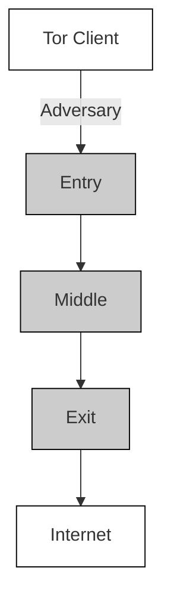

# SoK: A Critical Evaluation of Efficient Website Fingerprinting Defenses

Nate Mathews∗, James K Holland†, Se Eun Oh‡, Mohammad Saidur Rahman∗, Nicholas Hopper†, Matthew Wright∗

∗Rochester Institute of Technology, †University of Minnesota, ‡Ewha Womans University {njm3308, mr6564, matthew.wright}@rit.edu, {holla556, hoppernj}@umn.edu, seoh@ewha.ac.kr

Abstract—Recent website fingerprinting attacks have been shown to achieve very high performance against traffic through Tor. These attacks allow an adversary to deduce the website a Tor user has visited by simply eavesdropping on the encrypted communication. This has consequently motivated the development of many defense strategies that obfuscate traffic through the addition of dummy packets and/or delays. The efficacy and practicality of many of these recent proposals have yet to be scrutinized in detail. In this study, we re-evaluate nine recent defense proposals that claim to provide adequate security with low-overheads using the latest Deep Learning-based attacks. Furthermore, we assess the feasibility of implementing these defenses within the current confines of Tor. To this end, we additionally provide the first on-network implementation of the DynaFlow defense to better assess its real-world utility.

Index Terms—website fingerprinting; defense; privacy; anonymous system; deep learning;

## I. INTRODUCTION

Tor [1], the most popular anonymous networking service, prevents overt disclosure of the link between servers and clients by routing traffic through chains of relays, called circuits, with layered encryption. The privacy of Tor may, however, be undermined by traffic analysis attacks. One such attack, known as Website Fingerprinting (WF) [2]–[10], allows a passive local eavesdropper to deduce information about Torprotected traffic using traffic metadata. In a WF attack, the adversary seeks to determine what website a Tor user has visited in a browsing session. An eavesdropper positions themselves somewhere on the link between the client and the guard – the first Tor node on the circuit – to perform the attack, such as observing the user’s wireless connection, compromising the user’s wireless router or cable/DSL modem, sniffing the user’s ISP or workplace traffic, viewing the traffic on any network between the user and guard [11], or volunteering a node and the requisite bandwidth to serve as the guard itself. While the data collected by the adversary is encrypted, the packet timestamp, size, and directional information are still exposed. Using patterns in this information, usually with the aid of machine learning, an adversary can often unmask the client’s activities.

Several defenses have been proposed in recent years to mitigate the threat of WF attack [12]–[21]. These defenses change the traffic patterns produced when accessing sites by adding fake packets (padding) or delaying real packets. Strong defenses can be prohibitively expensive, however. Recent WF research has focused on creating padding schemes that remain effective when bandwidth and latency overheads are kept low. Unfortunately, these lightweight defenses can fail when new attacks [8] are introduced, or implementation challenges [9] may make deployment impractical. However, several recent WF defense proposals have yet to be examined in depth by the research community, so their shortcomings are unknown.

In this paper, we explore nine of the most notable recently proposed efficient WF defenses: DynaFlow [20], Bi-Morphing [22], Deep Fingerprinting Defender (DFD) [23], FRONT [19], HyWF [24], TrafficSliver [25], Spring [26], Interspace [26], and Blind Adversarial Network Perturbations (BANP) [27]. These are the most efficient and effective defenses developed to date, and they deploy a wide range of strategies. In a detailed set of evaluations, we revisit these techniques using the latest deep-learning-based WF attacks and more realistic data settings. We further examine the information leakage of hand-crafted features using the WeFDE technique [28]. Finally, we consider how the defenses may be implemented in the current Tor framework and identify their limitations.

From this study, we identified the following key findings:

– The most effective defense with reasonable overheads is TrafficSliver [25], which cuts attack accuracy to 5% in the closed-world setting in which the user only visits a fixed set of sites. The main disadvantage of TrafficSliver is that it only works against certain attackers in our attacker model due to its technique of splitting the traffic across multiple connections.  
– Among non-splitting defenses, the best security was offered by Interspace [26], which cuts closed-world attack accuracy to at most 76.1% with 98% bandwidth overhead and no added delays. The best overheads were offered by FRONT [19], which requires just 48% bandwidth overhead and no added delays in order to cut closed-world attack accuracy to at most 81.8%. These two defenses, plus TrafficSliver, form a Pareto front among those we studied.  
– We examined several novel methods to adapt attacks to specific defense techniques. Most of our methods are straightforward, such as being the first to use timing information [9], using simple data augmentation strategies, or

just assuming that the adversary knows about the defense and its default parameters. Our findings show that numerous recent defenses are much less secure under close inspection than described in the published papers, suggesting that the bar for WF defense papers should be raised to include more adaptive attackers and better experimental designs.

– We develop novel attack strategies against DynaFlow, where we leverage available course-grained information, and FRONT, where we modify the training method to create a model that better generalizes to the noisiness of defended samples.

Our findings indicate a need for further research into more effective and efficient WF defenses. Interspace and FRONT may offer acceptable security – in the more realistic openworld setting, they cut recall rates to 69% and 71%, respectively, for a fixed rate of 97% precision. Nevertheless, paying 48-98% in bandwidth overhead when the attacker can still get that level of accuracy may not be palatable to Tor developers and users. Thus, more work is needed to clarify what would be an acceptable tradeoff and move existing solutions in that direction.

## II. ATTACK AND DEFENSE MODELS

A. Attack Model  

flowchart

Fig. 1: Website Fingerprinting Attack Model.

A schematic representation of the website fingerprinting (WF) attack model is presented in Figure 1. In the WF attack model, we assume that a client uses Tor to access the Internet so that she can protect her privacy by hiding her activities. The adversary (WF attacker) is considered to be a local attacker – he is capable of monitoring the network traffic between the Tor client and the Tor entry node. In addition, the adversary is a passive eavesdropper, only observing and recording the network traffic and cannot insert, modify, or drop any packets in the traffic stream. As a local eavesdropper, he can see the victim’s IP address, but his goal is to identify which website the client is visiting via Tor. This local passive eavesdropper could be the client’s local system administrator, Internet service provider, a traffic sniffer between the client and the guard, or a malicious guard.

Note that for evaluating defenses based on traffic splitting, namely TrafficSliver [25] and HyWF [24], we follow the modified attacker models of those papers. In particular, the attacker can only be a malicious guard, unless the user has the ability to send traffic over multiple ISPs, in which case local eavesdroppers who can only see traffic on one of the ISPs may be included as well. We discuss these assumptions further in Section VII-C.

The WF attack involves a two-step process – i) training the classifier and ii) executing the attack. In the training process, the attacker collects network traces from monitoring his own connections through Tor to websites of interest, such as sensitive or censored sites, and then uses these labeled traces to train a machine-learning or deep-learning classifier. Since it is not feasible to collect the network traffic of the billions of sites on the Internet, the list of sites of interest must be reduced and is known as the monitored set. Other Internet sites not belonging to this list belong to the unmonitored set.

Traditionally, WF attacks are evaluated in two settings – closed-world and open-world. In the closed-world setting, the classifier is trained and tested with only the traces from sites in the monitored set, and the client is assumed to only visit this limited set of sites. This setting is clearly unrealistic in practice, but it provides a basis for easy comparisons among attacks and defenses. Open-world evaluation represents a more realistic scenario, where a client may visit any of the sites on the Internet. In this setting, the attacker trains the classifier with the sites of the monitored set and with a representative, though not exhaustive, set of sites from the unmonitored set. In the testing set, a trained open-world classifier is evaluated against the monitored sites and also against a non-overlapping representative set of sites of the unmonitored set.

## B. Defense Model

WF defense aims to prevent a WF attacker from correctly determining the site a collected trace belongs to. To achieve this objective, the network traffic pattern of a site needs to be distorted by either padding dummy packets, delaying some packets, or doing both. However, this traffic manipulation must be simultaneous and in real-time. As network traffic is bidirectional, simultaneous traffic manipulation from the client and a participating node on the Tor circuit is required for the defense. This participating node in the defense process, called the cooperating node, can be any node between the WF attacker and the client’s destination server so that the attacker can only observe the distorted traffic stream. The middle node is perhaps the best candidate for this role because it is the first Tor relay in the circuit that is unaware of the identity of the client.

## C. Defense Evaluation

We evaluate the defenses based on the following metrics, and summarize our findings in Table I.

Accuracy, Precision, & Recall. We use accuracy to evaluate the performance of our attack models in the multi-class closedworld setting, but use precision and recall for the binary openworld setting.

Information Leakage. Accuracy, precision, and recall are limited to an all-or-nothing approach, where near hits and near misses are discounted [28], [29]. Li et al. [28] propose to address this using a technique titled WeFDE to estimate the amount of information leaked (in Shannon bits) by a defense. The WeFDE technique estimates information leakage by finding the mutual information (MI) between the distribution of sites and the information contained in the fingerprints of those sites. Kernel density estimators (KDEs) are used to model the dataset’s distribution of fingerprints. The dimensionality of the data is reduced using feature clustering to improve KDE accuracy before calculating the final information leakage. In this study, we use the Information Leakage technique to provide further insight into the types of features that make effective and ineffective defenses. We elect not to use the Bayes Error estimation technique of Cherubin [29], as it does not provide information that is meaningfully different from the combination of accuracy and information leakage.

Overheads. Bandwidth and time overheads are critical to the acceptability for deployment in Tor [30], [31]. We thus report measurements of the amounts of padding needed (BW overhead) and artificially added delay (Time Overhead) per site download. Note that reported Time Overhead likely understates the impact of any defense on the user experience, as sending additional padding can create congestion both at Tor nodes and in the network. Furthermore, defenses often encounter unconsidered limitations when implemented outside of simulation that can have dramatic effects on overheads [9]. For this analysis, we focus on the overheads reported using the simulated defense samples.

Qualitative Properties. We study a few other key properties of defenses, as summarized in Table I. Low Overheads: Although overhead results are quantitative, their impact is up to interpretation. We rate a defense as having Low Overheads if BW Overhead is less than 50% and Time Overhead is less than 25%, and we otherwise rate a defense as mixed if BW is less than 100% and Time Overhead is less than 50%. No Delays: Next, we consider the binary property of whether a defense requires delaying packets. Adding delays requires queuing packets at both the client and at a Tor node, which requires more significant changes in the implementation of Tor [30], [31] and may be difficult to ensure is done with precise timing. Thus, it represents an implementation hurdle for the defense. No Database: Another binary property we check is whether the defense needs a database of traffic patterns or other information for a number of sites. Keeping such a database requires significant effort to gather and regularly update the patterns, plus the bandwidth to communicate those patterns and updates to all clients. If defenses rely on these database entries for either security or efficiency, there is pressure to include many websites to protect many users, further exacerbating these costs. Overall, requiring a database may be a major hurdle to implementation.

Defense Strategy. All defense strategies can use three basic mechanisms to obfuscate traffic. The first two, (#1) adding dummy traffic and (#2) adding traffic delays, have been frequently applied in many defense proposals. These mechanisms also always incur an overhead of either bandwidth or latency, which may negatively affect the user experience and health of the Tor network. There is however a third mechanism that can be leveraged and this is (#3) moving traffic from one stream to another. This mechanism has been introduced and to-date has only been applied by the traffic splitting category of defenses. From here, we can organize defenses into groups based on what mechanisms and how those mechanisms are used, which we refer to as strategies. Current WF defense strategies include sending traffic at fixed rates (F), random sampling to add padding (R), modifying traffic to produce collisions with targeted traffic samples or patterns (C), splitting traffic across multiple streams (S), and using adversarial perturbations to fool machine-learning models [32] (A).

In this study, sending traffic at fixed rates (F) defenses use mechanisms #1 and #2, and include BuFLO [12], Tamaraw [13], and DynaFlow [20]. The main characteristic of these defenses is the fixed rate at which packets are transmitted during the connection which effectively can distort the timing and burst level information. These sets of defenses have shown high success rates against all known WF attacks, however, that comes with a very high timing and bandwidth overheads.

Random padding (R) defenses use mechanism #1, and many defenses employ this strategy due to its flexibility. These defenses commonly use probabilistic state machines or sample times to add padding from a selected distribution.

Defenses that aim to produce targeted traffic collision (C) often use mechanisms #1 and #2 [15], [18], [33], but may use just #1 such in BiMorphing [22]. These defenses are best characterized by their need for developing and maintaining a database of traffic samples or patterns.

Current traffic splitting (S) defenses use only mechanism #3 to divide traffic into multiple simultaneous but separate streams that follow different network routes. Consequently, these defenses add no overhead to the traffic (however new requirements for stream creation and stream merging may negatively impact traffic and the network in ways that are difficult to quantify). The ability to effectively remove the presence of some traffic from one perspective can be incredibly powerful, but comes with the limitation that a sufficiently powerful attacker may collect all streams and recombine them to completely undermine the strategy.

Finally, adversarial perturbation (A) defenses target vulnerabilities in attacker models to ’trick’ the model to misclassify a sample with as little changes to the underlying traffic as possible. These defenses have so far leveraged both mechanisms #1 and #2 to add adversarial noise to the traffic patterns. These defenses would appear to have strong potential, but must overcome specific challenges which we will discuss further in later sections of this paper.

## III. BACKGROUND AND RELATED WORK

## A. WF Attacks

WF attacks are performed by first collecting a representative dataset containing both sites the adversary wishes to identify (the monitored set) as well as other sites (the unmonitored set). This dataset is used to train a classifier that can identify unknown traffic belonging to a monitored site. Broadly speaking, WF attacks can be classified into those using Machine Learning (ML) [2]–[5], [35]–[38] and those using Deep Learning (DL) [6]–[8], [10], [39]. These attacks

<table><tr><td rowspan="2">Defense</td><td rowspan="2">Year</td><td rowspan="2">Description</td><td colspan="4">Properties</td><td colspan="7">Results Analysis</td></tr><tr><td>Low Overheads</td><td>No Delays</td><td>No Database</td><td>Strategy</td><td>Dataset</td><td>Best Accuracy</td><td>Precision</td><td>Recall</td><td>Info. Leakage</td><td>BW Overhead</td><td>Time Overhead</td></tr><tr><td>BuFLO</td><td>2012</td><td>Fine-grain traffic features are hidden by sending packets at a fixed-rate interval.</td><td>○</td><td>○</td><td>●</td><td>F</td><td>S [8]</td><td>13.5% [8]</td><td>-</td><td>-</td><td>-</td><td>246%</td><td>137%</td></tr><tr><td>Tamaraw</td><td>2014</td><td>Extends the BuFLO design to provide better security by padding traffic sequences to a multiple of parameter  $L^3$ .</td><td>○</td><td>○</td><td>●</td><td>F</td><td>S [8]</td><td>16.8% [8]</td><td>-</td><td>-</td><td>24% [34]</td><td>328%</td><td>242%</td></tr><tr><td>WTF-PAD</td><td>2015</td><td>An efficient defense that uses a stochastic padding state machine to fill empty gaps in traffic bursts with dummy packets.</td><td>➊</td><td>●</td><td>●</td><td>R</td><td>S [8]</td><td>93.5% [9]</td><td>98%</td><td>96%</td><td>100% [34]</td><td>64%</td><td>0%</td></tr><tr><td>Walkie-Talkie</td><td>2017</td><td>Performs traffic molding to create perfect collisions between traffic samples of different classes.</td><td>●</td><td>○</td><td>○</td><td>C</td><td>S [8]</td><td>97.0% [9]</td><td>-</td><td>-</td><td>95% [34]</td><td>31%</td><td>34%</td></tr><tr><td>Mockingbird</td><td>2020</td><td>Molds traffic sequence to match Adversarial Example sequences generated against an effective Deep Learning classifier.</td><td>➊</td><td>○</td><td>○</td><td>A+C</td><td>S [8]</td><td>62.0% [9]</td><td>-</td><td>-</td><td>-</td><td>58%</td><td>0%</td></tr><tr><td>DynaFlow</td><td>2018</td><td>Similar to Tamaraw and CS-BuFLO, this defense optimizes overheads by adjusting the fixed-rate for incoming and outgoing packets at various intervals in the sequence.</td><td>➊</td><td>○</td><td>●</td><td>F</td><td>BE</td><td>38.3%</td><td>96%</td><td>4%</td><td>56%</td><td>141%</td><td>6%</td></tr><tr><td>BiMorphing</td><td>2019</td><td>Uses a stochastic state machine to extend burst sizes to resemble the PMF of burst sizes a different website class.</td><td>➊</td><td>●</td><td>○</td><td>R+C</td><td>BE</td><td>78.1%</td><td>97%</td><td>93%</td><td>70%</td><td>61%</td><td>0%</td></tr><tr><td>DFD</td><td>2020</td><td>Stochastically extends the size of traffic bursts to confuse the classifier.</td><td>➊</td><td>●</td><td>●</td><td>R</td><td>BE</td><td>94.2%</td><td>97%</td><td>92%</td><td>98%</td><td>54%</td><td>0%</td></tr><tr><td>FRONT</td><td>2020</td><td>Generates cover traffic sampled from a Rayleigh distribution to heavily pad the early portions of the traffic.</td><td>●</td><td>●</td><td>●</td><td>R</td><td>BE</td><td>81.8%</td><td>97%</td><td>71%</td><td>86%</td><td>48%</td><td>0%</td></tr><tr><td>HyWF</td><td>2020</td><td>Traffic is probabilistically split between two Internet connections serviced by different ISPs.</td><td>●</td><td>●</td><td>●</td><td>S</td><td>BE</td><td>56.8%</td><td>97%</td><td>17%</td><td>37%</td><td>0%</td><td>0%</td></tr><tr><td>TrafficSliver</td><td>2020</td><td>Traffic is probabilistically split between several Tor circuits or connections.</td><td>●</td><td>●</td><td>●</td><td>S</td><td>BE-TS</td><td>5.4%</td><td>50%</td><td>1%</td><td>46%</td><td>0%</td><td>0%</td></tr><tr><td>Spring</td><td>2020</td><td>Padding is performed using a stochastic state-machine similar to WTF-PAD, and was developed using a genetic algorithm.</td><td>➊</td><td>●</td><td>●</td><td>R</td><td>BE</td><td>80.0%</td><td>99%</td><td>93%</td><td>78%</td><td>93%</td><td>0%</td></tr><tr><td>Interspace</td><td>2020</td><td>A modification of the Spring state-machine, hand-tuned to provide better security and overheads.</td><td>➊</td><td>●</td><td>●</td><td>R</td><td>BE</td><td>76.1%</td><td>97%</td><td>69%</td><td>79%</td><td>98%</td><td>0%</td></tr><tr><td>BANP</td><td>2021</td><td>DL model is trained to produce adversarial noise vectors that map undefended traffic into an adversarial domain.</td><td>○</td><td>○</td><td>●</td><td>A</td><td>BE</td><td>89.6%</td><td>99%</td><td>99%</td><td>99%</td><td>20%</td><td>411%</td></tr></table>

TABLE I: Overview of notable WF defenses: We directly evaluate defenses below the dashed line on the BigEnough dataset (BE). Precision and recall values are based on the best results in the open world as tuned for high precision.

Low Overheads – high overheads, moderate overheads, low overheads No Delays – adds delays to real traffic, no delaying of real traffic No Database – requires a database of sample properties, no extra information required

Strategy – (F) send traffic at fixed rates, (R) use random sampling to add padding or delay, (C) modify traffic to produce collisions for a target pattern, (S) split traffic across multiple streams, (A) use adversarial perturbations

are differentiated by the underlying techniques used for their classifiers and how they represent website traces. ML-based classifiers require an additional step before training in which the raw data representations are processed into meaningful features based on expert analysis. DL-based attacks automate this process by using feature-extracting layers in the model.

ML-based attacks. The state-of-the-art ML-based attacks are CUMUL [4], k-fingerprinting (k-FP) [5], and Wfin [40], [41], which achieve closed-world accuracies on undefended Tor traffic of 76.8%, 87.3%, and 96.8%, respectively, when evaluated against the same dataset [40]. These attacks train Random Forest (RF) and Support Vector Machine (SVM) classifiers using custom feature representations of the trace data. While these attacks are effective against undefended traffic, their performance is much weaker against defended Tor traffic. Furthermore, their reliance on expert-defined features may limit their effectiveness, evidenced by the improved effectiveness of DL-based attacks.

DL-based attacks. Abe and Goto were the first to use deep learning to perform a WF attack [6], leveraging Stacked Denoising Autoencoders (SDAE) to get 86% closed-world accuracy on a small dataset. Rather than using handcrafted features, this attack represented traffic samples as a vector of ±1 values, where each data point represents either an incoming (+1) or outgoing (−1) packet. Rimmer et al. [7] later showed that a simple CNN architecture is also effective, achieving 96% accuracy on a very large dataset. Sirinam et al. proposed using a deeper and more complex CNN model in their Deep Fingerprinting (DF) attack [8]. This attack, notable for its state-of-the-art accuracy in the closed-world setting (98.3%), also proved effective against the WTF-PAD defense [16]. Bhat et al. [42] proposed the Var-CNN model, which achieves stateof-the-art performance with less training data than DF. This model uses two ensembled networks, one using directional information (a vector of ±1) and the other using timing data (a vector of inter-packet arrival times). Similarly, Rahman et al. [9] examined the value of raw timing information using the DF model and demonstrated vulnerabilities in the Walkie-Talkie defense [15]. More recent works have explored WF in low-data scenarios. The Triplet Fingerprinting (TF) attack [10] leverages few-shot learning with triplet loss – it pretrains a feature extractor on a large set of stale traffic samples that can later be used to effectively extract features from just a few fresh samples per class and use them to train a simple nearestneighbors classifier. Oh et al. proposed a semi-supervised learning technique using GANs, called GANDaLF [43], which allows for higher maximum attack accuracy with similarly few training samples as TF.

In our study, we evaluate defenses with CUMUL [4] – the best non-DL model, a multi-layer perceptron (MLP) [7], [39], the DF model [8], and Rahman et al.’s Tik-Tok model [9]. We note that experiments with Var-CNN showed it to be less stable over various datasets, while other models did not offer sufficient accuracy to be worth exploring.

## B. WF Defenses

The fundamental goal of a WF defense is to distort the patterns in website traffic through the introduction of fake packets or delays so as to confuse the attacker’s classifier. A defense must, however, be judicious when affecting the client’s traffic stream so as to not cause significant bandwidth or latency overheads that will affect Tor’s usability.

The earliest effective defenses belong to the fixed-rate class of defenses, which include BuFLO [12], Tamaraw [13], and CS-BuFLO [14]. These defenses send traffic in fixed time intervals and patterns so as to achieve a high resistance against fingerprinting. This defense mechanism effectively hides finegrained traffic features, such as packet ordering, because all traffic appears in a uniform pattern. Coarse features such as total volume, size, and load time remain difficult to conceal. Consequently, a very high bandwidth and latency overhead is required, and these defenses are thus unappealing for deployment in Tor [30], [31].

During this same period, early work had begun on developing a theoretically provably secure defense. The Supersequence defense [44] proposes that websites be organized into anonymity sets and a super-sequence of the traffic be computed so that the packet directional sequence of any member belonging to the set is represented in the supersequence. Similarly, the Glove defense [33] clusters websites using a Dynamic Time Warping distance [45] and computes super-sequences for a tunable percentage of samples within the cluster. Both of these defenses offer nominally better overheads than the fixed-rate class of defenses, but still have large overheads and require databases of traffic patterns and adding delays, which restrict wide-spread adoption.

Due to these limitations, defense developers have since focused on developing defenses that are both efficient and effective. We now briefly review a number of notable proposals for efficient defenses, many of which have yet to be rigorously evaluated outside of their initial proposal.

WTF-PAD. WTF-PAD uses the Adaptive Padding [46] technique to probabilistically fill periods of low transmission rate with dummy packets. This defense is based on the understanding that traffic streams are composed of periods of rapid packet transmission followed by lulls, and that this pattern can be used to characterize the stream. Manipulating these activity patterns proved to be effective against ML-based attacks, but was shown to fail against DL-based attacks [8]. The automated feature extraction used by DL models allows them to learn features that are robust against the noise introduced by adaptive padding, leading to vastly improved performance. A key lesson from WTF-PAD is that defenses must not be too dependent on defeating particular features, or improvements in feature design may undermine them. We do not discuss WTF-PAD further in this paper.

Walkie-Talkie. The Walkie-Talkie (W-T) defense builds upon the previous traffic super-sequence defenses Supersequence [44] and Glove [33]. W-T pairs sites and molds the traffic so that the directional sequence for each site is identical. This is achieved by organizing traffic sequences into bursts, defined as groups of consecutive packets following the same direction, and padding each burst so that the resulting burst sequence is a super-sequence of the burst sequence of both sites. This defense claims a maximum attacker accuracy of 50%, because the traces of the two sites appear identical in their directional sequences. On the W-T simulated dataset, Sirinam et al. achieved nearly that 50% maximum rate, as well as a top-two accuracy of 98.4% [8]. Rahman et al. [9] further demonstrated that timing information allows accurate classification against simulated W-T with over 90% closedworld accuracy, and that W-T’s burst-molding padding could not be realistically implemented in the real Tor network without serious compromise. Because of these limitations, we do not discuss W-T further in this paper.

Mockingbird. In 2014, Szegedy et al. discovered that DL models are broadly vulnerable to a class of attacks known as adversarial examples [32]. These attacks aim to produce misclassifications by adding small amounts of adversarial noise to model inputs. Inspired by adversarial examples, the Mockingbird defense [18] generates adversarial traces by iteratively perturbing a source trace until it leaves the source class. Unlike standard adversarial example techniques, Mockingbird does not chase the gradient of a loss function, but instead takes small linear steps towards a randomly selected target trace. After a suitably perturbed trace is found, burst-molding (similar to Walkie-Talkie) must be performed to adjust the live traffic to match the target adversarial trace. While the Mockingbird defense achieves good performance and efficiency results, we discuss critical implementation issues in our defense analysis.

BiMorphing. The BiMorphing defense [22] alters the bidirectional burst patterns of a trace to match that of a target website. It first creates profiles of the distribution of burst size and timing for potential target websites. It then chooses a target site and begins sending the trace associated with the user’s real website, the source. It samples burst sizes and timing from the target site’s distribution and partially matches the source site’s activity to the target by adding padding as needed. Note that if a source burst is larger than the sampled target burst, the match cannot be made. Once the source trace has finished sending, BiMorphing adds dummy bursts to match the number of bursts in the target. The authors report a maximum accuracy of 19% accuracy with CUMUL. BiMorphing has not been evaluated with deep-learning-based defenses, which we test in our study.

Traffic Splitting Defenses. Two recent papers – HyWF [24] and TrafficSliver [25] – have devised an entirely different approach to WF defense that incurs no overheads: split the traffic produced by a visit across multiple connections or circuits. In HyWF, the client connects to two independent access points (e.g., a cellular network and home WiFi) and sends traffic to a multipath-compatible Tor bridge that merges the traffic before sending it to Tor. TrafficSliver, on the other hand, comes in two versions: TrafficSliver-App and TrafficSliver-Net. TrafficSliver-App operates on the unmodified Tor network; it proxies HTTP requests from the user’s browser over multiple independent Tor circuits. Alternatively, TrafficSliver-Net modifies the Tor network to split TCP traffic over multiple entry nodes before merging traffic at the middle relay.

Both HyWF and TrafficSliver examined various splitting strategies. TrafficSliver reported their best performance when using the batched weighted random strategy. In this strategy, Tor cells are sent in batches of n cells to the assigned entry node which is selected by sampling from a generated distribution. The batch size n is resampled after every batch. HyWF uses a similar approach, where for each website access, the number of consecutive packets sent is drawn from a geometric distribution, while the network is chosen uniformly at random. TrafficSliver (with 5-way splitting) reports reducing accuracy to below 16% while HyWF (with 2-way splitting) reports cutting recall to just 40%. In this paper, we examine how HyWF can be more effectively attacked using timing information and adding more training samples. Furthermore, we examine TrafficSliver performance in the real-world.

Spring & Interspace. The Spring and Interspace defenses [26] are evolutions of the state-machine-based Adaptive Padding defenses like WTF-PAD. Spring is the product of a genetic evolution algorithm run over several months, starting with a population of ten randomly generated adaptive-padding state machines. The resulting state machine was further handtuned into Interspace [26], with two major changes: (i) on initialization, there is a 50% chance that the client state-machine will have an additional state transition back to the initial nonpadding state, when non-padding packets are received, and (ii) on initialization, the relay machine will either become the Spring machine or an entirely-handcrafted machine with 50% probability. Both of these machines are particularly notable for being implemented within Tor’s pre-existing state-machine padding interface and, consequently, are the closest of any of the defenses discussed so far to being deployable in Tor. Spring and Interspace reportedly reduce attacker performance to at most 46% and 35% recall, respectively. We study how both defenses can be more effectively attacked using timing information and adding more training samples.

Deep-Fingerprinting Defender (DFD). Abusnaina et al. propose DFD [23], which extends each burst by a random percentage of the total burst size. They evaluated their defense against a fully-connected neural network and a CNN similar to the DF model. They report high misclassification rates (>85%) for their attacker models at low BW overheads (<50%). We examine, however, how the evaluation by Abusnaina et al. misrepresents the attacker’s abilities, and how the attacker could reach higher accuracy in practice.

Blind Adversarial Network Perturbations (BANP). Recently, Nasr et al. proposed BANP [27], which like Mockingbird, uses the idea of adversarial examples as the basis of its design. BANP supersedes Mockingbird by addressing some of the implementation issues that make Mockingbird impractical. Unlike Mockingbird, BANP does not need to know the traffic pattern of the trace to generate an appropriate perturbation vector. Instead of optimizing adversarial perturbations on a persample basis, BANP optimizes a generator to produce arbitrary perturbation vectors to confuse the attacker’s classifier. BANP trains three separate generators to perturb packet size, timing, and direction. The authors evaluate their defense against Var-CNN [42] and report reducing attacker accuracy to 16% with just 2% bandwidth overhead and at most 1% attacker accuracy at 66% bandwidth overhead. Like DFD, however, BANP does not account for an attacker’s true capabilities. In our study of BANP, we explore how adversarial training can be leveraged to significantly undermine the effectiveness of the defense.

DynaFlow. DynaFlow [20] is a WF defense inspired by the constant-rate class of defenses. Like those defenses, DynaFlow sends traffic as a constant stream following a fixed pattern. Unlike previous defenses, however, DynaFlow periodically adjusts the traffic rate using the average inter-packet arrival time from the previous period. Using this design, DynaFlow achieves effective defense against ML-based attacks, reducing attacker accuracy of k-Fingerprinting to 45% against a dataset of 100 sites, while also claiming reasonable bandwidth and time overheads. However, DynaFlow has yet to be evaluated using any DL-based attack. Because DynaFlow adjusts its traffic rate to best match the properties of a trace, it is likely that the behavior of the dynamic adjustments can be used to fingerprint traces. We investigate this potential weakness and develop a novel attack in our study of DynaFlow.

FRONT. FRONT [19] is a no-latency, low-bandwidthoverhead defense achieving its efficiency by targeting the early part of a website trace. Prior ML-based attacks showed that features produced from the beginning of the trace were highly weighted by the classifiers, and this motivates FRONT’s design. FRONT works by inserting fake packets with timestamps drawn from two Rayleigh probability distributions dynamically generated for each trace. It achieves strong performance against ML and DL attacks, reporting a maximum precision of 71% with a recall of 43%. Since the injected noise has predictable features, however, we explore a novel approach to train a model effectively to better generalize and learn how to extract the signal from the noise added by FRONT.

## IV. DEFENSE ANALYSIS

In this section, we analyze previously underexplored WF defenses for vulnerabilities and other shortcomings that may allow a sophisticated adversary to achieve greater performance than the baseline WF attacks. We used the authors’ code to simulate each defense on Tor traces, with only the minimal changes needed to operate on the dataset we used.

Methodology. The process we use to evaluate each defense is straightforward, but is important to understand. When training and testing a model for each defense, we separate out a fraction of the samples to act as our testing set. We next use the author’s defense simulator code to apply their defense on all the samples in our training and testing sets. When evaluating some defenses, we simulate multiple times on each sample in the training set to augment the training set. Finally, we train our attacker’s classification model on the defended training data, followed by testing on the defended testing data. The attacker trains their model using a flexible number of epochs, and stops training only when the model converges to its maximum performance. It is important to note that the attacker always trains on only the latest defense samples generated by the defender (e.g. the attacker always uses the same defense parameters and/or generator to produce their training samples). This is key to properly evaluating a website fingerprinting defense, as it is the attacker that always acts last and will make decisions that grant them the most advantage.

Datasets. We collect new datasets to evaluate all defenses in equivalent settings. We adopt the collection process and tools used by Pulls et al. [26] for their GoodEnough dataset. GoodEnough consists of three separate datasets based on the three security configurations available in the Tor Browser Bundle (TBB): Standard, Safer, and Safest. The Standard configuration is the default and is what is most likely to be used by TBB users. The Safer operation mode blocks some webscripts from running, while the Safest operation mode goes an additional step further and blocks most dynamic content from loading. It is important to note that both GoodEnough and our datasets differ significantly from previous popular datasets, such as the WF set collected by Sirinam et al. [8], which contained samples from 95 websites represented by only their index page. The use of multiple subpages to represent each website in this dataset increases the inter-class variance, while the smaller number of websites increases the random guessing accuracy, so performance metrics on different datasets should not be directly compared.

Using these tools and configurations, we first collected the new BigEnough dataset from November 2021 to January 2022. In BigEnough, for each configuration, the monitored set consists of a total of 19,000 samples from 95 websites, in which 10 subpages were visited 20 times each for a total of 200 samples to represent each site. The targeted websites are selected as the most popular websites as ranked by the Open PageRank Initiative. The unmonitored set consists of 19,000 unrelated index-pages sampled from the remaining top websites. Compared to the GoodEnough dataset, BigEnough has nearly twice as many classes (95 versus 50). We also observe that BigEnough has samples that are generally smaller (both by cell count and load time) when compared to GoodEnough. Table II shows the closed-world defense performance against each security mode in the BigEnough dataset. We separately evaluated defenses on the GoodEnough dataset [26], and provide these results and a comparison with the BigEnough results in Appendix A.

<table><tr><td></td><td>Standard</td><td>Safer</td><td>Safest</td></tr><tr><td>Undefended</td><td>95.1%</td><td>94.8%</td><td>95.2%</td></tr><tr><td>DynaFlow</td><td>38.3%</td><td>29.4%</td><td>24.5%</td></tr><tr><td>BiMorphing</td><td>81.0%</td><td>74.1%</td><td>69.4%</td></tr><tr><td>DFD</td><td>94.2%</td><td>93.2%</td><td>94.2%</td></tr><tr><td>FRONT</td><td>81.8%</td><td>80.6%</td><td>83.8%</td></tr><tr><td>HyWF</td><td>56.8%</td><td>49.4%</td><td>50.6%</td></tr><tr><td>TrafficSliver</td><td>5.4%</td><td>4.3%</td><td>5.3%</td></tr><tr><td>Spring</td><td>80.0%</td><td>81.6%</td><td>82.6%</td></tr><tr><td>Interspace</td><td>76.1%</td><td>78.7%</td><td>74.7%</td></tr><tr><td>BANP</td><td>89.6%</td><td>90.1%</td><td>93.1%</td></tr></table>

TABLE II: Closed-World: Attack performance against defenses for the Standard, Safer, and Safest TBB security modes.

We also collected the new BigEnough-TrafficSliver (BE-TS) dataset in January and February of 2022 using the same URL lists and security modes as the BigEnough dataset, but with the Tor TrafficSliver implementation provided by De la Cadena et al. [25]. We updated their Tor implementation from 3.5 to 4.7 to be compatible with our crawler, and use this collected dataset for our TrafficSliver analysis.

## A. BiMorphing

BiMorphing had not been evaluated against DL-based classifiers, which we now examine. We evaluated BiMorphing using the Tik-Tok attack on the BigEnough dataset with randomly chosen web page targets and achieved 81%, 74%, and 69% accuracy across the different security modes. When using the GoodEnough dataset in the Standard setting [26], we found even better performance for both Tik-Tok and DF (see Appendix A). While BiMorphing performs better in the higher security modes, the bandwidth overheads were also higher. Overall, BiMorphing should have been tested before against DL-based attacks, as it is much less secure than the reported result of just 19% accuracy [22] would suggest.

## B. HyWF & TrafficSliver

Next we look at the traffic splitting results, which reported very good results in their proposals. In this study, we follow the attacker model assumed in these papers, where the adversary can only view one of the traffic splits. This is suitable for attackers such as malicious guards that observe just one circuit among, e.g., two to five total circuits. Note that this does not apply to an eavesdropper that can see all the splits at once, such as an ISP against TrafficSliver or a local wireless eavesdropper with both cellular and WiFi antennas against HyWF.

A potential vulnerability of these approaches, even in this constrained attacker model, is that the traffic is not padded or delayed at all. Thus, all traffic is effectively a sample of the real traffic, with some of the same burst and timing information. DL-based attacks may be able to learn to extract signals from such samples for reliable classification. Since the randomness of traffic splitting creates significant variance within the samples of each class, we propose to augment the number of training samples. For each real trace in the training data, we apply the traffic splitting defense multiple times to create more training data for the associated class. Using this approach, we can increase the accuracy of the attacks.

We first examined the performance of the HyWF defense against DL-based attacks, as it was previously only tested using ML-based attacks [24]. We produced training samples by applying the defense 10 times on each training trace. Using the default configuration for the defense with traffic split across two connections, we found that we can get up to 57% accuracy against the split samples, up from the originally reported 36% achieved by k-Fingerprinting (albeit on a different dataset).

For TrafficSliver, we initially evaluated the defense using the GoodEnough dataset and achieved 22% accuracy using Tik-Tok, which could be further improved to 41% when running the defense simulator multiple times to produce 16 copies of the split traffic instances. Using the BE-TS dataset, however, we find very different results. Tik-Tok can achieve only 5% accuracy across the three security modes. This marked improvement for the defense is likely due to a number of factors. First, our new dataset contains nearly twice the number of websites, increasing the chance that samples may be confused with those of another site. Second, since we are using real collected split samples, we are unable to generate additional copies of defended samples as we did in simulation, and consequently our training effectiveness is more limited. Finally, by performing splitting on the real network, these traces are subject to additional real network noise that will affect packet ordering and timing, as different sub-circuits operate with different latencies. All these elements greatly increase the difficulty of classifying traces in practice.

And so, despite the significant improvements from our training techniques, the traffic splitting methods remain fairly robust against a limited attacker model. Furthermore, when applied on real-world traffic, the efficacy of TrafficSliver is even further increased.

## C. Spring & Interspace

Now we will examine how the Spring and Interspace defenses can be attacked more effectively with timing information and data augmentation. To evaluate these, we compiled the latest Tor code with the circuit padding framework and added the Spring and Interspace state-machines into the padding framework’s simulator. Pulls warned that timestamps generated by the defense simulator are too precise and may therefore leak information that would typically not exist in real networks [26]. To address this potential issue, we rounded timestamps to 10 ms increments. To best evaluate the defense, we once again used the Tik-Tok model to incorporate timing information. We used a simple augmentation technique, producing multiple defended samples for every sample in our training dataset (up to 20) to ensure that the model learned using many examples of how the defense may affect a particular sample’s traffic patterns. We found that inclusion of timing information in Tik-Tok notably improved the attacker’s efficacy, with 80.0% accuracy against Spring and 76.1% against Interspace on the Standard security mode. Interspace and Spring maintain similar efficacy across the different security modes. The modifications of Interspace over Spring seems to help modestly, likely due to its probabilistic selection between two different server-side state-machines.

## D. DFD

We now turn to two defenses that failed to account for the attacker’s true capabilities and access: DFD and BANP.

The DFD defense operates by extending directional bursts by a percentage. The percentage for extension is determined by uniformly sampling a number within the interval (pert rate ∗ variation, pert rate ∗ (1 + variation). While this simple scheme does make it unclear what the precise size of any one burst could be, the general picture of the traffic remains unchanged. Large bursts will remain relatively large, and small bursts will remain relatively small. Furthermore, this defense does nothing to hide timing information, so the position in time of these bursts will remain relatively constant between site visits. Based on these observations, the strong results reported by Abusnaina et al. [23] may seem surprising.

To evaluate the DFD defense, we ran the author’s simulator code on the BigEnough dataset. We allowed the defense to run using the parameters that were configured by default, which were a perturbation rate of 50% and variation of 50%. More critically, we configured the scenario such that both the training and the testing dataset were generated with these parameters, as any adversary models could similarly do the same. Under this scenario, the defense was entirely undermined, allowing for approximately 94% accuracy in all security modes when using the default Tik-Tok attack model against the defended samples. This compares to less than 15% accuracy for any attack tested in their paper [23].

We observe that the discrepancy between the high performance we achieved and the significantly lower performance reported in the original paper is likely due to two reasons: (1) the authors of DFD trained the attacker model on traces simulated with a variation of zero (each burst was padded by the same fixed percentage), and tested on samples with variation in the perturbation rate. This is not a fair scenario to evaluate the adversary, who knows the range that the parameters may take and can consequently train his model on samples representing the full range of possibilities. And (2) the use of timing information in the attacker model further improves performance, as the original timing information of real packets is exposed in this defense.

## E. Blind Adversarial Network Perturbations

Much like the DFD paper fails to account for the attacker’s capabilities, the BANP paper fails to account for the possibility of adversarial training [47], where the classifier is made more robust by training on adversarial examples. Note that, unlike most settings with adversarial examples, the WF attacker is the model owner and can make his model more robust after the defense is deployed. By using adversarial training, the model becomes resistant to the previous adversarial samples, and thus is able to overcome BANP. Defense developers must make their adversarial noise robust against adversarial training to make this an effectual approach to WF defense.

line chart

| Method       | Precision at Recall=0.0 | Precision at Recall=0.2 | Precision at Recall=0.4 | Precision at Recall=0.6 | Precision at Recall=0.8 | Precision at Recall=1.0 |
| ------------ | ------------------------ | ------------------------ | ------------------------ | ------------------------ | ------------------------ | ------------------------ |
| Undefended   | 0.95                     | 0.90                     | 0.85                     | 0.75                     | 0.95                     | 0.98                     |
| Spring       | 0.98                     | 0.92                     | 0.90                     | 0.85                     | 0.98                     | 0.99                     |
| Interspace   | 0.99                     | 0.93                     | 0.92                     | 0.88                     | 0.99                     | 0.99                     |
| FRONT        | 0.97                     | 0.91                     | 0.88                     | 0.82                     | 0.97                     | 0.98                     |
| DFD          | 0.96                     | 0.90                     | 0.86                     | 0.80                     | 0.96                     | 0.97                     |
| BiMorphing   | 0.98                     | 0.93                     | 0.91                     | 0.86                     | 0.98                     | 0.99                     |
| BANP         | 0.97                     | 0.91                     | 0.87                     | 0.83                     | 0.97                     | 0.98                     |
| HyWF         | 0.96                     | 0.89                     | 0.84                     | 0.81                     | 0.96                     | 0.97                     |
| TrafficSliver| 0.95                     | 0.88                     | 0.83                     | 0.80                     | 0.95                     | 0.96                     |
| DynaFlow     | 0.94                     | 0.87                     | 0.82                     | 0.79                     | 0.94                     | 0.95                     |

(a) Standard

line chart

| Model       | Recall | Precision |
|-------------|--------|---------|
| Undefended  | 0.0    | 0.98    |
| Spring      | 0.2    | 0.97    |
| Interspace  | 0.4    | 0.96    |
| FRONT       | 0.6    | 0.95    |
| DFD         | 0.8    | 0.92    |
| BiMorphing  | 0.9    | 0.93    |
| BANP        | 0.95   | 0.94    |
| HyWF        | 0.98   | 0.95    |
| TrafficSliver| 0.97   | 0.94    |
| DynaFlow    | 0.95   | 0.80    |

(b) Safer

line chart

| Method       | Precision at Recall=0.0 | Precision at Recall=0.2 | Precision at Recall=0.4 | Precision at Recall=0.6 | Precision at Recall=0.8 | Precision at Recall=1.0 |
| ------------ | ------------------------ | ------------------------ | ------------------------ | ------------------------ | ------------------------ | ------------------------ |
| Undefended   | 0.95                     | 0.92                     | 0.88                     | 0.85                     | 0.80                     | 0.78                     |
| Spring       | 0.98                     | 0.96                     | 0.94                     | 0.93                     | 0.91                     | 0.90                     |
| Interspace   | 0.99                     | 0.97                     | 0.95                     | 0.94                     | 0.92                     | 0.91                     |
| FRONT        | 0.99                     | 0.98                     | 0.96                     | 0.95                     | 0.93                     | 0.92                     |
| DFD          | 0.98                     | 0.97                     | 0.95                     | 0.94                     | 0.92                     | 0.91                     |
| BiMorphing   | 0.97                     | 0.96                     | 0.94                     | 0.93                     | 0.91                     | 0.90                     |
| BANP         | 0.98                     | 0.97                     | 0.95                     | 0.94                     | 0.92                     | 0.91                     |
| HyWF         | 0.98                     | 0.97                     | 0.95                     | 0.94                     | 0.92                     | 0.91                     |
| TrafficSliver| 0.98                     | 0.97                     | 0.95                     | 0.94                     | 0.92                     | 0.91                     |
| DynaFlow     | 0.95                     | 0.93                     | 0.88                     | 0.85                     | 0.82                     | 0.78                     |

(c) Safest  
Fig. 2: Open-World: Precision and recall of the most effective attack against each defense for the three security modes.

For our evaluation, we use the BANP generator to produce arbitrary adversarial perturbation vectors for the traffic. This generator is optimized against the Var-CNN model trained against the undefended traffic samples of the BigEnough dataset. We then used the optimized generator to perturb the undefended samples into adversarially defended samples, demonstrating high effectiveness against the previously trained Var-CNN model. Up to this point, this methodology follows the same defense methodology and configuration used by the BANP authors. To take advantage of adversarial examples, however, we deviated from BANP’s evaluation in the following way: after optimizing the generator and producing the defended samples, a new WF model was trained using the adversarially perturbed samples. Under this scenario, we made the assumption that the attacker has access to the same or similar perturbation generator used by the defender. When a new model was trained in this manner, the performance improved significantly, reaching 89.6% accuracy in the standard security mode. We also see a small drop in attacker accuracy in the Safer security mode, but the attack still remains concerningly effective.

This way of evaluating the defense more closely represents the real-world threat of an adversary, who should be able to get the model from any operating Tor client.

## F. DynaFlow

We end with the examination of two defenses that required bespoke methods to improve upon existing attack results: DynaFlow and FRONT.

We evaluated the DynaFlow defense using the more efficient parameter settings described in Configuration 1 of Table 3 in their original paper [20]. In our initial investigations, we used a custom set of handcrafted features with a simple

Multi-Layer Perceptron (MLP) model to classify samples. This model performed well against some earlier dataset, achieving up to 71% accuracy when applied against a 95-site dataset collected by Sirinam et al. [8] in 2017, but we saw the accuracy drop to 18% on the BigEnough dataset with the Standard security mode. This performance drop may have been due to the presence of shorter webpage traces in our dataset and the inclusion of different subpages for each website, increasing confusion within each class.

Using insights gained from these experiments, we tweaked the DF attack to specifically target the DynaFlow defense. To do this, we needed to make changes to the way traffic samples are represented and fed to the model. DynaFlow sends traffic following a fixed pattern, with only its variable traffic send rate and trace length leaking fingerprintable information. To capitalize on this, we break the trace into 25-cell slices. We then take the average inter-packet arrival time (IAT) across each slice, and use the resulting vector of average IAT values as the input sequence to the DF model. This change improved our attack accuracy up to 38%. When we evaluate DynaFlow under the Safer and Safest security settings, we further see the accuracy drop to 29% and 24%, respectively. This is likely due to the fact that these security settings result in smaller samples, increasing the likelihood that DynaFlow produces traces with similar or identical IAT switching patterns. Nevertheless, DynaFlow remains an effective defense, although with significant traffic overhead, as we will discuss further in Section VII.

## G. FRONT

FRONT reports reasonably effective defense against DLbased attacks [19], despite the fact that the broad traffic padding behavior of FRONT is predictable. While individual packets cannot be easily identified as either real or fake, we can estimate the approximate number of fake packets that should appear in a burst of traffic based on the Rayleigh PDF used for padding. Each time-interval burst under FRONT is determined by a simple calculation, $b = r + f$ where b is burst size, r is the number of real packets, and f is the number of fake packets. We speculate that the baseline DL-based models would overfit to the noisy defended data samples, rather than generalizing to better extract the informative patterns still available in the data. To accurately classify samples, the model must learn the way to extract features that are resistant to this predictable noise.

To achieve this, we propose to attack FRONT using a special training regimen that trains it to generalize on few classes at first before incorporating more classes gradually. During the early training epochs, we exposed the model to many possible defended variants of a sample.As the training continued, after every few epochs, we increased the number of real samples and decreased the number of simulated samples generated from each real sample. In this way, we can ensure that the model cannot memorize the samples. It was at this point that the model began to learn to properly discriminate between classes. This allowed the model to first build an understanding of how to ignore the padding effects of the fake packets during feature extraction in the convolutional layers. By using this approach, we attained 81%, 80%, and 83% closed-world accuracy against the three security modes in the BigEnough dataset. In addition, despite an increase in overheads for higher security settings, the efficacy of the defense does not appear to improve.

We note that the maximum attack performance against FRONT—as well as HyWF, Spring, and Interspace—are predicated on the use of data augmentation to expose the model to a larger variety of training samples. Research on data augmentation in other domains notes that data augmentation acts as implicit regularization (to prevent overfitting) and allows for more forgiving hyperparameter selection [48]. We hypothesize that WF attacks against stochastic defenses gain additional benefits, as these defenses pull much of their added noise from distributions whose parameters are set randomly between sample instances. This then means that the network requires a much greater number of examples to approximate the more complex noise distributions applied to the traffic. We note that attacks against stochastic defenses with naive and predictable noise distributions (e.g. DFD) achieve very high performance without needing this augmentation.

## V. OPEN-WORLD EVALUATIONS

In this section, we investigate the defenses in the openworld setting using the same attacks used in the closed-world experiments. We trained different models for each defense using both a monitored and an unmonitored set with an additional unmonitored label. Then, we evaluated each model using the precision and recall metrics as if it were a binary classification problem that distinguishes monitored sites from unmonitored sites. The performance of each defense using the BigEnough dataset and under the three TBB security modes in the open-world setting is presented in Figure 2.

In the open world and with the Standard security mode, TrafficSliver performs very well when traffic is split across five circuits, achieving less than 1% recall and terrible precision. Both DynaFlow and HyWF perform extremely well, reducing recall to 4% and 17%, respectively, when precision reaches near 97%. The other no-latency defenses do not perform as well. At similar levels of precision, Interspace, Spring, FRONT, BiMorphing, and DFD achieve recall of 69%, 93%, 71%, 93%, and 91%, respectively. From these results, it is clear that the random padding based defenses struggle to provide adequate defense in the open-world setting. These trends persist across the three security modes. Using a higher security mode does not appear to improve fingerprinting security for most defenses in any case.

## VI. INFORMATION LEAKAGE

We performed Information Leakage analysis on the defenses to gain further insight, using the WeFDE implementation provided by [9]. As with prior works [9], [28], we used the same feature set and pruned redundant features using a threshold of 0.9. We performed combined leakage analysis over the top 50 remaining features.When evaluating the information leakage for feature sub-groups, we included up to 50 features and did not perform clustering, as computation complexity is not an issue at this reduced set size. We also calculated the percentage of information leaked by the defended samples, $I _ { D }$ , relative to the amount of information leaked by the undefended samples $I _ { U }$ . Since the units are bits of information, we calculated the percentage as $2 ^ { I _ { D } } / 2 ^ { I _ { U } }$ . Table III presents the information leakage results for all combined features and categoryspecific features in the Standard mode. Categorical leakages for the Safer and Safest modes can be found in Appendix Tables VI & VII. Individual feature leakage results can be found in Appendix C. Finally, we also perform information leakage analysis on the internal feature representation of our trained DL attacker models. To do this, we extract the feature outputs from the final convolutional layer of our model after flattening. We then treat these outputs as the feature set and repeat our information leakage analysis process. We report the multivariate leakage results in Table III

Breaking down the information leakage results in the Standard mode, we see that two defenses have above 90% leakage (DFD & BANP), seven defenses have above 75% leakage results (the remaining random padding defenses), and only three defenses have below or near 50% total ML leakage (DynaFlow, TrafficSliver, and HyWF). We also see that the DL feature leakage produces similarly to ML features across most defenses. Again we see that the random padding strategy poorer defense outcomes than alternatives. We also see that some certain categories (Interval-I, Interval-II, Interval-III, Pkt. Distribution, and Pkt. per Second) produce high information leakage across almost all defenses, with only DynaFlow, HyWF, and TrafficSliver offering some protection for some of those categories.

## VII. IMPLEMENTABILITY & OVERHEADS

## A. Overheads Overview

The overheads incurred by a defense are also important. We perform our estimations using the BigEnough dataset with total dataset overhead and mean per-trace overheads. We estimate the Total bandwidth and time overheads by computing the total number of packets and load time across all samples in the dataset both before and after the defense is applied. The Total overhead can then be found by taking the difference of total packet and time counts of the defended data from the undefended data, and dividing by the counts from the undefended data. An alternative method is to use the mean per-trace overhead across every defended/undefended sample pair in the dataset. We apply both the arithmetic mean (A.M) and geometric mean (G.M.).

<table><tr><td>Standard mode</td><td>Undefended</td><td>Interspace</td><td>Spring</td><td>FRONT</td><td>TrafficSliver</td><td>HyWF</td><td>DynaFlow</td><td>DFD</td><td>BiMorphing</td><td>BANP</td></tr><tr><td>%</td><td>100%</td><td>79%</td><td>78%</td><td>86%</td><td>46%</td><td>37%</td><td>56%</td><td>98%</td><td>70%</td><td>99%</td></tr><tr><td>ML Features</td><td>6.569</td><td>6.235</td><td>6.206</td><td>6.354</td><td>5.471</td><td>5.134</td><td>5.729</td><td>6.547</td><td>6.051</td><td>6.562</td></tr><tr><td>DL Features</td><td>6.569</td><td>6.414</td><td>6.483</td><td>6.414</td><td>5.462</td><td>5.388</td><td>6.433</td><td>5.685</td><td>6.274</td><td>5.740</td></tr><tr><td>Pkt. Count</td><td>6.201</td><td>6.015</td><td>6.130</td><td>6.345</td><td>4.762</td><td>5.798</td><td>4.256</td><td>6.191</td><td>5.481</td><td>5.782</td></tr><tr><td>Time</td><td>5.089</td><td>0.656</td><td>0.656</td><td>4.452</td><td>3.566</td><td>4.903</td><td>3.476</td><td>4.793</td><td>4.048</td><td>4.522</td></tr><tr><td>Ngram</td><td>2.131</td><td>1.541</td><td>1.652</td><td>1.298</td><td>0.870</td><td>1.491</td><td>2.687</td><td>2.026</td><td>5.246</td><td>5.845</td></tr><tr><td>Transposition</td><td>6.535</td><td>3.992</td><td>4.979</td><td>2.955</td><td>2.236</td><td>2.940</td><td>1.377</td><td>4.333</td><td>4.035</td><td>6.527</td></tr><tr><td>Interval-I</td><td>6.569</td><td>6.399</td><td>6.092</td><td>6.060</td><td>3.898</td><td>3.980</td><td>1.185</td><td>6.551</td><td>6.555</td><td>6.569</td></tr><tr><td>Interval-II</td><td>6.569</td><td>6.451</td><td>6.569</td><td>6.569</td><td>6.553</td><td>6.569</td><td>1.429</td><td>6.566</td><td>6.567</td><td>6.563</td></tr><tr><td>Interval-III</td><td>6.507</td><td>6.369</td><td>6.569</td><td>6.569</td><td>6.553</td><td>6.568</td><td>1.429</td><td>6.569</td><td>6.568</td><td>6.478</td></tr><tr><td>Pkt. Distribution</td><td>6.455</td><td>6.123</td><td>6.166</td><td>5.776</td><td>6.494</td><td>4.223</td><td>3.268</td><td>6.363</td><td>6.394</td><td>6.468</td></tr><tr><td>Burst</td><td>5.360</td><td>5.182</td><td>5.406</td><td>3.738</td><td>2.558</td><td>3.366</td><td>2.983</td><td>4.289</td><td>4.302</td><td>5.730</td></tr><tr><td>First 20</td><td>4.545</td><td>1.802</td><td>1.129</td><td>3.446</td><td>1.889</td><td>1.750</td><td>0.656</td><td>0.983</td><td>2.248</td><td>0.656</td></tr><tr><td>First 30</td><td>1.847</td><td>0.459</td><td>0.684</td><td>0.083</td><td>0.043</td><td>0.318</td><td>0.656</td><td>1.288</td><td>0.720</td><td>2.505</td></tr><tr><td>Last 30</td><td>1.153</td><td>0.478</td><td>0.437</td><td>0.283</td><td>0.056</td><td>0.369</td><td>0.669</td><td>1.003</td><td>0.630</td><td>1.787</td></tr><tr><td>Pkt. per Second</td><td>6.565</td><td>1.679</td><td>1.793</td><td>6.294</td><td>4.042</td><td>6.535</td><td>6.080</td><td>6.556</td><td>6.564</td><td>5.352</td></tr><tr><td>CUMUL</td><td>5.177</td><td>4.463</td><td>4.507</td><td>3.214</td><td>3.407</td><td>3.242</td><td>3.814</td><td>5.149</td><td>4.036</td><td>4.882</td></tr></table>

TABLE III: Information Leakage: Bits of information leakage for all features and features by-category. Cells are colored by the severity of leakage separated as described below.

Coloring – $( x > 6 . 0 )$ red, $( 6 . 0 < x < 5 . 0 )$ orange, $( 5 . 0 < x < 4 . 0 )$ yellow, $( x < 4 . 0 )$ uncolored

<table><tr><td rowspan="2">Standard mode</td><td colspan="6">Overheads</td></tr><tr><td>Total BW</td><td>Total Time</td><td>A.M. BW</td><td>A.M. Time</td><td>G.M. BW</td><td>G.M. Time</td></tr><tr><td>Interspace</td><td>98%</td><td>0%</td><td>214%</td><td>0%</td><td>150%</td><td>0%</td></tr><tr><td>Spring</td><td>93%</td><td>0%</td><td>220%</td><td>0%</td><td>146%</td><td>0%</td></tr><tr><td>FRONT</td><td>48%</td><td>0%</td><td>339%</td><td>0%</td><td>191%</td><td>0%</td></tr><tr><td>BiMorphing</td><td>61%</td><td>0%</td><td>389%</td><td>0%</td><td>116%</td><td>0%</td></tr><tr><td>TrafficSliver</td><td>0%</td><td>0%</td><td>0%</td><td>0%</td><td>0%</td><td>0%</td></tr><tr><td>HyWF</td><td>0%</td><td>0%</td><td>0%</td><td>0%</td><td>0%</td><td>0%</td></tr><tr><td>Dynaflow</td><td>141%</td><td>6%</td><td>461%</td><td>16%</td><td>183%</td><td>11%</td></tr><tr><td>DFD</td><td>54%</td><td>0%</td><td>54%</td><td>0%</td><td>54%</td><td>0%</td></tr><tr><td>BANP</td><td>20%</td><td>411%</td><td>370%</td><td>773%</td><td>54%</td><td>549%</td></tr></table>

TABLE IV: Defense Overheads: Total, average, and geometric mean of the bandwidth and latency overheads (Standard security mode).

The overheads for each defense for the Standard security mode are presented in Table IV. The overheads for the Safer and Safest security modes are available in Appendix Tables VIII & IX. The Total overhead estimates are consistently lower than both the A.M and G.M. estimates. This is because most defenses optimize their overall overheads by limiting the amount of padding added for large traffic samples, since these samples contain more information and are particularly distinctive and difficult to protect. These large webpages may constitute many times the amount of traffic as small sites, and as such, they dominate the total overhead estimates.

## B. Implementation Overview

When designing a defense, due consideration must be made on how the defense can be realistically integrated into the Tor network. At present, there are two mechanisms in Tor that developers can use to implement their defense – Pluggable Transports [49] via Tor Bridges, or through the Tor Circuit Padding framework [50]. In this section, we examine and critique the practicality of implementing each defense.

Pluggable Transports. The Tor Pluggable Transport (PT) system allows users to obfuscate properties of their traffic to avoid censorship. To use PTs, a Tor client must connect through a Bridge before entering the network. Both the client and bridge install and enable their selected PT to obfuscate traffic on the link between them. This system may also be used to obfuscate traffic to confuse WF attackers [51]. Unfortunately, a PT-based defense only provides protection against attackers between the client and bridge (e.g., a local eavesdropper), with no protection against a malicious bridge. Also, PTs are an opt-in option for users; the majority of users are unlikely to use bridges and will thus remain vulnerable.

Circuit Padding framework. Tor also provides developers with an interface to inject padding cells into a circuit’s traffic with the express intent of mitigating fingerprinting attacks. Defenses implemented in this framework use state machines to schedule their padding. Each state in the padding machine defines either a histogram or probability distribution of times from which delays are sampled to schedule the next padding packet to be sent. This system was inspired by the Adaptive Padding defense [30], [31], and consequently adopts some of its limitations. Most notably, the Circuit Padding framework does not allow for the sending of real cells to be delayed or perturbed in any way, and implementations must follow a relatively rigid state-machine design. However, this system provides numerous advantages over the use of PT for WF defenses. For one, padding may be configured to occur between the client and any node within the circuit, allowing for protection against malicious guard nodes if the padding is configured to stop at the middle node. It also does not require using a bridge, which is a limited resource in Tor. Finally, Tor can be configured to run padding machines by default, providing widespread general WF protection to all Tor users.

## C. Analysis

Mockingbird. As previously mentioned, the Mockingbird defense inherited many of the same issues as the Walkie-Talkie defense, and added some of its own strategies. Rahman et al. [9] demonstrated that the implementation of Walkie-Talkie had significant issues that can be extended to the implementation of any burst-molding-based defenses. They showed that it is difficult to identify the last packet in a directional burst sequence from the perspective of a cooperating Tor relay. The client may identify the final packet in a burst sequence by considering when all currently pending browser requests have been satisfied. This information is not accessible, however, to the Tor relay. Furthermore, repeated visits to the same page rarely produce identical burst sequences, so even if this information were collected and stored beforehand, having it would not allow for accurate identification of the end of the burst. Consequently, when Rahman et al. implemented Walkie-Talkie as a Pluggable Transport in the live Tor network [9], a time-out mechanism was used to identify the end of a burst and add dummy packets to expand the size of the burst to match the target sequence. This technique adds considerable latency to the connection, as small delays are added for each burst, which subsequently delays the following bursts, resulting in a large accumulation of delays. In addition, Mockingbird is computationally expensive, as adversarial traces must be generated before each visit, which would add additional delay to each connection.

DynaFlow. The constant-rate padding used by DynaFlow makes it impossible to implement within the Circuit Padding framework, but it is possible to do so within the PT framework. We demonstrate a prototype implementation in Appendix B. All the primary functions of DynaFlow are feasible when implemented as a PT. While DynaFlow achieves good defense, particularly in the open-world setting, the primary concern of DynaFlow is the large overheads incurred compared to other efficient defenses. Furthermore, the packet queueing system required by DynaFlow (as well as other fixed-rate defenses) exposes relays to possible memory exhaustion if the queues become too large due to large traffic influxes.

BiMorphing. BiMorphing is inspired by Adaptive Padding and uses a similar state machine. Consequently, it is largely compatible with the Circuit Padding framework. However, BiMorphing configures its state machine to sample padding delays targeted towards the timing and burst distribution of a particular target site. The Circuit Padding framework does not have a mechanism that would allow particular distributions on-the-fly, nor does it have a way for the client to negotiate with the cooperating relay to communicate the selected distribution. Furthermore, BiMorphing requires maintenance and distribution of a database of potential target distributions. It is unclear how often this database would need to be refreshed to remain relevant and keep its original effectiveness.

FRONT. The FRONT defense can easily be implemented as a PT due to its simple and straightforward approach to scheduling padding. Unfortunately, adapting FRONT to work within the current Circuit Padding framework is difficult, as FRONT padding depends on the ability to schedule padding at a rate that is a function of the current elapsed time within the trace. The circuit padding framework needs to add support for adding padding at arbitrary times in order to support FRONT.

Traffic Splitting. Both HyWF and TrafficSliver can be implemented without any dummy packets or packet delays. TrafficSliver is the stronger defense, due in large part to its five-way splitting. However, if implemented to multiplex across Tor circuits, the process of building the additional circuits would incur significant delays and may impose a large burden to the Tor network if deployed at scale. It also may be unreasonable to expect typical Tor users to run multiple Internet access points simultaneously given the cost of cellular data. Neither defense works in either the PT or Circuit Padding frameworks, but De la Cadena et al. demonstrated that with a custom Tor modification, it is possible to operate TrafficSliver on the live network [25].

Spring & Interspace. The Spring and Interspace defenses are ready-made for the Circuit Padding framework and are consequently the closest of any defense to being immediately deployable as a general WF defense on Tor. The Spring padding machine offers no tangible benefit over the Interspace padding machine, as both appear to produce roughly the same bandwidth overheads, so Interspace should generally be preferred due to its better closed-world performance.

BANP. BANP is incompatible with the Circuit Padding framework, although the authors have created a publicly available PT implementation named BLANKET [52]. As previously noted in Section II, BANP has a critical flaw: both the client and bridge use a BANP generator that must be distributed publicly for the defense to work at scale. This allows an attacker to easily train their model against the adversarially perturbed samples and achieve rather high accuracy. In terms of overheads, BANP produces a very high time overhead using the author-suggested defense parameters. A fraction of this reported latency overhead will not be felt by the end user, as it is produced by padding added to the trace after the page has finished loading. Much of the delay, however, is delays on real packets within the main portions of the traffic produced by the timing perturbation generator, and this would have a significant impact on the user experience.

## VIII. LAYERING DEFENSES

There has been little exploration of the efficacy of layering WF defense strategies. In particular, applying both a padding and traffic splitting defense has the potential to provide strong protection against malicious guard nodes, along with modest protection against ISP-level adversaries. To this end, we investigate the impact of combining traffic splitting and lightweight padding defenses. We run several experiments combining the HyWF and TrafficSliver splitting strategies with the FRONT, Interspace, and Spring padding strategies. When evaluating FRONT, we consider two cases: FRONT padding is applied (i) before and (ii) after the splitting strategy. The Interspace and Spring simulator is incompatible with the split traffic logs, so we only examine when padding is applied before the splitting for these defenses. To minimize hypothetical circuit construction requirements, we restrict TrafficSliver to twochannel traffic splitting (similar to HyWF). When FRONT is applied after the traffic splitting defense, we reduce the maximum padding count parameter from 2500 to 1250 for each split (in this way, the total maximum overhead is the same for the overall trace).

<table><tr><td colspan="2">Defense Order</td><td>CW</td></tr><tr><td>1st</td><td>2nd</td><td>Acc.</td></tr><tr><td>FRONT</td><td>HyWF</td><td>59.1%</td></tr><tr><td>FRONT</td><td>TS</td><td>50.5%</td></tr><tr><td>Spring</td><td>HyWF</td><td>32.4%</td></tr><tr><td>Spring</td><td>TS</td><td>32.7%</td></tr><tr><td>Interspace</td><td>HyWF</td><td>28.7%</td></tr><tr><td>Interspace</td><td>TS</td><td>31.0%</td></tr><tr><td>HyWF</td><td>FRONT</td><td>37.1%</td></tr><tr><td>TS</td><td>FRONT</td><td>29.4%</td></tr></table>

TABLE V: Layered Defenses: Closed-world attack accuracy against traffic defended by both traffic padding and traffic splitting defense strategies.

Our experimental results are presented in Table V. We see that, when applied before traffic splitting, FRONT does not meaningfully improve security. Interspace and spring, however, significantly decrease attacker performance. Interestingly, attacker performance with FRONT can drop to similar levels as Interspace and Spring when applied to traffic post-splitting, and at a lower overhead. We also see that, when configured to operate using two streams, both HyWF and TrafficSliver perform similarly when layered with padding defenses. This leaves the door open for future lightweight padding defenses designed from the ground up to be integrated with traffic splitting to get the advantages of both.

## IX. DISCUSSION

User experience. Previous works have indicated that network delays are a critical barrier to the widespread adoption of anonymity systems [53], [54]. Node congestion has also been shown to be a major contributor to added delays [55]. An important metric to consider may be the time to load the first byte of the webpage (e.g. time to first byte)—which is commonly used to evaluate the performance of Tor circuits [56]–[58]— as this may better represent the snappiness of the experience. Website fingerprinting literature has yet to adopt this metric, and it is unclear how traffic padding and delays impact this property. Further, researchers have not studied how padding overheads would impact congestion at Tor routers. Future work should examine both how the added overheads of WF defenses would impact Tor network performance as a whole and how such changes would impact the Tor user experience.

Do we need a perfect defense? Our study has so far demonstrated that a number of preeminent defenses offer lower efficacy than originally reported. It may then seem ideal to wait until more effective defenses are proposed and evaluated before committing to the wide-spread adoption of a defense strategy to combat the threat of WF. This is not our intention. Even a modest reduction in attacker performance will result in a significant increase in false positives and may discourage the adoption of website fingerprinting attacks by censors and other adversaries. Furthermore, if even an arguably inferior defense were in place, this would provide an easy benchmark and direction for the development of future defenses that surpass it. So it is important that the pursuit of the best defense does not impinge on our willingness to adopt an adequate defense until a better defense can be found.

## X. CONCLUSION

This paper presents a study of the currently proposed efficient website fingerprinting defenses proposed for Tor. We have shown shortcomings of several defenses to using deep-learning-based attacks, the use of timing information in those attacks, more extensive training of the attack model, and simply following the consequences of assuming that the attacker has knowledge of the defense and its default or widely distributed parameters. We also explore novel attack techniques against both DynaFlow and FRONT. Additionally, we have examined the limitations affecting defenses’ deployability in Tor. From our analysis, we can crown no king of WF defenses, as each defense is subject to its own limitations and shortcomings. Interspace, FRONT, and TrafficSliver appear to form a Pareto front of the best techniques so far.

It is clear that the Tor developers favor the Adaptive Padding style of defense due to its relative ease of integration into the Tor code and no latency overheads [30], [31]. Despite this, relatively few efficient defenses proposed have been built with this system in mind. Interspace, for example, has relatively high G.M. bandwidth overhead at 150% and still only limits the closed-world attacker accuracy to 76.1%. Thus, it is clear that there is much work further to be done before Tor users can feel confidently safe from the threat of traffic fingerprinting.

## XI. ACKNOWLEDGEMENTS

This research was funded in part by the National Science Foundation under Grants nos. 1816851, 1433736, and 1815757, the Ewha Womans University Research Grant of 2022, and the Institute of Information & communications Technology Planning & Evaluation (IITP) grant No.RS-2022- 00150000 funded by the Korean government (MSIT).

## REFERENCES

[1] R. Dingledine, N. Mathewson, and P. F. Syverson, “”Tor: The secondgeneration Onion router”,” in USENIX Security Symposium, 2004, pp. 303–320.  
[2] T. Wang and I. Goldberg, “Improved website fingerprinting on Tor,” in ACM Workshop on Privacy in the Electronic Society (WPES), 2013, pp. 201–212.  
[3] T. Wang, X. Cai, R. Nithyanand, R. Johnson, and I. Goldberg, “Effective attacks and provable defenses for website fingerprinting,” in USENIX Security Symposium, 2014, pp. 143–157.  
[4] A. Panchenko, F. Lanze, A. Zinnen, M. Henze, J. Pennekamp, K. Wehrle, and T. Engel, “Website fingerprinting at internet scale,” in Network & Distributed System Security Symposium (NDSS), 2016, pp. 1–15.  
[5] J. Hayes and G. Danezis, “k-fingerprinting: A robust scalable website fingerprinting technique,” in USENIX Security Symposium, 2016, pp. 1–17.  
[6] K. Abe and S. Goto, “Fingerprinting attack on tor anonymity using deep learning,” in in the Asia Pacific Advanced Network (APAN), 2016.  
[7] V. Rimmer, D. Preuveneers, M. Juarez, T. Van Goethem, and W. Joosen, “Automated website fingerprinting through deep learning,” in Network and Distributed System Security Symposium (NDSS), 2018.  
[8] P. Sirinam, M. Imani, M. Juarez, and M. Wright, “Deep Fingerprinting: Undermining website fingerprinting defenses with deep learning,” ACM Conference on Computer and Communications Security (CCS), 2018.  
[9] M. S. Rahman, P. Sirinam, N. Mathews, K. G. Gangadhara, and M. Wright, “Tik-Tok: The utility of packet timing in website fingerprinting attacks,” Proceedings on Privacy Enhancing Technologies (PETS), vol. 2020, no. 3, pp. 5–24, 2020.  
[10] P. Sirinam, N. Mathews, M. S. Rahman, and M. Wright, “Triplet Fingerprinting: More practical and portable website fingerprinting with n-shot learning,” in ACM Conference on Computer and Communications Security (CCS), 2019, p. 1131–1148.  
[11] Y. Sun, A. Edmundson, L. Vanbever, O. Li, J. Rexford, M. Chiang, and P. Mittal, “RAPTOR: Routing attacks on privacy in Tor,” in USENIX Security Symposium, 2015, pp. 271–286.  
[12] K. P. Dyer, S. E. Coull, T. Ristenpart, and T. Shrimpton, “Peek-a-Boo, I still see you: Why efficient traffic analysis countermeasures fail,” in IEEE Symposium on Security and Privacy (S&P), 2012, pp. 332–346.  
[13] X. Cai, R. Nithyanand, and R. Johnson, “CS-BuFLO: A congestion sensitive website fingerprinting defense,” in ACM Workshop on Privacy in the Electronic Society (WPES), 2014, pp. 121–130.  
[14] X. Cai, R. Nithyanand, T. Wang, R. Johnson, and I. Goldberg, “A systematic approach to developing and evaluating website fingerprinting defenses,” in ACM Conference on Computer and Communications Security (CCS), 2014, pp. 227–238.  
[15] T. Wang and I. Goldberg, “Walkie-Talkie: An efficient defense against passive website fingerprinting attacks,” in USENIX Security Symposium, 2017, pp. 1375–1390.  
[16] M. Juarez, M. Imani, M. Perry, C. Diaz, and M. Wright, “Toward an efficient website fingerprinting defense,” in European Symposium on Research in Computer Security (ESORICS). Springer, 2016, pp. 27– 46.  
[17] M. Imani, M. S. Rahman, and M. Wright, “Adversarial traces for website fingerprinting defense,” in ACM Conference on Computer and Communications Security (CCS), 2018, pp. 2225–2227.  
[18] M. S. Rahman, M. Imani, N. Mathews, and M. Wright, “Mockingbird: Defending against deep-learning-based website fingerprinting attacks with adversarial traces,” IEEE Transactions on Information Forensics and Security (TIFS), vol. 16, pp. 1594–1609, 2020.  
[19] J. Gong and T. Wang, “Zero-delay lightweight defenses against website fingerprinting,” in USENIX Security Symposium, 2020.  
[20] S. Bhat, D. Lu, A. Kwon, and S. Devadas, “DynaFlow: An efficient website fingerprinting defense based on dynamically-adjusting flows,” ACM Workshop on Privacy in the Electronic Society (WPES), pp. 109– 113, 2018.  
[21] N. Mathews, P. Sirinam, and M. Wright, “Understanding feature discovery in website fingerprinting attacks,” in 2018 IEEE Western New York Image and Signal Processing Workshop (WNYISPW), 2018, pp. 1–5.  
[22] K. Al-Naami, A. El-Ghamry, M. S. Islam, L. Khan, B. Thuraisingham, K. W. Hamlen, M. Alrahmawy, and M. Z. Rashad, “Bimorphing: A bidirectional bursting defense against website fingerprinting attacks,” IEEE Transactions on Dependable and Secure Computing (TDSC), vol. 18, no. 2, pp. 505–517, 2021.  
[23] A. Abusnaina, R. Jang, A. Khormali, D. Nyang, and D. Mohaisen, “DFD: Adversarial learning-based approach to defend against website fingerprinting,” in IEEE INFOCOM 2020 -IEEE Conference on Computer Communications, 2020, pp. 2459–2468.  
[24] S. Henri, G. Garcia-Aviles, P. Serrano, A. Banchs, and P. Thiran, Proceedings on Privacy Enhancing Technologies (PETS), vol. 2020, no. 2, pp. 89–110, 2020.  
[25] W. De la Cadena, A. Mitseva, J. Hiller, J. Pennekamp, S. Reuter, J. Filter, T. Engel, K. Wehrle, and A. Panchenko, “Trafficsliver: Fighting website fingerprinting attacks with traffic splitting,” in ACM Conference on Computer and Communications Security (CCS), 2020, p. 1971–1985.  
[26] T. Pulls, “Towards effective and efficient padding machines for Tor,” 2020.  
[27] M. Nasr, A. Bahramali, and A. Houmansadr, “Defeating dnn-based traffic analysis systems in real-time with blind adversarial perturbations,” in USENIX Security Symposium, 2021, pp. 2705–2722.  
[28] S. Li, H. Guo, and N. Hopper, “Measuring information leakage in website fingerprinting attacks and defenses,” in ACM Conference on Computer and Communications Security (CCS), 2018.  
[29] G. Cherubin, “Bayes, not Na¨ıve: Security bounds on website fingerprinting defenses,” Privacy Enhancing Technologies Symposium (PETS), 2017.  
[30] M. Perry, “A critique of website traffic fingerprinting attacks,” Tor Project Blog. https://blog.torproject.org/blog/critique-website-trafficfingerprinting-attacks, 2013.  
[31] “Padding negotiation,” Tor Protocol Specification Proposal. https://gitweb.torproject.org/torspec.git/tree/proposals/ 254-padding-negotiation.txt, 2015.  
[32] C. Szegedy, W. Zaremba, I. Sutskever, J. Bruna, D. Erhan, I. Goodfellow, and R. Fergus, “Intriguing properties of neural networks,” in International Conference on Learning Representations (ICLR), 2014.  
[33] X. Cai, N. Rishab, and R. Johnson, “Glove: A bespoke website fingerprinting defense,” in ACM Workshop on Privacy in the Electronic Society (WPES), 2014, pp. 131–134.  
[34] N. Mathews, M. S. Rahman, and M. Wright, “Poster: Evaluating security metrics for website fingerprinting,” in ACM Conference on Computer and Communications Security (CCS), 2019.  
[35] S. Chen, R. Wang, X. Wang, and K. Zhang, “Side-channel leaks in web applications: A reality today, a challenge tomorrow,” in IEEE Symposium on Security and Privacy (S&P), 2010, pp. 191–206.  
[36] L. Lu, E. Chang, and M. Chan, “Website fingerprinting and identification using ordered feature sequences,” in European Symposium on Research in Computer Security (ESORICS). Springer, 2010, pp. 199–214.  
[37] A. Panchenko, L. Niessen, A. Zinnen, and T. Engel, “Website fingerprinting in onion routing based anonymization networks,” in ACM Workshop on Privacy in the Electronic Society (WPES), 2011, pp. 103– 114.  
[38] X. Cai, X. C. Zhang, B. Joshi, and R. Johnson, “Touching from a distance: Website fingerprinting attacks and defenses,” in ACM Conference on Computer and Communications Security (CCS), 2012, pp. 605–616.  
[39] S. E. Oh, S. Sunkam, and N. Hopper, “p-FP: Extraction, classification, and prediction of website fingerprints with deep learning,” Proceedings on Privacy Enhancing Technologies (PETS), vol. 2019, no. 3, pp. 191– 209, 2019.  
[40] J. Yan and J. Kaur, “Feature selection for website fingerprinting,” in Proceedings on Privacy Enhancing Technologies (PETS), 2018.  
[41] , “Feature selection for website fingerprinting,” Tech. Rep. 18-001, 2018, http://www.cs.unc.edu/techreports/18-001.pdf.  
[42] S. Bhat, D. Lu, A. Kwon, and S. Devadas, “Var-CNN: A data-efficient website fingerprinting attack based on deep learning,” Proceedings on Privacy Enhancing Technologies (PETS), vol. 2019, no. 4, pp. 292–310, 2019.  
[43] S. E. Oh, N. Mathews, M. S. Rahman, M. Wright, and N. Hopper, “GANDaLF: GAN for data-limited fingerprinting,” Proceedings on Privacy Enhancing Technologies (PETS), vol. 2021, no. 2, pp. 305–322, 2021.  
[44] T. Wang, X. Cai, R. Nithyanand, R. Johnson, and I. Goldberg, “Effective attacks and provable defenses for website fingerprinting,” in USENIX Security Symposium, 2014, pp. 143–157.  
[45] D. J. Berndt and J. Clifford, “Using dynamic time warping to find patterns in time series,” in Proceedings of the 3rd International Conference on Knowledge Discovery and Data Mining, ser. AAAIWS’94. AAAI Press, 1994, p. 359–370.  
[46] V. Shmatikov and M.-H. Wang, “Timing analysis in low-latency mix networks: Attacks and defenses,” in European Symposium on Research in Computer Security (ESORICS). Springer, 2006, pp. 18–33.  
[47] I. J. Goodfellow, J. Shlens, and C. Szegedy, “Explaining and harnessing adversarial examples,” 2015.  
[48] A. Hernandez-Garc ´ ´ıa and P. Konig, “Further advantages of data augmen- ¨ tation on convolutional neural networks,” in Artificial Neural Networks and Machine Learning – ICANN 2018, V. Kurkov ˚ a, Y. Manolopoulos, ´ B. Hammer, L. Iliadis, and I. Maglogiannis, Eds. Cham: Springer International Publishing, 2018, pp. 95–103.  
[49] “Tor at the heart: Bridges and pluggable transports,” https://blog. torproject.org/tor-heart-bridges-and-pluggable-transports, 2016.  
[50] “Circuit padding developer documentation,” https://github.com/ torproject/tor/blob/main/doc/HACKING/CircuitPaddingDevelopment. md, 2020.  
[51] M. Juarez, S. Afroz, G. Acar, C. Diaz, and R. Greenstadt, “A critical evaluation of website fingerprinting attacks,” in ACM Conference on Computer and Communications Security (CCS), 2014, pp. 263–274.  
[52] “BLANKET,” https://github.com/SPIN-UMass/BLANKET, 2021.  
[53] S. Kopsell, “Low latency anonymous communication – how long are ¨ users willing to wait?” in Emerging Trends in Information and Communication Security, G. Muller, Ed. Berlin, Heidelberg: Springer Berlin ¨ Heidelberg, 2006, pp. 221–237.  
[54] B. Fabian, F. Goertz, S. Kunz, S. Muller, and M. Nitzsche, “Privately ¨ waiting – a usability analysis of the tor anonymity network,” in Sustainable e-Business Management, M. L. Nelson, M. J. Shaw, and T. J. Strader, Eds. Berlin, Heidelberg: Springer Berlin Heidelberg, 2010, pp. 63–75.  
[55] T. Wang, K. Bauer, C. Forero, and I. Goldberg, “Congestion-aware path selection for tor,” in Financial Cryptography and Data Security, A. D. Keromytis, Ed. Berlin, Heidelberg: Springer Berlin Heidelberg, 2012, pp. 98–113.  
[56] R. Jansen and N. J. Hopper, “Shadow: Running tor in a box for accurate and efficient experimentation,” 2011.  
[57] C. Wacek, H. Tan, K. S. Bauer, and M. Sherr, “An Empirical Evaluation of Relay Selection in Tor,” in Network & Distributed System Security Symposium (NDSS), 2013.  
[58] M. Imani, M. Amirabadi, and M. Wright, “Modified relay selection and circuit selection for faster tor,” IET Communications, vol. 13, no. 17, pp. 2723–2734, 2019.  
[59] “WFPadTools,” https://github.com/mjuarezm/wfpadtools, 2018.  
[60] “Obfsproxy,” https://github.com/isislovecruft/obfsproxy, 2014.

## APPENDIX

## A. Comparisons with GoodEnough

During preliminary investigations we evaluated the defense efficacy using the GoodEnough dataset in the Standard security mode. This dataset contains a monitored dataset of 50 websites each represented by 10 subpages and 20 instances per subpage. These experimental results are presented in Table XI. Additionally, we calculated the arithmetric mean and quartile statistics of the trace lengths and load times for all security modes of both the GoodEnough dataset and our collected data. These metrics are presented in Table X.

When we compare GoodEnough to BigEnough, we notice a few differences. The most noticable difference is that the traces in our dataset are generally smaller and finish loading faster than the traces in the GoodEnough dataset. The differences in trace lengths is likely due to using a different set of webpages for BigEnough, which happen to be of a smaller average size. We also use a newer TBB, version 10.0.18, whereas GoodEnough was collected using TBB version 9.0.2, which may further impact traffic statistics. The generally smaller size of our samples also affects the overheads incurred by defenses, increasing the BW overheads of Interspace, Spring,

FRONT, BiMorphing, and BANP. The small trace size and increase number of classes in our dataset has also led to a greater than 5% increase in CW performance for Spring, TrafficSliver, HyWF, FRONT, BiMorphing, and DynaFlow. Conversely, the OW attack performance instead improved for many defenses. This is likely due to the differences in how the OW URL lists were compiled. As mentioned in Section VII-C, we follow the common practice of selecting OW URLs from Top ranked website landing pages. However, since our CW dataset contains many subpage URLs (each site is represented by the landing page URL and nine subpage URLs), traffic distributions of our OW URLs may be more dissimilar than the GoodEnough dataset practice of selecting URLs sampled from links on reddit.com, which likely do not include many landing pages.

Finally, we have a few notes about the three TBB security levels. We see that, in both datasets, that the trace length of samples in Safest is drastically less than that of Standard and Safer. This is most likely due to the fact that Javascript is entirely disabled in Safest, effectively blocking most dynamic content from loading. These smaller trace sizes result in a higher bandwidth overhead for many defenses when examined under the Safest mode (as seen in Table IX). We note few differences between the Standard and Safer security modes, with the only notable difference being that the loading time statistics are slightly lower for the Standard mode.

<table><tr><td rowspan="2" colspan="2"></td><td colspan="3">GoodEnough</td><td colspan="3">BigEnough</td></tr><tr><td>Standard</td><td>Safer</td><td>Safest</td><td>Standard</td><td>Safer</td><td>Safest</td></tr><tr><td rowspan="4">Length</td><td>Mean</td><td>5664</td><td>5600</td><td>1720</td><td>4188</td><td>4025</td><td>1665</td></tr><tr><td>Q1</td><td>2428</td><td>2511</td><td>569</td><td>1529</td><td>1471</td><td>298</td></tr><tr><td>Q2</td><td>5772</td><td>5690</td><td>1008</td><td>3309</td><td>3216</td><td>681</td></tr><tr><td>Q3</td><td>9071</td><td>8655</td><td>1819</td><td>6378</td><td>6005</td><td>1916</td></tr><tr><td rowspan="4">Time</td><td>Mean</td><td>36s</td><td>35s</td><td>18s</td><td>28s</td><td>35s</td><td>22s</td></tr><tr><td>Q1</td><td>20s</td><td>18s</td><td>7s</td><td>12s</td><td>19s</td><td>12s</td></tr><tr><td>Q2</td><td>39s</td><td>40s</td><td>12s</td><td>26s</td><td>37s</td><td>17s</td></tr><tr><td>Q3</td><td>52s</td><td>52s</td><td>27s</td><td>42s</td><td>49s</td><td>31s</td></tr></table>

TABLE X: Data Statistics: Sample data statistics for the three security modes of the GoodEnough and BigEnough datasets.

<table><tr><td rowspan="2">Standard mode</td><td rowspan="2">CW Acc.</td><td colspan="2">OW</td><td colspan="2">Tot. Overhead</td></tr><tr><td>Pre.</td><td>Rec.</td><td>BW</td><td>Time</td></tr><tr><td>Undefended</td><td>95.8%</td><td>97%</td><td>89%</td><td>0%</td><td>0%</td></tr><tr><td>DynaFlow</td><td>45.3%</td><td>97%</td><td>7%</td><td>181%</td><td>19%</td></tr><tr><td>BiMorphing</td><td>91.1%</td><td>93%</td><td>84%</td><td>53%</td><td>0%</td></tr><tr><td>DFD</td><td>95.5%</td><td>99%</td><td>81%</td><td>55%</td><td>0%</td></tr><tr><td>FRONT</td><td>87.8%</td><td>98%</td><td>56%</td><td>40%</td><td>0%</td></tr><tr><td>HyWF</td><td>77.9%</td><td>98%</td><td>11%</td><td>0%</td><td>0%</td></tr><tr><td>TrafficSliver</td><td>41.7%</td><td>94%</td><td>1%</td><td>0%</td><td>0%</td></tr><tr><td>Spring</td><td>87.9%</td><td>99%</td><td>41%</td><td>82%</td><td>0%</td></tr><tr><td>Interspace</td><td>78.6%</td><td>99%</td><td>47%</td><td>77%</td><td>0%</td></tr><tr><td>BANP</td><td>94.5%</td><td>99%</td><td>85%</td><td>13%</td><td>312%</td></tr></table>

TABLE XI: GoodEnough Evaluations: Results on the Good-Enough dataset in the Standard security mode.

<table><tr><td>Safer mode</td><td>Undefended</td><td>Interspace</td><td>Spring</td><td>FRONT</td><td>TrafficSliver</td><td>HyWF</td><td>DynaFlow</td><td>DFD</td><td>BiMorphing</td><td>BANP</td></tr><tr><td>%</td><td>100%</td><td>52%</td><td>96%</td><td>100%</td><td>31%</td><td>22%</td><td>69%</td><td>100%</td><td>99%</td><td>100%</td></tr><tr><td>ML Features</td><td>6.569</td><td>5.616</td><td>6.512</td><td>6.565</td><td>4.901</td><td>4.376</td><td>6.048</td><td>6.564</td><td>6.515</td><td>6.569</td></tr><tr><td>DL Features</td><td>6.569</td><td>6.414</td><td>6.483</td><td>6.414</td><td>5.521</td><td>5.388</td><td>4.692</td><td>6.442</td><td>6.524</td><td>6.522</td></tr><tr><td>Pkt. Count</td><td>6.170</td><td>5.983</td><td>6.105</td><td>6.327</td><td>4.970</td><td>5.718</td><td>4.090</td><td>6.145</td><td>5.450</td><td>5.724</td></tr><tr><td>Time</td><td>4.592</td><td>0.656</td><td>0.656</td><td>4.190</td><td>3.305</td><td>4.621</td><td>3.282</td><td>4.214</td><td>3.222</td><td>4.879</td></tr><tr><td>Ngram</td><td>2.162</td><td>1.585</td><td>1.563</td><td>1.139</td><td>0.950</td><td>1.442</td><td>2.406</td><td>2.041</td><td>5.218</td><td>5.783</td></tr><tr><td>Transposition</td><td>6.538</td><td>4.230</td><td>4.135</td><td>3.619</td><td>1.584</td><td>2.810</td><td>0.909</td><td>3.966</td><td>3.735</td><td>6.551</td></tr><tr><td>Interval-I</td><td>6.569</td><td>6.569</td><td>6.374</td><td>6.203</td><td>1.733</td><td>4.239</td><td>0.688</td><td>6.566</td><td>6.446</td><td>6.569</td></tr><tr><td>Interval-II</td><td>6.475</td><td>6.451</td><td>6.418</td><td>6.563</td><td>6.569</td><td>6.296</td><td>1.228</td><td>6.568</td><td>6.569</td><td>6.568</td></tr><tr><td>Interval-III</td><td>6.420</td><td>6.360</td><td>6.418</td><td>6.563</td><td>6.548</td><td>6.296</td><td>1.228</td><td>6.568</td><td>6.569</td><td>6.568</td></tr><tr><td>Pkt. Distribution</td><td>6.050</td><td>5.942</td><td>6.207</td><td>5.982</td><td>6.563</td><td>4.110</td><td>2.614</td><td>6.203</td><td>6.514</td><td>5.854</td></tr><tr><td>Burst</td><td>5.291</td><td>5.285</td><td>5.470</td><td>3.974</td><td>2.758</td><td>3.794</td><td>3.916</td><td>4.309</td><td>4.391</td><td>4.813</td></tr><tr><td>First 20</td><td>4.615</td><td>1.810</td><td>1.331</td><td>3.479</td><td>1.856</td><td>1.877</td><td>0.656</td><td>0.984</td><td>2.240</td><td>0.663</td></tr><tr><td>First 30</td><td>1.859</td><td>0.440</td><td>0.710</td><td>0.070</td><td>0.044</td><td>0.268</td><td>0.656</td><td>1.319</td><td>0.713</td><td>0.656</td></tr><tr><td>Last 30</td><td>1.017</td><td>0.551</td><td>0.459</td><td>0.413</td><td>0.055</td><td>0.329</td><td>0.664</td><td>0.894</td><td>0.662</td><td>1.385</td></tr><tr><td>Pkt. per Second</td><td>6.569</td><td>1.738</td><td>1.704</td><td>6.561</td><td>3.182</td><td>6.566</td><td>6.300</td><td>6.563</td><td>6.261</td><td>6.171</td></tr><tr><td>CUMUL</td><td>4.977</td><td>4.471</td><td>4.144</td><td>3.088</td><td>3.379</td><td>3.225</td><td>3.168</td><td>4.901</td><td>3.733</td><td>4.869</td></tr></table>

TABLE VI: Leakage results for defenses under the Safer TBB security mode.

Coloring $- \left( x > 6 . 0 \right)$ red, $( 6 . 0 < x < 5 . 0 )$ orange, $( 5 . 0 < x < 4 . 0 )$ yellow, $( x < 4 . 0 )$ uncolored

<table><tr><td>Safest mode</td><td>Undefended</td><td>Interspace</td><td>Spring</td><td>FRONT</td><td>TrafficSliver</td><td>HyWF</td><td>DynaFlow</td><td>DFD</td><td>BiMorphing</td><td>BANP</td></tr><tr><td>%</td><td>100%</td><td>17%</td><td>35%</td><td>19%</td><td>34%</td><td>88%</td><td>78%</td><td>87%</td><td>53%</td><td>99%</td></tr><tr><td>ML Features</td><td>6.565</td><td>4.057</td><td>5.053</td><td>4.179</td><td>5.032</td><td>6.390</td><td>6.213</td><td>6.378</td><td>5.664</td><td>6.562</td></tr><tr><td>DL Features</td><td>6.566</td><td>6.285</td><td>6.460</td><td>6.569</td><td>6.550</td><td>6.267</td><td>6.485</td><td>6.469</td><td>6.526</td><td>6.563</td></tr><tr><td>Pkt. Count</td><td>6.320</td><td>6.117</td><td>6.035</td><td>6.363</td><td>4.724</td><td>5.957</td><td>4.121</td><td>6.255</td><td>4.586</td><td>5.849</td></tr><tr><td>Time</td><td>5.060</td><td>0.656</td><td>0.656</td><td>4.064</td><td>3.089</td><td>4.614</td><td>3.254</td><td>4.561</td><td>3.828</td><td>5.040</td></tr><tr><td>Ngram</td><td>2.454</td><td>1.350</td><td>1.300</td><td>0.960</td><td>1.252</td><td>1.818</td><td>2.508</td><td>2.311</td><td>6.277</td><td>6.221</td></tr><tr><td>Transposition</td><td>6.548</td><td>4.167</td><td>4.322</td><td>3.265</td><td>1.684</td><td>2.069</td><td>1.250</td><td>4.034</td><td>2.892</td><td>6.548</td></tr><tr><td>Interval-I</td><td>6.511</td><td>6.504</td><td>6.567</td><td>5.773</td><td>3.233</td><td>3.610</td><td>0.923</td><td>4.409</td><td>6.513</td><td>6.569</td></tr><tr><td>Interval-II</td><td>6.560</td><td>6.362</td><td>6.300</td><td>6.391</td><td>6.568</td><td>6.563</td><td>1.340</td><td>6.562</td><td>6.461</td><td>6.456</td></tr><tr><td>Interval-III</td><td>6.554</td><td>6.552</td><td>6.453</td><td>6.362</td><td>6.569</td><td>6.564</td><td>1.340</td><td>6.567</td><td>6.461</td><td>6.461</td></tr><tr><td>Pkt. Distribution</td><td>3.015</td><td>4.278</td><td>4.215</td><td>4.461</td><td>6.556</td><td>4.256</td><td>3.530</td><td>6.118</td><td>6.535</td><td>5.723</td></tr><tr><td>Burst</td><td>5.290</td><td>5.124</td><td>5.164</td><td>3.536</td><td>2.744</td><td>3.752</td><td>3.992</td><td>4.081</td><td>4.350</td><td>5.370</td></tr><tr><td>First 20</td><td>4.631</td><td>1.646</td><td>1.260</td><td>3.398</td><td>1.912</td><td>1.944</td><td>0.656</td><td>0.756</td><td>2.477</td><td>2.370</td></tr><tr><td>First 30</td><td>1.888</td><td>0.407</td><td>0.706</td><td>0.103</td><td>0.045</td><td>0.217</td><td>0.656</td><td>1.279</td><td>0.610</td><td>2.133</td></tr><tr><td>Last 30</td><td>1.216</td><td>0.152</td><td>0.185</td><td>0.322</td><td>0.057</td><td>0.262</td><td>0.665</td><td>1.113</td><td>0.707</td><td>1.375</td></tr><tr><td>Pkt. per Second</td><td>6.565</td><td>1.483</td><td>1.427</td><td>6.567</td><td>3.763</td><td>6.569</td><td>5.740</td><td>6.569</td><td>6.563</td><td>6.441</td></tr><tr><td>CUMUL</td><td>5.456</td><td>3.647</td><td>3.767</td><td>3.312</td><td>3.592</td><td>4.168</td><td>5.749</td><td>5.463</td><td>3.428</td><td>5.170</td></tr></table>

TABLE VII: Leakage results for defenses under the Safest TBB security mode

Coloring – $( x > 6 . 0 )$ red, $( 6 . 0 < x < 5 . 0 )$ orange, $( 5 . 0 < x < 4 . 0 )$ yellow, $( x < 4 . 0 )$ uncolored

<table><tr><td rowspan="2">Safer mode</td><td colspan="6">Overheads</td></tr><tr><td>Total BW</td><td>Total Time</td><td>Avg. BW</td><td>Avg. Time</td><td>G.M. BW</td><td>G.M. Time</td></tr><tr><td>Interspace</td><td>91%</td><td>0%</td><td>284%</td><td>0%</td><td>157%</td><td>0%</td></tr><tr><td>Spring</td><td>93%</td><td>0%</td><td>266%</td><td>0%</td><td>154%</td><td>0%</td></tr><tr><td>FRONT</td><td>56%</td><td>0%</td><td>469%</td><td>0%</td><td>112%</td><td>0%</td></tr><tr><td>BiMorphing</td><td>62%</td><td>0%</td><td>483%</td><td>0%</td><td>121%</td><td>0%</td></tr><tr><td>TrafficSliver</td><td>0%</td><td>0%</td><td>0%</td><td>0%</td><td>0%</td><td>0%</td></tr><tr><td>HyWF</td><td>0%</td><td>0%</td><td>0%</td><td>0%</td><td>0%</td><td>0%</td></tr><tr><td>Dynaflow</td><td>202%</td><td>4%</td><td>657%</td><td>7%</td><td>296%</td><td>6%</td></tr><tr><td>DFD</td><td>54%</td><td>0%</td><td>54%</td><td>0%</td><td>54%</td><td>0%</td></tr><tr><td>BANP</td><td>20%</td><td>293%</td><td>478%</td><td>461%</td><td>59%</td><td>447%</td></tr></table>

TABLE VIII: Defense Overheads: Computed metrics for the Safer security mode.

<table><tr><td rowspan="2">Safest mode</td><td colspan="6">Overheads</td></tr><tr><td>Total BW</td><td>Total Time</td><td>Avg. BW</td><td>Avg. Time</td><td>G.M. BW</td><td>G.M. Time</td></tr><tr><td>Interspace</td><td>153%</td><td>0%</td><td>550%</td><td>0%</td><td>339%</td><td>0%</td></tr><tr><td>Spring</td><td>146%</td><td>0%</td><td>519%</td><td>0%</td><td>314%</td><td>0%</td></tr><tr><td>FRONT</td><td>113%</td><td>0%</td><td>759%</td><td>0%</td><td>279%</td><td>0%</td></tr><tr><td>BiMorphing</td><td>92%</td><td>0%</td><td>559%</td><td>0%</td><td>163%</td><td>0%</td></tr><tr><td>TrafficSliver</td><td>0%</td><td>0%</td><td>0%</td><td>0%</td><td>0%</td><td>0%</td></tr><tr><td>HyWF</td><td>0%</td><td>0%</td><td>0%</td><td>0%</td><td>0%</td><td>0%</td></tr><tr><td>Dynaflow</td><td>378%</td><td>5%</td><td>1425%</td><td>7%</td><td>597%</td><td>6%</td></tr><tr><td>DFD</td><td>55%</td><td>0%</td><td>55%</td><td>0%</td><td>55%</td><td>0%</td></tr><tr><td>BANP</td><td>51%</td><td>308%</td><td>623%</td><td>473%</td><td>164%</td><td>379%</td></tr></table>

TABLE IX: Defense Overheads: Computed metrics for the Safest security mode.

## B. Dynaflow Case-Study

To supplement our study of defenses, we developed a realworld prototype implementation of the DynaFlow defense using the Tor Pluggable Transport (PT) system. The prototype was implemented using a modified wfpadtools PT [59], which was, in turn, a modification of the obfsproxy [60] PT. Our implementation uses the buffering system built into wfpadtools to schedule traffic at the timed intervals.

We implemented DynaFlow as faithfully as we could by following the code as written in the original DynaFlow simulator as closely as possible. We did, however, deviate from the original DynaFlow design in one small way.The original DynaFlow design specifies that traffic be sent in a repeat sequence of one outgoing packet and three incoming packets from the perspective of the client.The design presents something of a conundrum as it is difficult to ensure that incoming and outgoing packets will exactly form this pattern at the client. Achieving this would require performing an estimation of the latency between the client and Tor bridge and attempting to correctly time the start of the client and bridge traffic streams such that the client packets correctly fit into the time gap left open after every three packets in the bridge stream. We instead implement a more practical and simple solution that does not leak any additional information. Both client and bridge streams send their traffic at different fixed rates computed using the global flow rate selected for the current interval and the ratio of incoming/outgoing packets defined for the direction pattern. For the client the flow rate is ${ \frac { 1 } { 4 } } * f l o w _ { - }$ rate and for the bridge the flow rate is $\frac { 3 } { 4 } { * f l o w \_ r a t e }$ . The provides the same protection as the original DynaFlow design, without worrying about the exact pattern of traffic as it arrives at the client.

To collect data samples, we configured four local machines at our institution to connect to websites using Tor through our DynaFlow PT. Before connecting to the Tor network, our hosts first relay traffic to Bridges also running our prototype PT. These Bridges were hosted through a cloud provider based in North America. We used this setup to collect 20,000 samples from 100 sites during the month of May, 2021. It is important to note that this dataset uses a different set of URLs, no subpages, and an entirely different traffic crawler than the BigEnough dataset (Sec. VII-C), so results should not be directly compared. On this closed-world dataset, we can achieve up to 63.6% accuracy, which is consistent with our results against the simulated defense when applied to the similar dataset from Sirinam et al. [8].

To investigate the overheads produced by the prototype, we collected a few samples of each website within this DynaFlow dataset again without the DynaFlow PT active. The host was configured to continue to use the same cloud host as the bridge into the Tor network so as to avoid unnecessary amounts of additional latency. We estimate average bandwidth and latency overhead by computing the average packet count and total time of traces for each site in the defended and undefended samples. This allows us to estimate the overheads on a per-site basis, and we then take the average of these results to produce our final overheads estimate for the PT. This procedure produces an average bandwidth overhead of 123% and average time overhead of 379%.

line chart

| Step | Change (bits) |
| ---- | ------------- |
| 0    | 0             |
| 6912 | 1             |

line chart

| Time | Formation Leak (Gray) | Formation Leak (Yellow) | Formation Leak (Green) |
|------|------------------------|--------------------------|-------------------------|
| 0    | ~1.5                   | ~0.8                     | ~0.5                    |
| 6912 | ~1.4                   | ~1.0                     | ~0.7                    |

line chart

| Feature Index | Info |
| ------------- | ---- |
| 0             | 0    |
| 6912          | 1    |

Fig. 3: DNN Leakage: Information leakage for individual convolutional features of the trained DF model.

This result is interesting due to the very high reported time overhead, and there are a few potential causes of this. First, it may be due in part to a mismatch of the flow-rates defined in the original DynaFlow specifications and the rate of traffic in present-day Tor with our network conditions. Another potential cause is that in real network communication, if an HTTP request packet was delayed with an offset o, the response generated by the receiving webserver will also generally be delayed by at least o, since it received the request later due to the sender’s delay. This will consequently further delay additional requests from the client when those requests are contingent upon the resolution of the previous request. This dynamic can cause a single relatively small delay to accumulate into a much more significant overall delay of the traffic. While this dynamic will occur in real network traffic, naive traffic defense simulators cannot model this behavior. This means that when it comes to time overheads produced by simulated traffic defenses, the results are most likely underestimated, and potentially to a significant degree, as seen in this case-study.

## C. Information Leakage Cont.

Of curious note, there are several cases in which the estimated leakage of a category is greater than the estimated leakage of the overall defense. For example, under the TrafficSliver defense we see that three feature subcategories report above 6 bits of information leakage. However, we run the processed features through a Random Forest classifier (see Table XII)

<table><tr><td>Undeveloped</td><td>FRONT</td><td>BANP</td><td>TrafficSliver</td></tr><tr><td>Spring</td><td>DFD</td><td>HyWF</td><td>DynaFlow</td></tr><tr><td>Interspace</td><td>BiMorphing</td><td></td><td></td></tr></table>

  
Fig. 4: Feature Leakage: Information leakage by individual features.

<table><tr><td>Features</td><td>Top-1</td><td>Top-2</td><td>Top-5</td></tr><tr><td>All</td><td>2.2%</td><td>3.4%</td><td>7.8%</td></tr><tr><td>Pkt. Count</td><td>1.1%</td><td>2.4%</td><td>6.3%</td></tr><tr><td>Time</td><td>2.4%</td><td>4.1%</td><td>8.7%</td></tr><tr><td>Ngram</td><td>1.4%</td><td>2.6%</td><td>6.7%</td></tr><tr><td>Transposition</td><td>1.9%</td><td>3.1%</td><td>7.0%</td></tr><tr><td>Interval-I</td><td>1.8%</td><td>3.0%</td><td>7.2%</td></tr><tr><td>Interval-II</td><td>1.8%</td><td>3.5%</td><td>7.5%</td></tr><tr><td>Interval-III</td><td>1.5%</td><td>2.9%</td><td>6.5%</td></tr><tr><td>Pkt. Distribution</td><td>1.6%</td><td>2.8%</td><td>6.5%</td></tr><tr><td>Burst</td><td>1.5%</td><td>2.7%</td><td>6.7%</td></tr><tr><td>First 20</td><td>1.2%</td><td>2.5%</td><td>5.5%</td></tr><tr><td>First 30</td><td>1.3%</td><td>2.4%</td><td>5.2%</td></tr><tr><td>Last 30</td><td>1.1%</td><td>2.7%</td><td>5.2%</td></tr><tr><td>Pkt. per Second</td><td>2.2%</td><td>3.6%</td><td>8.2%</td></tr><tr><td>CUMUL</td><td>1.8%</td><td>2.7%</td><td>6.2%</td></tr></table>

TABLE XII: Feature Performance: TrafficSliver Top-N performance with RF trained using the Information Leakage features.

and see those feature categories are actually outperformed by several others that reportedly leak less information. This anomaly likely appears due to limitations in multivariate kernel density estimation. As the dimension of the feature vector increases, a higher number of samples is needed to produce an accurate density estimator. Further more, some distributions will just be more difficult to model. When estimators are poorer, the estimated conditional entropy of the feature distribution appears to trend towards zero which consequently can result in near maximum leakage. Since we apply the same process to all defenses the relative significance of leakage provides valuable information none-the-less.

Figure 4 shows the information leakage for each individual feature for each of the defenses we examined in the Standard security mode. The information leakage values within each feature category are independently sorted for each defense so that the feature leakage trends per category are more clearly visible. In general, the individual leakage values compare similarly to the joint leakages per category as seen in Table III. The maximum leakage of any individual feature is usually much less than that of the joint leakage for the given category, however when the information leakage behavior of all the features within the category are considered it is clear why some categories indicate much higher leakage than others.

Figure 3 shows the information leakage for individual convolutional features produced by our model in the Standard security mode. At the final convolutional layer of the DF model there are 256 feature maps. The width of the feature maps differ based the input dimension of our model. When flattened, this results in a pattern in which each block of 256 sequential features activate based on the same chunk of input space. This allows us to interpret the feature importance spatially and identify general regions that are more important for discrimination. Looking at the individual leakage for the DNN features we can make a few observations. We notice that the Undefended feature leakage shows generally higher leakage on features in the initial and middle regions of the sample. We see that most padding defenses avoid this leakage pattern, however the traffic splitting defenses still exhibit generally increased importance in the central portion. FRONT, Spring, Interspace, and DynaFlow show an even spread of leakage all throughout the input space with very flat trend lines. DFD and BANP have strikingly similar leakage patterns which is noticeably lower than the Undefended leakage despite both defenses performing very poorly in CW and OW evaluations.