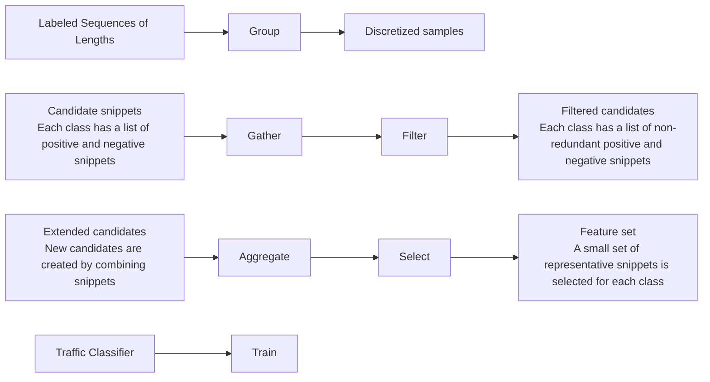

# GGFAST: Automating Generation of Flexible Network Traffic Classifiers

Julien Piet

Corelight

San-Francisco, USA

UC Berkeley

Berkeley, USA

Dubem Nwoji

Corelight

San-Francisco, USA

Vern Paxson

Corelight

San-Francisco, USA

UC Berkeley

Berkeley, USA

## ABSTRACT

When employing supervised machine learning to analyze network traffic, the heart of the task often lies in developing effective features for the ML to leverage. We develop GGFAST, a unified, automated framework that can build powerful classifiers for specific network traffic analysis tasks, built on interpretable features. The framework uses only packet sizes, directionality, and sequencing, facilitating analysis in a payload-agnostic fashion that remains applicable in the presence of encryption.

GGFAST analyzes labeled network data to identify n-grams (“snippets”) in a network flow’s sequence-of-message-lengths that are strongly indicative of given categories of activity. The framework then produces a classifier that, given new (unlabeled) network data, identifies the activity to associate with each flow by assessing the presence (or absence) of snippets relevant to the different categories.

We demonstrate the power of our framework by building—without any case-specific tuning—highly accurate analyzers for multiple types of network analysis problems. These span traffic classification (L7 protocol identification), finding DNS-over-HTTPS in TLS flows, and identifying specific RDP and SSH authentication methods. Finally, we demonstrate how, given ciphersuite specifics, we can transform a GGFAST analyzer developed for a given type of traffic to automatically detect instances of that activity when tunneled within SSH or TLS.

## CCS CONCEPTS

• Networks → Packet classification; • Security and privacy → Network security; Usability in security and privacy; • Computing methodologies → Supervised learning by classification.

## KEYWORDS

Network Traffic Classification, Machine Learning on Network Traffic, Encrypted Traffic Analysis, Automated Traffic Classification

## ACM Reference Format:

Julien Piet, Dubem Nwoji, and Vern Paxson. 2023. GGFAST: Automating Generation of Flexible Network Traffic Classifiers. In ACM SIGCOMM 2023 Conference (ACM SIGCOMM ’23), September 10, 2023, New York, NY, USA. ACM, New York, NY, USA, 17 pages. https://doi.org/10.1145/3603269.3604840

This work is licensed under a Creative Commons Attribution‐NonCommercial‐ShareAlike International 4.0 License.

ACM SIGCOMM ’23, September 10, 2023, New York, NY, USA

© 2023 Copyright held by the owner/author(s).

ACM ISBN 979-8-4007-0236-5/23/09.

https://doi.org/10.1145/3603269.3604840

## 1 INTRODUCTION

Many network traffic analysis problems can be viewed as classification tasks: given a set of characteristics of a network flow, decide what category to assign to the flow. These categories can refer to activity at different semantic levels, such as determining the application protocol employed by the flow, specific modes-of-use within the flow (e.g. determining the authentication mechanism within an SSH session), or the presence of a possible attack.

Given a corpus of network traffic with each flow labeled according to its category, a modern researcher will often employ some form of supervised machine learning to develop a classifier that aims to distinguish between the different types of activity. Often, the heart of this task lies in developing effective features for the ML to then leverage. Work to date either manually crafts features— requiring significant effort—or employs complex ML algorithms to compensate for the diminished power of using generic features. The latter approaches often suffer from a lack of explainability: it is hard to tell just how the classifier’s rules function, and thus what sort of generalizability or lacunae the classifier might exhibit.

In addition, a potentially very rich source of information about a traffic activity—namely the layer 7 payload carried by a given flow—is both expensive for classifiers to extract from high-rate traffic streams, and, more fundamentally, increasingly shrouded by encryption.

Furthermore, network protocols are often encapsulated in layers of encryption. This is a pain point for current classifiers: labels are acquired by decrypting traffic, either using host-based software or man-in-the-middle proxies, both of which are difficult to deploy in large organizations. Because of these complexities, labeled encrypted data is in short supply, impacting the quality of classifiers.

These considerations lead to a need for an approach that can (1) automatically generate apt feature sets from any labeled traffic data; (2) without requiring access to application payloads; in order to (3) build simple and explainable classifiers that can (4) execute in a highly efficient manner suitable for running at scale on large networks. Lastly, such an approach should (5) produce encrypted classifiers from easily obtainable data—without requiring traffic decryption.

In this work we develop such a framework, premised on the hypothesis that many forms of network activity reflect underlying, structured message exchanges whose sequencing patterns might well prove unique—if only we know where to look, i.e., the feature engineering required for consideration (1) above. We worked from four primary design goals:

• Apply to any application activity for which we can obtain extensive labeled examples of protocol element lengths for some consistent notion of “element”. These lengths can reflect packet sizes, socket writes (application PDUs), or TLS frames, as long as each sample uses the same.

• Generate a multi-label classifier that makes explainable, timeefficient decisions, without requiring parameter tuning. We designed our approach to distill features using regular-expression matching (executable in time linear with the input size regardless of the number of regular expressions), and employ a highly efficient Naive Bayes classifier.  
• Transfer to encrypted classifier tasks without requiring specific training. In particular, cleartext protocol classifiers can be deterministically modified to apply to encrypted versions of the same protocols, with at most a small loss in accuracy.  
• Match or exceed state-of-the-art network classification accuracy.

Our framework, GGFAST, automatically identifies discriminant patterns of messages using as input labeled samples of network traffic, leveraging these to build conceptually simple network activity classifiers. Inspired by techniques seen in DNA analysis, we identify common patterns in the sequence of packet lengths, which we term snippets. We then use the presence (or absence) of snippets, including their positions in a network flow, as features to train a Naive Bayes classifier that classifies a given flow as representing a particular type of activity.

We demonstrate the power of our framework by building—without any case-specific tuning—highly accurate analyzers for multiple types of network analysis problems: traffic classification (L7 protocol identification), whether a given TLS flow contains DNS-over-HTTPS, and identifying specific RDP and SSH authentication methods (e.g., password, passphrase, Kerberos). Our evaluation (§ 6) finds that GGFAST proves capable of generating highly effective classifiers for each of these problems, and does so with only a few thousand samples per class.

Finally, we observe that the layering used to add cryptographic protections to Internet protocols itself generally employs a highly structured sequence of messages, and only partially obfuscates the length of underlying protocols. To this end, we demonstrate (§ 7) how, given ciphersuite specifics, we can transform a GGFAST analyzer developed for a given type of traffic to automatically detect instances of that activity when tunneled within SSH or TLS.

## 2 RELATED WORK

There is an extensive body of work on developing classifiers for detecting a range of types of network activity (e.g., applicationlayer protocols, modes-of-use, anomalies). Most approaches define a specific classification task for which the authors propose distinctive features and a decision algorithm.

One extensive line of work concerns identifying L7 protocols. Initially application protocols could be identified using well-known transport port numbers, but the effectiveness of this approach waned over time. Researchers then developed techniques based on pattern-matching or parsing against transport payloads [17, 42]. These remain potentially highly accurate ways to analyze traffic, but (1) require extensive manual effort on a per-application basis, (2) may prove too expensive to employ on very high speed links, and (3) cannot be applied to encrypted traffic.

A line of research addressing these issues has employed machine learning.1 While some of these works use behavioral approaches such as who-talks-to-whom graphs [25, 27, 50], most of the approaches use either statistical profiling, or some form of sequenceof-lengths information.

Statistical profiling. These methods use summary statistics of flow-related values to describe connections, generally including packet sizes, direction, and inter-arrival timings [2, 14, 16, 22, 27, 39, 54, 60, 64, 67, 68]

overall size distributions [12, 34, 63], or features derived from applying DSP techniques to sequences of lengths and times [4, 7, 43]. Such transformations usually produce large feature sets, which hinders interpretability, and their aggregate nature cannot leverage fine-grained information such as specific patterns of packet sizes.

Sequences-of-lengths. The other main vein of prior work focuses on features that use application sequences of lengths. In its simplest form, one can use the size of the first ?? packets as features, as in [3, 8, 9, 20]. [48] claims that using the sizes of the first 7 packets2 as features can suffice for some types of classification. Other works engineer sequence-of-lengths-based features that more closely capture application-specific activity. [46] identifies succinct fingerprints by looking for packets of certain sizes within fixed time intervals, representative of each traffic class. [38] takes a pattern-based approach to traffic classification by finding the labeled sample that shares a longest common subsequence with an unknown sample. [55] uses packet lengths as signatures by finding a set of sequences that represent each class and computing the distance of each new sample to these representatives. The techniques developed in these last three contributions hold conceptual promise, and have similarities with our approach, but to date they lack evaluation on data at scale, and the two more recent works do not discuss traffic labeling [38, 55], a key concern for building robust classifiers.

ML methods. Many of the above approaches ultimately employ supervised ML. More recent publications focus on the use of deep learning [1, 19, 35–37, 53, 58, 59, 62], which has the advantage of selecting its own features at the cost of interpretability. The current leading method in this vein of research is nPrint [24], which approaches network fingerprinting by defining a standard vector representation of packets in order to apply the AutoGluon [18] ML framework.

A number of researchers also consider semi-supervised or unsupervised clustering of data [8, 9, 60, 68, 69], which can identify clusters of unknown applications, but without the ability to label each cluster.

Our framework somewhat resembles [38, 46, 55], which also focus on identifying unique structure in traffic classes. We differ from these works in that they focus on looking for closest matches between full flows, or count occurrences of specific packet lengths over a window of time, whereas we characterize flows based on specific sequences of packet lengths and ranges, which indicate particular forms of activity. The approaches are also difficult to assess given that the works lack information on how traffic was labeled. (Other work in this space specifically aims to identify state machines given observed communications [49, 61], but does so relying on packet contents.)

Finally, our framework is meant to be automated, requiring little— if any—fine-tuning. Recent work on building automated ML frameworks has encompassed all steps, from feature extraction to model choice, with three noteworthy projects being AutoGluon [18], the Deep Feature Synthesis algorithm [26], and “Ease.ML” [41]. All three can build effective classifiers from tabular data, without any fine-tuning or feature engineering. These are generic frameworks, however, and not adapted for analyzing sequential network data.

Other research has been conducted directly in the space of automatic ML for network analysis. [5, 6] propose the outline of such a project, based on statistical profiling features. [32] presents Mal-PaCA, an automated unsupervised clustering algorithm that uses 12 specific header fields as its raw data. [13] derives an automatic feature engineering framework to identify HTTP tunnels using Zeek logs [47]. [30] proposes an automatic method to build email spam detectors. In light of these recent works, GGFAST can be seen as an automatic feature engineering and learning framework, working from sequential network data, a richer data source than tabular flow statistics.

## 3 SNIPPETS

The crux of our approach is to automatically find sets of patterns in sequences of lengths characteristic of each category of traffic. We term an L-vector to be the sequence of lengths and directions.

For most traffic, an L-vector is the sequence of lengths and directions of each packet in a flow. We can employ different L-vector variants to represent socket write sizes, or TLS application data payload lengths, as described in Section (§ B).

Patterns within a L-vector can reflect state transition information or other activity specific to an application, which we can leverage to identify a flow’s underlying nature. We refer to these patterns as snippets. We aim with our framework to build analyzers that use these snippets as features to accurately categorize arbitrary TCP or UDP traffic. Furthermore, since encryption layers such as TLS often deterministically map payload lengths to ciphertext lengths, we can convert length-based sequences in cleartext protocols to their encrypted counterparts, enabling us to convert a set of cleartext features to encrypted ones without requiring labeled encrypted data.

We define a snippet as a triplet: (1) a sequence of lengths and length ranges, (2) an anchor specifying the sequence’s position in the L-vector, and (3) a potential negation flag that, if true (denoted by ∉), indicates the sequence should not match (∈ indicates it should match). For (1) we employ a decorator indicating the direction of the message: → for messages from flow originator (“client”) to responder (“server”), and ← for messages in the other direction. For (2), we define three types of anchors:

• Anchored-left: snippets that occur at a fixed position in the L-vector starting from the beginning of the connection (positive anchors).

• Anchored-right: snippets that occur at a fixed position relative to the end of the L-vector.3  
• Unanchored: snippets that occur anywhere in the L-vector (denoted with an anchor value of ∗).

We say a snippet matches an L-vector when the sequence of lengths is present in the L-vector at the position indicated by the anchor (negation flag not set); or the L-vector does not contain such a sequence (negation flag set). We also define a conjunction of snippets as a set of snippets that all match.

For example, a snippet of $\langle \{ 1 0 ^ { \right. } , 5 ^ { \left. } \} , 0 , \in \rangle$ matches L-vectors that start with an outgoing packet of length 10, followed by a response of length 5.

$\langle \{ 1 5 ^ { \right. } , [ 1 ^ { \left. } , \infty ^ { \left. } ) , 1 0 ^ { \right. } \} , - 3 , \in \rangle$ matches L-vectors that end with any sequence $\{ 1 5 ^ {  } , x ^ {  } , 1 0 ^ {  } \}$ where ?? is any non empty message length from the server; and $\langle \{ 7 ^ {  } \} , * , \notin \rangle$ has its negation flag set, so it matches L-vectors that do not contain any client-to-server (“outgoing”) message of length 7.

## 4 THE GGFAST FRAMEWORK

Finding characteristic features that effectively distinguish a class of activity can prove challenging. For example, one might discover upon reading the POP3, IMAP and SMTP RFCs [11, 31, 44] and then analyzing trace files that the snippet $\langle \{ 6 ^ {  } \} , - 2 , \in \rangle$ offers a good recognizer of clear-text email traffic. That snippet alone, however, does not fully represent all email traffic, and might match protocols unrelated to email.

To this end, our GGFAST framework builds a small set of snippets to characterize each training class. As shown in Figure 1, GGFAST works in 6 steps:

(1) Group: Discretize all lengths by quantizing into one of multiple ranges.  
(2) Gather snippets from the original and discretized L-vectors.  
(3) Filter out redundant snippets.  
(4) Aggregate: form conjunctions of multiple snippets.  
(5) Select a small set of snippets and conjunctions that cover each class.  
(6) Train a Naive Bayes classifier using the selected set.

Each of these steps plays a fundamental role. Grouping allows for consideration of ranges of values, crucial for detecting applications with variable message sizes. Gathering allows us to build a large list of candidate snippets that repeatedly appear in the training L-vectors. Filtering removes redundant snippet sets, helping to ensure that we select an efficient set of snippets as features. (This step removes over 80% of potential snippets in our evaluation Lvectors.) Aggregation combines multiple atomic snippets (features) into a conjunction. Since L-vectors will generally contain multiple protocol idioms, they will likely match more than one characteristic snippet. Combining snippets that often appear in the same L-vector allows us to reduce false positives. (For our evaluation L-vectors, this step leads to a 20% decrease in the final number of snippets and a slight increase in overall accuracy.) Selection builds the final set of characteristic snippets for each class, intended to only match L-vectors from the given class.

flowchart

Figure 1: GGFAST framework diagram

These steps lead to a set of features small enough to support interpretability, characteristic of behaviors specific to each class, and near-orthogonal to avoid redundancies, enabling effective and efficient Training.

Our framework supports generating two types of multi-label classifiers. The first makes predictions across ?? distinct classes. The second uses $N + 1$ classes: ?? that represent traffic applications, and the last consisting of traffic from other sources (“unknown”). We call this last class the baseline. Supporting this baseline class provides flexibility in developing the classifier, as often it proves difficult to label all of a dataset’s flows, especially if collected from a large and active network. Unlike other classes, baseline does not have a set of defining snippets; the traffic analyzer chooses this label when a L-vector does not manifest sufficient snippets from any class.

## 4.1 Classification background

GGFAST builds classifiers from sets of snippets. We can represent flows by feature vectors: i $\ ' S = \{ s _ { i } \}$ is the set of snippets used by the classifier, and ?? is the L-vector of a flow, then ?? is a vector of indicator features such that $f _ { i } = 1 \Leftrightarrow s _ { i }$ matches ??. Note that a L-vector can match multiple snippets, so any number of coordinates of $f$ can be equal to 1.

Assessing the quality of a snippet ?? as a discerning feature for class ?? requires a scoring function. We choose to use a log score, similar to elements of a Position Weight Matrix in DNA analysis [56], as follows. Let ?? be the set of traffic classes, ?? the training dataset (a collection of L-vectors), and $D _ { c }$ the set of L-vectors labeled as class ??. We define $M ( s )$ , the match set, as the set of L-vectors matched by snippet ??. We consider $M _ { c } ( s ) = M ( s ) \cap D _ { c } ,$ the match set for class ?? which contains the L-vectors of class ?? matched by $s ;$ and $M _ { \overline { { c } } } ( s ) = M ( s ) \cap ( D \backslash D _ { c } )$ , the L-vectors of all other classes matched by ??.

Note that we can use match sets to construct indicator vectors. If $D _ { i }$ is the $i ^ { \mathrm { { t h } } }$ L-vector in dataset ??, we can define $M ( s ) _ { i }$ as $M ( s ) _ { i } =$ $1 \Leftrightarrow s$ matches $D _ { i }$ .

Each L-vector has a weight ?? representing how many times it appears in the training set. We note $W _ { c }$ the weight of all elements in class $^ { c , }$ and $W _ { c } ( s )$ the weight of all L-vectors in class ?? matched by snippet ??. We then define scor $\mathtt { \tilde { e } } _ { c } ( s )$ as:

$$
\log \left(\frac {1 + W _ {c} (s)}{W _ {c}}\right) - \log \left(\frac {1 + \sum_ {c ^ {*} \in C \setminus \{c \}} W _ {c ^ {*}} (s)}{\sum_ {c ^ {*} \in C \setminus \{c \}} W _ {c ^ {*}}}\right).
$$

The larger this score, the more the snippet is characteristic of class ??: either because the first term is large, meaning the snippet matches a large part of the dataset for class ??, or because the second term is small, meaning the snippet matches few elements of any other class. In probabilistic terms, the score is a smoothed estimation of the log likelihood ratio for the L-vector being in class ??. By the Neyman-Pearson lemma, comparing this score to a fixed threshold is an optimal hypothesis test for deciding whether a L-vector is a member of class ??.

## 4.2 Grouping

The first GGFAST step is to generate discretized versions of the training L-vectors. Discretization encodes each original length as a category, reducing the cardinality of different possible values. We encode lengths into ranges (rather than unordered sets), as doing so allows us to retain a natural ordering amongst categories. In practice, we replace each original length by the range (equivalently, “bin”) in which it lies. For example, consider an encoding of L-vector $\{ 1 7 ^ { \left. } , 3 ^ { \right. } , 6 7 ^ { \left. } , 1 3 ^ { \right. } , 2 7 ^ { \right. } , 1 0 ^ { \left. } \}$ with the three following bins:

$$
\mathrm{A}: [ 1 ^ {\leftarrow}, \infty^ {\leftarrow}) \quad \mathrm{B}: [ 1 ^ {\rightarrow}, 1 5 ^ {\rightarrow} ] \quad \mathrm{C}: [ 1 6 ^ {\rightarrow}, \infty^ {\rightarrow})
$$

Then the L-vector will become (A, B, A, B, C, A). Apart from reducing the number of possible values, choosing appropriate bins can help with building more salient snippets. Because each traffic class will (hopefully) have a different distribution of sizes, we can craft ranges that contain more elements of one class than others. By doing so, building snippets with these ranges will help identify more apt characteristics for each class.

We generate ranges using entropy-based discretization of the original L-vectors, similar to the technique used in [21]. First, we build a new dataset from the existing one by taking every length in every sequence and associating it with the class of the sequence we extracted it from. For example, if our dataset ?? is $\{ \{ 1 0 ^ { \left. } , 5 ^ { \right. } \} , \{ 1 5 ^ { \left. } , 5 ^ { \right. } \} , \{ 1 0 ^ { \right. } , 2 0 ^ { \left. } \} \}$ , and the class vector ?? is $\left\{ C _ { a } , C _ { b } , C _ { a } \right\} ( { \mathrm { i . e . , ~ } } { \mathrm { a } }$ vector giving the classes associated with a number of L-vectors), then the discretization dataset will be $D ^ { * } =$ $\{ 1 0 ^ { \left. } , 5 ^ { \right. } , 1 5 ^ { \left. } , 5 ^ { \right. } , 1 0 ^ { \right. } , 2 0 ^ { \left. } \}$ and $C ^ { * } = \{ C _ { a } , C _ { a } , C _ { b } , C _ { b } , C _ { a } , C _ { a } \}$ .

From this new dataset, let us denote the proportion of these Lvectors reflecting class ?? as $\rho _ { c }$ . We then use Shannon’s entropy computed as $\begin{array} { r } { S = - \sum _ { c \in C } \rho _ { c } { \log } ( \rho _ { c } ) } \end{array}$ . For example, the bin $[ 1 ^ {  } , \infty ^ {  } )$ contains $\{ 5 ^ {  } , 5 ^ {  } \}$ with respective classes {1, 0}. Then each class has proportion 0.5, so this bin has an entropy of $\log ( 2 ) \approx 0 . 3$ . In a setting with multiple bins, because these bins partition the sample space, the total entropy is the weighted average of the individual entropies, the weight being the proportion of samples in each bin.

The entropy of a bin directly relates to the proportion of elements of each class within that bin. Bins with a class imbalance will have lower entropy; we hope to find bins that helps isolate members of certain classes by lowering overall entropy. Our goal is thus to minimize entropy. We find an optimal set of bins by using a technique in [21], in which we iteratively find the best bin to split so as to maximize the entropy loss (equivalently, information gain) between the old configuration and the new. We repeat this process until the information gain falls below a certain threshold (denoted $\gamma ) ,$ after which we consider our discretization to have sufficiently separated the classes. We discuss our choice of ?? in § 4.8.

<table><tr><td>Outgoing messages</td><td>Incoming messages</td></tr><tr><td>Original L-vector</td><td>Original L-vector</td></tr><tr><td>Entropy-driven encoding</td><td>Entropy-driven encoding</td></tr><tr><td>Entropy-driven encoding</td><td>Single bin</td></tr><tr><td>Single bin</td><td>Entropy-driven encoding</td></tr><tr><td>Single bin</td><td>Single bin</td></tr></table>

Table 1: Encoding variants used in GGFAST.

With this capability in our toolbox, we can now generate two versions of the dataset: the original, raw L-vectors; and the encoded version. Using both versions allows the ensuing analysis to draw upon a more diverse set of snippets. In this spirit, we generate two more versions, to fit to various types of protocols:

• Some classes of traffic might have characteristic behavior mostly in one direction of the flow. We generate unidirectional encodings in which we process only messages in a given direction through the algorithm, while assigning the opposite direction to simply one large bin.  
• Some traffic might be characterized simply by the order of the direction of traffic. For these cases, we also generate a special encoding that simply uses two bins: an outgoing (client-to-server) bin, and an incoming (server-to-client) bin.

In total, by combining these variants, we end up with 5 different versions of the original L-vectors, per Table 1. Although grappling with all of these variants would prove overwhelming if we had to manually sift through all the snippets, doing so allows our automated algorithm opportunities to identify a highly diverse set of possibilities, increasing the chances to find sharply characteristic snippets.

## 4.3 Gathering

The Gathering step aims at finding potential snippets indicative of the different classes. We sift through the multiple variants produced by the Grouping stage to capture anchored and unanchored snippets of different granularities. At this stage, we generate tens of thousands of candidates, which we refine and filter in later stages of the algorithm. We provide more details about the gathering procedure in Appendix A.1.

## 4.4 Filtering

The output of the previous step provides rich information but also contains many redundancies: two (or more) snippets that capture the same set of samples. Redundancies can occur for multiple reasons:

• A characteristic pattern at a constant offset from the start of the L-vector will generate both anchored-left and unanchored snippets associated with that pattern.  
• A pattern might be salient in multiple encodings, which will lead to multiple snippets expressed using different encodings capturing the same characteristic.  
• Snippets are often subsets of other snippets. For example, if a discerning feature of the class is that the last two packets are of size $6 ^ {  }$ , then the previous step might yield the following three snippets: $\langle \{ 6 ^ {  } \} , - 2 , \in \rangle , \langle \{ 6 ^ {  } \} , - 1 , \in \rangle , \langle \{ 6 ^ {  } , 6 ^ {  } \} , - 2 , \in \rangle$ .

Our filtering procedure aims to remove such redundancies. For snippets associated with the same class ??, we define two relational operators, $\preceq _ { c }$ and $\sim _ { c }$ Using the notation from § 4.1 for snippets ??

and $s ^ { \prime } { : }$

$$
s ^ {\prime} \preceq_ {c} s \Leftrightarrow W (M _ {c} (s) \cap M _ {c} (s ^ {\prime})) \geq \delta \times W (M _ {c} (s ^ {\prime})) \wedge
$$

$$
W (M _ {\overline {{c}}} (s) \cap M _ {\overline {{c}}} (s ^ {\prime})) \geq \delta \times W (M _ {\overline {{c}}} (s))
$$

(and $s ^ { \prime } \sim _ { c } s \Leftrightarrow s ^ { \prime } \preceq _ { c } s \wedge s \preceq _ { c } s ^ { \prime } )$ . Here, ?? , the similarity ratio parameter (explored in $( \ S \ 4 . 8 ) )$ , enables us to change the notion of proximity between sets: A value of 1 means we seek exact correspondence, thus equivalence with $\delta = 1$ means the snippets capture the exact same sets. A value below 1 allows for small differences between sets.

Intuitively, we say ?? is greater than ??′ when ?? captures most of the in-class matches captured by $s ^ { \prime } \ ( \mathrm { i . e . }$ , the weight of the intersection of both match sets is about that of the ??′ match set), and, conversely, most out-of-class matches ?? captures are also captured by ??′. When both $s ^ { \prime } \preceq s$ and $s \preceq s ^ { \prime } ,$ , we say they are equivalent, having very similar match sets in all classes. (For efficiency, we use a technique similar to MinHash [10], which supports weighted sets, to compare large sets.)

This comparison operator allows us to remove unnecessary snippets. $\operatorname { I f } s ^ { \prime } \preceq _ { c }$ ?? and ?? $\not \Eup _ { c } \ s ^ { \prime } ,$ we do not need to keep $s ^ { \prime } ,$ , because ?? will capture at least the same L-vectors in class ??, and fewer L-vectors in other classes.

The Filtering stage compares every pair of snippets for each class. If incomparable, which can occur when two snippets match different sets of L-vectors, it keeps both. If one is strictly superior, it discards the weaker snippet. If the two are equivalent, it employs a sequence of heuristics to keep the best of the two:

(1) Prefer snippets anchored to the left; then those to the right; then finally unanchored snippets. Anchored snippets will tend to be more discriminant, and left-anchored ones can identify classes right upon a flow’s onset.

(2) Prefer longer snippets, leading to fewer false positives.

(3) Prefer encodings with smaller ranges, for the same reason.

(4) If none of these hold, then keep both.

Changing ?? will highly influence the number of snippets that make it through the filter. Values close to 1 will remove fewer snippets, while smaller values might remove too many. We discuss selecting ?? in § 4.8.

## 4.5 Aggregation

The Aggregation stage stems from the observation that some activities might be best characterized by two different snippets. Each snippet individually might not provide enough discriminatory power due to also matching out-of-class L-vectors, but the conjunction of the two will not.

For example, consider a class vector ??, two snippets $S _ { 1 }$ and $S _ { 2 }$ (represented by their match vectors); and the conjunction ??1 ∧ ??2:

$$
C = \left[ \begin{array}{c} C _ {a} \\ C _ {a} \\ C _ {b} \\ C _ {b} \end{array} \right], \quad S _ {1} = \left[ \begin{array}{c} 0 \\ 1 \\ 1 \\ 0 \end{array} \right], \quad S _ {2} = \left[ \begin{array}{c} 0 \\ 1 \\ 0 \\ 1 \end{array} \right], \quad S _ {1} \wedge S _ {2} = \left[ \begin{array}{c} 0 \\ 1 \\ 0 \\ 0 \end{array} \right]
$$

The conjunction eliminates all false positives, but keeps the same true positive ratio. To use conjunctions and reinforce our classification, we extract relevant conjunction snippets from our existing pool. Per $\ S \ O 3 ,$ conjunction snippets are sets of snippets that match a L-vector only when all of the snippets in the set match.

We detail the specifics of how we chose conjonction snippets in Appendix A.2

## 4.6 Selection

Armed with our extended set of snippets, we can finally build our features. For a target false positive threshold, the goal is to find a set of snippets and conjunctions for each class that covers as much of the L-vectors of that class as possible while keeping false positives under the threshold. We can view this as a set-cover problem in a tripartite graph. The left nodes are L-vectors from the intended class, the middle nodes are the snippets, and the right nodes are the L-vectors from other classes. We connect each snippet to the nodes of the L-vectors it matches. The problem then is to find a set of nodes from the middle (snippets) that is connected to a maximal set of nodes from the left set (positive matches), while minimizing the number of connected nodes from the right set (negative matches).

By reduction from the hitting-set problem [28], this task can be shown to be NP-Hard. However, we can approximate a solution using a greedy algorithm. (We note that this approximation is not a ??-approximation for any ${ \bf \nabla } \cdot { \bf \nabla } \rho ,$ because of some extreme cases; however, empirically this method provides satisfactory results.)

We proceed as follows. First, we pick the snippet with the best score and add it to the solution set. Then we remove L-vectors it matches from the dataset. We update the score of the remaining snippets, and repeat. Removing matched L-vectors from the dataset at every step allows us to pick new snippets that are most characteristic of the remaining L-vectors, and avoids selecting multiple snippets that cover similar characteristics.

This process terminates when we have covered every L-vector of every class. At this point, we have a set of snippets $S _ { i }$ ordered by score. We denote $F _ { i } = \{ S _ { j } \} _ { j \le i }$ the cumulative feature sets. Each of these feature sets has an associated false positive rate $\operatorname { F P } _ { i } ,$ the percentage of L-vectors matched by at least one snippet in $F _ { i }$ outside their class; and a true positive rate $\mathrm { T P } _ { i } ^ { c }$ , the percentage of L-vectors of class ?? matched by at least one of the snippets of their class in $F _ { i } .$ By construction, both $\mathrm { F P } _ { i }$ and $\mathrm { T P } _ { i } ^ { c }$ increase with ??. We can thus construct a ROC and pick the most desired feature set $F _ { i }$ .

Algorithm 1 in the Appendix gives the pseudo-code for the selection process.

## 4.7 Training

After the previous step, we have a set of characteristic snippets for each class. To now automate classification, we need to implement a decision mechanism that uses these features. We do so by training a Bernoulli Naive Bayes (BNB) model, a choice motivated by its simplicity to train and use, and its suitability for our problem: each characteristic snippet is representative of some particular behavior. Its presence in an L-vector is an indicator of a given class; thus, we can associate with each snippet the conditional probabilities of each class, which is what the Naive Bayes model does while training.

The BNB independence assumption between features also in general fits: we have chosen characteristic features as good discriminators by themselves, not in conjunction with others. We already generated any effective conjunctions in the Aggregation step above.

## 4.8 Parameters

One of our main design goals is to provide a framework that can automatically build features from any labeled dataset of L-vectors. GGFAST has a handful of fixed parameters for various steps of the process. We chose parameters that yielded robust results across numerous preliminary studies, so the end user does not need to tune them, regardless of the task. We studied the impact of each parameter on GGFAST’s performance using dataset G, described in Section B.7, training on 1,000 random flows per class, with an average of 8 protocol data units per flow, keeping the rest for evaluation. Dataset G contains 17 classes of L7-protocols, making it our most diverse dataset—we chose to use it for parameter tuning in order to obtain generalizable results.

The one parameter we leave to the end user is the false positive threshold, since apt settings for it will depend on the user’s particular application of a given classifier.

Appendix A.4 provides a detailed description and illustrates the impact of each parameter from Table 2.

## 5 DATASETS

We evaluated GGFAST using data from several real-world network traces. Synthesizing data for use in network traffic research runs the risk of introducing unforeseen artifacts in the data. The first six network traces were gathered at large operational sites, while the last is a public trace captured at the University of Auckland by the WAND research group [57]. Table 3 describes each. More details about each trace can be found in Appendix B.

Ethics. We collected the operational network traces for this study under the auspices of a formal research agreement (approved by the respective legal departments) between Corelight and the monitored sites. Only authorized employees accessed the traces, using strong security controls, and all data was solely kept on, and processed using, equipment deployed at the sites.

Data processing. The data processing step converts raw network captures into labeled sequences-of-lengths. We developed a Zeek [47] plugin to generate these sequences. For flows with all of their packets present in the trace, the plugin generates up to four sequence-of-lengths variants:

For TCP and UDP traffic, we extract the length of each packet. For TCP connections, we also use heuristics to reconstruct approximate socket write sizes (also called Protocol Data Unit, or PDU), based on MSS, PSH flags, and timing information. In this variant, we also ignore control packets. For TLS connections, we extract the length of application\_data records.

To label flows, we rely on Zeek’s dynamic protocol detection framework [17], which uses payload parsing for robust classification. For DNS-over-HTTPS (DoH), we use additional heuristics, including Server Name Indication (SNI) and Application-Layer Protocol Negotiation (ALPN) extensions. The public trace does not contain packet contents, so we used port numbers for labeling (as in the original work).

Finally, we use a 50-packet cutoff in order to limit the maximum size of a L-vector, and nudge GGFAST to make early decisions.

<table><tr><td>Parameter name</td><td>GGFAST step</td><td>Significance</td><td>Parameter value</td></tr><tr><td>Information gain threshold</td><td>Grouping</td><td>Influences the number of message-size bins</td><td> $2^{-8}$ </td></tr><tr><td>Snippet similarity  $\delta$ </td><td>Filtering</td><td>Consider two snippets this close as equivalent</td><td>0.95</td></tr><tr><td>Snippet cutoff</td><td>Filtering</td><td>Maximum number of snippets per class after filtering</td><td>2,500</td></tr><tr><td>Minimum true positive rate</td><td>Selection</td><td>Requirement for adding a snippet to the feature set</td><td>0.1%</td></tr><tr><td>False positive threshold</td><td>Selection</td><td>Maximum false positive rate of the selected snippets</td><td>Variable</td></tr></table>

Table 2: GGFAST parameters

<table><tr><td>Name</td><td>Volume</td><td>Type</td><td>Transport</td><td>Filter</td><td># of flows</td><td>Capture point</td><td>Duration</td></tr><tr><td>Dataset A</td><td>1430GB</td><td>Flows cut above 200KB</td><td>TCP</td><td>None</td><td>24,710,852</td><td>National lab edge</td><td>24 hours</td></tr><tr><td>Dataset B</td><td>547GB</td><td>Full payload</td><td>UDP</td><td>None</td><td>1,242,684</td><td>Enterprise edge</td><td>60 minutes</td></tr><tr><td>Dataset C</td><td></td><td>Flow L-vectors</td><td>TCP</td><td>DoH</td><td>71,324</td><td>University edge</td><td>2 months</td></tr><tr><td>Dataset D</td><td>24GB</td><td>Full payload</td><td>TCP</td><td>RDP</td><td>2600</td><td>University edge</td><td>20 hours</td></tr><tr><td>Dataset E</td><td>7GB</td><td>Full payload</td><td>TCP</td><td>SSH</td><td>253,696</td><td>University edge</td><td>5 hours</td></tr><tr><td>Dataset F</td><td>141GB</td><td>Full payload</td><td>TCP</td><td>None</td><td>3,712,604</td><td>University edge</td><td>90 minutes</td></tr><tr><td>Dataset G</td><td>1664GB</td><td>Full payload</td><td>TCP</td><td>None</td><td>7,858,427</td><td>Enterprise edge</td><td>90 minutes</td></tr><tr><td>AUCK-VI</td><td>17GB</td><td>Header only</td><td>TCP + UDP</td><td>None</td><td>526,542</td><td>Campus network</td><td>4 days, 15 hours</td></tr></table>

Table 3: Datasets used for evaluation

## 6 EVALUATION

To evaluate GGFAST’s performance, we applied it to six traffic analysis problems. The first is L7 protocol classification of TCP network applications in the AUCK-VI public dataset, to benchmark our framework against previous solutions. The second and third are L7 protocol classification of enterprise traffic in datasets A and B. The fourth aims at identifying DNS-over-HTTPS (DoH) in the TLS traffic from dataset C, to illuminate GGFAST’s performance on encrypted traffic. The fifth is determining the method of authentication used in RDP traffic, using dataset D, and the sixth is the same for SSH, with dataset E.

## 6.1 Public dataset

We use dataset AUCK-VI to benchmark GGFAST against three other approaches. The first, described in [68], used statistical profiling to build traffic classifiers. This work used the AUCK-VI public dataset for evaluation. The second [38] uses longest common subsequences of L-vectors as representatives of each class, for which we re-implemented the “message size sequence classifier” from the description provided in the paper. The third approach uses features derived from the nPrint framework [24]. nPrint uses a standardized representation of traffic to train machine learning models. We used their open-source implementation [23] to build a feature vector for each packet with the IPv4, IPv6 and TCP headers, and aggregated together the vectors of the first 50 packets of each 5-tuple (source and destination IP, ports and protocol), to stay consistent with the 50 packet cutoff used in GGFAST.

These composite feature vectors were then fed to nPrintML, an automatic-ML framework built by the same authors on top of AutoGluon [18].

We used the TCP (but not UDP) traffic from [68], with the traffic classes listed below in Table 4. We ignored UDP since it represented a small portion of the traffic. Following the original paper, we kept up to 8,000 random flows per class, and selected 1,000 of each for training. We used the TCP packet size variant of L-vectors, and chose to use web traffic as the baseline class because of its diversity.

Results. Table 4 summarizes the effectiveness of each classifier on Auck-VI. The classifier in [68] was evaluated on multiple network traces. The authors only provided information about the minimum/maximum accuracy across all traces; we considered their best accuracy achieved on AUCK-VI.

The classifier built by GGFAST consistently outperformed [68]’s classifier and the sequence-of-lengths-based classifier from [38].

On this dataset, our classifier even achieved better results than the nPrint-based classifier, today’s state of the art network classification tool. nPrintML reached an overall accuracy (ratio of correct predictions to all predictions) of 96%, while our classifier gets to 98.6%. We accomplish this feat without requiring difficult-to-interpret deep learning models: our BNB-based method only requires 18 snippets.

<table><tr><td>Class</td><td>Flows</td><td>Port(s)</td><td>[68]</td><td>nPrint [24]</td><td>[38]</td><td>GGFAST</td></tr><tr><td>FTP</td><td>8,000</td><td>20; 21</td><td>90%</td><td>89.0%</td><td>25.3%</td><td>97.7%</td></tr><tr><td>Telnet</td><td>1,380</td><td>23</td><td>90%</td><td>97.6%</td><td>95.8%</td><td>98.4%</td></tr><tr><td>SMTP</td><td>8,000</td><td>25; 587; 465</td><td>90%</td><td>97.0%</td><td>75.6%</td><td>97.7%</td></tr><tr><td>Web</td><td>8,000</td><td>80; 443</td><td>92%</td><td>96.5%</td><td>90.7%</td><td>99.6%</td></tr><tr><td>AOL</td><td>1,308</td><td>5190</td><td>90%</td><td>98.7%</td><td>96.8%</td><td>99.4%</td></tr></table>

## Table 4: Auck-6 TCP dataset and classification TPR 6.2 Private dataset

We develop a second example using dataset A. Our goal is again to infer L7 protocols. Because this dataset includes packet payloads, we can use Zeek to label each flow’s actual L7 protocol (per Table 7 in the appendix).

To showcase GGFAST’s ability to distinguish not only L7 protocols, but also identify more subtle forms of activity, we split TLS flows into multiple subcategories. First, we considered TLS over port 443 to be HTTP over TLS. Then, we used port numbers to label POP3-over-TLS, IMAP-over-TLS and SMTP-over-TLS. Finally, we separated unsuccessful TLS handshakes into their own category, TLS\_FAIL.

We noticed very short HTTP flows can prove difficult to classify, since they can have diverse packet sizes and lack enough packets to find long snippets. However, instead of simply discarding them, we split the HTTP dataset into HTTP\_SHORT (flows with 1–3 packets) and HTTP\_LONG (≥ 4 packets), in order to see how GGFAST performs in extreme cases.

We compared GGFAST and nPrintML on this dataset, using PDU messages as the unit of lengths. Due to the large number of features used by nPrint, their open-sourced ML framework cannot scale to the full size of this set. This is because their representation of IPv4, IPv6 and TCP uses over 800 features per packet. nPrintML’s memory usage is linear, using around 140GB of RAM for 50,000 samples. Extrapolating this to 25,000,000 samples, it would require about 70TB of RAM to load the full dataset.

Instead, we reduced the dataset to include up to 10,000 randomly selected samples per class, and split this into 20% for training and 80% for testing, to be able to both run the nPrint based classifier, and GGFAST.

Results. Table 5 shows the confusion matrix for the classifier when evaluating on the first use-case. It has an overall accuracy of 96.7%. Its $F _ { 1 }$ score is 0.968 (where we applied $F _ { 1 }$ to the arithmetic mean of class precisions and recalls).

Our classifier is able to almost perfectly distinguish between POP3-over-TLS, IMAP-over-TLS, SMTP-over-TLS and HTTP-over-TLS, which shows how GGFAST is capable of correctly identifying flows with nested applications. It can also differentiate between TLS flows with successful and unsuccessful handshakes.

However, it sometimes misclassifies pure TLS flows as HTTP over TLS, likely linked to unreliability in the labeling of HTTP over TLS traffic. It also mistakes some TLS for unknown flows, due to the large gamut of potential TLS uses, which are difficult to capture fully in a few thousand samples.

The classifier also performs very well on FTP, RFB, MYSQL, SMTP and SSH. It sometimes misclassifies pure TLS flows as HTTP over TLS, likely linked to unreliability in the labeling of HTTP over TLS traffic. It can differentiate between TLS flows with successful and unsuccessful handshakes..

It struggles at identifying short HTTP flows, mistaking them for other protocols in 10.7% of cases. We attribute this to the difficulty of identifying HTTP’s underlying structure using only a few packet lengths. Nevertheless, the strong results for most classes show our framework can achieve high accuracies.

In comparison, the nPrintML derived classifier has an accuracy of 96.5%, with an $F _ { 1 }$ score of 0.965. GGFAST exceeds these stateof-the-art results, only requiring a couple hundred features total, instead of over 40,000, and providing interpretable decisions.

In order to illustrate this last point, we give examples of snippets generated by the framework. POP3-over-TLS only needed two snippets to by fully recognized on this data, one of them being: $\langle \{ [ 2 0 ^ {  } , 3 2 ^ {  } ] , 6 ^ {  } , 8 8 ^ {  } , 6 ^ {  } , [ 2 0 ^ {  } , 3 2 ^ {  } ] , 5 1 7 ^ {  } \} , 0 , \in \rangle$

Flows presenting this snippet are likely to be POP3-over-TLS. Not only does this help understand the model’s decision, it also reflects deeper protocol semantics. According to the RFC [44], POP3 starts with an incoming server packet, containing the welcome message. POP3 contains many small client commands, such as “STAT” or “LIST”, represented by $_ 6 { } ^ {  }$ packets. Both these characteristics are represented in this snippet.

Another good example comes from an FTP snippet, representing a command that can occur anywhere in a flow: $\langle \{ 8 ^ { \right. } , 1 9 ^ { \left. } \} , * , \in \rangle$

Naturally, not all snippets and classes are as interpretable as these. However, even for the more complicated cases, each decision can be linked to the presence—or absence—of particular snippets.

This allows analysts to understand how the model chose labels for each flow, and pinpoint behavior to particular snippets.

In order to illustrate GGFAST’s ability to scale, we evaluated the classifier on the full 24,000,000 flows in the dataset, and still achieved an accuracy of 96.5%. However, due to the overwhelming volume of TLS traffic, overall precision suffered, leading the $F _ { 1 }$ score to drop to 0.864.

Combining nPrint and GGFAST. We view nPrint’s standard network traffic representation and GGFAST’s unique features as complementary. We built a classifier using nPrintML, from the concatenation of nPrint and GGFAST’s feature vectors. This hybrid system achieved an accuracy of 99%, with an $F _ { 1 }$ score of 0.99, making three times fewer classification errors than nPrintML or GGFAST on their own.

## 6.3 UDP classification

Our third example examines GGFAST’s ability to classify UDP traffic. We used Zeek to label each flow in dataset B with its L7 protocol. We gathered 1,072,241 DNS flows, 14,892 SNMP flows, 4,880 NTP flows, and 150,188 Unknown flows, discarding identified protocols with fewer than 1,000 flows. We trained on 10% of the data and evaluated on the remaining 90%, with a hard limit of 20,000 training samples per class.

Results. Table 9 (Appendix C) shows the confusion matrix for the classifier when evaluating on the remaining flows. It has an overall accuracy of 98.0%, with an $F _ { 1 }$ score of 0.980: our classifier can almost perfectly distinguish the four classes.

In particular, NTP traffic is simple to detect, the framework only needed to produce a single snippet: $\langle \{ 4 8 ^ { \right. } , 4 8 ^ { \left. } \} , 0 , \in \rangle$ , showing that NTP can be characterized by its initial exchange of packets of length 48. Analysts can trace back any NTP classification to the presence of this initial packet exchange, helping them understand the reason behind the classifier’s decision.

## 6.4 Explainability

In this example, we further illustrate GGFAST’s explainability by building a classifier distinguishing DNS-over-HTTPS (DoH) traffic from other TLS traffic. This example also showcases the power of the framework on encrypted flows. To have enough data, we used 20% of dataset C for training. This totals to 7,518 DoH flows and 6,746 non-DoH TLS flows. The dataset uses the TLS variant of Lvectors. For this particular case, we set the false positive threshold to 0: we would rather miss some DoH samples than mislabel non-DoH traffic.

The classifier output by GGFAST achieves 97.3% accuracy, with 0.06% false positives and 95.1% true positives, with an $F _ { 1 }$ score of 0.974. It requires only 8 snippets to capture DoH behavior, the most prevalent of which is $\langle \{ 1 6 5 ^ {  } , 1 4 6 ^ {  } \} , * , \in \rangle$ , which we determined is representative of Cloudflare DNS-over-HTTPS requests. Seeing this snippet in TLS traffic is highly indicative of DoH traffic. This classifier achieves interpretability, as there are only 8 possible indicators for DoH, all of which become apparent to an analyst manually inspecting the sequences-of-lengths.

heatmap

| Actual Class | DNS over TCP | FTP | HTTP, TLS | HTTP LARGE | HTTP SMALL | IMAP, TLS | MYSQL | POP3, TLS | RFB | SMTP | SMTP, TLS | SSH | TLS | TLS FAIL | Unknown |
| --- | --- | --- | --- | --- | --- | --- | --- | --- | --- | --- | --- | --- | --- | --- | --- |
| DNS (over TCP) | 93.0 | 0.0 | 0.0 | 0.2 | 3.2 | 0.0 | 0.0 | 0.0 | 0.0 | 0.0 | 0.0 | 0.0 | 0.0 | 0.0 | 3.5 |
| FTP | 0.1 | 99.0 | 0.0 | 0.0 | 0.0 | 0.0 | 0.0 | 0.0 | 0.0 | 0.0 | 0.0 | 0.0 | 0.1 | 0.0 | 0.8 |
| HTTP, TLS | 0.1 | 0.0 | 91.7 | 0.3 | 0.6 | 0.0 | 0.0 | 0.0 | 0.0 | 0.0 | 0.0 | 0.0 | 1.0 | 0.2 | 6.1 |
| HTTP_LARGE | 0.2 | 0.0 | 0.1 | 97.3 | 0.7 | 0.0 | 0.0 | 0.0 | 0.0 | 0.0 | 0.0 | 0.0 | 0.0 | 0.3 | 1.4 |
| HTTP_SMALL | 7.8 | 0.0 | 0.0 | 0.0 | 89.3 | 0.0 | 0.0 | 0.0 | 0.0 | 0.0 | 0.0 | 0.0 | 0.0 | 1.9 | 1.0 |
| IMAP, TLS | 0.0 | 0.0 | 0.0 | 0.0 | 0.0 | 98.7 | 0.0 | 0.0 | 0.0 | 0.0 | 0.2 | 0.5 | 0.5 | 1.9 | 1.4 |
| MYSQL | 0.0 | 117 (2) | 117 (2) | 117 (2) | 117 (2) | 117 (2) | 117 (2) | 117 (2) | 117 (2) | 117 (2) | 117 (2) | 117 (2) | 117 (2) | 117 (2) | 1.4 |
| POP3, TLS | 117 (2) | 117 (2) | 117 (2) | 117 (2) | 117 (2) | 117 (2) | 117 (2) | 117 (2) | 117 (2) | 117 (2) | 117 (2) | 117 (2) | 123 (2) | 123 (2) | 1.4 |
| RFB | 117 (2) | 117 (2) | 117 (2) | 117 (2) | 117 (2) | 117 (2) | 117 (2) | 117 (2) | 117 (2) | 117 (2) | 117 (2) | 117 (2) | 133 (2) | 133 (2) | 1.4 |
| SMTP, TLS | 117 (2) | 117 (2) | 117 (2) | 117 (2) | 117 (2) | 117 (2) | 99.9 (2) | 99.9 (2) | 99.9 (2) | 99.9 (2) | 99.9 (2) | 99.9 (2) | 94.4 (2) | 94.4 (2) | 6.6 |

Table 5: Confusion matrix for the dataset A classifier. Values are percentages.

## 6.5 RDP Behavior

The goal of this classification task is to identify different methods of authentication used by RDP clients. The MS-CSSP Protocol allows RDP clients to authenticate using either NTLM hashes based on passwords, or Kerberos tickets. For this task we created three classes: Password, Kerberos, and Unknown. We assigned class labels using bespoke rules previously developed by a network monitoring company requiring weeks of expert analyst time to devise. Using those rules, the dataset consists of 923 instances of password authentication, 601 of Kerberos authentication, and 532 Unknown instances, for which another authentication was used. Since the dataset is smaller than the previous ones, we kept half of all data for training and used the rest for evaluation.

Results. GGFAST achieves an overall accuracy of 99.6% $\left( F _ { 1 } = \right.$ 0.996). We provide a confusion matrix in Table 10 (Appendix C). Our classifier does an almost perfect job at distinguishing different modes of authentication in RDP traffic, showing that GGFAST is not only capable of identifying application protocols, it can provide insight into their modes of use; and, in addition, it can automatically generate classifiers similar in performance to those an expert developed by hand.

## 6.6 SSH Behavior

We used rules handcrafted by the same network monitoring company to classify SSH traffic according to the authentication mechanism: Password, Public Key, or Failure (when the authentication did not succeed). Using dataset E, we identified 1,013 public key authentications, 1,991 password authentications, and 250,692 failed authentications. We kept 25% of each class for training, capped at 10,000 samples, and set aside the rest for evaluation.

Results. Our classifier achieves an overall accuracy of 99.4% (??1 = 0.993). We provide a confusion matrix in Table 11 (Appendix C). Similarly to RDP, the classifier does an almost perfect job, again showing that the GGFAST classifier leads to similar performance to rules hand-crafted by an expert.

## 7 CLASSIFYING ENCRYPTED FLOWS

Our previous examples used labeled data to derive features, train a model and predict traffic labels. It can however prove difficult to obtain labeled data for encrypted flows. For example, working solely from a TLS or SSH packet L-vector we cannot reliably label the application protocols inside the flows.

To automate feature discovery for encrypted flows without having specific training data, we hypothesized that we could train a classifier on unencrypted traffic (where labels are available) and adapt it to work on encrypted traffic. Often encryption will add a fixed-length header, and symmetric encryption mechanisms will pad the ensuing data to a given cipher block size, so the encrypted packet size is equal to the unencrypted packet size plus a constant. We hope then to build for each protocol a function that transforms clear-text snippets to their encrypted counterparts, enabling us to train on clear-text data with Zeek labels, and obtain a classifier that can be used on encrypted flows.

Here we develop a transform function for SSH and TLS.

## 7.1 Classifying SSH Traffic

SSH’s port-forwarding mechanism tunnels TCP ports between two hosts. The client host listens on a configured port, and encrypts and forwards new connections to the server, which transfers the connections to the targeted host.

SSH uses “channels” to do so, which support connection multiplexing, including interactive shell sessions. A PDU of x bytes will result in an SSH packet of $4 + M + B \lceil ( x + 1 4 ) / B \rceil$ bytes, where ?? is the length of the MAC and ?? the SSH block size [65, 66]. This allows us to convert clear-text SOLs to their encrypted counterparts.

We provide more details on the derivation of this transform, as well as how to recognize the start and end of a flow within an SSH tunnel, in Appendix D.1.

Evaluation. To build a labeled SSH traffic dataset for evaluation, we replay network traces over a set of SSH tunnels. We replay each connection in order, so as to not intermix flows; we defer the problem of classifying multiplexed traffic to future work.

We used dataset G, which contains the most classes of any datasets, to put our transform to the test. GGFAST achieves an accuracy of 96.7% on this raw data, before replaying over SSH. We provide a more complete description of this dataset in Appendix B.7.

We randomly sampled and replayed a set of 200,000 flows from dataset G, using chacha20-poly1305. We flag the end of each connection and the beginning of the next by looking for the shutdown snippet immediately followed by a setup snippet. We transformed our original model, trained on dataset ${ \mathrm { G } } ,$ using the SSH cipher and MAC parameters to apply the transform function. We then evaluated this new model on each extracted connection.

Table 12 (Appendix C) shows the confusion matrix for the transformed classifier. It has an overall accuracy of 91.5%, with an $F _ { 1 }$ score of 0.924. (We did not have any GSSAPI, NTML, SMB samples in our dataset, and no flow was misclassified as such, so we remove them from the matrix.)

On most labels, our transformed classifier—trained only on cleartext instances of the protocols—obtains true positive rates within 5% of the original classifiers’, showing that we can still distinguish traffic classes well despite the layer of encryption. However, classes RPC, NTLM and GSSAPI, KRB, SMB are often confused with HTTP, TLS traffic. This occurs because payload padding removes subtle size differences. In general, these results show how using GGFAST’s snippet-based approach can often produce transferable classifiers that can identify tunneled (and encrypted) traffic without requiring labeled examples of such.

## 7.2 Classifying TLS Traffic

TLS has seen wide adoption in recent years as more applications opt for encrypted tunneling with the goal of confidentiality and integrity of message content. A TLS connection begins with a negotiation handshake to determine version and cipher suite, and to verify certificates.4 Only after the handshake completes can encrypted data be exchanged.

As for SSH, we analyzed how individual data packets are transformed. In TLS 1.2 [15] and earlier versions, encrypted data packets are marked with a specific header, so we can identify the start and end of connections. This is no longer possible in TLS 1.3, because many other packets have the same header: without knowledge of the start and end of encrypted data packets, we can no longer rely on transformed anchored snippets, and must only use unanchored ones.

Table 6 summarizes the length transformation operator, as a function of the TLS version, the type of encryption, ?? the length of the MAC and ?? the block size. All of these parameters are available in plaintext, regardless of the TLS version. See Appendix D.2 for the derivations of these formulae.

Evaluation. Unlike SSH, we can find instances of labeled TLS traffic in the wild, thanks to specific application mechanisms. For instance, modern SMTP implementations use STARTTLS, a custom command that instructs the server to open a TLS connection on the same port, in order to encrypt the rest of the connection. We can infer, when seeing this command followed by a TLS connection, that this encrypted tunnel is used to transport SMTP traffic. Using this for labeling, we identified a list of SMTP-over-TLS SNIs in dataset F, which we used to find all SMTP-over-TLS, both using STARTTLS and directly communicating over TLS.

<table><tr><td>Encryption type</td><td>TLS version</td><td>Transformation function T(x)</td></tr><tr><td>Block Ciphers</td><td>TLS 1.1 &amp; TLS 1.2</td><td> $B \times (1 + \lceil (1 + x + M)/B \rceil)$ </td></tr><tr><td>Block Ciphers</td><td>TLS 1.0</td><td> $B \times \lceil (1 + x + M)/B \rceil$ </td></tr><tr><td>Stream Ciphers</td><td>Any</td><td> $x + M$ </td></tr><tr><td>AEAD</td><td>TLS 1.2 and below</td><td> $x + 24$ </td></tr><tr><td>AEAD</td><td>TLS 1.3</td><td> $x + 17$ </td></tr></table>

Table 6: TLS encrypted transformation functions

We trained an SMTP classifier, using 25,000 flows of plaintext SMTP traffic (excluding SMTP flows with STARTTLS commands) and 25,000 flows of other traffic from dataset F. We set the false positive threshold to 0, to limit errors in the transformed classifier. We evaluated it on the TLS flows of that same dataset, using the TLS sequence-of-lengths variant. These L-vectors do not include the STARTTLS command, which is sent in the clear. Out of the 138,236 SMTP-over-TLS flows, 105,940 were labeled as such, while 32,296 were labeled as other TLS. Only 14,474 of the 3,574,368 other TLS flows were misidentified as SMTP-over-TLS. Although promising, these results also show the limits of our approach.

(1) Only a small fraction (0.4%) of other non-SMTP TLS flows are mislabeled as SMTP, however since the organic proportion of SMTP is low, this still represents a large number of false positives.  
(2) A significant amount of SMTP-over-TLS (23.4%) traffic is mislabeled as other. We believe this is due to a phenomenon we coin “protocol divergence”. Standard behavior over the past years has been to use many protocols, including SMTP, in encrypted TLS tunnels. Today, many implementations of SMTP servers now support TLS by default, and the ones that still use SMTP in the clear often are outdated or limited to specific use-cases. Since each implementation has slightly different behaviors, snippets for cleartext SMTP do not always transfer well to SMTP-over-TLS.

Despite these concerns, this classifier still identifies over 75% of SMTP-over-TLS flows, without needing to train on encrypted flows. Furthermore, out of the 14,474 false positives, 9,200 correspond to IMAP-over-TLS and POP3-over-TLS traffic. Although these are still false positives, these protocols are adjacent to SMTP and have very similar syntax. Since we barely had any examples of these in the clear, GGFAST could not learn the difference between SMTP and other email protocols.

## 8 SUMMARY

We presented GGFAST, a novel framework for automating feature engineering in order to build fast and interpretable network traffic analysis tools based on pattern matching in network flow sequences-of-lengths encodings. The framework looks for characteristic patterns of message lengths, which we term snippets. Basing classification on snippets provides flexibility in that they allow for positional context via anchoring (or non-anchoring) along with negation. The framework identifies and removes redundant snippets, aggregates complementary ones, and selects the most prevalent, ultimately building an optimized feature set for the classification problem at hand.

GGFAST offers a general way to build both TCP and UDP traffic analyzers, as it only needs labeled examples of protocol element lengths. It also potentially provides explainable decisions, since the snippets it finds to characterize each class often reflect underlying protocol or message idioms, structurally illuminating what makes each class unique.

Our evaluations show that GGFAST can automatically produce highly accurate classifiers, matching state-of-the-art performance.

We achieved better accuracy than prior work for L7 protocol classification on a public network trace. Building on samples from a large enterprise network trace, GGFAST can identify multiple applications in the same flow with high accuracy, using only a fraction of the traffic for training. GGFAST also can perform well on network analysis tasks involving encrypted protocols, identifying DNS-over-HTTPS (DoH) flows amongst TLS traffic. Here it achieved a false positive ratio of 0.06%, while still identifying 95.1% of all DoH flows (overall accuracy of 97.3%). GGFAST can also classify different modes of a single protocol, such as the type of authentication used in RDP or SSH connections.

Finally, we can transfer GGFAST classifiers to work on encrypted flows, provided that the effect of encryption on packet sizes is known. For SSH tunnels, we can classify traffic with an accuracy of 91.5% by directly translating the model developed on clear traffic, without any training on tunneled traffic. TLS encryption proves more challenging, though the transferred version of a classifier developed to detect cleartext SMTP connections still identifies more than 75% of SMTP-over-TLS flows.

## 9 ACKNOWLEDGMENTS

Our thanks to Corelight’s Labs team for their feedback and support during this project; to Jamie Brim in particular for assisting us with collecting the encrypted DNS samples; and especially to Anthony Kasza, who did fundamental preliminary work that inspired us to delve more deeply into the problem space. We also are grateful to Corelight’s Polaris partners for working with us to analyze the traffic in their networks.

Finally, we much appreciate David Wagner’s extensive feedback on this work. This work was supported in part by C3.ai through the Digital Transformation Institute (DTI).

## REFERENCES

[1] Giuseppe Aceto, Domenico Ciuonzo, Antonio Montieri, and Antonio Pescapé. 2018. Mobile Encrypted Traffic Classification using Deep Learning. In Network Traffic Measurement and Analysis Conference (TMA). IEEE.  
[2] Hassan Alizadeh, Harald Vranken, André Zúquete, and Ali Miri. 2020. Timely Classification and Verification of Network Traffic using Gaussian Mixture Models. IEEE Access (2020).  
[3] Blake Anderson and David McGrew. 2017. Machine Learning for Encrypted Malware Traffic Classification: Accounting for Noisy Labels and Non-Stationarity. In Proceedings of the 23rd ACM SIGKDD International Conference on Knowledge Discovery and Data Mining.  
[4] Erik Areström and Niklas Carlsson. 2019. Early Online Classification of Encrypted Traffic Streams using Multi-fractal Features. In IEEE INFOCOM Conference on Computer Communications Workshops.  
[5] Behnaz Arzani, Kevin Hsieh, and Haoxian Chen. 2021. Interpretable Feedback for AutoML and a Proposal for Domain-customized AutoML for Networking. In Proceedings of the Twentieth ACM Workshop on Hot Topics in Networks. 53–60.  
[6] Behnaz Arzani and Bita Rouhani. 2020. Towards a domain-customized automated machine learning framework for networks and systems. arXiv preprint arXiv:2004.11931 (2020).  
[7] Tom Auld, Andrew W Moore, and Stephen F Gull. 2007. Bayesian Neural Networks for Internet Traffic Classification. IEEE Transactions on Neural Networks  
(2007).  
[8] Laurent Bernaille, Renata Teixeira, Ismael Akodkenou, Augustin Soule, and Kave Salamatian. 2006. Traffic Classification on the Fly. ACM SIGCOMM Computer Communication Review (2006).  
[9] Laurent Bernaille, Renata Teixeira, and Kave Salamatian. 2006. Early Application Identification. In Proceedings of the ACM CoNEXT Conference.  
[10] Andrei Z Broder. 1997. On the Resemblance and Containment of Documents. In Proceedings Compression and Complexity of Sequences. IEEE.  
[11] Marc Crispin. 1996. Internet Message Access Protocol-Version 4rev1. RFC 2060. IETF. https://tools.ietf.org/html/rfc2060  
[12] Manuel Crotti, Maurizio Dusi, Francesco Gringoli, and Luca Salgarelli. 2007. Traffic Classification through Simple Statistical Fingerprinting. SIGCOMM Comput. Commun. Rev. 37 (Jan. 2007). https://doi.org/10.1145/1198255.1198257  
[13] Jonathan J. Davis and Ernest Foo. 2016. Automated Feature Engineering for HTTP Tunnel Detection. Computers and Security (2016).  
[14] Rohit Dhamankar and Rob King. 2007. Protocol Identification via Statistical Analysis (PISA). White Paper, Tipping Point (2007).  
[15] T. Dierks and E. Rescorla. 2008. The Transport Layer Security (TLS) Protocol Version 1.2. RFC 5246. IETF. https://tools.ietf.org/html/rfc5246  
[16] Gerard Draper-Gil, Arash Habibi Lashkari, Mohammad Saiful Islam Mamun, and Ali A Ghorbani. 2016. Characterization of Encrypted and VPN Traffic using Time-Related Features. In Proceedings of the 2nd International Conference on Information Systems Security and Privacy (ICISSP).  
[17] Holger Dreger, Anja Feldmann, Michael Mai, Vern Paxson, and Robin Sommer. 2006. Dynamic Application-Layer Protocol Analysis for Network Intrusion Detection. In 15th USENIX Security Symposium.  
[18] Nick Erickson, Jonas Mueller, Alexander Shirkov, Hang Zhang, Pedro Larroy, Mu Li, and Alexander Smola. 2020. AutoGluon-Tabular: Robust and Accurate AutoML for Structured Data. arXiv preprint arXiv:2003.06505 (2020).  
[19] Fatih Ertam and Engin Avcı. 2017. A New Approach for Internet Traffic Classification: GA-WK-ELM. Measurement 95 (2017), 135 – 142. https://doi.org/10.1016/ j.measurement.2016.10.001  
[20] Alice Este, Francesco Gringoli, and Luca Salgarelli. 2009. Support Vector Machines for TCP Traffic Classification. Computer Networks 53 (2009).  
[21] Usama Fayyad and Keki Irani. 1993. Multi-Interval Discretization of Continuous-Valued Attributes for Classification Learning. In Proceedings of the 13th International Joint Conference on Artificial Intelligence.  
[22] Félix Hernández-Campos, AB Nobel, FD Smith, and K Jeffay. 2003. Statistical Clustering of Internet Communication Patterns. Computing Science and Statistics 35 (2003).  
[23] Jordan Holland, Paul Schmitt, Nick Feamster, and Prateek Mittal. [n. d.]. nPrint. https://nprint.github.io/nprint/. Accessed: 2021-05-19.  
[24] Jordan Holland, Paul Schmitt, Nick Feamster, and Prateek Mittal. 2020. nPrint: A Standard Data Representation for Network Traffic Analysis. arXiv preprint arXiv:2008.02695 (2020).  
[25] Marios Iliofotou, Prashanth Pappu, Michalis Faloutsos, Michael Mitzenmacher, Sumeet Singh, and George Varghese. 2007. Network Monitoring using Traffic Dispersion Graphs (TDGs). In Proceedings of the 7th ACM SIGCOMM Conference on Internet Measurement.  
[26] James Max Kanter and Kalyan Veeramachaneni. 2015. Deep feature synthesis: Towards automating data science endeavors. In IEEE International Conference on Data Science and Advanced Analytics (DSAA).  
[27] Thomas Karagiannis, Konstantina Papagiannaki, and Michalis Faloutsos. 2005. BLINC: Multilevel Traffic Classification in the Dark. In Proc. ACM SIGCOMM.  
[28] Richard M Karp. 1972. Reducibility Among Combinatorial Problems. In Complexity of Computer Computations. Springer.  
[29] Hyunchul Kim, Kimberly C Claffy, Marina Fomenkov, Dhiman Barman, Michalis Faloutsos, and KiYoung Lee. 2008. Internet Traffic Classification Demystified: Myths, Caveats, and the Best Practices. In Proceedings of the ACM CoNEXT Conference.  
[30] Fred N Kiwanuka, Ja’far Alqatawna, Anang Hudaya Muhamad Amin, Sujni Paul, and Hossam Faris. 2019. Towards Automated Comprehensive Feature Engineering for Spam Detection.. In ICISSP. 429–437.  
[31] John Klensin et al. 2001. Simple Mail Transfer Protocol. RFC 2821. IETF. https: //tools.ietf.org/html/rfc2821  
[32] Sung kyung Park, Azqa Nadeem, and Sicco Verwer. 2021. MalPaCA Feature Engineering-A comparative analysis between automated feature engineering and manual feature engineering on network traffic. (2021).  
[33] Yeon-sup Lim, Hyun-chul Kim, Jiwoong Jeong, Chong-kwon Kim, Ted "Taekyoung" Kwon, and Yanghee Choi. 2010. Internet Traffic Classification Demystified: On the Sources of the Discriminative Power. In Proceedings of the 6th ACM CoNEXT Conference. https://doi.org/10.1145/1921168.1921180  
[34] Ying-Dar Lin, Chun-Nan Lu, Yuan-Cheng Lai, Wei-Hao Peng, and Po-Ching Lin. 2009. Application Classification using Packet Size Distribution and Port Association. Journal of Network and Computer Applications 32 (2009).  
[35] Chang Liu, Longtao He, Gang Xiong, Zigang Cao, and Zhen Li. 2019. FS-Net: A Flow Sequence Network For Encrypted Traffic Classification. In IEEE INFOCOM - IEEE Conference on Computer Communications.  
[36] Manuel Lopez-Martin, Belen Carro, Antonio Sanchez-Esguevillas, and Jaime Lloret. 2017. Network Traffic Classifier with Convolutional and Recurrent Neural Networks for Internet of Things. IEEE Access (2017).  
[37] Mohammad Lotfollahi, Mahdi Jafari Siavoshani, Ramin Shirali Hossein Zade, and Mohammdsadegh Saberian. 2020. Deep Packet: A Novel Approach for Encrypted Traffic Classification using Deep Learning. Soft Computing 24 (2020).  
[38] Chun-Nan Lu, Chun-Ying Huang, Ying-Dar Lin, and Yuan-Cheng Lai. 2016. High Performance Traffic Classification based on Message Size Sequence and Distribution. Journal of Network and Computer Applications 76 (2016).  
[39] Anthony McGregor, Mark Hall, Perry Lorier, and James Brunskill. 2004. Flow Clustering using Machine Learning Techniques. In International Workshop on Passive and Active Network Measurement. Springer.  
[40] David McGrew. 2008. An Interface and Algorithms for Authenticated Encryption. RFC 5116. IETF. https://tools.ietf.org/html/rfc5116  
[41] Leonel Aguilar Melgar, David Dao, Shaoduo Gan, Nezihe Merve Gürel, Nora Hollenstein, Jiawei Jiang, Bojan Karlas, Thomas Lemmin, Tian Li, Yang Li, Xi Rao, Johannes Rausch, Cédric Renggli, Luka Rimanic, Maurice Weber, Shuai Zhang, Zhikuan Zhao, Kevin Schawinski, Wentao Wu, and Ce Zhang. 2021. Ease.ML: A Lifecycle Management System for Machine Learning. In CIDR.  
[42] Andrew W Moore and Konstantina Papagiannaki. 2005. Toward the Accurate Identification of Network Applications. In International Workshop on Passive and Active Network Measurement. Springer.  
[43] Andrew W Moore and Denis Zuev. 2005. Internet Traffic Classification using Bayesian Analysis Techniques. In Proceedings of the ACM SIGMETRICS International Conference on Measurement and Modeling of Computer Systems.  
[44] John Myers and Marshal Rose. 1996. Post Office Protocol-Version 3. RFC 1939. IETF. https://tools.ietf.org/html/rfc1939  
[45] Thuy TT Nguyen and Grenville Armitage. 2008. A Survey of Techniques for Internet Traffic Classification using Machine Learning. IEEE Communications Surveys & Tutorials 10 (2008).  
[46] Brandon Niemczyk and Prasad Rao. 2014. Identification over encrypted Channels. BlackHat USA (2014).  
[47] Vern Paxson. 1999. Bro: a System for Detecting Network Intruders in Real-Time. Computer Networks 31 (1999). http://www.icir.org/vern/papers/bro-CN99.pdf  
[48] Lizhi Peng, Bo Yang, and Yuehui Chen. 2015. Effective Packet Number for Early Stage Internet Traffic Identification. Neurocomputing 156 (2015).  
[49] Erik Poll, Joeri De Ruiter, and Aleksy Schubert. 2015. Protocol State Machines and Session Languages: Specification, Implementation, and Security Flaws. In IEEE Security and Privacy Workshops.  
[50] Meng Qin, Kai Lei, Bo Bai, and Gong Zhang. 2019. Towards a Profiling View for Unsupervised Traffic Classification by Exploring the Statistic Features and Link Patterns. In Proceedings of the Workshop on Network Meets AI & ML.  
[51] Eric Rescorla. 2015. 0-RTT and Anti-Replay (IETF TLS working group mailing list).  
[52] E. Rescorla. 2018. The Transport Layer Security (TLS) Protocol Version 1.3. RFC 8446. IETF. https://tools.ietf.org/html/rfc8446  
[53] Shahbaz Rezaei and Xin Liu. 2019. Deep Learning for Encrypted Traffic Classification: An Overview. IEEE Communications Magazine 57 (2019).  
[54] Matthew Roughan, Subhabrata Sen, Oliver Spatscheck, and Nick Duffield. 2004. Class-of-Service Mapping for QoS: a Statistical Signature-Based Approach to IP Traffic Classification. In Proceedings of the 4th ACM SIGCOMM Conference on Internet Measurement.  
[55] Kyu-Seok Shim, Jae-Hyun Ham, Baraka D Sija, and Myung-Sup Kim. 2017. Application Traffic Classification using Payload Size Sequence Signature. International Journal of Network Management 27 (2017).  
[56] Gary D Stormo, Thomas D Schneider, Larry Gold, and Andrzej Ehrenfeucht. 1982. Use of the ‘Perceptron’ Algorithm to Distinguish Translational Initiation Sites in E. Coli. Nucleic Acids Research 10 (1982).  
[57] WAND. [n. d.]. Network research group. https://wand.net.nz/. Accessed: 2020- 09-28.  
[58] Wei Wang, Ming Zhu, Jinlin Wang, Xuewen Zeng, and Zhongzhen Yang. 2017. End-to-End Encrypted Traffic Classification with One-Dimensional Convolution Neural Networks. In IEEE International Conference on Intelligence and Security Informatics (ISI).  
[59] Wei Wang, Ming Zhu, Xuewen Zeng, Xiaozhou Ye, and Yiqiang Sheng. 2017. Malware Traffic Classification using Convolutional Neural Network for Representation Learning. In International Conference on Information Networking. IEEE.  
[60] Yu Wang, Chao Chen, and Yang Xiang. 2015. Unknown Pattern Extraction for Statistical Network Protocol Identification. In IEEE 40th Conference on Local Computer Networks.  
[61] Yipeng Wang, Zhibin Zhang, Danfeng Daphne Yao, Buyun Qu, and Li Guo. 2011. Inferring Protocol State Machine from Network Traces: a Probabilistic Approach. In International Conference on Applied Cryptography and Network Security. Springer.  
[62] Zhanyi Wang. 2015. The Applications of Deep Learning on Traffic Identification. BlackHat USA (2015).  
[63] Charles V Wright, Fabian Monrose, and Gerald M Masson. 2006. Using Visual Motifs to Classify Encrypted Traffic. In Proceedings of the 3rd International Workshop on Visualization for Computer Security.  
[64] Guowu Xie, Marios Iliofotou, Ram Keralapura, Michalis Faloutsos, and Antonio Nucci. 2012. Subflow: Towards Practical Flow-Level Traffic Classification. In Proceedings IEEE INFOCOM.  
[65] Tatu Ylonen and Chris Lonvick. 2006. The Secure Shell (SSH) Connection Protocol. RFC 4254. IETF. https://tools.ietf.org/html/rfc4254  
[66] Tatu Ylonen and Chris Lonvick. 2006. The Secure Shell (SSH) Transport Layer Protocol. RFC 4253. IETF. https://tools.ietf.org/html/rfc4253  
[67] Ruixi Yuan, Zhu Li, Xiaohong Guan, and Li Xu. 2010. An SVM-based Machine Learning Method for Accurate Internet Traffic Classification. Information Systems Frontiers 12, 2 (2010), 149–156.  
[68] Sebastian Zander, Thuy Nguyen, and Grenville Armitage. 2005. Automated Traffic Classification and Application Identification using Machine Learning. In The IEEE Conference on Local Computer Networks 30th Anniversary.  
[69] Jun Zhang, Xiao Chen, Yang Xiang, Wanlei Zhou, and Jie Wu. 2014. Robust Network Traffic Classification. IEEE/ACM Transactions on Networking 23 (2014).

## Appendices

Appendices are supporting material that has not been peer-reviewed.

## A ALGORITHM DETAILS

We provide here more details on some steps of the algorithm.

## A.1 Gathering

We generate three snippets from every n-gram of every L-vector, one for each anchor type. We only consider n-grams of length $\leq ~ 8$ to keep memory and time complexity linear in the input size. This restriction comes at the cost of finding long-range correlations in the sequence, however the later Aggregation step will recover such correlations. For each of these n-grams, we find the predominant class, i.e., the class in which it appears in the largest proportion of L-vectors. We associate the snippet with this class, and compute its score (as defined above) in this context. At the same time, we find the least predominant class for each snippet, attribute the negative version of the snippet to that class, and compute its score. We then rank each candidate snippet according to its score, returning at most the best 25,000 positive and 25,000 negative snippets for each class.

This approach allows us to build a large set of candidate snippets that convey both the presence and the absence of particular patterns in traffic.

By sifting through the multiple variants produced by the Grouping stage, we can capture snippets of different granularities. For example, consider POP3. Some common client commands have 4 characters (e.g., QUIT, STAT), which with the $\vert \mathbf { r } \vert \mathbf { n }$ carriage return manifest as packets of size $^ { 6 , }$ but others range in size up to 13. Thus, both the snippet $S _ { 1 } = \langle \{ 6 ^ {  } \} , * , \in \rangle$ and the snippet $S _ { 2 } =$ $\langle \{ 6 ^ {  } , 1 3 ^ {  } \} \} , * , \in \rangle$ potentially provide power. The first will likely prove more selective, but might miss some L-vectors. However, we do not have to choose at this point: we can allow the algorithm to generate both, leaving the selection of best candidates to a later stage.

## A.2 Conjunction snippets

Although in principle we could create conjunctions of large numbers of snippets, we limit the process to aggregations of at most two snippets. Doing so keeps the computational complexity to $O ( n m ^ { 2 } )$ for ?? snippets and ?? L-vectors, while still providing good results. Larger conjunctions would require $O ( n m ^ { k } )$ operations for ?? the size of the conjunction, soon becoming impractical for large training datasets.

To explain how we select conjunction snippets, we first define some terminology. We associated with each snippet ?? a true positive ratio within its intended class $c ,$ defined as the weight of the Lvectors of class ?? matched by ??, divided by the weight of all L-vectors of class ?? $\begin{array} { r } { \mathrm {                                { ' T P } } _ { c } ( s ) = \frac { W _ { c } ( s ) } { W _ { c } } } \end{array}$ ???? (?? )?? . Similarly, the false positive ratio FP?? (??) ?? $\mathrm { F P } _ { c } ( s )$ is the weight of L-vectors of another class matched by ?? divided by the weight of L-vectors not of class ??. Here, the cost of a training L-vector ?? of class ?? is the minimum false positive ratio of a snippet of class ?? that captures ??, i.e., how many false positives we will incur to capture this specific L-vector.

Using the above terminology, for our conjunction selection criteria, we consider every pair of snippets, and add the conjunction to our pool if doing so lowers the cost of at least one L-vector.

## A.3 Selection algorithm

To account for previously matched L-vectors, we use a mask that tracks the set of L-vectors matched by the current selection of snippets. During each iteration, we update snippet scores by removing L-vectors in the mask from match sets. The “best\_snippet” then returns the highest-scoring snippet. Finally, we append this snippet to our selection, and add its matches to the mask.

Algorithm 1: Snippet selection algorithm for ?? (??), the match set for snippet ??.  
Data: D, the set of L-vectors; S, the set of snippets.
Result: F, the set of candidate snippets. $F \leftarrow [ ]$ , mask $\leftarrow \emptyset$ while $D \neq mask$ do $S \leftarrow best\_snippet(D, S, mask)$ $F.append(S)$ mask $\leftarrow mask \cup M(S)$ end

## A.4 Parameter choice

Here we describe each parameter in more depth, and illustrate their impact on the model’s performance using our most diverse dataset.

Information gain threshold. The grouping (§ 4.2) needs an information-gain threshold (??) indicating when to stop dividing into more discretization bins. If too low, we generate too many bins; the grouping process might overfit to the input data, thus not being representative of the structure of each class. If too high, there will not be enough bins to separate classes in the input datasets, and the encoding step will not bring performance gains. We ran the grouping step with multiple values, ranging from $2 \ \mathrm { t o } \ 2 ^ { - 2 0 }$ , and evaluated the quality of each threshold by looking at the highest scoring snippet in each class. The results are shown in Figure 2. We observed that varying information gain thresholds only slightly impact the overall performance. However, a value of $2 ^ { - { \dot { 8 } } }$ leads to the highest scoring snippets on our test dataset.

line chart

| Information Gain Threshold | Snippet Score |
| -------------------------- | ------------- |
| 2^-24                      | 10.5          |
| 2^-22                      | 10.5          |
| 2^-20                      | 10.5          |
| 2^-18                      | 10.5          |
| 2^-16                      | 10.5          |
| 2^-14                      | 10.5          |
| 2^-12                      | 10.6          |
| 2^-10                      | 10.7          |
| 2^-8                       | 10.8          |
| 2^-6                       | 10.5          |
| 2^-4                       | 9.6           |
| 2^-2                       | 9.5           |
| 2^0                        | 9.5           |

Figure 2: Information gain (??) parameter search

Snippet similarity. The similarity ratio, $\delta ,$ represents how close two snippets need to be to consider them equivalent, as defined in § 4.4. If ?? is too low, we will reduce the set of snippets too much and lose information; whereas overly high values of ?? might keep too many snippets, leading to long computation times. Running GGFAST with a number of similarity ratios between 0.75 and 0.99, we find that the accuracy of the resulting classifier decreases for ?? under 0.8, and slightly increases between 0.8 and 0.99. We chose a value of 0.95, which significantly reduces the number of snippets without affecting the performance of the final classifier. The effect of ?? on accuracy is detailed in Figure 3.

line chart

| delta | Accuracy (%) |
| ----- | ------------ |
| 0.75  | 85.5         |
| 0.80  | 88.0         |
| 0.85  | 88.0         |
| 0.90  | 88.5         |
| 0.95  | 89.0         |
| 1.00  | 88.8         |

line chart

| cutoff | Accuracy (%) |
| ------ | ------------ |
| 0      | 82.5         |
| 500    | 86.7         |
| 1000   | 88.1         |
| 1500   | 88.9         |
| 2000   | 88.8         |
| 2500   | 88.9         |
| 3000   | 88.9         |

line chart

| Minimal snippet true positive rate | Accuracy (%) |
| ---------------------------------- | ------------ |
| 10^-4                              | 90           |
| 10^-3                              | 90           |
| 10^-2                              | 88           |
| 10^-1                              | 75           |
| 10^0                               | 42           |

Figure 4: Cutoff and minimum true positive rate parameter search

Snippet cutoff and minimum true positive rate. In some cases, the number of filtered snippets might still be high, due to large and diverse datasets. However, we do not want to keep all candidates, as many will only apply to a negligible fraction of the L-vectors, which tend not to be representative of the characteristic behavior of the application. Using such snippets could lead to overfitting. We can reduce computation time and avoid this issue by reducing the number of filtered snippets, and only keeping those with a large enough true positive rate. We evaluated the accuracy of the classifiers built by GGFAST for different cutoff values and minimum true positive rates, as shown in Figure 4. We chose to keep the 2,500 highest-scoring snippets per class, and we only consider snippets that match at least 0.1% of the L-vectors of their class.

False positive threshold. Depending on the problem being addressed by the framework, the false positive requirement can vary. In some cases, we might not mind getting some classification mistakes, if it allows us to always be able to make some prediction. In other instances, one might require very low false positives, even if it means missing some instances of a given class.

To accommodate both situations, our framework employs a userdefined false positive threshold, stopping the feature selection process upon reaching that threshold. In our examples, we used a threshold value of 1%.

## B DATA PROCESSING

We give here more details about the datasets and how we process them.

## B.1 Dataset A

We collected the first dataset in March 2022, at the edge router of a large research facility. We captured a full 24-hour weekday of traffic. This trace has a capture loss under 1% of all TCP packets. Table 7 gives the number of samples per application protocol. This trace truncates flows after 50 KB of data, in order to save disk space.

<table><tr><td>Applications</td><td>Flows</td><td>Applications</td><td>Flows</td></tr><tr><td>DNS over TCP</td><td>329,599</td><td>FTP</td><td>1,504</td></tr><tr><td>HTTP, TLS</td><td>18,558,712</td><td>HTTP_LARGE</td><td>466,427</td></tr><tr><td>HTTP_SMALL</td><td>2,011,555</td><td>IMAP, TLS</td><td>1,335</td></tr><tr><td>MYSQL</td><td>280,090</td><td>POP3, TLS</td><td>2,628</td></tr><tr><td>RFB</td><td>30,725</td><td>SMTP</td><td>435,189</td></tr><tr><td>SMTP, TLS</td><td>19,031</td><td>SSH</td><td>72,629</td></tr><tr><td>TLS</td><td>695,541</td><td>TLS_FAIL</td><td>215,032</td></tr><tr><td>Unknown</td><td>1,590,856</td><td>TOTAL</td><td>24,710,852</td></tr></table>

Table 7: Classes in dataset A

## B.2 Dataset B

We collected the second dataset in November 2020, at the edge router of the same network as dataset A. We captured a 60-minute network trace at 12:00PM in the network’s timezone, during a weekday. This trace contains only UDP traffic.

## B.3 Dataset C

The third dataset is built from Zeek logs collected from August 2020 to September 2020. In that time, we recorded 37,592 DNS-over-HTTPS (DoH) flows (identified by SNIs associated with known DoH servers), and randomly sampled 33,732 non-DoH TLS flows. These flows originated from a large university campus of over 50,000 users. The logs only kept flows that manifested no capture-loss.

## B.4 Dataset D

The fourth dataset was collected in August 2019, during the middle of the week for just over 20 hours, yielding almost an entire “working” day’s worth of RDPBCGR (24 GB). We recorded the traffic at the same location as dataset C.

## B.5 Dataset E

We collected the fifth dataset in August 2021, at the edge of a large university network. We focused on SSH traffic during a workday afternoon, from 1PM to 6PM local time.

## B.6 Dataset F

This dataset was collected in July 2021, at the edge the same network as dataset E. We captured traffic from 2PM to 3:30PM in the network’s timezone, with a capture loss of 1% of all TCP packets. We primarily used this dataset for its SMTP traffic.

## B.7 Dataset G

We collected the last dataset in August 2020, at the edge router of a large enterprise network. We captured a 90-minute network trace at 12:30PM in the network’s timezone, during a weekday. This trace has a capture loss of 0.18% of all TCP packets. Table 8 gives the number of samples per application protocol.

<table><tr><td>Applications</td><td>Flows</td><td>Applications</td><td>Flows</td></tr><tr><td>RPC</td><td>93,434</td><td>HTTP_SMALL</td><td>599,194</td></tr><tr><td>RPC, GSSAPI</td><td></td><td>RPC, GSSAPI</td><td></td></tr><tr><td>KRB, SMB</td><td>21,448</td><td>NTLM, SMB</td><td>13,377</td></tr><tr><td>HTTP, TLS</td><td>3,284,320</td><td>KRB_TCP</td><td>193,233</td></tr><tr><td>RPC, NTLM</td><td>35,514</td><td>SMTP</td><td>9,330</td></tr><tr><td>DNS (over TCP)</td><td>37,267</td><td>SMTP, TLS</td><td>13,969</td></tr><tr><td>GSSAPI</td><td></td><td>GSSAPI</td><td></td></tr><tr><td>KRB, SMB</td><td>45,883</td><td>NTML, SMB</td><td>13,329</td></tr><tr><td>SSH</td><td>20,197</td><td>TLS</td><td>566,127</td></tr><tr><td>HTTP_LARGE</td><td>293,939</td><td>TLS_FAIL</td><td>1,437,775</td></tr><tr><td>Unknown</td><td>885,980</td><td>TOTAL</td><td>7,858,427</td></tr></table>

Table 8: Classes in dataset G

## B.8 AUCK-VI

This dataset was recorded in May 2001 by the WAND research group at University of Auckland [57]. Although it only contains packet headers, it has been studied in previous papers [39, 68], thus we chose to study it in order to benchmark our contribution. For this particular dataset, we rely on IANA’s registry of well-known ports for labels.

## B.9 Data Processing

From each network flow, we extract :

• Its L-vector (vector of lengths and directionality).  
• A label indicating its class (which protocol).  
• A boolean indicating whether the L-vector lacks the end of the connection. Because flows can go on indefinitely, we employed a cutoff of 50 packets to limit the number of messages used to represent a flow. While protocol initialization and termination handshakes both contain valuable signals, collecting termination handshake message patterns is not always feasible. We consider a proper termination to be an exchange of TCP packet with FIN flags; we do not consider a RST-driven termination as proper.

Furthermore, the traces should only contain flows that are not missing packets, as we only want to train on full network flows. To achieve this, especially without inducing potential bias, it is crucial to minimize measurement loss in our collection process.

heatmap

|        | DNS   | NTP   | SNMP  | Unknown |
|--------|-------|-------|-------|---------|
| DNS    | 96.9  | 0.0   | 0.1   | 3.0     |
| NTP    | 0.0   | 99.8  | 0.0   | 0.2     |
| SNMP   | 0.0   | 0.0   | 96.7  | 3.3     |
| Unknown| 0.0   | 0.0   | 1.6   | 98.4    |

Table 9: Confusion matrix for dataset B. Values are percentages. Rows: actual classes. Columns: predicted classes.

stacked bar chart

| Category | Password | Kerberos | Unknown |
| :--- | :--- | :--- | :--- |
| Password | 100 | 0.0 | 0.0 |
| Kerberos | 0.0 | 100 | 0.0 |
| Unknown | 0.8 | 0.4 | 98.8 |

Table 10: Confusion matrix for RDP classifier.

## C CONFUSION MATRICES

Fully understanding the performance of a classifier requires more than true positive rates and $F _ { 1 }$ scores. We built confusion matrices for each multi-label classifier in order to better evaluate them. § 6 provides the confusion matrix for GGFAST’s application to dataset A. Here we present the same for datasets C and D, and for the SSH-tunnel traffic.

## C.1 Dataset B

Table 9 givens the confusion matrix for the GGFAST-generated classifier trained on 10% of the UDP traffic in dataset B. We evaluated its performance on the remaining 90% of the flows. As we can see, NTP traffic is almost perfectly captured, with no false positives, and barely any false negatives. DNS and SNMP also show promising results, with only about 3% of each being labeled as unknown. Finally, unknown traffic is incorrectly classified as SNMP in 1.6% of the cases, the rest being correctly labeled.

## C.2 Dataset D

Table 10 shows the results of the RDP authentication-mode classifier trained on dataset D. It perfectly identifies password and Kerberos authentications, with no false positives or negatives. Flows with unknown authentication methods (unrecognized by the bespoke classifier) are misclassified in 1.2% of cases.

## C.3 Dataset E

Table 11 shows the results of the SSH authentication-mode classifier trained on dataset E. It almost perfectly identifies password, publickey authentications, and failed connection attempts.

<table><tr><td></td><td>Password</td><td>Public Key</td><td>Failure</td></tr><tr><td>Password</td><td>98.6</td><td>0.5</td><td>0.9</td></tr><tr><td>Public Key</td><td>0.1</td><td>99.5</td><td>0.4</td></tr><tr><td>Failure</td><td>0.0</td><td>0.0</td><td>100</td></tr></table>

Table 11: Confusion matrix for SSH authentication classifier.

## C.4 SSH Dataset

We modified classifiers trained on dataset G using the general encryption transform we developed for SSH tunneling. We evaluated these on a set of 200,000 randomly selected flows from dataset G, after replaying them through SSH tunnels. Table 12 shows the resulting confusion matrix.

Most labels have true positive rates within a 5% window of the original classifier, which shows that encryption only slightly reduces the information content of sequences of lengths. We observe more confusion between small HTTP flows, large ones, and unknown flows, than in the original model; and classes RPC, NTLM and GSSAPI, KRB, SMB are confused with HTTP over TLS traffic. We expect that this reflects a consequence of padding, which by rounding packet sizes to multiples of 8 (or to the cipher block size, if larger) removes subtle size differences. This indicates that traffic in SSH tunnels with larger block sizes might prove fundamentally more difficult to classify.

## D ENCRYPTION MECHANISM

Our encrypted transformation functions rely on the fact encryption hides content, not length. In particular, we used specific length transformation functions for SSH and TLS, which depend on parameters such as the type of cipher, the type of MAC, and the protocol version. In this appendix, we provide more insight into these protocols and how we devised such formulae.

## D.1 SSH

SSH uses “channels” to tunnel traffic from one host to another, and these support connection multiplexing. Since it forwards connections, and not individual packets, it waits for the TCP stack to push full PDUs before encrypting and transferring them. It employs three stages:

• Setup. When a new TCP connection is established using the SSH tunnel, prior to data transfer SSH signals the new connection to the other end of the tunnel by sending some control data. The first packet, from the client to the server, opens up a new channel to forward TCP traffic. The response from the server confirms the request, and provides a channel number.  
• Data. When the tunnel receives data, it encapsulates it into an SSH “packet”, adds padding to make sure the total length of the packet is a multiple of 8 (or of the cipher block size if larger), encrypts it, and sends it. Very large PDUs (> 32????) can be fragmented into multiple SSH packets.

• Shutdown. Once the TCP connection to the SSH tunnel is closed, both sides of the connection exchange an “end of file” control packet along with a “close” packet. The side that initiates the shutdown sends the first packet.

SSH provides multiple mechanisms for obfuscating traffic, including data compression and random padding. However, such techniques are rare in our data, e.g., only 0.1% of SSH flows in dataset A used compression. SSH clients have the option of sending keep-alives, which could perturb a length-based analysis. However, since they are sent at regular time intervals, one could use timing data to detect and remove them from the sequence of lengths. We did not implement such filter, and kept keep-alives in our dataset. Absent these obfuscations, one only needs to know the cipher, message authentication code (MAC) algorithm, and maximum packet size to predict an encrypted packet’s size. In particular, a PDU of ?? bytes will result in an SSH packet of 4 + ?? + ?? ⌈(?? + 14)/??⌉ bytes, for ?? the length of the MAC and ?? the SSH block size [65, 66]. For instance, using chacha20-poly1305 (a common OpenSSH cipher and MAC), ?? = 16 bytes and ?? = 8 bytes. This allows us to convert clear-text L-vectors to their encrypted counterparts.

Control messages are encrypted in a similar fashion. For a control message of ?? bytes, the resulting encrypted packet will be 4 + ?? + ?? ⌈(?? + 5)/??⌉ bytes:

• The “new channel” command contains originator and destination addresses, and accepts URLs for the destination field, so its size varies depending on the tunnel. However, it is ≥ 45 bytes long, and when both addresses are IPv4, ranges from 59–75 bytes.  
• A positive server response to a new channel is 17 bytes.  
• Both “end of file” and “close” control messages are 5 bytes.

In the case of chacha20-poly1305, this means the channel setup will always be a sequence of two encrypted packets, the first of size ≥ 76 bytes, the last of size 44 bytes. The channel shutdown will always be represented by a 36-byte packet followed by a response of two 36-byte packets, and a final 36-byte packet in the original direction. Often the two middle packets are coalesced together, resulting in the following L-vector: $\{ 3 6 ^ {  } , 7 2 ^ {  } , 3 6 ^ {  } \}$ . Using this knowledge, we can often identify the start and end of connections, allowing us to use anchor snippets, even in SSH tunnels.

The parameters needed to apply the transformation to characteristic snippets are thus ?? (MAC length), ?? (cipher block size; 8 bytes for stream ciphers), and MTU. In practice, MTU is large, so ignoring it only slightly affects overall performance. ?? and ?? are tied to the choice of cipher and MAC, visible in clear-text during SSH negotiation. However, even if one intercepts an ongoing SSH connection, it is possible to infer their values. After seeing enough packets, ?? will likely be the GCD of all size differences between packets, and ?? can be deduced from observing the smallest packets.

## D.2 TLS

Understanding where the tunneled data starts in TLS connections is key to isolating application sequences of lengths. This is trivial in TLS 1.2 [15] and older versions, since encrypted data packets are marked with a specific header, so we know the start and end of the tunneled traffic. However, TLS 1.3 makes this much harder, as the end of the handshake, as well as cipher suite changes, are marked with the same header value. This makes it difficult to identify the start and end of a tunneled connection within a TLS flow, and adds noise to the sequence of lengths, thus for TLS 1.3 flows we cannot rely on transformed anchored snippets, and the overall performance of the classifier will drop.

  
Table 12: Confusion matrix for classifiers translated for use in detecting protocols inside of SSH tunnels. (Values are percentages.)

We now examine how TLS transforms individual data packets. The maximum TLS record size is 16KB, with larger application PDUs broken into a series of records. Each record contains a 5-byte header, followed by the encrypted data. Absent TLS obfuscation mechanisms, such as compression or extra padding, the length of an encrypted PDU only depends on the TLS version and chosen cipher. As for SSH, we chose to ignore the effect of the maximum record size in our transformations.

Up until TLS 1.2, the specifications offered three classes of ciphers : stream ciphers (such as chacha20-poly1305), block ciphers (such as aes-cbc), and finally AEAD (Authenticated Encryption with Associated Data) ciphers (such as aes-gcm). Thankfully, the chosen cipher is available in clear-text at the start of each connection.

TLS 1.3 greatly reduced the number of available ciphers, and only includes ciphers modeled as AEAD [52]. Although the chosen cipher can be hidden in specific cases of session resumption, the transform function is the same regardless of the chosen cipher.

We detail here transform functions for each of these categories.

Stream Ciphers. Stream ciphers can encrypt chunks of any length, meaning the original data needs no padding. Thus the output length only depends on the size of the chosen integrity mechanism, ??. chacha20 for instance is used in conjunction with the poly1305 MAC, of size $M = 1 6 .$ . Thus, regardless of the TLS version, the encrypted packet size is $T ( x ) = x + M$ .

Block Ciphers. Block ciphers in TLS compute a MAC of the original data and encrypt both the MAC and the data, padded to a multiple of the cipher block-size. This results in a slightly more complex transformation, that depends both on the block size ?? and the message authentication code size ??. In TLS 1.1 and TLS 1.2, the encryption structure contains an initialization vector (IV) of size ??, leading to a transform function $T ( x ) = B \times \left( 1 + \lceil ( 1 + x + M ) / B \rceil \right)$

TLS 1.0 did not include an explicit IV, thus its transform is $T ( x ) =$ $B \times \lceil ( 1 + x + M ) / B \rceil$

AEAD. AEAD ciphers in TLS are detailed in RFC 5116 [40]. Similar to stream ciphers, they require no data padding, and provide both data protection and authentication. In TLS 1.2 and earlier versions, the encrypted record included the data, a 16 byte authentication tag, and an 8 byte explicit nonce, leading to a transform function $T ( x ) = x + 2 4 .$ As of TLS 1.3, the explicit nonce was removed, but an additional byte was added for backwards compatibility reasons, so the transform is $T ( x ) = x + 1 7 .$