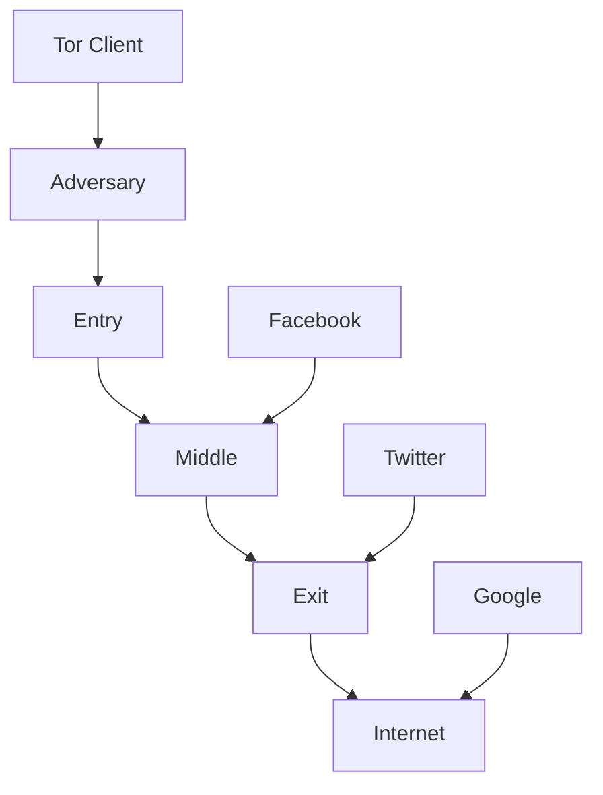
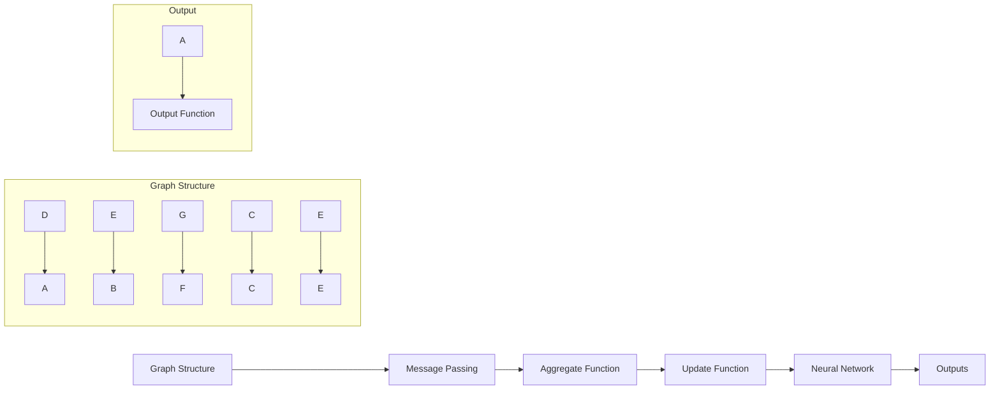
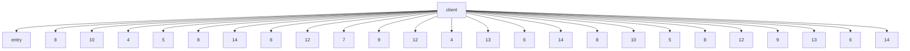
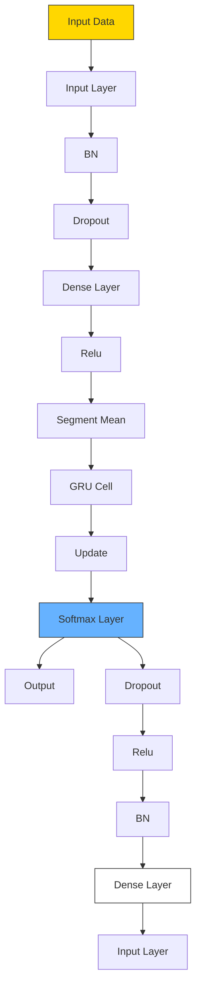
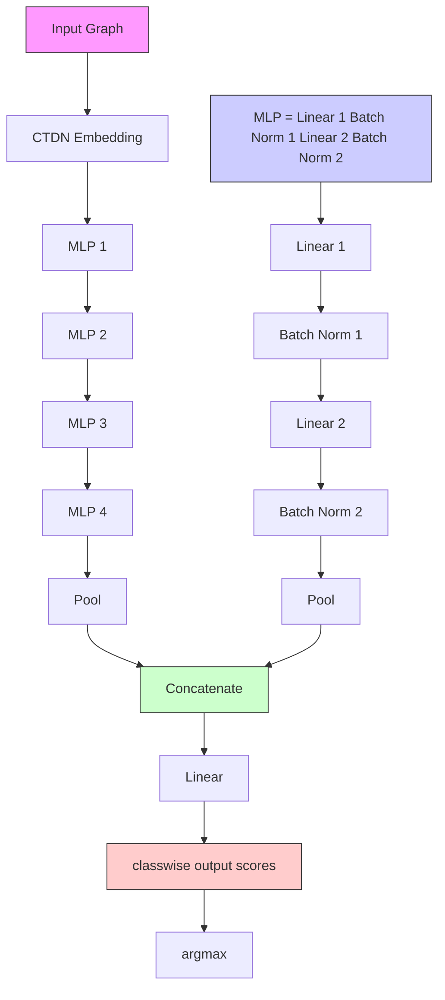

# Exploring Uncharted Waters of Website Fingerprinting

Ishan Karunanayake Graduate Student Member, IEEE, Jiaojiao Jiang , Nadeem Ahmed , and Sanjay K. Jha , Senior Member, IEEE

Abstract— Amidst the rapid technological advancements of today, privacy and anonymity are facing increasing threats. Tor, one of the most widely used anonymity networks, enables users to browse the Internet without their activities being tracked. Extensive research has been conducted on both attacking and defending the anonymity of Tor users. Website Fingerprinting (WF) is one of the popular de-anonymisation techniques employed against Tor users. This paper presents two novel WF techniques based on Graph Neural Networks (GNNs) to explore two relatively understudied avenues of WF: the fingerprintability of Decentralised Applications (DApps) and the impact of reload traffic on WF. Due to the lack of publicly available datasets for DApp traffic and reload traffic suitable for WF, we collected five new datasets for our experiments. Our findings reveal that GNN-based techniques surpass the performance of state-of-theart WF techniques when reload traffic is used. Meanwhile, certain high-performing state-of-the-art techniques exhibit a significant reduction in accuracy, more than 40%, when reload traffic is used instead of homepage traffic. Additionally, we identify that DApps are less susceptible to fingerprinting than conventional websites, leading to a 25% decrease in accuracy in some state-ofthe-art WF techniques. While confirming prior research findings that GNN-based techniques can outperform existing techniques when accessing DApps via Chrome, we further demonstrate that using Tor to access DApps makes them even more difficult to fingerprint. Finally, we expect our datasets, four of which lack publicly available alternatives, will prove invaluable for future research.

Index Terms— Website fingerprinting, traffic analysis, Tor, anonymity, de-anonymization attacks, Graph Neural Networks (GNNs), decentralized applications, communication system traffic, overlay networks, dark web, machine learning algorithms, web services, fingerprint recognition.

## I. INTRODUCTION

S A result of the COVID-19 pandemic, there was a sudden shift in the way people interact with each other. Face-to-face interactions were avoided, and online activities became more prevalent. Internet usage surged by more than 40%, with applications such as Zoom experiencing a tenfold increase in usage [1]. The world following the pandemic

Manuscript received 14 February 2023; revised 29 June 2023 and 9 November 2023; accepted 30 November 2023. Date of publication 13 December 2023; date of current version 26 December 2023. This work was supported by the Cyber Security Research Centre Limited (CSCRC) whose activities are partially funded by the Australian Government’s Cooperative Research Centres Programme. The associate editor coordinating the review of this manuscript and approving it for publication was Prof. Shouling Ji. (Corresponding author: Ishan Karunanayake.)

The authors are with the Institute for Cybersecurity (IFCYBER), University of New South Wales (UNSW), Sydney, NSW 2052, Australia, and also with the Cyber Security Cooperative Research Centre, Joondalup, WA 6027, Australia (e-mail: ishan.karunanayake@unsw.edu.au; jiaojiao.jiang@unsw. edu.au; nadeem.ahmed@unsw.edu.au; sanjay.jha@unsw.edu.au).

Digital Object Identifier 10.1109/TIFS.2023.3342607 had a larger number of online users than before. Throughout these changes, the Tor network [2] maintained its place as the most widely used anonymity network. Tor’s services are also used by malicious actors to conceal their online identities, which compels law enforcement to deploy de-anonymisation techniques against it.

A number of de-anonymisation attacks have been carried out against the Tor network and its users, both in research and in the real world [3]. WF is a popular passive attack among these. Using WF, an adversary that monitors a particular user can identify their online activity even if they are using an anonymity network such as Tor. With the advancement of machine learning, the effectiveness of WF techniques has also improved over the years. Researchers have explored different machine learning algorithms and feature combinations for WF. For example, the K-Fingerprinting technique in [4] used statistical features of packets with a Random Forest model combined with the K-Nearest Neighbour (KNN) algorithm, while the CUMUL method [5] used a feature vector based on packet lengths and directions and a Support Vector Machine (SVM). Deep Fingerprinting [6], which uses a fingerprint of packet directions and a Convolutional Neural Network (CNN) model, has been shown to outperform all previous state-of-the-art techniques. In addition to these, there have been a number of other works on WF over the years [7], [8], [9], [10], [11], [12], [13], [14].

We use three main research questions as the foundation for the work in this paper. The first research question is: RQ1: Are Decentralised Applications (DApps) less fingerprintable than conventional websites? With the increasing popularity of discussions on Web3, which is essentially a decentralised World Wide Web, it is of interest to investigate the impact of its potential components, such as DApps. DApps are applications that run on peer-to-peer (P2P) networks, more specifically, blockchains such as Ethereum. DApps deployed on the same platform typically adopt the same communication interface and similar traffic encryption settings, and the authors of [15] argue that these features make the resulting traffic less discriminative. However, the DApp traffic used in their work was collected by accessing those sites via the Chrome web browser. This approach is not ideal because if someone intercepts Chrome browser traffic, they can easily determine the source and destination of that communication. The authors of [15] do not consider traffic going through Tor in their work, which is generally the case with other WF work (e.g., [6], [12], [13]). Therefore, we collect traffic going through both Chrome and Tor to evaluate it against state-of-the-art WF techniques (e.g., [6], [12], [13]). Additionally, [15] do not compare DApp fingerprintability with the fingerprintability of conventional websites, which we do in this work. To the best of our knowledge, this is the first attempt to collect and experiment with DApp traffic going through the Tor network and evaluate it against WF techniques.

Second, we investigate the research question RQ2: How do WF techniques perform against page reload traffic instead of the traffic generated in the initial visit? In most prior work, WF traces are collected when a user visits a website’s homepage (or index page) for the first time. Furthermore, they have been collected using browser automation tools such as Selenium [11], and any cache is cleared between page visits. However, in practice, people mainly use the Tor Browser Bundle to access the Tor network. While the Tor browser automatically deletes all cache and cookies when it is closed, it keeps some cache while it is active. We argue that traffic traces generated when accessing a homepage for the first time after a restart can be quite different from those generated by reloading it. Therefore, in this research, we investigate how page reloads in the Tor browser affect the fingerprintability of a website. We collect a dataset consisting of browser reloads and evaluate the applicability of WF techniques on this data. While reloading is not something a user would do every time, it is an additional user behaviour that increases the dynamic nature of the WF data. Additionally, we collected reload data for DApps. We then evaluated different WF techniques on these datasets to determine their performance in this scenario. To the best of our knowledge, we are the first to investigate this research question.

Third, we investigate the research question RQ3: How well do Graph Neural Network (GNN)-based WF techniques perform in the above scenarios1? GNNs are typically used to solve problems with a graph structure. One advantage of GNNs over other techniques, such as CNNs, recurrent neural networks (RNNs), and autoencoders is that GNNs can model complex relationships and interdependencies among different entities. Shen et al. [15] proposed a GNN-based technique that significantly outperformed the Deep Fingerprinting (DF) technique in [6]. However, their work had two main limitations. First, their experiments did not include Tor traffic (unlike other WF work) and only considered Chrome traffic. Second, they did not compare their technique with other strong techniques, such as VarCNN [12] and TikTok [13], which have been shown to outperform DF [6]. Still, [15]’s work motivated us to further explore GNN-based techniques for WF. Moreover, we wanted to evaluate GNN performance for the scenarios we consider in RQ1 and RQ2. Therefore, we propose two new GNN techniques and evaluate these techniques on the datasets we have collected.2

As explained thus far, in this paper, we investigate several under-explored areas of WF while proposing two new GNN-based techniques. To conduct our experiments,

1This refers to the WF scenarios considered in RQ1 and RQ2.

2The code and dataset used in [15] are not publicly available, which prevented us from using their implementation. We tried to recreate their work with the information in [15], making certain assumptions when required. More details are available in Section V.

we collected five new datasets for five different scenarios: (1) SCN 1: accessing normal websites over Tor, (2) SCN 2: reload traffic of normal sites over Tor, (3) SCN 3: accessing DApps over Chrome, (4) SCN 4: accessing DApps over Tor, and (5) SCN 5: reload traffic of DApps over Tor. To the best of our knowledge, no publicly available datasets exist for scenarios SCN 2, SCN 3, SCN 4, and SCN 5.

We present the four main contributions of our work as follows.

## A. WF of DApps

We collected two datasets by accessing DApps through the Tor network and a Chrome browser. We then performed several experiments to verify the fingerprintability of DApps. Our results showed that state-of-the-art techniques, such as AWF [11] and TikTok [13], which perform well against normal websites, exhibited a decrease in accuracy of approximately 4.5% and 25% respectively, for fingerprinting DApps. We also identify that GNN-based techniques perform best when fingerprinting DApps with Chrome-based traffic.

## B. WF Using Reload Traffic

We collected two datasets of Tor traffic for reloading normal websites and DApps. We ran several WF algorithms on these datasets to determine how reload traffic impacts their accuracy. We observed a decline in accuracy for stateof-the-art techniques, with AWF’s accuracy decreasing by at least ∼6% and TikTok’s accuracy decreasing by ∼14%. Meanwhile, GNN-based WF techniques performed best for both DApps and normal websites when using reload traffic.

## C. WF Using GNNs

We propose two GNN-based WF techniques (which we refer to as Graph Fingerprinting (GF) techniques). The first technique is based on graph classification and uses a temporal graph generation algorithm and Continuous Time Dynamic Network Embeddings (CTDNE) [16]. The second technique is based on node classification. We compare both of these algorithms with state-of-the-art WF techniques by evaluating their performance in different scenarios. Our results show that GNNs have great potential for WF and, in some cases, even outperform state-of-the-art techniques. The performance improvement is particularly significant for reload traffic and Chrome-based traffic.

## D. WF Datasets

To conduct the experiments required for the above three contributions, we collected five new datasets using a recent version of the Tor browser and Google Chrome. Three datasets contain traces for DApps, accessed via Chrome and Tor, with one dataset containing traffic for refreshing web pages. The other two datasets contain traffic traces for normal websites collected over Tor, one for accessing the homepage and the other for refreshing it. Publicly available datasets do not exist for four of the scenarios we consider. Therefore, we plan to release these datasets publicly upon publication of this work.

flowchart

Fig. 1. Website Fingerprinting Attack Scenario.

The rest of the paper is organised as follows. In Section II, we present the relevant background information, including the threat model and the related work necessary to understand the contents of our paper. In Section III, we explain our datasets and the data collection process. Our methodology, along with the proposed GNN-based WF techniques, are discussed in Section IV. In Section V, we present our evaluation and analysis. We present our discussion and insights into future work in Section VI and conclude in Section VII.

## II. BACKGROUND AND RELATED WORK

In this Section, we provide the background information and related work, which is essential to understand the contents of this paper.

## A. WF Threat Model

WF is a technique used to identify the activities of online users who employ anonymity networks to mask their actions. Essentially, the attacker in this scenario monitors or captures a specific user’s traffic and attempts to distinguish which website the user is accessing. As shown in Figure 1, in WF, the attacker monitors the web traffic between the client and the entry guard. Although Tor uses an encrypted link to transmit the packets, metadata such as the packet size, direction, and timestamp are still visible to the attacker.

The attacker can, therefore, use this information to create a fingerprint from a traffic trace. To do this, the attacker first collects traffic traces from different known websites and creates multiple fingerprints for each website. Then, the attacker uses these fingerprints as input to a machine learning model to train and optimise it using supervised machine learning techniques. Once the attacker has an accurate model, they can use it to identify the actual website that a user is visiting by feeding a fingerprint of the captured traffic to the model. However, in reality, the World Wide Web has millions of websites, and it is not practical to capture traffic from all of them and train a model. Nevertheless, this technique can be used to confirm whether a specific individual is visiting a specific website. For such a practical execution, WF can be carried out in two phases. In the first phase, which is usually described as the open-world scenario in the literature, the attacker tries to determine whether the user is visiting a monitored website. In a machine learning context, this is typically a binary classification problem. If any traffic trace is identified from a monitored website, the attacker moves on to the second phase, known as the closed-world scenario. This is a multiclass classification problem where the attacker has a model trained to identify each website in the monitored set. Thus, the user’s online activity can be confirmed through WF even if they use an anonymity network such as Tor.

## B. WF Related Work

There have been a number of prior works on WF over the years. Panchenko et al. [7] presented one of the earlier WF attacks on Tor using an SVM classifier. They extracted features based on volume, time, and direction and showed that WF could be highly effective against the Tor network. Wang et al. [9] published another WF attack, in which they applied the KNN classifier to a large feature set, which included features such as total transmission size, number of incoming and outgoing packets, packet length, packet ordering, the concentration of outgoing packets, and bursts. Later, Hayes et al. [4] presented k-fingerprinting, a WF technique based on Random Forest and KNN. Here, Random Forests are used to extract a fixed-length fingerprint rather than being directly used for classification. Actual classification is performed by computing the Hamming distance between a new fingerprint (i.e., test instance) and a set of previously collected fingerprints (i.e., training instances) and assigning the new fingerprint to the category of the closest k training fingerprints. Around the same time, Panchenko et al. [5] published another WF attack named CUMUL, which uses an SVM classifier. Their fingerprint is based on the cumulative sum of packet sizes. Rimmer et al. [11] presented AWF, the first WF approach to use neural networks and perform automatic feature extraction. They used deep learning models such as the feedforward Stacked Denoising Autoencoder (SDAE), CNNs, and Long Short-Term Memory (LSTM) networks and achieved excellent results.

Sirinam et al. [6] presented a state-of-the-art WF attack called Deep Fingerprinting (DF), which uses a CNN model and achieves an accuracy of 98%. It also achieves an accuracy of over 90% against WTFPAD [17] and 49.7% against Walkie-Talkie [18], two major lightweight defences against WF. The authors of [6] also compared their technique to previous state-of-the-art techniques, including [4], [5], [9], and [11], and showed that DF outperformed them all. Var-CNN [12], another WF attack based on CNNs, specifically ResNets [19], uses semi-automated feature extraction where they manually extract features such as the total number of packets and total time. [12] also identified that timing information improves model performance when combined with directional information. Furthermore, VarCNN performs better than [6] when only a smaller amount of training data is available. It achieves an accuracy of 97.8% with 100 traces of 100 websites in a closed-world scenario, whereas [6] requires five times more training data to achieve the same accuracy.

Rahman et al. [13] propose another WF attack called TikTok that combines timing and directional features. They develop new burst-level features and use them with the DF attack [6] against onion service traffic, Walkie-Talkie-defended traffic, and WTFPAD-defended traffic. Their experiments show a reduction in the error rate for WTFPAD-defended traffic. Shen et al. [15] proposed a fingerprinting technique based on GNNs. Their experiments suggest that the GNN-based technique outperforms DF in certain fingerprinting scenarios, such as fingerprinting DApps hosted on a blockchain-based backend. Shen et al. [15] argue that DApp traffic is less discriminative than other traffic due to the similarities in such applications, such as the use of the same communication interfaces and encryption settings. However, they collect traffic via the Chrome web browser instead of Tor, which is a major difference between their work and other WF techniques we discussed. In this work, we aim to provide more insights into GNN and CNN-based WF techniques and compare them in several settings.

flowchart

Fig. 2. Basic Graph Neural Network Architecture.

## C. Graph Neural Networks

Artificial neural networks (ANNs) are a core component of modern machine learning, inspired by the biological neurons in the human brain. ANNs consist of multiple layers of interconnected nodes, including input layers, output layers, and hidden layers. They have the ability to learn complex relationships in data and make predictions based on those relationships. CNNs and RNNs are two common types of ANNs that are widely used in image processing and sequential data processing, respectively. GNNs are a relatively newer class of ANNs that are gaining popularity in a wide range of applications. GNNs operate on graph data structures, which are defined as $G = ( V , E )$ , where |V | denotes the number of vertices (or nodes) and |E| denotes the number of connecting edges. Unlike other data structures, graphs can be used to represent a wide variety of relationships between entities. As a result, GNNs are able to learn more complex patterns and similarities between entities than other ANNs.

The basic architecture of a GNN is shown in Figure 2. Simply put, GNNs use the graph structure and node features (some GNN models can use edge attributes as well) to learn a representation vector of a node or the entire graph. They can be used for downstream tasks such as node classification and graph classification. In node classification, the objective of GNN is to learn the hidden state vector $h _ { v } ^ { k }$ for each node v that contains the information of the neighbourhood and itself after k message passing iterations. $h _ { v } ^ { k }$ can be used to generate an output vector $o _ { v }$ for node v, which is the predicted node label in node classification. In graph classification, $h _ { v } ^ { k }$ of all nodes are aggregated to get a representation for the entire graph $h _ { G }$ . There are several phases of a GNN, where the first phase is neighbourhood aggregation. It consists of message passing, in which every node v receives information $h _ { u } ^ { k - 1 }$ from its neighbouring nodes and aggregation, where all received messages are aggregated:

$$
a _ {v} ^ {k} = A (\{h _ {u} ^ {k - 1} | u \in N _ {v} \}), \tag {1}
$$

where A is the aggregate function, and $N _ { v }$ is the set of neighbouring nodes of v. In the next step, the hidden state of node v is updated with an update function B and the aggregated information $a _ { v } ^ { k }$ after the k-th iteration:

$$
h _ {v} ^ {k} = B (h _ {v} ^ {k - 1}, a _ {v} ^ {k}), \tag {2}
$$

where $h _ { v } ^ { 0 }$ is usually initialised as $h _ { v } ^ { 0 } = x _ { v } ,$ , where $x _ { v }$ is the feature vector. After k iterations, the hidden states of the nodes are sent through a readout function R to get a final output. As mentioned previously, if the task is node classification, we will get a prediction for every node, and if it is a graph classification, we will get a prediction for the entire graph.

In this paper, we explore the applicability of two GNN-based approaches, one based on node classification and the other based on graph classification for WF (see Section IV-A and IV-B for more information).

## III. DATA COLLECTION

In this work, we collected a dataset consisting of five subdatasets, motivated by the following factors: (1) Benchmark datasets currently used for WF research, such as [6], [10], and [11], were collected at least five years ago. Since then, there have been several updates to Tor (e.g., connectionlevel padding [20]) and even to some websites, which may affect WF. (2) Previous WF data were collected by accessing the homepages of websites via browser automation tools such as Selenium. In that approach, it is required to stop any background applications to have a clean set of data for labelling. However, people generally use the Tor Browser Bundle to access the Tor network while running other browsers and applications in the background. We wanted to simulate this realistic user activity when collecting data. (3) Two of our proposed contributions are to investigate the WF of DApps and WF with reload traffic. We could not find any publicly available datasets for either of these tasks. We believe the datasets we collected would be quite useful for future work in this area.

## A. Data Collection Approach

We used three main tools to collect the data: Tor browser (version 11.5.1),3 Wireshark,4 and Google Chrome. To capture Tor-related traffic, we first opened both the Tor browser and Wireshark on a laptop with two screens (the laptop screen and an additional monitor). We then typed the URL of the webpage we wanted to visit (the homepage or index page of a selected website) in the Tor browser (without pressing Enter). Next, we started the network capture in Wireshark and entered the URL in the browser to load the webpage. We captured traffic for 20 seconds each time, and we always performed these actions in the same order and as simultaneously as possible.

3https://archive.torproject.org/tor-package-archive/torbrowser/11.5.1/  
4https://www.wireshark.org/

```mermaid
graph TD
  A["DATA COLLECTION"] --> B["APP TYPE"]
  A --> C["REFRESH"]
  A --> D["BROWSER"]
  B --> E["NORMAL WEBSITES"]
  C --> F["NO"]
  C --> G["YES"]
  D --> H["SCN 1"]
  D --> I["SCN 2"]
  D --> J["SCN 3"]
  D --> K["SCN 4"]
  D --> L["SCN 5"]
  M["Scenario"] --> N["DAPP"]
  M --> O["CHROME"]
  M --> P["TOR"]
  M --> Q["SCN 1"]
  M --> R["SCN 2"]
  M --> S["SCN 3"]
  M --> T["SCN 4"]
  M --> U["SCN 5"]
  V["DATASET"] --> W["NORMAL_TOR_NOREFRESH"]
  V --> X["NORMAL_TOR_REFRESH"]
  V --> Y["DAPP_CHROME"]
  V --> Z["DAPP_TOR_NOREFRESH"]
  V --> AA["DAPP_TOR_REFRESH"]
  V --> AB["RQ3"]
  V --> AC["RQ2, RQ3"]
  V --> AD["RQ1, RQ3"]
  V --> AE["RQ1, RQ3"]
  V --> AF["RQ1, RQ2. RQ3"]
  AG["RELEVANT RQ"] --> AH["DF"]
  AG --> AI["AWF"]
  AG --> AJ["VARCNN"]
  AG --> AK["TIKTOK"]
  AG --> AL["GRAPHDAPP"]
  AM["EVALUATION"] --> AN["STATE OF THE ART"]
  AM --> AO["GRAPH FINGERPRINTING"]
```

flowchart

Fig. 3. Overview of the research. We collect five datasets representing five distinct scenarios and evaluate them using seven WF techniques, including two novel techniques and five state-of-the-art techniques.

However, because this is a manual task, we noticed that there could be a time frame of 1-2 seconds between the execution of all steps. After stopping the traffic capture, we found the IP address of the guard node from the Tor browser and filtered the capture using that IP address. Finally, we saved the filtered set of packets in the .pcap format with a website ID and a trace ID. We then restarted the Tor browser (using the New Identity option) and followed the same process. We captured traffic in this way for both conventional (normal) websites and DApps. This resulted in our first two datasets.

To capture traffic for page reloads, we first accessed the homepage without starting the Wireshark capture or timer. Once the website was fully loaded, we followed a similar process as above to capture reload traffic. However, instead of restarting the Tor browser for every capture, we only restarted the browser after capturing several reload traces for a single Tor circuit. We did not capture traffic for the initial page load to make the samples more consistent. We carried out this data collection process for both conventional websites and DApps, resulting in two more datasets. Our final dataset consists of DApp traffic traces over the Google Chrome browser, which we collected for two main reasons. First, we wanted to evaluate whether there is a significant difference in the fingerprintability of websites when accessed using Tor and other browsers. Browsers such as Google Chrome do not provide much anonymity to the user, and it is easy to find the destination IP address if we capture traffic at the user’s end. Second, because the dataset used in [15] is not publicly available, we wanted to try to evaluate our GNN models using a similar dataset.

## B. Datasets

We collected two datasets of 15 conventional websites, each containing 50 traffic traces for each website. These websites were among the top 24 websites in the SimilarWeb rankings5 on August 15, 2022. We discarded nine websites for various reasons. For example, we had to drop four adult content websites for ethical reasons and three websites because we frequently encountered an error page with the message “Secure Connection Not Available”. We also continuously received the “504 Gateway Timeout” error for one website, and the remaining website consistently returned an “Access Denied” message. We assume that the website with the “Access Denied” message blocks Tor traffic altogether. As mentioned previously, we collected one dataset by capturing the traffic generated when accessing homepages of websites and restarting the browser after each visit. We named this dataset NORMAL\_TOR\_NOREFRESH. The other dataset contains reload traffic, and we named it NORMAL\_TOR\_REFRESH.

The remaining three datasets contain traffic traces of 15 DApps. Each dataset contains 50 traffic traces for each website. The websites selected were the top 15 websites on the Ethereum blockchain, as ranked by DApp.com on September 30, 2022. We named the three DApp datasets DAPP\_CHROME, DAPP\_TOR\_REFRESH, and DAPP\_TOR\_NOREFRESH. Finally, we combined the NOR-MAL\_TOR\_NOREFRESH and NORMAL\_TOR\_REFRESH datasets to create the COMBINED\_NORMAL dataset. Similarly, we created the COMBINED\_DAPP dataset by joining the DAPP\_TOR\_NOREFRESH and DAPP\_TOR\_REFRESH datasets. These datasets contain 100 traffic traces for each website, which is a sample size that has been used in some prior work [4], [21]. The total data collection process took approximately 200 hours and was carried out between August 16, 2022 and November 4, 2022.

## C. Overview of the Website Fingerprinting Scenarios

Now, we will explain various WF scenarios considered in this work and discuss their significance. As we focus on three distinct research questions, their interconnections may not be straightforward. Figure 3 provides a high-level overview of our research. The five datasets we collected represent five distinct scenarios, as described below.

• SCN 1: The most widely considered scenario in WF is the collection and evaluation of homepage-visit traffic of popular websites over the Tor network. Almost all state-of-the-art techniques, such as those proposed in [6], [11], [12], and [13], have been evaluated for this scenario.

Our dataset NORMAL\_TOR\_NOREFRESH represents this scenario, as do all publicly available datasets. We collect this dataset to serve as a benchmark for our work.

• SCN 2: To address our second research question, we collect a dataset, which consists of reload traffic for normal websites over the Tor network. To the best of our knowledge, we are the first to collect and experiment with such a dataset. Our NORMAL\_TOR\_REFRESH dataset represents this scenario.  
• SCN 3: In this scenario, we collect DApp traffic using Google Chrome, which results in the DAPP\_CHROME dataset. Shen et al. [15] used DApp traffic collected through the Chrome browser to evaluate DApp fingerprintability, but their dataset is not publicly available.  
• SCN 4: This scenario captures DApp traffic over the Tor network without refreshing the pages. As mentioned previously, general WF research considers SCN 1, while [15] considers SCN 3 in their research. Reference [15] claims that GNN-based techniques outperform existing WF techniques, such as DF [6] for DApps. However, the conditions considered in [6] and [15] are significantly different. DAPP\_TOR\_NOREFRESH, which is representative of SCN 4, is intended to bridge this gap, enabling a more accurate comparison of WF techniques for DApp fingerprinting.  
• SCN 5: In this scenario, we collect reload traffic for DApps over the Tor network. This scenario interconnects all of our research questions. To elaborate, it provides insights into both DApp fingerprintability (RQ1) and the WF of reload traffic (RQ2). The DAPP\_TOR\_REFRESH dataset represents this scenario. When we evaluate this dataset using our GNN-based WF techniques, we gain additional insights into our RQ3, which is to identify the impact of such WF techniques on RQ1 and RQ2.

Once we had collected the required datasets for our experiments, the next step was to design the experiments. However, before providing details on the experimental design, we will describe our two GNN-based WF approaches in Sections IV-A and IV-B.

## D. Ethical Considerations

Traffic capturing was performed in a university setting on a laptop by logging the traffic to and from the laptop. Consequently, no outside traffic was ever captured. Additionally, only the packets to and from the Tor entry node were kept, and all other packets were discarded.

## IV. METHODOLOGY

In this section, we provide an overview of the two GNN-based WF approaches we propose. We refer to these techniques as Graph Fingerprinting. While developing these techniques, we faced two main challenges: (1) How to represent the WF problem as a graph such that all elements and important features are accurately captured? (2) How to identify the optimal GNN-based models to work with the representations we develop? In this work, we focused primarily on the first challenge. As a result, we developed two novel graph representation techniques for the WF threat model: one based on node classification (GFNC) and the other based on graph classification (GFGC). GFNC uses a completely new graph representation, while GFGC uses an improved version of the representation proposed in [15], with the additional ability to use temporal features. For the second challenge, we employed existing models [22], [23] as base models. However, we emphasise that the final models we used in our graph fingerprinting techniques are modified versions of these base models that have undergone extensive hyperparameter tuning to identify their optimal performance (see Section V-C). Overall, the graph representation and the final GNN models comprise the graph fingerprinting techniques that we propose for the first time.

flowchart

Fig. 4. GFNC graph representation: The green node represents the client, and the orange nodes represent different entry guards. The blue nodes represent traffic flows (flow nodes), and the displayed number is the label associated with that particular traffic flow. Directed edges exist between a flow node and the client, as well as between a flow node and an entry guard. The edge colours (especially the arrowheads) indicate the directions of those edges.

## A. Graph Fingerprinting Node Classification Based Approach (GFNC)

We will first describe our approach to mapping the WF scenario to a graph structure suitable for a node classification task.

1) Graph Representation: The traffic traces we use in WF are captured between Tor clients and the Tor network, or more specifically, the entry guards. We create a graph representing the Tor client, entry guards, and each flow between the client and the entry guard as a node in the graph. Since packets travel in both directions between the Tor client and the entry node, we create four directed edges for each flow node: two between the client node and the flow node, and the other two between the flow node and the entry guard node. The IP addresses of the client and entry guards are used to identify the respective nodes. Figure 4 shows a graphical representation of this graph structure. There can be multiple flow nodes connecting a client node and an entry guard node. We extract manual features from the flow packets and consider them as node features/attributes. More details about these features will be discussed in Section V-C.1.

Algorithm 1 presents the algorithm used to generate the GFNC graph. First, we extract a feature set F from each traffic trace t. These features include the source IP address (sr c\_i p) and destination IP address (dst\_i p) of that trace. Next, we select a random set of traffic traces at a time to create the GFNC graph, as shown in lines 3-13 of Algorithm 1.

Algorithm 1 Algorithm for GFNC Graph Generation  
Input: a set of traces $T = (t_{1}, t_{2}, \cdots, t_{N})$ with each trace $t_{i}$ having a feature set F

1. Output: GFNC graph $G = (V, E)$ 2. Initialise empty graph G

3. for $x \in \{1, 2, \cdots, N\}$ do

4. trace $tr \leftarrow t_{x}$ 5. src $\leftarrow$ src_ip /* src_ip ∈ F */
6. dst $\leftarrow$ dst_ip /* dst_ip ∈ F */
7. if src $\notin V$ then

8. Add src into V

9. if dst $\notin V$ then

10. Add dst into V

11. Add node tr with features $F_{tr}$ .

12. Add edges (tr, src), (src, tr), (tr, dst), (dst, tr) into E.

flowchart

Fig. 5. GFNC model architecture.

2) Model Architecture: We used a custom GNN model proposed in [22] as our base model. In the message passing phase of this model, a learnable message function (implemented as a simple Multi-Layer Perceptron (MLP)) is applied to the concatenation of the hidden states of two connected nodes. Then, an aggregation function (implemented as an elementwise mean) is applied to the messages on each node. Next, a simple Gated Recurrent Unit (GRU) cell is used to update the hidden state of the nodes based on the aggregated message and the current hidden state of those nodes. Finally, a fully connected neural network is used to generate one of the websites (in the closed-world scenario) as the output for each flow. The architecture of this model is shown in Figure $5 . { } ^ { 6 }$

## B. Graph Fingerprinting Graph Classification Based Approach (GFGC)

For this technique, we created a separate graph for each traffic trace, which was then used for a graph classification task.

6In the figure, BN refers to batch normalisation, and Relu is the activation function.

network graph

| Node | Value |
|---|---|
| -87 | 0.1 |
| -65 | 0.2 |
| -91 | 0.4 |
| 63 | 0.5 |
| 71 | 0.6 |
| -3 | 0.7 |
| -52 | 1.0 |
| 87 | 0.8 |
| 25 | 0.9 |
| 100 | 1.0 |
| 80 | 1.0 |
| 0.3 | 0.3 |
| 0.4 | 0.4 |
| 0.5 | 0.5 |
| 0.6 | 0.6 |
| 0.7 | 0.7 |
| 1.0 | 1.0 |

Fig. 6. GFGC graph representation: The blue nodes represent outgoing packets, and the red nodes represent incoming packets. The absolute values of the numbers inside the nodes represent the packet sizes. The edges between packets (nodes) travelling in the same direction have the same colour as the nodes, while the edges between packets travelling in opposite directions have a purple colour. The number associated with each edge represents the relative time at which the edge was created compared to the time at which the first packet of the flow was captured.

1) Graph Representation: In every WF traffic capture, we can observe a set of packets travelling in both directions. Algorithm 2 describes our approach for generating a GFGC graph using the metadata we obtain from the packets, and Figure 6 shows an example output for an arbitrary set of packets. Let us consider a traffic trace of 11 packets, which we define by the packet sequence [−87, −65, −91, 63, 71, −3, −52, 87, 25, 100, 80]. The value represents the packet size, and the sign represents the packet direction. If the packet is travelling from the Tor client to the entry node, it is negative; if it is travelling from the entry node to the Tor client, it is positive. Now let us assume that the respective relative timestamps for those 11 packets are [0.0, 0.1, 0.2, 0.3, 0.4, 0.5, 0.6, 0.7, 0.8, 0.9, 1.0].7 Note that the timestamp of the first packet is always $\mathbf { \vec { \cdot } 6 . 0 } \mathbf { . 0 } ^ { \mathbf { \vec { \cdot } } }$ . The algorithm creates a node for each packet with an attribute value of [direction]\*[packet size]. Then, it creates edges between all consecutive nodes. Next, it groups together the consecutive packets that travel in the same direction, and we call such a group a burst. We then create additional edges between the first and last nodes of consecutive bursts. Each edge has a value equal to the relative time of the most recent packet. It represents the time each packet was captured since the capture started.

Given the packet sequence P and timestamp sequence $T ,$ Algorithm 2 first creates a burst list B by grouping the consecutive packets travelling in the same direction. The algorithm then iterates through B and adds nodes and edges to the graph G, as shown in lines 5-35. In line $^ { 6 , }$ b[0] represents the first packet in the burst b and $p _ { b [ 0 ] }$ is the [direction]\*[packet size] value of that packet. The variables $f _ { i }$ and $l _ { i }$ track the indices of the first and last nodes of a burst. These values are later used in lines 23-34 to add the temporal attributes for the edges. Note that b[−1] refers to the last packet of burst b.

2) Model Architecture: Figure 7 presents the architecture of the GNN model that we use for GFGC. It is a modified version of the GNN model used in [23] for graph classification. After creating the GFGC graph for a traffic trace, we compute the Continuous Time Dynamic Network Embedding (CTDNE) [16] for that graph. CTDNE performs a

7An actual packet trace has many more packets and significantly different size and timestamp values than the ones we have used in this example.

Algorithm 2 Algorithm for GFGC Graph Generation  
Input: packet sequence $P = (p_{1}, p_{2}, \cdots, p_{N})$ ;
timestamp sequence $T = (t_{2}, t_{3}, \cdots, t_{N})$ ,
where N is the number of packets
Output: GFGC graph $G = (V, E)$ 1 Initialise empty graph G
2 Get burst list $B = (b_{1}, b_{2}, \cdots, b_{M})$ , where M is the number of bursts
3 $i \leftarrow 0$ 4 for $x \in \{1, 2, \cdots, M\}$ do
5    burst $b \leftarrow b_{x}$ 6    Add node b[0] with value $p_{b[0]}$ into V
7    if x > 0 then
8    first index $f_{i} \leftarrow i$ 9 $i \leftarrow i + 1$ 10    if len(b) > 1 then
11    for y in range len(b)-1 do
12    Add node b[y+1] with value $p_{b[y+1]}$ into V
13    Add edge (b[y], b[y+1]) with time $t_{i}$ into E
14    if y equals len(b)-2 then
15    last index $l_{i} \leftarrow i$ 16 $i \leftarrow i + 1$ 17    if x = 0 then
18    continue
19    else if len( $b_{x-1}$ ) = 1 and len(b) = 1 then
20    Add edge ( $b_{x-1}[0]$ , b[0]) with time $t_{f_{i}}$ into E
21    else if len( $b_{x-1}$ ) = 1 then
22    Add edge ( $b_{x-1}[0]$ , b[0]) with time $t_{f_{i}}$ into E
23    Add edge ( $b_{x-1}[0]$ , b[-1]) with time $t_{l_{i}}$ into E
24    else if len(b) = 1 then
25    Add edge ( $b_{x-1}[0]$ , b[0]) with time $t_{f_{i}}$ into E
26    Add edge ( $b_{x-1}[-1]$ , b[0]) with time $t_{f_{i}}$ into E
27    else
28    Add edge ( $b_{x-1}[0]$ , b[0]) with time $t_{f_{i}}$ into E
29    Add edge ( $b_{x-1}[-1]$ , b[-1]) with time $t_{l_{i}}$ into E
30    Add edge ( $b_{x-1}[-1]$ , b[0]) with time $t_{f_{i}}$ into E

temporal random walk over a graph with time information on edges to generate a network embedding. This embedding can then be used as input to a GNN model. The model that we use here consists of multiple MLPs whose output is passed through a pooling layer and concatenated before being sent through a linear layer. A single MLP consists of multiple linear layers and subsequent batch normalisation layers, as shown in Figure 7. The output of the final linear layer contains a score for each class (website), and the maximum value is considered to be the predicted class.

## C. Experimental Design for Evaluation

When designing the experiments, we considered the following factors:

flowchart

Fig. 7. GFGC model architecture.

1) They should address our primary research questions.  
2) They should adhere to the standards and methodologies employed in prior research.  
3) They should be both comprehensible and reproducible.

Therefore, as shown in Figure 3, we used seven WF techniques for evaluation: five existing state-of-the-art techniques and two newly proposed techniques. We selected these techniques for two reasons. First, we wanted to evaluate the state-of-the-art techniques against the new scenarios - DApp fingerprinting and WF with reload traffic. Second, we wanted to compare our newly proposed techniques - GFNC and GFGC, to the state of the art. When proposing new WF techniques, it is general practice to compare them to two or more existing state-of-the-art techniques. These existing techniques should be widely accepted in the research community as high-performing. Therefore, we chose five techniques: DF [6], AWF [11], TikTok [13], VarCNN [12], and GraphDApp [15]. To gain insights into our RQ3, we experimented with our new GNN-based WF techniques on all five datasets, as shown in Figure 3. Overall, these experiments contribute to the following unique aspects:

• This is the first study to evaluate any WF technique for SCN 2, SCN 4, and SCN 5.  
• This is the first study to evaluate any GNN-based WF technique for SCN 1.  
• This is the first study to evaluate the AWF, VarCNN, and TikTok techniques on SCN 3.

## V. EVALUATION

In this section, we describe our experiments and results, which were conducted to answer our main research questions: (1) Are DApps less fingerprintable than conventional websites (Section V-A.5)? (2) How do WF techniques perform against page reload traffic instead of the traffic generated in the initial visit (Section ${ \mathrm { V } } { \mathrm { - } } { \mathrm { A } } . 6 ) ?$ (3) How well do GNN-based WF techniques perform in the above scenarios (Sections V-A.3, V-A.5, V-A.6, V-A.7, V-B)? For the node classification-based GNN approach, we wrote all the features of a traffic trace to a CSV file along with the IP addresses of the client and entry node and a label indicating the corresponding website. For the graph classification-based approach, we created two CSV files, one containing packet sequences and the other containing timestamp sequences. We used the networkX library (https://networkx.org/) in Python to create graph structures from the information in those CSV files. For the ML models, we used both TensorFlow (https://www.tensorflow.org/) and Pytorch (https://pytorch.org/) libraries. For all experiments, the testing data consisted of 20% of the samples in the dataset. If the WF technique used validation data, we used 20% of the full dataset for validation and the remaining 60% for training. Otherwise, we used 80% of the data for training.

TABLE I TOP 1 ACCURACY AND TOP 3 ACCURACY FOR CLOSED WORLD EXPERIMENTS

<table><tr><td rowspan="2">Dataset</td><td colspan="2">DF</td><td colspan="2">AWF</td><td colspan="2">VarCNN</td><td colspan="2">TikTok</td><td colspan="2">GraphDApp</td><td colspan="2">GFNC</td><td colspan="2">GFGC</td></tr><tr><td>Top 1</td><td>Top 3</td><td>Top 1</td><td>Top 3</td><td>Top 1</td><td>Top 3</td><td>Top 1</td><td>Top 3</td><td>Top 1</td><td>Top 3</td><td>Top 1</td><td>Top 3</td><td>Top 1</td><td>Top 3</td></tr><tr><td>NORMAL_TOR_NOREFRESH</td><td>8</td><td>20</td><td>47.53</td><td>76.93</td><td>22.53</td><td>37.13</td><td>77.67</td><td>92.31</td><td>8.67</td><td>25.33</td><td>57.22</td><td>83.15</td><td>51.33</td><td>76</td></tr><tr><td>DAPP_TOR_NOREFRESH</td><td>6.58</td><td>20.67</td><td>43.00</td><td>74.00</td><td>13.93</td><td>28.47</td><td>52.40</td><td>75.33</td><td>4.00</td><td>20.67</td><td>29.54</td><td>57.27</td><td>24.00</td><td>52.76</td></tr><tr><td>NORMAL_TOR_REFRESH</td><td>8</td><td>20.93</td><td>35.07</td><td>71.34</td><td>31.40</td><td>58.40</td><td>32.13</td><td>59.93</td><td>10.67</td><td>28.00</td><td>62.01</td><td>83.43</td><td>43.33</td><td>76.67</td></tr><tr><td>DAPP_TOR_REFRESH</td><td>6.67</td><td>19.11</td><td>36.80</td><td>73.73</td><td>27.34</td><td>53.80</td><td>38.80</td><td>74.53</td><td>10.67</td><td>24.00</td><td>53.75</td><td>79.79</td><td>35.33</td><td>67.33</td></tr><tr><td>DAPP_CHROME</td><td>8</td><td>26.13</td><td>71.60</td><td>93.53</td><td>27.2</td><td>47.87</td><td>32.93</td><td>61.2</td><td>17.33</td><td>28.67</td><td>72.76</td><td>87.79</td><td>76.67</td><td>95.33</td></tr></table>

## A. Closed-World Evaluation

We first conduct an extensive closed-world experiment in which we evaluate seven WF techniques (DF [6], AWF [11], VarCNN [12], TikTok [13], GraphDApp [15], GFNC, and GFGC) on the five datasets we collected. Table I shows the Top 1 and Top 3 accuracy values achieved by each technique on each dataset. Top 1 accuracy measures the proportion of times the predicted label matches the actual label, while Top 3 accuracy measures the proportion of times the actual label is among the top three predictions. As all the datasets are balanced (i.e., they contain the same number of samples for each class), these two metrics can be used to assess the performance of these techniques. Top 1 accuracy has already been used as the primary evaluation metric in a closed-world setting in many prior works [6], [11]. Reference [6] has also employed Top K accuracy (where K is an integer) as a secondary evaluation metric. We previously mentioned that WF could be used in a realistic scenario to confirm a user’s online activity (i.e., whether they continue to visit certain websites). As a result, we argue that even if the final prediction is incorrect, the classifier could still be helpful for such a task if the Top K accuracy is high. We selected K = 3 in this work because it represents 20% of the total number of classes. However, in a dataset with more classes, a higher value of K could also be beneficial. All of the results in Table I are the average of 10 trials.

1) Recreating Prior Work: Recreating prior work was straightforward for DF [6], AWF [11], VarCNN [12], and TikTok [13], as the code for all of these techniques is publicly available. Before using these techniques to evaluate our datasets, we first recreated the results published in the corresponding papers. We only made minor configuration changes to them, such as changing the number of classes and instances as needed. Unfortunately, we were unable to obtain the original code or dataset for the GraphDApp [15] technique. We attempted to recreate their work using the information provided in [15], making certain assumptions at times.

2) Substandard Performance at a Glance: While our datasets were collected in a different manner than those used in prior works, the NORMAL\_TOR\_NOREFRESH dataset was specifically created to benchmark state-of-the-art WF techniques. Despite this, we observe substandard performance from all existing techniques on this dataset. We offer three potential explanations for this. First, certain modifications have been made to Tor traffic (Padding Specification [20]) that were likely intended to reduce the information leakage exploited by WF techniques. Second, we believe that using timing information as features has a significant impact on performance, as evidenced by the strong performance of techniques such as TikTok, GFNC, and GFGC, which use timing information, versus the weak performance of techniques such as DF and GraphDApp, which do not. Third, some techniques, such as DF [6], may require more training data to learn the correct patterns.

3) Baseline Study: To derive meaningful conclusions, it is essential to set a proper baseline when evaluating multiple algorithms and datasets. For this purpose, we use the NORMAL\_TOR\_NOREFRESH dataset. The main differences between this dataset and other publicly available datasets are that the browser was operated manually, all background processes were running during traffic capture, and a newer version of the Tor browser was used. Despite these differences, the TikTok [13] technique outperforms all other techniques by a significant margin. Notably, TikTok uses directional timing features with the DF [6] model instead of the direction-only input of the original DF model. This change in features improved the accuracy of DF up to 77.67%, supporting our earlier claim that timing information is a significant factor in executing WF attacks on current Tor traffic. TikTok also has the highest Top 3 accuracy (92.31%) for this dataset, demonstrating that it is still possible to fingerprint websites to a reasonable degree even with the latest Tor browser version. The two graph fingerprinting techniques (GFNC and GFGC) perform second and third best in our baseline study, respectively, providing the first insights into the potential of GNNs for WF. AWF [11] is a close fourth, with a Top 3 accuracy of over 75%. VarCNN [12], on the other hand, does not perform to its full potential. It is important to note that we report the results for the VarCNN time metadata model in this case. The direction metadata model consistently underperformed the time metadata model, and the ensemble method only performed slightly better or worse. The DF model and the GraphDApp models performed the worst on all five datasets. Consequently, we will not focus much on these three models (VarCNN, DF, and GraphDApp) in subsequent experiments.

4) DApp Fingerprinting: The First Look: Shen et al. [15] discuss DApp fingerprinting for the first time and propose a GNN-based technique for the task. However, their dataset contains traffic collected using the Google Chrome web browser, which is not ideal for online anonymity. An adversary who can intercept Chrome traffic from a user’s computer can easily determine which destination server the user is visiting by tracking its IP address. The experiments conducted in [15] show that DApps are fingerprintable with high accuracy (for traffic over Chrome), using their proposed technique, GraphDApp. Therefore, our first attempt was to recreate their technique and evaluate it on a similar dataset. To that end, we collected the DAPP\_CHROME dataset in our study. However, our recreation of the GraphDApp model did not produce the expected results. We identify several possible causes for this. First, we had to make certain assumptions when recreating the model as presented in [15]. For example, we used a sequence of packet size and direction features for the input embedding, as it was not explicitly mentioned in the paper. While we made our best effort to recreate the technique, it is possible that their actual implementation differs from ours. Second, our data collection approach follows some steps used in other WF works (e.g., collecting 20s traffic traces) and some steps we added (e.g., disabling the cache), all of which may have resulted in a completely different dataset. Therefore, we do not draw any inferences about the performance of the GraphDApp technique proposed by [15]. However, we intend to use the DAPP\_CHROME dataset to gain an initial understanding of the fingerprintability of DApps.

As shown in Table I, the two GNN-based techniques perform the best in classifying DApp traffic captured over the Chrome web browser. GFGC achieves a Top 1 accuracy of 76.67%, while GFNC achieves a Top 1 accuracy of 72.76%. Among the state-of-the-art techniques, only AWF performs well, with a Top 1 accuracy of 71.60%. It also has the secondbest Top 3 accuracy of 93.53%, which is only 2% lower than GFGC. In general, we can observe that some of the highest performances of certain classifiers (e.g., AWF, GFNC, GFGC) are achieved on this dataset, which supports [15]’s claim that DApps are fingerprintable.

5) DApp Fingerprinting: Conclusion: Next, we address one of our main research questions: Are DApps less fingerprintable than conventional websites? Table I provides the answer, which is Yes. If we compare the performance of each classifier on the DAPP\_TOR\_NOREFRESH dataset to their performance on the NORMAL\_TOR\_NOREFRESH dataset, we can see a clear decrease in performance against the former dataset. Specifically, TikTok, GFNC, and GFGC all show an accuracy drop of more than 25% for DApps compared to conventional websites. Even DF and GraphDApp exhibit the same trend. AWF and TikTok are the two best techniques against DApp fingerprinting over Tor.

We then investigate a secondary research question Does Tor make DApps less susceptible to WF? The answer is Yes. The Top 1 and Top 3 accuracy values of six out of seven WF techniques show a significant decrease when the same DApps are accessed via Tor instead of Google Chrome. This demonstrates that when DApps are accessed via Tor, they are more difficult to fingerprint than when they are accessed via Chrome. The only exception is TikTok [13], which performs better when using Tor instead of Chrome. While we were collecting the data, we observed that Google Chrome could load a website, sometimes even in less than a second. Meanwhile, Tor understandably takes a few seconds, sometimes almost closer to 20 seconds, to load the same website. One possible explanation for TikTok’s behaviour with Google Chrome is that directional timing may not be very effective when latency is very low.

bar chart

| Website | DAPP_REF | DAPP_NOREF |
|---|---|---|
| 0 | 600 | 2700 |
| 1 | 1800 | 5900 |
| 2 | 900 | 2300 |
| 3 | 1400 | 3600 |
| 4 | 100 | 2300 |
| 5 | 100 | 600 |
| 6 | 100 | 1200 |
| 7 | 300 | 4400 |
| 8 | 400 | 2900 |
| 9 | 1400 | 2300 |
| 10 | 100 | 2200 |
| 11 | 100 | 1100 |
| 12 | 300 | 2100 |
| 13 | 300 | 3300 |
| 14 | 100 | 3900 |

(a)

bar chart

| Website | NORMAL_REF | NORMAL_NOREF |
| :--- | :--- | :--- |
| 0 | 300 | 3200 |
| 1 | 1200 | 4600 |
| 2 | 500 | 700 |
| 3 | 500 | 800 |
| 4 | 500 | 3100 |
| 5 | 500 | 700 |
| 6 | 500 | 2800 |
| 7 | 500 | 1900 |
| 8 | 500 | 6200 |
| 9 | 500 | 2800 |
| 10 | 500 | 1500 |
| 11 | 500 | 800 |
| 12 | 500 | 1900 |
| 13 | 500 | 2800 |
| 14 | 800 | 2900 |

Fig. 8. Average number of packets in (a) DApp traces and (b) Normal website traces for each website.

6) Website Fingerprinting With Reload Traffic: NORE-FRESH datasets only contain traffic relevant to the initial homepage visit to a website. However, actual user behaviour includes additional actions such as visiting other pages on the website, navigating back and forth from the homepage, and following external links to other websites. Generating a labelled dataset that captures all of these actions is challenging, especially if we want to maintain consistency across all websites. In our manual data collection approach, we chose to capture traffic for the homepage refresh action. This allows us to investigate the impact of a different user action on WF. In general, reloading most pages took a little longer than loading a page in Google Chrome but less than the time taken to load the same page in the Tor browser. Figure 8 shows the number of packets for each website in four of the datasets we collected, and we can see a significant difference between NOREFRESH and REFRESH datasets for both types of web applications (DApp and Normal). Therefore, in this section, we try to answer the research question How do WF techniques perform against page reload traffic instead of the traffic generated in the initial visit?

We utilise two sub-questions to answer the above research question. (1) How do conventional websites stand against WF when reload traffic is used? It is difficult to provide a straightforward answer to this question based on our results in Table I. We observe a decline in the performance of our best-performing state-of-the-art techniques, AWF and TikTok, while VarCNN shows a noticeable improvement. Interestingly, all GNN-based approaches exhibit consistent performance, when using reload traffic. Although the Top 1 accuracy of GFNC increases by approximately 5% and GFGC decreases by approximately 8%, their Top 3 accuracy values remain relatively stable. This confirms the potential of GNN-based techniques for WF, especially against dynamic user behaviour. Also, we can safely assume that the low performance of AWF and TikTok may be due to the low number of packets contained in the REFRESH traces. (2) How do DApps withstand WF when reload traffic is used? All GNN-based techniques show improved performance when using REFRESH traffic, and the improvement is particularly noticeable in the two GF techniques, with GFNC and GFGC improving by approximately 24% and 11%, respectively. Even though the Top 1 accuracy of both AWF and TikTok has decreased, we observe that the Top 3 accuracies have not changed by even 1%. These results show that traffic generated during the reloading of DApp homepages only slightly reduces the fingerprintability of those websites. Therefore, when we try to generalise these findings to answer our main research question, the answer is that, in general, reload traffic reduces the performance of existing WF techniques. However, at the same time, GF techniques show promise in their ability to perform well with reload traffic.

TABLE II TOP 1 ACCURACY AND TOP 3 ACCURACY FOR COMBINED DATASETS

<table><tr><td rowspan="2">Dataset</td><td colspan="4">AWF</td><td colspan="4">TikTok</td><td colspan="4">GFNC</td><td colspan="4">GFGC</td></tr><tr><td>Top 1</td><td>Top 3</td><td>Prec</td><td>Rec</td><td>Top 1</td><td>Top 3</td><td>Prec</td><td>Rec</td><td>Top 1</td><td>Top 3</td><td>Prec</td><td>Rec</td><td>Top 1</td><td>Top 3</td><td>Prec</td><td>Rec</td></tr><tr><td>COMBINED_DAPP</td><td>38.73</td><td>69.60</td><td>62.20</td><td>17.23</td><td>46.67</td><td>73.67</td><td>84.87</td><td>25.80</td><td>37.56</td><td>65.21</td><td>65.56</td><td>14.37</td><td>28.33</td><td>50.67</td><td>28.62</td><td>28.33</td></tr><tr><td>COMBINED_NORMAL</td><td>37.83</td><td>70.67</td><td>67.60</td><td>14.28</td><td>47.40</td><td>69.13</td><td>70.83</td><td>24.4</td><td>55.01</td><td>80.47</td><td>76.66</td><td>39.53</td><td>28.33</td><td>53</td><td>27.76</td><td>28.33</td></tr></table>

line chart

| No. of Monitored Sites | GFGC  | GFNC  | AWF   | TikTok |
| ----------------------- | ----- | ----- | ----- | ------ |
| 1                       | 90    | 92    | 93    | 96     |
| 2                       | 88    | 89    | 87    | 90     |
| 3                       | 80    | 85    | 80    | 85     |
| 4                       | 70    | 80    | 75    | 80     |
| 5                       | 65    | 75    | 70    | 75     |

(a)

line chart

| No. of Monitored Sites | GFGC  | GFNC  | AWF   | TikTok |
| ----------------------- | ----- | ----- | ----- | ------ |
| 1                       | 90    | 92    | 93    | 94     |
| 2                       | 85    | 87    | 89    | 86     |
| 3                       | 78    | 82    | 85    | 88     |
| 4                       | 73    | 81    | 84    | 88     |
| 5                       | 70    | 78    | 77    | 82     |

(b)  
Fig. 9. F1 scores of classifiers for (a) combined normal dataset and (b) combined DApp dataset in the open world experiment.

7) What Happens When We Combine the Traffic Traces?: In our next experiment, we conduct a closed-world experiment with two new datasets that we identify as COMBINED\_DAPP and COMBINED\_NORMAL. Both of these datasets are created by joining the traces (REFRESH and NOREFRESH) that we collected for DApps and conventional websites over Tor. Therefore, both of these new datasets have 100 traces for each website. In summary, these COMBINED datasets are closer to dynamic user behaviour, and the number of samples is doubled. We only used AWF, TikTok, GFNC, and GFGC techniques for the new experiments, as they were the best-performing algorithms in the previous experiment. Table II shows the results of the new experiment. In general, the accuracy values of the COMBINED datasets appear to take on a value between the accuracies of the NOREFRESH and REFRESH datasets, as expected. The main exception appeared to be with the GFGC technique, where the results for the COMBINED\_NORMAL dataset decreased significantly. We assume that the main reason for this is that the number of packets plays a major role in the graphs created in the GFGC technique, which differs significantly between the two individual datasets. On the other hand, the GFNC technique outperforms other techniques for the COM-BINED\_NORMAL dataset, while TikTok performs the best for the COMBINED\_DAPP dataset. Another notable result is the low recall for all techniques. This indicates that the number of false negatives is high, and the actual classes are not predicted most of the time. However, the better precision values indicate that there are fewer false positives.

## B. Open-World Evaluation

Generally, when evaluating WF attacks, it is common practice to evaluate them under both closed-world and openworld scenarios. In the open-world scenario, a large number of samples are typically captured from a set of “unmonitored sites”. Due to the limitations of our manual data collection technique, it is impractical to collect thousands of samples of background traffic. Therefore, we designed a simulated open-world experiment to gain insights into the performance of the classifiers. We first randomly selected five websites from the 15 websites in our datasets. We considered these five websites to be monitored sites and the other ten websites to be unmonitored sites. We then conducted an open-world experiment using the two COMBINED datasets. Figure 9 shows the F1 scores we obtained in these experiments. We selected the F1 score as our evaluation metric for two reasons. First, the F1 score provides an overall measure of performance, taking into account both precision and recall, which are the two most common metrics used in open-world evaluations. Second, we obtained many similar precision and recall values, which would have resulted in similar charts if we had presented them separately. From Figures 9a and 9b, we can observe a similar trend for all four techniques we evaluated. The performance of all techniques deteriorates as the number of monitored websites increases. TikTok appears to perform better than the other algorithms, and we argue that the close trend observed between the two GF techniques and TikTok is a good indicator of their acceptable open-world performance.

## C. Further Insights Into the Graph Fingerprinting Techniques

Having answered our main research questions, we now provide additional insights into the two GF techniques we used.

bar chart

| Feature | Feature Importance Score |
| --- | --- |
| 0 | 800 |
| 1 | 500 |
| 2 | 250 |
| 3 | 100 |
| 4 | 50 |
| 5 | 25 |
| 6 | 10 |
| 7 | 5 |
| 8 | 2 |
| 9 | 1 |
| 10 | 0.5 |
| 11 | 0.2 |
| 12 | 0.1 |
| 13 | 0.05 |
| 14 | 0.02 |
| 15 | 0.01 |
| 16 | 0.005 |
| 17 | 0.002 |
| 18 | 0.001 |
| 19 | 0.0005 |
| 20 | 0.0002 |
| 21 | 0.0001 |
| 22 | 0.00005 |
| 23 | 0.00002 |
| 24 | 0.00001 |
| 25 | 0.000005 |
| 26 | 0.000002 |
| 27 | 0.000001 |
| 28 | 0.0000005 |
| 29 | 0.0000002 |
| 30 | 0.0000001 |
| 31 | 0.00000005 |
| 32 | 0.00000002 |
| 33 | 0.00000001 |
| 34 | 0.000000005 |
| 35 | 0.000000002 |
| 36 | 0.000000001 |
| 37 | 0.0000000005 |
| 38 | 0.0000000002 |
| 39 | 0.0000000001 |
| 40 | 0.00000000005 |
| 41 | 0.00000000002 |
| 42 | 0.00000000001 |
| 43 | 0.000000000005 |
| 44 | 0.000000000002 |
| 45 | 0.000000000001 |
| 46 | 0.0000000000005 |
| 47 | 85 |
| 48 | 75 |
| 49 | 65 |
| 50 | 55 |
| 51 | 45 |
| 52 | 35 |
| 53 | 25 |
| 54 | 15 |
| 55 | 12 |
| 56 | 11 |
| 57 | 13 |
| 58 | 14 |
| 59 | 16 |
| 60 | 18 |
| 61 | 21 |
| 62 | 24 |
| 63 | 27 |
| 64 | 31 |
| 65 | 36 |
| 66 | 42 |
| 67 | 49 |
| 68 | 57 |
| 69 | 67 |
| 70 | 78 |
| 71 | 91 |
| 72 | 116 |
| 73 | 143 |
| 74 | 173 |
| 75 | 214 |
| 76 | 267 |
| 77 | 332 |
| 78 | 419 |
| 79 | 518 |
| 80 | 639 |
| 81 | 789 |
| 82 | 989 |
| 83 | 1289 |
| 84 | 1699 |
| 85 | 2289 |
| 86 | 3189 |
| 87 | 4289 |
| 88 | 5689 |
| 89 | 7489 |
| 90 | 9889 |
| 91 | 12889 |
| 92 | 16889 |
| 93 | 21889 |
| 94 | 27889 |
| 95 | 34889 |
| 96 | 44889 |
| 97 | 56889 |
| 98 | 74889 |
| 99 | 9889 |
| ... | ... |
| ... | ... |
| ... | ... |
| ... | ... |
| ... | ... |
| ... | ... |
| ... | ... |
| ... | ... |
| ... | ... |
| ... | ... |
| ... | ... |
| ... | ... |
| ... | ... |
| ... | ... |
| ... | ... |

(a)

bar chart

| Feature | Feature Importance Score |
| ------- | ------------------------ |
| 0       | 75                       |
| 5       | 280                      |
| 10      | 320                      |
| 15      | 220                      |
| 20      | 160                      |
| 25      | 170                      |
| 30      | 180                      |
| 35      | 220                      |
| 40      | 80                       |
| 45      | 220                      |
| 50      | 220                      |
| 55      | 80                       |
| 60      | 40                       |
| 65      | 40                       |
| 70      | 40                       |
| 75      | 40                       |
| 80      | 40                       |
| 85      | 40                       |
| 90      | 40                       |
| 95      | 40                       |
| 100     | 40                       |
| 105     | 40                       |
| 110     | 40                       |
| 115     | 40                       |
| 120     | 40                       |
| 125     | 40                       |
| 130     | 40                       |
| 135     | 40                       |
| 140     | 40                       |
| 145     | 130                      |
| 150     | 80                       |
| 155     | 60                       |
| 160     | 40                       |
| 165     | 40                       |
| 170     | 40                       |
| 175     | 40                       |

(b)

bar chart

| Feature | Feature Importance Score |
| ------- | ------------------------ |
| 0       | 10                       |
| 5       | 38                       |
| 10      | 16                       |
| 15      | 20                       |
| 20      | 28                       |
| 25      | 48                       |
| 30      | 26                       |
| 35      | 24                       |
| 40      | 22                       |
| 45      | 24                       |
| 50      | 26                       |
| 55      | 24                       |
| 60      | 24                       |
| 65      | 24                       |
| 70      | 24                       |
| 75      | 24                       |
| 80      | 24                       |
| 85      | 24                       |
| 90      | 24                       |
| 95      | 24                       |
| 100     | 24                       |
| 105     | 24                       |
| 110     | 24                       |
| 115     | 24                       |
| 120     | 24                       |
| 125     | 24                       |
| 130     | 24                       |
| 135     | 24                       |
| 140     | 24                       |
| 145     | 24                       |
| 150     | 24                       |
| 155     | 24                       |
| 160     | 24                       |
| 165     | 24                       |
| 170     | 24                       |
| 175     | 24                       |

（c）  
Fig. 10. ANOVA F-test scores of features for (a) NORMAL\_NOREFRESH and (b) NORMAL\_REFRESH and (c) DAPP\_NOREFRESH datasets.

1) Feature Selection and Importance of the GFNC Model: For the GFNC technique, we mentioned that we used manually extracted features. Although any features can be used with this algorithm, we used the 175 features proposed by Hayes et al. [4] for this work. All of these features are statistical features that can be extracted from any traffic trace and have been proven to be quite effective in prior research [4], [13]. They consist of features based on inter-arrival times (IAT) of packets, flow duration, number of packets in a flow, packet frequency, packet order, concentration of incoming and outgoing packets, and so on.

To identify any unique features that have a greater impact on classifying the different website traces used in this work, we conducted an additional experiment. We used the ANOVA (Analysis of Variance) F-test to compute the feature importance for different datasets. F-tests are a class of statistical tests that calculate the ratio between variance values. ANOVA is a type of F-test that can be used to determine whether the means of two or more groups differ significantly from each other. Additionally, ANOVA F-tests are used when there are more than three classes. We used the Scikit Learn Library’s implementation of the ANOVA F-test for our experiments. Figure 10 shows the results we obtained for three datasets: NORMAL\_TOR\_ NOREFRESH, NORMAL\_TOR\_REFRESH, and DAPP\_ NOREFRESH. We can clearly observe that some features have a greater impact on classification than others. Table VI lists the top 10 features for each dataset along with their corresponding F values. These findings provide us with a few additional insights into the GFNC classifier. First, the F values for the DAPP dataset are significantly lower than those for the other datasets, which explains GFNC’s very poor classification performance on that dataset. This suggests that we may need to investigate other features that can better capture DApp traffic patterns. Second, we observe that certain features, such as the average inter-arrival times of incoming, outgoing, and total packets, rank among the top 5 for all datasets.

2) Hyperparameter Tuning of GFNC and GFGC: Table III and Table IV show the hyperparameter combinations we have used for the GFNC model and GFGC model, respectively.

## VI. DISCUSSION AND FUTURE WORK

In this section, we discuss the lessons learned and the limitations of this work.

TABLE III HYPERPARAMETER SELECTION FOR GFNC MODEL

<table><tr><td>Hyperparameter</td><td>Search Range</td><td>Final</td></tr><tr><td>Learning rate</td><td>0.00001,0.0001,0.001,0.01,0.1</td><td>0.0001</td></tr><tr><td>Batch Normalization</td><td>Yes, No</td><td>Yes</td></tr><tr><td>Activation Function</td><td>Elu, Relu, Prelu</td><td>Relu</td></tr><tr><td>Aggregate Function</td><td>Mean, Sum, Max</td><td>Mean</td></tr><tr><td>Dropout</td><td>0.1,0.2,0.25,0.3,0.5,0.7,0.75</td><td>0.2</td></tr><tr><td>No.of hidden layers</td><td>1,2,3,4</td><td>1</td></tr><tr><td>Steps per epoch</td><td>10,20,50,100,1000</td><td>20</td></tr><tr><td>Window length</td><td>20,50,100,200</td><td>50</td></tr></table>

TABLE IV HYPERPARAMETER SELECTION FOR GFGC MODEL

<table><tr><td>Hyperparameter</td><td>value</td><td>Hyperparameter</td><td>value</td></tr><tr><td>Learning rate</td><td>0.01</td><td>Num_of_epochs</td><td>30</td></tr><tr><td>Num_of_MLP_layers</td><td>5</td><td>Num_layers_for_MLP</td><td>2</td></tr><tr><td>Neighbour_Pooling_type</td><td>Sum</td><td>Graph_Pooling_type</td><td>Sum</td></tr><tr><td>Optimizer</td><td>Adam</td><td>Activation</td><td>Relu</td></tr><tr><td>Batch_size</td><td>32</td><td>Dropout</td><td>0.5</td></tr><tr><td>Num_of_hidden_units</td><td>64</td><td>CTDNE_dimension</td><td>32</td></tr><tr><td>CTDNE_num_of_walks</td><td>10</td><td>CTDNE_walk_length</td><td>20</td></tr></table>

## A. Limitations

1) Scalability: The main limitation of this research is scalability due to the limited number of samples in our datasets. However, as discussed in Section V-A, we employ several state-of-the-art techniques that have already been evaluated on larger datasets. We use these techniques for comparison with the graph fingerprinting techniques proposed in this work. We argue that most of the insights we gained from investigating DApp and reload traffic are generalisable, as we used a benchmark for these evaluations. For scalability analysis, we use the UNDEFENDED dataset collected and presented in [6]. We aimed to focus on two main outcomes: first, how our techniques perform against an existing benchmark dataset, and second, how they scale. Table V shows the results of this experiment for AWF, TikTok, GFNC, and GFGC.

This dataset contains traffic for 95 websites, with 1000 traces per website. The results in Table V are for the full dataset, except for GFGC. From this, we can observe that GFNC performs significantly well against this benchmark dataset in terms of both Top 1 and Top 3 accuracy. The comparative results with TikTok and AWF are consistent with the results in Table I, indicating that GFNC also scales well. However, we identified some limitations of the

TABLE V ACCURACY OF WF TECHNIQUES AGAINST THE UNDEFENDED DATASET IN [6]

<table><tr><td>Technique</td><td colspan="2">AWF</td><td colspan="2">TikTok</td><td colspan="2">GFNC</td><td colspan="2">GFGC*</td></tr><tr><td>Accuracy</td><td>Top 1</td><td>Top 3</td><td>Top 1</td><td>Top 3</td><td>Top 1</td><td>Top 3</td><td>Top 1</td><td>Top 3</td></tr><tr><td>Value</td><td>91.64</td><td>96.78</td><td>98.78</td><td>99.38</td><td>93.24</td><td>97.68</td><td>71.27</td><td>94.8</td></tr></table>

\*We have run this experiment with a subset of the dataset. Please refer to the text for more information.

GFGC technique when we conducted this experiment. First, the CTDNE embedding generation has a significant latency overhead, taking around 400 hours to generate embeddings for the entire dataset. Therefore, we decided to use only a subset of the dataset to gain insights into its performance. With 15 websites and 50 traces per website, it achieves a Top 1 accuracy of 71.33% and a Top 3 accuracy of 92.67%. Even when we increase the number of traces to 500 per website, the respective values remain almost the same, at 71.27% and 94.8%, respectively. This shows that the number of traces does not improve GFGC’s performance. Although its performance is almost 20% better in terms of accuracy than the NORMAL\_TOR\_NOREFRESH dataset, it is clear that GFGC does not perform well against this benchmark dataset compared to other techniques and has scalability concerns that need to be addressed. We plan to focus on these in future work.

2) Validity of the Datasets: In this work, we collect five new datasets that can be used for future WF and other network traffic classification research. Therefore, it is important to discuss the validity of these datasets and related considerations. First, it is important to note that there are no other publicly available datasets that are similar to four of our datasets. Only for the NORMAL\_TOR\_NOREFRESH dataset scenario can we find publicly available datasets, but these datasets are more than five years old. Therefore, in general, all five newly collected datasets would be extremely valuable to the research community.

As is the case with any network traffic-related datasets, these datasets will be most relevant in the first few years after they are collected and will gradually lose their validity over time. However, it is difficult to predict an exact time frame, as three main factors will affect the validity of these datasets. (1) The Tor network will continue to improve, and many new features and security measures will be applied to it over the years (e.g., connection-level padding [20]). These changes will alter the network’s traffic patterns. The rate at which these datasets lose their validity will be determined by the severity of these changes. (2) Websites (including DApps) will also continue to evolve and add new features, which will affect the current datasets (e.g., Facebook’s news feed interface has changed significantly over the years [24]). (3) Browser and other network upgrades will affect the traffic patterns between users and Tor entry nodes.

As a result of the aforementioned reasons, data distribution may change over time, a phenomenon more commonly referred to as concept drift. This implies that the relationship between the input features and the target variable may change, resulting in decreased model performance. While predicting the precise time when concept drift occurs is very challenging, it is possible to detect it by monitoring model performance over time and using drift detection algorithms. Regardless, the limitations discussed above apply not only to our datasets but to any network traffic-related dataset.

## B. Lessons Learned

In this work, we explored three interesting research directions related to WF through a comprehensive experimental study (Section V). In this section, we focus on the insights obtained while investigating the three main research questions.

1) RQ1. Are DApps Less Fingerprintable Than Conventional Websites?: In this work, we found that DApps are less fingerprintable than conventional websites and that Tor makes them even less susceptible to WF. These results can be caused by several factors. (1) Compared to conventional centralised websites, DApps directly interact with the underlying blockchain and are affected by its network limitations and congestion. (2) DApps also support P2P transactions, which can increase the number of transactions (communications) and facilitate event-driven automatic triggers, which can cause sudden bursts of network traffic. These differences can make DApp traffic more random and difficult to classify. In summary, DApps have the potential to be more secure and, when combined with Tor, can provide an excellent mode of safer and more reliable online transactions.

2) RQ2. How Do WF Techniques Perform Against Page Reload Traffic?: Discussions on evaluating WF for different browsing activities beyond accessing a homepage have been ongoing for some time. We have taken a step further in this direction by examining the impact of website reload traffic on fingerprintability. Our experiments showed that reload traffic generally decreases fingerprintability. This trend was particularly evident in state-of-the-art WF techniques, suggesting that these techniques may only be effective in specific situations. GNN-based techniques showed improved performance with reload traffic. Several other types of website visitor traffic exist, such as referral traffic (arriving at the website via external links such as other websites and social media), landing page traffic (directly visiting a page other than the homepage of a website), click-through traffic (navigating through the website by clicking internal links), and conversion traffic (performing specific actions such as making purchases and submitting forms). Therefore, our work highlights the need to design WF techniques that can identify a website from a traffic trace generated by any of these visitor activities.

3) RQ3. How Well Do GNN-Based WF Techniques Work in the Above Scenarios?: In this paper, we have proposed two novel WF techniques using GNNs. Let us now evaluate the significance of these two techniques based on our experiments.

• GFNC, to the best of our knowledge, is the first WF technique that employs a node classification approach, where each traffic trace is represented as a node in a graph.  
• GFGC represents an improved version of the only existing GNN-based WF technique [15]. GFGC possesses the capability to utilise temporal features, an ability lacking in its predecessor, which can significantly enhance the performance of the classifiers.

TABLE VI TOP 10 FEATURES SELECTED USING ANOVA F VALUES

<table><tr><td rowspan="2">Rank</td><td colspan="2">NORMAL_NOREF</td><td colspan="2">NORMAL_REF</td><td colspan="2">DAPP_NOREF</td></tr><tr><td>Feature</td><td>F value</td><td>Feature</td><td>F value</td><td>Feature</td><td>F value</td></tr><tr><td>1</td><td>avg_out_iat</td><td>792.39</td><td>75_perc_in_iat</td><td>324.28</td><td>std_out_conc</td><td>47.94</td></tr><tr><td>2</td><td>avg_total_iat</td><td>724.79</td><td>avg_total_iat</td><td>300.34</td><td>avg_total_iat</td><td>37.67</td></tr><tr><td>3</td><td>avg_in_iat</td><td>484.89</td><td>75_perc_out_iat</td><td>300.14</td><td>avg_out_iat</td><td>36.26</td></tr><tr><td>4</td><td>std_order_out</td><td>297.38</td><td>avg_out_iat</td><td>281.00</td><td>avg_in_iat</td><td>34.91</td></tr><tr><td>5</td><td>avg_order_in</td><td>290.63</td><td>avg_in_iat</td><td>258.35</td><td>alt_conc</td><td>29.36</td></tr><tr><td>6</td><td>num_total_pkts</td><td>290.26</td><td>perc_in_pkts</td><td>219.57</td><td>num_in_pkts</td><td>27.90</td></tr><tr><td>7</td><td>sum_alt_per_sec</td><td>290.26</td><td>perc_out_pkts</td><td>219.57</td><td>std_order_in</td><td>26.71</td></tr><tr><td>8</td><td>sum_num_pkts</td><td>290.26</td><td>std_total_iat</td><td>213.38</td><td>avg_order_in</td><td>26.67</td></tr><tr><td>9</td><td>std_order_in</td><td>286.87</td><td>std_out_iat</td><td>203.37</td><td>num_total_pkts</td><td>26.57</td></tr><tr><td>10</td><td>num_out_pkts</td><td>286.80</td><td>median_out_conc</td><td>178.06</td><td>sum_alt_per_sec</td><td>26.57</td></tr></table>

• GFNC demonstrates superior performance against reload traffic for both conventional websites and DApps, while GFGC also exhibits good performance. This indicates that graph-based WF can outperform the state-of-the-art when reload traffic (having a comparatively smaller number of packets) is employed.  
• Both GFNC and GFGC surpass existing techniques when fingerprinting DApps using Chrome-based traffic, further confirming the findings of [15] that GNN-based techniques excel in handling DApp traffic. Reference [15] also utilised Chrome-based traffic.  
• Both GFNC and GFGC show satisfactory performance for conventional WF, with GFNC outperforming certain state-of-the-art techniques even using existing benchmark datasets. To the best of our knowledge, this is the first study to evaluate GNN-based techniques for conventional WF.  
• For normal websites, GFNC shows the best performance when highly dynamic traffic (a combination of homepage traffic and reload traffic) is used.

The two major drawbacks of GNN-based techniques observed in this research are their low performance for fingerprinting Tor-based DApp traffic and the scalability issue associated with the GFGC technique. The latter drawback further emphasises the importance of our GFNC technique, as the existing GNN-based technique [15] also utilises a graph classification-based approach, which appears to be unsuitable for resource-constrained environments. In summary, our findings demonstrate the potential of GNN-based techniques for conducting WF attacks, particularly in non-conventional scenarios such as using reload traffic and Chrome-based traffic.

## C. Future Work

The work presented in this paper opens up several avenues for further research in the field of WF. First, it is necessary to further explore the potential of using GNNs and other graph-based techniques for WF. The ability of these graph structures to identify complex patterns in data may lead to the development of more robust WF techniques in the future. New defences against WF have been proposed, such as TrafficSliver [21], which splits traffic into multiple sub-traces, making it more difficult for existing WF techniques to fingerprint websites successfully. However, graph representations may be able to circumvent such defences. We believe that both of the graph fingerprinting techniques proposed in this paper have the potential for further improvement, especially the GFGC technique. GNNs and related techniques are rapidly improving, which may lead to the development of new GNN-based WF attacks.

Second, in light of the discussions about Web3, which is a theoretical World Wide Web based on decentralisation and blockchain technologies, it is also important to investigate fingerprinting techniques against DApps. Shen et al. [15] was the first to explore this area, and we have provided further insights into DApp fingerprinting. We are the first to evaluate the fingerprintability of DApp traffic in Tor, and we believe that this should be investigated further in future research. Finally, it has always been a major challenge to simulate real user behaviour for WF. One reason for this is the difficulty of collecting a dataset under realistic conditions. We believe that our manual data collection approach provides a solution to this problem, and we hope to improve the current dataset with more user actions in future work.

## VII. CONCLUSION

In this paper, we focused our attention on several less-explored avenues in WF. First, we investigated the fingerprintability of DApps over Tor. Previous research has shown that state-of-the-art techniques such as DF [6] are less accurate when fingerprinting DApps [15]. However, the data in the experiments reported in [15] was collected using the Chrome web browser. In contrast, we collected a DApp dataset by using Tor to visit DApps, and we used this dataset in our evaluations. We found that DApps are less fingerprintable than conventional web applications. Also, our experimental results revealed that Tor makes the DApp traffic less fingerprintable compared to Chrome traffic. Second, we examined the fingerprintability of websites when web pages are reloaded rather than accessed for the first time. We observed that existing state-of-the-art techniques show considerable declines in performance when we use reload traffic. Finally, we evaluated the applicability of GNNs for WF by proposing two novel GNN-based WF techniques. Both techniques performed well, especially against traffic from refreshed web pages and traffic from the Chrome web browser. We also plan to release all our datasets as an additional contribution to this paper and hope that this work will pave the way for more interesting WF research in the future.

## APPENDIX

In Section V-C.1, we discussed the features used and the results we obtained from the ANOVA F test experiment.

Figure 10 shows that some features have a greater influence on the classes than others. Here, we provide information about the top features to better understand those results. Table VI shows the top 10 ranked features we obtained for the three datasets NORMAL\_TOR\_NOREFRESH, NORMAL\_TOR\_REFRESH, and DAPP\_TOR\_NOREFRESH with the relevant F values. Any interested reader can refer to [4] for more information regarding these features.

## REFERENCES

[1] R. De, N. Pandey, and A. Pal, “Impact of digital surge during COVID-19 pandemic: A viewpoint on research and practice,” Int. J. Inf. Manage., vol. 55, Dec. 2020, Art. no. 102171.  
[2] R. Dingledine, N. Mathewson, and P. Syverson, “Tor: The secondgeneration onion router,” in Proc. 13th USENIX Secur. Symp. (SSYM), San Diego, CA, USA, Aug. 2004, pp. 303–320.  
[3] I. Karunanayake, N. Ahmed, R. Malaney, R. Islam, and S. K. Jha, “Deanonymisation attacks on tor: A survey,” IEEE Commun. Surveys Tuts., vol. 23, no. 4, pp. 2324–2350, 4th Quart., 2021.  
[4] J. Hayes and G. Danezis, “K-fingerprinting: A robust scalable website fingerprinting technique,” in Proc. 25th USENIX Secur. Symp., Austin, TX, USA, Aug. 2016, pp. 1187–1203.  
[5] A. Panchenko et al., “Website fingerprinting at Internet scale,” in Proc. 23rd Annu. Netw. Distrib. Syst. Secur. Symp. (NDSS), San Diego, CA, USA, Feb. 2016, pp. 1–15.  
[6] P. Sirinam, M. Imani, M. Juarez, and M. Wright, “Deep fingerprinting: Undermining website fingerprinting defenses with deep learning,” in Proc. ACM SIGSAC Conf. Comput. Commun. Secur., Toronto, ON, Canada, Oct. 2018, pp. 1928–1943.  
[7] A. Panchenko, L. Niessen, A. Zinnen, and T. Engel, “Website fingerprinting in onion routing based anonymization networks,” in Proc. 10th Annu. ACM Workshop Privacy Electron. Soc., Chicago, IL, USA, Oct. 2011, pp. 103–114.  
[8] X. Cai, X. C. Zhang, B. Joshi, and R. Johnson, “Touching from a distance: Website fingerprinting attacks and defenses,” in Proc. ACM Conf. Comput. Commun. Secur. (CCS), Raleigh, NC, USA, Oct. 2012, pp. 605–616.  
[9] T. Wang, X. Cai, R. Nithyanand, R. Johnson, and I. Goldberg, “Effective attacks and provable defenses for website fingerprinting,” in Proc. 23rd USENIX Secur. Symp. (SEC), San Diego, CA, USA, Aug. 2014, pp. 143–157.  
[10] R. Overdorf, M. Juárez, G. Acar, R. Greenstadt, and C. Díaz, “How unique is your.onion? An analysis of the fingerprintability of Tor onion services,” in Proc. ACM SIGSAC Conf. Comput. Commun. Secur. (CCS), B. M. Thuraisingham, D. Evans, T. Malkin, and D. Xu, Eds., Dallas, TX, USA, Oct./Nov. 2017, pp. 2021–2036.  
[11] V. Rimmer, D. Preuveneers, M. Juárez, T. van Goethem, and W. Joosen, “Automated website fingerprinting through deep learning,” in Proc. 25th Annu. Netw. Distrib. Syst. Secur. Symp. (NDSS), San Diego, CA, USA, Feb. 2018, pp. 1–15.  
[12] S. Bhat, D. Lu, A. Kwon, and S. Devadas, “Var-CNN: A data-efficient website fingerprinting attack based on deep learning,” Proc. Privacy Enhancing Technol., vol. 2019, no. 4, pp. 292–310, Oct. 2019.  
[13] M. S. Rahman, P. Sirinam, N. Mathews, K. G. Gangadhara, and M. Wright, “Tik-tok: The utility of packet timing in website fingerprinting attacks,” Proc. Privacy Enhancing Technol., vol. 2020, no. 3, pp. 5–24, Jul. 2020.  
[14] T. Pulls and R. Dahlberg, “Website fingerprinting with website oracles,” Proc. Privacy Enhancing Technol., vol. 2020, no. 1, pp. 235–255, Jan. 2020.  
[15] M. Shen, J. Zhang, L. Zhu, K. Xu, and X. Du, “Accurate decentralized application identification via encrypted traffic analysis using graph neural networks,” IEEE Trans. Inf. Forensics Security, vol. 16, pp. 2367–2380, 2021.  
[16] G. H. Nguyen, J. B. Lee, R. A. Rossi, N. K. Ahmed, E. Koh, and S. Kim, “Continuous-time dynamic network embeddings,” in Proc. Companion Web Conf. (WWW), 2018, pp. 969–976.  
[17] M. Juarez, M. Imani, M. Perry, C. Diaz, and M. Wright, “Toward an efficient website fingerprinting defense,” in Proc. 21st Eur. Symp. Res. Comput. Secur. (ESORICS), Heraklion, Greece, Sep. 2016, pp. 27–46.  
[18] T. Wang and I. Goldberg, “Walkie-talkie: An efficient defense against passive website fingerprinting attacks,” in Proc. 26th USENIX Secur. Symp. (SEC), Vancouver, BC, Canada, Aug. 2017, pp. 1375–1390.  
[19] K. He, X. Zhang, S. Ren, and J. Sun, “Deep residual learning for image recognition,” in Proc. IEEE Conf. Comput. Vis. Pattern Recognit. (CVPR), Jun. 2016, pp. 770–778.  
[20] M. Perry and G. Kadianakis. Tor Padding Specification. Accessed: Dec. 4, 2022. [Online]. Available: https://gitweb.torproject.org/torspec.git/tree/padding-spec.txt#n282  
[21] W. De la Cadena et al., “TrafficSliver: Fighting website fingerprinting attacks with traffic splitting,” in Proc. ACM SIGSAC Conf. Comput. Commun. Secur. (CCS). New York, NY, USA: Association for Computing Machinery, 2020, pp. 1971–1985.  
[22] D. Pujol-Perich, J. Suárez-Varela, A. Cabellos-Aparicio, and P. Barlet-Ros, “Unveiling the potential of graph neural networks for robust intrusion detection,” ACM SIGMETRICS Perform. Eval. Rev., vol. 49, no. 4, pp. 111–117, Jun. 2022.  
[23] K. Xu, W. Hu, J. Leskovec, and S. Jegelka, “How powerful are graph neural networks?” in Proc. 7th Int. Conf. Learn. Represent. (ICLR), New Orleans, LA, USA, May 2019, pp. 1–4.  
[24] Emilia. Facebook has Turned 17! How has Facebook Changed Over the Years? Accessed: Jun. 10, 2023. [Online]. Available: https://postfity.com/blog/facebook-is-turning-16-how-has-fb-changedover-the-years/

natural_image

Portrait of a smiling man with short hair and beard, outdoors with blurred urban background (no text or symbols visible)

Ishan Karunanayake (Graduate Student Member, IEEE) received the B.Sc. degree in electronic and telecommunication engineering from the University of Moratuwa, Sri Lanka, in 2018. He is currently pursuing the Ph.D. degree with the School of Computer Science and Engineering, University of New South Wales (UNSW), Australia, and affiliated with the Cyber Security Cooperative Research Centre (CSCRC), Australia. His research interests include network security, malware analysis, anonymity and privacy, and machine learning.

natural_image

Black-and-white portrait of a person wearing glasses, outdoors near water (no text or symbols visible)

Jiaojiao Jiang received the Ph.D. degree from Deakin University, Melbourne, VIC, Australia. She is currently a Lecturer with the School of Computer Science and Engineering, University of New South Wales, Sydney, NSW, Australia. She has authored or coauthored more than 40 papers in high-quality journals and conferences, including IEEE TRANSACTIONS ON PARALLEL AND DIS-TRIBUTED SYSTEMS, IEEE TRANSACTIONS ON INFORMATION FORENSICS AND SECURITY, IEEE TRANSACTIONS ON DEPENDABLE AND SECURE

COMPUTING, IEEE TRANSACTIONS ON NETWORK SCIENCE AND ENGI-NEERING, IEEE Trustcom, and IEEE GLOBECOM. Her research interests include cybersecurity, complex networks, and service virtualization.

natural_image

Portrait of a man wearing glasses and a suit (no text or symbols visible)

Nadeem Ahmed received the M.S. and Ph.D. degrees in computer science and engineering from the University of New South Wales, Sydney, NSW, Australia, in 2000 and 2007, respectively. He is currently a Senior Research Fellow with the Cyber Security Cooperative Research Centre (CSCRC), Australia. He was the Head of the Computing Department, School of Electrical Engineering and Computer Science, National University of Sciences and Technology, Pakistan. His research interests include cyber security, the IoT, wireless sensor networks, and software-defined networking.

natural_image

Portrait of a man wearing glasses and a white shirt, with green foliage in the background (no text or symbols visible)

Sanjay K. Jha (Senior Member, IEEE) is currently a Full Professor with the School of Computer Science and Engineering, University of New South Wales (UNSW), Australia, and leads UNSW, Cybersecurity Cooperative Research Centre. He is also the Chief Scientist and the Research Director of the Institute for Cybersecurity (IFCYBER), UNSW. His research interests include network security, wireless mesh and sensor networks, and the Internet of Things. His editorial affiliations include IEEE TRANSACTIONS ON MOBILE COMPUTING and IEEE TRANSACTIONS

ON DEPENDABLE AND SECURE COMPUTING. He is the principal author of the book Engineering Internet QoS and a Co-Editor of the book Wireless Sensor Networks: A Systems Perspective.