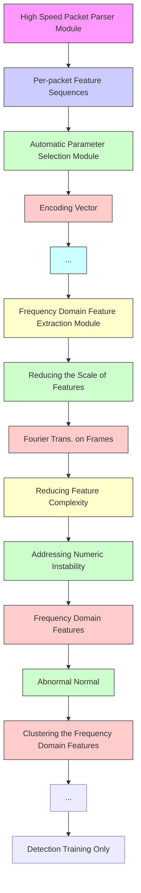

# Frequency Domain Feature Based Robust Malicious Traffic Detection

Chuanpu Fu , Qi Li , Senior Member, IEEE, Meng Shen , Member, IEEE, and Ke Xu , Senior Member, IEEE, Member, ACM

Abstract— Machine learning (ML) based malicious traffic detection is an emerging security paradigm, particularly for zero-day attack detection, which is complementary to existing rule based detection. However, the existing ML based detection achieves low detection accuracy and low throughput incurred by inefficient traffic features extraction. Thus, they cannot detect attacks in realtime, especially in high throughput networks. Particularly, these detection systems similar to the existing rule based detection can be easily evaded by sophisticated attacks. To this end, we propose Whisper, a realtime ML based malicious traffic detection system that achieves both high accuracy and high throughput by utilizing frequency domain features. It utilizes sequential information represented by the frequency domain features to achieve bounded information loss, which ensures high detection accuracy, and meanwhile constrains the scale of features to achieve high detection throughput. In particular, attackers cannot easily interfere with the frequency domain features and thus Whisper is robust against various evasion attacks. Our experiments with 74 types of attacks demonstrate that, compared with the state-of-the-art systems, Whisper can accurately detect various sophisticated and stealthy attacks, achieving at most 18.36% improvement of AUC, while achieving two orders of magnitude throughput. Even under various evasion attacks, Whisper is still able to maintain around 90% detection accuracy.

Index Terms— Malicious traffic detection, machine learning, frequency domain.

# I. INTRODUCTION

RADITIONAL malicious traffic detection identifies malicious traffic by analyzing the features of traffic according

Manuscript received 24 December 2021; revised 22 May 2022; accepted 26 July 2022; approved by IEEE/ACM TRANSACTIONS ON NETWORKING Editor K. Ren. Date of publication 8 August 2022; date of current version 16 February 2023. This work was supported in part by the National Key Research and Development Program of China under Grant 2018YFB1800402, in part by the Beijing Outstanding Young Scientist Program under Grant BJJWZYJH01201910003011, in part by the China National Funds for Distinguished Young Scientists under Grant 61825204, and in part by NSFC under Grant 61932016 and Grant 62132011. (Corresponding author: Ke Xu.)

Chuanpu Fu is with the Department of Computer Science and Technology, Tsinghua University, Beijing 100084, China (e-mail: fcp20@mails. tsinghua.edu.cn).

Qi Li is with the Beijing National Research Center for Information Science and Technology (BNRist) and the Institute for Network Sciences and Cyberspace, Tsinghua University, Beijing 100084, China, and also with the Zhongguancun Laboratory, Beijing 100094, China (e-mail: qli01@tsinghua.edu.cn).

Meng Shen is with the School of Cyberspace Science and Technology, Beijing Institute of Technology, Beijing 100081, China (e-mail: shenmeng@ bit.edu.cn).

Ke Xu is with the Beijing National Research Center for Information Science and Technology (BNRist) and the Department of Computer Science and Technology, Tsinghua University, Beijing 100084, China, and also with Zhongguancun Laboratory, Beijing 100094, China (e-mail: xuke@tsinghua.edu.cn).

Digital Object Identifier 10.1109/TNET.2022.3195871 to preconfigured rules, which aims to protect legitimate Internet users from network attacks [1]–[3]. However, the rule-base detection is unable to detect zero-day attacks [4]–[7] though it can achieve high detection accuracy and detection throughput in high bandwidth networks, e.g., in Internet backbone.

As a promising security paradigm, machine learning based malicious traffic detection has been developed, particularly as a complement of the traditional fixed rule based methods (i.e., signature based NIDS) [1], [2], [8], [9]. Table I summarizes and compares rule based and typical machine learning based detection methods. Compared with rule based methods, machine learning based methods can effectively identify zero-day malicious traffic [4], [5], [10]. Unfortunately, due to the processing overhead of machine learning algorithms, existing detection methods achieve low detection throughput and are unable to process high-rate traffic. As a result, most of these methods can only be deployed offline [11]–[16] so that they cannot achieve realtime detection, particularly in high performance networks (e.g., in 10 Gigabit networks) [17]–[19].

Meanwhile, attackers can easily interfere with and evade these methods, e.g., injecting noises packets generated by benign applications into attack traffic. Packet-level detection [17], [20], [21] that analyzes per-packet feature sequences is unable to achieve robust detection. Actually, even in the absence of the evasion attacks, the packet-level detection is unable to detect sophisticated zero-day attacks. Traditional flow-level methods [14]–[16], [19] detecting attacks by analyzing flow-level statistics incur significant detection latency. Moreover, evasion attacks can easily bypass the flow-level detection that uses coarse-grained flow-level statistics [22], [23]. Thus, realtime robust machine learning based detection that is ready for real deployment is still missing.

In this paper, we develop Whisper that aims to realize realtime robust malicious traffic detection by utilizing machine learning algorithms. Whisper effectively extracts and analyzes the sequential information of network traffic by frequency domain analysis [25], which extracts traffic features with low information loss. Especially, the frequency domain features of traffic can efficiently represent various packet ordering patterns of traffic with low feature redundancy. Frequency domain feature analysis with low information loss enables accurate and robust detection, while low feature redundancy ensures high throughput traffic detection. In particular, since the frequency domain features represent fine-grained sequential information of the packet sequences, which are not disturbed by various evasions, Whisper can achieve robust detection. However, it is non-trivial to extract and analyze the frequency domain features from traffic because of the large-scale, complicated, and dynamic patterns of traffic [22], [23].

To effectively perform frequency domain traffic feature analysis, we develop a three-step frequency domain feature extraction. First, we encode per-packet feature sequences as vectors, which reduces the data scale and the overhead of subsequent processing. Second, we segment the encoded vectors and perform Discrete Fourier Transformation (DFT) [25] on each frame, which aims to extract the sequential information of traffic. It allows statistical machine learning algorithms to easily learn the patterns. Third, we perform logarithmic transformation on the modulus of the frequency domain representation produced by DFT, which prevents float point overflows incurred by the numerical instability issue [26] during the training of machine learning.

TABLE I COMPARING THE EXISTING MALICIOUS TRAFFIC DETECTION METHODS 

<table><tr><td colspan="2">Category of Detection Systems</td><td>Feature Extraction Methods</td><td>Zero-Day Detection</td><td>High Accuracy</td><td>Robust Detection</td><td>Realtime Detection</td><td>High Throughput</td><td>Task Agnostic</td></tr><tr><td colspan="2">Rule based</td><td>Preconfigured fix rules [2], [8], [9]</td><td>×</td><td>√</td><td>×</td><td>√</td><td>√</td><td>×</td></tr><tr><td rowspan="6">ML based</td><td rowspan="3">Packet-level</td><td>Packet header fields [20]</td><td>√</td><td>√</td><td>×</td><td>√</td><td>×</td><td>√</td></tr><tr><td>Context statistics [17]</td><td>√</td><td>√</td><td>×</td><td>√</td><td>×</td><td>√</td></tr><tr><td>Payload statistics [21]</td><td>√</td><td>√</td><td>×</td><td>×</td><td>×</td><td>√</td></tr><tr><td rowspan="3">Flow-level</td><td>Flow-level statistics [12], [19], [24]</td><td>√</td><td>×</td><td>×</td><td>×</td><td>√</td><td>×</td></tr><tr><td>Application usage statistics [14]-[16]</td><td>√</td><td>√</td><td> $\times^1$ </td><td>×</td><td>×</td><td>×</td></tr><tr><td>Frequency domain features,Whisper</td><td>√</td><td>√</td><td>√</td><td>√</td><td>√</td><td>√</td></tr></table>

1Bartos et al.[14]only considered evasion strategies for malicious Web traffic.

We propose an automatic parameter selection module to select the encoding vector for efficient packet feature encoding. To achieve this, we formulate the per-packet feature encoding as a constrained optimization problem to minimize mutual interference of the per-packet features during frequency domain feature analysis. We transform the original problem into an equivalent SMT problem and solve the problem by an SMT solver. It ensures the detection accuracy by choosing vectors, while effectively reducing manual efforts of selecting encoding vectors. Moreover, inspired by the Nyquist-Shannon sampling theorem [27], we develop a sampling module that further enhances the detection efficiency by performing accurate sampling without interference with the frequency domain features. Finally, we utilize statistical machine learning to cluster the patterns according to the frequency domain features. Due to the rich feature presentation and lightweight machine learning, Whisper realizes realtime detection of malicious traffic in high throughput networks.

We theoretically prove that Whisper is more efficient than packet-level and traditional flow-level detection methods. We conduct a theoretical analysis to prove that the frequency domain features ensure bounded information loss, which lays the foundation for robust detection of Whisper. We develop a traffic feature differential entropy model, a theoretical framework to measure information loss of feature extraction from traffic. First, we prove the information loss in processing packet sequences in the existing flow-level methods, which further demonstrates that it cannot accurately extract features. Second, we prove that Whisper maintains the information loss in the flow-level methods and validate that the frequency domain features are more efficient. Third, we prove that Whisper effectively reduces feature redundancy by the decrease in the data scale of features.

We prototype Whisper with Intel’s Data Plane Development Kit (DPDK) [28]. To extensively evaluate the performance of the Whisper prototype, we replay 74 malicious traffic datasets with the high throughput backbone network traffic. Besides the typical traditional attacks, we collect and replay malicious traffic generated by sophisticated attacks: (i) more stealthy attacks, e.g., low-rate TCP DoS attacks [29]–[31] and stealthy network scanning [32]; (ii) complicated multi-stage attacks, e.g., TCP side-channel attacks [33]–[35] and TLS padding oracle attacks [36]; (iii) various evasion attacks, e.g., attackers inject different types of noise packets (i.e., packets generated by benign applications) in attack traffic to evade detection. According to our experimental results, we validate that Whisper can detect the different types of attacks with AUC ranging between 0.891 and 0.999 while achieving 1,310,000 PPS, i.e., two orders of magnitude throughput more than the state-of-the-art methods. Particularly, Whisper can detect various evasion attacks with 35% improvement of AUC over the state-of-the-art methods. Furthermore, Whisper achieves realtime detection with bounded 0.06 second latency in high throughput networks.

In summary, the contributions of our paper are six-fold:

• We present Whisper, a novel malicious traffic detection system by utilizing frequency domain analysis, which is the first system built upon machine learning achieving realtime and robust detection in high throughput networks.   
• We perform frequency domain feature analysis to extract the sequential information of traffic, which lays the foundation for the detection accuracy, robustness, and high throughput of Whisper.   
• We develop automatic encoding vector selection for Whisper to reduce manual efforts for parameter selection, which ensures the detection accuracy while avoiding manual parameter setting.   
• We develop an accurate sampling method that reduces the detection overhead with negligible accuracy loss.   
• We develop a theoretical analysis framework to prove the properties of Whisper.   
• We prototype Whisper with Intel DPDK and use the experiments with different types of replayed attack traffic to validate the performance of Whisper.

The rest of the paper is organized as follows: Section II introduces the threat model and the design goals of Whisper. Section III presents the high-level design of Whisper. In Section IV, we present the design details. In Section V, we conduct a theoretical analysis. In Section VI, we experimentally evaluate the performances of Whisper. Section VII reviews related works and Section VIII concludes this paper.

# II. THREAT MODEL AND DESIGN GOALS

# A. Threat Model

We aim to develop a malicious traffic detection system as a plug-in module of middlebox. The middlebox forwards the replicated traffic to the detection system through port mirroring, which is similar to Cisco SPAN [37]. Thus, the detection system does not interfere with benign traffic forwarding. We assume that the detection system does not have any prior knowledge on threats, which means that it should be able to deal with zero-day attacks [5], [7], [17]. Note that, we do not consider defenses against the attacks detected by Whisper and can deploy existing malicious traffic defenses [38], [39] to throttle the detected traffic.

flowchart

Fig. 1. High-level design of Whisper.

The developed detection system should be able to determine whether traffic passing through the middlebox is benign or malicious by monitoring ongoing traffic. We emphasize that the malicious traffic detection is fully different from traffic classification [40]–[43] that aims to classify whether traffic is generated by a certain network application or a certain user. We do not consider detecting passive attacks that do not cause obvious traffic variance, e.g., eavesdropping attacks and intercept attacks [44], [45].

# B. Design Goals

In this paper, we aim to develop a realtime robust malicious traffic detection system, which achieves high detection accuracy and task-agnostic detection. Particularly, the system should achieve the following two goals, which are not well addressed in the literature.

Robust Accurate Detection. The system should be able to detect various zero-day attacks. Especially, it can capture different evasion attacks, which try to evade detection by deliberately injecting noise packets, i.e., using various packets generated by benign applications, into the attack traffic.

Realtime Detection with High Throughput. The system should be able to be deployed in high throughput networks, e.g., a 10 Gigabit Ethernet, while incurring low latency.

# III. OVERVIEW OF WHISPER

In this section, we present our malicious traffic detection system, Whisper. Whisper achieves high performance detection by encoding per-packet feature sequences as vectors to reduce the overhead of subsequent feature processing. Meanwhile, it extracts the sequential information of traffic via frequency domain to ensure detection accuracy. In particular, since the frequency domain features represent fine-grained sequential information of the packet sequences, which are not disturbed by the injected noise packets, Whisper can achieve robust detection. Figure 1 shows the overview of Whisper.

High Speed Packet Parser Module. High speed packet parser module extracts per-packet features, e.g., the packet length and arriving time interval, at high speed to ensure the processing efficiency in both training and detection phases. This module provides the per-packet feature sequences to the feature extraction module for extracting the frequency domain features and the automatic parameter selection module for determining the encoding vector. Note that, this module dose not extract specific application related features and thus Whisper achieves task agnostic detection. We use only three per-packet features to reduce the encoding overhead in the frequency feature extraction module, while ensuring the detection effectiveness with the sequential patterns. Moreover, as stated in Section II, application-layer payloads are inaccessible. Thus, these features allow us to detect attacks without leaking user privacy.

Frequency Features Extraction Module. In both training and detection phases, this module extracts the frequency domain features from the per-packet feature sequences. This module periodically polls the required information from the high speed packet parser module with a fixed time interval. After acquiring the extracted per-packet features, it encodes the per-packet feature sequences as vectors and extracts the sequential information via frequency domain. These features with low redundancy are provided for the statistical clustering module. However, it is difficult to extract the frequency domain features of traffic in high throughput networks in realtime because of the various complicated, irregular, and dynamic flow patterns [22], [23]. We cannot apply deep learning models, e.g., recurrent neural networks, to extract features due to their long processing latency though they can extract more richer features for detection. We will present the details of this module in Section IV-A.

Automatic Parameter Selection Module. This module calculates the encoding vector for the feature extraction module. We decide the encoding vector by solving a constrained optimization problem that reduces the mutual interference of different per-packet features. In the training phase, this module acquires the per-packet feature sequences and solves an equivalent Satisfiability Modulo Theories (SMT) problem to approximate the optimal solution of the original problem. By enabling automatic parameter selection, we significantly reduce the manual efforts for parameter selection. Therefore, we can fix and accurately set the encoding vector in the detection phase. We will describe the details of the module in Section IV-B.

Interval Sampling Module. The module samples the per-packet feature sequence of the traffic with a fixed interval to further reduce the processing overhead. According to the Nyquist-Shannon sampling theorem [27], our interval sampling on the original feature sequence incurs low information loss and has negligible effects on the frequency domain features. Meanwhile, it significantly reduces the scale of the features and thus reduces the overhead of the subsequent process, while maintaining the detection accuracy.

Statistical Clustering Module. In this module, we utilize a lightweight statistical clustering algorithm to learn the patterns of the frequency domain features from the feature extraction module. In the training phase, this module calculates the clustering centers of the frequency domain features of benign traffic and the averaged training loss. In the detection phase, this module calculates the distances between the frequency domain features and the clustering centers. Whisper detects traffic as malicious if the distances are significantly larger than the training loss. We will elaborate on the statistical clustering based detection in Section IV-D.

# IV. DESIGN DETAILS

In this section, we present the design details of Whisper, i.e., the design of three main modules in Whisper.

# A. Frequency Feature Extraction Module

In this module, we extract the frequency domain features from high speed traffic. We acquire the per-packet features of N packets from the same flow by polling the high speed packet parser module. We use the mathematical representation similar to Bartos et al. [14] to denote the features. We use $s ^ { ( i ) }$ and M to indicate the $\bar { i } ^ { t h }$ per-packet feature and the number of perpacket features, respectively. Matrix S denotes the per-packet features of all packets, where $\mathrm { S } _ { i k }$ is defined as $i ^ { t h }$ packet’s $k ^ { t h }$ property:

$$
\mathrm{S} = \left[ s ^ {(1)}, \dots , s ^ {(i)}, \dots , s ^ {(M)} \right] = \left[ \begin{array}{c c c} s _ {1 1} & \dots & s _ {1 M} \\ \vdots & \ddots & \vdots \\ s _ {N 1} & \dots & s _ {N M} \end{array} \right]. \tag {1}
$$

Packet Feature Encoding. We perform a linear transformation w on $\mathrm { S }$ to encode the features of a packet to a real number $v _ { i } , v$ denotes the vector representation of traffic:

$$
v = \mathrm{S} w = [ v _ {1}, \dots , v _ {i}, \dots , v _ {N} ] ^ {\mathrm{T}}, \quad v _ {i} = \sum_ {k = 1} ^ {M} s _ {i k} w _ {k}. \tag {2}
$$

The feature encoding reduces the scale of features, which significantly reduces the processing overhead of Whisper. In Section IV-B, we will describe how Whisper automatically selects parameters for the encoding vector w.

Vector Framing. Now we segment the vector representation with the step length of $W _ { \mathrm { s e g } } .$ The goal of segmentation is to segreduce the complexity of the frequency domain features by constraining the long-term dependence between packets. If the frames are excessively long, the frequency domain features will become too complex to learn in the statistical learning module. $N _ { f }$ denotes the number of the frames. We obtain the following equations:

$$
f _ {i} = v \llbracket (i - 1) \times W _ {\text {seg}}: i \times W _ {\text {seg}} \rrbracket \quad (1 \leq i \leq N _ {f}), \tag {3}
$$

$$
N _ {f} = \left\lfloor \frac {N}{W _ {\text {seg}}} \right\rfloor . \tag {4}
$$

Discrete Fourier Transformation. We perform the Discrete Fourier Transformation (DFT) on each frame $f _ { i }$ to extract the sequential information via frequency domain and reduce the information loss incurred by the flow-level methods. We can acquire the frequency features of each frame as follows:1

$$
F _ {i} = \mathcal {F} (f _ {i}) \quad (1 \leq i \leq N _ {f}), \tag {5}
$$

$$
F _ {i k} = \sum_ {n = 1} ^ {W _ {\mathrm{seg}}} f _ {i n} e ^ {- j \frac {2 \pi (n - 1) (k - 1)}{W _ {\mathrm{seg}}}} \quad (1 \leq k \leq W _ {\mathrm{seg}}), \tag {6}
$$

where $F _ { i k }$ is a frequency component of $i ^ { t h }$ frame with the frequency of $2 \pi ( k - 1 ) / W _ { \mathrm { s e g } }$ . Note that, all frequency features segoutput by DFT are vectors with complex numbers, which cannot be used directly as the input for machine learning algorithms.

Calculating the Modulus of Complex Numbers. We transform the complex numbers to real numbers by calculating the modulus for the frequency domain representation. For simplicity, we transform $F _ { i k }$ to a coordinate plane representation:

$$
F _ {i k} = a _ {i k} + j b _ {i k}, \tag {7}
$$

$$
\left\{ \begin{array}{l} a _ {i k} = \sum_ {n = 1} ^ {W _ {\text {seg}}} f _ {i n} \cos \frac {2 \pi (n - 1) (k - 1)}{W _ {\text {seg}}} \\ b _ {i k} = \sum_ {n = 1} ^ {W _ {\text {seg}}} - f _ {i n} \sin \frac {2 \pi (n - 1) (k - 1)}{W _ {\text {seg}}}. \end{array} \right. \tag {8}
$$

We calculate the modulus for $F _ { i k }$ as $p _ { i k }$ in (9). For the $i ^ { t h }$ frame, we select the first half of the modulus as vector $P _ { i } .$ . Because the transformation results of DFT are conjugate, the first half and the second half are symmetrical. Thus, we can obtain:

$$
p _ {i k} = a _ {i k} ^ {2} + b _ {i k} ^ {2} \quad (1 \leq k \leq W _ {\text { seg }}), \tag {9}
$$

$$
P _ {i} = \left[ p _ {i 1}, \dots , p _ {i K _ {f}} \right] ^ {\mathrm{T}} (K _ {f} = \left\lfloor \frac {W _ {\text {seg}}}{2} \right\rfloor + 1), \tag {10}
$$

$$
F _ {i k} = F _ {i (W _ {\text { seg }} - k)} ^ {*} \quad \Rightarrow \quad p _ {i k} = p _ {i (W _ {\text { seg }} - k)}. \tag {11}
$$

Logarithmic Transformation. To make the frequency domain features to be numerically stable [26] and prevent float point overflow during the machine learning model training, we perform a logarithmic transformation on $P _ { i } ,$ , and use constant $C$ to adjust the range of the frequency domain features:

$$
R _ {i} = \frac {\ln (P _ {i} + 1)}{C} (1 \leq i \leq N _ {f}), \tag {12}
$$

$$
\mathrm{R} _ {K _ {f} \times N _ {f}} = [ R _ {1}, \dots , R _ {i}, \dots , R _ {N _ {f}} ]. \tag {13}
$$

As the output of the features extraction module, the $i ^ { t h }$ column component of R is the frequency domain features of the $i ^ { t h }$ frame. Matrix R is the input for the clustering module.

Take an example, we collect three types of benign traffic (90%) mixed with the malicious traffic (10%) in Wide Area Network (WAN). We select 1500 continuous packets $( N =$ 1500) from each type of traffic and extract three per-packet features $( M = 3 )$ including the packet length, the protocol type, and the arriving time interval. We fix the framing length $W _ { \mathrm { s e g } } = 3 0$ . Therefore, $N _ { f } = 5 0$ and $K _ { f } ~ = ~ 1 6$ . Then we segperform a min-max normalization operation on the frequency domain features R and map the results to the RGB space. We visualize the frequency domain features that are similar to the Spectrogram in speech recognition [46]. As shown in Figure 2, we observe that the area associated with the frequency domain features of the malicious traffic is significantly lighter than that of the benign traffic.

1j denotes an imaginary number.

bar

| Side-channel Attack | Benign Encrypted Traffic |
|---|---|
| 0-5 | 15 |
| 5-10 | 15 |
| 10-15 | 15 |
| 15-20 | 15 |
| 20-25 | 15 |
| 25-30 | 15 |
| 30-35 | 15 |
| 35-40 | 15 |
| 40-45 | 15 |
| 45-50 | 15 |

(a) Benign TLS traffic and side-channel attack traffc.

heatmap

| SSL DoS Attack | Benign Video Traffic |
| -------------- | --------------------- |
| 20             | 15                    |

(b) Benign UDP traffic and SSL DoS traffic.

heatmap

| X | Y | Category |
|---|---|---|
| 15 | 15 | Low-rate DoS Attack |
| 20 | 15 | Benign Outbound NAT Traffic |
| 30 | 15 | Benign Outbound NAT Traffic |
| 40 | 15 | Benign Outbound NAT Traffic |
| 50 | 15 | Benign Outbound NAT Traffic |

(c) Outbound NAT traffic and LowRate DoS traffic.   
Fig. 2. We map the frequency domain features, which are extracted from the traffic with three types of typical attacks, to the RGB space, and observe that a small number of malicious packets incur significant changes in the frequency domain features.

# B. Automatic Parameters Selection Module

Now we determine the encoding vector w for the feature extraction module that uses w to encode the per-packet feature sequences and acquires the vector representation of the traffic. In general, we formulate the encoding vector selection problem as a constrained optimization problem, and transform the original problem into an equivalent SMT problem. We approximate the optimal solution of the original problem through solving the SMT problem.

We assume that we can find a set of continuous functions to describe the changes of each kind of the per-packet feature $s ^ { ( i ) }$ . Thus, we consider all obtained per-packet features are the samples of the continuous functions, which are denoted as $h _ { i } ( t ) \ ( \bar { 1 } \leq i \leq M )$ . We need to find a vector w to amplify and superpose all these functions. Our key optimization objective is to minimize mutual interference and bound the overall range when superposing the functions. We can first bound the range of encoding vector w and the range of the superposition function in the following:

$$
W _ {m i n} \leq w _ {i} \leq W _ {m a x} (1 \leq i \leq M), \tag {14}
$$

$$
\sum_ {i = 1} ^ {M} w _ {i} h _ {i} (t) \leq B, \tag {15}
$$

where $W _ { m i n } , W _ { m a x } ,$ B are constants. We constrain the order preserving properties of the functions to ensure that different types of per-packet features do not interfere with each other when the feature extraction module performs packet encoding:

$$
w _ {i} h _ {i} (t) \leq w _ {i + 1} h _ {i + 1} (t) \quad (1 \leq i \leq M - 1). \tag {16}
$$

Second, we optimize w to maximize the distances between the functions so that we can minimize the mutual interference of the per-packet features and bound the ranges of all the functions. Therefore, under the constrains of (14) (15) (16), we obtain the optimization object:

$$
\begin{array}{l} \hat {w} = \arg \max \int_ {0} ^ {+ \infty} w _ {M} h _ {M} (t) - w _ {1} h _ {1} (t) \mathrm{d} t \\ - \sum_ {i = 2} ^ {M - 1} \int_ {0} ^ {+ \infty} | 2 w _ {i} h _ {i} (t) - w _ {i + 1} h _ {i + 1} (t) \\ - w _ {i - 1} h _ {i - 1} (t) | \mathrm{d} t. \tag {17} \\ \end{array}
$$

In practice, we cannot determine the convexity of the optimization object because the closed-form representations of $h _ { i } ( t )$ are not available. Thus, we reform the origin constrained optimization problem to a Satisfiability Modulo Theories (SMT) problem (19) with optimization object (18) to approximate the optimal solution of (17). For the $i ^ { t h }$ per-packet feature, we perform a min-max normalization on $s _ { i }$ and use $n _ { i }$ to indicate the normalized vector. We list constrains (19). And we obtain the satisfied (SAT) solutions of the SMT problem and maximize the following objective:

$$
\begin{array}{l} \widetilde {w} = \arg \max \sum_ {i = 1} ^ {N} w _ {M} n _ {M i} - w _ {1} n _ {1 i} \\ - \sum_ {i = 2} ^ {M - 1} 2 w _ {i} n _ {i k} - w _ {i - 1} n _ {(i - 1) k} \\ - w _ {i + 1} n _ {(i + 1) k}, \tag {18} \\ \end{array}
$$

$$
\text { subjects   to: } \left\{ \begin{array}{l} w _ {i} \in [ W _ {\min}, W _ {\max} ] \\ \sum_ {i = 1} ^ {M} w _ {i} n _ {i k} \leq B \\ w _ {i} n _ {i k} \leq w _ {i + 1} n _ {(i + 1) k} \\ 2 w _ {i} n _ {i k} \leq w _ {i - 1} n _ {(i - 1) k} + w _ {i + 1} n _ {(i + 1) k}. \end{array} \right. \tag {19}
$$

Note that, the goal of the last constraint in Eq.(19) is to ensure that the absolute value in Eq.(17) is positive because most SMT solvers do not support absolute value operations.

# C. Interval Sampling Module

Now we sample the obtained per-packet features. According to our studies, we observe that the per-packet feature sequence S consists of slowly changing sub-sequences, which motivates us to design the sampling strategy. Figure 3 shows the time series of the per-packet features (i.e., the packet length and the arrival interval) of two randomly selected flows in the backbone traffic dataset [47]. We find that most parts of the sequences change slowly (indicated by the arrows). Moreover, we model the observed slow change property using the integral of curvature. Specifically, following Section IV-B, we use $\Omega _ { i }$ to indicate the integral of the curvature of a per-packet feature sequence denoted by the continuous function $h _ { i } ( t )$ . According to the definition of the curvature for a single point, we obtain a discrete estimate of $\Omega _ { i } \mathbf { : }$

$$
\Omega_ {i} = \frac {1}{t _ {n} - t _ {1}} \int_ {t _ {1}} ^ {t _ {n}} \frac {\left| h _ {i} ^ {\prime \prime} (t) \right|}{\left(1 + h _ {i} ^ {\prime 2} (t)\right) ^ {3 / 2}} \mathrm{d} t \tag {20}
$$

$$
= \frac {1}{t _ {n} - t _ {1}} \lim _ {k \rightarrow \infty} \sum_ {i = 1} ^ {k} \frac {t _ {n} - t _ {1}}{k} \cdot \frac {\left| h _ {i} ^ {\prime \prime} (t _ {i}) \right|}{\left(1 + h _ {i} ^ {\prime 2} (t _ {i})\right) ^ {3 / 2}} \tag {21}
$$

$$
\approx \frac {1}{n - 2} \sum_ {k = 2} ^ {n - 1} \frac {\left| s _ {k + 1} ^ {(i)} + s _ {k - 1} ^ {(i)} - 2 \cdot s _ {k} ^ {(i)} \right|}{\left[ 1 + (s _ {k + 1} ^ {(i)} - s _ {k} ^ {(i)}) ^ {2} \right] ^ {3 / 2}}, \tag {22}
$$

where $\begin{array} { r } { t _ { i } = t _ { 1 } + \frac { i } { k } \cdot ( t _ { n } - t _ { 1 } ) } \end{array}$ , and $t _ { 1 } , \ t _ { n }$ are the start and 1end time of the flow, s (i)k $s _ { k } ^ { ( i ) }$ 1is the $i ^ { t h }$ 1feature of the $k ^ { t h }$ packet (defined in (1)). Figure 4 shows the cumulative distribution function (CDF) of the estimated curvature of the flows in three real-world datasets [47] collected in 2020. We observe that most feature sequences consist of massive slowly changing sub-sequences with low curvatures, which implies that the repetitive and redundant features are widespread in the per-packet feature sequences of the traffic.

line

| Sampling Sequence Number | Packet Length [Byte] |
| ------------------------ | -------------------- |
| 0                        | 1000                 |
| 25                       | 3500                 |
| 50                       | 3000                 |
| 75                       | 2500                 |
| 100                      | 3500                 |
| 125                      | 1500                 |
| 150                      | 4000                 |
| 175                      | 3000                 |
| 200                      | 3000                 |

(a) Packet Length.

line

| Sampling Sequence Number | Arrival Interval [10⁻⁶ s] |
| ------------------------ | ------------------------- |
| 25                       | ~0                        |
| 50                       | ~500                      |
| 75                       | ~500                      |
| 100                      | ~500                      |
| 125                      | ~500                      |
| 150                      | ~500                      |
| 175                      | ~500                      |
| 200                      | ~500                      |

(b)Packet Arrival Interval.

Fig. 3. Time series of the per-packet feature sequences of Internet traffic.   

line

| Curvature | Jan. Ω = 18.46 | Apr. Ω = 22.86 | Jun. Ω = 19.77 |
| --------- | -------------- | -------------- | -------------- |
| 0         | 0.0            | 0.0            | 0.0            |
| 25        | 0.8            | 0.8            | 0.8            |
| 50        | 0.9            | 0.9            | 0.9            |
| 100       | 0.95           | 0.95           | 0.95           |
| 150       | 0.98           | 0.98           | 0.98           |
| 200       | 1.0            | 1.0            | 1.0            |

(a) Packet Length.

line

| Curvature | Jan. CDF | Apr. CDF | Jun. CDF |
| --------- | -------- | -------- | -------- |
| 0         | 0.0      | 0.0      | 0.0      |
| 25        | 0.4      | 0.3      | 0.2      |
| 50        | 0.6      | 0.5      | 0.4      |
| 75        | 0.7      | 0.6      | 0.5      |
| 100       | 0.8      | 0.7      | 0.6      |
| 125       | 0.85     | 0.75     | 0.65     |
| 150       | 0.9      | 0.8      | 0.7      |
| 175       | 0.92     | 0.85     | 0.75     |
| 200       | 0.95     | 0.9      | 0.8      |

(b)Packet Arrival Interval.

Fig. 4. Cumulative distribution function of the integral of curvature.   

scatter

| Decomposed Frequency Domain Features | [log10 Scale] | Type     |
| ------------------------------------- | ------------- | -------- |
| -8.0                                  | 8.0           | Original |
| -6.0                                  | 4.0           | Original |
| -4.0                                  | 2.0           | Original |
| -2.0                                  | 0.0           | Original |
| 0.0                                   | -2.0          | Original |
| 2.0                                   | -4.0          | Original |
| 4.0                                   | -6.0          | Original |
| 6.0                                   | -8.0          | Original |
| 8.0                                   | -10.0         | Original |
| -8.0                                  | 6.0           | Sampled  |
| -6.0                                  | 3.0           | Sampled  |
| -4.0                                  | 1.0           | Sampled  |
| -2.0                                  | -1.0          | Sampled  |
| 0.0                                   | -3.0          | Sampled  |
| 2.0                                   | -5.0          | Sampled  |
| 4.0                                   | -7.0          | Sampled  |
| 6.0                                   | -9.0          | Sampled  |
| 8.0                                   | -11.0         | Sampled  |

(a) Packet Length.

scatter

| Decomposed Frequency Domain Features | [log10 Scale] | Type     |
| -------------------------------------- | ------------- | -------- |
| -5.0                                   | -4.0          | Original |
| -4.0                                   | -3.0          | Original |
| -3.0                                   | -2.0          | Original |
| -2.0                                   | -1.0          | Original |
| -1.0                                   | 0.0           | Original |
| 0.0                                    | 1.0           | Original |
| 1.0                                    | 2.0           | Original |
| 2.0                                    | 3.0           | Original |
| 3.0                                    | 4.0           | Original |
| 4.0                                    | 5.0           | Original |
| -5.0                                   | -3.0          | Sampled  |
| -4.0                                   | -2.0          | Sampled  |
| -3.0                                   | -1.0          | Sampled  |
| -2.0                                   | 0.0           | Sampled  |
| -1.0                                   | 1.0           | Sampled  |
| 0.0                                    | 2.0           | Sampled  |
| 1.0                                    | 3.0           | Sampled  |
| 2.0                                    | 4.0           | Sampled  |
| 3.0                                    | 5.0           | Sampled  |
| 4.0                                    | 4.0           | Sampled  |
| 5.0                                    | 3.0           | Sampled  |

(b)Packet Arrival Interval.   
Fig. 5. Distribution of the decomposed frequency domain features.

To reduce the redundant features and the subsequent processing overhead, we perform sampling on the original feature sequence S. Specifically, this module samples and excludes the packets of a proportion D using a fixed sampling interval before constructing the feature sequence. To justify the sampling, we sample the feature sequences $( D = 5 0 \% )$ and extract their frequency domain features according to (6) for the same flows shown in Figure 3. Figure 5 compares the sampled and the original sequences by mapping their extracted frequency domain features from the high-dimensional complex plane to the cartesian coordinate system using principal component analysis (PCA). The sampling has negligible effects on the distributions of the frequency domain features, while significantly reducing the scale of the features.

The negligible effects of the interval sampling on the frequency domain features can be explained according to the Nyquist-Shannon sampling theorem [27]. It demonstrates that the minimum sampling frequency without information loss is twice the maximum frequency appearing in the sampled signal. Figure 3 and 4 imply that the per-packet feature sequences mainly consist of low-frequency components whose frequencies are significantly lower than the frequency of sampling the whole sequence. Thus, according to the sampling theorem, the original sequences have redundant data that is consistent with our empirical studies. We address this issue by utilizing interval sampling to reduce the sampling frequency. The reduced sampling frequency approaches the minimum frequency indicated by the theorem. Thus, the sampling can reduce the repetitive and redundant data without interference with the features.

# D. Statistical Clustering Module

Now we utilize the statistical clustering algorithm to learn the patterns of the frequency domain features obtained from the feature extraction module with the selected parameters. We train the statistical clustering algorithm with only benign traffic. In the training phase, this module calculates the clustering centers of the frequency domain features and the averaged training loss. In order to improve the robustness of Whisper and reduce false positive caused by the extreme values, we segment the frequency domain feature matrix R with a sampling window of length $W _ { w i n }$ . We use $N _ { t }$ to denote the number of samples and l to denote the start points. We average the sampling window on the dimension of the feature sequence and use $r _ { i }$ to indicate the input of the clustering algorithm. We can obtain:

$$
l = i W _ {w i n} \quad (0 \leq i <   N _ {t}), \quad N _ {t} = \left\lfloor \frac {N _ {f}}{W _ {w i n}} \right\rfloor , \tag {23}
$$

$$
r _ {i} = \text { mean } (\text { R } [ l: l + W _ {\text { win }} ]). \tag {24}
$$

We perform the statistical clustering algorithm and acquire all clustering centers to represent the benign traffic patterns. We use $C _ { k }$ to denote the $K _ { C }$ clustering centers, where $( 1 \leq$ $k \le K _ { C } )$ , and then calculate the averaged training loss. For each $r _ { i }$ , we find the closest clustering center as $\hat { C } _ { i }$ and we take averaged L2-norm as the training loss:

$$
\hat {C} _ {i} = \underset {C _ {k}} {\arg \min} \| C _ {k} - r _ {i} \| _ {2} \quad (1 \leq i \leq N _ {t}), \tag {25}
$$

$$
\text { train\_loss } = \frac {1}{N _ {t}} \sum_ {i = 1} ^ {N _ {t}} \left\| r _ {i} - \hat {C} _ {i} \right\| _ {2}. \tag {26}
$$

In the detection phase, this module calculates the distances between the frequency domain features of traffic and the clustering centers. For each given frequency domain feature, we sample $N _ { t }$ segments on R with length $\dot { W } _ { w i n }$ , which is the same as the training phase. We can find the closest clustering center $\hat { C } _ { i }$ as an estimate of $r _ { i }$ . We calculate the L2-norm as the estimation error:

$$
\text { loss } _ {i} = \min (\| r _ {i} - C _ {k} \| _ {2}) (1 \leq k \leq K _ {C}). \tag {27}
$$

If the estimation error lossi $\geq ( \phi \times$ train\_loss), we can conclude that the statistical clustering algorithm cannot understand the frequency domain features of the traffic, which means the traffic is malicious.

# V. THEORETICAL ANALYSIS

In this section, we conduct a theoretical analysis to prove that Whisper achieves lower information loss in feature extraction than the packet-level and the traditional flowlevel methods, which ensures that Whisper extracts traffic features accurately. All proofs can be found in [48]. Moreover, we analyze the scale of the frequency domain features and the algorithmic complexity.

# A. Information Loss in Whisper

Traffic Feature Differential Entropy Model. First, we develop the traffic feature differential entropy model, a theoretical analysis framework that evaluates the efficiency of traffic features by analyzing the information loss incurred by feature extractions from an information theory perspective [49]. The framework aims to (i) model an observable packet-level feature as a stochastic process and observed features extracted from ongoing packets as the state random variables of the process; (ii) model feature extraction methods as algebraic transformations of the state random variables; (iii) evaluate the efficiency of the features by measuring the information loss during the transformations.

We model a particular type of packet-level feature (e.g., the packet length, and the time interval) as a discrete time stochastic process , which is used to model traffic feature extraction by different detection methods. We use a random variable vector $\vec { s } = [ s _ { 1 } , s _ { 2 } , \ldots , s _ { N } ]$ to denote a packet-level feature 1 2sequence extracted from N continuous packets, i.e., N random variables from S. f indicates a feature extraction function that transforms the original features $\vec { s }$ for the input of machine learning algorithms. According to Table I, in the packetlevel methods, f outputs the per-packet features sequence s directly. In the traditional flow-level methods, f calculates a statistic of s. In Whisper, f calculates the frequency domain features of s. We assume that is a discrete time Gaussian process, i.e., $\begin{array} { r } { S \sim \mathrm { G P } ( u ( i ) , \Sigma ( i , j ) ) } \end{array}$ . For simplicity, we mark $\bar { \Sigma } ( i , i )$ as σ(i). We assume S is an independent process and then we can obtain the covariance function of S, i.e., $\kappa ( x _ { i } , x _ { j } ) ~ = ~ \sigma ( i ) \delta ( i , j )$ . $p _ { i }$ denotes the probability density function of $s _ { i } .$ We use differential entropy [49] to measure the information in the features using the unit of nat:

$$
\mathcal {H} (s _ {i}) = - \int_ {- \infty} ^ {+ \infty} p _ {i} (s) \ln p _ {i} (s) \mathrm{d} s = \ln K \sigma (i), \tag {28}
$$

where $K = { \sqrt { 2 \pi e } }$ . We assume that the variance of each $s _ { i }$ is large enough to ensure the significant change because a kind of stable packet-level feature is meaningless to be extracted and analyzed. Thus, we establish non-negative differential entropy assumption, i.e., $\sigma ( i ) \geq K ^ { - 1 }$ to ensure $\mathcal { H } ( s _ { i } ) \geq 0$ .

Analysis of Traditional Flow-level Detection Methods. We analyze the information loss in the feature extraction of the traditional flow-level methods. We consider three types of widely used statistical features in the traditional flow-level methods [12], [19], [24], [50], [51]: (i) min-max features, the feature extraction function f outputs the maximum or minimum value of s to extract flow-level features of traffic and produces the output for machine learning algorithms. (ii) average features, f calculates the average number of s to obtain the flow-level features. (iii) variance features, f calculates the variance of s for machine learning algorithms. We analyze the information loss when performing the statistical feature extraction function f. Based on the probability distribution of the state random variables and Equation (28), we obtain the information loss of flow-level statistical features in the traditional flow-level detection over the packet-level detection and have the following properties of the features above.

Theorem 1 (The Lower Bound for Expected Information Loss of the Min-Max Features): For the min-max statistical features, the lower bound of expected information loss is:

$$
\mathrm{E} [ \Delta \mathcal {H} _ {\text {flow - minmax}} ] \geq (N - 1) \ln K \mathrm{E} [ \sigma ]. \tag {29}
$$

Theorem 2 (The Lower Bound for Expected Information Loss of the Average Features): The lower bound for the expectation of information loss in the average features is:

$$
\mathrm{E} [ \Delta \mathcal {H} _ {\text {flow - avg}} ] \geq \ln \sqrt {N} K ^ {N - 1} \mathrm{E} [ \sigma ] ^ {N - 1}. \tag {30}
$$

We can obtain that the equality of Theorem 1 and Theorem 2 holds iff the stochastic process S is strictly stationary.

Theorem 3 (The Lower Bound and Upper Bound for the Information Loss of the Average Features): For the average features, the upper and lower bounds of the information loss in the metric of differential entropy is:

$$
\ln N \leq \Delta \mathcal {H} _ {\text { flow   -   avg }} \leq \ln \sqrt {N} K ^ {N - 1} Q (\sigma) ^ {N - 1}, \tag {31}
$$

where $Q ( \sigma )$ is the square mean of the variances of the per-packet features sequence s.

Theorem 4 (The Information Loss of the Variance Features): When the Gaussian process S is strictly stationary with zero mean, i.e., $u ( i ) = 0$ and $\sigma ( i ) = \sigma .$ , for the variance features, an estimate of the information loss is:

$$
\Delta \mathcal {H} _ {\text { flow   -   var }} = N \ln K \sigma - \ln 2 \sigma^ {2} \sqrt {\frac {\pi}{N}}. \tag {32}
$$

According to the theorems above, we can conclude that the information loss in the traditional flow-level detection methods increases approximately linearly with the length of per-packet feature sequences. Thus, comparing with the packet-level methods, the traditional flow-level methods cannot effectively extract the features of traffic. Although the traditional flow-level methods can adopt multiple statistical features [14], [52], the number of packets in the feature extraction (N ) is significantly larger than the number of features. In Section VI-C, we will use experiments to show that the traditional flow-level methods achieve low detection accuracy.

Analysis of Whisper. Different from the traditional flowlevel methods, Whisper encodes per-packet features as vectors and performs DFT on the vectors to extract the frequency domain features of the traffic. We prove the low information loss property of Whisper by comparing with the packet-level methods (see Theorem 5) and the traditional flow-level methods (see Theorem 6) by leveraging the bounds of the information loss in Theorem 1 - 4.

Theorem 5 (An Estimation of the Information Loss of Whisper over the Packet-Level Methods): When the Gaussian process  is strictly stationary with zero mean, i.e., $u ( i ) =$ 0 and $\sigma ( i ) = \sigma$ , we can acquire an estimate of the information loss in Whisper when ignoring the logarithmic transformation:

$$
\Delta \mathcal {H} _ {\text { Whisper }} = N \ln \frac {\sigma}{w _ {i} ^ {2}} \sqrt {\frac {\pi}{2 e}} - N \ln N, \tag {33}
$$

where $w _ { i }$ is the $i ^ { t h }$ element of the encoding vector w.

Theorem 6 (An Estimation of the Information Loss Reduction of Whisper over the Traditional Flow-Level Methods): With the same assumption in Theorem 5, compared with the traditional flow-level methods that extract the average features, Whisper reduces the information loss with an estimation:

$$
\Delta \mathcal {H} _ {\text { Whisper - avg }} = \Delta \mathcal {H} _ {\text { flow - avg }} - \Delta \mathcal {H} _ {\text { Whisper }} \tag {34}
$$

$$
= N \ln 2 e w _ {i} ^ {2} N + \ln \frac {\sqrt {N}}{K \sigma}. (3 5)
$$

Similarly, Whisper reduces the information loss in the flow-level methods that use min-max features and variance features. We present the estimations of reduced information loss in the metric of differential entropy as follows:

surface_3d

| Sequence Length N | Distribution Param. σ | Information Loss [nat] |
| ----------------- | --------------------- | ---------------------- |
| 1                 | 0.5                   | -100                   |
| 5                 | 1                     | -50                    |
| 10                | 2                     | 0                      |
| 15                | 3                     | 50                     |
| 20                | 4                     | 100                    |
| 25                | 5                     | 50                     |
| 30                | 6                     | 0                      |

(a) Information Loss.

area_stacked

| Sequence Length N | Distribution Parameter σ | Reduced Loss [rad] |
| ----------------- | ------------------------- | ------------------ |
| 1                 | 0.45                      | 0                  |
| 5                 | 0.45                      | 50                 |
| 10                | 0.45                      | 100                |
| 15                | 0.45                      | 150                |
| 20                | 0.45                      | 200                |
| 25                | 0.45                      | 150                |
| 30                | 0.45                      | 100                |

(b)Reduced Information Loss.   
Fig. 6. Information loss and reduced loss on the feasible region.

$$
\Delta \mathcal {H} _ {\text { Whisper - minmax }} = N \ln 2 e w _ {i} ^ {2} N - \ln K \sigma , \tag {36}
$$

$$
\Delta \mathcal {H} _ {\text { Whisper - var }} = N \ln 2 e w _ {i} ^ {2} N - \ln 2 \sigma^ {2} \sqrt {\frac {\pi}{N}}. \tag {37}
$$

According to Theorem 5, by using the packet-level methods as a benchmark, we conclude that Whisper almost has no information loss when the number of packets involved in feature extraction is large. Thus, the feature efficiency of Whisper is not worse than the packet-level methods. Moreover, the packet-level methods have a large feature scale that results in high overhead for machine learning (proof in Section V-C).

Based on Theorem 6, we conclude that the reduction of the information loss in the traditional flow-level methods increases more than linearly. Thus, by reducing the information loss in the traditional flow-level methods, Whisper can extract features from ongoing traffic more effectively than the traditional flow-level methods. In Section VI-C, we will measure the detection accuracy improvement of Whisper by using experiments.

# B. Numerical Analysis Results

To validate the analysis in real-world settings, we measure the model parameters by using a real-world traffic dataset and use the parameters to obtain the numerical results of the amount of modeled information. Specifically, for the sequence length parameter N , we obtain its distribution from the MAIW traffic dataset (Jan. 2020). For the distribution parameter σ, we use packet length and arrival interval as the instances for the per-packet features and estimate σ for each flow in the dataset via maximum likelihood estimate. Finally, we obtain the distribution of σ. For both of the two parameters above, we use the range between their 5th and 95th percentiles as the feasible region of the parameters (denoted by ) to exclude the extremums. For the weights in Whisper, we fix wi to 1.0 to obtain the lower bounds of the improvements.

Figure 6 shows the amount of information loss and reduced loss by Whisper on the feasible region . We omit the min-max feature because its numerical results are close to the results of the average feature. From Figure 6(a), we observe that the traditional average and variance flow features lose at most 81.86 nat and 78.91 nat of information, respectively. And Whisper loses at most 0.97 nat of information. In Figure 6(b), we conclude that Whisper reduces at most 160.65 nat and 155.03 nat of information lost in the traditional average feature and variance feature, respectively. The same conclusions can be obtained in Figure 7, which plots the amount of information loss and reduced loss when N is fixed to its average. In Table II, we calculate the double integral of information loss and reduced loss on the feasible region for packet length and arrival interval features. We conclude that Whisper has only 26.68% and 25.64% information loss of the traditional methods for the two per-packet features. And it reduces 18.31% - 74.36% information loss incurred by the coarse-grained flow-level features.

line

| Distribution Param. σ | ΔHFlow (natc) | ΔHFlow-minimax (natc) | ΔHFlow-vat (natc) | ΔHWhisper (natc) |
|---|---|---|---|---|
| 1.0 | 0.0 | 2.5 | -7.5 | -10.0 |
| 0.5 | 2.5 | 4.0 | -5.0 | -8.0 |
| 1.0 | 3.5 | 5.0 | -3.0 | -6.0 |
| 1.5 | 4.5 | 6.0 | -1.5 | -4.0 |
| 2.0 | 5.5 | 7.0 | 0.0 | -2.0 |
| 2.5 | 6.5 | 7.5 | 1.5 | 0.0 |
| 3.0 | 7.5 | 8.0 | 3.0 | 1.5 |
| 3.5 | 8.0 | 8.5 | 4.5 | 3.0 |
The chart includes a label 'Lower is Better' indicating that ΔHFlow is better than ΔHWhisper.

(a) Information Loss.

line

| Distribution Param. σ | Reduced Loss [μat] (ΔH_Whisper-Avg) | Reduced Loss [μat] (ΔH_Whisper-nitmax) | Reduced Loss [μat] (ΔH_Whisper-in) |
| --------------------- | ------------------------------------ | -------------------------------------- | ----------------------------------- |
| 1                     | 10.0                                 | 11.0                                   | 4.0                                 |
| 0.5                   | 9.5                                  | 10.5                                   | 6.0                                 |
| 1.0                   | 9.0                                  | 10.0                                   | 7.5                                 |
| 1.5                   | 8.5                                  | 9.5                                    | 8.5                                 |
| 2.0                   | 8.0                                  | 9.0                                    | 9.0                                 |
| 2.5                   | 7.5                                  | 8.5                                    | 9.5                                 |
| 3.0                   | 7.0                                  | 8.0                                    | 10.0                                |
| 3.5                   | 6.5                                  | 7.5                                    | 10.5                                |

(b) Reduced Loss.   
Fig. 7. Information loss and reduced loss when fix N to its average.

TABLE II INFORMATION LOSS AND REDUCED LOSS ON DIFFERENT FEATURES 

<table><tr><td colspan="2">Group</td><td>Metric</td><td>Packet Length</td><td>Arrival Interval</td></tr><tr><td rowspan="4">Information Loss</td><td colspan="2"> $\iint_{\mathcal{D}} \Delta \mathcal{H}_{\text{flow-min}}(N, \sigma) \mathrm{d}N \mathrm{d}\sigma$ </td><td>337.75</td><td>501.40</td></tr><tr><td colspan="2"> $\iint_{\mathcal{D}} \Delta \mathcal{H}_{\text{flow-avg}}(N, \sigma) \mathrm{d}N \mathrm{d}\sigma$ </td><td>359.80</td><td>533.36</td></tr><tr><td colspan="2"> $\iint_{\mathcal{D}} \Delta \mathcal{H}_{\text{flow-var}}(N, \sigma) \mathrm{d}N \mathrm{d}\sigma$ </td><td>1033.8</td><td>1284.7</td></tr><tr><td colspan="2"> $\iint_{\mathcal{D}} \Delta \mathcal{H}_{\text{Whisper}}(N, \sigma) \mathrm{d}N \mathrm{d}\sigma$ </td><td>275.88</td><td>329.42</td></tr><tr><td rowspan="3">Reduced Loss</td><td colspan="2"> $\iint_{\mathcal{D}} \Delta \mathcal{H}_{\text{Whisper-min}}(N, \sigma) \mathrm{d}N \mathrm{d}\sigma$ </td><td>61.861▲18.31%</td><td>171.98▲34.29%</td></tr><tr><td colspan="2"> $\iint_{\mathcal{D}} \Delta \mathcal{H}_{\text{Whisper-avg}}(N, \sigma) \mathrm{d}N \mathrm{d}\sigma$ </td><td>83.911▲23.32%</td><td>203.93▲38.23%</td></tr><tr><td colspan="2"> $\iint_{\mathcal{D}} \Delta \mathcal{H}_{\text{Whisper-var}}(N, \sigma) \mathrm{d}N \mathrm{d}\sigma$ </td><td>757.96▲73.31%</td><td>955.34▲74.36%</td></tr></table>

# C. Analysis of Scalability and Overhead

Feature Scale Reduction of Whisper. Original per-packet features are compressed in Whisper. Whisper reduces the input data scale and the processing overhead in machine learning algorithms. The compressed frequency domain features allow us to apply the machine learning algorithm in high throughput networks in practice. Compared with the packet-level methods, Whisper achieves high compression ratio Cr with a theoretical lower bound:

$$
C _ {r} = \frac {\text { size } (\mathrm{R})}{\text { size } (\mathrm{S})} = \frac {K _ {f} N _ {f}}{M N} \geq \frac {(\frac {N (1 - D)}{W _ {\text { seg }}}) (\frac {W _ {\text { seg }}}{2} + 1)}{M N} \geq \frac {1 - D}{2 M}. \tag {38}
$$

By reducing the feature scale, Whisper significantly reduces the processing overhead in the packet-level methods and achieves high throughput. In Section VI-E, we will show the experimental results of Whisper to validate the analysis results.

Overhead of Feature Extraction in Whisper. Whisper incurs a low computational overhead of extracting the frequency domain features from traffic. Particularly, Whisper does not have an operation with high time or space complexity that is higher than quadratic terms. The time complexity and space complexity of Whisper are shown in Table III.

According to Table III, the computational complexity of Whisper is proportional to the number of packets N . Most of the consumption is incurred by matrix multiplications in the packet encoding. Compared with the encoding, performing DFT on frames has relatively less computation overhead and consumes less memory space because of the high speed DFT operation, i.e., Fast Fourier Transformation (FFT). In Section VI-E, we will validate the complexity of Whisper by using the experimental results.

TABLE III COMPLEXITY OF THE FEATURE EXTRACTION MODULE 

<table><tr><td>Steps</td><td>Time Complexity</td><td>Space Complexity</td></tr><tr><td>Packet Encoding</td><td> $O(MN)$ </td><td> $O(MN)$ </td></tr><tr><td>Vector Framing</td><td> $O(1)$ </td><td> $O(1)$ </td></tr><tr><td>DFT Transformation</td><td> $O(N\log W_{\text{seg}})$ </td><td> $O(W_{\text{seg}})$ </td></tr><tr><td>Calculating Modulus</td><td> $O(N/2)$ </td><td> $O(N)$ </td></tr><tr><td>Log Transformation</td><td> $O(N/2)$ </td><td> $O(1)$ </td></tr><tr><td>Total</td><td> $O(MN + N\log W_{\text{seg}})$ </td><td> $O(MN + W_{\text{seg}})$ </td></tr></table>

# VI. EXPERIMENTAL EVALUATION

In this section, we prototype Whisper and evaluate its performance by using 42 real-world attacks. In particular, the experiments will answer the three questions:

1) If Whisper achieves higher detection accuracy than the state-of-the-art method? (Section VI-C)   
2) If Whisper is robust to detect attacks even if an attackers try to evade the detection of Whisper by leveraging the benign traffic? (Section VI-D)   
3) If Whisper achieves high detection throughput and low detection latency? (Section VI-E)   
4) If Whisper ensures the detection accuracy with sampled features? (Section VI-F)

# A. Implementation

We prototype Whisper using C/C++ (GCC version 5.4.0) and Python (version 3.8.0) with more than 3,500 lines of code (LOC). The source code of Whisper can be found in [53].

High Speed Packet Parser Module. We leverage Intel Data Plane Development Kit (DPDK) version 18.11.10 LTS [28] to implement the data plane functions and ensure high performance packet parsing in high throughput networks. We bind the threads of Whisper on physical cores using DPDK APIs to reduce the cost of context switching in CPUs. As discussed in Section IV-A, we parse the three per-packet features, i.e., lengths, timestamps, and protocol types.

Frequency Domain Feature Extraction Module. We leverage PyTorch [54] (version 1.6.0) to implement matrix transforms (e.g., encoding and Discrete Fourier Transformation) of origin per-packet features and auto-encoders in baselines.

Statistical Clustering Module. We leverage K-Means as the clustering algorithm with the mlpack implementation (version 3.4.0) [55] to cluster the frequency domain features.

Automatic Parameter Selection. We use Z3 SMT solver (version 4.5.1) [56] to solve the SMT problem in Section IV-B, i.e., determining the encoding vector in Whisper.

Moreover, we implement a traffic generating tool using Intel DPDK to replay malicious traffic and benign traffic simultaneously. We chose all hyper-parameters according to the empirical studies on the six validation sets (see Figure 10). The detailed settings of the hyper-parameters can be found in Table IV.

# B. Experiment Setup

Baselines. To measure the improvements achieved by Whisper, we establish three baselines:

Packet-level Detection. We use the state-of-the-art machine learning based detection method, Kitsune [17]. It extracts per-packet features via flow state variables and feeds the features to auto-encoders. We use the open

TABLE IV HYPER-PARAMETER CONFIGURATIONS 

<table><tr><td>Hyper-Parameters</td><td>Description</td><td>Value</td></tr><tr><td> $W_{\text{seg}}$ </td><td>Framing length</td><td>50</td></tr><tr><td> $W_{\text{win}}$ </td><td>Sampling window length</td><td>100</td></tr><tr><td>C</td><td>Adjusting frequency domain features</td><td>10</td></tr><tr><td> $K_C$ </td><td>Number of clustering centers</td><td>10</td></tr><tr><td> $[W_{\text{min}}, W_{\text{max}}]$ </td><td>Range of the encoding vector</td><td> $[10, 10^3]$ </td></tr><tr><td>B</td><td>Upper bound of the encoded features</td><td> $10^5$ </td></tr></table>

source Kitsune implementation [57] and run the system with the same hardware as Whisper.

• Flow-level Statistics Clustering (FSC). As far as we know, there is no flow-level malicious traffic detection method that achieves task agnostic detection. Thus, we establish 17 flow-level statistics according to the existing studies [12], [14], [19], [24], [50] including the maximum, minimum, variance, mean, range of the per-packet features in Whisper, flow durations, and flow byte counts. We perform a normalization for the flowlevel statistics. For a fair comparison, we use the same clustering algorithm to Whisper.   
• Flow-level Frequency Domain Features with Auto-Encoder (FAE). We use the same frequency domain features as Whisper and an auto-encoder model with 128 hidden states and Sigmoid activation function, which is similar to the auto-encoder used in Kitsune. For the training of the auto-encoder, we use the Adam optimizer and set the batch size as 128, the training epoch as 200, the learning rate as 0.01.

Testbed. We conduct the Whisper, FSC, and FAE experiments on a testbed built on a DELL server with two Intel Xeon E5645 CPUs (2  12 cores), Ubuntu 16.04 (Linux 4.15.0 LTS), 24GB memory, one Intel 10 Gbps NIC with two ports that supports DPDK, and Intel 850nm SFP+ laser ports for optical fiber connections. We configure 8GB huge page memory for DPDK (4GB/NUMA Node). We bind 8 physical cores for 8 NIC RX queues to extract per-packet features and the other 8 cores for Whisper analysis threads, which extract the frequency domain features of traffic and perform statistical clustering. In summary, we use 17 of 24 cores to enable Whisper. Note that, since Kitsune cannot handle high-rate traffic, we evaluate it with offline experiments on the same testbed. We deploy DPDK traffic generators on the other two servers with similar configurations. The reason why we use two traffic generators is that the throughput of Whisper exceeds the physical limit of 10 Gbps NIC, i.e., 13.22 Gbps. We connect two flow generators with optical fibers to generate high speed traffic.

Datasets. We use four recent datasets from the WIDE MAWI 10 Gigabit backbone network [47]. We use 20% benign traffic to train the machine learning algorithms. We use the first 20% packets in MAWI 2020.06.10 dataset to calculate the encoding vector via solving the SMT problem (see Section IV-B). Meanwhile, we replay four groups of malicious traffic combined with the benign traffic on the testbed:

Traditional DoS and Scanning Attacks. We select five active attacks from the Kitsune 2 [17] and a UDP DoS

2We exclude passive attack datasets without malicious flow but only victim flow. Note that, in our threat model we do not consider attacks without malicious packets.

attack trace [58] to measure the accuracy of detecting high-rate malicious flow. To further evaluate Whisper, we collect new malicious traffic datasets on WAN including Multi-Stage TCP Attacks, Stealthy TCP Attacks, and Evasion Attacks.

Multi-Stage TCP Attacks. TCP side-channel attacks exploit the protocol implementations and hijack TCP connections by generating forged probing packets. Normally, TCP side-channel attacks have several stages, e.g., active connection finding, sequence number guessing, and acknowledgement number guessing. We implement two recent TCP side-channel attacks [33], [34], which have different numbers of attack stages. Moreover, we collect another multi-stage attack, i.e., TLS padding oracle attack [36].   
Stealthy TCP Attacks. The low-rate TCP DoS attacks generate low-rate burst traffic to trick TCP congestion control algorithms and slow down their sending rates [29], [30], [59]. Low-rate TCP DoS attacks are more stealthy than flooding based DoS attacks. We construct the low-rate TCP DoS attacks with different sending rates. Moreover, we replay other low-rate attacks, e.g., stealthy vulnerabilities scanning [32], [60], [61].   
Evasion Attacks. We use evasion attack datasets to evaluate the robustness of Whisper, including three typical evading strategies. (i) Injection: attackers can inject noise packets (i.e., benign packets of network applications) into malicious traffic to evade detection. For example, an attacker can generate benign TLS traffic so that the attacker sends malicious SSL renegotiation messages and the benign TLS packets simultaneously. Basing on the typical attacks above, we adjust the ratio of malicious packets and benign packets, i.e., the ratio of 1:1, 1:2, 1:4, and 1:8, and the types of benign traffic to generate 28 datasets. (ii) Reducing packet rates: attackers reduce the sending rate of malicious packets to evade detection. We used the packet rates of the low-rate scanning for 8 vulnerable protocols disclosed in [62]. (iii) Traffic encryption: attackers encrypt their malicious flows to mimic benign encrypted flows. We use widely adopted SSL/TLS malicious flows generated by SMTP-over-SSL and 6 web exploiting tools that detect various web injections, SSL vulnerabilities, XSS, and CSFR.

Metrics. We use the following metrics to evaluate the detection accuracy: (i) true-positive rates (TPR), (ii) falsepositive rates (FPR), (iii) the area under ROC curve (AUC), (vi) equal error rates (EER). Moreover, we measure the throughput and processing latency to demonstrate that Whisper achieves realtime detection.

# C. Detection Accuracy

In this experiment, we evaluate the detection accuracy of different systems by measuring TPR, FPR, AUC, and EER. Table V illustrates the results. We find that Whisper can detect all 14 attacks with AUC ranging between 0.932 and 0.999 and EER within 0.201. Figure 8 shows the scatter plots of clustering results. For simplicity, we select two datasets with 2,000 benign and 2,000 malicious frequency domain features and choose two dimensions of the frequency domain features randomly. We observe that the malicious traffic has frequency domain features far from the clustering centers. We present the ROC curves of two datasets in Figure 9. We find that, by leveraging the frequency domain features, detectors can

  
(a) SSL DoS.

scatter

| Category   | X    | Y    |
| ---------- | ---- | ---- |
| Normal     | 10   | 5    |
| Normal     | 15   | 8    |
| Normal     | 20   | 12   |
| Normal     | 25   | 15   |
| Normal     | 30   | 20   |
| Normal     | 35   | 25   |
| Abnormal   | 30   | 30   |
| Abnormal   | 35   | 35   |
| Centers    | 30   | 30   |
| Centers    | 35   | 35   |

(b) TLS Padding Oracle.

Fig. 8. Frequency domain features clustering results of Whisper.   

line

| False Positive Rate | FSC  | FAE  | Whisper | Kitsune |
| ------------------- | ---- | ---- | ------- | ------- |
| 0.0                 | 0.5  | 0.5  | 0.5     | 0.5     |
| 0.1                 | 1.0  | 1.0  | 1.0     | 1.0     |
| 0.2                 | 1.0  | 1.0  | 1.0     | 1.0     |
| 0.3                 | 1.0  | 1.0  | 1.0     | 1.0     |
| 0.4                 | 1.0  | 1.0  | 1.0     | 1.0     |
| 0.5                 | 1.0  | 1.0  | 1.0     | 1.0     |

(a) SYN Flooding DoS (23.04 Mb/s).(b) IPID Side-Channel (0.138 Mb/s).

line

| False Positive Rate | FSC  | FAE  | Whisper |
| ------------------- | ---- | ---- | ------- |
| 0.0                 | 0.0  | 0.0  | 0.0     |
| 0.2                 | 0.5  | 0.8  | 0.7     |
| 0.4                 | 1.0  | 1.0  | 1.0     |
| 0.6                 | 1.0  | 1.0  | 1.0     |
| 0.8                 | 1.0  | 1.0  | 1.0     |
| 1.0                 | 1.0  | 1.0  | 1.0     |

Fig. 9. ROC of high-rate attack: SYN DoS and low-rate attack: IPID sidechannel attack.

detect low-rate malicious traffic in high throughput networks, e.g., Whisper and FAE detect 138 Kbps IPID side-channel malicious traffic with 0.932 and 0.973 AUC in the backbone network at the speed of 5.276 Gbps, respectively. Similarly, Whisper can also detect TCP cover timing channels by utilizing side-channel features [63], [64]. The increment of burst intervals in low-rate TCP DoS attacks causes 9.0%, 7.0%, 0.10%, and 0.06% AUC decrease for Kitsune, FSC, FAE, and Whisper, respectively. Thus, compared with the packet-level and the traditional flow-level detection, burst intervals in the low-rate TCP DoS attacks have a negligible effect on the detection accuracy of Whisper and FAE. Whisper can detect a variety of pulsing DoS attacks [65] by extracting their obvious pulsing patterns in the frequency domain. However, FAE cannot effectively detect some sophisticated attacks, e.g., the ACK throttling side-channel attack and the TLS padding oracle attack, and only achieves only 39.09% AUC of Whisper. Note that, Whisper accurately identifies 2.4 Gbps high-rate malicious flows among 4.8 Gbps traffic online.

Kitsune cannot effectively detect the side-channel attacks because it is unable to maintain enough states for the traffic. We find that Kitsune’s offline processing speeds in the datasets are less than 4000 packets per second (PPS), and the expected time to complete the detection is more than 2 hours. The side-channel attacks trick Kitsune to maintain massive flow states by sending a larger number of probing packets. Different from using flow states to preserve the flow context information in Kitsune, Whisper preserves the flow-level context information via the frequency domain analysis, which ensures the ability to detect such attacks.

We observe that, with the same ML algorithm, i.e., autoencoder, the frequency domain features achieve higher accuracy (at most 15.72% AUC improvements and 95.79% EER improvements) than the state-of-the-art packet-level features and can detect more stealthy attacks. Under the five types of stealthy TCP attacks, Kitsune achieves 0.837 - 0.920 AUC and cannot detect the low-rate scanning of the side-channel attack. Moreover, compared with FSC, Whisper achieves at most 65.26% AUC improvements and 98.80% EER improvements. Thus, we can conclude that the frequency domain features allow Whisper to achieve higher detection accuracy and outperform the packet-level methods and the traditional flow-level methods. The frequency domain features can represent fine-grained packet sequential information, e.g., the flooding traffic with obvious periodicity exhibits the high density in the high-frequency part of the frequency spectrum.

TABLE V DETECTION ACCURACY OF WHISPER AND BASELINES ON 14 ATTACKS 

<table><tr><td>Methods</td><td colspan="4">Kitsune</td><td colspan="4">FSC</td><td colspan="4">FAE</td><td colspan="4">Whisper</td></tr><tr><td>Metrics</td><td>TPR</td><td>FPR</td><td>AUC</td><td>EER</td><td>TPR</td><td>FPR</td><td>AUC</td><td>EER</td><td>TPR</td><td>FPR</td><td>AUC</td><td>EER</td><td>TPR</td><td>FPR</td><td>AUC</td><td>EER</td></tr><tr><td>SYN DoS</td><td>0.9801</td><td>0.0910</td><td>0.9562</td><td>0.0919</td><td>0.9999</td><td>0.0396</td><td>0.9603</td><td>0.0396</td><td>0.9813</td><td>0.0033</td><td>0.9840</td><td>0.0186</td><td>0.9924</td><td>0.0329</td><td>0.9870</td><td>0.0512</td></tr><tr><td>Fuzz Scan</td><td>0.9982</td><td>0.0015</td><td>0.9978</td><td>0.0336</td><td>0.0000</td><td>0.4007</td><td>0.6028</td><td>0.3964</td><td>0.0000</td><td>0.4111</td><td>0.6134</td><td>0.3954</td><td>0.9999</td><td>0.0046</td><td>0.9962</td><td>0.0047</td></tr><tr><td>OS Scan</td><td>0.9997</td><td>0.0786</td><td>0.9615</td><td>0.0800</td><td>0.0000</td><td>0.1114</td><td>0.8885</td><td>0.1114</td><td>0.9999</td><td>0.0069</td><td>0.9907</td><td>0.0075</td><td>0.9999</td><td>0.0106</td><td>0.9951</td><td>0.0111</td></tr><tr><td>SSL DoS</td><td>0.9417</td><td>0.0035</td><td>0.9781</td><td>0.0574</td><td>0.9992</td><td>0.0519</td><td>0.9732</td><td>0.0519</td><td>0.0000</td><td>0.1271</td><td>0.8774</td><td>0.1271</td><td>0.9699</td><td>0.0796</td><td>0.9391</td><td>0.0798</td></tr><tr><td>SSDP DoS</td><td>0.9901</td><td>0.0132</td><td>0.9955</td><td>0.0168</td><td>0.9999</td><td>0.0014</td><td>0.9986</td><td>0.0014</td><td>0.0003</td><td>0.1233</td><td>0.8770</td><td>0.1233</td><td>0.9969</td><td>0.0117</td><td>0.9902</td><td>0.0172</td></tr><tr><td>UDP DoS</td><td>0.4485</td><td>0.1811</td><td>0.8993</td><td>0.1433</td><td>0.9999</td><td>0.0173</td><td>0.9826</td><td>0.0173</td><td>0.9999</td><td>0.0068</td><td>0.9942</td><td>0.0071</td><td>0.9999</td><td>0.0083</td><td>0.9922</td><td>0.0093</td></tr><tr><td>IPID SC</td><td>/</td><td>/</td><td>/</td><td>/</td><td>0.0000</td><td>0.2716</td><td>0.7702</td><td>0.2716</td><td>0.8913</td><td>0.1001</td><td>0.9739</td><td>0.1001</td><td>0.6900</td><td>0.2324</td><td>0.9322</td><td>0.2014</td></tr><tr><td>ACK SC</td><td>/</td><td>/</td><td>/</td><td>/</td><td>0.0000</td><td>0.3090</td><td>0.6909</td><td>0.3090</td><td>-</td><td>-</td><td>-</td><td>-</td><td>0.9999</td><td>0.0001</td><td>0.9999</td><td>0.0001</td></tr><tr><td>TLS Oracle</td><td>0.9973</td><td>0.0335</td><td>0.9722</td><td>0.0392</td><td>-</td><td>-</td><td>-</td><td>-</td><td>-</td><td>-</td><td>-</td><td>-</td><td>0.9999</td><td>0.0121</td><td>0.9885</td><td>0.0124</td></tr><tr><td>LRDoS 0.2</td><td>0.6397</td><td>0.1270</td><td>0.9202</td><td>0.1239</td><td>0.9999</td><td>0.0254</td><td>0.9740</td><td>0.0254</td><td>0.9999</td><td>0.0254</td><td>0.9925</td><td>0.0088</td><td>0.9999</td><td>0.0109</td><td>0.9915</td><td>0.0123</td></tr><tr><td>LRDoS 0.5</td><td>0.0208</td><td>0.1882</td><td>0.8480</td><td>0.1835</td><td>0.9999</td><td>0.0551</td><td>0.9448</td><td>0.0551</td><td>0.9999</td><td>0.0078</td><td>0.9925</td><td>0.0081</td><td>0.9999</td><td>0.0101</td><td>0.9916</td><td>0.0114</td></tr><tr><td>LRDoS 1.0</td><td>0.0015</td><td>0.1774</td><td>0.8373</td><td>0.1758</td><td>0.9999</td><td>0.0940</td><td>0.9059</td><td>0.0940</td><td>0.9999</td><td>0.0074</td><td>0.9935</td><td>0.0074</td><td>0.9999</td><td>0.0115</td><td>0.9910</td><td>0.0122</td></tr><tr><td>IPID Scan</td><td>-</td><td>-</td><td>-</td><td>-</td><td>0.9999</td><td>0.0801</td><td>0.9255</td><td>0.0801</td><td>0.9999</td><td>0.0155</td><td>0.9934</td><td>0.0179</td><td>0.7964</td><td>0.1601</td><td>0.9579</td><td>0.1259</td></tr><tr><td>TLS Scan</td><td>-</td><td>-</td><td>-</td><td>-</td><td>-</td><td>-</td><td>-</td><td>-</td><td>0.0000</td><td>0.4014</td><td>0.6033</td><td>0.3973</td><td>0.9999</td><td>0.0091</td><td>0.9905</td><td>0.0095</td></tr></table>

We highlight thebest inand the worst inand wemark-whenAUC<0.5(meaningles,nobetter thanrandomguess).   
2Wemark7whenKitsunecandotfinishthedetectionin2hoursduetoalargenumberofmaintainedfowstatevarables.

bar

| Feature Type | Overall | Traditional Att. | Multi-Stage Att. | Stealthy Att. |
| :--- | :--- | :--- | :--- | :--- |
| Original Whisper | 0.98 | 0.98 | 0.97 | 0.99 |
| [Length Feature] Disabled Per-Packet Features | 0.69 | 0.61 | 0.89 | 0.72 |
| [Protocol Feature] Disabled Per-Packet Features | 0.69 | 0.68 | 0.68 | 0.73 |
| [Time Feature] Disabled Per-Packet Features | 0.75 | 0.00 | 0.91 | 0.92 |

Fig. 10. Detection accuracy of the ablation study for Whisper.

Moreover, we study the impact of the automatic parameter selection on the detection accuracy. We manually set encoding vectors to compare the results with automatically selected parameters. We use six attacks as validation sets for the manually selected encoding vector, and use 13 attacks to test the generalization of the manually selected parameters. Figure 11 shows the detection accuracy in terms of parameter settings. We observe that the automatic parameter selection module achieves 9.99% AUC improvements and 99.55% EER improvements compared with manual parameter selection. Besides, we conduct the experiment of the ablation study to validate that all three packet features are indispensable. For example, as shown in Figure 10, due to lack of packet features, the incurred AUC decrease ranges between 23.6% - 29.4%.

# D. Robustness of Detection

In order to validate the robustness of Whisper, we assume that attackers know the existence of malicious traffic detection. Attackers can construct evasion attacks, i.e., injecting various benign traffic, reducing sending rates, and encrypting traffic, to evade the detection.

Injection. For simplicity, we assume that attackers inject benign TLS traffic and UDP video traffic into the malicious traffic and disguise it as benign traffic for evasion. The reason why we use TLS and UDP video traffic is that it contributes to a high proportion of the benign traffic datasets, i.e., around 35% and 13%, respectively. Injecting the traffic can significantly interfere with traditional detection (see Figure 12). We select and replay 7 malicious traffic patterns and mix them into different ratio of benign traffic, i.e., the ratio of malicious traffic to the benign traffic ranging between 1:1 and 1:8. We do not inject the benign traffic with more ratio because the effectiveness of attacks is already low at the ratio of 1:8. We average the detection results with different ratio. Figure 12 shows the averaged detection accuracy on different attacks. The detailed detection accuracy results can be found in our conference paper [48]. We observe that the evasion attacks with higher benign traffic mix ratio are easier to evade the detection. According to figure 12, we conclude that attackers cannot evade Whisper by injecting benign traffic into malicious traffic. However, the attackers evade other detection systems.

bar

| Model | Manually Selected Parameters (AUC) | Automatically Selected Parameters (AUC) |
| :--- | :--- | :--- |
| SYN-DoS | 1.00 | 0.99 |
| Fuzz-Scan | 0.94 | 1.00 |
| OS-Scan | 0.99 | 1.00 |
| SSL-DoS | 0.98 | 0.94 |
| SSDP-DoS | 0.97 | 1.00 |
| UDP-DoS | 1.00 | 0.99 |
| IPID-SC | 0.97 | 0.93 |
| TLS Oracle | 1.00 | 1.00 |
| LRDos-0.2 | 1.00 | 1.00 |
| LRDos-0.5 | 1.00 | 1.00 |
| LRDos-1.0 | 1.00 | 1.00 |
| TLS-Scan | 1.00 | 1.00 |
| IPID-Scan | 1.00 | 1.00 |
| ACK-SC | 0.93 | 0.96 |
| E-SSL-1:1 | 0.97 | 1.00 |
| E-Fuzz-1:1 | 0.97 | 0.92 |
| E-IPID-1:1 | 0.96 | 0.98 |
| E-IPID-1:2 | 0.92 | 0.98 |
| E-IPID-1:4 | 0.91 | 0.99 |

(a)AUC comparison (higher is better).

bar

| Model | Manually Selected Parameters | Automatically Selected Parameters |
| :--- | :--- | :--- |
| SYN-DoS | 0.02 | 0.06 |
| Freeze Scan | 0.16 | 0.01 |
| OS-Scan | 0.06 | 0.01 |
| SSL-DoS | 0.08 | 0.09 |
| SSDP-DoS | 0.10 | 0.03 |
| UDP-DoS | 0.01 | 0.01 |
| IPID-SC | 0.14 | 0.20 |
| TLS Oracle | 0.02 | 0.02 |
| LRDs 0.2 | 0.02 | 0.02 |
| LRDs 0.5 | 0.02 | 0.02 |
| LRDs 1.0 | 0.02 | 0.02 |
| TLS-Scan | 0.02 | 0.02 |
| IPID-Scan | 0.15 | 0.13 |
| ACK-SC | 0.22 | 0.11 |
| E-SSL 1:1 | 0.19 | 0.04 |
| E-Flyze 1:1 | 0.19 | 0.03 |
| E-IHD 1:1 | 0.19 | 0.02 |
| E-IHD 1:2 | 0.19 | 0.03 |
| E-IHD 1:4 | 0.16 | 0.02 |

(b)EER comparison (lower is better).   
Fig. 11. Performance of the automatic parameter selection in comparison with manually selected parameters.

For instance, Whisper has at most 10.46% AUC decrease under the evasion attacks. But we observe that the existing flow-level and packet-level detection methods are not robust to the evasion attacks. For example, Kitsune has at most 7.98 times EER increase and 35.4% AUC decrease. Similarly, attackers can effectively evade the traditional detection methods using flow-level features, especially injecting more benign traffic with the higher packet rate. The evasion attacks, e.g, evasion OS scan and evasion TLS vulnerabilities scan, lead to at most 11.59 times EER increase under the flow-level methods $( \mathrm { A U C } \le 0 . 5 )$ . Whisper has stable detection accuracy at different ratio, e.g., the averaged AUC decrease is bounded by 3.0%, which is robust for the evasion attacks.

bar

| Method | Whisper | FSC | Kitsune |
| --- | --- | --- | --- |
| SSL DoS +Benign TLS | 0.95 | 0.65 | 0.85 |
| OS Scanning +Benign UDP | 0.90 | 0.35 | 0.75 |
| TLS Padding Oracle +Benign TLS | 0.95 | 0.55 | 0.80 |
| Fuzzing Scan +Benign TLS | 0.95 | 0.65 | 0.80 |
| ACK Side-Channel +Benign TLS | 0.95 | 0.55 | 0.80 |
| IPID Side-Channel +Benign TLS | 0.95 | 0.45 | 0.80 |
| TLS Scanning +Benign UDP | 0.95 | 0.55 | 0.80 |

(a)Averaged AUC on different mix ratio (higher is better).   

bar

| Method | Whisper | FSC | Kitsune |
| --- | --- | --- | --- |
| SSL DoS | 0.05 | 0.4 | 0.25 |
| +Benign TLS | 0.15 | 0.65 | 0.35 |
| OS Scanning | 0.15 | 0.65 | 0.35 |
| +Benign UDP | 0.15 | 0.65 | 0.35 |
| TLS Padding Oracle | 0.15 | 0.45 | 0.3 |
| +Benign TLS | 0.15 | 0.45 | 0.3 |
| Fuzzing Scan | 0.15 | 0.35 | 0.3 |
| +Benign TLS | 0.15 | 0.35 | 0.3 |
| ACK Side-Channel | 0.15 | 0.45 | 0.3 |
| +Benign TLS | 0.15 | 0.45 | 0.3 |
| IPID Side-Channel | 0.15 | 0.5 | 0.3 |
| +Benign TLS | 0.15 | 0.5 | 0.3 |
| TLS Scanning | 0.15 | 0.45 | 0.3 |
| +Benign UDP | 0.15 | 0.45 | 0.3 |

(b)Averaged EER on different mix ratio (lower is better).

Fig. 12. Detection accuracy under evasion attacks with injected benign traffic.   

bar

| Victim Protocols of the Low-rate Evasion Attacks | Whisper AUC | Kitsune AUC |
| -------------------------------------------------- | ----------- | ----------- |
| SMTP                                             | 0.96        | 0.95        |
| NetBios                                           | 0.96        | 0.93        |
| Telnet                                             | 0.97        | 0.94        |
| VLC                                                | 0.96        | 0.93        |
| SNMP                                              | 0.96        | 0.88        |
| RDP                                                | 0.96        | -           |
| DNS                                                | 0.96        | 0.86        |
| SSH                                                | 0.96        | -           |
| Whisper Average                                 | 0.9575      | 0.9149      |

(a)Averaged AUC on diffrent victim protocols (higher is better).

bar

| Victim Protocols of the Low-rate Evasion Attacks | Whisper | Kitsune |
| --- | --- | --- |
| SMTP | 0.0562 | 0.08 |
| NetBios | 0.0562 | 0.13 |
| Telnet | 0.0562 | 0.07 |
| VLC | 0.0562 | 0.09 |
| SNMP | 0.0562 | 0.15 |
| RDP | 0.0562 | 0.05 |
| DNS | 0.0562 | 0.15 |
| SSH | 0.0562 | 0.05 |

(b) Averaged EER on different victim protocols (lower is better).   
Fig. 13. Detection accuracy under evasion attacks with reduced sending rates.

Reducing Packet Rates. In practice, attackers can reduce the sending rates of malicious traffic to evade detection and construct the stealthy attacks [62]. We use the low-rate vulnerability exploiting targeting 8 typical protocols disclosed by Durumeric et al. [62]. Their slow packet rates $( \leq 1 { , } 0 0 0 ^ { \cdot } \mathrm { P P S } )$ are significantly lower than the brute-force attacks in Section VI-C. Figure 13(a) shows that Whisper retains 0.957 AUC averaged detection accuracy under the evasions. However, two low-rate attacks (i.e., the evasion attacks targeting RDP and SSH) completely evade Kitsune $( \mathrm { A U C } \le 0 . 5 0 )$ . Similarly, in Figure 13(b), we observe that Whisper reduces 50.87% EER of Kitsune on average. Thus, we conclude that attackers cannot evade Whisper by reducing the sending rates.

Traffic Encryption. Encrypted malicious traffic invalidates the traditional methods because their flow features are close to the features of benign traffic, e.g., HTTPS web traffic. To evaluate the robustness when attackers apply traffic encryption, we collect 11 types of SSL/TLS encrypted malicious traffic and present the detection accuracy in Figure 14. Due to space limitations, we omit the detection accuracy of the baselines because they cannot achieve acceptable accuracy $( \mathrm { A U C } \ge 0 . 5 )$ on most datasets which means that encrypted traffic can easily evade the baselines. However, Whisper retains 0.945 averaged AUC and 0.095 averaged EER when detecting the encrypted traffic generated by various exploiting tools and vulnerable applications. Thus, we conclude that the traditional methods are not robust to encrypted traffic and we realize robust detection under traffic encryption by extracting fine-grained packet sequential information via frequency domain.

bar

| Method | AUC | EER |
| --- | --- | --- |
| XSI | 0.95 | 0.02 |
| [Nassypet] | 0.96 | 0.03 |
| SSL Vid | 0.96 | 0.04 |
| [SSLScan] | 0.97 | 0.05 |
| Parant Obj ([Commis]) | 0.98 | 0.06 |
| Code Obj ([Commis]) | 0.94 | 0.07 |
| Agent Obj ([Commis]) | 0.95 | 0.08 |
| WebSned ([Commis]) | 0.94 | 0.09 |
| CSFB [Gold] | 0.95 | 0.10 |
| Crawles [Scrapy] | 0.96 | 0.11 |
| SMTP-over-SSL [1 Spanmbad] | 0.95 | 0.12 |
| SMTP-over-SSL [3 Spanmbad] | 0.94 | 0.13 |
| SMTP-over-SU [100 Spanmbad] | 0.92 | 0.14 |
| XSI/SSB | 0.91 | 0.15 |
| [Nassypet] | 0.92 | 0.16 |
| SSL Vid ([SSLScan]) | 0.93 | 0.17 |
| [SSLScan] | 0.94 | 0.18 |
| Parant Obj ([Commis]) | 0.87 | 0.19 |
| Code Obj ([Commis]) | 0.85 | 0.20 |
| Agent Obj ([Commis]) | 0.91 | 0.21 |
| WebSned ([Commis]) | 0.90 | 0.22 |
| CSFB [Gold] | 0.91 | 0.23 |
| Crawles [Scrapy] | 0.93 | 0.24 |
| SMTP-over-SSL [1 Spanmbad] | 0.95 | 0.25 |
| SMTP-over-SSL [3 Spanmbad] | 0.94 | 0.26 |
| SMTP-over-SU [100 Spanmbad] | 0.96 | 0.27 |
| XSI/SSB | 0.97 | 0.28 |
| [Nassypet] | 0.98 | 0.29 |
| SSL Vid ([SSLScan]) | 0.99 | 0.30 |
| [SSLScan] | 1.00 | 0.31 |
The chart displays two sets of bar data: AUC (blue bars) and EER (red dots). The x-axis represents different methods or conditions, while the y-axis indicates the metric value for each method and metric type. The legend is in English.

Fig. 14. Detection accuracy under traffic encryption.

bar

| Method | AUC | EER |
| --- | --- | --- |
| IPID Side-Channel + ICMP (1:1) | 0.98 | 0.06 |
| IPID Side-Channel + ICMP (1:2) | 0.99 | 0.07 |
| IPID Side-Channel + ICMP (1:3) | 0.99 | 0.08 |
| IPID Side-Channel + DNS (1:1) | 0.99 | 0.09 |
| IPID Side-Channel + DNS (1:2) | 0.91 | 0.10 |
| IPID Side-Channel + DNS (1:3) | 0.92 | 0.10 |
| IPID Side-Channel + DNS (1:4) | 0.93 | 0.10 |
| TLS Scanning + NAT (1:1) | 0.95 | 0.08 |
| TLS Scanning + NAT (1:2) | 0.94 | 0.08 |
| TLS Scanning + NAT (1:3) | 0.93 | 0.08 |
| IPID Side-Channel + Benzo Largeed | 0.93 | 0.08 |
| TLS Padding Oyads + Benzen Lengths | 0.96 | 0.09 |
| SSL DNS + Benzen Rate | 0.98 | 0.08 |
| ACK-Side-channel + Benzen Rate | 1.00 | 0.02 |

Fig. 15. Detection accuracy under other sophisticated evasion strategies.

Other Evasions. We also measure the effects of 13 other evasion strategies on the detection accuracy. The strategies include (i) injecting different types of benign traffic (i.e., ICMP, DNS, and outbound NAT traffic that includes various types of benign traffic), (ii) changing the rate of sending malicious packets according to the rate of benign TLS flows, (iii) manipulating the packet length in the malicious traffic according to the benign TLS packet length. Figure 15 shows that the detection accuracy is not significantly impacted by the attacks, which is consistent with the results above. Note that, the attacks cannot be evaded by constructing time or length features similar to the benign ones because Whisper can capture the attacks by capturing the unchanged features in the frequency domain.

In summary, Whisper can achieve robust detection because the used frequency domain features represent robust fine-grained sequential information of traffic. Malicious traffic disguised as benign traffic does not incur significant changes in the flow-level statistics. Thus, the flow-level features of the malicious traffic are similar to the benign flows. Moreover, the packet-level methods (e.g., Kitsune) require the flow statistics for detection. As a result, both packet-level and traditional flow-level detection methods are unable to capture such attacks. However, the sequential information of the malicious traffic extracted by Whisper are significantly different from the benign traffic. Thus, to our best knowledge, Whisper is the first ML based method that achieves robust detection under evasion attacks.

# E. Detection Latency and Throughput

Detection Latency. To measure the latency, we replay the backbone network traffic datasets with different traffic rates. For simplicity, we use the low-rate TCP DoS attack with a 0.5s burst interval as a typical attack and measure the overall detection latency, i.e., the time interval between sending the first malicious packet and detecting the traffic. The overall detection latency includes the transmitting latency, the queuing latency, and the processing latency. The cumulative distribution function (CDF) of the overall detection latency is shown in Figure 16(a). With four datasets, we find that the detection latency of Whisper is between 0.047 and 0.133 second, which shows that Whisper achieves realtime detection in high throughput networks. In order to accurately measure the processing latency incurred by Whisper, we replay the low-rate TCP DoS dataset with a 0.5s burst interval to construct a light load network scenario and measure the execution time of the four modules in Whisper. The CDF of the processing latency is shown in Figure 16(b). We observe that the processing latency of Whisper exhibits uniform distribution because most of the latency is incurred by polling per-packet features from the packet parser module in the light load situation. Thus, we can conclude that the averaged processing latency incurred by Whisper is only 0.0361 second, and the queuing latency raised by Whisper is the majority.

line

| Latency (second) | 20190102 CDF | 20200325 CDF | 20200101 CDF | 20200610 CDF |
| ---------------- | ------------ | ------------ | ------------ | ------------ |
| 0.00             | 0.00         | 0.00         | 0.00         | 0.00         |
| 0.05             | 0.75         | 0.25         | 0.50         | 0.25         |
| 0.10             | 1.00         | 0.50         | 0.75         | 0.50         |
| 0.15             | 1.00         | 0.75         | 1.00         | 0.75         |
| 0.20             | 1.00         | 1.00         | 1.00         | 1.00         |
| 0.25             | 1.00         | 1.00         | 1.00         | 1.00         |
| 0.30             | 1.00         | 1.00         | 1.00         | 1.00         |

(a) Overall latency (processing and queuing)

line

| Latency (second) | CDF  |
| ---------------- | ---- |
| 0.0361           | 0.50 |

(b） Pure processing latency

boxplot

| Method       | Time of Process (10² Second) |
| ------------ | ---------------------------- |
| Encoding     | -3.5                         |
| DFT          | -4.0                         |
| Modulus      | -4.0                         |
| Log Trans.   | -4.0                         |
| Clustering   | -3.5                         |

(c)Processing latency of different steps

Fig. 16. Detection latency of Whisper. We present the CDF of overall latency in (a), the CDF of pure processing latency in (b), the box plot of latency in different steps in (c).   

line

| Throughput (Gb/s) | CDF (20190102) | CDF (20200325) | CDF (20200610) |
| ----------------- | -------------- | -------------- | -------------- |
| 10                | 0.00           | 0.00           | 0.00           |
| 11                | 0.00           | 0.00           | 0.00           |
| 12                | 0.25           | 0.75           | 0.75           |
| 13                | 0.75           | 1.00           | 1.00           |
| 14                | 1.00           | 1.00           | 1.00           |
| 15                | 1.00           | 1.00           | 1.00           |

(a） Whisper

line

| Throughput (Gb/s) | CDF (20190102) | CDF (20200325) | CDF (20200610) |
| ----------------- | -------------- | -------------- | -------------- |
| 10                | 0.00           | 0.00           | 0.00           |
| 11                | 0.00           | 0.25           | 0.50           |
| 12                | 0.25           | 0.75           | 1.00           |
| 13                | 0.75           | 1.00           | 1.00           |
| 14                | 1.00           | 1.00           | 1.00           |
| 15                | 1.00           | 1.00           | 1.00           |

(b)FAE

line

| Throughput (Mb/s) | CDF    |
| ----------------- | ------ |
| 70                | 0.00   |
| 80                | 0.00   |
| 90                | 0.00   |
| 100               | 0.00   |
| 110               | 0.25   |
| 115               | 1.00   |
| 120               | 1.00   |

(c) Kitsune   
Fig. 17. CDF and the average number of throughput: Whisper, FAE, and Kitsune.

We also analyze the latency raised by each step of Whisper in Figure 16(c). We see that the measured latency in each step is consistent with the computational complexity analysis in Section V-C. The DFT, Modulus Calculation, and Log Transformation have similar computational complexity and incur similar processing latency. The most latency is raised from the packet encoding (i.e., $5 . \dot { 2 } 0 \times 1 0 ^ { - 3 }$ second on average). The statistical clustering module has averaged processing latency of $1 . 3 0 \times 1 0 ^ { - 4 }$ second, which is significantly lower than the packet encoding. We find that most of the latency is incurred by the packet parsing module and the memory copy for parsing per-packet features incurs the most latency.

Throughput. We replay four MAWI [47] backbone network traffic datasets with the physical limit bandwidth of laser ports (20 Gbps) to measure the throughput. We measure the throughput of Whisper and FAE and validate that detection accuracy does not decrease when reaching the maximum throughput. We run Kitsune with the same hardware as Whisper and measure the offline processing speed, i.e., we ignore the packet parsing overhead in the online processing of Kitsune, because it cannot handle high speed traffic. The CDF of the throughput is shown in Figure 17. We find that Whisper achieves 11.35 Gbps to 13.22 Gbps average throughput, while Kitsune achieves 112.52 Mbps. Whisper achieves high throughput because it significantly reduces the processing overhead of the machine learning. FAE achieves the averaged throughput ranging between 11.28 Gbps and 13.18 Gbps, which is similar to Whisper. Note that, FAE uses a similar auto-encoder model in Kitsune and achieves 100 times higher throughput (though it has limited detection ability). We conclude that the frequency domain features used in Whisper enable higher throughput than the packet-level methods. In summary, Whisper and FAE achieve the most throughput, around $1 . { \dot { 2 } } 7 \times 1 { \dot { 0 } } ^ { 6 }$ PPS.

# F. Effectiveness of Interval Sampling

The interval sampling module (see Section IV-C) reduces the processing overhead, which allows Whisper to increase the throughput and reduce the latency of the detection. To accurately measure the improvements of throughput, we truncate the packets in benign traffic datasets to the first 200 bytes and increase the packet rates until the packet parsing module reaches its maximum throughput, and set the sampling parameter D to 50%, 33%, 25%. Similar to previous experiments, we plot the CDF of the detection throughput on the four datasets. In Figure 18, we observe that the sampling module increases 44.57%, 80.99%, 60.17%, 44.18% averaged throughput when $D \ = \ 5 0 \%$ on the datasets collected in Jan. 2019, Jan. 2020, Mar. 2020, Jun. 2020, respectively. By applying the sampling module, Whisper achieves 23.86 Gbps averaged throughput on the dataset collected in Jan. 2020, which is higher than the throughput on other datasets because the dataset includes higher throughput traffic. Moreover, the improvements of throughput increase as the increase of the sampling parameter D because Whisper samples less per-packet features when D is larger. Similarly, a higher D also reduces more detection latency. Figure 19 shows the averaged processing latency with different D on the four datasets. Compared with the latency in Figure 16(b), the sampling model reduces 58.39% - 72.71% of the latency. Moreover, the sampling module has negligible impacts on the detection accuracy. Table VI exhibits the detection accuracy with different sampling parameters. We observe that averaged accuracy decrease is only 1.72%, 1.39%, and 0.55% when D is 50%, 33%, and 25%, respectively. The sampling does not incur a significant accuracy decrease. In summary, the sampling module can increase the throughput and decrease latency with the negligible accuracy loss.

line

| Throughput [Gb/s] | D = 0.50 | D = 0.33 | D = 0.25 |
| ----------------- | -------- | -------- | -------- |
| 16.0              | 0.0      | 0.0      | 0.0      |
| 18.0              | 0.9      | 0.9      | 0.9      |
| 20.0              | 1.0      | 1.0      | 1.0      |
| 24.0              | 1.0      | 1.0      | 1.0      |

(a) January 2019.

line

| Throughput (Gb/s) | CDF (D = 0.50) | CDF (D = 0.33) | CDF (D = 0.25) |
| ----------------- | -------------- | -------------- | -------------- |
| 10.0              | 0.0            | 0.0            | 0.0            |
| 12.0              | 0.0            | 0.0            | 0.0            |
| 14.0              | 0.0            | 0.0            | 0.0            |
| 16.0              | 0.0            | 0.0            | 0.0            |
| 18.0              | 0.0            | 0.0            | 0.0            |
| 20.0              | 0.2            | 0.2            | 0.2            |
| 22.0              | 0.8            | 0.8            | 0.8            |
| 24.0              | 1.0            | 1.0            | 1.0            |
Average Throughput: 23.86 Gb/s

(b) January 2020.

line

| Throughput [Gb/s] | D = 0.50 | D = 0.33 | D = 0.25 |
| ----------------- | -------- | -------- | -------- |
| 10.0              | 0.0      | 0.0      | 0.0      |
| 12.0              | 0.0      | 0.0      | 0.0      |
| 14.0              | 0.0      | 0.0      | 0.0      |
| 16.0              | 0.2      | 0.2      | 0.2      |
| 18.0              | 0.8      | 0.8      | 0.8      |
| 20.0              | 1.0      | 1.0      | 1.0      |
| 22.0              | 1.0      | 1.0      | 1.0      |
| 24.0              | 1.0      | 1.0      | 1.0      |

(c） March 2020.

line

| Throughput (Gb/s) | D = 0.50 | D = 0.33 | D = 0.25 |
| ----------------- | -------- | -------- | -------- |
| 10.0              | 0.0      | 0.0      | 0.0      |
| 12.0              | 0.0      | 0.0      | 0.0      |
| 14.0              | 0.0      | 0.0      | 0.0      |
| 16.0              | 1.0      | 1.0      | 1.0      |
| 18.0              | 1.0      | 1.0      | 1.0      |
| 20.0              | 1.0      | 1.0      | 1.0      |
| 22.0              | 1.0      | 1.0      | 1.0      |
| 24.0              | 1.0      | 1.0      | 1.0      |

(d) June 2020.

Fig. 18. Throughput improvements by applying the sampling module.   

bar

| Dates of the Datasets | D = 50% | D = 33% | D = 25% |
| ---------------------- | ------- | ------- | ------- |
| January 2019           | 9.29    | 10.80   | 13.88   |
| January 2020           | 8.85    | 13.31   | 15.02   |
| March 2020             | 5.49    | 11.66   | 14.98   |
| June 2020              | 6.59    | 9.16    | 9.85    |

Fig. 19. Latency improvements by applying the sampling module.

TABLE VI IMPACTS OF THE SAMPLING MODULE ON DETECTION ACCURACY 

<table><tr><td rowspan="2">Dataset</td><td colspan="3">D=50%</td><td colspan="3">D=33%</td><td colspan="3">D=25%</td></tr><tr><td>EER</td><td>AUC</td><td>ΔAUC</td><td>EER</td><td>AUC</td><td>ΔAUC</td><td>EER</td><td>AUC</td><td>ΔAUC</td></tr><tr><td>SYN DoS</td><td>0.060</td><td>0.948</td><td>▼3.95%</td><td>0.020</td><td>0.990</td><td>▲0.30%</td><td>0.003</td><td>0.999</td><td>▲1.21%</td></tr><tr><td>Fuzz Scan</td><td>0.067</td><td>0.944</td><td>▼5.23%</td><td>0.115</td><td>0.900</td><td>▼9.65%</td><td>0.119</td><td>0.897</td><td>▼9.95%</td></tr><tr><td>OS Scan</td><td>0.014</td><td>0.994</td><td>▼0.11%</td><td>0.000</td><td>0.999</td><td>▲0.39%</td><td>0.000</td><td>0.999</td><td>▲0.39%</td></tr><tr><td>SSL DoS</td><td>0.116</td><td>0.946</td><td>▲0.73%</td><td>0.127</td><td>0.911</td><td>▼2.99%</td><td>0.114</td><td>0.917</td><td>▼2.35%</td></tr><tr><td>SSDP DoS</td><td>0.029</td><td>0.985</td><td>▼0.52%</td><td>0.006</td><td>0.999</td><td>▲0.88%</td><td>0.002</td><td>0.999</td><td>▲0.88%</td></tr><tr><td>UDP DoS</td><td>0.022</td><td>0.987</td><td>▼0.52%</td><td>0.000</td><td>0.999</td><td>▲0.68%</td><td>0.000</td><td>0.999</td><td>▲0.68%</td></tr><tr><td>IPID SC</td><td>0.134</td><td>0.940</td><td>▲0.83%</td><td>0.109</td><td>0.976</td><td>▲4.69%</td><td>0.010</td><td>0.998</td><td>▲7.05%</td></tr><tr><td>ACK SC</td><td>0.016</td><td>0.990</td><td>▼0.99%</td><td>0.000</td><td>0.999</td><td>▼0.09%</td><td>0.000</td><td>0.999</td><td>▼0.09%</td></tr><tr><td>TLS Oracle</td><td>0.133</td><td>0.917</td><td>▼7.23%</td><td>0.066</td><td>0.946</td><td>▼4.29%</td><td>0.030</td><td>0.982</td><td>▼0.65%</td></tr><tr><td>LRDoS 0.2</td><td>0.018</td><td>0.997</td><td>▲0.55%</td><td>0.000</td><td>0.999</td><td>▲0.75%</td><td>0.000</td><td>0.999</td><td>▲0.75%</td></tr><tr><td>LRDoS 0.5</td><td>0.015</td><td>0.996</td><td>▲0.44%</td><td>0.000</td><td>0.999</td><td>▲0.74%</td><td>0.000</td><td>0.999</td><td>▲0.74%</td></tr><tr><td>LRDoS 1.0</td><td>0.018</td><td>0.996</td><td>▲0.50%</td><td>0.000</td><td>0.999</td><td>▲0.80%</td><td>0.000</td><td>0.999</td><td>▲0.80%</td></tr><tr><td>IPID Scan</td><td>0.091</td><td>0.976</td><td>▲1.88%</td><td>0.139</td><td>0.937</td><td>▼2.18%</td><td>0.031</td><td>0.983</td><td>▲2.62%</td></tr><tr><td>TLS Scan</td><td>0.148</td><td>0.890</td><td>▼10.1%</td><td>0.135</td><td>0.898</td><td>▼9.33%</td><td>0.120</td><td>0.897</td><td>▼9.43%</td></tr><tr><td>Average</td><td>0.063</td><td>0.965</td><td>▼1.72%</td><td>0.051</td><td>0.968</td><td>▼1.39%</td><td>0.031</td><td>0.976</td><td>▼0.55%</td></tr></table>

# VII. RELATED WORK

Machine Learning based NIDS. Machine learning based Network Intrusion Detection Systems (NIDSes) can achieve higher detection accuracy than the traditional signature based NIDSes [8], [9]. In particular, compared with the signature based NIDSes, they can detect zero-day attacks that have not

been uncovered [4], [5], [66]. For example, Nelms et al. [15] and Invernizzi et al. [16] detect malware traffic by using statistical machine learning approaches. Moreover, the specialized features of botnets have been used in botnet traffic detection [67], [68]. Different from these methods, Whisper detects various attack traffic including botnet traffic online. Bartos et al. [14] developed an invariant of statistical features based detection via matrix transformations, which is not scalable in large scale detection. Barradas et al. [69] developed FlowLens which extracted the distribution of packet-level features on data-planes. Luo et al. [65], [70] developed the wavelet approaches to achieve generic pulsing attack detection. Mirsky et al. [17] proposed Kitsune that leveraged lightweight deep neural networks to reduce the processing overhead. Whisper uses packet encoding and DFT to compress the original per-packet features for reducing feature redundancy. The compressed frequency domain features allow the machine learning to be readily deployable for high performance detection.

Traffic Classification. Machine learning algorithms are widely used in traffic classification [40], [42], [43], [71]–[77]. For example, web fingerprinting aims to invalidate the Tor anonymous services and infer the website that users are visiting by using the features of TLS encrypted traffic [78]–[80]. Similar to Web fingerprinting, Ede et al. [43] used semisupervised learning to fingerprint mobile applications. Siby et al. [42] applied traffic analysis to classify encrypted DNS traffic and infer the activities of users. Bahramali et al. [74] analyzed the features of various realtime communication applications. Although traffic classification achieves a different goal from malicious traffic detection, the extracted traffic features in Whisper, i.e., the frequency domain features, can be applied to perform traffic classifications.

Throttling Malicious Traffic. IP blacklists have been widely used to throttle malicious traffic [81]. For instance, Ramanathan et al. [82] proposed an IP blacklist aggregation method to locate attackers. Moreover, programmable data planes [19], [38], [39], [83]–[86] have been recently leveraged to throttle various attack traffic, e.g., throttling different types of DoS flows and covert channels. All these defenses are orthogonal to our Whisper.

# VIII. CONCLUSION

In this paper, we develop Whisper, a realtime malicious traffic detection system that utilizes sequential information of traffic via frequency domain analysis to enable robust attack detection. The frequency domain features with bounded information loss allow Whisper to achieve both high detection accuracy and high detection throughput. In particular, fine-grained frequency domain features represent the ordering information of packet sequences, which ensures robust detection and prevents attackers from evading detection. In order to extract the frequency domain features, Whisper encodes per-packet feature sequences as vectors and uses DFT to extract sequential information of traffic in the perspective of frequency domain, which enables efficient attack detection by utilizing a lightweight clustering algorithm. We prove that the frequency domain features have bounded information loss which is a prerequisite of accuracy and robustness. In particular, we find that feature sampling can effectively improve the detection efficiency while retaining the detection accuracy. Extensive experiments show that Whisper can detect various attacks in high throughput networks. It achieves 0.999 AUC accuracy within 0.06 second and around 13.22 Gbps throughput. Especially, even under sophisticated evasion attacks, Whisper can still detect malicious flows with high AUC ranging between 0.891 and 0.983.

# REFERENCES

[1] J. Nam et al., “Haetae: Scaling the performance of network intrusion detection with many-core processors,” in Proc. RAID, vol. 9404. Cham, Switzerland: Springer, 2015, pp. 89–110.   
[2] M. A. Jamshed et al., “Kargus: A highly-scalable software-based intrusion detection system,” in Proc. ACM Conf. Comput. Commun. Secur. (CCS), 2012, pp. 317–328.   
[3] Q. Li et al., “Dynamic network security function enforcement via joint flow and function scheduling,” IEEE Trans. Inf. Forensics Security, vol. 17, pp. 486–499, 2022.   
[4] P. García-Teodoro, J. Díaz-Verdejo, G. Maciá-Fernández, and E. Vázquez, “Anomaly-based network intrusion detection: Techniques, systems and challenges,” Comput. Secur., vol. 28, nos. 1–2, pp. 18–28, Feb. 2009.   
[5] V. Chandola et al., “Anomaly detection: A survey,” ACM Comput. Surv., vol. 41, no. 3, pp. 1–58, Jul. 2009.   
[6] A. L. Buczak and E. Guven, “A survey of data mining and machine learning methods for cyber security intrusion detection,” IEEE Commun. Survey Tuts., vol. 18, no. 2, pp. 1153–1176, 2nd Quart., 2016.   
[7] R. Tang et al., “ZeroWall: Detecting zero-day web attacks through encoder–decoder recurrent neural networks,” in Proc. IEEE INFOCOM Conf. Comput. Commun., Jul. 2020, pp. 2479–2488.   
[8] H. Li, H. Hu, G. Gu, G.-J. Ahn, and F. Zhang, “VNIDS: Towards elastic security with safe and efficient virtualization of network intrusion detection systems,” in Proc. ACM SIGSAC Conf. Comput. Commun. Secur., Oct. 2018, pp. 17–34.   
[9] K. Borders et al., “Chimera: A declarative language for streaming network traffic analysis,” in Proc. 21st USENIX Secur. Symp. (USENIX Secur.), 2012, pp. 365–379.   
[10] Q. Li, Y. Liu, Z. Liu, P. Zhang, and C. Pang, “Efficient forwarding anomaly detection in software-defined networks,” IEEE Trans. Parallel Distrib. Syst., vol. 32, no. 11, pp. 2676–2690, Nov. 2021.   
[11] M. Antonakakis et al., “From throw-away traffic to bots: Detecting the rise of DGA-based malware,” in Proc. 21st USENIX Secur. Symp. Dig. (USENIX Secur.), 2012, pp. 491–506.   
[12] L. Bilge, D. Balzarotti, W. Robertson, E. Kirda, and C. Kruegel, “Disclosure: Detecting botnet command and control servers through large-scale NetFlow analysis,” in Proc. 28th Annu. Comput. Secur. Appl. Conf. (ACSAC), 2012, pp. 129–138.   
[13] M. Du, Z. Chen, C. Liu, R. Oak, and D. Song, “Lifelong anomaly detection through unlearning,” in Proc. ACM SIGSAC Conf. Comput. Commun. Secur., Nov. 2019, pp. 1283–1297.   
[14] K. Bartos et al., “Optimized invariant representation of network traffic for detecting unseen malware variants,” in Proc. 25th USENIX Secur. Symp. (USENIX Secur.), 2016, pp. 807–822.   
[15] T. Nelms et al., “Webwitness: Investigating, categorizing, and mitigating malware download paths,” in Proc. 24th USENIX Secur. Symp. (USENIX Secur.), 2015, pp. 1025–1040.   
[16] L. Invernizzi et al., “Nazca: Detecting malware distribution in large-scale networks,” in Proc. Netw. Distrib. Syst. Secur. Symp., 2014, pp. 23–26.   
[17] Y. Mirsky, T. Doitshman, Y. Elovici, and A. Shabtai, “Kitsune: An ensemble of autoencoders for online network intrusion detection,” in Proc. Netw. Distrib. Syst. Secur. Symp., 2018, pp. 1–15.   
[18] S. Zhu et al., “You do (not) belong here: Detecting DPI evasion attacks with context learning,” in Proc. 16th Int. Conf. Emerg. Netw. Exp. Technol., Nov. 2020, pp. 183–197.   
[19] J. Zheng, Q. Li, G. Gu, J. Cao, D. K. Y. Yau, and J. Wu, “Realtime DDoS defense using COTS SDN switches via adaptive correlation analysis,” IEEE Trans. Inf. Forensics Security, vol. 13, no. 7, pp. 1838–1853, Jul. 2018.   
[20] B. J. Radford et al., “Network traffic anomaly detection using recurrent neural networks,” 2018, arXiv:1803.10769.   
[21] K. Wang et al., “Anomalous payload-based network intrusion detection,” in Proc. RAID, vol. 3224. Cham, Switzerland: Springer, 2004, pp. 203–222.   
[22] R. Sommer and V. Paxson, “Outside the closed world: On using machine learning for network intrusion detection,” in Proc. IEEE Symp. Secur. Privacy, May 2010, pp. 305–316.

[23] H. Dreger, A. Feldmann, V. Paxson, and R. Sommer, “Operational experiences with high-volume network intrusion detection,” in Proc. 11th ACM Conf. Comput. Commun. Secur. (CCS), 2004, pp. 2–11.   
[24] C. Lin et al., “Timing patterns and correlations in spontaneous SCADA traffic for anomaly detection,” in Proc. 22nd Int. Symp. Res. Attacks, Intrusions Defenses (RAID), 2019, pp. 73–88.   
[25] W. H. Press et al., Numerical Recipes: The Art of Scientific Computing, 3rd ed. Cambridge, U.K.: Cambridge Univ. Press, 2007.   
[26] I. Goodfellow et al., Deep Learning, vol. 1. Cambridge, MA, USA: MIT Press, 2016.   
[27] T. Blumensath and M. E. Davies, “Sampling theorems for signals from the union of finite-dimensional linear subspaces,” IEEE Trans. Inf. Theory, vol. 55, no. 4, pp. 1872–1882, Apr. 2009.   
[28] Intel. Data Plane Development Kit. Accessed: Nov. 2021. [Online]. Available: https://www.dpdk.org/   
[29] A. Kuzmanovic and E. W. Knightly, “Low-rate TCP-targeted denial of service attacks and counter strategies,” IEEE/ACM Trans. Netw., vol. 14, no. 4, pp. 683–696, Aug. 2006.   
[30] A. Herzberg et al., “Stealth dos attacks on secure channels,” in Proc. NDSS ISOC, 2010.   
[31] S. Jero, E. Hoque, D. Choffnes, A. Mislove, and C. Nita-Rotaru, “Automated attack discovery in TCP congestion control using a modelguided approach,” in Proc. Appl. Netw. Res. Workshop, Jul. 2018, pp. 1–15.   
[32] R. Merget et al., “Scalable scanning and automatic classification of TLS padding Oracle vulnerabilities,” in Proc. 28th USENIX Secur. Symp. (USENIX Secur.), 2019, pp. 1029–1046.   
[33] X. Feng, C. Fu, Q. Li, K. Sun, and K. Xu, “Off-path TCP exploits of the mixed IPID assignment,” in Proc. ACM SIGSAC Conf. Comput. Commun. Secur., Oct. 2020, pp. 1323–1335.   
[34] Y. Cao et al., “Off-path TCP exploits: Global rate limit considered dangerous,” in Proc. 25th USENIX Secur. Symp. (USENIX Secur.), 2016, pp. 209–225.   
[35] X. Feng, Q. Li, K. Sun, C. Fu, and K. Xu, “Off-path TCP hijacking attacks via the side channel of downgraded IPID,” IEEE/ACM Trans. Netw., vol. 30, no. 1, pp. 409–422, Feb. 2022.   
[36] S. Vaudenay, “Security flaws induced by CBC padding—Applications to SSL, IPSEC, WTLS…,” in Advances in Cryptology—EUROCRYPT, vol. 2332. Cham, Switzerland: Springer, 2002, pp. 534–546.   
[37] Cisco. Cisco SPAN. Accessed: Nov. 2021. [Online]. Available: https://www.cisco.com/c/en/us/support/docs/switch es/catalyst-6500- series-switches/10570-41.html   
[38] M. Zhang et al., “Poseidon: Mitigating volumetric DDoS attacks with programmable switches,” in Proc. Netw. Distrib. Syst. Secur. Symp., 2020, pp. 1–18.   
[39] J. Xing et al., “Ripple: A programmable, decentralized link-flooding defense against adaptive adversaries,” in Proc. 30th USENIX Secur. Symp. (USENIX Secur.), 2021, pp. 3865–3880.   
[40] M. Shen, M. Wei, L. Zhu, and M. Wang, “Classification of encrypted traffic with second-order Markov chains and application attribute bigrams,” IEEE Trans. Inf. Forensics Security, vol. 12, no. 8, pp. 1830–1843, Aug. 2017.   
[41] M. Nasr et al., “Compressive traffic analysis: A new paradigm for scalable traffic analysis,” in Proc. CCS. New York, NY, USA: ACM, 2017, pp. 2053–2069.   
[42] S. Siby, M. Juarez, C. Diaz, N. Vallina-Rodriguez, and C. Troncoso, “Encrypted DNS–> Privacy? A traffic analysis perspective,” in Proc. Netw. Distrib. Syst. Secur. Symp., 2020, pp. 1–18.   
[43] T. van Ede et al., “FlowPrint: Semi-supervised mobile-app fingerprinting on encrypted network traffic,” in Proc. Netw. Distrib. Syst. Secur. Symp., 2020, pp. 1–18.   
[44] G. Nakibly et al., “Persistent OSPF attacks,” in Proc. NDSS, 2012, pp. 1–12.   
[45] G. Nakibly, A. Sosnovich, E. Menahem, A. Waizel, and Y. Elovici, “OSPF vulnerability to persistent poisoning attacks: A systematic analysis,” in Proc. 30th Annu. Comput. Secur. Appl. Conf., Dec. 2014, pp. 336–345.   
[46] D. Amodei et al., “Deep speech 2: End-to-end speech recognition in english and Mandarin,” in Proc. ICML JMLR Workshop Conf., vol. 48, 2016, pp. 173–182.   
[47] WIDE. MAWI Working Group Traffic Archive. Accessed: Nov. 2021. [Online]. Available: http://mawi.wide.ad.jp/mawi/   
[48] C. Fu, Q. Li, M. Shen, and K. Xu, “Realtime robust malicious traffic detection via frequency domain analysis,” in Proc. ACM SIGSAC Conf. Comput. Commun. Secur., Nov. 2021, pp. 3431–3446.

[49] J. V. Michalowicz et al., Handbook of Differential Entropy. Boca Raton, FL, USA: CRC Press, 2013.   
[50] Y. Mirsky, N. Kalbo, Y. Elovici, and A. Shabtai, “Vesper: Using echo analysis to detect man-in-the-middle attacks in LANs,” IEEE Trans. Inf. Forensics Security, vol. 14, no. 6, pp. 1638–1653, Jun. 2019.   
[51] G. Gu et al., “Botminer: Clustering analysis of network traffic for protocol- and structure-independent botnet detection,” in Proc. 17th Usenix Secur. Symp., vol. 2008, pp. 139–154.   
[52] P. Zhao and S. C. H. Hoi, “Cost-sensitive online active learning with application to malicious URL detection,” in Proc. 19th ACM SIGKDD Int. Conf. Knowl. Discovery Data Mining, Aug. 2013, pp. 919–927.   
[53] C. Fu. The Source Code of Whisper. Accessed: Nov. 2021. [Online]. Available: https://github.com/fuchuanpu /Whisper   
[54] Pytorch. An Open Source Deep Learning Framework. Accessed: Nov. 2021. [Online]. Available: https://pytorch.org/   
[55] Mlpack. Mlpack: Open Source Machine Learning Library and Community. Accessed: Nov. 2021. [Online]. Available: https://www.mlpack.org/   
[56] Microsoft. A Theorem Prover From Microsoft Research. Accessed: Nov. 2021. [Online]. Available: https://github.com/Z3Prover/z3   
[57] Y. Mirsky. The Source Code of Kitsune. Accessed: Nov. 2021. [Online]. Available: https://github.com/ymirsky/Kitsune-py   
[58] U. O. N. Brunswick. A Realistic Cyber Defense Dataset. Accessed: Nov. 2021. [Online]. Available: https://www.unb.ca/cic/datasets/ids-2018.html   
[59] A. Kuzmanovic et al., “Low-rate TCP-targeted denial of service attacks: The shrew vs. the mice and elephants,” in Proc. SIGCOMM, 2003, pp. 75–86.   
[60] X. Feng et al., “PMTUD is not panacea: Revisiting IP fragmentation attacks against TCP,” in Proc. Netw. Distrib. Syst. Secur. Symp., 2022, pp. 1–18.   
[61] X. Feng et al., “Off-path network traffic manipulation via revitalized ICMP redirect attacks,” in Proc. USENIX Secur. Symp. (USENIX Secur.), 2022.   
[62] Z. Durumeric et al., “An internet-wide view of internet-wide scanning,” in Proc. 23rd USENIX Secur. Symp. (USENIX Secur.), 2014, pp. 65–78.   
[63] X. Luo, E. W. W. Chan, and R. K. C. Chang, “TCP covert timing channels: Design and detection,” in Proc. IEEE Int. Conf. Dependable Syst. Netw. With FTCS DCC (DSN), Jun. 2008, pp. 420–429.   
[64] X. Luo, E. W. W. Chan, P. Zhou, and R. K. C. Chang, “Robust network covert communications based on TCP and enumerative combinatorics,” IEEE Trans. Depend. Secure Comput., vol. 9, no. 6, pp. 890–902, Nov. 2012.   
[65] X. Luo, E. W. W. Chan, P. Zhou, and R. K. C. Chang, “On a new class of pulsing denial-of-service attacks and the defense,” in Proc. NDSS, 2005.   
[66] R. Zhao et al., “Flow sequence-based anonymity network traffic identification with residual graph convolutional networks,” in Proc. IEEE/ACM 30th Int. Symp. Quality Service (IWQoS), Jun. 2022, pp. 1–10.   
[67] J. Echeverría, E. De Cristofaro, N. Kourtellis, I. Leontiadis, G. Stringhini, and S. Zhou, “LOBO: Evaluation of generalization deficiencies in Twitter bot classifiers,” in Proc. 34th Annu. Comput. Secur. Appl. Conf., Dec. 2018, pp. 137–146.   
[68] Z. Fu et al., “Encrypted malware traffic detection via graph-based network analysis,” in Proc. RAID. New York, NY, USA: ACM, 2022.   
[69] D. Barradas, N. Santos, L. Rodrigues, S. Signorello, F. M. V. Ramos, and A. Madeira, “FlowLens: Enabling efficient flow classification for ML-based network security applications,” in Proc. Netw. Distrib. Syst. Secur. Symp., 2021, pp. 1–18.   
[70] X. Luo, E. W. W. Chan, and R. K. C. Chang, “Detecting pulsing denialof-service attacks with nondeterministic attack intervals,” EURASIP J. Adv. Signal Process., vol. 2009, no. 1, pp. 1–13, Dec. 2009.   
[71] M. Shen, Z. Gao, L. Zhu, and K. Xu, “Efficient fine-grained website fingerprinting via encrypted traffic analysis with deep learning,” in Proc. IEEE/ACM 29th Int. Symp. Quality Service (IWQOS), Jun. 2021, pp. 1–10.   
[72] M. Shen, J. Zhang, L. Zhu, K. Xu, X. Du, and Y. Liu, “Encrypted traffic classification of decentralized applications on ethereum using feature fusion,” in Proc. Int. Symp. Quality Service, Jun. 2019, p. 18.   
[73] M. Shen, Y. Liu, L. Zhu, K. Xu, X. Du, and N. Guizani, “Optimizing feature selection for efficient encrypted traffic classification: A systematic approach,” IEEE Netw., vol. 34, no. 4, pp. 20–27, Jul. 2020.   
[74] A. Bahramali, A. Houmansadr, R. Soltani, D. Goeckel, and D. Towsley, “Practical traffic analysis attacks on secure messaging applications,” in Proc. Netw. Distrib. Syst. Secur. Symp., 2020, pp. 1–18.

[75] M. Shen, J. Zhang, L. Zhu, K. Xu, and X. Du, “Accurate decentralized application identification via encrypted traffic analysis using graph neural networks,” IEEE Trans. Inf. Forensics Security, vol. 16, pp. 2367–2380, 2021.   
[76] M. Shen, Y. Liu, L. Zhu, X. Du, and J. Hu, “Fine-grained webpage fingerprinting using only packet length information of encrypted traffic,” IEEE Trans. Inf. Forensics Security, vol. 16, pp. 2046–2059, 2021.   
[77] J. Cao et al., “Fingerprinting SDN applications via encrypted control traffic,” in Proc. RAID, 2019, pp. 501–515.   
[78] V. Rimmer, D. Preuveneers, M. Juarez, T. V. Goethem, and W. Joosen, “Automated website fingerprinting through deep learning,” in Proc. Netw. Distrib. Syst. Secur. Symp., 2018, pp. 1–49.   
[79] Y. Xu, T. Wang, Q. Li, Q. Gong, Y. Chen, and Y. Jiang, “A multi-tab website fingerprinting attack,” in Proc. 34th Annu. Comput. Secur. Appl. Conf., Dec. 2018, pp. 327–341.   
[80] Q. Yin et al., “Automated multi-tab website fingerprinting attack,” IEEE Trans. Depend. Secure Comput., early access, Aug. 16, 2021, doi: 10.1109/TDSC.2021.3104869.   
[81] V. G. Li et al., “Reading the tea leaves: A comparative analysis of threat intelligence,” in Proc. 28th USENIX Secur. Symp. (USENIX Secur.), 2019, pp. 851–867.   
[82] S. Ramanathan, J. Mirkovic, and M. Yu, “BLAG: Improving the accuracy of blacklists,” in Proc. Netw. Distrib. Syst. Secur. Symp., 2020, pp. 1–81.   
[83] G. Li et al., “Enabling performant, flexible and cost-efficient DDoS defense with programmable switches,” IEEE/ACM Trans. Netw., vol. 29, no. 4, pp. 1509–1526, Aug. 2021.   
[84] Z. Liu et al., “Jaqen: A high-performance switch-native approach for detecting and mitigating volumetric DDoS attacks with programmable switches,” in Proc. 30th USENIX Secur. Symp. (USENIX Secur.), 2021, pp. 3829–3846.   
[85] R. Xie et al., “Disrupting the SDN control channel via shared links: Attacks and countermeasures,” IEEE/ACM Trans. Netw., early access, May 10, 2022, doi: 10.1109/TNET.2022.3169136.   
[86] J. Cao et al., “The loft attack: Overflowing SDN flow tables at a low rate,” IEEE/ACM Trans. Netw., to be published.

Chuanpu Fu received the B.E. degree from the Dalian University of Technology in 2020. He is currently pursuing the Ph.D. degree with Tsinghua University. His research interests include machine learning for security and network security.

Qi Li (Senior Member, IEEE) received the Ph.D. degree from Tsinghua University. He is currently an Associate Professor with the Institute for Network Sciences and Cyberspace, Tsinghua University. His research interests include internet and cloud security, mobile security, and big data security. He is an Editorial Board Member of the IEEE TRANSACTIONS ON DEPENDABLE AND SECURE COMPUTING and DTRAP (ACM).

Meng Shen (Member, IEEE) received the B.E. degree from Shandong University in 2009 and the Ph.D. degree from Tsinghua University in 2014. He is currently a Full Professor with the Beijing Institute of Technology. His research interests include privacy protection for cloud and the IoT, blockchain applications, and encrypted traffic classification.

Ke Xu (Senior Member, IEEE) received the Ph.D. degree from Tsinghua University, Beijing, China. He is currently a Full Professor with the Department of Computer Science, Tsinghua University. He has published more than 200 technical papers and holds 11 U.S. patents in the research areas of nextgeneration internet, blockchain systems, the Internet of Things, and network security. He is a member of ACM. He serves as the Steering Committee Chair for IEEE/ACM IWQoS. He has guest-edited several special issues for IEEE and Springer journals. He is an Editor of IEEE INTERNET OF THINGS JOURNAL.