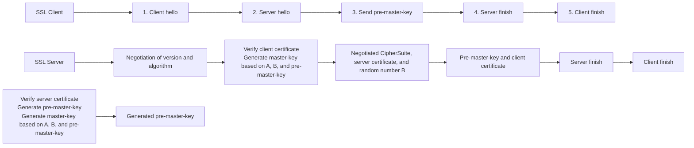
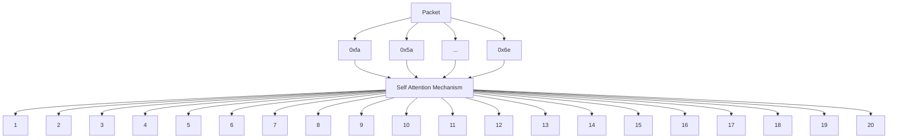

# A Novel Multimodal Deep Learning Framework for Encrypted Traffic Classification

Peng Lin , Student Member, IEEE, Kejiang Ye , Member, IEEE, Yishen Hu, Yanying Lin and Cheng-Zhong Xu , Fellow, IEEE

Abstract— Traffic classification is essential for cybersecurity maintenance and network management, and has been widely used in QoS (Quality of Service) guarantees, intrusion detection, and other tasks. Recently, with the emergence of SSL/TLS encryption protocols in the modern Internet environment, the traditional payload-based classification methods are no longer effective. Some researchers have used machine learning methods to model the flow features of encrypted traffics (e.g. message type, length sequence, statistical features, etc.), and achieved good results in some cases. However, these high-level hand-designed features cannot be used for more fine-grained operations and may lead to the loss of important information, thus affecting the classification accuracy. To overcome this limitation, in this paper, we designed a novel multimodal deep learning framework for encrypted traffic classification called PEAN. PEAN uses the raw bytes and length sequence as the input, and uses the self-attention mechanism to learn the deep relationship among network packets in a biflow. Furthermore, unsupervised pre-training was introduced to enhance PEAN’s ability to characterize network packets. Experiments on a real trace set captured in a large data center demonstrate the effectiveness of PEAN, which achieves better results than the state-of-the-art methods.

Index Terms— Encrypted traffic classification, network security, deep learning, multimodal learning.

## I. INTRODUCTION

RAFFIC classification is an essential task in cybersecurity maintenance and network management which aims to classify different network traffics into appropriate categories. It has been widely used in QoS (Quality of Service)

Manuscript received 5 May 2021; revised 13 December 2021, 12 June 2022, and 16 September 2022; accepted 13 October 2022; approved by IEEE/ACM TRANSACTIONS ON NETWORKING Editor A. Khreishah. Date of publication 28 October 2022; date of current version 16 June 2023. This work was supported in part by the National Key Research and Development Program of China under Grant 2021YFB3300200, in part by the National Natural Science Foundation of China under Grant 62072451, in part by the Shenzhen Basic Research Program under Grant JCYJ20200109115418592, in part by the Science and Technology Development Fund of Macao under Grant 0015/2019/AKP, and in part by the Youth Innovation Promotion Association Chinese Academy of Sciences (CAS) under Grant 2019349. (Corresponding author: Kejiang Ye.)

Peng Lin, Yishen Hu, and Yanying Lin are with the Shenzhen Institute of Advanced Technology, Chinese Academy of Sciences, Shenzhen 518055, China, and also with the School of Computer and Control Engineering, University of Chinese Academy of Sciences, Beijing 100049, China (e-mail: peng.lin@siat.ac.cn; ys.hu@siat.ac.cn; yy.lin1@siat.ac.cn).

Kejiang Ye is with the Shenzhen Institute of Advanced Technology, Chinese Academy of Sciences, Shenzhen 518055, China (e-mail: kj.ye@siat.ac.cn).

Cheng-Zhong Xu is with the State Key Laboratory of IoTSC, Faculty of Science and Technology, University of Macau, Macau (e-mail: czxu@um.edu.mo).

Digital Object Identifier 10.1109/TNET.2022.3215507 guarantees, intrusion detection, and other fields [1]. Take QoS guarantees as an example, through traffic classification, ISPs can know the traffic types currently occupying the main bandwidth at any time and can respond quickly to support their different network operation goals to provide the highest possible QoS. And for enterprise networks, different traffic may have different priorities [2], [3], which determine the bandwidth resources they allocate during peak hours.

Recently, with the fast development of Internet technology and users’ increasing attention to data privacy, today’s network application traffics are usually encrypted through a variety of encryption protocols to ensure data security and privacy [4], [5]. Among these encryption protocols, Secure Sockets Layer (SSL) [6] and its successor Transport Layer Security (TLS) protocol [7] are the most popular encryption protocols. Google’s recent report1 shows that 98% of Chrome-loaded web pages have enabled SSL/TLS encryption as of October 2021. Gartner also pointed out that 70% of cyberattacks conducted in 2020 were encrypted. Traditional payload-based traffic classification methods [8], [9] (also known as deep packet inspection) work well in classifying unencrypted network traffic by matching keywords in packets with fixed rules, but they fail to process the encrypted traffics. On the other hand, due to the widespread use of non-standard ports and Network Address Translation, port-based traffic classification methods are also no longer reliable. Therefore, there is an urgent need for accurately and efficiently classifying encrypted network traffic.

The SSL/TLS communication process can be divided into two stages, the first stage is the handshake between server and client, and the second stage is the formal transmission of data. In the first stage, the client first sends a Client Hello to the server, which contains a random number and the cipher suites supported by the client. The server then returns a Server Hello to the client, which contains the negotiated cipher suite, server certificate, and a random number. Subsequently, both parties generate a final master-key based on the previous information and the server sends Server Finish to the client to end the handshake. The above typical SSL/TLS handshake process is described in Figure 1. In the second stage, both parties use master-key to encrypt data through symmetrical encryption rather than asymmetric encryption to speed up the decryption time.

1https://transparencyreport.google.com/https/overview


<details>
<summary>flowchart</summary>


</details>

Fig. 1. Typical SSL/TLS handshake process.

The main challenge of encrypted traffic classification is to characterize the encrypted data stream. Unlike plaintext network traffic, which can be detected by the deep packet inspection method, encrypted packets cannot be classified from their content. Although the SNI (Server Name Indication) field in the TLS handshake packets can sometimes be used to indicate the type of traffic, not all cases contain complete handshake packets. We give a simple example here, when the client restarts the connection with the server in a short time, there is no need to exchange certificates and negotiate keys again. A promising solution for encrypted traffic classification is to use machine learning algorithms [10], [11], [12]. However, most of these methods are based on hand-designed flow features, which lose a lot of packet details and make fine-grained operations impossible, thus affecting the classification accuracy.

Another challenge is to combine as much information as possible from each part of the TLS traffic to make a more accurate classification. From the perspective of structure, network packet consists of IP, TCP, TLS headers, payload, etc., while network flows consist of handshakes, transmission, and communication finish packets. From the perspective of information, in network traffic, there are flow information, statistical information, packet length information, TLS message types, etc. Many previous works have been devoted to integrating information from different parts, such as adding the certificate packet’s length to their hand-designed features [13], [14], adding the TLS message types to the packet length sequence [15], etc. However, till now there are still no effective ways to integrate all kinds of information.

In order to improve the classification accuracy for encrypted traffic, maintain the integrity of information as much as possible, and provide more fine-grained packet-level operations, in this paper we design PEAN - a Packet-level End-to-end Attentive Network for encrypted traffic classification. PEAN is a multimodal framework that only needs to model the first few packets in biflow to achieve a very satisfactory accuracy, so it is suitable even for applications that rely on early prediction, such as QoS provisioning and routing. The proposed solution has three advantages:

1) PEAN uses a multimodal end-to-end policy for deeper network traffic modeling, learning traffic information from both packet content and packet length views, which can improve performance by capturing patterns in multiple viewpoints.  
2) Transformer [16] is used in PEAN to capture the sequential relationship of packets and merge information from different parts of network traffic. The intuition is that the Transformer’s Multi-head Self-Attention Mechanism can focus on the content of the data from different perspectives, which corresponds to the challenges we mentioned above.  
3) PEAN introduces an unsupervised pre-training manner to enhance the representation of network packet bytes. In this phase, PEAN randomly masks a certain proportion of network packet bytes and attempts to recover them through the adjacent bytes. Through such an operation, PEAN can better learn the interrelationships between bytes, which is useful for identifying encrypted traffic.

The contributions of this paper are summarized as follows:

We propose a multimodal end-to-end training framework that captures patterns in two viewpoints (raw bytes and length sequence) to improve classification performance. Besides, we optimize the training loss function to help the model better combine the information learned from the bytes and lengths.  
– It is worth pointing out that the proposed endto-end methodology is generic. It works directly on original network traffics and does not rely on any domain knowledge, thus can be easily applied to other network traffic classification tasks, e.g., encrypted/unencrypted network intrusion detection.  
• To our knowledge, this is one of the very few works that explore the Multi-head Self-Attention Mechanism for encrypted traffic classification.  
– We propose an end-to-end traffic classification scheme using a Multi-head Self-Attention Mechanism, showing a new perspective compared to the classical CNN (Convolutional Neural Network) model. Also, Transformer can learn the sequential relationship among packets like LSTM, but it has a stronger parallel inference ability.  
• We also propose an unsupervised pre-training manner to enhance the correlation of network traffic bytes and thereby enhancing the model’s representation ability for packets.  
– The handshake packets are in plain text, so the byte modeling on them will help extract the behavioral characteristics of a network flow.

The remainder of this paper is organized as follows. Section II presents related work. Section III gives the problem definition. In Section IV, we explain the detailed architecture of PEAN. Section V contains the dataset description and baselines. Section VI reports experimental results and the paper is concluded in Section VIII.

## II. RELATED WORKS

In this section, we introduce some recently proposed encrypted traffic classification methods, including traditional methods, message types-based, length sequence-based, statistical-based, end-to-end, and multimodal methods.

## A. Traditional Methods

Traditional methods include port-based methods [17] and payload-based methods [18]. The port-based method identifies applications based on the port registration list provided by the Internet Assigned Numbers Authority (IANA). However, as more and more applications use dynamically allocated ports, or use common communication protocol ports for camouflage, such a method has become unreliable. The payload-based method (or deep packet detection, DPI) classifies the applications by matching key strings in network traffic. Sen et al. [19] classified P2P application traffic with application-level signatures while Roughan et al. [8] uses statistical application signatures. However, the above two methods can only be used to deal with unencrypted network traffic and are completely ineffective for encrypted traffic.

## B. Feature-Based Methods

1) Length-Based Methods: The length-based methods abstract the network flows into the length sequences, and then use the Markov method or other machine learning methods to model the sequences. The intuition behind using length sequences as the representation of packets is that patterns of different application traffic have significant differences in packet size. For example, the average packet size of upload/download type traffic is typically larger than the average packet size of chat type traffic. Appscanner is introduced in [20] and [21], which uses packet length vector to classify mobile applications. Based on the Random Forest algorithm, it classifies the 110 most popular bot-generated Android applications. The results show that the accuracy of application re-identification is as high as 96% in the best case. Fu et al. [22] built hidden Markov models (HMM), with the sequence of packet lengths and the sequence of time delays. Liu et al. [15] proposed a multi-attribute Markov probability model combining message type sequence and the packet length. Recently, they [23] proposed a framework - FS-Net for classifying encrypted traffic using deep neural networks. FS-Net uses packet length sequence as input, uses bi-directional GRU [24] to encode features, and introduces a reconstruction mechanism in AutoEncoder to ensure the validity of the learned feature. Length sequences have been shown to be effective for encrypted traffic classification in many previous works. However, only using the packet length to represent the packet is a naïve simplification, which is bound to lose a lot of details. When the packet lengths are the same or close (e.g., packet fragmentation in the IP layer), the length sequence will lose its differentiation.

2) Message Types-Based Methods: Each header of the SSL/TLS packet has a field that identifies the packet’s message type. Based on message types sequence,

Korczy ´nski et al. [25] first proposed the unidirectional first-order homogeneous Markov model for encrypted traffic classification. Shen et al. [13] then proposed a second-order Markov model combining the certificate packet length and the first communication packet’s length. This kind of method learns the transition matrix of packet message types, which mainly has several limitations: i) the Markov model can only use the data of two or three-time steps for training, lacking rich sequential information; ii) the number of message types is very small, leading to the overlapping problem [15]. There are also some works combining length sequence and message type [15], which can somewhat address the lack of representability of a single message type feature. In addition to message types, several other fields can express encrypted HTTPS traffic to some extent, such as cipher suite, version, certificate information, etc. However, these methods are only applicable to SSL/TLS traffic and cannot be used for a wide range of protocols, including unencrypted HTTP, RTP, SRTP, MTProto, and other coexisting general mobile application classifications.

3) Statistical Feature-Based Methods: The main idea of this kind of method is to extract the statistical flow-level features of network traffic and then classify it with machine learning algorithms. The statistical features generally include the average packet length, average time interval, transmission rate, and so on. Some open-source tools provide the function of extracting these features, such as CICFlowMeter [26], Joy [27], etc. Zhu et al. [28] proposed an Attention-based Multi-Flow LSTM (AMF-LSTM) model to detect network attacks. They used multiple flows to take into account the historical information of the network and used Attention Mechanism (AM) to find network traffic that makes more contributions to classification. Lin et al. [10] developed on Zhu’s basis: they used SMOTE [29] to solve the imbalanced problem of CSE-CIC-IDS2018 dataset, and developed a visual network attack detection platform, namely NetDetector [30]. Shbair et al. [31] proposed a two-level hierarchical traffic classification framework (C4.5 and Random Forest) and defined a new set of statistical features for classifying services running over HTTPS connections. The evaluation shows that 50 of the 68 HTTPS services considered have a recall above 95%. The main limitations of these approaches are i) the features are highly abstracted, making it impossible to implement fine-grained operations (such as learning the relationship between two packets); ii) extracting statistical features generally requires observing the entire network flow until its end, and therefore real-time traffic classification is not possible.

## C. End-to-End Methods

There has been some recent work experimenting with endto-end encrypted traffic classification strategies. End-to-end means using the raw network packet bytes directly without using manually designed features for classification, which maximizes the ability of neural networks to automate the search for hidden features. At present, CNN is the main end-to-end traffic classification method [32]. Wang et al. [33] proposed to convert the packets into pictures and then process them with 1D-CNN, achieving good performance on the public ISCX VPN-Non-VPN traffic dataset. The same dataset was also evaluated in [34] with SAE and CNN. They retains the IP header and the first 1480 bytes of each IP packet as input and classifies them at the packet level with an accuracy of more than 90% for 17 applications. However, pure CNN is weak in representing the characteristics of network flow because it can not obtain the interactive information of different time steps. Combining some RNN models can improve this problem to some extent. [35], [36] first learn the features of the first 784 bytes of each packet with CNN, and then combine the features of each packet to get the flow feature vector with LSTM. Rezaei et al. [37] also uses a similar strategy to learn the header and the payload of first six packets, achieving good results in identifying ambiguous flows. Although these above works use more complex joint models, they are essentially single-modal end-to-end learning frameworks that suffer from weak feature representation ability.

## D. Multimodal Methods

Some recent work has started to use multimodal deep learning methods for classification of encrypted traffic. Multimodal learning can improve performance by capturing patterns in multiple viewpoints and can improve the problem of inadequate representation of single features. Wang et al. [38] proposed a multimodal encrypted traffic classification framework called AppNet. They used 1-D CNN [33] to extract features from the first 1014 bytes of the first packet, and used LSTM to learn the temporal relationship of the packet length sequence, and finally concatenated the features learned from two perspectives for classification. Similarly, Aceto et al. [39] proposed MIMETIC, a multimodal deep learning framework using the first 576 bytes of payload and 4 protocol features as input sources. The payload part is also processed with 1-D CNN, and the protocol features part is processed with GRU, a lightweight RNN structure. Most previous methods worked by taking the payload part of the first packet, or by extracting certain bytes from multiple packets all to piece together a hybrid payload, which lack a view of the whole network flow. Moreover, for the processing of byte embeddings, most of the current works use 1-D CNN, since inference of RNN for each byte embedding seems to be a bad choice due to the time overhead. Although CNN can compute in parallel, it cannot learn the temporal relationship between each byte or each packet very well.

We next state the differences between our work and some other previous work.

We use realistic traffic data collected from a large data center covering a larger number of people, devices, and types, whereas most previous work has used traffic samples generated from simulations or collected from small regional networks [15], [23], [33], [38], [40], making it difficult to accurately represent the complex and diverse network environment.  
• Previous methods focus on classifying network traffic from single modality [10], [15], [21], [25], [36], which

can suffer from inadequate feature information extraction. We use a multimodal end-to-end strategy. Compared to some existing multimodal models [38], [39], we focus on how to better incorporate the features of the traffic and how to better learn the sequential relationships of byte-to-byte and packet-to-packet. The core gain in these parts comes from the pre-training and the two-stage Transformer component that can learn the interconnections between different inputs in parallel. In addition, we improve the loss function to better fuse the knowledge learned from multiple modalities.

• Previous methods adopt CNNs for end-to-end modelling of raw bytes [33], [34], [35], [38], [39], which are weak in capturing the interrelationships between packet bytes. We explore an end-to-end modelling scheme based on a Multi-head Self-attention Mechanism to show a new research perspective on future encrypted traffic classification. In addition, we employ an unsupervised network traffic pre-training strategy to further enhance the model’s ability to represent packets.  
• Almost all previous works have used complete network flows for classification, but in practice, it is not always possible to capture a network flows with complete handshake information. So we explored more general forms of traffic, such as datasets containing full, partial, and no handshake information, respectively, to validate the performance of the model in these cases. In addition, we also performed occlusion analysis on the SNI field to compare the performance impact of having SNI or not on classification. These comparisons give us a clear idea of where the current difficulties in classifying encrypted traffic.

## III. PROBLEM DEFINITION

Encrypted traffic classification aims to identify the network traffic generated by different applications and classify it into appropriate categories [41]. This paper use an end-to-end strategy, so we can split traffic into three levels: byte, packet, and flow. A network packet is composed of several bytes, and all the packets within the specified time constitute the network traffic set R. The definition of R is as follows

$$
\mathcal {R} = \left\{\mathcal {P} ^ {1}, \mathcal {P} ^ {2}, \dots , \mathcal {P} ^ {n} \right\}, \quad n = | \mathcal {R} | \tag {1}
$$

$$
\mathcal {P} ^ {i} = \left(\mathcal {X} ^ {i}, \mathcal {B} ^ {i}, \mathcal {T} ^ {i}\right), \quad 1 \leq i \leq n \tag {2}
$$

$$
\mathcal {X} ^ {i} = <   \text { SrcIP } ^ {i}, \text { DstIP } ^ {i}, \text { SrcPort } ^ {i}, \text { DstPort } ^ {i}, \text { Protocol } ^ {i} > \tag {3}
$$

$$
\begin{array}{l} \mathcal {B} ^ {i} = \left\{b y t e ^ {1}, b y t e ^ {2}, \dots , b y t e ^ {q} \right\}, 0 x 0 0 \leq b y t e ^ {j} \leq 0 x f f, \\ 1 \leq j \leq q \tag {4} \\ \end{array}
$$

$$
\mathcal {T} ^ {i} > 0 \tag {5}
$$

${ \mathcal { P } } ^ { i }$ represents the i-th packet, which is defined by the 5-tuple $\mathcal { X } ^ { i }$ , byte content $B ^ { i }$ , and the start time $\mathcal { T } ^ { i }$ . Flow2 is a set of packets with the same X , and the l-th flow is defined

2In a bi-directional flow, the Src and Dst attributes can be exchanged.


<details>
<summary>flowchart</summary>

```mermaid
```mermaid
graph TD
  A["1 Pre-training Layer"] --> B["2 Packet Encoding Layer"]
  B --> C["3 Sequential Layer"]
  C --> D["4 Supplement Layer"]

    subgraph Pre_training_Layer["Pre-training_Layer"]
        A1["0x5a, 0x7f, 0x3c..., masked"]
        A2["0x48, masked, 0x21..., 0x9e"]
        A3["... Packet"]
        A4["0x5a, 0x7f, masked..., 0x24"]
    end

    subgraph Packet_Transformer_Encoder
        B1["Token, Positional Embedded layer"]
        B2["Multi-head Self-Attention"]
        B3["Add & Norm"]
        B4["Feed Forward"]
        B5["Add & Norm"]
        B6["... N×"]
        B7["... N×"]
        B8["... N×"]
        B9["... N×"]
        B10["... N×"]
        B11["... N×"]
        B12["... N×"]
        B13["... N×"]
        B14["... N×"]
        B15["... N×"]
        B16["... N×"]
        B17["... N×"]
        B18["... N×"]
        B19["... N×"]
        B20["... N×"]
    end

    subgraph Flow_Transformer_Encoder
        C1["Multi-head Self-Attention"]
        C2["Add & Norm"]
        C3["Feed Forward"]
        C4["Add & Norm"]
        C5["... N×"]
        C6["... N×"]
        C7["... N×"]
        C8["... N×"]
        C9["... N×"]
    end

    subgraph Packet_Transformer_Encoder
        D1["Packet Transformer Encoder"]
        D2["Packet Transformer Encoder"]
        D3["Packet Transformer Encoder"]
        D4["Packet Transformer Encoder"]
        D5["Packet Transformer Encoder"]
        D6["Packet Transformer Encoder"]
        D7["Packet Transformer Encoder"]
        D8["Packet Transformer Encoder"]
        D9["Packet Transformer Encoder"]
        D10["Packet Transformer Encoder"]
        D11["Packet Transformer Encoder"]
        D12["Packet Transformer Encoder"]
        D13["Packet Transformer Encoder"]
        D14["Packet Transformer Encoder"]
        D15["Packet Transformer Encoder"]
        D16["Packet Transformer Encoder"]
        D17["Packet Transformer Encoder"]
        D18["Packet Transformer Encoder"]
        D19["Packet Transformer Encoder"]
        D20["Packet Transformer Encoder"]
    end

    subgraph Packet_Transformer_Encoder
        E1["0x5a, 0x7f, 0x3e..., 0x6b"]
        E2["0x48, 0x03, 0x21..., 0x9e"]
        E3["... Packet"]
        E4["0x5a, 0x7f, 0x7d..., 0x24"]
    end

    subgraph Packet_Transformer_Encoder
        F1["Softmax & Cross Entropy"]
        F2["Backward Update Parameters"]
        F3["Loss50"]
    end

    subgraph Flow_Transformer_Encoder
  G1["h1"] --> H1["fully connected layer"]
  G2["h2"] --> H2["fully connected layer"]
  H1 --> H3["Softmax & Cross Entropy"]
  H2 --> H4["Loss3"]
    end

    subgraph Flow_Transformer_Encoder
  I1["LSTM"] --> J1["LSTM"] --> K1["LSTM"] --> L1["LSTM"] --> M1["LSTM"] --> N1["LSTM"] --> O1["LSTM"] --> P1["LSTM"] --> Q1["LSTM"] --> R1["LSTM"] --> S1["LSTM"] --> T1["LSTM"] --> U1["LSTM"] --> V1["LSTM"] --> W1["LSTM"] --> X1["LSTM"] --> Y1["LSTM"] --> Z1["LSTM"] --> AA1["LSTM"] --> AB1["LSTM"] --> AC1["LSTM"] --> AD1["LSTM"] --> AE1["LSTM"] --> AF1["LSTM"] --> AG1["LSTM"] --> AH1["LSTM"] --> AI1["LSTM"] --> AJ1["LSTM"] --> AK1["LSTM"] --> AL1["LSTM"] --> AM1["LSTM"] --> ANL1["LSTM"] --> AO1["LSTM"] --> APL1["LSTM"] --> AQL1["LSTM"] --> ARL1["LSTM"] --> ASL1["LSTM"] --> ATL1["LSTM"] --> AUL1["LSTM"] --> AVL1["LSTM"] --> AWL1["LSTM"] --> AXL1["LSTM"] --> AYL1["LSTM"] --> AZL1["LSTM"] --> BAL1["LSTM"] --> BBL1["LSTM"] --> BCL1["LSTM"] --> BDL1["LSTM"] --> BEL1["LSTM"] --> BFL1["LSTM"] --> BGL1["LSTM"] --> BHL1["LSTM"] --> BIL1["LSTM"] --> BJL1["LSTM"] --> BKL1["LSTM"] --> BLL1["LSTM"] --> BML1["LSTM"] --> BNL1["LSTM"] --> BOL1["LSTM"] --> BPL1["LSTM"] --> BQL1["LSTM"] --> BRL1["LSTM"] --> BSL1["LSTM"] --> BTL1["LSTM"] --> BUL1["LSTM"] --> BVL1["LSTM"] --> BWL1["LSTM"] --> BXL1["LSTM"] --> BYL1["LSTM"] --> BZL1["LSTM"] --> CAL1["LSTM"] --> CBL1["LSTM"] --> CCL1["LSTM"] --> CDL1["LSTM"] --> CEL1["LSTM"] --> CFL1["LSTM"] --> BGL1["LSTM"] --> BHL1["LSTM"] --> BIL1["LSTM"] --> BJL1["LSTM"] --> BKL1["LSTM"] --> BLL1["LSTM"] --> BML1["LSTM"] --> BNL1["LSTM"] --> BOL1["LSTM"] --> BPL1["LSTM"] --> BQL1["LSTM"] --> BCL1["LSTM"] --> BDL1["LSTM"] --> BEL1["LSTM"] --> BFL1["LSTM"] --> BGL1["LSTM"] --> BHL1["LSTM"] --> BIL1["LSTM"] --> BJL1["LSTM"] --> BKL1["LSTM"] --> BLI["Concat"]
    end

    subgraph Flow_Transformer_Encoder
        C2["Packet 1 ... PTE ... PTE ... PTE ... Pn Embedding ... Embedding 1 ... Embedding 2 ... Embedding n<br>    end<br><br>    subgraph Packet_Transformer_Encoder<br>        D2[Traffic Flow Embedding h₁"]
        D3["Fully Connected Layer"]
        D4["Softmax & Cross Entropy"]
    end

    subgraph Flow_Transformer_Encoder
        E3["Sequential Layer"]
        F3["Classification Layer"]
    end

    subgraph Packet_Transformer_Encoder
        G3["Packet 1 Len ... Packet n Len<br>    end<br><br>    subgraph Flow_Transformer_Encoder<br>        H3[Packet 2 Len ... Packet n Len<br>    end<br><br>    subgraph Packet_Transformer_Encoder<br>        I3[Packet 3 Len ... Packet n Len<br>    end<br><br>    subgraph Packet_Transformer_Encoder<br>        J3[Packet 4 Len ... Packet n Len<br>    end<br><br>    subgraph Flow_Transformer_Encoder<br>        K3[Packet 5 Len ... Packet n Len<br>    end<br><br>    subgraph Packet_Transformer_Encoder<br>        L3[Packet 6 Len ... Packet n Len<br>    end<br><br>    subgraph Flow_Transformer_Encoder<br>        M3[Packet 7 Len ... Packet n Len<br>    end<br><br>    subgraph Packet_Transformer_Encoder<br>        N3[Packet 8 Len ... Packet n Len<br>    end<br><br>    subgraph Flow_Transformer_Encoder<br>        O3[Packet 9 Len ... Packet n Len<br>    end<br><br>    subgraph Flow_Transformer_Encoder<br>        P3[Packet 10 Len ... Packet n Len<br>    end<br><br>    subgraph Flow_Transformer_Encoder<br>        Q3[Packet 11 Len ... Packet n Len<br>    end<br><br>    subgraph Flow_Transformer_Encoder<br>        R3[Packet 12 Len ... Packet n Len<br>    end<br><br>    subgraph Flow_Transformer_Encoder<br>        S3[Packet 13 Len ... Packet n Len<br>    end<br><br>    subgraph Flow_Transformer_Encoder<br>        T3[Packet 14 Len ... Packet n Len<br>    end<br><br>    subgraph Flow_Transformer_Encoder<br>        U3[Packet 15 Len ... Packet n Len<br>    end<br><br>    subgraph Flow_Transformer_Encoder<br>        V3[Packet 16 Len ... Packet n Len<br>    end<br><br>    subgraph Flow_Transformer_Encoder<br>        W3[Packet 17 Len ... Packet n Len<br>    end<br><br>    subgraph Flow_Transformer_Encoder<br>        X3[Packet 18 Len ... Packet n Len<br>    end<br><br>    subgraph Flow_Transformer_Encoder<br>        Y3[Packet 19 Len ... Packet n Len<br>    end<br><br>    subgraph Flow_Transformer_Encoder<br>        Z3[Packet 20 Len ... Packet n Len<br>    end<br><br>    subgraph Flow_Transformer_Encoder<br>        AA3[Packet 22 Len ... Packet n Len<br>    end<br><br>    subgraph Flow_Transformer_Encoder<br>        AB3[Packet 23 Len ... Packet n Len<br>    end<br><br>    subgraph Flow_Transformer_Encoder<br>        AC3[Packet 24 Len ... Packet n Len<br>    end<br><br>    subgraph Flow_Transformer_Encoder<br>        AD3[Packet 25 Len ... Packet n Len<br>    end<br><br>    subgraph Flow_Transformer_Encoder<br>        AE3[Packet 26 Len ... Packet n Len<br>    end<br><br>    subgraph Flow_Transformer_Encoder<br>        AF3[Packet 27 Len ... Packet n Len<br>    end<br><br>    subgraph Flow_Transformer_Encoder<br>        AG3[Packet 28 Len ... Packet n Len<br>    end<br><br>    subgraph Flow_Transformer_Encoder<br>        AH3[Packet 29 Len ... Packet n Len<br>    end<br><br>    subgraph Flow_Transformer_Encoder<br>        AI3[Packet 30 Len ... Packet n Len<br>    end<br><br>    subgraph Flow_Transformer_Encoder<br>        AJ3[Packet 32 Len ... Packet n Len<br>    end<br><br>    subgraph Flow_Transformer_Encoder<br>        AK3[Packet 33 Len ... Packet n Len<br>    end<br><br>    subgraph Flow_Transformer_Encoder<br>        AL3[Packet 34 Len ... Packet n Len<br>    end<br><br>    subgraph Flow_Transformer_Encoder<br>        AM3[Packet 35 Len ... Packet n Len<br>    end<br><br>    subgraph Flow_Transformer_Encoder<br>        AN3[Packet 36 Len ... Packet n Len<br>    end<br><br>    subgraph Flow_Transformer_Encoder<br>        AO3[Packet 37 Len ... Packet n Len<br>    end<br><br>    subgraph Flow_Transformer_Encoder<br>        AP3[Packet 38 Len ... Packet n Len<br>    end<br><br>    subgraph Flow_Transformer_Encoder<br>        AQ[Packet 40 Len ... Packet n Len<br>    end<br><br>    subgraph Flow_Transformer_Encoder<br>        AR3[Packet 42 Len ... Packet n Len<br>    end<br><br>    subgraph Flow_Transformer_Encoder<br>        AS[Packet 44 Len ... Packet n Len<br>    end<br><br>    subgraph Flow_Transformer_Encoder<br>        AT[Packet 46 Len ... Packet n Len<br>    end<br><br>    subgraph Flow_Transformer_Encoder<br>        AU[Packet 48 Len ... Packet n Len<br>    end<br><br>    subgraph Flow_Transformer_Encoder<br>        AV[Packet 50 Len ... Packet n Len<br>    end<br><br>    subgraph Flow_Transformer_Encoder<br>        AW[Packet 52 Len ... Packet n Len<br>    end<br><br>    subgraph Flow_Transformer_Encoder<br>        AX[Packet 54 Len ... Packet n Len<br>    end<br><br>    subgraph Flow_Transformer_Encoder<br>        AY[Packet 56 Len ... Packet n Len<br>    end<br><br>    subgraph Flow_Transformer_Encoder<br>        AZ[Packet 58Len ... Packet n Len<br>    end<br><br>    subgraph Flow_Transformer_Encoder<br>        BA[Packet 60Len ... Packet n Len<br>    end<br><br>    subgraph Flow_Transformer_Encoder<br>        BB[Packet 62Len ... Packet n Len<br>    end<br><br>    subgraph Flow_Transformer_Encoder<br>        BC[Packet 64Len ... Packet n Len<br>    end<br><br>    subgraph Flow_Transformer_Encoder<br>        BD[Packet 66Len ... Packet n Len<br>    end<br><br>    subgraph Flow_Transformer_Encoder<br>        BE[Packet 68Len ... Packet n Len<br>    end<br><br>    subgraph Flow_Transformer_Encoder<br>        BF[Packet 70Len ... Packet n Len<br>    end<br><br>    subgraph Flow_Transformer_Encoder<br>        BG[Packet 72Len ... Packet n Len<br>    end<br><br>    subgraph Flow_Transformer_Encoder<br>        BH[Packet 74Len ... Packet n Len<br>    end<br><br>    subgraph Flow_Transformer_Encoder<br>        BI[Packet 76Len ... Packet n Len<br>    end<br><br>    subgraph Flow_Transformer_Encoder<br>        BJ[Packet 78Len ... Packet n Len<br>    end<br><br>    subgraph Flow_Transformer_Encoder<br>        BK[Packet 80Len ... Packet n Len<br>    end<br><br>    subgraph Flow_Transformer_Encoder<br>        BL[Packet 82Len ... Packet n Len<br>    end<br><br>    subgraph Flow_Transformer_Encoder<br>        BM[Packet 84Len ... Packet n Len<br>    end<br><br>    subgraph Flow_Transformer_Encoder<br>        BN[Packet 86Len ... Packet n Len<br>    end<br><br>    subgraph Flow_Transformer_Encoder<br>        BO[Packet 88Len ... Packet n Len<br>    end<br><br>    subgraph Flow_Transformer_Encoder<br>        BP[Packet 90Len ... Packet n Len<br>    end<br><br>    subgraph Flow_Transformer_Encoder<br>        BPB[Packet 92Len ... Packet n Len<br>    end<br><br>    subgraph Flow_Transformer_Encoder<br>        BQ[Packet 94Len ... Packet n Len<br>    end<br><br>    subgraph Flow_Transformer_Encoder<br>        BQB[Packet 96Len ... Packet n Len<br>    end<br><br>    subgraph Flow_Transformer_Encoder<br>        BQBQ[Packet 98Len ... Packet n Len<br>    end<br><br>    subgraph Flow_Transformer_Encoder<br>        BC[Packet 90Len ... Packet n Len<br>    end<br><br>    subgraph Flow_Transformer_Encoder<br>        BCB[Packet 92Len ... Packet n Len<br>    end<br><br>    subgraph Flow_Transformer_Encoder<br>        BCBQ[Packet 94Len ... Packet n Len<br>    end<br><br>    subgraph Flow_Transformer_Encoder_Repeat_Repeat_Repeat_Repeat_Repeat_Repeat_Repeat_Repeat_Repeat_Repeat_Repeat_Repeat_Repeat_Repeat_Repeat_Repeat_Repeat_Repeat_Repeat_Repeat_Repeat_Repeat_Repeat_Repeat_Repeat_Repeat_Repeat_Repeat_Repeat_Repeat_Repeat_Repeat_Repeat_Repeat_Repeat_Repeat_Repeat_Repeat_Repeat_Repeat_Repeat_Repeat_Repeat_Repeat_Repeat_Repeat_Repeat_Repeat_Repeat_Repeat_ frequently_OFFN_FEER_BEER_BEER_BEER_BEER_BEER_BEER_BEER_BEER_BEER_BEER_BEER_BEER_BEER_BEER_BEER_BEER_BEER_BEER_BEER_BEER_BEER_BEER_BEER_BEER_BEER_BEER_BEER_BEER_BEER_BEER_BEER_BEER_BEER_BFEE_BFEE_BFEE_BFEE_BFEE_BFEE_BFEE_BFEE_BFEE_BFEE_BFEE_BFEE_BFEE_BFEE_BFEE_BFEE_BFEE_BFEE_BFEE_BFEE_BFEE_BFEE_BFEE_BFEE_BFEE_BFEE_BFEE_BFEE_BFEE_BFEE_BFEE_BFEE_BFEE_BFEE_CDFR_BFEE_CDFR_BFEE_CDFR_BFEE_CDFR_BFEE_CDFR_BFEE_CDFR_BFEE_CDFR_BFEE_CDFR_BFEE_CDFR_BFEE_CDFR_BFEE_CDFR_BFEE_CDFR_BFEE_CDFR_BFEE_CDFR_BFEE_CDFR_BFEE_CDFR_BFEE_CDFR_BFEE_SDFR_BFEE_SDFR_BFEE_SDFR_BFEE_SDFR_BFEE_SDFR_BFEE_SDFR_BFEE_SDFR_BFEE_SDFR_BFEE_SDFR_BFEE_SDFR_BFEE_SDFR_BFEE_SDFR_BFEE_SDFR_BFEE_SDFR_BFEE_SDFR_BFEE_SDFR_BFEE_SDFR_BGFB_GFB_GFB_GFB_GFB_GFB_GFB_GFB_GFB_GFB_GFB_GFB_GFB_GFB_GFB_GFB_GFB_GFB_GFB_GFB_GFB_GFB_GFB_GFB_GFB_GFB_GFB_GFB_GFB_GFB_GFB_GFB_GFB_GFB_GFB_GFB_GFB_GFB_GFB_GFB_GFB_GFB_GFB_GFB_GFB_GFB_GFB_GFB_GFB_GFB_GFB_HA[H/A/H/A/H/A/H/A/H/A/H/A/H/A/H/A/H/A/H/A/H/A/H/A/H/A/H/A/H/A/H/A/H/A/H/A/H/A/H/A/H/A/H/A/H/A/H/A/H/A/H/A/H/A/H/A/H/A/H/A/H/A/H/A/H/A/H/A/H/A/H/A/H/A/H/A/H/A/H/A/H/A/H/A/H/A/H/A/H/A/H/A/H/A/H/A/H/A/H/A/H/A/IH_AH_AH_AH_AH_AH_AH_AH_AH_AH_AH_AH_AH_AH_AH_AH_AH_AH_AH_AH_AH_AH_AH_AH_AH_AH_AH_AH_AH_AH_AH_AH_AH_AH_AH_AH_AH_AH_AH_AH_AH_AH_AH_AH_AH_AH_AH_AH_AH_AH_AH AHLA[H/L/L/L/L/L/L/L/L/L/L/L/L/L/L/L/L/L/L/L/L/L/L/L/L/L/L/L/L/L/L/L/L/L/L/L/L/L/L/L/L/L/L/L/L/L/L/L/L/L/L/L/L/L/L/L/L/L/L/L/L/L/L/L/L/L/L/L/L/L/L/L/L/L/L/L/L/L/L/L/L/L/L/L/L/L/L/L/L/L/L/L/L/L/L/L/L/L/L/L/L.LI[H/II"][I/II][II/II][III/II][IV/II][V/II][VI/II][V/II][V/II][VI/II][VI/II][VI/II][VI/II][VI/II][VI/II][VI/II][VI/II][VI/II][VI/II][VI/II][VI/II][VI/II][VI/II][VI/II][VI/II][VI/II][VI/II][VI/II][VI/II][VI/II][VI/II][VI/II][VI/II][VI/II][V/II][VI/II][VI/II][VI/II][VI/II][VI/II][VI/II][VI/II][VI/II][VI/II][VI/II][VI/II][VI/II][VI/II][VI/II][VI/II][VI/II][VI/II][VI/II][VI/II][VI/II][VI/II][VI/II][VI/II][V/III][VI/III][VI/III][VI/III][VI/III][VI/III][VI/III][VI/III][VI/III][VI/III][VI/III][VI/III][VI/III][VI/III][VI/III][VI/III][VI/III][VI/III][VI/III][VI/III][VI/III][VI/III][VI/III][VI/III][VI/III][VI/III][V/IV][VI/IV][VI/IV][VI/IV][VI/IV][VI/IV][VI/IV][VI/IV][VI/IV][VI/IV][VI/IV][VI/IV][VI/IV][VI/IV][VI/IV][VI/IV][VI/IV][VI/IV][VI/IV][VI/IV][VI/IV][VI/IV][VI/IV][VI/IV][VI/IV][VI/IV][V/IX[I/XI,I-XO,I-XO,I-XO,I-XO,I-XO,I-XO,I-XO,I-XO,I-XO,I-XO,I-XO,I-XO,I-XO,I-XO,I-XO,I-XO,I-XO,I-XO,I-XO,I-XO,I-XO,I-XO,I-XO,I-XO,I-XO,I-XO,I-XO,I-XO,I-XO,I-XO,I-XO,I-XO,I-XO,I-XO,IXI[XI[XI[XI[XI[XI[XI[XI[XI[XI[XI[XI[XI[XI[XI[XI[XI[XI[XI[XI[XI[XI[XI[XI[XI[XI[XI[XI[XI[XI[XI[XI[XI[XI[XI[XI[XI[XI[XI[XI[XI[XI[XI[XI[XI[XI[XI[XI[XI[XI[XI[xiXiXiXiXiXiXiXiXiXiXiXiXiXiXiXiXiXiXiXiXiXiXiXiXiXiXiXiXiXiXiXiXiXiXiXiXiXiXiXiXiXiXiXiXiXiXiXiXiXiXi XiXiXiXiXiXiXiXiXiXiXiXiXiXiXiXiXiXiXiXiXiXiXiXiXiXiXiXiXiXiXiXiXiXiXiXiXiXiXiXiXiXiXiXiXiXiXiXiXiXiC#DIVISHING RED RED RED RED RED RED RED RED RED RED RED RED RED RED RED RED RED RED RED RED RED RED RED RED RED RED RED RED RED RED RED RED RED RED RED RED RED RED RED RED RED RED RED RED RED RED RED RED RED RED RED RED RED RED RED RED RED RED RED RED RED RED RED RED RED RED RED RED RED RED RED RED RED RED RED RED RED RED RED RED RED RED RED RED RED RED RED RED RED RED RED RED RED RED RED RED RED RED RED RED Red LEDIFFLE DIFFLE DIFFLE DIFFLE DIFFLE DIFFLE DIFFLE DIFFLE DIFFLE DIFFLE DIFFLE DIFFLE DIFFLE DIFFLE DIFFLE DIFFLE DIFFLE DIFFLE DIFFLE DIFFLE DIFFLE DIFFLE DIFFLE DIFFLE DIFFLE DIFFLE DIFFLE DIFFLE DIFFLE DIFFLE DIFFLE DIFFLE DIFFLE DIFFLE DIFFLE DIFFLE DIFFLE DIFFLE DIFFLE DIFFLE DIFFLE DIFFLE DIFFLE DIFFLE DIFFLE DIFFLE DIFFLE DIFFLE DIFFLE DIFFLE DIFFLE AFFLE DIFFLE DIFFLE DIFFLE DIFFLE DIFFLE DIFFLE DIFFLE DIFFLE DIFFLE DIFFLE DIFFLE DIFFLE DIFFLE DIFFLE DIFFLE DIFFLE DIFFLE DIFFLE DIFFLE DIFFLE DIFFLE DIFFLE DIFFLE DIFFLE DIFFLE DIFFLE DIFFLE DIFFLE DIFFLE DIFFLE DIFFLE DIFFLE DIFFLE DIFFLE DIFFLE DIFFLE DIFFLE DIFFLE DIFFLE DIFFLE DIFFLE DIFFLE DIFFLE DIFFLE DIFFLE DIFFLE DIFFLE DIFFLE DIFFLE ACCUMULATION_XA[XA[XA[XA[XA[XA[XA[XA[XA[XA[XA[XA[XA[XA[XA[XA[XA[XA[XA[XA[XA[XA[XA[XA[XA[XA[XA[XA[XA[XA[XA[XA[XA[XA[XA[XA[XA[XA[XA[XA[XA[xjx[xjx[xjx[xjx[xjx[xjx[xjx[xjx[xjx[xjx[xjx[xjx[xjx[xjx[xjx[xjx[xjx[xjx[xjx[xjx[xjx[xjx[xjx[xjx[xjx[xjx[xjx[xjx[xjx[xjx[xjx[xjx[xjx[xjx xjx[xjx[xjx[xjx[xjx[xjx[xjx[xjx[xjx[xjx[xjx[xjx[xjx[xjx[xjx[xjx[xjx[xjx[xjx[xjx[xjx[xjx[xjx[xjx[xjx[xjx[xjx[xjx[xjx[xjx[xjx[xjx[xjx[xkx[xkx[xkx[xkx[xkx[xkx[xkx[xkx[xkx[xkx[xkx[xkx[xkx[xkx[xkx[xkx[xkx[xkx[xkx[xkx[xkx[xkx[xkx[xkx[xkx[xkx[xkx[xkx[xkx[xkx[xkx[xkx[xkx[xkz[xkz[xkz[xkz[xkz[xkz[xkz[xkz[xkz[xkz[xkz[xkz[xkz[xkz[xkz[xkz[xkz[xkz[xkz[xkz[xkz[xkz[xkz[xkz[xkz[xkz[xkz[xkz[xkz[xkz[xkz[xkz[xkz[xkz*xkz[xkz*xkz*xkz*xkz*xkz*xkz*xkz*xkz*xkz*xkz*xkz*xkz*xkz*xkz*xkz*xkz*xkz*xkz*xkz*xkz*xkz*xkz*xkz*xkz*xkz*xkz*xkz*xkz*xkz*xkz*xkz*xkz*xkz*xkz*x kz,xkz,xkz,xkz,xkz,xkz,xkz,xkz,xkz,xkz,xkz,xkz,xkz,xkz,xkz,xkz,xkz,xkz,xkz,xkz,xkz,xkz,xkz,xkz,xkz,xkz,xkz,xkz,xkz,xkz,xkz,xkz,xkz,xkz,xk.
```
</details>

Fig. 2. The framework of the proposed multimodal end-to-end attentive network which includes five components.

as follows

$$
f _ {l} = \left\{\mathcal {P} _ {l} ^ {1}, \mathcal {P} _ {l} ^ {2}, \dots , \mathcal {P} _ {l} ^ {m} \right\}, \quad m = | f _ {l} | \tag {6}
$$

$\mathrm { W h e r e } \quad \mathcal { X } _ { l } ^ { 1 } = \cdot \cdot \cdot = \mathcal { X } _ { l } ^ { m } \mathrm { ~ a n d ~ } \mathcal { T } _ { l } ^ { 1 } < \cdot \cdot \cdot < \mathcal { T } _ { l } ^ { m }$ (7)

Therefore, the original traffic set $\mathcal { R }$ can also be expressed as $\mathcal { R } ^ { \prime }$ :

$$
\mathcal {R} ^ {\prime} = \left\{f _ {1}, f _ {2}, \dots , f _ {k} \right\}, \quad k = | \mathcal {R} ^ {\prime} | \tag {8}
$$

Given an observed packet sequence $\mathcal { R } ^ { \prime }$ and $\mathcal { N }$ applications, our goal is to train a model $\phi \left( f _ { l } \right)$ to predict the label $\mathcal { L } _ { l }$ of network flow $f _ { l } .$ , where $1 \le \mathcal { L } _ { l } \le \mathcal { N }$ .

## IV. METHODOLOGY

This section describes the proposed multimodal end-to-end encrypted traffic classification framework PEAN. We first introduce the overall architecture of PEAN and then specify each component of it.

As shown in Figure 2, the architecture of our proposed model PEAN has five layers. The Pre-training Layer is the first layer, which learns a byte embedding model, with the Transformer as the core component and its Multi-head Selfattention Mechanism allowing it to learn the interrelationships between bytes. The task of Pre-training Layer is to gain the ability to characterize bytes through an unsupervised pretraining. The second layer is the Packet Encoding Layer that reuses the model parameters learned in the first layer to obtain a packet-level embedding representation. The third layer, Sequential Layer uses another Transformer to learn the interrelationship of different packet embeddings to get an embedding representation of the network flow. The fourth layer is the Supplement Layer, which performs a simple LSTM modeling using packet length sequences, to learn supplemental features for the model from the second modality. The last layer Classification Layer combines the hidden features from the Sequential Layer and Supplement Layer to perform a fusion and classification. Thus, PEAN is also a multimodal deep learning framework, however, a clear difference from previous work is that we designed a Transformer-based model instead of CNN for the end-to-end part, i.e., the first, second and third layers. we describe each layer in detail below.

## A. Pre-Training Layer

The purpose of pre-training is to train a model with bytes encoding capability that can help us to encode a packet into a vector in the later Packet Encoding Layer. As we know, the content of encrypted network traffic cannot be understood directly through reading [42], but bytes are distributed differently in packets of different applications. Anderson et al. [27] used bytes distribution of handshake packets as one of their statistical flow features, proving that it can bring certain information. However, bytes distribution is only an abstract statistical feature of a network flow, which can not further represent the relationship between bytes. Inspired by BERT [43], we propose an unsupervised pre-training idea, in which the neural network randomly masks a certain proportion (the proportion we set in the experiment is 15%) of network packet bytes (i.e., using the “mask” token to replace the original bytes) and attempts to recover them through the adjacent bytes. We choose the Transformer as the training model because its self-attention mechanism allows each byte to incorporate other bytes’ information. Such a pre-training manner has the following advantages: (i) In the pre-training phase, the embedding representation of each byte is related to other bytes, so the whole packet representation will have stronger unity.

(ii) As we all know, collecting network traffic is simple but labeling them is difficult. Since the pre-training method is unsupervised, a large amount of unlabeled can be directly used for pre-training to improve the model’s packet encoding ability, which is convenient for future model extension and updates.

The main contents of the Transformer Encoder are Multihead Self-attention Mechanism, position embedding, residual connection, layer-normalization [44] and feedforward network. We briefly explain the first two core parts as follow:

Multi-head Self-Attention Mechanism. The essence of the Attention function can be described as a mapping from a Query (Q) to a series of Key-Value $( K - V )$ pairs. In Self-Attention, the $Q , K$ , and V mentioned above are all obtained from the same value x by passing through three different linear transformation matrices $\bar { W } ^ { Q } , \mathbf { \bar { W } } ^ { K }$ , and $W ^ { V }$ , respectively. The self-attention mechanism is a variation of the attention mechanism, which relies less on external information and is better at capturing the internal relevance of data or features.

The inference formulas of the Multi-head Self-Attention Mechanism are as follows

${ \mathrm { A t t e n t i o n ~ } } ( Q , K , V ) = { \mathrm { s o f t m a x } } \left( { \frac { Q K ^ { T } } { \sqrt { d _ { k } } } } \right) V$  QK T (9)

$$
\text { head } _ {i} = \text { Attention } \left(Q W _ {i} ^ {Q}, K W _ {i} ^ {K}, V W _ {i} ^ {V}\right) \tag {10}
$$

$\operatorname { M u l t i H e a d } ( Q , K , V ) = \operatorname { C o n c a t } ( \operatorname { h e a d } _ { 1 } , \dots , \operatorname { h e a d } _ { h } ) W ^ { O }$ (11)

where $d _ { k }$ is the dimension of K and h is the head number of self-attention. Different heads can be understood as multiple independent and parallel self-attention mechanisms, which will each focus on different semantics of the sequence. Generally speaking, it can focus on the different parts of network traffic packets.

Position Embedding. Since self-attention does not consider time step information when calculating the attention value of a query, the Transformer superimposes the input data with position information through the position embedding. There are different implementations for position embedding. In [16], the author used the sin and cos function to add absolute position information to the data. However, a simple sequence of incremental numbers can also be used as position embedding for different time steps. After obtaining the position embedding, they will be added to the token embedding of the input data (i.e., the vector representation of each byte), and then fed into the Multi-head Self-attention layer.

By stacking multiple Transformer Encoders, the Pre-training Layer can learn deep relationships among bytes to accurately characterize the network traffic packets. The Pre-training Layer uses cross-entropy as the loss function and trains through gradient descent.

## B. Packet Encoding Layer

So far, we have discussed how to use the Transformer to get the embedding representations packet bytes. As defined in Section III, a flow consists of multiple packets, which in turn consist of many bytes, so before we can proceed to the next step, a packet-level vector representation should be given.


<details>
<summary>flowchart</summary>


</details>

Fig. 3. The working principle of Packet Transfomer Encoder (PTE).

In fact, we design a key module in the Pre-Training Layer called Packet Transfomer Encoder $( P T E )$ , which is also the most important component of the Packet Encoding Layer. In the PTE module, a “[PACKET]” token will be added to the beginning of each packet, as shown in Figure 3. The “[PACKET]” token will get a vector representation through Transformer, where different colored lines in the figure represent different attention weights. Due to the self-attention mechanism, this vector integrates all bytes of information, which are fused with different weights, as the different colored lines in Figure 3. Because of the Multi-head Self-Attention in PTE, the vector corresponding to “[PACKET]” contains global bytes information. And under the fitting of the neural network, this vector can finally learn a packet-level representation.

## C. Sequential Layer

Network traffic is a stream-type data with time sequence relation, and the adjacent packets contain a certain correlation. For example, chat-type traffic is generally with small outbound and inbound packets, and with a high communication frequency. However, download-type traffic generally has a low outbound frequency and high inbound frequency. Based on this, we design a Sequential Layer to learn the relationship between packets. Because such a thought involves fine-grained operations on packets, many statistical-based or flow-based methods are incompetent, which is the advantage of our end-to-end framework. Given a flow: $\begin{array} { r l } { f } & { { } = } \end{array}$ $\{ \mathcal { \bar { P } } ^ { 1 } , \mathcal { P } ^ { 2 } , . . . , \mathcal { P } ^ { m } \}$ , $m = | f | ,$ where ${ \mathcal { P } } ^ { i }$ represents the $i -$ th packet in the flow $( 0 < i < m )$ . After passing through the 0previous Packet Encoding Layer, we can get

$$
\mathcal {F} = \left\{e ^ {1}, e ^ {2}, \dots , e ^ {m} \right\} = \mathrm{PTE} \left(\left\{\mathcal {P} ^ {1}, \mathcal {P} ^ {2}, \dots , \mathcal {P} ^ {m} \right\}\right) \tag {12}
$$

where $e ^ { i }$ is the vector representation of packet ${ \mathcal { P } } ^ { i }$ , and its dimension can be set artificially.

We have two schemes to learn the sequential hidden features of packets: i) Transformer, and ii) LSTM [45]. However, the self-attention mechanism in Transformer can more clearly reflect which packets are more important, so it can bring more accurate classification (we will show in the experimental section). In addition, the Transformer does not require iterative calculation like LSTM, so it has a faster inference speed. Based on the above analysis, we chose the first scheme to implement a Flow Transformer Encoder (FTE) in Sequential

Layer to get the representations of network flows. Since there is no data generation task involved, we only use the Encoder part of Transformer here. Through stacking of multiple Transformer Encoder, each packet $e ^ { i }$ learns the information of other packets and gets a new representation of $v ^ { i } .$ . We concatenate all the $v ^ { i }$ to get the hidden state of the whole network flow $h _ { \mathrm { 1 } } \mathbf { : }$

$$
v ^ {i} = \mathrm{FTE} \left(e ^ {i}\right), \quad 1 <   \mathrm{i} <   \mathrm{m} \tag {13}
$$

$$
h _ {1} = \text { Concat } \left(v ^ {1}, v ^ {2}, \dots , v ^ {m}\right) W _ {o} \tag {14}
$$

where $W _ { o }$ is a linear transformation layer and through which we can get $h _ { 1 }$ of our specified dimension.

## D. Supplement Layer

Unlike the set of flow features with formatted inputs, the original network flow contains an irregular number of packets, and the lengths of different packets are unequal. So in the end-to-end strategy, we need to process packets to have a consistent length (by truncating or padding them) to adapt to the input format of the neural network. However, such an operation will cause to loss of the real length information of packets. Previous works have shown that using packet lengths can achieve good classification effects [15], [23], so we use it as a second modality to supplement the model with features learned from another perspective.

As described earlier, in the Packet Encoding Layer, each packet will be converted to a byte stream and padded/truncated to a fixed length. In fact, prior to this step, the packet lengths will be extracted and sent to the Supplement Layer for building the packet length sequence. Let  be our packet length sequence, then it can be defined as

$$
\begin{array}{l} \mathrm{L} = \left\{l _ {1}, l _ {2}, \dots , l _ {m} \right\} \\ = \left\{\text { length } \left(\mathcal {P} ^ {1}\right), \text { length } \left(\mathcal {P} ^ {2}\right), \dots , \text { length } \left(\mathcal {P} ^ {m}\right) \right\} \tag {15} \\ \end{array}
$$

where length is the length extracting function and $l _ { i }$ is ()the length of the i-th packet. After obtaining the length sequence, we use bi-directional LSTM to learn their sequential correlation and get the hidden state $h _ { 2 }$ :

$$
h _ {2} = \operatorname{Concat} \left(\overrightarrow {\mathrm{LSTM}} \left(l ^ {1}, \dots , l ^ {m}\right), \overleftarrow {\mathrm{LSTM}} \left(l ^ {1}, \dots , l ^ {m}\right)\right) \tag {16}
$$

The $h _ { 1 }$ obtained by the Sequential Layer and the $h _ { 2 }$ obtained by the Supplement Layer will be further sent to the Classification Layer.

## E. Classification Layer

In the Classification Layer, we concatenate $h _ { 1 }$ and $h _ { 2 }$ to make a classification through the fully connected layer and the softmax layer. The motivation for concatenating $h _ { 1 }$ and $h _ { 2 }$ is that we want neural networks to combine the advantages of raw bytes and length sequence so that they can complement each other. However, due to the black box characteristics of the neural network, it may not learn the best solution of the two parts as we expected, or even learn worse results. However, here we have the assumption that if the combined model’s parameters are optimal, then the parameters of Sequential Layer and Supplement Layer should also be optimal in their individual ways. Therefore, we try to guide the learning of the neural network, so that it can learn the best performance of the two parts trained separately. Specifically, we improve the loss function. The new loss function not only measures the performance of the final classification result but also considers the classification performance of the features learned in each part.

So, after we obtain $h _ { 1 }$ and $h _ { 2 }$ at the Sequential Layer and Supplement Layer, we perform full connection  softmax +operations on each of them and get predicted results of $\gamma _ { 1 }$ and $\gamma _ { 2 } .$ , respectively. Then we concatenate $h _ { 1 }$ and $h _ { 2 }$ and make a classification through full connection  softmax operations again, to get the final classification result $\gamma _ { 3 } .$ . Correspondingly, in each part, we use cross-entropy as their loss function to get loss1, loss2 and $\mathrm { \it { l o s s } } _ { 3 }$ . The loss of the whole model lossT otal is the sum of the three-loss above, and their formulas are as follows $( { \mathcal { L } } _ { i }$ is the label of the i-th network flow):

$$
\gamma_ {1} = \text { Softmax } \left(W _ {h _ {1}} \cdot h _ {1} + b _ {h _ {1}}\right) \tag {17}
$$

$$
\gamma_ {2} = \text { Softmax } \left(W _ {h _ {2}} \cdot h _ {2} + b _ {h _ {2}}\right) \tag {18}
$$

$$
\gamma_ {3} = \text { Softmax } (W _ {h _ {2}} \cdot \text { Concat } (h _ {1}, h _ {2}) + b _ {h _ {3}}) \tag {19}
$$

$$
l o s s _ {\theta} = \frac {1}{T} \sum_ {i = 1} ^ {T} \sum_ {k = 1} ^ {\mathcal {N}} \mathcal {L} _ {i} ^ {k} \log (\gamma_ {\theta}) _ {i} ^ {k}, \quad \theta = \{1, 2, 3 \},
$$

$$
\mathcal {L} _ {i} = \left\{\mathcal {L} _ {i} ^ {1}, \mathcal {L} _ {i} ^ {2}, \dots , \mathcal {L} _ {i} ^ {k} \right\}, \quad 1 \leq k \leq \mathcal {N} \tag {20}
$$

$$
\text { loss } _ {\text { Total }} = \sum_ {\theta = 1} ^ {3} \text { loss } _ {\theta} \tag {21}
$$

where {W, b} are the parameters of the corresponding fully connected layer, $T$ is the number of training samples. Note that we only use $l o s s _ { T o t a l }$ in the training phase to guide the neural network to learn the two best parts, and in the testing phase, we only use loss3 because the model has been trained and its parameters are no longer updated.

## V. EXPERIMENTAL SETUP

This section presents the network traffic dataset used for the experiments and describes the pre-processing method. In addition, in this section we present the implementation details of PEAN model, the evaluation metrics and the baseline methods.

## A. Dataset

Different from many other fields, network traffic involves a large amount of user privacy. Therefore, most researches on encrypted traffic classification are based on their private datasets [14], [15], [23], [27], and this paper is no exception. But we will describe the construction of our dataset in detail and publish a certain amount of desensitized network traffic later so that interested readers can easily reproduce our work. In our experiment, the dataset comes from the original network traffic provided by a large data center in China. The dataset was collected by professional traffic capture software in 2018 for 15 minutes a day, which lasted for a week, exceeding 100GB in total. This dataset mainly contains the internal staff $\mathrm { \ddot { s } }$

Internet traffic and a small part of the servers’ traffic, ensuring authenticity and richness. Our operations on the dataset can be summarized as:

Bi-directional Flows Extraction: The traffic classification task is finally carried out on the unit of flow, so we divided packets with the same 5-tuple (X in Section III) into the same group, which is implemented through the SplitCap3 tool.  
• TLS Traffic Filtering: We only focus on TLS encrypted traffic in the dataset, so we discarded the packets with other protocols in each network flow. We implemented this by using the tshark4 tool.  
Traffic Types Selection: Among all the extracted TLS encrypted traffic, we selected 19 kinds of mainstream traffic that are as consistent as possible with previous works, as shown in Table I. The selection of these application flows was somewhat informed by some previous work.  
Labeling: Just like previous works, we use DNS records and TLS SNI (Server Name Indication) fields to label the network flow [23], [46]. The DNS return packet contains the queried domain name and the corresponding IP address. In addition, the SNI field in the TLS handshake packet indicates the domain name of the server. Although in practice, the relationship between these IP addresses and domain names is not fixed, we cannot use IP addresses to determine which application the traffic comes from. However, our dataset is collected in a short period (15 minutes per day), so the DNS records can be considered correct, which is reasonable for our labeling.

After the above operations, we finally extracted and labeled a total of 242k network flows with about 6.6 million packets +for 19 applications from the initial pcap file, which is sufficient for a deep learning task. We use the remaining unlabelled network traffic as samples for the pre-training layer, instead of simply discarding them. In addition, we have made some expansions to the dataset. We masked the SNI fields and truncated the handshake packets to varying degrees as a way to examine the performance of PEAN under various scenarios. The related occlusion analysis will be illustrated in later sections.

In the experiment, we selected the data above the TCP layer in the packet (including the TCP layer), that is because the data link header contains information about the physical link, such as the Media Access Control (MAC) address, which is necessary to forward frames across the network but has no gain for application classification task [34]. Besides, the IP layer contains important information like IP address, which may lead to the bias of the neural network against the network traffic. Note that we masked the port number of the TCP protocol header to avoid possible information leakage situations.

Although we did our best to utilize the original traffic set, 90% of the raw traffic still cannot be labeled, which is because i) the lack of DNS records, ii) the SNI can be null (it is common in the communication between mobile apps and Server, which use old version libraries that do not support SNI), iii) the SNI can be wrong (the traffic may be forwarded through a proxy or CDN), and iv) the lack of complete SSL/TLS handshake information (the lost connection reconnects in a short time).


<details>
<summary>bar chart</summary>

| Category | Value |
|---|---|
| 10M2456 | 8 |
| 10M2539 | 9 |
| 12M06 | 10 |
| Alexy | 19 |
| Agile | 32 |
| Baidu | 26 |
| COM | 17 |
| Huawestock | 9 |
| JD | 11 |
| Miragarcid | 56 |
| Macilla | 9 |
| OZ | 24 |
| QDMA | 23 |
| Taimbo | 22 |
| Wwmb | 19 |
| WPS | 13 |
| Vredaction | 17 |
| Zhihu | 79 |
</details>

(a) Average packet number/flow.


<details>
<summary>bar chart</summary>

| File | byte |
|---|---|
| 120004 | 660 |
| 12500 | 710 |
| Alliant | 730 |
| Altia | 560 |
| Bisk | 890 |
| C2D | 800 |
| Navada | 860 |
| Altia | 490 |
| Allogram | 560 |
| Mio | 950 |
| CD | 570 |
| CMN | 680 |
| Chom | 630 |
| Tintech | 730 |
| Wwcl | 570 |
| Wi-Fi | 650 |
| PFS | 600 |
| Tech-Net | 470 |
| Zmi | 1120 |
</details>

(b)Average byte number/packet.  
Fig. 4. Distribution of packet number and byte number for different applications in the dataset.

TABLE I DETAILS OF OUR DATASET

<table><tr><td>Applications</td><td>Flows</td><td>Packets</td><td>String in Domain</td></tr><tr><td>12306</td><td>1203</td><td>12039</td><td>12306.*</td></tr><tr><td>163Mail</td><td>2683</td><td>24845</td><td>*.163.com</td></tr><tr><td>360Safe</td><td>8230</td><td>83342</td><td>360.cn /360safe.com</td></tr><tr><td>Alipay</td><td>2335</td><td>43165</td><td>alipay.*</td></tr><tr><td>Apple</td><td>10463</td><td>334498</td><td>apple.*</td></tr><tr><td>Baidu</td><td>87115</td><td>2206693</td><td>baidu.* /bdstatic.* /baidustatic.*</td></tr><tr><td>CSDN</td><td>2892</td><td>48920</td><td>csdn.*</td></tr><tr><td>HuaweiCloud</td><td>4260</td><td>41905</td><td>hicloud.* /cloud.huawei.*</td></tr><tr><td>JD</td><td>20406</td><td>217120</td><td>jd.*</td></tr><tr><td>MingyuanCloud</td><td>35456</td><td>1992533</td><td>mingyuanyun.com</td></tr><tr><td>QQ*</td><td>32045</td><td>746212</td><td>*.qq.com</td></tr><tr><td>QQMail</td><td>1463</td><td>33320</td><td>mail.qq.* /qqmail.tencent.*</td></tr><tr><td>Taobao</td><td>7181</td><td>160145</td><td>taobao.* /tmall.*</td></tr><tr><td>Wechat</td><td>16839</td><td>332931</td><td>weixin.qq.com /wx.qq.com</td></tr><tr><td>Weibo</td><td>4975</td><td>66795</td><td>weibo.*</td></tr><tr><td>WPS</td><td>1814</td><td>20095</td><td>wps.</td></tr><tr><td>YoudaoNote</td><td>3740</td><td>64012</td><td>note.youdao.com</td></tr><tr><td>Zhihu</td><td>2123</td><td>166572</td><td>zhihu.*</td></tr></table>

\*The traffic of QQ does not include the traffic of WeChat and QQMail

Figure 4 shows the packet and byte distribution of different application traffic. As we can see, the average number of packets and bytes in flows vary greatly by application. For example, Apple, CSDN, MingyuanCloud, and Zhihu have high average numbers of packet and byte, so they are possible to be easily detected by some machine learning methods, meaning that using only length sequences as input can differentiate part of applications. However, some applications have similar average bytes (packet length), such as Weibo, 163Mail, and QQ, which also suggests that it is difficult to distinguish all applications by packet length alone.

## B. Baseline

We use five models as baselines: MaMPF [15], 1D-CNN [33], FS-Net [23], AppNet [38] and MIMETIC [39]. Among them, MaMPF is represented as an excellent machine learning model, while 1D-CNN and FS-Net are represented as classical deep learning models. Interestingly, 1D-CNN is an end-toend deep approach, while FS-Net is a deep learning approach based on length sequences. AppNet and MIMETIC, as representatives of multimodal deep learning models, both use two modalities to classify the network traffic. They are described as follows.

TABLE II 1D-CNN PARAMETERS USED BY DIFFERENT MODELS

<table><tr><td>Models</td><td>Byte Number</td><td>Convolutional Layers</td><td>Filters</td><td>Kernel Size</td><td>Stride</td><td>Max Pooling Size</td></tr><tr><td>1D-CNN [33]</td><td>784</td><td>2</td><td>32, 64</td><td>7</td><td>3</td><td>3</td></tr><tr><td>AppNet [38]</td><td>1014</td><td>2</td><td>16, 32</td><td>25</td><td>1</td><td>3</td></tr><tr><td>MIMETIC [39]</td><td>576</td><td>2</td><td>256, 256</td><td>25</td><td>1</td><td>3</td></tr></table>

• MaMPF uses first-order Markov for modeling, which combines length sequences and message types in TLS/SSL protocol.  
• 1D-CNN is an end-to-end solution. They convert the bytes to image grayscale values and then use 1D-CNN to classify the flow.  
• FS-Net uses a packet length sequence as the input. Then they use bi-directional GRU for feature encoding and introduce a reconstruction mechanism in AutoEncoder to ensure the validity of the learned feature.  
• AppNet is a multimodal deep learning framework that uses a packet length sequence and payload bytes of the initial packet as input. Where the former is modeled using Bi-LSTM, the latter is modeled using 1D-CNN.  
• MIMETIC is also a multimodal deep learning framework that uses 4 protocol fields extracted from bi-flow and payload bytes of the initial packet as input. Similar to AppNet, the former uses GRU (a simplified version of LSTM) for modeling and the latter uses 1-D CNN for modeling.

## C. Implementation Details

We implemented our model with Pytorch on a server with Tesla V100 cards. Each sample in the dataset is a network flow that consists of the first α bytes of the first $\beta$ packets, where the packets are separated by backspace symbols. Because of this, we can shuffle the dataset without worrying about disrupting the order of the packets. In the Pretraining Layer, we used a 2-layers, 8-heads Packet Transformer Encoder with an embedding dimension of 128 per byte. Specifically, we found that the model performed best when the α and $\beta$ are 400 and $^ { 1 0 , }$ respectively. The parameters of the Transformer model used in the Pre-training Layer and the Sequential Layer are both 8 heads and 2 layers, and the Supplement Layer uses a bidirectional LSTM with 32-dimensional length embedding size and 1024-dimensional hidden states. The above hyper-parameters are determined based on 10-fold cross-validation. And due to the space limitation, all results shown in the tables and figures are the average values.

We use Adam optimizer to minimize the loss, with its initial learning rate of 0.001, mini-batch size of 128, and decay rate of 0.99. We have made the model open source and our codes can be viewed by visiting: https://github.com/Lin-Dada/PEAN

For the reproduction of baselines, some of the models used the source code provided by the authors (FS-Net, MaMPF,

1D-CNN) and the rest were reproduced according to the description in the paper (AppNet, MIMETIC). It is worth noting that there are differences in the CNN parameters used by 1D-CNN, AppNet, and MIMETIC. Table II shows the specific parameters used by them.

## D. Evaluation Metrics

We use Accuracy (ACC), $F 1 _ { m a c r o } ,$ True Positive Rate 1(TPR), False Positive Rate (FPR), and a Fractional combination of TPR and FPR (FTF) to evaluate the performance of the model. The reason for choosing them is that these metrics are very common in different machine learning tasks [15], [23], [25], [33], [47], [48].

ACC is defined as the proportion of correctly classified samples to all samples, and $F 1 _ { m a c r o }$ is defined as the average 1F1 value of all categories. For the application i, the F1 value is calculated by Precision and Recall (TPR), which are calculated as follows

$$
P r e c i s i o n _ {i} = \frac {T P _ {i}}{T P _ {i} + F P _ {i}} \tag {22}
$$

$$
T P R _ {i} = \text { Recall } _ {i} = \frac {T P _ {i}}{T P _ {i} + F N _ {i}} \tag {23}
$$

$$
F 1 _ {i} = 2 \times \frac {\text { Precision } \times \text { Recall }}{\text { Precision } + \text { Recall }} \tag {24}
$$

$$
F 1 _ {m a c r o} = \frac {1}{\mathcal {N}} \sum_ {i = 1} ^ {\mathcal {N}} F 1 _ {i} \tag {25}
$$

where TP, FP, TN, and FN represent true positive, false positive, true negative, and false negative respectively. $F P R _ { i }$ means the rate of wrongly identifying other categories as category i.

$$
F P R _ {i} = \frac {F P _ {i}}{F P _ {i} + T N _ {i}} \tag {26}
$$

Then we can get the definition of FTF

$$
F T F = \sum_ {i = 1} ^ {\mathcal {N}} w _ {i} \frac {T P R _ {i}}{1 + F P R _ {i}} \tag {27}
$$

where $w _ { i }$ is the weight of application i, which represents the proportion of its samples to all flows. Note that FTF is a weighted metric that can reflect the overall classification performance of the model, while $F 1 _ { m a c r o }$ is an arithmetic 1mean, which can reflect the classification balance of the model.

## VI. EXPERIMENTAL RESULTS

In this section, encrypted traffic classification experiments are performed for all models, including quantitative evaluation, occlusion analysis, ablation study, sensitivity analysis, and overhead analysis, which evaluate the performance of PEAN fully and specifically.

TABLE III QUANTITATIVE EVALUATION RESULTS [%]. RESULTS ARE IN THE FORMAT AVG. ( STD.) OBTAINED OVER 10-FOLDS

<table><tr><td>Models</td><td>Accuracy</td><td>TPR-avg</td><td>FPR-avg</td><td> $F1_{macro}$ </td><td>FTF</td></tr><tr><td>MaMPF [15]</td><td>72.85(±0.82)</td><td>60.04(±0.85)</td><td>1.85(±0.04)</td><td>67.51(±1.13)</td><td>66.47(±0.32)</td></tr><tr><td>1D-CNN [33]</td><td>96.02(±0.33)</td><td>94.14(±1.10)</td><td>0.23(±0.03)</td><td>94.69(±0.85)</td><td>95.78(±0.37)</td></tr><tr><td>FS-Net [23]</td><td>96.06(±0.29)</td><td>92.38(±0.79)</td><td>0.23(±0.02)</td><td>93.46(±0.61)</td><td>95.69(±0.32)</td></tr><tr><td>AppNet [38]</td><td>97.91(±0.53)</td><td>96.30(±0.68)</td><td>0.12(±0.03)</td><td>96.68(±0.65)</td><td>97.71(±0.58)</td></tr><tr><td>MIMETIC [39]</td><td>97.67(±0.15)</td><td>97.58(±0.27)</td><td>0.12(±0.02)</td><td>97.54(±0.61)</td><td>97.69(±0.32)</td></tr><tr><td>PEAN</td><td>99.22(±0.19)</td><td>98.55(±0.40)</td><td>0.05(±0.01)</td><td>98.63(±0.37)</td><td>99.15(±0.23)</td></tr></table>

## A. Quantitative Evaluation

The results of the quantitative evaluation are shown in Table III. We can draw the following conclusions.

First of all, PEAN has achieved the best performance in all evaluation metrics. PEAN’s Accuracy is 99.22%, which is 1.34% higher than the best baseline (AppNet, 97.91%), and its FTF score is 99.15%, which is 1.47% higher than the best baseline (AppNet, 97.71%). In addition, PEAN also achieved an improvement in several average metrics, indicating that PEAN has the best classification balance in all applications. Specifically, PEAN’s TPR-avg reached 98.55% (0.99% higher than MIMETIC), FPR-avg is only 0.05%, (140% higher than AppNet and MIMETIC), and $F 1 _ { m a c r o }$ is 98.63% (1.12% higher than MIMETIC).

The end-to-end model 1D-CNN is designed with a simplified neural network architecture, but also achieves good classification results. However, as we will point out in Section VI-B, 1D-CNN has serious performance degradation problem and is therefore difficult to apply in practice. One interesting thing is that FS-Net achieved similar scores to 1D-CNN on Accuracy and FTF, but its $F 1 _ { m a c r o }$ is 1.3% less than 1D-CNN, 1indicating that FS-Net only achieves better results on majority classes and performs poorly on minority classes. Reviewing our previous description on dataset (Figure 4(a) and Table I), minority classes happen to have similar average packet lengths (e.g., 163Mail, 12306 and 360safe), which corroborates that length-based methods are less effective in classifying network flows on those with similar length sequences.

Among the three Multimodal deep learning frameworks (AppNet, MIMETIC, and PEAN), PEAN performs best. All three models use similar inputs: raw bytes and packet fields without further manipulations. However, in terms of concrete implementation, PEAN uses a two-stage Transformer Encoder for end-to-end modelling instead of using 1D-CNN. First, by learning the interrelationships between bytes, we can obtain a representation that can accurately characterize a network packet. And then using the same scheme, we can get a representation of network flow. Thus, the two-stage Transformer Encoder is designed to not only characterise packets better than the 1D-CNN, but also to learn timing information about the entire network stream. The ablation experiments of PEAN’s end-to-end part will be developed in subsequent sections. For the length-sequence part, in order to simplify the overall PEAN model, we opted for the widely used LSTM model instead of using a carefully designed structure like FS-Net. In addition, we have modified the training loss function so that PEAN can better combine the strengths of two modalities to achieve a complementary effect.

Finally, in the results, MaMPF did not achieve outstanding performance, scoring last in all metrics. As MaMPF uses a first-order Markov model, it can only learn information from the previous one-time step and therefore can not model the length sequence well enough. In addition, due to the overlap of message types, the model learns limited information from the perspective of message types.

In the above comparisons, we can already see the advantage of deep learning methods, i.e., stronger feature learning capabilities. And nowadays many deep learning tasks will be equipped with GPU accelerator cards, making traditional machine learning algorithms lose their advantages in detecting speed. Therefore, in the following sections, we will focus on comparing the performance of the other deep learning methods.

## B. Occlusion Analysis

When introducing the dataset earlier, we declared that our groudtrue is labeled using SNI fields and DNS. In fact, when classifying, some of the raw bytes of the network flow may also contain SNI fields, which can cause label leakage problems. Therefore, we extended the dataset by masking the SNI field to more accurately verify the performance of PEAN. In addition, most previous work has used complete network streams for classification, however, in practice, due to various reasons such as software or hardware failures, it is not always possible to capture a network stream with complete handshake information. Therefore, we truncate the handshake packets of the network flows in the dataset to different degrees, i.e., fully retained, randomly half retained, and not retained at all, to further evaluate the performance of PEAN in various situations.

Table IV shows the experimental results with complete handshake packets (with and without SNI). We can see that PEAN still achieves the best performance in all metrics. Comparing the experimental results with the dataset containing SNI, PEAN decreases 0.2% in Accuracy, 0.38% in $F 1 _ { m a c r o } ,$ 1and 0.21% in FTF, the performance degradation was largely negligible and even higher than the classification results of all other models containing SNI field. The comparison results with and without SNI illustrate that PEAN is not only learning the features of network flows from the SNI field, but also effectively using other information to achieve a very promising classification result. It is worth noting that the classification performance of 1D-CNN has a very significant decrease, with a 9.38% decrease in Accuracy, 12.76% decrease in $F 1 _ { m a c r o } ,$ and 11.23% decrease in FTF, implying that the 1D-1CNN relies excessively on the features learned from the SNI and does not make good use of the information from other parts. FS-Net shows stable classification performance with or without SNI because it is a length sequence-based method where the presence or absence of SNI does not have much effect on it. Due to the performance degradation of 1D-CNN, both AppNet and MIMETIC suffered a certain degree of performance degradation, but generally, it was not severe.

TABLE IV EXPERIMENTAL RESULTS WITH COMPLETE HANDSHAKE PACKETS [%]. RESULTS ARE IN THE FORMAT AVG. ( STD.) OBTAINED OVER 10-FOLDS

<table><tr><td rowspan="2">Models</td><td colspan="5">with SNI</td><td colspan="5">without SNI</td></tr><tr><td>Accuracy</td><td>TPR-avg</td><td>FPR-avg</td><td> $F1_{macro}$ </td><td>FTF</td><td>Accuracy</td><td>TPR-avg</td><td>FPR-avg</td><td> $F1_{macro}$ </td><td>FTF</td></tr><tr><td>1D-CNN [33]</td><td>96.02(±0.33)</td><td>94.14(±1.10)</td><td>0.23(±0.03)</td><td>94.69(±0.85)</td><td>95.78(±0.37)</td><td>87.01(±0.74)</td><td>81.53(±0.74)</td><td>0.81(±0.04)</td><td>82.61(±1.21)</td><td>85.02(±0.75)</td></tr><tr><td>FS-Net [23]</td><td>96.06(±0.29)</td><td>92.38(±0.79)</td><td>0.23(±0.02)</td><td>93.46(±0.61)</td><td>95.69(±0.32)</td><td>96.17(±0.39)</td><td>92.84(±0.58)</td><td>0.23(±0.02)</td><td>93.45(±0.53)</td><td>95.89(±0.40)</td></tr><tr><td>AppNet [38]</td><td>97.91(±0.53)</td><td>96.30(±0.68)</td><td>0.12(±0.03)</td><td>96.68(±0.65)</td><td>97.71(±0.58)</td><td>96.82(±0.23)</td><td>94.80(±0.25)</td><td>0.18(±0.01)</td><td>94.94(±0.26)</td><td>96.58(±0.24)</td></tr><tr><td>MIMETIC [39]</td><td>97.67(±0.15)</td><td>97.58(±0.27)</td><td>0.12(±0.02)</td><td>97.54(±0.61)</td><td>97.69(±0.32)</td><td>96.85(±0.51)</td><td>94.12(±0.66)</td><td>0.18(±0.03)</td><td>94.78(±0.38)</td><td>96.58(±0.58)</td></tr><tr><td>PEAN</td><td>99.22(±0.19)</td><td>98.55(±0.40)</td><td>0.05(±0.01)</td><td>98.63(±0.37)</td><td>99.15(±0.23)</td><td>99.02(±0.26)</td><td>98.11(±0.44)</td><td>0.06(±0.01)</td><td>98.26(±0.45)</td><td>98.94(±0.27)</td></tr></table>

TABLE V EXPERIMENTAL RESULTS WITH PARTIAL HANDSHAKE PACKETS [%]. RESULTS ARE IN THE FORMAT AVG. (± STD.) OBTAINED OVER 10-FOLDS

<table><tr><td rowspan="2">Models</td><td colspan="5">with SNI</td><td colspan="5">without SNI</td></tr><tr><td>Accuracy</td><td>TPR-avg</td><td>FPR-avg</td><td> $F1_{macro}$ </td><td>FTF</td><td>Accuracy</td><td>TPR-avg</td><td>FPR-avg</td><td> $F1_{macro}$ </td><td>FTF</td></tr><tr><td>1D-CNN [33]</td><td>78.17(±0.66)</td><td>65.51(±1.04)</td><td>1.29(±0.04)</td><td>68.00(±0.85)</td><td>76.08(±0.76)</td><td>68.58(±0.64)</td><td>53.09(±0.62)</td><td>2.09(±0.04)</td><td>67.85(±0.39)</td><td>61.10(±0.69)</td></tr><tr><td>FS-Net [23]</td><td>94.55(±0.48)</td><td>90.14(±0.40)</td><td>0.32(±0.03)</td><td>91.28(±0.34)</td><td>94.03(±0.51)</td><td>94.57(±0.61)</td><td>90.21(±0.71)</td><td>0.31(±0.03)</td><td>91.33(±0.56)</td><td>94.05(±0.66)</td></tr><tr><td>AppNet [38]</td><td>96.34(±0.38)</td><td>93.50(±1.03)</td><td>0.21(±0.02)</td><td>93.94(±0.91)</td><td>96.03(±0.43)</td><td>96.47(±0.60)</td><td>93.76(±0.57)</td><td>0.20(±0.03)</td><td>94.11(±0.74)</td><td>96.18(±0.61)</td></tr><tr><td>MIMETIC [39]</td><td>94.04(±0.86)</td><td>90.05(±1.51)</td><td>0.34(±0.05)</td><td>90.04(±1.36)</td><td>93.52(±0.93)</td><td>92.76(±1.34)</td><td>88.12(±2.08)</td><td>0.42(±0.08)</td><td>88.46(±2.22)</td><td>92.14(±1.48)</td></tr><tr><td>PEAN</td><td>98.17(±0.20)</td><td>96.46(±0.33)</td><td>0.10(±0.01)</td><td>96.90(±0.44)</td><td>98.01(±0.19)</td><td>97.89(±0.21)</td><td>95.91(±0.34)</td><td>0.12(±0.01)</td><td>96.27(±0.49)</td><td>97.73(±0.22)</td></tr></table>

TABLE VI EXPERIMENTAL RESULTS WITHOUT HANDSHAKE PACKETS [%]. RESULTS ARE IN THE FORMAT AVG. ( STD.) OBTAINED OVER 10-FOLDS

<table><tr><td>Models</td><td>Accuracy</td><td>TPR-avg</td><td>FPR-avg</td><td> $F1_{macro}$ </td><td>FTF</td></tr><tr><td>1D-CNN [33]</td><td>52.43(±1.77)</td><td>31.96(±2.27)</td><td>3.20(±0.19)</td><td>34.66(±3.34)</td><td>44.76(±2.34)</td></tr><tr><td>FS-Net [23]</td><td>85.45(±2.05)</td><td>73.15(±4.20)</td><td>0.89(±0.12)</td><td>74.35(±3.62)</td><td>83.43(±2.17)</td></tr><tr><td>AppNet [38]</td><td>86.59(±1.50)</td><td>71.91(±1.62)</td><td>0.81(±0.08)</td><td>74.11(±2.33)</td><td>84.75(±1.54)</td></tr><tr><td>MIMETIC [39]</td><td>76.21(±1.14)</td><td>56.88(±1.13)</td><td>1.48(±0.06)</td><td>59.73(±2.56)</td><td>72.83(±1.08)</td></tr><tr><td>PEAN</td><td>89.98(±1.02)</td><td>80.25(±1.03)</td><td>0.58(±0.06)</td><td>81.21(±2.02)</td><td>88.99(±1.07)</td></tr></table>

Table V shows the experimental results with partial handshake packets (with and without SNI). When losing some of the handshake packets, the classification performance of all methods degrades significantly, but PEAN still scores first in all metrics and is the only model to exceed 96% on $F 1 _ { m a c r o } .$ 1Moreover, in the case of losing some handshake packets, most of the models are very close in the classification results with and without SNI, because it is possible that the Client Hello packets, where the SNI is located, are randomly discarded.

This case is more in line with the real scenario: i.e., the complete communication stream cannot be captured due to device or software reasons. And the experimental results show that PEAN still shows a high quality of recognition ability in such a scenario, with $F 1 _ { m a c r o }$ reaching 96.90% (96.27% 1without SNI) and FTF reaching 98.01% (97.73% without SNI).

We did further experiments by discarding all handshake packets to observe the variation in classification results for different models, and the experimental results are shown in Table VI. It can be seen that for the pure ciphertext network flow, the Accuracy of 1D-CNN is only 52.43%, $F 1 _ { m a c r o }$ is 1only 34.66%, and FTF is only 44.76%, which are almost out of practical value. The classification performance of the other models also shows a significant degradation, with none of the $F 1 _ { m a c r o }$ exceeding 82% and none of the FTF exceeding 189%. Another easily observed phenomenon is that all models have much higher values of classification standard deviation on the plain ciphertext dataset than on the other datasets. The above results both indicate that pure ciphertext network flows do pose a significant obstacle to traffic classification. And, from all the above experimental results, we can conclude that the end-to-end approach can perform well with sufficient handshake packets, and when the handshake packets are incomplete, the performance will degrade to different degrees. Feature-based methods (e.g., length sequences) perform more stably and show good performance even partial handshake packets are lost. The multimodal framework can combine the advantages of both, with its end-to-end part trying to extract more hidden features from bytes when it contains handshake packets, thus improving the upper bound of the model, and its feature-based part providing stable classification performance when handshake packets are incomplete, to underwrite the stability of the whole model.

## C. Ablation Study

To investigate the effect of each component of the PEAN model, we also perform the ablation test of PEAN in terms of

• Pre-training Layer. We discard the pre-training process, and all bytes will be randomly initialized to a high-dimensional vector (the dimension is 128 in the experiment). This method is denoted as PEAN-light.  
• Sequential Layer. We change the implementation model of the Sequential Layer from Transformer to LSTM and denoted the method as PEAN-LSTM. In addition, we remove the Sequential Layer to evaluate the performance of the model with only length sequences, and we denote the model as PEAN-l (length).  
• Supplement Layer. We remove the Supplement Layer to evaluate the performance of the model with only raw bytes, and we denoted this as PEAN-e (end-to-end).  
Classification Layer. We change the loss function of the Classification Layer from $l o s s _ { T o t a l }$ to loss3 and denoted this method as $\mathbf { P E A N - } l o s s _ { 3 }$ .

The ablation test results are shown in Table VII. We first focus on the classification capabilities of the two modalities of PEAN, namely PEAN-e and PEAN-l. It can be seen that PEAN-e performs better than PEAN-l when having the full SNI and handshake packets (97.11%, 94.89%, 96.78% for Accuracy, $F 1 _ { m a c r o } ,$ FTF, respectively). Compared to another 1end-to-end model 1D-CNN, it is obvious that the end-to-end part of PEAN can better learn the features of network traffic and has stronger classification performance. When containing the complete handshake packet but not the SNI, PEAN-e shows a slight degradation in performance. Compared to 1D-CNN, where Accuracy decreases by 9.38%, $F 1 _ { m a c r o }$ by 112.76%, and FTF by 11.23%, PEAN-e only decreases by 0.78%, 1.89%, and 0.55% in these three metrics, respectively, showing fairly stable performance. This also indicates that PEAN-e does not rely excessively only on the information learned from the SNI, but also focuses on other parts of the network flow, and thus performs more robustly. As the degree of discarding handshake packets increases, PEAN-e also degrades significantly in terms of performance but is always considerably higher than 1D-CNN. When there are no handshake packets at all, the $F 1 _ { m a c r o }$ and FTF of PEAN-e are 154.05% and 67.17%, respectively, but the $F 1 _ { m a c r o }$ and FTF 1of 1D-CNN are only 34.66% and 44.76% in this situation, respectively. In terms of length sequences, the experimental results for PEAN-l show a similar trend to FS-Net, where the loss of handshake packets and SNI does not seriously affect the performance of PEAN-l. Only when there are no handshake packets at all, does PEAN-l suffer a significant drop in performance. In addition, PEAN achieves better results than PEAN-LSTM, which verifies that Transformer has better sequential learning ability than LSTM for network packets.


<details>
<summary>line chart</summary>

| batch iteration(*10^3) | PEAN-loss3 | PEAN |
| ---------------------- | ---------- | ---- |
| 1                      | 3.0        | 9.0  |
| 11                     | 1.5        | 4.0  |
| 21                     | 1.0        | 3.0  |
| 31                     | 0.8        | 2.5  |
| 41                     | 0.7        | 2.0  |
| 51                     | 0.6        | 1.8  |
| 61                     | 0.5        | 1.5  |
| 71                     | 0.4        | 1.3  |
| 81                     | 0.3        | 1.2  |
| 91                     | 0.2        | 1.0  |
| 101                    | 0.1        | 0.9  |
| 111                    | 0.1        | 0.8  |
| 121                    | 0.1        | 0.7  |
| 131                    | 0.1        | 0.6  |
| 141                    | 0.1        | 0.5  |
| 151                    | 0.1        | 0.4  |
| 161                    | 0.1        | 0.3  |
| 171                    | 0.1        | 0.2  |
| 181                    | 0.1        | 0.1  |
| 191                    | 0.1        | 0.1  |
</details>

(a) The losses on training set.


<details>
<summary>line chart</summary>

| batch iteration(*10^3) | PEAN-loss3 | PEAN |
| ----------------------- | ---------- | ---- |
| 1                       | 5.0        | 5.0  |
| 10                      | 0.5        | 0.5  |
| 19                      | 0.2        | 0.2  |
| 28                      | 0.1        | 0.1  |
| 37                      | 0.05       | 0.05 |
| 46                      | 0.03       | 0.03 |
| 55                      | 0.02       | 0.02 |
| 64                      | 0.01       | 0.01 |
| 73                      | 0.01       | 0.01 |
| 82                      | 0.01       | 0.01 |
| 91                      | 0.01       | 0.01 |
| 100                     | 0.01       | 0.01 |
| 109                     | 0.01       | 0.01 |
| 118                     | 0.01       | 0.01 |
| 127                     | 0.01       | 0.01 |
| 136                     | 0.01       | 0.01 |
| 145                     | 0.01       | 0.01 |
| 154                     | 0.01       | 0.01 |
| 163                     | 0.01       | 0.01 |
| 172                     | 0.01       | 0.01 |
| 181                     | 0.01       | 0.01 |
| 190                     | 0.01       | 0.01 |
| 199                     | 0.01       | 0.01 |
</details>

(b) The losses on validation set.  
Fig. 5. The loss changes during training.

The improved loss function designed in the classification layer brings significant gains. Although we try to improve the accuracy of the model by combining length information and bytes, it turns out to be difficult to train. The performance of the model trained directly using $\boldsymbol { l o s s }$ is not ideal, whose $F 1 _ { m a c r o }$ and FTF are far lower than PEAN. Figure 5 shows 1the loss changes of one case of the experiments during the training phase using PEAN and PEAN-loss3 models, respectively. In order to show clearly, we only select the data of the first 20,000 iterations. Since the PEAN model uses lossTotal (sum of loss1, loss2, and loss3) during training, its loss value will be higher than that of PEAN-loss3, but this is normal. On the validating phase, all models use $\boldsymbol { l o s s } _ { 3 }$ as the evaluation criterion because there is no need to update the parameters. In Figure 5(b), we can see that the loss value of PEAN is almost always below the PEAN-loss3, meaning that the PEAN model converges faster and reaches a lower value.

Finally, we take a look at the performance of PEAN-light, which removes the pre-training layer. The experimental results show that the Pre-training Layer can indeed enhance the packet feature representation and improve the classification performance. The PEAN model with pre-training is 0.97%, 1.29% improved over PEAN-light on FTF and F macro, respectively (with SNI and full handshake packets).

## D. Sensitivity Analysis

The results of sensitivity analysis are shown in Figure 6. We choose FTF, which reflects the weighted attribute, and $F 1 _ { m a c r o } ,$ which reflects the macro attribute, as our observation 1metrics.

1) Packet Number: It can be seen from Figure 6(a) that with the increase in packet number, the performance of the model shows a trend of first increasing, and then decreasing. Specifically, when the packet number is greater than 10, the performance of the model has a significant decline. According to our statistics, most of the handshake packets in the TLS network flows we collected are in the range of 4 to 8. Therefore, when the packet number is 6, there may be some handshake packets that are not used, and the information is not fully utilized, resulting in not the best results. After the packet number is greater than 10, the handshake packets are mostly included, and adding packets further up may bring in too much ciphertext noise, making the model accuracy start to decrease.

TABLE VII ABLATION TEST RESULTS FOR PEAN [%]. RESULTS ARE IN THE FORMAT AVG. (± STD.) OBTAINED OVER 10-FOLDS

<table><tr><td rowspan="3">Models</td><td colspan="6">Complete Handshake Packets</td><td colspan="6">Partial Handshake Packets</td><td colspan="3">No Handshake Packets</td></tr><tr><td colspan="3">with SNI</td><td colspan="3">without SNI</td><td colspan="3">with SNI</td><td colspan="3">without SNI</td><td colspan="3">without SNI</td></tr><tr><td>Acc</td><td>F1</td><td>FTF</td><td>Acc</td><td>F1</td><td>FTF</td><td>Acc</td><td>F1</td><td>FTF</td><td>Acc</td><td>F1</td><td>FTF</td><td>Acc</td><td>F1</td><td>FTF</td></tr><tr><td>PEAN</td><td>99.22(±0.19)</td><td>98.63(±0.37)</td><td>99.15(±0.23)</td><td>99.02(±0.26)</td><td>98.26(±0.45)</td><td>98.94(±0.27)</td><td>98.17(±0.20)</td><td>96.90(±0.44)</td><td>98.01(±0.19)</td><td>97.89(±0.21)</td><td>96.27(±0.49)</td><td>97.73(±0.22)</td><td>89.98(±1.02)</td><td>81.21(±2.02)</td><td>88.99(±1.07)</td></tr><tr><td>PEAN-e</td><td>97.11(±0.34)</td><td>94.89(±0.59)</td><td>96.78(±0.32)</td><td>96.35(±0.41)</td><td>93.10(±0.67)</td><td>96.25(±0.40)</td><td>91.24(±0.35)</td><td>85.65(±0.55)</td><td>90.12(±0.33)</td><td>91.11(±0.34)</td><td>85.15(±0.67)</td><td>90.08(±0.33)</td><td>71.82(±1.63)</td><td>54.05(±2.83)</td><td>67.17(±2.13)</td></tr><tr><td>PEAN-l</td><td>96.08(±0.44)</td><td>93.74(±0.35)</td><td>95.75(±0.43)</td><td>96.72(±0.38)</td><td>94.72(±0.39)</td><td>96.45(±0.41)</td><td>95.02(±0.33)</td><td>92.32(±0.98)</td><td>94.53(±0.39)</td><td>94.73(±0.33)</td><td>91.54(±0.67)</td><td>94.32(±0.32)</td><td>83.96(±2.18)</td><td>72.99(±3.09)</td><td>81.80(±2.26)</td></tr><tr><td>PEAN-loss3</td><td>97.03(±0.73)</td><td>95.35(±0.80)</td><td>96.83(±0.81)</td><td>96.43(±0.78)</td><td>94.36(±0.84)</td><td>96.31(±0.84)</td><td>95.01(±0.54)</td><td>91.23(±0.61)</td><td>94.53(±0.63)</td><td>94.20(±0.59)</td><td>90.65(±0.61)</td><td>93.68(±0.58)</td><td>81.99(±1.58)</td><td>68.63(±2.61)</td><td>79.86(±1.63)</td></tr><tr><td>PEAN-LSTM</td><td>98.12(±0.52)</td><td>97.01(±0.46)</td><td>98.05(±0.54)</td><td>97.89(±0.59)</td><td>96.65(±0.54)</td><td>97.75(±0.62)</td><td>95.81(±0.55)</td><td>93.46(±0.62)</td><td>95.39(±0.52)</td><td>95.70(±0.50)</td><td>93.33(±0.59)</td><td>95.31(±0.51)</td><td>84.03(±1.61)</td><td>72.45(±2.53)</td><td>81.93(±1.57)</td></tr><tr><td>PEAN-light</td><td>98.33(±0.13)</td><td>97.36(±0.15)</td><td>98.18(±0.12)</td><td>98.09(±0.24)</td><td>96.93(±0.32)</td><td>97.91(±0.24)</td><td>95.74(±0.32)</td><td>93.38(±0.88)</td><td>95.35(±0.33)</td><td>95.84(±0.22)</td><td>93.60(±0.33)</td><td>95.44(±0.26)</td><td>84.01(±2.20)</td><td>72.42(±2.37)</td><td>81.88(±2.25)</td></tr></table>


<details>
<summary>line chart</summary>

| packet number | F1    | FTF    |
| :--- | :--- | :--- |
| 6 | 0.9667 | 0.9756 |
| 10 | 0.9863 | 0.9915 |
| 14 | 0.9709 | 0.9791 |
| 18 | 0.9688 | 0.9819 |
| 22 | 0.9651 | 0.9758 |
| 26 | 0.9672 | 0.9766 |
</details>

(a) FTF and F1-macro against different packet number.


<details>
<summary>line chart</summary>

| byte number | F1    | FTF    |
| :--- | :--- | :--- |
| 100 | 0.9564 | 0.9713 |
| 200 | 0.9701 | 0.9811 |
| 300 | 0.9679 | 0.9766 |
| 400 | 0.9863 | 0.9915 |
| 500 | 0.9644 | 0.9753 |
| 600 | 0.9638 | 0.9744 |
</details>

(b) FTF and F1-macro against different byte number.  
Fig. 6. The sensitivity analysis of PEAN.

2) Byte Number: It can be seen from Figure 6(b) that when taking the first 400 bytes of a packet for modeling, the model effect is significantly better than other settings. The reason for this phenomenon is similar to the previous one that few handshake packets will exceed 400 bytes, so when the byte number continues to increase upward, it may increase the percentage of ciphertext in ciphertext packets. Therefore the larger the byte number is, the worse the model classification effect may be instead.

## E. Overhead Analysis

We performed an overhead analysis for different deep learning models, including inference time (μs/flow), GPU memory usage (training and testing) and training time (s/100 batches), the results of which are shown in Figure 7. We ensure that when a particular model task is run, this task is the only CPU-intensive and GPU-intensive job on the machine, and the batch size used for both training and testing are 128. To calculate the inference time, we recorded the total time taken by the model to infer the entire dataset and then divided by the number of samples to obtain the time taken for inferring each network flow.

As can be seen from Figure 7(a), the inference speed of different deep learning models can be roughly divided into three classes. 1D-CNN, MIMETIC and PEAN-light have the best inference speed (between 0 and 40μs/flow), followed by AppNet and PEAN (between 250 and 270μs/flow), while FS-Net has the slowest inference speed (>600μs/flow). 1D-CNN has a simple model architecture design and therefore achieves very good inference speed, but at the cost of heavy reliance on information in the SNI field and severe performance degradation problems with the loss of handshake packets. MIMETIC and AppNet use a similar multimodal scheme, but AppNet has more CNN parameters, thus bringing a certain accuracy improvement at the cost of a drop in inference speed. Although the design of the PEAN model is more complex than other models, it benefits from the parallel computation feature of the Multi-head Self-Attention Mechanism in Transformer, and thus achieves intermediate inference speed while being ahead of other methods in terms of accuracy and stability. It is worth mentioning that PEANlight, a lightweight version of PEAN, achieves an ideal inference speed while achieving satisfactory accuracy, outperforming all other baseline methods when having full handshake packets.


<details>
<summary>bar chart</summary>

| Model | Inference time (us/flow) |
| :--- | :--- |
| 1D-CNN | 15.68 |
| FS-Net | 618.56 |
| AppNet | 261.42 |
| MIMETIC | 34.72 |
| PEAN | 255.65 |
| PEAN-light | 38.62 |
</details>

(a) Inference time for different models.


<details>
<summary>bar chart</summary>

| Model | Training (MB) | Testing (MB) |
| :--- | :--- | :--- |
| 1D-CNN | 1139 | 1073 |
| FS-Net | 3121 | 1825 |
| AppNet | 8957 | 3071 |
| MIMETIC | 1501 | 1113 |
| PEAN | 29876 | 2579 |
| PEAN-light | 1211 | 1157 |
</details>

(b) GPU memory usage for different models.


<details>
<summary>bar chart</summary>

| Model         | Training time (s/100 batches) |
| ------------- | ------------------------------ |
| 1D-CNN        | 5                              |
| FS-Net        | 14                             |
| AppNet        | 30                             |
| MIMETIC       | 6                              |
| PEAN-light    | 12                             |
| PEAN          | 69                             |
| Pre-training  | 39                             |
</details>

(c) Training time for different models.  
Fig. 7. The overhead analysis.

Figure 7(b) shows the GPU memory usage of each model during training and testing. PEAN occupies 29876 (MIB) of GPU memory during training, which is the highest among all the models involved in the comparison. However, PEAN-light occupies only 1211 MIB of GPU memory during training, which is second only to the 1139 MIB of 1D-CNN. Therefore, it can be seen that the pre-training layer in PEAN is the main cause of GPU resource consumption. GPU memory consumption during training is particularly high due to the need to learn the first 400 bytes of each packet’s attention embedding representation in the pre-training layer, which involves a large number of forward and backward calculations and generates a large number of intermediate variables. However, during the testing phase, these GPU memories are greatly saved as back propagation and gradient calculations are not required, with PEAN taking up only 2579 MIB, a reduction of 91.37%. It is also worth noting that the PEAN-light model consumes very little GPU memory during both training and testing, yet has impressive classification performance (cf. previous experimental results). PEAN-light is therefore of high practical value. If the scenario requires high accuracy, the PEAN model can be used. However, if the scenario is more sensitive to resources and latency, the PEAN-light model, which has excellent classification performance and resource consumption, can be used.

Figure 7(c) shows the time required to train 100 batches for each model. Most models take less than 15s to train 100 batches, including PEAN-light. PEAN takes 69s to train 100 batches, which is the longest of all the models. In addition, the PEAN model needs to be pre-trained before it can be trained, and the time consumed for 100 batches in pre-training is 39 seconds. As can be seen from the Figure 7(c), the PEAN’s pre-training and training phases will consume more time than the other models. However, please note that although PEAN models require a lot of GPU memory for training, once the models are trained, the GPU memory required is actually not very large and the inference time is also very desirable.

## VII. DISCUSSION

We have provided comprehensive evaluations of PEAN in the previous sections. Next, we will discuss some limitations of PEAN to facilitate the reader’s technical selection.

Firstly, PEAN may not be suitable for some specific scenarios as it performs fine-grained packet operations on network flow. For example, PEAN will fail when the enterprise infrastructure only collects coarse-grained traffic information (e.g. Netflow), and some flow statistical-based methods may be more effective in this case. However, this is not a disadvantage unique to PEAN, as this problem is common to models using end-to-end strategies.

Secondly, PEAN uses more GPU memory resources for training and consumes more time than other baseline methods. However, when used as an inference service, PEAN occupies much less GPU memory. Therefore, it is possible to use a high-performance device on the central side for uniform training and then deploy the trained model to an edge device or gateway. Considering that deep learning models are trained offline, the training time will not affect the experience of the online inference service. However, it should be noted that PEAN is not suitable for scenarios that require frequent updates to datasets or model parameters, making it difficult to meet the urgent need for retraining deep learning models brought about by new network environments. For this reason, we have introduced a lightweight version of PEAN, PEANlight, which sacrifices a little bit of accuracy but brings a several-fold reduction in training time. Meanwhile, further optimization of the model to make it easier to retrain is one of our future directions.

Finally, PEAN’s inference time is not the fastest and is in the middle of all comparison methods. However, it is worth noting that the bottleneck in traffic classification occurs more in the network packet delay and packet processing stages (typically at the millisecond level) [49], [50], [51]. In contrast, the time for all models in the experiments to classify a network flow is at the microsecond level, so a range of numerical differences does not significantly affect the classification performance of different models.

## VIII. CONCLUSION AND FUTURE DIRECTIONS

In this paper, we propose PEAN to enhance the performance of classifying encrypted traffic. PEAN uses a multimodal endto-end framework to learn the benefits of traffic bytes and length sequence through our improved loss function. In the Pre-training Layer, PEAN learns the relationships among different bytes by randomly masking some traffic bytes and then recovering them. In addition, we use Transformer Encoder to learn the sequential features of packets in the Sequential Layer. The Multi-head Self-Attention Mechanism in Transformer can focus on the content of the data from different perspectives, which can be used to integrate the information from different parts of network traffic, leading to the more accurate classification. Experimental results on a real trace set captured in a large data center demonstrate the effectiveness of PEAN, which achieves better results than the state-of-the-art methods.

The proposed PEAN framework suggests the following research directions: i) PEAN introduces a Multi-head Self-Attention Mechanism for feature learning of bytes in the pre-training layer, in which a large number of intermediate variables will make the occupied GPU memory surge. It can be further investigated how to optimize it to make the model training with lower resource requirements and applicable to a wider range of scenarios. ii) In the sensitivity analysis, it can be found that the choice of packet number and byte number has a large impact on the classification performance, so a way to determine the best parameters embedded in the model can be explored. iii) From the experimental results, it is not effective in classifying pure ciphertext traffic, and the next step can be to explore how to improve the classification performance of the model when there are no handshake packets. iv) The classification performance of the model in terms of network traffic after passing through the proxy, can be further explored.

## REFERENCES

[1] S. Rezaei and X. Liu, “Deep learning for encrypted traffic classification: An overview,” IEEE Commun. Mag., vol. 57, no. 5, pp. 76–81, May 2019.  
[2] S. Luo et al., “An in-depth study of microservice call graph and runtime performance,” IEEE Trans. Parallel Distrib. Syst., vol. 33, no. 12, pp. 3901–3914, Dec. 2022.  
[3] K. Ye, H. Shen, Y. Wang, and C.-Z. Xu, “Multi-tier workload consolidations in the cloud: Profiling, modeling and optimization,” IEEE Trans. Cloud Comput., vol. 10, no. 2, pp. 899–912, Apr. 2022.  
[4] P. Lin, Y. Hu, Y. Lin, K. Ye, and C.-Z. Xu, “PEAN: A packet-level end-to-end attentive network for encrypted traffic identification,” in Proc. 23st Int. Conf. High Perform. Comput. Commun., Dec. 2021, pp. 267–274.  
[5] J. Liu, Y. Fu, J. Ming, Y. Ren, L. Sun, and H. Xiong, “Effective and real-time in-app activity analysis in encrypted internet traffic streams,” in Proc. 23rd ACM SIGKDD Int. Conf. Knowl. Discovery Data Mining, Aug. 2017, pp. 335–344.  
[6] A. Freier, P. Karlton, and P. Kocher. The secure Sockets Layer (SSL) Protocol Version 3.0, document RFC 6101, 2011.  
[7] T. Dierks and E. Rescorla, The Transport Layer Security (TLS) Protocol Version 1.2, document RFC5246, 2008.  
[8] M. Roughan, S. Sen, O. Spatscheck, and N. Duffield, “Class-of-service mapping for QoS: A statistical signature-based approach to IP traffic classification,” in Proc. 4th ACM SIGCOMM Conf. Internet Meas., 2004, pp. 135–148.  
[9] M. Finsterbusch, C. Richter, E. Rocha, J.-A. Müller, and K. Hanssgen, “A survey of payload-based traffic classification approaches,” IEEE Commun. Surveys Tuts., vol. 16, no. 2, pp. 1135–1156, 2nd Quart., 2013.  
[10] P. Lin, K. Ye, and C.-Z. Xu, “Dynamic network anomaly detection system by using deep learning techniques,” in Proc. Int. Conf. Cloud Comput. Cham, Switzerland: Springer, 2019, pp. 161–176.  
[11] B. Anderson, S. Paul, and D. McGrew, “Deciphering malware’s use of TLS (without decryption),” J. Comput. Virol. Hacking Techn., vol. 14, no. 3, pp. 195–211, 2018.  
[12] B. Anderson and D. McGrew, “Identifying encrypted malware traffic with contextual flow data,” in Proc. ACM Workshop Artif. Intell. Secur., Oct. 2016, pp. 35–46.  
[13] M. Shen, M. Wei, L. Zhu, M. Wang, and F. Li, “Certificate-aware encrypted traffic classification using second-order Markov chain,” in Proc. IEEE/ACM 24th Int. Symp. Qual. Service (IWQoS), Jun. 2016, pp. 1–10.  
[14] M. Shen, M. Wei, L. Zhu, and M. Wang, “Classification of encrypted traffic with second-order Markov chains and application attribute bigrams,” IEEE Trans. Inf. Forensics Security, vol. 12, no. 8, pp. 1830–1843, Aug. 2017.  
[15] C. Liu, Z. Cao, G. Xiong, G. Gou, S.-M. Yiu, and L. He, “MaMPF: Encrypted traffic classification based on multi-attribute Markov probability fingerprints,” in Proc. IEEE/ACM 26th Int. Symp. Quality Service (IWQoS), Jun. 2018, pp. 1–10.  
[16] A. Vaswani et al., “Attention is all you need,” in Proc. Adv. Neural Inf. Process. Syst., 2017, pp. 5998–6008.  
[17] P. Zejdl, S. Ubik, V. Macek, and A. Oslebo, “Traffic classification for portable applications with hardware support,” in Proc. Int. Workshop Intell. Solutions Embedded Syst., Jul. 2008, pp. 1–9.  
[18] J.-S. Park, S.-H. Yoon, and M.-S. Kim, “Performance improvement of payload signature-based traffic classification system using application traffic temporal locality,” in Proc. 15th Asia–Pacific Netw. Oper. Manage. Symp. (APNOMS), 2013, pp. 1–6.  
[19] S. Sen, O. Spatscheck, and D. Wang, “Accurate, scalable in-network identification of p2p traffic using application signatures,” in Proc. 13th Conf. World Wide Web, 2004, pp. 512–521.  
[20] V. F. Taylor, R. Spolaor, M. Conti, and I. Martinovic, “Robust smartphone app identification via encrypted network traffic analysis,” IEEE Trans. Inf. Forensics Security, vol. 13, no. 1, pp. 63–78, Jan. 2018.  
[21] V. F. Taylor, R. Spolaor, M. Conti, and I. Martinovic, “AppScanner: Automatic fingerprinting of smartphone apps from encrypted network traffic,” in Proc. IEEE Eur. Symp. Secur. Privacy (EuroSP), Mar. 2016, pp. 439–454.  
[22] Y. Fu, H. Xiong, X. Lu, J. Yang, and C. Chen, “Service usage classification with encrypted internet traffic in mobile messaging apps,” IEEE Trans. Mobile Comput., vol. 15, no. 11, pp. 2851–2864, Nov. 2016.  
[23] C. Liu, L. He, G. Xiong, Z. Cao, and Z. Li, “FS-Net: A flow sequence network for encrypted traffic classification,” in Proc. IEEE Conf. Comput. Commun., Apr. 2019, pp. 1171–1179.  
[24] K. Cho et al., “Learning phrase representations using RNN encoderdecoder for statistical machine translation,” 2014, arXiv:1406.1078.  
[25] M. Korczynski and A. Duda, “Markov chain fingerprinting to classify encrypted traffic,” in Proc. IEEE Conf. Comput. Commun., Apr. 2014, pp. 781–789.  
[26] A. H. Lashkari, G. Draper-Gil, M. S. I. Mamun, and A. A. Ghorbani, “Characterization of tor traffic using time based features,” in Proc. ICISSP, 2017, pp. 253–262.  
[27] B. Anderson and D. McGrew, “Machine learning for encrypted malware traffic classification: Accounting for noisy labels and non-stationarity,” in Proc. 23rd ACM SIGKDD Int. Conf. Knowl. Discovery Data Mining, Aug. 2017, pp. 1723–1732.  
[28] M. Zhu, K. Ye, Y. Wang, and C.-Z. Xu, “A deep learning approach for network anomaly detection based on AMF-LSTM,” in Proc. IFIP Int. Conf. Netw. Parallel Comput. Cham, Switzerland: Springer, 2018, pp. 137–141.  
[29] N. V. Chawla, K. W. Bowyer, L. O. Hall, and W. P. Kegelmeyer, “SMOTE: Synthetic minority over-sampling technique,” J. Artif. Intell. Res., vol. 16, no. 1, pp. 321–357, 2002.  
[30] P. Lin, K. Ye, and C.-Z. Xu, “NetDetector: An anomaly detection platform for networked systems,” in Proc. IEEE Int. Conf. Real-time Comput. Robot. (RCAR), Aug. 2019, pp. 69–74.  
[31] W. M. Shbair, T. Cholez, J. Francois, and I. Chrisment, “A multi-level framework to identify HTTPS services,” in Proc. IEEE/IFIP Netw. Oper. Manage. Symp., Apr. 2016, pp. 240–248.  
[32] J. Cheng, R. He, E. Yuepeng, Y. Wu, J. You, and T. Li, “Real-time encrypted traffic classification via lightweight neural networks,” in Proc. IEEE Global Commun. Conf. (GLOBECOM), Dec. 2020, pp. 1–6.  
[33] W. Wang, M. Zhu, J. Wang, X. Zeng, and Z. Yang, “End-to-end encrypted traffic classification with one-dimensional convolution neural networks,” in Proc. IEEE Int. Conf. Intell. Secur. Informat. (ISI), Jul. 2017, pp. 43–48.  
[34] M. Lotfollahi, M. J. Siavoshani, R. S. H. Zade, and M. Saberian, “Deep packet: A novel approach for encrypted traffic classification using deep learning,” Soft Comput., vol. 24, no. 3, pp. 1999–2012, 2020.  
[35] Z. Zou, J. Ge, H. Zheng, Y. Wu, C. Han, and Z. Yao, “Encrypted traffic classification with a convolutional long short-term memory neural network,” in Proc. IEEE 20th Int. Conf. High Perform. Comput. Commun., IEEE 16th Int. Conf. Smart City, IEEE 4th Int. Conf. Data Sci. Syst. (HPCC/SmartCity/DSS), Jun. 2018, pp. 329–334.  
[36] W. Wang et al., “HAST-IDS: Learning hierarchical spatial-temporal features using deep neural networks to improve intrusion detection,” IEEE Access, vol. 6, pp. 1792–1806, 2017.  
[37] S. Rezaei, B. Kroencke, and X. Liu, “Large-scale mobile app identification using deep learning,” IEEE Access, vol. 8, pp. 348–362, 2020.  
[38] X. Wang, S. Chen, and J. Su, “App-Net: A hybrid neural network for encrypted mobile traffic classification,” in Proc. IEEE Conf. Comput. Commun. Workshops (INFOCOM WKSHPS), Jul. 2020, pp. 424–429.  
[39] G. Aceto, D. Ciuonzo, A. Montieri, and A. Pescapè, “MIMETIC: Mobile encrypted traffic classification using multimodal deep learning,” Comput. Netw., vol. 165, Dec. 2019, Art. no. 106944.  
[40] Y. Zhu and Y. Zheng, “Retracted article: Traffic identification and traffic analysis based on support vector machine,” Neural Comput. Appl., vol. 32, no. 7, pp. 1903–1911, 2020.  
[41] G. Aceto, D. Ciuonzo, A. Montieri, and A. Pescapé, “Toward effective mobile encrypted traffic classification through deep learning,” Neurocomputing, vol. 409, pp. 306–315, Oct. 2020.  
[42] P. Velan, M. Cermák, P. ˇ Celeda, and M. Drašar, “A survey of methods ˇ for encrypted traffic classification and analysis,” Int. J. Netw. Manage., vol. 25, no. 5, pp. 355–374, Sep./Oct. 2015.  
[43] J. Devlin, M.-W. Chang, K. Lee, and K. Toutanova, “BERT: Pre-training of deep bidirectional transformers for language understanding,” 2018, arXiv:1810.04805.  
[44] J. L. Ba, J. R. Kiros, and G. E. Hinton, “Layer normalization,” 2016, arXiv:1607.06450.  
[45] S. Hochreiter and J. Schmidhuber, “Long short-term memory,” Neural Comput., vol. 9, no. 8, pp. 1735–1780, 1997.  
[46] Y. Chen, T. Zang, Y. Zhang, Y. Zhou, and Y. Wang, “Rethinking encrypted traffic classification: A multi-attribute associated fingerprint approach,” in Proc. IEEE 27th Int. Conf. Netw. Protocols (ICNP), Oct. 2019, pp. 1–11.  
[47] M. Xu, C. Song, H. Wu, S. S. Gill, K. Ye, and C. Xu, “EsDNN: Deep neural network based multivariate workload prediction in cloud computing environments,” ACM Trans. Internet Technol., vol. 22, no. 3, pp. 1–24, Aug. 2022.  
[48] M. Xu et al., “CoScal: Multi-faceted scaling of microservices with reinforcement learning,” IEEE Trans. Netw. Service Manage., early access, Sep. 28, 2022, doi: 10.1109/TNSM.2022.3210211.  
[49] Q. Cai, S. Chaudhary, M. Vuppalapati, J. Hwang, and R. Agarwal, “Understanding host network stack overheads,” in Proc. ACM SIG-COMM Conf., Aug. 2021, pp. 65–77.  
[50] C. Kreibich, N. Weaver, B. Nechaev, and V. Paxson, “Netalyzr: Illuminating the edge network,” in Proc. 10th Annu. Conf. Internet Meas., 2010, pp. 246–259.  
[51] C. Gao, S. Chu, H. Xu, M. Xu, K. Ye, and C.-Z. Xu, “Flash: Joint flow scheduling and congestion control in data center networks,” IEEE Trans. Cloud Comput., early access, Nov. 1, 2021, doi: 10.1109/TCC.2021.3129511.


<details>
<summary>natural_image</summary>

Portrait photo of a young man in a black collared shirt against a white background (no text or symbols visible)
</details>

Peng Lin (Student Member, IEEE) received the B.S. degree in electronic information engineering from Shenzhen University, Shenzhen, China, in 2019. He is currently pursuing the master’s degree with the Shenzhen Institute of Advanced Technology, Chinese Academy of Sciences, Shenzhen. His current research interests include network anomaly detection, traffic analysis, and network systems.


<details>
<summary>natural_image</summary>

Portrait of a young man wearing glasses and a striped shirt, standing in front of a harbor with boats (no visible text or symbols)
</details>

Kejiang Ye (Member, IEEE) received the B.S. and Ph.D. degrees from Zhejiang University in 2008 and 2013, respectively. He is currently a Professor and the Deputy Director of the Research Center for Cloud Computing, Shenzhen Institute of Advanced Technology (SIAT), Chinese Academy of Sciences (CAS). Before joining SIAT, he was a Post-Doctoral Research Associate at Carnegie Mellon University (CMU), from 2014 to 2015, and was a Research Fellow at Wayne State University (WSU), from 2015 to 2016. His research interests include

cloud computing, big data, and industrial internet.


<details>
<summary>natural_image</summary>

Portrait photo of a young man in formal attire against a blue background (no text or symbols visible)
</details>

Yishen Hu received the bachelor’s degree in electronic information engineering from the School of Information Engineering, Shenzhen University, in 2019. He is currently pursuing the master’s degree in computer technology with the Shenzhen Institute of Advanced Technology, Chinese Academy of Sciences. He mainly studies deep learning, statistical data analysis, natural language processing, and bioinformatics.


<details>
<summary>natural_image</summary>

Portrait of a young man wearing a black T-shirt against a plain background (no text or symbols visible)
</details>

Yanying Lin received the B.S. degree from the Southwest University of Sciences and Technology, Mianyang, China, in 2016. He is currently pursuing the master’s degree with the Shenzhen Institute of Advanced Technology, Chinese Academy of Sciences, Shenzhen, China. His research interests include distributed systems, computer architecture, and their intersection with machine learning.


<details>
<summary>natural_image</summary>

Portrait of a man wearing glasses and a suit (no visible text or symbols)
</details>

Cheng-Zhong Xu (Fellow, IEEE) received the B.Sc. and M.Sc. degrees in computer science and engineering from Nanjing University in 1986 and 1989, respectively, and the Ph.D. degree in computer science and engineering from The University of Hong Kong in 1993. He was a Professor of electrical and computer engineering at Wayne State University and the Director of advanced computing and digital engineering at the Shenzhen Institutes of Advanced Technology (SIAT). He is currently the Dean of the Faculty of Science and Technology, University of

Macau, and a Chair Professor of computer and information science. He also holds a courtesy position as the Director of the Center for Cloud Computing, SIAT, Chinese Academy of Sciences. He published two research monographs and more than 300 papers in journals and conference proceedings, including more than 50 in IEEE/ACM transactions; his publications received more than 12800 citations with an H-index of 60. His main research interests include parallel and distributed computing, with an emphasis on resource management for system’s performance, reliability, availability, power efficiency, and security and in big data and data-driven intelligence applications. He was the Best Paper Nominee or Awardee of the 2013 IEEE High Performance Computer Architecture (HPCA), the 2013 ACM High Performance Distributed Computing (HPDC), IEEE Cluster 2015, ICPP 2015, GPC 2018, and UIC 2018. He also received over 100 patents or PCT patents and spun off a business “Shenzhen Baidou Applied Technology” with dedication to location-based services and technologies. He received the most prestigious “President’s Awards for Excellence in Teaching” of Wayne State University in 2002. He has been the Chair of the IEEE Technical Committee on Distributed Processing (TCDP) since 2015.