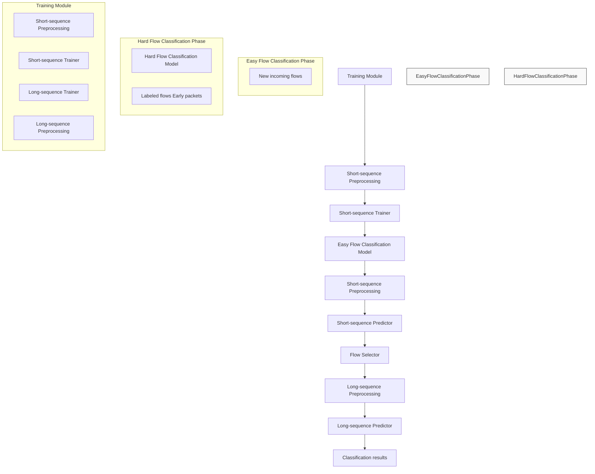
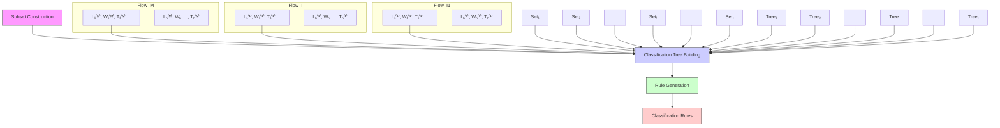
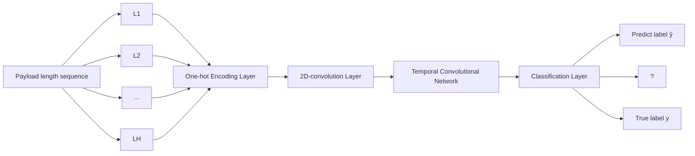

# A Two-Phase Approach to Fast and Accurate Classification of Encrypted Traffic

Yipeng Wang , Member, IEEE, Huijie He, Yingxu Lai , Member, IEEE, and Alex X. Liu , Fellow, IEEE

Abstract— Encryption technology has been widely used in today’s network communications. The early classification of encrypted flows is of great value to the control, allocation and management of resources in TCP/IP networks. In this paper, we propose TaTic, an early classification method for encrypted traffic, which aims to reduce the time spent observing the encrypted flows to be classified, and at the same time ensure the flow classification accuracy. TaTic is based on our key observation that the majority of encrypted flows can be classified accurately using only the first few packets, and we call such flows “easy flows”, whereas the rest of encrypted flows requires more packets for fine-grained analysis to achieve accurate traffic classification, and we call such flows “hard flows”. Given an encrypted flow, in the first phase, we use only the first few packets to quickly determine whether it is an easy flow or a hard flow; if it is an easy flow, we directly classify it in this phase; otherwise, we use more packets to perform traffic classification in the second phase. Therefore, we can greatly reduce the time spent in observing the flows without sacrificing the classification accuracy. Our experimental results show that TaTic can greatly reduce the unnecessary time spent in observing the flow to be classified, and at the same time ensure high classification accuracy. We compare our experimental results of TaTic with four existing methods. TaTic is superior to the existing methods in terms of both classification accuracy and average waiting time.

Index Terms— Network traffic classification, network monitoring, machine learning.

## I. INTRODUCTION

## A. Background and Motivation

HIS paper concerns the problem of fast and accurate classification of encrypted traffic (such as TLS (Transport Layer Security) traffic). Network traffic classification, the task of associating network traffic with the application protocol

Manuscript received 22 December 2021; revised 29 July 2022; accepted 8 September 2022; approved by IEEE/ACM TRANSACTIONS ON NETWORKING Editor C. Peng. Date of publication 30 September 2022; date of current version 16 June 2023. This work was supported in part by the National Key Research and Development Program of China (Key Technologies and Applications of Security and Trusted Industrial Control System) under Grant 2020YFB2009500, in part by the Natural Science Foundation of Beijing Municipality under Grant 19L2020, and in part by the National Natural Science Foundation of China under Grant 61872082 and Grant 61472184. (Corresponding authors: Yingxu Lai; Alex X. Liu.)

Yipeng Wang and Huijie He are with the Faculty of Information Technology, Beijing University of Technology, Beijing 100124, China (e-mail: yipeng.wang1@gmail.com; hehuijie@emails.bjut.edu.cn).

Yingxu Lai is with the Faculty of Information Technology, Beijing University of Technology, Beijing 100124, China, and also with the Engineering Research Center of Intelligent Perception and Autonomous Control, Ministry of Education, Beijing 100124, China (e-mail: laiyingxu@bjut.edu.cn).

Alex X. Liu is with the Shandong Provincial Key Laboratory of Computer Networks, Shandong Computer Science Center (National Supercomputer Center in Jinan), Qilu University of Technology (Shandong Academy of Sciences), Jinan 250014, China (e-mail: alexliu360@gmail.com).

Digital Object Identifier 10.1109/TNET.2022.3209979 or the application that generates it, is crucial for network management and network security [1], [2], [3], [4], [5], [6]. Network management often requires the quick and accurate classification of TCP/UDP flows according to their application categories, so as to achieve hierarchical management of network traffic, and provide Internet users with better quality of service assurance. For network security, traffic classification is often the first step to filter normal network traffic and find network anomalies. For example, quality of service (QoS) [6] and network anomaly detection [1], [4] require fast and accurate network traffic classification.

With the rapid development of network communication technology, the field of network traffic classification faces new problems and challenges in practice. First, the emergence of emerging network applications has greatly increased the transmission volume of network traffic, which has shown a contibuous growth trend. In view of the rapid growth of network traffic, fast and accurate classification of network traffic is an urgent problem to be solved in today’s network scenario. Second, in order to protect users information security and privacy, network data encryption technology has been widely used, resulting in more and more encrypted traffic. According to studies by Google, the proportion of Chrome web traffic encrypted with TLS and the proportion of Android’s traffic encrypted with TLS have been kept increasing, and by the end of 2019, they have exceeded 95% and 80%, respectively [7], [8]. Obviously, encryption technology has been widely used in today’s network transmission, and the classification of encrypted traffic is a cutting-edge problem.

For encrypted traffic classification, the two goals of high speed and high accuracy are technically challenging to achieve. First, the more packets that we use for determining the application type, the more accurate that the classification result is, but the slower that the classification speed is. Second, the less packets that we use for determining the application type, the faster that the classification speed is, but the less accurate that the classification result is.

## B. Limitations of Prior Art

Prior work on the classification of encrypted network traffic falls into two categories: flow statistics-based methods and flow sequence-based methods. Prior schemes based on flow statistical features [9], [10], [11], [12] generally use the typical summary statistics taken/evaluated from an entire bidirectional flow (e.g. the overall number of packets, flow duration) to classify encrypted traffic. The key limitation of the schemes in this category is that they need to observe all the packets in a bidirectional flow to form the corresponding statistics of the flow. Therefore, it is obvious that the schemes are not directly applicable to the early classification of encrypted traffic. Prior schemes based on flow sequence features [13], [14], [15], [16], [17] classify encrypted flows by recognizing the packet state sequences or message state sequences, such as the state transitions in the packet length sequence. The key limitation of such schemes in this category is that for each flow to be classified, such schemes require observing the same number of packets or messages (denoted by N ) in a flow to distinguish the type of the flow. However, notice that when N is set too small, a part of the encrypted flows can be accurately classified, while the other part of the encrypted flows cannot be accurately classified because not enough packets or messages are observed. In addition, when N is set too high, all encrypted flows can be classified accurately. However, for some encrypted flows, observing N packets or messages results in unnecessary waiting time overhead. This is because for these flows, we only need to observe less than N packets or messages to achieve accurate encrypted traffic classification.


<details>
<summary>flowchart</summary>


</details>

Fig. 1. Architecture of TaTic. (i) Training Module and (ii) Classification Module.

## C. Proposed Approach

In this paper, we propose TaTic, a Two-phase eArly classificaTIon scheme for encrypted traffiC. TaTic is based on our key observation that the majority of encrypted flows can be classified accurately using only the first few packets, and we call such flows “easy flows”, whereas the rest of encrypted flows requires more packets for fine-grained analysis to achieve accurate traffic classification, and we call such flows “hard flows”. Given an encrypted flow, in the first phase, we use only the first few packets to quickly determine whether it is an easy flow or a hard flow; if it is an easy flow, we directly classify it in this phase; otherwise, we use more packets to perform traffic classification in the second phase.

TaTic aims to reduce the time spent observing the encrypted flows to be classified without sacrificing the flow classification accuracy. As shown in Figure 1, TaTic has two key modules: the training module, and the classification module. The training module aims to build two traffic classification models using labeled flows: namely an easy flow classification model and a hard flow classification model. To this end, the training module contains two main functional phases: the easy flow modeling phase, and the hard flow modeling phase. First, the easy flow modeling phase builds a classification model with the first few packets of each labeled flow, so as to classify “easy flows”, which can be correctly classified earlier in their flow duration. Then, the hard flow modeling phase aims to use more packets of each labeled flow to build a hard flow classification model, which can accurately classify “hard flows” that cannot be classified in the earlier period of their flow duration. The classification module aims to classify new (unlabelled) flows according to their application categories. It also has two main functional phases: the easy flow classification phase, and the hard flow classification phase. To classify a new incoming flow, first, the easy flow classification phase distinguishes whether it is an “easy flow” or a “hard flow”. If the flow is an “easy flow”, this easy flow classification phase will directly output its corresponding application label. If the flow is a “hard flow”, the subsequent phase will output its corresponding application label.

## D. Key Contributions

We highlight our three key contributions as follows.

• We propose TaTic, an early encrypted traffic classification method based on two-phase processing. TaTic addresses the limitation of distinguishing the type of a flow by observing the same number of packets in the flow. TaTic obtains a smaller “Average Waiting Time (AW T )” when there is a high percentage of “easy flows” in encrypted traffic, while ensuring high classification accuracy.  
• We propose to divide encrypted flows into two types, “easy flows” and “hard flow”. An important contribution of our research is that for each flow, we can accurately and quickly determine it is an “easy flow” or a “hard flow”. For an easy flow, we can accurately determine the application type to which it belongs by using only a small number of packets in the flow (e.g., the first 4 packets). For hard flows, we use more packets to reconstruct their time-series information for accurate encrypted traffic classification.  
We conduct an extensive evaluation of TaTic on the network traces of real-world applications. In addition, we compare TaTic to four existing methods for encrypted traffic classification. Our experimental comparison results show that TaTic outperforms existing methods in terms of both classification accuracy and AW T .

The rest of the paper proceeds as follows. In Section II, we introduce several recent related work. In Section III and Section IV, we present the technical details of each module of TaTic. In Section V, we evaluate TaTic with real-world application traces. We compare TaTic with the existing methods in Section VI. Finally, we conclude our work in Section VII.

## II. RELATED WORK

In recent years, the research on encrypted traffic classification is mainly divided into two categories, (1) traditional machine learning-based methods, and (2) deep learning-based methods.

## A. Traditional Machine Learning-Based Methods

In 2014, Korczy ´nski et al. propose and design FOSM [13], which introduces the concept of Markov chain fingerprints for the first time to conduct TLS encrypted traffic classification. The basic idea of FOSM is to model possible sequences of message types observed in single directional TLS sessions based on first-order homogeneous Markov chains. Each application corresponds to a Markov chain fingerprint, and FOSM identifies the parameters of the application traffic fingerprint from observed training application traces. For an encrypted flow to be classified, FOSM compares its message sequence with all application traffic fingerprints, and takes the fingerprint with the greatest probability as the application type for the flow. In 2017, Shen et al. extend the concept of Markov chain fingerprints to build more distinctive application traffic fingerprints. They propose an attribute-aware encrypted traffic classification method called SOB [14], which is designed based on the second-order Markov Chains. Compared to FOSM, SOB introduces the Certificate packet length and the packet length of the first “Application Data” in a session, in addition to the consideration of possible sequences of message types. Liu et al. propose a TLS traffic classification method called MaMPF [15], which is designed to build multi-attribute application traffic fingerprints based on first-order homogeneous Markov chains for encrypted traffic classification. Specifically, MaMPF separately uses sequences of message types observed in single directional TLS sessions and sequences of transformed packet length of the corresponding encrypted flows to build application traffic fingerprints. Xiao et al. propose a dynamic multiple traffic classification system (DMTCS) [18], which is based on the dynamic cluster topic (DCT) model. Xiao et al. first introduce the concept of time-based distribution of traffic protocol information into the field of network traffic classification. Also Bikmukhamedov et al. propose a lightweight solution for early network traffic classification [11]. Specifically, for each flow, the model first extracts the classification features of the first N packets in the flow (such as packet length, packet time interval, window size, etc.), and combines them with relevant statistical information, such as maximum, minimum, average, etc. Then, the feature selection is carried out by Principal Component Analysis (PCA) algorithm, which reduces the feature dimension and retains the important features. Finally, based on the classification features selected by PCA algorithm, Bikmukhamedov et al. use a variety of supervised machine learning algorithms to construct the final classification models. In order to account for online classification mode, the proposed network traffic classification model limits the maximal number of packets within a flow to 10. In addition, Chen et al. propose a method based on multi-attribute associated fingerprints, MAAF [19], which comprehensively uses DNS information, certificate information, and packet length information of an TLS flow to carry out fine-grained encrypted traffic classification. van Ede et al. design a semi-supervised encrypted network traffic classification system for Mobile Apps, FLOW-PRINT [20]. FLOWPRINT first defines three different types of traffic features, namely temporal features, device features and destination features. According to these three types of features, FLOWPRINT uses machine learning algorithms to divide network traffic of different application types into different traffic clusters, and builds App fingerprints from traffic clusters based on strong correlations, so as to classify encrypted network traffic. In early 2021, Aceto et al. use the payload length (PL), the direction (DIR) and the inter-arrival time (IAT) of a packet as an abstract representation of a packet in a flow, and used Markov models in machine learning (namely, Markov Chains and Hidden Markov Models) to model the packet sequence of Mobile Apps [21]. Combining network traffic with machine learning techniques, Fu et al. proposed Whisper [22], a machine Learning based real-time malicious traffic detection method, which encodes per-packet sequence as vectors, and uses DFT to extract the sequence information of traffic from the perspective of frequency domain, and uses unsupervised clustering algorithm to establish the traffic detection model.

## B. Deep Learning-Based Methods

In recent years, deep learning technology has achieved great success in many fields. Therefore, some scholars consider using deep learning technology to solve the problem of encrypted network traffic classification. Li et al. bring a seminal research work to the computer networking community, using deep learning technology to analyze packet payload for network traffic classification [3]. Li et al. design a novel neural network, the Byte Segment Neural Network (BSNN). BSNN is composed of recurrent neural network and attention mechanism, and it takes byte segments as input. In addition, Aceto et al. propose MIMETIC [23], a multimodel deep learning solution for network traffic classification. MIMETIC allows network traffic to be inspected from complementary views. Lotfollahi et al. propose Deep Packet [5], which extends the idea of [24]. The neural network models in are stacked autoencoder (SAE) and convolution neural network (CNN). In Deep Packet, Lotfollahi et al. choose a small kernel size (i.e, 4 or 5) in the design of the convolution layers in the CNN model. Liu et al. propose FS-Net [16], an encrypted TLS traffic classification method based on recurrent neural networks (RNN). Specifically, FS-Net takes the packet length sequence of each TLS flow as input and classifies it to identify the applications carried by the TLS flows. FS-Net uses an encoder-decoder structure with RNN as the basic operation unit to construct classification features for each TLS flow. Zheng et al. propose RBRN [25], an end-to-end classification model for encrypted traffic classification. RBRN is built on the basis of convolutional neural network, which treats the packet sequence of a flow as a two-dimensional tensor and inputs it into the neural network for encrypted traffic classification. Aceto et al. extend the idea of the DLbased multimodal, and propose DISTILLER, which combines deep learning with multi-task learning [26]. DISTILLER aims to overcome the limitations of single-task deep learning. In 2021, for the early classification of encrypted Internet traffic,

Chen et al. proposed SMC [17], an early network traffic classification method based on message sequences. The SMC method takes the length sequence information of the first 6 message segments (about 12 raw packets) of each flow as the input, and uses Long Short-Term Memory (LSTM) neural network to construct the traffic classification model, so as to achieve the goal of early classification of encrypted network traffic. Also, Xiao et al. extend the idea of BSNN and propose EBSNN [27]. In addition to using the packet payload, EBSNN utilizes the side-channel features to characterize each flow. EBSNN employs hierarchical attention networks to learn the high-level presentation. EBSNN performs very well on both packet-level and flow-level application classification tasks. Zhao et al. propose Festic [28], a few-shot learning-based approach to IoT traffic classification, to tackle the low accuracy of existing methods in the case of insufficient labeled traffic. For each flow to be classified, Festic extracts features from the IP packets and classify the flow based on the feature similarity between the flow to be classified and the given labeled flows. Xu et al. propose ETC-PS [29], a novel encrypted traffic classification method with path signature features, which is built based on the traffic characteristics of bidirectional client-server interaction in a session.

## C. Research Status’ Summary

Most of existing encrypted traffic classification work based on machine learning or deep learning technology mainly focuses on improving the classification accuracy of encrypted traffic. Different from these works on improving the accuracy of network traffic classification, this paper focuses on reducing the waiting time it takes to classify a flow. It is worth noting that in order to accurately classify encrypted flows, some prior schemes generally adopt a consistent classification scheme for all encrypted flows. Different from previous methods, this paper distinguishes encrypted flows into “easy flows” and “hard flows”, and adopts different classification schemes for the two types of encrypted flows.

## III. TRAINING MODULE OF TATIC

For the architecture of TaTic, a tree-based machine learning method is used for the classification of “easy flows” and “hard flows”, while deep learning network is used for “hard flows”. The motivation of this design is as follows.

First of all, the easy flow classification model is designed to accurately classify as many flows as possible using only the first few packets in each flow. To achieve the above goals, we need to make full use of the information in each packet that is useful for network traffic classification. Notice that an IP packet contains many different types of fields, such as packet length, timestamp, window size, TCP FLAG, etc. However, the range of values for the data in the above fields is completely different. Tree-based machine learning algorithms do not need to consider the type of fields, and can model the data in different fields uniformly. In this paper, we only consider three attributes in each IP packet. If more attributes need to be introduced, tree-based machine learning algorithm can be directly adapted without redesigning the model.

Secondly, hard flows are flows that cannot be classified using the easy flow classification model. To achieve accurate classification of hard flows, we need to consider more IP packets in a flow. It is found in practice that more fine-grained classification features can be extracted from encrypted flows by establishing the temporal relationship between different IP packets. Compared with traditional machine learning algorithms, deep learning models show stronger modeling capabilities for sequence data. Therefore, we employ the technology based on deep learning in the construction of the hard flow classification model.

## A. Easy Flow Modeling Phase

The easy flow modeling phase aims to build an easy flow classification model with the first few packets of each labeled flow, so as to accurately classify many flows earlier. The main purpose of this phase is to build an easy flow classification model, which can quickly determine whether a flow is an easy flow or a hard flow. For easy flows, the early classification model will output their corresponding application labels. For hard flows, they will be further processed by the subsequent phase. The easy flow modeling phase has two sequential steps, including (1) short-sequence preprocessing and (2) shortsequence trainer.

1) Short-Sequence Preprocessing: First of all, for each flow, this step intercepts the first h packets of the flow, and then extracts some features that can highly distinguish different application flows from the first h packets of the flow. Specifically, each flow is composed of a sequence of packets. $p _ { 1 } ^ { ( i ) } , \dot { \cdots } , p _ { j } ^ { ( i ) } , \cdots , p _ { N _ { i } } ^ { ( i ) }$ denote the packet sequence of $f l o w _ { i }$ , where $\mathbf { \Delta } _ { p _ { j } ^ { \left( i \right) } } ^ { \mathsf { { \check { \alpha } } } ( i ) }$ represents the j-th packet of $f l o w _ { i } , ~ N _ { i }$ indicates f lowi has $N _ { i }$ packets. For $f l o w _ { i }$ , we first intercept it and get $f l o w _ { i } ^ { \prime } .$ which contains the first h packets of $f l o w _ { i } ,$ denoted $f l o w _ { i } ^ { \prime } = [ p _ { 1 } ^ { ( i ) } , \cdot \cdot \cdot , p _ { j } ^ { ( i ) } , \cdot \cdot \cdot , p _ { h } ^ { ( i ) } ]$ . For the case where the number of packets of $f \bar { l } o w _ { i }$ is less than $h ,$ we append $h - N _ { i }$ null packets to f lowi. Then, for $f l o w _ { i } ^ { \prime } .$ we extract three important features from each packet, including payload length, TCP window size, and timestamp. It’s worth noting that we cannot use the timestamp in a packet directly, so we convert it to the interval time between it and its previous packet. Taking packet $p _ { j } ^ { ( i ) }$ in $f l o w _ { i } ^ { \prime }$ as an example, we use $\dot { L } _ { j } ^ { ( i ) } , W _ { j } ^ { ( i ) }$ and $t _ { j } ^ { ( i ) }$ to denote its payload length, TCP window size and interval time, respectively. In practice, we notice that there are many possible values for the time interval, so we transform the time interval values using a ladder function.

$$
T _ {j} ^ {(i)} = \left\{ \begin{array}{l l} \lfloor t _ {j} ^ {(i)} \times 1 0 0 \rfloor + 1, & 0 s \leq t _ {j} ^ {(i)} <   0. 1 s \\ \lfloor t _ {j} ^ {(i)} \times 2 0 0 \rfloor + 1, & 0. 1 s \leq t _ {j} ^ {(i)} <   1 s \\ \lfloor t _ {j} ^ {(i)} \times 1 0 0 0 \rfloor + 1, & 1 s \leq t _ {j} ^ {(i)} \end{array} \right. \tag {1}
$$

Finally, for $f l o w _ { i } ^ { \prime } ,$ the classification features of each packet in the flow are arranged in the order of the packet sequence, so as to obtain the classification fea-$x _ { i } ^ { \prime }$ $f l o w _ { i }$ $x _ { i . } ^ { \prime } = [ L _ { 1 } ^ { ( i ) } , W _ { 1 } ^ { ( i ) }$ $T _ { 1 } ^ { ( i ) } , \cdot \cdot \cdot , L _ { j } ^ { ( i ) } , \tilde { W } _ { j } ^ { ( i ) } , \tilde { T } _ { j } ^ { ( i ) } , \cdot \cdot \cdot , L _ { h } ^ { ( i ) } , \tilde { W } _ { h } ^ { ( i ) } , \tilde { T _ { h } ^ { ( i ) } } ]$ , L(i)j , W (i)j , , T h . In this step, suppose there are M training flows, and we will obtain a new training sample set, denoted by $D _ { e a s y } = \{ ( x _ { i } ^ { \prime } , y _ { i } ^ { \prime } ) \} _ { i = 1 } ^ { M }$ . Here, $y _ { i } ^ { \prime }$ denotes the application label of $x _ { i } ^ { \prime } ,$ and $y _ { i } ^ { \prime } \in \{ 1 , 2 , \cdots , R \}$ , where R denotes the number of application categories for classification. Next, we feed $D _ { e a s y }$ into the subsequent step, the short-sequence trainer.


<details>
<summary>flowchart</summary>


</details>

Fig. 2. Overview of short-sequence trainer.

2) Short-Sequence Trainer: Next, the short-sequence trainer step uses $D _ { e a s y }$ to construct an easy flow classification model (abbr. EFC-Model), which can divide all the flows in $D _ { e a s y }$ into easy flows and hard flows, and directly output their categories for easy flows. In the short-sequence trainer step, we use a tree-based machine learning algorithm to generate efficient classification rules. As shown in Figure 2, the shortsequence trainer step consists of three sequential components, including subset construction, classification tree building and rule generation.

Subset Construction: The purpose of the subset construction is to randomly sample a certain number of samples from $D _ { e a s y }$ for many times, so as to form several different training subsets. The advantage of this component is that it can avoid the problem that a single classification tree constructed based on a single training set is easy to overfit and the classification accuracy is not high. Inspired by the idea of bagging algorithm, the operation of each sample sampling is to randomly select $M ^ { \prime } = \lfloor \alpha \times M \rfloor$ samples from $D _ { e a s y }$ , where α is the sampling rate, and these samples are used to form a new subset of samples. Repeating the above operation $T$ times, we get a new set $D _ { e a s y } ^ { \prime }$ with $T$ training sample subsets, $D _ { e a s y } ^ { \prime } ~ =$ $\{ S e t _ { 1 } , \cdot \cdot \cdot , S e t _ { i } , \cdot \cdot \cdot , S e t _ { T } \}$ $S e t _ { i } = \{ ( x _ { j } ^ { \prime } , y _ { j } ^ { \prime } ) ^ { ( i ) } \} _ { j = 1 } ^ { M ^ { \prime } } .$ For parameter α, we follow the $^ { \circ } 6 3 2 +$ Bootstrap” method [30], where $\alpha = 0 . 6 3 2$ .

Classification Tree Building: The purpose of the classification tree building is to use different training subsets of $D _ { e a s y } ^ { \prime }$ to construct multiple classification tree models. Each classification tree is used to discriminate whether a flow is an easy flow or a hard flow. Specifically, taking training sample subset $S e t _ { i } ~ \in ~ D ^ { \prime } { } _ { e a s y }$ as an example, we build a classification tree $T r e e _ { i }$ for $S e t _ { i }$ . Therefore, for $T$ training sample subsets, we will build T different classification trees, namely $T r e e _ { 1 } , \cdot \cdot \cdot , T r e e _ { i } , \cdot \cdot \cdot , T r e e _ { T }$ .


<details>
<summary>flowchart</summary>

```mermaid
graph TD
  A["Root Node"] --> B["Branch Node"]
  B --> C["Purity!=0 samples=300 value=300,200"]
  C --> D{Tree_i}
  D -->|True| E["X[1"] <= DIST1\nPurity!=0 samples=500 value=300,200]
  D -->|False| F["..."]
  E --> G["X[2"] <= DIST2\nPurity!=0 samples=180 value=180,0]
  G --> H{True}
  H -->|True| I["X[4"] <= DIST3\nPurity!=0 samples=120 value=20,100]
  H -->|False| J{True}
  J -->|True| K["X[6"] <= DISTX\nPurity!=0 samples=150 value=50,100]
  J -->|False| L{True}
  L -->|True| M["X[8"] <= DISTX\nPurity!=0 samples=130 value=0,130]
  L -->|False| N{True}
  N -->|True| O["X[9"] <= DISTX\nPurity!=0 samples=20 value=10,10]
  N -->|False| P{True}
  P --> Q["Ruleset_i"]
  Q --> R["rule_i^1"]
  Q --> S["rule_i^2"]
  Q --> T["..."]
  Q --> U["rule_i^i"]
  Q --> V["..."]
  Q --> W["rule_i^n_i"]
  X["Root Node"] --> Y["Branch Node"]
  Y --> Z["Purity!=0 Leaf Node"]
  Z --> AA["Purity==0 Leaf Node"]
  AA --> AB["..."]
  AB --> AC["..."]
```
</details>

Fig. 3. An example of rule generation.

Rule Generation: Then, for each classification tree, we select some key leaf nodes to generate a classification ruleset composed of multiple rules. We give a concrete example of the generation of Ruleseti in Fig. 3. Specifically, for T reei, we select some of the leaf nodes in T reei that contain samples for only one application category. The aforementioned leaf nodes can be evaluated by node purity, and the commonly used calculation formulas for node purity include “Gini” value and “Entropy” value. For each leaf node with node purity value equal to 0, such as node $\textcircled{3} ,$ , node ⑥ and node $\textcircled{8}$ in Fig. 3, we generate a classification rule whose label is the label of the samples in the leaf node. For $T r e e _ { i } ,$ we use all of these nodes to form a ruleset Ruleseti. For $T$ training subsets, we will generate $T$ rulesets, namely Ruleset1, · · · , Ruleseti, · · · , RulesetT . Algorithm 1 shows the specific process from the training samples to the generation of multiple classification rulesets.

Taking a test flow sample $\boldsymbol { \mathcal { S } }$ as an example, the EFC-Model will output $T$ application labels for ${ \mathcal { S } } .$ In this paper, we assume that if there are more than or equal to $T \ast P$ rulesets $( P \in ( 0 , 1 ] )$ predicting the same application labels, the sample $s$ can be correctly classified in the early stage of its flow duration. Otherwise, sample $s$ cannot be correctly classified by the EFC-Model, and we consider $s$ as a hard flow. For hard flows, the output labels of our EFC-Model are ${ ^ { 6 6 } } { } - 1 { ^ { 5 } } \mathrm { S } ,$ , which means these flows require subsequent processing steps to give their predicted labels.

## B. Hard Flow Modeling Phase

The design purpose of the easy flow classification model is to classify many easily classified flows earlier by using as few packets as possible in a flow. Thus, we try to extract some useful classification features from each packet, including payload length, window size, and interval time. The design purpose of the hard flow classification model is to achieve accurate classification of hard flows by using a relatively large number of packets in a flow and constructing the temporal relationship between these packets. For the hard flow, we use


<details>
<summary>flowchart</summary>


</details>

Fig. 4. Neural network structure of the hard flow classification model.

Algorithm 1 Generation of Multiple Classification Rule-sets

Input: Dataset $D_{easy} = \{(x_i', y_i')\}_{i=1}^M$ , where $(x_j') \in R^{3h}, (y_j') \in L$ .

Output: The fusion of classification rulesets FR = $\{Ruleset_1, \cdots, Ruleset_i, \cdots, Ruleset_T\}$ , where $Ruleset_i$ denotes the ruleset generated by classification tree $Tree_i$ .

Require: $-Sampling(D_{easy})$ , this function randomly selects $M'$ samples from $D_{easy}$ . $-Tree(Set_i)$ , this function constructs a classification tree with training set $Set_i$ . $-Leafof(Tree_i)$ , this function returns all the leaf nodes of $Tree_i$ . $-Purity(Node)$ , this function calculates the purity value of leaf node Node. $-Get\_Rule(Node)$ , this function generates a classification rule from the root node to leaf node Node. $-Get\_Label(Node)$ , this function returns the application label of a leaf node Node whose purity value is equal to 0. The application labels of all training samples in the node are the same.

1 $FR \leftarrow \{\}$ 2 for i in $\{1, 2, \cdots, T\}$ do

3 Ruleset $_i \leftarrow \{\}$ 4 (1) Subset Construction

5 $Set_i \leftarrow \{\}$ 6 $Set_i \leftarrow Sampling(D_{easy})$ 7 (2) Rule Generation

8 (2.1) Classification tree construction

9 $Tree_i \leftarrow Tree(Set_i)$ 10 (2.2) Leaf node rule acquisition

11 for Node in Leafof( $Tree_i$ ) do

12 if Purity(Node) == 0 then

13 rule $\leftarrow Get\_Rule(Node)$ 14 label $\leftarrow Get\_Label(Node)$ 15 Ruleset $_i \leftarrow \{rule, label\}$ 16 end

17 end

18 (3) Ruleset Fusion

19 $FR \leftarrow FR \cup \{Ruleset_i\}$ 20 end

the payload length as its feature based on the following three considerations: 1). First of all, the payload length sequence reflects the state transition relationship of an application flow, so it is suitable to describe each flow accurately. 2). Secondly, for the window size feature, its value is generally the same for different packets in one direction (such as clients to servers). In other words, flows that can be classified by using the window size have already been classified by TaTic in the easy flow classification phase, and these flows do not enter the hard flow classification phase, so the hard flow classification model does not need to consider the window size feature. 3). Thirdly, the interval time is greatly affected by the network environment, so the time sequence relationship of the interval time generally does not have a strong degree of discrimination, making it unsuitable as a basis for accurately classifying hard flows. During the design of the hard flow classification model, we remove the interval time feature.

The input to this phase is a relatively longer payload length sequence of each labeled flow, and the output of this phase is the hard flow classification model. The hard flow modeling phase involves two sequential steps, including (1) long-sequence preprocessing and (2) long-sequence trainer.

1) Long-Sequence Preprocessing: First, for each flow, the long sequence preprocessing step first retains the first H $\mathbf { \Phi } ( H \mathbf { \Phi } > \mathbf { \Phi } h )$ packets, then extracts the payload length information from the H packets, and finally arranges these payload lengths according to the order in which the packets appear in the flow to form a payload length sequence. The payload length sequences will be used as the input to the subsequent long-sequence trainer step. Specifically, taking $f l o w _ { i }$ as an example, we use interception or padding to make $f l o w _ { i }$ retain its first H packets, denoted by $f l o w _ { i } ^ { \prime \prime } =$ $[ p _ { 1 } ^ { ( i ) } , \cdot \cdot \cdot , p _ { j } ^ { ( i ) } , \cdot \cdot \cdot , p _ { H } ^ { ( i ) } ]$ , where $\overline { { p _ { j } ^ { ( i ) } } }$ represents the j-th packet of $f l o w _ { i } ^ { \prime \prime } .$ Then, for $f l o w _ { i } ^ { \prime \prime } .$ , we extract payload length from each packet of $f l o w _ { i } ^ { \prime \prime }$ . Finally, the payload lengths are arranged in the order in which the packets appear in $f l o w _ { i } ^ { \prime \prime } ,$ , so that we get a new sequence denoted by $x _ { i } ^ { \prime \prime }$ , where $x _ { i } ^ { \prime \prime } \overset { \cdot } { = } [ L _ { 1 } ^ { ( i ) } , \cdots , L _ { j } ^ { ( i ) } , \cdots , L _ { H } ^ { ( i ) } ]$ flows, this step will obtains a new training dataset, denoted by $D _ { h a r d } = \{ ( x _ { i } ^ { \prime \prime } , y _ { i } ^ { \prime \prime } ) \} _ { i = 1 } ^ { M }$ , where $y _ { i } ^ { \prime \prime }$ denotes the application label of $x _ { i } ^ { \prime \prime }$ and $y _ { i } ^ { \prime \prime } \in \{ 1 , 2 , \cdots , R \}$ . Next, we feed $D _ { h a r d }$ into the subsequence step, long-sequence trainer.

2) Long-Sequence Trainer: The long-sequence trainer step takes $D _ { h a r d }$ as input, and aims to generate a hard flow classification model (abbr, HFC-Model), which can classify hard flows in the hard flow classification phase. The $\mathrm { H F C - }$ Model is essentially a deep learning model, which considers both computational efficiency and computational effectiveness. In the HFC-Model, we use inflated convolution to establish the relationship between adjacent elements and distant elements in an input sequence, so as to improve the modeling ability for long sequence data. As shown in Fig. 4, this step consists of four sequential components, including a one-hot encoding layer, a 2D-convolution layer, a Temporal Convolutional Network (TCN) structure and a classification layer.


<details>
<summary>flowchart</summary>

```mermaid
graph TD
  A["Inflated convolution"] --> B["Weight normalization"]
  B --> C["Tailoring"]
  C --> D["ReLU"]
  D --> E["Dropout"]
  E --> F["+"]
  F --> G["ReLU"]
    style A fill:#d4edda,stroke:#333
    style G fill:#d4edda,stroke:#333
    note right of A "Residual block"
    note right of C "2 ×"
```
</details>

Fig. 5. Overview of the residual block.

One-hot Encoding Layer: Different payload lengths indicate different packet states. The one-hot encoding layer separates the classification meaning of each payload length from its numerical value. It converts each cardinal variable (payload length) into a discrete vector, rather than treats it as a continuous value, thereby making the neural network easier to train. Specifically, take the flow sample $f l o w _ { i } ^ { \prime \prime } = ( x _ { i } ^ { \prime \prime } , y _ { i } ^ { \prime \prime } ) \in D _ { h a r d }$ $x _ { i } ^ { \prime \prime } = [ L _ { 1 } ^ { ( i ) } , \cdots , L _ { j } ^ { ( i ) } , \cdots , L _ { H } ^ { ( i ) } ]$ , L(i) , · , L(i)H ]. Our one-hot encoding layer converts the sequence $x _ { i } ^ { \prime \prime }$ into a sparse matrix $o ^ { ( i ) }$ , and $\dot { o } ^ { ( \dot { i } ) }$ has the following form.

$$
\boldsymbol {o} ^ {(i)} = [ o _ {1} ^ {(i)}, o _ {2} ^ {(i)}, \dots , o _ {j} ^ {(i)}, \dots , o _ {H} ^ {(i)} ], \quad \boldsymbol {o} ^ {(i)} \in \mathbb {R} ^ {H \times d} \tag {2}
$$

where o (i)j c $o _ { j } ^ { ( i ) }$ $\boldsymbol { L } _ { j } ^ { ( i ) }$ of $x _ { i } ^ { \prime \prime }$ , and it is a d-dimensional vector (d represents the maximum $o _ { j } ^ { ( i ) }$ can be expressed as $o _ { j } ^ { ( i ) } = [ 0 , 0 , \cdots , 1 , \cdots , 0 ]$ , where the dimension of the value of $L _ { j } ^ { ( i ) }$ is “1” and other dimensions are “0”.

2D-convolution Layer: The next layer is a 2D-convolution layer, which aims to build multiple feature maps for the input tensor from the one-hot encoding layer. The 2D-convolution layer multiplies $C _ { 0 }$ “filters” by its input respectively, where each filter is a parameter matrix with a size of (1, d). Notice that the advantage of this 1×d convolution operation help us to restore the tensor size obtained by the one-hot encoding to the original input to the model $( i . e , \ H \times 1 )$ , and simultaneously constructs $C _ { 0 }$ different feature maps. For the input $x _ { i } ^ { \prime \prime }$ the output of this layer is denoted by Xi ∈ RC0×H . $\bar { X _ { i } } \in \mathbb { R } ^ { C _ { 0 } \times H }$

Temporal Convolutional Network (TCN): The Temporal Convolutional Network (TCN) [31] structure is to establish the relationship between elements in a long data sequence, and then extract representative classification features. TCN is composed of L residual blocks connected in sequence. As shown in Figure 5, each residual block contains the following layers in turn: an inflated convolutional layer, a weight regularization layer, a tailoring layer, a ReLU layer, and a dropout layer in sequence, and repeats aforementioned layers again. Specifically, the r-th residual block takes the output from the (r-1)-th residual block as input, and the input to the first residual block comes from the output of the 2D-convolution layer. Notice that the inflated convolutional layer is the core function layer of each residual block. Different from the standard convolution layer, the inflated convolutional layer introduces a hyper-parameter called “dilation rate”, which defines the zero spaces added between kernel parameters when processing feature maps The advantage of the inflated convolutional layer is to increase the reception field without introducing new trainable parameters. For the inflated convolutional layer in the r-th residual block, and we set the “kernel size” of the convolution kernel to K and the “dilation rate” to $2 ^ { ( r - 1 ) }$ . In addition, in order to ensure that the output dimension of each residual block is consistent with the input dimension, we use the tailoring layer to retain the first H dimensions of the data obtained after the inflated convolution operation. The last two states from the final output of the TCN structure will be flattened and fed to the classification layer.

Classification Layer: The classification layer of the long-sequence trainer is two fully-connected neural network layers, and the number of output neurons in each layer is 64 and R. In addition, the last fully-connected layer uses “softmax” as the activation function.

## IV. CLASSIFICATION MODULE OF TATIC

In TaTic, the classification module aims to classify new (unlabeled) flows into their corresponding application categories, and it has two main functional phases, including (1) the easy flow classification phase, and (2) the hard flow classification phase. For each new incoming flow, the easy flow classification phase first uses the easy flow classification model generated in the easy flow modeling phase to determine whether the flow is an easy flow or a hard flow. For the flows that can be classified in the easy flow classification phase, this easy flow classification phase will directly output their application labels, and TaTic will no longer accumulate packets for these flows. For the flows that cannot be classified at this phase, they will be further processed by the subsequent phase. Next, the hard flow classification phase works on the flows that are not classified in the previous phase, and uses the hard flow classification model generated in the hard flow modeling phase to assign a proper application label to these flows. In TaTic, we use a two-stage strategy to classify each flow. This design saves us from having to wait for the same number of packets for each flow to be classified.

## V. EXPERIMENTAL EVALUATION

In this section, we aim to assess the effectiveness of TaTic. In the following subsections, we first introduce the data set used in our experiments. Then, we define proper metrics to evaluate the performances of our method and other prior approaches. Finally, we investigate how TaTic’s performance is affected by different parameter settings.

## A. Data Set

We first introduce our dataset used in this paper.

TABLE I  
APPLICATION TRACES

<table><tr><td>Application</td><td># Flow</td><td>Corporation</td><td>Application</td><td># Flow</td><td>Corporation</td><td>Application</td><td># Flow</td><td>Corporation</td><td>Application</td><td># Flow</td><td>Corporation</td></tr><tr><td>Airbnb</td><td>4,580</td><td>Airbnb</td><td>Ctrip</td><td>4,769</td><td>Ctrip</td><td>Meituan</td><td>17,083</td><td>Meituan</td><td>Toutiao</td><td>20,734</td><td>ByteDance</td></tr><tr><td>Alipay</td><td>4,602</td><td>Alibaba</td><td>Eleme</td><td>9,613</td><td>Alibaba</td><td>NeteaseCloudMusic</td><td>6,669</td><td>Netease</td><td>TripAdvisor</td><td>5,053</td><td>TripAdvisor</td></tr><tr><td>Amap</td><td>9,988</td><td>Alibaba</td><td>Facebook</td><td>4,148</td><td>Facebook</td><td>Pandora</td><td>7,527</td><td>Pandora</td><td>Twitter</td><td>4,462</td><td>Twitter</td></tr><tr><td>Baidumap</td><td>5,367</td><td>Baidu</td><td>GitHub</td><td>4,431</td><td>Microsoft</td><td>Pinduoduo</td><td>8,042</td><td>Pinduoduo</td><td>Vipshop</td><td>22,018</td><td>Vipshop</td></tr><tr><td>Baidusearchbox</td><td>7,468</td><td>Baidu</td><td>Instagram</td><td>7,261</td><td>Facebook</td><td>Reddit</td><td>9,472</td><td>Condé Nast Digital</td><td>Weibo</td><td>5,289</td><td>Sina</td></tr><tr><td>Blued</td><td>6,080</td><td>Blued</td><td>JD</td><td>17,199</td><td>JD</td><td>Taobao</td><td>7,470</td><td>Alibaba</td><td>Yirendai</td><td>5,757</td><td>Yirendai</td></tr><tr><td>Booking</td><td>11,604</td><td>Booking</td><td>LinkedIn</td><td>4,843</td><td>Microsoft</td><td>TikTok</td><td>8,808</td><td>ByteDance</td><td>Zhihu</td><td>12,623</td><td>Zhihu</td></tr></table>

1) TLS Application Traces: We collect our TLS application traces under a controlled operating environment. Specifically, we select a total of 28 Android applications based on the “Top Free in Android $\mathrm { \sf { A p p s } } ^ { \prime \prime }$ selection in the Google Play Store. These applications comprise a variety of categories. Please see Table I for details. Our in-laboratory test-bed setup for data collection is as follows. First, we use an LG Nexus 5 Android smartphone running on Android 6.0 (Marshmallow) as the end device to generate Mobile App traces. We execute each mobile applications on the Android smartphone separately. Second, our smartphone is connected to a workstation over an access point. The workstation directly connects to the Internet, and it acts as the gateway device. Third, we run tcpdump on this workstation to record the traffic generated by each mobile application. In this paper, we use the MonkeyRunner tool from the Android SDK to perform UI fuzzing for each Mobile App. Notice that UI fuzzing simulates user actions by randomly invoking UI events (such as swipe, touch, and button presses), and then these UI events are sent to the corresponding apps. In addition, it is also worthy to notice that some applications will stay on login screens when we don’t log in with an account. In this case, we manually create accounts for those applications and log in the accounts to ensure that the application traffic generation using UI fuzzing will not be hindered by the login screen. Theoretically, we can gain greater coverage of various flows of a mobile application by using advanced UI fuzzing techniques (such as Dynadroid [32]), or recruiting human participants. However, the above strategies are beyond the scope of this paper. In addition, even though we have done everything possible to avoid background traffic, background traffic may still occur on services that the Android operating system runs for optimizations and communications with its server. In addition, to achieve broader evaluation results, for each mobile application, we handle all TCP flows, which are primarily TLS flows, and a small number of other types of flows.

2) Experimental Settings: We use the TLS application traces as our experimental dataset, denoted by Dataset-TLS. In the following experiments, we carry out 5-fold cross validation on Dataset-TLS, and the partition ratio of the training set, the validation set and the testing set is 60%:20%:20%. For each application category, we randomly select 5,000 flows. If an application category has less than 5,000 flows, we will use all flows from that application category. Our Dataset-TLS and the source code of TaTic are available at https://github.com/autotab/TaTic.

## B. Evaluation Metrics

We define our evaluation metrics for TaTic.

1) Effectiveness Metrics for the Easy Flow Classification Model: For the easy flow classification model in TaTic, we define the following metrics, including Covr, AoCr, Cov, AoC and $F _ { \beta }$ .

• $C o v _ { r }$ , Coverage for application r.

$$
C o v _ {r} = \frac {\text {   \#   of   flows   of   } r \text {   that   can   be   classified   by   the   easy   flow   classification   model   }}{\text {   total   \#   of   flows   belonging   to   } r} \tag {3}
$$

• $A o C _ { r } ,$ , Accuracy over Coverage for application r.

$$
\# \text {   of   flows   of   } r \text {   that   correctly   classified   as   being   }
$$

$$
A o C _ {r} = \frac {\text {   r   by   the   easy   flow   classification   model   }}{\# \text {   of   flows   of   r   that   can   be   classified   }} \tag {4}
$$

• Cov and $A o C ,$ mean Coverage and mean Accuracy over Coverage, respectively.

$$
C o v = \frac {\sum_ {r = 1} ^ {R} C o v _ {r}}{R}, \quad A o C = \frac {\sum_ {r = 1} ^ {R} A o C _ {r}}{R} \tag {5}
$$

where R denotes the total number of application categories for classification.

• $F _ { \beta } { \mathrm { : } }$ Since $\ " { C o v } ^ { \prime \ }$ and $" A o C "$ measures respectively reflect two fronts of the easy flow modeling/classification phase, $F _ { \beta }$ is a compromise between $\ " { C o v } ^ { \prime }$ and $" A o C "$ .

$$
F _ {\beta} = \frac {(\beta^ {2} + 1) \cdot A o C \cdot C o v}{\beta^ {2} \cdot C o v + A o C} \tag {6}
$$

where $\beta > 1$ is used as the penalty factor to provide more weight to $\ " { C o v } ^ { \prime }$ . Notice that for the easy flow classification model, we hope it can classify flows more accurately, so the $^ { 6 6 } A o C ^ { 5 }$ metric is more important than the $\ " { C o v } ^ { \prime \ }$ metric. In this paper, we give a tentative value of $\beta = 3$ .

2) Effectiveness Metrics for Both the Easy and Hard Flows: Here, we define the effectiveness metrics of the traffic classification method for all flows, which consist of the classification results of the easy flow classification phase and the hard flow classification phase.

First, for a specific application r under analysis, we define the following three sets for further analysis:

· $T P _ { r } ,$ True Positives for application $r \mathrm { : }$ the set of flows where each flow is classified by TaTic as belonging to application r and is indeed generated by application r.  
• $F P _ { r }$ , False Positives for application r: the set of flows where each flow is classified by TaTic as belonging to application r but is not generated by application r.

· $F N _ { r } ,$ False Negatives for application r: the set of flows where each flow is classified by TaTic as not belonging to application r but is indeed generated by application r.

Next, we define the following three metrics for application r to quantitatively evaluate the effectiveness of TaTic:

$$
\text { recall } _ {t} = \frac {| T P _ {r} |}{| T P _ {r} | + | F N _ {r} |},
$$

$$
\text { precision } _ {t} = \frac {\left| T P _ {r} \right|}{\left| T P _ {r} \right| + \left| F P _ {r} \right|} \tag {7}
$$

$$
F - \text { measure } _ {r} = 2 * \frac {\text { recall } _ {r} * \text { precision } _ {r}}{\text { recall } _ {r} + \text { precision } _ {r}} \tag {8}
$$

Finally, for the scenario of multi-category traffic classification, we use the accuracy metrics, which can assess the overall classification performance of the classifier on all the target categories.

$$
\text { Accuracy } (A C C) = \frac {\sum_ {r = 1} ^ {R} \text { recall } _ {r}}{R} \tag {9}
$$

where R denotes the total number of application categories for classification.

3) Efficiency Metrics of Traffic Classification Methods: In order to classify network traffic, we need to collect some packets of each flow to be classified, and the average time it takes to wait for these packets of each flow to arrive is defined as “Average Waiting Time (AW T )”. For TaTic, we can calculate the value of $A W T _ { r }$ for application r as follows.

$$
A W T _ {r} = C o v _ {r} * t _ {r} ^ {\prime} + (1 - C o v _ {r}) * t _ {r} ^ {\prime \prime} \tag {10}
$$

where $t _ { r } ^ { \prime }$ denotes the average time spent by application r waiting for the first h packets of a flow during the easy flow classification phase, and $t _ { r } ^ { \prime \prime }$ denotes the average time spent by application r waiting for the first H packets of a flow during the hard flow classification phase. The calculation formula for $A W T$ is as follows.

$$
A W T = \frac {\sum_ {r = 1} ^ {R} A W T _ {r}}{R} \tag {11}
$$

The smaller the value of AW T means that the traffic classification method needs to accumulate fewer packets, so it will be more efficient.

## C. Parameter Selection for the Easy Flow Classification Model on Dataset-TLS

The easy flow modeling phase of TaTic aims to build an easy flow classification model with the first few packets of each labeled flow. This model involves the following key parameters:

(h): denotes the first h packets of a flow used in the easy flow classification model. In order to classify “easy $\mathbf { \nabla } \mathit { { f l o w s } } ^ { \prime \prime }$ efficiently and accurately, we vary the range of parameter $h \in \{ 3 , 4 , 5 \}$ .

(T ): denotes the number of the tress used in the short-sequence trainer module. Taking into account the time overhead and the classification accuracy, we carry out experiment for parameter $T \in$ {10, 20, 30}.


<details>
<summary>line chart</summary>

| # of the first few packets | AWT (s) |
| --------------------------- | ------- |
| 1                           | 0.00    |
| 2                           | 0.44    |
| 3                           | 0.53    |
| 4                           | 0.63    |
| 5                           | 1.03    |
| 6                           | 1.52    |
| 7                           | 1.95    |
| 8                           | 2.77    |
| 9                           | 3.49    |
| 10                          | 4.18    |
| 11                          | 4.69    |
| 12                          | 5.16    |
| 13                          | 5.59    |
| 14                          | 5.89    |
| 15                          | 6.14    |
| 16                          | 6.38    |
</details>

Fig. 6. AW T for the entire Dataset-TLS.

(P ): denotes the lower bound of the ruleset ratio. The ruleset ratio refers to the proportion of the number of rulesets that agree on the label of a flow to the number of all rulesets. In our following evaluations, we vary the range of parameter P ∈ {0.6, 0.7, 0.8, 0.9, 1.0}.

(T A): denotes the tree building algorithm used in classification tree building. We choose two mainstream tree construction algorithms, namely, the “decision $t r e e ^ { , \psi }$ algorithm and the “extreme tree” algorithm. The two tree types are tested using two splitting criterion, namely the “Gini” value and the “Entropy” value. In our evaluations, we vary the range of parameter $T A \in$ {DecisionT ree (Entropy), ExtraT ree(Entropy), DecisionT ree (Gini), ExtraT ree(Gini)}.

Next, we present our experimental results for varying values of the above parameters for the easy flow classification model on the validation set of Dataset-TLS.

Table II reports the values of $F _ { \beta }$ under different values of the parameters T , P , h and T A on the validation set of all the 28 mobile applications in the easy flow modeling phase. Specifically, Table II(a), Table II(b), and Table II(c) plot the accuracy for varying values of T , P and T A for $h = 3 , h = 4$ , and $h = 5 ,$ , respectively. From the three tables, we observe that the $F _ { \beta }$ values vary in the range of 95.32% – 97.75% for all possible values of T , P , h and T A. We have the following observations regarding the parameters in the easy flow classification model. (1). We notice that for any fixed values of T , P and T A, we observe the trend that the $F _ { \beta }$ values with $h = 4$ and $h = 5$ in most cases all outperforms those of $h = 3 . ~ ( 2 )$ . For fixed values of T , P and h, different values of T A have limited effect on the $F _ { \beta }$ value. (3). We also notice that the best $F _ { \beta }$ values for $h \ = \ 4$ and $h = 5$ are 97.60% and 97.75%, respectively, which all appear at $T = 3 0$ . From the above experimental results, we can draw a conclusion that, compared with $h = 3$ , when h is 4 or 5, the easy flow classification model can classify more flows earlier and the classification accuracy is also very high.

The key technical question in this subsection is what value should be used for h in the easy flow classification model. From Figure 6, we observe that the AW T value improves significant for $h = 5$ compared to $h = 4 .$ Specifically, the AW T value of h = 4 is 0.63 seconds, and AW T value of h = 5 rises to 1.03 seconds, that is, the AW T value increases by 63.5%. However, we have also observe that, compared with $h \ = \ 4 .$ , the best $F _ { \beta }$ value for $h = 5$ only increases from

TABLE II EXPERIMENTAL RESULTS OF THE EASY FLOW CLASS IFICATION MODEL IN THE TRAINING MODULE  
(a)h=3(#of packets)

<table><tr><td rowspan="2"></td><td colspan="5">T=10(#of trees)</td><td colspan="5">T=20(#of trees)</td><td colspan="5">T=30(#of trees)</td></tr><tr><td>P=0.6</td><td>P=0.7</td><td>P=0.8</td><td>P=0.9</td><td>P=1.0</td><td>P=0.6</td><td>P=0.7</td><td>P=0.8</td><td>P=0.9</td><td>P=1.0</td><td>P=0.6</td><td>P=0.7</td><td>P=0.8</td><td>P=0.9</td><td>P=1.0</td></tr><tr><td>Decision Tree(Entropy)</td><td>95.79(±0.17)</td><td>96.10(±0.14)</td><td>96.32(±0.08)</td><td>96.51(±0.08)</td><td>96.52(±0.06)</td><td>95.92(±0.13)</td><td>96.22(±0.08)</td><td>96.45(±0.08)</td><td>96.60(±0.07)</td><td>96.46(±0.06)</td><td>95.98(±0.08)</td><td>96.27(±0.08)</td><td>96.50(±0.08)</td><td>96.60(±0.07)</td><td>96.41(±0.06)</td></tr><tr><td>Extra Tree(Entropy)</td><td>96.15(±0.18)</td><td>96.37(±0.11)</td><td>96.52(±0.09)</td><td>96.44(±0.07)</td><td>96.06(±0.06)</td><td>96.28(±0.08)</td><td>96.50(±0.07)</td><td>96.60(±0.07)</td><td>96.49(±0.08)</td><td>95.65(±0.08)</td><td>96.39(±0.04)</td><td>96.61(±0.06)</td><td>96.67(±0.05)</td><td>96.51(±0.02)</td><td>95.39(±0.15)</td></tr><tr><td>Decision Tree(Gini)</td><td>95.74(±0.19)</td><td>96.04(±0.14)</td><td>96.29(±0.09)</td><td>96.49(±0.09)</td><td>96.46(±0.05)</td><td>95.85(±0.12)</td><td>96.18(±0.13)</td><td>96.42(±0.09)</td><td>96.58(±0.08)</td><td>96.40(±0.04)</td><td>95.91(±0.13)</td><td>96.24(±0.14)</td><td>96.48(±0.10)</td><td>96.58(±0.07)</td><td>96.32(±0.05)</td></tr><tr><td>Extra Tree(Gini)</td><td>96.18(±0.06)</td><td>96.42(±0.06)</td><td>96.56(±0.04)</td><td>96.49(±0.04)</td><td>96.01(±0.03)</td><td>96.33(±0.04)</td><td>96.58(±0.07)</td><td>96.62(±0.06)</td><td>96.50(±0.07)</td><td>95.63(±0.08)</td><td>96.41(±0.04)</td><td>96.61(±0.05)</td><td>96.68(±0.05)</td><td>96.48(±0.04)</td><td>95.32(±0.09)</td></tr></table>

(b)h=4(# of packets)

<table><tr><td rowspan="2"></td><td colspan="5">T=10(# of trees)</td><td colspan="5">T=20(# of trees)</td><td colspan="5">T=30(# of trees)</td></tr><tr><td>P=0.6</td><td>P=0.7</td><td>P=0.8</td><td>P=0.9</td><td>P=1.0</td><td>P=0.6</td><td>P=0.7</td><td>P=0.8</td><td>P=0.9</td><td>P=1.0</td><td>P=0.6</td><td>P=0.7</td><td>P=0.8</td><td>P=0.9</td><td>P=1.0</td></tr><tr><td>Decision Tree(Entropy)</td><td>96.64(±0.03)</td><td>97.02(±0.02)</td><td>97.27(±0.06)</td><td>97.44(±0.04)</td><td>97.40(±0.03)</td><td>96.84(±0.04)</td><td>97.17(±0.02)</td><td>97.42(±0.05)</td><td>97.55(±0.04)</td><td>97.36(±0.05)</td><td>96.92(±0.03)</td><td>97.24(±0.03)</td><td>97.47(±0.02)</td><td>97.57(±0.02)</td><td>97.28(±0.05)</td></tr><tr><td>Extra Tree(Entropy)</td><td>97.04(±0.11)</td><td>97.32(±0.05)</td><td>97.45(±0.06)</td><td>97.40(±0.05)</td><td>96.81(±0.06)</td><td>97.24(±0.11)</td><td>97.51(±0.07)</td><td>97.58(±0.08)</td><td>97.38(±0.06)</td><td>96.34(±0.10)</td><td>97.32(±0.09)</td><td>97.56(±0.07)</td><td>97.60(±0.05)</td><td>97.41(±0.07)</td><td>95.95(±0.06)</td></tr><tr><td>Decision Tree(Gini)</td><td>96.58(±0.10)</td><td>96.97(±0.11)</td><td>97.23(±0.06)</td><td>97.41(±0.06)</td><td>97.36(±0.02)</td><td>96.79(±0.10)</td><td>97.13(±0.08)</td><td>97.37(±0.07)</td><td>97.49(±0.05)</td><td>97.27(±0.03)</td><td>96.84(±0.05)</td><td>97.18(±0.08)</td><td>97.41(±0.07)</td><td>97.50(±0.06)</td><td>97.20(±0.03)</td></tr><tr><td>Extra Tree(Gini)</td><td>97.07(±0.07)</td><td>97.39(±0.07)</td><td>97.48(±0.05)</td><td>97.38(±0.05)</td><td>96.79(±0.09)</td><td>97.25(±0.08)</td><td>97.49(±0.07)</td><td>97.56(±0.06)</td><td>97.39(±0.03)</td><td>96.28(±0.08)</td><td>97.33(±0.10)</td><td>97.56(±0.07)</td><td>97.59(±0.06)</td><td>97.39(±0.05)</td><td>95.93(±0.08)</td></tr></table>

(c)h=5(#of packets)

<table><tr><td rowspan="2"></td><td colspan="5">T=10(# of trees)</td><td colspan="5">T=20(# of trees)</td><td colspan="5">T=30(# of trees)</td></tr><tr><td>P=0.6</td><td>P=0.7</td><td>P=0.8</td><td>P=0.9</td><td>P=1.0</td><td>P=0.6</td><td>P=0.7</td><td>P=0.8</td><td>P=0.9</td><td>P=1.0</td><td>P=0.6</td><td>P=0.7</td><td>P=0.8</td><td>P=0.9</td><td>P=1.0</td></tr><tr><td>Decision Tree(Entropy)</td><td>96.88(±0.11)</td><td>97.23(±0.11)</td><td>97.49(±0.08)</td><td>97.63(±0.07)</td><td>97.57(±0.07)</td><td>97.09(±0.12)</td><td>97.42(±0.07)</td><td>97.62(±0.06)</td><td>97.75(±0.06)</td><td>97.50(±0.08)</td><td>97.15(±0.08)</td><td>97.45(±0.06)</td><td>97.64(±0.05)</td><td>97.75(±0.07)</td><td>97.40(±0.06)</td></tr><tr><td>Extra Tree(Entropy)</td><td>97.16(±0.12)</td><td>97.42(±0.07)</td><td>97.51(±0.08)</td><td>97.40(±0.06)</td><td>96.66(±0.04)</td><td>97.34(±0.09)</td><td>97.57(±0.06)</td><td>97.59(±0.06)</td><td>97.35(±0.06)</td><td>96.12(±0.08)</td><td>97.41(±0.06)</td><td>97.59(±0.06)</td><td>97.62(±0.04)</td><td>97.35(±0.04)</td><td>95.66(±0.09)</td></tr><tr><td>Decision Tree(Gini)</td><td>96.80(±0.11)</td><td>97.21(±0.08)</td><td>97.47(±0.11)</td><td>97.59(±0.07)</td><td>97.49(±0.05)</td><td>97.02(±0.12)</td><td>97.33(±0.09)</td><td>97.59(±0.09)</td><td>97.67(±0.07)</td><td>97.38(±0.05)</td><td>97.07(±0.12)</td><td>97.39(±0.09)</td><td>97.60(±0.11)</td><td>97.69(±0.09)</td><td>97.27(±0.06)</td></tr><tr><td>Extra Tree(Gini)</td><td>97.19(±0.13)</td><td>97.41(±0.10)</td><td>97.51(±0.06)</td><td>97.36(±0.07)</td><td>96.70(±0.06)</td><td>97.33(±0.09)</td><td>97.54(±0.07)</td><td>97.57(±0.05)</td><td>97.36(±0.04)</td><td>96.10(±0.04)</td><td>97.41(±0.07)</td><td>97.58(±0.08)</td><td>97.62(±0.06)</td><td>97.36(±0.04)</td><td>95.61(±0.07)</td></tr></table>

97.60% to 97.75%, and this increase is very limited. Using these observations, we choose h to be 4 for the easy flow classification model.

When h = 4, the optimal values of TaTics parameters on the validation set are $P \ = \ 0 . 8 , \ T \ = \ 3 0$ and $T A \ =$ ExtraT ree(Entropy), and the corresponding CoV and AoC values on the validation set are 85.73% and 99.13%, respectively. The above experimental results mean that 85.73% of the flows in the validation set are classified by the easy flow classification model, and the average classification accuracy for them is about 99.13%. The remaining flows (14.27%) in the validation set that cannot be classified by the easy flow classification model will be processed by the subsequent hard flow classification model. We also conduct evaluation experiments on the testing set with the aforementioned optimal parameters. From the above experimental results, we can conclude that the majority of flows can be classified accurately using only the first few packets.

## D. Parameter Selection for the Hard Flow Classification Model on Dataset-TLS

The hard flow modeling phase of TaTic aims to use more packets of each labeled flow to build a hard flow classification model, which can accurately classify the flows that cannot be classified by the easy flow classification model. This model has the following key parameters:

(H): represents the first H packets of a flow used by the hard flow classification model. In order to classify “hard flows” efficiently and accurately, we vary the range of parameter $H \in \{ 8 , 1 2 , 1 6 , 2 0 \}$ .  
(K): represents the kernel size of the inflated convolutional layer in the temporal convolutional network (TCN). In our following evaluations, we carry out our experiments for $K \in \{ 7 , 9 , 1 1 , 1 3 , 1 5 \}$ under other parameter settings.

(L): represents the number of the residual blocks used in the TCN. In our following evaluations, we vary the range of parameter $L \in \{ 2 , 3 , 4 \}$ .  
(C): represents the number of the filters of the inflated convolutional layer in the TCN. In our following evaluations, we vary the range of parameter $C \in$ {32, 64, 128}.

Next, we present our experimental results for varying values of the above parameters for the hard flow classification model on the validation set of Dataset-TLS.

In Figure 7, Figure 8, Figure 9, and Figure 10, we show the plots of accuracy for varying values of $C , L ,$ and K for $H = 8 ,$ $H = 1 2 , H = 1 6 .$ and $H = 2 0$ , respectively. From the four figures, we observe that the accuracy values vary in the range of 95.34% – 96.38% for all possible values of H, C, K and L. Specifically, for fixed values of C, L and K, we observe that the accuracy of TaTic first rises and then gradually becomes stable as the H value increases. In addition, we notice that for any fixed values of H, K, and C, we observe the trend that the classification performance of TaTic with $L = 3$ and L = 4 in most cases outperforms that of $L = 2 .$ , but there is not much difference between $L = 3$ and $L = 4$ . Finally, we also notice that the accuracy values generally degrade for lower values of K.

For the validation set of Dataset-TLS, the optimal parameter values happens at H = 16, K = 15, C = 64, and $L = 3 ,$ and the corresponding hard flow classification model has a classification accuracy of about 96.38% (all labeled flows). In the following overall performance evaluation, we will use this model to classify all hard flows.

## E. TaTic’s Overall Performance on Dataset-TLS

1) Effectiveness Results: Based on the easy flow classification model $( h = 4 )$ obtained in the easy flow modeling phase and the hard flow classification model $( H = 1 6 )$ obtained in the hard flow model phase, we carry out the overall evaluation experiment for TaTic on the testing set of Dataset-TLS.


<details>
<summary>bar chart</summary>

| C Value | K=7   | K=9   | K=11  | K=13  | K=15  |
|---------|-------|-------|-------|-------|-------|
| 32      | 95.43 | 95.33 | 95.35 | 95.36 | 95.34 |
| 64      | 95.28 | 95.29 | 95.30 | 95.30 | 95.30 |
| 128     | 95.67 | 95.66 | 95.67 | 95.66 | 95.66 |
</details>

(a)L=2


<details>
<summary>bar chart</summary>

| C | K=7 (%) | K=9 (%) | K=11 (%) | K=13 (%) | K=15 (%) |
|---|---|---|---|---|---|
| 32 | 95.69 | 95.90 | 95.92 | 95.97 | 96.07 |
| 64 | 96.01 | 96.21 | 96.33 | 96.33 | 96.33 |
| 128 | 96.02 | 96.16 | 96.28 | 96.36 | 96.36 |
</details>

(a)L=2


<details>
<summary>bar chart</summary>

| C | K=7 | K=9 | K=11 | K=13 | K=15 |
|---|---|---|---|---|---|
| 32 | 95.43 | 95.43 | 95.36 | 95.39 | 95.39 |
| 64 | 95.66 | 95.66 | 95.67 | 95.67 | 95.67 |
| 128 | 95.82 | 95.82 | 95.82 | 95.82 | 95.82 |
</details>

(b)L=3


<details>
<summary>bar chart</summary>

| Group | K=7 (%) | K=9 (%) | K=11 (%) | K=13 (%) | K=15 (%) |
|---|---|---|---|---|---|
| C=32 | 95.71 | 95.93 | 96.02 | 96.15 | 96.15 |
| C=64 | 96.17 | 96.26 | 96.32 | 96.38 | 96.38 |
| C=128 | 96.10 | 96.24 | 96.30 | 96.33 | 96.33 |
</details>

(b)L=3


<details>
<summary>bar chart</summary>

| C | K=7 (%) | K=9 (%) | K=11 (%) | K=13 (%) | K=15 (%) |
|---|---|---|---|---|---|
| 32 | 95.4 | 95.4 | 95.4 | 95.4 | 95.4 |
| 64 | 95.6 | 95.6 | 95.6 | 95.6 | 95.6 |
| 128 | 95.6 | 95.6 | 95.6 | 95.6 | 95.6 |
</details>

(c) $L = 4$


<details>
<summary>bar chart</summary>

| Group | K=7 (%) | K=9 (%) | K=11 (%) | K=13 (%) | K=15 (%) |
|---|---|---|---|---|---|
| C=32 | 95.74 | 95.90 | 96.01 | 96.08 | 96.28 |
| C=64 | 96.10 | 96.25 | 96.30 | 96.31 | 96.37 |
| C=128 | 96.07 | 96.21 | 96.25 | 96.37 | 96.37 |
</details>

(c) $L = 4$  
Fig. 9. $H = 1 6 .$

Fig. 7. $H = 2 0$  


<details>
<summary>bar chart</summary>

| C | K=7 (%) | K=9 (%) | K=11 (%) | K=13 (%) | K=15 (%) |
|---|---|---|---|---|---|
| 32 | 95.71 | 95.88 | 95.93 | 95.91 | 95.91 |
| 64 | 96.12 | 96.14 | 96.16 | 96.13 | 96.13 |
| 128 | 96.09 | 96.07 | 96.09 | 96.19 | 96.21 |
</details>

(a) $L = 2$


<details>
<summary>bar chart</summary>

| Group | K=7 (%) | K=9 (%) | K=11 (%) | K=13 (%) | K=15 (%) |
|---|---|---|---|---|---|
| C=32 | 95.0 | 95.2 | 95.6 | 95.7 | 96.05 |
| C=64 | 96.06 | 96.05 | 96.25 | 96.23 | 96.32 |
| C=128 | 96.18 | 96.0 | 96.18 | 96.25 | 96.23 |
</details>

(a)L=2


<details>
<summary>bar chart</summary>

| C | K=7 | K=9 | K=11 | K=13 | K=15 |
|---|---|---|---|---|---|
| 32 | 95.8 | 95.8 | 95.8 | 95.8 | 95.8 |
| 64 | 96.0 | 96.0 | 96.0 | 96.0 | 96.0 |
| 128 | 96.0 | 96.0 | 96.0 | 96.0 | 96.0 |
</details>

(b) $L = 3$


<details>
<summary>bar chart</summary>

| C Value | K=7   | K=9   | K=11  | K=13  | K=15  |
|---------|-------|-------|-------|-------|-------|
| C=32    | 95.0  | 95.2  | 95.3  | 95.4  | 95.5  |
| C=64    | 96.0  | 96.1  | 96.2  | 96.3  | 96.4  |
| C=128   | 96.0  | 96.1  | 96.2  | 96.3  | 96.4  |
</details>

(b) $L = 3$


<details>
<summary>bar chart</summary>

| Group | K=7 (%) | K=9 (%) | K=11 (%) | K=13 (%) | K=15 (%) |
|---|---|---|---|---|---|
| C=32 | 95.71 | 95.90 | 95.84 | 96.00 | 96.00 |
| C=64 | 96.02 | 96.19 | 96.19 | 96.19 | 96.19 |
| C=128 | 96.10 | 96.12 | 96.12 | 96.12 | 96.12 |
</details>

（c) $L = 4$


<details>
<summary>bar chart</summary>

| C | K=7 (%) | K=9 (%) | K=11 (%) | K=13 (%) | K=15 (%) |
|---|---|---|---|---|---|
| 32 | 95.7 | 95.8 | 95.85 | 96.025 | 96.025 |
| 64 | 96.05 | 96.05 | 96.05 | 96.33 | 96.33 |
| 128 | 96.08 | 96.08 | 96.08 | 96.22 | 96.22 |
</details>

(c) $L = 4$  
Fig. 8. $H = 1 2 .$  
Fig. 10. $H = 2 0 .$

The overall classification accuracy of TaTic on the testing set is 97.58%. Specifically, for the testing set, we notice that about 85.72% flows are classified by the easy flow classification model with an average precision of 99.13%, and the remaining 14.28% flows are classified by the hard flow classification model with an average precision of


<details>
<summary>heatmap</summary>

| Platform | Facebook ID | Baidu | Eiem | Zhihu | Tri-Adenix | Todliao | LinkedIn | TikTok | Weibo | Yvshop | Airbnb | Pinterest | Instagram CHP | Reddit | Github | Twitter | Booking Anap |
| --- | --- | --- | --- | --- | --- | --- | --- | --- | --- | --- | --- | --- | --- | --- | --- | --- | --- |
| Netaeacloudhistic | 0.88 | 0.2 | 0.1 | 0.2 | 0.5 | 0.1 | 0.2 | 0.3 | 0.4 | 0.3 | 0.2 | 0.1 | 0.2 | 0.4 | 0.2 | 0.8 | 0.75 |
| Netaeacloudhistic-Chttp | 0.98 | 0.2 | 0.1 | 0.2 | 0.5 | 0.1 | 0.2 | 0.3 | 0.4 | 0.3 | 0.2 | 0.1 | 0.2 | 0.4 | 0.2 | 0.8 | 0.75 |
| Pardora | 0.99 | 0.2 | 0.1 | 0.2 | 0.5 | 0.1 | 0.2 | 0.3 | 0.4 | 0.3 | 0.2 | 0.1 | 0.2 | 0.4 | 0.2 | 0.8 | 0.75 |
| Githiu | 0.975 | 0.2 | 0.1 | 0.2 | 0.5 | 0.1 | 0.2 | 0.3 | 0.4 | 0.3 | 0.2 | 0.1 | 0.2 | 0.4 | 0.2 | 0.8 | 0.75 |
| Twitter Anap | 0.975 | 0.2 | 0.1 | 0.2 | 0.5 | 0.1 | 0.2 | 0.3 | 0.4 | 0.3 | 0.2 | 0.1 | 0.2 | 0.4 | 0.2 | 0.8 | 0.75 |
</details>

Fig. 11. Confusion Matrix of TaTic on Dataset-TLS.

TABLE III STATISTICS OF EASY FLOWS AND HARD FLOWS ON THE TESTING SET OF Dataset-TLS

<table><tr><td></td><td>Precision</td><td>Proportion of flows in Dataset-TLS</td><td># of packets</td><td>AWT</td></tr><tr><td>Easy flow</td><td>99.13% (±0.04)</td><td>85.72% (±0.28)</td><td>4</td><td>0.68s (±0.01)</td></tr><tr><td>Hard flow</td><td>87.87% (±0.84)</td><td>14.28% (±0.28)</td><td>16</td><td>8.04s (±1.25)</td></tr><tr><td>Average of a flow</td><td>97.62% (±0.08)</td><td>100%</td><td>5.7</td><td>1.66s (±0.10)</td></tr></table>

87.87%. In addition, we report our cross-validation results of TaTic’s recall, precision and F −M easure metrics for each application under the optimal parameters. As shown in the 14-th to 16-th columns of Table V, TaTic achieves an average recall, precision, F −measure of about of 97.58%, 97.62% and 97.59%, respectively.

2) Confusion Matrix: We report the confusion matrix of the classification results of TaTic in Figure 11. From the confusion matrix, we have the following two findings. (1). First, TaTic’s classification matrix performs quite well in diagonalization, which is consistent with our excellent classification results. Particularly, TaTic has a very good classification performance for applications from different companies. (2). Second, compared with applications from different companies, Tatic does not perform well enough in classifying some applications from the same company. For example, both BaiduSearchbox and BaiduMap are from Baidu Inc, and we observe that the application flows of BaiduSearchbox is sometimes confused as Baidumap and vice versa. Specifically, about 4.2% of the flows generated by Baidumap are incorrectly classified as BaiduSearchbox, and about 2.1% of the flows generated by BaiduSearchbox are incorrectly classified as Baidumap. In addition, Taobao, Eleme and Amap three applications are all owned by Alibaba Inc, and the application flows generated by Taobao, Eleme and Amap are also confused with each other.

3) Summary of Easy Flows and Hard Flows: In Table III, we show the statistics (AW T , precision etc.) of easy flows and hard flows separately, so that we could see the advantage of distinguishing flows more clearly. From Table III, we notice that easy flows account for 85.72% of all flows in Dataset-TLS, and the AW T of easy flows is 0.68s with a precision of 99.13%. In addition, hard flows account for 14.28% of all flows in Dataset-TLS, and the AW T of hard flows is 8.04s with a precision of 87.87%. On average, the AW T of a flow is 1.66s, and the classification precision is about 97.62%. From the table, we notice that on the one hand, if each flow uses only the first 4 packets for network traffic classification, the classification precision is not optimal. On the other hand, if we use the first 16 packets of each flow to classify network traffic, the AW T per flow will increase significantly. Therefore, our method tries to achieve a better balance between AW T and classification precision.

## F. Efficiency Results

Time efficiency is another very important metrics for network traffic classification. Next, we measure the time required by TaTic to classify a flow sample. In our experiments, our central processing units are Xeon Platinum processors running at 2.90GHz, and our graphics processing unit is NVIDIA GeForce RTX 3080. For all flows that need to be classified, they all need to use the easy flow classification model, and the execution time taken to classify a flow using a single tree is about 6.0μs (1μ second = 10−6 seconds). Using multiple trees to classify network traffic can be done in parallel. For hard flows, they also need the hard flow classification model, which takes about 11.6μs of execution time to process each hard flow. Overall, the execution time of the two series models are very efficiency. Furthermore, for a flow to be classified, we notice that the time spent using the easy flow classification model and the hard flow classification model is much less than the AW T of this flow.

## G. Case Study for Both TLS and QUIC Application Traces

In this part, we conduct an evaluation of both User Datagram Protocol(UDP)-based and Transmission Control Protocol(TCP)-based protocols.

1) QUIC Application Traces: QUIC (Quick UDP Internet Connections) is a new multiplexed transport built on top of UDP. The QUIC application traces used in this paper contains QUIC traffic generated by 5 popular Google applications. The QUIC application traces come from a public dataset that was captured by Rezaei et al. of UC Davis [33]. The five applications in the QUIC application traces includes Google Doc, Google Drive, Google Music, YouTube, and Google Search. Notice that the QUIC application traces only contains 3 time-series features, packet length, relative time, and direction. Table IV summarizes the application categories and the number of QUIC flows of each application in the QUIC application traces. Here, we combine Dataset-TLS with the QUIC application traces as our experimental dataset, denoted by Dataset-TLS-QUIC. In TaTic, we set the value of the window size of each QUIC flow to zero.

TABLE IV QUIC APPLICATION TRACES

<table><tr><td>Application</td><td># Flow</td></tr><tr><td>Google Doc</td><td>1,251</td></tr><tr><td>Google Drive</td><td>1,664</td></tr><tr><td>Google Music</td><td>622</td></tr><tr><td>YouTube</td><td>1,107</td></tr><tr><td>Google Search</td><td>1,945</td></tr></table>


<details>
<summary>heatmap</summary>

| Facebook | 0.0 | 0.0 | 0.0 | 0.0 | 0.0 | 0.0 | 0.0 | 0.0 | 0.0 | 0.0 | 0.0 | 0.0 | 0.0 | 0.0 | 0.0 | 0.0 | 0.0 | 0.0 | 0.0 | 0.0 |
| --- | --- | --- | --- | --- | --- | --- | --- | --- | --- | --- | --- | --- | --- | --- | --- | --- | --- | --- | --- | --- |
| Baidu | 0.1 | 0.1 | 0.1 | 0.1 | 0.1 | 0.1 | 0.1 | 0.1 | 0.1 | 0.1 | 0.1 | 0.1 | 0.1 | 0.1 | 0.1 | 0.1 | 0.1 | 0.1 | 0.1 | 0.1 |
| Baidu-Deep | 0.2 | 0.2 | 0.2 | 0.2 | 0.2 | 0.2 | 0.2 | 0.2 | 0.2 | 0.2 | 0.2 | 0.2 | 0.2 | 0.2 | 0.2 | 0.2 | 0.2 | 0.2 | 0.2 | 0.2 |
| Baidu-Depaloo | 0.3 | 0.3 | 0.3 | 0.3 | 0.3 | 0.3 | 0.3 | 0.3 | 0.3 | 0.3 | 0.3 | 0.3 | 0.3 | 0.3 | 0.3 | 0.3 | 0.3 | 0.3 | 0.3 | 0.3 |
</details>

Fig. 12. Confusion Matrix of TaTic on Dataset-TLS-QUIC.

2) Effectiveness Results on Dataset-TLS-QUIC: We use the optimal parameters obtained on Dataset-TLS to evaluate the classification performance of TaTic on Dataset-TLS-QUIC. Specifically, in the easy flow classification phase, using the first 4 packets of each flow (h = 4), TaTic can classify 86.25% of the flows into their application categories, with an AoC of about 99.20%. In the hard flow classification phase, using the first 16 packets of each hard flow (H = 16), TaTic classifies the remaining flows (13.75%) into their application categories, with an average precision about 88.65%. To sum up, TaTic achieves an average recall, precision, F −measure of about of 97.83%, 97.85% and 97.83%, respectively. We report the confusion matrix of the classification results of TaTic on Dataset-TLS-QUIC in Figure 12. From the confusion matrix, we have the following two new findings. (1). The classification performance after adding the QUIC application traces is not much different from the original classification performance on Dataset-TLS, and even the average classification accuracy is slightly improved on Dataset-TLS-QUIC. (2). TaTic is also very good at classifying QUIC-based application flows.

## VI. COMPARISONS WITH EXISTING ENCRYPTED TRAFFIC CLASSIFICATION METHODS

In this section, we compare the performance of TaTic with four existing encrypted traffic classification methods, including SMC [17], FS-Net [16], RBRN [25], and ETC-PS [29].

## A. Comparison With SMC

SMC takes the message length sequence of a flow as the input, and aims to use first few messages in a flow to carry out early classification of encrypted traffic. The experimental results from [17] show that the best classification accuracy is achieved when the number of message of a flow is 6 (about 12 packets). Therefore, in this paper, we use the first 6 messages of a flow to carry out comparison experiments on our dataset. Table V reports the cross-validation results of SMC on the testing dataset for each application. Specifically, as it is shown in Table V, the cross-validation results of the recall, precision and F −measure values of different applications vary in the range of 47.00% – 94.12%, 50.74% – 87.64% and 49.21% – 89.49%, respectively. we notice that SMC has an average recall of 69.72%, an average precision of 70.35%, and an average F −measure of 69.77%. Compared to SMC, TaTic works much better, where the average recall increases by about 27.86% and the average precision roughly increases by 27.27%. For a flow to be classified, SMC needs to compare its message sequence with all application fingerprints, and takes the fingerprint with the greatest probability as the classification result for the flow. However, it is found that for distinguishing different applications, the packet length sequence is better than the message length sequence. This fact results in low recall and low precision for SMC.

For the efficiency metrics, remember that SMC selects 12 packets of a flow to carry out network traffic classification, and the AW T of each flow is 5.16 seconds. In comparison, as shown in Table V, TaTic’s AW T is 1.66 seconds, which is only about 1/3 of SMC. Both TaTic and SMC are methods for early traffic classification. Obviously, Tatic is superior to SMC in the metrics of both classification accuracy and AW T .

## B. Comparison With FS-Net

FS-Net takes the packet length sequence of a flow as input, and uses the first N packets in a flow to carry out early classification of encrypted network traffic. Here, we show the classification results obtained by FS-Net using the first 16 packets of each flow on our dataset, where 16 is consistent with the parameter H in our hard flow classification model. Next, we present our cross-validation results of recall, precision and F −measure metrics of FS-Net for each application in Table V. It is worthy to notice that the experimental results of the recall, precision and F −measure values vary in the range of 89.58% – 98.74%, 89.39% – 98.77%, and 89.96% – 98.63% for different applications, respectively. Furthermore, FS-Net achieves an average recall of 96.12%, an average precision of 96.17%, and an average F −measure of 96.12%. In contrast to FS-Net, TaTic obtains a better classification accuracy than that of FS-Net, where the average recall roughly increases by 1.46% and the average precision increases by about 1.45%. Obviously, TaTic has achieved higher classification accuracy than FS-Net.

In this paper, we aim to classify encrypted flows earlier, so the efficiency metrics is more important. As shown in Table V, in order to achieve fine-grained network traffic classification, FS-Net needs to use more packets in a flow, and the AW T of each flow is 6.38 seconds for FS-Net. In comparison, TaTic’s AW T is only 1.66 seconds, which is only about 1/4 of FS-Net. For a flow to be classified, FS-Net needs more time to accumulate enough packets.

TABLE V RECALL, PRECISION AND F-MEASURE OF SMC, FS-Net, RBRN, ETC-PS AND TaTic ON Dataset-TLS

<table><tr><td rowspan="2">Application</td><td colspan="4">SMC</td><td colspan="3">FS-Net</td><td colspan="3">RBRN</td><td colspan="3">ETC-PS</td><td colspan="3">TaTic</td></tr><tr><td>MetricsRec.(%)</td><td>Pre.(%)</td><td>F-mea.(%)</td><td>MetricsRec.(%)</td><td>Pre.(%)</td><td>F-mea.(%)</td><td>MetricsRec.(%)</td><td>Pre.(%)</td><td>F-mea.(%)</td><td>MetricsRec.(%)</td><td>Pre.(%)</td><td>F-mea.(%)</td><td>MetricsRec.(%)</td><td>Pre.(%)</td><td>F-mea.(%)</td><td></td></tr><tr><td>Airbnb</td><td>60.34 (±1.79)</td><td>56.83 (±2.26)</td><td>58.52 (±1.87)</td><td>97.12 (±1.36)</td><td>97.91 (±1.32)</td><td>97.50 (±0.53)</td><td>94.27 (±2.38)</td><td>96.19 (±1.05)</td><td>95.20 (±1.31)</td><td>97.66 (±0.59)</td><td>96.96 (±0.58)</td><td>97.31 (±0.46)</td><td>99.17 (±0.53)</td><td>99.28 (±0.28)</td><td>99.22 (±0.28)</td><td></td></tr><tr><td>Alipay</td><td>56.26 (±1.25)</td><td>64.01 (±0.59)</td><td>59.88 (±0.95)</td><td>97.08 (±1.35)</td><td>97.00 (±1.41)</td><td>97.02 (±0.47)</td><td>91.18 (±3.68)</td><td>92.41 (±6.30)</td><td>91.59 (±3.18)</td><td>96.44 (±0.35)</td><td>96.69 (±0.63)</td><td>96.57 (±0.40)</td><td>98.41 (±0.30)</td><td>97.97 (±0.31)</td><td>98.19 (±0.11)</td><td></td></tr><tr><td>Amap</td><td>56.74 (±2.17)</td><td>70.50 (±2.67)</td><td>62.86 (±2.14)</td><td>96.78 (±1.01)</td><td>96.79 (±0.63)</td><td>96.78 (±0.50)</td><td>83.65 (±2.79)</td><td>88.16 (±4.64)</td><td>85.79 (±3.07)</td><td>94.66 (±0.18)</td><td>96.61 (±0.43)</td><td>95.63 (±0.25)</td><td>97.46 (±0.51)</td><td>97.59 (±0.55)</td><td>97.52 (±0.25)</td><td></td></tr><tr><td>Baidumap</td><td>47.00 (±1.68)</td><td>51.67 (±1.92)</td><td>49.21 (±1.57)</td><td>89.58 (±1.27)</td><td>93.21 (±1.75)</td><td>91.35 (±0.99)</td><td>87.00 (±6.38)</td><td>83.19 (±6.96)</td><td>85.04 (±6.64)</td><td>87.96 (±1.70)</td><td>91.84 (±0.92)</td><td>89.85 (±1.00)</td><td>93.61 (±0.80)</td><td>96.55 (±0.74)</td><td>95.05 (±0.36)</td><td></td></tr><tr><td>Baidusearchbox</td><td>70.18 (±1.76)</td><td>79.53 (±2.13)</td><td>74.53 (±0.96)</td><td>90.57 (±1.83)</td><td>89.39 (±1.80)</td><td>89.96 (±1.15)</td><td>85.70 (±6.17)</td><td>85.22 (±4.35)</td><td>85.42 (±5.01)</td><td>89.10 (±1.11)</td><td>88.89 (±0.77)</td><td>88.99 (±0.69)</td><td>95.00 (±0.42)</td><td>93.84 (±0.88)</td><td>94.41 (±0.36)</td><td></td></tr><tr><td>Blued</td><td>71.72 (±1.06)</td><td>76.78 (±1.77)</td><td>74.15 (±0.61)</td><td>96.97 (±0.48)</td><td>97.31 (±1.30)</td><td>97.13 (±0.62)</td><td>91.68 (±3.95)</td><td>90.24 (±4.99)</td><td>90.87 (±3.66)</td><td>96.88 (±0.74)</td><td>97.66 (±0.57)</td><td>97.27 (±0.42)</td><td>97.90 (±0.70)</td><td>97.28 (±0.52)</td><td>97.59 (±0.25)</td><td></td></tr><tr><td>Booking</td><td>94.12 (±0.65)</td><td>85.29 (±0.90)</td><td>89.49 (±0.44)</td><td>98.49 (±0.75)</td><td>98.77 (±0.39)</td><td>98.63 (±0.39)</td><td>95.46 (±1.42)</td><td>93.53 (±2.69)</td><td>94.46 (±1.55)</td><td>97.66 (±0.30)</td><td>96.68 (±0.47)</td><td>97.16 (±0.23)</td><td>98.58 (±0.23)</td><td>98.33 (±0.29)</td><td>98.45 (±0.24)</td><td></td></tr><tr><td>Ctrip</td><td>87.58 (±0.92)</td><td>78.17 (±1.99)</td><td>80.31 (±1.33)</td><td>94.95 (±0.55)</td><td>95.18 (±0.81)</td><td>95.06 (±0.41)</td><td>91.17 (±2.57)</td><td>91.56 (±5.16)</td><td>91.24 (±2.30)</td><td>94.88 (±0.50)</td><td>94.82 (±0.61)</td><td>94.85 (±0.51)</td><td>98.13 (±0.47)</td><td>96.91 (±1.26)</td><td>97.51 (±0.81)</td><td></td></tr><tr><td>Eleme</td><td>72.08 (±1.30)</td><td>64.82 (±1.32)</td><td>68.25 (±1.01)</td><td>94.94 (±0.33)</td><td>95.12 (±2.09)</td><td>95.02 (±1.45)</td><td>86.05 (±6.25)</td><td>93.56 (±2.17)</td><td>89.54 (±3.90)</td><td>91.44 (±0.56)</td><td>95.59 (±0.54)</td><td>93.47 (±0.06)</td><td>95.81 (±0.39)</td><td>98.09 (±0.53)</td><td>96.94 (±0.38)</td><td></td></tr><tr><td>Facebook</td><td>72.73 (±2.01)</td><td>65.61 (±4.04)</td><td>68.25 (±2.89)</td><td>97.15 (±0.93)</td><td>97.95 (±0.56)</td><td>97.55 (±0.39)</td><td>95.07 (±1.77)</td><td>94.03 (±1.68)</td><td>94.53 (±1.29)</td><td>95.99 (±0.62)</td><td>95.89 (±3.65)</td><td>95.90 (±1.61)</td><td>98.27 (±0.35)</td><td>99.36 (±0.33)</td><td>98.81 (±0.19)</td><td></td></tr><tr><td>Github</td><td>78.56 (±0.56)</td><td>79.74 (±1.28)</td><td>79.14 (±0.76)</td><td>98.74 (±0.70)</td><td>97.47 (±1.82)</td><td>98.09 (±0.65)</td><td>96.67 (±1.87)</td><td>94.59 (±3.43)</td><td>95.56 (±1.32)</td><td>97.11 (±1.03)</td><td>96.52 (±2.72)</td><td>96.79 (±1.16)</td><td>98.60 (±0.52)</td><td>99.59 (±0.19)</td><td>99.09 (±0.30)</td><td></td></tr><tr><td>Instagram</td><td>59.36 (±1.85)</td><td>50.74 (±1.95)</td><td>54.71 (±1.67)</td><td>96.76 (±1.27)</td><td>98.47 (±0.87)</td><td>97.63 (±0.58)</td><td>93.73 (±1.66)</td><td>96.54 (±2.11)</td><td>95.18 (±1.24)</td><td>96.64 (±0.53)</td><td>97.80 (±0.69)</td><td>97.21 (±0.47)</td><td>98.60 (±0.40)</td><td>99.59 (±0.12)</td><td>98.90 (±0.23)</td><td></td></tr><tr><td>JD</td><td>68.08 (±2.21)</td><td>75.16 (±2.11)</td><td>71.40 (±0.96)</td><td>98.24 (±1.26)</td><td>98.70 (±0.32)</td><td>98.47 (±0.55)</td><td>96.00 (±1.57)</td><td>97.02 (±1.04)</td><td>96.50 (±1.05)</td><td>97.55 (±0.48)</td><td>98.21 (±0.34)</td><td>97.86 (±0.24)</td><td>99.34 (±0.29)</td><td>98.76 (±0.27)</td><td>99.05 (±0.15)</td><td></td></tr><tr><td>LinkedIn</td><td>77.46 (±1.62)</td><td>83.11 (±1.40)</td><td>80.17 (±0.59)</td><td>96.78 (±0.56)</td><td>94.95 (±2.39)</td><td>95.84 (±1.03)</td><td>90.64 (±4.66)</td><td>93.11 (±2.73)</td><td>91.71 (±1.12)</td><td>96.40 (±0.59)</td><td>91.21 (±1.89)</td><td>93.73 (±1.24)</td><td>98.39 (±0.47)</td><td>98.01 (±0.75)</td><td>98.20 (±0.46)</td><td></td></tr><tr><td>Meituan</td><td>81.60 (±1.04)</td><td>73.52 (±11.6)</td><td>76.88 (±6.93)</td><td>98.33 (±0.75)</td><td>97.68 (±1.23)</td><td>98.00 (±0.44)</td><td>95.05 (±2.28)</td><td>98.03 (±2.03)</td><td>96.49 (±1.23)</td><td>97.10 (±0.30)</td><td>98.02 (±0.41)</td><td>97.56 (±0.29)</td><td>99.08 (±0.14)</td><td>99.64 (±0.29)</td><td>99.36 (±0.15)</td><td></td></tr><tr><td>Neteasecloudmusic</td><td>63.92 (±1.99)</td><td>54.78 (±2.39)</td><td>58.96 (±1.36)</td><td>95.28 (±0.54)</td><td>94.60 (±1.56)</td><td>94.93 (±0.82)</td><td>91.65 (±3.19)</td><td>89.69 (±2.62)</td><td>90.60 (±1.79)</td><td>95.08 (±0.71)</td><td>97.04 (±0.59)</td><td>96.05 (±0.50)</td><td>97.76 (±0.50)</td><td>97.56 (±0.56)</td><td>97.66 (±0.43)</td><td></td></tr><tr><td>Pandora</td><td>72.93 (±1.28)</td><td>82.96 (±1.57)</td><td>77.62 (±1.37)</td><td>96.38 (±1.07)</td><td>90.37 (±0.53)</td><td>93.27 (±0.59)</td><td>91.92 (±3.89)</td><td>92.40 (±2.27)</td><td>92.09 (±2.06)</td><td>95.46 (±0.54)</td><td>90.97 (±0.82)</td><td>93.16 (±0.47)</td><td>97.09 (±0.56)</td><td>91.37 (±1.12)</td><td>94.14 (±0.84)</td><td></td></tr><tr><td>Pinduoduo</td><td>70.42 (±2.45)</td><td>69.74 (±1.51)</td><td>70.07 (±1.71)</td><td>97.74 (±0.84)</td><td>98.26 (±0.56)</td><td>98.00 (±0.22)</td><td>94.47 (±2.10)</td><td>90.87 (±3.68)</td><td>92.60 (±2.45)</td><td>96.50 (±0.78)</td><td>95.73 (±0.52)</td><td>96.11 (±0.58)</td><td>99.08 (±0.13)</td><td>98.49 (±0.13)</td><td>98.78 (±0.11)</td><td></td></tr><tr><td>Reddit</td><td>68.44 (±1.20)</td><td>76.63 (±1.88)</td><td>72.28 (±0.43)</td><td>95.73 (±1.18)</td><td>96.80 (±3.39)</td><td>96.22 (±1.30)</td><td>96.74 (±0.92)</td><td>91.31 (±3.08)</td><td>93.93 (±2.03)</td><td>95.62 (±0.81)</td><td>96.06 (±0.42)</td><td>95.84 (±0.43)</td><td>95.85 (±0.53)</td><td>98.52 (±0.58)</td><td>97.17 (±0.39)</td><td></td></tr><tr><td>Taobao</td><td>49.11 (±2.03)</td><td>55.08 (±1.13)</td><td>51.90 (±1.30)</td><td>90.68 (±2.63)</td><td>89.49 (±1.26)</td><td>90.05 (±0.69)</td><td>86.89 (±5.10)</td><td>81.09 (±8.70)</td><td>83.72 (±6.44)</td><td>92.86 (±0.63)</td><td>87.09 (±0.89)</td><td>89.88 (±0.48)</td><td>93.98 (±0.85)</td><td>93.16 (±0.81)</td><td>93.56 (±0.28)</td><td></td></tr><tr><td>TikTok</td><td>61.84 (±0.88)</td><td>60.57 (±1.95)</td><td>61.19 (±1.25)</td><td>96.29 (±0.90)</td><td>98.07 (±0.89)</td><td>97.17 (±0.39)</td><td>94.75 (±3.62)</td><td>94.13 (±5.27)</td><td>94.29 (±2.67)</td><td>96.76 (±0.61)</td><td>96.96 (±0.81)</td><td>96.86 (±0.47)</td><td>97.03 (±0.68)</td><td>98.65 (±0.57)</td><td>97.83 (±0.51)</td><td></td></tr><tr><td>TripAdvisor</td><td>82.93 (±1.23)</td><td>87.64 (±2.51)</td><td>85.20 (±1.34)</td><td>96.19 (±1.85)</td><td>94.32 (±1.39)</td><td>95.22 (±0.62)</td><td>95.61 (±2.53)</td><td>96.17 (±2.89)</td><td>95.85 (±2.01)</td><td>96.10 (±0.60)</td><td>93.67 (±0.46)</td><td>94.87 (±0.34)</td><td>97.60 (±0.42)</td><td>93.97 (±0.76)</td><td>95.75 (±0.52)</td><td></td></tr><tr><td>Toutiao</td><td>86.73 (±0.53)</td><td>77.79 (±1.03)</td><td>82.01 (±0.48)</td><td>97.18 (±0.49)</td><td>97.21 (±1.74)</td><td>97.19 (±0.73)</td><td>91.90 (±3.40)</td><td>93.70 (±2.77)</td><td>92.73 (±2.01)</td><td>95.32 (±0.80)</td><td>96.52 (±0.31)</td><td>95.91 (±0.39)</td><td>97.67 (±0.54)</td><td>98.83 (±0.35)</td><td>98.24 (±0.37)</td><td></td></tr><tr><td>Twitter</td><td>74.88 (±1.93)</td><td>69.56 (±2.37)</td><td>72.09 (±1.31)</td><td>95.34 (±0.58)</td><td>97.59 (±1.71)</td><td>96.44 (±0.62)</td><td>95.58 (±1.45)</td><td>97.08 (±2.77)</td><td>96.29 (±1.11)</td><td>94.22 (±0.34)</td><td>97.70 (±0.80)</td><td>95.93 (±0.37)</td><td>96.09 (±0.84)</td><td>98.65 (±0.39)</td><td>97.35 (±0.42)</td><td></td></tr><tr><td>Vipshop</td><td>64.42 (±2.51)</td><td>69.60 (±1.19)</td><td>66.89 (±1.68)</td><td>98.37 (±0.52)</td><td>98.10 (±0.75)</td><td>98.23 (±0.28)</td><td>93.66 (±2.51)</td><td>94.99 (±2.10)</td><td>94.30 (±1.88)</td><td>97.72 (±0.54)</td><td>98.06 (±0.81)</td><td>97.89 (±0.44)</td><td>99.08 (±0.45)</td><td>98.70 (±0.38)</td><td>98.89 (±0.25)</td><td></td></tr><tr><td>Weibo</td><td>69.30 (±1.87)</td><td>75.30 (±1.68)</td><td>72.15 (±0.72)</td><td>94.89 (±0.97)</td><td>96.16 (±0.82)</td><td>95.52 (±0.87)</td><td>90.94 (±7.04)</td><td>93.52 (±3.92)</td><td>91.95 (±3.35)</td><td>94.52 (±0.61)</td><td>94.04 (±0.96)</td><td>94.28 (±0.50)</td><td>97.94 (±0.36)</td><td>97.37 (±0.42)</td><td>97.66 (±0.24)</td><td></td></tr><tr><td>Yirendai</td><td>68.26 (±10.1)</td><td>54.68 (±4.87)</td><td>60.02 (±2.22)</td><td>97.84 (±0.82)</td><td>98.59 (±1.14)</td><td>98.21 (±0.37)</td><td>97.03 (±1.45)</td><td>98.18 (±1.12)</td><td>97.59 (±0.42)</td><td>98.26 (±0.68)</td><td>98.36 (±0.42)</td><td>98.31 (±0.49)</td><td>99.56 (±0.23)</td><td>99.03 (±0.14)</td><td>99.29 (±0.17)</td><td></td></tr><tr><td>Zhibu</td><td>70.18 (±1.56)</td><td>80.11 (±1.89)</td><td>74.79 (±0.87)</td><td>96.90 (±0.41)</td><td>97.16 (±0.87)</td><td>97.03 (±0.37)</td><td>88.80 (±4.02)</td><td>89.00 (±3.42)</td><td>88.84 (±3.02)</td><td>94.44 (±0.84)</td><td>96.43 (±0.47)</td><td>95.42 (±0.48)</td><td>97.06 (±0.36)</td><td>98.74 (±0.34)</td><td>97.89 (±0.09)</td><td></td></tr><tr><td>Average</td><td>69.72 (±10.9)</td><td>70.35 (±10.9)</td><td>69.77 (±10.2)</td><td>96.12 (±3.24)</td><td>96.17 (±2.69)</td><td>96.12 (±2.39)</td><td>92.26 (±2.32)</td><td>92.48 (±2.16)</td><td>92.28 (±2.30)</td><td>95.37 (±0.05)</td><td>95.43 (±0.06)</td><td>95.38 (±0.05)</td><td>97.58 (±0.10)</td><td>97.62 (±0.08)</td><td>97.59 (±0.09)</td><td></td></tr></table>

## C. Comparison With RBRN

In this subsection, we present the classification results on Dataset-TLS of the classification algorithm proposed by RBRN [25]. Recall that RBRN is an end-to-end classification model for encrypted traffic classification. RBRN is built on the basis of convolutional neural network, which treats the packet sequence of a flow as a two-dimensional tensor and feeds the tensor into the neural network for encrypted traffic classification. In Columns 8 to 10 of Table V, we present the classification effectiveness results obtained by RBRN using the first 16 packets of each flow. Specifically, for each application, the cross-validation results of RBRN’s recall, precision and F −measure metrics vary in the range of 83.65% – 97.03%, 81.09% – 98.18%, and 83.72% – 97.59%, respectively. On Dataset-TLS, RBRN achieves an average recall of 92.26%, an average precision of 92.48%, and an average F −measure of 92.28%. Compared with RBRN, the average F −measure of TaTic is improved by 5.31%. The reasons why RBRN fails to obtain more accurate classification results are as follows. The classification algorithm of RBRN adopts a model structure based on 2D convolutional neural network, which is good at extracting features from a single packet, that is, local features. For each flow, in addition to the local features of each packet, the relationship between different packets (i.e, global features) is also important to the classification accuracy of encrypted traffic. However, simply treating each flow as a sequence of bytes makes it difficult to accurately construct global features.

For the efficiency metrics, RBRN uses the first 16 packets of each flow to classify the flows, and the AW T of each flow is 6.38 seconds. In comparison, as shown in Table V, TaTic’s AW T is 1.66 seconds, which is only about 1/4 of RBRN. Obviously, TaTic is superior to RBRN in the metrics of both classification accuracy and AW T .

## D. Comparison With ETC-PS

In this subsection, we present the classification performance of ETC-PS [29] on Dataset-TLS. ETC-PS classifies encrypted network traffic by building a traffic path signature of the first N packets in a flow and combining it with advanced machine learning algorithms.

In our comparison experiments, we employ all six sequence features proposed by ETC-PS, including the origin sequence, original CS sequence, U0 sequence, D0 sequence, U0 CS sequence, and D0 CS sequence, respectively. For the depth of the path signature and the depth of the hierarchical dyadic window, we use the optimal parameters 3 and 4 given in the ETC-PS method. For the length of the packet length sequence of each flow, the value in our experiments is 16 for ETC-PS, because compared with other lengths (such as 4, 8, 12), the classification accuracy of length 16 is the best. Next, columns 11 to 13 of Table V show the cross-validation results of ETC-PS on recall, precision and F −measure metrics for all 28 applications. The recall, precision and F −measure values of different categories vary in the range of 87.96% – 98.26%, 87.09% – 98.36%, and 88.99% – 98.31%, respectively. Furthermore, ETC-PS achieves an average recall of 95.37%, an average precision of 95.43%, and an average F −measure of 95.38%.

From the experimental results, we notice that TaTic outperforms ETC-PS in two aspects. First, TaTic obtains a better classification accuracy than that of ETC-PS, where the average F −measure roughly increases by 2.21%. Second, TaTic is also better than ETC-PS in terms of the AW T metric. Specifically, TaTic’s AW T is only 1.66 seconds, which is only about 26% of ETC-PS. For a flow to be classified, ETC-PS must spend more time to accumulate enough packets to classify the flow.

## E. Discussions

From the experimental results in Table V and Table VI, we notice that TaTic is superior to the existing four methods in both classification accuracy and AW T . The reason why TaTic achieves aforementioned good results is that TaTic does not process all flows in the same way, but first divides flows into easy flows or hard flows, and then separately classifies the easy flows and the hard flows.

TABLE VI AW T OF DIFFERENT METHODS

<table><tr><td></td><td># of packets in a flow used for classification</td><td>AWT (s)</td></tr><tr><td>TaTic</td><td>h=4H=16</td><td>1.66</td></tr><tr><td>SMC</td><td>12 (6 messages)</td><td>5.16</td></tr><tr><td>FS-Net</td><td>16</td><td>6.38</td></tr><tr><td>RBRN</td><td>16</td><td>6.38</td></tr><tr><td>ETC-PS</td><td>16</td><td>6.38</td></tr></table>

## VII. CONCLUSION

This paper represents a novel attempt that builds an early encrypted traffic classification method based on a two-phase strategy. Our proposed approach separates flows into “easy flows” or “hard flows”, and carries out accurate encrypted traffic classification for these two types of flows respectively. We implement TaTic and conduct extensive evaluations on real-world application traces containing popular and typical applications generating TLS flows. Our experimental results show that TaTic can better carry out the early classification of encrypted network traffic. We compare our experimental results of TaTic with four existing encrypted traffic classification methods. TaTic is superior to the existing methods in terms of both classification accuracy and AW T for encrypted traffic classification.

## REFERENCES

[1] D. Bekerman, B. Shapira, L. Rokach, and A. Bar, “Unknown malware detection using network traffic classification,” in Proc. IEEE Conf. Commun. Netw. Secur. (CNS), Sep. 2015, pp. 134–142.  
[2] N. Hubballi and M. Swarnkar, “BitCoding: Network traffic classification through encoded bit level signatures,” IEEE/ACM Trans. Netw., vol. 26, no. 5, pp. 2334–2346, Oct. 2018.  
[3] R. Li, X. Xiao, S. Ni, H. Zheng, and S. Xia, “Byte segment neural network for network traffic classification,” in Proc. IEEE/ACM 26th Int. Symp. Quality Service (IWQoS), Jun. 2018, pp. 1–10.  
[4] S. Wang, Q. Yan, Z. Chen, B. Yang, C. Zhao, and M. Conti, “Detecting Android malware leveraging text semantics of network flows,” IEEE Trans. Inf. Forensics Security, vol. 13, no. 5, pp. 1096–1109, May 2018.  
[5] M. Lotfollahi, M. J. Siavoshani, R. S. H. Zade, and M. Saberian, “Deep packet: A novel approach for encrypted traffic classification using deep learning,” Soft Comput., vol. 24, no. 3, pp. 1–14, May 2019.  
[6] J. A. Caicedo-Muñoz, A. L. Espino, J. C. Corrales, and A. Rendón, “QoS-classifier for VPN and non-VPN traffic based on time-related features,” Comput. Netw., vol. 144, pp. 271–279, Oct. 2018.  
[7] HTTPS Encryption on the Web. Accessed: Jul. 2021. [Online]. Available: https://transparencyreport.google.com/https/overview  
[8] Mobile Security: 80% of Android Apps Now Encrypt Network Traffic by Default. Accessed: Jul. 2021. [Online]. Available: https://www. trendmicro.com/vinfo/hk-en/security/news/mobile-safety/mobilesecurity-80-of-android-apps-now-encrypt-network-traffic-by-default  
[9] R. Ding and W. Li, “A hybrid method for service identification of SSL/TLS encrypted traffic,” in Proc. 2nd IEEE Int. Conf. Comput. Commun. (ICCC), Oct. 2016, pp. 250–253.  
[10] V. F. Taylor, R. Spolaor, M. Conti, and I. Martinovic, “Robust smartphone app identification via encrypted network traffic analysis,” IEEE Trans. Inf. Forensics Security, vol. 13, no. 1, pp. 63–78, Jan. 2018.  
[11] R. F. Bikmukhamedov and A. F. Nadeev, “Lightweight machine learning classifiers of IoT traffic flows,” in Proc. Syst. Signal Synchronization, Generating Process. Telecommun. (SYNCHROINFO), Jul. 2019, pp. 1–5.  
[12] G. Aceto, D. Ciuonzo, A. Montieri, and A. Pescapé, “Mobile encrypted traffic classification using deep learning: Experimental evaluation, lessons learned, and challenges,” IEEE Trans. Netw. Service Manag., vol. 16, no. 2, pp. 445–458, Feb. 2019.  
[13] M. Korczynski and A. Duda, “Markov chain fingerprinting to classify encrypted traffic,” in Proc. IEEE INFOCOM Conf. Comput. Commun., Apr. 2014, pp. 781–789.  
[14] M. Shen, M. Wei, L. Zhu, and M. Wang, “Classification of encrypted traffic with second-order Markov chains and application attribute bigrams,” IEEE Trans. Inf. Forensics Security, vol. 12, no. 8, pp. 1830–1843, Aug. 2017.  
[15] C. Liu, Z. Cao, G. Xiong, G. Gou, S.-M. Yiu, and L. He, “MaMPF: Encrypted traffic classification based on multi-attribute Markov probability fingerprints,” in Proc. IEEE/ACM 26th Int. Symp. Quality Service (IWQoS), Jun. 2018, pp. 1–10.  
[16] C. Liu, L. He, G. Xiong, Z. Cao, and Z. Li, “FS-Net: A flow sequence network for encrypted traffic classification,” in Proc. IEEE INFOCOM Conf. Comput. Commun., Apr. 2019, pp. 1171–1179.  
[17] W. Chen, F. Lyu, F. Wu, P. Yang, G. Xue, and M. Li, “Sequential message characterization for early classification of encrypted internet traffic,” IEEE Trans. Veh. Technol., vol. 70, no. 4, pp. 3746–3760, Apr. 2021.  
[18] X. Xiao, R. Li, H.-T. Zheng, R. Ye, A. KumarSangaiah, and S. Xia, “Novel dynamic multiple classification system for network traffic,” Inf. Sci., vol. 479, pp. 526–541, Apr. 2019.  
[19] Y. Chen, T. Zang, Y. Zhang, Y. Zhou, and Y. Wang, “Rethinking encrypted traffic classification: A multi-attribute associated fingerprint approach,” in Proc. IEEE 27th Int. Conf. Netw. Protocols (ICNP), Oct. 2019, pp. 1–11.  
[20] T. van Ede et al., “FlowPrint: Semi-supervised mobile-app fingerprinting on encrypted network traffic,” in Proc. Netw. Distrib. Syst. Secur. Symp. (NDSS), 2020, pp. 1–18.  
[21] G. Aceto, G. Bovenzi, D. Ciuonzo, A. Montieri, V. Persico, and A. Pescape, “Characterization and prediction of mobile-app traffic using Markov modeling,” IEEE Trans. Netw. Service Manage., vol. 18, no. 1, pp. 907–925, Mar. 2021.  
[22] C. Fu, Q. Li, M. Shen, and K. Xu, “Realtime robust malicious traffic detection via frequency domain analysis,” in Proc. ACM SIGSAC Conf. Comput. Commun. Secur., New York, NY, USA, Nov. 2021, pp. 3431–3446.  
[23] G. Aceto, D. Ciuonzo, A. Montieri, and A. Pescapè, “MIMETIC: Mobile encrypted traffic classification using multimodal deep learning,” Comput. Netw., vol. 165, pp. 1–12, Dec. 2019.  
[24] W. Wang, M. Zhu, J. Wang, X. Zeng, and Z. Yang, “End-to-end encrypted traffic classification with one-dimensional convolution neural networks,” in Proc. IEEE Int. Conf. Intell. Secur. Informat. (ISI), Jul. 2017, pp. 43–48.  
[25] W. Zheng, C. Gou, L. Yan, and S. Mo, “Learning to classify: A flowbased relation network for encrypted traffic classification,” in Proc. Web Conf., New York, NY, USA, Apr. 2020, pp. 13–22.  
[26] G. Aceto, D. Ciuonzo, A. Montieri, and A. Pescapé, “DISTILLER: Encrypted traffic classification via multimodal multitask deep learning,” J. Netw. Comput. Appl., vols. 183–184, Jun. 2021, Art. no. 102985.  
[27] X. Xiao, W. Xiao, R. Li, X. Luo, H. Zheng, and S. Xia, “EBSNN: Extended byte segment neural network for network traffic classification,” IEEE Trans. Dependable Secure Comput., vol. 19, no. 5, pp. 3521–3538, Sep. 2021.  
[28] Z. Zhao, Y. Lai, Y. Wang, W. Jia, and H. He, “A few-shot learning based approach to IoT traffic classification,” IEEE Commun. Lett., vol. 26, no. 3, pp. 537–541, Mar. 2022.  
[29] S.-J. Xu, G.-G. Geng, X.-B. Jin, D.-J. Liu, and J. Weng, “Seeing traffic paths: Encrypted traffic classification with path signature features,” IEEE Trans. Inf. Forensics Security., vol. 17, pp. 2166–2181, 2022.  
[30] B. Efron and R. Tibshirani, “Improvements on cross-validation: The 632+ bootstrap method,” J. Amer. Stat. Assoc., vol. 92, no. 438, pp. 548–560, Jun. 1997.  
[31] C. Lea, R. Vidal, A. Reiter, and G. D. Hager, “Temporal convolutional networks: A unified approach to action segmentation,” in Computer Vision—ECCV Workshops (Lecture Notes in Computer Science), G. Hua and H. Jégou, Eds. Amsterdam, The Netherlands: Springer, 2016, pp. 47–54.  
[32] A. Machiry, R. Tahiliani, and M. Naik, “Dynodroid: An input generation system for Android apps,” in Proc. 9th Joint Meeting Found. Softw. Eng., New York, NY, USA, 2013, pp. 224–234.

[33] S. Rezaei and X. Liu, “How to achieve high classification accuracy with just a few labels: A semi-supervised approach using sampled packets,” 2018, arXiv:1812.09761.


<details>
<summary>natural_image</summary>

Portrait of a man wearing glasses and a checkered shirt against a blue background (no text or symbols visible)
</details>

Yipeng Wang (Member, IEEE) received the Ph.D. degree in computer science from the Institute of Computing Technology, Chinese Academy of Sciences (CAS), China, in 2014. He is currently an Associate Professor with the Faculty of Information Technology, Beijing University of Technology, China. His research interests are in networking, network security, and machine learning. He has published more than 40 research papers in refereed international journals and conferences, such as IEEE/ACM TRANSACTIONS ON NETWORKING,

IEEE TRANSACTIONS ON INFORMATION FORENSICS AND SECURITY, IEEE TRANSACTIONS ON NETWORK AND SERVICE MANAGEMENT, and IEEE International Conference on Network Protocols. He serves as a Regular Reviewer for the IEEE JOURNAL ON SELECTED AREAS IN COMMUNI-CATIONS, IEEE/ACM TRANSACTIONS ON NETWORKING, and Computer Networks (Elsevier). He also serves as a Program Committee of IJCAI-21 and IJCAI-22. He was a recipient of the Best Paper Award at IEEE International Conference on Network Protocols (ICNP) on his protocol format inference technology.


<details>
<summary>natural_image</summary>

Portrait of a young man in a white collared shirt (no text or symbols visible)
</details>

Huijie He is currently pursuing the M.S. degree in computer technology with the Faculty of Information Technology, Beijing University of Technology, Beijing, China. His research interests include network traffic classification and artificial intelligence.


<details>
<summary>natural_image</summary>

Portrait photo of a woman with long dark hair (no text or symbols visible)
</details>

Yingxu Lai (Member, IEEE) received the Ph.D. degree from the Chinese Academy of Sciences in 2003. She joined the College of Computer Science, Beijing University of Technology, in 2003, and is currently a Full Professor. She was a Visiting Scholar at Arizona State University from 2013 to 2014. Her research interests cover cloud computing, network security, edge computing, and trusted computing. She has had over 70 papers published in various international journals and conferences. She is currently an Associate Editor of the Journal of Artificial

Intelligence and Technology.


<details>
<summary>natural_image</summary>

Portrait of a smiling man wearing glasses and a dark shirt (no visible text or symbols)
</details>

Alex X. Liu (Fellow, IEEE) received the Ph.D. degree in computer science from The University of Texas at Austin in 2006. He is currently an Adjunct Professor with the Shandong Provincial Key Laboratory of Computer Networks, Shandong Computer Science Center (National Supercomputer Center in Jinan), Qilu University of Technology (Shandong Academy of Sciences), Jinan, China, and the Chief Scientist of the Ant Group. Before that, he was a Professor with the Department of Computer Science and Engineering, Michigan State University.

His research interests focus on networking, security, and privacy. He received the IEEE & IFIP William C. Carter Award in 2004, a National Science Foundation CAREER Award in 2009, the Michigan State University Withrow Distinguished Scholar (Junior) Award in 2011, and the Michigan State University Withrow Distinguished Scholar (Senior) Award in 2019. He received Best Paper Awards from SECON-2018, ICNP-2012, SRDS-2012, and LISA-2010. He is an IET Fellow and an ACM Distinguished Scientist. He has served as the TPC Co-Chair for ICNP 2014 and IFIP Networking 2019. He has served as an Editor for IEEE/ACM TRANSACTIONS ON NETWORKING and an Area Editor for Computer Communications. He is currently an Associate Editor of IEEE TRANSACTIONS ON DEPENDABLE AND SECURE COMPUTING and IEEE TRANSACTIONS ON MOBILE COMPUTING.