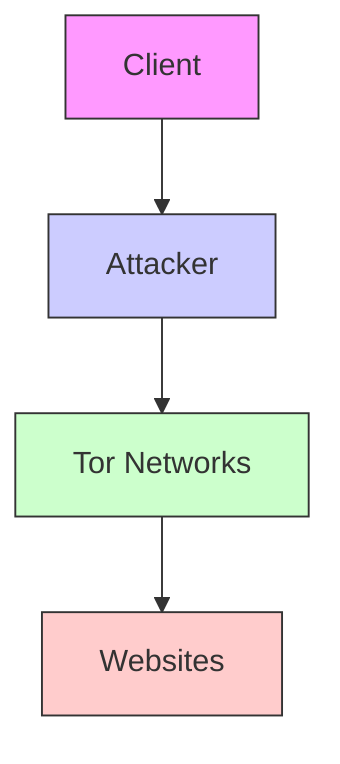
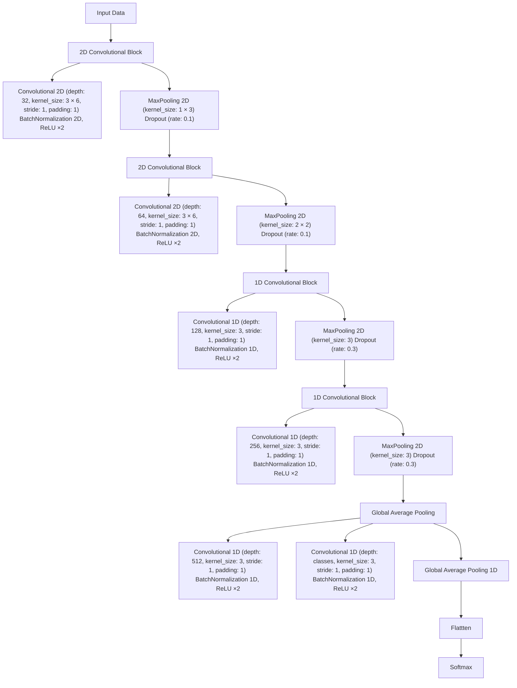

# Subverting Website Fingerprinting Defenses with Robust Traffic Representation

Meng Shen, School of Cyberspace Science and Technology, Beijing Institute of Technology; Kexin Ji and Zhenbo Gao, School of Computer Science, Beijing Institute of Technology; Qi Li, Institute for Network Sciences and Cyberspace, Tsinghua University; Liehuang Zhu, School of Cyberspace Science and Technology, Beijing Institute of Technology; Ke Xu, Department of Computer Science and Technology, Tsinghua University

https://www.usenix.org/conference/usenixsecurity23/presentation/shen-meng

# This paper is included in the Proceedings of the 32nd USENIX Security Symposium.

August 9–11, 2023 • Anaheim, CA, USA

978-1-939133-37-3

Open access to the Proceedings of the 32nd USENIX Security Symposium is sponsored by USENIX.

# Subverting Website Fingerprinting Defenses with Robust Traffic Representation

Meng Shen1, Kexin Ji2, Zhenbo Gao2, Qi Li3, Liehuang Zhu1, and Ke Xu4

1School of Cyberspace Science and Technology, Beijing Institute of Technology

2School of Computer Science, Beijing Institute of Technology

3Institute for Network Sciences and Cyberspace, Tsinghua University

4Department of Computer Science and Technology, Tsinghua University

{shenmeng, jikexin, liehuangz}@bit.edu.cn; gaozhenbo07@foxmail.com; {qli01, xuke}@tsinghua.edu.cn

# Abstract

Anonymity networks, e.g., Tor, are vulnerable to various website fingerprinting (WF) attacks, which allows attackers to perceive user privacy on these networks. However, the defenses developed recently can effectively interfere with WF attacks, e.g., by simply injecting dummy packets. In this paper, we propose a novel WF attack called Robust Fingerprinting (RF), which enables an attacker to fingerprint the Tor traffic under various defenses. Specifically, we develop a robust traffic representation method that generates Traffic Aggregation Matrix (TAM) to fully capture key informative features leaked from Tor traces. By utilizing TAM, an attacker can train a CNN-based classifier that learns common high-level traffic features uncovered by different defenses. We conduct extensive experiments with public real-world datasets to compare RF with state-of-the-art (SOTA) WF attacks. The closedand open-world evaluation results demonstrate that RF significantly outperforms the SOTA attacks. In particular, RF can effectively fingerprint Tor traffic under the SOTA defenses with an average accuracy improvement of 8.9% over the best existing attack (i.e., Tik-Tok).

# 1 Introduction

Tor has been widely used as an anonymous communication tool to prevent users from being tracked, monitored, and censored. Tor metrics [1] show that about two million active users leverage Tor to protect their privacy every day. However, Tor is vulnerable to website fingerprinting (WF) attacks [13, 33, 39, 41, 46], which is a passive attack to identify the websites that a victim is visiting by analyzing the Tor traffic. WF attacks exploit the unique website fingerprints by utilizing the side channel information of an encrypted connection (e.g., packet size, direction, and inter-packet delay) to break the anonymity enabled by Tor.

To mitigate WF attacks, several defenses have been developed, such as WTF-PAD [20], Front [10], Walkie-Talkie [47], TrafficSliver [23], RegulaTor [16] and Blanket [31]. The strategies adopted by these defenses include deferring packet sending, adding dummy packets, splitting traffic over multipaths, or a combination of them.

Recent WF attacks utilize various traffic representations (e.g., traces of packet direction) and deep learning techniques to undermine existing defenses. These attacks commonly assume that attackers know the details of deployed defenses and can obtain the trace of the defenses. Even under such an assumption, they are still unable to achieve high WF accuracy against different defenses. For instance, the SOTA WF attacks, e.g., DF [41] and Var-CNN [4] achieve an accuracy of over 90% against WTF-PAD but only have an accuracy of less 75% under Front. They are not able to defeat defenses built upon traffic splitting, e.g., TrafficSliver [23], and the fingerprinting accuracy is less than 60%. Moreover, the SOTA attacks, especially those using packet timing information, may not be effective when network conditions (e.g., bandwidth) change. For instance, we observe a significant accuracy reduction for both Tik-Tok [37] and Var-CNN [4] under different network bandwidths.

In this paper, we propose a robust WF attack, Robust Fingerprinting (RF), which achieves high attack accuracy in the presence of various defenses. The basic idea of RF is to investigate robust traffic representations that can improve deeplearning WF models against different defenses. It consists of two key components: an informative traffic representation called Traffic Aggregation matrix (TAM) and a deep learningbased classifier. TAM represents packet direction and timing together with extracted discriminative features less affected by defenses. Then, the deep-learning classifier can automatically learn effective fingerprints from TAM.

Contributions. Our main contributions are as follows:

• We propose the robust WF attack (i.e., RF) in the presence of various defenses. We utilize the information leakage analysis to explore effective features in a vast feature space and obtain features that cannot be easily disturbed by various defenses. We develop a new traffic representation method that captures these robust features in a simple matrix (TAM). In order to enable automatic learning of website fingerprints, we adapt an effective classifier based on Convolutional Neural Networks (CNNs), which learns distinctive robust features to ensure attack effectiveness.

• We conduct extensive experiments with public real-world datasets to evaluate the robustness of RF in closed-world scenarios. RF achieves the highest accuracy against the SOTA defenses that employ either traffic disturbing or traffic splitting strategies. In particular, RF has an average accuracy improvement of 8.9% over the best existing attack (i.e., Tik-Tok [37]). In addition, RF also outperforms the existing attacks under different network conditions.   
• We perform the open-world evaluation on the robustness of RF. The precision-recall curve of RF completely covers the curves of SOTA WF attacks, demonstrating that RF is superior to existing attacks against different defenses.   
• We develop a countermeasure against RF based on packet padding and delaying strategy. Our defense learns packet sequences containing critical features from historical traces of a collection of websites and morphs the original trace of a certain website to mimic the packet sequences of another website by padding and delaying packets. Experimental results show that compared with existing defenses, the proposed defense can effectively reduce the accuracy of RF with moderate time and bandwidth overhead.

The paper is organized as follows. We review the related work on WF attacks and defenses in Section 2 and describe the threat model and design goals in Section 3. We elaborate on the design of TAM in Section 4 and present RF in Section 5. Next, we conduct extensive experiments to evaluate the performance of RF as well as the existing WF attacks in Section 6. We describe the countermeasures against RF in Section 7, discuss the limitations and future work in Section 8, and conclude this paper in Section 9.

# 2 Related Work

WF attacks and defense have attracted increasing research attention in recent years. In this section, we briefly review the existing WF attacks and defenses.

# 2.1 WF Attacks

WF attack leverages the collected well-labeled traffic traces to train a powerful classifier, which can fingerprint the website for each unknown trace. Existing WF attacks can be roughly divided into two categories, according to the machine learning techniques they use.

WF attacks based on traditional machine learning. Several studies propose WF attacks by employing traditional machine learning models, such as Support Vector Machine (SVM) [33], k-Nearest Neighbors (k-NN) [46] and random forests [13], or optimizing on top of them [45]. The accuracy of traditional machine learning models usually relies on statistical features manually crafted from the traces for training. Here, we review 3 typical attacks in this category.

k-NN [46]. Wang et al. propose this attack based on the k-NN classifier applied on a manually selected feature set. It learns feature weights to lower the weights of bad features and makes the k-NN classifier focus on useful features.

CUMUL [33]. Panchenko et al. propose a cumulative representation that implicitly covers features used by other classifiers, such as packet ordering or burst behavior, and then use it to train an SVM classifier.

k-FP [13]. Hayes and Danezis propose this attack that uses a large set of statistical features. These features are input into random forests to extract a fingerprint vector, and then the fingerprint vector is applied to the k-NN classifier for WF.

WF attacks based on deep learning. Recent studies use deep neural networks (DNNs) as powerful tools to simplify the design of WF attacks and improve attack accuracy since it does not require selecting and fine-tuning features manually, such as Convolutional Neural Network [4, 39, 41], Triplet Network [42] and Generative Adversarial Network [32]. DNNbased classifiers take a simple representation of the original traces (e.g., packet directions [41]) as input and automatically learn distinctive features. We review 5 representative WF attacks in this category.

AWF [39]. Rimmer et al. leverages deep neural networks to automate the feature engineering process from packet direction sequence. The result of AWF shows that deep neural networks are comparable to the methods based on traditional machine learning, such as CUMUL.

DF [41]. Sirinam et al. also uses packet direction sequence as input but utilizes a more sophisticated CNN than AWF, with additional convolutional blocks. It is the first attack to undermine WTF-PAD [20].

Tik-Tok [37]. Rahman et al. propose this attack that leverages the same CNN structure as DF. Unlike DF, its input is the product of direction and raw time, which improves the effectiveness of the attack.

Var-CNN [4]. Bhat et al. propose a sophisticated architecture based on ResNets and leverage packet direction, inter-packet time, and metadata to train an ensemble of WF classifiers, which also performs better than DF.

TF [42]. Sirinam et al. propose this attack that uses triplet networks to make it transferable to heterogeneous testing sets. TF is evaluated on undefended traces.

# 2.2 WF Defenses

Considering that Tor connections are vulnerable to WF attacks, several WF defenses have been proposed to cover up the distinctive features employed by potential attackers. Existing WF defenses can be roughly divided into two categories according to the strategy they use.

Disturbing traffic. WF defenses in this category attempt to disturb traffic patterns of the original traces by adding dummy packets or delaying real packets according to certain strategies. Dummy packet padding will lead to bandwidth overhead (i.e., laying an extra burden on the Tor network to transmit dummy packets) while delaying real packets will result in time overhead (i.e., expanding webpage loading time).

Defenses proposed in the early stage, such as BuFLO [9], CS-BuFLO [5], Tamaraw [6], try to send packets at a constant rate, resulting in extremely high bandwidth and time overhead. Although effective against WF attacks, they fail to guarantee the quality of service perceived by Tor users. Some defenses [36, 48] rely on a strong assumption that the upcoming traffic patterns are known in advance, making it inapplicable to live network traffic. After that, several defenses [2, 3, 10, 16, 20, 27, 31, 47] with more realistic assumptions are proposed to reduce overhead while maintaining effectiveness. We review 5 defenses in this category.

WTF-PAD [20]. It leverages adaptive padding to add dummy packets in a targeted manner, which disrupts distinctive features of the patterns used by WF attacks. It is a zero-delay defense, i.e., the time overhead is zero.

Front [10]. It is also a zero-delay defense that generates a set of timestamps from a Rayleigh distribution for adding dummy packets in the original trace.

Walkie-Talkie [47]. It modifies the Tor browser to communicate in a half-duplex mode and merges the packet sequence of every monitored website with a randomly-selected unmonitored website (i.e., the decoy page) to mislead the WF attacks. It introduces moderate overhead, e.g., 31% bandwidth overhead and 34% time overhead, as reported by the authors [47]. RegulaTor [16]. It regularizes the traffic into multiple continuously decaying packet surges, i.e., a large number of packets sent in a short time, by injecting dummy packets and delaying real packets. The results show that it can defeat DNNbased WF attacks with moderate time (< 10%) and bandwidth (< 80%) overhead.

Blanket [31]. It is the state-of-the-art defense against DNNbased WF attacks. It relies on a white-box setting (i.e., requiring the full knowledge of the target WF attack) and generates adversarial perturbations on the live traffic. Blanket introduces a flexible perturbation generation mechanism, including injecting dummy packets and delaying the packets, resulting in different bandwidth and time overhead.

Splitting traffic. WF defenses in this category split traffic to destroy the original fingerprints of websites. It does not lead to time or bandwidth overhead, but at the cost of implementation overhead, e.g., reconstructing the Tor network [23].

TrafficSliver [23]. It hides packet features by splitting the traffic so the attacker at entry nodes can only access a small fraction of the traffic. It consists of two defense strategies, TrafficSliver-Net and TrafficSliver-App. The former reconstructs the Tor network to distribute TCP traffic to multiple guard nodes with several strategies and then reassembles traffic at the client and the middle node. It has no bandwidth and time overhead but increases the complexity of deployment. While the latter acts as a client proxy to create multiple Tor circuits to distribute HTTP requests, which can facilitate implementation at the price of weaker protection.

WF attacks built upon traditional machine learning have been proven to lose effectiveness when defenses are applied [41]. WF attacks based on deep learning can undermine specific defenses via adversarial training. However, recent studies show that these attacks can be defeated, e.g., by trace randomization [10], regularization [16], adversarial machine learning [31] and traffic splitting [23]. Therefore, attackers need to develop new methods to ensure the effectiveness of the WF attacks against various defenses.

Similar to building robust machine learning models against adversarial perturbation [44], a carefully-designed imperceptible noise that can easily alter the model’s prediction, WF attacks try to classify in the presence of perturbation generated by various WF defenses. However, recent work [31] has shown that most strategies, including adversarial training [28], gradient masking [35, 40], and region-based classification [8], are difficult to apply to WF models. The reasons lie in that: 1) in network traffic, defenders can add much more perturbation to obfuscate the original traffic, as they do not need to make it imperceptible to humans, making it harder for attackers to learn distinct features; and 2) robust model-building strategies typically reduce model accuracy and affect model generalization, which is a phenomenon known as label leaking [22]. In contrast, RF can extract robust features not disturbed by perturbations in different defenses and outperform the existing WF attacks.

# 3 Threat Model and Attack Goals

The threat model of WF attacks is shown in Figure 1. Similar to previous WF attacks [7, 13, 14, 41], we assume a local and passive attacker. Passive attackers can only sniff and record packets but cannot modify, delay, drop, or decrypt packets. Local attackers can only collect packet traces from the connection between the client and the guard node in the Tor network. Potential attackers that might launch WF attacks include eavesdroppers on the client’s local network, Internet Service Providers (ISP), and Autonomous Systems (AS) that are located between the client and the guard node [41].

The WF attack is usually considered as a classification problem. In an offline training process, the attacker extracts features from a collection of website traces and trains a supervised classifier. When launching the WF attack, the attacker captures the traffic traces from the target client’s connection to the Tor network, extracts features, and predicts with the classifier which website the client is visiting.

Note that a client has the flexibility to deploy a WF defense (e.g., WTF-PAD [20], Front [10], Walkie-Talkie [47], and Blanket [31]) to protect their connection privacy. The goal of WF attacks is to fingerprint the Tor traffic even under various WF defenses accurately. In this paper, we assume that attackers know the specific defense deployed by the victim in advance, which is the common assumption in the literature [41]. Under this setting, the attackers can obtain traffic traces generated by the target defense for adversarial training. Although this setting has the second-mover advantage for attackers, most existing WF attacks are only effective in undermining specific defenses. Therefore, it is non-trivial to ensure that a WF attack can maintain its effectiveness under various defenses.

flowchart

Figure 1: The threat model of WF attacks

Closed- and open-world scenarios. They are commonly used to evaluate the performance of WF attacks [33, 39, 41]. In the closed-world scenario, the client is only assumed to visit a small set of websites [15, 43] known as monitored websites. The attacker thus has samples of these websites to train a classifier for website recognition. The open-world scenario is more realistic [19, 41], where the client visits a set of monitored websites and a much larger set of unmonitored websites. The attacker, who can only obtain a fraction of the unmonitored websites for training, infers whether the client visits the monitored websites and, if so, which ones.

# 4 Robust Traffic Representation

In this section, we first introduce the intuition behind our traffic representation by exploring potential robust traffic representations based on information leakage and presenting our observations. Then we describe the design of the robust traffic representation in detail. Next, we resort to quantitative measures to verify the robustness of our traffic representation.

# 4.1 Key Observations

Traffic representation is the abstraction of network traces, from which WF classifiers can learn distinctive features for classification. Information loss is inevitable during the mapping of raw traces to traffic representation. As a result, a robust traffic representation should be informative enough while being less affected by various defenses.

Exiting studies have proposed different forms of traffic representation, which roughly fall into two categories: statistical features [13, 33, 46] and per-packet feature sequences [37, 39, 41, 42]. Statistical features refer to statistics extracted from an entire trace, such as minimum, maximum, mean, median, percentiles of packet size, or inter-packet delay. This form of representation is coarse-grained as it focuses on trace-level statistics rather than the features of specific packets. Per-packet feature sequences refer to a sequence of features associated with each packet in a trace, where the feature can be direction, size, timestamp, or a combination of them. This type of representation is fine-grained, as every packet is taken into consideration.

line

| Feature Category | Undefended | WTF-PAD | Front | Walkie-Talkie |
| ---------------- | ---------- | ------- | ----- | ------------- |
| k-NN             | 3.0        | 2.0     | 1.0   | 0.5           |
| k-FP             | 3.0        | 2.5     | 1.0   | 0.5           |
| CUMUL            | 3.0        | 2.0     | 1.0   | 0.5           |
| Pkt. Direction   | 0.5        | 0.5     | 0.5   | 0.5           |
| Timing with Direction | 0.5      | 0.5     | 0.5   | 0.5           |
| Inter-arrival Time | 1.0       | 1.0     | 1.0   | 1.0           |
| Concentration    | 1.0        | 1.0     | 1.0   | 1.0           |
| Burst            | 1.0        | 1.0     | 1.0   | 1.0           |
| Pkt. per Second   | 1.0        | 1.0     | 1.0   | 1.0           |

Figure 2: Information leakage for individual features

To have a deep understanding of the effectiveness of existing and potential traffic representations, we resort to information leakage [24] to measure the amount of information attackers can learn from the features of a certain representation about the websites. The information leakage $I ( F ; C )$ in the closed-world scenario is defined in Eq. (1),

$$
I (F; C) = H (C) - H (C | F) \tag {1}
$$

where C is the monitored websites, F are the features of a specific representation, and H(·) is entropy.

We randomly select 100 undefended traces for each of the 95 monitored websites and also generate the corresponding defended traces with existing defenses, including WTF-PAD, Front, and Walkie-Talkie (see Section 6 for more details). These traces are used to measure the information leakage of different feature sets in the closed-world setting, as plotted in Figure 2. The subfigures in the first-row exhibit the results of statistical features used by k-NN [46], k-FP [13], and CU-MUL [33], respectively. The subfigures in the second row show the results of fine-grained per-packet feature sequences, where Packet-direction is used in AWF [39] and DF [41] while Timing-with-direction 1 is used in Tik-Tok [37]. Besides, we also explore more types of features as plotted in the last row, including Concentration2, Burst 3 and Packet-per-Second 4.

We can make several key observations as follows:

• The coarse-grained statistical features vary greatly among the traces protected by different defenses and thus make trivial contributions to website fingerprinting.   
• The fine-grained per-packet feature sequences are also significantly affected by different defenses. This is because the patterns of packet sequences vary greatly due to the randomness in dummy packet padding (e.g., Front) or packet delaying (e.g., Walkie-Talkie).   
• Packet-per-second has almost the same amount of information leakage on undefended traces and defended traces with WTF-PAD and Front.

The analysis above not only indicates the inherent limitations of existing representations in undermining defenses but also sheds new light on the design of a robust traffic representation, where features cannot be easily covered by defenses. More specifically, the number of packets transmitted in a time interval is capable of dealing with defenses based on dummy packet padding since WTF-PAD and Front have the same information leakage as undefended traces. It can also tolerate packet delay due to its statistical properties, making defenders spend higher time overhead to disturb this feature.

# 4.2 Traffic Aggregation Matrix

In this subsection, we propose a robust traffic representation, which can abstract critical features that are not easily covered by defenses. As we learned from the information leakage analysis in Section 4.1, the aggregated number of packets transmitted in a time interval is an informative feature to undermine defenses. Since packet padding and delaying are typical strategies employed by existing defenses, we provide an intuitive explanation for the effectiveness of such a feature:

• Packet padding. It directly changes packet sequences and thereby has a significant impact on statistical or per-packet features. In contrast, the number of packets transmitted in each time interval can accommodate the changes in the total number of packets by multiple intervals, and thus will not have great changes.   
• Packet delaying. It can change the time series of packet sequences. For consideration of user experience, the latency introduced by defenses is usually bounded (e.g., less than 35% [10]). The aggregated number of packets transmitted in a time interval can resist moderate changes in time series, as a delayed packet may still fall in the same interval.

Based on the above analysis, we propose a new traffic representation named Traffic Aggregation matrix (TAM), which

other

| Time | Outgoing Packet | Incoming Packet |
|------|-----------------|-----------------|
| 0    | 3               | 6               |
| 1    | 3               | 3               |
| 2    | 1               | 2               |
| 3    | 1               | 6               |
| ...  | ...             | ...             |
| T    | 3               | 4               |

Figure 3: Visualization of TAM. Given a trace with the maximum load time T , TAM counts the number of packets in each time slot s, e.g., the first row for outgoing packets while the second row for incoming packets.

aggregates multi-dimensional information, including packet direction, number, and time. At the start, TAM divides the entire traces into small fix-length time slots based on the number of packets transmitted in a small time interval, then counts the number of outgoing and incoming packets per time slot and merges them into a matrix.

Trace. The visit to a certain website results in a trace, which is denoted by $F = ( f _ { 1 } , f _ { 2 } , . . . , f _ { l } )$ , where l is the length of the trace. Let $f _ { k } = \langle t _ { k } , d _ { k } \rangle$ be a tuple of packet timestamp and direction, where $t _ { k }$ and $d _ { k }$ are the arrival time and direction of the k-th packet, respectively. Note that $d _ { k }$ is 1 and −1 for an outgoing and incoming packet. Following recent work [4, 37, 39, 41], we also treat the maximum length L of the trace as a hyperparameter in this paper, denoting that longer traces will be truncated after L packets.

Figure 3 depicts the structure of TAM. Let $M \in \mathbb { R } ^ { 2 \times N }$ denote the TAM of the trace F, where N is the number of time slots considered in TAM. Assume that the length of each time slot is denoted by s, the maximum load time considered for a trace is T , and N can be calculated using T /s. An element $m _ { i j } \in M$ represents the number of incoming (i = 1) or outgoing (i = 2) packets whose timestamps are between ( j − 1) × s and j × s. We formally present the calculation method of TAM, as depicted in Algorithm 1. For each packet in the trace F, we leverage the upward rounding function to get its column index j (line 3). If j is greater than N, we will discard this packet; otherwise, we compute the row index i by looking at its direction $d _ { k }$ (lines 4-5). Then, the corresponding element in M is updated (line 6). Finally, the resulting M is returned as the TAM.

As stated in Section 4.1, the coarse-grained statistical features are prone to be affected by existing defenses using packet padding and delaying, while the fine-grained features could easily be less robust if they over-specify the patterns for a traffic trace. Tik-Tok [37] and Var-CNN [4] use explicit time stamps and inter-packet times, respectively, which may be overly detailed. Compared with the coarse-grained statistical features and per-packet feature sequences used in prior WF attacks, TAM captures intermediate granularity informa-

# Algorithm 1 Calculation of TAM

Input: A trace F, the length of time slot s, and the number of columns of TAM N

Output: TAM $M = \{ m _ { i j } | i \in \{ 1 , 2 \} , j \in [ 1 , N ] \}$

1: Initialize the size of TAM M as $2 \times N$   
2: for each packet $f _ { k } = \langle t _ { k } , d _ { k } \rangle \in F$ do   
3: $j \gets \lceil \frac { t _ { k } } { s } \rceil$ s   
4: $\mathbf { i f } \ j \leq { \overset { \circ } { N } }$ then   
5: $i  d _ { k } < 0 ? 1 : 2$   
6: $m _ { i j } \gets m _ { i j } + 1$   
7: end if   
8: end for   
9: return M

tion of traffic features, i.e., packet-per-time-slot, and thus can be more resilient to small changes or obfuscations in traffic traces. By aggregating the number of outgoing and incoming packets transmitted in each time interval, TAM can tolerate packet padding and delaying to ensure its robustness against different defenses. We will quantitatively evaluate the robustness of TAM in the next subsection.

# 4.3 Robustness Evaluation of TAM

Based on intuitive explanations of the robustness of TAM provided above, we now resort to quantitative measures to demonstrate that TAM is more robust than two typical representations employed by the state-of-the-art WF attacks, i.e., packet direction used in DF [41] and Var-CNN [4], and timing with direction used in Tik-Tok [37].

Given the original traffic traces F and the corresponding disturbed traces $F ^ { \prime }$ with a certain defense strategy, a robust representation should keep the intra-class distance between F and $F ^ { \prime }$ as short as possible. In other words, a shorter intraclass distance indicates that the information extracted in the traffic representation is less affected by the defense strategy.

We randomly select 100 traces from each of the 95 websites and adopt the defense strategies discussed in Section 4.2, i.e., packet padding and delaying, as typical strategies. We use random padding as a simple benchmark defense for packet padding and also choose WTF-PAD [20] and Front [10] to evaluate the robustness of TAM against real-world defenses. For packet delaying, we random sample delays for each packet from the normal distribution. More details of random padding and delaying can be found in Appendix B.

Motivated by the setting in [25], we use intra-class distance with Maximum Mean Discrepancy (MMD) [12], which measures the discrepancy between two distributions of datasets.

$$
M M D (X ^ {s}, X ^ {t}) = \left\| \frac {1}{n} \sum_ {i = 1} ^ {n} \phi (x _ {i} ^ {s}) - \frac {1}{m} \sum_ {i = 1} ^ {m} \phi (x _ {i} ^ {t}) \right\| _ {\mathcal {H}} \tag {2}
$$

where $X ^ { s } = \{ x _ { 1 } ^ { s } , . . . , x _ { n } ^ { s } \}$ and $X ^ { t } = \{ x _ { 1 } ^ { t } , . . . , x _ { m } ^ { t } \}$ denote the source and target datasets, MMD maps $X ^ { s }$ and $X ^ { t }$ into Reproducing Kernel Hilbert Space (RKHS) with a mapping function φ(·) and uses the Kernel Trick to calculate the average l2-distance between two embedded distributions in RKHS, which can work completely with inner products rather than implicitly define $\phi ( \cdot )$ . We use MMD with 5 Gaussian kernels to estimate the distance between two datasets.

line

| Bandwidth Overhead(%) | Direction | Time with Direction | TAM |
| --------------------- | --------- | -------------------- | --- |
| 20                    | 0.1       | 0.1                  | 0.2 |
| 40                    | 0.3       | 0.25                 | 0.2 |
| 60                    | 0.45      | 0.35                 | 0.2 |
| 80                    | 0.55      | 0.4                  | 0.2 |
| 100                   | 0.6       | 0.45                 | 0.2 |
| 200                   | 0.7       | 0.5                  | 0.2 |
| 400                   | 0.75      | 0.55                 | 0.2 |
| 600                   | 0.78      | 0.58                 | 0.2 |
| 800                   | 0.8       | 0.6                  | 0.2 |

(a) Packet padding: varying the bandwidth overhead while fixing the time overhead=10%

line

| Time Overhead(%) | Direction | Time with Direction | TAM |
| ---------------- | --------- | -------------------- | --- |
| 0                | 0.28      | 0.20                 | 0.05 |
| 10               | 0.28      | 0.25                 | 0.15 |
| 20               | 0.28      | 0.30                 | 0.35 |
| 30               | 0.28      | 0.40                 | 0.55 |
| 40               | 0.28      | 0.45                 | 0.60 |

(b) Packet delaying: varying the time overhead while fixing the bandwidth overhead=30%   
Figure 4: Intra-class distance of three traffic representations with varied bandwidth and time overhead.

To show the variation between $F ^ { \prime }$ and $F ,$ we calculate the intra-class distance according to Eq. (3):

$$
D _ {i n t r a} (F, F ^ {\prime}) = \frac {1}{| C |} \sum_ {c = 1} ^ {| C |} M M D (F _ {c}, F _ {c} ^ {\prime}) \tag {3}
$$

where C is the label set of all websites.

Figure 4 illustrates the intra-class distance of the three representations in packet padding and packet delaying. In Figure 4(a), we fix the time overhead to 10% and change the bandwidth overhead. As bandwidth overhead increases, the intraclass distance of TAM is almost unchanged and much smaller than other representations under higher bandwidth overhead, particularly under real-world defenses, which demonstrates that TAM is less affected by packet padding.

In Figure 4(b), we fix the bandwidth overhead to 30% and change the time overhead. The results show that with a moderate time overhead (i.e., less than 15%), TAM achieves the shortest intra-class distance. As the time overhead increases, the intra-class distance of TAM also increases. However, a larger time overhead will significantly impact user experiences and also increase the risk of out-of-memory on Tor relays [30]. It is worth noting that even though time information is not used, the intra-class distance of packet direction on WTF-PAD increases as time overhead increases. This is because a high latency will result in a large time gap between bursts, which enables WTF-PAD to perturb additional patterns in the traces [41].

In summary, TAM is a more robust traffic representation than packet direction and timing with direction, which can tolerate large bandwidth and moderate time overhead.

# 5 Design of Robust Fingerprinting

After creating TAM, we present the design of Robust Fingerprinting (RF). RF consists of two critical modules to achieve robustness in undermining defenses, i.e., robust traffic representation and efficient feature extraction.

Robust traffic representation. In Section 4, we proposed TAM, a robust traffic representation. The time of loading an undefended or defended trace is partitioned into multiple fixlength time slots, and each element in a TAM represents the amount of outgoing (or incoming) packets in each time slot. TAM aggregates packet direction and timestamp together, which can abstract robust traffic patterns.

Efficient feature extraction. Convolutional Neural Networks (CNNs) have shown their success in many fields, such as image classification [21], and object detection [38]. Since TAM is a matrix like an image, we design a CNN-based classifier to automatically extract robust discriminative features that can be used as fingerprints of websites under various defenses.

The structure of the proposed CNN-based classifier is illustrated in Figure 7 in Appendix A. The classifier has three components: 2D convolutional blocks, 1D convolutional blocks, and a global average pooling (GAP) layer.

2D convolutional blocks can extract discriminative local features of websites from rows and columns in TAM. Note that the elements of TAM have local correlation, e.g., the elements in the same column represent the number of incoming and outgoing packets in the same time slot, reflecting the interaction between client and server, while two neighboring elements in the same row represent the number of packets with the same direction in two consecutive time slots, reflecting the fluctuation of burst in traffic.

1D convolutional blocks help to extract higher-level features. After two 2D convolutional blocks, TAM will be fused into 1D feature maps by 2 × 2 max pooling layers. Since CNNs cannot extract more precise features from the dataset due to the reduced dimension of the feature map caused by max pooling, we increase the size of the feature map by reducing the number of channels and then apply two 1D convolutional blocks to extract hidden features.

Table 1: Tor Datasets 

<table><tr><td rowspan="2"></td><td colspan="2">Closed-world</td><td colspan="2">Open-world</td></tr><tr><td>Websites</td><td>Traces</td><td>Websites</td><td>Traces</td></tr><tr><td>Undefended</td><td>95</td><td>95,000</td><td>40,000</td><td>40,000</td></tr><tr><td>Walkie-Talkie</td><td>100</td><td>40,000</td><td>10,000</td><td>40,000</td></tr></table>

The GAP layer is used to replace the fully-connected layer to mitigate overfitting [26]. The fully-connected layer contains massive parameters and thus easily leads to overfitting. In contrast, the GAP layer does not introduce any parameters and directly calculates the average value of each feature map. Then, we use these values to obtain the probability of being labeled as each website by a softmax function. We use Cross-Entropy as the loss function, which is commonly used in multi-class classification tasks [21]. The Adam optimizer is used to minimize training loss and achieve quick convergence.

To evaluate the contributions of TAM and the CNN-based classifier, we conduct an ablation study in Appendix C. The results indicate that both of them, particularly TAM, contribute to the robustness of RF.

# 6 Performance Evaluation

In this section, we evaluate the performance of RF with public datasets. We describe the experimental settings in Section 6.1 and conduct hyperparameter tuning of RF in Section 6.2. Next, in Sections 6.3-6.5, we make a comprehensive comparison of RF with the state-of-the-art WF attacks in both closed- and open-world scenarios.

# 6.1 Experimental Setup

Dataset. To make experimental results more convincing, we give priority to two public datasets that are commonly used to evaluate the performance of WF attacks, as shown in Table 1.

The first dataset [41] contains 95 websites, each of which has 1,000 undefended traces, for closed-world evaluation. Excluding the 95 websites, it also contains 40,000 websites for open-world evaluation, each with only 1 undefended trace. To generate the corresponding defended traces, we resort to the scripts and simulators provided by the authors and obtain the defended traces, respectively.

Note that Blanket assumes that the per-packet feature sequence is used as the input for a DNN-based WF attack. However, the TAM used in RF is an aggregated feature sequence, making it impossible for Blanket to generate adversarial perturbations for RF directly. Therefore, we adapt Blanket to RF by estimating gradients. Assuming that feature fi is generated by packets u to v, the gradient ∇Fj of packets u to v is ∇ fi, where j ∈ [u, v].

The second dataset only contains defended traces with Walkie-Talkie. Since Walkie-Talkie traces cannot be generated using scripts and simulators, we resort to the dataset collected over the live Tor network [37], which contains 40,000 traces for 100 monitored websites and 40,000 traces for 10,000 unmonitored websites. For each monitored website, there are 400 traces, each representing a pairing of the corresponding monitored website and a randomly-selected unmonitored website (i.e., a decoy [37]). Similarly, each trace of the unmonitored websites represents a pairing of the corresponding unmonitored website and a randomly-selected monitored website as the decoy.

line

| Maximum Length | Undefended (%) | WTF-PAD (%) | FRONT (%) | Walkie-Talkie (%) |
|---|---|---|---|---|
| 3000 | 98.2 | 95.6 | 87.4 | 91.8 |
| 4000 | 98.1 | 96.1 | 91.2 | 92.3 |
| 5000 | 98.0 | 96.3 | 93.4 | 93.1 |
| 6000 | 98.0 | 96.4 | 93.8 | 93.8 |
| 7000 | 98.0 | 96.5 | 94.2 | 94.5 |
| 8000 | 98.0 | 96.7 | 94.1 | 94.2 |

(a) Maximum Length

line

| Maximum Load Time (s) | Undefended | WTF-PAD | FRONT | Walkie-Talkie |
| --------------------- | ---------- | ------- | ----- | ------------- |
| 20                    | 97         | 95      | 90    | 75            |
| 40                    | 97         | 96      | 93    | 90            |
| 60                    | 97         | 96      | 93    | 93            |
| 80                    | 97         | 96      | 93    | 94            |
| 100                   | 97         | 96      | 93    | 94            |
| 120                   | 97         | 96      | 93    | 94            |

(b) Maximum Load Time

line

| Time Slot (ms) | Undefenced | WTF-PAD | FRONT | Walkie-Talkie |
| -------------- | ---------- | ------- | ----- | ------------- |
| 22             | 99         | 97      | 94    | 91            |
| 33             | 99         | 97      | 94    | 91            |
| 44             | 99         | 97      | 94    | 91            |
| 88             | 99         | 97      | 94    | 91            |
| 176            | 98         | 96      | 93    | 89            |
| 352            | 97         | 93      | 88    | 84            |

(c) Time Slot

line

| Number of Epochs | Undefended | WTF-PAD | FRONT | Walkie-Talkie |
| ---------------- | ---------- | ------- | ----- | ------------- |
| 5                | 97         | 92      | 87    | 75            |
| 10               | 98         | 94      | 90    | 88            |
| 15               | 98         | 95      | 91    | 90            |
| 20               | 98         | 96      | 92    | 91            |
| 25               | 98         | 96      | 92    | 92            |
| 30               | 98         | 96      | 93    | 93            |
| 35               | 98         | 96      | 93    | 93            |
| 40               | 98         | 96      | 93    | 93            |

(d) Epochs   
Figure 5: Impact of important hyperparameters on accuracy of RF

WF attacks for comparison. To make a comprehensive comparison, we select 7 state-of-the-art WF attacks as described in Section 2.1, namely k-NN [46], CUMUL [33], k-FP [13], AWF [39], DF [41], Tik-Tok [37], and Var-CNN [4]. They are all built with the source code released by the authors. All WF attacks are trained and tested on a server equipped with an Inter Core Duo 3.6GHz, 32GB of memory, and a GPU with 8GB of memory. To make a fair comparison, we fine-tuned these attacks to achieve equivalent or even higher accuracy than the results reported in their original papers.

WF defenses. We take WTF-PAD [20], Front [10], Regula-Tor [16], Tamaraw [6], Blanket [31], Walkie-Talkie [47] and TrafficSliver [23] as target defenses of WF attacks.

# 6.2 Hyperparameters of RF

We use Pytorch to construct the CNN classifier in RF. We follow the extended candidate search method [41] to implement hyperparameter tuning to obtain a model with strong generalization ability. We split the dataset into training, validation, and testing, with an 8:1:1 ratio. The tuning process is conducted in the closed-world setting with the validation accuracy as the performance metric, which is the percentage of the traces for validation labeled correctly.

The hyperparameters search ranges and the final values are summarized in Table 2. RF is trained with the learning rate of 0.0005, weight decay of 0.001, batch size of 200, and dropout rate of 0.1 and 0.3. Next, we further investigate the RF hyperparameters, including maximum length L, maximum load time T , time slot s, and training epochs to make trade-offs between accuracy and training overhead.

Maximum Length. Intuitively, the longer the maximum

Table 2: Hyperparameter selection for RF model 

<table><tr><td>Hyperparameters</td><td>Search Range</td><td>Final</td></tr><tr><td>Learning Rate</td><td>[0.0001, ..., 0.002]</td><td>0.0005</td></tr><tr><td>Weight Decay</td><td>[0.0001, ..., 0.01]</td><td>0.001</td></tr><tr><td>Batch Size</td><td>[120, ..., 240]</td><td>200</td></tr><tr><td>Dropout[2D,1D]</td><td>[0, ..., 0.5]</td><td>[0.1,0.3]</td></tr><tr><td>Maximum Length</td><td>[3,000, ..., 8,000]</td><td>5,000</td></tr><tr><td>Maximum Load Time (s)</td><td>[20, ..., 120]</td><td>80</td></tr><tr><td>Time Slot (ms)</td><td>[22, ..., 352]</td><td>44</td></tr><tr><td>Training Epochs</td><td>[5, ..., 40]</td><td>30</td></tr></table>

length of trace L, the more information it retains, and the easier it is to fingerprint the website. Figure 5(a) shows that the accuracy improves as the maximum length of the trace increases. When the maximum length exceeds 5,000, the growth of accuracy slows down. Besides, the maximum length of the traces is typically set to 5,000 in previous works [4, 37, 41]. For fair comparisons, we set the final value of L to 5,000.

Maximum Load Time. TAM counts the number of packets in each time slot. Therefore, it is necessary to consider the maximum load time of the trace to calculate TAM. Figure 5(b) shows that the longer the maximum load time, the higher the accuracy. However, when the maximum load time exceeds 80s, the accuracy tends to be flat. In this paper, we set the maximum load time T to 80s.

Time Slot. Figure 5(c) shows the impact of time slots on accuracy in the undefended, WTF-PAD, Front, and Walkie-Talkie traces. The results show that accuracy initially increases and then decreases as the time slot increases. A time slot that is too small will make the TAM sparse, hindering the effectiveness of the WF attack. And a larger time slot will make the obtained TAM less informative in representing the loading process of websites. Considering that the smaller the time slot, the larger the space occupied by the TAM, we set the time slot as 44ms to achieve higher accuracy with moderate space occupancy.

Training Epochs. In general, increasing training epochs can gradually improve the accuracy of the classifier, at the price of expanding the training duration. Figure 5(d) shows the accuracy of RF with different epochs. The accuracy of RF with five epochs on undefended, WTF-PAD, Front, and Walkie-Talkie traces reaches 97.08%, 91.69%, 86.84%, and 72.82%, respectively, which suggests that RF has a fast learning ability. The accuracy of RF keeps on increasing until 30 epochs. In this paper, we use 30 epochs to achieve a better balance between accuracy and training time.

Table 3: Bandwidth and Time overhead of Defenses 

<table><tr><td>Defences</td><td>WTF-PAD</td><td>FRONT</td><td>RegulaTor</td><td>Tamaraw</td></tr><tr><td>Bandwidth</td><td>63%</td><td>103%</td><td>77%</td><td>105%</td></tr><tr><td>Time</td><td>0%</td><td>0%</td><td>5%</td><td>43%</td></tr><tr><td colspan="5"></td></tr><tr><td>Defences</td><td>Blanket-I</td><td>Blanket-ID</td><td>Walkie-Talkie</td><td>TrafficSliver</td></tr><tr><td>Bandwidth</td><td>85%</td><td>47%</td><td>31%</td><td>0%</td></tr><tr><td>Time</td><td>0%</td><td>23%</td><td>34%</td><td>0%</td></tr></table>

# 6.3 Closed-world Evaluation on WF Attacks against Defenses

In this section, we evaluate the robustness of WF attacks against defenses. As described in Section 3, we assume that the attackers know the defense deployed by the client and thus conduct adversarial training with the defended traces.

This assumption leads to two different cases: 1) full knowledge case, where the attacker has sufficient prior knowledge, i.e., the defense algorithm as well as its parameters, and 2) partial knowledge case, where the attacker only knows the defense selected by the client, but is unsure of the parameter setting in the specific defense. The first case is commonly used in previous works [4, 37, 41] to evaluate the performance of WF attacks against a targeted defense. The second case raises more challenges for the attackers, as they have to train a classifier on defended traces with a variety of known parameters to cover the parameter used by the client.

Experimental settings. For the full knowledge case, we use the closed-world traces of undefended, WTF-PAD, Front, RegulaTor, Tamaraw, Blanket, Walkie-Talkie, and TrafficSliver for evaluation. Noted that, we implement two variations of Blanket with different parameter settings on blind adversarial perturbation generation: Blanket-I only inserts dummy packets while Blanket-ID employs both packet padding and delaying. Since Blanket is a white-box defense, it can only generate defended traces for a DNN-based WF model. Therefore, in the testing set of Blanket-I and Blanket-ID, there are defended traces targeting DF, Tik-Tok, Var-CNN, and RF that can be used to evaluate the accuracy of the corresponding WF attacks. We select the best two network-layer splitting strategies reported in TrafficSliver [23], namely By Direction (BD) and Batched Weighted Random (BWR). The summary of the bandwidth and time overhead for each defense is shown in Table 3. To guarantee statistical soundness, we resort to 10-fold cross-validation commonly used in the literature [13, 33, 41] and obtain the average and standard deviation of accuracy to measure the performance of each WF attack.

For the partial knowledge case, we focus on the key parameter inter-arrival time distribution in WTF-PAD and select a candidate set including norm (by default), beta, gamma, pareto and weibull. We train WF attacks with traces of these five distributions and then test on traces of each distribution. The training set contains $5 \times 9 5 \times 9 0 0$ WTF-PAD traces, which is a combination of all five distributions. And each distribution of norm, beta, gamma, pareto and weibull results in a specific testing set containing 95×100 defended traces denoted by $\mathcal { D } _ { n o r m } , \mathcal { D } _ { b e t a } , \mathcal { D } _ { g a m m a } , \mathcal { D } _ { p a r e t o } ,$ , and $\mathcal { D } _ { w e i b u l l }$ , respectively.

Results with full knowledge. Table 4 exhibits the accuracy of state-of-the-art WF attacks in the closed-world scenario with prior knowledge of defenses and the corresponding parameters. All attacks can recognize websites with over 93% accuracy without defenses. In particular, DF, Tik-Tok, Var-CNN, and RF achieve a comparable accuracy of over 98%. When defenses are deployed, RF outperforms all other WF attacks and achieves the highest accuracy. Particularly, RF achieves an average accuracy improvement of 8.9% over the best existing attack (i.e., Tik-Tok) under nine defenses, including four variations of Blanket and TrafficSliver, demonstrating its robustness against various defenses.

Disturbing traffic defenses change traffic patterns by packet padding and delaying. WTF-PAD is a zero-delay defense and proved effective in defending against WF attacks based on traditional machine learning classifiers (e.g., k-NN, k-FP, and CUMUL), reducing their accuracy to less than 69%. This is because the statistical features of the defended traces are insufficiently distinguishing, as confirmed by the significant decrease in the amount of information leaked by these features (see Figure 2). AWF is also defeated as the number of CNN layers is not large enough to extract discriminative features from defended traces [41]. However, it is successfully undermined by DF with an accuracy of 90.9%, and Var-CNN improves the accuracy to 94.70%. RF further increases the accuracy to over 96.6%, which is only 2.3% lower than the best performance on undefended traces. Front, which introduces more bandwidth overhead on Tor connections than WTF-PAD, can significantly reduce the accuracy of DF, Tik-Tok, and Var-CNN to 76.85%, 84.79%, and 79.24%, respectively. However, RF can still maintain its effectiveness against Front, with only a 5.49% drop from the undefended traces.

Tamaraw reduces the accuracy of all attacks to less than 10% by regularizing the packet sending, but its high bandwidth and time overhead make it difficult to deploy in the real world. Thus, it will not be considered hereafter. Regula-Tor also adopts the idea of regularizing traffic like Tamaraw, but with less bandwidth (77%) and time (5%) overhead. It successfully reduces the accuracy of state-of-the-art attacks to less than 50% by adjusting the sending rate in real-time according to the arrival rate of real packets. However, RF still maintains the highest accuracy, i.e., at least 18% higher than other attacks against RegulaTor.

Blanket is vulnerable to adversarial training, as demonstrated by the high accuracy (e.g., over 97%) of 4 WF attacks trained on defended traces. Based on burst molding, Walkie-Talkie can resist most attacks, e.g., the accuracy of k-NN, k-FP, CUMUL, and AWF is less than 40%. However, RF still has the highest accuracy at 93.87%, which is more than 20% improvement over DF and Tik-Tok.

Table 4: Accuracy (%) of the state-of-the-art WF attacks against defenses in the closed-world scenario 

<table><tr><td rowspan="2"></td><td rowspan="2">Undefended</td><td colspan="7">Disturbing Traffic Defenses</td><td colspan="2">Splitting Traffic Defenses</td></tr><tr><td>WTF-PAD</td><td>Front</td><td>RegulaTor</td><td>Tamaraw</td><td>Blanket-I</td><td>Blanket-ID</td><td>Walkie-Talkie</td><td>BD</td><td>BWR</td></tr><tr><td>k-NN</td><td>93.64±0.28</td><td>40.94±4.38</td><td>4.37±0.16</td><td>5.11±0.26</td><td>4.56±0.14</td><td>-</td><td>-</td><td>26.11±5.69</td><td>27.06±0.24</td><td>4.47±0.05</td></tr><tr><td>k-FP</td><td>94.45±0.12</td><td>68.33±0.58</td><td>52.66±0.34</td><td>49.27±0.14</td><td>7.88±0.22</td><td>-</td><td>-</td><td>39.81±0.47</td><td>77.39±0.13</td><td>36.35±0.17</td></tr><tr><td>CUMUL</td><td>95.11±0.20</td><td>59.80±0.40</td><td>30.61±0.50</td><td>18.60±0.14</td><td>8.18±0.22</td><td>-</td><td>-</td><td>24.48±0.60</td><td>19.39±0.21</td><td>9.06±0.20</td></tr><tr><td>AWF</td><td>94.32±0.68</td><td>52.67±3.65</td><td>17.28±2.69</td><td>13.11±1.10</td><td>7.06±1.38</td><td>-</td><td>-</td><td>29.61±0.63</td><td>11.70±5.95</td><td>4.99±1.03</td></tr><tr><td>DF</td><td>98.40±0.11</td><td>90.85±0.28</td><td>76.85±0.56</td><td>20.96±1.43</td><td>6.89±0.11</td><td>97.94±0.10</td><td>98.00±0.17</td><td>71.02±0.89</td><td>20.69±0.08</td><td>19.99±0.16</td></tr><tr><td>Tik-Tok</td><td>98.45±0.13</td><td>93.80±0.47</td><td>84.79±0.51</td><td>47.07±5.80</td><td>6.94±0.18</td><td>98.15±0.04</td><td>98.13±0.21</td><td>72.85±0.56</td><td>92.74±1.87</td><td>57.63±4.45</td></tr><tr><td>Var-CNN</td><td>98.87±0.05</td><td>94.70±0.31</td><td>79.24±3.06</td><td>47.68±7.52</td><td>3.13±1.31</td><td>98.50±0.21</td><td>98.49±0.08</td><td>87.53±1.10</td><td>95.50±0.23</td><td>31.09±3.05</td></tr><tr><td>RF</td><td>98.83±0.07</td><td>96.58±0.13</td><td>93.34±0.18</td><td>67.43±0.49</td><td>8.54±0.14</td><td>98.57±0.17</td><td>98.62±0.15</td><td>93.87±0.23</td><td>95.70±0.18</td><td>79.68±0.22</td></tr></table>

Table 5: Accuracy (%) of WF attacks against WTF-PAD with known parameters in the closed-world scenario 

<table><tr><td></td><td> $\mathcal{D}_{norm}$ </td><td> $\mathcal{D}_{beta}$ </td><td> $\mathcal{D}_{gamma}$ </td><td> $\mathcal{D}_{pareto}$ </td><td> $\mathcal{D}_{weibull}$ </td></tr><tr><td>DF</td><td>92.25</td><td>82.26</td><td>85.01</td><td>89.12</td><td>78.58</td></tr><tr><td>Tik-Tok</td><td>94.20</td><td>92.02</td><td>92.33</td><td>93.39</td><td>90.92</td></tr><tr><td>Var-CNN</td><td>94.91</td><td>88.64</td><td>89.81</td><td>92.58</td><td>85.67</td></tr><tr><td>RF</td><td>97.51</td><td>97.42</td><td>96.39</td><td>96.87</td><td>96.98</td></tr></table>

Splitting traffic defenses, e.g., TrafficSliver, can limit the traffic traces obtained by attackers, which leads to the reduction of distinguishing features and ultimately leads to the decline of attack accuracy. BD uses two different circuits for incoming and outgoing packets, respectively. Therefore, the attackers can only obtain packets in one direction, which significantly reduces the accuracy of AWF and DF. However, due to packet timing features, the accuracy of Tik-Tok, Var-CNN, and RF has merely a 3%-6% drop. BWR uses a vector to weight the selection of a guard node for sending a batch of Tor packets, resulting in a large time gap in the traffic obtained by the attacker, thus reducing the correlation between packets. Although BWR is the best splitting strategy [23], RF still achieves an accuracy of nearly 80%, at least 22% higher than other attack methods.

Results with partial knowledge. Table 5 summarizes the accuracy of WF attacks against WTF-PAD with known interarrival time distribution. Here, we only consider WF attacks with an accuracy of over 90% against WTF-PAD in Table 4. We have three key observations from the results: 1) All WF attacks achieve higher accuracy on $\mathcal { D } _ { n o r m }$ compared with the accuracy on WTF-PAD in Table 4, indicating that training with multiple parameters results in a more powerful model. 2) The accuracy of Var-CNN tested on $\mathcal { D } _ { n o r m }$ is 94.91%, but the accuracy tested on $\mathcal { D } _ { w e i b u l l }$ decreases by about 10%, which is also seen in DF. This is because weibull is a right-skewed distribution that can sample shorter inter-arrival time, allowing WTF-PAD to inject more dummy packets into bursts and further disturb the features. The results demonstrate that changes of parameter settings have a negative influence on the accuracy of WF attacks. And 3) RF significantly outperforms the other WF attacks, whose accuracy can be maintained above 96% against WTF-PAD with different parameter settings. It demonstrates that RF can maintain relatively stable accuracy by learning discriminative features with TAM, even when the inter-arrival time distribution varies.

Summary. The results of two cases in the closed-word scenario demonstrate that RF can achieve a high accuracy against different defenses and parameter settings and significantly outperforms existing WF attacks.

# 6.4 Closed-world Evaluation on Network Condition Changes

The traffic representation in RF considers packet timing, making it likely less reliable when network condition changes. Since the network bandwidth is a crucial factor influencing the network conditions [18] and WF defenses will also introduce extra bandwidth overhead to the Tor network, in this section, we investigate how network bandwidth changes impact the performance of WF attacks in the closed-world scenario.

Experimental setting. We use the first dataset in Section 6.1 to simulate different network bandwidths for the training and testing sets. As network bandwidth will significantly impact the load time of the same website, we use load time to reflect the network bandwidth. For example, we select 10% of the fastest load traces in each website for testing and the remaining 90% for training to simulate the high network bandwidth for the victim. Similarly, we select 10% of the slowest load traces in each website for testing and the remaining 90% for training to simulate the low network bandwidth.

Results. Table 6 summarizes the accuracy of WF attacks tested on datasets with the fastest & slowest load time. We have three key observations from the results. 1) The accuracy of all WF attacks is lower than that of Table 4, even though DF only uses directions, demonstrating that different network conditions also impact the direction sequence, not just the time. However, we find that DF outperforms Tik-Tok in all cases, especially achieving the highest accuracy when testing on the slowest load time in undefended traces, indicating that the impact on time is more significant than direction. 2) RF has the highest accuracy in all cases except testing on the slowest load time in undefended traces. The reason is the long time gap in slow traces, which results in sparse feature spaces of TAM and affects the adjacent feature extraction of the classifier. However, RF is more robust than other attacks, with the highest accuracy on defended datasets, demonstrating that RF is robust against defenses in the face of network bandwidth changes. 3) Comparing the accuracy when testing on the fastest & slowest load time, faster load time harms accuracy less than slower load time. This is because slower load time means poor network bandwidth, which causes packet retransmission and injects more noise into the traffic.

line

| Model    | Recall | Precision |
| -------- | ------ | --------- |
| DF       | 0.9    | 1.0       |
| Var-CNN  | 0.9    | 1.0       |
| RF       | 0.9    | 1.0       |
| Tik-Tok  | 0.9    | 1.0       |

(a) Undefended

line

| Recall | Precision (DF) | Precision (Var-CNN) | Precision (RF) | Precision (TikTok) |
| ------ | -------------- | ------------------- | -------------- | ------------------ |
| 0.2    | 1.0            | 1.0                 | 1.0            | 1.0                |
| 0.4    | 0.95           | 0.98                | 0.97           | 0.96               |
| 0.6    | 0.85           | 0.95                | 0.93           | 0.90               |
| 0.8    | 0.70           | 0.90                | 0.85           | 0.75               |
| 1.0    | 0.65           | 0.85                | 0.80           | 0.65               |

(b) WTF-PAD

line

| Recall | Precision (DF) | Precision (Var-CNN) | Precision (RF) | Precision (Tik-Tok) |
| ------ | -------------- | ------------------- | -------------- | ------------------- |
| 0.0    | 1.0            | 1.0                 | 1.0            | 1.0                 |
| 0.2    | 0.95           | 0.98                | 0.97           | 0.96                |
| 0.4    | 0.85           | 0.92                | 0.90           | 0.88                |
| 0.6    | 0.70           | 0.85                | 0.82           | 0.75                |
| 0.8    | 0.55           | 0.75                | 0.70           | 0.60                |
| 1.0    | 0.45           | 0.65                | 0.60           | 0.50                |

(c) Front

line

| Recall | Precision (DF) | Precision (Var-CNN) | Precision (RF) | Precision (TikTok) |
| ------ | -------------- | ------------------- | -------------- | ------------------ |
| 0.2    | 1.0            | 1.0                 | 1.0            | 1.0                |
| 0.4    | 0.9            | 0.95                | 0.98           | 0.97               |
| 0.6    | 0.7            | 0.85                | 0.95           | 0.88               |
| 0.8    | 0.5            | 0.7                 | 0.9            | 0.75               |
| 1.0    | 0.3            | 0.5                 | 0.8            | 0.6                |

(d) Walkie-Talkie

line

| Recall | Precision (DF) | Precision (TikTok) | Precision (Var-CNN) | Precision (RF) |
| ------ | -------------- | ------------------ | ------------------- | -------------- |
| 0.0    | 1.0            | 1.0                | 1.0                 | 1.0            |
| 0.2    | 0.8            | 0.9                | 0.9                 | 0.95           |
| 0.4    | 0.6            | 0.7                | 0.7                 | 0.9            |
| 0.6    | 0.4            | 0.5                | 0.5                 | 0.8            |
| 0.8    | 0.3            | 0.4                | 0.4                 | 0.7            |
| 1.0    | 0.2            | 0.3                | 0.3                 | 0.6            |

(e) RegulaTor

line

| Recall | Precision (DF) | Precision (Var-CNN) | Precision (RF) | Precision (Tik-Tok) |
| ------ | -------------- | ------------------- | -------------- | ------------------- |
| 0.0    | 1.0            | 1.0                 | 1.0            | 1.0                 |
| 0.2    | 0.8            | 1.0                 | 1.0            | 1.0                 |
| 0.4    | 0.5            | 1.0                 | 1.0            | 1.0                 |
| 0.6    | 0.3            | 1.0                 | 1.0            | 1.0                 |
| 0.8    | 0.2            | 1.0                 | 1.0            | 0.9                 |
| 1.0    | 0.1            | 1.0                 | 1.0            | 0.8                 |

(f) TrafficSliver-BD

line

| Recall | Precision (DF) | Precision (Var-CNN) | Precision (RF) | Precision (Tik-Tok) |
| ------ | -------------- | ------------------- | -------------- | ------------------- |
| 0.0    | 1.0            | 1.0                 | 1.0            | 1.0                 |
| 0.2    | 0.4            | 0.8                 | 1.0            | 0.9                 |
| 0.4    | 0.3            | 0.7                 | 1.0            | 0.6                 |
| 0.6    | 0.2            | 0.6                 | 0.9            | 0.4                 |
| 0.8    | 0.1            | 0.5                 | 0.7            | 0.3                 |
| 1.0    | 0.0            | 0.4                 | 0.5            | 0.2                 |

(g) TrafficSliver-BWR   
Figure 6: Precision-recall curves of WF attacks in the open-world scenario

Table 6: Accuracy (%) of WF attacks tested on datasets with the fastest & slowest load time in the closed-world scenario 

<table><tr><td rowspan="2"></td><td colspan="3">Test on fastest load time</td><td colspan="3">Test on slowest load time</td></tr><tr><td>Undefended</td><td>WTF-PAD</td><td>Front</td><td>Undefended</td><td>WTF-PAD</td><td>Front</td></tr><tr><td>DF</td><td>95.06</td><td>87.68</td><td>75.18</td><td>86.48</td><td>64.71</td><td>51.75</td></tr><tr><td>Tik-Tok</td><td>94.72</td><td>86.69</td><td>70.96</td><td>83.32</td><td>62.12</td><td>43.48</td></tr><tr><td>Var-CNN</td><td>95.47</td><td>91.18</td><td>75.72</td><td>83.81</td><td>66.33</td><td>45.51</td></tr><tr><td>RF</td><td>96.77</td><td>94.62</td><td>90.49</td><td>81.62</td><td>70.62</td><td>64.08</td></tr></table>

Summary. The results show that with varying bandwidth, RF remains robust with the highest accuracy among all attacks. In practice, network condition changes would also involve the guard node and client. As a result, more traffic traces should be collected for evaluation. We leave it as future work.

# 6.5 Open-world Evaluation

We further evaluate the robustness of WF attacks in the openworld scenario, where the client not only visits the monitored websites but also visits the unmonitored websites. The attacker infers whether the client is visiting the monitored websites, and if so, which of the monitored websites.

To achieve this goal, several WF attacks [34, 39] use binary classification to identify monitored or unmonitored sites and then use the multi-class classification to recognize the specific monitored site. In this paper, we resort to the one-time multiclass classification to treat the two stages as a whole, which is also commonly used in the literature [4, 37, 41]. More specifically, we treat the unmonitored sites as another class during the training process, as it can help the classifier learn features to distinguish monitored sites from unmonitored ones.

Experimental setting. As described in Section 6.1, the dataset for open-world evaluation contains traces of both monitored and unmonitored sites.

Training set. We randomly select 95 × 900 undefended traces from 95 monitored sites and 20,000 undefended traces from 20,000 unmonitored sites. Then, the corresponding defended traces can be generated respectively. The training set also contains defended traces with Walkie-Talkie, including 100 × 360 traces for 100 monitored sites and 20,000 for 10,000 unmonitored sites.

Testing set. The traces that are not used for training are included in the testing set. More specifically, it contains 95 × 100 undefended traces of 95 monitored sites and 20,000 undefended traces of 20,000 unmonitored sites, as well as the corresponding defended traces. It also contains defended traces with Walkie-Talkie, including 40 × 100 traces for 100 monitored sites and 20,000 for 10,000 unmonitored sites.

Evaluation criteria. If a monitored website is labeled correctly (i.e., the maximum output probability is greater than a pre-defined threshold), it is considered a true positive (TP), otherwise, a false negative (FN). If an unmonitored website is mislabeled as a monitored class, it is considered a false positive (FP), otherwise, a true negative (TN).

Considering that the size of the monitored and unmonitored sets are heavily unbalanced, the Precision-recall curve is commonly used in the literature [34, 41]. Precision and recall are defined as TP/(TP+FP) and TP/(TP+FN), respectively. Note that the attacker can trade off between precision and recall by setting different thresholds.

Results. Along with the assumption in Section 6.3, the training and testing sets are from the same defense and parameter. Figure 6 plots the precision-recall curves of WF attacks in the open-world scenario. RF consistently achieves the highest precision on all testing sets, especially tuned for high recall, indicating that RF is robust in the open-world scenario. Tik-Tok and Var-CNN use time features to achieve better performance than DF on all defenses in the open world. However, they cannot well balance precision and recall on several defenses. For instance, the precision of Tik-Tik and Var-CNN has a sharp drop when the recall increases on Front, Walkie-Talkie, RegulaTor, and TrafficSliver-BWR.

Summary. The results show that RF is superior to existing WF attacks against various defenses in open-word scenarios, demonstrating the robustness of RF.

# 7 Countermeasures

In this section, we propose a countermeasure to fight against RF. We first provide a detailed description of its design. Then, we evaluate its effectiveness against RF and Var-CNN and compare it with existing defenses.

# 7.1 Countermeasure Design

Motivated by the design methodology of existing defenses, we employ the strategy of disturbing traffic to design a WF defense. Intuitively, we can change the pattern of original traces from a certain website by adding dummy packets or delaying real packets so as to mislead WF classifiers. Although simple, several requirements should be well considered:

• Effective. Since the existing disturbing traffic defenses cannot achieve satisfactory defending effects, a WF defense should effectively reduce the accuracy of WF attacks.   
• Lightweight. Several effective defenses try to regulate the packet sending [5, 6, 9, 27] or select one or more decoy traces for a real trace to construct a supersequence [34, 46], which introduces high bandwidth and time overhead.

Table 7: The parameters used in the proposed countermeasure 

<table><tr><td>Parameters</td><td>Descriptions</td></tr><tr><td> $\tau$ </td><td>Threshold for the informative regions extraction</td></tr><tr><td> $s$ </td><td>Length of the time slot in TAM</td></tr><tr><td> $N$ </td><td>Number of selected informative regions of label  $c'$ </td></tr><tr><td> $(\delta_{max},\delta_{min})$ </td><td>Boundaries for the number of packets sent in a time slot</td></tr><tr><td> $D$ </td><td>Threshold for the total number of delayed packets</td></tr><tr><td> $U$ </td><td>Threshold for the number of delayed packets sending in a time slot</td></tr></table>

Algorithm 2 Informative Regions Extraction   
Input: TAM $M = \{m_{ij} | i \in \{1, 2\}, j \in [1, N]\}$ of trace F, the class of F c, and the importance score threshold $\tau$ Output: Informative region set P

1: $IS = \{is_{ij} | i \in \{1, 2\}, j \in [1, N]\} \leftarrow$ Using CAM to calculate the importance scores of M on c

2: $P \leftarrow \{\}$ 3: for i = 1, 2 do

4: $p \leftarrow []$ 5: for j = 1, 2, ..., N do

6: if $is_{ij} \geq \tau$ then

7: $p \leftarrow m_{ij}$ 8: else if $is_{ij} < \tau$ and $p \neq []$ then

9: $P \leftarrow \{p\}$ 10: $p \leftarrow []$ 11: end if

12: end for

13: end for

14: return P

• Practical. Since the Tor client and the middle node cannot foresee the upcoming traces, the defense strategy should be applied to live traffic traces.

The basic idea of our countermeasure is to learn packet sequences containing critical features from historical traces of a collection of websites, and then morph the original trace from a certain website by packet padding and delaying to mimic multiple packet sequences from another website. Table 7 lists the parameters used in the proposed countermeasure.

To identify informative regions that affect the accuracy of RF, we resort to Class Activation Mapping (CAM) [49], which indicates the regions (i.e., elements) of TAM that contribute more to fingerprinting. The extraction of informative regions is depicted in Algorithm 2. We first calculate the importance score IS of TAM using CAM (line 1). Then, the client and middle node will extract and save the informative outgoing (i = 1) and incoming (i = 2) region p of TAM with IS greater than a pre-defined threshold τ (lines 4-12), respectively. More specifically, the informative region r is a sequence of integers, denoted as $\left[ p _ { 1 } , p _ { 2 } , \ldots , p _ { l } \right]$ , each element of which indicates that $p _ { i }$ packets should be sent within the i-th time slot s. In our experiments, the length of the time slot s is the same as that in TAM, which is set to 44ms (see Table 2).

Given the informative regions, the goal of the traffic morphing strategy (see Algorithm 3) is to make each part of the defended trace similar to a highly salient region randomly selected from a pre-determined target class. Let $p _ { t a r }$ be the number of packets associated with the target informative region in the current time slot, and $p _ { q }$ be the number of real packets currently in the queue and ready to send. Ideally, we would send exactly the same number of packets in each time slot as the target informative region. It means that we can add dummy packets to $p _ { q }$ to reach $p _ { t a r }$ when $p _ { q } < p _ { t a r }$ and delay packets in $p _ { q }$ in future time slots when $p _ { q } > p _ { t a r }$ . However, it is prohibitively expensive to reach $p _ { t a r }$ in terms of bandwidth and time overhead. To address the issue, we only need to make sure that the number of packets is in a range [⊥, ⊤] where $\perp \le p _ { q } \le \top$ , which means that $p _ { q }$ is close to the target and we can send them without padding or delays. We set $\perp = \lceil ( 1 - \delta _ { m i n } ) \cdot p _ { t a r } \rceil$ and $\top = \left\lceil \left( 1 + \delta _ { m a x } \right) \cdot p _ { t a r } \right\rceil$ , where $\delta _ { m a x }$ and $\delta _ { m i n }$ determine the boundaries of the range and are used to trade-off between the amount of information leakage and overhead. In our experiments, according to our empirical study, we set $\delta _ { m a x } = 0 . 3$ and $\delta _ { m i n } = 0 . 2$ . Note that we need to delay all the packets to the next time slot when $p _ { t a r } = 0$ Also, we would fill each empty time slot $( \mathrm { i } . \mathrm { e } , p _ { t a r } = 0 )$ with a small number of packets to reduce the packet delays. We can simply inject one and two packets for the outgoing informative region and the incoming informative region, respectively, as the volume of the incoming traffic is generally larger than that of the outgoing traffic.

Algorithm 3 Traffic Morphing   
Input: An incoming or outgoing trace F with label c, an incoming or outgoing informative region set P of a target class $c'(c' \neq c)$ , and the maximum load time T

Output: The defended incoming or outgoing trace $F'$ 1: $s \leftarrow$ the length of the time slot in TAM
2: $N \leftarrow$ the number of informative regions in P
3: $(\delta_{max}, \delta_{min}) \leftarrow$ initialized boundary parameters
4: $D \leftarrow$ threshold for the total number of delayed packets
5: $U \leftarrow$ threshold for the number of delayed packets sending
6:    in a time slot
7: CurrentTime $\leftarrow 0$ 8: $p_q \leftarrow 0$ 9: while CurrentTime $\leq T$ do
10: $p_{cur} \leftarrow$ number of packets of F in current time slot
11:    if $p_{cur} > 0$ or $p_q \geq D$ then
12:    randomly select one of the N informative regions
13:    for $p_{tar} \in$ informative region do
14: $p_q \leftarrow p_q + p_{cur}$ 15: $\top \leftarrow \lceil (1 + \delta_{max}) \cdot p_{tar} \rceil$ 16: $\bot \leftarrow \lceil (1 - \delta_{min}) \cdot p_{tar} \rceil$ 17:    if $\bot \leq p_q \leq \top$ then
18:    Push $p_q$ packets into $F'$ 19: $p_q \leftarrow 0$ 20:    else if $p_q > \top$ then
21:    Push $p_{tar}$ packets into $F'$ 22: $p_q \leftarrow p_q - p_{tar}$ 23:    else if $p_{que} < \bot$ then
24:    Push $p_q$ packets into $F'$ 25:    Push $p_{tar} - p_q$ dummy packets into $F'$ 26: $p_q \leftarrow 0$ 27:    end if
28:    CurrentTime $\leftarrow$ CurrentTime + s
29: $p_{cur} \leftarrow$ number of packets of F in current time slot
30:    end for
31:    else if $p_{cur} = 0$ and $p_q < D$ then
32: $r \leftarrow \min(u \sim Uniform[1, U], p_q)$ 33:    Push r packets into $F'$ 34: $p_q \leftarrow p_q - r$ 35:    end if
36:    CurrentTime $\leftarrow$ CurrentTime + s
37: end while
38: return $F'$

Moreover, we seek to reduce the bandwidth overhead when the target informative region is to send much more data than the current traffic load. When there are no outgoing packets and the number of delayed packets is below threshold D, we need to send a small number of random packets uniformly selected from [1,U ] (see lines 31-35 in Algorithm 3). This spreads out the delayed packets in different slots, trading off latency and fidelity to the target informative region for the purpose of reducing bandwidth costs.

The above strategy can morph traces from the same label into defended traces composed of information regions from other labels, improving the randomness of defended traces within the same label.

# 7.2 Performance Evaluation

To demonstrate the effectiveness of the proposed countermeasure, we evaluate the accuracy of RF and Var-CNN against different defenses in the closed-world scenario. In addition to the state-of-the-art defenses, we further employ two new defenses for comparison:

Window-filling. We employ a new defense called windowfilling, which continues sending dummy packets until the total number of packets transmitted in the current window is the power of k to regularize the per-window traffic in TAM, where k is a tunable parameter that controls the total bandwidth overhead. We set k = 2 with 45% bandwidth overhead.

Random Break Bursts (RBB). Similar to our defense, RBB [29] uses Grad-CAM to identify sensitive regions which may contain important features that DF has learned and injects opposite-direction packets in these regions in a random manner to break bursts. Despite the fact that RBB cannot be applied to live traffic traces, we compare RBB with our defense to show that our CAM-based defense is more effective.

Table 8 summarizes the overhead and effectiveness of defenses in defeating RF and Var-CNN. Our defense is the strongest among all defenses, with 52.59% on RF and 27.65% on Var-CNN, respectively. TrafficSliver-BWR can reduce the accuracy of RF and Var-CNN to 79.68% and 31.09%, but it alters the Tor network and only protects against malicious guard nodes. Zero-delay disturbing traffic defenses are less effective against RF, where the accuracy of RF is over 93%. Compared with the defenses with time overhead, our defense has the best performance and moderate overhead in defeating RF and Var-CNN, with an accuracy of 15% and 20% lower than that of RegulaTor, respectively.

Table 8: The overhead and effectiveness of defenses in the closed-world scenario 

<table><tr><td rowspan="2">Defense</td><td colspan="2">Overhead (%)</td><td colspan="2">Accuracy (%)</td></tr><tr><td>Bandwidth</td><td>Time</td><td>RF</td><td>Var-CNN</td></tr><tr><td>TrafficSliver-BD</td><td>0</td><td>0</td><td>95.70±0.18</td><td>95.50±0.23</td></tr><tr><td>TrafficSliver-BWR</td><td>0</td><td>0</td><td>79.68±0.22</td><td>31.09±3.05</td></tr><tr><td>Window-filling</td><td>45</td><td>0</td><td>98.64±0.12</td><td>97.47±0.26</td></tr><tr><td>WTF-PAD</td><td>63</td><td>0</td><td>96.58±0.13</td><td>94.70±0.31</td></tr><tr><td>Front</td><td>103</td><td>0</td><td>93.34±0.18</td><td>79.24±3.06</td></tr><tr><td>Walkie-Talkie</td><td>31</td><td>34</td><td>93.87±0.23</td><td>87.53±1.10</td></tr><tr><td>RBB</td><td>43</td><td>14</td><td>97.63±0.19</td><td>86.35±1.36</td></tr><tr><td>Blanket-ID</td><td>47</td><td>23</td><td>98.62±0.15</td><td>98.49±0.08</td></tr><tr><td>RegulaTor</td><td>77</td><td>5</td><td>67.43±0.49</td><td>47.68±7.52</td></tr><tr><td>Our Defense</td><td>73</td><td>14</td><td>52.59±0.51</td><td>27.65±0.47</td></tr></table>

Summary. The proposed defense is more effective than the existing defenses in defending against RF and Var-CNN. However, achieving better defense performance without delaying real packets remains an open problem for future research.

# 8 Discussion

In this section, we discuss the limitations of the proposed WF attack and potential directions for future work.

Robust traffic representation. We find that prior WF attacks are less effective against defenses. The reason is that existing representations can be easily obfuscated or regularized. In this paper, we propose a more robust traffic representation, TAM. The construction of TAM has two constraints: 1) the maximum length L of each trace is set as 5,000 for a fair comparison with other WF attacks, and 2) each time slot is non-overlap, which may ignore the relevant features within a time slot. Therefore, We explore two modifications of TAM by relaxing either of the two constraints, as illustrated in Appendix D. The results show that removing the maximum length constraint can further improve the accuracy of RF, while considering time overlap in TAM does not result in obvious differences in accuracy. The investigation of more robust traffic representations is a promising direction for building effective WF attacks.

Real-world implementation of defenses. Like previous WF attacks [4, 37, 41], all defenses evaluated in this work are simulated except for Walkie-Talkie, which we evaluated using a public real-world dataset. Their effectiveness and overhead may be different when being implemented in the real world, especially for the defenses that delay real packets [11]. In future work, we intend to evaluate RF against these defenses in real-world scenarios.

The proposed countermeasure. We randomly select the target class and informative regions in our traffic morphing strategy to reduce the overheads. However, it is possible to further reduce the overheads by incorporating prior knowledge, such as the estimated sending rate of the traffic, in the selection process. Furthermore, we do not consider possible adaptive attacks against the proposed countermeasure. Thus, the proposed countermeasure should be considered preliminary, even if it offers promising performance against RF. These issues can be interesting topics for future work.

# 9 Conclusion

In this paper, we investigated the robustness of WF attacks in the presence of defenses under different settings. We proposed a robust WF attack named Robust Fingerprinting (RF) based on a robust traffic representation. More specifically, We constructed a robust traffic representation (i.e., TAM) to capture features in traffic traces that are not easily covered by various defenses. We employed CNNs to build an effective classifier for automatically learning features from TAMs. We conducted extensive experiments to provide a comprehensive comparison between RF and state-of-the-art WF attacks. Our closed- and open-world results demonstrated the superiority of RF over the rest of WF attacks in terms of robustness. Finally, we discussed the possible defenses against RF and provided a feasible countermeasure. In future work, we will investigate more robust traffic representations and evaluate WF attacks against real-world deployed defenses.

# Acknowledgements

We thank our shepherd and the anonymous reviewers for their constructive comments, this paper was greatly improved based on their suggestions. This work is partially supported by National Key R&D Program of China with No.2020YFB1006100, China National Funds for Excellent Young Scientists with No.62222201, NSFC Projects with Nos.62132011, 61972039, and 61932016, Beijing Nova Program with No.Z201100006820006, Beijing Natural Science Foundation with No.M23020, China National Funds for Distinguished Young Scientists with No.61825204, Beijing Outstanding Young Scientist Program with No.BJJWZYJH01201910003011.

# Availability

The source code is available at https://github.com/ robust-fingerprinting/RF, which includes the implementation of Robust Fingerprinting as well as the proposed countermeasure. The dataset used in this paper can also be accessed through this repository.

# References

[1] Tor metrics website, February 2021.   
[2] A. Abusnaina, R. Jang, A. Khormali, D. Nyang, and D. Mohaisen. Dfd: Adversarial learning-based approach to defend against website fingerprinting. In IEEE INFOCOM 2020-IEEE Conference on Computer Communications, pages 2459–2468. IEEE, 2020.   
[3] K. Al-Naami, A. El-Ghamry, M. S. Islam, L. Khan, B. Thuraisingham, K. W. Hamlen, M. Alrahmawy, and M. Z. Rashad. Bimorphing: A bi-directional bursting defense against website fingerprinting attacks. IEEE Transactions on Dependable and Secure Computing, 18(2):505–517, 2019.   
[4] S. Bhat, D. Lu, A. Kwon, and S. Devadas. Var-cnn: A dataefficient website fingerprinting attack based on deep learning. Proc. Priv. Enhancing Technol., 2019(4):292–310, 2019.   
[5] X. Cai, R. Nithyanand, and R. Johnson. Cs-buflo: A congestion sensitive website fingerprinting defense. In Proceedings of the 13th Workshop on Privacy in the Electronic Society, WPES 2014, Scottsdale, AZ, USA, November 3, 2014, pages 121–130. ACM.   
[6] X. Cai, R. Nithyanand, T. Wang, R. Johnson, and I. Goldberg. A systematic approach to developing and evaluating website fingerprinting defenses. In Proceedings of the 2014 ACM SIGSAC Conference on Computer and Communications Security, Scottsdale, AZ, USA, November 3-7, 2014, pages 227–238. ACM, 2014.   
[7] X. Cai, X. C. Zhang, B. Joshi, and R. Johnson. Touching from a distance: website fingerprinting attacks and defenses. In the ACM Conference on Computer and Communications Security, CCS’12, Raleigh, NC, USA, October 16-18, 2012, pages 605– 616. ACM, 2012.   
[8] X. Cao and N. Z. Gong. Mitigating evasion attacks to deep neural networks via region-based classification. In Proceedings of the 33rd Annual Computer Security Applications Conference, pages 278–287, 2017.   
[9] K. P. Dyer, S. E. Coull, T. Ristenpart, and T. Shrimpton. Peeka-boo, I still see you: Why efficient traffic analysis countermeasures fail. In IEEE Symposium on Security and Privacy, SP 2012, 21-23 May 2012, San Francisco, California, USA, pages 332–346. IEEE Computer Society, 2012.   
[10] J. Gong and T. Wang. Zero-delay lightweight defenses against website fingerprinting. In 29th USENIX Security Symposium, USENIX Security 2020, August 12-14, 2020, pages 717–734. USENIX Association, 2020.   
[11] J. Gong, W. Zhang, C. Zhang, and T. Wang. Wfdefproxy: Modularly implementing and empirically evaluating website fingerprinting defenses. arXiv preprint arXiv:2111.12629, 2021.   
[12] A. Gretton, K. M. Borgwardt, M. J. Rasch, B. Schölkopf, and A. Smola. A kernel two-sample test. The Journal of Machine Learning Research, 13(1):723–773, 2012.

[13] J. Hayes and G. Danezis. k-fingerprinting: A robust scalable website fingerprinting technique. In 25th USENIX Security Symposium, USENIX Security 16, Austin, TX, USA, August 10-12, 2016, pages 1187–1203. USENIX Association, 2016.   
[14] D. Herrmann, R. Wendolsky, and H. Federrath. Website fingerprinting: attacking popular privacy enhancing technologies with the multinomial naïve-bayes classifier. In Proceedings of the first ACM Cloud Computing Security Workshop, CCSW 2009, Chicago, IL, USA, November 13, 2009, pages 31–42. ACM, 2009.   
[15] A. Hintz. Fingerprinting websites using traffic analysis. In Privacy Enhancing Technologies, Second International Workshop, PET 2002, San Francisco, CA, USA, April 14-15, 2002, Revised Papers, volume 2482 of Lecture Notes in Computer Science, pages 171–178. Springer, 2002.   
[16] J. K. Holland and N. Hopper. Regulator: A straightforward website fingerprinting defense. Proc. Priv. Enhancing Technol., 2022(2):344–362, 2022.   
[17] S. Ioffe and C. Szegedy. Batch normalization: Accelerating deep network training by reducing internal covariate shift. In Proceedings of the 32nd International Conference on Machine Learning, ICML 2015, Lille, France, 6-11 July 2015, volume 37 of JMLR Workshop and Conference Proceedings, pages 448– 456. JMLR.org, 2015.   
[18] R. Jansen, T. Vaidya, and M. Sherr. Point break: A study of bandwidth {Denial-of-Service} attacks against tor. In 28th USENIX security symposium (USENIX Security 19), pages 1823–1840, 2019.   
[19] M. Juárez, S. Afroz, G. Acar, C. Díaz, and R. Greenstadt. A critical evaluation of website fingerprinting attacks. In Proceedings of the 2014 ACM SIGSAC Conference on Computer and Communications Security, Scottsdale, AZ, USA, November 3-7, 2014, pages 263–274. ACM, 2014.   
[20] M. Juárez, M. Imani, M. Perry, C. Díaz, and M. Wright. Toward an efficient website fingerprinting defense. In Computer Security - ESORICS 2016 - 21st European Symposium on Research in Computer Security, Heraklion, Greece, September 26-30, 2016, Proceedings, Part I, volume 9878 of Lecture Notes in Computer Science, pages 27–46. Springer, 2016.   
[21] A. Krizhevsky, I. Sutskever, and G. E. Hinton. Imagenet classification with deep convolutional neural networks. Communications of the ACM, 60(6):84–90, 2017.   
[22] A. Kurakin, I. Goodfellow, and S. Bengio. Adversarial machine learning at scale. arXiv preprint arXiv:1611.01236, 2016.   
[23] W. D. la Cadena, A. Mitseva, J. Hiller, J. Pennekamp, S. Reuter, J. Filter, T. Engel, K. Wehrle, and A. Panchenko. Trafficsliver: Fighting website fingerprinting attacks with traffic splitting. In CCS ’20: 2020 ACM SIGSAC Conference on Computer and Communications Security, Virtual Event, USA, November 9-13, 2020, pages 1971–1985. ACM, 2020.

[24] S. Li, H. Guo, and N. Hopper. Measuring information leakage in website fingerprinting attacks and defenses. In Proceedings of the 2018 ACM SIGSAC Conference on Computer and Communications Security, CCS 2018, Toronto, ON, Canada, October 15-19, 2018, pages 1977–1992. ACM, 2018.   
[25] S. Li, S. Song, G. Huang, Z. Ding, and C. Wu. Domain invariant and class discriminative feature learning for visual domain adaptation. IEEE transactions on image processing, 27(9):4260–4273, 2018.   
[26] M. Lin, Q. Chen, and S. Yan. Network in network. arXiv preprint arXiv:1312.4400, 2013.   
[27] D. Lu, S. Bhat, A. Kwon, and S. Devadas. Dynaflow: An efficient website fingerprinting defense based on dynamicallyadjusting flows. In Proceedings of the 2018 Workshop on Privacy in the Electronic Society, pages 109–113, 2018.   
[28] A. Madry, A. Makelov, L. Schmidt, D. Tsipras, and A. Vladu. Towards deep learning models resistant to adversarial attacks. arXiv preprint arXiv:1706.06083, 2017.   
[29] N. Mathews, P. Sirinam, and M. Wright. Understanding feature discovery in website fingerprinting attacks. In 2018 IEEE Western New York Image and Signal Processing Workshop (WNYISPW), pages 1–5. IEEE, 2018.   
[30] N. Mathewson, M. Perry, and D. Goulet. Circuit padding developer documentation. https: //github.com/torproject/tor/blob/main/doc/ HACKING/CircuitPaddingDevelopment.md, 2021.   
[31] M. Nasr, A. Bahramali, and A. Houmansadr. Defeating dnnbased traffic analysis systems in real-time with blind adversarial perturbations. In 30th USENIX Security Symposium, USENIX Security 2021, August 11-13, 2021, pages 2705–2722. USENIX Association, 2021.   
[32] S. E. Oh, N. Mathews, M. S. Rahman, M. Wright, and N. Hopper. Gandalf: Gan for data-limited fingerprinting. Proceedings on Privacy Enhancing Technologies, 2021(2), 2021.   
[33] A. Panchenko, F. Lanze, J. Pennekamp, T. Engel, A. Zinnen, M. Henze, and K. Wehrle. Website fingerprinting at internet scale. In 23rd Annual Network and Distributed System Security Symposium, NDSS 2016, San Diego, California, USA, February 21-24, 2016. The Internet Society, 2016.   
[34] A. Panchenko, L. Niessen, A. Zinnen, and T. Engel. Website fingerprinting in onion routing based anonymization networks. In Proceedings of the 10th annual ACM workshop on Privacy in the electronic society, WPES 2011, Chicago, IL, USA, October 17, 2011, pages 103–114. ACM, 2011.   
[35] N. Papernot, P. McDaniel, X. Wu, S. Jha, and A. Swami. Distillation as a defense to adversarial perturbations against deep neural networks. In 2016 IEEE symposium on security and privacy (SP), pages 582–597. IEEE, 2016.   
[36] M. S. Rahman, M. Imani, N. Mathews, and M. Wright. Mockingbird: Defending against deep-learning-based website fingerprinting attacks with adversarial traces. IEEE Trans. Inf. Forensics Secur., 16:1594–1609, 2021.

[37] M. S. Rahman, P. Sirinam, N. Mathews, K. G. Gangadhara, and M. Wright. Tik-tok: The utility of packet timing in website fingerprinting attacks. Proc. Priv. Enhancing Technol., 2020(3):5–24, 2020.   
[38] J. Redmon, S. K. Divvala, R. B. Girshick, and A. Farhadi. You only look once: Unified, real-time object detection. In 2016 IEEE Conference on Computer Vision and Pattern Recognition, CVPR 2016, Las Vegas, NV, USA, June 27-30, 2016, pages 779– 788. IEEE Computer Society, 2016.   
[39] V. Rimmer, D. Preuveneers, M. Juárez, T. van Goethem, and W. Joosen. Automated website fingerprinting through deep learning. In 25th Annual Network and Distributed System Security Symposium, NDSS 2018, San Diego, California, USA, February 18-21, 2018. The Internet Society, 2018.   
[40] A. Ross and F. Doshi-Velez. Improving the adversarial robustness and interpretability of deep neural networks by regularizing their input gradients. In Proceedings of the AAAI Conference on Artificial Intelligence, volume 32, 2018.   
[41] P. Sirinam, M. Imani, M. Juárez, and M. Wright. Deep fingerprinting: Undermining website fingerprinting defenses with deep learning. In Proceedings of the 2018 ACM SIGSAC Conference on Computer and Communications Security, CCS 2018, Toronto, ON, Canada, October 15-19, 2018, pages 1928–1943. ACM, 2018.   
[42] P. Sirinam, N. Mathews, M. S. Rahman, and M. Wright. Triplet fingerprinting: More practical and portable website fingerprinting with n-shot learning. In Proceedings of the 2019 ACM SIGSAC Conference on Computer and Communications Security, CCS 2019, London, UK, November 11-15, 2019, pages 1131–1148. ACM, 2019.   
[43] Q. Sun, D. R. Simon, Y. Wang, W. Russell, V. N. Padmanabhan, and L. Qiu. Statistical identification of encrypted web browsing traffic. In 2002 IEEE Symposium on Security and Privacy, Berkeley, California, USA, May 12-15, 2002, pages 19–30. IEEE Computer Society, 2002.   
[44] C. Szegedy, W. Zaremba, I. Sutskever, J. Bruna, D. Erhan, I. Goodfellow, and R. Fergus. Intriguing properties of neural networks. arXiv preprint arXiv:1312.6199, 2013.   
[45] T. Wang. High precision open-world website fingerprinting. In 2020 IEEE Symposium on Security and Privacy (SP), pages 152–167. IEEE, 2020.   
[46] T. Wang, X. Cai, R. Nithyanand, R. Johnson, and I. Goldberg. Effective attacks and provable defenses for website fingerprinting. In Proceedings of the 23rd USENIX Security Symposium, San Diego, CA, USA, August 20-22, 2014, pages 143–157. USENIX Association, 2014.   
[47] T. Wang and I. Goldberg. Walkie-talkie: An efficient defense against passive website fingerprinting attacks. In 26th USENIX Security Symposium, USENIX Security 2017, Vancouver, BC, Canada, August 16-18, 2017, pages 1375–1390. USENIX Association, 2017.

[48] X. Zhang, J. Hamm, M. K. Reiter, and Y. Zhang. Statistical privacy for streaming traffic. In 26th Annual Network and Distributed System Security Symposium, NDSS 2019, San Diego, California, USA, February 24-27, 2019. The Internet Society, 2019.   
[49] B. Zhou, A. Khosla, A. Lapedriza, A. Oliva, and A. Torralba. Learning deep features for discriminative localization. In Proceedings of the IEEE conference on computer vision and pattern recognition, pages 2921–2929, 2016.

# A Architecture of RF Classifier

The architecture of the RF classifier is depicted in Figure 7. We apply two 2D convolution blocks and two 1D convolution blocks to the two-dimensional input data. To suit the final output, the output is sent to a 1D convolution layer whose out channels are equal to the number of classes, and then, the feature maps are aggregated using a Global Average Pooling (GAP) layer. Finally, we flatten the output vector and send it to the softmax layer to obtain the probabilities of each website. We further illustrate the architecture in detail.

Input data. As mentioned in Section 4.2, the RF classifier takes TAM as input, which is a two-dimensional matrix $M \in$ $\mathbb { R } ^ { 2 \times N }$ with a single channel $( 1 \times 2 \times N )$ . By adjusting the time slot s and the maximum load time T , we can get various lengths of the TAM, i.e., N.

Convolutional Blocks. Instead of receiving one-dimensional input as prior models, RF takes TAM as input, which means we should extract more informative spatial features using 2D convolution blocks. The convolutional block consists of two convolutional layers with ReLU that increases nonlinearity and a BatchNormalization (BN) layer [17] that promotes the convergence of neural networks as well as prevents overfitting, and a max pooling layer with dropout. After aggregating the upload and the download features using two 2D convolution blocks, we reshape the output, which has 64 channels, into a one-dimensional vector with 32 channels for further extraction via 1D convolutional blocks. Note that the reshape operation doubles the size of feature maps, allowing deeper networks to extract more high-level features.

Global Average Pooling. Deep Neural networks often suffer computation inefficiency and overfitting. Although CNNbased models were proposed to mitigate these problems, the fully connected layers still introduce most parameters and may influence the robustness of the classifier. To further reduce overfitting and improve the robustness, we employ GAP in the last layer instead of the fully connected layer, which can efficiently lower network parameters to avoid overfitting and only sacrifice a little performance. Another advantage of the GAP is that it can receive the different shapes of inputs, so we can adjust the input length N and train a new classifier without changing the network architecture.

flowchart

Figure 7: The detail RF model’s architecture

# B Details of Random Padding and Delaying

We now introduce the random padding and delaying strategies with tunable overhead, which are used in Section 4.3 to show the robustness of the traffic representations in different bandwidth and time overhead.

Random Padding. The padding budget of each trace is sampled from the uniform distribution between $B _ { m i n }$ and $B _ { m a x }$ , denoted as $U ( B _ { m i n } , B _ { m a x } )$ , where $B _ { m i n }$ and $B _ { m a x }$ are the lower and upper bounds of bandwidth overhead. After sampling the bandwidth overhead for each trace, the number of dummy packets is determined. Then, the inject position of each dummy packet is randomly selected from 1 to the length of the trace, noting that the timestamp of each dummy packet is equal to the previous packet.

Random Delaying. We also sample the delay budget for each trace from $U ( T _ { m i n } , T _ { m a x } )$ , where $T _ { m i n }$ and $T _ { m a x }$ represent the lower and upper bounds of time overhead. After injecting the dummy packet into the trace, we sample the delay of each packet from the normal distribution, denoted as $N ( \mu , \mu / 3 )$ , where $\mu$ is equal to the delay budget divided by the length of the padded trace $F ^ { \prime }$ . It’s important to note that delaying a packet will affect all subsequent packets, so the real delay of the current packet must be added to the cumulative delay of all previous packets.

Table 9: Accuracy (%) of RF-Vari and RF against defenses in the closed-world scenario 

<table><tr><td rowspan="2"></td><td rowspan="2">Undefended</td><td colspan="5">Disturbing Traffic Defenses</td><td colspan="2">Splitting Traffic Defenses</td></tr><tr><td>WTF-PAD</td><td>Front</td><td>RegulaTor</td><td>Tamaraw</td><td>Walkie-Talkie</td><td>BD</td><td>BWR</td></tr><tr><td>DF</td><td> $98.40 \pm 0.11$ </td><td> $90.85 \pm 0.28$ </td><td> $76.85 \pm 0.56$ </td><td> $20.96 \pm 1.43$ </td><td> $6.89 \pm 0.11$ </td><td> $71.02 \pm 0.89$ </td><td> $20.69 \pm 0.08$ </td><td> $19.99 \pm 0.16$ </td></tr><tr><td> $RF_{vari}$ </td><td> $97.94 \pm 0.11$ </td><td> $95.09 \pm 0.32$ </td><td> $91.33 \pm 0.24$ </td><td> $62.72 \pm 0.50$ </td><td> $8.25 \pm 0.15$ </td><td> $88.75 \pm 0.47$ </td><td> $94.46 \pm 0.11$ </td><td> $75.05 \pm 0.91$ </td></tr><tr><td>RF</td><td> $98.83 \pm 0.07$ </td><td> $96.58 \pm 0.13$ </td><td> $93.34 \pm 0.18$ </td><td> $67.43 \pm 0.49$ </td><td> $8.54 \pm 0.14$ </td><td> $93.87 \pm 0.23$ </td><td> $95.70 \pm 0.18$ </td><td> $79.68 \pm 0.22$ </td></tr></table>

Table 10: Accuracy (%) of RF and RF modifications against defenses in the closed-world scenario 

<table><tr><td rowspan="2"></td><td rowspan="2">Undefended</td><td colspan="5">Disturbing Traffic Defenses</td><td colspan="2">Splitting Traffic Defenses</td></tr><tr><td>WTF-PAD</td><td>Front</td><td>RegulaTor</td><td>Tamaraw</td><td>Walkie-Talkie</td><td>BD</td><td>BWR</td></tr><tr><td>RF</td><td> $98.83 \pm 0.07$ </td><td> $96.58 \pm 0.13$ </td><td> $93.34 \pm 0.18$ </td><td> $67.43 \pm 0.49$ </td><td> $8.54 \pm 0.14$ </td><td> $93.87 \pm 0.23$ </td><td> $95.70 \pm 0.18$ </td><td> $79.68 \pm 0.22$ </td></tr><tr><td> $RF_{inf}$ </td><td> $98.80 \pm 0.11$ </td><td> $97.11 \pm 0.15$ </td><td> $94.83 \pm 0.21$ </td><td> $69.24 \pm 0.25$ </td><td> $11.83 \pm 0.22$ </td><td> $94.45 \pm 0.52$ </td><td> $95.64 \pm 0.17$ </td><td> $79.60 \pm 0.33$ </td></tr><tr><td> $RF_{overlap}$ </td><td> $98.78 \pm 0.12$ </td><td> $96.86 \pm 0.07$ </td><td> $93.70 \pm 0.20$ </td><td> $66.11 \pm 0.62$ </td><td> $8.41 \pm 0.21$ </td><td> $92.49 \pm 0.23$ </td><td> $94.82 \pm 0.14$ </td><td> $78.04 \pm 0.40$ </td></tr></table>

# C Evaluation on Module Contribution in RF

In Section 5, we present the two key modules in RF, i.e., TAM and the CNN-based classifier. Now, we investigate the contribution of two modules with an ablation experiment.

To have a deep understanding of the contributions of TAM and the CNN-based classifier, we design a variant of RF named $\mathrm { R F } _ { v a r i } ,$ , which uses the same classifier of DF [41] and takes TAM as the input. However, since DF is designed to take a vector (a sequence of packet directions) as input, TAM must be reshaped into a vector for use with DF. This changes the representation of TAM, and the model can not easily identify the different types of correlations (e.g., incoming and outgoing packets in the same time slot, and packets in adjacent time slots). To preserve these correlations as much as possible and minimize the information loss, each element of the input to $\mathrm { R F } _ { \nu a r i }$ denotes packets-per-slot, and each pair of adjacent elements are assigned with different symbols $( \mathrm { i } . \mathrm { e } . , + / - )$ representing the number of incoming and outgoing packets in the same time slot. As a result, comparing $\mathrm { R F } _ { \nu a r i }$ with DF would reveal the benefits of TAM , while comparing $\mathrm { R F } _ { \nu a r i }$ with RF can measure the information loss of TAM in $\mathrm { R F } _ { v a r i }$ and the contribution of the proposed CNN classifier.

Table 9 shows that $\mathrm { R F } _ { \nu a r i }$ achieves better performance than DF on defended traces, e.g., the accuracy of $\mathrm { R F } _ { \nu a r i }$ against WTF-PAD, Front, RegulaTor, Walkie-Talkie, BD, and BWR is 4%, 14%, 42%, 18%, 74% and 55% higher than that of DF, respectively. This demonstrates that TAM is an informative traffic representation. Although both $\mathrm { R F } _ { \nu a r i }$ and RF take TAM as input, RF outperforms $\mathrm { R F } _ { v a r i }$ over all defenses (except Tamaraw) with an accuracy improvement of 1% to 5%, showing the low information loss of TAM in $\mathrm { R F } _ { \nu a r i }$ and marginal contribution of the CNN-based classifier. In a nutshell, TAM makes the key contribution to RF.

# D Investigating Variations of TAM

In this section, we evaluate two modifications of TAM: TAM without Maximum Length $( \mathrm { R F } _ { i n f } )$ and overlapping time slots $( \mathrm { R F } _ { o \nu e r l a p } )$ in the closed-world scenario.

TAM without Maximum Length. In Section 6.2, we set the Maximum Length L = 5,000 for a fair comparison with DF, Tiktok, and Var-CNN, but it may not work well for defended traces that have more packets. However, for previous DNN-based attacks, a longer input dimension increases computational complexity, but the input length N of TAM only depends on time slots s and maximum load time T , i.e., $N = T / s$ . So in ${ \mathrm { R F } } _ { i n f }$ , we set $L = + \infty$ and calculate TAM only based on maximum load time T to consider more packets.

Table 10 shows the accuracy in the closed-world scenario. ${ \mathrm { R F } } _ { i n f }$ achieves better performance on disturbing traffic defenses. The results indicate that taking more packets into consideration can improve WF attacks on disturbing traffic defenses.

Overlapping time slots. Another modification that might help improve the robustness of TAM is to employ overlapping time slots. It allows RF to extract more features between two independent time slots. In our experiments, we use the same parameters as RF and set the overlap rate between two subsequent time slots to 25%.

As shown in Tables 10, $\mathrm { R F } _ { o v e r l a p }$ does not exhibit significant improvement over the original RF. The reason lies in that the time slot of RF is small enough to extract informative features, so overlapping cannot provide additional valuable features.