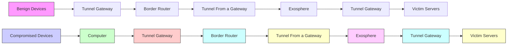
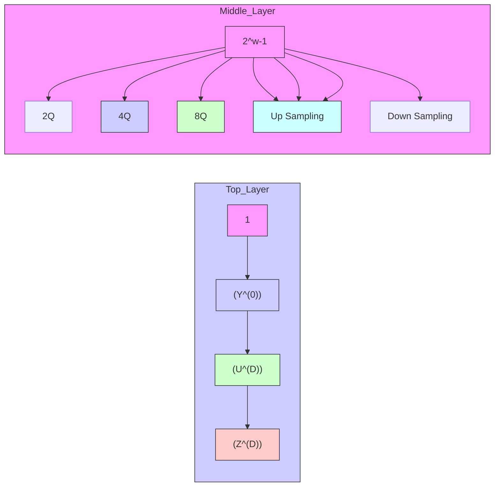
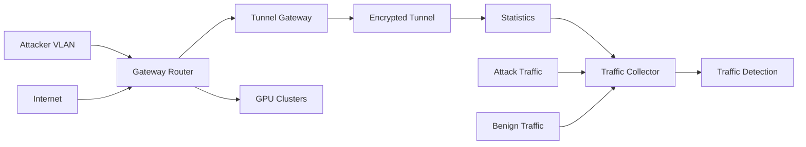

# Detecting Tunneled Flooding Traffic via Deep Semantic Analysis of Packet Length Patterns

Chuanpu Fu

Tsinghua University

Beijing, China

Qi Li

Tsinghua University

Zhongguancun Lab

Beijing, China

Meng Shen

Beijing Institute of

Technology

Beijing, China

Ke Xu∗

Tsinghua University

Zhongguancun Lab

Beijing, China

# ABSTRACT

Distributed denial-of-service (DDoS) protection services capture various flooding attacks by analyzing traffic features. However, existing services are unable to accurately detect tunneled attack traffic because the tunneling protocols encrypt both packet headers and payloads, which hide the traffic features used for detection, and can thus evade these detection services. In this paper, we develop Exosphere, which detects tunneled attack traffic by analyzing packet length patterns, without investigating any information in packets. Specifically, it utilizes a deep learning based method to analyze the semantics of packet patterns, i.e., the features represent the strong correlations between flooding packets with similar length patterns, and classify attack traffic according to these semantic features. We prove that the strong correlations of packet length patterns ensure the theoretical guarantee of applying semantic analysis to recognize correlated attack packets. We prototype Exosphere with FPGAs and deploy it in a real-world institutional network. The experimental results demonstrate that Exosphere achieves 0.967 F1 accuracy, while detecting flooding traffic generated by unseen attacks and misconfigurations. Moreover, it achieves 0.996 AUC accuracy on existing datasets including various stealthy attacks, and thus significantly outperforms the existing deep learning models. It achieves accuracy comparable to the best performances achieved by 12 state-of-the-art methods that cannot detect tunneled flooding traffic, while improving their efficiency by 6.19 times.

# CCS CONCEPTS

• Security and privacy → Network security.

# KEYWORDS

Network security; machine learning; malicious traffic detection

# ACM Reference Format:

Chuanpu Fu, Qi Li, Meng Shen, and Ke Xu. 2024. Detecting Tunneled Flooding Traffic via Deep Semantic Analysis of Packet Length Patterns . In Proceedings of the 2024 ACM SIGSAC Conference on Computer and Communications Security (CCS ’24), October 14–18, 2024, Salt Lake City, UT, USA. ACM, New York, NY, USA, 15 pages. https://doi.org/10.1145/3658644.3670353

# 1 INTRODUCTION

Distributed denial-of-service (DDoS) attacks generating volumetric traffic towards critical infrastructures are still a vital threat to the Internet [29, 56, 62, 90]. To mitigate such threat, commercialized DDoS prevention services have been developed to detect flooding traffic according to features extracted from packets [1, 17, 23, 89]. Particularly, different commercial service providers, e.g., Cloudflare [23], Cisco [17], and Akamai [1], utilize machine learning (ML) models to recognize traffic features of stealthy flooding attacks targeting vulnerable Internet applications [58, 63, 91]. The market of such traffic detection services is valued at 3.64 billion USD with a fast growth of 14.04% per year [77].

However, existing traffic detection methods are unable to identify flooding traffic delivered through tunnels. Since tunneling protocols [45–48], which are widely adopted on the Internet [88, 103], encrypt all bytes of packet headers and payloads that are used to extract traffic features [14, 34, 35, 75, 128] for detection. Due to the absence of discernible traffic features, existing detection methods are unable to recognize attack traffic encapsulated in the tunnels. In particular, these tunnels deliver both benign and attack packets [46– 48, 103], which requires detecting attacks according to fine-grained classification of each packet, invalidating traditional coarse-grained flow- and host-level detection [8, 33, 68, 100, 125].

In this paper, we set out to develop a traffic detection service that allows users to enable detecting tunneled attack traffic [47, 48, 88, 103], particularly stealthy flooding traffic [58, 71, 76], based solely on packet length patterns, without requiring any traffic features that are encrypted in the tunnels. Therefore, our method significantly differs from all existing methods that heavily rely on plain-text headers [33, 75, 128] and payloads [52, 81] that are used to extract various traffic features.

We note that massive packets generated by stealthy flooding behaviors on the Internet normally are with similar length patterns [40, 56, 62]. For example, botnet owners instruct compromised machines to frequently generate particular packet sequences that can effectively deplete Internet resources [58, 64, 66, 71, 91]. Thus, we can still perform correlation analysis on packet length patterns to recognize massive correlated packets within a small time window as flooding traffic, even if we cannot extract traditional traffic features [33, 34, 44, 75].

We model the distribution of Internet packet patterns to prove that flooding traffic exhibits significant correlations measured by entropy, variance, and range, which demonstrates the feasibility of classifying packets generated by flooding behaviors according to correlated packet length patterns. In addition, we prove that length patterns of flooding traffic significantly deviate from benign patterns by large margins measured by KL-divergence and $l _ { 1 }$ -norm, which provides guarantees of detecting tunneled flooding traffic via packet length pattern analysis.

Table 1: The comparison with the existing methods of attack traffic detection. 

<table><tr><td rowspan="2">Category</td><td rowspan="2">Method</td><td rowspan="2">ML Model</td><td rowspan="2">Detection Granularity</td><td rowspan="2">Required Headers</td><td rowspan="2">Traffic in Tunnels</td><td colspan="3">Detection Ability $^2$ </td><td colspan="3">Runtime Performance</td></tr><tr><td>Generic</td><td>Robust</td><td>Zero-Shot</td><td>Hardware</td><td>Realtime</td><td>Efficient</td></tr><tr><td rowspan="4">Fixed Rules</td><td>Poseidon [125]</td><td>w/o</td><td>Host</td><td>L3, L4 $^1$ </td><td>×</td><td>×</td><td>×</td><td>×</td><td>√</td><td>√</td><td>√</td></tr><tr><td>RADAR [127]</td><td>w/o</td><td>Flow</td><td>L3, L4</td><td>×</td><td>×</td><td>×</td><td>×</td><td>√</td><td>×</td><td>√</td></tr><tr><td>Jaqen [68]</td><td>w/o</td><td>Flow</td><td>L3, L4</td><td>×</td><td>×</td><td>×</td><td>×</td><td>√</td><td>√</td><td>√</td></tr><tr><td>Ripple [119]</td><td>w/o</td><td>Flow</td><td>L3, L4</td><td>×</td><td>√</td><td>×</td><td>×</td><td>√</td><td>√</td><td>√</td></tr><tr><td rowspan="10">Machine Learning</td><td>nPrintML [44]</td><td>AutoML</td><td>Packet</td><td>L2 ~ L5</td><td>×</td><td>√</td><td>×</td><td>×</td><td>√</td><td>×</td><td>×</td></tr><tr><td>Kitsune [75]</td><td>Encoder</td><td>Packet</td><td>L2 ~ L4</td><td>×</td><td>√</td><td>×</td><td>√</td><td>×</td><td>×</td><td>×</td></tr><tr><td>Whisper [33]</td><td>K-Means</td><td>Host</td><td>L3</td><td>×</td><td>√</td><td>√</td><td>√</td><td>×</td><td>√</td><td>√</td></tr><tr><td>FAE [35]</td><td>Encoder</td><td>Flow</td><td>L3</td><td>×</td><td>×</td><td>√</td><td>√</td><td>×</td><td>×</td><td>×</td></tr><tr><td>FlowLens [8]</td><td>Forest</td><td>Flow</td><td>L3, L4</td><td>×</td><td>√</td><td>×</td><td>×</td><td>√</td><td>×</td><td>√</td></tr><tr><td>NetBeacon [128]</td><td>Tree</td><td>Flow</td><td>L3, L4</td><td>×</td><td>×</td><td>×</td><td>×</td><td>√</td><td>√</td><td>√</td></tr><tr><td>Taurus [100]</td><td>DNN</td><td>Host</td><td>L3, L4</td><td>×</td><td>×</td><td>×</td><td>×</td><td>√</td><td>√</td><td>√</td></tr><tr><td>N3IC [96]</td><td>BNN</td><td>Flow</td><td>L3, L4</td><td>×</td><td>√</td><td>×</td><td>×</td><td>√</td><td>√</td><td>√</td></tr><tr><td>HyperVision [34]</td><td>Graph</td><td>Flow</td><td>L3, L4</td><td>×</td><td>√</td><td>√</td><td>√</td><td>×</td><td>√</td><td>√</td></tr><tr><td>Exosphere</td><td>CNN</td><td>Packet</td><td>-</td><td>√</td><td>√</td><td>√</td><td>√</td><td>√</td><td>√</td><td>√</td></tr></table>

1 According to the Internet model, L2 ∼ L5 refer to requiring headers fields of link layer, network layer, transport layer, and application layer, respectively.   
2 Generic, robust, and zero-shot detection refer to the capability of detecting various stealthy attacks [29, 56, 58, 62, 70], evasion attacks [33], and unseen attacks [75].

To this end, we develop Exosphere that utilizes deep learning (DL) based semantic analysis [13, 69, 126] to recognize correlated length patterns associated with flooding packets. In particular, it treats Internet traffic as an infinite sequence of packet lengths, and utilizes convolutional neuron networks (CNNs) to represent correlations between consecutive packets as semantic features [7, 13, 61]. Such semantic features can differentiate strongly correlated similar packets generated by flooding behaviors, which allows Exosphere to detect various stealthy flooding attacks by recognizing associated flooding behaviors [40, 58, 91]. Moreover, Exosphere avoids computation-intensive packet header analysis [8, 96, 125] by measuring packet length patterns on optical network devices [110, 113], ensuring significant improvements on detection efficiency over the existing methods [33, 34, 75].

However, it is non-trivial to capture flooding traffic by analyzing complicated length patterns exhibited by Internet packets of various services because simply length pattern analysis incurs false negatives and false positives [2, 36]. To ensure the detection robustness, we develop a feature embedding method that utilizes the time-scale distribution associated with the length patterns to effectively correlate packets, which can effectively prevent existing evasion attacks that inject perturbations to the length patterns by inserting benign packets [33, 35]. Moreover, we design a deep neural network (DNN) based semantic analysis model built upon symmetrically arranged convolutional layers. It gradually extracts semantic features to represent the correlations between packets, and afterward propagates the semantic features to accurately classify all packets involved in the correlation analysis.

We prototype built upon FPGAs [112, 115, 118] and compare it with a software implementation on a testbed with Intel DPDK [49]. In particular, we deploy Exosphere  in an institutional network and measure the performance. We observe that Exosphere achieves an accuracy of 0.967 F1-score, when detecting flooding traffic generated by 12 attacks and a real misconfiguration event. To complement

the real-world experiments, we also replay existing datasets over various tunnels [45, 47]. Such datasets cover 120 different attacks that are conducted by various botnets [62] targeting varieties of Internet services [56], and include a broad spectrum of stealthy attacks, e.g., link flooding attacks [58], pulsing attacks [66, 71] and amplification attacks [78, 91]. Our results demonstrate that Exosphere realizes 0.968 F1-score, and outperforms existing semantic analysis models [13, 69, 126]. Meanwhile, it achieves comparable accuracy to 12 state-of-the-art methods [8, 44, 75, 96] that cannot capture tunneled attack traffic, while improving their throughput by 6.19 times, i.e., processing 170.45 million packets/s with the latency bounded by 120 us. Additionally, it is robust against adversarial traffic constructed by existing evasion attacks [33].

In summary, the contributions of this paper are four-fold:

• We propose Exosphere, the first detection system to capture tunneled attack traffic by only analyzing correlations of packet length patterns with DL based semantic analysis.   
• We prove that packet length patterns associated with flooding attacks exhibit strong correlations.   
• We develop a feature embedding method that effectively correlates length patterns by utilizing time information and design a deep learning based semantic model to identify the strong correlations between attack packets.   
• We prototype Exosphere with hardware and conduct realworld deployment to validate its accuracy and efficiency.

Note that, Exosphere is not designed to replace the existing methods. Instead, it aims to achieve the design goals of traditional detection methods, e.g., comparable detection accuracy, without processing any bytes in plain-text packets, which allows users to detect attack traffic without investigating their private data.

The rest of the paper is organized as follows: Section 2 presents the threat model. In Section 3, we describe the motivation and conduct theoretical analysis. In Section 4, we present the design of Exosphere. In Section 5, we experimentally evaluate Exosphere. In Section 6, we discuss its limitations. Section 7 reviews related works, and Section 8 concludes this paper.

Ethical Issues. Exosphere does not rely on personal data contained in Internet packets for training and validating ML models, and thus avoids privacy issues in real-world evaluation. In strict adherence to the encryption standards of tunneling protocols [45, 47], every byte of packets from real users is encrypted. That is, we only analyze packet length patterns without storing plain-text personal data. Additionally, traffic mirroring and firewalls are configured to prevent attack traffic from interfering with real users (see Section 5.1). Besides, all users and administrators consent to our experiments and the release of traffic datasets.


<details>
<summary>flowchart</summary>


</details>

Figure 1: Threat model of Exosphere traffic detection system.

# 2 THREAT MODEL AND DESIGN GOALS

# 2.1 Threat Model

Network Topology. Figure 1 illustrates the threat model. We assume that victim servers hosting critical services should be accessed through a tunnel gateway, e.g., a hardware device [122] or a virtual one created by a cloud service [4, 73]. To access the servers, a subnet can establish a tunnel to the victim’s network via another tunnel gateway. Similarly, user devices can establish tunnels to the victim’s gateway using client software [48, 121]. Note that, the tunnels encrypt original packets via symmetric encryption algorithms (e.g., AES-GCM) and encapsulate the encrypted headers and payloads into new packets [45, 47], thereby delivering data through the Internet and prevent traffic analysis attacks [25, 93, 95, 124].

Abilities of Attackers. We assume that attackers can instruct compromised devices outside the victim network to generate volumetric flooding traffic targeting the victims. That is, the tunnel gateways located outside the victim network encrypt the traffic and transmit it through the tunnels. Afterward, the tunnel gateway within the victim network will correctly decrypt the attack traffic and forward it to the victim servers. In addition, attackers may send the traffic through the tunnels established at the compromised devices [48], which can be identified from routing tables on the devices [121]. As a result, existing detection systems, which are commonly deployed at borders of clouds [21, 74] and ISPs [33, 68], cannot analyze packet headers to identify the attack traffic, since the traffic is encrypted at tunnel gateways or end hosts. In Section 6, we validated that real-world detection services [21, 74] cannot filter traffic delivered by commercial tunneling services [22, 73].

In addition, we assume that attackers may control varying scales of devices resulting in highly variable attack speeds [56]. Note that, we consider advanced attack vectors of stealthy attacks, such as link flooding attacks (LFA) [58, 119] and pulsing attacks [66, 71]. Moreover, we also consider evasion strategies [33, 35] that circumvent detection systems [75, 128].

Abilities of Exosphere. Exosphere can be deployed at the same locations as existing traffic detection services, such as those inspecting incoming traffic at border routers of ISPs and clouds [5, 19, 74, 84]. Also, it can be deployed in traffic scrubbing centers [1, 17]. In the presence of tunneling protocols, Exosphere can only measure


<details>
<summary>line</summary>

| Time [s] | Length [10^5 Bytes] |
| -------- | ------------------- |
| 0        | 3.0                 |
| 5        | 3.0                 |
| 10       | 3.0                 |
| 15       | 3.0                 |
| 20       | 3.0                 |
| 25       | 3.0                 |
| 30       | 3.0                 |
| 35       | 1.5                 |
| 40       | 1.5                 |
</details>

(a) TCP SYN flooding.


<details>
<summary>line</summary>

| Time [s] | Benign Length [10^6 Bytes] | Attack Length [10^6 Bytes] |
| -------- | -------------------------- | -------------------------- |
| 25       | ~3.0                       | ~1.5                       |
| 30       | ~3.0                       | ~1.5                       |
| 35       | ~3.0                       | ~1.5                       |
| 40       | ~3.0                       | ~1.5                       |
| 45       | ~3.0                       | ~1.5                       |
| 50       | ~3.0                       | ~1.5                       |
| 55       | ~3.0                       | ~1.5                       |
</details>

(b) Low-rate TCP DoS.


<details>
<summary>line</summary>

| Time [s] | Benign | Attack |
| -------- | ------ | ------ |
| 20       | 3.0    | 3.0    |
| 25       | 3.0    | 3.0    |
| 30       | 3.0    | 3.0    |
| 35       | 3.0    | 3.0    |
| 40       | 3.0    | 3.0    |
| 45       | 3.0    | 3.0    |
| 50       | 3.0    | 3.0    |
</details>

(c) Pulsing Attacks.


<details>
<summary>line</summary>

| Time [s] | Length [10^6 Bytes] |
| -------- | ------------------- |
| 0        | 3.0                 |
| 5        | 2.5                 |
| 10       | 2.0                 |
| 15       | 1.8                 |
| 20       | 2.2                 |
| 25       | 2.7                 |
| 30       | 2.9                 |
| 35       | 2.6                 |
| 40       | 2.8                 |
</details>

(d) SSH Renegotiation.


<details>
<summary>line</summary>

| Time [s] | Length [10^6 Bytes] |
| -------- | ------------------- |
| 0        | 3.0                 |
| 5        | 3.0                 |
| 10       | 3.0                 |
| 15       | 3.0                 |
| 20       | 3.0                 |
| 25       | 3.0                 |
| 30       | 3.0                 |
</details>

(e) Amplification attack.


<details>
<summary>line</summary>

| Time [s] | Benign Length [10^6 Bytes] | Attack Length [10^6 Bytes] |
| -------- | -------------------------- | -------------------------- |
| 0        | 3.0                        | 3.0                        |
| 5        | 3.0                        | 3.0                        |
| 10       | 3.0                        | 3.0                        |
| 15       | 3.0                        | 3.0                        |
| 20       | 3.0                        | 3.0                        |
| 25       | 3.0                        | 3.0                        |
</details>

(f) Crossfire LFA.

Figure 2: Packet length patterns of attack and benign traffic.   


<details>
<summary>line</summary>

| Packet Length [×100B] | Probability Density |
| --------------------- | --------------------- |
| 0                     | 0.8                   |
| 5                     | 0.4                   |
| 10                    | 0.2                   |
| 15                    | 0.1                   |
| 20                    | 0.05                  |
| 25                    | 0.0                   |
</details>

(a) Packet length.


<details>
<summary>area</summary>

| Arrival Interval [us] | Attack Probability Density | Benign Probability Density |
| --------------------- | --------------------------- | --------------------------- |
| 0                     | 0.6                         | 0.3                         |
| 5                     | 0.4                         | 0.3                         |
| 10                    | 0.2                         | 0.1                         |
| 15                    | 0.1                         | 0.0                         |
| 20                    | 0.0                         | 0.0                         |
</details>

(b) Arrival interval.


<details>
<summary>scatter</summary>

| TSNE Visualized Feature Space | Category |
| ----------------------------- | -------- |
| -60                           | Benign   |
| -40                           | Benign   |
| -20                           | Benign   |
| 0                             | Attack   |
| 20                            | Attack   |
| 40                            | Attack   |
| 60                            | Attack   |
</details>

(c) Joint distribution.   
Figure 3: Packet length pattern distribution analysis.

packet length patterns to recognize flooding behaviors, which is different from existing length feature based detection that requires information other than packet lengths [8]. Upon detecting flooding traffic, it raises alerts to notify the victim, and throttles the traffic by cooperating with existing defense systems [119, 125], e.g., to limit total bandwidths of abnormal traffic [68, 125].

# 2.2 Design Goals

Exosphere aims to detect flooding traffic in the tunnels, in response to the trend where around 70% malware campaigns use tunnels to hide malicious activities, including approximately 54% of these involving traffic flooding [34]. Note that, existing detection methods cannot detect tunneled traffic due to the reliance on plain-text packet headers, whereas tunneling protocols obscure the packet headers by encryption. As a result, existing commercial DDoS prevention services cannot effectively filer traffic in the tunnels. Meanwhile, we aim to retain the design goals of traditional methods, which are compared in Table 1: (i) Generic detection against various stealthy attacks [11, 58], regardless of their speeds, durations, and protocols [45, 47, 72]; (ii) Robust detection against evasion attacks that manipulate traffic patterns [33, 35]; (iii) Zero-shot detection against unseen attacks [65, 101]; and (iv) Low-latency detection for high-speed traffic. Moreover, Exosphere aims to detect sophisticated flooding attacks (e.g., the Crossfire attack [58]) that generate lowrate stealthy traffic [3] and do not generate sheer traffic [119], which is different from the traditional volumetric flooding [68, 127, 128]. These goals cannot be easily achieved by existing methods.

# 3 MOTIVATION

# 3.1 Key Observation

We observe that packet sequences generated by flooding behaviors on the Internet commonly exhibit similar and periodical length patterns. Specifically, Figure 2 depicts length patterns of evenly sampled flooding traffic and benign traffic from six real-world datasets [34]. Compared with benign traffic collected at border routers connecting peers of an autonomous system (AS) [109], these attack packets exhibit regular length patterns and are densely distributed on the time scale. For instance, botnet owners instruct infected machines to frequently send particular packet sequences [41, 56], e.g., TCP SYN [11], SSH renegotiation [53], and regular UDP bursts [71], because sending such sequences at high speeds can effectively consume resources [62]. As a result, massive flooding packets are significantly correlated by their similar length patterns and are located in small time ranges (see Figure 3(a) and 3(b), respectively). Therefore, even if we cannot extract traditional traffic features from packets due to the encryption, we can still classify flooding traffic as correlated packet sequences, i.e., those with similar length patterns and appearing within a small time window.

# 3.2 Theoretical Analysis

We validate these empirical observations via theoretical analysis. Specifically, we model the distribution of Internet packet patterns to prove that flooding traffic exhibits significant correlations, which serves as the theoretical guarantee of correlation analysis based detection for flooding traffic in the encrypted tunnels.

Packet Length Distribution Model. We investigate the distributions of Internet packet lengths. First, we model packet lengths of Internet traffic using a bimodal distribution based on empirical studies. In Figure 4(a) and Figure 4(b), we plot packet features collected from Wide Area Network (WAN) traffic datasets [109]. We find that packet lengths are centrally distributed, a pattern similar to traffic in an enterprise network [128] (see Figure 4(c) and Figure 4(d)), because transmission protocols improve throughput by using long packets filled with data, in contrast, their control messages are designed to be short (e.g., TCP RST). Therefore, we denote lengths of ?? packets as $\vec { s } = \left[ s _ { 1 } , \ldots , s _ { N } \right]$ , and use the superposition of two normal distributions to model the bimodal distribution, i.e., $\forall 1 \leq i \leq N , s _ { i } = \xi _ { i } n _ { 1 } + ( 1 - \xi _ { i } ) n _ { 2 }$ , where $\xi _ { i } \sim B ( 1 , p ) ~ ( q = 1 - p )$ , $n _ { 1 } \sim { \cal N } ( \mu _ { 1 } , \sigma _ { 1 } )$ , and $n _ { 2 } \sim { \cal N } ( \mu _ { 2 } , \sigma _ { 2 } )$ . In addition, we assume that the lengths are independent and normalized, $\mathrm { i . e . , ~ } - \mu _ { 1 } = \mu _ { 2 } = \mu$ $\left( \mu _ { 2 } > 0 \right)$ . Notably, the skewness of the distribution is low, which implies $\sigma _ { 1 } \approx \sigma _ { 2 }$ . Besides, Figure 4(a) illustrates that the presence of flooding traffic results in an increased $\mathcal { P } \cdot$ Additionally, we model the arrival intervals using exponential distributions, which is similar to existing studies [34, 64]. Formally, let $\vec { l } = [ l _ { 1 } , \ldots , l _ { N } ]$ denote the arrival intervals, where $\forall 1 \leq i \leq N , l _ { i } \sim E ( \lambda )$ . Figure 4(b) shows that ?? increases when attackers generate flooding traffic which leads to a decreased average interval $( \mathrm { i . e . , E } [ l _ { i } ] = 1 / \lambda )$ .

Packet Length Pattern Analysis. We prove that the presence of flooding traffic, as indicated by changes in the parameters $( \mathrm { i . e . , } p$ and ??), results in significant deviation in correlation measured by three metrics: (i) range, (ii) entropy, and (iii) variance. Moreover, we analyze distances between the attack and benign traffic patterns measured by KL-divergence and ??1-norm. In summary, we derive the following theorems. The complete proofs are available in the extended version of this paper [32].

Theorem 3.1. (Range Features of Packet Lengths.) Let ??(®??) denote the range between maximum and minimum packet lengths. The expectation of the range is:


<details>
<summary>line</summary>

| Packet Length [× 100 Bytes] | w/ Flooding | w/o Flooding |
| --------------------------- | ----------- | ------------ |
| 0                           | 0.09        | 0.08         |
| 5                           | 0.02        | 0.03         |
| 10                          | 0.01        | 0.02         |
| 15                          | 0.12        | 0.13         |
</details>

(a) Length distribution (WAN).


<details>
<summary>line</summary>

| Arrival Interval [us] | w/ Flooding Traffic | w/o Flooding Traffic |
| --------------------- | ------------------- | -------------------- |
| 0                     | 0.15                | 0.08                 |
| 5                     | 0.12                | 0.13                 |
| 10                    | 0.05                | 0.06                 |
| 15                    | 0.01                | 0.01                 |
| 20                    | 0.00                | 0.00                 |
| 25                    | 0.00                | 0.00                 |
</details>

(b) Time-scale distribution (WAN).


<details>
<summary>line</summary>

| Packet Length (× 100 Bytes) | w/ Flooding | w/o Flooding |
| --------------------------- | ----------- | ------------ |
| 0                           | 0.13        | 0.08         |
| 5                           | 0.02        | 0.01         |
| 10                          | 0.01        | 0.01         |
| 15                          | 0.10        | 0.13         |
</details>

(c) Length distribution (Enterprise).


<details>
<summary>area</summary>

| Arrival Interval [us] | w/ Flooding Traffic | w/o Flooding Traffic |
| --------------------- | ------------------- | -------------------- |
| 0                     | 0.30                | 0.20                 |
| 5                     | 0.15                | 0.25                 |
| 10                    | 0.05                | 0.10                 |
| 15                    | 0.01                | 0.05                 |
| 20                    | 0.00                | 0.01                 |
| 25                    | 0.00                | 0.00                 |
</details>

(d) Time-scale distribution (Enterprise).   
Figure 4: Comparison of packet feature distributions.

$$
\mathrm{E} [ R (\vec {s}) ] = \frac {N}{\sqrt {2 \pi}} [ q \sigma_ {2} - p \sigma_ {1} ] + \frac {C N \mu}{\sqrt {\pi}}, \tag {1}
$$

where the constant $\begin{array} { r } { C = \int _ { 0 } ^ { + \infty } e ^ { - t ^ { 2 } } \mathrm { d } t \approx 0 . 8 8 6 2 . } \end{array}$ 0

We find that, in the presence of flooding traffic as indicated by increased ${ \boldsymbol { p } } ,$ the range of packet lengths decreases. Thus, attack packets exhibit similar length patterns that fall within small ranges. Moreover, we validate the conclusion using entropy and variance to characterize the correlation of packet length patterns.

Theorem 3.2. (Entropy of Packet Lengths.) The differential entropy of packet lengths is:

$$
\mathcal {H} [ \vec {s} ] = \frac {N}{2} (1 + \ln 2 \pi) + N \ln (\frac {\sigma_ {1}}{p}) ^ {p} (\frac {\sigma_ {2}}{q}) ^ {q}. \tag {2}
$$

Under the condition that $\sigma _ { 1 } = \sigma _ { 2 } , \mathcal { H } [ \vec { s } ]$ is a decreasing function of ??.

Theorem 3.3. (Variance of Packet Lengths.) Let V (®??) denote the variance of packet lengths. We can approach the variance by:

$$
\mathcal {V} [ \vec {s} ] = (- 4 \mu^ {2} p ^ {2} + p (4 \mu^ {2} - \sigma_ {1} ^ {2} + \sigma_ {2} ^ {2}) + \sigma_ {2} ^ {2}) \cdot N, \tag {3}
$$

when $\begin{array} { r } { p \ge \operatorname * { a r g m a x } _ { \mathfrak { p } } \mathcal { V } [ \vec { s } ] = \frac { \sigma _ { 1 } ^ { 2 } - \sigma _ { 2 } ^ { 2 } } { 8 \mu ^ { 2 } } + \frac { 1 } { 2 } . } \end{array}$ , it is a decreasing function.

Theorems 3.2 and 3.3 show that flooding attacks characterized by decreased ?? result in strong correlations, as evidenced by lower range, lower entropy, and lower variance. This indicates packets associated with flooding attacks are strongly correlated by their length patterns. Next, we analyze the distances between traffic length patterns.

Theorem 3.4. (KL-Divergence of Packet Length Features.) We use $\mathcal { D } _ { \mathrm { K L } } ( \mathcal { F } _ { 1 } | | \mathcal { F } _ { 2 } )$ to denote the KL-divergence between $\mathcal { F } _ { 1 }$ and ${ \mathcal { F } } _ { 2 } ,$ i.e., the packet length distributions with and without the interference of flooding traffic, respectively.

$$
\mathcal {D} _ {\mathrm{KL}} (\mathcal {F} _ {1} | | \mathcal {F} _ {2}) = \ln (\frac {p _ {1}}{p _ {2}}) ^ {p _ {1}} (\frac {1 - p _ {1}}{1 - p _ {2}}) ^ {(1 - p _ {2})}, \tag {4}
$$

where $\mathcal { P } 1$ and $\mathcal { P } 2$ are the parameters of the distributions. Note that, the divergence increases as the value of ??2 increases.


<details>
<summary>flowchart</summary>

```mermaid
graph TD
    A["1. Feature Extraction"] --> B["2. Feature Embedding"]
    B --> C["3. Semantic Segmentation"]

    subgraph_A["1. Feature Extraction"]
        D["Tunnel"] --> E["Packet Sequence"]
        E --> F["Length w/o Flooding Traffic"]
        F --> G["t1: t2: t3: t4: t5: ..."]
        G --> H["I. Normalize"]
        H --> I["Feature Matrix"]
        I --> J["II. Merge"]
        J --> K["III. Fragment"]
        K --> L["Single Dimension Embedding"]
        L --> M["Input Features"]
        M --> N["Convolution"]
        M --> O["Compression"]
        M --> P["Expansion"]
        N --> Q["Semicircular DNN Architecture"]
        O --> Q
        P --> Q
        Q --> R["Decisions"]
        R --> S["Benign Packets"]
        R --> T["Tunnel"]
        R --> U["Attack Packets"]
    end

    subgraph_B["2. Feature Embedding"]
        V["Benign: Attack: t1- t5: ..."]
        W["I. Normalize"]
        X["Feature Matrix"]
        Y["Single Dimension Embedding"]
        Z["Input Features"]
        AA["Convolution"]
        AB["Compression"]
        AC["Expansion"]
        AD["Down Sampling"]
        AE["Up Sampling"]
        AF["Concatenate"] --> AG["Concatenate"]
        AH["Semicircular DNN Architecture"]
    end

    subgraph_C["3. Semantic Segmentation"]
        AI["Benign Packets"] --> AJ["Tunnel"]
        AJ --> AK["Attack Packets"]
    end
```
</details>

Figure 5: High-level architecture of Exosphere.

Theorem 3.5. (??1-Norm Distance of Packet Lengths.) We derive a lower bound for the distance measured by ??1-norm:

$$
\mathcal {D} _ {l 1} \left(\mathcal {F} _ {1} | | \mathcal {F} _ {2}\right) = \mathrm{E} \left[ \left| \vec {s} _ {1} - \vec {s} _ {2} \right| \right] \geq 2 \mu N \cdot \left(p _ {2} - p _ {1}\right), \tag {5}
$$

where $\vec { s } _ { 1 }$ and $\vec { s } _ { 2 }$ are the length vectors associated with benign and attack traffic. The bound is an increasing function of ??2.

Theorems 3.4 and 3.5 demonstrate that the length distributions drift significantly in terms of the distances. In addition, higher rates of flooding traffic (indicated by higher $\hbar { } 2 )$ result in larger margins between the distributions, making high-rate attacks easier to be captured by correlation analysis.

In summary, these theorems ensure that the packets generated by flooding behaviors exhibit significantly correlated length patterns, which validates the empirical observations in Section 3.1. Particularly, we prove the monotonicity of the correlations (Theorems 3.1 ∼ 3.3) and margins between the distributions (Theorems 3.4 and 3.5), which imply linear decision boundaries can accurately classify flooding traffic according to the correlations between packets. In the extended paper [32], we derive similar conclusions when considering time information associated with the length patterns. In the following section, we utilize a DNN model to represent the correlations as semantic features and approach the high-dimensional decision boundaries to detect tunneled attack traffic.

# 4 DESIGN OF EXOSPHERE

# 4.1 High-Level Architecture

We develop deep learning based semantic analysis that represents strong correlations between flooding packets as semantic features [69, 130]. This enables accurate detection for tunneled flooding traffic, which achieves all the design goals. First, the semantic analysis model can recognize correlated packet length patterns that indicate various flooding behaviors of unseen flooding attacks [75, 101], thereby enabling generic detection. Second, we utilize time-scale distributions of the length patterns to improve detection robustness [6, 51, 97], which can prevent evasion attacks [35]. Besides, we measure packet lengths on hardware [110, 113], which avoids complex operations of extracting packet features [75, 128], and thus enables efficient detection. We design the three modules of Exosphere, which are shown in Figure 5.

Packet Feature Extraction. First, we view all Internet traffic targeting a victim network as an infinite sequence of packets, and represent each packet by its length. In particular, we measure packet lengths and associated time information on optical network devices to handle massive flooding traffic [110, 111, 113]. Note that, we do not require any elements in packet headers that are encrypted by tunneling protocols, which differs from existing detection. The details of this module are presented in Section 4.2.

Packet Feature Embedding. Second, we develop a three-step embedding method that utilizes time information associated with the length patterns to correlate packets. Specifically, we normalize extracted features, embed packet length patterns and associated time-scale information into a single dimension, and evenly fragment the produced vector. Note that, embedding the time-scale distributions of the length patterns improves robustness against evasion attacks [35]. We illustrate the details in Section 4.3.

Semicircular Semantic Segmentation. Finally, we segment the sequence into attack and benign packets based on semantic features extracted by our semicircular DNN model. Different from existing semantic models [13, 61, 126], our model features symmetric down and up sampling networks. Initially, it gradually expands the dimensions of the input vectors to extract semantic features. Subsequently, it compresses the dimensions to propagate the extracted semantic features to identify abnormal packets characterized by correlated length patterns. The design details can be found in Section 4.4.

# 4.2 Packet Feature Extraction

Exosphere views all traffic targeting a victim network as an infinite sequence of packets, irrespective of whether the traffic is conveyed through tunnels, to retain the ability of detecting non-tunneled traffic. In this module, we process a batch of ?? consecutively arrived packets at a time, such that each packet can contribute to correlation analysis for the classification of other packets. We represent packets as their lengths: $\vec { s } = [ s _ { 1 } , \ldots , s _ { N } ] ^ { \intercal }$ , and record associated arrival intervals: ${ \vec { l } } = [ 0 , l _ { 2 } , \ldots , l _ { N } ] ^ { \mathsf { T } }$ . The intervals are calculated based on arrival timestamps $\vec { t } = [ t _ { 1 } , \ldots , t _ { N } ] ^ { \mathsf { T } }$ , where $l _ { i } = t _ { i } - t _ { i - 1 }$ (?? ∈ Z ∩ [2, ?? ]). Finally, the packets are represented by ®?? and ??®.

Moreover, Exosphere measures packet length patterns on hardware to handle massive packets generated by flooding behaviors. Specifically, we implement this module on FPGAs with optical devices [113, 115, 118] by leveraging IP (Intellectual Property) cores from AMD. We utilize 10G Ethernet [110] (v3.1), Tri-Mode Ethernet MAC [114] (v9.0), and 1G/2.5G Ethernet PCS/PMA [111] (v16.2) to convert the optical signals of various transceivers (i.e., SFP, SFP+, and QSFP+, respectively) to AXI4 data stream. Afterward, we measure the packet lengths as durations of valid signals multiplied by widths of data signals according to AXI4-Stream protocols [111]. Unlike existing NICs [49], we do not buffer packets, which enables high-speed feature extraction.

Note that, our approach only processes packet length patterns without requiring any personal data in packets. In contrast, existing methods view Internet traffic as multiple concurrent flows [14, 34, 35, 96]. Consequently, to aggregate packets into flows, they inevitably rely on user identities that are concealed by tunnels, and thus are incompatible with tunneling protocols. On the other hand, length patterns are measured from hardware for efficient detection [49, 110]. In comparison, existing methods necessitate substantial resources to maintain and extract traffic features [8, 33, 128]. Besides, our approach only analyzes length patterns, which mitigates overfitting issues [51, 97] encountered in existing studies that rely on many complex flow features [14, 75]. By addressing the issues, Exosphere realizes generic traffic detection.

# 4.3 Packet Feature Embedding

Leveraging deep learning for semantic analysis on packet length patterns presents three challenges: First, the features collected from the hardware lack numerical stability, leading to issues of floatingpoint overflow; Second, semantic analysis should ensure robustness against evasion attacks, e.g., injecting perturbations to the length patterns [33, 35]; Third, it is difficult for existing DNN models to capture correlations of long sequences [61]. To address these challenges, we develop a three-step method to embed the extracted features by correlating packet length patterns via associated time-scale information for practical semantic analysis. First, we normalize the features to prevent numerical instability issues:

$$
\hat {s} _ {i} = \frac {\min (s _ {i} , M T U)}{M T U}, \quad \hat {l} _ {i} = \frac {\min (l _ {i} , T _ {\text { Max }})}{T _ {\text { Max }}}, \quad i \in \mathbb {Z} \cap [ 1, N ], \tag {6}
$$

where MTU is the maximum transmission unit, and $T _ { M a x }$ is a predefined maximum interval.

Second, we merge the length features and the associated timescale features into one dimension, and represent the time features by their negative values, making them differentiable to the lengths:

$$
v _ {i} = I (i) \cdot \hat {s} _ {\lceil i / 2 \rceil} - I (i) \cdot \hat {l} _ {\lceil i / 2 \rceil}, \quad i \in \mathbb {Z} \cap [ 1, 2 N ], \tag {7}
$$

where $I ( x ) = ( x + 1 ) { \bmod { 2 } } , ( x \in \mathbb { Z } )$ . In this way, we improve detection robustness by using time-scale information, which prevents evasion strategies that add perturbations to the length patterns, e.g., by inserting benign packets. Since we can still correlate the attack packets by small arrival intervals produced by high sending rates of flooding behaviors.

Finally, we divide ??® into fragments of size $2 ^ { W }$ , because it becomes challenging for DNN models to extract the semantic features of long sequences:

$$
x _ {i, j} = \left\{ \begin{array}{c c} v _ {h (i, j; W)}, & h (i, j; W) \leq 2 N, \quad h (i, j; W) = (i - 1) 2 ^ {W} + j \\ 0, & \text { else } \end{array} , \right. \tag {8}
$$

where $\langle j , i \rangle \in \mathbb { Z } ^ { 2 } \cap { [ 1 , 2 ^ { W } ] } \times { [ 1 , N _ { w } ] }$ , and $\begin{array} { r } { N _ { w } = \left\lceil \frac { 2 N } { 2 ^ { W } } \right\rceil } \end{array}$ is the number of fragments. Finally, $\mathbf { X } = [ \vec { x } _ { 1 } , \dots , \vec { x } _ { N _ { w } } ]$ is the input feature for DL based semantic analysis.

Figure 6 plots the embedded features of benign traffic from public traffic datasets collected from 10 Gb/s optical links [109]. Figure 7 depicts the features of attack traffic in existing datasets [34] (as depicted in Figure 2). Comparing the figures, we observed that length patterns of flooding packets exhibit strong correlations, as evidenced by regular blue and white points, which are obviously different from weakly correlated benign features represented by irregular red points. Thus, these embedded features can differentiate attack packets, which enables effective semantic segmentation.


<details>
<summary>heatmap</summary>

| Indices in Batch | 0 | 10 | 20 | 30 | 40 |
|---|---|---|---|---|---|
| 0 | Red | Blue | Red | Blue | Red |
| 10 | Red | Blue | Red | Blue | Blue |
| 20 | Red | Blue | Red | Blue | Blue |
| 30 | Red | Blue | Red | Blue | Blue |
| 40 | Red | Blue | Red | Blue | Blue |
The image contains a grid of color-coded cells (red for positive, blue for negative) representing the feature vectors at each index in the batch. The legend is not explicitly labeled but uses color coding to differentiate the two classes.
</details>

(a) MAWI January.


<details>
<summary>heatmap</summary>

| Indices in Batch | 0 | 10 | 20 | 30 | 40 |
|---|---|---|---|---|---|
| 0 | 0 | 0 | 0 | 0 | 0 |
| 10 | 0 | 0 | 0 | 0 | 0 |
| 20 | 0 | 0 | 0 | 0 | 0 |
| 30 | 0 | 0 | 0 | 0 | 0 |
| 40 | 0 | 0 | 0 | 0 | 0 |
</details>

(b) MAWI June.


<details>
<summary>heatmap</summary>

| Indices in Batch | 0    | 10   | 20   | 30   | 40   |
| ---------------- | ---- | ---- | ---- | ---- | ---- |
| Feature Vector    | 0    | 10   | 20   | 30   | 40   |
</details>

(c) MAWI April.

Figure 6: Embedded packet features of benign traffic.   


<details>
<summary>heatmap</summary>

| Indices in Batch | 0 | 10 | 20 | 30 | 40 |
|---|---|---|---|---|---|
| 0 | 0 | 0 | 0 | 0 | 0 |
| 1 | 0 | 0 | 0 | 0 | 0 |
| 2 | 0 | 0 | 0 | 0 | 0 |
| 3 | 0 | 0 | 0 | 0 | 0 |
| 4 | 0 | 0 | 0 | 0 | 0 |
| 5 | 0 | 0 | 0 | 0 | 0 |
| 6 | 0 | 0 | 0 | 0 | 0 |
| 7 | 0 | 0 | 0 | 0 | 0 |
| 8 | 0 | 0 | 0 | 0 | 0 |
| 9 | 0 | 0 | 0 | 0 | 0 |
| 10 | 0 | 0 | 0 | 0 | 0 |
| 11 | 0 | 0 | 0 | 0 | 0 |
| 12 | 0 | 0 | 0 | 0 | 0 |
| 13 | 0 | 0 | 0 | 0 | 0 |
| 14 | 0 | 0 | 0 | 0 | 0 |
| 15 | 0 | 0 | 0 | 0 | 0 |
| 16 | 0 | 0 | 0 | 0 | 0 |
| 17 | 0 | 0 | 0 | 0 | 0 |
| 18 | 0 | 0 | 0 | 0 | 0 |
| 19 | 0 | 0 | 0 | 0 | 0 |
| 20 | 0 | 0 | 0 | 0 | 0 |
| 21 | 0 | 0 | 0 | 0 | 0 |
| 22 | 0 | 0 | 0 | 0 | 0 |
| 23 | 0 | 0 | 0 | 0 | 0 |
| 24 | 0 | 0 | 0 | 0 | 0 |
| 25 | 0 | 0 | 0 | 0 | 0 |
| 26 | 0 | 0 | 0 | 0 | 0 |
| 27 | 0 | 0 | 0 | 0 | 0 |
| 28 | 0 | 0 | 0 | 0 | 0 |
| 29 | 0 | 0 | 0 | 0 | 0 |
| 30+ (repeated)   |     |     |     |     |     |
The image contains a heatmap with color intensity based on the Feature Vector value. The color values are not explicitly labeled in the code. The chart is a grid-based visualization with red and blue cells.
</details>

(a) TCP SYN flooding.


<details>
<summary>heatmap</summary>

| Index in Batch | Feature Vector |
| -------------- | -------------- |
| 0              | 0              |
| 10             | 10             |
| 20             | 20             |
| 30             | 30             |
| 40             | 40             |
</details>

(b) Amplification attack.


<details>
<summary>heatmap</summary>

| 0 | 10 | 20 | 30 | 40 |
|---|---|---|---|---|
| 0 | Red | Blue | Red | Blue |
| 10 | Red | Blue | Blue | Blue |
| 20 | Red | Blue | Red | Blue |
| 30 | Red | Blue | Red | Blue |
| 40 | Red | Blue | Red | Blue |
</details>

(c) Crossfire LFA.   
Figure 7: Embedded packet features of attack traffic.

# 4.4 Semicircular Semantic Segmentation

We develop a DNN model that extracts semantic features from the embedded packet features, and segments the packet sequence by classifying each packet according to the semantic features.

Semicircular Model Architecture. Our model contains two symmetric parts, namely, down sampling and up sampling networks, which is different from existing semantic analysis models for images [13, 61, 69]. Figure 8 illustrates the architecture. Specifically, each layer of the down sampling network compresses the width of features by a factor of two and doubles the length of features. In this way, it can effectively extract semantic features based on embedded packet features, which allows Exosphere to effectively represent the correlation between packets. Subsequently, the up sampling network employs an equal number of layers that double the width and reduce the length by a factor of two, which is converse to the down sampling network. This enables Exosphere to utilize the extracted correlations to capture flooding packets with similar patterns. Moreover, we concatenate the symmetrical features with identical sizes in down and up sampling networks, to effectively propagate semantic features that represent correlations of the length patterns, and to produce precise decisions. We individually illustrate the down sampling and up sampling networks, and finally introduce the training of the model.

Part I: Down Sampling Network. We employ 1D convolutional layers to extract semantic features based on embedded packet features. In particular, the layers do not change the width of features. This allows us to align the extracted features and concatenate the features with their symmetrical counterparts in the down sampling networks. Specifically, the layer cov1D(·) performs the equal-width convolution operation on a batch of features $\mathbf { X } _ { ( B \times U \times V ) }$ using kernel parameters W and B. The output is represented by $\mathbf { Y } _ { ( B \times P \times V ) } .$

$$
\mathbf {Y} = \left[ \mathbf {Y} _ {1}, \dots , \mathbf {Y} _ {B} \right] = \operatorname{cov1D} (\mathbf {X}; U, P, K, \mathbf {W} _ {(P \times U \times K)}, \mathbf {B} _ {(P \times K)}), \tag {9}
$$

where ?? and ?? are the length of input and output features, and ?? is the batch size. According to the convolution operation, the layer does not change the width ?? , when kernel size ?? = 3. Moreover, we leverage batch normalization, and stack the layers for the effectiveness of extracting semantic features:


<details>
<summary>flowchart</summary>


</details>

Figure 8: Architecture of the semicircular DNN model $\left( D = 3 \right)$ .

$$
\mathrm{Y} = \operatorname{Cov} (\mathrm{X}; U, P) = \operatorname{ReLU} \bigl (\mathrm{BN} \bigl (\operatorname{cov1D} (\mathrm{X}; U, P) \bigr) \bigr). \tag {10}
$$

$$
\mathbf {Y} = \operatorname{CovStack} (\mathbf {X}; U, P) = \operatorname{Cov} (\operatorname{Cov} (\mathbf {X}; U, P); P, P). \tag {11}
$$

Our down sampling network utilizes the stacked convolutional layer to expand the length of original input X from one to $2 ^ { Q }$ :

$$
\mathbf {Y} _ {(N _ {w} \times 2 ^ {Q} \times 2 ^ {W})} ^ {(0)} = \text { CovStack } (\mathbf {X} _ {(N _ {w} \times 1 \times 2 ^ {W})}; 1, 2 ^ {Q}) \tag {12}
$$

After that, it employs a series of max pooling layers to gradually reduce the width of $\mathbf { \dot { Y } } ^ { ( 0 ) }$ while increasing the length:

$$
\mathbf {Y} ^ {(i)} = \operatorname{CovStack} (\operatorname{MaxPool} \left(\mathbf {Y} ^ {(i - 1)}\right); 2 ^ {Q} \cdot 2 ^ {i}, 2 ^ {Q} \cdot 2 ^ {i + 1}), \tag {13}
$$

where $i \in \mathbb { Z } \cap [ 1 , D ]$ , and ?? controls the depth of the network. Note that, the max pooling layer extracts the maximum value within a window of size two and slides the window with a stride length of two, such that it compresses the width of features by a factor of two. Finally, $\mathbf { Y } ^ { ( D ) }$ is the output of the down sampling network.

Part II: Up Sampling Network. In contrast to the down sampling network, it reduces the length and gradually expands the width of features. Specifically, we utilize the up sampling layer UpSamp(·) that doubles the width of features by duplicating each element and placing the element adjacently.

$$
\mathbf {U} ^ {(i)} = \operatorname{Cov} (\operatorname{UpSamp} (\mathbf {Z} ^ {(i - 1)}); 2 ^ {Q} \cdot 2 ^ {D - i + 1}, 2 ^ {Q} \cdot 2 ^ {D - i}), \tag {14}
$$

$$
\mathbf {Z} ^ {(i)} = \operatorname{CovStack} (\operatorname{Cat} (\mathbf {Y} ^ {(D - i)}; \mathbf {U} ^ {(i)}); 2 ^ {Q} \cdot 2 ^ {D - i + 1}, 2 ^ {Q} \cdot 2 ^ {D - i}), \tag {15}
$$

where ${ \bf Z } ^ { ( 0 ) } = { \bf Y } ^ { ( { D } ) }$ , and $i \in \mathbb { Z } \cap [ 1 , D ]$ . Note that, $\operatorname { C a t } ( \cdot , \cdot )$ concatenates two features. This allows us to feed the previously extracted semantic features to the up sampling networks. Thus, our model can effectively convey correlations between packets to classify the packets. In the last layer, we flatten the feature:

$$
\mathbf {O} _ {(N _ {w} \times 2 W)} = \operatorname{Cov} (\mathbf {Z} ^ {(D)}; 2 ^ {Q}, 1), \quad d _ {i} = \mathbf {O} _ {\left[ \frac {2 \times i}{2 W} \right], (2 \times i) \bmod 2 W}, \tag {16}
$$

where $d _ { i }$ is the decision for ??-th packet. Finally, we compare the values in $\vec { d } = [ d _ { 1 } , \ldots , d _ { N } ]$ with a threshold $\phi$ to judge if a packet delivers attack traffic.

Training the Semicircular Network. To train the semantic segmentation model, we transform the labels into matrix representation ${ \bf L } = \left[ { \bf L } _ { i , j } \right] _ { N _ { w } \times 2 ^ { W } } :$

$$
\mathbf {L} _ {i, j} = \left\{ \begin{array}{c c} \vec {L} \left[ \frac {h (i , j ; W)}{2} \right] \cdot I (h (i, j; W)), & h (i, j; W) \leq 2 N \\ 0, & \text { else } \end{array} , \right. \tag {17}
$$

where the ??-th value in $\vec { L }$ is the label of ??-th packet. Moreover, we use the Sigmoid function to activate the output feature. The result is represented by A:

$$
\mathbf {A} = \left[ \mathbf {A} _ {i, j} \right] _ {N _ {w} \times W} = \text { Sigmoid } (\mathbf {O}), \quad \mathbf {A} _ {i, j} = \frac {1}{1 + e ^ {- \mathbf {O} _ {i , j}}}. \tag {18}
$$

After that, we calculate the training loss by using the Binary Cross-Entropy (BCE) and the Dice loss [130]:

$$
\left\{ \begin{array}{l l} \mathcal {L} _ {\mathrm{BCE}} (\mathbf {A}, \mathbf {L}) & = | | - \mathbf {L} \circ \ln \mathbf {A} + (1 - \mathbf {L}) \circ \ln (1 - \mathbf {A}) | | _ {1}, \\ \mathcal {L} _ {\text {Dice}} (\mathbf {A}, \mathbf {L}) & = 1 - \frac {\sum_ {i , j} [ \mathbf {A} _ {i , j} ] \circ [ \mathbf {L} _ {i , j} ]}{\sum_ {i , j} [ \mathbf {A} _ {i , j} ] + \sum_ {i , j} [ \mathbf {L} _ {i , j} ]}, \\ \mathcal {L} (\mathbf {A}, \mathbf {L}) & = \frac {1}{2} \mathcal {L} _ {\mathrm{BCE}} (\mathbf {A}, \mathbf {L}) + \frac {1}{2} \mathcal {L} _ {\text {Dice}} (\mathbf {A}, \mathbf {L}), \end{array} \right. \tag {19}
$$

where the sign ◦ denotes the Hadamard product. Notably, we use the Dice loss to tackle class imbalance issues [38, 130]. Finally, we back propagate the loss and leverage the Adam optimizer to update all trainable parameters.

# 5 EXPERIMENTS

We prototype Exosphere and conduct a real-world deployment. Moreover, we compare its accuracy with 12 existing systems on existing datasets including 120 different attacks. In general, the experiments will demonstrate that Exosphere is able to:

(1) identify real flooding attacks during a three-day deployment in an institutional network (Section 5.2).   
(2) detect various stealthy attacks, whereby outperforming existing models as well as baselines for ablation studies (Section 5.3).   
(3) realize robust detection against adversarial examples generated by evasion attacks (Section 5.4).   
(4) achieve zero-shot detection ability to capture unseen patterns of flooding traffic (Section 5.5).   
(5) process high-speed traffic with low latency on various hardware platforms (Section 5.6).

# 5.1 Experiment Setup

Implementation. We develop both software and hardware prototypes of Exosphere. The software prototype, which can reuse existing devices, is implemented with over 2,000 lines of code, and compiled by GCC v9.4.0, Ninja v1.10.0, and CMake v3.16.3. We use Intel DPDK v19.11.9 [49] to implement the packet feature extraction and embedding module. Meanwhile, we use PyTorch [86] (v1.11.0 for CUDA v11.3 [82]) to implement the semantic analysis module. The hardware prototype, which can be programmed on FPGAs, is implemented by over 12,000 lines of Verilog and synthesized by Vivado 2022.2 [117]. And the driver is developed with Vitis 2022.2 [116]. To replay traffic datasets, we establish various tunnels by using various tunneling protocols. By default, IPSec tunnels [47] are established using Libreswan (v3.29) with AES-GCM. Meanwhile, we also use many other configurations and create IEEE 802.1AE L2 tunnels (i.e., MACsec [45]) by enabling its Linux kernel implementation.

Testbed. We deploy the software prototype on a server with an Intel Xeon E2699 v4 CPU, 24GB DDR4 memory, Intel 82599SE NIC (2 × 10Gb/s SFP+ ports), and Ubuntu v20.04.2 (Linux v5.15.0). The DNN model is trained and executed on a Tesla V100 GPU (driver v470.103.01). To replay traffic datasets, we use fiber-optic cables and optical transceivers (produced by Intel) to connect the server with machines for traffic generation. In addition, we deploy the hardware prototype on three off-the-shelf AMD Xilinx FPGAs with varying scales of resources, i.e., Zynq-7000 [118], Kintex-7 [112], and Virtex-7 [115] (hosted on NetFPGA SUME [113]), which are equipped with SFP, SFP+, and QSFP+ optical transceivers, respectively.


<details>
<summary>flowchart</summary>


</details>

Figure 9: Network topology of real-world deployment.

Deployment. Figure 9 shows the network topology of real-world deployment. We configure a router of an institutional network to mirror the traffic targeting a subnet to a testbed. Such subnet hosts GPU clusters with around 40 active users. Meanwhile, a red team comprising two network security experts, each with four years of experience, constructs various flooding attacks in a separate subnet (see Table 2). Afterward, the router forwards the generated traffic to the testbed, where benign user traffic and flooding traffic are mixed and transmitted through an IPSec tunnel with AES-GCM cipher-suit. Eventually, the traffic is collected by another device controlled by administrators. The packets are labeled according to whether they come from the subnet controlled by the attackers. Finally, we derive the length of each packet and the associated label. Datasets. To complement the real-world scenarios, we replay existing traffic datasets over various tunnels, including 120 attacks: (i) HyperVision datasets [34] contain traffic from real users collected on 10 Gb/s optical links [109] and various stealthy flooding attacks, e.g., application specified attacks (e.g., OpenSSH [53]), link flooding attacks (LFAs) [58], and flooding attacks with varying packet rates [56]. (ii) CIC datasets [15, 16] are collected in enterprise networks and widely used for evaluating traffic detection [8, 128]. (iii) Whisper datasets [35] cover reconnaissance steps of flooding attacks and advanced attacks, such as low-rate TCP DoS attacks [64, 71]. (iii) Kitsune datasets [75] contain attack traffic targeting IoT devices [102]. (iv) NetBeacon datasets [128] are collected in a private cloud. Similar to existing studies, we split 80% traffic from the datasets for training [44, 94, 128, 131]. Additionally, we construct 48 evasion attack datasets according to a recent study [33] for robustness analysis (see Section 5.4 for details).

Baselines. We compare Exosphere with 12 existing systems, covering both fixed rule and ML based methods. Unlike our methods, the methods cannot capture attack traffic in the presence of tunneling protocols, which require plain-text packet contents to extract flow features [8, 14, 33, 68, 96, 100, 128], packet features [44, 75], host features [33, 35], and interaction features [34, 60]. We deploy open-source methods [33, 34, 75], while prototype closed-source methods [35, 68] and hardware-specific methods [96, 128]. For endto-end detection, we use random forests to learn the CICFlowMeter feature set [14]. Note that, all ML models are retrained to realize the highest accuracy. Besides, we use Jaqen [68] as fixed-rule based baseline, as it outperforms other similar methods [125]. Additionally, we also compare existing DNN models [13, 126, 130], and implement baselines for ablation studies.

Hyper-Parameter Selection. Four-fold cross-validation is performed to prevent the hyper-parameter bias issue [6]. These datasets are divided into four equal groups, with each group serving as a

Table 2: Attacks constructed for real-world evaluation. 

<table><tr><td rowspan="2">Attack Type</td><td colspan="3">Time</td><td colspan="2">Speed</td><td colspan="2">Accuracy</td></tr><tr><td>Start</td><td>End</td><td>Span (s)</td><td>Mb/s</td><td>KPPS</td><td>AUC</td><td>F1</td></tr><tr><td>NTP Amplification</td><td>11:20</td><td>11:22</td><td>102.76</td><td>2.82</td><td>4.63</td><td>0.9846</td><td>0.9615</td></tr><tr><td>SSDP Amplification</td><td>11:45</td><td>11:46</td><td>69.68</td><td>3.17</td><td>3.16</td><td>0.9752</td><td>0.9783</td></tr><tr><td>DNS Amplification</td><td>16:17</td><td>16:22</td><td>295.33</td><td>2.90</td><td>2.41</td><td>0.9661</td><td>0.9536</td></tr><tr><td>TCP SYN Flooding</td><td>19:24</td><td>19:59</td><td>2131.59</td><td>0.62</td><td>1.94</td><td>0.9650</td><td>0.9745</td></tr><tr><td>TCP RST Flooding</td><td>22:11</td><td>22:21</td><td>593.29</td><td>0.57</td><td>1.77</td><td>0.9751</td><td>0.9626</td></tr><tr><td>SSH Renegotiation</td><td>8:56</td><td>9:02</td><td>370.11</td><td>0.52</td><td>1.62</td><td>0.9819</td><td>0.9665</td></tr><tr><td>Crossfire LFA</td><td>11:26</td><td>11:30</td><td>218.59</td><td>31.12</td><td>3.19</td><td>0.9844</td><td>0.9348</td></tr><tr><td>Low-Rate TCP DoS</td><td>16:13</td><td>16:14</td><td>44.63</td><td>1.48</td><td>4.63</td><td>0.9999</td><td>0.9895</td></tr><tr><td>CharGen Flooding</td><td>21:44</td><td>21:44</td><td>35.09</td><td>40.25</td><td>5.62</td><td>0.9843</td><td>0.9818</td></tr><tr><td>CLDAP Amplification</td><td>8:45</td><td>8:48</td><td>165.87</td><td>2.02</td><td>3.16</td><td>0.9679</td><td>0.9538</td></tr><tr><td>Flooding UDP Bursts</td><td>12:47</td><td>12:54</td><td>427.20</td><td>3.66</td><td>4.24</td><td>0.9640</td><td>0.9605</td></tr><tr><td>Password Flooding</td><td>18:55</td><td>19:20</td><td>1542.88</td><td>5.19</td><td>3.75</td><td>0.9999</td><td>0.9746</td></tr><tr><td>Misconfiguration</td><td>-</td><td>22:29</td><td>-</td><td>35.84</td><td>4.60</td><td>0.9999</td><td>0.9813</td></tr><tr><td>Overall</td><td>N/A</td><td>N/A</td><td>499.75</td><td>10.01</td><td>3.44</td><td>0.9806</td><td>0.9671</td></tr></table>


<details>
<summary>bar_line</summary>

| Time   | Active Users | Attack Users | Benign Users | Overall Users | Bandwidth [KPPS] |
|--------|--------------|--------------|--------------|---------------|------------------|
| 10:00  | 45           | 5            | 35           | 35            | 1                |
| 15:00  | 40           | 5            | 30           | 30            | 1                |
| 20:00  | 45           | 15           | 35           | 35            | 1                |
| 01:00  | 35           | 5            | 25           | 25            | 1                |
| 06:00  | 35           | 5            | 20           | 20            | 1                |
| 11:00  | 40           | 5            | 25           | 25            | 1                |
| 16:00  | 45           | 5            | 25           | 25            | 1                |
| 21:00  | 40           | 5            | 20           | 20            | 1                |
| 02:00  | 35           | 5            | 20           | 20            | 1                |
| 07:00  | 40           | 5            | 25           | 25            | 1                |
| 12:00  | 45           | 5            | 30           | 30            | 1                |
| 17:00  | 40           | 20           | 35           | 45            | 1                |
| 22:00  | 35           | 5            | 30           | 35            | 1                |
</details>

Figure 10: Traffic patterns of real-world evaluation.


<details>
<summary>line</summary>

| Time   | Num. False Alerts | AUC  | ACC  |
|--------|-------------------|------|------|
| 10:00  | 8                 | 12   | 15   |
| 15:00  | 7                 | 13   | 14   |
| 20:00  | 6                 | 14   | 13   |
| 01:00  | 5                 | 13   | 12   |
| 06:00  | 4                 | 14   | 13   |
| 11:00  | 3                 | 13   | 12   |
| 16:00  | 2                 | 12   | 11   |
| 21:00  | 1                 | 15   | 18   |
| 02:00  | 0                 | 14   | 17   |
| 07:00  | 1                 | 13   | 16   |
| 12:00  | 2                 | 12   | 15   |
| 17:00  | 3                 | 11   | 14   |
| 22:00  | 4                 | 18   | 19   |
</details>

Figure 11: Detection accuracy of real-world evaluation.

validation set once to fine-tune the DNN hyper-parameters based on initial values (see the extended version [32]). The remaining three groups are used as testing sets. The final results are obtained by averaging the results from the four groups.

Metrics. We primarily utilize AUC (AURoC, Area Under the Receiver Operating Characteristic Curve) and F1-score (the harmonic mean of precision and recall), because they are commonly used in existing studies [27, 44, 75, 101, 131]. Additionally, we use various accuracy metrics to prevent biased metric selection [6].

# 5.2 Real-World Evaluation

Overall, the experiment spans over three days, and the statistics of traffic are shown in Figure 10. Specifically, the red team constructs 12 different attacks, according to existing studies [53, 56, 58, 62, 71]. These attacks are initiated at randomly selected times, and vary in both duration and speed. In addition, a real misconfiguration event is observed during the experiment, where a traffic replaying program with misconfigured MAC addresses generates massive traffic toward the router. Thus, the router forwards the traffic to the testbed, where the traffic is delivered through the tunnel, and we subsequently collect the traffic. We train Exosphere using amplification attack traffic in the public datasets [34], and deploy the model one hour in advance of the first attack. Besides, it raises alerts to enable defense policies of packet dropping, when detected abnormal traffic exceeds 1.0 Mb/s, i.e., 1.0% total bandwidth.

Figure 11 plots the longitude measurement of detection accuracy. In general, Exosphere detects various attacks with 0.980 average AUC, and the associated F1-scores range between 0.934 ∼ 0.989.

Table 3: Comparison of accuracy with the state-of-the-art detection systems. 

<table><tr><td rowspan="2">Methods</td><td rowspan="2">Metrics</td><td colspan="7">HyperVision Datasets (43) $^1$ </td><td colspan="3">CIC Datasets</td><td rowspan="2">Whisper (13)</td><td rowspan="2">Kitsune (5)</td><td rowspan="2">NetBeacon (8)</td><td rowspan="2">Overall</td></tr><tr><td>Amp.</td><td>Spoof.</td><td>Brute.</td><td>App.</td><td>LFA</td><td>LowR.</td><td>ALL</td><td>DoS2017</td><td>IDS2018</td><td>DoS2019</td></tr><tr><td rowspan="2">Whisper</td><td>AUC</td><td>0.9536</td><td>0.9888</td><td>0.9962</td><td>0.9959</td><td>0.7802</td><td>0.9849</td><td>0.9499</td><td>0.9955</td><td>0.9990</td><td>0.9970</td><td>0.9778</td><td>0.9393</td><td>0.9889</td><td>0.9673</td></tr><tr><td>F1</td><td>0.7060</td><td>0.4777</td><td>0.7998</td><td>0.5869</td><td>0.3516</td><td>0.1518</td><td>0.5123</td><td>0.8321</td><td>0.9176</td><td>0.8694</td><td>0.5293</td><td>0.5666</td><td>0.7743</td><td>0.6225</td></tr><tr><td rowspan="2">FAE</td><td>AUC</td><td>0.8850</td><td>0.8451</td><td>0.9969</td><td>0.9844</td><td>0.5752</td><td>-</td><td>0.8573</td><td>0.9967</td><td>0.9979</td><td>0.9966</td><td>0.6233</td><td>0.7825</td><td>0.7923</td><td>0.8416</td></tr><tr><td>F1</td><td>0.3826</td><td>0.1173</td><td>0.7758</td><td>0.2947</td><td>0.0597</td><td> $-^2$ </td><td>0.6050</td><td>0.7387</td><td>0.8832</td><td>0.8415</td><td>0.2448</td><td>0.4127</td><td>0.4932</td><td>0.4547</td></tr><tr><td rowspan="2">FSC</td><td>AUC</td><td>0.9266</td><td>0.9047</td><td>0.8689</td><td>0.8696</td><td>0.8495</td><td>0.9984</td><td>0.9029</td><td>0.9476</td><td>0.9999</td><td>0.9979</td><td>0.9077</td><td>0.8929</td><td>0.9198</td><td>0.9224</td></tr><tr><td>F1</td><td>0.2838</td><td>0.7496</td><td>0.7045</td><td>0.6869</td><td>0.3067</td><td>0.9704</td><td>0.6169</td><td>0.8047</td><td>0.9919</td><td>0.8258</td><td>0.6728</td><td>0.5555</td><td>0.4928</td><td>0.6706</td></tr><tr><td rowspan="2">Kitsune</td><td>AUC</td><td>0.8748</td><td>0.8725</td><td>0.9172</td><td>0.9603</td><td>-</td><td>0.9445</td><td>0.9138</td><td>0.7628</td><td>0.8087</td><td>0.9564</td><td>0.8488</td><td>0.8683</td><td>0.8547</td><td>0.8765</td></tr><tr><td>F1</td><td>0.7456</td><td>0.4903</td><td>0.7767</td><td>0.9281</td><td>-</td><td>0.7703</td><td>0.7422</td><td>0.5455</td><td>0.6275</td><td>0.9220</td><td>0.6527</td><td>0.7083</td><td>0.7127</td><td>0.7110</td></tr><tr><td rowspan="2">nPrintML</td><td>AUC</td><td>0.9924</td><td>0.8713</td><td>0.8207</td><td>0.9913</td><td>0.9999</td><td>0.9995</td><td>0.9458</td><td>0.8791</td><td>0.9999</td><td>0.9996</td><td>0.9561</td><td>0.9987</td><td>0.9999</td><td>0.9588</td></tr><tr><td>F1</td><td>0.9319</td><td>0.8297</td><td>0.7569</td><td>0.9880</td><td>0.9862</td><td>0.9967</td><td>0.9148</td><td>0.8409</td><td>0.9997</td><td>0.9995</td><td>0.9020</td><td>0.9987</td><td>0.9997</td><td>0.9332</td></tr><tr><td rowspan="2">CICFlowMeter</td><td>AUC</td><td>0.6586</td><td>0.9999</td><td>0.9622</td><td>0.9891</td><td>0.9804</td><td>0.9999</td><td>0.9316</td><td>0.9790</td><td>0.9996</td><td>0.9985</td><td>0.9533</td><td>0.9925</td><td>0.9850</td><td>0.9578</td></tr><tr><td>F1</td><td>0.2845</td><td>0.9857</td><td>0.9217</td><td>0.9881</td><td>0.8429</td><td>0.9999</td><td>0.8371</td><td>0.9612</td><td>0.9685</td><td>0.9744</td><td>0.8776</td><td>0.9717</td><td>0.9581</td><td>0.8932</td></tr><tr><td rowspan="2">Taurus</td><td>AUC</td><td>0.9169</td><td>0.9994</td><td>0.8773</td><td>0.9963</td><td>0.7863</td><td>0.9997</td><td>0.9293</td><td>0.8593</td><td>0.9999</td><td>0.9988</td><td>0.9321</td><td>0.9882</td><td>0.9447</td><td>0.9409</td></tr><tr><td>F1</td><td>0.6890</td><td>0.8291</td><td>0.7793</td><td>0.9350</td><td>0.3305</td><td>0.8331</td><td>0.7326</td><td>0.7668</td><td>0.9966</td><td>0.9928</td><td>0.8021</td><td>0.9820</td><td>0.8431</td><td>0.8140</td></tr><tr><td rowspan="2">Jaqen</td><td>AUC</td><td>0.8007</td><td>0.9523</td><td>0.8633</td><td>0.9903</td><td>0.9566</td><td>0.9988</td><td>0.9270</td><td>0.9780</td><td>0.9999</td><td>0.9996</td><td>0.9702</td><td>0.9928</td><td>0.9950</td><td>0.9591</td></tr><tr><td>F1</td><td>0.5547</td><td>0.8759</td><td>0.7542</td><td>0.9667</td><td>0.7383</td><td>0.9756</td><td>0.8109</td><td>0.9695</td><td>0.9851</td><td>0.9992</td><td>0.9276</td><td>0.9617</td><td>0.9617</td><td>0.8922</td></tr><tr><td rowspan="2">N3IC</td><td>AUC</td><td>0.6572</td><td>0.8802</td><td>0.9796</td><td>0.9828</td><td>0.8942</td><td>0.9999</td><td>0.8989</td><td>0.8874</td><td>0.8181</td><td>0.8157</td><td>0.9275</td><td>0.9919</td><td>0.9113</td><td>0.8980</td></tr><tr><td>F1</td><td>0.2845</td><td>0.7496</td><td>0.9228</td><td>0.9793</td><td>0.6885</td><td>0.9999</td><td>0.7707</td><td>0.8614</td><td>0.7688</td><td>0.7662</td><td>0.8623</td><td>0.9721</td><td>0.8155</td><td>0.8103</td></tr><tr><td rowspan="2">NetBeacon</td><td>AUC</td><td>0.8492</td><td>0.8821</td><td>0.9998</td><td>0.9829</td><td>0.9520</td><td>0.9999</td><td>0.9443</td><td>0.9777</td><td>0.9960</td><td>0.9999</td><td>0.9951</td><td>0.9975</td><td>0.9927</td><td>0.9708</td></tr><tr><td>F1</td><td>0.5863</td><td>0.7133</td><td>0.9792</td><td>0.9793</td><td>0.7462</td><td>0.9999</td><td>0.8340</td><td>0.9658</td><td>0.9777</td><td>0.9894</td><td>0.9815</td><td>0.9666</td><td>0.9657</td><td>0.9102</td></tr><tr><td rowspan="2">FlowLens</td><td>AUC</td><td>0.9969</td><td>0.7578</td><td>0.8370</td><td>0.9281</td><td>0.9949</td><td>0.9999</td><td>0.9191</td><td>0.9907</td><td>0.9943</td><td>0.9996</td><td>0.9513</td><td>0.9968</td><td>0.9436</td><td>0.9494</td></tr><tr><td>F1</td><td>0.9643</td><td>0.6826</td><td>0.7226</td><td>0.8780</td><td>0.7327</td><td>0.9999</td><td>0.8300</td><td>0.9734</td><td>0.9627</td><td>0.9992</td><td>0.8620</td><td>0.9587</td><td>0.8026</td><td>0.8770</td></tr><tr><td rowspan="2">HyperVision</td><td>AUC</td><td>0.9915</td><td>0.9999</td><td>0.9953</td><td>0.9993</td><td>0.9966</td><td>0.9987</td><td>0.9968</td><td>0.9999</td><td>0.9998</td><td>0.9999</td><td>0.9223</td><td>0.7031</td><td>0.7837</td><td>0.9471</td></tr><tr><td>F1</td><td>0.9941</td><td>0.9999</td><td>0.9961</td><td>0.9834</td><td>0.9237</td><td>0.9988</td><td>0.9826</td><td>0.9971</td><td>0.9942</td><td>0.9991</td><td>0.7533</td><td>0.7579</td><td>0.5315</td><td>0.8987</td></tr><tr><td rowspan="2">Exosphere</td><td>AUC</td><td>0.9997</td><td>0.9968</td><td>0.9990</td><td>0.9960</td><td>0.9905</td><td>0.9975</td><td>0.9965</td><td>0.9968</td><td>0.9997</td><td>0.9993</td><td>0.9970</td><td>0.9921</td><td>0.9967</td><td>0.9968</td></tr><tr><td>F1</td><td>0.9840</td><td>0.9604</td><td>0.9826</td><td>0.9550</td><td>0.9559</td><td>0.9671</td><td>0.9675</td><td>0.9706</td><td>0.9763</td><td>0.9699</td><td>0.9636</td><td>0.9796</td><td>0.9626</td><td>0.9686</td></tr></table>

1 The total numbers of different attack traces in the datasets.

2 These methods cannot detect such sophisticated attacks [58, 64, 71, 99].


<details>
<summary>line</summary>

| False Positive Rate | True Positive Rate (Baselines) | True Positive Rate (Exosphere) |
| ------------------- | ------------------------------ | ------------------------------ |
| 0.0                 | 0.0                            | 0.0                            |
| 0.1                 | 0.4                            | 0.9                            |
| 0.2                 | 0.6                            | 1.0                            |
</details>

(a) Volumetric DDoS (SSDP).


<details>
<summary>line</summary>

| False Positive Rate | True Positive Rate (Baseline) | True Positive Rate (Exosphere) |
| ------------------- | ----------------------------- | ------------------------------ |
| 0.0                 | 0.0                           | 0.0                            |
| 0.2                 | 0.8                           | 0.9                            |
| 0.4                 | 0.9                           | 1.0                            |
| 0.6                 | 0.95                          | 1.0                            |
| 0.8                 | 0.98                          | 1.0                            |
| 1.0                 | 1.0                           | 1.0                            |
</details>

(b) Service specified (SMTP).


<details>
<summary>line</summary>

| False Positive Rate | True Positive Rate (Baseline) | True Positive Rate (Exosphere) |
| ------------------- | ----------------------------- | ------------------------------ |
| 0.0                 | 0.0                           | 0.0                            |
| 0.1                 | 0.4                           | 1.0                            |
| 0.2                 | 0.6                           | 1.0                            |
| 0.3                 | 0.8                           | 1.0                            |
| 0.4                 | 0.9                           | 1.0                            |
| 0.5                 | 1.0                           | 1.0                            |
| 0.6                 | 1.0                           | 1.0                            |
| 0.7                 | 1.0                           | 1.0                            |
| 0.8                 | 1.0                           | 1.0                            |
| 0.9                 | 1.0                           | 1.0                            |
| 1.0                 | 1.0                           | 1.0                            |
</details>

(c) Amplification (NetBIOS).


<details>
<summary>line</summary>

| False Positive Rate | True Positive Rate (Baseline) | True Positive Rate (Exosphere) |
| ------------------- | ----------------------------- | ------------------------------ |
| 0.0                 | 0.0                           | 0.0                            |
| 0.2                 | 0.6                           | 0.8                            |
| 0.4                 | 0.7                           | 0.9                            |
| 0.6                 | 0.8                           | 1.0                            |
| 0.8                 | 0.9                           | 1.0                            |
| 1.0                 | 1.0                           | 1.0                            |
</details>

(d) Low-Rate TCP DoS (NTP).


<details>
<summary>line</summary>

| False Positive Rate | True Positive Rate (Baselines) | True Positive Rate (Exosphere) |
| ------------------- | ------------------------------ | ------------------------------ |
| 0.0                 | 0.0                            | 0.0                            |
| 0.1                 | 0.4                            | 1.0                            |
| 0.2                 | 0.6                            | 1.0                            |
| 0.3                 | 0.8                            | 1.0                            |
| 0.4                 | 0.9                            | 1.0                            |
| 0.5                 | 1.0                            | 1.0                            |
| 0.6                 | 1.0                            | 1.0                            |
| 0.7                 | 1.0                            | 1.0                            |
| 0.8                 | 1.0                            | 1.0                            |
| 0.9                 | 1.0                            | 1.0                            |
| 1.0                 | 1.0                            | 1.0                            |
</details>

(e) Crossfire LFA (HTTP).   
Figure 12: Exosphere is able to detect various attacks without requiring any confidential information in packets.

Note that, Exosphere can detect both short- and long-term attacks, i.e., their durations range between 0.74 ∼ 35.52 minutes. Meanwhile, it captures both high- and low-rate attacks with speeds ranging between 0.62 ∼ 40.25 Mb/s. Besides, the performance of Exosphere remains consistent over the long-term deployment without model retraining, which validates its ability to adapt to concept drifting over time [6].

We evaluate the impacts of false alert rates, a prevalent issue in existing ML/DL-based methods [6, 97, 105]. Specifically, we observe that Exosphere raises 3.768 false alerts per hour during the deployment. In addition, we replay Gb-scale high-speed Internet traffic on the testbed. Exosphere achieves a false alert rate of 12.68 per hour, when processing WAN traffic collected in January 2020 [109]. Therefore, Exosphere achieves manageable false alert rates, which allow human experts to respond while not feeling overwhelmed [28, 36, 107]. Particularly, the false alert rates are in line with the most accurate detection methods [27, 34, 75]. For example, the lifelong ML method [28] reduces alerts raised by DeepLog [27] during a two-day deployment in a distributed system, such that it requires experts to process the remaining 12.70 false alerts per hour. Overall, Exosphere has lower false alert rates than many other existing methods [2, 8, 33, 68].

# 5.3 Comparative Evaluation

In general, Exosphere is able to detect various tunneled flooding traffic with an average accuracy of 0.996 AUC and 0.968 F1, thereby significantly outperforming existing DNN models in multiple metrics. Meanwhile, it achieves comparable accuracy to existing systems with slight improvements on overall accuracy, i.e., 2.60% AUC and 3.54% F1. Note that, unlike Exosphere, existing methods cannot capture attack traffic in tunnels.

Comparing with Existing Systems. From Table 3, we observe that the performance of Exosphere with regard to detecting tunneled flooding traffic, is at most 3.71% lower compared with the highest accuracy achieved by the 12 existing methods when the encrypted tunnels are disabled. Therefore, the accuracy of our detection method for tunneled traffic is comparable to traditional detection for non-tunneled traffic. Note that, as the existing methods cannot capture tunneled traffic, we only present the accuracy without enabled tunnels. That is, no existing method can achieve over 0.7 AUC when detecting tunneled traffic, because the tunnels encrypt the packet headers, which the methods rely on to extract traffic features.

Moreover, Exosphere realizes stable accuracy across the datasets, with slightly higher overall performance, even if existing methods achieve higher accuracy on some particular datasets. Specifically, Exosphere can outperform existing packet- and flow-level detection on overall performance. For instance, it achieves 3.80% AUC improvement over nPrintML [44], a packet based detection that inspects each bit in packet headers. Meanwhile, it realizes 7.44% AUC improvement over FSC flow based detection [6, 33, 35]. Similarly, Exosphere slightly outperforms ML based methods that extract advanced features. In specific, it outperforms graph feature, frequency feature, and statistical feature based method (i.e., HyperVision [34], Whisper [33], and FlowLens [8]) by 4.97%, 2.95%, and 4.74% AUC, respectively. In addition, Exosphere outperforms programmable switch based NetBeacon by achieves 5.84% higher F1 [128]. Also, it outperforms N3IC which installs DNNs on SmartNICs [96] by 15.83% higher F1. Besides, Exosphere exhibits higher accuracy over rule based detection, i.e., 7.64% F1 improvement over Jaqen [68].

We further validate the improvements using five other metrics to measure overall accuracy, i.e., it improves 4.23% Precision, 2.10% Recall, 2.76% F2, 3.43% Accuracy, and 0.63% MCC over the best performances achieved by the existing methods. Besides, Exosphere has 1.72 ∼ 38.84 times lower FPR.

In summary, Exosphere achieves 0.9686 average F1 when detecting tunneled flooding traffic. Such accuracy is comparable to that achieved by the 12 traditional methods when detecting 120 types of non-tunneled flooding traffic.

Comparing Accuracy of Detecting Various Attacks. Second, we observe that Exosphere can detect various flooding attacks, particularly, those stealthy attacks [53, 56, 58, 71]. Specifically, Exosphere achieves 0.9550 ∼ 0.9840 F1 across 43 flooding attacks in the HyperVision datasets [34]. These attacks include various attack vectors, e.g., amplification [91], IP spoofing [40], and link flooding [58]. Similarly, Exosphere achieves an F1 score of 0.9636 for 13 attacks in WAN datasets [33], 0.9796 for five attacks in IoT networks [75], and 0.9626 for eight attacks in a private network [128]. Therefore, it achieves stable accuracy across various deployment locations.

Moreover, from Figure 12(a) and 12(b), we can see that it can detect both high- and low-rate flooding attacks. Specifically, it achieves 0.998 AUC when detecting volumetric SSDP traffic with a flooding rate of 35.5K packets per second (PPS). Meanwhile, Exosphere realizes 0.999 AUC when detecting relatively low-rate SMTP server targeted attacks. Such attacks generate packets at 0.727K PPS which effectively deplete resources of SMTP servers. In addition, we observe that it detects stealthy flooding attacks, for instance, amplification attacks that trick NetBIOS servers into flooding massive traffic [56] (see Figure 12(c)). Similarly, Figure 12(d) shows that it can detect low-rate TCP DoS attacks [64, 71], which construct pulsing traffic to trap TCP state machines into congestion. Furthermore, Figure 12(e) illustrates that Exosphere can capture Crossfire LFAs [58] with 0.995 AUC. Such attacks congest critical links to isolate ASes from the Internet by generating massive slow


<details>
<summary>radar</summary>

| Dataset          | FCN   | UNet++ | w/o Concat. | Exosphere | SegNet | PSPNet | w/o Up Samp. |
| ---------------- | ----- | ------ | ----------- | --------- | ------ | ------ | ------------ |
| Overall          | 0.98  | 0.96   | 0.94        | 0.92      | 0.90   | 0.90   | 0.90         |
| NetBeacon Datasets | 0.97  | 0.95   | 0.93        | 0.91      | 0.91   | 0.91   | 0.91         |
| Kitsune Datasets  | 0.96  | 0.94   | 0.92        | 0.90      | 0.92   | 0.92   | 0.92         |
| Whisper Datasets  | 0.95  | 0.93   | 0.91        | 0.89      | 0.93   | 0.93   | 0.93         |
| CIC Datasets     | 0.94  | 0.92   | 0.90        | 0.88      | 0.94   | 0.94   | 0.94         |
| H.V. App.        | 0.93  | 0.91   | 0.89        | 0.87      | 0.95   | 0.95   | 0.95         |
| H.V. LFA         | 0.92  | 0.90   | 0.88        | 0.86      | 0.96   | 0.96   | 0.96         |
| H.V. Brute       | 0.91  | 0.89   | 0.87        | 0.85      | 0.97   | 0.97   | 0.97         |
| HyperVision Amp.| 0.90  | 0.88   | 0.86        | 0.84      | 0.98   | 0.98   | 0.98         |
</details>

(a) AUC comparison.


<details>
<summary>radar</summary>

| Dataset          | FCN   | UNet++ | w/o Concat. | Exosphere | SegNet | PSPNet | w/o Up Samp. |
| ---------------- | ----- | ------ | ----------- | --------- | ------ | ------ | ------------ |
| Overall          | 0.95  | 0.90   | 0.85        | 0.90      | 0.85   | 0.80   | 0.75         |
| NetBeacon Datasets | 0.92  | 0.88   | 0.82        | 0.88      | 0.82   | 0.78   | 0.72         |
| Kitsune Datasets | 0.90  | 0.85   | 0.78        | 0.85      | 0.78   | 0.72   | 0.68         |
| Whisper Datasets | 0.88  | 0.82   | 0.75        | 0.82      | 0.75   | 0.70   | 0.65         |
| CIC Datasets     | 0.85  | 0.78   | 0.72        | 0.78      | 0.72   | 0.68   | 0.62         |
| H.V. App.        | 0.82  | 0.75   | 0.68        | 0.75      | 0.68   | 0.65   | 0.60         |
| H.V. LFA         | 0.80  | 0.72   | 0.65        | 0.72      | 0.65   | 0.62   | 0.58         |
| H.V. Brute       | 0.78  | 0.70   | 0.62        | 0.70      | 0.62   | 0.60   | 0.55         |
| HyperVision Amp.| 0.75  | 0.68   | 0.60        | 0.68      | 0.60   | 0.58   | 0.52         |
</details>

(b) F1 comparison.

Figure 13: Ablation study: comparing existing models.   


<details>
<summary>bar</summary>

| Evasion Attacks | AUC  | F1   |
| --------------- | ---- | ---- |
| Rate            | 1.0  | 0.95 |
| Length          | 1.0  | 0.92 |
| Obf.            | 1.0  | 0.94 |
| Overall         | 1.0  | 0.93 |
| Original        | 1.0  | 0.96 |
</details>

(a) Amplification attacks.


<details>
<summary>bar</summary>

| Evasion Attacks | AUC  | F1   |
| --------------- | ---- | ---- |
| Rate            | 1.0  | 0.9  |
| Length          | 1.0  | 0.9  |
| Obf.            | 1.0  | 0.9  |
| Overall         | 1.0  | 0.9  |
| Original        | 1.0  | 0.9  |
</details>

(b) Application specified attacks.


<details>
<summary>bar</summary>

| Evasion Attacks | AUC  | F1   |
| --------------- | ---- | ---- |
| Rate            | 1.0  | 0.9  |
| Length          | 1.0  | 0.9  |
| Obf.            | 1.0  | 0.9  |
| Overall         | 1.0  | 0.9  |
| Original        | 1.0  | 0.9  |
</details>

(c) Brute force flooding.


<details>
<summary>bar</summary>

| Evasion Attacks | AUC  | F1   |
| --------------- | ---- | ---- |
| Rate            | 1.0  | 0.9  |
| Length          | 1.0  | 0.9  |
| Obf.            | 1.0  | 0.9  |
| Overall         | 1.0  | 0.9  |
| Original        | 1.0  | 0.9  |
</details>

(d) Overall performance.   
Figure 14: Detection accuracy under existing evasion attacks.

flows (e.g. ≤ 4K PPS [58]), and thus they can evade many existing methods [8, 75, 128].

Overall, Exosphere achieves stable accuracy ranging from 0.9905 to 0.9997 AUC across 120 different attacks with various advanced attack techniques. The reason for such stable accuracy is that Exosphere detects attacks according to the correlations of packet length patterns, regardless of the types of flooded packets.

Comparing Existing Models and Ablation Studies. As semantic analysis is also used for image segmentation [13, 61, 69], we compare our DNN model with existing semantic analysis models. Specifically, we adapt image models by revising the numbers of channels, which allows these models to process the traffic features. Figure 13(b) shows that, compared with FCN [69], SegNet [7], PSP-Net [126], and UNet++ [130], our model achieves 15.54%, 19.23%, 3.30%, and 8.81% F1 improvements, respectively. Note that, we omit models that require massive images for pre-training (e.g., DeepLab [13] and DANet [38]), because we cannot derive a converged model on traffic datasets. In addition, Figure 13(a) shows that the design of concatenation layers and up sampling contribute 1.79% and 4.26% AUC improvements, respectively. Exosphere achieves higher accuracy over existing models, since our architecture extracts correlations by down-sampling layers, and effectively propagates the correlations by cross-layer connections.

To summarize, we validate the improvements of two key designs: the packet embedding and the semicircular DNN architecture, i.e., 7.03% and 19.23% accuracy improvements, respectively.

# 5.4 Robustness Evaluation

In this section, we validate the robustness against evasion attacks. For this purpose, we construct adversarial examples according to existing studies [33, 35, 87]. These studies developed three evasion attacks: (i) Obfuscation: attackers inject benign TCP/UDP encrypted traffic into attack traffic at a ratio of 1:4; (ii) Reducing sending rates: attackers decrease their sending rates by 50%; (iii) Manipulating traffic features: attackers mimic benign encrypted flows by manipulating packet lengths according to 5.0% randomly selected benign flows in the public traffic datasets [109]. According to the three strategies, we generate 48 evasion attack datasets based on 16 public flooding attack traffic datasets [34]. These settings can evade many existing methods [8, 14, 75, 128].


<details>
<summary>heatmap</summary>

(a) Amplification attacks.
| Attack for Training | CLDAP | DNS | MemC | NTP | RIP | SSDP | Overall |
|---|---|---|---|---|---|---|---|
| CLDAP | 0.999 | 0.819 | 0.998 | 0.999 | 0.986 | 0.989 | 0.965 |
| DNS | 0.998 | 1.000 | 0.999 | 0.998 | 0.983 | 0.998 | 0.993 |
| MemC | 0.998 | 0.860 | 1.000 | 0.984 | 0.594 | 0.999 | 0.906 |
| NTP | 0.999 | 0.723 | 0.986 | 1.000 | 0.943 | 0.941 | 0.932 |
| RIP | 0.985 | 0.938 | 0.976 | 0.963 | 0.993 | 0.980 | 0.973 |
| SSDP | 0.951 | 0.940 | 0.976 | 0.949 | 0.817 | 0.969 | 0.934 |
| Overall | 0.988 | 0.880 | 0.989 | 0.980 | 0.886 | 0.979 | 0.950 |
</details>


<details>
<summary>heatmap</summary>

(b) Brute force flooding.
| Attack for Training | HTTP | HTTPS | ICMP | NTP | SQL | SSH | Overall |
|---|---|---|---|---|---|---|---|
| HTTP | 0.973 | 0.955 | 0.961 | 0.909 | 0.945 | 0.952 | 0.949 |
| HTTPS | 0.971 | 0.973 | 0.969 | 0.923 | 0.973 | 0.969 | 0.963 |
| ICMP | 0.996 | 0.994 | 0.993 | 0.972 | 0.993 | 0.987 | 0.989 |
| NTP | 0.970 | 0.948 | 0.960 | 0.967 | 0.958 | 0.940 | 0.957 |
| SQL | 0.957 | 0.967 | 0.958 | 0.883 | 0.963 | 0.960 | 0.948 |
| SSH | 0.991 | 0.995 | 0.887 | 0.847 | 0.892 | 0.993 | 0.984 |
| Overall | 0.976 | 0.972 | 0.871 | 0.833 | 0.871 | 0.967 | 0.965 |
AIC
</details>

Figure 15: Accuracy of detecting unknown attacks.


<details>
<summary>bar</summary>

| Attack Type | AUC |
| --- | --- |
| Amp. Training Sets | 0.95 |
| App. Brute. App. | 0.85 |
| Amp. Brute. App. | 0.75 |
| App. Brute. App. | 0.65 |
| Amp. Brute. App. | 0.90 |
| App. Brute. App. | 0.80 |
| Amp. Brute. App. | 0.92 |
| App. Brute. App. | 0.82 |
| Amp. Brute. App. | 0.94 |
| App. Brute. App. | 0.84 |
| Amp. Brute. App. | 0.96 |
| App. Brute. App. | 0.86 |
| Amp. Brute. App. | 0.97 |
| App. Brute. App. | 0.87 |
| Amp. Brute. App. | 0.98 |
| App. Brute. App. | 0.88 |
| Amp. Brute. App. | 0.99 |
| App. Brute. App. | 0.89 |
| Amp. Brute. App. | 0.99 |
| App. Brute. App. | 0.90 |
| Amp. Brute. App. | 0.99 |
| App. Brute. App. | 0.91 |
| Amp. Brute. App. | 0.99 |
| App. Brute. App. | 0.91 |
| Amp. Brute. App. | 0.99 |
| App. Brute. App. | 0.92 |
| Amp. Brute. App. | 0.99 |
| App. Brute. App. | 0.93 |
| Amp. Brute. App. | 0.99 |
| App. Brute. App. | 0.94 |
| Amp. Brute. App. | 0.99 |
| App. Brute. App. | 0.96 |
| Amp. Brute. App. | 0.99 |
| App. Brute. App. | 0.97 |
| Amp. Brute, App.
Brute, App.
App., 
App., 
App., 
App., 
App., 
App., 
App., 
App., 
App., 
App., 
App., 
App., 
App., 
App., 
App., 
App., 
App., 
App., 
App., 
App., 
App., 
App., 
App., 
App., 
App., 
App., 
App., 
App., 
App., 
App., 
App., 
App., 
App., 
App., 
Puma
Puma
Puma
Puma
Puma
Puma
Puma
Puma
Puma
Puma
Puma
Puma
Puma
Puma
Puma
Puma
Puma
Puma
Puma
Puma
Puma
Puma
Puma
Puma
Puma
Puma
Puma
Puma
Puma
Puma
Puma
Puma
Puma
Puma
Prima
Prima
Prima
Prima
Prima
Prima
Prima
Prima
Prima
Prima
Prima
Prima
Prima
Prima
Prima
Prima
Prima
Prima
Prima
Prima
Prima
Prima
Prima
Prima
Prima
Prima
Prima
Prima
Prima
Prima
Prima
Prima
Prima
Prima
</details>


<details>
<summary>bar</summary>

| Tunnel Type | AUC |
| --- | --- |
| GCM Training Sets | 0.9 |
| CBC 802.1AE | 0.8 |
| GCM GCM | 1.0 |
| CBC 802.1AE Testing Sets | 0.9 |
</details>

Figure 16: Detecting attacks in unseen categories and tunnels.

Figure 14 illustrates that the evasion strategies result in marginal accuracy decreases, which are similar to existing robust traffic detection methods [33, 34]. Specifically, the accuracy drops range between 0.03% ∼ 0.22% AUC, and 1.87% ∼ 4.16% F1 on different datasets (see Figure 14(a) ∼ 14(c)). Such accuracy drops are signifi cantly lower than existing non-robust methods, such as 35.40% AUC decrease [33, 75], and are similar to traditional robust detection methods, i.e., 3.67% for Whisper [35] and 4.49% for HyperVision [34]. Similarly, Figure 14(d) shows that the accuracy decreases incurred by the three evasion strategies are bounded by 0.17%, 0.34%, and 0.03% AUC, respectively. Besides, we implement two sophisticated evasions other than existing evasion strategies: (i) manipulating packet rates according to 5.0% randomly selected benign flows; and (ii) manipulating packet lengths and reducing the flooding rates by 50%. The accuracy under the evasions is reduced by 0.50% ∼ 3.28% and 0.81% ∼ 6.14%, respectively.

In summary, Exosphere is robust against a wide range of evasion strategies employed in various flooding attacks. The reason for robustness detection is that Exosphere analyzes the time-scale distribution associated with packet length patterns. The time information assists Exosphere in detecting strong correlations of flooding packets. That is, it recognizes the similar and small send intervals produced by flooding behaviors, even if attackers inject perturbations to the length patterns. Moreover, Exosphere effectively mitigates the overfitting issue that plagues existing detection systems [6, 51]. Unlike complex features from packet headers [33, 44, 75], Exosphere solely learns the length patterns to prevent overfitting issues, which hinders attackers from constructing adversarial examples that can easily evade overfitted models.

# 5.5 Transferability Evaluation

We validate that Exosphere can identify unseen attack traffic beyond those seen during training. Specifically, we train Exosphere using one attack, and measure the accuracy of detecting all other attacks. Figure 15 depicts the heat map of accuracy.

We observe that the average AUC ranges between 0.931 ∼ 0.967, when detecting brute force flooding attack datasets [34] that are not included in training sets (see Figure 15(b)). Similarly, Figure 15(a) shows that Exosphere achieves 0.969 AUC when detecting unseen amplification attacks. However, in rare cases, Exosphere cannot detect unseen attacks, e.g., traffic exploiting Memcached [40]. Our hypothesis is that, training data of these attacks are insufficient [61]. Consequently, the associated training losses are 4.90 times higher than normal cases leading to inaccurate detection. Moreover, Figure 16(a) illustrates that Exosphere achieves 0.901 ∼ 0.983 AUC, when detecting attacks from entirely unseen categories.

Besides, we validate that Exosphere can capture attacks in various different encrypted tunnels, where different cipher-suits and encapsulating formats affect packet length patterns. Figure 16(b) shows that it can capture traffic redirected by tunnels with various cipher-suits (i.e., AES-GCM and AES-CBC), and achieves 0.9945 and 0.9840 AUC, respectively. Meanwhile, it achieves 0.9176 AUC when detecting traffic in the IEEE 802.3AE link-layer tunnels.

In general, Exosphere is able to capture unseen attack traffic that is generated by unknown strategies in various tunnels. The ability to detect unseen attacks arises from analyzing the correlation of packet length patterns. Specifically, we utilize DL based semantic analysis to distinguish correlated similar packet length patterns generated by flooding behaviors. This approach enables Exosphere to identify a range of unseen flooding attacks by recognizing the associated patterns of flooding behavior.

# 5.6 Efficiency Evaluation

In this section, we measure detection latency, throughput, and resource usage of the software prototype, and fairly compare its performance with existing studies on the same testbed. After that, we analyze the hardware prototype by comparing its performance with the software prototype.

Detection Throughput and Latency. First, we measure the detection throughput of processing real-world Internet traffic. To achieve this, we use traffic datasets [109] that are collected from a 10Gb/s optical fiber on four randomly selected dates in different months. Moreover, we truncate packet payloads and increase the speed of replaying to measure the throughput of the DPDK module that extracts and embeds packet features. In addition, we conduct offline experiments to measure the throughput of the GPU module that performs semantic analysis, because its throughput exceeds the capacity of our testbed. From Figure 17(a), we observe that the DPDK module process packets that deliver 8.30 ∼ 9.95 million packets per second (MPPS). Meanwhile, Figure 17(b) illustrates that the average throughput of semantic segmentation performed by the GPU module ranges between 18.54 ∼ 19.06 MPPS. Thus, the bottleneck of our system is the packet processing capability of the DPDK module, due to limited CPU resources.


<details>
<summary>line</summary>

| Average Throughput [Million Pkt. / s] | Jan. 9.80 MPPS | Feb. 8.30 MPPS | Apr. 9.56 MPPS | Jun. 9.95 MPPS |
| ------------------------------------- | -------------- | -------------- | -------------- | -------------- |
| 0                                     | 0.00           | 0.00           | 0.00           | 0.00           |
| 5                                     | 0.12           | 0.10           | 0.11           | 0.12           |
| 10                                    | 0.14           | 0.13           | 0.12           | 0.13           |
| 15                                    | 0.08           | 0.07           | 0.08           | 0.07           |
| 20                                    | 0.03           | 0.02           | 0.03           | 0.02           |
| 25                                    | 0.01           | 0.01           | 0.01           | 0.01           |
| 30                                    | 0.00           | 0.00           | 0.00           | 0.00           |
</details>

(a) Packet processing module.


<details>
<summary>line</summary>

| Average Throughput [Million Pkt. / s] | Jan. 19.06 MPPS | Feb. 18.81 MPPS | Apr. 18.95 MPPS | Jun. 18.54 MPPS |
| -------------------------------------- | ---------------- | ---------------- | ---------------- | ---------------- |
| 8                                      | 0.00             | 0.00             | 0.00             | 0.00             |
| 12                                     | 0.00             | 0.00             | 0.00             | 0.00             |
| 16                                     | 0.00             | 0.00             | 0.00             | 0.00             |
| 20                                     | 4.50             | 4.30             | 4.10             | 4.40             |
| 24                                     | 0.00             | 0.00             | 0.00             | 0.00             |
</details>

(b) Semantic segmentation module.   
Figure 17: Throughput of processing real-world traffic.


<details>
<summary>line</summary>

| Average Latency [ms] | Best Probability Density | Worst Probability Density |
| --------------------- | ------------------------- | -------------------------- |
| 0                     | 0.00                      | 0.00                       |
| 20                    | 0.08                      | 0.04                       |
| 40                    | 0.06                      | 0.05                       |
| 60                    | 0.04                      | 0.03                       |
| 80                    | 0.02                      | 0.02                       |
| 100                   | 0.01                      | 0.01                       |
| 120                   | 0.00                      | 0.00                       |
| 140                   | 0.00                      | 0.00                       |
| 160                   | 0.00                      | 0.00                       |
</details>

(a) Overall latency.


<details>
<summary>line</summary>

| Latency [ms] | DPDK Probability Density | GPU Probability Density |
| ------------ | ------------------------ | ----------------------- |
| 0            | 0.028                    | 0.75                    |
| 5            | 0.015                    | 0.00                    |
| 10           | 0.005                    | 0.00                    |
| 15           | 0.002                    | 0.00                    |
</details>

(b) Latency of the two modules.   
Figure 18: Latency analysis of processing real-world traffic.


<details>
<summary>bar_line</summary>

| Method | Latency (s) | Throughput (MPPS) |
| :--- | :--- | :--- |
| FAE | 0.05 | 1.2 |
| Whisper | 0.08 | 1.3 |
| Samp | 0.06 | 2.4 |
| H.V. | 0.85 | 4.1 |
| Ours | 0.03 | 9.8 |
</details>

(a) Latency / throughput.


<details>
<summary>line</summary>

| Average Latency [ms] | Probability Density (Whisper) | Probability Density (Exosphere) |
| --------------------- | ----------------------------- | ------------------------------- |
| 0                     | 0.00                          | 0.00                            |
| 50                    | 0.02                          | 0.04                            |
| 100                   | 0.01                          | 0.01                            |
| 150                   | 0.00                          | 0.00                            |
| 200                   | 0.00                          | 0.00                            |
| 250                   | 0.00                          | 0.00                            |
</details>

(b) Comparing feature extraction.   
Figure 19: Comparing performances with existing methods.


<details>
<summary>bar_line</summary>

| Method   | Latency [ms] | Param. Throughput [MPPS] |
| -------- | ------------ | ------------------------ |
| FCN      | 36.38        | 24                       |
| SegNet   | 6.28         | 5                        |
| UNet     | 10.82        | 15                       |
| UNet++   | 3.06         | 5                        |
| Ours     | 0.69         | 1                        |
</details>

(a) Comparing with DNN models.


<details>
<summary>line</summary>

| Latency [ms] | Cov. Probability Density | Non-Cov. Probability Density |
|--------------|---------------------------|-------------------------------|
| 1            | 2.5                       | 0.0                           |
| 2            | 0.0                       | 0.0                           |
| 3            | 0.0                       | 0.0                           |
| 4            | 0.0                       | 0.0                           |
| 5            | 1.5                       | 0.0                           |
| 6            | 0.0                       | 0.0                           |
</details>

(b) Latency of different layers.   
Figure 20: Comparing performances of DNN models.

Second, we measure the latency of Exosphere. From Figure 18(a), we find that the overall latency ranges between 46.30 ∼ 52.67 ms. Meanwhile, Figure 18(b) illustrates that the DPDK module incurs 42.40 ms latency, which is higher than the latency of the semantic segmentation on GPU (5.73 ms). Overall, Exosphere achieves both high-throughput and low-latency detection.

Efficiency Comparison. Third, on the physical testbed, we fairly compare the efficiency of Exosphere with existing realtime detection methods. Figure 19(a) illustrates that the throughput of Exosphere is 6.191, 6.190, 4.644, and 2.330 times higher than FAE [33], HyperVision [34], Whisper with and without sampling [35], respectively. Meanwhile, it can reduce 8.77% ∼ 94.24% detection latency. The reason why Exosphere realizes lower latency and higher throughput is that, it avoids extracting complex packet header features. Instead, it measures packet lengths, which incurs only 45.91% latency compared to Whisper, as depicted in Figure 19(b).

  
(a) Throughput / latency.


<details>
<summary>line</summary>

| Values of W | AUC | F1 | Per. | Rec |
|---|---|---|---|---|
| 5 | 0.96 | 0.94 | 0.93 | 0.96 |
| 6 | 0.97 | 0.95 | 0.94 | 0.96 |
| 7 | 0.98 | 0.96 | 0.95 | 0.97 |
| 8 | 0.99 | 0.95 | 0.94 | 0.97 |
| 9 | 0.98 | 0.92 | 0.90 | 0.96 |
| 10 | 0.98 | 0.94 | 0.91 | 0.96 |
| 11 | 0.98 | 0.93 | 0.92 | 0.96 |
</details>

(b) Accuracy.


<details>
<summary>line</summary>

| Values of W | Zynq [MPPS] | Kintex [MPPS] | Virtex [MPPS] |
| :--- | :--- | :--- | :--- |
| 5 | 10 | 60 | 200 |
| 6 | 10 | 60 | 200 |
| 7 | 10 | 60 | 195 |
| 8 | 10 | 60 | 190 |
| 9 | 10 | 60 | 185 |
| 10 | 10 | 55 | 175 |
| 11 | 5 | 25 | 65 |
</details>

(c) Parallel processing.   
Figure 21: Hardware performances with different ?? (?? = 5).

Finally, we compare the efficiency of our DNN model with existing models. Figure 20(a) illustrates that our model improves throughput by 53.67%, 52.81%, and 109.08% over SegNet [7], PSPNet [126], and UNet++ [130], respectively. Meanwhile, it reduces 34.22% ∼ 51.89% latency over these baselines. Moreover, we observe that the parameter scale of our model is 4.43 ∼ 52.72 times lower than existing models. As a result, the memory consumption of Exosphere is obviously lower than the model with similar performance (e.g., FCN [69]). Besides, Figure 20(b) illustrates that the convolutional layers incur 3.418 times higher latency than the other layers.

Hardware Performance. We analyze the hardware prototype of Exosphere on three FPGAs with different ?? and ??. Due to constraints of hardware [96, 100], we replace the stacked convolutional layers with a 16-bit integer based convolutional layer. Moreover, we fix ?? = 2 to implement a shadow DNN model with four convolutional layers. Besides, we replicate many instances of the model to improve performance.

We analyze the latency, throughput, and resource usage through EDA tools [116, 117], ensuring precision of the obtained results. Figure 21 illustrates the performance with different ?? . From Figure 21(a), we find that Exosphere achieves 8.928 MPPS throughput on the Zynq-7000 chip [118]. Meanwhile, it realizes 57.34 us latency when ?? = 10, which is 807.40 times lower than the software prototype. Note that, the hardware constraints inevitably lead to accuracy drops, i.e., 2.71% AUC drop and 0.56% F1 drop (when ?? = 10, see Figure 21(b)). We observe that the increase in accuracy with respect to ?? is not monotonic. This pattern may be attributed to overfitting issues that arise in larger DNNs as ?? increases. In addition, Figure 21(c) illustrates that, by replicating many instances, Exosphere achieves 18.69 ∼ 61.87 MPPS on the Kintex-7 chip [112], which is 2.251 times higher than the software prototype. Moreover, the Virtex-7 [115] allows us to achieve 170.45 MPPS, which is comparable to programmable switches based methods, e.g., 99.18 Gb/s by NetBeacon [128]. Such throughput also outperforms SmartNIC based methods, e.g., 18.10 MPPS by N3IC [96].

# 6 DISCUSSION

Inability of Filtering Tunneled Traffic. We validate that commercial cloud based traffic detection cannot filter traffic delivered by existing tunneling services. Specifically, we subscribe to tunneling services from Azure (UK South) and Tencent Cloud (Frankfurt, DE) to establish a 3.0 Gb/s IPSec tunnel between the two networks. Meanwhile, we purchase traffic detection services from Tencent Cloud [21], which allow for setting significantly lower thresholds (minimum 1.0 Mb/s) compared to other services [5, 18], thereby eliminating the impacts of our experiments. Afterward, we establish servers in each of the two networks and transmit packets between the servers through the tunnel at low speeds, i.e., sending TCP SYN, TCP RST, and NTP packets at 1.59 Mb/s, 1.58 Mb/s, and 1.92 Mb/s, respectively. After setting filter thresholds below these speeds, we observe that the detection rules fail to filter the tunneled traffic. Furthermore, we conduct similar experiments with OpenVPN tunnels [48, 73], which confirms that tunneled traffic can evade existing detection techniques.

The reason is that, existing detection systems inspect ingress traffic either at border routers [5, 19–21, 74] or at edge networks [1, 23]. However, by the time attack traffic reaches these locations, it has already been encrypted in subnets at tunnel gateways or end hosts. Such encryption conceals packet features and allows the traffic to evade the detection.

Detecting Other Network Attacks. Exosphere is capable of detecting flooding behaviors of other network attacks. Since these attacks exhibit unique packet length patterns which are significantly correlated. For example, stealthy probing traffic generated by side-channel attacks [12, 31] exhibits regular packet patterns, which allow Exosphere to detect such attacks with over 0.919 AUC. Similarly, it can detect spam traffic [83] with 0.984 ∼ 0.994 AUC. We consider generic network attack detection via deep learning based semantic analysis as future works [123].

Adversarial Machine Learning. On the one hand, in Section 5.4, we validate that inference phase attacks cannot evade our detection, because we utilize time-scale information to improve robustness against adversarial examples [24, 33, 87, 94]. On the other hand, training phase attacks are not practicable. Since for training the model, we use real-world Internet traffic datasets [34, 109, 128] that contain hundreds of millions of packets. As a result, it is hard for attackers to manipulate even a small minority of traffic in the training datasets.

Issues in ML Based Systems. We rigorously evaluate Exosphere according to the literature on analyzing ML systems [2, 6, 51, 97]. First, we use various parameters, metrics, and datasets to prevent biased experiment settings [6]. Second, unlike existing methods [8, 14, 128], we do not extract many complex features for detection, which mitigates issues related to overfitting traffic features [51].

# 7 RELATED WORK

ML Based Traffic Detection System. For generic traffic detection, many existing methods learned flow-level features, e.g., frequency features [33], distribution features [8], and statistical features [14]. Particularly, NetBeacon [128] installed tree models on programmable switches, which is similar to SmartNICs based detection [85, 96, 100]. Different from flow-level detection, Kitsune [75] and nPrintML [44] learned per-packet features. Moreover, Hyper-Vision built graphs to detect encrypted traffic [34, 37]. For task specific detection, existing studies detected different behaviors of malware [10, 26, 50]. Bartos et al. [9] and Tang et al. [101] detected malicious Web traffic. Dodia et al. [26] detected malicious Tor traffic via flow-level features. Moreover, Sharma et al. [92] and Tekiner et al. [102] captured attack traffic targeting IoT devices.

False Alert Issues of Traffic Detection. Existing studies reduced false alerts raised by traditional methods, allowing human experts to respond without being overwhelmed. For example, pVoxel analyzed alerts in the traffic feature space [36] to reduce alerts for HyperVision [34] triggered by flooding traffic, resulting in 14.88 alerts per hour requiring manual analysis. Similarly, the lifelong ML based method [28] required human experts to process 12.70 false alerts per hour. Moreover, explainable AI based techniques [43] reduced 94.92% false alerts and required 39.85 false alerts for manual analysis per hour. The false alert rate of Exosphere is below the processing overheads, which means that it does not significantly suffer from false alert issues.

Moreover, recent studies explored issues related to false alerts. Sommer et al. emphasized the importance of limiting false alerts. Arp et al. examined false alert issues of various ML based security applications. Alahmadi et al. revealed that 99% alerts are false alerts in security operation centers (SOCs). Vermeer et al. identified the false alert issues as a key challenge in deploying traffic detection [105]. We consider further reducing false alerts, e.g., using dynamic thresholds, as future work.

Flooding Attack Defense System. These systems throttle identified flooding traffic by fixed rules. Traditional methods leveraged SDN for flexible rule deployment [30], and realized LFA defense [59, 127]. Recent studies implemented defense primitives on programmable switches to support complex defense behaviors, e.g., Poseidon [125] on Intel Tofino switches. Similarly, Jaqen [68] utilized sketch data structures to scale up the inspection of flows. Mew [129] employed distributed SRAM to further enhance the scalability of defense. Additionally, ACC-Turbo leveraged congestion control methods to mitigate pulsing attacks [3]. Ripple, a distributed defense strategy, aims to mitigate LFAs [119]. Additionally, many practical defenses were developed for traditional forwarding devices, e.g., BGP based defense [104] and IXP-level collaborative defenses [106, 108]. Other works analyzed the effectiveness of the defense. Xu et al. [120] suggested utilizing historical information. Li et al. [67] analyzed benefits of defense via game theory.

Stealthy Flooding Attack. Advanced attacks enhanced stealthiness by exploiting vulnerabilities. First, LFA exploited network topologies [99], e.g., the Crossfire attacks congested low-capacity links to separate ASes from the Internet [58]. Second, amplification attacks exploit public services, using slight traffic to trigger massive attack traffic [91]. For example, Li et al. [66] utilized HTTP range requests enabled by CDNs. Bock et al. [11] tricked TCP middle boxes into amplifying traffic. Gbur et al. [39] used QUIC servers as amplifiers. Moreover, Krupp et al. [63] and Moon et al. [76] developed fuzzing methods to construct the attacks. Third, many attacks leveraged protocol vulnerabilities. For example, pulsing traffic can congest TCP state machines, namely, pulsing attacks [64, 71]. Guo et al. [42] and Jero et al. [54] enhanced the practicality of the attacks.

Flooding Attack Measurement. A series of studies profiled behaviors of DDoS campaigns. From the view of victims, Jonker et al. [55] measured the adoption of CDN based DDoS defense as well as BGP blackholing defense [57]. Moura et al. [78] analyzed the impacts of DNS amplification attacks, which is similar to the analysis from ISPs [98]. From the view of attackers, Rossow et al. [91] used darknet to measure amplification attack traffic. Jonker et al. [56] revealed traffic features of flooding traffic. Nawrocki et al. [80] analyzed traffic patterns of DNS based attacks. Kopp et al. [62] analyzed traffic from DDoS-as-a-Service platforms. Moura et al. [79] observed DDoS triggered by misconfigurations. Griffioen et al. [40] characterized steps of DDoS campaigns.

# 8 CONCLUSION

In this paper, we develop Exosphere, a system that examines the patterns observed in packet lengths to capture tunneled attack traffic, without requiring any information in packets. Specifically, it classifies attack packets according to deep learning synthesized semantic features, i.e., the features represent the strong correlations between flooding packets with similar length patterns. We conduct experiments with an FPGA prototype and datasets including 120 different attacks. The results demonstrate that Exosphere achieves 0.968 F1 which significantly outperforms existing deep learning models. Moreover, it achieves accuracy comparable to 12 existing systems that lack the ability to detect attack traffic in the tunnels, while also improving their throughput by 6.19 times. Additionally, it retains accurate detection under evasion attacks and has captured unseen attacks in a real-world deployment.

# ACKNOWLEDGMENTS

This work was supported in part by the National Key Research and Development Program of China under Grant 2022YFB3102301; in part by China National Funds for Distinguished Young Scientists under Grant 62425201; and in part by the National Natural Science Foundation of China under Grant 62132011, Grant 61932016, and Grant 62221003. (Corresponding author: Ke Xu.)

# REFERENCES

[1] AKamai. Accessed May 2024. Prolexic. https://www.akamai.com/products/ prolexic-solutions.   
[2] Bushra A. Alahmadi et al. 2022. 99% False Positives: A Qualitative Study of SOC Analysts’ Perspectives on Security Alarms. In Security. USENIX, 2783–2800.   
[3] Albert Gran Alcoz et al. 2022. Aggregate-based congestion control for pulsewave DDoS defense. In SIGCOMM. ACM, 693–706.   
[4] Amazon. Accessed May 2024. AWS Cloud VPN. https://docs.aws.amazon.com/ vpn/.   
[5] Amazon. Accessed May 2024. AWS Shield. https://docs.aws.amazon.com/waf/ latest/developerguide/shield-chapter.html.   
[6] Daniel Arp et al. 2022. Dos and Don’ts of Machine Learning in Computer Security. In Security. USENIX.   
[7] Vijay Badrinarayanan et al. 2017. SegNet: A Deep Convolutional Encoder-Decoder Architecture for Image Segmentation. IEEE Trans. Pattern Anal. Mach. Intell. 39, 12 (2017), 2481–2495.   
[8] Diogo Barradas et al. 2021. FlowLens: Enabling Efficient Flow Classification for ML-based Network Security Applications. In NDSS. ISOC.   
[9] Karel Bartos et al. 2016. Optimized Invariant Representation of Network Traffic for Detecting Unseen Malware Variants. In Security. USENIX, 807–822.   
[10] Leyla Bilge et al. 2012. Disclosure: detecting botnet command and control servers through large-scale NetFlow analysis. In ACSAC. ACM, 129–138.   
[11] Kevin Bock et al. 2021. Weaponizing Middleboxes for TCP Reflected Amplification. In Security. USENIX, 3345–3361.   
[12] Yue Cao et al. 2016. Off-Path TCP Exploits: Global Rate Limit Considered Dangerous. In Security. USENIX, 209–225.   
[13] Liang-Chieh Chen et al. 2018. Encoder-Decoder with Atrous Separable Convolution for Semantic Image Segmentation. In ECCV. Springer, 833–851.   
[14] CIC. Accessed May 2024. CICFlowMeter: a network traffic flow generator and analyser. https://www.unb.ca/cic/research/applications.html.   
[15] CIC. Accessed May 2024. DDoS Evaluation Datasets (CIC-DDoS2019). https: //www.unb.ca/cic/datasets/ddos-2019.html.   
[16] CIC. Accessed May 2024. Intrusion Detection Evaluation Datasets (CIC-IDS2017). https://www.unb.ca/cic/datasets/ids-2017.html.   
[17] Cisco. Accessed May 2024. Cisco Secure DDoS Protection. https://www.cisco. com/c/en/us/products/security/secure-ddos-protection.   
[18] Alibaba Cloud. Accessed May 2024. Anti-DDoS. https://www.alibabacloud.com/ help/en/anti-ddos/.   
[19] Google Cloud. Accessed May 2024. Armor. https://cloud.google.com/security/ products/armor?hl=en.   
[20] IBM Cloud. Accessed May 2024. Network Protection. https://cloud.ibm.com/ docs/subnets?topic=subnets-understanding-network-protect.   
[21] Tencent Cloud. Accessed May 2024. Anti-DDoS. https://www.tencentcloud. com/products/ddos-advanced.

[22] Tencent Cloud. Accessed May 2024. VPN Connection. https://www.tencentcloud. com/products/vpn.   
[23] Cloudflare. Accessed May 2024. Cloudflare DDoS Protection Products. https://developers.cloudflare.com/ddos-protection/managed-rulesets/ adaptive-protection/.   
[24] Xinhao Deng et al. 2023. Robust Multi-tab Website Fingerprinting Attacks in the Wild. In SP. IEEE, 1005–1022.   
[25] Xinhao Deng et al. 2024. Robust and Reliable Early-Stage Website Fingerprinting Attacks via Spatial-Temporal Distribution Analysis.. In CCS. ACM, to appear.   
[26] Priyanka Dodia et al. 2022. Exposing the Rat in the Tunnel: Using Traffic Analysis for Tor-based Malware Detection. In CCS. ACM, 875–889.   
[27] Min Du et al. 2017. DeepLog: Anomaly Detection and Diagnosis from System Logs through Deep Learning. In CCS. ACM, 1285–1298.   
[28] Min Du et al. 2019. Lifelong Anomaly Detection Through Unlearning. In CCS. ACM, 1283–1297.   
[29] Zakir Durumeric et al. 2014. An Internet-Wide View of Internet-Wide Scanning. In Security. USENIX, 65–78.   
[30] Seyed Kaveh Fayaz et al. 2015. Bohatei: Flexible and Elastic DDoS Defense. In Security, Jaeyeon Jung and Thorsten Holz (Eds.). USENIX, 817–832.   
[31] Xuewei Feng et al. 2020. Off-Path TCP Exploits of the Mixed IPID Assignment. In CCS. ACM, 1323–1335.   
[32] Chuanpu Fu. Accessed May 2024. Extended version of the paper on Exosphere. https://github.com/fuchuanpu/Exosphere.   
[33] Chuanpu Fu et al. 2021. Realtime Robust Malicious Traffic Detection via Frequency Domain Analysis. In CCS. ACM, 3431–3446.   
[34] Chuanpu Fu et al. 2023. Detecting Unknown Encrypted Malicious Traffic in Real Time via Flow Interaction Graph Analysis. In NDSS. ISOC.   
[35] Chuanpu Fu et al. 2023. Frequency Domain Feature Based Robust Malicious Traffic Detection. IEEE/ACM Trans. Netw. 31, 1 (2023), 452–467.   
[36] Chuanpu Fu et al. 2023. Point Cloud Analysis for ML-Based Malicious Traffic Detection: Reducing Majorities of False Positive Alarms. In CCS. ACM, 1005– 1019.   
[37] Chuanpu Fu et al. 2024. Flow Interaction Graph Analysis: Unknown Encrypted Malicious Traffic Detection. IEEE/ACM Trans. Netw. (2024), to appear.   
[38] Jun Fu et al. 2019. Dual Attention Network for Scene Segmentation. In CVPR. IEEE, 3146–3154.   
[39] Konrad Yuri Gbur and Florian Tschorsch. 2023. QUICforge: Client-side Request Forgery in QUIC. In NDSS. ISOC.   
[40] Harm Griffioen et al. 2021. Scan, Test, Execute: Adversarial Tactics in Amplification DDoS Attacks. In CCS. ACM, 940–954.   
[41] Harm Griffioen et al. 2021. Scan, Test, Execute: Adversarial Tactics in Amplification DDoS Attacks. In CCS. ACM, 940–954.   
[42] Run Guo et al. 2023. Temporal CDN-Convex Lens: A CDN-Assisted Practical Pulsing DDoS Attack. In Security. USENIX.   
[43] Dongqi Han et al. 2021. DeepAID: Interpreting and Improving Deep Learningbased Anomaly Detection in Security Applications. In CCS. ACM, 3197–3217.   
[44] Jordan Holland et al. 2021. New Directions in Automated Traffic Analysis. In CCS. ACM, 3366–3383.   
[45] IEEE. Accessed May 2024. 802.1AE: MAC Security (MACsec). https://1.ieee802. org/security/802-1ae/.   
[46] IETF. Accessed May 2024. Layer Two Tunneling Protocol "L2TP". https:// datatracker.ietf.org/doc/html/rfc2661.   
[47] IETF. Accessed May 2024. RFC 6071. https://datatracker.ietf.org/doc/html/ rfc6071.   
[48] OpenVPN Inc. Accessed May 2024. Business VPN For Secure Networking. https://openvpn.net/.   
[49] Intel. Accessed May 2024. Data Plane Development Kit. https://www.dpdk.org/.   
[50] Luca Invernizzi et al. 2014. Nazca: Detecting Malware Distribution in Large-Scale Networks. In NDSS. ISOC.   
[51] Arthur Selle Jacobs et al. 2022. AI/ML for Network Security: The Emperor has no Clothes. In CCS. ACM, 1537–1551.   
[52] Steve T. K. Jan et al. 2020. Throwing Darts in the Dark? Detecting Bots with Limited Data using Neural Data Augmentation. In SP. IEEE, 1190–1206.   
[53] Mobin Javed and Vern Paxson. 2013. Detecting stealthy, distributed SSH bruteforcing. In CCS. ACM, 85–96.   
[54] Samuel Jero et al. 2018. Automated Attack Discovery in TCP Congestion Control Using a Model-guided Approach. In NDSS. ISOC.   
[55] Mattijs Jonker et al. 2016. Measuring the Adoption of DDoS Protection Services. In IMC. ACM, 279–285.   
[56] Mattijs Jonker et al. 2017. Millions of targets under attack: a macroscopic characterization of the DoS ecosystem. In IMC. ACM, 100–113.   
[57] Mattijs Jonker et al. 2018. A First Joint Look at DoS Attacks and BGP Blackholing in the Wild. In IMC8. ACM, 457–463.   
[58] Min Suk Kang et al. 2013. The Crossfire Attack. In SP. IEEE, 127–141.   
[59] Min Suk Kang et al. 2016. SPIFFY: Inducing Cost-Detectability Tradeoffs for Persistent Link-Flooding Attacks. In NDSS. ISOC.   
[60] Isaiah J. King and H. Howie Huang. 2022. Euler: Detecting Network Lateral Movement via Scalable Temporal Graph Link Prediction. In NDSS. ISOC.

[61] Alexander Kirillov et al. 2023. Segment Anything. In ICCV. IEEE, 4015–4026.   
[62] Daniel Kopp et al. 2019. DDoS Hide & Seek: On the Effectiveness of a Booter Services Takedown. In IMC. ACM, 65–72.   
[63] Johannes Krupp et al. 2022. AmpFuzz: Fuzzing for Amplification DDoS Vulnerabilities. In Security. USENIX, 1043–1060.   
[64] Aleksandar Kuzmanovic and Edward W. Knightly. 2003. Low-rate TCP-targeted denial of service attacks: the shrew vs. the mice and elephants. In SIGCOMM. ACM, 75–86.   
[65] Peiyang Li et al. 2023. Learning from Limited Heterogeneous Training Data: Meta-Learning for Unsupervised Zero-Day Web Attack Detection across Web Domains. In CCS. ACM, 1020–1034.   
[66] Weizhong Li and othres. 2020. CDN Backfired: Amplification Attacks Based on HTTP Range Requests. In DSN. IEEE, 14–25.   
[67] Yuanjie Li et al. 2021. Deterrence of Intelligent DDoS via Multi-Hop Traffic Divergence. In CCS. ACM, 923–939.   
[68] Zaoxing Liu et al. 2021. Jaqen: A High-Performance Switch-Native Approach for Detecting and Mitigating Volumetric DDoS Attacks with Programmable Switches. In Security. USENIX, 3829–3846.   
[69] Jonathan Long et al. 2015. Fully convolutional networks for semantic segmentation. In CVPR. IEEE, 3431–3440.   
[70] Matthew J. Luckie et al. 2019. Network Hygiene, Incentives, and Regulation: Deployment of Source Address Validation in the Internet. In CCS. ACM, 465– 480.   
[71] Xiapu Luo and Rocky K. C. Chang. 2005. On a New Class of Pulsing Denial-of-Service Attacks and the Defense. In NDSS. ISOC.   
[72] Robert Merget et al. 2019. Scalable Scanning and Automatic Classification of TLS Padding Oracle Vulnerabilities. In Security. USENIX, 1029–1046.   
[73] Microsoft. Accessed May 2024. Azure VPN. https://azure.microsoft.com/enus/free/vpn-gateway/.   
[74] Microsoft. Accessed May 2024. Azure VPN. https://learn.microsoft.com/enus/azure/ddos-protection/.   
[75] Yisroel Mirsky et al. 2018. Kitsune: An Ensemble of Autoencoders for Online Network Intrusion Detection. In NDSS. ISOC.   
[76] Soo-Jin Moon and othres. 2021. Accurately Measuring Global Risk of Amplification Attacks using AmpMap. In Security. USENIX, 3881–3898.   
[77] Mordor. Accessed May 2024. DDoS Protection Service Market Size & Share Analysis. https://www.mordorintelligence.com/industry-reports/ddos-protectionmarket.   
[78] Giovane C. M. Moura et al. 2018. When the Dike Breaks: Dissecting DNS Defenses During DDoS. In IMC. ACM, 8–21.   
[79] Giovane C. M. Moura et al. 2021. TsuNAME: exploiting misconfiguration and vulnerability to DDoS DNS. In IMC. ACM, 398–418.   
[80] Marcin Nawrocki et al. 2021. The far side of DNS amplification: tracing the DDoS attack ecosystem from the internet core. In IMC. ACM, 419–434.   
[81] Terry Nelms et al. 2015. WebWitness: Investigating, Categorizing, and Mitigating Malware Download Paths. In Security. USENIX, 1025–1040.   
[82] NVIDIA. Accessed May 2024. CUDA: a parallel computing platform on GPU. https://developer.nvidia.com/cuda-toolkit.   
[83] Adam Oest et al. 2020. Sunrise to Sunset: Analyzing the End-to-end Life Cycle and Effectiveness of Phishing Attacks at Scale. In Security. USENIX, 2039–2056.   
[84] OVHcloud. Accessed May 2024. DDoS Protection. https://www.ovhcloud.com/ security/anti-ddos/.   
[85] Sourav Panda et al. 2021. SmartWatch: accurate traffic analysis and flow-state tracking for intrusion prevention using SmartNICs. In CoNEXT. ACM, 60–75.   
[86] Pytorch. Accessed May 2024. A deep learning framework. https://pytorch.org/.   
[87] Yuqi Qing et al. 2024. Low-Quality Training Data Only? A Robust Framework for Detecting Encrypted Malicious Network Traffic. In NDSS. ISOC.   
[88] Reethika Ramesh et al. 2022. VPNalyzer: Systematic Investigation of the VPN Ecosystem. In NDSS. ISOC.   
[89] Redware. Accessed May 2024. DDoS Scrubbing Centers – High Availability and Resilience. https://www.radware.com/documents/dpa-ddos-profile/.   
[90] Philipp Richter and Arthur W. Berger. 2019. Scanning the Scanners: Sensing the Internet from a Massively Distributed Network Telescope. In IMC. ACM, 144–157.   
[91] Christian Rossow. 2014. Amplification Hell: Revisiting Network Protocols for DDoS Abuse. In NDSS. The Internet Society.   
[92] Rahul Anand Sharma et al. 2022. Lumen: a framework for developing and evaluating ML-based IoT network anomaly detection. In CoNEXT. ACM, 59–71.   
[93] Meng Shen et al. 2021. Accurate Decentralized Application Identification via Encrypted Traffic Analysis Using Graph Neural Networks. IEEE Trans. Inf. Forensics Secur. 16 (2021), 2367–2380.   
[94] Meng Shen et al. 2023. Subverting Website Fingerprinting Defenses with Robust Traffic Representation. In Security. USENIX, 607–624.   
[95] Meng Shen et al. 2024. Real-Time Website Fingerprinting Defense via Traffic Cluster Anonymization. In SP. IEEE, to appear.   
[96] Giuseppe Siracusano et al. 2022. Re-architecting Traffic Analysis with Neural Network Interface Cards. In NSDI. USENIX, 513–533.

[97] Robin Sommer and Vern Paxson. 2010. Outside the Closed World: On Using Machine Learning for Network Intrusion Detection. In SP. IEEE, 305–316.   
[98] Raffaele Sommese et al. 2022. Investigating the impact of DDoS attacks on DNS infrastructure. In IMC. ACM, 51–64.   
[99] Ahren Studer and Adrian Perrig. 2018. The Coremelt Attack. In ESORICS. Springer, 37–52.   
[100] Tushar Swamy et al. 2022. Taurus: a data plane architecture for per-packet ML. In ASPLOS. ACM, 1099–1114.   
[101] Ruming Tang et al. 2020. ZeroWall: Detecting Zero-Day Web Attacks through Encoder-Decoder Recurrent Neural Networks. In INFOCOM. IEEE, 2479–2488.   
[102] Ege Tekiner et al. 2022. A Lightweight IoT Cryptojacking Detection Mechanism in Heterogeneous Smart Home Networks. In NDSS. ISOC.   
[103] William J. Tolley et al. 2021. Blind In/On-Path Attacks and Applications to VPNs. In Security. USENIX, 3129–3146.   
[104] Muoi Tran et al. 2019. On the Feasibility of Rerouting-Based DDoS Defenses. In SP. IEEE, 1169–1184.   
[105] Mathew Vermeer et al. 2023. Alert Alchemy: SOC Workflows and Decisions in the Management of NIDS Rules. ACM, 2770–2784.   
[106] Daniel Wagner et al. 2021. United We Stand: Collaborative Detection and Mitigation of Amplification DDoS Attacks at Scale. In CCS. ACM, 970–987.   
[107] Feng Wei et al. 2023. XNIDS: Explaining Deep Learning-based Network Intrusion Detection Systems for Active Intrusion Responses. In Security. USENIX, 4337– 4354.   
[108] Matthias Wichtlhuber et al. 2022. IXP scrubber: learning from blackholing traffic for ML-driven DDoS detection at scale. In SIGCOMM. ACM, 707–722.   
[109] WIDE. Accessed May 2024. MAWI Working Group Traffic Archive. http: //mawi.wide.ad.jp/mawi/.   
[110] AMD Xilinx. Accessed May 2024. 10G/25G High Speed Ethernet Subsystem. https://docs.xilinx.com/r/en-US/pg210-25g-ethernet.   
[111] AMD Xilinx. Accessed May 2024. 1G/2.5G Ethernet PCS/PMA or SGMII v16.2. https://docs.xilinx.com/r/en-US/pg047-gig-eth-pcs-pma.   
[112] AMD Xilinx. Accessed May 2024. Kintex 7 FPGA Family. https://www.xilinx. com/products/silicon-devices/fpga/kintex-7.html.   
[113] AMD Xilinx. Accessed May 2024. NetFPGA SUME. https://netfpga.org/ NetFPGA-SUME.html.   
[114] AMD Xilinx. Accessed May 2024. Tri-Mode Ethernet Media Access Controller (TEMAC). https://docs.xilinx.com/r/en-US/pg051-tri-mode-eth-mac.   
[115] AMD Xilinx. Accessed May 2024. Virtex 7 FPGA Family. https://www.xilinx. com/products/silicon-devices/fpga/virtex-7.html.   
[116] AMD Xilinx. Accessed May 2024. Vitis Unified Software Platform Documentation. https://docs.xilinx.com/r/en-US/ug1400-vitis-embedded.   
[117] AMD Xilinx. Accessed May 2024. Vivado Design Suite User Guide. https: //docs.xilinx.com/r/en-US/ug910-vivado-getting-started.   
[118] AMD Xilinx. Accessed May 2024. Zynq-7000 SoC. https://docs.xilinx.com/go/en-US/ug585-Zynq-7000-TRM.   
[119] Jiarong Xing et al. 2021. Ripple: A Programmable, Decentralized Link-Flooding Defense Against Adaptive Adversaries. In Security. USENIX, 3865–3880.   
[120] Zhiying Xu et al. 2022. Xatu: boosting existing DDoS detection systems using auxiliary signals. In CoNEXT. ACM, 1–17.   
[121] Nian Xue et al. 2023. Bypassing Tunnels: Leaking VPN Client Traffic by Abusing Routing Tables. In Security. USENIX, 5719–5736.   
[122] Yamaha. Accessed May 2024. RTX830. https://www.yamaha.com/en/about/ experience/innovation-road/collection/detail/9021/.   
[123] Jinzhu Yan et al. 2024. Brain-on-Switch: Towards Advanced Intelligent Network Data Plane via NN-Driven Traffic Analysis at Line-Speed. In NSDI. USENIX, 419–440.   
[124] Qilei Yin et al. 2022. An Automated Multi-Tab Website Fingerprinting Attack. IEEE Trans. Dependable Secur. Comput. 19, 6 (2022), 3656–3670.   
[125] Menghao Zhang et al. 2020. Poseidon: Mitigating Volumetric DDoS Attacks with Programmable Switches. In NDSS. ISOC.   
[126] Hengshuang Zhao et al. 2017. Pyramid Scene Parsing Network. In CVPR. IEEE, 6230–6239.   
[127] Jing Zheng et al. 2018. Realtime DDoS Defense Using COTS SDN Switches via Adaptive Correlation Analysis. IEEE Trans. Inf. Forensics Secur. 13, 7 (2018), 1838–1853.   
[128] Guangmeng Zhou et al. 2023. NetBeacon: An Efficient Design of Intelligent Network Data Plane. In Security. USENIX, 6203–6220.   
[129] Huancheng Zhou et al. 2023. Mew: Enabling Large-Scale and Dynamic Link-Flooding Defenses on Programmable Switches. In SP. IEEE, 3178–3192.   
[130] Zongwei Zhou et al. 2020. UNet++: Redesigning Skip Connections to Exploit Multiscale Features in Image Segmentation. IEEE Trans. Medical Imaging 39, 6 (2020), 1856–1867.   
[131] Shitong Zhu et al. 2020. You do (not) belong here: detecting DPI evasion attacks with context learning. In CoNEXT. ACM, 183–197.