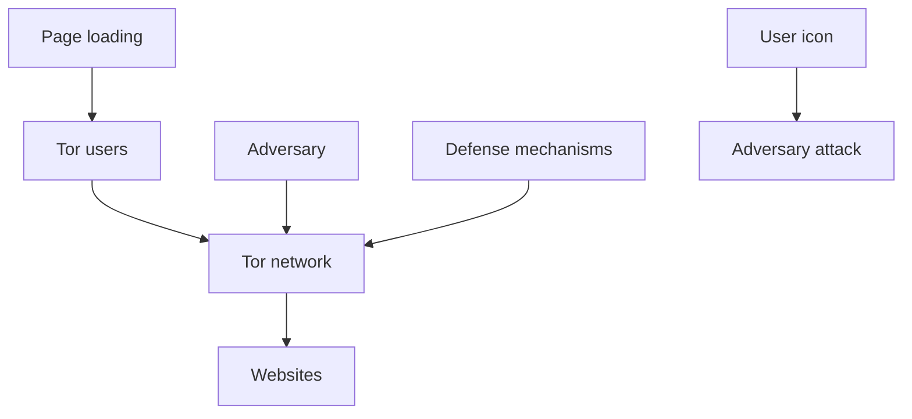
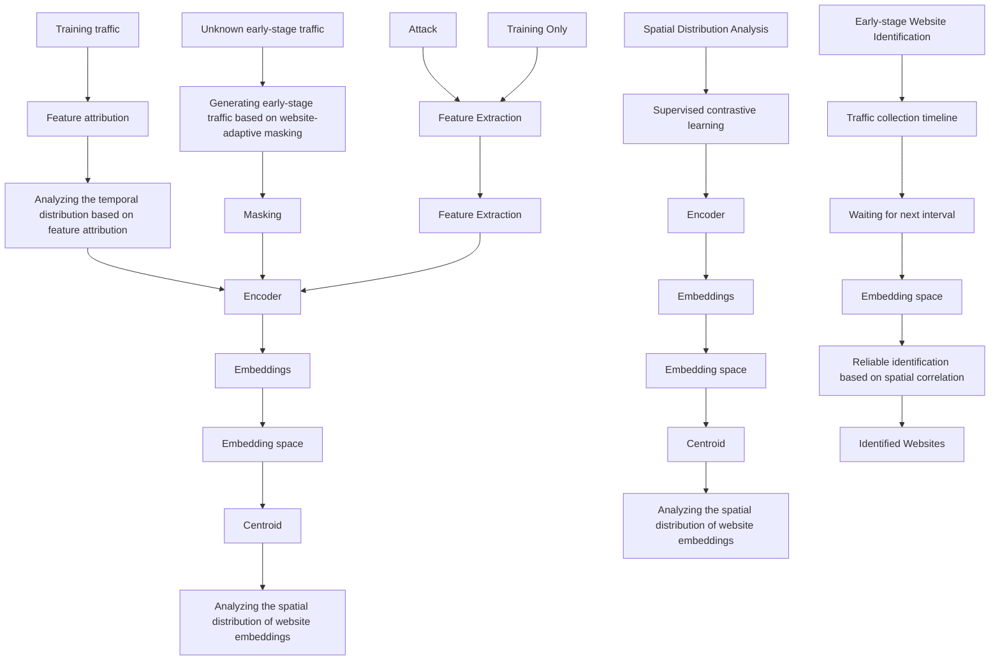
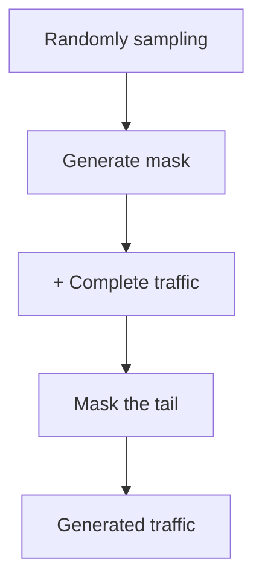

# Robust and Reliable Early-Stage Website Fingerprinting Attacks via Spatial-Temporal Distribution Analysis

Xinhao Deng

INSC & BNRist, Tsinghua University Beijing, China

dengxh23@mails.tsinghua.edu.cn

Qi Li

INSC, Tsinghua University Zhongguancun Laboratory

Beijing, China

qli01@tsinghua.edu.cn

Ke Xu

DCST, Tsinghua University

Zhongguancun Laboratory

Beijing, China

xuke@tsinghua.edu.cn

# Abstract

Website Fingerprinting (WF) attacks identify the websites visited by users by performing traffic analysis, compromising user privacy. Particularly, DL-based WF attacks demonstrate impressive attack performance. However, the effectiveness of DL-based WF attacks relies on the collected complete and pure traffic during the page loading, which impacts the practicality of these attacks. The WF performance is rather low under dynamic network conditions and various WF defenses, particularly when the analyzed traffic is only a small part of the complete traffic. In this paper, we propose Holmes, a robust and reliable early-stage WF attack. Holmes utilizes temporal and spatial distribution analysis of website traffic to effectively identify websites in the early stages of page loading. Specifically, Holmes develops adaptive data augmentation based on the temporal distribution of website traffic and utilizes a supervised contrastive learning method to extract the correlations between the early-stage traffic and the pre-collected complete traffic. Holmes accurately identifies traffic in the early stages of page loading by computing the correlation of the traffic with the spatial distribution information, which ensures robust and reliable detection according to early-stage traffic. We extensively evaluate Holmes using six datasets. Compared to nine existing DL-based WF attacks, Holmes improves the F1-score of identifying early-stage traffic by an average of 169.18%. Furthermore, we replay the traffic of visiting real-world dark web websites. Holmes successfully identifies dark web websites when the ratio of page loading on average is only 21.71%, with an average precision improvement of 169.36% over the existing WF attacks.

# CCS Concepts

• Networks → Network privacy and anonymity.

# Keywords

Tor; privacy; website fingerprinting; spatial-temporal analysis; contrastive learning

Permission to make digital or hard copies of all or part of this work for personal or classroom use is granted without fee provided that copies are not made or distributed for profit or commercial advantage and that copies bear this notice and the full citation on the first page. Copyrights for components of this work owned by others than the author(s) must be honored. Abstracting with credit is permitted. To copy otherwise, or republish, to post on servers or to redistribute to lists, requires prior specific permission and/or a fee. Request permissions from permissions@acm.org.

CCS ’24, October 14–18, 2024, Salt Lake City, UT, USA

© 2024 Copyright held by the owner/author(s). Publication rights licensed to ACM. ACM ISBN 979-8-4007-0636-3/24/10

https://doi.org/10.1145/3658644.3670272

# ACM Reference Format:

Xinhao Deng, Qi Li, and Ke Xu. 2024. Robust and Reliable Early-Stage Website Fingerprinting Attacks via Spatial-Temporal Distribution Analysis. In Proceedings of the 2024 ACM SIGSAC Conference on Computer and Communications Security (CCS ’24), October 14–18, 2024, Salt Lake City, UT, USA. ACM, New York, NY, USA, 15 pages. https://doi.org/10.1145/3658644.3670272

# 1 Introduction

Tor [12] is the most popular anonymous communication system, boasting millions of active daily users [28]. Tor utilizes various mechanisms, including randomly selected relays and multi-layer encryption, to anonymize user browsing behaviors. Unfortunately, Tor is vulnerable to Website Fingerprinting (WF) attacks [2, 10, 21, 35, 36, 39, 40]. WF attacks utilize Machine Learning (ML) or Deep Learning (DL) models to extract unique traffic patterns of websites and effectively identify the websites visited by Tor users. In particular, existing DL-based WF attacks demonstrate outstanding attack performance, achieving over 95% accuracy [10, 37, 39, 40]. WF attacks on Tor traffic are challenging, yet these attacks can also be successfully applied to other privacy-preserving systems [11, 47].

The DL-based WF attacks heavily rely on the collected complete and pure traffic during the page loading for traffic analysis. In practice, adversaries cannot perceive the entire process of website loading traffic due to mixed background traffic. Existing WF attacks apply fixed conditions for traffic collection [10, 36, 37, 39, 40]. These settings do not consider the differences between websites and may compromise the attack performance, e.g., the adversary can only collect partial traffic from slow-loading websites. Particularly, poor network conditions and WF defenses also prevent the adversary from effectively collecting the complete pure traffic of page loading, leading to a significant decrease in attack performance against certain websites [23]. Our study shows that the robust WF attack (i.e., DF) achieves an average precision of over 91% for all websites under the WTF-PAD defense. Notably, the lowest precision of fingerprinting is only less than 55%1.

To address the limitations of existing DL-based WF attacks, we aim to develop an effective WF attack, i.e., the early-stage WF attack, that only utilizes the traffic generated from the early stage of page loading. The early-stage WF attack can identify the visited website during early-stage page loading. As shown in Figure 1, compared with existing WF attacks, the early-stage attack does not require waiting for the complete traffic of page loading. However, there are three critical challenges in constructing the early-stage WF attack. (i) Early-stage traffic under dynamic network conditions is prone to traffic misidentification. Dynamic network conditions refer to that Tor users may use different paths with different bandwidths and latency across various networks. Under such dynamic network conditions, the patterns of different traffic from the same website vary. Traffic at the early stages of page loading contains less website information, which varies under dynamic network conditions. (ii) Early-stage WF attacks are more susceptible to various defenses. By padding dummy packets [16, 23], delaying packets [5, 44] or splitting traffic [8], defenses can significantly impact the effectiveness of WF attacks. (iii) The page loading speeds vary significantly across different websites, making it difficult to ensure high precision in detecting early-stage traffic of all websites. Since existing WF attacks based on fixed-setting traffic collection cannot perceive the page loading of websites visited by Tor users, the effectiveness is unreliable. Especially, as discussed above, they achieve very low identification precision in detecting the traffic visiting some websites.


<details>
<summary>other</summary>

| Stage | Description |
|-------|-------------|
| Known traffic | Traffic (dashed line) |
| Temporal distribution | Vertical bars (approximate) |
| Spatial distribution | Cross-shaped bars (approximate) |
| Websites | Solid circle (unknown label) |
| Page loading ratio (%) | 0 to 100 |
| CDF of attack success probability | Curve rising steeply then plateauing, indicating high success probability for existing WF attacks |
| CDF of attack success probability | Curve rising sharply then plateauing, indicating high success probability for existing WF attacks |
| CDF of attack success probability | Annotation: Analysis per traffic (dotted line) |
| Website | 🅨 (unknown label) |
| Existing WF attacks | Red line (unknown label) |
</details>

Figure 1: Comparison of the early-stage WF attack with existing WF attacks. The early-stage WF attack can identify websites in the early stage of page loading.

In this paper, we propose Holmes2, a robust and reliable earlystage WF attack that can accurately fingerprint traffic visiting different websites according to a small amount of traffic. Holmes is capable of effectively identifying the early-stage traffic of websites under dynamic network conditions and deployed defenses by correlating the early-stage traffic with the pre-collected complete traffic. We find that both the early-stage traffic and the complete traffic of the same website exhibit a strong connection of temporal-spatial distribution because they contain the same website information, e.g., the same parts of the website content and elements. As illustrated in Figure 1, Holmes achieves early-stage WF attacks by capturing the correlation between the unknown early-stage traffic and the pre-collected complete traffic.

To efficiently capture the correlation between the traffic of different stages of page loading, we design a three-step approach based on temporal-spatial distribution analysis. First, Holmes utilizes an adaptive data augmentation method built on the temporal distribution of traffic features, which augment the traffic at different stages of page loading. Second, Holmes utilizes supervised contrastive learning to transform traffic features into the low-dimensional embedding space so that traffic at different loading stages is clustered closely in the same embedding space. Notably, supervised contrastive learning makes the traffic of the same website closer in the embedding space by learning the correlations of the traffic. Third, Holmes transforms unknown early-stage traffic into a point in the embedding space and calculates the correlation between the unknown traffic and each website based on the spatial distribution of website traffic. It allows Holmes to perform website identification at each short interval of traffic collection. The identified results with low confidence will be rejected because the dynamic network conditions or defenses cause insufficient website information in the early-stage traffic. Holmes automatically continues collecting more packets and analyzing the traffic at the next interval until the website is successfully identified. Therefore, Holmes can ensure adaptive traffic collection and reliable early-stage website identification.

We prototype Holmes and conduct extensive performance evaluations using six different datasets, including the Alexa-top websites dataset, dark web websites dataset, and four defense datasets. Moreover, we implement nine advanced DL-based WF attacks for comparison with Holmes. Compared to the existing WF attacks, Holmes achieves an average improvement of 169.18% in the F1- score to identify the early-stage traffic. Particularly, the experimental results under multiple defenses demonstrate the exceptional robustness of Holmes. Furthermore, we evaluate the performance of Holmes under real-world deployment. We selected 80 popular dark web websites based on Tor onion services [41] and collected real-world dark web traffic in August 2023 and April 2024. Holmes achieves a precision of 85.19% in identifying these real-world dark web websites, with an average page loading ratio of only 21.71%.

The contributions of our work are three-fold:

• We propose Holmes, the first robust and reliable early-stage WF attack against Tor traffic, which can fingerprint websites according to a small amount of traffic visiting the websites.   
• Holmes utilizes feature attribution to analyze the temporal distribution of traffic features, enabling website-adaptive data augmentation. Furthermore, Holmes utilizes a supervised contrastive learning method to extract correlations between early-stage traffic and complete traffic and obtain the spatial distribution of websites. By correlating the spatial and temporal distribution, Holmes achieves a robust and reliable website identification, which can accurately fingerprint traffic under different network conditions and various defenses.   
• We prototype Holmes and perform extensive experiments in various settings to demonstrate its performance. We release the source code of Holmes3.

The rest of this paper is organized as follows: Section 2 presents the background and the problem statement. Section 3 presents the threat model. In Section 4, we present the key observation and overview of Holmes. Section 5 presents the detailed designs. In Section 6, we evaluate the performances of Holmes. In Section 7, we discuss the practicality of Holmes and the possible countermeasure against Holmes. Section 8 and 9 review related works and conclude the paper, respectively.

# 2 Background & Problem Statement

# 2.1 Background

Website fingerprinting (WF) attacks identify the websites visited by Tor users by analyzing traffic patterns, such as packet sizes and timing information. Previous WF attacks extract fingerprinting features from traffic based on expert knowledge and employ Machine Learning (ML) models to classify these features for website identification [18, 32, 43]. However, features extracted based on expert knowledge can be easily compromised by defenses [23]. With the advancement of deep learning (DL), DL-based WF attacks achieve automated feature extraction and significantly enhance performance [3, 36, 39]. DL-based WF attacks can effectively identify websites in various real-world scenarios, such as multi-tab browsing [10, 21, 46], under defenses [35, 37], dynamic network environments [2], and concept drift [40]. However, reliance on the collection of pure traffic throughout the entire page loading hinders the real-world deployment of WF attacks. Holmes achieves early-stage WF attacks by utilizing both the temporal and spatial distributions of website traffic.


<details>
<summary>histogram</summary>

| Loading latency (seconds) | Probability (%) |
| ------------------------- | --------------- |
| 0-20                      | 1.0             |
| 20-40                     | 8.0             |
| 40-60                     | 12.0            |
| 60-80                     | 14.0            |
| 80-100                    | 13.0            |
| 100-120                   | 5.0             |
| 120-140                   | 2.0             |
| 140-160                   | 1.0             |
| 160-180                   | 0.5             |
| 180-200                   | 0.2             |
| 200-220                   | 0.1             |
| 220-240                   | 0.05            |
| 240-260                   | 0.02            |
| 260-280                   | 0.01            |
| 280-300                   | 0.0             |
</details>

(a) Loading latency


<details>
<summary>line</summary>

| Number of packets | Frequency |
| ----------------- | --------- |
| 0                 | 20        |
| 10k               | 5         |
| 20k               | 2         |
| 30k               | 1         |
</details>

(b) Number of packets   
Figure 2: Distribution of page load times and number of packets for Alexa-top 10k websites.

Website fingerprinting (WF) defenses aim to undermine the effectiveness of WF attacks. Existing defenses mainly fall into two categories: disturbing traffic and splitting traffic. The defenses for disturbing traffic involve padding dummy packets [16, 23], delaying packets [19, 44], inserting adversarial perturbations [30] and obfuscating traffic [31]. However, the significant overhead of defenses may affect the operation of relay nodes [7]. Only a variant of the lightweight defense WTF-PAD has been deployed in the Tor network [1]. Traffic splitting defenses involve splitting traffic into multiple paths so that the adversary can only collect a portion of the packets, thereby obscuring the traffic patterns [8]. We evaluate the robustness of Holmes against existing defenses in Section 6.4.

# 2.2 Problem Statement

The goal of this paper is to develop reliable WF attacks (i.e., accurately identifying all websites) based on the traffic in the early stage of page loading. Previous WF attacks rely on collecting pure traffic throughout the entire page load process. However, under dynamic network conditions or defenses, existing attacks cannot effectively collect complete traffic from all websites. Meanwhile, increasing the traffic collection time incurs more noise from background traffic or defenses, which further impacts the WF performance. We analyze the SOTA multi-tab attack ARES [10] and the robust attack DF [39]. ARES and DF achieve over 90% average precision in the presence of obfuscated traffic under multi-tab browsing and WTF-PAD defenses, respectively. We find that the minimum precision of fingerprinting achieved by ARES and DF is only 42.86% and 54.11%, respectively.


<details>
<summary>flowchart</summary>


</details>

Figure 3: The threat model of Holmes.

Note that, the fixed traffic collection settings required by the existing attacks further undermine the practicality. For example, the DF attack sets a traffic collection time of 120 seconds and an input length of 5000. The input is the direction sequence of packets, which is either truncated or zero-padded. However, different websites exhibit significant variations in page loading latency and the number of generated packets, and such fixed settings cannot guarantee reliable identification of all websites. Figure 2 illustrates the distribution of page loading latency and the number of packets for the Alexa-top 10k websites. We observe that the page loading latency of 5.04% of websites exceeds 120 seconds or the packet count is over 5000, making it difficult for the existing attacks to collect pure traffic with sufficient website information. Moreover, we find that over 58.17% of websites require less than 60 seconds or fewer than 2500 packets for page loading. When these websites finish loading, existing attacks continue collecting noise packets, which further degrades the performance of attacks.

To address the issues above and achieve effective WF attacks at the early stage of page loading, we develop Holmes to achieve the following goals. (i) Reliability. Holmes utilizes traffic collected from the early stages of page loading to achieve high identification precision across all websites. (ii) Adaptivity. For traffic from various websites, Holmes dynamically performs an attack during each time interval of the traffic collection. Holmes should adaptively stop traffic collection once enough website information is obtained, and accurately identify traffic. (iii) Robustness. Holmes should maintain robust performance under various WF defenses.

In a nutshell, Holmes aims to achieve robust and reliable earlystage WF attacks, effectively identifying each website during the early stages of page loading. Compared to previous attacks, Holmes may be more practical in the real world, with applications such as early detection and prevention of dark web crimes.

# 3 Threat Model

This paper aims to develop an early-stage website fingerprinting attack that can identify websites visited by Tor users based on the traffic in the early stages of page loading. In particular, early-stage WF attacks can identify websites while the Tor user is still waiting for the page to fully load. In Figure 3, we show the threat model of our early-stage WF attack. Similar with previous works [2, 10, 18, 21, 32, 35, 36, 39, 40], we consider a local and passive adversary for Tor, such as network administrators, Internet Service Providers (ISPs), and Autonomous Systems (AS). The adversary can only collect packets without the capability to decrypt packets. Specifically, a passive adversary is unable to detect the end of a webpage loading, and can only configure fixed conditions for traffic collection [10, 36,

  
Figure 4: Visualization of temporal distribution based on feature attribution method SHAP [27].

39]. Furthermore, we consider real-world scenarios with defenses. On-path Tor relay nodes can be deployed with defenses, such as padding dummy packets and delaying packets.

Similar to existing attacks [36, 39, 40], we consider closed-world and open-world scenarios. The closed-world scenario assumes that Tor users only visit a limited number of websites. Therefore, the adversary can collect the traffic from all websites in advance in the closed-world scenario. In the open-world scenario, clients can browse arbitrary websites, and the adversary can only collect traffic from a small subset of websites. Therefore, Tor users might browse unmonitored websites unknown to the adversary in the open-world scenario.

# 4 Design of Holmes

In this section, we present the key observation for our design and propose a robust and reliable early-stage WF attack.

# 4.1 Key Observation

As discussed in Section 2.2, identifying websites by analyzing single early-stage traffic is challenging due to dynamic network conditions and deployed defenses. Particularly, the loaded content during the same loading interval varies under different network conditions. However, we observe a strong correlation between the early-stage traffic and the pre-collected complete traffic of the same website, both of which invariably contain the same website information, including parts of the website content and elements.

Figure 4 illustrates the distribution of website information across different stages of page loading, i.e., the temporal distribution of the website features. For simplicity without losing generality, we randomly select 20 websites from the Alexa-top 95 websites. We cannot directly analyze the website information corresponding to the encrypted packets. Thus, we measure the importance of traffic features for each page loading stage based on the feature attribution method, i.e., SHAP [27]. The importance of traffic features refers to their contribution to website identification. The more website information contained in the page loading stage, the more important the corresponding traffic features. We observe that the early-stage traffic of all websites shares similar sufficient website information with the complete traffic. Therefore, it is possible for us to achieve accurate early-stage traffic fingerprinting by analyzing the correlation between the early-stage traffic and the pre-collected complete traffic.

# 4.2 Overview of Holmes

In this paper, we propose Holmes that exploits the correlations between the early-stage traffic and the pre-collected complete traffic to achieve early-stage WF attacks. Particularly, Holmes captures the spatial and temporal distribution of different websites so that it can accurately fingerprint the traffic according to a small amount of the traffic visiting the websites, even under varied network conditions and WF defenses. Holmes first performs data augmentation based on the unique temporal distribution of traffic features for each website, which generates early-stage traffic that contains sufficient website information. Second, Holmes utilizes Supervised Contrastive Learning (SCL) [24] to transform traffic features into a low-dimensional embedding space, where each flow of traffic corresponds to a point in the space. SCL extracts the correlation between early-stage and complete traffic of the same website by clustering the points of early-stage and complete traffic in the embedding space. Finally, Holmes projects unknown early-stage traffic into the embedding space and calculates its correlation with each website based on the spatial distribution of website traffic in the embedding space. Note that, to avoid misidentification of early-stage traffic containing only connection information, Holmes rejects results of identifying early-stage traffic with low correlations to all websites. Therefore, Holmes performs attacks at each short time interval of traffic collection until the corresponding website is identified with high confidence, thus enabling adaptive traffic collection and reliable identification for each website.

Figure 5 illustrates the overview of Holmes. Holmes consists of three modules designed to construct robust and reliable earlystage WF attacks, including adaptive data augmentation, spatial distribution analysis, and early-stage website identification.

Adaptive Data Augmentation. The adaptive data augmentation module generates early-stage traffic by masking the tail of complete traffic during the training phase, which ensures that early-stage traffic contains sufficient website information based on the unique temporal distribution of the website. Holmes employs the feature attribution method, i.e., SHAP [27], to analyze the temporal distribution of the website traffic. It aggregates the feature attribution results of multiple traffic associated with the same websites to obtain the feature importance distribution of the website. Holmes leverages the temporal distribution of websites to apply tail masking of various lengths for the traffic of different websites so that it can adaptively generate early-stage traffic containing sufficient website information for each website. The details of this module will be described in Section 5.1.

Spatial Distribution Analysis. The spatial distribution analysis module utilizes supervised contrastive learning to transform traffic features and computes the spatial distribution of websites according to the new feature space. To effectively extract the correlation between early-stage traffic and complete traffic, Holmes utilizes an encoder built on supervised contrastive learning to transform traffic features into low-dimensional embedding features, ensuring that the embedding features corresponding to the early-stage and complete traffic of the same website are similar. The embedding features of traffic are viewed as points in the embedding space, where points corresponding to early-stage and complete traffic with similar embedding features will be clustered together in this space. Holmes analyzes the spatial distribution of each website’s traffic in the embedding space, calculating the centroid and radius of each website to support early-stage website identification. We will describe this module in Section 5.2.


<details>
<summary>flowchart</summary>


</details>

Figure 5: The overview of Holmes.

Early-Stage Website Identification. The early-stage website identification module adaptively collects traffic according to the spatial distribution of websites and achieves reliable website identification. Since the adversary cannot perceive the page loading progress associated with unknown website traffic, Holmes conducts a WF attack during each traffic collection interval. During each interval, Holmes projects the unknown early-stage traffic into the embedding space and then calculates the distance between the point corresponding to the unknown traffic and the centroid of each website. Since different websites have unique distribution densities in the embedding space, i.e. radii, we can obtain the correlation between unknown traffic and each website by comparing the distances and radii of websites. If the distance between the centroid of a website and the unknown traffic is less than the radius of the website, the traffic is successfully identified and traffic collection ends. Otherwise, Holmes will continue collecting traffic and analyze the traffic at the next time interval. We will present the details of early-stage website identification in Section 5.3.

# 5 Design Details

In this section, we present the design details of Holmes, including the adaptive data augmentation module, the spatial distribution analysis module, and the early-stage website identification module.

# 5.1 Adaptive Data Augmentation

The Adaptive Data Augmentation module generates traffic at different stages of page loading based on masked tail traffic, thereby facilitating the analysis of the correlation between early-stage traffic and complete traffic. However, randomly generated early-stage traffic may not contain sufficient website information. The reason is that due to network dynamic conditions and defenses, randomly generated early-stage traffic may only contain connection information and dummy packets. Furthermore, differences in website loading speed can also affect the correlation between the generated early-stage traffic and the complete traffic. To achieve websiteadaptive data augmentation, Holmes utilizes the feature attribution method to analyze the temporal distribution of traffic features, ensuring that the generated early-stage traffic is correlated with the complete traffic of the same website.

Temporal Distribution Analysis. Holmes analyzes the temporal distribution by profiling the feature importance, which is challenging for two reasons: (i) Packets are encrypted in multiple layers by Tor, making it difficult to analyze their importance. (ii) In dynamic network environments or under traffic obfuscation by defenses, the positions of important packets may change.

To address these challenges, we extend the feature attribution method SHapley Additive exPlanations (SHAP) [27] to analyze the feature importance distribution at different stages of page loading. SHAP calculates the marginal contribution of each feature by generating combinations of all features. It is based on Shapley values, a concept from cooperative game theory, which ensures a fair distribution of the contribution among the features. SHAP provides local explanations showing how much each feature in a specific instance contributes to the model’s output, as well as global insights about the overall model behavior.

The advantages of SHAP over other feature attribution methods include (i) Accuracy. SHAP calculates all feature combinations, which enables effective analysis of the relationships among features in encrypted traffic, resulting in more accurate attribution outcomes. (ii) Consistency. SHAP provides consistent feature attribution results for multiple traffic to the same website. Therefore, Holmes can aggregate the feature attribution results of multiple traffic to obtain a website-level distribution of feature importance.

Let $U = \{ f _ { 1 } , f _ { 2 } , . . . , f _ { n } \}$ represent the feature set of traffic, where ?? is the number of features. Holmes divides the page loading time into ?? equal time intervals and counts the number of incoming and outgoing packets in each interval as traffic features, where $f _ { i }$ represents the feature of the i-th interval. Holmes calculates the importance of the i-th feature $f _ { i }$ based on the difference in the expected model output when conditioning on the feature $f _ { i } .$ To miner the dependencies among traffic features, Holmes generates all feature combinations excluding the feature $f _ { i }$ to calculate the marginal contribution of the feature ???? . Specifically, the importance of the i-th feature $\phi _ { i }$ can be computed as follows:


<details>
<summary>line</summary>

| Loading ratio | CDF (G) | CDF (G+ YouTube) |
| ------------- | ------- | ---------------- |
| 0%            | 0       | 0                |
| 100%          | ~0.8    | ~0.6             |
</details>

(a) Calculation of effective loading ranges.


<details>
<summary>flowchart</summary>


</details>

(b) Generation of early-stage traffic.   
Figure 6: Adaptive data augmentation of Holmes. (a) Holmes calculates the effective loading ranges of websites based on the temporal distribution of websites. (b) Holmes randomly samples the start of the mask based on the effective loading ranges of websites and generates early-stage traffic by masking traffic tails.

$$
\phi_ {i} = \sum_ {S \subseteq U \setminus \{f _ {i} \}} \frac {| S | ! \cdot (n - | S | - 1) !}{n !} \cdot (\mathrm{O} (S \cup \{f _ {i} \}) - \mathrm{O} (S)), \tag {1}
$$

where $S$ is a feature subset excluding $f _ { i \cdot } \operatorname { O } ( S \cup \{ f _ { i } \} )$ and O(??) represent the expected outputs of the model when feature $f _ { i }$ is present and absent, respectively. The weight of the set ?? is the frequency of occurrence among all possible feature combinations. Subsets of varying sizes are balanced in terms of weight to ensure that the contributions of each feature can be fairly assessed. Due to the high computational cost of Equation 1, we employ the DeepLIFT algorithm [38] for approximation to expedite the calculation.

We select the SOTA WF attack RF [37] as the target model for feature profiling. For each website, we randomly select 10 traffic. We calculate the importance of features corresponding to different loading stages of the website and represent the temporal distribution of each website using the average temporal distribution of the traffic.

Mask-based Data Augmentation. Data augmentation is a machine learning technique that enhances the diversity of training data by artificially modifying samples to improve model performance [2]. Holmes achieves the data augmentation by masking the tail of the traffic. However, the setting of mask proportion is challenging. A prolonged mask results in early-stage traffic lacking information related to the website, whereas a too-brief mask requires the adversary to spend a lot of time collecting enough packets. To address the above challenges, Holmes employs websiteadaptive data augmentation based on the temporal distribution of websites.


<details>
<summary>flowchart</summary>

```mermaid
graph LR
    A["Traffic features"] --> B["2D convolution block"]
    B --> C["1D convolution block"]
    C --> D["Adaptive pooling"]
    D --> E["Embeddings"]
    
    subgraph Residual
        B1["2D convolution"]
        B2["2D BN"]
        B3["2D convolution"]
        B4["2D BN"]
        B5["2D pooling"]
    end
    
    subgraph ×2
        C1["1D convolution"]
        C2["1D BN"]
        C3["1D convolution"]
        C4["1D BN"]
        C5["1D pooling"]
    end
    
    subgraph ×4
        D1["Adaptive pooling"]
        D2["Embeddings"]
    end
```
</details>

Figure 7: The Encoder of Holmes.

In Figure 6, we show the details of the data augmentation. Holmes initially calculates the effective loading ranges of websites. When the page loading ratio of a website reaches the effective loading range, the early-stage traffic contains enough website information to be correlated with the complete traffic. As shown in Figure 6(a), Holmes generates the cumulative distribution of feature importance for all websites. Holmes sets two parameters, ?? and ??, representing the upper and lower bounds of the cumulative feature importance corresponding to the effective loading proportions of websites. Based on the parameters ?? and $\mu ,$ Holmes can calculate the effective loading range for each website.

To ensure the correlation between the generated early-stage traffic and the complete traffic, Holmes adaptively enhances the traffic for each website, making the generated traffic originate from the effective loading range of the corresponding website. Let $R = \{ ( s _ { 1 } , t _ { 1 } ) , ( s _ { 2 } , t _ { 2 } ) , \dots , ( s _ { m } , t _ { m } ) \}$ represent the effective loading ranges for ?? monitored websites, where the effective loading range for the i-th website is from $s _ { i }$ to $t _ { i } .$ In Figure $6 ( \mathrm { b } )$ , we show the details of early-stage traffic generation. For the traffic of the i-th website, Holmes randomly samples an integer ?? from ???? to $t _ { i , }$ then masks the tail of traffic from the loading ratio ?? to the entire page loading. We select the starting point of the mask randomly within an effective range, ensuring that the generated traffic belongs to the early stages of page loading and contains adequate website information.

$$
\boldsymbol {l} \sim \text { Uniform } [ s _ {i}, t _ {i} ]. \tag {2}
$$

Holmes performs data augmentation on each traffic ?? times. The higher the value of $\alpha ,$ the more early-stage traffic is generated. However, excessive generation of early-stage traffic can lead to significant time overhead of model training.

# 5.2 Spatial Distribution Analysis

Utilizing the early-stage traffic generated by the temporal distribution analysis module, the spatial distribution analysis module extracts the correlation between early-stage and complete traffic. Specifically, Holmes builds an Encoder based on Supervised Contrastive Learning (SCL) [24] to extract common features of early-stage and complete traffic, generating low-dimensional embeddings that are spatially proximate. Then Holmes analyzes the spatial distribution of websites using the Median Absolute Deviation (MAD) [25].

Traffic Embedding Based on SCL. To address the challenges posed by network jitter and defenses in the real world on the analysis of early-stage traffic, Holmes employs Supervised Contrastive Learning (SCL) for traffic embedding. The generated embeddings encompass robust features of the traffic, enabling traffic from different loading stages of the same website to aggregate in the embedding space. Note that, Holmes addresses the limitation of the clustering methods, i.e., they cannot effectively aggregate original high-dimensional features due to the “curse of dimensionality” [48].

Holmes initially extracts raw features from traffic, serving as the input for generating embeddings. We use the Traffic Aggregation Features (TAF) as the raw features. TAF is an extension of the Traffic Aggregation Matrix (TAM) [37] that effectively represents aggregated traffic information. We set up ?? non-overlapping time windows of equal length. The length of the time window is ??. For the i-th time window, we calculate three types of aggregated features: (i) the number of incoming and outgoing packets. (ii) the number of incoming and outgoing bursts. (iii) the average size of incoming and outgoing bursts. Therefore, we can aggregate statistical information from multiple time windows as the initial feature of the traffic.

We use the Convolutional Neural Network (CNN) as the Encoder network for traffic embedding. CNN is applied by previous attacks [3, 35–37, 39, 40] and proved to be effective in extracting key patterns of traffic associated with the website. Let Enc(·) denote the encoder network, and we can obtain the embedding ?? of the traffic with the raw feature ?? based on the Encoder.

$$
z = \operatorname{Enc} (x). \tag {3}
$$

We show the details of the Encoder in Figure 7. To effectively extract the correlation of the website traffic at different loading stages, we utilize convolution with a greater number of channels and a deeper network architecture compared to previous attacks [37, 39]. Since the input is two-dimensional features, Holmes uses two 2D convolution blocks to extract high-dimensional information. Then Holmes fusions information of packets with different directions through the 2D pooling layer, transforming the two-dimensional features into one-dimensional features. Subsequently, four 1D convolution blocks are utilized to extract traffic patterns related to the website. Finally, Holmes employs an adaptive pooling layer to generate embeddings of traffic.

Furthermore, we employ two complementary methods. First, residual connections are utilized, which involve transmitting intermediate outputs from lower to higher layers via skip connections, thereby reducing the issue of gradient vanishing. Second, multiple dropout layers are used, where a subset of units, including their associated connections, are randomly omitted from the network during the training, thus mitigating overfitting.

The performance of the Encoder depends on effective model training. The Encoder aims to extract various correlations in traffic, including (i) The correlation between the traffic at different loading stages of the same website. (ii) The correlation between the traffic of the same website where the traffic patterns change due to network dynamics or defenses. Contrastive learning and metric learning can learn the correlation between samples. However, both contrastive learning and metric learning consider only one type of correlation that exists in the samples. To effectively extract multiple types of correlations existing in the samples, Holmes applies SCL to train the Encoder. SCL combines the advantages of supervised and contrastive learning. Specifically, Holmes randomly selects one traffic as the anchor. Then, Holmes selects all traffic of the

Algorithm 1: Website Profiling   
Input:
W: all websites.
z: the embeddings of all websites.

Output:
c: the centroids of all websites.
r: the radii of all websites.

1 for $w \in W$ do
2 $c_w = \text{Mean}(z^w)$ ▷ Calculate the centroid of website w
3    for $z_i^w \in z^w$ do
4 $d_i^w = 1 - \text{cosine\_similarity}(c_w, z_i^w)$ 5    end
6 $M^w = \text{Median}(d^w)$ ▷ Calculate the median
7 $r_w = \text{Median}\{|d_i^w - M^w|\}$ ▷ Calculate the radius
8 end
9 for $w_i, w_j \in W$ do
10 $d = 1 - \text{cosine\_similarity}(c_i, c_j)$ 11    if $r_i + r_j \geq d$ then
12    ▷ Tuning the radius
13 $r_i = r_i - \frac{r_i}{r_i + r_j} \cdot (r_i + r_j - d)$ 14 $r_j = r_j - \frac{r_j}{r_i + r_j} \cdot (r_i + r_j - d)$ 15    end
16 end
17 return c, r

anchor’s corresponding website as positive samples and traffic of other websites as negative samples. Holmes repeats this process multiple times to ensure that the selected anchors include multiple traffic for all websites.

SCL can learn various correlations between the anchor and the positive samples, ensuring that in the generated embedding space, the distance between the anchor and positive samples is close, while the distance between the anchor and negative samples is far. Formally, for the i-th traffic $_ { x _ { i } }$ with embedding ???? , we can calculate its loss by SCL:

$$
\mathcal {L} _ {i} = - \frac {1}{| \mathrm{P} (i) |} \sum_ {p \in \mathrm{P} (i)} \log \frac {\exp (\mathrm{z} _ {i} \cdot \mathrm{z} _ {p} / \gamma)}{\sum_ {n \in \mathrm{N} (i)} \exp (\mathrm{z} _ {i} \cdot \mathrm{z} _ {n} / \gamma)}, \tag {4}
$$

where P(??), N(??) are the set of the index of all positive samples and negative samples of the i-th traffic, respectively. For the embedding of anchor $z _ { i } ,$ we calculate the similarity with each positive sample embedding $z _ { p }$ and compare it with similarities between the anchor and all negative samples. In particular, ?? is temperature, a hyperparameter that controls the distance of traffic $x _ { i }$ from the most similar negative sample. The smaller the temperature ??, the greater the differentiation from the negative samples, but it tends to affect the similarity to the positive samples. Through Equation 4, we can effectively train the Encoder and extract the correlations of website traffic at different loading stages.

Spatial Distribution Based on MAD. Holmes aims to achieve reliable early-stage website identification. However, the early-stage traffic contains little website information and is prone to misidentification under the interference of network dynamics and defenses. Holmes addresses the challenge by utilizing the spatial distribution of website traffic. Traffic from different websites has different positions and levels of tightness in the embedding space. Holmes calculates the centroid and radius for each website, representing the position and level of tightness of the website traffic, respectively. By leveraging the centroid and radius information of websites, Holmes can reject low-confidence identifications of unknown traffic. We will detail how to utilize the centroid and radius of websites for reliable early-stage website identification in Section 5.3.

In Algorithm 1, we show the pseudocode for website profiling. Suppose there are ?? websites. Holmes sequentially calculates the centroid and radius for each website. For the website ??, Holmes generates the embeddings for all traffic of the website ??. Let ?????? represent the embedding of the i-th traffic of the website ??. Holmes calculates the centroid of website ?? by averaging all embeddings across each dimension (line 2). Then Holmes calculates the distance between each traffic embedding and the centroid of the website ?? using cosine similarity (lines 3-4). We select cosine similarity because matrix operations can accelerate multiple cosine similarity calculations. Finally, we use a distribution estimation algorithm, Mean Absolute Deviation (MAD) [25] to generate the radius for the website ?? (lines 6-7). MAD calculates the median of absolute deviations, where absolute deviation refers to the absolute value of the difference between each data and the median of all data.

Based on the centroid and radius of each website, the spatial distribution of each website in the embedding space forms a sphere. Holmes utilizes supervised contrastive learning to separate the centroids of different websites in the embedding space. However, we observe a 0.01% probability of overlap between the spheres corresponding to the two websites in our study. This occurs because the centroids of websites with similar types or content are closer to each other. Therefore, Holmes further examines the distances between the centroids of different websites and their corresponding radii. For two websites ???? and ?? ?? , if the distance between c?? and c?? is less than the sum of the radii, we proportionally reduce the radii of website w?? and website w?? . Finally, the spheres corresponding to each website in the embedding space are non-overlapping, which facilitates the early-stage website identification of Holmes.

# 5.3 Early-Stage Website Identification

The early-stage website identification module leverages the correlations between different loading stages of website traffic to achieve robust and reliable identification of early-stage traffic. To achieve early-stage website identification, Holmes attempts website identification at each fixed time interval. The challenge faced by Holmes is ensuring high confidence in website identification to avoid misidentification of early-stage traffic. To address the above challenge, Holmes calculates the correlation between unknown traffic and monitored websites based on the position of unknown traffic in the feature space and the spatial distribution of monitored websites. Holmes rejects the identification of early-stage traffic with low correlation to all monitored websites and continues to collect more packets.

In Algorithm 2, we show the pseudocode for early-stage website identification. At every time interval, Holmes first projects the unknown early-stage traffic into the embedded space (lines 6-7) and calculates the distance between the unknown traffic and the

Algorithm 2: Early-stage Website Identification   
Input:
    τ: the time interval.
    σ: the maximum traffic collection time.
    W: all monitored websites.
    c: the centroids of all monitored websites.
    r: the radii of all monitored websites.
    ŵ: the unmonitored website.
    ε: threshold for concept drift detection.

Output:
    res: the identification result.

1 res = ŵ
2 count = 0
3 while True do
4    time.sleep(τ) ▷ Wait time interval τ
5    count = count + τ
6    x = getTraffic() ▷ Get the current collected traffic
7    z = Encoder(x)
8    for w ∈ W do
9    d = 1 - cosine_similarity(c_w, z)
10    if d ≤ r_w then
11    res = w ▷ Identification success
12    break
13    end
14    end
15    if (res ≠ ŵ) or (count > σ) then
16    break ▷ Exit identification
17    end
18 end
19 if res == ŵ then
20    d^min = ε
21    for w ∈ W do
22    d = 1 - cosine_similarity(c_w, z)
23    if d - r_w < d^min then
24    d^min = d - r_w
25    res = w
26    end
27    end
28 end
29 return res

centroids of all monitored websites (lines 8-9). If the distance between the unknown traffic and a website’s centroid is less than the radius of the website, Holmes successfully identifies the traffic (lines 10-12). Otherwise, Holmes continues to collect traffic and waits for the next time interval.

However, not all early-stage traffic can be guaranteed to be identified. Changes in the content of monitored websites can lead to variations in traffic patterns (i.e., concept drift). Furthermore, Holmes is unable to detect early-stage traffic from unmonitored websites. Holmes sets a maximum traffic collection time ??. After collecting traffic for ?? seconds, Holmes will detect whether the unknown traffic is due to concept drift or originates from unmonitored websites (lines 19-28). A key insight is that the distance between a website’s concept drift traffic and its centroid should be slightly greater than the website’s radius, yet much smaller than the distance between unmonitored website traffic and the website’s centroid. Therefore, we set a predefined threshold ??. If the difference between the distance of the unknown traffic from the website’s centroid ?? and the website’s radius $r _ { w }$ is less than ??, then the unknown traffic is identified as a concept drift sample of the website (lines 21-25). Furthermore, we define a variable $\bar { d } ^ { m i n }$ to represent the smallest difference between ?? and $r _ { w }$ among all websites, with $d ^ { m i n }$ initially set to the threshold ?? (line 20). If the unknown traffic meets the concept drift detection criteria for multiple monitored websites, we identify the traffic as the website with the highest correlation, which is the website corresponding to $d ^ { m i n }$ . In particular, we set the threshold for concept drift detection ?? to infinity in the closedworld scenario. The reason is that in the closed-world scenario, Tor users only visit monitored websites, eliminating the need to identify traffic from unmonitored websites.

Table 1: Parameter settings in our evaluation 

<table><tr><td>Group</td><td>parameters</td><td>Value</td></tr><tr><td rowspan="3">Data Augmentation</td><td>Lower bound of CDF μ</td><td>0.3</td></tr><tr><td>Upper bound of CDF λ</td><td>0.6</td></tr><tr><td>Number of augmentation α</td><td>2</td></tr><tr><td rowspan="4">Spatial Analysis</td><td>Number of time windows ρ</td><td>2000</td></tr><tr><td>Length of time windows θ</td><td>80 ms</td></tr><tr><td>Embedding size η</td><td>128</td></tr><tr><td>Temperature γ</td><td>0.1</td></tr><tr><td rowspan="3">Website Identification</td><td>Time interval τ</td><td>120 ms</td></tr><tr><td>Maximum collection time σ</td><td>80 s</td></tr><tr><td>Threshold for concept drift ε</td><td>0.01</td></tr></table>

# 6 Performance Evaluation

In this section, we evaluate Holmes with public datasets and realworld datasets. We compare the performance of Holmes with the state-of-the-art WF attacks.

# 6.1 Experimental Setup

Implementation. We prototype Holmes using PyTorch 2.0.1 and Python 3.8 with more than 1,400 lines of code. In particular, we use a single NVIDIA GeForce RTX 4090 GPU for our experiments. We show the default parameter values in Table 1. Furthermore, we split the dataset into training, validation, and testing, with an 8:1:1 ratio. The parameter tuning and spatial-temporal analysis are performed on the validation dataset to avoid leakage of the testing dataset.

Dataset. Our datasets comprise six categories of data, including a dataset of Alexa-top websites, a dataset of dark web websites, and four types of defended datasets.

• Dataset of Alexa-top websites: This dataset is from [39], which includes data from both closed-world and open-world scenarios. The closed-world data comprises 95 monitored websites, each with over 1000 traces. In the open-world scenario, there are over 40,000 unmonitored websites, each with only one trace. All websites belong to the Alexa-top websites list, which ranks websites based on popularity.   
• Dataset of dark web websites: Since Alexa-top does not represent the popularity of visits by Tor users, we select 80 of the most popular dark web websites based on the measurement of Tor v3

onion services [41]. The dataset includes various types of websites, comprising black markets, social networks, and financial services. These websites use onion services to anonymize servers, requiring more relay nodes and resulting in greater loading latency. We utilized 20 servers deployed across three countries to collect traffic in August 2023 and April 2024. Note that our data collection did not negatively impact the real-world Tor network. We only collect traffic from browsing sessions we initiated locally, ensuring our dataset does not include data from other Tor clients.

• Dataset with WTF-PAD defense: The WTF-PAD defense [23] disrupts traffic patterns by adaptively padding dummy packets without delaying any packets. The variation of WTF-PAD defense based on circuit-level padding has been deployed in Tor [1].   
• Dataset with Front defense: The Front defense [16] utilizes the Rayleigh distribution to generate the padding times for dummy packets. Similar to the WTF-PAD defense, the time overhead for the Front defense is zero.   
• Dataset with Walkie-Talkie defense: Walkie-Talkie [44] employs a half-duplex communication model and merges original traffic with traffic from randomly selected decoy pages to mislead WF attacks. This defense introduces a mild bandwidth and time overhead.   
• Dataset with TrafficSliver defense: The TrafficSliver defense [8] employs a traffic-splitting mechanism that restricts the adversary to collecting only partial packets. We generate the dataset by splitting the traffic into three paths based on the script provided by the authors.

WF defenses have been extensively studied [4, 5, 8, 13, 16, 17, 23, 44], yet some defenses are not practically deployable due to the significant overhead [29]. The latency introduced by defenses may cause out-of-memory errors in Tor relay nodes. Therefore, following previous attacks [35, 37, 39], we select four representative defense methods for evaluation: WTF-PAD [23], Front [16], TrafficSliver [8], and Walkie-Talkie [44].

Baselines. We select 9 state-of-the-art WF attacks as our baselines.

• AWF: AWF [36] utilizes CNNs to automatically extract features from packet direction sequences for website identification.   
• DF: DF [39] proposes more sophisticated CNNs compared to AWF that can effectively undermine WTF-PAD defense.   
• Tik-Tok: Tik-Tok [35] utilizes both direction and timestamp information of packets, which can effectively improve attack performance under defense.   
• Var-CNN: Var-CNN [3] designs a more powerful model based on ResNets, which utilizes mechanisms such as dilated convolution to improve attack performance.   
• TF: TF [40] extends the DF model using Triplet networks to achieve the best performance in scenarios with fewer training instances.   
• RF: RF [37] extracts a two-dimensional matrix feature named TAM, which has better robustness against defenses.   
• NetCLR: NetCLR [2] integrates data augmentation and selfsupervised learning. It introduces three data augmentation methods for traffic bursts to improve the effectiveness of WF attacks in dynamic network environments.

• ARES: ARES [10] is a robust multi-tab WF attack that integrates multiple Transformer-based classifiers to identify websites within obfuscated traffic. ARES also supports single-tab WF attacks.   
• TMWF: TMWF [21] applies DETR [6], a Transformer-based object detection framework, to achieve multi-tab WF attacks. We set the number of tab queries to 1 to apply TMWF to single-tab WF attacks.

To reduce the time overhead of the experiments, the parameters of baselines are all set to their default values. Note that the baselines may achieve better performance with parameter tuning.

Metrics. We select 4 metrics that are widely used to evaluate the performance of WF attacks, i.e., Accuracy, Precision, Recall, and F1-score. We calculate the macro average of all websites. Specifically, we can calculate the numbers of true positive instances (TP), false positive instances (FP), true negative instances (TN), and false negative instances (FN) for each website, respectively. These four metrics can be calculated as:

$$
\text { Accuracy } = \frac {\mathrm{TP} + \mathrm{TN}}{\mathrm{TP} + \mathrm{TN} + \mathrm{FP} + \mathrm{FN}}. \tag {5}
$$

$$
\text { Precision } = \frac {\mathrm{TP}}{\mathrm{TP} + \mathrm{FP}}. \tag {6}
$$

$$
\text { Recall } = \frac {\mathrm{TP}}{\mathrm{TP} + \mathrm{FN}}. \tag {7}
$$

$$
F 1 - \text { score } = \frac {2 \times \text { Precision } \times \text { Recall }}{\text { Precision } + \text { Recall }}. \tag {8}
$$

The differences in website types and content lead to variations in traffic patterns, and the average precision may obscure the low identification precision of some websites. Therefore, we use P@min to represent the lowest precision across all websites. We can evaluate the reliability of WF attacks by calculating P@min. Furthermore, the base rate fallacy [22] can lead to an overestimation of the precision in the open-world setting. Following previous attacks [42], we use r-precision for open-world evaluation. Specifically, r-precision assumes that the frequency of visits to unmonitored websites is ?? times that of monitored websites, hence the sample weight of unmonitored websites is ?? times that of monitored websites when calculating precision. We set ?? to 20 in our experiments.

# 6.2 Closed-World Evaluation

We first evaluate the performance of Holmes in the closed-world scenario using the dataset of Alexa-top 95 websites. To assess the performance of Holmes in identifying early-stage website traffic, we generate traffic for different loading stages of websites based on packet timestamps from the testing dataset. As shown in Figure 8, Holmes achieves optimal attack performance under different page loading ratios. As the loading progress of websites increases from 20% to full completion, the Accuracy of Holmes in identifying the website gradually improves, rising from 50.94% to 98.36%. Compared to existing attacks, Holmes demonstrates a significant advantage in early-stage traffic analysis. For example, when websites are 40% loaded, Holmes achieves an Accuracy of 90.65%, which represents an improvement of 26.84%, 90.68%, 109.50%, 140.32%, 175.36%, 194.22%, 224.68%, 235.12%, and 323.60% over RF, Var-CNN, ARES, NetCLR, DF, Tik-tok, TMWF, AWF, and TF, respectively. Specifically, Holmes exhibits the highest Accuracy for traffic at all loading stages of websites. The primary reason is that Holmes extracts traffic correlations at different loading stages of websites through spatial-temporal analysis. This correlation enhances the ability of Holmes to identify traffic across all loading stages of websites.

  
Figure 8: Comparison of WF attacks at different loading stages of websites in the closed-world scenario.


<details>
<summary>bar</summary>

| Page loading ratio (%) | Holmes | Var-CNN | NetCLR | Tik-tok | AWF | RF | ARES | DF | TMWF | TF |
|---|---|---|---|---|---|---|---|---|---|---|
| 30 | 90 | 70 | 42 | 35 | 28 | 80 | 52 | 43 | 33 | 22 |
| 40 | 96 | 73 | 52 | 51 | 31 | 84 | 58 | 52 | 40 | 27 |
| 50 | 96 | 77 | 59 | 58 | 41 | 89 | 62 | 59 | 45 | 34 |
| 60 | 97 | 82 | 66 | 68 | 47 | 92 | 70 | 67 | 50 | 44 |
</details>

Figure 9: Comparison of the r-precision of WF attacks for early-stage traffic in the open-world scenario.

We further evaluate the Precision, Recall, and F1-score of Holmes in identifying early-stage traffic. Table 2 presents a comparison of Holmes with existing WF attacks. Holmes significantly outperforms other attacks in all stages of page loading. For instance, when websites are loaded to 20%, 30%, 40%, 50%, and 60%, the F1-score of Holmes shows an average increase of 330.43%, 245.52%, 151.51%, 79.59%, and 38.85% over existing attacks, respectively. For earlystage traffic, we observe that Holmes exhibits higher Precision than Recall. This indicates that Holmes is effective in avoiding the misidentification of traffic with insufficient website information. Benefiting from the temporal distribution analysis of website features and website-adaptive data augmentation, Holmes is capable of effectively identifying early-stage traffic that contains sufficient website information while avoiding misidentification of early-stage traffic without adequate website information.

Table 2: Comparisons with prior arts with the early-stage traffic in the closed-world scenario, where P, R, F1 represent Precision (%), Recall (%), and F1-score (%). 

<table><tr><td rowspan="2">Attacks</td><td colspan="3">20% loaded</td><td colspan="3">30% loaded</td><td colspan="3">40% loaded</td><td colspan="3">50% loaded</td><td colspan="3">60% loaded</td></tr><tr><td>P</td><td>R</td><td>F1</td><td>P</td><td>R</td><td>F1</td><td>P</td><td>R</td><td>F1</td><td>P</td><td>R</td><td>F1</td><td>P</td><td>R</td><td>F1</td></tr><tr><td>TF</td><td>24.74</td><td>7.48</td><td>8.50</td><td>30.25</td><td>12.63</td><td>14.15</td><td>36.55</td><td>21.44</td><td>23.31</td><td>48.14</td><td>35.79</td><td>37.76</td><td>61.72</td><td>55.23</td><td>56.20</td></tr><tr><td>AWF</td><td>28.39</td><td>9.97</td><td>11.75</td><td>33.40</td><td>17.26</td><td>19.22</td><td>41.12</td><td>27.06</td><td>29.14</td><td>51.16</td><td>42.15</td><td>43.61</td><td>63.63</td><td>59.71</td><td>59.93</td></tr><tr><td>TMWF</td><td>25.77</td><td>7.87</td><td>8.27</td><td>31.70</td><td>15.19</td><td>16.53</td><td>41.15</td><td>27.95</td><td>29.79</td><td>56.04</td><td>46.42</td><td>47.78</td><td>71.84</td><td>66.44</td><td>67.02</td></tr><tr><td>Tik-tok</td><td>37.91</td><td>10.83</td><td>11.50</td><td>40.54</td><td>18.56</td><td>20.08</td><td>47.00</td><td>30.82</td><td>32.89</td><td>59.03</td><td>47.71</td><td>49.19</td><td>71.46</td><td>65.84</td><td>66.60</td></tr><tr><td>DF</td><td>35.28</td><td>11.19</td><td>12.62</td><td>40.43</td><td>19.00</td><td>21.38</td><td>50.85</td><td>32.96</td><td>35.08</td><td>61.52</td><td>50.17</td><td>51.68</td><td>72.76</td><td>67.54</td><td>68.03</td></tr><tr><td>NetCLR</td><td>32.39</td><td>10.32</td><td>11.85</td><td>41.07</td><td>20.67</td><td>23.40</td><td>54.19</td><td>37.72</td><td>39.96</td><td>65.71</td><td>56.17</td><td>57.47</td><td>77.01</td><td>73.72</td><td>73.69</td></tr><tr><td>ARES</td><td>43.06</td><td>13.30</td><td>15.66</td><td>51.31</td><td>25.43</td><td>28.70</td><td>60.36</td><td>43.28</td><td>45.86</td><td>69.77</td><td>61.80</td><td>62.71</td><td>77.96</td><td>74.73</td><td>74.57</td></tr><tr><td>Var-CNN</td><td>49.66</td><td>15.28</td><td>18.29</td><td>57.66</td><td>29.12</td><td>32.85</td><td>65.49</td><td>47.52</td><td>50.39</td><td>74.21</td><td>65.98</td><td>67.22</td><td>81.64</td><td>78.51</td><td>78.69</td></tr><tr><td>RF</td><td>55.51</td><td>27.44</td><td>31.27</td><td>67.32</td><td>50.55</td><td>53.17</td><td>78.23</td><td>71.43</td><td>72.43</td><td>86.22</td><td>83.70</td><td>84.06</td><td>91.34</td><td>90.34</td><td>90.41</td></tr><tr><td>Holmes</td><td>66.79</td><td>50.92</td><td>53.45</td><td>80.22</td><td>76.85</td><td>76.48</td><td>91.14</td><td>90.64</td><td>90.48</td><td>95.19</td><td>95.01</td><td>95.00</td><td>96.40</td><td>96.24</td><td>96.23</td></tr></table>

# 6.3 Open-World Evaluation

We further evaluate the realistic open-world scenario using the dataset of Alexa-top websites, including 95 monitored websites and 40,000 unmonitored websites. The number of unmonitored websites significantly exceeds the number of monitored websites. To effectively assess attack performance in the open-world setting, we follow previous works [42] by utilizing r-precision for evaluation.

Figure 9 shows the comparison of r-precision for WF attacks when the ratio of page loading ranges from 30% to 60%. Holmes consistently achieves high r-precision across different page loading ratios. Compared to existing attacks, Holmes demonstrates a significant advantage in identifying early-stage traffic in the openworld scenario. For example, when the ratio of page loading is 40%, Holmes achieves the r-precision of 94.96%, while the F1-scores for RF, Var-CNN, ARES, NetCLR, DF, Tik-tok, TMWF, AWF, and TF are 83.77%, 71.72%, 56.99%, 51.49%, 49.33%, 51.26%, 38.46%, 31.31%, and 26.06%, respectively. When websites are loaded to 30%, 40%, 50%, and 60%, the r-precision of Holmes shows an average increase of 130.61%, 109.91%, 79.00%, and 57.62% over existing attacks, respectively.

The experimental results demonstrate that Holmes can effectively distinguish between early-stage traffic from monitored and unmonitored websites in the open-world scenario. Particularly, Holmes reduces training overhead compared to baselines by eliminating the requirement for training samples from unmonitored websites. Holmes leverages the spatial distribution of monitored websites in the feature space. By comparing the distance of unknown traffic in the feature space to the centroid of the website and the website’s radius, Holmes achieves early-stage WF attacks with high precision in the open-world scenario.

# 6.4 Robustness Evaluation

Next, we evaluate the robustness of Holmes using datasets of Alexatop 95 websites with four defenses. In Figure 10, we demonstrate the accuracy of WF attacks in different loading stages of websites under defenses.

As shown in Figure 10(a), for the WTF-PAD defense, Holmes achieves the best accuracy across all ratios of page loading. For early-stage traffic, Holmes is more robust compared to other attacks. When the page loading ratio is 40%, Holmes achieves an accuracy of 82.03%, while the accuracy of all baselines is below 45%. For earlystage traffic when websites are 50% loaded, Holmes achieves an accuracy of 89.45%, marking significant improvements over RF, Var-CNN, ARES, NetCLR, DF, Tik-tok, TMWF, AWF, and TF by 46.95%, 88.04%, 138.98%, 284.73%, 123.23%, 115.65%, 191.18%, 539.84%, and 436.59%, respectively. Similar to Holmes, NetCLR and TF generate embeddings of traffic features based on contrastive learning and metric learning, respectively. However, the accuracies of NetCLR and TF for early-stage traffic with WTF-PAD defense are both below 30%. The advantage of Holmes is attributed to its feature extraction and SCL-based traffic embedding, which enable robust website identification under defenses.

Front is a more powerful padding-based defense compared to WTF-PAD. By padding dummy packets at the front of the traffic, Front significantly impacts the identification of early-stage traffic. Figure 10(b) shows the evaluation of WF attacks under Front defense. Holmes achieves the best accuracy across all page loading ratios. When the page loading ratio is 30%, 40%, 50%, and 60%, Holmes improves the accuracy of baselines by 561.40%, 480.92%, 316.03%, and 192.97% on average, respectively. Existing WF attacks rely on the complete features of individual traffic, whereas Holmes leverages the correlation between early-stage traffic and complete traffic of the same website to achieve a more robust WF attack.

In Figure 10(c), we show the accuracy of WF attacks under the Walkie-Talkie defense. We find that the attack performance of RF is close to that of Holmes. The reason is that traffic aggregation information based on time windows has been proven to effectively undermine the Walkie-Talkie defense [37]. Holmes still holds an advantage in identifying early-stage traffic. For instance, at a page loading ratio of 30%, Holmes achieves an accuracy of 87.04%, while the accuracy of RF, Var-CNN, ARES, NetCLR, DF, Tik-tok, TMWF, AWF, and TF are 83.70%, 61.80%, 38.07%, 21.93%, 30.24%, 26.47%, 16.93%, 8.39%, and 6.56%, respectively.

TrafficSliver is a potent defense that combats WF attacks by splitting traffic. Figure 10(d) shows the comparison of WF attacks under TrafficSliver defense. We observe a significant decrease in the accuracy of baselines under TrafficSliver defense, while Holmes maintains its robustness. When the page loading ratios are 30%, 40%, 50%, and 60%, the accuracy of Holmes is improved by an average of 711.28%, 593.93%, 417.82%, and 283.98% compared to other WF attacks. TrafficSliver is effective in reducing the amount of website information in the early-stage traffic. However, TrafficSliver cannot disrupt the correlation between traffic from different stages of page loading. Therefore, Holmes is more robust against the TrafficSliver defense compared to baselines.


Figure 10: Evaluating robustness of WF attacks for early-stage traffic with four defenses.   
  
Figure 11: Reliability evaluation of WF attacks under WTF-PAD defense, where P@min is the minimum of identification Precision for all websites.

# 6.5 Reliability Evaluation

The page loading speeds vary significantly across different websites, making it difficult to ensure high precision in detecting early-stage traffic of all websites. Therefore, we use the minimum precision among all websites (i.e., P@min) to evaluate the reliability of WF attacks on early-stage traffic.

Figure 11 illustrates the reliability of WF attacks under WTF-PAD defense. We use the dataset of Alexa-top 95 websites with WTF-PAD defense for evaluation because the variation of WTF-PAD defense based on circuit-level padding has been practically deployed in Tor [1]. When the page loading ratio is 60%, Holmes achieves the best P@min of 70.25%, while Var-CNN, ARES, Net-CLR, DF, Tik-tok, TMWF, AWF, and TF have the P@min of 0. The P@min equals 0 means there are websites that these WF attacks cannot identify. For traffic at page loading rates of 80% and 100%, Holmes achieves an average P@min improvement of 299.43% and 160.60% over baselines, respectively. We find that multi-tab WF

Table 3: Comparison with existing attacks using the dataset of dark web websites in real-world evaluation. 

<table><tr><td>Attacks</td><td>Latency $^{▼a}$ </td><td>Loading ratio $^{▼}$ </td><td>Precision $^{\blacktriangle}$ </td></tr><tr><td>TF</td><td>162.44 s</td><td>73.67%</td><td>17.14</td></tr><tr><td>AWF</td><td>100.91 s</td><td>47.15%</td><td>10.18</td></tr><tr><td>TMWF</td><td>236.58 s</td><td>97.58%</td><td>47.21</td></tr><tr><td>Tik-tok</td><td>162.21 s</td><td>73.63%</td><td>63.19</td></tr><tr><td>DF</td><td>162.21 s</td><td>73.63%</td><td>33.68</td></tr><tr><td>NetCLR</td><td>162.20 s</td><td>73.61%</td><td>28.45</td></tr><tr><td>ARES</td><td>236.58 s</td><td>97.58%</td><td>52.09</td></tr><tr><td>Var-CNN</td><td>162.21 s</td><td>73.63%</td><td>67.31</td></tr><tr><td>RF</td><td>162.21 s</td><td>73.63%</td><td>84.99</td></tr><tr><td> $RF_{30\%}$ </td><td>52.44 s</td><td>25.07%</td><td>83.70</td></tr><tr><td>Holmes</td><td>45.25 s</td><td>21.71%</td><td>85.19</td></tr></table>

a indicates lower is better and indicates higher is better.

attacks, ARES and TMWF, fail to ensure reliable identification under obfuscated traffic. Existing attacks focus only on high average precision, ignoring the low P@min caused by differences between websites. Particularly, for traffic during the complete loading of websites, the reliability of existing WF attacks is limited. RF, Tiktok, ARES, and DF, which claim to be robust attacks capable of undermining WTF-PAD defense, achieve high average precisions of 96.78%, 94.51%, 91.09%, and 91.19% in our evaluation. However, the P@min for RF, Tik-tok, ARES, and DF are only 66.87%, 64.46%, 54.30% and 54.11%, respectively. In contrast, Holmes significantly improves the reliability of WF attacks and achieves the best P@min of 82.11%.

The reliability of Holmes is attributed to three aspects: (i) Holmes achieves adaptive data augmentation based on the unique temporal distribution of each website, ensuring high precision in the identification of early-stage traffic across all websites. (ii) Holmes employs supervised contrastive learning to transform features, effectively separating traffic from different websites in the new feature space, thus reducing the misclassification of similar websites. (iii) Holmes calculates the spatial distribution features of website traffic in the feature space and enhances the reliability of identification by assessing the correlation between unknown traffic and the unique spatial distribution of each website.

# 6.6 Real-World Evaluation

Next, we evaluate Holmes using the dataset of 80 dark web websites collected from the real world. Alexa-top websites are widely used for evaluating WF attacks [10, 36, 37, 39, 40]. However, the ranking of Alexa-top websites is based on the interests of all internet users, which may not accurately represent the interests of Tor users in the real world. Based on the measurements of Tor onion services [41], we selected 80 of the most popular dark web websites. We utilized 20 servers deployed across three different countries to collect dark web traffic in August 2023 and April 2024. Therefore, this dataset encompasses traffic under various network conditions and traffic exhibiting concept drift due to changes in the websites. We replay packets of testing traffic to evaluate the time overhead and performance of different WF attacks. Moreover, the adversary cannot know the end time of the page loading in advance. We set up baselines to end traffic collection when the number of packets meets the input requirements or when no new packets are collected within 1 second. Particularly, we use one NVIDIA GeForce RTX 4090 to accelerate the inference of DL models.

Table 3 shows the comparison of WF attacks using the dataset of dark web websites in the real-world evaluation. The attack latency refers to the average time taken to collect and identify unknown traffic, while the loading ratio represents the average page loading ratio when the website identification result is obtained from the WF attack. In particular, we optimize the best-performing attack RF. RF30% represents RF attacks with the packet sequence lengths reduced to 30% of the original length. We adjust the input sequence lengths of the RF and retrain the models. Reducing the input length significantly optimizes latency, but also compromises the identification precision of RF. We find that compared to existing attacks and enhanced RF, Holmes exhibits the best attack efficiency and identification precision. Specifically, Holmes reduces latency by an average of 66.33% and improves precision by an average of 169.36% compared to baselines.

Dark web websites utilize onion services for server anonymization, requiring more Tor relays and additional time overhead to load. We additionally use the dataset of Alexa-top websites under WTF-PAD defense for real-world evaluation. Holmes outperforms existing attacks and enhanced RF in terms of latency and performance. For Alexa-top websites, Holmes reduces latency by an average of 66.38% and increases precision by an average of 32.32% compared to baselines. Holmes’s advantages are attributed to adaptive data augmentation for different websites and leveraging the spatial distribution of websites for adaptive traffic collection and high-precision website identification.

# 6.7 Comparison with Enhanced Baselines

In this section, we enhance the baselines and compare them with Holmes. Similar to the data augmentation module of Holmes, we generate early-stage traffic by masking the tail of the traffic with random lengths, which is added to the training datasets of baselines. We evaluate the accuracy of WF attacks on early-stage traffic using the dataset of the Alexa-top 95 websites. As shown in Figure 12, Holmes maintains a significant advantage in identifying early-stage traffic compared to the enhanced baselines. When the page loading ratio is 20%, 30%, 40%, and 50%, Holmes’ accuracy improved by an


<details>
<summary>line</summary>

| Page loading ratio (%) | Holmes | RF   | Var-CNN | ARES | NetCLR | DF   | Tik-tok | TMWF | AWF  | TF   |
| ---------------------- | ------ | ---- | ------- | ---- | ------ | ---- | ------- | ---- | ---- | ---- |
| 20                     | 50     | 30   | 20      | 18   | 15     | 14   | 13      | 12   | 11   | 10   |
| 30                     | 78     | 55   | 35      | 32   | 28     | 26   | 24      | 22   | 20   | 15   |
| 40                     | 90     | 75   | 50      | 45   | 40     | 38   | 35      | 32   | 30   | 25   |
| 50                     | 95     | 85   | 65      | 55   | 50     | 48   | 45      | 42   | 40   | 35   |
</details>

Figure 12: Comparison with enhanced baselines with the early-stage traffic of Alexa-top websites.

average of 255.78%, 215.09%, 136.12%, and 72.15% compared to the enhanced baselines.

Holmes utilizes the temporal distribution of websites to achieve website-adaptive data augmentation, effectively generating earlystage traffic that contains sufficient website information. Furthermore, Holmes employs supervised contrastive learning to extract the correlations between early-stage traffic and complete traffic, which enables more effective correlation analysis between samples compared to traditional supervised learning.

# 6.8 Parameters Analysis

We further study the impact of different parameter values on the performance of Holmes. We select four key parameters, including the lower bound of the cumulative time distribution ??, the upper bound of the cumulative time distribution ??, the embedding size ??, and the temperature ??. We measure the accuracy of Holmes when the website loading ratios are 20%, 40%, and 60%, respectively.

As shown in Figure 13, we show the accuracy of Holmes under different parameter settings. The performance of Holmes is insensitive to the settings of the lower bound ??, upper bound ??, and embedding size ??. For example, when the embedding size ?? is increased from 64 to 768, the accuracy of Holmes for the traffic of 20% loaded ranges from 64.06% to 65.29%. For the traffic of 60% loaded, the accuracy of Holmes ranges from 96.45% to 96.58%. Moreover, we observe that a larger temperature ?? leads to a decrease in the performance of Holmes. The reason is that larger temperature ?? will make model training difficult. Particularly, the performance of Holmes is still stable when the temperature ?? is less than 0.15. In general, the performance of Holmes is not sensitive to parameter choices.

# 7 Discussion

Concept Drift. The changing content of websites over time can lead to a decline in the effectiveness of WF attacks, i.e., concept drift. Concept drift can be addressed by periodically collecting new traffic and retraining models [2, 10, 36, 40]. However, there are two key challenges. (i) Detecting concept drift is difficult, and existing attacks detect concept drift by observing the degradation of attack performance. (ii) Collecting traffic from all websites and retraining models is time-consuming and resource-intensive. Holmes can effectively detect concept drift samples for each website in the open-world setting. Furthermore, Holmes does not require frequent model retraining. We only collect traffic from websites with concept drift and update the centroid and radius of the corresponding websites.

  
Figure 13: Evaluation of Holmes with different parameter settings. We show the identification precision of Holmes at 20%, 40%, and 60% loading stages, respectively.

Multi-tab Browsing. In recent years, the identification of obfuscated traffic in multi-tab browsing has been widely studied [10, 21]. In fact, multi-tab WF attacks can be transformed into multiple single-tab WF attacks. The adversary at the guard node can split obfuscated traffic based on the circuit ID [39, 40]. On the other hand, Holmes can be used to enhance the performance of existing multi-tab attacks and trained used obfuscated traffic under multitab settings. For instance, Holmes can replace the Trans-WF model in the multi-tab attack framework ARES [10], effectively identifying websites in the early stages of page loading.

Countermeasure against Holmes. Holmes exploits the temporal and spatial distribution of website traffic. The spatial distribution can be disrupted through traffic obfuscation. One possible design is as follows. The Defender collects traffic in advance to calculate the spatial distribution of website traffic. Then the defender utilizes GAN to generate obfuscated traffic based on the spatial distribution of website traffic so that the distance between the obfuscated traffic and the centroid of the website increases. We leave an in-depth exploration of this design to future work.

Limitations of Holmes. First, Holmes may not be able to accurately identify websites with the same template and similar content because they generate similar traffic patterns. Second, Tor software updates and significant modifications of website content lead to changes in website traffic patterns, which may impact the performance of Holmes. We aim to further improve the practicality of WF attacks in future work.

# 8 Related Work

DL-based WF Attacks. Recently deep learning has been widely applied to construct website fingerprinting attacks [2, 3, 10, 21, 35– 37, 39]. DL-based WF attacks demonstrate outstanding attack performance. However, these attacks require traffic close to the completion of page loading to identify websites. Holmes leverages the temporal distribution and spatial distribution of website traffic, enabling the extraction of correlations among website traffic. Therefore, our constructed attack can achieve robust and reliable WF attacks based on the early-stage traffic of page loading.

Practical WF Attacks. The feasibility of deploying existing WF attacks in the real world is hampered by strong assumptions [7, 22]. Recent works aim to relax these assumptions in real-world settings, e.g., multi-tab browsing [10, 21], robust WF attacks against defenses [37], attacks with a small number of training samples [40], dynamic network conditions [2], open-world attacks [42]. Holmes aims to accurately identify websites at a very early stage of page loading, further enhancing the practicality of WF attacks.

Early-Stage Traffic Analysis. Early-stage traffic analysis facilitates real-time processing of traffic, which is crucial for throttling malicious traffic [9, 14, 26, 33]. Most existing studies focus on earlystage non-encrypted traffic analysis, where traffic can be accurately identified by using a small number of packets [15, 20]. The challenge intensifies if the traffic under analysis is encrypted [34]. Recently, DL-based traffic analysis methods [45, 47] achieve accurate earlystage encrypted traffic classification in specific scenarios. However, existing methods cannot achieve WF attacks in the early stages under Tor traffic. Holmes achieves early-stage WF attacks by analyzing the spatial-temporal correlations among website traffic. To the best of our knowledge, Holmes is the first early-stage traffic analysis for Tor traffic.

# 9 Conclusion

In this paper, we propose Holmes, a reliable and robust early-stage WF attack. Specifically, Holmes utilizes the temporal distribution of website traffic to achieve website-adaptive data augmentation and employs supervised contrastive learning to embed traffic into a low-dimensional feature space. Holmes calculates the correlation of early-stage traffic with each website by leveraging the spatial distribution of website traffic in the embedding space, thereby enabling early-stage website identification. We conduct extensive evaluations of Holmes using six datasets, and the experiment results demonstrate its effectiveness in identifying early-stage traffic.

# Acknowledgment

We thank our anonymous reviewers for their helpful comments and feedback. The work is supported in part by NSFC under Grant 62132011 and 62425201. Qi Li is the corresponding author of this paper.

# References

[1] 2023. Circuit-level padding. https://spec.torproject.org/padding-spec/circuitlevel-padding.html   
[2] Alireza Bahramali, Ardavan Bozorgi, and Amir Houmansadr. 2023. Realistic Website Fingerprinting By Augmenting Network Traces. In Proceedings of the 2023 ACM SIGSAC Conference on Computer and Communications Security. 1035– 1049.   
[3] Sanjit Bhat, David Lu, Albert Kwon, and Srinivas Devadas. 2019. Var-CNN: A Data-Efficient Website Fingerprinting Attack Based on Deep Learning. Proceedings on Privacy Enhancing Technologies 4 (2019), 292–310.   
[4] Xiang Cai, Rishab Nithyanand, and Rob Johnson. 2014. Cs-buflo: A congestion sensitive website fingerprinting defense. In Proceedings of the 13th Workshop on Privacy in the Electronic Society. 121–130.   
[5] Xiang Cai, Rishab Nithyanand, Tao Wang, Rob Johnson, and Ian Goldberg. 2014. A systematic approach to developing and evaluating website fingerprinting defenses. In Proceedings of the 2014 ACM SIGSAC Conference on Computer and Communications Security. 227–238.   
[6] Nicolas Carion, Francisco Massa, Gabriel Synnaeve, Nicolas Usunier, Alexander Kirillov, and Sergey Zagoruyko. 2020. End-to-end object detection with transformers. In European conference on computer vision. Springer, 213–229.   
[7] Giovanni Cherubin, Rob Jansen, and Carmela Troncoso. 2022. Online website fingerprinting: Evaluating website fingerprinting attacks on Tor in the real world. In 31st USENIX Security Symposium (USENIX Security 22). 753–770.   
[8] Wladimir De la Cadena, Asya Mitseva, Jens Hiller, Jan Pennekamp, Sebastian Reuter, Julian Filter, Thomas Engel, Klaus Wehrle, and Andriy Panchenko. 2020. Trafficsliver: Fighting website fingerprinting attacks with traffic splitting. In Proceedings of the 2020 ACM SIGSAC Conference on Computer and Communications Security. 1971–1985.   
[9] Xinhao Deng, Mingwei Xu, Qi Li, Weijie Wu, Yuan Yang, Menghao Zhang, Yu Zhou, and Jianping Wu. 2024. Exploring Dynamic Rule Caching Under Dependency Constraints for Programmable Switches: Theory, Algorithm, and Implementation. IEEE Transactions on Network and Service Management (2024).   
[10] Xinhao Deng, Qilei Yin, Zhuotao Liu, Xiyuan Zhao, Qi Li, Mingwei Xu, Ke Xu, and Jianping Wu. 2023. Robust Multi-tab Website Fingerprinting Attacks in the Wild. In 2023 IEEE Symposium on Security and Privacy (SP). IEEE Computer Society, 1005–1022.   
[11] Mariano Di Martino, Peter Quax, and Wim Lamotte. 2019. Realistically fingerprinting social media webpages in https traffic. In Proceedings of the 14th International Conference on Availability, Reliability and Security. 1–10.   
[12] Roger Dingledine, Nick Mathewson, and Paul Syverson. 2004. Tor: The secondgeneration onion router. Technical Report. Naval Research Lab Washington DC.   
[13] Kevin P Dyer, Scott E Coull, Thomas Ristenpart, and Thomas Shrimpton. 2012. Peek-a-boo, i still see you: Why efficient traffic analysis countermeasures fail. In 2012 IEEE symposium on security and privacy. IEEE, 332–346.   
[14] Chuanpu Fu, Qi Li, Meng Shen, and Ke Xu. 2024. Detecting Tunneled Flooding Traffic via Deep Semantic Analysis of Packet Length Patterns. In Proceedings of the 2024 ACM SIGSAC Conference on Computer and Communications Security.   
[15] Gabriel Gómez Sena and Pablo Belzarena. 2009. Early traffic classification using support vector machines. In Proceedings of the 5th International Latin American Networking Conference. 60–66.   
[16] Jiajun Gong and Tao Wang. 2020. Zero-delay lightweight defenses against website fingerprinting. In 29th USENIX Security Symposium. 717–734.   
[17] Jiajun Gong, Wuqi Zhang, Charles Zhang, and Tao Wang. 2022. Surakav: generating realistic traces for a strong website fingerprinting defense. In 2022 IEEE Symposium on Security and Privacy (SP). IEEE, 1558–1573.   
[18] Jamie Hayes and George Danezis. 2016. k-fingerprinting: A robust scalable website fingerprinting technique. In 25th USENIX Security Symposium. 1187– 1203.   
[19] James K Holland and Nicholas Hopper. 2022. RegulaTor: A Straightforward Website Fingerprinting Defense. Proceedings on Privacy Enhancing Technologies 2022, 2 (2022), 344–362.   
[20] N-F Huang, G-Y Jai, and H-C Chao. 2008. Early identifying application traffic with application characteristics. In 2008 IEEE International Conference on Communications. IEEE, 5788–5792.   
[21] Zhaoxin Jin, Tianbo Lu, Shuang Luo, and Jiaze Shang. 2023. Transformer-based Model for Multi-tab Website Fingerprinting Attack. In Proceedings of the 2023 ACM SIGSAC Conference on Computer and Communications Security. 1050–1064.   
[22] Marc Juarez, Sadia Afroz, Gunes Acar, Claudia Diaz, and Rachel Greenstadt. 2014. A critical evaluation of website fingerprinting attacks. In Proceedings of the 2014 ACM SIGSAC Conference on Computer and Communications Security. 263–274.   
[23] Marc Juárez, Mohsen Imani, Mike Perry, Claudia Dıaz, and Matthew Wright. 2015. WTF-PAD: toward an efficient website fingerprinting defense for tor. CoRR, abs/1512.00524 (2015).   
[24] Prannay Khosla, Piotr Teterwak, Chen Wang, Aaron Sarna, Yonglong Tian, Phillip Isola, Aaron Maschinot, Ce Liu, and Dilip Krishnan. 2020. Supervised contrastive learning. Advances in neural information processing systems 33 (2020), 18661– 18673.

[25] Christophe Leys, Christophe Ley, Olivier Klein, Philippe Bernard, and Laurent Licata. 2013. Detecting outliers: Do not use standard deviation around the mean, use absolute deviation around the median. Journal of experimental social psychology 49, 4 (2013), 764–766.   
[26] Qi Li, Xinhao Deng, Zhuotao Liu, Yuan Yang, Xiaoyue Zou, Qian Wang, Mingwei Xu, and Jianping Wu. 2022. Dynamic network security function enforcement via joint flow and function scheduling. IEEE Transactions on Information Forensics and Security 17 (2022), 486–499.   
[27] Scott M Lundberg and Su-In Lee. 2017. A unified approach to interpreting model predictions. Advances in neural information processing systems 30 (2017).   
[28] Akshaya Mani, T Wilson-Brown, Rob Jansen, Aaron Johnson, and Micah Sherr. 2018. Understanding tor usage with privacy-preserving measurement. In Proceedings of the Internet Measurement Conference 2018. 175–187.   
[29] Nate Mathews, James K Holland, Se Eun Oh, Mohammad Saidur Rahman, Nicholas Hopper, and Matthew Wright. 2023. SoK: A critical evaluation of efficient website fingerprinting defenses. In 2023 IEEE Symposium on Security and Privacy (SP). IEEE, 969–986.   
[30] Milad Nasr, Alireza Bahramali, and Amir Houmansadr. 2021. Defeating DNN-Based Traffic Analysis Systems in Real-Time With Blind Adversarial Perturbations. In 30th USENIX Security Symposium.   
[31] Milad Nasr, Alireza Bahramali, and Amir Houmansadr. 2021. Defeating DNN-Based Traffic Analysis Systems in Real-Time With Blind Adversarial Perturbations. In 30th USENIX Security Symposium.   
[32] Andriy Panchenko, Fabian Lanze, Jan Pennekamp, Thomas Engel, Andreas Zinnen, Martin Henze, and Klaus Wehrle. 2016. Website Fingerprinting at Internet Scale.. In NDSS.   
[33] Yuqi Qing, Qilei Yin, Xinhao Deng, Yihao Chen, Zhuotao Liu, Kun Sun, Ke Xu, Jia Zhang, and Qi Li. 2023. Low-Quality Training Data Only? A Robust Framework for Detecting Encrypted Malicious Network Traffic. arXiv preprint arXiv:2309.04798 (2023).   
[34] Buyu Qu, Zhibin Zhang, Li Guo, and Dan Meng. 2012. On accuracy of early traffic classification. In 2012 IEEE Seventh International Conference on Networking, Architecture, and Storage. IEEE, 348–354.   
[35] Mohammad Saidur Rahman, Payap Sirinam, Nate Mathews, Kantha Girish Gangadhara, and Matthew Wright. 2020. Tik-Tok: The Utility of Packet Timing in Website Fingerprinting Attacks. Proceedings on Privacy Enhancing Technologies 3 (2020), 5–24.   
[36] Vera Rimmer, Davy Preuveneers, Marc Juarez, Tom Van Goethem, and Wouter Joosen. 2018. Automated Website Fingerprinting through Deep Learning. In NDSS.   
[37] Meng Shen, Kexin Ji, Zhenbo Gao, Qi Li, Liehuang Zhu, and Ke Xu. 2023. Subverting Website Fingerprinting Defenses with Robust Traffic Representation. In 32nd USENIX Security Symposium (USENIX Security 23). 607–624.   
[38] Avanti Shrikumar, Peyton Greenside, and Anshul Kundaje. 2017. Learning important features through propagating activation differences. In International conference on machine learning. PMLR, 3145–3153.   
[39] Payap Sirinam, Mohsen Imani, Marc Juarez, and Matthew Wright. 2018. Deep fingerprinting: Undermining website fingerprinting defenses with deep learning. In Proceedings of the 2018 ACM SIGSAC Conference on Computer and Communications Security. 1928–1943.   
[40] Payap Sirinam, Nate Mathews, Mohammad Saidur Rahman, and Matthew Wright. 2019. Triplet fingerprinting: More practical and portable website fingerprinting with n-shot learning. In Proceedings of the 2019 ACM SIGSAC Conference on Computer and Communications Security. 1131–1148.   
[41] Chunmian Wang, Junzhou Luo, Zhen Ling, Lan Luo, and Xinwen Fu. 2023. A comprehensive and long-term evaluation of tor v3 onion services. In Proceedings of the 42nd IEEE International Conference on Computer Communications (INFOCOM). IEEE.   
[42] Tao Wang. 2020. High precision open-world website fingerprinting. In 2020 IEEE Symposium on Security and Privacy (SP). IEEE, 152–167.   
[43] Tao Wang, Xiang Cai, Rishab Nithyanand, Rob Johnson, and Ian Goldberg. 2014. Effective attacks and provable defenses for website fingerprinting. In 23rd USENIX Security Symposium. 143–157.   
[44] Tao Wang and Ian Goldberg. 2017. Walkie-talkie: An efficient defense against passive website fingerprinting attacks. In 26th USENIX Security Symposium. 1375– 1390.   
[45] Yipeng Wang, Huijie He, Yingxu Lai, and Alex X Liu. 2022. A Two-Phase Approach to Fast and Accurate Classification of Encrypted Traffic. IEEE/ACM Transactions on Networking (2022).   
[46] Yixiao Xu, Tao Wang, Qi Li, Qingyuan Gong, Yang Chen, and Yong Jiang. 2018. A multi-tab website fingerprinting attack. In Proceedings of the 34th Annual Computer Security Applications Conference. 327–341.   
[47] Pengwei Zhan, Liming Wang, and Yi Tang. 2021. Website fingerprinting on early QUIC traffic. Computer Networks 200 (2021), 108538.   
[48] Arthur Zimek, Erich Schubert, and Hans-Peter Kriegel. 2012. A survey on unsupervised outlier detection in high-dimensional numerical data. Statistical Analysis and Data Mining: The ASA Data Science Journal 5, 5 (2012), 363–387.