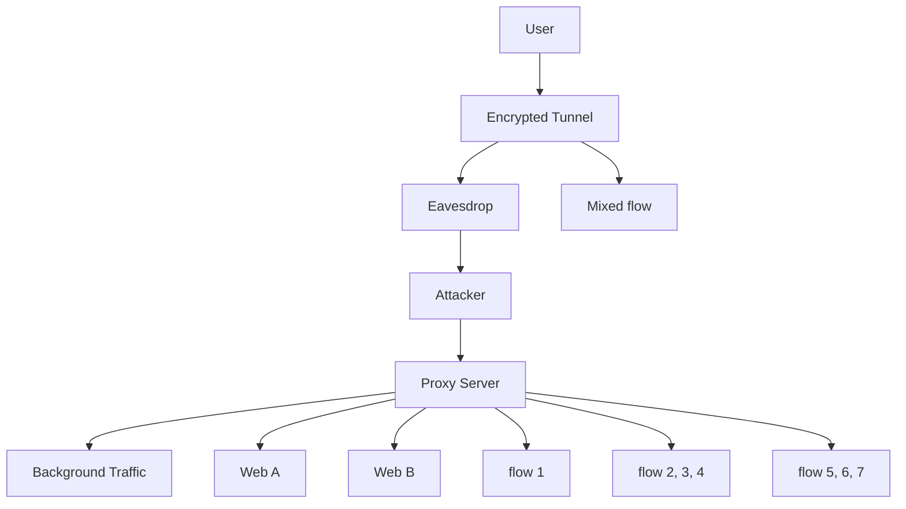
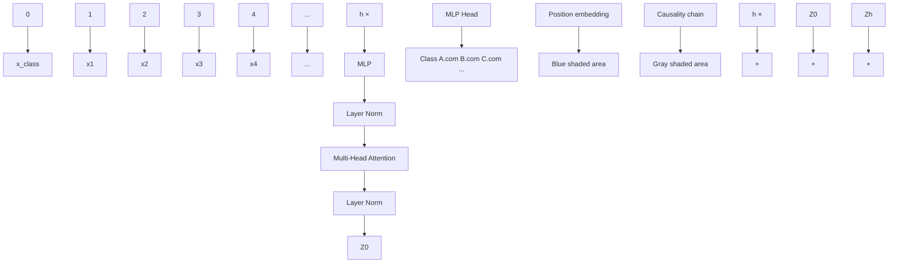
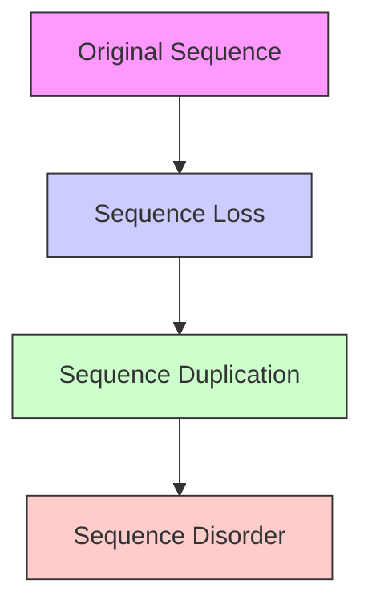

# Causality Correlation and Context Learning Aided Robust Lightweight Multi-Tab Website Fingerprinting Over Encrypted Tunnel

Siyang Chen1, Shuangwu Chen1,2, Huasen He1,2, Xiaofeng Jiang1,2, Jian Yang1,2, and Siyu Cheng1

1University of Science and Technology of China, Hefei 230027, Anhui, China 2Institute of Artifical Intelligence, Hefei Comprehensive National Science Center, Hefei 230088, Anhui, China

Abstract—Encrypted tunnels are increasingly applied to privacy protection, however, a passive eavesdropper can still infer which website a user is visiting via website fingerprinting (WF). State-of-the-art WF suffers from several critical challenges in a realistic multi-tab web browsing scenario, where the number of concurrent tabs is dynamic and uncertain, training a separate model for each website is too overweight to deploy, and the robustness against the packet loss, duplication and disorder caused by dynamic network conditions is rarely considered. To address these challenges, we propose a robust and lightweight multi-tab WF method over the encrypted tunnel, named RobustWF. Due to the causality relationship between user’s request and website’s response, RobustWF employs causality correlation to associate the interactive packets belonging to the same website together, which form a causality chain. Then, RobustWF utilizes context learning to capture the dependencies between the causality chains. The missing of some specific details does not have a significant impact on the overall structure of target web, thus enhancing the robustness of RobustWF. To make the model lightweight enough, RobustWF trains an integrated model to adapt to the dynamic number of concurrent tabs. The experimental results demonstrate that the accuracy of RobustWF improves 14% in dynamic multi-tab WF scenario compared to the State-of-the-art method.

# I. INTRODUCTION

Internet users are increasingly relying on privacy-enhancing technologies [1], [2] such as Tor [3], VPN [4], SSH [5], and V2ray [6] to encrypt the transmission content and conceal the communication relationship when browsing the web. Although only the side-channel information including packet sizes, time, and directions are available, a passive eavesdropper can still pry into which website a user is visiting in the encrypted tunnel via website fingerprinting (WF). As each website has its unique content and structure (e.g., HTML, CSS, and pictures), WF usually recognizes the target website through such distinctive patterns.

Most of the existing work [7], [8], [9], [10], [11] on WF are grounded a single-tab assumption that users only access one website at a time and attackers know when the website accessing starts and ends. In this case, the traffic in the encrypted tunnel is plain and pure, fully associated with one website. Nevertheless, the single-tab assumption is too idealistic in a realistic scenario, where users often open

multiple tabs for different websites simultaneously [12]. In a multi-tab scenario, the packets generated by different websites are intertwined and overlapped together. The jumbled traffic make it difficult to distinguish which packets belong to the same website, due to the data encryption in the tunnel. It has been demonstrated in [13] that the traditional single-tab WF methods fail in the multi-tab scenario.

Some recent work on multi-tab WF [14], [15], [16], [17], [18] have focused on relaxing the single-tab assumption. Based on the fact that there existed a time interval when visiting two websites, the studies in [14] and [16] attempted to find the separation points between the flows of different websites. The packets in such time interval were believed to belong to the same website, thus could be used for website recognition. Because the packets of different websites after the first separation point are still overlapped, these methods can hardly identify all but the first web page. To make a step forward, the studies in [15] and [17] divided the entire packet sequence into multiple segments, and inferred which website the segment belonged to, and synthesized the classification results of all segments. However, it is intractable to classify the segments suffering from website overlapping. The above researches all require a prior knowledge of the exact number of tabs opened by users, which is nearly impossible in practice. Recent study in [18] trained a separate binary classifier for each website and outputted the top-ranking website. The number of classifier would increase with the growth of target websites. This fact would greatly aggravate the computation burden, as the test sample need to be fed into all the classifiers. Moreover, none of the existing work has yet considered the impact of dynamic network conditions in a realistic environment, which could easily lead to the loss, duplication and disorder of packets in the tunnel. This situation may disrupt the constant sequential patterns learned from a static training dataset, thus significantly exacerbates the false recognition of target websites.

To address these challenges, we aim to develop a lightweight and robust WF model, named RobustWF, to adapt to the uncertain number of concurrent tabs and the dynamic changes of network environment. A website consists of various resources, each of which exhibits a unique sequential pattern [19]. A web browser usually requests different resources in a web page through separate sessions and assembles them to render a complete web page. There exists a potential causality relationship between the user’s request and the corresponding website’s response in a session. In light of this, RobustWF employs causality correlation to associate the interactive packets together, which forms a causality chain. In order to capture the dependencies between the causality chains, RobustWF utilizes context learning to obtain the overall structure of a target web. In this way, the missing of some specific details caused by packet loss, duplication, disorder does not have a significant impact on the overall web structure, thus enhancing the robustness of RobustWF. To make the model lightweight enough, RobustWF trains an integrated model to handle different numbers of concurrent tabs and monitored websites in a unified manner.

Our main contributions are summarized as follows:

• We develop a causality correlation mechanism to decouple the intertwined packets belonging to different websites into a series of causality chains, each of which associates the interactive packets in a session together. This mechanism can significantly alleviate the information confusion caused by mixed traffic of multiple concurrent websites visiting.   
• We devise a context learning method to aggregate the contextual association between the causality chains, which can capture the overall structure of a target web. In this way, the robustness of RobustWF against the packet loss, duplication, disorder caused by the dynamic changes of network condition is greatly improved.   
• We conceive a lightweight website recognition model to adapt to the dynamic changes of tabs and websites, which can decrease the complexity of WF deployment in a realistic scenario.   
• We have evaluated RobustWF on three widely used encrypted traffic datasets. The experimental results indicate that RobustWF achieves a higher accuracy and a stronger robustness in multi-tab WF compared to the state-of-theart methods.

The rest of this paper is organized as follows. Section II describes the threat model and challenges. Section III elaborates the details of the proposed RobustWF method and Section IV presents many comparative experiments to demonstrate the effectiveness and robustness of our method. Related work are comprehensively reviewed in Section V and the conclusion is drawn in Section VI.

# II. THREAT MODEL AND CHALLENGE

Fig. 1 illustrates a typical multi-tab WF scenario, where a user accesses the Internet through an proxy for privacy protection, and an adversary attempts to pry into whether the user is visiting specific websites via the encrypted tunnel. The realistic network environment poses immense challenges for WF as follows.

• Transmission Concealment (C1): Since a user does not establish a direct connection to the web server but relays connections via an encrypted proxy, the destination IP


<details>
<summary>flowchart</summary>


</details>

Fig. 1. Illustration of multi-tab web accessing.

address is fixed to the proxy. We can hardly identify which website a user is visiting just via IP. Meanwhile, all traffic from different websites are encapsulated into a single flow with an identical source/destination port when passing through the encrypted tunnels. We cannot distinguish which packets belong to the same website from the jumbled traffic. Moreover, due to the data encryption, the original information of websites such as domain names and web contents are concealed. We are unable to tell the specific website through packet inspection. In summary, it is challenging to perform WF simply relying on the side-channel information including packet sizes, time, and directions.

• Open-World Noise (C2): In real-world WF scenario, users may access any websites that are not in the monitoring list [20]. The traffic generated by these unknown websites are generally open-world noises to the welltrained WF model, as they may have a very different pattern from any know websites in the monitoring list but do not appear during model training. Without any prior knowledge, such open-world noises would inflict a non-trivial challenge on WF, because they may be misclassified as one of the known websites.   
• Dynamic Network Conditions (C3): The dynamic changes of network conditions between web server and proxy may impose additional challenges on WF. 1) Loss. Random packet loss may occur in the condition of network congestion or bit error during the transmission process from website to user. 2) Duplication. Some packets may be repeatedly sent due to transmission timeout, which would cause the sequence duplication. 3) Disorder. The different contents contained in a web page such as texts, images or videos may be sent from various servers due to the existence of CDN. The dynamic network condition between CDN servers and proxy could cause out-of-order packet arrival. The packet retransmission in case of packet loss would also lead to sequence disorder. These challenges may disrupt the constant sequential patterns learned from a static training dataset, leading to false recognition of WF, which however is rarely considered in the literature.   
• Multi-tab Websites Concurrency (C4): Since a user may visit multiple websites simultaneously, the packet sequences generated by different websites would be inter-

twined and overlapped randomly with each other, breaking the pure and plain traffic pattern of an individual website. It is intractable to separate the packets of different websites due to C1. This problem significantly increases the difficulty to recognize the multi-tab websites. Prior researches [17] on multi-tab WF are mostly granted on the assumption that users always open a fixed number of tabs. However, users may open or close any number of tabs as needed. This assumption also implies that we need to train a separate model for different numbers of tabs, which increases the complexity of WF model.

In summary, the above challenges require the WF model to be lightweight and generic to adapt to the uncertain number of concurrent tabs, and to be robust enough to accommodate the dynamic changes of network environment.

# III. ROBUSTWF METHOD FOR WEBSITE FINGERPRINTING

To systematically overcome the above challenges, we propose a WF method named RobustWF. Due to the limitation of C1, we only employ the packet size and direction in RobustWF. Although without any additional information such as IP, port, domain name, etc, the flows belonging to different websites in the encrypted tunnel are intertwined together, each website has its unique content and structure, that is, the HTML text, CSS files, and images are distinct from the others. As a result, the generated packets of each website exhibit a unique sequential pattern [19]. In light of this fact, RobustWF is able to recognize the target websites from the encrypted traffic. As illustrated in Fig. 2, RobustWF consists of six steps: (1) RF-labeling; (2) packet size filtering; (3) causality correlation; (4) causality chains construction; (5) context learning and (6) website recognition. Firstly, given the differences of packet size distribution, RobustWF employs a Random Forest (RF) to label the target packet sequence with potential websites, which greatly narrows down the identification range. Secondly, using the unique packet sizes associated with the website labels given by step (1), RobustWF can filter out irrelevant packets, thus reducing the noise impact caused by C2. Since there exists a causal relationship between the request and the corresponding response in the interaction, RobustWF adopts the causality correlation to mine the sequential patterns in the 3rd step. Afterwards, the packet sequence obtained in step (2) is segmented into a series of causality chains using the causality template given by step (3), which could handle the website concurrency problem of C4. To deal with C3, RobustWF leverages a context learning model to capture the dependencies between subsequences, which provides a global view of target website and enhances the robustness of WF. Finally, by assessing the consistency between the labels given in step (1) and (5), RobustWF can further reduce the misrecognition caused by open-world noise in C2. Below, we will elaborate the detailed process of each step.

# A. RF-labeling

Due to C1, we can only observe the size and direction of each packet from the encrypted tunnel. Let ${ \cal { S } } = \{ s _ { i } \} _ { i = } ^ { K }$ 1 denote the set of all directional packet sizes, where $\left| { s _ { i } } \right|$ represents the packet size and the sgn of $s _ { i }$ represents the packet direction. Specifically, $s _ { i } ~ > ~ 0$ indicates an incoming packet and $s _ { i } ~ < ~ 0$ indicates an outgoing packet. Let $P = [ p _ { 1 } , p _ { 2 } , \cdot \cdot \cdot , p _ { n } ]$ denote a certain packet sequence, where $p _ { n } \in S$ . The objective of multi-tab WF is to identify which target websites are visited in the sequence $P .$ Suppose there are M websites in the monitoring list. Here, we define an indicator vector $Y = \{ y _ { m } \} _ { m = 1 } ^ { M }$ to indicate whether the target website is visited. That is, if the m-th website is visited, $y _ { m } = 1$ , otherwise $y _ { m } = 0$ . Intuitively, as each website consists of different contents (e.g., HTML, images, CSS, etc.), it may exhibit a unique distribution of packet size. However, because of C4, the packet sequence from different websites would intertwine with each other.


<details>
<summary>flowchart</summary>

```mermaid
graph TD
    A["Traffic Processing"] --> B["1. RF-labeling"]
    B --> C["2. Packet Size Filtering"]
    C --> D["3. Causality Correlation"]
    D --> E["4. Causality Chains Construction"]
    E --> F["6. Website Recognition"]
    F --> G["5. Context Learning"]
    
    subgraph Inputs
        H["Users"] --> I["Encrypted tunnel"]
        J["Internet"] --> K["Packets Sequence"]
        L["S1 S2 S3 S4 ... S5"] --> M["A.com B.com"]
        N["S1 S2 S3 S4 ... S5"] --> O["A.com B.com"]
        P["S1 S2 S3 S4 ... S5"] --> Q["A.com B.com"]
    end
    
    subgraph Outputs
        R["Selected Website Label A, B or C"] --> S["Result"]
        T["Attack Result"] --> U["Result"]
    end
    
    subgraph Legend
        V["Web A"] --> W["Web B"] --> X["Web C"]
        Y["Website List [A,B,C"]] --> Z["Label A"]
        AA["S1 = [s1, s2, s3, s4, s5"]] --> AB["S4 = [s1, s2, s3, s4, s5"]]
        AC["S1 = S2, S3, S4"] --> AD["S4 = S5 = ..."]
        AE["S1 = S2, S3, S4"] --> AF["S4 = S5 = ..."]
        AG["S1 = S2, S3, S4"] --> AH["S4 = S5 = ..."]
        AI["S1 = S2, S3, S4"] --> AJ["S4 = S5 = ..."]
        AK["S1 = S2, S3, S4"] --> AL["S4 = S5 = ..."]
        AM["S1 = S2, S3, S4"] --> AN["S4 = S5 = ..."]
        AO["S1 = S2, S3, S4"] --> AP["S4 = S5 = ..."]
        AQ["S1 = S2, S3, S4"] --> AR["S4 = S5 = ..."]
        AS["S1 = S2, S3, S4"] --> AT["S4 = S5 = ..."]
        AU["S1 = S2, S3, S4"] --> AV["S4 = S5 = ..."]
        AW["S1 = S2, S3, S4"] --> AX["S4 = S5 = ..."]
        AY["S1 = S2, S3, S4"] --> AZ["S4 = S5 = ..."]
        BA["S1 = S2, S3, S4"] --> BB["S4 = S5 = ..."]
        BC["S1 = S2, S3, S4"] --> BD["S4 = S5 = ..."]
        BE["S1 = S2, S3, S4"] --> BF["S4 = S5 = ..."]
        BG["S1 = S2, S3, S4"] --> BH["S4 = S5 = ..."]
        BI["S1 = S2, S3, S4"] --> BJ["S4 = S5 = ..."]
        BK["S1 = S2, S3, S4"] --> BL["S4 = S5 = ..."]
        BM["S1 = S2, S3, S4"] --> BN["S4 = S5 = ..."]
        BO["S1 = S2, S3, S4"] --> BP["S4 = S5 = ..."]
        BQ["S1 = S2, S3, S4"] --> BR["S4 = S5 = ..."]
        BS["S1 = S2, S3, S4"] --> BT["S4 = S5 = ..."]
        BU["S1 = S2, S3, S4"] --> BV["S4 = S5 = ..."]
        BW["S1 = S2, S3, S4"] --> BX["S4 = S5 = ..."]
        BY["S1 = S2, S3, S4"] --> BZ["S4 = S5 = ..."]
        CA["S1 = S2, S3, S4"] --> CB["S4 = S5 = ..."]
        CC["S1 = S2, S3, S4"] --> CD["S4 = S5 = ..."]
        DE["S1 = S2, S3, S4"] --> DF["S4 = S5 = ..."]
        DG["S1 = S2, S3, S4"] --> DH["S4 = S5 = ..."]
        DI["S1 = S2, S3, S4"] --> DJ["S4 = S5 = ..."]
        DK["S1 = S2, S3, S4"] --> DL["S4 = S5 = ..."]
        DM["S1 = S2, S3, S4"] --> DJ
        EE["S1 = S2, S3, S4"] --> DD["S4 = S5 = ..."]
        DP["S1 = S2, S3, S4"] --> DR["S4 = S5 = ..."]
        DS["S1 = S2, S3, S4"] --> DT["S4 = S5 = ..."]
        DV["S1 = S2, S3, S4"] --> DT
        DW["S1 = S2, S3, S4"] --> DX["S4 = S5 = ..."]
        DX --> DX
    end
```
</details>

Fig. 2. The architecture of our website fingerprinting attack

We leverage a RF to roughly give the possible websites in the sequence P . Although the overall packet size distribution may be mixed together, each decision tree in RF focuses on a specific subset of features of the packet sequences, which can capture the distinctive patterns associated with different websites. Let $f _ { i }$ denote the frequency of $s _ { i }$ appeared in $P .$ . The packet size distribution of $P$ is denoted by $F =$ $[ f _ { 1 } , f _ { 2 } , \cdots , f _ { K } ]$ . We randomly select H features from F and I samples from the training set with replacement to build a decision tree. To perform the above process for Q times, we can get Q decision trees, forming a random forest. Each decision tree gives a label for the input sequence P indicating which website is likely to be visited. The top-ranking labels given by the decision trees, denoted by $\tilde { Y } = \{ \tilde { y } _ { m } \} _ { m = 1 } ^ { \bar { M } }$ , are regarded as the potential websites accessed in the sequence $P .$ . In this way, we do not have to have a prior knowledge of the explicit number of opened tabs in multi-tab WF, which is usually considered constant and known in advance for existing work [15].

# B. Packet Size Filtering

For a specific target website recognition, the packets generated by other websites are irrelevant noise as described in C2 and C4. Moreover, not all the packet sizes of target website can provide distinctive information to the recognition. For example, the texts and images of a news website are changing over time, whereas the web format such as CSS, fonts and scripts almost keeps stable [21]. The packets of timeinsensitive contents rather than the time-insensitive contents are indicative of target website. Another example is that the web media resource loading usually involves a large number of packets with a size of maximum transmission unit (MTU), and the TCP acknowledgement mechanism produces a lot of ACKs, both of which can not provide valuable information for target website recognition. Hence, it is necessary to filter out the noise and the indistinctive packets from the sequence $P .$

We define two metrics, i.e. frequency and confidence, to assess the ability of a specific packet size to be indicative of a target website. For a target website $m ,$ , the frequency and confidence of $s _ { i }$ are calculated as follows:

$$
F r e _ {m} ^ {s _ {i}} = \frac {\operatorname{Count} \left(\text {Packet} _ {m} ^ {s _ {i}}\right)}{\operatorname{Count} \left(\text {Sample} _ {m}\right)}, \operatorname{Con} _ {m} ^ {s _ {i}} = \frac {\operatorname{Count} \left(\text {Sample} _ {m} ^ {s _ {i}}\right)}{\operatorname{Count} \left(\text {Sample} _ {m}\right)}, \tag {1}
$$

where Coun $\ t ( P a c k e t _ { m } ^ { s _ { i } } )$ is the number of packets with a size of $s _ { i }$ in all the training samples of website $m ,$ $C o u n t ( S a m p l e _ { m } )$ is the number of training samples of website m, and $C o u n t ( S a m p l e _ { m } ^ { s _ { i } } )$ is the samples number of website m containing $s _ { i } . \mathrm { ~ A ~ }$ high $F r e _ { m } ^ { s _ { i } }$ indicates that the packet size $s _ { i }$ frequently appears in each sample of website m, for example the MTU packet and the ACK packet, thus is not indicative of website $m$ . Meanwhile, a low $C o n _ { m } ^ { s _ { i } }$ indicates that only a few samples of website m contains the packet size $s _ { i } ,$ such as the packets of time-sensitive contents, suggesting the packet size $s _ { i }$ is unrepresentative of website $m$ . Therefore, we keep only the packet size with a low frequency and a high confidence, and add it to a screen list $S _ { m } \subseteq S$ , which is indicative of the target website m. In the testing phase, for each website label given in section III-A, we can screen out a packet subsequence $P _ { m } \ ( \tilde { y } _ { m } = 1 )$ using $S _ { m } .$ , which removes the packets unrelated to the target website m.

# C. Causality Correlation

As different websites may associate with the same packet sizes, the subsequence $P _ { m }$ still contains many packets belonging to other websites cause by C4, making it difficult to accurately identify the target website. We need to further screen out the packets belonging to the same target website. Actually, the user’s web request triggers the web server to retrieve the corresponding resources and produce a series of response packets. Hence, there exists a causality relationship between the user’s request and the website’s response. Here, we can use causality correlation to discover the latent relationships between the bidirectional packets.

If two packet are too far apart in the sequence, they are considered irrelevant. Here, we define an association window W, which contains $W$ consecutive packets. If the packet with a size of $s _ { j }$ frequently appears within a window W of $s _ { i } .$ , we believe that $s _ { j }$ may be associated to $s _ { i }$ . Let a 2-tuple of $( s _ { i } , s _ { j } )$ denote the association pair. We employ the average causal effect (ACE) [22] to measure the correlation between $s _ { i }$ and $s _ { j }$ , which is calculated as follows:

$$
A C E (s _ {i}, s _ {j}) = P (s _ {j} | s _ {i}) - P (s _ {k} | s _ {i}, k \neq j), \tag {2}
$$

where $P ( s _ { i } | s _ { j } )$ is the probability that the occurrence of $s _ { j }$ is caused by $s _ { i }$ , and $P ( s _ { k } | s _ { i } )$ is the probability that the occurrence of $s _ { i }$ does not result in $s _ { j }$ . Here, we can use the following equations to estimate them:

$$
P \left(s _ {j} \mid s _ {i}\right) = \frac {a _ {s _ {i} , s _ {j}}}{\sum_ {s _ {k} \in S _ {m}} a _ {s _ {i} , s _ {k}}}, P \left(s _ {k} \mid s _ {i}, k \neq j\right) = \frac {\sum_ {s _ {k} \in S _ {m} , k \neq j} a _ {s _ {i} , s _ {k}}}{\sum_ {s _ {k} \in S _ {m}} a _ {s _ {i} , s _ {k}}} \tag {3}
$$

where $a _ { s _ { i } , s _ { j } }$ is the number of association pair $( s _ { i } , s _ { j } )$ in all the training samples of website m. A larger $A C E ( s _ { i } , s _ { j } )$ ) indicates a stronger association between $s _ { i }$ and $s _ { j }$ , suggesting that $s _ { i }$ is more likely to impact the occurrence of $s _ { j }$ within the window W. Hence, we can use a predefined threshold θ to screen out a set of causality correlation templates, denoted by $T _ { m } =$ $\{ \langle s _ { i } , s _ { j } \rangle \} , s _ { i } , s _ { j } \in S _ { m }$ where $A C E ( s _ { i } , s _ { j } ) > \theta$ . That is, for a template $\langle s _ { i } , s _ { j } \rangle , s _ { i }$ is the cause and $s _ { j }$ is the result, implying that the occurrence of $s _ { j }$ is due to $s _ { i }$ . For all templates in $T _ { m } ,$ if $s _ { i }$ only acts as a cause but not a result, $s _ { i }$ is treated as the root cause.

# D. Causality Chains Construction

When visiting a website, the web browser usually sends separate HTTP requests for different resources and the corresponding responses are conveyed via separate sessions. For example, the images, videos, and other media files are fetched separately through different connections and the browser assembles all the resources to render the complete web page for the user. Due to the causality relationship between user’s request and website’s response, the interactive packets in each session can form a causality chain. Given the causality correlation templates $T _ { m } ,$ , the subsequence $P _ { m }$ is decoupled into a series of causality chains as follows:

1) For each root cause s in $T _ { m }$ , find the packets A with a size of s in $P _ { m }$ ;   
2) For each packet $p \in A$ , find its associated results $s ^ { \prime }$ in $T _ { m } , ( { \mathrm { i . e . ~ } } \langle s , s ^ { \prime } \rangle ) ;$   
3) If the packet $p ^ { \prime }$ with a size of $s ^ { \prime }$ appears within the association window of $p ,$ append $p ^ { \prime }$ to a causality chain, like $p  p ^ { \prime } ;$   
4) Let $p = p ^ { \prime }$ and repeat the step 2) to 4).

For example, given four correlation templates $\langle s _ { 1 } , s _ { 2 } \rangle$ , $\langle s _ { 2 } , s _ { 3 } \rangle , \ \langle s _ { 2 } , s _ { 4 } \rangle , \ \langle s _ { 4 } , s _ { 5 } \rangle$ , a filtered subsequence $[ s _ { 1 } , s _ { 7 } , s _ { 6 }$ , $s _ { 2 } , s _ { 3 } , s _ { 6 } , s _ { 3 } , s _ { 4 } , s _ { 5 } , s _ { 8 } , s _ { 9 } , s _ { 8 } ]$ can be decoupled into three chains $s _ { 1 }  s _ { 2 }  s _ { 3 } , s _ { 1 }  s _ { 2 }  s _ { 3 } , s _ { 1 }  s _ { 2 }  s _ { 4 }  s _ { 5 }$ . In practice, we can remove the short chains, which hardly provide enough representative information for website recognition. In this way, the hybrid sequence $P _ { m }$ is further simplified into a list of causality chains, denoted by $C ( P _ { m } ) = [ c _ { 1 } , c _ { 2 } , \ldots , c _ { L } ] _ { }$ , each of which represents the establishment, transmission and termination of a session of target website m. Accordingly, the irrelevant packets are ignored, which significantly reduces the unknown and overlapping effects caused by C2 and C4.


<details>
<summary>flowchart</summary>


</details>

Fig. 3. Transformer based context learning.

# E. Context Learning

A complete web page is typically composed of multiple resources, however, a single causality chain can only describe the interaction behavior during the loading process of a specific resource. Hence, we need to associate all the causality chains to capture the overall structure of the target website via context learning. The widely used Transformer [23] is a feasible choice for this goal, which adopts a self-attention mechanism to learn the contextual associations at different levels. In light of this, we employ the Transformer to analyze the dependencies between the causality chains.

In practice, since both the length and number of the decoupled causality chains may vary widely, it is necessary to normalize them. Here, we utilize a fixed w and a fixed v to trim or pad the variable number and length of each causality chain, respectively. The list of causality chains is then normalized into a matrix $E = [ x _ { 1 } ; x _ { 2 } ; . . . ; x _ { w } ] \in \mathbb { R } ^ { w \times v }$ , where $x _ { i }$ represents the vector formed by the i-th causality chain. In order to fuse the contextual associations of all chains, we introduce an additional embedding vector $x _ { c l a s s } ~ \in ~ \mathbb { R } ^ { 1 \times v }$ , which is concatenated with the causality chain matrix E. Then, we get a new matrix $E ^ { ' } = [ x _ { c l a s s } ; x _ { 1 } ; x _ { 2 } ; . . . ; x _ { w } ] \in \mathbb { R } ^ { ( w + 1 ) \times v }$ . Since $x _ { c l a s s }$ is randomly initialized and has no semantics [24], it aggregates the features of all chains fairly, and provides a comprehensive representation of the website’s overall structure. Meanwhile, because the location of the causality chain in the original packet sequence actually represents the order of loading different website resources, we add a position vector $E _ { p o s } \in \mathbb { R } ^ { ( w + 1 ) \times v }$ to the matrix $E ^ { ' }$ , which enhances the model’s ability to capture the contextual relationships. Hence, the initial input of the transformer model is represented as:

$$
Z _ {0} = E ^ {\prime} + E _ {p o s}, Z _ {0} \in \mathbb {R} ^ {(w + 1) \times v}. \tag {4}
$$

The structure of our Transformer model is shown in the Fig. 3, which consists h stacked encoders. Each encoder is comprised of a Multi-head Self-Attention layer (MSA) and a Multi-Layer Perceptron (MLP) feed-forward network. Layer Normalization (LN) and Residual Connection (RC) are applied before and after each encoder, respectively. The extracted feature of the l-th encoder layer is represented by:


<details>
<summary>flowchart</summary>


</details>

Fig. 4. Causality chains construction for packet loss, duplication and disorder.

$$
Z _ {l} = M L P (L N (Z _ {l} ^ {\prime})) + Z _ {l} ^ {\prime}, l = 1... h, \tag {5}
$$

where $Z _ { l } ^ { \prime } \ = \ M S A ( L N ( Z _ { l - 1 } ) ) + Z _ { l - 1 }$ . After h times of feature fusion, the final $Z _ { h } ^ { 0 }$ (i.e. the updated $x _ { c l a s s } )$ can learn the contextual dependencies between the causality chains.

The context learning process enhances the robustness to C3. The loss, duplication and disorder of off-chain packets do not affect the construction of causality chains, and the distinctive patterns indicating a target website are still retained, thus having no impact on WF. The duplication of on-chain packets may increase an additional duplicated causality chain as shown in Fig. 4, which does not change the sequential patterns. The loss and disorder of on-chain packets makes it impossible to construct the corresponding causality chain. Because we rely on the dependencies of all the causality chains via context learning rather than an individual chain to recognize the target website, the missing of some specific details does not have a significant impact on the overall structure of target website.

# F. Website Recognition

After RF-labeling, we get a series of potential website labels for the raw packet sequence P . For each given label m $( \tilde { y } _ { m } = 1 )$ , we construct multiple lists of causality chains $C ( P _ { m } )$ ). While feeding each $C ( P _ { m } )$ into the transformer, we can get the fused feature vector $Z _ { h } ^ { 0 }$ . Here, we employ a MLP to perform fine-grained WF recognition as follows:

$$
\hat {y} = M L P (Z _ {h} ^ {0}). \tag {6}
$$

If $\hat { y } _ { m } ~ = ~ 1$ , the result is consistent with the RF-labeling, indicating that the website m is visited in the raw packet sequence P . Otherwise, the website m is not visited. Notably, we do not need to train a separate model for each website as well as for each fixed number of tabs, which remarkably decreases the complexity of WF deployment and can adapt to the dynamic tabs and websites in realistic scenario.

# IV. EVALUATION

To validate the effectiveness of RobustWF, we conduct experiments on three different datasets, each of which represents a kind of widely used encrypted proxy, and compare to five state-of-the-art methods. To make our work reproducible, we publicly release our code and dataset on GitHub [25].


<details>
<summary>bar</summary>

| Metric | CUMUL | APPscanner | DF | BAPM | ARES | RobustWF |
| :--- | :--- | :--- | :--- | :--- | :--- | :--- |
| Precision | 0.77 | 0.83 | 0.88 | 0.84 | 0.71 | 0.98 |
| Recall | 0.64 | 0.80 | 0.87 | 0.86 | 0.86 | 0.98 |
| F1-score | 0.66 | 0.80 | 0.87 | 0.83 | 0.73 | 0.98 |
</details>

Fig. 5. Performance in open-world single-tab scenario.

# A. Datasets

1) SSH70 [26]: It consists of traffic traces of requests and responses for 2000 websites over an encrypted SSH tunnel. The raw dataset contains a lot of empty pcap files, due to the failures in the data collection. In the experiment, we filter out the websites having too little data to analysis, i.e. the data size is less than 100 kb, and 70 websites are retained in the SSH70 dataset.   
2) OpenVPN40 : We build an OpenVPN tunnel to collect real web accessing traffic over VPN. Here, we select the top 40 domains in Alexa China as the target websites. We build an automated script using Selenium to access the web pages and use Tshark to record the web traffic traces. Each website is repeatedly accessed for 100 times with an interval of 300s, ensuring no overlapping between two separate web accesses.   
3) Monkey500 [27]: It is comprised of the traffic traces accessing 500 mobile websites, which records the direction, size and timestamp of the packets during user interactions with the website. Each website contains 50 instances.

# B. Baseline

To comprehensively evaluate the performance of RobustWF, we compare it with five state-of-the-art WF methods:

• CUMUL [9]: It utilizes a Support Vector Machines(SVM) to perform WF using 104 statistical features. Because the original CUMUL applies only to single-tab WF, we convert it to a multi-tab model, referred to as Multi-CUMUL, which outputs the top-ranking websites.   
• APPscanner [28]: It employs a random forest to perform single tab WF using 54 statistical features extracted from upstream, downstream, and bidirectional traffic. Similar conversion is also conducted on APPscanner to get a Multi-APPscanner model, so as to handle multi-tab WF.   
• DF [29]: It adopts a Convolutional Neural Networks (CNN) based deep learning model to perform single-tab WF. Both the packet size and direction are used as the input of DF. For multi-tab WF, we shift the activation


<details>
<summary>bar</summary>

|        | Multi-CUMUL | Multi-DF | ARES  | Multi-APPscanner | BAPM  | RobustWF |
| ------ | ----------- | -------- | ----- | ----------------- | ----- | -------- |
| 2-tab  | 0.18        | 0.48     | 0.63  | 0.33              | 0.49  | 0.71     |
| 3-tab  | 0.08        | 0.31     | 0.47  | 0.15              | 0.36  | 0.62     |
| 4-tab  | 0.06        | 0.23     | 0.34  | 0.11              | 0.26  | 0.54     |
| 5-tab  | 0.04        | 0.19     | 0.25  | 0.08              | 0.22  | 0.47     |
| dynamic-tab | 0.09      | 0.30     | 0.42  | 0.18              | 0.37  | 0.57     |
</details>

Fig. 6. Performance under dynamic number of tabs.

TABLE IPERFORMANCE IN CLOSED-WORLD SINGLE-TAB WF SCENARIO.

<table><tr><td rowspan="2">Dataset</td><td rowspan="2">Metric</td><td colspan="6">Method</td></tr><tr><td>CUMUL</td><td>APPscanner</td><td>DF</td><td>BAPM</td><td>ARES</td><td>RobustWF</td></tr><tr><td rowspan="4">SSH70</td><td>Acc</td><td>0.859</td><td>0.826</td><td>0.921</td><td>0.841</td><td>0.890</td><td>0.929</td></tr><tr><td>Pre</td><td>0.843</td><td>0.818</td><td>0.913</td><td>0.821</td><td>0.928</td><td>0.919</td></tr><tr><td>Rec</td><td>0.832</td><td>0.806</td><td>0.921</td><td>0.872</td><td>0.876</td><td>0.920</td></tr><tr><td>F1-Score</td><td>0.829</td><td>0.805</td><td>0.909</td><td>0.814</td><td>0.879</td><td>0.919</td></tr><tr><td rowspan="4">OpenVPN40</td><td>Acc</td><td>0.823</td><td>0.702</td><td>0.897</td><td>0.886</td><td>0.813</td><td>0.981</td></tr><tr><td>Pre</td><td>0.831</td><td>0.697</td><td>0.895</td><td>0.874</td><td>0.852</td><td>0.981</td></tr><tr><td>Rec</td><td>0.819</td><td>0.692</td><td>0.899</td><td>0.923</td><td>0.853</td><td>0.981</td></tr><tr><td>F1-Score</td><td>0.818</td><td>0.686</td><td>0.893</td><td>0.888</td><td>0.829</td><td>0.981</td></tr><tr><td rowspan="4">Monkey100</td><td>Acc</td><td>0.712</td><td>0.852</td><td>0.945</td><td>0.92</td><td>0.796</td><td>0.980</td></tr><tr><td>Pre</td><td>0.721</td><td>0.858</td><td>0.949</td><td>0.893</td><td>0.769</td><td>0.983</td></tr><tr><td>Rec</td><td>0.734</td><td>0.858</td><td>0.945</td><td>0.921</td><td>0.912</td><td>0.979</td></tr><tr><td>F1-Score</td><td>0.708</td><td>0.850</td><td>0.944</td><td>0.907</td><td>0.824</td><td>0.981</td></tr></table>

function of DF from softmax to sigmoid, referred to as Multi-DF. The websites having a high probability is believed to be visited in the tunnel.

• BAPM [17]: It adopts a CNN to generate tab-aware representations from the directional sequence and then preforms attention-based profiling to group blocks belonging to the same website tab.   
• ARES [18]: It employs a separate Transformer model for each target website to measure the likelihood that a specific website is visited, and the websites having a high likelihood is believed to be visited.

# C. Metric

1) Single-tab Metrics: Since WF is a multi-classification problem, we use accuracy (Acc), Macro-Precision (Pre), Macro-Recall (Rec), and Macro-F1 Score (F1-Score) as evaluation metrics. We assign equal weights to each category for macro metrics.   
2) Multi-tab Metrics: We use Acc and Jaccard-score [30] to evaluate the performance in multi-tab scenarios. Here, the Jaccard score measures the similarity between the predicted results and the ground-truth results.

# D. Single-Tab WF in Closed-World Scenario

The original dataset is randomly split into two parts including a test set (20%) and a training set (80%). All the websites in the test set also appear in the training set. Each test sample only contains the trace of a single website. Here, we only use the top 100 websites in the Monkey500 dataset as the monitoring list, referred as Monkey100. The experimental results are shown in Table I. We find that RobustWF outperforms the other methods in term of F1-Score on all the three datasets. DF achieves a rather high F1-Score, implying that the CNN used by DF is able to capture the sequential dependencies of encrypted packets. We also find that the performance of both APPscanner and CUMUL varies greatly on different datasets. For example, the F1-score of CUMUL reaches 0.829 in SSH70, but only 0.708 in Monkey100. Because APPscanner and CUMUL utilize statistical features for classification, which can hardly apply to different encrypted tunnels. ARES achieves a higher precision (0.928 vs. 0.919), but a much lower recall (0.876 vs. 0.920) than RobustWF in SSH70, implying that ARES may miss some target website samples. The above results indicate that RobustWF can work very well on different encrypted tunnels in closed-world scenario.

TABLE II PERFORMANCE UNDER DYNAMIC OVERLAP RATIO. 

<table><tr><td colspan="2">Overlapping proportion</td><td>0%</td><td>10%</td><td>20%</td><td>30%</td><td>40%</td><td>50%</td></tr><tr><td colspan="2">Metric</td><td>Acc</td><td>Acc</td><td>Acc</td><td>Acc</td><td>Acc</td><td>Acc</td></tr><tr><td rowspan="6">1st Tab</td><td>RobustWF</td><td>0.912</td><td>0.910</td><td>0.907</td><td>0.906</td><td>0.904</td><td>0.900</td></tr><tr><td>ARES</td><td>0.783</td><td>0.775</td><td>0.768</td><td>0.759</td><td>0.749</td><td>0.712</td></tr><tr><td>BAPM</td><td>0.770</td><td>0.751</td><td>0.744</td><td>0.715</td><td>0.692</td><td>0.673</td></tr><tr><td>Multi-CUMUL</td><td>0.382</td><td>0.393</td><td>0.370</td><td>0.379</td><td>0.385</td><td>0.388</td></tr><tr><td>Multi-APPscanner</td><td>0.456</td><td>0.457</td><td>0.441</td><td>0.444</td><td>0.460</td><td>0.456</td></tr><tr><td>Multi-DF</td><td>0.820</td><td>0.813</td><td>0.809</td><td>0.802</td><td>0.798</td><td>0.794</td></tr><tr><td rowspan="6">2nd Tab</td><td>RobustWF</td><td>0.906</td><td>0.901</td><td>0.884</td><td>0.864</td><td>0.862</td><td>0.850</td></tr><tr><td>ARES</td><td>0.708</td><td>0.706</td><td>0.701</td><td>0.687</td><td>0.683</td><td>0.661</td></tr><tr><td>BAPM</td><td>0.414</td><td>0.409</td><td>0.403</td><td>0.395</td><td>0.387</td><td>0.372</td></tr><tr><td>Multi-CUMUL</td><td>0.136</td><td>0.135</td><td>0.137</td><td>0.147</td><td>0.136</td><td>0.135</td></tr><tr><td>Multi-APPscanner</td><td>0.452</td><td>0.456</td><td>0.456</td><td>0.459</td><td>0.450</td><td>0.448</td></tr><tr><td>Multi-DF</td><td>0.373</td><td>0.362</td><td>0.344</td><td>0.336</td><td>0.332</td><td>0.323</td></tr></table>

# E. Single-Tab WF in Open-World Scenario

To evaluate the performance in a realistic scenario consisting of open-world noise, the remaining 400 websites (1 instance for each website) in the Monkey500 are added to the test set and the other setting is the same with the above experiment. Since these websites do not appear in the training set, they are treated as open-world noise. If the test sample falls outside the monitoring list, it is regarded as an unknown website. The evaluation metrics are computed over 101 classes, including 100 monitoring websites and 1 unknown website. The experimental results are shown in Fig. 5. We observe that the Precision, Recall, and F1-scores of RobustWF are 98.2%, 98.1%, and 98.1% respectively, which are all better than the baseline methods. Compared to the results in closedworld scenario, the performance of RobustWF almost remains unchanged. By assessing the consistency between the labels given in step (1) and (5), RobustWF can reduce the misrecognition caused by open-world noise. By contrast, the F1-scores of CUMUL, APPscanner, DF , BAPM and ARES have a great degradation, falling from 0.708, 0.850, 0.944, 0.907, 0.824 to 0.657, 0.795, 0.866, 0.832, 0.728, respectively. The five methods may misclassify the open-world noise to one of the known websites.

# F. Multi-Tab WF in Closed-World Scenario

1) Experiment on dynamic overlap ratios: When visiting two websites, the tail of the first flow may overlap with the head of the second flow. In order to verify the performance of RobustWF in this case, we generate a 2-tab sample by randomly merging two single-tab samples together with an overlap ratio of 0 to 50%. Totally, we generate 1000 2-tab test samples for each overlap ratio using Monkey100. Table II shows the recognition accuracy of the two tabs under different overlap ratios. We observe that RobustWF achieves an accuracy of over 85% for both tabs, which outperforms the baselines. Meanwhile, as the increase of overlap ratio, the accuracy of RobustWF, ,BAPM, ARES and Multi-DF decreases, whereas Multi-CUMUL and Multi-APPscanner almost remain unchanged. Because the former methods rely on the sequential features, which may be disturbed by sequence overlapping. By contrast, the latter methods rely on the statistical features, which are not affected by the overlapping area. Moreover, the accuracy of the 1st tab is much high than the 2nd tab. Because the work in [15] has revealed that the head of a flow is more critical than the other part in WF. The above results indicate that RobustWF can deal with overlap issue in multi-tab WF.


<details>
<summary>bar</summary>

| Model | Close-World | Open-World |
| :--- | :--- | :--- |
| Multi-CUMUL | 0.18 | 0.07 |
| Multit-APPscanner | 0.33 | 0.13 |
| Multi-DF | 0.48 | 0.42 |
| BAPM | 0.49 | 0.40 |
| ARES | 0.62 | 0.52 |
| RobustWF | 0.71 | 0.57 |
</details>

Fig. 7. Performance in open-world multi-tab scenario.

2) Experiment on dynamic number of tabs: Similar to the above 2-tab experiment, we generate the 3-tab, 4-tab and 5- tab datasets, where two adjacent flows have an overlap ratio of 30%. We also create a dynamic-tab dataset where the number of tabs dynamically varies from 2 to 5. Here, we use a comprehensive metric Jaccard score to measure the performance on multi-tab WF and the experimental results are shown in Fig. 6. We find that the Jaccard score falls with the increase of tab number. Actually, both false negatives and false positives can reduce the Jaccard score. Mixing the packets belonging to too many tabs may increase the difficulty of WF, which may reduce the true positives and improve the false positives. We also find that RobustWF performs the best on all tab numbers including dynamic tab numbers among the five WF methods. RobustWF can reduce the false positives by assessing the consistency between the result given by the statistical feature based RF-labeling and the result given by the sequential feature based transformer. By contrast, the five baselines use either the statistical feature or the sequential feature. The above results demontrate that RobustWF can adapt to the dynamic changes of tabs in the tunnel.


<details>
<summary>line</summary>

| Loss Ratio | Multi-CUMUL | Multi-APPScanner | Multi-DF | BAPM | ARES | RobustWF |
| ---------- | ----------- | ---------------- | -------- | ---- | ---- | -------- |
| 0.00       | 0.1         | 0.1              | 0.4      | 0.4  | 0.5  | 0.55     |
| 0.03       | 0.1         | 0.1              | 0.4      | 0.35 | 0.45 | 0.55     |
| 0.09       | 0.1         | 0.1              | 0.4      | 0.3  | 0.4  | 0.55     |
| 0.12       | 0.1         | 0.1              | 0.4      | 0.25 | 0.35 | 0.5      |
| 0.15       | 0.1         | 0.1              | 0.35     | 0.2  | 0.3  | 0.45     |
</details>

(a) Packet loss.


<details>
<summary>line</summary>

| Duplication Ratio | Multi-CUMUL | Multi-APPscanner | Multi-DF | BAPM | ARES | RobustWF |
| ----------------- | ----------- | ---------------- | -------- | ---- | ---- | -------- |
| 0.00              | 0.1         | 0.1              | 0.4      | 0.4  | 0.5  | 0.6      |
| 0.03              | 0.1         | 0.1              | 0.4      | 0.3  | 0.5  | 0.6      |
| 0.06              | 0.1         | 0.1              | 0.4      | 0.3  | 0.45 | 0.6      |
| 0.09              | 0.1         | 0.1              | 0.4      | 0.3  | 0.4  | 0.6      |
| 0.12              | 0.1         | 0.1              | 0.4      | 0.3  | 0.35 | 0.6      |
| 0.15              | 0.1         | 0.1              | 0.4      | 0.3  | 0.3  | 0.6      |
</details>

(b) Packet duplication.


<details>
<summary>line</summary>

| Disorder Ratio | Multi-CUMUL | Multi-APPscanner | Multi-DF | BAPM | ARES | RobustWF |
| -------------- | ----------- | ----------------- | -------- | ---- | ---- | -------- |
| 0.00           | 0.42        | 0.42              | 0.42     | 0.42 | 0.52 | 0.58     |
| 0.03           | 0.40        | 0.40              | 0.40     | 0.38 | 0.50 | 0.57     |
| 0.06           | 0.38        | 0.38              | 0.38     | 0.34 | 0.48 | 0.56     |
| 0.09           | 0.36        | 0.36              | 0.36     | 0.32 | 0.46 | 0.55     |
| 0.12           | 0.34        | 0.34              | 0.34     | 0.30 | 0.44 | 0.54     |
| 0.15           | 0.32        | 0.32              | 0.32     | 0.28 | 0.42 | 0.53     |
</details>

(c) Packet disorder.   
Fig. 8. Performance on dynamic network conditions

# G. Multi-Tab WF in Open-World Scenario

To evaluate the performance in a multi-tab scenario consisting of open-world noise, we randomly select an instance from the remaining 400 websites in the Monkey500 and mix it with a 2-tab sample. The experimental results are shown in Fig. 7. The Jaccard score of all methods in open-world scenario is much lower than that in closed-world scenario, which highlights the challenges posed by the open-world noise. Since the number of open-world websites can be extremely huge, it is impossible to have prior knowledge about all the potentially visited websites. The classifier may be confused by the openworld noise, which is unseen in the training set, leading to the increase of both the false positive and false negative. However, despite the challenges posed by open-world noise, RobustWF still outperforms the baselines because RobustWF can handle previously data that has yet to appear effectively through its unique filtering mechanism.

# H. Robustness in Multi-Tab Scenario

1) Experiment on dynamic network conditions: When there are dynamic changes in the network conditions between the website server and the proxy, it may cause packet loss, duplication, and disorder, which can lead to the performance degradation of WF. We conduct a series of experiments to assess the robustness of RobustWF in the face of packet loss, duplication, and disorder caused by unstable network conditions. In the experiments, we randomly lose, duplicate, or shuffle some packets of the raw packet sequence of open-world multi-tab dataset in a ratio of 10% to 50%. The experimental results are plotted in Fig. 8. We find that the Jaccard scores of all methods fall down as the increase of the ratio of packet loss, duplication and disorder. In particular, the performances of ARES have a remarkable drop in the case of packet loss and duplication, whereas the performances of Multi-APPscanner is almost unaffected. This is because that Multi-APPscanner identifies websites based on statistical characteristics, which capture the patterns and trends in the traffic data without being heavily impacted by several packet loss or duplication. By contrast, the significant drop in the performance of ARES can be attributed to its design, which involves multiple binary classifiers and relies on integrating the results of all classifiers as the final output. The packet loss and duplication can simultaneously disrupt the discrimination capabilities of all classifiers in ARES, leading to less accurate predictions. As for RobustWF, it achieves a Jaccard score of over 49% across all scenarios under different ratios of packet loss, duplication, and disorder. Additionally, the maximum drop in Jaccard score for RobustWF is under 7% with the ratio of traffic fluctuation noise increasing from 0% to 15%, which demonstrates the robustness of RobustWF in dynamic network conditions.


<details>
<summary>line</summary>

| Website Num | Multi-CUMUL | Multi-APPScanner | Multi-DF | BAPM | ARES | RobustWF |
| ----------- | ----------- | ----------------- | -------- | ---- | ---- | -------- |
| 100         | 0.35        | 0.48              | 0.48     | 0.48 | 0.62 | 0.70     |
| 200         | 0.32        | 0.45              | 0.45     | 0.45 | 0.58 | 0.68     |
| 300         | 0.30        | 0.42              | 0.42     | 0.42 | 0.55 | 0.65     |
| 400         | 0.28        | 0.40              | 0.40     | 0.40 | 0.52 | 0.63     |
| 500         | 0.25        | 0.38              | 0.38     | 0.38 | 0.48 | 0.61     |
</details>

(a) Performance comparison.

  
(b) Time cost comparison.   
Fig. 9. Performance on different number of monitored websites.

# 2) Experiment on number of monitored websites:

To evaluate the impact of the number of monitored websites on identification performance and training time cost, the remaining 400 websites in the Monkey500 are added to the training set to train a new model of all methods. We also add them to the test set to generate the corresponding 2- tab samples for model assessment. The experimental results are shown in Fig. 9(a) and Fig. 9(b). We find that as the growth of monitored websites, the Jaccard scores of all the five methods decrease. A larger website numbers indicating that the classifier needs to learn and distinguish between more website patterns, making the recognition task more complex and challenging. Moreover, the time cost of modle training also increases with the number of monitored websites, as training a model on a larger dataset with more websites takes more time and computational resources. Notably, ARES shows a significantly higher training time cost compared to other methods because ARES adopts a separate model for each target website. We also find that RobustWF exhibits the best performance compared to the other five methods while maintaining an acceptable time cost.

# V. RELATED WORK

Extensive researches typically focused on single-tab WF, which leveraged expert knowledge to analyze the unique statistical features of different target websites and adopted a machine learning based classifier to identify the target websites. Panchenko et al. [9] proposed a single-tab WF method called CUMUL, which extracted a fixed number of cumulative packet length features from traffic traces and evaluated WF attacks at Internet scale. Taylor et al. [28] presented an automatic fingerprinting framework, referred as APPScanner, for real-time identification of encrypted applications, which extracted relevant statistical features from incoming, outgoing, and complete traffic. To make a step forward, Hayes et al. [8] employed a random forest to analyze the importance of different statistical features, and utilized a KNN for target website classification, which significantly reduced the number of input features. To address the open-world noise problems caused by multiplexing, Li et al. [27] proposed a novel fingerprinting method to identify target application from encrypted traffic, which used a sequential XGBoost model and a hierarchical bag-of-words model to extract the sequence similarity and the structural similarity, respectively. The above methods all rely on manual feature extraction, which is usually inefficient and time-consuming in practice. To overcome this problem, deep learning based WF was proposed. Sirinam et al. [29] employed a CNN model to automatically learning the sequential features of target website, which exhibited a great robustness against WF defense. Rimmer et al. [10] further applied three different deep learning models including Stacked Denoising Autoencoder (SDAE), CNN and Long Short Term Memory (LSTM) to WF, and compared their strengths and weaknesses. In order to reduce the samples used for training the deep learning model, Bhat et al. [31] introduced a semi-automatic feature extraction model for WF, named Var-CNN, which combined both manual features and automatically extracted features. In reality, users may open multiple tabs to visit different websites simultaneously. In this situation, the packet sequences belonging to different websites are intertwined with each other. However, Juarez et al. [13] have revealed that existing singletab WF methods cannot work for multi-tab accessing.

TABLE III WF ATTACKS WITH CORRELATION ANALYSIS 

<table><tr><td rowspan="2">References</td><td rowspan="2">C1</td><td rowspan="2">C2</td><td colspan="3">C3</td><td rowspan="2">C4</td></tr><tr><td>Loss</td><td>Duplication</td><td>Disorder</td></tr><tr><td>[9]</td><td>√</td><td>√</td><td>×</td><td>×</td><td>×</td><td>×</td></tr><tr><td>[8]</td><td>√</td><td>√</td><td>×</td><td>×</td><td>×</td><td>×</td></tr><tr><td>[28]</td><td>√</td><td>√</td><td>×</td><td>×</td><td>×</td><td>×</td></tr><tr><td>[27]</td><td>√</td><td>√</td><td>√</td><td>×</td><td>×</td><td>×</td></tr><tr><td>[29]</td><td>√</td><td>√</td><td>×</td><td>×</td><td>×</td><td>×</td></tr><tr><td>[6]</td><td>×</td><td>√</td><td>×</td><td>×</td><td>×</td><td>dynamic</td></tr><tr><td>[31]</td><td>√</td><td>√</td><td>×</td><td>×</td><td>×</td><td>×</td></tr><tr><td>[16]</td><td>√</td><td>√</td><td>×</td><td>×</td><td>×</td><td>fixed</td></tr><tr><td>[17]</td><td>√</td><td>√</td><td>×</td><td>×</td><td>×</td><td>fixed</td></tr><tr><td>[18]</td><td>√</td><td>√</td><td>×</td><td>×</td><td>×</td><td>dynamic</td></tr><tr><td>Proposed</td><td>√</td><td>√</td><td>√</td><td>√</td><td>√</td><td>dynamic</td></tr></table>

To overcome the obstacle caused by websites concurrency, recent researches have focused on multi-tab WF. Some work on multi-tab WF attempted to separate the flows of different websites. Wang et al. [14] attempted to find the separation point between the first tab and the subsequent tab using 23 features associated with the time interval between packets. The packets before the separation point were believed to be solely associated with the first tab, and thus could be used for target website recognition based on single-tab WF. Xu et al. [16] further improved the accuracy of separation point identification by filtering out the redundant or less effective features. The clean traffic before the separation point were input into an XGBoost classifier to obtain the label of the first tab. However, the above methods can only identify the first web page, because the packet sequences belonging to different websites are still overlapped with each other after the first separation point. To address this problem, Cui et al. [15] segmented the encrypted traffic into multiple blocks, each of which had the same number of packets, predicted which website a block belonged to, and voted the top-ranking websites. Although this method can give multiple labels for multi-tab accessing, the block that blends together the packets from two or more websites can hardly be identified. In order to reduce the impact of mixed traffic, Guan et al. [17] employed the attention mechanism to estimate the block relations and the blocks belonging to the same website were grouped together. However, this method needs to know the exact number of tabs opened by users in advance, which is impractical in reality. Recently, Deng et al. [18] proposed a novel multi-tab WF method regardless of the number of concurrent tabs, which trained a separate Transformer model for each target website. Each model only focused on estimating the likelihood whether a specific website was visited. The number of classification models would increase with the target websites, which is too heavyweight to be deployed in practice. From the above literature review, we find that none of existing work has yet considered the impact of packet loss, duplication and disorder caused by the dynamic changes of realistic network condition on WF, which could disrupt the constant sequential patterns learned from a static training dataset. We compare the capacity of related work against the challenges mentioned in Section II to our proposed method in Table III.

# VI. CONCLUSION

In this paper, we proposed a novel method RobustWF based on causality correlation and context learning to solve the challenges faced by existing multi-tab WF methods including transmission concealment, open-world noise, dynamic network conditions and multi-tab websites concurrency in real-world scenarios. RobustWF utilized causality correlation to form causality chains, which distinguished intertwined packets belonging to different websites in multi-tab scenario, and employed context learning to capture the dependencies between causality chains to enhance its robustness to packet loss, duplication, and disorder caused by dynamic changes in network conditions. For future work, we will focus on how our model can be improved when various traffic defense measures are applied.

# ACKNOWLEDGMENT

This work is supported by the National Natural Science Foundation of China (No. 62101525, 62341113) and the Key Science and Technology Project of Anhui (No. 202103a05020006). We also acknowledge the support of China Environment for Network Innovations (CENI).

# REFERENCES

[1] Z. Ling, G. Xiao, W. Wu, X. Gu, M. Yang, and X. Fu, “Towards an efficient defense against deep learning based website fingerprinting,” in Proceedings of the IEEE Conference on Computer Communications (INFOCOM), pp. 310–319, 2022.   
[2] A. Abusnaina, R. Jang, A. Khormali, D. Nyang, and D. Mohaisen, “DFD: adversarial learning-based approach to defend against website fingerprinting,” in Proceedings of the IEEE Conference on Computer Communications (INFOCOM), pp. 2459–2468, 2020.   
[3] A. Mani, T. Wilson-Brown, R. Jansen, A. Johnson, and M. Sherr, “Understanding tor usage with privacy-preserving measurement,” in Proceedings of the Internet Measurement Conference (IMC), pp. 175– 187, 2018.   
[4] D. Xue, R. Ramesh, A. Jain, M. Kallitsis, J. A. Halderman, J. R. Crandall, and R. Ensafi, “Openvpn is open to VPN fingerprinting,” in Proceedings of the USENIX Security Symposium (Security), pp. 483– 500, 2022.   
[5] L. Lu, E. Chang, and M. C. Chan, “Website fingerprinting and identification using ordered feature sequences,” in Proceedings of European Symposium on Research in Computer Security (ESORICS), pp. 199–214, 2010.   
[6] X. Ma, M. Shi, B. An, J. Li, D. X. Luo, J. Zhang, and X. Guan, “Contextaware website fingerprinting over encrypted proxies,” in Proceedings of the IEEE Conference on Computer Communications (INFOCOM), pp. 1–10, 2021.   
[7] T. Wang, X. Cai, R. Nithyanand, R. Johnson, and I. Goldberg, “Effective attacks and provable defenses for website fingerprinting,” in Proceedings of the USENIX Security Symposium (Security), pp. 143–157, 2014.   
[8] J. Hayes and G. Danezis, “k-fingerprinting: A robust scalable website fingerprinting technique,” in Proceedings of the USENIX Security Symposium (Security), pp. 1187–1203, 2016.   
[9] A. Panchenko, F. Lanze, J. Pennekamp, T. Engel, A. Zinnen, M. Henze, and K. Wehrle, “Website fingerprinting at internet scale,” in Proceedings of the Network Distributed System Security Symposium (NDSS), 2016.   
[10] V. Rimmer, D. Preuveneers, M. Juarez, T. van Goethem, and W. Joosen, ´ “Automated website fingerprinting through deep learning,” in Proceedings of the Network and Distributed System Security Symposium (NDSS), 2017.   
[11] J. Yan and J. Kaur, “Feature selection for website fingerprinting,” in Proceedings of the Privacy Enhancing Technologies (PET), pp. 200– 219, 2018.   
[12] C. von der Weth and M. Hauswirth, “DOBBS: towards a comprehensive dataset to study the browsing behavior of online users,” pp. 51–56, 2013.   
[13] M. Juarez, S. Afroz, G. Acar, C. D ´ ´ıaz, and R. Greenstadt, “A critical evaluation of website fingerprinting attacks,” in Proceedings of the ACM Conference on Computer and Communications Security (CCS), pp. 263– 274, 2014.   
[14] T. Wang and I. Goldberg, “On realistically attacking tor with website fingerprinting,” in Proceedings of the Privacy Enhancing Technologies (PET), pp. 21–36, 2016.   
[15] W. Cui, T. Chen, C. Fields, J. Chen, A. Sierra, and E. Chan-Tin, “Revisiting assumptions for website fingerprinting attacks,” in Proceedings of the Asia Conference on Computer and Communications Security (ASIACCS), pp. 328–339, 2019.   
[16] Q. Yin, Z. Liu, Q. Li, T. Wang, Q. Wang, C. Shen, and Y. Xu, “An automated multi-tab website fingerprinting attack,” IEEE Transactions on Dependable and Secure Computing, vol. 19, no. 6, pp. 3656–3670, 2022.   
[17] Z. Guan, G. Xiong, G. Gou, Z. Li, M. Cui, and C. Liu, “BAPM: block attention profiling model for multi-tab website fingerprinting attacks on tor,” in Proceedings of the Annual Computer Security Applications Conference (ACSAC), pp. 248–259, 2021.   
[18] X. Deng, Q. Yin, Z. Liu, X. Zhao, Q. Li, M. Xu, K. Xu, and J. Wu, “Robust multi-tab website fingerprinting attacks in the wild,” in Proceedings of the IEEE Symposium on Security and Privacy (S&P), pp. 1005–1022, 2023.   
[19] B. Gulmezoglu, “Xai-based microarchitectural side-channel analysis for website fingerprinting attacks and defenses,” IEEE Transactions on Dependable and Secure Computing, vol. 19, no. 6, pp. 4039–4051, 2022.   
[20] Y. Wang, H. Xu, Z. Guo, Z. Qin, and K. Ren, “snwf: Website fingerprinting attack by ensembling the snapshot of deep learning,” IEEE Transactions on Information Forensics and Security, vol. 17, pp. 1214– 1226, 2022.

[21] C. Li, L. Nie, L. Zhao, and K. Li, “Robust website fingerprinting through resource loading sequence,” World Wide Web, pp. 1–21, 2023.   
[22] S. Kleinberg and G. Hripcsak, “A review of causal inference for biomedical informatics,” Journal of biomedical informatics, pp. 1102– 1112, 2011.   
[23] A. Vaswani, N. Shazeer, N. Parmar, J. Uszkoreit, L. Jones, A. N. Gomez, L. Kaiser, and I. Polosukhin, “Attention is all you need,” in Proceedings of the Advance in Neural Information Processing Systems(NIPS), pp. 5998–6008, 2017.   
[24] A. Dosovitskiy, L. Beyer, A. Kolesnikov, D. Weissenborn, X. Zhai, T. Unterthiner, M. Dehghani, M. Minderer, G. Heigold, S. Gelly, J. Uszkoreit, and N. Houlsby, “An image is worth 16x16 words: Transformers for image recognition at scale,” in Proceedings of the International Conference on Learning Representations (ICLR), 2021.   
[25] “Data and code, https://github.com/chenxiailian/robustweb,”   
[26] M. Liberatore and B. N. Levine, “Inferring the source of encrypted HTTP connections,” in Proceedings of the ACM Conference on Computer and Communications Security (CCS), pp. 255–263, 2006.   
[27] J. Li, S. Wu, H. Zhou, X. Luo, T. Wang, Y. Liu, and X. Ma, “Packet-level open-world app fingerprinting on wireless traffic,” in Proceedings of the Network and Distributed System Security Symposium (NDSS), 2022.   
[28] V. F. Taylor, R. Spolaor, M. Conti, and I. Martinovic, “Appscanner: Automatic fingerprinting of smartphone apps from encrypted network traffic,” in Proceedings of the IEEE European Symposium on Security and Privacy (EuroS&P), pp. 439–454, 2016.   
[29] P. Sirinam, M. Imani, M. Juarez, and M. Wright, “Deep fingerprinting: ´ Undermining website fingerprinting defenses with deep learning,” in Proceedings of the ACM Conference on Computer and Communications Security (CCS), 2018.   
[30] Z. Zhang, Q. Zou, Y. Lin, L. Chen, and S. Wang, “Improved deep hashing with soft pairwise similarity for multi-label image retrieval,” IEEE Transactions on Multimedia, vol. 22, no. 2, pp. 540–553.   
[31] S. Bhat, D. Lu, A. Kwon, and S. Devadas, “Var-cnn: A data-efficient website fingerprinting attack based on deep learning,” in Proceedings of the Privacy Enhancing Technologies (PET), pp. 292–310, 2019.