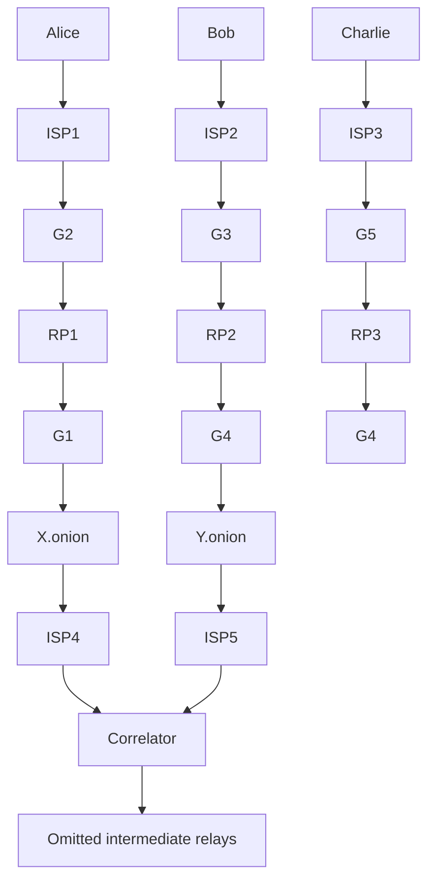

# Flow Correlation Attacks on Tor Onion Service Sessions with Sliding Subset Sum

Daniela Lopes∗, Jin-Dong Dong†, Pedro Medeiros∗, Daniel Castro∗, Diogo Barradas‡, Bernardo Portela§, Joao Vinagre ˜ §, Bernardo Ferreira¶, Nicolas Christin†, Nuno Santos∗

∗INESC-ID / IST, Universidade de Lisboa, {daniela.lopes,pedro.de.medeiros,daniel.castro,nuno.m.santos}@tecnico.ulisboa.pt

†Carnegie Mellon University, jd0@cmu.edu, nicolasc@andrew.cmu.edu

‡University of Waterloo, diogo.barradas@uwaterloo.ca

§INESC TEC / Universidade do Porto, bernardo.portela@fc.up.pt, jnsilva@inesctec.pt

¶LASIGE, Faculdade de Ciencias, Universidade de Lisboa, blferreira@fc.ul.pt ˆ

Abstract—Tor is one of the most popular anonymity networks in use today. Its ability to defend against flow correlation attacks is essential for providing strong anonymity guarantees. However, the feasibility of flow correlation attacks against Tor onion services (formerly known as “hidden services”) has remained an open challenge. In this paper, we present an effective flow correlation attack that can deanonymize onion service sessions in the Tor network. Our attack is based on a novel distributed technique named Sliding Subset Sum (SUMo), which can be deployed by a group of colluding ISPs worldwide in a federated fashion. These ISPs collect Tor traffic at multiple vantage points in the network, and analyze it through a pipelined architecture based on machine learning classifiers and a novel similarity function based on the classic subset sum decision problem. These classifiers enable SUMo to deanonymize onion service sessions effectively and efficiently. We also analyze possible countermeasures that the Tor community can adopt to hinder the efficacy of these attacks.

# I. INTRODUCTION

Tor is a widely recognized low-latency anonymity network that allows users to circumvent surveillance, eavesdropping, and censorship [23, 37, 53]. It offers client-side anonymity by enabling Internet users to browse the web without revealing their IP addresses. This is achieved through multilayer encrypted channels known as circuits, involving three relay nodes—guard (or entry), middle, and exit nodes—that act as client proxies. Additionally, with onion services, Tor also provides server-side anonymity. Formerly known as hidden services [23], these services permit website providers to operate servers while concealing their network locations. Instead of conventional DNS name resolution, they use unique .onion addresses, which Tor resolves without revealing their IP addresses. When a user visits an onion service, Tor establishes an encrypted communication session between the client and the onion service via an intermediary relay node—the rendezvous point. This node ensures their mutual anonymity by simply forwarding packets and concealing their IP addresses. With these privacy protections, onion services have become instrumental for a range of users, including privacy-conscious individuals, journalists, activists, and whistleblowers [13, 26].

In this work, we introduce a novel flow correlation attack aimed at deanonymizing Tor onion service sessions. Although the domain of Tor onion services has received much attention regarding potential traffic analysis attacks, researchers have predominantly been focused on website fingerprinting [44, 63, 66]. These methods analyze packet timings and sizes to infer the visited .onion address, but they differ fundamentally from flow correlation attacks, notably in their inability to discover the visited onion service’s IP address in a Tor onion service session. In contrast, flow correlation attacks correlate the timing patterns and volume of packets exchanged in a Tor circuit to deanonymize its endpoints [23], requiring an adversary that can monitor the guard and exit nodes of active circuits, such as colluding ISPs [46, 56, 59, 72, 75].

Approaches like DeepCorr [59] and DeepCoFFEA [62] employ deep learning classifiers to accurately match flows entering and leaving the Tor network. Yet, having been tailored for Tor traffic toward clearnet websites, these classifiers may falter with the unique characteristics of Tor onion service traffic, e.g., onion services multiplex sessions from multiple clients through the same TLS connection. Moreover, these techniques have limitations in performance and potential susceptibility to overestimating the classifier results due to not accounting for the imbalance between Tor flows to the clearnet and total observed flows. To counter this second issue, Kwon et al. [44] proposed circuit fingerprinting, which is capable of accurately distinguishing clients from onion services engaged in onion service sessions. However, despite its proven efficacy in mitigating class imbalance issues, their technique has fallen short due to recent updates in Tor protocols, in particular, the application of padding schemes, rendering Tor cell counting estimation more difficult [51, 67]. The flow correlation attack presented in our study serves as a response to these challenges.

We present the Sliding Subset Sum (SUMo) attack, a new flow correlation technique on Tor onion service sessions. This attack can be leveraged by network-level adversaries, such as colluding ISPs, to deanonymize the communication endpoints of intercepted Tor onion service sessions. The inspiration for our attack stems from our approach to correlate flow pairs. Instead of relying on deep neural networks as in DeepCorr or DeepCoFFEA, we adapted a variation of the well-known NP-complete decision problem, the subset sum [20], and used the absolute packet arrival times to perform flow correlation. We model the packets received by clients and transmitted by onion services as a bounded time series, which is the reason for SUMo’s notable efficacy at identifying patterns. Compared to deep learning classifiers, our technique relies on a simple and efficient training phase to optimize hyperparameters, while significantly accelerating flow correlation.

To mitigate the risks of the base rate fallacy [7], our SUMo flow classifier is preceded by two filtering machine learning (ML) classifiers. The first classifier aims to distinguish between flows generated by clients communicating with onion services and flows generated by onion services communicating with clients. The second classifier further excludes all flows from clients that are accessing the clearnet. As a result, we reduce the number of potential flow pair combinations that need to be examined in the search for correlated sessions. Importantly, these classifiers offer an enhanced circuit fingerprinting technique capable of effectively bypassing the circuit padding defenses recently incorporated into Tor [51].

We implemented the SUMo pipeline and extensively evaluated the effectiveness and performance of our attack using datasets derived from realistic Tor onion sessions. These sessions involved clients and onion services under our control, with the generated traffic traveling through the Tor network. We crafted our experiments following the Tor research safety board recommendations [77], to prevent the collection of information about the activities of real Tor users. These experiments yielded three sizeable datasets of onion service session flows through interactions between clients and onion services deployed across 14 distinct geographic locations worldwide.

The highlights of our results are as follows: i) assuming flawless filtering during the initial phase, our SUMo classifier achieves a precision of 99.64% and a recall of 99.65% in correlating client-side and onion service-side flows to their respective Tor onion service sessions; ii) upon enabling the two flow filtering classifiers of the pipeline, the SUMo classifier retains high effectiveness, attaining a precision of 99.5% and a recall of 89.6% for sessions of any duration, and a precision of 99.76% and a recall of 92.07% for sessions lasting over 6 minutes; iii) our flow filtering classifiers represent a leap forward in circuit fingerprinting, demonstrating the ability to endure circuit padding defenses while achieving an average precision above 99%; iv) our SUMo classifier yields a throughput two orders of magnitude higher than DeepCoFFEA, contributing to the practicality of flow correlation attacks. We also discuss potential countermeasures in §VI. Our source code and datasets are publicly available [2].

In summary, our contributions are as follows.

• A novel classification algorithm that enables efficient and accurate flow correlation for Tor onion service sessions;   
• Improved circuit fingerprinting classifiers, capable of bypassing the circuit padding defenses implemented in the latest versions of Tor;   
• A robust classification pipeline, demonstrating the practical application and effectiveness of deploying SUMo attacks on Tor onion service sessions;   
• A large dataset for enabling flow correlation on Tor, encompassing both clearnet and onion service websites; this dataset represents a valuable resource for in-depth study and analysis of the Tor network;   
• A comprehensive evaluation of the described techniques, showing that SUMo attacks are feasible and effective.

# II. MOTIVATION AND THREAT MODEL

# A. Anatomy of Tor Onion Service Sessions

A typical Tor circuit preserves the anonymity of the circuit initiator by encapsulating TCP/IP streams into onion-encrypted and fixed-sized cells, which are propagated (using TLS) across three Tor relays known as guard, middle, and exit. Deploying anonymous TCP/IP servers is possible using onion services.

Briefly, connections with an onion service are established as follows. On start-up, the onion service recruits multiple random Tor nodes as introduction points, and then publishes its .onion address and the identifiers for its introduction points in Tor’s public directory server. Using this address, a client can perform a lookup to learn about one of the onion service introduction points. Next, a client connects to the introduction point, signaling to the onion service its intention of establishing a connection with it via a given rendezvous point, i.e., an intermediate Tor relay chosen by the client. Finally, through two independent circuits, both the client and the server establish a connection to the rendezvous point. The resulting onion service session allows the client to interact with the server, e.g., browsing a website hosted on the server, with both client and server remaining anonymous.

# B. Website Fingerprinting of Tor Onion Services

Onion services are potentially susceptible to traffic analysis attacks [12, 41]. Website fingerprinting, the most studied attack, identifies user visits to onion services. First studied by Kwon et al. [44] and later by others [31, 63, 66], it involves intercepting traffic between a client and its guard node and matching the observed traffic to a profile of pre-recorded onion service transmission characteristics. Hence, the attacker only needs to monitor the traffic of the targeted client.

However, website fingerprinting is not designed to deanonymize onion services’ IP addresses. These attacks also require pre-existing fingerprints, limiting their applicability to known onion services. Fingerprint ambiguities due to factors like mirror websites [8, 88] and characteristics of onion services can degrade precision [39, 63]. Hence, an attack that can deanonymize IP addresses, eliminating exhaustive fingerprint collection, would be compelling, particularly when there is no prior knowledge of an onion service’s existence.

# C. Flow Correlation Attacks on Tor

Another category of traffic analysis attacks on Tor are commonly known as flow correlation attacks [59, 62]. They allow an adversary to match a given flow entering the Tor network with another exiting it, thereby deanonymizing the IP addresses of the communicating endpoints. This attack is based on the correlation of traffic metadata (e.g., volume, inter-packet timing) observed at various ingress and egress points within the Tor network. Although the adversary must analyze traffic from multiple vantage points, it offers additional advantages over website fingerprinting. Firstly, flow correlation eliminates the need for prior knowledge of specific onion services. An adversary can directly attempt to correlate a target user’s Tor traffic, thereby unmasking the IP address of the engaged server. Secondly, flow correlation attacks may mitigate ambiguities, since they do not rely on fingerprints and can naturally adapt to changes in website content over time.

Despite their potential advantages, flow correlation attacks have not yet been extensively studied in the context of Tor onion service traffic. To the best of our knowledge, existing research primarily focuses on Tor traffic to the clearnet and the deanonymization of Tor users’ accesses to clearnet destinations. In particular, the state-of-the-art techniques, represented by systems like DeepCorr [59] and DeepCoFFEa [62], leverage deep learning classifiers to extract critical Tor traffic features and define a generic correlation function before attempting to correlate specific flows. However, it remains uncertain whether these techniques can be effectively applied to correlate flows within Tor onion sessions due to three primary challenges:

Onion traffic classification challenges: Current deep learning classifiers for Tor flow correlation are typically trained on Tor traffic to the clearnet, which raises two challenges. Firstly, the traffic characteristics of onion service sessions display marked differences. For instance, packet sizes at the server endpoint are manipulated by Tor to fit fixed-sized cells. These packets remain within Tor tunnels, as opposed to Tor traffic to the clearnet, which is unpacked and sent to the open web destination through HTTP(S) or other TCP/IP application-level protocols. This transformation in packet size distribution may potentially degrade classifier accuracy. Secondly, these classifiers operate on the assumption of a one-to-one correspondence between client-side and server-side flows, thereby enabling a direct match between a flow sample collected at the guard node and another at the exit node. Yet, this is not always the case with onion services. An onion service can establish concurrent sessions with multiple clients, leading to the multiplexing of traffic from various sessions through the same TLS connection between the onion service and its guard node. This concurrency may degrade the correlation accuracy of existing classifiers.

Performance and maintainability challenges: Deep learningbased classifiers are computationally heavy. To correlate clients with onion services, multiple combinations of pairs must be tested to see if there is a match. Hence, scalability bottlenecks can easily arise. Furthermore, as traffic patterns change, deep learning-based classifiers tend to require frequent model updates along with collection of data for training. The evolution of traffic characteristics and erosion of the deep learning model may also degrade classification accuracy, requiring spending more resources for updating the model.

Base rate fallacy challenges: Base rate fallacy [7] occurs when the low occurrence of the rare class is overlooked, leading to an overestimation of the classifier’s performance. In the context of Tor onion service traffic analysis, the base rate fallacy can emerge due to the stark disproportion between the volumes of Tor traffic to the clearnet and Tor onion service traffic. Given the lesser volume of onion service traffic, a classifier not calibrated to account for this imbalance might result in a high number of misclassifications, inadvertently identifying Tor traffic to the clearnet as onion service traffic. We aim to mitigate this effect by filtering only the flows that are interesting to our main classifier. Existing deep learning classifiers often sidestep this issue, as their focus is primarily on Tor traffic to the clearnet. However, in our study, we must address and mitigate this problem; otherwise, the effectiveness of our classifier could be significantly reduced. We propose to achieve this by implementing a preliminary filtering step prior to feeding the flows to the classifier. This strategy aims to exclude irrelevant Tor traffic and prevent unnecessary comparisons of flow pairs, particularly those that are evidently non-correlated. To implement this effectively, we must first scrutinize existing work and discuss the open challenges associated with this step.

# D. Circuit Fingerprinting for Tor Onion Service Traffic

Kwon et al. [44] introduced the first approach to tackle the base rate fallacy problem in the analysis of Tor onion service traffic. They aimed to enhance their website fingerprinting attack (see §II-B) by: i) distinguishing entry guard connections into two classes – those originating from Tor clients and those coming from onion services, and ii) differentiating whether a Tor client is interacting with a clearnet server or with an onion service. With this approach, all traffic extraneous to their study is discarded, thus diminishing the propensity for misclassification. Their technique, known as circuit fingerprinting [44], relied on the adversary’s ability to count the number of cells exchanged during the transmission to identify specific circuit construction sequences and handshake characteristics of different types of Tor onion traffic (e.g., distinctive cell sequences emerge when clients or onion services connect to their rendezvous point). To segregate these diverse traffic types, Kwon et al. used decision tree classifiers, supplying them with the directional data of a fixed sequence of Tor cells.

However, this method was rendered ineffective in 2019 when Tor version 0.4.1.5 integrated padding cells while establishing circuits towards introduction and rendezvous points [51]. This defensive countermeasure against circuit fingerprinting effectively neutralized the attack outlined by Kwon et al. on recent versions of Tor [40, 41]. Other studies [67] have confirmed that padding cells notably diminish the success rate of deanonymization attacks reliant on the analysis of Tor circuits’ cells. In light of this, we seek to develop an updated circuit fingerprinting technique that will act as a pre-filtering stage prior to applying the classifier for flow correlation of Tor onion service sessions. Analogous to Kwon et al. [44], we aim to tackle the base rate challenge, but within the framework of a distinct attack—specifically, the flow correlation of Tor onion service sessions, rather than website fingerprinting.

# E. Threat Model

Our overarching goal is to investigate the feasibility of flow correlation attacks that are capable of deanonymizing the IP addresses of Tor onion service sessions. We aim to approximate a global passive adversary who is capable of intercepting traffic at the guard nodes and correlating flow pairs from the same onion service session. Our adversary can be realistically portrayed as a coalition of ISPs. These ISPs take advantage of the imbalanced geographical distribution of the Tor network, passively observing, gathering, and sharing the metadata necessary to carry out correlation attacks [38, 60]. We assume that these ISPs can monitor all traffic both within and across their networks. This involves intercepting TCP/IP flows generated by Tor guard nodes and collecting per-packet metadata from each flow, including source address (IP and port), destination address (IP and port), packet size, and packet arrival time. ISPs are not required to collect additional metadata or delve into the payload of the packets.

Given that guard nodes’ IP addresses are public, ISPs can set network filters to monitor flows of interest in their networks, thus enabling correlation attacks in a non-intrusive way. We assume the adversary is computationally bounded and thus unable to break Tor protocols’ underlying cryptographic schemes. Colluding ISPs do not have to actively manipulate the traffic, i.e., drop, delay, tamper with, or inject packets.

The coverage of the attack is contingent on the quantity of guard nodes that the adversary can monitor. Full coverage denotes an adversary that is capable of intercepting traffic from all existing guard nodes, thereby enabling the collection of both client-side and server-side flows for every onion session in the Tor ecosystem. This situation presents the most favorable conditions for the adversary, but it is also the most challenging to achieve, as it requires the cooperation of numerous ISPs across various jurisdictions. Partial coverage denotes an adversary that can only intercept traffic from a fraction of existing guard nodes, thereby limiting the observable Tor onion sessions.

Importantly, we do not to suggest that ISPs could execute this attack indefinitely, correlating all Tor onion service sessions intercepted for an unbounded timeframe. Such a continuous operational mode would demand substantial resources, which is beyond the scope of our current study to analyze. Instead, we aim to demonstrate that, given a specific time window, if ISPs are capable of intercepting traffic and possess the necessary storage, computational, and bandwidth resources to collect and process the intercepted data, then the attack could feasibly be carried out with high precision in practice.

# III. THE SUMO ATTACK

# A. SUMo Attack Overview

Figure 1 depicts how a SUMo attack can be launched in a concrete, albeit simplified scenario. Three users – Alice, Bob, and Charlie – establish independent sessions with two different onion services bearing the onion addresses X.onion and Y.onion. Each onion service has an IP address that is never exposed to any other party beyond the guard node directly connected to each server, i.e., G1 and G4, and the ISPs sitting along the path between each server and its guard node, i.e., ISP4 and ISP5. Similarly to the server counterpart, each client has an IP address that is only visible to the upstream guard node and intermediate ISPs. This example shows the network paths of the three onion server sessions, omitting the session establishment steps covered in the previous section.

The SUMo attack is executed through a system composed of two key components: multiple probes and a correlator. The probes are network devices strategically positioned within ISPs that intercept network traffic and gather metadata from monitored onion service traffic. Further, these probes preprocess the captured metadata by discerning the flows that belong to the client-side and server-side of an intercepted onion service session. In this example, we consider an attacker with partial coverage, intercepting traffic from a fraction of 4 out of 5 ISPs. On the other hand, the correlator is tasked with examining the flow metadata obtained from the probes and recognizing pairs of client-side and server-side flows that pertain to the same onion service session. If such pairs are identified, the correlator produces a set of session records. Each record provides information about a correlated pair, including client and server IP addresses, respective flow pair metadata, and the similarity score. The correlator can be instantiated using one or more servers managed by the ISPs themselves or by a third party, such as a cloud provider.


<details>
<summary>flowchart</summary>


</details>

Figure 1: SUMo attack setup.

This system has the ability to handle specific deanonymization queries, allowing the attacker to confine the search space of the flows to be correlated by narrowing certain ISPs, ranges of IP addresses, and/or time windows. Upon receiving a query, the correlator pulls the flow metadata of interest from the ISPs encompassed by the query, refining its correlation operations. Observe that all the ISPs depicted in Figure 1 participate in the attack except for ISP2. As a result, flow Bob↔G3 could not be captured by the probes, preventing the correlator from finding a proper match for one of the flows observed between G1 and X.onion. In this case, the correlator only possesses flow information to correlate sessions from Alice to X.onion and from Charlie to Y.onion obtained by ISP1, ISP3, ISP4, and ISP5. This figure also illustrates that some flows may be hard to analyze when multiple concurrent sessions address the same server, as in the case of Alice and Bob. Indeed, since G1↔X.onion multiplexes both these sessions in the same TLS stream, the flow collected by ISP4 will include packets from concurrent sessions, making them difficult to distinguish.

# B. System Architecture

To develop our attack, our approach consisted in splitting the traffic analysis workload in such a way that it would be possible to scale the analysis by reducing the amount of data to be transmitted to and processed by the correlator. This insight has led us to design the attack based on a distributed pipeline, implemented partly by the probes and partly by the correlator. Furthermore, each of these pipeline segments was internally structured as a set of modular flow processing stages, allowing us to employ suitable classification algorithms independently. The resulting pipeline architecture is illustrated in Figure 2.

The pipeline operates in two online phases, filtering and matching, and one offline training phase. The filtering phase is implemented by the network probes. Each network probe leverages a packet sniffer and feature extractor to generate a feature vector for every flow. For optimal results, a probe should monitor both the establishment of the connection and as much of the session duration as possible. Subsequently, it distinguishes client-side flows from onion server-side flows in the source separation stage (step 1 ), and separates the client flows to onion services from the client flows to the clearnet in the target separation stage (step 2 ). Both source and target separators are realized as standalone ML classifiers to achieve optimal individual performance by directing each classifier to discern specific characteristics of the traffic.


<details>
<summary>flowchart</summary>

```mermaid
graph TD
    A["Traffic samples"] --> B["Packet sniffer"]
    B --> C["Feature extractor"]
    C --> D["Flows"]
    D --> E["Source separation"]
    E --> F["Client flows"]
    F --> G["Target separation"]
    G --> H["Clearnet flows"]
    H --> I["Partner flows with Onion services"]
    I --> J["Pair concurrent flows"]
    J --> K["Bucketize each flow pair"]
    K --> L["Sliding subset sum"]
    L --> M["Do flows correlate?"]
    M --> N["Correlated sessions"]
    
    subgraph Filtering Phase (online on local probes)
        O["Training Phase (offline)"]
        P["Training Phase (offline)"]
        Q["Training Phase (offline)"]
        R["Training Phase (offline)"]
        S["Training Phase (offline)"]
        T["Training Phase (offline)"]
        U["Training Phase (offline)"]
        V["Training Phase (offline)"]
        W["Training Phase (offline)"]
        X["Training Phase (offline)"]
        Y["Training Phase (offline)"]
        Z["Training Phase (offline)"]
        AA["Training Phase (offline)"]
        AB["Training Phase (offline)"]
        AC["Training Phase (offline)"]
        AD["Training Phase (offline)"]
        AE["Training Phase (offline)"]
        AF["Training Phase (offline)"]
        AG["Training Phase (offline)"]
        AH["Training Phase (offline)"]
        AI["Training Phase (offline)"]
        AJ["Training Phase (offline)"]
        AK["Training Phase (offline)"]
        AL["Training Phase (offline)"]
        AM["Training Phase (offline)"]
        AN["Training Phase (offline)"]
        AO["Training Phase (offline)"]
        AP["Training Phase (offline)"]
        AQ["Training Phase (offline)"]
        AR["Training Phase (offline)"]
        AS["Training Phase (offline)"]
        AT["Training Phase (offline)"]
        AU["Training Phase (offline)"]
        AV["Training Phase (offline)"]
        AW["Training Phase (offline)"]
        AX["Training Phase (offline)"]
        AY["Feature extractor"]
    end
    
    subgraph Matching Phase (online on correlator)
        AZ["Matching Phase (online on correlator)"]
        BA["Matching Phase (online on correlator)"]
        BB["Matching Phase (online on correlator)"]
        BC["Matching Phase (online on correlator)"]
        BD["Matching Phase (online on correlator)"]
        BE["Matching Phase (online on correlator)"]
        BF["Matching Phase (online on correlator)"]
        BG["Matching Phase (online on correlator)"]
        BH["Matching Phase (online on correlator)"]
        BI["Matching Phase (online on correlator)"]
        BJ["Matching Phase (online on correlator)"]
        BK["Matching Phase (online on correlator)"]
        BL["Matching Phase (online on correlator)"]
        BM["Matching Phase (online on correlator)"]
        BN["Matching Phase (online on correlator)"]
        BO["Matching Phase (online on correlator)"]
        BP["Matching Phase (online on correlator)"]
        BQ["Matching Phase (online on correlator)"]
        BR["Matching Phase (online on correlator)"]
        BS["Matching Phase (online on correlator)"]
        BT["Matching Phase (online on correlator)"]
        BU["Matching Phase (online on correlator)"]
        BV["Matching Phase (online on correlator)"]
        BW["Matching Phase (online on correlator)"]
        BX["Matching Phase (online on correlator)"]
        BY["Matching Phase (online on correlator)"]
        BZ["Matching Phase (online on correlator)"]
        CA["Matching Phase (online on correlator)"]
        CB["Matching Phase (online on correlator)"]
        CC["Matching Phase (online on correlator)"]
        DD["Matching Phase (online on correlator)"]
        DE["Matching Phase (online on correlator)"]
        FD["Matching Phase (online on correlator)"]
        DG["Matching Phase (online on correlator)"]
        DH["Matching Phase (online on correlator)"]
        DI["Matching Phase (online on correlator)"]
        DJ["Matching Phase (online on correlator)"]
        DK["Matching Phase (online on correlator)"]
        DL["Matching Phase (online on correlator)"]
        DN["Matching Phase (online on correlator)"]
        DO["Matching Phase (online on correlator)"]
    end
    
    subgraph Training Phase
        DO1((Train))
        DO2((Test))
        DO3((Validate))
    end
    
    subgraph Matching Phase
        EQ((EpochSize))
        EQ --> EQ1((epochTolerance))
        EQ --> EQ2((tsInterval))
        EQ --> EQ3((thr, bktsPerWindow, bktsOverlap, Δ, minDuration))
    end
    
    subgraph Matching Phase
        EQ1 --> EQ2
        EQ2 --> EQ3
    end
    
    subgraph Training Phase
        SQ((Hybrid parameter optimizer))
        SQ --> SQ1((Train))
        SQ --> SQ2((Test))
        SQ --> SQ3((Validate))
    end
    
    subgraph Matching Phase
        SQ1 --> SQ2
        SQ2 --> SQ3
    end
    
    subgraph Training Phase
        SQ1 --> SQ2
        SQ2 --> SQ3
    end
    
    subgraph Matching Phase
        SQ1 --> SQ2
        SQ2 --> SQ3
    end
    
    subgraph Training Phase
        SQ1 --> SQ2
        SQ2 --> SQ3
    end
    
    subgraph Matching Phase
        SQ1 --> SQ2
        SQ2 --> SQ3
    end
    
    subgraph Training Phase
        SQ1 --> SQ2
        SQ2 --> SQ3
    end
    
    subgraph Matching Periods
        EQ1 --> EQ2 --> EQ3 --> EQ4 --> EQ5 --> EQ6 --> EQ7 --> EQ8 --> EQ9 --> EQ10 --> EQ11 --> EQ12 --> EQ13 --> EQ14 --> EQ15 --> EQ16 --> EQ17 --> EQ18 --> EQ19 --> EQ20 --> EQ21 --> EQ22 --> EQ23 --> EQ24 --> EQ25 --> EQ26 --> EQ27 --> EQ28 --> EQ29 --> EQ30 --> EQ31 --> EQ32 --> EQ33 --> EQ34 --> EQ35 --> EQ36 --> EQ37 --> EQ38 --> EQ39 --> EQ40 --> EQ41 --> EQ42 --> EQ43 --> EQ44 --> EQ45 --> EQ46 --> EQ47 --> EQ48 --> EQ49 --> EQ50 --> EQ51 --> EQ52 --> EQ53 --> EQ54 --> EQ55 --> EQ56 --> EQ57 --> EQ58 --> EQ59 --> EQ60 --> EQ61 --> EQ62 --> EQ63 --> EQ64 --> EQ65 --> EQ66 --> EQ67 --> EQ68 --> EQ69 --> EQ70 --> EQ71 --> EQ72 --> EQ73 --> EQ74 --> EQ75 --> EQ76 --> EQ77 --> EQ78 --> EQ79 --> EQ80
    end
```
</details>

Figure 2: The SUMo pipeline comprising two online phases – filtering and matching phase – and one offline training phase.

The matching phase is performed by the correlator, which retrieves the flow metadata from the probes, initiating a series of operations to identify correlated flow pairs. First, in step 3 , it groups time overlapping flows into potential flow pairs. Then, in step 4 , it organizes the flow packets into buckets. These are passed onto the sliding subset sum module in step 5 , which assigns each flow pair a similarity score. Finally, in step 6 , it determines whether the flow pair is correlated based on this score. Key features in this process include packet volume statistics and temporal metrics in the filtering phase, with absolute packet times critical in the matching phase.

The training phase can be performed offline, as it uses separate datasets for training and validation of the decision tree classifiers of the filtering phase. This step fine-tunes optimal hyperparameters for the decision trees and generates models for the filtering phase. Also, it helps identify the best hyperparameters for the matching phase. The following sections elaborate these phases in detail.

# C. Filtering Phase

To ensure that the base rate for our SUMo flow classifier is confined solely to Tor traffic associated with onion services – thereby reducing the chances of misclassification during the matching phase – we have developed an enhanced circuit fingerprinting method that comprises two critical stages:

Source separation: In the first step of the filtering phase, we aim to distinguish Tor clients’s flows from those of onion services. Prior research [44, 66] revealed distinct network connection patterns for these two kinds of flows. However, it is uncertain whether these attacks still work given the recent introduction of circuit padding [40, 67]. Yet, we confirmed that Tor’s current version still presents differences that allowed us to devise a new classifier that accurately separates clients from onion services. Clients generally send smaller volumes of traffic and receive larger volumes compared to onion services. We trained a gradient boosting model on summary statistics from flow packet lengths, inter-arrival times, and burst behavior [10, 31]. The top 5 features with higher importance are incoming burst bytes (40, 50, 60, and 70 percentile) and outgoing packet sizes 80 percentile, in no particular order. This model (step 1 in Figure 2) classifies each flow as clientoriginated or onion service-originated.

Target separation: The second stage of filtering phase aims to identify and exclude from further analysis all flows issued by Tor clients to the clearnet. These accesses can be distinguished in two ways. First, circuits to onion services are longer and expected to experience a larger latency and packet reordering. This causes differences in burst volumes, since requests to clearnet websites exhibit shorter duration and larger bursts of data in fewer bins. Second, onion service pages are different from clearnet websites, generally presenting less resources and smaller pages [19]. To capture these differences, the target separation (step 2 in Figure 2), consists of a gradient boosting classifier that only receives the set of flows labeled by the source separator as originated from a client. Using the same features as the source separator, it classifies flows as targeting clearnet websites or as targeting onion services. The top 5 features with higher importance are outgoing packet times (20 and 30 percentile), incoming burst bytes (40 and 50 percentile), and outgoing max burst, in no particular order.

# D. Matching Phase

The matching phase takes the client and onion service flows produced by the filtering phase and attempts to correlate them pairwise. As illustrated in Figure 2, the algorithmic steps aim to determine whether a specific client flow (fc) correlates to one of the onion service flows $( f _ { o } )$ . This process is then repeated for the remaining client flows against all other onion service flows that remain viable correlation candidates.

Pairing up flows overlapping in time: A comprehensive comparison of each client flow with every onion service flow would be inefficient, as the majority of combinations within a given sampling period do not overlap temporally, assuming a certain level of clock synchronization. As a result, our algorithm only compares onion service flows that temporally overlap with the current client flow $f _ { c }$ (step 3 of Figure 2). To determine whether an onion service flow overlaps with a client flow, our algorithm divides the flows into time epochs – sections of epochSize seconds that partition the duration of the dataset; it then only considers onion service flows that occur within a similar epoch range (i.e., starting and ending within the same epochs, allowing for a slight epochTolerance).

Bucketizing each flow pair: Upon identifying the candidates for flow pairs between $f _ { c }$ and the time-overlapping onion service flows $f _ { o } ,$ , we fix the initial and final absolute times of a client flow for each pair and split the received packets during this time interval into buckets of, e.g., 0.5 seconds each (tsInterval), doing the same for the onion service flow within the same time interval of the client flow (step 4 ). Empirically, we found that using coarser-grained time units to represent the packets provide better results. This approach simplifies the input for our algorithm and compensates for packet delays and reordering that naturally occur in Tor’s multi-hop network. Following this operation, each client flow $f _ { c }$ can potentially combine with multiple onion service flows, $f _ { o _ { 1 } } , . . . , f _ { o _ { n } }$ . Figure 3 illustrates these bucketized flow pairs along with the subsequent decision-making process used to determine if a flow pair is correlated. We then apply the sliding subset sum technique to each flow pair, as described next.

Computing the sliding subset sum: To predict whether two flows are correlated, we propose a volumetric flow similarity algorithm calculated over a sliding window across pairs of client and onion service flows (step 5 ). This approach is more efficient than deep learning classifiers [59, 62]. We call our algorithm the sliding subset sum, as it builds on the classical subset sum problem [27, 45]. Our algorithm operates as follows. For each bucketized pair $( f _ { c } , f _ { o _ { n } } )$ , it aggregates buckets in windows (for example, four buckets per window), as defined by bktsPerWindow. It then computes our subset sum flow pair similarity score per window $w _ { i d x }$ (detailed in §III-E), yielding a similarity score $( s c o r e s [ w _ { i d x } ] ) .$ . The window then moves, displaced by a stride equal to the bktsOverlap number of buckets, and this continues until the entire flow pair is processed. This results in a vector of all window scores, $\mathsf { \bar { s c o r e s } } \bar { ( } f _ { c } , f _ { o _ { n } } )$ , as depicted in Figure 3. Figure 4 illustrates a real example of a client and onion service flows of a correlated session. It zooms in on packets between 45-55 seconds after the session begins and highlights a particular window (window number 49) over which the subset sum flow pair similarity score is computed. A complete explanation of the algorithm and parameter selection can be found in Appendix A.

Final flow pair correlation decision: Once the algorithm finishes computing the sliding subset sum for all potential flow pairs between the client flow $f _ { c }$ and its candidate onion service flows $f _ { o _ { 1 } } , . . . , f _ { o _ { n } }$ , there will be a score-per-window vector scores[widx] for each flow pair. The last step 6 generates a final correlation result. Firstly (see Figure 3) each score vector scores $[ w _ { i d x } ]$ is input into a function that calculates a scalar value $\textstyle { \bar { S } } ( f _ { c } , \bar { f } _ { o _ { n } } )$ , which represents the final score for that specific flow pair candidate; §III-F elaborates on how this similarity score is computed for each flow pair. Then, a decision process is undertaken. The algorithm selects the flow pair with the highest score among all pairs, following the rationale that since only one of the candidates can be correlated with the client candidate, we should choose the candidate with the highest similarity from the potential candidates. The algorithm then makes a decision based on a predefined threshold value (thr). If the highest ranking flow pair’s score exceeds the threshold, that pair will be considered correlated, and the remaining ones will be deemed uncorrelated. Otherwise, if the highest-ranking flow pair’s score does not surpass the threshold, all flow pairs will be marked as non-correlated.


<details>
<summary>flowchart</summary>

```mermaid
graph TD
    A["Sliding subset sum"] --> B["... 1 ... s(f_c,f_o1) → S(f_c,f_o1) ..."]
    B --> C["Scores per window scores[w_idx"]] --> D["S(f_c,f_on)"]
    D --> E["Final/Score per flow pair of a client session"]
    E --> F{≥thr}
    F -->|Yes| G["(f_c,f_o1) are considered correlated\nThe remaining combinations aren't"]
    F -->|No| H["No combinations are considered correlated"]
    I["Window w_idx"] --> J["Client and onion service flows (bucketized)"]
    J --> K["f_on ... f_o1 ... f_c"]
    K --> L["..."]
    L --> M["..."]
    M --> N["..."]
    N --> O["..."]
    O --> P["..."]
    P --> Q["..."]
    Q --> R["..."]
    R --> S["..."]
    S --> T["S(f_c,f_on)"]
    T --> U["..."]
    U --> V["S(f_c,f_o1)"]
    V --> W["max"]
    W --> X["S(f_c,f_o1)"]
    X --> Y{≥thr}
    Y -->|Yes| Z["No combinations are considered correlated"]
    Y -->|No| AA["No combinations are considered correlated"]
```
</details>

Figure 3: Flow pair correlation decision process.


<details>
<summary>line</summary>

| Seconds | Client received packets | OS sent packets |
| ------- | ------------------------ | --------------- |
| 45      | 10                       | 0               |
| 46      | 0                        | 0               |
| 47      | 0                        | 0               |
| 48      | 0                        | 0               |
| 49      | 0                        | 50              |
| 50      | 0                        | 0               |
| 51      | 20                       | 50              |
| 52      | 25                       | 0               |
| 53      | 0                        | 0               |
| 54      | 0                        | 0               |
| 55      | 10                       | 0               |
</details>

Figure 4: Zoom-in on packets between 45 and 55 seconds.

# E. Subset Sum Similarity Score per Window

To calculate the similarity score for a flow pair in a window $- \ \mathrm { { e . g . } }$ , window 49 in Figure 4 – the algorithm executes a variation of the subset sum problem. The classical subset sum problem takes a set of positive integers $A = \left\{ a _ { i } \right\}$ and a positive integer M and looks for a subset of A such that the sum of all the subset’s members equals M. If a solution exists, then subset sum returns a vector $\bar { X ( \boldsymbol { \mathbf { \mathit { x } } } ) } = \{ \boldsymbol { \mathbf { \mathit { x } } } _ { i } \}$ , as shown in Equation 1.

$$
\sum_ {i = 1} ^ {n} a _ {i} x _ {i} = M, \quad \forall i, x _ {i} \in \{0, 1 \} \tag {1}
$$

$$
\sum_ {i = 1} ^ {n} a _ {i} x _ {i} \in [ M - \Delta , M + \Delta ], \quad \forall i, x _ {i} \in \{0, 1 \} \tag {2}
$$

In our context, we use the subset sum to identify if packet sizes $( a _ { i } )$ sent by the onion service match the total bytes (M ) received by the client in a window, allowing for a range of $M \pm \Delta$ . We define A as the onion service’s sent packet buckets in a window and M as the client’s received packet sum in the same window. For example, in Figure 4, there are four buckets, $A = \{ 5 , 3 , 5 , 2 \}$ , and $\begin{array} { r } { \dot { M } = \sum ( \{ 1 , 3 , 0 , 4 \} ) = 8 } \end{array}$ . We focus on one direction (packets from the onion service to the client) for computational efficiency and because client-sent packets do not significantly represent visited websites.

Despite subset sum’s NP-complete nature, it proves effective in our scenario using a dynamic approach, confined by the number of buckets and total packets in each window. We construct a lookup table (Table I), to calculate all possible subset sum values for A. Each table row represents one subset of A, while each column indicates a possible sum value. A ✓in an entry [r, c] denotes at least one subset in row r whose total sum equals the column c value. For instance, for subset $A _ { 1 } = \{ 5 , 3 \}$ , ✓appears in columns $3 , 5 ,$ and 8, corresponding to the sums of the possible subsets of $A _ { 1 }$ . We generate this table for a given onion service flow’s bucket sizes, compute M from the client flow’s bucket sizes, and check the table’s final row within the range $\left[ M - \Delta , M + \Delta \right]$ (with $\Delta = 4$ for simplicity). In our window 49 example (Table I), we look for a ✓in the final row’s columns between [4, 12].

Our algorithm assigns a score of 1, 0, or −1 to each window: 1 signifies a match in the lookup table, indicating that the client and the onion service flows possess similar volumetric properties in the given window. Conversely, a score of −1 indicates a lack of match in the lookup table, suggesting dissimilarity between the flow pairs in that window. When neither the client nor the onion service sends/receives packets in a window, or if the client receives packets without any sent by the onion service, the algorithm skips the lookup table construction and assigns the score as 0 or −1, respectively.

# F. Adjusted Similarity Score per Flow Pair

We compute the subset sum algorithm described above on all the windows that compose the flow pair, obtaining a score for each window stored in a vector. To obtain the final score, we first readjust them. Essentially, correlated sessions may exhibit a significant number of windows with score −1. This is due to some network delays, packet reordering, among other factors, but these tend to be isolated. Windows with score 1 tend to be in consecutive blocks. Contrarily, pairs of flows that do not represent a session tend to have several consecutive windows with score −1, and more isolated windows with score 1. To emphasize this effect, we increase the contribution of consecutive windows with the same score to the final score, as shown in Equation 3, recalculating the weights in scores.

$$
\text { scores } [ i ] = \left\{ \begin{array}{l l} \text { scores } [ i ] & \text { if   } i = 0 \lor \text { scores } [ i ] = 0, \\ \text { scores } [ i ] + K \times c (1, i - 1) & \text { if   } \text { scores } [ i ] > 0, \\ \text { scores } [ i ] - K \times c (- 1, i - 1) & \text { if   } \text { scores } [ i ] <   0 \end{array} \right. \tag {3}
$$

K is a parameter that influences the importance given to consecutive windows with identical scores. Through experimental determination, we set it to 0.1. The auxiliary function c(s, w) counts the number of consecutive score values s to the left of the window index w. The final similarity score is the average window score post processing. Establishing a score threshold (thr) balances precision and recall: a lower threshold increases both false positives and the detection of correlated flows, while a higher threshold does the opposite.

# G. Hyperparameter Tuning

The proper selection of hyperparameters is vital for increasing the generalization ability of a classifier, ensuring its effectiveness on unseen instances. In the context of SUMo’s pipeline, we seek to identify hyperparameter configurations that allow SUMo to generalize well to network flows which may exhibit disparate characteristics than the ones our models have been initially trained on, including websites’ characteristics, network delays, or client browsing behaviors. Concretely, SUMo uses the training phase to set the parameters for its algorithms. We highlight that a real-world deployment would also benefit from periodic retraining, to adapt these parameters as the characteristics of captured traffic flows evolve.

<table><tr><td></td><td colspan="14">Possible subset sum values with A</td><td></td></tr><tr><td>A</td><td>1</td><td>2</td><td>3</td><td>4</td><td>5</td><td>6</td><td>7</td><td>8</td><td>9</td><td>10</td><td>11</td><td>12</td><td>13</td><td>14</td><td>15</td></tr><tr><td> $A_0 = \{5\}$ </td><td></td><td></td><td></td><td></td><td>√</td><td></td><td></td><td></td><td></td><td></td><td></td><td></td><td></td><td></td><td></td></tr><tr><td> $A_1 = \{5, 3\}$ </td><td></td><td></td><td>√</td><td></td><td>√</td><td></td><td></td><td>√</td><td></td><td></td><td></td><td></td><td></td><td></td><td></td></tr><tr><td> $A_2 = \{5, 3, 5\}$ </td><td></td><td></td><td>√</td><td></td><td>√</td><td></td><td></td><td>√</td><td></td><td>√</td><td></td><td></td><td>√</td><td></td><td></td></tr><tr><td> $A_3 = \{5, 3, 5, 2\}$ </td><td></td><td>√</td><td>√</td><td></td><td>√</td><td></td><td>√</td><td>√</td><td></td><td>√</td><td></td><td>√</td><td>√</td><td></td><td>√</td></tr></table>

Table I: Lookup table for subset sum algorithm, per window.

We chose to use Bayesian optimization to perform hyperparameter tuning [25]. Instead of conducting an extensive grid search over the full range of possible values for each parameter, which can be a cumbersome and time-consuming task, Bayesian optimization allows for an iterative exploration of the hyperparameter space, ultimately yielding near-optimal configurations while only requiring the exploration of a few. Specifically, we used tree-based Parzen estimators [14] to conduct the exploration of the search space for the classifiers involved in SUMo’s filtering and matching phase.

For optimizing SUMo’s filtering phase classifiers’ hyperparameters, we train the classifiers on a training dataset and assess their performance on a separate validation dataset (see §IV). Precision achieved during validation is the guiding metric for our optimization. For the hyperparameters of the matching phase classifier, we establish a minimum precision across all thresholds, and select the configuration that maximizes the F1- score, striking a balance between precision and recall.

# H. Explored Approaches Before Converging on SUMo

Before reaching our current SUMo attack, we explored many alternative approaches to correlate onion service traffic, which we discuss in the following. Our first approach was retraining DeepCorr [59] on onion service traffic. However, the classifier failed to converge despite trying multiple configurations. Additionally, the extensive resources required for training and testing steered us away from deep learning approaches, due to the large-scale nature of correlation attacks.

Subsequently, we explored more scalable alternatives. We started by comparing time series using distance measures such as dynamic time warping [21]. However, delays and volumetric changes introduced by onion service circuits’ multiple hops significantly change the shape of the time series curves at both the client and onion service sides. This yields algorithms such as dynamic time warping ineffective at traffic correlation, despite being effective at anomaly detection. Due to its applicability to intrusion detection [49], we also tried to correlate flows based on their frequency using fast Fourier transforms. This method is employed by the popular Shazam mobile app to identify music based on short audio samples. However, we observe similar limitations as in distance measures. These algorithms are very sensitive to slight frequency perturbations, thus yielding poor results due to the delays introduced throughout onion service circuits, causing packet frequency distortions.

Seeking a more flexible algorithm, we explored combinatorial optimization techniques for analyzing packet volumes on a time series. In particular, we started by applying the original subset sum [20] algorithm to align packet volumes on both client and onion service sides on a per-request granularity. That is, rather than employing our current sliding window algorithm to match packet sizes for the entire flow pair, we first estimated which packets within the flows correspond to individual requests (e.g., an HTTP GET request to a web page), segregated all the requests of each flow, and tried to match a request sent by the client with a request received by the onion service. This is done by applying the subset sum algorithm between the total volume of the client-side request and the packets within the server-side request. Then, we combined the results for all requests composing a session to decide whether each session was correlated. However, the obtained results were not satisfactory, mainly because accurately splitting flows into requests is error-prone, causing differences in the number of packets accounted for at the client side and onion service side for a given request, degrading the classifier’s precision.

# I. Implementation

We implemented an open-source prototype of SUMo [2] in about 5500 lines of Python code. Next, we provide relevant implementation details on the filtering and matching phases.

Filtering phase: We used the scapy Python library to extract relevant features from the original traffic samples that will be used to train, validate and test the models. For storage efficiency, we only keep the packets’ headers. As such, we consider the packet size to be the size of the Ethernet frame on the wire, and we discard TCP ACK payload empty packets, as previously described in website fingerprinting literature [82]. To implement the traffic differentiation mechanism in the source separation and target separation modules, we drew inspiration from earlier encrypted traffic analysis tasks in related domains [10, 30, 31], and made use of XGBoost [18] – a lightweight gradient boosting decision tree classifier – through the scikit-learn and xgboost Python libraries. To optimize the parameters of both classifiers in the filtering phase, we used the hyperopt Python library, an efficient and flexible implementation of Bayesian optimization.

Matching phase: We implemented our sliding subset sum algorithm in C++ and used the ctypes Python C++ wrapper to call it from our Python code. We used OpenCL 3.0 [78] for GPU support. We applied GPU’s single instruction multiple data parallelism to make our implementation more efficient. We craft our code so that the GPU attains two levels of parallelism: i) process multiple flow pairs simultaneously, and ii) process multiple windows of the same pair simultaneously. We also use hyperopt to perform hyperparameter tuning.

# IV. EVALUATION METHODOLOGY

The goals of our evaluation are twofold: i) to assess the effectiveness of SUMo when correlating browsing sessions established towards Tor onion services; and ii) to assess the performance and scalability of SUMo. Below, we describe the metrics used in our evaluation and our experimental testbed.

Metrics: Throughout our evaluation, we heed the guidelines on appropriate performance measurements for intrusion detection systems [6] and measure the effectiveness of SUMo using precision and recall. Precision gauges the quality of our positive results, i.e., the fraction of truly correlated browsing sessions among all the sessions deemed correlated by SUMo. In turn, recall measures the quantity of our positive results, i.e., the fraction of truly correlated browsing sessions deemed as correlated by SUMo. To evaluate performance and scalability, we assess the correlation throughput – i.e., correlations per second – and the computational resources – e.g., CPU usage and memory usage – required to process and correlate browsing sessions, for every stage of our execution pipeline.

Experimental testbed: Existing datasets from related research on Tor either lack onion service traffic [59, 62], lack geographical diversity [44] or contain Tor onion service traffic traces but only from clients’ endpoints [63]. This leaves a gap for evaluating flow correlation attacks that require flow information also from onion service endpoints. To address this issue, we sought to generate an onion service interactionfocused dataset, striving to realistically mimic a small-scale Tor onion service ecosystem. Despite its limitations, this is a large dataset covering Tor flows to both clearweb and onion services, emulating aspects like geographical distribution, request concurrency, client-side browsing behaviour, and diverse servers. We set up 48 virtual machines (VMs) hosting onion services and 60 VMs acting as Tor clients, scattered in 14 different locations across the globe (see Appendix B) and connected to the live Tor network. Each VM is an instance of cos-101-lts, a container-optimized image provided by Google Cloud provisioned with 1 vCPU and 4GB RAM. Each onion service runs on an isolated Docker container that runs a 0.4.7.10 Tor process, according to the v3 onion service specification [76]. Clients also run on an isolated Docker container that executes a 0.4.7.10 Tor process and issues requests to Tor via the Python libraries selenium [58] and tbselenium [3], an open-source automated browser framework and the respective extension to instantiate a headless Tor browser. All VMs also run a second container for managing the collection of network traffic and obtain ground truth data about the start and finish times of clients’ Tor onion service browsing sessions.

Creating dummy onion services: To select which content to host in our testbed’s onion services, we started by selecting plausible onion service content categories, as described in the study of Owen and Savage [65]. Then, we used these categories as keywords to crawl ahmia.fi, a clearnet search engine for Tor onion services. From these search results, we filtered out duplicated websites using CTPH fuzzy hashing [43] and manually selected 48 onion services that represented a considerable diversity in terms of content, size, types of resources, and multitude of webpages to host in each of our VMs. Appendix B sheds more details over the specific characteristics of the websites being served by each representative onion service.

Replicating onion services’ popularity distribution: Previous studies [15, 65] have shown that the distribution of requests to onion services is highly skewed towards a small set of very popular onion services. To generate a set of onion service interactions that follows realistic users’ access patterns and provides multiple levels of concurrency, we used a Zipf distribution to obtain skewed popularity values for our set of onion services [17]. This distribution describes a probability distribution where each frequency is the reciprocal of its rank multiplied by the highest frequency, and can be parameterized by α. We used $\alpha \ = \ 1 . 5$ because it provides us with a good onion service diversity in popularity and resulting access concurrency. This resulted in onion1 being accessed more than half the times and having a majority of sessions with high concurrency, followed by other onion services which got decreasing accesses and concurrency. Figure 8 depicts the obtained session concurrency, which will be later used to contextualize the efficacy of SUMo on flows towards onion services with different numbers of concurrent sessions.

<table><tr><td>Dataset</td><td>Sessions to onion services</td><td>Sessions to clearnet</td><td>Requests to onion services</td><td>Requests to clearnet</td></tr><tr><td>OSTrain</td><td>14654</td><td>8697</td><td>71679</td><td>39400</td></tr><tr><td>OSValidate</td><td>7492</td><td>9284</td><td>29845</td><td>41715</td></tr><tr><td>OSTest</td><td>7046</td><td>7922</td><td>28224</td><td>35725</td></tr></table>

Table II: Number of sessions and requests collected by dataset.


<details>
<summary>line</summary>

| Session duration (minutes) | CDF (Top Plot) | Requests per session (#) | Sessions per onion service (#) |
| --------------------------- | -------------- | ------------------------ | ------------------------------ |
| 0                           | 0.0            | 0                        | 0                              |
| 20                          | 1.0            | 10                       | 700                            |
| 40                          | 1.0            | 20                       | 1400                           |
| 60                          | 1.0            | 30                       | 2100                           |
| 80                          | 1.0            | 40                       | 2800                           |
</details>

Figure 5: Statistics for the OSTest dataset.

Dataset collection: To build our dataset, we emulated a set of concurrent browsing sessions towards onion services and clearnet websites via Tor. To this end, we collected the traffic generated by our Tor clients and onion services while clients repeatedly accessed onion services and the top 150 accessed websites according to the Tranco ranking [68], in parallel. We devise browsing sessions as a sequence of requests to the same website, but to a random webpage within that website. Each request is spaced by a stay time that follows a Weibull distribution [48], used to simulate real user stay times on webpages. Following the findings of Lorimer et al. [50], we configure our clients so that, after each request, a client has an 80% probability of staying in the same session or 20% probability of starting a new session. If the client starts a new session, they have a 50% chance of placing one session towards an onion service, chosen randomly using our pre-computed onion service popularity distribution and a 50% chance of placing a session towards a randomly selected top 150 website indexed in Tranco to ensure balanced training datasets. We also limited the session maximum duration to 100 minutes and the stay time to 10 minutes to reduce outliers.

Following the above methodology, we collected three different, yet comparable, datasets – OSTrain, OSValidate, and OSTest. These datasets were collected between April and June of 2023. We leverage OSTrain to train the ML classifiers involved in SUMo’s filtering phase, we apply OSValidate to validate the performance of the models and tune hyperparameters, and use OSTest to exercise the full SUMo’s execution pipeline. To avoid exposing the models to data they had previously been trained with, the sets of clients, websites and onion services visited by the clients in each dataset do not overlap. Specifically, each dataset makes use of 20 clients out of the total 60 and 16 onion services out of the total 48. The number of sessions and requests considered in each dataset are summarized in Table II, and Figure 5 depicts a set of statistics about the browsing sessions composing the OSTest dataset. (Refer to Figure 16 and Figure 17 in Appendix B for the statistics about OSTrain and OSValidate, respectively.) Each dataset was collected over the period of ∼4 days. The average session duration across all datasets was ∼4 minutes, with the longest session lasting just over ∼73 minutes.

<table><tr><td rowspan="2">Hyperparameter</td><td rowspan="2">Search space</td><td colspan="2">Selected parameters</td></tr><tr><td>Perfect filtering</td><td>Imperfect filtering</td></tr><tr><td>epochSize</td><td>{5, 10, 15, 20}</td><td>5</td><td>5</td></tr><tr><td>epochTolerance</td><td>{1, 2, 5, 10}</td><td>1</td><td>1</td></tr><tr><td>tsInterval</td><td>{20, 100, 200, 500}</td><td>100</td><td>200</td></tr><tr><td>bktsPerWindow</td><td>{2, 4, 6, 8}</td><td>4</td><td>6</td></tr><tr><td>bktsOverlap</td><td>{0, 1, 2, 3, 4}</td><td>2</td><td>3</td></tr><tr><td> $\Delta$ </td><td>{10, 20, 60, 100}</td><td>100</td><td>60</td></tr></table>

Table III: SUMo’s matching phase hyperparameters.

Dataset limitations: Given the complexity of generating realistic datasets, we identify several limitations in ours: i) they do not address the multitab scenario, where each user is assumed to browse multiple websites concurrently [39, 87]; ii) they may not capture the full spectrum of onion services’ characteristics found in the wild, e.g., we did not emulate onion services serving large amounts of multimedia content or webpages that are protected with CAPTCHAS [1], as found pervasive in existing online drug markets like ASAP Market, AlphaBay; and iii) they do not include onion services following protocols other than HTTP, e.g., SSH or Bitcoin protocol. Notably, including such features in a future version of our dataset is only expected to improve performance, as this data would more accurately represent the structural properties of Tor onion services and thus be more revealing.

# V. EVALUATION RESULTS

This section describes the evaluation of SUMo. We first assess SUMo’s correlation capabilities with optimal inputs, i.e., assuming a perfect filtering phase which can flawlessly identify Tor client flows to onion services, and onion services flows (§V-A). Then, we evaluate the entire SUMo pipeline (§V-B) and compare it with related systems (§V-C). Lastly, we evaluate the performance and scalability of SUMo (§V-D).

# A. Session Matching with Perfect Filtering Phase

In this section, we leverage the ground truth about our dataset to filter the source and destination of individual traffic flows and evaluate the effectiveness of SUMo’s matching phase in isolation. After pre-processing OSTest, we excluded 191 pairs of flows (i.e., sessions) from our analysis due to the existence of invalid samples caused by corrupted packets in our traffic collection procedure. Thus, our matching phase considered 6855 sessions (instead of 7046, as per Table II).

The effectiveness of SUMo’s matching phase depends on several hyperparameters that guide the performance of our algorithm. Table III depicts the search space and the best achieved configuration after performing hyperparameter tuning (see §III-G). In addition, the success of the matching phase is influenced by a threshold (thr) that can be tuned to adjust the system’s sensitivity, as well as by external factors which include the duration of a browsing session (minDuration) and the popularity of the onion services being accessed by clients. Below, we discuss our main findings in light of these factors. We evaluate SUMo in a full coverage setting (see §II-E) where the adversary can access all the flow samples. Then, we explore how partial coverage scenarios degrade correlation.


<details>
<summary>line</summary>

| Recall | Precision (Min duration=0, 6855 pairs) | Precision (Min duration=2, 3529 pairs) | Precision (Min duration=4, 2143 pairs) | Precision (Min duration=6, 1335 pairs) | Precision (Min duration=8, 816 pairs) |
| ------ | ---------------------------------------- | ---------------------------------------- | ---------------------------------------- | ---------------------------------------- | ---------------------------------------- |
| 0.0    | 0.91                                     | 0.91                                     | 0.91                                     | 0.91                                     | 0.91                                     |
| 0.1    | 0.99                                     | 0.99                                     | 0.99                                     | 0.99                                     | 0.99                                     |
| 0.2    | 0.99                                     | 0.99                                     | 0.99                                     | 0.99                                     | 0.99                                     |
| 0.3    | 0.99                                     | 0.99                                     | 0.99                                     | 0.99                                     | 0.99                                     |
| 0.4    | 0.99                                     | 0.99                                     | 0.99                                     | 0.99                                     | 0.99                                     |
| 0.5    | 0.99                                     | 0.99                                     | 0.99                                     | 0.99                                     | 0.99                                     |
| 0.6    | 0.99                                     | 0.99                                     | 0.99                                     | 0.99                                     | 0.99                                     |
| 0.7    | 0.99                                     | 0.99                                     | 0.99                                     | 0.99                                     | 0.99                                     |
| 0.8    | 0.99                                     | 0.99                                     | 0.99                                     | 0.99                                     | 0.99                                     |
| 0.9    | 0.99                                     | 0.99                                     | 0.99                                     | 0.99                                     | 0.99                                     |
| 1.0    | 0.99                                     | 0.99                                     | 0.99                                     | 0.99                                     | 0.99                                     |
</details>

Figure 6: Precision-recall curve of SUMo’s matching phase for different threshold values and minimum session durations.


<details>
<summary>line</summary>

| Session duration (minutes) | CDF  | Requests per session (#) |
| -------------------------- | ---- | ------------------------ |
| 0                          | 0.0  | 0                        |
| 1                          | 0.4  | 1                        |
| 2                          | 0.8  | 2                        |
| 3                          | 0.8  | 3                        |
| 4                          | 0.8  | 4                        |
| 5                          | 0.9  | 5                        |
| 6                          | 1.0  | 6                        |
| 7                          | 1.0  | 7                        |
| 8                          | 1.0  | 8                        |
| 9                          | 1.0  | 9                        |
</details>

Figure 7: CDF of SUMo’s false positives according to the duration of sessions and the number of requests per session.

SUMo achieves over 99.6% precision and recall when correlating sessions of any duration: Figure 6 shows the variation of SUMo’s precision and recall when correlating Tor onion service sessions with different minimum durations (markers in each line of the plot reveal different precision/recall tradeoffs when the thr parameter is adjusted). For sessions of any duration, SUMo can achieve a maximum precision of 99.64%, with a recall of 99.65%. In line with our goals, this means that there is high confidence that the flows deemed correlated by SUMo are correct. The figure also shows that SUMo can achieve higher precision values by limiting the minimum session duration, reaching 100% precision and 100% recall when setting the minimum session duration to 6 minutes. We further discuss the impact of the choice of thr in Appendix C.

Next, we study how the session duration and number of requests made by a client influence correlation results. We also study various onion service factors that may change these results, such as popularity, session concurrency, and the characteristics of the websites served. For these, we set a fixed threshold without limiting the minimum session duration, achieving a precision of 99.64% and a recall of 99.65%.

Short browsing sessions generate most false-positives: Figure 7 brings further clarity to this effect, by showing the distribution of false positives according to increasing session duration time and number of requests placed in each session. False positives occur exclusively in sessions shorter than 6 minutes, with most occurring in sessions under 2.5 minutes. Moreover, false positives are found only in sessions with 8 or fewer requests, with most of them in sessions with less than 3 requests. These observations highlight that the session characteristics heavily influence the results of our correlator.


<details>
<summary>bar_stacked</summary>

| OS name | Number of concurrent sessions |
|---|---|
| onion16 | 48 |
| onion15 | 59 |
| onion14 | 64 |
| onion13 | 67 |
| onion12 | 72 |
| onion11 | 83 |
| onion10 | 102 |
| onion9 | 120 |
| onion8 | 129 |
| onion7 | 242 |
| onion6 | 323 |
| onion5 | 409 |
| onion4 | 496 |
| onion3 | 598 |
| onion2 | 1358 |
| onion1 | 2685 |
</details>

Figure 8: Session concurrency observed per onion service.

  
Figure 9: Confusion matrix of SUMo’s predictions.

SUMo is able to successfully correlate browsing sessions despite high levels of concurrency: Figure 8 presents the total number of sessions established with each onion service, also showing the number of concurrent sessions experienced by each of the onion services. Onion services are ordered by the number of sessions established, following the Zipf popularity distribution described in §IV. For instance, none of the onion services with less than 300 total sessions observed more than 3 concurrent browsing sessions at a time, while onion1 – the most popular onion service – experienced multiple levels of concurrency, reaching over 10 concurrent sessions. Nevertheless, as shown in Figure 6, SUMo was still able to correctly correlate most sessions involving onion services experiencing concurrency (indeed, most onion services experimented between 1 and 3 concurrent sessions at any given time).

More false positives occur when classifying sessions between popular onion services: Figure 9 shows a confusion matrix that maps the onion services predicted by SUMo with the actual onion services accessed by clients (in descending order according to the onion service popularity). Each column of the matrix sums up how sessions established towards a given onion service were predicted by SUMo, while the diagonal reveals the number of correct predictions for each onion service. At a glance, we can observe that popular onion services not only account for an overall larger number of false positives, but that they are also usually confused between one another. For instance, sessions established toward onion1 were more frequently erroneously classified and attributed to other onion services showing moderate-to-high levels of concurrency.


<details>
<summary>line</summary>

| Recall | All regions, 6855 pairs | Without europe, 1228 pairs | Without america, 2880 pairs | Without asia, 5668 pairs | Without australia, 5837 pairs |
| ------ | ------------------------ | --------------------------- | ---------------------------- | ------------------------- | ------------------------------ |
| 0.0    | 0.99                     | 0.90                        | 0.90                         | 0.99                      | 0.99                           |
| 0.2    | 0.99                     | 0.92                        | 0.94                         | 0.99                      | 0.99                           |
| 0.4    | 0.99                     | 0.94                        | 0.96                         | 0.99                      | 0.99                           |
| 0.6    | 0.99                     | 0.96                        | 0.97                         | 0.99                      | 0.99                           |
| 0.8    | 0.99                     | 0.98                        | 0.98                         | 0.99                      | 0.99                           |
| 1.0    | 0.99                     | 0.99                        | 0.99                         | 0.99                      | 0.99                           |
</details>

Figure 10: Precision-recall curve of SUMo’s matching phase excluding captures from different continents.

Further examination of individual onion services characteristics, detailed in Table VI in Appendix B, can shed light on these observations. For example, onion12, which is particularly small and uniform across pages, is shown not to contribute to misclassifications. Other onion services, such as onion3, proportionally produce less false positives relative to their popularity. This may be due to their smaller size and smaller amount of requests required to load, when compared to other popular onion services. Future research could entail a detailed analysis of the accesses to websites’ pages that resulted in false-positives towards providing further insights into how page characteristics influence correlation.

Correlation degradation in a partial coverage setting: The results above reflect a full coverage setting (see §II-E) where we simulate an adversary that has access to all the flow samples collected in our dataset. In Figure 10, we briefly assess SUMo’s correlation performance in partial coverage scenarios. For this, we excluded all client-side flows, onion service-side flows or both that were taken in a given continent from the correlation process and observed the resulting precision-recall curve. Most of the traffic included in our dataset was collected in Europe (∼80%) where several clients and the most popular onion services are hosted (Appendix B). Since many flows were left unmatched by removing the European sites, this scenario experiences the greatest precision reduction but SUMo managed to obtain 99.19% precision for 99.84% recall. The remaining scenarios revealed the same trend, where a higher coverage translates into higher precision. For instance, when removing flows captured in Australia, SUMo still achieves ∼85.18% coverage, resulting in 99.53% precision for 99.17% recall.

# B. Session Matching with Imperfect Filtering Phase

In this section, we evaluate the effectiveness of SUMo when using an imperfect, ML-guided filtering phase (trained and optimized using the OSTrain and OSValidate datasets, respectively, as mentioned in §IV) in a full coverage setting. After applying SUMo’s filtering phase in the following experiments, only 6209 out of the 6855 truly correlated client–onion service pairs reached the final matching phase. This happened due to misclassifications in the pipeline’s source and target separation stages, as we describe in the following paragraphs.


<details>
<summary>line</summary>

| Recall | Precision |
| ------ | --------- |
| 0.8    | 0.95      |
| 0.9    | 0.9       |
| 1.0    | 0.8       |
| 1.0    | 0.7       |
| 1.0    | 0.6       |
| 1.0    | 0.5       |
</details>

(a) Source separation.


<details>
<summary>line</summary>

| Recall | Precision |
| ------ | --------- |
| 0.0    | 1.0       |
| 0.2    | 1.0       |
| 0.4    | 1.0       |
| 0.6    | 1.0       |
| 0.8    | 1.0       |
| 1.0    | 0.5       |
</details>

(b) Target separation.

Figure 11: SUMo’s filtering phase after hyperparameter tuning.   


<details>
<summary>line</summary>

| Recall | Precision (Min duration=0, 6209 pairs) | Precision (Min duration=2, 3241 pairs) | Precision (Min duration=4, 1968 pairs) | Precision (Min duration=6, 1231 pairs) | Precision (Min duration=8, 757 pairs) |
| ------ | ---------------------------------------- | ---------------------------------------- | ---------------------------------------- | ---------------------------------------- | ---------------------------------------- |
| 0.0    | 0.90                                     | 0.90                                     | 0.90                                     | 0.90                                     | 0.90                                     |
| 0.1    | 0.96                                     | 0.97                                     | 0.97                                     | 0.96                                     | 0.93                                     |
| 0.2    | 0.98                                     | 0.98                                     | 0.98                                     | 0.98                                     | 0.95                                     |
| 0.3    | 0.99                                     | 0.99                                     | 0.99                                     | 0.99                                     | 0.97                                     |
| 0.4    | 0.99                                     | 0.99                                     | 0.99                                     | 0.99                                     | 0.98                                     |
| 0.5    | 0.99                                     | 0.99                                     | 0.99                                     | 0.99                                     | 0.98                                     |
| 0.6    | 0.99                                     | 0.99                                     | 0.99                                     | 0.99                                     | 0.98                                     |
| 0.7    | 0.99                                     | 0.99                                     | 0.99                                     | 0.99                                     | 0.98                                     |
| 0.8    | 0.99                                     | 0.99                                     | 0.99                                     | 0.99                                     | 0.98                                     |
| 0.9    | 0.99                                     | 0.99                                     | 0.99                                     | 0.99                                     | 0.98                                     |
| 1.0    | 0.99                                     | 0.99                                     | 0.99                                     | 0.99                                     | 0.98                                     |
</details>

Figure 12: Precision-recall curve when varying the minimum session duration analysis of full pipeline execution.

SUMo can distinguish client- from onion service-initiated Tor traffic with high accuracy: Figure 11(a) displays the precision-recall of SUMo’s source separator using the optimal hyperparameters obtained from our optimization process (see Table VII in Appendix C). The plot illustrates that the source separator stage is successful in most instances – the average precision score (AP) supports this result, achieving the maximum value of 1. (Without hyperparameter tuning, the classifier achieved a worse precision-recall balance, although AP was also equal to 1). This outcome can be credited to the distinct behavior of Tor’s clients and onion services during startup. Indeed, clients’ traffic associated with circuit creation generates unique traffic patterns, allowing our classifier to accurately identify client-originated traffic, as outlined in §III-C.

SUMo effectively distinguishes between client sessions towards onion services and the clearnet: Figure 11(b) depicts the precision-recall curve of the target separator, when inferring whether a client connection is aimed towards an onion service or a clearnet website via Tor, using the selection of parameters after optimization (see Table VII in Appendix C). Hyperparameter tuning significantly increased this classifier’s AP from 0.94 to 0.99, enabling it to more successfully infer whether a client is visiting a clearnet website or an onion service, as expected due to the factors explained in §III-C.

SUMo’s full execution pipeline remains able to deanonymize Tor onion service sessions with a high precision: To assess the potential effectiveness of SUMo’s full pipeline, we devised an experiment to correlate sessions that exhibit different minimum durations. Similarly to the analysis of false positives in §V-A, we assess SUMo’s full pipeline performance using the same threshold as in the previous section, and re-tuned the hyperparameters of SUMo’s matching phase to specifically account for the use of an imperfect filtering phase, obtaining the hyperparameter configuration shown in Table III. In these conditions, our results (shown in Figure 12 and in greater detail in Table VIII – Appendix C) reveal that SUMo reaches a precision of 99.5% and 89.6% recall for sessions of any length while achieving a precision of 99.76% and a 92.07% recall for sessions lasting 6 minutes. The precision ceases to increase for sessions longer than 6 minutes due to noise, i.e., misclassifications, introduced by the filtering phase.


<details>
<summary>bar</summary>

| Method       | Client | Server |
| ------------ | ------ | ------ |
| DeepCoFFEA   | 50     | 40     |
| OSTr+OSVal   | 300    | 300    |
| OSTest       | 300    | 300    |
</details>

(a) Flow durations (left) and the number of packets per second (right).   


<details>
<summary>bar</summary>

|        | Client | Server |
| ------ | ------ | ------ |
| DeepCoFFEA | 110    | 155    |
| OSTr+OSVal | 30     | 100    |
| OSTest   | 45     | 60     |
</details>


<details>
<summary>bar</summary>

| Method       | Client received | Client sent |
| ------------ | --------------- | ----------- |
| DeepCoFFEA   | 4200            | 2000        |
| OSTr+OSVal   | 2500            | 1800        |
| OSTest       | 3200            | 2500        |
</details>

(b) Number of packets at the client (left) and server-side (right).   


<details>
<summary>bar</summary>

| Model       | Server received | Server sent |
|-------------|-----------------|-------------|
| DeepCoFFEA  | 4000            | 1000        |
| OSTr+OSVal  | 5000            | 8000        |
| OSTest      | 2000            | 4000        |
</details>

Figure 13: SUMo’s datasets compared with DeepCoFFEA’s.

# C. Comparison with the State of the Art on Flow Correlation

In this section, we compare SUMo to DeepCoFFEA, the state-of-the-art flow correlation attack designed for Tor circuits targetting the clearnet. DeepCoFFEA is a recent attack that has shown good effectiveness on current Tor versions, is highly effective (with a 93% true positive rate [62]), and is two orders of magnitude faster than its predecessor, DeepCorr [59]. However, DeepCoFFEA and SUMo operate in distinct settings; DeepCoFFEA correlates individual flow pairs from a single website frontpage access over Tor, while SUMo targets onion service sessions comprising multiple webpage requests. Despite these differences, we aim to estimate DeepCoFFEA’s effectiveness in correlating onion service traffic. Unfortunately, we could not test SUMo with DeepCoFFEA’s dataset as it lacks the absolute packet times feature that SUMo requires.

Adapting DeepCoFFEA to onion service traffic: DeepCoF-FEA, a deep learning-based flow correlation attack, utilizes packet sizes and timings from several hundred flow packets at circuit endpoints to train a correlation model. This attack simplifies the correlation process by creating lower-dimensional flow embeddings and reduces false positives through an amplification strategy that divides flows into multiple windows for majority voting. DeepCoFFEA’s dataset was acquired by capturing Tor flows to top Alexa websites using probes on a Tor client and a proxy between the exit relay and the server. Despite the original dataset reportedly containing around 45,000 flow pairs, we could only retrieve 29,576 pairs from the public source. Packet transmissions to top Alexa websites usually involve higher packet-per-second rates than onion service visits (see Figure 13(a)). The lower packet-per-second rates in OSTrain and OSValidate datasets required careful tuning of DeepCoFFEA’s window splitting parameters. Other dataset differences, like total packet numbers received/sent on the client/server side, are illustrated in Figure 13(b). We train DeepCoFFEA on OSTrain and OSValidate until convergence (when training loss is at 0.002 following the original paper) and evaluate its performance on OSTest.


<details>
<summary>line</summary>

| False positive rate | True positive rate (setup-1_g) | True positive rate (setup-1_l) | True positive rate (setup-2_g) | True positive rate (setup-2_l) |
| ------------------- | ------------------------------ | ------------------------------ | ------------------------------ | ------------------------------ |
| 0.0                 | 0.0                            | 0.0                            | 0.0                            | 0.0                            |
| 0.2                 | 0.4                            | 0.5                            | 0.45                           | 0.55                           |
| 0.4                 | 0.6                            | 0.7                            | 0.65                           | 0.75                           |
| 0.6                 | 0.8                            | 0.85                           | 0.8                            | 0.85                           |
| 0.8                 | 0.9                            | 0.95                           | 0.9                            | 0.95                           |
| 1.0                 | 1.0                            | 1.0                            | 1.0                            | 1.0                            |
</details>

(a) The ROC curve.


<details>
<summary>line</summary>

| Recall | setup-1_g | setup-1_l | setup-2_g | setup-2_l |
| ------ | --------- | ---------- | --------- | --------- |
| 0.0    | 0.10      | 0.08       | 0.02      | 0.03      |
| 0.2    | 0.02      | 0.01       | 0.01      | 0.01      |
| 0.4    | 0.01      | 0.005      | 0.005     | 0.005     |
| 0.6    | 0.005     | 0.002      | 0.002     | 0.002     |
| 0.8    | 0.002     | 0.001      | 0.001     | 0.001     |
| 1.0    | 0.001     | 0.001      | 0.001     | 0.001     |
</details>

(b) The PR curve.   
Figure 14: DeepCoFFEA on OSTest, trained on OSTrain and OSValidate, w/ two sets of parameters & global/local threshold.

DeepCoFFEA’s performance drops on onion service flow correlation: Despite our best effort to tune the hyperparameters, DeepCoFFEA’s performance is relatively modest. Figure 14 shows the ROC curve and the precision-recall curve exhibited by DeepCoFFEA, where the solid and dashed lines represent models with two different parameter settings – the suffix g and l indicates the global and local thresholding techniques used by the authors to evaluate the final correlation matrix (the details of these setups can be seen in Appendix C). These results suggest that the DeepCoFFEA attack is not effective when correlating onion service sessions. We found out that the model struggled to have consistent votes across windows. This could be due to the high variance nature of the data transmission across the entire onion session.

# D. Correlation Performance and Efficiency

In this section, we assess SUMo’s performance and scalability by measuring the execution time and computational resources required to correlate onion service sessions. Then, we compare SUMo’s performance to that of DeepCoFFEA. We performed our benchmarks in a machine configured with an Intel Xeon 4214 CPU, 252GB of RAM, and an NVidia A10 24GB GPU, and report an average of 10 samples.

Table IV summarizes our results for all stages of SUMo’s execution pipeline. The filtering phase is executed in CPU, while the matching phase benefits of a dedicated GPU. The source separation stage took 44.7 ms to classify a batch of 21,856 flows $( \approx 2 \mu \mathrm { s } / \mathrm { f } 0 \mathrm { w } )$ , whereas the target separation took 35 ms to classify a batch of 14,968 flows (≈2.3 µs/flow). The sizes of the batches correspond to the number of flows in OSTest when undergoing filtering. The matching phase relies on a single stage only – the correlator – and can classify a batch of 5000 flow pairs in 32.6 ms (≈6.52 µs/flow pair).

<table><tr><td>Phase</td><td>Stage</td><td>Training time* (# flows)</td><td>Inference time* (# flows)</td><td>GPU Mem. (# flow pairs)</td></tr><tr><td rowspan="2">Filtering</td><td>Source Separation</td><td>4.25±0.85 s (38 004)</td><td>44.7±2.29 ms (21 856)</td><td>-</td></tr><tr><td>Target Separation</td><td>1.69±0.29 s (23 351)</td><td>35.0±4.29 ms (14 968)</td><td>-</td></tr><tr><td>Matching</td><td>Session Correlation</td><td>-</td><td>32.6±0.13 ms (5000 pairs)</td><td>450MB (1 101 555)</td></tr></table>

\*Latencies are presented as average±standard deviation (10 samples)   
Table IV: SUMo’s performance in each pipeline stage.

We evaluated the time needed for SUMo and DeepCoFFEA to train their classifiers and to execute correlation attempts (i.e., test) on their respective datasets. Unlike DeepCoFFEA, which requires the training of deep learning models, SUMo only requires training the XGBoost classifiers used in its filtering phase. As depicted in Table IV, SUMo’s source and target separation steps training is considerably faster, taking about 6 s compared to over a day for DeepCoFFEA. Furthermore, SUMo processes flows and flow pairs in batches, resulting in a latency of 4 µs per flow in the filtering phase, and 6.52 µs per flow pair in the matching phase. Conversely, DeepCoFFEA requires around 0.6 ms to correlate a single flow pair when the flow is divided into 11 windows.

To gauge the correlation throughput of the two approaches, we saturate each correlator by increasing the size of each batch of flow pairs that must be correlated. Figure 15 depicts the latency/throughput curves for DeepCoFFEA and SUMo. Given as input 5000 flow pairs, the DeepCoFFEA GPU kernel took 3.05 s to correlate them, yielding a throughput of 1639 flow pairs/s. DeepCoFFEA implementation shows a worsening in performance as the input batch increases over 5000 flow pairs. As for SUMo, it can process 5000 pairs in 32.6 ms yielding a peak throughput of ∼153,000 pairs/s. SUMo outperforms DeepCoFFEA by approximately two orders of magnitude, being considerably faster than the best-performing deep learningbased classifier today. Our implementation does not show the degradation in throughput presented by DeepCoFFEA, and we were able to increase the input batch up to a maximum of 1,101,555 flow pairs. A downside is that SUMo memory usage increases with the number of flow pairs and we make use of a limited scratchpad memory in the GPU to improve the lookup of an existing correlation (see Equation 2). However, while DeepCoFFEA requires up to ∼2100 MB of GPU memory regardless of the number of pairs (we tested up 60,000 pairs), SUMo consumed ∼450 MB of GPU memory to process 1,101,555 flow pairs, hence, we claim that SUMo is also more memory-efficient than DeepCoFFEA in most cases.

# E. Feasibility of Flow Correlation Attacks

While the threat of large scale attacks grows as more ISPs intercept Tor traffic, even a small scale collusion among them poses significant risks. The reason is the inherent skewness of the Tor network towards a few ISPs and countries [28, 61]. To estimate the share of Tor onion service traffic potentially vulnerable to SUMo attacks, we conducted a study of Tor guard probabilities across countries and Autonomous Systems (ASes). Regarding countries, 89.13% of Tor guard nodes are located in 10 countries, with Germany accounting for 30%, and the US alone accounting for 24.75%. As for ASes, the 6 ASes with greater guard relay coverage, if colluding, could monitor almost 50% of all guard node traffic. Moreover, if the top 20 ASes colluded, they could monitor 75% of the guard traffic. Given that governments have authority over ISPs within their borders, the risk of mandated traffic interception is realistic.


<details>
<summary>line</summary>

| Throughput (1000 pairs/s) | Latency of batch (s) - DeepCoFFEA | Latency of batch (s) - SUMo |
| ------------------------- | --------------------------------- | -------------------------- |
| 1                         | 0.1                               | 0.01                       |
| 10                        | 0.5                               | 0.01                       |
| 100                       | 1.0                               | 0.1                        |
| 200                       | 10.0                              | 10.0                       |
</details>

Figure 15: Throughput/latency curves for tested correlators.

To further estimate the share of onion service circuits in which both ends are observable by the same country or AS, we randomly established 40,000 sessions between Tor onion services and clients from varied regions. We found that the probability of both guard nodes being in the same country is 15.65%. Germany alone has a 10.15% probability, followed by the US and France with 3.11% and 1.14%. Moreover, if Germany, the US, and France collude, they have a 36.84% probability of capturing both ends. With the top 10 countries colluding, they could deanonymize 78.34% of the circuits. As for ASes, the probability of both guard nodes being in the same AS is 7.63%. The top 10 ASes when colluding, have a 33.68% probability of capturing both ends of the circuit. Comprehensive findings are detailed in Appendix D.

# VI. ATTACK COUNTERMEASURES

Given that SUMo may be leveraged for targeted surveillance against Tor users [54], we propose several countermeasures that can limit the effectiveness of our attack.

1. Obfuscation of Tor flows: Traffic obfuscators [9, 22, 80] that aim to prevent the detection of Tor usage can help users defending against SUMo. Previous studies [62, 84] reveal that obfuscation mechanisms like obfs4 [5] can hinder the precision of correlation attacks on Tor; e.g., Tian et. al. [79] showed that DeepCorr’s true positive rate decreased from 82% to 60% by applying obfs4-based perturbations. We expect SUMo’s effectiveness to suffer from a similar degradation.

2. Generation of concurrent multitab clearnet requests: To find correlated sessions, SUMo depends on the accurate separation of individual client flows targeting Tor onion services. To make this task harder for an adversary, Tor users can browse dummy websites concurrently whilst accessing an onion service. Separating overlapping webpage requests is currently not supported by SUMo and remains an open problem that has inspired various research works [29, 39, 87, 90].

3. Generation of concurrent onion service requests: A potential way to deter SUMo’s correlation ability is to increase the concurrency of traffic exchanged by each onion service (§V-A). One server-side countermeasure that exploits this weakness is to keep the connection between the onion service and its guard node busy by generating spurious traffic from dummy Tor clients controlled by the onion service provider.

4. Ensuring diverse geographic locations for client and onion service guard nodes: Circuits toward onion services may become especially susceptible to traffic correlation if both a client’s and onion service’s guard nodes are located within the same geographical region. An interesting direction for future work would be to explore novel mechanisms for ensuring that both guard nodes are situated in different geographical locations, thus making it more challenging for an adversary to observe both ends of a connection towards an onion service.

# VII. ETHICAL CONSIDERATIONS

Responsible data collection: Our experiments follow the Tor research safety board recommendations [77] and do not jeopardize the safety of real users. We correlate our own traffic, i.e. we only analyze browsing sessions we have generated. We also conceal our .onion addresses: we do not publicly distribute the addresses for our onion services, so that real Tor users cannot accidentally access our onion services during the limited timeframe of our data collection procedure.

Responsible disclosure: We disclosed an earlier version of the attack and countermeasures proposed in this paper to the Tor development team. The team provided technical insights regarding these countermeasures which align with the longterm Tor development plan against such attacks.

# VIII. RELATED WORK

Attacks on onion services: Previous work has relied on exploiting the Tor protocol [16, 41, 64], content and configuration leaks [52], or clock-skew changes [55, 89] to deanonymize Tor onion services. Kwon et al. [44] introduced circuit fingerprinting and website fingerprinting attacks on Tor onion services. However, the adversary needs to enumerate and fingerprint the space of all existing onion services, which is currently inhibited by the latest Tor onion service rendezvous protocol specification [76] and other defense proposals [81].

End-to-end traffic correlation: End-to-end flow correlation attacks, executed by adversaries who observe a fraction of flows entering and exiting the Tor network, are a well-known threat to the anonymity provided by Tor [12, 56, 59, 62]. Previous work has studied the vulnerability of Tor to passive adversaries that can establish themselves in vantage points like ASes [24] or Internet exchange points [38, 57]. It has also been shown that malicious actors could actively increase their visibility on Tor connections, e.g., by controlling increasing amounts of Tor relays [85, 86] or manipulating routing information [38, 75]. A related stream of research aims to increase the robustness to correlation attacks by avoiding malicious ASes [4, 11, 24, 60, 71, 74] or geographical regions [42, 47].

Watermarking: Another well-known class of correlation attacks relies on the active embedding of identifiable signatures, i.e., watermarks, on traffic flows, allowing adversaries to confidently link the endpoints of a given connection. When applied to Tor, popular watermarking schemes introduce controlled delays to specific packets [33, 34, 70]. Other schemes deanonymize onion services by leveraging vulnerabilities in the Tor’s congestion control mechanisms based on manipulating SENDME cells to introduce time gaps into flows [35, 36]. Differently from SUMo, however, all these attacks require the active manipulation of traffic.

Fingerprinting attacks: Tor does not significantly manipulate the shape of traffic patterns, which means that packet timing and volume characteristics of web pages are closely preserved. This enables an adversary to launch fingerprinting attacks in order to identify which webpage [31, 32, 39, 73, 83, 90] or onion service [44, 63, 66] is being accessed by a client. Similarly, circuit fingerprinting techniques can be used to distinguish client activity from onion service activity [44].

# IX. CONCLUSION

This paper presented SUMo, a traffic correlation attack that allows the end-to-end deanonymization of Tor onion service traffic. We demonstrated this attack in a controlled environment by designing and implementing a prototype. Our evaluation reveals that SUMo’s two-phased architecture would allow a multi-ISP adversary to process high volumes of traffic and launch attacks against onion services which can, in a specific set of conditions, lead to the deanonymization of Tor onion services with high precision and recall.

# ACKNOWLEDGEMENT

The authors would like to thank the anonymous reviewers for their insightful comments. This work was supported by the Fundac¸ao para a Ci ˜ encia e Tecnologia ˆ (FCT) under grants UIDB/50021/2020, UIDB/00408/2020, UIDP/00408/2020, CMU/TIC/0044/2021, LA/P/0063/2020, and PRT/BD/154197/2022, by IAPMEI under grant C6632206063-00466847 (SmartRetail), and by NSERC under grant RGPIN-2023-03304.

# REFERENCES

[1] “Endgame ddos filter,” https://github.com/onionltd/EndGame, accessed: 2023-02-06.   
[2] “SUMo repository,” https://github.com/danielaLopes/sumo.   
[3] G. Acar, M. Juarez, and individual contributors, “tor-browser-selenium - tor browser automation with selenium,” https://github.com/webfp/torbrowser-selenium, 2020, accessed: 2021-06-01.   
[4] M. Akhoondi, C. Yu, and H. V. Madhyastha, “Lastor: A low-latency as-aware tor client,” in IEEE Security and Privacy, 2012.   
[5] Y. Angel, “Obfsproxy4 specification,” https://github.com/Yawning/obfs4/ blob/master/doc/obfs4-spec.txt, 2019, accessed: 2023-02-06.   
[6] D. Arp, E. Quiring, F. Pendlebury, A. Warnecke, F. Pierazzi, C. Wressnegger, L. Cavallaro, and K. Rieck, “Dos and don’ts of machine learning in computer security,” in USENIX Security, 2022.   
[7] S. Axelsson, “The base-rate fallacy and the difficulty of intrusion detection,” ACM Trans. Inf. Syst. Secur., 2000.   
[8] F. Barr-Smith and J. Wright, “Phishing with a darknet: Imitation of onion services,” in APWG Symposium on Electronic Crime Research (eCrime), 2020.   
[9] D. Barradas, N. Santos, L. Rodrigues, and V. Nunes, “Poking a hole in the wall: Efficient censorship-resistant internet communications by parasitizing on webrtc,” in ACM CCS, 2020.   
[10] D. Barradas, N. Santos, and L. Rodrigues, “Effective detection of multimedia protocol tunneling using machine learning,” in USENIX Security, 2018.   
[11] A. Barton and M. Wright, “Denasa: Destination-naive as-awareness in anonymous communications,” PoPETS, 2016.   
[12] L. Basyoni, N. Fetais, A. Erbad, A. Mohamed, and M. Guizani, “Traffic analysis attacks on tor: A survey,” in IEEE ICIoT, 2020.   
[13] BBC News, “BBC News launches ’dark web’ Tor mirror,” https://www. bbc.com/news/technology-50150981, accessed: 2023-02-06.

[14] J. Bergstra, R. Bardenet, Y. Bengio, and B. Kegl, “Algorithms for hyper-´ parameter optimization,” Advances in Neural Information Processing Systems, 2011.   
[15] A. Biryukov, I. Pustogarov, F. Thill, and R.-P. Weinmann, “Content and popularity analysis of tor hidden services,” in IEEE ICDCS Workshops, 2014.   
[16] A. Biryukov, I. Pustogarov, and R.-P. Weinmann, “Trawling for tor hidden services: Detection, measurement, deanonymization,” in IEEE Security and Privacy, 2013.   
[17] L. Breslau, P. Cao, L. Fan, G. Phillips, and S. Shenker, “Web caching and zipf-like distributions: evidence and implications,” in IEEE INFOCOM, 1999.   
[18] T. Chen and C. Guestrin, “Xgboost: A scalable tree boosting system,” in ACM SIGKDD, 2016.   
[19] G. Cherubin, J. Hayes, and M. Juarez, “Website fingerprinting defenses at the application layer,” in PoPETS, 2017.   
[20] V. Curtis and C. Sanches, “An efficient solution to the subset-sum problem on gpu,” Concurrency and Computation: Practice and Experience, 2016.   
[21] D. M. Diab, B. AsSadhan, H. Binsalleeh, S. Lambotharan, K. G. Kyriakopoulos, and I. Ghafir, “Anomaly detection using dynamic time warping,” in IEEE CSE and EUC, 2019.   
[22] R. Dingledine, “Obfsproxy: the next step in the censorship arms race,” https://blog.torproject.org/blog/obfsproxy-next-step-censorship-armsrace, 2012, accessed: 2023-02-06.   
[23] R. Dingledine, N. Mathewson, and P. Syverson, “Tor: The secondgeneration onion router,” in USENIX Security, 2004.   
[24] M. Edman and P. Syverson, “As-awareness in tor path selection,” in ACM CCS, 2009.   
[25] P. I. Frazier, “A tutorial on bayesian optimization,” arXiv preprint arXiv:1807.02811, 2018.   
[26] Freedom of the Press Foundation, “SecureDrop,” https://securedrop.org/, accessed: 2023-02-06.   
[27] M. R. Garey and D. S. Johnson, Computers and Intractability; A Guide to the Theory of NP-Completeness. W. H. Freeman & Co., 1990.   
[28] G. K. Gegenhuber, M. Maier, F. Holzbauer, W. Mayer, G. Merzdovnik, E. Weippl, and J. Ullrich, “An extended view on measuring tor as-level adversaries,” Comput. Secur., 2023.   
[29] J. Gong and T. Wang, “Zero-delay lightweight defenses against website fingerprinting,” in USENIX Security, 2020.   
[30] A. Gurunarayanan, A. Agrawal, A. Bhatia, and D. K. Vishwakarma, “Improving the performance of machine learning algorithms for tor detection,” in ICOIN, 2021.   
[31] J. Hayes and G. Danezis, “k-fingerprinting: A robust scalable website fingerprinting technique.” in USENIX Security, 2016.   
[32] D. Herrmann, R. Wendolsky, and H. Federrath, “Website fingerprinting: attacking popular privacy enhancing technologies with the multinomial na¨ıve-bayes classifier,” in ACM CCSW, 2009.   
[33] A. Houmansadr and N. Borisov, “Swirl: A scalable watermark to detect correlated network flows.” 2011.   
[34] A. Houmansadr, N. Kiyavash, and N. Borisov, “Rainbow: A robust and invisible non-blind watermark for network flows,” 2009.   
[35] A. Iacovazzi, D. Frassinelli, and Y. Elovici, “The duster attack: Tor onion service attribution based on flow watermarking with track hiding,” in ACM RAID, 2019.   
[36] A. Iacovazzi, S. Sarda, and Y. Elovici, “Inflow: Inverse network flow watermarking for detecting hidden servers,” in IEEE INFOCOM, 2018.   
[37] R. Jansen, M. Traudt, and N. Hopper, “Privacy-preserving dynamic learning of tor network traffic,” in ACM CCS, 2018.   
[38] A. Johnson, C. Wacek, R. Jansen, M. Sherr, and P. Syverson, “Users get routed: Traffic correlation on tor by realistic adversaries,” in ACM CCS, 2013.   
[39] M. Juarez, S. Afroz, G. Acar, C. Diaz, and R. Greenstadt, “A critical evaluation of website fingerprinting attacks,” in ACM CCS, 2014.   
[40] G. Kadianakis, T. Polyzos, M. Perry, and K. Chatzikokolakis, “Tor circuit fingerprinting defenses using adaptive padding,” arXiv preprint arXiv:2103.03831, 2021.   
[41] I. Karunanayake, N. Ahmed, R. Malaney, R. Islam, and S. K. Jha, “Deanonymisation attacks on tor: A survey,” IEEE Communications Surveys & Tutorials, 2021.   
[42] K. Kohls, K. Jansen, D. Rupprecht, T. Holz, and C. Popper, “On the challenges of geographical avoidance for tor,” in NDSS, 2019.   
[43] J. Kornblum, H. Grohne, and T. OI, “ssdeep project: ssdeep - fuzzy hashing program,” https://ssdeep-project.github.io/ssdeep/index.html, 2017, accessed: 2023-06-13.

[44] A. Kwon, M. AlSabah, D. Lazar, M. Dacier, and S. Devadas, “Circuit fingerprinting attacks: Passive deanonymization of tor hidden services,” in USENIX Security, 2015.   
[45] J. C. Lagarias and A. M. Odlyzko, “Solving low-density subset sum problems,” Journal of ACM, 1985.   
[46] B. N. Levine, M. K. Reiter, C. Wang, and M. Wright, “Timing attacks in low-latency mix systems,” in International Conference on Financial Cryptography, 2004.   
[47] Z. Li, S. Herwig, and D. Levin, “Detor: Provably avoiding geographic regions in tor,” in USENIX Security, 2017.   
[48] C. Liu, R. W. White, and S. Dumais, “Understanding web browsing behaviors through weibull analysis of dwell time,” in ACM SIGIR, 2010.   
[49] W. Liu, X. Liu, X. Di, and H. Qi, “A novel network intrusion detection algorithm based on fast fourier transformation,” in IAI, 2019.   
[50] A. H. Lorimer, L. Tulloch, C. Bocovich, and I. Goldberg, “Oustralopithecus: Overt user simulation for censorship circumvention,” in ACM WPES, 2021.   
[51] N. Mathewson, “New release: Tor 0.4.1.5,” https://blog.torproject.org/ new-release-tor-0415/, accessed: 2023-06-27.   
[52] S. Matic, P. Kotzias, and J. Caballero, “Caronte: Detecting location leaks for deanonymizing tor hidden services,” in ACM CCS, 2015.   
[53] S. E. McGregor, P. Charters, T. Holliday, and F. Roesner, “Investigating the computer security practices and needs of journalists,” in USENIX Security, 2015.   
[54] M. Milanovic, “Human rights treaties and foreign surveillance: Privacy in the digital age,” Harvard International Law Journal, 2015.   
[55] S. J. Murdoch, “Hot or not: Revealing hidden services by their clock skew,” in ACM CCS, 2006.   
[56] S. J. Murdoch and G. Danezis, “Low-cost traffic analysis of tor,” in IEEE Security and Privacy, 2005.   
[57] S. J. Murdoch and P. Zielinski, “Sampled traffic analysis by internet- ´ exchange-level adversaries,” in PoPETS Workshop, 2007.   
[58] B. Muthukadan, “Selenium python bindings,” https://selenium-python. readthedocs.io/index.html, 2020, accessed: 2023-06-19.   
[59] M. Nasr, A. Bahramali, and A. Houmansadr, “Deepcorr: Strong flow correlation attacks on tor using deep learning,” in ACM CCS, 2018.   
[60] R. Nithyanand, O. Starov, A. Zair, P. Gill, and M. Schapira, “Measuring and mitigating as-level adversaries against tor,” in NDSS, 2016.   
[61] —, “Measuring and mitigating as-level adversaries against tor,” NDSS, 2017.   
[62] S. E. Oh, T. Yang, N. Mathews, J. K. Holland, M. S. Rahman, N. Hopper, and M. Wright, “Deepcoffea: Improved flow correlation attacks on tor via metric learning and amplification,” in IEEE Security and Privacy, 2022.   
[63] R. Overdorf, M. Juarez, G. Acar, R. Greenstadt, and C. Diaz, “How unique is your .onion?: An analysis of the fingerprintability of tor onion services,” in ACM CCS, 2017.   
[64] L. Overlier and P. Syverson, “Locating hidden servers,” in IEEE Security and Privacy, 2006.   
[65] G. Owen and N. Savage, “Empirical analysis of tor hidden services,” IET Information Security, 2016.   
[66] A. Panchenko, A. Mitseva, M. Henze, F. Lanze, K. Wehrle, and T. Engel, “Analysis of fingerprinting techniques for tor hidden services,” in Workshop on Privacy in the Electronic Society, 2017.   
[67] F. Platzer, M. Schafer, and M. Steinebach, “Critical traffic analysis on ¨ the tor network,” in ACM ARES, 2020.   
[68] V. Pochat, T. Van Goethem, S. Tajalizadehkhoob, M. Korczynski, and W. Joosen, “Tranco: A research-oriented top sites ranking hardened against manipulation,” 2019.   
[69] T. T. Project, “Stem docs,” https://stem.torproject.org/, accessed: 2023- 10-19.   
[70] F. Rezaei and A. Houmansadr, “Finn: Fingerprinting network flows using neural networks,” in ACM ACSAC, 2021.   
[71] F. Rochet, R. Wails, A. Johnson, P. Mittal, and O. Pereira, “Claps: Clientlocation-aware path selection in tor,” in ACM CCS, 2020.   
[72] V. Shmatikov and M.-H. Wang, “Timing analysis in low-latency mix networks: Attacks and defenses,” in ESORICS, 2006.   
[73] P. Sirinam, M. Imani, M. Juarez, and M. Wright, “Deep fingerprinting: Undermining website fingerprinting defenses with deep learning,” in ACM CCS, 2018.   
[74] Y. Sun, A. Edmundson, N. Feamster, M. Chiang, and P. Mittal, “Counterraptor: Safeguarding tor against active routing attacks,” in IEEE Security and Privacy, 2017.   
[75] Y. Sun, A. Edmundson, L. Vanbever, O. Li, J. Rexford, M. Chiang, and P. Mittal, “RAPTOR: Routing attacks on privacy in tor,” in USENIX

Security, 2015.

[76] The Tor Project, “Tor Rendezvous Specification - Version $3 ; \ '$ https: //gitweb.torproject.org/torspec.git/tree/rend-spec-v3.txt, accessed: 2023- 02-06.

[77] “Research safety board,” https://research.torproject.org/ safetyboard/, 2016, accessed: 2023-02-06.

[78] J. A. Thompson and K. Schlachter, “An introduction to the opencl programming model,” 2012, accessed: 2023-06-27.

[79] J. Tian, G. Gou, Y. Guan, W. Xia, G. Xiong, and C. Liu, “Universal perturbation for flow correlation attack on tor,” in IEEE IPCCC, 2021.

[80] Tor Project, “Pluggable Transports,” https://gitweb.torproject.org/torspec. git/tree/pt-spec.txt, 2012, accessed: 2023-02-06.

[81] C. Wang, Z. Ling, W. Wu, Q. Chen, M. Yang, and X. Fu, “Large-scale evaluation of malicious tor hidden service directory discovery,” in IEEE INFOCOM, 2022.

[82] T. Wang and I. Goldberg, “Improved website fingerprinting on tor,” in ACM WPES, 2013.

[83] ——, “On realistically attacking tor with website fingerprinting,” in PoPETS, 2016.

[84] X. Wang, Z. Li, W. Huang, M. Wang, J. Shi, and Y. Yang, “Towards comprehensive analysis of tor hidden service access behavior identification under obfs4 scenario,” in ACM ICEA, 2022.

[85] P. Winter, R. Kower, M. Mulazzani, M. Huber, S. Schrittwieser, S. Lind-¨ skog, and E. Weippl, “Spoiled onions: Exposing malicious tor exit relays,” in PoPETS, 2014.

[86] M. K. Wright, M. Adler, B. N. Levine, and C. Shields, “An analysis of the degradation of anonymous protocols,” in NDSS, 2002.

[87] Y. Xu, T. Wang, Q. Li, Q. Gong, Y. Chen, and Y. Jiang, “A multi-tab website fingerprinting attack,” in ACM ACSAC, 2018.

[88] C. Yoon, K. Kim, Y. Kim, S. Shin, and S. Son, “Doppelgangers on the ¨ dark web: A large-scale assessment on phishing hidden web services,” in ACM WWW, 2019.

[89] S. Zander and S. J. Murdoch, “An improved clock-skew measurement technique for revealing hidden services.” in USENIX Security, 2008.

[90] Z. Zhuo, Y. Zhang, Z.-l. Zhang, X. Zhang, and J. Zhang, “Website fingerprinting attack on anonymity networks based on profile hidden markov model,” IEEE Trans. Inf. Forensics Secur., 2018.

# APPENDIX

# A. The Sliding Subset Sum Algorithm

Our algorithm pre-processes the flows first, and then applies the subset sum operation, as described next.

Flow pre-processing: For each flow pair – client-side flow and onion service-side flow – Algorithm 1 starts by dividing packet count features into equal time units named buckets. A bucket groups all packets sent or received during a time unit. tsInterval dictates a trade-off between packet temporal precision and sensitivity to latency and delays in the network.Each window in the sliding window technique accounts for multiple buckets, designated by bktsPerWindow. bktsPerWindow is a fixed number of buckets included when analyzing each window. A larger bktsPerWindow also loses temporal precision but is more tolerant of delays. The window moves with a step of bktsOverlap buckets. A smaller bktsOverlap leads to trying more combinations of buckets in each flow pair.

Applying subset sum: For each window, we apply our adaption of a solution for the subset sum problem (line 14 of Algorithm 1). We analyze a pair of a client flow, cf and an onion service flow, ${ \mathit { O } } _ { \mathrm { f } } ,$ by applying a sliding window technique that tests several possible smaller combinations of packets of those two flows within each window. The SUBSETSUM function takes an additional parameter $\Delta$ that defines how inaccurate the volumetric match can be. Due to packet delays, reordering and additional protocol communications, the packet volumes on cf and of are not expected to match exactly. We changed the baseline subset sum, which assumes an exact match, to accept

Algorithm 1 Sliding subset sum algorithm   
1: Input
2: $c_{f}$ client flow
3: $o_{f}$ onion service flow
4: Output
5: finalScore
6: Prepare
7: tsInterval, bktsPerWindow, bktsOverlap, Δ, thr,
8: $bkt_{idx} \leftarrow 0$ , $w_{idx} \leftarrow 0$ 9: function SLIDINGSUBSETSUM( $c_{f}$ , $o_{f}$ , bktsOverlap, bktsPerWindow, Δ)
10: $c_{bkt_{x}}$ , $o_{bkt_{x}} \leftarrow$ BUCKETIZEFLOWS( $c_{f}$ , $o_{f}$ , tsInterval)
11: while $bkt_{idx} < \text{LEN}(c_{f}) - bktsPerWindow$ do
12: $c_{w} \leftarrow c_{f}[bkt_{idx} : bkt_{idx} + bktsPerWindow]$ 13: $o_{w} \leftarrow o_{f}[bkt_{idx} : bkt_{idx} + bktsPerWindow]$ 14:    scores[ $w_{idx}$ ] ← SUBSETSUM( $c_{w}$ , $o_{w}$ , Δ)
15: $bkt_{idx} \leftarrow bkt_{idx} + bktsOverlap$ 16: $w_{idx} \leftarrow w_{idx} + 1$ 17: end while
18: SCOREPOSTPROCESSING(scores)
19: finalScore ← SUM(scores)/ $w_{idx}$ 20: return finalScore
21: end function

the $\Delta$ parameter. $\Delta$ is the difference that we tolerate between the sum of a subset of packets sent by the onion service and the total packets received by the client in a given window. We denote $w _ { \mathrm { i d x } }$ as the index of the current window being processed and $b k t _ { \mathrm { i d x } }$ as the index of the first bucket of the current window. Each window will have its own score, scores[widx] based on the output of SUBSETSUM. The overall similarity score between the client and the onion service flow, finalScore, is the average of all the window scores. The sliding subset sum applied to a given flow pair i) computes the similarity scores for each window and ii) post-processes these scores before it generates the final flow pair classification verdict finalScore. SCOREPOSTPROCESSING consists of enhancing the weight of positive and negative scores based on the number of consecutive windows with the same score. Respectively, these steps match the invocation of functions SUBSETSUM (line 14) and SCOREPOSTPROCESSING (line 18).

Flow pairs scoring: Equation 4 explores the maximum and minimum values for the flow pairs’ scores and the parameters in which they depend. W represents the number of windows in a pair of flows, and $S _ { m a x }$ represents the maximum score, positive or negative, that SUMo can attribute to a pair of flows.

$$
S _ {m a x} = \left| \sum_ {i = 0} ^ {W - 1} \frac {1 + K . i}{W} \right| = \left| 1 + \frac {k}{2}. (S + 1) \right| \tag {4}
$$

# B. Testbed Details

Locations of Tor clients and onion services: Table V lists the locations of each Tor client and onion service used in our experiments (we only present the list for dataset OSTest, but OSTrain and OSValidate encompass the remaining locations not depicted here). We hosted client and onion service nodes across several Google Cloud Platform data centers in different locations, including the Americas, Europe, Asia and Australia.

Characteristics of the websites served by onion services: Table VI details the characteristics of the websites being served by each onion service included in the OSTest dataset. The selected onion services focus on different website categories and cover a vast range of requests per page, as well as resource and page sizes, that vary substantially within and across onion services. These are expected to be differentiating factors in the traffic patterns produced when clients access onion services.

<table><tr><td>Nickname</td><td>Google Cloud Zone</td><td>Nickname</td><td>Google Cloud Zone</td></tr><tr><td>client1</td><td>europe-west1-b</td><td>onion1</td><td>europe-west4-a</td></tr><tr><td>client2</td><td>europe-west1-b</td><td>onion2</td><td>europe-west1-b</td></tr><tr><td>client3</td><td>europe-west1-b</td><td>onion3</td><td>us-west2-a</td></tr><tr><td>client4</td><td>europe-west1-b</td><td>onion4</td><td>europe-west2-c</td></tr><tr><td>client5</td><td>australia-southeast1-a</td><td>onion5</td><td>us-west2-a</td></tr><tr><td>client6</td><td>australia-southeast1-a</td><td>onion6</td><td>us-west2-a</td></tr><tr><td>client7</td><td>australia-southeast1-a</td><td>onion7</td><td>us-west2-a</td></tr><tr><td>client8</td><td>australia-southeast1-a</td><td>onion8</td><td>europe-west2-c</td></tr><tr><td>client9</td><td>us-west4-a</td><td>onion9</td><td>europe-west2-c</td></tr><tr><td>client10</td><td>us-west4-a</td><td>onion10</td><td>europe-west1-b</td></tr><tr><td>client11</td><td>us-west4-a</td><td>onion11</td><td>europe-west2-c</td></tr><tr><td>client12</td><td>us-west4-a</td><td>onion12</td><td>europe-west4-a</td></tr><tr><td>client13</td><td>asia-east1-a</td><td>onion13</td><td>europe-west1-b</td></tr><tr><td>client14</td><td>asia-east1-a</td><td>onion14</td><td>europe-west1-b</td></tr><tr><td>client15</td><td>asia-east1-a</td><td>onion15</td><td>europe-west4-a</td></tr><tr><td>client16</td><td>asia-east1-a</td><td>onion16</td><td>europe-west4-a</td></tr><tr><td>client17</td><td>southamerica-east1-a</td><td></td><td></td></tr><tr><td>client18</td><td>southamerica-east1-a</td><td></td><td></td></tr><tr><td>client19</td><td>southamerica-east1-a</td><td></td><td></td></tr><tr><td>client20</td><td>southamerica-east1-a</td><td></td><td></td></tr></table>

Table V: Locations of the Tor nodes used in OSTest.   


<details>
<summary>line</summary>

| Session duration (minutes) | Requests per session (#) | Sessions per onion service (#) |
| --------------------------- | ------------------------ | ----------------------------- |
| 0                           | 0                        | 0                             |
| 20                          | 10                       | 1750                          |
| 40                          | 20                       | 3500                          |
| 60                          | 30                       | 5250                          |
| 80                          | 40                       | 7000                          |
</details>

Figure 16: Statistics for the OSTrain dataset.

Breakdown of resulting onion service session’ characteristics: Figures 16 and 17 show the CDF of the session duration in minutes, number of requests per session, and sessions per onion service for the dataset OSTrain and OSValidate, respectively. With these, we verify that our sessions are highly variable and reflect multiple user browsing scenarios. In all the datasets, we observe that most sessions are shorter than 25 minutes and 20 requests, but they can almost double that for a few instances. We see that most onion service services received very few sessions compared to the two most popular onion services, achieving a popularity skewness that resembles real-world Internet websites’ popularities.

# C. SUMo’s Evaluation Details

Threshold’s impact on SUMo’s metrics and fluctuations in precision-recall curves: As shown in Section III-F, SUMo’s decision process for determining whether two sessions are correlated is based on two heuristics: (i) ensuring that the similarity score between two sessions is above the threshold value thr, and (ii) picking the onion service flow with the greatest similarity score with respect to the client flow under analysis. We reveal the rationale for this decision by first analyzing the performance of SUMo when using the first heuristic, and then showing the benefits of combining both heuristics. Figure 18 shows how SUMo’s precision and recall vary with different threshold values, when we regard the threshold as the sole criterion for considering a pair of flows correlated. The figure reveals that while using our first heuristic, SUMo’s matching phase can achieve high precision and recall when correlating sessions established towards onion services. In this setting, for


<details>
<summary>line</summary>

| Session duration (minutes) | CDF |
| --------------------------- | --- |
| 0                           | 0.0 |
| 20                          | 1.0 |
| 40                          | 1.0 |
</details>

Figure 17: Statistics for the OSValidate dataset.

<table><tr><td>Onion service</td><td>Category</td><td>Pages (#)</td><td>Page Requests (#)</td><td>Resource Size (kB)</td><td>Page Size (kB)</td></tr><tr><td>onion1</td><td>Drugs</td><td>229</td><td> $103 \pm 42$ </td><td> $45535 \pm 112525$ </td><td> $4704642 \pm 1883752$ </td></tr><tr><td>onion2</td><td>Hacking</td><td>21</td><td> $28 \pm 0$ </td><td> $42164 \pm 47869$ </td><td> $1180590 \pm 0$ </td></tr><tr><td>onion3</td><td>Drugs</td><td>47</td><td> $7 \pm 3$ </td><td> $37369 \pm 27110$ </td><td> $245684 \pm 139141$ </td></tr><tr><td>onion4</td><td>Drugs</td><td>5306</td><td> $154 \pm 36$ </td><td> $41899 \pm 103513$ </td><td> $6464166 \pm 1384211$ </td></tr><tr><td>onion5</td><td>Drugs</td><td>54</td><td> $4 \pm 2$ </td><td> $192142 \pm 649043$ </td><td> $753197 \pm 1173497$ </td></tr><tr><td>onion6</td><td>Credit cards</td><td>15</td><td> $18 \pm 6$ </td><td> $57215 \pm 135621$ </td><td> $1029874 \pm 327433$ </td></tr><tr><td>onion7</td><td>Hacking</td><td>5</td><td> $42 \pm 14$ </td><td> $37552 \pm 49834$ </td><td> $1569686 \pm 406366$ </td></tr><tr><td>onion8</td><td>Credit cards</td><td>4</td><td> $51 \pm 0$ </td><td> $34349 \pm 97612$ </td><td> $1751813 \pm 0$ </td></tr><tr><td>onion9</td><td>Vendor scripts</td><td>5</td><td> $11 \pm 0$ </td><td> $234072 \pm 268635$ </td><td> $2574795 \pm 0$ </td></tr><tr><td>onion10</td><td>Hacking</td><td>7</td><td> $25 \pm 6$ </td><td> $33482 \pm 42486$ </td><td> $846602 \pm 133850$ </td></tr><tr><td>onion11</td><td>Credit cards</td><td>3</td><td> $3 \pm 2$ </td><td> $5941 \pm 4023$ </td><td> $17823 \pm 21221$ </td></tr><tr><td>onion12</td><td>Chat rooms</td><td>13</td><td> $1 \pm 0$ </td><td> $196 \pm 0$ </td><td> $196 \pm 0$ </td></tr><tr><td>onion13</td><td>Credit cards</td><td>1</td><td> $23 \pm 0$ </td><td> $52996 \pm 70585$ </td><td> $1218916 \pm 0$ </td></tr><tr><td>onion14</td><td>Credit cards</td><td>13</td><td> $4 \pm 5$ </td><td> $64688 \pm 69514$ </td><td> $243825 \pm 347599$ </td></tr><tr><td>onion15</td><td>Credit cards</td><td>38</td><td> $22 \pm 10$ </td><td> $19309 \pm 31307$ </td><td> $428354 \pm 17884$ </td></tr><tr><td>onion16</td><td>Cryptocurrency</td><td>11</td><td> $8 \pm 3$ </td><td> $23074 \pm 34896$ </td><td> $178303 \pm 168291$ </td></tr></table>

Table VI: Characteristics of websites served by onion service.

sessions of any duration, SUMo can achieve 100% recall for 99.09% precision. However, for a setting where both heuristics are applied, and for sessions of any duration, SUMo achieves 99.65% recall for 99.64% precision, as shown in Figure 6. While trading off a slightly decreased recall for increased precision, we find this is useful in the context of this work, where a reduced amount of false positives is a key concern for the effectiveness of SUMo.

Regarding the fluctuations in the precision for lower values of recall (generally, we would expect the precision to lower as the recall increases, which is not the obvious trend in SUMo’s plots), these are less pronounced when using the first heuristic only, meaning that adding a second heuristic adds more variation for lower recall values.

Filtering phase hyperparameters: The space of hyperparameters and the final chosen configuration for both filtering phase’s classifiers are shown in Table VII. The hyperparameter tuning of both classifiers run for 100 iterations. The worst configurations explored obtained a precision of 99.72% for the source separation, and a precision of 91.46% for the target separation, reinforcing the need for performing the optimization of the classifiers’ hyperparameters to reduce false positives in the SUMo pipeline.

Session matching with imperfect filtering phase: Table VIII details the precision and recall values for minimum session durations ranging from 0 to 24 minutes. Precision reaches its highest value when the minimum session duration is 6 minutes. However, we see a decrease in precision for longer sessions due to misclassification errors introduced by the imperfect filtering phase, e.g., combining client flows to the clearnet with onion service flows, or combining two onion service flows.

Hyperparameters for DeepCoFFEA: The space of hyperparameters we tested and chose for DeepCoFFEA is shown in Table IX. We trained the DeepCoFFEA model until the loss reached 0.002, but our analysis shows that performance stopped improving after the loss reached below 0.6; the local similarity threshold technique introduced in DeepCoFFEA’s original paper [62] did not lead to significant improvements.


<details>
<summary>line</summary>

| Recall | Precision (Min duration=0, 6855 pairs) | Precision (Min duration=2, 3529 pairs) | Precision (Min duration=4, 2143 pairs) | Precision (Min duration=6, 1335 pairs) | Precision (Min duration=8, 816 pairs) |
| ------ | -------------------------------------- | -------------------------------------- | -------------------------------------- | -------------------------------------- | -------------------------------------- |
| 0.0    | 0.99                                   | 0.97                                   | 0.99                                   | 0.99                                   | 0.99                                   |
| 0.1    | 0.99                                   | 0.99                                   | 0.99                                   | 0.99                                   | 0.99                                   |
| 0.2    | 0.99                                   | 0.99                                   | 0.99                                   | 0.99                                   | 0.99                                   |
| 0.3    | 0.99                                   | 0.99                                   | 0.99                                   | 0.99                                   | 0.99                                   |
| 0.4    | 0.99                                   | 0.99                                   | 0.99                                   | 0.99                                   | 0.99                                   |
| 0.5    | 0.99                                   | 0.99                                   | 0.99                                   | 0.99                                   | 0.99                                   |
| 0.6    | 0.99                                   | 0.99                                   | 0.99                                   | 0.99                                   | 0.99                                   |
| 0.7    | 0.99                                   | 0.99                                   | 0.99                                   | 0.99                                   | 0.99                                   |
| 0.8    | 0.99                                   | 0.99                                   | 0.99                                   | 0.99                                   | 0.99                                   |
| 0.9    | 0.99                                   | 0.99                                   | 0.99                                   | 0.99                                   | 0.99                                   |
| 1.0    | 0.99                                   | 0.99                                   | 0.99                                   | 0.99                                   | 0.99                                   |
</details>

Figure 18: Precision-recall curve of SUMo’s matching phase for different thr values when thr is the sole decision criterion.

<table><tr><td rowspan="2">Hyperparameter</td><td rowspan="2">Search space</td><td colspan="2">Selected parameters</td></tr><tr><td>Source separation</td><td>Target separation</td></tr><tr><td>colsample_bylevel</td><td>{0.3, 0.4, ..., 0.9}</td><td>0.7</td><td>0.4</td></tr><tr><td>colsample_bytree</td><td>{0.3, 0.4, ..., 0.9}</td><td>0.6</td><td>0.6</td></tr><tr><td>gamma</td><td>{0, 0.1, ..., 0.4}</td><td>0.1</td><td>0.1</td></tr><tr><td>learning_rate</td><td>{0.0001, 0.001, 0.01, 0.1, 1}</td><td>0.1</td><td>0.1</td></tr><tr><td>max_depth</td><td>{3, 6, 9, ..., 18}</td><td>3</td><td>15</td></tr><tr><td>n_estimators</td><td>{10, 50, 100, 300, 500, 800}</td><td>800</td><td>800</td></tr><tr><td>reg_alpha</td><td>{1e-5, 1e-2, 0.1, 1, 10, 100}</td><td>1e-5</td><td>1e-5</td></tr><tr><td>reg_lambda</td><td>{1e-5, 1e-2, 0.1, 1, 10, 100}</td><td>0.1</td><td>1</td></tr></table>

Table VII: Filtering phase hyperparameters (XGBoost).

# D. Guard Probabilities and Feasibility of Correlation Attacks

To our knowledge, no study has explored the vulnerability of circuits between clients and onion services to traffic correlation attacks. So, we decided to conduct two empirical studies: i) client-side guard probability: establish 3-hop circuits and gather the guard probabilities by country and by AS, and ii) probability of onion service circuit being deanonymized: establish circuits between our and our onion services and gather the probability that both guard nodes are within the same AS or the same country. We used stem [69] Python library and Tor version 0.4.7.14.

Client-side guard probability: Table X shows the top 10 countries with the greatest probability of covering the guard node of a 3-hop circuit. Germany alone has 30%, while the US has 24.75%. The 3 top countries cover 63.47% of the guard traffic. The top 10 countries intercept 89.13%.

Probability of deanonymizing onion service circuits: This experiment consisted of randomly establishing 40,000 sessions between Tor onion services and clients from varied regions and logging the client and the server-side guard nodes when establishing circuits between our clients and onion services. We analyzed the probabilities of both guard nodes being under the same jurisdiction, whether by being under the same AS, same country or small group of colluding ASes or countries. If both nodes are under the same jurisdiction, we consider the onion service circuit deanonymized. Figure 19 shows the probability of both guard nodes being in the same country or colluding countries, while Figure 20 shows the probability of both guard nodes being in the same AS or colluding ASes.

<table><tr><td>Min duration</td><td>Precision</td><td>Recall</td><td>Min duration</td><td>Precision</td><td>Recall</td></tr><tr><td>0</td><td>0.9950</td><td>0.8960</td><td>14</td><td>0.9828</td><td>0.9396</td></tr><tr><td>2</td><td>0.9966</td><td>0.9133</td><td>16</td><td>0.9714</td><td>0.9444</td></tr><tr><td>4</td><td>0.9970</td><td>0.9152</td><td>18</td><td>0.9500</td><td>0.9194</td></tr><tr><td>6</td><td>0.9976</td><td>0.9207</td><td>20</td><td>0.9231</td><td>0.9231</td></tr><tr><td>8</td><td>0.9961</td><td>0.9266</td><td>22</td><td>0.8750</td><td>0.9545</td></tr><tr><td>10</td><td>0.9938</td><td>0.9377</td><td>24</td><td>0.8235</td><td>1.0000</td></tr><tr><td>12</td><td>0.9901</td><td>0.9373</td><td></td><td></td><td></td></tr></table>

Table VIII: Precision and recall when varying minimum session duration analysis of full pipeline execution.

<table><tr><td>Parameter</td><td>Search space</td><td>Setup-1 (solid)</td><td>Setup-2 (dashed)</td></tr><tr><td>Tor flow size</td><td>{200, 300, 500}</td><td>200</td><td>300</td></tr><tr><td>Exit flow size</td><td>{300, 500, 800}</td><td>300</td><td>500</td></tr><tr><td> $\delta$  (seconds)</td><td>{0.5, 1, 1.5, ..., 4}</td><td>2.0</td><td>3.0</td></tr><tr><td>window size (seconds)</td><td>{3, 4, 5, ..., 11}</td><td>3.0</td><td>5.0</td></tr><tr><td>number of windows</td><td>{5, 7, 9, 11}</td><td>7</td><td>5</td></tr><tr><td>per window packets</td><td>{8, 10, 12, 15, 20}</td><td>15</td><td>20</td></tr><tr><td> $\alpha$ </td><td>{0.05, 0.1, 0.2}</td><td>0.1</td><td>0.1</td></tr><tr><td>Optimizer</td><td>SGD, Adam</td><td>Adam</td><td>Adam</td></tr></table>

Table IX: DeepCoFFEA hyperparameter search space and the setups used.

<table><tr><td>Country</td><td>Guard Probability</td><td>Cumulative Guard Probability</td></tr><tr><td>Germany</td><td>30.00%</td><td>30.00%</td></tr><tr><td>US</td><td>24.75%</td><td>54.75%</td></tr><tr><td>France</td><td>8.72%</td><td>63.47%</td></tr><tr><td>Finland</td><td>5.97%</td><td>69.44%</td></tr><tr><td>Canada</td><td>4.09%</td><td>73.53%</td></tr><tr><td>Netherlands</td><td>4.07%</td><td>77.60%</td></tr><tr><td>Poland</td><td>3.49%</td><td>81.09%</td></tr><tr><td>UK</td><td>3.35%</td><td>84.44%</td></tr><tr><td>Switzerland</td><td>2.62%</td><td>87.06%</td></tr><tr><td>Sweden</td><td>2.08%</td><td>89.13%</td></tr></table>

Table X: Top 10 countries with average guard probability.   


<details>
<summary>bar</summary>

| Country | Top countries | Number of colluding countries | Deanonymization probability (%) |
| :--- | :--- | :--- | :--- |
| DE | 10 | 1 | 10 |
| US | 3 | 2 | 3 |
| FR | 1 | 3 | 1 |
| FI | 0.5 | 4 | 0.5 |
| NL | 0.3 | 5 | 0.3 |
| PL | 0.2 | 6 | 0.2 |
| CA | 0.1 | 7 | 0.1 |
| GB | 0.1 | 8 | 0.1 |
| CZ | 0.1 | 9 | 0.1 |
| CH | 0.1 | 10 | 0.1 |
| ES | 0.1 | 11 | 0.1 |
| RO | 0.1 | 12 | 0.1 |
| AT | 0.1 | 13 | 0.1 |
| BG | 0.1 | 14 | 0.1 |
| SE | 0.1 | 15 | 0.1 |
| LT | 0.1 | 16 | 0.1 |
| DK | 0.1 | 17 | 0.1 |
| MD | 0.1 | 18 | 0.1 |
| LV | 0.1 | 19 | 0.1 |
The left panel shows the percentage of deanonymization probability by country, while the right panel shows the number of colluding countries per country, also on a separate y-axis.
</details>

Figure 19: Deanonymization probability by country and group of colluding countries.


<details>
<summary>bar</summary>

| Top ASes | Deanonymization probability (%) |
|---|---|
| AS16276 | 3.8 |
| AS24940 | 2.9 |
| AS197540 | 0.4 |
| AS12876 | 0.2 |
| AS8560 | 0.1 |
| AS40676 | 0.1 |
| AS31898 | 0.1 |
| AS210558 | 0.1 |
| AS60729 | 0.1 |
| AS13030 | 0.1 |
| AS24961 | 0.1 |
| AS51167 | 0.1 |
| AS29802 | 0.1 |
| AS19457 | 0.1 |
| AS4230 | 0.1 |
| AS207992 | 0.1 |
| AS701 | 0.1 |
| AS39421 | 0.1 |
| AS212520 | 0.1 |
| AS35913 | 0.1 |

| Number of colluding ASes | Deanonymization probability (%) |
| :--- | :--- |
| 1 | 4 |
| 2 | 13 |
| 3 | 18 |
| 4 | 22 |
| 5 | 26 |
| 6 | 28 |
| 7 | 30 |
| 8 | 32 |
| 9 | 34 |
| 10 | 36 |
| 11 | 38 |
| 12 | 40 |
| 13 | 41 |
| 14 | 42 |
| 15 | 43 |
| 16 | 44 |
| 17 | 45 |
| 18 | 46 |
| 19 | 47 |
</details>

Figure 20: Deanonymization probability by AS and group of colluding ASes.

# APPENDIX A ARTIFACT APPENDIX

This appendix contains instructions to obtain the datasets, the trained models, the extracted features, and the source code, and instructions to execute and evaluate SUMo’s pipeline, an architecture that can deanonymize Tor onion service sessions. SUMo’s pipeline is composed of two phases, the filtering phase and the matching phase. The filtering phase is composed of two machine learning stages, the source separation and the target separation, both of which output flows to the matching phase. The matching phase is composed of a standalone classifier that outputs the final correlation results. The repository includes the source code and instructions on how to run the experiments. These experiments result in the main plots presented in the paper, which can be used to validate the results. Due to particular hardware requirements, the authors have prepared a machine to run the experiments, to which the authors will grant access after being contacted by the evaluators.

# A. Description & Requirements

Our datasets (OSTrain, OSValidate, and OSTest) were generated via scripted clients (using Python and Selenium) that browse both the clearnet and our own onion services through the Tor network. We captured all of the traffic exchanged between clients and onion services at the endpoints, thus, each dataset is composed of many raw pcap files. These raw traffic traces include far more information than the features that SUMo requires. However, due to the scarcity of publicly available datasets, we believe that it is important to make the whole traces available, which will allow subsequent studies without compromising real users in the Tor network. This means that our datasets are significantly large (tens of GBs), they take a long time to extract (about 1 hour depending on the hardware), and they take long to extract the relevant features from the pcap files (about 1 hour also). Hence, we suggest using the pre-extracted features (that we also make available) to reproduce the results exactly as presented in the paper. We did not include Figure 7 since it uses ground truth present only in the raw traffic traces, and we thought it to be unnecessarily burdensome since we show similar results in the remaining plots in Experiment 1.

Also, due to the non-deterministic nature of training models and hyperparameter optimization via Bayesian Optimization, we also provide pre-trained models and the hyperparameters used to take the results in the paper. All of these functionalities are still available in the repository’s source code and can be explored via the documentation in the repository1.

Producing the plots may take longer than expected since the pairing of flows depends on the hyperparameters, so that part will also be executed to reproduce the results, and we run the sliding subset sum each time per each threshold value analyzed. This is purely to analyze how different configurations affect SUMo and it would not be required in deployment.

1) How to access: The artifact’s repository is available at https://github.com/danielaLopes/sumo, or as a persistent DOI at 10.5281/zenodo.8393157. The three datasets are available at the persistent DOI separately: OSTrain is at 10.5281/zenodo.8362616, OSValidate is at 10.5281/zenodo.8360991, and OSTest is at 10.5281/zenodo.8359342. The trained models for the source separation and for the target separation stages are available at the persistent DOI 10.5281/zenodo.8366378, the extracted features for the three datasets are available at a persistent DOI 10.5281/zenodo.8369700, the extracted features for the three datasets converted in DeepCoFFEA’s format are available at a persistent DOI 10.5281/zenodo.8386335, and the DeepCoFFEA models trained with SUMo’s features are available at a persistent DOI 10.5281/zenodo.8388196.

2) Hardware dependencies: The evaluation of this artifact depends on the use of a machine equipped with a GPU (we tested this artifact with an NVIDIA RTX A4000 16GB). For simplicity, the authors have prepared a machine to run the experiments. Access to this machine will be granted after the evaluators contact the authors via HotCRP to share an SSH public key that will be used to authorize access to the machine.   
3) Software dependencies: The evaluation of this artifact depends on having the following software:

• Ubuntu OS (tested with linux kernel 5.15)   
• OpenCL (tested with 3.0), make, g++   
• Multiple Python packages (in requirements.txt)

The repository contains a setup.sh script that installs dependencies in the system where the evaluation will take place.

4) Benchmarks: None.

# B. Artifact Installation & Configuration

The reviewer is expected to clone the SUMo repository and to download the artefact containing the features of the dataset.

# C. Major Claims

• (C1): SUMO’s matching phase achieves high precision and recall when correlating onion service sessions assuming a perfect filtering phase, even when an adversary does not have full traffic coverage. This is proven by experiments E1 and E2 whose results are illustrated in Figures 6, 8, 9, and 10.   
• (C2): SUMO’s full pipeline remains able to deanomyze onion service sessions with high precision since SUMo’s filtering phase can accurately filter sessions between clients and onion services. This is proven by experiment E3 whose results are illustrated in Figures 11 and 12.   
• (C3): SUMO performs better than the state-of-the-art correlation technique DeepCoFFEA on onion service traffic. This is proven by experiment E4’s results, illustrated in Figures 13(a), 13(b), and 14, especially by comparing the precision-recall curves on Figures 14 and 6.   
• (C4): SUMO has 2 orders of magnitude larger throughput than DEEPCOFFEA (while using considerably less memory): This is the result of experiment E5 whose results are illustrated in Figure 15.

# D. Evaluation

To reproduce the experiments, we made available a script that runs all the experiments sequentially. Run it by issuing:

./experiment all.sh

Alternatively, follow this Section, executing one by one, the scripts as suggested. Run the following script that installs the necessary dependencies (only required in the evaluators’ machines, since our machine already has all the dependencies) necessary for all the experiments: ./setup.sh

1) Experiment (E1): [Session Matching with Perfect Filtering Phase] [10 human-minutes + 40 compute-minutes]: This experiment reproduces the effectiveness of SUMo’s matching phase assuming a perfect filtering phase. This produces Figures 6, 8, and 9.

[Preparation] The automated script will download the extracted features from OSTrain, OSValidate and OSTest and compile the C code necessary for all the experiments. Run it by issuing: ./experiment1 setup.sh

[Execution] The automated script will group the pre-extracted features into pairs of flows, which will be passed to our sliding subset sum algorithm that decides which pairs are correlated and not correlated. It will evaluate the results using multiple threshold and minimum session duration values. Run it by issuing: ./experiment1.sh

[Results]

./experiment1 results.sh

The plots will be generated in the ./experiment1 in pdf and png format.

2) Experiment (E2): [Session Matching with Partial Coverage] [10 human-minutes + 2.5 compute-hour]: This experiment reproduces the effectiveness of SUMo’s matching phase considering a partial coverage scenario where we simulate an adversary that is missing the coverage of a continent at each time. This produces Figure 10.

[Preparation] Same as E1.

[Execution] The automated script will group the preextracted features into pairs of flows by partial coverage scenario (excluding flows captured in a continent in each different scenario), which will be passed to our sliding subset sum algorithm that decides which pairs are correlated and not correlated. It will evaluate the results using multiple threshold values. Run it by issuing: ./experiment2.sh

[Results] The plots will be generated by the previous command and they will be available at ./experiment2 in pdf and png format.

3) Experiment (E3): [Session Matching with Imperfect Filtering Phase] [10 human-minutes + 1 compute-hour]: This experiment reproduces the effectiveness of SUMo’s pipeline, with each filtering phase’s stage evaluated individually and the final matching phase containing the final results using the imperfect filtering phase. This produces Figures 11 and 12.

[Preparation] Same as E1 and the following automated script will download the pre-trained models for the filtering phase. Run it by issuing: ./experiment3 setup.sh

[Execution] The automated script will group the pre-extracted features into pairs of flows, which will be passed to our sliding subset sum algorithm that decides which pairs are correlated and not correlated. It will evaluate the results using multiple threshold and minimum session duration values. Run it by issuing: ./experiment3.sh

[Results]

./experiment3 results.sh

The plots will be generated in the ./experiment3 in pdf and png format.

4) Experiment (E4): [Comparison with the State of the Art on Flow Correlation] [10 human-minutes + 5 compute-hours]: This experiment reproduces the comparison between SUMo and DeepCoFFEA, the state-of-the-art flow correlation attack for Tor circuits targetting the clearnet. This experiment focus on the dataset characteristics and DeepCoFFEA’s effectiveness at correlating the onion service traffic in our datasets. This produces Figures 13(a), 13(b), and 14.

[Preparation] The automated script will download the datasets and source codes, and generate the data required to run experiments with DeepCoFFEA. Run it by issuing: ./experiment4 setup.sh

[Execution] The automated script will analyze the characteristics of the traffic samples in DeepCoFFEA’s dataset and SUMo dataset, the latter separated in two categories, OSTrain combined with OSValidate, and OSTest. They are compared by duration and number of packets exchanged per request as a bar plot. Then, it will train DeepCoFFEA using OSTrain and OSValidate and test it using OSTest, presenting the results in both a ROC and a precision-recall curve. Run it by issuing: ./experiment4.sh

[Results] The plots will be generated by the previous command and they will be available at ./experiment4 in pdf and png format.

5) Experiment (E5): [Throughput evaluation] [5 humanminutes + 1 compute-hour]: This experiment reproduces the comparison between SUMo and DeepCoFFEA regarding throughput (pairs/s). This produces Figure 15.

[Preparation] None.

[Execution] The automated script will compile and execute first SUMo, and secondly DeepCoFFEA, producing files with the standard output. Run it by issuing: ./experiment5.sh

[Results] The script outputs the maximum throughput point, as well as the latency for that point. A plot with the throughput/latency curve for SUMo and DeepCoFFEA will be generated within the folder ./experiment5 in pdf format. Run it by issuing: ./experiment5 results.sh

The curve may change depending on the GPU used, however we expect the trend to be the same as in Figure 15.