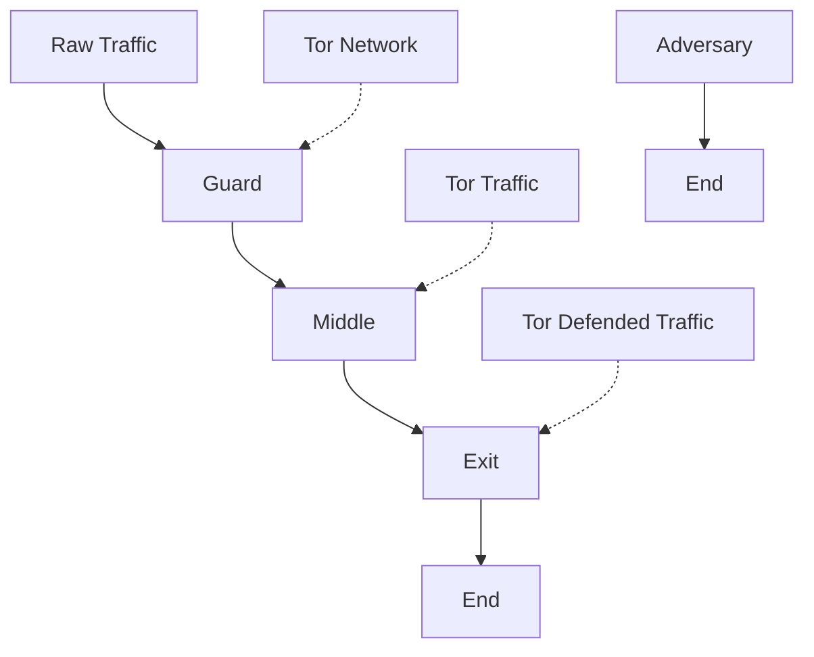
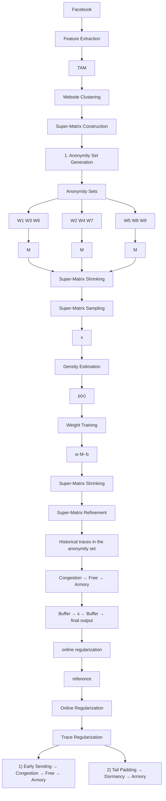

# Real-Time Website Fingerprinting Defense via Traffic Cluster Anonymization

Meng Shen∗, Kexin Ji†, Jinhe Wu∗, Qi Li‡, Xiangdong Kong∗, Ke Xu§, and Liehuang Zhu∗

∗School of Cyberspace Science and Technology, Beijing Institute of Technology

†School of Computer Science, Beijing Institute of Technology

‡Institute for Network Sciences and Cyberspace, Tsinghua University

§Department of Computer Science and Technology, Tsinghua University

{shenmeng, jikexin, jinhewu, xiangdongkong, liehuangz}@bit.edu.cn; {qli01, xuke}@tsinghua.edu.cn

Abstract—Website Fingerprinting (WF) attacks significantly threaten user privacy in anonymity networks such as Tor. While numerous defenses have been proposed, they are unable to efficiently defend against recent deep learning based WF attacks. In this paper, we propose Palette, a novel and practical WF defense that utilizes traffic cluster anonymization to protect live Tor traffic. By clustering websites with high similarity in traffic patterns and regulating them into a well-designed uniform pattern for a cluster (i.e., a group of similar websites), Palette prevents attackers from distinguishing between these similar websites within the cluster and further provides a strong anonymity guarantee. Comprehensive evaluations with public real-world datasets show that Palette is superior to the existing defenses, greatly reducing the accuracy of the state-of-the-art (SOTA) WF attacks with acceptable overheads. Furthermore, we implement Palette as a Pluggable Transport in the Tor network. The experiment results demonstrate that, on average, Palette effectively reduces the accuracy of the SOTA WF attacks by 73.60%, which improves the existing defenses by 33.50%-43.47%.

# 1. Introduction

The Onion Router (Tor) is one of the popular anonymous communication services [1], which enables millions of users to access the Internet without revealing their identities. However, Tor has been proven to be vulnerable to various Website Fingerprinting (WF) attacks [2]. By constructing WF attacks, a local eavesdropper can utilize the side-channel information (e.g., timing, size, and direction) of packets between a Tor client (i.e., the victim) and the corresponding Tor guard node to infer the website that the victim is visiting, which poses serious privacy risks for Tor users.

Recent studies have proposed various defenses that leverage packet padding and delaying to mitigate WF attacks on Tor. As shown in Table 1, existing defenses mainly depend on two strategies: obfuscation and regularization. Obfuscation-based defenses disturb traffic patterns by randomizing packets sending [3–5]. However, since all defenses deployed on Tor are publicly available, the attackers can utilize the defended traffic for adversarial training, leading to evading the defenses [6–9]. Regularization-based defenses aim to reshape traffic into one or multiple pre-defined patterns [10–17]. Nevertheless, they cannot be applied to live traffic due to the high overhead or informative feature leaks. For example, some defenses [12–14] compute fix patterns (i.e., the precise direction and timestamp for each packet) in advance and these patterns cannot be matched by packets in the live traffic, resulting in delaying the live packets significantly. Although dynamic pattern reshaping [15–17] can mitigate the issue, it also leaks the important informative features [9], which can be further abused to construct sophisticated attacks. As a result, it remains a challenging task to protect live Tor traffic against the SOTA WF attacks.

In this paper, we propose Palette, which aims to achieve effective and highly deployable WF defense with low overhead by utilizing traffic cluster anonymization. Inspired by the k-anonymity technology, Palette constructs anonymity sets (i.e., clusters) consisting of at least k websites with high similarity in traffic patterns and regulates the traffic traces in the same anonymity set into a uniform pattern with low overhead, preventing attackers from distinguishing between these websites. Specifically, we utilize a representation of traffic matrix to capture informative features of Tor traffic. Based on the representation, we propose a three-step defense workflow to protect Tor traffic. First, we design an anonymity set generation module to group websites with similar traffic distributions into a cluster (i.e., the same anonymity set) and then construct a uniform traffic pattern that can unify the traffic features of different websites. Second, we refine the uniform traffic pattern based on the historical traffic traces, which can be matched by the live traffic and further reduce the bandwidth and time overhead of the traffic, while retaining its effectiveness. Finally, we design a trace regularization module that regulates the live traffic online according to the refined traffic pattern.

To provide a theoretical analysis on Palette, we utilize the information leakage measurement framework (WeFDE) [19], an information theory-based framework, to analyze the amount of information that potential attackers can learn based on specific features used for fingerprinting the defended traffic. The analysis demonstrates that Palette leaks less information than SOTA WF defenses, proving the effectiveness of Palette in defending against potential WF attacks.

We extensively evaluate the performance of Palette. Particularly, we compare it with the existing WF defenses on the public dataset in the closed- and open-world scenarios. The results demonstrate that Palette achieves the best defense performance, reducing the accuracy of the SOTA attack [9] by 61.97%. Compared with the SOTA WF defense (i.e., RegulaTor [16]), Palette can further reduce the accuracy by up to 16.68%, with a similar bandwidth and time overhead.

TABLE 1: The comparison with the existing WF defenses. 

<table><tr><td rowspan="2">Defense Categories</td><td rowspan="2">Typical Methods</td><td rowspan="2">Trace Representation</td><td colspan="4">Defense Characteristics</td></tr><tr><td>Resisting1 AdvTrain</td><td>Adapting to Live Traffic</td><td>Masking Informative Features</td><td>Achieving Moderate Overhead</td></tr><tr><td rowspan="3">Obfuscation</td><td>WTF-PAD [3]</td><td>Packet Sequence</td><td>✕</td><td>√</td><td>✕</td><td>√</td></tr><tr><td>FRONT [4]</td><td>Packet Sequence</td><td>✕</td><td>√</td><td>✕</td><td>√</td></tr><tr><td>BLANKET [5]</td><td>Packet Sequence</td><td>✕</td><td>√</td><td>✕</td><td>√</td></tr><tr><td rowspan="7">Regularization</td><td>BuFLO Family [10–12]</td><td>Packet Sequence</td><td>√</td><td>✕</td><td>√</td><td>✕</td></tr><tr><td>Supersequence [14]</td><td>Packet Sequence</td><td>√</td><td>✕</td><td>√</td><td>✕</td></tr><tr><td>Glove [13]</td><td>Packet Sequence</td><td>√</td><td>✕</td><td>√</td><td>✕</td></tr><tr><td>Walkie-Talkie [15]</td><td>Burst Sequence</td><td>✕</td><td>√</td><td>✕</td><td>√</td></tr><tr><td>RegulaTor [16]</td><td>Packet Surges</td><td>✕</td><td>√</td><td>✕</td><td>√</td></tr><tr><td>Surakav [17]</td><td>Burst Sequence</td><td>✕</td><td>√</td><td>✕</td><td>√</td></tr><tr><td>Palette</td><td>Traffic Matrix</td><td>√</td><td>√</td><td>√</td><td>√</td></tr></table>

1 We refer to a defense as resisting AdvTrain if it can make the accuracy of existing attacks with adversarial training less than 50%.   
2 Following the literature [18], moderate overhead means the bandwidth overhead (BOH) and time overhead (TOH) of a defense are less than 100% and 50%, respectively.

In order to demonstrate the practicality of Palette, we prototype Palette by utilizing Pluggable Transports [20] that can be deployed in real Tor networks. In the real-world scenario, we collect the closed-world dataset and compare Palette with four representative WF defenses, i.e., Tamaraw [12], FRONT [4], RegulaTor [16] and Surakav [17]. The results show that with a similar or even less overhead, on average, Palette effectively reduces the accuracy of the SOTA WF attacks by 73.60%, which improves the existing defenses by 33.50%-43.47%.

Contributions. The main contributions are as follows:

We propose Palette, a real-time defense based on traffic cluster anonymization that can protect live Tor traffic against various WF attacks.   
• We utilize information leakage analysis to theoretically prove the effectiveness of Palette. The analysis shows that Palette leaks less information than other defenses, demonstrating the superiority of Palette to defend against potential attackers.   
We conduct extensive experiments with public datasets to evaluate the performance of Palette as well as the SOTA defenses against multiple representative WF attacks. The results in both closed- and open-world scenarios demonstrate that Palette exhibits superiority in resisting adversarial training and significantly outperforms existing defenses in terms of effectiveness and overhead.   
• We prototype our defense to prove that Palette is a deployable defense and compare it with representative defenses to evaluate its effectiveness against SOTA attacks in the large datasets collected in the real Tor network. Results show that Palette achieves the largest accuracy reduction of the representative WF attacks with an acceptable overhead in the real world.

The rest of the paper is organized as follows. We first introduce the related work in Section 2 and the preliminaries in Section 3. Then, we present the high-level design of Palette in Section 4 and the design details in Section 5. Next, we conduct a comprehensive evaluation on the performance of Palette in Section 6. We evaluate its resilience against potential adaptive attacks in Section 7. Finally, we conclude this paper and discuss relevant issues in Section 8.

# 2. Related Work

WF attacks and defenses are a hot research topic in traffic analysis. In this section, we briefly review the existing WF attacks and defenses.

# 2.1. WF Attacks

WF attacks in the early stage rely on traditional machine learning models that utilized manually crafted statistical features (e.g., Support Vector Machine (SVM) [21], k-Nearest Neighbors (k-NN) [14] and Random Forests [22]) to distinguish between different websites.

Recent WF attacks [6–8, 23] achieve high accuracy by leveraging deep neural networks (DNNs) with raw traffic information (e.g., packet directions and timestamps) as input to enable automated feature engineering. The latest research shows that combining feature engineering with deep learning can significantly improve WF attack performance [9], particularly against recent WF defenses.

# 2.2. WF Defenses

To defend against WF attacks, existing WF defenses typically disturb traffic patterns of the original traffic by dummy packets padding or real packets delaying according to different strategies, which can be roughly divided into two categories: obfuscation and regularization.

Obfuscation Defenses. These defenses try to use less bandwidth and time overhead to hide the most distinguishing features in traffic, thus reducing the accuracy of WF attacks.

WTF-PAD [3] uses adaptive padding to hide distinctive large time gaps between bursts. FRONT [4] proposes using Rayleigh distribution to randomly sample the timestamps for dummy packets and inject them into traffic to obfuscate feature-rich fronts. However, these defenses have been defeated by recent DNN-based WF attacks [6–9].

Recent research also exploits the vulnerability of deep neural networks to adversarial examples to design effective obfuscation defenses against DNN-based WF attacks [24]. These defenses only require small and carefully crafted perturbations based on the input of DNNs to reduce the accuracy of WF attacks significantly. However, these attackers either require traffic to be known before generating the perturbation [25, 26], which is impractical for realtime deployment, or follow the assumption in other domains [27, 28] where the perturbations are agnostic to the attacker [5, 29–32], underestimating the real ability of WF attackers in Tor [18], i.e., the attacker is aware of the defense and can use the defended traffic for adversarial training.

Regularization Defenses. This type of defense aims to map websites into predefined traffic patterns so that the defended traffic of websites has high similarity to achieve high security. The early stage defenses, such as BuFLO family [10– 12], try to send packets at a fixed order with a constant rate to map all websites into a uniform pattern, resulting in extremely high bandwidth and time overhead. To reduce overhead, RegulaTor [16] only focuses on regulating the coarse feature on traffic, i.e., infrequent and irregular surges of packets, while leaving the other features unmasked.

Glove [13] and Supersequence [14] group traffic into clusters and map them into a uniform pattern for each group to achieve provable security. However, these defenses are less practical due to the prohibitively heavy bandwidth and time overhead. In comparison, Palette shows high effectiveness with moderated overhead when deployed in the Tor network. Walkie-Talkie aims to regulate the traffic from one website into the traffic from another to construct collisions, where at least two traffic from different websites have the same pattern. However, since it only considers the burst feature [7, 9], it needs to modify the browser to talk in halfduplex mode, and it is vulnerable to recent attacks based on the timing feature. Surakav [17] uses Generative Adversarial Networks (GANs) to generate realistic traffic patterns and regulate traffic to match the generated pattern with moderate overheads. However, it is less effective against the latest attack [9], and GAN training requires a large dataset and high computational complexity.

Other Defenses. These defenses split the traffic to destroy the original fingerprints of websites. They do not lead to time or bandwidth overhead but have implementation difficulties, e.g., HyWF [33], TrafficSliver [34] and CoMPS [35] propose to split traffic over several Tor sub-circuits in a highly random manner and merge it to the guard, middle node and a migration-supporting server, respectively. However, such defenses only protect against the attacker observing a single path. Local attackers, such as those under the same network, can observe the complete traffic, thus weakening the effectiveness of such defenses.

flowchart

Figure 1: The threat model of WF attacks and defenses.

# 3. Threat Model and Problem Statement

# 3.1. Threat Model

The threat model of WF attacks is shown in Figure 1. We follow the same assumption with prior works [6, 22, 36, 37], where the attacker is a local and passive eavesdropper that can only collect packets from the connection between the client and the Tor guard node, but cannot modify, drop, or decrypt packets. Potential attackers that might launch WF attacks include eavesdroppers on the client’s local network, Internet Service Providers (ISPs), Autonomous Systems (AS), or malicious Tor guard nodes.

WF attack is usually considered a classification problem. In the training process, the attacker extracts features from a collection of website traffic and trains a supervised classifier offline. When launching the WF attack, the attacker captures the traffic from the target client’s connection to the Tor network, extracts features, and predicts with the classifier which website the client is visiting. It is worth noting that the attacker can perform adversarial training as an adaptive strategy to undermine WF defenses, by collecting defended traffic to retrain the classifier.

To defend against attackers, WF defense can be deployed on the client and the Tor middle node. It can inject dummy packets or delay real packets to generate defended traffic. We follow the assumption in prior works [13, 14] that the Tor client can know the identity of the website the user is going to visit. Based on this information, the Tor client can negotiate with the Tor middle node for a more sophisticated defense. We also assume that the client visits one page at a time so that the attacker knows the start and end of a page load. This presents a more challenging scenario for defenders, as attacking in a multi-tab browsing scenario is generally considered difficult [4, 38, 39].

Closed- and Open-World Scenarios. They are commonly used to evaluate the performance of WF attacks and defenses. In the closed-world scenario, the client is only assumed to visit a small set of websites known as monitored websites. The attacker thus has samples of these websites to train a classifier for website classification. The open-world scenario is more realistic, where the client visits a set of monitored websites and a much larger set of unmonitored websites. The attacker, who can only obtain a fraction of the unmonitored websites for training, infers whether the client visits the monitored websites and, if so, which ones.

flowchart

Figure 2: Palette overview: 1) Generate anonymity sets and corresponding super-matrices through website clustering. 2) Refine super-matrices using historical traces to lower overhead. 3) Use refined super-matrices for online trace regularization.

# 3.2. Problem Statement

In the WF scenario, we define the traffic trace as a sequence of packets collected during the page loading, denoted as $f = [ ( t _ { 1 } , d _ { 1 } ) , ( t _ { 2 } , d _ { 2 } ) , \dots , ( t _ { | f | } , d _ { | f | } ) ]$ , where $| f |$ fis the total number of packets in the trace. $t _ { i }$ fand $d _ { i }$ are the i itimestamp and the direction of the i-th packet, respectively. In particular, $d _ { i } = + 1$ denotes an outgoing packet, and 1 idenotes an incoming packet. Since Tor packets (as noted as cells) are all padded to the same size, we use timestamps and directions to represent packets.

To generate a defended trace $f ^ { \prime } { } _ { \mathrm { - } }$ , WF defenses can inject dummy packets, $( t ^ { \prime } , d ^ { \prime } )$ , and delay real packets by δ seconds, i.e., $( t _ { i } + \delta , d _ { i } )$ , leading to bandwidth and time overhead, i irespectively. Following prior works [4, 16, 17], bandwidth overhead $B ( f , f ^ { \prime } )$ is the ratio of the number of dummy packets to real packets, denoted by $\left| f ^ { \prime } \right| / \left| f \right| \mathrm { ~ - ~ } 1$ , while time overhead $T ( f , f ^ { \prime } )$ is the ratio of the delayed time experienced by the last real packet, denoted by $t ^ { * } / t _ { | f | } - 1$ , where $t ^ { * }$ is the timestamp of the last real packet in $f ^ { \prime }$ .

Our problem is to design an efficient defense that can effectively reduce the accuracy of WF attacks, especially enhanced by adversarial training. As shown in Table 1, the SOTA obfuscation defenses [3–5] fail to provide sufficient protection against adversarial training. On the other hand, regularization defenses [10–17] can achieve stronger protection by reshaping the traffic into predefined patterns [10– 17]. However, applying these patterns to live traffic is not trivial, as it faces two major challenges. First, the predefined patterns should be based on an informative high-level representation. Some defenses [10–14] using per-packet representation (e.g., sequence of packet direction and timestamp) to assign the fixed direction and timestamp for each packet may be over-detailed and can easily mismatch with the live traffic, making them less efficient (introduce expensive overhead in terms of packet padding and delaying). While the high-level representation (e.g., burst sequence and packet surges) can be regulated with less overhead [15–17], they often lead to high information loss. Defenses that utilize these representations thus leave other informative features unmasked and can be exploited by potential attackers [7, 9].

The second challenge is that these patterns should be well-designed to accommodate the different traffic distributions of the websites. Some defenses [10–12, 15–17] ignore both the variances and similarities in traffic distribution across websites. They might, for example, regulate all websites into a uniform fixed pattern [12, 16] or blindly reshape each website into a random pattern chosen from a set of candidate patterns [15, 17], making it hard to lower their overhead. While some defenses [16, 17] employ various real-time adjustment strategies to achieve a reasonable overhead, they inevitably leak informative features, weakening their protection.

# 4. Overview of Palette

In this section, we introduce our defense Palette that overcomes the two mentioned challenges. To address the first challenge (an informative high-level representation), we employ a new trace representation called Traffic Aggregation Matrix (TAM) [9], which aggregates multi-dimensional information to capture more informative features (as detailed in Section 5.1). We solve the second challenge (a well-designed uniform pattern) by exploiting the similarities across websites rather than using a fixed or random pattern. The basic idea of Palette is to group at least k websites with high similarity in terms of traffic traces into an anonymity set and construct a uniform pattern (called super-matrix) to achieve traffic cluster anonymization, i.e., each website in the anonymity set cannot be distinguished by the attacker from at least $k - 1$ other websites. The constructed pattern is highly correlated with websites in the anonymity set, enabling live traffic to align to it with a more reasonable overhead. Palette consists of three main components, including Anonymity Set Generation, Super-Matrix Refinement, and Trace Regularization, as shown in Figure 2.

Anonymity Set Generation. This module first extracts the TAM representations from traffic traces and then groups websites with similar patterns into the same anonymity set. To ensure the high degree of anonymity1 in each set, we first perform a carefully designed website clustering method that ensures each anonymity set contains at least k websites with high similarity in terms of traffic patterns. Then, for each anonymity set, we construct a super-matrix that can cover all website traces using packet padding in each anonymity set. We will present the details in Section 5.2.

Super-matrix Refinement. The initial super-matrix can provide a high anonymity degree. However, it is a dense matrix with high values as it covers all traces to ensure a uniform pattern, leading to high bandwidth overhead. In this module, we perform two strategies to refine the super-matrix in the anonymity set with less overhead on packet padding and delaying. As shown in Figure 2, we first employ supermatrix shrinking to adjust the high values at each time slot according to historical traffic. Then, we randomly sample the time slots in the super-matrix according to the estimated function to reduce its density. We will present the details in Section 5.3.

Trace Regularization. This module sends packets between the client and the Tor middle node based on the value in the refined super-matrix at each time interval. Specifically, if the value of the refined super-matrix is greater than the live trace at the current time interval, the module sends dummy packets, otherwise, it buffers the packets. However, due to the dynamic nature of the live traces, the mismatch between the live trace and the refined super-matrix may introduce extra overhead during real-time packet sending. For instance, some packets may experience prolonged buffering, causing a significant increase in time overhead. When no real packets need to be sent (e.g., the page has finished loading), dummy packets will be padded according to the super-matrix, introducing extra bandwidth overhead. To address these problems, we perform early sending and tail padding to achieve real-time adjustment. We will detail how Palette performs the regularization in Section 5.4.

# 5. Design Details

In this section, we first describe the trace representation used by Palette, and then introduce the design details of each module in Palette, i.e., Anonymity Set Generation, Super-Matrix Refinement, and Trace Regularization.

# 5.1. Trace Representation

Note that regularization defenses always generate the predefined pattern based on a certain form of trace representation (e.g., raw packet sequence, burst sequence, and packet surges). Some defenses can achieve provable security by applying a fixed packet sequence (i.e., define the specific direction and timestamp for each packet) for all websites [10–12] or a group of similar websites [13, 14]. However, the packet sequence introduces high overhead in packet padding and delay as they are over-detailed and

1. Each anonymity set contains at least k websites and ideally, the attack accuracy should be close to 1/k (random guess).

other

| Time | Outgoing Packet | Incoming Packet |
|------|-----------------|-----------------|
| 0    | 3               | 2               |
| 1    | 1               | 4               |
| ...  | ...             | ...             |
| 2    | 2               | 2               |

Figure 3: Visualization of TAM. It counts the number of outgoing and incoming packets in each time slot s and merges the values into a matrix.

cannot adapt well to the dynamic nature (e.g., network jitter) and inter-packet dependency of the live traffic. Prior studies point that transforming trace from packet sequence into burst sequence [15, 17] (the number of consecutive packets from the same direction) or packet surges (a large number of packets sent in a short time) [16] can reduce the defense overhead and facilitate the implementation of the WF defense. However, since the information loss is inevitable during the mapping of packet sequence, both representations fail to cover specific distinguishable features used for fingerprinting [7, 9].

In this work, we use the Traffic Aggregation Matrix (TAM) to represent a trace [9], a robust trace representation used by the SOTA WF attack that can undermine existing WF defenses. As shown in Figure 3, TAM divides the maximum website load time T into N time slots and counts the number of outgoing and incoming packets in each time slot s, and finally constructs a matrix $\boldsymbol { M } ~ \in ~ \mathbb { R } ^ { 2 \times N }$ . An element $M _ { i j }$ represents the number of outgoing (i = 1) ijor incoming (i = 2) packets whose timestamps are between (j−1)×s and j×s. We set T = 80s by default to ensure that the majority of websites can complete their loading process and set s = 80ms, N = 1, 000 for a better overhead tradeoff of Palette based on the observation in Section 6.5.

TAM is an informative trace representation that can aggregate multi-dimensional information, including packet direction, number, and time. Based on TAM, we demonstrate that our defense implementation can be facilitated by sending or buffering packets at each time slot based on a given TAM. We also show that our defense can effectively mask more informative features than other defenses in Section 6.4 and Appendix (Table 13).

# 5.2. Anonymity Set Generation

The anonymity set generation module is used to group website traces with high similarity in terms of TAM into the same anonymity set and construct a uniform pattern that can cover all traces to achieve a high degree of anonymity.

To achieve this goal, all anonymity sets must contain at least k websites. However, Palette is unable to use traditional clustering algorithms like K-Means and DBSCAN since they can not guarantee the minimum size of each cluster. For instance, if the anonymity set contains only a single website, the WF attacker can definitively identify it. Therefore, we design a website clustering method to iteratively build the anonymity set with at least k high-similar websites and update the corresponding uniform pattern. Meanwhile, it maintains a high difference among the anonymity sets during the clustering process. Note that we use TAM to represent traces as mentioned in the previous subsection, in this case, we refer to the uniform pattern as the super-matrix. To cover all traces in the anonymity set, the super-matrix takes the maximum value of each time slot among all traces, which is defined as follows:

Algorithm 1: Website Clustering   
Input : Numbers of websites C, trace set $S_{c}$ for each website $c \in C$ , size for each anonymity set k

Output: Anonymity sets $S^{A}$ , super-matrix sets $S^{M}$ 1 $S^{A}, S^{M} \leftarrow$ empty the sets
2 for $c \in C$ do
3 $M^{S_{c}} \leftarrow$ calculate the super-matrix for $S_{c}$ 4 end
5 $S_{1}^{A}, S_{1}^{M} \leftarrow$ randomly select one website p, $M^{S_{p}}$ 6 for $i \leftarrow 1, \lfloor |C|/k \rfloor$ do
7    if $i \neq 1$ then
8    // initialize a new set with the farthest website
9 $\hat{c} \leftarrow \arg\max_{c \notin S^{A}} \frac{1}{|S^{A}|} \sum_{j=1}^{|S^{A}|} \|M^{S_{c}} - S_{j}^{M}\|_{2}$ 10 $S_{i}^{A}, S_{i}^{M} \leftarrow \hat{c}, M^{S_{\hat{c}}}$ 11    end
12    while $|S_{i}^{A}| < k$ do
13    // find the nearest website to the i-th set
14 $\hat{c} \leftarrow \arg\min_{c \notin S^{A}} \|M^{S_{c}} - S_{i}^{M}\|_{2}$ 15 $S_{i}^{A} \leftarrow \hat{c}$ 16 $S_{i}^{M} \leftarrow$ calculate the super-matrix for $\{S_{i}^{M}, M^{S_{\hat{c}}} \}$ 17    end
18 end
19 for $c \notin S^{A}$ do
20    // assign remaining websites to the nearest set
21 $\hat{i} \leftarrow \arg\min_{i \in [1, |S^{A}|]} \|M^{S_{c}} - S_{i}^{M}\|_{2}$ 22 $S_{\hat{i}}^{A} \leftarrow c$ 23 $S_{\hat{i}}^{M} \leftarrow$ calculate the super-matrix for $\{S_{\hat{i}}^{M}, M^{S_{c}}\}$ 24 end
25 return $S^{A}, S^{M}$

Definition 1 (Super-Matrix). For a set of traces , the value of each time slot in super-matrix $\mathbf { M } ^ { s }$ is the maximum value among all traces in S, which can be denoted by:

$$
\mathbf {M} _ {i j} ^ {\mathcal {S}} = \max \{M _ {i j} \mid M \in \mathcal {S} \} \tag {1}
$$

Algorithm 1 demonstrates the workflow of the website clustering method. Specifically, given the number of websites C and the anonymity set size k, the number of anonymity sets n can be calculated by $n ~ = ~ \lfloor C / k \rfloor$ . We use two phases to group websites into anonymity sets and construct the corresponding super-matrix. We first construct the super-matrix for each website using the corresponding traces (lines 2-4). Then we initialize the first anonymity set by randomly selecting one website (line 5). Then, we repeatedly assign the nearest website and update the supermatrix (lines 11-15). Note that we define the distance of

boxplot

| Anonymity Set Index | Distance |
| ------------------- | -------- |
| 1                   | 3500     |
| 2                   | 2800     |
| 3                   | 2600     |
| 4                   | 2700     |
| 5                   | 2400     |
| 6                   | 2300     |
| 7                   | 2200     |
| 8                   | 2100     |
| 9                   | 2000     |
| 10                  | 1900     |
| 11                  | 2000     |
| 12                  | 1800     |
| 13                  | 1700     |
| 14                  | 1600     |
| 15                  | 2900     |
| 16                  | 3000     |
| 17                  | 2800     |
| 18                  | 3100     |
| 19                  | 2700     |

(a) Similarity measure among anonymity sets. The boxplots show the maximum values, 75th, 50th, and 25th percentile, and the minimum values of the inter-cluster distance for each anonymity set.

bar

| Anonymity Set Index | Outgoing (%) | Incoming (%) |
|---|---|---|
| 1 | 99.0 | 98.1 |
| 2 | 97.9 | 98.3 |
| 3 | 98.9 | 98.1 |
| 4 | 98.5 | 98.0 |
| 5 | 98.5 | 98.4 |
| 6 | 99.0 | 98.4 |
| 7 | 98.3 | 97.9 |
| 8 | 97.9 | 97.1 |
| 9 | 98.4 | 97.4 |
| 10 | 98.2 | 97.9 |
| 11 | 98.6 | 98.3 |
| 12 | 98.4 | 98.3 |
| 13 | 98.3 | 96.5 |
| 14 | 98.2 | 98.1 |
| 15 | 98.4 | 97.5 |
| 16 | 98.7 | 98.5 |
| 17 | 98.6 | 97.7 |
| 18 | 96.9 | 96.3 |
| 19 | 97.8 | 98.5 |

(b) Incoming/outgoing cover rate of super-matrix in each anonymity set.   
Figure 4: Quantitative measurements of cluster similarity and traffic anonymization in anonymity set generation.

two anonymity sets as the Euclidean distance2 between their super-matrices. We will initialize a new anonymity set with the remaining website that has the largest average distance from previous anonymity sets (lines 7-10) until the size of the current anonymity set is k. Finally, when the size of all anonymity sets is equal to k, we assign the remaining websites to the anonymity set with the shortest distance.

We resort to quantitative measurements to demonstrate the effectiveness of our website clustering method in achieving high similarity of TAM in each anonymity set. We perform the website clustering algorithm on the closedworld dataset mentioned in Section 6.1, specifically setting the parameter $k \ = \ 5$ for easy illustration and using the training set which contains 800 traces for each website. Then, we calculate the pairwise distance of different websites based on Euclidean distance on non-overlap 200 traces for each website. The results are shown in Figure 4(a). For each anonymity set, the blue marker represents the average distance between websites in the same anonymity set (i.e., intra-cluster distance), and each boxplot represents the distances from other anonymity sets (i.e., inter-cluster distances). An effective clustering method can achieve shorter intra-cluster distance than inter-cluster distance. We observe that all anonymity sets have their intra-cluster distances smaller than the medium value of their inter-cluster distances and 15 of the 19 anonymity sets have intra-class distances less than 25 percentiles of the inter-class distances, demonstrating the high similarity in each anonymity set.

Moreover, we test if the constructed super-matrix is generalizable enough to accommodate unseen traces, i.e., the test traces can be effectively covered by the super-matrix so that they can be reshaped into the super-matrix simply using dummy packets padding. Specifically, in each time slot, we verify that the value of the super-matrix is greater than that

2. Euclidean distance can clearly reflect the number of packets that should be modified (padding or delaying) to align the two matrices.

of the traces in the anonymity set. Therefore, we define the cover rate of each super-matrix M as follows:

$$
\text { CoverRate } (i) = \frac {1}{| \mathcal {A} |} \sum_ {c \sim \mathcal {A}} \frac {\sum_ {j = 1} ^ {N} \mathbb {I} _ {\left(\mathbf {M} _ {i j} \geq \mathbf {M} _ {i j} ^ {\mathcal {S} _ {c}}\right)}}{| N |} \tag {2}
$$

where i is the index for outgoing $( i ~ = ~ 1 )$ and incoming $( i = 2 )$ packets, and  denotes an anonymity set. A supermatrix covering more traces of the anonymity set should achieve a higher cover rate.

As shown in Figure 4(b), for each anonymity set, both incoming and outgoing cover rates are greater than 95%. This indicates that the super-matrix is generalizable to the unseen traces in the anonymity set, allowing loading each website in the anonymity set to yield a similar pattern (i.e., super-matrix) using dummy packet padding.

We further investigate the potential information leakage of anonymity set in terms of website category (e.g., online video, social media), which allows the attacker to infer a larger pattern (i.e., website category) of the website that the victim is visiting. We collected 50 websites in five categories and constructed the corresponding anonymity sets with different k values (see Appendix A for more details). We find that when $k \geq 4 .$ , the anonymity set contains at least three categories on average, and each single category does not include more than 50% of the websites in each anonymity set. This demonstrates that websites in the same category exhibit different TAM features and thus are not clustered into the same anonymity set, effectively preventing the attacker from inferring larger patterns (e.g, website category) according to the anonymity sets.

# 5.3. Super-Matrix Refinement

While the super-matrix can achieve a high degree of anonymity, it is dense with high values at each time slot and introduces high bandwidth overhead (the same observation in prior works [13, 14]). This is because the super-matrix should cover the sending peaks of each trace, which typically span a range of time slots (the high similarity of traces tends to reduce this range). Now, we propose two refinement strategies to reduce the bandwidth overhead.

Super-Matrix Shrinking. To reduce the high values at each time slot, we define vectors w and b to shrink the supermatrix. w performs a coarse shrinking on each incoming and outgoing time slot in the super-matrix M, enabling adjustments over a broad range. b is used to shift M to enable more precise adjustment. We formulate the process of super-matrix shrinking in Eq. (3),

$$
\mathbf {M} ^ {s} = \max (\sigma (w) \cdot \mathbf {M}, \tau) - \tau \sigma (b) \tag {3}
$$

where $\sigma ( \cdot )$ is a sigmoid function to limit w and b within [0, 1], τ is a threshold that controls the adjustment range of w and b, which we set to 10 for better tuning in our experiments. We resort to gradient descent to train w and b using historical traces in each anonymity set to obtain the optimized values that minimize the specific loss. An ideal shrunk super-matrix Ms should incur minimal overhead in terms of packet padding and delay to ensure all traces closely align with it at each time slot. Therefore, the loss function can be defined as Eq. (4),

area

| Time Slots | Prob.(1-2) |
| ---------- | ---------- |
| 0          | 0.0        |
| 100        | 0.45       |
| 200        | 0.35       |
| 300        | 0.25       |
| 400        | 0.15       |
| 500        | 0.1        |
| 600        | 0.05       |
| 700        | 0.02       |
| 800        | 0.01       |
| 900        | 0.0        |
| 1000       | 0.0        |

area

| Time Slots | Prob.(1e-2) |
| ---------- | ----------- |
| 0          | 0.0         |
| 100        | 0.4         |
| 200        | 0.3         |
| 300        | 0.2         |
| 400        | 0.1         |
| 500        | 0.05        |
| 600        | 0.02        |
| 700        | 0.01        |
| 800        | 0.0         |
| 900        | 0.0         |
| 1000       | 0.0         |

Figure 5: Probability Mass Function of incoming and outgoing time slots.

$$
\begin{array}{l} \mathcal {L} = \mathbb {E} _ {c \sim \mathcal {A}} \mathbb {E} _ {M \sim \mathcal {S} _ {c}} \sum_ {i = 1} ^ {2} \sum_ {j = 1} ^ {N} \max (\mathbf {M} _ {i j} ^ {s} \mathbb {I} _ {(M _ {i j} > 0)} - M _ {i j}, \tau_ {h i g h}) \\ - \lambda \mathbb {E} _ {c \sim \mathcal {A}} \mathbb {E} _ {M \sim \mathcal {S} _ {c}} \sum_ {i = 1} ^ {2} \sum_ {j = 1} ^ {N} \min (\mathbf {M} _ {i j} ^ {s} \mathbb {I} _ {(M _ {i j} > 0)} - M _ {i j}, \tau_ {\text {low}}) \tag {4} \\ \end{array}
$$

where I( ) is the indicator function, $\tau _ { h i g h }$ and $\tau _ { l o w }$ determine high lowthe number of padded and delayed packets at each time slot inducing no penalty. We set $\lambda = 0 . 5$ to obtain a good balance between bandwidth and time overhead.

Super-Matrix Sampling. Our key observation is that the traffic trace is sparse due to the small time slot of TAM, i.e., the value of most time slots is zero. We randomly select 1000 traces for each of the 95 websites and verify this by counting the number of empty slots for both directions. We find that 95% of traces (each containing 1000 time slots) have over 700 empty outgoing slots and 600 empty incoming slots. However, since the shrunk super-matrix is dense (the values of all time slots are non-zero), its traffic volume is much larger than that of the real trace. Therefore, it is still bandwidth wasted when using Ms to guide packet sending. To further reduce the bandwidth overhead, we first estimate the Probability Mass Function (PMF) of each anonymity set, i.e., the probability that outgoing $( i = 1 )$ and incoming $( i = 2 )$ packets are sent at each time slot. The PMF ${ \hat { p } } ( x ) _ { i }$ is estimated as:

$$
\hat {p} (x) _ {i} = \frac {\sum_ {c \sim \mathcal {A}} \sum_ {M \sim \mathcal {S} _ {c}} \mathbb {I} _ {(M _ {i x} > 0)}}{\sum_ {c \sim \mathcal {A}} \sum_ {M \sim \mathcal {S} _ {c}} \sum_ {j = 1} ^ {N} \mathbb {I} _ {(M _ {i j} > 0)}} \tag {5}
$$

Figure 5 shows the PMF of a randomly selected anonymity set. We observe that the probability roughly follows a right-skewed distribution, indicating that packets are likely to be sent in the first few seconds of page loading. The low probability of packets being sent at other time slots may also explain why most time slots in the trace are empty.

The analysis of the PMF provides a way to further reduce the bandwidth cost by allocating more of the packetsending budget to time slots with higher probability. To do so, we sample the time slots without replacement from N time slots for each page loading, accumulating the probability of the sampled time slot until a threshold α is reached. We retain the values of the sampled time slots in the shrunk super-matrix, setting the values of the remaining time slots to zero (noted as empty slots). Finally, we evenly spread the values from the sampled time slot to the subsequent empty slots. This is because an empty slot indicates no packet should be sent, and the real packet will be delayed to the next non-empty slot, leading to cumulative delay.

line

| Time Slots | Pkt. Number |
| ---------- | ----------- |
| 0          | 50          |
| 100        | -250        |
| 200        | -100        |
| 300        | -50         |
| 400        | 0           |
| 500        | -50         |
| 600        | -100        |
| 700        | -50         |
| 800        | 0           |
| 900        | -50         |
| 1000       | 0           |

(a) Super-Matrix M

line

| Time Slot | Pkt. Number |
| --------- | ----------- |
| 0         | 0           |
| 100       | -50         |
| 200       | -100        |
| 300       | -50         |
| 400       | -50         |
| 500       | -50         |
| 600       | -50         |
| 700       | -50         |
| 800       | -50         |
| 900       | -50         |
| 1000      | -50         |

(b) Shrunk Super-Matrix Ms

line

| Time Slots | Pkt. Number |
| ---------- | ----------- |
| 0          | 0           |
| 100        | -50         |
| 200        | -100        |
| 300        | -50         |
| 400        | 0           |
| 500        | 0           |
| 600        | 0           |
| 700        | -50         |
| 800        | 0           |
| 900        | 0           |
| 1000       | 0           |

(c) Refined Super-Matrix Mr   
Figure 6: Visualization of the super-matrix. We use the negative values to represent incoming packets. The super-matrix refinement module can effectively reduce the high density and values of the original super-matrix.

Figure 6 shows the visualization of the original supermatrix M, the shrunk super-matrix M and the refined super-matrix Mr. Comparing M and Ms, M is dense with high values, the super-matrix shrinking strategy can automatically reduce the packet number at each time slot by minimizing the loss. Comparing Ms and Mr, the supermatrix sampling strategy can further reduce the bandwidth overhead based on the PMF of each anonymity set. As a result, the super-matrix refinement can effectively reduce the high values and the density of the super-matrix, allowing Palette to regulate traces with less overhead.

# 5.4. Trace Regularization

In this subsection, we describe the design details of the trace regularization module, which guides the packet sending based on the refined super-matrix in real time.

As stated in Section 3.2, the implementation of Palette can be facilitated with TAM. Specifically, during the page loading, the client and Tor middle node buffer incoming and outgoing packets in the current time slot, respectively, then send packets in the next time slot based on the value in the corresponding index of the refined super-matrix M . If the value of M in the current time slot is greater than the number of packets in the buffer, Palette will pad dummy packets to align with the super-matrix. Otherwise, the real packets will be buffered.

However, the variation of the live trace may mismatch with the super-matrix due to the dynamic nature and interpacket dependency of the page loading process, resulting in uncontrollable overhead. In particular, the high bandwidth and time overhead are primarily caused by buffer congestion and dormancy, respectively. As shown in Figure 2, buffer congestion occurs when the volume of the live trace exceeds that of the refined super-matrix over time, causing most real packets to be buffered for a longer period of time and introducing significant time overhead. On the other hand, buffer dormancy indicates that the buffer is idle for a long period of time when there is no real packet to be sent (e.g., slow server response or the page has finished loading). If

TABLE 2: The parameters for trace regularization. 

<table><tr><td>Parameters</td><td>Descriptions</td></tr><tr><td>k</td><td>Anonymity set size</td></tr><tr><td>α</td><td>Threshold for time slots sampling</td></tr><tr><td>B</td><td>Multiple for tail padding</td></tr><tr><td>U</td><td>Upper bound for the early sending threshold</td></tr></table>

the module continues to send dummy packets according to Mr, this will result in significant bandwidth overhead.

We propose early sending and tail padding to address the above issues. Early sending aims to send the buffered packet immediately when the number of real packets in the buffer is greater than a predefined threshold. Tail padding checks whether the buffer is empty for consecutive time slots to determine whether to continue padding dummy packets. Then, we introduce these strategies in detail.

Early Sending. As mentioned above, when large numbers of packets need to be sent while the value in the current time slot of Mr is small, we need to send the buffered packet immediately, otherwise, it will lead to buffer congestion and increase the time overhead. To address this issue, early sending should determine when and how many buffered packets should be sent early. Specifically, when the number of packets in the buffer exceeds the sum of the values on the next u time slots in the shrunk super-matrix Ms, our module will send out packets based on Ms, which has higher volume than Mr. More specifically, we define Eq. (6) to determine the number of outgoing (incoming) packets sent in j-th time slot (denoted as $m _ { i j } )$ according to the ijnumber of packets in the buffer (denoted as $b _ { i } ) _ { i }$ ,

$$
m _ {i j} = \left\{ \begin{array}{l l} \mathbf {M} _ {i j} ^ {s}, & b _ {i} \geq b _ {i j} ^ {\max} \\ \mathbf {M} _ {i j} ^ {r}, & b _ {i} <   b _ {i j} ^ {\max} \end{array} \right. \tag {6}
$$

where

$$
b _ {i j} ^ {\text { max }} = \sum_ {k = 0} ^ {u \sim [ 0, U)} \mathbf {M} _ {i (j + k)} ^ {s} \tag {7}
$$

u is sampled from a uniform distribution of range [0, U ), where U is a parameter for tuning the upper bound to balance the time overhead and anonymity. We list the important parameters of the trace regularization module in Table 2.

Tail Padding. When the buffer is empty during the page loading, padding dummy packets based on Mr can effectively hide distinguishable behaviors of websites (e.g., end of the page loading), but introduce the high bandwidth overhead. To reduce the overhead while leaking less information the attacker can exploit, we first check whether the buffer is empty when the current time slot index is a multiple of the padding parameter B. We assume the website has finished loading and stop sending dummy packets until the real packets are sent again. Given that the defense cannot know when the page finishes loading and stops sending extra dummy packets, tail padding provides a way to be aware of this by checking the buffer. It is more practical than Tamaraw [12], which needs to know exactly when a page has finished loading to stop dummy packet padding. It can also balance bandwidth overhead and information leakage of websites in the anonymity set. We will further discuss the impact of B on overhead and performance in Section 6.5.

# 6. Performance Evaluation

In this section, we make a comprehensive evaluation of Palette. We first describe the experimental setup in Section 6.1. Then, we make a comprehensive comparison of Palette with SOTA defenses in both closed- and open-world scenarios in Section 6.2 and 6.3. Next, we evaluate the ability of existing defenses and Palette to defend against potential attackers from the perspective of information leakage in Section 6.4. We discuss the effect of key parameters in Section 6.5. Next, we prototype Palette and compare it with the SOTA defenses in the real Tor network in Section 6.6. Finally, we measure the updating costs of Palette in Section 6.7.

# 6.1. Experiment Setup

Dataset. Our evaluation uses the public real-world dataset [6], which is also used to evaluate recent WF attacks and defenses [6, 7, 9, 16, 34]. The closed-world dataset contains 1000 traces of 95 websites, and the open-world dataset includes 40,716 websites, excluding the 95 websites, each with one trace.

WF Attacks. We select six state-of-the-art WF attacks as our benchmark, including machine learning-based and deep learning-based attacks. The attacks are listed as follows.

• CUMUL [21]. It uses a cumulative representation that implicitly covers features used by other classifiers, and uses it to train a Support Vector Machine (SVM) classifier.

• k-FP [22]. It uses a large set of statistical features. These features are input into random forests to extract a fingerprint vector and then apply the fingerprint vector to the k-NN classifier for WF.

• DF [6]. It uses direction sequence as input and utilizes a Convolutional Neural Network (CNN) to automate the feature engineering process from packet direction.

Tik-Tok [7]. It leverages the same CNN structure as DF. Unlike DF, its input is the product of direction and raw time, which improves the performance of the attack.

Var-CNN [8]. It uses a sophisticated architecture based on ResNets and leverages packet direction, inter-packet time, and metadata to train the ensemble of models.

• RF [9]. It uses a robust trace representation called Traffic Aggregation Matrix (TAM) that captures the number of incoming and outgoing packets in small time slots and a CNN-based model to enable automatic feature extraction.

They are all built with the source code released by the authors. All WF attacks are trained and tested on a server equipped with an Intel Core i7 3.4 GHz, 32GB of memory, and a GPU with 10GB of memory. To make a fair comparison, we do adversarial training with each WF attack on defended datasets and fine-tune these attacks to achieve equivalent or even higher accuracy than the results reported in their original papers.

WF Defenses. To make a comprehensive comparison, we take the defenses Supersequence [14], Tamaraw [12], WTF-PAD [3], FRONT [4], Surakav [17] and RegulaTor [16] as the target of WF attacks. The parameter settings for each defense are shown in Table 10 in the Appendix. We simulated each defense on the undefended dataset to create defended datasets for closed- and open-world scenarios.

# 6.2. Closed-World Performance

In this subsection, we evaluate the closed-world effectiveness of defenses against six attacks. Following prior works [6, 8], we split the closed-world dataset into training, validation, and testing sets with a ratio of 8:1:1. As shown in Table 3, without any defenses, the accuracy of all six attacks is over 94%, indicating that attackers can effectively identify the website the user is visiting without countermeasures.

Both Supersequence and Tamaraw provide strong protection that can reduce the accuracy of all attacks to below 30%. However, they introduce high overheads, burdening the Tor network and impacting user experience.

The obfuscation-based defenses WTF-PAD and FRONT do not introduce packet delays and maintain a moderate bandwidth overhead. However, WTF-PAD is defeated by four deep learning-based attacks with over 90% accuracy, and RF also undermines FRONT with over 90% accuracy. This suggests that the existing obfuscation defenses fail to defend against the SOTA WF attack.

Surakav, RegulaTor, and Palette exhibit much lower overhead compared to Supersequence and Tamaraw while providing stronger protection than zero-delay defenses. With 80% bandwidth and 6% time overhead, Surakav can reduce the accuracy of DF, Tik-Tok, and Var-CNN to 64.00%, 67.63%, and 54.56%, respectively, but is less effective against RF. This is because Surakav generates the reference burst from a randomly chosen class, which can easily mismatch with live traces. RegulaTor is a stronger defense that aims to regulate all traces into similar packet surges. It can reduce the accuracy of WF attacks to at least 53.11%. Palette demonstrates superior defense performance compared to Surakav and RegulaTor, achieving the lowest accuracy for all attacks at a similar level of overhead. Particularly, Palette can reduce the accuracy of RF to 36.43%, a decrease of 16.68% compared to the RegulaTor.

To demonstrate the effectiveness of Palette in regulating website traffic in the anonymity set, we utilize T-SNE [40] to visualize the feature vectors of the last layer of the classifier for four DNN-based attacks in Figure 15 in the Appendix. The results show that SOTA attacks fail to classify websites within the same anonymity set, demonstrating that Palette can successfully achieve website anonymization.

TABLE 3: The overhead and effectiveness of defenses against attacks in the closed-world scenario. 

<table><tr><td rowspan="2">Defenses</td><td colspan="2">Overhead (%)</td><td colspan="6">Accuracy (%)</td></tr><tr><td>Bandwidth</td><td>Time</td><td>k-FP [14]</td><td>CUMUL [21]</td><td>DF [6]</td><td>Tik-Tok [7]</td><td>Var-CNN [8]</td><td>RF [9]</td></tr><tr><td>Undefended</td><td>-</td><td>-</td><td>94.54</td><td>94.81</td><td>98.23</td><td>98.45</td><td>98.83</td><td>98.40</td></tr><tr><td>Supersequence [14]</td><td>88</td><td>91</td><td>27.28</td><td>24.71</td><td>29.09</td><td>29.18</td><td>17.89</td><td>26.51</td></tr><tr><td>Tamaraw [12]</td><td>121</td><td>43</td><td>10.24</td><td>8.42</td><td>8.34</td><td>8.32</td><td>3.56</td><td>10.23</td></tr><tr><td>WTF-PAD [3]</td><td>61</td><td>0</td><td>68.47</td><td>55.83</td><td>90.85</td><td>93.80</td><td>94.83</td><td>96.64</td></tr><tr><td>FRONT [4]</td><td>80</td><td>0</td><td>52.34</td><td>23.22</td><td>76.10</td><td>84.79</td><td>80.97</td><td>93.92</td></tr><tr><td>Surakav [17]</td><td>80</td><td>6</td><td>41.83</td><td>44.03</td><td>64.00</td><td>67.63</td><td>54.56</td><td>79.94</td></tr><tr><td>RegulaTor [16]</td><td>80</td><td>5</td><td>39.17</td><td>16.30</td><td>20.41</td><td>29.06</td><td>40.51</td><td>53.11</td></tr><tr><td>Palette</td><td>84</td><td>9</td><td>29.39▼9.78</td><td>10.96▼5.34</td><td>20.27▼0.14</td><td>24.73▼4.33</td><td>22.79▼17.72</td><td>36.43▼16.68</td></tr></table>

1 We use - to highlight the reduction of attack accuracy compared with the SOTA defense RegulaTor.

  
Figure 7: Precision-recall curves of WF attacks in the open-world scenario.

# 6.3. Open-World Performance

In this subsection, we evaluate the performance of each defense in the open-world scenario. As described in Section 3.1, the user can visit any website in the open-world scenario and an attacker who monitors a subset of those websites while training a classifier to determine whether the visited website is in the monitored set. This scenario is typically more difficult to carry out, given that the attacker is assumed to obtain only a fraction of the unmonitored websites for training, i.e., the set of unmonitored websites used for training and testing are not overlapped.

We take all websites in the closed-world dataset as the monitored set and all websites in the open-world dataset as the unmonitored set. For training and validation, we randomly select 900 traces for each monitored website and 20,000 traces from the unmonitored set and split them with a ratio of 8:1. The remaining dataset, which contains 95×100 traces from the monitored set and 20,000 traces from the unmonitored set, is used for testing. Since the open-world websites do not belong to any of the anonymity sets, Palette will randomly select an anonymity set and regulate them based on the corresponding super-matrix.

Considering the significant imbalance between the sizes of the monitored and unmonitored sets, the precision-recall curve is commonly used in the literature [6, 23]. If a monitored website is labeled correctly (i.e., the maximum output probability is greater than a pre-defined threshold), it is considered a True Positive (TP) or False Negative (FN) otherwise. If an unmonitored website is mislabeled as a monitored class, it is considered a False Positive (FP) or True Negative (TN) otherwise. Precision and recall are then defined as TP / (TP+FP) and TP / (TP+FN), respectively. The attacker can trade-off between precision and recall by setting different thresholds.

The precision and recall curves of WF attacks on existing defenses are shown in Figure 7. Without defenses deployed, DF, Tik-Tok, Var-CNN, and RF can achieve high precision and recall, demonstrating the effectiveness of four WF attacks in the open-world scenario. WTF-PAD and FRONT perform better than the closed-world scenario, which can effectively reduce the recall of DF, Tik-Tok, and Var-CNN when tuned to high precision (over 0.95). However, they fail to undermine RF, which can still achieve high recall (0.92 on WTF-PAD and 0.83 on FRONT).

Similar to the results in the closed-world scenario, Supersequence and Tamaraw are the most effective defenses but have significantly heavy bandwidth and time overheads, which deter their widespread deployment on Tor [18]. With moderate overhead, Surakav, RegulaTor and Palette achieve better defense performance in the open-world scenario compared to WTF-PAD and FRONT. Surakav is limited to effectively defending against DF and Tik-Tok. RegulaTor demonstrates effectiveness against DF, Tik-Tok, and Var-CNN, however, strong protection still cannot be guaranteed on RF. In comparison, Palette can significantly drive down the precision-recall curve of all attacks. In particular, Palette can reduce the recall of all attacks to less than 0.1 when

TABLE 4: Dataset of one-page setting. 

<table><tr><td rowspan="2"></td><td colspan="2">Monitored</td><td colspan="2">Unmonitored</td></tr><tr><td>Websites</td><td>Traces</td><td>Websites</td><td>Traces</td></tr><tr><td>Training</td><td>1</td><td>900</td><td> $94 + 20,000$ </td><td> $94 \times 900 + 20,000$ </td></tr><tr><td>Testing</td><td>1</td><td>100</td><td> $94 + 20,000$ </td><td> $94 \times 100 + 20,000$ </td></tr></table>

line

| Method       | TPR   |
| ------------ | ----- |
| Undefended   | 0.8   |
| Supersequence| 0.2   |
| Tamaraw      | 0.1   |
| WTF-PAD      | 0.95  |
| FRONT        | 0.3   |
| Surakav      | 0.4   |
| RegulaTor    | 0.5   |
| Palette      | 0.6   |
| Ideal        | 1.0   |

Figure 8: Defenses performance against k-FP attack under the one-page setting.

tuned to high precision.

The overhead of Palette is slightly affected by the scale of unmonitored websites. While the increase of unmonitored websites can enlarge the mismatch between the pre-defined super-matrix and the real traces, Palette can mitigate this impact by using early sending and tail padding. Our experiment results show that as the size of unmonitored sites increases from 10,000 to 40,000, the bandwidth overhead slightly grows from 79.63% to 81.81%, while the time overhead remains almost the same (i.e., from 8.89% to 8.86%).

One-Page Setting Evaluation. To further demonstrate that Palette can undermine all WF attacks in the open-world scenario, we evaluate Palette under a harder open-world setting where the defenses are more vulnerable to the k-FP attack [41]. In the one-page setting, the attackers monitor a single website. As shown in Table 4, we repeatedly select one website from the closed-world dataset as the monitored set (labeled as positive) and the rest including the openworld dataset as the unmonitored set (labeled as negative). So we have 900 positive and 102,600 negative traces for training, 100 positive and 29,400 negative traces for testing. Then, we perform the binary classification with k-FP and compute the average of TPR and FPR over all websites.

Figure 8 presents the ROC curve on different defenses. Supersequence and Tamaraw outperform Palette under the one-page setting. However, they introduce significant high overheads, e.g., Supersequence and Tamaraw incur 82% and 34% higher time overhead than Palette, respectively, which may raise the risk of memory exhaustion of Tor nodes [18]. Among defenses with moderate overhead, Palette exhibits the best performance with the lowest TPR within a low FPR range (i.e., less than 0.1). Since the positive and negative traces are heavily imbalanced in the testing set, evaluating the TPR under low FPR conditions is more reasonable, e.g., with an FPR of 0.1, the classifier misclassifies more than 2,000 traces from the negative set as positive. However, there are only 100 traces in the positive set. In this case, the majority of the traces identified as positive are false positive traces, thus, the precision of the attacker is significantly low.

scatter

| Method       | Attack Accuracy (%) | Information Leakage (Bit) |
| ------------ | ------------------- | ------------------------- |
| Undefended   | 100                 | 2.0                       |
| Tamaraw      | 10                  | 1.5                       |
| Supersequence | 30                  | 2.0                       |
| WTF-PAD      | 95                  | 1.3                       |
| FRONT        | 80                  | 1.0                       |
| RegulaTor    | 50                  | 1.2                       |
| Surakay      | 80                  | 1.0                       |
| Palette      | 40                  | 1.0                       |

Figure 9: The average and variance of information leakage over Top-500 informative features and the attack accuracy for each defense. The magnitude of variance is denoted by the size of the marker.

# 6.4. Information Leakage Measurement

In the previous subsection, we have evaluated the performance of Palette against existing attacks. In this subsection, we quantitatively analyze the ability of WF defenses against potential attackers from the perspective of information leakage. A higher information leakage indicates that the defense is less effective in protecting against potential attacks, even if it achieves a low attack accuracy on existing attacks. We use the WeFDE framework [19] to conduct an information leakage measurement for each defense. The idea of WeFDE is to estimate the mutual information of a specific feature and website. Following their methodology, we compute the information leakage for all the features (in total, 3043 features) used in the literature. For each defense, we select the top 500 features that leak the most bits of information and compute the mean and variance of their leaked bits. We also present the attack accuracy of RF on each defense.

The results are shown in Figure 9. We can observe that Supersequence and Tamaraw are effective against RF, but they incur non-negligible information leakage. It is consistent with the existing study [19], i.e., a defense achieving lower attack accuracy does not always lead to lower information leakage. Palette raises the least information leaks, while achieving better defense effectiveness than existing defenses with acceptable overhead, indicating that Palette still outperforms SOTA defenses against potential attacks. Another interesting observation is that both Palette and FRONT have low information leakage, but RF achieves over 95% accuracy against FRONT. It can be explained by computing the average information leakage for each feature category, which is presented in Table 13 in the Appendix. The results show that FRONT exhibits an imbalanced information leakage. Some informative features (e.g., Pkt. per second) are leaked with high bits, which can be exploited by attackers.

# 6.5. Parameter Tuning

We investigate the impact of key parameters on defense against four typical attacks (i.e., DF, Tik-Tok, Var-CNN, and RF) in the closed-world scenario.

Time Slot s. It determines the granularity of the supermatrix and controls the packet sending interval during realtime regularization. Thus, the overhead and performance of Palette may change when the time slot varies. Figure 10 shows that the increase of s from 53 ms to 160 ms leads to a 21% increase in time overhead and a 46% decrease in bandwidth overhead. This is because more real packets will be buffered in each time slot, reducing the necessity for padding with dummy packets to align with the supermatrix. We also observe that increasing s enhances defense, as the timing information of real packets is hidden by a larger time slot, leading to a decrease in the accuracy of RF from 38.55% to 28.62%.

line

| S (ms) | BOH (%) | TOH (%) |
| ------ | ------- | ------- |
| 53     | 50      | 2       |
| 64     | 40      | 4       |
| 80     | 25      | 8       |
| 107    | 25      | 12      |
| 160    | 15      | 25      |

(a) Overhead

line

| S (ms) | DF (%) | Tik-Tok (%) | Var-CNN (%) | RF (%) |
|---|---|---|---|---|
| 53 | 18 | 24 | 22 | 39 |
| 64 | 19 | 22 | 23 | 37 |
| 80 | 20 | 25 | 21 | 38 |
| 107 | 19 | 21 | 20 | 30 |
| 160 | 18 | 19 | 12 | 27 |

(b) Attack Accuracy   
Figure 10: The overhead and performance of Palette with different valules of time slot s. The length of TAM N can be calculated by T /s, where T = 80s.

TABLE 5: The overhead and performance of Palette with different k. 

<table><tr><td rowspan="2">k</td><td colspan="2">Overhead (%)</td><td colspan="4">Accuracy (%)</td></tr><tr><td>Bandwidth</td><td>Time</td><td>DF</td><td>Tik-Tok</td><td>Var-CNN</td><td>RF</td></tr><tr><td>5</td><td>39</td><td>18</td><td>51.24</td><td>58.15</td><td>57.28</td><td>70.70</td></tr><tr><td>10</td><td>51</td><td>14</td><td>37.87</td><td>40.21</td><td>47.33</td><td>55.64</td></tr><tr><td>15</td><td>61</td><td>12</td><td>33.95</td><td>40.31</td><td>36.60</td><td>50.67</td></tr><tr><td>20</td><td>59</td><td>15</td><td>32.47</td><td>37.12</td><td>34.96</td><td>47.27</td></tr><tr><td>30</td><td>84</td><td>9</td><td>20.27</td><td>24.73</td><td>22.79</td><td>36.43</td></tr><tr><td>45</td><td>88</td><td>9</td><td>16.21</td><td>20.04</td><td>19.18</td><td>31.00</td></tr><tr><td>95</td><td>96</td><td>8</td><td>12.26</td><td>15.86</td><td>14.96</td><td>25.49</td></tr></table>

Anonymity Set Size k. It defines the size of the anonymity sets to guarantee the maximum degree of anonymity. We fix the other parameters of Palette and determine k by increasing the number of anonymity sets from 1 to 19. As shown in Table 5, when k increases from 5 to 95, the bandwidth overhead increases 57%, and the time overhead is reduced by 10%. This is mainly because setting a larger k will reduce the similarity of the anonymity set, leading the PMF to be flat, and more time slots will be sampled. The accuracy of four attacks significantly reduces when the anonymity degree increases.

Threshold for Time Slots Sampling α. It controls how many time slots can be sampled from the PMF in each anonymity set. As shown in Figure 5, since the probability of each time slot in PMF is relatively low, the variation of α can significantly impact the number of sampled time slot indexes, subsequently affecting the overhead. We thus change α in a small range of [0.1, 0.24] to analyze the overhead and the attack accuracy while keeping the other parameters consistent with the default settings. The results are shown in Figure 11. When α increases from 0.1 to 0.24, the time overhead is reduced from 22% to 5%. The bandwidth overhead is more sensitive to the change of α, increasing from 60% to 123%, indicating that sampling more time slots can significantly increase the bandwidth overhead. It can also slightly reduce the attack accuracy since more noises are injected, leading to the high similarity of defended trace in each anonymity set. We set α = 0.16 by default to trade off the overhead.

line

| α    | BOH  | TOH  |
| ---- | ---- | ---- |
| 0.10 | 5    | 80   |
| 0.12 | 10   | 75   |
| 0.14 | 15   | 70   |
| 0.16 | 20   | 65   |
| 0.18 | 25   | 60   |
| 0.20 | 30   | 55   |
| 0.22 | 35   | 50   |
| 0.24 | 40   | 45   |

(a) Overhead

line

| α    | DF   | Tik-Tok | Var-CNN | RF   |
|------|------|---------|---------|------|
| 0.10 | 25.0 | 10.0    | 25.0    | 40.0 |
| 0.12 | 25.0 | 15.0    | 25.0    | 40.0 |
| 0.14 | 25.0 | 25.0    | 25.0    | 40.0 |
| 0.16 | 25.0 | 25.0    | 25.0    | 40.0 |
| 0.18 | 25.0 | 25.0    | 25.0    | 40.0 |
| 0.20 | 25.0 | 25.0    | 25.0    | 40.0 |
| 0.22 | 25.0 | 25.0    | 25.0    | 40.0 |
| 0.24 | 25.0 | 25.0    | 25.0    | 40.0 |

(b) Attack Accuracy

Figure 11: The overhead and performance of Palette with different α.   

area_stacked

| U    | B=200 | B=175 | B=150 | B=125 | B=100 | B=75 | B=50 | B=25 | B=0 | B=10 | B=20 |
|------|-------|-------|-------|-------|-------|------|------|------|-----|------|------|
| TOH  | 40    | 40    | 40    | 40    | 40    | 40   | 40   | 40   | 40  | 40   | 40   |
| BOH  | 160   | 160   | 160   | 160   | 160   | 160  | 160  | 160  | 160 | 160  | 160  |

(a) Overhead

  
(b) Attack Accuracy   
Figure 12: The overhead and performance of Palette with different B and U.

Impact of B and U . B is the multiple for tail padding. When the buffer is empty and the index of the current time slot is a multiple of B, the trace regularization module will stop padding dummy packets until real packets come. U is the upper bound for sampling the early sending threshold p. We fix k = 30, α = 0.16, and then perform the grid search for B and U to understand how these parameters affect the defense performance and overhead.

We investigate B in range [1, 200] and U in range [10, 90] in this work, the results are shown in Figure 12. When U is fixed, increasing B only increases the bandwidth overhead since tail padding only works if no real packets are in the buffer. Setting a larger B can achieve a higher anonymity degree by injecting more noise into traffic and hiding the loading time of the websites. When B is fixed, decreasing U from 90 to 10 will introduce more bandwidth overhead (over 40%) but reduce the time overhead (over 10%). This is because lower U means the buffered real packet will be sent out earlier, leading to less packet delay but more dummy packets padded when there are not enough real packets in the buffer. However, lowing U will leak timing features and significantly increase the accuracy by over 20%. As a result, larger B and U mean stricter control on online regularization, which increases the fidelity of the regularization module to the generated trace. We set B = 45, U = 20 for a better trade-off between overhead and defense performance.

TABLE 6: Real-world overhead and performance. 

<table><tr><td rowspan="2">Defenses</td><td colspan="2">Overhead (%)</td><td colspan="4">Accuracy (%)</td></tr><tr><td>Bandwidth</td><td>Time</td><td>DF</td><td>Tik-Tok</td><td>Var-CNN</td><td>RF</td></tr><tr><td>Undefended</td><td>0</td><td>0</td><td>91.80</td><td>93.20</td><td>94.40</td><td>98.20</td></tr><tr><td>Tamaraw [12]</td><td>135</td><td>78</td><td>24.95</td><td>23.01</td><td>14.33</td><td>22.51</td></tr><tr><td>FRONT [4]</td><td>99</td><td>0</td><td>55.19</td><td>57.19</td><td>54.23</td><td>90.45</td></tr><tr><td>Surakav [17]</td><td>81</td><td>14</td><td>60.50</td><td>58.12</td><td>29.95</td><td>75.08</td></tr><tr><td>RegulaTor [16]</td><td>70</td><td>112</td><td>62.42</td><td>56.16</td><td>31.95</td><td>66.67</td></tr><tr><td>Palette</td><td>80</td><td>24</td><td>13.97</td><td>11.35</td><td>4.58</td><td>53.28</td></tr></table>

# 6.6. Real-World Performance

To obtain a more accurate overhead estimation and defense performance evaluation in the real world, we prototype Palette3 via WFDefProxy [42], a framework for WF defense evaluation in the real world, and implement it as a Pluggable Transport (PT) [20], which transforms traffic between the client and a bridge to disguise the Tor traffic. We also deploy Tamaraw, FRONT, Surakav, and RegulaTor for comparison. Implementation. We leveraged two cloud servers for deploying defenses, one as the private bridge and another with eight docker containers as individual clients to visit websites in parallel. Each client connected to our private bridge as the guard node with a limited connection bandwidth of 120 Mbps. The private bridge was equipped with 2 CPU cores and 4GB of RAM, and the client was equipped with 8 CPU cores and 16GB of RAM, both running on Ubuntu 20.04 LTS. The Tor Browser (version 10.5.10) was configured to run in the XVFB environment on each client. We used TBSelenium to launch the Tor Browser and automatically visit websites. Specifically, to ensure complete website loading, we allocated a maximum of 110s for each website loading. When the loading was completed, we waited for an additional 5s on the website to avoid overlap with the traffic from the previous visit. After that, the browser would restart and a Signal.NEWNYM command would be sent to the Tor client to ensure each visit uses a different circuit.

Dataset. We collected the close-world datasets to evaluate defenses since it is much more challenging for defenders. Following prior works [17, 42], the websites were selected from the Tranco [43] list, which was updated on February 2023. This list is composed of five existing lists (i.e., Umbrella, Majestic, Farsight, CrUX, and Radar) where undesirable domains (e.g., unavailable or malicious domains) are excluded. We will discuss an alternative approach to collect a more representative list in Tor for the WF research.

We first removed the inaccessible and duplicate URLs that directed to the same page (including the different locations) in the top 200 sites. We chose the first 100 as the monitored websites. We let multiple clients visit the monitored list in a random order. After merging all the crawls

3. The source code of Palette is available at https://github.com/kxdkxd/ Palette.

TABLE 7: The overhead and performance of Palette under different network conditions. 

<table><tr><td rowspan="2">Browsers</td><td rowspan="2">BandwidthConstraints</td><td colspan="2">Overhead (%)</td><td>Accuracy (%)</td></tr><tr><td>Bandwidth</td><td>Time</td><td>RF</td></tr><tr><td rowspan="3">Tor</td><td>80 Mbps</td><td>76</td><td>28</td><td>47.74</td></tr><tr><td>120 Mbps</td><td>73</td><td>30</td><td>50.87</td></tr><tr><td>160 Mbps</td><td>77</td><td>34</td><td>47.76</td></tr><tr><td>Chrome</td><td>120 Mbps</td><td>19</td><td>50</td><td>24.47</td></tr></table>

and removing outliers (following the approach described in [21]), we guaranteed that each monitored website had at least 100 instances. Considering the differences in time and network conditions between the public dataset used for simulation and the collected dataset, we fine-tuned the parameters of each defense to keep a moderate bandwidth and time overheads trade-off, which can be found in Table 11 in the Appendix. We also discuss the strategy of selecting the default parameters of Palette for real-world deployment in Section 8.

Results. Table 6 shows the real-world performance of each defense, we have four key observations from the results. 1) Tamaraw achieves effective defense performance on RF at the expense of incurring 135% bandwidth overhead and 78% time overhead. As discussed in Seciton 6.3, it may raise the risk of memory exhaustion of Tor nodes due to the large packet surges [18]. 2) FRONT has a similar bandwidth overhead to simulation (see Table 3), which can effectively reduce the attack accuracy of DF, Tik-Tok, and Var-CNN. However, it fails to undermine RF in the real world, which maintains over 90% accuracy. 3) We obtain the same observation as [42]: the bandwidth and performance of RegulaTor exhibit significant differences compared to the simulation. Specifically, the time overhead increases to 112%, but the attack accuracy of DF, Tik-Tok, and RF improves by more than 10%. 4) Both Surakav and Palette have the time overhead increase compared to the simulation. This is because the dependencies of the incoming and outgoing packets are difficult to represent with simulation, i.e., delayed packets may have an uncertain impact on the subsequent packets. However, Surakav remains ineffective in defending against SOTA attacks in the real world. Palette outperforms defenses. Specifically, it can reduce the accuracy of DF, Tik-Tok, and Var-CNN to less than 15% and reduce the accuracy of RF to 53.28%.

Varying Network Conditions. We used another two cloud servers with the same settings as mentioned above to evaluate the robustness of Palette under varying network conditions. Specifically, we considered two network conditions: bandwidth constraints (80 Mbps, 120 Mbps, and 160 Mbps) and different browsers (Tor Browser and Chrome). We obtained the super-matrix and parameters of Palette with the 120 Mbps bandwidth and Tor Browser, which were then applied to protect the traces with different bandwidths and browsers. The results are shown in Table 7. Palette is resilient to bandwidth fluctuations, as trace regularization can adaptively reduce overhead when the pre-defined supermatrix mismatches a real trace. Under the same bandwidth of 120 Mbps, the variation of browsers results in a 54% reduction in the bandwidth overhead and a 20% increase in the time overhead. The reason is that the traffic volume of Chrome is much larger than that of the Tor Browser because the traffic generated by the Tor browser does not include features that potentially leak users’ privacy (e.g., SPDY and HTTP/2) [44], leading to that the Tor browser incurs more packet delay and less dummy packet padding.

TABLE 8: The time and storage overheads of Palette with different anonymity set sizes. 

<table><tr><td rowspan="2">k</td><td colspan="2">Time (s)</td><td rowspan="2">Storage (KB)</td></tr><tr><td>Generation</td><td>Refinement</td></tr><tr><td>5</td><td>112.61 ± 0.29</td><td>148.78 ± 1.43</td><td>228</td></tr><tr><td>10</td><td>112.65 ± 0.54</td><td>92.68 ± 0.37</td><td>111</td></tr><tr><td>15</td><td>112.68 ± 0.58</td><td>75.09 ± 0.08</td><td>75</td></tr><tr><td>20</td><td>112.98 ± 0.62</td><td>65.75 ± 0.13</td><td>52</td></tr><tr><td>30</td><td>112.63 ± 0.45</td><td>77.84 ± 0.25</td><td>40</td></tr><tr><td>45</td><td>112.73 ± 0.53</td><td>73.62 ± 0.45</td><td>28</td></tr><tr><td>95</td><td>112.77 ± 0.50</td><td>77.64 ± 0.18</td><td>17</td></tr></table>

line

| Update Frequency (days) | 2.5M  | 5M    | 7.5M  | 10M   |
| ----------------------- | ----- | ----- | ----- | ----- |
| 1                       | 0.9   | 1.6   | 2.5   | 3.4   |
| 5                       | 0.3   | 0.4   | 0.6   | 0.8   |
| 10                      | 0.2   | 0.2   | 0.3   | 0.4   |
| 15                      | 0.1   | 0.1   | 0.2   | 0.2   |
| 25                      | 0.1   | 0.1   | 0.1   | 0.1   |
| 30                      | 0.1   | 0.1   | 0.1   | 0.1   |

Figure 13: Communication overhead of Palette $( k ~ = ~ 5 )$ under different Tor client scales and update frequencies.

Performance over Time. To evaluate the performance of Palette over time, after collecting defended traces of Palette (configured in 120 Mbps, Tor browser) to evaluate the performance for varying network conditions, we recollected the same scale of defended traces under the same setting 5 days later. The results show that Palette still effectively reduces the accuracy of RF to 48.98%, with a slight increase of bandwidth overhead (from 73% to 75%) and a negligible decrease of time overhead (from 30% to 29%). It demonstrates that the same setting of Palette can be resistant to changes over a period of 5 days. The performance over a longer period would be interesting future work.

# 6.7. Overhead Incurred by Palette Update

Palette uses pre-generate data (i.e., super-matrix, PMFs, and anonymity set mapping) to initiate the defense. In addition to bandwidth and time overheads incurred during regularization, we should also consider the training and communication overheads associated with Palette updates. The training overheads include the training time required for anonymity set generation and super-matrix refinement, as well as the corresponding storage space, which are shown in Table 8. We test on the server outlined in Section 6.1 with 76,000 instances of 95 websites (around 289 MB) and find that the time of generating anonymity sets is almost unaffected by the anonymity set size k. The supermatrix refinement time decreases as k increases because fewer super-matrices require updates. In terms of storage overhead, the client and the middle node only need to track the outgoing and incoming direction of the super-matrix and PMFs, respectively. A smaller k requires more space due to a larger number of the super-matrix. Overall, when k = 5, Palette only needs 148s for super-matrix refinement and 228KB for data storage.

TABLE 9: Accuracy (%) of adversarial training (AdvTrain) and adaptive attack on Palette with four backbone models. 

<table><tr><td rowspan="2">Attack Strategies</td><td colspan="4">Backbone Models</td></tr><tr><td>DF</td><td>Tik-Tok</td><td>Var-CNN</td><td>RF</td></tr><tr><td>AdvTrain</td><td>20.27</td><td>24.73</td><td>22.79</td><td>36.43</td></tr><tr><td>Adaptive</td><td> $24.46^{\blacktriangle}$  4.19</td><td> $25.33^{\blacktriangle}$  0.60</td><td> $23.27^{\blacktriangle}$  0.48</td><td> $36.92^{\blacktriangle}$  0.49</td></tr></table>

Tor directory servers can train and distribute the data, which clients download upon Tor startup and then update periodically. Figure 13 shows the communication overhead with different client scales and update frequencies. Following the prior work [17], we evaluated the communication overhead of Palette by measuring the fraction of the average bandwidth used for transferring the data from the Tor directory server to clients. We set the average bandwidth of the Tor directory servers to 771MB/s according to the existing statistics from February 2023 to 2024 [45]. We find that the communication overhead grows as the scale of clients and the update frequency increase. Recall that Palette maintains its effectiveness for 5 days (Section 6.6), we measured the communication overhead under update per 5 days, and the incurred overhead is only 0.66% even if the number of clients reaches 10 million.

# 7. Adaptive Attacks

In the previous section, we have demonstrated that attackers using adversarial training against Palette fail to distinguish among websites within the same anonymity set. In this section, we investigate more powerful adaptive attacks, where attackers with the full knowledge of Palette attempt to identify the website in each anonymity set. Given an unknown trace, the attackers can first train a classifier to identify the anonymity set the trace belongs to, and then train multiple classifiers for each anonymity set to infer the specific website. This two-stage attack can effectively narrow the potential target websites to a much smaller subset of websites, thereby reducing the classification complexity and possibly improving the accuracy.

Following the strategy above, we can use DF, Tik-Tok, Var-CNN, or RF to conduct adaptive attacks. The results in Table 9 illustrate that the overall attack accuracy of the adaptive attack is slightly higher than that of adversarial training, demonstrating the resilience of Palette against sophisticated adaptive attacks. Particularly, the highest accuracy achieved by the adaptive attack is merely 36.92% under RF, indicating the difficulty in classifying high-similarity websites in the same anonymity set.

# 8. Discussion and Conclusion

In this paper, we presented Palette, a novel website fingerprinting defense via traffic cluster anonymization. Specifically, Palette groups websites into anonymity sets, constructs the super-matrix for each set based on the TAM, and uses the super-matrix to instruct the packet sending in real time. We compared Palette with the SOTA defenses extensively under both the closed- and open-world scenarios using a public real-world dataset and also implemented it as a Pluggable Transport on the live Tor network. We showed that Palette significantly outperformed other defenses against the SOTA attacks in achieving high effectiveness, moderate overhead, and practical deployment. Next, we discuss the potential directions for enhancing Palette.

Website List for Tor Reasearch. We follow the same setting as the previous studies [17, 42] to collect data according to the Tranco list, which may not reflect the visiting interests of real Tor users. A possible way is deploying a Tor exit node for website collection. This, however, raises ethical concerns (e.g., revealing the actual destinations of Tor users). Therefore, it still needs more effort on website collection without compromising the privacy of Tor users.

Parameter Selection. The default parameter setting for Palette is listed in Table 11 in the Appendix. Since Palette is capable of flexibly balancing overhead and defense performance, we describe the parameter selection strategy for Tor users with more diverse network conditions and browser preferences. We first determine the anonymity degree by tuning k, and then tune U and B for a better trade-off between overhead and performance. After that, we tune the time slot s and α for super-matrix sampling, which have a slight impact on defense but can further reduce the overhead.

Improving the Similarity of Websites. The ablation study in the Appendix (see Table 14) shows that website clustering can reduce the attack accuracy. However, since it only works on the monitored set, a small fraction of websites, certain websites may not be highly similar to others, making it difficult to align with the super-matrix in a moderate overhead and therefore leaking informative features. To address this, a larger-scale website clustering in the open-world scenario can further improve website similarity in each anonymity set. We leave these as the future work.

Enhancing the Anonymity of Websites. In this paper, we assign each website to a single anonymity set and observe that an adaptive attacker can effectively distinguish the anonymity set the trace belongs to. To enhance the anonymity of websites, we can assign a website to multiple anonymity sets. Consequently, different visits to the same website may exhibit diverse traffic patterns, which increases the difficulty of WF attackers to accurately identify which anonymity set the website belongs to. We leave these attempts as future work.

# Acknowledgements

We thank our shepherd and anonymous reviewers for their constructive comments, this paper was greatly improved based on their suggestions. This work is partially supported by National Key R&D Program of China with No. 2023YFB2703800, NSFC Projects with No. 62132011, 62222201, and U23A20304, Beijing Nova Program with No. 20220484174, Beijing Natural Science Foundation with No. M23020.

# References

[1] R. Dingledine, N. Mathewson, P. F. Syverson et al., “Tor: The secondgeneration onion router.” in USENIX security symposium, vol. 4, 2004, pp. 303–320.   
[2] A. Panchenko, L. Niessen, A. Zinnen, and T. Engel, “Website fingerprinting in onion routing based anonymization networks,” in Proceedings of the 10th annual ACM workshop on Privacy in the electronic society, Oct 2011. [Online]. Available: http: //dx.doi.org/10.1145/2046556.2046570   
[3] M. Juarez, M. Imani, M. Perry, C. Diaz, and M. Wright, “Toward an efficient website fingerprinting defense,” in Computer Security– ESORICS 2016: 21st European Symposium on Research in Computer Security, Heraklion, Greece, September 26-30, 2016, Proceedings, Part I 21. Springer, 2016, pp. 27–46.   
[4] J. Gong and T. Wang, “Zero-delay lightweight defenses against website fingerprinting,” in 29th USENIX Security Symposium, USENIX Security 2020, August 12-14, 2020. USENIX Association, 2020, pp. 717–734.   
[5] M. Nasr, A. Bahramali, and A. Houmansadr, “Defeating dnn-based traffic analysis systems in real-time with blind adversarial perturbations,” in 30th USENIX Security Symposium, USENIX Security 2021, August 11-13, 2021. USENIX Association, 2021, pp. 2705–2722.   
[6] P. Sirinam, M. Imani, M. Juarez, and M. Wright, “Deep fingerprinting: ´ Undermining website fingerprinting defenses with deep learning,” in Proceedings of the 2018 ACM SIGSAC Conference on Computer and Communications Security, CCS 2018, Toronto, ON, Canada, October 15-19, 2018. ACM, 2018, pp. 1928–1943.   
[7] M. S. Rahman, P. Sirinam, N. Mathews, K. G. Gangadhara, and M. Wright, “Tik-tok: The utility of packet timing in website fingerprinting attacks,” Proc. Priv. Enhancing Technol., vol. 2020, no. 3, pp. 5–24, 2020.   
[8] S. Bhat, D. Lu, A. Kwon, and S. Devadas, “Var-cnn: A data-efficient website fingerprinting attack based on deep learning,” Proc. Priv. Enhancing Technol., vol. 2019, no. 4, pp. 292–310, 2019.   
[9] M. Shen, K. Ji, Z. Gao, Q. Li, L. Zhu, and K. Xu, “Subverting website fingerprinting defenses with robust traffic representation,” in 32nd USENIX Security Symposium (USENIX Security 23), 2023, pp. 607– 624.   
[10] K. P. Dyer, S. E. Coull, T. Ristenpart, and T. Shrimpton, “Peek-a-boo, I still see you: Why efficient traffic analysis countermeasures fail,” in IEEE Symposium on Security and Privacy, SP 2012, 21-23 May 2012, San Francisco, California, USA. IEEE Computer Society, 2012, pp. 332–346.   
[11] X. Cai, R. Nithyanand, and R. Johnson, “Cs-buflo: A congestion sensitive website fingerprinting defense,” in Proceedings of the 13th Workshop on Privacy in the Electronic Society, WPES 2014, Scottsdale, AZ, USA, November 3, 2014. ACM, pp. 121–130.   
[12] X. Cai, R. Nithyanand, T. Wang, R. Johnson, and I. Goldberg, “A systematic approach to developing and evaluating website fingerprinting defenses,” in Proceedings of the 2014 ACM SIGSAC Conference on Computer and Communications Security, Scottsdale, AZ, USA, November 3-7, 2014. ACM, 2014, pp. 227–238.   
[13] R. Nithyanand, X. Cai, and R. Johnson, “Glove: A bespoke website fingerprinting defense,” in Proceedings of the 13th Workshop on Privacy in the Electronic Society, 2014, pp. 131–134.   
[14] T. Wang, X. Cai, R. Nithyanand, R. Johnson, and I. Goldberg, “Effective attacks and provable defenses for website fingerprinting,”

in Proceedings of the 23rd USENIX Security Symposium, San Diego, CA, USA, August 20-22, 2014. USENIX Association, 2014, pp. 143–157.   
[15] T. Wang and I. Goldberg, “Walkie-talkie: An efficient defense against passive website fingerprinting attacks,” in 26th USENIX Security Symposium, USENIX Security 2017, Vancouver, BC, Canada, August 16-18, 2017. USENIX Association, 2017, pp. 1375–1390.   
[16] J. K. Holland and N. Hopper, “Regulator: A straightforward website fingerprinting defense,” Proc. Priv. Enhancing Technol., vol. 2022, no. 2, pp. 344–362, 2022.   
[17] J. Gong, W. Zhang, C. Zhang, and T. Wang, “Surakav: generating realistic traces for a strong website fingerprinting defense,” in 2022 IEEE Symposium on Security and Privacy (SP). IEEE, 2022, pp. 1558–1573.   
[18] N. Mathews, J. K. Holland, S. E. Oh, M. S. Rahman, N. Hopper, and M. Wright, “Sok: A critical evaluation of efficient website fingerprinting defenses,” in 2023 IEEE Symposium on Security and Privacy (SP). IEEE, 2023, pp. 969–986.   
[19] S. Li, H. Guo, and N. Hopper, “Measuring information leakage in website fingerprinting attacks and defenses,” in Proceedings of the 2018 ACM SIGSAC Conference on Computer and Communications Security, CCS 2018, Toronto, ON, Canada, October 15-19, 2018. ACM, 2018, pp. 1977–1992.   
[20] “Tor: Pluggable transports,” https://2019.www.torproject.org/docs/ pluggable-transports.html.en.   
[21] A. Panchenko, F. Lanze, J. Pennekamp, T. Engel, A. Zinnen, M. Henze, and K. Wehrle, “Website fingerprinting at internet scale,” in 23rd Annual Network and Distributed System Security Symposium, NDSS 2016, San Diego, California, USA, February 21-24, 2016. The Internet Society, 2016.   
[22] J. Hayes and G. Danezis, “k-fingerprinting: A robust scalable website fingerprinting technique,” in 25th USENIX Security Symposium, USENIX Security 16, Austin, TX, USA, August 10-12, 2016. USENIX Association, 2016, pp. 1187–1203.   
[23] V. Rimmer, D. Preuveneers, M. Juarez, T. van Goethem, and ´ W. Joosen, “Automated website fingerprinting through deep learning,” in 25th Annual Network and Distributed System Security Symposium, NDSS 2018, San Diego, California, USA, February 18-21, 2018. The Internet Society, 2018.   
[24] C. Szegedy, W. Zaremba, I. Sutskever, J. Bruna, D. Erhan, I. Goodfellow, and R. Fergus, “Intriguing properties of neural networks,” arXiv preprint arXiv:1312.6199, 2013.   
[25] M. S. Rahman, M. Imani, N. Mathews, and M. Wright, “Mockingbird: Defending against deep-learning-based website fingerprinting attacks with adversarial traces,” IEEE Trans. Inf. Forensics Secur., vol. 16, pp. 1594–1609, 2021.   
[26] C. Hou, G. Gou, J. Shi, P. Fu, and G. Xiong, “Wf-gan: Fighting back against website fingerprinting attack using adversarial learning,” in 2020 IEEE Symposium on Computers and Communications (ISCC). IEEE, 2020, pp. 1–7.   
[27] I. J. Goodfellow, J. Shlens, and C. Szegedy, “Explaining and harnessing adversarial examples,” arXiv preprint arXiv:1412.6572, 2014.   
[28] N. Carlini and D. Wagner, “Audio adversarial examples: Targeted attacks on speech-to-text,” in 2018 IEEE security and privacy workshops (SPW). IEEE, 2018, pp. 1–7.   
[29] A. M. Sadeghzadeh, B. Tajali, and R. Jalili, “Awa: Adversarial website adaptation,” IEEE Transactions on Information Forensics and Security, vol. 16, pp. 3109–3122, 2021.   
[30] D. Li, Y. Zhu, M. Chen, and J. Wang, “Minipatch: Undermining dnn-based website fingerprinting with adversarial patches,” IEEE Transactions on Information Forensics and Security, vol. 17, pp. 2437–2451, 2022.   
[31] S. Shan, A. N. Bhagoji, H. Zheng, and B. Y. Zhao, “Patch-based defenses against web fingerprinting attacks,” in Proceedings of the 14th ACM Workshop on Artificial Intelligence and Security, 2021, pp. 97–109.   
[32] A. Abusnaina, R. Jang, A. Khormali, D. Nyang, and D. Mohaisen, “Dfd: Adversarial learning-based approach to defend against website fingerprinting,” in IEEE INFOCOM 2020-IEEE Conference on Computer Communications. IEEE, 2020, pp. 2459–2468.   
[33] S. Henri, G. Garcia-Aviles, P. Serrano, A. Banchs, and P. Thiran,

“Protecting against website fingerprinting with multihoming,” Proceedings on Privacy Enhancing Technologies, 2020.   
[34] W. D. la Cadena, A. Mitseva, J. Hiller, J. Pennekamp, S. Reuter, J. Filter, T. Engel, K. Wehrle, and A. Panchenko, “Trafficsliver: Fighting website fingerprinting attacks with traffic splitting,” in CCS ’20: 2020 ACM SIGSAC Conference on Computer and Communications Security, Virtual Event, USA, November 9-13, 2020. ACM, 2020, pp. 1971–1985.   
[35] M. Wang, A. Kulshrestha, L. Wang, and P. Mittal, “Leveraging strategic connection migration-powered traffic splitting for privacy,” Proceedings on Privacy Enhancing Technologies, 2022.   
[36] D. Herrmann, R. Wendolsky, and H. Federrath, “Website fingerprinting: attacking popular privacy enhancing technologies with the multinomial na¨ıve-bayes classifier,” in Proceedings of the 2009 ACM workshop on Cloud computing security, 2009, pp. 31–42.   
[37] X. Cai, X. C. Zhang, B. Joshi, and R. Johnson, “Touching from a distance: Website fingerprinting attacks and defenses,” in Proceedings of the 2012 ACM conference on Computer and communications security, 2012, pp. 605–616.   
[38] X. Deng, Q. Yin, Z. Liu, X. Zhao, Q. Li, M. Xu, K. Xu, and J. Wu, “Robust multi-tab website fingerprinting attacks in the wild,” in 2023 IEEE Symposium on Security and Privacy (SP). IEEE Computer Society, 2023, pp. 1005–1022.   
[39] Q. Yin, Z. Liu, Q. Li, T. Wang, Q. Wang, C. Shen, and Y. Xu, “An automated multi-tab website fingerprinting attack,” IEEE Transactions on Dependable and Secure Computing, vol. 19, no. 6, pp. 3656–3670, 2021.   
[40] L. Van der Maaten and G. Hinton, “Visualizing data using t-sne.” Journal of machine learning research, vol. 9, no. 11, 2008.   
[41] T. Wang, “The one-page setting: A higher standard for evaluating website fingerprinting defenses,” in Proceedings of the 2021 ACM SIGSAC Conference on Computer and Communications Security, 2021, pp. 2794–2806.   
[42] J. Gong, W. Zhang, C. Zhang, and T. Wang, “Wfdefproxy: Real world implementation and evaluation of website fingerprinting defenses,” IEEE Transactions on Information Forensics and Security, 2023.   
[43] V. Le Pochat, T. Van Goethem, S. Tajalizadehkhoob, and W. Joosen, “Tranco: A research-oriented top sites ranking hardened against manipulation,” in Network and Distributed Systems Security (NDSS) Symposium 2019, 2019.   
[44] P. Mike, C. Erinn, M. Steven, and K. Georg, “The design and implementation of the tor browser [draft],” https://2019.www.torproject. org/projects/torbrowser/design/, June 2018.   
[45] “Tor metrics,” https://metrics.torproject.org/, 2024.

# Appendix A.

# Website Category Analysis

To validate if the anonymity set generation tends to cluster websites from the same category, we labeled websites with five distinct categories (i.e., search engine, social media, online video, news, software and application services) and investigated the distribution of website category in anonymity sets. We selected the Top-10 websites in Tranco list for each category and collected 100 instances for each website using the method mentioned in Section 6.6.

The number of categories in anonymity sets with different values of k is shown in Figure 14(a). The average number of categories increases as k grows, demonstrating the high diversity of categories in anonymity sets. We also analyzed the proportion of the dominant category (i.e., the category with the most websites) in each anonymity set, as shown in Figure 14(b). The maximum proportion is no larger than 50% when k = 10, which indicates that websites in the same category exhibit different TAM features and thus are not clustered into the same anonymity set.

boxplot

| k | # of categories |
| --- | --- |
| 2 | 1.8 |
| 3 | 2.5 |
| 4 | 3.0 |
| 5 | 3.2 |
| 6 | 3.5 |
| 7 | 3.8 |
| 8 | 4.2 |
| 9 | 4.5 |
| 10 | 4.7 |

(a) Number of categories

boxplot

| k | Proportion (%) |
| --- | --- |
| 2 | 60 |
| 3 | 55 |
| 4 | 50 |
| 5 | 50 |
| 6 | 45 |
| 7 | 45 |
| 8 | 40 |
| 9 | 35 |
| 10 | 30 |

(b) Dominant categories proportion   
Figure 14: Distribution of five website categories with different anonymity sizes. Results are averaged over 10 runs.

TABLE 10: The parameter settings for defenses. 

<table><tr><td>Defenses</td><td>Parameter Setting</td></tr><tr><td>Tamaraw [12]</td><td> $\rho_{out} = .04$   $\rho_{in} = .012$   $L = 50$ </td></tr><tr><td>Supersequence [14]</td><td>class-level cluster = 20 super-cluster = 3</td></tr><tr><td>WTF-PAD [3]</td><td>normal_rcv</td></tr><tr><td>FRONT [4]</td><td> $N_s = N_c = 1400$   $W_{min} = 1$   $W_{max} = 14$ </td></tr><tr><td>Surakav [17]</td><td> $\rho = 500$  ms  $\delta = 0.2$   $p = \text{Random}$ </td></tr><tr><td>RegulaTor [16]</td><td> $R = 277$   $D = .940$   $T = 3.55$  $N = 3550$   $U = 3.95$   $C = 1.77$ </td></tr><tr><td>Palette</td><td> $k = 30$   $\alpha = .16$   $B = 20$   $U = 45$ </td></tr></table>

# Appendix B. Parameter Setting

Simulation. We evaluate the defense performance and overhead for each defense in Section 6. The parameters of each defense are shown in Table 10, for the defenses in comparison, we use the default parameters provided by the authors. For Palette, we tune the parameters to achieve a similar overhead with RegulaTor [16] and Surakav [17].

Real-World Evaluation. To determine the parameters for each defense in real-world evaluation, we perform the grid search and estimate the overhead by collecting 10 traces from each website. We fix some parameters for each defense as follows: $W _ { m i n } = 1 , W _ { m a x } = 1 4$ for FRONT, p = Random mifor Surakav, and $k = 3 0$ maxfor Palette. The selected parameters for each defense are listed in Table 11.

# Appendix C. Visualization of Attack Results

The results in Section 6.2 show that Palette can effectively undermine existing attacks by regulating website traffic in the anonymity set. In this section, we visualize the ability of Palette to achieve traffic cluster anonymization.

We use T-SNE to visualize the feature vectors of the last layer of the classifier for DF, Tik-Tok, Var-CNN, and RF, as shown in Figure 15. When k = 30, websites are grouped into three anonymity sets. Each anonymity set corresponds

TABLE 11: The parameter settings for deployed defenses. 

<table><tr><td>Defenses</td><td>Parameter Setting</td></tr><tr><td>Tamaraw [12]</td><td> $\rho_{out} = .03$   $\rho_{in} = .09$   $L = 200$ </td></tr><tr><td>FRONT [4]</td><td> $N_s = N_c = 8000$   $W_{min} = 1$   $W_{max} = 14$ </td></tr><tr><td>Surakav [17]</td><td> $\rho = 25$  ms  $\delta = 0.6$   $p = \text{Random}$ </td></tr><tr><td>RegulaTor [16]</td><td> $R = 277$   $D = .940$   $T = 3.55$  $N = 3550$   $U = 3.95$   $C = 1.77$ </td></tr><tr><td>Palette</td><td> $k = 30$   $\alpha = .25$   $B = 1$   $U = 15$ </td></tr></table>

scatter

| Group | Count |
|-------|-------|
| S⁴     | 120   |
| S⁵     | 85    |
| S⁶     | 60    |

(a) DF

scatter

| Group | Count |
|-------|-------|
| S₁⁴   | 1200  |
| S₂⁴   | 850   |
| S₃⁴   | 600   |

(b) Tik-Tok

pie

| Category | Value (%) |
|---|---|
| S⁴ | 10 |
| S³ | 25 |
| S⁵ | 30 |

(c) Var-CNN

scatter

| Group | Count |
|-------|-------|
| S₁⁴   | 120   |
| S₂⁴   | 85    |
| S₃⁴   | 90    |

(d) RF   
Figure 15: Feature space visualization of WF attacks against Palette (k = 30) using T-SNE. We use the same color to indicate the website traces in the anonymity set $\mathcal { S } _ { ~ i } ^ { A }$ .

TABLE 12: The accuracy of attacks without adversarial training against defenses in the closed-world scenario. 

<table><tr><td rowspan="2">Defenses</td><td colspan="4">Accuracy (%)</td></tr><tr><td>DF [6]</td><td>Tik-Tok [7]</td><td>Var-CNN [8]</td><td>RF [9]</td></tr><tr><td>Supersequence [14]</td><td>0.05</td><td>1.43</td><td>0.01</td><td>1.05</td></tr><tr><td>Tamaraw [12]</td><td>1.18</td><td>1.53</td><td>1.32</td><td>1.05</td></tr><tr><td>WTF-PAD [3]</td><td>5.36</td><td>4.11</td><td>10.7</td><td>7.03</td></tr><tr><td>FRONT [4]</td><td>7.65</td><td>7.57</td><td>7.27</td><td>15.75</td></tr><tr><td>Surakav [17]</td><td>1.71</td><td>2.18</td><td>2.07</td><td>1.79</td></tr><tr><td>RegulaTor [16]</td><td>1.33</td><td>1.38</td><td>2.11</td><td>4.79</td></tr><tr><td>Palette</td><td>1.80</td><td>2.25</td><td>2.06</td><td>1.94</td></tr></table>

to a cluster, distinguished by a unique color. Each sub-figure shows a clear separation between anonymity sets but a high cohesion within anonymity sets, demonstrating that Palette can obfuscate websites in the same anonymity set.

# Appendix D. Without Adversarial Training

Table 3 shows the effectiveness of defenses against attacks enhanced by adversarial training. Given that adversarial training involves extra cost and knowledge for attackers, it might not be feasible in all cases (e.g., a customized defense deployed on a private bridge), we also provide the attack accuracy of DF, Tik-Tok, Var-CNN, and

TABLE 13: Information leakage for each feature category (Bit). 

<table><tr><td rowspan="2">Features Category</td><td rowspan="2">Undefended</td><td colspan="7">Defenses</td></tr><tr><td>Supersequence</td><td>Tamaraw</td><td>WTF-PAD</td><td>FRONT</td><td>RegulaTor</td><td>Surakav</td><td>Palette</td></tr><tr><td>Pkt.Count</td><td>2.135</td><td>2.057</td><td>1.244</td><td>1.284</td><td>0.675</td><td>1.065</td><td>1.085</td><td>1.074</td></tr><tr><td>Time</td><td>0.789</td><td> $1.883 \blacktriangle 1.094$ </td><td> $1.242 \blacktriangle 0.718$ </td><td>0.678</td><td>0.516</td><td>0.762</td><td>0.725</td><td>0.672</td></tr><tr><td>Ngram</td><td>1.129</td><td>1.088</td><td>0.346</td><td>1.014</td><td>0.345</td><td>0.792</td><td>0.471</td><td>0.556</td></tr><tr><td>Transposition</td><td>1.324</td><td> $1.637 \blacktriangle 0.313$ </td><td>0.350</td><td>0.259</td><td>0.094</td><td>0.154</td><td>0.182</td><td>0.254</td></tr><tr><td>Interval-I</td><td>0.773</td><td>0.673</td><td>0.281</td><td>0.181</td><td>0.175</td><td>0.113</td><td>0.180</td><td>0.428</td></tr><tr><td>Interval-II</td><td>0.262</td><td>0.046</td><td>0.011</td><td>0.210</td><td> $0.423 \blacktriangle 0.161$ </td><td>0.082</td><td> $0.383 \blacktriangle 0.121$ </td><td>0.237</td></tr><tr><td>Interval-III</td><td>0.249</td><td>0.040</td><td>0.009</td><td>0.201</td><td> $0.426 \blacktriangle 0.177$ </td><td>0.063</td><td> $0.382 \blacktriangle 0.133$ </td><td>0.235</td></tr><tr><td>Pkt. Distribution</td><td>1.218</td><td> $1.529 \blacktriangle 0.311$ </td><td>1.214</td><td>0.979</td><td>0.629</td><td>0.740</td><td>0.593</td><td>0.683</td></tr><tr><td>Burst</td><td>0.809</td><td> $1.501 \blacktriangle 0.692$ </td><td>0.231</td><td>0.398</td><td>0.171</td><td>0.445</td><td>0.412</td><td>0.340</td></tr><tr><td>First 20</td><td>0.223</td><td> $0.488 \blacktriangle 0.265$ </td><td>0.131</td><td>0.138</td><td>0.137</td><td>0.162</td><td>0.130</td><td>0.138</td></tr><tr><td>First 30</td><td>0.635</td><td> $1.020 \blacktriangle 0.385$ </td><td>0.213</td><td>0.073</td><td>0.023</td><td>0.149</td><td>0.032</td><td>0.025</td></tr><tr><td>Last 30</td><td>0.663</td><td> $1.569 \blacktriangle 0.906$ </td><td>0.004</td><td>0.174</td><td>0.175</td><td>0.347</td><td>0.155</td><td>0.132</td></tr><tr><td>Pkt. per Second</td><td>1.347</td><td> $1.660 \blacktriangle 0.313$ </td><td>1.191</td><td>1.111</td><td>1.197</td><td> $1.401 \blacktriangle 0.054$ </td><td>0.882</td><td>0.762</td></tr><tr><td>CUMUL</td><td>2.294</td><td>2.001</td><td>1.586</td><td>1.387</td><td>0.537</td><td>1.033</td><td>1.183</td><td>0.966</td></tr></table>

1 We use  to highlight the increment of the information leakage compared with the undefended trace.   
2 We mark the information leakage in blue if it exceeds 1 bit.

TABLE 14: Ablation study of key components in Palette. 

<table><tr><td rowspan="2">Module</td><td rowspan="2">Variations</td><td colspan="2">Overhead (%)</td><td>Accuracy (%)</td></tr><tr><td>Bandwidth</td><td>Time</td><td>RF</td></tr><tr><td>Full</td><td>-</td><td>84</td><td>9</td><td>36.43</td></tr><tr><td>Anonymity Set Generation</td><td>w/o Clustering</td><td>68</td><td>11</td><td>41.52</td></tr><tr><td rowspan="3">Super-Matrix Refinement</td><td>w/o Shrinking</td><td>490</td><td>2</td><td>26.72</td></tr><tr><td>w/o Sampling</td><td>770</td><td>0</td><td>55.70</td></tr><tr><td>w/o All</td><td>3188</td><td>0</td><td>57.20</td></tr><tr><td rowspan="3">Trace Regularization</td><td>w/o Early Sending</td><td>71</td><td>17</td><td>32.19</td></tr><tr><td>w/o Tail Padding</td><td>282</td><td>9</td><td>14.29</td></tr><tr><td>w/o All</td><td>260</td><td>17</td><td>7.55</td></tr></table>

RF without adversarial training, i.e., all attacks are trained on the undefended traces and tested on defended traces.

As shown in Table 12, all attacks fail to undermine defenses in the absence of adversarial training. For instance, the highest accuracy of RF against FRONT is 15.75%, while the corresponding accuracy with adversarial training is 93.92%. The results demonstrate that the existing attacks are ineffective without adversarial training because these defenses significantly disturb the original traffic patterns.

# Appendix E.

# Information Leakage Analysis of Defenses

In Section 6.4, we observe that Palette and FRONT both have low average information leakage, but RF can achieve over 95% accuracy against FRONT. To gain a better understanding of the results, we calculate the average information leakage for each feature category, as shown in Table 13.

The information leakage of FRONT in Interval-II and Interval-III surpasses even that of the undefended dataset. Additionally, the Pkt. per Second of FRONT exhibits an information leakage of 1.197 bits, which is an informative feature used by RF. This also explains why RegulaTor cannot effectively defend against RF, where the Pkt. per Second has an even higher leakage than that in undefended traces. Surakav also exhibits higher information leakage in both Interval-II and Interval-III, making it ineffective in defending against RF. Palette reduces the information leakage of all categories to a relatively low level, offering effective defense against both existing and potential attacks.

# Appendix F.

# Ablation Study

In this section, we separately evaluate the contribution of the main modules of Palette, including website clustering in anonymity set generation, super-matrix refinement, and trace regularization. The results are shown in Table 14.

Anonymity Set Generation. To evaluate the contribution of website clustering, we randomly divide websites into anonymity sets. The results show that the attack accuracy increases from 36.43% to 41.52%. The reason is that websites in randomly divided anonymity sets have lower similarity and are easier to identify by attackers.

Super-Matrix Refinement. In the absence of shrinking, the super-matrix will remain at high values in each time slot, leading to the transmission of numerous dummy packets. However, it will improve the defense performance. In this case, the bandwidth overhead rises to 490%, while the accuracy of the attack drops to 26.72%. Removing sampling leads to increased bandwidth overhead and attack accuracy. This is because sampling can reduce the density of the supermatrix while introducing random noise.

Trace Regularization. Palette w/o early sending achieves an increase of time overhead by 8% and a decrease of attack accuracy by 4.23%. This is because the buffer congestion continues for a long time, and some packets may experience significant delays, leading to an increased time overhead but less timing information leakage. Furthermore, in the scenario where tail padding is not employed, Palette still sends many dummy packets when no real packets are in the buffer for a long time, resulting in high bandwidth.

# Appendix G. Meta-Review

The following meta-review was prepared by the program committee for the 2024 IEEE Symposium on Security and Privacy (S&P) as part of the review process as detailed in the call for papers.

# G.1. Summary

The paper introduces Palette, a novel defense for website fingerprinting attacks based on the idea of traffic cluster anonymization. Palette creates a traffic aggregation matrix by clustering websites with high similarity in packet patterns, refines the traffic matrix and guides packet sending according to the refined traffic matrix to reduce bandwidth and time overhead. The insight is that websites with similar traffic patterns can be regularized into the same traffic pattern with low overhead, at the same time providing kanonymity for the websites. Using a set of detailed evaluation, the paper shows that Palette is able to resist state-ofthe-art website fingerprinting attacks, and performs better than other defenses.

# G.2. Scientific Contributions

• Creates a New Tool to Enable Future Science   
Provides a Valuable Step Forward in an Established Field

# G.3. Reasons for Acceptance

1) The paper uses the clever insight that websites with similar traffic patterns can be regularized into the same traffic pattern with low time and bandwidth overhead for defending against website fingerprinting attacks.   
2) The paper presents a thorough evaluation of Palette, under both open- and closed-world scenarios, considering multiple settings and factors.   
3) Palette outperforms existing state-of-the-art website fingerprinting defenses, and is a useful tool for the community.

# G.4. Noteworthy Concerns

1) The paper uses the popular and state-of-the-art Tranco list of domains for evaluation. However, an input list more appropriate for Tor networks will showcase applicability for traffic in the anonymity network.   
2) Palette’s improvements over state-of-the-art defenses is only highly apparent in attacks with adversarial training, where the defense deployed is known to the attacker (Table 12). Real-world deployments of defenses may consider the attacker’s adversarial capability to balance between accuracy and overhead.

# Appendix H. Response to the Meta-Review

We really appreciate the meta-reviews. Regarding the noteworthy concerns, we’d like to clarify them as follows.

Response to (1). We agree that the Tranco list may not reflect the interests of real Tor users. However, using the list will be the feasible way to measure the impact of our defense on the Tor users. In particular, it is difficult to collect popular websites without compromising the privacy of Tor users though collecting such a list is more helpful.

Response to (2). Our paper focuses on developing strong defenses in adversarial scenarios where the defense is known to attackers, which is a real-world setting. The reason is that whenever any defense is deployed on Tor nodes, it is inevitable that attackers will be aware of the defense and develop adversarial training or adaptive strategies against the defense. Note that, it is difficult to enable the nonadversarial scenarios in practice that require users deploying private defenses on various Tor nodes.