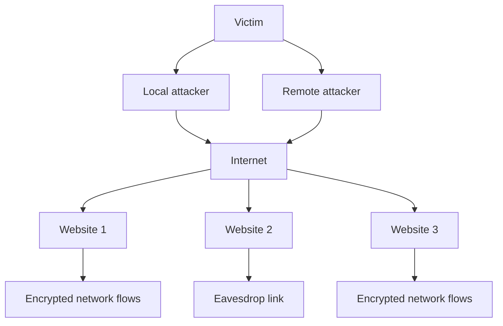
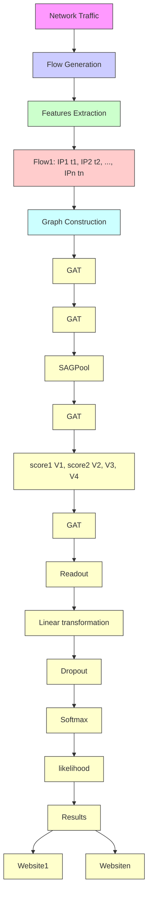
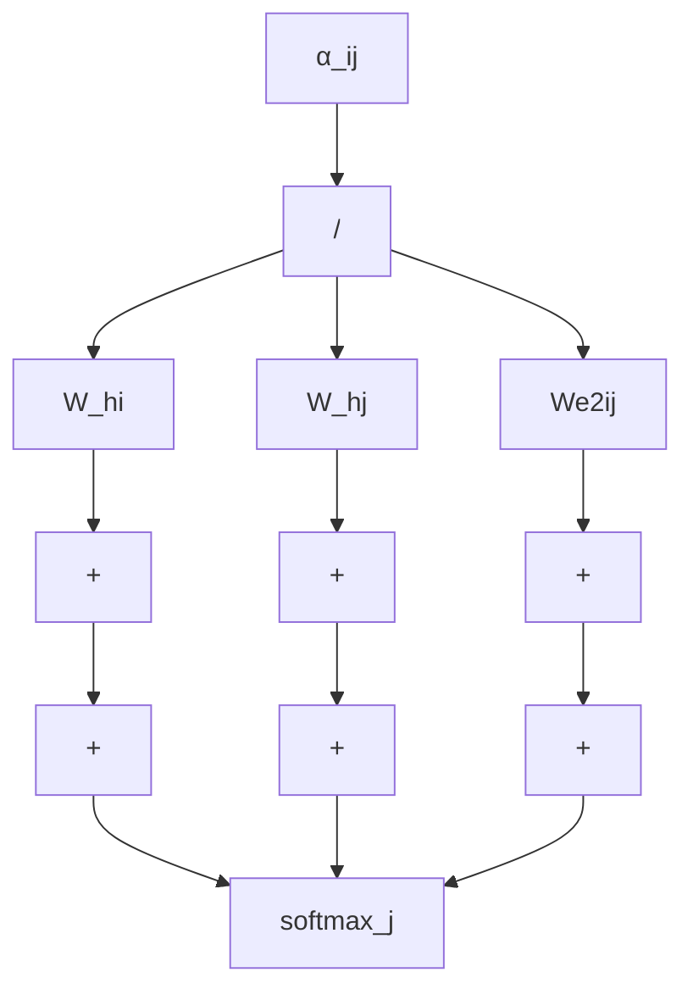
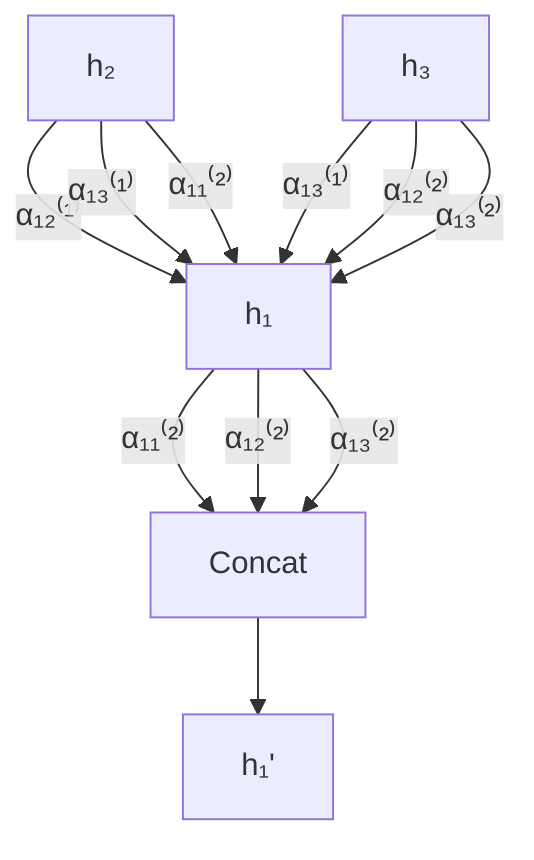

# Inter-Flow Spatio-Temporal Correlation Analysis Based Website Fingerprinting Using Graph Neural Network

Xiaobin Tan , Member, IEEE, Chuang Peng , Peng Xie, Hao Wang, Mengxiang Li, Shuangwu Chen , Member, IEEE, and Cliff Zou, Senior Member, IEEE

Abstract— Website fingerprinting has emerged as a prominent topic in the area of network management. However, the proliferation of encrypted network traffic poses new challenges for website fingerprinting. In this paper, we analyze the behavior and correlations among the network flows generated by browsing a webpage and conclude that there exist specific spatio-temporal correlations among these network flows. Based on this finding, we propose the construction of an inter-flow spatio-temporal correlation graph (STCG) to model these correlations. In the STCG, each node represents a flow, with its features capturing the properties of the flow itself, and each edge with a weight vector represents the spatio-temporal correlation between two flows. Subsequently, we propose a graph neural network-based website fingerprinting method (STC-WF) by considering the inter-flow spatio-temporal correlations, in which the Graph Attention Network (GAT) and Self-Attention Graph Pooling (SAGPool) mechanisms are employed to acquire a comprehensive representation of the STCG. To evaluate the performance of STC-WF, we construct a real-world traffic dataset and conduct comprehensive evaluations. The experimental results demonstrate that STC-WF outperforms state-of-the-art methods in terms of accuracy and time consumption.

Index Terms— Website fingerprinting, encrypted traffic classification, inter-flow spatio-temporal correlation, graph neural network.

Manuscript received 9 January 2024; revised 9 June 2024 and 27 July 2024; accepted 29 July 2024. Date of publication 12 August 2024; date of current version 20 August 2024. This work was supported in part by the National Key Research and Development Program of China under Grant 2020YFA0711400; in part by the Key Science and Technology Project of Anhui under Grant 202103a05020007 and Grant 202103a05020006; in part by China Environment for Network Innovations under Grant 2016-000052-73-01-000515; in part by the National Natural Science Foundation of China under Grant 62101525, Grant 62341113, and Grant 62021001; and in part by the Fundamental Research Funds for the Central Universities. The associate editor coordinating the review of this article and approving it for publication was Dr. Luca Caviglione. (Corresponding author: Shuangwu Chen.)

Xiaobin Tan and Shuangwu Chen are with the Department of Automation, University of Science and Technology of China (USTC), Hefei 230026, China, and also with the Institute of Artificial Intelligence, Hefei Comprehensive National Science Center, Hefei 230031, China (e-mail: xbtan@ustc.edu.cn; chensw@ustc.edu.cn).

Chuang Peng and Hao Wang are with the Institute of Advanced Technology, USTC, Hefei 230026, China (e-mail: pengchuang@mail.ustc.edu.cn; wanghao1014@mail.ustc.edu.cn).

Peng Xie is with the Department of Automation, USTC, Hefei 230026, China (e-mail: xiepeng2001@mail.ustc.edu.cn).

Mengxiang Li is with the School of Cyber Science and Technology, USTC, Hefei 230026, China (e-mail: limx2017@mail.ustc.edu.cn).

Cliff Zou is with the Department of Computer Science, University of Central Florida, Orlando, FL 32816 USA (e-mail: changchun.zou@ucf.edu).

Digital Object Identifier 10.1109/TIFS.2024.3441935

## I. INTRODUCTION

data centers and employing masquerade techniques, determining specific websites simply based on IP addresses is no longer feasible. Website fingerprinting, an area of research dedicated to identifying specific websites, has garnered considerable attention in the field of network management. Nevertheless, the prevalent incorporation of encryption technology in network flow, such as the TCP session, poses significant challenges to the efficacy of website fingerprinting techniques. As reported by the Google Transparency Report,1 the utilization of HTTPS for loading Chrome webpages has reached an impressive 99% as of May 2022. Consequently, traditional network traffic classification methods, such as those based on port numbers [1] or deep packet inspection (DPI) [2], are rendered ineffective in the context of encrypted network traffic scenarios.

Recent studies have proposed many schemes for website fingerprinting. Some of them use features extracted from a single network flow [3], [4], [5]. However, such methods are very sensitive to small changes in network flow characteristics, which diminishes their effectiveness when facing websites’ continuous updates and changing traffic environments. For example, the arrival time of packets or the ordering of packet sequences may change even when one user browses the same website twice. Furthermore, browsing sessions, which mean all user interactions with a site over a continuous period, including page loads, resource requests, user interactions, and dynamic content loading, consistently generate multiple distinct flows. This diversity poses a challenge in selecting the appropriate flow for website fingerprinting.

The multiple flow-based methods for website fingerprinting, such as [6] and [7], fuse the features extracted from multiple flows; however, they only achieve limited fingerprinting performance. The main reason is that these schemes just crudely combine the information of multiple network flows generated by a single webpage browsing session, while not considering the temporal and spatial correlation between multiple network flows generated by one webpage browsing session, thus lowering the accuracy of website fingerprinting.

In fact, there exist specific spatio-temporal correlations among the multiple network flows generated by browsing a

1https://transparencyreport.google.com/ single webpage. Therefore, an effective website fingerprinting scheme should not only consider the properties of each network flow but also account for the correlations among them. Moreover, these spatio-temporal correlations among the network flows can be accurately represented using a graph structure, and the Graph Neural Networks (GNNs) [8] prove to be a powerful tool for analyzing such graph-structured data. Consequently, an efficient website fingerprinting method can potentially incorporate GNNs based on suitable graph construction methods to analyze the graph that models the spatio-temporal correlation among multiple network flows.

In this paper, we propose an inter-flow spatio-temporal correlation analysis-based website fingerprinting approach utilizing the graph neural network (STC-WF). We construct an inter-flow spatio-temporal correlation graph (STCG) that captures the inter-flow correlations among network flows, considering the fact that a single website browsing session typically generates multiple flows that exhibit spatiotemporal correlations. Our proposed STC-WF methodology incorporates the Graph Attention Network (GAT) [9] and Self-Attention Graph Pooling (SAGPool) [10], [11] to extract a comprehensive representation of the STCG, enabling effective website fingerprinting.

The main contributions of this paper are summarized as follows.

• We reveal that there exist distinctive spatio-temporal correlations among network flows generated by one webpage browsing session by analyzing the correlation among multiple network flows generated by browsing the same webpage based on the network traffic collected from realworld experiments. This finding serves as inspiration for the design of our proposed novel website fingerprinting method.  
• We construct the inter-flow spatio-temporal correlation graph that captures the inter-flow correlations among network flows, which can comprehensively characterize the flow behavioral pattern of a certain website by incorporating representative features of the flow itself and the temporal and spatial correlation among network flows.  
• We propose a website fingerprinting method named STC-WF based on the analysis of spatio-temporal correlation within captured network flows using GNN. Specifically, we utilize GAT and SAGPool to learn a comprehensive representation of the corresponding STCG.  
• We create a real-world traffic dataset of website surfing, and then perform a series of comprehensive experiments on it to compare STC-WF against three state-of-the-art website fingerprinting methods. The experiment results demonstrate the superiority of STC-WF and the effectiveness of STCG.

The rest of the paper is organized as follows. We first review the related work in Section II. Then, we make some preliminary analysis in Section III and present our method in Section IV. Next, we describe the dataset collection process and evaluate the performance of STC-WF through a comprehensive comparison with state-of-the-art methods in Section V. Finally, we conclude this paper in Section VI.

## II. RELATED WORK

In this section, we make a brief summary of existing methods for website fingerprinting and traffic classification.

## A. Traditional Machine Learning Based Methods

Many machine learning-based traffic identification methods have emerged as a result of the advancement of artificial intelligence technology. Machine learning methods concentrate on extracting relevant features from network traffic. Reference [12] constructed a Markov Chain using the SSL/TLS message type and achieved high application identification accuracy. On this basis, [13], [14] built a second-order Markov model based on three states of the flow, adding the length of the certificate packet and the length of the first communication packet as features. Reference [15] identified malware using a logistic regression algorithm that combines the joint features of packet length distribution, time distribution, byte distribution, and unencrypted SSL/TLS header information. Reference [7] proposed the Flowprint, a semi-supervised learning method that uses temporal correlations among destination-related features of network traffic to generate app fingerprints.

In terms of website fingerprinting, [16] proposed a method that uses statistical features such as the number of incoming and outgoing packets and the number of bursts and uses k-Nearest Neighbor as the classifier. Reference [3] proposed the CUMUL, which is based on an SVM classifier and uses the cumulative sum of packet sizes to represent traffic traces. Reference [17] proposed a method for extracting 150-dimensional statistical features from traffic traces and then using a Random Forest classifier to extract website fingerprints. Shen et al. proposed a method based solely on packet length information [5], and then they developed FineWP [4], which is dedicated to extracting features from the cumulative sum of packet length sequences in the uplink-dominant stage. ProFi [18] uses Probabilistic Graphical Models (PGMs) to model and classify encrypted traffic.

## B. Modern Deep Learning Based Methods

The neural network can automatically extract the potential features of the original data.

1) Deep Neural Network Based Methods: Deep learningbased traffic classification methods can date back to 2015 when Wang [19] applied a simple sparse autoencoder (SAE) to traffic classification. Reference [20] introduced Recurrent Neural Network (RNN) into network traffic classification by putting the payload byte size sequence into an attention encoder to obtain features and then using a Softmax classifier for traffic classification. Reference [21] proposed the Flowpic that converts the original traffic into images and uses an image-based classification algorithm to classify the encrypted traffic. Reference [22] proposed an end-to-end model called FS-Net that takes into account the length of packets in encrypted traffic and employs a multilayer bi-GRU encoder to learn the flow sequence representation and a multilayer bi-GRU decoder to reconstruct the original sequence. Reference [23] proposed a method that directly recognizes the content inside the data stream, regardless of the external protocols and applications.

For deep learning-based website fingerprinting, [24] proposed BurNet, a model for fine-grained website fingerprinting that restores the length sequence of one-way HTTP messages and trains the data using a CNN model. Reference [25] proposed Deep Fingerprinting (DF), which uses the direction of each packet as input features and a CNN model as a classifier. Reference [26] proposed Triplet Fingerprinting (TF), which utilizes N-shot learning to achieve high accuracy with fewer examples per website. Reference [27] is a transformer-based approach to implement malware traffic detection, which takes channels with similar behaviors as detection objects and extracts the side-channel contents to construct behavioral sequences. SNWF [28] improves the robustness and classification performance of WF attacks by combining snapshot integration techniques with deep learning. Reference [29] proposes and evaluates a web site fingerprinting attack method that uses deep convolutional neural networks for feature extraction and improves the accuracy of the attack by continuously collecting and updating real Tor traffic data.

2) Graph Neural Network Based Methods: With some successful applications of GNN to classification tasks [30], several attempts to apply GNN to traffic classification have emerged. Reference [31] proposed to represent each flow using a traffic interaction graph, then they designed a GraphDApp model based on GNN using a multilayer perceptron (MLP) and a fully connected layer to map the traffic interaction graphs of various applications. In addition, there are also methods [32] to construct traffic graphs from the initial number of interaction packets of each two-way network flow, thus realizing the network intrusion detection.

There are some GNN-based website fingerprinting methods. Reference [6] proposed a framework called GAP-WF for finegrained website fingerprinting. GAP-WF introduced a trace graph to describe the contextual correlations between flows in webpage browsing and used a GNN-based model to learn the representation of the trace graph. However, GAP-WF was a generalized method for website and webpage recognition. This method constructed graphs in which edges were not assigned weights and therefore did not provide a measure of the degree of correlation between network flows.

## C. Analysis of Existing Methods

Most existing website fingerprinting methods [3], [4], [5], [16] extract the pattern of website traffic from the packet level to obtain the fingerprint of a website. In other words, they record the packets generated by the website browsing process in chronological order and then analyze this packet sequence. However, as we have just explained, features such as total packet number, packet order, and so on of packet sequence generated by one browsing can vary widely, so treating a packet as an independent entity and ignoring flow information may lead to errors. Moreover, packet sequence-based methods are sensitive to small changes in the characteristics of the sequence, limiting their effectiveness in the face of constantly updated and changing network environments.

Despite the availability of flow-level methods [6], these approaches often neglect the importance of incorporating both spatial and temporal correlations among network flows in a comprehensive manner. Neglecting to synthesize these spatial and temporal correlations would result in underutilizing the potential benefits offered by multi-flow-based website fingerprinting techniques.

## III. PRELIMINARIES

In this section, we first present the threat model of website fingerprinting. Next, we analyze the behavior of network flows generated from real-world webpage browsing and provide an explanation for the ineffectiveness of existing methods. Finally, we explain the insights derived from our research.

## A. Threat Model

Website fingerprinting allows an attacker to deduce the specific web page being accessed by a client through encrypted or anonymized network connections [17]. According to [25], the threat model assumes that the attackers are passive, meaning they can only eavesdrop on the encrypted packets through network devices and are unable to alter, modify, or decrypt web packets.

It needs to be explained that a “webpage” is a single document or resource accessible on the internet, typically part of a website, and can include text, images, and other multimedia content, while a “website” is a collection of related web pages, typically identified by a common domain name, and hosted on at least one web server. In this paper, we consider that different webpages under the same website have similar elements and structures.

As depicted in Fig. 1, the victim accesses the website from the Internet via a browser to retrieve web content. Simultaneously, an attacker may attempt to identify the website being accessed through website fingerprinting. In general, there exist two types of threat models, where potential attackers are situated in different network locations and possess varying capabilities to capture network traffic, leading to different attack efficiencies.

The threat model is categorized into local and remote attacks. In a local attack, the attacker is located in the victim’s local network and can eavesdrop on two-way network traffic between the victim and the corresponding web server. The attacker could be a campus network administrator or a local Internet Service Provider (ISP), enabling him or her to capture both uplink and downlink network flows passing through the local network. The objective of the attacker is to utilize the fingerprinting results to enforce network censorship or restrict access to specific web pages for users within a certain region.

Given that the local attacker model (the first threat model) is common and effective, many existing research efforts have focused on it [3], [6]. This paper also adopts the local attacker model for website fingerprinting.

In addition, this paper only consider closed-world coarsegrained website fingerprinting, i.e., users only visit known websites, and we aim at website categorization rather than fine-grained web pages. If want to learn more about open vs. closed world scenarios, you can refer to [24].

flowchart

Fig. 1. Two different threat models in website fingerprinting.

## B. Website Browsing Process

The website browsing process necessitates an interactive data exchange between the local browsers (such as Internet Explorer and Chrome) and remote web servers with HyperText Transfer Protocol (HTTP). Browsers implement the client side of HTTP, and web servers implement the server side of HTTP housing webpage elements. When a user visits a webpage, the browser sends HTTP request messages to the server for the webpage elements. The server receives the requests and responds with HTTP response messages containing the elements. Each website inherently manifests variety in the organization of webpage elements, which include texts, images, and other content. These elements are commonly hosted on separate servers and are accessed in a predetermined order as defined by the HyperText Markup Language (HTML), the standard markup language for documents intended for web browser display. HTTP uses TCP as its underlying transport protocol. Consequently, the transmission of these elements to the local host initiates multiple TCP flows, with the sequence adhering to the positions of these elements within the HTML file.

Furthermore, to accelerate browsing speed, browsers frequently adopt a strategy referred to as concurrent requests [33]. This approach involves the near-simultaneous dispatch of multiple requests for webpage elements to the web server. For an element of a particular type on the webpage, upon determining its appropriate web server, the browser may transmit multiple concurrent requests to this server. The server then establishes a TCP session for each request, responding to the first one that arrives while the remaining requests are terminated through negotiation. Consequently, the beginning time of multiple network flows are closely aligned, with a single network flow housing a substantial number of packets and the others containing a minimal number of packets. Given the prevalent utilization of Content Delivery Network (CDN) technology, the geographical location of the physical server and the sequence in which webpage elements load can vary across websites. Such variation gives rise to distinctive temporal and spatial correlations among the network flows generated during website browsing.

## C. Analysis of Network Flows’ Behavior of Website Browsing

As mentioned before, TCP provides a reliable data transfer service for HTTP. Therefore, we analyze the network flows’ behavior of website browsing based on TCP traffic. In this paper, a network flow refers to a TCP session between a browser and a web server, which represents a bidirectional flow between the client and the server. To analyze the network flows’ behavior of website browsing, we collected network traffic while browsing the BiliBili2 and Douyu3 websites (two dominant video streaming and live streaming websites in China) using the Chrome browser. The data collection process involved multiple browsing for each website, with each browsing lasting for 10 seconds.

bar chart

| Begin time of flows (s) | Number of packets |
|---|---|
| 0 | 10 |
| 0.64728 | 5 |
| 0.64750 | 50 |
| 1.38182 | 25 |
| 1.4237 | 30 |
| 2.82330 | 42 |
| 2.82372 | 30 |
| 3 | 40 |

(a) Bilibili-1

bar chart

| Begin time of flows (s) | Number of packets |
|---|---|
| 0.57572 | 10 |
| 0.57598 | 10 |
| 1.5074 | 50 |
| 1.5386 | 40 |
| 2.85227 | 25 |
| 2.852678 | 25 |
| 0.57572 | 50 |
| 0.57598 | 50 |
| 1.5074 | 50 |
| 1.5386 | 30 |
| 2.85227 | 20 |
| 2.852678 | 20 |

(b) Bilibili-2

bar chart

| Begin of flows (s) | Number of packets |
| ------------------ | ----------------- |
| 0.43710            | 50                |
| 0.43745            | 50                |
| 1.064535           | 18                |
| 1.06463            | 36                |

(c) Douyu-1

bar chart

| Begin time of flows (s) | Number of packets |
|---|---|
| 0.47829 | 50 |
| 0.47855 | 50 |
| 1.158 | 36 |
| 1.188 | 18 |

(d) Douyu-2  
Fig. 2. Network flows temporal pattern generated by browsing a website.

Fig. 2 illustrates two instances of network flows from repeatedly browsing the same webpage for Bilibili and Douyu, respectively. A chart is employed to depict the temporal pattern of multiple network flows generated during website browsing. Each flow is represented by a column, where the horizontal coordinate indicates the flow’s beginning time and the height of the column corresponds to its number of packets. Additionally, network flows with the same remote IP address are depicted using a consistent color scheme. Due to the X-axis time scale, multiple columns could overlap with each other in the chart. For this reason, we use the small charts positioned at the top of each chart to present the zoomed-in details of the overlapping areas in the chart. Inspired by the analysis of the observations presented in Fig. 2, we make the following hypothesis.

1) Multiple Flows Are Generated When Browsing a Webpage: From Fig. 2, we can observe that the browsing of a webpage always generates multiple network flows with distinct beginning time and packet counts. Moreover, the total number of network flows generated may vary across different browsing sessions of the same webpage. For instance, browsing BiliBili resulted in 17 and 18 network flows in two separate browsing instances.  
2) Spatio-Temporal Correlations Exist Among Multiple Flows Generated by Browsing a Webpage: Fig. 2 also reveals

2https://www.bilibili.com/

3https://www.douyu.com/

the presence of a relatively stable beginning time and packet counts distribution of flows in the temporal dimension, as well as a distribution of specific remote IP addresses in the spatial dimension, for multiple network flows generated during browsing of the same webpage. The temporal correlation of the vertical coordinate response and the spatial correlation of the color response are important for the classification of flows, in which “correlation” means being related in temporal dimension or spatial dimension and bringing help to the classification of encrypted traffic. This phenomenon of spatio-temporal correlation between multiple flows is consistently observed when analyzing flows generated by browsing other websites, indicating the existence of behavior patterns within network flows.

3) A Specific Website’s Browsing Session Has Its Own Unique Network Flow Behavioral Pattern: As depicted in Fig.2, the network flow behavioral patterns, such as the distribution of colors and heights of columns representing the network flows, exhibit notable differences between the browsing sessions of the BiliBili and Douyu websites. This distinction in behavioral patterns is consistently observed across other websites as well. Based on these observations, we deduce that network flows generated during website browsing possess distinct and characteristic behavioral patterns. Exploiting these unique network flow behavioral patterns holds the potential for effective website fingerprinting applications.

## D. Insight

By analyzing the behavior of all network flows generated while browsing a website, we have discovered the existence of spatio-temporal correlations that stem from the behavioral patterns exhibited by multiple network flows associated with specific websites at the flow level. These findings provide valuable insights and can serve as a foundation for designing novel solutions for website fingerprinting.

1) Website Fingerprinting Based on Multiple Flows With Spatio-Temporal Correlation: Inspired by the remarkable achievements of contemporary facial recognition methods [34], [35], which effectively incorporate not only the distinctive features of individual facial organs but also their spatial arrangement, leading to superior recognition accuracy, we aim to address a similar question in the context of website fingerprinting.

During the process of website browsing, multiple network flows are generated; these network flows and the spatio-temporal correlations among them exhibit specific behavioral patterns. These patterns are intrinsic to each website and can be leveraged to achieve accurate website fingerprinting. Therefore, a rational and effective website fingerprinting method should not only consider the features of individual network flows but also incorporate the spatio-temporal correlations among them, akin to the approach used in facial recognition.

2) Analyzing Spatio-Temporal Correlations of Multiple Flows Using GNN: The multiple spatio-temporally correlated flows generated during website browsing can be comprehensively represented using a graph structure, wherein the nodes represent individual flows and the edges denote the correlations among them. The GNNs have proven to be effective in analyzing such graph-structured data [36]. Therefore, we propose employing graph representations to capture the multi-flow structure and the associated spatio-temporal correlations, harnessing the power of GNNs for website fingerprinting applications.

## IV. THE PROPOSED METHOD

In this section, we present the architecture and design details of the proposed GNN-based website fingerprinting scheme, namely the STC-WF.

## A. Overview

The overview of the proposed STC-WF is depicted in Fig.3, which consists of three stages, the Gr aph Gener ation Stage, the Graph Representation Learning Stage, and the Classi f i cat i on St age.

• In the Graph Generation Stage, the raw network traffic is initially divided into multiple network flows. The Features E xtraction module extracts sequence features and statistical features from each network flow. Subsequently, the Graph Construction module constructs the STCG using the extracted features.  
• The Graph Representation Learning Stage aims to derive a comprehensive representation of the STCG. This is achieved through the utilization of GAT, SAGPool, and a readout layer.  
• Finally, in the Classi f ication Stage, website fingerprinting is performed using a Fully-Connected Layer. This stage leverages the extracted and refined features to classify the network traffic accurately.

To implement the STC-WF scheme proposed in this paper, we first train the GNN model using pre-labeled network traffic data. Once trained, the GNN model and its weights are deployed on a server. During runtime, incoming network traffic is fed into the model to recognize websites. If a new website needs to be recognized or an existing website changes, the GNN model must be retrained, and the weights on the server must be updated accordingly.

## B. Graph Generation Stage

In the Graph Generation Stage, the packets in network traffic are parsed into network flows based on its five-tuple information, including the source IP address, source port, destination IP address, destination port, and transport layer protocol. Subsequently, the inter-flow Spatio-Temporal Correlation Graph (STCG) of these network flows is constructed to capture their characteristics and the inter-flow correlations among them.

1) Flow Feature Selection: In the STCG, each node corresponds to a specific network flow. Given the substantial impact of node information on the classification outcome of Graph Neural Networks, it is crucial to carefully select appropriate features to effectively characterize the nodes. Inspired by [4], we select features of nodes to encompass both sequence features and statistical features of network flows.

flowchart

Fig. 3. System architecture of the proposed STC-WF scheme.

• Sequence Features: The packet length is a representative feature in the encrypted traffic classification task [22]. The packets in a network flow can be divided into uplink and downlink packets according to whether the source IP is a local host where the web browser is running. Therefore, a network flow can be divided into an uplink flow and a downlink flow. The sequence feature is a packet length sequence with a fixed length $T$ of the network flow, where the size of an uplink packet is positive, and the size of a downlink packet is negative. It is worth noting that the sequence feature does not fully describe the entire network flow and its value is not stable enough, because the sequence feature is generally calculated based on only a small sequence of packets in the entire network flow.  
• Statistical Features: According to [37], statistical features of flows can be used for encrypted traffic identification with good results. So we select 18 statistical features for the whole network flow, uplink sub-flow, and downlink sub-flow of this network flow respectively, including minimum (min), maximum (max), mean (mean), median absolute deviation (mad), standard deviation (std), variance (var ), skew (skew), kurtosis (kur t), number of packets (len), and 9 percentiles from 10% to 90% $( p e r 1 , \ldots , p e r 9 )$ . Table VI in the Appendix lists the detailed formulas, where x refers to the size of each packet in the sequence. Then we get 54 statistical features for each flow and then use the Random Forest method to rank the contribution of these statistical features [38]. To reduce the parameters and model running time, we select M statistical features with the highest contribution as the statistical features of the nodes. The statistical features can be used as a complement to the

sequence features to improve the classification accuracy of the model.

Therefore, the features of a network flow can be represented by an F-dimensional vector $\vec { h } \ = \ \{ l _ { 1 } , \ldots , l _ { T } , s _ { 1 } , \ldots , s _ { M } \} $ , where the $l _ { t }$ represents the length of a packet in bytes, the $s _ { m }$ represents a statistical feature and $F = T + M$ .

2) Inter-Flow Spatio-Temporal Correlation Graph: The STCG is constructed to capture the inter-flow correlations among network flows. Within the STCG, each node corresponds to a network flow and possesses a property associated with that flow including the sequence features and the statistical features. Additionally, edges within the graph represent the spatio-temporal correlation between two endpoints, characterized by a two-dimensional vector. The first dimension of the vector signifies the temporal correlation between the corresponding flows, while the second dimension represents the spatial correlation between them.

The temporal correlation between two network flows is measured by calculating the difference in their beginning time. However, due to network bandwidth fluctuations, if the difference in beginning time between two flows is below a specified threshold, they are considered concurrent. On the other hand, the spatial correlation between two flows describes the distance between their network destinations. To simplify the calculation of this property, we simply consider whether the destinations of these network flows belong to the same network or not.

Suppose there exists an edge $e _ { i j }$ between node i and node $j ,$ and the edge’s feature vector is $\vec { e _ { i j } } ~ = ~ [ \tau , s ]$ . The first dimension component τ and the second dimension component s of the edge feature vector $\vec { e _ { i j } }$ are calculated according to Eq. (1) and Eq. (2).

$$
\tau = e ^ {- (t _ {i} - t _ {j})}, t _ {i} \geqslant t _ {j}, \tag {1}
$$

flowchart

```mermaid
graph TD
  A["1 T1"] --> B["2 IP1"]
  C["2 T2"] --> D["3 IP2"]
  E["3 T3"] --> F["4 IP3"]
  G["4 T4"] --> H["5 IP4"]
  I["5 T5"] --> J["6 IP5"]
  K["6 T6"] --> L["7 IP6"]
  M["7 T7"] --> N["8 IP7"]
  O["8 T8"] --> P["9 IP8"]
  Q["9 T9"] --> R["10 IP9"]
  S["10 T10"] --> T["11 IP10"]
  U["11 T11"] --> V["12 IP11"]
  W["12 T12"] --> X["Time"]
  Y["T1"] --> Z["T2"]
  Z --> AA["T3"]
  AB["T4"] --> AC["T5"]
  AD["T5"] --> AE["T6"]
  AF["T6"] --> AG["T7"]
  AH["T7"] --> AI["T8"]
  AJ["T8"] --> AK["T9"]
  AL["T9"] --> AM["T10"]
  AN["T10"] --> AO["T11"]
  AP["T11"] --> AQ["T12"]
  AR["T12"] --> AS["Time"]
    
    subgraph Time_Steps
        direction LR
  n1["1"] --> n2["2"]
  n2 --> n3["3"]
  n3 --> n4["4"]
  n4 --> n5["5"]
  n5 --> n6["6"]
  n6 --> n7["7"]
  n7 --> n8["8"]
  n8 --> n9["9"]
  n9 --> n10["10"]
  n10 --> n11["11"]
  n11 --> n12["12"]
    
    end
    
    subgraph Concurrent_Flores
        direction LR
  n2 --> n4
  n4 --> n5
  n5 --> n6
  n6 --> n7
  n7 --> n8
  n8 --> n9
  n9 --> n10
  n10 --> n11
  n11 --> n12
    
    end
    
    style A fill:#f9f,stroke:#333
    style B fill:#f9f,stroke:#333
    style C fill:#f9f,stroke:#333
    style D fill:#f9f,stroke:#333
    style E fill:#f9f,stroke:#333
    style F fill:#f9f,stroke:#333
    style G fill:#f9f,stroke:#333
    style H fill:#f9f,stroke:#333
    style I fill:#f9f,stroke:#333
    style J fill:#f9f,stroke:#333
    style K fill:#f9f,stroke:#333
    style L fill:#f9f,stroke:#333
    style M fill:#f9f,stroke:#333
    style N fill:#f9f,stroke:#333
    style O fill:#f9f,stroke:#333
    style P fill:#f9f,stroke:#333
    style Q fill:#f9f,stroke:#333
    style R fill:#f9f,stroke:#333
    style S fill:#f9f,stroke:#333
    style T fill:#f9f,stroke:#333
    style U fill:#f9f,stroke:#333
    style V fill:#f9f,stroke:#333
    style W fill:#f9f,stroke:#333
    style X fill:#f9f,stroke:#333
```

Fig. 4. An example of the STCG construction for a certain website browsing session.

$$
s = \left\{ \begin{array}{l l} 1, & d e s t _ {i} = d e s t _ {j}, \\ 0, & e l s e, \end{array} \right. \tag {2}
$$

where $t _ { i }$ and $d e s t _ { i }$ are the beginning time and destination network of node i, respectively.

The calculation method of τ ensures that a larger value is assigned when there is a smaller difference in the beginning time between two network flows. The value of τ ranges from 0 to 1. Regarding the calculation method for the spatial correlation s, we adopt the approach utilized in Flowprint [7]. In this method, two network flows sharing the same destination network address or the serial number of the TLS certificate are considered to belong to the same destination network, resulting in s being assigned a value of 1. For other cases, s is assigned a value of 0. In STCG, unidirectional edges between two nodes represent the temporal relationship between two network flows, while bidirectional edges indicate the concurrency between two network flows. Nodes corresponding to all concurrent flows form a group. Any two nodes within the same group are connected by bidirectional edges. Additionally, in order to reduce the complexity of the STCG, unidirectional edges that can be derived through transitivity are not explicitly generated.

An illustration of the STCG construction process is presented in Fig. 4. The left section of the figure displays a list of eight network flows, each represented by its sequence features and statistical features. On the right side, the corresponding STCG is depicted, which is constructed based on these network flows. Within the STCG, each node represents a specific network flow, while the edges indicate the correlations between pairs of network flows. These correlations are characterized by a feature vector $[ \tau , s ]$ , where $\cdot _ { \tau } ,$ signifies the temporal correlation and $\cdot _ { s } ,$ represents the spatial correlation. In Fig. 4, the nodes enclosed within a dashed ellipse represent concurrent network flows, and the edges connecting these nodes are bidirectional. Conversely, all other edges are unidirectional and have directions aligned with the temporal flow, while thick arrows represent all of the unidirectional edges that connect one group to the next.

## C. Graph Representation Learning Stage

Based on the STCG constructed from captured network flows, the website fingerprinting task is transformed into a graph classification problem. Pre-labeled STCGs are input into Graph Neural Networks to train a graph classifier. This classifier is subsequently utilized to classify the current captured network traffic by processing the corresponding STCG constructed from the captured data. The key components incorporated in the GNN model of the STC-WF method comprise Graph Attention Networks (GATs) and a Self-Attention Graph Pooling (SAGPool) layer, enabling the identification of critical nodes within the graph.

flowchart

(a) Attention mechanism

flowchart

(b) Multi-head attention mechanism  
Fig. 5. Graph attention network used in STC-WF.

Given a set of STCGs $\{ G _ { 1 } , \dots , G _ { N } \}$ , and their labels $\{ y _ { 1 } , \dots , y _ { N } \}$ , the objective of the GNN is learning the representation vector $\vec { H _ { G } }$ that can predict the label of each STCG. In the STC-WF, the GAT and SAGPool are utilized to construct the core components of the GNN.

1) Graph Attention Layer: GAT is a prominent example of a graph neural network that incorporates the attention mechanism to process graph-structured data. In the STC-WF method, GAT is employed to aggregate node features. The webpage browsing process generates multiple flows, including flows carrying HTML requests and responses, as well as flows originating from third-party sources, such as advertisements, which can introduce interference in the classification process. The rationale behind the utilization of GAT lies in its attention mechanism, which enables the model to focus on the most relevant components, facilitating effective decision-making.

As depicted in Fig. 5, the Gr aph Attention Layer is the only layer used in GAT. The feature vector corresponding to any node i in STCG is $\vec { h _ { i } } ~ \in ~ \mathbb { R } ^ { F }$ and after an aggregation operation centered on the attention mechanism, the output is the new feature vector $\vec { h _ { i } ^ { \prime } } \in \mathbb { R } ^ { F ^ { \prime } }$ of that node. GAT uses $\alpha _ { i j }$ to specify the importance of node $j ^ { \prime } { \bf s }$ features to node i .

To take the structural information of STCG into account, $\alpha _ { i j }$ is computed when and only when there exists an edge $e _ { i j }$ between node i and node $j . \ \alpha _ { i j }$ is calculated as in Eq. (3).

$$
\alpha_ {i j} = \frac {\exp (\text { LeakyReLU } (\vec {a} ^ {T} [ W \vec {h _ {i}} | | W \vec {h _ {j}} | | W _ {e} \vec {e _ {i j}} ])}{\sum_ {k \in \mathcal {N} _ {i}} \exp (\text { LeakyReLU } (\vec {a} ^ {T} [ W \vec {h _ {i}} | | W \vec {h _ {k}} | | W _ {e} \vec {e _ {i k}} ])}, \tag {3}
$$

where $^ { 6 6 } \cdot ^ { T } \ '$ represents transposition and $^ { 6 6 } | | ^ { , , }$ is the concatenation operation. $\mathcal { N } _ { i }$ is the set of neighbor nodes of node i in the STCG including node i itself, $\vec { e _ { i j } }$ is the feature vector of edge $e _ { i j }$ . W is a weight matrix that is applied to every node, and $W _ { e }$ is a weight matrix that is applied to every edge. a⃗ is the parameter of a single-layer feedforward neural network. The W , $W _ { e }$ , and $\vec { a }$ are learnable parameters. The LeakyReLU function is introduced for non-linearization, and the Softmax function is employed to calculate the final $\alpha _ { i j }$ . Then the neighborhood representations of the nodes are linearly accumulated according to $\alpha _ { i j }$ to obtain the output representation of one GAT layer for node i:

$$
\vec {h} _ {i} ^ {\prime} = \sigma (\sum_ {j \in \mathcal {N} _ {i}} \alpha_ {i j} W \vec {h} _ {j}), \tag {4}
$$

where σ (·) denotes an activation function.

Furthermore, the extension of the aforementioned attention mechanism to a multi-head attention approach has demonstrated improved efficiency [39]. In our proposed approach, we employ the multi-head attention mechanism, where each head of the attention mechanism independently performs the attention operation as described previously. The resulting representations from each head are subsequently concatenated together.

$$
\vec {h _ {i} ^ {\prime}} = | | _ {k = 1} ^ {K} \sigma (\sum_ {j \in \mathcal {N} _ {i}} \alpha_ {i j} ^ {(k)} W ^ {(k)} \vec {h _ {j}}), \tag {5}
$$

where K represents the number of heads of the attention mechanism.

In STC-WF, as depicted in Fig. 3, we use three-head attention to operate node features aggregation for STCG. The node feature matrix output from each GAT is spliced, at which point the features of each node contain both their information and the information of neighboring nodes.

2) Self-Attention Graph Pooling Layer: In order to focus more on important nodes, and weaken the influence of noisy nodes on recognition results, while reducing model parameters and improving training and testing efficiency, we use the self-attention graph pooling mechanism [10] to pool the output of the GAT layers.

In STC-WF, the SAGPool also utilizes the graph attention mechanism to learn a score, which can be expressed as a onedimensional $\vec { h _ { i } ^ { \prime } }$ in Eq. (5). SAGPool eliminates nodes in the graph based on low scores while preserving essential graph information, thereby enhancing representation efficiency and reducing computational and memory overhead. This pooling approach draws inspiration from the maximum pooling operation in Convolutional Neural Networks (CNNs) to filter out less significant information.

3) Readout Layer: Finally, the representation of the whole graph is obtained through the Readout Layer:

$$
\vec {H} _ {G} = \text { Readout } (\{\vec {h} _ {i} | i \in G \}). \tag {6}
$$

## D. Classification Stage

STC-WF uses a linear function to perform the linear transformation on the output data of the Readout Layer. Then, a dropout function is employed to avoid over-fitting.

Finally, a Softmax function is used to obtain the predicted probability vector indicating the likelihood that the input STCG belongs to each website:

$$
p _ {i} = \frac {e ^ {z _ {i}}}{\sum_ {j = 1} ^ {K} e ^ {z _ {j}}}, \tag {7}
$$

where $p _ { i }$ represents the probability of the i th category, zi represents the ith element in the input vector, and K represents the total number of categories.

We leverage the cross entropy function as the loss function:

$$
H (y, p) = - \sum_ {i = 1} ^ {N} y _ {i} \log (p _ {i}), \tag {8}
$$

where $H ( y , p )$ represents the cross entropy function, y represents the right label, p represents the model’s predicted label, and N represents the total number of categories.

Adam [40] is a highly effective optimization algorithm widely utilized in various classification problems, particularly in the realms of deep learning and neural network training. Its adaptive learning rate, efficient parameter updating, and ability to mitigate the issue of gradient vanishing have positioned it as one of the preferred optimizers for numerous machine learning tasks. Consequently, we choose to employ the Adam optimizer as the optimization algorithm in the STC-WF method.

## V. EVALUATION

This section focuses on the evaluation of the proposed STC-WF method. We have conducted a thorough comparison between STC-WF and three state-of-the-art methods, comprehensively analyzing the efficacy of the proposed STC-WF approach. Since the datasets and code of the existing methods are not open source, we can only implement these algorithms by ourselves and evaluate them on our dataset.

## A. Experimental Settings

1) Dataset: As of now, there is no available dataset that contains multiple flows generated during website browsing. Therefore, we collected network traffic data from the browsing activity of 21 commonly used websites using the China Environment for Network Innovations (CENI-HeFei) platform [41]. The dataset encompasses a variety of website types, including video, music, news, live streaming, and forums.

To automate traffic generation and collection, we utilized Selenium4 and $\mathrm { Q P A } ^ { 5 }$ tools. Selenium, integrated with a test script, was employed to simulate real-world network traffic by mimicking user browsing sessions such as entering URLs, accessing webpages, and scrolling. QPA, a process-based packet capture tool, facilitated the real-time identification of the process to which each packet belongs, enabling the recording of network traffic associated with the target website into a Pcap file.

To replicate a realistic scenario, Selenium performed website browsing operations for varying durations across each website. Random browsing sessions of 60, 30, and 10 seconds were conducted, with 200 samples collected for each website, and we collected data for 21 websites, which are shown in Table V in the Appendix. The resulting dataset consists of 4,200 Pcap files, occupying a total storage space of 21.1GB. To ensure appropriate utilization, the dataset was divided into a training set, a validation set, and a test set. The size ratio

4https://www.selenium.dev/  
5https://github.com/l7dpi/openQPA/

of the training set to the validation set to the test set was set at 3:1:1, which has been determined as the optimal ratio for datasets at or below the ten-thousand level [42]. We performed a 4-fold cross-validation, i.e., one copy is fixed as the test set, and the other four copies are rotated to be the training set and validation set. In addition, in order to avoid the fluctuating effect on the results caused by the randomness of data partitioning and deep learning, we selected 10 fixed random seeds, each of which conducts 5 experiments. the average of 50 experiments is used as our experimental results.

2) Metrics: We use accuracy to measure the performance of the model of website fingerprints. Accuracy is defined as the number of samples correctly classified (NC) divided by the total number of samples (NS):

$$
a c c u r a c y = \frac {N C}{N S}. \tag {9}
$$

In addition, pr ecision, r ecall, and F1-scor e are also metrics we used. These metrics are defined based on four concepts commonly used in classification tasks, namely True Positive (TP), False Positive (FP), True Negative (TN), and False Negative (FN). They are defined as:

$$
p r e c i s i o n = \frac {T P}{T P + F P}, \tag {10}
$$

$$
\text { recall } = \frac {T P}{T P + F N}, \tag {11}
$$

$$
F 1 - s c o r e = 2 \times \frac {\text { precision } \times \text { recall }}{\text { precision } + \text { recall }}. \tag {12}
$$

Additionally, the time consumption of website fingerprinting methods is an important metric that encompasses both training time and classifying time.

3) Comparative Methods: In order to demonstrate the performance of the proposed STC-WF method, we selected three existing state-of-art methods for comparison, which are introduced below. For the deep learning-based methods, i.e. GAP-WF and our proposed STC-WF, we train 100 and 50 epochs, respectively.

• CUMUL [3] extracts fixed-size features from the cumulative sum of packet sizes to capture the characteristics of traffic traces. Subsequently, a Support Vector Machine (SVM) is employed as a classifier for website classification. In line with the evaluation settings employed by CUMUL, we also consider setting the uplink packet length as negative and the downlink packet length as positive. Additionally, we utilize the first 100 cumulative packet lengths, as well as the total number of uplink, downlink, and complete packets, as features for the classification process.

• FineWP [4] defines U0 sequence based on cumulative packet lengths. It concludes that U0 sequences of different webpages in the uplink-dominant stage are distinguishable. It extracts three types of features during the uplink-dominant stage, i.e., block features, sequence features, and statistical features, and feeds them to a Random Forest classifier. In this evaluation, we intercept the 20th to 100th packets of the U0 sequence as the sequence features and use statistical features in STC-WF as statistical features.

bar chart

| Website | Flow length range | Frequency |
| --- | --- | --- |
| Website1 | 0 - 5 | 750 |
| Website1 | 5 - 10 | 300 |
| Website1 | 10 - 15 | 250 |
| Website1 | 15 - 20 | 350 |
| Website1 | 20 - 25 | 200 |
| Website1 | 25 - 30 | 150 |
| Website1 | 30 - 35 | 100 |
| Website1 | 35 - 40 | 80 |
| Website1 | 40 - 45 | 60 |
| Website1 | 45 - 50 | 50 |
| Website1 | 50 - 55 | 40 |
| Website1 | 55 - 60 | 30 |
| Website1 | 60 - 65 | 20 |
| Website1 | 65 - 70 | 10 |
| Website1 | 70 - 75 | 5 |
| Website1 | 75 - 80 | 2 |
| Website2 | 0 - 5 | 800 |
| Website2 | 5 - 10 | 350 |
| Website2 | 10 - 15 | 250 |
| Website2 | 15 - 20 | 300 |
| Website2 | 20 - 25 | 200 |
| Website2 | 25 - 30 | 150 |
| Website2 | 30 - 35 | 100 |
| Website2 | 35 - 40 | 80 |
| Website2 | 40 - 45 | 60 |
| Website2 | 45 - 50 | 50 |
| Website2 | 50 - 55 | 40 |
| Website2 | 55 - 60 | 30 |
| Website2 | 60 - 65 | 20 |
| Website2 | 65 - 70 | 10 |
| Website2 | 70 - 75 | 5 |
| Website2 | 75 - 80 | 2 |
| Website3 | 0 - 5 | 700 |
| Website3 | 5 - 10 | 300 |
| Website3 | 10 - 15 | 200 |
| Website3 | 15 - 20 | 150 |
| Website3 | 20 - 25 | 100 |
| Website3 | 25 - 30 | 80 |
| Website3 | 30 - 35 | 60 |
| Website3 | 35 - 40 | 50 |
| Website3 | 40 - 45 | 40 |
| Website3 | 45 - 50 | 30 |
| Website3 | 50 - 55 | 20 |
| Website3 | 55 - 60 | 15 |
| Website3 | 60 - 65 | 10 |
| Website3 | 65 - 70 | 8 |
| Website3 | 70 - 75 | 5 |
| Website3 | 75 - 80 | 2 |
| Website4 | 0 - 5 | 750 |
| Website4 | 5 - 10 | 320 |
| Website4 | 10 - 15 | 220 |
| Website4 | 15 - 20 | 180 |
| Website4 | 20 - 25 | 120 |
| Website4 | 25 - 30 | 90 |
| Website4 | 30 - 35 | 70 |
| Website4 | 35 - 40 | 60 |
| Website4 | 40 - 45 | 50 |
| Website4 | 45 - 50 | 40 |
| Website4 | 50 - 55 | 30 |
| Website4 | 55 - 60 | 25 |
| Website4 | 60 - 65 | 20 |
| Website4 | 65 - 70 | 15 |
| Website4 | 70 - 75 | 10 |
| Website4 | ... | ... |
| Website5 | ... | ... |
| Website5 | ... | ... |
| Website5 | ... | ... |
| Website5 | ... | ... |
| Website5 | ... | ... |
| Website5 | ... | ... |
| Website5 | ... | ... |
| Website5 | ... | ... |
| Website5 | ... | ... |
| Website5*2 | ... | ... |
| Website5*2 | ... | ... |
| Website5*2 | ... | ... |
| Website5*2 | ... | ... |
| Website5*2 | ... | ... |
| Website5*2 | ... | ... |
| Website5*2 | ... | ... |
| Website5*2 | ... | ... |
| Website5*2 | ... | ... |
| Website5*2 | ... | ... |
| Website5*2 | ... | ... |
| Website5*2 | ... | ... |
| Website5*2 | ... | ... |
| Website5*2 | ... | ... |
| Website5*2 | ... | ... |
| Website5*2 | ... | ... |
| Website5*2 | ... | ... |

Fig. 6. The frequency of flow length of five websites browsing.

• GAP-WF [6] introduces the trace graph to describe the contextual correlation between network flows generated by webpage browsing. In the trace graph, each node represents a network flow, and node i and node j have edge $e _ { i j }$ if and only if the two nodes satisfy two rules: node i and node j have the same local IP, and their beginning time interval is no more than 2.39s. Then they utilize GNN to classify trace graphs.

4) Implementation: We started the experiment in September 2022. The experiment platform was built on an HP laptop running Windows 10 operating system, configured with Intel (R) Core (TM) i7-10750H CPU (12 hyper-threads) @2.60GHz, 16GB RAM, and NVIDIA GeForce RTX2060 graphics card with 8 GiB of memory and 1,920 CUDA cores. We used NetworkX to implement the graph construction and used PyTorch Geometric Library to implement graph neural network models. The versions of NetworkX, Pytorch, and CUDA are 2.4, 1.12.1, and 11.6, respectively.

## B. Parameter Optimization

1) The Length of Sequence Features: We counted the length of the entire network flow in the dataset. Fig. 6 shows the frequency distribution of flow lengths, defined as the number of packets in a sequence, for 5 websites. Due to space limitations, only these 5 websites are displayed. It can be seen that for the 5 websites, the highest frequency flow lengths are less than 20, and this rule applies to the other websites as well according to statistical results. We conducted experiments using sequence features of different dimensions. The f1-scores for our classification with 20, 30, 40, and 50-dimensional sequence features were 0.9828, 0.9809, 0.9815, and 0.9823, respectively, indicating minimal differences between these results. Therefore, we select the first 20 packets’ size as sequence features, which requires less zero padding while still containing enough information.

bar chart

| Statistical Features | Contributions |
|---|---|
| umax | 0.1421 |
| alen | 0.0498 |
| uper9 | 0.0445 |
| dlen | 0.0344 |
| uper8 | 0.0318 |
| dmean | 0.0296 |
| dmax | 0.0291 |
| dskew | 0.0276 |
| dper6 | 0.0256 |
| dper7 | 0.0254 |

Fig. 7. Ranked contributions of individual statistical features.

TABLE I HYPERPARAMETERS OF GNN

<table><tr><td>Hyperparameters</td><td>Search Range</td><td>Values</td></tr><tr><td>Input Dimension</td><td>-</td><td>26</td></tr><tr><td>Hidden Dimension</td><td>[64...2048]</td><td>128</td></tr><tr><td>Learning Rate</td><td>[0.0005...0.01]</td><td>0.0005</td></tr><tr><td>Training Epochs</td><td>[10...50]</td><td>50</td></tr><tr><td>Batch Size</td><td>[16...256]</td><td>64</td></tr><tr><td>Pooling Ratio</td><td>[0.1...0.8]</td><td>0.5</td></tr><tr><td>Dropout Ratio</td><td>[0.1...0.8]</td><td>0.1</td></tr></table>

2) Selection of Statistical Features: Statistical features represent to some extent the overall characteristics of the flow and are complementary to the sequence features. To cover as much of the full length of the flow as possible, we calculated the percentile of flow lengths in the dataset and found that the percentage of flows with lengths less than 150 exceeded 90%, so we did statistics for the first 150 packets of each flow. Fig.7 exhibits the top 10 statistical features that contribute most to the classification of our dataset using Random Forest. In this figure, the first character of the name, such as a, u, and d, denotes the statistical features of the complete flow, the uplink flow, and the downlink flow, respectively. For example, dlen means the number of packets of the downlink flow. We select the top 6 features with the highest contribution, i.e., umax, alen, uper9, dlen, uper8, and dmean as the statistical features.

The 20-dimensional sequence features and the 6-dimensional statistical features are combined to be a 26-dimensional vector for each node. Although more features can provide more information, subsequent experiments demonstrate that the 26-dimensional feature is adequate.

3) Hyperparameters of GNN: We conduct an extensive search through hyperparameter space to make the proposed model achieve its best performance. Table I shows the selected hyperparameters.

## C. Comparison Results

In this subsection, we evaluate the performance of STC-WF and the other three methods using our dataset. Then we analyze the evaluation results. As shown in Fig. 8, we can see that STC-WF obtains the best performance in terms of these four metrics. Fig. 9 shows the box plot of the results of the f1-score for 50 experiments, from which it can be seen that the results of STC-WF do not show large fluctuations due to random factors such as dataset partitioning. We further analyze the reasons for the performance disparity among the four methods.

bar chart

| Metric | STC-WF | CUMUL | FineWP | GAP-WF |
| :--- | :--- | :--- | :--- | :--- |
| accuracy | 0.9828 | 0.8921 | 0.9559 | 0.9608 |
| precision | 0.9833 | 0.8936 | 0.9571 | 0.9622 |
| recall | 0.9828 | 0.8921 | 0.9559 | 0.9608 |
| f1-score | 0.9828 | 0.8913 | 0.9558 | 0.9607 |

Fig. 8. Experiment results of different methods.

box plot

| Method   | F1-score |
| -------- | -------- |
| STC-WF   | 0.98     |
| CUMUL    | 0.88     |
| FineWP   | 0.95     |
| GAP-WF   | 0.96     |

Fig. 9. Distribution of f1-scores for four methods.

CUMUL, as evaluated on our dataset, achieves the lowest accuracy of 89.6% among the four methods considered. This can be attributed to its reliance solely on the cumulative packet length as a feature. The cumulative packet length is derived from a sequence of packets arranged in chronological order. As discussed in Section III, the arrival order and quantity of packets are not constant, which results in the lack of stability for CUMUL.

FineWP achieves the second-best performance on our dataset. FineWP addresses the instability of packet sequences by focusing on the uplink-dominant stage of data interaction. It extracts features based on the cumulative length sequence of packets, incorporating block features, sequence features, and statistical features. The combination of these three features significantly enhances the generalization capability of the model. Even with modifications to its features, FineWP continues to perform admirably. However, it does rely heavily on prior knowledge, such as the need for obtaining the average number of blocks in the dataset, which poses challenges for practical application.

TABLE II COMPARISON ON RUNNING TIME

<table><tr><td>Model</td><td>Type of method</td><td>Training time</td><td>Classifying time</td></tr><tr><td>STC-WF</td><td>GNN</td><td>149.50s</td><td>0.52s</td></tr><tr><td>GAP-WF</td><td>GNN</td><td>410.23s</td><td>1.04s</td></tr><tr><td>CUMUL</td><td>Machine learning</td><td>1.65s</td><td>0.11s</td></tr><tr><td>FineWP</td><td>Machine learning</td><td>0.23s</td><td>0.03s</td></tr></table>

In terms of GAP-WF, it constructs the website fingerprinting model from the perspective of network flow, distinguishing itself from the first two methods. This approach yields better classification ability, as evidenced by the experiment results showing a 4% higher classification accuracy compared to CUMUL because GAP-WF utilizes graph attention mechanisms to focus on key nodes. However, when constructing the traffic trace graph, GAP-WF simply connects nodes with a flow start interval of less than 2.39s, which does not fully leverage the advantages of graph-structured data. Additionally, its node features consist of the first 30 packets’ length sequence and packet arrival interval sequence of the flow, but it is not optimal according to FineWP’s practice. These limitations in utilizing graph-structured data and graph neural networks impact the overall performance of GAP-WF.

In contrast to CUMUL and FineWP, which rely on cumulative packet length sequences, STC-WF extracts multidimensional features from the network flow, resulting in improved stability for website fingerprinting. By constructing the STCG through the exploration of temporal and spatial correlations between network flows, STC-WF captures the unique network flow behavioral pattern of different websites from graph structure data. In summary, the node features in the STCG are more representative, and the inclusion of edge features further enhances the advantages of graph structure data. As demonstrated by the experimental results, the STC-WF method stands out as an excellent approach.

Another important performance metric is time consumption. We calculated the running time of each method, including both training time and testing time, and the results are shown in Table II.

As can be seen from Table II, CUMUL and FineWP have the shortest running time, which is one of the advantages of the traditional machine learning-based approach. We focus on comparing GAP-WF and STC-WF because both use deep learning algorithms. We can see that STC-WF has an advantage in terms of running time. The reason is clear, the graph neural network model of STC-WF is simpler than GAP-WF. Our graph neural network model is equivalent to one of the blocks in GAP-WF, which means that the GAP-WF model is twice as complex as ours and has more parameters. This is confirmed by the running time results, where STC-WF has about 50% less running time than GAP-WF, both in training time and testing time.

We compare GAP-WF and STC-WF once more. The impact of the number of epochs on the validation accuracy of

line chart

| Epoch | STC-WF | GAP-WF |
|-------|--------|--------|
| 0     | 0.4    | 0.4    |
| 5     | 0.95   | 0.7    |
| 10    | 0.96   | 0.8    |
| 15    | 0.97   | 0.85   |
| 20    | 0.97   | 0.88   |
| 25    | 0.97   | 0.9    |
| 30    | 0.97   | 0.91   |
| 35    | 0.97   | 0.92   |
| 40    | 0.98   | 0.93   |
| 45    | 0.98   | 0.94   |
| 50    | 0.98   | 0.94   |
| 55    | 0.98   | 0.94   |

Fig. 10. Impact of the number of epochs on validation accuracy of STC-WF and GAP-WF.

TABLE III IMPACT OF GRAPH CONSTRUCTION SCHEME

<table><tr><td rowspan="2">Model</td><td colspan="4">Metrics</td></tr><tr><td>accuracy</td><td>precision</td><td>recall</td><td>F1-score</td></tr><tr><td>STC-WF</td><td>0.9829</td><td>0.9834</td><td>0.9829</td><td>0.9828</td></tr><tr><td>FcG-UEW</td><td>0.9556</td><td>0.9570</td><td>0.9554</td><td>0.9555</td></tr><tr><td>FcG</td><td>0.9686</td><td>0.9695</td><td>0.9685</td><td>0.9683</td></tr><tr><td>Random Forest</td><td>0.8032</td><td>0.8658</td><td>0.8032</td><td>0.8032</td></tr><tr><td>K-Nearest Neighbors</td><td>0.7131</td><td>0.7914</td><td>0.7131</td><td>0.7410</td></tr></table>

STC-WF and GAP-WF is shown in Fig. 10, and we can find that STC-WF not only has a higher accuracy than GAP-WF, but it also converges faster, indicating that the node features and edge definitions are better than GAP-WF.

## D. Impact of Graph Construction Scheme

In this subsection, we analyze STC-WF by controlling variables and verify the effectiveness of STCG by comparative experiment. In this case, we only change the graph construction scheme of the graph, keeping the graph neural network unchanged. We obtain Fully-connected Graph with Uniform Edge Weight (FcG-UEW) and Fully-connected Graph (FcG), respectively, then use these two models to compare with STC-WF, and the results are shown in Table III.

We obtain FcG-UEW by letting the nodes in the inter-flow spatio-temporal correlation graph connect with each other and setting the weights of edges of the graph as value 1 uniformly. We set the edge features of the graph in FcG-UEW to spatiotemporal correlation vector described in Section IV to get FcG. As shown in Table III, the performances of FcG-UEW and FcG are quite good with 95.56% accuracy and 96.86% accuracy, respectively. It is worth noting that we simply connect all nodes to each other in the graph, which means that combining information from multiple flows is an effective way of website fingerprinting. It is also determined that the spatio-temporal correlation between flows is useful because all metrics of FcG are better than that of FcG-UEW.

Compared to GAP-WF, FcG has better performance. We attribute this to the fact that, unlike GAP-WF, FcG not only employs a fully connected graph construction but also incorporates node features and edge features. Additionally, the STCG used in STC-WF is derived by removing redundant edges from the fully connected graph. These redundant edges can introduce interference, thereby affecting the results. Therefore, it is crucial to reasonably consider the correlations between the flows and accurately construct the graph data to describe these relationships. By doing so, the advantages of graph neural networks can be effectively leveraged to achieve the ideal results.

TABLE IV ABLATION STUDY ON GAT AND SAGPOOL IN STC-WF

<table><tr><td rowspan="2">Model</td><td colspan="4">Metrics</td></tr><tr><td>accuracy</td><td>precision</td><td>recall</td><td>F1-score</td></tr><tr><td>STC-WF with GAT-only</td><td>0.9751</td><td>0.9761</td><td>0.9751</td><td>0.9752</td></tr><tr><td>STC-WF with SAGPool-only</td><td>0.9718</td><td>0.9725</td><td>0.9717</td><td>0.9717</td></tr><tr><td>STC-WF</td><td>0.9829</td><td>0.9834</td><td>0.9829</td><td>0.9828</td></tr></table>

We also input these 26-dimensional features to two typical machine learning methods, Random Forest and K-Nearest Neighbors, which yield the f1-score of only 0.8237 and 0.7410. The reason for this discrepancy is that these traditional machine learning methods without graphs are unable to effectively handle the correlation information in the traffic data, leading to reduced accuracy.

## E. Ablation Experiments

We conducted ablation experiments to demonstrate that both GAT and SAGPool positively impact traffic identification and both are indispensable. In this experiment, we train different versions of STC-WF by systematically removing either GAT or SAGPool, resulting in variations of STC-WF, namely, the STC-WF with GAT-only and STC-WF with SAGPool-only.

The classification results from our ablation experiments are presented in Table IV. These results clearly demonstrate that incorporating both GAT and SAGPool into the STC-WF model yields higher accuracy compared to utilizing only one of them. Thus, the inclusion of both GAT and SAGPool is crucial for further enhancing the classification efficiency of the STC-WF model.

## F. Summary

In this evaluation, we conducted a comprehensive series of experiments to compare the performance of the STC-WF method with state-of-the-art approaches. The experimental results clearly demonstrate that the STC-WF method surpasses these existing methods. Furthermore, by evaluating the rationality of the graph construction scheme for inter-flow correlations among network flows, this evaluation showcases the capability of the STC-WF method to employ simpler GNN models. Moreover, through ablation experiments, we establish the indispensability of GAT and SAGPool in GNN architectures.

## VI. CONCLUSION

In this paper, we conducted an extensive analysis of the behavior exhibited by network flows generated during real-world website browsing sessions, revealing explicit and stable spatio-temporal correlations among these flows. Leveraging these findings, we constructed an STCG to capture and represent these correlations effectively. Subsequently, we proposed a robust website fingerprinting method, named STC-WF, which leverages the analysis of the corresponding STCG using GNN. Specifically, the GAT and SAGPool mechanisms are employed to acquire a comprehensive representation of the STCG. Experimental results demonstrated the superior performance of STC-WF, surpassing three state-of-the-art methods and achieving the highest accuracy in website fingerprinting.

TABLE V WEBSITE LIST

<table><tr><td>Website</td><td>URL</td><td>Type</td></tr><tr><td>Bilibili</td><td>https://www.bilibili.com/</td><td></td></tr><tr><td>Iqiyi</td><td>https://www.iqiyi.com/</td><td>Video</td></tr><tr><td>Tencent Video</td><td>https://v.qq.com/</td><td></td></tr><tr><td>Douyu</td><td>https://www.douyu.com/</td><td>Webcast</td></tr><tr><td>Huya</td><td>https://www.huya.com/</td><td></td></tr><tr><td>Phoenix Net</td><td>https://www.ifeng.com/</td><td rowspan="6">News</td></tr><tr><td>Xinhua net</td><td>http://xinhuanet.com/</td></tr><tr><td>Toutiao</td><td>https://www.toutiao.com/</td></tr><tr><td>Sina</td><td>https://www.sina.com.cn</td></tr><tr><td>Sohu</td><td>https://www.sohu.com/</td></tr><tr><td>Tencent portal</td><td>https://www.qq.com/</td></tr><tr><td>Taobao</td><td>https://www.taobao.com/</td><td rowspan="2">Shopping</td></tr><tr><td>Jingdong</td><td>https://www.jd.com/</td></tr><tr><td>CSDN</td><td>https://www.csdn.net/</td><td rowspan="2">Blog</td></tr><tr><td>Jianshu</td><td>https://www.jianshu.com/</td></tr><tr><td>NetEase Cloud Music</td><td>https://music.163.com/</td><td rowspan="2">Music</td></tr><tr><td>QQ music</td><td>https://y.qq.com/</td></tr><tr><td>The car home</td><td>https://www.autohome.com.cn/</td><td rowspan="4">Others</td></tr><tr><td>Douban</td><td>https://www.douban.com/</td></tr><tr><td>Ximalaya</td><td>https://www.ximalaya.com/</td></tr><tr><td>East money</td><td>https://www.eastmoney.com/</td></tr></table>

TABLE VI STATISTICAL FEATURES AND THEIR FORMULAS

<table><tr><td>Statistic</td><td>Formula</td></tr><tr><td>Minimum</td><td> $min(X) = \min(x_1, x_2, \ldots, x_n)$ </td></tr><tr><td>Maximum</td><td> $max(X) = \max(x_1, x_2, \ldots, x_n)$ </td></tr><tr><td>Mean</td><td> $mean(X) = \frac{1}{n} \sum_{i=1}^{n} x_i$ </td></tr><tr><td>Median Absolute Deviation</td><td> $mad(X) = \text{median}(|x_i - \text{median}(X)|)$ </td></tr><tr><td>Standard Deviation</td><td> $std(X) = \sqrt{\frac{1}{n-1} \sum_{i=1}^{n} (x_i - mean(X))^2}$ </td></tr><tr><td>Variance</td><td> $var(X) = \frac{1}{n-1} \sum_{i=1}^{n} (x_i - mean(X))^2$ </td></tr><tr><td>Skew</td><td> $skew(X) = \frac{1}{n} \sum_{i=1}^{n} \left( \frac{x_i - mean(X)}{std(X)} \right)^3$ </td></tr><tr><td>Number of Packets</td><td> $len(X) = n$ </td></tr><tr><td>Percentiles</td><td>For the k-th percentile  $per_k: per_k(X) = P_k$ </td></tr></table>

## APPENDIX

See Tables V and VI.

## REFERENCES

[1] P. Schneider, “TCP/IP traffic classification based on port numbers,” Division Appl. Sci., Cambridge, MA, USA, Tech. Rep. 5, 1996, vol. 2138, pp. 1–6.

[2] L. Deri, M. Martinelli, T. Bujlow, and A. Cardigliano, “nDPI: Opensource high-speed deep packet inspection,” in Proc. Int. Wireless Commun. Mobile Comput. Conf. (IWCMC), Aug. 2014, pp. 617–622.  
[3] A. Panchenko et al., “Website fingerprinting at Internet scale,” in Proc. 23rd Annu. Netw. Distrib. Syst. Secur. Symp. (NDSS), 2016, pp.1–15.  
[4] M. Shen, Y. Liu, L. Zhu, X. Du, and J. Hu, “Fine-grained webpage fingerprinting using only packet length information of encrypted traffic,” IEEE Trans. Inf. Forensics Security, vol. 16, pp. 2046–2059, 2021.  
[5] M. Shen, Y. Liu, S. Chen, L. Zhu, and Y. Zhang, “Webpage fingerprinting using only packet length information,” in Proc. ICC - IEEE Int. Conf. Commun. (ICC), May 2019, pp. 1–6.  
[6] J. Lu et al., “GAP-WF: Graph attention pooling network for fine-grained SSL/TLS website fingerprinting,” in Proc. Int. Joint Conf. Neural Netw. (IJCNN), Jul. 2021, pp. 1–8.  
[7] T. van Ede et al., “FlowPrint: Semi-supervised mobile-app fingerprinting on encrypted network traffic,” in Proc. 27th Annu. Netw. Distrib. Syst. Secur. Symp. (NDSS), 2020, pp. 1–18.  
[8] F. Scarselli, M. Gori, A. C. Tsoi, M. Hagenbuchner, and G. Monfardini, “The graph neural network model,” IEEE Trans. Neural Netw., vol. 20, no. 1, pp. 61–80, Jan. 2009.  
[9] P. Velickovi ˇ c, G. Cucurull, A. Casanova, A. Romero, P. Liò, and ´ Y. Bengio, “Graph attention networks,” in Proc. Int. Conf. Learn. Represent., 2018, pp. 1–12.  
[10] J. Lee, I. Lee, and J. Kang, “Self-attention graph pooling,” in Proc. 36th Int. Conf. Mach. Learn., vol. 97, 2019, pp. 3734–3743.  
[11] B. Knyazev, G. W. Taylor, and M. Amer, “Understanding attention and generalization in graph neural networks,” in Proc. Adv. Neural Inf. Process. Syst., vol. 32, 2019, pp. 4204–4214.  
[12] M. Korczynski and A. Duda, “Markov chain fingerprinting to classify encrypted traffic,” in Proc. IEEE INFOCOM Conf. Comput. Commun., Apr. 2014, pp. 781–789.  
[13] M. Shen, M. Wei, L. Zhu, M. Wang, and F. Li, “Certificate-aware encrypted traffic classification using second-order Markov chain,” in Proc. IEEE/ACM 24th Int. Symp. Quality Service (IWQoS), Jun. 2016, pp. 1–10.  
[14] M. Shen, M. Wei, L. Zhu, and M. Wang, “Classification of encrypted traffic with second-order Markov chains and application attribute bigrams,” IEEE Trans. Inf. Forensics Security, vol. 12, no. 8, pp. 1830–1843, Aug. 2017.  
[15] B. Anderson, S. Paul, and D. McGrew, “Deciphering malware’s use of TLS (without decryption),” J. Comput. Virol. Hacking Techn., vol. 14, no. 3, pp. 195–211, Aug. 2018.  
[16] T. Wang, X. Cai, R. Nithyanand, R. Johnson, and I. Goldberg, “Effective attacks and provable defenses for website fingerprinting,” in Proc. 23rd USENIX Secur. Symp. (USENIX Security), 2014, pp. 143–157.  
[17] J. Hayes and G. Danezis, “k-fingerprinting: A robust scalable website fingerprinting technique,” in Proc. 25th USENIX Secur. Symp. (USENIX Security), Aug. 2016, pp. 1187–1203.  
[18] P. Krämer et al., “ProFi: Scalable and efficient website fingerprinting,” IEEE Trans. Netw. Service Manage., vol. 21, no. 1, pp. 1271–1286, Feb. 2024.  
[19] Z. Wang, “The applications of deep learning on traffic identification,” BlackHat USA, vol. 24, no. 11, pp. 1–10, 2015.  
[20] R. Li, X. Xiao, S. Ni, H. Zheng, and S. Xia, “Byte segment neural network for network traffic classification,” in Proc. IEEE/ACM Int. Symp. Quality Service, Jun. 2018, pp. 1–10.  
[21] T. Shapira and Y. Shavitt, “FlowPic: Encrypted Internet traffic classification is as easy as image recognition,” in Proc. IEEE INFOCOM Workshops, Apr. 2019, pp. 680–687.  
[22] C. Liu, L. He, G. Xiong, Z. Cao, and Z. Li, “FS-Net: A flow sequence network for encrypted traffic classification,” in Proc. IEEE Conf. Comput. Commun. (INFOCOM), Apr. 2019, pp. 1171–1179.  
[23] Y. Liang, Y. Xie, S. Tang, S. Yu, X. Liu, and J. Hu, “Network traffic content identification based on time-scale signal modeling,” IEEE Trans. Dependable Secure Comput., vol. 20, no. 3, pp. 2607–2624, Mar. 2023.  
[24] M. Shen, Z. Gao, L. Zhu, and K. Xu, “Efficient fine-grained website fingerprinting via encrypted traffic analysis with deep learning,” in Proc. IEEE/ACM 29th Int. Symp. Quality Service (IWQOS), Jun. 2021, pp. 1–10.  
[25] P. Sirinam, M. Imani, M. Juarez, and M. Wright, “Deep fingerprinting: Undermining website fingerprinting defenses with deep learning,” in Proc. ACM SIGSAC Conf. Comput. Commun. Secur. (CCS), Oct. 2018, pp. 1928–1943.  
[26] P. Sirinam, N. Mathews, M. S. Rahman, and M. Wright, “Triplet fingerprinting: More practical and portable website fingerprinting with N-shot learning,” in Proc. ACM SIGSAC Conf. Comput. Commun. Secur., Nov. 2019, pp. 1131–1148.  
[27] S. Cui, C. Dong, M. Shen, Y. Liu, B. Jiang, and Z. Lu, “CBSeq: A channel-level behavior sequence for encrypted malware traffic detection,” IEEE Trans. Inf. Forensics Security, vol. 18, pp. 5011–5025, 2023.  
[28] Y. Wang, H. Xu, Z. Guo, Z. Qin, and K. Ren, “SnWF: Website fingerprinting attack by ensembling the snapshot of deep learning,” IEEE Trans. Inf. Forensics Security, vol. 17, pp. 1214–1226, 2022.  
[29] G. Cherubin, R. Jansen, and C. Troncoso, “Online website fingerprinting: Evaluating website fingerprinting attacks on Tor in the real world,” in Proc. 31st USENIX Security Symp., Aug. 2022, pp. 753–770.  
[30] T. N. Kipf and M. Welling, “Semi-supervised classification with graph convolutional networks,” 2016, arXiv:1609.02907.  
[31] M. Shen, J. Zhang, L. Zhu, K. Xu, and X. Du, “Accurate decentralized application identification via encrypted traffic analysis using graph neural networks,” IEEE Trans. Inf. Forensics Security, vol. 16, pp. 2367–2380, 2021.  
[32] X. Hu, W. Gao, G. Cheng, R. Li, Y. Zhou, and H. Wu, “Toward early and accurate network intrusion detection using graph embedding,” IEEE Trans. Inf. Forensics Security, vol. 18, pp. 5817–5831, 2023.  
[33] I. Grigorik, High Performance Browser Networking. Sebastopol, CA, USA: O’Reilly Media, 2013.  
[34] F. Schroff, D. Kalenichenko, and J. Philbin, “FaceNet: A unified embedding for face recognition and clustering,” in Proc. IEEE Conf. Comput. Vis. Pattern Recognit. (CVPR), Jun. 2015, pp. 815–823.  
[35] H. Wang et al., “CosFace: Large margin cosine loss for deep face recognition,” in Proc. IEEE/CVF Conf. Comput. Vis. Pattern Recognit., Jun. 2018, pp. 5265–5274.  
[36] W. Jin, Y. Ma, X. Liu, X. Tang, S. Wang, and J. Tang, “Graph structure learning for robust graph neural networks,” in Proc. 26th ACM SIGKDD Int. Conf. Knowl. Discovery Data Mining, Aug. 2020, pp. 66–74.  
[37] V. F. Taylor, R. Spolaor, M. Conti, and I. Martinovic, “Robust smartphone app identification via encrypted network traffic analysis,” IEEE Trans. Inf. Forensics Security, vol. 13, no. 1, pp. 63–78, Jan. 2018.  
[38] Y. Zhai and X. Zheng, “Random forest based traffic classification method in SDN,” in Proc. Int. Conf. Cloud Comput., Big Data Blockchain (ICCBB), Nov. 2018, pp. 1–5.  
[39] J.-B. Cordonnier, A. Loukas, and M. Jaggi, “Multi-head attention: Collaborate instead of concatenate,” 2020, arXiv:2006.16362.  
[40] D. P. Kingma and J. Ba, “Adam: A method for stochastic optimization,” 2014, arXiv:1412.6980.  
[41] (Jan. 28, 2022). China Environment for Network Innovations (CENI-Hefei). [Online]. Available: https://ceni.ustc.edu.cn/  
[42] M. I. Jordan and T. M. Mitchell, “Machine learning: Trends, perspectives, and prospects,” Science, vol. 349, no. 6245, pp. 255–260, Jul. 2015.

natural_image

Portrait of a man wearing glasses and a dark jacket over a red shirt (no text or symbols visible)

Xiaobin Tan (Member, IEEE) received the B.S. and Ph.D. degrees from the University of Science and Technology of China (USTC), China, in 1996 and 2003, respectively. He is currently an Associate Professor with the Department of Automation, School of Information Science and Technology, USTC. His research interests include future internet architecture, information security, and multimedia communication.

natural_image

Portrait of a man in formal suit and tie against blue background (no text or symbols visible)

Chuang Peng received the B.S. degree from Tongji University in 2020 and the M.S. degree from the Institute of Advanced Technology, University of Science and Technology of China (USTC), in 2023. His research interests include information security and future networking with emphasis on security.

natural_image

Portrait photo of a young man wearing a red hoodie (no text or symbols visible)

Peng Xie received the B.S. degree from Xidian University in 2023. He is currently pursuing the M.S. degree with the Department of Automation, USTC. His research interests include cybersecurity and artificial intelligence.

natural_image

Portrait photo of a young man in a dark polo shirt against a blue background (no text or symbols visible)

Shuangwu Chen (Member, IEEE) received the B.S. and Ph.D. degrees from the University of Science and Technology of China (USTC), Hefei, China, in 2011 and 2016, respectively. He is currently an Associate Professor with USTC. His research interests include future networks, multimedia communication, and network security.

natural_image

Portrait of a young man in formal attire against a blue background (no text or symbols visible)

Hao Wang received the B.S. degree from East China University of Science and Technology in 2020. He is currently pursuing the M.S. degree with the Institute of Advanced Technology, USTC, China. His research interests include encrypted network traffic identification.

natural_image

Portrait photo of a man against a blue background (no text or symbols visible)

Mengxiang Li received the B.S. degree from the Department of Cyberspace Security, USTC, in 2021, where he is currently pursuing the M.S. degree. His research interests include information security privacy and network traffic identification.

natural_image

Portrait of a man wearing glasses and a purple shirt (no text or symbols visible)

Cliff Zou (Senior Member, IEEE) received the B.S. and M.S. degrees from the University of Science and Technology of China (USTC) in 1996 and 1999, respectively, and the Ph.D. degree from the Department of Electrical and Computer Engineering, University of Massachusetts, Amherst, MA, USA, in 2005. He is currently a Professor with the Department of Computer Science, University of Central Florida, Orlando, FL, USA, where he is also the Program Coordinator of the master’s degree in digital forensics and the master’s degree in  
cyber security and privacy. His research interests include cyber security and computer networking.