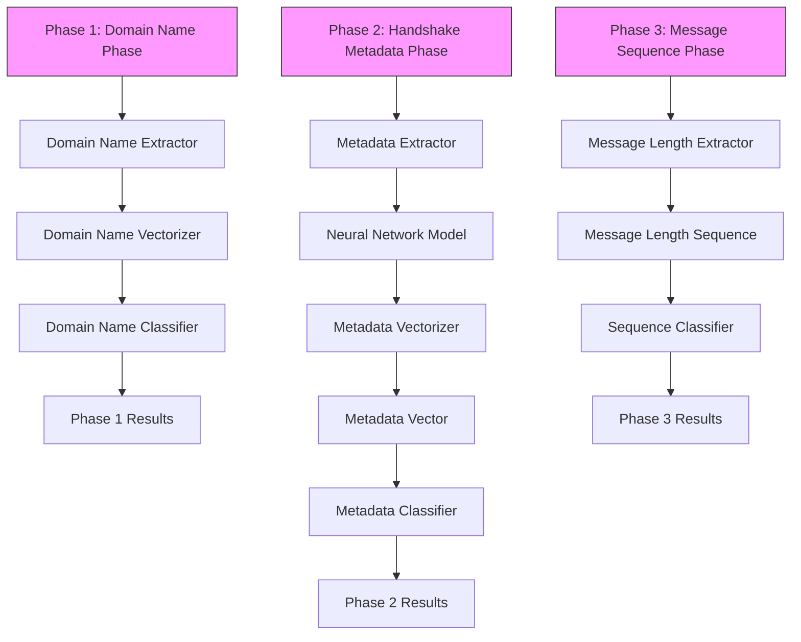
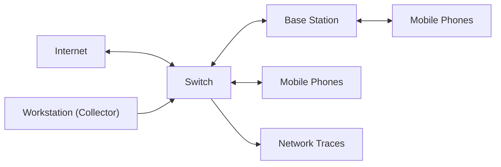

# MPAF: Encrypted Traffic Classification With Multi-Phase Attribute Fingerprint

Yige Chen and Yipeng Wang , Senior Member, IEEE

Abstract— The widespread use of cryptographic protocols such as Transport Layer Security (TLS) has necessitated the development of effective methods for encrypted traffic classification. The existing methods relying on a single feature source face challenges in achieving high accuracy and efficiency simultaneously. Additionally, there is a decrease in accuracy in complex scenarios, posing significant challenges for networks and security services based on application-level traffic classification. In this paper, we propose Multi-Phase Attribute Fingerprint (MPAF), an encrypted traffic classification system that overcomes these limitations. MPAF leverages three phases to separately leverage attributes that emerge at different time periods of encrypted traffic communication. Additionally, we transform discrete attributes into computable vectors through embedding and design a classifier for the multi-phase mechanism based on a leaf node masking tree. The experimental results show that MPAF achieves a classification accuracy ranging from 96.33% to 99.42% and an average waiting time (AWT) ranging from 0.18s to 0.45s. MPAF outperforms other approaches in scenarios with high robustness requirements, including small-scale training datasets, cross-dataset classification, and unknown application recognition.

Index Terms— Encrypted traffic classification, multi-phase, TLS messages, network management.

## I. INTRODUCTION

## A. Motivation and Problem Statement

HIS paper presents a novel approach to address the challenge of encrypted traffic classification for mobile applications. As the number of mobile applications in the application market continues to grow, identifying the application to which network traffic belongs becomes increasingly important for network management. To ensure secure mobile application communications, major application markets such as App Store [1] and Google Play [2] have adopted Transport Layer Security (TLS) [3], [4] encryption standards. As a result,

Manuscript received 2 January 2024; revised 3 June 2024; accepted 30 June 2024. Date of publication 15 July 2024; date of current version 25 July 2024. This work was supported in part by the Fundamental Scientific Research Project of Wenzhou City under Grant G2023005 and in part by the General Scientific Research Project of the Education Department of Zhejiang Province under Grant Y202248893. The associate editor coordinating the review of this article and approving it for publication was Prof. Husrev Taha Sencar. (Corresponding author: Yipeng Wang.)

Yige Chen is with the College of Computer Science and Artificial Intelligence, Wenzhou University, Wenzhou 325000, China, and also with Wenzhou Key Laboratory for Intelligent Networking, Wenzhou 325000, China (e-mail: ygchen@wzu.edu.cn).

Yipeng Wang is with the College of Computer Science, Beijing University of Technology, Beijing 100124, China, and also with the Engineering Research Center of Intelligent Perception and Autonomous Control, Ministry of Education, Beijing 100124, China (e-mail: yipeng.wang1@gmail.com).

Digital Object Identifier 10.1109/TIFS.2024.3428839 a large proportion of mobile network traffic is now encrypted using TLS.

Accurate encrypted traffic classification is essential for a range of networking and security services, including policy-based network traffic management, application Qualityof-Service (QoS), and application-level firewalls [5]. For instance, an enterprise network administrator may prioritize certain specific applications for the quality of critical services and assign a lower network communication priority to applications that do not adhere to the network policy. Existing approaches for encrypted traffic classification involve mobile application identification [6], [7], IoT behavior identification [8], [9], [10], protocol identification [11], etc. However, existing approaches for encrypted traffic classification overlook the average waiting time required to capture a sufficient number of packets for classification. Furthermore, these approaches lack the robustness to classify traffic in complex scenarios accurately. In this paper, we propose a novel fingerprinting approach to address the shortcomings of existing approaches.

## B. Our Insights and Proposed Approach

1) Key Observation to Encrypted TLS Traffic: In this paper, we propose MPAF, Multi-Phase Attribute Fingerprint for encrypted TLS traffic classification. MPAF aims to enhance the classification efficiency of encrypted TLS traffic by performing multi-phase traffic classification, while still ensuring high classification accuracy. The general encrypted communication process between a client and a server consists of three phases. In the first phase, the client application initiates a domain name query against the destination application server, thus obtaining the IP address of that server. Then, in the second phase, based on the obtained IP address, the client application conducts a handshake process with the destination server regarding the exchange of some metadata (including the negotiated encryption suite, server-side certificate information, etc.). Finally, the third phase involves the exchange of encrypted application content between the client and the server. It’s worth noting that in some situations, due to caching mechanisms, the first and second phases of this process may not be necessary.

2) Key Insights Into Our System: In this paper, MPAF builds on our key insight that the three phases of encrypted traffic communication between a client and a server occur at distinct time periods: the first phase precedes the second, and the second precedes the third. If we can classify a majority of the encrypted flows accurately during the first two phases, the overall classification efficiency can be significantly enhanced. Specifically, during encrypted traffic communication, more than half of encrypted flows can be accurately classified solely based on their associated domain names. A large portion of other encrypted flows can be accurately classified solely through the metadata in the handshake process. The remainder can be accurately classified using the message sequence of each TLS flow.

3) Brief Introduction to Our Approach: MPAF aims to reduce the observation waiting time for encrypted flows to be classified while ensuring high classification accuracy. As shown in Figure 1, MPAF consists of three classification phases, namely, domain name phase, handshake metadata phase, and message sequence phase.

1) Phase 1: Domain Name Phase. This is the first phase of our proposed scheme. In this phase, MPAF attempts to classify a significant portion of the encrypted flows at an early phase, relying solely on their associated domain names. Any flows not classified in this phase are forwarded to the subsequent phases for further analysis.  
2) Phase 2: Handshake Metadata Phase. MPAF classifies encrypted flows that cannot be classified during the domain name phase. The classification in this phase relies solely on the raw bytes in the TLS handshake messages. Encrypted flows that remain unclassified are then forwarded to the message sequence phase.  
3) Phase 3: Message Sequence Phase. MPAF processes the encrypted flows that remained unclassified after the first two phases. The objective here is to classify all these flows accurately based on the message sequence of each flow.

Through these three phases, MPAF can classify encrypted flows accurately and more efficiently.

## C. Key Contributions

We briefly summarize our main contributions as follows:

• We propose an encrypted traffic classification system called Multi-Phase Attribute Fingerprint (MPAF). MPAF employs three phases to utilize distinct attributes that emerge at different time periods within encrypted traffic communication, thereby enhancing classification efficiency while maintaining high classification accuracy.  
• We utilize an embedding mechanism to transform discrete attributes into calculable vectors and use the message length sequence as a supplementary fallback attribute. Additionally, we design a leaf-node masking tree-based classifier to facilitate the multi-phase mechanism.  
• We compare the effectiveness and robustness of MPAF with state-of-the-art approaches on two real-world collected datasets and two public datasets. Experimental results demonstrate that MPAF achieves a remarkable classification accuracy ranging from 96.33% to 99.42%. Besides, it exhibits a low Average Waiting Time (AWT) ranging from 0.18s to 0.45s. Notably, MPAF outperforms other approaches in scenarios demanding robustness,

including small-scale training datasets, cross-dataset classification, and unknown application recognition.

The remaining sections of this paper are structured as follows. In Section II, we present an overview of prior works. In Section III, we present the design of MPAF, offering insights into the system’s architecture and providing detailed information on each phase. In Section IV, we elaborate on the details of our dataset collection and provide an overview of the datasets used in this study. Section V presents the experimental settings and provides an in-depth analysis of the evaluation results. Section VI outlines a comparison of our proposed approach with state-of-the-art methods. Finally, in Section VII, we conclude our study and discuss potential avenues for future research.

## II. RELATED WORK

In this section, we introduce the relevant and recent encrypted traffic classification methods. The literature on traffic classification techniques can be categorized into three groups: (1) machine learning-based methods, (2) deep learning-based methods, and (3) dataset and benchmarking. In Table I, we give a summary for each related work.

## A. Machine Learning-Based Methods

In 2014, Korczynski and Duda ´ [12] proposed the concept of Markov chain fingerprinting using first-order homogeneous Markov chains to model the probability of message type sequences. In 2017, Shen et al. [13] extended this concept by incorporating second-order message type Markov chains with the lengths of the Certificate and first Application Data in the session. They proposed second-order Markov chain fingerprints with application attribute bigrams (SOB) to capture distinctive characteristics of applications. In 2020, Montieri et al. [14] proposed a novel traffic classification method for network traffic generated by anonymity tools through a general hierarchical classification framework. The proposed method uses per-flow statistical features for classification. Additionally, to promote analysis of anonymity tools’ traffic at different levels of granularity, Montieri et al. conducted experiments at three levels: (1) anonymous network level, (2) traffic type level, and (3) application level. Also in 2020, Van Ede et al. [15] proposed a semi-supervised approach for the mobile application fingerprint named FlowPrint. Flow-Print uses destination-related features to deal with unseen apps without requiring prior knowledge. In 2021, Aceto et al. [16] proposed machine learning-based methods for modeling the network traffic of mobile applications. The proposed method introduced a novel heuristic to reconstruct application-layer messages in the common case of encrypted traffic. They designed and evaluated per-app modeling and prediction using Hidden Markov Models and high-order Markov Chains at both the packet level and message level. Also in 2021, Ma et al. [17] proposed a context-aware website fingerprinting system for encrypted traffic. The system uses built-in spatialtemporal flow correlation for packet sizes to understand flow sequential patterns. In 2022, Xu et al. [18] proposed a creative path signature-based method named ETC-PS. ETC-PS adopts session packet length sequences as the path signature and performs path transformations to exhibit its structure and obtain different information. In 2023, Piet et al. [19] proposed GGFAST, a unified, automated framework designed to build powerful classifiers for specific network traffic analysis tasks. GGFAST aims to automatically identify sets of patterns in packet length sequences, which are critical characteristics of each category of traffic.

TABLE I SUMMARY OF RELATED WORK

<table><tr><td>Method</td><td>Method Type</td><td>Granularity</td><td>Analyse Objects</td><td>Feature Extraction</td><td>Algorithm</td><td>Published Year</td></tr><tr><td>Korczyński et al. [12]</td><td>Traditional ML</td><td>Flow</td><td>Encrypted Traffic</td><td>Sequence Features</td><td>Markov Chain</td><td>2014</td></tr><tr><td>Shen et al. [13]</td><td>Traditional ML</td><td>Flow</td><td>Encrypted Traffic</td><td>Sequence Features</td><td>Markov Chain</td><td>2017</td></tr><tr><td>Montieri et al. [14]</td><td>Traditional ML</td><td>Flow</td><td>Anonymity Tools Traffic</td><td>Statistical Features</td><td>Decision Trees &amp; Bayesian Family</td><td>2020</td></tr><tr><td>Van Ede et al. [15]</td><td>Traditional ML</td><td>Flow</td><td>Mobile Application Traffic</td><td>Statistical &amp; Field Features</td><td>Clustering</td><td>2020</td></tr><tr><td>Aceto et al. [16]</td><td>Traditional ML</td><td>Flow</td><td>Mobile Application Traffic</td><td>Sequence Features</td><td>Markov Chain</td><td>2021</td></tr><tr><td>Ma et al. [17]</td><td>Traditional ML</td><td>Flow</td><td>Website Traffic</td><td>Statistical Features</td><td>Clustering</td><td>2021</td></tr><tr><td>Xu et al. [18]</td><td>Traditional ML</td><td>Flow</td><td>Encrypted Traffic</td><td>Sequence Features</td><td>RF, DT, GNB, KNN</td><td>2022</td></tr><tr><td>Piet et al. [19]</td><td>Traditional ML</td><td>Flow</td><td>Network Traffic</td><td>Sequence Features</td><td>Naive Bayes</td><td>2023</td></tr><tr><td>Aceto et al. [20]</td><td>Deep Learning</td><td>Flow</td><td>Mobile Encrypted Traffic</td><td>Statistical &amp; Payload Features</td><td>SAE, LSTM, CNN,</td><td>2019</td></tr><tr><td>Aceto et al. [21]</td><td>Deep Learning</td><td>Flow</td><td>Mobile Encrypted Traffic</td><td>Sequence &amp; Payload Features</td><td>CNN, GRU</td><td>2019</td></tr><tr><td>Liu et al. [22]</td><td>Deep Learning</td><td>Flow</td><td>Encrypted Traffic</td><td>Sequence Features</td><td>GRU</td><td>2019</td></tr><tr><td>Aceto et al. [23]</td><td>Deep Learning</td><td>Flow</td><td>Mobile Encrypted Traffic</td><td>Sequence &amp; Payload Features</td><td>CNN, GRU</td><td>2020</td></tr><tr><td>Lotfollahi et al. [24]</td><td>Deep Learning</td><td>Packet</td><td>Encrypted Traffic</td><td>Payload Features</td><td>SAE, CNN</td><td>2020</td></tr><tr><td>Zhang et al. [25]</td><td>Deep Learning</td><td>Packet</td><td>Unknown Traffic</td><td>Payload Features</td><td>CNN, Clustering</td><td>2020</td></tr><tr><td>Aceto et al. [26], [27]</td><td>Deep Learning</td><td>Flow</td><td>Encrypted Traffic</td><td>Sequence &amp; Payload Features</td><td>CNN</td><td>2021</td></tr><tr><td>Nascita et al. [28]</td><td>Deep Learning</td><td>Flow</td><td>Mobile Application Traffic</td><td>Statistical Features</td><td>CNN, LSTM, GRU</td><td>2021</td></tr><tr><td>Montieri et al. [29]</td><td>Deep Learning</td><td>Flow</td><td>Mobile Application Traffic</td><td>Sequence Features</td><td>CNN, LSTM</td><td>2021</td></tr><tr><td>Xiao et al. [30]</td><td>Deep Learning</td><td>Flow</td><td>Network Traffic</td><td>Payload Features</td><td>LSTM, GRU</td><td>2022</td></tr><tr><td>Lin et al. [31]</td><td>Deep Learning</td><td>Flow</td><td>Encrypted Traffic</td><td>Payload Features</td><td>Transformer</td><td>2022</td></tr><tr><td>Jiang et al. [32]</td><td>Deep Learning</td><td>Flow</td><td>Mobile Application Traffic</td><td>Sequence Features</td><td>GNN</td><td>2022</td></tr><tr><td>Nascita et al. [33]</td><td>Deep Learning</td><td>Flow</td><td>Network Traffic</td><td>Statistical Features</td><td>CNN, GRU</td><td>2023</td></tr><tr><td>Qu et al. [34]</td><td>Deep Learning</td><td>Flow</td><td>Network Traffic</td><td>Sequence Features</td><td>Tree, Attention, Hybrid</td><td>2023</td></tr><tr><td>Cerasuolo et al. [35]</td><td>Deep Learning</td><td>Flow</td><td>Incremental Traffic</td><td>Statistical Features</td><td>CNN</td><td>2024</td></tr></table>

## B. Deep Learning-Based Methods

In 2019, Aceto et al. [20] proposed, for the first time, the design of mobile traffic classifiers capable of operating with encrypted traffic through the adoption of deep learning technology. Additionally, they systematically provided valuable guidelines and directions to address the challenges of applying deep learning algorithms to mobile traffic classification. In the same year, Aceto et al. [21] introduced MIMETIC, which allows network traffic to be inspected from complementary views, thus providing a more effective solution for network traffic classification. MIMETIC uses the initial bytes of the Layer 4 payload and the fields of the initial packets as inputs. It is also the first attempt to introduce the idea of multimodal deep learning into the field of traffic classification. Also in 2019, Liu et al. [22] proposed the Flow Sequence Network (FS-Net), which uses a multi-layer RNNbased encoder-decoder structure to generate features from packet length sequences and directly predicts the original application of the flow. In 2020, Aceto et al. [23] envisioned the deep learning paradigm as a stepping stone toward the design of practical mobile traffic classifiers based on automatically extracted features that can operate with encrypted traffic and reflect complex traffic patterns. They proposed a deep learning-based traffic classification framework that capitalizes on heterogeneous input data from mobile traffic to solve multiple traffic classification tasks simultaneously. They also proposed and validated a general framework for deep learning-based encrypted traffic classification. In the same year, Lotfollahi et al. [24] proposed a convolution neural network-based approach named Deep Packet. Deep Packet takes the IP header and the first 1480 bytes of packets as input and classifies them through the convolution and max pooling operations of the neural network. Also in 2020, Zhang et al. [25] proposed an autonomous model update scheme to achieve data filtering and dataset construction for unseen applications, and then update traffic classifiers via transfer learning. In 2021, Aceto et al. [26], [27] proposed DISTILLER, a novel multimodal deep learning-based approach for multitask network traffic classification. It aims to learn both intra- and inter-modality dependencies, thus overcoming the limitations of single-task deep learning in network traffic classification. The lack of interpretability of classification models built by deep learning techniques prevents their applicability to critical scenarios. To address this issue, in 2021, Nascita et al. [28] designed MIMETIC-ENHANCED, a novel architecture for traffic classification operating at the biflow level. Their proposal leverages the multimodal paradigm and consists of two branches. They investigate the rationale behind the working behavior of MIMETIC-ENHANCED by applying state-of-the-art XAI tools to understand input importance in both branches and within each individual branch. Also in 2021, Montieri et al. [29] predicted the network traffic generated by mobile applications at the finest granularity, the packet level, using multitask deep learning architectures. To deal with time series data, they proposed a windowing approach based on a sliding memory window. They also investigated the potential advantages of using exogenous inputs taken from the traffic data. In 2022, Xiao et al. [30] introduced an Extended Byte Segment Neural Network (EBSNN) for network traffic classification. This method introduces an aggregate strategy that relies on only the first k packets in the flow to identify the flow. For each packet, EBSNN divides the payload into segments and feeds them into encoders with the attention mechanism for classification. In 2022, Lin et al. [31] proposed ET-BERT that pre-trains deep contextualized datagram-level representation from large-scale unlabeled data. The pre-trained model can be fine-tuned on a small number of task-specific labeled data for accurate encrypted traffic classification. Also in 2022, Jiang et al. [32] proposed FG-Net to utilize graph neural networks to capture flow-level relationships. FG-Net converts the problem of learning app fingerprints from encrypted mobile traffic into the task of graph embedding to identify mobile applications. In 2023, Nascita et al. [33] aimed to use XAI-based techniques to understand and improve the behavior of state-of-the-art multimodal and multitask deep learning traffic classifiers. To this end, they explored and exploited XAI techniques to characterize these traffic classifiers, providing global interpretations, and proposed a novel classifier, DISTILLER-EVOLVED, optimized along three objectives: performance, reliability, and feasibility. Also in 2023, Qu et al. [34] proposed an input-agnostic hierarchical deep learning framework tailored for traffic fingerprinting. The framework allows the effective handling of diverse traffic patterns without reliance on specific input characteristics. In 2024, Cerasuolo et al. [35] proposed a novel fine-tuning approach aimed at solving the class incremental learning task in network traffic classification. To this end, they designed three main building blocks for the proposed fine-tuning approach in class incremental learning: memory management, training procedure, and model rectification. Additionally, four per-packet properties are considered: transport-layer payload size, interarrival time between consecutive packets, TCP window size, and direction.

## C. Dataset and Benchmarking

In 2019, Aceto et al. [36] proposed and described MIRAGE, a novel reproducible architecture for the capture and ground-truth creation of the network traffic of mobile applications. The significant outcome of this architecture is a human-generated dataset, MIRAGE-2019, which aims to advance the state-of-the-art in mobile application traffic analysis. In 2020, Van Ede et al. [15] released a new cross-platform dataset, which includes applications from iOS and Android operating systems. In 2024, Bovenzi et al. [37] experimentally evaluated the performance of a large set of state-of-the-art class incremental learning approaches for classifying network traffic generated by mobile apps in an incremental scenario. They made several new and interesting observations regarding the differences between big-increment and small-increment scenarios.

## III. MULTI-PHASE ATTRIBUTE FINGERPRINT

In this section, we first present the threat model and the traffic preprocessing method. Then, we outline the systematic design of the Multi-Phase Attribute Fingerprint (MPAF). MPAF comprises three key phases to hierarchically utilize traffic attributes, namely Domain Name Phase, Handshake Metadata Phase, and Message Sequence Phase. For the convenience of readers, we collect all the acronyms used throughout the manuscript into Table II.

## A. Threat Model

This paper considers an attacker who intercepts encrypted traffic at a specific point in the network, such as a firewall or gateway. The attacker aims to identify applications associated with encrypted traffic using a training dataset. By utilizing the attributes extracted from the traffic, the attacker can determine if a flow belongs to a particular application. We demonstrate this attack through experiments described in § V and § VI.

TABLE II ACRONYMS AND THEIR MEANINGS

<table><tr><td>Acronym</td><td>Detail Meaning</td></tr><tr><td>d</td><td>A DNS packet</td></tr><tr><td>DNd</td><td>The domain name extracted from d</td></tr><tr><td>Td</td><td>The request time extracted from d</td></tr><tr><td>Ad</td><td>The authoritative IP address record extracted from d</td></tr><tr><td>D</td><td>A DNS record dictionary, D = {(DNd, Td) → Ad|d ∈ DNS Packets}</td></tr><tr><td>f</td><td>An encrypted flow</td></tr><tr><td>Af</td><td>The IP address extracted from f</td></tr><tr><td>Tf</td><td>The first packet timestamp extracted from f</td></tr><tr><td>DN</td><td>The set of domain names extracted from the training set</td></tr><tr><td>EDN</td><td>The domain name embedding matrix for DN</td></tr><tr><td>L</td><td>Number of packets used in the handshake metadata phase</td></tr><tr><td>B</td><td>Number of bytes used for a packet</td></tr><tr><td>ToKf</td><td>Token sequence of f</td></tr><tr><td>Ψ</td><td>Transformer-based neural network for the handshake metadata phase</td></tr><tr><td>MLf</td><td>The message-length sequence of f</td></tr><tr><td>lf</td><td>The length of the i-th message in the message length sequence of f</td></tr><tr><td>|H|</td><td>Number of messages used for each flow</td></tr><tr><td>S</td><td>Training dataset, S = {(xj, yj)}|S|j=1</td></tr><tr><td>xj</td><td>The j-th training sample in S</td></tr><tr><td>yj</td><td>The true label for the training sample xj</td></tr><tr><td>|S|</td><td>Number of samples in S</td></tr><tr><td>S&#x27;</td><td>A subset of S</td></tr><tr><td>K</td><td>Total number of trees in a random forest algorithm</td></tr><tr><td>P</td><td>A preset threshold parameter for assigning a class label to the flow</td></tr></table>

The assumption made in this paper is that the attacker can track all 802.3 frames to various devices based on extracted source/destination IP addresses. This enables the reassembly of frames into TCP flows using the IP 5-tuple. However, the attacker is unable to obtain the secrets shared between communication parties, nor can they access plaintext payload from TLS Application Data messages.

## B. Traffic Preprocessing

This subsection details the preprocessing of raw traffic for encrypted traffic classification. The traffic preprocessing consists of TLS message reassembly and DNS extraction.

As the focus is on the sniffed traffic, network packets are first extracted from the raw bidirectional traffic and reassembled into bidirectional flows, which form the smallest unit for classification. A bidirectional flow encapsulates all packets belonging to a network session, so we can utilize the TLS protocol specification to parse the packets and recover the TLS message sequence, which contains handshake messages and Application Data messages.

DNS packets are also considered in the fingerprint, as they provide information on queried domains and address records from authoritative name servers. For the DNS record parsed from DNS packet $d ,$ we extract the domain name $D N _ { d } .$ , request time $T _ { d } .$ , and authoritative addresses record $A _ { d } .$ , and build a DNS record dict, ${ \mathcal { D } } = \{ ( D N _ { d } , T _ { d } )  A _ { d } | d \in \mathrm { D N S }$ Packets}, to facilitate the reverse retrieval of domain names from address records.

## C. Phase 1: Domain Name Phase

The domain name phase is the first phase of our proposed classification scheme. As shown in Figure 1, this phase consists of three components: a domain name extractor, a domain name vectorizer, and a domain name classifier. First, the domain name extractor retrieves the associated domain name in reverse by matching each flow’s IP address and timestamp with the acquired DNS records. Then, the domain name vectorizer generates domain name vectors through attribute embedding. Finally, the domain name classifier aims to accurately classify a significant portion of encrypted flows at this early phase based solely on their associated domain names.


<details>
<summary>flowchart</summary>


</details>

Fig. 1. Architecture of Multi-Phase Attribute Fingerprint (MPAF).

1) Domain Name Extractor: In the realm of networking, domain names provide long-term, stable entry points that allow applications to access their respective remote servers. Application vendors can utilize Server Name Indication (SNI) to facilitate multi-domain hosting on a single server to optimize the efficiency of computing resource utilization. This will cause “one-to-many” relationships between an IP addresses and domain names. By extracting the domain name associated with a flow, we can infer the application to which the flow belongs. A straightforward way to extract the domain name associated with a flow is to conduct a reverse lookup from its IP address.

Specifically, for a given encrypted flow f with IP address $A _ { f }$ and its first packet timestamp $T _ { f } .$ the associated DNS record satisfies the following three conditions: (1) the authoritative addresses record $A _ { d }$ of the DNS record $( D N _ { d } , T _ { d } ) $ $A _ { d } ~ \in ~ { \mathcal { D } }$ should contain the IP address of the flow $A _ { f } ,$ i.e. $A _ { f } \in A _ { d } ; ( 2 )$ The request time of the DNS record $T _ { d }$ should be earlier than the first packet timestamp of the flow $T _ { f } \colon ( 3 )$ When multiple DNS records meet the first two conditions, we address the “one-to-many” relationship between IP addresses and domain names by choosing the DNS record that has the closest timestamp to the flow. Figure 2 presents a case study of the reverse retrieval for domain names. For flow 1, we can find three DNS records that satisfy the address record inclusion criteria. The timestamp of the third record is later than the flow, causing a time logic error. To address the “one-to-many” issue caused by the first two records, we select the query name from the second record as the associated domain name because the timestamp of the second record is closest to the timestamp of the flow.


<details>
<summary>flowchart</summary>

```mermaid
graph TD
  A["DNS Records"] --> B["Query Name: gw.alipayobjects.com\nAnswer: [111.13.180.33"]\nTimestamp: 1538795257.880832]
  A --> C["Query Name: as.alipayobjects.com\nAnswer: [111.13.180.33"]\nTimestamp: 1538795259.615697]
  A --> D["Query Name: gw.alipayobjects.com\nAnswer: [111.13.180.33"]\nTimestamp: 1538795263.744474]
  A --> E["Query Name: amdc.alipay.com\nAnswer:[110.75.129.2, 110.75.139.2, ..."]\nTimestamp: 1538795268.502484]
  F["Encrypted flows"] --> G["Flow 1\nServer IP: 111.13.180.33\nTimestamp: 1538795259.629041"]
  F --> H["Flow 2\nServer IP: 110.75.139.2\nTimestamp: 1538795270.753129"]
  I["Time logic Error"] --> J["Closest Timestamp"]
  J --> K["X"]
  K --> L["..."]
```
</details>

Fig. 2. The retrieval of domain name.

Due to the DNS caching mechanism, some DNS queries do not generate DNS traffic but instead utilize the DNS caches. However, this does not affect the effectiveness of the aforementioned reverse DNS lookup for flows’ IP addresses. We can set the time-to-live (TTL) declared in the DNS response for captured DNS records, thereby conducting a validity test of the TTL during the reverse retrieval of domain names, simulating the process of DNS caching.

2) Domain Name Vectorizer: To represent discrete domain name values as vectors, we use an embedding matrix for attribute representation. Specifically, we assign each domain name an embedding vector based on its occurrence frequency in the training traffic for each application. For the training domain name set DN , we construct the domain name embed-$E _ { \mathcal { D N } } = [ e _ { 1 } ^ { \mathcal { D N } } , e _ { 2 } ^ { \mathcal { D N } } , \dots , e _ { | \mathcal { D N } | } ^ { \mathcal { D N } } ]$ e2 , which comprises |DN | unique vectors. Each vector $e _ { i } ^ { \mathcal { D N } } = [ q _ { 1 } ^ { i } , q _ { 2 } ^ { i } , . . . , q _ { N } ^ { i } ]$ corresponds to the embedding for the i-th domain name in DN . Here, $\cdot _ { N } \cdot$ represents the total number of applications, and the element $\boldsymbol { q } _ { j } ^ { i }$ indicates the frequency of the i-th domain name appears in the j -th application’s traffic. During the classification phase, we map the domain name $D N _ { f }$ to the embedding vector $e _ { D N _ { f } } ^ { D N } = [ q _ { 1 } ^ { \hat { D } N _ { f } } , q _ { 2 } ^ { D N _ { f } } , \dots , q _ { N } ^ { D N _ { f } } ]$ DNf DNf using the embedding matrix. If a domain name is absent from the embedding matrix, we map it to a zero vector.

3) Domain Name Classifier: The domain name classifier aims to classify new incoming encrypted flows using the domain name vectors previously described. Most encrypted flows can be classified with a high degree of confidence using only domain name vectors, while others require additional information for accurate classification. Those flows that remain unclassified after this initial phase are further processed during the handshake metadata phase, where additional attributes are utilized for traffic classification. The classification algorithm employed by the classifier will be detailed in Section III-F.

## D. Phase 2: Handshake Metadata Phase

The handshake metadata phase is the second phase of our proposed classification scheme. As shown in Figure 1, this phase consists of a metadata extractor, a metadata vectorizer, and a metadata classifier. In this phase, we aim to classify the remaining encrypted flows from the first phase, known as the domain name phase. Here, we rely solely on raw bytes in the TLS handshake messages. The encrypted flows that are not classified in this phase will enter the subsequent message sequence phase for processing.

1) Metadata Extractor: TLS handshake messages contain various fields that can serve as indicators for encrypted traffic classification. Although TLS is an encrypted protocol, its handshake messages are plaintext. In this part, we design a deep learning-based model to automatically extract discriminative representation from the raw byte sequences of the TLS handshake messages. The input to the metadata extractor is the first L packets of a flow, where each packet belongs to a TLS handshake message. The output from the metadata extractor is a deep learning-based model for extracting classification features from handshake messages.

For a flow f , the metadata extractor first constructs a token sequence from the first L packets, which serves as the input to the subsequent step. Specifically, for each packet, the metadata extractor extracts the initial B bytes to create a token sequence representation. We use truncation or padding to ensure each packet maintains its first B bytes. After obtaining L B-length byte sequences, the metadata extractor arranges these byte sequences in packet sequential order. We then use a bi-gram encoding scheme, where each token consists of two adjacent bytes, to form the token sequence $T o K _ { f } ,$ denoted by $T o K _ { f } =$ $\{ t o k _ { 1 } , \cdot \cdot \cdot , t o k _ { i } , \cdot \cdot \cdot , t o k _ { L * B / 2 } \}$ , where each token unit ranges from 0 to 65535.

Next, we adopt a transformer-based neural network to learn a stable and discriminative representation for labeled encrypted flows. There are three key components in our transformer-based neural network 9: (1) input and positional embedding, (2) 12 stacked self-attention encoders, and (3) two fully-connected layers. First, $T o K _ { f }$ is fed into an embedding layer to construct the d-dimensional high-level abstraction, and positional information is added to the embedding tensor using a sinusoidal embedding manner. Then, the positional embedding tensor is fed into the first self-attention encoder, which consists of h parallel self-attention layers and a feed forward layer. Here, we adopt the default parameter settings from the ET-BERT structure [31]. Finally, the output tensor from the stacked self-attention encoders is fed into two fully-connected layers, with input dimensions of 768 and the number of traffic classes, respectively. The above neural network model 9 uses the application labels of the flow samples to guide model training and convergence.

2) Metadata Vectorizer: After the transformer-based neural network 9 is well-trained, the metadata vectorize uses it to extract classification features for each flow. Specifically, for a flow $f ,$ we use the output from the first fully-connected layer as its feature tensor with dimensions of 768. This feature tensor is also processed through a tanh activation function. For the extracted feature tensor, we employ the same embedding method for vectorization as used in the domain name phase discussed in Section III-C. Next, we convert the feature values into embedding vectors, which serve as the input for the subsequent metadata classifier.

3) Metadata Classifier: Similar to the domain name classifier, the metadata classifier assigns categories to a portion of the remaining encrypted flows based on the metadata vectors. The majority of these flows are classified in this phase. Those encrypted flows lacking domain names and metadata, as well as some unclear flows, are fed into the final phase. The algorithm for this classifier is the same as that for the domain name classifier, but with different inputs, outputs, and different model parameters. We will describe the algorithm used by the classifier in Section III-F.

## E. Phase 3: Message Sequence Phase

The message sequence phase is the final phase of our proposed classification scheme. As illustrated in Figure 1, this phase consists of a message length extractor and a sequence classifier. The input for this phase consists of encrypted flows that remained unclassified in the first two phases (the domain name phase and the handshake metadata phase). Its objective is to accurately classify all remaining flows. In this phase, we perform encrypted traffic classification based on the message sequence of each flow.

1) Message Length Extractor: The encrypted nature of the message payload in TLS traffic presents a significant challenge for deep packet inspection-based traffic classification. According to the TLS protocol specification, the byte stream of a transmitted datagram should be encrypted as a TLS message before transmission. The length of each TLS message is determined by the length of the original datagram. Therefore, the length sequence of TLS messages can reveal the traffic pattern of applications that generate them. In this phase, we extract the message length information from TLS flows and use the message length sequences as our classification input. We define the message length sequence $M L _ { f }$ of a flow f as


<details>
<summary>flowchart</summary>

```mermaid
graph TD
  A["Root Node"] --> B{X["1"] <= DIST1
Purity != 0 samples = 500}
  C["Branch Node"] --> D{X["2"] <= DIST2
Purity != 0 samples = 300}
  E["Pure Leaf Node"] --> F{X["4"] <= DIST3
Purity != 0 samples = 120}
  G["Impure Leaf Node"] --> H{X["7"] <= DIST7
Purity != 0 samples = 150}
  I["Purity != 0 samples = 21"] --> J{Purity = 0 samples = 99}
  K["Purity = 0 samples = 130"] --> L{Purity = 0 samples = 20}
  M["Purity != 0 samples = 20"] --> N{Purity = 0 samples = 99}
  O["False"] --> P{True}
  Q["False"] --> R{True}
  S["False"] --> T{True}
  U["False"] --> V{True}
  W["False"] --> X{True}
  Y["False"] --> Z{True}
  AA["Unclassified Flows"] --> AB["Precise Classification Results"]
  AC["Unclassified Flows"] --> AD["Unclassified Flows"]
```
</details>

Fig. 3. Leaf-node masking tree-based classifier.


<details>
<summary>flowchart</summary>


</details>

(a) Active Scheme


<details>
<summary>flowchart</summary>


</details>

(b) Passive Scheme  
Fig. 4. Schemes for collecting datasets from mobile applications.

follows:

$$
M L _ {f} = [ l _ {1} ^ {f}, l _ {2} ^ {f}, \dots , l _ {i} ^ {f}, \dots , l _ {h _ {| H |}} ^ {f} ]. \tag {1}
$$

where $l _ { i } ^ { f }$ denotes the captured message length in the i-th position, |H| denotes the number of messages used for each flow.

2) Sequence Classifier: In the sequence classifier, we directly use the message length sequence as a length vector, without any embedding operation. To accommodate the input of our sequence classifier, we truncate overly long sequences to a preset fixed length and zero-pad short sequences to ensure dimensional consistency. This module assigns the final classification results to all input flows without any confidence limitation. The algorithm used in this classifier mirrors that of the domain name classifier, with variations only in its inputs, outputs, and model parameters.

## F. Leaf-Node Masking Tree-Based Classifier

In this subsection, we first introduce the design of our tree-based classification algorithm, which is utilized across the three phases of our proposed method. Then, we elaborate on the details of using the bootstrap mechanism to mitigate overfitting in the classifiers.

As shown in Figure 3, we propose a leaf-node masking treebased classifier for the multi-phase classification of encrypted traffic. C4.5, a decision tree model, employs normalized information gain as the splitting criterion to establish paths from the root to the leaf nodes. A node becomes a leaf node and ceases further splitting once the training samples meet the preset parameter thresholds. In the initial two phases, our strategy is to utilize early-generated attributes, such as the domain name and the metadata from handshake messages, to achieve high accuracy and efficiency in traffic classification. For this purpose, we mask leaf nodes with a node purity value greater than 0 – that is, those containing training samples from multiple categories. Flow samples classified into masked nodes will be advanced to the subsequent phase for further analysis, while other samples are immediately classified. In contrast to the earlier phases, the final phase of our method retains impure leaf nodes, thus preserving the capability to classify all incoming flows.

One C4.5 decision tree is prone to over-fitting when the training data contains noise or irrelevant patterns. To address this issue, we implement the bootstrap mechanism within the random forest algorithm, which performs sampling at both the sample level and the feature level. For the $\begin{array} { r c l } { \bar { \boldsymbol { { s } } } } & { \boldsymbol { { = } } } & { \{ ( x _ { j } , y _ { j } ) \} _ { j = 1 } ^ { | S | } } \end{array}$ that contains |S| samples, the random forest algorithm constructs a subset $S ^ { \prime } \ = \ \{ S u b _ { 1 } , \ldots , S u b _ { i } , \ldots , S u b _ { K } \}$ through sampling with replacement, where K is the number of subsets. Using these subsets, the random forest algorithm then constructs K leaf-node masking trees in each phase. For each flow sample fed into the random forest, we can obtain K application labels from the K trees. If more than $K * P$ identical labels are present in the results, where $P \in ( 0 , 1 ]$ is a preset threshold parameter, we confirm the classification and assign the flow to the most confidently predicted label; otherwise, we advance it into the next phase.

## IV. EXPERIMENTAL DATASETS

In this section, we introduce four encrypted traffic classification datasets used to evaluate our proposed approach and other state-of-the-art methods. The first two datasets are collected by ourselves: one is a manually collected dataset, and the other is an automatically collected dataset. The third and fourth datasets are public datasets: one is the cross-platform (Android) dataset, and the other is the cross-platform (iOS) dataset.

## A. Collection Scheme

In order to evaluate the effectiveness of MPAF, the collection of mobile network datasets with ground-truth application labels is essential. Two fundamental schemes are commonly used to collect such datasets, namely (1) active dataset collection, and (2) passive dataset collection.

1) Active Dataset Collection: Figure 4 (a) illustrates the active scheme used for collecting mobile application datasets, which is similar to the MIRAGE architecture [36]. The scheme involves running mobile applications on a manipulated Android phone and dumping the corresponding mobile network traces with the application label on the workstation. The mobile application activities can be generated using either Monkeyrunner [38] or volunteers. The manual trace collection generates authentic application traces but requires significant human effort. Monkeyrunner offers the advantage of full automation to generate traces by random UI operations [6], [39]. Compared to the human collection, Monkeyrunner has the fundamental limitation that the collected traces may not reflect the complex, structured interactions of actual human users. The workstation monitors the traffic forwarded by its NIC when the Android phone is connected to the workstation’s access point, to selectively capture the traces generated by an application and attach the specified application label to them.

2) Passive Dataset Collection: The passive scheme, as shown in Figure 4 (b), collects unlabeled mobile application traces through a port-mirroring [40] supporting switch or another network trace collection device deployed between the mobile device network and the Internet. To label the passively collected traces, some works [12], [13] select certain labelable encrypted flows from the collected traces by matching their IP addresses to the address records [41] of application-related domain names. However, the accuracy of application labels in this scheme may be compromised when the domain name is mapped to more than one application, such as several applications that share the same domain names.

## B. Datasets Collected by Ourselves

To ensure accurate experimental evaluations, we employ two different dataset collection schemes, namely the manual and automated methods, to gather network traces for popular mobile applications.1 During the trace collection process, only the necessary system applications and the application being traced are installed on the Android phone. To minimize extraneous network connection requests, we use a root-level firewall to block noisy requests by Android system applications. We refer to the application list in [13] to conduct a robust comparison evaluation against state-of-the-art methods. We add three applications, ‘Taobao’, ‘Amap’, and ‘Baidu Map’, to examine the classification performance of applications from the same vendor. The manual dataset collection was conducted for two months, compared to two weeks for the automated collection.

Table III presents a statistical summary of the two datasets, including the number of flows (Flows), packets (Packets), percent of flows starting from a domain name query (Domain), percent of flows containing an X.509 certificate (Cert), and percent of flows starting from a domain name query or containing an X.509 certificate (Both). The imbalance in the number of flows in the automatically collected dataset is attributed to the varying complexity of the application UI logic and Monkeyrunner’s adaptability to them. Our statistical analysis demonstrates that roughly 25%-30% of the encrypted flows in the datasets lack domain name association. In the passive dataset collection scheme, these flows may be discarded due to difficulty in labeling. Additionally, approximately 5%-10% of the flows neither originate from a domain query nor possess a certificate, posing a challenge for the classifier.

Table IV presents the ranking of attribute overlap between applications. The utilization of public or vendor libraries in applications will result in the presence of identical domain names and SNI attributes across application datasets. We take the average proportion of flows with the same attributes between two applications in their datasets as the proportion of attribute overlap. The attribute overlap between Alipay/Taobao, Taobao/Amap, and Taobao/Ele reaches an average of 34.84% 23.94%, and 14.78%, respectively, presenting a significant challenge for the classifier.

## C. Public Datasets

To further evaluate the effectiveness and efficiency of our proposed approach, we also use public datasets released by Van Ede et al. in 2020 [15]. The datasets include two encrypted traffic classification tasks: (1) the Cross-Platform (Android) task, and (2) the Cross-Platform (iOS) task. The statistical information for this dataset is shown in Table V. The first task contains 215 applications, while the second contains 196 applications. The Android apps and the iOS apps were collected from the top 100 apps in the US, China, and India. The datasets exhibit a long-tail data distribution across all classes, meaning that some applications have a very small number of flows. We retain the classes with more than 30 flows in the dataset to ensure each class has a sufficient number of flows for reliable experimental evaluations.

## V. EVALUATION OF MPAF

In the present section, we undertake a comprehensive evaluation of the MPAF through rigorous experiments. Initially, we introduce the evaluation preliminary in § V-A, after which we report the evaluation results in § V-B.

## A. Preliminary

1) Evaluation Schemes: To comprehensively evaluate the performance of MPAF, we devise two comparison experiments on the manually collected dataset and two cross-platform datasets, aiming at exploring the performance of MPAF’s phases.

First, we conduct a parameter selection experiment for the leaf-masking-based tree classifier, including the number of subsets K and the threshold parameter P. We vary the range of parameter $K \in \{ 1 0 , 2 0 , 3 0 \}$ , and $P \in \{ 0 . 6 , 0 . 7 , 0 . 8 , 0 . 9 , 1 . 0 \}$ . For each parameter combination, we evaluate the classification accuracy of the three phases separately and calculate the overall classification accuracy. After selecting the optimal parameters, we further measure the average waiting time, the execution time, and the proportion of classified samples in the three phases.

Besides, we perform an experiment to study the effectiveness of a single MPAF phase in classification. Meanwhile, we can infer the performance lower bound of MPAF from the results of this experiment.

TABLE III STATISTICAL SUMMARY OF DATASETS OURSELVES

<table><tr><td rowspan="2">Vendor</td><td rowspan="2">Application</td><td colspan="5">Manually Collected Dataset</td><td colspan="5">Automatically Collected Dataset</td></tr><tr><td>Flows</td><td>Packets</td><td>Domain</td><td>Cert</td><td>Both1</td><td>Flows</td><td>Packets</td><td>Domain</td><td>Cert</td><td>Both1</td></tr><tr><td></td><td>Alipay</td><td>5201</td><td>315234</td><td>16.4%</td><td>96.3%</td><td>97.3%</td><td>5929</td><td>113902</td><td>60.5%</td><td>91.4%</td><td>93.6%</td></tr><tr><td rowspan="2">Alibaba</td><td> $Taobao^2$ </td><td>3231</td><td>291348</td><td>93.9%</td><td>96.8%</td><td>99.4%</td><td>7766</td><td>201895</td><td>95.3%</td><td>96.9%</td><td>100.0%</td></tr><tr><td> $AMap^2$ </td><td>3624</td><td>114513</td><td>91.7%</td><td>98.8%</td><td>99.4%</td><td>6184</td><td>102874</td><td>96.7%</td><td>98.4%</td><td>99.9%</td></tr><tr><td rowspan="2">Baidu</td><td>Baidu Search</td><td>4732</td><td>181971</td><td>52.5%</td><td>90.3%</td><td>94.3%</td><td>16263</td><td>252196</td><td>88.2%</td><td>97.5%</td><td>99.0%</td></tr><tr><td>Baidu  $Map^2$ </td><td>5544</td><td>215920</td><td>40.0%</td><td>89.2%</td><td>93.8%</td><td>25155</td><td>663444</td><td>54.5%</td><td>99.5%</td><td>100.0%</td></tr><tr><td rowspan="2">Facebook</td><td>Facebook</td><td>4148</td><td>526289</td><td>46.3%</td><td>82.2%</td><td>87.4%</td><td>2508</td><td>211225</td><td>17.8%</td><td>66.0%</td><td>69.6%</td></tr><tr><td>Instagram</td><td>4379</td><td>343809</td><td>27.0%</td><td>5.8%</td><td>31.8%</td><td>3844</td><td>307328</td><td>17.5%</td><td>42.1%</td><td>50.7%</td></tr><tr><td>Twitter</td><td>Twitter</td><td>4463</td><td>167166</td><td>45.6%</td><td>89.7%</td><td>93.9%</td><td>3638</td><td>96616</td><td>7.7%</td><td>91.2%</td><td>92.6%</td></tr><tr><td>Sina</td><td>Weibo</td><td>3817</td><td>127057</td><td>95.4%</td><td>95.2%</td><td>99.6%</td><td>3558</td><td>63036</td><td>99.6%</td><td>96.2%</td><td>100.0%</td></tr><tr><td>Airbnb</td><td>Airbnb</td><td>5843</td><td>875837</td><td>76.0%</td><td>67.7%</td><td>82.2%</td><td>2329</td><td>35278</td><td>100.0%</td><td>87.8%</td><td>100.0%</td></tr><tr><td>Linkedin</td><td>Linkedin</td><td>4203</td><td>160614</td><td>91.4%</td><td>91.8%</td><td>98.5%</td><td>4267</td><td>241124</td><td>88.2%</td><td>94.5%</td><td>99.9%</td></tr><tr><td>Evernote</td><td>Evernote</td><td>7504</td><td>202557</td><td>98.4%</td><td>48.1%</td><td>98.5%</td><td>822</td><td>15036</td><td>99.6%</td><td>99.1%</td><td>99.9%</td></tr><tr><td>Blued</td><td>Blued</td><td>4833</td><td>478467</td><td>73.4%</td><td>55.6%</td><td>73.8%</td><td>13741</td><td>306708</td><td>96.4%</td><td>95.9%</td><td>98.0%</td></tr><tr><td>Ele</td><td>Ele</td><td>6740</td><td>99193</td><td>98.9%</td><td>98.5%</td><td>99.9%</td><td>8896</td><td>148151</td><td>98.9%</td><td>99.7%</td><td>100.0%</td></tr><tr><td>Github</td><td>Github</td><td>4431</td><td>151355</td><td>98.6%</td><td>96.4%</td><td>98.8%</td><td>1327</td><td>50942</td><td>97.8%</td><td>94.0%</td><td>98.5%</td></tr><tr><td>Yirendai</td><td>Yirendai</td><td>4585</td><td>61356</td><td>98.1%</td><td>97.5%</td><td>99.2%</td><td>6760</td><td>64451</td><td>97.5%</td><td>97.1%</td><td>100.0%</td></tr><tr><td colspan="2">Total</td><td>77278</td><td>4312686</td><td>71.7%</td><td>79.9%</td><td>90.7%</td><td>113020</td><td>2875337</td><td>75.7%</td><td>94.4%</td><td>96.6%</td></tr></table>

1 Both' indicates the percentage of flows starting from a domain name query or containing an X.509 certificate.  
2 Applications in bold are added to the study to examine the classification effectivenessof applications from the same vendor.

TABLE IV RANKING OF ATTRIBUTE OVERLAP BETWEEN APPLICATIONS

<table><tr><td>#</td><td colspan="2">Applications</td><td>Domain</td><td>SNI</td><td>Average</td></tr><tr><td>1</td><td>Alipay</td><td>Taobao</td><td>11.31%</td><td>58.37%</td><td>34.84%</td></tr><tr><td>2</td><td>Taobao</td><td>Amap</td><td>26.18%</td><td>21.70%</td><td>23.94%</td></tr><tr><td>3</td><td>Taobao</td><td>Ele</td><td>11.57%</td><td>17.98%</td><td>14.78%</td></tr><tr><td>4</td><td>Baidu Search</td><td>Baidu Map</td><td>11.75%</td><td>17.46%</td><td>14.61%</td></tr><tr><td>5</td><td>Taobao</td><td>Weibo</td><td>12.96%</td><td>7.34%</td><td>10.15%</td></tr><tr><td>6</td><td>Amap</td><td>Weibo</td><td>9.80%</td><td>10.15%</td><td>9.98%</td></tr><tr><td>7</td><td>Facebook</td><td>Instagram</td><td>3.59%</td><td>15.78%</td><td>9.68%</td></tr><tr><td>8</td><td>Facebook</td><td>Airbnb</td><td>2.55%</td><td>15.01%</td><td>8.78%</td></tr><tr><td>9</td><td>Alipay</td><td>Amap</td><td>6.65%</td><td>10.73%</td><td>8.69%</td></tr><tr><td>10</td><td>Baidu Search</td><td>Yirendai</td><td>7.81%</td><td>9.13%</td><td>8.47%</td></tr></table>

TABLE V STATISTICAL INFORMATION OF THE PUBLIC CROSS-PLATFORM DATASET

<table><tr><td>Dataset</td><td>#Flow</td><td>#Packet</td><td>#Application</td></tr><tr><td>Cross-Platform(Android)</td><td>27,846</td><td>656,044</td><td>215</td></tr><tr><td>Cross-Platform(iOS)</td><td>20,858</td><td>707,717</td><td>196</td></tr></table>

We conduct the experiments on a general computing server with 2\*Intel® Xeon® Gold 6330 CPU @ 2.00GHz and DDR4 2933MHz 256GB memory.

2) Cross-Validation: We employ repeated random sub-sampling to mitigate the potential impact of accidental errors introduced by the dataset partitioning. We partition each experimental dataset into a training dataset and a validation dataset in a randomized manner using a 70-30 split and repeat this split ten times and compute the average of the resulting experimental results.  
3) Evaluation Criteria: In our evaluation, we employ Precision (Prec.), Recall (Rec.), Accuracy (Acc.), F1\_Macro (F1), and Average Waiting Time (AWT) as metrics to provide a comprehensive evaluation of the overall performance.

• Precision: We define the precision of application $A p p _ { i }$ as the ratio of correctly classified encrypted flows belonging to $A p p _ { i }$ to the total number of encrypted flows classified as $A p p _ { i }$ . The Precision is the macro average of all application precisions.  
• Recall: We define the recall of Application $A p p _ { i }$ as the ratio of correctly classified encrypted flows belonging to $A p p _ { i }$ to the total number of encrypted flows that actually belong to $A p p _ { i }$ . The Recall is the macro average of all application recalls.  
• Accuracy: We define accuracy as the overall ratio of correctly classified encrypted flows to the total number of encrypted flows.  
• F1\_Macro: We calculate the F-score of each application $A p p _ { i }$ as the harmonic mean of its Precision and Recall. The F1\_Macro is the macro average of all F-scores.  
• AWT: We define the waiting time $W T _ { f }$ of a flow f as the time required from the initialization of the flow until sufficient packets are collected or the flow is prematurely terminated to implement classification. The average waiting time (AWT) is the arithmetic mean of the waiting times. A smaller AWT value implies a quicker implementation of traffic classification.

## B. Experimental Results of MPAF

1) The Parameters Selection for Leaf-Node Masking Tree-Based Classifier: Table VI shows the experimental results of the classifier parameter selection. We make a grid search for both the number of trees K and the classification threshold P. For each parameter combination, we evaluate the classification accuracy in each phase and perform summary calculations. Based on the Table VI, all parameter combinations show remarkably high classification accuracy for the summary of all phases. In some parameter combinations, the first two phases completely classify all flows, leaving none for the third phase. We use ’-’ in the table to indicate this. The parameter combinations $\{ K = 2 0 , P = 0 . 8 \} , \{ K = 3 0 , P = 0 . 5 \}$ , and $\{ K =$

TABLE VI EXPERIMENTAL RESULTS OF CLASSIFIER PARAMETER SELECTION

<table><tr><td rowspan="2">Dataset: Manually Collected</td><td colspan="5">T=10(# of trees)</td><td colspan="5">T=20(# of trees)</td><td colspan="5">T=30(# of trees)</td></tr><tr><td>P=0.4</td><td>P=0.5</td><td>P=0.6</td><td>P=0.7</td><td>P=0.8</td><td>P=0.4</td><td>P=0.5</td><td>P=0.6</td><td>P=0.7</td><td>P=0.8</td><td>P=0.4</td><td>P=0.5</td><td>P=0.6</td><td>P=0.7</td><td>P=0.8</td></tr><tr><td>Domain Name Phase</td><td>99.93%</td><td>99.93%</td><td>99.97%</td><td>99.97%</td><td>99.97%</td><td>99.93%</td><td>99.94%</td><td>99.97%</td><td>99.97%</td><td>99.97%</td><td>99.94%</td><td>99.95%</td><td>99.97%</td><td>99.97%</td><td>99.97%</td></tr><tr><td>Handshake Metadata Phase</td><td>98.13%</td><td>98.37%</td><td>98.53%</td><td>98.82%</td><td>99.08%</td><td>98.24%</td><td>98.50%</td><td>98.64%</td><td>98.89%</td><td>99.16%</td><td>98.35%</td><td>98.54%</td><td>98.67%</td><td>98.91%</td><td>99.17%</td></tr><tr><td>Message Sequence Phase</td><td>73.50%</td><td>76.40%</td><td>74.67%</td><td>76.76%</td><td>79.42%</td><td>69.05%</td><td>77.10%</td><td>75.19%</td><td>78.48%</td><td>80.14%</td><td>65.68%</td><td>76.78%</td><td>76.52%</td><td>78.29%</td><td>80.10%</td></tr><tr><td>Summary of All Phases</td><td>99.32%</td><td>99.38%</td><td>99.38%</td><td>99.43%</td><td>99.47%</td><td>99.35%</td><td>99.41%</td><td>99.41%</td><td>99.45%</td><td>99.50%</td><td>99.38%</td><td>99.43%</td><td>99.42%</td><td>99.46%</td><td>99.49%</td></tr><tr><td colspan="16"></td></tr><tr><td rowspan="2">Dataset: Cross-Platform(Android)</td><td colspan="5">T=10(# of trees)</td><td colspan="5">T=20(# of trees)</td><td colspan="5">T=30(# of trees)</td></tr><tr><td>P=0.4</td><td>P=0.5</td><td>P=0.6</td><td>P=0.7</td><td>P=0.8</td><td>P=0.4</td><td>P=0.5</td><td>P=0.6</td><td>P=0.7</td><td>P= 0.8</td><td>P=0.4</td><td>P=0.5</td><td>P=0.6</td><td>P=0.7</td><td>P=0.8</td></tr><tr><td>Domain Name Phase</td><td>98.92%</td><td>98.94%</td><td>99.05%</td><td>99.08%</td><td>99.10%</td><td>99.10%</td><td>99.10%</td><td>99.08%</td><td>99.09%</td><td>99.10%</td><td>99.10%</td><td>99.13%</td><td>99.08%</td><td>99.09%</td><td>99.10%</td></tr><tr><td>Handshake Metadata Phase</td><td>99.32%</td><td>99.31%</td><td>99.84%</td><td>99.91%</td><td>99.91%</td><td>99.55%</td><td>99.55%</td><td>99.86%</td><td>99.89%</td><td>99.91%</td><td>99.21%</td><td>99.32%</td><td>99.86%</td><td>99.91%</td><td>99.93%</td></tr><tr><td>Message Sequence Phase</td><td>-</td><td>7.14%</td><td>43.61%</td><td>39.65%</td><td>41.66%</td><td>-</td><td>-</td><td>42.25%</td><td>37.98%</td><td>37.49%</td><td>-</td><td>-</td><td>34.67%</td><td>36.20%</td><td>42.48%</td></tr><tr><td>Summary of All Phases</td><td>98.77%</td><td>98.71%</td><td>99.08%</td><td>99.07%</td><td>98.99%</td><td>98.99%</td><td>98.93%</td><td>99.11%</td><td>99.06%</td><td>98.99%</td><td>98.91%</td><td>98.88%</td><td>99.09%</td><td>99.05%</td><td>98.99%</td></tr><tr><td colspan="16"></td></tr><tr><td rowspan="2">Dataset: Cross-Platform(iOS)</td><td colspan="5">T=10(# of trees)</td><td colspan="5">T=20(# of trees)</td><td colspan="5">T=30(# of trees)</td></tr><tr><td>P=0.4</td><td>P=0.5</td><td>P=0.6</td><td>P=0.7</td><td>P=0.8</td><td>P=0.4</td><td>P=0.5</td><td>P=0.6</td><td>P=0.7</td><td>P = 0.8</td><td>P=0.4</td><td>P=0.5</td><td>P=0.6</td><td>P=0.7</td><td>P=0.8</td></tr><tr><td>Domain Name Phase</td><td>95.52%</td><td>95.68%</td><td>95.92%</td><td>96.04%</td><td>96.11%</td><td>95.64%</td><td>95.92%</td><td>96.04%</td><td>96.08%</td><td>96.11%</td><td>95.72%</td><td>96.00%</td><td>96.08%</td><td>96.12%</td><td>96.11%</td></tr><tr><td>Handshake Metadata Phase</td><td>99.78%</td><td>99.78%</td><td>99.78%</td><td>99.89%</td><td>99.88%</td><td>99.78%</td><td>99.78%</td><td>99.77%</td><td>99.77%</td><td>99.88%</td><td>99.78%</td><td>99.78%</td><td>99.78%</td><td>99.89%</td><td>100.00%</td></tr><tr><td>Message Sequence Phase</td><td>31.31%</td><td>31.37%</td><td>39.24%</td><td>34.39%</td><td>39.49%</td><td>36.67%</td><td>43.59%</td><td>44.44%</td><td>44.53%</td><td>41.03%</td><td>30.80%</td><td>32.75%</td><td>37.95%</td><td>39.29%</td><td>42.92%</td></tr><tr><td>Summary of All Phases</td><td>96.33%</td><td>96.27%</td><td>96.36%</td><td>95.96%</td><td>95.45%</td><td>96.39%</td><td>96.39%</td><td>96.24%</td><td>95.96%</td><td>95.45%</td><td>96.39%</td><td>96.51%</td><td>96.33%</td><td>95.93%</td><td>95.48%</td></tr></table>

TABLE VII CLASSIFICATION PERFORMANCE IN EACH PHASE

<table><tr><td>Dataset</td><td colspan="3">Manually Collected</td><td colspan="3">Cross-Platform(Android)</td><td colspan="3">Cross-Platform(iOS)</td></tr><tr><td>MPAF Phase</td><td>Accuracy</td><td>AWT</td><td>Proportion</td><td>Accuracy</td><td>AWT</td><td>Proportion</td><td>Accuracy</td><td>AWT</td><td>Proportion</td></tr><tr><td>Domain Name Phase</td><td>99.97%</td><td>0.00s</td><td>67.02%</td><td>99.08%</td><td>0.00s</td><td>80.38%</td><td>96.08%</td><td>0.00s</td><td>70.33%</td></tr><tr><td>Handshake Metadata Phase</td><td>98.67%</td><td>1.32s</td><td>32.45%</td><td>99.86%</td><td>0.92s</td><td>19.42%</td><td>99.78%</td><td>0.62s</td><td>28.34%</td></tr><tr><td>Message Sequence Phase</td><td>76.52%</td><td>4.19s</td><td>0.53%</td><td>34.67%</td><td>1.02s</td><td>0.19%</td><td>37.95%</td><td>1.00s</td><td>1.33%</td></tr><tr><td>Summary of All Phases</td><td>99.42%</td><td>0.45s</td><td>100.00%</td><td>99.09%</td><td>0.18s</td><td>100.00%</td><td>96.33%</td><td>0.19s</td><td>100.00%</td></tr></table>

TABLE VIIICLASSIFICATION PERFORMANCE WITH A SINGLE PHASE

<table><tr><td>Datasets</td><td colspan="4">Manually Collected</td><td colspan="4">Cross-Platform(Android)</td><td colspan="4">Cross-Platform(iOS)</td></tr><tr><td>Phase</td><td>Acc.</td><td>Prec.</td><td>Rec.</td><td>F1</td><td>Acc.</td><td>Prec.</td><td>Rec.</td><td>F1</td><td>Acc.</td><td>Prec.</td><td>Rec.</td><td>F1</td></tr><tr><td>Domain Name Phase Only</td><td>77.88%</td><td>93.32%</td><td>75.97%</td><td>79.10%</td><td>89.96%</td><td>96.11%</td><td>86.95%</td><td>90.26%</td><td>76.85%</td><td>82.10%</td><td>74.15%</td><td>76.00%</td></tr><tr><td>Handshake Metadata Phase Only</td><td>99.01%</td><td>98.83%</td><td>98.90%</td><td>98.86%</td><td>98.99%</td><td>98.88%</td><td>98.84%</td><td>98.82%</td><td>99.03%</td><td>98.77%</td><td>98.83%</td><td>98.74%</td></tr><tr><td>Message Sequence Phase Only</td><td>98.06%</td><td>97.95%</td><td>97.95%</td><td>97.95%</td><td>86.35%</td><td>82.39%</td><td>79.73%</td><td>80.40%</td><td>68.48%</td><td>64.53%</td><td>63.64%</td><td>62.40%</td></tr><tr><td>Use All Phases</td><td>99.42%</td><td>99.32%</td><td>99.32%</td><td>99.32%</td><td>99.09%</td><td>98.75%</td><td>98.54%</td><td>98.58%</td><td>96.33%</td><td>96.09%</td><td>95.72%</td><td>95.66%</td></tr></table>

20, P = 0.6} achieve the best overall accuracy of 99.50%, 96.51%, and 99.11% for the three experimental datasets, respectively. From the perspective of attribute sources, the message sequence is less discriminative than the attributes in the first two phases and is therefore more susceptible to the classifier parameters. Considering the classification accuracy across three datasets, we select {K = 30, P = 0.6} as the final parameter combination.

Table VII presents the classification performance in each phase under the optimal parameter combination, including classification accuracy, AWT, and the proportion of classified flows. The first two phases both demonstrate high classification accuracy and low AWT, and together handle approximately 99% of the flows. The flows classified in the message sequence phase are residual flows from the first two phases, introducing challenges to the classification process. The accuracy of the message sequence phase ranges from 34.67% to 76.52%, which is significantly lower than the first two phases. This phase tries to use message sequence features to classify them as accurately as possible, thereby improving the overall system accuracy. The AWT of the domain name phase is 0.00s because the associated DNS records are always generated and captured before the flow starts. The domain name phase of MPAF handles approximately 70% of the flows, which significantly reduces the waiting time for most flows. The AWT of the handshake metadata phase ranges from 0.62s to 1.32s, while the AWT of the message sequence phase ranges from 1.00s to 4.19s. The overall AWT of the three phases are 0.45, 0.18, and 0.19 seconds(s) for the three experimental datasets, respectively.

2) The Effectiveness of a Single MPAF Phase: Table VIII shows the classification performance of each single phase. We implement this experiment by skipping the prior phases and enforcing classification at a given phase. Based on the combined results of each phase across the three datasets, the domain name phase shows high precision but relatively lower recall. The handshake metadata phase achieves both high accuracy and recall. The performance of the message sequence phase fluctuates significantly, making it suitable as a supplementary fallback. In the manually collected dataset and the cross-platform(Android) dataset, the combined use of all three phases further enhances overall performance.

TABLE IX COMPARISON RESULTS OF CLASSIFICATION ACCURACY

<table><tr><td colspan="2">Datasets</td><td colspan="5">Manually Collected</td><td colspan="5">Cross-Platform(Android)</td><td colspan="5">Cross-Platform(iOS)</td></tr><tr><td>Methods</td><td># of Packets</td><td>Acc.</td><td>Prec.</td><td>Rec.</td><td>F1</td><td>AWT $^{1}$ </td><td>Acc.</td><td>Prec.</td><td>Rec.</td><td>F1</td><td>AWT</td><td>Acc.</td><td>Prec.</td><td>Rec.</td><td>F1</td><td>AWT</td></tr><tr><td>FS-Net</td><td>32 raw packets</td><td>95.61%</td><td>95.37%</td><td>95.64%</td><td>95.61%</td><td>17.64s(39.20×) $^{2}$ </td><td>83.69%</td><td>76.46%</td><td>78.17%</td><td>76.74%</td><td>12.14s(67.44×)</td><td>59.68%</td><td>54.01%</td><td>57.29%</td><td>54.41%</td><td>11.12s(58.53×)</td></tr><tr><td>EBSNN</td><td>3 payload packets</td><td>86.23%</td><td>85.54%</td><td>86.19%</td><td>85.36%</td><td>0.41s(0.91×)</td><td>28.22%</td><td>14.49%</td><td>14.16%</td><td>18.50%</td><td>0.69s(3.83×)</td><td>18.10%</td><td>5.99%</td><td>4.60%</td><td>10.82%</td><td>0.41s(2.16×)</td></tr><tr><td>ET-BERT</td><td>5 payload packets</td><td>99.12%</td><td>99.01%</td><td>99.00%</td><td>99.01%</td><td>1.00s(2.22×)</td><td>99.52%</td><td>99.42%</td><td>99.50%</td><td>99.40%</td><td>0.87s(4.83×)</td><td>99.18%</td><td>98.92%</td><td>99.01%</td><td>98.95%</td><td>0.71s(3.74×)</td></tr><tr><td>ETC-PS</td><td>40 raw packets</td><td>96.72%</td><td>96.55%</td><td>96.55%</td><td>96.56%</td><td>20.86s(46.36×)</td><td>86.20%</td><td>80.26%</td><td>84.37%</td><td>79.22%</td><td>13.41s(74.50×)</td><td>61.74%</td><td>55.53%</td><td>59.34%</td><td>55.44%</td><td>14.73s(77.53×)</td></tr><tr><td>Input-Agnostic</td><td>32 raw packets</td><td>90.40%</td><td>90.52%</td><td>91.01%</td><td>90.38%</td><td>17.59s(39.09×)</td><td>35.79%</td><td>23.88%</td><td>26.29%</td><td>25.47%</td><td>12.21s(67.83×)</td><td>17.85%</td><td>8.94%</td><td>9.40%</td><td>11.96%</td><td>10.97s(57.74×)</td></tr><tr><td>MPAF</td><td>≤ 12 messages</td><td>99.42%</td><td>99.32%</td><td>99.32%</td><td>99.32%</td><td>0.45s</td><td>99.09%</td><td>98.58%</td><td>98.75%</td><td>98.54%</td><td>0.18s</td><td>96.33%</td><td>95.66%</td><td>96.09%</td><td>95.72%</td><td>0.19s</td></tr></table>

1 A smaller AWT value indicates a shorter waiting time for traffic classification.  
2 The values in brackets denote the improvement ratio in AWTof MPAF when compared tostate-of-the-art aproaches.


<details>
<summary>line chart</summary>

| Training Dataset Proportion | MSAF   | ETC-PS | ET-BERT | Input-Agnostic | FS-Net | EBSNN  |
| --------------------------- | ------ | ------ | ------- | -------------- | ------ | ------ |
| 0.2                         | 0.99   | 0.95   | 0.98    | 0.86           | 0.94   | 0.85   |
| 0.3                         | 0.99   | 0.96   | 0.98    | 0.88           | 0.94   | 0.86   |
| 0.4                         | 0.99   | 0.96   | 0.98    | 0.89           | 0.95   | 0.86   |
| 0.5                         | 0.99   | 0.96   | 0.98    | 0.90           | 0.95   | 0.86   |
| 0.6                         | 0.99   | 0.96   | 0.98    | 0.91           | 0.95   | 0.86   |
| 0.7                         | 0.99   | 0.96   | 0.98    | 0.92           | 0.95   | 0.86   |
| 0.8                         | 0.99   | 0.97   | 0.98    | 0.92           | 0.95   | 0.86   |
</details>

(a)Manually Collected


<details>
<summary>line chart</summary>

| Training Dataset Proportion | MSAF  | ETC-PS | ET-BERT | Input-Agnostic | FS-Net | EBSNN |
| --------------------------- | ----- | ------ | ------- | -------------- | ------ | ----- |
| 0.2                         | 1.0   | 0.8    | 0.95    | 0.2            | 0.7    | 0.25  |
| 0.3                         | 1.0   | 0.82   | 0.95    | 0.25           | 0.75   | 0.26  |
| 0.4                         | 1.0   | 0.84   | 0.95    | 0.28           | 0.78   | 0.27  |
| 0.5                         | 1.0   | 0.85   | 0.95    | 0.3            | 0.8    | 0.28  |
| 0.6                         | 1.0   | 0.86   | 0.95    | 0.35           | 0.82   | 0.29  |
| 0.7                         | 1.0   | 0.87   | 0.95    | 0.38           | 0.84   | 0.3   |
| 0.8                         | 1.0   | 0.88   | 0.95    | 0.4            | 0.85   | 0.31  |
</details>

(b) Cross-Platform(Android)


<details>
<summary>line chart</summary>

| Training Dataset Proportion | MSAF  | ET-BERT | ETC-PS | Input-Agnostic | FS-Net | EBSNN |
| --------------------------- | ----- | ------- | ------ | -------------- | ------ | ----- |
| 0.2                         | 0.87  | 0.95    | 0.51   | 0.12           | 0.43   | 0.11  |
| 0.3                         | 0.90  | 0.98    | 0.55   | 0.13           | 0.48   | 0.12  |
| 0.4                         | 0.92  | 0.99    | 0.57   | 0.14           | 0.52   | 0.13  |
| 0.5                         | 0.93  | 0.99    | 0.60   | 0.15           | 0.55   | 0.14  |
| 0.6                         | 0.94  | 0.99    | 0.62   | 0.16           | 0.58   | 0.15  |
| 0.7                         | 0.94  | 0.99    | 0.63   | 0.17           | 0.61   | 0.16  |
| 0.8                         | 0.95  | 0.99    | 0.65   | 0.18           | 0.64   | 0.17  |
</details>

(c) Cross-Platform(iOS)  
Fig. 5. Classification accuracy with different training dataset proportions.

TABLE X EXPERIMENTAL RESULTS OF CROSS-DATASET CLASSIFICATION

<table><tr><td rowspan="2">Application</td><td colspan="2">FS-Net</td><td colspan="2">EBSNN</td><td colspan="2">ET-BERT</td><td colspan="2">ETC-PS</td><td colspan="2">Input-Agnostic</td><td colspan="2">MPAF-D</td><td colspan="2">MPAF-M</td><td colspan="2">MPAF</td></tr><tr><td>Prec.</td><td>Rec.</td><td>Prec.</td><td>Rec.</td><td>Prec.</td><td>Rec.</td><td>Prec.</td><td>Rec.</td><td>Prec.</td><td>Rec.</td><td>Prec.</td><td>Rec.</td><td>Prec.</td><td>Rec.</td><td>Prec.</td><td>Rec.</td></tr><tr><td>Alipay</td><td>70.29%</td><td>70.74%</td><td>16.76%</td><td>10.01%</td><td>68.56%</td><td>33.92%</td><td>60.66%</td><td>46.45%</td><td>47.43%</td><td>53.49%</td><td>71.85%</td><td>43.87%</td><td>86.70%</td><td>85.37%</td><td>94.75%</td><td>80.67%</td></tr><tr><td>Taobao</td><td>11.49%</td><td>21.32%</td><td>27.15%</td><td>16.24%</td><td>64.55%</td><td>30.75%</td><td>29.44%</td><td>15.64%</td><td>14.95%</td><td>18.10%</td><td>69.65%</td><td>42.02%</td><td>75.70%</td><td>44.09%</td><td>78.27%</td><td>83.15%</td></tr><tr><td>Amap</td><td>55.99%</td><td>33.25%</td><td>19.23%</td><td>34.60%</td><td>22.42%</td><td>37.39%</td><td>43.27%</td><td>39.92%</td><td>37.57%</td><td>37.53%</td><td>61.17%</td><td>35.31%</td><td>70.00%</td><td>82.98%</td><td>62.50%</td><td>92.08%</td></tr><tr><td>Facebook</td><td>57.35%</td><td>67.62%</td><td>36.58%</td><td>5.72%</td><td>7.41%</td><td>10.83%</td><td>68.77%</td><td>62.79%</td><td>50.27%</td><td>52.50%</td><td>72.97%</td><td>49.56%</td><td>88.81%</td><td>83.06%</td><td>86.87%</td><td>97.88%</td></tr><tr><td>Instagram</td><td>64.30%</td><td>88.79%</td><td>40.20%</td><td>12.65%</td><td>0.00%</td><td>0.00%</td><td>40.30%</td><td>79.55%</td><td>59.68%</td><td>74.07%</td><td>83.34%</td><td>63.16%</td><td>89.48%</td><td>86.09%</td><td>96.03%</td><td>88.49%</td></tr><tr><td>Twitter</td><td>40.80%</td><td>87.39%</td><td>2.99%</td><td>0.15%</td><td>2.59%</td><td>1.37%</td><td>32.17%</td><td>95.93%</td><td>40.99%</td><td>64.66%</td><td>96.63%</td><td>70.97%</td><td>99.51%</td><td>86.32%</td><td>99.84%</td><td>71.07%</td></tr><tr><td>Weibo</td><td>14.33%</td><td>4.51%</td><td>13.63%</td><td>9.53%</td><td>60.70%</td><td>23.25%</td><td>6.00%</td><td>5.52%</td><td>16.07%</td><td>13.24%</td><td>23.68%</td><td>66.64%</td><td>32.61%</td><td>67.37%</td><td>61.44%</td><td>73.62%</td></tr><tr><td>Airbnb</td><td>77.54%</td><td>37.29%</td><td>8.54%</td><td>10.34%</td><td>29.30%</td><td>17.16%</td><td>61.17%</td><td>33.45%</td><td>35.58%</td><td>49.06%</td><td>53.90%</td><td>99.32%</td><td>70.50%</td><td>99.84%</td><td>94.13%</td><td>99.77%</td></tr><tr><td>Linkedin</td><td>65.53%</td><td>63.15%</td><td>4.04%</td><td>4.10%</td><td>11.02%</td><td>21.00%</td><td>61.62%</td><td>49.12%</td><td>27.22%</td><td>50.88%</td><td>17.81%</td><td>60.47%</td><td>28.71%</td><td>70.42%</td><td>53.91%</td><td>81.37%</td></tr><tr><td>Evernote</td><td>97.38%</td><td>33.15%</td><td>37.36%</td><td>4.28%</td><td>85.91%</td><td>20.39%</td><td>99.75%</td><td>21.29%</td><td>75.25%</td><td>26.88%</td><td>71.61%</td><td>34.63%</td><td>91.51%</td><td>90.84%</td><td>85.28%</td><td>96.79%</td></tr><tr><td>Blued</td><td>59.93%</td><td>64.96%</td><td>7.46%</td><td>6.82%</td><td>26.46%</td><td>44.95%</td><td>44.09%</td><td>77.91%</td><td>17.49%</td><td>11.74%</td><td>48.82%</td><td>32.21%</td><td>66.61%</td><td>38.47%</td><td>56.71%</td><td>64.22%</td></tr><tr><td>Ele</td><td>56.47%</td><td>22.46%</td><td>24.83%</td><td>57.07%</td><td>55.27%</td><td>52.56%</td><td>73.17%</td><td>35.29%</td><td>44.57%</td><td>30.06%</td><td>47.88%</td><td>99.31%</td><td>63.95%</td><td>78.92%</td><td>71.06%</td><td>78.99%</td></tr><tr><td>Github</td><td>32.46%</td><td>95.49%</td><td>43.27%</td><td>82.63%</td><td>31.77%</td><td>92.70%</td><td>35.17%</td><td>98.22%</td><td>46.92%</td><td>77.16%</td><td>86.24%</td><td>33.53%</td><td>96.59%</td><td>58.44%</td><td>63.32%</td><td>63.68%</td></tr><tr><td>Yirendai</td><td>17.03%</td><td>9.10%</td><td>10.07%</td><td>6.02%</td><td>42.36%</td><td>9.42%</td><td>88.67%</td><td>13.64%</td><td>44.79%</td><td>18.87%</td><td>69.27%</td><td>21.98%</td><td>95.69%</td><td>43.48%</td><td>96.60%</td><td>42.34%</td></tr><tr><td>Acc/F1</td><td>47.75%</td><td>45.18%</td><td>20.54%</td><td>17.24%</td><td>28.85%</td><td>27.82%</td><td>45.77%</td><td>43.15%</td><td>39.58%</td><td>37.88%</td><td>53.40%</td><td>51.94%</td><td>71.64%</td><td>70.43%</td><td>79.09%</td><td>77.44%</td></tr></table>

In the cross-platform(iOS) dataset, the overall performance is minimally affected by the accuracy of the domain name phase and the message sequence phase, but still remains relatively high.

## VI. COMPARISONS WITH EXISTING APPROACHES

In this section, we conduct a comprehensive evaluation of MPAF by comparing it with five contemporary approaches in terms of classification accuracy, AWT, scalability of the dataset, and resilience to cross-dataset classification. Furthermore, we compare MPAF against one advanced approach that addresses the challenge of unknown application recognition.

## A. Preliminary

1) Existing Approaches: In this section, we conduct a comparison analysis of MPAF with six state-of-the-art approaches for encrypted traffic classification. These approaches are selected for their superior declared classification performance, with a focus on incorporating a variety of technical routes.

• FS-Net [22] utilizes an encoder-decoder structure to generate features and directly classify the feature vectors. We use the parameters mentioned in their paper to rebuild the neural network using Pytorch.  
• EBSNN [30] is a method that aggregates the payload segments of the first few packets of each flow as input and classifies them using an encoder with an attention mechanism. We utilize open-source code to implement the approach on our datasets.  
• ET-BERT [31] is a pre-trained model on large-scale unlabeled traffic data. We refine the model on our datasets through fine-tuning using the open-source code.  
• ETC-PS [18] builds traffic path signatures for the first N data packets of each flow and uses machine learning algorithms to implement the classifier. We use six sequence features declared in the paper to rebuild the system.  
• Input-Agnostic [34] is a neural network method that is built upon a hierarchical attention mechanism that integrates information from packet level, flow level, and

TABLE XI EXPERIMENTAL RESULTS IN THE PRESENCE OF UNKNOWN APPLICATIONS  
(a) Scenario A (Unknown App: Baidu Map / Airbnb /Ele)

<table><tr><td rowspan="2">Method (Phase)</td><td colspan="4">MPAF</td><td colspan="3">MPAF-D</td><td colspan="4">MPAF-M</td><td>AUMS</td></tr><tr><td>Phase 1</td><td>Phase 2</td><td>Phase 3</td><td>Summary</td><td>Phase 1</td><td>Phase 2</td><td>Summary</td><td>Phase 1</td><td>Phase 2</td><td>Phase 3</td><td>Summary</td><td>Summary</td></tr><tr><td>Unknown  $Prec.^{1}$ </td><td>-</td><td>-</td><td>-</td><td>95.68%</td><td>-</td><td>-</td><td>84.49%</td><td>-</td><td>-</td><td>-</td><td>90.53%</td><td>71.34%</td></tr><tr><td>Unknown  $Rec.^{1}$ </td><td>-</td><td>-</td><td>-</td><td>100.00%</td><td>-</td><td>-</td><td>100.00%</td><td>-</td><td>-</td><td>-</td><td>100.00%</td><td>10.36%</td></tr><tr><td>Accuracy</td><td>98.78%</td><td>88.91%</td><td>82.14%</td><td>95.43%</td><td>95.75%</td><td>65.86%</td><td>92.23%</td><td>98.78%</td><td>89.04%</td><td>58.12%</td><td>94.45%</td><td>74.07%</td></tr><tr><td>F1-Macro</td><td>92.17%</td><td>80.43%</td><td>72.24%</td><td>96.49%</td><td>90.91%</td><td>74.99%</td><td>93.80%</td><td>92.17%</td><td>80.08%</td><td>61.48%</td><td>95.67%</td><td>70.62%</td></tr></table>

(b） Scenario B (Unknown App: Taobao,Github,Yirendai)

<table><tr><td rowspan="2">Method (Phase)</td><td colspan="4">MPAF</td><td colspan="3">MPAF-D</td><td colspan="4">MPAF-M</td><td>AUMS</td></tr><tr><td>Phase 1</td><td>Phase 2</td><td>Phase 3</td><td>Summary</td><td>Phase 1</td><td>Phase 2</td><td>Summary</td><td>Phase 1</td><td>Phase 2</td><td>Phase 3</td><td>Summary</td><td>Summary</td></tr><tr><td>Unknown Prec.</td><td>-</td><td>-</td><td>-</td><td>94.16%</td><td>-</td><td>-</td><td>86.06%</td><td>-</td><td>-</td><td>-</td><td>89.09%</td><td>92.45%</td></tr><tr><td>Unknown Rec.</td><td>-</td><td>-</td><td>-</td><td>100.00%</td><td>-</td><td>-</td><td>100.00%</td><td>-</td><td>-</td><td>-</td><td>100.00%</td><td>11.72%</td></tr><tr><td>Accuracy</td><td>97.18%</td><td>98.73%</td><td>88.46%</td><td>97.09%</td><td>99.54%</td><td>69.70%</td><td>96.03%</td><td>97.18%</td><td>98.77%</td><td>70.09%</td><td>96.28%</td><td>81.18%</td></tr><tr><td>F1-Macro</td><td>91.18%</td><td>86.57%</td><td>77.90%</td><td>97.72%</td><td>92.63%</td><td>77.01%</td><td>96.68%</td><td>91.18%</td><td>86.04%</td><td>64.46%</td><td>96.98%</td><td>77.80%</td></tr></table>

(c） Scenario C (Unknown App:Evernote,Facebook,Weibo)

<table><tr><td rowspan="2">Method (Phase)</td><td colspan="4">MPAF</td><td colspan="3">MPAF-D</td><td colspan="4">MPAF-M</td><td>AUMS</td></tr><tr><td>Phase 1</td><td>Phase 2</td><td>Phase 3</td><td>Summary</td><td>Phase 1</td><td>Phase 2</td><td>Summary</td><td>Phase 1</td><td>Phase 2</td><td>Phase 3</td><td>Summary</td><td>Summary</td></tr><tr><td>Unknown Prec.</td><td>-</td><td>-</td><td>-</td><td>92.16%</td><td>-</td><td>-</td><td>81.05%</td><td>-</td><td>-</td><td>-</td><td>86.55%</td><td>86.76%</td></tr><tr><td>Unknown Rec.</td><td>-</td><td>-</td><td>-</td><td>100.00%</td><td>-</td><td>-</td><td>100.00%</td><td>-</td><td>-</td><td>-</td><td>100.00%</td><td>23.22%</td></tr><tr><td>Accuracy</td><td>99.82%</td><td>91.55%</td><td>78.70%</td><td>95.60%</td><td>96.84%</td><td>75.00%</td><td>93.13%</td><td>99.82%</td><td>91.87%</td><td>60.21%</td><td>94.50%</td><td>77.00%</td></tr><tr><td>F1-Macro</td><td>92.65%</td><td>85.17%</td><td>85.29%</td><td>96.42%</td><td>91.52%</td><td>79.19%</td><td>94.47%</td><td>92.65%</td><td>90.23%</td><td>64.28%</td><td>95.62%</td><td>74.61%</td></tr></table>

(d) Scenario D (Unknown App: Amap, Instagram, Linkedin)

<table><tr><td rowspan="2">Method (Phase)</td><td colspan="4">MPAF</td><td colspan="3">MPAF-D</td><td colspan="4">MPAF-M</td><td>AUMS</td></tr><tr><td>Phase 1</td><td>Phase 2</td><td>Phase 3</td><td>Summary</td><td>Phase 1</td><td>Phase 2</td><td>Summary</td><td>Phase 1</td><td>Phase 2</td><td>Phase 3</td><td>Summary</td><td>Summary</td></tr><tr><td>Unknown Prec.</td><td>-</td><td>-</td><td>-</td><td>92.65%</td><td>-</td><td>-</td><td>75.71%</td><td>-</td><td>-</td><td>-</td><td>83.25%</td><td>80.55%</td></tr><tr><td>Unknown Rec.</td><td>-</td><td>-</td><td>-</td><td>100.00%</td><td>-</td><td>-</td><td>100.00%</td><td>-</td><td>-</td><td>-</td><td>100.00%</td><td>9.73%</td></tr><tr><td>Accuracy</td><td>99.87%</td><td>82.58%</td><td>77.08%</td><td>93.50%</td><td>94.26%</td><td>74.59%</td><td>91.17%</td><td>99.87%</td><td>82.83%</td><td>65.75%</td><td>92.58%</td><td>78.57%</td></tr><tr><td>F1-Macro</td><td>92.71%</td><td>86.97%</td><td>82.24%</td><td>93.89%</td><td>89.74%</td><td>82.00%</td><td>91.97%</td><td>92.71%</td><td>87.18%</td><td>74.73%</td><td>93.23%</td><td>75.70%</td></tr></table>

1 We consider the unknown applications as a distinct class in the computation of “Acuracy”and “F1\_Macro".

trace level. We implement the approach on our datasets using open-source code.

• AMUS [25] is a novel approach that identifies unknown applications by setting a threshold on the discriminator. We use the parameters mentioned in the paper to rebuild the unknown application identification system.  
2) Setting of MPAF: According to the experimental results presented in § V, we select $\{ K ~ = ~ 3 0 , P ~ = ~ 0 . 6 \}$ as the parameter combination, and use a maximum of 5 payload packets per flow in the second phase and a maximum of 12 messages per flow in the third phase.  
3) Experimental Setting: In this study, we evaluate MPAF against state-of-the-art approaches on six key aspects, namely classification accuracy, F1\_Macro, AWT, scalability of the dataset, resilience to cross-dataset classification, and recognition of unknown applications. To compare classification accuracy, F1\_Macro, and AWT, we conduct experiments on the manually collected dataset and two cross-platform datasets. We also investigate the scalability of the dataset in relation to classification accuracy, covering a range from 20% to 80% of the manually collected dataset and two cross-platform datasets.

Moreover, we explore the robustness of cross-dataset classification by training on the automatically collected dataset and validating on the manually collected dataset. Finally, to evaluate the performance of MPAF in the recognition of unknown applications, we compare it with a state-of-the-art approach on the manually collected dataset.

## B. Classification Performance and AWT

Table IX presents the comparison experimental results of both the classification effectiveness metric and the classification efficiency metric. In terms of classification effectiveness metric, Table IX shows that MPAF achieves high classification accuracies of 99.42%, 99.09%, and 96.33% on the three datasets, accompanied by consistently high F1\_Macro scores. On the manually collected dataset, MPAF surpasses all the state-of-the-art approaches on the classification accuracy. In addition, MPAF and EBSNN lead the other methods on the AWT metric. On the cross-platform(Android) dataset, the classification accuracy of MPAF and ET-BERT is comparable and leads other methods, while the AWT of MPAF leads all the other approaches. On the cross-platform(iOS) dataset, MPAF is slightly inferior to ET-BERT in classification accuracy but performs 3.74 × faster than ET-BERT on the AWT metric. The slightly inferior performance of MPAF is caused by the domain name phase. Table VII shows that the performance of the domain name phase falls short compared to the handshake metadata phase. To further improve performance, it is feasible to incorporate the first packet information into the domain name phase to enhance its classification capability. The good performance of ET-BERT on the cross-platform dataset can be attributed to its reliance on a pre-trained transformer model, which exhibits better generalization capabilities on datasets with fewer samples.

Discussion: The Average Waiting Time (AWT) is the arithmetic mean of the waiting time when sufficient packets have been captured or the flow is prematurely terminated. Thus, the AWT is primarily determined by the number of packets required by each method. Based on the results in Table IX, MPAF achieves the AWTs of 0.45s, 0.18s, and 0.19s on the three datasets without packet limitations, respectively, improves the AWT by up to 77.53 times compared to the stateof-the-art approach. MPAF requires a maximum of 5 payload packets in the second phase and a maximum of 12 messages in the third phase, resulting in lower AWTs compared to stateof-the-art approaches. EBSNN and ET-BERT require a small, fixed number of payload packets, resulting in relatively low AWT ranges of 0.41s to 0.69s and 0.71s to 1.00s, respectively. FS-Net, ETC-PS, and Input-Agnostic achieve classification with 32-40 raw packets, resulting in much higher AWTs.

## C. Robustness to Scale of the Dataset

The classification accuracy of MPAF and five state-of-theart approaches, under different proportions of the training dataset, is presented in Figure 5. For the manually collected dataset and cross-platform(Android) dataset, as the proportion of the training dataset increases, the improvement of FS-Net, ETC-PS, and Input-Agnostic is notably significant, which highlights the substantial dependence of these approaches on the scale of the training dataset. The accuracy of other approaches, MPAF, ET-BERT, and EBSNN, do not increase significantly as the proportion of the training dataset increases. For the manually collected dataset and cross-platform(android) dataset, the accuracy of ET-BERT, FS-Net, and ETC-PS is fairly high at 20% training dataset proportion, which indicates the robustness of these approaches to the training dataset’s scale. MPAF shows consistently high accuracy from 20% to 80% of the training dataset proportion with very small differences. This demonstrates the strong tolerance of MPAF to the inadequacy of the training dataset, and we can significantly reduce the amount of training dataset while maintaining high accuracy. For the cross-platform(iOS) dataset, some approaches show a significant decrease in classification performance under all training dataset proportions, while MPAF and ET-BERT maintain a high classification accuracy with only 20% of the training dataset.

## D. Resilience to Cross-Dataset Classification

Table X reports the results of a comparison study of approaches when applied to cross-dataset classification. Specifically, the classifiers are trained on the automatically collected dataset and tested on the manually collected dataset. We create two MPAF variants for comparison in cross-dataset classification and the recognition of unknown applications in the subsequent subsection.

• MPAF-D is a Dual-phase attribute fingerprint where the first phase exploits domain name and handshake metadata and the second phase uses all attributes.

• MPAF-M is a three-phase attribute fingerprint that incorporates Multiple attributes in its last two phases. Specifically, the first phase exploits domain names, the second phase uses domain name and handshake metadata, and the third phase uses all attributes.

The state-of-the-art approaches exhibit accuracy and F1\_Macro ranging from 17.24% to 47.75%. This represents a decline of 47.86% to 71.19% when compared to the baseline classification results presented in Table IX. The dissimilarities between the two datasets stem from differences in the UI operation logic of the application when generating traffic, resulting in differences in dataset distribution. The independent nature of MPAF’s utilized attributes, such as Domain Name and Metadata, from the traffic content enables it to perform accurate classification for most applications. This results in an accuracy of 79.09%, signifying a decrease of 20.33%, and an F1\_Macro of 77.44%, reflecting a drop of 21.88%.

## E. Recognition of Unknown Applications

In addition to providing traffic classification for known applications in the training dataset, we can make some modifications to MPAF to enable it to identify unknown applications in real-world scenarios. We alter the classification output mode from labels to classification probability vectors $v =$ $[ p _ { 1 } , p _ { 2 } , \ldots , p _ { N } ]$ , where $p _ { i }$ is the classification probability to i-th application. In the last phase of MPAF and its variants, we set a probability threshold τ to label the flows whose maximum probability is lower than the threshold, that is, max(v) < τ , to the unknown applications.

To evaluate the robustness of MPAF, MPAF-D, MPAF-M, and AMUS against unknown applications, we randomly select three applications as unknown and remove the corresponding traffic from the training dataset, but keep them in the validation dataset. We conduct the experiments on four scenarios with different randomly selected unknown applications to improve the confidence of the experimental results. In the experimental result analysis, we treat the unknown applications as a distinct class.

Table XI reports the experimental results of classifying encrypted traffic in the presence of unknown applications. Experimental results reveal that MPAF attains the highest classification accuracy, ranging from 93.50% to 97.09%, F1\_Macro from 93.89% to 97.72%, an unknown application precision rate ranging from 92.16% to 95.68%, and an unknown application recall rate of 100.00% across four scenarios. The overall performance of MPAF-M is higher than MPAF-D, but weaker than MPAF. Compared to MPAF-M, MPAF-D removes a phase designed for domain attributes and maintains comparable overall performance to MPAF-M. This indicates that independently utilizing domain attributes in the initial phase does not result in an overall performance decrease; instead, it can reduce the AWT of the classification.

AMUS demonstrates a classification accuracy ranging from 74.07% to 81.18%, F1\_Macro from 70.62% to 77.80%, an unknown application precision rate varying between 71.34% to 92.45%, and an unknown application recall rate spanning 9.73% to 23.22% across four scenarios. In comparison to the precision rate for unknown applications, the recall rate for unknown applications is notably lower. This could be attributed to the ambiguous classification boundaries of known applications. In comparison to AMUS, MPAF exhibits superior performance with a 14.93% to 21.36% advantage in classification accuracy, an improvement of 18.19% to 25.87% in F1\_Macro, a 1.71% to 24.34% increase in precision for unknown application precision rate, and a 76.78% to 90.27% boost in unknown application recall rate.

## VII. DISCUSSION AND CONCLUSION

This study introduces an efficient encrypted traffic classification system named Multi-Phase Attribute Fingerprint (MPAF), which leverages three phases to exploit attributes emerging at different time periods. The experimental results clearly demonstrate the superiority of MPAF over stateof-the-art approaches in terms of classification efficiency and robustness. The two datasets used in our study were captured, respectively, by volunteers and through machine automation. There still exists a performance gap between the cross-dataset classification and single-dataset classification. In future research, we will delve into the diminishing effectiveness of attributes across different datasets to achieve comparable classification accuracy. These findings will significantly broaden the applicability of automatically collected datasets for replacing manually collected datasets.

REFERENCES

<table><tr><td>[1]</td><td>App Store. Accessed: Jan. 2024. [Online]. Available: https://www.apple.com/ios/app-store/</td></tr><tr><td>[2]</td><td>Google Play. Accessed: Jan. 2024. [Online]. Available: https://play.google.com/store</td></tr><tr><td>[3]</td><td>T. Dierks and E. Rescorla, “The transport layer security (TLS) protocol version 1.2,” Internet Eng. Task Force, USA, Tech. Rep. rfc5246, 2008.</td></tr><tr><td>[4]</td><td>E. Rescorla, “The transport layer security (TLS) protocol version 1.3,” Internet Eng. Task Force, USA, Tech. Rep. rfc8446, 2018.</td></tr><tr><td>[5]</td><td>Y. Wang, X. Yun, Y. Zhang, L. Chen, and T. Zang, “Rethinking robust and accurate application protocol identification,” Comput. Netw., vol. 129, pp. 64–78, Dec. 2017.</td></tr><tr><td>[6]</td><td>V. F. Taylor, R. Spolaor, M. Conti, and I. Martinovic, “Robust smartphone app identification via encrypted network traffic analysis,” IEEE Trans. Inf. Forensics Security, vol. 13, no. 1, pp. 63–78, Jan. 2018.</td></tr><tr><td>[7]</td><td>M. Conti, Q. Q. Li, A. Maragno, and R. Spolaor, “The dark side-channel) of mobile devices: A survey on network traffic analysis,” IEEE Commun. Surveys Tuts., vol. 20, no. 4, pp. 2658–2713, 4th Quart., 2018.</td></tr><tr><td>[8]</td><td>A. Acar et al., “Peek-a-boo: I see your smart home activities, even encrypted!” in Proc. 13th ACM Conf. Secur. Privacy Wireless Mobile Netw., Jul. 2020, pp. 207–218.</td></tr><tr><td>[9]</td><td>B. Charyyev and M. H. Gunes, “IoT event classification based on network traffic,” in Proc. IEEE Conf. Comput. Commun. Workshops, Jul. 2020, pp. 854–859.</td></tr><tr><td>[10]</td><td>S. Dong, Z. Li, D. Tang, J. Chen, M. Sun, and K. Zhang, “Your smart home can’t keep a secret: Towards automated fingerprinting of IoT traffic,” in Proc. 15th ACM Asia Conf. Comput. Commun. Secur., Oct. 2020, pp. 47–59.</td></tr><tr><td>[11]</td><td>R. Alshammari and A. N. Zincir-Heywood, “Investigating two different approaches for encrypted traffic classification,” in Proc. 6th Annu. Conf. Privacy, Secur. Trust, Oct. 2008, pp. 156–166.</td></tr><tr><td>[12]</td><td>M. Korczynski and A. Duda, “Markov chain fingerprinting to classify encrypted traffic,” in Proc. IEEE INFOCOM Conf. Comput. Commun., Apr. 2014, pp. 781–789.</td></tr><tr><td>[13]</td><td>M. Shen, M. Wei, L. Zhu, and M. Wang, “Classification of encrypted traffic with second-order Markov chains and application attribute bigrams,” IEEE Trans. Inf. Forensics Security, vol. 12, no. 8, pp. 1830–1843, Aug. 2017.</td></tr><tr><td>[14]</td><td>A. Montieri, D. Ciuonzo, G. Bovenzi, V. Persico, and A. Pescapé, “A dive into the dark web: Hierarchical traffic classification of anonymity tools,” IEEE Trans. Netw. Sci. Eng., vol. 7, no. 3, pp. 1043–1054, Jul. 2020.</td></tr></table>

[15] T. van Ede et al., “FlowPrint: Semi-supervised mobile-app fingerprinting on encrypted network traffic,” in Proc. Netw. Distrib. Syst. Secur. Symp., vol. 27, 2020, pp. 1–18.  
[16] G. Aceto, G. Bovenzi, D. Ciuonzo, A. Montieri, V. Persico, and A. Pescapé, “Characterization and prediction of mobile-App traffic using Markov modeling,” IEEE Trans. Netw. Service Manag., vol. 18, no. 1, pp. 907–925, Mar. 2021.  
[17] X. Ma et al., “Context-aware website fingerprinting over encrypted proxies,” in Proc. IEEE INFOCOM Conf. Comput. Commun., May 2021, pp. 1–10.  
[18] S.-J. Xu, G.-G. Geng, X.-B. Jin, D.-J. Liu, and J. Weng, “Seeing traffic paths: Encrypted traffic classification with path signature features,” IEEE Trans. Inf. Forensics Security, vol. 17, pp. 2166–2181, Jun. 2022.  
[19] J. Piet, D. Nwoji, and V. Paxson, “GGFAST: Automating generation of flexible network traffic classifiers,” in Proc. ACM SIGCOMM Conf., New York, NY, USA, 2023, pp. 850–866.  
[20] G. Aceto, D. Ciuonzo, A. Montieri, and A. Pescapè, “Mobile encrypted traffic classification using deep learning: Experimental evaluation, lessons learned, and challenges,” IEEE Trans. Netw. Service Manage., vol. 16, no. 2, pp. 445–458, Jun. 2019.  
[21] G. Aceto, D. Ciuonzo, A. Montieri, and A. Pescapè, “MIMETIC: Mobile encrypted traffic classification using multimodal deep learning,” Comput. Netw., vol. 165, Dec. 2019, Art. no. 106944.  
[22] C. Liu, L. He, G. Xiong, Z. Cao, and Z. Li, “FS-net: A flow sequence network for encrypted traffic classification,” in Proc. IEEE Conf. Comput. Commun., Apr. 2019, pp. 1171–1179.  
[23] G. Aceto, D. Ciuonzo, A. Montieri, and A. Pescapé, “Toward effective mobile encrypted traffic classification through deep learning,” Neurocomputing, vol. 409, pp. 306–315, Oct. 2020.  
[24] M. Lotfollahi, R. S. H. Zade, M. J. Siavoshani, and M. Saberian, “Deep packet: A novel approach for encrypted traffic classification using deep learning,” Soft Comput., vol. 24, no. 3, pp. 1999–2012, 2020.  
[25] J. Zhang, F. Li, F. Ye, and H. Wu, “Autonomous unknown-application filtering and labeling for DL-based traffic classifier update,” in Proc. IEEE Conf. Comput. Commun., Jul. 2020, pp. 397–405.  
[26] G. Aceto, D. Ciuonzo, A. Montieri, A. Nascita, and A. Pescapè, “Encrypted multitask traffic classification via multimodal deep learning,” in Proc. IEEE Int. Conf. Commun., Aug. 2021, pp. 1–6.  
[27] G. Aceto, D. Ciuonzo, A. Montieri, and A. Pescapé, “DISTILLER: Encrypted traffic classification via multimodal multitask deep learning,” J. Netw. Comput. Appl., vols. 183–184, Jun. 2021, Art. no. 102985.  
[28] A. Nascita, A. Montieri, G. Aceto, D. Ciuonzo, V. Persico, and A. Pescapé, “XAI meets mobile traffic classification: Understanding and improving multimodal deep learning architectures,” IEEE Trans. Netw. Service Manag., vol. 18, no. 4, pp. 4225–4246, Dec. 2021.  
[29] A. Montieri, G. Bovenzi, G. Aceto, D. Ciuonzo, V. Persico, and A. Pescapè, “Packet-level prediction of mobile-app traffic using multitask deep learning,” Comput. Netw., vol. 200, Dec. 2021, Art. no. 108529.  
[30] X. Xiao, W. Xiao, R. Li, X. Luo, H. Zheng, and S. Xia, “EBSNN: Extended byte segment neural network for network traffic classification,” IEEE Trans. Dependable Secure Comput., vol. 19, no. 5, pp. 3521–3538, Sep. 2022.  
[31] X. Lin, G. Xiong, and G. Gou, “ET-BERT: A contextualized datagram representation with pre-training transformers for encrypted traffic classification,” in Proc. ACM Web Conf., 2022, pp. 633–642.  
[32] M. Jiang et al., “Accurate mobile-app fingerprinting using flow-level relationship with graph neural networks,” Comput. Netw., vol. 217, Nov. 2022, Art. no. 109309.  
[33] A. Nascita, A. Montieri, G. Aceto, D. Ciuonzo, V. Persico, and A. Pescapé, “Improving performance, reliability, and feasibility in multimodal multitask traffic classification with XAI,” IEEE Trans. Netw. Service Manag., vol. 20, no. 2, pp. 1267–1289, Jun. 2023.  
[34] J. Qu et al., “An input-agnostic hierarchical deep learning framework for traffic fingerprinting,” in Proc. 32nd USENIX Secur. Symp., 2023, pp. 589–606.  
[35] F. Cerasuolo et al., “MEMENTO: A novel approach for class incremental learning of encrypted traffic,” Comput. Netw., vol. 245, May 2024, Art. no. 110374.  
[36] G. Aceto, D. Ciuonzo, A. Montieri, V. Persico, and A. Pescapé, “MIRAGE: Mobile-app traffic capture and ground-truth creation,” in Proc. 4th Int. Conf. Comput., Commun. Secur. (ICCCS), Oct. 2019, pp. 1–8.  
[37] G. Bovenzi et al., “Benchmarking class incremental learning in deep learning traffic classification,” IEEE Trans. Netw. Service Manage., vol. 21, no. 1, pp. 51–69, Feb. 2024.  
[38] (2019). Monkeyrunner—Android Developers. [Online]. Available: https://developer.android.com/studio/test/monkeyrunner/  
[39] V. F. Taylor, R. Spolaor, M. Conti, and I. Martinovic, “AppScanner: Automatic fingerprinting of smartphone apps from encrypted network traffic,” in Proc. IEEE Eur. Symp. Secur. Privacy, Mar. 2016, pp. 439–454.  
[40] J. Zhang and A. Moore, “Traffic trace artifacts due to monitoring via port mirroring,” in Proc. Workshop End-End Monitor. Techn. Services, May 2007, pp. 1–8.  
[41] P. V. Mockapetris, “Domain names: Concepts and facilities,” Internet Eng. Task Force, USA, Tech. Rep. rfc1034, 1987.


<details>
<summary>natural_image</summary>

Portrait of a man wearing glasses and a dark shirt against a blue background (no text or symbols visible)
</details>

Yige Chen received the Ph.D. degree in computer software and theory from the Institute of Information Engineering, Chinese Academy of Sciences (CAS), China, in 2022. He is currently a Lecturer with the College of Computer Science and Artificial Intelligence, Wenzhou University, China. His research interests include encrypted traffic fingerprints, network security, and machine learning.


<details>
<summary>natural_image</summary>

Portrait of a man wearing glasses and a checkered shirt against a blue background (no text or symbols visible)
</details>

Yipeng Wang (Senior Member, IEEE) received the Ph.D. degree in computer science from the Institute of Computing Technology, Chinese Academy of Sciences (CAS), China, in 2014. He is currently an Associate Professor with the College of Computer Science, Beijing University of Technology, China. He has published more than 50 research papers in refereed international journals and conferences, such as IEEE TRANSACTIONS ON INFORMATION FORENSICS AND SECURITY, IEEE/ACM TRANS-ACTIONS ON NETWORKING, IEEE International  
Conference on Network Protocols, and IEEE TRANSACTIONS ON NETWORK AND SERVICE MANAGEMENT. His research interests include networking, network security, and machine learning. He serves as a Program Committee Member for IJCAI 2021, IJCAI 2022, IJCAI 2023, and IJCAI 2024. He was a recipient of the Best Paper Award at IEEE International Conference on Network Protocols (ICNP) on his protocol format inference technology. He serves as a regular reviewer for IEEE TRANSACTIONS ON INFORMATION FORENSICS AND SECURITY, IEEE/ACM TRANSACTIONS ON NETWORKING, IEEE TRANSACTIONS ON MOBILE COMPUTING, IEEE TRANSACTIONS ON COGNITIVE COMMUNICATIONS AND NETWORKING, IEEE TRANSACTIONS ON NETWORK SCIENCE AND ENGINEERING, and IEEE INTERNET OF THINGS JOURNAL.