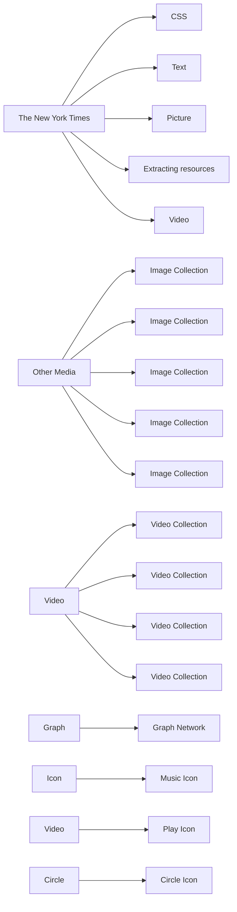
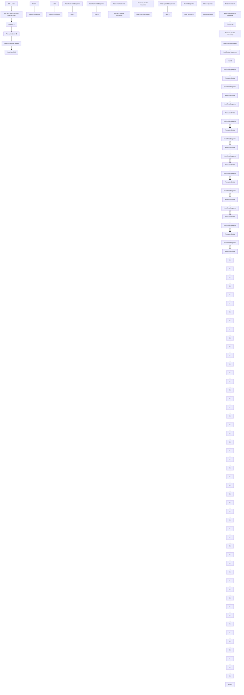
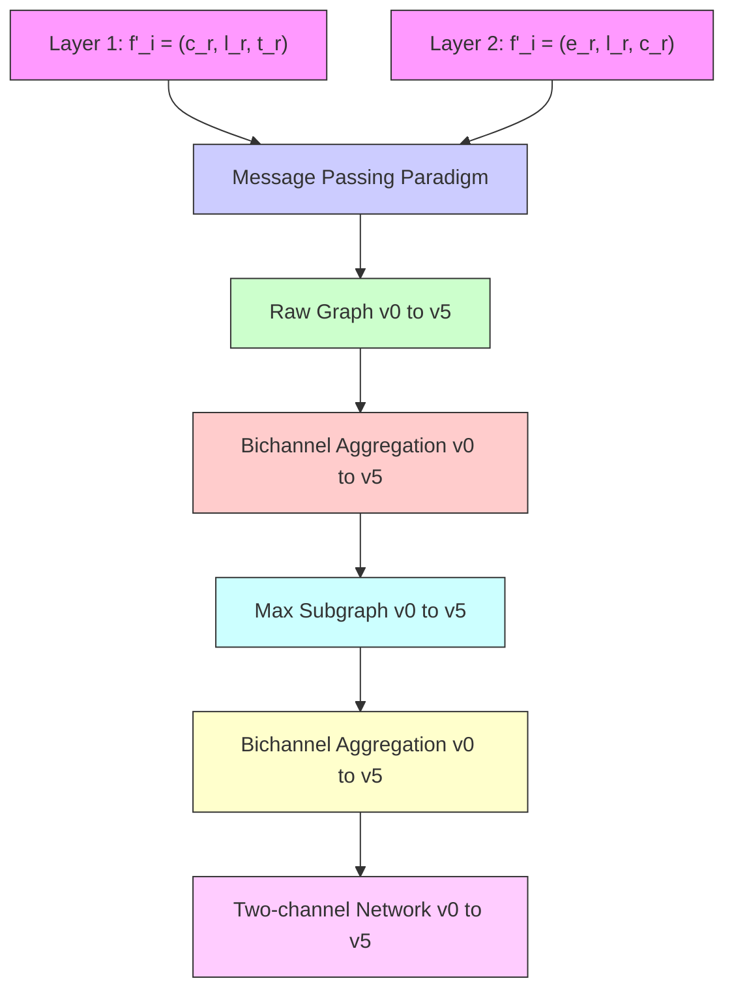

# Multi-Level Resource-Coherented Graph Learning for Website Fingerprinting Attacks

Bo Gao , Graduate Student Member, IEEE, Weiwei Liu , Member, IEEE, Guangjie Liu , Member, IEEE, Fengyuan Nie , Graduate Student Member, IEEE, and Jianan Huang , Graduate Student Member, IEEE

Abstract—Deep learning-based website fingerprinting (WF) attacks dominate website traffic classification. In the real world, the main challenges limiting their effectiveness are, on the one hand, the difficulty in countering the effect of content updates on the basis of accurate descriptions of page features in traffic representations. On the other hand, the model’s accuracy relies on training numerous samples, requiring constant manual labeling. The key to solving the problem is to find a website traffic representation that can stably and accurately display page features, as well as to perform self-supervised learning that is not reliant on manual labeling. This study introduces the multilevel resource-coherented graph convolutional neural network (MRCGCN), a self-supervised learning-based WF attack. It analyzes website traffic using resources as the basic unit, which are coarser than packets, ensuring the page’s unique resource layout while improving the robustness of the representations. Then, we utilized an echelon-ordered graph kernel function to extract the graph topology as the label for website traffic. Finally, a two-channel graph convolutional neural network is designed for constructing a self-supervised learning-based traffic classifier. We evaluated the WF attacks using real data in both closed- and open-world scenarios. The results demonstrate that the proposed WF attack has superior and more comprehensive performance compared to state-of-the-art methods.

Index Terms—Network traffic analysis, website fingerprinting attacks, graph learning, representation learning, self-supervised learning, graph convolutional neural network.

## I. INTRODUCTION

HE HTTP protocol, fundamental to the network protocol stack, has swiftly emerged as a preeminent information system on the Internet within a decade [1]. Furthermore, encrypted website traffic has become the most prevalent Internet service in real-world cyberspace [2]. Originally intended for the retrieval of HTML webpages, HTTP is now extensively

Received 2 May 2024; revised 6 November 2024; accepted 11 December 2024. Date of publication 18 December 2024; date of current version 7 January 2025. This work was supported in part by the National Natural Science Foundation of China under Grant U2436601, Grant U21B2003, Grant 61602247, and Grant 62072250; and in part by the National Key Research and Development Program of China under Grant 2021QY0700. The associate editor coordinating the review of this article and approving it for publication was Dr. Z. Berkay Celik. (Corresponding author: Weiwei Liu.)

Bo Gao, Weiwei Liu, Fengyuan Nie, and Jianan Huang are with the School of Automation, Nanjing University of Science and Technology, Nanjing 210094, China (e-mail: njustgb565@163.com; lwwnjust@njust.edu.cn; niefengyuan@njust.edu.cn; jiananwong@njust.edu.cn).

Guangjie Liu is with the School of Electronics and Information Engineering, Nanjing University of Information Science and Technology, Nanjing 210044, China, and also with the Key Laboratory of Intelligent Support Technology for Complex Environments, Ministry of Education, Nanjing 210044, China (e-mail: gjieliu@gmail.com).

Digital Object Identifier 10.1109/TIFS.2024.3520014 employed for transferring various types of hypertext data, encompassing images, audio, and video. Clients successively request each resource file from the web server based on their layout on the page. The server allocates an HTTP channel for each of them, enabling simultaneous delivery to expedite webpage loading. Based on browser parameters, network conditions, and resource sizes, the server dynamically assigns these channels to form differentiated website resource sequences, as shown in Fig. 1.


<details>
<summary>flowchart</summary>


</details>

Fig. 1. A relationship graph of the various resources on the website.

WF attacks are a crucial task in network traffic analysis, aimed at identifying websites being browsed by clients [3]. In early studies, domain names and IP addresses were used to identify websites [4], [5], [6]. However, with the advent of cloud computing and the growing importance of privacy protection, new technologies such as fast flux service networks (FFSNs) [7], round-robin domain name systems (RRDNS) [8], and content delivery networks (CDN) [9] have gained popularity. They disrupt the steadiness mapping relationship between IPs and websites [10], making character-based WF attacks ineffective, such as deep packet inspection (DPI) [11]. Consequently, researchers have been actively exploring alternative solutions.

Over the past decades, machine learning (ML) algorithms have become a cornerstone of encrypted traffic analysis [12]. Classifiers built using manually crafted features and traditional ML algorithms, such as random forest [13], K-nearest neighbor (KNN) [14], support vector machines (SVM) [15], and the Naive Bayes method [16], have gained significant prominence. However, feature engineering is labor-intensive and can be prohibitively expensive and impractical in open

1556-6021 © 2024 IEEE. All rights reserved, including rights for text and data mining, and training of artificial intelligence and similar technologies. Personal use is permitted, but republication/redistribution requires IEEE permission. See https://www.ieee.org/publications/rights/index.html for more information.

environments. In contrast, deep learning (DL) algorithms, renowned for their ability to automatically extract and learn features, have demonstrated effectiveness across various fields [17], [18]. High-accuracy classifiers can be achieved through well-designed representation learning, such as byte sequences [19], relational graphs [20], and grayscale images [21].

The quality and scale of the network traffic dataset play a pivotal role in the performance of DL-based WF attacks [22]. In large-scale scenarios, extending neural networks, adding processing units, or expanding datasets to develop classifiers becomes increasingly challenging. First, the sheer number of websites in the real world makes accurate labeling unfeasible. Second, unpredictable network inference and frequent website content updates can cause significant deformations in packet sequences, a phenomenon known as concept drift [23]. DL-based WF methods that rely on raw packet sequences demonstrate weak adaptability to these deformations [24], [25], necessitating frequent model updates and thereby increasing computational costs. Thus, there is an urgent need for a high-precision, automated method for labeling website traffic.

In this paper, we present a self-supervised learning-based WF attack called the multi-level resource-coherented graph convolutional neural network (MRCGCN). It relies on a consensus about websites: the page layout of their resources usually remains stable despite frequent updates to specific content. Compared with the widespread packet feature engineering, we analyzed packet interactions between clients and servers by viewing each resource as a basic unit. The spatio-temporal relationships of website traffic are analyzed at resource-level, flow-level, and host-level, respectively. Six representation sequences are formed to characterize its multilevel structure. Then, an echelon-ordered graph kernel function is utilized to mine page layouts hidden in the traffic. We tagged unlabeled samples with this stable and unique property and extracted auxiliaries such as resource combinations, type combinations, and statistical information for attribute expansion. We cogitated the HTTP and HTTPS protocols’s resource transfer mechanisms and network environment fluctuations to create a structurally enrichable extension graph. While emphasizing the intrinsic stability of websites, it reduces external dynamic factors that may affect their accuracy. We design a graph convolutional neural network for the proposed multi-level traffic graph representation by incorporating several graph processing procedures and graph learning mechanisms.

The main contributions could be summarized as follows:

1) We proposed a novel multi-level spatio-temporal graph representation for website traffic. It considers all packets originating from the same resource as a whole and consists of resource-level, flow-level, and host-level graphs, which intuitively demonstrate the interactions between clients and servers.

2) We developed MRCGCN, a graph convolutional neural network, for the proposed graph representation. First, a graph kernel function is designed for directed graphs with a hierarchical arrangement of nodes, which clusters samples by comparing all nodes on each of the two graphs. The unlearned samples are labeled by calculating the similarity between them and the cluster center.

Finally, the extension graphs formed by the raw graphs and the maximum similarity subgraph are injected into a two-channel network for supervised learning.

3) We constructed a dataset containing real HTTP and HTTPS website traffic for evaluating WF attacks in the closed- and open-world scenarios. The results indicate that MRCGCN possesses a well-rounded performance over state-of-the-art methods, including convergence speed, robustness, generalizability, and flexibility.

The remainder of this paper is organized as follows. Section II briefly reviews related work on WF attacks. Section III describes the proposed graph representation for website traffic. The architecture of the MRCGCN is presented in Section IV. In Section V, we benchmarked the proposed WF attack with real-world data. The conclusions are drawn in Section VI.

## II. RELATED WORK

WF attacks can generally be divided into three categories based on the learning strategy used: unsupervised learningbased, supervised learning-based, and hybrid learning-based approaches. Each of these strategies extracts traffic features at different levels to form distinct representations, which are then combined with traditional machine learning, deep learning, or graph learning architectures to achieve traffic identification. Table I summarizes the existing WF attacks across four key dimensions: learning strategy, learning architecture, type of features, and traffic representation.

## A. Unsupervised Learning-Based WF Attacks

Typical methods include clustering [26], autoencoders [21], anomaly detection [27], hidden Markov models [19], character embedding [28], self-organizing mapping [29], singular value decomposition [30], and principal component analysis [31]. In large-scale scenarios, the huge cost of manually labeling traffic and the importance of security protection have driven researchers to seek unsupervised methods with simplicity of implementation and widespread applicability. In the beginning, each IP address and port were addressed to one website or service [4]. Nevertheless, server clustering services and port mapping techniques breached this uniquely mapping criterion [11]. Protocol fields such as domain names and TLS certificate chains, which indicate the server source, have become the new alternative.

Alqahtani et al. proposed a phishing website detection method called ODAE-WPDC, which injects valid traffic features filtered by an artificial algae algorithm into a deep auto-encoder network training model and achieves 99.28% classification accuracy on an open source phishing website URL dataset [32]. Zhang et al. extracted websites’ domain names, certificates, and operator information to construct a heterogeneous graph that visualizes multiple relationships and effectively combats pirated video websites that deployed Domian-Flux technology [33]. Researchers have also been interested in packet feature sequences and their multidimensional statistical attributes.

TABLE I SUMMARY OF EXISTING WEBSITE FINGERPRINTING ATTACKS

<table><tr><td>Learning Strategy</td><td>Method Name</td><td>Learning Architecture</td><td>Type of Features</td><td>Representation</td></tr><tr><td rowspan="7">Unsupervised Learning-based WF Attacks</td><td>MRF [19]</td><td>Markov Chain</td><td>Packet payload</td><td>Packet-wise payload byte sequence</td></tr><tr><td>D-PACK [21]</td><td>CNN+Autoencoder</td><td>Packet payload</td><td>Byte grayscale image</td></tr><tr><td>IoT-KEEPER [26]</td><td>C-Means</td><td>Packet-wise payload byte</td><td>Packet-wise feature vectors</td></tr><tr><td>C4.5-WF [27]</td><td>Decision Tree</td><td>IP/visit time/HTTP message</td><td>Protocol field representation</td></tr><tr><td>UE [28]</td><td>Huffman Coding</td><td>URL length/numeric characters count</td><td>URL statistical feature set</td></tr><tr><td>ODAE-WPDC [32]</td><td>Auto-Encoder Network</td><td>URL length/statistical feature</td><td>URL statistical feature set</td></tr><tr><td>HGNR [33]</td><td>GNN</td><td>IP/third-party service/register</td><td>URL relationship graph</td></tr><tr><td rowspan="22">Supervised Learning-based WF Attacks</td><td>SVM-WF [5]</td><td>SVM</td><td>URL length/numeric characters/hyphens count</td><td>URL statistical feature set</td></tr><tr><td>MAppGraph [10]</td><td>GCN</td><td>Statistical features of packet length/flow time</td><td>Multiple feature vectors</td></tr><tr><td>AppScanner [13]</td><td>Random Forest</td><td>Packet length</td><td>Statistics of packet length sequence</td></tr><tr><td>FineWP [14]</td><td>KNN</td><td>Packet length</td><td>Cumulatively reshaping form of feature sequence</td></tr><tr><td>CUMUL [15]</td><td>SVM</td><td>Packet length/arrival time</td><td>Packet-wise feature vectors</td></tr><tr><td>VNG++ [16]</td><td>Navie Bayes</td><td>Total trace time/total bandwidth/burst sizes</td><td>Flow-wise feature vectors</td></tr><tr><td>Deep Fingerprinting [17]</td><td>CNN</td><td>Packet direction</td><td>Packet-direction sequence</td></tr><tr><td>CNN+LSTM [18]</td><td>CNN+LSTM</td><td>Packet payload/length</td><td>Packet-wise feature vectors</td></tr><tr><td>HMG [20]</td><td>Random Forest</td><td>URL/redirection/malicious code/HTTP header</td><td>HTTP message graph</td></tr><tr><td>Triplet Fingerprinting [22]</td><td>CNN+KNN</td><td>Packet direction</td><td>Statistics of packet direction sequence</td></tr><tr><td>snWF [23]</td><td>CNN+ResNet</td><td>Packet direction</td><td>Packet-direction sequence</td></tr><tr><td>FG-Net [24]</td><td>GNN</td><td>Packet length/interval time</td><td>Flow relationship graph</td></tr><tr><td>Robust Fingerprinting [25]</td><td>CNN</td><td>Packet direction</td><td>Packet-direction sequence</td></tr><tr><td>M2VT-IDS [34]</td><td>MLP</td><td>Packet payload/length/arrival time</td><td>Multi-view representation</td></tr><tr><td>FS-Net [36]</td><td>RNN</td><td>Packet length</td><td>Multiple feature vectors</td></tr><tr><td>3-DNNs [37]</td><td>CNN+KNN</td><td>Packet length/direction</td><td>Packet-wise sequences</td></tr><tr><td>PERT [38]</td><td>Transformer</td><td>Packet payload/length</td><td>Dynamic word embedding</td></tr><tr><td>GraphDApp [39]</td><td>GNN</td><td>Packet length/direction</td><td>Traffic interaction graph</td></tr><tr><td>RK-HSTGCN [40]</td><td>GCN</td><td>HTTP command/extension/packet arrival order</td><td>Resource knowledge-driven representation graph</td></tr><tr><td>SML-WF [42]</td><td>Bayes Net, Random Forest</td><td>Packet length</td><td>Statistics of packet length sequence</td></tr><tr><td>STC-WF [51]</td><td>GNN</td><td>Packet length</td><td>Inter-flow spatio-temporal correlation graph</td></tr><tr><td>GAP-WF [52]</td><td>GAP</td><td>Packet length/direction/interval time</td><td>Packet-wise feature vectors</td></tr><tr><td rowspan="8">Hybrid Learning-based WF Attacks</td><td>FM-CWFA [35]</td><td>CNN</td><td>Packet direction/arrival time</td><td>Packet-wise feature vectors</td></tr><tr><td>DCGAN [43]</td><td>GAN</td><td>Packet length/arrival time sequence</td><td>Packet-wise feature vectors</td></tr><tr><td>FlowPrint [44]</td><td>Random Forest</td><td>TLS certificate/IP/packet length/arrival time/direction</td><td>Multiple feature vectors</td></tr><tr><td>FS-GAN [45]</td><td>GAN</td><td>Packet payload</td><td>Packet payload sequence</td></tr><tr><td>EDRL [46]</td><td>CNN</td><td>Packet length</td><td>Packet-wise feature vectors</td></tr><tr><td>App-Net [47]</td><td>CNN+LSTM</td><td>Packet payload/length</td><td>Packet-wise feature vectors</td></tr><tr><td>SoK [48]</td><td>SVM, CNN</td><td>Packet arrival time</td><td>Intervals of packets</td></tr><tr><td>MRCGCN</td><td>GCN</td><td>Webpage layout/Resource-related spatio-temporal features</td><td>Resource-coherented representation graph</td></tr></table>

## B. Supervised Learning-Based WF Attacks

Notable supervised learning methods include random forest [13], SVM [15], MLP [34], CNN [35], RNN [36], LSTM [37], transformer [38], and GNN [39], [40]. Constructing classifiers by combining MLs with traffic representations has emerged as a generic paradigm for resolving website recognition tasks [3]. Early WF attacks inductively summarized the demarcation conditions for classifying website traffic types by learning artificially designed traffic features from massive labeled datasets [41].

Taylor et al. proposed the AppScanner to identify Android apps in real time by inputting 54 statistical features extracted from the uplink, downlink, and bidirectional packet sequences into a random forest classifier [13]. Nevertheless, this pattern is highly dependent on expert knowledge, and the models have inadequate generalization capabilities, which restricts their application in large-scale and automated scenarios [42].

In recent years, DLs have gained popularity in network traffic analysis due to their ability to automatically extract features, especially as represented by end-to-end deep network frameworks [17]. Rimmer et al. systematically analyzed various DLs applied to WF, including feedforward, convolutional, and recurrent neural networks, and designed three common models, SDAE, CNN, and LSTM [37]. The results show that end-to-end DLs are more advantageous in automatically extracting traffic features than manual feature extraction, but they require bulky labeled samples for training models.

## C. Hybrid Learning-Based WF Attacks

The network environment and experimental settings in traffic analysis tasks are inherently complicated, making it challenging for a single model to sufficiently satisfy the diverse requirements. Consequently, the researchers proposed various hybrid learning schemes. Expecting to conquer the practical difficulties by combining the advantages of multiple algorithms, such as semi-supervised learning [43], [44], selfsupervised learning [45], transfer learning [35], reinforcement learning [46], multimodal learning [47], and GANs [48]. DCGAN is a semi-supervised learning method based on deep convolutional generation adversarial networks, which uses a dataset with generator-generated samples and unlabeled data [43]. FS-GAN enables the generated massive samples to have a distribution similar to the real data by carefully designing the generative adversarial network [45].


<details>
<summary>flowchart</summary>


</details>

Fig. 2. Multi-level spatio-temporal representations of the website browsing traffic. (a) Traffic Representation Levels; (b) Packet Feature Sequences; (c) Temporal Representation Sequences; (d) Spatial Representation Sequences.

In summary, most unsupervised learning-based WF attacks rely on character-level features, which are often unreliable and unstable in practice. Encryption of content, domain name obfuscation, and dynamic IP addresses can obscure or alter many plaintext features. Traditional ML algorithms, which depend on manual feature engineering, are costly and difficult to scale in real-world scenarios. While supervised DL algorithms offer high accuracy and ease of use, they require continuous training on large datasets, making them challenging to implement due to the need for constant and accurate labeling in open-world environments. To address this, it is essential to identify a learning strategy that balances classification accuracy with temporal robustness. Hybrid learning approaches, such as self-supervised learning, semi-supervised learning, transfer learning, and reinforcement learning, have been identified as promising solutions for automated, large-scale scenarios. Graph-based methods, which convert non-Euclidean data with complex logical relationships into comprehensible graphical structures, are particularly appealing. By mapping traffic data to graph representations, the key structural information is highlighted while fine-grained traffic details are abstracted, thereby enhancing model robustness and generalizability. The primary challenge now lies in accurately mapping the spatio-temporal relationships within traffic feature sequences to graph representations. Therefore, it is critical to explore efficient fusion methods that incorporate prior knowledge into graph representations and to apply suitable graph learning algorithms to refine core traffic features.

## III. WEBSITE BROWSING TRAFFIC REPRESENTATION

In this section, we introduce a multi-level spatio-temporal graph representation for website traffic. First, we consider resources as basic units and construct six temporal and spatial feature sequences to describe the interaction between clients and servers at the resource-level, flow-level, and host-level, respectively. Second, the graph is constructed with resources as nodes and multi-level relationships among them as edges. At this point, we have transformed the website traffic classification problem into a graph recognition problem.

TABLE II LIST OF NOTATIONS

<table><tr><td>Notation</td><td>Meaning</td></tr><tr><td> $W$ </td><td>One website browsing behavior.</td></tr><tr><td> $W^{[T]},W^{[S]}$ </td><td>Temporal and spatial representations of  $W$ .</td></tr><tr><td> $P, p_i$ </td><td>A packet sequence and the  $i$ -th packet in it.</td></tr><tr><td> $R, r_i$ </td><td>A resource sequence and the  $i$ -th resource in it.</td></tr><tr><td> $F, f_i$ </td><td>A flow sequence and the  $i$ -th flow in it.</td></tr><tr><td> $H, h_i$ </td><td>A host sequence and the  $i$ -th server IP in it.</td></tr><tr><td> $\mathcal{F}, \eta$ </td><td>Packet features and feature sets.</td></tr><tr><td> $l, t, d$ </td><td>Length, arrival time, and direction of a packet.</td></tr><tr><td> $G$ </td><td>The graph representation of  $W$ .</td></tr><tr><td> $V, E$ </td><td>The node set and edge set on  $G$ .</td></tr><tr><td> $v, e$ </td><td>A node and an edge on  $G$ .</td></tr><tr><td> $\tau_p$ </td><td>The arrival time interval between two packets.</td></tr><tr><td> $\sigma, \iota$ </td><td>The graph depth and resource out-degree of  $v$ .</td></tr><tr><td> $\phi$ </td><td>Nodes&#x27; aggregation function.</td></tr><tr><td> $\psi$ </td><td>Edges&#x27; update function.</td></tr><tr><td> $\kappa$ </td><td>The echelon-ordered graph kernel function.</td></tr><tr><td> $g_\kappa$ </td><td>A similar subgraph extracted from two graphs.</td></tr><tr><td> $\varrho$ </td><td>Scan for nodes with the same features.</td></tr><tr><td> $\Delta$ </td><td>Similarity of graphs.</td></tr></table>

## A. Extraction of Website Traffic Representation Elements

Commonly in traffic packet engineering, one website browsing behavior W could be represented by a packet sequence, denoted as $W = P = ( p _ { 1 } , p _ { 2 } , \cdots , p _ { n } ) $ , where $p _ { i }$ denotes the , , ,i-th packet, as shown in Fig. 2(b). Generic packet features $\eta _ { p _ { i } }$ include length $l _ { i } ,$ arrival time $t _ { i } ,$ and transmission direction $d _ { i } ,$ denoted as $\eta _ { p _ { i } } = \{ l _ { i } , t _ { i } , d _ { i } \}$ . The notations used in this paper are ηshown in Table II.

Despite this basic website traffic representation’s convenience, the generated sequences lack notable robustness and are susceptible to deformation from the network environment, transmission lines, and communication devices.

To create a valid and robust traffic representation, we integrated the structural characteristics of generic websites with their actual browsing traffic. According to imec-DistriNet [49], the daily fluctuation for the top 100,000 websites on statistical platforms like Alexa [50] is less than 1%, making it feasible to use a one-day list for long-term observation. We first organized the resources based on the logical structure of the webpage code obtained via a web crawler. Then, a browser driver was used to simulate client browsing behavior, capturing long-term traffic for each website. Finally, we compared the order of resource transmission with its logical structure.

During validation, we used Wireshark’s decryption function to verify the transmission order of encrypted HTTPS traffic. Our analysis of numerous generic websites confirmed a key observation: the resource transmission order consistently follows the page layout, representing a unique and stable intrinsic feature for each website. Notably, this order exhibits dynamic stabilization, meaning that while multiple resources in the same state are transmitted within a given time period, the specific order may change dynamically [51]. Even with HTTPS encryption, the resource ordering remains consistent with plaintext HTTP/1.1, where resources are transmitted sequentially. In this case, all packets of a resource must be fully transmitted before the next resource is sent. Incorporating this essential characteristic into the traffic feature sequence greatly enhances the robustness of the traffic representation.

Figure 2(a) shows five granularities of website traffic from fine to coarse: byte, packet, resource, flow, and host. We constructed six representation sequences with resources as the basic unit, as shown in Figs. 2(c) and 2(d). The temporal dimension focuses on ordering, including resource-, flow-, and host-level temporal sequences, denoted as $\begin{array} { r l } { W ^ { [ T ] } } & { { } = } \end{array}$ $\{ R ^ { [ T ] } , F ^ { [ T ] } , H ^ { [ T ] } \}$ . The spatial dimension accounts for transmis-, ,sion time overlap, denoted as resource-, flow-, and host-level spatial sequences $W ^ { [ S ] } = \{ R ^ { [ S ] } , F ^ { [ S ] } , H ^ { [ S ] } \}$ .

, ,1) Resource-Level Temporal Sequence $R ^ { [ T ] }$ : A website resource r generally consists of a request packet c and several response packets s, denoted as $r ~ = ~ ( p _ { 1 } , p _ { 2 } , \cdots , p _ { n } )$ . Page , , ,layout determines the initial request packet’s arrival time, whereas others are resource-related. Therefore, we labeled each resource with that time and arranged them in a sequence, denoted as $R ^ { [ T ] } = ( r _ { 1 } , r _ { 2 } , \cdot \cdot \cdot , r _ { m } )$ , where $r _ { j }$ denotes the j-th , , ,resource, and its arrival time is denoted as $t ( r _ { j } ) = t ( p _ { j , 1 } )$ .  
2) Resource-Level Spatial Sequence $R ^ { \left[ S \right] } .$ : HTTP/1.1 websites utilize the pipelined persistent connection strategy, which transfers resources in parallel, to accelerate page loading. Despite this resulting in variable combinations of resources for each browse, resources in the same section of the page are adjacent in the traffic and have overlapping transfer times, owing to the website code and page layouts.

To represent this worthy spatial feature, we proposed resource-level spatial sequences, denoted as $\begin{array} { r l r } { R ^ { [ S ] } } & { { } = } & { \{ [ ( r _ { 1 } , p _ { 1 , i } ) , ( r _ { 2 } , p _ { 2 , 1 } ) ] , \cdots , [ ( r _ { j } , p _ { j , i } ) , ( r _ { m } , p _ { m , 1 } ) ] \} } \end{array}$ , where $p _ { m , 1 }$ , , , , , , , , , ,denotes the first packet in resource $r _ { m }$ , ,, and its arrival time is located in packets $p _ { j , i }$ and $p _ { j , i + 1 }$ in resource $r _ { j } .$ , , Note that this only records the first intersection.

3) Flow-Level Temporal Sequence $F ^ { [ T ] }$ : Flow affiliation is also a meaningful spatial feature, besides the resource affiliation. Flow representation sequence is denoted as $F ^ { [ T ] } =$ $( f _ { 1 } , f _ { 2 } , \cdots , f _ { k } )$ , where $f _ { k } ~ = ~ ( r _ { k , 1 } , r _ { k , 2 } , \cdot \cdot \cdot , r _ { k , m } )$ denotes the , , ,k-th flow, and $r _ { k , 1 }$ , , , , , ,denotes the first resource. HTTP flows ,transmit only one resource at a time; therefore, the packets of neighboring resources are sequenced tail-to-head.  
4) Flow-Level Spatial Sequence $F ^ { [ S ] }$ : It represents the interleaving relationship of resources at flow-level, denoted as $F ^ { [ S ] } = \{ [ ( f _ { 1 } , r _ { 1 , j } ) , ( f _ { 2 } , r _ { 2 , 1 } ) ] , \cdots , [ ( f _ { k } , r _ { k , j } ) , ( f _ { g } , r _ { g , m } ) ] \}$ , where , , , ,the start time of resource $r _ { g , m }$ , , , , , , is located in resources $r _ { k , j }$ and $r _ { k , j + 1 }$ ,. Notably, if the start times of resources $r _ { g , m }$ and $r _ { g , m + 1 }$ ,are located within the duration of resource $r _ { k , j } ,$ , , then they are all related to that resource.  
5) Host-Level Temporal Sequence $H ^ { [ T ] } .$ : It is described as $H ^ { [ T ] } = \left( h _ { 1 } , \cdots , h _ { m } \right)$ , where $h _ { i } = ( f _ { i , 1 } , \cdot \cdot \cdot , f _ { i , k } ) = ( r _ { i , 1 } , \cdot \cdot \cdot , r _ { i , n } )$ , ,denotes the i-th host, and $f _ { i , 1 }$ , , , , , , , ,denotes its first flow. Remarkably, ,when the count of resources exceeds the maximum threshold of HTTP channels, the leftover resources are suspended. Thus, the host representation sequence with resource affiliation is more stable than flow affiliation.  
6) Host-Level Spatial Sequence $H ^ { [ S ] }$ : It indicates the interleaving relationship of resources at host-level, denoted as $H ^ { [ S ] } \ = \ \{ [ ( h _ { 1 } , r _ { 1 , j } ) , ( h _ { 2 } , r _ { 2 , 1 } ) ] , \cdots , [ ( h _ { k } , r _ { k , j } ) , ( h _ { g } , r _ { g , m } ) ] \}$ }, which , , , , , , , , , , , ,facilitates revealing hidden arcanum on different hosts.

## B. Construction of Graph Representations

Graph: $G = ( V , E )$ denotes a graph, where V represents a ,set of nodes and each node $\nu _ { i }$ corresponds to a packet $p _ { i } .$ $e _ { i , j } \in E$ denotes a set of edges, where the edge $e _ { i , j }$ connects ,the nodes $\nu _ { i }$ and $\nu _ { j } ,$ , indicating the relationship between them. The packet-level graph $G ^ { [ P ] }$ is an initial graph composed of packets, as shown in $\mathrm { F i g . \ 3 ( a ) }$ .

Node: The initial features of a node are derived from the actual traffic, the three generic properties of a packet, denoted as $\eta _ { \nu _ { i } } = \eta _ { p _ { i } } = \{ l _ { i } , t _ { i } , d _ { i } \}$ , which reflect the fine-grained information interaction between the client and the server at the packet level. In reality, the packet feature sequence is fragile and easily affected by the network environment. The graphs $G ^ { [ P ] }$ generated each time vary widely, making classification unfeasible. To resolve this, we utilized resource affiliation instead of packet serial numbers and expanded node features to $\eta _ { \nu _ { i } } ^ { \prime } = \eta _ { \nu _ { i } } \oplus \{ r , f , h \}$ , where $r , f ,$ and h denote the resource, flow, η η , ,and host serial numbers, respectively, and the splice symbol ⊕ indicates injecting new features into the raw feature set $\eta _ { \nu _ { i } }$ . ηThese three features are spatial properties derived from fullcycle observations of the real website traffic, and their injection facilitates the revelation of intricate high-dimensional logical relationships among resources.

Edge: The graph has two primary types of edges: temporal $e ^ { [ t ] }$ and spatial $e ^ { [ s ] }$ , which could be further divided into resource, flow, and host-levels, denoted as $E = \{ e ^ { [ t ] } , e ^ { [ s ] } \} =$ $\{ [ e ^ { [ r , t ] } , e ^ { [ f , t ] } , e ^ { [ h , t ] } ] , [ e ^ { [ r , s ] } , e ^ { [ f , s ] } , e ^ { [ h , s ] } ] \}$ .

, , , ,1) Resource Temporal $E d g e \ e ^ { [ r , t ] }$ : It shows the temporal relationship of packets within each resource. For example, if packets $p _ { i }$ and $p _ { j }$ belong to the same resource $r _ { m }$ and their

## Multi-Level Resource-Coherented Graph Convolutional Neural Network

(a) Graph Construction  


<details>
<summary>flowchart</summary>

```mermaid
graph TD
  A["Number"] --> B["Traffic Feature Sequence"]
  C["Length"] --> B
  D["Direction"] --> B
  E["Time"] --> B
  B --> F["f_v1 = {l1, d1, t1}"]
  F --> G["Website Representation Graph"]
  H["Multi-level"] --> I["Multi-type Edges"]
  I --> J["Edge Type"]
  J --> K["Temporal"]
  J --> L["Spatial"]
  K --> M["Resource"]
  K --> N["Flow"]
  K --> O["Host"]
  M --> P["c1 s1,1 iE[r,t"]]
  N --> Q["c2 s1,n iE[f,t"]]
  O --> R["c3 c2,1 iE[h,t"]]
  P --> S["s1,n* c2 iE[r,s"]]
  Q --> T["s1,n* c2,1 iE[f,s"]]
  R --> U["s1,n* c2,1 iE[h,s"]]
  S --> V["h1"]
  T --> V
  U --> V
  V --> W["f1,2 r1 c2 s2,1 r2 s5 c4 f2,1 h2,2"]
  W --> X["RT Edge"]
  W --> Y["FT Edge"]
  W --> Z["HT Edge"]
  W --> AA["RS Edge"]
  W --> AB["FS Edge"]
  W --> AC["HS Edge"]
```
</details>

(b) Graph Processing  


<details>
<summary>flowchart</summary>

```mermaid
```mermaid
graph TD
  A["Graph Partitioning"] --> B["Resource Graph"]
  B --> C["Host-Level"]
  C --> D["Flow-Level"]
  D --> E["Packet-Level"]
  E --> F["Graph Pooling"]
  F --> G["Time"]
  G --> H["Graph Extension"]
    
    subgraph Graph Partitioning
  I["f1.1"] --> J["c2"] --> K["s2.1x"]
  L["f1.2"] --> M["c3"] --> N["s2.2x"]
  O["f1.1"] --> P["r1"] --> Q["r2"]
  R["f1.2"] --> S["r3"] --> T["r4"]
  U["f1.1"] --> V["r5"] --> W["r6"]
  X["f1.2"] --> Y["r7"] --> Z["r8"]
  AA["f1.1"] --> AB["r9"] --> AC["r10"]
  AD["f1.2"] --> AE["r11"] --> AF["r12"]
  AG["f1.1"] --> AH["r13"] --> AI["r14"]
  AJ["f1.2"] --> AK["r15"] --> AL["r16"]
  AM["f1.1"] --> AN["r17"] --> AO["r18"]
  AP["f1.2"] --> AQ["r19"] --> AR["r20"]
  AS["f1.1"] --> AT["r21"] --> AU["r22"]
  AV["f1.2"] --> AW["r23"] --> AX["r24"]
  AY["f1.1"] --> AZ["r25"] --> BA["r26"]
  BB["f1.2"] --> BC["r27"] --> BD["r28"]
  BE["f1.1"] --> BF["r29"] --> BG["r30"]
  BH["f1.2"] --> BI["r31"] --> BJ["r32"]
  BK["f1.1"] --> BL["r33"] --> BM["r34"]
  BN["f1.2"] --> BO["r35"] --> BP["r36"]
  BQ["f1.1"] --> BR["r37"] --> BS["r38"]
  BT["f1.2"] --> BU["r39"] --> BV["r40"]
  BW["f1.1"] --> BX["r41"] --> BY["r42"]
  BZ["f1.2"] --> CA["r43"] --> CB["r44"]
  CC["f1.1"] --> CD["r45"] --> CE["r46"]
  CF["f1.2"] --> CF["R47"] --> CF["R48"]
  GD["f1.1"] --> DH["r49"] --> DI["r50"]
  DJ["f1.2"] --> DJ["R51"] --> DJ["R52"]
  DK["f1.1"] --> DL["r53"] --> DL["R54"]
  DV["f1.2"] --> DV["R55"] --> DV["R56"]
  DW["f1.1"] --> DX["r57"] --> DX["R58"]
  DB["f1.2"] --> DB["R59"] --> DB["R60"]
  DC["f1.1"] --> DD["r5A"] --> DD["R5B"]
  EE["f1.2"] --> EE["R5C"]
  FF["f1.1"] --> GG["r5D"] --> GG["R5E"]
  BH["f1.2"] --> BH["R5F"]
  BI["h2"] --> BI["R5G"]
  BI["R5H"] --> BI["R5I"]
  BI["R5J"] --> BI["R5K"]
  BI["R5L"] --> BI["R5M"]
  BI["R5N"] --> BI["R5O"]
  BI["R5P"] --> BI["R5Q"]
  BI["R5R"] --> BI["R5S"]
  BI["R5T"] --> BI["R5T"]
    end
    
    subgraph Resource Graph
        I_Rs["rgf(t)"] & I_Sr["rgf(s)"] & I_Rs_Rs_Rs_Rs_Rs_Rs_Rs_Rs_Rs_Rs_Rs_Rs_Rs_Rs_Rs_Rs_Rs_Rs_Rs_Rs_Rs_Rs_Rs_Rs_Rs_Rs_Rs_Rs_Rs_Rs_Rs_Rs_Rs_Rs_Rs_Rs_Rs_Rs_Rs_Rs_Rs_Rs_Rs_Rs_Rs_Rs_Rs_Rs_Rs_Rs_Rc
    end
    
    subgraph FlowLevel
  F_rl["rl-1"] --> F_rl["rl-2"]
  F_rl["rl-3"] --> F_rl["rl-4"]
  F_rl["rl-5"] --> F_rl["rl-6"]
  F_rl["rl-7"] --> F_rl["rl-8"]
  F_rl["rl-9"] --> F_rl["rl-10"]
  F_rl["rl-11"] --> F_rl["rl-12"]
  F_rl["rl-13"] --> F_rl["rl-14"]
  F_rl["rl-15"] --> F_rl["rl-16"]
  F_rl["rl-17"] --> F_rl["rl-18"]
  F_rl["rl-19"] --> F_rl["rl-20"]
    end
    
    subgraph ResourceLevel
        G_rl["rl-1"] & G_rl["rl-2"] & G_rl["rl-3"] & G_rl["rl-4"] & G_rl["rl-5"] & G_rl["rl-6"]
    end
    
    subgraph PacketLevel
        H_rl["ftn"] & H_rl["ftn+1"] & H_rl["ftn+2"]
    end
    
    subgraph FlowLevel
        I_rh["htn-1"] & I_rh["htn+2"]
    end
    
    subgraph PacketLevel
        J_rh["rtn-1"] & J_rh["rtn+2"]
    end
    
    subgraph Time
        K["i_{t-1}"] & K["i_{t+1}"] & K["i_{t+2}"]
    end
    
    subgraph Eq
        L["v0"] & L["v0+1"]
    end
    
    subgraph Edge
        M["v0"] & M["v0+1"]
    end
    
    subgraph Time
        N["v0"] & N["v0+1"]
    end
    
    subgraph Eq
        O["v0"] & O["v0+1"]
    end
    
    subgraph Time
        P["v0"] & P["v0+1"]
    end
    
    subgraph Eq
        Q["v0"] & Q["v0+1"]
    end
    
    subgraph Time
        R["v0"] & R["v0+1"]
    end
    
    subgraph Eq
        S["v0"] & S["v0+1"]
    end
    
    subgraph Time
        T["v0"] & T["v0+1"]
    end
    
    subgraph Eq
        U["v0"] & U["v0+1"]
    end
    
    subgraph Time
        V["v0"] & V["v0+1"]
    end
    
    subgraph Eq
        W["v0"] & W["v0+1"]
    end
    
    subgraph Time
        X["v0"] & X["v0+1"]
    end
    
    subgraph Eq
        Y["v0"] & Y["v0+1"]
    end
    
    subgraph Time
        Z["v0"] & Z["v0+1"]
    end
    
    subgraph Eq
        AA["v0"] & AA["v0+1"]
    end
    
    subgraph Time
        AB["v0"] & AB["v0+1"]
    end
    
    subgraph Eq
        AC["v0"] & AC["v0+1"]
    end
    
    subgraph Time
        AD["v0"] & AD["v0+1"]
    end
    
    subgraph Eq
        AE["v0"] & AE["v0+1"]
    end
    
    subgraph Time
        AF["v0"] & AF["v0+1"]
    end
    
    subgraph Eq
        AG["v0"] & AG["v0+1"]
    end
    
    subgraph Time
        AH["v0"] & AH["v0+1"]
    end
    
    subgraph Eq
        AI["v0"] & AI["v0+1"]
    end
    
    subgraph Time
        AJ["v0"] & AJ["v0+1"]
    end
    
    subgraph Eq
        AK["v0"] & AK["v0+1"]
    end
    
    subgraph Time
        AL["v0"] & AL["v0+1"]
    end
    
    subgraph Eq
        AM["v0"] & AM["v0+1"]
    end
    
    subgraph Time
        AN["v0"] & AN["v0+1"]
    end
    
    subgraph Eq
        AO["v0"] & AO["v0+1"]
    end
    
    subgraph Time
        AP["v0"] & AP["v0+1"]
    end
    
    subgraph Eq
        AQ["v0"] & AQ["v0+1"]
    end
    
    subgraph Time
        AR["v0"] & AR["v0+1"]
    end
    
    subgraph Eq
        AS["v0"] & AS["v0+1"]
    end
    
    subgraph Time
        AT["v0"] & AT["v0+1"]
    end
    
    subgraph Eq
        AU["v0"] & AU["v0+1"]
    end
    
    subgraph Time
        AV["v0"] & AV["v0+1"]
    end
    
    subgraph Eq
        AW["v0"] & AW["v0+1"]
    end
    
    subgraph Time
        AX["v0"] & AX["v0+1"]
    end
    
    subgraph Eq
        AY["v0"] & AY["v0+1"]
    end
    
    subgraph Time
        AZ["v0"] & AZ["v0+1"]
    end
    
    subgraph Eq
        BA["v0"] & BA["v0+1"]
    end
    
    subgraph Time
        BB["v0"] & BB["v0+1"]
    end
    
    subgraph Eq
        BC["v0"] & BC["v0+1"]
    end
    
    subgraph Time
        DA["v0"] & DA["v0+1"]
    end
    
    subgraph Eq
        AE["v0"] & AE["v0+1"]
    end
    
    subgraph Time
        AF["Vo"]
```
</details>

(c) Graph Clustering  

```mermaid
graph TD
  A["Child Node"] --> B["Node Window"]
  B --> C["Target Node"]
  C --> D["Graph1 σ(G1)=3"]
  D --> E["Similarity Comparing"]
  E --> F["Node Connecting"]
  F --> G["Similarity Structure"]
  G --> H["G1: v0 ~G2: v0 Δ(G1G2)max=0.67"]
  H --> I["Graph2 σ(G2)=3"]
  I --> J["Similarity Structure"]
  J --> K["G1: v1 ~G2: v0 Δ(G1G2)max=0.67"]
  K --> L["Graph1 σ(G1)=3"]
  L --> M["Similarity Structure"]
  M --> N["G1: v0 ~G2: v0 Δ(G1G2)max=0.67"]
  N --> O["Graph1 σ(G2)=3"]
  O --> P["Similarity Structure"]
  P --> Q["G1: v0 ~G2: v0 Δ(G1G2)max=0.67"]
  Q --> R["Graph1 σ(G2)=3"]
  R --> S["Similarity Structure"]
  S --> T["G1: v0 ~G2: v0 Δ(G1G2)max=0.67"]
  T --> U["Graph1 σ(G2)=3"]
  U --> V["Similarity Structure"]
  V --> W["G1: v0 ~G2: v0 Δ(G1G2)max=0.67"]
  W --> X["Graph1 σ(G2)=3"]
  X --> Y["Similarity Structure"]
  Y --> Z["G1: v0 ~G2: v0 Δ(G1G2)max=0.67"]
  Z --> AA["Graph1 σ(G2)=3"]
  AA --> AB["Similarity Structure"]
  AB --> AC["G1: v0 ~G2: v0 Δ(G1G2)max=0.67"]
  AC --> AD["Graph1 σ(G2)=3"]
  AD --> AE["Similarity Structure"]
  AE --> AF["G1: v0 ~G2: v0 Δ(G1G2)max=0.67"]
  AF --> AG["Graph1 σ(G2)=3"]
  AG --> AH["Similarity Structure"]
  AH --> AI["G1: v0 ~G2: v0 Δ(G1G2)max=0.67"]
  AI --> AJ["Graph1 σ(G2)=3"]
  AJ --> AK["Similarity Structure"]
  AK --> AL["G1: v0 ~G2: v0 Δ(G1G2)max=0.67"]
  AL --> AM["Graph1 σ(G2)=3"]
  AM --> AN["Similarity Structure"]
  AN --> AO["G1: v0 ~G2: v0 Δ(G1G2)max=0.67"]
  AO --> AP["Graph1 σ(G2)=3"]
  AP --> AQ["Similarity Structure"]
  AQ --> AR["G1: v0 ~G2: v0 Δ(G1G2)max=0.67"]
  AR --> AS["Graph1 σ(G2)=3"]
  AS --> AT["Similarity Structure"]
  AT --> AU["G1: v0 ~G2: v0 Δ(G1G2)max=0.67"]
  AU --> AV["Graph1 σ(G2)=3"]
  AV --> AW["Similarity Structure"]
  AW --> AX["G1: v0 ~G2: v0 Δ(G1G2)max=0.67"]
  AX --> AY["Graph1 σ(G2)=3"]
  AY --> AZ["Similarity Structure"]
  AZ --> BA["G1: v0 ~G2: v0 Δ(G1G2)max=0.67"]
  BA --> BB["Graph1 σ(G2)=3"]
  BB --> BC["Similarity Structure"]
  BC --> BD["G1: v0 ~G2: v0 Δ(G1G2)max=0.67"]
  BD --> BE["Graph1 σ(G2)=3"]
  BE --> BF["Similarity Structure"]
  BF --> BG["G1: v0 ~G2: v0 Δ(G1G2)max=0.67"]
  BG --> BH["Graph1 σ(G2)=3"]
  BH --> BI["Similarity Structure"]
  BI --> BJ["G1: v0 ~G2: v0 Δ(G1G2)max=0.67"]
  BJ --> BK["Graph1 σ(G2)=3"]
  BK --> BL["Similarity Structure"]
  BL --> BM["G1: v0 ~G2: v0 Δ(G1G2)max=0.67"]
  BM --> BN["Graph1 σ(G2)=3"]
  BN --> BO["Similarity Structure"]
  BO --> BP["G1: v0 ~G2: v0 Δ(G1G2)max=0.67"]
  BP --> BQ["Graph1 σ(G2)=3"]
  BQ --> BR["Similarity Structure"]
  BR --> BS["G1: v0 ~G2: v0 Δ(G1G2)max=0.67"]
  BS --> BT["Graph1 σ(G2)=3"]
  BT --> BU["Similarity Structure"]
  BU --> BV["G1: v0 ~G2: v0 Δ(G1G2)max=0.67"]
  BV --> BW["Graph1 σ(G2)=3"]
  BW --> BX["Similarity Structure"]
  BX --> BY["G1: v0 ~G2: v0 Δ(G1G2)max=0.67"]
  BX --> BZ["G1: v0 ~G2: v0 Δ(G1G2)max=0.67"]
  BX --> BYB["G1: v0 ~G2: v0 Δ(G1G2)max=0.67"]
```


<details>
<summary>flowchart</summary>


</details>

(d) Graph Learning  


<details>
<summary>flowchart</summary>


</details>

Fig. 3. Architecture of the proposed multi-level resource-coherented graph convolutional neural network (MRCGCN). (a) Graph Construction; (b) Graph Processing; (c) Graph Clustering; (d) Graph Learning.

arrival times are neighboring, they would be renumbered as packets $p _ { m , i } .$ , and $p _ { m , i + 1 }$ . The edge between them is denoted $e _ { i , j } ^ { [ r _ { m } , t ] }$ $\eta _ { e ^ { [ r _ { m } , t ] } } = \tau _ { p } ,$ $\tau _ { p }$ , η τtime interval between two packets.

2) Flow Temporal $E d g e \ e ^ { [ f , t ] } ,$ : Depending on the start time, resources within the same flow are connected to form flow temporal edges, which are denoted as $e _ { m , m + 1 } ^ { [ f _ { k } , t ] } .$ , with feature $\eta _ { e ^ { [ f _ { k } , t ] } } ~ = ~ \tau _ { r }$ , where $\tau _ { r }$ ,denotes the interval between the end η τtime of resource $r _ { m }$ τand the start time of resource $r _ { m + 1 }$ .  
3) Host Temporal $E d g e e \ e ^ { [ h , t ] } .$ : Considering stability, we constructed host temporal edges at resource-level, which are denoted as $e _ { m , m + 1 } ^ { [ h _ { g } , t ] }$ , with feature $\eta _ { e ^ { [ h _ { g } , t ] } } = \tau _ { h }$ , where m denotes , η τthe starting node of m-th resource in g-th host, and $\tau _ { h }$ denotes the time interval between resources $r _ { m }$ and $r _ { m + 1 }$ .  
4) Resource Spatial $E d g e \ e ^ { [ r , s ] } .$ : If neighboring nodes $\nu _ { i }$ and $\nu _ { i + 1 }$ belong to different resources, and $\nu _ { i + 1 }$ is the first node of a new resource $r _ { m + 1 }$ , redefine the edge $e _ { i , i + 1 }$ between them as $e _ { i , i + 1 } ^ { [ r _ { m } , \acute { s } ] }$ ,transmission time overlap between two resources, denoted as $\eta _ { e ^ { [ r _ { m } , s ] } } ~ = ~ \delta _ { p }$ , where $\delta _ { p } \ = \ i$ indicates that resource $r _ { m + 1 }$ is η δ δtransmitted after i-th packet of resource $r _ { m }$ .  
5) Flow Spatial Edge $e ^ { [ f , s ] } ,$ : If resources $r _ { m }$ and $r _ { m + 1 }$ belong to different flows, connect them to derive a flow spatial edge, $e _ { m , m + 1 } ^ { [ f _ { k } , s ] }$ $p _ { m , i }$ in resource $r _ { m }$ and the first node $p _ { m + 1 , 1 }$ in resource $r _ { m + 1 }$ , with $t _ { p _ { m } , i } ~ < ~ t _ { p _ { n } , 1 } ~ < ~ t _ { p _ { m } , i + 1 }$ ,. Its feature is denoted as $\eta _ { e ^ { [ f _ { k } , s ] } } ~ = ~ \delta _ { r }$ .

Notice that $\delta _ { r } \ = \ i$ is the same as resource spatial edges. δIn subsequent graphs, $\delta _ { r } ~ = ~ m$ denotes that resource $r _ { g , n }$ in flow $f _ { g }$ δis transmitted after m-th resource $r _ { k , m }$ in flow $f _ { k }$ for highlighting the interleaving at flow-level.

6) Host Spatial $E d g e e \ e ^ { [ { \bar { h } } , s ] } ,$ : It is analogous to the flow spatial edges, connecting neighboring resources $r _ { m }$ and $r _ { m + 1 }$ that belong to different hosts, denoted as $e _ { m , m + 1 } ^ { [ h _ { g } , s ] }$ . Its feature is denoted as $\eta _ { e ^ { [ h _ { g } , s ] } } = \delta _ { r }$ ,, whose meaning is the same in both graphs $G ^ { [ P ] }$ ηand $G ^ { [ R ] }$ δ. In graph $G ^ { [ F ] } , \delta _ { r } = g$ indicates that a resource is transmitted by host $h _ { l }$ δafter a resource in host $h _ { g } .$ .

The six edges in the graph $G ^ { [ P ] }$ are pointed from the node transmitted first to the latter. Analyzing numerous websites indicated that cohort nodes tend to be sent together. Introduced extra node features include graph depth $\sigma$ and resource outdegree , denoted as $\eta _ { \nu _ { i } } ^ { \prime \prime } ~ = ~ \eta _ { \nu _ { i } } ^ { \prime }$ σ⊕ { }. Resource out-degree ι η η σ, ιrefers to the count of edges connected to different resource nodes. The depth increment direction is the same as the edge pointing. All nodes belong to the same resource share graph depth  and resource out-degree . These two features can σ ιdirectly reflect the graph’s structure, the connection mode of nodes and edges, and will serve as the core characteristics for executing graph clustering.

## IV. GRAPH CONVOLUTIONAL NEURAL NETWORK

We propose the graph convolutional neural network (MRCGCN) in this section. We first optimized the graph $G ^ { [ P ] }$ created in Section III to make it appropriate for automated and large-scale applications. Second, a graph clustering algorithm is proposed that assigns pseudo-labels to partial website traffic based on graph structural similarities. The website traffic is labeled based on the similarity of the samples to the clustering center, which could reduce the computational expense. To achieve accurate categorization, a two-channel graph neural network is also implemented, which enhances the generalization of the graph by aggregating the separately optimized raw graph and maximum similarity subgraph.

## A. Graph Processing

With the Internet’s rapid growth, image pixels and video clarity constantly increase, and more packets are required to transmit them, rendering the graphs’ size uncontrollable [52]. This subsection describes graph optimization processing, including graph partitioning, constructing resource graphs, graph pooling, and graph extension, as shown in Fig. 3(b).

Graph Partitioning: It divides a huge graph into subgraphs that could be performed in parallel on one system. The initial graphs $G ^ { [ P ] }$ usually contain massive nodes and spatio-temporal edges, which require judicious selection of appropriate data reading methods and graph partitioning algorithms.

Streaming Partitioning Algorithm: According to resource affiliation, we divide the graph $G ^ { [ P ] }$ into subgraphs and associate a separate processing unit for each subgraph. The stream segmentation algorithm supports reading data in batches and gradually adding all nodes and edges to new subgraphs on the basis of resource serial numbers.

Node Partitioning Algorithm: Node and edge partitioning are universal graph segmentation strategies [53]. The former trims edges to preserve subgraph nodes. The latter copies extra nodes into each subgraph to preserve edges. In the graph $G ^ { [ P ] }$ , except for resource temporal edges, the others were not involved in the packet-level node feature computation and could be converted into subgraph features. We select the node segmentation approach since it ensures data integrity and maximizes processing time by parallelizing on several computers.

Resource Graph: Graph partitioning creates a resource graph with all nodes from the same resource [54], denoted as $R G = ( V ^ { \prime } , E ^ { \prime } , F ^ { \prime } )$ , where $V ^ { \prime }$ denotes a set of all nodes $\nu _ { i } ^ { \prime }$ , ,from the same resource, $E ^ { \prime }$ denotes the set of edges, and edges $\boldsymbol { e } _ { i , j } ^ { \prime }$ correspond to the resource temporal edges $e ^ { [ r , t ] }$ , in the graph $G ^ { [ { \bar { P } } ] }$ . The graph features are denoted as $\mathcal { F } ^ { \prime } = \cap \eta _ { \nu _ { i } } ^ { \prime } = \{ r , f , h , \sigma , \iota \}$ , where ∩ denotes the common feature η , , ,of all packet nodes.

The graph $G ^ { [ P ] }$ could be represented as a sequence of resource graphs, denoted as $\bar { G ^ { [ P ] } } = ( R G _ { 1 } , R G _ { 2 } , \bar { { \cdot \cdot \cdot } } , R G _ { n } ) .$ , where $R G _ { i }$ , , ,denotes the i-th resource graph. Its relationship sequence is derived from the five types of edges in the graph $G ^ { [ P ] }$ , denoted as $\begin{array} { r l } { S ( G ^ { [ P ] } ) } & { { } = } \end{array}$ $[ ( R G _ { 1 } , R G _ { 2 } , s _ { 1 } ) , \cdots , ( R G _ { n - 1 } , R G _ { n } , s _ { k } ) ]$ , with $\begin{array} { r l r } { k } & { { } > } & { n \mathrm { ~ - ~ } 1 } \end{array}$ , ,where $s _ { j }$ , , , , , >denotes the attribute relationship between the resource graphs $R G _ { m }$ and $R G _ { n }$ .

Graph Pooling: We presented an affiliation-driven hierarchical graph-based pooling algorithm that aggregates the same affiliation nodes to reduce graph size [55]. It has four levels: packet, resource, flow, and host, defined as Eq. (1).

$$
G ^ {[ H ]} = p o o l ^ {[ I I I ]} (G ^ {[ F ]}) = p o o l ^ {[ I I ]} (G ^ {[ R ]}) = p o o l ^ {[ I ]} (G ^ {[ P ]}) \tag {1}
$$

where graphs $G ^ { [ H ] } , G ^ { [ F ] } , G ^ { [ R ] }$ , and $G ^ { [ P ] }$ denote the host-, flow-, resource-, and packet-level subgraphs, respectively.

Eq. (2) denotes the nodes aggregation function $\phi .$

$$
v _ {j} ^ {[ l + 1 ]} = \phi (A: v _ {i} ^ {[ l ]}), \quad \eta_ {v _ {i} ^ {[ l ]}} (A) = j \tag {2}
$$

where $\phi$ aggregates all nodes $\nu _ { i } ^ { [ l ] }$ on layer l with common φaffiliation A to the $j -$ -th nod ie v[l+1] $\nu _ { i } ^ { [ l + ^ { \prime } ] ] }$ on layer l + 1.

Edges update function $\psi$ extracts all edges on layer l combined into edges $E ^ { [ l + 1 ] }$ ψ, and is defined as Eq. (3).

$$
E ^ {[ l + 1 ]} = \psi (m: e ^ {[ l ]}), \quad m > 1 \tag {3}
$$

The pooling operations between layers are described below:

1) First-Level Pooling $P o o l ^ { [ I ] } .$ : Using a resource node to replace all packet nodes within $\mathbf { i t } ,$ construct a resource-level subgraph, denoted as $G ^ { [ R ] } ~ = ~ ( V _ { R } , E _ { R } )$ , where $V _ { R }$ denotes a set of resource nodes $\nu _ { i } ^ { \left[ r \right] }$ and $E _ { R }$ denotes a set of edges $e _ { i , j } ^ { [ r ] }$

$$
v _ {j} ^ {[ r ]} = \phi (R: v _ {i} ^ {[ p ]}), \quad \eta_ {v _ {j} ^ {[ r ]}} (r) = \cup \eta_ {v _ {i} ^ {[ p ]}} (r) \tag {4}
$$

$$
e ^ {[ r ]} = \psi (e ^ {[ p ]}: ([ f, t ], [ h, t ], [ r, s ], [ f, s ], [ h, s ])) \tag {5}
$$

where $\nu _ { i } ^ { \left[ p \right] }$ and $e ^ { [ p ] }$ denote nodes and edges in the graph $G ^ { [ P ] }$ , respectively, and ∪ denotes aggregating the features of all packet-level nodes within a resource.

The resource node feature is denoted as v[r] = ∪ 00[p] = $\eta _ { _ { \nu _ { i } ^ { [ r ] } } } = \cup \eta _ { _ { \nu _ { \cdot } ^ { [ p ] } } } ^ { \prime \prime } =$ $( c _ { r } , l _ { r } , t _ { r } , r , f _ { r } , h _ { r } , \sigma _ { r } , \iota _ { r } )$ , where $c _ { r }$ denotes the account of pack-,ets, $l _ { r }$ , , , , σ , ιdenotes the accumulated length, and $t _ { r }$ denotes its starting time. $r , f _ { r } ,$ , and $h _ { r }$ denote its resource, flow, and host serial number, respectively. $\sigma _ { r }$ denotes resource depth, and $\iota _ { r }$ denotes resource out-degree.

2) Second-Level Pooling $P o o l ^ { [ I I ] }$ : The flow-level subgraph $G ^ { [ F ] }$ regards all resource nodes as one flow node, denoted as $G ^ { [ F ] } = ( V _ { F } , E _ { F } )$ , where $V _ { F }$ denotes a set of flow nodes $\nu _ { i } ^ { [ f ] }$ vi , and $E _ { F }$ ,denotes a set of edges $e _ { i , j } ^ { [ f ] }$ . Eqs. (6) and (7) define node and edge pooling functions.

$$
v _ {j} ^ {[ f ]} = \phi (F: v _ {i} ^ {[ r ]}), \quad \eta_ {v _ {j} ^ {[ f ]}} (f) = \cup \eta_ {v _ {i} ^ {[ r ]}} (f) \tag {6}
$$

$$
e ^ {[ f ]} = \psi (e ^ {[ r ]}: ([ f, t ], [ h, t ], [ f, s ], [ h, s ])) \tag {7}
$$

where $\nu _ { i } ^ { [ f ] }$ denotes the j-th node in the graph $G ^ { [ F ] }$ , and $\eta _ { \nu _ { i } ^ { \left[ f \right] } } =$ $\cup \eta _ { \nu _ { \cdot } ^ { \left[ r \right] } } ^ { \prime \prime }$ denotes its feature.

3) Third-Level Pooling $P o o l ^ { [ I I I ] } ,$ : All flow nodes under the same host are aggregated into a host node to construct a hostlevel subgraph $\mathbf { \overline { { { G } } } } ^ { [ H ] }$ , denoted as $G ^ { [ H ] } = ( V _ { H } , E _ { H } )$ , where $V _ { H }$ denotes a set of host nodes $\nu _ { i } ^ { [ h ] }$ , and $E _ { H }$ ,denotes its edges $e _ { i , j } ^ { [ h ] }$ e i j . Eqs. (8) and (9) define their pooling functions.

$$
v _ {j} ^ {[ h ]} = \phi (H: v _ {i} ^ {[ f ]}), \quad \eta_ {v _ {j} ^ {[ h ]}} (h) = \cup \eta_ {v _ {i} ^ {[ f ]}} (h) \tag {8}
$$

$$
e ^ {[ h ]} = \psi (e ^ {[ r ]}: ([ h, t ], [ h, s ])) \tag {9}
$$

where $\nu _ { i } ^ { [ h ] }$ denotes the j-th node in the graph $G ^ { [ H ] }$ , and $\eta _ { \nu _ { i } ^ { [ h ] } } =$ $\cup \eta _ { \scriptscriptstyle \nu _ { \scriptscriptstyle \mathrm { * } } ^ { \mathrm { ( \prime ) } } } ^ { \prime \prime }$ denotes its feature.

iUsing affiliation-driven hierarchical graph-based pooling, a multi-level resource-coherented graph is created. All pooled graphs preserve the raw information at equal and higher levels, substituting lower levels with statistical results. This pooling strategy could mine crucial website traffic features at several scales and adapt to various website types.

Graph Extension: The realistic network environment affects resource combinations, making graph clustering difficult. We proposed graph extensions based on HTTP protocol transmission mechanisms and webpage layouts. Additional flow-level edges are added into the raw graph to increase correlation, thus making the graphs of the same website more similar [56].

The extension graph is defined as $G ^ { [ R ] } = ( V _ { R } , \check { E _ { R } } ) .$ , and the edge set $\check { E _ { R } }$ ,includes several new flow-level edges $e _ { i , j } ^ { [ f _ { m } , f _ { n } ] }$ e[ fm fn]. If the starting time of five nodes is represented as $t _ { i - 1 } < t _ { j - 1 } <$ $t _ { i } < t _ { i + 1 } < t _ { j } ,$ , where nodes $\nu _ { i - 1 } , \nu _ { i } ,$ , and $\nu _ { i + 1 }$ < <all belong to <flow $f _ { m } .$ <, nodes $\nu _ { j - 1 }$ and $\nu _ { j }$ belong to flow $f _ { n } ,$ and all belong to the same host. Then nodes $\nu _ { i }$ and $\nu _ { j }$ are connected using an extension edge, which is defined as $\stackrel { \prime } { e } _ { i , j } ^ { [ f _ { m } , f _ { n } ] }$ e[ fm, fn]. Extension edges ,show the order of resource transfers within different flows on the same host, which also belongs to temporal edges, and its feature could be denoted as $\eta _ { e _ { i \ j } ^ { \left[ f m , f n \right] } } = \tau _ { r } ,$ , where $\tau _ { r }$ denotes the ,starting time interval of resource $r _ { i }$ and $r _ { j } .$ .

As extension edges are established based on website knowledge, they are less relevant to traffic shape than the others. Hence, all edges in the raw graph are defined as I-type, and extension edges are defined as II-type, which serve as substitutes for I-type edges in graph clustering.

## B. Graph Clustering

This subsection proposes a kernel function for echelonordered graphs, which scans the graphs two-by-two for the maximum similarity structure. Subsequently, a coalescent hierarchical clustering algorithm is employed to categorize unlabeled traffic samples, as shown in Fig. 3(c).

The clustering object in this subsection is the resource-level layer of the multi-level resource-cohered graph. Compared to the flow-level and host-level layers, it demonstrates a more intricate graph structure and reveals detailed spatio-temporal variations in website traffic. Furthermore, its structure is more resilient than packet-level layers, and the reduced graph sizes facilitate the execution of node-level graph computations.

Graph Kernel Function: The echelon-ordered graph kernel function  is geared towards directed graphs where nodes exist κin a hierarchy. It compares each node on two graphs to find the maximum similarity subgraph and computes similarities.

In a graph space ${ \hat { G } } ,$ the graph representation for website traffic $W _ { a }$ is denoted as $G _ { a } ~ = ~ ( V _ { a } , E _ { a } )$ . The set of similar ,subgraphs between two graphs is defined as Eq. (10).

$$
G _ {\kappa} (G _ {a}, G _ {b}) = \sum_ {v _ {i} \in V _ {a}} \sum_ {v _ {j} \in V _ {b}} g _ {\kappa} (v _ {i}, v _ {j}) \tag {10}
$$

where $g _ { \kappa } ( \nu _ { i } , \nu _ { j } )$ denotes the extracted similar subgraphs starting with nodes $\nu _ { i }$ and $\nu _ { j } .$ , and $G _ { \kappa } ( G _ { a } , G _ { b } )$ denotes an ensemble κ ,of all similar subgraphs in two graphs $G _ { a }$ and $G _ { b }$ .

Similar subgraphs are built by linking isomorphic nodes on adjacent hierarchies of each graph, defined as Eq. (11).

$$
g _ {\kappa} (v _ {i}, v _ {j}) = \oplus \{\kappa (v _ {i} ^ {m}, v _ {j} ^ {m}) \}, \quad m \in [ 1, n ] \tag {11}
$$

where  scans out nodes with the same resource out-degree in κthe set of m-th hierarchies neighborhood nodes of nodes $\nu _ { i } ^ { m }$ and $\nu _ { j } ^ { m }$ . The splice symbol ⊕ connects isomorphic nodes at all hierarchies to form a similar subgraph $g _ { \kappa } ( \nu _ { i } , \nu _ { j } )$ .

κ ,The graph kernel function  is defined as Eq. (12).

$$
\kappa (v _ {i} ^ {m}, v _ {j} ^ {m}) = \varrho ((\eta^ {I}: \iota (v _ {i} ^ {m}), \iota (v _ {j} ^ {m})), \kappa (v _ {i} ^ {m + 1}, v _ {j} ^ {m + 1})) \tag {12}
$$

where the scanning function  picks nodes with the same Itype edges. If the I-type edge of node $\nu _ { i } ^ { m }$ is less than that of node $\nu _ { j } ^ { m } ,$ , its II-type edges are used to substitute.

Graph Similarity. Both raw graphs and the maximum similarity subgraphs are trees. Higher overlap between them indicates a similar website. The similarity formula is defined as Eq. (13).

$$
\Delta (G _ {a}, G _ {b}) = \frac {\sigma_ {m a x} (G _ {\kappa})}{\sigma (G _ {a}) + \sigma (G _ {b}) - \sigma_ {m a x} (G _ {\kappa})} \tag {13}
$$

where $\Delta ( G _ { a } , G _ { b } )$ denotes the similarity between graphs $G _ { a }$ and $G _ { b } , \sigma ( G _ { a } )$ denotes the depth of graph $G _ { a }$ , and $\sigma _ { m a x } ( G _ { \kappa } )$ σ σdenotes the depth of the maximum similarity subgraph $G _ { \kappa }$ .

We utilized the similarity-weighted average $\bar { \Delta }$ κof resourcelevel, flow-level, and host-level subgraphs as the final similarity between graph $G _ { a }$ and $G _ { b }$ , defined as Eq. (14) [57].

$$
\bar {\Delta} = \alpha \Delta_ {R} + \beta \Delta_ {F} + (1 - \alpha - \beta) \Delta_ {H} \tag {14}
$$

where $\Delta _ { R } , \Delta _ { F }$ , and $\Delta _ { H }$ denote resource-, flow-, and host-level similarities, respectively, and $\alpha , \beta$ denote the coefficients.

α βGraph Clustering. The coalescent hierarchical clustering algorithm merges the maximum similarity samples from the bottom layer to form a new upper layer until the aggregation termination condition is reached.

Algorithm 1 shows the graph’s hierarchical clustering procedure. First, each graph is considered a category, and the graph kernel function calculates the similarity between each two graphs. Secondly, these graphs are replaced with the maximum similarity subgraph, and their serial numbers are merged into the new graph. Recalculating the new graph’s similarities with the others is the final step. Repeat steps two and three until the aggregation termination condition is reached.

## C. Graph Learning

In this subsection, a two-channel heterogeneous graph convolutional neural network for WF is proposed. For training and classifier generation, the raw graph and its subgraph would be inputted into different network channels simultaneously.

Message Passing Paradigm: We designed a directed aggregation function for node features based on the hierarchy deviation to completely reflect the relationship between nodes. Node features on the graph can be grouped into three types: spatio-temporal features, traffic affiliation, and node status.

For example, the node features of the graph $G ^ { [ R ] }$ are represented as $\eta _ { \nu ^ { [ r ] } } = ( c _ { r } , l _ { r } , t _ { r } , r , f _ { r } , h _ { r } , \sigma _ { r } , \iota _ { r } )$ . The packet count $c _ { r } ,$ η  accumulated length $l _ { r } ,$ , , , , , σ , ι and start time $t _ { r }$ belong to I-type node features that indicate the traffic shape. Resource, flow, and host serial numbers $( r , \ f _ { r } , \ h _ { r } )$ are II-type node features that identify packet affiliation at varying granularities. III-type node features, graph depth $\sigma ,$ and resource out-degree $\iota ,$ are

## Algorithm 1 Graph Clustering Algorithm

## Input:

The graph space $\hat { G } ;$

Clustering termination conditions: minimum number of clusters $N _ { m i n }$ , or the global minimum similarity $\Delta _ { m i n }$ allowed to be categorized as a same category.

## Output:

The number of clusters $N ,$

The serial numbers of all graphs within each cluster $S _ { i } =$ $\{ G _ { 1 } , \cdots , G _ { n } \} ,$ ,

, ,The minimum similarity of each cluster $\Delta _ { i } .$

The maximum similarity subgraphs within each cluster G | max . $G _ { \kappa } | _ { \sigma _ { m a x } }$

κ σ1: Initialize: ${ { S } _ { i } } = \{ \} , { { \Delta } _ { { N } _ { i } } } = 0$  
2: while not converged do  
3: Step 1) The similarity subgraph between every two graphs $G _ { a } , G _ { b }$ is extracted by Eqs. 10–12;  
4: Step 2) Calculate the similarity between each two graphs $\Delta ( G _ { a } , G _ { b } ) .$ , according to Eq. 13;  
5: ,Step 3) Aggregate the two graphs that hold the highest similarity $\Delta _ { m a x }$ and replace them with the maximum similarity subgraphs $G _ { \kappa } | _ { \sigma _ { m a x } } ,$ , whose serial numbers are merged into the new graph $S _ { i } = \{ a , b \} ;$ ;  
6: ,Check the aggregation termination condition:

$$
N = N _ {m i n}, \text {   or   } \forall \Delta_ {i} = \Delta_ {m i n}.
$$

7: end while

8: return $N , S _ { i } , \Delta _ { i } , G _ { \kappa } | _ { \sigma _ { m a x } }$

utilized for graph matching to uncover page resource layout by nodes in any two graphs.

The lesser hierarchy deviation between nodes, the stronger their association. The directed aggregation function weights the node I-type features based on the resource out-degree deviation and takes the result as the I-type node features of the nodes in the new graph, which is defined as Eq. (15).

$$
\dot {\eta} _ {v _ {j}} ^ {I} = \eta_ {v _ {j}} ^ {I} + \sum_ {i \in N (j)} \frac {\eta_ {v _ {i}} ^ {I}}{\sigma_ {v _ {j}} - \sigma_ {v _ {i}}} \tag {15}
$$

where $\eta _ { \nu _ { j } } ^ { I }$ denotes the I-type features of node vi, N( j) denotes the set of neighboring nodes with node $\nu _ { j } ,$ and $\acute { \eta } _ { \nu _ { j } } ^ { I }$ denotes the new I-type node feature of the aggregation.

Two-channel Network: The two-channel model first inputs the raw graph and the maximum similarity subgraph, each with a separate channel. Whereafter, the two input graphs are optimized independently, including graph partitioning, graph pooling, and graph extension. The raw graph is expanded using real traffic packet spatio-temporal distribution. The maximum similarity subgraph extends itself according to the category it belongs to. We reverse-order the graphs and clustering centers of the processing in graph clustering and set the subcenter $A _ { k } ,$ , where $A _ { k }$ denotes the similar structure of the penultimate clustering output. In practice, we select the subcenter that is injected into the maximum similar subgraph to topologize the graph structure in accordance with the dataset size.

We aggregated the graphs in the two-channel with structure and feature fusion. First, the maximum similarity subgraphs might generate new nodes and edges during graph extension. Edges are joined first in raw graphs with nodes but no edges. If no nodes are related, the hierarchy deviation algorithm advises alternatives with similar structure and the lowest hierarchy deviation. Then, the node and edge features of the raw graph and the maximum similarity subgraph are weighted based on the serial number to achieve feature fusion.

Furthermore, we designed an HTTP protocol coloring module to improve MRCGCN’s applicability. When the website traffic is HTTP protocol, the node feature is expanded to $\eta _ { \nu _ { i } } ^ { \prime \prime \prime } = \eta _ { \nu _ { i } } ^ { \prime \prime } \oplus \{ \gamma , \epsilon \}$ , where  denotes resource format and η η γ,  γ represents its type. This processing could guide the graph neural network to focus on special resource type nodes, such as videos or audios.

Fully-Connected Layer: It is connected after the graph convolution layer with a linear transformation function. We employed the SoftMax function Eq. (16) to classify results.

$$
\widehat {y} _ {i c} = \text { SoftMax } (M R C G C N (x _ {i})) \tag {16}
$$

where $x _ { i }$ indicates the i-th graph $G ^ { [ R ] }$ , and $\widehat { y } _ { i c }$ indicates its predicted label as the class c.

The cross-entropy loss function is defined as Eq. (17), and ReLU is chosen as the activation function.

$$
\text { Loss } = - \frac {1}{| X |} \sum_ {i = 1} ^ {| X |} \sum_ {c = 1} ^ {C} y _ {i c} \log (\widehat {y} _ {i c}) \tag {17}
$$

where $y _ { i c }$ denotes the label c of $x _ { i } , C$ denotes the website type number, and |X| denotes the count of training samples.

## V. EXPERIMENTAL RESULTS AND ANALYSIS

In this section, we evaluate the proposed self-supervised learning-based WF attack (MRCGCN). First, a review of eight baseline methods is provided. Then, we presented the evaluation dataset, experiment settings, and performance metrics. Lastly, experiments are created to evaluate the performance of WF attacks in both closed- and open-world scenarios.

## A. Baselines Overview

To perform the evaluation, we compared MRCGCN with eight state-of-the-art WF attacks. These included two supervised learning methods (Robust Fingerprinting and Graph-DApp) and two unsupervised learning methods (D-PACK and IoT-Keeper). We also looked at the self-supervised learning method DCGAN, the semi-supervised learning method FS-GAN, the transfer learning method FM-CWFA, and the reinforcement learning method EDRL. We have fine-tuned them to fit this paper’s task.

1) Robust Fingerprinting (RF) is a CNN-based traffic classifier. Predicated on observations of uplink and downlink packets in a consecutive time window, Shen et al. proposed a traffic aggregation matrix (TAM) and constructed a WF undisturbed by defense strategies [25].  
2) GraphDApp is the first to provide a mature WF attack for recognizing DApps traffic utilizing a graph learning approach and validates its effectiveness on a real-world traffic dataset. The packet interaction behavior between clients and servers is described with a traffic interaction


<details>
<summary>bar chart</summary>

| Model | Macro_AC | Macro_PR | Macro_RC | Macro_F1 |
|---|---|---|---|---|
| RF[25] | 0.84 | 0.81 | 0.84 | 0.82 |
| RF+[25] | 0.86 | 0.83 | 0.85 | 0.84 |
| IoT-K[26] | 0.90 | 0.87 | 0.91 | 0.86 |
| IoT-K+[26] | 0.91 | 0.89 | 0.92 | 0.87 |
| FM-CWFA[35] | 0.93 | 0.91 | 0.94 | 0.93 |
| FM-CWFA+[35] | 0.94 | 0.92 | 0.95 | 0.94 |
| GraphDApp[39] | 0.98 | 0.97 | 0.91 | 0.89 |
| GraphDApp+[39] | 0.99 | 0.98 | 0.92 | 0.88 |
| D-PACK[21] | 0.99 | 0.98 | 0.97 | 0.98 |
| D-PACK+[21] | 0.99 | 0.97 | 0.96 | 0.98 |
| IoT-K+26 | 0.44 | 0.36 | 0.51 | 0.37 |
| IoT-K+[26] | 0.45 | 0.37 | 0.52 | 0.38 |
| DCGAN[43] | 0.55 | 0.56 | 0.48 | 0.51 |
| DCGAN+[43] | 0.56 | 0.57 | 0.49 | 0.52 |
| EDRL[46] | 0.72 | 0.78 | 0.73 | 0.76 |
| EDRL+[46] | 0.73 | 0.79 | 0.74 | 0.77 |
| MRCGCN | 0.78 | 0.26 | 0.29 | 0.94 |
| PS-GAN[45] | 0.78 | 0.79 | 0.76 | 0.78 |
| PS-GAN+[45] | 0.79 | 0.78 | 0.75 | 0.77 |
| D-PACK[21] | 0.78 | 0.79 | 0.76 | 0.78 |
| D-PACK+[21] | 0.79 | 0.78 | 0.75 | 0.77 |
| MIRCGCN | 0.93 | 0.92 | 0.95 | 0.94 |
The chart displays a vertical bar chart comparing performance metrics across different models or configurations for each metric.
</details>

Fig. 4. Results of experiments with nine WF attacks in the closed-world. The bar charts, marked with slashes, represent the classification results of the eight compared methods optimized for application to the multi-flow task.

graph (TIG), and a highly functional GNN-based classifier is designed [39].

3) D-PACK proposes a fast response method for malicious traffic detection. Early detection and interception are performed by collecting a few bytes from each flow’s initial few packets. It employs 1D-CNN to automatically extract features from a grayscale image and create an autoencoder-based unsupervised traffic classifier [21].  
4) IoT-KEEPER (IoT-K) is a lightweight defense system securing the communications of IoT devices. The core detects malicious network attacks using fuzzy C-mean clustering and fuzzy interpolation. With low resources and no need for attack signatures or complex hardware, it might be implemented on various IoT devices [26].  
5) DCGAN, a semi-supervised learning method using deep convolutional adversarial networks, solves the challenge of manually identifying large-scale traffic. The adversarial network’s samples and unlabeled samples are fed into a CNN classifier for mining spatio-temporal features in packet length sequences and time series [43].  
6) FS-GAN stacks generative adversarial networks to be compatible with structured data. It labeled samples with strong pseudo-label credibility by minimizing the Jensen-Shannon Divergence between the produced and the true sample distribution by delicate adjustments [45].  
7) FM-CWFA, a transfer learning-based convolutional neural network, generates a WF attack using modulation to reduce classifier aging from website updates [35].  
8) EDRL serves as a reinforcement DL strategy for WF attacks. Monte Carlo and dictionary-based learning methods expand the reward mechanism to accurately govern the multilayer perceptron neural network [46].

Many WF attacks target single-flow HTTP/HTTPS website identification or selecting the main flow (the first established or the one that transmits the most data) in the preprocessing. Only suitable in some cases, this pattern wastes significant data. We adjusted the baseline WF attack processing paradigm (Figs. 4 and 5 with plus signs) for this study. Moreover, we employed stacking models to handle the data and integrated the results through voting algorithms.

TABLE III OVERVIEW OF THE WEBSITE BROWSING TRAFFIC DATASET

<table><tr><td>Protocols</td><td>Categories</td><td>Flows</td><td>Duration</td><td>Domain name of the website</td></tr><tr><td rowspan="10">HTTP</td><td>News</td><td>103206</td><td>58 days</td><td>64365.com, people.com.cn, weather.com.cn, 39.net, duanneiwen.com, xinhuanet.com, bendibao.com</td></tr><tr><td>Shopping</td><td>846758</td><td>47 days</td><td>salvadori.tv, clothingsrl.it, ideal-generator.com, laregiacars.com, steeldome.mx, petrosurltda.cl</td></tr><tr><td>Software</td><td>7953</td><td>15 days</td><td>downza.cn, youdao.com</td></tr><tr><td>Music</td><td>10547</td><td>25 days</td><td>kuwo.cn, kugou.com</td></tr><tr><td>Searching</td><td>5482</td><td>11 days</td><td>alexa.cn</td></tr><tr><td>E-Book</td><td>342973</td><td>54 days</td><td>jjwxc.net, 360doc.com, gaosan.com, zybang.com, ruiwen.com, 5068.com</td></tr><tr><td>Game</td><td>249433</td><td>27 days</td><td>4399.com, yxdown.com</td></tr><tr><td>Public</td><td>88525</td><td>63 days</td><td>apartamentosacachada.com, erckankocoglu.com, museojesusnazareno.es, pension-neon.com, climbingholds.ru, intrast.pl, skyhang.jp</td></tr><tr><td>Blog</td><td>3564</td><td>8 days</td><td>patriciaorrcuentos.blogspot.com</td></tr><tr><td>Malicious</td><td>120125</td><td>39 days</td><td>0531qcly.net, espad.org, 365winner.biz, 1e1v.com</td></tr><tr><td rowspan="10">HTTPS</td><td>News</td><td>268451</td><td>32 days</td><td>weibo.com, forbes.com, sina.com.cn, nih.gov, who.int, qq.com</td></tr><tr><td>Shopping</td><td>754839</td><td>22 days</td><td>tmall.com, apple.com, taobao.com, jd.com, aliexpress.com</td></tr><tr><td>Software</td><td>354824</td><td>18 days</td><td>apache.org, github.com, cloudflare-cn.com, sourceforge.net, stackoverflow.com</td></tr><tr><td>Music</td><td>195674</td><td>29 days</td><td>spotify.com, aol.com, y.qq.com, last.fm, music.163.com</td></tr><tr><td>Searching</td><td>6853</td><td>31 days</td><td>baidu.com, bing.com, google.com, yahoo.com</td></tr><tr><td>Office</td><td>18468</td><td>15 days</td><td>360.cn, linkedin.com, office.com, wordpress.com</td></tr><tr><td>Mailbox</td><td>8544</td><td>17 days</td><td>foxmail.com, mail.163.com, mail.qq.com, outlook.live.com</td></tr><tr><td>Video</td><td>264851</td><td>26 days</td><td>zhanqi.tv, reddit.com, imdb.com, youtube.com</td></tr><tr><td>Social</td><td>24693</td><td>19 days</td><td>yandex.ru, vk.com, facebook.com, instagram.com</td></tr><tr><td>Payment</td><td>14750</td><td>14 days</td><td>apple.com, paypal.com, alipay.com, pay.google.com</td></tr></table>

## B. Dataset Collection

To evaluate the efficacy of the proposed MRCGCN method, we mimic clients’ website browsing behaviors in the real world and construct an HTTP and HTTPS traffic dataset comprising many typical website types. This dataset obtains ten representative types of real website traffic, such as news websites, online shopping, software services, and online music, for the plaintext HTTP/1.1 protocol and its encrypted HTTPS protocol, respectively, as detailed in Table III.

We simulated clients’ browsing behavior utilizing the Chromedriver procedure and employed the tcpdump software to monitor both 80 and 443 ports under the TCP protocol. In reality, website content is dynamically updated at different frequencies, leading to significant alterations in the composition of resources inside TCP flows over different time periods. Even if only one resource on the page is changed in a single update, the pattern of the parallel flows may be completely altered under the influence of the dynamic resource allocation mechanism, hence complicating the single flow identification method. To accurately represent the comprehensive browsing behavior of a website, we record all HTTP and HTTPS traffic during the browsing session and use it as a sample, rather than concentrating solely on a singular primary flow or the flow with the highest volume of transmitted data.

The constructed dataset consists of 83 websites, most of which are typical websites in the generic service type, such as the top 100 visited online shopping websites, Tmall and Apple Mall; the online video website YouTube; and the financial payment websites Alipay and PayPal. We set different observation durations (8)-63 days) for the websites based on their update frequency, with 500, 1,000, 2,000, or 4,000 visits. The total number of HTTP and HTTPS flows within this dataset is 3,690,513, with each website potentially connecting to 1-5 IP addresses, 3-10 domain names, 5-20 flows, and transferring 20-50 resource files during a single browsing.


<details>
<summary>line chart</summary>

| Percentage of Training Set to Total | RF+[25] | GraphDApp+[39] | D-PACK+[21] | IoT-K+[26] | DCGAN+[43] | FS-GAN+[45] | FM-CWFA+[35] | EDRL+[46] | MRCGCN |
| ----------------------------------- | ------- | -------------- | ----------- | ---------- | ---------- | ----------- | ------------ | --------- | ------ |
| 0.00                                | 0.48    | 0.50           | 0.70        | 0.15       | 0.25       | 0.45        | 0.38         | 0.18      | 0.37   |
| 0.05                                | 0.50    | 0.55           | 0.75        | 0.18       | 0.30       | 0.50        | 0.40         | 0.20      | 0.40   |
| 0.10                                | 0.55    | 0.60           | 0.80        | 0.20       | 0.35       | 0.55        | 0.45         | 0.22      | 0.45   |
| 0.15                                | 0.60    | 0.65           | 0.85        | 0.22       | 0.40       | 0.60        | 0.50         | 0.25      | 0.50   |
| 0.20                                | 0.65    | 0.70           | 0.90        | 0.25       | 0.45       | 0.65        | 0.55         | 0.28      | 0.55   |
| 0.25                                | 0.70    | 0.75           | 0.92        | 0.28       | 0.50       | 0.70        | 0.60         | 0.30      | 0.60   |
| 0.30                                | 0.72    | 0.78           | 0.94        | 0.30       | 0.52       | 0.72        | 0.62         | 0.32      | 0.62   |
| 0.35                                | 0.74    | 0.80           | 0.95        | 0.32       | 0.54       | 0.74        | 0.64         | 0.34      | 0.64   |
| 0.40                                | 0.76    | 0.82           | 0.96        | 0.34       | 0.56       | 0.76        | 0.66         | 0.36      | 0.66   |
| 0.45                                | 0.78    | 0.84           | 0.97        | 0.36       | 0.58       | 0.78        | 0.68         | 0.38      | 0.68   |
| 0.50                                | 0.80    | 0.86           | 0.98        | 0.38       | 0.60       | 0.80        | 0.70         | 0.40      | 0.70   |
| 0.55                                | 0.82    | 0.88           | 0.99        | 0.40       | 0.62       | 0.82        | 0.72         | 0.42      | 0.72   |
| 0.60                                | 0.84    | 0.90           | 1.00        | 0.42       | 0.64       | 0.84        | 0.74         | 0.44      | 0.74   |
| 0.65                                | 0.86    | 0.92           | 1.00        | 0.44       | 0.66       | 0.86        | 0.76         | 0.46      | 0.76   |
| 0.70                                | 0.88    | 0.94           | 1.00        | 0.46       | 0.68       | 0.88        | 0.78         | 0.48      | 0.78   |
| 0.75                                | 0.90    | 0.96           | 1.00        | 0.48       | 0.70       | 0.90        | 0.80         | 0.50      | 0.80   |
| 0.80                                | 0.92    | 0.98           | 1.00        | 0.50       | 0.72       | 0.92        | 0.82         | 0.52      | 0.82   |
| 0.85                                | 0.94    | 1.00           | 1.00        | 0.52       | 0.74       | 0.94        | 0.84         | 0.54      | 0.84   |
</details>


<details>
<summary>line chart</summary>

| Testing Set Time Period | RF+[25] | GraphDApp+[39] | D-PACK+[21] | IoT-K+[26] | DCGAN+[43] | FS-GAN+[45] | FM-CWFA+[35] | EDRL+[46] | MRCGCN |
| ----------------------- | ------- | -------------- | ----------- | ---------- | ---------- | ----------- | ------------ | --------- | ------ |
| 1                       | 0.88    | 0.93           | 1.00        | 0.97       | 0.64       | 0.85        | 0.68         | 0.57      | 0.96   |
| 2                       | 0.86    | 0.91           | 0.97        | 0.95       | 0.61       | 0.81        | 0.65         | 0.53      | 0.94   |
| 3                       | 0.83    | 0.89           | 0.94        | 0.92       | 0.58       | 0.77        | 0.62         | 0.49      | 0.92   |
| 4                       | 0.80    | 0.85           | 0.90        | 0.88       | 0.55       | 0.73        | 0.58         | 0.44      | 0.89   |
| 5                       | 0.77    | 0.81           | 0.85        | 0.83       | 0.52       | 0.68        | 0.54         | 0.39      | 0.85   |
| 6                       | 0.73    | 0.76           | 0.79        | 0.77       | 0.49       | 0.63        | 0.50         | 0.34      | 0.81   |
| 7                       | 0.69    | 0.71           | 0.73        | 0.72       | 0.46       | 0.58        | 0.46         | 0.29      | 0.77   |
| 8                       | 0.64    | 0.65           | 0.66        | 0.67       | 0.43       | 0.53        | 0.42         | 0.25      | 0.73   |
| 9                       | 0.59    | 0.58           | 0.60        | 0.61       | 0.40       | 0.48        | 0.38         | 0.22      | 0.69   |
| 10                      | 0.53    | 0.51           | 0.53        | 0.54       | 0.37       | 0.43        | 0.34         | 0.19      | 0.65   |
</details>

(b)


<details>
<summary>line chart</summary>

| Number of Website Types | RF+[25] | GraphDApp+[39] | D-PACK+[21] | IoT-K+[26] | DCGAN+[43] | FS-GAN+[45] | FM-CWFA+[35] | EDRL+[46] | MRCGCN |
| ----------------------- | ------- | -------------- | ----------- | ---------- | ---------- | ----------- | ------------ | --------- | ------ |
| 5                       | 0.90    | 0.90           | 0.98        | 0.55       | 0.60       | 0.78        | 0.78         | 0.65      | 0.98   |
| 10                      | 0.85    | 0.85           | 0.95        | 0.50       | 0.55       | 0.75        | 0.75         | 0.60      | 0.95   |
| 15                      | 0.80    | 0.80           | 0.90        | 0.45       | 0.50       | 0.70        | 0.70         | 0.55      | 0.90   |
| 20                      | 0.75    | 0.75           | 0.85        | 0.40       | 0.45       | 0.65        | 0.65         | 0.50      | 0.85   |
| 25                      | 0.70    | 0.70           | 0.80        | 0.35       | 0.40       | 0.60        | 0.60         | 0.45      | 0.80   |
| 30                      | 0.65    | 0.65           | 0.75        | 0.30       | 0.35       | 0.55        | 0.55         | 0.40      | 0.75   |
| 35                      | 0.60    | 0.60           | 0.70        | 0.25       | 0.30       | 0.50        | 0.50         | 0.35      | 0.70   |
| 40                      | 0.55    | 0.55           | 0.65        | 0.20       | 0.25       | 0.45        | 0.45         | 0.30      | 0.65   |
| 45                      | 0.58    | 0.58           | 0.68        | 0.22       | 0.28       | 0.48        | 0.48         | 0.32      | 0.68   |
| 50                      | 0.62    | 0.62           | 0.72        | 0.25       | 0.32       | 0.52        | 0.52         | 0.35      | 0.72   |
| 55                      | 0.68    | 0.68           | 0.78        | 0.28       | 0.38       | 0.58        | 0.58         | 0.38      | 0.78   |
| 60                      | 0.72    | 0.72           | 0.82        | 0.32       | 0.42       | 0.62        | 0.62         | 0.42      | 0.82   |
| 65                      | 0.78    | 0.78           | 0.88        | 0.35       | 0.48       | 0.68        | 0.68         | 0.45      | 0.88   |
| 70                      | 0.82    | 0.82           | 0.92        | 0.38       | 0.52       | 0.72        | 0.72         | 0.48      | 0.92   |
| 75                      | 0.88    | 0.88           | 0.96        | 0.42       | 0.58       | 0.78        | 0.78         | 0.52      | 0.96   |
| 80                      | 1.00    | 1.00           | 1.15        | 1.15       | -          | -           | -            | -         | -      |
</details>


<details>
<summary>line chart</summary>

| Testing Set Serial Number | RF+[25] Macro Accuracy | GraphDApp+[39] Macro Accuracy | D-PACK+[21] Macro Accuracy | IoT-K+[26] Macro Accuracy | DCGAN+[43] Macro Accuracy | FS-GAN+[45] Macro Accuracy | FM-CWFA+[35] Macro Accuracy | EDRL+[46] Macro Accuracy | MRCGCN Macro Accuracy | Percentage of Unrecognized Types |
| ------------------------- | ---------------------- | ----------------------------- | -------------------------- | ------------------------- | ------------------------- | -------------------------- | --------------------------- | ------------------------ | --------------------- | ---------------------------------- |
| 1                         | 0.7                    | 0.6                           | 0.8                        | 0.7                       | 0.6                       | 0.5                        | 0.4                         | 0.3                      | 0.9                   | 0.0                                |
| 2                         | 0.6                    | 0.5                           | 0.7                        | 0.6                       | 0.5                       | 0.4                        | 0.3                         | 0.2                      | 0.8                   | 0.0                                |
| 3                         | 0.5                    | 0.4                           | 0.6                        | 0.5                       | 0.4                       | 0.3                        | 0.2                         | 0.1                      | 0.7                   | 0.0                                |
| 4                         | 0.4                    | 0.3                           | 0.5                        | 0.4                       | 0.3                       | 0.2                        | 0.1                         | 0.0                      | 0.6                   | 0.0                                |
| 5                         | 0.3                    | 0.2                           | 0.4                        | 0.3                       | 0.2                       | 0.1                        | 0.0                         | 0.0                      | 0.5                   | 0.0                                |
| 6                         | 0.2                    | 0.1                           | 0.3                        | 0.2                       | 0.1                       | 0.0                        | 0.0                         | 0.0                      | 0.4                   | 0.0                                |
| 7                         | 0.1                    | 0.0                           | 0.2                        | 0.1                       | 0.0                       | 0.0                        | 0.0                         | 0.0                      | 0.3                   | 0.0                                |
| 8                         | 0.0                    | 0.0                           | 0.1                        | 0.0                       | 0.0                       | 0.0                        | 0.0                         | 0.0                      | 0.2                   | 0.0                                |
| 9                         | 0.1                    | 0.1                           | 0.2                        | 0.1                       | 0.1                       | 0.1                        | 0.1                         | 0.1                      | 0.1                   | 0.1                                |
| 10                        | 0.2                    | 0.2                           | 0.3                        | 0.2                       | 0.2                       | 0.2                        | 0.2                         | 0.2                      | 0.1                   | 0.2                                |
| 11                        | 0.3                    | 0.3                           | 0.4                        | 0.3                       | 0.3                       | 0.3                        | 0.3                         | 0.3                      | 0.1                   | 0.3                                |
| 12                        | 0.4                    | 0.4                           | 0.5                        | 0.4                       | 0.4                       | 0.4                        | 0.4                         | 0.4                      | 0.1                   | 0.4                                |
| 13                        | 0.5                    | 0.5                           | 0.6                        | 0.5                       | 0.5                       | 0.5                        | 0.5                         | 0.5                      | 0.1                   | 0.5                                |
| 14                        | 0.6                    | 0.6                           | 0.7                        | 0.6                       | 0.6                       | 0.6                        | 0.6                         | 0.6                      | 0.1                   | 0.6                                |
| 15                        | 0.7                    | 0.7                           | 0.8                        | 0.7                       | 0.7                       | 0.7                        | 0.7                         | 0.7                      | 0.1                   | 0.7                                |
| 16                        | 0.8                    | 0.8                           | 0.9                        | 0.8                       | 0.8                       | 0.8                        | 0.8                         | 0.8                      | 0.1                   | 0.8                                |
| 17                        | 0.9                    | 0.9                           | 1.0                        | 0.9                       | 0.9                       | 0.9                        | 0.9                         | 0.9                      | 0.1                   | 0.9                                |
| 18                        | 1.0                    | 1.0                           | 1.1                        | 1.0                       | 1.0                       | 1.0                        | 1.0                         | 1.0                      | 1%                    | -                                  |
| 19                        | -                      | -                             | -                          | -                         | -                         | -                          | -                           | -                        | -                     | -                                  |
The chart includes a secondary y-axis for Macro Accuracy and Percentage of Unrecognized Types.
</details>

(d)  
Fig. 5. Experimental results for nine WF attacks in the open-world. (a) Convergence speed test; (b) Robustness test; (c) Generalizability test; (d) Flexibility test.

## C. Experiment Setup

In this subsection, we introduce the parameters involved in the workflow of the MRCGCN framework. All experiments were conducted using a GCN model built with the DGL library, running on a 12th generation Intel Core processor i9-12900K, a GeForce RTX 3090 graphics card, and 64GB of RAM.

MRCGCN is a self-supervised WF attack, where the training phase includes unsupervised graph clustering, a graph similarity algorithm for sample labeling, and supervised graph classification. The graph clustering refines similar graph structures of related websites and provides templates for graph similarity processing to generate pseudo-labels. The clustering termination condition is based on the number of sample types. The threshold for determining graph similarity is set at 5%, meaning that the similarity between a sample and the most similar type must be at least 5% higher than other types. Otherwise, further comparison with secondary clustering cores is required.

The choice of hyperparameters is crucial for the performance of GNN. While increasing the number of layers, units per layer, and iterations can improve classification accuracy, it also increases training complexity. Hence, a balanced hyperparameter configuration is essential. Through parameter tuning on a small sample set, we selected Adam as the optimizer and ReLU as the activation function. Node feature aggregation was chosen as the aggregation method, while node update was used as the replacement method. The optimal number of iterations was determined to be 20, the number of graph convolution layers was set to 5, with 30 hidden units per layer, and each branch contained 200 graphs.

## D. Performance Metrics

In this paper, we evaluate the performance of all methods with four metrics: Accuracy (AC), Precision (PR), Recall (RC), and F1-score (F1), which are frequently utilized for 2-classification tasks. The effectiveness of nine WF attacks in multi-classification tasks is determined via the macro-average of four metrics, defined as follows:

$$
\left\{ \begin{array}{l} A c c u r a c y = \frac {T P + T N}{T P + T N + F P + F N} \\ P r e c i s o n = \frac {T P}{T P + F P} \\ R e c a l l = \frac {T P}{T P + F N} \\ F 1 - s c o r e = \frac {2 \times P R \times R C}{P R + R C} \end{array} \right. \tag {18}
$$

$$
\left\{ \begin{array}{l} M a c r o _ {-} A C = \frac {1}{n} \sum_ {i = 1} ^ {n} A C _ {i} \\ M a c r o _ {-} P R = \frac {1}{n} \sum_ {i = 1} ^ {n} P R _ {i} \\ M a c r o _ {-} R C = \frac {1}{n} \sum_ {i = 1} ^ {n} R C _ {i} \\ M a c r o _ {-} F 1 = \frac {1}{n} \sum_ {i = 1} ^ {n} F 1 _ {i} \end{array} \right. \tag {19}
$$

where T P, T N, FP, and FN denote the true positive, true negative, false positive, and false negative, respectively. ACi, PRi, RCi, and F1i denote the Accuracy, Precision, Recall, and F1- score for class i, and Macro AC, Macro PR, Macro RC, and Macro F1 denote the arithmetic mean of four metrics for each category, respectively.

## E. Closed-World Evaluation

All website traffic falls within a restricted range in the closed-world. WF attacks are tested for multi-classification accuracy in this experiment.

The multi-classification examinations evaluated nine WF attacks that classified 83 websites. We split the samples into five equal subsets. Unsupervised methods perform each subset individually and take the average classification results. We took one subset at a time without repetition as the test set and the rest as the training set in supervised learning, and the final result is the average of five classification results.

Figure 4 illustrates multi-classification results for nine WF attacks. The suggested MRCGCN, D-PACK, RF, GraphDApp, and their modifications outperform the remaining methods, with their macro-averaged classification accuracies of 0.9315, 0.9748, 0.8365, and 0.8745 for websites, respectively. The initial few website traffic packets are utilized by D-PACK to produce a grayscale image. It performs effectively with URLs, domain names, and certificates; character-level traffic elements exist strongly associated with websites. But website upgrades could readily invalidate them, rendering WF attacks unreliable.

TABLE IV REPRESENTATION CONSTRUCTION TIME (Trc), REPRESENTATION INFER-ENCE TIME (Tri), AND TOTAL CLASSIFICATION TIME (Ttc) CONSUMPTION OF NINE WF ATTACKS FOR WEBSITE MULTI-CLASSIFICATION EXPERIMENTS

<table><tr><td>Methods</td><td>Trc(s)</td><td>Tri(s)</td><td>Ttc(s)</td></tr><tr><td>Robust fingerprinting+ [25]</td><td>786472</td><td>141984</td><td>928456</td></tr><tr><td>GraphDApp+ [39]</td><td>2015972</td><td>705950</td><td>2721922</td></tr><tr><td>D-PACK+ [21]</td><td>136825</td><td>85846</td><td>222671</td></tr><tr><td>IoT-K+ [26]</td><td>177463</td><td>73652</td><td>251115</td></tr><tr><td>DCGAN+ [43]</td><td>1754862</td><td>1179888</td><td>2934750</td></tr><tr><td>FS-GAN+ [45]</td><td>231868</td><td>45050</td><td>276918</td></tr><tr><td>FM-CWFA+ [35]</td><td>1408264</td><td>530934</td><td>1939198</td></tr><tr><td>EDRL+ [46]</td><td>893648</td><td>350429</td><td>1244077</td></tr><tr><td>MRCGCN</td><td>189712</td><td>869766</td><td>1059478</td></tr></table>

The starting phase of website browsing mainly transmits HTML, CSS, and JS, which are unable to describe the webpage’s unique style, and traffic packet feature sequences vary only slightly. As the count and type of transmitted resources increased, website updates would deform subsequent sequences, causing GraphDApp, IoT-KEEPER, DCGAN, FS-GAN, and EDRL to lose credibility.

RF and FM-CWFA improve website coverage by matching coarse-grained direction sequences but losing recognition accuracy. The direction sequences depict an unstable webpage structure caused by inadequate website information analysis. Thus, MRCGCN fully analyzes resource types and combinations in traffic graph representation, improving stability. We then created an extensive experiment in open-world scenarios to validate. Moreover, as seen in Fig. 4, our strategy improves all baselines; hence, we would not compare the raw WF attacks in subsequent experiments.

Table IV presents the time consumption of nine WF attacks in the website multi-classification experiments. Three key time metrics are used: representation construction time (Trc), which measures the time taken from traffic capture to forming learnable representations; representation inference time (Tri), which measures the time required to classify the formed representations; and total classification time (Ttc), which is the sum of the previous two. These metrics allow for a comprehensive comparison of the time complexity across the different computational processes involved in each method.

As shown in Table IV, the methods can be categorized into four levels based on their computational complexity and time consumption. The first level includes D-PACK+, IoT-K+, and FS-GAN+, which exhibit the lowest time consumption. The second level comprises Robust Fingerprinting+, MRCGCN, and EDRL+, while the third level contains only FM-CWFA+. The final level, with the highest time consumption, includes GraphDApp+ and DCGAN+.

The first-level methods have lower computational complexity because they rely on simpler feature extraction techniques: D-PACK+ and IoT-K+ focus on character-level features, while

TABLE VAN ALBATION EXPERIMENT ON THE CONTRIBUTION OF EACH LEVEL INMRCGCN TO THE CLASSIFICATION PERFORMANCE

<table><tr><td>Level combinations</td><td>Macro_AC</td><td>Macro_PR</td><td>Macro_RC</td><td>Macro_F1</td></tr><tr><td>Resource-level</td><td>0.7354</td><td>0.6985</td><td>0.7215</td><td>0.7098</td></tr><tr><td>Resource and Flow-levels</td><td>0.8683</td><td>0.8421</td><td>0.8598</td><td>0.8509</td></tr><tr><td>Resource and Host-levels</td><td>0.7934</td><td>0.7798</td><td>0.8124</td><td>0.7958</td></tr><tr><td>MRCGCN</td><td>0.9315</td><td>0.9199</td><td>0.9465</td><td>0.9395</td></tr></table>

FS-GAN+ is based on statistical features like packet length. In comparison, MRCGCN is on par with methods such as EDRL+, which uses packet length sequences, and Robust Fingerprinting+, which relies on packet direction sequences. These methods capture more sophisticated spatio-temporal features of website traffic, requiring more computational resources than first-level methods but significantly less than those in the higher levels.

MRCGCN’s representation construction time (Trc) is comparable to the first-level methods and even shorter than that of FS-GAN+, thanks to the multi-flow processing approach, which treats all flows during browsing as a single sample and represents them as a graph. Additionally, the developed graph partitioning algorithm reduces Trc by utilizing multi-threaded processing. While MRCGCN exhibits greater complexity in graph construction and point-by-point comparison than Graph-DApp+, another graph-based method, their representation inference time (Tri) is similar, demonstrating that our hierarchical pooling algorithm is both robust and efficient.

To evaluate the contribution of each level in the MRCGCN on the model’s classification performance, we designed an ablation experiment, wherein we evaluated the use of solely resource-level features, the combination of resource-level and flow-level features, the combination of resource-level and hostlevel features, and the utilization of all level features.

Table V presents the classification results of MRCGCN for websites utilizing various combinations of traffic features from different levels. Overall, all three levels contribute positively to the model’s classification of websites; thus, the ablation of any level results in diminished overall performance. The results of the four experiments indicate that the resource level contributes the most. Using only resource-level features, the model’s classification accuracy has reached 0.7354, which is 0.1961 lower than that of the complete MRCGCN. The classification accuracies of the combination of resource-level and flow-level features and the combination of resourcelevel and host-level features have improved to 0.1329 and 0.058 over that of using only the resource-level, with an improvement ratio of 18.07% and 7.89%, respectively. This is consistent with our perception that flow-level presents a more fine-grained spatio-temporal feature of traffic than host-level.

## F. Open-World Evaluation

Realistic website environments, where the count and type of websites are not predetermined and their content is continuously updated, would age the classifiers. We designed four open-world experiments to investigate the convergence speed, robustness, generalizability, and flexibility of WF attacks.

1) Convergence Speed Test: Training set scale has a tremendous impact on the ML’s performance. More isostructural samples raise the probability of mining core features and reaching the model’s stable peak faster.

We first selected 80% of the samples from each website to form a temporary training set, with the remaining 20% used as a test set. In the first round, we trained the supervised methods using 5% of the temporary training set and evaluated them on the test set. In each subsequent round, we added an additional 5% of samples to the training set, incrementally increasing the training data until reaching 80%. Each experiment was evaluated using ten-fold cross-validation. Unsupervised methods used an equivalent test set for evaluation.

The convergence speed test results for the WF attacks are shown in Fig. 5(a). The suggested MRCGCN has the fastest convergence speed, requiring only three data additions to reach dynamic equilibrium (0.9 times the highest value, the star-shaped point on the curve in the figure). Its macroaveraged classification accuracy increased from 36.8% at 5% data to 84.6% at 20%. Next, D-PACK+ and DCGAN+ require 30% data to reach 0.9. Although the maximum classification accuracy of 98.9% for D-PACK+ is slightly higher than that of 94.1% for MRCGCN, their classification accuracies are essentially equal when the data size is 0.2 to 0.4 of the entire. In large-scale scenarios, the methods that achieve dynamic equilibrium quicker require fewer computations and are more adaptable to new changes.

2) Robustness Test: Website updates can induce concept drift, deteriorating the efficacy of website browsing traffic classifiers. To assess the robustness of the nine WF attacks against concept drift, we partitioned the dataset into ten subsets based on the capture dates of the traffic data.

For supervised learning methods, 80% of each website’s first-time period samples were utilized as the training set and the rest as the test set.

For unsupervised learning methods, we utilized type IDs to determine cluster similarity. Then the remaining samples are assessed using similarity as a criterion. Notably, there is an independent similarity for each category in the clustering procedure. Global similarity, the smallest of these, was selected and used as a constraint for subsequent experiments.

In Fig. 5(b), the WF attacks’ robustness tests are shown. The macro-averaged accuracy of all methods over time periods illustrates that website updates affect classifier performance. Several WF attacks’ categorization accuracy dropped below 0.5 even in the final, making them untrustworthy. MRCGCN is the most stable of all methods. Even when some website contents changed, it could over 0.9 accuracy (yellow region in the figure). Among all webpages updated once, it has the slowest classifier aging. While most of the website’s resources changed (images were replaced, but the format remained unchanged), it maintained a classification accuracy of 0.75, with some websites being captured over 50 days. In other experiments, D-PACK+, which slightly outperforms MRCGCN, loses classification accuracy due to changes in crucial data like URLs. The results confirm MRCGCN’s reliability, which utilizes resource attributes and webpage layouts to construct classifiers that effectively resist concept drift.

3) Generalizability Test: Accurately identifying unlearned websites poses significant challenges for WF attacks, limiting their applicability in automated and large-scale scenarios. In this experiment, we first selected 80% of the samples from each website type to form an alternative training dataset and used the remaining 20% as a test set. In the first round, we trained the model using samples from any one website type. During testing, the generated traffic classifier was used to recognize all types of mixed website traffic. In subsequent rounds, we added one additional website type to the training set, randomly selected without replacement, until all types were included. Samples whose similarity did not meet the minimum categorization threshold were classified as unknown. For unsupervised learning methods, we determined cluster similarity using type IDs. We assessed the remaining samples based on their similarity to these clusters. Notably, in the clustering procedure, each category has an independent similarity measure. The global similarity threshold, defined as the smallest of these individual similarities, was selected and used as a constraint for subsequent experiments.

Unsupervised learning algorithms without supervised signals struggle with generalizability tests. During feature matching, all test set samples are compared to clustering centers. When similarity exceeds independent similarity, the category is identified. When several similar categories exist, the sample is placed in the highest independent similarity class.

This subtest first classifies samples using multiclassification. Subsequently, it could be regarded as a 2-classification, where all learned types from the training would be merged and analyzed uniformly as positives. The results are also reported using 2-classification metrics.

Figure 5(c) shows the WF attacks’ generalizability tests. It demonstrates that WF attacks hardly classify unlearned or unlabeled samples but affect classifiers differently. As seen in the figure, WF attacks’ categorization accuracy changes in three stages. The suggested MRCGCN degrades classification accuracy at the slowest rate as sample types grow. Around onethird of the time, it plateaus and stops falling. The classifier enters the second stage when the ratio of new types to categories learned is no longer lopsided. In the third stage, the classifier learns the majority of types, enabling it to classify the test set successfully. Eventually, it approximates the closed-world scenario, and classifier performance peaks. MRCGCN surpasses the other WF attacks in classification accuracy and dynamic stability period, whereas the others fall quickly.

4) Flexibility Test: In the real world, the types of websites and their proportions are erratic and difficult to predict. For website traffic identification in large-scale scenarios, the WF attack should automatically identify categories and extract interpretable website traffic features. To evaluate this capability, we divided the dataset into twenty equal parts without distinguishing website categories. In the first round, we used two parts for training and testing, respectively. In subsequent rounds, we iteratively updated the model with unrecognized samples by adding one more part for testing, repeating this process until all samples were traversed.

Since supervised learning can’t deduce unlabeled inputs, we trained the models with labeled unsupervised learning examples. The first stage extracts two groups for training and testing. In the second step, the model was updated with unidentifiable samples. A non-putback random group sample is taken for testing. Repeat the second step until all samples are traversed. Calculating classification results skips updating the model for the set while all samples are recognized.

Figure 5(d) shows the WF attacks’ flexibility tests. The solid lines show the macro-averaged accuracy in each test set. The dashed line reflects the unrecognized type proportion of the test set’s total types. The figure reveals that MRCGCN, D-PACK+, RF+, and GraphDApp+ perform better. After 0.3 initial recognition accuracies, all improve steadily, with new samples reaching complete classification in the final two subtests. This proves they could extract effective website traffic features, and MRCGCN recognizes new samples best. It categorized all samples with the 14th test, making it the first one to finish classification. Large-scale and automated scenarios require this capability, improving the traffic inspection system’s probability of finding unexpected services.

## VI. CONCLUSION AND DISCUSSION

In this study, we propose a novel self-supervised learningbased WF attack called the multi-level resource-coherented graph convolutional neural network (MRCGCN). The graph representation is built on the notion that website resource types and layouts rarely change. MRCGCN could precisely mine a website’s inherent properties and generate an accurate and stable website traffic classifier utilizing the kernel function for echelon-ordered graphs, the coalescent hierarchical clustering algorithm, the affiliation-driven hierarchical graph-based pooling method, and the directed aggregation function for node features based on the hierarchy deviation. In real-world datasets, MRCGCN outperforms state-of-the-art WF attacks with strong convergence speed, robustness, generalizability, and flexibility.

MRCGCN effectively classifies HTTP and HTTPS website traffic for HTTP/1.1 websites. However, the increasing adoption of HTTP/2.0 and HTTP/3.0 introduces multiplexing mechanisms that interleave packets from different resources, complicating the traffic representation sequences. This multiplexing renders MRCGCN less effective in accurately identifying website resources.

To enhance the applicability of the proposed method, we briefly discuss potential improvements to the model. In HTTP/2.0 and HTTP/3.0, content encryption and multiplexing limit our ability to precisely identify the start and end positions of each resource transmission. As a result, a single packet may belong to multiple resources simultaneously. In the graph representation, this means a packet-level node might be connected to several resource-level nodes concurrently. To address this challenge, we can implement a hypergraph model to reconstruct the representations of HTTP/2.0 and HTTP/3.0 website browsing traffic and extract key characteristics using suitable hypergraph algorithms.

Despite the lack of clear page layouts and the challenges in maintaining consistent and singular mappings, certain distinctive characteristics remain. These include the transmission sequence of resource zones, the number of concurrently transmitted resources, and the points at which each resource concludes its transmission. While these features are more complex, they can still effectively differentiate between various website types. We believe that integrating knowledge of protocol operational mechanisms, real traffic patterns, and advanced graph algorithms will enable graph learning-based WF attacks to identify traffic from websites using newer protocols.

## REFERENCES

[1] T. Berners-Lee, R. T. Fielding, and H. F. Nielsen, Hypertext Transfer Protocol–HTTP/1.1, document RFC 2068, 1997, pp. 1–162.  
[2] D. Wagner and B. Schneier, “Analysis of the SSL 3.0 protocol,” in Proc. 2nd Conf. 2nd USENIX Workshop Electron. Commerce, vol. 2, Nov. 1996, p. 4.  
[3] M. Shen et al., “Machine learning-powered encrypted network traffic analysis: A comprehensive survey,” IEEE Commun. Surveys Tuts., vol. 25, no. 1, pp. 791–824, 1st Quart., 2023, doi: 10.1109/COMST.2022.3208196.  
[4] N. P. Hoang, A. A. Niaki, P. Gill, and M. Polychronakis, “Domain name encryption is not enough: Privacy leakage via IP-based website fingerprinting,” 2021, arXiv:2102.08332.  
[5] M. Zouina and B. Outtaj, “A novel lightweight URL phishing detection system using SVM and similarity index,” Hum.-Centric Comput. Inf. Sci., vol. 7, no. 1, pp. 1–13, Dec. 2017, Art. no. 17, doi: 10.1186/s13673-017-0098-1.  
[6] H. Yamauchi, A. Nakao, M. Oguchi, S. Yamamoto, and S. Yamaguchi, “A study on service identification based on server name indication analysis,” in Proc. 7th Int. Symp. Comput. Netw. Workshops (CANDARW), Nov. 2019, pp. 470–474, doi: 10.1109/CAN-DARW.2019.00089.  
[7] R. Lua and K. C. Yow, “Mitigating DDoS attacks with transparent and intelligent fast-flux swarm network,” IEEE Netw., vol. 25, no. 4, pp. 28–33, Aug. 2011, doi: 10.1109/MNET.2011.5958005.  
[8] E. Hahne, “Round-robin scheduling for max-min fairness in data networks,” IEEE J. Sel. Areas Commun., vol. 9, no. 7, pp. 1024–1039, Sep. 1991, doi: 10.1109/49.103550.  
[9] A. Saverimoutou, B. Mathieu, and S. Vaton, “Influence of internet protocols and CDN on web browsing,” in Proc. 10th IFIP Int. Conf. New Technol., Mobility Security (NTMS), 2019, pp. 1–5, doi: 10.1109/NTMS.2019.8763827.  
[10] T.-D. Pham, T.-L. Ho, T. Truong-Huu, T.-D. Cao, and H.- L. Truong, “MAppGraph: Mobile-app classification on encrypted network traffic using deep graph convolution neural networks,” in Proc. Annu. Comput. Secur. Appl. Conf., 2021, pp. 1025–1038, doi: 10.1145/3485832.3485925.  
[11] A. W. Moore and K. Papagiannaki, “Toward the accurate identification of network applications,” in Proc. Int. Workshop Passive Active Netw. Meas. Berlin, Germany: Springer-Verlag, 2005, pp. 41–54, doi: 10.1007/978-3-540-31966-5 4.  
[12] T. T. T. Nguyen and G. Armitage, “A survey of techniques for internet traffic classification using machine learning,” IEEE Commun. Surveys Tuts., vol. 10, no. 4, pp. 56–76, 4th Quart., 2008, doi: 10.1109/SURV.2008.080406.  
[13] V. F. Taylor, R. Spolaor, M. Conti, and I. Martinovic, “AppScanner: Automatic fingerprinting of smartphone apps from encrypted network traffic,” in Proc. IEEE Eur. Symp. Secur. Privacy, Mar. 2016, pp. 439–454, doi: 10.1109/EuroSP.2016.40.  
[14] M. Shen, Y. Liu, L. Zhu, X. Du, and J. Hu, “Fine-grained webpage fingerprinting using only packet length information of encrypted traffic,” IEEE Trans. Inf. Forensics Security, vol. 16, pp. 2046–2059, 2021, doi: 10.1109/TIFS.2020.3046876.  
[15] A. Panchenko et al., “Website fingerprinting at internet scale,” in Proc. Netw. Distrib. Syst. Secur. Symp., San Diego, CA, USA, 2016, pp. 1–15, doi: 10.14722/ndss.2016.23477.  
[16] K. P. Dyer, S. E. Coull, T. Ristenpart, and T. Shrimpton, “Peek-aboo, I still see you: Why efficient traffic analysis countermeasures fail,” in Proc. IEEE Symp. Secur. Privacy. San Francisco, CA, USA: IEEE Computer Society, May 2012, pp. 332–346, doi: 10.1109/SP.2012.28.  
[17] P. Sirinam, M. Imani, M. Juarez, and M. Wright, “Deep fingerprinting: Undermining website fingerprinting defenses with deep learning,” in Proc. ACM SIGSAC Conf. Comput. Commun. Secur. (CCS), Toronto, ON, Canada, Oct. 2018, pp. 1928–1943, doi: 10.1145/3243734.3243768.  
[18] S. Rezaei, B. Kroencke, and X. Liu, “Large-scale mobile app identification using deep learning,” IEEE Access, vol. 8, pp. 348–362, 2020, doi: 10.1109/ACCESS.2019.2962018.  
[19] A. L. Varna and M. Wu, “Modeling and analysis of correlated binary fingerprints for content identification,” IEEE Trans. Inf. Forensics Security, vol. 6, pp. 1146–1159, 2011, doi: 10.1109/TIFS.2011.2152394.  
[20] Y. Qin, W. Wang, S. Zhang, and K. Chen, “An exploit kits detection approach based on http message graph,” IEEE Trans. Inf. Forensics Security, vol. 16, pp. 3387–3400, 2021, doi: 10.1109/TIFS.2021.3080082.  
[21] R.-H. Hwang, M.-C. Peng, C.-W. Huang, P.-C. Lin, and V.-L. Nguyen, “An unsupervised deep learning model for early network traffic anomaly detection,” IEEE Access, vol. 8, pp. 30387–30399, 2020, doi: 10.1109/ACCESS.2020.2973023.  
[22] P. Sirinam, N. Mathews, M. S. Rahman, and M. Wright, “Triplet fingerprinting: More practical and portable website fingerprinting with N-shot learning,” in Proc. ACM SIGSAC Conf. Comput. Commun. Secur., Nov. 2019, pp. 1131–1148, doi: 10.1145/3319535.3354217.  
[23] Y. Wang, H. Xu, Z. Guo, Z. Qin, and K. Ren, “SnWF: Website fingerprinting attack by ensembling the snapshot of deep learning,” IEEE Trans. Inf. Forensics Security, vol. 17, pp. 1214–1226, 2022, doi: 10.1109/TIFS.2022.3158086.  
[24] M. Jiang et al., “Accurate mobile-app fingerprinting using flow-level relationship with graph neural networks,” Comput. Netw., vol. 217, Nov. 2022, Art. no. 109309, doi: 10.1016/j.comnet.2022.109309.  
[25] M. Shen, J. Zhang, L. Zhu, K. Xu, and X. Du, “Subverting website fingerprinting defenses with robust traffic representation,” in Proc. 32nd USENIX Secur. Symp., 2023, pp. 607–624. [Online]. Available: https:// www.usenix.org/conference/usenixsecurity23/presentation/shen-meng  
[26] I. Hafeez, M. Antikainen, A. Y. Ding, and S. Tarkoma, “IoT-KEEPER: Detecting malicious IoT network activity using online traffic analysis at the edge,” IEEE Trans. Netw. Service Manag., vol. 17, no. 1, pp. 45–59, Mar. 2020, doi: 10.1109/TNSM.2020.2966951.  
[27] X. Han, T. Lv, L. Wei, Y. Wu, J. Liu, and C. Wang, “A model for website anomaly detection based on log analysis,” in Proc. IEEE 3rd Int. Conf. Cloud Comput. Intell. Syst., Nov. 2014, pp. 604–608, doi: 10.1109/CCIS.2014.7175806.  
[28] X. Yan, Y. Xu, B. Cui, S. Zhang, T. Guo, and C. Li, “Learning URL embedding for malicious website detection,” IEEE Trans. Ind. Informat., vol. 16, no. 10, pp. 6673–6681, Oct. 2020, doi: 10.1109/TII.2020.2977886.  
[29] T. Kiziloren and E. Germen, “Network traffic classification with self organizing maps,” in Proc. 22nd Int. Symp. Comput. Inf. Sci., Nov. 2007, pp. 1–5, doi: 10.1109/iscis.2007.4456852.  
[30] C. S. Sastry, S. Rawat, A. K. Pujari, and V. P. Gulati, “Network traffic analysis using singular value decomposition and multiscale transforms,” Inf. Sci., vol. 177, no. 23, pp. 5275–5291, Dec. 2007, doi: 10.1016/j.ins.2006.07.007.  
[31] C. Yao, Y. Yang, K. Yin, and J. Yang, “Traffic anomaly detection in wireless sensor networks based on principal component analysis and deep convolution neural network,” IEEE Access, vol. 10, pp. 103136–103149, 2022, doi: 10.1109/ACCESS.2022.3210189.  
[32] H. Alqahtani et al., “Evolutionary algorithm with deep auto encoder network based website phishing detection and classification,” Appl. Sci., vol. 12, no. 15, p. 7441, Jul. 2022, doi: 10.3390/app12157441.  
[33] S. Zhang, J. Yin, Z. Li, R. Yang, M. Du, and R. Li, “Nodeimbalance learning on heterogeneous graph for pirated video website detection,” in Proc. IEEE 25th Int. Conf. Comput. Support. Cooperat. Work Design (CSCWD), Sep. 2022, pp. 834–840, doi: 10.1109/CSCWD54268.2022.9776224.  
[34] F. Nie, W. Liu, G. Liu, and B. Gao, “M2 VT-IDS: A multi-task multi-view learning architecture for designing IoT intrusion detection system,” Internet Things, vol. 25, Apr. 2024, Art. no. 101102, doi: 10.1016/j.iot.2024.101102.  
[35] T. Pan, Z. Tang, and D. Xu, “A practical website fingerprinting attack via CNN-based transfer learning,” Mathematics, vol. 11, no. 19, p. 4078, Sep. 2023, doi: 10.3390/math11194078.  
[36] C. Liu, L. He, G. Xiong, Z. Cao, and Z. Li, “FS-Net: A flow sequence network for encrypted traffic classification,” in Proc. IEEE Conf. Comput. Commun. (INFOCOM), Jun. 2019, pp. 1171–1179, doi: 10.1109/INFOCOM.2019.8737507.  
[37] V. Rimmer, D. Preuveneers, M. Juarez, T. V. Goethem, and W. Joosen, “Automated website fingerprinting through deep learning,” in Proc. Netw. Distrib. Syst. Secur. Symp., 2018, pp. 1–15, doi: 10.14722/ndss.2018.23105.  
[38] H. Y. He, Z. Guo Yang, and X. N. Chen, “PERT: Payload encoding representation from transformer for encrypted traffic classification,” in Proc. ITU Kaleidoscope, Ind.-Driven Digit. Transformation (ITU K), Dec. 2020, pp. 1–8, doi: 10.23919/ITUK50268.2020.9303204.  
[39] M. Shen, J. Zhang, L. Zhu, K. Xu, and X. Du, “Accurate decentralized application identification via encrypted traffic analysis using graph neural networks,” IEEE Trans. Inf. Forensics Security, vol. 16, pp. 2367–2380, 2021, doi: 10.1109/TIFS.2021.3050608.  
[40] B. Gao, W. Liu, G. Liu, and F. Nie, “Resource knowledge-driven heterogeneous graph learning for website fingerprinting,” IEEE Trans. Cognit. Commun. Netw., vol. 10, no. 3, pp. 968–981, Jun. 2024, doi: 10.1109/TCCN.2024.3350531.  
[41] A. Hintz, “Fingerprinting websites using traffic analysis,” in Proc. Int. Symp. Privacy Enhancing Technol., Jan. 2003, pp. 171–178.  
[42] P. Perera, Y.-C. Tian, C. Fidge, and W. Kelly, “A comparison of supervised machine learning algorithms for classification of communications network traffic,” in Proc. Int. Conf. Neural Inf. Process. Cham, Switzerland: Springer, 2017, pp. 445–454.  
[43] A. S. Iliyasu and H. Deng, “Semi-supervised encrypted traffic classification with deep convolutional generative adversarial networks,” IEEE Access, vol. 8, pp. 118–126, 2020, doi: 10.1109/ACCESS.2019.2962106.  
[44] T. van Ede et al., “FlowPrint: Semi-supervised mobile-app fingerprinting on encrypted network traffic,” in Proc. Netw. Distrib. Syst. Secur. Symp., 2020, pp. 1–18, doi: 10.14722/ndss.2020.24412.  
[45] Y. Xiao et al., “Distributed traffic synthesis and classification in edge networks: A federated self-supervised learning approach,” IEEE Trans. Mobile Comput., vol. 23, no. 2, pp. 1815–1829, Feb. 2023, doi: 10.1109/TMC.2023.3240821.  
[46] N. M. Balamurugan, M. Adimoolam, M. H. Alsharif, and P. Uthansakul, “A novel method for improved network traffic prediction using enhanced deep reinforcement learning algorithm,” Sensors, vol. 22, no. 13, p. 5006, Jul. 2022, doi: 10.3390/s22135006.  
[47] X. Wang, S. Chen, and J. Su, “App-net: A hybrid neural network for encrypted mobile traffic classification,” in Proc. IEEE Conf. Comput. Commun. Workshops (INFOCOM WKSHPS), Jun. 2020, pp. 424–429, doi: 10.1109/INFOCOMWKSHPS50562.2020.9162891.  
[48] N. Mathews, J. K. Holland, S. E. Oh, M. S. Rahman, N. Hopper, and M. Wright, “SoK: A critical evaluation of efficient website fingerprinting defenses,” in Proc. IEEE Symp. Secur. Privacy (SP), May 2023, pp. 969–986, doi: 10.1109/SP46215.2023.10179289.  
[49] V. L. Pochat, T. V. Goethem, and W. Joosen, “Evaluating the long-term effects of parameters on the characteristics of the tranco top sites ranking,” in Proc. 12th USENIX Workshop Cyber Secur. Experimentation Test (CSET), Jan. 2019, pp. 1–8. [Online]. Available: https://www.usenix.org/conference/cset19/presentation/lepochat  
[50] V. L. Pochat, T. V. Goethem, S. Tajalizadehkhoob, M. Korczynski, and W. Joosen. (Aug. 10, 2021). Tranco: A Research-Oriented Top Sites Ranking Hardened Against Manipulation. [Online]. Available: https://github.com/DistriNet/tranco-list  
[51] X. Tan et al., “Inter-flow spatio-temporal correlation analysis based website fingerprinting using graph neural network,” IEEE Trans. Inf. Forensics Security, vol. 19, pp. 7619–7632, 2024, doi: 10.1109/TIFS.2024.3441935.  
[52] J. Lu et al., “GAP-WF: Graph attention pooling network for fine-grained SSL/TLS website fingerprinting,” in Proc. Int. Joint Conf. Neural Netw. (IJCNN), Jul. 2021, pp. 1–8, doi: 10.1109/IJCNN52387.2021.9533543.  
[53] M. Li et al., “Guest editorial: Deep neural networks for graphs: Theory, models, algorithms, and applications,” IEEE Trans. Neural Netw. Learn. Syst., vol. 35, no. 4, pp. 4367–4372, Apr. 2024, doi: 10.1109/TNNLS.2024.3371592.  
[54] J. Li, R. Zheng, H. Feng, M. Li, and X. Zhuang, “Permutation equivariant graph framelets for heterophilous graph learning,” IEEE Trans. Neural Netw. Learn. Syst., vol. 35, no. 9, pp. 11634–11648, Sep. 2024, doi: 10.1109/TNNLS.2024.3370918.  
[55] M. Li, L. Zhang, L. Cui, L. Bai, Z. Li, and X. Wu, “BLoG: Bootstrapped graph representation learning with local and global regularization for recommendation,” Pattern Recognit., vol. 144, Dec. 2023, Art. no. 109874, doi: 10.1016/j.patcog.2023.109874.  
[56] K. Huang, Y. G. Wang, M. Li, and A. P. Lio, “How universal poly- \` nomial bases enhance spectral graph neural networks: Heterophily, over-smoothing, and over-squashing,” 2024, arXiv:2405.12474.

[57] C. Huang, M. Li, F. Cao, H. Fujita, Z. Li, and X. Wu, “Are graph convolutional networks with random weights feasible?” IEEE Trans. Pattern Anal. Mach. Intell., vol. 45, no. 3, pp. 2751–2768, Mar. 2023, doi: 10.1109/TPAMI.2022.3183143.


<details>
<summary>natural_image</summary>

Portrait of a man wearing glasses and a light blue shirt against a blue background (no text or symbols visible)
</details>

Bo Gao (Graduate Student Member, IEEE) received the B.S. degree in physics from Jilin University, Jilin, in 2016, and the M.Eng. degree in control engineering from Nanjing University of Science and Technology, Nanjing, China, in 2020, where he is currently pursuing the Ph.D. degree. His research interests include networks and information security, graph neural networks, and encrypted traffic classification.


<details>
<summary>natural_image</summary>

Portrait of a man wearing glasses and a suit (no text or symbols visible)
</details>

Weiwei Liu (Member, IEEE) received the B.S. degree in automation and the Ph.D. degree in control science and engineering from Nanjing University of Science and Technology, China, in 2010 and 2015, respectively. From 2014 to 2015, he was a Visiting Scholar with the Department of Computer Science, University of California at Davis. He is currently an Associate Professor with Nanjing University of Science and Technology. His research interests include signal processing and network traffic analysis.


<details>
<summary>natural_image</summary>

Portrait of a man wearing glasses and formal attire (no text or symbols visible)
</details>

Guangjie Liu (Member, IEEE) received the B.S. degree in electrical and computer engineering and the Ph.D. degree in control science and engineering from Nanjing University of Science and Technology, China, in 2002 and 2007, respectively. From 2016 to 2017, he was a Visiting Scholar with the Department of Computer Science, University of California at Davis. He is currently a Professor with Nanjing University of Information Science and Technology. His research interests include networks and information security.


<details>
<summary>natural_image</summary>

Portrait of a young man in formal attire (suit and tie), no visible text or symbols
</details>

Fengyuan Nie (Graduate Student Member, IEEE) received the B.S. degree in automation from Shanghai University of Electric Power, China, in July 2020. He is currently pursuing the Ph.D. degree with Nanjing University of Science and Technology. His research interests include the Internet of Things, network traffic classification, and deep learning.


<details>
<summary>natural_image</summary>

Portrait photo of a man in a black collared shirt (no text or symbols visible)
</details>

Jianan Huang (Graduate Student Member, IEEE) received the B.S. degree in electronic and information engineering from Zhejiang Agriculture and Forestry University in 2021. He is currently pursuing the Ph.D. degree with Nanjing University of Science and Technology. His research interests include network traffic analysis and network covert channels.