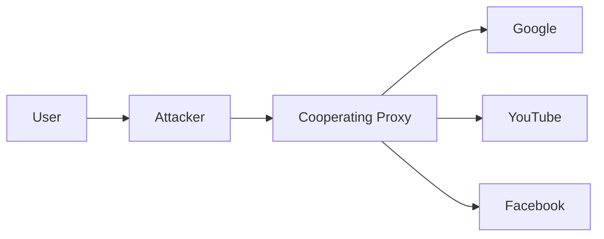
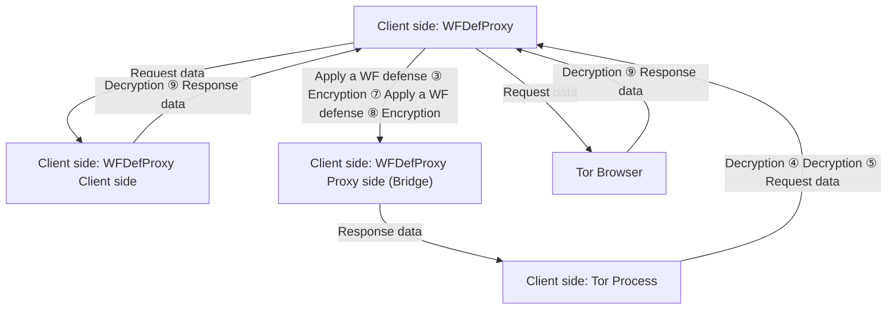

# WFDefProxy: Real World Implementation and Evaluation of Website Fingerprinting Defenses

Jiajun Gong , Wuqi Zhang , Graduate Student Member, IEEE, Charles Zhang , and Tao Wang

Abstract— Tor, an onion-routing anonymity network, can be attacked by Website Fingerprinting (WF), which de-anonymizes encrypted web browsing traffic by analyzing its unique sequence characteristics. Although many defenses have been proposed, few have been implemented and tested in the real world; most state-of-the-art defenses were only simulated. Simulations fail to capture the real performance of these defenses as they make simplifying assumptions about the protocol stack and network conditions. To allow WF defenses to be analyzed as real implementations, we create WFDefProxy, the first general platform for WF defense implementation on Tor as pluggable transports. We implement three state-of-the-art WF defenses: FRONT, Tamaraw, and RegulaTor. We evaluate each defense extensively by directly collecting defended datasets under WFDefProxy. Our results show that simulation can be inaccurate in many cases. Specifically, Tamaraw’s time overhead was underestimated by 22% in one setting and overestimated by 24% in another. RegulaTor’s time overhead was underestimated by 30–40%. We find that a major source of simulation inaccuracy is that they cannot incorporate how packets depend on each other. We also find that adverse network conditions (which are ignored in simulation), especially congestion, can affect the evaluated overhead of defenses. These results show that it is important to evaluate defenses as implementations instead of only simulations to avoid errors in evaluation.

Index Terms— Tor, website fingerprinting, traffic analysis.

## I. INTRODUCTION

AS PEOPLE’S awareness of the threat of tracking andsurveillance grows, Tor [9], the onion-routing anonymity network, has become a popular tool to protect user privacy on the Internet. However, website fingerprinting (WF), a traffic analysis attack, has been shown to de-anonymize Tor users. WF attacks use timing, ordering, and size features of network traffic to identify which web page a user is visiting without breaking their encryption. Recently, deep-learningbased attacks have achieved over 98% accuracy [4], [40] on

Manuscript received 18 May 2023; revised 30 September 2023; accepted 18 October 2023. Date of publication 25 October 2023; date of current version 7 December 2023. This work was supported by the Hong Kong Innovation and Technology Commission under Grant RGC16206517, Grant ITS/440/18FP, and Grant PRP/004/21FX. The associate editor coordinating the review of this manuscript and approving it for publication was Prof. Ghassan Karame. (Corresponding author: Tao Wang.)

Jiajun Gong is with the School of Computing, National University of Singapore, Singapore 117417 (e-mail: gongjj@comp.nus.edu.sg).

Wuqi Zhang and Charles Zhang are with the Department of Computer Science and Engineering, The Hong Kong University of Science and Technology, Hong Kong (e-mail: wuqi.zhang@connect.ust.hk; charlesz@cse.ust.hk).

Tao Wang is with the School of Computing Science, Simon Fraser University, Burnaby, BC V5A 1S6, Canada (e-mail: taowang@sfu.ca).

Digital Object Identifier 10.1109/TIFS.2023.3327662 a large multi-class de-anonymization task. High accuracy and unobservability make WF a severe threat to user privacy.

To address concerns related to potential attacks, various defense mechanisms have been proposed. However, the majority of previous defense strategies have primarily demonstrated their effectiveness in a proof-of-concept manner. These defenses were evaluated and presented through simulation methodologies, where unprotected data was gathered from the actual Tor network and subsequently altered based on the theoretical impact of the defense mechanisms. Simulation offers the advantage of simplifying the assessment of defense performance, reducing the strain on the real Tor network, and facilitating the testing of multiple parameter configurations without the need for continuous data collection. Nevertheless, there are several significant limitations associated with using defense simulation as an evaluation approach:

(1) Neglect of implementation challenges: Simulations tend to overlook the practical complexities of implementing these defenses. The robustness of a defense could rely on assumptions that may be difficult to achieve in real-world scenarios [36], [45].  
(2) Simplified packet dependency: Simulations often simplify or ignore the intricate dependencies between network packets. For instance, outgoing packets may be simulated with delays that do not accurately represent their interactions with incoming packets they trigger [7].  
(3) Inadequate handling of network protocols and congestion: Simulating the interaction between network protocols and network congestion remains a challenging task. There has been limited exploration into the effects of different network conditions on WF defenses.

Therefore, simulation results may be misleading when considering the adoption of a website fingerprinting defense.

To enable WF defenses to be evaluated as real implementations, we develop a new platform called WFDefProxy. Built on obfs4proxy [2], a widely-used pluggable transport proxy for circumventing censorship, WFDefProxy is designed as a versatile platform capable of accommodating all known defenses at the network layer. Within the platform, we have created a defense template, simplifying the implementation process for defenses and allowing for their evaluation in a more realistic environment. This approach enables fair comparisons between different defenses, effectively addressing the first limitation of simulation (i.e., implementation challenges).

On top of that, we have implemented three state-of-the-art defenses, RegulaTor [16], FRONT [11], Tamaraw [7], as well as an unevaluated defense Random-WT [45]. Our primary objective is to address the question of whether simulation alone is sufficient for evaluating a defense strategy, faced with its second and third limitations. To tackle this overarching research problem, we break it down into three questions:

• RQ1 (Evaluation): Is simulation useful for evaluating defenses? What are the differences between results obtained from simulation and real implementation?  
• RQ2 (Parametrization): Is simulation able to determine optimal defense parameters? Does simulation correctly characterize how varying a parameter value affects the defense?  
• RQ3 (Network conditions): How do adverse network conditions such as low bandwidth, which could not be studied under simulation, affect real implementations?

We collect defended datasets using WFDefProxy, test each defense against the best WF attacks, and compare the results with simulation. Our results show the various ways in which simulation is inaccurate for evaluating the overhead and the protection rate of WF defenses. We summarize our contributions as follows:

• We build a general platform called WFDefProxy for WF defense implementation. WFDefProxy is powerful enough to implement any known network-layer defense, simplifying the benchmarking process for defense developers. We create the first full implementation of four defenses, allowing real Tor users to use these defenses.  
• We collect several defended datasets to evaluate each defense implementation directly. We find that simulation is inaccurate in a range of scenarios, and we explore factors contributing to the inaccuracies observed in simulation-based evaluations.  
• We, for the first time, evaluate the impact of optimistic and pessimistic simulation strategies towards packet dependency. Our research underscores that both strategies lead to inaccurate estimation of overhead for defenses such as Tamaraw and RegulaTor.

We organize the paper as follows. We provide the background to our work in Section II and introduce related work in Section III. We present our new WF defense platform WFDefProxy and introduce the details of the implementations for four defenses in Section IV. We introduce the methodology of our empirical study in Section V and present our results in Section VI. Finally, we discuss relevant issues in Section VII and conclude our work in Section VIII.

## II. BACKGROUND

In this section, we introduce background knowledge about Website Fingerprinting and define our threat model.

## A. Attack Scenario

Website Fingerprinting (WF) is a multi-class problem classifying packet traces to web pages. The attacker trains on traffic traces for a number of web pages (“monitored web pages”)


<details>
<summary>flowchart</summary>


</details>

Fig. 1. WF threat model.

of interest and tries to identify which page each packet trace belongs to. There are two different attack scenarios in WF: the closed-world and the open-world scenario.

The closed-world scenario assumes that the client only visits web pages from a set of monitored web pages [15]. The attacker tries to infer which specific page the client is visiting. This is the worst-case scenario for the client (and thus the defense), as it assumes the attacker has full knowledge of a client’s possible browsing destinations. We use accuracy, the percentage of correctly classified instances, to evaluate the attacker’s performance in this scenario. The open-world scenario assumes that the client not only visits monitored web pages, but also visits non-monitored web pages — web pages that the attacker is not interested in or has not seen before [30]. The attacker’s goal is to determine whether or not the client is visiting a web page from his monitored list and, if so, to further answer which one. In this work, we mainly focus on the closed-world scenario to reduce the data collection time and impact on the Tor network since we need to collect many datasets for our comparison.

## B. Threat Model

Figure 1 illustrates the threat model. There are three roles in the model: 1) the user (or client), who is visiting web pages through Tor; 2) the attacker, passively eavesdropping on the connection between the user and the entry node to perform a WF attack; and 3) the cooperating proxy, which is a Tor relay that cooperates with the user to deploy the WF defense, inserting or dropping dummy packets or delaying real packets according to protocol specifications.

The attacker does not attempt to compromise Tor’s encryption; instead, they try to infer the visited web page by analyzing eavesdropped network traffic patterns with a WF classifier. Anyone controlling or eavesdropping on a device between the user and their Tor entry, including their Internet Service Provider, could be a potential WF attacker. We further assume that the attacker is aware of the user’s defense, including the parameter settings of the defense. This is a reasonable assumption for a local attacker since the attacker can easily derive them by observing client traffic.

## C. Trace and Overhead

A trace is a sequence of network packets generated by loading a web page. Data overhead and time overhead are the two main metrics we use to evaluate the cost of defense. The data overhead is measured as the total amount of dummy data, divided by the total amount of real data. The time overhead is defined as the ratio between the total extra loading time in the defended case and the original loading time in the undefended case. Both are computed on a large dataset to capture the overall performance over many page loads. These definitions are consistent with previous works [7], [11].

In simulation, the time overhead is assumed to be independent of the data overhead: extra packets are assumed to cause no delays in page loading, and time overhead is only incurred when the defense intentionally delays a packet. Evaluation through implementation allows us to avoid this assumption.

## III. RELATED WORK

In this section, we survey the existing works on website fingerprinting defenses, highlighting that state-of-the-art defenses have not been implemented. Subsequently, we delve into the examination of existing frameworks, shedding light on their limitations. These limitations serve as a driving force behind the development of WFDefProxy.

## A. Website Fingerprinting Defenses

Over the years, researchers have proposed several WF defenses in response to increasingly powerful WF attacks. WF defenses can be divided into three main categories: regularized defenses, non-regularized defenses, and adversarial defenses.

1) Regularized Defenses: Regularized defenses predefine a set pattern for traffic traces to be molded into. They usually focus on achieving strong security, so they incur a high overhead and cause significant delays to user traffic. For example, BuFLO-family defenses [6], [7], [10] restrict packet sending rates and pad the length of the traffic. Tamaraw is the state-of-the-art defense in this category. Nevertheless, different studies have reported significantly varied levels of overhead when simulating Tamaraw [4], [11], [40], [45].

There is another class of regularized defenses under which web pages are grouped into different anonymity sets so that traces generated by web pages in one set appear the same [28], [44], [45]. However, these defenses share a common drawback: They necessitate prior knowledge of web pages to enable effective anonymization, significantly impeding their practical deployment. An exception to this is Random-WT, a variation of Walkie-Talkie [45], which simplifies the process by adding padding to actual bursts and introducing random fake bursts without requiring access to page-specific information. This approach enhances its practicality for implementation. However, it has yet to be evaluated against the latest attacks, either through simulation or real-world implementation. Random-WT has not been evaluated against the latest attacks.

Surakav [12] and RegulaTor [16] are two recently-proposed defenses. Surakav uses a Generative Adversarial Network to generate real-time sending patterns for page loading. It was shown to outperform Tamaraw in implementation. RegulaTor sends bursts at an exponentially decreased rate. In simulation experiments, RegulaTor outperformed existing defenses.

2) Non-Regularized Defenses: Non-regularized defenses obfuscate network traces by injecting dummy packets to alter specific traffic characteristics, trying not to delay real user packets. While they do not provide a guarantee of effectiveness against all types of attacks, they do come with the advantage of lower overhead. Non-regularized defenses can be applied at either the application layer, as demonstrated in works like [13] and [23], or at the network layer, as seen in the studies of [11], [20], [21], and [32]. FRONT is currently the leading defense in this category; however, it has only been evaluated in simulation.

3) Adversarial Defenses: Defenses in this category are specially designed for defeating deep-learning-based attacks. They try to find special perturbations to cause misclassification [22], [27], [36], [38], [39]. Adversarial defenses succeed when the attacker is not aware of the defense. Mathews et al. have shown that one such defense, UAP [27], can be easily undermined with adversarial training [25]. Therefore, we do not focus on evaluating adversarial defenses because they use a different threat model: In our threat model, the attacker always knows the defense and can train against the defense.

## B. Frameworks for Defense Implementation and Evaluation

To the best of our knowledge, there are currently three frameworks available for defense deployment.

WFPadTools [19] is the first framework for implementing padding-based defenses. This framework follows Tor’s pluggable transport protocol [34] and has successfully implemented WTF-PAD. However, it does not provide data encryption and is no longer actively maintained.

Basket2 [35] is another platform that extends obfs4proxy [2], a Tor pluggable transport proxy. Within Basket2, implementations of APE (a variation of WTF-PAD [20]) and Tamaraw [7] are available. One key limitation of Basket2 is that it lacks a sophisticated mechanism for controlling the initiation and termination of the defense. In this framework, the defense is triggered for each burst rather than for each page loading process. Consequently, it simplifies the implementation of Tamaraw’s defending protocol, which requires constant padding throughout the entire loading process.

Circuit Padding Framework (CPF) [31] is a defense framework developed by the Tor Project. However, it has certain limitations, including support for only a limited number of defense strategies. For example, regularized defenses like Tamaraw and RegulaTor are explicitly declared as unsupported in CPF because delaying packets carries the risk of causing out-of-memory problems on Tor relays [31]. Additionally, even for non-regularized defenses like FRONT, CPF lacks a mechanism to trigger padding exclusively at the start of a loading process, similar to the Basket2 framework.

By comparison, WFDefProxy works as a general platform that is able to implement any known network-layer defenses. Out of those, we pick four that we believe have the most potential to succeed: FRONT, the newest non-regularized defense; Tamaraw, a strong regularized defense; RegulaTor, a lightweight regularized defense; and Random-WT, a practical substitute for Walkie-Talkie. We implement these defenses and evaluate them with both simulation and implementation. Table I summarizes the key differences between WFDefproxy and existing frameworks.

TABLE I COMPARISON BETWEEN DEFENSE IMPLEMENTATION FRAMEWORKS. OUR FRAMEWORK, WFDefPROXY, SUPPORTS ENCRYPTION AND OFFERS FLEXIBILITY TO IMPLEMENT BOTH REGULARIZED AND NON-REGULARIZED DEFENSES

<table><tr><td colspan="2">Platform</td><td>WFPadTools [19]</td><td>Basket2 [35]</td><td>CPF [31]</td><td>WFDefProxy (Our work)</td></tr><tr><td colspan="2">Deployable Locations</td><td>Entry</td><td>Entry</td><td>Entry or Middle</td><td>Entry</td></tr><tr><td colspan="2">Multiple Defense States</td><td>✘</td><td>✘</td><td>✓</td><td>✓</td></tr><tr><td colspan="2">Packet Encryption</td><td>✘</td><td>✓</td><td>✓</td><td>✓</td></tr><tr><td colspan="2">Support Delay-Based Defenses</td><td>✓</td><td>✓</td><td>✘</td><td>✓</td></tr><tr><td rowspan="6">Implemented Defenses</td><td>APE (WTF-PAD) [20]</td><td>✓</td><td>✓</td><td>✓</td><td></td></tr><tr><td>FRONT [11]</td><td></td><td></td><td></td><td>✓</td></tr><tr><td>Tamaraw [7]</td><td></td><td>✓</td><td></td><td>✓</td></tr><tr><td>Random-WT [45]</td><td></td><td></td><td></td><td>✓</td></tr><tr><td>Surakav [12]</td><td></td><td></td><td></td><td>✓</td></tr><tr><td>RegulaTor [16]</td><td></td><td></td><td></td><td>✓</td></tr></table>

## IV. IMPLEMENTING WF DEFENSES

In this section, we introduce WFDefProxy, a platform we created for implementing WF defenses. We show, in detail, how we design each defense as a pluggable transport on this platform and describe how our implementations differ from previous ones.

## A. The WFDefProxy Platform

As discussed in Section III-A, most defenses functioning at the network layer remain unimplemented. The existing implementations are limited and not updated. To be able to implement FRONT, Tamaraw, and RegulaTor, the state-of-theart defenses, we developed a new platform, WFDefProxy.

To introduce the capability of delaying packets, we have opted not to build our framework on CPF. Instead, we have extended obfs4proxy [2], which is a Tor pluggable transport proxy. Utilizing the pluggable transport protocol offers distinct advantages, as it allows us to accept traffic from Tor and reshape it with greater flexibility. This approach also enables us to separate the defense module from Tor, reducing the overall complexity of the system. WFDefProxy utilizes the cryptography module of obfs4proxy. To minimize the engineering effort of implementing a new defense, we designed a general defense class and a few useful APIs that can be used for all the defenses, fixing the limitations of WFPadTools and Basket2. We design a state machine system to control the start and end of a defense. The framework supports packet encryption, and nearly all padding-based defenses can be implemented on this platform. We have implemented all the state-of-the-art defenses on WFDefProxy (See Table I).

1) Workflow: Figure 2 illustrates the workflow of WFDef-Proxy. Data from Tor Browser (the Tor process on the proxy side) will first be sent to WFDefProxy. Depending on the defense specifications and parameters, WFDefProxy will modify the data, delay real packets, and add dummy packets. After that, another layer of encryption will be added to all packets before they are sent onto the wire so that the attacker cannot distinguish between real and dummy packets. After these packets arrive on the other side, they will be decrypted and forwarded to the Tor layer. We also define a signal packet to facilitate communication between the two parties so that both sides can start and stop padding at the same time.


<details>
<summary>flowchart</summary>


</details>

Fig. 2. The workflow of WFDefProxy. WFDefProxy adds another layer of encryption (denoted in red arrows) upon Tor’s encryption (denoted in purple arrows) so that the attacker cannot distinguish between real and dummy packets.

Any network-layer defense can be implemented on WFDef-Proxy by extending our general defense class, overwriting the Read and Write functions that respectively process upstream and downstream data. As a reference, the implementation of Tamaraw [7] only takes around 400 lines of code. Besides Tamaraw, four more defenses have been implemented on the platform so far: FRONT [11], Surakav [12], RegulaTor [16], and Random-WT [45]. (We do not focus on Surakav in this study since Surakav was already thoroughly evaluated in implementation by Gong et al. [12].)

2) Soft Stop Condition: A major difference between simulation and implementation for a WF defense is that in simulation, the end of a page load (when the trace terminates) is not ambiguous. However, in a real implementation, it is nontrivial for a network-layer defense to know when a page has finished loading. A conservative stop strategy may make the defense attempt to pad empty traffic, sending more dummy data than necessary. On the other hand, aggressively stopping page loading would cause early stops while the page is still loading. While early stops will not break page loading, they can cause delays and higher overhead, for example, if the defense allocates a certain amount of data budget per new page load.

TABLE II DEFENSE PARAMETER DESCRIPTION AND THEIR DEFAULT VALUE USED IN SECTION VI-A

<table><tr><td>Defense</td><td>Param.</td><td>Value</td><td>Description</td></tr><tr><td rowspan="3">Tamaraw</td><td> $\rho_{out}$ </td><td>14</td><td>Client packet sending gap</td></tr><tr><td> $\rho_{in}$ </td><td>4</td><td>Server sending gap</td></tr><tr><td>L</td><td>100</td><td>Multiple of trace length</td></tr><tr><td rowspan="4">FRONT</td><td>N</td><td>10,000</td><td>Total padding budget</td></tr><tr><td> $\alpha$ </td><td>0.5</td><td>Padding ratio</td></tr><tr><td> $W_{min}$ </td><td>1</td><td>Rayleigh Distribution param.</td></tr><tr><td> $W_{max}$ </td><td>14</td><td>Rayleigh Distribution param.</td></tr><tr><td rowspan="6">RegulaTor</td><td>R</td><td>277</td><td>Initial sending rate</td></tr><tr><td>D</td><td>0.940</td><td>Sending-rate decay factor</td></tr><tr><td>T</td><td>3.55</td><td>Sending-rate reset threshold</td></tr><tr><td>N</td><td>3550</td><td>Maximum Padding budget</td></tr><tr><td>U</td><td>3.95</td><td>Client&#x27;s sending rate ratio</td></tr><tr><td>C</td><td>1.77</td><td>Maximum packet waiting time</td></tr><tr><td rowspan="5">Random-WT</td><td> $N_{out}^{real}$ </td><td>4</td><td>Max padding on client&#x27;s real burst</td></tr><tr><td> $N_{in}^{real}$ </td><td>45</td><td>Max padding on proxy&#x27;s real burst</td></tr><tr><td> $N_{out}^{fake}$ </td><td>8</td><td>Max padding on client&#x27;s fake burst</td></tr><tr><td> $N_{in}^{fake}$ </td><td>90</td><td>Max padding on proxy&#x27;s fake burst</td></tr><tr><td> $p_{fake}$ </td><td>0.4</td><td>Probability of inserting a fake burst</td></tr></table>

To tackle this problem, we observe that when a page is fully loaded, there are very few real packets on the connection. Therefore, we estimate the end of page loading by observing the throughput of real packets over a short period (“time window”). When the throughput is close to 0 in the time window, we assume page loading has finished. We refer to this as the soft stop condition. Even though it is still possible to see some packets (such as those related to Tor’s link padding protocol and flow control protocol [8]), those packets are infrequent. To decide the time window size, we measure the time gaps between two consecutive outgoing packets on the undefended dataset we collected in Section V-B. We find that 98.8% of time gaps are less than 1 s. Given that most defenses will delay packets and a slightly higher overhead is preferable to early stops for defense effectiveness, we set a time window of 4 s for the soft stop condition. If there is no more than one outgoing packet over the last 4 s, we stop the defense. We observed that 96% of the traces had less than one restart event for FRONT (76% of them had zero restart event) in our experiment.

## B. Defense Algorithms

We describe each defense we implement in this section. The parameters of each defense are summarized in Table II.

1) Tamaraw: Tamaraw is a regularized defense that can provide a theoretical upper bound on the accuracy of any attacker. It is one of the strongest and most bandwidthconsuming defenses. Packets are sent every $\rho _ { o u t }$ milliseconds on the client side and $\rho _ { i n }$ milliseconds on the proxy side. Dummy packets are inserted if no data can be sent. When loading finishes, Tamaraw continues to pad the flow until the trace length is a multiple of L.

2) FRONT: FRONT is a lightweight defense that does not delay any real packets. It defends a trace by injecting randomness with a focus on obfuscating the trace front — the first few seconds of page loading. Randomness is achieved by re-sampling the number of dummy packets for every trace, and the timestamps of these dummy packets are also taken from a repeatedly re-sampled Rayleigh distribution.

Table II shows the four parameters of FRONT. When a loading begins, the client will first sample an integer n from Uniform(1, α N ); the server samples from Uniform(1, (1 − $\alpha ) N )$ . Then n timestamps, indicating when dummy packets will be sent, will be sampled from a Rayleigh Distribution $\begin{array} { r c l } { { \mathcal { R } ( t ; w ) } } & { { = } } & { { \frac { t } { w ^ { 2 } } e ^ { - t ^ { 2 } / 2 } \stackrel { . . } { w } ^ { 2 } } } \end{array}$ t 2 e−t2/2 w2 , where w is sampled from Uniform $\cdot W _ { m i n } , W _ { m a x } \big )$ . w is a parameter that controls the shape of the distribution. 40% of the sampled timestamps (dummy packets) are expected to lie in the time interval [0, w]. After loading finishes, unsent dummy packets will be dropped.

3) RegulaTor: RegulaTor sends data in a few bursts on both sides at a self-adjusted rate. The parameters are listed in Table II. When the defense starts, the proxy samples a padding budget from Uniform(0, N ), and its sending rate $R _ { s }$ is initialized as R. Over time, $R _ { s }$ exponentially decreases to $R \cdot D ^ { t }$ where t is the number of seconds since the burst began. When there is no data in the buffer at sending time, the proxy will check its padding budget and decide whether to send a dummy packet or to skip this sending round (if the padding budget is zero). When the number of packets waiting in the buffer is over $R _ { s } \cdot T , R _ { s }$ will be reset to its initial value R, indicating a new burst of data. We refer to the burst of data before the rate reset as a “surge” [16]. On the client side, packets are sent at rate $R _ { c } = R _ { s } / U$ . To further reduce time overhead, however, any client-side packet that waits for more than C seconds will be marked as an “impatient packet” and sent out immediately.

4) Random-WT: Random-WT is a relaxed version of Walkie-Talkie [45] as the original was too hard to deploy. The main difficulty is the implementation of half-duplex mode, which originally required revamping the browser’s connection handling logic. WFDefProxy is instead able to achieve half-duplex mode through its state machine, allowing us to deploy Random-WT (and original WT) much more easily. The simulation of Random-WT would also require half-duplex mode, which is why it has never been evaluated before, even as a simulation. We implemented Random-WT through WFDefProxy, and we also create a simulation by first collecting a half-duplex dataset, and then adding padding and burst injection according to its specifications. Both our simulation and implementation of Random-WT start with collecting a half-duplex dataset through WFDefProxy.

## C. Implementation Specifications

Here, we show how WFDefProxy implements defenses, focusing on the interaction between defense padding and the soft stop condition described in Section IV-A.

We use Tamaraw as a working example and show its finite state machine on the client side in Figure 3. There are four states in the client’s state machine: Stop, Ready, Start, and Padding. The defense starts in the Stop state indicated by a double circle. When a real packet arrives in WFDefProxy (from the client’s browser in this case), it enters the Ready state, which implements the soft stop condition: if the machine only sees one packet over a time window of 4 s $( n _ { [ t - 4 : t ] } \ \leq \ 1 )$ in the Ready state, it will return to the Stop state.


<details>
<summary>flowchart</summary>

```mermaid
graph TD
  A["Stop"] -->|A real packet comes\nSend the packet\nn_{[t-4,t]} ≤ 1 ∧| B["Ready"]
  B --> C["Start"]
  C -->|A real packet comes\nSend the packet; signal proxy to start\nn_{[t-4,t]} ≤ 1 ∧| D["Padding"]
  D -->|N_total %L == 0\nSignal proxy to stop| A
```
</details>

Fig. 3. The state machine on the client side for Tamaraw. Above each line, there is an event that triggers the actions below the line and causes a state transition. For simplicity, we only show the key events in this figure. $^ { * } \wedge { } ^ { \prime \prime }$ means no action. $n _ { [ t - 4 : t ] }$ refers to the number of real packets sent over the last four seconds. The padding for each defense happens in the Start and Padding states.

If a second real packet arrives during the Ready state, the machine enters the Start state, where the defense performs most of its padding. When it observes no more than one real packet in the last four seconds again, the defense will enter the Padding state, where it performs end-of-trace padding according to Tamaraw’s specification (until $N _ { t o t a l } .$ the total number of packets, is a multiple of a parameter L). Other defenses we implemented do not have end-of-trace padding, so the machine would directly enter the Stop state. Their state machines are documented in our source code repository [18].

## D. Framework Cost Analysis

Our framework adds a five-byte header on each Tor cell which is used for indicating the frame type and payload length. Each WFDefProxy frame has another 16-byte tag, which is necessary for data encryption and authentication [18]. In total, our framework adds about 4% extra date overhead compared to vanilla Tor. By comparison, WFPadTools requires a fiveor eight-byte header, depending on the frame type [19]. This platform is only a prototype without any packet encryption system, so there is no encryption overhead (see Table I). Basket2 frames have an 8-byte header and two 16-byte tags, using the same encryption scheme as ours (Poly1305), while they redundantly encrypt the payload twice [35]. CPF, being implemented within Tor and reusing the Tor cell protocol, does not introduce any additional data overhead [31]. Among the three defense frameworks using Tor’s pluggable transport interface, our framework introduces the smallest number of extra bytes in the frame header. Beyond assessing data overhead, we also conducted measurements to determine the time overhead incurred by frame encapsulation and encryption. On average, WFDefProxy requires only 0.002 ms to create a frame, which is negligible compared to using an undefended Tor network.

## V. EMPIRICAL STUDY METHODOLOGY

In this section, we describe the methodology we use to conduct our experiments, including how we deploy and evaluate each defense.

## A. Experiment Setup

To deploy the defenses on the live Tor network, we rent a server on Microsoft Azure where we deploy WFDefProxy. The server is a private Tor bridge acting as our cooperating proxy. It has 1 CPU (2.3 GHz) and 2 GB of memory, running on Debian 9.11, and running Tor 0.4.4.5. Its exact location is scrubbed for blind review.

We test clients on a university server. This server has 128 CPU cores and 500 GB memory, shared between all the clients. The server has 1 Gbps bandwidth in total; the bandwidth limitation represents a realistic scenario that a real user could experience, including the network jitter and congestion that happens from time to time. The client server runs on Ubuntu 18.04.4 LTS. The client server is close to us, and the bridge server is far from us globally.

We randomly created 8–12 docker containers on the client server to collect datasets in parallel. In each container, we use command lines to launch a Tor Browser (version 10.0.15) directly for each visit. The Tor Browser is customized to call the compiled binary of WFDefProxy once it is launched. When the loading is completed, we wait for an extra 5 s on the page, after which the browser will be automatically closed with a Tampermonkey [5] script. We give at most 70 s for each page load. Each visit uses a fresh new copy of the Tor Browser Bundle to remove the impact of the network cache on the crawling process.

To compare the implementation with the simulation, we also collect undefended datasets. We guarantee that every defended dataset can compare with an undefended dataset collected within four days after its collection time to minimize the impact of concept drift. We then simulate each defense over the undefended datasets using the simulation code provided by their authors.

## B. Datasets

The website list we choose for evaluation comes from the Tranco top 1 million list [33] generated on 21st January 2022.1 Tranco is a regularly updated research-oriented ranking that aggregates data from Alexa [17], Umbrella [42] and Majestic [24]. It shares a large portion of the most popular domains with these three rankings and provides a more stable ranking in terms of website popularity.

We first remove the inaccessible URLs in the top 200 sites. We only keep one version of localized websites such as Google. We also remove duplicate URLs that direct to the same page. Out of the remaining, we choose the first 100 as the monitored web pages. We let multiple clients visit the monitored list in random order. After merging all the crawls and removing outliers (following the approach described in [29]), we guarantee that each monitored page

1https://tranco-list.eu

has at least 100 instances. We collect datasets for each implemented defense following this methodology. We also collect two types of undefended datasets: one using the standard Tor Browser and one under half-duplex mode to simulate Random-WT as a comparison with our implementation. The whole crawling process lasted for around four months.

To simulate a defense, we run the simulation code on the plain undefended dataset. This mimics the defense behavior by either injecting dummy packets at specific timestamps or moving existing real packets to their expected positions to generate the defended traces.

## C. WF Attacks

We pick four state-of-the-art WF attacks, kFP [14], CUMUL [29], DF [40], and Tik-Tok [37] to evaluate the defenses. kFP uses Random Forests and k-Nearest Neighbour classifiers to perform the attack. CUMUL uses an SVM classifier with a “cumulative representation” of the traces as input. DF and Tik-Tok are two deep-learning-based attacks that use convolutional neural networks. They were shown to be more effective in previous work. We use the parameters suggested in their papers. For the deep learning attacks, we set the input length at 20,000 and train each model for 30 epochs. We perform 10-fold cross-validation on each dataset and add the results on each fold. We primarily present Tik-Tok’s attack performance as the benchmark result for most experiments, as Tik-Tok consistently achieves the highest accuracy among all the attacks.

## D. Simulation Strategy

Regularized defenses are designed to delay user packets. When simulating these defenses over an undefended dataset, we need to decide to which time slot each real packet should be assigned. Intuitively, each packet should be assigned to a time slot that is no earlier than its original timestamp. However, we may need to delay a packet further due to a possible dependency relationship between packets (of both directions); this dependency relationship is not known in simulation, potentially affecting the accuracy of the simulation. Therefore, we define two simulation strategies here:

• Optimistic Strategy: We assume that each packet is informationally independent of any other. The packets from each direction will be assigned to the closest time slot after their original timestamp. This implies that packets in different directions may be re-ordered by the defense.  
• Pessimistic Strategy: We assume that each packet is dependent on all previous packets from both directions. The packets will then be assigned the closest time slot after the assigned time slots of all previous packets.

The simulation of Tamaraw uses a pessimistic strategy, while RegulaTor uses an optimistic strategy.

## E. Ethical Considerations

Our bridge is kept private throughout our experiments so that no one can connect to our bridge. We write a script to drive the browser automatically, and none of the visits are from real users. The dummy packets are transmitted only between the clients and our private bridge, so no dummy packets flow into the Tor network. We do not keep any real data generated by the page loads.

TABLE III THE DATA AND TIME OVERHEAD OF EACH DEFENSE IN SIMULATION AND IMPLEMENTATION IN THE CLOSED-WORLD SCENARIO (100 × 100 TRACES). THE OVERHEAD OF ALL THE DEFENSES EXCEPT RANDOM-WT IS UNDERESTIMATED

<table><tr><td rowspan="2">Defense</td><td colspan="2">Data (%)</td><td colspan="2">Time (%)</td></tr><tr><td>Sim.</td><td>Imp.</td><td>Sim.</td><td>Imp.</td></tr><tr><td>Tamaraw [7]</td><td>107</td><td>114</td><td>41</td><td>61</td></tr><tr><td>FRONT [11]</td><td>72</td><td>81</td><td>0</td><td>1</td></tr><tr><td>RegulaTor [16]</td><td>36</td><td>58</td><td>32</td><td>62</td></tr><tr><td>Random-WT [45]</td><td>88</td><td>82</td><td>59</td><td>37</td></tr></table>

## VI. EMPIRICAL STUDY RESULTS

We evaluate the defenses through implementation with WFDefProxy and simulation over the undefended datasets. We aim to answer the following research questions:

• RQ1 (Evaluation): Is simulation useful for evaluating defenses? What are the differences between results obtained from simulation and real implementation?  
• RQ2 (Parametrization): Is simulation able to determine optimal defense parameters? Does simulation correctly characterize how varying a parameter value affects the defense?  
• RQ3 (Network conditions): How do adverse network conditions such as low bandwidth, which could not be studied under simulation, affect real implementations?

## A. RQ1: Evaluation

To determine whether or not simulation correctly portrays WF defenses, here we compare evaluation results between simulation and implementation. We divide our results based on the two main metrics for evaluating a WF defense: its overhead, and the accuracy of WF attacks against it. The parameter values for each defense can be found in Table II. They are the recommended settings from the original papers, except for FRONT, where we doubled its padding budget from 5,000 to 10,000 to make a better comparison with other defenses.

1) Overhead: We compare the time and bandwidth overhead results between simulation and implementation, showing the results in Table III. We see that simulation is broadly inaccurate at predicting the overhead of these defenses, except for FRONT. The time overhead for Tamaraw and RegulaTor are underestimated by 20% and 30%, respectively. For Random-WT, the time overhead is overestimated by 22%.

Tamaraw and RegulaTor use different simulation strategies (Section V-D): Tamaraw is pessimistic, while RegulaTor is optimistic in assuming dependency relations between packets. Despite this, both strategies significantly underestimate the overhead. We investigate these simulation strategies further by simulating Tamaraw and RegulaTor in both optimistic and pessimistic strategies and analyzing their performance.

TABLE IV DEFENSE OVERHEAD UNDER DIFFERENT SIMULATION STRATEGIES FOR TAMARAW AND RegulaTOR. BOTH STRATEGIES UNDERESTIMATE THE OVERHEAD. “\*” MARKS THE SIMULATION STRATEGY USED IN THE ORIGINAL PAPERS

<table><tr><td rowspan="2">Defense</td><td rowspan="2">Strategy</td><td colspan="2">Overhead (%)</td></tr><tr><td>Data</td><td>Time</td></tr><tr><td rowspan="3">Tamaraw [7]</td><td>Optimistic</td><td>90</td><td>29</td></tr><tr><td>Pessimistic*</td><td>107</td><td>41</td></tr><tr><td>Implementation</td><td>114</td><td>61</td></tr><tr><td rowspan="3">RegulaTor [16]</td><td>Optimistic*</td><td>36</td><td>32</td></tr><tr><td>Pessimistic</td><td>47</td><td>32</td></tr><tr><td>Implementation</td><td>58</td><td>62</td></tr></table>

Tamaraw: We use the suggested setting as the study object, where $\rho _ { o u t } = 1 4$ ms, $\rho _ { i n } = 4$ ms and L = 100. Table IV shows the data and time overhead of Tamaraw in implementation and simulation. The optimistic strategy even more severely underestimates the data and time overhead of Tamaraw (by 24% and 32%, respectively). This is expected, as the optimistic strategy often sends out packets far sooner than they could be sent in reality because it ignores the dependency relationship between packets.

However, we note that even the pessimistic simulation strategy underestimates the time overhead even though it fully respects dependency relationships (by assuming the most pessimistic relationship, i.e., every packet is fully dependent on previous packets). This may be because the high data overhead of Tamaraw causes further delays due to bandwidth limitations (which are not considered in simulation). Defense delays can also cause timeouts, which are not captured by even the pessimistic strategy.

RegulaTor: We find that, unlike Tamaraw, the pessimistic simulation strategy does not predict more time overhead for RegulaTor — the two strategies yield the same (significantly underestimated) time overhead, as shown in Table IV. However, data overhead is about 10% higher in the pessimistic simulation. Maintaining the packet order in the pessimistic strategy does not bring extra time overhead for RegulaTor because all the impatient packets (i.e., those packets waiting for too long, see Section IV-B.3) on the client side will be sent out immediately. Therefore, even for the pessimistic strategy, the packet dependency relationship can be broken. To validate this, we set C = inf (i.e., no impatient packets), keep other parameters unchanged, and run two simulation strategies again. We find that the pessimistic strategy yields 13% more time overhead than the optimistic one (44% v.s. 31%).

2) Closed-World Analysis: Next, we evaluate the state-ofthe-art attacks in the closed world against four implemented WF defenses and compare them with simulation results. Simulation results are obtained, as in previous works, by applying the theoretical effect of the defense on traces of the undefended dataset. We show the comparison results in Table V.

TABLE V COMPARISON BETWEEN SIMULATION AND IMPLEMENTATION REGARDING ATTACK ACCURACY. SIMULATION YIELDS SIMILAR RESULTS AS IMPLEMENTATION FOR ALL DEFENSES EXCEPT RegulaTOR

<table><tr><td rowspan="2" colspan="2">Defense</td><td colspan="4">Attack Accuracy (%)</td></tr><tr><td>kFP</td><td>CUMUL</td><td>DF</td><td>Tik-Tok</td></tr><tr><td rowspan="2">Tamaraw</td><td>Sim.</td><td>2.19</td><td>17.63</td><td>17.11</td><td>16.61</td></tr><tr><td>Imp.</td><td>6.43</td><td>9.73</td><td>10.20</td><td>17.85</td></tr><tr><td rowspan="2">FRONT</td><td>Sim.</td><td>25.86</td><td>20.22</td><td>60.17</td><td>72.16</td></tr><tr><td>Imp.</td><td>30.82</td><td>19.94</td><td>55.95</td><td>68.52</td></tr><tr><td rowspan="2">RegulaTor</td><td>Sim.</td><td>48.73</td><td>24.13</td><td>29.01</td><td>43.43</td></tr><tr><td>Imp.</td><td>42.76</td><td>30.06</td><td>55.62</td><td>55.88</td></tr><tr><td rowspan="2">Random-WT</td><td>Sim.</td><td>68.56</td><td>69.89</td><td>93.65</td><td>95.69</td></tr><tr><td>Imp.</td><td>62.88</td><td>67.30</td><td>91.55</td><td>92.87</td></tr></table>

TABLE VI ANALYSIS OF RegulaTOR SURGE FEATURES. WE COUNT THE NUMBER OF SURGES AND RECORD SURGE START TIMESTAMPS. WE TRAIN A RANDOM FORESTS CLASSIFIER WITH ONLY SURGE FEATURES TO SHOW THAT SURGE FEATURES ARE MUCH MORE INFORMATIVE IN IMPLEMENTATION

<table><tr><td rowspan="2">Setting</td><td colspan="2"># surges per trace</td><td rowspan="2">RF Accuracy (%)</td></tr><tr><td>Mean</td><td>Variance</td></tr><tr><td>Simulation</td><td>3.28</td><td>1.98</td><td>12.90</td></tr><tr><td>Implementation</td><td>5.48</td><td>3.93</td><td>33.20</td></tr></table>

We observe consistent performance from all attacks against FRONT and RegulaTor. CUMUL and DF experience a 7% accuracy loss in their implementations against Tamaraw. Notably, a significant difference emerges in the RegulaTor dataset. DF’s accuracy nearly doubles during implementation, going from 29% in simulation to 56% in implementation. Similarly, Tik-Tok’s accuracy increases by 13% during implementation, rising from 43% in simulation to 56% in implementation. To investigate this difference further, we conducted an information leakage analysis, revealing that RegulaTor’s most informative feature is its “surge features”.

We record the starting time of each surge and count the total number of surges in a trace. As shown in Table VI, real traces appear to have more surges than expected in simulation, and the variance in the total number of surges between traces is also higher. We further use these two surge features (timestamps and number of surges) to classify these traces with a Random Forests classifier (RF), and find that the classifier can achieve 33% accuracy on RegulaTor. The simulation creates traces that have the wrong number of surges, impacting attack accuracy against them.

We performed an additional experiment to test if the simulation strategy (optimistic or pessimistic) can also affect how well it evaluates accuracy. In the case of Tamaraw, the simulation strategy had almost no effect on accuracy evaluation; the simulation remained accurate. However, for RegulaTor, the pessimistic simulation mispredicts attack accuracy even more (81% simulation vs. 56% implementation), this time erring in the other direction. A possible reason is that there are too many “impatient packets” (See Section IV-B.3) in the pessimistic simulation that leak more information than expected. We conducted an additional experiment where we did not allow any impatient packets and found that the attack accuracy dropped to 70%, partially explaining the gap with implementation.

TABLE VII EVALUATION OF THE IMPLEMENTED DEFENSES IN THE OPEN-WORLD SCENARIO (100 × 100 + 90,000 TRACES).WE PRESENT THE TPR, FPR, AND PRECISION (π ) OF EACH ATTACK.TAMARAW IS EFFECTIVE AGAINST ALL ATTACKS.FRONT IS ESPECIALLY EFFECTIVE AGAINST KFP AND CUMUL, APPROACHING THE PERFORMANCE OF TAMARAW. THE VALUES ARE IN PERCENTAGE

<table><tr><td rowspan="2">Defense</td><td colspan="3">kFP</td><td colspan="3">CUMUL</td><td colspan="3">DF</td><td colspan="3">Tik-Tok</td></tr><tr><td>TPR</td><td>FPR</td><td> $\pi_{10}$ </td><td>TPR</td><td>FPR</td><td> $\pi_{10}$ </td><td>TPR</td><td>FPR</td><td> $\pi_{10}$ </td><td>TPR</td><td>FPR</td><td> $\pi_{10}$ </td></tr><tr><td>Undefended</td><td>63.29</td><td>0.06</td><td>90.12</td><td>82.19</td><td>1.68</td><td>35.00</td><td>96.97</td><td>0.32</td><td>75.49</td><td>96.35</td><td>0.27</td><td>78.00</td></tr><tr><td>Tamaraw [7]</td><td>4.92</td><td>0.01</td><td>34.89</td><td>5.74</td><td>2.36</td><td>2.07</td><td>14.50</td><td>0.07</td><td>14.51</td><td>7.81</td><td>0.04</td><td>14.40</td></tr><tr><td>FRONT [11]</td><td>4.75</td><td>0.06</td><td>44.85</td><td>8.08</td><td>4.03</td><td>2.11</td><td>48.86</td><td>1.98</td><td>19.62</td><td>55.36</td><td>1.83</td><td>23.35</td></tr></table>

To summarize these results, we find that while the accuracy of defenses was well-predicted by simulation in the majority of cases, it was highly mistaken about attack accuracy against RegulaTor, especially under pessimistic simulation. As we cannot predict whether or not simulation will be accurate for a given proposed defense, we argue that simulation results need to be confirmed by implementation. These results also include the first evaluation of Random-WT, showing that it has almost no defensive effectiveness.

3) Open-World Analysis: We further investigate a more realistic open-world scenario for the FRONT and Tamaraw implementations, which represent two different directions in defense design: one prioritizing user experience and the other focusing on effectiveness. We collected another 90,000 nonmonitored traces for each defense in July 2022 to construct the open-world datasets. We evaluate the TPR, FPR, and Precision of each attack. The definition of Precision is taken from [43] that incorporates the base rate b. We assume b = 10 (i.e., the probability of visiting a non-monitored page is ten times the monitored pages.) and denote the precision as π10.

As shown in Table VII, DF and Tik-Tok remain the strongest attacks against all the defenses. In the undefended case, both attacks achieve over 96% TPR and 75% precision. kFP is the most precise attack due to its kNN mechanism [14] but at the cost of a lower TPR. CUMUL has the lowest π10, mainly because of its high FPR. Tamaraw is still effective against all the attacks: the best attack DF achieves only 15% TPR and precision against it. FRONT approaches the performance of Tamaraw against kFP and CUMUL, reducing their TPR to less than 8%. However, Tik-Tok still has more than 55% TPR against FRONT. Note that when the user visits monitored pages more frequently than what we assume (b = 10), the precision of the attacks will further increase. Nevertheless, both defenses are shown to be effective as real implementations in the open-world scenario.

4) Defense Implementation Consistency: Considering the dynamic nature of the Tor network, we want to validate whether the defenses deployed on WFDefProxy have consistent performance, thus strengthening the reproducibility of our framework. We performed another open-world crawl in May 2021, one year earlier than the crawl reported in Section VI-A.3 with the same dataset size.

Table VIII shows DF’s performance on datasets collected at different times. In 2022, DF achieved slightly higher TPR and precision against both defenses compared to 2021. This increase may be attributed to the pages becoming more distinctive in 2022, as evidenced by DF’s higher precision and lower FPR on undefended datasets. In general, Tamaraw and FRONT implementations exhibited similar protection rates across the two time periods.

TABLE VIII DF PERFORMANCE ON DATASETS COLLECTED AT DIFFERENT TIMES. THE VALUES ARE IN PERCENTAGE

<table><tr><td rowspan="2">Defense</td><td colspan="3">Dataset 2021</td><td colspan="3">Dataset 2022</td></tr><tr><td>TPR</td><td>FPR</td><td> $\pi_{10}$ </td><td>TPR</td><td>FPR</td><td> $\pi_{10}$ </td></tr><tr><td>Undefended</td><td>97.71</td><td>0.49</td><td>68.28</td><td>96.97</td><td>0.32</td><td>75.49</td></tr><tr><td>Tamaraw [7]</td><td>6.43</td><td>1.79</td><td>3.25</td><td>14.50</td><td>0.07</td><td>14.51</td></tr><tr><td>FRONT [11]</td><td>42.79</td><td>2.49</td><td>15.42</td><td>48.86</td><td>1.98</td><td>19.62</td></tr></table>

Answer to RQ1: We cannot solely rely on simulation to evaluate defense overhead and accuracy. Time overhead was mispredicted for three out of four defenses, and the accuracy of RegulaTor was mispredicted. Investigating further, we find that specific features, such as the number of surges, can be highly different between real and simulated traces.

## B. RQ2: Parametrization

Defense parameters are chosen to optimize the trade-off between defense effectiveness and overhead. To do so with implementation, we would have to collect a new full dataset for each parameter, which is highly costly. It would be much easier to do so with simulation, which requires only a single undefended dataset; therefore, we need to know if the optimal parameter values found in simulation are truly suitable.

We study Tamaraw [7], FRONT [11], and RegulaTor [16] separately for this research question. We do not consider Random-WT [45] because we have seen it is ineffective in Section VI-A. For each defense, we set different values for its parameters and collect a few datasets. Then we observe whether the change of both overhead and attack accuracy meets the expectation of the simulation. We conduct this experiment in the closed-world setting to reduce the total data collection time. In total, we collected 30 different datasets over a month.

1) Tamaraw: The Tamaraw client sends packets every ρout milliseconds and the cooperating proxy every $\rho _ { i n }$ milliseconds.


<details>
<summary>line chart</summary>

| ρout (ms) | Imp. Time Overhead (%) | Sim. Time Overhead (%) |
| --------- | ---------------------- | ---------------------- |
| 10        | 60                     | 38                     |
| 14        | 60                     | 40                     |
| 18        | 45                     | 45                     |
| 22        | 50                     | 50                     |
| 26        | 48                     | 55                     |
</details>

Fig. 4. Time overhead with different $\rho _ { o u t }$ under two settings $\rho _ { i n } = 4$ m s and 6 ms. Unlike simulation, implementation results show that increasing ρout does not necessarily bring about more time overhead.

We refer to $\rho _ { o u t }$ and $\rho _ { i n }$ as the outgoing sending gap and the incoming sending gap. We fix the trace length multiple L at 100 and study how sending gaps affect Tamaraw in simulation and implementation. Here, we choose $\rho _ { i n }$ from {4, 6} milliseconds and $\rho _ { o u t }$ from {10, 14, 18, 22, 26} milliseconds. The findings are as follows.

Sending gap vs. time overhead: The simulation predicts that increasing the sending gap on either side leads to higher time overhead. This matches with intuition as the sending gap tells us how long to delay packets.

However, implementation results surprisingly show that this is not true: the time overhead is not positively correlated with $\rho _ { o u t }$ . As shown in Figure 4, when the proxy’s sending gap $\rho _ { i n } ~ = ~ 4 \mathrm { { m s } }$ , increasing the client’s sending gap $\rho _ { o u t }$ does not increase the time overhead; in fact, it can decrease. For example, if we raise $\rho _ { o u t }$ to over 14 ms, the time overhead drops from 60% to 47%. When $\rho _ { i n } = 6  { \mathrm { m s } }$ , the time overhead is increased marginally by 4% (65% → 69%) with $\rho _ { o u t }$ from 10 ms to 26 ms.

One reason why a larger $\rho _ { o u t }$ can decrease the time overhead is that a small $\rho _ { o u t }$ increases data overhead and in turn induces congestion. A simulation cannot study this effect as data and time overhead can only be assumed to be independent in simulation. This counter-intuitive result demonstrates that an accurate overhead value can only be obtained through implementation; the simulation significantly underestimates the time overhead at low sending gaps by ignoring congestion.

On the other hand, when both $\rho _ { o u t }$ and $\rho _ { i n }$ are large, Tamaraw’s simulation overestimates its time overhead. This is because Tamaraw’s simulation applies a pessimistic strategy (see Section V-D) regarding packet dependency. The simulation forces all packets to wait in order, while in reality, some packets can be re-ordered without issue. In our experiments, the simulated time overhead is 22% too low when $\rho _ { i n } = 4$ ms and $\rho _ { o u t } \ = \ 1 0$ ms; the simulated time overhead is 24% too high when $\rho _ { i n } = 6$ ms and $\rho _ { o u t } = 2 6 \mathrm { m s }$ .

Sending gap vs. data overhead: We find that the simulation yields a fairly accurate prediction regarding the data overhead, as shown in Figure 5. Both the simulation and the implementation show a descending trend for the data overhead with larger sending gaps. In general, the implementation results have a slightly higher data overhead than the simulation results, possibly due to early stops from the soft stop condition (See Section IV-A.2). When sending gaps are large, simulation results converge to the implementation; the error is within 8% when $\rho _ { o u t } \ >$ 14 ms.


<details>
<summary>line chart</summary>

| ρout (ms) | Imp. Data Overhead (%) | Sim. Data Overhead (%) |
| --------- | ---------------------- | ---------------------- |
| 10        | 132                    | 118                    |
| 14        | 115                    | 105                    |
| 18        | 108                    | 102                    |
| 22        | 110                    | 100                    |
| 26        | 102                    | 98                     |
</details>

Fig. 5. Data overhead with different $\rho _ { o u t }$ under two settings $\rho _ { i n } = 4$ ms and 6 ms. Both the simulation and the implementation yield a similar descending trend for the time overhead.


<details>
<summary>line chart</summary>

| W_max (s) | Imp. Data Overhead (%) | Sim. Tik-Tok Accuracy (%) |
|-----------|--------------------------|----------------------------|
| 6         | 82                       | 79                         |
| 10        | 86                       | 73                         |
| 14        | 80                       | 72                         |
| 18        | 76                       | 73                         |
| 22        | 69                       | 74                         |
| 26        | 65                       | 75                         |
| 30        | 60                       | 76                         |
</details>

Fig. 6. Data overhead and Tik-Tok accuracy with different $W _ { m a x }$ . Both the simulation and the implementation show that data overhead goes down with larger $W _ { m a x }$ . Tik-Tok shows similar attack accuracy under two cases (difference within 6%).

2) FRONT: Given two padding budgets, FRONT samples the timings of a random number of dummy packets from a Rayleigh distribution. FRONT is straightforward to simulate, as the defense specifies timings for dummy packets irrespective of real packets and does not delay any real packets. We examine parametrization of FRONT by evaluating whether or not the shape of the Rayleigh distribution affects defense performance. According to the design, the shape is controlled by its “padding window” parameters $W _ { m a x }$ and $W _ { m i n }$ . 40% of the dummy packets are expected to be sent at the first w seconds where w is sampled from $\operatorname { U n i f o r m } ( W _ { m i n } , W _ { m a x } )$ .

We set the padding budget $N = 1 0 , 0 0 0$ , the padding ratio $\alpha \ = \ 0 . 5 ,$ , and vary $W _ { m a x }$ from 6 to 30 seconds. $W _ { m i n }$ is fixed at 1 second as recommended in the original work [11] to avoid generating all the dummy packets in the first few seconds. Figure 6 compares the simulation results with the implementation ones.

The left subgraph of Figure 6 presents the change in the data overhead. The implementation shows that the data overhead slightly increases from 82% to 85%, then decreases to 60%. The simulation shares a similar trend for the data overhead, decreasing from 77% to 54%. Both cases confirm that larger $W _ { m a x }$ results in less data overhead — a larger $W _ { m a x }$ increases the probability of sampling dummy packets with large timestamps left unsent after loading. We see that simulation is fairly accurate in predicting parameter effects in this case.


<details>
<summary>bar chart</summary>

| Category | Imp. (%) | Sim. (%) |
| :--- | :--- | :--- |
| Light Heavy | 38 | 26 |
| Light Heavy (Right Chart) | 58 | 36 |
| Time Overhead (Right Chart) | 79 | 39 |
| Time Overhead (Right Chart) | 63 | 33 |
</details>

Fig. 7. The data and time overhead of RegulaTor under two parameter settings. The implementation shows that RegulaTor incurs more data and time overhead than expected in the simulation.

We also find that the implementation has 7% more data overhead on average than the simulation. There are two potential reasons. First, network congestion may increase the expected loading time, allowing more dummy packets to be sent that would have otherwise been dropped at the end of a page load. Second, the defense may experience early soft stops based on our system design, which may slightly increase the data overhead as the padding budget is refreshed with each new page. In our dataset, we find that 22% of page loads experienced exactly one extra budget refresh, and 4% had over two extra budget refreshes. It is impossible to avoid early stops altogether in reality, even though the time window we set is very conservative (4 s).

The right subgraph of Figure 6 shows Tik-Tok’s attack performance. Performance data for the other three attacks can be found in Appendix A-A. The simulation shows that the accuracy ranges from 72% to 79%. The implementation yields a slightly lower accuracy ranging from 67% to 71%, possibly owing to the increase in data overhead. The differences between the predicted and the real accuracy values are small (within 4%). In both cases, the attacker has the lowest accuracy when $W _ { m a x }$ is around 10–18 s.

3) RegulaTor: Like Tamaraw, RegulaTor also sends packets at designated time intervals, but the sending rate decays over time until enough data is queued up in the buffer to trigger a rate reset. The creators of RegulaTor suggested two settings [16]:

• RegulaTor-Light: $R = 2 6 0 , D = . 8 6 0 , T = 3 . 7 5 , N =$ 2080, U = 4.02, C = 2.08  
• RegulaTor-Heavy: $R = 2 7 7 , D = . 9 4 0 , T = 3 . 5 5 , N =$ 3550, U = 3.95, C = 1.77

We seek to determine if these two settings perform as expected in implementation.

Figure 7 shows the data and time overhead for RegulaTor. In implementation results, we see that RegulaTor-Light has a smaller data overhead than Regulator-Heavy (38% vs. 58%), but it actually has a higher time overhead than Regulator-Heavy (78% vs. 62%). Simulation shows the same relationship. This is also true in the original work, but the numbers are highly different: RegulaTor-Light was originally reported with an 8.9% time overhead, and RegulaTor-Heavy with a 6.6% time overhead.

TABLE IX ATTACK ACCURACY AGAINST RegulaTOR UNDER DIFFERENT SETTINGS. THE BEST ATTACK IS MARKED IN BOLD. DF AND TIK-TOK HAVE HIGHER ACCURACY IN THE IMPLEMENTATION EXPERIMENTS

<table><tr><td rowspan="2">Setting</td><td colspan="4">Attack Accuracy (%)</td></tr><tr><td>kFP</td><td>CUMUL</td><td>DF</td><td>Tik-Tok</td></tr><tr><td>Sim-Light</td><td>54.37</td><td>29.61</td><td>35.69</td><td>50.62</td></tr><tr><td>Imp-Light</td><td>46.30</td><td>33.56</td><td>55.49</td><td>57.99</td></tr><tr><td>Sim-Heavy</td><td>48.73</td><td>24.13</td><td>29.01</td><td>43.43</td></tr><tr><td>Imp-Heavy</td><td>42.76</td><td>30.06</td><td>55.62</td><td>55.88</td></tr></table>

Attack performance: We present the performance of attacks against RegulaTor in Table IX. Here we see largely similar numbers between simulation and implementation, except in one case (DF); the best accuracies are similar. However, these results are again different from the original work (25.4% for Heavy, 34.8% for Light).

We use these results to show that other factors can significantly affect parametrization besides the difference between simulation and implementation. In this case, we find that there is a large difference between our datasets. Our dataset contains a much higher traffic volume (7903 cells per trace on average) than theirs (2101 cells per trace on average). This is partly because pages have been growing over the years [3], and their dataset is six years older than ours. Also, we used different collection methodologies: they used Selenium to drive Tor Browser [1] while we launch Tor Browser directly (see Section V-A). With such different pages, the original parameters chosen may be inappropriate for our case: the design of a defense should also consider this factor.

Answer to RQ2: We find that simulation is generally accurate in informing parametrization for FRONT, but inaccurate for the harder-to-simulate Tamaraw and RegulaTor. Data collection methodology can also affect parametrization results.

## C. RQ3: Impact of Network Bandwidth

A defense’s performance may vary when placed at different locations with different network conditions, but simulations do not consider this factor. To study this effect, we investigate the following questions:

• How will the data and time overhead change under different network conditions?  
• Will higher network congestion adversely/positively affect the effectiveness of the defense?

To answer this research question, we rent another server on Microsoft Azure, running the same system (Ubuntu 18.04.4 TLS) and using the same docker image to crawl the datasets described in Section V-A. According to documentation [26], the Azure machine we rent has 2 Gbps bandwidth, which doubles the bandwidth compared with the university server. The Azure server is placed close to us geographically. We use the same bridge as in Section VI-B.


<details>
<summary>line chart</summary>

| ρout (ms) | Azure (Data Ovhd.) | Azure (Time Ovhd.) | Azure (Tik-Tok Acc.) | University (Data Ovhd.) | University (Time Ovhd.) | University (Tik-Tok Acc.) |
| --------- | ------------------ | ------------------ | -------------------- | ----------------------- | ------------------------ | ------------------------- |
| 10        | 138                | 45                 | 25                   | 130                     | 60                       | 18                        |
| 14        | 125                | 42                 | 26                   | 115                     | 60                       | 18                        |
| 18        | 115                | 42                 | 23                   | 105                     | 48                       | 22                        |
| 22        | 105                | 40                 | 24                   | 100                     | 50                       | 19                        |
</details>

Fig. 8. Comparison of Tamaraw’s data overhead, time overhead, and Tik-Tok accuracy when placed at Azure and the university. The defense has lower time overhead at Azure and slightly higher attack accuracy. $\rho _ { i n } = 4 \mathrm { m s } , L = 1 0 0$ .

TABLE X COMPARISON OF RegulaTOR’S DATA OVERHEAD, TIME OVERHEAD, AND TIK-TOK ACCURACY WHEN PLACED AT AZURE (2 GBPS BANDWIDTH) AND THE UNIVERSITY (1 GBPS). THE TIME OVERHEAD IS GREATLY REDUCED AT AZURE

<table><tr><td rowspan="2">Setting</td><td rowspan="2">Location</td><td colspan="2">Overhead (%)</td><td rowspan="2">Tik-Tok Accuracy (%)</td></tr><tr><td>Data</td><td>Time</td></tr><tr><td rowspan="2">Light</td><td>University</td><td>38</td><td>78</td><td>57.99</td></tr><tr><td>Azure</td><td>40</td><td>51</td><td>54.44</td></tr><tr><td rowspan="2">Heavy</td><td>University</td><td>58</td><td>62</td><td>55.88</td></tr><tr><td>Azure</td><td>60</td><td>41</td><td>53.63</td></tr></table>

Analysis on Tamaraw: We fix $\rho _ { i n } = 4 \mathrm { m s } , L = 1 0 0 .$ , and vary $\rho _ { o u t }$ from 10 ms to 22 ms. As shown in Figure 8, the time overhead of Tamaraw decreases significantly with better bandwidth capacity, while there is little change in data overhead and attack accuracy. The time overhead of Azure-Tamaraw drops by 4 – 18% due to Azure’s higher bandwidth, with the greatest difference when $\rho _ { o u t }$ is at 10 – 14 ms. It indicates that congestion may happen in these cases for University-Tamaraw and that a very low packet gap on the client side won’t help reduce the time overhead (as we found in Section VI-B.1). Regarding attack performance, Tik-Tok achieves marginally higher accuracy against Azure-Tamaraw (23 – 25%) than University-Tamaraw (18 – 21%). The other three attacks achieve similar performance under two network conditions, as the attack accuracy is already very low (< 13% accuracy). The details can be found in Appendix A-B.

Analysis on RegulaTor: We use the default settings in Section VI-B.3 for RegulaTor. As we can see in Table X, University-RegulaTor and Azure-RegulaTor have similar data overhead under two settings. Tik-Tok has a similar performance against RegulaTor-Light and RegulaTor-Heavy under two different network conditions. A similar effect is found in the other three attacks (refer to Appendix A-C for the details). But the time overhead is significantly reduced by 27% and 21% in the lightweight and heavyweight settings, respectively, when RegulaTor is deployed at Azure. This indicates that

TABLE XI COMPARISON OF FRONT UNDER DIFFERENT PADDING BUDGETS WITH CONTROLLED BANDWIDTH (1 MBPS). UNDER A POOR BANDWIDTH CONDITION, CONGESTION MAY HAPPEN AT A HIGH PADDING BUDGET, CAUSING AN INCREASE IN OVERHEAD

<table><tr><td colspan="2">Setting</td><td>(1) N=2,000</td><td>(2) N=20,000</td></tr><tr><td rowspan="2">Overhead (%)</td><td>Data</td><td>19</td><td>130</td></tr><tr><td>Time</td><td>6</td><td>16</td></tr><tr><td rowspan="4">Attack Accuracy (%)</td><td>kFP</td><td>34.30</td><td>8.50</td></tr><tr><td>CUMUL</td><td>37.22</td><td>6.57</td></tr><tr><td>DF</td><td>83.49</td><td>31.27</td></tr><tr><td>Tik-Tok</td><td>82.48</td><td>40.38</td></tr></table>

RegulaTor, similar to Tamaraw, also requires high bandwidth to support its high data overhead.

Analysis on FRONT: We saw previously that our implementation of FRONT had almost no time overhead (1% in Section VI-A). This seemed to confirm that, in this case, the assumption of previous works that data overhead was independent of time overhead [7], [11], [45] was acceptable. However, this may only be because our network bandwidth was high enough (1 Gbps) that the added data overhead of FRONT produced almost no delays in the implementation. We examine this possibility by using tcconfig [41] to control the bandwidth of each loading process, and we test FRONT in two cases: (1) FRONT-Light (N = 2, 000) with 1 Mbps bandwidth; (2) FRONT-Heavy $( N = 2 0 , 0 0 0 )$ with 1 Mbps bandwidth; The results are shown in Table XI.

We see that there is indeed some time overhead, and it increases: FRONT incurs 6% time overhead in the lightweight setting and 16% time overhead in the heavyweight setting. This confirms that FRONT, in a heavyweight setting, can also cause some delays under poor network conditions due to congestion.

Answer to RQ3: By doubling network bandwidth, we find that Tamaraw and RegulaTor would have a lower time overhead in evaluation, while data overhead and effectiveness remain unaffected. Network conditions can affect evaluation results. On the other hand, defenses designed with zero delays like FRONT can still incur time overhead under limited bandwidth.

## VII. DISCUSSION AND LIMITATIONS

## A. When to Avoid Simulation?

Summarizing our experimental results, we find that simulation is unreliable in the following cases:

1) Overhead Evaluation for Regularized Defenses: Regularized defenses require either a pessimistic or an optimistic assumption on how and when packets with real content can be sent out. We found that this assumption always distorted overhead evaluation, but surprisingly, even the pessimistic assumption would underestimate overhead. Pessimistic Tamaraw underestimated the time overhead by 22% and the data overhead by 14% in the worst case.

2) Defenses With High Delay: These defenses more often cause adverse network events such as congestion and retransmission. These network events are highly challenging to evaluate in simulation — they are ignored in previous work.  
3) Defenses That are Sensitive To Time: Some defenses, such as RegulaTor and CS-BuFLO [6], dynamically adjust the sending rate, which makes them especially sensitive to time factors, which cannot be accurately simulated. RegulaTor’s time overhead was underestimated by half, and its attack evaluation was inaccurate.  
4) Defenses that are Sensitive to When a Page Load Ends: Such as Tamaraw. Identifying the end of a page load is non-trivial and has not been reliably achieved in practice.

## B. Recommendations for WF Research

Simulation remains useful for WF research, as implementation experiments are costly: we need to undergo a full data collection process to evaluate one set of parameters for implementation. We recommend the following ways to combine simulation and implementation:

• If the defense matches some of the above cases, highlight the caveats of simulation or avoid it altogether.  
• One should limit the use of simulation to prototyping and parameter tuning.  
• Once parameters are determined, present final (and comparative) results with implementation.

## C. Limitations and Future Work

To be able to deploy these defenses on Tor in a modular and usable manner, we implemented WFDefProxy as a pluggable transport, which implies that the bridge is a trustable party in our threat model. In reality, the bridge could be a potential WF attacker, so it would be better to deploy the defenses on the middle node in practice. We leave this as future work pending changes to the Tor protocol that allows pluggable transports to be installed on the middle node.

In this work, we used the top 100 web pages in the Tranco list as our monitored set. Since defense performance may vary on different web pages, this list may not reveal the actual defense performance for users with different browsing preferences. In addition, we tested the defenses with only one private bridge as our cooperating proxy. It did not accept normal users’ traffic due to ethical and cost considerations.

We studied parametrization and network conditions as separate questions in order to bridge the gap between simulation and implementation. In reality, the optimal parameters for a defense may depend on network conditions. As our studied defenses do not contain a rigorous parameter selection procedure, we do not vary parameters based on network conditions. Future work can make use of our framework to explore the optimal parameters under different network conditions.

## VIII. CONCLUSION

In this paper, we propose and build WFDefProxy, a platform for empirically implementing WF defenses on Tor. Using WFDefProxy, we are the first to fully deploy Tamaraw,

FRONT, RegulaTor, and Random-WT, overcoming previously made assumptions in the simulation environment.

We tackle three research questions about defense effectiveness, simulation accuracy, and the impact of different network conditions on each defense. Results show that Tamaraw remains the most effective defense, although it also incurs the most overhead. FRONT and RegulaTor provide a certain level of protection at a lower cost. Random-WT, the practical substitute for Walkie-Talkie, is shown to be ineffective. We also find that simulation inaccurately predicts the overhead (especially time overhead) for regularized defenses. Specifically, Tamaraw’s time overhead can be underestimated by 22% or overestimated by 24% at different sending gap configurations. RegulaTor’s time overhead is underestimated by 30–40%. We find FRONT’s simulation is the most accurate because FRONT does not delay any user packets. Generally speaking, a defense with a more sophisticated design to delay packets is harder to simulate as the consequence of delaying packets is unpredictable. On the other hand, the simulation of zero-delay defenses is more accurate as long as added dummy packets do not trigger network congestion. We thus encourage others to use this platform to implement current and future WF defenses for evaluation.

## APPENDIX A ATTACK PERFORMANCE RESULTS

In this section, we present the full attack results for all three state-of-the-art attacks in different experiments.

## A. FRONT With Different Padding Window Sizes

In Section VI-B.2, we explored the impact of FRONT’s padding window $^ { \ast } W _ { m a x } \ '$ on the Tik-Tok’s performance in implementation. The performance of the other attacks is shown in Figure 9. In general, simulation and implementation exhibit similar trends when predicting attack accuracy, validating the usefulness of simulation in identifying optimal parameters. The simulation of CUMUL demonstrates the highest accuracy, with a difference from implementation of less than 1.2%. On the other hand, the $\mathrm { D F }$ simulation exhibits the largest discrepancy, although it remains within 10%. Other than DF, whose performance improves with increasing $W _ { m a x }$ , the rest of the attacks all achieved the lowest attack accuracy when $W _ { m a x }$ is within 10–18 s in both simulation and implementation.

## B. Tamaraw Under Different Network Conditions

In Section VI-C, we showed the attack accuracy of Tik-Tok against Tamaraw under different network conditions. Figure 10 shows the attack accuracy of the other three attacks: kFP, CUMUL, and Tik-Tok. In most settings, all three attacks achieve an accuracy of less than 10% under both network settings. The impact of network conditions is minimal, given the already low accuracy values.

## C. RegulaTor Under Different Network Conditions

As shown in Table XII, all three attacks achieve similar performance against RegulaTor-Light and RegulaTor-Heavy under two different network conditions. The difference in attack accuracy is within 4% in most testing cases. The bandwidth mainly affects the time overhead while having little impact on the attack accuracy, given the same defense parameters.


<details>
<summary>line chart</summary>

| W_max (s) | Accuracy (%) |
| --------- | ------------ |
| 6         | 35           |
| 10        | 28           |
| 14        | 31           |
| 18        | 29           |
| 22        | 31           |
| 26        | 36           |
| 30        | 32           |
</details>


<details>
<summary>line chart</summary>

| W_max (s) | Accuracy (%) |
| --------- | ------------ |
| 6         | 24           |
| 10        | 19           |
| 14        | 20           |
| 18        | 22           |
| 22        | 26           |
| 26        | 30           |
| 30        | 31           |
</details>


<details>
<summary>line chart</summary>

| W_max (s) | Accuracy (%) - Blue Line | Accuracy (%) - Red Dashed Line |
| --------- | ------------------------ | ------------------------------ |
| 6         | 49.5                     | 57.0                           |
| 10        | 50.5                     | 56.5                           |
| 14        | 55.5                     | 60.0                           |
| 18        | 55.0                     | 64.0                           |
| 22        | 60.0                     | 66.0                           |
| 26        | 65.0                     | 67.0                           |
| 30        | 61.0                     | 70.0                           |
</details>


Fig. 9. Attack Accuracy against FRONT with different padding window size $\bar { W _ { m a x } }$ . Both implementation and simulation share similar trends.  


<details>
<summary>line chart</summary>

| Dataset | ρout (ms) | Azure Accuracy (%) | University Accuracy (%) |
|---------|-----------|---------------------|--------------------------|
| kFP     | 10        | 6.5                 | 7.5                      |
| kFP     | 14        | 4.0                 | 7.0                      |
| kFP     | 18        | 4.5                 | 8.5                      |
| kFP     | 22        | 5.0                 | 8.0                      |
| CUMUL   | 10        | 6.0                 | 9.0                      |
| CUMUL   | 14        | 5.5                 | 9.5                      |
| CUMUL   | 18        | 6.0                 | 12.0                     |
| CUMUL   | 22        | 6.5                 | 12.0                     |
| DF      | 10        | 9.0                 | 8.5                      |
| DF      | 14        | 10.0                | 9.5                      |
| DF      | 18        | 11.0                | 11.5                     |
| DF      | 22        | 11.5                | 10.5                     |
</details>

Fig. 10. Comparison of attack accuracy when Tamaraw is deployed at Azure and the university. All the attacks achieve low accuracy in both cases.

TABLE XII COMPARISON OF ATTACK ACCURACY WHEN PLACED AT AZURE (2 GBPS BANDWIDTH) AND THE UNIVERSITY (1 GBPS). ALL THE ATTACKS ACHIEVE SIMILAR PERFORMANCE UNDER TWO DIFFERENT NETWORK CONDITIONS

<table><tr><td rowspan="2">Setting</td><td rowspan="2">Location</td><td colspan="3">Attack Accuracy (%)</td></tr><tr><td>kFP</td><td>CUMUL</td><td>DF</td></tr><tr><td rowspan="2">Light</td><td>University</td><td>46.30</td><td>33.56</td><td>55.49</td></tr><tr><td>Azure</td><td>50.25</td><td>24.67</td><td>51.21</td></tr><tr><td rowspan="2">Heavy</td><td>University</td><td>42.76</td><td>30.06</td><td>55.62</td></tr><tr><td>Azure</td><td>47.80</td><td>26.07</td><td>55.73</td></tr></table>

## ACKNOWLEDGMENT

The authors would like to thank the anonymous reviewers for their constructive feedback that has helped improve this article and also would like to thank Yawning Angel for explaining the code of obfs4proxy.

## AVAILABILITY

We publish our code as follows:

• Code for WFDefProxy: https://github.com/website fingerprinting/wfdef  
• Code for WFCrawler, a toolkit we created that works together with WFDefProxy for crawling and parsing traces: https://github.com/websitefingerprinting/ WFCrawler

## REFERENCES

[1] G. Acar and M. Juarez. Tor-Browser-Selenium—Tor Browser Automation With Selenium. Accessed: Mar. 4, 2022. [Online]. Available: https:// github.com/webfp/tor-browser-selenium  
[2] Y. Angel. OBFS4. Accessed: Mar. 4, 2022. [Online]. Available: https:// github.com/Yawning/obfs4/blob/master/doc/obfs4-spec.txt  
[3] HTTP Archive. State of the Web. Accessed: Mar. 4, 2022. [Online]. Available: https://httparchive.org/reports/state-of-the-web  
[4] S. Bhat, D. Lu, A. Kwon, and S. Devadas, “Var-CNN: A dataefficient website fingerprinting attack based on deep learning,” Proc. Privacy Enhancing Technol., vol. 2019, no. 4, pp. 292–310, Apr. 2019.  
[5] J. Biniok. Tampermonkey. Accessed: May 10, 2021. [Online]. Available: https://www.tampermonkey.net  
[6] X. Cai, R. Nithyanand, and R. Johnson, “CS-BuFLO: A congestion sensitive website fingerprinting defense,” in Proc. 13th Workshop Privacy Electron. Soc., Nov. 2014, pp. 121–130.  
[7] X. Cai, R. Nithyanand, T. Wang, R. Johnson, and I. Goldberg, “A systematic approach to developing and evaluating website fingerprinting defenses,” in Proc. ACM SIGSAC Conf. Comput. Commun. Secur., Nov. 2014, pp. 227–238.  
[8] R. Dingledine and N. Mathewson. Tor Protocol Specification. Accessed: Apr. 3, 2021. [Online]. Available: https://gitweb.torproject. org/torspec.git/tree/tor-spec.txt  
[9] R. Dingledine, N. Mathewson, and P. F. Syverson, “Tor: The secondgeneration onion router,” in Proc. 13th USENIX Secur. Symp., 2004, pp. 303–320.  
[10] K. P. Dyer, S. E. Coull, T. Ristenpart, and T. Shrimpton, “Peek-a-boo, I still see you: Why efficient traffic analysis countermeasures fail,” in Proc. IEEE Symp. Secur. Privacy, May 2012, pp. 332–346.  
[11] J. Gong and T. Wang, “Zero-delay lightweight defenses against website fingerprinting,” in Proc. 29th USENIX Secur. Symp., 2020, pp. 717–734.  
[12] J. Gong, W. Zhang, C. Zhang, and T. Wang, “Surakav: Generating realistic traces for a strong website fingerprinting defense,” in Proc. IEEE Symp. Secur. Privacy (SP), May 2022, pp. 1558–1573.  
[13] B. Greschbach, T. Pulls, L. M. Roberts, P. Winter, and N. Feamster, “The effect of DNS on Tor’s anonymity,” in Proc. Netw. Distrib. Syst. Secur. Symp., 2017.  
[14] J. Hayes and G. Danezis, “k-fingerprinting: A robust scalable website fingerprinting technique,” in Proc. 25th USENIX Secur. Symp., 2016, pp. 1187–1203.  
[15] D. Herrmann, R. Wendolsky, and H. Federrath, “Website fingerprinting: Attacking popular privacy enhancing technologies with the multinomial Naïve–Bayes classifier,” in Proc. 1st ACM Cloud Comput. Secur. Workshop, 2009, pp. 31–42.  
[16] J. K. Holland and N. Hopper, “RegulaTor: A straightforward website fingerprinting defense,” Proc. Privacy Enhancing Technol., vol. 2022, no. 2, pp. 344–362, 2022.  
[17] Alexa Internet. Keyword Research, Competitor Analysis, & Website Ranking. Accessed: Jan. 2, 2021. [Online]. Available: https://www. alexa.com  
[18] J. Gong and W. Zhang. The Source Code of WFDefProxy. Accessed: Oct. 19, 2023. [Online]. Available: https://github.com/website Xfingerprinting/wfdef  
[19] M. Juarez. WFPadTools. Accessed: May 6, 2021. [Online]. Available: https://github.com/mjuarezm/wfpadtools  
[20] M. Juárez, M. Imani, M. Perry, C. Díaz, and M. Wright, “Toward an efficient website fingerprinting defense,” in Proc. Eur. Symp. Res. Comput. Secur. Cham, Switzerland: Springer, 2016, pp. 27–46.  
[21] W. De la Cadena et al., “TrafficSliver: Fighting website fingerprinting attacks with traffic splitting,” in Proc. ACM SIGSAC Conf. Comput. Commun. Secur., Oct. 2020, pp. 1971–1985.  
[22] D. Li, Y. Zhu, M. Chen, and J. Wang, “MiniPatch: Undermining DNNbased website fingerprinting with adversarial patches,” IEEE Trans. Inf. Forensics Security, vol. 17, pp. 2437–2451, 2022.  
[23] X. Luo et al., “HTTPOS: Sealing information leaks with browser-side obfuscation of encrypted flows,” in Proc. 18th Netw. Distrib. Syst. Secur. (NDSS) Symp., 2011.  
[24] Majestic. SEO Backlink Checker & Link Building Toolset. Accessed: Jan. 2, 2021. [Online]. Available: https://majestic.com  
[25] N. Mathews, J. K. Holland, S. E. Oh, M. S. Rahman, N. Hopper, and M. Wright, “SoK: A critical evaluation of efficient website fingerprinting defenses,” in Proc. IEEE Symp. Secur. Privacy (SP), May 2023, pp. 344–361.  
[26] Microsoft. Virtual Machines Documentation. Accessed: Feb. 1, 2021. [Online]. Available: https://docs.microsoft.com/en-us/azure/virtualmachines/dv3-dsv3-series  
[27] M. Nasr, A. Bahramali, and A. Houmansadr, “Defeating DNN-based traffic analysis systems in real-time with blind adversarial perturbations,” in Proc. 30th USENIX Secur. Symp., 2021, pp. 2705–2722.  
[28] R. Nithyanand, X. Cai, and R. Johnson, “GloVe: A bespoke website fingerprinting defense,” in Proc. 13th Workshop Privacy Electron. Soc., Nov. 2014, pp. 131–134.  
[29] A. Panchenko et al., “Website fingerprinting at internet scale,” in Proc. Netw. Distrib. Syst. Secur. (NDSS) Symp., 2016.  
[30] A. Panchenko, L. Niessen, A. Zinnen, and T. Engel, “Website fingerprinting in onion routing based anonymization networks,” in Proc. 10th Annu. ACM Workshop Privacy Electron. Soc., Oct. 2011, pp. 103–114.  
[31] M. Perry. Circuit Padding Framework. Accessed: Apr. 3, 2021. [Online]. Available: https://github.com/torproject/tor/blob/master/doc/HACKING/ CircuitPaddingDevelopment.md  
[32] M. Perry. (2011). Experimental Defense for Website Traffic Fingerprinting. Accessed: Apr. 28, 2021. [Online]. Available: https://blog. torproject.org/experimental-defense-website-traffic-fingerprinting  
[33] V. Le Pochat, T. Van Goethem, S. Tajalizadehkhoob, M. Korczynski, and W. Joosen, “Tranco: A research-oriented top sites ranking hardened against manipulation,” in Proc. Netw. Distrib. Syst. Secur. (NDSS) Symp., 2019.  
[34] The Tor Project. Tor: Pluggable Transports. Accessed: Apr. 11, 2021. [Online]. Available: https://2019.www.torproject.org/docs/pluggabletransports.html.en  
[35] Tobias Pulls. Basket2—Obfsy McObfsface. Accessed: May 6, 2021. [Online]. Available: https://github.com/pylls/basket2/  
[36] M. S. Rahman, M. Imani, N. Mathews, and M. Wright, “Mockingbird: Defending against deep-learning-based website fingerprinting attacks with adversarial traces,” IEEE Trans. Inf. Forensics Security, vol. 16, pp. 1594–1609, 2021.  
[37] M. S. Rahman, P. Sirinam, N. Mathews, K. G. Gangadhara, and M. Wright, “Tik-tok: The utility of packet timing in website fingerprinting attacks,” Proc. Privacy Enhancing Technol., vol. 2020, no. 3, pp. 5–24, Jul. 2020.  
[38] A. M. Sadeghzadeh, B. Tajali, and R. Jalili, “AWA: Adversarial website adaptation,” IEEE Trans. Inf. Forensics Security, vol. 16, pp. 3109–3122, 2021.  
[39] S. Shan, A. N. Bhagoji, H. Zheng, and B. Y. Zhao, “Patch-based defenses against web fingerprinting attacks,” in Proc. 14th ACM Workshop Artif. Intell. Secur., Nov. 2021, pp. 97–109.  
[40] P. Sirinam, M. Imani, M. Juarez, and M. Wright, “Deep fingerprinting: Undermining website fingerprinting defenses with deep learning,” in Proc. ACM SIGSAC Conf. Comput. Commun. Secur., Oct. 2018, pp. 1928–1943.  
[41] Tsuyoshi Hombashi. Tcconfig: A TC Command Wrapper. Accessed: Jul. 1, 2022. [Online]. Available: https://pypi.org/project/tcconfig/  
[42] Cisco Umbrella. Cloud Enterprise Network Security. Accessed: Jan. 2, 2021. [Online]. Available: https://umbrella.cisco.com  
[43] T. Wang, “High precision open-world website fingerprinting,” in Proc. IEEE Symp. Secur. Privacy (SP), May 2020, pp. 152–167.  
[44] T. Wang, X. Cai, R. Nithyanand, R. Johnson, and I. Goldberg, “Effective attacks and provable defenses for website fingerprinting,” in Proc. 23rd USENIX Secur. Symp., 2014, pp. 143–157.  
[45] T. Wang and I. Goldberg, “Walkie-talkie: An efficient defense against passive website fingerprinting attacks,” in Proc. 26th USENIX Secur. Symp., 2017, pp. 1375–1390.