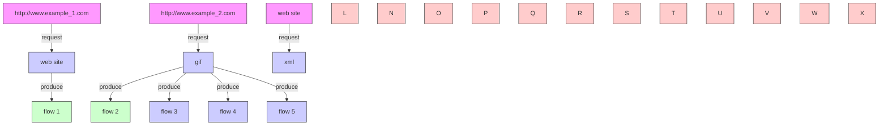
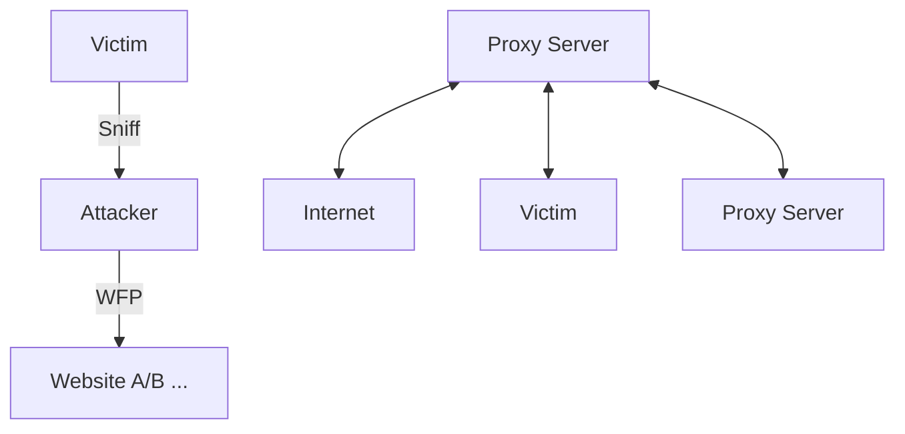

# Website Fingerprinting on Encrypted Proxies: A Flow-Context-Aware Approach and Countermeasures

Xiaobo Ma , Member, IEEE, Jian Qu , Mawei Shi, Bingyu An, Jianfeng Li , Xiapu Luo , Senior Member, IEEE, Junjie Zhang, Zhenhua Li , Member, IEEE, Senior Member, ACM, and Xiaohong Guan , Life Fellow, IEEE

Abstract— Website fingerprinting (WFP) could infer which websites a user is accessing via an encrypted proxy by passively inspecting the traffic characteristics of accessing different websites between the user and the proxy. Designing WFP attacks is crucial for understanding potential vulnerabilities of encrypted proxies, which guides the design of defensive measures against WFP. In this paper, we design a novel WFP attack against (popular) encrypted proxies that relay connections between the user and the proxy individually (e.g., Shadowsocks, V2Ray), and accordingly implement lightweight countermeasures to effectively defend against the attack. The attack features flow-contextaware and is both accurate and immediately deployable, because it fully considers the obstacle (dubbed training-testing asymmetry) that fundamentally limits the practicability of WFP and addresses the obstacle with built-in spatial-temporal flow correlation mechanism. We implement the countermeasure as middleboxes installed on both the client and server sides of encrypted proxies, without altering any existing infrastructures for compatibility. The middleboxes can obfuscate a website’s flow regularities across different visits. Large-scale experiments in real-world scenarios demonstrate that the WFP attack can generally achieve a detection rate above 98.8% with a false positive rate below 0.2%. The countermeasure forces the attack’s false positive rate to be above 0.2 and true positive rate to be below 0.9 with just five persistent TCP connections while introducing very limited bandwidth overhead (e.g., 0.49%) and almost-zero additional network latency.

Manuscript received 1 January 2023; revised 8 July 2023 and 26 September 2023; accepted 27 October 2023; approved by IEEE/ACM TRANSACTIONS ON NETWORKING Editor J. S. Sun. Date of publication 5 December 2023; date of current version 18 June 2024. This work was supported in part by the National Natural Science Foundation of China under Grant 61972313, Grant 62272381, Grant 62202405, Grant U23A20332, and Grant T2341003; in part by the Natural Science Basic Research Program of Shaanxi Province under Grant 2023-JC-JQ-50; in part by the Fundamental Research Funds for the Central Universities; in part by the Post-Doctoral Science Foundation under Grant 2019M663725, Grant 2021T140543, and Grant 2023M732791; and in part by the Hong Kong Research Grants Council (RGC) Project of China under Grant PolyU15223918. (Corresponding author: Jianfeng Li.)

Xiaobo Ma, Jian Qu, Mawei Shi, Bingyu An, Jianfeng Li, and Xiaohong Guan are with the MOE Key Laboratory for Intelligent Networks and Network Security and the Faculty of Electronic and Information Engineering, Xi’an Jiaotong University, Xi’an 710049, China (e-mail: xma.cs@xjtu.edu.cn; qj904154277@stu.xjtu.edu.cn; seven\_seeagain@qq.com; 1281582830@qq. com; jfli.xjtu@xjtu.edu.cn; xhguan@xjtu.edu.cn).

Xiapu Luo is with the Department of Computing, The Hong Kong Polytechnic University, Hong Kong (e-mail: csxluo@comp.polyu.edu.hk).

Junjie Zhang is with the Department of Computer Science and Engineering, Wright State University, Dayton, OH 45435 USA (e-mail: junjie.zhang@wright.edu).

Zhenhua Li is with the School of Software and BNRist, Tsinghua University, Beijing 100084, China (e-mail: lizhenhua1983@gmail.com).

Digital Object Identifier 10.1109/TNET.2023.3337270

Index Terms— Website fingerprinting, traffic analysis, encrypted proxy.

## I. INTRODUCTION

WEBSITE fingerprinting (WFP) has been extensivelystudied to infer which website or webpage a user studied to infer which website or webpage a user is accessing via an anonymity tool (e.g., Tor) by passively inspecting statistical traffic characteristics (e.g., packet timing, and directions [57]) between the user and the anonymity tool [12], [37], [38], [52]. The key to WFP is designing a classifier capable of distinguishing traffic characteristics of accessing different websites. A typical training paradigm is to repeatedly access a website (a specific URL) in a controlled (clean) network and collect a number of (pure) traffic samples, where each access results in one traffic sample. Collecting traffic samples for a set of websites of interests, along with other websites with sufficient diversity, enables the attacker to train a classifier capable of detecting whether a user is accessing a website among those of interests.

When deployed in real-life networks, a well-trained classifier may face a significant obstacle that prevents it from working as expected. Specifically, although pure traffic samples can be collected in a controlled (clean) testbed for training, the classifier may fail to extract such pure traffic samples as its input from raw complicated traffic for testing [13], [22], [23], [56], [58]. We name this obstacle training-testing asymmetry. This obstacle fundamentally limits the practicability of WFP because the classifier, although welltrained, can hardly be fed with pure samples just as those for training.

Tackling the obstacle of training-testing asymmetry is a fundamental and widespread issue concerning the practicability of WFP. Nevertheless, this issue has not been adequately addressed [59]. Wang and Goldberg proposed a splitting-based approach to divide realistic packet sequences into laboratory packet sequences, each of which corresponds to one access to a website [54]. Their approach can address the obstacle in WFP against Tor by design, but is not suited for addressing the obstacle in WFP against encrypted proxies such as Shadowsocks and V2Ray. The reason is that these encrypted proxies have completely different relaying mechanisms with Tor. Specifically, encrypted proxies relay connections between the user and the proxy individually, while Tor multiplexes all the connections into the same encrypted tunnel between the user and the proxy (i.e., Tor guard node). Consequently, new

flowchart

Fig. 1. An example illustrating accessing two different websites may induce statistically similar or identical flows.

WFP approaches to addressing the obstacle of training-testing asymmetry are desired for encrypted proxies.

In this paper, we focus on application-level tunneling proxies (e.g., Shadowsocks, V2Ray) instead of the circuit-level transparent proxy (e.g., Tor). Note that encrypted proxies like Shadowsocks and V2Ray are pretty popular due to their lightweight positioning with high transmission rate (no extra bytes needed in all packets for communication tunnels). At the time of writing, Shadowsocks and V2Ray have at least a combined total of 6 million downloads just at Google Play [1], [6]. Due to their wide popularity, solving the obstacle is essential to the practicability of WFP. Although people may expect that encrypted proxies would not be as resistant to WFP as Tor, our experiments show that, unless addressing the obstacle, WFP against these encrypted proxies results in surprisingly poor performance (see PAR, or Per-access-based realistic WFP, in Table I).

The obstacle renders a dilemma for encrypted proxies under investigation. On the one hand, per-access traffic analysis is desirable, but it is challenging to determine which collected flows result from the user’s one access to a website, especially when the overlapping page load sequences occur [27], or the IP address resides behind NAT and is on behalf of many individual users. On the other hand, per-flow traffic analysis is immediately deployable. However, individual flows normally lack uniqueness representing different websites, since accessing different websites (involving the same or similar resources) may generate some identical or similar flows. Fig. 1 shows an example, where flow 3 of website 1 is identical to flow 4 of website 2 due to accessing the same gif resource, and flow 1 of website 1 is similar to flow 5 of website 2 because of statistical traffic similarity between HTML and XML resources.

To systematically address these challenges, we propose a flow-context-aware WFP system against encrypted proxies. Our system leverages per-flow traffic analysis and then takes into account the spatial-temporal correlation of multiple neighboring flows to determine whether a website is accessed. Per-flow traffic analysis makes our system immediately deployable in real-life networks, while the flow-context-aware property allows us to achieve accurate WFP since it fully considers both flow statistical similarity between websites and flow sequential patterns of accessing a website. To implement our system, we employ a two-stage solution. Stage 1 performs spatial flow correlation. Specifically, a fingerprint is generated for each flow, encoding not only flow statistical features but also the similarity between flows across all websites from different angles (i.e., feature subspaces). Such fingerprints quantify the extent to which the presence of a flow is indicative of the access to a website (i.e., spatial flow correlation). Stage 2 further conducts temporal flow correlation by considering common flow subsequences that frequently appear when accessing a certain website multiple times, hence revealing flow sequential patterns of accessing a website.

In addition to designing a new attack system, we also design countermeasures to defend against the attack. On the one hand, we apply existing common defenses that hide packets timing and size characteristics, such as Decoy Pages [38], Traffic Morphing [55], BUFLO [19], and Tamaraw [11], to encrypted proxies so as to evaluate the performance of our attack. On the other hand, since we focus on encrypted proxies that relay connections between the user and the proxy individually, existing defenses are not suitable for our proposed attack. Therefore, we design a new defense method. The proposed defense method aims to randomly split each original flow so as to confuse the flow classification of Stage 1, and in turn thwart the flow correlation in Stage 2.

To our best knowledge, we are the first to systematically investigate the training-testing asymmetry challenge of WFP gainst encrypted proxies, and design the corresponding countermeasures. We make the following contributions:

• We propose a flow-context-aware WFP system against encrypted proxies. The system introduces a flow bilabeling mechanism in favor of incorporating both flow-level and website-level context, and generates a fingerprint for each flow to establish flow-website spatial correlation. Then, it further explores flow-website temporal correlation to eventually build the flow-context-aware classifier for WFP. It is aware of flow similarity between websites and flow sequential patterns, thereby achieving high accuracy and addressing the training-testing asymmetry challenge.  
• Large-scale experiments in real-world scenarios demonstrate that our system can generally achieve a detection rate above 98.8% with a false positive rate below 0.2%. The results are even better than those derived by ideally training/testing pure samples, indicating that our system can effectively handle the practical challenge where a user (or many users behind NAT) accesses different websites within overlapping time windows.  
• To thwart the flow-context-aware attack system, we propose a lightweight defense method based on random flow rerouting. The proposed method introduces flow randomness to fundamentally eliminate the possibility of identifying individual flows that have stable features across multiple visits to a website. The countermeasure forces the attack’s false positive rate to be above 0.2 and true positive rate to be below 0.9 with just five persistent TCP connections while introducing very limited (e.g., 0.49%) bandwidth overhead and almost-zero additional network latency.

Paper Organization. Sec. II presents the problem. Secs. III-A, III-B, and III-C detail the attack system. Sec. IV performs attack evaluation. Sec. V designs the defense, and Sec. VI performs defense evaluation. We finally discuss in Sec. VII, survey the literature in Sec. VIII, and conclude in Sec. IX.

flowchart

Fig. 2. A typical WFP scenario.

## II. PROBLEM DESCRIPTION

WFP assumes the presence of a passive on-path attacker who can deduce whether a user, referred to as a victim, is accessing a particular website or webpage through an encrypted proxy. This can be achieved by compromising either the victim or the router/switch between them, allowing the attacker to eavesdrop on the traffic exchanged between the victim and the proxy server. Figure 2 illustrates a typical scenario where the victim browses the Internet via the proxy server, while the attacker aims to determine the websites visited by the victim. To accomplish this, the attacker needs to train a classifier by inspecting statistical traffic characteristics (e.g., packet timing, sizes, and directions) of the encrypted channel between the user and the proxy. A typical training paradigm is to repeatedly access a website (a specific URL) in a controlled (clean) network and collect a number of (pure) traffic samples, where each access results in one sample. However, when a well-trained classifier is put into practice for analyzing real-life traffic between a user and an encrypted proxy, extracting a pure sample associated with one access to a website would be difficult (i.e., the obstacle of training-testing asymmetry) [54].

One reason for the obstacle is that, in real-life networks, a user (say X) may access more than one website via an encrypted proxy (say Y ) within overlapping time windows. To make things exacerbated, when X is an IP address for Network Address Translation (NAT) behind which many individual users reside, the traffic between X and Y will become far more complicated. Consequently, collecting the traffic between X and Y during a period of time will result in a traffic sample that is actually a mixture of traffic due to accessing multiple websites. In this case, the collected traffic sample may have never been learned by the classifier.

We aim to address the obstacle of training-testing asymmetry so that WFP becomes practical (i.e., immediately deployable and accurate). As mentioned earlier, we are interested in the popular lightweight encrypted proxies that relay connections between a user and a proxy individually. (e.g., Shadowsocks, V2Ray, and Socks-based proxies). A user communicating with such a proxy, upon requesting new resources, randomly generates a port to initiate a new flow with the proxy offering relay services at a fixed port. Apparently, a flow between the user and the proxy is uniquely identified by the IPs and ports of both the user and proxy sides.

Fig. 3 demonstrates the asymmetry problem of WFP for encrypted proxies of our interests. During the training period, the attacker collects traffic samples of Website A and Website B by driving the user (i.e., a computer under his control) to access the websites one by one. Moreover, the attacker must disallow any other network activities when each website is accessed, hence ensuring the purity of the collected traffic sample. Consequently, flows 1, 4, and 6 constitute a traffic sample of Website A, while flows 2, 3, and 5 constitute a sample of Website B. Suppose the attacker uses statistical features, and then trains a classifier that works pretty well in distinguishing between the collected samples.

```mermaid
graph TD
  A["User (Victim)"] --> B["Attacker (Classifier)"]
  B --> C["Website A"]
  B --> D["Website B"]
  B --> E["traffic"]
  E --> F["User (Victim)"]
  G["Encrypted Proxy"] --> H["User (Victim)"]
  I["Training"] --> J["User (Victim)"]
  K["Testing"] --> L["User (Victim)"]
  M["User (Victim)"] --> N["User (Victim)"]
  O["User (Victim)"] --> P["User (Victim)"]
  Q["User (Victim)"] --> R["User (Victim)"]
  S["User (Victim)"] --> T["User (Victim)"]
  U["User (Victim)"] --> V["User (Victim)"]
  W["User (Victim)"] --> X["User (Victim)"]
  Y["User (Victim)"] --> Z["User (Victim)"]
  AA["User (Victim)"] --> AB["User (Victim)"]
  AC["User (Victim)"] --> AD["User (Victim)"]
  AE["User (Victim)"] --> AF["User (Victim)"]
  AG["User (Victim)"] --> AH["User (Victim)"]
  AI["User (Victim)"] --> AJ["User (Victim)"]
  AK["User (Victim)"] --> AL["User (Victim)"]
  AM["User (Victim)"] --> AN["User (Victim)"]
  AO["User (Victim)"] --> AP["User (Victim)"]
  AQ["User (Victim)"] --> AR["User (Victim)"]
  AS["User (Victim)"] --> AT["User (Victim)"]
  AU["User (Victim)"] --> AV["User (Victim)"]
  AW["User (Victim)"] --> AX["User (Victim)"]
  AY["Training"] --> AZ["User (Victim)"]
  BA["Testing"] --> BB["User (Victim)"]
  BC["User (Victim)"] --> BD["User (Victim)"]
  BE["User (Victim)"] --> BF["User (Victim)"]
  BG["User (Victim)"] --> BH["User (Victim)"]
  BI["User (Victim)"] --> BJ["User (Victim)"]
  BK["User (Victim)"] --> BL["User (Victim)"]
  BM["User (Victim)"] --> BN["User (Victim)"]
  BO["User (Victim)"] --> BP["User (Victim)"]
  BQ["Training"] --> BR["User (Victim)"]
  BS["Testing"] --> BT["User (Victim)"]
```

flowchart

Fig. 3. The obstacle of training-testing asymmetry in WFP.

However, when it comes to testing in real-life networks, the attacker will suffer defeat. The reason is that flows of Website A and Website B may overlap with one another [27], while all the flows share exactly the same two communicating IP addresses and server-side ports. Therefore, the attacker can hardly extract a pure traffic sample only consisting of flows induced by one access to a website, not to mention achieving accurate WFP. To make things exacerbated, flows of different websites may be statistically similar because they may result from requesting identical or similar web resources.

Focusing on the above problem, we endeavor to answer the following research questions.

RQ1. Consider that accessing different websites may generate the same or similar flows. Can we quantify the extent to which an observed flow is indicative of accessing different websites? (Sec. III-B)

RQ2. If the answer to RQ1 is positive, how can we further correlate different flows so as to determine whether a user is accessing a certain website, even when a large number of flows accessing different websites are observed simultaneously (e.g., in the presence of NAT) or within overlapping time windows? (Sec. III-C)

RQ3. If the above research questions are solved, can existing common WFP defenses be directly applied to thwart the proposed attack? (Sec. IV-F) If the answer is negative, can we further propose a new countermeasure? (Sec. V)

## III. FLOW-CONTEXT-AWARE ATTACK SYSTEM DESIGN

## A. System Overview

We design a flow-context-aware WFP system following two design objectives, namely, deployable and accurate. For the first objective, we base our system on per-flow (rather than per-access) traffic analysis. That is, at the raw data processing layer, our system is fed with original individual flows, without the need to be directly fed with (hard-to-extract) a pure traffic sample (consisting of multiple flows) resulting from one access to a website. To achieve the second objective, our system performs spatial-temporal flow correlation. From the spatial perspective, our system considers not only the stability of the flows across multiple accesses to the same website, but also the similarity between the flows of different websites. From the temporal perspective, our system explores common flow subsequences that frequently appear when accessing a website.

```mermaid
graph TD
  A["Website Trace Collection"] --> B["Flow Extraction & Bi-labeling"]
  B --> C["Statistical Flow Feature Vectorization"]
  C --> D["Flow Fingerprint Generation"]
  D --> E["Flow Website-Indication Index (W2I) Calculation"]
  E --> F["W2I Results"]

    subgraph Stage1[Stage 1: Website-oriented flow characterization]
  A1["Website 1"] --> A2["round 1: packets"]
  A2 --> A3["round 2: packets"]
  A3 --> A4["..."]
  A4 --> A5["..."]
  A5 --> A6["Website 2"]
  A6 --> A7["round 1: packets"]
  A7 --> A8["round 2: packets"]
  A8 --> A9["..."]
  A9 --> A10["..."]
  A10 --> A11["..."]
    end

    subgraph FlowFingerprint
  D1["leaf index"] --> D2["6, ... 2"]
  D3["A leaf index uniquely identifies a bi-label"] --> D4
  D5["Flow Fingerprint"] --> D6
    end

    subgraph StatisticalFlowFeature
  C1["Feature Set"] --> C2["Overall Statistics"]
  C2 --> C3["Packet Ordering"]
  C3 --> C4["Packet Timing"]
  C4 --> C5["Packet Size"]
  C5 --> C6["Head and Tail"]
  C6 --> C7["Flow Feature Vector"]
    end

    subgraph FlowFingerprintGeneration
  D1 --> D2
  D2 --> D3
  D3 --> D4
  D4 --> D5
  D5 --> D6
    end

    subgraph FlowFingerprint
  D1 --> D2
  D2 --> D3
  D3 --> D4
  D4 --> D5
  D5 --> D6
    end

    subgraph FlowFingerprintIndication
  E1["K-nearest neighbor borderline"] --> E2["Flows (nodes) from all websites and a 2D plot representing their fingerprint-based distances"]
  E2 --> E3["W2Iij = /"]
    end

    subgraph W2IResults
  F1["Website 1"] --> F2["Flow 1 → W2I11"]
  F2 --> F3["Flow 2 → W2I12"]
  F3 --> F4["Flow 3 → W2I13"]
  F4 --> F5["..."]
  F5 --> F6["Website 2"]
  F6 --> F7["Flow 1 → W2I21"]
  F7 --> F8["Flow 2 → W2I22"]
  F8 --> F9["Flow 3 → W2I23"]
  F9 --> F10["..."]
    end
```

flowchart

Fig. 4. Architecture of Stage 1 of the proposed system.

Our system works in two stages below.

Stage 1: website-oriented flow characterization (Sec. III-B). This stage processes individual flows and characterizes their statistical similarities in light of originating websites. For each website, representative flows and their website-indication indices (a metric quantifying the extent to which the presence of a flow is indicative of the access to a website) are calculated. A representative flow of a website, i.e., a flow that frequently appears across multiple accesses to the website, is expressed as a vector of flow fingerprint that encodes not only flow statistical features but also the similarity between the flows of various websites from different angles (i.e., feature subspaces).

Stage 2: spatial-temporal flow correlation for WFP (Sec. III-C). Incorporating the (spatial) output of stage 1, stage 2 further explores temporal flow correlation by mining common flow subsequences that frequently appear when accessing a website, and determines whether a user is accessing a website.

## B. Website-oriented Flow Characterization

Since accessing different websites may generate identical or similar flows, and repeatedly accessing a certain website may induce varying sets of flows, an immediate task is to characterize individual flows’ statistical similarities in light of originating websites. Therefore, we perform website-oriented flow characterization to figure out representative flows for each website, and quantify the extent to which the presence of a representative flow is indicative of the access to a website. As demonstrated in Fig. 4, we design stage 1 of our system to realize website-oriented flow characterization.

1) Flow Extraction & Bi-Labeling: “Website Trace Collection” automatically drives a user to repeatedly access a website for a number of rounds in a clean network and capture the original traffic in each round. Then, we perform flow extraction and bi-labeling. Specifically, for each access to a website, we extract all the flows and assign each extracted flow with two labels. One is the website where the flow originates, as can be straightforwardly obtained. The other is a flow identity derived by aligning flows across multiple accesses to the website. Such aligning can be performed through clustering flows across multiple accesses to the website. Intuitively, flows resulting from different accesses, if clustered into the same category, have the same flow identity. We define (i, j) as a bi-label of a flow, meaning that this flow originates from website i with a flow identity of j.

To perform flow alignment, we employ Density-Based Spatial Clustering of Applications with Noise algorithm (DBSCAN). We use DBSCAN because it does not require one to specify the number of clusters a priori. One needs to define the cluster radius e, and the minimum number of samples M inP ts in the cluster radius. The final output is the resulting cluster that meets the density requirements. Before feeding all flows of a certain website into DBSCAN, we represent each flow using a vector consisting of three overall features, namely, the number of packets, the size of all the sent packets, and the size of all the received packets. The overall features are well suited for flow alignment because of their sufficient tolerance against feature variation of a certain flow across multiple accesses. Among all resulting clusters, we reserve those whose flows appear in more than 90% of the total rounds of accesses to the website, and remove others. For the reserved clusters, we order them randomly and sequentially assign each of them an integer starting from 1. The assigned integer is then inherited by all flows inside the cluster as their common flow identity.

An alternative solution for flow alignment is to reference other informative flow features in log files of encrypted proxies, such as the queried domain name or a visited URL corresponding to a flow. This solution, though plausible, is not as general as the above clustering method.

2) Statistical Flow Feature Vectorization: After extracting and bi-labeling flows, we next use a number of statistical features that have proven effective in the literature to fully characterize each flow, in support of subsequent flow fingerprint generation. For each flow, we analyze its sequence of packets in both directions and construct a feature vector below.

Overall statistics. The total number of packets in both directions, the number of packets in each direction, and the ratio of the packets in each direction to the packets in both directions.

Packet ordering. Packet ordering focuses on the interaction order of requests and responses, as well as packet densities over time. For every packet in each direction, we count the number of packets in both directions before its arrival. Then, we calculate the mean and the standard deviation for the numbers as features reflecting the interaction order of requests and responses. Additionally, we count the number of packets in all consecutive one-second time windows, and derive the mean and the standard deviation as features reflecting the temporal densities of packet numbers. Moreover, we follow the method in [37] for sampling the cumulative distribution of packet sizes, and extract 100 interpolation points for each flow as features reflecting the temporal densities of packet sizes.

Packet timing. Packet timing is a feature that reflects the timing characteristics of packet arrivals in a flow [51]. There are 300 features coming from the total number of packets before each of the first 300 outgoing packets in the flow. The remaining 300 features are the number of incoming packets between every two adjacent packets of the first 301 outgoing packets.

Packet size. $\mathbf { A } \mathbf { s }$ in [51], we split the packet size into ranges from $2 ^ { s - 1 }$ to $2 ^ { s }$ bytes $( s \in [ 6 , 1 1 ]$ is an integer), and count the number of packets in each size range as features of packet size distribution. Moreover, for the entire flow and the subsequence of all outgoing/incoming packets, the statistics, including mean, median, standard deviation, third quartile, and the sum of these numbers, are respectively calculated.

Head and tail packets. The head and tail packets in a flow are normally informative. We select the first/last 30 packets in a flow as head/tail packets [59]. Then, the number of outgoing/incoming packets in head/tail packets is computed.

3) Flow Fingerprint Generation: Using the flow features above, we produce a fingerprint for each flow to reflect the similarity between flows of various websites from different angles (i.e., feature subspaces). We leverage Random Forest (RF) to generate a fingerprint for each flow [9], [24], [32]. To avoid over-fitting, each decision tree is constructed based on the bagging of both flows and features, indicating that the intermediate decision regarding flow classification made by each decision tree naturally comes from different angles of observations $( \mathrm { i . e . , }$ training flow samples and feature subspaces). Accordingly, for each flow, we use the intermediate decisions made by all decision trees (rather than the final decision made by RF through voting) to construct an $N -$ dimensional vector as its flow fingerprint, where N is the number of decision trees.

The fingerprint of a flow with a bi-label, say $( i , j )$ , can be expressed as $( T _ { 1 } ( i , j ) ) , T _ { 2 } ( i , j ) ) , \ldots , T _ { N } ( i , j ) )$ , where $\mathcal { T } _ { k } ( k =$ $1 , 2 , \ldots , N )$ is a function that outputs the intermediate decision of the kth decision tree. As demonstrated in Fig. $^ { 4 , }$ an intermediate decision made by a decision tree is a leaf index that uniquely identifies a flow bi-label. The major advantage of the proposed flow fingerprint is that it incorporates comprehensive, primitive, and heterogeneous flow features into an advanced and homogeneous vector that makes full use of $\mathrm { R F s }$ sophistication in feature processing. Since flow fingerprints are homogeneous vectors, calculating similarities between flows would be quite easy compared to doing it through normalizing primitive and heterogeneous flow features.

4) Flow Website-Indication Index (W2I) Calculation: To quantify the extent to which the presence of a flow is indicative of the access to a website, we define a metric named Flow Website-Indication Index (W2I). Specifically, for a flow with a bi-label, say $( i , j )$ , we denote the metric by $W 2 I _ { i j }$ .

$W 2 I _ { i j }$ quantifies to what extent flow $( i , j )$ among all distinct flows of website i is indicative of the presence of website i. It is calculated as follows. Let us term a flow with a bi-label $( i , j )$ generated in one access to website i as a flow instance of $( i , j )$ . For each flow instance of $( i , j )$ , we find its $K \cdot$ -nearest flow instances (based on flow fingerprint) among all flow instances of all websites, and calculate the proportion of the flow instances with a bi-label $( i , j )$ . Then, we derive the average proportion across all flow instances of $( i , j )$ as $W 2 I _ { i j }$ . Formally, $W 2 I _ { i j }$ is calculated by

$$
W 2 I _ {i j} = \frac {1}{| \mathcal {I} (i , j) |} \sum_ {f \in \mathcal {I} (i, j)} \frac {K N N _ {f} ^ {(i , j)} \left(\bigcup_ {p = 1} ^ {\mathcal {M} + 1} \bigcup_ {q = 1} ^ {\# f l o w (p)} \mathcal {I} (p , q)\right)}{K}. \tag {1}
$$

In $( 1 ) , \mathcal { T } ( i , j )$ and $\mathcal { T } ( p , q )$ are functions representing the set of flow instances with bi-labels $( i , j )$ and $( p , q )$ , respectively. $\mathcal { M }$ denotes the set of monitored websites, and $\mathcal { M } + 1$ means we take all websites in $\mathcal { M }$ (as M classes), along with those unmonitored websites (as one class), into account. # ${ \it f l o w } ( p )$ counts the number of unique flow bi-labels of website $p ,$ and $K N N _ { f } ^ { ( i , j ) } ( X )$ counts the number of $f ^ { \ast } \mathrm { \mathbf { s } }$ K-nearest flow instances among the set of flow instances $X$ . Intuitively, if the $K \cdot$ -nearest flow instances of $( i , j )$ include more flow instances with the same bi-label, the more likely flow $( i , j )$ is indicative of the presence of website $i .$ Here, $K$ is actually the maximum observation scope surrounding a flow instance for counting flow instances with the same bi-label. Since the maximum number of flow instances with the same bi-label equals the number of flow instances of a website, and we use training flow instances to calculate $W 2 I _ { i j }$ , we set $K$ to be the number of training flow instances of a website.

## C. Spatial-Temporal Flow Correlation for WFP

We further take into consideration common flow subsequences that frequently appear when accessing a website. These common flow subsequences reveal temporal flow correlation, since they can reflect flow sequential patterns of accessing a website. We will combine spatial and temporal flow correlation to determine whether a user is accessing a website via an encrypted proxy at a particular time. The architecture of stage 2 of our system is depicted in Fig. 5.

1) Spatial-Temporal Website Fingerprint Generation: The metric W2I enables spatial website fingerprint, i.e., the extent to which the presence of a flow is indicative of accessing a website. To explore temporal website fingerprint, we propose a Longest Common Subsequence, or LCS-based method for finding sequential flow patterns of accessing a website. Specifically, we aim to generate the longest common subsequence for most flow sequences. Considering that the complexity of calculating the longest common subsequence of all flow sequences is huge [26], we propose an approximate method to reduce the calculation as follows.

Stage 2: Spatial-temporal flow correlation for website fingerprinting  

```mermaid
graph TD
  A["Extracted Flows and Bi-labels"] --> B["Spatial-temporal Website Fingerprint Generation"]
  B --> C["Website Feature Vector Generation"]
  C --> D["Website Classification"]
    
    subgraph Extracted Flows and Bi-labels
        A1["round 1: □ ● → flows"]
        A2["round 2: ▲ ● → flows"]
  A3["..."] --> A4["..."]
    end
    
    subgraph Real_world_Traffic_Trace["Real-world Traffic Trace"]
        B1["round 1: □ ● → flows"]
        B2["round 2: ▲ ● → flows"]
  B3["..."] --> B4["..."]
    end
    
    subgraph Flow Classification
        C1["Flow of Website x mixed with background flows (■)"]
        C2["Flow of Website x mixed with background flows (■)"]
        C3["Flow of Website x mixed with background flows (■)"]
        C4["Flow of Website x mixed with background flows (■)"]
        C5["Flow of Website x mixed with background flows (■)"]
        C6["Flow of Website x mixed with background flows (■)"]
        C7["Flow of Website x mixed with background flows (■)"]
        C8["Flow of Website x mixed with background flows (■)"]
        C9["Flow of Website x mixed with background flows (■)"]
        C10["Flow of Website x mixed with background flows (■)"]
        C11["Flow of Website x mixed with background flows (■)"]
        C12["Flow of Website x mixed with background flows (■)"]
        C13["Flow of Website x mixed with background flows (■)"]
        C14["Flow of Website x mixed with background flows (■)"]
        C15["Flow of Website x mixed with background flows (■)"]
        C16["Flow of Website x mixed with background flows (■)"]
        C17["Flow of Website x mixed with background flows (■)"]
        C18["Flow of Website x mixed with background flows (■)"]
        C19["Flow of Website x mixed with background flows (■)"]
        C20["Flow of Website x mixed with background flows (■)"]
        C21["Flow of Website x mixed with background flows (■)"]
        C22["Flow of Website x mixed with background flows (■)"]
        C23["Flow of Website x mixed with background flows (■)"]
        C24["Flow of Website x mixed with background flows (■)"]
        C25["Flow of Website x mixed with background flows (■)"]
        C26["Flow of Website x mixed with background flows (■)"]
        C27["Flow of Website x mixed with background flows (■)"]
        C28["Flow of Website x mixed with background flows (■)"]
        C29["Flow of Website x mixed with background flows (■)"]
        C30["Flow of Website x mixed with background flows (■)"]
        C31["Flow of Website x mixed with background flows (■)"]
        C32["Flow of Website x mixed with background flows (■)"]
        C33["Flow of Website x mixed with background flows (■)"]
        C34["Flow of Website x mixed with background flows (■)"]
        C35["Flow of Website x mixed with background flows (■)"]
        C36["Flow of Website x mixed with background flows (■)"]
        C37["Flow of Website x mixed with background flows (■)"]
        C38["Flow of Website x mixed with background flows (■)"]
        C39["Flow of Website x mixed with background flows (■)"]
        C40["Flow of Website x mixed with background flows (■)"]
        C41["Flow of Website x mixed with background flows (■)"]
        C42["Flow of Website x mixed with background flows (■)"]
        C43["Flow of Website x mixed with background flows (■)"]
        C44["Flow of Website x mixed with background flows (■)"]
        C45["Flow of Website x mixed with background flows (■)"]
        C46["Flow of Website x mixed with background flows (■)"]
        C47["Flow of Website x mixed with background flows (■)"]
        C48["Flow of Website x mixed with background flows (■)"]
        C49["Flow of Website x mixed with background flows (■)"]
        C50["Flow of Website x mixed with background flows (■)"]
        C51["Flow of Website x mixed with background flows (■)"]
        C52["Flow of Website x mixed with background flows (■)"]
        C53["Flow of Website x mixed with background flows (■)"]
        C54["Flow of Website x mixed with background flows (■)"]
        C55["Flow of Website x mixed with background flows (■)"]
        C56["Flow of Website x mixed with background flows (■)"]
        C57["Flow of Website x mixed with background flows (■)"]
        C58["Flow of Website x mixed with background flows (■)"]
        C59["Flow of Website x mixed with background flows (■)"]
        C60["Flow of Website x mixed with background flows (■)"]
        C61["Flow of Website x mixed with background flows (■)"]
        C62["Flow of Website x mixed with background flows (■)"]
        C63["Flow of Website x mixed with background flows (■)"]
        C64["Flow of Website x mixed with background flows (■)"]
        C65["Flow of Website x mixed with background flows (■)"]
        C66["Flow of Website x mixed with background flows (■)"]
        C67["Flow of Website x mixed with background flows (■)"]
        C68["Flow of Website x mixed with background flows (■)"]
        C69["Flow of Website x mixed with background flows (■)"]
        C70["Flow of Website x mixed with background flows (■)"]
        C71["Flow of Website x mixed with background flows (■)"]
        C72["Flow of Website x mixed with background flows (■)"]
        C73["Flow of Website x mixed with background flows (■)"]
        C74["Flow of Website x mixed with background flows (■)"]
        C75["Flow of Website x mixed with background flows (■)"]
        C76["Flow of Website x mixed with background flows (■)"]
        C77["Flow of Website x mixed with background flows (■)"]
        C78["Flow of Website x mixed with background flows (■)"]
        C79["Flow of Website x mixed with background flows (■)"]
        C80["Flow of Website x mixed with background flows (■)"]
        C81["Flow of Website x mixed with background flows (■)"]
        C82["Flow of Website x mixed with background flows (■)"]
        C83["Flow of Website x mixed with background flows (■)"]
        C84["Flow of Website x mixed with background flows (■)"]
        C85["Flow of Website x mixed with background flows (■)"]
        C86["Flow of Website x mixed with background flows (■)"]
        C87["Flow of Website x mixed with background flows (■)"]
        C88["Flow of Website x mixed with background flows (■)"]
        C89["Flow of Website x mixed with background flows (■)"]
        C90["Flow of Website x mixed with background flows (■)"]
        C91["Flow of Website x mixed with background flows (■)"]
        C92["Flow of Website x mixed with background flows (■)"]
        C93["Flow of Website x mixed with background flows (■)"]
        C94["Flow of Website x mixed with background flows (■)"]
        C95["Flow of Website x mixed with background flows (■)"]
        C96["Flow of Website x mixed with background flows (■)"]
        C97["Flow of Website x mixed with background flows (■)"]
        C98["Flow of Website x mixed with background flows (■)"]
        C99["Flow of Website x mixed with background flows (■)"]
    end
```

flowchart

Fig. 5. Architecture of Stage 2 of the proposed system.

## • LCS-based Sequential Fingerprint Calculation

One access to a website results in a sequence of multiple flows. We denote by $S ^ { a } = [ l _ { 1 } ^ { a } , l _ { 2 } ^ { a } , . . . , \bar { l } _ { n _ { a } } ^ { a } ]$ lna the ath flow sequence that contains $n _ { a }$ flows, and $S ^ { b } = [ l _ { 1 } ^ { b } , l _ { 2 } ^ { b } , \ldots , l _ { n _ { b } } ^ { b } ]$ the bth flow sequence that contains $n _ { b }$ flows, where l denotes a flow. All flow sequences are in chronological order. For every two flow sequences of accessing a website, say $S ^ { a }$ and $S ^ { \dot { b } } ,$ we generate their LCS as one sequential fingerprint of the website. Let $S _ { p } ^ { a }$ (resp. $S _ { q } ^ { b } )$ be the subsequence consisting of the first $p$ (resp. q) flows of $S ^ { a } \ ( \mathrm { r e s p . } \ S ^ { b } )$ . We denote the LCS of $S ^ { a }$ and $S ^ { b }$ as $L ( n _ { a } , n _ { b } )$ , as can be recursively derived by

$$
L (p, q) = \left\{ \begin{array}{l} \emptyset , \quad \text { if   } p = 0 \text {   or   } q = 0, \\ L (p - 1, q - 1) \frown l _ {p} ^ {a}, \\ \quad \text { if   } p, q > 0 \text {   and   } b i - l a b e l (l _ {p} ^ {a}) = b i - l a b e l (l _ {q} ^ {b}), \\ \max (L (p - 1, q), L (p, q - 1)), \\ \quad \text { if   } p, q > 0 \text {   and   } b i - l a b e l (l _ {p} ^ {a}) \neq b i - l a b e l (l _ {q} ^ {b}), \end{array} \right. \tag {2}
$$

$L ( p , q )$ $S _ { p } ^ { a }$ $S _ { q } ^ { b } , L ( p - 1 , q - 1 ) \frown l _ { p } ^ { a }$ means $l _ { p } ^ { a }$ is added to the end of the sequence $L ( p - 1 , q - 1 ) $ and bi-label is a function outputting the bi-label of a flow.

## • Scoring the Importance of Sequential Fingerprint

For a website, we obtain one sequential fingerprint from every two flow sequences. Some of these obtained sequential fingerprints may be the same, implying that sequential fingerprints may differ from each other in terms of the number of occurrences among all flow sequences. Also, flows in a sequential fingerprint differ in values of W2I. Combining these information, we score the importance of a sequential fingerprint, say F , by

$$
\operatorname{Score} (F) = \sqrt {\# \text { occur } (F)} \sum_ {l \in F} \left\{W 2 I _ {i j} | (i, j) = b i - l a b e l (l) \right\}, \tag {3}
$$

where $S c o r e ( F )$ is the importance score of $F ,$ , and #occur(F ) is the occurrence number of $F$ among all flow sequences.

We select sequential fingerprints with the top 10 highest importance scores, as well as those sequential fingerprints that occur only in one flow sequence, to construct the website fingerprints. Suppose the selected sequential fingerprints are denoted by $[ F _ { 1 } , F _ { 2 } , \ldots ]$ . The website fingerprints would be

$$
[ (F _ {1}, \text { Score } (F _ {1})), (F _ {2}, \text { Score } (F _ {2})), \dots ]. \tag {4}
$$

2) Website Feature Vector Generation: Although the website fingerprints in Sec. III-C.1 reflect the spatial-temporal patterns of accessing a website, they are derived in a clean network environment without considering that flows of the website may be misclassified as flows of other websites and vice versa in real-world traffic. As a matter of fact, for a website $x ,$ understanding how the website fingerprints of x behave in real-world traffic traces is the key to figuring out whether x is accessed. To this end, we examine whether or not each of $x ' s$ website fingerprints appears in a number of real-world traffic traces. Each traffic trace is a mixture of accessing multiple websites, either including x or not (which we know as ground truth). For each traffic trace, we derive a website feature vector associated with the ground truth. The dimension of a website feature vector equals that of the website fingerprints in (4).

Generating a website feature vector for x can be performed in two steps. First, by reusing the RF classifier in Sec. III-B.3, we classify all flows in a traffic trace and assign each of them one bi-label, hence getting a flow sequence. Second, following a subsequence matching process, we search its flow sequence for all website fingerprints of x. If a website fingerprint is found, the value of the corresponding element of the website feature vector equals the corresponding importance score. Otherwise, the value would be 0.

3) Website Classification: A number of generated website feature vectors, along with the ground truth concerning whether website x is accessed or not in each traffic trace, constitute the samples for training a classifier. The classifier determines whether x is accessed or not in a given traffic trace. Website feature vectors with the ground truth that x is accessed are positive samples, and otherwise are negative samples. Now determining whether x is accessed or not in each traffic trace becomes a classical binary classification problem. We employ the K-nearest neighbor to build a classifier for each website.

## D. Upgrading The Attack System with Deep Learning

Until now our system has been relying on manually crafting flow features. To make such a human-engineered process automatic, we upgrade the flow classification model from random forest to Convolutional Neural Networks (CNN). As a matter of fact, CNN has been used in WFP against Tor by Sirinam et al. and achieved accuracy over 98% WFP against Tor [45]. The essence of CNN is its convolution layer and pooling layer. The convolution layer comprises a set of filters, and it can achieve a function similar to feature extraction. The pooling layer, which is immediately after the convolution layer, aims to reduce the size of the feature space. In our context, however, upgrading the flow classification model does not only affect the way to classify individual flows, but also necessitates a new approach to defining flow fingerprint.

We utilized the neural network architecture developed by Sirinam et al. for flow classification [45]. The architecture is a one-dimensional convolutional neural network (CNN) consisting of eight convolutional layers and two linear layers. The model was trained using the cross-entropy loss function and the Adamax optimizer. We also adopted the hyperparameters optimized by Sirinam et al., including input dimension, learning rate, batch size, etc., which can be found in [45].

Specifically, the following modifications are needed to upgrade our attack system with deep learning. First, remove the “Feature Extraction” module, but keep the “Flow Extraction and Flow Bi-label” module to extract and bi-label flows. Similar to [45], each flow is extracted in the form of a packet size sequence, which, along with the bi-label, will be the input of CNN. Second, unlike defining flow fingerprint using the leaf index of the final decision of each decision tree in the RF model, we select the predicted probability value of each type of flow bi-label at the output layer as flow fingerprint whose dimension equals the total number of flow bi-labels.

## IV. ATTACK PERFORMANCE EVALUATION

## A. Data Preparation

We evaluate our system on two popular encrypted proxies, namely, Shadowsocks [2] and V2Ray [49]. The former is implemented based on the Socks5 protocol [5], [17], while the latter uses the Socks5 protocol as an inbound protocol and uses the VMess protocol as an outbound protocol [20].

Let M and U denote the set of monitored websites of our interests and the set of unmonitored websites, respectively. Let $\mathcal { F } _ { \mathcal { M } }$ and $\mathcal { F } _ { \mathcal { U } }$ be the corresponding sets of flows resulting from accessing websites in M and U, respectively.

We collect traffic traces for M monitored websites, ranging from search engines to social medias, as the closed-world dataset. We automate the collection process and each monitored website is repeatedly accessed 90 times to generate 90 instances (70 for training and 20 for testing). An instance consists of the original traffic traces that are normally a mixture of multiple flows. To simulate the scenario that a user may access websites other than those in M, we further collect traffic traces for 3,500 unmonitored websites $( \mathrm { i } . \mathrm { e } . , \mathcal { U } =$ 3, 500) chosen from Alexa’s top 10,000 websites [15]. Every unmonitored website is accessed once to generate one instance, resulting in 3,500 instances in total.

To boost training efficiency, we only reserve persistent flows in $\mathcal { F } _ { \mathcal { M } }$ that appear in all the generated 90 instances for each monitored website. Consequently, the number of unique persistent flows across all the instances for each monitored website (denoted by $| \mathcal { F } _ { x } | _ { u n i q u e } )$ is lower bounded $\begin{array} { r } { \operatorname* { m i n } _ { x \in \mathcal { M } } | \mathcal { F } _ { x } | _ { u n i q u e } . } \end{array}$ . Such numbers for all monitored websites add up to $\begin{array} { r } { \mathsf { \backslash } \mathcal { F } _ { \mathcal { M } } | _ { u n i q u e } = \sum _ { x \in \mathcal { M } } | \mathcal { F } _ { x } } \end{array}$ |unique $( \mathrm { i . e . , } | \mathcal { F } _ { \mathcal { M } } | _ { u n i q u e }$ flows with unique bi-labels), indicating that there are $| \mathcal { F } _ { \mathcal { M } } | _ { u n i q u e }$ different classes of (closed-world) flows. We randomly choose 6,000 flows (a.k.a. the number of negative flows in flow classification in Sec. IV-B) from $\mathcal { F } _ { \mathcal { U } }$ as the samples of the $( | \mathcal { F } _ { \mathcal { M } } | _ { u n i q u e } + 1 )$ th class of (open-world) flows.

Having $\mathcal { M } , \mathcal { U } , \mathcal { F } _ { \mathcal { M } } .$ and $\mathcal { F } _ { \mathcal { U } }$ collected, we then prepare the training/testing traffic for each website in M to build the website classifier. To ensure that the training and testing traffic is realistic and aligns with the motivation for training-testing asymmetry, we have prepared the dataset during the website classification stage. For each monitored website, we have randomly added additional background traffic to its samples to simulate real-world conditions of training-testing asymmetry.

Specifically, given a monitored website, say $x \in \mathcal { M }$ , we generate the training traffic in a number of successive time windows to ensure its diversity across all time windows. In each time window, we synthesize background traffic to generate a negative sample, or mix a randomly selected training instance of accessing x with the synthesized background traffic to generate a positive sample. The synthesized background traffic comes from two sources. One is the instances of accessing websites in $\mathcal { M } \backslash \{ x \}$ . The other is the instances of accessing websites in U. We randomly select $\# B W$ websites (a.k.a. the number of background websites in training/testing traffic preparation in Sec. IV-B) in $\{ { \mathcal { M } } \setminus \{ x \} \} \cup { \mathcal { U } }$ , and for each website we put (any) one instance of accessing it in the time window. All these aforementioned selected instances are put within the time window with random start times. When we prepare the training/testing traffic, we set each time window to be 1 minute. We generate 100 time windows for generating both negative and positive samples, and calculate classification (i.e., WFP) performance via four-fold cross-validation.

The values of M, min $\mathsf { 1 } _ { x \in \mathcal { M } } | \mathcal { F } _ { x } | _ { u n i q u e } ,$ , and $| \mathcal { F } _ { \mathcal { M } } | _ { u n i q u e }$ for Shadowsocks equal 23, 2, and 175, respectively, while these values for V2Ray are 20, 1, and 143, respectively.

## B. Evaluation Results

We measure the performance of our system using the following two metrics.

True Positive Rate (TPR). The probability that a monitored website is classified as the correct monitored website.

False Positive Rate (FPR). The probability that an unmonitored website is incorrectly classified as a monitored website.

Here, “website” can be substituted by “flow” for measuring flow classification performance. We compare our methods with the following four benchmark methods.

Per-access-based ideal WFP (PAI). This method is the traditional method commonly used in WFP, and identifies each website based on the entire traffic generated during one access to the website. Here, “ideal” means that during training and testing all individual traffic samples are pure without being mixed with noisy background traffic. In other words, this method directly uses traffic samples of each website collected in the controlled (clean) network for both training and testing.

Per-access-based realistic WFP (PAR). This method inherits the above definition regarding per-access-based WFP. The major difference is that it focuses on a more realistic scenario. Specifically, it trains a classifier using pure traffic samples collected in the controlled (clean) network, but feeds the trained classifier with real-world traffic traces.

Per-flow-based naive WFP (PFN). Different from peraccess-based WFP, this method identifies of each website based on individual flows generated during one access to the website, and naively declares that a website is accessed as long as any flow belonging to the website is identified.

Per-flow-based weighted WFP (PFW). This method improves PFN by weighting individual flows. To determine whether website i is accessed in a time window, we calculate $\begin{array} { r } { \sum _ { \{ * \} } W 2 I _ { i * } / \sum _ { j = 1 } ^ { \# f l o w ( i ) } W 2 I _ { i j } } \end{array}$ P#f low(i)j=1 W 2Iij to see if the proportion of the accumulative W2I value of the detected flows of website i to the accumulative W2I value of all the flows of website i surpasses a threshold $\eta ,$ where {∗} denotes the set of identities of the detected flows of website i.

For different methods, we prepare the experimental data in different ways. In PAI, for each (entire) traffic instance generated during one access to a website, we extract its statistical features using the features designed in Sec. III-B.2 that cover almost all state-of-the-art fingerprinting features. Then, we train a $( \mathcal { M } + 1 )$ -class classifier based on RF, where M classes correspond to the set of monitored websites, and the entire set of unmonitored websites are regarded as the remaining one class. PAR has a data preparing process similar to PAI. The only difference is that we mix every testing traffic instance, either positive or negative, with the traffic instance of a randomly chosen unmonitored website to simulate the scenario of training-testing asymmetry.

Preparing the experimental data for PFN and PFW differs from that for per-accessed-based WFP. For each traffic instance of a monitored website $x \in \mathcal { M }$ , we randomly select five background websites from $\{ { \mathcal { M } } \setminus \{ x \} \} \cup { \mathcal { U } }$ and mix their traffic instances with the traffic instance of x. The mixed traffic constitutes a positive sample. Similarly, the traffic instance of an unmonitored website $x \in \mathcal { U }$ is mixed with the traffic instances of five randomly selected background websites in $\mathcal { U } \setminus \{ x \}$ to get a negative sample. Since PFN declares that a website is accessed as long as any flow belonging to the website is identified, mixing the traffic instances of randomly selected websites that do not belong to the target website enables calculating FPR as well as TPR.

Note that, in preparing the data for PFN and PFW, the reason for mixing traffic instances of five randomly selected background websites is as follows. We consider PFN and PFW as the simplest approaches to performing WFP without flow correlation, or with very simple correlation. To perform a fair comparison, we prepare the experimental data as the same complexity as that in Sec. IV-A for our flow-contextaware WFP method, wherein we set the number of background websites as five (i.e., # $\tan W = 5 )$ . In all experiments, when we mix traffic instances of the target website and background websites to construct a new sample, all the traffic instances are put within a one-minute time window with random start times.

Table I shows the results of our methods against two encrypted proxies (i.e., Shadowsocks and V2Ray) in comparison to the benchmark methods. In our flow-context-aware (realistic) WFP method (i.e., CAR), we set the number of decision trees in RF as 100, the value of K in (1) as 70, and the value of #BW as 5. We see that CAR outperforms all benchmark methods, and accomplishes state-of-the-art performance.

Compared with PAI, our method achieves at least one or two percentage points higher TPR (i.e., above 98.8%), while reducing FPR or keeping FPR around 0.2%. This indicates that even in a realistic setting, our method has better (or at least comparable) performance than the method in an ideal setting, where pure traffic instances are used in both training and testing. In other words, our method makes WFP while achieving the expected state-of-the-art performance.

TABLE I PERFORMANCE OF WFP OF DIFFERENT METHODS. “FC” IS THE PERFORMANCE OFOUR FLOW CLASSIFICATION AND “CAR” IS THE PERFORMANCE OFOUR WFP CLASSIFICATION

<table><tr><td colspan="2">Encrypted Proxies</td><td colspan="2">Shadowsocks</td><td colspan="2">V2Ray</td></tr><tr><td colspan="2">Metrics</td><td>TPR</td><td>FPR</td><td>TPR</td><td>FPR</td></tr><tr><td rowspan="4">Benchmark methods</td><td>PAI</td><td>0.9821</td><td>0.0027</td><td>0.9600</td><td>0.0020</td></tr><tr><td>PAR</td><td>0.0270</td><td>0.0000</td><td>0.1333</td><td>0.0000</td></tr><tr><td>PFN</td><td>1.0000</td><td>1.0000</td><td>0.9950</td><td>0.5350</td></tr><tr><td>PFW</td><td>1.0000</td><td>0.5450</td><td>0.9833</td><td>0.0190</td></tr><tr><td rowspan="2">Our methods</td><td>FC</td><td>0.9621</td><td>0.0189</td><td>0.8465</td><td>0.0211</td></tr><tr><td>CAR</td><td>0.9946</td><td>0.0017</td><td>0.9880</td><td>0.0020</td></tr></table>

Compared with PAI, the performance of PAR substantially decreases. Such results confirm that, when a classifier trained using traffic instances in the controlled (clean) network is fed with real-world traffic, it would fail to perform as expected. However, our method can gain an overwhelming performance over PAR. Specifically, although PAR has no false positives, the values of TPR for Shadowsocks and V2Ray are as low as 2.7% and 13.33%, respectively. This means that a well-trained classifier in a controlled (clean) network, when faced with real-world traffic traces that are actually a mixture of traffic resulting from accessing multiple websites, may seldom misclassify a website as the target website but would experience serious performance degradation in terms of detection rate.

The reason is that a well-trained classifier in a controlled (clean) network has very limited and incomplete knowledge of the real-world per-access traffic characteristics. Worse still, such incompleteness is hard to approach completeness because of the extremely diverse website accessing activities of different users, not to mention the situation where many users behind NAT access websites via the same proxy and thus drastically complicate real-world traffic. Note that, in PAR, we mix every testing traffic instance with the traffic instance of just one randomly chosen unmonitored website so that the performance results in Table I are in favor of PAR.

As to PFN, both values of TPR and FPR for Shadowsocks equal 100%. This means that simply determining whether a website is accessed according to the presence or absence of its flows would result in a large number of false positives, especially when traffic instances of multiple websites are mixed. For V2Ray, the value of FPR drops to 53.5%, which remains pretty high. Apparently, the high FPR for PFN is inevitable, since many individual flows of accessing different websites may be statistically similar to each other. Attributed to our spatial-temporal flow correlation, the performance improvement of our method (i.e., CAR) over PFN is significant. Compared to PFN, PFW achieves lower values of FPR. We vary the threshold $\eta$ for Shadowsocks and V2Ray separately to achieve their respective best performance. However, the FPR remains too high in comparison to our method.

It is interesting to note that, although the performance of our flow classification $( \mathrm { i . e . , ~ } \mathrm { F C }$ in Table I) that produces intermediate results of classifying flows is relatively low, our flow-context-aware WFP compensates the degraded performance of flow classification and achieves high performance in WFP due to spatial-temporal flow correlation.

line chart

| Number of trees | TPR Rate | FPR Rate |
| --------------- | -------- | -------- |
| 0               | 1.0      | 0.0      |
| 10              | 1.0      | 0.4      |
| 20              | 1.0      | 0.2      |
| 30              | 1.0      | 0.1      |
| 40              | 1.0      | 0.05     |
| 50              | 1.0      | 0.02     |
| 60              | 1.0      | 0.01     |

(a) Shadowsocks

line chart

| Number of trees | TPR  | FPR  |
| --------------- | ---- | ---- |
| 0               | 0.85 | 0.00 |
| 100             | 0.85 | 0.00 |
| 200             | 0.85 | 0.00 |
| 300             | 0.85 | 0.00 |
| 400             | 0.85 | 0.00 |
| 500             | 0.85 | 0.00 |
| 600             | 0.85 | 0.00 |

(b)V2Ray  
Fig. 6. Flow classification performance as the number of trees in RF varies.

TABLE II FLOW CLASSIFICATION SENSITIVITY TO # OF NEGATIVE FLOWS (NFS)

<table><tr><td rowspan="2"># of NFs</td><td colspan="2">Shadowsocks</td><td colspan="2">V2Ray</td></tr><tr><td>TPR</td><td>FPR</td><td>TPR</td><td>FPR</td></tr><tr><td>1,000</td><td>0.9746</td><td>0.0894</td><td>0.8692</td><td>0.1173</td></tr><tr><td>2,000</td><td>0.9709</td><td>0.0425</td><td>0.8667</td><td>0.0597</td></tr><tr><td>4,000</td><td>0.9635</td><td>0.0260</td><td>0.8573</td><td>0.0345</td></tr><tr><td>6,000</td><td>0.9621</td><td>0.0189</td><td>0.8472</td><td>0.0282</td></tr><tr><td>8,000</td><td>0.9567</td><td>0.0145</td><td>0.8412</td><td>0.0209</td></tr><tr><td>10,000</td><td>0.9519</td><td>0.0129</td><td>0.8353</td><td>0.0197</td></tr></table>

## C. Sensitivity to Parameter Settings

The parameters, including the number of decision trees in RF, the number of negative flows in flow classification, and the number of background websites in training/testing traffic preparation, are crucial. We detail the sensitivity of our system to these parameter settings.

1) The Number of Decision Trees in RF: RF is composed of multiple decision trees. Too few decision trees reduce the accuracy of flow classification. Conversely, too many decision trees are not beneficial to the accuracy while introducing additional overhead. Fig. 6 shows how TPR and FPR vary over the number of decision trees when we perform flow classification for Shadowsocks and V2Ray, respectively. We see that TPR increases and FPR decreases significantly before the number of decision trees reaches 25. When the number of decision trees becomes 100, TPR and FPR for Shadowsocks converge around 96% and 1.8%, respectively; and TPR and FPR for V2Ray converge around 85% and 2%, respectively.  
2) The Number of Negative Flows in Flow Classification: In flow classification, the positive flows are those generated by accessing the monitored websites, while the negative flows are from accessing those unmonitored websites. When we train the flow classifier, adding an appropriate number of negative flows is critical to the classifier’s performance. Table II shows how TPR and FPR of flow classification change as we vary the number of negative flows for Shadowsocks and V2Ray. As expected, FPR significantly decreases as the number of negative flows grows. Although TPR also decreases, its decreasing rate is much smaller as compared to that of FPR. This indicates that one can achieve very low FPR by sacrificing just a little TPR by increasing the number of negative flows in flow classification.  
3) The Number of Background Websites in Training/Testing Traffic Preparation: The number of background websites in training/testing traffic preparation decides the concurrently accessed websites other than the target website in each one-minute time window. The background websites complicate the detection of the target website. Apparently, the larger

TABLE III WFP SENSITIVITY TO # OF BACKGROUND WEBSITES (BWS)

<table><tr><td rowspan="2"># of BWs</td><td colspan="2">Shadowsocks</td><td colspan="2">V2Ray</td></tr><tr><td>TPR</td><td>FPR</td><td>TPR</td><td>FPR</td></tr><tr><td>5</td><td>0.9946</td><td>0.0017</td><td>0.9880</td><td>0.0020</td></tr><tr><td>10</td><td>0.9928</td><td>0.0017</td><td>0.9860</td><td>0.0020</td></tr><tr><td>15</td><td>0.9928</td><td>0.0033</td><td>0.9815</td><td>0.0035</td></tr><tr><td>20</td><td>0.9873</td><td>0.0084</td><td>0.9800</td><td>0.0075</td></tr></table>

TABLE IV FC PERFORMANCE SENSITIVITY TO DATASET SIZE USING SHADOWSOCKS

<table><tr><td rowspan="2"># of Samples per Class</td><td colspan="2">RF model</td><td colspan="2">CNN model</td></tr><tr><td>TPR</td><td>FPR</td><td>TPR</td><td>FPR</td></tr><tr><td>400</td><td>0.9557</td><td>0.0320</td><td>0.9073</td><td>0.0280</td></tr><tr><td>800</td><td>0.9615</td><td>0.0699</td><td>0.9154</td><td>0.0300</td></tr><tr><td>1,200</td><td>0.9656</td><td>0.0819</td><td>0.9216</td><td>0.0320</td></tr><tr><td>1,600</td><td>0.9667</td><td>0.1139</td><td>0.9271</td><td>0.0300</td></tr><tr><td>2,000</td><td>0.9671</td><td>0.0979</td><td>0.9236</td><td>0.0799</td></tr></table>

the number is, the harder the detection will be. Table III shows, when we keep the number of negative flows in flow classification as 6,000, how TPR and FPR change as we vary the number of background websites for Shadowsocks and V2Ray. For Shadowsocks, while the number of background websites increases from 5 to 20, TPR, though gradually decreasing from 99.46% to 98.73%, remains high. Meanwhile, FPR increases from 0.17% to 0.84% because more flows of the background websites are misclassified as those of the target website. For V2Ray, the trend is similar as the number of background websites increases.

## D. Comparison with Deep Learning

Due to the extensive number of training samples required by CNN, we obtained a considerably larger dataset using Shadowsocks from April 30, 2023, to May 19, 2023. Each webpage was visited 2,000 times. The performance of flow classification with varying dataset sizes is presented in Table IV. The results indicate that with an increase in the dataset size, the CNN model shows a slight improvement in performance. However, there remains a significant disparity between the CNN model and the RF model.

## E. Fingerprinting Proximate Webpages

So far, our experiments are performed based on webpages from diverse websites. In contrast to such webpages, webpages originating from the same website, which we term proximate webpages, would be more resistant to WFP attacks. The reason is that proximate webpages are more likely to share the same web resources (e.g., logo, images) and in turn exhibit statistically similar traffic flow patterns.

To gain insight into the performance of our system in the face of proximate webpages, we target 73 proximate webpages belonging to GitHub (https://www.github.com), a world-famous Git repository hosting website service. Note that our aim is to distinguish between these statistically similar webpages, rather than inferring the website (i.e., Github) from consecutive visits of webpages like [34].

On the one hand, we conduct WFP experiments using the PAI method, which uses the complete traffic generated by the accesses to a webpage for both training and testing. The PAI method can derive the WFP performance in an ideal experimental setting. On the other hand, we use our system CAR to fingerprint the accesses of these proximate webpages through encrypted proxies in consideration of practical issues, i.e., training-testing asymmetry.

TABLE V PERFORMANCE OF WFP AGAINST PROXIMATE WEBPAGES

<table><tr><td colspan="2">Encrypted Proxies</td><td colspan="2">Shadowsocks</td><td colspan="2">V2Ray</td></tr><tr><td colspan="2">Metrics</td><td>TPR</td><td>FPR</td><td>TPR</td><td>FPR</td></tr><tr><td>Benchmark methods</td><td>PAI</td><td>0.6086</td><td>0.0232</td><td>0.6083</td><td>0.0191</td></tr><tr><td rowspan="2">Our methods</td><td>FC</td><td>0.5624</td><td>0.0063</td><td>0.2717</td><td>0.0010</td></tr><tr><td>CAR</td><td>0.7243</td><td>0.0275</td><td>0.6944</td><td>0.0361</td></tr></table>

Table V shows the results. We see that, for the PAI method, TPR can reach 60%, while FPR centers around 2% in the face of Shadowsocks and V2Ray. When it comes to our method, our observation is two-fold. First, FC achieves pretty low values of both FPR and TPR, meaning that background (negative) webpages can hardly be recognized as Github (positive) webpages, while proximate webpages belonging to Github are very likely to be misclassified as each other. Second, despite the poor performance of flow classification, after performing spatial-temporal flow correlation, CAR can achieve comparable (even better) performance compared with PAI. This implies that our flow-context-aware method, even in consideration of training-testing asymmetry issues, can accomplish at least as good performance as the method in an ideal experimental setting in the face of proximate webpages.

## F. Attack against Common Defenses

We evaluate the performance of our proposed WFP system against common obfuscation-based defenses below.

Decoy Pages [38]. This method uses background noises to add randomness to each page’s loading. It loads a random decoy page whenever the target page is loaded to disturb normal traffic and degrade recognition accuracy.

Traffic Morphing [55]. This defense is designed to hide packet size. It allows a client to set a target page T and modify these packet sizes to imitate the target page’s packet size distribution.

BuFLO [19]. This defense is applied to incoming and outgoing traffic, and packets are sent at a fixed interval with a fixed length. The entire traffic must last for a fixed minimum time. This defense may extend the transmission and insert dummy packets in the middle.

Tamaraw [53]. Tamaraw is an improved version of BUFLO. The major improvement is that the outgoing and incoming directions maintain different packet sending rates, generally with smaller outgoing sending rates than incoming sending rates. Additionally, Tamaraw no longer fixes the traffic duration but sets a packet sequence length.

The parameters for common defenses above are set as follows. For Decoy Pages, we select decoy pages from Alexa’s TOP 10,000 websites. For Traffic Morphing, we use Google as the target webpage and morph all per-flow packet size distributions of a webpage to the per-access packet size distribution of the target webpage. For BUFLO, the fixed packet size is set as 1500, and the packet transmission interval is 0.02s.

TABLE VI PERFORMANCE OF OUR WFP SYSTEM AGAINST COMMON DEFENSES

<table><tr><td colspan="2">Encrypted Proxies</td><td colspan="2">Shadowsocks</td><td colspan="2">V2Ray</td></tr><tr><td colspan="2">Metrics</td><td>TPR</td><td>FPR</td><td>TPR</td><td>FPR</td></tr><tr><td rowspan="2">No Defense</td><td>FC</td><td>0.9621</td><td>0.0189</td><td>0.8465</td><td>0.0211</td></tr><tr><td>CAR</td><td>0.9946</td><td>0.0017</td><td>0.9880</td><td>0.0020</td></tr><tr><td rowspan="2">Decoy Pages</td><td>FC</td><td>0.9634</td><td>0.0189</td><td>0.8465</td><td>0.021</td></tr><tr><td>CAR</td><td>0.9956</td><td>0.0021</td><td>0.9880</td><td>0.0020</td></tr><tr><td rowspan="2">Traffic Morphing</td><td>FC</td><td>0.8234</td><td>0.0874</td><td>0.5510</td><td>0.0334</td></tr><tr><td>CAR</td><td>0.9926</td><td>0.0456</td><td>0.9730</td><td>0.0295</td></tr><tr><td rowspan="2">BUFLO</td><td>FC</td><td>0.3837</td><td>0.2140</td><td>0.2048</td><td>0.1610</td></tr><tr><td>CAR</td><td>0.9421</td><td>0.3947</td><td>0.8510</td><td>0.4869</td></tr><tr><td rowspan="2">Tamaraw</td><td>FC</td><td>0.2927</td><td>0.4956</td><td>0.1811</td><td>0.1614</td></tr><tr><td>CAR</td><td>0.8969</td><td>0.5856</td><td>0.8510</td><td>0.5835</td></tr></table>

For Tamaraw, the fixed packet size is set as 1500, the outgoing/incoming packet transmission interval is 0.04s/0.012s.

Table VI shows the attack performance of our system against common defenses. We see that, when the Decoy Pages defense is added to Shadowsocks and V2Ray, our flow-context-aware system CAR achieves almost the same performance as no defense is added. Such results reveal that our system is immune to randomly choosing decoy pages. The reason is that randomly choosing decoy pages has no impact on the characteristics of individual flows of a target webpage.

When the Traffic Morphing defense is added, we see that TPR significantly decreases while FPR slightly increases for FC. However, TPR achieved by CAR approaches large values when no defense is added, while the corresponding FPR remains below 5%. This indicates that Traffic Morphing indeed weakens the distinguishability of flows across webpages, while under such unfavorable conditions CAR still achieves high attack performance.

The BUFLO and Tamaraw defenses thwart both FC and CAR (i.e., low TPR and high FPR). Under these defenses, it is impossible for our system to distinguish between different webpages. Nevertheless, the success of BUFLO and Tamaraw is at the cost of non-negligible bandwidth overhead (around 200%, see Sec. VI).

## G. Attack With User Interactions

User interactions on a website can influence flow analysis. Given that accessing the landing page of a website is the most common user behavior, our experiments assume that users initially visit the landing page of the target website. However, if a user first visits another webpage within the website, it necessitates collecting additional traffic from the webpages associated with each website to train the model.

To comprehensively examine the impact of user interactions on model performance, we developed a crawler that emulates human behavior by randomly clicking through a website. We generated a dataset using this crawler and conducted training and testing procedures. The results are in Table VII.

The most significant observation from our experiments is a noticeable decrease in flow classification accuracy when user interactions are incorporated into the model’s training data. Specifically, the TPR for flow classification decreased from 0.9621 to 0.8537, while the FPR increased from 0.0189 to 0.0220.

Despite the degraded flow classification performance, our CAR model, which utilizes information from multiple flows, continues to excel in identifying webpage access with remarkable accuracy. The TPR and FPR for webpage access classification only experience minimal changes, moving from 0.9946 to 0.9966 for the TPR and from 0.0017 to 0.0033 for the FPR.

flowchart

Fig. 7. The workflow of the proposed RFR defense.

TABLE VII PERFORMANCE WITH/WITHOUT USER INTERACTIONS (UA) USING SHADOWSOCKS

<table><tr><td>Scene</td><td colspan="2">Without UA</td><td colspan="2">With UA</td></tr><tr><td>Metrics</td><td>TPR</td><td>FPR</td><td>TPR</td><td>FPR</td></tr><tr><td>FC</td><td>0.9621</td><td>0.0189</td><td>0.8537</td><td>0.0220</td></tr><tr><td>CAR</td><td>0.9946</td><td>0.0017</td><td>0.9966</td><td>0.0033</td></tr></table>

In summary, our findings underscore the influence of user interactions on model performance. Our CAR model stands out for its ability to maintain high accuracy levels in identifying webpage access, demonstrating its robustness and effectiveness in real-world scenarios.

## V. RANDOM FLOW-REROUTING (RFR) DEFENSE

Existing common defenses are not suitable to defend against our proposed WFP system. They either have little effect (e.g., Decoy Pages, Traffic Morphing) because our system considers flow correlation, or achieve the expected effect at the cost of non-negligible bandwidth overhead (e.g., BUFLO, Tamaraw). We aim to design an effective yet lightweight (i.e., limited bandwidth overhead and time delay overhead) defense method to defend against our WFP system. We implement the proposed method as a software tool that is installed on both the client and server sides of encrypted proxies (e.g., Shadowsocks and V2Ray). The source code of the software tool will be released on Github upon publication.

The proposed method is based on random flow-rerouting (RFR). The basic idea is to randomly allocate the payloads of the original flows to several specially designed flows so as to dissipate the original flows’ regularity. Consider the case that one visits a website via the encrypted proxy without defense, wherein five flows between the client and server of the proxy. When our RFR defense is enabled, the payload of these five flows would be randomly allocated into several new flows. Since the allocation has a built-in random mechanism (as described later), the characteristics of each new flow vary significantly across different visits. Consequently, it is difficult for the attacker to classify the new flows, not to mention correlating these flows.

Fig. 7 demonstrates the workflow of the proposed RFR defense. Suppose the browser should establish three TCP connections with the web server so as to visit a website. When no defense is added, the browser simply issues the connection requests to the proxy client, and then the proxy client forwards the requests to the proxy server. The proxy server eventually establishes TCP connections with the web server, retrieves the website content, and relays the content backward to the proxy client and in turn to the browser.

For ease of presentation, we call the flows between the browser and the proxy client, along with those between the proxy server and the web server, as end flows, while the flows between the proxy client and server as proxy flows. The proxy is just responsible for forwarding the payloads of end flows without altering payload-flow route mapping. In other words, payloads transmitted by the same end flow are also transmitted by the same proxy flow. Consequently, as long as end flows across multiple accesses to a website have some regularity, the traffic characteristics of proxy flows would exhibit regularity to a certain extent and WFP against proxy flows is feasible.

When the RFR defense is enabled, a client-side middlebox, i.e., the RFR client, is initiated between the browser and the proxy client to randomly reroute the payloads of end flows. For the same purpose, a server-side middlebox, i.e., the RFR server, is initiated between the web server and the proxy server. Through randomly payload rerouting, the payloads of end flows originating from one visit to a website are randomly allocated into a bunch of RFR flows, making the features of the RFR flows (and in turn the proxy flows) random across different visits to the website.

Designing the defense middlebox has two essential requirements. First, for easing the deployment, the middlebox should be transparent so that adapting the browser, the proxy client and server is unnecessary. Second, the payload rerouting policy should be carefully designed so as to achieve high randomness while accomplishing low time delay and bandwidth overhead.

To fulfill the first requirement, the client-side middlebox, i.e., the RFR client, translates the Socks5 protocol (originating from the browser) into our RFR protocol, which is relayed to the server-side middlebox (i.e., the RFR server) by the proxy client and server. The server-side middlebox resolves the RFR protocol, visits the website, and returns the website content backward using the RFR protocol. For the sake of flexible payload rerouting, the RFR client and server establish k persistent TCP connections, where k is a tunable parameter. Such k connections result in k RFR flows and k proxy flows.

text_image

...
Browser/Web
DST IPv4 Address (4 Bytes)		Browser/Web
DST Port
(2 Bytes)	Payload
(<=random threshold Bytes)
Message
Length
(2 Bytes)		OPCode
(1Byte)	Browser/Web
SRC IPv4 Address
(4 Bytes)	Browser/Web
SRC Port
(2 Bytes)
...	RFR/Proxy
SRC Port
(2 Bytes)	RFR/Proxy
DST Port
(2 Bytes)	...
...	RFR/Proxy
SRC IPv4 Address (4 Bytes)	RFR/Proxy
DST IPv4 Address (4 Bytes)	... 
IP Layer to
the lowest	TCP Layer	RFR Layer

Fig. 8. The RFR protocol structure.

To satisfy the second requirement, we adopt the two-foldrandomness and no-padding policy. Specifically, to achieve high randomness, the RFR client and server not only randomly assign payloads of end flows to different RFR flows, but also randomly split each payload before allocating RFR flows. Randomly splitting a payload is implemented by iteratively generating random thresholds of payload sizes. A payload is truncated to be equally sized with the current threshold when its size exceeds the threshold, and the remaining part of the payload would be truncated by generating a new random threshold. This process iterates until the remaining part of the payload has a size that is below the threshold. Since the RFR client and server only split payloads and no padding is used, the bandwidth overhead is very limited. Moreover, the RFR client and server are deployed at the same hosts with the proxy client and server, respectively, thus minimizing the additional forwarding time delay.

Fig. 8 details the design of the RFR protocol. The protocol is incorporated into the RFR client and server, and works at the application layer over TCP between the RFR client (server resp.) and the proxy client (server resp.). It is designed to uniquely identify the payloads of end flows so that the RFR client and server could not only randomly split payloads and randomly allocate split payloads into RFR flows, but also assemble the split payloads of RFR flows into end flows.

The RFR protocol structure has eight fields, namely, message length, sequence number, operation code (OP code), source address, source port, destination address, destination port and payload. Message length records the number of bytes in the structure, which is used for calculating the size of the payload (equal to or less than a random threshold) encapsulated in the structure. Sequence number defines payload offset, and the combination of browser/web IP addresses and ports could uniquely identify the end flow where the encapsulated payload originates. OP code indicates the type of the message, including requesting TCP connection, requesting DNS resolution, data transmission, and heartbeat messages.

## VI. DEFENSE PERFORMANCE EVALUATION

To gain insight into the realistic performance of our RFR defense, we assume that a strong attacker has full knowledge of our defense. Additionally, we assume a WFP scenario favorable to the attacker, wherein websites are accessed sequentially without overlaps (contents of different websites cannot appear in the same flow).

TABLE VIII PERFORMANCE OF RFR DEFENSE AGAINST SHADOWSOCKS

<table><tr><td>Defense Mode</td><td># of RFR Flows</td><td>Method</td><td>TPR</td><td>FPR</td></tr><tr><td rowspan="2">No Defense</td><td rowspan="2">-</td><td>FC</td><td>0.9621</td><td>0.0189</td></tr><tr><td>CAR</td><td>0.9946</td><td>0.0017</td></tr><tr><td rowspan="12">Our Defense</td><td rowspan="2">1</td><td>FC</td><td>0.9140</td><td>0.0020</td></tr><tr><td>CAR</td><td>0.9824</td><td>0.0092</td></tr><tr><td rowspan="2">3</td><td>FC</td><td>0.8859</td><td>0.0000</td></tr><tr><td>CAR</td><td>0.9272</td><td>0.1475</td></tr><tr><td rowspan="2">5</td><td>FC</td><td>0.7680</td><td>0.0080</td></tr><tr><td>CAR</td><td>0.8676</td><td>0.2420</td></tr><tr><td rowspan="2">10</td><td>FC</td><td>0.5940</td><td>0.0080</td></tr><tr><td>CAR</td><td>0.6548</td><td>0.1008</td></tr><tr><td rowspan="2">20</td><td>FC</td><td>0.4960</td><td>0.0100</td></tr><tr><td>CAR</td><td>0.5776</td><td>0.2196</td></tr><tr><td rowspan="2">50</td><td>FC</td><td>0.4039</td><td>0.0060</td></tr><tr><td>CAR</td><td>0.4948</td><td>0.2347</td></tr></table>

bar chart

| Category | Bandwidth (%) | Latency (%) |
| :--- | :--- | :--- |
| Decoy | 102 | 35 |
| Morphing | 86 | 2 |
| BUFLO | 212 | 332 |
| Tamaraw | 273 | 321 |
| StrongVPN | 356 | 200 |
| RFR | 3 | 3 |

Fig. 9. Bandwidth and latency overhead of different defenses.

We deploy our RFR defense middlebox for Shadowsocks to perform the experiments. The results are shown in Table VIII. Note that the number of RFR flows is a tunable parameter. We find that, as the number of the RFR flows increases, the attacker’s fingerprinting ability gradually decreases. In particular, when there are 50 RFR flows, FC can only achieve a TPR of 40.39% and an FPR of 0.6% FPR, and the TPR of CAR is just 49.48%, while the FPR is up to 23.47%. The underlying reason is that the growing number of RFR flows leads to increased randomness of payload rerouting.

As a matter of fact, compared with no defense, the RFR defense rapidly takes effect with just three RFR flows, and the performance becomes rather significant when there are five RFR flows. Such a result indicates that our defense could achieve significant performance in a lightweight fashion (i.e., consuming just a few persistent TCP connections) even if the experiment setting is in favor of the attacker.

Figure 9 depicts the bandwidth and latency overhead associated with different defense mechanisms. In addition to the previously discussed defense strategies, we also evaluated the effectiveness of StrongVPN, a commercial VPN service owned by J2 Global. StrongVPN proved to be a robust defense, capable of defeating our classifier. For flow classification, the TPR and FPR are 0.1347 and 0.0000, respectively. As for website fingerprinting, the TPR is 0.9913, while the FPR is 0.9147. However, it is worth noting that StrongVPN incurs the highest bandwidth overhead among all the defense mechanisms tested. In contrast, our defense strategy imposes only a minimal overhead derived from the header of the RFR protocol, amounting to a mere 0.49%. This overhead is significantly smaller than that of other defenses.

The latency overhead represents the delay directly introduced by the defense method. In the case of the morphing defense and our defense, packets are promptly forwarded, resulting in a latency overhead of zero. The specific latency overhead of StrongVPN is unknown as the exact defense strategy employed is not disclosed. The latency overheads of BUFLO and Tamaraw are larger than 300%, indicating a substantial increase in latency compared to other methods.

## VII. DISCUSSION

By performing WFP attacks against status-quo encrypted traffic, our ultimate goal is to gain insights into features vulnerable to the attack and accordingly design a new defense method to obfuscate the features. We confess that an ideal defense that dissipates all distinguishing features can defeat all WFP attacks. However, such an ideal defense would lead to high bandwidth and latency overhead, making user experience unacceptable. Therefore, our defense approach focuses on being lightweight, minimizing bandwidth overhead and latency while effectively deterring state-of-the-art attacks.

Our research assumes an attacker who knows the defender’s defense strategy. This assumption is rooted in our observation that users rarely deviate from the default configurations when using encryption proxies. This suggests that attackers can exploit default configurations to target most users effectively.

A more complex challenge arises when users continuously change the obfuscation schemes. Under such circumstances, launching website fingerprinting attacks becomes extremely challenging. The core problem is that attackers can no longer accurately discern the defender’s whole strategy and cannot train a model that aligns with the users’ changing traffic characteristics. Currently, there is no well-established solution to this problem within the realm of network traffic fingerprint attacks. We leave this for future research.

Due to the flow-context-aware design, our system can achieve deployable while accurate WFP. Although all experiments are performed using Shadowsocks and V2Ray, our design supports lightweight encrypted proxies that relay connections between the user and the proxy individually. Our system is fed with individual flows, rather than a mixture of multiple flows resulting from one access to a website (hard to extract in the wild). Moreover, it can achieve spatial-temporal flow correlation for accurate WFP. These properties enable our system to be competent when a user is accessing multiple websites within overlapping time windows. This scenario is essentially identical to the situation where many users are behind NAT. Hence, our system is also suited for detecting whether a user behind NAT is accessing a website.

Since our system relies on spatial-temporal flow correlation, more persistent flows (i.e., flows that persistently appear across different website accesses) are anticipated when a website is accessed. When the number of persistent flows of a website is too small (i.e., only one), the advantages of our system would not be maximized because flow correlation is needless. Nevertheless, in such a case, our system could at least achieve the same performance as the simple flow classification. Fortunately, roughly 90% of the Alexa top 10,000 websites have at least two persistent flows, indicating that our system would play an important role in most circumstances. We would like to emphasize that our system even achieves better performance than ideally training/testing pure samples. This is attributed to our system’s capability of extracting persistent spatialtemporal flow patterns (and hence filtering out noises) across multiple accesses of a website.

Note that some hyperparameters, such as the time window size, are involved in the feature design. If the network conditions change, it may be beneficial to appropriately adjust the window size. We conducted sensitivity tests on our method by varying the window size from 0.1s to 10s. Despite different time window conditions, the standard deviation of flow classification accuracy remained below 0.2%. This finding indicates that the performance is not significantly affected by the choice of time window length. Therefore, based on empirical evidence, we have chosen a one-second time window, which is also commonly used in traffic analysis tasks [31], [43], [48].

In our problem description, as in all existing studies [24], [40], we consider a passive on-path attacker capable of determining whether a victim is accessing a specific website. Moreover, for the purpose of designing a defense method, we assume a strong attacker who can eavesdrop on the target network traffic involving the knowledge of the victim’s specific network conditions to train the classification model. If the attacker intends to target victims in other networks, the most effective approach would be to collect network traffic from those networks and retrain the model accordingly. However, if the attacker wishes to employ the trained model from one network to attack other networks, several factors, such as network bandwidth, latency, packet loss, and packet reordering, need to be systematically considered. We leave this as future work.

To defeat our WPF system, one may simply use an encrypted tunnel (e.g., VPN) that multiplexes flows. However, such tunnels would lower the transmission rate due to their requirements of additional bytes in all packets. In addition, encrypted tunnels like VPNs may send all your traffic through a server by default (though configurable) [4], as opposed to encrypted proxies like Shadowsocks and V2Ray normally have user-friendly interfaces to define which websites are accessed through the proxy and which are not. For the sake of a high transmission rate and flexibility, people are using encrypted proxies to access certain websites that are normally off-limits due to censorship, geoblocks, etc. VPNs are primarily used to access geo-restricted content while adding a layer of encryption [3].

To retain the lightweight advantage of encrypted proxies and meanwhile seek an effective defense approach, our proposed RFR defense introduces flow randomness (with very limited overhead) to fundamentally eliminate the possibility of identifying individual flows that have stable features across multiple visits to a website. In our experiments, we assume a strong attacker and use a setting in favor of the attacker. In real-world scenarios, such settings disappear and our defense performance would be better. For example, when one visits two websites concurrently, our defense could randomly allocate the contents of different websites in the same RFR flow, making the identification of individual flows of a website almost impossible. In addition, one could also randomize the number of RFR flows for each visit to further enhance the randomness. Different from TrafficSliver which splits traffic using multiple Tor entry nodes [16], our countermeasure provides fine-grained traffic splitting and is suitable for encrypted proxies.

## VIII. RELATED WORK

In the early stage, WFP was used to analyze SSL-encrypted traffic. For example, Wagner and Schneier proposed that the content of network traffic can be analyzed by inspecting SSL-encrypted packets [50]. Cheng and Avnur implemented a prototype of an SSL-traffic analysis attack and employed it to identify the pages visited by users browsing a website [14].

Since the above pioneer work, WFP has been extensively applied against anonymity networks like Tor [18], [35] and JAP [8]. For example, Herrmann et al. showed that Tor, when confronted with WFP, is secure [25]. However, later studies revealed that this may not be true. Panchenko et al. proposed a new identification approach based on Support Vector Machine, which can recognize visited URLs in the Tor dataset [38], and Cai et al. improved the performance using new features based on the optimal string alignment distance (OSAD) [12]. Wang et al. improved the OSAD method and achieved an accuracy of 90% in both closed-world and open-world scenarios [52]. Afterward, they applied WFP in a larger dataset containing 5,000 non-monitored open-world websites and achieved an accuracy of 83% using K-nearest neighbor [51]. Li et al. performed fine-grained open-world Android app fingerprinting against wireless traffic [30], [31].

Several studies focused on WFP against Tor in real-life scenarios. Sirinam et al. considered small-sized sample collection and training problems to make WFP more realistic [46]. Juarez et al. claimed that previous WFP methods make assumptions about user settings (e.g., no overlapping page load sequences), adversary capabilities, and the nature of the Web that do not necessarily hold in practice, thereby overestimating the efficacy of WFP [27]. Kwon et al. found that the users’ involvement with hidden services of Tor can be accurately identified to support better WFP [29]. Hayes and Danezis proposed a new technique named k-fingerprinting that could be applied in large-scale WFP [24]. Shusterman et al. designed a new technique to identify other websites being browsed by injecting malicious JavaScript code to the target user’s computer [44]. Sirinam et al. and Rimmer et al. presented deep learning-based fingerprinting methods against Tor, and achieved promising performance [41], [45]. Xu et al. proposed a multi-tab WFP attack that can accurately classify sequentially requested multi-tab webpages over a short period of time, only using a small chunk of packets [56]. Juarez et al. studied the potential influencing factors on WFP attack, such as a user’s browsing habits and version of browser [27]. Mitseva et al. improved attack accuracy by analyzing multiple page visits of a single website [34]. In addition, several studies designed defenses for Tor [10], [11], [28].

Different from the above studies focusing on Tor, our work centers around a pretty popular type of lightweight encrypted proxies and tackles the training-testing asymmetry challenge in real-life scenarios. Wang and Goldberg proposed a splittingbased approach to address the challenge for Tor [54]. Since Tor multiplexes the flows into the same encrypted tunnel established between the user and the proxy, their approach cannot be suited to our problem. Targeting lightweight encrypted proxies, we design a flow-context-aware WFP system that achieves both immediate deployability and high accuracy.

To defend against WFP, several studies propose measures obfuscating traffic characteristics to fool WFP classifiers [7], [11], [19], [21], [33], [36], [38], [39], [42], [47], [55]. In 2009, Wright et al. proposed a traffic morphing defense. This defense aims to cover up packet sizes by imitating the packet size distribution of the target webpage [55]. Panchenko proposed a decoy page defense that randomly loads an additional webpage to disturb normal traffic patterns in 2011 [38] In 2012, Dyer et al. proposed a new defense that fixed the packet size and transmission rate and set the shortest traffic duration, named “BUFLO” [19]. “BUFLO” has a good defense effect at the cost of higher bandwidth overhead. Cai et al. improved BUFLO and proposed a new defense “Tamaraw”. They stipulate that the packets in the receiving and sending directions maintain different sending rates and no longer have fixed communication duration, thereby reducing bandwidth and delay consumption while guaranteeing defense effect [11]. Our RFR defense implements the first lightweight and effective middlebox for defending encrypted proxies.

## IX. CONCLUSION

Devoted to a practical solution to WFP against a popular type of lightweight encrypted proxies that relay connections between the user and the proxy individually, we designed a flow-context-aware WFP system that addresses the obstacle of training-testing asymmetry. The obstacle is a common fact that pure traffic samples, unlike those collected in a controlled (clean) network for training the classifier, can hardly be extracted from real-world traffic for testing the classifier. We pointed out that one may fall into the pitfall that pure traffic samples are ideally fed to the classifier for testing, accomplishing excellent yet unrealistic performance. Through systematically tacking this obstacle using a two-stage spatial-temporal flow correlation approach, our system enables performing accurate WFP over complicated streaming traffic resulting from simultaneously accessing a set of monitored and non-monitored websites, thereby meeting the requirements of immediate deployability and high accuracy (i.e., high detection rate with very low false positive rate in open-world scenarios).

In response to the proposed flow-context-aware WFP system, we also designed a lightweight defense method by introducing flow randomness to fundamentally eliminate the possibility of identifying individual flows that have stable features across multiple visits to a website. Experiments proved that the defense is effective (even in the face of a strong attacker) while retaining the lightweight advantage of encrypted proxies.

## REFERENCES

[1] Shadowsocks. Accessed: Jan. 2023. [Online]. Available: https://play. google.com/store/apps/details?id=com.github.shadowsocks&hl=en\_US& gl=US

[2] Shadowsocks. Accessed: Jan. 2023. [Online]. Available: https:// shadowsocks.org/en/download/clients.html  
[3] Shadowsocks or VPNs—Which is Best for You and Why. Accessed: Jan. 2023. [Online]. Available: https://www.wizcase.com/blog/pros-cons -of-shadowsocks-and-vpns/  
[4] Shadowsocks vs. VPNs—Everything You Need to Know. Accessed: Jan. 2023. [Online]. Available: https://www.vpnmentor.com/blog/shad owsocks-vs-vpns-everything-need-know/  
[5] Socks. Accessed: Jan. 2023. [Online]. Available: https://en.wikipedia .org/wiki/SOCKS  
[6] v2rayng. Accessed: Aug. 2022. [Online]. Available: https://play.google. com/store/apps/details?id=com.v2ray.ang&hl=en\_US&gl=US  
[7] K. Al-Naami et al., “BiMorphing: A bi-directional bursting defense against website fingerprinting attacks,” IEEE Trans. Dependable Secure Comput., vol. 18, no. 2, pp. 505–517, Mar. 2021.  
[8] O. Berthold, H. Federrath, and S. Köpsell, “Web MIXes: A system for anonymous and unobservable internet access,” in Proc. Int. Workshop Designing Privacy Enhancing Technol., Design Issues Anonymity Unobservability, 2001, pp. 115–129.  
[9] L. Breiman, “Random forests,” Mach. Learn., vol. 45, no. 1, pp. 5–32, 2001.  
[10] X. Cai, R. Nithyanand, and R. Johnson, “CS-BuFLO: A congestion sensitive website fingerprinting defense,” in Proc. 13th Workshop Privacy Electron. Soc., Nov. 2014, pp. 121–130.  
[11] X. Cai, R. Nithyanand, T. Wang, R. Johnson, and I. Goldberg, “A systematic approach to developing and evaluating website fingerprinting defenses,” in Proc. ACM SIGSAC Conf. Comput. Commun. Secur., Nov. 2014, pp. 227–238.  
[12] X. Cai, X. C. Zhang, B. Joshi, and R. Johnson, “Touching from a distance: Website fingerprinting attacks and defenses,” in Proc. ACM Conf. Comput. Commun. Secur., Oct. 2012, pp. 605–616.  
[13] M. Chen, Y. Chen, Y. Wang, P. Xie, S. Fu, and X. Zhu, “End-to-end multi-tab website fingerprinting attack: A detection perspective,” 2022, arXiv:2203.06376.  
[14] H. Cheng and R. Avnur, “Traffic analysis of SSL encrypted web browsing,” Tech. Rep., 1998.  
[15] Alexa The Web Information Company. Vmess. Accessed: Aug. 2020. [Online]. Available: http://alexa.com  
[16] W. De la Cadena et al., “TrafficSliver: Fighting website fingerprinting attacks with traffic splitting,” in Proc. ACM SIGSAC Conf. Comput. Commun. Secur., Oct. 2020, pp. 1971–1985.  
[17] Z. Deng, Z. Liu, Z. Chen, and Y. Guo, “The random forest based detection of Shadowsock’s traffic,” in Proc. 9th Int. Conf. Intell. Human-Mach. Syst. Cybern. (IHMSC), vol. 2, Aug. 2017, pp. 75–78.  
[18] R. Dingledine, N. Mathewson, and P. Syverson, “Tor: The secondgeneration onion router,” in Proc. USENIX Secur. Symp., 2004, pp. 303–320.  
[19] K. P. Dyer, S. E. Coull, T. Ristenpart, and T. Shrimpton, “Peek-a-boo, I still see you: Why efficient traffic analysis countermeasures fail,” in Proc. IEEE Symp. Secur. Privacy, May 2012, pp. 332–346.  
[20] Github. Vmess. Accessed: Aug. 2020. [Online]. Available: https://toutyrater.github.io/basic/vmess.html  
[21] J. Gong and T. Wang, “Zero-delay lightweight defenses against website fingerprinting,” in Proc. USENIX Secur. Symp. Symp., 2020, pp. 717–734.  
[22] X. Gu, M. Yang, and J. Luo, “A novel website fingerprinting attack against multi-tab browsing behavior,” in Proc. IEEE 19th Int. Conf. Comput. Supported Cooperat. Work Design (CSCWD), May 2015, pp. 234–239.  
[23] Z. Guan, G. Xiong, G. Gou, Z. Li, M. Cui, and C. Liu, “BAPM: Block attention profiling model for multi-tab website fingerprinting attacks on Tor,” in Proc. Annu. Comput. Secur. Appl. Conf., Dec. 2021, pp. 248–259.  
[24] J. Hayes and G. Danezis, “k-fingerprinting: A robust scalable website fingerprinting technique,” in Proc. USENIX Secur. Symp., 2016, pp. 1187–1203.  
[25] D. Herrmann, R. Wendolsky, and H. Federrath, “Website fingerprinting: Attacking popular privacy enhancing technologies with the multinomial Naïve-Bayes classifier,” in Proc. ACM Workshop Cloud Comput. Secur., Nov. 2009, pp. 31–42.  
[26] R. W. Irving and C. B. Fraser, “Two algorithms for the longest common subsequence of three (or more) strings,” in Proc. Springer CPM, 1992, pp. 214–229.  
[27] M. Juarez, S. Afroz, G. Acar, C. Diaz, and R. Greenstadt, “A critical evaluation of website fingerprinting attacks,” in Proc. ACM SIGSAC Conf. Comput. Commun. Secur., Nov. 2014, pp. 263–274.  
[28] M. Juarez, M. Imani, M. Perry, C. Diaz, and M. Wright, “Toward an efficient website fingerprinting defense,” in Proc. ESORICS, 2016, pp. 27–46.  
[29] A. Kwon, M. AlSabah, D. Lazar, M. Dacier, and S. Devadas, “Circuit fingerprinting attacks: Passive deanonymization of Tor hidden services,” in Proc. USENIX Secur. Symp., 2015, pp. 287–302.  
[30] J. Li et al., “Packet-level open-world app fingerprinting on wireless traffic,” in Proc. NDSS, 2022, pp. 1–18.  
[31] J. Li et al., “FOAP: Fine-grained open-world Android app fingerprinting,” in Proc. USENIX Secur. Symp., 2022, pp. 1579–1596.  
[32] A. Liaw and M. Wiener, “Classification and regression by randomForest,” R News, vol. 2, no. 3, pp. 18–22, 2002.  
[33] R. Meier, V. Lenders, and L. Vanbever, “ditto: WAN traffic obfuscation at line rate,” in Proc. Netw. Distrib. Syst. Secur. Symp., 2022, pp. 1–17.  
[34] A. Mitseva et al., “POSTER: How dangerous is my click? Boosting website fingerprinting by considering sequences of webpages,” in Proc. ACM SIGSAC Conf. Comput. Commun. Secur., Nov. 2021, pp. 2411–2413.  
[35] M. Nasr, A. Bahramali, and A. Houmansadr, “DeepCorr: Strong flow correlation attacks on Tor using deep learning,” in Proc. ACM SIGSAC Conf. Comput. Commun. Secur., Oct. 2018, pp. 1962–1976.  
[36] M. Nasr, A. Bahramali, and A. Houmansadr, “Defeating DNN-based traffic analysis systems in real-time with blind adversarial perturbations,” in Proc. USENIX Secur. Symp., 2021, pp. 2705–2722.  
[37] A. Panchenko et al., “Website fingerprinting at Internet scale,” in Proc. Netw. Distrib. Syst. Secur. Symp., 2016, pp. 1–15.  
[38] A. Panchenko, L. Niessen, A. Zinnen, and T. Engel, “Website fingerprinting in onion routing based anonymization networks,” in Proc. 10th Annu. ACM Workshop Privacy Electron. Soc., Oct. 2011, pp. 103–114.  
[39] M. S. Rahman, M. Imani, N. Mathews, and M. Wright, “Mockingbird: Defending against deep-learning-based website fingerprinting attacks with adversarial traces,” IEEE Trans. Inf. Forensics Security, vol. 16, pp. 1594–1609, 2021.  
[40] V. Rimmer, D. Preuveneers, M. Juarez, T. Van Goethem, and W. Joosen, “Automated website fingerprinting through deep learning,” 2017, arXiv:1708.06376.  
[41] V. Rimmer, D. Preuveneers, M. Juárez, T. van Goethem, and W. Joosen, “Automated feature extraction for website fingerprinting through deep learning,” in Proc. NDSS, 2018, pp. 1–49.  
[42] S. Shan, A. N. Bhagoji, H. Zheng, and B. Y. Zhao, “Patch-based defenses against web fingerprinting attacks,” in Proc. 14th ACM Workshop Artif. Intell. Secur., Nov. 2021, pp. 97–109.  
[43] Z. Shi, J. Li, C. Wu, and J. Li, “DeepWindow: An efficient method for online network traffic anomaly detection,” in Proc. IEEE 21st Int. Conf. High Perform. Comput. Commun., IEEE 17th Int. Conf. Smart City, IEEE 5th Int. Conf. Data Sci. Syst. (HPCC/SmartCity/DSS), Aug. 2019, pp. 2403–2408.  
[44] A. Shusterman et al., “Robust website fingerprinting through the cache occupancy channel,” in Proc. USENIX Secur. Symp., 2019, pp. 639–656.  
[45] P. Sirinam, M. Imani, M. Juarez, and M. Wright, “Deep fingerprinting: Undermining website fingerprinting defenses with deep learning,” in Proc. ACM SIGSAC Conf. Comput. Commun. Secur., Oct. 2018, pp. 1928–1943.  
[46] P. Sirinam, N. Mathews, M. S. Rahman, and M. Wright, “Triplet fingerprinting: More practical and portable website fingerprinting with N-shot learning,” in Proc. ACM SIGSAC Conf. Comput. Commun. Secur., Nov. 2019, pp. 1131–1148.  
[47] R. Tang, G. Shen, C. Guo, and Y. Cui, “SAD: Website fingerprinting defense based on adversarial examples,” in Proc. Springer SPNCE, 2021, pp. 88–102.  
[48] T. Tsourdinis, I. Chatzistefanidis, N. Makris, and T. Korakis, “AI-driven service-aware real-time slicing for beyond 5G networks,” in Proc. IEEE Conf. Comput. Commun. Workshops (INFOCOM WKSHPS), May 2022, pp. 1–6.  
[49] Project V. V2ray. Accessed: Jan. 2023. [Online]. Available: https://www .v2ray.com/  
[50] D. Wagner and B. Schneier, “Analysis of the SSL 3.0 protocol,” in Proc. USENIX Workshop Electron. Commerce, 1996, pp. 1–13.  
[51] T. Wang, X. Cai, R. Nithyanand, R. Johnson, and I. Goldberg, “Effective attacks and provable defenses for website fingerprinting,” in Proc. USENIX Secur. Symp. Symp., 2014, pp. 143–157.  
[52] T. Wang and I. Goldberg, “Improved website fingerprinting on Tor,” in Proc. 12th ACM Workshop Privacy Electron. Soc., Nov. 2013, pp. 201–212.  
[53] T. Wang and I. Goldberg, “Comparing website fingerprinting attacks and defenses,” CACR, Waterloo, ON, Canada, Tech. Rep. 2013-30, 2014. [Online]. Available: http://cacr.uwaterloo.ca/techreports  
[54] T. Wang and I. Goldberg, “On realistically attacking Tor with website fingerprinting,” in Proc. PETS, 2016, pp. 21–36.  
[55] C. V. Wright, S. E. Coull, and F. Monrose, “Traffic morphing: An efficient defense against statistical traffic analysis,” in Proc. NDSS, vol. 9. Princeton, NJ, USA: CiteSeerX, 2009, pp. 1–14.  
[56] Y. Xu, T. Wang, Q. Li, Q. Gong, Y. Chen, and Y. Jiang, “A multi-tab website fingerprinting attack,” in Proc. 34th Annu. Comput. Secur. Appl. Conf., Dec. 2018, pp. 327–341.  
[57] J. Yan and J. Kaur, “Feature selection for website fingerprinting,” in Proc. PETS, 2018, pp. 200–219.  
[58] Q. Yin et al., “An automated multi-tab website fingerprinting attack,” IEEE Trans. Dependable Secure Comput., vol. 19, no. 6, pp. 3656–3670, Nov. 2022.  
[59] Y. Zhao, X. Ma, J. Li, S. Yu, and W. Li, “Revisiting website fingerprinting attacks in real-world scenarios: A case study of Shadowsocks,” in Proc. NSS, 2018, pp. 319–336.

natural_image

Portrait photo of a man wearing glasses and a light blue shirt against a blue background (no text or symbols visible)

Xiaobo Ma (Member, IEEE) received the Ph.D. degree in control science and engineering from Xi’an Jiaotong University, Xi’an, China, in 2014. He was a Post-Doctoral Research Fellow with The Hong Kong Polytechnic University in 2015. He is currently a Professor with the MOE Key Laboratory for Intelligent Networks and Network Security, Faculty of Electronic and Information Engineering, Xi’an Jiaotong University. He is a Tang Scholar. His research interests include internet measurement and cyber security.

natural_image

Portrait photo of a young man with short dark hair against a blue background (no text or symbols visible)

Jian Qu received the bachelor’s degree in computer science and technology in 2019. He is currently pursuing the Ph.D. degree with the MOE Key Laboratory for Intelligent Networks and Network Security, Faculty of Electronic and Information Engineering, Xi’an Jiaotong University, Xi’an, China. He was in the Special Class for the Gifted Young in Xi’an Jiaotong University. His current research interests include internet traffic analysis and cyber security.

natural_image

Portrait of a young woman wearing glasses and a hoodie (no visible text or symbols)

Mawei Shi received the master’s degree with the MOE Key Laboratory for Intelligent Networks and Network Security, Faculty of Electronic and Information Engineering, Xi’an Jiaotong University, Xi’an, China. Her research interests include traffic analysis and cyber security.

natural_image

Portrait photo of a woman in professional attire (no text or symbols visible)

Bingyu An received the master’s degree with the MOE Key Laboratory for Intelligent Networks and Network Security, Faculty of Electronic and Information Engineering, Xi’an Jiaotong University, Xi’an, China. Her research interests include traffic analysis and cyber security.

natural_image

Portrait photo of a man in a dark blue shirt (no text or symbols visible)

Jianfeng Li received the Ph.D. degree in control science and engineering from Xi’an Jiaotong University, China, in March 2018. He was a Post-Doctoral Fellow with The Hong Kong Polytechnic University from September 2019 to June 2022. He is currently an Assistant Professor with the MOE Key Laboratory for Intelligent Networks and Network Security, Faculty of Electronic and Information Engineering, Xi’an Jiaotong University. He has published a number of research papers in top conferences and journals, such as S&P, CCS, USENIX Security,

NDSS, INFOCOM, IEEE/ACM TRANSACTIONS ON NETWORKING, and IEEE TRANSACTIONS ON INFORMATION FORENSICS AND SECURITY. His research interests include traffic analysis, the privacy of mobile platform, network monitoring, AI security, and large-scale cyber security.

natural_image

Portrait of a man wearing glasses and a dark polo shirt (no text or symbols visible)

Xiapu Luo (Senior Member, IEEE) is currently a Professor with the Department of Computing, The Hong Kong Polytechnic University. His research interests include mobile/the IoT security and privacy, blockchain/smart contracts, networks/web security and privacy, software engineering, and internet measurement with papers published in top security/software engineering/networking conferences and journals. His research led to eight best paper awards, including the ACM SIGSOFT Distinguished Paper Award from ICSE 2021, the Best Paper Award

from INFOCOM 2018, the Best Research Paper Award from ISSRE 2016, and several awards from the industry.

natural_image

Portrait of a man wearing glasses and a green polo shirt (no text or symbols visible)

Junjie Zhang received the B.S. degree in computer science and the M.S. degree in systems engineering from Xi’an Jiaotong University, China, in 2003 and 2006, respectively, and the Ph.D. degree in computer science from the Georgia Institute of Technology in 2012. He is currently a tenured Associate Professor with the Department of Computer Science and Engineering, Wright State University. His research interests include computer and network security.

natural_image

Portrait of a man wearing glasses and a suit (no text or symbols visible)

Zhenhua Li (Member, IEEE) received the B.S. and M.S. degrees in computer science and technology from Nanjing University in 2005 and 2008, respectively, and the Ph.D. degree in computer science and technology from Peking University in 2013. He is currently an Associate Professor with the School of Software, Tsinghua University. His research interests include mobile networking/emulation and cloud computing/storage. He is a Senior Member of the ACM.

natural_image

Portrait of a smiling man wearing glasses and a dark jacket (no text or symbols visible)

Xiaohong Guan (Life Fellow, IEEE) received the Ph.D. degree in electrical engineering from the University of Connecticut, Storrs, in 1993. Since 1995, he has been with the Department of Automation, Tsinghua National Laboratory for Information Science and Technology, and the Center for Intelligent and Networked Systems, Tsinghua University. He is currently with the MOE Key Laboratory for Intelligent Networks and Network Security, Faculty of Electronic and Information Engineering, Xi’an Jiaotong University, Xi’an, China. He is also the

Dean of the Faculty of Electronic and Information Engineering. He is an Academician of the Chinese Academy of Sciences.